# 第 28 章　【primer】DeepSeek-V4 原理：七件套怎么还两本账

一百万个 token 的上下文，DeepSeek-V4-Pro 的单 token 算力只要 DeepSeek-V3.2 的 27%、KV cache 只要它的 10%。这 27% 是谁省出来的？不是一件事省的，是七件东西各还一部分：第一件把每 4 个 token 的缓存抹成 1 条，第二件在抹小了的这堆条目上打分、每个 query 只挑 512 条来看，第三件更狠，每 128 个 token 才留 1 条、而且一条不挑、全部看；第四件反着来，永远把最近 128 个 token 的**原样**缓存留着，是纯花销。第五件把残差从「加回去」改成 4 条流互相混合，还得用双随机矩阵把它管住；第六件 256 个专家挑 6 个，最前 3 层连挑都不挑，按 token id 查表派单；第七件顺手多预测一步，给投机解码当草稿。

问题跟着就来。压缩率 4 和 128 凭什么交替排布？缓存被抹成一条之后，query 怎么还能严格因果、还看得见最近那几个字？为什么压到 1/128 的层反而不需要选择器，压到 1/4 的层却非得有一个？残差扩成 4 条流，凭什么不把训练搞崩？这些问题的答案最后都落在两本账上：一本算每走一步要花多少算力（FLOPs 账），一本算每个 token 要占多少显存（KV cache 账）。本章把七件套逐件拆开，看清谁在还、还了多少、代价是什么。

这是 Part VI 的第三篇原理章（全书第四篇 primer）。上一章[第 27 章](../../ch27-quantization/narrative/chapter.md)把量化的格式账算清了：同一组数字换一把尺子记，字节数差一倍、误差被关在格里。本章算的是另一种账：这台模型的注意力与残差怎么把缓存的「条数」和「条宽」一起压下去。纸面数学在 v0.27.1 源码里的落点，每讲完一件就地钉一行；把这七件套装成一台能跑的机器（哪个类对应哪件、权重怎么流进去、几本 KV 账怎么分页）是紧接着的[第 29 章](../../ch29-deepseek-v4-assembly/narrative/chapter.md)的正题。

## 你在这里


> *图注：本章位置看[第 1 章](../../ch01-vllm-v1-in-one-map/narrative/chapter.md) L0 全图中间绿色「GPU 执行臂」列的模型层框，就是写着「DecoderLayer 拼装 · Attention = 插座（MLA / GQA 变体）」的那一块；本章不打开新的方块，而是把那一格内部的形状账一次算完，右侧品红「采样与出口」列的门口也会路过（主干要把一份残差交给多预测一步的模块，之后才算 logits）。L1 图顶部标题带里的章目录行上，ch28 标着【primer】。本章接在四块已读结构上：[第 23 章](../../ch23-model-layer-assembly/narrative/chapter.md)的层拼装（一个注意力半层加一个 FFN 半层，残差把两者串起来）、[第 24 章](../../ch24-primer-attn-variants/narrative/chapter.md)的注意力变体数学（从 MHA 砍头到 GQA/MQA 的插值、MLA 的低秩压缩，本章的「共享 KV 的 MQA」是它谱系上的下一步）、[第 25 章](../../ch25-mla-two-expansions/narrative/chapter.md)的 MLA 两种展开（低秩潜向量与吸收路径，本章的低秩 query 沿用同一份潜向量）、[第 26 章](../../ch26-deepseek-indexer-nsa-dsa/narrative/chapter.md)的索引器装配（打分算子、独立小头缓存、一核两源，本章讲它们的公式出处，不重讲装配）。原理章没有站号：正文按推导链编排（开账 → 压缩 → 选择 → 共享 KV → 重压缩 → 滑窗 → 位置与 sink → 多流残差 → 路由 → 多预测一步 → 缓存坐标系），每一节是下一节的前置，按序读最顺。*

读法建议：只想把两本账对上，读[「开账」](#开账三个数字三个分母)与最后一节[「对账」](#对账七件套各还了多少)；关心「凭什么压到四分之一而不是八分之一」，直奔[「两扇窗叠着推」](#两扇窗叠着推为什么恰好压到四分之一)；想看多流残差凭什么不塌，从[「四条流残差凭什么不塌」](#第五件四条流残差凭什么不塌)读到[「为什么是 20 轮」](#第五件收尾为什么是-20-轮)；只想看代码长什么样，每节里的源码片段可以单读（压缩那一节收在「落点」小段里），它们只依赖本节的公式。想跟全程，按序读。

### 符号速查表

后文会陆续引入记号，先列表备查（第三列是它主讲的那一节）；每个符号首次出现处，正文还会紧跟一句人话解释，不必现在死记。

| 符号 | 含义 | 主讲节（正文标题开头几个字）|
|---|---|---|
| $`H`$ | 一串输入隐状态（$`n`$ 个 token 乘 $`d`$ 维），vLLM 里就是 `hidden_states` 的一行行 | 第一件（压缩） |
| $`n`$ / $`d`$ / $`c`$ | 序列长度 / 模型隐维度（config 口径 4096）/ 主注意力头维（config 口径 512）；一条压缩条目就是一条 $`c`$ 维向量 | 第一件（压缩） |
| $`m`$ / $`m'`$ | 压缩率：$`m`$ 是 CSA（Compressed Sparse Attention，压缩稀疏注意力）的（config 口径 4），$`m'`$ 是 HCA（Heavily Compressed Attention，重压缩注意力）的（config 口径 128，远大于 $`m`$） | 开账 / 第三件（HCA） |
| $`C^a,C^b`$ / $`Z^a,Z^b`$ | 两组 KV 原料与两组权重原料（各 $`n\times c`$）：第 $`i`$ 条条目的当前窗取自 $`a`$ 组、前一个窗取自 $`b`$ 组 | 第一件（压缩） |
| $`B^a,B^b`$ | 可学习位置偏置（$`m\times c`$）：让「窗内第几个位置」也参与权重；代码里是 `ape` | 第一件（压缩） |
| $`\mathrm{Softmax}_{\mathrm{row}}`$ | 论文的自定义记号：沿叠出来的方向归一，归一范围是 $`Z^a`$ 与 $`Z^b`$ 拼起来的 $`2m`$ 个元素 | 第一件（压缩） |
| $`C^{\mathrm{Comp}}_i`$ / $`S^a_j,S^b_j`$ | 第 $`i`$ 条压缩条目 / 第 $`j`$ 个位置在 a、b 半区的逐元素权重 | 第一件（压缩） |
| $`\odot`$ | 逐元素相乘（Hadamard 积）：$`[[1,2]]\odot[[3,4]]=[[3,8]]`$ | 第一件（压缩） |
| $`K^{\mathrm{IComp}}`$ / $`c^I`$ / $`n_h^I`$ | 索引器自己的压缩键（$`n/m`$ 条乘 $`c^I`$）/ 索引器头维（config 128）/ 索引器头数（config 64） | 第二件（选择） |
| $`n_h`$ | 主注意力 query 头数；压缩条目在头之间共享，头数只加在 query 侧 | 收尾件（共享 KV） |
| $`c^Q_t`$ / $`W^{DQ}`$ | query 的低秩潜向量 / 把 hidden 压到潜空间的降维矩阵；同一份潜向量喂两条路 | 第二件（选择） |
| $`W^{IUQ}`$ / $`W^{UQ}`$ | 索引器 q 的升维矩阵 / 主注意力 q 的升维矩阵（从同一份 $`c^Q`$ 出发） | 第二件（选择） / 收尾件（共享 KV） |
| $`q^I_{t,h}`$ / $`w^I_{t,h}`$ | 第 $`h`$ 个索引头的查询向量 / 这一票的标量权重（$`W^w`$ 从 hidden 直接算出） | 第二件（选择） |
| $`I_{t,s}`$ / $`\mathrm{ReLU}(\cdot)`$ | query $`t`$ 对第 $`s`$ 个压缩块的索引分 / 取正部：负相关归零，不让多头投反对票累积 | 第二件（选择） |
| $`C^{\mathrm{SprsComp}}_t`$ | 第 $`t`$ 个 query 实际会看的稀疏条目集合（top-k 选出来的那一小把） | 第二件（选择） |
| $`k`$ | 每个 query 保留的压缩条目数（config 口径 `index_topk` 512） | 第二件（选择） |
| $`s<\mathrm{Floor}(t/m)`$ | 因果条件：只能选严格在自己所在块之前的完整块 | 第二件（选择） |
| $`\mathrm{CoreAttn}`$ / $`o_{t,i}`$ | 核心注意力 / 第 $`t`$ 个 token 第 $`i`$ 个头的输出 | 收尾件（共享 KV） |
| $`g`$ / $`d_g`$ / $`\hat o_t`$ | query 头的分组数（config 口径 `o_groups` 8）/ 每组低秩投影后的维度（config 口径 `o_lora_rank` 1024）/ 分组输出投影后的子层输出；这个 $`g`$ 与 MoE 那行的 $`g_{i,t}`$ 同名不同义，别混 | 收尾件（共享 KV） |
| $`n_{\mathrm{win}}`$ | 滑窗保留的**未压缩** KV 条数（config 口径 128）；论文不给数值 | 第四件（滑窗） |
| $`z'_h`$ | 第 $`h`$ 个头的可学习 sink logit：$`\exp(z'_h)`$ 只进 softmax 的分母 | sink |
| $`X_l`$ | 第 $`l`$ 个半层的残差状态，形状 $`n_{hc}\times d`$（config 口径 `hc_mult` 4 条流） | 第五件 |
| $`A_l`$ / $`B_l`$ / $`C_l`$ | 读入映射（把 $`n_{hc}`$ 条流聚成子层输入）/ 流间混合矩阵 / 写回映射（把子层输出散回各流） | 第五件 |
| $`A_l=\sigma(\tilde A_l)`$ / $`C_l=2\sigma(\tilde C_l)`$ | 两条映射经 sigmoid 关进 $`(0,1)`$ 与 $`(0,2)`$，给门控一个正值下界 | 第五件 |
| $`F_l(\cdot)`$ | 被夹在中间的子层（注意力或 FFN）：mHC 只关心它怎么被读入和写回 | 第五件 |
| $`\tilde A_l,\tilde B_l,\tilde C_l`$ / $`\alpha`$ / $`S`$ | 三张映射的 raw 参数 / 可学习门控（初始化很小）/ 静态偏置；raw = 动态项乘 $`\alpha`$ 加 $`S`$ | 第五件（续） |
| $`M^{(t)}`$ / $`T_r,T_c`$ | Sinkhorn-Knopp 迭代到第 $`t`$ 步的矩阵（起点 $`M^{(0)}=\exp(\tilde B_l)`$）/ 行、列归一化算子 | 第五件（收尾） |
| $`t_{\max}`$ | 迭代上限（config `hc_sinkhorn_iters` 20）：论文原话是「一个实用值」，不是精确投影 | 第五件（收尾） |
| $`H^{pre}_l,H^{res}_l,H^{post}_l`$ | mHC 原论文对同一组三映射的写法（读入/流间混合/写回），与 V4 报告里的 $`A/B/C`$ 角色一一对应 | 出口 |
| Birkhoff 多面体 | 全体双随机矩阵（非负、行和列和全 1）；$`B_l`$ 被投影进去的那个集合 | 第五件 |
| $`u^l_t`$ / $`e^l_i`$ | 第 $`l`$ 层第 $`t`$ 个 token 进 MoE 的输入向量 / 第 $`i`$ 个专家的中心向量 | 第六件 |
| $`s_{i,t}`$ / $`g_{i,t}`$ | token 对专家的（归一化）门控分 / 稀疏门控：只有 top-k 内拿到分值、其余置 0；DeepSeekMoE Eq.(4) 口径不重新归一，V4 的路由实测再归一（config 的 `norm_topk_prob`，见第六件） | 第六件 |
| $`N`$ / $`K`$ / $`K_s`$ | 专家总数 / 每 token 激活的专家数 / 共享专家个数（config 口径 256、6、1）。DeepSeekMoE 原文把共享专家算在总池之内（总池 $`mN`$、激活数 $`mK`$ 含共享，路由只在 $`K_s`$ 之后的池子里挑 $`mK-K_s`$ 个）；config 的 `num_experts_per_tok` 只数路由专家，共享那 1 个另加——两支口径差一个 $`K_s`$，见第六件「记号先对齐」 | 第六件 |
| `auxiliary-loss-free` | 负载均衡不走损失函数，而是给每个专家一个修正偏置只进**选择**、不进权重 | 第六件 |
| $`\mathrm{hash}(x_t)`$ | 按原始输入 token（不是隐状态）查表定专家：无路由参数、无均衡损失项 | 最前 3 层 |
| $`h'^k_i`$ / $`M_k`$ / $`\mathrm{TRM}_k`$ | MTP（Multi-Token Prediction，多 token 预测）第 $`k`$ 档拼出来的中间量 / 拼接投影 / 那一档的 Transformer 块（保持完整因果链） | 第七件 |
| $`P^k_{i+k+1}`$ / $`D`$ / $`\lambda`$ | 第 $`k`$ 档对位置 $`i+k+1`$ 的预测 logits / 预测深度（config 口径 1）/ 损失权重（0.3） | 第七件 |
| $`L^k_{\mathrm{MTP}}`$ | 第 $`k`$ 档的交叉熵损失（只对本档有目标的位置取平均）；总损失按 $`(\lambda/D)\sum_k`$ 加权 | 第七件 |

还有一条引用口径：本章引的 Eq 号分属五篇论文——V4 报告（arXiv:2606.19348）、DeepSeekMoE（arXiv:2401.06066）、DeepSeek-V3 报告（arXiv:2412.19437）、V3.2 报告里的 DSA（arXiv:2512.02556）、mHC 原论文（arXiv:2512.24880），各篇自己编号，所以同一串号在不同节里可能指两篇论文的公式；正文与伪码注释里凡跨节引用都随文标出是哪一篇。

还有一段环境交代，全章数值都适用。先说型号：V4 有两个型号，摘要里那两个数字（27% 与 10%）是旗舰 V4-Pro 的；本章逐层摊销用的 config（43 层、压缩率排布、`index_topk`）取的是小一号的 V4-Flash。本章的数值推演来自按论文忠实复现的小型参考实现（NumPy、纯 CPU、无 GPU、不装 vLLM）在宿主机上的实跑输出，浮点一律 float64；真实 GPU 路径是 fp8/bf16 混合精度，末位舍入层面的行为不在本章取证范围，「权重和为 1」「逐位相同」这类断言是 float64 实测，其依据是式子的恒等变形而不是浮点巧合。vLLM 侧的数字（一条压缩条目 584B、索引器小头一条 132B、V3.2 对照 656B/token、BF16 基线 4096B/token、滑窗行的 token 数据段 576B、43 层的类型分布）全部来自 v0.27.1 源码注释与官方 config（43 层主干、压缩率排布与 `index_topk` 都出自 DeepSeek-V4-Flash 那一份）的**同式算术镜像**（纯乘除与整除，锚点行号已对源码工作树逐条核真），本机没有 vLLM 包可 import。官方参考实现（DeepSeek-V4-Pro 的 inference 代码）是只读蓝本，本机不执行它，凡「公式↔代码」的对照都是源码阅读的结果，不是实跑。最后一条口径要记住：论文只给符号（$`m`$、$`m'`$、$`n_{\mathrm{win}}`$、$`n_{hc}`$），4、128、512、20 这些数字全部来自官方 config，凡引用数字都写「config 口径」。

---

## 开账：三个数字，三个分母

先把靶子立起来。自回归解码的注意力每走一步都要把全部历史重读一遍（算力随序列长度平方增长，缓存随长度线性增长），1M 上下文把这两件事同时顶到墙上。DeepSeek-V4 摘要给了三个效率数字，引用它们最容易犯的错是把分母丢了：

- **V4-Pro 的单 token 推理 FLOPs 只要 V3.2 的 27%、KV cache 只要 V3.2 的 10%**：分子是 V4-Pro，分母是同为 1M 场景的 DeepSeek-V3.2（arXiv:2606.19348 摘要）。本章下面几笔逐层摊销按 V4-Flash 的 config 算，型号与口径都不同，别拿两者直接对账。
- **KV cache 可以降到约 2%**：这个分母不是 V3.2，而是「BF16 GQA8、head_dim 128」这一常见注意力配置基线（arXiv:2606.19348 §2.3.4 原句以它作 baseline）。写成「V4 的 KV cache 只有 2%」就是错误陈述。

三笔账各有归属。**FLOPs 账**由「压缩（条目数降 $`m`$ 倍）+ 稀疏（每个 query 实看条数封顶 $`k`$）+ 混合精度计算」三件一起还；**KV 体积账**由「条目数降 $`m`$ 倍 + 混合精度存储」还；而**滑窗是加账**，它每层额外多留 $`n_{\mathrm{win}}`$ 条未压缩的 KV，一件没省。

论文只给相对比例，不给绝对字节数，绝对量纲得自己按 config 与源码里的字节口径算。一条压缩条目由三段拼成：448 字节的 NoPE 段（走 FP8）、128 字节的 RoPE 段（保留 BF16 保位置精度）、8 字节的 FP8 缩放因子，合起来 584 字节；换算成「每 token 每层摊销多少字节」，就是拿 584 除以这一层的压缩率。逐层算完再按层数加权（43 层主干里前两层没有压缩机、中段 21 层压缩率 4、20 层压缩率 128）：

<!-- trace: ch28-m01 -->
| 账目行 | 算式 | 数值（自算） | 口径 |
|---|---|---|---|
| 层型分布 | classify_layers(43 项) | swaonly 2 / c4a 21 / c128a 20 | 配置里的 0 归一成 1；MTP 层不在 43 里 |
| CSA 层每 token 摊销 | (584 + 132) / 4 | 179.0 B/token/层 | 含索引器缓存（只有压缩率为 4 的层建索引器） |
| 同层不计索引器缓存 | 584 / 4 | 146.0 B/token/层 | 口径敏感性的一档 |
| HCA 层每 token 摊销 | 584 / 128 | 4.5625 B/token/层 | 没有索引器对象 |
| 整机压缩账 | (2×0 + 21×179.0 + 20×4.5625) / 43 | 89.540698 B/token/层 | 压缩率不超过 1 的层压缩账为 0 |
| 分母一：BF16 GQA8 | 2 × 8 × 128 × 2 | 4096 B/token | 论文 §2.3.4 的 baseline（约 2% 的分母） |
| 比值一 | 89.540698 / 4096 | 2.1861 % | 与论文「approximately 2%」同量级 |
| 分母二：V3.2 | 源码注释里的 V3.2 自定义布局（`kv_lora_rank` 加 `qk_rope_head_dim`，656 字节/条） | 656 B/token | 摘要 10% 的分母（同为 1M；那 10% 是 V4-Pro 的数） |
| 比值二 | 89.540698 / 656 | 13.6495 % | 比摘要的 10% 高：型号不同（这里按 V4-Flash 的 43 层排布）+ 口径不同（端到端 vs 逐层摊销） |
| 滑窗是加账 | 43 × 128 × 576.0（token 数据段口径） | 3170304 B 的常数窗 | 1M 下摊薄 3.1703 B/token（整机口径，不与逐层摊销相加）；与上下文长度无关 |
| 计滑窗总账（先对齐口径） | 滑窗是整机常数窗、压缩账是逐层摊销，两项不能直接相加 | 3.1703 B/token（整机）对 89.540698 B/token/层（逐层均值） | 整机口径不与逐层摊销相加；折算后的份额见下段 |
| 口径敏感性 | 不计索引器缓存 | 73.424419 B/token/层 | 对 GQA8 基线 1.7926%、对 V3.2 11.1927% |

表里第一行的三个名字是这三类层在源码里的叫法：`swaonly`（只有滑窗、没有压缩机）、`c4a`（压缩率 4）、`c128a`（压缩率 128），三类层各自一套元数据计划，那个名字表在 `vllm/v1/attention/backends/mla/sparse_swa.py:L43-L52`。表里的 656B 是 V3.2 的对照口径（同一段源码注释里与 584B 并排写着）。滑窗那行的 576B 是 **token 数据段**口径：滑窗 KV 与压缩条目是同一套 fp8_ds_mla 布局，448 字节 NoPE 加 128 字节 RoPE 正好 576 字节，另有 8 字节缩放写在同一个页块的 scales 区、合计 584 字节——源码里滑窗那档的页尺寸写作 `(num_blocks, block_size, 584)`，压缩条目那档写作 `storage_block_size * 584`（`vllm/v1/attention/backends/mla/sparse_swa.py:L147-L149`、`vllm/v1/kv_cache_interface.py:L646-L653`）。所以滑窗那笔加账按数据段口径算，与压缩条目差一个 8 字节的缩放；表里另有一行记的是两项口径对齐之后的读法。**算出来的 13.6495% 比摘要的 10% 高**，这不是矛盾，两边差在两处：论文的 10% 是 V4-Pro 的端到端数字，本章这笔是按 V4-Flash 的 43 层排布做的「条目字节除以压缩率」纯算术镜像，型号与口径都不同。光是「索引器缓存算不算进去」这一件事，就足以让这个比值在一位数百分比里漂移（表里最后一行那档口径给的是 11.1927%）；滑窗那笔加账另占一个整机口径，与逐层摊销不能直接相加（表里倒数第二行）。整机数字 89.540698 落在两个逐层值之间（4.5625 与 179.0），因为它是按层数的加权平均。


> *图注：这张图就是本章的账本页。左栏 FLOPs 账的三根条按「每 query 实看条目数」排（对数轴）：纯滑窗层恒 128 条（与上下文长度无关的常数窗）、CSA 层 512 条（被 top-k 封住）、HCA 层 7812 条（1M 除以 128，一条不挑全看）。右栏 KV 账：一条压缩条目 584B 除以压缩率得到逐层摊销，CSA 层 179.0000B（含索引器那条 132B 的小头缓存）、HCA 层 4.5625B（没有索引器对象）、纯滑窗层 0.0000B；43 层加权 89.540698 B/token/层。右栏下半把同一笔账摆到三个分母上：本模型 89.540698、V3.2 的 656、BF16 GQA8 的 4096，比值 2.1861% 与 13.6495% 的区别**全在分母**。最下一条青色带是滑窗：43 × 128 × 576 = 3170304B 的常数窗（token 数据段口径），1M 下摊薄到 3.1703 B/token，1K 上下文时反而是 3170.304 B/token，七件套里唯一只花不省的一件。这一条带是整机口径（每个 token 多少字节），右栏那三条是逐层口径（每个 token 每层多少字节），两者不能直接相加（口径见开账那一节）；面板上另有一个把两者直接相加得到的合计 92.711002，本章不采用。*

这三档「实看条目数」（128 / 512 / 7812）不是三个机制各自发明的，而是**一张逐层数字表的三种取值**。config 的 `compress_ratios` 是一串 44 项的整数：前两项是 0、末项也是 0、中段 4 与 128 严格交替；前两项 0 的层没有压缩机，它的注意力全靠滑窗（恒 128 条）；中段的 4 与 128 就是两档压缩率。论文对这一句只有 interleaved hybrid configuration 的结论，**没给比例、没给消融、没解释为什么交替**——「4 保分辨率但要挑着看，128 丢分辨率但看得全，交替排布让每个深度同时有两种视野」是本书的注解，不替论文背这个理由。

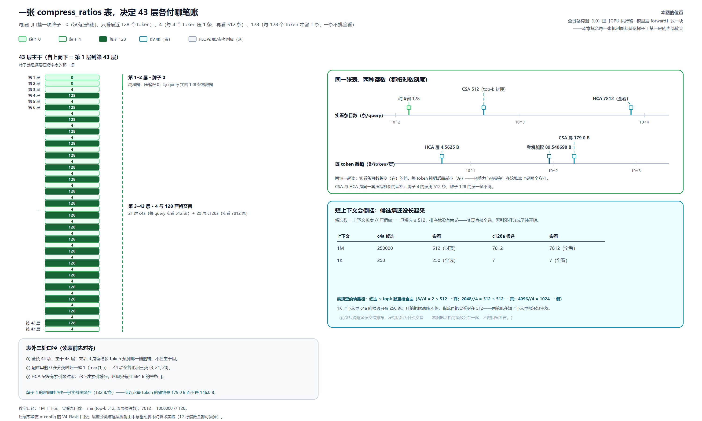

> *图注：左栏是 43 层主干竖排的电梯，每层挂一块牌子：0（前两层，纯滑窗）、4、128，中段 4 与 128 严格交替（21 层 4 加 20 层 128）。右栏把同一张表的两种读数并置：上一轴是每 query 实看条目数（纯滑窗 128 常数窗 / CSA 512 被 top-k 封顶 / HCA 7812 全看），下一轴是每 token 每层摊销字节（HCA 4.5625B / 整机加权 89.540698B / CSA 179.0B），两类数字在图上方向相反，往下看的两张图分别展开这两条轴。右栏中部那张短上下文倒挂表是同一个式子在不同上下文长度下的对照：1M 时 c4a 候选 250000 条而实看 512（封顶），1K 时候选只有 250 条，比 top-k 还少，于是排序没有意义、直接全选。*

---

## 一台机器的形状：七件套各站在哪

账立住了，先把机器的方框图画出来，之后每一节只是把它的一块放大了讲。

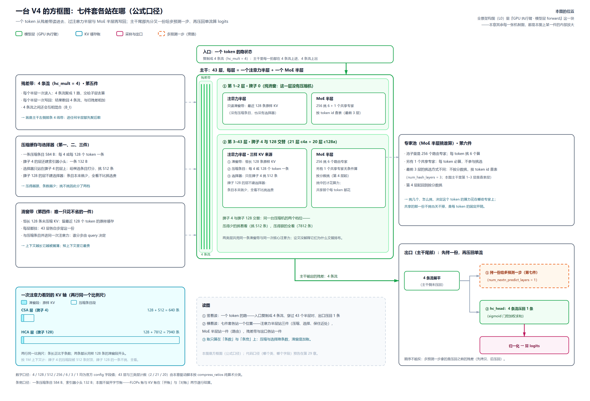

> *图注：本章的整机方框图（公式口径）。它就是[第 1 章](../../ch01-vllm-v1-in-one-map/narrative/chapter.md) L0 全图中间绿色「GPU 执行臂」列里模型层那一块的放大（图上右上角标着「本图的位置」），本章后面每一张机制图都是这张图上某一件的内部放大；同一台机器的代码口径（哪个类、哪个字段对应哪件）留给[第 29 章](../../ch29-deepseek-v4-assembly/narrative/chapter.md)。竖着读是一个 token 的路：入口把隐状态复制成 4 条流（`hc_mult = 4`），穿过 43 个「一个注意力半层加一个 MoE 半层」的层对，出口把 4 条流展平，先把一份拷给多预测一步、再用 `hc_head` 的 sigmoid 门控压回 1 条，最后归一化、算 logits。横着读是七件套分居六个位置（压缩缓存那一格同时挂着第一件与第三件，就是同一台压缩机的 4 与 128 两个档位）：注意力半层挂三件：压缩缓存（第 3 层起每 4 或每 128 个 token 一条、逐层交替；第 1–2 层是牌子 0，没有压缩机、只有滑窗）、选择器（只站在牌子 4 的层上、挑 512 条）、滑窗带（恒长 128 条原样 KV）；MoE 半层挂一件（256 挑 6 加 1 个共享专家，最前 3 层改按 token id 查表）；残差带（4 条流，每半层一次读入加一次写回）与主干出口的分叉各挂一件。左下角那条小图把「一次注意力实际看到什么」按比例画出来：CSA 层 128 条滑窗加 512 条压缩条目得 640 条，HCA 层 128 加 7812 得 7940 条，压得少的挑着看、压得狠的一条不挑全看，条长的差距在图上直接看得见。*

一台 V4 主干是 43 个结构相同的「半层对」串起来：一个注意力半层加一个 MoE 半层，外面套着一条**四条流的残差带**（第五件）。每进一个半层，先从这条带里把四条流按学习出来的权重聚成一路（读入），把这一路交给子层去算（注意力半层算注意力，MoE 半层算专家），算完的结果再按学习出来的权重散回四条流、与混合过的旧残差相加（写回）。主干末端，四条流先摊平拷一份交给「多预测一步」的模块（第七件），然后压回一条、做最后一层归一化、算 logits。

注意力半层里有三样东西同时挂着。第一样是**一份压缩缓存**：历史每 $`m`$ 个 token 被抹成一条条目，$`m`$ 逐层交替取 4 或 128（第一件与第三件，是同一台压缩机的两个档位，论文里叫 CSA 与 HCA）。第二样是一条**滑窗带**，永远保留最近 128 个 token 的原样 KV，不压缩（第四件）。第三样只在 $`m=4`$ 的层上多出来：**一只选择器**（第二件），它给每个压缩条目打分，挑出 512 条，与滑窗那 128 条拼在一起，交给核心注意力去看：它因此不必读全部历史，只读这六百多条（512 加 128）。$`m=128`$ 的层没有选择器：条目本来就少，全看不比挑选贵。

一个 token 在 MoE 半层里还会被路由一次：256 个专家里挑 6 个算，另有 1 个共享专家无条件算（第 1 个半层起就有）；最前 3 层的挑选方式不一样，不按分数挑，直接按 token id 查表（第六件）。

这就是全章的地图：**账算在「条数」与「条宽」上，机制就落在「压缩」「选择」「保住近处」三件事上，残差与路由是搭台子的。** 下面七节按这个顺序展开，最后用一张对账表收口。

---

## 第一件：压缩，$`2m`$ 个位置软池化成 1 条

卷积网络里的最大池化是在 2×2 个格子里挑一个最大的走；这里换成加权平均版：$`2m`$ 个位置各算一个分数，softmax 把分数变成加起来等于 1 的份额，再按份额把这 $`2m`$ 个向量逐元素加权求和成 1 条。它**不是摘要**：没有生成器、没有语言模型，只有两组投影、一次 softmax、一次加权和；「挑人」的能力全在学出来的权重里。

公式分两拍。第一拍，两组投影各出一份 KV 原料和一份权重原料（arXiv:2606.19348 §2.3.1 Eq.(9) 与 Eq.(10)）：

```math
C^a = H \cdot W^{aKV}, \qquad C^b = H \cdot W^{bKV}
```

```math
Z^a = H \cdot W^{aZ}, \qquad Z^b = H \cdot W^{bZ}
```

四组矩阵都是 $`d\times c`$ 的可训练参数。为什么是两组而不是一组：第 $`i`$ 条条目要同时吃「自己这一段 $`m`$ 个 token」和「前一段 $`m`$ 个 token」，$`a`$ 组负责当前窗，$`b`$ 组负责前一个窗，两半区靠重叠让块边界上的信息被平滑而不是被切断。


> *图注：一条 $`H`$ 分出四条投影：实底的 $`C^a,C^b`$ 是**要被混合**的向量、虚线的 $`Z^a,Z^b`$ 是**决定怎么混合**的分数原料（还不是权重，要过 softmax 才是）。a/b 两组对齐的是两个窗：第 $`i=1`$ 条条目从 $`a`$ 半边取行 [4, 5, 6, 7]（当前窗）、从 $`b`$ 半边取行 [0, 1, 2, 3]（前一个窗），而 [0, 1, 2, 3] 正是第 $`i=0`$ 条取过的那 4 行：两个窗在这里叠了起来。四组缺一不可，少一组就没有「窗」可叠。中间那四个投影块上标着形状 $`(16, 2)`$（玩具口径 $`d=3`$、$`c=2`$、$`n=16`$），底部给出 token 4 的四个投影值：$`C^a`$ 是 [0.5, 1.5]、$`C^b`$ 是 [1.0, 0.5]、$`Z^a`$ 是 [0.5, 1.0]、$`Z^b`$ 是 [1.5, 0.5]。v0.27.1 把四组权重压成一条 GEMM（一次大矩阵乘、四组输出一起算）一枪出（系数 `coff = 1 + overlap` 取 2），那只是打包，读式子时按四组读。*

第二拍是归一与加权求和（Eq.(11) 与 Eq.(12)）。先给两半区各加上一个可学习的位置偏置 $`B^a,B^b\in\mathbb{R}^{m\times c}`$（它让「窗内第几个位置」也参与权重，即权重不只是内容相关、还带位置先验），把两半区竖着叠成 $`2m`$ 行做一次行方向 softmax，然后用这些权重把 KV 原料逐元素加权求和：

```math
[S^a_{mi:m(i+1)-1}; S^b_{m(i-1):mi-1}] = \mathrm{Softmax}_{\mathrm{row}}\left([Z^a_{mi:m(i+1)-1} + B^a;\, Z^b_{m(i-1):mi-1} + B^b]\right)
```

```math
C^{\mathrm{Comp}}_i = \sum_{j=mi}^{m(i+1)-1} S^a_j \odot C^a_j + \sum_{j=m(i-1)}^{mi-1} S^b_j \odot C^b_j
```

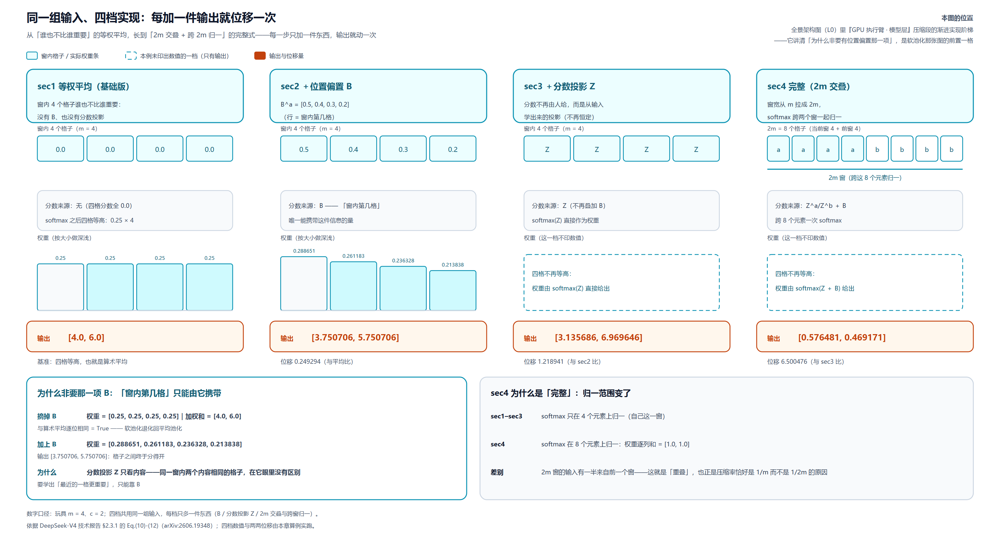

> *图注：同一组输入走四档，每加一件东西输出就位移一次。sec1 什么机制都没有（窗内分数相同、也没有输入相关的投影）：softmax 在等分分数上退化成等权平均，四格权重都是 0.25、输出 [4.0, 6.0] 恰好就是算术平均；sec2 加上位置偏置 $`B^a`$（取 [0.5, 0.4, 0.3, 0.2]，行 = 窗内第几格），权重变成等高的反面 0.288651、0.261183、0.236328、0.213838，输出 [3.750706, 5.750706]（位移 0.249294）；sec3 让分数改由输入投影出来（这一档只看内容投影 $`Z`$，位置偏置 $`B`$ 已在前一档演示过，输出 [3.135686, 6.969646]，位移 1.218941）；sec4 才是完整版：窗宽从 $`m`$ 拉到 $`2m`$、两半区跨 8 个元素做一次 softmax（输出 [0.576481, 0.469171]，位移 6.500476，权重逐列和 1.0）。这张图要带走的一句话是 **$`B`$ 是「窗内第几格」唯一的信号源**：窗内两个内容相同的格子，没有 $`B`$ 就没有任何东西能把它们区分开；而 sec4 之所以叫「完整」，是因为归一范围变了——softmax 跨的是 8 个元素而不是 4 个，这个跨度正是重叠窗的配套写法。压缩率之所以恰好是 $`1/m`$ 而不是 $`1/2m`$，靠的是下节要推的重叠本身（相邻条目共享 $`m`$ 个输入，每新增一条只消耗 $`m`$ 个新 token），不是归一范围。*

三处读法要当场钉住。**其一，归一范围是 $`2m`$ 个元素**，不是 $`m`$：softmax 跨 `[Z^a 当前窗; Z^b 前窗]` 这 $`2m`$ 行逐列归一，所以每个位置的权重是「在这 $`2m`$ 个候选里占多少」。**其二，$`C^{\mathrm{Comp}}_i`$ 由 $`2m`$ 个 KV 条目贡献，但产出条数只有 $`n/m`$**：第 $`i`$ 条用的 $`C^b`$ 下标，正是第 $`i-1`$ 条用的 $`C^a`$ 下标，相邻条目共享一半输入，所以每新增一条只消耗 $`m`$ 个新 token。**其三，$`i=0`$ 是唯一特例**：越界的 $`Z^b`$ 填负无穷、$`C^b`$ 填 0，于是第一个窗只看自己。

先看一个小例子把「软池化」的脾气摸清（$`m=4`$、$`c=2`$，8 个 $`(Z+B)`$ 分数配 8 个 KV 值）：

<!-- trace: ch28-m03 -->
| 步骤 | 动作 | 关键数值 | 判定 |
|---|---|---|---|
| 手账-输入 | 摆出 $`2m`$ 个 $`(Z+B)`$ 值（a 半区 4 个加 b 半区 4 个） | [2.0, 1.0, 0.0, -1.0, -2.0, 0.0, 0.0, 0.0] | 没有一个是给定的「重要性」，全是投影出来的 |
| 手账-归一 | 跨 8 个元素做行 softmax | 权重 S = [0.505734, 0.186049, 0.068444, 0.025179, 0.009263, 0.068444, 0.068444, 0.068444] | 权重和 = 1.000000（跨 $`2m`$ 归一） |
| 手账-加权 | 逐元素加权求和（KV 值取 1.0 到 15.0） | 加权和 4.335023 对直接平均 8.000000，差 3.664977 | 最大权重 0.505734 拿走 50.6% 的份额，权重真的在挑人 |
| 完整链-投影 | 四组投影（Eq.9 与 Eq.10） | 产出形状 (3, 2)：12 个 token 得 3 条 | 条数 = n/m = 3（不是 n/2m） |
| 完整链-产出 | 逐条 softmax 加权和（Eq.11-12） | 条目 i=0 [0.576481, 0.469171]｜i=1 [0.548559, 0.297268]｜i=2 [0.779006, 0.400221] | 每条权重逐列和 = [1.0, 1.0] |
| 边界 i=0 | $`Z^b`$ 填负无穷、$`C^b`$ 填 0 | b 半区权重全 0（按论文拼接序 $`[Z^a;Z^b]`$ 的槽位 4 到 7 全是 [0.0, 0.0]） | 负无穷的指数是 0，于是第一个窗只看自己 |
| 对照 i=1 | 同一条目在 i=1 时的 b 半区 | b 半区权重非 0：[0.054212, 0.098538]…[0.034567, 0.281588] | 有前窗可看，i=0 的特例是唯一的 |

一个直接的推论：$`C^{\mathrm{Comp}}`$ 的每个分量都是同一列输入的凸组合（权重逐列和为 1、非负），所以它逐元素不放大——第 $`c`$ 个分量的绝对值不超过所有输入 $`C_j`$ 第 $`c`$ 个分量绝对值的最大值。这里要小心界成立的范围：逐元素的那条（$`L_\infty`$ 口径）成立，换成 2-范数就不成立，因为各列的权重互相独立、没有这条保证。

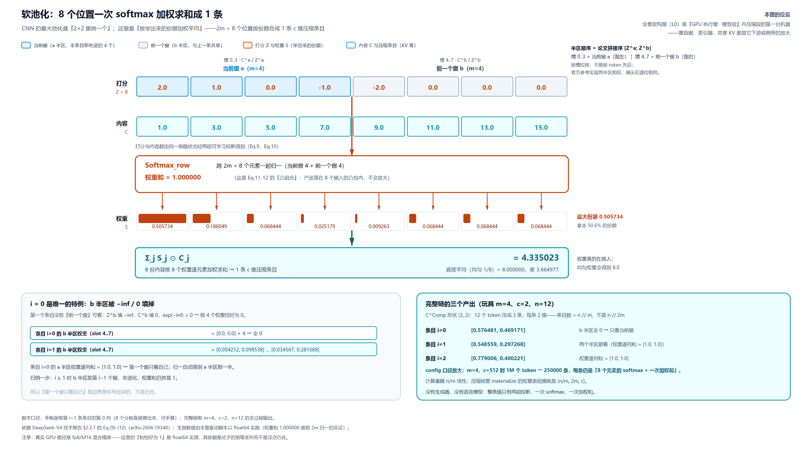

> *图注：整条链自上而下四段，都在同一列位置上。上段是 $`2m=8`$ 个输入位置（2m 个位置 = 当前窗 $`a`$ 的 4 格 + 前一个窗 $`b`$ 的 4 格），第一行 `Z + B` 是打分原料（[2.0, 1.0, 0.0, −1.0, −2.0, 0.0, 0.0, 0.0]），第二行是内容 $`C`$（1.0 到 15.0）——两排都由同一串隐状态经两组可学习投影得到（Eq.9、Eq.10）。中段是一次跨 8 个元素的 `Softmax_row`：权重和 = 1.000000，最大的一格拿走 0.505734（50.6% 的份额），再落到下段那条 c 维压缩条目上：逐元素加权求和 = 4.335023，而直接取平均是 8.000000，差 3.664977，权重真的在挑人。下方两栏：左是 i=0 的边界（b 半区被 −inf 与 0 填掉，4 个权重恰好为 0，于是第一个窗只看自己；i=1 同一条目的 b 半区权重非 0），右是完整链的三个产出（条目 i=0/1/2 的 2 维数值）与 config 口径的放大（m = 4、c = 512 时 1M 个 token 得 250000 条）。整条链没有生成器、没有语言模型，只有两组投影、一次 softmax、一次加权和。*

### 两扇窗叠着推：为什么恰好压到四分之一

「每 $`m`$ 个 token 压成 1 条」这句话里藏着一个容易读漏的细节：$`2m`$ 个输入对应 1 条产出，但产出条数是 $`n/m`$，不是 $`n/2m`$。把 12 个 token 的归属列出来就清楚了：

<!-- trace: ch28-m04 -->
| 步骤 | 动作 | 关键数值 | 判定 |
|---|---|---|---|
| 归属表 | 列出每条条目的两个半区 token 下标 | i=0: [0, 1, 2, 3] 加空｜i=1: [4, 5, 6, 7] 加 [0, 1, 2, 3]｜i=2: [8, 9, 10, 11] 加 [4, 5, 6, 7] | 每条输入 8 个（$`2m`$），新增只有 4 个（$`m`$） |
| 条目数核对 | n 除以 m，对比 n 除以 2m | 3 条对 1 条 | 12 除以 4 得 3（不是 12 除以 8 得 1），重叠让序列恰好压到 1/m |
| 共享验证 | 比较 i=1 的 b 半区与 i=0 的 a 半区 | [0, 1, 2, 3] 等于 [0, 1, 2, 3] 为真 | 相邻条目共享 $`m`$ 个输入（论文的 overlapped 句） |
| 窗口起点 | 起点 = 位置 减 (1+OVERLAP)·CR 加 1（位置取 3） | 起点 = 3 − 2×4 + 1 = -4；八个位置 = [-4, -3, -2, -1, 0, 1, 2, 3] | 越界位置由 mask_pos 标记 |
| 越界处理 | mask_pos 为位置不小于 0 时，score 取负无穷、kv 取 0 | [False, False, False, False, True, True, True, True] | 与论文 i=0 的填充是同一件事 |
| 两半区 | head_offset 等于 tokens 不小于 CR 乘 HEAD_SIZE | [0, 0, 0, 0, 512, 512, 512, 512] | 前半区是前窗、后半区是当前窗（**代码与论文的 a/b 相反**） |
| 标签陷阱 | 论文布局对官方参考实现的布局 | 产出最大偏差 0.00000000（两种布局下逐位相同，与拼接顺序无关）；权重直接对减最大偏差 0.47154682，半区调头后 0.00000000 | 同一套数学、两半区命名相反 |

最后一行要点破：论文把当前窗叫 $`a`$、把前一个窗叫 $`b`$，而两侧实现把**前一个窗放在前半区、当前窗放在后半区**。这不是实现抄错了：同一张状态表两个半区，命名顺序相反，把两半区调头之后就逐位相同（实测：调头后逐位差 0.00000000，不调头直接对减是 0.47154682）。读代码时按代码的布局读，读公式时按论文的符号读。

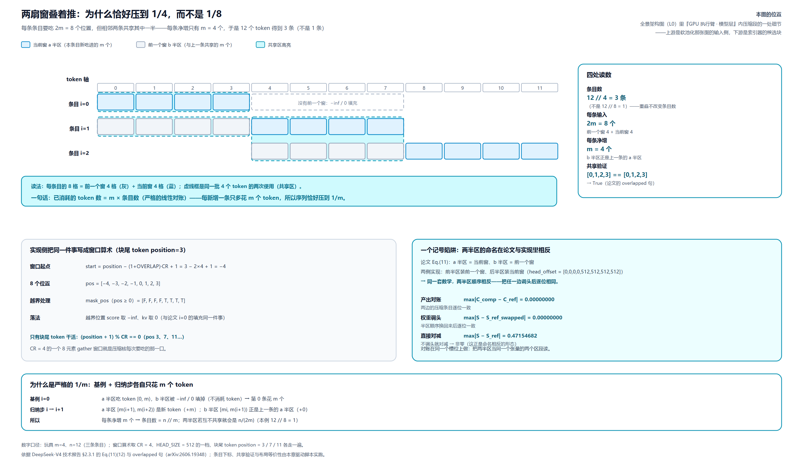

> *图注：横轴是 12 个 token，三条条目各用一根 8 格长的括号框出两个半区（灰＝前一个窗，蓝＝当前窗），虚线把「同一批 4 个 token 的两次使用」连起来：i=1 的灰色 4 格就是 i=0 的蓝色 4 格，于是每加一条只多花 4 个 token，12 个 token 得 3 条，压到四分之一而不是八分之一。右上角是四处读数：条目数 12 // 4 = 3（不是 12 // 8 = 1）、每条输入 8 个、每条净增 4 个、共享验证为真。下段左栏是实现侧的窗口算术（块尾位置 3 时起点 −4、四个越界位置由 mask 标出），同一带右侧那张小注就是那个标签陷阱：论文的 a/b 与实现的两半区命名相反，调头之后逐位相同。*

### 落点：一个开关两件事，位置偏置写在状态里

v0.27.1 里压缩机的构造只有几行，两处特别值钱：

```python
# vllm/models/deepseek_v4/compressor.py:L173-L189 · CompressorStateCache.__init__ 尾段
        assert self.dtype == torch.float32
        assert compress_ratio in [4, 128]
        coff = 1 + (compress_ratio == 4)          # L175
        self.sliding_window = coff * compress_ratio  # L176
        # Block size is constrained by tensor sharing between compressor states
        # and KV blocks. Since compressor states share the same physical tensor
        # as KV blocks, they must use the same page size.
        # The KV block shape [256//4, head_dim] = [64, 584] determines:
        # - C4 compressor block shape [4, 2*512*2*4] -> block_size = 4
        # - C128 compressor block shape [8, 512*2*4] -> block_size = 8
        # TODO(yifan): make block size automatically determined and configurable.
        if compress_ratio == 4:
            self.block_size = 4
        elif compress_ratio == 128:
            self.block_size = 8
        else:
            raise ValueError(f"Invalid compress ratio: {compress_ratio}")
```

`coff` 是「几个半区」的系数：压缩率 4 时它是 2（两组投影、窗口宽 $`2m=8`$），压缩率 128 时它是 1（一组投影、窗口宽 $`m'=128`$）。同一个式子 `sliding_window = coff * compress_ratio` 把 CSA 的 $`2m`$ 与 HCA 的 $`m'`$ 一起推了出来，第三件 HCA 不用另起炉灶，改的只是这个开关。这里要防一个同名：这个 `sliding_window` 是压缩机一次吃多少个 token（$`2m`$ 或 $`m'`$），与第四件那条恒长 128 条原样 KV 的滑窗（config 里也叫 `sliding_window`）不是一回事——HCA 的 $`m'`$ 恰好也是 128，最容易读混。位置偏置的本体是这张表：

```python
# vllm/models/deepseek_v4/compressor.py:L274-L282 · DeepseekCompressor.__init__ 里的位置偏置
        state_dtype = torch.float32
        self.ape = nn.Parameter(
            torch.empty(
                (compress_ratio, self.coff * self.head_dim),
                dtype=state_dtype,
                device=self.device,
            ),
            requires_grad=False,
        )
```

行是「窗内槽位」、列是 $`coff\cdot c`$（两半区拼在一起），正好是论文 $`B^a,B^b`$ 合并成一个张量——不过列序与论文的 a/b 相反：本仓与官方参考实现都把前一个窗那份排在前 $`c`$ 列、当前窗那份排在后 $`c`$ 列（上面「标签陷阱」那张表说的就是这件事）。它是 `requires_grad=False` 的常量表：推理期只有装载，没有训练。位置偏置在**写状态**的时候就折进去了，所以后面压缩核读到的分数已经带偏置：

```python
# vllm/models/deepseek_v4/common/ops/save_partial_states.py:L86-L101 · _save_partial_states_kernel 尾段
    block = tl.arange(0, TRITON_BLOCK_SIZE)
    mask = block < HEAD_SIZE

    kv = tl.load(kv_ptr + token_idx * kv_stride + block, mask=mask)
    tl.store(base_ptr + block, kv, mask=mask)

    # Fused: score += ape[position % compress_ratio]
    position = tl.load(positions_ptr + token_idx)
    ape_row = position % COMPRESS_RATIO
    ape = tl.load(ape_ptr + ape_row * ape_stride + block, mask=mask)
    score = tl.load(score_ptr + token_idx * score_stride + block, mask=mask)
    tl.store(
        base_ptr + STATE_WIDTH + block,
        score + ape,
        mask=mask,
    )
```

一行 `score + ape` 就是公式里的 $`Z+B`$：每个 token 的 kv 写进状态表前半、`score + ape[position % compress_ratio]` 写进后半。

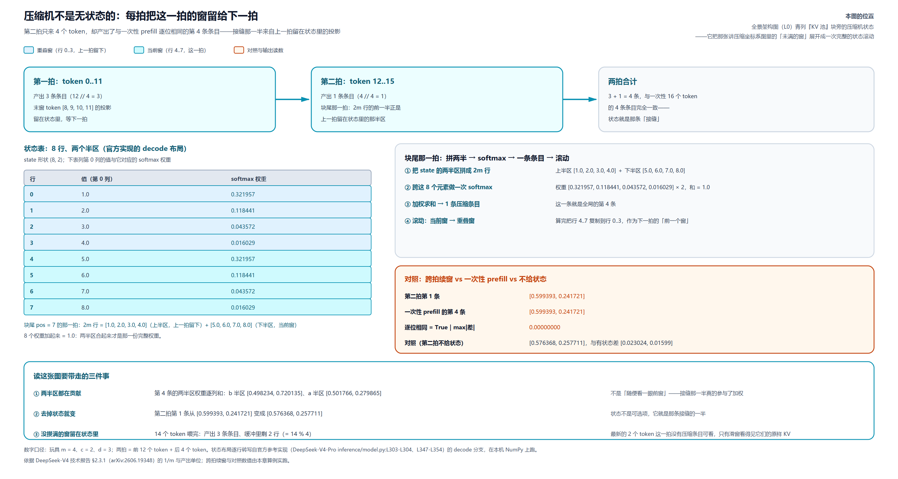

> *图注：状态是跨拍活着的，不是每拍重建。第一拍（12 个 token）产出 3 条、把最后那个没攒满的窗留在状态里；第二拍只来 4 个 token，却产出 1 条——它与「一次性喂 16 个 token」的第 4 条**逐位相同**（max|差| = 0.00000000），因为状态正好补上了接缝的那一半。把状态去掉，同一条就变成 [0.576368, 0.257711]，差 [0.023024, 0.01599]，那不是可选项。左侧那张 8 行状态表是官方参考实现的 decode 布局：行 0..3 是上一拍留下的重叠窗、行 4..7 是这一拍的当前窗，块尾那一拍把两半区拼成 $`2m`$ 行、跨 8 个元素做一次 softmax（权重 [0.321957, 0.118441, 0.043572, 0.016029] 两份、和 = 1.0）、产出一条条目，然后把当前窗滚到重叠窗的位置留给下一拍。两半区都在贡献（第 4 条的 b 半区权重逐列和 [0.498234, 0.720135]、a 半区 [0.501766, 0.279865]）。最后一条读数接到滑窗那件：14 个 token 喂完产出 3 条、缓冲里还剩 2 行（就是没攒满的那两个），这一拍它们没有压缩条目可看，只有滑窗看得见它们的原样 KV。*

真实压缩发生在块尾（它吃的那半区，就是上一拍写进状态的那一半）：

```python
# vllm/models/deepseek_v4/common/ops/fused_compress_quant_cache.py:L161-L212 · _fused_kv_compress_norm_rope_insert_sparse_attn 中段
    position = tl.load(positions_ptr + token_idx)
    if (position + 1) % COMPRESS_RATIO != 0:            # L164
        return

    req_idx = tl.load(token_to_req_indices_ptr + token_idx)

    # ── Gather state cache entries ────────────────────────────────────
    start = position - (1 + OVERLAP) * COMPRESS_RATIO + 1
    tokens = tl.arange(0, (1 + OVERLAP) * COMPRESS_RATIO)
    pos = start + tokens
    mask_pos = pos >= 0

    # … 省略：按 block_table 把越界位置之外的 state 行地址算出来 …
    head_offset = (tokens >= COMPRESS_RATIO).to(tl.int32) * HEAD_SIZE   # L182

    combined_mask = mask_pos[:, None] & mask[None, :]

    # ── Softmax + weighted sum ───────────────────────────────────────
    score = tl.load(
        row_base[:, None] + STATE_WIDTH + block[None, :],
        mask=combined_mask,
        other=float("-inf"),                            # L202
    )
    score = tl.softmax(score, dim=0)

    kv = tl.load(
        row_base[:, None] + block[None, :],
        mask=combined_mask,
        other=0.0,                                      # L209
    )

    compressed_kv = tl.sum(kv * score, axis=0)  # [TRITON_BLOCK_SIZE] fp32
```

三行代码对三件论文事实：只有 `(position + 1) % COMPRESS_RATIO == 0` 的块尾 token 干活（一条条目攒满 $`m`$ 个 token 才产出，其余位置早退）；`head_offset` 按「第几行」把 $`2m`$ 行劈成两半（前半区放前一个窗、后半区放当前窗，与论文的 a/b 命名相反）；越界位置一边取 `other=-inf` 给分数、一边取 `other=0.0` 给 kv，就是论文那句「$`Z^b`$ 填负无穷、$`C^b`$ 填 0」。

```python
# vllm/v1/attention/backends/mla/compressor_utils.py:L33-L50 · _compressed_slot_mapping_kernel 循环体
    for i in range(0, query_len, TRITON_BLOCK_SIZE):
        offset = i + tl.arange(0, TRITON_BLOCK_SIZE)
        mask = offset < query_len

        pos = start_pos + i + tl.arange(0, TRITON_BLOCK_SIZE)
        is_valid = (pos + 1) % COMPRESS_RATIO == 0
        pos_after_compress = pos // COMPRESS_RATIO

        block_ids = pos_after_compress // block_size
        block_numbers = tl.load(
            block_table_ptr + batch_idx * block_table_stride + block_ids,
            mask=mask & is_valid,
        )
        slot_ids = block_numbers * block_size + pos_after_compress % block_size

        # NOTE
        slot_ids = tl.where(is_valid, slot_ids, PAD_ID)
        tl.store(slot_mapping_ptr + query_start + offset, slot_ids, mask=mask)
```

这段是压缩坐标系的三句话：`is_valid = (pos+1) % COMPRESS_RATIO == 0` 说**谁产出条目**；`pos_after_compress = pos // COMPRESS_RATIO` 说**条目号怎么算**；`slot_ids = block_number * block_size + pos_after_compress % block_size` 说**条目落在哪个页槽**。它还有一个反直觉的推论：压缩不是「另存一份小副本」，而是把同一张分页 KV 的每个页槽装满 $`m`$ 个 token 的内容，于是每页能装的历史变长了 $`m`$ 倍（槽位与块表这套算法[第 22 章](../../ch22-slot-mapping-block-table/narrative/chapter.md)已经走过，这里只是把条目号接上同一套块表）。

官方参考实现里同一件事写成纯 torch，读起来更短：`Compressor.__init__` 用一行 `self.overlap = compress_ratio == 4` 定重叠、一行 `coff = 1 + self.overlap` 定半区数、`self.ape` 直接声明成 `(compress_ratio, coff * head_dim)` 的参数；压缩本体是 `kv = (kv * score.softmax(dim=2)).sum(dim=2)` 一行（官方参考实现（DeepSeek-V4-Pro inference/model.py:L290、L292、L294、L342）），i=0 的边界写成 `overlap_transform(kv, 0)` 与 `overlap_transform(score, float("-inf"))`（同文件 L340-L341）。**两侧的标签顺序一致**：官方的状态缓冲注释写着 `state[:, :ratio] = overlapping window, state[:, ratio:] = current window`（L302），与本仓压缩核的 `head_offset` 同序，这就是那个标签陷阱有三处独立佐证的意思。这套压缩机在代码里怎么被装配、它的状态缓存怎么与主 KV 共页、未完成窗怎么跨拍攒满，[第 26 章](../../ch26-deepseek-indexer-nsa-dsa/narrative/chapter.md)已经逐段走过；本章只钉公式与它的字面落点。

**伪码：CSA 压缩（config 口径 $`m=4`$、$`c=512`$、窗宽 $`2m=8`$）**

```python
def csa_compress(H, W_aKV, W_bKV, W_aZ, W_bZ, B, m):
    n = H.shape[0]
    C_a, C_b = H @ W_aKV, H @ W_bKV      # Eq.(9)  各 [n, c]
    Z_a, Z_b = H @ W_aZ,  H @ W_bZ       # Eq.(10) 各 [n, c]
    B_b, B_a = B[:, :c], B[:, c:]         # 本仓 ape 的列序是 [前窗; 当前窗] = [B^b; B^a]，与论文的 [B^a; B^b] 相反（见上面「标签陷阱」）
    out = []
    for i in range(n // m):
        cur = Z_a[i*m:(i+1)*m] + B_a                      # 当前窗 m 个
        prv = Z_b[(i-1)*m:i*m] + B_b if i > 0 else full((m, c), -inf)
        S = softmax(concat([cur, prv], axis=0), axis=0)   # Eq.(11) 跨 2m 归一
        entry = (S[:m] * C_a[i*m:(i+1)*m]).sum(axis=0)    # 两片都是 (m, c)
        if i > 0:                                         # i=0 时 S[m:] 恒为 0
            entry = entry + (S[m:] * C_b[(i-1)*m:i*m]).sum(axis=0)   # Eq.(12)
        out.append(entry)
    return stack(out)                    # [n // m, c]
```

这段伪码钉住三个不变量：归一方向是**跨 $`2m`$ 行逐列**（不是跨 $`c`$ 列）；越界半区以负无穷与 0 参与，因此第一个窗只看自己（$`i=0`$ 时 $`S[m:]`$ 恒为 0，少加那一项不改变结果）；产出条数恰好 $`n/m`$。

## 第二件：选择，在压缩块上打分，只挑 $`k`$ 条

压缩把候选从 $`n`$ 个 token 变成 $`n/m`$ 个块，但 1M 上下文下 $`n/m`$ 仍有 25 万条。全部看不行，于是请一位便宜的初筛员（就是前面方框图里那只「选择器」，实现里叫 indexer，开账表里那条 132 B 的小头缓存归它）：它给每个块打一个分，只把分数最高的 $`k`$ 条交上去。这位初筛员不是新发明的，DeepSeek-V3.2 的 lightning indexer 就在做这件事（arXiv:2512.02556 §2.1 Eq.(1)(2)），V4 只把打分对象从「每个 token 的键」换成「每个压缩块」（[第 26 章](../../ch26-deepseek-indexer-nsa-dsa/narrative/chapter.md)讲过那套打分算子与它自己那本缓存账，这里只讲公式）。

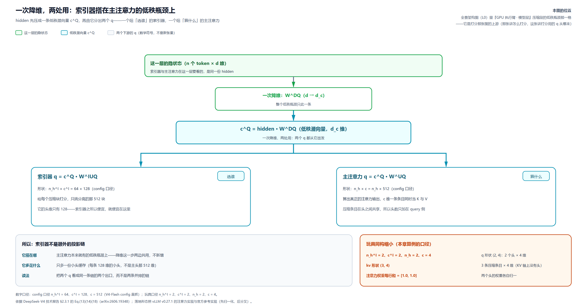

> *图注：整条低秩瓶颈只有一次降维：hidden 先压成潜向量 $`c^Q`$，再由它分出两个 q：左边那个给「选谁」的索引器（config 口径 $`n_h^I\times c^I = 64\times128`$），右边那个给「算什么」的主注意力（$`n_h\times c = n_h\times512`$）。所以索引器不是另起的投影链：它搭在主注意力本来就有的低秩瓶颈上，多花的只有一份小头缓存，不多一条降维。它的头维只有 128（主注意力是 512），便宜也正便宜在这里。读法是「同一条链的两个出口」，不是两条并排的链。玩具缩放（$`n_h^I=2`$、$`c^I=2`$、$`n_h=2`$、$`c=4`$）给出的 q 形状 $`(2,4)`$、kv 形状 $`(3,4)`$ 与每行和为 1 的注意力权重，下一张打分图就接着这组数走。*

打分要三样东西。**低秩的 q**：先把 hidden 压到潜空间，再从潜空间铺成索引器的多头查询（V4 报告 §2.3.1 Eq.(13)(14)）：

```math
\mathbf{c}_t^Q = \mathbf{h}_t \cdot W^{DQ}
```

```math
[\mathbf{q}_{t,1}^I; \dots; \mathbf{q}_{t,n_h^I}^I] = \mathbf{q}_t^I = \mathbf{c}_t^Q \cdot W^{IUQ}
```

**逐头的标量权重**：每个索引头投一票，票的分量是学出来的一个标量（V4 报告 §2.3.1 Eq.(15)）：

```math
[w_{t,1}^I; \dots; w_{t,n_h^I}^I] = \mathbf{w}_t^I = \mathbf{h}_t \cdot W^w
```

**打分与选择**：每个头对每个块做一次内积、过 ReLU、按各自的票权加权求和，取 top-$`k`$（V4 报告 §2.3.1 Eq.(16)(17)）：

```math
I_{t,s} = \sum_{h=1}^{n_h^I} w_{t,h}^I \cdot \mathrm{ReLU}\left(\mathbf{q}^I_{t,h} \cdot K^{\mathrm{IComp}}_s\right)
```

```math
\mathcal{C}_t^{\mathrm{SprsComp}} = \left\{C^{\mathrm{Comp}}_s \mid I_{t,s} \in \mathrm{Top}\mathrm{-}k(I_{t,:})\right\}
```

两处设计要点。**ReLU 是纪律**：负相关的头不会给块扣分，分数只被正相关推动；去掉它，64 个头在 25 万个候选上的负分会累积，靠「多数头反对」把某个块压到很负的位置（小例子里单块会拿到 −0.95，加了 ReLU 是 0）。**$`\mathbf{c}_t^Q`$ 是共享的**：同一份低秩潜向量分两路，一路接索引器的 $`\mathbf{q}^I`$（$`W^{IUQ}`$，铺成 64 头乘 128 维），另一路接主注意力的 $`\mathbf{q}`$（$`W^{UQ}`$，铺成 $`n_h`$ 头乘 512 维），一次降维两处用，这条线索在「共享 KV 的 MQA」那一节兑现。

先看 2 个索引头、4 个候选块的玩具表：

<!-- trace: ch28-m05 -->
| 步骤 | 动作 | 关键数值 | 判定 |
|---|---|---|---|
| 逐头内积 | 头 0 与头 1 对 4 个块的内积 | 头 0: [2.0, 1.0, -0.5, 1.5]；头 1: [0.5, 0.0, -2.0, 0.25] | 块 2 两头都是负相关 |
| ReLU | 负相关归零 | 头 0: [2.0, 1.0, 0.0, 1.5]；头 1: [0.5, 0.0, 0.0, 0.25] | 块 2 被压成 0（不打负分） |
| 加权求和 | 分数 = 两头按 [0.7, 0.3] 的加权和 | [1.55, 0.7, 0.0, 1.125] | 手算核对：块 0 = 0.7×2.0 + 0.3×0.5 = 1.55 |
| 选择 | 取 top-2（Eq.17） | 选中块 [0, 3] | 块 1 的 0.7 输给块 3 的 1.125 |
| 对照-去 ReLU | 同一组内积不做 ReLU | [1.55, 0.7, -0.95, 1.125] | 块 2 会拿到 -0.95，64 头规模下会累积成负分 |
| 实现层缩放 | 两个常数因子：头维的 −0.5 次方 与 头数的 −0.5 次方（玩具口径 $`c^I=n_h^I=2`$，两个都是 $`1/\sqrt{2}`$） | 0.707107 与 0.707107，于是分数缩到 [0.775, 0.35, 0.0, 0.5625] | 两个都是正标量，top-2 次序不变（真；config 口径下这两个因子是 $`1/\sqrt{c^I}`$ 与 $`1/\sqrt{n_h^I}`$，结论同） |
| 短上下文快路径 | 候选不超 top-k 就直接全选 | 8 除以 4 得 2 不超 512 为真；2048 除以 4 得 512 不超 512 为真；4096 除以 4 得 1024 为假 | 短上下文里索引器打分是纯开销 |

第三行那 0.707107 是两层缩放：$`\sqrt{c^I}`$ 分之一与 $`\sqrt{n_h^I}`$ 分之一。论文 Eq.(15)(16) **没写**这两个因子，两侧实现在打分前都补上了（官方参考实现（DeepSeek-V4-Pro inference/model.py:L395、L418）与本仓 `vllm/models/deepseek_v4/attention.py:L766`、`L877-L878` 同口径）。它们是正标量，乘上去只把每个块的分数整体缩小，改不了排序，所以「谁被选中」这件事不受影响——这是数值稳定性与量纲的工程细节，不是机制。

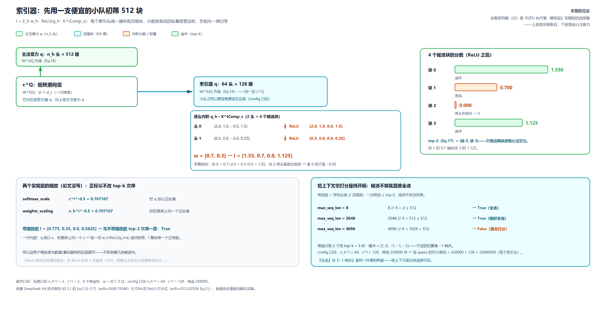

> *图注：左栏是打分动线：那条低秩潜向量 $`c^Q`$ 框在左，它向上接主注意力的多头 q（$`n_h`$ 头乘 512 维）、向右接索引器自己的 64 头（config 口径 64 头乘 128 维），同一次降维喂两条路。中部是逐头内积与 ReLU：头 0 的 [2.0, 1.0, −0.5, 1.5] 与头 1 的 [0.5, 0.0, −2.0, 0.25]，负的两个数归零，再按票权 [0.7, 0.3] 加权得 [1.55, 0.7, 0.0, 1.125]。右栏 4 根分数条里块 0 与块 3 高亮（top-2），块 1 的 0.7 输给块 3 的 1.125，块 2 拿到 0 而不是 −0.95。图下半是两处补充：两个实现层缩放（正标量、不改次序）与短上下文快路径的三种判定。*

### 候选墙本身就是因果的：为什么不需要掩码表

因果在稀疏注意力里通常靠一张掩码表（把未来位置的分数打成负无穷）。这套机制不需要：候选集合只由「已经攒满的块」组成。第 $`t`$ 个 query 能看到的块号上界是它前面所有完整块的数量：

<!-- trace: ch28-m06 -->
| 步骤 | 动作 | 关键数值 | 判定 |
|---|---|---|---|
| t=0 到 t=2 | 候选数 = 已完成的块数 | 论文口径 0 / 0 / 0；代码口径 0 / 0 / 0，可见块为空 | 还没攒满一块：t=2 时一个压缩条目都看不到 |
| t=3（块尾） | 两种口径第一次分叉 | 论文 3 除以 4 得 0；代码 (3+1) 除以 4 得 1，可见块 [0]，差一格 | 代码允许块尾看自己那块——仍严格因果（不含未来 token） |
| t=7、t=11（块尾） | 同样的差一格 | 论文 1 对代码 2；论文 2 对代码 3 | 差一格只出现在块尾 token（t 取 3、7、11） |
| 因果进入 top-k | toy 复用同一份分数表演示排序：墙外的块号记作 −∞，表示**不在候选集**（实现里这些号根本不会进缓冲，见下段的 −1 哨兵填充） | 阈值取 8、topk 取 2 时选 [7, 4]；阈值取 6 时选 [4, 1] | 只看已完成的块，排序才算得对 |
| 候选不足 | 候选 2 个而 topk 取 5 | 缓冲 = [0, 1, -1, -1, -1]（全选路径按序填号，不排序） | 短上下文里「全选」与「−1 哨兵」是同一件事的两面 |

值得注意的是论文口径与代码口径**差一格**：论文写 $`s<\mathrm{Floor}(t/m)`$（只能选严格在自己所在块之前的完整块），实现统一用 `(position + 1) // compress_ratio`（已完成的块数，见 `vllm/models/deepseek_v4/attention.py:L72-L88` 与 `vllm/models/deepseek_v4/sparse_mla.py:L374-L419` 两处同口径）。差的那格是**当前块**：块尾 token 能看自己刚产出的那一块。它仍然严格因果（不含未来 token），因为条目里只有已经处理过的 token。正文按论文给公式、讲代码时按代码口径陈述，两者不必强行说成等价：论文 §2.3.3 那句「访问不到自己压缩块内其它 token 的信息」是按「块尾 query 看不到自己那一块」的字面读法写的，代码在这一格上确实放宽了一格；放宽的那一份不破坏因果（条目里只有已经处理过的 token），也给不出块内逐 token 的粒度——两边真正一致的只是「块内没有逐 token 粒度」这层实质。

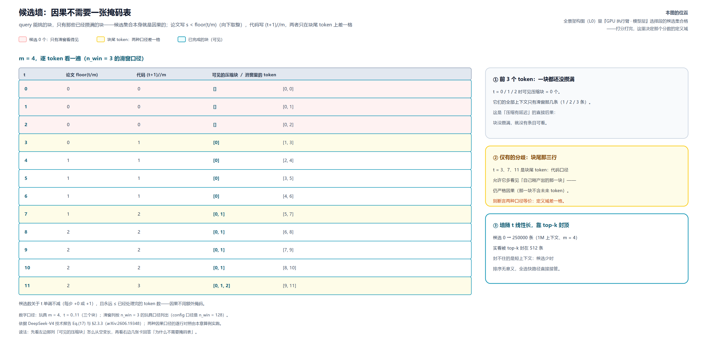

> *图注：逐 token 列一遍就看清了：$`t=0,1,2`$ 时可见压缩块是 **0 个**（一块都没攒满，这几个 token 的全部上下文只有滑窗里那 1、2、3 条），$`t=3`$ 才有第 0 块，之后墙随 $`t`$ 线性长，1M 下长到 250000 条、靠 top-$`k`$ 封在 512 条。论文口径 $`s<\mathrm{floor}(t/m)`$ 与代码口径 $`(t+1)//m`$ 只在块尾 token（$`t=3,7,11`$）上差一格，差的是「自己刚产出的那一块」——它装的全是已经算过的 token，不含未来 token，所以仍严格因果，但论文那句「访问不到自己压缩块内其它 token 的信息」的字面限定确实被放宽了一格。这两种口径别写成「等价」，写「定义域差一格」。*

短上下文还有一条快路径：候选数不超过 $`k`$ 时排序没有意义，直接全选，本仓的做法是把 `0..num_compressed-1` 全写进缓冲、其余填 −1 哨兵：

```python
# vllm/models/deepseek_v4/attention.py:L71-L87 · _fill_short_context_topk_indices
@triton.jit
def _fill_short_context_topk_indices(
    output,
    positions,
    TOP_K: tl.constexpr,
    COMPRESS_RATIO: tl.constexpr,
    PADDED_TOP_K: tl.constexpr,
):
    # small triton kernel that selects every candidate, -1 otherwise
    row = tl.program_id(0)
    offsets = tl.arange(0, PADDED_TOP_K)
    num_compressed = (tl.load(positions + row) + 1) // COMPRESS_RATIO
    tl.store(
        output + row * TOP_K + offsets,
        tl.where(offsets < num_compressed, offsets, -1),
        mask=offsets < TOP_K,
    )
```

索引器自己那条短路在最外面：

```python
# vllm/models/deepseek_v4/attention.py:L842-L848 · DeepseekV4Indexer.forward 开头
        attn_metadata = get_forward_context().attn_metadata
        if isinstance(attn_metadata, dict):
            indexer_metadata = cast(Any, attn_metadata[self.k_cache.prefix])
            if indexer_metadata.max_seq_len // self.compress_ratio <= self.topk_tokens:
                # candidates num smaller than topk, every candidate is selected
                # but we still need to build k cache
                compressor(compressed_kv_score, positions, rotary_emb)
```

注意注释里那半句「但我们仍然要建 k 缓存」：全选省掉的是排序，不是索引器自己的压缩机，它的小头缓存还得照建，下一拍序列更长时要用。


> *图注：「选择」的输出不是一张变长的列表，而是一张**定长表**：分数高的块号按序写进去，剩下的格子统一填 −1 哨兵（候选只有 2 个而 topk 取 5 时，缓冲就是 [0, 1, −1, −1, −1]）。由此短上下文里「全选」与「哨兵」是同一件事的两面：$`8\ //\ 4 = 2 \le 512`$、$`2048\ //\ 4 = 512 \le 512`$ 都走全选快路径，缓冲形状不变、变的只是「填了几个号」；到 1M 才是真挑（$`1000000\ //\ 4 = 250000`$ 条候选里挑 512 条，压缩比 488.28125）。图左上那张卡是同一件事的另一面：**因果阈值就是候选墙**，阈值一收，同一份分数排出来的前二就换了人（阈值 8 时选 [7, 4]，收到 6 时选 [4, 1]），排序只在墙内进行，越界与未来位置根本不必参与。*

**伪码：索引器打分与选块（sec1 基础 → sec2 完整）**

```python
def indexer_select_sec1(cand):            # sec1 基础：候选不超 k，全选
    return cand                           # 一个分数都不比（短上下文走这条，缓存照建）

def indexer_select(h_t, K_IComp, c_Q, W_IUQ, W_w, m, k, position):   # sec2 完整
    q_I = c_Q @ W_IUQ                     # Eq.(14) [n_h_I, c_I]，c_Q 与主注意力共享
    w_I = h_t @ W_w                       # Eq.(15) [n_h_I]
    cand = arange(0, (position + 1) // m) # 候选 = 已完成的块（代码口径）
    I = (w_I[:, None] * relu(q_I @ K_IComp[cand].T)).sum(axis=0)   # Eq.(16)
    return cand[topk_indices(I, k)]       # Eq.(17)
```

实现里这两档是同一个函数的两条分支（上面那段快路径源码），短上下文走 sec1、长上下文走 sec2。它钉住的不变量是「候选集合本身就是因果的」：不需要掩码表，也不需要负无穷把未来位置打掉。

## 收尾件：共享 KV 的 MQA，与那份一次降维两处用的潜向量

选完条目，注意力本身反而最简单。每条压缩条目**同时当 key 和 value**，而 query 是多头的（V4 报告 §2.3.1 Eq.(18)(19)）：

```math
[\mathbf{q}_{t,1}; \dots; \mathbf{q}_{t,n_h}] = \mathbf{q}_t = \mathbf{c}_t^Q \cdot W^{UQ}
```

```math
\mathbf{o}_{t,i} = \mathrm{CoreAttn}\left(\mathrm{query} = \mathbf{q}_{t,i},\ \mathrm{key} = \mathcal{C}_t^{\mathrm{SprsComp}},\ \mathrm{value} = \mathcal{C}_t^{\mathrm{SprsComp}}\right)
```

「共享 KV」这四个字不是省显存的工程技巧，而是「压到最后只剩一条向量」的必然后果：一条 $`c`$ 维条目想不当 K/V 都难，头数只能加在 query 那一侧。[第 24 章](../../ch24-primer-attn-variants/narrative/chapter.md)讲过 MQA 是「所有头共用一份 K/V」的极端档，这里的区别在于那份 K/V 不是「从每个 token 投影出来再共享」，而是**根本就不存在逐 token 的 K/V**——历史只剩条目。

四行读数把这段的形状钉死：

<!-- trace: ch28-m07 -->
| 步骤 | 动作 | 关键数值 | 判定 |
|---|---|---|---|
| 打分 | 核心注意力：输出等于权重乘 kv（同一张量既当 K 又当 V） | 权重（2 头乘 3 条）= [[0.465836, 0.362793, 0.171371], [0.307196, 0.186324, 0.50648]]，每行和 = [1.0, 1.0] | kv 轴上没有 head 维（形状 (3, 4) 而不是 2×3×4） |
| 输出 | 没有第二份 value 投影 | o = [[0.647232, 1.103042, 0.828629, 0.705536], [0.400358, 1.120872, 0.49352, 1.199285]] | 一行矩阵乘完事 |
| 共享性验证 | 把 kv[0] 加 1.0 | 2 个头**同时**变：变化量 = [0.860147, 1.102083, 0.779502, 0.389647, 0.753717, 0.850275, 0.721531, 0.132214] | 没有哪一头能绕过它 |
| 潜向量复用 | 同一份低秩潜向量分叉两路 q | 索引器 q：64 乘 128；主注意力 q：n_h 乘 512 | 一次降维两处用（Eq.13 与 Eq.18 同一个 $`c^Q`$） |

第三行是这段的判据：动一条条目，两个头的输出**一起**变，这就是 MQA 与 MHA 的分水岭（MHA 里每个头有自己的 K/V，动一份动不了另一份）。


> *图注：中间那条 4 维压缩条目被同时拉给 key 位与 value 位（图上只画一个方框接两根箭头，不画两份张量）：同一个张量传两次，省掉整条 KV 轴的一倍宽度。左栏是这次注意力的权重矩阵（2 头乘 3 条），每行和为 1（softmax 沿 3 条条目归一），下面接着动手试：把第一条条目加 1.0，两个头各自的 4 个分量一起变（头 0 的 [0.860147, 1.102083, 0.779502, 0.389647]、头 1 的 [0.753717, 0.850275, 0.721531, 0.132214]）。右栏那张卡把可观察后果列全：① kv 形状是 (3, 4) 而不是 2×3×4（KV 轴上没有头维）；② 没有第二份 value，o = weights @ kv 一行乘完；③ 动一条条目，2 个头共 8 个分量全非零（0.860147 到 0.132214）。左上那个 q 框里并排列出两条来路：索引器 q 64 头乘 128 维、主注意力 q $`n_h`$ 头乘 512 维；图下方那张卡把这条线索收口：$`c^Q`$ 分叉两条路，一次降维喂两条路。*

官方参考实现里「共享」是最字面的一行：`sparse_attn(q, kv, ...)` 只传**一份** kv，核里同一个张量既进 key 的矩阵乘也进 value 的矩阵乘（官方参考实现（DeepSeek-V4-Pro inference/kernel.py:L295-L299、L328、L343））；主注意力的 q 与索引器的 q 也确实来自同一个张量（同包 inference/model.py:L496 的 `qr = q = self.q_norm(self.wq_a(x))` 传给 L411 的 `q = self.wq_b(qr)`；这里 `wq_a` 就是 Eq.(13) 的降维矩阵 $`W^{DQ}`$、`wq_b` 是 Eq.(18) 的升维矩阵 $`W^{UQ}`$，中间的 `qr` 就是那份共享的潜向量 $`c^Q_t`$）。

**伪码：核心注意力（共享 KV 的 MQA）**

```python
def core_attn(q, entries):          # q: [n_h, c] 诸头；entries: [L, c]
    w = softmax((q @ entries.T) * c ** -0.5, axis=-1)   # Eq.(19)
    return w @ entries              # key 与 value 是同一张 entries
```

它钉住的不变量是「KV 轴上没有头维」：输出的头数只由 q 决定，条目侧一份张量服务所有头。

## 第三件：HCA，压得更狠，一条不挑

同一台压缩机换一个档位：窗口从 $`2m=8`$ 拉到 $`m'=128`$，丢掉重叠（只剩一组 $`C/Z`$），也丢掉选择器。公式与 CSA 同构（arXiv:2606.19348 §2.3.2 Eq.(20)-(26)）：

```math
C = H \cdot W^{KV}, \qquad Z = H \cdot W^{Z}
```

```math
S_{m'i:m'(i+1)-1} = \mathrm{Softmax}_{\mathrm{row}}\left(Z_{m'i:m'(i+1)-1} + B\right)
```

```math
C^{\mathrm{Comp}}_i = \sum_{j=m'i}^{m'(i+1)-1} S_j \odot C_j
```

核心注意力与 CSA 完全同构（Eq.(24)-(26) 与 Eq.(18)(19) 逐项对应；其中 Eq.(24) 那条 $`\mathbf{c}_t^Q`$ 的降维式与 Eq.(13) 同形，两档共用同一次降维），唯一的区别是 key 与 value 是**整份** $`C^{\mathrm{Comp}}`$，不是 top-$`k`$ 子集。把两组公式并排看，三处差别一目了然：只有一组 $`C/Z`$（没有 a/b 两半、没有重叠窗）、窗宽是 $`m'`$ 而不是 $`2m`$、**没有索引器**。

还有一件两档共用的收尾件，论文落在 §2.3.2 的尾句上：核心注意力的输出不是直接当结果用，而是先把 $`g`$ 个组的中间输出拼起来（$`d_g g`$ 维）、再投一次到 $`d`$ 维得到 $`\hat o_t`$（分组输出投影）。这里的「组」是**头的分组**：把 $`n_h`$ 个 query 头分成 $`g`$ 组（config 口径 `o_groups=8`，即 $`g=8`$），每组经一次低秩投影压到 $`d_g`$ 维（config 口径 `o_lora_rank=1024`），拼成 $`d_g\cdot g`$ 维后再投回 $`d`$ 维（官方参考实现里 `o_groups`/`o_lora_rank` 就是两个模型超参，字段名与 config 的键同名；官方参考实现（DeepSeek-V4-Pro inference/model.py:L450、L462-L463、L537-L542））。这就是后面反旋那一节要说的那族输出投影（代码里的 `wo_a`/`wo_b`），反旋必须发生在它之前。CSA 侧论文没有单列这一式，实现里两档走的是同一段收尾，这也是「两档同构」的一部分。

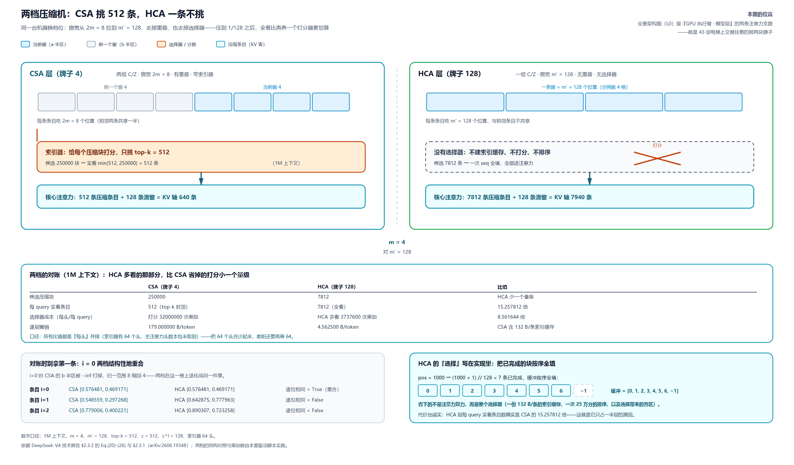

> *图注：左栏 CSA：两组 C/Z、窗宽 2m = 8（前一个窗与当前窗重叠），索引器从 250000 个候选里挑出 512 条（top-k 封顶），KV 轴最终是 512 条压缩条目加 128 条滑窗，共 640 条。右栏 HCA：一组 C/Z、窗宽 m′ = 128（图例画 4 格）、没有重叠，打分框被红叉划掉：不建索引缓存、不打分、不排序，7812 条全部进核心注意力，KV 轴 7812 加 128 得 7940 条。中间竖线标出 m 对 m′ 的档位差。下半第一行是横跨全宽的成本对账表：候选 250000 对 7812、实看 512 对 7812（15.257812 倍）、索引器打分 32000000 对 HCA 多看 3737600（8.561644 倍，每头口径）；第二行左边是两档的产出对照（i=0 结构性重合、i=1 与 i=2 逐位不同），右边那张卡写着实现里 HCA 的「选择」就是按序全填。*

问题于是变成：为什么这一档可以不挑？账是可以算的。

<!-- trace: ch28-m08 -->
| 步骤 | 动作 | 关键数值 | 判定 |
|---|---|---|---|
| 同构对照-形状 | 两档各自的输入个数 | CSA：每条 8 个（$`2m`$，当前窗 4 加前窗 4）；HCA：每条 4 个（玩具口径 $`m'`$ 取 4，与 $`m`$ 同宽以便同构对照；config 口径 $`m'=128`$，无重叠） | 条目数都是 3（12 除以 4） |
| 同构对照-归一 | 权重逐列和 | CSA [1.0, 1.0]（跨 8 个元素）；HCA [1.0, 1.0]（跨 4 个元素） | 归一范围不同、「和为 1」相同 |
| i 不小于 1 的真实差别 | 同一条目的产出 | i=1：CSA [0.548559, 0.297268] 对 HCA [0.642875, 0.777963]｜i=2：CSA [0.779006, 0.400221] 对 HCA [0.890307, 0.723258] | 逐位相同为假（两档真的不同） |
| i=0 的退化 | 第一窗的结构性重合 | CSA [0.576481, 0.469171] 等于 HCA [0.576481, 0.469171]（逐位相同为真） | i=0 的 b 半区权重全 0，CSA 退化成单序列——别拿这一格做对照 |
| 成本-候选 | 1M 下的候选块数 | CSA 250000（1M 除以 4）；HCA 7812（1M 除以 128） | HCA 的候选少一个量级 |
| 成本-实看 | 每 query 实看条目 | CSA 取 min(512, 250000) 得 512；HCA 7812（全看） | HCA 的主注意力贵 15.257812 倍 |
| 成本-省掉的打分 | 索引器打分乘加数 对 HCA 多看的乘加数 | 打分 32000000（每索引头）／64 头合计 2048000000；HCA 多看 3737600（每主头），比值 8.561644 倍 | 两个乘加数各随自己的头数等比放大：两侧头数相同时合计倍数与每头倍数同为 8.561644；头数不同时合计倍数 = 8.561644 ×（索引头数 64 / 主注意力头数 $`n_h`$） |
| 成本-省掉的缓存 | 两档逐层摊销 | CSA (584 + 132) / 4 = 179.000000 B；HCA 584 / 128 = 4.562500 B | HCA 没有索引器对象 |
| 实现形态 | HCA 层的 topk 缓冲等于所有已完成的块 | 位置 255 得 2 条，缓冲 [0, 1, -1, -1, -1, -1, -1, -1]；位置 1000 得 7 条，缓冲 [0, 1, 2, 3, 4, 5, 6, -1] | 一次序列填充，没有打分也没有排序 |

把成本写成式子更清楚：CSA 每个 query 的打分成本是 $`(n/m)\cdot c^I`$ 次乘加（每个索引头），再叠上排序与一份 $`n/m`$ 行的索引缓存；HCA 的额外注意力成本是 $`(n/m'-k)\cdot c`$ 次乘加（每个主头）。代进 config 口径（$`n=10^6`$、$`m=4`$、$`m'=128`$、$`k=512`$、$`c^I=128`$、$`c=512`$）得到 32000000 与 3737600，比值 8.561644。这两个乘加数各随自己的头数等比放大：索引器那 32000000 要对 64 个索引头各做一遍，HCA 那边多看的 3737600 也要对每个主注意力头各算一遍，所以两侧头数相同时合计倍数与每头倍数相同（都是 8.561644），头数不同时合计倍数 = 8.561644 ×（64 / $`n_h`$）。主注意力头数没有出现在本章引用的 config 字段里（官方参考实现把它作模型超参 `n_heads`，自带的测试配置取 64），所以正文一律用「每头」口径。省下的不只是算力：HCA 不需要任何排序，也不存在选择器漏看的盲区。代价同样诚实：HCA 层每个 query 的条目数确实多 15.257812 倍——「因此它只占一半层」是本书由这笔成本给出的读法；论文只留下 interleaved hybrid configuration 这个结论，没给比例、没给消融，也没解释为什么交替（见「开账」那一节）。

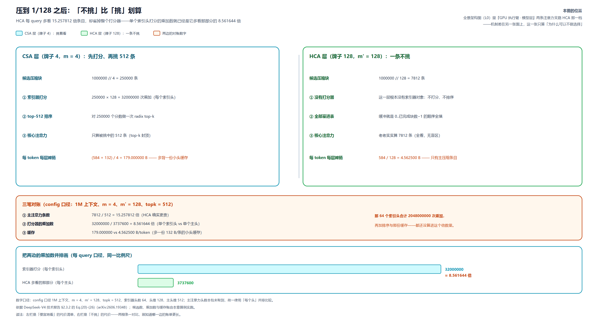

> *图注：两边的代价摊开来对（config 口径 1M 上下文）。CSA 层每 query 从 1000000 // 4 = 250000 个候选里挑 512 条：索引器打分 250000 × 128 = 32000000 次乘加（**每个索引头**，64 个头合计 2048000000），再对 250000 个分数做一次 radix top-512 排序（基数排序，按位分桶挑最大的 512 个，不必全排），每 token 每层摊销 (584 + 132) / 4 = 179.000000 B。HCA 层没有打分器对象——不打分、不排序，7812 条顺序全填、全看，摊销 584 / 128 = 4.562500 B。三笔账各一句：主注意力条目数 HCA 是 CSA 的 7812 / 512 = 15.257812 倍（HCA 确实更贵）；但**单个索引头**的打分乘加数就是 HCA 多看那部分（3737600）的 8.561644 倍，再加上排序与那份小头缓存，比值只会更大；缓存上左边多一份 132B 的小头。下面那两条同一比例尺的乘加数条把这件事画成一眼可见的长度差。*

代码里的「不挑」没有打分器可看，它是**填缓冲**：

```python
# vllm/models/deepseek_v4/sparse_mla.py:L374-L419 · _build_c128a_topk_metadata_kernel（节选）
    token_idx = tl.program_id(0)
    position = tl.load(positions_ptr + token_idx)
    num_compressed = (position + 1) // compress_ratio
    num_compressed = tl.minimum(num_compressed, max_compressed_tokens)
    is_decode = token_idx < num_decode_tokens

    if is_decode:
        # --- Decode: block-table lookup → global slot ids + count ---
        # … 省略：按 block_table 把 0..num_compressed-1 换成全局槽位并数出长度 …
    else:
        # --- Prefill: write local indices ---
        pfx_idx = token_idx - num_decode_tokens
        for i in range(0, max_compressed_tokens, BLOCK_SIZE):
            offset = i + tl.arange(0, BLOCK_SIZE)
            mask = offset < max_compressed_tokens
            tl.store(
                prefill_local_ptr + pfx_idx * prefill_local_stride + offset,
                tl.where(offset < num_compressed, offset, -1),
                mask=mask,
            )
```

`num_compressed = (position + 1) // compress_ratio` 与 CSA 侧同一口径，prefill 分支把 $`0..\mathrm{num\_compressed}-1`$ 直接写进缓冲：候选就是全部已完成的块，一个分数都不比。官方参考实现里同一件事是另一个函数 `get_compress_topk_idxs`（官方参考实现（DeepSeek-V4-Pro inference/model.py:L269-L276））：prefill 用掩码把「已完成」之外的块号打成 −1，decode 直接 `arange(0, (start_pos + 1) // ratio)`。**两侧实现都只在压缩率为 4 时才建 indexer 对象、其余置 None**（官方参考实现（DeepSeek-V4-Pro inference/model.py:L466-L471）：`if self.compress_ratio == 4: self.indexer = Indexer(...)` 配 `else: self.indexer = None`；本仓 `vllm/models/deepseek_v4/attention.py:L275-L278` 同口径，注释原话是 "Only C4A uses sparse attention and hence has indexer"）——「没有对象」是构造出来的，不是「有对象但没调用」。这就是「HCA does not employ sparse attention」的字面形态。

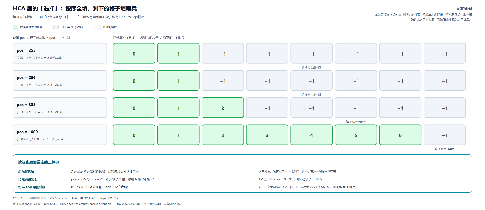

> *图注：这一层填缓冲的规律只有一条：从 0 开始数已完成的块（$`(pos+1)//128`$）：pos = 255 与 pos = 256 都填 2 格、pos = 383 填 3 格、pos = 1000 填 7 格（1M 下也不过 7812 格），剩下的格子常年是 −1 哨兵。缓冲宽度由 topk 上限决定（图里取 8 是玩具口径），所以「这一步在这一层根本不存在」：没有打分、没有排序、也没有索引器对象。要带走的一句是：短上下文里两档看起来一样（都退化成「顺序全填 + 哨兵」），差别只在候选少的时候谁来做这件事：CSA 层在短上下文里也走同一条全填路径，到长上下文才用得上它的打分器。*

**伪码：HCA 压缩与全看**

```python
def hca_compress(H, W_KV, W_Z, B, m_prime):
    C, Z = H @ W_KV, H @ W_Z                    # 一组投影，没有 a/b
    n_entry = H.shape[0] // m_prime
    out = []
    for i in range(n_entry):
        blk = slice(i*m_prime, (i+1)*m_prime)
        S = softmax(Z[blk] + B, axis=0)         # 归一范围就是 m'，没有重叠
        out.append((S * C[blk]).sum(axis=0))    # Eq.(23)
    return stack(out)

def hca_attend(q, entries, position, m_prime):
    cand = entries[: (position + 1) // m_prime] # 候选 = 全部已完成的块
    return core_attn(q, cand)                  # Eq.(26)：一条不挑
```

它钉住的是「这一档没有选择器」：候选集合、压缩方式、核心注意力三处的代码路径都不需要打分与排序。

## 第四件：滑窗，唯一只花不省的一件

压缩把分辨率换成了条数，代价在两处：块级粒度看不见块内先后（query 只能整块地看，同一块里更早的 token 在块级表达不出来），以及最近的 token 要么在还没攒满的块里、要么刚被抹进一个混了 $`m'`$ 个 token 的条目里。语言建模里最近的 token 通常最该被精确看到，于是 V4 反手加一件：每层额外产出 $`n_{\mathrm{win}}`$ 条**未压缩**的 KV，对应最近 $`n_{\mathrm{win}}`$ 个 token，与压缩条目一起送进同一次注意力（arXiv:2606.19348 §2.3.3）。

这一件在账上是纯花销，但它换来两样东西。第一样是**保真**：近处的字以原样参与打分，不被任何池化抹平。第二样是**看得见未完成的部分**：压缩机每 $`m`$ 个 token 才产出一条，解码时最新那几个不满一块的 token 还没有压缩条目，只有滑窗看得见它们的原样 KV。[第 26 章](../../ch26-deepseek-indexer-nsa-dsa/narrative/chapter.md)那个「位置 3 只攒出 1 个压缩块」的例子，说的就是这条时间差。这一条是**实现层口径**（论文只写了前两条：严格因果与近处更相关），分层标清楚，别把它读成论文结论。

窗口长度是常数：

<!-- trace: ch28-m09 -->
| 步骤 | 动作 | 关键数值 | 判定 |
|---|---|---|---|
| 玩具位置 2 | 滑窗加压缩条目 | 滑窗 [0, 2] 共 3 条｜候选 (2+1) 除以 4 得 0 条，KV 轴 = 3 条 | 没攒满一块：这一拍只有滑窗看得见那 3 个 token |
| 玩具位置 8 | 同上 | 滑窗 [6, 8] 共 3 条｜候选 (8+1) 除以 4 得 2 条，KV 轴 = 3 + 2 = 5 条 | 两路并进同一张表 |
| 真实口径位置 127 | 同上 | 滑窗 [0, 127] 共 128 条｜候选 32 条，KV 轴 160 条 | 起手不足一窗就从头开始 |
| 真实口径位置 1000 | 同上 | 滑窗 [873, 1000] 共 128 条｜候选 250 条，KV 轴 378 条 | 滑窗长度只看 $`n_{\mathrm{win}}`$ 与位置，与 $`m`$ 无关 |
| 1M·CSA 层 | 最贵的一拍（位置 999999） | 滑窗 128 条加压缩 512 条，KV 轴 640 条；候选 250000 | 压缩条目被 top-k 封顶 |
| 1M·HCA 层 | 同上 | 滑窗 128 条加压缩 7812 条，KV 轴 7940 条 | HCA 全看：7940 条里 7812 条是压缩的、128 条是原样窗 |
| 合成真跑 | 3 条滑窗加 2 条压缩条目走一次注意力 | 权重（1 头乘 5 条）= [0.230606, 0.179596, 0.179596, 0.230606, 0.179596]，和 = [1.0] | 两路在同一份权重里竞争，不分区 |
| 合成输出 | 加权求和 | o = [0.55101, 0.589798, 0.564293, 0.179596] | 谁分多由 query 与条目的内积决定 |

倒数第二行是这段最要紧的观察：滑窗不是外挂的第二套注意力，它只是 KV 轴上多出来的几行，与压缩条目在同一份 softmax 里竞争。滑窗的另一面在账上是反直觉的：窗口长度 = 最近 $`\min(pos+1,\ n_{\mathrm{win}})`$ 条，这个数**与上下文长度无关**——所以 1M 上下文里它被摊薄到 3.1703 B/token，而 1K 上下文里同样的常数量变成 3170.304 B/token，反倒成了最贵的一项。

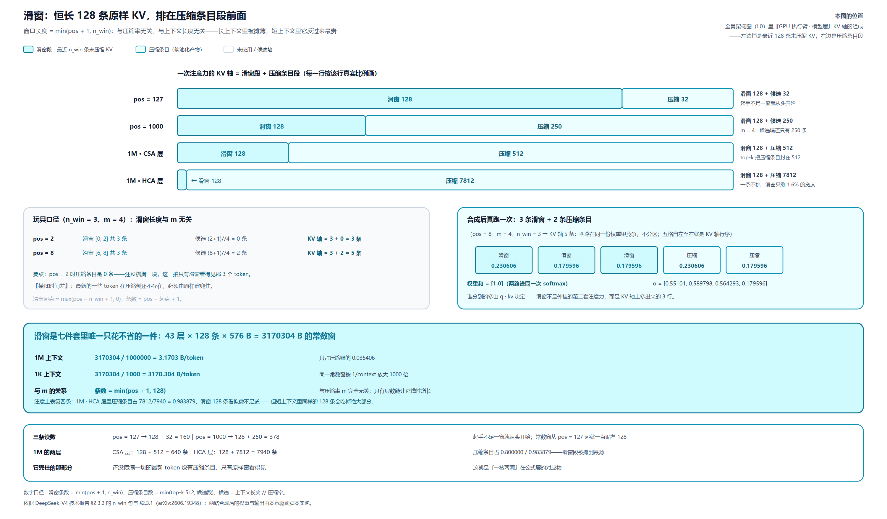

> *图注：一次注意力的 KV 轴 = 滑窗段 + 压缩条目段，每一行按该行真实比例画：左边永远是最近 128 个 token 的原样 KV（滑窗段），从位置 127 到 1M 一直是 128 条，被 $`\min(pos+1, n_{\mathrm{win}})`$ 钉死；右边是压缩条目段（位置 127 时 32 条、位置 1000 时 250 条、1M·CSA 层 512 条、1M·HCA 层 7812 条）。两段的宽窄随上下文互换：短上下文里滑窗段占大半（位置 127 那一行的滑窗段比压缩段还长），到 1M·HCA 层只剩 1.6% 的宽度。中部左栏是玩具口径（n_win 取 3）的两行条数，右栏是合成后真跑一次：3 条滑窗加 2 条压缩进同一份 softmax，权重和仍是 1.0。下部重点块给出常数窗的账：43 × 128 × 576 = 3170304B（576B 是 token 数据段，含 8 字节缩放是 584B），1M 下摊薄 3.1703 B/token、1K 下 3170.304 B/token，并标出「还没攒满一块的最新 token 没有压缩条目，只有原样窗看得见它们」。重点块里那个「占压缩账 0.035406」用的是未折算的原数（整机摊薄量直接除以逐层均值），本章不采用——整机口径与逐层口径不能直接相除，两张口径的对齐见开账那一节。*

代码侧，滑窗索引与压缩条目的索引在同一次核调用里合成：

```python
# vllm/models/deepseek_v4/nvidia/flashmla.py:L228-L244 · DeepseekV4FlashMLAAttention._forward_decode（decode 段）
        out, _ = flash_mla_with_kvcache(
            q=q,
            k_cache=swa_cache,
            block_table=None,
            head_dim_v=512,
            tile_scheduler_metadata=tile_metadata,
            cache_seqlens=None,
            is_fp8_kvcache=True,
            indices=swa_indices,
            topk_length=swa_lens,
            softmax_scale=self.scale,
            attn_sink=self.attn_sink,
            extra_k_cache=kv_cache if not swa_only else None,
            extra_indices_in_kvcache=topk_indices,
            extra_topk_length=topk_lens,
            out=output.unsqueeze(1),
        )
```

一次调用两个来源：`k_cache=swa_cache` 是滑窗那 128 条原样 KV，`extra_k_cache` 是压缩条目（top-k 或全填的索引表通过 `extra_indices_in_kvcache` 给）；参数里那个 `attn_sink` 是下一节的主角（每头一个可学习标量 $`z'_h`$，只进 softmax 的分母），本节先按下。这就是[第 26 章](../../ch26-deepseek-indexer-nsa-dsa/narrative/chapter.md)讲的「一核两源」，本章只用它说明一件事：滑窗不是单独一趟计算，它是同一次注意力 KV 轴左侧那段恒长的部分。滑窗自己的索引在元数据构建期算好（`vllm/v1/attention/backends/mla/sparse_swa.py:L767` 一行 `start_pos = max(pos - window_size + 1, 0)`，含 query 自己、连续未压缩），窗口宽度来自 config（`vllm/models/deepseek_v4/attention.py:L206` 的 `window_size = config.sliding_window`）。

**伪码：滑窗与压缩条目的合成**

```python
def compose_kv(pos, n_win, entries, select_topk):
    swa_start = max(pos - n_win + 1, 0)          # 含 query 自己
    swa = raw_kv_rows(swa_start, pos)            # 恒长（不超过 n_win），未压缩
    return concat([swa, select_topk(entries)])   # 同一份 softmax 里竞争
```

它钉住的不变量是窗口长度的上界：`min(pos + 1, n_win)`，与压缩率无关、与上下文长度无关。

## 位置与分母：两个容易漏掉的小件

### 只转最后 64 维，输出侧还要转回来

RoPE（旋转位置编码）在这套注意力里只作用在**最后 64 维**上，前面的 448 维是 NoPE（不带位置）。这两条都是论文明写的（arXiv:2606.19348 §2.3.3 原句：we also apply RoPE with position $`-i`$ on the last 64 dimensions of each $`o_{t,i}`$），不是纯实现细节，所以锚给到节号。这一点论文与两侧实现四处一致：query、滑窗的 KV、压缩条目都只对最后 64 维做旋转（本仓 `vllm/models/deepseek_v4/compressor.py:L403-L406` 与 `fused_inv_rope_fp8_quant.py` 的核都以这个分界切段；官方参考实现（DeepSeek-V4-Pro inference/model.py:L499、L504、L367）三处都是 `[..., -rd:]`）。

更细的一处是输出侧：核心注意力的输出还要反向旋转一次（论文原句写的就是 position $`-i`$）。先说记号：论文这里的 $`i`$ 与它自己 Eq.(19) 里 $`o_{t,i}`$ 的头号 $`i`$ 同名，而我们手里只有这一句原句、没有它的前后文，所以本章不替它裁定这个 $`i`$ 指什么；两侧实现做的是同一件事：反旋传入的不是条目的位置，而是 **query 自己的位置**。官方参考实现（DeepSeek-V4-Pro inference/model.py:L486、L534）取 `freqs_cis[start_pos:start_pos+seqlen]` 再置 inverse 标志；本仓的核里 `pos = tl.load(positions_ptr + pid_token)`（`vllm/models/deepseek_v4/common/ops/fused_inv_rope_fp8_quant.py:L92`）。

为什么非转不可，链条是一环扣一环的：压缩条目写入时带的是**块级位置**（一条条目代表整块，位置取块起点，代码注释原话是 `(positions // compress_ratio) * compress_ratio`，`vllm/models/deepseek_v4/compressor.py:L403`），query 带的是自己的位置 $`t`$，两者差着一整个块的相位；核心注意力的输出是条目向量的加权和，继承的是条目那套相位，而它下一步要进的输出投影（`wo_a`/`wo_b` 那一族升维与混合矩阵）是按位置无关设计的，所以在投影之前必须先把这套相位解掉，用的就是 query 自己的位置（`vllm/models/deepseek_v4/attention.py:L396` 那行 `self._o_proj(o, positions)`）。解完之后每条条目留下的相位差是（条目位置 − query 位置），正是这一段注意力该携带的相对距离。

反向旋转就是正向旋转的逆运算，两个方向的公式只差 partner 项的一个符号：

<!-- trace: ch28-m10 -->
| 步骤 | 动作 | 关键数值 | 判定 |
|---|---|---|---|
| 频率表 | 频率 = 底数的负 2j/rope_dim 次方，j 取 0 到 1 | [1.0, 0.01] | 两个频率都可手算 |
| 正向旋转 | 偶数位乘 cos 减 partner 乘 sin，奇数位乘 cos 加 partner 乘 sin | cos = [-0.989992, 0.99955]、sin = [0.14112, 0.029996]，转出 [9.0, 9.0, -1.272233, -1.838865, 2.878668, 4.088187] | 前 2 维（NoPE 段）纹丝不动 |
| 反向旋转 | 偶数位乘 cos 加 partner 乘 sin，奇数位乘 cos 减 partner 乘 sin | 转回 [9.0, 9.0, 1.0, 2.0, 3.0, 4.0] | 逐位复原：最大偏差 0.00000000 |
| 一对频率 | 位置 2 与 3 两维单看一对 | [1.0, 2.0] 正转到 [-1.272233, -1.838865]，再反转回 [1.0, 2.0] | 只差 partner 项的符号（负 sin 对正 sin） |
| 为什么必须转回来 | 条目带块级位置、query 带自己的位置 | 条目位置（m 取 4、前 3 条）= [0, 4, 8]；query 位置 = [0, 1, 2, 3, 4, 5, 6, 7, 8, 9, 10, 11] | 对不齐：拿 query 自己的位置当 −θ 转回去，两者才落在同一口径上 |

纸面推导是一行三角恒等式：正向变换是旋转矩阵 $`R(\theta)`$，反向用 $`R(-\theta)`$，两者的乘积是恒等矩阵（二维旋转的封闭性，加上 $`\cos^2+\sin^2=1`$）。所以「转过去再转回来」逐位复原，NoPE 段两次都原样。

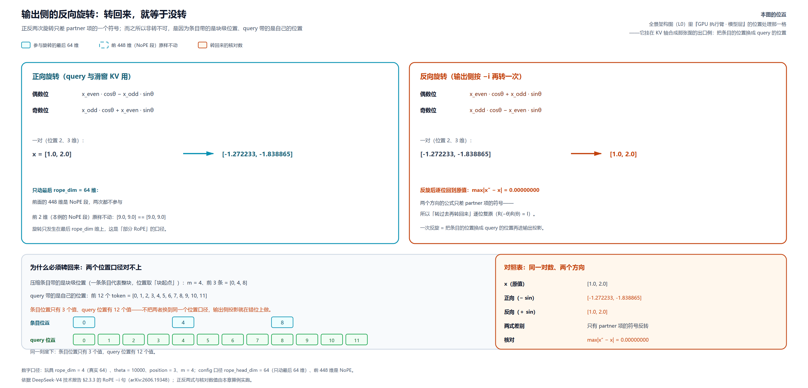

> *图注：一对维度 $`[1.0, 2.0]`$ 正向转到 $`[-1.272233, -1.838865]`$，反向再转逐位回到 $`[1.0, 2.0]`$（max|差| = 0.00000000）；两个方向的式子只差 partner 项的符号：正向偶数位是减、反向是加，其余逐字相同。前面 448 维是 NoPE 段，两次旋转都不参与（$`[9.0, 9.0]`$ 原样），转的只有最后 64 维。为什么要转回来在图的下半左边那张卡：压缩条目带的是**块级位置**（$`m=4`$ 时前 3 条只有 [0, 4, 8] 三个值），query 带的是自己的位置（0..11 十二个值），两个口径对不上；输出继承的是条目那套相位，所以在进输出投影之前，要按 query 自己的位置把它解掉。*

**伪码：输出侧反向旋转（只动最后 64 维）**

```python
def inv_rope(o, positions, cos_sin_cache, rope_start):
    # positions = query 自己的位置（不是条目的块级位置）
    x = o[..., rope_start:]                     # 只取最后 64 维
    partner = x[..., reversed_pairs]            # 相邻两维互换（xor 1）
    cos, sin = cos_sin_cache[positions]
    even = x * cos + partner * sin              # 与正向反号
    odd  = x * cos - partner * sin
    o[..., rope_start:] = interleave(even, odd) # 448 维 NoPE 段不动
    return o
```

它钉住的不变量是「反旋与正旋互为逆」：每一对维度转过去再转回来必须逐位复原（实测最大偏差 0.00000000），否则条目携带的块级位置会污染 query 的位置口径。本仓这条在 `vllm/models/deepseek_v4/common/ops/fused_inv_rope_fp8_quant.py:L85-L107` 核里，`x_add = x * cos + partner * sin` 与 `x_sub = x * cos - partner * sin` 同核接到 FP8 量化；官方参考实现用共轭复数实现同一件事（inverse 标志位加上 `freqs_cis.conj()`，官方参考实现（DeepSeek-V4-Pro inference/model.py:L235-L237、L534））。

### sink：给每个头一个「不看」的权利

最后一个分母上的小件。[第 26 章](../../ch26-deepseek-indexer-nsa-dsa/narrative/chapter.md)的装配段已经点过 `attn_sink` 这个参数（「每头一个可学习标量，指数加进 softmax 分母、充当吸收富余注意力的虚拟出口」），这个现象本身在[第 21 章](../../ch21-attention-backends/narrative/chapter.md)交代过，这里补的是它的公式出处与数值行为。标准 softmax 强制所有可见位置的权重和等于 1：哪怕当前 query 跟看见的内容都关系不大，它也只能把 1 分出去。V4 在 HCA 层加了一个可学习的 sink logit $`z'_h`$，它的指数项**只加进 softmax 的分母**，分子里没有对应的 value（arXiv:2606.19348 §2.3.3 原话是「$`\exp(z'_h)`$ 会被加进注意力分数的分母」，让每个 query 头能把总注意力质量调成不等于 1、甚至接近 0）。

<!-- trace: ch28-m11 -->
| 步骤 | 动作 | 关键数值 | 判定 |
|---|---|---|---|
| 基例 sink 取 None | 退化成普通 softmax | 权重 = [0.731059, 0.268941]、总质量 = 1.0 | 负无穷的指数是 0，等于没有 sink |
| sink 取 1.5 | 只改分母 | 权重 = [0.50648, 0.186324]、总质量 = 0.692804 | 相对比例不变、绝对份额整体缩水 |
| sink 取 0.0 | 同上 | 权重 = [0.665241, 0.244728]、总质量 = 0.909969 | sink 拿走 0.090031 |
| sink 取 -2.0 | 同上 | 总质量 = 0.986787 | sink 越负越接近 1.0 |
| sink 取 10.0 | 同上 | 权重 = [0.000335, 0.000123]、总质量 = 0.000459 | 这个头这一拍几乎不看任何东西 |
| sink 取 20.0 | 同上 | 总质量 = 0.00000002、权重 = [0.00000002, 0.00000001] | 趋向 0 的极限 |
| sink 取 -20.0 | 另一端极限 | 总质量 = 1.00000000 | 回到普通 softmax |
| 核内落法 | 核心注意力带 sink 取 0.5 跑一次 | 权重 = [0.433651, 0.21382]、o = [0.433651, 0.21382] | 输出方向由比例决定、幅度被总质量缩放 |

写成显式式子，这条性质一眼可见。对 logits $`\{z_j\}`$ 与 sink $`z'`$，权重是

```math
w_j = \frac{\exp(z_j - m)}{\sum_j \exp(z_j - m) + \exp(z' - m)}
```

其中 $`m`$ 是 logits 与 sink 里的最大值（分母里逐项减去它不改变比值；这个 $`m`$ 只是本节的 max-logit 记法，与前面那个压缩率 $`m`$ 无关）。于是权重和 $`S/(S+\exp(z'-m))`$ 关于 $`z'`$ 单调递减、恒不超过 1。**相对比例完全不受 sink 影响**：sink 不出现在分子里，$`w_j/w_k=\exp(z_j-z_k)`$ 与它无关，表里 sink 取 1.5 与取 None 两行的比例同为 0.731059 : 0.268941（即 0.50648 : 0.186324），份额被整体缩到 0.692804。

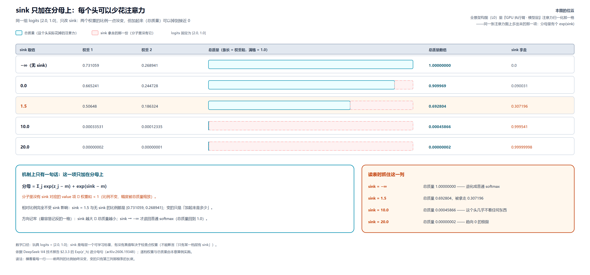

> *图注：同一组 logits $`[2.0, 1.0]`$，只改 sink 一个数。sink 取 $`-\infty`$（无 sink）时总质量 1.00000000，退化成普通 softmax；sink 取 1.5 时两个权重的**比例一点没变**（0.50648 对 0.186324，与 0.731059 对 0.268941 同比例），但加起来只有 0.692804——sink 拿走 0.307196；sink 取 10.0 时总质量 0.00045866，这个头这一拍几乎不看任何东西；再往大取（20.0）趋近 0，往小取回到 1.0。表里「总质量」这一列就是每个头实际花掉的注意力，也是这一件存在的理由：不给它这个权利，任何头都必须把 1 分完。*

本仓的可读版在 ROCm 路径的在线 softmax 里（`vllm/v1/attention/ops/rocm_aiter_mla_sparse.py:L1194-L1201`）：

```python
# vllm/v1/attention/ops/rocm_aiter_mla_sparse.py:L1194-L1201 · _sparse_attn_prefill_ragged_kernel 在线 softmax 尾段
    if HAS_ATTN_SINK:
        sink = tl.load(
            attn_sink_ptr + head_offsets, mask=head_mask, other=neg_large
        ).to(tl.float32)
        m_final = tl.maximum(m_i, sink)
        alpha = tl.exp(m_i - m_final)
        l_final = l_i * alpha + tl.exp(sink - m_final)    # L1200
        denom = tl.maximum(l_final, 1.0e-30)
```

`l_final = l_i·alpha + exp(sink − m_final)` 就是那个「只进分母」的字面形态：分子（`acc_o`）里没有对应的 value 项。三处代码事实要分清：**论文说这一件属于 HCA 层**，而两侧实现里 `attn_sink` 都是**每层都有**的参数，有没有真值取决于检查点权重——本仓的初值是负无穷（`vllm/models/deepseek_v4/attention.py:L221-L224`，`exp(−inf)=0` 等价于「无 sink」），官方参考实现是未初始化的 `torch.empty`（官方参考实现（DeepSeek-V4-Pro inference/model.py:L456））。谈默认行为时要写「取决于检查点权重」，不要把这件说成 HCA 独有的代码结构。官方那条最短的落法在核里：sink 在 online softmax 收尾时加进累加和、而分子不加（官方参考实现（DeepSeek-V4-Pro inference/kernel.py:L345-L346））。

**伪码：sink 只进分母**

```python
def softmax_with_sink(logits, sink):
    m = max(max(logits), sink)
    num = exp(logits - m)
    den = num.sum() + exp(sink - m)   # sink 只在这里出现
    return num / den                  # 总质量 = num.sum() / den < 1
```

它钉住的不变量是「总质量 ≤ 1 且相对比例与 sink 无关」：分子的形状不变，多出来的那一项只改变缩放。

## 第五件：四条流残差凭什么不塌

现在把镜头推进 L0 图「GPU 执行臂」列模型层那一格的内部：两次子层（注意力与 FFN）被残差串起来，这件事本身不新鲜（[第 23 章](../../ch23-model-layer-assembly/narrative/chapter.md)立过）。V4 换掉了残差的形式：残差流从 1 条**扩成 $`n_{hc}=4`$ 条**，每半层做一次「读入聚合 → 子层 → 写回散开」，而残差自带一项**流间混合**。旧设计是「一条流加回去」，靠 $`x+F(x)`$ 里那条直通线（恒等映射）让信号与梯度跨层不衰减。把流扩成 4 条、连接花样变多，这条直通线就保不住了——多流残差这套做法叫 mHC（Manifold-Constrained Hyper-Connections，arXiv:2512.24880），它的前身是 Hyper-Connections（arXiv:2409.19606）：后者把残差流扩成 $`n`$ 条、实验最高试到 8、默认 4，想同时缓解梯度消失与表示塌缩两边难兼顾的处境；代价由 mHC 的摘要点名：这种多样化连接破坏了残差连接固有的恒等映射性质，导致严重的训练不稳定与受限的扩展性（arXiv:2512.24880 摘要原句），V4 报告也说明朴素的 HC 在堆多层时数值不稳定。

药方不是放弃多流，而是**约束**。V4 的更新式（arXiv:2606.19348 §2.2 Eq.(1)，符号用报告的 A/B/C）：

```math
X_{l+1} = B_l X_l + C_l \mathcal{F}_l(A_l X_l)
```

其中读入映射 $`A_l`$ 把 $`n_{hc}`$ 条流聚成子层的一路输入，$`C_l`$ 把子层输出散回 $`n_{hc}`$ 条流，而残差自带的那项 $`B_l`$ 被关进一个集合（Eq.(2)）：

```math
B_l \in \mathcal{M} \coloneq \{ M \in \mathbb{R}^{n \times n} \mid M\mathbf{1}_n = \mathbf{1}_n,\ \mathbf{1}_n^T M = \mathbf{1}_n^T,\ M \geqslant 0 \}
```

这里的 $`n`$ 指**残差流条数**，即本章的 $`n_{hc}`$（论文 Eq.(2) 就写作 $`n`$，与本章别处的序列长度 $`n`$ 同名不同义）。这个集合就是**双随机矩阵**全体（非负、每行和为 1、每列和为 1），也叫 Birkhoff 多面体；置换矩阵是它的顶点，恒等矩阵也在里面。

为什么偏偏是这个集合，三条性质一起回答（这三条出自 mHC 原论文 §4.1：只有范数那条留下了原短语 the spectral norm … is bounded by 1，另两条是转述；下面把背后的推导补上）。先给一句话直觉：**谱范数就是这个矩阵最多能把一个向量放大多少倍**——把矩阵在各个方向上对向量的放大倍数都算出来（这些数叫奇异值），最大的那一个就是谱范数；双随机的行和 1 保证不缩、列和 1 保证不胀，所以这个放大倍数恰好被钉在 1 上。三条性质：

<!-- trace: ch28-m12 -->
| 步骤 | 动作 | 关键数值 | 判定 |
|---|---|---|---|
| 双随机判定 | 矩阵 [[0.7,0.3],[0.3,0.7]] 的行和与列和 | 行和 [1.0, 1.0]、列和 [1.0, 1.0]、非负为真 | 双随机判定为真 |
| 谱范数 | 两个双随机矩阵的奇异值 | 一个得 [1.0, 0.4]，谱范数 1.0；一个得 [1.0, 0.264575, 0.264575]，谱范数 1.0 | 恰好等于 1（不是巧合：1 必是特征值，列和再压住上界） |
| 反例 | 矩阵 [[0.9,0.1],[0.2,0.8]]（列和 [1.1, 0.9]） | 谱范数 1.009583 大于 1 | 列和不等于 1 时谱范数就大于 1：最坏方向上最多放大 1.009583 倍（不是每个方向都被放大） |
| 反例的反复自乘 | 同一矩阵的幂次谱范数 $`\|M^k\|_2`$（指数 $`k`$ 取 1、2、3、5、9、17、33） | 1.009583 → 1.018627 → 1.026639 → 1.038734 → 1.049989 → 1.053848 → 1.054092 | 列出的每个幂都大于 1（最小 1.009583），但增幅逐次变小、趋近 1.054092 这个上确界：固定矩阵反复自乘会饱和、不是指数放大；逐层各是一个矩阵时上界才是子乘性的 |
| 封闭性 | 双随机矩阵相乘还在集合内 | 自乘得 [[0.58, 0.42], [0.42, 0.58]]（行列和 [1.0, 1.0]，谱范数 1.0）；三阶同理 | 复合仍在内，深堆叠稳 |
| 非扩张 | 同一组流、两种混合矩阵 | 残差矩阵的 Frobenius 范数 2.5（谱范数量的是「最多把向量放大几倍」，这里量的是矩阵自己的长度，Frobenius 范数 = 各元素平方和的平方根）：双随机混完 1.537856（比值 0.615142）；反例矩阵混完 2.076656（比值 0.830662） | 双随机这一档不放大 |
| 恒等映射回归 | 取双随机集合的顶点：恒等矩阵 | 恒等矩阵乘上流 = 流本身（逐位相同为真） | 多流退化成单流残差的那条「加回去」 |

第一行的两条论证可以一行写清：行和为 1 说明全 1 向量是特征值 1 的特征向量，于是谱范数不小于 1；列和为 1 再给出上界，用的是范数不等式

```math
\|B\|_2 \le \sqrt{\|B\|_1 \|B\|_\infty}
```

（1-范数是最大列和、无穷范数是最大行和）；两头夹住，恰好等于 1。封闭性则是

```math
(B_1B_2)\mathbf{1} = B_1\mathbf{1} = \mathbf{1}
```

加上「非负乘非负仍非负」，复合之后还在集合里。反例把必要性钉死：列和不等于 1 时谱范数 1.009583，同一个混合矩阵反复自乘，放大率单调增、迅速饱和在 1.054092（表里最右那个值）。要留意这里的两件事不是一回事：固定一个矩阵反复用，放大是有界的（所以上面那串数会停下来）；真正的深堆叠是**每层一个矩阵**，这时上界走的是子乘性：

```math
\left\|\prod_l B_l\right\|_2 \le \prod_l \left\|B_l\right\|_2
```

每一层都可能乘上自己的放大因子，层数越多上界越高——这才是「多流会飘」的算术形态，也是「约束而不是放弃多流」这句话的全部内容。

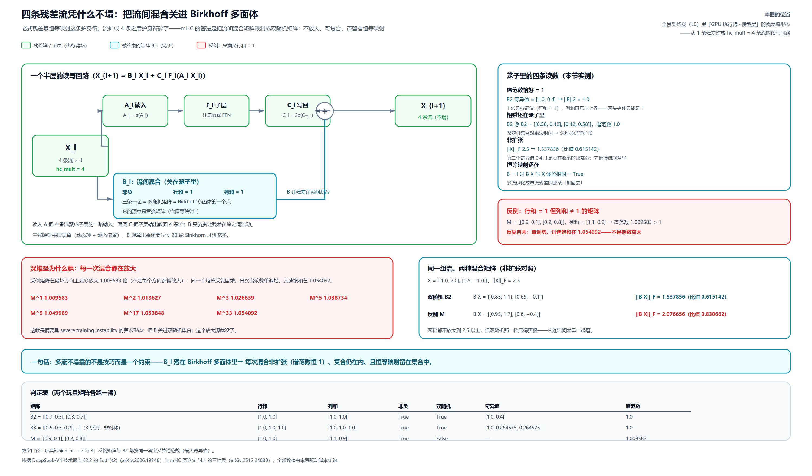

> *图注：左上是一条半层回路：残差状态 $`X_l`$（4 条流）分三路，一条经读入映射聚成子层输入、一条原样经流间混合、子层输出经写回映射散回四条流，三者在右侧相加得到 $`X_{l+1}`$。混合矩阵画在一只笼子里，笼子上写着三条入笼条件（非负、行和 1、列和 1），并标注「它的顶点是置换矩阵（含恒等映射）、三条一起就是双随机矩阵」。右上四条读数：谱范数恰好 1（奇异值 [1.0, 0.4]）、封闭性（自乘仍在集合内）、非扩张（流范数 2.5 混完 1.537856）、恒等映射仍在（恒等矩阵乘流逐位相同）。右栏中部那张反例卡：列和为 [1.1, 0.9] 的矩阵谱范数 1.009583，反复自乘后单调增、饱和在 1.054092（底排左栏是「深堆叠为什么飘」、底排右栏是同一组流的非扩张对照）。底部判定表把两个玩具矩阵各跑一遍。*

**伪码：半层的 mHC 读写**

```python
def mhc_half_layer(X, F, A, B, C):        # X: [n_hc, d]
    sub = F(A @ X)                        # 读入：聚成子层的一路输入
    return B @ X + C @ sub                # Eq.(1)：流间混合 + 写回散开
```

它钉住的不变量是「混合项不放大」：$`B`$ 的谱范数恰为 1，且双随机集合对乘法封闭，所以无论堆多少层，残差带的范数都不会被混合矩阵放大。本仓那份可读的 torch 回退把这一式写成两行 einsum（`vllm/model_executor/kernels/mhc/torch.py:L94-L106`：`mixed_residual = einsum("...ij,...ih->...jh", comb_res_mix, residual)` 就是把残差按混合矩阵混一遍，`post_term = post_layer_mix * x` 就是 $`C_l\mathcal{F}_l(\cdot)`$，两者相加）。这两个入参名是下游 `mhc_post_torch` 的写法，对应的就是前面 `mhc_pre_torch` 返回的 `comb_mix` 与 `post_mix`（同一个张量在下游换了个名字，别当成又一张矩阵）。方向要当场说清：这个 einsum 收缩的是 `comb_res_mix` 的行下标，算出来是 $`\mathrm{comb}^{\mathsf T}X`$——代码里存的混合矩阵是论文 $`B_l`$ 的转置（双随机集合对转置封闭，与 Eq.(1) 同族，所以「混一遍」这件事的性质不变）。

## 第五件（续）：三张映射当场算出来

$`A/B/C`$ 不是三张固定的权重表，而是**每层当场生成**的。生成原料是残差的展平态：把 $`n_{hc}`$ 条流摊平成一个 $`1\times n_{hc}d`$ 的向量，做一次**没有增益**的 RMSNorm（只按均方根缩放、不学缩放因子），再乘一个大矩阵，一口气吐出 $`(2+n_{hc})\cdot n_{hc}`$ 个数——$`n_{hc}`$ 个读入参数、$`n_{hc}`$ 个写回参数、$`n_{hc}^2`$ 个混合参数（arXiv:2606.19348 §2.2 Eq.(3)-(5)）：

```math
\tilde{A}_l = \alpha_l^{\mathrm{pre}} \cdot (\hat{X}_l W_l^{\mathrm{pre}}) + S_l^{\mathrm{pre}}
```

```math
\tilde{B}_l = \alpha_l^{\mathrm{res}} \cdot \operatorname{Mat}(\hat{X}_l W_l^{\mathrm{res}}) + S_l^{\mathrm{res}}
```

```math
\tilde{C}_l = \alpha_l^{\mathrm{post}} \cdot (\hat{X}_l W_l^{\mathrm{post}})^T + S_l^{\mathrm{post}}
```

```math
\hat{X}_l = \mathrm{RMSNorm}(\mathrm{vec}(X_l))
```

这里 $`\hat X_l`$ 是残差展平后做一次无增益 RMSNorm 的结果；$`\operatorname{Mat}(\cdot)`$ 是把 $`n_{hc}^2`$ 个数摆成 $`n_{hc}\times n_{hc}`$ 的混合矩阵，也就是伪码里那个 reshape；$`\alpha`$ 是三条支路各自的可学习门控（初始化很小，决定「输入相关的动态项」占多少），$`S`$ 是对应的静态偏置（门控为 0 时映射退化成它）。三条 raw 参数里只有 $`\tilde C_l`$ 写转置：$`\hat X_lW_l^{\mathrm{post}}`$ 算出来是 $`1\times n_{hc}`$ 的行向量，转成 $`n_{hc}\times 1`$ 的列向量之后，$`C_l\mathcal{F}_l(\cdot)`$ 才凑得出 $`n_{hc}\times d`$；$`\tilde A_l`$ 不写转置，因为它本身就是读入用的 $`1\times n_{hc}`$ 行向量。三条 raw 参数再各过一道约束（Eq.(6)(7) 与 Eq.(8)）：

```math
A_l = \sigma(\tilde{A}_l), \qquad C_l = 2\sigma(\tilde{C}_l)
```

```math
M^{(t)} = \mathcal{T}_r(\mathcal{T}_c(M^{(t-1)})), \qquad B_l = M^{(t_{\max})}
```

$`\sigma`$ 是 sigmoid：读入压进 $`(0,1)`$（每个读入权重各自小于 1、不会退化成 0 映射；整体的幅度约束不落在这一项上，而在 $`B_l`$ 的谱范数与 $`C_l`$ 的 2 倍上限）、写回乘 2 压进 $`(0,2)`$（放大上限被钉在 2 倍）；两条映射都有了正值下界，都不会退化成 0 映射。混合矩阵走的是第三条路——迭代投影进双随机集合，下一节专讲。

<!-- trace: ch28-m13 -->
| 步骤 | 动作 | 关键数值 | 判定 |
|---|---|---|---|
| 展平与 RMS | 残差（1×2×2）展平成 [1.0, 2.0, 0.5, -1.0] 再做无权 RMSNorm | 均方 1.5625，得 [0.8, 1.599999, 0.4, -0.8] | RMSNorm 的缩放被折进后面的矩阵乘，不单独占一步 |
| 一次矩阵乘 | 展平态乘上参数矩阵（形状 (8, 4)） | 得 [0.8, 1.599999, 0.4, -0.8, 2.399999, 1.999999, -0.4, 0.0] | 一次出齐 8 个数（(2+2)×2） |
| 切片-读入 | 前 2 个数过 σ 加下界 | Ã = [0.5, 0.9] 得 A = [0.62246, 0.71095] | 值域 (0,1)：读入是「按比例聚合」 |
| 切片-写回 | 写回那两个 raw 数过 2σ | C̃ = [0.4, -0.2] 得 C = [1.197375, 0.900332] | 值域 (0,2)：写回最多放大到 2 倍 |
| 切片-混合 | 后 4 个数展平成 2×2 再过 Sinkhorn | B̃ = [[1.2, 1.0], [-0.2, 0.0]] 得 B = [[0.549833, 0.450166], [0.450166, 0.549833]] | 行和列和都是 0.999999，双随机判定为真 |
| 门控与偏置 | 动态项乘门控加静态偏置 | 门控取 [0.5, 0.5, 0.5]、偏置 [0.1, 0.1, 0.2, 0.2, 0.0, 0.0, 0.0, 0.0] | 门控是可学习的小量、偏置与输入无关 |
| 符号顺序坑 | 论文列举顺序与参考实现打包顺序 | 论文按「读入、混合、写回」列式，参数按「读入、写回、混合」打包 | 同一批数、换个切法——别按论文顺序去读代码切片 |
| 更新一拍 | 混合项与写回项相加（子层取恒等占位） | 读入后 [0.977936, 0.53397]；每一步得 [[1.945872, 1.288864], [1.605549, 0.831248]] | 写回把子层输出散回 2 条流、混合让残差在流间流动 |

第五行那个顺序坑值得单独一句：论文列举三张映射的顺序与实现打包它们的顺序不同（论文按「读入、混合、写回」，两侧实现按「读入、写回、混合」），同一批 8 个数换个切法而已。读代码切片时按代码的顺序读，不要照抄论文的行序——这条在 vLLM 的 torch 回退里看得最清楚。

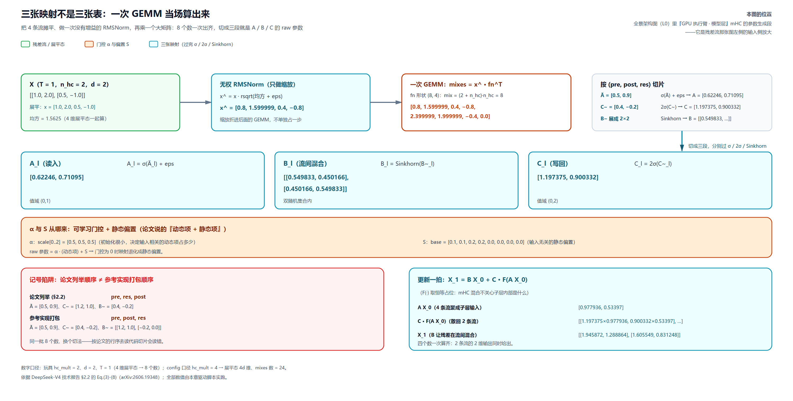

> *图注：左边 4 条流摊平成一行（框里标出 RMSNorm 没有增益、只做缩放，均方 1.5625 得 [0.8, 1.599999, 0.4, −0.8]），中间一次矩阵乘（参数形状 (8, 4)）吐出 8 个数，右边按「读入、写回、混合」切成三段：读入过 σ 得 A（值域 (0,1)）、写回过 2σ 得 C（值域 (0,2)）、混合展成 2×2 再 Sinkhorn 得 B（双随机，行列和 0.999999）。每个切片旁挂一个门控 α 与一个静态偏置 S，这就是论文说的「动态项加静态项」。底部两栏：左是记号陷阱（论文按读入、混合、写回列举，实现按读入、写回、混合打包），右是更新一拍的实际数字（读入 [0.977936, 0.53397]、结果 [[1.945872, 1.288864], [1.605549, 0.831248]]）。*

本仓那份 torch 回退逐行对得上（`vllm/model_executor/kernels/mhc/torch.py:L62-L91`）：

```python
# vllm/model_executor/kernels/mhc/torch.py:L62-L91 · mhc_pre_torch 后半段
    x = residual_flat.view(num_tokens, hc_mult * hidden_size).to(torch.float32)
    mixes = torch.matmul(x, fn_flat.t())
    sqrsum = x.square().sum(dim=-1, keepdim=True)
    mixes = mixes * torch.rsqrt(sqrsum / (hc_mult * hidden_size) + rms_eps)

    pre_logits = mixes[:, :hc_mult] * hc_scale[0] + hc_base[:hc_mult]
    pre_mix = torch.sigmoid(pre_logits) + hc_pre_eps        # L68

    post_logits = (
        mixes[:, hc_mult : 2 * hc_mult] * hc_scale[1] + hc_base[hc_mult : 2 * hc_mult]
    )
    post_mix = torch.sigmoid(post_logits) * hc_post_mult_value    # L73

    comb_logits = mixes[:, 2 * hc_mult :].view(num_tokens, hc_mult, hc_mult) * hc_scale[
        2
    ] + hc_base[2 * hc_mult :].view(1, hc_mult, hc_mult)
    comb_mix = torch.softmax(comb_logits, dim=-1) + hc_sinkhorn_eps   # L78
    comb_mix = comb_mix / (comb_mix.sum(dim=-2, keepdim=True) + hc_sinkhorn_eps)
    for _ in range(sinkhorn_repeat - 1):
        comb_mix = comb_mix / (comb_mix.sum(dim=-1, keepdim=True) + hc_sinkhorn_eps)
        comb_mix = comb_mix / (comb_mix.sum(dim=-2, keepdim=True) + hc_sinkhorn_eps)

    layer_input = torch.sum(                                   # L84
        pre_mix.unsqueeze(-1) * residual_flat.to(torch.float32), dim=1
    ).to(torch.bfloat16)
    return (
        post_mix.view(*outer_shape, hc_mult, 1),
        comb_mix.view(*outer_shape, hc_mult, hc_mult),
        layer_input.view(*outer_shape, hidden_size),
    )
```

三个细节全在这十几行里：`mixes * torch.rsqrt(sqrsum / (hc_mult*hidden_size) + rms_eps)` 把 RMSNorm 的缩放折进矩阵乘（展平、无权、不单独占一步）；`pre_mix` 是 `sigmoid + eps`、`post_mix` 是 `sigmoid * 2`（那个 2 在核里是硬编码的 `hc_post_mult_value`）；`comb_mix` 是「先 softmax 再列归一、之后重复 $`t_{\max}-1`$ 轮行列交替」，每一步的分母都加一个 1e-6 的保护项。`layer_input` 那一行就是 Eq.(1) 的 $`A_lX_l`$：把 $`n_{hc}`$ 条流按读入权重加权求和成一路。官方参考实现把同一段装在一个核里（官方参考实现（DeepSeek-V4-Pro inference/kernel.py:L391-L396）的三行分别是 σ、2σ 与混合切片，L401-L423 是 softmax 加行列交替），三处切片顺序一致。

**伪码：参数生成与三张映射（sec1 静态 → sec2 动态）**

```python
# sec1：门控取 0 时三张映射退化成静态偏置 S（与输入无关的常量）
# sec2：动态项上场：展平态一次矩阵乘，按可学习门控 α 混进 S
def hc_maps(X, fn, scale, base, n_hc, sinkhorn_iters, eps):
    x = rmsnorm_no_gain(flatten(X))            # 无权 RMSNorm，缩放折进下一步
    mixes = linear(x, fn)                      # 一次矩阵乘出 (2+n_hc)*n_hc 个数
    A = sigmoid(mixes[0:n_hc] * scale[0] + base[0:n_hc]) + eps
    C = 2 * sigmoid(mixes[n_hc:2*n_hc] * scale[1] + base[n_hc:2*n_hc])
    B = sinkhorn(reshape(mixes[2*n_hc:], n_hc, n_hc) * scale[2] + base[2*n_hc:],
                 iters=sinkhorn_iters, eps=eps)
    return A, B, C
```

它钉住的不变量是三张映射的值域与双随机性：$`A`$ 恒在 $`(0,1)`$、$`C`$ 恒在 $`(0,2)`$、$`B`$ 恒在 Birkhoff 多面体里——raw 参数无论怎么学，都不会把残差写没或写爆。

## 第五件（收尾）：为什么是 20 轮

把任意非负矩阵变成双随机矩阵，最省事的办法是**交替归一**：先把每行拉到和 1，再把每列拉到和 1，然后再拉行、再拉列，一轮一轮逼近。这就是 Sinkhorn-Knopp 迭代（起源是 Sinkhorn 1964 年的定理：任何全正矩阵经正对角缩放可以变成双随机，交替归一就是它的构造性证明）。这套迭代用在网络里有个前提：它必须便宜、可迭代、只在前向用——因为它作用在参数的中间量上，不需要可微。

迭代确实在收敛，但收敛的终点不是「精确」：

<!-- trace: ch28-m14 -->
| 轮次 | 动作 | 关键数值（行、列偏差） | 判定 |
|---|---|---|---|
| 第 1 轮 | 行使和归 1 再列使和归 1 | 行偏差 0.02756985、列偏差 1.05e-06 | 列和当轮就归 1（列偏差恒在保护项地板附近） |
| 第 2 轮 | 同上 | 行偏差 0.00839717、列偏差 1.02e-06 | 偏差逐轮下降 |
| 第 3 轮 | 同上 | 行偏差 0.00255908、列偏差 1e-06 | 每轮约缩到前一轮的三分之一 |
| 第 4 轮 | 同上 | 行偏差 0.00078041、列偏差 1e-06 | 单调降（0.02756985 到 0.00078041） |
| 第 5 轮 | 同上 | 行偏差继续按约 1/3 的比例收缩、列偏差 1e-06 | 还没够到地板：收尾的是列归一，列偏差恒贴地板、行偏差要更多轮才降到它（见下行） |
| 第 20 轮 | 停止（迭代上限） | 行偏差 1.00e-06、列偏差 1.00e-06 | 最差的那个矩阵 20 轮后仍有残差，所以是折中不是精确投影 |
| 条件数差的一档 | 20 轮与 200 轮对照 | 三档病态矩阵都停在 1.00e-06 | 接近保护项地板，20 轮与 200 轮结果同档 |
| 实现顺序 | 行优先、列优先、起点取指数或 softmax | 两种顺序的 20 轮结果互为转置型（0.92408478 等）；两种起点结果相同 | 论文写 $`M^{(t)}=\mathcal{T}_r(\mathcal{T}_c(\cdot))`$，式子从内往外读是「先列后行」；两侧实现是「softmax（等价行归一）后列归一，再重复迭代上限减一轮」——极限相同、定点略差 |

论文对这个数字的原话是「我们选 20 作为实用值」（as a practical value），不是「迭代到收敛」。为什么有地板：每一步的分母都加一个 1e-6 的保护项（防止除零，同时给矩阵一个正值下界），所以偏差不可能到 0；对残差流混合的实际影响在行和列和不守恒的 0.0001% 量级。**代价是每次半层一次 4×4 的 20 轮交替归一**，与一次矩阵乘相比不算什么，但它是「每半层多出来的固定开销」之一。

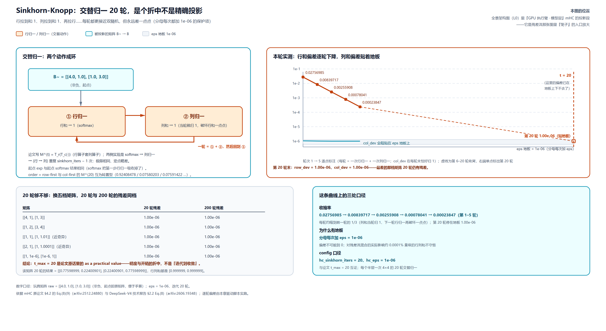

> *图注：左栏把交替归一的机械动作画成一个环——行归一先把行和拉成 1，列归一收尾、列和当轮就归 1（这一步会把行和再破坏一点点，行偏差就是它留下的），起点是 [[4.0, 1.0], [1.0, 3.0]]。右栏是本轮的偏差折线：行偏差从 0.02756985 一路降到 0.00839717、0.00255908、0.00078041（每轮约缩到前一轮的三分之一），到第 20 轮停在 1e-06 量级的保护项地板上；列偏差全程贴在底板上（1.05e-06、1.02e-06、1e-06），t = 20 处画一条竖虚线。下方两栏：左是五档矩阵在 20 轮与 200 轮后的残差对照（全部 1.00e-06），右是这条曲线的三处口径（收缩率约三分之一、地板来自分母的 1e-06 保护项、config 的 20 轮与论文的 t_max = 20 互证）。*

本仓与官方参考实现的第一步顺序一致（先 softmax 再列归一，之后重复迭代上限减一轮），论文书面写的是「先列后行」：极限相同，20 轮内的定点略有差别。这类差异不必抹平，讲清哪份文档怎么写的就够了。

**伪码：Sinkhorn-Knopp 投影**

```python
def sinkhorn(B_tilde, iters, eps):
    M = softmax(B_tilde, axis=-1) + eps          # 起点：指数（这里用 softmax 吸收行归一）
    M = M / (M.sum(axis=-2, keepdim=True) + eps) # 列归一：列和当轮归 1
    for _ in range(iters - 1):
        M = M / (M.sum(axis=-1, keepdim=True) + eps)  # 行归一
        M = M / (M.sum(axis=-2, keepdim=True) + eps)  # 列归一
    return M                                      # 双随机，但不是精确投影
```

它钉住的是「迭代上限是折中不是收敛判据」：分母每次都加保护项，偏差只能降到地板；20 轮这个数字的出处是论文的实用值，config 的 `hc_sinkhorn_iters` 与它互证。

## 出口：四流收尾、hc_head 这件自造件

残差带走到主干末尾要收，这里先补一张符号对照——同一组映射在三份文档里有三种写法，读 V4 报告、读 mHC 原论文、读代码时各会撞上一种：

| 角色 | V4 报告（§2.2） | mHC 原论文 | 实现侧 |
|---|---|---|---|
| 读入（把 $`n_{hc}`$ 条流聚成子层输入） | $`A_l=\sigma(\tilde A_l)`$ | $`H_l^{pre}=\sigma(\tilde H_l^{pre})`$ | `hc_scale[0]`（动态门控）、`hc_base` 前段（静态偏置） |
| 流间混合（残差自带那一项） | $`B_l`$ 属于 Birkhoff 多面体 | $`H_l^{res}=\mathrm{Sinkhorn}(\tilde H_l^{res})`$ | `hc_scale[2]`、`hc_base` 末段；迭代上限来自 `hc_sinkhorn_iters` |
| 写回（把子层输出散回各流） | $`C_l=2\sigma(\tilde C_l)`$ | $`H_l^{post}=2\sigma(\tilde H_l^{post})`$ | `hc_scale[1]`、`hc_base` 中段；乘的那个 2 在核里硬编码 |

还有一处实现细节值得记：$`A`$ 在实现里是 `σ(Ã) + eps`，多出来的那个 eps 给门控一个严格正的下界（读入权重不能全零）。

出口本身有两步，顺序不能讲反：**先把展平后的残差拷一份出去**（多预测一步那件要用 $`hc\_head`$ **之前**的残差，4 条流的信息在那里还没丢），**再**用 `hc_head` 把 4 条流按 sigmoid 门控加权求和压回 1 条，然后才做最后一层归一化、算 logits。这个 `hc_head` 是 V4 自己的发明件：mHC 只定义了多流的读写回路，怎么收尾回单流是 V4 加的（官方参考实现（DeepSeek-V4-Pro inference/model.py:L728-L735）：`pre = sigmoid(mixes * hc_scale + hc_base) + hc_eps`，再按这份权重把各流加权求和；注意出口只有 σ、**没有 Sinkhorn**，单流不需要双随机）。入口那一侧还有一个首层特判：第一层的入参还是 2D 的 $`(T,H)`$，要先在核里广播成 4 条流；之后的层入参本身就是残差。

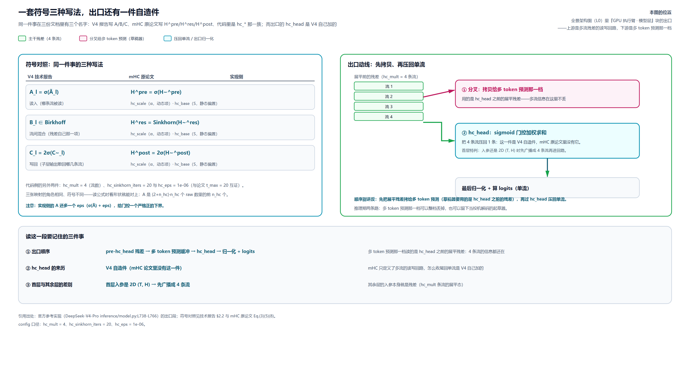

> *图注：左半是符号对照三行（V4 报告、mHC 原论文、实现侧三种写法并排），并标出实现侧的两个另件：流数 4、迭代上限 20 与保护项 1e-06（与论文的实用值互证）；读入那条多一个 eps，给门控一个严格正的下界。右半是出口动线：4 条流摊平后的残差先分叉出一份拷贝交给多预测一步那一档（用的是 hc_head 之前的展平残差，四条流的信息都在），主路再经 hc_head 的 sigmoid 门控加权求和压回 1 条，最后归一化并算 logits。图上明确标注「hc_head 是 V4 自造件，mHC 原论文里没有这一件」，以及首层入参是 2D 时先广播成 4 条流的特判。*

在 v0.27.1 里这条动线落在主干 `forward` 的尾部（这就是自造件 `hc_head` 唯一出现的地方：它管「四条流怎么收回一条」；每半层里那套读入/写回映射是按层现生成的另一组参数，不是它）：先 `_mtp_hidden_buffer.copy_(hidden_states.flatten(1))`（把 $`hc\_mult`$ 条流的展平态拷给草稿器用的缓冲，`vllm/models/deepseek_v4/nvidia/model.py:L1200-L1211`），之后才过 `hc_head` 融合核压回 $`(T,H)`$、再 `compute_logits`（同文件 L1515-L1520）。顺序反了，多预测一步那一档拿到的就是已经压回单流的残差，四条流的信息全丢了。

## 第六件：MoE，切得更细，留一个永远算

模型层那一格里，注意力半层之外的另一半是 FFN，算力的账有一半记在这里。MoE（混合专家）的老思路是把一个大的 FFN 换成一池子小专家，每个 token 只挑几个算：参数容量与每 token 算力就此解绑（这个思路出自 2017 年的稀疏门控专家层，arXiv:1701.06538）。DeepSeekMoE 在此基础上加了两板斧（arXiv:2401.06066 §3.1-§3.2），V4 沿用。**记号先对齐**：这两节按 DeepSeekMoE 原文用 $`m`$ 记专家的**细粒度分割因子**——与前面 CSA/HCA 的压缩率 $`m`$ 同名不同义（那件把 $`2m`$ 个位置压成一条，这件把每个专家按 $`m`$ 份切细，专家总数乘 $`m`$）。同样要说的还有 $`h`$：下式里的 $`h_t^l`$ 是这一层 MoE 的**输出**（DSmoe 原文的写法，进 MoE 的输入叫 $`u_t^l`$），与前面 $`h_t`$ 表示的那一行隐状态、以及 MTP 那节的 $`h'^k_i`$ 都不是同一个东西。还有一处口径要在这里分开：DeepSeekMoE 的式子把共享专家算在总池之内（总专家数 $`mN`$、每 token 激活 $`mK`$ 个是含共享的，路由只在 $`K_s`$ 之后的池子里挑 $`mK-K_s`$ 个），而 config 的 `n_routed_experts=256`、`num_experts_per_tok=6` 只数路由专家、`n_shared_experts=1` 另加（两支口径差一个 $`K_s`$）。下面按原文讲式子、按 config 讲数字，数到「每 token 激活几个」时先看清是哪支口径。

先看标准 MoE 层（DeepSeekMoE Eq.(3)-(5)）：门控给每个专家打一个分，只有 top-$`k`$ 的专家拿到自己的分值，其余置 0，输出是专家输出的加权和再加残差：

```math
h_t^l = \sum_{i=1}^{N} g_{i,t}\, \mathrm{FFN}_i(u_t^l) + u_t^l
```

```math
g_{i,t} = \begin{cases} s_{i,t}, & s_{i,t} \in \mathrm{Topk}(\{s_{j,t} \mid 1 \le j \le N\}, K) \\ 0, & \mathrm{otherwise} \end{cases}
```

```math
s_{i,t} = \mathrm{Softmax}_i\left({u_t^l}^\top e_i^l\right)
```

**板斧一：细粒度切分**（DeepSeekMoE Eq.(6)-(8)）。把每个专家的中间维砍到原来的 $`1/m`$、专家总数乘 $`m`$、每 token 激活数也乘 $`m`$：每 token 的算力一分没多，但「可选的组合」多了很多。

```math
h_t^l = \sum_{i=1}^{mN} g_{i,t}\, \mathrm{FFN}_i(u_t^l) + u_t^l
```

**板斧二：共享专家隔离**（DeepSeekMoE Eq.(9)-(11)）。留 $`K_s`$ 个专家**无条件计算**——式子里它那一项根本没有门控：

```math
h_t^l = \sum_{i=1}^{K_s} \mathrm{FFN}_i(u_t^l) + \sum_{i=K_s+1}^{mN} g_{i,t}\, \mathrm{FFN}_i(u_t^l) + u_t^l
```

```math
g_{i,t} = \begin{cases} s_{i,t}, & s_{i,t} \in \mathrm{Topk}(\{s_{j,t} \mid K_s+1 \le j \le mN\}, mK - K_s) \\ 0, & \mathrm{otherwise} \end{cases}
```

前 $`K_s`$ 个专家负责把公共知识兜住（论文的措辞是「捕获并整合跨上下文的公共知识」，从而减轻其余专家之间的冗余），路由只在它们之后的 $`mN-K_s`$ 个专家里挑 $`mK-K_s`$ 个。

<!-- trace: ch28-m16 -->
| 步骤 | 动作 | 关键数值 | 判定 |
|---|---|---|---|
| 板斧一-切分前 | 4 个专家、中间维 8、每 token 激活 2 个 | 激活算力 = 2 × 8 = 16 | 基准 |
| 板斧一-切分后 | 8 个专家、中间维 4、激活 4 个 | 激活算力 = 4 × 4 = 16（与切分前相等） | 算力不变（论文原句） |
| 板斧一-组合数 | 组合数从 C(4,2) 变到 C(8,4) | 6 到 70（11.666667 倍） | 「更灵活的专家组合」 |
| 真实口径 | 256 个路由专家挑 6 个；单专家中间维是 hidden 的一半 | 2048 / 4096 = 0.500000；对照常规 FFN 的 4 倍 hidden = 16384，单专家只有它的 8.000000 分之一 | 「切得细」的算术形态（后半句是本书自算注解） |
| 板斧二-共享项 | 式子里第一项没有门控 | 共享项 = [0.5, -0.5]（无论门控怎么变都不动） | 「无条件」的可观察后果 |
| 板斧二-对照 | 把门控整体翻倍 | 输出从 [2.05, 0.55] 变成 [2.6, 1.1]；共享项仍是 [0.5, -0.5] | 只有路由项跟着变 |
| 板斧二-不可选 | 把共享位放回路由池（起点从 1 改成 0） | 起点 1 时门控 [0.0, 0.1]；起点 0 时门控 [0.9, 0.0] | 共享专家一旦进池子就可能挑不中，那就不叫无条件了 |

第四行是 V4 的实际尺度：256 个路由专家挑 6 个、另有 1 个共享专家无条件算（config 口径 `n_routed_experts`、`num_experts_per_tok`、`n_shared_experts`），单专家的中间维 2048 是 hidden 4096 的一半。而「无条件」的代价也写在同一行里：每个 token 都要付这个专家的算力，不管需不需要。


> *图注：左半是切分前：4 个大专家（中间维 8）挑 2 个，激活算力 2 × 8 = 16，可选组合 6 种。右半是切分后：8 个小专家（中间维 4）挑 4 个，激活算力 4 × 4 = 16——两根算力条画成等长，说明「更灵活」不是靠多花算力买来的，组合数从 6 涨到 70（11.666667 倍）。下半是板斧二：共享专家画在池子外面、**没有门控线连到它**（无条件），门控整体翻倍时只有路由项跟着变（共享项逐位不动）；反证卡画出把它放回池子的后果（同一组分数下门控落到 [0.9, 0.0]，它可能挑不中）。右下角是 config 的真实尺度：256 挑 6 加 1 个共享，单专家中间维 2048 是 hidden 4096 的一半。*

**伪码：MoE 一拍（细粒度 + 共享专家）**

```python
def moe(x, gate, experts, shared, K_s, K):
    s = softmax(x @ e_centers.T)                 # DSmoe Eq.(5) 门控分
    g = zeros_like(s)
    picked = topk_indices(s[K_s:], K - K_s) + K_s # DSmoe Eq.(10) 路由只在共享专家之后挑（论文口径 K 含共享专家；config 口径的 K 只数路由专家，共享那 1 个另加）
    g[picked] = s[picked]                        # DSmoe Eq.(4) 只有 top-k 拿到分值，不重新归一
    y = sum(g[i] * experts[i](x) for i in range(len(experts)))   # DSmoe Eq.(6)
    y += sum(shared[i](x) for i in range(K_s))   # DSmoe Eq.(9) 第一项没有门控
    return y + x
```

它钉住两个不变量：算力不变（激活专家数乘 $`m`$ 的同时每个专家的中间维除以 $`m`$），以及共享项对门控的偏导恒为 0。

### V4 换掉的三样东西

V4 在路由上有三处改动（arXiv:2606.19348 §2.1），前两处在这里讲，第三处（hash 路由）单独一节。**其一，亲和分的激活函数从 Sigmoid 换成 Sqrt(Softplus)**：sigmoid 会把大 logits 一律压到 1 附近，专家之间分不出高下（logit 取 8 时 sigmoid 给 0.999665，与 logit 取 3 的 0.952574 几乎没差别）；softplus 是另一个形状（它的定义就是 $`\log(1+e^x)`$：恒正、上不封顶，可以看成 ReLU 的平滑版，所以 logits 再大它也照长），开根号再把分布拉平一点。**其二，负载均衡不再写进损失函数**，而是给每个专家一个修正偏置，它**只参与选择、不参与权重**：偏置帮助均衡「选谁」，但给多少权重仍从无偏的分数里取。这不是新发明，出处是 DeepSeek 2024 年的 auxiliary-loss-free 策略（arXiv:2408.15664），V4 又加了一条很轻的序列级均衡损失兜极端不均衡。

先对齐一处口径：本节路由表里的权重是再归一过的（选中项的权重加起来等于 1），这与前面按 DSmoe 原式字面讲的「不重新归一」不同——前半节照原式演示，本节照 V4 的实测口径。再归一是 config 的 `norm_topk_prob` 说了算，两侧实现都按它走（本仓 `vllm/models/deepseek_v4/nvidia/model.py:L550` 的 `renormalize = config.norm_topk_prob`、`L723` 传进路由核；官方参考实现（DeepSeek-V4-Pro inference/model.py:L581-L582）在非 softmax 打分下 `weights /= weights.sum(-1, keepdim=True)`）。

<!-- trace: ch28-m17 -->
| 步骤 | 动作 | 关键数值 | 判定 |
|---|---|---|---|
| 亲和分-旧口径 | Sigmoid | [0.119203, 0.622459, 0.952574, 0.549834] | 大 logits 被压平到 1 附近 |
| 亲和分-V4 | Sqrt(Softplus) | [0.35627, 0.986953, 1.74602, 0.893386] | 不饱和上界，仍有区分度 |
| 饱和对照 | logit 取 8 时两种激活 | Sigmoid 给 [0.999665]；Sqrt(Softplus) 给 [2.828486] | 换激活的动机（一条数字对比） |
| 选择-无偏置 | 取 top-2 | 选中专家 [2, 1]；权重（无偏、再归一）= [0.638872, 0.361128] | 基准 |
| 选择-带偏置 | 排序用「分数加偏置」 | 分数加偏置 = [0.35627, 0.886953, 1.74602, 1.193386]，选中专家 [2, 3] | 偏置真的改动了选择（换进来专家 3） |
| 权重取法 | 仍从无偏分数里取 | [0.66152, 0.33848] | 偏置不进权重（auxiliary-loss-free 的落法） |
| 错误做法对照 | 用带偏分数当权重 | [0.594004, 0.405996]（最大权重从 0.66152 掉到 0.594004） | 分布被压平——代码注释点破的病（偏置接近 8.08 时更明显） |
| 非平凡性核对 | 两个选中集合对比 | 无偏 [1, 2] 对带偏 [2, 3]，不同为真 | 本例确实落在「偏置改变选择」的分支上 |

偏置为什么不能进权重，最后两行给了数字答案：偏置被调大时「分数加偏置」会趋同，拿它当权重再归一化就会逼近均匀分布（0.594004 已经比 0.66152 更平），极端情况下权重不再携带「这个专家多合适」的信息。本仓的路由回退把这两条口径写在一起（`vllm/model_executor/layers/fused_moe/router/fused_topk_bias_router.py:L75-L112`）：

```python
# vllm/model_executor/layers/fused_moe/router/fused_topk_bias_router.py:L75-L112 · _topk_softplus_sqrt_torch（节选）
    # scores = sqrt(softplus(gating_output))
    scores = torch.sqrt(F.softplus(gating_output.float()))      # L88

    # Bias is used for expert SELECTION only, not for weight computation.
    # Using biased scores as weights flattens the distribution when the bias
    # L92 is near-uniform (e.g., DSv4-Flash where all biases ≈ 8.08).
    if e_score_correction_bias is not None:
        scores_for_choice = scores + e_score_correction_bias.float()   # L94
    else:
        scores_for_choice = scores

    topk = topk_weights.shape[-1]

    if hash_indices_table is not None and input_tokens is not None:
        # Hash MoE: expert indices predetermined by lookup table
        # hash_indices_table: [vocab_size, topk] mapping token_id -> expert_ids
        expert_ids = hash_indices_table[input_tokens.long()]  # [M, topk]
        topk_indices.copy_(expert_ids)
        # Gather weights from unbiased scores
        weights = scores.gather(1, expert_ids.long())   # L106
    else:
        # Standard topk selection using biased scores
        _, indices = torch.topk(scores_for_choice, k=topk, dim=-1)
        topk_indices.copy_(indices)
        # Gather weights from unbiased scores
        weights = scores.gather(1, indices)             # L112
```

注释里那句「DSv4-Flash 的偏置都接近 8.08」是讲「为什么偏置不能进权重」的最佳素材，而代码本身把共享专家那件留在别处（`vllm/models/deepseek_v4/nvidia/model.py:L704-L743` 一拍里的最后一步是无条件加回共享专家的输出）。

**伪码：路由一拍（选谁 / 给多少权重）**

```python
def router_step(gating_output, bias, topk, hash_table=None, input_tokens=None):
    scores = sqrt(softplus(gating_output))          # 亲和分：Sqrt(Softplus)
    if hash_table is not None:                      # 最前 3 层：查表派单
        expert_ids = hash_table[input_tokens]
    else:                                           # 其余层：按分数挑
        _, expert_ids = topk(scores + bias, k=topk) # 选择用「带偏分数」
    weights = scores.gather(1, expert_ids)          # 权重永远取自「无偏分数」
    return weights / weights.sum(-1), expert_ids
```

它钉住两个不变量：**选择用带偏分数、权重永远来自无偏分数**，所以均衡修正进不了权重分布；hash 那一路只换掉「选谁」这一步，权重照样现算。


> *图注：V4 的三处改动合起来是一条流水线，每一步只改自己那一列的数。① 亲和分从 Sigmoid 换成 Sqrt(Softplus)：同一批 logits（[-2.0, 0.5, 3.0, 0.2]）上 Sigmoid 给 [0.119203, 0.622459, 0.952574, 0.549834]，logit 取 8 时压到 0.999665（已经贴住上界、区分度被吃光）；Sqrt(Softplus) 给 [0.35627, 0.986953, 1.74602, 0.893386]，logit 取 8 时是 2.828486，同样的 logits 还在继续增长。② 选择用「分数 + 偏置」：bias（[0.0, -0.1, 0.0, 0.3]）把选中集从专家 $`\{1, 2\}`$ 换成 $`\{2, 3\}`$——偏置只在这一步露面。③ 权重仍从**无偏**分数里 gather（按选中的专家号把分数取出来）再归一（[0.66152, 0.33848]）；顺手拿带偏分数当权重，分布会被压平成 [0.594004, 0.405996]，最大权重从 0.66152 掉到 0.594004，权重就不再携带「这个专家多合适」的信息（DSv4-Flash 的偏置都接近 8.08，压平会更明显）。三步混起来就会出问题，所以它们在代码里也是三段分开的。*

### 最前 3 层：连挑都不挑，按 token id 查表

第三处改动在最前面几层：V4 把最前若干层的稠密 FFN 换成用 hash 路由的 MoE，而所谓「hash 函数」是按**输入 token 的 id**查一张预先定好的表（arXiv:2606.19348 §2.1 原话是「按与输入 token id 有关的预定义哈希函数决定目标专家」）。论文把这条路由式写作 $`\mathrm{hash}(x_t)`$，输入 $`x_t`$ 是原始 token 而不是隐状态。这条路线的出处是 2021 年的 Hash Layers（arXiv:2106.04426）：按当前 token 的哈希值选一组权重，**不需要路由参数、不需要目标函数里的均衡项、也不需要复杂的分配算法**，论文还报告 balanced 与 random 指派表现相近、学习式聚类反而更差。

<!-- trace: ch28-m18 -->
| 步骤 | 动作 | 关键数值 | 判定 |
|---|---|---|---|
| 查表 a | token id 取 4 时查表的第 4 行 | [3, 0] 派给专家 [3, 0]；权重 = [0.818182, 0.181818] | 选谁定死（表说了算） |
| 查表 b | token id 取 1 时查表的第 1 行 | [0, 2] 派给专家 [0, 2]；权重 = [0.65, 0.35] | 权重从无偏分数里取 |
| 查表 c | token id 取 5 时查表的第 5 行 | [1, 2] 派给专家 [1, 2]；权重 = [0.25, 0.75] | 每层一张表 |
| 对照-打分路由 | 同一批 token 若走打分取 top-2 | [[1, 3], [0, 2], [2, 3]] | 第 1、3 个 token 的派单与查表结果不同 |
| 真实口径 | 最前 3 层用 hash、表形状 | 生效层数 3、词表 129280，表是 [129280, 6] | 运行时只是一次 gather |

最后一行是 V4 的落地形态：config 口径 `num_hash_layers=3`、词表 129280、每 token 挑 6 个，所以表就是 129280 行乘 6 列的整数，随权重一起装载，运行时每个 token 查一行。**必须点破的一点**：hash 只决定**选谁**，从来不是「这几层没有门控」——权重仍然从这一层的无偏亲和分里取（上面那段代码的 hash 分支最后一行就是 `weights = scores.gather(...)`）。代价也在同一句里：选谁完全脱离内容，同一层里只要 token id 相同就派同一批专家，没法按语境调整；这条路线换来的是「没有路由参数、没有均衡项」的简单，代价是「不看内容」。另外，论文没说为什么只有前 3 层用 hash，正文不替它编理由。


> *图注：左边是一列 token id（只用到 id，与隐状态无关），指向中间一张整数表（玩具口径 6 行 2 列，命中的行高亮），一次 gather 出专家号；右侧是派单结果三行（token 4 得专家 [3, 0] 权重 [0.818182, 0.181818]，token 1 得 [0, 2]、[0.65, 0.35]，token 5 得 [1, 2]、[0.25, 0.75]）。虚线框里画的是这一层不走的那条路：若改成打分的 top-2，同一批 token 抽到的是 [[1, 3], [0, 2], [2, 3]]，与查表结果不同，说明 hash 的选择与门控分数完全无关；框里的打分框被红叉划掉，但仍标注「分数不参与选择、依然决定权重」。下部左栏强调「表只决定选谁」并指出这不是「没有门控」，右栏给出真实尺度（生效 3 层、表 [129280, 6]）与「论文没说为什么只有前 3 层」。*

本仓的实现是把表当权重装载：前 `num_hash_layers` 层建 `gate.tid2eid`（形状 `[vocab_size, num_experts_per_tok]` 的整数表，`vllm/models/deepseek_v4/nvidia/model.py:L571-L590`），其余层改挂 `e_score_correction_bias`（auxiliary-loss-free 那个偏置）。官方参考实现同样：`self.hash = layer_id < args.n_hash_layers`、表 `self.tid2eid`、查表 `indices = self.tid2eid[input_ids]`、权重 `weights = original_scores.gather(1, indices)`（官方参考实现（DeepSeek-V4-Pro inference/model.py:L556、L559、L576-L580））。

**伪码：hash 路由**

```python
def hash_route(gate_scores, input_ids, tid2eid, topk):
    expert_ids = tid2eid[input_ids]              # [M, topk] 一次查表，与隐状态无关
    weights = sqrt_softplus(gate_scores).gather(1, expert_ids)   # 权重仍现算
    return weights / weights.sum(-1, keepdim=True), expert_ids
```

它钉住的不变量是「选择的输入是 token id」：选择与隐状态、与门控分数无关（因而不需要均衡损失项），但权重仍由当层亲和分决定。

## 第七件：MTP，顺手多预测一步

自回归训练每个位置只有一个标签，监督信号偏稀；投机解码又需要一个便宜的草稿器。V4 顺手把两件事一起办：在主干后面再接一档模块，让它多预测一步（arXiv:2412.19437（DeepSeek-V3 报告）§2.2 的设计，arXiv:2606.19348 §2.1 声明 **without modification** 沿用）。

模块的形状是「拼接 → 一个 Transformer 块 → 共享的输出头」（V3 报告 §2.2 Eq.(21)-(23)）：

```math
h'^k_i = M_k\left[\mathrm{RMSNorm}(h^{k-1}_i);\ \mathrm{RMSNorm}(\mathrm{Emb}(t_{i+k}))\right]
```

```math
h^k_{1:T-k} = \mathrm{TRM}_k(h'^k_{1:T-k})
```

```math
P^k_{i+k+1} = \mathrm{OutHead}(h^k_i)
```

损失是本档位置的交叉熵，按深度加权后加到总损失上（V3 报告 §2.2 Eq.(24)(25)；$`D=1`$、$`\lambda=0.3`$ 是 V3/V4 的超参）。这里要分清论文原话与本章读法：论文只留下公式行，没有留下定义 $`T`$ 的那句话，所以下面这条是本章的读法（把 $`T`$ 按 1 基记法数序列里的 token 数，上界写成 $`T+1`$ 是给「数据里还留着最后一个标签位」留的位置）：本节的玩具只有 5 个 token、$`t_4`$ 之后没有标签位，所以 $`T=5`$、$`k=1`$ 代进去只有 3 个目标（0 基下标 $`t_2,t_3,t_4`$），与下标对齐表那三行一致——最后一个隐藏位置 $`h^1_3`$ 算出来却没有目标，那是记号的边界，不是实现缺陷：

```math
L^k_{\mathrm{MTP}} = \mathrm{CrossEntropy}(P^k_{2+k:T+1},\ t_{2+k:T+1}), \qquad L_{\mathrm{MTP}} = \frac{\lambda}{D}\sum_{k=1}^{D} L^k_{\mathrm{MTP}}
```

三条口径要讲清。**embedding 层与输出头都与主模型共享**（新增参数少）。**是「顺序」而不是并行独立多头**：$`D`$ 个模块一档一档接下去，第 $`k`$ 档吃第 $`k-1`$ 档的输出，每一档都保持完整的因果链；论文明确把这条与「用 n 个独立输出头并行预测 n 个 token」的方案区分开（那条路线的代表是 Meta 的并行多头，arXiv:2404.19737）。**推理期两条路**：直接丢弃这些模块（零成本），或者把它们复用作投机解码的草稿器。

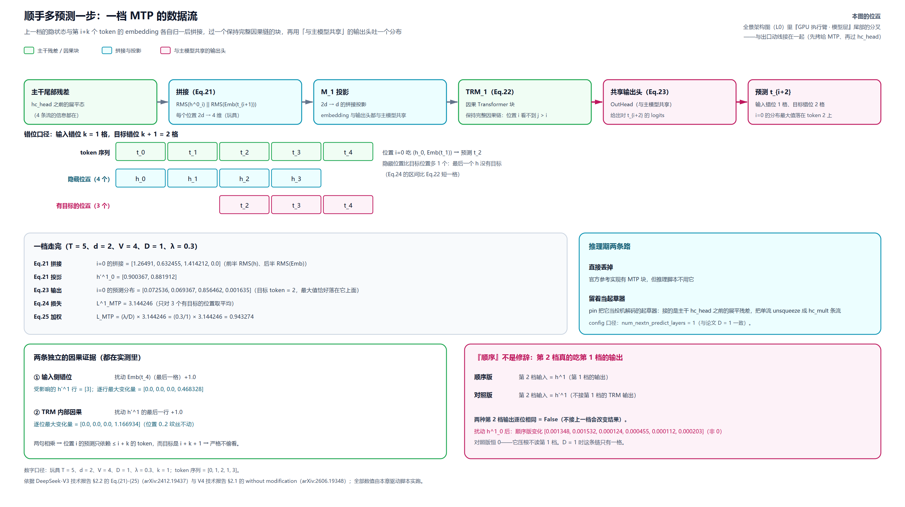

> *图注：六格动线从左到右：主干尾部残差（hc_head 之前的展平态，4 条流的信息都在）→ 与第 i+1 个 token 的 embedding 各自归一后拼接（Eq.21）→ 投影 → 因果 Transformer 块（Eq.22）→ 与主模型共享的输出头（Eq.23）→ 预测 t_{i+2}。下方三行错位标尺把口径钉死：token 序列、隐藏位置（4 个）、有目标的位置（3 个，比隐藏少一个，少的是末尾那个没有标签位的）。中段左栏是走完一档的读数（拼接、投影、预测分布、损失、加权后的总损失）；中段右栏是推理期两条路——官方推理脚本直接丢掉这一档（零成本），本仓留下来当投机解码的草稿器。左下是两组因果证据（扰动最后一个 token 的 embedding 只影响最后一格；扰动拼接结果末行时前三位纹丝不动），右下那张卡是「顺序对并行」的对照。*

<!-- trace: ch28-m19 -->
| 步骤 | 动作 | 关键数值 | 判定 |
|---|---|---|---|
| 下标对齐 | 5 个 token 的一档 | 隐藏位置 [0, 1, 2, 3]（4 个）；有目标的位置 (0, 2)、(1, 3)、(2, 4)（3 个） | 隐藏位置比目标位置多 1 个（= 玩具里只有这 5 个 token、$`t_4`$ 之后没有标签位时为真；论文 Eq.(24) 的区间上界写成 T+1，是数据里还留着这个标签位时的写法） |
| 错位口径 | 输入错位 k 格、输出错位 k+1 格 | 位置 0 吃「隐状态 0」与「第 1 个 token 的 embedding」，预测第 2 个 token | 「预测下一步」就是输入错位 1 格 |
| Eq.(21) 拼接 | 两个 RMSNorm 结果拼起来过投影 | 位置 0 的拼接 = [1.26491, 0.632455, 1.414212, 0.0]；投影后 = [0.900367, 0.881912] | 每个位置 4 维 = 2 + 2 |
| Eq.(22) 因果块 | 过一个因果 Transformer 块 | 输出各位 = [2.513401, 2.468732, 2.476002, 0.789136, 2.819976, 0.126554, 1.198117, 1.897368] | 输出形状 (4, 2) |
| Eq.(23) 输出头 | 共享输出头给 logits | logits 形状 (3, 4)；位置 0 的预测分布 = [0.072536, 0.069367, 0.856462, 0.001635] | 目标 token 是 2，分布最大值恰好落在它上面 |
| Eq.(24) 损失 | 逐深度交叉熵 | 单档损失 = 3.144246 | 只对 3 个有目标的位置取平均 |
| Eq.(25) 加权 | 总损失按权重的深度加权 | (0.3/1) × 3.144246 = 0.943274 | 深度取 1、权重取 0.3（论文超参） |
| 因果证据 a | 扰动第 4 个 token 的 embedding 看影响面 | 受影响的只有第 3 行，逐行变化量 [0.0, 0.0, 0.0, 0.468328] | 第 4 个 token 只被它该被用到的那一格用到 |
| 因果证据 b | 扰动拼接结果最后一行 | 逐位变化量 [0.0, 0.0, 0.0, 1.166934]（前面三位纹丝不动） | 改后面的输入动不了前面的输出（因果掩码） |
| 顺序对并行 | 第 2 档的输入取「第 1 档块输出」还是取「拼接结果」 | 两种输出逐位相同为假；扰动第 1 档第 0 行后顺序版变化 [0.001348, 0.001532, 0.000124, 0.000455, 0.000112, 0.000203]、对照版恒 0 | 「顺序」= 第 k 档真的吃第 k−1 档的输出 |

后两行是「不偷看」的证据链：输入侧错位保证位置 $`i`$ 只吃 $`t_{i+k}`$ 及之前的 token，块内的因果掩码保证位置 $`i`$ 看不到 $`j>i`$，两者相乘，模块不可能偷看要被预测的那个 token（目标是 $`i+k+1`$ 位）。

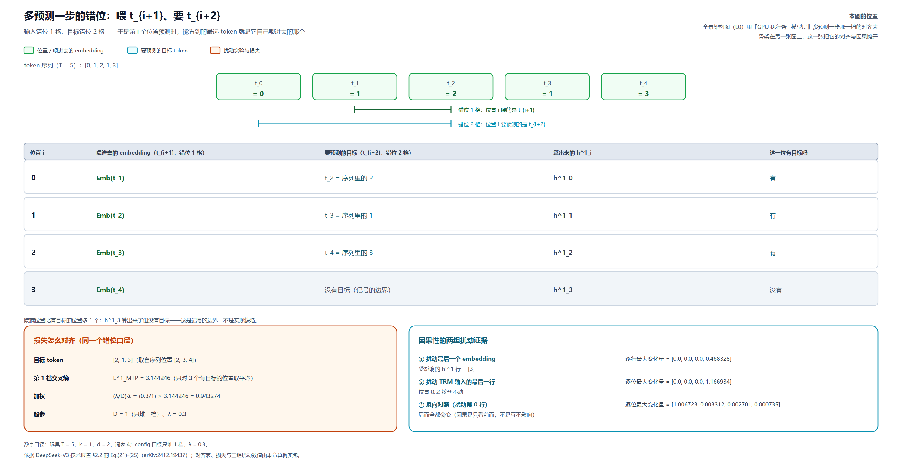

> *图注：把 5 个 token 的对齐表铺开：位置 $`i`$ 喂的是 $`\mathrm{Emb}(t_{i+1})`$（错位 1 格）、要预测的是 $`t_{i+2}`$（错位 2 格），所以 4 个隐藏位置只有 3 个有目标：最后一个算出了 $`h^1_3`$ 却没有目标，那是记号的边界，不是实现缺陷。因果性有两组独立的实测证据，外加一条反向对照。① 扰动 $`\mathrm{Emb}(t_4)`$（最后那一格）+1.0，逐行最大变化量是 [0.0, 0.0, 0.0, 0.468328]，只有该用到它的那一行跟着动；② 再扰动因果块的输入末行 +1.0，位置 0..2 纹丝不动（[0.0, 0.0, 0.0, 1.166934]）；反向对照（扰动第 0 行）则后面全变（[1.006723, 0.003312, 0.002701, 0.000735]）——因果是「只看前面」，不是「互不影响」。损失对齐同样落在这张表上：目标取序列位置 [2, 3, 4] 的三个 token（[2, 1, 3]），单档损失 3.144246 只对这 3 个有目标的位置取平均，加权后（0.3/1）× 3.144246 = 0.943274。*

v0.27.1 的落地与论文公式有两处形态差，讲代码时要分清。**其一**，V3 里那个融合的拼接投影被拆成两段相加：`h_proj(上一档隐状态)` 加 `e_proj(embedding)`（`vllm/models/deepseek_v4/nvidia/mtp.py:L156-L179`，融合核在 `vllm/models/deepseek_v4/common/ops/fused_mtp_input_rmsnorm.py:L65-L97`：一个 task 做 embedding 侧的归一化、其余 task 做隐状态侧的归一化，两件事在一个核里）。**其二**，MTP 的输入不是主干的 hidden，而是主干尾部 **`hc_head` 之前** 的残差（4 条流的展平态），经 `view(-1, hc_mult, H)` 还原成多流形态后按上面的公式处理，`hc_head` 推迟到最后算 logits 时才做——这正好解释了出口那节的顺序要求。官方参考实现里同一档的结构是 `MTPBlock`：`e_proj`/`h_proj` 两段相加（`x = self.e_proj(e).unsqueeze(2) + self.h_proj(x)`，那个 `unsqueeze(2)` 就是在补流维）、复用一整层 Block、输出头与主模型共享（官方参考实现（DeepSeek-V4-Pro inference/model.py:L738-L766、L792-L793））。**官方那份推理脚本不用 MTP**（主干只走 `model.forward`：官方参考实现（DeepSeek-V4-Pro inference/generate.py:L51）；MTP 只在该包的 `__main__` 冒烟段被单独驱动：同包 inference/model.py:L812-L827），这正对应论文「推理期可直接丢弃」那条路；本仓把 MTP 当草稿器用是另一条路，草稿与验证的完整链路是后续投机解码章的正题，本章只钉住「主干把 `hc_head` 之前的残差交给它」这一句。

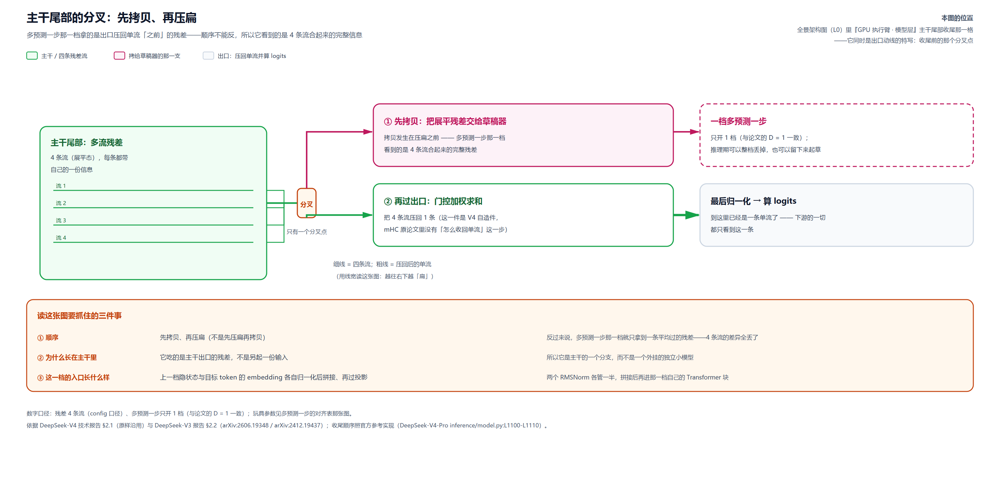

> *图注：主干尾部只有一个分叉点，两支的顺序不能反：先把 4 条流的展平态**拷一份**交给草稿器（图上品红那条），**再**过出口的门控加权求和压回单流去算 logits（绿色那条）。细线是四条流、粗线是压回后的单流；反过来的话，这一档拿到的就是一条已经被平均过的残差，4 条流的差异全丢了，草稿器也就失去了与主干同源的意义。这也是「它为什么长在主干里」的答案：它吃的是主干出口的残差，不是另配的一份输入，所以它是主干的一个分支，而不是外挂的独立小模型。这一档只开 1 档（与论文的 $`D=1`$ 一致），推理期可以整档丢掉，也可以留下来起草。*

**伪码：MTP 一档**

```python
def mtp_step(prev_hidden, input_ids, M_k, TRM_k, OutHead, k):
    e = rmsnorm(embed(input_ids.shift(k)))        # 第 i+k 个 token 的 embedding
    h = rmsnorm(prev_hidden)                      # 上一档的隐状态（多流展平态）
    x = M_k(concat([h, e]))                       # Eq.(21)：拼接过投影
    return OutHead(TRM_k(x))                      # Eq.(22)(23)：因果块 + 共享输出头
```

它钉住的不变量是错位关系与因果不偷看：输入错位 $`k`$ 格、目标错位 $`k+1`$ 格，块内因果掩码保证位置 $`i`$ 看不到 $`j>i`$。

## 附账：条目落在哪、没攒满的窗在哪

七件套讲完，把缓存这一侧的坐标补上。同一串 token 有三把尺子叠在一起：原始 token 轴（位置 0 到 $`n-1`$）、压缩块轴（条目号 = 位置除以压缩率）、分页 KV 的槽位轴（块号加槽内偏移）。三件事一次说清：

- **谁产出条目**：只有 `(position + 1) % compress_ratio == 0` 的块尾 token 触发压缩核，其余位置早退（前面那段压缩核的第一行就是这个判断）。
- **条目落在哪**：条目号等于 `position // compress_ratio`，落进分页槽位 `block_number * block_size + pos_after_compress % block_size`：压缩不是另存一份小副本，而是把每个页槽装满 $`m`$ 个 token 的内容，于是每页能装的历史长了 $`m`$ 倍（这也是本仓 `storage_block_size = block_size // compress_ratio` 一行的来历，见 `vllm/v1/kv_cache_interface.py:L404-L417`；槽位映射本身是[第 22 章](../../ch22-slot-mapping-block-table/narrative/chapter.md)的正题，这里只是把条目号接上同一套块表）。
- **没攒满的窗在哪**：留在压缩机自己的状态缓存里等下一拍（kv 写前半、分数写后半），不产出条目、也不进逐 token 的摊销账——它是第四本 KV 账（压缩机 state），按块存、与压缩条目共用同一张物理张量，下一章与另外三本一起算。

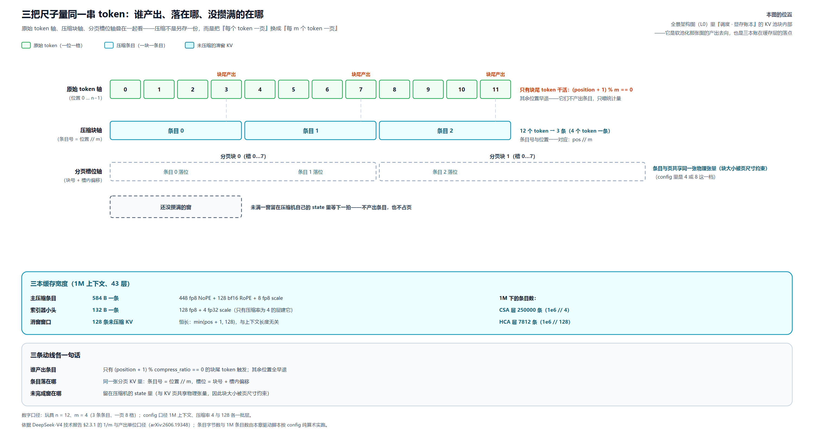

> *图注：三把尺子共用一套列宽叠放。最上面是原始 token 轴，块尾 token（3、7、11）标着「块尾产出」，只有它们触发压缩核，其余位置早退。中间是压缩块轴：条目号 = 位置 // m，12 个 token 得 3 条。最下面是分页槽位轴，条目按序号落进页槽，未满一窗用虚线框标出「留在压缩机 state 里等下一拍」，框外注明条目与页共享同一张物理张量（块大小因此被页尺寸约束成 4 或 8）。底部那条横带的左半边是三本缓存的宽度：主压缩条目 584B（448 fp8 NoPE 加 128 bf16 RoPE 加 8 fp8 scale）、索引器小头 132B（128 fp8 加 4 fp32 scale，只有压缩率为 4 的层建它）、滑窗 128 条未压缩 KV（恒长）——第四本（压缩机自己的 state）按块存、不进逐 token 摊销账，下一章与这三本一起算；右半边给出 1M 下的条目数：CSA 层 250000 条、HCA 层 7812 条。*

## 对账：七件套各还了多少

回到开账那张靶子，按「在哪本账上、是省还是花」把七件套过一次账：

| 件 | 动的账 | 换算 | 代价（诚实面） |
|---|---|---|---|
| 第一件　压缩（$`m=4`$） | KV 账（条数降 $`m`$ 倍）+ FLOPs 账（每 query 看的条数降 $`m`$ 倍） | 每 token 摊销 584 除以 4，加索引器小头那条 | 分辨率被抹平；块内先后看不见 |
| 第二件　选择（$`k=512`$） | FLOPs 账（每 query 实看条数封顶） | 25 万候选里只看 512 条 | 选择器自己的算力与缓存（132B 一条），还有漏看的盲区 |
| 第三件　HCA（$`m'=128`$） | KV 账（再降 32 倍）+ FLOPs 账（不挑、无选择器开销） | 每 token 摊销 584 除以 128；每 query 全看 7812 条 | 主注意力每 query 条目数多 15.257812 倍（「因此只占一半层」是本书由成本给出的读法，论文未解释交替） |
| 第四件　滑窗（$`n_{\mathrm{win}}=128`$） | **加账** | 43 层乘 128 条乘 576 字节的常数窗（token 数据段口径；含 8 字节缩放是 584 字节） | 每层多存 128 条未压缩 KV，短上下文里最贵 |
| 混合精度存储 | KV 体积账 | 一条 584 字节 = 448 字节 FP8（NoPE）+ 128 字节 BF16（RoPE）+ 8 字节缩放 | 位置那段必须留在 BF16，否则位置精度掉 |
| 第五件　mHC（4 条流） | **不加 KV 账**（残差流宽度是激活不是缓存） | 换来的是训练稳定性 | 每半层多一次参数生成矩阵乘、20 轮 Sinkhorn、4 条流的激活与访存 |
| 第六件　MoE（256 挑 6 加 1 共享） | FLOPs 账（激活参数远小于总参数） | 每 token 只算 6 个路由专家加 1 个共享专家 | 共享专家的算力每个 token 都要付；路由本身有开销 |
| 第七件　MTP（$`D=1`$） | **不加账**（推理期可整段丢弃） | 换来一个与主干同源的草稿器 | 训练多一份损失项；用它做草稿时接受率不好就白算 |

这张表有两个诚实面要写出来。**其一，论文摘要里的 27% 与 10% 是净结果**：里面既有省账（压缩、稀疏、混合精度），也含着花账（滑窗多存 128 条、mHC 多算几条流），不能把七件都说成省账；而且它们是 **V4-Pro** 的端到端数字，本章那张逐层表按 V4-Flash 的 43 层排布算，型号与口径都不同，别把 13.6495% 当成「离 10% 只差一点口径」。**其二，三个数字三个分母**：27% 与 10% 的分母是 V3.2，约 2% 的分母是 BF16 GQA8 基线，混起来引用就是错误陈述。

本章没有在 L0 图上新增方块：七件套全部落在 L0 图中间「GPU 执行臂」那一格「模型层 forward + 编译」的内部（左列青色那道「调度·显存账本」是它们的账落地处），本章做的是把那一格的理论账一次算清——哪些部件、各管什么、怎么配合、怎么分布。要随时回望整张骨架，那张图在这里：

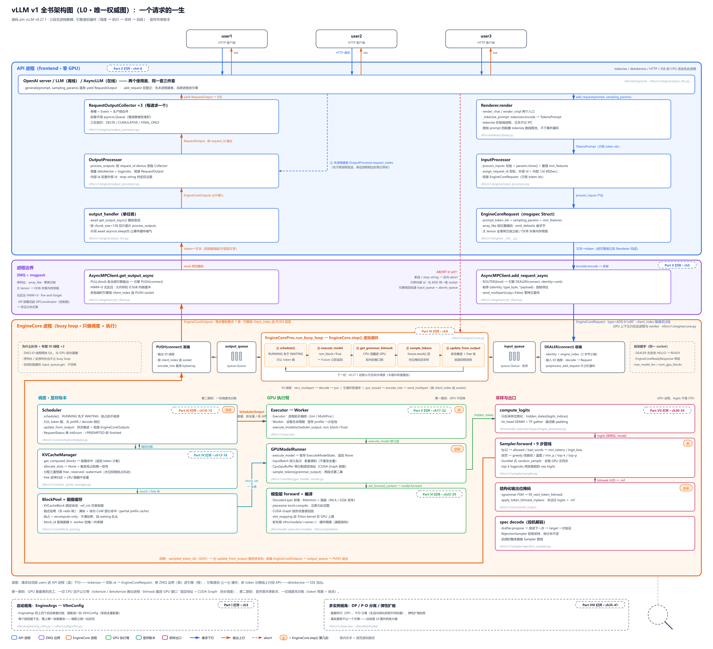

> *图注：全书唯一那张 L0 骨架图（与[第 1 章](../../ch01-vllm-v1-in-one-map/narrative/chapter.md)同一张，逐字节相同）。本章不点亮新方块，只把中间绿色「GPU 执行臂」列里「模型层 forward + 编译」那一格内部的七个机制算成账：左边青色的记账列是这些形状最终的显存落点，右边品红「采样与出口」是主干出口之后去往的地方（logits 与采样）。*

下一块交给[第 29 章](../../ch29-deepseek-v4-assembly/narrative/chapter.md)：把这七件套装成一台能跑的机器。它会回答一串本章按下不表的问题：哪个类对应哪件、一个注意力层凭什么同时开四本 KV 账、张量的形状在主干里怎么从 2D 变成 4 条流再变回来、权重按什么字节纪律流进来。本章留下的那份公式账，到那里会变成一页页可以直接对着读的装配清单。
