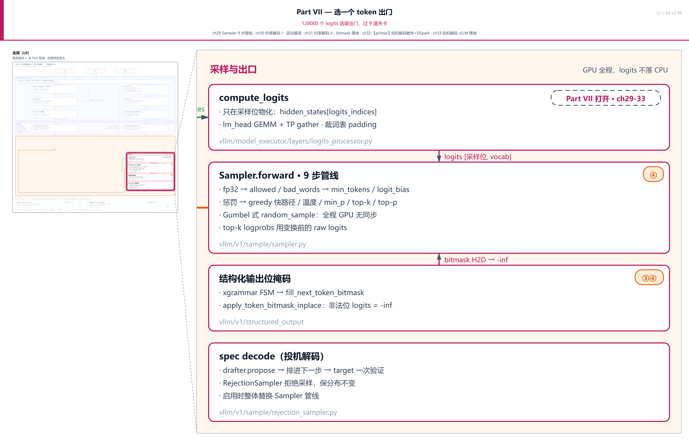
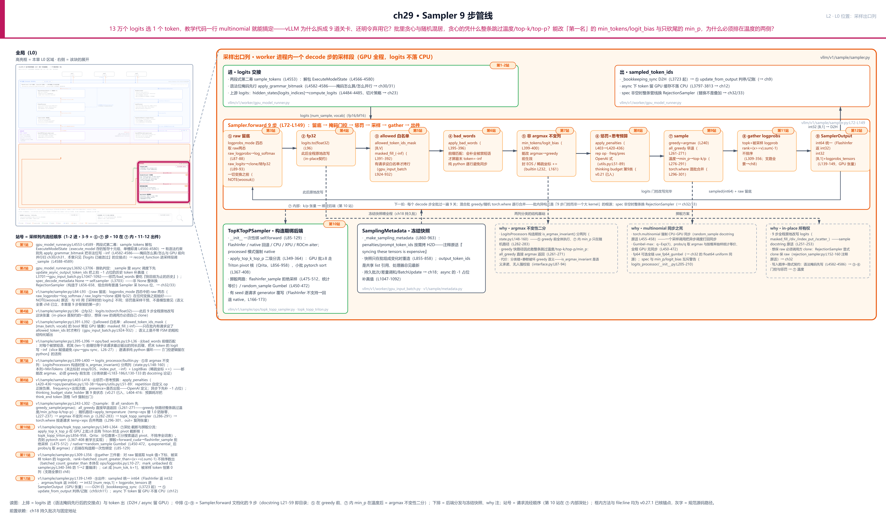
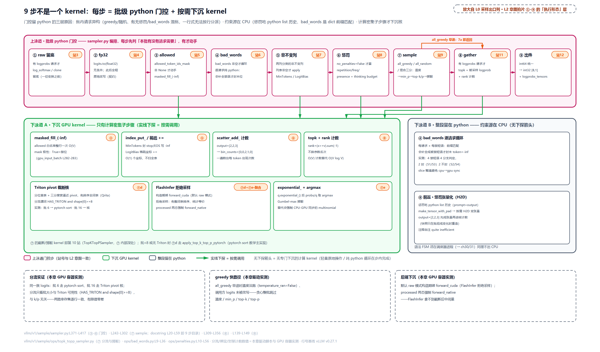
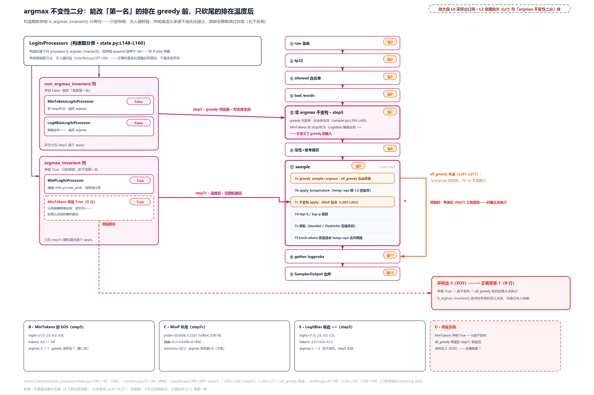
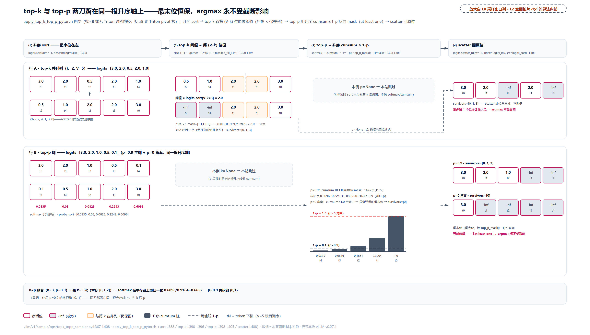
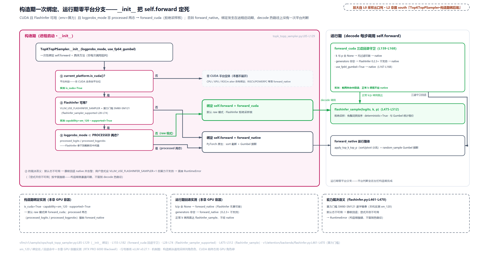

# 第 29 章　Sampler 9 步管线

128000 个 logits 里选 1 个 token 出门，教学代码里这是一行的事：`next_token = torch.multinomial(softmax(logits / T), 1)`。vLLM 为什么把它拆成 9 道关卡，还在主路径上明令弃用 `torch.multinomial`？更怪的安排还在后面。批里既有 temperature=0 的贪心请求、又有随机请求，贪心的凭什么能整条跳过温度、top-k、top-p，两路结果又怎么在同一个张量里合并？`min_tokens` 封禁 EOS、`logit_bias` 手动加分、min_p 砍尾巴，同样是在改 logits 的三件事，为什么前两件必须排在温度之前、对全批生效，min_p 却排在温度之后、只对随机路径生效？把这三个问题串起来的，是采样出口上同一行 logits 的 9 步旅程：先被留底、再被一道道门控改写、最后掷一次骰子。本章把这条出口列整个打开，主战场是 `vllm/v1/sample/sampler.py`。

这也是 Part VII 的开篇。这一部的总问题是「选一个 token 出门」：128000 个 logits 选谁、过 9 道关卡——本章先立采样列的 9 步主干；后面四章依次回答两个追问：那道在采样之前就写下的语法位掩码是怎么算出来的（约束解码两章），以及「一步选一个 token」能不能改成「一步验证一串 token」（投机解码两章）。

## 你在这里

Part VII 共五章，全部落在 L0 图中列「GPU 执行臂」南伸的采样出口列上：ch29 Sampler 9 步管线（本章）、ch30 约束解码 I：语法编译、ch31 约束解码 II：bitmask 落地、ch32 投机解码数学+DSpark（原理章）、ch33 投机解码 vLLM 落地。



> *图注：Part VII「选一个 token 出门：128000 个 logits 选谁出门，过 9 道关卡」覆盖 L0 图采样出口列整段（compute_logits → Sampler → 结构化输出位掩码 → spec decode——位掩码画在采样器下方，写入却在采样之前先行，即站 1 的交接点；掩码怎么算归 ch30/31），在此亮起、区域外退后；右侧同区放大即本部舞台，底部一行注明：此处之后 tokens 离开 GPU 出 EngineCore（D2H 归[第 8 章](../../ch08-logprobs/narrative/chapter.md)）。本章取最中间那一块：`Sampler.forward` 的 9 步管线，导览图里角标「9 步 · 采样列的方法级展开」指的就是它。*

放大到本章自己这一层：



> *图注：本章放大的是[第 1 章](../../ch01-vllm-v1-in-one-map/narrative/chapter.md) L0 图中列「GPU 执行臂」最南端的采样出口列，就是那张图里 lm_head 之后、token 出 GPU 之前的那一小段。进来的 logits 由[第 23 章](../../ch23-model-layer-assembly/narrative/chapter.md)立的 `compute_logits` 契约产出（lm_head、TP gather、按需切片都在那一章）；出口的 D2H 与判停是[第 8 章](../../ch08-logprobs/narrative/chapter.md)、[第 9 章](../../ch09-engine-core-step-loop/narrative/chapter.md)走过的支路；喂给采样列的一袋参数来自[第 18 章](../../ch18-persistent-batch-fixed-addresses/narrative/chapter.md)的持久批次。本章打开中排 ①-⑨ 九步（raw 留底 → fp32 → 白名单 → bad_words → 非不变列 → 惩罚 → sample → gather → 出件），下排是 ⑦ 深处的后端分发与三张 why 注。站号 = 请求流经代码的顺序：1-2 站 runner 进口（交接与换轨），3-9 站对应 ①-⑦ 步，第 10 站藏在 ⑦ 内部（截断与掷骰的后端分流），11-12 站出件；正文按讲解需要编排、不必照站号读。*

读法建议：只想知道「9 步为什么不是一个 kernel」，直奔[「九步目录，为什么不是一个 kernel」](#九步目录为什么不是一个-kernel)；被「谁能改第一名」的分类绕晕的，跳[「第 5 步：argmax 不变性二分」](#第-5-步argmax-不变性二分)；想知道贪心请求凭什么跳过整条随机路径、混批怎么合并，看[「第 7 步：贪心快路、温度与 min_p」](#第-7-步贪心快路温度与-min_p)；掷骰子为什么不用 multinomial，在[「掷骰：Gumbel 技巧顶替 multinomial」](#掷骰gumbel-技巧顶替-multinomial)；top-k/top-p 的掩码怎么算、大批为什么要换 kernel，读[「截断的两把刀：top-k 与 top-p」](#截断的两把刀top-k-与-top-p)；后端怎么在构造期定生死，看[「后端绑定：构造期一次定生死」](#后端绑定构造期一次定生死)；logprobs 的名次怎么数、最后怎么出件，在[「第 8、9 步：名次不排序，出件走 GPU」](#第-89-步名次不排序出件走-gpu)；想跟全程，按序读。

照例交代取证环境，全章数值表通用。本章实测来自按 v0.27.1 只做减法抽出的配套精简版：8 组纯数学步骤（分类、贪心早退与混批合并、白名单与 bad_words、惩罚三式、温度与 min_p、sort 截断、Gumbel 掷骰、名次计数）在 host 上以 CPU 张量实跑（torch 2.11，`VLLM_USE_FLASHINFER_SAMPLER=0`），这些步骤与设备无关；批 ≥8 的 Triton 截断核与 FlashInfer 采样两组在 GPU 容器实跑（RTX PRO 6000 Blackwell 显卡、sm_120 算力档、188 个 SM（流式多处理器，GPU 的基本算力单元）、triton 与 flashinfer 均在场）。host 没有真 GPU：装着 triton 包但 triton 运行时拒绝 CPU 指针，批 ≥8 的核路径无法在 host 取证，分流谓词本身与设备无关。容器里自带的 vllm 包与本章 pin 无关，驱动脚本把精简版插在 `sys.path` 最前，全章行号与行为一律以 v0.27.1 为准。文中 sm_120 这类算力档是取证机实测口径，FlashInfer 的算力门槛换一代卡结论可能不同，引用处都会再挑明。凡表内数字都是实跑输出，一个没改；凡标注「说明性」的量级是估的，不是实测。

## 门口两站：交接、换轨与一袋冻结参数

先站到 L0 图执行臂与采样出口列的接缝上。[第 9 章](../../ch09-engine-core-step-loop/narrative/chapter.md)拆 EngineCore 一拍五段时，④ 是采样段：`execute_model` 发起前向后立刻返回 future，真正的采样发生在下一幕 `sample_tokens`（[第 17 章](../../ch17-executor-worker-model-runner/narrative/chapter.md)把这两段式隔着墙点过名）。站号轨道第 1 站就是第二幕的开场：

```python
# vllm/v1/worker/gpu_model_runner.py:L4553-L4589 · GPUModelRunner.sample_tokens
    def sample_tokens(
        self, grammar_output: "GrammarOutput | None"
    ) -> ModelRunnerOutput | AsyncModelRunnerOutput | IntermediateTensors:
        # … 省略：execute_model_state 为空时的 kv_connector 早退分支 …
        # Unpack ephemeral state.
        (
            scheduler_output,
            logits,                    # [num_sampled, vocab]：本拍 lm_head 的产物
            spec_decode_metadata,
            # … 省略：spec 公共注意力元数据、hidden_states 等 7 个暂存项 …
        ) = self.execute_model_state
        # Clear ephemeral state.
        self.execute_model_state = None          # 单槽暂存：取走即清          # L4580

        # Apply structured output bitmasks if present.
        if grammar_output is not None:
            apply_grammar_bitmask(
                scheduler_output, grammar_output, self.input_batch, logits
            )                                     # 非法位写 -inf，交接点在此    # L4584

        with record_function_or_nullcontext("gpu_model_runner: sample"):
            sampler_output = self._sample(logits, spec_decode_metadata)      # L4589
```

两个细节。其一，`execute_model_state` 是一个单槽暂存：前一幕把整包状态存进去，这一幕解包后立刻置 `None`，同一时刻只有一个拍在用。其二，`apply_grammar_bitmask` 在进入采样器**之前**就把语法约束写进 logits——它吃的 `grammar_output` 是 `sample_tokens` 自己的入参（签名第二行），有结构化输出请求的批，非法 token 的 logit 已经是 −inf 了。[第 9 章](../../ch09-engine-core-step-loop/narrative/chapter.md)第三拍埋过一个窗口：「同一行 logits：先被掩码改写、再采样」，这里就是那个窗口的采样侧入口。本章只见交接点：logits 已被改过、9 步管线照单全收。那张掩码怎么从语法编译出来、怎么与 GPU 前向并行而不掉速，是下一章开篇的问题。

第 2 站是 `_sample`，两行字干了三件事：

```python
# vllm/v1/worker/gpu_model_runner.py:L3692-L3706 · GPUModelRunner._sample
    def _sample(
        self,
        logits: torch.Tensor | None,
        spec_decode_metadata: SpecDecodeMetadata | None,
    ) -> SamplerOutput:
        # Sample the next token and get logprobs if needed.
        sampling_metadata = self.input_batch.sampling_metadata
        # Update output token ids with tokens sampled in last step
        # if async scheduling and required by current sampling params.
        self.input_batch.update_async_output_token_ids()      # async：补上拍的 -1 占位  # L3701
        if spec_decode_metadata is None:
            return self.sampler(
                logits=logits,
                sampling_metadata=sampling_metadata,
            )                                                  # 普通采样走这里           # L3703
```

第一件，`update_async_output_token_ids`：[第 12 章](../../ch12-async-scheduling/narrative/chapter.md)立过异步调度下采样 token 不落 CPU，持久批里的 `output_token_ids` 尾部会先垫 −1 占位，而本章马上要讲的惩罚与 bad_words 都要吃「到目前为止的真实历史」，所以采样前先把占位补成真值（`gpu_input_batch.py:L1047-L1092`）。第二件，换轨判定：`spec_decode_metadata is None` 走本章主角 `self.sampler`；非 None 时整条采样**换成** `RejectionSampler`（构造于 `gpu_model_runner.py:L656-L658`，它组合持有这个普通 Sampler 去采 bonus 位——投机解码里验证完一串草稿 token 后还要补采的那一位输出，这里只当黑盒收下），是替换不是叠加，投机解码的两章再展开。顺带点名一个门口的警告：投机解码开启时 min_p 与 logit_bias 参数直接不生效：装配处理器的 `build_logitsprocs` 一见投机解码配置在场（`speculative_config` 非空）就只装 MinTokens 一件，还打明文警告「min_p and logit_bias parameters won't work with speculative decoding」（`vllm/v1/sample/logits_processor/__init__.py:L201-L210`），这层互斥投机解码两章再展开。第三件隐在 `self.sampler` 这个字段里：它在 runner 构造期就位（`gpu_model_runner.py:L545-L548`），只带两个来自 model config 的参数：`logprobs_mode` 与 `use_fp64_gumbel`，后文两处会遇见它们。

### 喂给 9 步的料：一袋冻结参数

`sampling_metadata` 是采样列的口粮，值得先认清。[第 18 章](../../ch18-persistent-batch-fixed-addresses/narrative/chapter.md)立过持久批次与差量调和：采样参数不再每步从每个请求的 `SamplingParams` 重建，而是常驻在批的 CPU 列里，只在批组成变化时（`gpu_input_batch.py:L855-L858` 的 `if batch_update:`）重造一次快照。快照本体是一个冻结的 dataclass：

```python
# vllm/v1/sample/metadata.py:L14-L44 · SamplingMetadata
@dataclass
class SamplingMetadata:
    temperature: torch.Tensor | None
    all_greedy: bool
    all_random: bool

    top_p: torch.Tensor | None
    top_k: torch.Tensor | None

    generators: dict[int, torch.Generator]

    # None means no logprobs, 0 means sampled token logprobs only
    max_num_logprobs: int | None

    no_penalties: bool
    prompt_token_ids: torch.Tensor | None
    frequency_penalties: torch.Tensor
    presence_penalties: torch.Tensor
    repetition_penalties: torch.Tensor

    output_token_ids: list[list[int]]

    # `allowed_token_ids_mask` is a 2D bool tensor of shape (max batch size,
    # vocab size).
    allowed_token_ids_mask: torch.Tensor | None

    # req_index -> bad_words_token_ids
    bad_words_token_ids: dict[int, list[list[int]]]

    # Loaded logits processors
    logitsprocs: LogitsProcessors
    # … 省略：logprob_token_ids / spec_token_ids / thinking_budget_state_holder 三个旁路字段 …
```

要读出三件事。第一，**逐请求参数全部批量化**：temperature、top_p、top_k、三种惩罚都是 `[batch]` 张量，不是逐请求 python 对象。9 步里的每一步都是全批一起过的张量操作，这正是「批内异构」能被处理的前提。第二，**批级快路标志**：`all_greedy` 与 `all_random` 是两个 python 布尔（全批都贪心／全批都随机），后面 greedy 早退靠它。第三，**`output_token_ids` 是共享的 python list 引用**：持久批每拍往里追加新 token，处理器拿到的永远是最新历史（接口注释明示了这个不变量），批组成变化时处理器状态由 `BatchUpdate` 三事件增量维护，那套维护机制归[第 18 章](../../ch18-persistent-batch-fixed-addresses/narrative/chapter.md)，本章只吃快照结果。

快照的生产者也看一眼，重点在「按需」二字：

```python
# vllm/v1/worker/gpu_input_batch.py:L860-L904 · InputBatch._make_sampling_metadata
    def _make_sampling_metadata(self) -> SamplingMetadata:
        num_reqs = self.num_reqs
        if not self.all_greedy:
            temperature = copy_slice(
                self.temperature_cpu_tensor, self.temperature, num_reqs
            )
        else:
            temperature = None                       # 全批贪心：温度列根本不拷      # L867
        # … 省略：top_p / top_k 同款的按需 copy_slice …
        if not self.no_penalties:
            # Since syncing these tensors is expensive only copy them
            # if necessary i.e. if there are requests which require
            # penalties to be applied during sampling.
            copy_slice(
                self.frequency_penalties_cpu_tensor, self.frequency_penalties, num_reqs
            )                                        # 有惩罚请求才拷，注释写明贵   # L877
        # … 省略：presence / repetition 两列同款拷贝 …
        needs_prompt_token_ids = (
            not self.no_penalties
            or self.logits_processing_needs_token_ids[:num_reqs].any()
        )
        # The prompt tokens are used only for applying penalties or
        # step pooling during the sampling/pooling process.
        # Hence copy these tensors only when there are requests which
        # need penalties/step_pooler to be applied.
        prompt_token_ids_cpu = (
            self._make_prompt_token_ids_cpu_tensor() if needs_prompt_token_ids else None
        )
```

全批贪心时 `temperature` 直接是 `None`；惩罚三列与 prompt token 只在批里真有请求需要时才拷上 GPU——注释原话「syncing these tensors is expensive」。这条 why 链的旧设计是 v0 每步遍历请求列表重建采样上下文，痛点是 v1 持久批里槽位跨步复用、每步重建是 CPU 瓶颈；代价是处理器实现必须正确处理增删换三种批事件，且快照 dataclass 的字段从 v0.19 的 17 个一路涨到 v0.21 的 19 个（此后到 v0.27.1 没再涨）：每个新采样特性都往同一只袋子里塞状态。

## 九步目录，为什么不是一个 kernel

现在走进 `Sampler` 本体。它是个 `nn.Module`，但类 docstring 才是全章真正的目录——9 步，一步不多一步不少：

```python
# vllm/v1/sample/sampler.py:L20-L59 · Sampler 类 docstring（9 步契约）
class Sampler(nn.Module):
    """
    A layer that samples the next tokens from the model's outputs
    with the following steps in order:

    1. If logprobs are requested:
        a) If `logprobs_mode` is `raw_logprobs`, compute logprobs
           as the final logprobs to return.
        b) If `logprobs_mode` is `raw_logits`, clone the logits
           as the final logprobs to return.
    2. Convert logits to float32.
    3. Apply allowed token ids whitelist.
    4. Apply bad words exclusion.
    5. Apply logit processors which are not argmax-invariant,
       i.e. that can impact greedy sampling.
        a) Min tokens processor
        b) Logit bias processor
    6. Apply penalties
        a) Repetition penalty
        b) Frequency penalty
        c) Presence penalty
    7. Sample the next tokens. `sample` method performs the following steps:
        a) If not `all_random`, perform greedy sampling. If `all_greedy`,
           return the greedily sampled tokens and final logprobs if requested.
        b) Apply temperature.
        c) Apply logit processors which are argmax-invariant, by default
           the min_p processor.
        d) Apply top_k and/or top_p.
        e) Sample the next tokens with the probability distribution.
        f) If `all_random` or temperature >= epsilon (1e-5), return the
           randomly sampled tokens and final logprobs if requested. Else,
           return the greedily sampled tokens and logprobs if requested.
    8. Gather the logprobs of the top `max_num_logprobs` and sampled token
       (if requested).
    # … 省略：第 8 步关于 max_num_logprobs+1 合并去重的长注（logprobs 支路那章已铺）…
    9. Return the final `SamplerOutput`.
    """
```

把目录翻译成人话：第 1 步留底，第 2 步统一精度，第 3-6 步是四道「改写 logits」的门控（白名单、禁词、能改第一名的处理器、惩罚），第 7 步才真正选 token（贪心或掷骰），第 8-9 步收 logprobs、打包出件。forward 主干短得出奇：

```python
# vllm/v1/sample/sampler.py:L72-L109 · Sampler.forward
    def forward(
        self,
        logits: torch.Tensor,
        sampling_metadata: SamplingMetadata,
        predict_bonus_token: bool = False,
        logprobs_mode_override: LogprobsMode | None = None,
    ) -> SamplerOutput:
        logprobs_mode = logprobs_mode_override or self.logprobs_mode
        # NOTE(woosuk): Use the original logits (before any penalties or
        # temperature scaling) for the top-k logprobs.
        # This is different from the V0 sampler, which uses the logits that
        # is used for sampling (after penalties and temperature scaling).     # L80-L83
        num_logprobs = sampling_metadata.max_num_logprobs
        raw_logprobs: torch.Tensor | None = None
        if num_logprobs is not None or sampling_metadata.logprob_token_ids:
            if logprobs_mode == "raw_logprobs":
                raw_logprobs = self.compute_logprobs(logits)
            elif logprobs_mode == "raw_logits":
                if logits.dtype == torch.float32:
                    raw_logprobs = logits.clone()
                else:
                    raw_logprobs = logits.to(torch.float32)                   # L93

        # Use float32 for the logits.
        logits = logits.to(torch.float32)                                     # L96

        logits = self.apply_logits_processors(
            logits, sampling_metadata, predict_bonus_token
        )                                                                     # 第 3-6 步
        # Sample the next token.
        sampled, processed_logprobs = self.sample(logits, sampling_metadata)  # 第 7 步
        if processed_logprobs is not None:
            raw_logprobs = processed_logprobs
        # Convert sampled token ids to int64 (long) type to ensure compatibility
        # with subsequent operations that may use these values as indices.
        # This conversion is necessary because FlashInfer sampling operations
        # return int32 (while PyTorch argmax and topk return int64).
        sampled = sampled.long()                                              # L109
```

留底、转 fp32、四道门控、采样、统一整数类型——一个方法调一个方法，没有一行是在「算」什么。这正是本章要立的第一个判断：**采样列不是一个 GPU kernel，是 9 个门控步骤，每个步骤内部按需调 kernel**。为什么长成这样？把 why 链摆全。

**旧设计**有两层。一层是教学式的：一行 `multinomial`（PyTorch 里「按概率抽一个」的标准函数）或 `argmax` 完事。另一层是 v0 真实历史：v0 的采样器对每个请求跑 python 循环，从各请求的 `SamplingParams` 逐个构造采样上下文，统一走温度加截断。

**痛点**一层层数。第一层，批内异构：生产批里 temp=0 的贪心请求与随机请求混居，有的带惩罚、有的带 bad_words、有的带语法约束，一行式没法按行分派；「哪行要不要惩罚、要不要掩码」这种门控判断天然是批级的 python 分支，塞进 kernel 意味着每步让全批为所有分支付代价。第二层，约束源在 CPU：惩罚要吃 prompt 与输出的 python list 历史，bad_words 是 `dict[int, list[list[int]]]` 的前缀匹配循环，语法 FSM（有限状态机，结构化输出用它在每个位置判定哪些 token 合法）活在调度器进程——这些数据天生不在 GPU 上。第三层最致命，`torch.multinomial` 强制 CPU-GPU 同步。这里要把「同步」这个词讲透，因为它是本章多处设计的共同动机。

CPU 与 GPU 是两台独立计算机。Python 调 PyTorch 的 GPU 算子只是把任务排进队列，函数立刻返回、CPU 继续跑 Python，GPU 按提交顺序在后台执行。PyTorch 官方 CUDA 语义文档的原话是 "By default, GPU operations are asynchronous"（GPU 操作默认异步）。CPU 什么时候被迫停下来等？当它需要读回 GPU 上的数值时：`tensor.item()`、把 GPU 张量转成 Python 数字或布尔、`print(tensor)`，都要把 GPU 上的内容搬回 CPU 才能继续，于是 CPU 必须等队列里所有前置 kernel 跑完。[第 22 章](../../ch22-slot-mapping-block-table/narrative/chapter.md)算过这笔账：读一个 GPU 张量，等于排空它身后整条流水。而 vLLM 的异步调度（[第 12 章](../../ch12-async-scheduling/narrative/chapter.md)）让 CPU 提前一拍组装下一批、与 GPU 重叠执行，任何一次计划外的读回都把流水线打回「CPU 干等 GPU」的串行模式。`random_sample` 的 docstring 把话挑明了（`topk_topp_sampler.py:L455-L458`）：「We use this function instead of torch.multinomial because torch.multinomial causes CPU-GPU synchronization」——一个采样调用就把整拍异步打回同步。

**v1 方案**就是眼前这套：门控逻辑留在 python（批级分支），真正计算密集的子步骤下沉 kernel——top-k/top-p 截断有 Triton 核，掷骰是 `exponential_()` 加 `argmax` 两个纯张量操作，CUDA 上还有 FlashInfer 的采样核。注意准确表述不是「采样很慢所以拆开」，而是「9 道门各管一件事，重的活单独下沉」。



> *图注：上泳道是 ①-⑨ 九道门（站号徽标 3-12 与 L2 章图对齐），箭头下探到下泳道的才是真的「下沉」：③ 的 `masked_fill_`、⑤ 的 `index_put_`、⑥ 的 `scatter_add_` 计数、⑦d 的 Triton pivot 截断、⑦d+⑦e 一并完成的 FlashInfer 拒绝采样（融合核：截断与掷骰一个 kernel 做完，后文后端绑定节）、⑦e 的 `exponential_`+`argmax`、⑧ 的 topk+rank。没有下探箭头的步骤没有专属 kernel、判定与循环整段留在 python（① 的 log_softmax、② 的精度转换这类顺手调框架张量算子的不算专属 kernel）：bad_words 是 4 个禁短语 4 次判定的逐请求循环，惩罚的前置是把 python list 历史 `make_tensor_with_pad` 变张量再 H2D。`all_greedy` 批在 7a 早退（实测温度没跑、调用方 logits 未被改写），橙色旁路从 ⑦ 直接跳 ⑧。*

**代价**也要如实报。其一，逐元素 kernel 多次发射有开销，缓解手段是全程 in-place 改写（下一节专讲这条所有权暗线）。其二，每个处理器必须正确声明 `is_argmax_invariant()`——这是语义承诺不是优化提示，第 5 步整节讲它。其三，`logprobs_mode` 四态让语义矩阵翻倍，FlashInfer 核拿不到截断后的中间量、两态下要回退（后端绑定一节）。其四，RejectionSampler 与本管线仍有部分平行逻辑，投机解码两章再对账。

## 第 1、2 步：留底与 logits 的所有权

第 1 步在做一件容易被跳过的事：趁 logits 还没被任何东西碰过，先留底。`logprobs_mode` 有四态（`vllm/config/model.py:L99-L105`）：`raw_logits`、`raw_logprobs`、`processed_logits`、`processed_logprobs`——前两态在第 1 步取「变换前」的视角，后两态取「惩罚与温度之后」的视角。四态的语义全景（D2H、切行、装配）在[第 8 章](../../ch08-logprobs/narrative/chapter.md)立过，本章只补它在 9 步骨架里的位置：**第 1 步、任何 in-place 变换之前**。`raw_logprobs` 态直接算 `log_softmax`，`raw_logits` 态只 `clone` 一份原 logits（已在 fp32 时 clone，否则转换）。

为什么留底要抢在最前面？forward 里那段 NOTE(woosuk) 写得直白：V0 用「采样时实际使用的 logits」（惩罚加过、温度除过）算 top-k logprobs，V1 改用原始 logits。理由是语义的：惩罚与温度是**这一步采样的干预手段**，不是模型本来的意见——用户要的 logprobs 应反映模型的真实分布，被惩罚扭曲过的数字会误导下游（拿 logprobs 当策略概率消费的 RL 训练尤其如此）。第 8 步 gather 用的正是这份留底，本章末尾有一组实测数字能看到两个视角差多少。

第 2 步一句 `logits.to(torch.float32)`，但它是**所有权契约**的起点：从此刻起直到出件，9 步全程**原地改写**这块张量：`masked_fill_`、`index_put_`、`div_`、`scatter_` 全是带下划线的 in-place 操作。`sample` 的 docstring 自己承认（`sampler.py:L249-L253`）：「The various logits processing functions called in this method may update the logits tensor in-place」。后果写进隐式契约：**想保留原始 logits 的调用方必须自己 clone**。这不是假设——RejectionSampler 真这么干了：

```python
# vllm/v1/sample/rejection_sampler.py:L149-L160 · RejectionSampler.forward（节选）
        # Just like `bonus_logits`, `target_logits` is a new tensor with
        # separate storage from the original `logits` tensor. Therefore,
        # it is safe to update `target_logits` in place.
        raw_target_logits = logits[target_logits_indices]
        # Use float32 for the target_logits.
        raw_target_logits = raw_target_logits.to(torch.float32)
        target_logits = raw_target_logits
        if not self.is_processed_logprobs_mode:
            # Clone raw_target_logits before applying processors to preserve
            # the original raw logits for logprobs computation, since
            # apply_logits_processors modifies the tensor in-place.
            target_logits = target_logits.clone()                              # L160
```

注释原话点名了动机：`apply_logits_processors` 会原地改写张量，所以先 clone 保 raw。写入顺序也是契约的一部分：语法位掩码在 runner 侧先写（门口第 1 站），然后才是 ③-⑥ 四道门控与惩罚，最后 ⑦ 温度。哪些先后颠倒会翻车要分清：写 −inf 的掩码类彼此怎么换都无所谓，−inf 后面加减不动、除法也除不回有限值；会翻车的是对有限值的几类变换之间——加性的 logit_bias 与除法性的温度就不可交换，$`(l+b)/T`$ 与 $`l/T+b`$ 在温度不等于 1 时是两个数，惩罚的减法与温度同理，min_p 的 softmax 阈值更必须在温度之后算（它的阈值要在概率分布上量、而温度改写的正是这组概率，机制在第 7 步 c 展开）。代码里没有一行强制这个顺序，靠的是 docstring 与所有人的自觉。in-place 换来的是少一次 `[batch, vocab]` 的张量分配与拷贝，在 128000 宽的词表上这不是小钱。

## 第 3、4 步：白名单与 bad_words

第 3-6 步全部住在 `apply_logits_processors` 里，先把骨架嵌出来，再逐步拆：

```python
# vllm/v1/sample/sampler.py:L371-L417 · Sampler.apply_logits_processors
    def apply_logits_processors(
        self,
        logits: torch.Tensor,
        sampling_metadata: SamplingMetadata,
        predict_bonus_token: bool,
    ) -> torch.Tensor:
        bad_words_token_ids = sampling_metadata.bad_words_token_ids
        any_penalties_or_bad_words = (
            bool(bad_words_token_ids) or not sampling_metadata.no_penalties
        )
        output_token_ids = sampling_metadata.output_token_ids
        # … 省略：predict_bonus_token 的 spec 合并分支（投机解码，本部末两章）…

        # Apply allowed token ids.
        if sampling_metadata.allowed_token_ids_mask is not None:
            logits.masked_fill_(sampling_metadata.allowed_token_ids_mask, float("-inf"))  # L392

        # Apply bad words exclusion.
        if bad_words_token_ids:
            apply_bad_words(logits, bad_words_token_ids, output_token_ids)                # L396

        # Apply logits processors which can impact greedy sampling.
        for processor in sampling_metadata.logitsprocs.non_argmax_invariant:
            logits = processor.apply(logits)                              # 第 5 步，下一节  # L400

        # Apply penalties (e.g., freq_penalties).
        logits = self.apply_penalties(logits, sampling_metadata, output_token_ids)        # L403
        holder = sampling_metadata.thinking_budget_state_holder
        if holder is not None and holder.has_tracked_requests():
            # Committed outputs only; spec drafts live in ``spec_token_ids``.
            holder.update_state(
                sampling_metadata.output_token_ids,
                sampling_metadata.spec_token_ids,
                repeat_indices=None,
            )
            logits = holder.apply_to_logits(
                logits,
                predict_bonus_token,
                sampling_metadata.spec_token_ids,
            )                                                             # 思考预算，本节末轻讲    # L416
        return logits
```

**第 3 步白名单**，一行 `masked_fill_`。有个极性坑值得提前指出：`allowed_token_ids_mask` 里 **True 是禁位**（`gpu_input_batch.py:L282-L283` 注释原话「if the corresponding token allowed, the value is False. Since we use masked_fill_ to set -inf」，意为 token 被允许时值是 False，因为用 masked_fill_ 写 −inf）。这张 mask 是 `[max_batch_size, vocab_size]` 的 bool 张量、常驻 GPU，只在批里有请求真的设置了 `allowed_token_ids` 时才拷对应行（`gpu_input_batch.py:L924-L932`）。语义上它是「不带 FSM 的粗粒结构化输出」：只能表达「只许从这批 token 里选」，表达不了语法；下一章的位掩码是它的完全体。

**第 4 步 bad_words** 是「门控留在 python」最纯粹的活例——逐请求、逐短语的双重循环，一行 kernel 代码都没有：

```python
# vllm/v1/sample/ops/bad_words.py:L6-L36 · 前缀匹配屏蔽
_SMALLEST_LOGIT = float("-inf")


def _apply_bad_words_single_batch(
    logits: torch.Tensor,
    bad_words_token_ids: list[list[int]],
    past_tokens_ids: list[int],
) -> None:
    for bad_word_ids in bad_words_token_ids:
        if len(bad_word_ids) > len(past_tokens_ids) + 1:
            continue                                # 短语比历史+1 还长，永远凑不齐    # L15-L16

        prefix_length = len(bad_word_ids) - 1
        last_token_id = bad_word_ids[-1]
        actual_prefix = past_tokens_ids[-prefix_length:] if prefix_length > 0 else []
        expected_prefix = bad_word_ids[:prefix_length]

        assert len(actual_prefix) == len(expected_prefix)

        if actual_prefix == expected_prefix:
            # Assign to slice to avoid cpu->gpu sync.
            logits[last_token_id : last_token_id + 1] = _SMALLEST_LOGIT      # L27


def apply_bad_words(
    logits: torch.Tensor,
    bad_words_token_ids: dict[int, list[list[int]]],
    past_tokens_ids: list[list[int]],
) -> None:
    for i, bad_words_ids in bad_words_token_ids.items():
        _apply_bad_words_single_batch(logits[i], bad_words_ids, past_tokens_ids[i])
```

逻辑是「听写老师」式的：对每个被禁短语，只有当它的前 `len-1` 个 token 恰好等于该请求最近输出的同长后缀时，也就是**再走一步就会写出禁句**，才把最后一个 token 的 logit 写成 −inf。三个分支穷尽所有情况：短语比历史加一还长，本步采出去也凑不齐，直接 `continue`；前缀对不上，不动；单 token 短语前缀是空集、恒相等，恒封。写 −inf 用的是 slice 赋值 `logits[last:last+1]`，注释写明「avoid cpu->gpu sync」。这个同步是写路径的隐式同步，与读回同步同源不同枝。把 Python 标量按双整数下标写进 GPU 张量（如 `logits[i, j] = -inf`，落到的是一个零维位置），要写进去的只是一个 Python 数字：这种写法退化成一次 CPU 侧立即执行的小搬运，不是一条能排进队列的张量操作，CPU 被迫排空身后整条 GPU 队列。slice 赋值不一样：它把「一段值拷进一段地址区间」描述成一条完整的拷贝指令，能像普通算子一样排进队列、后台异步执行。源码注释「Assign to slice to avoid cpu->gpu sync」针对的正是这个差别。与 multinomial 之死同一个主题：热路径上别做隐式搬运。它敢整个留在 python 也有账可算：成本正比于每请求的禁短语数，与词表大小无关，批 128000 宽的词表在它眼里不存在。

一组实测把两种掩码的判定各走一遍（玩具词表、真 Sampler 端到端）：

<!-- trace: m5 -->
| 环节 | 输入 | 匹配/掩码 | 机制要点 | 结果 |
| --- | --- | --- | --- | --- |
| ③ allowed 白名单 | logits=[5.0, 1.0, 4.0, 0.0, 2.0] | 放行 {1, 2} → mask=[True, False, False, True, True] | `masked_fill_(-inf)` | argmax 0 → 2（端到端采样 2） |
| ④ bw1=[40, 51] | past=[10, 20, 30, 40] | 前缀 [40]==past[-1:] | 再走一步即成禁语 | 封 51（logit 5.0 → -inf） |
| ④ bw2=[20, 30, 52] | 同上 | 前缀 [20, 30]≠[30, 40] | 不会补全成禁语 | 52 保留（2.0） |
| ④ bw3=[53] | 前缀空 []==[] | 单 token 禁词 | 无需历史即成禁语 | 恒封 53（4.0 → -inf） |
| ④ bw4=[10, 20, 30, 40, 50, 54] | len 6 > len(past)+1=5 | `continue` 跳过 | 历史太短不可能匹配 | 54 不动 |
| ④ 结果 | argmax_before=51 | 封 51/53 后 | logits 40=3.0 成头名 | argmax_after=40（端到端采样 40） |

四个禁短语四次判定，两封两不封：封谁不封谁完全由「会不会补全成禁句」决定，与 token 本身的分数无关。

## 第 5 步：argmax 不变性二分

第 5 步的循环只有两行，但它背后是本章最值得讲透的设计：**argmax 不变性二分**。先从问题进。

贪心采样（temperature=0）就是取 logits 最大的那个 token——argmax。批里混着贪心与随机请求时，改 logits 的处理器就面临一个问题：你这个处理器**会不会改变贪心请求选中的 token**？答案分两类。一类无论怎么改都动不了「谁是第一名」：除以正数温度是保序变换，大小关系不变；min_p 砍尾的阈值是 $`p_{\max}`$ 乘一个不超过 1 的系数，冠军必然过线。另一类能把第一名拉下马：min_tokens 把 stop/EOS 封成 −inf，若 EOS 本来就是第一名、封掉后第二名顶上；logit_bias 手动给某 token 加分，可能直接加成第一名。vLLM 给每个处理器出了一道单选题：接口的抽象方法 `is_argmax_invariant()`（`vllm/v1/sample/logits_processor/interface.py:L87-L94`，docstring 原话「True if logits processor has no impact on the argmax computation in greedy sampling」），答案决定它在管线里的位置。

分类发生在**构造期**，容器代码短得可以整段看：

```python
# vllm/v1/sample/logits_processor/state.py:L148-L160 · LogitsProcessors
class LogitsProcessors:
    """Encapsulates initialized logitsproc objects."""

    def __init__(self, logitsprocs: Iterable["LogitsProcessor"] | None = None) -> None:
        self.argmax_invariant: list[LogitsProcessor] = []
        self.non_argmax_invariant: list[LogitsProcessor] = []
        if logitsprocs:
            for logitproc in logitsprocs:
                (
                    self.argmax_invariant
                    if logitproc.is_argmax_invariant()
                    else self.non_argmax_invariant
                ).append(logitproc)
```

构造时按声明把处理器分进两个 list，运行期不再判断。内置三件套的声明连论证都写在 docstring 里，声明即论证：

```python
# vllm/v1/sample/logits_processor/builtin.py:L47-L49 · MinP.is_argmax_invariant
    def is_argmax_invariant(self) -> bool:
        """Min-p never impacts greedy sampling"""
        return True

# … 省略：MinP 的构造与 update_state（持久批状态维护）…

# vllm/v1/sample/logits_processor/builtin.py:L183-L186 · MinTokens.is_argmax_invariant
    def is_argmax_invariant(self) -> bool:
        """By censoring stop tokens, min-tokens can change the outcome
        of the argmax operation in greedy sampling."""
        return False

# … 省略：MinTokens 的构造与 update_state …

# vllm/v1/sample/logits_processor/builtin.py:L130-L133 · LogitBias.is_argmax_invariant
    def is_argmax_invariant(self) -> bool:
        """Logit bias can rebalance token probabilities and change the
        outcome of argmax in greedy sampling."""
        return False
```

两列的去向天差地别。**非不变列**（MinTokens、LogitBias）挂第 5 步：在 greedy 判定**之前**、对**全批**执行——贪心请求也必须感受到封禁与偏置，因为这两件事定义了贪心的输入。两个 apply 都是稀疏坐标操作：

```python
# vllm/v1/sample/logits_processor/builtin.py:L229-L233 · MinTokens.apply
    def apply(self, logits: torch.Tensor) -> torch.Tensor:
        if self.min_toks:
            # Inhibit EOS token for requests which have not reached min length
            logits.index_put_(self.logits_slice, self.neg_inf_tensor)
        return logits

# vllm/v1/sample/logits_processor/builtin.py:L159-L162 · LogitBias.apply
    def apply(self, logits: torch.Tensor) -> torch.Tensor:
        if self.biases:
            logits[self.logits_slice] += self.bias_tensor
        return logits
```

`logits_slice` 是「请求行下标、token 列下标」两个张量——`index_put_` 把未达 `min_tokens` 的请求的 stop/EOS 位写成 −inf；`logits[slice] += bias` 只加在用户点名的稀疏坐标上，不是全词表加。

**不变列**（MinP，唯一内置代表）挂第 7 步的 c 子步：温度**之后**、只对**随机路径**执行——贪心快路径整条跳过它。一个处理器、两个挂点，这就是二分的全部结构。

这个分类是语义承诺，不是优化提示——谎报会静默翻车。实测的反例（玩具处理器把 MinTokens 谎报成 `is_argmax_invariant()=True`）：

<!-- trace: m2 -->
| 环节 | 输入/声明 | 动作/中间量 | 判定 | 结果 |
| --- | --- | --- | --- | --- |
| 构造期分类（state.py:L148-L160） | MinP | True | argmax_invariant 列 | step7c（温度后·随机路径） |
| 构造期分类 | MinTokens | False | non_argmax_invariant 列 | step5（greedy 前·全体） |
| 构造期分类 | LogitBias | False | non_argmax_invariant 列 | step5（greedy 前·全体） |
| B：MinTokens.apply 封 EOS | logits=[1.0, 2.0, 6.0, 0.0] | token2： 6.0 → -inf | argmax 2 → 1 | greedy 采样出 1（第二名） |
| C：MinP.apply 砍尾 | probs=[0.6308, 0.2321, 0.0854, 0.0518] | 阈值=0.3×0.6308=0.1892 | survivors=[0, 1] | argmax 前后都=0（不变） |
| D：谎报 is_argmax_invariant=True | MinTokens 声明 True | 分进 argmax_invariant 列 | all_greedy 早退（L261-L271）在 step7c 前返回 | 采样出 2（EOS），正确答案 1（B 行） |
| E：LogitBias.apply 稀疏 += | logits=[1.0, 2.0, 3.0, 2.5] | token3： 2.5+10.0=12.5 | argmax 2 → 3 | 非不变列，step5 生效 |

B 行是二分的正面：封掉 token2 之后 argmax 从 2 变 1，这种「能改第一名」的处理器必须在贪心之前生效，贪心采样出的正是封禁后的第一名。C 行是反面：min_p 把尾巴砍到只剩两个幸存者，argmax 前后都是 0，砍不到冠军。D 行是谎报的下场：容器照单全收把它分进不变列，`all_greedy` 批的早退发生在第 7 步 c 之前，封禁从未执行，采样出本该被封的 EOS。接口上没有任何强校验会拦住这个谎——`is_argmax_invariant()` 是抽象方法，正确性靠各处理器自带的测试，不靠类型系统。



> *图注：构造期的 `LogitsProcessors` 容器（`state.py:L148-L160`，声明无人强校验）按声明把处理器分进两列：非不变列（MinTokens/LogitBias，能改第一名）水平挂进 step5·greedy 判定前·对全体生效；不变列（MinP，只砍尾）肘形挂进 step7c·温度后·仅随机路径。`all_greedy` 早退的橙色旁路从 7a 直接跳 ⑧，红虚线是谎报反例的路径：MinTokens 声明 True 进不变列、沿早退旁路走出去、封禁从未执行——终点是「采样出 2（EOS）」，正确答案 1（B 行）。*

顺手把桥搭向下一节：惩罚也不是 argmax 不变的——repetition 把已出现的高分 token 压下去、frequency 与 presence 做减法，都改得了第一名。所以它排第 6 步，同样在贪心之前。

## 第 6 步：惩罚三件套与思考预算

惩罚想解决的是复读机问题：模型一旦开始重复，贪心会让它永远重复。三个旋钮、三种罚法，先看调用链的入口与张量化：

```python
# vllm/v1/sample/ops/penalties.py:L10-L38 · apply_all_penalties
def apply_all_penalties(
    logits: torch.Tensor,
    prompt_token_ids: torch.Tensor,
    presence_penalties: torch.Tensor,
    frequency_penalties: torch.Tensor,
    repetition_penalties: torch.Tensor,
    output_token_ids: list[list[int]],
) -> torch.Tensor:
    """
    Applies presence, frequency and repetition penalties to the logits.
    """
    _, vocab_size = logits.shape
    output_tokens_t = _convert_to_tensors(output_token_ids, vocab_size, logits.device)

    # In the async scheduling case, rows that won't have penalties applied may contain
    # -1 placeholder token ids. We must replace these with valid token ids so that the
    # scatter done in apply_penalties is valid.
    # NOTE(nick): The penalties implementation is currently quite inefficient and
    # will be reworked anyhow.
    output_tokens_t.masked_fill_(output_tokens_t == -1, vocab_size)          # L29

    return apply_penalties(
        logits,
        prompt_token_ids,
        output_tokens_t,
        presence_penalties,
        frequency_penalties,
        repetition_penalties,
    )
```

两个信息。其一，「约束源在 CPU」的源码证据就在眼前：`output_token_ids` 是 python list，每一步都要经 `make_tensor_with_pad` 垫平再 H2D 变张量，注释自己都承认「currently quite inefficient」。其二，异步调度下可能残留 −1 占位——源码注释原话「rows that won't have penalties applied may contain -1 placeholder token ids」：没开惩罚的请求行可能还带着占位没被补成真值，而 −1 是非法 token id、直接 scatter 会越界，所以先 `masked_fill_` 把 −1 换成 `vocab_size`（垫平用的 pad 值恰好也是它），一个不属于任何合法 token 的列号，计数时会被切掉、对该行罚不出一个数。

真算式在共享的 layers 工具里（v0 时代就在用，v1 原样继承）：

```python
# vllm/model_executor/layers/utils.py:L34-L89 · 计数与三式
def get_token_bin_counts_and_mask(
    tokens: torch.Tensor,
    vocab_size: int,
    num_seqs: int,
) -> tuple[torch.Tensor, torch.Tensor]:
    # Compute the bin counts for the tokens.
    # vocab_size + 1 for padding.
    bin_counts = torch.zeros(
        (num_seqs, vocab_size + 1), dtype=torch.long, device=tokens.device
    )
    bin_counts.scatter_add_(1, tokens, torch.ones_like(tokens))     # 一遍扫出「每个 token 出现几次」
    bin_counts = bin_counts[:, :vocab_size]
    mask = bin_counts > 0

    return bin_counts, mask


def apply_penalties(
    logits: torch.Tensor,
    prompt_tokens_tensor: torch.Tensor,
    output_tokens_tensor: torch.Tensor,
    presence_penalties: torch.Tensor,
    frequency_penalties: torch.Tensor,
    repetition_penalties: torch.Tensor,
) -> torch.Tensor:
    # … 省略：docstring（形状与 pad 语义说明）…
    num_seqs, vocab_size = logits.shape
    _, prompt_mask = get_token_bin_counts_and_mask(
        prompt_tokens_tensor, vocab_size, num_seqs
    )
    output_bin_counts, output_mask = get_token_bin_counts_and_mask(
        output_tokens_tensor, vocab_size, num_seqs
    )

    # Apply repetition penalties as a custom op
    from vllm._custom_ops import apply_repetition_penalties

    apply_repetition_penalties(logits, prompt_mask, output_mask, repetition_penalties)

    # We follow the definition in OpenAI API.
    # Refer to https://platform.openai.com/docs/api-reference/parameter-details
    logits -= frequency_penalties.unsqueeze(dim=1) * output_bin_counts           # L87
    logits -= presence_penalties.unsqueeze(dim=1) * output_mask                  # L88
    return logits
```

先盘账：`scatter_add_` 一遍扫过历史，产出两张表：`bin_counts`（每个 token 出现过几次）与 `mask`（出现过没有）。然后三种罚法挨个上。**repetition** 走自定义算子，对「prompt 或输出里出现过」的 token：正 logit 除以 $`r`$、负 logit 乘以 $`r`$（$`r>1`$ 时压重复）。为什么正负要分开处理？统一除以 $`r`$ 的话，负 logit 除以大于 1 的数反而变得「更不负」（−2 除以 1.2 约等于 −1.67），概率被**抬高**了；乘法把负的压得更负，两个方向都只降不升、符号不动。**frequency** 按出现次数罚：logit 减去 freq 乘出现次数，重复 3 次罚 3 份。**presence** 只看有没有：logit 减去 presence 乘 0/1，出现再多次也只罚一份。后两式的定义出处就挂在注释里：OpenAI API 的 parameter-details 页，vLLM 明说自己 follow 的是这个定义。

三式的出身值得一句（说明性，外部资料）：frequency 与 presence 的命名与语义来自 OpenAI 的 completion API，是业界事实标准，HF 与 vLLM 全部对齐；repetition 的思想出自 Salesforce 的 CTRL 论文（arXiv:1909.05858，建议系数约 1.2），「正除负乘」的分段形式是 Hugging Face transformers 定下的工程实现式，vLLM 的自定义算子同式。

一组 5 元素玩具词表把三式各走一遍（prompt=[0, 1]、output=[2, 2, 3]，三罚同开）：

<!-- trace: m6 -->
| 环节 | 算式 | 逐 token 动作 | 机制要点 | 结果 |
| --- | --- | --- | --- | --- |
| 历史盘点（scatter_add_） | output=[2, 2, 3] | bin_counts=[0, 0, 2, 1, 0] | 出现 mask={2, 3} | prompt mask={0, 1}，repetition 吃并集 {0, 1, 2, 3} |
| step6a repetition（r=1.2） | 已出现位正 logit ÷1.2 | t0： 0.5→0.4167 / t1： 1.0→0.8333 / t2： 2.0→1.6667 | t3： 0.0 不变（零既不正也不负） | t4 未出现： -0.5 原样 |
| step6b frequency（OpenAI） | logit −= 0.5×出现次数 | t2： −0.5×2=−1.0 / t3： −0.5×1=−0.5 | 未出现位 −0 | 叠加后 t2=0.6667 |
| step6c presence（OpenAI） | logit −= 1.0×是否出现 | t2： −1.0 / t3： −1.0 | 出现≠次数、只看有没有 | 叠加后 t2=-0.3333 / t3=-1.5 |
| 结果 | final=[0.4167, 0.8333, -0.3333, -1.5, -0.5] | argmax 2 → 1 | 复读头名被三式压下 | 与真链 full_chain 逐位一致 |
| async −1 占位 | 行1 output=[-1, -1] | 替换 -1→5（pad） | bin_counts=[0,0,0,0,0]→pad 列 | 行1 penalties 全 0 → logits 逐位不变 |

两个不变量肉眼可验：三式只压「已出现」的 token，未出现位逐位不动（bin_counts 为 0、mask 为 False，减的都是 0）；分步账与真链一步到位的结果逐位一致。复读头名 token2 从 2.0 一路被压到 −0.3333，argmax 换成了 token1——惩罚确实改得了第一名，它排第 6 步、贪心之前，名正言顺。

**思考预算**是这一步尾巴上的轻量角色（v0.21 引入，登记不展开）。推理模型有一段「思考」输出，`thinking_token_budget` 参数给这段设预算；一个随批增量维护的状态机（`vllm/v1/sample/thinking_budget_state.py`）跟踪每个请求是否在思考段里，预算耗尽时把 think_end token 的 logit 顶到 1e9——硬生生的第一名，强制出门。入口就是 `apply_logits_processors` 尾部那段 `holder.update_state(...)` 与 `apply_to_logits(...)`（`sampler.py:L404-L416`），只在批里有被跟踪请求时才执行：

```python
# vllm/v1/sample/thinking_budget_state.py:L20-L35 · 思考预算状态机的门面
def maybe_create_thinking_budget_state_holder(
    reasoning_config: "ReasoningConfig | None",
    max_num_seqs: int,
    num_spec_tokens: int,
    device: torch.device,
    is_pin_memory: bool,
) -> "ThinkingBudgetStateHolder | None":
    if reasoning_config is None:
        return None
    return ThinkingBudgetStateHolder(
        reasoning_config, max_num_seqs, num_spec_tokens, device, is_pin_memory
    )


class ThinkingBudgetStateHolder:
    """Tracks thinking sections and forces end tokens when budget is exceeded."""
```

没配 reasoning_config 时 holder 恒为 None、整块跳过，标准 9 步路径一个字节不变。500 多行的状态机本体（思考段识别、预算记账、随 BatchUpdate 增量维护）不在本章展开。

## 第 7 步：贪心快路、温度与 min_p

四道门走完，logits 已经是「改写完毕」的版本——该选人了。第 7 步 `sample` 全景一次嵌入，它是本章算法密度最高的一段：

```python
# vllm/v1/sample/sampler.py:L243-L302 · Sampler.sample
    def sample(
        self,
        logits: torch.Tensor,
        sampling_metadata: SamplingMetadata,
        logprobs_mode_override: LogprobsMode | None = None,
    ) -> tuple[torch.Tensor, torch.Tensor | None]:
        """Sample logits based on sampling metadata.

        The various logits processing functions called in this method
        may update the logits tensor in-place.
        """

        logprobs_mode = logprobs_mode_override or self.logprobs_mode
        assert not (sampling_metadata.all_greedy and sampling_metadata.all_random)
        if sampling_metadata.all_random:
            greedy_sampled = None                       # 全批随机：贪心路不算        # L258
        else:
            greedy_sampled = self.greedy_sample(logits) # 贪心路对全批先算           # L260
            if sampling_metadata.all_greedy:
                processed_logprobs = None
                if (
                    sampling_metadata.max_num_logprobs is not None
                    or sampling_metadata.logprob_token_ids
                ):
                    if logprobs_mode == "processed_logits":
                        processed_logprobs = logits
                    elif logprobs_mode == "processed_logprobs":
                        processed_logprobs = self.compute_logprobs(logits)
                return greedy_sampled, processed_logprobs   # 早退：7b-7e 全跳过    # L271

        assert sampling_metadata.temperature is not None

        # Apply temperature.
        logits = self.apply_temperature(
            logits, sampling_metadata.temperature, sampling_metadata.all_random
        )                                                # 7b 温度                  # L278

        # Apply logits processors that only apply to random sampling
        # (argmax invariant)
        for processor in sampling_metadata.logitsprocs.argmax_invariant:
            logits = processor.apply(logits)             # 7c 不变列（min_p）        # L283

        # Apply top_k and/or top_p.
        random_sampled, processed_logprobs = self.topk_topp_sampler(
            logits,
            sampling_metadata.generators,
            sampling_metadata.top_k,
            sampling_metadata.top_p,
        )                                                # 7d/7e 截断+掷骰          # L291

        if greedy_sampled is None:
            return random_sampled, processed_logprobs

        sampled = torch.where(
            sampling_metadata.temperature < _SAMPLING_EPS,
            greedy_sampled,
            random_sampled,
            out=greedy_sampled,  # Reuse tensor          # 混批逐行合并、复用张量    # L300
        )
        return sampled, processed_logprobs
```

**贪心快路**。`all_greedy` 整批贪心时，argmax 算完直接 return——温度、min_p、top-k、top-p、掷骰，7b 到 7e 整条随机路径一行都不跑。temp=0 是生产 API 的常态，这一退省的是每请求每步约 128000×17≈218 万次比较量级的排序活（说明性算术：sort 比较次数 ≈ $`V\log_2 V`$，词表 128000 时 $`\log_2 128000\approx 17`$）。`all_random` 整批随机时反过来：贪心路不算，`greedy_sampled=None`。有意思的是中间态：**混合批两路全算**。贪心路对全批 argmax，随机路对全批（含贪心行）跑温度加截断加掷骰，最后 `torch.where` 按逐请求 `temp < _SAMPLING_EPS`（阈值就是文件头 `L17` 定义的 `_SAMPLING_EPS = 1e-5`）逐行选一路，`out=greedy_sampled` 复用张量省一次分配。

混批实测把这条快路与合并语义钉死：中间值直接从真 `sample()` 内部抓取；C 行把随机路换成恒返 [4, 4, 4] 的替身函数，若按整批选择应得 [1,1,1] 或 [4,4,4]，实测合并 [1, 4, 3]，逐行选择实锤：

<!-- trace: m3 -->
| 环节 | 参数/输入 | 中间量 | 机制要点 | 结果 |
| --- | --- | --- | --- | --- |
| A： all_greedy 早退（L261-L271） | temperature=None | argmax=[1, 2] | 温度没跑、调用方 logits 未被改写 | 早退返回 [1, 2] |
| B： 贪心路全批先算 | temp=[0.0, 1.0, 0.0] | greedy_sampled=[1, 0, 3] | argmax 对全批 3 行都算 | row0/row2 将被选用 |
| B： 随机路全批也算 | temp<eps 替 1.0 → [1.0, 1.0, 1.0] | 随机掷骰=[1, 1, 3] | 温度/截断/掷骰对全批跑 | row1 将被选用 |
| B： torch.where 逐行选（L296-L301） | cond=temp<1e-5=[True, False, True] | where(greedy=[1, 0, 3], random=[1, 1, 3]) | out=greedy_sampled 复用张量 | 合并 [1, 1, 3] |
| C： 哨兵对照 | 随机路替身恒返 [4, 4, 4] | greedy=[1, 0, 3] | 同批同参数 | 合并 [1, 4, 3]，逐行选择实锤 |
| D： all_random 批 | greedy_sample 不被调用 | 只跑随机路 | 掷骰 [1, 1] | 无 where 合并（greedy_sampled=None） |

混批的代价上界是 2 倍采样计算（两路全批都跑），换来的是零逐行 python 分支、零 CPU-GPU 同步——批越大越接近这个上界（批为 1 时根本不可能混批：单个请求要么贪心要么随机，只跑一条路；批一大，全批恰好清一色贪心或清一色随机的机会急剧变小，两路全算的 2 倍代价随之兑现），而贪心整批直接走 A 行早退，随机路整条不算。这笔账与门口「按需拷贝」是同一种哲学：宁可整批白算一路，不在热路径上开分支。

**温度**（7b）两行字一个防除零，值得整段看：

```python
# vllm/v1/sample/sampler.py:L227-L241 · apply_temperature 与 greedy_sample
    @staticmethod
    def apply_temperature(
        logits: torch.Tensor,
        temp: torch.Tensor,
        all_random: bool,
    ) -> torch.Tensor:
        # Use in-place division to avoid creating a new tensor.
        # Avoid division by zero if there are greedy requests.
        if not all_random:
            temp = torch.where(temp < _SAMPLING_EPS, 1.0, temp)      # 除零防线        # L236
        return logits.div_(temp.unsqueeze(dim=1))                    # in-place 除     # L237

    @staticmethod
    def greedy_sample(logits: torch.Tensor) -> torch.Tensor:
        return logits.argmax(dim=-1).view(-1)
```

`T` 的数学作用是把 softmax 分布调尖调平：

```math
\mathrm{softmax}(\mathrm{logits}/T)_i=\frac{e^{l_i/T}}{\sum_j e^{l_j/T}}
```

$`T`$ 大则分布变平（更随机）、$`T`$ 小则变尖（更确定）；$`T\to 0`$ 的极限就是 argmax，代码用 $`T<10^{-5}`$ 判贪心、除之前先把这种行替换成 1.0 防除零（被替换的行反正会被 `torch.where` 选走贪心结果，除以 1.0 只是让随路计算不产生 inf）。温度敢放在贪心判定之后的随机路径里，靠的是一条初等事实：**除以正数保序**——

```math
a<b,\ T>0\ \Longrightarrow\ a/T<b/T
```

argmax 纹丝不动。温度只改分布形状，不改第一名。

**min_p**（7c）是 argmax 不变列的唯一内置代表，apply 只有六行有效代码：

```python
# vllm/v1/sample/logits_processor/builtin.py:L102-L116 · MinP.apply
    def apply(self, logits: torch.Tensor) -> torch.Tensor:
        if not self.min_p_count:
            return logits

        # Convert logits to probability distribution
        probability_values = torch.nn.functional.softmax(logits, dim=-1)
        # Calculate maximum probabilities per sequence
        max_probabilities = torch.amax(probability_values, dim=-1, keepdim=True)
        # Adjust min_p
        adjusted_min_p = max_probabilities.mul_(self.min_p)
        # Identify valid tokens using threshold comparison
        invalid_token_mask = probability_values < adjusted_min_p
        # Apply mask using boolean indexing
        logits.masked_fill_(invalid_token_mask, -float("inf"))
        return logits
```

阈值是「冠军概率乘 min_p」这条**相对线**，argmax 不变的证明只有两步：

```math
p_{\max}\ \ge\ \min_p\cdot p_{\max}\quad\Longleftrightarrow\quad \min_p\le 1
```

而 $`\min_p\in[0,1]`$ 恒真，冠军必过线，第一名永不掉。注意它只对 `min_p_count>0`（批里真有请求设了 min_p）才做 softmax——没请求设置时这步免费。

**截断三刀的出身**（说明性，外部资料）：截断采样解决「纯随机会抽中荒谬 token、纯贪心会复读」的两难。top-k 最早（Fan 等，ACL 2018，arXiv:1805.04833），保留概率最高的固定 $`k`$ 个，简单但候选数不自适应：自信步留太多、犹豫步砍太狠；top-p 又叫 nucleus（Holtzman 等，ICLR 2020，arXiv:1904.09751），保留「累积概率刚超过 $`p`$ 的最小集合」，候选数随分布形状自适应，OpenAI API 只暴露 temperature 与 top_p 两个旋钮是它成为事实默认的推手；min_p 最新（ICLR 2025，arXiv:2407.01082），主打高温度创意场景，温度把分布拉平后 top-p 的绝对质量线会放进大量平庸候选，min_p 的相对线仍只留「与冠军同一量级」的头部。vLLM 三个都实现，选择权在用户的逐请求参数里；归属差异要记牢：min_p 是 logits 处理器（第 7 步 c、仅随机路径），top-k/top-p 是采样路径的固定步骤（第 7 步 d、所有随机行都过）。

温度与 min_p 的实测（含防除零与两档砍尾）：

<!-- trace: m8 -->
| 环节 | 输入/参数 | 变换 | 判定 | 结论 |
| --- | --- | --- | --- | --- |
| 温度 T=2.0（钝化） | logits/T=[1.5, 1.0, 0.5, 0.25, 0.05] | 分布变平 | argmax 0 不变 | in-place div_ |
| 温度 T=0.5（锐化） | logits/T=[6.0, 4.0, 2.0, 1.0, 0.2] | 分布变尖 | argmax 0 不变 | 正缩放保序是数学依据 |
| 防除零（L236） | temp=[0.0, 0.7, 0.000001] | temp<1e-5 替 1.0 → [1.0, 0.7, 1.0] | 不替换则 div_(0)→inf | temp=0 行除 1.0 原样返回 |
| min_p=0.3 砍尾 | probs=[0.6096, 0.2243, 0.0825, 0.05, 0.0335] | 阈值=0.3×0.6096=0.1829 | survivors=[0, 1]（0.2243≥0.1829） | argmax 前后都 0 |
| min_p=0.5 砍尾 | 阈值=0.5×0.6096=0.3048 | 0.2243<0.3048 也被砍 | survivors=[0] | 最高位恒留→argmax 不变 |

温度双向缩放、min_p 两档砍尾，argmax 全程是 0——「改形状不改名次」这句话，数字替它作证。

## 掷骰：Gumbel 技巧顶替 multinomial

7d 截断完，分布已经定型，7e 从中抽一个 token。教科书答案是 `torch.multinomial`，vLLM 的答案是一段十五行的自定义掷骰：

```python
# vllm/v1/sample/ops/topk_topp_sampler.py:L434-L472 · 指数噪声掷骰
def empty_exponential_noise_like(
    probs: torch.Tensor, use_fp64_gumbel: bool
) -> torch.Tensor:
    dtype = torch.float64 if use_fp64_gumbel else probs.dtype
    return torch.empty(probs.shape, dtype=dtype, device=probs.device)


def sample_with_exponential_noise(probs: torch.Tensor, q: torch.Tensor) -> torch.Tensor:
    if q.dtype == probs.dtype:
        scores = probs.div_(q)
    else:
        scores = q.reciprocal_()     # fp64 支路：先倒数再乘，避免中途降精度
        scores.mul_(probs)
    return scores.argmax(dim=-1).view(-1)


def random_sample(
    probs: torch.Tensor,
    generators: dict[int, torch.Generator],
    use_fp64_gumbel: bool = False,
) -> torch.Tensor:
    """Randomly sample from the probabilities.

    We use this function instead of torch.multinomial because torch.multinomial
    causes CPU-GPU synchronization.
    """
    q = empty_exponential_noise_like(probs, use_fp64_gumbel)
    # NOTE(woosuk): To batch-process the requests without their own seeds,
    # which is the common case, we first assume that every request does
    # not have its own seed. Then, we overwrite the values for the requests
    # that have their own seeds.
    if len(generators) != probs.shape[0]:
        q.exponential_()                                   # 无 seed 的行批量生成      # L466
    if generators:
        # TODO(woosuk): This can be slow because we handle each request
        # one by one. Optimize this.
        for i, generator in generators.items():
            q[i].exponential_(generator=generator)         # 有 seed 的行逐请求覆写   # L471
    return sample_with_exponential_noise(probs, q)
```

为什么这坨除法加 argmax 能等价于按概率抽样？这就是 **Gumbel 技巧**，讲透它。经典形式（Gumbel-max 定理）：给每个候选 $`i`$ 的分数独立加一份 Gumbel(0,1) 噪声再取最大，则

```math
P\!\left(\arg\max_i\,(g_i+x_i)=j\right)=\frac{e^{x_j}}{\sum_i e^{x_i}},\qquad g_i\sim\mathrm{Gumbel}(0,1)\ \mathrm{i.i.d.}
```

赢家恰按 softmax 分布落位——「按概率抽一个」变成了「加噪取最大」。vLLM 用的是等价的**指数噪声形式**：取独立 $`q_i\sim\mathrm{Exp}(1)`$，选 $`\arg\max_i\,(\pi_i/q_i)`$（$`\pi_i`$ 就是候选 $`i`$ 的概率，即上面代码里 softmax 出的 probs 的第 $`i`$ 位，截断后重新归一化的分布）。两种形式是同一件事，因为 −ln q 恰服从 Gumbel，而取对数不改变 argmax：

```math
P(-\ln q\le x)=P(q\ge e^{-x})=e^{-e^{-x}},\qquad
\arg\max(\log\pi-\ln q)=\arg\max(\pi/q)
```

正确性三行积分收干净。「$`i`$ 胜出」等价于「对一切别的候选 $`j`$，$`q_j`$ 至少是 $`q_i\cdot\pi_j/\pi_i`$」——用指数分布的尾概率 $`P(q\ge x)=e^{-x}`$ 对 $`q_i`$ 积分：

```math
P(\mathrm{win}_i)=\int_0^\infty e^{-q}\prod_{j\ne i}e^{-q\,\pi_j/\pi_i}\,dq=\int_0^\infty e^{-q/\pi_i}\,dq=\pi_i
```

第二个等号不是跳步，是指数合并同类项——概率和为 1 把一串指数塌成一个：

```math
1+\sum_{j\ne i}\frac{\pi_j}{\pi_i}=\frac{\pi_i+\sum_{j\ne i}\pi_j}{\pi_i}=\frac{1}{\pi_i},\qquad
e^{-q}\prod_{j\ne i}e^{-q\pi_j/\pi_i}=e^{-q/\pi_i}
```

赢的概率严格等于 $`\pi_i`$，不是近似。工程上它只用了三个纯张量操作——`exponential_()` 生成噪声、逐元素除、`argmax`，没有排序、没有前缀和、没有归一化输出、**没有一次读回 CPU**。multinomial 的同步病根在这里被连根拔掉。出身上值得记一笔（说明性，外部资料）：Gumbel 分布来自 Gumbel 1954 年的极值理论（最大洪水那类问题）；把技巧带进机器学习的是 Maddison 等的 A* Sampling（NeurIPS 2014，arXiv:1411.0030）；2016 年的 Gumbel-Softmax 与 Concrete 两篇用同一技巧做**可微松弛**传梯度而家喻户晓；注意 vLLM 用的是朴素的 argmax 采样本体，不是可微版；算法界还有个远亲，Efraimidis 与 Spirakis 2006 年的带权蓄水池抽样（每个元素取 $`r^{1/w}`$ 最大），$`k=1`$ 时与本技巧同源。

代码里两个工程细节。**seed 处理**走「先批量后覆写」：大多数请求没有自己的 seed，先对整个 $`q`$ 批量 `exponential_()`（一次 kernel）；有 seed 的请求再逐行用其 generator（`torch.Generator`，PyTorch 的独立随机数发生器，同 seed 出同序列）覆写，TODO 注释自己承认逐请求循环「can be slow」。**fp64 支路**：`use_fp64_gumbel` 开启时 $`q`$ 用 float64，且除法换成「先 `reciprocal_` 再乘」。为什么绕这一道？`div_` 是 in-place 操作，结果的精度由**落盘方**决定：就算按类型提升用 fp64 算，`probs.div_(q)` 的落盘方是 fp32 的 probs，商在写回那一步就被截成 fp32，这正是第 2 步所有权契约在精度上的另一面；换成先对 $`q`$ 取倒数、再 `mul_` 把商乘进 $`q`$，落盘方成了 fp64 的 $`q`$，除法结果全程留在 fp64。这个开关服务的是投机解码里拒绝采样的**接受判定**：那边的判定是不等式「uniform 数 ≤ 目标概率 ÷ 草稿概率」，逐 token 在边界上比大小。float32 的 uniform 有非平凡概率采到精确 0.0，一旦采到 0，概率比非负、不等式恒成立，连零概率目标都翻成接受，边界就错了；投机解码的原理章展开。

掷骰的数值账（手算四轮 + 20 万掷统计 + seed 语义 + fp64 对照）：

<!-- trace: m10 -->
| 轮次 | q / 参数 | p/q 或频率 | 判定 | 结论 |
| --- | --- | --- | --- | --- |
| 手算轮 1 | q=[0.5, 2.0, 0.3] | p/q=[1.2, 0.15, 0.3333] | argmax=0 | 概率最大者常规胜出 |
| 手算轮 2 | q=[0.8, 0.2, 1.5] | p/q=[0.75, 1.5, 0.0667] | argmax=1 | token1 抽中一次小 q 翻盘 |
| 手算轮 3 | q=[0.4, 0.5, 0.09] | p/q=[1.5, 0.6, 1.1111] | argmax=0 | 头名稳定 |
| 手算轮 4 | q=[0.9, 0.25, 0.05] | p/q=[0.6667, 1.2, 2.0] | argmax=2 | 10% 概率的 token2 翻盘 |
| 统计等价（20 万掷） | gumbel 频率=[0.6006, 0.3003, 0.0991] | multinomial 频率=[0.6, 0.2992, 0.1007] | 理论=[0.6, 0.3, 0.1] | 同分布、差距为采样噪声 |
| 三行证明 | P(win_i)=∫exp(−q/p_i)dq | 蒙特卡洛 p0=0.6→0.6006 | p1=0.3→0.3003 / p2=0.1→0.0991 | Exp 尾概率代入后积分塌缩成 p_i |
| seed 覆写（行 0 有 seed） | 两次重建同 seed 行 0 恒 3（全局 seed 200 vs 999） | 无 seed 行 1-5 漂移行号=[1, 2, 3, 4, 5] | len(gen)=1≠6 先批量再覆写第 0 行 | TODO(woosuk)： 逐请求循环 can be slow |
| 每行都有 seed | len(gen)=2==batch 跳过批量填充 | [0, 0] == [0, 0] | 整批可复现 | FlashInfer 与逐请求 generator 不兼容须回退 native（后文后端绑定节回见） |
| fp64 支路 | q float64 / probs float32 | reciprocal+mul 与 fp64 直除逐行一致=True | use_fp64_gumbel 全链选项 | spec decode 的 uniform 须 fp64（投机解码章展开） |

手算四轮看清机制：$`q`$ 小的候选像抽中了「倒数券」，$`\pi/q`$ 被放大；翻盘轮（轮 2、轮 4）里小概率 token 靠一张小券上位。20 万掷的统计把等价性钉死：Gumbel 频率 [0.6006, 0.3003, 0.0991] 与 multinomial 的 [0.6, 0.2992, 0.1007] 都贴住理论 [0.6, 0.3, 0.1]。

## 截断的两把刀：top-k 与 top-p

7d 的截断住在 `TopKTopPSampler` 里，入口是一个二级分流：

```python
# vllm/v1/sample/ops/topk_topp_sampler.py:L349-L364 · apply_top_k_top_p
def apply_top_k_top_p(
    logits: torch.Tensor, k: torch.Tensor | None, p: torch.Tensor | None
) -> torch.Tensor:
    if p is None and k is None:
        return logits                          # 没设截断：直通                    # L353

    if current_platform.is_cpu():
        if HAS_TRITON:
            return apply_top_k_top_p_triton(logits, k, p)
        return apply_top_k_top_p_pytorch(logits, k, p, allow_cpu_sync=True)

    if HAS_TRITON and logits.shape[0] >= 8:
        return apply_top_k_top_p_triton(logits, k, p)   # 批 ≥8：Triton pivot 核    # L361

    # Use pytorch sort implementation for small batch sizes.
    return apply_top_k_top_p_pytorch(logits, k, p)      # 小批：pytorch sort        # L364
```

GPU 主路径的谓词只有一条：`HAS_TRITON and logits.shape[0] >= 8`——批大小过了 8 且 Triton 在场，就走 pivot 截断核；否则走 pytorch sort 实现（源码在 CPU 平台另有一支：有 Triton 也进核、没有则走允许同步的 top-k-only 特化路径，本章聚焦 GPU 主路径，那支不展开）。先把教学主实现 sort 路径整段走读，批小于 8 时每个 decode 步在 GPU 上跑的就是它：

```python
# vllm/v1/sample/ops/topk_topp_sampler.py:L367-L408 · apply_top_k_top_p_pytorch
def apply_top_k_top_p_pytorch(
    logits: torch.Tensor,
    k: torch.Tensor | None,
    p: torch.Tensor | None,
    allow_cpu_sync: bool = False,
) -> torch.Tensor:
    """Apply top-k and top-p masks to the logits.

    If a top-p is used, this function will sort the logits tensor,
    which can be slow for large batches.

    The logits tensor may be updated in-place.
    """
    if p is None:
        if k is None:
            return logits

        if allow_cpu_sync:
            # Avoid sorting vocab for top-k only case.
            return apply_top_k_only(logits, k)           # CPU 专用免排序特化，略     # L386

    logits_sort, logits_idx = logits.sort(dim=-1, descending=False)   # 升序站队     # L388

    if k is not None:
        # Apply top-k.
        top_k_mask = logits_sort.size(1) - k.to(torch.long)  # shape: B              # L392
        # Get all the top_k values.
        top_k_mask = logits_sort.gather(1, top_k_mask.unsqueeze(dim=1))
        top_k_mask = logits_sort < top_k_mask               # 严格小于才 mask         # L395
        logits_sort.masked_fill_(top_k_mask, -float("inf"))

    if p is not None:
        # Apply top-p.
        probs_sort = logits_sort.softmax(dim=-1)
        probs_sum = torch.cumsum(probs_sort, dim=-1, out=probs_sort)   # 从矮个端累加 # L401
        top_p_mask = probs_sum <= 1 - p.unsqueeze(dim=1)
        # at least one
        top_p_mask[:, -1] = False                # 最末位（最大位）恒保              # L404
        logits_sort.masked_fill_(top_p_mask, -float("inf"))

    # Re-sort the probabilities.
    return logits.scatter_(dim=-1, index=logits_idx, src=logits_sort) # 回原位       # L408
```

四步走同一根**升序轴**。第一步升序 sort：最小位在左、最大位在右，`logits_idx` 记着每个位置原来说的是谁。第二步 top-k 用的是一条索引算术：升序后第 $`k`$ 名的值就在下标 $`V-k`$ 处（`size(1) - k`），gather 出来当阈值，**严格小于**阈值的才 mask，于是与第 $`k`$ 名**并列**的 token 全部保留，截完可能不止 $`k`$ 个。第三步 top-p 从矮个那头累加概率质量，`cumsum` 刚到 1−p 为止：被 mask 的是累积不超过 1−p 的升序前缀，留下的是「累积概率刚超过 $`p`$ 的最小集合」（nucleus 的定义原文）；`top_p_mask[:, -1] = False` 强制保留最末位，p 设得再苛刻也至少留一个。第四步 `scatter_` 按记好的下标把队伍拆回原位，纯位置重排、值不变。两个不变量跟着成立：截断后每行至少留 1 个、必含该行最大位（含并列），argmax 不受 top-k/top-p 影响，它们才有资格放进随机路径。



> *图注：`apply_top_k_top_p_pytorch`（批 <8 或无 Triton 时）四步同一根升序轴。上下两行是两组独立的玩具输入：上行 top-k 用并列例（logits=[3.0, 2.0, 0.5, 2.0, 1.0]），升序 sort 后从第 (V−k) 位取阈值、用「严格小于」留出并列（k=2、阈值 2.0、并列的两个 2.0 都活下来，存活 3 个）；下行 top-p 换无并列的第二组（logits=[3.0, 2.0, 1.0, 0.5, 0.1]，即温度一节那行），从矮个端累加概率质量（cumsum 五值 [0.0335, 0.0836, 0.1661, 0.3904, 1.0]）、加到 1−p 为止，核 {t0,t1,t2} 的质量 0.9164 刚过 0.9；p=0 角案里 cumsum≤1.0 全命中，`top_p_mask[:,-1]=False` 强保最末位，只活 1 个。最后 scatter 回原位。数字全部取自本章实测表。*

数值推演（含并列保留与 p=0 边界两个角案；表内换过一次输入——前 3 行用并列例，top-p 起换无并列的第二组玩具 logits [3.0, 2.0, 1.0, 0.5, 0.1]，即温度一节那行，softmax 后五个概率互不相等）：

<!-- trace: m9 -->
| 步骤 | 输入/参数 | 中间量 | 掩码/判定 | 结果 |
| --- | --- | --- | --- | --- |
| 升序 sort（descending=False） | logits=[3.0, 2.0, 0.5, 2.0, 1.0] | sorted=[0.5, 1.0, 2.0, 2.0, 3.0] | idx=[2, 4, 1, 3, 0] | 最小位在左 |
| top-k 阈值=k 第 (V-k) 位 | k=2, V=5 → 下标 3 | 阈值=logits_sort[3]=2.0 | 索引算术 logits_sort.size(1)-k | 不排序取第 k 名的值 |
| 严格 < 保并列 | mask=[True, True, False, False, False] | 并列 2.0 的 token1/token3 都不 <2.0 | final survivors=[0, 1, 3] | k=2 存活 3 个（无并列的对照例恰好 2 个） |
| top-p 升序 cumsum（换无并列行） | logits=[3.0, 2.0, 1.0, 0.5, 0.1] → probs_sort=[0.0335, 0.05, 0.0825, 0.2243, 0.6096] | cumsum=[0.0335, 0.0836, 0.1661, 0.3904, 1.0] | mask=cumsum≤1-p=0.1 | 砍升序端前两位 |
| 核=最小覆盖集 | survivors=[0, 1, 2] | 0.6096+0.2243+0.0825=0.9164 | 0.9164≥0.9 刚过 p | scatter 回原位后 -inf 就位 |
| 至少留 1 角案 | p=0 → cumsum≤1.0 全命中 | top_p_mask[:,-1]=False 强保 | survivors=[0] | 最高位恒留=argmax 不受 top-p 影响 |
| k+p 联合（续无并列行） | 先 k=3 再 p=0.9 | 重归一化 0.6096/0.9164=0.6652 | final survivors=[0, 1] | 两刀都落在同一升序轴上 |
| 端到端批=2（<8） | top_k=[2,2] | 行0 幸存 [0, 4] / 行1 幸存 [0, 1] | sampled=[0, 1] | 采样恒落幸存集 |

k 与 p 同开时两刀先后落在同一根轴上：先 k=3 砍，再在幸存者**重新归一化**后的分布上算 cumsum 砍 p（0.6096/0.9164=0.6652 就是重归一化后的冠军概率）。截断从来不是「取交集」两次mask，是串行的两次重定义分布。

**批 ≥8 为什么换 kernel**。sort 路径每行的代价是 $`O(V\log V)`$：词表 128000 时约 128000×17≈218 万次比较（说明性算术）。Qrita（arXiv:2602.01518）给出的替换思路是「找阈值不配排序」：用高斯近似先做 sigma 截断缩小搜索范围，再用主元（pivot）搜索逼近准确阈值、处理重复值边界——论文自述「Qrita is now the default Top-k and Top-p sampler for the GPU execution path of vLLM」。vLLM 落地的是它的 Triton 内核（`vllm/v1/sample/ops/topk_topp_triton.py:L856-L958` 的 wrapper），外部契约几行就能说清：断言 fp32 二维张量；k 或 p 缺省时传 dummy 指针占位；程序数 `NUM_PROGRAMS = min(SM 数、batch)`（取证机 188 个 SM、批 16 → 16 个程序）；buffer 与两张正态分位查找表按设备缓存、跨步复用；tile（每个 Triton 程序一次处理的元素块宽度）按设备取档（`topk_topp_triton.py:L931-L939`）：GPU 上首遍扫全词表的 `BLOCK_SIZE` 取 8192，主元搜索阶段对已压缩进 buffer 的候选段换一半宽的 `BLOCK_SIZE_TRUNC=4096`，CPU 档是 256/128（小 tile 编译运行更快）、XPU 档是 4096/2048（源码注释写明大 tile 在 XPU 上精度受损）。排序降到约 $`O(V)`$ 的几趟扫描。小批不换是经济账：一次 kernel 发射有微秒级的固定开销（说明性量级），批小于 8 时它可能比排序本身还贵。

分流与等价性的容器实测（同一批 16 行分别过两条路对照）：

<!-- trace: m12 -->
| 环节 | 参数 | 路径/契约 | 判定 | 结果 |
| --- | --- | --- | --- | --- |
| 分流谓词 | HAS_TRITON=True（GPU 容器） | 批 6 <8 → pytorch sort | 批 16 ≥8 → triton pivot 核 | 分流只看批大小（L360-L364） |
| 批 6 走 sort | top_k=5, V=64 | 行 0 幸存 5 个 | path=pytorch | 教学主实现路径 |
| 批 16 走 triton | top_k=5, V=64 | 行 0 幸存 5 个 | path=triton | NUM_PROGRAMS=min(188,16)=16 |
| 两路一致性（k=5） | 幸存集逐行一致=True | 有限值 max 差=0.0 | argmax 全行幸存=True | pivot=免排序的等价掩码 |
| top-p 单参数批 16 | p=0.9 → triton | 行 0 留 4 个 | 与 sort 一致=True | k 缺省用 dummy 指针 |
| wrapper 外部契约 | GPU BLOCK_SIZE=8192、TRUNC=4096 | SM 数（compute units）=188 | buffer/查表按设备缓存 | 断言 fp32 2D 连续 |

这组取自 GPU 容器（host 无 CUDA、triton 运行时拒绝 CPU 指针，批 ≥8 的核路径在 host 取不了证；分流谓词本身与设备无关，批小于 8 的 sort 路径两个环境实跑同路）。等价性的根源一句话：两条路最终都是「把阈值以下的位写 −inf」，pivot 只是把「找第 $`k`$ 位值」从全排序降为查表加搜索的多趟扫描。

## 后端绑定：构造期一次定生死

截断与掷骰的执行体 `TopKTopPSampler` 还有一层设计：**后端在构造期一次性绑定**。看它的 `__init__`：

```python
# vllm/v1/sample/ops/topk_topp_sampler.py:L85-L129 · TopKTopPSampler.__init__
    def __init__(
        self,
        logprobs_mode: LogprobsMode = "raw_logprobs",
        use_fp64_gumbel: bool = False,
    ) -> None:
        super().__init__()
        self.logprobs_mode = logprobs_mode
        self.use_fp64_gumbel = use_fp64_gumbel
        if current_platform.is_cuda():
            # FlashInfer doesn't expose post-top-k/top-p logits/logprobs,
            # so it can't be used when the configured mode requires them.
            can_use_flashinfer = (
                logprobs_mode not in PROCESSED_LOGPROBS_MODES
                and flashinfer_sampler_supported()
            )
            self.forward = (
                self.forward_cuda if can_use_flashinfer else self.forward_native
            )                                                # 绑定：CUDA 上二选一      # L100-L102
        elif current_platform.is_cpu():
            # … 省略：CPU 按 CPU 架构绑（POWERPC/RISCV 回退 native，其余走 forward_cpu）…
        elif current_platform.is_xpu():
            # … 省略：XPU 按环境变量绑 forward_xpu 或 native …
        elif (
            logprobs_mode not in PROCESSED_LOGPROBS_MODES
            and rocm_aiter_ops.is_enabled()
            and not _skip_aiter_sampler_on_gfx1250()
        ):
            # … 省略：ROCm 上绑 aiter 后端 forward_hip（懒加载）…
        else:
            self.forward = self.forward_native              # 兜底：PyTorch 原生       # L129
```

平台判断、FlashInfer 可用性、logprobs 模式三件事全部发生在进程启动期，`self.forward` 直接绑成具体方法——decode 热路径上一次平台分支都没有。反事实一摆就清楚：若把判断留在 forward 里，每个 decode 步都要重走这串检查（`flashinfer_sampler_supported` 要查环境变量、import 后端、取设备算力档，本该是进程起来时问一次就完的事）；挪到构造期的代价是绑定之后运行期换不了后端，想换只能重启进程，运行期想绕开 FlashInfer 的个别调用只能靠 forward_cuda 里的三道守卫递回 native（后文），不是换绑定。CUDA 上的判定细节：`PROCESSED_LOGPROBS_MODES`（processed 两态）下 FlashInfer 拿不到截断后的中间量、强制绑 native；可用性裁决在 `flashinfer_sampler_supported`（`L28-L74`）：默认静默回退，但用户显式开了 `VLLM_USE_FLASHINFER_SAMPLER` 而算力不支持时直接 `RuntimeError`，不装糊涂。算力门槛是 SM80 到 SM121（`vllm/v1/attention/backends/flashinfer.py:L461-L470`；sm_XX 是 NVIDIA 的算力档编号，Blackwell 是其最新 GPU 架构之一）；取证机是 Blackwell 的 sm_120，落在这扇门里，别的卡要按本机实测口径另判。

两个终态的运行体对照：

```python
# vllm/v1/sample/ops/topk_topp_sampler.py:L131-L182 · forward_native 与 forward_cuda
    def forward_native(
        self,
        logits: torch.Tensor,
        generators: dict[int, torch.Generator],
        k: torch.Tensor | None,
        p: torch.Tensor | None,
    ) -> tuple[torch.Tensor, torch.Tensor | None]:
        """
        PyTorch-native implementation of top-k and top-p sampling.

        The logits tensor may be updated in-place.
        """
        logits = apply_top_k_top_p(logits, k, p)
        logits_to_return = None
        if self.logprobs_mode == "processed_logits":
            logits_to_return = logits
        elif self.logprobs_mode == "processed_logprobs":
            logits_to_return = logits.log_softmax(dim=-1, dtype=torch.float32)
        probs = logits.softmax(dim=-1, dtype=torch.float32)
        return (
            random_sample(probs, generators, self.use_fp64_gumbel),   # Gumbel 掷骰    # L151
            logits_to_return,
        )

    def forward_cuda(
        self,
        logits: torch.Tensor,
        generators: dict[int, torch.Generator],
        k: torch.Tensor | None,
        p: torch.Tensor | None,
    ) -> tuple[torch.Tensor, torch.Tensor | None]:
        """More optimized implementation for top-k and top-p sampling."""
        # Fall back to the PyTorch-native path when FlashInfer has nothing
        # to do (no top-k / top-p filter) or when per-request generators
        # are present (unsupported by FlashInfer 0.2.3+).
        if (k is None and p is None) or generators:          # 三道回退守卫之一二    # L166
            if generators:
                logger.debug_once(
                    "FlashInfer 0.2.3+ does not support "
                    "per-request generators. Falling back to "
                    "PyTorch-native implementation."
                )
            return self.forward_native(logits, generators, k, p)
        if self.use_fp64_gumbel:                             # 守卫之三              # L174
            return self.forward_native(logits, generators, k, p)
        assert self.logprobs_mode not in PROCESSED_LOGPROBS_MODES, (
            "FlashInfer does not support returning logits/logprobs"
        )
        # flashinfer sampling functions expect contiguous logits.
        # In flex_attn/triton_attn fp32 inference, logits can be non-contiguous
        # because of slicing operation in logits_processor.
        return flashinfer_sample(logits.contiguous(), k, p, generators), None     # L182
```

native 路线是前两节的串讲：截断、（按需）产出 processed 视角、softmax、Gumbel 掷骰。cuda 路线正常情况直达 FlashInfer，但有三道守卫递回 native：没设任何截断（FlashInfer 无事可做）、批里有逐请求 seed（FlashInfer 0.2.3+ 不支持，与掷骰一节的逐请求覆写路在这里汇合）、开了 fp64。

FlashInfer 值得正式介绍（外部项目）：[flashinfer-ai/flashinfer](https://github.com/flashinfer-ai/flashinfer) 是一个面向 LLM 推理的开源 GPU 算子库（论文 arXiv:2501.01005，MLSys 2025），覆盖 attention、GEMM、MoE 与采样 kernel，README 的原话是 "Sorting-Free Sampling: Efficient Top-K, Top-P, and Min-P without sorting"，免排序采样正是它进入本章的方式。vLLM、SGLang、TensorRT-LLM 等框架都把它作为可选后端。AMD 那边对位的角色是 AITER（[ROCm/aiter](https://github.com/ROCm/aiter)，AMD 官方的 ROCm 算子库），绑定表里的 `forward_hip` 走它——同一套「硬件专属加速库、可选开启、不可用回退」模式在两条硬件线上各复用一遍。

它的采样入口与三条 API 分支：

```python
# vllm/v1/sample/ops/topk_topp_sampler.py:L475-L512 · flashinfer_sample
def flashinfer_sample(
    logits: torch.Tensor,
    k: torch.Tensor | None,
    p: torch.Tensor | None,
    generators: dict[int, torch.Generator] = {},  # noqa
) -> torch.Tensor:
    """Sample from the logits using FlashInfer.

    Statistically, this function is equivalent to the `random_sample` function.
    However, this function is faster because it avoids sorting the logits tensor
    via rejection sampling.

    NOTE: The outputs of this function do not necessarily match the outputs of
    the `random_sample` function. It only guarantees that the outputs are
    statistically equivalent.
    """
    import flashinfer

    assert not (k is None and p is None)
    if k is None:
        # Top-p only.
        probs = logits.softmax(dim=-1, dtype=torch.float32)
        next_token_ids = flashinfer.sampling.top_p_sampling_from_probs(
            probs, p, deterministic=True
        )
    elif p is None:
        # Top-k only.
        probs = logits.softmax(dim=-1, dtype=torch.float32)
        next_token_ids = flashinfer.sampling.top_k_sampling_from_probs(
            probs, k, deterministic=True
        )
    else:
        # Both top-k and top-p.
        next_token_ids = flashinfer.sampling.top_k_top_p_sampling_from_logits(
            logits, k, p, deterministic=True
        )

    return next_token_ids.view(-1)
```

「与 `random_sample` 统计等价、但输出不必逐位相同」——docstring 把话说在前头。机制来源是**拒绝采样**（rejection sampling，经典统计技巧：从易采样的提议分布里抽候选、按与目标分布的比值决定接受与否，被接受的样本严格服从目标分布；上溯布丰投针、经冯·诺依曼系统化）。FlashInfer 用「抽样加筛选」替代「排序整词表再抽」，每行省掉 $`O(V\log V)`$ 的排序与显式全量归一化。这也是 CUDA 与 native 两路输出可以不同的原因：两家各用各的随机源，逐位不可比对，分布严格相同。完整的拒绝采样数学（以及它如何在投机解码里验证草稿 token）是本部原理章的主菜。

后端绑定的容器实测（三条 API 的分发、构造期绑定、三道回退）：

<!-- trace: m13 -->
| 环节 | 参数 | API/绑定 | 判定 | 结果 |
| --- | --- | --- | --- | --- |
| 构造期绑定 | is_cuda=True + supported=True | capability=sm_120 | 默认模式绑 forward_cuda | 一次性、运行期零分支 |
| processed 模式 | logprobs_mode=processed_logprobs | 绑 forward_native | FlashInfer 拿不到截断后中间量 | PROCESSED 两态强制 native |
| k 单独 | k=2 | top_k_sampling_from_probs | token=1 | 先 softmax 再进 API |
| p 单独 | p=0.9 | top_p_sampling_from_probs | token=1 | 先 softmax 再进 API |
| k+p 双参 | k=2, p=0.9 | top_k_top_p_sampling_from_logits | token=0 | 直接吃 logits、免排序 |
| 统计等价（N=10 万） | 理论条件分布=[0.7311, 0.2689] | flashinfer 频率=[0.7321, 0.2679] | Gumbel 频率=[0.7317, 0.2683] | 等价不逐位 |
| 回退·无过滤 | k=None, p=None | → forward_native | FlashInfer 无事可做 | L166 条件 (k is None and p is None) |
| 回退·逐请求 seed | generators 非空 | → forward_native | FlashInfer 0.2.3+ 不支持 | 与掷骰一节的逐请求覆写路汇合 |

统计等价那行值得多看一眼：k=2 截断后的条件分布是 [0.7311, 0.2689]，FlashInfer 十万掷出 [0.7321, 0.2679]、Gumbel 掷出 [0.7317, 0.2683]，两边都贴住理论（偏差都在十万掷的采样噪声量级内）。等价说的是分布、不是位：两家各用各的随机源，逐次采出的 token 本就不可比对。



> *图注：构造期泳道（左）：`__init__`（L85-L129）三层判定：is_cuda？→ FlashInfer 可用（环境变量加算力门槛 SM80-SM121）？→ logprobs_mode 非 processed 两态？——汇出两个终态：forward_cuda（默认 raw 模式、FlashInfer 拒绝采样核）或 forward_native，判定节点旁标的是实测值（is_cuda=True、capability=sm_120、supported=True，取证机口径）。运行期泳道（右）：forward_cuda 内三道守卫（k/p 全 None、generators 非空、fp64）递回 native，正常调用直达 flashinfer_sample 不经 native。泳道底注是裁决语义：默认态静默回退、用户显式开但算力不支持则构造期直接 RuntimeError。平台变体（CPU/XPU/ROCm aiter）灰角标点名、不展开。*

## 第 8、9 步：名次不排序，出件走 GPU

token 选好了，第 8 步回到第 1 步留的那份 raw 底子上收 logprobs。入口与实现：

```python
# vllm/v1/sample/sampler.py:L304-L356 · compute_logprobs 与 gather_logprobs
    @staticmethod
    def compute_logprobs(logits: torch.Tensor) -> torch.Tensor:
        return logits.log_softmax(dim=-1, dtype=torch.float32)

    @staticmethod
    def gather_logprobs(
        logprobs: torch.Tensor,
        num_logprobs: int,
        token_ids: torch.Tensor,
    ) -> LogprobsTensors:
        """Gather logprobs for topk and sampled/prompt token."""
        # … 省略：参数说明（logprobs 是 [num_tok, vocab]、token_ids 须 int64）…
        assert token_ids.dtype == torch.int64
        # Find the topK values.
        topk_logprobs, topk_indices = torch.topk(logprobs, num_logprobs, dim=-1)  # L334

        # Get with the logprob of the prompt or sampled token.
        token_ids = token_ids.unsqueeze(-1)
        token_logprobs = logprobs.gather(-1, token_ids)                          # L338

        # Compute the ranks of the actual token.
        # Avoid 0/1 specialization recompile on the batch dimension
        # of the compiled batched_count_greater_than. mark_unbacked makes
        # the size fully symbolic so dynamo doesn't specialize when
        # batch_size transitions from 1 to >=2.
        torch._dynamo.decorators.mark_unbacked(logprobs, 0)
        torch._dynamo.decorators.mark_unbacked(token_logprobs, 0)               # L346
        token_ranks = batched_count_greater_than(logprobs, token_logprobs)      # L347

        # Concatenate together with the topk.
        indices = torch.cat((token_ids, topk_indices), dim=1)                   # k+1 列，被采样恒第 0 列
        logprobs = torch.cat((token_logprobs, topk_logprobs), dim=1)

        # Use int32 to reduce the tensor size.
        indices = indices.to(torch.int32)

        return LogprobsTensors(indices, logprobs, token_ranks)
```

三件套：topk 取前 $`k`$ 的值与下标；gather 取**被采样 token** 自己的 logprob；名次用**计数**而不是排序。第三件的本体只有一行，但配了两行 dynamo 注记：

```python
# vllm/v1/sample/ops/logprobs.py:L10-L27 · batched_count_greater_than
@torch.compile(backend=current_platform.simple_compile_backend)
def batched_count_greater_than(x: torch.Tensor, values: torch.Tensor) -> torch.Tensor:
    """
    Counts elements in each row of x that are greater than the corresponding
    value in values.  Use torch.compile to generate an optimized kernel for
    this function. otherwise, it will create additional copies of the input
    tensors and cause memory issues.
    """
    # … 省略：docstring 的 Args/Returns 段（x 是 2D、values 是 [batch,1]、返回 [batch] 计数）…
    torch._check(x.shape[0] >= 1)
    torch._check(x.shape[0] == values.shape[0])
    return (x >= values).sum(-1)
```

名次 = 「比自己分高或同分的有几个」（$`x\ge v`$ 计入自身，所以名次恒在 1 到 $`V`$ 之间、并列自动同名次）。$`O(V)`$ 一遍比较替代 $`O(V\log V)`$ 的排序。`torch.compile` 编译 fused kernel 省中间拷贝；`mark_unbacked` 把批维做成全符号，防止批从 1 变 2 时 dynamo 特化触发重编译——[第 19 章](../../ch19-compile-capture/narrative/chapter.md)立过编译与重编译的账，这里是采样列里唯一一处。

第 8 步的数值账（raw-first 实证是主角）：

<!-- trace: m16 -->
| 环节 | 输入 | 比较/中间量 | 判定 | 结果 |
| --- | --- | --- | --- | --- |
| A： 逐元素计数 | lp=[−0.4644, −1.4644, −1.9644] | v=−1.4644（token1 自身） | 比较=[✓, ✓(自身), ✗] | rank=2（不排序） |
| B： 并列 | lp=[0.0, 0.5, 0.5, 1.0] | v=0.5 | 比较=[✗, ✓, ✓, ✓] | count=3：并列共享名次 |
| C： 惩罚改变采样 | freq=3.0×3 次 token0 | logit0 2.0→−7.0（argmax 0→1） | sampled=1 | greedy 吃惩罚后 logits |
| C： raw 先行（step1） | raw 视角 logprob(token1)=−1.3471 | 惩罚后视角=−0.7874 | 两者不等=raw-first 实证 | top-k logprobs 反映模型原始分布 |
| C： topk 拼装 | topk2 下标=[0, 1] 值=[−0.8471, −1.3471] | cat 后 indices=[1, 0, 1] | ranks=[2] | 被采样 token 恒第 0 列（k+1 列） |
| D： −1 分支 | max_num_logprobs=−1 | logprob_token_ids/ranks shape=[0] | logprobs shape=[1,5]=整行 raw | 未排序不排名。bonus 位契约（本部末两章） |

C 行两头对照最有味道：frequency=3.0 罚了 token0 三次，argmax 从 0 翻到 1、采样结果真的变了；但报告给用户的 logprob 用的是第 1 步留的 raw 视角 −1.3471，不是惩罚后的 −0.7874：**惩罚改变了采样，没有污染模型意见**，第 1 步留底的存在意义在这里兑现。拼装出的 indices=[1, 0, 1] 里被采样 token 与 topk 撞名了？这是预期行为：第 0 列恒放被采样 token，下游 `LogprobsProcessor` 装配时会合并去重，最终用户拿到 $`k+1`$ 或 $`k`$ 条（docstring 第 8 步那条长注说的就是它，装配全景归[第 8 章](../../ch08-logprobs/narrative/chapter.md)）。

第 9 步出件，forward 的尾巴：

```python
# vllm/v1/sample/sampler.py:L113-L149 · Sampler.forward 尾部（出件）
        logprob_token_ids_tensors = None   # 稀疏旁路的产出，默认 None          # L113
        # … 省略：logprob_token_ids 非空时的 gather_specific_token_logprobs 稀疏 gather …
        if num_logprobs is None:
            logprobs_tensors = logprob_token_ids_tensors        # 没人要 logprobs：不算 # L121
        elif num_logprobs == -1:
            # Return the full unsorted and unranked logprobs.
            logprobs_tensors = LogprobsTensors(
                torch.empty(0), raw_logprobs, torch.empty(0)
            )                                                   # 整行 raw、不排序不排名  # L126
        else:
            # Gather the logprobs and ranks of the topk and sampled token.
            logprobs_tensors = self.gather_logprobs(
                raw_logprobs, num_logprobs, token_ids=sampled
            )                                                   # 常规 k 路             # L131

        # … 省略：logprob_token_ids 稀疏路优先的合并（generative_scoring 旁路）…

        # Use int32 to reduce the tensor size.
        sampled = sampled.to(torch.int32)                       # 出件统一 int32        # L139

        # These are GPU tensors.
        sampler_output = SamplerOutput(
            # The sampled tokens are expanded to 2D tensor with shape
            # [num_requests, 1], where each row represents one generated
            # token per request.
            sampled_token_ids=sampled.unsqueeze(-1),
            logprobs_tensors=logprobs_tensors,
        )
        return sampler_output
```

三分支各有一句话。`None`：整批没人要 logprobs，直接不算（`logprobs_tensors` 落到开头的 `logprob_token_ids_tensors`，稀疏旁路没跑时它就是 `None`）。`-1`：整行 raw logprobs 原样返回、不排序不排名。这个分支是 RejectionSampler bonus 位用的契约（那里要全词表概率去算接受率），本部末两章见它。常规 $`k`$：gather 三件套。最后 `int64 → int32` 收窄出件：进门时的 `sampled.long()` 是给 gather 的下标用的（topk 与 argmax 返 int64、FlashInfer 返 int32，L105-L108 注释写明这个兼容层），出门统一 int32 省带宽。

`SamplerOutput` 里装的是 **GPU 张量**。出口的 D2H 与判停，[第 8 章](../../ch08-logprobs/narrative/chapter.md)与[第 9 章](../../ch09-engine-core-step-loop/narrative/chapter.md)都走过：`_bookkeeping_sync`（`gpu_model_runner.py:L3723` 起）把 token 拷回 CPU，第五拍 `update_from_output`（`vllm/v1/core/sched/scheduler.py:L1670`）拿它判停、记账、推进请求状态机（[第 11 章](../../ch11-preemption-request-lifecycle/narrative/chapter.md)的请求一生）；异步调度下采样 token 留在 GPU 缓存里不落 CPU（`gpu_model_runner.py:L3797-L3813`，[第 12 章](../../ch12-async-scheduling/narrative/chapter.md)立过）。9 步走完，token 离开采样列——L0 图上，它就此跨出 GPU 执行臂。

## 收尾：采样出口列点亮

回头看 L0 图：中列「GPU 执行臂」南伸的采样出口列，从 logits 交接、语法掩码先行，到 9 步管线、后端分发，再到 token 出 GPU——这一段全部点亮了。三根主线可以收拢。**骨架线**：9 步不是一个 kernel，是 9 道批级门控，重的子步骤（截断、掷骰、计数）单独下沉 kernel，门控留在 python 因为约束源本来就在 CPU、批内异构本来就是分支问题。**二分线**：能改第一名的处理器（min_tokens、logit_bias、惩罚）排在贪心判定之前对全批生效，只砍尾不改名次的（温度、min_p、top-k、top-p）排在随机路径；`is_argmax_invariant()` 的声明就是这条分界线，greedy 快路径敢整条跳过、混合批用一次 `torch.where` 逐行合并，全靠它担保。**同步线**：multinomial 之死逼出 Gumbel 掷骰，bad_words 用 slice 赋值，采样 token 在异步下留 GPU，惩罚的 H2D 只在有请求需要时才拷。采样列的每一步都在守[第 12 章](../../ch12-async-scheduling/narrative/chapter.md)立的异步纪律。

每个 decode 步，全批过一遍这 9 关，然后回到下一拍——采样列没有自己的循环，它的节奏就是 EngineCore 的心跳（`vllm/v1/engine/core.py:L602-L604` 那一拍五段，[第 9 章](../../ch09-engine-core-step-loop/narrative/chapter.md)拆过）。

但门口第 1 站还欠着半句话。`apply_grammar_bitmask` 在采样开始前就把非法 token 的 logit 写成了 −inf，本章把它当交接点收下了：那张 `[batch, vocab]` 的 0/1 掩码是从哪来的？用户给的是一段 JSON schema 或一条正则，它怎么变成每个位置上「哪些 token 合法」的判定？编译要不要抢在首 token 之前完成、每步的掩码更新又怎么跟得上 GPU 前向的速度？下一章进约束解码的第一站：语法编译——把「必须输出合法 JSON」这句话，变成一张 GPU 吃得下的位掩码。
