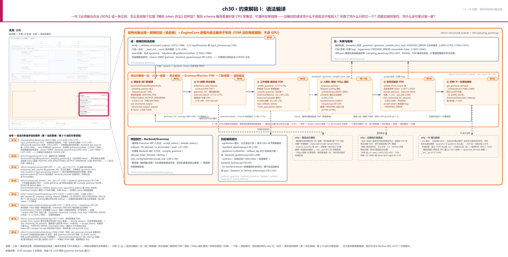
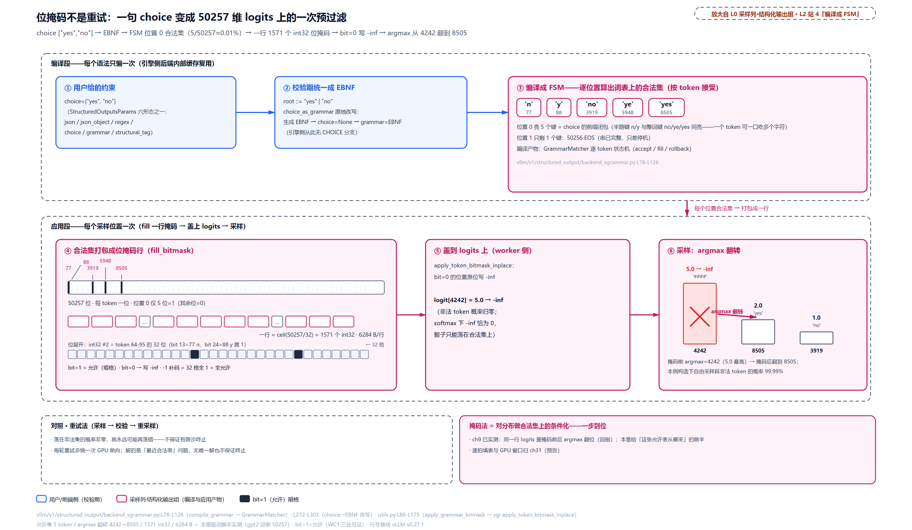
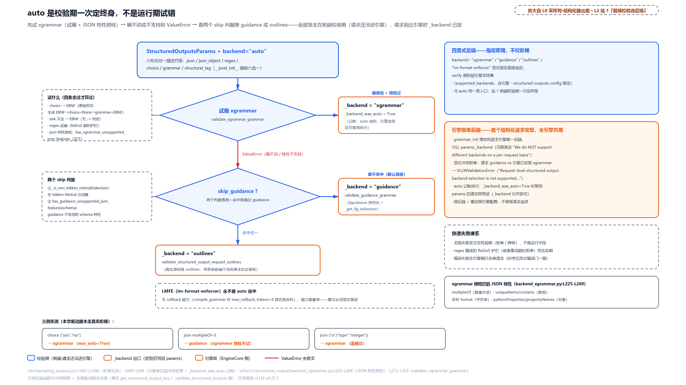
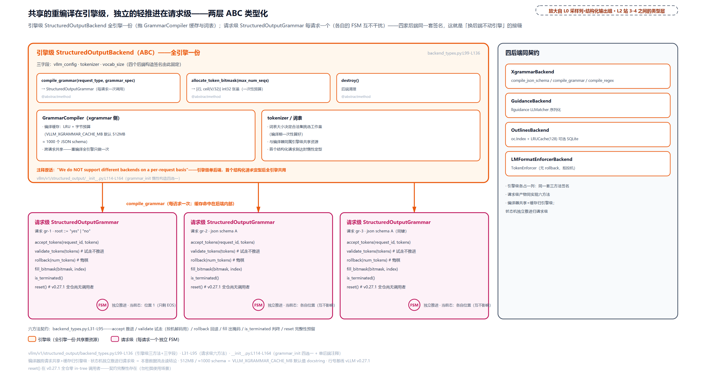
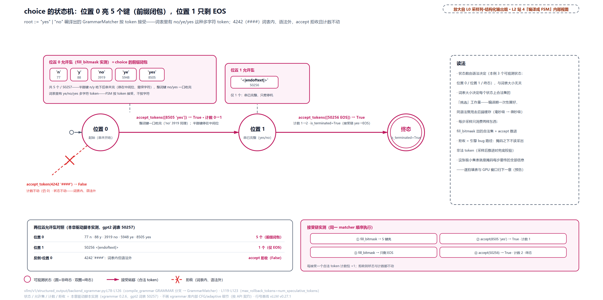
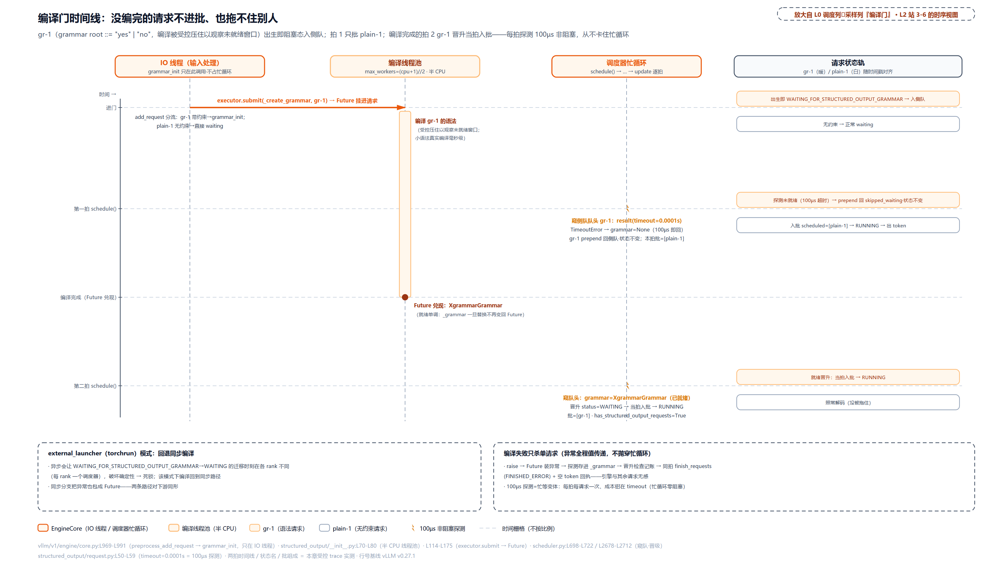
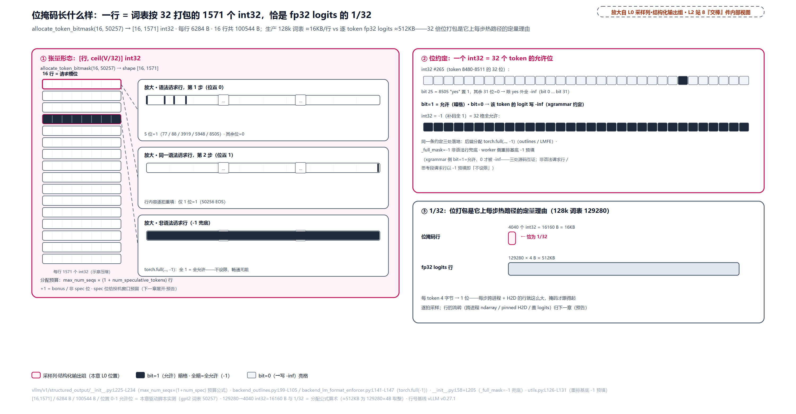

# 第 30 章　约束解码 I：语法编译

用户只给了一句话：「必须输出合法 JSON」。或者一条正则、一个候选列表、一份 schema。可采样器认识的只有 logits：从 128000 个分数里挑一个 token 出门。这句人话怎么变成每个采样位置上「哪些 token 合法」的判定？

时间上还有一笔账。复杂 schema 的编译是毫秒到百毫秒级的 CPU 密集活，而 EngineCore 是单线程忙循环，[第 9 章](../../ch09-engine-core-step-loop/narrative/chapter.md)立过的纪律是慢活不许进循环。没编译完的请求凭什么既不进批、又拖不住别人一个 token？编译要是干脆失败了呢，一个坏 schema 凭什么只死它自己、不连累引擎？

还有一道选择题。xgrammar、guidance、outlines、lm-format-enforcer 四家语法引擎都吃同一份契约，凭什么全引擎只许装一家？auto 又按什么顺序降级？

本章沿「一个语法对象的一生」把这三串问题一次答完：前端校验选后端、进门即阻塞、线程池异步编译、侧队门控晋级、采样后推进状态机，最后在掩码交棒点收笔。主战场是 `vllm/v1/structured_output/` 这只目录。

## 你在这里



> *图注：本章放大的是[第 1 章](../../ch01-vllm-v1-in-one-map/narrative/chapter.md) L0 图采样出口列里的「结构化输出组」，就是那张图里画在采样器下方、写入却在采样之前先行的那块位掩码，[第 29 章](../../ch29-sampler-pipeline/narrative/chapter.md)门口第 1 站交接点 `apply_grammar_bitmask` 的上游。三块已读地基直接踩上来：采样列 9 步管线与 `allowed_token_ids` 白名单（[第 29 章](../../ch29-sampler-pipeline/narrative/chapter.md)，白名单是「不带状态机的粗粒结构化输出」，本章是它的完全体）；五拍循环第三拍的掩码窗口（[第 9 章](../../ch09-engine-core-step-loop/narrative/chapter.md)，掩码藏进前向窗口的位置账）；阻塞态与侧队机制（[第 11 章](../../ch11-preemption-request-lifecycle/narrative/chapter.md)，本章只是它的一次实例化）。读图：上排是请求进出条，中排 ①-⑥ 是语法对象的一生，下排是两层契约与四后端对照。站号 = 请求流经代码的顺序：第 1 站在前端进程（请求还没进引擎），第 2-8 站在引擎进程（IO 线程→编译线程→调度器）；正文按讲解需要编排、不必照站号读。*

读法建议：想知道「为什么是掩码不是重试」的原理账，直奔[「掩码不是重试」](#掩码不是重试采样前把非法-token-掐掉)；被「四家后端怎么选」困扰的，跳[「auto 降级阶梯」](#auto-降级阶梯校验期一次定终身)和[「四家后端，同一份契约」](#四家后端同一份契约分歧点对照)；本章的命门是异步编译门，在[「侧队与百微秒门控」](#第-56-站侧队与百微秒门控没编完的不进批也拖不住别人)；思考模型怎么跟语法联动，看[「先想后说的门」](#先想后说的门思考模型联动)；想跟全程，按序读。

照例交代取证环境，全章数值表通用。所有数值来自 host 实跑：六个驱动脚本对着配套精简版与真实依赖库跑（xgrammar 0.2.6、llguidance 1.7.6，均为 vLLM requirements 钉版区间的 wheel；torch 2.11 CPU 张量），分词器用 gpt2、词表 50257（本地缓存，无网络）。四处差异先挑明：其一，取证词表 50257 不是 13 万级生产词表，正文里 128k 词表每行 16KB 的账引的是源码分配公式，不是本机观测；其二，xgrammar 0.2.6 已把 `GrammarMatcher(max_rollback_tokens=…)` 的限制语义弃用，构造时发 DeprecationWarning、内部恒无限回滚，vLLM 侧传参行为与 pin 源码一致，讲到回滚时再展开；其三，思考模型一节用的 reasoner 是最小替身（装配链按减法删除，四个方法本体逐字）；其四，四后端对照表里 outlines 与 lm-format-enforcer 两列的行为以源码行号为据（精简版按减法删了这两家，未在取证机运行）。计时数字一律是 host 单线程 perf_counter，毫秒级有抖动，只作数量级证据。

## 掩码不是重试：采样前把非法 token 掐掉

先还一张欠条。[第 9 章](../../ch09-engine-core-step-loop/narrative/chapter.md)拆五拍循环时在第三拍埋过一个窗口：同一行 logits，先被掩码改写、再采样，实测 argmax 从 5 号翻到 4 号。当时只给了掩码的**用法**，把「这张每 token 一位的允许表从哪来」留给了 Part VII；[第 29 章](../../ch29-sampler-pipeline/narrative/chapter.md)走到采样列门口又复述了一遍：用户给的是一段 JSON schema 或一条正则，它怎么变成每个位置上「哪些 token 合法」的判定？本章开始还账，先还前半：语法怎么编译、后端怎么选、编译怎么不挡路。后半（状态机怎么逐拍填表、掩码怎么在 GPU 前向窗口里算完传完盖完）是下一章的事。

### 语法编译成什么：一台只往前走的状态机

先把主角立住。**FSM（finite-state machine，有限状态机）** 是一台只能处于有限个状态之一的抽象机器，由三件东西定义：一组状态、一张转移表（「在状态 S 读到符号 x 就去状态 T」）、若干接受态（走到这里算整串合法）。它读输入永远一次一个符号，每步查一次表，不回头、不另带记忆。「语法编译」就是把一段「什么样的字符串算合法」的规则，翻译成这样一张走图，并且**替每个状态预先算好「从这个状态出发能走通的 token 集合」**，编译期干的重活就是这一件。生成期的循环因此变得极轻：查当前状态的允许集，拿它当掩码，被采出的 token 把机器推到下一个状态，周而复始。

拿本章反复用的最小例子走一遍（说明性推演，非源码运行结果；真实 token id 见下节）。候选列表 `["yes", "no"]` 编译出的状态机是：

```
S0 --y--> S1 --e--> S2 --s--> S3(接受)
S0 --n--> S4 --o---------->  S3(接受)
```

S0 是起点，只允许下一个字符是 y 或 n；沿 yes 三步、no 两步都到接受态 S3，其余走法全死。为什么非变成状态机不可：生成是逐 token 的，每一步都必须**立刻**回答「这个位置哪些 token 合法」，拿着原始文法从头推理代价随文法规模爆炸，而状态机把这个回答压成一次查表。理论上有两条现成的路：正则语言恰好对应有限状态机，上下文无关文法（规则名可以递归引用自己，因此能表达 JSON 这种任意深度嵌套）恰好对应 **下推自动机**（finite-state machine 加一个栈，栈顶记住「还欠几个右括号」）。所以「正则编 DFA、schema/EBNF 编下推/Earley」不是工程巧合，是形式语言理论给好的分工。xgrammar 走下推路线，outlines 走 DFA（deterministic finite automaton，确定性有限自动机——就是上文那台有限状态机）路线，llguidance 用 Earley 分析器（另一类能吃任意上下文无关文法的判定器），细节在[四后端对照](#四家后端同一份契约分歧点对照)一节。

### 为什么不是生成后修复

那为什么必须在采样**前**掩码，而不是生成后校验、错了重采样？形式化地说：设词表为 $`V`$，语法在当前状态 $`s`$ 下的合法集为 $`A(s) \subseteq V`$。模型分布 $`p`$ 落在 $`V`$ 全集上，采到非法 token 的概率一般非零；而生成是自回归的，一步走错（比如 JSON 里吐了裸换行），后续所有 token 都在错误前缀上条件化，回不到合法轨道。重试法解的是「最近合法串」问题，既无唯一解也不保证有限步终止。掩码法把分布换成合法集上的条件分布：

```math
p_{\mathrm{mask}}(x)=\frac{p(x)\cdot\mathbf{1}[x\in A(s)]}{\sum_{x'\in A(s)}p(x')}
```

其中 $`\mathbf{1}[\cdot]`$ 是指示函数，方括号里的条件成立取 1、否则取 0。工程上不用真做这套归一化：把非法位的 logit 写成 −inf，softmax 之后它的概率恰好为零，归一化自动完成，采样器一行不用改。每步采样必落在 $`A(s)`$ 内，采完 FSM 前进到新状态、下一拍对新状态再掩码——链式保证整串合法。

这条 why 链的完整四要素。**旧设计**：v0 早期 outlines 集成的形态是「生成→校验→重采样」循环，或者每步在 CPU 枚举合法 token id 列表传给采样器。**痛点**：词表 13 万，枚举/序列化合法集本身就有 O(V) 开销，一个 Python list 没法与批处理 GPU 管线拼合；重试路径根本不保证有限步终止，每轮重试还多一次 GPU 前向。**v1 方案**：语法编译成 FSM，每步 `fill_next_token_bitmask` 在预分配的位掩码上标记非法 token，掩码传到 worker 侧把非法 logits 原位写 −inf（`vllm/v1/structured_output/backend_xgrammar.py:L78-L126` 编译、采样侧执法是[第 29 章](../../ch29-sampler-pipeline/narrative/chapter.md)站 1 交接点）。**代价**（诚实账）：FSM 活在调度器进程，每步一次 CPU FSM 走查加一次跨进程传输；位掩码常驻显存外还要过一遍 H2D（host-to-device，主机内存到显存的拷贝；下一章的账）；xgrammar 啃不动的 JSON 特性直接拒单（下文降级阶梯）；掩码写入发生在采样管线之前，与惩罚/bad_words 的先后顺序是一条隐式契约。

配上实测。手工构造一行 logits，让非法 token 得分最高（gpt2 词表 50257，`####` 是词表里真实存在但语法外的 token）：

<!-- trace: m1 -->
| 阶段 | 动作 | 关键量 | 判定 | 结果 |
| --- | --- | --- | --- | --- |
| 掩码前 | argmax(logits) | logit[4242]='####' 为 5.0 最高；8505('yes')=2.0、3919('no')=1.0 | 自由 argmax | 选中 4242——语法外 token 当选 |
| 填掩码 | fill_bitmask（位置 0） | 50257 位中允许 5 位：[77, 88, 3919, 5948, 8505] | 合法集=choice 的前缀闭包 | 掩码行 1571 个 int32 |
| 掩码后 | apply_token_bitmask_inplace | bit=0 的位置写 -inf：4242 从 5.0 变 -inf | 非法位概率归零 | argmax 翻到 8505（'yes'） |
| 对照·重试法 | 采样→校验→重采样循环 | 落在非法集的概率非零就永远可能再落错 | 不保证有限步终止 | 掩码法=对分布做合法集上的条件化，一步到位 |

位置 0 为什么恰好允许 5 个 token？`choice ["yes","no"]` 的合法开头是 y 和 n 两个字符，但 gpt2 词表里 `no`、`ye`、`yes` 本身各是一个 token——**FSM 按 token 接受，一个 token 可以一口吃掉多个字符**，所以位置 0 的合法集是 choice 的前缀闭包：77('n')、88('y')、3919('no')、5948('ye')、8505('yes')，恰好五个。5/50257 ≈ 0.01%：自由采样踩非法 token 的概率约 99.99%，本例又构造了非法位得分最高，argmax 必错；掩码一盖，一步翻正。



> *图注：从用户一句话到 logits 上的一次预过滤，全程五步。上带是编译段（每个语法一次）：choice 改写成 EBNF、编译成 FSM、FSM 在位置 0 算出词表上的合法集（50257 个 token 只剩 5 个）；下带是应用段（每个采样位置一次）：合法集打包成一行 1571 个 int32 的位掩码，bit=0 的位在采样前写 −inf，argmax 从 4242('####', 5.0) 翻到 8505('yes', 2.0)。底部对照重试法：落在非法集的概率非零就可能永远落错，不保证有限步终止。本图收「允许表从哪来」的前半，逐拍填表与 GPU 窗口归下一章。*

掩码行本身的物理形态（为什么是 int32 数组、−1 为什么等于全允许、每行多少字节）在[交棒点之前](#产物长什么样一行位掩码的物理账)单独算账，先沿着语法对象的一生往下走。

## 第 1 站：前端校验，六种说法换一张取件码

现在走到 L0 图的前端进程：请求还没进引擎，`StructuredOutputsParams` 在这里被校验、被选后端、甚至被改写。

### 六选一：StructuredOutputsParams

用户面的约束描述只有一个类，六种形态六选一：

```python
# vllm/sampling_params.py:L72-L126 · StructuredOutputsParams
class StructuredOutputsParams:
    # One of these fields will be used to build a logit processor.
    json: str | dict | None = None
    regex: str | None = None
    choice: list[str] | None = None
    grammar: str | None = None
    json_object: bool | None = None
    # These are other options that can be set.
    disable_any_whitespace: bool = False
    disable_additional_properties: bool = False
    whitespace_pattern: str | None = None
    structural_tag: str | None = None

    _backend: str | None = field(default=None, init=False)
    """CAUTION: Should only be set by Processor._validate_structured_output"""   # L85
    _backend_was_auto: bool = field(default=False, init=False)
    # … 省略：_backend_was_auto 的同款 CAUTION docstring …

    def __post_init__(self):
        """Validate that some fields are mutually exclusive."""
        count = sum(
            [
                self.json is not None,
                self.regex is not None,
                self.choice is not None,
                self.grammar is not None,
                self.json_object is not None,
                self.structural_tag is not None,
            ]
        )
        if count > 1:
            raise VLLMValidationError(
                "You can only use one kind of structured outputs constraint "
                f"but multiple are specified: {self.__dict__}"
            )                                   # 同时给两种约束：拒                         # L113
        if count < 1:
            raise VLLMValidationError(
                "You must use one kind of structured outputs constraint "
                f"but none are specified: {self.__dict__}"
            )                                   # 一个不给也拒（占位对象）                  # L119
    # … 省略：all_constraints_none——六个字段全 None 的便捷判定，from_sampling_params 用它区分「无约束请求」…
```

读出三件事。第一，六形态：`json`（一段 JSON Schema）、`regex`、`choice`（候选串列表）、`grammar`（EBNF 文法）、`json_object`（只要是个 JSON 对象就行）、`structural_tag`（自由文本里嵌结构化片段，为工具调用定制）。第二，互斥是**双向**强制的：给了两种拒（实跑报错原文开头「You can only use one kind of structured outputs constraint but multiple are specified」），一种不给也拒（同款报错换成「but none are specified」）。第三，两个私有字段 `_backend` 与 `_backend_was_auto`，docstring 写明只许前端校验期写，它们是本站与第 3 站之间的传令兵，下文展开。

`structural_tag` 值得一个 60 字的例子，否则第 4 站的分派读不懂。语义三拍：平时自由发挥；一旦输出命中某个 trigger 字符串（如 `<function=`），语法立刻接管，强制走完 begin 标签、一段 schema 约束的参数、end 标签；结束标签一出恢复自由。vLLM 官方 get_weather 示例（说明性，外部示例，老格式）：

```json
{
  "type": "structural_tag",
  "structures": [{"begin": "<function=get_weather>",
                  "schema": {"type": "object", "properties": {"city": {"type": "string"}}},
                  "end": "</function>"}],
  "triggers": ["<function="]
}
```

于是「好的，我来查询。`<function=get_weather>{"city": "Beijing"}</function>`查询已发出。」是合法输出：只有标签之间被强制，前后中文完全自由。trigger 必须是 begin 的无歧义前缀，引擎靠这一点在触发词刚出现时就知道切进哪组候选（多个工具共享一个 trigger，靠 begin 的剩余部分区分）。深入见 [xgrammar 的 structural_tag 文档](https://github.com/mlc-ai/xgrammar/blob/main/docs/structural_tag/structural_tag.md)。

### 取件码：structured_output_key

六种说法进了引擎要换算成统一格式，编译才有一个确定的入口。`get_structured_output_key` 把任何形态归一成一个二元组：第一元是 `StructuredOutputOptions` 六值枚举，第二元是规格字符串：

```python
# vllm/v1/structured_output/request.py:L82-L103 · get_structured_output_key
def get_structured_output_key(params: StructuredOutputsParams) -> StructuredOutputKey:
    if params.json is not None:
        if not isinstance(params.json, str):
            json_str = json.dumps(params.json)      # dict 熨平成字符串               # L86
        else:
            json_str = params.json
        return StructuredOutputOptions.JSON, json_str
    if params.json_object:
        return StructuredOutputOptions.JSON_OBJECT, ""
    if params.regex is not None:
        return StructuredOutputOptions.REGEX, params.regex
    if params.choice is not None:
        if not isinstance(params.choice, str):
            json_str = json.dumps(params.choice)    # list 同样熨平                    # L95
        else:
            json_str = params.choice
        return StructuredOutputOptions.CHOICE, json_str
    if params.grammar is not None:
        return StructuredOutputOptions.GRAMMAR, params.grammar
    if params.structural_tag is not None:
        return StructuredOutputOptions.STRUCTURAL_TAG, params.structural_tag
    raise ValueError("No valid structured output parameter found")
```

`json.dumps` 的熨平只保序、不排序：同一个 schema 的不同键序会得到两张不同的取件码（下表第三行）。这个细节眼下无害，到[编译缓存](#编译缓存各后端各自为政)一节会回来咬人——它直接决定缓存命中率。各种输入形态的归一实测：

<!-- trace: m2 -->
| 输入形态 | 用户给的 | 键·枚举 | 键·spec 串（归一后） |
| --- | --- | --- | --- |
| json(dict) | {"a": 1, "b": [2, 3]} | JSON | {"a": 1, "b": [2, 3]}（json.dumps 归一） |
| json(str·dict 的 dumps 形) | {"a": 1, "b": [2, 3]} | JSON | {"a": 1, "b": [2, 3]}（与 dict 形完全同串——同键） |
| json(str·异键序) | {"b": [2, 3], "a": 1} | JSON | {"b": [2, 3], "a": 1}（保序不排序→不同键） |
| json_object | True | JSON_OBJECT | ""（空串） |
| regex | [0-9]+ | REGEX | [0-9]+（原样） |
| choice(list) | ["yes", "no"] | CHOICE | ["yes", "no"]（list 也 json.dumps 归一） |
| grammar | root ::= "yes" | GRAMMAR | root ::= "yes"（原样） |
| structural_tag | {"x": 1} | STRUCTURAL_TAG | {"x": 1}（原样） |

还有一个纠偏要趁早：`structured_output_key` 是**每请求**的 `cached_property`（同一请求读两次是同一对象），不是跨请求的编译缓存键。实跑证据：两个请求给同一 schema，键相等但对象独立。同 schema 的复用完全发生在后端内部，[编译缓存](#编译缓存各后端各自为政)一节对账。

### json 那格是什么：三十秒 JSON Schema

没写过 schema 的读者，json 那格是悬空的，补三十秒（说明性，外部标准）。JSON 本身不带语义，JSON Schema 是描述「另一份 JSON 必须长什么样」的标准词汇表：`type`（object/string/integer/…）、`properties`（各键的子 schema）、`required`（必填键）、`items`（数组元素）这些关键字。最小一份：

```json
{
  "type": "object",
  "properties": { "a": { "type": "integer" } },
  "required": ["a"]
}
```

合法实例 `{"a": 3}`；非法 `{"a": "x"}`（类型不对）、`{}`（缺必填键）。传统用途是**事后校验**（validator 给 pass/fail），LLM 结构化输出把它反过来用在 **事前约束**：把 schema 编译成语法，让模型只能生成本来就合法的实例，校验从下游挪到了上游。OpenAI 的 Structured Outputs 与 vLLM 的 json 参数收的是同一种东西。若给 a 加一条 `"multipleOf": 3`，它就从「能编」滑进黑名单：文法管得住「是数字」，管不住「被 3 整除」，原因见后面的降级阶梯。入门见 [json-schema.org 官方教程](https://json-schema.org/learn/getting-started-step-by-step)。

### auto 降级阶梯：校验期一次定终身

选后端发生在前端校验期，入口是 `SamplingParams.verify`（[第 2 章](../../ch02-request-lifecycle/narrative/chapter.md)立过 InputProcessor 的校验面，调用点在 `vllm/v1/engine/input_processor.py:L104`）：

```python
# vllm/sampling_params.py:L762-L770 · SamplingParams.verify（校验清单末段）
        self._validate_logprobs(model_config)
        self._validate_logit_bias(model_config)
        self._validate_logits_processors(model_config)
        self._validate_allowed_token_ids(tokenizer)
        self._validate_spec_decode(speculative_config)
        self._validate_diffusion(model_config)
        self._validate_structured_outputs(       # 本站主体                          # L768
            model_config, structured_outputs_config, tokenizer
        )
```

`_validate_structured_outputs` 先做两类拒单。diffusion 模型直接拒（`sampling_params.py:L932-L942`，注释点名 #45436：FSM 要求从左到右采样，扩散模型整块画布并行去噪，中途 FSM 必然拒收，用户会拿到 HTTP 500，不如进门就拒）；`skip_tokenizer_init` 也拒（语法编译离不开分词器，`L944-L947`）。然后是引擎级单后端的冲突检查（下一小节），最后才是 auto 阶梯：

```python
# vllm/sampling_params.py:L1043-L1086 · SamplingParams._validate_structured_outputs（auto 分支）
        else:
            # NOTE: backend must be "auto" here, because we have
            # checked supported_backends above.
            # In this mode, we set opinionated defaults based on what we think
            # will satisfy the most use cases without having to worry about
            # this setting. We include fallback behavior here, but not with any
            # other setting where a specific backend was specified.
            try:
                validate_xgrammar_grammar(self)                 # 第一试：试编+预检    # L1051
                self.structured_outputs._backend = "xgrammar"
            except ValueError:
                # The request either failed validation
                # or includes some jsonschema feature(s) that
                # are not supported in xgrammar.

                skip_guidance = _is_non_tekken_mistral(tokenizer)   # 判据一          # L1058

                # Check if schema has features unsupported by guidance
                so_params = self.structured_outputs
                if not skip_guidance and so_params.json:
                    if isinstance(so_params.json, str):
                        schema = json_mod.loads(so_params.json)
                    else:
                        schema = so_params.json
                    skip_guidance = has_guidance_unsupported_json_features(schema)  # 判据二  L1067

                if skip_guidance:
                    # Fall back to outlines if the tokenizer is non-tekken Mistral or
                    # the schema contains features unsupported by guidance
                    validate_structured_output_request_outlines(self)
                    self.structured_outputs._backend = "outlines"  # 跳级降级          # L1073
                else:
                    # Fall back to guidance by default.
                    validate_guidance_grammar(                    # 兜底降级            # L1076
                        self,
                        tokenizer=_get_llg_tokenizer(tokenizer),
                    )
                    self.structured_outputs._backend = "guidance"
            # Remember that this backend was set automatically
            self.structured_outputs._backend_was_auto = True      # 记账               # L1082

        # Run post-init validation. This is also important to ensure subsequent
        # roundtrip serialization/deserialization won't fail.
        self.structured_outputs.__post_init__()
```

骨架一句话：**auto 不是运行期试错，是校验期一次定终身**。先试 xgrammar（试编 + JSON 特性预检），`ValueError` 则查两个 skip 判据再决定降 guidance 还是跳级降 outlines；显式指定后端时不做任何降级，编不动就拒单。两个判据：`_is_non_tekken_mistral`（tekken 是 Mistral 较新的 tiktoken 系分词器；**非** tekken 的老 SentencePiece 系 Mistral 分词器与 guidance 的分词器包装不兼容，这类请求跳过 guidance）和 `has_guidance_unsupported_json_features`（schema 特性扫描）。LMFE 永远不在 auto 的选项里——它撑不住回滚、能力面最窄，只能显式点名使用。



> *图注：auto 的决策树，全部发生在前端校验期（请求还没进引擎）。六形态入口先过「试编 xgrammar」菱形：试编成功且 JSON 特性预检通过，落 `_backend=xgrammar`；ValueError 则查两个 skip 判据（非 tekken Mistral 分词器、guidance 不支持的 schema 特性），命中任一降 outlines，都不命中降 guidance。旁栏是四个显式后端分支与引擎级单后端的冲突拒单。三例实测：choice [yes,no] 编得过 → xgrammar；json 带 multipleOf=5（xgrammar 预检不过）→ guidance；json {"a":{"type":"integer"}} → xgrammar 直接过。能力差异暴露在校验期（拒单或降级）而非运行中段。*

那个 JSON 特性预检的黑名单，理论出身值得一句。`has_xgrammar_unsupported_json_features`（`vllm/v1/structured_output/backend_xgrammar.py:L225-L269`）扫四类：数值带 `multipleOf`、数组带 `uniqueItems`/`contains`、字符串带非白名单 `format`、对象带 `patternProperties`。这不是工程偷懒：`multipleOf` 是算术整除，文法只管字符形状、不会做除法；`uniqueItems` 要记住并比较已经出过的所有值，需要无界记忆；而有限状态的机器原理上够不着无界记忆。JSONSchemaBench（[arXiv:2501.10868](https://arxiv.org/abs/2501.10868)）在一万个真实 schema 上横评过六家引擎对这些特性的覆盖，黑名单词汇各家大同小异。读者撞上拒单时，答案在这里：不是 bug，是这台机器的表达力边界。

### 校验期不只选后端，还会改写请求：choice→EBNF

`validate_xgrammar_grammar` 里藏着一个容易被误读的动作。先看源码（choice 分支）：

```python
# vllm/v1/structured_output/backend_xgrammar.py:L272-L303 · validate_xgrammar_grammar（regex 与 choice 分支）
def validate_xgrammar_grammar(sampling_params: SamplingParams) -> None:
    """Validate that the request is supported by structured output.

    Raises ValueError if the request is not supported.
    """
    if sampling_params.structured_outputs is None:
        return

    so_params = sampling_params.structured_outputs

    if so_params.regex:
        try:
            compile_regex_with_timeout(        # 试编正则（ReDoS 护栏，见第 4 站）    # L284
                xgr.Grammar.from_regex,
                so_params.regex,
            )
        except Exception as err:
            raise ValueError(
                f"Failed to transform regex into a grammar: {err}"
            ) from err

    if so_params.choice:
        choice_grammar = choice_as_grammar(so_params.choice)
        try:
            xgr.Grammar.from_ebnf(choice_grammar)   # 编得动才继续                    # L296
        except Exception as err:
            raise ValueError(
                f"Failed to transform choices into a grammar: {err}"
            ) from err
        so_params.choice = None                   # 原地改写三步之二                  # L301
        so_params.grammar = choice_grammar        # 之三：grammar=EBNF                # L302
        return
    # … 省略：json 分支（json.loads + 特性预检 + from_json_schema 试编）、grammar 分支
    # （grammar_is_likely_lark 判定 Lark 方言则 convert_lark_to_ebnf 原地转换再试编）、
    # structural_tag 分支——形状同构：试编 + 原地改写或预检 …
```

`choice_as_grammar` 干的活一行就能看完（`vllm/v1/structured_output/utils.py:L553-L561`）：把每个选项转义后拼成 `root ::= "A" | "B" | "C"`。于是 `["yes", "no"]` 变成 `root ::= "yes" | "no"`，然后**就地销毁原签证**：`choice=None`、`grammar=EBNF`。飞机（请求）到引擎时只查一种签证，所以引擎侧的编译分派压根没有 CHOICE 窗口——只看引擎侧源码会误判「choice 不被支持」，真相是它在登机口（前端校验期）就被换发了。

顺手把 **EBNF（Extended Backus-Naur Form，扩展巴科斯范式）** 讲透，它是六形态里 `grammar` 参数的书写法，也是 choice 改写的目标格式。逐符号读这条最小文法：

```
root ::= "yes" | "no"
```

`root` 是规则名；vLLM 的 xgrammar 后端遵循 llama.cpp 定的 GBNF 方言（GGML 家族的 BNF 变体），约定必须有一条名为 root 的规则，它定义整个输出的起点。`::=` 读作「定义为」。`"yes"` 是带引号的**终结符**：字面字符串，输出里必须逐字出现。`|` 是或，左右任选其一。整条规则的意思：合法输出恰好是 yes 或 no 两个串，一个字符不能多。再给一例体现 EBNF 超出正则的地方：

```
root  ::= "[" [ item ( "," item )* ] "]"
item  ::= "a" | root
```

`item` 里又引用 `root`——这种自引用让文法接受任意深度嵌套列表 `[a,[a,a],[[a]]]`，而正则写不出「括号必须配平」，这正是 outlines「一切转正则」路线表达力封顶的原因（下文对照）。EBNF 是一族方言从未统一（ISO 1996 出过标准，被研究者评价为「只是又添了三种方言」），深入见 [GBNF 规范](https://github.com/ggml-org/llama.cpp/blob/master/grammars/README.md)与[EBNF 条目](https://en.wikipedia.org/wiki/Extended_Backus%E2%80%93Naur_form)。

改写还有第二例：lark→EBNF。`grammar` 参数历史上收过 Lark 方言文法（Lark 是 Python 生态流行的解析库，文法用冒号定界：`start: "yes" | "no"`，与 `::=` 不同族），vLLM 靠一个可见特征反推方言——串里没有 `::=` 就按 Lark 处理（`grammar_is_likely_lark`，`utils.py:L391-L420`），再 `convert_lark_to_ebnf` 原地转写（`L423-L550`）。同一条约束的两种方言就差定界符与起点名（`start:` vs `root ::=`），但对编译器是天壤，不转写整条当语法错误。guidance 后端不需要这步，llguidance 自己就吃 Lark 变体。改写全程的实测：

<!-- trace: m4 -->
| 时刻 | params.choice | params.grammar | 备注 |
| --- | --- | --- | --- |
| 改写前 | ["yes", "no"] | None | validate_xgrammar_grammar 入口（前端校验期） |
| 试编 | xgr.Grammar.from_ebnf(root ::= "yes" \| "no") | （未动） | 编得动才改写；编不动 ValueError→auto 降级接手 |
| 改写后 | None | root ::= "yes" \| "no" | 原地三步：生成 EBNF→choice=None→grammar=EBNF |
| 引擎侧 | （读键时 choice 已是 None） | 命中 GRAMMAR 分支 | compile_grammar 五分派无 CHOICE 分支——改写使然 |

### 全引擎只装一家：冲突检查与记账

后端是引擎级单例，第一个结构化请求到达时定型，之后全引擎共用。校验期因此要做冲突检查（`vllm/sampling_params.py:L949-L966`）：

```python
# vllm/sampling_params.py:L949-L966 · SamplingParams._validate_structured_outputs（冲突检查）
        backend = structured_outputs_config.backend
        if _backend := self.structured_outputs._backend:
            # Request-level backend selection is not supported.
            # The values may differ if `params` is reused and was set
            # to a specific backend based on `auto` behavior in a previous
            # request. We remember that it was set as a result of `auto`
            # using the `_backend_was_auto` field set in the params.
            if backend != _backend and not (
                backend == "auto" and self.structured_outputs._backend_was_auto
            ):                                              # auto 记账放行复用         # L960
                raise VLLMValidationError(
                    "Request-level structured output backend selection is not "
                    f"supported. The request specified '{_backend}', but vLLM "
                    f"was initialised with '{backend}'. This error can be "
                    "resolved by removing '_backend' from the request."
                )
        else:
            self.structured_outputs._backend = backend      # 首个请求：引擎配置即后端  # L965
```

正常用户不碰 `_backend`，这个检查防的是**复用 params 对象**的离线场景：同一份 params 发第二次请求，上次 auto 已经把 `_backend` 写成了具体名字，这次的引擎配置若与它不同就误报冲突。`_backend_was_auto` 就是记账位：上次是 auto 定的，这次放行。实跑两例：auto 复用通过（`_backend=xgrammar`、引擎 auto）；显式 guidance 对引擎 auto+xgrammar 记账则拒单，报错原文「Request-level structured output backend selection is not supported」。

## 第 2、3 站：进门即阻塞，IO 线程起编

校验通过，请求跨过进程边界进 EngineCore。现在走到 L0 图的引擎进程：请求在这里出生、门在这里关上、编译在这里起跑。

### 出生那一刻，门就关上

`Request` 构造函数的最后几行是本站的全部：

```python
# vllm/v1/request.py:L87-L114 · Request.__init__（末段）
        self.structured_output_request = StructuredOutputRequest.from_sampling_params(
            sampling_params
        )                                   # 无约束则 None                       # L88
        # … 省略：arrival_time、初始 status=WAITING、events、stop_reason、kv_transfer_params 等常规字段 …

        if pooling_params is not None:
            # Pooling models.
            self.max_tokens = 1
        elif sampling_params is not None:
            # Generative models.
            assert sampling_params.max_tokens is not None
            self.max_tokens = sampling_params.max_tokens
            if self.structured_output_request is not None:
                self.status = RequestStatus.WAITING_FOR_STRUCTURED_OUTPUT_GRAMMAR
                                            # 带约束的生成请求：出生即阻塞          # L114
```

注意状态的初值：普通请求出生是 `WAITING`（排队等调度），带结构化约束的生成请求**直接**是 `WAITING_FOR_STRUCTURED_OUTPUT_GRAMMAR`——不是「先 WAITING、发现没编好再改」，是门在出生那一刻就关上。为什么能这么笃定：此刻编译还没开始，甚至编译器还没建，这个请求必然没就绪，先给阻塞态零成本。[第 11 章](../../ch11-preemption-request-lifecycle/narrative/chapter.md)立过请求状态机的三个阻塞子态（等语法编译、等远端 KV、等流式请求），它们共用同一套「隔离队 + 每拍探测 + 晋级」机制；本章只讲语法门这一个实例，机制全貌不重讲。

挂上去的 `StructuredOutputRequest` 是请求级的容器，值得先认脸：

```python
# vllm/v1/structured_output/request.py:L21-L48 · StructuredOutputRequest
@dataclasses.dataclass
class StructuredOutputRequest:
    params: StructuredOutputsParams
    _grammar: (
        Future[StructuredOutputGrammar] | StructuredOutputGrammar | Exception | None
    ) = None                                # Future/成品/Exception 多态演化的核心   # L24
    reasoning_ended: bool | None = None     # 思考模型：独白是否已结束               # L27
    # Absolute index into the request's all_token_ids of the last reasoning
    # token (the reasoning-end marker). Tokens at or before this index are
    # reasoning content and must never be fed to the grammar. Only set when
    # reasoning ends in a step whose tokens the scheduler advances immediately
    # (structural tags + speculative decoding, see #42452).
    reasoning_end_token_index: int | None = None                              # L35
    reasoning_parser_kwargs: dict[str, Any] | None = None
    reasoner: "ReasoningParser | None" = None   # 不配推理解析器的模型恒为 None      # L39
    # … 省略：from_sampling_params 静态方法——params 无约束（all_constraints_none）返回 None …
```

重点是 `_grammar` 的类型注解：它一生要经历四种形态——`None`（还没提交编译）、`Future`（编译中）、成品 `StructuredOutputGrammar`（编好了）、`Exception`（编砸了）。`Future`、成品、`Exception` 三态的演进是第 5、6 站门控的全部依据，reasoning 三字段则服务第 7 站的思考门。

### grammar_init：惰性建唯一后端，把编译提交线程池

编译在哪起跑？不在忙循环里。[第 9 章](../../ch09-engine-core-step-loop/narrative/chapter.md)立过忙循环纪律：请求构造与语法编译在输入 IO 线程完成，忙循环只消费结果。调用点：

```python
# vllm/v1/engine/core.py:L969-L991 · EngineCore.preprocess_add_request
    def preprocess_add_request(self, request: EngineCoreRequest) -> tuple[Request, int]:
        """Preprocess the request.

        This function could be directly used in input processing thread to allow
        request initialization running in parallel with Model forward
        """
        # … 省略：mm_receiver_cache 多模态接收缓存的两行（仅多模态请求触达）…
        req = Request.from_engine_core_request(request, self.request_block_hasher)
        if req.use_structured_output:
            # Note on thread safety: no race condition.
            # `grammar_init` is only invoked in input processing thread. For
            # `structured_output_manager`, each request is independent and
            # grammar compilation is async. Scheduler always checks grammar
            # compilation status before scheduling request.
            self.structured_output_manager.grammar_init(req)   # IO 线程独占调用   # L989
        return req, request.current_wave
```

docstring 原话「allow request initialization running in parallel with Model forward」：请求初始化（含语法编译的**发起**）与 GPU 前向并行。那段线程安全注释不是拍胸脯，是在论证为什么无竞态——「grammar_init 只在输入处理线程被调用」+「编译是异步的」+「调度器总在调度前检查编译状态」，三方各写各的、互不踩脚，第 5、6 站会逐条兑现。

`grammar_init` 本体两件事：惰性构造全引擎唯一后端，然后把编译提交线程池：

```python
# vllm/v1/structured_output/__init__.py:L114-L175 · StructuredOutputManager.grammar_init
    def grammar_init(self, request: "Request") -> None:
        if request.structured_output_request is None:
            return

        # … 省略：TYPE_CHECKING 断言块（静态检查用，运行时为零）…
        # Initialize the backend the first time it is needed.
        #
        # NOTE: We only support a single backend. We do NOT support different
        # backends on a per-request basis in V1 (for now, anyway...).
        # _backend is set in Processor._validate_structured_output
        if self.backend is None:
            assert request.sampling_params is not None
            backend = request.sampling_params.structured_outputs._backend
            vocab_size = self.vllm_config.model_config.get_vocab_size()
            if backend == "xgrammar":
                self.backend = XgrammarBackend(       # 首个请求定型后端            # L128
                    self.vllm_config,
                    tokenizer=self.tokenizer,
                    vocab_size=vocab_size,
                )
            # … 省略：guidance / outlines / lm-format-enforcer 三个 elif 分支——
            # 形状完全相同，只换类名（后两者函数内惰性 import）…
            else:
                raise ValueError(f"Unsupported structured output backend: {backend}")

        grammar: Future[StructuredOutputGrammar] | StructuredOutputGrammar
        if self._use_async_grammar_compilation:
            grammar = self.executor.submit(self._create_grammar, request)  # 提交线程池 L168
        else:
            try:
                grammar = self._create_grammar(request)   # 同步回退（见第 5、6 站）# L171
            except Exception as e:
                grammar = Future()
                grammar.set_exception(e)                  # 异常也包成 Future 同形   # L174
        request.structured_output_request.grammar = grammar
```

注释原话「We do NOT support different backends on a per-request basis」：引擎级单后端的正身。`executor` 是构造期就建好的线程池，线程数半个 CPU：

```python
# vllm/v1/structured_output/__init__.py:L70-L80 · StructuredOutputManager.__init__（线程池装配）
        if not self.vllm_config.model_config.skip_tokenizer_init:
            # The default max_workers if not specified is the number of
            # CPUs * 5, which is way too high since these tasks are CPU-bound,
            # not I/O bound. We also know we would never dominate CPU usage
            # with just grammar compilation, so we set it to half the number
            # of CPUs.
            max_workers = max(1, (multiprocessing.cpu_count() + 1) // 2)
            self.executor = ThreadPoolExecutor(max_workers=max_workers)  # 半 CPU     # L76
            self.tokenizer = cached_tokenizer_from_config(
                model_config=self.vllm_config.model_config
            )
```

三个为什么。**为什么用线程不用进程**：线程是同一进程里并肩跑的执行流，共享同一片内存（一个进程里的多个线程读写同一个地址空间），编译线程把编好的 FSM 对象原地递给调度线程只需传引用，不用序列化；进程之间内存隔离，传对象要跨进程序列化往返。**为什么线程数压到半个 CPU**：源码注释点的是「默认 CPU×5 太高，因为这些活是 CPU 密集不是 IO 密集」。对照 Python 文档正好严丝合缝：线程池（预先建好一组工人线程排队领活、submit 即返回的执行器）的旧默认（3.5-3.7 时代）就是 CPU 数×5，给 IO 密集任务堆一大把线程的思路；3.8 起改成 `min(32, CPU数+4)`，文档同时写明线程池「常用于重叠 IO 而非 CPU 工作」。两个版本的默认对 CPU 密集活都偏大，vLLM 显式压半——注释里的「为什么」在语言层面也站得住。**为什么不用 async/await**：忙循环是同步代码，起一个 executor、submit 一个函数是侵入最小的并行化，主线一行不改。

### 两层契约：共享的编译器，独立的状态机

`grammar_init` 惰性构造的「后端」与 `_create_grammar` 产出的「语法对象」是两个层次，vLLM 用两层抽象基类把这个分层类型化了。整份契约就在 `backend_types.py` 里，请求级在前：

```python
# vllm/v1/structured_output/backend_types.py:L31-L95 · StructuredOutputGrammar（请求级 ABC）
class StructuredOutputGrammar(ABC):
    """Request-level backend for structured output requests."""

    @abstractmethod
    def accept_tokens(self, request_id: str, tokens: list[int]) -> bool:
        """…接受 token 并推进状态机；False=拒收…"""

    @abstractmethod
    def validate_tokens(self, tokens: list[int]) -> list[int]:
        """…试走不推进；返回被接受的前缀，空=全拒…"""

    @abstractmethod
    def rollback(self, num_tokens: int) -> None:
        """…回退 N 个 token 的状态与计数…"""

    @abstractmethod
    def fill_bitmask(self, bitmask: "torch.Tensor", batch_index: int) -> None:
        """…把「下一步允许谁」写进位掩码的第 batch_index 行…"""                     # L73

    @abstractmethod
    def is_terminated(self) -> bool:
        """…语法是否已到终态…"""

    @abstractmethod
    def reset(self):
        """…重置状态…"""
```

```python
# vllm/v1/structured_output/backend_types.py:L99-L136 · StructuredOutputBackend（引擎级 ABC）
class StructuredOutputBackend(ABC):
    """Engine-level backend for structured output requests."""

    vllm_config: VllmConfig
    tokenizer: TokenizerLike
    vocab_size: int                       # 三字段固定四个后端的构造签名           # L103

    @abstractmethod
    def compile_grammar(
        self, request_type: StructuredOutputOptions, grammar_spec: str
    ) -> StructuredOutputGrammar:
        """…把一段语法规格编译成请求级语法对象…"""

    @abstractmethod
    def allocate_token_bitmask(self, max_num_seqs: int) -> "torch.Tensor":
        """…按批规模分配位掩码张量…"""

    @abstractmethod
    def destroy(self):
        """…后端级清理…"""
```

为什么恰好是这两层：**重的东西全引擎一份，轻的东西每请求一个**。编译要为 FSM 每个状态算出词表上的可接受集合，是一次性的重活，编译器（带缓存）与词表（分词器）归引擎级 Backend；逐 token 推进的状态机每请求独立行走，归请求级 Grammar。请求级六方法各有分工：`accept_tokens` 是真推进（第 7 站唯一写者用它）、`validate_tokens` 是不推进的试走、`rollback` 是回退、`fill_bitmask` 是与采样的唯一接口、`is_terminated` 判终态、`reset` 归零。诚实交代一处：`reset` 在 v0.27.1 全仓没有引擎侧调用者（只有各后端内部用），它在契约里是完整性存在，别脑补使用场景。这份六方法契约也是 vLLM 能一个接口收编四家的原因：不管机器内部是 DFA、下推还是 Earley，对外的接口都是「喂 token、问允许集、回退 N 步」。



> *图注：引擎级 Backend 全引擎一份：三字段（vllm_config/tokenizer/vocab_size，四个后端的构造签名由此固定）加三方法（compile_grammar/allocate_token_bitmask/destroy），怀里抱着 GrammarCompiler（LRU+512MB 字节预算缓存）与词表这类重资源，首个结构化请求到达时定型。请求级 Grammar 每请求一个：六方法加各自独立推进的 FSM，经 1→N 的 compile_grammar 扇出产生。四家后端在引擎级各占一列、同一套签名；它们的请求级产物都实现同一套六方法——「换后端不动引擎」的接缝就在这两层 ABC 上。*

## 第 4 站（工作线程）：编译，语法怎么变成 FSM

线程池的工作线程拿起 `_create_grammar`，读键、调后端编译，一行异常都不吞：

```python
# vllm/v1/structured_output/__init__.py:L177-L192 · StructuredOutputManager._create_grammar
    def _create_grammar(self, request: "Request") -> StructuredOutputGrammar:
        struct_request = request.structured_output_request
        assert struct_request is not None
        # Note that the request was validated in the engine core client,
        # so at this point we know it is a supported type of request. Grammar
        # compilation may still fail; the Future carries that error to the
        # scheduler so it can fail only this request.
        try:
            request_type, grammar_spec = struct_request.structured_output_key
            assert self.backend is not None
            return self.backend.compile_grammar(request_type, grammar_spec)  # 一跳   # L187
        except Exception:
            logger.exception(
                "Failed to compile grammar for request %s", request.request_id
            )
            raise                          # 异常经 Future 传回调度器，只杀单请求    # L192
```

注释块是编译失败隔离的源头表述：「校验期已验过类型，但编译仍可能失败；Future 把错误带给调度器，让它只杀这一个请求」。这句承诺怎么兑现，第 5、6 站见。先看编译本体。

### 五分派：编译入口只剩五种形态

默认后端 XgrammarBackend 的 `compile_grammar`，一段读完：

```python
# vllm/v1/structured_output/backend_xgrammar.py:L78-L126 · XgrammarBackend.compile_grammar
    def compile_grammar(
        self, request_type: StructuredOutputOptions, grammar_spec: str
    ) -> StructuredOutputGrammar:
        if request_type == StructuredOutputOptions.JSON:
            ctx = self.compiler.compile_json_schema(
                grammar_spec, any_whitespace=not self.disable_any_whitespace
            )
        elif request_type == StructuredOutputOptions.JSON_OBJECT:
            ctx = self.compiler.compile_json_schema(      # 语法糖：就是一份空 object schema
                '{"type": "object"}', any_whitespace=not self.disable_any_whitespace
            )                                                             # L88
        elif request_type == StructuredOutputOptions.GRAMMAR:
            ctx = self.compiler.compile_grammar(grammar_spec)
        elif request_type == StructuredOutputOptions.REGEX:
            ctx = compile_regex_with_timeout(             # ReDoS 护栏包着编           # L93
                self.compiler.compile_regex,
                grammar_spec,
            )
        elif request_type == StructuredOutputOptions.STRUCTURAL_TAG:
            s_tag = json.loads(grammar_spec)
            # … 省略：deprecated 老格式分支（structures/triggers 逐项拆 StructuralTagItem）…
            ctx = self.compiler.compile_structural_tag(grammar_spec)
        else:
            logger.error(
                "Validation should have already occurred. Please file an issue."
            )
            raise ValueError(
                f"grammar is not of valid supported types. ({request_type!s})"
            )                                               # 兜底：校验漏网才到这     # L117

        return XgrammarGrammar(
            matcher=xgr.GrammarMatcher(                    # 逐 token 状态机          # L119
                ctx,
                max_rollback_tokens=self.num_speculative_tokens,   # 投机口子        # L122
            ),
            vocab_size=self.vocab_size,
            ctx=ctx,
        )
```

三个读点。第一，**五个分支、没有 CHOICE**。这不是漏写，是前端校验期把 choice 原地改写成了 EBNF（上一站），引擎侧自然无此分支；兜底的 `raise ValueError` 防的是绕过前端的异常路径，错误暴露在编译入口而非静默错编。第二，`JSON_OBJECT` 是 `compile_json_schema('{"type": "object"}')` 的语法糖，五分派实为「四种编译入口」。第三，产物是 `GrammarMatcher`，即 xgrammar 的逐 token 状态机，构造参数 `max_rollback_tokens=num_speculative_tokens` 是给投机解码留的回滚口子，下下节展开。边界声明：xgrammar 内部怎么做（schema→CFG→自适应 FSM→逐状态 token 集）是库内实现，vLLM 侧只见 API 契约，本章不杜撰库内部。

### 走一遍最小状态机：choice 的两个可观测位置

直觉：语法编译出的 FSM 像导航输入框的自动补全——每敲一个 token，它立刻算出「下一个合法字符集」。`choice ["yes","no"]` 的导航在起点只亮 n、y 两个方向的开头（连同能一口吃多字的 no/ye/yes 共五个键）；敲成完整 yes 后，屏幕上只剩一个绿色的「到达」按钮：EOS（end of sequence，词表里的结束标记 token）。



> *图注：一条 EBNF（root ::= "yes" \| "no"）走成状态机：两个可观测状态加终态。位置 0 的入边束是五个前缀 token：半路键 n/y 停中间位、整词键 no/yes 一口吃完，位置 0 的合法集因此是 choice 的前缀闭包；位置 1 只允许 EOS 边到终态。打叉虚线是 4242('####')：词表内、语法外，accept_token 返回 False、计数不动——掩码层正是把这些转移在采样前掐掉。侧栏读法：状态数由语法决定（本例三个），与词表大小无关；词表大小决定的是每个状态上「挑选合法 token」的工作量，那是一次性编译算好的。*

实测全程（gpt2 词表，grammar 形态走 GRAMMAR 分支编译）：

<!-- trace: m6 -->
| 轮次 | 动作 | 允许 token 集 A(s) | accept 结果 | 计数/终态 |
| --- | --- | --- | --- | --- |
| 位置 0 | fill_bitmask | 5 个：77('n') 88('y') 3919('no') 5948('ye') 8505('yes') | accept_tokens([8505])=True | 计数 1，未终态 |
| 位置 0·反例 | accept_token(4242) | 4242('####') 不在 A(s) | False | 计数 0（拒收不前进） |
| 位置 1 | fill_bitmask | 1 个：50256('<\|endoftext\|>') | accept_tokens([50256])=True | 计数 2，is_terminated=True |

两个细节值得停留。其一，**同一 token 的合法性随状态变化**：3919('no') 在位置 0 合法、在位置 1 非法——这就是「每步都要重填掩码」的根本原因，掩码行是状态机的脚印，不是一张静态表。其二，终态语义：吃下整词 yes 之后语法串已完整，位置 1 只允许 EOS，accept 后 `is_terminated` 翻 True、引擎从此不再给这个请求填掩码。

### accept 与 validate：记账与验钞

六方法的参考实现全在 `XgrammarGrammar` 里，一口气看完：

```python
# vllm/v1/structured_output/backend_xgrammar.py:L135-L203 · XgrammarGrammar（六方法）
@dataclass
class XgrammarGrammar(StructuredOutputGrammar):
    # … 省略：类头 NOTE——「此类未来可泛化到多后端，眼下只服务 xgrammar」+ jump-forward 官方链接 …
    vocab_size: int
    matcher: xgr.GrammarMatcher = field(hash=False)
    ctx: xgr.CompiledGrammar = field(hash=False)
    num_processed_tokens: int = field(
        default_factory=lambda: 0, repr=False, hash=False, init=False
    )                                       # 推进计数，与状态成对维护            # L145
    _is_terminated: bool = field(default=False, repr=False, hash=False)

    def accept_tokens(self, request_id: str, tokens: list[int]) -> bool:
        """Accepts a list of tokens and advances the FSM.

        Returns True if the FSM was advanced successfully.
        Returns False if the FSM failed to advance.
        """
        if self._is_terminated:
            return False
        for token in tokens:
            if not self.matcher.accept_token(token):
                logger.error(
                    "Failed to advance FSM for request %s "
                    "for tokens %s. Please file an issue.",
                    request_id,
                    token,
                )
                return False                # 拒收即返回，不增计数                 # L167
            self.num_processed_tokens += 1  # 接受一个，计数加一                   # L169
        self._is_terminated = self.matcher.is_terminated()
        return True

    def validate_tokens(self, tokens: list[int]) -> list[int]:
        """Checks if the list of tokens are accepted by the FSM in sequence.
        Will not advance the FSM.

        Returns the prefix list of tokens that are accepted by the FSM.
        """
        accepted_tokens = []
        for token in tokens:
            if self.matcher.accept_token(token):    # 先真 accept                  # L182
                accepted_tokens.append(token)
            else:
                break
        if len(accepted_tokens) > 0:
            # Rollback the FSM to the initial state
            self.matcher.rollback(len(accepted_tokens))  # 再整体回退=没动          # L187
        return accepted_tokens

    def rollback(self, num_tokens: int) -> None:
        self.matcher.rollback(num_tokens)
        self.num_processed_tokens -= num_tokens    # 计数成对回退                  # L192
        self._is_terminated = self.matcher.is_terminated()

    def fill_bitmask(self, bitmask: torch.Tensor, idx: int) -> None:
        self.matcher.fill_next_token_bitmask(bitmask, idx)   # 与采样的唯一接口    # L196

    def is_terminated(self) -> bool:
        return self._is_terminated

    def reset(self):
        self.num_processed_tokens = 0
        self.matcher.reset()
```

直觉先行：accept 与 validate 是会计的两支笔。`accept_tokens` 是记账，钱真花了、账本（状态与计数）前进；`validate_tokens` 是验钞，钞票在验钞机过一遍看能过几张，一张都不真扣款。注意 `validate_tokens` 的实现手法：**先真 accept、计数 k、再 rollback(k)**，用「做了再撤销」等效「问了但没动」。这个等价性有边界：它依赖 rollback 是 accept 的精确逆操作，而回滚深度上限是构造时的 `max_rollback_tokens`，等价性在投机 token 数以内成立。语义分工的调用面：第 7 站的 `update_from_output` 用 accept_tokens 喂真采出的 token；投机解码路径用 validate_tokens 试走草稿（调用点 `scheduler.py:L2163/L2192`，展开归投机解码两章，这里只点名）。同一台 matcher 上的对照实测：

<!-- trace: m8 -->
| 操作 | 输入 | 返回 | num_processed_tokens | 语义 |
| --- | --- | --- | --- | --- |
| validate_tokens | [8505, 3919] | [8505] | 0 | 试走：'yes' 能走、'no' 在其后走不通→前缀 [8505] |
| validate_tokens（幂等复验） | [8505, 3919] | [8505] | 0 | 回退使状态未动→重复试走结果一致 |
| accept_tokens | [8505] | True | 1 | 真推进：FSM 到位置 1 |
| validate_tokens（位置 1） | [3919] | [] | 0 | 状态依赖：3919 在位置 0 合法、位置 1 非法 |

第一行信息量最大：yes 之后接 no 走不通，validate 返回的是**被接受的前缀**，不是布尔。第二行是幂等证据：试走真的没动状态。第四行回扣上一节——3919 的合法性随状态翻脸。

### rollback：为投机解码留的口子

`rollback` 是悔棋：落子（accept）与悔棋必须成对，棋盘（FSM 状态）退回去，账本（`num_processed_tokens`）也跟着退，两边永远一致。这口子是给投机解码留的：大模型验证小模型的草稿串，第 k 步被拒就要把 FSM 悔回第 k 步之前（机制展开归投机解码两章）。用单字符 token 的语法逐位悔棋（`root ::= "a" "b" "c"`，gpt2 里 a/b/c 恰是单字符 token）：

<!-- trace: m9 -->
| 操作 | 调用 | 返回 | num_processed_tokens | 允许集/备注 |
| --- | --- | --- | --- | --- |
| 走子 | accept_tokens([64, 65, 66])（'a','b','c'） | True | 3 | 位置推进到串尾 |
| 悔棋 | rollback(1) | None | 2 | 回到位置 2 |
| 悔后探测 | fill_bitmask | 允许 1 个：'c' | 2 | 与位置 2 的合法集一致——悔棋精确还原状态 |
| 重走 | accept_tokens([66]) | True | 3 | 与首次等价（计数/状态复原） |

悔后探测那行是关键证据：悔一步之后 fill 出的允许集恰好是位置 2 的合法集（只剩 'c'），悔棋不是「大概回到附近」，是精确还原。深度上限由构造参数钉死：`max_rollback_tokens=num_speculative_tokens`（`backend_xgrammar.py:L119-L123`），不开投机就是 0。这里必须挑明取证差异（开头交代过的第二处）：xgrammar 0.2.6 已把这个参数的**限制**语义弃用，实跑构造时库发 DeprecationWarning，原话「You don't need to set it and it's always unlimited (-1)」——vLLM 传参行为与 pin 源码逐字一致，但库侧内部恒无限回滚；生产上投机 token 数本来就小，行为不受影响。后端对照：outlines 的 `Guide(max_rollback=…)` 同源；LMFE 压根没有状态机可悔，干脆在编译期对 `max_rollback_tokens>0` 显式抛错拒绝投机（`backend_lm_format_enforcer.py:L131-L134`，宁可不上牌桌）。

### 编译缓存：各后端各自为政

编译是重活，同一个 schema 会被反复用（多少个请求都带同一个工具的参数 schema），编译成果的复用决定热路径成本。先看实测（同一份嵌套 schema 连编数次）：

<!-- trace: m10 -->
| 测点 | 路径 | 耗时 | 缓存状态 | 判定 |
| --- | --- | --- | --- | --- |
| 首次（冷） | xgrammar compile_json_schema | 10.178 ms | 库内 LRU 无此 schema | 真编译 |
| 第二次（同 schema） | xgrammar compile_json_schema | 0.034 ms | 命中库内缓存 | 近似免费 |
| 第六次 | xgrammar compile_json_schema | 0.022 ms | 仍命中 | 稳定热路径 |
| guidance 首次 | guidance compile_grammar（serialize→LLMatcher） | 1.591 ms | 无编译缓存 | 每次真编译 |
| guidance 第六次 | guidance compile_grammar | 1.056 ms | 仍无缓存 | 与首次同量级（无热路径） |
| 缓存硬观测 | get_cache_size_bytes / clear_cache | clear 后重编 8.932 ms | 186932 B → 0 B | 字节数随命中增长、清空后回冷路径——因果证据 |

直觉：后厨的菜谱夹。同一位客人再点同一道菜，xgrammar 后厨翻菜谱夹（512MB 字节预算的 LRU，least-recently-used：越久没人点的菜谱越先扔）直接复用成品；guidance 后厨没有菜谱夹，每单从头炒。冷热差约三个数量级（10.178ms 对 0.034ms），且证据不止计时：`get_cache_size_bytes` 在数次编译后读到 186932 B、`clear_cache` 后归零、清空后重编耗时回到冷路径量级（8.932ms）——增长、清空、复原三段互证，缓存命中是因果不是巧合。缓存住在哪：

```python
# vllm/v1/structured_output/backend_xgrammar.py:L60-L75 · XgrammarBackend.__init__（编译器装配）
        else:
            tokenizer_info = xgr.TokenizerInfo.from_huggingface(
                self.tokenizer,
                vocab_size=self.vocab_size,
            )
            self.compiler = xgr.GrammarCompiler(
                tokenizer_info,
                max_threads=8,
                cache_enabled=True,          # 库内缓存开                     # L67
                cache_limit_bytes=vllm.envs.VLLM_XGRAMMAR_CACHE_MB * 1024 * 1024,
            )                                # 字节预算，默认 512MB           # L69

        self.num_speculative_tokens = 0
        if self.vllm_config.speculative_config is not None:
            self.num_speculative_tokens = (
                self.vllm_config.speculative_config.num_speculative_tokens
            )
```

`VLLM_XGRAMMAR_CACHE_MB` 默认 512MB，envs 的 docstring 顺手给了容量直觉：「512MB 大约够一千个 JSON schema」（`vllm/envs.py:L1558-L1561`）。生态全景各家各自为政：xgrammar 库内 LRU+字节预算；outlines 内存 LRUCache(128)，可选 SQLite（嵌入式磁盘数据库）缓存（`VLLM_V1_USE_OUTLINES_CACHE`，落盘用 outlines_core 原生二进制序列化，docstring 原话「代替 pickle，消除任意代码执行风险」（pickle 反序列化能执行任意代码）；磁盘缓存对不可信客户端还另有一条警告「无界、慎开」，`vllm/v1/structured_output/utils.py:L282-L301`）；guidance 无编译缓存（设计反题：它赌的就是惰性构造便宜，不需要摊薄）；LMFE 只对分词器数据做 `lru_cache`。**vLLM 侧零跨请求去重**：没有一层「同 schema 请求共享编译成果」的引擎级缓存，`structured_output_key` 只是每请求的取件码。所以「缓存命中」这件事完全取决于流量形状：同一 schema 反复来，xgrammar 白捡三个数量级；schema 千变万化，谁也救不了每次真编译。这正是 auto 先试 xgrammar 的偏好来源（同 schema 高复用选 xgrammar，schema 多变、首 token 延迟敏感选 guidance，后文对照表展开）。

### ReDoS 护栏：给编译上闹钟

五分派里 REGEX 分支包着一层 `compile_regex_with_timeout`，为什么正则要单独设防。**ReDoS（Regular expression Denial of Service，正则拒绝服务）** 是 OWASP（Open Web Application Security Project，收录已知 Web 安全漏洞的社区组织）收录的一类攻击：精心构造的正则（典型特征是「带重复的分组」套「组内再重复或重叠交替」，如 `(a+)+b`、`(a|aa)+b` 这类嵌套量词）能让引擎陷入指数级的尝试。两种爆炸口味：回溯引擎是 **时间** 指数（对 16 个 a 加一个永远配不上的尾字符，`(a+)+b` 有 65536 条失败路径，每多一个字符翻倍）；把正则预编译成 DFA 的引擎不回溯，但 regex→DFA 的状态数本身可能指数膨胀——**空间**爆炸，挂死的不是匹配而是编译这一步。vLLM 的注释说的正是后者（`utils.py:L52-L55` 原话「nested quantifiers … cause exponential DFA state-space explosion, hanging the inference worker indefinitely」）。攻击面在 LLM 服务里换了个位置：`structured_outputs.regex` 让用户提交的正则**直接进编译管线**，一条邪恶正则等于把推理 worker 无限挂死。护栏本体：

```python
# vllm/v1/structured_output/utils.py:L48-L83 · compile_regex_with_timeout
def compile_regex_with_timeout(fn: Callable[[str], _T], pattern: str) -> _T:
    """Run a regex compilation callable with a timeout.

    Prevents ReDoS attacks where adversarial regex patterns (e.g. nested
    quantifiers like ``(a+)+b``) cause exponential DFA state-space explosion,
    hanging the inference worker indefinitely.
    """
    timeout = envs.VLLM_REGEX_COMPILATION_TIMEOUT_S
    if timeout <= 0:
        return fn(pattern)                 # 关护栏：直跑                        # L65

    executor = ThreadPoolExecutor(max_workers=1)   # 单线程小灶
    future = executor.submit(fn, pattern)
    try:
        result = future.result(timeout=timeout)    # 上闹钟                       # L71
    except TimeoutError:
        future.cancel()
        executor.shutdown(wait=False, cancel_futures=True)
        raise ValueError(
            f"Regex compilation timed out after {timeout}s. "
            "The pattern may be too complex or contain constructs that "
            "cause exponential state-space explosion (e.g. nested "
            f"quantifiers). Pattern: {pattern[:200]}"
        ) from None                        # 铃响即拉闸：ValueError 拒单          # L78
    else:
        executor.shutdown(wait=False)
        return result
```

闹钟默认 5 秒（`VLLM_REGEX_COMPILATION_TIMEOUT_S`，envs docstring 原话「Set to 0 to disable (not recommended in production)」）。三家共用同一个护栏：xgrammar 的 `compile_regex`、outlines 的 `oc.Index`、LMFE 的 `RegexParser` 全从这过——护栏守在编译入口而非匹配入口，超时即拒单，坏正则杀不掉引擎。实测（护栏机制用受控慢函数验证，恶意候选在本机的表现诚实记录）：

<!-- trace: m19 -->
| 场景 | 调用 | 耗时 | 判定 | 结果 |
| --- | --- | --- | --- | --- |
| 正常正则 | compile_regex_with_timeout(from_regex, '[0-9]+') | 0.86 ms | 预算内 | 返回 Grammar 编译产物 |
| 超时拦截 | 受控慢编译函数 + 超时=1s | 1.01 s | 超预算 | ValueError：消息回显 pattern 原文 |
| 恶意候选·host 探测 | (a+)+$ 等嵌套量词候选 | 最慢 40.6 ms | host 不复现爆炸 | 护栏必要性以源码 docstring 为据，不编造爆炸毫秒数 |
| 关闭护栏 | VLLM_REGEX_COMPILATION_TIMEOUT_S=0 | — | fn 直跑不包 executor | 生产不建议（envs docstring） |

诚实账两笔。其一，本机不复现爆炸：六个恶意候选在 host 上全部毫秒级编完（xgrammar 0.2.6 的正则编译没被这些候选打爆），护栏的必要性以源码 docstring 与 OWASP 的机理为据，超时**机制**由受控慢函数验证（1.01s 被拦）。其二，护栏的代价：Python 线程不可强杀，被放弃的编译线程可能还在后台烧（泄漏一个线程），但引擎不挂死——宁可漏一个线程，不塌一个店。防线思想与下一站的编译失败隔离同族：都不猜哪种爆炸，只保证爆炸的波及范围是单个请求。

### 四家后端，同一份契约：分歧点对照

两层 ABC 立了之后，「四家吃同一份契约」可以落到实处。分歧都藏在各自的 `compile_grammar` 分派与六方法实现里，挑三处最有味道的对照。

**终态语义分歧**。outlines 故意把终态**延迟一步**报，注释原话（`backend_outlines.py:L118-L121`）：

```python
# vllm/v1/structured_output/backend_outlines.py:L110-L124 · OutlinesGrammar（终态延迟注记）
@dataclass
class OutlinesGrammar(StructuredOutputGrammar):
    vocab_size: int
    guide: oc.Guide = field(hash=False)
    num_processed_tokens: int = field(
        default_factory=lambda: 0, repr=False, hash=False, init=False
    )

    # outlines_core signals done on DFA accept; vLLM expects done after EOS.
    # We delay the finished flag by one step so EOS can still be emitted.      # L120
    _prev_finished: bool = field(default=False, init=False, repr=False, hash=False)
```

```python
# vllm/v1/structured_output/backend_outlines.py:L155-L164 · OutlinesGrammar（掩码写入与终态）
    # … 省略：accept_tokens / validate_tokens / rollback——走 outlines_core 的 Guide …
    def fill_bitmask(self, bitmask: torch.Tensor, idx: int) -> None:
        mask = bitmask[idx]
        self.guide.write_mask_into(mask.data_ptr(), mask.numel(), mask.element_size())

    def is_terminated(self) -> bool:
        curr = self.guide.is_finished()
        prev = self._prev_finished          # 报的是上一步的终态                 # L162
        self._prev_finished = curr
        return prev
```

outlines_core 在 DFA 走到接受态时就报 done，但 vLLM 的收尾约定是「EOS 发出才算完」——直接透传 done 会让最后一个还该发的 token 被掐掉，于是延迟一步，让 EOS 还能发出去。xgrammar 没这个问题（它的终态缓存标志跟着 accept 走）；guidance 用 `terminated` 标志加 `rollback_lag`。LMFE 最直接：看前缀末位是不是 EOS。

**rollback_lag：guidance 的「少退一格」**。guidance 的 accept 里藏着一个计数器：

```python
# vllm/v1/structured_output/backend_guidance.py:L158-L176 · GuidanceGrammar.accept_tokens（头部）
    def accept_tokens(self, request_id: str, tokens: list[int]) -> bool:
        # … 省略：docstring …
        if self.ll_tokenizer.eos_token in tokens:
            if self.ll_matcher.is_stopped() and not self.terminated:
                self.rollback_lag = 1       # EOS 之后回滚要少退一格             # L167
            self.terminated = True
        # … 省略：is_stopped 早退与 consume_tokens 主体、jump-forward TODO 注释 …
```

```python
# vllm/v1/structured_output/backend_guidance.py:L203-L217 · GuidanceGrammar（rollback 与 fill）
    def rollback(self, num_tokens: int) -> None:
        if num_tokens > 0:
            self.ll_matcher.rollback(num_tokens - self.rollback_lag)   # 减 lag  # L205
            self.terminated = False
            self.rollback_lag = 0
            self.check_error()

    def fill_bitmask(self, bitmask: torch.Tensor, idx: int) -> None:
        # this will automatically return [EOS] mask if the matcher is stopped
        # or otherwise in an error state
        llguidance_torch.fill_next_token_bitmask(self.ll_matcher, bitmask, idx)
        self.check_error()

    def is_terminated(self) -> bool:
        return self.terminated
```

为什么少退一格：EOS 被引擎接受后 matcher 已经处于停机态，回滚 `num_tokens` 会把停机这件事本身也回滚掉、下一拍状态就错了；lag=1 把停机记号留住。这是「同一契约、异实现」最典型的一格：xgrammar 的 rollback 是纯算术（回退 N 格），guidance 的 rollback 带 EOS 修正。同契约还体现在编译入口：guidance 的 `compile_grammar` 先 `serialize_guidance_grammar` 把六种形态统一序列化成 guidance 自己的语法（**原生支持 choice**，不需要 xgrammar 那套校验期改写），再构造 `LLMatcher`（`backend_guidance.py:L108-L131`）；outlines 一切先转正则（JSON Schema 用 `build_regex_from_schema` 转正则、choice 转交替式正则，再编 outlines_core 的 DFA Index，`backend_outlines.py:L73-L97`）；LMFE 不编任何自动机，拿 `current_tokens_prefix` 前缀列表按需查 `get_allowed_tokens`、fill 时才物化掩码行——没有状态机就没有 O(1) 查表，也就撑不住回滚，于是有了它「对投机解码直接抛错」的立场（`backend_lm_format_enforcer.py:L124-L139`：`max_rollback_tokens>0` 即 `ValueError`）。

四家速览（能力矩阵藏在各自分派里；措辞以 v0.27.1 源码为准）：

| 后端 | 机器模型 | 用户面形态 | rollback | 编译缓存 |
| --- | --- | --- | --- | --- |
| xgrammar | 字节级下推自动机 | 全六形（CHOICE 经校验期改写） | 支持（构造参数钉深度） | 库内 LRU+512MB 预算 |
| guidance（llguidance） | 词法-句法两层：正则导数惰性词法器+Earley | 全六形（serialize 统一，choice 原生） | 支持（带 EOS lag 修正） | 无（设计反题） |
| outlines（outlines-core） | 一切转正则→DFA+词表索引 | JSON/REGEX/CHOICE 三形 | 支持（Guide 构造参数） | 内存 LRU(128)+可选 SQLite |
| lm-format-enforcer | 无自动机：字符级解析器×分词器前缀树逐 token 试探 | JSON/JSON_OBJECT/REGEX/CHOICE 四形 | 不支持，开投机即抛错 | 仅分词器数据 lru_cache |

四家的技术路线背后是一段生态史，三波。第一波（2023）：guidance（微软，模板式控制生成）、llama.cpp 的 GBNF、outlines（Willard 与 Louf 的论文首次把「生成即 FSM 状态转移+预建词表索引」形式化，[arXiv:2307.09702](https://arxiv.org/abs/2307.09702)）与 LMFE，确立了「掩码非法 token」范式，但要么预计算太重、要么表达力有限。第二波（2024）：xgrammar（MLC 团队，[arXiv:2411.15100](https://arxiv.org/abs/2411.15100)，MLSys'25）用字节级下推自动机加「上下文无关/相关 token 二分」预查表，把每 token 开销压到近零，论文声称对已有方案最高 100x 加速；outlines 把核心改写为 Rust。第三波（2024-2025）：微软把 guidance 引擎重写为 Rust 的 llguidance（惰性词法+Earley，官方口径启动约 2ms、每掩码约 50µs@128k 词表），2025 年合入 vLLM、其后又被 OpenAI 采用为 Structured Outputs 的底层引擎（据 llguidance 官方博客）。两处竞品口径按出处读：llguidance 博客批评 xgrammar 式预计算「有时数秒甚至数分钟」，是竞争方的话；Red Hat 2025 年[实测](https://developers.redhat.com/articles/2025/06/03/structured-outputs-vllm-guiding-ai-responses)的结论倒是可以当工程共识：xgrammar 缓存友好、长生成占优，guidance 单请求延迟低、schema 多变场景更好。怎么选的一句话版：同 schema 高复用选 xgrammar，schema 千变万化、首 token 延迟敏感选 guidance，纯正则且复用选 outlines，要模型自控空白与字段顺序或要逐 token 诊断就显式点 LMFE。vLLM 的 auto 阶梯正是这个偏好的编码。顺带一提展望：两家的源码注释都点名了 jump-forward decoding（语法允许时一次跳过整段确定的字符串，[xgrammar 文档](https://xgrammar.mlc.ai/docs/)），vLLM 尚未启用，是这条流水线可见的下一个提速位。

## 第 5、6 站：侧队与百微秒门控——没编完的不进批，也拖不住别人

编译在线程池里跑，调度器在忙循环里转，两者怎么互不打扰、又怎么交接？这是本章的命门，先立 why 链再走源码。**旧设计**：同步编译——请求带 schema 到达，阻塞编译完才能调度。**痛点**：复杂 schema 编译是 CPU 密集（毫秒到百毫秒级，随嵌套深度），同步做等于把这段 CPU 时间直接插进关键路径，打爆首 token 延迟（TTFT），一个慢 schema 请求拖住整个引擎循环；[第 9 章](../../ch09-engine-core-step-loop/narrative/chapter.md)算过这笔账：一步前向只有几十毫秒，10ms 串行 CPU 杂务约等于 20% 以上的吞吐损失。**v1 方案**：编译提交线程池（第 3 站已见），请求进门即进阻塞态侧队，调度器每拍花百微秒探测一次，编好了当拍晋级入批。**代价**：轮询是忙等变体（每拍每请求一次探测）；门控机制本身有复杂度（三态字段、单调性、失败隔离，全在本节）；external_launcher 部署形态下还得把异步关掉（本节末）。

### 侧队：三个阻塞态共用一套机制

带阻塞态的请求入队时被分流进隔离队（`vllm/v1/core/sched/scheduler.py:L2050-L2062`）：

```python
# vllm/v1/core/sched/scheduler.py:L2050-L2062 · Scheduler（阻塞态分流）
    @staticmethod
    def _is_blocked_waiting_status(status: RequestStatus) -> bool:
        return status in (
            RequestStatus.WAITING_FOR_STRUCTURED_OUTPUT_GRAMMAR,
            RequestStatus.WAITING_FOR_REMOTE_KVS,
            RequestStatus.WAITING_FOR_STREAMING_REQ,
        )                                       # 三个阻塞子态共用                 # L2056

    def _enqueue_waiting_request(self, request: Request) -> None:
        if self._is_blocked_waiting_status(request.status):
            self.skipped_waiting.add_request(request)   # 侧队                     # L2060
        else:
            self.waiting.add_request(request)
```

[第 11 章](../../ch11-preemption-request-lifecycle/narrative/chapter.md)立过这套双队列：阻塞态进 `skipped_waiting` 隔离队而非正常 waiting，队头阻塞的代价从「堵住整条队」降为「每拍一次 O(1) 的张望」。本章只看语法门这一路。每拍的张望发生在 schedule() 的 WAITING 收新相位：

```python
# vllm/v1/core/sched/scheduler.py:L700-L711 · Scheduler.schedule（窥队头与跳过收集）
                # try to promote blocked statuses while traversing skipped queue.
                if self._is_blocked_waiting_status(
                    request.status
                ) and not self._try_promote_blocked_waiting_request(request):
                    # … 省略：REMOTE_KVS 仍在等待的 debug 日志 …
                    request_queue.pop_request()           # 未就绪：请出队           # L708
                    step_skipped_waiting.prepend_request(request)
                    continue                              # 本拍跳过，看下一位      # L710
```

窥队头、试晋级、失败就 pop 出来放进本拍的临时收集队、步末整批插回侧队队头——没编译完的请求每拍只花一次探测的成本，别人的 token 一个不耽误。

### 百微秒探测：Future 的三种结局

探测的实现在请求容器上，就二十几行：

```python
# vllm/v1/structured_output/request.py:L50-L79 · StructuredOutputRequest（探测与三态）
    def _check_grammar_completion(self) -> bool:
        if isinstance(self._grammar, Future):
            try:
                # We will check whether the future is ready within 100 us
                self._grammar = self._grammar.result(timeout=0.0001)  # 原地替换  # L54
            except TimeoutError:
                return False                       # 没编好：本拍放弃            # L56
            except Exception as e:
                self._grammar = e                  # 编砸了：异常存进字段          # L58
        return True

    @property
    def is_grammar_ready(self) -> bool:
        return self._check_grammar_completion()

    @property
    def grammar(self) -> StructuredOutputGrammar | Exception | None:
        if not self._check_grammar_completion():
            return None
        return cast(StructuredOutputGrammar | Exception | None, self._grammar)

    @grammar.setter
    def grammar(
        self, grammar: StructuredOutputGrammar | Future[StructuredOutputGrammar]
    ) -> None:
        self._grammar = grammar
    # … 省略：structured_output_key 的 cached_property（每请求取件码，见第 1 站）…
```

**Future**（期货）是 `executor.submit()` 当场返回的取货凭证：结果没好也能先拿着，到期给值、出错重抛原异常。它的 `result(timeout=…)` 语义是「最多等 timeout 秒」：没等到抛 `TimeoutError`；工作线程里抛过异常则把**同一个异常**重抛给你。把 timeout 调到极小，它就从「等待」变成「探测」：要么立刻拿到成品，要么 0.1ms 内抛超时表示还没好。vLLM 拿的就是这个：`result(timeout=0.0001)`，注释原话「within 100 us」。这里有个容易被忽略的语言层分寸：Future 的机制只保证**重抛**异常，而 vLLM 把异常对象**存进 `_grammar` 字段**（L57-L58 的 `except Exception as e: self._grammar = e`），失败不是炸出去，是被当数据封存，等晋升检查来认领。三态探测的确定性实测（手工构造三种 Future）：

<!-- trace: m12 -->
| 探测 | _grammar 状态 | 探测动作 | 返回 | 后续 |
| --- | --- | --- | --- | --- |
| 探测一 | Future（编译线程未完成） | result(timeout=0.0001) 抛 TimeoutError | grammar=None；is_grammar_ready=False | 下拍再探（忙等变体，成本钳百微秒级） |
| 探测二 | Future（恰好完成） | result() 拿到成品，原地替换 | grammar=成品；is_grammar_ready=True | 就绪单调：不再变回 Future，重复读幂等 |
| 探测三 | Future（装着异常） | except Exception as e: self._grammar=e | grammar=ValueError；is_grammar_ready=True | 探测完成≠成功——异常态交晋升检查认领 |

三行各有话说。探测一：超时不是错误是信号，「凭据还没兑现」，本拍放弃、下拍再来；忙等的每次成本被钳在百微秒级。探测二：恰好完成的那次探测直接拿到结果、省一轮调度，并且 **原地替换**：`_grammar` 从此不再是 Future。探测三最微妙：探测「完成」不等于编译「成功」，异常态也是完成态。由此得到本节的不变式：**就绪单调**。`_check_grammar_completion` 只在 `_grammar` 还是 Future 时才动它，一旦替换成成品或异常就永久离开 Future 态（下次探测直接跳过 if 返回 True）。「离开 Future 态」是不可逆事件，不需要任何锁就能保证「晋级后又没编好」的竞态不存在。顺带诚实交代：`is_grammar_ready` 属性在 v0.27.1 全仓没有引擎侧调用者，门控实际走的是 `grammar` property（它内部调同一个探测）；另外 v0.21 版本这里还有一行无人读的 `self.status = WAITING` 死代码，v0.27.1 已删——真实的状态跃迁只发生在下面这个函数里。

### 晋级：当拍入批

调度器侧的晋升检查，语法分支三个出口：

```python
# vllm/v1/core/sched/scheduler.py:L2678-L2712 · Scheduler._try_promote_blocked_waiting_request
    def _try_promote_blocked_waiting_request(self, request: Request) -> bool:
        """
        Try to promote a blocked waiting request back to schedulable states.
        """
        if request.status == RequestStatus.WAITING_FOR_REMOTE_KVS:
            # … 省略：远端 KV 传输分支（P/D 域，与本章无关）…
            return True

        if request.status == RequestStatus.WAITING_FOR_STRUCTURED_OUTPUT_GRAMMAR:
            structured_output_req = request.structured_output_request
            if not structured_output_req or structured_output_req.grammar is None:
                return False                 # 出口一：还没编完                   # L2698
            if isinstance(structured_output_req.grammar, Exception):
                self.grammar_compile_error_reqs.add(request.request_id)
                return False                 # 出口二：编砸了，记账不晋升         # L2701
            request.status = RequestStatus.WAITING   # 出口三：就绪，提回 WAITING  # L2704
            return True

        # … 省略：WAITING_FOR_STREAMING_REQ 分支与防御性 AssertionError …
```

读 `grammar` property 的瞬间探测已经发生（上一节）：超时则属性给 None、走出口一回侧队；成品走出口三，状态提回 WAITING，**当拍**就能被收进批（晋升发生在 WAITING 相位遍历中，提回 WAITING 的请求继续走当拍的入批流程）；异常走出口二，请求 id 记进 `grammar_compile_error_reqs` 集合、留在侧队。门控全程的时间线实测（受控实验：用 threading.Event 压住工作线程，制造确定的「未就绪窗口」；gr-1 是带 `root ::= "yes" | "no"` 约束的请求，plain-1 是同时到达的无约束请求）：

<!-- trace: m11 -->
| 时刻 | 动作 | grammar 探测 | gr-1 判定 | 本拍批/队列 |
| --- | --- | --- | --- | --- |
| 进门 | grammar_init 提交线程池；add_request 分流 | 挂上 Future | 编译中 | gr-1 进 skipped_waiting 侧队；plain-1 进正常 waiting |
| 第一拍 | schedule() 窥侧队队头 gr-1 | result(timeout=0.0001) 超时→None | 未就绪 | 批里只有 plain-1；gr-1 prepend 回侧队，状态仍 WAITING_FOR_STRUCTURED_OUTPUT_GRAMMAR |
| 第二拍 | schedule() 再窥 gr-1 | Future 已原地换成 XgrammarGrammar | 就绪→晋升 | gr-1 当拍入批→RUNNING；has_structured_output_requests=True |



> *图注：三个泳道横向时间——IO 线程（grammar_init 提交线程池，不占忙循环）、编译线程池（半 CPU，gr-1 的语法在这里编）、调度器忙循环（每拍 schedule→execute→…→update）。gr-1 生命线：进门即 WAITING_FOR_STRUCTURED_OUTPUT_GRAMMAR 入侧队，第一拍窥队头百微秒探测超时、prepend 回侧队，同拍 plain-1 正常入批照常出 token；编译完成 Future 原地换成品，第二拍窥队头就绪、当拍入批转 RUNNING。旁注两笔：external_launcher 模式回退同步编译（每 rank 门迁移时刻漂移破坏确定性）；编译失败走 Exception 态只杀单请求。*

表与图合起来就是本节开头 why 链的兑现：编译期间引擎每拍照常 schedule，gr-1 不进批也不挡 plain-1；就绪单调保证不会出现「晋级后又没编好」。

### 编译失败只杀单请求

出口二记的账，在**同一拍**的 `update_from_output` 尾部清算：

```python
# vllm/v1/core/sched/scheduler.py:L1954-L1972 · Scheduler.update_from_output（错误收账段）
        error_req_ids = set(self.grammar_compile_error_reqs)
        self.grammar_compile_error_reqs.clear()       # 取走即清                    # L1955
        if failed_kv_load_req_ids and not self.recompute_kv_load_failures:
            error_req_ids.update(failed_kv_load_req_ids)   # KV 加载失败同路合并   # L1958

        if error_req_ids:
            error_reqs = self.finish_requests(
                error_req_ids, RequestStatus.FINISHED_ERROR
            )                                        # 只杀这批                    # L1961
            for request in error_reqs:
                outputs[request.client_index].append(
                    EngineCoreOutput(
                        request_id=request.request_id,
                        new_token_ids=[],            # 空 token 回执                # L1965
                        finish_reason=request.get_finished_reason(),
                        events=request.take_events(),
                        trace_headers=request.trace_headers,
                    )
                )
```

失败隔离的完整链条值得连起来看，每一跳都把异常当**数据**搬运，没有任何一跳让它沿调用栈炸穿忙循环：工作线程 `raise`（`_create_grammar` 尾部）→ `Future.set_exception` 封存 → 调度线程 `result()` 重抛 → `except` 存进 `_grammar` 字段 → 晋升检查 `isinstance` 识别记账 → 同拍尾部 `finish_requests(FINISHED_ERROR)` 加一张空 token 回执送回前端。实测（bad-1 的 structural_tag 规格是坏 JSON 串，从前端本会拦的位置注入模拟漏网；good-1 的 regex 同拍在编）：

<!-- trace: m13 -->
| 阶段 | 发生什么 | 证据 | 结果 |
| --- | --- | --- | --- |
| 编译线程 | _create_grammar→compile_grammar(STRUCTURAL_TAG, '{not json') | xgrammar 库内解析失败抛 RuntimeError | raise→Future 装异常 |
| 晋升检查 | _try_promote_blocked_waiting_request(bad-1) | isinstance(grammar, Exception)=True | return False；记账 grammar_compile_error_reqs 含 bad-1；不晋升 |
| 同拍收账 | update_from_output 尾部 finish_requests(FINISHED_ERROR) | bad-1 出列、good-1 存活 | bad-1=FINISHED_ERROR；回执 new_token_ids=[]；good-1 无感 |

对照一下同步编译的平行世界：坏 schema 的异常会以异常打断**整拍**调度。隔离语义是异步化的副产品红利——Future 本来就把异常封存成了数据，「只杀单请求」只是顺着这个形状把清算放在了拍尾。external_launcher 的同步回退分支也把异常包进 Future（第 3 站 embed 的 L171-L174），两条路径对下游同形。

### external_launcher：异步门为什么关掉

还有一个部署形态会把这个异步门整个关掉：

```python
# vllm/v1/structured_output/__init__.py:L46-L58 · StructuredOutputManager.__init__（异步开关）
        # When in external_launcher mode, async grammar compilation causes deadlocks
        # due to external_launcher mode having a scheduler for each TP rank.
        # Async grammar compilation causes the
        # WAITING_FOR_STRUCTURED_OUTPUT_GRAMMAR → WAITING transition to
        # happen at different times on different TP ranks,
        # breaking the determinism assumption that external_launcher relies on.
        self._use_async_grammar_compilation = (
            vllm_config.parallel_config.distributed_executor_backend
            != "external_launcher"
        )                                          # external_launcher：关异步    # L53

        self._grammar_bitmask: torch.Tensor | None = None
        self._full_mask = torch.tensor(-1, dtype=torch.int32)   # 全允许兜底值      # L57
```

为什么异步门在 torchrun 形态下必须关。**torchrun**（PyTorch 官方分布式启动器）给每个 rank（参与分布式训练的一个成员进程）孵一个独立进程、各自跑同一份程序；张量并行（TP，每个 rank 持有权重的一片）下各 rank 靠 **集合通信**（collective：all_reduce、broadcast 这类所有 rank 一起进入的调用）拼齐结果。集合通信的铁律是各 rank 必须以 **相同顺序** 进入每一次调用——底层按到达顺序配对撮合，甲的第 1 次 all_reduce 去和乙的第 1 次汇合；顺序一错位，两边都在等一个永远配不上对的调用，死锁。而异步编译的门迁移时刻（WAITING_FOR_STRUCTURED_OUTPUT_GRAMMAR→WAITING 何时发生）取决于各 rank 自己的线程调度，天然漂移；两个 rank 的调度决策从这一拍开始分叉，集合通信顺序跟着错位。所以在「每 rank 一个调度器」的 external_launcher 形态下，vLLM 显式回退同步编译，用确定性换并发。代价同步看：编译回到请求预处理的关键路径上，单请求慢一点，换全队锁步。

### 三方线程安全：谁写谁读

门控的线程安全不用锁，靠的是**角色分工**。三个角色三个规矩：`grammar_init` 只在输入处理线程被调用（`core.py:L984-L990` 注释原话，第 3 站已见），写 Future 的只有它与编译线程；调度线程只通过 `grammar` property 做探测，探测的副作用只有一种——把 Future 原地替换成成品或异常，而替换是不可逆的（就绪单调）。于是不需要互斥：`_grammar` 字段的每次形态迁移都有唯一的执行者，迁移方向单一不回退。这套不变式是「100µs 忙等探测」敢不做任何同步的原因。

## 第 7、8 站：采样之后——FSM 的唯一写者与交棒

晋级入批的请求开始出 token。采样本身是[第 29 章](../../ch29-sampler-pipeline/narrative/chapter.md)的领地（掩码之下 9 步照走），本章只看 token 回流的那一段：谁拿着「真正落定」的 token 去推进状态机。

### fill→sample→accept：环的闭合不变式

答案在 `update_from_output` 的逐请求循环里（第五拍，[第 9 章](../../ch09-engine-core-step-loop/narrative/chapter.md)立的记账段）：

```python
# vllm/v1/core/sched/scheduler.py:L1817-L1843 · Scheduler.update_from_output（语法推进块）
            if new_token_ids and self.structured_output_manager.should_advance(
                request, new_token_ids=new_token_ids
            ):                                     # 思考门：先问该不该推进        # L1818
                struct_output_request = request.structured_output_request
                assert struct_output_request is not None
                grammar = struct_output_request.grammar
                assert isinstance(grammar, StructuredOutputGrammar)
                # new_token_ids can be a mixed block of reasoning content, then
                # the reasoning end marker, then the start of the grammar content.
                # Trim the reasoning content so the grammar only sees grammar content.
                advance_token_ids = (
                    self.structured_output_manager.trim_reasoning_for_advance(
                        request, new_token_ids
                    )
                )                                  # 混步剔除：思考 token 撕掉      # L1830
                if advance_token_ids and not grammar.accept_tokens(
                    req_id, advance_token_ids
                ):                                 # 用真采出的 token 推进          # L1832
                    logger.error(
                        "Unexpected: grammar rejected tokens %s for request %s. "
                        "Terminating request.",
                        advance_token_ids,
                        req_id,
                    )
                    request.status = RequestStatus.FINISHED_ERROR
                    request.resumable = False      # 拒收=引擎 bug，不可恢复        # L1839
                    stopped = True
```

两件事。**其一，FSM 状态的唯一写者是调度器线程。** 推进用的 token 是本步真正采出、真正落定的 `new_token_ids`，不是草稿、不是预测。spec 路径的 validate/rollback 试走发生在别处（`scheduler.py:L2163/L2192`，投机解码两章的领地），最终都以「实际接受的 token」回到这里兑现。**其二，拒收即引擎 bug。** 掩码保证了采样只能落在合法集内，所以 `accept_tokens` 必然成功；它返回 False 意味着 fill→sample→accept 这条环在某一处断了——源码自己承认这一点，错误措辞「Unexpected: grammar rejected tokens … Please file an issue」级别的自认（xgrammar 侧 `backend_xgrammar.py:L162-L167` 同款），处置是 FINISHED_ERROR 加 `resumable=False`：不是请求的错，但这个请求的状态已不可信，杀掉止损。这条闭合不变式回头看特别踏实：第 1 节的条件分布论证（采样必落合法集）在这里被源码当成运行时断言用。

### 先想后说的门：思考模型联动

`should_advance` 那行为什么要「先问」。思考模型先出一段内心独白再答题，语法只管答案、不管独白——独白没结束，FSM 必须原地不动。先看常量路径（不配推理解析器的模型，即生产主路径）：

```python
# vllm/v1/structured_output/__init__.py:L381-L439 · StructuredOutputManager.should_advance
    def should_advance(
        self,
        request: "Request",
        new_token_ids: list[int] | None = None,
    ) -> bool:
        if not request.use_structured_output:
            return False                     # 无结构化输出：不推进                # L386

        # To determine whether we can advance the FSM.
        # Supports thinking usage where we skip the reasoning components.
        # … 省略：TYPE_CHECKING 断言块 …
        # by default, we should always advance
        # for cases that don't use thinking mode.
        reasoner = self._get_reasoner(request)
        if reasoner is None:
            return True                      # 常量路径：非思考模型，语法从头生效 # L398

        # if the model needs structured in reasoning, we should advance
        if self.enable_in_reasoning:
            return True                      # 独白内约束的开关                   # L402

        structured_req = request.structured_output_request
        if structured_req.reasoning_ended:
            return True                      # 已结束：缓存短路                   # L410

        # Check if reasoning ends in *this* step.
        # When the caller passes new_token_ids (the tokens that were just
        # appended this step), use it directly as the delta window. The
        # placeholder-derived fallback assumes num_output_placeholders == len(new_token_ids),
        # which breaks under async scheduling + spec decode when some drafts are
        # rejected (#43388): the placeholder count remains > 0 after the step
        # and the computed delta window starts past the reasoning-end marker.
        all_token_ids = request.all_token_ids
        if new_token_ids:
            # The tokens were already appended this step, so the step window
            # starts exactly len(new_token_ids) from the end.
            start = len(all_token_ids) - len(new_token_ids)
            delta_ids: Iterable[int] = new_token_ids   # delta 窗口=本步 token     # L426
        else:
            # … 省略：无 new_token_ids 时按占位数推算窗口起点的旧路径 …
        if reasoner.is_reasoning_end_streaming(all_token_ids, delta_ids):
            structured_req.reasoning_ended = True     # 独白在本步结束             # L434
            # Record the boundary so the scheduler can exclude reasoning tokens.
            end_index = self._find_reasoning_end_index(reasoner, all_token_ids, start)
            structured_req.reasoning_end_token_index = end_index   # 边界绝对索引  # L436
            return True

        return False                         # 独白未完：FSM 不动                 # L438
```

门有三层短路：reasoner 为 None（非思考模型）、enable_in_reasoning（约束要管独白内部的场景）、reasoning_ended 缓存。之外才做本步探测：拿本步 token 当 delta 窗口问「独白结束标记是不是出现在这一步」——历史上早出现过的标记不算（prompt 里的、几步前的都不触发），#43388 的修复就是把它从「按占位数推算窗口」改成「new_token_ids 直传」（异步调度加投机下占位数有残余，旧算法会把窗口起点推过边界）。本步结束时写下 `reasoning_end_token_index`：独白结束标记在全部 token 里的绝对位置，给下一刀用：

```python
# vllm/v1/structured_output/__init__.py:L462-L486 · StructuredOutputManager.trim_reasoning_for_advance
    def trim_reasoning_for_advance(
        self, request: "Request", new_token_ids: list[int]
    ) -> list[int]:
        """Drops reasoning content from tokens about to advance the grammar.

        When reasoning ends mid-step (see should_advance), the step's output
        still contains reasoning tokens up to and including the end marker.
        Those are not grammar content: feeding them to accept_tokens makes
        the grammar reject the marker and kills the request (#44006).

        Returns:
            The suffix of ``new_token_ids`` that follows the reasoning-end
            marker. Steps fully after the boundary are returned unchanged.
        """
        structured_req = request.structured_output_request
        if structured_req is None:
            return new_token_ids
        end_idx = structured_req.reasoning_end_token_index
        if end_idx is None:
            return new_token_ids             # 无边界：整步都是语法内容          # L473
        first_idx = len(request.all_token_ids) - len(new_token_ids)
        num_reasoning = end_idx + 1 - first_idx  # 绝对索引换算回本步内偏移      # L476
        if num_reasoning <= 0:
            return new_token_ids             # 边界之后的整步：原样              # L478
        return new_token_ids[num_reasoning:] # 剔掉混进步内的思考 token          # L479
```

混步问题（#44006 的原案）：独白结束标记落在某一步输出 **中间**：同一步里前半是独白 token、后半是答案开头。把独白部分喂给 `accept_tokens`，语法必然拒收（独白不在语言里）、请求被杀。trim 的算术就三行：把绝对边界换算回本步内偏移，切掉前缀。全场景实测（替身声明：reasoner 用最小替身，delta 窗口出现 99 即判思考结束；装配链按减法删除，四个方法本体逐字）：

<!-- trace: m17 -->
| 场景 | 配置 | 调用 | 判定 | 返回 |
| --- | --- | --- | --- | --- |
| 非思考模型 | reasoner=None | should_advance([5]) | 常量路径快返回 | True（语法从头就生效） |
| 思考未结束 | reasoner=FakeReasoner | should_advance([7, 8])，delta 无 99 | 探测=思考中 | False（不推进 FSM） |
| 本步结束 | 同上 | should_advance([7, 8, 99]) | delta 含 99 → 探测=结束 | True；reasoning_end_token_index=4（绝对索引） |
| 已结束缓存 | 同上（reasoning_ended=True） | should_advance([7]) | 短路 | True（不再探测） |
| 混步剔除 | 边界 idx=4 | trim([7, 8, 99, 50, 51]) | 首 3 个是思考 token | [50, 51]（剔 3 个） |
| 边界后整步 | 边界 idx=4 | trim([50, 51]) | num_reasoning=0 | [50, 51]（原样） |

本例全部 token 是 `[1,2]`（prompt）加本步输出 `[7,8,99,50,51]`：99 是独白结束标记，绝对索引 4；混步剔除算出本步前三个是思考 token，只把 `[50,51]` 喂给语法。这套路数还有一个孪生门在 fill 侧（`should_fill_bitmask`，独白没结束时连掩码都不填，`__init__.py:L361-L379`），以及投机窗口撞上边界的 mid-window 特例——都归下一章。

### 产物长什么样：一行位掩码的物理账

推进环讲完，掩码这个产物该验明正身了（下一章的主角，这里只立「长什么样」）。分配在 manager 里一次性做完预算：

```python
# vllm/v1/structured_output/__init__.py:L225-L234 · StructuredOutputManager（位掩码预算分配）
        if self._grammar_bitmask is None:
            assert self.backend is not None
            max_batch_size = self.vllm_config.scheduler_config.max_num_seqs

            # Allocate a bitmask for each token needing to be checked:
            # one for each speculative position, and one more for the
            # bonus token / non-speculative token.
            self._grammar_bitmask = self.backend.allocate_token_bitmask(
                max_batch_size * (1 + max_num_spec_tokens)
            )                                # 行数=批上限×(1+spec 位)           # L233
```

一行 = 词表按 32 打包的 int32 数组，$`\lceil V/32 \rceil`$ 个，xgrammar 的 `allocate_token_bitmask(max_num_seqs, vocab_size)` 按此分配。取证词表 50257 → 每行 1571 个 int32、6284 B，批 16 行共 100544 B。生产 128k 词表（129280）→ 4040 个 int32 = 16160 B ≈ 16KB 每行；对比逐 token 的 fp32 logits（129280×4B ≈ 512KB），**恰好 1/32**。位打包正是它扛得住每步「跨进程加拷上 GPU」的定量理由。位约定一条记牢：xgrammar 约定 bit=1 允许、bit=0 才写 −inf，于是 int32 的 −1（补码全 1）等于全允许。源码三处用同一条约定兜底：outlines/LMFE 的 `allocate_token_bitmask` 用 `torch.full(..., -1)` 构造（`backend_outlines.py:L99-L105`、`backend_lm_format_enforcer.py:L141-L147`）；调度器侧 `_full_mask = torch.tensor(-1)`（`__init__.py:L57`）给本步不填掩码的行兜底；worker 侧重排基底张量也以 −1 预填（`utils.py:L126-L131`）。效果：非语法请求行、思考段请求行都是全允许，它们的 logits 每拍照常被采样，只是不受约束——畅通，不是禁足。



> *图注：一行位掩码的物理形态。左：allocate_token_bitmask(16, 50257) 产出的 [16, 1571] int32 张量，抽三行放大：位置 0 行五个允许位、位置 1 行只有 EOS 一个位、−1 行全 1 即全允许（非语法行的畅通兜底）。中：一个 int32 的 32 格位展开，bit=1 允许、bit=0 在采样前写 −inf，例 int32 第 265 个覆盖 token 8480-8511、bit25 即 8505('yes')。右：对比条，128k 词表每行约 16KB 对逐 token fp32 logits 约 512KB，恰为 1/32，位打包是掩码能上每步热路径的定量理由。分配按批上限乘 (1+投机位) 一次做足预算。行的流转（跨进程、拷上 GPU、盖 logits）归下一章。*

### 交棒：get_grammar_bitmask

一生的最后一站是交棒点，调度器把自己维护的行序契约打包给 worker：

```python
# vllm/v1/core/sched/scheduler.py:L1646-L1668 · Scheduler.get_grammar_bitmask
    def get_grammar_bitmask(
        self, scheduler_output: SchedulerOutput
    ) -> GrammarOutput | None:
        # Collect list of scheduled request ids that use structured output.
        # The corresponding rows of the bitmask will be in this order.
        if not scheduler_output.has_structured_output_requests:
            return None                      # 快速出口一：批里没有结构化请求   # L1651

        structured_output_request_ids = [
            req_id
            for req_id in scheduler_output.num_scheduled_tokens
            if (req := self.requests.get(req_id))
            and (req.use_structured_output and not req.is_prefill_chunk)
        ]                                     # 行序=本拍调度序，跳过 prefill 中段 # L1657
        if not structured_output_request_ids:
            return None

        bitmask = self.structured_output_manager.grammar_bitmask(
            self.requests,
            structured_output_request_ids,
            scheduler_output.scheduled_spec_decode_tokens,
        )                                     # 批装配本体                       # L1663
        return GrammarOutput(structured_output_request_ids, bitmask)
```

[第 9 章](../../ch09-engine-core-step-loop/narrative/chapter.md)第三拍嵌过这段（掩码藏进前向窗口的位置账在那边），本章补上它的选择规则：跳过 `is_prefill_chunk` 的请求（切块 prefill 还在消化 prompt，掩码无意义），行序以本拍调度序为准。`GrammarOutput(request_ids, bitmask)` 二元组就是本章的终点产物：下一章从 `grammar_bitmask` 装配内部接手——并行填充、投机窗口的预推进加回退、ndarray（NumPy 数组形态）跨进程、worker 侧重排与 `apply_token_bitmask_inplace`、两段式 GPU 窗口，一路到 logits 上那一排 −inf。

## 收尾：结构化输出组的前半点亮

回头看 L0 图：采样出口列里「结构化输出组」这块，本章点亮了它的前半：编译子系统。三根线收拢。**原理线**：约束解码是采样前掩码，不是生成后重试；掩码把模型分布条件化到合法集上，重试法解「最近合法串」既无唯一解也不保证终止（`vllm/v1/structured_output/backend_types.py` 的 fill_bitmask 契约、`sampling_params.py:L72-L126` 的六选一是这条线的两端）。**生态线**：六种说法一张取件码，前端校验期一次定终身地选好后端（auto 阶梯 `sampling_params.py:L1043-L1086`）甚至改写请求（choice→EBNF）；两层 ABC 把「共享的编译器」与「独立的状态机」类型化，四家后端在六个方法的缝隙里各显神通（`__init__.py:L114-L175` 单后端正身）。**时序线**：进门即阻塞、线程池异步编译、侧队加百微秒探测、当拍晋级；编译失败经 Future 封存成数据、拍尾只杀单请求；采样后调度器是 FSM 唯一写者，fill→sample→accept 环闭合（`scheduler.py:L1817-L1843`）。[第 9 章](../../ch09-engine-core-step-loop/narrative/chapter.md)埋的那个窗口（「同一行 logits：先被掩码改写、再采样」），前半张账单还清了：这张每 token 一位的允许表，从一句话变成取件码、从取件码变成 FSM、从 FSM 变成每位置一张极小的合法集。

后半张账单还挂着。`GrammarOutput` 里那张 [行数 × ceil(V/32)] 的 int32 大表此刻还只是「预算已分配、行序已约定」的半成品：每拍的行怎么从各自请求的 FSM 填出来、批大时怎么并行填、投机窗口怎么预推进再回退、它怎么以 ndarray 跨进程传给 worker、`apply_token_bitmask_inplace` 怎么在采样前把 −inf 盖上去，以及这一切怎么塞进[第 9 章](../../ch09-engine-core-step-loop/narrative/chapter.md)量过的那个 GPU 前向窗口——下一章「约束解码 II：bitmask 落地」接着算。语法已经编译好了，现在要让每个采样位置都用得上它。
