# 第 32 章　约束解码 II：bitmask 落地

[第 31 章](../../ch31-grammar-compilation/narrative/chapter.md)交棒时留下半张账单：语法已经编译成 FSM，每个请求「下一步哪些 token 合法」的单行填表语义也已立。可真到落地，四个问题立刻冒出来。这张表算在调度器进程的 CPU 上，logits 却在 worker 进程的 GPU 上：15 万列的分数矩阵，凭什么一张每行 18KB 的位表就管得住它？CPU 填表是毫秒级的活，凭什么不占任何一步的等待？掩码为什么要等 `execute_model` 返回 None、补一幕「迟到的 `sample_tokens`」才写进 logits？批里 256 个请求各占一行、投机请求一行变 k+1 行、worker 的批序还跟调度序对不上，这张表怎么不错行？本章把四问一路答到底：表怎么按批装配、怎么不错行、怎么跨进程、怎么在两段式 GPU 窗口的第二幕变成 logits 上的一排 -inf。

## 你在这里

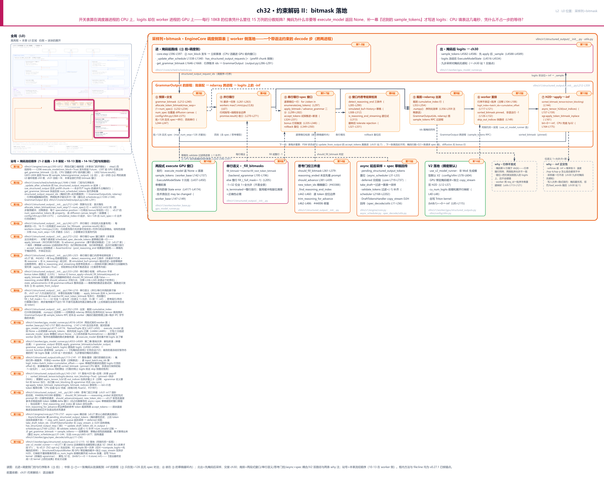

> *图注：本章放大的是[第 1 章](../../ch01-vllm-v1-in-one-map/narrative/chapter.md) L0 图采样出口列里「结构化输出位掩码」（结构化输出组）那块的**后半**，外加循环框 ③④ 两拍的展开：[第 31 章](../../ch31-grammar-compilation/narrative/chapter.md)点亮了它的编译前半（语法怎么变成每请求一台 FSM），本章点亮落地全链：表怎么装配、怎么跨进程、怎么盖到 logits 上。四块已读地基直接踩上来：`GrammarOutput` 交棒点与位打包的物理成本（[第 31 章](../../ch31-grammar-compilation/narrative/chapter.md)末节）、`apply_grammar_bitmask` 交接点与 9 步采样管线的原地改写契约（[第 30 章](../../ch30-sampler-pipeline/narrative/chapter.md)站 1）、五拍循环里 ③④ 拍的窗口位置（[第 9 章](../../ch09-engine-core-step-loop/narrative/chapter.md)）、异步心跳的占位账本与 deferred 采样（[第 12 章](../../ch12-async-scheduling/narrative/chapter.md)）。读图：左上角是全局（L0）缩略图，高亮框套住采样列与五拍循环框（框内高亮标出 ③ 拍调度侧起跑、④ 拍 worker 侧落地），右侧主体是这块的展开。上排起止两框：左「进 · 掩码起跑线」——③ 拍调度侧：发车即算表、门控与行序账本（站 1-2）；右「出 · 掩码后 logits」——④ 拍第二幕的收口：先掩码后采样、交接第 30 章九步管线（站 11）。中排 ①-⑦ 是 GrammarOutput 的旅程横带，一张掩码从批装配走到 logits 上的一排 -inf（② 并行填行只在批>128 且无 spec 时走；④ 思考结束检测嵌在 ③ 的草稿循环内）。下排五块横切机制：两段式 execute GPU 窗口（站 10）、单行语义（站 8）、思考门控三件套（站 14）、async 延后采样与 spec 草稿回传（站 15）、V2 落地（站 16，与中排 ⑥⑦ 的 V1 搬运合成两条落地路），行右端两枚 why 小注：行序不变式、-inf 正交性。左缘站号轨道 16 站逐站给源码定位。站号 = 掩码流经代码的顺序（1-2 起跑 · 3-9 装配 · 10-13 落地 · 14-16 门控与双路径）；正文按讲解需要编排、不必照站号读。*

读法建议：只想知道「掩码凭什么不掉速」，直奔[「迟到的第二幕」](#迟到的第二幕两段式-gpu-窗口站-11011)与[「影子里的三毫秒」](#影子里的三毫秒重叠的账)；被「批里 256 个请求怎么不错行」困扰的，看[「只给本步要发言的人发话筒」](#只给本步要发言的人发话筒)和[「错行防御」](#错行防御批序走表与摊平重排)；本章算法主体是投机窗口的逐草稿填表，在[「串行分支」](#串行分支投机窗口的棋谱推演)；思考模型与语法的联动收尾在[「思考门三件套」](#思考门三件套填不填推不推裁不裁站-14)；想知道 Llama 到底走哪条落地路，跳[「两条落地路」](#两条落地路v1-搬运与-v2-kernel站-16)；想跟全程，按序读。

照例交代取证环境，全章数值表通用。所有数值来自 host 实跑：十二个驱动脚本对着配套精简版与真实依赖库跑（xgrammar 0.2.6、triton 3.7.1，均落在 vLLM requirements 的钉版区间内；torch 2.11.0+cu128、RTX PRO 6000，V1 落地与 V2 kernel 都在真 GPU 上端到端跑过），分词器用 gpt2、词表 50257（本地缓存，无网络）。六处差异先挑明：其一，取证词表 50257 不是生产级大词表，正文里生产词表 152064 每行 18.6KiB 的账按源码分配常量推算，不是本机观测（本仓实测行宽一律 1571 个 int32＝6284B）；其二，xgrammar 0.2.6 的绑定层在本机实测持有 GIL，并行填表不回本，讲到那节给数字；其三，grammar 对象与 reasoner（推理解析器的最小替身，方法本体逐字）按减法计划由脚本注入，装配链归[第 31 章](../../ch31-grammar-compilation/narrative/chapter.md)；其四，计时全部为 host 单次运行取中位，毫秒级有抖动，只作数量级证据；其五，两段式窗口图里的「前向 50ms」是后台线程模拟的执行窗口（真实一步前向是几十毫秒量级），掩码填充时长则是真 xgrammar 实测；其六，两段式与延后采样的驱动以替身承载 executor/scheduler 的消费面，被驱动的 `step` / `step_with_batch_queue` / `_update_after_schedule` 都是精简版真代码（与真实 v0.27.1 逐字对照过）。

## 迟到的第二幕：两段式 GPU 窗口（站 1、10、11）

现在走到 L0 图循环框的 ②③④ 三拍。先把已经立过的外壳收拢一句：[第 9 章](../../ch09-engine-core-step-loop/narrative/chapter.md)拆五拍循环时见过，`execute_model` 发起前向后立刻返回 future，真正的采样发生在下一幕 `sample_tokens`；[第 17 章](../../ch17-executor-worker-model-runner/narrative/chapter.md)隔着 executor 的墙走过一遍它的三层形状；[第 30 章](../../ch30-sampler-pipeline/narrative/chapter.md)在采样列门口把第二幕当交接点用。三章都只说「它是这样」，没说「它为什么必须是这样」。本章把这个窗口整个打开：它不是顺手的设计，是为结构化输出的位掩码**专门**付出的一套 API 形变。

### 为什么要拆成两次调用：一条完整的 why 链

**旧设计**：单次 `execute_model` 内联完成前向加采样，v1 早期的形态就是一次调用等到 token 出来为止。结构化输出的掩码在这种形态下只有两个放法：要么在提交前算（调度循环被 CPU 填表阻塞），要么融进 worker 调用内部（在采样前现场算，调度器看不见）。

**痛点**：掩码装配是 CPU 活，每步一次 FSM 走查加 O(B·V/32) 次位写。若串行排在「调度完成 → GPU 提交 → 采样」的链条里，每步白加一段 CPU 时间，批越大越明显。真正把它逼成瓶颈的是异步调度：调度器提前一步组批、GPU 不等 CPU（[第 12 章](../../ch12-async-scheduling/narrative/chapter.md)把一拍三段从相加压成取最大的账就是这笔），CPU 侧任何串行杂务都会吃掉两拍的重叠收益。掩码必须与 GPU 前向**真并行**，否则异步调度白做。演进史三步：2025 年 7 月异步调度落地（#19970），2025 年 12 月默认开启（#27614），2026 年 1 月投机与结构化输出兼容（#29821）。v0.27 里异步调度默认开，这条 CPU 路径就在默认配置的热路径上。

**v1 方案**：worker 契约拆成两方法。`execute_model` 若返回 None，必须紧跟 `sample_tokens`；GPU 前向算完 logits 后不交付，把十元组状态暂存进单槽、先返回 None 收场。编排面在 `EngineCore.step` 的四行里：发车即返 future，趁 GPU 在算，主线程立刻算掩码，`future.result()` 拿到 None 再补第二幕。

**代价**（诚实账，五条）：worker 从此有状态，调用顺序错乱直接 RuntimeError；调用链更难追，`sample_tokens` 是读签名看不见的隐藏第二幕；流水线并行的每个 rank 都要遵守同一两段协议；采样的 D2H 与簿记在异步分支下延后一步，靠占位机制对齐（[第 12 章](../../ch12-async-scheduling/narrative/chapter.md)已立）；以及源码自己承认的技术债——下面马上看到原文。

### 契约面：worker 两方法与十元组暂存态

先看契约正文。全硬件后端统一的 `WorkerBase` 里，两个方法的 docstring 就是合同：

```python
# vllm/v1/worker/worker_base.py:L142-L157 · WorkerBase 两方法契约
    def execute_model(
        self, scheduler_output: SchedulerOutput
    ) -> ModelRunnerOutput | AsyncModelRunnerOutput | None:
        """If this method returns None, sample_tokens should be called immediately after
        to obtain the ModelRunnerOutput.

        Note that this design may be changed in future if/when structured outputs
        parallelism is re-architected.
        """
        raise NotImplementedError

    def sample_tokens(
        self, grammar_output: GrammarOutput
    ) -> ModelRunnerOutput | AsyncModelRunnerOutput:
        """Should be called immediately after execute_model iff it returned None."""
        raise NotImplementedError
```

两段 docstring 把契约钉死：返回 None 则必须立刻调 `sample_tokens`。第二段注释更值得逐字读：**这套设计「若/当结构化输出并行被重构时可能改变」**。两段式 API 形态的出生证明写在自己的 docstring 里，它是为结构化输出位掩码的并行而生的临时形状，源码作者自己记着这笔债。

状态存哪？一个叫 `ExecuteModelState` 的 NamedTuple（命名元组：带字段名的不可变元组），十个字段：

```python
# vllm/v1/worker/gpu_model_runner.py:L437-L450 · ExecuteModelState（两幕之间的暂存态）
class ExecuteModelState(NamedTuple):
    """Ephemeral cached state transferred between execute_model() and
    sample_tokens(), after execute_model() returns None."""

    scheduler_output: "SchedulerOutput"
    logits: torch.Tensor
    spec_decode_metadata: SpecDecodeMetadata | None
    spec_decode_common_attn_metadata: CommonAttentionMetadata | None
    hidden_states: torch.Tensor
    sample_hidden_states: torch.Tensor
    aux_hidden_states: list[torch.Tensor] | None
    ec_connector_output: ECConnectorOutput | None
    cudagraph_stats: CUDAGraphStat | None
    slot_mappings: dict[str, torch.Tensor] | list[dict[str, torch.Tensor]] | None
```

读 `execute_model` 的签名你看不到 logits 去了哪——返回类型是 None，答案在这个十元组里（调度输出、logits、投机元数据两件、三个 hidden_states、connector 输出、CUDA graph 统计、槽位映射）。这是一次**隐藏的隐式参数传递**：第一幕的产出不走返回值，走实例字段 `self.execute_model_state` 这个单槽。第一幕的尾巴在 postprocess 里：

```python
# vllm/v1/worker/gpu_model_runner.py:L4516-L4535 · GPUModelRunner.execute_model（postprocess 尾声）
        self.execute_model_state = ExecuteModelState(
            scheduler_output,
            logits,                    # 前向已完成：采样位切片与 compute_logits 在 L4484-L4485
            spec_decode_metadata,
            spec_decode_common_attn_metadata,
            hidden_states,
            sample_hidden_states,
            aux_hidden_states,
            ec_connector_output,
            cudagraph_stats,
            slot_mappings,
        )                              # 打包进单槽                                      # L4516
        self.kv_connector_output = kv_connector_output

        # Now the batch has been launched we can wait for corrections from the
        # previous model forward without breaking async scheduling.
        if deferred_state_corrections_fn:
            deferred_state_corrections_fn()   # spec decode 的乐观纠偏回调，归投机解码两章  # L4533

        return None                   # 第一幕到此收住：logits 冻结在暂存态里               # L4535
```

单槽配上防御。上一步的第二幕还没来、又有人发车，worker 自己炸：

```python
# vllm/v1/worker/gpu_model_runner.py:L4166-L4175 · GPUModelRunner.execute_model（入口状态防御）
    def execute_model(
        self,
        scheduler_output: "SchedulerOutput",
        intermediate_tensors: IntermediateTensors | None = None,
    ) -> ModelRunnerOutput | AsyncModelRunnerOutput | IntermediateTensors | None:
        if self.execute_model_state is not None:
            raise RuntimeError(
                "State error: sample_tokens() must be called "
                "after execute_model() returns None."
            )
```

同一个检查在 ray 执行器里还有一份（`vllm/v1/executor/ray_executor.py:L397`），分布式部署下配对纪律同样强制。第二幕的开头则是解包即清：

```python
# vllm/v1/worker/gpu_model_runner.py:L4553-L4589 · GPUModelRunner.sample_tokens（第二幕）
    def sample_tokens(
        self, grammar_output: "GrammarOutput | None"
    ) -> ModelRunnerOutput | AsyncModelRunnerOutput | IntermediateTensors:
        if self.execute_model_state is None:
            # … 省略：空槽早退（非末 PP rank 的接力语义与 KV connector 直通，见 executor 三层章）…
            return ModelRunnerOutput.with_kv_conn_output_only(kv_connector_output)

        # Unpack ephemeral state.
        (
            scheduler_output,
            logits,
            spec_decode_metadata,
            spec_decode_common_attn_metadata,
            hidden_states,
            sample_hidden_states,
            aux_hidden_states,
            ec_connector_output,
            cudagraph_stats,
            slot_mappings,
        ) = self.execute_model_state
        # Clear ephemeral state.
        self.execute_model_state = None       # 解包即清：单槽一次只活一拍                   # L4580

        # Apply structured output bitmasks if present.
        if grammar_output is not None:
            apply_grammar_bitmask(
                scheduler_output, grammar_output, self.input_batch, logits
            )                                 # 先掩码后采样，钉死在这六行                # L4584

        with record_function_or_nullcontext("gpu_model_runner: sample"):
            sampler_output = self._sample(logits, spec_decode_metadata)   # L4589
        # … 省略：L4590 起的 PP 广播 / drafter / bookkeeping，归异步调度与投机解码两章 …
```

「先掩码后采样」的落地次序就钉在 L4582-L4589 这几行：`grammar_output` 非空，先 `apply_grammar_bitmask` 原地改 logits，然后才进采样段。被改的是冻结在暂存态里的**同一块** logits 张量，所有权账后面单独算。

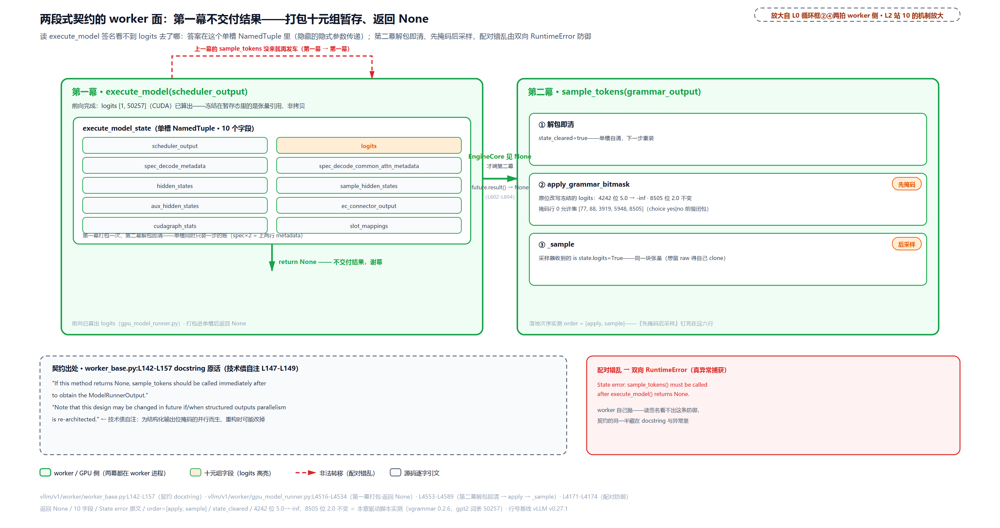

> *图注：两段式窗口的 worker 面。`execute_model` 干完前向不交付结果：把 logits 等十个字段打包进 `execute_model_state` 单槽、返回 None；编排面见 None 才调 `sample_tokens`（第二幕）解包暂存态、先应用语法掩码再进采样器，解包即清槽。防御是双向的：上一幕的 `sample_tokens` 没来就再发车，worker 抛 State error（原文实测捕获）。读 `execute_model` 签名看不到 logits 去了哪？答案在这个 NamedTuple 里。底部引文是 worker_base 的契约 docstring 与技术债自注。*

### 影子里的三毫秒：重叠的账

worker 侧看完了，回到编排面。窗口的钥匙在 `step` 的四行排布：

```python
# vllm/v1/engine/core.py:L593-L614 · EngineCore.step（四段排布）
        if not self.scheduler.has_requests():
            return {}, False
        scheduler_output = self.scheduler.schedule(self._should_throttle_prefills())
        future = self.model_executor.execute_model(scheduler_output, non_block=True)  # L596
        grammar_output = self.scheduler.get_grammar_bitmask(scheduler_output)         # L597
        with (
            self.capture_iteration_details(scheduler_output) as iteration_details,
            self.log_error_detail(scheduler_output),  # … 省略：两件可观测性外壳，与掩码无关 …
        ):
            model_output = future.result()                                            # L602
            if model_output is None:
                model_output = self.model_executor.sample_tokens(grammar_output)      # L604

        # Before processing the model output, process any aborts that happened
        # during the model execution.
        self._process_aborts_queue()
        engine_core_outputs = self.scheduler.update_from_output(
            scheduler_output, model_output
        )                              # ⑤ 拍：FSM 的唯一写者在这里推进                  # L609
        self._attach_iteration_details(engine_core_outputs, iteration_details)

        return engine_core_outputs, scheduler_output.total_num_scheduled_tokens > 0
```

L596 发车：`non_block=True` 让 executor 提交后立即返回一个 future，不等 GPU（[第 12 章](../../ch12-async-scheduling/narrative/chapter.md)立过 `AsyncOutputFuture`：它的 `result()` 只等一个 D2H 拷贝事件，发射从不需要等）。L597 是整个设计的点睛之笔：从发车到 `future.result()` 之间，主线程有一段 CPU 空闲，`get_grammar_bitmask` 就塞在这里——**GPU 在算前向的同一时刻，CPU 在填掩码表**。这就是 L0 循环框里 ③ 拍的实体。

物理前提只有一条，值得钉在官方文档上：CUDA 调用默认就是异步的。PyTorch 官方 CUDA 语义文档原话（意译）：GPU 操作默认异步，调用只是把操作入队到设备，不一定立刻执行，这正让 CPU 能同时干别的。「发车即返」不是 vLLM 发明的魔法，是 CUDA 调用的天然形态；vLLM 做的只是把这段天然存在的空闲**用满**。

实测账（取证口径再挑明一次：掩码装配是真 xgrammar 实测，前向窗口 50ms 是模拟值，真实量级几十毫秒）。64 行掩码、`choice ["yes","no"]` 语法（就是[第 31 章](../../ch31-grammar-compilation/narrative/chapter.md)用过的那台 FSM，位置 0 允许集 [77, 88, 3919, 5948, 8505]）：

时间线上，dispatch 在 0.0ms；掩码装配从 0.797ms 起步，整个 `grammar_bitmask` 调用（填表加裁剪加 `.numpy()` 转换）用时 3.309ms、4.106ms 返回；future.result() 等到 51.138ms；sample_tokens 同刻发出；update_from_output 51.165ms。掩码活干完时前向窗口（50ms）还剩 45ms 有余——重叠成立。若把这段串行排在采样前，3.309ms 就是每步白加的 CPU 时间；一步前向只有几十毫秒的量级，10ms 级的串行杂务对应 20% 上下的吞吐损失。[第 12 章](../../ch12-async-scheduling/narrative/chapter.md)算过引擎级的账（三段相加压成取最大），这里是那笔账在结构化输出上的具体化。

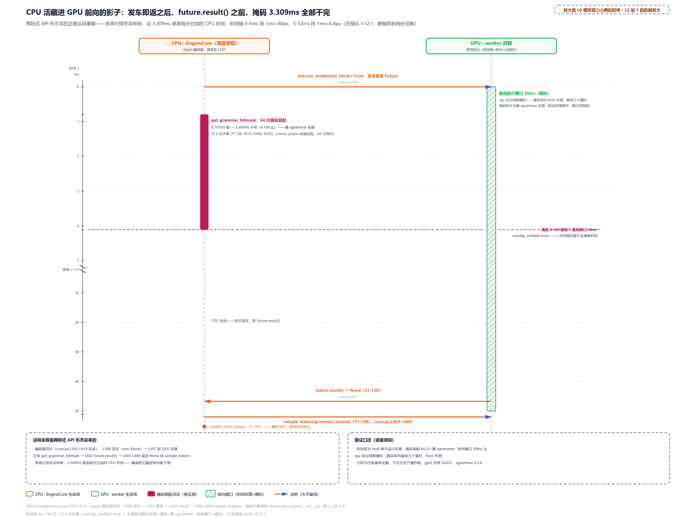

> *图注：CPU 活藏进 GPU 前向影子里。左轨 CPU/EngineCore：dispatch 即返后先算掩码（0.797ms 起、3.309ms 干完），然后才等 result；右轨 GPU/worker：前向活动条 50ms（斜线纹理标注为模拟窗口，掩码时长为真 xgrammar 实测）。水平消息线：execute_model(non_block) 在 t=0、sample_tokens 在 t=51.138。掩码活动条全程落在前向窗口内；若串行排在采样前，这 3.309ms 就是每步白加的 CPU 时间。两段式 API 形变买的正是这段重叠。*

窗口的骨架立完了。接下来走进窗口内部：③ 拍 `get_grammar_bitmask` 到底干了什么。先看调度侧的起跑线。

## 调度侧起跑线：谁占一行、占几行（站 2、3）

现在走到 L0 图调度列与采样列之间。[第 31 章](../../ch31-grammar-compilation/narrative/chapter.md)末节嵌过 `get_grammar_bitmask` 全文，这里换一个视角回看：它不只是「算一张表」，它先做**记账**：这一拍哪些请求有资格占掩码的行、各占几行。

### 只给本步要发言的人发话筒

直觉先行：只给本步要发言的人发话筒。prefill 还没算完的请求这一步根本没有采样位——不产 logits 的请求占一行掩码，既白填一张 18KB 的表（生产词表），也把「掩码行数 = 受约束的 logits 行数」这笔账对不上。门控在调度记账时就把它挡在账本外。

置位发生在 `_update_after_schedule`：调度刚排完批、还没发车，逐请求把标志「或」起来：

```python
# vllm/v1/core/sched/scheduler.py:L1327-L1343 · Scheduler._update_after_schedule（置位门控）
        num_scheduled_tokens = scheduler_output.num_scheduled_tokens
        for req_id, num_scheduled_token in num_scheduled_tokens.items():
            request = self.requests[req_id]
            request.num_computed_tokens += num_scheduled_token
            request.num_in_flight_tokens += num_scheduled_token
            # … 省略：defer_block_free 的在途栅栏记账，归内存管理章 …
            request.is_prefill_chunk = request.num_computed_tokens < (
                request.num_tokens + request.num_output_placeholders
            )                                # 切块 prefill 的中段判定                      # L1335
            scheduler_output.has_structured_output_requests |= (
                request.use_structured_output and not request.is_prefill_chunk
            )                                # 本步不产 logits 的请求不占掩码行            # L1338
            # Drop from the in-flight-prefill set once it's no longer prefilling.
            if not request.is_prefill_chunk:
                self._inflight_prefills.discard(request)
```

判定式是两件事的合取：请求开了结构化输出、且 `is_prefill_chunk` 为假（切块 prefill 的定义是「已算 token 还没盖过全部输入」，[第 10 章](../../ch10-continuous-batching-chunked-prefill/narrative/chapter.md)立过）。批标志是「或」累计：单个结构化请求就点亮整批。批里全部无结构化输出时标志恒为假，`get_grammar_bitmask` 入口快返 None，装配函数完全不被触碰，零开销。

实测走三步（P 是 100-token prompt 的切块 prefill、A 是结构化 decode、N 是普通 decode，num_scheduled_tokens 的迭代序为 {P, A, N}）：

<!-- trace: m05-schedule-gate -->
| 步 | num_scheduled_tokens | P 的状态 | 门控判定 | 掩码账本 |
| --- | --- | --- | --- | --- |
| 步 1 | P:32 A:1 N:1 | P 已算 32 < 100 → is_prefill_chunk=True | has_structured_output_requests 由 A 置位 True；P 被排除、N 因 use_structured_output=False 永不进 | ids=[A]，1 行 |
| 步 2 | P:32 A:1 N:1 | P 已算 64 < 100 → 仍是中段 chunk | P 仍被排除（判定先于加账、每步重判） | ids=[A]，1 行 |
| 步 3 | P:36 A:1 N:1 | P 算满 100 → is_prefill_chunk=False | P 首次进账本；行序=迭代序（P 先排 → P 行 0） | ids=[P,A]，2 行 |

账本 1→1→2 行，随 P 的 prefill 完成而扩张。若不排除 P，步 1 就多填 1 行掩码、裁剪行数与 logits 行数失配。这个门控是后面所有对账不变式的第一道闸。

### 行序随包裹走：GrammarOutput

账本收好了，怎么交给 worker？答案在上一章的交棒点，换个视角再读一遍：

```python
# vllm/v1/core/sched/scheduler.py:L1646-L1668 · Scheduler.get_grammar_bitmask
    def get_grammar_bitmask(
        self, scheduler_output: SchedulerOutput
    ) -> GrammarOutput | None:
        # Collect list of scheduled request ids that use structured output.
        # The corresponding rows of the bitmask will be in this order.
        if not scheduler_output.has_structured_output_requests:
            return None

        structured_output_request_ids = [
            req_id
            for req_id in scheduler_output.num_scheduled_tokens
            if (req := self.requests.get(req_id))
            and (req.use_structured_output and not req.is_prefill_chunk)
        ]                                # 行序 = 本列表顺序 = 调度迭代序                # L1654
        if not structured_output_request_ids:
            return None

        bitmask = self.structured_output_manager.grammar_bitmask(
            self.requests,
            structured_output_request_ids,
            scheduler_output.scheduled_spec_decode_tokens,
        )                                # 批装配本体，本章下两节                      # L1663
        return GrammarOutput(structured_output_request_ids, bitmask)
```

注意装配函数吃三样东西：请求表、行序账本 ids、以及 `scheduled_spec_decode_tokens`（本拍每个请求排了哪些草稿 token；没有投机就是空表，它决定一个请求占几行）。产物是四行定义的 `GrammarOutput`：

```python
# vllm/v1/core/sched/output.py:L286-L291 · GrammarOutput
@dataclass
class GrammarOutput:
    # ids of structured output requests.
    structured_output_request_ids: list[str]
    # Bitmask ordered as structured_output_request_ids.
    grammar_bitmask: "npt.NDArray[np.int32]"
```

字段注释就是契约：**掩码的行序以 ids 列表为准**。掩码第 k 行属于 `structured_output_request_ids[k]`，单号随包裹走。为什么必须这样：调度器按自己的迭代序装配紧凑掩码（只含结构化请求的行），而 worker 的批序几乎注定与之不同——两侧批序被允许不一致的前提，正是行序权威随掩码同传。错位的后果不是报错，是把 A 的约束静默加到 B 的 logits 头上。这张账的完整推演留给 worker 侧，先看表本身多大。

### 停车场一次画线：预算与跨步复用

直觉：停车场按最大车位一次画线。掩码缓冲按 `max_num_seqs*(1+num_spec)` 行一次性画好、跨步复用：每步只用前缀、用几行裁几行再出发。

```python
# vllm/v1/structured_output/__init__.py:L222-L240 · StructuredOutputManager.grammar_bitmask（预算分配头段）
        # Covers both speculative decoding and diffusion LLMs (canvas_length).
        max_num_spec_tokens = self.vllm_config.num_speculative_tokens

        if self._grammar_bitmask is None:
            assert self.backend is not None
            max_batch_size = self.vllm_config.scheduler_config.max_num_seqs

            # Allocate a bitmask for each token needing to be checked:
            # one for each speculative position, and one more for the
            # bonus token / non-speculative token.
            self._grammar_bitmask = self.backend.allocate_token_bitmask(
                max_batch_size * (1 + max_num_spec_tokens)
            )                                # 行数预算：批上限 × (1+投机位)            # L234

        # Generate a batched bitmask for all structured output requests.
        # When speculative decoding is enabled, we need to include multiple
        # masks for each request, one for each possible bonus token position.
        # These are stored inline in the tensor and unpacked by the gpu runner.
        cumulative_index = 0                # 行游标：本步实际用到第几行                   # L240
```

注释原话：每个 speculative position 一行、再加 bonus/非投机一行。上界论证两句话：调度器给单请求排的草稿位不会超过 `num_spec`（超了根本不进 `scheduled_spec_decode_tokens`——调度按本拍可排数截断，`scheduler.py:L648-L652`），进账本的请求数不超过批上限 `max_num_seqs`，两上界相乘就是预算：任意一步的行数都在预算内，缓冲永不重分配。v0.27 有个顺手的统一：`num_speculative_tokens` 是个 property（属性，读时计算的字段），投机解码的草稿数和 diffusion 模型的画布长度 `canvas_length`（整块画布并行去噪的那类模型，[第 31 章](../../ch31-grammar-compilation/narrative/chapter.md)进门拒单段见过）走同一个预算公式（`vllm/config/vllm.py:L563-L575`）。

跨步复用实测（`max_num_seqs=8`、3 个草稿位，语法 `root ::= "a" "b" "c"`）：

<!-- trace: m04-bitmask-budget -->
| 步 | 动作 | 关键量 | 判定 | 结果 |
| --- | --- | --- | --- | --- |
| 首次装配 | allocate_token_bitmask | 8 × (1+3) = 32 行 × 1571 int32（50257 词表） | 首次惰性分配 | backend.alloc_calls=[32]，只此一次 |
| 第二步（复用） | 同一缓冲再装 | 本步行数 = 1 请求 × (3 草稿 + 1 bonus) = 4 行 | 不重新分配 | alloc_calls 仍 [32]；返回裁剪到 4 行（只传活跃前缀） |

32 行常驻调度器进程（本例 32×1571×4B≈201KB；生产词表 152064 批 256 无 spec 时整批约 4.6MiB，按源码常量推算），每步实际出发的只有活跃前缀 4 行。裁剪让每步跨进程的字节数跟随实际批形，而不是最大预算。裁剪发生在哪、怎么裁，出发那节看。

## 批装配：一张大表怎么填出来（站 4-8）

现在走进 L2 图中带的「批装配」。主函数 `grammar_bitmask` 的骨架三段：预算（刚看过）→ 并行或串行二选一 → 裁剪出发。两条分支共用一个原子操作，先把它立起来。

### 原子操作：单行语义与全允许行

[第 31 章](../../ch31-grammar-compilation/narrative/chapter.md)立过六方法契约里的 `fill_bitmask`（转调 matcher 的 `fill_next_token_bitmask`，把「下一个位置合法的 token 集」写进掩码的第 index 行）。批视角下它被包成一个小函数，if/else 恰有一支执行：

```python
# vllm/v1/structured_output/__init__.py:L194-L210 · StructuredOutputManager._fill_bitmasks（单行语义）
    def _fill_bitmasks(
        self, batch: Iterable[tuple[StructuredOutputGrammar, int, bool]]
    ) -> None:
        assert self._grammar_bitmask is not None
        for grammar, index, apply_bitmask in batch:
            if apply_bitmask and not grammar.is_terminated():
                grammar.fill_bitmask(self._grammar_bitmask, index)   # 写本行合法表    # L200
            else:
                # Note that for thinking support, we will need to
                # reset the relevant part of the bitmask for consequent
                # requests here.
                self._grammar_bitmask[index].fill_(self._full_mask)  # 整行写 -1 全允许 # L205

    def _async_submit_fill_bitmask(
        self, batch: list[tuple[StructuredOutputGrammar, int, bool]]
    ) -> Future:
        return self.executor_for_fillmask.submit(self._fill_bitmasks, batch)
```

三元组是 (grammar, index, apply_bitmask)：语法对象、行号、本行约束不约束。走 if 的条件两个：要约束、且语法没到终态。否则走 else——整行 `fill_(-1)`。位语义[第 31 章](../../ch31-grammar-compilation/narrative/chapter.md)算过补码账：`-1` 的 int32 补码是 32 位全 1，而位约定是 bit=1 允许、bit=0 才写 -inf，所以整行 -1 等于**全允许**。思考段请求的行、终态请求的行，都靠它放行。

关键认知：这个 else 不是清洁工作，是**正确性必需**。缓冲跨步复用，上一步写进这行的位表还在。两步实测（同一个请求，步 1 受约束、步 2 注入 reasoner 且思考未结束）：

<!-- trace: m08-full-row-allow-all -->
| 步 | 请求状态 | 动作 | 行 0 实测 | 含义 |
| --- | --- | --- | --- | --- |
| 步 1 | 受约束（无 reasoner） | grammar.fill_bitmask 写位表 | 允许集 [64, 397, 39305] | 位表已写入跨步复用缓冲，这就是残留源 |
| 步 2 | 思考未结束（should_fill_bitmask=False） | 整行 fill_(_full_mask=-1) | 整行 -1；首个 int32 的位串 32 个 1 | 放行是正确性必需：若不重置，残留行只允许 a 系（反事实实测 [64, 397, 39305]），其余全被误打成 -inf |

不变式一句话：**每一行每一拍都被显式写入**（合法表或全允许），复用缓冲不存在「沿用上一拍」的行。步 2 若沿用残留，50257 个 token 里只放行 3 个、其余全误禁，残留位会误杀本拍的合法 token。

### 并行分支：129 份卷子怎么分工

直觉：阅卷分工。129 份卷子互不批注（每行只写自己的行区间），这是「能并行」的全部结构性理由——16 份一摞、最多 8 位阅卷员。但发卷收卷本身有成本：卷子太少或批改太快时，一个人全改完反而更快。

```python
# vllm/v1/structured_output/__init__.py:L57-L68 · StructuredOutputManager（缓冲字段与填充线程池）
        self._grammar_bitmask: torch.Tensor | None = None
        self._full_mask = torch.tensor(-1, dtype=torch.int32)

        max_batch_size = self.vllm_config.scheduler_config.max_num_seqs
        self.fill_bitmask_parallel_threshold = 128
        if self.fill_bitmask_parallel_threshold < max_batch_size:
            self.fill_bitmask_parallel_batch_size = 16
            # Use:
            # - at least 1 CPU
            # - at most half the number of CPUs or 8, whichever is less
            max_workers = max(1, min(multiprocessing.cpu_count() // 2, 8))
            self.executor_for_fillmask = ThreadPoolExecutor(max_workers=max_workers)
```

先认两个结构性事实。其一，这个线程池与编译线程池是**两个池**（编译那个在[第 31 章](../../ch31-grammar-compilation/narrative/chapter.md)第 2、3 站，这里是填表专用）。其二，建池前提是 `max_num_seqs>128`（部署上限），而运行时进并行分支的条件是「本步请求数 >128 **且** 无 spec」。两个 128 含义不同：一个是部署配置的上限，一个是这一步的实际批大小。小部署（max_num_seqs 不超过 128）压根不建池，该分支是死代码。

分支本体：

```python
# vllm/v1/structured_output/__init__.py:L242-L271 · StructuredOutputManager.grammar_bitmask（并行分支）
        # Optimized parallel filling of bitmasks for
        # non-spec, large-batch-size cases
        if (
            len(structured_output_request_ids) > self.fill_bitmask_parallel_threshold
            and max_num_spec_tokens == 0
        ):
            promises = []
            batch = []
            for req_id in structured_output_request_ids:
                request = requests[req_id]
                # … 省略：TYPE_CHECKING 类型断言两段 …
                grammar = structured_output_request.grammar
                apply_bitmask = self.should_fill_bitmask(request)
                batch.append((grammar, cumulative_index, apply_bitmask))
                if len(batch) == self.fill_bitmask_parallel_batch_size:
                    promises.append(self._async_submit_fill_bitmask(batch))   # 16 行一任务 # L262
                    batch = []

                cumulative_index += 1                # 无 spec：每请求恰一行                # L265
            if batch:
                promises.append(self._async_submit_fill_bitmask(batch))

            # Wait for all bitmask filling tasks to complete.
            for promise in promises:
                promise.result()                     # 收口：全部填完才继续                  # L271
```

无 spec 时每请求恰一行（`cumulative_index` 每请求 +1），16 行一摞提交、promise 逐个收口（promise 就是前文立过的 future，这份源码的变量名叫 promises）。为什么 spec 场景被排除在并行外：串行分支要按草稿序对**同一个 grammar 对象**推进再回退，跨行有顺序依赖，拆给多线程就乱了，那是下一节的正题。

结构实测与计时实测（计时是本机口径，后面马上挑明差异）：

<!-- trace: m06-parallel-fill -->
| 段 | 配置 | 观测 | 判定 | 结果 |
| --- | --- | --- | --- | --- |
| 结构 | 129 请求 > 128 且无 spec | 任务切分 9 份 = 8 满批×16 行 + 1 尾批 1 行；行 i 允许 i%64 逐行核验全对 | 行间各写各行、无共享可变状态 | 129 行全部正确；workers=max(1,min(cpu//2,8)) 本机=8 |
| 边界 | 恰 128 / max_num_seqs≤128 | 128 请求不触线程池（走串行）；max_num_seqs=128 不建池、129 才建 | 结构性前提：阈值是 max_num_seqs 不是本步批 | 小部署该分支是死代码 |
| 计时·轻语法 | 256 行 × 50257 词表（yes/no） | 串行 0.824ms vs 并行 2.138ms（speedup 0.39） | 整批不足 1ms：线程池提交/收割开销反超 | 单行仅 3.22µs，回本需单行成本×行数够大 |
| 计时·GIL 判定 | 同批放大 40 倍工作量 | 串行 34.656ms vs 并行 67.964ms（speedup 0.51）；DLL 零 gil_scoped_release 符号 | 本机 xgrammar 0.2.6（tvm-ffi 绑定）持有 GIL | 并行分支收益依赖后端释放 GIL，取证环境实测未回本 |

并行能成立的两个半边要分开说。**数据半边**（结构许可，实测成立）：每个任务写 [16i, 16i+16) 的不相交行区间，无共享可变状态，无锁线程安全。**线程半边**（能否真并跑）：[第 1 章](../../ch01-vllm-v1-in-one-map/narrative/chapter.md)立过 GIL：同一时刻只有一个线程执行 Python 字节码；但 GIL 管不到 C 界面外面，原生扩展在干重活前可以主动释放 GIL，期间其他线程随便跑。xgrammar 的 Python 绑定走 TVM FFI（Apache TVM 的函数调用绑定层），按其实现默认在调用期间释放 GIL（据 tvm-ffi 源码核实，环境变量可关；这是实现默认，不是 xgrammar 文档承诺）。**诚实边界**：本机实测（Windows、xgrammar 0.2.6）并行反而更慢：填 256 行串行 0.824ms、并行 2.138ms，把工作量放大 40 倍仍是 0.51 倍，DLL 里也扫不到释放 GIL 的符号。所以正文的口径是：**源码分支的存在理由是结构许可（行间独写），实际收益取决于后端是否释放 GIL 与单行成本，本机未回本**。库方其实另有原生多线程方案 `BatchGrammarMatcher`（官方文档明说批大时用多线程加速），vLLM 没用它，而是 Python 层自管线程池，两层方案吃同一条放锁前提。

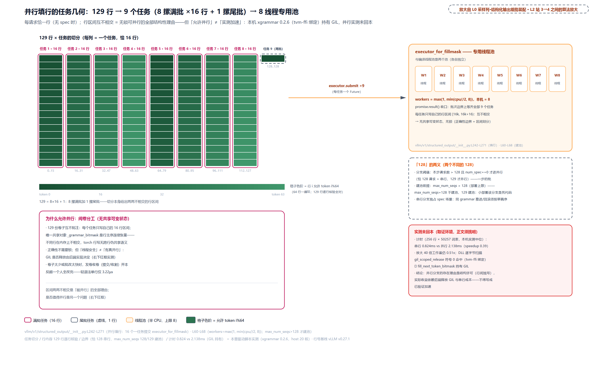

> *图注：并行填行的任务几何。129 行按 16 行一任务切成 8 摞满批加 1 摞尾批、提交给最多 8 线程的专用池 executor_for_fillmask（与编译线程池是两个池）；行区间互不相交等于无锁可并行，这是结构性理由。右中挑明「128 的两义」：进分支的阈值是本步批大小 >128，建池前提是部署上限 max_num_seqs>128。右下红框是本机实测的未回本警示（GIL 持有，串行 0.824ms vs 并行 2.138ms），结构许可与实测收益是两笔账。*

### 串行分支：投机窗口的棋谱推演

直觉：棋谱推演。填第 j 行之前，先在心里替对方把前 j-1 步走完（`accept_tokens` 试探推进），看清第 j 步的合法着法，再把棋子全部收回（rollback）——真走棋只发生在赛后（⑤ 拍 `update_from_output` 的 `accept_tokens`，[第 31 章](../../ch31-grammar-compilation/narrative/chapter.md)站 7 立过的 FSM 唯一写者）。-1 哨兵是「这步没走」的占位：当行按旧旗填、当行即停、后面的行全放行。

这是本章的算法主体。每请求的准备工作（节选，类型断言略）：

```python
# vllm/v1/structured_output/__init__.py:L272-L296 · StructuredOutputManager.grammar_bitmask（串行分支·每请求准备）
        else:
            # Fallback to serial filling of bitmasks for small-batch-size cases
            for req_id in structured_output_request_ids:
                request = requests[req_id]
                structured_output_request = request.structured_output_request
                # … 省略：TYPE_CHECKING 类型断言两段 …
                grammar = structured_output_request.grammar
                apply_bitmask = self.should_fill_bitmask(request)   # 门控一：本请求约束不约束 # L283

                reasoner = self._get_reasoner(request)
                detect_reasoning_end = (
                    not apply_bitmask
                    and reasoner is not None
                    and not self.enable_in_reasoning
                )                        # 三条件：不约束 + 有 reasoner + 非段内约束     # L286
                simulated_buf: list[int] | None = None
                history_len = 0

                state_advancements = 0   # 试探推进计数器：rollback 的参数             # L294
                post_reasoning_end_in_window = False
                req_tokens = scheduled_spec_decode_tokens.get(req_id, ())
```

v0.27 这里有一对新开关：`apply_bitmask`（本行约束不约束）与 `advance_grammar`（要不要试探推进）**二分**：v0.21 只有前一个，两者拧在一起让思考模型的 mid-window 场景没法表达（马上看到为什么必须拆开）。主循环逐草稿位填行：

```python
# vllm/v1/structured_output/__init__.py:L297-L332 · StructuredOutputManager.grammar_bitmask（串行分支·spec 窗口主循环）
                for i, token in enumerate(req_tokens):
                    self._fill_bitmasks(((grammar, cumulative_index, apply_bitmask),))  # L298
                    advance_grammar = apply_bitmask
                    if token == -1:      # 哨兵：草稿被语法过滤后的补齐位               # L300
                        apply_bitmask = False
                        advance_grammar = False
                    elif (
                        detect_reasoning_end
                        and reasoner is not None
                        and not apply_bitmask
                    ):
                        # … 省略：窗口内思考结束检测，下一小节单独走读（L303-L323）…
                    if advance_grammar and not grammar.is_terminated():
                        accepted = grammar.accept_tokens(req_id, [token])   # 试探推进    # L325
                        if accepted:
                            state_advancements += 1
                        elif not post_reasoning_end_in_window:
                            raise AssertionError(
                                (token, req_id, scheduled_spec_decode_tokens)
                            )            # 非法草稿进窗口 = 调度与语法状态失配，是 bug    # L329
                    cumulative_index += 1
```

先把思考检测那块整块省略、走通主干。循环体三拍：填本行（用**当前**的 `apply_bitmask`）、按草稿位改旗、试探推进。为什么必须先推再填：第 j 行掩码要回答「在已接受前 j-1 个草稿的前提下，第 j 位哪些 token 合法」。不把 FSM 推过去，取到的合法集就是错的。为什么推进是试探：这些草稿最终可能被拒，填完必须整体退回。收尾两段：

```python
# vllm/v1/structured_output/__init__.py:L333-L350 · StructuredOutputManager.grammar_bitmask（串行分支·bonus 行与整体回退）
                # Diffusion LLMs don't sample a bonus token after the
                # scheduled positions, so skip its bitmask in that case.
                if not (self.vllm_config.model_config.is_diffusion and req_tokens):
                    # bonus_apply must be True when the bonus-row position
                    # should be grammar-constrained. Two triggers:
                    # - should_fill_bitmask(request): reasoning was already
                    #   over at step start (or no reasoner /
                    #   enable_in_reasoning).
                    # - apply_bitmask: reasoning ended mid-window in this
                    #   call and was flipped True after the marker;
                    #   should_fill_bitmask still returns False here because
                    #   reasoning_ended is only persisted later by
                    #   should_advance.
                    bonus_apply = self.should_fill_bitmask(request) or apply_bitmask
                    self._fill_bitmasks(((grammar, cumulative_index, bonus_apply),))  # L347
                    cumulative_index += 1
                if state_advancements > 0:
                    grammar.rollback(state_advancements)   # 填表用的推进全部撤销      # L350
```

三件事。其一，bonus 行：草稿位之后还有一个采样位（投机验证全对后白送的 bonus token，非投机请求的每步单 token 也走这一位），diffusion 模型有草稿位时不采 bonus、整行跳过。其二，`bonus_apply` 双触发用 `or`：第一支是常规判据，第二支专救「窗口内刚翻转」的场合（下小节讲透）。其三，`rollback(state_advancements)` 把整窗试探一次退清：只数住了推进次数就能精确回退，不必担心退过头：xgrammar 的库 API 本身就把「填表」与「推进」拆开（`fill_next_token_bitmask` 不改 matcher 状态），回滚只撤销 accept 的推进，且回滚上界参数已名存实亡、内部恒无限（[第 31 章](../../ch31-grammar-compilation/narrative/chapter.md)讲 rollback 时核对过）。

整窗走表实测（语法 `root ::= "a" "b" "c"`，真 xgrammar matcher；gpt2 词表里 a 系 token=[64, 397, 39305]、b 系=[65, 15630]；窗口 3 草稿 + 1 bonus）：

<!-- trace: m07-serial-fill-spec-window -->
| 行 | 草稿位 | apply_bitmask | advance_grammar | 行内容（允许集，实测） |
| --- | --- | --- | --- | --- |
| 行 0 | a（草稿 1） | True | True（试探接受 a） | a 系 [64, 397, 39305] |
| 行 1 | b（草稿 2） | True | True（试探接受 b） | b 系 [65, 15630] |
| 行 2 | c（草稿 3） | True | True（试探接受 c） | [66]（只收精确 c：串已到尾，c 开头的多字 token 会越界） |
| 行 3（bonus） | （采样位、无草稿） | True | —（bonus 行不推进） | [50256]（EOS） |
| 窗口收尾 | rollback(3) | — | 3 次试探全部撤销 | 复检：再填一行回到 a 系 [64, 397, 39305]（FSM 复位实证） |
| 哨兵对照·行 1 | -1（草稿被过滤的补齐位） | True（按旧标志填） | False（当行即停） | [65, 15630]（a 之后的状态，填行发生在翻转之前） |
| 哨兵对照·行 2 | c | False（自次行起放行） | False | 整行 -1（全允许） |
| 哨兵收尾 | rollback(1) | — | 只回退接受的 a | accepts=[[64]]、rollbacks=[1] |

四个读点。**逐行演化**：行 0 允许 a 开头的一切 token（含多字的 a 系）、行 1 只允许 b 系、行 2 只允许精确 c（c 开头的多字 token 会一口吃掉串尾再越界，FSM 不认）、bonus 行只留 EOS。每行都是「先试探接受前序草稿、再取当前状态的合法集」。**复位不是断言是行为**：accepts 账 [[64],[65],[66]]、rollbacks 账 [3]，回退后再填一行回到 a 系，FSM 精确回到本步开始处。**-1 哨兵的三层语义**：当行按翻转前的旧标志照常填（草稿被过滤前 grammar 已被前面的草稿推过去了，这一位的合法集仍有意义）、当行即停推进（没走的棋不推）、自次行起整行放行（后面的草稿都排在被过滤位之后，语法状态与它们脱钩，全放行交给拒绝采样收拾）。**AssertionError 是语义断言**：绕过入口直塞非法草稿（999）当场炸 `AssertionError((999, 'r1', ...))`——「进窗口的草稿必已过滤」这条不变式由它守护，唯一豁免是 post_reasoning_end 场景（马上到）。

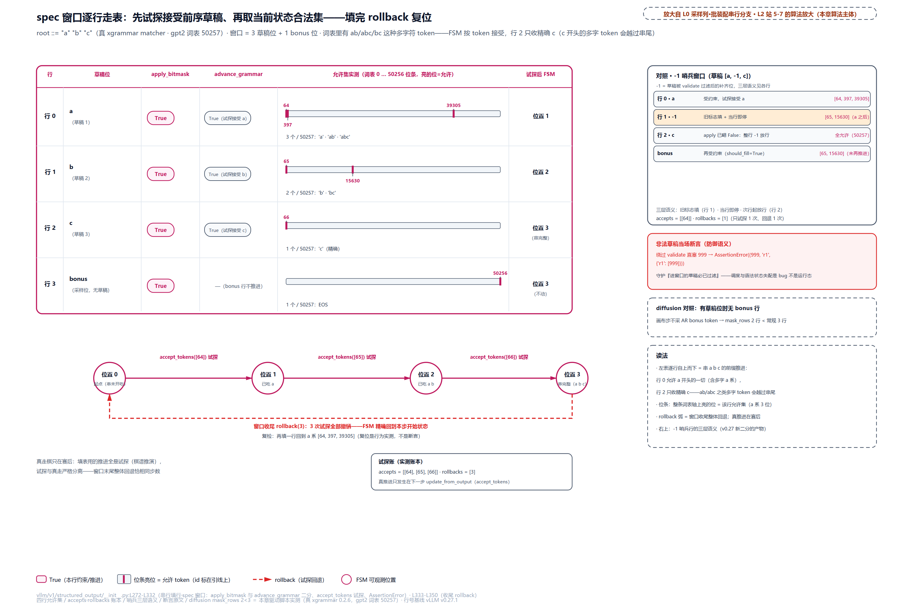

> *图注：本章算法主体的逐行走表。草稿窗口里每一行回答「接受前序草稿后这一位哪些 token 合法」：行 0 允许 a 系、行 1 只允许 b 系、行 2 只允许精确 c（c 开头的多字 token 会越过串尾）、bonus 行只留 EOS。填表用的推进全是试探：accept 三次、rollback 一次退三步，FSM 回到本步开始处；真推进只发生在下一步的 update_from_output。右栏同图可见：-1 哨兵行的三层语义（旧标志填/当行即停/次行放行）、非法草稿的断言原文、diffusion 有草稿位时无 bonus 行的变体。*

### 窗口里现场翻转：思考结束的 mid-window 检测

把刚才省掉的那块放回来。场景：思考模型的请求正在放行段（`apply_bitmask=False`），而思考结束标记恰好落在草稿窗口**中间**：标记之后的草稿已经是答案开头，理应受约束。检测器必须在填表现场把它翻过来：

```python
# vllm/v1/structured_output/__init__.py:L303-L323 · StructuredOutputManager.grammar_bitmask（窗口内思考结束检测）
                    elif (
                        detect_reasoning_end
                        and reasoner is not None
                        and not apply_bitmask
                    ):
                        if simulated_buf is None:
                            history = list(request.all_token_ids)
                            history_len = len(history)
                            simulated_buf = history + list(req_tokens)
                        simulated = simulated_buf[: history_len + i + 1]  # 假想序列：历史+草稿前缀 # L312
                        if reasoner.is_reasoning_end_streaming(simulated, [token]):
                            # Reasoning ended mid-window. Constrain the rest
                            # of the window via bitmask. Skip grammar advance
                            # through the marker (it is reasoning content);
                            # try to advance through subsequent drafts so the
                            # next bitmask row reflects the post-advance state,
                            # but tolerate rejection since those drafts predate
                            # the bitmask and are not guaranteed valid.
                            apply_bitmask = True       # 剩余行翻转受约束            # L321
                            advance_grammar = False    # 标记本身是思考内容，不推进     # L322
                            post_reasoning_end_in_window = True
```

机制三步。第一，`simulated_buf`：把 prompt 加输出历史加**全部草稿**拼成假想序列，逐位截到当前草稿处去问 reasoner「思考到这结束了吗」？历史还没真发生到这一步（token 在 worker 那边等着采样），只能推演。第二，检出即翻转：本窗口剩余行的 `apply_bitmask` 翻 True。第三，`advance_grammar=False` 精确处理标记位：结束标记本身是思考内容、不合语法，推过去必被拒。这就是 v0.27 把两个开关拆开的理由：标记位要「约束旗已翻但 grammar 不推」，单开关表达不出来。

翻转后为什么容忍拒绝：标记之后的草稿先于掩码存在、不保证合法，试探推进可能被拒，`post_reasoning_end_in_window=True` 让 AssertionError 闭嘴（对照：其余场景拒绝即炸，因为那是 bug 不是运行态）。

实测（草稿 [r3, 999, a, b]，其中 999 是结束标记；历史 3 个 prompt 加 2 个思考 token；语法仍是 a b c）：

<!-- trace: m15-mid-window-reasoning-end -->
| 行 | 草稿 | 检测/翻转 | 行内容（实测） | 推进 |
| --- | --- | --- | --- | --- |
| 行 0 | r3（思考内容） | simulated_buf 逐位试探：未触发 | 整行 -1（放行） | 无 |
| 行 1 | 999（结束标记） | is_reasoning_end_streaming 触发 → apply_bitmask 翻 True | 整行 -1（标记行按翻转前旧标志填，标记是思考内容） | 不推进（advance_grammar=False） |
| 行 2 | a | 受约束（已翻转） | a 系 [64, 397, 39305] | 试探接受 a |
| 行 3 | b | 受约束 | b 系 [65, 15630] | 试探接受 b |
| 行 4（bonus） | （采样位） | should_fill 仍 False（未持久化）→ bonus_apply=should_fill or apply 双触发兜住 | [66]（受约束） | bonus 行不推进 |
| 窗口收尾 | — | 调用返回后 reasoning_ended 仍是 False（时序坑物证）；rollback(2) 复位 | — | 真推进留给 ⑤ 拍 |
| 容忍拒绝对照 | 草稿 888（标记后非法） | post_reasoning_end_in_window=True | 行 2..4 全是 a 系 [64, 397, 39305]（FSM 卡在位置 0） | accept(888)/accept(b) 均被拒但不抛 AssertionError，草稿先于掩码存在、不保证合法 |

这表里藏着全章最刁的一个时序坑，就是 `bonus_apply` 双触发的第二支。窗口内刚翻转的场合，`reasoning_ended`（请求生命周期的持久化标志）**还是 False**——把它翻成 True 的唯一路径是 ⑤ 拍的 `should_advance`（下一节展开）；fill 侧那次写入只在初值未定时对 prompt 判一次缓存，mid-window 场景早已命中缓存、不会改写。所以到了 bonus 行再问 `should_fill_bitmask(request)`，答案仍是 False；靠 `or apply_bitmask` 的第二支（局部变量已被翻转）把 bonus 行拉回受约束。两个时间尺度严格解耦：**本次填表的局部翻转** vs **请求生命周期的状态位**：前者只影响本窗口的行，后者要等本步填表收场、到 ⑤ 拍的 `should_advance` 才补办。源码注释 L336-L345 把这个坑讲得很透，值得一读。

四草稿加 bonus 共 5 行、翻转点在行 1、试探 2 次、回退 2 次；容忍场景 0 次成功推进也安全返回。对照封口：无 reasoner 时同一语法全程约束（与上一节场景同构）；未过滤的思考型草稿直接进窗口则当场 AssertionError。窗口内检测与草稿过滤（后面站 15）是配套防线。

## 出发：ndarray 的简易通道（站 9）

表填完、行裁完，怎么过进程边界？收尾三行：

```python
# vllm/v1/structured_output/__init__.py:L352-L359 · StructuredOutputManager.grammar_bitmask（裁剪与出发）
        bitmask_tensor = self._grammar_bitmask
        if cumulative_index < bitmask_tensor.shape[0]:
            bitmask_tensor = bitmask_tensor[:cumulative_index]   # 只传活跃前缀          # L354

        # After finishing with the xgrammar operations, we convert to
        # np.ndarray, because that is much more efficient for serialization
        # and deserialization when sending this to the GPU workers.
        return bitmask_tensor.numpy()                            # ndarray 过进程         # L359
```

裁剪让字节数跟批形走（生产 152064 词表批 256 行约 4.6MiB 一跳；本仓 1571 列口径实测 1.534MiB，这就是掩码行数构成每步跨进程字节数物理上限的来源）。`.numpy()` 本身零拷贝（torch 张量与 ndarray 共享同一段内存，转换免费），贵的是过界时的编码。注释只给了结论（「ndarray 序列化/反序列化高效得多」），为什么值得展开：两条序列化路径的重量完全不同。**numpy 侧**：pickle 把数组降成「形状、dtype、原始字节缓冲」三元组，主体就是一次 memcpy。**torch 侧**：Tensor 的 pickle 要背上 storage 对象（带对象身份的存储层）与整套重建机器。PyTorch 官方 issue #9168（2018 年，Dask 作者报告）给过同尺寸对照：约 800MB 的矩阵 numpy 序列化约 711ms、tensor 约 15.7s。后来修复了最糟的路径，但「缓冲直通 vs 带 storage 重建」的结构差至今仍在。对一张**每步都要过一次进程边界**的表，路径差乘以每秒几十步就是吞吐差。[第 5 章](../../ch05-zmq-topology-and-protocol/narrative/chapter.md)立过 v1 跨进程走 ZMQ 加 msgpack：msgpack 对字节块有一等公民的 bin 类型，ndarray 的「形状加 dtype 加字节」表示能直接落进去。

本仓实测（同一张 [5, 1571] int32 表，pickle 往返取中位）：

<!-- trace: m09-ndarray-serialization -->
| 度量 | ndarray | tensor | 判读 |
| --- | --- | --- | --- |
| pickle 字节数 | 31573 | 31820 | 几乎相同（同为裸 buffer），差异不在体积 |
| 往返时长（dumps+loads 取中位） | 22.2µs | 216.8µs | 9.8 倍：tensor 反序列化要重建 storage 对象，注释「serialization and deserialization」的主要差异项 |

字节数持平（1.01 倍）、时长差 9.8 倍，差异全部来自反序列化路径。`GrammarOutput` 搭 `sample_tokens` 这次 RPC 的车去 worker：单号列表（ids）与包裹（ndarray）同车出发。代价在收货一头：过界后它只是裸数组，张量身份连同 pinned、设备属性都不随行，worker 要自己重建张量才能重排上卡——下一节生来 pinned 的 `sorted_bitmask_tensor` 正是在还这笔账。

## worker 侧落地：重排、上卡、写 -inf（站 12、13）

现在走到 L0 图采样列的 worker 侧。第二幕里那行 `apply_grammar_bitmask`（V1 路径的正典实现）要做三件事：把调度序的紧凑表重排成 worker 批序、pinned 上卡、原地写 -inf。先看最容易错的第一件。

### 错行防御：批序走表与摊平重排

直觉：相邻座位号重排。调度序发的表、worker 按自家座位表收；spec 草稿像占座外套——一个请求每带一个草稿，就把批里坐在它后面的所有人往后顶一位。

场景摆好：调度序 [A, B]（A 无草稿占 1 行、B 带 3 草稿占 4 行，共 5 行），worker 批序 [B, A]。掩码行 0 属于 A，但 worker 批序里 B 坐第一位。先走表：

```python
# vllm/v1/structured_output/utils.py:L100-L121 · apply_grammar_bitmask（批序走表段）
    # Serialization of np.ndarray is much more efficient than a tensor,
    # so we receive it in that format.
    grammar_bitmask = grammar_output.grammar_bitmask

    # We receive the structured output bitmask from the scheduler,
    # compacted to contain bitmasks only for structured output requests.
    # The order of the requests in the bitmask is not guaranteed to be the
    # same as the order of the requests in the gpu runner's batch. We need
    # to sort the bitmask to match the order of the requests used here.

    # Get the batch indices of the structured output requests.
    # Keep track of the number of speculative tokens scheduled for every
    # request in the batch, as the logit indices are offset by this amount.
    struct_out_req_batch_indices: dict[str, int] = {}     # req_id → logit 行起点的字典  # L113
    cumulative_offset = 0
    spec_tokens = scheduler_output.scheduled_spec_decode_tokens
    struct_out_req_ids = set(grammar_output.structured_output_request_ids)
    for batch_index, req_id in enumerate(input_batch.req_ids):
        logit_index = batch_index + cumulative_offset      # spec 草稿把后面的行顶后 offset 位 # L118
        cumulative_offset += len(spec_tokens.get(req_id, ()))
        if req_id in struct_out_req_ids:
            struct_out_req_batch_indices[req_id] = logit_index
```

注释原话点破风险：「掩码行序不保证与 gpu runner 的批序相同」。走表按 worker 自己的 `req_ids` 逐位累计：每个请求的 logit 行起点 = 自己的批序位 + 走到它为止攒下的草稿总数。然后按**ids 序**（不是批序）展开紧凑掩码：

```python
# vllm/v1/structured_output/utils.py:L123-L141 · apply_grammar_bitmask（摊平重排段）
    out_indices = []

    # Reorder the bitmask to match the order of the requests in the batch.
    sorted_bitmask_tensor = torch.full(
        (logits.shape[0], grammar_bitmask.shape[1]),
        -1,
        dtype=torch.from_numpy(grammar_bitmask[:0]).dtype,
        pin_memory=PIN_MEMORY,
    )                                # 摊平掩码：与 logits 同形，初始全 -1（全允许），pinned  # L126
    sorted_bitmask = sorted_bitmask_tensor.numpy()
    cumulative_index = 0
    for req_id in grammar_output.structured_output_request_ids:
        num_spec_tokens = len(spec_tokens.get(req_id, ()))
        if (logit_idx := struct_out_req_batch_indices.get(req_id)) is not None:
            for i in range(1 + num_spec_tokens):
                bitmask_index = logit_idx + i
                sorted_bitmask[bitmask_index] = grammar_bitmask[cumulative_index + i]
                out_indices.append(bitmask_index)   # 攒出「哪些 logits 行受约束」        # L140
        cumulative_index += 1 + num_spec_tokens
```

目的地 `sorted_bitmask` 生来就是与 logits 同形的表（摊平掩码），初始值 -1 意味着非语法行天然全允许、不用管。每个受约束请求的 1+num_spec 行恰落在 [logit_idx, logit_idx+num_spec] 的连续区间，前缀和结构保证区间两两不相交，每行恰被写一次、无竞写。全流程实测（玩具词表 V=64、每行 2 个 int32；行 i 只允许 token i*3，每行一个可分辨指纹）：

<!-- trace: m03-row-order-invariant -->
| 时刻 | 动作 | 关键量 | 判定 | 结果 |
| --- | --- | --- | --- | --- |
| 出发（调度侧） | grammar_bitmask 装配 | 紧凑掩码 5 行：行 0=A、行 1..4=B；ids=[A,B] 随掩码同传 | 行序=调度序（num_scheduled_tokens 迭代序） | GrammarOutput(ids=[A,B], ndarray 5×2 int32) |
| 到达（worker 侧） | 批序走表算 logit_index | B：batch_index 0、offset 0 → logit_index 0；A：batch_index 1、offset 3 → logit_index 4 | 批序≠调度序是常态 | B 的 4 行 logits=0..3、A 的 1 行 logits=4 |
| 重排 | 按 ids 序展开进 sorted_bitmask | A 的掩码行 0 → sorted 行 4；B 的行 1..4 → sorted 行 0..3（post-apply 实测逐行核验） | 掩码行数 5 == logits 行数 5 | skip 快路径：xgr（xgrammar 的导入别名，下同）调用 indices=None 免传 |
| 对照（部分覆盖） | 批里混入非语法请求 C | worker 批序 [B,C,A]、logits 6 行、掩码 5 行；C 所在行 4 保持 -1 全允许 | 行数对不上账 | indices=[5,0,1,2,3] 显式传（async_tensor_h2d 实录） |

不变式的两端：调度侧 Σ(1+spec_i)=cumulative_index=掩码行数；worker 侧展开后的行数与 logits 行数对账。反例论证为什么要显式传 ids：若无单号、按批序直填，行 0（A 的约束）会加到批序 0（B 的第一个采样位）头上——xgr 只管逐行写 -inf，无从知道行主是谁，错位**静默不报错**。生产 152064 词表下一行 4752 个 int32（18.6KiB，按源码常量推算），错一行就是 18.6KiB 的约束整行戴错请求。

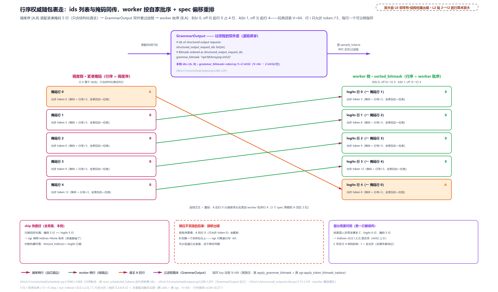

> *图注：错行防御的主体。上段是 GrammarOutput 双件套（源码逐字四行）；下段左右两个行栈交叉连线：调度序紧凑掩码（A 1 行、B 4 行）过进程后按 worker 批序（B,A）加 spec 偏移重排：A 的行 0 落 logits 行 4、B 的行 1..4 落行 0..3，A 的橙线跨过四条 B 的绿线，这束交叉就是重排本身。下带三块：左是 skip 快路径免传（行数恰对满时 xgr 调用 indices=None）、中是错位不重排的后果（约束静默戴错请求，不报任何错）、右对照部分覆盖（混入非语法请求 C 时行数对不上账，out_indices=[5,0,1,2,3] 必须显式传）。*

再把走表单独拉出来看一遍算术（换 worker 批序 [B, C, A]：C 是不占掩码行的非语法请求）：

<!-- trace: m10-worker-reorder -->
| 批序位 | 请求 | batch_index | offset_before | num_spec | logit_index | 掩码行展开 |
| --- | --- | --- | --- | --- | --- | --- |
| 0 | B | 0 | 0 | 3 | 0 | B 的 4 行（3 spec+bonus）→ logits 行 0..3 |
| 1 | C（非语法） | 1 | 3 | 0 | 4 | 无行；sorted 行 4 保持初始 -1（全允许，实测未被动过） |
| 2 | A | 2 | 3 | 0 | 5 | A 的 1 行 → logits 行 5 |
| 收拢 | 按 ids 序 [A,B] 追加 | — | — | — | — | out_indices=[5,0,1,2,3]（async_tensor_h2d 实录；5<6 → indices 必传） |

B 的 3 个草稿把后面所有人顶后 3 位，A 从批序直觉位 1 落到 logit_index 5。行数相等（5==5 的全覆盖场景）走 skip 免传 indices；差一行（5<6）就得传，indices 张量是快慢路径的唯一分界。

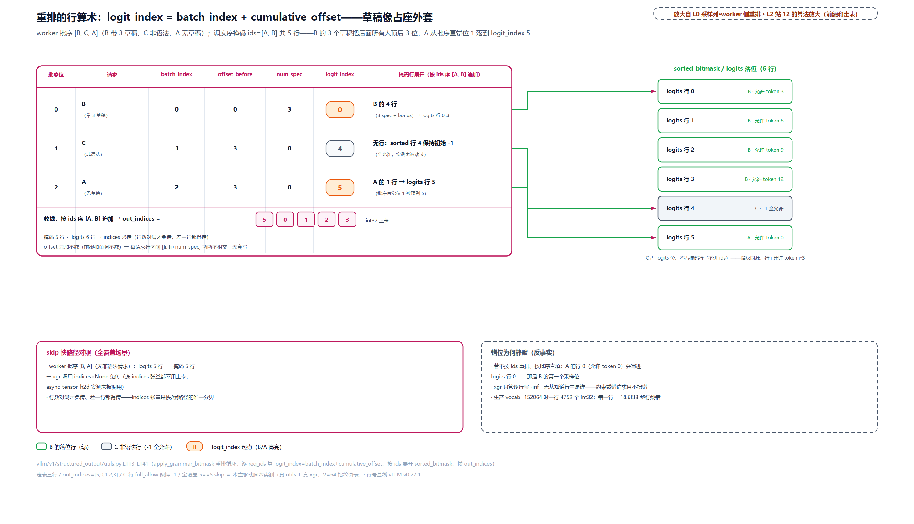

> *图注：重排的行算术走表。worker 逐自己批序累计 spec 偏移算 logit_index=batch_index+cumulative_offset：批序 [B,C,A] 下 B(0+0)=0 占 4 行、C(1+3)=4 不占行、A(2+3)=5。前缀和区间两两不相交，重排每行恰写一次；非语法请求 C 占 logits 位不占掩码行，行保持 -1 全允许（实测未被动过）。行数恰对满时免传 indices（快路径），差一行都得传。右注生产口径：vocab=152064 一行 4752 个 int32，错一行等于 18.6KiB 的约束整行戴错请求。*

### H2D 链：pinned、non_blocking 与一次看不见的中转

直觉：上卡不是 `.to(device)` 一行的事。普通 CPU 内存随时可能被操作系统换页挪位，DMA 引擎（绕过 CPU 直接搬数据的硬件单元，[第 18 章](../../ch18-persistent-batch-fixed-addresses/narrative/chapter.md)立过）没法对着一个会跑的靶子直搬。所以 pageable（可换页的普通内存）上卡时，驱动要先把它拷进一块临时锁页区再 DMA，同一段数据实际搬了两次；而 `non_blocking=True` 在源不是 pinned（页锁定内存，不参与换页、DMA 可直接访问）时会**静默退化**成同步拷贝，不报错、不警告。这两条都来自 CUDA 与 PyTorch 的官方语义（NVIDIA 工程博客与 CUDA 编程指南原话；锁页内存官方建议「省着用、作 staging 区」）。本章要讲的 H2D 链就是 vLLM 把这些语义工程化的样子：

```python
# vllm/v1/structured_output/utils.py:L143-L162 · apply_grammar_bitmask（H2D 与应用段）
    # Copy async to device.
    grammar_bitmask = sorted_bitmask_tensor.to(logits.device, non_blocking=True)  # L144

    # If the length of out indices and the logits have the same shape
    # we don't need to pass indices to the kernel,
    # since the bitmask is already aligned with the logits.
    skip_out_indices = len(out_indices) == logits.shape[0]    # 对账不变式的机器可查形态  # L149

    if not logits.is_cpu:
        index_tensor = None
        if not skip_out_indices:
            # xgrammar expects a python list of indices but it will actually work with
            # a tensor. If we copy the tensor ourselves here we can do it in a
            # non_blocking manner and there should be no cpu sync within xgrammar.
            index_tensor = async_tensor_h2d(
                out_indices, dtype=torch.int32, device=logits.device
            )                                # indices 也自己搬，免 xgrammar 内部 cpu sync # L157

        xgr.apply_token_bitmask_inplace(logits, grammar_bitmask, indices=index_tensor)
        return
    # … 省略：CPU 后端兜底（老版 xgrammar CPU 核只吃 float32，先转再写回，#31901）…
```

两个巧劲。其一，重排目的地 `sorted_bitmask_tensor` 生来 pinned（构造处 `torch.full(..., pin_memory=PIN_MEMORY)`），CPU 在锁页内存上原行重排，L144 的 `non_blocking=True` 因此是真异步 DMA，不是退化版。其二，indices 的搬运：xgrammar 名义上要 Python list，但实际吃 tensor：自己搬就能全程 non_blocking，且 xgrammar 内部无 cpu sync（源码注释原话）。搬运工本体：

```python
# vllm/utils/torch_utils.py:L573-L586 · async_tensor_h2d
def async_tensor_h2d(
    data: list | np.ndarray | torch.Tensor,
    device: str | torch.device,
    dtype: torch.dtype | None = None,
) -> torch.Tensor:
    """Copy list/numpy array/tensor async from host to device."""
    if isinstance(data, np.ndarray):
        data = torch.from_numpy(data)
    if isinstance(data, torch.Tensor):
        t = data.pin_memory() if PIN_MEMORY else data
    else:
        t = torch.tensor(data, dtype=dtype, pin_memory=PIN_MEMORY, device="cpu")
    assert t.is_cpu
    return t.to(device=device, dtype=dtype, non_blocking=True)
```

落点 `xgr.apply_token_bitmask_inplace` 的语义是 xgrammar 官方钉死的：位打包格式 32 个 token 挤一个 int32、某位是 0 就把该 token 的 logit 置 -inf、是 1 放行；`indices` 参数官方定位就是「结构化与非结构化请求混批」的用法，指定 indices 时 logits 与 bitmask 的 batch 维不需要相等（传的 out_indices 正是这个参数）；文档还建议 bitmask 分配在 CPU、上 GPU 由用户自行负责。vLLM 这条 pinned 加 non_blocking 的链就是那句官方建议的工程化（[xgrammar 掩码函数文档](https://xgrammar.mlc.ai/docs/api/python/bitmask_ops.html)）。

本机实测口径：批 256 行的取证载荷 [256, 1571] int32（1.534MiB，行数取生产批形、列数取本仓词表）pinned H2D 中位 78.1µs，pageable 同载荷 132.2µs——1.69 倍。两笔小账顺带记下：每步 `torch.full(pin_memory=True)` 的新分配看着贵，但 PyTorch 有 host 侧的 pinned 缓存分配器（GPU 缓存分配器的对偶，`PYTORCH_ALLOC_CONF` 有专门旋钮），分配大多命中缓存池复用；重叠要真并发还需三前提凑齐：空闲的 DMA 拷贝引擎、独立的非默认流、pinned 源。V1 路径只占齐 pinned 一条（搬运与 kernel 同流按序排队即可），V2 路径把三条全凑齐，留到站 16。

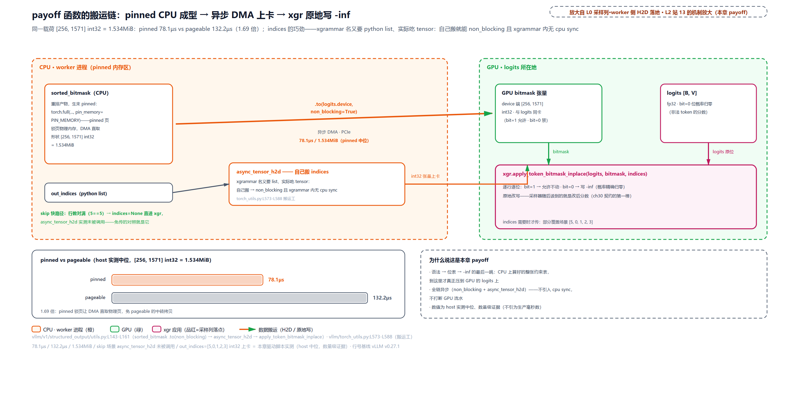

> *图注：V1 落地函数 `apply_grammar_bitmask` 的搬运链（CPU 橙 / GPU 绿双进程带；橙在本图只标 CPU 侧，不是本章其他图里的调度进程色）。重排产物 sorted_bitmask 生来 pinned，`.to(device, non_blocking=True)` 走异步 DMA：同载荷 pinned 78.1µs vs pageable 132.2µs（1.69 倍，host 实测中位，[256,1571] int32=1.534MiB）。下挂支线：部分覆盖时 out_indices 经 async_tensor_h2d 搬成 int32 张量（自己搬能 non_blocking 且 xgrammar 内无 cpu sync）；全覆盖走 skip 路径免传。最终 xgr.apply_token_bitmask_inplace 原地写：bit=0 的 token 概率归零。*

### 为什么必须是 -inf

直觉：门卫改分数、不改规则。掩码在采样器进场之前把非法座位的分数改成负无穷——softmax 眼里它的概率精确为零：温度调多高、top-k 截多狠都救不回来，采样器一行代码不用改。

数值实测（语法 `root ::= "yes" | "no"`，位置 0 允许集 [77, 88, 3919, 5948, 8505]；手工构造非法位 4242('####')=5.0 最高、8505('yes')=2.0，自由采样必踩非法位；真 CUDA kernel 落地）：

<!-- trace: m12-inf-orthogonality -->
| 阶段 | 动作 | 关键量（实测） | 判定 | 结果 |
| --- | --- | --- | --- | --- |
| 掩码前 | argmax(logits) | 4242 位 5.0 最高、8505 位 2.0 | 自由 argmax | 选中 4242（语法外 token 当选） |
| 掩码后 | apply_token_bitmask_inplace | 4242 位变 -inf；softmax 后概率 0.0（T=1.0 / 0.5 / 0.01 / 10.0 四档全部 0.0） | 非法位概率精确归零（位级） | argmax 翻到 8505；top-3=[8505, 3919, 77] |
| 有限负值对照 | 同样三行 logit [5.0, 2.0, -100.0] | T=1.0 时 -100 位概率 0.0（exp 下溢侥幸）；T=10.0 时残留 1.5817857274669223e-05 非零 | 高温撕开有限掩码 | -inf 在任何温度下都精确 0.0，「必须是 -inf」的数值答案 |

为什么写 -inf 而不是一个很大的负数，位级论证三行就够：IEEE 754 里 exp(-inf)=0，且 -inf 除以任何有限正温度仍是 -inf，0 乘任何有限值是 0，softmax 全链保持零权重，无需归纳、单点恒等即得。有限负值没有这个性质：-100 在 T=10 下残留 1.58e-05 的非零概率（实测），保护随温度变宽而失效。贪婪路径同理：argmax 取不到 -inf 位。所以掩码与[第 30 章](../../ch30-sampler-pipeline/narrative/chapter.md)的 9 步采样变换（温度、top-k、top-p、惩罚、bad_words）**完全正交**：采样器对掩码无感知，`_sample` 里一行都不为它改。写入次序是隐式契约：掩码最先写（第二幕里 apply 在 `_sample` 之前，实测调用序 [apply, sample]），后面所有变换叠在其上。

### 原地改写的所有权账

最后一笔账：改的是谁的张量。直觉：后厨就地改菜、不另起新盘：logits 冻结在暂存态那块张量上，掩码就地改写，采样器端上桌的就是同一盘；想留原始分数，调用方必须自己先 clone（复制一份）。

<!-- trace: m13-inplace-ownership -->
| 幕 | 动作 | 关键量（实测） | 判定 | 结果 |
| --- | --- | --- | --- | --- |
| 第一幕 | execute_model 打包 | logits [1, 50257] CUDA 进 execute_model_state（10 元组之一）；4242 位 5.0 | 冻结在单槽、return None | 暂存态持有张量引用（非拷贝） |
| 第二幕 | apply_grammar_bitmask → sampler | sampler 收到的 is state.logits=True、id 相同；4242 位变 -inf、8505 位 2.0 不变 | 同一块张量被原位改写 | ch30「全程原地改写」契约的第一棒：想保 raw 必须 clone（vllm/v1/sample/rejection_sampler.py:L149-L160 同款证据） |

`ExecuteModelState` 存的是张量引用（NamedTuple 字段直接持引用，无拷贝语义），实测采样器替身收到的张量 id 与暂存态里相等、被改后的值已生效。这条所有权链向上交棒[第 30 章](../../ch30-sampler-pipeline/narrative/chapter.md)（Sampler 从第 2 步起全程原地改写 logits，raw logprobs 的留底在管线第 1 步、掩码之前），向下要求任何想保留掩码前视角的调用方显式 clone。保 raw 的代价是 clone 一份 [1, 50257] fp32，约 197KB 每请求行；投机解码的拒绝采样分支正是这么做的（`vllm/v1/sample/rejection_sampler.py:L149-L160`，[第 30 章](../../ch30-sampler-pipeline/narrative/chapter.md)嵌过）。

## 思考门三件套：填不填、推不推、裁不裁（站 14）

现在走到 L0 图调度列与采样列之间、⑤ 拍 `update_from_output` 的侧面。[第 31 章](../../ch31-grammar-compilation/narrative/chapter.md)末节立过「先想后说的门」的一半：`should_advance`（v0.27 用 `new_token_ids` 精确窗口探测思考结束、#43388 的修复）与 `trim_reasoning_for_advance`（一步内思考与语法混块、#44006 的修复）的源码与走读都在那边，此处不重讲。本章补上**fill 侧的孪生门**、边界定位器，和把三个门装回真调用点的全场景实测。正是上一章留的话：「这套路数还有一个孪生门在 fill 侧，以及投机窗口撞上边界的 mid-window 特例，都归下一章」（mid-window 已在串行分支讲完）。

fill 侧的门：

```python
# vllm/v1/structured_output/__init__.py:L361-L379 · StructuredOutputManager.should_fill_bitmask
    def should_fill_bitmask(self, request: "Request") -> bool:
        # NOTE (Hanchen) if enable_in_reasoning is True, it means that
        # the model needs to be constrained in reasoning. So we should always
        # enable the bitmask filling.
        reasoner = self._get_reasoner(request)
        if reasoner is not None:
            if self.enable_in_reasoning:
                return True              # 段内约束开关：思考段也受语法管            # L368
            assert request.structured_output_request is not None
            if request.structured_output_request.reasoning_ended is None:
                # This should be removed here, but since `openai_gptoss`
                # is an independent code path, it is kept for now.
                # After unifying the `openai_gptoss` and non-`openai_gptoss` styles,
                # it can be removed.
                request.structured_output_request.reasoning_ended = (
                    reasoner.is_reasoning_end(request.prompt_token_ids or [])
                )                       # 首问缓存：先对 prompt 判一次，结果记进请求  # L375
            return request.structured_output_request.reasoning_ended
        return True                      # 非思考模型：恒填                          # L379
```

三路：无 reasoner 恒填；`enable_in_reasoning`（把约束也加进思考段的开关）恒填；否则看 `reasoning_ended`：未定时先对 prompt 整体判一次并缓存进请求（prompt 级判定每请求恰发生一次）。为什么思考段不填：思考内容不属于目标 JSON，从第一个 token 就约束等于不让模型思考。

边界定位器（`should_advance` 检出结束时调用，把「结束标记在全部 token 里的绝对位置」逐 token 找出来）：

```python
# vllm/v1/structured_output/__init__.py:L441-L460 · StructuredOutputManager._find_reasoning_end_index
    @staticmethod
    def _find_reasoning_end_index(
        reasoner: "ReasoningParser", all_token_ids: Sequence[int], start: int
    ) -> int:
        """Locates the last reasoning token within ``all_token_ids[start:]``.

        Returns:
            The absolute index of the token at which
            ``is_reasoning_end_streaming`` first fires. Falls back to the
            final index when no single token triggers the detection (e.g.
            a multi-token marker only recognized on the full delta), which
            conservatively treats the whole step as reasoning content.
        """
        prefix = list(itertools.islice(all_token_ids, start))
        for idx in range(start, len(all_token_ids)):
            token = all_token_ids[idx]
            prefix.append(token)
            if reasoner.is_reasoning_end_streaming(prefix, [token]):
                return idx                # 首个触发判定的位置即边界                    # L459
        return len(all_token_ids) - 1     # 保守回退：整段当思考内容                     # L460
```

从窗口起点逐 token 扩展前缀去问 reasoner，首个触发的 idx 即边界；多 token 标记只在整段 delta 上才认得出的情形，保守回退到末位（宁可多裁、不误推）。三件套装回真调用点（⑤ 拍 `update_from_output` 的语法推进块，源码走读见[第 31 章](../../ch31-grammar-compilation/narrative/chapter.md)站 7：`should_advance(request, new_token_ids)` 通过才 `trim_reasoning_for_advance` 裁掉思考前缀、`accept_tokens` 真推进，拒绝即 FINISHED_ERROR）。全场景实测（序列 all=[p1,p2,p3, t1,t2,M,g1]，本步 new=[t1,t2,M,g1]，M 是结束标记、t 系思考、g 系语法内容）：

<!-- trace: m14-thinking-gates -->
| 场景 | 调用 | 关键量（实测） | 判定 | 结果 |
| --- | --- | --- | --- | --- |
| prompt 级缓存 | should_fill_bitmask 连调两次 | 首次对 prompt 判 is_reasoning_end → False 并缓存进请求 | 第二次不再判（prompt 级调用恰 1 次） | 两次都返回 False |
| 精确窗口（v0.27 新） | should_advance(req, new_token_ids=[t1,t2,M,g1]) | start = 3（all 长 7 减 new 长 4）→ delta 覆盖标记（idx 5） | 检出结束 | reasoning_ended=True、边界 idx=5 |
| 占位数推导（旧坑） | should_advance(req)（无 new_token_ids） | computed 8 - placeholders 2 → start=6，越过标记位 5 | delta=[g1] 错过标记 | 返回 False，语法永不生效（async+spec 草稿被拒时占位数残留未清零所致） |
| trim（修复） | trim_reasoning_for_advance | end_idx 5、first_idx 3 → 裁掉 3 个思考 token（含标记） | 只喂 [g1] 给 accept_tokens | 接受成功、请求存活（status=None） |
| 不 trim（对照） | 整块直喂 accept_tokens | accept([t1,t2,M,g1]) 被真语法拒收 | 混块杀死请求 | status=FINISHED_ERROR、resumable=False |

五行表把两代窗口算法的差别钉死：精确窗口 start=7-4=3，delta 覆盖标记位、检出结束；旧占位数推导 start=8-2=6，delta 只剩 [g1]、越过标记。8 与 2 的账面来历：computed 8＝7 个真 token＋1 笔被拒草稿的虚账（草稿排过队、记进了 computed，被拒后没进 token 流），placeholders 2 是在途未回的欠条，而旧假设是欠条数恰等于本步新 token 数（这里应为 4）。两头一多一少，合计残 3 笔，把起点从真值 3 顶到 6、恰好越过 idx 5 的标记——这就是 #43388 的病灶：异步调度加投机下草稿被拒、占位数有残余，语法永远不生效。trim 的生死对照是 #44006 的原案：一步 4 token 的混块里 3 个是思考（含标记），不裁直喂被真语法拒收、请求判 FINISHED_ERROR 且不可恢复；裁掉闭区间 [first_idx, end_idx] 后只剩 1 个语法 token、接受成功。三问共享同一门轴：**思考内容不是语法内容，结束标记本身也是思考**。

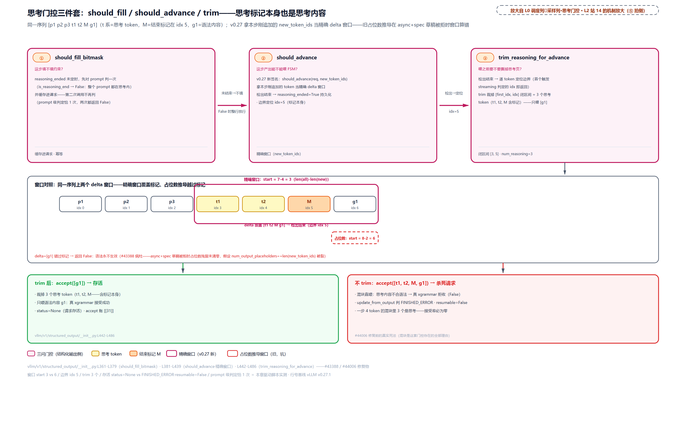

> *图注：三问一门轴。should_fill（这步填不填，prompt 级判定恰 1 次并缓存）、should_advance（这步推不推进，v0.27 用 new_token_ids 精确 delta 窗口）、trim（喂之前裁掉思考前缀）。中带是同一序列 [p1 p2 p3 t1 t2 M g1] 上的两个 delta 窗口对照：品红实框 start=3 覆盖标记位 idx 5 → 检出；红虚框 start=6 越过标记 → False（旧占位数推导在 async+spec 草稿被拒时的坑）。底部生死对照：trim 裁 3 个思考 token 后 accept([g1]) 存活；不 trim 直喂 accept 混块 → FINISHED_ERROR、resumable=False。*

## 异步心跳：等米下锅的 deferred 链（站 15）

现在走到 L0 图循环框在异步调度下的形态。先收拢已立的地基：v0.27 异步调度默认开（[第 12 章](../../ch12-async-scheduling/narrative/chapter.md)），调度器提前一步组批、GPU 不等 CPU；采样 token 不落 CPU、用占位欠条记账，缺 token 的批走 deferred 采样。本章要补的是**结构化输出在这条心跳上的专属耦合**：掩码要吃「到目前为止的真实历史」，异步下上拍的 token 还没回来，表就算不准，特别是投机草稿必须先过语法安检。

### pending 置位：掩码要吃上拍的真实 token

信号源在 `AsyncScheduler._update_after_schedule`：

```python
# vllm/v1/core/sched/async_scheduler.py:L19-L46 · AsyncScheduler._update_after_schedule（延后采样信号源）
    def _update_after_schedule(self, scheduler_output: SchedulerOutput) -> None:
        super()._update_after_schedule(scheduler_output)
        spec_decode_tokens = scheduler_output.scheduled_spec_decode_tokens
        # Use the latest num of scheduled draft tokens in next step as placeholder.
        self._spec_token_placeholders = [
            -1
        ] * scheduler_output.num_spec_tokens_to_schedule
        for req_id in scheduler_output.num_scheduled_tokens:
            request = self.requests[req_id]
            if request.is_prefill_chunk:
                continue

            scheduler_output.pending_structured_output_tokens |= (
                request.use_structured_output and request.num_output_placeholders > 0
            )                        # 结构化请求 + 占位未清 = 本拍历史不完整         # L31
            # The request will generate num_sampled_tokens_per_step new tokens
            # plus num_spec_tokens in this scheduling step. Diffusion has no AR
            # bonus token (num_sampled_tokens_per_step == 0) — only the canvas
            # (spec) tokens.
            cur_num_spec_tokens = len(spec_decode_tokens.get(req_id, ()))
            request.num_output_placeholders += (
                self.num_sampled_tokens_per_step + cur_num_spec_tokens
            )                        # 占位记账：AR bonus + 草稿数                    # L39
            # Add placeholders for the new draft/spec tokens.
            # We will update the actual spec token ids in the worker process.
            request.spec_token_ids = self._spec_token_placeholders   # -1 占位数组，真草稿 worker 侧替换
            # … 省略：use_v2_model_runner 的下一拍 decode 资格记账，归 PP 微批章 …
```

置位条件是「use_structured_output 且 `num_output_placeholders>0`」（产出占位数：已发车、结果未回的 token 数，[第 12 章](../../ch12-async-scheduling/narrative/chapter.md)的欠条账本）。服务默认心跳 `step_with_batch_queue` 里据此分流：

```python
# vllm/v1/engine/core.py:L664-L677 · EngineCore.step_with_batch_queue（采样分流）
            else:
                if not scheduler_output.pending_structured_output_tokens:
                    # We aren't waiting for any tokens, get any grammar output
                    # and sample immediately.
                    grammar_output = self.scheduler.get_grammar_bitmask(
                        scheduler_output
                    )
                    future = self.model_executor.sample_tokens(
                        grammar_output, non_block=True
                    )                # 不欠账：同 step() 一样立即算表采样               # L671
                else:
                    # We need to defer sampling until we have processed the model output
                    # from the prior step.
                    deferred_scheduler_output = scheduler_output   # 欠账：本拍挂起      # L677
```

欠账的批挂起，先去收上一批的输出。兑现链在函数尾：

```python
# vllm/v1/engine/core.py:L719-L737 · EngineCore.step_with_batch_queue（deferred 兑现链）
        if deferred_scheduler_output:
            # When draft tokens are used with structured output, validate them
            # before computing the grammar bitmask for the deferred request.
            if self.check_for_draft_tokens:
                draft_token_ids = self.model_executor.take_draft_token_ids()   # L723
                if draft_token_ids is not None:
                    # Update the draft token ids in the scheduler output to
                    # filter out the invalid spec tokens, which will be padded
                    # with -1 and skipped by the grammar bitmask computation.
                    self.scheduler.update_draft_token_ids_in_output(
                        draft_token_ids, deferred_scheduler_output
                    )                # 草稿先过语法安检                              # L728
            # We now have the tokens needed to compute the bitmask for the
            # deferred request. Get the bitmask and call sample tokens.
            grammar_output = self.scheduler.get_grammar_bitmask(
                deferred_scheduler_output
            )
            future = self.model_executor.sample_tokens(grammar_output, non_block=True)  # L736
            batch_queue.appendleft((future, deferred_scheduler_output, exec_future))
```

因果序四步刚性：`take_draft_token_ids`（草稿从 worker 回调度器）→ `update_draft_token_ids_in_output`（安检过滤）→ `get_grammar_bitmask`（才算表）→ `sample_tokens`（补采样重新入队）。为什么不可换：掩码逐草稿位填行（串行分支）要求草稿 token 已知且已过滤，注释原话「我们现在才拿得到算这张表所需的 token」。三拍事件账实测（批队列深度 2，每拍占位 +1 AR bonus +2 spec）：

<!-- trace: m16-async-deferred-sampling -->
| 拍 | 进门时 placeholders | pending 判定 | 加账 | 采样路径（事件账实测） |
| --- | --- | --- | --- | --- |
| 拍 1 | 0 | False（0>0 不成立）→ 不延后 | +1+2=3（AR bonus 1 + spec 2） | schedule → dispatch(non_block) → bitmask(immediate) → sample_tokens(non_block=True) → 入队早退（队 1<2 未满） |
| 拍 2 | 3 | True（3>0：上拍 token 没回来）→ 本拍挂起 deferred | +1+2 → 6 | schedule → dispatch → pop 拍 1 批收输出 update_from_output → take_draft_token_ids → update_draft_in_output → bitmask(deferred) → sample_tokens → 重新入队 |
| 拍 3 | 6 | True → 挂起 | — | pop 拍 2 批收输出 → 同一兑现链再走一轮 |

占位账每拍 +3，拍 2 起每拍都 pending——**稳态流水线里 deferred 是常态而非例外**，这条链就是 v0.27 服务默认心跳里结构化输出的真实路径。队列侧的不变式顺带一提：批队列未满时非 deferred 拍早退不收输出，保证首个 deferred 拍必有上一批可 pop（填管道优先于收输出）。挂起的拍仍照常排 token：调度预算把没回来的占位数继续算进欠的活（`num_tokens_with_spec + num_output_placeholders - num_computed_tokens`，`scheduler.py:L516-L520`），产出回来再按真实 token 数扣账（`async_scheduler.py:L62`）；图上那条「deficit 回填公式」就是这两笔对账。

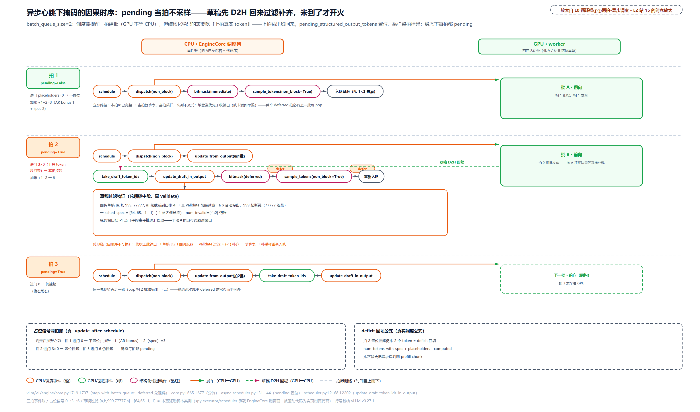

> *图注：异步心跳下掩码的因果时序。三拍事件账纵排（拍内自左而右即代码序）：调度器提前一拍组批（批 A 与批 B 的前向条错位重叠），结构化输出的表要吃上拍真实 token：上拍输出没回来，这拍的 pending_structured_output_tokens 就置位、采样整拍挂起。兑现链顺序刚性：先收上批输出、草稿从 worker 的 copy_stream D2H 回来、过语法 validate 过滤并 -1 补齐（[a,b,999,77777,a] → [64,65,-1,-1]，num_invalid={r1:2}），然后才算表、补采样重新入队。底部两注：占位信号两拍账（进门 0 → 加账 +1+2=3；进门 3 → 置位挂起）与 deficit 回填公式。*

### 草稿回程：先过安检再上机

直觉：草稿先过安检再上机。worker 生成的草稿在 GPU 上，语法检查官在调度器进程里，草稿必须先 D2H 回程过 validate 安检：不合格的撕票、补 -1 站票；思考段里的草稿免检（本来就不归语法管）。

回程通道是 `DraftTokensHandler`：

```python
# vllm/v1/worker/gpu/spec_decode/utils.py:L11-L52 · DraftTokensHandler（草稿 D2H 回传通道）
class DraftTokensHandler:
    def __init__(self, device: torch.device | None = None):
        self.device = device
        self.copy_stream = torch.cuda.Stream(device)
        # Blocking (sleep) event to avoid busy-polling the CUDA driver lock.
        self.copy_event = torch.cuda.Event(blocking=True)

        self.req_ids: list[str] = []
        self.draft_tokens_np: np.ndarray | None = None
        self.num_draft_tokens: int = 0

    def set_draft_tokens(
        self, input_batch: InputBatch, draft_tokens: torch.Tensor
    ) -> None:
        self.req_ids = input_batch.req_ids
        self.num_draft_tokens = draft_tokens.shape[1]
        if not input_batch.has_structured_output_reqs:
            # No draft token validation needs to be performed by
            # the scheduler for this batch.
            self.draft_tokens_np = None      # 无结构化请求：整批跳过回传               # L30
            return

        # For spec decoding + structured outputs, we must transfer the
        # draft tokens back to the scheduler for grammar validation.
        current_stream = torch.cuda.current_stream(self.device)
        self.copy_stream.wait_stream(current_stream)
        with torch.cuda.stream(self.copy_stream):
            self.draft_tokens_np = async_copy_to_np(draft_tokens)   # 独立拷贝流上 D2H  # L38
            # draft_tokens is a temporary allocation on the main stream and read here on
            # copy_stream; without record_stream, the caching allocator may reuse its
            # memory before the async copy executes.
            draft_tokens.record_stream(self.copy_stream)            # L42
            self.copy_event.record()

    def get_draft_tokens(self) -> DraftTokenIds | None:
        if self.draft_tokens_np is not None:
            self.copy_event.synchronize()      # blocking 事件同步，不忙轮询驱动锁
            draft_token_ids = self.draft_tokens_np.tolist()
        else:
            # This case only happens when async scheduling is disabled.
            draft_token_ids = [[-1] * self.num_draft_tokens for _ in self.req_ids]
        return DraftTokenIds(self.req_ids, draft_token_ids)
```

worker 侧同一门控（`has_structured_output_reqs`）：为假整批跳过，回程通道自身零浪费。两个异步内存安全细节值得各给一句。`copy_event(blocking=True)`：等待时让 CPU 睡眠而不是忙轮询，免得空转的查询一直占着 CUDA 驱动锁（事件语义[第 12 章](../../ch12-async-scheduling/narrative/chapter.md)立过）。`record_stream` 是本章唯一全新的内存安全点，值得展开：PyTorch 的缓存分配器判断「这块显存安全可复用」只看**流内同步**（同一流上后发的操作天然排在后面）；`draft_tokens` 是主流上的临时分配，函数返回就释放进缓存池，而 copy_stream 上那个异步 D2H 可能还在飞——分配器不知道另一条流还在用它，敢把这块内存发给新张量，拷贝执行时读到的就是别人的数据。`record_stream(copy_stream)` 就是给分配器打招呼：这条流上还有人用，等它完事再复用（PyTorch 官方 CUDA 语义文档的原型场景，vLLM 逐字搬了官方解法）。与[第 18 章](../../ch18-persistent-batch-fixed-addresses/narrative/chapter.md)的 pinned 教学勿混：pinned 管搬运快慢，record_stream 管内存不被提前复用。

安检本体在调度器：

```python
# vllm/v1/core/sched/scheduler.py:L2168-L2203 · Scheduler.update_draft_token_ids_in_output
    def update_draft_token_ids_in_output(
        self, draft_token_ids: DraftTokenIds, scheduler_output: SchedulerOutput
    ) -> None:
        num_invalid_spec_tokens: dict[str, int] = {}

        sched_spec_tokens = scheduler_output.scheduled_spec_decode_tokens
        for req_id, spec_token_ids in zip(
            draft_token_ids.req_ids,
            draft_token_ids.draft_token_ids,
        ):
            request = self.requests.get(req_id)
            if request is None or request.is_finished():
                # The request may have been finished. Skip.
                continue

            placeholder_spec_tokens = sched_spec_tokens.get(req_id)
            if not placeholder_spec_tokens:
                continue

            orig_num_spec_tokens = len(placeholder_spec_tokens)
            # Trim drafts to scheduled number of spec tokens
            # (needed for chunked prefill case for example).
            del spec_token_ids[orig_num_spec_tokens:]       # 截到本拍已排数            # L2190
            # Filter out spec tokens which do not adhere to the grammar.
            if self.structured_output_manager.should_advance(request):
                metadata = request.structured_output_request
                spec_token_ids = metadata.grammar.validate_tokens(spec_token_ids)  # L2194
            # Pad to original number of spec tokens.
            num_invalid_tokens = orig_num_spec_tokens - len(spec_token_ids)
            if num_invalid_tokens:
                spec_token_ids.extend([-1] * num_invalid_tokens)   # -1 补齐保长度      # L2198
                num_invalid_spec_tokens[req_id] = num_invalid_tokens

            sched_spec_tokens[req_id] = spec_token_ids

        scheduler_output.num_invalid_spec_tokens = num_invalid_spec_tokens   # 记账     # L2203
```

四拍：截断到本拍已排数 → `should_advance` 门控通过才 `validate_tokens`（试走不推进，[第 31 章](../../ch31-grammar-compilation/narrative/chapter.md)立过：滤掉首个非法位起的一切）→ `-1` 补齐原长度（正是串行分支那个哨兵的来源）→ `num_invalid_spec_tokens` 记账（写回 scheduler_output，`update_from_output` 里进投机接受率统计的分母抵扣，统计细节归投机解码两章）。全场景实测：

<!-- trace: m17-spec-draft-return -->
| 场景 | 通道 | 关键量（实测） | 判定 | 结果 |
| --- | --- | --- | --- | --- |
| round 1·语法已生效 | update_draft_token_ids_in_output | 回传 [a,b,999,77777,a] 先截断到已排 4；真 validate 前缀过滤 | a,b 合法、999 起断链（77777 连带） | sched_spec=[64,65,-1,-1]；num_invalid={r1:2} 进接受率统计 |
| round 2·思考未结束 | 同函数 | should_advance=False → validate 根本不调用 | 草稿原样保留（思考内容不受语法管） | sched_spec=[999,888,777]；num_invalid 空 |
| 门控关 | DraftTokensHandler（CUDA） | has_structured_output_reqs=False → D2H 整批跳过 | 无结构化请求时回传零成本 | get 返回 [[-1,-1,-1],[-1,-1,-1]] 占位 |
| 门控开 | copy_stream D2H 往返 | GPU 草稿 [[64,65,999],[1,2,3]] 经 async_copy_to_np | copy_event(blocking) 同步后 tolist | roundtrip 逐值相等；纯 Python 列表交 deferred 链第一步 |

不变式收口：**进入掩码窗口的草稿要么合法、要么是 -1 哨兵**。入口有两条安检路：deferred 链的 `update_draft_token_ids_in_output`（门控→validate 过滤→-1 补齐，`scheduler.py:L2192-L2198`），以及同步链的同款函数 `update_draft_token_ids`（`scheduler.py:L2146`，同样先门控再 validate）。调度里第三处写入点只写 -1 占位（`pad_spec_decode` 给纯 decode 批新请求补的假草稿，`scheduler.py:L1076-L1079`；[第 10 章](../../ch10-continuous-batching-chunked-prefill/narrative/chapter.md)落座打包段点名过，细节归投机解码两章）。窗口侧把 -1 当「停约束停推进」处理。所以串行分支那个 AssertionError（非 post_reasoning_end 场景）正常不可达，它守护的是「入口防线失守」这种 bug 而非运行态。

## 两条落地路：V1 搬运与 V2 kernel（站 16）

最后一个诚实的转折：本章前文的 V1 路径（`utils.apply_grammar_bitmask` 加 `xgr.apply_token_bitmask_inplace`）在 v0.27.1 **并不是默认**。v0.21 时代 V2 runner 还是 opt-in 的实验路径（环境变量显式打开才构造），v0.27.1 完全反转：Llama 这类稠密生成模型默认就走 V2。谁在选？

### 选择器：V1 还是 V2，不是用户开关

```python
# vllm/config/vllm.py:L578-L617 · VllmConfig.use_v2_model_runner（真实选择器）
    def use_v2_model_runner(self) -> bool:
        use_v2_model_runner = envs.VLLM_USE_V2_MODEL_RUNNER
        if use_v2_model_runner is not None:
            return use_v2_model_runner        # env 显式设置最优先                   # L581

        # PCP runtime support is implemented only by the V2 model runner.
        if self.parallel_config.prefill_context_parallel_size > 1:
            return True                       # PCP 只在 V2 实现：强制              # L585

        # DSpark is implemented only by the V2 GPU model runner, and DeepSeek-V4
        # is not otherwise a default-V2 architecture, so force V2 for it. …
        if (
            self.speculative_config is not None
            and self.speculative_config.method == "dspark"
        ):
            return True                       # dspark 投机只在 V2：强制            # L595

        # … 省略：DFlash 混合草稿需要多 KV 组（V2 only）、diffusion 模型，同款强制 …
        if self.model_config is not None and self.model_config.is_diffusion:
            return True

        if not self._is_default_v2_model_runner_model():
            return False                      # 不在默认名单：V1                    # L606

        if not HAS_TRITON:
            logger.warning_once(
                "Model Runner V2 requires Triton; using the V1 model runner instead."
            )
            return False                      # 无 Triton：带警告回退 V1            # L612

        unsupported = self._get_v2_model_runner_unsupported_features()
        if unsupported:
            logger.warning_once(
                "Model Runner V2 does not yet support %s; using the V1 model "
                # … 省略：不支持的特性（如 ngram 投机）带警告回退 V1 …
```

判定阶梯四层：env 显式设置最优先；只在 V2 实现的特性（PCP、dspark、DFlash 混合 KV、diffusion）直接强制 V2；然后看模型：默认 V2 架构名单（DeepseekV2、GraniteMoe、Qwen2Moe 等 MoE 七家）**或「非 MoE」即稠密生成模型**都上 V2；最后 Triton 缺失或不支持的特性（ngram 投机等）带警告回退 V1。注意「非 MoE 即 V2」这一条：它意味着 Llama、Qwen 稠密版这些最常见的部署默认就是 V2 worker。v0.21 的「V2 opt-in 默认关」结论在本 pin 已经失效（[第 17 章](../../ch17-executor-worker-model-runner/narrative/chapter.md)脚注登记的「默认关」正是这条旧口径，以本节判定阶梯为准）。两条路径落地的是**同一个掩码契约**（先掩码后采样、bit=0 写 -inf），差别只在搬运与 kernel 形态。十三路判定实测（env 开/关、PCP、dspark、diffusion、Llama 稠密、Qwen2Moe、eagle 走 V2；Mixtral 不在名单、pooling、attention-free、无 Triton、ngram 回退 V1）全部落在图里：

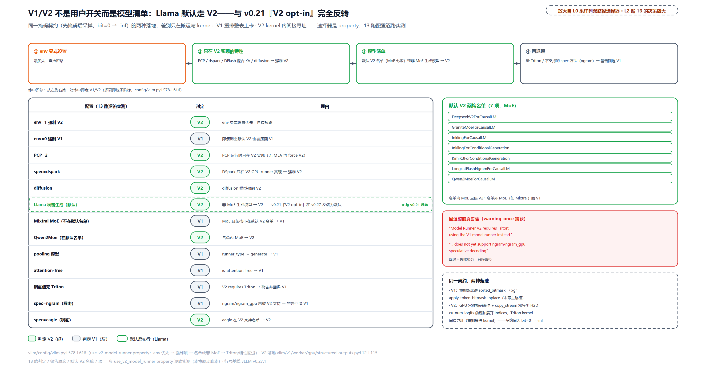

> *图注：V1/V2 不是用户开关而是模型清单。顶部决策阶梯（env → 强制项 → 名单/非 MoE → 回退，命中即停）；13 路判定表 V2 绿徽 7 路、V1 灰徽 6 路，Llama 行高亮：v0.27.1 里稠密生成模型默认走 V2，与 v0.21「V2 opt-in 默认关」完全反转。右栏：默认 V2 名单七项、两条回退警告原文（Model Runner V2 requires Triton… / does not yet support ngram…）、同一掩码契约的两种落地对照。*

### V2 落地：常驻缓冲、双异步搬运与间接寻址

先把总账接上：V2 同样走两段式契约与同一条 deferred 心跳——[第 9 章](../../ch09-engine-core-step-loop/narrative/chapter.md)立过 ②④ 契约同构（同样暂存 `ExecuteModelState` 返回 None、`sample_tokens` 解包即清），本章讲的窗口与异步心跳对默认路径一样成立，变的只是掩码落地这一段。V2 的采样点与 V1 同一次序：切采样位、算 logits、先掩码后采样：

```python
# vllm/v1/worker/gpu/model_runner.py:L1143-L1165 · GPUModelRunnerV2.sample（调用点）
    def sample(
        self,
        hidden_states: torch.Tensor,
        input_batch: InputBatch,
        grammar_output: GrammarOutput | None,
    ) -> tuple[SamplerOutput, torch.Tensor, torch.Tensor]:
        sample_hidden_states = hidden_states[input_batch.logits_indices]
        logits = self.model.compute_logits(sample_hidden_states)
        if grammar_output is not None:
            # Apply grammar bitmask to the logits in-place.
            assert self.structured_outputs_worker is not None
            self.structured_outputs_worker.apply_grammar_bitmask(
                logits,
                input_batch,
                grammar_output.structured_output_request_ids,
                grammar_output.grammar_bitmask,
            )                                # 同一契约：先掩码后采样                 # L1154

        if input_batch.num_draft_tokens == 0 or self.rejection_sampler is None:
            assert self.sampler is not None
            sampler_output = self.sampler(logits, input_batch)
        else:
            # Rejection sampling for spec decoding.
            # … 省略：拒绝采样分派，归投机解码两章 …
```

差别全在 `apply_grammar_bitmask` 的实现。V2 的落地主体：

```python
# vllm/v1/worker/gpu/structured_outputs.py:L12-L80 · StructuredOutputsWorker（V2 落地）
class StructuredOutputsWorker:
    def __init__(self, max_num_logits: int, vocab_size: int, device: torch.device):
        self.logits_indices = torch.zeros(
            max_num_logits, dtype=torch.int32, device=device
        )                                # GPU 常驻：行映射缓冲                     # L16
        self.grammar_bitmask = torch.zeros(
            (max_num_logits, cdiv(vocab_size, 32)), dtype=torch.int32, device=device
        )                                # GPU 常驻：摊平形状的掩码缓冲             # L19
        self.device = device
        self.copy_stream = torch.cuda.Stream()

    def apply_grammar_bitmask(
        self,
        logits: torch.Tensor,
        input_batch: InputBatch,
        grammar_req_ids: list[str],
        grammar_bitmask: np.ndarray,
    ) -> None:
        if not grammar_req_ids:
            return

        # Asynchronously copy the bitmask to GPU.
        with torch.cuda.stream(self.copy_stream):
            bitmask = async_copy_to_gpu(
                grammar_bitmask, out=self.grammar_bitmask[: grammar_bitmask.shape[0]]
            )                                # 第一件：紧凑表 H2D 进常驻缓冲前缀    # L35

        # Construct bitmask -> logits mapping
        mapping: list[int] = []
        req_ids = input_batch.req_ids
        cu_num_logits = input_batch.cu_num_logits_np.tolist()   # 请求→logits 行区间前缀和 # L42
        req_id_to_idx = {req_id: i for i, req_id in enumerate(req_ids)}
        for grammar_req_id in grammar_req_ids:
            req_idx = req_id_to_idx[grammar_req_id]
            logits_start_idx = cu_num_logits[req_idx]
            logits_end_idx = cu_num_logits[req_idx + 1]
            mapping.extend(range(logits_start_idx, logits_end_idx))  # 区间展开成行号  # L48

        # Asynchronously copy the mapping to GPU.
        with torch.cuda.stream(self.copy_stream):
            logits_indices = torch.tensor(
                mapping, dtype=torch.int32, device="cpu", pin_memory=True
            )
            logits_indices = self.logits_indices[: len(mapping)].copy_(
                logits_indices, non_blocking=True
            )                                # 第二件：行映射张量 pinned 异步上卡    # L55

        # Ensure all async copies are complete before launching the kernel.
        current_stream = torch.cuda.current_stream()
        current_stream.wait_stream(self.copy_stream)   # kernel 前收口                 # L61

        num_masks = bitmask.shape[0]
        assert num_masks == len(mapping)     # 对账不变式的 V2 形态                    # L64
        vocab_size = logits.shape[-1]
        BLOCK_SIZE = 8192
        grid = (num_masks, triton.cdiv(vocab_size, BLOCK_SIZE))
        _apply_grammar_bitmask_kernel[grid](                             # L68
            logits,
            logits.stride(0),
            logits_indices,
            bitmask,
            bitmask.stride(0),
            vocab_size,
            BLOCK_SIZE=BLOCK_SIZE,
        )

        # Ensure the copy stream waits for the device tensors to finish being used
        # before it re-uses or deallocates them
        self.copy_stream.wait_stream(current_stream)    # kernel 后收口                 # L80
```

三笔对照 V1 的账。**搬运**：V1 每步在 CPU 上把紧凑掩码重排成与 logits 同形的摊平表（O(B·V/32) 的 CPU 拷贝）再整体 H2D；V2 不重排——GPU 上常驻一块 `[max_num_logits, ceil(V/32)]` 的摊平形状缓冲，只把**紧凑表**与一张 int32 行索引张量两件搬上卡，两件都走独立的 copy_stream 异步发（重叠三前提在 V2 凑齐：空闲 DMA 引擎、独立流、pinned 源）。**行映射**：V1 用 Python 循环展开整表；V2 用 `cu_num_logits`（请求 i 占 logits 行 [cu_num_logits[i], cu_num_logits[i+1]) 的前缀和数组，持久批在 worker 侧本来就有）把每请求的行区间展开成 mapping，重排这件事被推迟到 kernel 里做间接寻址。注意一处撞名：`StructuredOutputsWorker.logits_indices`（上面的行映射缓冲）与 `sample` 里 `input_batch.logits_indices` 同名不同物——后者是切采样位的 gather 下标，前者是掩码行到 logits 行的重排映射。**对账**：`assert num_masks == len(mapping)` 是 m03 那条行序不变式在 V2 的机器可查形态：紧凑掩码行数与前缀和展开的行索引数严格相等，失配当场炸而不是静默错行。双向 `wait_stream`（kernel 前等拷贝、kernel 后拷贝流等 kernel）保证常驻缓冲不被提前复用，与 DraftTokensHandler 的 copy_stream 同款纪律。代价也诚实：V2 多一层 Triton 硬依赖（缺失或遇 ngram 这类未支持特性就带警告回退 V1，见上面的判定阶梯），且常驻 `[max_num_logits, ceil(V/32)]` 掩码缓冲按上限一次占住显存。

### 语法最终落成一次 kernel 上的位运算

最后走读 V2 的自写 kernel。头注先给来历：改编自 xgrammar 的 `apply_token_bitmask_inplace_triton`——**同一语义的改写而非平行发明**，动机是 V2 要把行映射做成 GPU 常驻缓冲加间接寻址的形态，直接调库函数拿不到这种控制权。Triton（OpenAI 的 GPU kernel 编写语言：像写 NumPy 一样按「一块数据」编程，线程组织、内存合并、同步这些手写 CUDA 才要操心的细节交给编译器）在此只认三个主角 API（program_id 认行、load 取包、store 写 -inf；tl.arange 只是生成下标序列的助手、tl.constexpr 只是编译期常量标注），逐个在代码里点：

```python
# vllm/v1/worker/gpu/structured_outputs.py:L83-L115 · _apply_grammar_bitmask_kernel
# Adapted from
# https://github.com/mlc-ai/xgrammar/blob/main/python/xgrammar/kernels/apply_token_bitmask_inplace_triton.py
@triton.jit
def _apply_grammar_bitmask_kernel(
    logits_ptr,
    logits_stride,
    logits_indices_ptr,
    bitmask_ptr,
    bitmask_stride,
    vocab_size,
    BLOCK_SIZE: tl.constexpr,
):
    bitmask_idx = tl.program_id(0)           # 第一维：我认领第几行掩码               # L95
    logits_idx = tl.load(logits_indices_ptr + bitmask_idx)   # 间接寻址：重排进了 kernel # L96

    # Load the bitmask.
    block_id = tl.program_id(1)              # 第二维：词表的第几个 8192 块           # L99
    bitmask_offset = (block_id * BLOCK_SIZE) // 32 + tl.arange(0, BLOCK_SIZE // 32)
    packed_bitmask = tl.load(
        bitmask_ptr + bitmask_idx * bitmask_stride + bitmask_offset,
        mask=bitmask_offset < bitmask_stride,
    )                                        # 一次载 256 个打包 int32                # L104
    # Unpack the bitmask.
    bitmask = ((packed_bitmask[:, None] >> (tl.arange(0, 32)[None, :])) & 1) == 0
    bitmask = bitmask.reshape(BLOCK_SIZE)    # [256,1]>>[1,32] 广播解包成 8192 个布尔 # L107

    # Apply the bitmask to the logits.
    block_offset = block_id * BLOCK_SIZE + tl.arange(0, BLOCK_SIZE)
    tl.store(
        logits_ptr + logits_idx * logits_stride + block_offset,
        -float("inf"),
        mask=bitmask & (block_offset < vocab_size),   # 双谓词：非法 且 未越词表尾   # L114
    )
```

逐行读法。`tl.program_id(0)`：我是哪个并行实例：grid 第一维是掩码行，每个 program 认领一行，行号经 `logits_indices_ptr` 间接寻址拿到对应的 logits 行（V1 的重排循环在这里变成了查一次表）。`tl.program_id(1)`：词表切块：第二维每个 program 负责 8192 个 token，即 8192/32=256 个打包 int32。解包用形状 [256,1] 右移 [1,32] 的广播得 [256,32] 位矩阵再摊平成 8192 个布尔，`(bit&1)==0` 才是非法——与 xgr 同一条位语义。写回是一次带双谓词的 `tl.store(-inf)`：位为 0（语义上非法）**且** `block_offset < vocab_size`（物理上没越词表尾）才写。grid 几何实测（4 请求 cu_num_logits=[0,2,5,7,8]、受约束 r1 占 3 行加 r3 占 1 行、词表尾 token 50256 专门检验尾块谓词）：

<!-- trace: m19-triton-kernel-geometry -->
| 对象 | 实测值 | 含义 |
| --- | --- | --- |
| grid | [4, 7] | 4 个掩码行 × 7 个词表块（cdiv(50257, 8192)） |
| 第二维覆盖 | 7×8192=57344 token | 超出词表 7087 位由双谓词（位=0 且 block_offset<vocab_size）遮蔽，词表尾 token 50256 实测正确命中 |
| 解包几何 | 256 个 int32 → [256,32] 广播 → 8192 布尔 | (bit&1)==0 → store(-inf)；BLOCK_SIZE=8192 |
| 行映射 | mapping=[2,3,4,7] | cu_num_logits=[0,2,5,7,8] 前缀和展开；logits 行 2/3/4/7 受掩、行 0/1/5/6 全零未触碰（非语法行 kernel 根本不访） |
| 交叉核验 | V1 xgr vs V2 kernel 同行掩码 | 允许集逐元素一致，同一 bit 语义（1=允许/0=禁→-inf）的两条落地路径 |

非语法行 kernel 根本不访（mapping 里没有它们的行号），这是间接寻址送的红利；交叉核验一行收尾：V1 的 xgr 调用与 V2 的自写 kernel 对同一行掩码算出的允许集逐元素一致：两条路径、一个语义。生产 vocab=152064 时第二维是 19 个块（按源码常量推算；本仓 50257 实测 7）。「语法最终变成一次 kernel 上的位运算」，这句话的全文证据就是这 33 行。

## 收尾：结构化输出组的后半点亮

回头看 L0 图：采样出口列里「结构化输出位掩码」这块，[第 31 章](../../ch31-grammar-compilation/narrative/chapter.md)点亮了前半（编译子系统），本章点亮后半：从每请求一台 FSM 到 logits 上一排 -inf 的全链。三根线收拢。**窗口线**：worker 契约拆成两方法（`execute_model` 返回 None 暂存十元组、`sample_tokens` 解包即清、先掩码后采样），代价是状态化 worker 与一份自认的技术债；掩码装配 3.309ms 藏进前向影子里（模拟窗口 50ms、掩码真实测），两段式 API 形态买的就是这段重叠（`worker_base.py:L142-L157`、`core.py:L596-L604`）。**账本线**：门控只让本步产 logits 的请求占行；预算 `max_num_seqs*(1+num_spec)` 一次画线、跨步复用、每行每拍显式写入；行序权威随掩码同传，worker 用前缀和走表重排，对账不变式有 skip 判定与 assert 两种机器可查形态。**落地线**：ndarray 走简易通道过进程（9.8 倍于 tensor 的往返差）；pinned 加 non_blocking 上卡（pageable 有一次看不见的锁页中转）；-inf 与九步采样变换完全正交（`exp(-inf)=0` 的位级恒等）；V1 重排整表、V2 kernel 间接寻址，稠密模型默认 V2。外加两根横切线：思考门三件套（填不填、推不推、裁不裁）守住「思考内容不是语法内容」；异步心跳下 deferred 是常态，草稿先 D2H 回程过安检再算表。

L0 循环框的 ③④ 两拍至此全部展开：③ 拍掩码装配藏在 GPU 前向影子里，④ 拍迟到的 `sample_tokens` 先掩码后采样。[第 9 章](../../ch09-engine-core-step-loop/narrative/chapter.md)埋的窗口、[第 31 章](../../ch31-grammar-compilation/narrative/chapter.md)还了前半的账单，本张账单两清。

但这一路反复出现的一个主角始终当黑盒用着：草稿。spec 窗口逐草稿试探推进再回退、bonus 位白送的额外 token、草稿回程安检、-1 哨兵、拒绝采样在第二幕的分派，全是围着它转的配套。还有一个问题从没回答：**凭什么「先猜后验」能既加速又不改变输出分布**？这是数学问题，不是工程问题：接受率怎么定、拒绝采样为什么无损、EAGLE 与 MTP 与 DFlash 这些草稿从哪来。下一章（投机解码的数学与 DSpark）从头证这门数学；证完之后，落地章再回到代码，把草稿的一生走完。
