# 第 33 章　【primer】投机解码数学 + DSpark

[第 30 章](../../ch30-sampler-pipeline/narrative/chapter.md)的出口，你刚把一行 128000 维的 logits 送过 9 道关卡，选出 1 个 token 出门。可回头想想这笔买卖：decode 的每一步前向，都要把整座模型的权重和全部历史 KV cache 从显存里读一遍，最后只为这 1 个 token 服务。GPU 大部分时间在等显存搬数据，不在算。能不能一步多出几个 token？难点不在多算几个，而在「多出来的 token 谁说了算」：让一个小模型（draft）猜几个直接用，输出的分布就变成了小模型的分布，质量白白丢掉；让大模型（target）逐个复核，又回到一步一个的老路。有没有一种办法，草稿是小模型打的、分布却严格等于大模型自己的？

答案是让 target **批改**：draft 一次猜 $`\gamma`$ 个候选，target 用一次前向把整块全部验完，逐位按 $`\min(1,\,p_t/p_d)`$ 抽签决定收不收，第一个被拒的位置从「残差分布」里补采一个 token，全收则再白送一个。这套流程叫投机解码（speculative decoding）：它数学上保证输出分布与直接采样 target **严格一致**，一个比特的质量都不丢。这章把这套数学从头证一遍，再顺着一条 2026 年的论文线（DSpark，arXiv:2607.05147）看到生产系统：草稿模型三代谱系怎么演化到「半自回归」，验证长度怎么从拍脑袋常数变成按置信度和系统负载算出来的调度量。

这是 Part VII 的第四篇章、其中唯一的原理章（全书第五篇 primer）：主角是一页概率论与一篇论文，以及这页数学在 vLLM v0.27.1 源码里的落点。全章主线一句话： **投机解码 = 把「采一个 token」改写成「draft 提议 + target 一次前向验证 + 拒绝采样保分布」，全部优化都在 $`\tau`$（每周期平均收下几个 token）与两笔时间（起草一趟、验证一趟）上讨生活** 。配对关系先说清：本章立数学与架构（验证规则、无损定理、$`\tau`$ 的账、drafter 谱系、DSpark 半自回归与置信度调度），这些数学在引擎里的完整落地（draft 怎么排进调度器、拒绝采样 Triton kernel 的全景、V1/V2 双生态、结构化输出与投机的联动）是下一章的正题。

## 你在这里

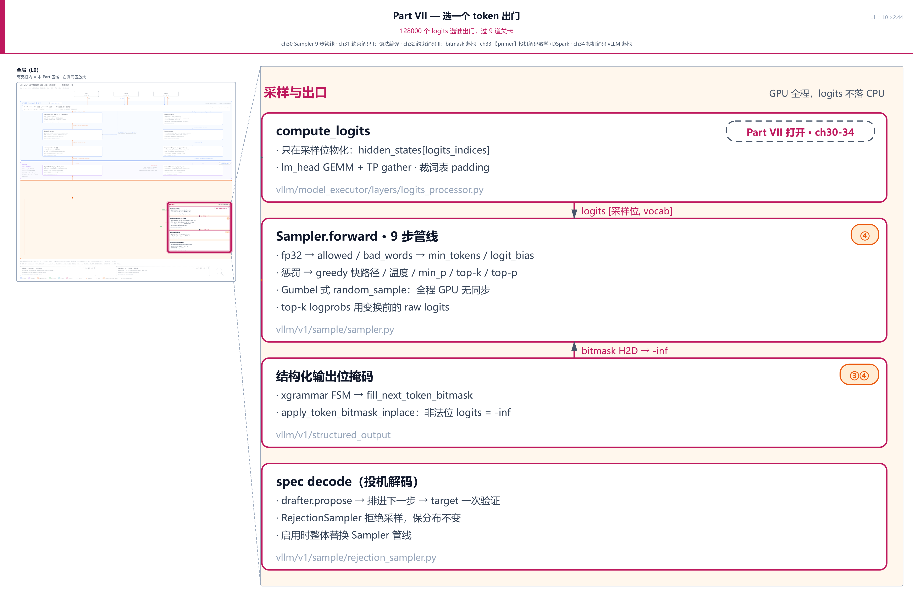

> *图注：本章位置看[第 1 章](../../ch01-vllm-v1-in-one-map/narrative/chapter.md) L0 全图右侧品红「采样与出口」列最下方的 spec decode（投机解码）块——写着「drafter.propose → 排进下一步 → target 一次验证」「RejectionSampler 拒绝采样，保分布不变」「启用时整体替换 Sampler 管线」，draft 的提议与一次验证正是本章后半的主角。上一块「结构化输出 · 位掩码」刚被[第 31 章](../../ch31-grammar-compilation/narrative/chapter.md)、[第 32 章](../../ch32-bitmask-enforcement/narrative/chapter.md)点亮。本章接在五块已读结构上：[第 30 章](../../ch30-sampler-pipeline/narrative/chapter.md)的 9 步采样管线（门口换轨成 RejectionSampler、bonus 位由普通 Sampler 先采好传入，都是它立的）；[第 30 章](../../ch30-sampler-pipeline/narrative/chapter.md)的 Gumbel 技巧与 raw 留底（残差采样与 draft 分布的直接前置）；[第 28 章](../../ch28-deepseek-v4-principles/narrative/chapter.md)的 MTP 第七件（DeepSeek 官方草稿器，谱系里的老成员）；[第 24 章](../../ch24-primer-attn-variants/narrative/chapter.md)的低秩压缩（Markov 头的账直接续用）；[第 19 章](../../ch19-compile-capture/narrative/chapter.md)的 CUDA graph（形状全等才能回放，调度一节的系统约束）。原理章没有站号：正文按推导链编排（周期与账 → 验证规则 → 无损 → $`\tau`$ → 谱系 → 并行之病 → DSpark 架构 → 置信度与调度 → 训练 → 落地），每一节是下一节的前置，按序读最顺。*

读法建议：只想知道「为什么白送还不丢质量」，直奔[「批改规则」](#批改规则抽签残差白送一位)与[「无损定理」](#无损定理两情形直证)两节；关心加速比怎么算、什么时候反而亏，看[「一趟周期」](#一趟周期三个杠杆一笔账)与[「τ 的账」](#τ-的账前缀存活的连乘阶梯)；想知道 DSpark 凭什么比 EAGLE 和 DFlash 都强，从[「并行的病」](#并行的病碰撞衰减与位一的杠杆)读到[「Markov 头」](#markov-头一张低秩转移表)；置信度怎么变成调度量，从[「置信度头」](#置信度头学会预测自己被收下的概率)读到[「落地」](#落地装好了哪一半没装哪一半)；想看 vLLM 代码长什么样，每节的源码片段可以单读。想跟全程，按序读。

### 符号速查表

后文会陆续引入记号，先列表备查；每个符号首次出现处，正文还会紧跟一句人话解释，不必现在死记。

| 符号 | 含义 | 首现 |
|---|---|---|
| $`\gamma`$ | draft 块长：一个投机周期里 drafter 一次猜的 token 数（DSpark 论文基准 7，DeepSeek-V4 生产 5） | 章首导语 |
| $`x_k`$ | draft 在位 $`k`$ 猜出的候选 token；$`x_0`$ 专指 anchor：上一周期 target 生成的最后一个 token | 批改规则 |
| $`p_k^{t}(x)`$ / $`p_k^{d}(x)`$ | target / draft 在位 $`k`$ 给 token $`x`$ 的概率：批改用的标准答案分布 / 草稿自己声明的把握 | 批改规则 |
| $`u`$ | 验证用的均匀随机数，$`u\in[0,1)`$、float64；判据写成 $`u<p_t/p_d`$ 时 $`\min(1,\cdot)`$ 自动隐含，代码里从不写 min | 批改规则 |
| $`r(x)=\max(0,\,p_t(x)-p_d(x))`$ | 残差分布（未归一化）：target 比 draft 多出来的概率质量，拒绝后从 $`\mathrm{norm}(r)`$ 补采 | 批改规则 |
| accepted / recovered / bonus | vLLM 术语：按原始概率关系收下的 token / 按残差分布补采的 token / 全收时白送的那位 | 批改规则 |
| $`\tau`$ | 期望接受长度：一个投机周期平均产出几个 token，全章优化目标（论文口径含 bonus） | 章首导语 |
| $`T_{\mathrm{draft}}`$ / $`T_{\mathrm{verify}}`$ | 一次 draft 阶段 / 一次 target 验证前向的实际耗时 | 周期与账 |
| $`L=(T_{\mathrm{draft}}+T_{\mathrm{verify}})/\tau`$ | 每 token 平均延迟（DSpark 论文 Eq.(1)），全章组织公式 | 周期与账 |
| $`\alpha_k`$ | 位 $`k`$ 的条件接受率：前缀全被接受时该位通过的概率，恒等于 $`1-\lVert p_k^{d}-p_k^{t}\rVert_1/2`$ | τ 的账 |
| $`U_k`$ | 并行骨干在位 $`k`$ 产出的 base logits：未加序列偏置的原始分数 | DSpark 两阶段 |
| $`B_k(x_{k-1},\cdot)`$ | 前缀依赖的转移偏置：知道前一个 token 实采是什么之后对位 $`k`$ logits 的修正，半自回归的全部「序列性」 | DSpark 两阶段 |
| $`B=W_1 W_2`$ | Markov 头的低秩分解（论文 Eq.(5)）：$`W_1\in\mathbb{R}^{V\times r}`$ 嵌入查表、$`W_2\in\mathbb{R}^{r\times V}`$ logit 投影 | Markov 头 |
| $`r`$（秩） | 低秩秩数，默认 256；与残差 $`r(x)`$ 同名不同物，按上下文区分 | Markov 头 |
| $`V`$ | 词表大小（DeepSeek 129280） | Markov 头 |
| $`H_{\mathrm{ctx}}`$ | 上下文特征（论文 Eq.(2)）：target 若干层隐状态沿特征维拼接后投影进 draft 隐空间 | 骨干的眼睛 |
| $`h_k`$ | 并行骨干在位 $`k`$ 的隐状态，置信度头的输入之一 | 置信度头 |
| $`c_k`$ | 置信度头输出（论文 Eq.(7)）：「前缀全被接受时位 $`k`$ 存活」的条件概率；论文记号，与 $`\alpha_k`$ 同一个量 | τ 的账（作 $`\alpha_k`$ 的论文记号） |
| $`c_k^{\ast}=1-\lVert p_k^{d}-p_k^{t}\rVert_1/2`$ | 解析接受率标签（论文 Eq.(8)）：置信度头受训逼近的真值，与批改准则期望同一条恒等式 | 置信度头 |
| $`a_k`$ / $`a_{r,j}`$ | 前缀存活概率：E[τ] 下标注里的无请求版 $`a_k=\prod_{i\le k}\alpha_i`$，调度排序用的请求版 $`a_{r,j}=\prod_{i\le j}c_{r,i}`$ | τ 的账 / 链式法则 |
| $`\ell_r`$ | 请求 $`r`$ 被调度的验证长度：准入几个 draft 位（$`0..\gamma`$）；无下标 $`\ell`$ 先在「排座位」一节露面（即代码里的 `num_draft_tokens`） | 排座位 / 硬件感知调度 |
| $`B`$（批量） | 一个验证步送进 target 的 token 总批量 $`B=\sum_r(1+\ell_r)`$；与转移偏置 $`B`$ 同名不同物 | 硬件感知调度 |
| $`\mathrm{SPS}(B)`$ | 引擎吞吐曲线（steps per second，每秒走几步）：引擎初始化时 profile 一次的成本表 | 硬件感知调度 |
| $`\Theta=\tau\cdot\mathrm{SPS}(B)`$ | 系统级期望 token 吞吐，调度器的最大化目标：把概率（$`\tau`$）与硬件（SPS）乘在一起 | 硬件感知调度 |
| $`w_k=\exp(-(k-1)/\gamma)`$ | 训练的位置权重：位越靠前权重越大，前缀验证下前位贡献期望接受长度更多 | 训练 |
| $`\mathcal{L}_{\mathrm{ce}}`$ / $`\mathcal{L}_{\mathrm{tv}}`$ / $`\mathcal{L}_{\mathrm{conf}}`$ | 训练三件套：交叉熵（猜对下一 token）/ 分布匹配（罚分布距离，直接最大化接受率）/ 置信度二元交叉熵；默认权重 0.1 / 0.9 / 1.0 | 训练 |

引用口径先立一条：本章引的 Eq.(1)–(12) 与 Fig./§ 号全部属于 DSpark 论文（arXiv:2607.05147）；无损证明的源头是 Leviathan et al. 2023（arXiv:2211.17192）与 Chen et al. 2023（arXiv:2302.01318），但证明本章自含直证，引用止于 arXiv 号与断言复述。另有一处版本事实要挑明：论文公版 HTML 共三处排版截断（Eq.(4)、RNN 头门控公式、附录 A 尾句），行文到每处会现地标注重构口径与证据。

还有一段环境交代，全章数值表通用。本章的数值推演来自按论文忠实复现的小型参考实现（NumPy、纯 CPU、无 GPU、不装 vLLM）在宿主机上的实跑输出，seed 全部固定，浮点 float64（64 位双精度）；64 条对拍测试全部通过（「对拍」＝两套独立算法各算一遍、互相对答案；后文高频出场的蒙特卡洛就是随机模拟，重复跑许多周期、用频率逼近期望，常拿去和闭式公式对拍）。表内数字一律按全精度计算后打印到所示位数、截断与四舍五入混排，拿打印出的低位中间量复算时末位可能差 1，属打印精度而非推导差异。三处差异先挑明：其一，延迟类数字（$`T_{\mathrm{draft}}=1`$ ms、$`T_{\mathrm{verify}}=8`$ ms）是玩具单位，只有比例有意义，论文的延迟占比（序列头 0.2%–1.3%）单独标注出处；其二，谱系杠杆曲线的端点取论文 Fig.2 的实测值、中间位是线性插值的示教构造；其三，vLLM 侧的证据（kernel 判据、布局算术、配置卫兵）一律引 `file:L` 行号锚点（已对源码工作树逐条核真），布局例的数值用 NumPy 原样复算源码 docstring 的算术并逐值断言相等。最后一条边界贯穿全章：DSpark 的**半自回归 drafter**已在 vLLM v0.27.1 落地，**置信度调度**那半还是论文侧蓝图（置信头权重随 checkpoint 到货但推理不接线），正文到每处都会明说。

---

## 一趟周期：三个杠杆一笔账

先把「慢」的病理写准，再开药。decode 每步前向要读两样东西：全部模型权重，和这个请求到目前为止的全部 KV cache。读这些数据花的带宽是固定的一份，产出却只有 1 个 token：批小的时候算术强度（每搬一份显存数据能摊到多少次计算）极低，GPU 的计算单元大量闲置，瓶颈在显存带宽（这类负载叫访存受限，memory-bound：快慢由搬数据的速度决定，不由算力决定）。朴素加速救不了单条请求：beam search 多养几条候选序列，每条还是一步一个 token；一次并行跑多条请求，单用户的延迟一点没变。

投机解码的改法是把「读一遍模型」的产出从一个 token 变成一串。一个周期分三段：drafter（草稿器）看着上下文一次猜 $`\gamma`$ 个候选 token；target 用**一次**前向把「上下文 + 这 $`\gamma`$ 个候选」整块读完，顺手得到每个位置上的下一词分布；拒绝采样拿这份分布逐位批改草稿，收下最长的一段正确前缀，再补一个 token。每周期至少产出 1 个 token（首拒位会补采、全收会白送），周期数有限，生成总能往前走。

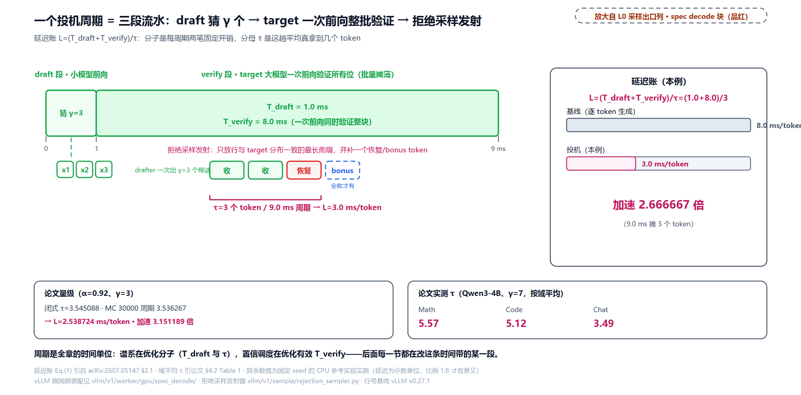

延迟怎么算？设每周期 draft 阶段耗时 $`T_{\mathrm{draft}}`$、验证那次 target 前向耗时 $`T_{\mathrm{verify}}`$、平均每周期产出 $`\tau`$ 个 token，则每 token 平均延迟是（DSpark 论文 §2.1 Eq.(1)，arXiv:2607.05147）：

```math
L=\frac{T_{\mathrm{draft}}+T_{\mathrm{verify}}}{\tau}.
```

分子是两个时间，分母是「这一趟平均真拿到几个」。直觉先立：快递员跑一趟仓库只取一个包裹是浪费，攒一车再跑一趟全取回，油钱摊到真正取到的包裹数上，$`\tau`$ 就是这趟平均真取到几个。这笔账马上给出本章全部内容的地图，因为它只有三个杠杆：**draft 更快**（压 $`T_{\mathrm{draft}}`$，谱系那一节的战场）、**draft 更准**（抬 $`\tau`$，半自回归架构与训练的战场）、**验证更聪明**（别把验证预算浪费在必死的位上，置信度调度的战场）。

拿玩具数字把账走一遍（单位是说明性的，只有比例有意义；基线是不投机、每 token 一次 target 前向的 8.0 ms）：

<!-- trace: ch33-m01 -->
| 场景 | $`\tau`$ | $`L=(T_{\mathrm{draft}}+T_{\mathrm{verify}})/\tau`$（ms/token） | 加速比（vs 8.0） | 判定 |
|---|---|---|---|---|
| 无投机基线 | 1（每周期 1 token） | 8.0 | 1.0 | 基线每 token 一次 target 前向 |
| 好 drafter | 3 | 3.0 | 2.666667 | 9.0 ms 摊到 3 个 token |
| 差 drafter | 1.2 | 7.5 | 1.066667 | 接受率掉下来接近白干 |
| 盈亏平衡 | 1.125 | 8.0 | 1.0 | $`\tau`$ 低于 1.125 纯亏 |
| 论文量级（恒定接受率 0.92、玩具 γ=3，闭式见「τ 的账」） | 3.545088（闭式）/ 3.536267（MC 30000 周期） | 2.538724 | 3.151189 | MC 与闭式对拍 |

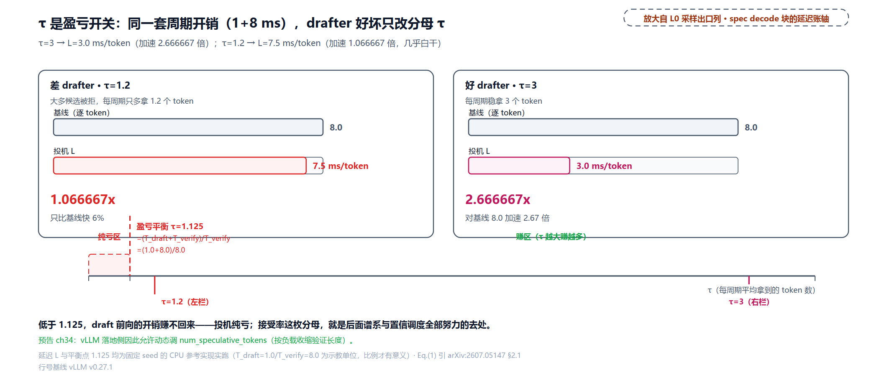

第三行是全章最重要的一句诚实账：**投机解码不是免费加速，是拿「draft 前向 + 多验的 token」赌「target 前向少跑几趟」**。赌输的下界清清楚楚。令 $`L=T_{\mathrm{verify}}`$（投机与不投机一样快），解出盈亏平衡点：

```math
\tau_{\mathrm{be}}=\frac{T_{\mathrm{draft}}+T_{\mathrm{verify}}}{T_{\mathrm{verify}}},
```

本例 $`(1+8)/8=1.125`$；$`\tau`$ 比它低，投机比不投机还慢。$`\tau`$ 由什么决定、怎么把它做大，就是接下来全部内容；论文实测的量级可以参照（Qwen3-4B、$`\gamma=7`$，Table 1）：DSpark 在数学任务平均 $`\tau\approx 5.57`$、代码 5.12、开放聊天 3.49，结构化任务天然好猜，聊天天然难猜，这个「数据侧的接受率差异」到调度一节会变成主角。

**伪码：一个投机周期**（本章伪码是教学骨架，语言近似 Python，不追求可运行）

```python
def speculative_cycle(context, drafter, target, gamma):
    x0 = target.last_token                          # anchor：上一周期 target 的最后一个输出
    draft = drafter(x0, gamma)                      # 一次出 γ 个候选（怎么出=谱系的事）
    logits = target.forward(context + draft)        # 一次前向，所有位的分布同时到手
    n_acc, out = verify_and_sample(logits, draft)   # 逐位抽签，首拒位残差回填（下两节）
    if n_acc == len(draft):
        out.append(target.sample(logits[-1]))       # 全收：白送 bonus
    return out                                      # 两种出口都 ≥1 个 token
```

它钉住两个不变量：每周期出口恒至少 1 个 token（生成单调前进、循环有限步终止）；$`\gamma`$ 个位的分布全部来自**同一次** target 前向（这是加速的物理来源，下一节把它拆开看）。

## 一次前向验证 γ 个位：排座位的算术

「target 一次前向验证所有候选」这句口号，落到代码里到底是什么？答案平淡得让人安心：**只是切片索引的算术**。target 本来就能在一次前向里对任意多个输入位各算一份 logits（prefill 一直就是这么干的）；投机解码做的事，是让每个请求在本步多占几个输入位，前 $`\ell`$ 个放 draft 候选（$`\ell`$ 就是这个请求本步的 draft 位数，代码里的 `num_draft_tokens`）、最后 1 个是 bonus 位（草稿全对时白送的那位采样），一次前向后从展平的 logits 里把每个请求的这些位切出来。

v0.27.1 的布局账本在 `_calc_spec_decode_metadata`，docstring 自带一个数值例（这就是下面的 worked example，NumPy 逐值复算断言相等）：

```python
# vllm/v1/worker/gpu_model_runner.py:L2851-L2914 · _calc_spec_decode_metadata（docstring 算术）
    def _calc_spec_decode_metadata(
        self,
        num_draft_tokens: np.ndarray,
        cu_num_scheduled_tokens: np.ndarray,
    ) -> SpecDecodeMetadata:
        # Inputs:
        # cu_num_scheduled_tokens:  [  4, 104, 107, 207, 209]
        # num_draft_tokens:         [  3,   0,   2,   0,   1]
        # Outputs:
        # cu_num_draft_tokens:      [  3,   3,   5,   5,   6]
        # logits_indices:           [  0,   1,   2,   3, 103, 104, 105, 106,
        #                            206, 207, 208]
        # target_logits_indices:    [  0,   1,   2,   5,   6,   9]
        # bonus_logits_indices:     [  3,   4,   7,   8,  10]
        # … 省略：三步 repeat/arange 构造与 async H2D 传输（见下表逐值复算）…
        # Compute the draft token ids.
        # draft_token_indices:      [  1,   2,   3, 105, 106, 208]
        draft_token_ids = self.input_ids.gpu[logits_indices]
        draft_token_ids = draft_token_ids[target_logits_indices + 1]
```

五个请求各带 3 / 0 / 2 / 0 / 1 个 draft 位（第二个、第四个请求本步没有草稿，只占 1 个 bonus 位）。全部账目：

<!-- trace: ch33-m18 -->
| 量 | 算式 | 输出（复算） |
|---|---|---|
| num_sampled | num_draft+1 | [4, 1, 3, 1, 2] |
| cu_num_sampled | cumsum | [4, 5, 8, 9, 11] |
| logits_indices（展平采样位） | repeat(cu−num_sampled, num_sampled)+arange | [0, 1, 2, 3, 103, 104, 105, 106, 206, 207, 208] |
| bonus_logits_indices | cu_num_sampled−1 | [3, 4, 7, 8, 10] |
| target_logits_indices（draft 验证位） | repeat+arange（按 num_draft） | [0, 1, 2, 5, 6, 9] |
| draft_token_ids | input_ids[logits_indices][target+1] | [1, 2, 3, 105, 106, 208] |
| req0 读法 | 采样位 [0, 1, 2, 3] | target 位 [0, 1, 2] + bonus 位 [3] |
| req2 读法 | 采样位 [104, 105, 106] | target 位 [104, 105] + bonus 位 [106] |

![一次前向验证＝展平 logits 里的交错排座：cu=[4,104,107,207,209]/num_draft=[3,0,2,0,1] 时 11 个采样位各就各位，每段末位是 bonus、前段是 draft 验证位；底部反取账：draft 验证位 [0,1,2,5,6,9] 各 +1 反取输入序列得 draft_token_ids=[1,2,3,105,106,208]](../diagrams/ch33-fig-verify-layout.png)

三个读法值得停一下。第一，`logits_indices` 严格递增、按请求分段连续、段长恰为 num_draft+1：一次前向的 logits 切片把 11 个采样位无重无漏地覆盖。第二，`draft_token_ids` 的取法是「验证位 k 的输入 token 的下一位」，target 前向在位 k 的 logits 预测的正是 k+1 号 token，所以这份索引恰好把「每位该批改哪个候选」还原出来。第三，draft 位与 bonus 位在展平数组里交错混排，kernel 靠 `target_logits_indices` 与 `bonus_logits_indices` 两张下标表区分两种身份。这就是「验证是并行的」的全部秘密：**verify 不需要 $`\gamma`$ 次前向，也不需要额外读一遍模型，多出来的只是输入位和索引表**。诚实的另一半也记下：输入位变多，target 前向的算量与访存量确实变大（MoE 目标还要多读若干专家），高并发下这些多余位会挤占批容量，这笔账先挂在这，调度一节回来收。

## 批改规则：抽签、残差、白送一位

现在走到批改本身。先给这套规则一个来历：它就是统计学里用了七十多年的**拒绝采样**（rejection sampling）——想从难采的分布 $`p`$ 里抽样，就从好采的提议分布 $`q`$ 里抽一个 $`x`$，再按概率 $`\min(1,\,p(x)/q(x))`$ 决定收不收，收下的样本严格服从 $`p`$，归功于冯·诺依曼（[维基条目](https://en.wikipedia.org/wiki/Rejection_sampling)）。2022 年底到 2023 年初，Google（Leviathan et al.，arXiv:2211.17192，vLLM 代码注释自引的就是这篇）与 DeepMind（Chen et al.，arXiv:2302.01318）两组人把它搬进解码循环：提议分布换成小 draft 模型、目标分布换成大模型，一遍前向同时给整块草稿打分。「投机」这个词则借自 CPU 的投机执行：分支预测器提前猜着往下跑，猜错了就冲刷流水线回滚，drafter 猜、target 验、首拒即弃，对应得严丝合缝。

规则四条，逐条给直觉再给数学（记号：位 $`k`$ 上 draft 分布 $`p_k^{d}`$、target 分布 $`p_k^{t}`$，draft 采出候选 $`x_k`$）：

**其一，逐位抽签。** 位 $`k`$ 以概率收下 $`x_k`$（DSpark 论文 §2.1）：

```math
\Pr[\mathrm{accept } x_k]=\min\!\left(1,\ \frac{p_k^{t}(x_k)}{p_k^{d}(x_k)}\right).
```

直觉：target 比 draft 更看好这个 token（比值超过 1）就必收；draft 比 target 更看好（比值小于 1），就按比值抽签，draft 报得越虚，签越难中。

**其二，左到右、首拒即停。** 验证从位 1 走到位 $`\gamma`$，第一个被拒的位之后整段丢弃，无论后面猜得多好。这不是性能取舍，是语义：位 $`k+1`$ 的验证必须条件于「位 $`k`$ 真的成了上文」，前缀断了后面就没有合法性可言。

**其三，残差回填。** 首拒位不空手，target 从**残差分布**补采一个 token（这就是 vLLM 术语里的 recovered）：

```math
r(x)=\max\!\left(0,\ p_k^{t}(x)-p_k^{d}(x)\right),\qquad x_{\mathrm{recovered}}\sim \mathrm{norm}(r).
```

直觉：$`r`$ 是「target 想要、draft 没给」的那部分概率质量，逐坐标裁剪正部。它为什么恰好能把账补平，下一节的定理回答。

**其四，白送一位。** 全收时再从 target 分布采第 $`\gamma+1`$ 位（bonus token）。它是个普通的 target 采样步，不参与抽签。

拿一组两位词表的手算把四条规则全走一遍（$`p_t=(0.7,0.3)`$、$`p_d=(0.5,0.5)`$，draft 提三个 A，target 三行的分布各异，seed 固定到「位 2 拒绝」的位型；下表与下一张图的位号从 0 起给 draft 候选编号，对应正文记号的位 $`1..\gamma`$，anchor $`x_0`$ 不占行）：

<!-- trace: ch33-m02 -->
| 位 k | token | $`p_t(x)`$ | $`p_d(x)`$ | 比值 $`p_t/p_d`$ | $`u`$（seed=2） | 判定/去向 |
|---|---|---|---|---|---|---|
| 0 | A | 0.7 | 0.5 | 1.4 | 0.261612 | 接受（min(1,1.4)=1.0 必收） |
| 1 | A | 0.65 | 0.5 | 1.3 | 0.298491 | 接受（min(1,1.3)=1.0 必收） |
| 2 | A | 0.4 | 0.5 | 0.8 | 0.814226 | 拒绝（$`u\ge 0.8`$）→残差 norm(0.0, 1.0) 恢复 B、其后丢弃 |
| 残差（位 2 行） | — | max(0, $`p_t-p_d`$) | (0.0, 0.1) → norm (0.0, 1.0) | — | — | 恢复 token 恒为 B |
| 全收位型（seed=0） | 3 位全过 | — | — | — | — | 追加 bonus：从 target 第 4 行 (0.7,0.3) 采出 A，本周期发射 4 个 token |

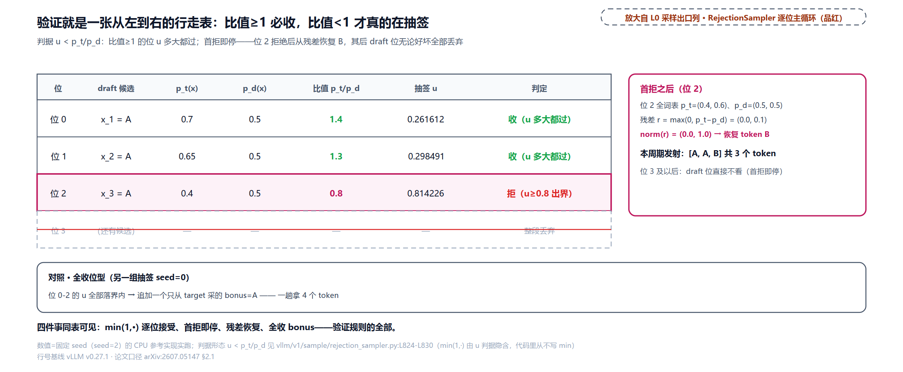

> *图注：左侧行走表是三个 draft 位各自的抽签现场：位 0 与位 1 的概率比 1.4 和 1.3 都越过 1，抽签区整段是必收区；位 2 比值 0.8，均匀随机数 $`u=0.814226`$ 落在区外被拒。右侧首拒面板是残差的构造与回填：位 2 行的 $`p_t-p_d`$ 逐坐标裁剪正部得 (0.0, 0.1)，归一化后 (0.0, 1.0)，恢复 token 恒为 B；位 3 起的 draft 候选全部作废。底部对照条是另一条时间线（seed=0）：三位全收，bonus 位从 target 分布采出 A，本周期一次发射 4 个 token。*

残差的构造值得单独看一张图，「裁剪正部」这个动作在两组分布上各走一遍，顺便把一个恒等式钉在眼前：拒绝总质量（draft 多报的那部分）与残差总质量（target 多要的那部分）是**同一个数**，都等于 $`\lVert p_t-p_d\rVert_1/2`$。两组分布的正负偏差总和必然相等，因为两个分布都归一，这条对账下一节证明无损时是承重墙。

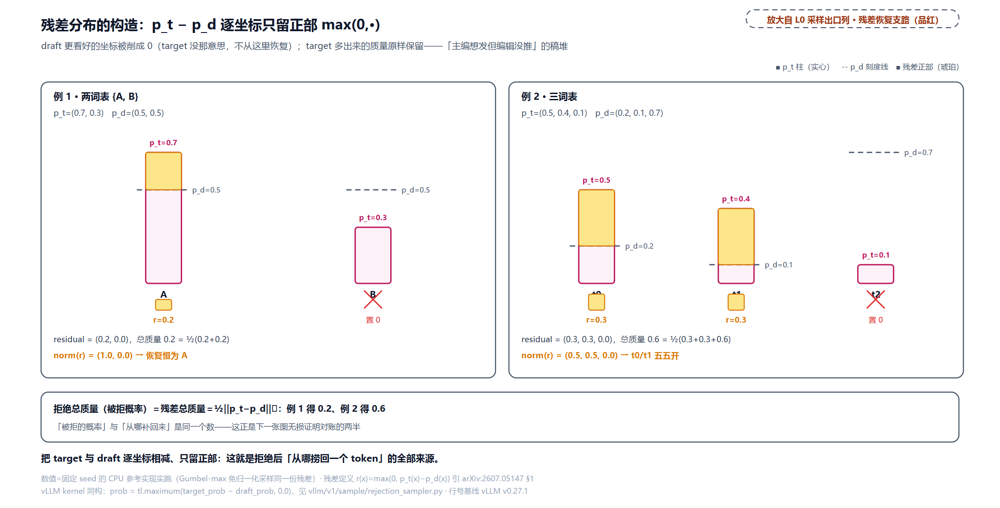

补采怎么落地？残差分布没有归一化，先算分母 $`Z=\sum_x r(x)`$ 再按比例抽样是教科书做法，但 vLLM 不算这个分母。[第 30 章](../../ch30-sampler-pipeline/narrative/chapter.md)立过 Gumbel-max 定理的指数噪声形式：取独立 $`E_x\sim\mathrm{Exp}(1)`$，则 $`\arg\max_x\ \pi(x)/E_x`$ 恰按 $`\mathrm{norm}(\pi)`$ 落位，除以正数不改变 argmax，分母在 argmax 下根本不用算。残差采样是同一定理的第二次使用，只是把 $`\pi`$ 换成 $`r`$：

```python
# vllm/v1/sample/rejection_sampler.py:L913-L952 · sample_recovered_tokens_kernel 循环体（节选）
        else:
            draft_prob = tl.load(
                draft_probs_ptr + token_idx * vocab_size + vocab_offset,
                mask=vocab_mask, other=0.0,
            )
            target_prob = tl.load(
                target_probs_ptr + token_idx * vocab_size + vocab_offset,
                mask=vocab_mask, other=0.0,
            )
            prob = tl.maximum(target_prob - draft_prob, 0.0)     # L930 残差：逐坐标正部
            # NOTE(woosuk): We don't need `prob = prob / tl.sum(prob)` here because
            # `tl.argmax` will select the maximum value.                # L931-L932 免归一化
        inv_q = tl.load(
            inv_q_ptr + req_idx * vocab_size + vocab_offset,      # E~Exp(1) 的倒数
            mask=vocab_mask, other=0.0,
        )
        # … 省略：分块 tile 归约，词表外的位填 −inf 防越界 …
        score = prob * inv_q                                       # L944 r(x)/E_x
        local_max, local_id = tl.max(score, axis=0, return_indices=True)
```

`score = prob * inv_q` 一行就是全部：乘上指数噪声的倒数、取 argmax，等价于从 $`\mathrm{norm}(r)`$ 抽样，$`Z`$ 从头到尾没算过。

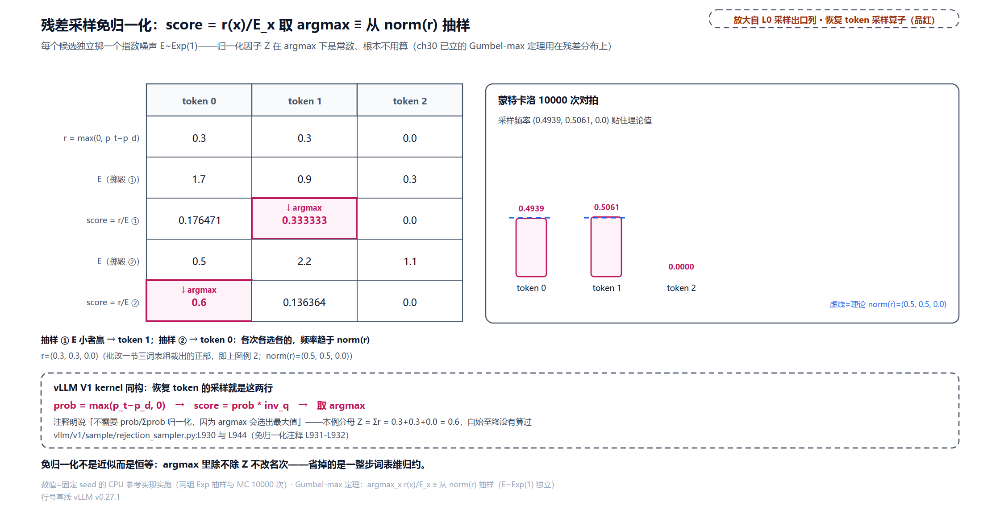

> *图注：同一份残差 $`r=(0.3,\,0.3,\,0.0)`$（上一图三词表组裁出的形态）喂给两组独立的指数噪声：第一组 $`E=(1.7,\,0.9,\,0.3)`$ 算出 scores $`(0.176471,\,0.333333,\,0.0)`$、argmax 落 token 1；第二组换一份噪声 $`E=(0.5,\,2.2,\,1.1)`$、scores $`(0.6,\,0.136364,\,0.0)`$、argmax 翻到 token 0，「按 norm(r) 抽样」的随机性全在噪声里，归一化分母 $`Z=0.6`$ 自始至终没有算过；一万次蒙特卡洛的采样频率 $`(0.4939,\,0.5061,\,0.0)`$ 贴住理论值 $`\mathrm{norm}(r)=(0.5,\,0.5,\,0.0)`$（下带虚线框把它连回 V1 kernel 的两行：`prob = max(p_t−p_d, 0)` 与 `score = prob * inv_q`）。与[第 30 章](../../ch30-sampler-pipeline/narrative/chapter.md)的掷骰是同一条 Gumbel-max 定理：那边采 $`\mathrm{norm}(p)`$，这边采 $`\mathrm{norm}(r)`$。*

接受判据那边还有一个反直觉的细节：代码里**没有 min**。V1 kernel 的判据是

```python
# vllm/v1/sample/rejection_sampler.py:L805-L837 · rejection_random_sample_kernel 主循环（节选）
    for pos in range(num_draft_tokens):
        if not rejected:
            draft_token_id = tl.load(draft_token_ids_ptr + start_idx + pos)
            uniform_prob = tl.load(uniform_probs_ptr + start_idx + pos)
            if draft_token_id < 0:
                # -1 is used for padded draft token ids that should be rejected.
                accepted = False                                    # L814 padding 位直接拒
            elif SYNTHETIC_MODE:
                rate = tl.load(synthetic_conditional_rates_ptr + pos)
                accepted = uniform_prob < rate                      # L818 测试模式：注入接受率
            else:
                if NO_DRAFT_PROBS:
                    draft_prob = 1                                  # greedy：q 按 one-hot
                else:
                    draft_prob = tl.load(
                        draft_probs_ptr + (start_idx + pos) * vocab_size + draft_token_id
                    )
                target_prob = tl.load(
                    target_probs_ptr + (start_idx + pos) * vocab_size + draft_token_id
                )
                # NOTE(woosuk): While the draft probability should never be 0,
                # we check it to avoid NaNs. If it happens to be 0, we reject.
                accepted = draft_prob > 0 and target_prob / draft_prob >= uniform_prob  # L829
            if accepted:
                token_id = draft_token_id
            else:
                rejected = True                                     # 首拒即停：后续位不再访问
                token_id = tl.load(recovered_token_ids_ptr + start_idx + pos)
```

L829 写的是 $`p_t/p_d \ge u`$，没有 $`\min(1,\cdot)`$。为什么敢省？因为 $`u`$ 从均匀分布 $`[0,1)`$ 里来、永远小于 1：比值大于等于 1 时这个不等式恒成立，「必收」自动实现，数学上的 min(1,·) 由 $`u`$ 的取值范围隐式完成。另一个细节在 L814：填充位（没有草稿的位）token id 是 −1，直接拒绝。而 L817-L818 的 `SYNTHETIC_MODE` 是测试旋钮，把「接受率」当可配置量直接注入 kernel，绕过真实分布，它的用法到 $`\tau`$ 那节再说。

V2 的 DSpark 路径换了一副数值姿态：判据在对数空间（`vllm/v1/worker/gpu/spec_decode/rejection_sampler_utils.py:L587-L626`），写法是 `target_logprob > tl.log(u) + draft_logprob`，即 $`\log p(x) > \log u + \log q(x)`$，与 $`p(x) > u\,q(x)`$ 逐点等价；逐块局部 max/sumexp 在线归算，全程不物化整行 softmax，免下溢。残差侧同样换到对数空间，还多了一层数值稳定的手艺：

```python
# vllm/v1/worker/gpu/spec_decode/rejection_sampler_utils.py:L720-L773 · _resample_kernel 残差三形态（节选）
    if is_bonus:
        # Bonus token (no rejections). Directly use the target logits.
        residual_logits = target_logits                               # L724 bonus：无残差概念
    elif HAS_DRAFT_LOGITS:
        # … 省略：载入 draft logits 与两侧 logsumexp …
        target_log_probs = target_logits - target_lse
        # … 省略：USE_BLOCK_VERIFICATION 的块残差分支（旁路协议，一句话见正文）…
        draft_log_probs = draft_logits - draft_lse
        # Compute the residual:   r(x) = max(p(x) - q(x), 0)
        # Gumbel sampling needs logits, so we compute it in log space:
        #   log(r(x)) = log(max(exp(log_p(x)) - exp(log_q(x)), 0))
        # The more numerically stable form is:
        #   log(max(exp(a) - exp(b), 0)) = a + log(max(1 - exp(b - a), 0))
        ratio = tl.exp(draft_log_probs - target_log_probs)
        residual_logits = tl.where(
            ratio < 1.0,
            target_log_probs + tldevice.log1p(-ratio),                # L755-L759 log1p 稳定式
            float("-inf"),
        ).to(tl.float32)
    else:
        # One-hot draft. The residual is just the target distribution with
        # the rejected draft token probability zeroed out.
        rejected_draft_token = tl.load(draft_sampled_ptr + resample_token_idx + 1)
        residual_logits = tl.where(
            block != rejected_draft_token,                            # L768-L772 one-hot 残差
            target_logits,
            float("-inf"),
        ).to(tl.float32)
```

两处值得停。其一，`a + log1p(-exp(b-a))` 这个变形避开了「两个接近的概率相减」的灾难性消去：浮点里直接算 $`p(x)-q(x)`$，两个小概率高位丢失后残差可能变成噪声；换到对数空间用 `log1p`，精度保住了。其二，残差有三形态：bonus 位直接用 target logits（没有拒绝就没有残差）；有 draft 分布时按上式算；greedy 草稿（draft 分布是 one-hot）时残差就是「把被拒的那个 token 位挖掉的 target 分布」，挖掉一位的 $`p_t`$ 归一后恰好是理论要求的 $`\mathrm{norm}(\max(0,\,p_t-\mathrm{one-hot}))`$。中间省略的 `USE_BLOCK_VERIFICATION` 分支是验证协议的另一个家族（块级并行接受，Sun et al. 2024），vLLM 把它做成 kernel 里的常量分支，与本章主线的逐位串行接受是两种协议，一句话点到，全景归下一章。

最后把 vLLM 的术语表立正，后文不再解释：

```python
# vllm/v1/sample/rejection_sampler.py:L38-L59 · RejectionSampler docstring（术语表）
class RejectionSampler(nn.Module):
    """
    The implementation strictly follows the algorithm described in
        https://arxiv.org/abs/2211.17192.
    However, we want to clarify the terminology used in the implementation:
    accepted tokens: tokens that are accepted based on the relationship
            between the "raw" draft and target probabilities.
    recovered tokens: tokens that are sampled based on the adjusted probability
        distribution, which is derived from both the draft and target
        probabilities.
    bonus tokens:
        If all proposed tokens are accepted, the bonus token is added to the
        end of the sequence. The bonus token is only sampled from the target
        probabilities. We pass in the bonus tokens instead of sampling them
        in the rejection sampler to allow for more flexibility in the
        sampling process. For example, we can use top_p, top_k sampling for
        bonus tokens, while spec decode does not support these sampling
        strategies.
    output tokens:
        Tokens are finally generated with the rejection sampler.
        output tokens = accepted tokens + recovered tokens + bonus tokens
    """
```

三个名字对应三种来路：accepted 是抽签收下的、recovered 是残差补采的、bonus 是白送的。注意 bonus 被特意留在拒绝采样器**外面**采：它由普通 Sampler 先采好传入（[第 30 章](../../ch30-sampler-pipeline/narrative/chapter.md)门口见过这个组合），这样 top_p、top_k 这些截断采样能力在 bonus 位上得以保留，投机位不支持截断，白送位支持，这是 spec 采样语义收窄清单里少数被保住的口子（完整清单下一章对账）。

**伪码阶梯：批改一个周期**（从只抽签到完整版，三步长出来）

```python
# sec1 基础：逐位抽签，先不管拒绝之后干什么
def verify_v1(logits_t, draft, p_d):
    out, probs = [], softmax_rows(logits_t)
    for k, x in enumerate(draft):
        if rng.uniform() < min(1.0, probs[k][x] / p_d[k][x]):
            out.append(x)                      # 收下
        else:
            break                              # 首拒即停（产出暂时少 1 个，sec2 修）
    return out

# sec2 加残差：拒绝不空手，从 norm(max(0, p_t−p_d)) 补采一位
def verify_v2(logits_t, draft, p_d):
    out = []
    for k, x in enumerate(draft):
        if rng.uniform() < min(1.0, p_t[k][x] / p_d[k][x]):
            out.append(x)
        else:
            r = maximum(p_t[k] - p_d[k], 0.0)          # 残差，未归一化
            out.append(gumbel_argmax(r))               # 免归一化采样：argmax r(x)/E_x
            return out                                  # 本周期到此为止
    return out                                          # 全收：落到 sec3

# 完整：全收白送 bonus
def verify_v3(logits_t, draft, p_d):
    out = verify_v2(logits_t, draft, p_d)
    if len(out) == len(draft):                         # v2 至多收 γ 位，恰=γ 即全收
        out.append(target_sample(logits_t[-1]))        # bonus：普通 target 步
    return out
```

阶梯钉住的不变量：判据恒为 $`u<\min(1,\,p_t/p_d)`$（sec1 的形式）；首拒位之后 draft 的任何位不再被读（v1 kernel 的 `rejected` 早退同构）；每周期产出 = 接受数 + 1（多出的那个要么是 recovered 要么是 bonus）。

## 无损定理：两情形直证

现在回答全章最值钱的问题：这套「抽签 + 残差 + 白送」的把戏，为什么一个比特的质量都不丢？命题：**单位置上，输出 $`y`$ 的分布恒等于 target 分布 $`p`$**，无论 draft 分布 $`q`$ 长什么样（只要它在采出 $`x`$ 的地方有定义；本节起单位置推导把 $`p_k^{t}`$、$`p_k^{d}`$ 简写作 $`p`$、$`q`$——$`p`$ 是 target 的标准答案、$`q`$ 是 draft 的自报把握）。

证明只有两行代数，按 $`p(x)`$ 与 $`q(x)`$ 谁大分两种情形。输出 $`y=x`$ 有两条来路：抽签收下（概率 $`q(x)\cdot\min(1,\,p(x)/q(x))`$），或抽签拒了别人、残差轮到 $`x`$（概率 = 拒绝总概率乘残差占比）。逐 token 展开：

```math
\Pr[y=x]=\underbrace{\min\!\big(q(x),\,p(x)\big)}_{\mathrm{accept}}\;+\;\underbrace{\max\!\big(0,\,p(x)-q(x)\big)}_{\mathrm{residual}},
```

拒绝的总概率与残差总质量是同一个数（正负偏差总和相等——两个分布都归一）：

```math
\underbrace{\sum_{x'}\max\!\big(0,\,q(x')-p(x')\big)}_{\mathrm{rejection}}
=\tfrac{1}{2}\lVert p-q\rVert_1
=\underbrace{\sum_{x'}\max\!\big(0,\,p(x')-q(x')\big)}_{\mathrm{residual}},
```

所以残差段那句「拒绝总概率乘残差占比」可以约成 $`\max(0,\,p(x)-q(x))`$。现在分情形：

- 若 $`p(x)\ge q(x)`$：接受段 $`=q(x)`$，残差段 $`=p(x)-q(x)`$，两段相加 $`=p(x)`$；
- 若 $`p(x)<q(x)`$：接受段 $`=q(x)\cdot(p(x)/q(x))=p(x)`$，残差段 $`=0`$，和仍 $`=p(x)`$。

两情形都归到 $`p(x)`$，单位置分布复原。整条序列靠归纳：位 $`k`$ 的验证条件于「前缀已被接受」这个事件，而首拒即停保证被拒之后没有后续位，所以逐位条件分布都是 $`p_k^{t}`$，联合分布就是 target 的自回归分布。bonus 位不破坏等式，它就是一次普通的 target 采样步。这就是论文 §1 那句「接受规则精确保持目标分布」的全部内容（完整证明源头是 Leviathan et al. 2023，arXiv:2211.17192；上面是自含直证）。

拿三词表的一组数把两情形铺开（$`p=(0.5,0.4,0.1)`$、$`q=(0.2,0.1,0.7)`$，token 2 是「draft 高看、target 低看」的情形，token 0、1 反之）：

<!-- trace: ch33-m03 -->
| token x | min(q,p)(x)（接受段） | max(0,p−q)(x)（残差段） | 两段之和 | 对拍 p(x) |
|---|---|---|---|---|
| 0 | 0.2 | 0.3 | 0.5 | 0.5 ✓ |
| 1 | 0.1 | 0.3 | 0.4 | 0.4 ✓ |
| 2 | 0.1 | 0.0 | 0.1 | 0.1 ✓ |
| 合计 | 0.4（=接受质量 Σmin） | 0.6（=残差质量） | 拒绝质量 Σmax(0,q−p)=0.6 与之对冲 | ½‖p−q‖₁=0.6，两半恰好相等 |
| (A,B) 组同账 | 0.8 | 0.2 | 拒绝质量 0.2=½‖·‖₁ 0.2 | $`p_t=(0.7,\,0.3)`$ ✓ |
| greedy 特例（one-hot q） | 0.7 | 0.3 | 接受率更低（0.7 vs 0.8） | 端到端对拍（400 token 过完整投机管线）与 target greedy rollout 逐位相同=YES |
| 概率化草稿端到端对拍（bigram 对拍） | — | — | 经验条件分布与 target 行的最大偏差 ≤ 0.024138 | 每周期发射−接受恒=1（3.686004−2.686004=1：恢复/bonus） |

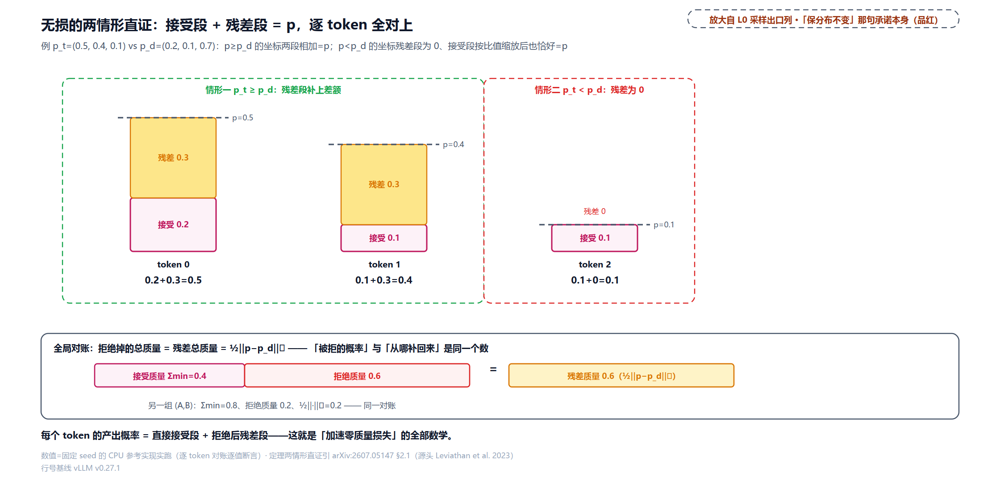

表里两行「端到端对拍」是参考实现的整线检查：把一整条 400 token 的生成过一遍完整的投机管线，greedy 草稿下输出与「直接对 target 做贪心解码」逐位相同；概率化草稿（$`q_k=0.8\times`$ target 行 $`+0.2\times`$ 均匀）下 4000 token 的 bigram 条件分布与 target 行的最大偏差 0.024138，抽样噪声级。定理不是渐近近似，是逐位精确。

两个特例顺手续上。**greedy 特例**：draft 恒取 argmax，$`q`$ 退化成 one-hot（独热：全部概率押在一个 token 上）——位 $`x`$ 的接受概率变成 $`p(x)`$ 本身（比值只在 argmax 位有意义），残差把 argmax 位挖干净，输出分布仍是 $`p`$。这解释了为什么 vLLM 的草稿默认敢用贪心：**草稿怎么打只影响接受率，不影响输出分布**，分布正确性由拒绝采样兜底（「greedy 与 probabilistic 两种活法」那节展开）。**target 也贪心的特例**：$`p`$ 也成 one-hot 时，draft 提中 target 的 argmax 必收（比值大于等于 1）、提别的必拒且残差全在 argmax 位，输出恒等于 target 的 argmax，greedy 请求投机起来连随机数都不用掷。

还有一条要现在立正的推论，后面调度一节靠它承重：**任何影响「哪些草稿位被送去验证」的决策，本身也是采样过程的一部分**。单位置定理的前提是「draft 的提议与判据只依赖 $`p`$、$`q`$ 与独立随机数」；如果验证名单的取舍偷偷依赖了草稿 token 自己的值，选择偏好就会漏进输出分布。这句话先放在这，「名单必须先定死」一节给它一个具体的反例数字。

## τ 的账：前缀存活的连乘阶梯

$`\tau`$ 是 Eq.(1) 的分母、全部优化的靶心，先把它的账算清。设位 $`k`$ 的**条件接受率**为 $`\alpha_k`$（前缀 1..k−1 全被接受时，位 $`k`$ 通过验证的概率）。首拒即停的语义决定了这是一串炮仗：每一响都得前一响真的炸了才轮得到，第 $`k`$ 响响掉的概率是前 $`k`$ 个引线成功率的连乘。每周期产出的期望（DSpark 论文口径含 bonus，脚注 4）：

```math
\mathbb{E}[\tau]
=1+\sum_{k=1}^{\gamma}\underbrace{\prod_{i\le k}\alpha_{i}}_{a_k}.
```

直觉拆开：保底的 1 是「首拒位补采的那个 token 或全收时的 bonus」，永远拿得到；后面每级阶梯 $`a_k`$ 是「活到第 $`k`$ 位并且又过了」的期望增量。恒定 $`\alpha`$ 时闭式是几何级数 $`(1-\alpha^{\gamma+1})/(1-\alpha)`$。手算 $`\alpha=0.8`$、$`\gamma=3`$：三级阶梯 $`[0.8,\ 0.64,\ 0.512]`$，$`\mathbb{E}=1+1.952=2.952`$，与闭式、三万周期蒙特卡洛对拍：

<!-- trace: ch33-m04 -->
| α 曲线 | 逐位 α | 前缀存活 a=∏α | E[τ]=1+Σa | 读法 |
|---|---|---|---|---|
| 恒定（教科书式） | [0.8, 0.8, 0.8] | [0.8, 0.64, 0.512] | 2.952（闭式同值 2.952；MC 2.954967） | 每周期约 3 个 token；α=1 时上限 4.0（本行 γ=3 教科书例；中间三行 γ=4——端点论文实测、中间位线性插值的示教构造） |
| EAGLE3 Chat（浅自回归·回升） | [0.53, 0.6, 0.67, 0.74] | [0.53, 0.318, 0.21306, 0.157664] | 2.218724 | 后段回升救不回前缀损失 |
| DFlash Chat（深并行·衰减） | [0.72, 0.69, 0.66, 0.63] | [0.72, 0.4968, 0.327888, 0.206569] | 2.751257 | 位 1 高被后位复利放大，总 τ 反超 |
| 位 1 杠杆（换头实验） | [0.72, 0.6, 0.67, 0.74] | — | 2.655626（+0.436901） | 只把首位 0.53 换成 0.72，其余不动 |
| 互推（vLLM synthetic 同构） | c=[0.8, 0.9, 0.5] | a=[0.8, 0.72, 0.36] | 逆向 $`a_i/a_{i−1}`$ 还原 [0.8, 0.9, 0.5] | 往返恒等；a 单调不增 |
| 除零守卫 | — | a=[0.5, 0.0, 0.3] | c=[0.5, 0.0, 0.0] | 前位 0 → 该位 0 |

![τ=前缀存活连乘阶梯+保底 1：α=0.8 三级阶梯 [0.8, 0.64, 0.512]，E[τ]=1+Σa=2.952=闭式 (1−0.4096)/0.2，MC 三万周期 2.954967 对拍；保底的 1=恢复或 bonus](../diagrams/ch33-fig-survival-ladder.png)

中间三行是这张表最有嚼头的地方，先按下（谱系两节专门讲），只点一对数字：把 EAGLE3 曲线的首位从 0.53 换成 0.72、其余三位不动，$`\tau`$ 从 2.218724 涨到 2.655626（+0.436901）；另一端，把 DFlash 的衰减尾 $`[0.69,\ 0.66,\ 0.63]`$ 整体换成 EAGLE3 的回升尾 $`[0.6,\ 0.67,\ 0.74]`$，$`\tau`$ 只动 0.095631（2.751257→2.655626）——两条改动殊途同归，都落在表的杠杆行 $`[0.72,\ 0.6,\ 0.67,\ 0.74]`$ 上。**换首位一个位的收益，比后三位曲线形状的总影响还大**：前缀验证是复利结构，首位被拒全块作废，位 1 的杠杆最大。

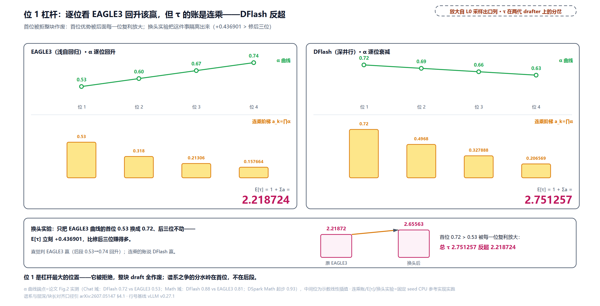

「前缀存活」与「逐位条件」是同一笔账的两个方向，链式法则互相换算（论文 §3.2.2 的方向是左到右，从条件置信乘到累积存活；式中的 $`c_i`$ 就是前面的条件接受率 $`\alpha_i`$，论文记号叫条件置信，置信度头一节正式请它出场）：

```math
a_k=\prod_{i\le k}c_i
\qquad\Longleftrightarrow\qquad
c_k=\frac{a_k}{a_{k-1}}\ (a_0=1).
```

vLLM 把逆方向做成了一个四行的工具函数，给合成测试模式用：

```python
# vllm/v1/spec_decode/utils.py:L598-L601 · unconditional_to_conditional_rates
def unconditional_to_conditional_rates(rates: list[float]) -> list[float]:
    """Convert per-position unconditional rates to per-position conditional
    rates for the early-terminating rejection loop (c_i = p_i / p_{i-1})."""
    return [p / q if q > 0.0 else 0.0 for p, q in zip(rates, [1.0, *rates[:-1]])]
```

批改一节里 kernel 的 `SYNTHETIC_MODE` 分支吃的就是这份条件率：测试时不想真跑 draft 模型，配置层直接给一组「每位置累积（无条件）率」，`vllm/config/speculative.py:L255-L282` 校验取值域并要求这组累积率单调不增，再拆成条件率注入逐位判据（`rejection_sample_method='synthetic'` 打开）。docstring 里的 $`p_i`$ 是代码侧变量名，指累积率，即正文的 $`a_i`$，换名不换账。单调约束落在累积率而非条件率上：条件曲线允许回升（如本节 c=[0.8, 0.9, 0.5]），累积后 [0.8, 0.72, 0.36] 必然单调不增。除零守卫 `q > 0.0` 对应「前位存活为零、链条已断」的退化情形，断了的链条后面定义接受率为零。调度一节会看到论文从条件置信往乘积方向走（排序要用累积量），与这里的逐位相除恰好是一对。

## 谁来打草稿：drafter 三代谱系

$`\tau`$ 抬上去的路都通向同一个问题：drafter 怎么设计。Eq.(1) 的分子是 $`T_{\mathrm{draft}}`$、分母靠 $`\tau`$，三代 drafter 就是在这两者之间换命。

**第一代，自回归 drafter（EAGLE 系、MTP）**。像人打草稿：一个字写完看着它写下一个。每个位置条件于已采出的 token，建模力强、后段越写越顺；代价是 draft 延迟随块长线性涨（DSpark 论文 §2.2）：

```math
T_{\mathrm{draft}}\ \propto\ \gamma,
```

逼着这一代用浅网（EAGLE3 在论文对比里只有 1 层）配小块。为补短块，长出了**树验证**：把候选展开成树、用树注意力一次验多条路（SpecInfer 一系系统化，EAGLE-2 把树做成按置信度动态扩展的）——但验证 token 数暴涨，伤服务总吞吐。v0.27.1 的代码形态是一个链式循环，每步一次 draft 前向：

```python
# vllm/v1/worker/gpu/spec_decode/autoregressive/speculator.py:L386-L391 · _multi_step_decode 链式循环头
        attn_metadata = None
        slot_mappings_by_layer = None
        for step in range(1, self.num_speculative_steps):   # L388 γ 次串行前向
            # Rebuild every step when positions advance, or just once
            # on the first step when positions are constant (Gemma4 MTP).
            if not skip_attn and (self.advance_draft_positions or step == 1):
```

这一代的两位门面值得各一句来历。EAGLE（[arXiv:2401.15077](https://arxiv.org/abs/2401.15077)，北大与微软；EAGLE-2 加动态树 [arXiv:2406.16858](https://arxiv.org/abs/2406.16858)，EAGLE-3 改训练时模拟投机过程 [arXiv:2503.01840](https://arxiv.org/abs/2503.01840)）的洞见是在 target 倒数第二层**特征**上做自回归外推（特征比 token 更规律），只训一个轻头、复用 target 的 embedding 与 LM head。MTP（Multi-Token Prediction，多 token 预测）是 DeepSeek 的路线：训练时就在主干后接一档「多预测一步」的模块，推理期直接当草稿器用——[第 28 章](../../ch28-deepseek-v4-principles/narrative/chapter.md)第七件拆过它的完整形状（拼接、一个 Transformer 块、共享输出头）。它与 EAGLE 同代同病（$`T_{\mathrm{draft}}\propto\gamma`$），差别是 MTP 头长在 target 身上、随 checkpoint 发布，DSpark 的发行方式承袭的正是它。

**第二代，并行 drafter（Medusa、DFlash）**。一口气把整块全写完：所有 $`\gamma`$ 个位置一次前向同时出，$`T_{\mathrm{draft}}`$ 近独立于 $`\gamma`$，可以养深网（对比实验里 5 层）、开大块（$`\gamma=16`$ 也无妨）。Medusa（[arXiv:2401.10774](https://arxiv.org/abs/2401.10774)）是先驱：在 target 顶层特征上并排挂几个头、每个专猜未来第 $`k`$ 个 token，不另养模型，代价是草稿准确率约 0.6（EAGLE 论文口径，自家约 0.8）。DFlash（[arXiv:2602.06036](https://arxiv.org/abs/2602.06036)）是当前最强并行 drafter：轻量 block diffusion 草稿模型单次前向吐整块，还把 target 多层隐状态做成上下文 KV 注入草稿注意力（「骨干的眼睛」一节逐式讲），论文自报跨模型 6 倍无损加速。代价统一而致命：**块内每个位置独立预测，互相不知道对方采了什么**。病状有多重、怎么治，下一节专门讲。

**第三代，半自回归 drafter（DSpark）**。重活并行干、轻活串行补：深并行骨干一次前向出全部 base logits，轻量序列头从左到右把「前一个 token 是什么」串行补进去。draft 延迟保持近独立于 $`\gamma`$ 的同时，拿到块内依赖，序列循环只给整轮延迟加 0.2% 到 1.3%（论文 §4.3.2 实测，batch 128、提案长 $`\gamma+1`$ 从 4 到 16）。

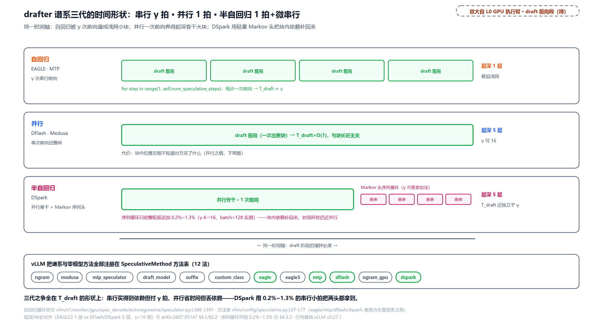

这三代（加上零模型的 n-gram 匹配等）全部注册在 vLLM 的方法表里，配置层一张 Literal 写尽谱系：

```python
# vllm/config/speculative.py:L67-L77 · SpeculativeMethod 方法表（谱系的注册面）
SpeculativeMethod = Literal[
    "ngram",
    "medusa",
    "mlp_speculator",
    "draft_model",
    "suffix",
    "custom_class",
    EagleModelTypes,      # eagle / eagle3 / extract_hidden_states / mtp 系 / dflash
    NgramGPUTypes,        # ngram_gpu
    DSparkModelTypes,     # dspark
]
```

十三个方法族（六项基础方法，加 eagle、eagle3、extract_hidden_states、mtp 系 22 个厂商变体、dflash、ngram_gpu、dspark 七组），运行时经 `init_speculator` 分发到各自的 speculator（投机执行器：worker 侧驱动 draft 生成的组件；`vllm/v1/worker/gpu/spec_decode/__init__.py:L8-L40`：`dspark` 走 `DSparkSpeculator`、`mtp` 走 `MTPSpeculator`、eagle 系走 `EagleSpeculator`）。顺带一条口径：配置层的 `use_eagle()` 实际上是「用 target 隐状态的投机」的总名（`vllm/config/speculative.py:L1389-L1393`，把 eagle、eagle3、mtp、dflash、dspark 都算进去，TODO 注释自己承认这名字起歪了）。上面三代谱系没有独立小模型那条原始路线，方法表里的 `draft_model` 就是它：2023 年双源论文的原教旨形态，配一个同系列小模型自回归起草，部署两套模型太重，给 7B 级目标还找不到合适的草稿，EAGLE 正是被这个困境逼出来的。

怎么选，四句行动指南：有官方自带草稿器（MTP/DSpark 随 checkpoint 发布）就用它，部署最省；要外挂通用草稿器选 EAGLE 系（特征级自回归、生态最成熟）；追求大块长草稿选并行系；想零成本试探就先开 n-gram（纯前缀匹配，没有模型）。

## 并行的病：碰撞、衰减与位一的杠杆

并行 drafter 的病根一句话：**每个位置对「所有可能的前驱」做平均，而不是条件于实际采出的那一个**。形式化：位 $`k`$ 能学到的目标是边缘分布（训练时对前驱的所有实现平均）：

```math
p(x_k \mid \mathrm{context})=\sum_{x_{k-1}}p(x_{k-1}\mid \mathrm{context})\,p(x_k\mid x_{k-1},\mathrm{context}),
```

而推理时块内前驱却是某一条**具体采样路径**。上下文只容一个续写时两边没差；上下文同时容多个都说得通的续写（论文 §3.1 的例子：礼貌应答既可以是 "of course" 又可以是 "no problem"）时，边缘分布是各 mode 的混合，逐位独立采样容易把两个世界的词拼在一起，产出 "of problem" 这种谁都没想说的组合。这个病 2017 到 2018 年机器翻译界就起过名字：非自回归翻译（NAT，[arXiv:1711.02281](https://arxiv.org/abs/1711.02281)）的**多模态问题**（multi-modal collision）；「半自回归」这个词也早在 2018 年就有（Wang et al.，[arXiv:1808.08583](https://arxiv.org/abs/1808.08583)：全局一块接一块、块内并行）。DSpark 是这条思路在草稿器上的复兴，还多一条 NAT 前辈们大多给不出的硬约束：拒绝采样要求 drafter 能报出**逐 token 精确概率**，CRF（条件随机场）、CTC（把整句对齐一起归一的序列训练目标）那类全局归一化结构做不到——整句概率共用一个分母一起归一，拆不出单个 token 的精确值——所以 DSpark 特意让序列修正保持局部、逐位概率仍是精确 softmax（论文 §6）。「每个位置互不知晓」长什么样，后面「anchor 当第一位」一节会亲眼看到：布局 kernel 给每个非 anchor 查询位填的都是同一枚 mask token，位与位之间零通信。

拿论文的例子把碰撞算出来（双 mode 例子取自论文 §3.1；具体概率数值是本章参考实现的示教构造，论文只给定性描述）。位 1 是双 mode 上下文：$`p(\mathrm{of})=0.6`$、$`p(\mathrm{no})=0.4`$；位 2 的两个条件行分别是「of 之后 course 主导」「no 之后 problem 极尖」。并行 drafter 位 2 只能学边缘混合：

<!-- trace: ch33-m06 -->
| 位/分支 | 分布类型 | course | problem | 判定 |
|---|---|---|---|---|
| x_1='of' 条件行 | p(x_2∣x_1) | 0.6 | 0.3 | 'of course' 分支：course 主导 |
| x_1='no' 条件行 | p(x_2∣x_1) | 0.02 | 0.95 | 'no problem' 分支：problem 极尖 |
| 并行位 2（边缘） | Σp(x_1)p(x_2∣x_1) | 0.368 | 0.56 | argmax='problem'，与位 1 的 'of' 拼成 'of problem' |
| DSpark 位 2（x_1='of' 加偏置） | softmax(log 边缘+B) | 0.986667 | 0.003722 | 'of course'：course 从 0.368 抬到 0.986667 |
| DSpark 位 2（x_1='no' 镜像） | softmax(log 边缘−B) | 0.001616 | 0.992034 | 反向同理压 course 抬 problem |
| 连贯率（采到真 mode 的概率） | Σ_双mode p(x_1)·p_2(真续写)：并行 p_2=边缘混合、DSpark p_2=偏置后条件行 | — | — | 并行 0.4448 → DSpark 0.988814 |

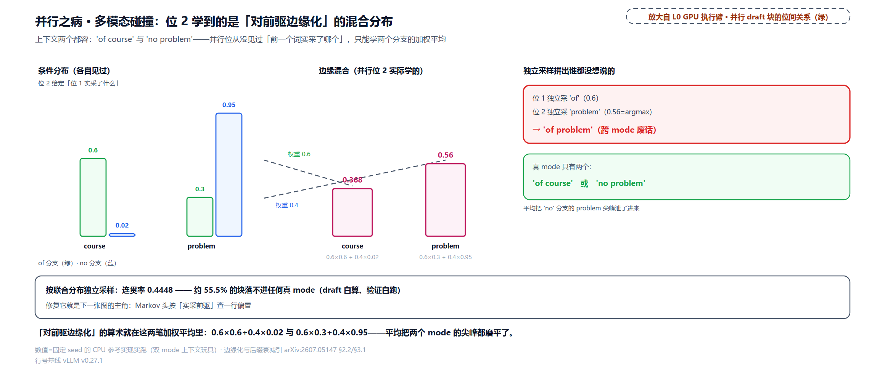

边缘混合的算术一目了然：course 拿到 $`0.6\times0.6+0.4\times0.02=0.368`$，problem 拿到 $`0.6\times0.3+0.4\times0.95=0.56`$，逐位独立的 argmax 选 problem，与位 1 采出的 of 拼成 "of problem"。按分支加权统计，并行独立采样只有 44.48% 的块落在真 mode 里（连贯率 0.4448），其余约 55.5% 落不进任何真 mode；DSpark 的序列头把连贯率抬到 0.988814，位 1 实采 of 之后，转移偏置把 course 从 0.368 抬到 0.986667，镜像分支同理。

碰撞的宏观后果是**后缀衰减**：接受率沿块快速下滑。但要真正读懂论文的实证图，得先立一个度量。直接统计「位 $`k`$ 被接受的比例」会把前缀错误的惩罚混进来（位 5 的数字烂，可能只是因为位 2 常死）。DSpark §4.3.1 用的是**逐位条件接受率**：分母只计「前缀 1..k−1 全被接受」的实例，分子计其中位 $`k`$ 也过的比例，剥离前缀错误，暴露每个位置的真实预测质量：

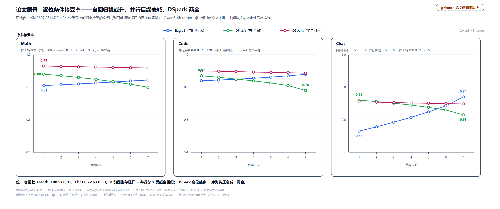

> *图注：重绘自 arXiv:2607.05147 Fig.2，Qwen3-4B 目标、三域各基准平均。横轴 draft 位 1 到 7，纵轴条件接受率（分母只计前缀全接受的实例）。三条线三种性格：自回归 Eagle3 浅网起步低但后段回升（Chat 从 0.53 爬到 0.74，写着写着条件越来越确定，它吃得到这份确定性）；并行 DFlash 深网起步高但后段衰减（Chat 从 0.72 掉到 0.63、Code 从 0.87 掉到 0.78，对前驱边缘化的病越往后越重）；DSpark 深网起步加序列头续命（Math 起步 0.93、整块平稳）。端点为论文实测值。*

这张图回答了一个反直觉的问题：**并行 drafter 的逐位质量后段更差，总 $`\tau`$ 却常胜自回归**（论文 Table 1：Qwen3 系三档 target 上 DFlash 全线压过 Eagle3，换到 Gemma4-12B 上则反被 Eagle3 反超，「常」字正合论文 §4.3.1 自己的措辞 often）。答案在位 1：两种架构在位 1 都只看 target 上下文、不依赖块内前驱，此时拼的是纯架构容量——自回归被 $`O(\gamma)`$ 延迟锁死在 1 层浅网，并行可以 5 层深网，位 1 的差距因此是结构性的（Math 0.88 对 0.81、Chat 0.72 对 0.53）。而前缀生存的复利结构让位 1 的杠杆最大：首位被拒全块作废。两个效应相乘，位 1 的容量优势压过后缀衰减，并行总 $`\tau`$ 反超。$`\tau`$ 那节表格中间三行就是这条账的算术版：DFlash 的衰减曲线总 $`\tau`$ 2.751257 高过 EAGLE3 回升曲线的 2.218724，只换首位 0.53 到 0.72 就 +0.436901。

于是架构目标水到渠成（论文 §4.3.1 的原话是「combining the high capacity of a parallel backbone for the initial token with the dependency modeling of an autoregressive model for subsequent tokens」）：**位 1 要并行的深，位 2 起要自回归的顺**。这就是 DSpark 半自回归的全部动机，下一节拆它的两阶段实现，先看序列偏置怎么救碰撞：

![Markov 偏置的修复：位 1 采出 'of' 后 B(of,·)=[0,0,0,+3.0,−3.0] 加到边缘 logits 上，course 从 0.368 抬到 0.986667、problem 压到 0.003722，连贯率 0.4448→0.988814](../diagrams/ch33-fig-markov-rescue.png)

## DSpark 两阶段：重活并行，轻活串行

先看整机。论文 Fig.1 把一个 DSpark 解码周期画全：target 对上下文 ABC 走一步生成 D（anchor），DSpark 拿 D 当输入，重并行骨干加轻序列头一次产出草稿 EFGH 和逐位置信 $`c_1`$ 到 $`c_4`$，硬件感知调度器看着置信留下 EFG、剪掉低置信的 H，target 一次前向验证 EFG，收下 EF、拒掉 G 并补采修正 $`G^{\ast}`$。本章后半就沿着这张图的三段展开：两阶段生成（本节与下两节）、置信度头与校准（再下两节）、调度器（最后三节）。

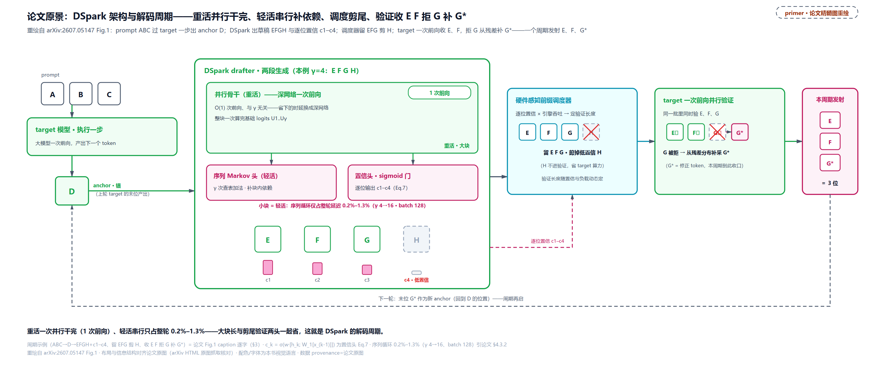

> *图注：重绘自 arXiv:2607.05147 Fig.1。一条周期动线五步，从左到右：上下文 ABC 进 target 出 anchor D；D 进 DSpark（左中大框：重并行骨干一次前向出 base logits，轻序列头左到右补转移偏置，同框右侧小头同时输出逐位置信 $`c_k`$）；四枚草稿 EFGH 各带置信 $`c_1`$–$`c_4`$；其右的调度器框按存活概率留下 EFG、剪掉低置信的 H；再往右 target 一次前向验证 EFG，E、F 收下、G 拒掉并从残差补采 $`G^{\ast}`$，本周期发射 E、F、$`G^{\ast}`$ 三位。两个视觉锚点：重活的方块大（并行骨干）、轻活的方块小（序列头、置信头），大小就是延迟账的直观比例（序列循环占整轮 0.2%–1.3%）。*

两阶段的分工，论文 §1 的原话是「keeps the computationally expensive draft backbone fully parallel, appending only a lightweight serial output head」。

**并行阶段**：一个并行骨干（论文实例化直接用 DFlash，5 层）对整块跑**一次**前向，产出每个位置的隐状态 $`h_1,\ldots,h_{\gamma}`$ 与 base logits $`U_1,\ldots,U_{\gamma}`$。这些 base logits 是「不知道块内顺序」的底稿：每个位置都看着同样的上下文各自猜，互相不通气。DSpark 对 DFlash 骨干唯一的改动是布局层面的一处（anchor 本身当第一个预测位，$`\gamma`$ 个输入产 $`\gamma`$ 个 logits，省一次查询位），机制不动，「anchor 当第一位」一节细讲。

**序列阶段**：给 base logits 逐位补上「前缀依赖的转移偏置」$`B`$。位 $`k`$ 的分布从纯并行版换成（论文 Eq.(4)；本章重构口径，见下）：

```math
p_k(x)\ =\ \frac{\exp\!\big(U_k(x)+B(x_{k-1},\,x)\big)}
{\sum_{x'\in\mathcal{V}}\exp\!\big(U_k(x')+B(x_{k-1},\,x')\big)},
```

其中 $`x_{k-1}`$ 是**上一个位置实采出的 token**（位 1 的 $`x_0`$ 是 anchor），$`\mathcal{V}`$ 是词表。推理时从左到右逐位采样：位 1 采出 $`x_1`$，$`x_1`$ 决定位 2 的偏置，采出 $`x_2`$ 再决定位 3，串行依赖就这一条链。重构口径要交代：论文公版 HTML 在这条公式处排版截断（LaTeXML 转换丢字），幸存片段显示一般式的偏置条件于 anchor 与整段已采前缀（$`B_k(x_0,\,x_{<k})`$）；上面展示的已是 Eq.(5) 一阶化后的形态（$`B`$ 只依赖 $`x_{k-1}`$，与 RNN 头保留跨步状态是两条互补路线，落地默认 Markov 头），由两条独立证据双向钉死：论文 Eq.(5) 给出的 Markov 特例，与 vLLM 落地代码 `logits_i = base_logits[:, i] + bias` 的逐字对应（下文 L122）。回到碰撞的例子：位 1 采出 of 之后，$`B(\mathrm{of},\cdot)`$ 抬 course 压 problem，底稿管快、偏置管顺。

模块的 docstring 与论文 §3.1 几乎逐句对应，是论文与落地对读的最佳锚：

```python
# vllm/v1/worker/gpu/spec_decode/dspark/speculator.py:L3-L24 · DSparkSpeculator 模块 docstring
"""DSpark speculator: semi-autoregressive parallel drafting.

DSpark drafts a block of ``num_speculative_tokens`` tokens in one parallel pass
(reusing the DFlash machinery: context-KV precompute + a query-block forward),
then injects intra-block dependency with a lightweight sequential Markov head.

Differences from DFlash:
  * Anchor-as-first-prediction: each request emits exactly ``N =
    num_speculative_tokens`` query tokens (anchor + N-1 noise), NOT ``1 + N``.
    Every query position is a prediction (the anchor predicts the first draft
    token), so we sample at all N positions and ``sample_pos = query_pos + 1``
    (standard next-token), whereas DFlash's masks sit AT the predicted position.
    This is the ``sample_from_anchor`` path in the shared prepare-inputs kernel.
    Speculators-format checkpoints instead use the DFlash ``1 + N`` fill-in
    layout (anchor is the bonus token).
  * Sequential Markov sampling: instead of DFlash's single parallel sample, we
    sample left-to-right, adding a prefix-dependent Markov bias derived from
    the previously sampled token at each step.

CUDA graphs (FULL, mirroring DFlash) cover the whole draft step: the parallel
backbone forward AND the sequential Markov sampling.
"""
```

末句回答一个马上会冒出来的疑问：python 的 for 循环不会把 $`T_{\mathrm{draft}}`$ 拖回 $`O(\gamma)`$ 吗？不会，两层原因。工程层：FULL CUDA graph 把整个 draft 步（并行前向**加**序列循环）一起捕获重放，python 循环只存在于捕获那一刻（[第 19 章](../../ch19-compile-capture/narrative/chapter.md)立过形状全等才能回放，这里循环形状固定、天然可捕获）。算力层：循环体每步只是查表加一次矩阵向量乘（下一节算账），论文实测整条序列循环给一轮 decode 加 0.2% 到 1.3% 的延迟（提案长 $`\gamma+1`$ 从 4 到 16、batch 128，§4.3.2）。

主角代码全文不长，值得逐行走读：

```python
# vllm/v1/worker/gpu/spec_decode/dspark/speculator.py:L100-L149 · _sample_sequential 全文
    def _sample_sequential(self, num_reqs: int, head_hidden: torch.Tensor) -> None:
        # Sequential Markov sampling over the backbone's output hidden states.
        n_spec = self.num_speculative_steps
        num_sample = num_reqs * n_spec
        # Per-(req, position) head hidden, ordered (req, step).
        sample_hidden = head_hidden[self.sample_indices[:num_sample]]
        # Draft-vocab logits; sampled ids are remapped to target vocab below.
        base_logits = self.model.compute_draft_logits(sample_hidden)   # L107 并行阶段 U_k
        vocab_size = base_logits.shape[-1]
        base_logits = base_logits.view(num_reqs, n_spec, vocab_size)
        idx_map = self.sample_idx_mapping[:num_sample].view(num_reqs, n_spec)
        sample_pos = self.sample_pos[:num_sample].view(num_reqs, n_spec)
        # Anchor (bonus) token per request = the input id at query offset 0,
        # read via the precomputed persistent index (fixed buffer for capture).
        prev = self.input_buffers.input_ids[self._anchor_idx[:num_reqs]]  # L116 prev 从 anchor 起步
        for i in range(n_spec):
            # Sequential stage: Markov bias from the previously sampled token.
            markov_embed = self.model.markov_embed(prev)                 # L119 W_1 查表
            bias = self.model.markov_bias(markov_embed)                  # L120 W_2 投影
            logits_i = base_logits[:, i] + bias                          # L122 Eq.(4) 的实锤
            if self.draft_logits is not None:
                # Probabilistic: sample in target vocab (a reduced draft vocab is
                # scattered into its target columns; full vocab is already there).
                if self._d2t_scatter_index is not None:
                    assert self._draft_scatter_buf is not None
                    buf = self._draft_scatter_buf[:num_reqs]
                    buf.index_copy_(1, self._d2t_scatter_index, logits_i.to(buf.dtype))
                    logits_i = buf
                # sample_pos is the predicted token's position Q; the target
                # verifies it with the predecessor's Gumbel key (Q-1). Pass Q-1.
                draft_sampled_i = gumbel_sample(                         # L132 概率化采样
                    logits_i, idx_map[:, i], self.temperature, self.seeds,
                    sample_pos[:, i] - 1, apply_temperature=True,
                    output_processed_logits=self.draft_logits,
                    output_processed_logits_col=self._step_cols[i],
                    use_fp64=self.use_fp64_gumbel,
                )
            else:
                draft_sampled_i = self.model.map_draft_to_target(
                    logits_i.argmax(dim=-1)                              # L143 greedy：argmax
                )
            self.draft_tokens[:num_reqs, i] = draft_sampled_i
            prev = draft_sampled_i                                       # L149 串行依赖的全部实现
```

四行承重。L107：base logits 来自骨干**一次**前向的输出，循环里只做切片。L122：`base_logits[:, i] + bias` 就是 Eq.(4) 的分子，重构口径的代码侧实锤。L132 对 L143 的二分：probabilistic 模式用 Gumbel 采样并把这位的分布写进 `draft_logits` 缓冲（验证时概率比测试的分母），greedy 模式直接 argmax（「两种活法」一节展开）。采样调用传的 `sample_pos[:, i] - 1`（L138，预测位 Q 的前驱位）看着与基类 `sample_draft` 的 `positions + 1` 方向相反，实为同一个契约。键跟着「出 logits 的输入位」走：target 侧采样按 logits 行自身的位置派生键（`vllm/v1/worker/gpu/sample/sampler.py:L79` 的 `pos = positions[logits_indices]`），而预测 Q 号 token 的 logits 行恰在输入位 Q−1（「排座位」一节立过的「位 k 的 logits 预测 k+1」），所以 Q 号 token 的键天然落在 Q−1；DSpark 传 Q−1，正是把草稿抽签的键对到 target 将用来批改它的那一行 logits 上，基类的 `positions + 1` 只是同一目标在另一套调用约定下的记账。L149：`prev = draft_sampled_i` 一行就是串行依赖的全部实现——除 `prev` 外无跨步状态，改 $`\gamma`$ 只改循环次数、不动骨干。

拿玩具把 prev 链逐步推一遍（V=6、r=4 的两层玩具骨干、$`\gamma=3`$、anchor=2、greedy；下表与下一张图的位号同样从 0 起对应 kernel 的 pos 下标，即正文记号的位 $`1..\gamma`$——位 0 的 prev 就是 anchor $`x_0`$）：

<!-- trace: ch33-m07 -->
| 位 k | prev（Markov 查表行） | U_k top2（token: 值） | bias top2（token: 值） | 采出（greedy） |
|---|---|---|---|---|
| 0 | 2（anchor） | 1: 0.9732 / 2: 0.413978 | 5: 0.91057 / 0: -0.839943 | 1（prev 链更新为 1） |
| 1 | 1 | 2: 1.313929 / 1: 0.999298 | 1: 0.880667 / 0: -0.7838 | 2（prev 链更新为 2） |
| 2 | 2 | 2: 0.766341 / 1: 0.570082 | 5: 0.91057 / 0: -0.839943 | 2 |
| draft_tokens 全块 | — | — | — | [1, 2, 2] |
| γ=5 复跑 | — | U 形状 [5, 6] | — | 骨干 forward 调用数仍=1（T_draft 近独立于 γ） |
| probabilistic（seed=9） | 2→4→1（与 greedy 链不同：概率化采出不同 token，就查不同的 Markov 行，U 不动、偏置行换） | q 行逐位记录（top1：0.447351/0.458878/0.49183） | — | draft=[4, 1, 2]（q 行=验证时概率比测试的 p_d） |

![两阶段的分工账：并行骨干 1 次前向出 U 形状 [3, 6]（γ=3；γ=5 时 [5, 6] 且调用数仍 1），序列头 γ 次左到右、每次 O(r) 查表+O(rV) GEMV——draft_tokens=[1,2,2]](../diagrams/ch33-fig-two-stage-pipeline.png)

![prev 链的逐步手推：位 0 查 anchor 行（bias top2 5:0.91057/0:−0.839943）采出 1、位 1 查 token 1 行（1:0.880667）采出 2、位 2 查 token 2 行采出 2，每步只换偏置行、U 不动；底条 probabilistic（seed=9）：另一组抽签 draft=[4,1,2]、q 行 top1 0.447351/0.458878/0.49183](../diagrams/ch33-fig-prev-chain-trace.png)

倒数第二行是结构性证据：$`\gamma`$ 从 3 改到 5，骨干前向调用数仍是 1，$`T_{\mathrm{draft}}`$ 近独立于块长，序列循环只添了两次查表加法。

**伪码：序列阶段**

```python
def sample_sequential(base_logits, anchor, model, gamma, mode):
    # base_logits: [B, gamma, V]：并行阶段一次前向的产出，循环里只读
    prev = anchor                                  # 位 1 的 x_0 是 anchor
    drafts = []
    for k in range(gamma):
        bias = model.markov_w2 @ model.markov_w1[prev]   # B(x_{k-1},·)：查表+一次 GEMV
        logits_k = base_logits[:, k] + bias              # Eq.(4)：底稿加偏置
        if mode == "probabilistic":
            x_k = gumbel_sample(logits_k)                # 按分布采，并把 q 行写进 draft_logits
        else:
            x_k = logits_k.argmax(-1)                    # greedy：one-hot q
        drafts.append(x_k)
        prev = x_k                                       # 唯一的跨步状态
    return drafts
```

钉住的不变量：循环恰好 $`\gamma`$ 步终止；步内除 `prev` 外无跨步状态（骨干前向恒 1 次、与 $`\gamma`$ 无关）；probabilistic 模式下验证用的 $`q(x)`$ 就是这里的逐位条件分布 $`\mathrm{softmax}(U_k+B)`$，与 Eq.(4) 同一形式。

## Markov 头：一张低秩转移表

$`B`$ 是个什么东西？论文给的最简实例化把 $`B_k`$ 限制成**只依赖前一个 token** 的一阶转移（论文 Eq.(5)，arXiv:2607.05147 §3.1）：本该是一张 $`V\times V`$ 的全表，因子化成两个矩阵：

```math
B(x_{k-1},\,\cdot)\ =\ W_1[x_{k-1}]\,W_2\ \in\ \mathbb{R}^{V},\qquad
W_1\in\mathbb{R}^{V\times r},\ \ W_2\in\mathbb{R}^{r\times V},\ \ r=256 .
```

直觉直给：这就是一张「下一个词倾向」的 bigram 转移表（bigram：只依赖前一个 token 的二元模型）。马尔可夫性（Markov property）说的是「未来只依赖现在、不依赖更早的历史」（俄国数学家 Markov 1906 年起的名字，[维基条目](https://en.wikipedia.org/wiki/Markov_chain)）；一阶转移表就是它的有限状态版：给定今天，明天的分布整行写死。说明性例子（两张表的行=今天、列=明天、行和为 1）：天气模型里「今天晴」行写 (晴 0.8, 雨 0.2)、「今天雨」行写 (晴 0.5, 雨 0.5)——**取第 $`x_{k-1}`$ 行**正是 Markov 头的查表动作。与概率表的差别要防一个误解：$`B`$ 的行是 **logit 偏置**不是分布，行和不必为 1，它加在 base logits 上、过 softmax 之后才变回概率。存全表在真实词表下不可行，低秩是被迫的：

<!-- trace: ch33-m08 -->
| 账目 | 算式 | 数值 | 读法 |
|---|---|---|---|
| 全表 B | V×V | 16713318400 项（fp16 也要 33 GB 级） | 直接存转移偏好不可行 |
| 低秩 W_1+W_2 | 2Vr | 66191360 项（各 33095680） | ≈66.19136×10^6 |
| 省法 | V/(2r)=129280/512 | 252.5≈253 倍（本章按 V=129280、r=256 自算） | 取整差异 |
| 每步代价 | O(r) 查表 + O(rV) GEMV | 256 次查表 + 33095680 次乘加 = 33095936 次操作（按乘加计，FLOPs 口径再 ×2） | 两个 GEMV 就是全部序列性 |
| 玩具头 step1 | embed(prev=3) | [-0.311732, 0.074316] | [B]→[B,r] 查表 |
| 玩具头 step2 | bias(embed) | 首值 -0.061613（=w1[3]·w2 列 0 手工复算 ✓） | [B,r]→[B,V]=W_1[x]W_2 |
| 玩具反例（r 过大） | V=6、r=4 | 低秩 48 > 全表 36（V/(2r)=0.75） | 秩选大了反而更贵 |
| 玩具（r=2） | V=6、r=2 | 低秩 24 < 全表 36（V/(2r)=1.5） | V>2r 才开始省（真实 V=129280≫512） |

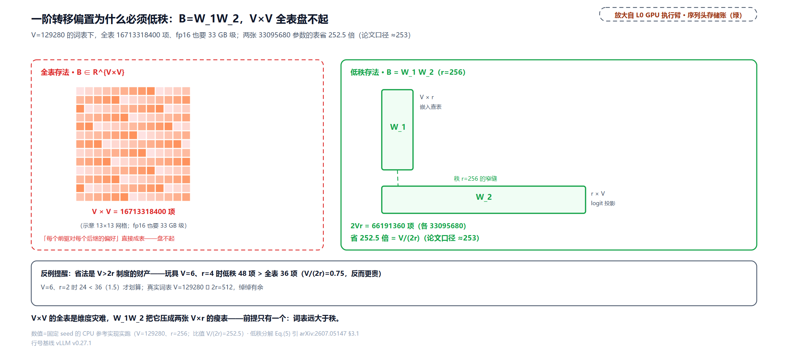

三个读法。省多少：$`2Vr<V^2`$ 当且仅当 $`V>2r`$（两边除以 $`V`$），真实词表 129280 远大于 512，省 252.5 倍（四舍五入约 253——这是本章按论文 $`r=256`$ 的默认设定、DeepSeek 词表 $`V=129280`$ 直除的账，论文只定性说省、未给此数）。每步多贵：查表 $`O(r)`$ 加一次 $`r\times V`$ 的矩阵向量乘（GEMV，矩阵乘的向量特例）共约 3300 万次乘加，乘上 $`\gamma`$ 步也就是毫秒的零头，这就是「序列头轻」的全部定量内容。[第 24 章](../../ch24-primer-attn-variants/narrative/chapter.md)MLA 的低秩压缩是同一手法（大矩阵存不下就分解成两根细的），这里把 576 维的账换成了 129280 维的词表账。算得对不对：玩具头 `bias(embed)` 的首值与手工内积逐位一致，trace 锁定。

落地只有十来行，两个权重、两个方法：

```python
# vllm/model_executor/models/qwen3_dspark.py:L36-L78 · DSparkMarkovHead 全文
class DSparkMarkovHead(nn.Module):
    """Sequential transition-bias head (low-rank V x r, r x V).

    ``markov_w1[token]`` embeds the previously sampled token (target vocab,
    ``vocab_size``); ``markov_w2`` projects it to a draft-vocab bias
    (``draft_vocab_size``) added to the base draft logits. The two sizes
    coincide for full-vocab drafts.

    Both weights are replicated because the head runs sequentially for every
    draft position. Sharding them would add an all-reduce and a full-vocab
    gather to each position.
    """

    def __init__(
        self,
        vocab_size: int,
        draft_vocab_size: int,
        markov_rank: int,
        prefix: str,
        quant_config: QuantizationConfig | None = None,
    ) -> None:
        super().__init__()
        self.markov_w1 = nn.Embedding(vocab_size, markov_rank)          # L60 W_1 查表
        self.markov_w2 = ParallelLMHead(
            draft_vocab_size,
            markov_rank,
            bias=False,
            quant_config=quant_config,
            prefix=maybe_prefix(prefix, "markov_w2"),
            disable_tp=True,                                            # L67 replicated
        )                                # L68 W_2 投影

    def embed(self, token_ids: torch.Tensor) -> torch.Tensor:
        """r-dim Markov embedding of ``token_ids`` ([B] -> [B, r])."""
        return self.markov_w1(token_ids)

    def bias(
        self,
        markov_embed: torch.Tensor,
        logits_processor: LogitsProcessor,
    ) -> torch.Tensor:
        """Vocab-size transition bias from a Markov embedding ([B, r] -> [B, V])."""
        return logits_processor(self.markov_w2, markov_embed)
```

docstring 那句「Both weights are replicated」值得停：头是逐 draft 位串行跑的，把权重按张量并行分片的话每个位置都要来一次 all-reduce（跨卡归约）加全词表 gather，得不偿失——所以 $`W_1`$、$`W_2`$ 在各卡完整复制（`disable_tp=True`）。这是「串行循环的算子怎么和并行引擎相处」的一个小而典型的决定。Qwen3、Gemma4、Kimi-K3 与 DeepSeek-V4 四家的 DSpark 共用这一个类，DSV4 从本文件 import。

论文还给了个变体：**RNN 头**。Markov 头一步之外无记忆，位 $`k`$ 看不到 $`x_{k-1}`$ 更早的历史；RNN 头维护一个跨步累积的状态 $`s_k`$，每步把 $`[s_{k-1};\,W_1[x_{k-1}];\,h_k]\in\mathbb{R}^{2r+d}`$ 拼起来过一次门控更新（门控公式在论文公版 HTML 里同样排版缺失，此处只立输入拼接与「单次门控更新」的定性形态）。落选理由论文 §4.3.2 写得很实：增益只在长块尾部略微多一点（论文只给定性结论「mainly at longer proposal lengths」），实现复杂、部署不友好，默认 Markov；vLLM 的落地也只有 Markov 头、没有 RNN 头——两份实现文件（qwen3_dspark.py 与 DSV4 版 dspark.py）里头类全文只有 DSparkMarkovHead 一个，数得出来。

![每步的全部计算就是两个 GEMV：embed(prev=3)=[-0.311732, 0.074316]（查表）→ bias=W_1[x]·W_2（首值 -0.061613 手工复算 ✓）；每步 33095936 次操作（查表+乘加）、整轮延迟的 0.2%~1.3%](../diagrams/ch33-fig-markov-two-gemv.png)

**伪码：转移偏置一步**

```python
def markov_bias_step(prev_token, markov_w1, markov_w2):
    e = markov_w1[prev_token]        # O(r) 查表：取出 prev 的 r 维「性格卡」
    b = markov_w2 @ e                # O(rV) GEMV：翻译成对全词表每 token 的偏好偏置
    return b                         # 行和不必为 1：它是 logit 偏置，softmax 前加在 U_k 上
```

钉住的不变量：偏置只依赖 `prev` 一个 token（一阶马尔可夫）；换前驱只换查表行、$`W_2`$ 不动；参数量 $`2Vr`$，在 $`V>2r`$ 的真实词表制度下才有省头。

## 草稿的两种活法：greedy 与 probabilistic

`_sample_sequential` 里那个 `if self.draft_logits is not None` 的二分，对应验证公式里 $`q`$ 的两种活法。这是 vLLM 的一个配置项，官方口径写在配置注释里：

```python
# vllm/config/speculative.py:L284-L290 · draft_sample_method 配置注释
    draft_sample_method: DraftSampleMethod = "greedy"
    """How the draft model samples tokens. 'greedy' always picks the argmax
    token, and the draft probabilities are treated as one-hot during rejection
    sampling. 'probabilistic' samples stochastically from the draft
    distribution and uses the full draft logits for the probability ratio test
    during rejection sampling. This comes at the cost of additional GPU memory
    usage."""
```

两种活法的账，拿四词表的一组数摆开（$`p_t=[0.4,0.3,0.2,0.1]`$，draft 全分布 $`q=[0.35,0.25,0.25,0.15]`$，greedy 的 one-hot 落在 token 0）：

<!-- trace: ch33-m17 -->
| 设定 | 算式 | 数值 | 判定 |
|---|---|---|---|
| probabilistic 的 q | Σmin(p_t,q) | 0.9 | 接受率高（draft 分布全声明） |
| greedy 的 one-hot q | Σmin(p_t,one-hot) | 0.4 | 接受率低，但无损不靠 draft 准 |
| greedy 位 x=0 | min(1, p(0)/1) | 0.4 | argmax 位也有 0.6 拒绝率→残差兜底 |
| greedy 残差 | norm(max(0,p−one-hot)) | [0.0, 0.5, 0.333333, 0.166667] | 0 位扣干净→P(y=0)=0.4=p(0) |
| target greedy（温度 0） | p_t 退化为 one-hot | 接受⟺draft==target argmax | 端到端对拍（400 token 过完整投机管线）与 target greedy rollout 逐位相同（YES） |
| probabilistic q 行（验证用） | softmax(U_k+B) 逐位写缓冲 | 位 0 top1=0.456746 / 位 1 top1=0.612181 | 概率比测试 p_t/p_d 的分母来源 |

greedy 草稿像只押一匹马的赌徒：接受率未必最高（本例 0.4 对 0.9），但残差兜底保证账面永远等于庄家的赔率——**无损不靠草稿打得多准，greedy 少收的每一分都由残差按 $`p_t`$ 的相对形状补回**（无损定理的 one-hot 特例）。greedy 换来三样工程好处：不用存 draft 分布、不用 Gumbel 噪声、`NO_DRAFT_PROBS` 下 kernel 连 draft 概率的访存都省了。probabilistic 则把 $`q`$ 当真分布声明，抽签更公道（接受率 0.9），代价是一块三维 `draft_logits` 缓冲（批 × 投机步数 × 词表）的显存。DSpark 论文的基准全部跑在温度 1.0 的随机采样上（§4.1），也就是 probabilistic 一侧；vLLM 默认 greedy。

基类的采样函数把这个二分做成了共用件（greedy 快路还有一个省通信的变体）：

```python
# vllm/v1/worker/gpu/spec_decode/speculator.py:L291-L322 · sample_draft 二分
    def _greedy_sample_draft(self, hidden_states: torch.Tensor) -> torch.Tensor:
        if self.use_local_argmax_reduction:
            return self.model.get_top_tokens(hidden_states)   # L293 词表并行局部 argmax 归约
        logits = self.model.compute_logits(hidden_states)
        return logits.argmax(dim=-1)

    def sample_draft(
        self, hidden_states, positions, idx_mapping, temperature, seeds,
        draft_step, draft_logits,
    ) -> torch.Tensor:
        if draft_logits is not None:
            logits = self.model.compute_logits(hidden_states)
            # NOTE(woosuk): We must add 1 to the positions to match the Gumbel noise
            # used for draft and target sampling.
            return gumbel_sample(                                  # L306 probabilistic 路径
                logits, idx_mapping, temperature, seeds, positions + 1,
                apply_temperature=True,
                output_processed_logits=draft_logits,
                output_processed_logits_col=draft_step,
                use_fp64=self.use_fp64_gumbel,
            )
        return self._greedy_sample_draft(hidden_states)             # L316 greedy 路径
```

两个注脚。其一，`positions + 1` 不是笔误：Gumbel 噪声按位置派生，草稿位与它要预测的 target 位必须吃**同一份**噪声种子，差一位就是两套随机数，这条契约 [第 30 章](../../ch30-sampler-pipeline/narrative/chapter.md)的 Gumbel 掷骰立过，这里是对齐的另一端。其二，`get_top_tokens`（L293）是 argmax 的词表并行变体：张量并行下 lm_head 按词表分片，全量 argmax 要先 gather 整行 logits；它改为各分片局部 argmax 再归约，通信量从词表宽降到卡数乘二，这是 logits 物化账在草稿侧的 v0.27.1 延伸（[第 23 章](../../ch23-model-layer-assembly/narrative/chapter.md)开账讲过「logits 只在采样位物化」，草稿器是同一条纪律的另一个客户）。

## 骨干的眼睛：KV 注入与冻结的头

还有一块架构债要还：并行骨干凭什么猜得准？它比 target 浅得多、小得多，只看 token 序列不够。DFlash 的答案是**把 target 的理解借给它**：target 在 prefill 时把若干层隐状态交出来，草稿骨干把这些「读书笔记」吃进自己的注意力。这就是论文 §2.2 的两条公式（Eq.(2)(3)，arXiv:2607.05147；DFlash 原文的设计、DSpark 原样继承）。

第一步，把 target 的多层隐状态沿特征维拼接、投影进 draft 的隐空间（Eq.(2)）：

```math
H_{\mathrm{ctx}}=\mathrm{RMSNorm}\!\big(W_c\,[\,H^{(l_1)};\,\ldots;\,H^{(l_m)}\,]\big),
\qquad W_c\in\mathbb{R}^{d\times m d},
```

$`l_1,\ldots,l_m`$ 是被选中的 target 层号（H_ctx 的直觉：多层笔记压缩成一份 draft 读得懂的摘要）。第二步，把这份上下文特征的 K/V 与草稿块自己的 K/V 用**同一组投影**算出、沿序列维拼接（Eq.(3)）：

```math
K_i=[\,W_i^{K}H_{\mathrm{ctx}};\ W_i^{K}H_{d}\,],\qquad
V_i=[\,W_i^{V}H_{\mathrm{ctx}};\ W_i^{V}H_{d}\,],
```

$`H_d`$ 是草稿块的隐状态。块内所有位置双向注意彼此、也注意注入的上下文——并行草稿能「看见」完整 prompt 与已生成内容，靠的就是这条通道。

落地的聪明之处在于：**「拼接」根本不显式发生**。vLLM 的做法是把上下文 K/V 预先算好、直接写进 draft 自己的 KV cache 槽位；查询块做注意力时按槽位寻址，天然先看到 context 再看到自己（[第 13 章](../../ch13-paged-kv/narrative/chapter.md)立的间接寻址，这里成了「序列维拼接」的实现方式）：

```python
# vllm/model_executor/models/qwen3_dflash.py:L548-L619 · precompute_and_store_context_kv（节选）
    def precompute_and_store_context_kv(
        self,
        context_states: torch.Tensor,
        context_positions: torch.Tensor,
        context_slot_mapping: torch.Tensor | list[torch.Tensor | None] | None = None,
    ) -> None:
        """Precompute K/V for context states write them into each layer's KV cache.

        Input context states are projected to K/V, normed, and have RoPE applied.
        Since the context shape is different than the query shape, we can't rely on the
        regular forward pass to apply torch.compile and CUDA graphs to this section.
        As such, this function is optimized to minimize the number of torch ops present:
        we use fused vLLM kernels for RMSNorm and RoPE, fuse the GEMM into one
        large projection, and avoid cloning buffers (with .contiguous()) where possible.
        …
        """
        # … 省略：_build_fused_kv_buffers 懒初始化与防御性重建 …
        all_k, all_v = self._project_context_kv(context_states, num_ctx, L, nkv, hd)
        all_k_normed = self._normalize_context_k(all_k)
        # --- Fused RoPE across all layers ---
        # View as [L * num_ctx, kv] so RoPE sees one big batch (no copy).
        # In-place RoPE: pass K as the "query" arg with key=None.
        all_k_flat = all_k_normed.view(L * num_ctx, kv)
        positions_repeated = context_positions.repeat(L)
        # … 省略：cos_sin_cache dtype 对齐 …
        ops.rotary_embedding(                                   # L600 全层一次融合 RoPE
            positions_repeated, all_k_flat, None,
            self._rope_head_size, cos_sin_cache, self._rope_is_neox,
        )
        if context_slot_mapping is None:
            return
        # --- Per-layer cache insert ---
        all_k_final = all_k_flat.view(L, num_ctx, nkv, hd)
        per_layer = isinstance(context_slot_mapping, (list, tuple))
        for i in range(L):
            # … 省略：dummy run 跳过条件 …
            attn = self._attn_layers[i]
            kv_cache = attn.kv_cache
            attn.impl.do_kv_cache_update(                        # L617 逐层写进 draft 自己的槽
                attn, all_k_final[i], all_v[i], kv_cache, slot_mapping,
            )
```

docstring 自己解释了为什么这段要手工优化：context 的形状每步都不同（上下文在变长），进不了 CUDA graph 与 torch.compile，只能靠融合 kernel 压 op 数，全层一次融合 KV 投影 GEMM、一次融合 RMSNorm、一次融合 RoPE（把 $`L`$ 层摊平成一个大 batch），再逐层写进 cache。Eq.(2) 的 $`W_c`$ 在 Qwen3 基准版叫 `fc`，在 DeepSeek-V4 生产版叫 `main_proj` 加 `main_norm`（后者的头部构造见下）。

第二笔共享的账更直白：**词表的入口和出口干脆共用 target 的**。draft 的 embedding 层与 LM head 缺省时直接别名 target 的同名模块，冻结不动：

```python
# vllm/v1/worker/gpu/spec_decode/dspark/utils.py:L60-L77 · load_dspark_model 共享段
    target_embed = getattr(target_inner, "embed_tokens", None)
    draft_embed = getattr(draft_inner, "embed_tokens", None)
    if target_embed is not None and _should_share(
        draft_model, "has_own_embed_tokens", draft_embed, target_embed
    ):
        if draft_embed is not None:
            del draft_inner.embed_tokens
        draft_inner.embed_tokens = target_embed            # L68 别名 target 的 embedding

    target_lm_head = get_target_lm_head(target_model, target_language_model)
    draft_lm_head = getattr(draft_model, "lm_head", None)
    if target_lm_head is not None and _should_share(
        draft_model, "has_own_lm_head", draft_lm_head, target_lm_head
    ):
        if draft_lm_head is not None:
            del draft_model.lm_head
        draft_model.lm_head = target_lm_head               # L77 别名 target 的 lm_head
```

`del` 再赋值是让 draft 模型的字段直接指向 target 的同一个模块对象，不是拷贝。论文 §3.3「shares its embedding layer and language modeling head and keeps them frozen」逐行落地。这笔账的推论很重要：**一个 DSpark checkpoint 相对 target 只多了骨干、Markov 头、置信头几件小件**，装得进 target 的发布包里——下一节「落地」会看到配置层怎么利用这一点。

最后看生产版与基准版的同构不同参。论文实验用 Qwen3-{4B,8B,14B} 当 target（5 层 dense 骨干、$`\gamma=7`$），生产部署在 DeepSeek-V4 上是另一套配置（3 层 MoE 骨干加 mHC 连接（Manifold-Constrained Hyper-Connections，动态加权的层间跳连，[第 28 章](../../ch28-deepseek-v4-principles/narrative/chapter.md)拆 DSV4 骨干时立过）、滑窗注意力 128、$`\gamma=5`$，论文 §5.1）。两套的头部长这样：

```python
# vllm/models/deepseek_v4/nvidia/dspark.py:L130-L148 · DSV4 生产版 DSpark 头部
        draft_vocab_size = (
            getattr(config, "draft_vocab_size", None) or config.vocab_size
        )
        self.markov_head = DSparkMarkovHead(
            config.vocab_size,
            draft_vocab_size,
            config.dspark_markov_rank,                     # L137 低秩 r 走 config
            prefix=maybe_prefix(prefix, "markov_head"),
        )

    def embed_input_ids(self, input_ids: torch.Tensor) -> torch.Tensor:
        return self.embed_tokens(input_ids)

    def combine_hidden_states(self, aux_hidden_states: torch.Tensor) -> torch.Tensor:
        """main_x = main_norm(main_proj(concat of target aux hidden states)).

        ``aux_hidden_states`` is [T, hidden_size * len(target_layer_ids)].
        """
        return self.main_norm(self.main_proj(aux_hidden_states))   # L148 Eq.(2) 的 DSV4 形态
```

`combine_hidden_states` 就是 Eq.(2) 换了个名字：拼接 target 多层 aux 隐状态（aux：从若干中间层抽出的辅助隐状态）、过 `main_proj` 加 `main_norm`。Qwen3 基准版与 DSV4 生产版共用 `DSparkMarkovHead`（从 qwen3_dspark import），骨干各配各的，半自回归是**模式**不是某个模型，这是它能在两家架构上各落一套的证据。

![『拼接』由 KV cache 寻址实现：target 多层 aux 隐状态拼接→W_c 投影+RMSNorm（Eq.2）→预计算每层 K/V_ctx 直接写进 draft 自己的 KV cache 槽（Eq.3 的 K_i=[W_i^K H_ctx; W_i^K H_d] 不显式 cat）——查询块注意 cache 时天然拼上上下文](../diagrams/ch33-fig-context-kv-injection.png)

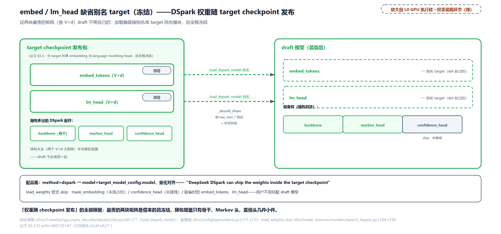

**伪码：上下文 KV 预计算**

```python
def precompute_context_kv(target_aux_hidden, draft, positions, slots):
    h_ctx = rmsnorm(draft.fc(concat_layers(target_aux_hidden)))   # Eq.(2)：多层笔记压缩
    k_ctx, v_ctx = draft.fused_kv_proj(h_ctx)                     # 全层一次融合 GEMM
    k_ctx = fused_rope(k_ctx, positions)                          # 形状每步变，进不了 graph，
                                                                  # 所以全部融合成一个 kernel
    for layer in draft.attn_layers:
        kv_cache[layer].write(slots, k_ctx[layer], v_ctx[layer])  # Eq.(3) 的"拼接"=预写槽位
```

钉住的不变量：context KV 与块 KV 用**同一组**投影（Eq.(3) 的 $`W_i^{K}`$ 同名出现在两段）；写进的是 draft 自己的 cache（target 的 KV cache 不被动）；这段在 graph 外、每步（或上下文变化时）重算。

## anchor 当第一位：省一格输入，改一笔调度账

DSpark 对 DFlash 骨干「唯一的改动」值得单独一节，因为它牵动的账比看起来多。DFlash 的布局是填空式：输入是 anchor 加 $`\gamma`$ 个 mask 位（占位的噪声输入，模型在这些位出预测；共 $`1+\gamma`$ 个查询），anchor 位只当「已知的最后一个 token」（bonus 位），真正被采样的是后面的 mask 位——每个 mask 预测自己所在的位置。DSpark 把 anchor 本身**当第一个预测位**：输入是 anchor 加 $`\gamma-1`$ 个 mask（共 $`\gamma`$ 个查询），anchor 位预测第一个草稿 token，每个查询位 $`k`$ 预测位置 $`k+1`$ 的 token（`sample_pos = query_pos + 1`，标准下一词预测）。收益是省一个查询位（计算与 KV 各一份），质量相近（论文 §3.1 的原话「This reduces draft computation while maintaining similar draft quality」）。

```python
# vllm/v1/worker/gpu/spec_decode/dspark/speculator.py:L43-L52 · sample_from_anchor 布局开关
        # Whether to sample from the anchor position. When True, uses anchor-as-first
        # (N slots, each position predicts the next token). When False, uses 1+N
        # fill-in block (anchor is a bonus token).
        self.sample_from_anchor = getattr(
            self.draft_model_config.hf_config, "sample_from_anchor", True
        )
        if self.sample_from_anchor:
            self.num_query_per_req = self.num_speculative_steps     # L50 DSpark：恰 N 个
        else:
            self.num_query_per_req = 1 + self.num_speculative_steps # L52 DFlash：1+N 个
```

同一个准备输入的 Triton kernel 用一个编译期常量服务两种布局：

```python
# vllm/v1/worker/gpu/spec_decode/dflash/speculator.py:L554-L585 · _prepare_dflash_inputs_kernel 布局段
    # --- Query positions / input_ids / slots ---
    query_pos = last_valid_pos + 1 + query_off
    query_idx = query_base + query_off
    is_bonus = is_query & (query_off == 0)
    input_id = tl.where(is_bonus, bonus_token, parallel_drafting_token_id)  # L558 anchor 或 mask
    # … 省略：query_pos 到 block_table 的物理槽寻址（q_block_num/q_block_id/q_slot）…
    # --- Sample indices / positions / idx_mapping ---
    # When SAMPLE_FROM_ANCHOR (DSpark), so we sample at EVERY query position
    # and each position k predicts the NEXT token (sampled position = query_pos + 1).
    # Otherwise (DFlash default) the anchor is the bonus token and only the mask tokens
    # at offsets > 0 are sampled from, each AT its own position.
    sample_off = 0 if SAMPLE_FROM_ANCHOR else 1                    # L574 采样起点差一格
    is_sample = is_query & (query_off >= sample_off)
    sample_idx = req_idx * num_speculative_steps + (query_off - sample_off)
    sample_pos = query_pos + 1 if SAMPLE_FROM_ANCHOR else query_pos # L576 预测位=查询位+1
    tl.store(out_sample_indices_ptr + sample_idx, query_idx, mask=is_sample)
    tl.store(out_sample_pos_ptr + sample_idx, sample_pos, mask=is_sample)
    tl.store(out_sample_idx_mapping_ptr + sample_idx, req_state_idx, mask=is_sample)
```

拿 $`N=5`$（DSV4 生产块长；代码里的 N 就是 `num_speculative_tokens`，即前文的 $`\gamma`$；序列循环侧的 `num_speculative_steps` 是同一块长的另一名字，基类一行赋值而来（`vllm/v1/worker/gpu/spec_decode/speculator.py:L78`），链式草稿无树展开时步数＝token 数）、KV 寻址例（已生成 10 个 token、块大小 4、页表 `[5,9,7,11]`）把两种布局的账全摊开：

<!-- trace: ch33-m09 -->
| query_off | input | query_pos | q_block_num | q_block_id | q_slot（KV 物理槽） | sample_pos（预测位） |
|---|---|---|---|---|---|---|
| 0 | anchor | 10 | 2 | 7 | 30 | 11 |
| 1 | mask | 11 | 2 | 7 | 31 | 12 |
| 2 | mask | 12 | 3 | 11 | 44 | 13 |
| 3 | mask | 13 | 3 | 11 | 45 | 14 |
| 4 | mask | 14 | 3 | 11 | 46 | 15 |
| DFlash 对照布局 | anchor+5 个 mask（共 6 查询） | — | — | — | — | mask 位预测自身位置（sample_off=1） |
| 调度器 lookahead | — | — | — | — | — | DFlash 6 槽 vs DSpark 5 槽 |
| 卫兵 | num_speculative_tokens=3 < dspark_block_size=5 | — | — | — | — | ValueError：乱码级错误而非变慢 |

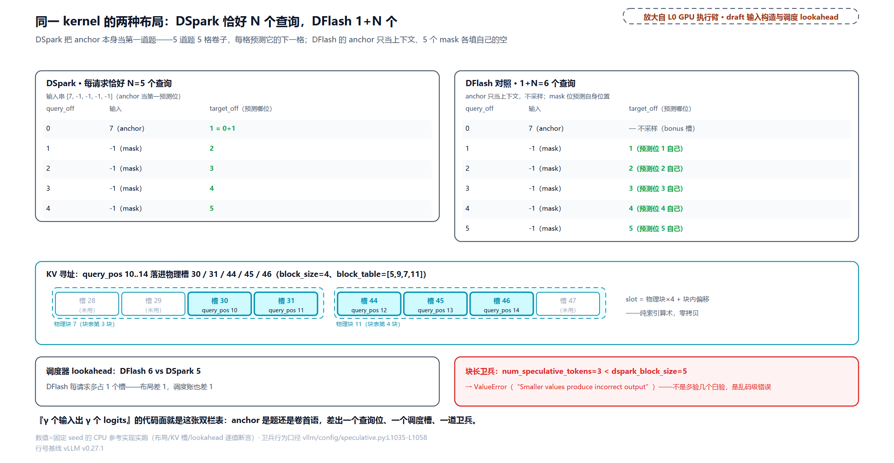

三个读法。其一，KV 槽寻址是纯索引算术：`query_pos` 除以块数取整找块号、取余找块内偏移，五个查询位落进互异的物理槽（30/31/44/45/46），无冲突。其二，布局改动**不只在 draft 侧**：调度器给每个请求预留的 lookahead 槽数（本步之外多排的空位）跟着变，DFlash 是 $`N+1`$、DSpark 恰好 $`N`$，这直接影响每请求的 KV 与批调度预算：

```python
# vllm/v1/core/sched/scheduler.py:L261-L270 · Scheduler.__init__ 的 lookahead 账
            if speculative_config.use_dflash():
                # DFlash requires an extra lookahead slot since it uses in-fill-style
                # decoding instead of standard next-token sampling, so it has a query
                # for the last sampled token plus queries for each draft token.
                self.num_lookahead_tokens = self.num_spec_tokens + 1
            if speculative_config.use_dspark():
                # DSpark drafts a block of num_spec_tokens query tokens in which the
                # anchor itself is the first prediction position (no separate bonus
                # query), so it needs exactly num_spec_tokens lookahead slots.
                self.num_lookahead_tokens = self.num_spec_tokens      # L270 恰好 N
```

其三，也是最重的一笔：DSpark 是「块」草稿器，块长是**正确性约束**不是性能旋钮——投机长度小于 checkpoint 训练时的块长，喂给块与 Markov 头机器的是不支持的布局，产出乱码而不是低接受率：

```python
# vllm/config/speculative.py:L1035-L1058 · SpeculativeConfig.__post_init__ 的 dspark_block_size 卫兵
                if self.method == "dspark":
                    # DSpark is a semi-autoregressive *block* drafter. A
                    # speculative length smaller than the checkpoint's block
                    # feeds the block / Markov-head machinery an unsupported
                    # layout and yields incorrect (garbled) output rather than
                    # merely lower acceptance. Require num_speculative_tokens to
                    # be at least the block size (e.g. 5 or 7 for DeepSeek-V4).
                    dspark_block_size = getattr(
                        self.draft_model_config.hf_config,
                        "dspark_block_size",
                        None,
                    )
                    if (
                        dspark_block_size is not None
                        and self.num_speculative_tokens < dspark_block_size
                    ):
                        raise ValueError(
                            "DSpark requires num_speculative_tokens >= "
                            f"dspark_block_size ({dspark_block_size}); got "
                            f"{self.num_speculative_tokens}. Smaller values "
                            "produce incorrect output. Use "
                            f"num_speculative_tokens={dspark_block_size} or "
                            "larger (e.g. 7)."
                        )
```

注释把后果写得罕见地重：「incorrect (garbled) output rather than merely lower acceptance」。全书见过的卫兵大多是性能口径（超了变慢），这里是被拦成配置错误：因为 Markov 头的 $`W_1`$、$`W_2`$ 与采样循环的步数，都是按 checkpoint 训练时的块布局绑死训练的。

**伪码：查询块布局**

```python
def build_query_block(anchor, last_valid_pos, N, sample_from_anchor=True):
    inputs, samples = [], []
    n_query = N if sample_from_anchor else 1 + N      # DSpark 恰 N / DFlash 1+N
    for off in range(n_query):
        qpos = last_valid_pos + 1 + off
        inputs.append(anchor if off == 0 else MASK_ID)
        if off >= (0 if sample_from_anchor else 1):    # anchor 位采不采样，一字之差
            samples.append((qpos, qpos + 1 if sample_from_anchor else qpos))
    return inputs, samples                             # (输入串, [(查询位, 预测位)])
```

钉住的不变量：$`\gamma`$ 个查询位占 $`\gamma`$ 个互异 KV 槽（寻址互异）；DSpark 布局下每个查询位都是预测位且预测的是下一格；布局选择与调度器 lookahead 账、块长卫兵三方一致（N 对 N+1 对 block_size）。

## 置信度头：学会预测自己被收下的概率

架构把 $`\tau`$ 做大是一半，另一半是「验证更聪明」。入口问题：一块草稿里哪些位值得送去验证？论文 §3.2.1 给每个草稿位配一个「天气预报员」：置信度头输出一个标量（Eq.(7)，arXiv:2607.05147）：

```math
c_k=\sigma\!\big(w^{\top}[\,h_k;\ W_1[x_{k-1}]\,]\big),
```

$`h_k`$ 是骨干在位 $`k`$ 的隐状态、$`W_1[x_{k-1}]`$ 正是 Markov 嵌入（与转移偏置共用同一张查表）、$`\sigma`$ 是 sigmoid——玩具里就是一个 12 维（8 隐状态 + 4 Markov 嵌入）内积加一扇门，生产头同构、维数 $`d+r`$，轻到可以忽略。它建模的量要说准：**「给定前缀全被接受，位 $`k`$ 存活」的条件概率**，不是「这块草稿好不好」的模糊打分。

这个头受训逼近的标签不是拍脑袋，有解析式（Eq.(8)）：

```math
c_k^{\ast}=1-\tfrac{1}{2}\,\lVert p_k^{d}-p_k^{t}\rVert_1 .
```

为什么是这条？因为批改准则自己的解析期望就是它。位 $`k`$ 被接受的概率（对 draft 采样取期望）：

```math
\sum_{x}p_k^{d}(x)\,\min\!\Big(1,\frac{p_k^{t}(x)}{p_k^{d}(x)}\Big)
=\sum_{x}\min\!\big(p_k^{d}(x),\,p_k^{t}(x)\big)
=1-\tfrac{1}{2}\lVert p_k^{d}-p_k^{t}\rVert_1,
```

第一个等号把两种情形（$`p\ge q`$ 时取 $`q`$、$`p<q`$ 时取 $`p`$）合成一个 min；第二个等号是**总变差恒等式**（total variation，两个分布差多少的度量），整条链是：

```math
\sum_{x}\min(p,q)=\sum_{x}\big[p-(p-q)^{+}\big]=1-\sum_{x}(p-q)^{+}=1-\tfrac{1}{2}\lVert p-q\rVert_{1},
```

链尾那步用了正负偏差总和相等（两个分布都归一，正部与负部各占总差的一半）。所以 $`\alpha_k=c_k^{\ast}`$：置信头学的恰是批改准则的期望通过率，训练（监督信号）与验证（判据）共用同一条恒等式。一组数字三方会师：

<!-- trace: ch33-m11 -->
| 来源 | 算式 | 数值 | 判定 |
|---|---|---|---|
| Σmin 形态（与验证准则同一恒等式） | min(0.7,0.5)+min(0.3,0.5) | 0.8 | 接受概率的解析期望 |
| TV 形态（Eq.8 监督标签 c*） | 1−½‖p_d−p_t‖₁ | 0.8 | 两种形态同值，TV 恒等式 |
| 经验接受率 | 200000 次接受计数 | 159798/200000=0.79899 | ≈0.8：三方闭环 |
| 三词表组 | 1−½*(0.3+0.3+0.6) | 0.4 | 分布差越大标签越低 |
| 置信头玩具（d=8+r=4） | σ(w·[h_k;W_1[x_{k-1}]]) | z=-0.27041 → c=0.432807 | 一个 sigmoid 门，12 维内积 |

![置信头=一个 sigmoid 门：z=w·[h_k; W_1[x_{k-1}]]=−0.27041（12 维内积：8 骨干隐状态+4 Markov 嵌入）→ c=0.432807；它受训逼近的标签 c*=1−½‖p_d−p_t‖₁ 恰是接受准则的解析期望](../diagrams/ch33-fig-confidence-head.png)

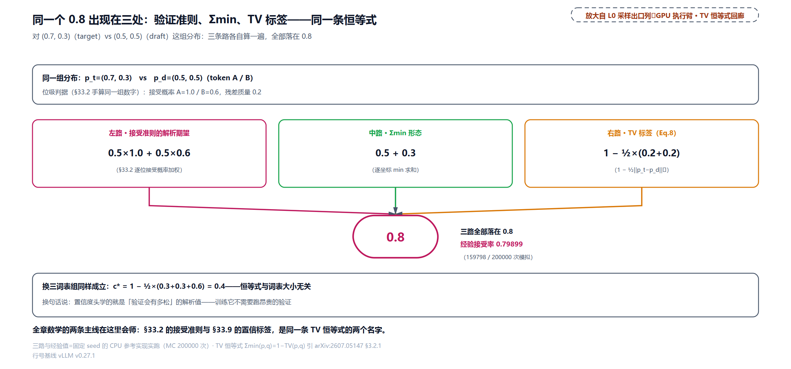

$(A,B)$ 组又是那对熟悉的数字：$`p_t=(0.7,0.3)`$、$`p_d=(0.5,0.5)`$——批改规则的手算（接受概率 0.8）、置信头的标签（$`c^{\ast}=0.8`$）、二十万次模拟的经验接受率（0.79899）三方闭环。三词表组给出另一端：分布差大（$`\lVert\cdot\rVert_1=1.2`$）时标签只有 0.4。置信头不是 DSpark 首创，SpecDec++（[arXiv:2405.19715](https://arxiv.org/abs/2405.19715)）2024 年就给 draft 挂过「接受概率预测头」用来提前停。DSpark 的推进按论文 §3.2.1 的原对比落在消费端：阈值式用法只需置信度的**排序**对（谁更可信），过自信无害；而下面的全局调度要拿置信度**算数**：把它乘成存活概率、估出期望 $`\tau`$ 与吞吐，幅度错了估计就错。监督侧则给它配了解析标签：不是拍脑袋的打分，而是上面 Eq.(8) 的接受率真值。

vLLM 侧的边界在这里第一次明说：**置信头的权重随 checkpoint 到货，但推理路径没有接线**。权重加载时被显式跳过，代码注释原话「confidence_head is not wired into inference yet」——证据与后果留在「落地」一节对账。本节与后两节的调度数学是论文侧蓝图（生产在 DeepSeek 自家引擎里跑过），不是 v0.27.1 的引擎行为。

## 校准：把报得乐观修平

置信头的数能直接拿去用吗？不能，它大概率**过自信**。这不是 DSpark 特有的毛病：神经网络的 softmax 概率是打分不是真概率，Guo et al. 2017（[arXiv:1706.04599](https://arxiv.org/abs/1706.04599)）系统测过现代深度网络普遍报得乐观，说九成把握的事往往只有八成成真。诊断这种偏差的标准量是 ECE（Expected Calibration Error，期望校准误差）：把预测按置信度分桶，每桶算「平均置信减实际命中率」的绝对值再加权平均。说明性例子：模型对 100 个样本各报 0.9 置信、其中恰 90 个对，这桶是校准好的；只有 80 个对，这桶贡献 $`|0.9-0.8|=0.1`$ 的偏差。

为什么投机解码特别在乎这件事？因为消费方式变了。阈值式用法（SpecDec++ 一系）只需要置信度的**排序**对——过自信无害，反正只用来比大小；而吞吐最大化要拿置信度**算数**（乘成存活概率、估出期望 $`\tau`$ 与吞吐），幅度错了估计就错。论文 Fig.6 的实测：原始置信头判别力已经够好（ROC-AUC 0.81 到 0.90；ROC-AUC 是排序能力的标准指标，0.5 等于瞎猜、1 完美）但系统性过自信（ECE 3% 到 8%）。

修法是祖传单参数方法的序列版。温度缩放（temperature scaling）：logits 统一除以标量 $`T`$ 再过 softmax，$`T>1`$ 把分布摊平（降置信），且严格保序（$`\sigma(z/T)`$ 对 $`z`$ 单调，谁大谁小不变），修幅度、不扰排名，这正是调度要的性质。STS（Sequential Temperature Scaling，论文 §3.2.1）把它做成逐位串行：从左到右，第 $`k`$ 位固定前 $`k-1`$ 位已校准的值、在一维网格上搜让**累积乘积** $`\prod_{i\le k}c_i`$ 的 ECE 最小的 $`T_k`$。为什么要对累积乘积校准而不是逐位校准？因为调度器排序与估算用的都是累积量（下一节），残差会沿乘积累积，逐位各自校准好了，乘三下又歪了。

<!-- trace: ch33-m12 -->
| 位 k | 校准前 mean ∏c | 真实 a | 校准前 ECE | 最优 T | 校准后 mean ∏c | 校准后 ECE |
|---|---|---|---|---|---|---|
| 1 | 0.941563 | 0.8 | 0.137063 | 2.0 | 0.800791 | 0.010623 |
| 2 | 0.869679 | 0.6 | 0.266679 | 2.25 | 0.60221 | 0.003766 |
| 3 | 0.786202 | 0.42 | 0.359952 | 2.5 | 0.427938 | 0.001795 |
| 排序保持 | — | — | — | — | argsort 逐位不变（σ(z/T) 对 z 单调） | 调度按排序仍成立 |
| 不校准的后果 | 0.786202 | 0.42 | — | — | 位 3 存活概率被高估 1.871909 倍（τ 随之虚高，正文算账） | Θ=τ·SPS(B) 失真 |

![STS 前后对照：过自信的累积置信 [0.941563, 0.869679, 0.786202]（ECE 0.137063/0.266679/0.359952）经逐位温度 T=[2.0, 2.25, 2.5] 校准后贴住真实 [0.8, 0.6, 0.42]，不校准时位 3 的存活概率虚高 1.87 倍](../diagrams/ch33-fig-sts-calibration.png)

模拟的账最说明问题（4000 样本、真实条件接受率 $`[0.8,0.75,0.7]`$、置信头带 +1.4 logit 的过自信偏置）：第三位的累积置信报 0.786202，真实存活只有 0.42——位 3 的存活概率虚高 1.871909 倍；拿这组原始置信当 $`a`$ 去估 $`\tau`$，$`\hat{\tau}=1+0.941563+0.869679+0.786202=3.597444`$，对真值 $`1+0.8+0.6+0.42=2.82`$ 虚高约 1.28 倍。不校准的调度器就是按这份虚高的账估吞吐，验证预算全押错。STS 逐位找到 $`T=[2.0,2.25,2.5]`$，三位累积置信校到 $`[0.800791, 0.60221, 0.427938]`$，贴住真实 $`[0.8, 0.6, 0.42]`$，ECE 全部降到百分之一级。论文 Fig.6 的生产实测同向：STS 后平均 ECE 约 1%。

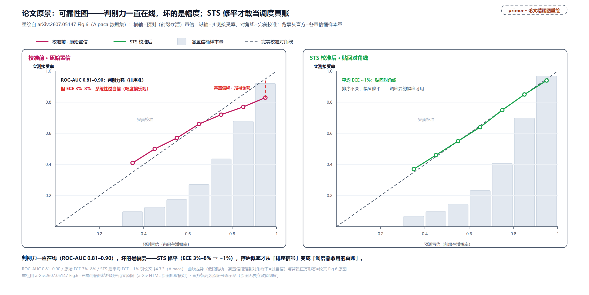

> *图注：重绘自 arXiv:2607.05147 Fig.6（Alpaca 数据集）。横轴预测的累积置信、纵轴实测接受率，对角线是完美校准。原始置信头（左侧）曲线高置信段压到对角线下方（低中段 0.35-0.65 甚至略高于对角线）：报 0.95 上下的桶实测只到 0.83 出头，过自信集中在背景灰柱样本占比最大的高置信段；ROC-AUC 0.81–0.90 说明排序能力已经够用，差的只是幅度。STS 校准后（右侧）曲线贴住对角线，平均 ECE 从 3%–8% 降到约 1%。背景灰柱是各置信桶的样本量分布。这张图就是 STS 存在的理由：调度器需要幅度而非排序。*

**伪码：STS 一步**

```python
def sts_position_k(c_raw_prefix, accepted_flags, k, grid=np.arange(0.25, 5.01, 0.25)):
    # 已校准的前 k-1 位固定不动；只调当前位的温度
    best_T, best_ece = 1.0, np.inf
    for T in grid:
        c_k = sigmoid(logit(c_raw[k]) / T)              # 温度缩放：摊平、保序
        cum = c_calibrated[:k-1] * c_k                  # 累积乘积才是调度用的量
        e = ece(cum, accepted_flags[:, k])              # 目标量：累积乘积的 ECE
        if e < best_ece:                                # 显式比 ECE（不能比元组序，那会选中网格最小的 T）
            best_T, best_ece = T, e
    c_calibrated.append(sigmoid(logit(c_raw[k]) / best_T))
```

钉住的不变量：每步是有限网格上的一维搜索、$`\gamma`$ 步内终止；温度缩放严格保序，校准前后任意两个候选的相对排名逐位不变（「谁更可信」不被动）。

## 链式法则的另一个方向

素材齐了：置信头出逐位条件概率 $`c_k`$，调度要的是「验证到第 $`j`$ 位能活下来」的累积量。中间只隔一条链式法则（论文 §3.2.2）：

```math
a_{r,j}=\prod_{i\le j}c_{r,i},\qquad a_{r,0}=1 .
```

一串多米诺：第 $`j`$ 张牌倒下的概率是前面每张成功率的连乘。$`\tau`$ 那节的 `unconditional_to_conditional_rates` 是这条法则的逆方向（逐位相除），两边在本章正好各用一次——论文从条件置信乘到累积存活（排序调度用），vLLM 的合成测试模式从累积率拆回条件率（注入 kernel 用）。同一条法则、两个行进方向：

<!-- trace: ch33-m13 -->
| 方向 | 输入 | 输出 | 读法 |
|---|---|---|---|
| 正向（链式法则） | c=[0.8, 0.9, 0.5] | a=[0.8, 0.72, 0.36] | cumprod：0.8、0.8*0.9=0.72、0.72*0.5=0.36 |
| 逆向（vLLM synthetic 注入同构） | a=[0.8, 0.72, 0.36] | c=[0.8, 0.9, 0.5] | $`c_i=a_i/a_{i−1}`$、$`a_0=1`$（docstring 写作 p_i/p_{i−1}），往返恒等 |
| 单调性 | a=[0.8, 0.72, 0.36] | 单调不增 | 全局按 a 排序天然尊重块内前缀依赖 |
| 除零守卫 | a=[0.5, 0.0, 0.3] | c=[0.5, 0.0, 0.0] | 前位 0 → 该位置 0（链条已断） |

![链式法则双向图：正向 cumprod 把条件置信 c=[0.8,0.9,0.5] 累积成前缀存活 a=[0.8,0.72,0.36]（调度排序用）；逆向逐位相除 p_i/p_(i−1) 把 a 拆回 c（vLLM synthetic 模式）——往返恒等、前位 0 有守卫](../diagrams/ch33-fig-chain-rule-both-ways.png)

这张表里最重要的一行是「单调性」：$`c_i\in[0,1]`$ 保证 $`a`$ 单调不增——请求 $`r`$ 的位 $`j`$ 候选值恒不超过位 $`j-1`$。这个朴素性质是下一节调度器的合法性基石：**把全批所有候选位按 $`a`$ 降序排成一个队列，块内的前缀依赖自动满足**（位 $`j-1`$ 必排在位 $`j`$ 前面，轮到位 $`j`$ 进名单时它的前缀必已在）。除零守卫对应链条已断的退化：前位存活为零，后面定义为零。

## 硬件感知调度：把接受率乘上吞吐曲线

现在全部素材到位，可以问最后那个系统级的问题了：**每个请求这一步验几位**？固定值在两条轴上都不对。数据侧，代码任务的接受率天然高、开放聊天天然低（Table 1：Qwen3-4B 上数学 5.57 对聊天 3.49），聊天请求用固定长块验证，尾部一堆必死位白占计算。系统侧，多验一个 token 的代价**取决于引擎负载**：轻载时验证近乎免费（算力闲着也是闲着），高并发时每个多余位都占着本可服务别人的批容量。生产系统的历史选择很能说明问题：DeepSeek 此前只跑 **MTP-1**（单 token 投机），不是不想快，是静态多 token 草稿（MTP-3/5）在高并发下「严格劣化总吞吐」（论文 §5.4 原话），不敢开。

DSpark 的解法是把「验几位」建成一个全局优化问题（论文 §3.2.2，Algorithm 1）。设批内 $`R`$ 个活跃请求，请求 $`r`$ 的调度验证长度为 $`\ell_r\in\{0,\ldots,\gamma\}`$（下标 $`r`$ 是请求编号，与前文的秩 $`r`$、残差 $`r(x)`$ 同名不同物）。一个验证步送进 target 的 token 总批量与期望接受数：

```math
B=\sum_{r=1}^{R}(1+\ell_r),
\qquad
\tau=\sum_{r=1}^{R}\Big(1+\sum_{j=1}^{\ell_r}a_{r,j}\Big),
```

（每个请求保底 1 个 bonus 位、每准入一位按存活概率 $`a_{r,j}`$ 记期望增量。此处的 $`\tau`$ 是全批合计口径（把每请求的 $`1+\sum a`$ 对 $`r`$ 求和），与 Eq.(1) 单请求的 $`\tau`$ 同名不同域；$`\Theta=\tau\cdot\mathrm{SPS}(B)`$ 的分子正是它。）引擎侧给一条**吞吐曲线** $`\mathrm{SPS}(B)`$（steps per second：批 $`B`$ 个 token 时每秒能走几步；profile 一次指离线实测一遍各批大小的步进、初始化时存成轻量成本表；简化假设是吞吐主要由 $`B`$ 决定，论文脚注 2 论证了为什么这个假设在生产部署里站得住）。目标函数：

```math
\Theta=\tau\cdot\mathrm{SPS}(B),
```

把算法（接受率）与硬件（吞吐曲线）乘在一起，这是全章把概率与调度焊起来的那一步。直觉：食堂打饭窗口有限，人少时多打一份菜几乎不费事、人多时每份菜都占着后面排队的人的时间；调度器看着「这份菜被要的概率」（$`a`$）与「现在窗口多挤」（SPS），动态决定每桌验几份。

优化怎么做？表面是组合搜索，实际有贪心结构。$`a_{r,j}`$ 对 $`j`$ 单调不增 ⇒ 全局按 $`a`$ 降序收候选天然满足前缀依赖（上一节立的性质）；固定 $`B`$ 时按 $`a`$ 从高到低选是边际增益最大的分配（交换论证：把名额从低 $`a`$ 换给高 $`a`$，$`\tau`$ 严格升而 $`B`$ 不变）。动态定 $`B`$ 就沿这条准入路径走，每收一个候选查一次表（表中 $`\tau^{\ast}`$ 是准入路径走到当前步的累积 $`\tau`$ 账、$`\ell^{\ast}`$ 是最终选定的验证长度；此处的星号标「路径当前值/最终选定」，与 $`c_k^{\ast}`$ 的「解析真值标签」是两种用法）：

<!-- trace: ch33-m14 -->
| 场景/步 | 动作 | a | B | τ* | Θ=τ*·SPS(B) | 判定 |
|---|---|---|---|---|---|---|
| A·init | ℓ=0 | — | 1 | 1.0 | 1.0 | Θ_best 初始化（R·SPS(R)） |
| A·1 | admit(req0, 位1) | 0.8 | 2 | 1.8 | 0.9 | Θ 回落 → break（早停） |
| A·返回 | ℓ*=[0] | — | — | — | 1.0 | 重载侧一个 draft 都不验最优 |
| B·init | ℓ=[0, 0] | — | 2 | 2.0 | 16.0 | — |
| B·1 | admit(req0, 位1) | 0.9 | 3 | 2.9 | 17.4 | Θ_best 更新 |
| B·2 | admit(req0, 位2) | 0.63 | 4 | 3.53 | 16.944 | 回落 → break，ℓ*=[1, 0] |
| B·全枚举 | 继续 admit(req1, 位1/位2) | 0.5 / 0.15 | 5 / 6 | 4.03 / 4.18 | 16.12 / 14.63 | 全局最大仍 17.4：单峰时早停=全局最优 |
| C·锯齿 | 同 B 场景、SPS 悬崖后回稳 | 0.5 / 0.15 | 5 / 6 | 4.03 / 4.18 | 18.538 / 18.81 | 全局 18.81 > 早停 17.4：早停被悬崖坑（§5.2 生产去早停的动机） |

![Algorithm 1 的贪心准入轨迹表：场景 B 里 init Θ=16.0 → 收 a=0.9 得 Θ=2.9*6.0=17.4（Θ_best）→ 再收 a=0.63 得 3.53*4.8=16.944 回落 → break，ℓ*=[1,0]；App.A 场景一个都不验最优](../diagrams/ch33-fig-alg1-admission.png)

场景 A 就是论文附录 A 的数字（$`\mathrm{SPS}`$：$`1\to1.0`$、$`2\to0.5`$、$`3\to0.45`$）：重载引擎步进衰减太狠，Θ 回落即停，**一个草稿位都不验**才是最优——这正是 MTP-1 时代「不敢开大块」的定量版。场景 B 是轻载：收一位就停，验证预算只给最高存的请求。场景 C 揭早停的边界条件：早停得全局最优当且仅当 Θ 沿路径单峰（隐含 SPS 平滑衰减），真实硬件的 SPS 是离散锯齿，悬崖后面可能回稳，早停会被坑（17.4 对全局 18.81），生产版因此去掉早停，代价与解法见下一节。

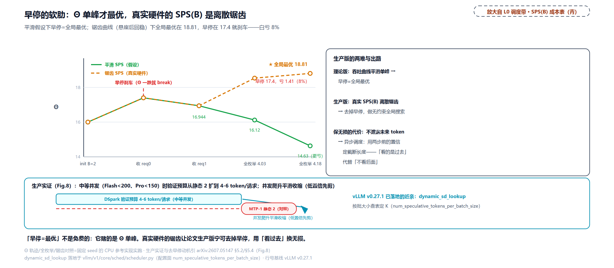

**伪码阶梯：硬件感知前缀调度器**

```python
# sec1 基础：固定预算 B 的贪心准入（固定 B 时这就是最优分配）
def schedule_v1(conf, B_budget):
    a = cumprod(conf)                       # 每请求的前缀存活（链式法则正向）
    pool = sorted(all_positions(a), key=lambda t: -t.a)   # 全局降序
    return admit_prefix(pool, B_budget)     # 顺路收：a 单调 ⇒ 前缀依赖自动满足

# sec2 加吞吐查表：沿准入路径动态定 B
def schedule_v2(conf, sps_table):
    ell = {r: 0 for r in requests}
    tau, B = R, R                            # 保底：每请求 1 个 bonus 位
    best = (tau * sps(B), ell.copy())
    for (r, j, a_rj) in sorted(all_positions(cumprod(conf)), key=-a):
        tau += a_rj; B += 1                  # 准入一位：期望 +a，批量 +1
        best = max(best, (tau * sps(B), ell_with(r, j)), key=lambda t: t[0])
    return best

# 完整：早停（单峰 Θ 下等价全局最优；非前瞻性的保证见下一节）
def schedule_v3(conf, sps_table):
    ...同 v2...
        theta = tau * sps(B)
        if theta > best_theta: best = (theta, ell)
        else: break                          # Θ 一回落就停：名单截至当前步定死
    return best
```

阶梯钉住的不变量：准入序列按 $`a`$ 降序 ⇒ 位 $`j`$ 进名单前位 $`j-1`$ 必已在（前缀依赖）；每步恰更新三本账（$`a`$、$`B`$、$`\tau^{\ast}`$）；早停把截断决策限制在已处理前缀上。

vLLM v0.27.1 里这条思路有个已落地的近亲：调度器按**批大小查表**定投机长度，`num_speculative_tokens_per_batch_size` 给一张三元组表（批区间起、批区间止、投机长度）（`vllm/config/speculative.py:L179-L186`），运行时一步一查：

```python
# vllm/v1/core/sched/scheduler.py:L1192-L1197 · Scheduler.schedule 的动态投机长度批大小查表
            # Dynamic speculative decoding: compute optimal K
            num_spec_tokens_to_schedule = self.num_spec_tokens
            if self.dynamic_sd_lookup is not None and len(num_scheduled_tokens) > 0:
                num_spec_tokens_to_schedule = self.dynamic_sd_lookup[
                    len(num_scheduled_tokens)
                ]
```

它与论文调度器同向（负载感知、批大减投机）但少了置信度那一半：查表是离线配置的静态映射，不看重活（per-request 存活概率）、不做在线吞吐优化，置信调度在 vLLM 还是蓝图。

生产侧的实证把这条曲线画成了真账（论文 §5.4，DeepSeek-V4 在线流量）。读 Fig.7/Fig.8 前两句话把话语体系立好：生产服务同时追两个互踩的目标——每用户生成速度（交互体验）与系统总吞吐（服务成本）；**SLA**（Service Level Agreement，服务等级协议）指「每用户速度不得低于多少 tok/s」的硬线；**Pareto 前沿**是两目标下谁也不白白牺牲谁的最优边界（经济学借来的词），「把前沿往外推」= 出现两维都不更差、至少一维更好的新解。Fig.8 给机制证据：中等并发下（Flash 少于 200、Pro 少于 150 个并发请求）调度器把每请求验证预算从 MTP-1 的静态 2 token 扩到约 4 到 6，吃掉空闲算力换每步更多接受；并发爬升、target 容量饱和时预算随负载平滑收缩，低置信草稿在挤占批容量**之前**就被剪掉。Fig.7 给总账：80（Flash）与 35（Pro）tok/s/user 的 SLA 锚点下总吞吐比 MTP-1 基线高 51% 与 52%；匹配吞吐水平下每用户生成速度快 60% 到 85%（Flash）与 57% 到 78%（Pro）。严格 SLA 档（120 与 50）的名义吞吐比 661% 与 406% 必须按论文自己的免责声明读：基线在该档已退化到极小并发，这两个数是「可行域扩展」的证据，不是对良性基线的真实倍数。

## 名单必须先定死：非前瞻与选择偏差

调度器还有最后一道数学关要过，而且它直接连着无损定理。回看批改一节末尾立的那条推论：影响「哪些位被验证」的决策也是采样过程的一部分。无损要求**非前瞻性**（non-anticipating，Leviathan/Chen 2023 的表述）：位 $`k`$ 的准入事件 $`\ell_r\ge k`$ 必须只依赖 $`x_{r,k}`$ 采样**之前**可见的信息，不能依赖这个 token 自己的实现。

反例（论文附录 A 全套数字）把违反的后果算到个位数。单请求、$`\gamma=2`$，位 1 前置存活 $`a_1=0.8`$，容量曲线 $`\mathrm{SPS}(1)=1.0`$、$`\mathrm{SPS}(2)=0.5`$、$`\mathrm{SPS}(3)=0.45`$。验 0 位与 1 位的期望吞吐分别是 $`\Theta_0=1.0`$ 与 $`\Theta_1=0.9`$（下表前两列）。**不加早停**的调度器会先把 $`\Theta_2`$ 也算了再定 $`\ell`$——问题在于算 $`\Theta_2`$ 要用 $`a_2=a_1 c_2`$，而 Markov 置信头的 $`c_2`$ 显式依赖已实例化的 $`x_1`$：

<!-- trace: ch33-m15 -->
| x_1 实现 | c_2 | Θ_0 | Θ_1 | Θ_2 | 选 ℓ | 首位输出 Y |
|---|---|---|---|---|---|---|
| A | 0.9 | 1.0 | 0.9 | 1.134 | 2（准入 x_1） | A（min(1, 0.7/0.5)=1 必被接受） |
| B | 0.0 | 1.0 | 0.9 | 0.81 | 0（不准入 x_1） | 从 p_t 重采：P(A)=0.7 |
| 经验分布（200000 次） | — | — | — | — | — | P(Y=A)=0.85039 ≠ 0.7（不无损） |
| 早停版对照 | Θ_1=0.9<Θ_0=1.0 → 恒 ℓ=0 | — | — | — | 0 | P(Y=A)=0.699855 ≈ 0.7（保无损） |

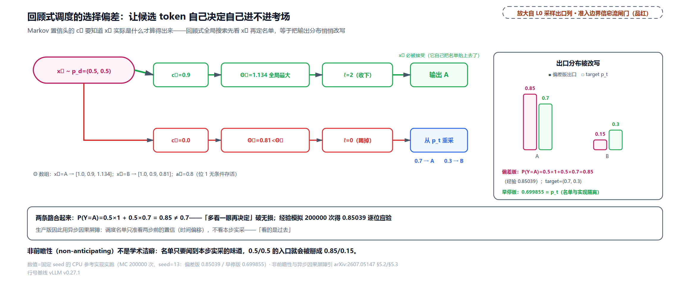

把偏差算成分布。词表 $`\{A,B\}`$、$`p_t=(0.7,0.3)`$、$`p_d=(0.5,0.5)`$（又是那组数：$`a_1=\Sigma\min=0.8`$ 与 TV 恒等式一致）。回顾式调度下：$`x_1=A`$ 时 $`c_2=0.9`$、$`\Theta_2=(1+0.8+0.72)\times0.45=1.134`$ 是全局最大，$`\ell=2`$，$`x_1`$ 进名单且因 $`\min(1,0.7/0.5)=1`$ 必被接受；$`x_1=B`$ 时 $`c_2=0`$、$`\Theta_2=0.81<\Theta_0`$，$`\ell=0`$，$`x_1`$ 被踢出名单、target 从 $`p_t`$ 重采。于是首位输出：

```math
\Pr[Y=A]=\underbrace{0.5\times1}_{x_1=A,\ \mathrm{admitted}}+\underbrace{0.5\times0.7}_{x_1=B,\ \mathrm{resampled}}=0.85\ \neq\ 0.7,
```

输出分布被「名单偏好」悄悄改写成 (0.85, 0.15)。直觉地说，调度器偏爱「能带出高置信续写」的 token，这种偏爱本身就是选择性采样。二十万次模拟经验值 0.85039 对上解析值。早停版没这个漏洞：$`\Theta_1=0.9<\Theta_0=1.0`$ 在评估任何与 $`x_1`$ 相关的量**之前**就停了，恒 $`\ell=0`$，准入与 $`x_1`$ 的实现独立，经验 0.699855 回到 0.7（论文公版恰好把附录 A 论证无损的最后半句截掉了，这里的「恒 ℓ=0、准入与实现独立」按 Algorithm 1 已印出的早停逻辑直推）。早停的双重身份现在完整了：它既是单峰假设下的最优性技巧，更是非前瞻性的**保证机制**，名单在任何 token 露面之前就定死。

生产版（论文 §5.2）在真实系统的两堵墙上把这个设计又改了一轮。墙一：真实 SPS 离散锯齿，早停会被悬崖坑（上一节场景 C）。墙二：现代引擎的零开销调度（ZOS，zero-overhead scheduling：CPU 组批与 GPU 前向完全重叠、调度开销趋零，SGLang、NanoFlow 一线现代服务引擎的设计，论文 §5.2 两系并引；它与 [第 19 章](../../ch19-compile-capture/narrative/chapter.md)的 CUDA graph 重放同源——图按固定形状捕获，**下一步的批形状必须在本步算完前定死**），而 Algorithm 1 每步按最新置信动态定长，批形状每步都变，同步调度必然卡断流水线。DSpark 的生产解法是异步化：截断长度 $`K`$ 用**两步前**的置信预测来定（历史信息，天然已有），当前步候选仍严格按最新累积置信排序，秩保持的动态 top-K，调度延迟全部藏进流水线。妙处在这层时间偏移顺带解决了墙一：生产版干脆去掉早停、做无约束全局搜索（跨 SPS 悬崖找全局最大）。无约束的回顾式搜索若拿当前步的置信去评估，会破坏非前瞻性（附录 A 的反例正是这么漏的：$`\Theta_2`$ 里的 $`c_2`$ 依赖已实例化的 $`x_1`$）；但生产版的全局搜索评估的**全是两步前的历史预测**，准入决策与当前 token 的实现天然隔离，因果性从「不看后面」换成「看的是过去」。

## 训练：猜对答案不如对齐分布

架构与调度讲完，补最后一块原理拼图：这些东西怎么训出来（论文 §3.3）。训练数据从每条 target 序列随机采多个 anchor 位置、切成 $`\gamma`$ 位的块；target 全程冻结，draft 共享它的 embedding 与 LM head 且冻结，可训的只有骨干、Markov 头与置信头。三个损失与总目标（Eq.(9)–(12)，位置权重 $`w_k=\exp(-(k-1)/\gamma)`$ 越靠前越大——前缀生存的复利结构决定前位最值钱）：

```math
\mathcal{L}_{\mathrm{ce}}
=-\sum_{k=1}^{\gamma}w_k\,\log p_k^{d}(x_k^{\ast}),
\qquad
\mathcal{L}_{\mathrm{tv}}
=\sum_{k=1}^{\gamma}w_k\,\lVert p_k^{d}-p_k^{t}\rVert_1,
```

```math
\mathcal{L}_{\mathrm{conf}}
=-\sum_{k=1}^{\gamma}w_k\big[c_k^{\ast}\log c_k+(1-c_k^{\ast})\log(1-c_k)\big],
\qquad
\mathcal{L}=0.1\,\mathcal{L}_{\mathrm{ce}}+0.9\,\mathcal{L}_{\mathrm{tv}}+1.0\,\mathcal{L}_{\mathrm{conf}} .
```

三件套各管一摊：$`\mathcal{L}_{\mathrm{ce}}`$ 教草稿猜对下一 token（$`x_k^{\ast}`$ 是真值）；$`\mathcal{L}_{\mathrm{tv}}`$ 罚 draft 与 target 的分布距离——**直接最大化接受率**，因为 TV 恒等式把逐位接受概率钉在 $`1-\lVert\cdot\rVert_1/2`$ 上，最小化分布距离就是最大化期望接受长度；$`\mathcal{L}_{\mathrm{conf}}`$ 是置信头的二元交叉熵，学解析标签 $`c^{\ast}`$。配比最有讲头：$`\alpha_{\mathrm{tv}}=0.9`$ 对 $`\alpha_{\mathrm{ce}}=0.1`$（论文 Eq.(12) 的损失权重，与位接受率 $`\alpha_k`$ 撞名不同物），**训练几乎全押分布对齐，猜对答案不如对齐分布**，因为记分板（接受率）只看分布距离。参考实现按这组目标跑梯度下降，接受率与 $`\tau`$ 同向爬升：

<!-- trace: ch33-m19 -->
| step | loss | L_tv | 逐位接受率 | E[τ] |
|---|---|---|---|---|
| 0 | 2.835209 | 1.230687 | [0.600594, 0.643979] | 1.987364 |
| 30 | 1.044546 | 0.276232 | [0.895966, 0.943808] | 2.741586 |
| 60 | 0.775307 | 0.238598 | [0.898375, 0.970861] | 2.770572 |
| 90 | 0.4613 | 0.104698 | [0.985419, 0.93773] | 2.909477 |
| 150 | 0.855619 | 0.302703 | [0.869057, 0.966352] | 2.708872 |
| 注 | 每步重采 ground-truth 块→单步 loss 有抖动 | 总趋势 1.230687→0.302703 | 位 1: 0.600594→0.869057 | 1.987364→2.708872（上限 3.0） |

$`L_{\mathrm{tv}}`$ 从 1.230687 降到 0.302703、$`\mathbb{E}[\tau]`$ 从 1.987364 爬到 2.708872（$`\gamma=2`$ 的全对齐上限 3.0）。端点对看一降一升，逐点并不单调——单步波动与 step 150 的回撤（$`L_{\mathrm{tv}}`$ 回到 0.302703、$`\mathbb{E}[\tau]`$ 回落到 2.708872、低于 step 90 的 2.909477）都来自真值块每步重采的噪声，不是训练发散。训练代码不在 vLLM 推理仓（开源在 [DeepSpec](https://github.com/deepseek-ai/DeepSpec)，含 Eagle3、DFlash、DSpark 三种算法同框架重训），vLLM 只持有被训练出的权重。

## 落地：装好了哪一半，没装哪一半

最后对账：这套东西在 vLLM v0.27.1 里到底落了多少。装配线七件套，从 checkpoint 到 speculator：

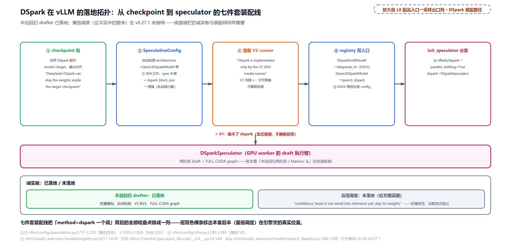

第一件，权重随 checkpoint 发布。用户不用另配 draft 模型，speculative 配置里写 `method="dspark"` 加投机长度即可（DSV4 典型 5）：

```python
# vllm/config/speculative.py:L717-L723 · dspark 配置分支
            elif self.method == "dspark":
                # DeepSeek DSpark can ship the weights inside the target checkpoint
                if self.target_model_config is None:
                    raise ValueError("target_model_config must be present for dspark")
                self.model = self.target_model_config.model
                if not self.quantization:
                    self.quantization = self.target_model_config.quantization
```

`model` 直接取 target 的模型路径、量化对齐 target——「骨干的眼睛」那节的共享账（embed/lm_head 别名、只多三件小件）让这份打包可行。第二、三件，自动检测与复用：配置层从模型名或 architectures（`Qwen3DSparkModel`、DSV4 的 `DSparkDraftModel`）认出 DSpark（`vllm/config/speculative.py:L880-L898` 与 `L954-L965`），DSV4 直接复用全套 target config。第四件，dflash 与 dspark 都打开 `parallel_drafting=True`（`L984-L985`）。第五件，强制 V2：

```python
# vllm/config/vllm.py:L583-L595 · DSpark 强制 V2 model runner
        # DSpark is implemented only by the V2 GPU model runner, and DeepSeek-V4
        # is not otherwise a default-V2 architecture, so force V2 for it. If V2
        # is unsupported for the rest of the config, _validate_v2_model_runner
        # raises rather than silently falling back to V1 (which can't run dspark).
        if (
            self.speculative_config is not None
            and self.speculative_config.method == "dspark"
        ):
            return True
```

v0.27.1 是双 runner 布局：V1（`gpu_model_runner` 加 `*Proposer` 生态）与 V2（`v1/worker/gpu/` 新树加 `*Speculator`），DSpark 只在 V2 有实现，宁可显式报错也不静默回落 V1。第六件，registry 双入口把两个模型名指到实现（`vllm/model_executor/models/registry.py:L617-L618`：`DSparkDraftModel` 到 deepseek_v4 包、`Qwen3DSparkModel` 到 qwen3_dspark 包）。第七件，块长卫兵：投机长度小于 checkpoint 的 `dspark_block_size` 直接报配置错误，布局节走过的「小了乱码」拦截。至于 `init_speculator` 分发（谱系节、布局节已见），它是注册面的收口，在图上是最右一格、不占角标号。

诚实账压轴。权重加载的 skip 清单把「落地了哪半」写成了一行代码：

```python
# vllm/model_executor/models/qwen3_dspark.py:L184-L196 · load_weights 的 skip 清单
        # mask_embedding is an unused placeholder param; DSpark masks via the vocab row.
        # confidence_head is not wired into inference yet; skip its weights.   # L185
        # embed_tokens / lm_head are optional; when omitted they are shared from
        # the target by load_dspark_model, so skip the unloaded params here.
        skip_substrs = ["mask_embedding", "confidence_head"]
        if not includes_embed_tokens:
            skip_substrs.append("embed_tokens")
        if not includes_lm_head:
            skip_substrs.append("lm_head")
        if not includes_draft_id_mapping:
            skip_substrs.append("draft_id_to_target_id")
        loader = AutoWeightsLoader(self, skip_substrs=skip_substrs)
        loader.load_weights(model_weights.items())
```

L185 的注释原话：「confidence_head is not wired into inference yet; skip its weights」——置信头的权重**在 checkpoint 里、被加载器显式跳过**。所以 v0.27.1 落地的是 DSpark 的半自回归 drafter（并行骨干、Markov 头、anchor 布局、块长卫兵、强制 V2），没落地的是置信度调度那半（置信头、STS 校准、硬件感知前缀调度器，调度侧 vLLM 只有批大小查表的静态近亲）。这条边界不是缺陷声明，是版本快照：论文的生产部署在 DeepSeek 自家引擎里跑通了全链路（在线流量上两周内取代 MTP-1，匹配吞吐下每用户快 57% 到 85%），开源侧能拿到的工件有三样，论文（arXiv:2607.05147）、训练框架 [DeepSpec](https://github.com/deepseek-ai/DeepSpec)、各家 draft checkpoint（[HuggingFace collection](https://huggingface.co/deepseek-ai)，含随 DeepSeek-V4-Pro 发布的生产权重）。

## 收尾：采样出口列的最后一块点亮

回头看 L0 图：右侧品红「采样与出口」列从上到下，温度惩罚与截断采样（[第 30 章](../../ch30-sampler-pipeline/narrative/chapter.md)）、结构化输出位掩码（[第 31 章](../../ch31-grammar-compilation/narrative/chapter.md)、[第 32 章](../../ch32-bitmask-enforcement/narrative/chapter.md)）都已点亮，本章点亮最后一块：spec decode（投机解码）——drafter 提议、target 一次前向验证、RejectionSampler 拒绝采样保分布不变。三根主线收拢。**数学线**：draft 逐位按 $`u<\min(1,p_t/p_d)`$ 抽签、首拒位从残差 $`\mathrm{norm}(\max(0,p_t-p_d))`$ 回填、全收白送 bonus。接受段加残差段两情形归一，输出分布与直接采样 target 逐位相等；$`\tau`$ 是前缀存活的连乘阶梯，接受率的上限被 TV 距离钉死。**架构线**：自回归准但慢（$`T_{\mathrm{draft}}\propto\gamma`$）、并行快但碰（对前驱边缘化），半自回归两全，重活给并行骨干、轻活给低秩 Markov 头（一张 253 倍省下来的 bigram 表），anchor 当第一位再省一格。**调度线**：置信头学解析接受率、STS 把幅度修准、$`a=\prod c`$ 排序准入、$`\Theta=\tau\cdot\mathrm{SPS}(B)`$ 把概率乘上硬件，早停的非前瞻性保无损，生产版用「看的是过去」换回全局搜索。要随时回望整张骨架，那张图在这里：


> *图注：全书唯一那张 L0 骨架图（与[第 1 章](../../ch01-vllm-v1-in-one-map/narrative/chapter.md)同一张，逐字节相同）。本章点亮右侧品红「采样与出口」列最下方的 spec decode（投机解码）块：drafter.propose 把草稿排进下一步、target 一次前向验证、RejectionSampler 拒绝采样保分布不变——「验证一串草稿」就此替掉「采一个 token」（draft 前向发生在中列 GPU 执行臂的模型层之后、采样之前）；调度器与它只见于左列的下一次组批，那条物流是下一章的主线。*

数学侧的账到这里收清。工程侧还压着一叠本章只点了名的问题：draft 位怎么作为「预填」排进调度器的下一步（追赶公式与乐观推进在哪接上）、RejectionSampler 的三 kernel 与 V2 kernel 全景（本章只走了判据与残差的骨架行）、V1 `*Proposer` 与 V2 `*Speculator` 双生态的分家史、投机解码与结构化输出的 rollback 联动（[第 32 章](../../ch32-bitmask-enforcement/narrative/chapter.md)结尾留过「spec 请求一行变 k+1 行」的账）、以及 min_p 与 logit_bias 为何在投机下直接不生效的互斥清单——还有批改 kernel 里那条 `USE_BLOCK_VERIFICATION` 旁路（块级并行验证协议，另一种「批改合同」）。下一章全部接走：拿着本章的验证规则与 $`\tau`$ 的账，进 vLLM 的调度器与 Triton kernel，把投机解码从论文数学走到引擎里的每一步物流。
