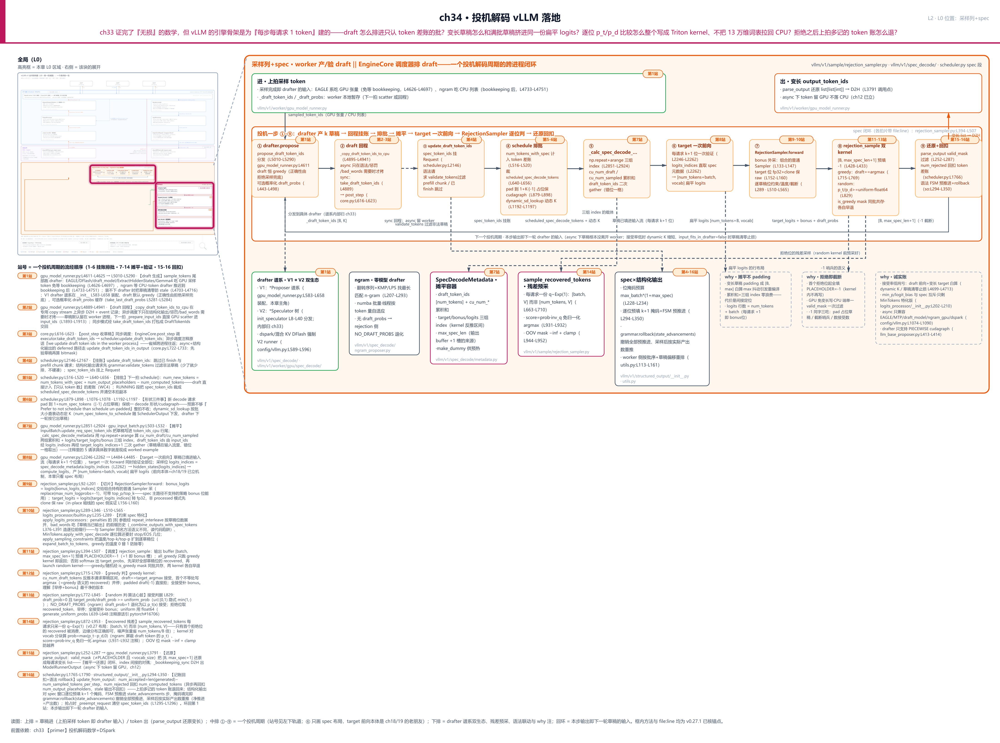
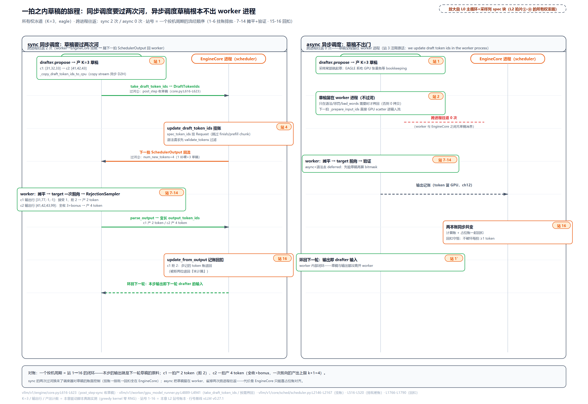
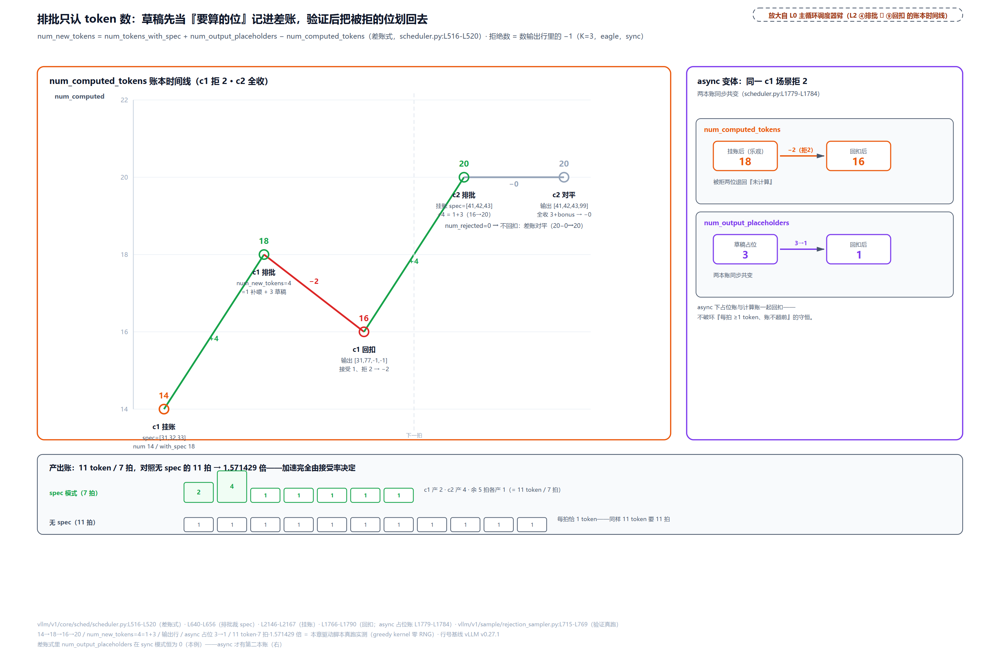
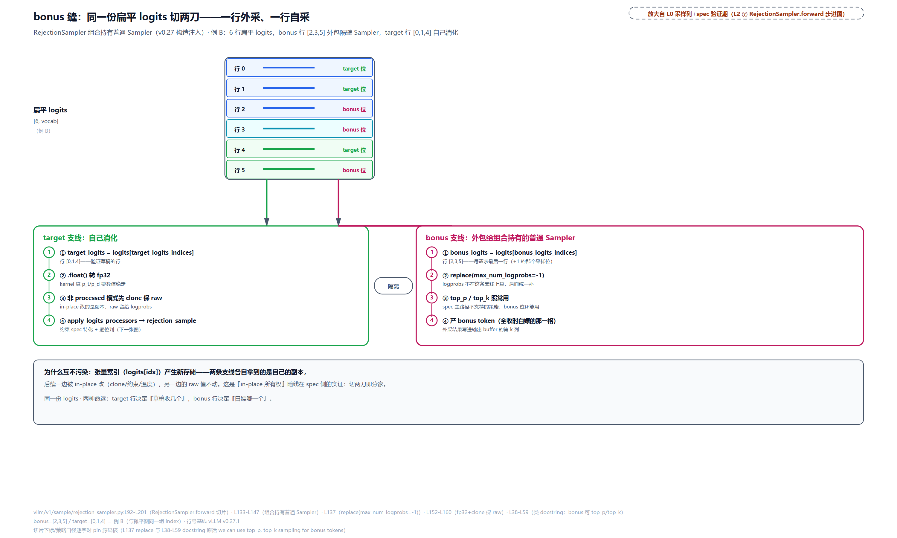
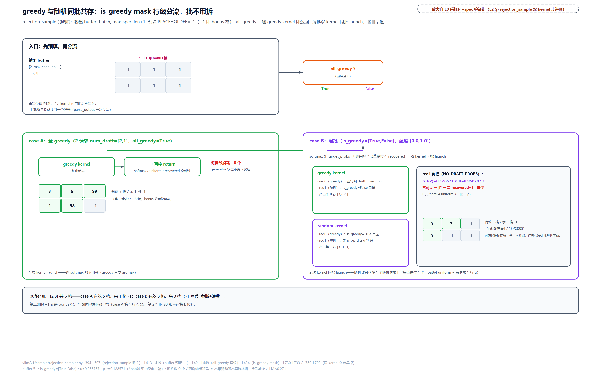
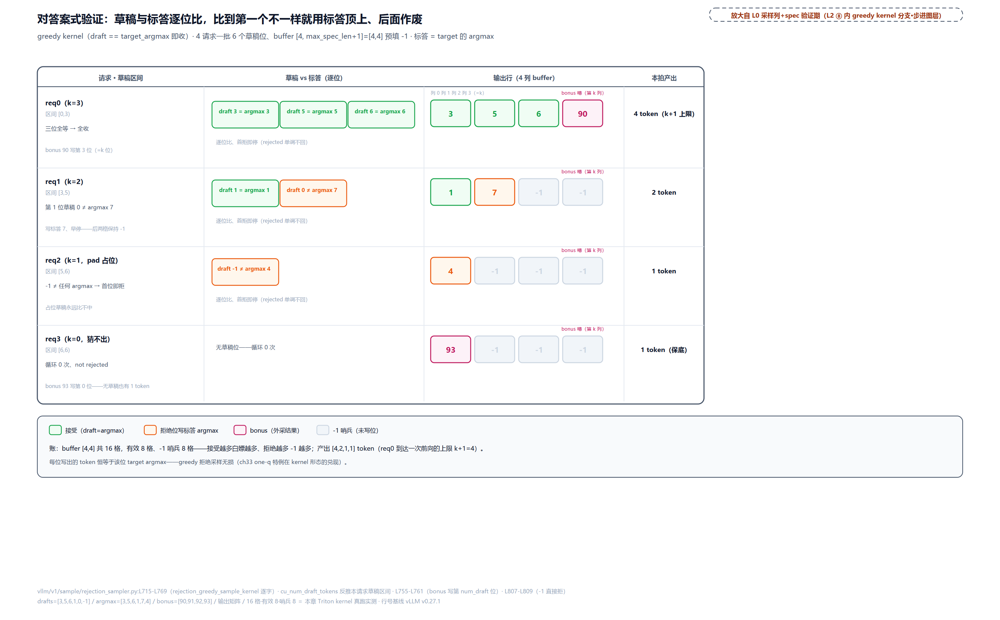
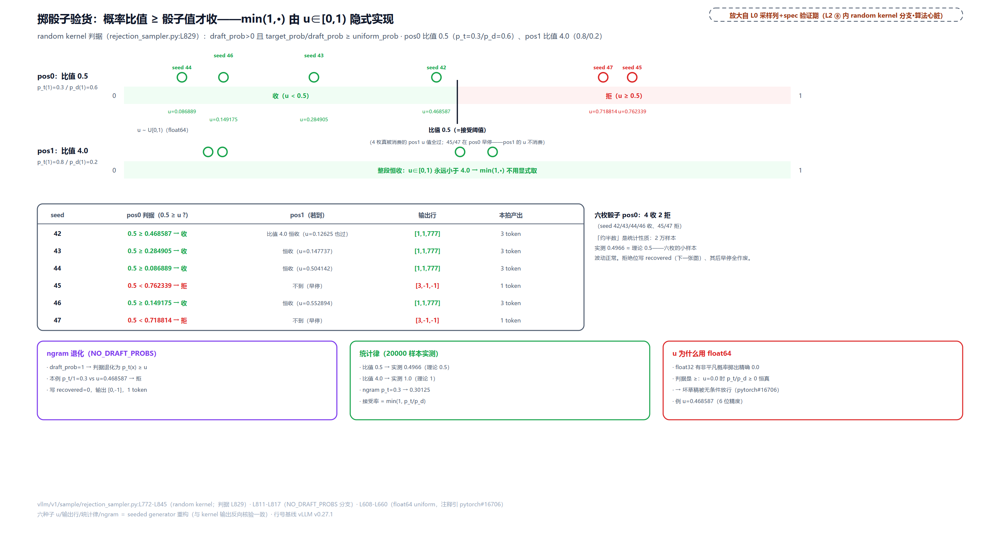
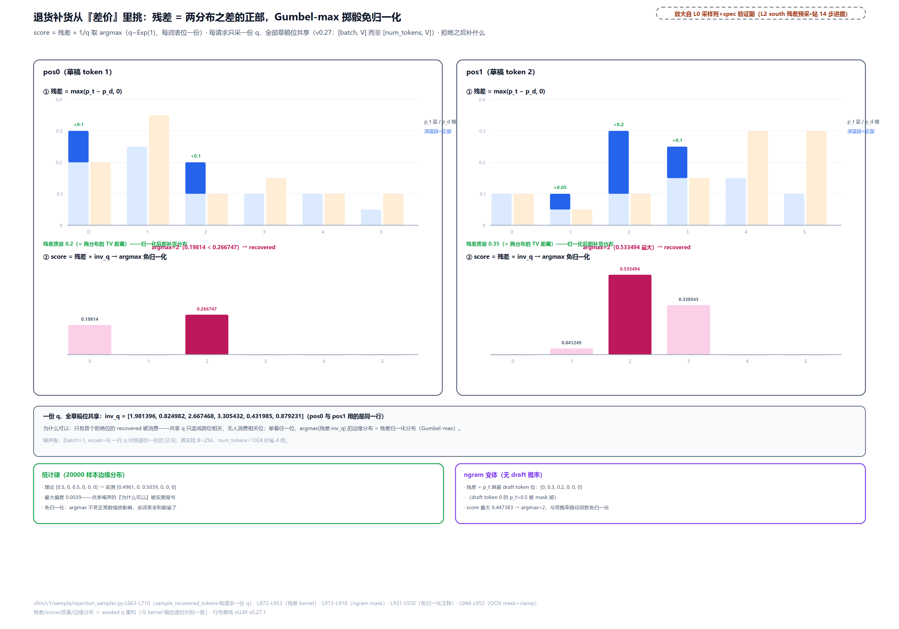
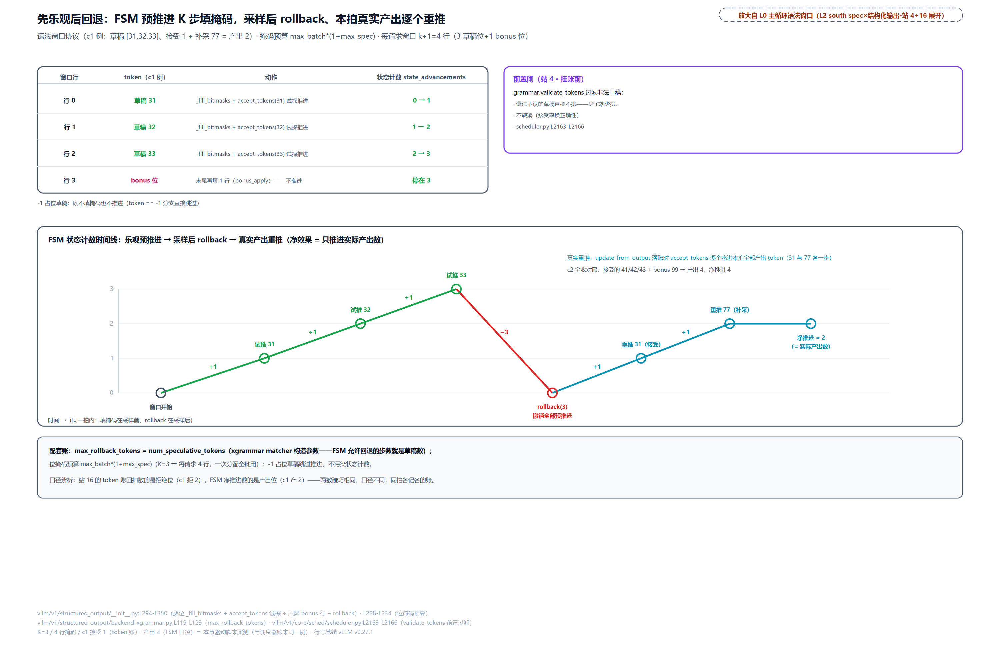
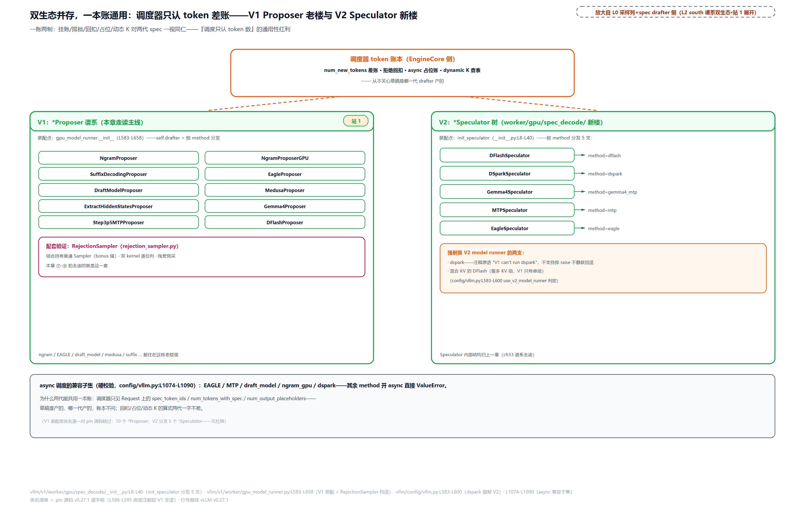

# 第 34 章　投机解码 vLLM 落地

[第 33 章](../../ch33-primer-spec-decode-math/narrative/chapter.md)把「无损」证完了：draft 猜 $`\gamma`$ 个，target 一次前向整批批改，逐位按概率比值抽签接受，输出分布与直接采样一字不差。但那是数学。vLLM 的引擎骨架却是为「每步每请求只出 1 个 token」建的：调度器只认 token 差账，采样位只切每请求末一行，CUDA graph 按形状精确回放。现在每个请求一步要吃进 $`\gamma+1`$ 个位置，问题一排排立在门口。draft 怎么排进下一拍的批？变长草稿（ngram 有的请求一个都猜不出，EAGLE 恒满 K 个）怎么和满批草稿挤进同一份扁平 logits？逐位比较 $`p_t/p_d`$ 要读十几万维的概率、掷一枚均匀随机数又不能把 GPU 拉回 CPU，拒绝采样怎么整个写成 Triton kernel？拒绝之后，调度器上一拍多记的 token 账怎么退回来？最后还有一个反向问题：这一切值不值？接受率低的时候，draft 前向加变长的 target 前向是不是纯亏？vLLM 又把哪些采样参数直接判了互斥？本章沿一个投机解码周期走十六站，把 [第 33 章](../../ch33-primer-spec-decode-math/narrative/chapter.md)收尾交接清单上的主线项在真实代码里兑现。

先把记号对齐。[第 33 章](../../ch33-primer-spec-decode-math/narrative/chapter.md)的论文记号 $`\gamma`$（draft 块长），在 vLLM 代码里叫 `num_speculative_tokens`（配置项，调度器里简写 `num_spec_tokens`），本章统一说 **K**。drafter（草稿器）产出的候选叫草稿（draft token），验证后收下的叫接受（accepted），拒绝位补采的叫 recovered，全收白送的那位叫 bonus——这四个词的权威定义在 `RejectionSampler` 的类 docstring 里，本章第三幕原文照贴。

## 你在这里



> *图注：本章放大的是[第 1 章](../../ch01-vllm-v1-in-one-map/narrative/chapter.md) L0 全图右侧采样出口列最下方的 spec decode（投机解码）块，外加主循环框的跨进程展开——worker 产草稿、验草稿，EngineCore 里的调度器排草稿，两臂一拍一拍交替。[第 33 章](../../ch33-primer-spec-decode-math/narrative/chapter.md)点亮了这块的数学（验证规则、无损定理、$`\tau`$ 的账、drafter 谱系与 DSpark 架构），本章点亮落地全链。六块已读地基直接踩上来：9 步采样管线与「门口换轨」的预告（[第 30 章](../../ch30-sampler-pipeline/narrative/chapter.md)）、异步调度的占位账本与盲调度（[第 12 章](../../ch12-async-scheduling/narrative/chapter.md)）、追赶公式与「只认 token 数」的总纲（[第 10 章](../../ch10-continuous-batching-chunked-prefill/narrative/chapter.md)）、持久批次的行式 token 网格（[第 18 章](../../ch18-persistent-batch-fixed-addresses/narrative/chapter.md)）、结构化输出的掩码窗口（[第 31 章](../../ch31-grammar-compilation/narrative/chapter.md)、[第 32 章](../../ch32-bitmask-enforcement/narrative/chapter.md)）、CUDA graph 的形状全等纪律（[第 19 章](../../ch19-compile-capture/narrative/chapter.md)）。读图：左侧是 L0 缩略图加十六站轨道，轨道头写着站号分组「1-6 挂账排批 · 7-14 摊平+验证 · 15-16 回扣」；上排是草稿进与 token 出（进·上拍采样 token 即 drafter 输入，出·parse_output 还原的变长 output_token_ids）；中排 ①-⑨ 是一个投机周期的九拍片（⑥ 只画 spec 布局，target 前向本体是 ch18/19 的老朋友）；下排是 drafter 谱系双生态、ngram 零模型 drafter、SpecDecodeMetadata 摊平容器、残差预采、语法联动，加三笔 why 注（摊平不 padding、拒绝即截断、诚实账）；回环箭头标着「本步输出即下一轮 drafter 输入」。站号 = 一个投机周期内请求流经代码的顺序，正文按四幕编排、不必照站号读。*

读法建议：只想看「draft 怎么排进批、账怎么退」，直奔[「第一幕·排批」](#第一幕排批调度器的三本账)；被「变长草稿怎么挤进一份 logits」困扰的，看[「第二幕·摊平」](#第二幕摊平变长草稿与三组-index)；本章算法心脏是拒绝采样的三个 Triton kernel，从[「第三幕·验证」](#第三幕验证rejectionsampler-的七道工序)读到尾；想看 vLLM 把投机解码藏在哪里、哪些参数跟它互斥，跳[「双生态与诚实账」](#双生态与诚实账两代实现一本账)；草稿怎么生出来的在[「草稿从哪来」](#草稿从哪来drafter-谱系与恒-greedy的合同)；想跟全程，按序读。

照例交代取证环境，全章数值表通用。所有数值来自配套精简版在宿主机上的实跑（RTX PRO 6000 Blackwell、torch 2.11.0+cu128、triton 3.7.1、numba 0.66.0）：三个 Triton kernel（greedy 判、random 判、残差采）真跑在真 GPU 上，ngram 的 KMP 匹配（KMP＝后文 ngram 节展开的字符串匹配算法）真跑在 CPU 上，种子固定；调度器与 runner 侧的编排算式（差账、摊平 index）不在精简版范围里，由驱动脚本逐字复刻源码逻辑跑出，并逐项与源码 docstring 自带的数字互核（第二幕的例 A 全部对上）。数值推演全部用玩具规模（词表最小 6 个 token、草稿 1 到 3 个、token id 是两位小数字），为的是让每一位、每一个 index 都写得出来；生产词表十几万维，算术一模一样。取证环境与 pin 源码无已知行为差异。

## 草稿的一生：一个周期，十六站

现在走到 L0 图主循环框的跨进程两臂。先把整个周期的骨架立起来，后面四幕逐段放大。

直觉先给一句：草稿的一生绕引擎一圈。出生在 worker（采样尾部就起草）、上班要过河挂账（同步调度）或根本不出门（异步调度）、干完活（验证）还要还账（回扣）。本步的输出，就是下一轮草稿的原料。

出生的时机值得先看一眼。草稿是在**上一步采样刚结束**的时候生成的，入口是 `sample_tokens` 尾部的一个闭包：

```python
# vllm/v1/worker/gpu_model_runner.py:L4611-L4625 · GPUModelRunner 内 propose_draft_token_ids 闭包
        def propose_draft_token_ids(sampled_token_ids):
            assert spec_decode_common_attn_metadata is not None
            with record_function_or_nullcontext("gpu_model_runner: draft"):
                self._draft_token_ids = self.propose_draft_token_ids(  # L4614
                    scheduler_output,
                    sampled_token_ids,
                    self.input_batch.sampling_metadata,
                    hidden_states,
                    sample_hidden_states,
                    aux_hidden_states,
                    spec_decode_metadata,
                    spec_decode_common_attn_metadata,
                    slot_mappings,
                )
                self._copy_draft_token_ids_to_cpu(scheduler_output)     # L4625
```

采样完成，token 还在 GPU 上，drafter 立刻开动：EAGLE 系、draft_model、DFlash 这些要跑模型前向的 drafter 直接吃 GPU 上的采样张量，不必等 CPU 簿记（`gpu_model_runner.py:L4626-L4697`）；ngram 这种只做字符串匹配的 drafter 要吃 CPU 上的 token 列表，推迟到簿记完成之后（L4733-L4751）。L4625 的 `_copy_draft_token_ids_to_cpu` 是草稿的回程起跑线，去哪条轨马上看。装不下 drafter 的场合（输入超长，`_input_fits_in_drafter` 判否）会把草稿整个清零，防止上一拍的陈旧草稿混进这一拍——那是「接受率低纯亏」的止损阀，账留到末节一起算。

### 回程双轨：过河挂账，还是留在 worker

草稿生出来，调度器要把它记进下一拍的批。这一步有个分岔：同步调度与异步调度走两条完全不同的轨。先看代码怎么分流：

```python
# vllm/v1/worker/gpu_model_runner.py:L4895-L4909 · _copy_draft_token_ids_to_cpu 的 async 短路
    def _copy_draft_token_ids_to_cpu(
        self, scheduler_output: "SchedulerOutput", zeros_only: bool = False
    ) -> None:
        if torch.is_tensor(self._draft_token_ids):
            assert isinstance(self._draft_token_ids, torch.Tensor)
            self.prev_num_spec_tokens = self._draft_token_ids.shape[1]
        # Check if we need to copy draft tokens to CPU. In async scheduling,
        # we only copy when needed for structured output, penalties or bad_words.
        if self.use_async_scheduling and not (
            scheduler_output.has_structured_output_requests
            or self.input_batch.sampling_metadata.output_token_ids
        ):
            return                                                   # L4907
```

L4907 这个 `return` 就是两条轨的分水岭。**同步轨**（旧设计）：草稿必须在专用 copy stream 上异步 D2H（页锁定内存加 event，[第 8 章](../../ch08-logprobs/narrative/chapter.md)立过的三件套），经 `take_draft_token_ids` 打包成 `DraftTokenIds` 信封（`req_ids` 加 `draft_token_ids` 两个平行列表，`vllm/v1/outputs.py:L337-L341`），跨进程交回 EngineCore：

```python
# vllm/v1/engine/core.py:L616-L623 · EngineCore.post_step 收草稿
    def post_step(self, model_executed: bool) -> None:
        # When using async scheduling we can't get draft token ids in advance,
        # so we update draft token ids in the worker process and don't
        # need to update draft token ids here.
        if self.check_for_draft_tokens and not self.async_scheduling and model_executed:
            draft_token_ids = self.model_executor.take_draft_token_ids()
            if draft_token_ids is not None:
                self.scheduler.update_draft_token_ids(draft_token_ids)
```

**异步轨**（v0.27 默认开）：注释原话「we update draft token ids in the worker process」——草稿根本不离开 worker 进程。下一拍 `_prepare_input_ids` 把 worker 本地暂存的 `_draft_token_ids` 直接 GPU scatter 进输入流（`gpu_model_runner.py:L1893-L1913`），跨进程往返归零。为什么敢这样？这里有一条完整的 why 链。**旧设计**的痛点：异步调度要求调度器盲调度（组下一拍时看不到上拍真实结果，[第 12 章](../../ch12-async-scheduling/narrative/chapter.md)立过的重叠版循环），草稿若还走「回程挂账下发」的同步环，一来一回两次跨进程拷贝全落在关键路径上；而且 spec 的接受数只有在 GPU 上数输出里的 -1 才知道，CPU 等它就是同步点，重叠窗口直接被吃掉。**v1 方案**（三件套，本章视角）：① 草稿留 worker，只有结构化输出、惩罚、bad_words 真需要草稿历史时才拷回（就是 L4903-L4907 那个条件）；② 下一拍按「上拍草稿全接受」乐观排批，worker 侧另有 GPU 侧纠偏（`correct_spec_decode_token_counts`，`gpu_model_runner.py:L1536-L1564`，此处只点名、内部不展开）负责修正账面；③ 惩罚与 bad_words 需要的「真实草稿历史」，由 `update_async_spec_token_ids` 在采样前就地补真值（`gpu_input_batch.py:L1094-L1113`）。**代价**（诚实账）：调度器状态领先真实进度，一连串补偿全是账单。拒绝回扣要同时退占位账（第四幕看代码）；被抢占请求的陈旧输出仍要送出但不得改已清零的计数器；兼容的 drafter 子集被硬校验收窄到五种（末节看清单）。



> *图注：左板是同步调度的时序（worker 与 EngineCore 两条生命线，两次跨进程过河：站 2-3 的 `take_draft_token_ids` 过去挂账、站 4-6 的 SchedulerOutput 带着批回流），右板是异步调度的时序（草稿留在 worker，红字标着「跨进程往返 0 次」，环回改成本地闭环）。两板同一时刻起跑（站 1 同高）、都按站序自上而下推进（async 免了过河两步，后段带位略高）：采样尾部起草（站 1）→ 摊平加验证（站 7-14）→ 记账回扣（站 16）。本例 K=3，c1 拍输出 `[31,77,-1,-1]`（接受 1、拒 2、产 2 个 token）、c2 拍 `[41,42,43,99]`（全收加 bonus、产 4 个），数字来自第一幕的账本推演。*

### 挂账：三道闸

不管走哪条轨，草稿都要过调度器这道挂账闸。同步轨在 `post_step` 里调挂账方法；异步加结构化输出的组合走 deferred 路径（先验草稿再算掩码，`core.py:L722-L733`），落点是姊妹方法 `update_draft_token_ids_in_output`（`scheduler.py:L2168-L2203`）——不改 `Request`，直接修正在途的 `SchedulerOutput`：草稿先裁到已排位数，再过同一道 `grammar.validate_tokens` 闸，滤掉的非法位补 -1 占位（位掩码对 -1 整行跳过，第四幕看代码）。同步侧的挂账方法长这样：

```python
# vllm/v1/core/sched/scheduler.py:L2146-L2167 · update_draft_token_ids 挂账
    def update_draft_token_ids(self, draft_token_ids: DraftTokenIds) -> None:
        for req_id, spec_token_ids in zip(
            draft_token_ids.req_ids,
            draft_token_ids.draft_token_ids,
        ):
            request = self.requests.get(req_id)
            if request is None or request.is_finished():
                # The request may have been finished. Skip.
                continue

            if request.is_prefill_chunk:
                # Ignore draft tokens for prefill chunks.
                if request.spec_token_ids:
                    request.spec_token_ids = []
                continue

            # Add newly generated spec token ids to the request.
            if self.structured_output_manager.should_advance(request):
                metadata = request.structured_output_request
                spec_token_ids = metadata.grammar.validate_tokens(spec_token_ids)  # L2165 type: ignore[union-attr]
            request.spec_token_ids = spec_token_ids
```

三道闸。第一道：请求可能已经 finish（草稿在路上时请求先结束了），跳过。第二道：prefill 还在分章搬运的请求不投机——投机只作用于 decode 阶段，顺手清掉可能残留的旧草稿。第三道最有趣：带语法的请求先过 `grammar.validate_tokens`（L2165），语法不认的草稿直接滤掉，**少了就少排，不硬凑**。为什么在挂账这一步就滤？因为结构化输出的掩码要按草稿窗口逐位预填（第四幕展开），非法草稿进了窗口只是白白浪费验证位；拿接受率换正确性，划算。挂账完成，`request.spec_token_ids` 就位，等下一拍 `schedule()` 来取。

## 草稿从哪来：drafter 谱系与「恒 greedy」的合同

现在走到 L0 图采样出口列的 spec 块最上方：drafter 那一格。v0.27.1 里 V1 一侧（[第 33 章](../../ch33-primer-spec-decode-math/narrative/chapter.md)落地节立过的双 runner 布局：V1 是老的 `gpu_model_runner` 配 `*Proposer` 生态，V2 是新树配 `*Speculator`，本章末节对照）的 drafter 谱系在 runner 构造期装配（`gpu_model_runner.py:L583-L658`），按 `speculative_config.method` 分发到 NgramProposer、EagleProposer、DraftModelProposer、MedusaProposer、DFlashProposer 等十个类；方法表注册面在 `vllm/config/speculative.py:L53-L77`（ngram/ngram_gpu/suffix/medusa/mlp_speculator/draft_model/eagle 系/mtp/dflash/dspark/custom_class）。每个 drafter 内部长什么样、谱系怎么从自回归演化到半自回归，[第 33 章](../../ch33-primer-spec-decode-math/narrative/chapter.md)已经讲透，本章只看两件事：最易讲的零模型范例 ngram，和所有模型类 drafter 共同的对外合同。

### ngram：零模型 drafter，纯字符串功夫

ngram 是[第 18 章](../../ch18-persistent-batch-fixed-addresses/narrative/chapter.md)点过名的「抄上文」式投机：拿上下文最后 n 个 token 当搜索词，在更早的上下文里找它上一次出现的位置，把后面的续文截 K 个当草稿——任务画像与原始出处（PLD，Prompt Lookup Decoding）那里也给过（抄输入的任务实测 2-4 倍加速、开放式闲聊草稿命中率趋零）。vLLM 的 `ngram` 方法就是这个想法加自研的高效匹配实现。

高效匹配是本章要走的代码。找「匹配后缀的最长 n-gram」朴素做是 O(n²) 起步的字符串功夫，vLLM 的解法是把整个 token 序列**翻转**后对自己跑 KMP。KMP（Knuth-Morris-Pratt，1970 年代的字符串匹配标准算法）的核心工具是前缀函数，vLLM 代码里变量名叫 `lps`：为一个串的每个前缀预算一个数，它的最长「既是前缀又是后缀」的真子串有多长。一个可以直接核对的小例（说明性外部示例）：字符串 `abcabcd` 的前缀函数是 `[0, 0, 0, 1, 2, 3, 0]`——位置 3 的子串 `abca` 里，真前缀 `a` 同时是后缀；位置 5 的 `abcabc` 里，`abc` 前后缀重合；位置 6 加了 `d`，重合归零。失配时按 `lps` 直接跳到次优候选，匹配从 O(nm) 降到 O(n+m)。

vLLM 的巧用在「翻转」二字：把历史 token 翻转后，「当前序列结尾的后缀」变成翻转串的「前缀」，`lps` 记录的前后缀重合直接给出「历史上出现过的、与当前结尾重合的最长片段」。看代码：

```python
# vllm/v1/spec_decode/ngram_proposer.py:L207-L293 · _find_longest_matched_ngram_and_propose_tokens
def _find_longest_matched_ngram_and_propose_tokens(
    origin_tokens: np.ndarray,
    min_ngram: int,
    max_ngram: int,
    max_model_len: int,
    k: int,
) -> np.ndarray:
    # … 省略：两道卫兵（总长不足 min_ngram 返回空；k 封顶 max_model_len − total）…
    # Flip tokens, and the goal become to find longest ngram
    # on the rightmost position which matches the prefix with
    # length [min_n, max_n] (inclusive).
    tokens = origin_tokens[::-1]

    # Longest prefix (not including itself) which is a suffix of
    # the current position.
    #   lps[i] = max{v, where tokens[0:v] == tokens[i+1-v:i+1]}
    #
    # As ngram is capped by max_ngram to save memory, we only need to
    # store lps for the first max_ngram prefix.
    lps = np.zeros(max_ngram, dtype=np.int32)                          # L241

    longest_ngram = 0
    position = 0

    # lps[0] always equal to 0, we start with index 1
    prev_lps = 0
    i = 1
    while i < total_token:
        # tokens[:prev_lps] is the longest prefix as a suffix of tokens[:i]
        if tokens[prev_lps] == tokens[i]:
            # Token match: tokens[:prev_lps+1] is the longest prefix as
            # a suffix of tokens[:i+1]
            prev_lps += 1
            # Check if we found a longer valid ngram.
            #
            # Update position when longest_ngram matched prev_lps,
            # as we want to get the target n-gram of the earliest position
            # in the original tokens (i.e.
            # latest position in the reversed tokens)
            if prev_lps >= longest_ngram:
                longest_ngram = prev_lps
                position = i                                          # L263
            if i < max_ngram:
                # Store LPS for the first max_ngram prefix
                lps[i] = prev_lps
            if prev_lps == max_ngram:
                # When prev_lps reached max_ngram, update prev_lps
                # to lps[max_ngram-1] to avoid matching ngram
                # longer than max_ngram
                prev_lps = lps[max_ngram - 1]
            i += 1
        elif prev_lps != 0:
            # Token mismatch: try the second-longest prefix
            # among all suffix of tokens[:i],
            # which is the longest prefix of tokens[:prev_lps]
            prev_lps = lps[prev_lps - 1]                              # L277
        else:
            # Token mismatch, and no more prefix (except empty string)
            # as a suffix of tokens[:i]
            i += 1

    if longest_ngram < min_ngram:
        # No valid ngram is found
        return np.empty((0,), dtype=origin_tokens.dtype)

    # Flip the position back, so in origin_tokens,
    # origin_tokens[total_token-1-position:total_token-1-position+longest_ngram]
    # is the matched ngram, so we should start drafting tokens from
    # total_token-1-position+longest_ngram
    start_position = total_token - 1 - position + longest_ngram
    k = min(k, total_token - start_position)
    return origin_tokens[start_position : start_position + k]
```

四个细节。第一，`lps` 只存前 `max_ngram` 项（L241）：匹配长度被 `max_ngram` 封顶，更长的重合用不到，数组只要 O(max_ngram) 内存；`prev_lps` 顶到 `max_ngram` 时回落 `lps[max_ngram-1]`，保证匹配长度永远不越界。第二，失配跳转（L277）沿 `lps` 链下降，这是 KMP 线性复杂度的来源。第三，并列取最早（L263 的 `>=`）：同样长度的匹配出现在多处时，取翻转后最靠右的位置，即原序列最早出现的那次——最早出现的续文当草稿，跟后续文本被引用的概率通常最高。第四，收尾回翻：`start_position` 定位到原序列里匹配 n-gram 的结束处，从那里复制 K 个 token 当草稿。找不到满足 `min_ngram` 的匹配就交白卷（返回空数组），这一拍不投机。

<!-- trace: m12 -->
| i（翻转序列指针） | 比较（reversed = [4,3,2,1,4,3,2,1]） | 动作 | longest_ngram | 结果 position / 草稿 |
| --- | --- | --- | --- | --- |
| 1 | tokens[0]=4 vs tokens[1]=3 不等 | i += 1 | 0 | 0 / — |
| 4 | tokens[0]=4 = tokens[4]=4 | prev_lps 0→1；longest 1 | 1 | 4 / — |
| 7 | 连配 4 位（i=5、6 已各进 1：longest 2、3） | prev_lps→4（=max_ngram 顶格） | 4 | 7 / — |
| 收尾回翻 | — | start_position = 8−1−7+4 = 4；草稿 = origin[4:4+3] | — | 草稿 [1,2,3]（真跑与镜像互核一致） |
| 变体：并列取最早 | [1,2] 出现于位置 0、3、5 | position 取翻转后最靠右 = 原序列最早出现 | 2 | 草稿 [9,1]（最早匹配处的后续） |
| 变体：k 封顶 | total=8、max_model_len=10 | k=min(3, 10−8)=2 | — | 草稿 [1,2] |

主例走一遍：历史 `[1,2,3,4,1,2,3,4]`，翻转后 `[4,3,2,1,4,3,2,1]`。指针走到 i=4 首次配上 `tokens[0]=4`，随后 i=5、6、7 连配，`prev_lps` 爬到 4（`max_ngram=4` 顶格）；收尾回翻 `start_position = 8−1−7+4 = 4`，草稿取 `origin[4:7] = [1,2,3]`——正是 `1,2,3,4` 上一次出现（第一段）后面的续文，恰好又是第二段的开头。整条 KMP 主循环线性：i 每轮要么 +1（至多 n 次），要么 `prev_lps` 沿 `lps` 链严格下降（降幅总量不超过升幅总量，势能法），总步数不超过 2n；本例 n=8 走 7 步，`lps` 只占 4 个 int32。

这套循环为什么跑得动？每个请求每拍都要做一遍，Python 解释器撑不起逐 token 的 while 循环。答案是 numba（CPU 侧的 JIT 编译器）：把普通 Python/NumPy 函数在首次调用时按参数类型编译成机器码，之后的调用直接跑机器码，速度逼近 C。用法是一个 `@njit` 装饰器；配 `nogil=True` 后编译产物执行期间释放 GIL（Python 的全局解释器锁，多线程并行的老大难），多请求的匹配循环就能真并行吃满多核。vLLM 把整套翻转加 KMP 包成 numba 函数按批跑（`ngram_proposer.py:L177-L196` 的 `batch_propose_numba`，`prange` 按请求并行），线程数按 token 量自适应。对照记一句：Triton 把 Python DSL 编译到 GPU（第三幕的主角），numba 把 Python 子集编译到 CPU——spec decode 两个都用，验证写 Triton，n-gram 草稿写 numba，零模型零 GPU 占用。

还有一条链路要接上：ngram 不产概率分布，rejection 侧拿不到 `draft_probs`，走 `NO_DRAFT_PROBS` 特化分支（第三幕看代码，退化成「以 $`p_t(x)`$ 概率接受」）。这就是站 1 里「变长草稿」的一种极端：一个都猜不出（空数组），连草稿位都没有。

### 模型类 drafter 的合同：恒 greedy，正确性外包

EAGLE、draft_model、MTP、Medusa 这些要跑模型前向的 drafter 共用一个基类合同（`SpecDecodeBaseProposer`，`vllm/v1/spec_decode/llm_base_proposer.py`）：摆输入、跑草稿模型、采 k 个草稿。合同里最反直觉的一条是**draft 恒 greedy**：

```python
# vllm/v1/spec_decode/llm_base_proposer.py:L428-L438 · SpecDecodeBaseProposer._greedy_sample
    def _greedy_sample(self, hidden_states: torch.Tensor) -> torch.Tensor:
        """Greedy-sample draft tokens from hidden states."""
        if self.use_local_argmax_reduction:
            return self.model.get_top_tokens(hidden_states)
        if self.use_heterogeneous_vocab:
            logits = self.model.compute_logits(hidden_states)
            assert self.vocab_mapping is not None
            logits = self.vocab_mapping.constrain_draft_logits(logits)
            draft_token_ids = logits.argmax(dim=-1)
            return self.vocab_mapping.map_draft_to_target_ids(draft_token_ids)
        return self.model.compute_logits(hidden_states).argmax(dim=-1)
```

草稿器永远取 argmax，哪怕 target 那边是带温度的随机采样。凭什么敢？[第 33 章](../../ch33-primer-spec-decode-math/narrative/chapter.md)的无损定理说过：拒绝采样的输出分布只由 target 分布与 draft 分布的比值决定，draft 怎么采**只影响接受率，不影响输出分布的正确性**——正确性由拒绝采样兜底。所以 draft 用最便宜的 greedy，把力气花在猜得更准上。第一个分支是省显存的细化：`use_local_argmax_reduction` 时走 `get_top_tokens` 做 vocab-parallel 的局部 argmax 归约，免掉全词表 logits 的跨卡 gather（[第 23 章](../../ch23-model-layer-assembly/narrative/chapter.md)立过的 logits 物化账，草稿模型词表投影这一步同样适用）；第二个分支是异词表 drafter（小词表草稿模型配大词表 target）的映射。greedy 之外还有一条可选升级：概率化 `draft_probs`（L440-L498 的 `_sample_from_logits`），drafter 把自己每一步的分布也交出来，拒绝判据从「退化形式」回到完整的 $`p_t/p_d`$，接受率更高；这份概率经 `take_last_draft_probs` 缓存（`gpu_model_runner.py:L5281-L5284`），下一拍采样时按 req_id 对行拼装。

MTP 类 drafter 还有一个钩子值得点名：DeepSeek-V4 的模型在 forward 尾部把 hidden_states 拷进 `_mtp_hidden_buffer`，暴露 `get_mtp_target_hidden_states` 钩子给 runner 消费（`gpu_model_runner.py:L5198-L5205`）——「MTP 头长在 target 身上、吃 target 的隐状态」这件事的代码落点。合同还有一条硬约束：drafter 只支持 PIECEWISE cudagraph（L411-L426 注释原话「Only supports PIECEWISE cudagraphs」）。原因是草稿前向的形状每拍都在变（K 动态、批在变），进不了要求形状全等的 FULL 图，只能走按段捕获的 PIECEWISE（[第 19 章](../../ch19-compile-capture/narrative/chapter.md)的分界线）。

## 第一幕·排批：调度器的三本账

现在走到 L0 图左列调度器臂。挂完账的草稿要排进下一拍，这一幕全是调度器的账本功夫。先立总纲：[第 10 章](../../ch10-continuous-batching-chunked-prefill/narrative/chapter.md)立过 woosuk 的那条注释——调度器里没有「解码相位」也没有「prefill 相位」，每个请求只有 `num_computed_tokens`（已算多少）和 `num_tokens_with_spec`（总共要算多少），每拍就是分 token 配额让前者追赶后者；这个模型「general enough to cover chunked prefills, prefix caching, speculative decoding」（`scheduler.py:L441-L450`）。投机解码在调度器里的全部落地，就是这句话的兑现：**草稿不开专用相位、不开专用队列，全部表达成 token 差账**。朴素做法给 spec 开「草稿批」「验证批」两个专门相位行不行？行，但混相批、抢占、前缀缓存全要再谈一遍；CUDA graph 还要求形状精确匹配，草稿数不齐等于每拍形状抖动等于重编译。一本账通吃，代价是账要记得细。三本账如下。

### 第一本：token 差账

```python
# vllm/v1/core/sched/scheduler.py:L516-L520 · RUNNING 段的追赶公式（spec 版）
            num_new_tokens = (
                request.num_tokens_with_spec
                + request.num_output_placeholders
                - request.num_computed_tokens                            # L519
            )
```

这就是[第 10 章](../../ch10-continuous-batching-chunked-prefill/narrative/chapter.md)的追赶公式原样，只是 `num_tokens_with_spec` 里的 spec 不再恒空（prompt 加 output 加 `len(spec_token_ids)`），`num_output_placeholders`（占位数，[第 12 章](../../ch12-async-scheduling/narrative/chapter.md)的占位账本，下文简写 ph）也不再恒 0。草稿被当成「计划要算的 token 位」记进分子，排批时差多少补多少。RUNNING 段随后把草稿裁出来发下车：

```python
# vllm/v1/core/sched/scheduler.py:L640-L656 · RUNNING 段裁出 scheduled_spec_decode_tokens
            # Speculative decode related.
            if request.spec_token_ids:
                num_scheduled_spec_tokens = (
                    num_new_tokens
                    + request.num_computed_tokens
                    - request.num_tokens
                    - request.num_output_placeholders
                )
                if num_scheduled_spec_tokens > 0:
                    spec_token_ids = request.spec_token_ids
                    if len(spec_token_ids) > num_scheduled_spec_tokens:
                        spec_token_ids = spec_token_ids[:num_scheduled_spec_tokens]
                    scheduled_spec_decode_tokens[request.request_id] = spec_token_ids

                # New spec tokens will be set in `update_draft_token_ids` before the
                # next step when applicable.
                request.spec_token_ids = []                             # L656
```

`num_scheduled_spec_tokens` 由差账反解出来（本拍排的位数里刨掉正常 decode 该排的，剩下就是草稿位），超出部分截断；裁进 `scheduled_spec_decode_tokens` 后立刻清空本拍副本（L656）——下一轮由 `update_draft_token_ids` 重填。这个字段随 `SchedulerOutput` 下发 worker（`vllm/v1/core/sched/output.py:L212`），是草稿回流验证的通道。

### 第二本：lookahead 账

KV cache 的槽位分配要给 spec 多留余量，按方法三态（`scheduler.py:L258-L270`）：eagle 系与 draft_model 留 K 个（每草稿位一个 query）；DFlash 留 K+1（in-fill 补写式解码：对被挖空、待补写的位置直接出 query，而不是标准解码的「给上一词出下一词」，所以最后采样位要多一个 query）；dspark 留 K（anchor 本身就是第一个预测位，没有单独的 bonus query）。三态差异是谱系布局在账本上的投影，布局算术归 [第 33 章](../../ch33-primer-spec-decode-math/narrative/chapter.md)，这里只记结论。

### 第三本：形状账

```python
# vllm/v1/core/sched/scheduler.py:L881-L898 · 新 decode 请求 pad 到 1+K
                    # Pad new decode requests to uniform spec decoding size to
                    # preserve full cudagraph for this step.
                    # Not for diffusion where draft tokens can't be padded.
                    if (
                        (self.num_spec_tokens > 0 and self.dynamic_sd_lookup is None)
                        and self.num_sampled_tokens_per_step > 0
                        and num_new_tokens == 1
                        and (scheduled_running_reqs and not prefill_scheduled)
                    ):
                        num_new_tokens = 1 + self.num_spec_tokens      # L890
                        if (
                            num_new_tokens > token_budget
                            or num_computed_tokens + num_new_tokens > self.max_model_len
                        ):
                            # Prefer to not schedule than schedule un-padded here.
                            break                                      # L896
                        pad_spec_decode = True
```

新进批的 decode 请求本来只占 1 个位（本拍就采 1 个 token），spec 开启时被补到 1+K（L890），草稿孔填 -1 占位（`L1076-L1078`：`scheduled_spec_decode_tokens[request_id] = [-1] * self.num_spec_tokens`）。为什么？保形状：批里其他请求都带 K 个草稿位，混进一个 1 位的请求，这一拍的 decode 形状就破了，FULL cudagraph 回放不了。预算或长度不够时 L896 直接 break，注释原话「Prefer to not schedule than schedule un-padded」——宁可不收这个新请求（多等一拍），不破全批的形状。白算的 -1 草稿位由下游三处协同消化：拒绝 kernel 对 -1 直接拒、语法窗口对 -1 不推进、parse_output 过滤掉，形状约束不改语义。异步调度下还有一条同源的纪律：快到 max_tokens 的拍不排部分草稿（`scheduler.py:L498-L500` 注释「We don't schedule partial draft tokens since this prevents uniform decode optimizations」）。

形状账的另一面是**动态 K**：

```python
# vllm/v1/core/sched/scheduler.py:L1192-L1197 · dynamic_sd_lookup 按批大小定 K
        # Dynamic speculative decoding: compute optimal K
        num_spec_tokens_to_schedule = self.num_spec_tokens
        if self.dynamic_sd_lookup is not None and len(num_scheduled_tokens) > 0:
            num_spec_tokens_to_schedule = self.dynamic_sd_lookup[
                len(num_scheduled_tokens)                               # L1196
            ]
```

开了 dynamic 就不 pad（L885 的条件里有 `dynamic_sd_lookup is None`）：K 按本拍批大小查表——批小（轻载）时放大 K 多验几个，批大（重载）时缩 K 保批容量。查出的 `num_spec_tokens_to_schedule` 随 SchedulerOutput 下发，drafter 下一轮按它出草稿。这是 [第 33 章](../../ch33-primer-spec-decode-math/narrative/chapter.md)讲过的 DSpark「硬件感知调度」在 vLLM 的静态近亲：论文用置信头在线算「概率乘硬件」的目标量，vLLM 用查表近似同一件事。

<!-- trace: m3 -->
| 场景 | 条件 / 预算 | 决策 | 形状 / 结果 |
| --- | --- | --- | --- |
| A：新请求进批（预算足） | running 形状 [4,4,4]、新请求 num_new_tokens=1 | pad_spec_decode=True：1→4、草稿位填 [-1,-1,-1] | 批形状统一 [4,4,4,4]（full cudagraph 保住） |
| B：预算不足 | pad 后 4 > 剩余预算 2 | break：宁可不排不破形状 | 新请求等下一拍；在批 3 个请求的形状保住 |
| C：dynamic_sd_lookup 开启 | 查表 [0,3,3,2,2] | 不 pad——K 按批大小定：batch 1→3、batch 3→2、batch 4→2 | num_spec_tokens_to_schedule 随 SchedulerOutput 下发，drafter 下一轮照办 |
| 占位草稿下游（greedy kernel 真跑） | drafts=[-1,-1,-1]、target_argmax=4 | -1 ≠ 任何 argmax → 首位即拒 | 输出 [4,-1,-1,-1] → parse_output 还原 [4]：本拍照常 1 token，只是零投机收益 |
| 查表边界：区间外顺延 / 封顶 | 建表微例（vllm/v1/spec_decode/dynamic/utils.py:L77-L148）：区间 [(1,2,3),(4,4,1)] 展开成查表 [0,3,3,3,1]，下标即批大小 | 批 3 落在区间空档 → 顺延前段 K=3；封顶微例：区间配 K=9、全局 num_speculative_tokens=4 → 落表 min(4,9)=4 | 查表恒有返回值，不抛错 |

### 两拍账本推演

三本账合起来跑两拍。设定：K=3、eagle 方法（lookahead=K）、同步调度；同一个请求的两个投机周期 c1、c2。这个请求已用前 5 拍普通 decode 各采出 1 个 output token（记作 o1..o5，其中 o5 是上拍刚采出、本拍要补喂进模型的那位）。c1 的草稿 `[31,32,33]` 被 target 在第二位拒绝（greedy kernel 判定，零随机数真跑），c2 的草稿 `[41,42,43]` 三位全收加 bonus 99。账本推演（数字全部来自精简版真跑）：

<!-- trace: m2 -->
| 拍·动作 | 挂账后 num_computed / num_tokens_with_spec | 排批 num_new_tokens（token 差账） | 验证输出行 | 记账：回扣后 num_computed |
| --- | --- | --- | --- | --- |
| c1：挂账 spec=[31,32,33] 后 schedule() | 14 / 18 | 4（=1 补喂 o5 + 3 草稿） | [31,77,-1,-1]：接受 1、拒 2 | 18−2 → 16（被拒两位退回未计算） |
| c2：挂账 spec=[41,42,43] 后 schedule() | 16 / 20 | 4（=1 补喂上拍 recovered=77 + 3 草稿） | [41,42,43,99]：全收 3 + bonus | 20−0 → 20（不回扣，差账对平） |
| async 变体：同一 c1 场景拒 2 | 乐观 18（占位 3） | — | 同上 | num_computed 18→16、num_output_placeholders 3→1（两本账共变） |
| 两拍合计 | — | — | c1 产 2、c2 产 4 token | 11 token / 7 拍 vs 无 spec 11 拍 → 1.571429 倍 |

逐格读。c1 拍：挂账后 `num_tokens_with_spec` 从 15 涨到 18（15 是 prompt 10 加 o1..o5，3 个草稿位加进「要算的总量」），差账排 4 个位（1 个是补喂上一拍采出的 o5，3 个是草稿）；验证输出 `[31,77,-1,-1]`——接受 1 位、第二位被拒后从残差分布补了 recovered=77、后两位作废。账上 18 个「已算」位里有 2 个没产出 token，第四幕看回扣代码怎么把它们划回去（18→16）。c2 拍：上一拍补的 77 现在要补喂，加 3 草稿又是 4 个位；这次全收，20 对平不回扣。全程算总账：这个请求 7 拍共产 11 个 token，其中前 5 拍普通 decode 各产 1 个（o1..o5）、c1 拍产 2、c2 拍产 4；对照无 spec 的 11 拍（每拍恰 1 个）快 1.571429 倍。加速完全由接受率决定，这正是 [第 33 章](../../ch33-primer-spec-decode-math/narrative/chapter.md)$`\tau`$ 账的系统侧读数。



> *图注：横轴是拍，纵轴是同一请求的 `num_computed_tokens`（两段大台阶分别是 c1、c2 两个投机拍）。绿色台阶是排批时的乐观推进（按「草稿全收」记账），红色下落是验证后的拒绝回扣（c1 拒 2：18→16；c2 拒 0：20 对平，灰色标平账）。右上两张小卡是异步调度变体：同一场景下计算账 18→16 的同时占位账 3→1 共变。底部拍条对总账：spec 7 拍产出 11 token 对无 spec 的 11 拍。*

这本账有一个不变式兜底：每拍至少产 1 个 token（末位非草稿采样位必排，输出行至少 1 个有效 token），被拒位全部从 `num_computed_tokens` 划回，账面永不超前于真实产出；`num_tokens` 被 `max_model_len` 封顶，请求有限拍内必 finish。异步变体多一本 ph 共变，不破坏守恒。

## 第二幕·摊平：变长草稿与三组 index

现在走到 L0 图 worker 臂的输入侧。调度器下发 `scheduled_spec_decode_tokens`（变长草稿，每请求 0 到 K 个），worker 要把它们喂进 target 的一次前向。两站接力：先把草稿写进持久批的行尾，再算出三组 index 把变长摊平。

第一站，写入。持久批的行式 token 网格是 [第 18 章](../../ch18-persistent-batch-fixed-addresses/narrative/chapter.md)立的：每请求一行 `max_model_len` 格，从左往右摆 token。草稿写到「无 spec 时的长度」之后：

```python
# vllm/v1/worker/gpu_input_batch.py:L503-L528 · InputBatch.update_req_spec_token_ids
    def update_req_spec_token_ids(
        self, request: CachedRequestState, scheduled_spec_tokens: dict[str, list[int]]
    ) -> None:
        req_id = request.req_id
        req_index = self.req_id_to_index[req_id]
        cur_spec_token_ids = self.spec_token_ids[req_index]
        # When speculative decoding is used with structured output,
        # the scheduler can drop draft tokens that do not
        # conform to the schema. This can result in
        # scheduler_output.scheduled_spec_decode_tokens being empty,
        # even when speculative decoding is enabled.
        cur_spec_token_ids.clear()
        spec_token_ids = scheduled_spec_tokens.get(req_id, ())
        num_spec_tokens = len(spec_token_ids)
        request.prev_num_draft_len = num_spec_tokens
        if not spec_token_ids:
            return

        # For async scheduling, token_ids_cpu assigned from
        # spec_token_ids are placeholders and will be overwritten in
        # _prepare_input_ids.
        start_index = self.num_tokens_no_spec[req_index]
        end_token_index = start_index + num_spec_tokens
        self.token_ids_cpu[req_index, start_index:end_token_index] = spec_token_ids
        self.is_token_ids[req_index, start_index:end_token_index] = True
        cur_spec_token_ids.extend(spec_token_ids)
```

注意开头的防御注释：结构化输出把非法草稿滤掉之后，`scheduled_spec_decode_tokens` 可能为空，即便 spec 开着——语法请求「一行变 k+1 行」的账 [第 32 章](../../ch32-bitmask-enforcement/narrative/chapter.md)留过，本章第四幕收尾。异步调度下这里写的还只是 -1 占位，真草稿由 `_prepare_input_ids` 的 GPU scatter 覆写（第一幕回程双轨的落点）。

第二站，收齐每请求草稿数、算 index。`_prepare_inputs` 先扫一遍下发的草稿字典（`gpu_model_runner.py:L2246-L2262`）：每请求草稿数进 `num_draft_tokens` 数组，chunked prefill 的行用 -1 掩码（语法可能回滚投机 token，0 会跟「真零草稿」混淆）；采样位直接取 spec 元数据里的 `logits_indices`。然后是本幕主角：

```python
# vllm/v1/worker/gpu_model_runner.py:L2851-L2924 · _calc_spec_decode_metadata
    def _calc_spec_decode_metadata(
        self,
        num_draft_tokens: np.ndarray,
        cu_num_scheduled_tokens: np.ndarray,
    ) -> SpecDecodeMetadata:
        # Inputs:
        # cu_num_scheduled_tokens:  [  4, 104, 107, 207, 209]
        # num_draft_tokens:         [  3,   0,   2,   0,   1]
        # Outputs:
        # cu_num_draft_tokens:      [  3,   3,   5,   5,   6]
        # logits_indices:           [  0,   1,   2,   3, 103, 104, 105, 106,
        #                            206, 207, 208]
        # target_logits_indices:    [  0,   1,   2,   5,   6,   9]
        # bonus_logits_indices:     [  3,   4,   7,   8,  10]

        # Compute the logits indices.
        # [4, 1, 3, 1, 2]
        num_sampled_tokens = num_draft_tokens + 1                 # L2868

        # Step 1.
        # cu_num_sampled_tokens: [4, 5, 8, 9, 11]
        # _arange_scratch[:11]: [0, 1, 2, 3, 0, 0, 1, 2, 0, 0, 1]
        cu_num_sampled_tokens = self._get_cumsum_and_arange(
            num_sampled_tokens, self._arange_scratch, cumsum_dtype=np.int32
        )
        # Step 2. [0, 0, 0, 0, 103, 104, 104, 104, 206, 207, 207]
        logits_indices = np.repeat(
            cu_num_scheduled_tokens - num_sampled_tokens, num_sampled_tokens
        )
        # Step 3. [0, 1, 2, 3, 103, 104, 105, 106, 206, 207, 208]
        logits_indices += self._arange_scratch[: cu_num_sampled_tokens[-1]]

        # Compute the bonus logits indices.
        bonus_logits_indices = cu_num_sampled_tokens - 1          # L2884

        # Compute the draft logits indices.
        # cu_num_draft_tokens: [3, 3, 5, 5, 6]
        # _arange_scratch[:6]: [0, 1, 2, 0, 1, 0]
        cu_num_draft_tokens = self._get_cumsum_and_arange(
            num_draft_tokens, self._arange_scratch, cumsum_dtype=np.int32
        )
        # [0, 0, 0, 5, 5, 9]
        target_logits_indices = np.repeat(
            cu_num_sampled_tokens - num_sampled_tokens, num_draft_tokens
        )
        # [0, 1, 2, 5, 6, 9]
        target_logits_indices += self._arange_scratch[: cu_num_draft_tokens[-1]]

        # … 省略：五个 async_tensor_h2d（cu_num 两组与 index 三组 non_blocking 上卡）…

        # Compute the draft token ids.
        # draft_token_indices:      [  1,   2,   3, 105, 106, 208]
        draft_token_ids = self.input_ids.gpu[logits_indices]      # L2913
        draft_token_ids = draft_token_ids[target_logits_indices + 1]  # L2914

        return SpecDecodeMetadata(
            draft_token_ids=draft_token_ids,
            num_draft_tokens=num_draft_tokens.tolist(),
            cu_num_draft_tokens=cu_num_draft_tokens,
            cu_num_sampled_tokens=cu_num_sampled_tokens,
            target_logits_indices=target_logits_indices,
            bonus_logits_indices=bonus_logits_indices,
            logits_indices=logits_indices,
        )
```

函数头部的注释就是现成的 worked example（例 A）：五个请求，草稿数 `[3, 0, 2, 0, 1]`，累计调度位 `[4, 104, 107, 207, 209]`——两个零草稿请求是 ngram 猜不出的典型。这套算术的骨架只有一个不变量：**每请求采 `num_draft+1` 个位置，多出的 1 即 bonus 位**。全批 logits 行数因此是

```math
\sum_{i}(k_i+1)\;=\;\sum_{i}k_i+\#(\mathrm{req})\;=\;\mathrm{num\_tokens}+\mathrm{batch},
```

例 A 里就是 6 个草稿加 5 个请求等于 11 行（`logits_indices` 的长度）。三步构造全是同一个惯用法：`np.repeat` 把每请求的标量扩成 per-token 份，`_arange_scratch` 给段内 0 起步的偏移（`[2,5,3]` 的批量化 arange，`gpu_model_runner.py:L1743-L1767`），基址加偏移就是连续区间。`logits_indices` 拼出每请求在输入流里的连续采样区间（草稿位加 bonus 位，首尾相接两两不交）；`bonus_logits_indices = cu_num_sampled − 1` 恒为每请求最后一行（L2884）；`target_logits_indices` 只取草稿位那些行。

最后两行（L2913-L2914）是本幕最精妙的一步：**二次 gather，错位一格**。草稿 token 已经被写进了输入流（第一站的行尾写入），target 前向时它们就是普通输入；要「验证草稿位 $`d_i`$ 的下一个词分布」，就要取输入流里 $`d_i`$ 所在行的**下一采样位** logits。第一跳 `input_ids.gpu[logits_indices]` 取回全部采样位的输入（含草稿与补喂位），第二跳 `[target_logits_indices + 1]` 里那个 `+1` 就是「下一个」的位置语义。

### 摊平不 padding：一笔显存与算力的账

为什么这么费劲？对照朴素方案：padding 成 `[batch, max_spec+1]` 的矩阵。例 A 里 max_spec=3，padding 要 5×4=20 行，摊平只要 11 行；零草稿请求在 padding 方案里白占 3 个全零行，在摊平方案里只占 1 个 bonus 位。草稿数方差越大（ngram 经常一半请求空草稿），浪费越大；而且 `max_spec_len` 随批内最大草稿数抖动，padding 的形状跟着抖，kernel 反复重编译。摊平零浪费、形状稳定，代价就是这三组 index 的间接定位，以及读代码的人要会「错位一格」。这笔交易的载体是 `SpecDecodeMetadata`：

```python
# vllm/v1/spec_decode/metadata.py:L9-L30 · SpecDecodeMetadata 容器
@dataclass
class SpecDecodeMetadata:
    # [num_tokens]
    draft_token_ids: torch.Tensor
    # [batch_size]
    num_draft_tokens: list[int]
    # [batch_size]
    cu_num_draft_tokens: torch.Tensor
    # [batch_size]
    cu_num_sampled_tokens: torch.Tensor
    # [num_tokens]
    target_logits_indices: torch.Tensor
    # [batch_size]
    bonus_logits_indices: torch.Tensor
    # [num_tokens + batch_size]
    logits_indices: torch.Tensor

    def __post_init__(self):
        self.max_spec_len = max(self.num_draft_tokens)
```

八个字段分三组：草稿本体（`draft_token_ids` 摊平一维）、两组累积和（`cu_num_*`，含末项的 cumsum，`cu_` 前缀是 [第 21 章](../../ch21-attention-backends/narrative/chapter.md)立的变长批惯用记法，Triton kernel 用 `[start, end)` 反推每请求区间）、三组定位 index。`__post_init__` 算出的 `max_spec_len` 就是第三幕输出 buffer 第二维 `max_spec_len+1` 的来源，`+1` 即 bonus 槽。这个容器是 runner 与 rejection sampler 之间的契约：一次前向吃完，全部验证信息都在这八件里。

用一个小一点的例 B 把全链走通（3 请求，数字来自精简版真跑）：草稿数 `[2, 0, 1]`、累计调度位 `[3, 5, 8]`、输入流 8 位 `[50, 61, 72, 10, 20, 30, 41, 55]`（req0 的 61、72 是草稿，req2 的 55 是草稿，各请求补喂位在草稿前）：

<!-- trace: m4 -->
| 请求 | k_i 草稿数 | 采样位 k_i+1 | logits_indices（扁平行号） | bonus 行号 | target 行号（+1 后） |
| --- | --- | --- | --- | --- | --- |
| req0（草稿 61,72） | 2 | 3 | 0, 1, 2 | 2 | 0, 1（→1, 2） |
| req1（零草稿） | 0 | 1 | 4 | 3 | —（无草稿位） |
| req2（草稿 55） | 1 | 2 | 6, 7 | 5 | 4（→5） |
| 二次 gather（错位一格） | — | — | first_hop = input_ids[logits_indices] = [50,61,72,20,41,55] | — | [1,2,5] 取位 → draft_token_ids = [61,72,55] |

req0 占输入流前 3 个采样位（2 草稿加 1 bonus），req1 只占 1 个（零草稿，只有 bonus 位），req2 占 2 个；六行扁平 logits 首尾相接，对照 padding 方案的 3×3=9 行省 3 行——例 A 的 11 对 20 省 9 行，零草稿请求是省算力的主力。输入流里还有两个不产 logits 的补喂位（虚线标注）：位置 3、5 是上拍交货、本拍补喂的已提交 token，只为喂 KV，`logits_indices` 根本不选它们。补喂位为什么会不止一个？稳态 decode 行的合同就是「1 补喂 + K 草稿」：被接受的草稿位上一拍已经是输入、KV 算过了，要补的只有上拍落账的 recovered 或 bonus 那一位——第一幕账本里 c2 的「1 补喂 + 3 草稿」就是这条（第二站那段扫描正是拿「排位数 = 草稿数 + 1」判等认 decode 行，`gpu_model_runner.py:L2257`）。真实摊平流里会在请求块前面堆一串不选位的，是混进同一份输入流的 prefill 尾段（草稿数记 0、同样只选末位）；本例给 req1/req2 各多摆一位已提交 token，是把「每请求只选末尾 k+1 位、前面的位一概不选」放到非平凡形状下检验。补喂位不等于不产 logits：req0 的 50、req2 的 41 同样是补喂位，却分别是本请求的最末喂入位，分布恰好用来判第一根草稿，`logits_indices` 照选不误。二次 gather 两跳各 O(num_tokens)：第一跳 `input_ids[logits_indices]` 取回 `[50,61,72,20,41,55]`；第二跳在 first_hop 里按 `target_logits_indices + 1 = [1,2,5]` 取位。为什么是这三行、为什么要加一？target 行是「评判草稿的行」：req0 的行 0（补喂位 50，它的分布用来判草稿 61）、行 1（草稿 61 的位置，分布判草稿 72）；req2 的行 4（位置 6 的 41，分布判草稿 55）。每行的被评判者（草稿）在输入流里恰好错后一格，`+1` 就是这个错位；取出 `[61,72,55]`，正是三个草稿。

![变长草稿摊平：8 格 input_ids（请求括板加角色标注，非末位补喂位虚线）经 logits_indices 压缩成 6 行扁平条（bonus 行粉标、target 行青标），三个 +1 盒二次 gather 错位一格取出 draft_token_ids=[61,72,55]，右侧 padding 对照条（6 对 9 行；源码 docstring 的 5 请求例 11 对 20 行）](../diagrams/fig_m4_flatten.png)

> *图注：自上而下三层。顶层是 8 格输入流（三个请求括板分开，草稿位实色；补喂位分两种：10、30 两格虚线、不产 logits，50、41 两格标「补喂·采样」，最末补喂位的分布正是判第一根草稿的采样行）；中层是 `logits_indices=[0,1,2,4,6,7]` 选位压缩出的 6 行扁平条，值即 first_hop `[50,61,72,20,41,55]`，粉行是 bonus、青行是 target 草稿位；底层三个 `+1` 盒（行 1、2、5）做第二跳 gather，取出 `[61,72,55]`。右侧对照条给出 padding 方案的浪费账：本例 6 行对 9 行，docstring 例 A 是 11 行对 20 行。*

摊平完，target 前向就是普通一次前向：草稿已在输入流里，每请求 k+1 个位置一起过模型，hidden states 按 `logits_indices` 切出采样位、过 lm_head，产出 `[num_tokens + batch, vocab]` 的扁平 logits（`gpu_model_runner.py:L4484-L4485` 的 `compute_logits`，前向本体是 [第 18 章](../../ch18-persistent-batch-fixed-addresses/narrative/chapter.md)、[第 19 章](../../ch19-compile-capture/narrative/chapter.md)的老机制，本章只看 spec 布局）。这份扁平 logits 交给下一幕的主角。

## 第三幕·验证：RejectionSampler 的七道工序

现在走到 L0 图采样出口列 spec 块的中段。先看门口的换轨——[第 30 章](../../ch30-sampler-pipeline/narrative/chapter.md)站 2 预告过的那件事在此兑现：

```python
# vllm/v1/worker/gpu_model_runner.py:L3692-L3721 · GPUModelRunner._sample 的 spec 换轨
    def _sample(
        self,
        logits: torch.Tensor | None,
        spec_decode_metadata: SpecDecodeMetadata | None,
    ) -> SamplerOutput:
        # Sample the next token and get logprobs if needed.
        sampling_metadata = self.input_batch.sampling_metadata
        # Update output token ids with tokens sampled in last step
        # if async scheduling and required by current sampling params.
        self.input_batch.update_async_output_token_ids()
        if spec_decode_metadata is None:
            return self.sampler(
                logits=logits,
                sampling_metadata=sampling_metadata,
            )

        # Update spec_token_ids with real draft tokens from pre step only when
        # output_token_ids is needed (penalties or bad_words are in use).
        if self.use_async_scheduling and self._draft_token_req_ids is not None:
            draft_token_ids_cpu, _ = self._get_draft_token_ids_cpu()
            self.input_batch.update_async_spec_token_ids(draft_token_ids_cpu)

        draft_probs = self._get_spec_decode_draft_probs(spec_decode_metadata)
        sampler_output = self.rejection_sampler(                                  # L3715
            spec_decode_metadata,
            draft_probs,
            logits,
            sampling_metadata,
        )
        return sampler_output
```

`spec_decode_metadata` 为 None 走普通 9 步管线；非 None 整条采样**换成** `rejection_sampler`——替换不是叠加。`draft_probs` 从 drafter 的缓存按 req_id 对行拼装（`_get_spec_decode_draft_probs`，`gpu_model_runner.py:L4981-L5008`），ngram 类没有缓存就是 None。主角的类 docstring 是全章术语的权威定义，原文照贴：

```python
# vllm/v1/sample/rejection_sampler.py:L38-L59 · RejectionSampler 类 docstring
class RejectionSampler(nn.Module):
    """
    The implementation strictly follows the algorithm described in
        https://arxiv.org/abs/2211.17192.
    However, we want to clarify the terminology used in the implementation:
    accepted tokens: tokens that are accepted based on the relationship
            between the "raw" draft and target probabilities.
    recovered tokens: tokens that are sampled based on the adjusted probability
        distribution, which is derived from both the draft and target
        probabilities.
    bonus tokens:
        If all proposed tokens are accepted, the bonus token is added to the
        end of the sequence. The bonus token is only sampled from the target
        probabilities. We pass in the bonus tokens instead of sampling them
        in the rejection sampler to allow for more flexibility in the
        sampling process. For example, we can use top_p, top_k sampling for
        bonus tokens, while spec decode does not support these sampling
        strategies.
    output tokens:
        Tokens are finally generated with the rejection sampler.
        output tokens = accepted tokens + recovered tokens + bonus tokens
    """
```

严格按 Leviathan et al.（arXiv:2211.17192）实现，四类 token 的定义与 [第 33 章](../../ch33-primer-spec-decode-math/narrative/chapter.md)的数学侧一一对应。注意 bonus 那段的动机自述：bonus 位的 logits 是从 target 分布采、但**外采**（不在这个类里采），为的是让 bonus 位还能用 top_p、top_k 这些 spec 主路径不支持的策略。这句话马上在下一道工序变成代码。

### 工序一：切片，一份 logits 两种命运

```python
# vllm/v1/sample/rejection_sampler.py:L123-L185 · RejectionSampler.forward 主线
        assert metadata.max_spec_len <= MAX_SPEC_LEN

        bonus_logits_indices = metadata.bonus_logits_indices
        target_logits_indices = metadata.target_logits_indices

        # When indexing with a tensor (bonus_logits_indices), PyTorch
        # creates a new tensor with separate storage from the original
        # logits tensor. This means any in-place operations on bonus_logits
        # won't affect the original logits tensor.
        assert logits is not None
        bonus_logits = logits[bonus_logits_indices]                    # L133
        bonus_sampler_output = self.sampler(                           # L134
            logits=bonus_logits,
            sampling_metadata=replace(
                sampling_metadata,
                max_num_logprobs=-1,
            ),
            predict_bonus_token=True,
            # Override the logprobs mode to return logits because they are
            # needed later to compute the accepted token logprobs.
            logprobs_mode_override="processed_logits"
            if self.is_processed_logprobs_mode
            else "raw_logits",
        )
        bonus_token_ids = bonus_sampler_output.sampled_token_ids

        # Just like `bonus_logits`, `target_logits` is a new tensor with
        # separate storage from the original `logits` tensor. Therefore,
        # it is safe to update `target_logits` in place.
        raw_target_logits = logits[target_logits_indices]              # L152
        # Use float32 for the target_logits.
        raw_target_logits = raw_target_logits.to(torch.float32)
        target_logits = raw_target_logits
        if not self.is_processed_logprobs_mode:
            # Clone raw_target_logits before applying processors to preserve
            # the original raw logits for logprobs computation, since
            # apply_logits_processors modifies the tensor in-place.
            target_logits = target_logits.clone()                      # L160
        target_logits = self.apply_logits_processors(
            target_logits, sampling_metadata, metadata
        )
        # [num_tokens, vocab_size]
        # NOTE(woosuk): `target_logits` can be updated in place inside the
        # `apply_sampling_constraints` function.
        target_logits = apply_sampling_constraints(
            target_logits,
            metadata.cu_num_draft_tokens,
            sampling_metadata,
        )

        output_token_ids = rejection_sample(
            metadata.draft_token_ids,
            metadata.num_draft_tokens,
            metadata.max_spec_len,
            metadata.cu_num_draft_tokens,
            draft_probs,
            target_logits,
            bonus_token_ids,
            sampling_metadata,
            synthetic_mode=self.synthetic_mode,
            synthetic_conditional_rates=self.synthetic_conditional_rates,
            use_fp64_gumbel=self.use_fp64_gumbel,
        )
```

同一份扁平 logits 切两刀。L133 切 bonus 行，交给 `self.sampler`（普通 `Sampler` 的实例，`RejectionSampler` **组合持有**它：`__init__` 里 `self.sampler = sampler`，L61-L70），bonus 位不另起炉灶。bonus 位走完整的 9 步管线（[第 30 章](../../ch30-sampler-pipeline/narrative/chapter.md)的老朋友），带 `predict_bonus_token=True` 与 `max_num_logprobs=-1`（不在这里算 logprobs，后面统一算）。L152 切 target 行，转 fp32；非 processed 模式先 `clone()` 保 raw（L160）——因为后面的约束要原地改 logits，raw 留底是 [第 30 章](../../ch30-sampler-pipeline/narrative/chapter.md)立的 in-place 所有权暗线，这里是它在 spec 侧的实证。开头那段注释（张量索引产生新存储）解释了为什么两条支线的 in-place 互不污染：`logits[indices]` 的 fancy indexing 本身就拷贝出独立存储。



> *图注：顶部是 6 行扁平 logits 竖条（例 B 的布局：bonus 行粉色、target 草稿行青色）。左下支线四步是 target 位的命运：切片、fp32、clone 保 raw、约束加 `rejection_sample`。右下支线四步是 bonus 位的命运：切片、`replace(max_num_logprobs=-1)`、top_p/top_k 照常可用、由组合持有的普通 Sampler 外采。中缝徽标就是隔离的原理：两条支线的张量都是 fancy indexing 拷出的新存储。*

### 工序二：约束扩展，一张参数卡复印到每一行

采样参数天生是每请求一份（温度一张卡、惩罚一份历史），spec 把一个请求摊成了 k+1 行 logits，约束就得跟着展开。还有一层麻烦：「看历史」的约束（惩罚、bad_words）要回答「草稿算不算已说过的话」——答案是验第 i 位时，只把前 i 个草稿当前缀，后面的草稿还没轮到。两段代码：

```python
# vllm/v1/sample/rejection_sampler.py:L289-L346 · apply_logits_processors 的 spec 特化
    def apply_logits_processors(
        self,
        logits: torch.Tensor,
        sampling_metadata: SamplingMetadata,
        metadata: SpecDecodeMetadata,
    ) -> torch.Tensor:
        has_penalties = not sampling_metadata.no_penalties
        any_penalties_or_bad_words = (
            sampling_metadata.bad_words_token_ids or has_penalties
        )
        output_token_ids = sampling_metadata.output_token_ids
        if any_penalties_or_bad_words:
            output_token_ids = self._combine_outputs_with_spec_tokens(
                output_token_ids,
                sampling_metadata.spec_token_ids,
            )

        # Calculate indices of target logits.
        repeat_indices: torch.Tensor | None = None
        need_repeat_indices = (
            sampling_metadata.allowed_token_ids_mask is not None or has_penalties
        )
        if need_repeat_indices:
            num_requests = len(metadata.num_draft_tokens)
            num_draft_tokens = torch.tensor(metadata.num_draft_tokens, device="cpu")
            original_indices = torch.arange(num_requests, device="cpu")
            repeat_indices_cpu = original_indices.repeat_interleave(num_draft_tokens)
            repeat_indices = repeat_indices_cpu.to(
                device=logits.device, non_blocking=True
            )
            logits = self.apply_penalties(
                logits, sampling_metadata, metadata, repeat_indices, output_token_ids
            )

            # Apply allowed token ids.
            if sampling_metadata.allowed_token_ids_mask is not None:
                token_mask = sampling_metadata.allowed_token_ids_mask[repeat_indices]
                logits.masked_fill_(token_mask, float("-inf"))

        # Apply bad words exclusion.
        if bad_words_token_ids := sampling_metadata.bad_words_token_ids:
            apply_bad_words_with_drafts(
                logits, bad_words_token_ids, output_token_ids, metadata.num_draft_tokens
            )

        for processor in sampling_metadata.logitsprocs.non_argmax_invariant:
            if isinstance(processor, MinTokensLogitsProcessor):
                logits = processor.apply_with_spec_decode(
                    logits, metadata.num_draft_tokens
                )
        # … 省略：thinking budget 支路（推理预算可选特性，holder 恒 None 时整块跳过）…
        return logits
```

两个要点。其一，`repeat_interleave` 把 `[batch]` 的参数卡按草稿位数复印到每一行（`repeat_indices` 就是行到请求的反查表），惩罚、白名单掩码全走它。其二，`_combine_outputs_with_spec_tokens` 造「逐位前缀行」的历史。这里有个读代码陷阱：普通 `Sampler` 里有个同名方法（`sampler.py:L359`），语义是简单拼接；这里的版本（`rejection_sampler.py:L376-L391`）给每个草稿位造一行**逐渐变长**的前缀历史——验第 0 位时历史不含草稿，验第 1 位时历史多含一个草稿，依此类推。同名异义，grep 的时候要小心。非 argmax 不变的处理器只剩 `MinTokensLogitsProcessor` 一件（argmax 不变性二分在 spec 下的幸存者，为什么只剩它留到末节的互斥清单），它有 spec 特化版：

```python
# vllm/v1/sample/logits_processor/builtin.py:L235-L286 · MinTokens.apply_with_spec_decode
    def apply_with_spec_decode(
        self,
        logits: torch.Tensor,
        num_draft_tokens: list[int],
    ) -> torch.Tensor:
        """Spec-decode version of apply().
        Priority: ``min_tokens`` > ``stop_token_ids`` / EOS.
        Example: ``num_draft_tokens = [2, 3, 1]``
          → ``logits`` shape ``[6, V]``, ``cumsum = [0, 2, 5, 6]``
          → request 0 owns rows 0‑1, request 1 rows 2‑4, request 2 row 5.
        """
        if not self.min_toks:
            return logits

        num_draft_arr = np.array(num_draft_tokens, dtype=np.int64)
        cumsum = np.concatenate([[0], np.cumsum(num_draft_arr)])

        entries = [
            (req_idx, min_tok, len(out_tok_ids), list(stop_tok_ids))
            for req_idx, (min_tok, out_tok_ids, stop_tok_ids) in self.min_toks.items()
            if stop_tok_ids
        ]

        if not entries:
            return logits

        all_rows: list[np.ndarray] = []  # row indices to mask
        all_toks: list[np.ndarray] = []  # stop-token ids at those rows

        for req_idx, min_tok, current_len, stop_toks in entries:
            remaining = min_tok - current_len
            # How many leading draft positions still need stop-token masking.
            n_mask = int(min(max(remaining, 0), num_draft_arr[req_idx]))

            if n_mask > 0:
                offset = cumsum[req_idx]
                row_indices = np.arange(offset, offset + n_mask, dtype=np.int64)
                n_stop = len(stop_toks)
                all_rows.append(np.repeat(row_indices, n_stop))
                all_toks.append(np.tile(stop_toks, n_mask))

        if all_rows:
            rows_arr = np.concatenate(all_rows)
            toks_arr = np.concatenate(all_toks)
            # (row_indices, token_indices) for index_put_ to set -inf.
            logits_slice = (
                async_tensor_h2d(rows_arr, device=self.device),
                async_tensor_h2d(toks_arr, device=self.device),
            )
            logits.index_put_(logits_slice, self.neg_inf_tensor)

        return logits
```

docstring 自带 worked example：`num_draft_tokens = [2, 3, 1]` 时 6 行 logits 按 `cumsum = [0, 2, 5, 6]` 分家。核心一行是 `n_mask = min(max(remaining, 0), num_draft_arr[req_idx])`：还差几个 token 才到 min_tokens，就封几位 stop token，封位不超过本拍草稿行数——语义精确对应「这一拍最多接受几个」的事实。最后一道约束是采样参数本体：

```python
# vllm/v1/sample/rejection_sampler.py:L510-L565 · apply_sampling_constraints（温度/top-k/top-p 逐位扩展）
def apply_sampling_constraints(
    logits: torch.Tensor,  # [num_tokens, vocab_size]
    cu_num_draft_tokens: torch.Tensor,  # [batch_size]
    sampling_metadata: SamplingMetadata,
) -> torch.Tensor:
    # … 省略：docstring 与两道形状断言 …
    if sampling_metadata.all_greedy:
        return logits

    num_tokens = logits.shape[0]
    temperature = expand_batch_to_tokens(
        sampling_metadata.temperature,
        cu_num_draft_tokens,
        num_tokens,
        replace_from=GREEDY_TEMPERATURE,
        replace_to=1,
    )
    # NOTE(woosuk): Update `logits` in place to avoid allocating a new tensor.
    logits.div_(temperature.unsqueeze(-1))

    # Get expanded top_k and top_p tensors.
    top_k = None
    if sampling_metadata.top_k is not None:
        top_k = expand_batch_to_tokens(
            sampling_metadata.top_k,
            cu_num_draft_tokens,
            num_tokens,
        )
    top_p = None
    if sampling_metadata.top_p is not None:
        top_p = expand_batch_to_tokens(
            sampling_metadata.top_p,
            cu_num_draft_tokens,
            num_tokens,
        )

    # NOTE(woosuk): `apply_top_k_top_p` uses sorting to calculate the mask,
    # which is slow for large vocab sizes. This may cause performance issues.
    return apply_top_k_top_p(logits, top_k, top_p)
```

温度经 `expand_batch_to_tokens`（一个 Triton 小 kernel 按 `cu_num_draft_tokens` 把 `[batch]` 摊到 `[num_tokens]`，`rejection_sampler.py:L568-L605`）展开后原地除；greedy 的温度 0 被替换成 1 防除零（target 位要是真被温度 0 除了会全变 inf）。top-k、top-p 同样扩展后交给 [第 30 章](../../ch30-sampler-pipeline/narrative/chapter.md)立的截断族。全部约束的展开有个不变式：对草稿位行 r（属请求 i 的第 j 位），展开后的约束效果等价于「历史 = output 加 `spec[:j]`」的普通单步约束——展开不重不漏，语义不变。数值推演（数字来自精简版真跑，例：3 请求草稿 `[2,0,1]`、温度 `[0.0, 1.0, 0.7]`、presence 惩罚 `[0.5, 0.0, 0.0]`、bad_words 词 `[70,5]`、spec `[[70,71],[],[90]]`）：

<!-- trace: m6 -->
| 约束处理器 | per-request 参数怎么落到 per-token 行 | 本例数值 | 效果 |
| --- | --- | --- | --- |
| 温度（apply_sampling_constraints） | expand_batch_to_tokens 按草稿位展开 [0.0,1.0,0.7] | greedy 的 0 替 1 防除零 → 逐行 [1.0,1.0,0.7] | req2 行 logits [0.7,1.4,2.1,2.8,0.7,0.7,0.7,0.7]÷0.7 = [1.0,2.0,3.0,4.0,1.0,1.0,1.0,1.0] |
| penalties（presence=0.5） | repeat_indices=[0,0,2]（req0 两行、req1 零行、req2 一行） | 第 0 行历史含 5、6 → 各 -0.5；第 1 行历史多含 70 → 70 也 -0.5 | 历史 = outputs + spec 前缀（_combine_outputs_with_spec_tokens 逐位造行，与 Sampler 同名方法语义不同） |
| bad_words（词 [70,5]） | 草稿当前缀历史：只有第 1 行历史以 70 结尾 | 第 1 行 token 5 封 -inf；第 0 行不封（保持 -0.5） | 前缀不匹配就不封，验到哪位、拼到哪位 |
| MinTokens.apply_with_spec_decode（docstring 例 [2,3,1]，非本表 [2,0,1] 场景） | cumsum=[0,2,5,6] 给 6 行分家；req1 remaining=5 > 草稿 3 → 封 min(5,3)=3 行 | req2 已达标、早被移出 min_toks 名单（达标即摘） | stop token 2 只在行 2 到 4 封 -inf（req1 的 3 行），行 0、1 与行 5 放行 |

### 工序三：读 kernel 前的三个新词

接下来的四道工序全是 Triton kernel。[第 13 章](../../ch13-paged-kv/narrative/chapter.md)用五个词立过 Triton 的语言底座（`@triton.jit` 装饰器、方括号 grid 启动、`tl.program_id`、`tl.load`/`tl.store` 裸指针读写、`tl.arange` 加 mask），[第 22 章](../../ch22-slot-mapping-block-table/narrative/chapter.md)补过 `tl.constexpr`（编译期常量，值烤进编译产物，换值等于重编译一份）与 `do_not_specialize`（把每拍可变的标量从特化键里除名防重编译）。本章的 kernel 在这套底座上有三个新姿势，先立好再读码。其一，**一个程序管一个请求**：grid 是 `(batch_size,)`，程序开头 `req_idx = tl.program_id(0)` 定位自己，然后 `for pos in range(num_draft_tokens)` 串行走完这个请求的 K 个草稿位。前面章节的 kernel 是每程序向量化处理一块下标，这里是每程序串行处理一条请求，因为拒绝是前缀语义、位与位有依赖。其二，**二维 grid**：残差 kernel 的 grid 是 `(batch_size, max_spec_len)`，第二维是草稿位号，程序自己判越界早退。其三，**constexpr 当编译期开关**：`NO_DRAFT_PROBS`（ngram 无概率分支）这样的布尔走 constexpr，两条分支在编译期就定死，运行期没有 if。顺带一句出身：Triton 是 OpenAI 2021 年开源的 GPU kernel Python DSL，PyTorch 2.0 起 `torch.compile` 在 GPU 上生成的就是它——你跑过 torch.compile 就已经在跑 Triton 了（深入交 [官方仓库](https://github.com/triton-lang/triton)）。

### 工序四：调度，预填 -1、双 kernel 同批共存

```python
# vllm/v1/sample/rejection_sampler.py:L418-L507 · rejection_sample 调度核心
    batch_size = len(num_draft_tokens)
    num_tokens = draft_token_ids.shape[0]
    vocab_size = target_logits.shape[-1]
    device = target_logits.device
    # … 省略：四道形状断言 …

    # Create output buffer.
    output_token_ids = torch.full(
        (batch_size, max_spec_len + 1),                                # L429
        PLACEHOLDER_TOKEN_ID,
        dtype=torch.int32,  # Consistent with SamplerOutput.sampled_token_ids.
        device=device,
    )

    if sampling_metadata.all_greedy:
        is_greedy = None
    else:
        is_greedy = sampling_metadata.temperature == GREEDY_TEMPERATURE

    # Generate uniform probabilities before either kernel because synthetic
    # mode needs them in the greedy kernel too.  Skip only when all requests
    # are greedy *and* synthetic mode is off (the standard fast-path).
    # [num_tokens]
    uniform_probs: torch.Tensor | None = None
    if synthetic_mode or not sampling_metadata.all_greedy:
        uniform_probs = generate_uniform_probs(
            num_tokens,
            num_draft_tokens,
            sampling_metadata.generators,
            device,
        )

    if not sampling_metadata.all_random:
        # Rejection sampling for greedy sampling requests.
        target_argmax = target_logits.argmax(dim=-1)
        rejection_greedy_sample_kernel[(batch_size,)](                # L456
            output_token_ids,
            cu_num_draft_tokens,
            draft_token_ids,
            target_argmax,
            bonus_token_ids,
            is_greedy,
            max_spec_len,
            uniform_probs,
            synthetic_conditional_rates,
            SYNTHETIC_MODE=synthetic_mode,
        )
        if sampling_metadata.all_greedy:
            return output_token_ids                                    # L469

    # Compute probability distribution from target logits.
    target_probs = target_logits.softmax(dim=-1, dtype=torch.float32)
    assert target_probs.is_contiguous()

    # Sample recovered tokens for each position.
    # [num_tokens]
    recovered_token_ids = sample_recovered_tokens(                    # L477
        max_spec_len,
        num_draft_tokens,
        cu_num_draft_tokens,
        draft_token_ids,
        draft_probs,
        target_probs,
        sampling_metadata,
        device,
        use_fp64_gumbel,
    )

    # Rejection sampling for random sampling requests.
    assert uniform_probs is not None
    rejection_random_sample_kernel[(batch_size,)](                    # L491
        output_token_ids,
        cu_num_draft_tokens,
        draft_token_ids,
        draft_probs,
        target_probs,
        bonus_token_ids,
        recovered_token_ids,
        uniform_probs,
        is_greedy,
        max_spec_len,
        vocab_size,
        synthetic_conditional_rates,
        NO_DRAFT_PROBS=draft_probs is None,
        SYNTHETIC_MODE=synthetic_mode,
    )
    return output_token_ids
```

三件事看清楚。第一，输出 buffer `[batch, max_spec_len+1]` 预填 `PLACEHOLDER_TOKEN_ID=-1`（L429），第二维的 `+1` 就是 bonus 槽；kernel 只写「发生了」的位置，没写的保持 -1，截断语义零成本。第二，全 greedy 的批一趟 greedy kernel 直接返回（L469），softmax、uniform、残差预采全省。第三，混批时两个 kernel 同批 launch（L456 与 L491），靠 `is_greedy` 这个 `[batch]` mask 行级分流：greedy kernel 见到随机请求早退、random kernel 见到 greedy 请求早退，批不用拆。这与 [第 30 章](../../ch30-sampler-pipeline/narrative/chapter.md)的混批合并是同一哲学：分支下沉到行级。还有一个时序细节：残差采（L477）发生在 random kernel **之前**——先把每个草稿位的 recovered token 全部预采好放着，random kernel 拒到哪位就地取用。数值推演（两请求，buffer `[2,3]`，数字来自 kernel 真跑）：

<!-- trace: m7 -->
| 场景 | 批构成 | 路径 | 输出（buffer [2,3]） | 随机数消耗 |
| --- | --- | --- | --- | --- |
| A：全 greedy | num_draft=[2,1]、all_greedy=True | greedy kernel → 直接 return（softmax/uniform/recovered 全跳过） | [[3,5,99],[1,98,-1]] | 0（generator 状态不变，实证） |
| B：混批 | is_greedy=[True,False]、温度 [0.0,1.0] | 双 kernel 同批 launch、各自早退：req0 走 greedy / req1 走 random | [[3,7,-1],[3,-1,-1]] | req1 的 u=0.958787（float64） |
| B 的判据细节 | req1 草稿 2、p_t(2)=0.128571（NO_DRAFT_PROBS：draft_prob=1） | 0.128571 >= 0.958787 不成立 → 拒、写 recovered=3、早停 | 第 1 行 [3,-1,-1] | uniform 逐草稿位一个 |
| buffer 账 | batch=2、max_spec_len=2 | 预填 -1：6 格中 case A 只有 1 格未写、case B 3 格 | +1 列即 bonus 槽 | — |

case A 值得多看一眼：全 greedy 批连一个随机数都不消耗，generator 状态实测不变——拒绝判定完全由 `draft == argmax` 的确定性比较给出。case B 的 req1 走 NO_DRAFT_PROBS（ngram），判据退化成 $`p_t(x) \ge u`$，0.128571 对 0.958787 不成立，首位即拒、写 recovered、早停。



> *图注：入口是 `[2,3]` 的 buffer 预填 -1（右缘标注 +1 列即 bonus 槽）。中间按 `all_greedy` 分流：左支 case A（全 greedy）一趟 greedy kernel 直接返回，generator 零消耗、输出 `[[3,5,99],[1,98,-1]]` 只余 1 格 -1；右支 case B（混批 `is_greedy=[True,False]`）先 softmax 加残差预采，再双 kernel 同批 launch（堆叠的两个盒子，各自早退），判据盒里 `p_t(2)=0.128571 ≥ u=0.958787` 不成立 → 拒 → recovered=3，输出 `[[3,7,-1],[3,-1,-1]]` 余 3 格 -1。*

### 工序五：greedy kernel，对答案、早停、白捡

```python
# vllm/v1/sample/rejection_sampler.py:L714-L769 · rejection_greedy_sample_kernel
@triton.jit(do_not_specialize=["max_spec_len"])
def rejection_greedy_sample_kernel(
    output_token_ids_ptr,  # [batch_size, max_spec_len + 1]
    cu_num_draft_tokens_ptr,  # [batch_size]
    draft_token_ids_ptr,  # [num_tokens]
    target_argmax_ptr,  # [num_tokens]
    bonus_token_ids_ptr,  # [batch_size]
    is_greedy_ptr,  # [batch_size] or None
    max_spec_len,
    uniform_probs_ptr,  # [num_tokens] or None (synthetic mode only)
    synthetic_conditional_rates_ptr,  # [num_speculative_tokens] or None
    SYNTHETIC_MODE: tl.constexpr,
):
    req_idx = tl.program_id(0)
    # FIXME(woosuk): Because is_greedy_ptr is not None at profiling run,
    # re-compilation may happen during runtime when is_greedy_ptr is None.
    is_greedy = True if is_greedy_ptr is None else tl.load(is_greedy_ptr + req_idx)
    if not is_greedy:
        # Early exit for non-greedy sampling requests.
        return

    start_idx = (
        tl.zeros([], dtype=cu_num_draft_tokens_ptr.dtype.element_ty)
        if req_idx == 0
        else tl.load(cu_num_draft_tokens_ptr + req_idx - 1)
    )
    end_idx = tl.load(cu_num_draft_tokens_ptr + req_idx)
    num_draft_tokens = end_idx - start_idx

    rejected = False
    for pos in range(num_draft_tokens):
        if not rejected:
            draft_token_id = tl.load(draft_token_ids_ptr + start_idx + pos)
            target_argmax_id = tl.load(target_argmax_ptr + start_idx + pos).to(tl.int32)
            if SYNTHETIC_MODE:
                # … 省略：合成接受率注入（测试专用，生产不触发）…
            else:
                token_id = target_argmax_id
                rejected = draft_token_id != target_argmax_id          # L757
            tl.store(
                output_token_ids_ptr + req_idx * (max_spec_len + 1) + pos,
                token_id,
            )

    if not rejected:
        # If all tokens are accepted, append the bonus token.
        bonus_token_id = tl.load(bonus_token_ids_ptr + req_idx)
        tl.store(
            output_token_ids_ptr + req_idx * (max_spec_len + 1) + num_draft_tokens,
            bonus_token_id,                                            # L768
        )
```

（`SYNTHETIC_MODE` 分支是测试注入合成接受率用的，生产不触发，这里连同调度处的 `synthetic_*` 参数一起当它不存在。）逐行读：`cu_num_draft_tokens` 反推本请求草稿区间 `[start, end)`，第二幕那组累积和的用武之地；逐位比 `draft == target_argmax`（L757），相等就接受，输出写的就是 argmax；首个不等处照样写 argmax 并置 `rejected`——拒绝位的输出恰好是 target 的 argmax，这正是 greedy 语义下从残差分布采出的唯一非零概率 token（[第 33 章](../../ch33-primer-spec-decode-math/narrative/chapter.md)「greedy 特例（one-hot q）」的 kernel 形态）。`rejected` 单调不回，首拒后循环体被 `if not rejected` 守卫短路，后续位置零写入、保持 -1。全接受则在第 `num_draft_tokens` 位补 bonus（L768），白捡的那一格。无损性一眼可证：每位写出的 token 恒等于该位 target argmax，输出就是 greedy 解码的确定序列。padded 草稿（-1）永远比不中 argmax，首位即出局。数值推演（4 请求一批，草稿 `[3,2,1,0]`、摊平草稿 `[3,5,6,1,0,-1]`、target argmax `[3,5,6,1,7,4]`、bonus id 依次 90 到 93，kernel 真跑）：

<!-- trace: m8 -->
| 请求 | 草稿（摊平区间） | target argmax | 逐位判定 | 输出行（4 列 buffer） |
| --- | --- | --- | --- | --- |
| req0（k=3） | [3,5,6]（区间 [0,3)） | [3,5,6] | 三位全等 → 全收 | [3,5,6,90]：bonus 90 写第 3 位（=k 位） |
| req1（k=2） | [1,0]（区间 [3,5)） | [1,7] | 第 1 位草稿 0 ≠ argmax 7 → 写 7、早停 | [1,7,-1,-1]：后两格保持 -1 |
| req2（k=1，pad 占位） | [-1]（区间 [5,6)） | [4] | -1 ≠ 任何 argmax → 首位即拒 | [4,-1,-1,-1] |
| req3（k=0，ngram 猜不出） | []（无区间） | [] | 循环 0 次、not rejected → bonus 写第 0 位 | [93,-1,-1,-1]：无草稿也有 1 token 保底 |

四种命运一表打尽：全收白捡 bonus（req0 一次前向产 4 个 token，到达上限 k+1）、首拒改正（req1）、占位草稿首位出局（req2）、零草稿保底 1 个（req3 的 bonus 写在第 0 位——循环零次 `not rejected` 恒真）。buffer `[4,4]` 共 16 格，本例有效 8 格、-1 哨兵 8 格：接受越多白捡越多，拒绝越多 -1 越多。



> *图注：四行对应四个请求，每行三段：左侧草稿区间加判定，中间 draft 对 argmax 的逐位比较芯片（等号绿色、不等橙色），右侧输出行 4 格（接受绿、拒绝位写标答橙、bonus 粉、-1 哨兵灰，第 k 列是 bonus 槽），行末是本拍产出 `[4,2,1,1]`。req3 标注「循环 0 次、not rejected → bonus 写第 0 位」。底部两行收底：一行是账，16 格 buffer、有效 8、-1 哨兵 8；另一行点破全图结论——每位写出的 token 恒等于该位 target argmax，greedy 拒绝采样无损（[第 33 章](../../ch33-primer-spec-decode-math/narrative/chapter.md) one-q 特例在 kernel 形态的兑现）。*

### 工序六：random kernel，算法心脏

```python
# vllm/v1/sample/rejection_sampler.py:L773-L845 · rejection_random_sample_kernel
@triton.jit(do_not_specialize=["max_spec_len"])
def rejection_random_sample_kernel(
    output_token_ids_ptr,  # [batch_size, max_spec_len + 1]
    cu_num_draft_tokens_ptr,  # [batch_size]
    draft_token_ids_ptr,  # [num_tokens]
    draft_probs_ptr,  # [num_tokens, vocab_size] or None
    target_probs_ptr,  # [num_tokens, vocab_size]
    bonus_token_ids_ptr,  # [batch_size]
    recovered_token_ids_ptr,  # [num_tokens]
    uniform_probs_ptr,  # [num_tokens]
    is_greedy_ptr,  # [batch_size]
    max_spec_len,
    vocab_size,
    synthetic_conditional_rates_ptr,  # [num_speculative_tokens] or None
    NO_DRAFT_PROBS: tl.constexpr,
    SYNTHETIC_MODE: tl.constexpr,
):
    req_idx = tl.program_id(0)
    is_greedy = tl.load(is_greedy_ptr + req_idx)
    if is_greedy:
        # Early exit for greedy sampling requests.
        return

    start_idx = (
        tl.zeros([], dtype=cu_num_draft_tokens_ptr.dtype.element_ty)
        if req_idx == 0
        else tl.load(cu_num_draft_tokens_ptr + req_idx - 1)
    )
    end_idx = tl.load(cu_num_draft_tokens_ptr + req_idx)
    num_draft_tokens = end_idx - start_idx

    rejected = False
    for pos in range(num_draft_tokens):
        if not rejected:
            draft_token_id = tl.load(draft_token_ids_ptr + start_idx + pos)
            uniform_prob = tl.load(uniform_probs_ptr + start_idx + pos)
            if draft_token_id < 0:
                # -1 is used for padded draft token ids that should be rejected.
                accepted = False
            # … 省略：elif SYNTHETIC_MODE 分支（测试注入合成接受率，生产不触发）…
            else:
                if NO_DRAFT_PROBS:
                    draft_prob = 1
                else:
                    draft_prob = tl.load(
                        draft_probs_ptr
                        + (start_idx + pos) * vocab_size
                        + draft_token_id
                    )
                target_prob = tl.load(
                    target_probs_ptr + (start_idx + pos) * vocab_size + draft_token_id
                )
                # NOTE(woosuk): While the draft probability should never be 0,
                # we check it to avoid NaNs. If it happens to be 0, we reject.
                accepted = draft_prob > 0 and target_prob / draft_prob >= uniform_prob  # L829
            if accepted:
                token_id = draft_token_id
            else:
                rejected = True
                token_id = tl.load(recovered_token_ids_ptr + start_idx + pos)
            tl.store(
                output_token_ids_ptr + req_idx * (max_spec_len + 1) + pos, token_id
            )

    if not rejected:
        # If all tokens are accepted, append the bonus token.
        bonus_token_id = tl.load(bonus_token_ids_ptr + req_idx)
        tl.store(
            output_token_ids_ptr + req_idx * (max_spec_len + 1) + num_draft_tokens,
            bonus_token_id,
        )
```

（同样略去 `SYNTHETIC_MODE` 分支。）L829 就是 [第 33 章](../../ch33-primer-spec-decode-math/narrative/chapter.md)「批改规则」与「无损定理」两节立下的抽签/残差/白送规则的 kernel 形态：接受判据 `draft_prob > 0 and target_prob / draft_prob >= uniform_prob`。注意代码里**没有** `min(1, ·)`——它被 $`u\in[0,1)`$ 隐式实现了：

```math
P(\mathrm{accept}\ x)\;=\;P\!\left(u\le\frac{p_t(x)}{p_d(x)}\right)\;=\;\min\!\left(1,\;\frac{p_t(x)}{p_d(x)}\right),
```

比值超过 1 时对 $`u\in[0,1)`$ 的任何取值判据都成立，积分自动封顶在 1。`draft_prob > 0` 是防 NaN 的护栏（概率应为正，真出现 0 直接拒）。`NO_DRAFT_PROBS`（ngram）时 `draft_prob = 1`，接受概率退化成 $`p_t(x)`$ 本身——没有草稿分布的先验，就按 target 自己的把握抽签。拒绝位取预采好的 `recovered_token_ids`、早停、全收补 bonus，与 greedy kernel 同构。

判据里的 `uniform_prob` 从哪来、为什么是 float64，代码自己说了：

```python
# vllm/v1/sample/rejection_sampler.py:L639-L660 · generate_uniform_probs（float64 段）
    # NOTE(woosuk): We deliberately use float64 instead of float32 here
    # because when using float32, there's a non-negligible chance that
    # uniform_prob is sampled to be exact 0.0 as reported in
    # https://github.com/pytorch/pytorch/issues/16706. Using float64
    # mitigates the issue.
    uniform_probs = torch.rand(
        (num_tokens,),
        dtype=torch.float64,                                           # L646
        device=device,
    )
    start_idx = 0
    for req_idx, n in enumerate(num_draft_tokens):
        # Do not generate random numbers for requests with no draft tokens.
        # This can be important for reproducibility.
        if n == 0:
            continue
        end_idx = start_idx + n
        generator = generators.get(req_idx)
        if generator is not None:
            uniform_probs[start_idx:end_idx].uniform_(generator=generator)
        start_idx = end_idx
    return uniform_probs
```

这段是 [第 30 章](../../ch30-sampler-pipeline/narrative/chapter.md)预告的兑现，值得三句讲透。其一，float32 的 `torch.rand` 只往 24 位尾数里灌随机熵，产出的永远是 2 的负 24 次方格点上的值，采到**精确 0.0** 的概率约 $`2^{-24}\approx 6\times10^{-8}`$（[pytorch#16706](https://github.com/pytorch/pytorch/issues/16706)，2019 年开、至今未修）。其二，这个 0 恰好打在判据的要害上：u 恰为 0 时比值判据恒真，一个本该大概率拒绝的坏草稿（比如 p_t=0.01 对 p_d=0.9、本该 98.9% 拒掉）被无条件放行，输出分布被污染；服务常驻、每步每草稿位都掷一次，撞上是迟早的事。其三，float64 把熵灌进 53 位尾数，采到精确 0 的概率压到 $`2^{-53}`$ 量级，再压八个数量级。与 [第 30 章](../../ch30-sampler-pipeline/narrative/chapter.md)的 `use_fp64_gumbel` 是同一动机的两个落点。顺带两处卫生细节：零草稿请求跳过生成（有 seed 的复现序列不被别的请求消耗打乱）；有 per-request generator 的行单独重掷（请求级种子可复现）。数值推演（6 词表玩具分布，pos0 草稿 token 1 的 p_t=0.3 对 p_d=0.6、比值 0.5；pos1 草稿 token 1 的 p_t=0.8 对 p_d=0.2、比值 4.0；种子固定，kernel 真跑）：

<!-- trace: m9 -->
| 种子 / 变体 | pos0 判据（p_t/p_d=0.5 vs u） | 判定 | pos1（若到） | 输出行 | 本拍产出 |
| --- | --- | --- | --- | --- | --- |
| seed 42 | 0.5 ≥ 0.468587 | 接受 | 比值 4.0 → 恒接受（u=0.12625 也过） | [1,1,777] | 3 token（2 收 + bonus 777） |
| seed 45 | 0.5 < 0.762339 | 拒绝 → recovered=3、早停 | 不到 | [3,-1,-1] | 1 token |
| seed 47 | 0.5 < 0.718814 | 拒绝 → recovered=3 | 不到 | [3,-1,-1] | 1 token |
| ngram（NO_DRAFT_PROBS） | p_t/1=0.3 vs u=0.468587 | 拒绝 → recovered=0 | — | [0,-1] | 1 token |
| 统计律（20000 样本） | 比值 0.5 → 实测 0.4966；比值 4.0 → 1.0；ngram p_t=0.3 → 0.30125 | — | — | — | 接受率 = min(1, p_t/p_d) |

六枚种子（42 到 47）掷下来比值 0.5 的草稿 4 收 2 拒：收的四枚 $`u`$ 是 0.468587、0.284905、0.086889、0.149175，拒的两枚是 0.762339、0.718814——「约半数」是统计性质，由 2 万样本的实测 0.4966≈0.5 承载，六枚小样本的 4 比 2 只是正常波动。比值 4.0 恒过（pos1 的数轴整段绿）。ngram 变体里同一枚 $`u=0.468587`$ 对上退化判据 $`p_t=0.3`$，拒，recovered 换成 0。



> *图注：上轴是 pos0：$`u`$ 的数轴按阈值 0.5 分成绿段（收）红段（拒），六枚骰子点标在轴上（四绿二红，各点标着 $`u`$ 值）。中轴是 pos1：比值 4.0，整段绿，注记「min(1,·) 由 u∈[0,1) 隐式实现」；seed 45、47 在 pos0 已拒、早停，pos1 的骰子根本不掷。下方走表逐种子给判定与输出行（收者 `[1,1,777]`，拒者 `[3,-1,-1]`），汇总行标明 4 收 2 拒、「约半数」由统计律承载。底部三张卡：ngram 的 NO_DRAFT_PROBS 退化、2 万样本统计律（0.5→0.4966、4.0→1.0、ngram 0.3→0.30125）、uniform 的 float64 与 pytorch#16706。*

### 工序七：recovered，从残差里补货

拒绝之后补什么？[第 33 章](../../ch33-primer-spec-decode-math/narrative/chapter.md)立过残差分布 $`r(x)=\max(0,\,p_t(x)-p_d(x))`$：target 比 draft 多出来的概率质量。kernel 侧的采法是 Gumbel-max 掷骰（[第 30 章](../../ch30-sampler-pipeline/narrative/chapter.md)立的指数噪声变体），宿主函数先备料：

```python
# vllm/v1/sample/rejection_sampler.py:L663-L710 · sample_recovered_tokens（每请求一份 q）
def sample_recovered_tokens(
    max_spec_len: int,
    num_draft_tokens: list[int],
    cu_num_draft_tokens: torch.Tensor,
    draft_token_ids: torch.Tensor,
    draft_probs: torch.Tensor | None,
    target_probs: torch.Tensor,
    sampling_metadata: SamplingMetadata,
    device: torch.device,
    use_fp64_gumbel: bool = False,
) -> torch.Tensor:
    # NOTE(woosuk): Create only one distribution for each request.
    batch_size = len(num_draft_tokens)
    vocab_size = target_probs.shape[-1]
    q_dtype = torch.float64 if use_fp64_gumbel else torch.float32
    q = torch.empty(
        (batch_size, vocab_size),                                      # L683
        dtype=q_dtype,
        device=device,
    )
    q.exponential_()
    for i, generator in sampling_metadata.generators.items():
        # Do not generate random numbers for requests with no draft tokens.
        # This can be important for reproducibility.
        if num_draft_tokens[i] > 0:
            q[i].exponential_(generator=generator)

    inv_q = q.reciprocal()

    recovered_token_ids = torch.empty_like(draft_token_ids)
    BLOCK_SIZE = 8192
    sample_recovered_tokens_kernel[(batch_size, max_spec_len)](       # L698
        recovered_token_ids,
        cu_num_draft_tokens,
        draft_token_ids,
        draft_probs,
        target_probs,
        inv_q,
        vocab_size,
        BLOCK_SIZE,
        NO_DRAFT_PROBS=draft_probs is None,
        USE_FP64_GUMBEL=use_fp64_gumbel,
    )
    return recovered_token_ids
```

L678 的注释点名了这条省显存的设计：「Create only one distribution for each request」——噪声张量 `q` 的形状是 `[batch, vocab]` 而不是 `[num_tokens, vocab]`（L683），**一个请求一份 q，全部草稿位共享**。为什么可以？两步论证。第一步（单位合法）：条件于固定的 q，把每个词表位的残差乘上 1/q 取最大，仍是按残差加权抽样的合法 Gumbel-max 样本；对 q 取期望，边缘分布等于归一化的残差分布。第二步（消费唯一）：投机语义下只有**首个拒绝位**的 recovered 会被消费（kernel 早停，后续位不写），共享 q 造成的跨位相关根本无人用到。真按每草稿位一份噪声，`[num_tokens, V]` 的张量纯属浪费：本例玩具词表是 `[1,6]` 对 `[2,6]`，真实批 B=256、num_tokens=1024 时省 4 倍，词表十几万维时这份省是显存真金。2 万样本的边缘实测 `[0.4961, 0.5039]` 对理论 `[0.5, 0.5]`、最大偏差 0.0039，「共享噪声的为什么可以」被统计背书。

```python
# vllm/v1/sample/rejection_sampler.py:L872-L953 · sample_recovered_tokens_kernel
@triton.jit
def sample_recovered_tokens_kernel(
    output_token_ids_ptr,  # [num_tokens]
    cu_num_draft_tokens_ptr,  # [batch_size]
    draft_token_ids_ptr,  # [num_tokens]
    draft_probs_ptr,  # [num_tokens, vocab_size] or None
    target_probs_ptr,  # [num_tokens, vocab_size]
    inv_q_ptr,  # [batch_size, vocab_size]
    vocab_size,
    BLOCK_SIZE: tl.constexpr,
    NO_DRAFT_PROBS: tl.constexpr,
    USE_FP64_GUMBEL: tl.constexpr,
):
    req_idx = tl.program_id(0)
    start_idx = (
        tl.zeros([], dtype=cu_num_draft_tokens_ptr.dtype.element_ty)
        if req_idx == 0
        else tl.load(cu_num_draft_tokens_ptr + req_idx - 1)
    )
    end_idx = tl.load(cu_num_draft_tokens_ptr + req_idx)
    num_draft_tokens = end_idx - start_idx

    # Early exit for out-of-range positions.
    pos = tl.program_id(1)
    if pos >= num_draft_tokens:
        return

    token_idx = start_idx + pos

    if NO_DRAFT_PROBS:
        draft_token_id = tl.load(draft_token_ids_ptr + token_idx)

    # … 省略：max_val 的 fp64/fp32 dtype 分支（随 USE_FP64_GUMBEL 定）…
    recovered_id = 0
    for v in range(0, vocab_size, BLOCK_SIZE):
        vocab_offset = v + tl.arange(0, BLOCK_SIZE)
        vocab_mask = vocab_offset < vocab_size

        if NO_DRAFT_PROBS:
            prob = tl.load(
                target_probs_ptr + token_idx * vocab_size + vocab_offset,
                mask=(vocab_mask & (vocab_offset != draft_token_id)),
                other=0.0,
            )
        else:
            draft_prob = tl.load(
                draft_probs_ptr + token_idx * vocab_size + vocab_offset,
                mask=vocab_mask,
                other=0.0,
            )
            target_prob = tl.load(
                target_probs_ptr + token_idx * vocab_size + vocab_offset,
                mask=vocab_mask,
                other=0.0,
            )
            prob = tl.maximum(target_prob - draft_prob, 0.0)           # L930
            # NOTE(woosuk): We don't need `prob = prob / tl.sum(prob)` here because
            # `tl.argmax` will select the maximum value.

        inv_q = tl.load(
            inv_q_ptr + req_idx * vocab_size + vocab_offset,
            mask=vocab_mask,
            other=0.0,
        )

        # Local tile reduction.
        # Mask out-of-vocabulary entries to -inf so they can never win
        # the argmax — prevents producing recovered_id >= vocab_size
        # when all valid entries in the last tile have zero probability.
        score = prob * inv_q                                           # L944
        score = tl.where(vocab_mask, score, float("-inf"))
        local_max, local_id = tl.max(score, axis=0, return_indices=True)

        if local_max > max_val:
            max_val = local_max
            recovered_id = v + local_id

    recovered_id = tl.minimum(recovered_id, vocab_size - 1)            # L952
    tl.store(output_token_ids_ptr + token_idx, recovered_id)
```

kernel 对词表分块扫（BLOCK_SIZE 8192 一块）：有 draft_probs 时 `prob = max(p_t − p_d, 0)`（L930，残差分子）；`NO_DRAFT_PROBS` 时退化为「屏蔽 draft token 的 $`p_t`$」，mask 里那个 `vocab_offset != draft_token_id` 把草稿 token 从 target 分布里挖掉，正是「$`p_t`$ 对 $`1`$ 的残差」的退化形式。`score = prob · inv_q`（L944）后直接取 argmax，**不做归一化**——L931-L932 的注释说破了：`tl.argmax` 只选最大值，正常数缩放不改变胜者，全词表求和省了。OOV 位 mask 成 $`-\infty`$、末尾 `clamp` 到 `vocab_size − 1`（L952）是数值卫生：全零 tile 的 argmax 会给出块内偏移，不夹住可能产出越界 id；正常路径到不了（残差全零意味着 $`p_t=p_d`$、接受判据恒真永不拒），到了也不越界。数值推演（6 词表，两草稿位共享一行 `q=[0.504695, 1.212147, 0.374887, 0.302532, 2.314894, 1.137358]`，kernel 真跑）：

<!-- trace: m10 -->
| 位置 / 变体 | draft token | 残差 max(p_t−p_d, 0) | 残差质量 | score = 残差×inv_q | argmax = kernel 输出 |
| --- | --- | --- | --- | --- | --- |
| pos0 | 1 | [0.1,0,0.1,0,0,0] | 0.2（=两分布的 TV 距离） | [0.19814,0,0.266747,0,0,0] | 2 |
| pos1 | 2 | [0,0.05,0.2,0.1,0,0] | 0.35 | [0,0.041249,0.533494,0.330543,0,0] | 2 |
| ngram 变体（无 draft 概率；另跑一次、q 另掷一行，见下） | 0 | p_t 屏蔽 draft 位：[0,0.3,0.2,0,0,0] | 0.5 | [0,0.373855,0.447383,0,0,0] | 2 |
| 统计律（20000 样本边缘） | — | 理论 [0.5,0,0.5,0,0,0] | — | 实测 [0.4961,0,0.5039,0,0,0]（最大偏差 0.0039） | — |
| 退化观察 | — | p_t==p_d → 残差全 0 → argmax 取 index 0 | 0 | — | 0（OOV mask+clamp 兜底不越界） |

pos0 的残差 `[0.1, 0, 0.1, 0, 0, 0]` 总质量 0.2——恰是两个分布的 TV 距离（总变差，[第 33 章](../../ch33-primer-spec-decode-math/narrative/chapter.md)立过接受率的上限被它钉死：对 draft 取期望的接受概率 = 1 − TV，本例即 0.8）；score 比的是 0.19814 对 0.266747，token 2 胜出。pos1 残差质量 0.35，token 2 以 0.533494 胜出。两位共享同一行 inv_q（`[1.981396, 0.824982, 2.667468, 3.305432, 0.431985, 0.879231]`），合法性就是上面两步论证。ngram 那行不在共享之列：它是独立的一次调用，q 另掷一行 `[1.041368, 0.80245, 0.447044, 0.236745, 1.60688, 2.238738]`（inv_q 取其倒数），表内它的 score 由这一行推出（float32 真跑，末位与十进制手算可差两三个打印位）。



> *图注：上两面板是 pos0 与 pos1 的 before-after：每个词表位一对条（蓝 p_t、橙 p_d），深蓝段标出残差正部（pos0 的 +0.1、+0.1 合成质量 0.2；pos1 的 +0.05、+0.2、+0.1 合成 0.35，注记「质量=两分布 TV 距离」），下方 score 条里 argmax 位深粉高亮（recovered=2）。底部一行是共享的 inv_q 六值（同一行 `q` 全草稿位共用），配两张卡：统计律（2 万样本边缘 [0.4961, 0.5039] 对理论 [0.5, 0.5]，偏差 0.0039）与 ngram 变体（残差=p_t 屏蔽 draft 位，argmax 2）。*

七道工序到此走完（切片、约束、读法、调度、greedy 判、random 判、残差补货），输出是 `[batch, max_spec_len+1]`、被拒位全为 -1 的矩阵。收尾两件事在下一幕：把它还原成变长 list，把账退回去。

## 第四幕·还原回扣：账怎么退、语法怎么回

现在走回 L0 图左列调度器臂的收尾拍。先把摊平的输出还原。

### 还原：valid_mask 一次过滤

```python
# vllm/v1/sample/rejection_sampler.py:L252-L287 · parse_output
    @staticmethod
    def parse_output(
        output_token_ids: torch.Tensor,
        vocab_size: int,
        discard_req_indices: Sequence[int] = (),
        logprobs_tensors: LogprobsTensors | None = None,
    ) -> tuple[list[list[int]], LogprobsLists | None]:
        # … 省略：docstring（形状与 PLACEHOLDER 过滤语义）…
        output_token_ids_np = output_token_ids.cpu().numpy()
        # Create mask for valid tokens.
        valid_mask = (output_token_ids_np != PLACEHOLDER_TOKEN_ID) & (   # L273
            output_token_ids_np < vocab_size
        )
        # … 省略：logprobs 过滤分支（logprobs 的装配归前面 logprobs 章）…
        if len(discard_req_indices) > 0:
            valid_mask[discard_req_indices] = False
        outputs = [
            row[valid_mask[i]].tolist() for i, row in enumerate(output_token_ids_np)
        ]
        return outputs, output_logprobs
```

两个条件一个 mask：不等于 -1（不是哨兵）且小于 vocab_size（防越界 id 混入）。`[batch, max_spec_len+1]` 一次布尔过滤还原成每请求变长的 list——第二幕「摊平」的对偶操作，间接 index 换成单一 mask。这里值得停下来数一数 **-1 这个数字的一字三吃**：调度器拿它当 pad 占位草稿（形状账）、kernel 拿它当截断哨兵（首拒后不写）、还原时它又被 mask 过滤顺便数出接受数。三个角色共享一个哨兵值，语义互不冲突，[第 32 章](../../ch32-bitmask-enforcement/narrative/chapter.md)立过的「草稿位 -1 哨兵」在这里完成了全部戏份。调用点在 `_bookkeeping_sync`（`gpu_model_runner.py:L3791`），D2H 之后每请求的变长 token 列表随 ModelRunnerOutput 出 worker（异步调度下 token 留 GPU 不落 CPU，[第 12 章](../../ch12-async-scheduling/narrative/chapter.md)立的通道）。

### 回扣：上拍多记的账划回去

第一幕的账本推演留了个尾巴：排批按「草稿全收」乐观记账，验证拒了几位，账上就有几位没有产出 token。退账代码在 `update_from_output`：

```python
# vllm/v1/core/sched/scheduler.py:L1766-L1790 · update_from_output 的拒绝回扣
            scheduled_spec_token_ids = (
                scheduler_output.scheduled_spec_decode_tokens.get(req_id)
            )
            if scheduled_spec_token_ids and (
                generated_token_ids or self.num_sampled_tokens_per_step == 0
            ):
                num_draft_tokens = len(scheduled_spec_token_ids)
                num_sampled = self.num_sampled_tokens_per_step
                num_accepted = max(len(generated_token_ids) - num_sampled, 0)  # L1774
                num_rejected = num_draft_tokens - num_accepted
                # Rejections roll back num_computed_tokens (and, under async
                # scheduling, num_output_placeholders, which covers the spec
                # tokens). A stale rejection count predates the preemption
                # rollback and must not apply.
                if not output_is_stale:
                    if request.num_computed_tokens > 0:
                        request.num_computed_tokens -= num_rejected       # L1782
                    if request.num_output_placeholders > 0:
                        request.num_output_placeholders -= num_rejected  # L1784
                # … 省略：make_spec_decoding_stats 统计装配 …
```

三个数一条式。`num_sampled_tokens_per_step` 恒 1（diffusion 为 0，`scheduler.py:L121-L123`），即「不投机时这一拍本来就该产出的那一个」。于是 `num_accepted = len(generated) − 1`（L1774）：产出了 4 个 token 意味着接受了 3 位草稿；`num_rejected = num_draft − num_accepted`，从 `num_computed_tokens` 划回（L1782）。对回第一幕的 c1 拍：generated 是 `[31,77]` 两位，接受 1、拒 2，账面 18−2=16。异步调度下多退一本：`num_output_placeholders` 同步减（L1784，第一幕账本表的第三行：18→16 的同时占位 3→1），两本账共变才对得平——因为占位账当初也是按乐观全收记的。`output_is_stale` 的守卫是抢占的账：被抢占的请求恢复后，陈旧输出照送（丢掉会扰动投机接受的统计）但它上面的拒绝数是抢占前的事，不得再去动已经重置过的计数器。抢占本身对草稿还有一道更直接的处理：`_preempt_request` 里 `request.spec_token_ids = []`（`scheduler.py:L1295-L1296`），在途草稿直接作废，回炉后重新起草。

### 语法怎么回：乐观推进、回退纠偏

带语法的请求还有第三本账要平。[第 32 章](../../ch32-bitmask-enforcement/narrative/chapter.md)立过两段式窗口与「spec 请求一行变 k+1 行」的位掩码预算，这里把那一行的另一半账结清：FSM（每请求一台的语法状态机）怎么面对「不知道草稿会被接受几个」。

```python
# vllm/v1/structured_output/__init__.py:L294-L350 · spec 窗口的预推进与 rollback
                state_advancements = 0
                post_reasoning_end_in_window = False
                req_tokens = scheduled_spec_decode_tokens.get(req_id, ())
                for i, token in enumerate(req_tokens):
                    self._fill_bitmasks(((grammar, cumulative_index, apply_bitmask),))
                    advance_grammar = apply_bitmask
                    if token == -1:
                        apply_bitmask = False
                        advance_grammar = False
                    # … 省略：reasoning-end mid-window 分支（思考标记的思考门，
                    #    bug 高发区，归语法编译章的语境，点名不展开）…
                    if advance_grammar and not grammar.is_terminated():
                        accepted = grammar.accept_tokens(req_id, [token])
                        if accepted:
                            state_advancements += 1                     # L327
                        elif not post_reasoning_end_in_window:
                            raise AssertionError(
                                (token, req_id, scheduled_spec_decode_tokens)
                            )
                    cumulative_index += 1
                # Diffusion LLMs don't sample a bonus token after the
                # scheduled positions, so skip its bitmask in that case.
                if not (self.vllm_config.model_config.is_diffusion and req_tokens):
                    # … 省略：bonus_apply 两触发条件的注释 …
                    bonus_apply = self.should_fill_bitmask(request) or apply_bitmask
                    self._fill_bitmasks(((grammar, cumulative_index, bonus_apply),))
                    cumulative_index += 1
                if state_advancements > 0:
                    grammar.rollback(state_advancements)                 # L350
```

答案是「先乐观、后回退」。对窗口里每个草稿位：先按当前 FSM 状态填一行掩码（约束这一位的采样），然后 `accept_tokens` 把 FSM 推进一步（L327 计数）；-1 占位草稿两样都跳过；末尾再为 bonus 位多填一行。全部填完，`grammar.rollback(state_advancements)`（L350）把 FSM 一次性退回到窗口起点。为什么推了又退？因为**掩码必须在采样前填好**（FSM 在「草稿位 i 该约束成什么」这件事上必须领先真实进度），而**接受数要到采样后才知道**。真实的 FSM 推进由 `update_from_output` 在 token 落账时重新走一遍（[第 32 章](../../ch32-bitmask-enforcement/narrative/chapter.md)立的常规路径：`accept_tokens` 逐个吃进本拍全部新落账 token）。净效果：FSM 前进的是本拍真实产出的 token 数：接受几位走几步，拒绝位补采的 recovered 同样走一步，全收时白送的 bonus 再多一步（c1 产 2 个——接受的 31 加补采的 77，净推进 2；c2 全收产 4 个，净推进 4。净推进 2 碰巧与 c1 拒 2 同数，但口径不同：token 账回扣数的是拒绝位，FSM 走的是产出位）。回退的能力是建库时就备好的：xgrammar 的 `GrammarMatcher` 带着 `max_rollback_tokens=num_speculative_tokens` 出生（`backend_xgrammar.py:L119-L123`），位掩码的预算也按 `max_batch * (1 + max_spec)` 一次画线（`__init__.py:L228-L234`）。前置还有第一幕那道闸：挂账时 `grammar.validate_tokens` 把语法不认的草稿直接滤掉，进了窗口的草稿在 `accept_tokens` 上不该再撞墙（撞了就是 AssertionError，L329）。



> *图注：左层是 K=3 的窗口掩码表：行 0-2 依次对应草稿 31、32、33，每行 `_fill_bitmasks` 加 `accept_tokens` 试探推进，行 3 是 bonus 位（填掩码、不推进），-1 占位草稿整行跳过。右层是调度器侧的前置闸：`validate_tokens` 滤掉语法不认的草稿。下层是 FSM 状态计数的时间线：绿台阶 0→1→2→3 是乐观预推进，红色陡降是 `rollback(3)` 全部撤销，青色台阶是真实产出的 token 重推 2 步（接受的 31 与补采的 77 各一步），净推进 2——正是 c1 例「3 个草稿位、产出 2 个 token」的账。右侧的对照注给 c2（全收的 41/42/43 加 bonus 99 产出 4 个、净推进 4）；底部的口径辨析行再点一遍两本账的分界：token 账回扣数的是拒绝位、FSM 净推进数的是产出位，c1 两数碰巧同为 2，口径不同。*

至此十六站闭环：第 16 站记账回扣完，本步的输出即刻变成下一轮 drafter 的输入（第 1 站），环回开转。

## 双生态与诚实账：两代实现，一本账

最后回到 L0 图采样出口列 spec 块的最下方，把生态地图铺开。开头各幕一直走读的是 V1 侧（`*Proposer` 谱系加 `rejection_sampler.py`，由 `gpu_model_runner` 装配）。v0.27.1 里还并存着 V2 一侧：drafter 换成 `v1/worker/gpu/spec_decode/` 树里的 `*Speculator`，配套 Model Runner V2。

```python
# vllm/v1/worker/gpu/spec_decode/__init__.py:L8-L40 · init_speculator 分发
def init_speculator(vllm_config: VllmConfig, device: torch.device):
    speculative_config = vllm_config.speculative_config
    assert speculative_config is not None
    if speculative_config.method == "dflash":
        from vllm.v1.worker.gpu.spec_decode.dflash.speculator import (
            DFlashSpeculator,
        )

        return DFlashSpeculator(vllm_config, device)
    elif speculative_config.method == "dspark":
        from vllm.v1.worker.gpu.spec_decode.dspark.speculator import (
            DSparkSpeculator,
        )

        return DSparkSpeculator(vllm_config, device)
    elif speculative_config.use_gemma4_mtp():
        # … 省略：gemma4 / mtp / eagle 三支同构的 import 加构造 …
    else:
        raise NotImplementedError(f"{speculative_config.method} is not supported yet.")
```

五支分发：dflash、dspark、gemma4、mtp、eagle，各自一个 `*Speculator`。谁被强制送到这栋楼？dspark 与混合 KV 的 DFlash（混合 KV=混合注意力模型的多张 KV 账，[第 14 章](../../ch14-memory-ledger/narrative/chapter.md)「一个池子多张账」立过的组化）：

```python
# vllm/config/vllm.py:L587-L600 · use_v2_model_runner：dspark 与混合 KV DFlash 强制 V2
        # DSpark is implemented only by the V2 GPU model runner, and DeepSeek-V4
        # is not otherwise a default-V2 architecture, so force V2 for it. If V2
        # is unsupported for the rest of the config, _validate_v2_model_runner
        # raises rather than silently falling back to V1 (which can't run dspark).
        if (
            self.speculative_config is not None
            and self.speculative_config.method == "dspark"
        ):
            return True

        # Mixed sliding/full DFlash drafts need multiple KV groups (V2 only);
        # force V2 as for dspark, since a hybrid target otherwise defaults to V1.
        if self._dflash_needs_multi_kv_group():
            return True
```

注释原话「V1 can't run dspark」：宁可显式报错，不静默回落 V1。下面那支是混合 KV 的 DFlash：注释自陈「force V2 as for dspark」，判定函数 `_dflash_needs_multi_kv_group()`，混合滑窗/全注意力的草稿需要多个 KV 组、V1 给不了。V2 树的 README 自标 `[Experimental]`，新 runner 加新 speculator 的试验田；`DSparkSpeculator` 的内部（半自回归循环、Markov 头、anchor 布局）归 [第 33 章](../../ch33-primer-spec-decode-math/narrative/chapter.md)，这里只看它挂在哪。有一处版本事实要向只读官方文档的读者挑明：v0.27.1 的[版式文档页](https://docs.vllm.ai/en/v0.27.1/features/speculative_decoding/)列的方法是 EAGLE、MTP、draft model、PARD（Parallel Draft Model，并行草稿模型，本书未走读）、MLP、N-gram、suffix、hidden state extraction、custom proposer、dynamic speculative decoding，**没有 DSpark**，也不提 V2；[latest 文档](https://docs.vllm.ai/en/latest/features/speculative_decoding/)才在「Adaptive Verification」一行提到它（「currently DSpark only」）；两版的 EAGLE 指南则都有同一个 Eagle3 小节、无差异。代码先行、文档未跟上，这正是本书拿 pin 源码当唯一真相源的理由：方法清单以所用版本的代码注册表为准（`vllm/config/speculative.py:L53-L77` 的方法表加本节的分发表），两版文档链接留给读者自查。[第 33 章](../../ch33-primer-spec-decode-math/narrative/chapter.md)的交接清单还剩两笔没接，在此显式挂账：V2 侧验证 kernel 的全景，与批改 kernel 里那条 `USE_BLOCK_VERIFICATION` 块级验证旁路（块级并行接受协议）。两者都长在 V2 树的 `rejection_sampler_utils.py` 里；V1 侧的三个 Triton kernel 本章已全景走完，这两笔留到 V2 转正之日再走读。



> *图注：顶部橙色盒子是调度器的 token 差账，两条虚线分别喂左右两楼。左楼 V1 站着本章走读过的十个 `*Proposer`（Ngram、NgramGPU、Suffix、Eagle、DraftModel、Medusa、ExtractHiddenStates、Gemma4、Step3p5MTP、DFlash），楼下配套 `RejectionSampler`。右楼 V2 是 `init_speculator` 的五支（dflash、dspark、gemma4、mtp、eagle），门上钉着强制进楼的告示（dspark 的注释原话「V1 can't run dspark」、混合 KV 的 DFlash 同等待遇）。底部一行是异步调度的兼容子集。两代共用同一本账本——「调度只认 token 数」的通用性红利。*

### 互斥清单：spec 开启时你失去什么

投机解码不是免费午餐，vLLM 把代价写成了一张明面的清单。

```python
# vllm/v1/sample/logits_processor/__init__.py:L201-L210 · spec 下的处理器装配
    # Check if speculative decoding is enabled.
    if vllm_config.speculative_config:
        if custom_logitsprocs:
            raise ValueError(STR_SPEC_DEC_REJECTS_LOGITSPROCS)
        logger.warning(
            "min_p and logit_bias parameters won't work with speculative decoding."
        )
        return LogitsProcessors(
            [MinTokensLogitsProcessor(vllm_config, device, is_pin_memory)]
        )
```

装配处理器的入口一见投机配置在场：自定义 logits processor 直接 raise，`min_p` 与 `logit_bias` 打明文警告后**不生效**，非 argmax 不变的处理器只剩 MinTokens 一件（第三幕工序二见过的 `apply_with_spec_decode` 特化版）。为什么死的是这几个？[第 30 章](../../ch30-sampler-pipeline/narrative/chapter.md)立过 argmax 不变性二分：能顶住「逐位比较草稿与标答」这种 argmax 语义的处理器才能活。min_p 这类按分布形状改写 logits 的策略会改变「接受判据里的 $`p_t`$」本身，拒绝采样的无损证明就破了；MinTokens 只是封几位 stop token，不动分布的相对大小（在采样约束之外单独封），所以能以特化版存活。但注意第三幕工序一的另一面：**bonus 位是例外**——它由普通 Sampler 外采，top_p、top_k 照常可用（类 docstring 的设计动机）。用户视角一句话：spec 开启时，「spec 主路径的采样自由」换「一步多 token」。

```python
# vllm/config/vllm.py:L1074-L1090 · 异步调度的 spec 兼容子集硬校验
            if self.speculative_config is not None:
                if (
                    self.speculative_config.method not in get_args(EagleModelTypes)
                    and self.speculative_config.method not in get_args(NgramGPUTypes)
                    and self.speculative_config.method != "draft_model"
                    and self.speculative_config.method != "dspark"
                ):
                    raise ValueError(
                        "Currently, async scheduling is only supported "
                        "with EAGLE/MTP/Draft Model/NGram GPU/DSpark kind of "
                        "speculative decoding"
                    )
                if self.speculative_config.disable_padded_drafter_batch:
                    raise ValueError(
                        "Async scheduling is not compatible with "
                        "disable_padded_drafter_batch=True."
                    )
```

第二张清单：异步调度（默认开）只兼容 EAGLE、MTP、draft_model、ngram_gpu、dspark 五种（判定按 `EagleModelTypes` 字面量展开，`extract_hidden_states` 与 `dflash` 也随「EAGLE 系」一并放行，报错文案的五分法是源码自己的口径）。第一幕讲过原因——异步轨把草稿留在 worker 进程，能这么做的 drafter 必须能吃 GPU 侧的输入；纯 CPU 的 `ngram` 不在名单里，要异步就换 `ngram_gpu`。第三张是 cudagraph：drafter 只支持 PIECEWISE（草稿前一节的合同），FULL 图与 spec 无缘。最后一张是经济学账：接受率低时纯亏。draft 前向白跑、target 验证的变长位白算，[第 33 章](../../ch33-primer-spec-decode-math/narrative/chapter.md)$`\tau`$ 低于盈亏平衡点就倒贴。系统侧的止损阀有两个：第一幕看过的动态 K（重载缩 K 保批容量），和草稿清零：

```python
# vllm/v1/worker/gpu_model_runner.py:L4703-L4714 · 装不下 drafter 时草稿清零
            if not input_fits_in_drafter:
                # Zero out draft tokens so the scheduler doesn't schedule
                # stale drafts from the previous step.
                # For Nemotron-H: it is necessary to zero out the draft tokens,
                # otherwise the stale tokens will corrupt Mamba recurrent
                # state and logprobs for sequences near max_model_len.
                self._draft_token_ids = torch.zeros(
                    1, device=self.device, dtype=torch.int32
                ).expand(len(self.input_batch.req_ids), self.num_spec_tokens)
                self._draft_probs = None
                self._draft_prob_req_ids = None
                self._copy_draft_token_ids_to_cpu(scheduler_output, zeros_only=True)
```

输入装不进 drafter（序列逼近 `max_model_len`）时草稿整个清零：这一拍退化为普通一步一 token，别让上一拍的陈旧草稿混进来——陈旧草稿不只是浪费验证位，混合架构下还会污染循环状态。加上第四幕看过的抢占清草稿，「清零」是这套系统随时可用的降级开关：投机是可关的增益，不是必需的开销。

## 收尾：采样出口列整列点亮

回头看 L0 图。右侧品红「采样与出口」列至此全部点亮：`compute_logits` 的契约（[第 23 章](../../ch23-model-layer-assembly/narrative/chapter.md)路过、[第 30 章](../../ch30-sampler-pipeline/narrative/chapter.md)点亮采样的九步管线）、温度惩罚与截断采样（[第 30 章](../../ch30-sampler-pipeline/narrative/chapter.md)）、结构化输出位掩码（[第 31 章](../../ch31-grammar-compilation/narrative/chapter.md)、[第 32 章](../../ch32-bitmask-enforcement/narrative/chapter.md)）、投机解码（[第 33 章](../../ch33-primer-spec-decode-math/narrative/chapter.md)的数学、本章的落地）。本章点亮最后一块的落地面，Part VII 收官。三根线收拢。**调度线**：草稿不开专门相位，全部表达成 token 差账——挂账、乐观排批、拒绝回扣、占位共变，「只认 token 数」的通用性吃到最后一口红利（pad 保形状、动态 K 调余量是这本账的两次精修）。**数据线**：变长草稿摊平成一条输入流，三组 index 与两组累积和撑起全部间接定位，二次 gather 错位一格取出草稿本体；输出端 -1 哨兵一字三吃，单一 mask 还原变长。**采样线**：`RejectionSampler` 组合持有普通 Sampler（bonus 位外采保住 top_p/top_k），约束逐草稿位扩展，greedy 与 random 双 kernel 同批共存各自早退，uniform 用 float64 防 0.0 漏网，recovered 从残差分布 Gumbel-max 免归一化补货、每请求一份噪声张量。外加两笔横账：语法 FSM 的乐观推进加 rollback，与双生态共用一本账的 V1/V2 分家。

要随时回望整张骨架，那张图在这里：


> *图注：全书唯一那张 L0 骨架图（与[第 1 章](../../ch01-vllm-v1-in-one-map/narrative/chapter.md)同一张，逐字节相同）。本章点亮右侧品红「采样与出口」列最下方的 spec decode 块：drafter.propose 的草稿经调度器 token 差账排进下一步、三组 index 摊平进 target 一次前向、RejectionSampler 拒绝采样保分布不变、-1 哨兵还原变长输出后回扣账面。中列 GPU 执行臂的采样出口至此整列点亮。*

采样出口列全部点亮，单卡单进程的故事讲完了。但还有一片风景本章只露了一角：drafter 装配那段代码门口的注释（`gpu_model_runner.py:L579-L583`）写着「currently we put the entire draft model on the last PP rank」——草稿模型整个放在流水线并行的最后一 rank，注释自评「This is not ideal if there are many layers in the draft model」。多卡时草稿怎么摆、张量并行怎么切、专家并行的 all-to-all 怎么绕，那是下一章的主角：分布式。

[下一章](../../ch35-distributed-tp-pp-dp-ep/narrative/chapter.md)把视角从单实例拉到多实例：张量并行、流水线并行、数据并行、专家并行的全图，L0 图的多实例视角。投机解码在多卡上的形态（draft 与 target 的并行度怎么配）会在那里接上本章留的这根线头。
