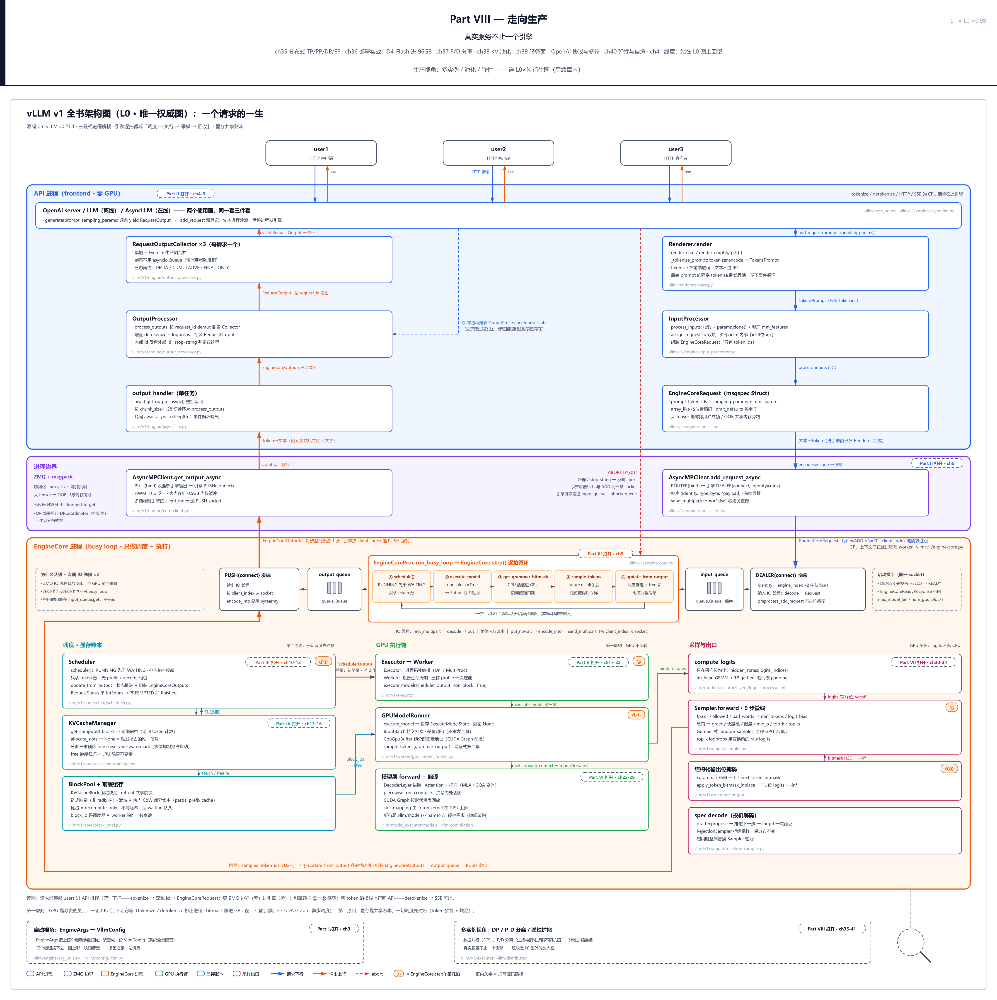
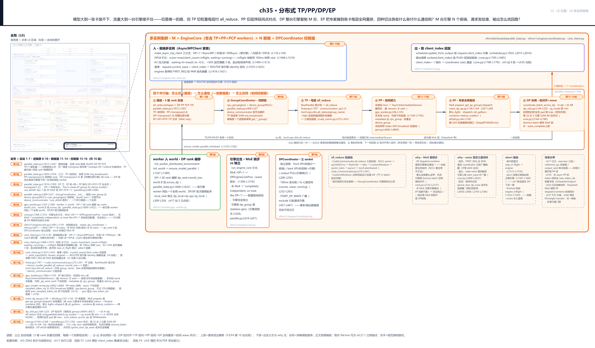
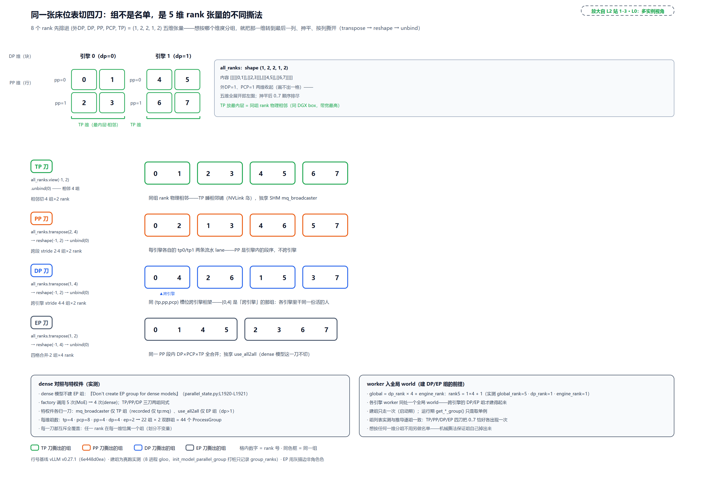
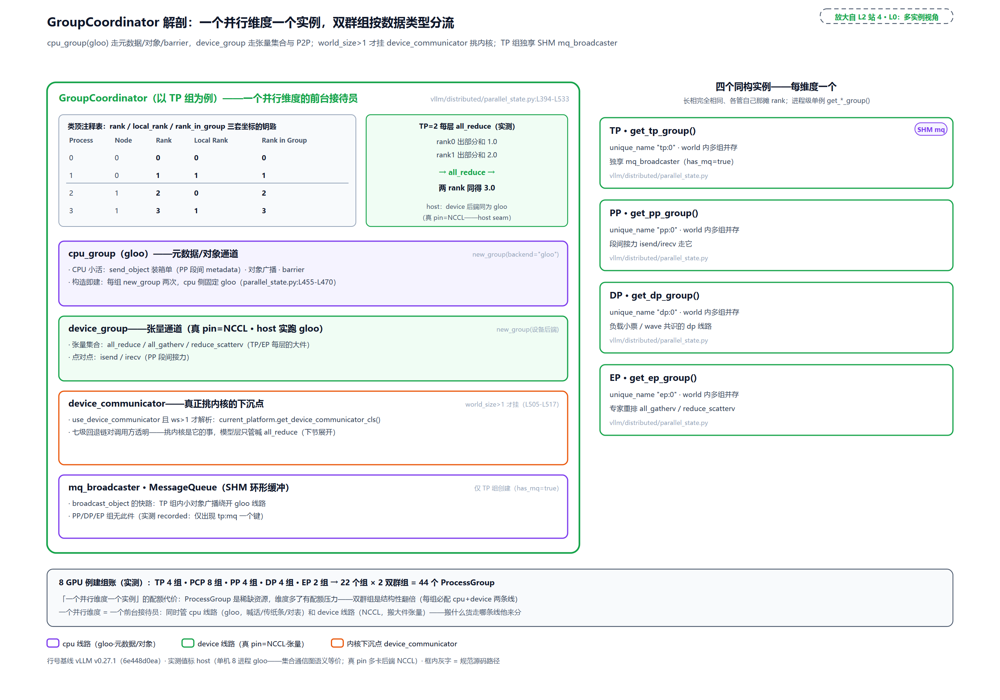
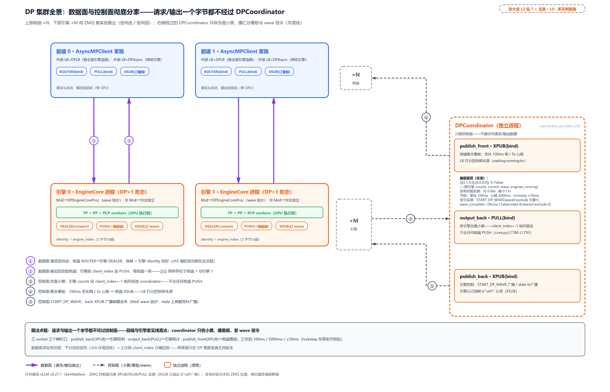
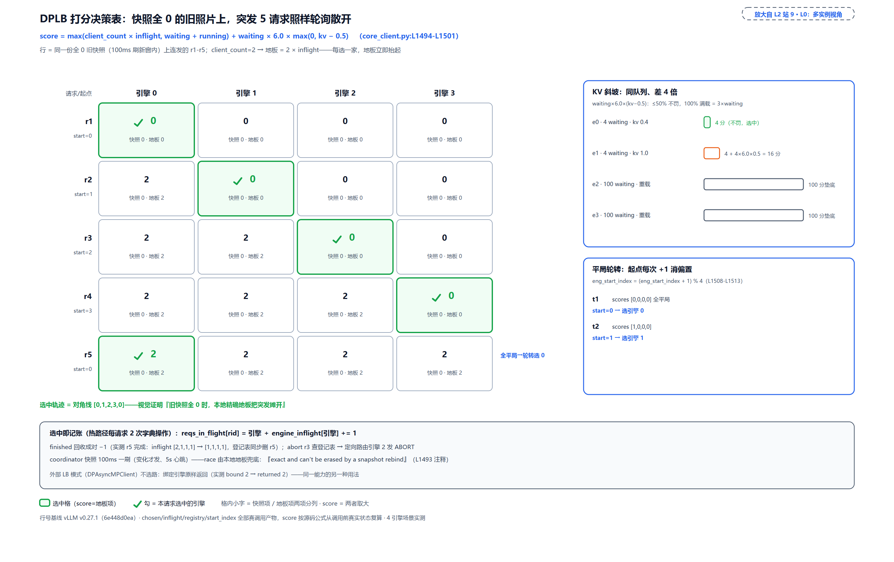
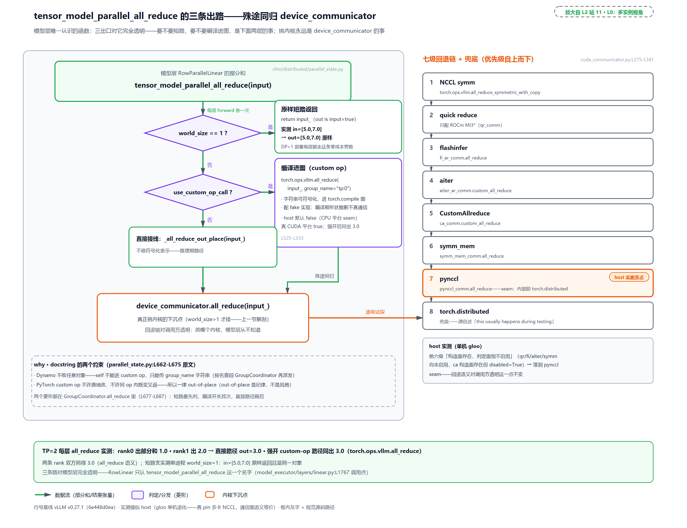
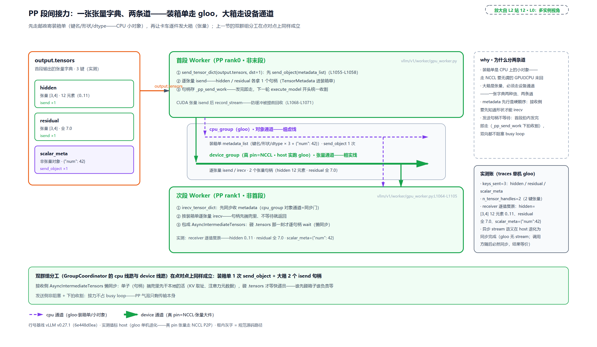
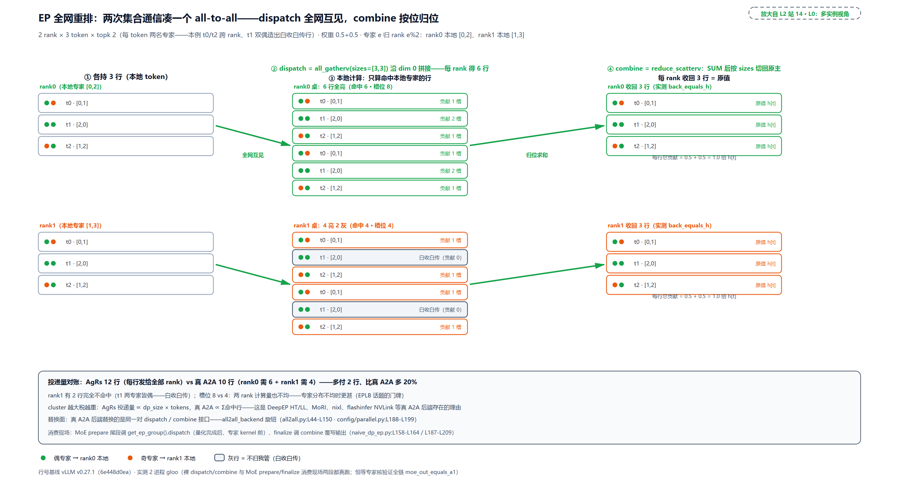
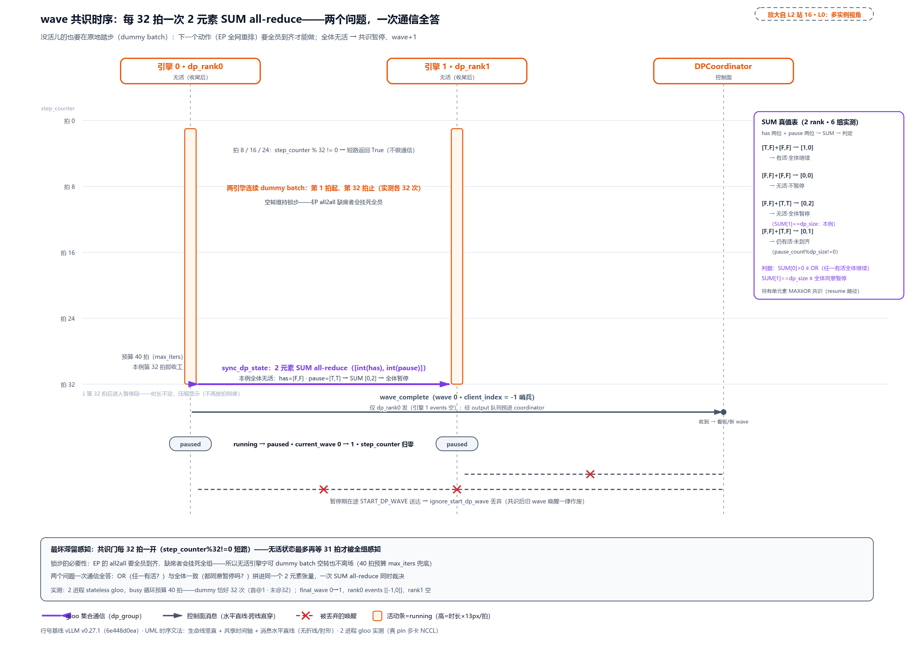

# 第 35 章　分布式 TP/PP/DP/EP

模型大到一张卡装不下，流量大到一台引擎接不住，切是唯一的路。但「切」远不是一句话能带过的：TP（tensor parallel，张量并行）把一层之内的权重矩阵劈到多卡，每层前向付一次 all_reduce（全量归约，组内每张卡各出一份、人人拿回求和结果的集合通信）；PP（pipeline parallel，流水线并行）沿层序把模型切成几段各驻一卡，段与段之间点对点传激活；DP（data parallel，数据并行）干脆整台引擎复制 M 份，各接各的请求；EP（expert parallel，专家并行）把 MoE（mixture of experts，混合专家，路由器给每个 token 只挑少数专家算的稀疏结构）的专家摊到各卡，每个 MoE 层做一次全网 token 重排。四种切法各收什么、各付什么通信税？

更要命的是第二层问题：M 台引擎、N 个前端，请求发给谁？输出怎么找回路？（前端为什么也要多开：[第 2 章](../../ch02-request-lifecycle/narrative/chapter.md)立过 API 进程的事件循环是单核的，流量大了先饱和的是它。）[第 4 章](../../ch04-two-usage-faces-one-trio/narrative/chapter.md)盖进请求的那枚 `client_index`、[第 5 章](../../ch05-zmq-topology-and-protocol/narrative/chapter.md)那条带信封的 ROUTER，都在等这一章兑现。

这也是 Part VIII 的开篇总问题：真实服务不止一个引擎。前七个 Part 把一台 EngineCore 从请求进门拆到采样出门，本章把镜头拉远。单实例之外的一切都在射程内：四个并行轴怎么切（建组）、切完怎么通信（TP 层内集合、PP 段间点对点、EP 全网重排）、M 台引擎怎么协同（DP 选路、批对齐、wave 共识）。

## 你在这里

Part VIII 共七章，全部长在[第 1 章](../../ch01-vllm-v1-in-one-map/narrative/chapter.md) L0 图右下那块带放大镜挂角的虚线块「多实例视角」上：ch35 分布式 TP/PP/DP/EP（本章，四刀与协同）、ch36 部署实战（量化档位与官方配方）、ch37 P/D 分离、ch38 KV 池化、ch39 OpenAI 服务、ch40 运维与弹性、ch41 终章回望。



> *图注：Part VIII「走向生产」长在[第 1 章](../../ch01-vllm-v1-in-one-map/narrative/chapter.md) L0 图右下那块带放大镜挂角的「多实例视角」虚线块上（本图=L0 全景页，全局即局部）。前七个 Part 分五条线立的全部结构（请求生命周期、执行管线、注意力与 KV 账本、模型层、采样与出口）在这里合流：不再是「一台引擎怎么跑好」，而是「一个服务怎么搭起来」。本章打头，负责其中最大的一块——并行与多实例协同；再往右各章（部署、P/D 分离、KV 池化、服务、运维）都踩在它立的集群骨架上。*

放大到本章自己这一层：



> *图注：本章放大的是[第 1 章](../../ch01-vllm-v1-in-one-map/narrative/chapter.md) L0 图右下「多实例视角」虚线块的主体：M 台 EngineCore 并排（各含 TP×PP×PCP workers；PCP＝prefill context parallel，长 prompt 沿序列切卡的进阶维度，建组节展开）× N 个前端 + DPCoordinator 控制面进程。三段读图：上排两条是请求进出集群（入＝前端多实例的打分选路与盖章定向、出＝按 client_index 回发，[第 4 章](../../ch04-two-usage-faces-one-trio/narrative/chapter.md)与[第 5 章](../../ch05-zmq-topology-and-protocol/narrative/chapter.md)埋的两根线头在这里收口）；中排 ①-⑥ 是多实例的本体：① 建组 5 维 rank 张量、② GroupCoordinator 双群组（CPU/GPU 两条通信线路）、③ TP 层内、④ PP 段间、⑤ EP 全网重排、⑥ DP 协调（批对齐与 wave）；下排是 worker 入 world（DP rank 偏移）、出生分叉、三 socket 控制面、all_reduce 回退链、两条 why 注（MoE 锁步、wave 竞态）、abort 路由与邻章分界标记。接在五块已读结构上：[第 17 章](../../ch17-executor-worker-model-runner/narrative/chapter.md)的执行三层与 PP 接力点名、[第 12 章](../../ch12-async-scheduling/narrative/chapter.md)的 prev_sampled_token_ids 回填、[第 18 章](../../ch18-persistent-batch-fixed-addresses/narrative/chapter.md)的差量协议、[第 19 章](../../ch19-compile-capture/narrative/chapter.md)的 piecewise 编译与 CUDA graph 档位、[第 23 章](../../ch23-model-layer-assembly/narrative/chapter.md)的 TP 切头数学。站号 = 讲解装配顺序：启动 1-7、请求进集群 8-10、一拍数据面 11-14、拍间控制面 15-16，共 16 站；正文按讲解需要编排（本章先立地基与集群，再按一拍的时序重排数据面各站），不必照站号读。*

读法建议：只想看四种切法各付什么账，直奔[「四刀总账」](#四刀总账切什么付什么)；想亲手切一遍 8 GPU 的组，跳[「建组：一张五维表切四刀」](#建组一张五维表切四刀)；负载均衡的打分公式与两枚伏笔的兑现在[「进集群：打分选路与盖章定向」](#进集群打分选路与盖章定向)；PP 懒同步的钩子机关在[「段间：PP 接力与懒同步」](#段间pp-接力与懒同步)；MoE 为什么要锁步、wave 怎么共识，看[「拍间：wave 共识与三重竞态闭环」](#拍间wave-共识与三重竞态闭环)；想跟全程，按序读。

照例交代取证环境，全章数值表通用；下面四条先认个名字即可，涉及的名词与细节都会在后文各节就地立起来。多卡 NCCL 集群本机不可跑，全部数值来自单机退化形态的实跑：驱动脚本对着按 v0.27.1 只做减法抽出的配套精简版（41 个测试全过）跑出八份 trace，host 是 Windows CPU torch、无 CUDA。四处差异先挑明。其一，集合通信后端是 gloo 不是 NCCL（gloo＝Meta 的 CPU 集合通信库、NCCL＝NVIDIA 的 GPU 集合通信库，底座节详述）：真部署的 device_group 走 NCCL；all_reduce/all_gatherv/reduce_scatterv 的通信图语义等价，异步 stream 语义退化为同步完成（gloo 没有 stream，调用方随后必然同步，观察结果等价）。其二，`use_custom_op_call` 在 CPU 平台默认 False（真 CUDA 平台 True），custom-op 路径经显式强开真走通。其三，CudaCommunicator 回退链的前六级在 host 是「构造面存在、判定面恒不启用」，落到 pynccl（取证机上它的替代实现内部即 torch.distributed，真源自述的 testing 路径），「回退对调用方透明」这一点不变。其四，懒同步一节的对照时长是建模值（gloo 本机传输瞬完、造不出在飞延迟，表内标了 modeled），DPCoordinator 的发布时延则是真 ZMQ 实测。凡表内数字都是实跑输出，一个没改。

## 四刀总账：切什么，付什么

先把四笔账摆在一张表上再进源码。每种切法回答同一个问题：**显存装不下（或算力不够）时，把什么切开摊到多卡**。切的对象不同，付的通信税就完全不同：

| 切法 | 切什么 | 换来什么 | 通信税 |
| --- | --- | --- | --- |
| TP 张量并行 | 一层之内的权重矩阵（列切升维、行切降维） | 权重显存 ÷ p，单层算力摊薄 | 每层前向每卡收发全量激活，逐层、每拍都付 |
| PP 流水线并行 | 层序（模型竖切成几段） | 每卡只驻一段的权重 | 段间点对点传激活（量小），但引入流水线气泡 |
| DP 数据并行 | 什么都不切，整台引擎复制 M 份 | 吞吐 × M（非 MoE 时线性） | 权重复制 M 份；非 MoE 引擎间零集合通信 |
| EP 专家并行 | MoE 的专家（num_experts 摊到各卡） | 专家权重不重复 | 每个 MoE 层一次全网 token 重排 |

逐行把出处和形状说清。

**TP 的配方来自 Megatron-LM**（NVIDIA 2019，[arXiv:1909.08053](https://arxiv.org/abs/1909.08053)）。关键在 MLP 块两次 GEMM 用不同刀法：第一个矩阵（升维）沿**列**切：激活函数 GeLU 是逐元素的，各卡对自己的列分片独立过激活不需要别卡的数据；第二个矩阵（降维）沿**行**切，与列切输出恰好对齐，各卡算出**部分和**，块尾一次 all_reduce 把部分和加成完整输出。每个 Transformer 层前向恰好两次 all_reduce（注意力出口一次、MLP 出口一次）。[第 23 章](../../ch23-model-layer-assembly/narrative/chapter.md)拆切头数学时见过这套刀法的 vLLM 落地：`ColumnParallelLinear`（列并行线性层）与 `RowParallelLinear`（行并行线性层），本章补上它们的通信侧对偶。

all_reduce 值多少钱？工业默认走 **ring（环形）算法**：p 张卡连成一个环，数据切 p 份、每轮每卡只把一份传给下一家，先 reduce-scatter（规约散布：每卡攒出全量和的一段）跑 $`p-1`$ 轮、再 all-gather（全收集：人人补齐全量）跑 $`p-1`$ 轮。带宽上它接近最优。设张量 n 个元素、每元素 b 字节，每卡总共搬运

```math
\mathrm{bytes}_{\mathrm{per\ rank}} = 2\cdot\frac{p-1}{p}\cdot n\cdot b
```

p 越大这个系数越趋近 2（2017 年百度把它从 HPC 世界引入深度学习梯度同步，[经典技术博客](https://andrew.gibiansky.com/blog/machine-learning/baidu-allreduce/)是最常被引的图解；带宽下界证明见[Xiao 等](https://www.cs.fsu.edu/~xyuan/paper/09jpdc.pdf)）。这条公式顺手给出三个形状直觉，后面源码里还会撞见：**all_reduce 输出形状不变；all_gather 沿指定维放大 p 倍；reduce_scatter 沿指定维缩小 p 倍**。这三个公式后来被逐字写进了 vLLM 集合算子的 fake 实现里（`vllm/distributed/parallel_state.py:L152-L197`，编译期形状推断就靠它们）。还有一个等式值得记住：AR = RS + AG，一次 all_reduce 内部就是一次 reduce_scatter 接一次 all_gather，这两块积木本章会在 EP 的默认后端里再次看到。

TP 的税是逐层付的，所以它最吃机内带宽。GPU 集群的互连分两层：一台机器内部是 NVLink/NVSwitch（NVLink 是 NVIDIA 的 GPU 间高速直连，H100 世代每卡 900 GB/s、Blackwell 世代 1800 GB/s；NVSwitch 是配套交换芯片，把直连升级为机内全互联），机器之间是 InfiniBand 网络承载 RDMA（网卡直接在显存间搬数据、CPU 不参与数据路径）。两层带宽差着量级，于是有一条物理布局铁律：**通信最频繁的 TP 组要挤在同一个 NVLink 岛（同一台机）里**，跨机的维度留给通信稀疏的切法。vLLM 把 TP 放在 rank 张量（rank＝通信组内进程编号，下一节「底座」正式立）最内层就是在代码化这条铁律，建组一节见。

**PP 的谱系来自 GPipe**（Google 2018，[arXiv:1811.06965](https://arxiv.org/abs/1811.06965)）：模型按层序切 K 段、批次切 m 个微批次（micro-batch）逐个灌进流水线，各段像工厂流水线一样错开加工。代价是气泡（bubble）：流水线开头逐步填满、结尾逐步排空，两头总有段在空转，占比 $`(K-1)/(m+K-1)`$。微批切得越碎气泡越小（论文经验：m 超过 4 倍 K 就基本可忽略；m 是微批数，用小写以别于前文的引擎台数 M），段越多气泡越重。推理没有反传，vLLM 的 PP 是全员同拍推进的简式同步流水线：每拍所有段处理同一批，段间把本段算完的激活发给下一段，比训练侧 1F1B（one-forward-one-backward，一前一后交错填满流水线的调度）简单得多，气泡账同样适用。

**DP 最古老也最暴力**：整台引擎（调度器、KV cache、worker 全套）复制 M 份，请求分给各份。非 MoE 模型下引擎之间零集合通信、完全独立；代价是权重与 KV 各复制一份、各算各的（前缀缓存在不同引擎间不共享，这笔账归后面的 KV 池化章）。MoE 模型下 DP 会与 EP 纠缠出「锁步」这个本章最精巧的协议，届时展开。

**EP 是 MoE 专属**。MoE 层的路由器给每个 token 挑 top-k 个专家，专家分组摊到各卡后，「token 要去专家所在的卡才算得出结果」天然要求按目的地的定向搬运。GShard（Google 2020，[arXiv:2006.16668](https://arxiv.org/abs/2006.16668)）为此定的骨架是每个 MoE 层两次 AllToAll（全交换，下节细讲）：dispatch 把 token 发往专家所在卡、算完 combine 送回原主加权求和。GShard 还给每个专家设容量上限、超出的 token 直接丢弃（下一层还有机会被别的专家接住）；vLLM 默认后端走的是「全网互见」路线、没有丢弃问题，但多付「传不归我管的 token」的带宽，这笔账本章末段算。

四刀可以叠：一台 8 卡机跑 DeepSeek 级模型，典型配置是 TP=4 或 8 切一层、PP=2 切层序、DP 复制整机、EP 摊专家。叠加时「谁跟谁一组」立刻成为问题，这正是建组节要答的。

## 底座：进程组是一份全员契约

进 vLLM 源码前把地基立住：所有切分与通信都长在 **torch.distributed**（PyTorch 官方多进程通信包）上。它的核心抽象是**进程组（ProcessGroup）**：一组约定好互相通信的进程，配一个具体后端（backend，如 NCCL、gloo）构成一个通信域。组内每个进程有编号 **rank**（从 0 数到 world_size 减一），**world_size** 是组内进程总数。两条用法先钉死：

其一，`torch.distributed.new_group(ranks, backend=...)` 可以在全局组的子集上再建新组，每个子组有自己独立的组内编号——vLLM 的建组总装函数正是拿它逐维切出 TP/PP/DP/EP 各组（`vllm/distributed/parallel_state.py:L1812-L1950`，下节走进去）。

其二，也是本章后面一切协议的底层事实：**集合通信要求组内所有 rank 都调用了同一个操作才会完成，少一个 rank 到场，其他 rank 就一直等**。这不是 bug 是契约，集合通信的本义就是「全员对齐一次」。记住这条，wave 共识一节「一台缺席全员挂死」的论述才有落点。

后端选型上 PyTorch 生态的惯用分工是**双群组**：GPU 大张量走 NCCL（NVIDIA 官方 GPU 集合通信库，自动适配 NVLink/InfiniBand 拓扑、同一调用跨单机多机都能跑），CPU 上的元数据与控制消息走 gloo（Meta 开源的通用集合通信库，不依赖专用互联硬件、专长 CPU 张量）。vLLM 把这个惯例工程化成了 GroupCoordinator 的骨架，下下节见。

## 建组：一张五维表切四刀

现在走到 L2 图 ① 块：建组。先解决「谁来切」——[第 17 章](../../ch17-executor-worker-model-runner/narrative/chapter.md)立过 executor 拉起 worker 的星形装配，那时每个 worker 进程要过一道 `init_worker_distributed_environment`；DP>1 时，这道初始化里藏着一个关键的 rank 偏移：

```python
# vllm/distributed/parallel_state.py:L1608-L1622 · init_distributed_environment（DP rank 偏移段）
    if (
        config is not None
        and config.parallel_config.distributed_executor_backend != "external_launcher"
        and (
            config.parallel_config.nnodes > 1
            or config.parallel_config.data_parallel_size > 1
        )
        and not enable_elastic_ep
    ):
        parallel_config = config.parallel_config
        # adjust to take into account data parallelism
        # offset the rank by the data parallel rank
        rank = parallel_config.data_parallel_rank * world_size + rank        # L1620
        # adjust the world size to take into account data parallelism
        world_size = parallel_config.world_size_across_dp
```

L1620 是全部机关：每台引擎内的 worker 各自有引擎内 rank（0 到 world_size-1），DP>1 时全局 rank 再加上 `dp_rank × 引擎内 world_size`。8 GPU、DP=2 的例子里，引擎 0 的 worker 占全局 rank 0-3、引擎 1 占 4-7，**M 台引擎的 worker 同处一个全局 world**（`world_size_across_dp`），跨引擎的 DP 组、EP 组才建得起来。条件里排除的 external_launcher＝worker 由外部启动器拉起、全局 rank 由启动器代定的部署后端，那种形态的 rank 本就是全局编号，无需这层偏移。配套还有一处 local_rank 修正（绑哪块卡：`dp_local_rank × tp × pp + 引擎内 local_rank`，引擎内 local_rank＝pp 段序 × tp ＋ TP 组内序；源码注释把后一个加数笼写作 TP_LOCAL_RANK，`vllm/v1/worker/gpu_worker.py:L309-L326`，[第 17 章](../../ch17-executor-worker-model-runner/narrative/chapter.md)站 5 点过名）。

谁切、在哪切都清楚了，看切法本体。`initialize_model_parallel` 是总装函数，开头八行注释就是切分公式：

```python
# vllm/distributed/parallel_state.py:L1812-L1827 · initialize_model_parallel（建组地基）
    # the layout order is: ExternalDP x DP x PP x PCP x TP
    # ExternalDP is the data parallel group that is not part of the model,
    # every dp rank can generate independently (in verl integration).
    # DP is the data parallel group that is part of the model,
    # all the ranks in the same DP group should generate simultaneously,
    # i.e. the `generate` call in the same DP group should be called together,
    # otherwise it will cause deadlock.
    # to get group_ranks for each dimension, transpose that dimension to the
    # last dimension, then reshape to 2D, then unbind the last dimension
    all_ranks = torch.arange(world_size).reshape(                          # L1821
        -1,
        data_parallel_size,
        pipeline_model_parallel_size,
        prefill_context_model_parallel_size,
        tensor_model_parallel_size,
    )  # noqa
```

全部 rank 先排进一个 5 维张量，维度序 `ExternalDP × DP × PP × PCP × TP`（PCP 是 prefill context parallel，长 prompt 沿序列切卡的进阶维度；ExternalDP 是训练框架 verl 集成用的外层数据并行，本章不展开）。注释第三段就是机械切分公式：**想要哪个维度的组，把那个维度 transpose 到最后一列，reshape 成二维，按行 unbind**，组自己掉出来，不用手写任何名单。TP 放最内层不是随手排的：它意味着 TP 组员是**相邻**的 rank，配合调用方保证同组 rank 落在同一台机里（docstring 原话提醒「same DGX box」，DGX 是 NVIDIA 的多卡整机服务器，`parallel_state.py:L1771-L1774`），逐层 all_reduce 就全程走在 NVLink 上。这正是[「四刀总账」](#四刀总账切什么付什么)一节立的物理铁律落进代码。

四刀的源码，TP 与 PP 先看：

```python
# vllm/distributed/parallel_state.py:L1829-L1899 · initialize_model_parallel（TP/PP 两刀）
    # Build the tensor model-parallel groups.
    global _TP
    assert _TP is None, "tensor model parallel group is already initialized"
    group_ranks = all_ranks.view(-1, tensor_model_parallel_size).unbind(0)  # L1832
    group_ranks = [x.tolist() for x in group_ranks]
    # … 省略：enable_elastic_ep 的弹性覆写分支（弹性扩缩容，运维章的域）…
    # message queue broadcaster is only used in tensor model parallel group
    _TP = init_model_parallel_group(
        group_ranks,
        get_world_group().local_rank,
        backend,
        use_message_queue_broadcaster=True,                               # L1842
        group_name="tp",
    )

    # … 省略：DCP（decode context parallel）与 PCP（prefill context parallel）两刀，
    #    切法与下文 PP 同构（transpose 到末维 → reshape → unbind）…

    # Build the pipeline model-parallel groups.
    global _PP
    assert _PP is None, "pipeline model parallel group is already initialized"
    group_ranks = (
        all_ranks.transpose(2, 4).reshape(-1, pipeline_model_parallel_size).unbind(0)
    )                                                                       # L1888
    group_ranks = [x.tolist() for x in group_ranks]
    # … 省略：enable_elastic_ep 的弹性覆写分支 …
    _PP = init_model_parallel_group(
        group_ranks, get_world_group().local_rank, backend, group_name="pp"
    )
```

TP 刀最朴素：不需要 transpose（TP 已在末维），直接 `view(-1, tp_size)` 相邻切。PP 刀是标准公式的第一次亮相：`transpose(2, 4)` 把 PP 维（第 2 维）换到 TP 的位置（第 4 维）再抻平按行切。DP 刀与 EP 刀：

```python
# vllm/distributed/parallel_state.py:L1901-L1950 · initialize_model_parallel（DP/EP 两刀）
    global _DP
    assert _DP is None, "data parallel group is already initialized"
    group_ranks = all_ranks.transpose(1, 4).reshape(-1, data_parallel_size).unbind(0)
    group_ranks = [x.tolist() for x in group_ranks]                        # L1904
    # … 省略：enable_elastic_ep 走 _init_stateless_group 的分支（弹性扩缩容）…
    _DP = init_model_parallel_group(
        group_ranks, get_world_group().local_rank, backend, group_name="dp"
    )

    global _EP
    assert _EP is None, "expert parallel group is already initialized"
    # Don't create EP group for dense models.
    if config.model_config is None or config.model_config.is_moe:          # L1921
        group_ranks = (
            all_ranks.transpose(1, 2)
            .reshape(
                -1,
                data_parallel_size
                * prefill_context_model_parallel_size
                * tensor_model_parallel_size,
            )
            .unbind(0)
        )                                                                   # L1931
        group_ranks = [x.tolist() for x in group_ranks]
        use_all2all = parallel_config.use_all2all
        # … 省略：enable_elastic_ep 的弹性覆写分支 …
        _EP = init_model_parallel_group(
            group_ranks,
            get_world_group().local_rank,
            backend,
            group_name="ep",
            use_all2all=use_all2all,
        )
```

三个读法。DP 刀 `transpose(1, 4)` 把 DP 维换到末位再切，切出的组员是**同 (tp, pp, pcp) 槽位、跨引擎**的 rank。直白说：DP 组里站着的正是各引擎里干同一份活的那批 worker，EP 的全网重排、批对齐的 all-reduce 都发生在这些人之间。EP 刀回答「哪些 rank 一起分专家」：`transpose(1, 2)` 后把 DP×PCP×TP 三维全合并（PP=1 时即全伙），组的大小就是三者的乘积。注释原话 `Don't create EP group for dense models`：dense 模型没有专家，EP 组压根不建，`get_ep_group()` 只许 MoE 模型调（访问器的 assert 把话说明白，`parallel_state.py:L1425-L1430`）。`use_all2all` 这个开关何时为真由配置属性给出：`dp>1 或 SP-MoE（sequence parallel MoE，序列并行 MoE，「层间重排」节尾展开）或 (EP 且 PCP>1)`（`vllm/config/parallel.py:L690-L696`），它是 EP 组挂载 all-to-all 管理者的闸门，EP 节回收。

手推一遍才算真懂。8 GPU、(ExternalDP, DP, PP, PCP, TP)=(1, 2, 2, 1, 2)，MoE 与 dense 各建一遍：

<!-- trace: m2 -->
| 刀 | 机械操作（与源码同式） | 切出的组 | 物理含义 / 特例 |
| --- | --- | --- | --- |
| TP | view(-1, 2) 相邻切 | [[0,1],[2,3],[4,5],[6,7]] | 同组 rank 物理相邻（TP 放最内层）；独享 mq_broadcaster（recorded 里仅 tp:mq） |
| PP | transpose(2,4)→reshape(-1,2)→unbind | [[0,2],[1,3],[4,6],[5,7]] | 每引擎各自的 tp0/tp1 两条流水 lane——PP 是引擎内的段序，不跨引擎（直觉容易想反的 [0,4][1,5] 配对其实是 DP 组员） |
| DP | transpose(1,4)→reshape(-1,2)→unbind | [[0,4],[2,6],[1,5],[3,7]] | 同 (tp,pp,pcp) 槽位跨引擎——组员是各引擎里干同一份活的 worker；[0,4] 才是『跨引擎』的那个 |
| EP | transpose(1,2)→reshape(-1,4)→unbind | [[0,1,4,5],[2,3,6,7]] | 同一 PP 段内 DP×PCP×TP 全合并；独享 use_all2all（recorded 里仅 ep:use_all2all） |
| dense 对照 | is_moe=False 重跑 | TP/PP/DP 同上，无 EP 组 | factory 调用 5 次(MoE)→4 次(dense)；源码注释 Don't create EP group for dense models |
| rank 偏移 | worker 入全局 world（站 5） | global = dp_rank×4 + engine_rank：rank5 → 5 | dp_rank=1、engine_rank=1——各引擎 worker 同处一个全局 world，DP/EP 组才建得起来 |
| 建组账 | 每维组数 tp=4/pcp=8/pp=4/dp=4/ep=2 | 22 个组 × 2 双群组 = 44 个 ProcessGroup | 建组代价的实数：每组要在后端通信库占一个 communicator 与配套资源，维度多了配额吃紧 |

表内值得停两眼。PP 组是 [[0,2],[1,3],[4,6],[5,7]]：每台引擎各有一条 tp0 流水线与一条 tp1 流水线，PP 是引擎内的段序、不跨引擎；而 [[0,4],[1,5]] 那种跨引擎配对是 **DP** 组。容易想反，真跑一遍就记牢了（本表即实跑输出：8 进程真建组、只把 `init_model_parallel_group` 换成记录器，world 组与 rank 偏移走真实路径）。最后一行是这笔设计的代价实数：22 个组、每个组要建双份进程组（下节），44 个 `new_group`（按本章四刀+PCP 计；真源还默认建 DCP 单例组，同一形状真数是 30 组 60 个 `new_group`，代价只多不少）。torch.distributed 的进程组是稀缺资源（每组要在后端通信库占一个 communicator 与配套资源），维度再往多加配额就吃紧。



> *图注：全部 rank 先排进 (1,2,2,1,2) 五维张量（左上格子图是它的物理落位：引擎×pp 行×TP 列；右上注框标 shape＝外DP×DP×PP×PCP×TP 与收起两维的说明），四条彩色路径各导出一刀的组：TP 相邻两格、PP 跨段 stride 2、DP 跨引擎 stride 4、EP 四格合并。每条路径旁标 transpose/reshape 的机械式，格子里的 rank 号与组列表一一对应。左下注：dense 对照与特权件——dense 模型只剩 TP/PP/DP 三刀、EP 刀不切（factory 调用 5 次变 4 次），TP 组独享 SHM（共享内存）广播、EP 组独享 all2all。右下注：worker 入全局 world——global = dp_rank×4 + engine_rank（rank5 = 1×4+1），各引擎的 worker 同处一个全局 world，跨引擎的 DP/EP 组才建得起来（正文表内 rank 偏移行同账）。组不是名单，是同一张表的不同撕法。*

这条 why 链摆全。**旧设计**：为每个并行维度手写 rank 索引分配（Megatron 早期做法），或把通信组对象沿模型调用链层层透传。**痛点**：TP/PP/DP/PCP/EP 维度组合爆炸，手写索引必错且难审计；模型 forward 在任意深度都要拿到当前维度的通信组，透传会绑架所有 forward 签名（与[第 23 章](../../ch23-model-layer-assembly/narrative/chapter.md)「Attention 是插座」治的是同一个病）。**v1 方案**：5 维张量一次 reshape、任一维度机械导出（本节源码），逐维建 `_TP/_PP/_DP/_EP` 进程级单例，模型代码经 `get_tp_group()` / `get_pp_group()` / `get_dp_group()` / `get_ep_group()` 零参数取用（`parallel_state.py:L1390-L1452`）。**代价（诚实账）**：维度间有隐含序，TP 相邻假设 rank 物理布局配合、caller 得保证同机相邻；单例是进程级可变全局状态，重复初始化靠 assert 防御；新增维度（DCP/PCP/EPLB；EPLB＝专家并行负载均衡，EP 节尾点到）都要在同一函数里加刀，这个函数已经 245 行。

## GroupCoordinator：一个维度一个接待员

四刀切出的每组 rank，需要一件东西替它们管通信。这就是 L2 图 ② 块：**GroupCoordinator**，一个并行维度一个实例的「前台接待员」。他同时管两条对讲线路：cpu 线路（gloo，喊话、传纸条、对表）和 device 线路（NCCL，搬大件张量），搬什么货走哪条线他来分。

```python
# vllm/distributed/parallel_state.py:L409-L527 · GroupCoordinator.__init__
    def __init__(
        self,
        group_ranks: list[list[int]],
        local_rank: int,
        torch_distributed_backend: str | Backend,
        use_device_communicator: bool,  # whether to use device communicator
        use_message_queue_broadcaster: bool = False,
        group_name: str | None = None,
        use_all2all: bool = False,
    ):
        group_name = group_name or "anonymous"
        self.unique_name = _get_unique_name(group_name)
        _register_group(self)
        # … 省略：rank/local_rank/device_index 登记、VLLM_DISTRIBUTED_USE_SPLIT_GROUP
        #    实验分支（默认关，split_group 替代 new_group 的路径）…
        for ranks in group_ranks:
            device_group = torch.distributed.new_group(                      # L456
                ranks,
                backend=torch_distributed_backend,
                timeout=device_timeout,
            )
            # a group with `gloo` backend, to allow direct coordination between
            # processes through the CPU.
            with suppress_stdout():
                cpu_group = torch.distributed.new_group(                      # L464
                    ranks, backend="gloo", timeout=timeout
                )
            if self.rank in ranks:
                self.ranks = ranks
                self.world_size = len(ranks)
                self.rank_in_group = ranks.index(self.rank)
        # … 省略：循环尾 self_*_group 接线与登记、按平台解析 self.device（cuda / cpu 两支）…
        self.use_device_communicator = use_device_communicator
        self.device_communicator = None
        if use_device_communicator and self.world_size > 1:                   # L503
            device_comm_cls = resolve_obj_by_qualname(
                current_platform.get_device_communicator_cls()
            )
            self.device_communicator = device_comm_cls(
                cpu_group=self.cpu_group,
                device=self.device,
                device_group=self.device_group,
                unique_name=self.unique_name,
                use_all2all=use_all2all,
            )
        # … 省略：MessageQueue 的 import 行 …
        self.mq_broadcaster: MessageQueue | None = None
        if use_message_queue_broadcaster and self.world_size > 1:              # L518
            self.mq_broadcaster = MessageQueue.create_from_process_group(
                self.cpu_group, 1 << 22, 6
            )
        self.use_custom_op_call = (
            current_platform.is_tpu() or current_platform.use_custom_op_collectives()
        )                                                                      # L527
```

三件事。**双群组**（L456 与 L464）：每组 ranks 同时 `new_group` 两次。device_group 用平台后端（CUDA 上即 NCCL），cpu_group 刻意用 gloo，注释原话「to allow direct coordination between processes through the CPU」。为什么双份：控制面的对象广播、元数据、barrier（栅栏同步：组内全员到齐才一起放行）天然在 CPU 上完成，走 NCCL 要无谓的 GPU 与 CPU 之间来回拷贝；barrier 的教训源码直接写在方法里：

```python
# vllm/distributed/parallel_state.py:L1200-L1207 · GroupCoordinator.barrier
    def barrier(self):
        """Barrier synchronization among the group.
        NOTE: don't use `device_group` here! `barrier` in NCCL is
        terrible because it is internally a broadcast operation with
        secretly created GPU tensors. It is easy to mess up the current
        device. Use the CPU group instead.
        """
        torch.distributed.barrier(group=self.cpu_group)                       # L1207
```

**device_communicator**（L503）：world_size>1 才按平台解析一个「设备通信器」（CUDA 平台即 CudaCommunicator），`use_all2all` 透传下去。真正挑具体通信内核的是它，GroupCoordinator 只管群组与分发，这个下沉到[「层内：TP」](#层内tp每层一次-all_reduce)一节看。**use_custom_op_call**（L527）：集合算子走不走 `torch.ops.vllm.*` 的开关，由平台能力决定，同样在「层内：TP」一节展开。TP 组还独享一件家当：`mq_broadcaster`（共享内存消息队列广播器，SHM 即 shared memory 共享内存，环形缓冲承载的组内广播），控制面的小对象广播走共享内存而不是网络。这里有个容易被源码注释带偏的细节：建组节片段里那句「message queue broadcaster is only used in tensor model parallel group」并不严格成立——真源里传 `use_message_queue_broadcaster=True` 的不止 TP 刀，上节省略号盖住的 DCP 刀也带它，但 DCP 默认是单例组（world_size=1），而广播器创建处有 `world_size > 1` 的门（L518），单例组并不真建。所以本章这套组里真正挂上广播器的只有 TP 组，这并非偶然：建组一节立过 TP 组员同在一台机，而共享内存恰恰只在同机进程之间走得通。

类顶那行注释还立着一把钥匙：**三套坐标**。`rank` 是全局编号（跨引擎唯一标识进程）；`local_rank` 是节点内序号（决定绑哪块卡）；`rank_in_group` 是组内序号（集合原语的 src/dst 都用它，经 `self.ranks[i]` 翻回全局）。源码注释里那张 4-rank/2-node 的表（`parallel_state.py:L394-L400`）是理解三者的教具：跨节点时同一 PP 组的两个进程 local_rank 相同、rank 不同。



> *图注：一个并行维度 = 一个 GroupCoordinator 实例。以 TP 为例的解剖框：cpu_group（gloo，真部署里管元数据、对象、barrier）与 device_group（真部署为 NCCL，管张量集合与点对点）双群组按数据类型分流，解剖框上部并排两小框：左为三套坐标的 4-rank/2-node 注释表、右为 TP=2 实测小账（rank0 出部分和 1.0、rank1 出 2.0、归约后两卡同得 3.0）；device_communicator 是真正挑内核的下沉点（七级回退链对调用方透明）；TP 组额外挂 SHM mq_broadcaster（取证环境以 torch.distributed 对象广播承载同一可观察契约）。右列四个同构小框：TP/PP/DP/EP 各一个进程级单例 get_*_group()，TP 框多一枚 SHM 徽标。底行给 8 GPU 例的账：22 组 × 2 双群组 = 44 个 ProcessGroup，「一个维度一个实例」与双群组的配额代价同框。*

这条 why 链同样四件齐全。**旧设计**：单进程组直连 torch.distributed，控制面对象广播与数据面张量集合挤同一个 NCCL 组；集合原语直接调 `torch.distributed.all_reduce`。**痛点**：控制面（pickle 序列化的元数据、对象、barrier）天然在 CPU 完成，走 NCCL 白付设备来回拷贝，且 NCCL barrier 内部是带隐式 GPU 张量的 broadcast、容易搞乱当前设备（上面 barrier 源码注释原话）；更重的是对 torch.compile 完全不透明：Dynamo 无法符号化 ProcessGroup 对象，每遇集合通信就断图，[第 19 章](../../ch19-compile-capture/narrative/chapter.md)piecewise 编译的融合收益被砍。**v1 方案**：双群组分流（本节）+ 集合原语注册成自定义算子（下节）。**代价**：每个组双份 ProcessGroup（44 个的账）；custom-op 路径多一层查表间接；两条路径都要测试；fake 实现必须与真实现形状语义严格一致。

## 出生：引擎分叉与控制面独立进程

组建好了，看进程怎么出生。L2 图下排：每台引擎的 EngineCore 进程来到世上时有一次分叉（站 6），M 台引擎之外还会多出一个不属于任何引擎的协调者进程（站 7）。

```python
# vllm/v1/engine/core.py:L1306-L1318 · run_engine_core（引擎出生分叉）
            parallel_config.data_parallel_index = dp_rank
            if data_parallel and vllm_config.model_config.is_moe:
                # Set data parallel rank for this engine process.
                parallel_config.data_parallel_rank = dp_rank
                engine_core = DPEngineCoreProc(*args, **kwargs)              # L1310
            else:
                # Non-MoE DP ranks are completely independent, so treat like DP=1.
                # Note that parallel_config.data_parallel_index will still reflect
                # the original DP rank.
                parallel_config.data_parallel_size = 1
                parallel_config.data_parallel_size_local = 1
                parallel_config.data_parallel_rank = 0
                engine_core = EngineCoreProc(*args, engine_index=dp_rank, **kwargs)
```

分水岭就一行条件：模型是 MoE 且 DP>1，走 `DPEngineCoreProc`（wave 锁步忙循环：wave 波次编号见下文，锁步＝全员同拍推进、一台不许掉队；本章后半场的主角）；否则注释原话「Non-MoE DP ranks are completely independent, so treat like DP=1」，**就地把配置改回 DP=1，引擎完全独立**。同一份 DP 配置长出两种截然不同的形态：dense 模型的 M 台引擎互不通信、各跑各的；MoE 模型的 M 台引擎被 EP 的集合通信锁在一起。这行改写发生在 worker 出生之前（EngineCoreProc 的构造、executor 拉起 worker 都在它之后）：部署级 dense 引擎的 worker 拿到的配置已是 DP=1，建组节的 rank 偏移不触发，各引擎的 worker 在各自的小 world 里建组，跨引擎 DP 组根本不建。上一节 dense 对照表里的 DP 组，是拿 dp=2 直接调建组函数的函数级行为，部署里的 dense 引擎不会走到；「互不通信」的机制根源就在这行改写。「锁步是 MoE 的税，不是 DP 的税」，这句判断的机制基础在 EP 与 wave 两节兑现。

非 MoE 引擎独立归独立，**负载均衡**（LB，load balancing：决定请求发给哪台引擎）还需要有人收集各引擎的队列统计；MoE 引擎则需要有人广播 wave 唤醒。两件都是控制面，vLLM 的答案是另起一个进程：`needs_dp_coordinator`（`vllm/config/vllm.py:L661-L681`，MoE+DP>1 为 wave 协调、非 MoE 的内部/混合 LB 为统计收集；混合 LB＝节点内 vLLM 自均衡、节点间再交给外部负载均衡器的两级形态）为真时，dp_rank 0 那台起一个 **DPCoordinator** 独立进程（`vllm/v1/engine/utils.py:L1091-L1101`）。

协调者持三个 socket，这是 XPUB/XSUB 的首秀。[第 5 章](../../ch05-zmq-topology-and-protocol/narrative/chapter.md)立过 ROUTER/DEALER/PUSH/PULL 四种 socket；**PUB/SUB** 是 ZeroMQ 的另一对：发布者广播、订阅者按主题前缀过滤，发布者不需要知道订阅者是谁。**XPUB/XSUB 是这对的代理加强版**：普通 SUB 端订阅了什么，发布者是看不见的；X 版会把「我订阅了什么」变成真正的消息传导给上游，中间代理才能据此转发。vLLM 的协调者正是这种中间代理：一边 XPUB 向前端与引擎广播，一边 PULL 收引擎上报，N 前端 × M 引擎不用两两直连，新开一个 API server 进程连上就能收到广播。主循环的发布节拍：

```python
# vllm/v1/engine/coordinator.py:L252-L283 · DPCoordinatorProc.process_input_socket（发布循环）
            poller = zmq.Poller()
            poller.register(publish_front, zmq.POLLIN)
            poller.register(publish_back, zmq.POLLIN)
            poller.register(output_back, zmq.POLLIN)
            last_publish_time = 0
            while True:
                elapsed = int(time.time() * 1000) - last_publish_time
                # Send at stats_update_interval_ms interval if the stats have
                # changed, or otherwise every 5 seconds.
                wait_for = self.stats_update_interval_ms if stats_changed else 5000
                # Wait at least 50ms to ensure we've received all stats for
                # the current step. Only applicable to lockstep (MoE) DP;
                # non-lockstep engines have no synchronized step boundaries.
                if self.enable_wave_coordination and last_step_counts is None:
                    min_timeout = 50
                else:
                    min_timeout = 0
                events = poller.poll(timeout=max(min_timeout, wait_for - elapsed))
                if not events:
                    # Poller timeout - publish current stats to front-ends.
                    # … 省略：last_step_counts 与 _get_engine_counts 的取数两支 …
                    to_publish = (engine_req_counts_list, current_wave, engines_running)
                    publish_front.send(msgspec.msgpack.encode(to_publish))    # L282
                    last_publish_time = int(time.time() * 1000)
```

三个 socket 各司其职：`publish_back`（XPUB）对引擎广播控制指令（START_DP_WAVE 唤醒信令从这出）、`output_back`（PULL）收各引擎的统计小票、`publish_front`（XPUB）对前端发布聚合看板。节拍是**统计有变 100ms 一刷、没变 5s 心跳**；MoE 锁步模式下发布前先等至少 50ms 收齐同拍统计（各引擎步调一致，凑齐同一拍的数字再发，前端看到的是同一时刻的快照）。发布载荷三元组 `(每引擎 counts, current_wave, engines_running)`，实测一帧：`[[[2, 1, 0.6], [0, 0, 0.0]], 0, False]`，即引擎 0 有 2 waiting 1 running、KV 用到 0.6，引擎 1 全空，wave 0，全体暂停中。真 ZMQ 实测的发布时延：冷启动 0.06s、暖路径 0.11s，正好贴着 100ms 发布窗。

引擎侧的「小票」怎么来？每台 MoE 引擎每拍调一次 `_maybe_publish_request_counts`（`vllm/v1/engine/core.py:L2075-L2090`）：counts 有变才发，`SchedulerStats` 带着 waiting/running/kv_cache_usage 外加锁步的 step_counter 与 current_wave，投的是 `(-1, EngineCoreOutputs(scheduler_stats=stats))`，这就是 **client_index=-1 哨兵**。输出线程看到 -1 不走任何前端 PUSH，拐进协调者（`core.py:L1788-L1793`；[第 5 章](../../ch05-zmq-topology-and-protocol/narrative/chapter.md)输出线程那段省略号注释「client_index == -1 走 coordinator 的哨兵分支（Part VIII 分布式章）」在此兑现）。



> *图注：DP 集群全景。上排 N 个前端（AsyncMPClient 家族），下排 M 台引擎（各含 TP×PP×PCP workers 的 GPU 小格），右侧独立的 DPCoordinator 进程持三 socket（front XPUB 播聚合看板、back XPUB 广播控制、output PULL 收统计）。实线是数据面：前端 ROUTER→引擎 DEALER 定向进（信封首帧=引擎 identity，[第 5 章](../../ch05-zmq-topology-and-protocol/narrative/chapter.md)的伏笔在此写上名字）、引擎按 client_index 选 PUSH 回发起前端（[第 4 章](../../ch04-two-usage-faces-one-trio/narrative/chapter.md)的章在此成为坐标系）。虚线是控制面：引擎负载小票经 -1 哨兵拐进协调者、前端 XSUB 订看板、引擎 XSUB 订 wave 信令，统计 100ms 聚合发布、START_DP_WAVE 广播唤醒。一句话：请求与输出一个字节都不经过控制面。*

这条 why 链（数据面与控制面分离）四件齐全。**旧设计**：早期 DP 靠引擎间 all-reduce 同步全局状态，前端无从得知各引擎负载；朴素替代是把负载统计混进数据通道、或让前端轮询各引擎。**痛点**：内部 LB 的前端要「每引擎 (waiting, running, kv_cache_usage)」做路由决策，M 引擎 × N 前端两两直连统计，连接数与消息量平方级膨胀；MoE 锁步还需要全局 wave 号广播。**v1 方案**：协调者独立进程持三 socket（本节），引擎统计走 -1 哨兵路由、前端 XSUB 订阅聚合看板，100ms 发布。**代价**：多一个常驻进程与三条 socket；数据面回程也随之扇出（引擎侧每前端一条 PUSH 输出 socket）；统计是 100ms 级快照，突发期会滞后（下节的打分公式要专门兜这个 race）；wave 协调只服务 MoE 锁步（按模型类型开关）；控制面故障域又多一个。

## 进集群：打分选路与盖章定向

集群立起来了，请求进门。L2 图上排：前端家族先按 DP 形态分发（站 8），内部 LB 打分选引擎（站 9），选中后盖章定向（站 10）。

```python
# vllm/v1/engine/core_client.py:L116-L139 · make_async_mp_client（前端三分支）
    def make_async_mp_client(
        vllm_config: VllmConfig,
        executor_class: type[Executor],
        log_stats: bool,
        client_addresses: dict[str, Any] | None = None,
        client_count: int = 1,
        client_index: int = 0,
    ) -> "AsyncMPClient":
        parallel_config = vllm_config.parallel_config
        client_args = (
            vllm_config,
            executor_class,
            log_stats,
            client_addresses,
            client_count,
            client_index,
        )
        if parallel_config.data_parallel_size > 1:
            if parallel_config.data_parallel_external_lb:
                # External load balancer - client per DP rank.
                return DPAsyncMPClient(*client_args)
            # Internal load balancer - client balances to all DP ranks.
            return DPLBAsyncMPClient(*client_args)
        return AsyncMPClient(*client_args)
```

DP=1 就是[第 4 章](../../ch04-two-usage-faces-one-trio/narrative/chapter.md)的 AsyncMPClient；DP>1 分两支：**外部 LB**（`data_parallel_external_lb`）每 client 绑定一个引擎，均衡交给外面的负载均衡器；**内部 LB** 由 client 替全部引擎做均衡。差异全压在「谁来选引擎」一件事上。

内部 LB 的选法是打分。v0.27.1 这套公式刚重写过（旧版是 waiting×4+running 的静态权重，已废），值得整段读：

```python
# vllm/v1/engine/core_client.py:L1468-L1519 · DPLBAsyncMPClient.get_core_engine_for_request
    def get_core_engine_for_request(self, request: EngineCoreRequest) -> EngineIdentity:
        # Engines are in rank order.
        if (eng_index := request.data_parallel_rank) is None and (
            # … 省略：late-interaction pooling 模型的引擎选择分支 …
        ) is None:
            current_counts = self.lb_engines
            # TODO use P2C alg for larger DP sizes
            num_engines = len(current_counts)
            min_score: float = sys.maxsize
            eng_index = 0
            for i in range(num_engines):
                # Start from client_index to help with balancing when engines
                # are empty.
                idx = (self.eng_start_index + i) % num_engines
                waiting, running, kv_cache_usage = current_counts[idx]
                # Estimate engine load as the greater of the coordinator's
                # latest (waiting + running) snapshot and this client's own
                # in-flight count (scaled by the number of clients). The
                # in-flight floor is exact and can't be erased by a snapshot
                # rebind, so a burst spreads round-robin even when snapshots
                # race with routing decisions; the snapshot raises the score
                # when other clients or stale requests load the engine.
                inflight = self.engine_inflight[self.core_engines[idx]]
                score: float = max(self.client_count * inflight, waiting + running)
                if waiting:
                    # Waiting requests are penalized in proportion to KV cache
                    # pressure: a queue on a KV-bound engine drains slowly, so
                    # new requests should strongly prefer other engines. With
                    # low KV usage the queue is transient (e.g. mid-burst) and
                    # the penalty stays off, preserving exact round-robin.
                    # Ramps from 0 at <=50% usage to 3x waiting at 100%.
                    score += waiting * 6.0 * max(0.0, kv_cache_usage - 0.5)
                if score < min_score:
                    min_score = score
                    eng_index = idx
            # Increment local waiting count for better balancing between stats
            # updates from the coordinator (which happen every 100ms).
            current_counts[eng_index][0] += self.client_count
            # Rotate the scan start so that ties (equal scores, e.g. right
            # after a coordinator stats reset when engines look equally loaded)
            # don't systematically favor the same engine. This removes the
            # fixed tie-break bias without affecting load-aware decisions when
            # scores actually differ.
            self.eng_start_index = (self.eng_start_index + 1) % num_engines

        chosen_engine = self.core_engines[eng_index]
        # Record which engine is chosen for this request, to handle aborts.
        self.reqs_in_flight[request.request_id] = chosen_engine              # L1517
        self.engine_inflight[chosen_engine] += 1
        return chosen_engine
```

公式主体一行：`score = max(client_count × inflight, waiting + running)`。两项各管一段时间窗。快照项（waiting+running）来自协调者 100ms 一刷的看板，反映稳态长期负载；**in-flight 地板**（本 client 已发给这台引擎、尚未收到完结的请求数，乘 client_count）是本地精确计数，注释原话说它「exact and can't be erased by a snapshot rebind」，快照重绑也抹不掉。乘数 client_count 的道理也要点破：快照项数的是全体前端送进这台引擎的请求总量，本 client 只数得清自己那份，乘上前端数才外推到同一量级（假设各前端负载相近），两项才能放在同一把尺上取 max——实跑表里 r1 选完引擎 0，r2 行它的地板就是 2（client_count=2 × inflight=1），不是本 client 发了两个请求。为什么必须兜：突发期一串请求在同一份 100ms 旧快照上做决策，若只按快照打分，它们会全部挤向当时看着最空的同一台引擎（羊群效应）；取 max 之后，每选中一台，它的地板立刻抬起，下一台请求自然避开。KV 斜坡是对 waiting 项的修正：`waiting × 6.0 × max(0, kv_usage − 0.5)`，KV 用量 50% 以下不罚（队列可能只是突发中途，保住精确轮询），超过后线性起罚、满载时罚到 waiting 的 3 倍。理由在注释里：KV 快满的引擎队伍泄得慢（[第 14 章](../../ch14-memory-ledger/narrative/chapter.md)显存账本的水位门会拦住新批），同样长的队列在这样的引擎上等更久，新请求应该更强地避开。起点轮转消平局：`eng_start_index` 每次选路后加一，全员同分的场合不再固定偏向引擎 0。

那行 `TODO use P2C alg for larger DP sizes` 点名的是 power-of-two-choices（两随机选一）：不查全部引擎，随机看两个挑较空的那台。理论证明只多看一眼就能把最忙节点的负载从对数级再降到双对数级，NGINX/HAProxy 都在用；vLLM 目前仍是「查全部、按分选」，P2C 是引擎数变大后的优化路标，尚未实现（[Mitzenmacher 论文](https://cs.colby.edu/courses/F09/cs231-labs/labs/lab07/Mitzenmacher-2Choices-TPDS2001.pdf)给证明，[NGINX 博客](https://www.f5.com/company/blog/nginx/nginx-power-of-two-choices-load-balancing-algorithm)给工程版）。

4 引擎实跑一遍，score 的演化全在表里：

<!-- trace: m15 -->
| 请求 | 快照 waiting+running | inflight 地板（client_count×inflight） | score=max+KV 斜坡 | 选中 | 选后 start_index |
| --- | --- | --- | --- | --- | --- |
| r1 | 4 引擎全 0 | [0,0,0,0] | [0,0,0,0] 全平局 | 0 | 1 |
| r2 | e0 预增至 2 | [2,0,0,0] | [2,0,0,0] | 1 | 2 |
| r3 | e0/e1 各 2 | [2,2,0,0] | [2,2,0,0] | 2 | 3 |
| r4 | e0/e1/e2 各 2 | [2,2,2,0] | [2,2,2,0] | 3 | 0 |
| r5 | 全部 2 | [2,2,2,2] | [2,2,2,2] 平局→起点轮转选 0 | 0 | 1 |
| kv1 | [4,4,100,100]，kv=[0.4,1.0,0,0] | 地板 0 | [4,16,100,100] | 0 | — |
| 回收 r5 | process_engine_outputs(finished) | e0 inflight 2→1 | reqs_in_flight 同步删 r5 | — | — |
| abort r3 | abort_requests_async | 查登记表 reqs_in_flight[r3] | 路由到引擎 2 定向 ABORT | — | — |

前五行是突发剧本：快照全 0（100ms 窗口内协调者还没来得及刷），5 个请求被地板推成轮询散开 [0,1,2,3,0]，每选一家，`current_counts[eng_index][0] += client_count` 与 `engine_inflight += 1` 双记账，下一家的地板与快照都抬起来。kv1 行是斜坡剧本：同样 4 个 waiting，KV 用 0.4 的引擎 0 得 4 分，KV 满载的引擎 1 得 16 分（4 + 4×6.0×0.5），重载 100 分的垫底，同队列因 KV 压力差出 4 倍避让。最后两行是记账的闭环：finished 回收（`process_engine_outputs` 里 `reqs_in_flight.pop` 与 `engine_inflight -= 1` 成对发生，`core_client.py:L1532-L1539`），abort 按登记表找到 r3 在引擎 2、定向发 ABORT（`L1587-L1602`）。记账守恒有论证：每个 +1 都挂着一个 -1 与之配对（选路与回收都同时动两张表），所以地板恒等于「已选这台且未完结的本 client 请求数」，这正是它能被快照信任的原因。守恒被破坏的方式只有一种：finished 回收漏了（比如引擎死掉没回 finished_requests），那台引擎的分数永久虚高，变成事实上的「惩罚」。



> *图注：score=max(client_count×inflight, waiting+running)+KV 斜坡的实跑决策表。主矩阵行=突发请求 r1-r5、列=引擎 0-3，每格粗体是 max 结果，其下小字一行分列「快照 X · 地板 Y」两项，选中格高亮成一条对角线 [0,1,2,3,0]，旧快照全 0 时地板把突发摊开的视觉证据。右侧对照条：KV 斜坡场景 [4,16,100,100]（同样 4 个 waiting，KV 满载的引擎 1 得 16 分、重载引擎垫底）与平局轮转（t1/t2 两轮 start_index 0→1 消偏置）。表尾一行：选中即 reqs_in_flight 登记 + engine_inflight+1（abort 找回路、finished 回收），另有外部 LB 模式对照：绑定引擎原样返回（实测 bound 2 → returned 2）。*

选中引擎之后，是两枚伏笔的兑现现场：

```python
# vllm/v1/engine/core_client.py:L1410-L1425 · DPAsyncMPClient.add_request_async
    async def add_request_async(self, request: EngineCoreRequest) -> None:
        self._ensure_stats_update_task()

        request.current_wave = self.current_wave                             # L1413
        request.client_index = self.client_index

        chosen_engine = self.get_core_engine_for_request(request)
        to_await = self._send_input(EngineCoreRequestType.ADD, request, chosen_engine)
        if not self.engines_running:
            # Notify coordinator that we're sending a request
            req_msg = msgspec.msgpack.encode(("FIRST_REQ", chosen_engine))
            await self.first_req_send_socket.send(req_msg)                   # L1421
        await to_await
        self._ensure_output_queue_task()
```

**第一枚：`client_index` 过线**（L1414）。[第 4 章](../../ch04-two-usage-faces-one-trio/narrative/chapter.md)盖进请求的那枚章，在 M 台引擎的集群里长成了回程坐标系：请求带着章进引擎，调度器组装输出时按它分桶（`outputs[request.client_index].append(...)`，`vllm/v1/core/sched/scheduler.py:L1924`），输出线程按它选 `sockets[client_index]` 的 PUSH 回发起方（`vllm/v1/engine/core.py:L1785-L1805`）。N 前端 × M 引擎的 many-to-many 回程，全程没有共享路由表，目的地在盖章一瞬确定、此后不变。`EngineCoreRequest` 的字段注释把这枚章的用途写得很白：「Index of the client, used to ensure outputs are sent back to the same client」（`vllm/v1/engine/__init__.py:L120-L122`）。多前端时还有一个视野问题：协调者发布的全局 counts 会被裁成「本 client 管的引擎」那一刀（`engine_ranks_managed`，`core_client.py:L1398-L1401`），但这一刀裁的是前端看得见哪些引擎，不是把引擎分家——纯内部 LB 下每个前端名下就是全部引擎，同一台引擎被 N 个前端同时打分、各自的在飞地板只数自己那份（打分公式里乘 client_count 外推正是为此配套）；混合 LB 下视野才缩到本节点的引擎。

**第二枚：ROUTER 信封写上名字**。[第 5 章](../../ch05-zmq-topology-and-protocol/narrative/chapter.md)问过：这条带信封的路，什么时候才真的需要寻址？M 台引擎就是答案。`_send_input(ADD, request, chosen_engine)` 的 chosen_engine 最终走到这一行：

```python
# vllm/v1/engine/core_client.py:L1113-L1123 · MPClient._send_input_message（信封首帧）
        message = (request_type.value, *self.encoder.encode(request))
        # … 省略：零拷贝帧的保活说明注释 …
        return self.input_socket.send_multipart((engine,) + message, copy=False)  # L1123
```

`(engine,) + message`，目标引擎的 identity（[第 5 章](../../ch05-zmq-topology-and-protocol/narrative/chapter.md)立过的两字节小端 engine_index）就是消息首帧，ROUTER 剥帧一看就知道投给 M 台中的哪一台。内部 LB 是这套寻址的一种用法（client 全权选路）；外部 LB 是另一种（DPAsyncMPClient 每 client 绑定一个引擎，`get_core_engine_for_request` 原样返回绑定的那台，`core_client.py:L1427-L1428`）。单引擎时代「DP=1 也在为用不上的寻址能力付信封帧开销」的那笔账，到这里终于算平。

`current_wave`（L1413）是随请求过线的又一枚章（不在前两枚伏笔之列），防的是 wave 竞态，本章最后一节展开。L1418-L1421 的 FIRST_REQ 先记一笔：引擎们都在暂停时，新请求等不及 ADD 慢慢过线，前端经一条进程内 PAIR socket（ZMQ 的一对一双向通道）直投协调者、立刻广播唤醒，也是最后一节的主角。

## 一拍开场：批对齐

请求进了引擎，接下来看多实例的一拍。单实例的一拍在[第 9 章](../../ch09-engine-core-step-loop/narrative/chapter.md)拆成五拍；DP>1 时这一拍的开头多一次全员对齐，结尾多一次去留共识，中间的前向里还散布着集合通信——先看开头这次。

两个硬约束逼出批对齐。其一，[第 19 章](../../ch19-compile-capture/narrative/chapter.md)立过 CUDA graph 按形状查表回放：各 DP rank 各自捕获的图形状集合要一致才有意义，一个 rank 落到未捕获形状就退回 eager、性能突降。其二，马上要讲的 EP all_gatherv 虽然容许各 rank 行数不同，却要求全员对「每家有几行」持同一本账（sizes 向量全网一致）；拍间共识用的 all-reduce 则是约定同形小张量的集合。这本账只能靠一次全员互见来对——于是每拍开头，各 rank 把自己的批形状亮出来对一次表：

```python
# vllm/v1/worker/dp_utils.py:L36-L54 · _run_ar
def _run_ar(
    should_ubatch: bool,
    orig_num_tokens_per_ubatch: int,
    padded_num_tokens_per_ubatch: int,
    cudagraph_mode: int,
    parallel_config: ParallelConfig,
) -> torch.Tensor:
    dp_size = parallel_config.data_parallel_size
    dp_rank = parallel_config.data_parallel_rank
    device, group = _get_device_and_group(parallel_config)
    # Populate this rank's contribution on CPU to reduce GPU syncs.
    tensor_cpu = torch.zeros(4, dp_size, dtype=torch.int32)                 # L47
    tensor_cpu[0][dp_rank] = orig_num_tokens_per_ubatch
    tensor_cpu[1][dp_rank] = padded_num_tokens_per_ubatch
    tensor_cpu[2][dp_rank] = 1 if should_ubatch else 0
    tensor_cpu[3][dp_rank] = cudagraph_mode
    tensor = tensor_cpu.to(device, non_blocking=True)
    dist.all_reduce(tensor, group=group)                                    # L53
    return tensor
```

一次 4×dp 的 all-reduce，四个通道：每 rank 的原始 token 数、padding 后 token 数、要不要切微批、cudagraph 档位（NONE/PIECEWISE/FULL 的整数编码）。填数在 CPU 上做（省一次 GPU 同步），一次集合通信换全员互见。收下来怎么裁决：

```python
# vllm/v1/worker/dp_utils.py:L77-L89 · _post_process_dp_padding
def _post_process_dp_padding(tensor: torch.Tensor, should_dp_pad: bool) -> torch.Tensor:
    num_tokens_across_dp = tensor[1, :]
    if should_dp_pad:
        # If DP padding is enabled, ensure that each rank is processing the same number
        # of tokens
        max_num_tokens = int(num_tokens_across_dp.max().item())
        return torch.tensor(
            [max_num_tokens] * len(num_tokens_across_dp),
            device="cpu",
            dtype=torch.int32,
        )
    else:
        return num_tokens_across_dp.cpu()
```

cudagraph 档位的裁决在同族函数里取 min（`_post_process_cudagraph_mode`）：一个 rank 捕不了图，全体这拍都不用图，宁可不加速也不让某一家掉队冒泡。档位启用时全员 pad 到 max（decode 一拍多算几行填充很便宜，[第 19 章](../../ch19-compile-capture/narrative/chapter.md)算过这笔账）；否则各跑各的真实 token 数。入口 `coordinate_batch_across_dp`（`dp_utils.py:L164-L225`）把两条腿接起来，调用点在前向准备期（`gpu_model_runner.py:L4004-L4027`）。对齐出来的 `num_tokens_across_dp` 装进本拍的 forward context（`DPMetadata`，`vllm/forward_context.py:L72-L128`）。记住这个名字，EP 那节的 dispatch 尺寸就从它取。

## 层内：TP，每层一次 all_reduce

现在走到 L2 图 ③ 块，一拍数据面的第一站。TP 的消费现场在模型层：[第 23 章](../../ch23-model-layer-assembly/narrative/chapter.md)拆过 `RowParallelLinear`（行并行线性层）的装载侧（权重怎么按行切进来），这里补计算侧：

```python
# vllm/model_executor/layers/linear.py:L1748-L1774 · RowParallelLinear.forward
    def forward(
        self,
        input_,
    ) -> torch.Tensor | tuple[torch.Tensor, Parameter | None]:
        if self.input_is_parallel:
            input_parallel = input_
        else:
            split_input = split_tensor_along_last_dim(
                input_, num_partitions=self.tp_size
            )
            input_parallel = split_input[self.tp_rank].contiguous()

        # Matrix multiply.
        # Only fuse bias add into GEMM for rank 0 (this ensures that
        # bias will not get added more than once in TP>1 case)
        bias_ = None if (self.tp_rank > 0 or self.skip_bias_add) else self.bias
        output_parallel = self.quant_method.apply(self, input_parallel, bias_)  # L1764

        if self.reduce_results and self.tp_size > 1:
            output = tensor_model_parallel_all_reduce(output_parallel)       # L1767
        else:
            output = output_parallel

        if not self.return_bias:
            return output
        output_bias = self.bias if self.skip_bias_add else None
        return output, output_bias
```

每个 TP rank 对自己的输入分片算 GEMM（通用矩阵乘，[第 23 章](../../ch23-model-layer-assembly/narrative/chapter.md)立过的记号），得到**部分和**；`tp_size > 1` 且要归约时，一次 `tensor_model_parallel_all_reduce` 把部分和加成完整输出。bias 只在 rank 0 融进 GEMM，注释写明理由：TP>1 时每个 rank 的部分和都要参与归约，bias 若每家都加、归约后就被加了 tp_size 次。模型层认识的所有 TP 通信，被钉死在一组薄到不能再薄的自由函数上：

```python
# vllm/distributed/communication_op.py:L12-L43 · tensor_model_parallel_* 家族
def tensor_model_parallel_all_reduce(input_: torch.Tensor) -> torch.Tensor:
    """All-reduce the input tensor across model parallel group."""
    return get_tp_group().all_reduce(input_)


def tensor_model_parallel_all_gather(
    input_: torch.Tensor, dim: int = -1
) -> torch.Tensor:
    """All-gather the input tensor across model parallel group."""
    return get_tp_group().all_gather(input_, dim)


def tensor_model_parallel_reduce_scatter(
    input_: torch.Tensor, dim: int = -1
) -> torch.Tensor:
    """Reduce-Scatter the input tensor across model parallel group."""
    return get_tp_group().reduce_scatter(input_, dim)


def tensor_model_parallel_gather(
    input_: torch.Tensor, dst: int = 0, dim: int = -1
) -> torch.Tensor | None:
    """Gather the input tensor across model parallel group."""
    return get_tp_group().gather(input_, dst, dim)
```

这是模型层与分布式层的接缝：模型代码只 import 这几个函数，根本不知道 GroupCoordinator 的存在。上节 why 链里「不透传通信组」的承诺，落在这里。函数体里的 `get_tp_group()` 就是建组节立的进程级单例。

顺着 `get_tp_group().all_reduce` 进 GroupCoordinator 的用户面：

```python
# vllm/distributed/parallel_state.py:L662-L748 · GroupCoordinator.all_reduce / all_gather（用户面）
    def all_reduce(self, input_: torch.Tensor) -> torch.Tensor:
        """
        User-facing all-reduce function before we actually call the
        all-reduce operation.

        We need this because Dynamo does not support passing an arbitrary
        object (`self` in this case) to a custom op. We need to pass the
         group name as a string, and then look up the group coordinator from
         the group name, dispatch the all-reduce operation to the group
         coordinator.

        In addition, PyTorch custom ops do not support mutation or returning
        a new tensor in the same op. So we always make the all-reduce operation
        out-of-place.
        """
        # Bypass the function if we are using only 1 GPU.
        if self.world_size == 1:
            return input_                                                    # L679

        if self.use_custom_op_call:
            return torch.ops.vllm.all_reduce(input_, group_name=self.unique_name)  # L682
        else:
            return self._all_reduce_out_place(input_)

    def _all_reduce_out_place(self, input_: torch.Tensor) -> torch.Tensor:
        if self.device_communicator is None:
            raise ValueError("No device communicator found")
        return self.device_communicator.all_reduce(input_)                   # L689

    def all_gather(self, input_: torch.Tensor, dim: int = -1) -> torch.Tensor:
        world_size = self.world_size
        # Bypass the function if we are using only 1 GPU.
        if world_size == 1:
            return input_
        # … 省略：dim 合法性断言；reduce_scatter 同构（world_size==1 短路 + 双路径）…
```

三条出路。**world_size==1 短路**（L678）：TP=1 的部署每层都走这条零成本旁路（判据只看 TP 组的 world_size，DP 是多少都一样），实测返回的是同一个张量对象（`out is input` 为真，输入 [5.0, 7.0] 原样返回），TP 代码无需按部署形态分支。**custom-op 路径**（L681）与**直接路径**殊途同归于 `_all_reduce_out_place` → `device_communicator`（L689）。TP=2 实测：rank0 出部分和 1.0、rank1 出 2.0，两条路径都归约出 3.0。

custom-op 路径绕这个弯是为了 torch.compile。docstring 把两个约束写明白了：Dynamo 不支持把任意对象（`self`）传给自定义算子，所以只能传 group_name **字符串**（字符串可符号化，查表放算子内部）；PyTorch 自定义算子不许原地改输入，所以一律 out-of-place（返回新张量）。三个算子的真身与各自的 fake 实现如下：

```python
# vllm/distributed/parallel_state.py:L152-L197 · 模块级集合算子与 fake 实现
def all_reduce(tensor: torch.Tensor, group_name: str) -> torch.Tensor:
    assert group_name in _groups, f"Group {group_name} is not found."
    group = _groups[group_name]()
    if group is None:
        raise ValueError(f"Group {group_name} is destroyed.")
    return group._all_reduce_out_place(tensor)


def all_reduce_fake(tensor: torch.Tensor, group_name: str) -> torch.Tensor:
    return torch.empty_like(tensor)


def reduce_scatter(
    tensor: torch.Tensor, dim: int, world_size: int, group_name: str
) -> torch.Tensor:
    # … 省略：查表同上 …
    return group._reduce_scatter_out_place(tensor, dim)


def reduce_scatter_fake(
    tensor: torch.Tensor, dim: int, world_size: int, group_name: str
) -> torch.Tensor:
    new_shape = list(tensor.shape)
    new_shape[dim] = tensor.shape[dim] // world_size
    return torch.empty(new_shape, dtype=tensor.dtype, device=tensor.device)


def all_gather(
    tensor: torch.Tensor, dim: int, world_size: int, group_name: str
) -> torch.Tensor:
    # … 省略：查表同上 …
    return group._all_gather_out_place(tensor, dim)


def all_gather_fake(
    tensor: torch.Tensor, dim: int, world_size: int, group_name: str
) -> torch.Tensor:
    new_shape = list(tensor.shape)
    new_shape[dim] = tensor.shape[dim] * world_size
    return torch.empty(new_shape, dtype=tensor.dtype, device=tensor.device)
```

真身只做「按 group_name 字符串查回单例 → 调它的 out-of-place 实现」；**fake 实现**只在编译期跑：不做通信、只构造正确形状的空张量（meta 设备上只记形状 dtype 不分配存储）。注意三个形状公式正是本章开头立的三个形状直觉：all_reduce 不变、all_gather 沿 dim 放大 world_size 倍、reduce_scatter 缩小 world_size 倍。注册动作：

```python
# vllm/distributed/parallel_state.py:L352-L368 · direct_register_custom_op 三连
direct_register_custom_op(
    op_name="all_reduce",
    op_func=all_reduce,
    fake_impl=all_reduce_fake,
)

direct_register_custom_op(
    op_name="reduce_scatter",
    op_func=reduce_scatter,
    fake_impl=reduce_scatter_fake,
)

direct_register_custom_op(
    op_name="all_gather",
    op_func=all_gather,
    fake_impl=all_gather_fake,
)
```

注册后它们以 `torch.ops.vllm.all_reduce` 等形式存在。[第 19 章](../../ch19-compile-capture/narrative/chapter.md)立过 graph break（断图：Dynamo 追不动的代码处把图切开、退回 eager）的账，集合通信正是典型触发源（副作用加 ProcessGroup 对象）；包成 custom op 后，Dynamo 把它当不透明节点编进图，形状靠 fake 实现推断，[第 19 章](../../ch19-compile-capture/narrative/chapter.md)的 piecewise 融合收益不再被逐层 all_reduce 砍断。这套「真实现 + fake 实现」的配对不是 vLLM 独创，是 PyTorch 官方给 torch.compile 生态定的标准机制（`torch.library.custom_op` 加 `register_fake`，[官方教程](https://docs.pytorch.org/tutorials/advanced/python_custom_ops.html)）。

最后一级下沉在 device_communicator。`CudaCommunicator.all_reduce` 是一条按优先级排的回退链：

```python
# vllm/distributed/device_communicators/cuda_communicator.py:L275-L341 · CudaCommunicator.all_reduce（回退链）
    def all_reduce(self, input_):
        # since currently we perform copy input -> symm_input -> out-of-place AR
        # return symm_output, we don't need to check if input is symmetric
        if self.pynccl_comm is not None and should_nccl_symm_mem_allreduce(
            self.pynccl_comm.world_size, input_
        ):
            out = torch.ops.vllm.all_reduce_symmetric_with_copy(input_)     # L281
            if out is not None:
                return out
        # always try quick reduce first, then flashinfer, then the AITER or vLLM
        # custom allreduce, and then pynccl. (quick reduce just for ROCM MI3*)
        qr_comm = self.qr_comm
        if (
            qr_comm is not None
            and not qr_comm.disabled
            and qr_comm.should_quick_allreduce(input_)
        ):
            out = qr_comm.quick_all_reduce(input_)                          # L292
            assert out is not None
            return out
        fi_ar_comm = self.fi_ar_comm
        if (
            fi_ar_comm is not None
            and not fi_ar_comm.disabled
            and fi_ar_comm.should_use_fi_ar(input_)
        ):
            out = fi_ar_comm.all_reduce(input_)
            assert out is not None
            return out
        aiter_ar_comm = self.aiter_ar_comm
        if (
            aiter_ar_comm is not None
            and not aiter_ar_comm.disabled
            and aiter_ar_comm.should_custom_ar(input_)
        ):
            out = aiter_ar_comm.custom_all_reduce(input_)
            assert out is not None
            return out
        ca_comm = self.ca_comm
        if (
            ca_comm is not None
            and not ca_comm.disabled
            and ca_comm.should_custom_ar(input_)
        ):
            out = ca_comm.custom_all_reduce(input_)                         # L319
            assert out is not None
            return out
        symm_mem_comm = self.symm_mem_comm
        if symm_mem_comm is not None and symm_mem_comm.should_use_symm_mem(input_):
            out = symm_mem_comm.all_reduce(input_)
            assert out is not None
            return out
        pynccl_comm = self.pynccl_comm
        if pynccl_comm is None or pynccl_comm.disabled:
            out = input_.clone()
            torch.distributed.all_reduce(out, group=self.device_group)
            return out
        assert pynccl_comm is not None
        out = pynccl_comm.all_reduce(input_)
        if out is None:
            # fall back to the default all-reduce using PyTorch.
            # this usually happens during testing.
            # when we run the model, allreduce only happens for the TP
            # group, where we always have either custom allreduce or pynccl.
            out = input_.clone()
            torch.distributed.all_reduce(out, group=self.device_group)
        return out
```

七级候选加一条兜底，从上到下：NCCL 对称内存（NCCL 2.27 起的原生对称窗口注册，直接在用户缓冲区上规约、省一次拷贝）→ quick reduce（仅 AMD MI3 系）→ flashinfer（UW/CMU 学界协作出身、被多家推理引擎集成的 kernel 库）→ aiter（AMD）→ **CustomAllreduce**（vLLM 自研的低延迟小张量 all-reduce：TP 小 batch decode 时 all_reduce 张量很小，NCCL 的通用路径延迟压不下来，vLLM 自己写了一份基于缓冲区注册的直读实现，这是 TP 延迟的关键件）→ PyTorch 自研的 symm_mem 模块（注意它与第一级的 NCCL 对称内存是两条独立代码栈，解决同一问题：链首是 NCCL 原生特性、这一级是 PyTorch 自带模块，名字极像、实现无关）→ pynccl（vLLM 绕开 torch.distributed、直调 NCCL C 接口的轻封装）→ 兜底 `torch.distributed.all_reduce`。链尾注释自述：跑模型时 all-reduce 只发生在 TP 组，那里总有 custom allreduce 或 pynccl 可用，兜底通常只在测试出现；取证环境的实跑落点正是 pynccl 这一级（前六级构造面存在、判定面不启用，图上标着 host 实跑落点）。对调用方这一切完全透明：模型层喊一句「把部分和合一下」，内核挑选是这条链自己的事。



> *图注：一次 tensor_model_parallel_all_reduce 的三条出路。入口是模型层唯一认识的自由函数；菱形一「world_size==1？」命中则原样返回同一张量对象（TP=1 部署每层的零成本旁路，判据是 TP 组的 world_size、与 DP 无关；实测 out is input=true、in=[5.0,7.0] 原样返回）；菱形二「use_custom_op_call？」命中走 torch.ops.vllm.all_reduce(input, group_name="tp:0")（字符串可符号化、配 fake 实现供编译期形状推断，group 名即实测的 tp:0；host 默认 false、真 CUDA 平台 true，强开后同出 3.0），否则直接 _all_reduce_out_place。两支汇入 device_communicator 的七级回退链加兜底（竖排：NCCL symm → quick → flashinfer → aiter → CustomAllreduce → symm_mem → pynccl → torch.distributed 兜底），host 实跑落点标在 pynccl 一行（其替代实现内部即 torch.distributed，真源自述的 testing 路径）。三条路对模型层完全透明。*

## 段间：PP 接力与懒同步

L2 图 ④ 块。PP 段与段之间传的是**中间激活**：非末段 forward 的返回值不是采样输出，是一个张量字典，载体 `IntermediateTensors`：

```python
# vllm/sequence.py:L12-L37 · IntermediateTensors
class IntermediateTensors:
    """For all pipeline stages except the last, we need to return the hidden
    states and residuals to be sent to the next stage. This data structure
    contains the hidden states and residuals for a request.
    """

    tensors: dict[str, torch.Tensor]

    def __init__(
        self,
        tensors: dict[str, torch.Tensor],
    ) -> None:
        # manually define this function, so that
        # Dynamo knows `IntermediateTensors()` comes from this file.
        # Otherwise, dataclass will generate this function by evaluating
        # a string, and we will lose the information about the source file.
        self.tensors = tensors

    def __getitem__(self, key: str | slice):
        if isinstance(key, str):
            return self.tensors[key]
        elif isinstance(key, slice):
            return self.__class__({k: v[key] for k, v in self.tensors.items()})

    def __setitem__(self, key: str, value: torch.Tensor):
        self.tensors[key] = value
```

`__init__` 手写而非让 dataclass 自动生成，注释给了理由：dataclass 按字符串求值生成构造器，Dynamo 会丢失「这个类来自哪个源文件」的信息，手写八行买回编译可溯源。字典里装什么（hidden_states、residual 等键的形状约定）由模型层契约决定（[第 23 章](../../ch23-model-layer-assembly/narrative/chapter.md)立过的两方法契约），本章只管运输。

运输本体是 `isend_tensor_dict`（接收侧 `irecv_tensor_dict` 与它镜像对称，不重复嵌）。双群组分工在点对点上同样成立：

```python
# vllm/distributed/parallel_state.py:L1019-L1074 · GroupCoordinator.isend_tensor_dict
    def isend_tensor_dict(
        self,
        tensor_dict: dict[str, torch.Tensor | Any],
        dst: int | None = None,
        all_gather_group: "GroupCoordinator | None" = None,
        all_gather_tensors: dict[str, bool] | None = None,
    ) -> list[Handle]:
        if self.world_size <= 1:
            return []

        if dst is None:
            dst = (self.rank_in_group + 1) % self.world_size
        assert dst < self.world_size, f"Invalid dst rank ({dst})"

        # … 省略：use_cpu_custom_send_recv 的同步旁路（CPU 后端专用）…

        all_gather_size = 1 if all_gather_group is None else all_gather_group.world_size
        all_gather_rank = (
            0 if all_gather_group is None else all_gather_group.rank_in_group
        )

        group = self.device_group
        metadata_group = self.cpu_group

        metadata_list, tensor_list = _split_tensor_dict(tensor_dict)
        self.send_object(metadata_list, dst=dst)                             # L1051

        tensor_keys = [k for k, v in tensor_dict.items() if isinstance(v, torch.Tensor)]
        assert len(tensor_keys) == len(tensor_list)

        handles: list[Handle] = []
        for key, tensor in zip(tensor_keys, tensor_list):
            if tensor.numel() == 0:
                continue

            if self._should_use_all_gather(
                key, tensor.numel(), all_gather_group, all_gather_tensors
            ):
                tensor = tensor.reshape(all_gather_size, -1)[all_gather_rank]  # L1064

            comm_group = metadata_group if tensor.is_cpu else group
            handle = torch.distributed.isend(                               # L1067
                tensor, dst=self.ranks[dst], group=comm_group
            )
            if tensor.is_cuda:
                tensor.record_stream(torch.cuda.current_stream(tensor.device))  # L1071
            handles.append(handle)

        return handles
```

一张字典两种货、两条道：**装箱单先行**（L1051），metadata（键名、形状、dtype）经 `send_object` 走 cpu_group，pickle 序列化天然在 CPU 完成，走 NCCL 要无谓的设备来回；然后每个张量各自 `torch.distributed.isend` 非阻塞发出（L1067），按 is_cpu 选组。非阻塞发送返回一个句柄（Work 对象，`wait()` 那一刻才真正等发完）。这里有两笔安全账必须算清，都是 PyTorch 官方文档写明的约束：

其一，**wait 之前不许动张量**。isend 发出后函数立刻返回，但数据可能还在路上；此刻改写张量内容是未定义行为（官方原话「Modifying the tensor's contents before the request completes causes undefined behavior」）。所以句柄必须有人保管、专人收割——发送侧的安排马上看。

其二，**CUDA 缓存分配器只认张量「出生」的那条流**（L1071 的 `record_stream` 防的就是这个）。GPU 显存由 caching allocator 按流记账：张量在流 A 上分配、异步通信还在另一条流上读它，若 A 上的 Python 引用先死、分配器就当内存空闲复用给新张量，通信读到的就是被改写的数据。`tensor.record_stream(current_stream)` 是给分配器打招呼「这条流也在用这块内存，回收请等它干完」。说明性小例子（外部语义示意）：

```python
# 说明性示例：PyTorch 官方语义，非 vLLM 源码
t = torch.ones(1000, device="cuda")
work = torch.distributed.isend(t, dst=1)   # 立即返回，不等发完
# t.zero_()   # 未定义行为：wait 之前修改张量，官方文档明令禁止
# del t       # 同样危险：分配器可能回收、而通信流还在读它
work.wait()   # 此后修改/释放才安全
```

L1064 那个 reshape 是一条**省线钱的优化**：`_should_use_all_gather` 判定（numel 整除 TP world_size 即默认开，`parallel_state.py:L967-L979`）成立时，只发本 rank 的 1/tp 切片。道理：PP 段间张量在 TP 组内本来就人手一份（replicated，TP 的 all_reduce 之后每张卡都有全量），整份发 p 遍是白花钱；接收端 irecv 各自的切片后用一次 all_gather 把全张量拼回来。TP=2×PP=2 实跑：

<!-- trace: m11 -->
| 视角 | 动作 | 形状/数量 | 判定/说明 |
| --- | --- | --- | --- |
| 谓词 | numel=8、TP=2 → 8 除 2 余 0 | use_all_gather=true | 整除才默认开 |
| 谓词 | numel=7 → 7 除 2 余 1 | false | 不整除切不动——7 元素张量整份发 |
| 谓词 | 无 all_gather 组（None） | false | 没有 TP 组就没有重建手段 |
| 谓词 | override {hidden:true} / {hidden:false} | true / false | all_gather_tensors 逐张量覆写开关 |
| 发送 rank0 | hidden.reshape(2,-1)[0] 只发切片（源码同式） | 切片 [8] 共 8 元素（全量 16） | 两个发送 rank 各寄自己那半页 |
| 发送 rank1 | hidden.reshape(2,-1)[1] | 同样 8 元素 | 段间张量在 TP 组内 replicated——重复部分消掉 |
| 接收 | irecv 切片 + all_gather 重建 | 重建 [4,4]，与原张量逐元素相等 | 两个接收 rank（TP0/TP1）都复原成功 |
| 线上账 | 2 个发送 rank 合计 | 优化后 16 vs 不优化 32 元素 | 省一半；真实部署载荷是 [num_tokens, hidden]——收益随张量规模线性放大 |

16 元素的玩具张量省一半；真实部署的段间载荷是 [num_tokens, hidden] 的激活，省的比例恒为 $`(tp-1)/tp`$（TP=4 省四分之三）。

段间接力的现场在 Worker.execute_model——[第 17 章](../../ch17-executor-worker-model-runner/narrative/chapter.md)站 9 点过名的三段接力，这里看全：

```python
# vllm/v1/worker/gpu_worker.py:L1017-L1107 · Worker.execute_model（PP 段）
    @torch.inference_mode()
    @with_gpu_sync_check
    def execute_model(
        self, scheduler_output: "SchedulerOutput"
    ) -> ModelRunnerOutput | AsyncModelRunnerOutput | None:
        # ensure any previous non-blocking PP sends are complete
        if self._pp_send_work:
            for handle in self._pp_send_work:
                handle.wait()                                                # L1025
            self._pp_send_work = []

        intermediate_tensors = None
        forward_pass = scheduler_output.total_num_scheduled_tokens > 0
        # … 省略：enable_sp 序列并行的 all_gather 预备块（进阶组合，一句带过）…

        if forward_pass and not get_pp_group().is_first_rank:
            tensor_dict, comm_handles, comm_postprocess = (                 # L1065
                get_pp_group().irecv_tensor_dict(
                    all_gather_group=get_tp_group(),
                    all_gather_tensors=all_gather_tensors,
                )
            )
            assert tensor_dict is not None
            intermediate_tensors = AsyncIntermediateTensors(                # L1072
                tensor_dict,
                comm_handles=comm_handles,
                comm_postprocess=comm_postprocess,
            )

        with self.annotate_profile(scheduler_output):
            output = self.model_runner.execute_model(
                scheduler_output, intermediate_tensors
            )
            # … 省略：pooling 模型分支 …
            if isinstance(
                output, ModelRunnerOutput | AsyncModelRunnerOutput | NoneType
            ):
                return output

        assert isinstance(output, IntermediateTensors)
        parallel_config = self.vllm_config.parallel_config
        assert (
            parallel_config.distributed_executor_backend != "external_launcher"
            and not get_pp_group().is_last_rank
        )

        # launch non-blocking send of intermediate tensors
        self._pp_send_work = get_pp_group().isend_tensor_dict(               # L1101
            output.tensors,
            all_gather_group=get_tp_group(),
            all_gather_tensors=all_gather_tensors,
        )

        return None
```

三段各一笔账。**先收割上拍**（L1025）：上一拍 isend 的句柄存在 `_pp_send_work`，这一拍开头统一 wait——上节「专人收割」的专人就是下一拍的自己，发完即走、完成检查推迟一整轮。**再收上家的货**（L1065-L1076）：非首段 irecv 预取上段激活，包成 `AsyncIntermediateTensors`——妙处在「不立刻等」。**最后转调与发送**（L1101）：前两步办完交给 runner；末段拿到最终输出原样返回，非末段拿到中间张量 isend 发往下一段、`return None`（[第 17 章](../../ch17-executor-worker-model-runner/narrative/chapter.md)讲过：这个 None 是「我是中间段」的接力语义，不是两段式那个 None；父进程只从 output_rank 收割）。

「不立刻等」的机关在 AsyncIntermediateTensors：

```python
# vllm/v1/worker/gpu_worker.py:L96-L125 · AsyncIntermediateTensors
class AsyncIntermediateTensors(IntermediateTensors):
    """IntermediateTensors with lazy comm synchronization"""

    def __init__(
        self,
        tensors: dict[str, torch.Tensor],
        comm_handles: list[Handle] | None = None,
        comm_postprocess: list[Callable[[], None]] | None = None,
    ) -> None:
        super().__init__(tensors)
        self._comm_handles = comm_handles
        self._comm_postprocess = comm_postprocess
        self._comm_waited = False                                           # L108

    def wait_for_comm(self) -> None:
        if self._comm_waited:
            return
        if self._comm_handles:
            for handle in self._comm_handles:
                handle.wait()
        if self._comm_postprocess:
            for fn in self._comm_postprocess:
                fn()
        self._comm_waited = True

    def __getattribute__(self, name: str):                                  # L121
        # ensure `.tensors` is ready before use
        if name == "tensors" and not object.__getattribute__(self, "_comm_waited"):
            object.__getattribute__(self, "wait_for_comm")()
        return object.__getattribute__(self, name)
```

钩子是 `__getattribute__`。Python 语言规范规定 `obj.name` 这样的属性读取**无条件**先过 `__getattribute__`（与只在属性找不到时才触发的 `__getattr__` 不同，前者是所有属性访问的统一入口，后者是兜底）——重写它就拦得住这个类的每一次属性访问。这里只盯一个名字：谁读 `.tensors`，就先 `wait_for_comm()` 把全部句柄等完再放行，对 ModelRunner 完全透明。钩子体内全部用 `object.__getattribute__(self, ...)` 取属性而不是 `self.xxx`，原因还是它自己：`self.xxx` 会再次触发这个被重写的 `__getattribute__`，无穷递归直到栈溢出（Python 数据模型的经典陷阱，官方参考手册对此有明确措辞）。

懒同步买到什么？PP=2 两进程实跑：

<!-- trace: m9 -->
| 轮次/时刻 | 动作 | 关键标量(s) | 判定 | 返回/结果 |
| --- | --- | --- | --- | --- |
| 钩子-构造 | AsyncIntermediateTensors(句柄×2+postprocess) | 已等待句柄 0 | 构造不触发等待 | order=[] |
| 钩子-他属性 | 访问 _comm_waited（非 .tensors） | 0 | 钩子只盯 .tensors 这一个名字 | order 仍空 |
| 钩子-首触 | 访问 .tensors | wait 2 次 | 谁先碰 .tensors 谁负责 wait_for_comm | order=[wait1,wait2,post_a] |
| 钩子-幂等 | 再次访问 .tensors | 新增等待 0 | _comm_waited 单调置位、永不清零 | order 不变 |
| 真跑-irecv | irecv_tensor_dict 返回（sender 0.5s 才 isend） | t=0.5 返回、外带未 wait 句柄 1 个 | metadata 走 cpu_group 对象通道=同步门；张量句柄不 wait 就返回 | hidden 数值正确（与发送侧逐值相等） |
| 真跑-重叠 | 本地准备 0.3s 后碰 .tensors | t=0.8 碰、t=0.8 完 | gloo 本机传输瞬完→残余等待≈0（生产中这段是真实在飞传输） | t_done=0.8 |
| 建模-对照 | 数据 0.5s 才到（LateHandle 建模） | 串行 done=0.8 vs 懒同步 done=0.5 | 懒同步把 0.3s 本地准备整段藏进等待窗 | 省 0.3s、残余等 0.2s（建模值） |

前四行验证钩子语义（构造不等、他人属性不触发、首触必等、幂等不重等）；后三行是收益账。串行版（irecv 即 wait）0.8s：先等 0.5s 传输、再干 0.3s 本地准备。懒同步版 0.5s：irecv 发出先去干本地准备（KV 取址、注意力元数据构建这些与接收无关的活），真要碰 `.tensors` 那刻才回头等——0.3s 本地准备整段藏进等待窗，省下的正是它的时长（本例占等待的六成）。注意末行标着建模值：gloo 本机传输瞬完、造不出真实在飞延迟，时长是 host 建模的；但「irecv 返回时句柄未 wait」「0.3s 后触碰才等待」这些结构是真实代码路径的实跑证据。decode 一拍几十毫秒，段间气泡直接吃吞吐——这笔重叠就是拿回来的。代价也要诚实记：钩子是运行期约定，不是类型系统能查的约束，任何代码提前碰 `.tensors` 都会静默触发一次同步，调试栈也因此更绕；这份透明的安全前提，还要靠上面 record_stream 与下一拍收割的纪律兜住。



> *图注：相邻两段 Worker 的交接。上泳道首段、下泳道次段，中间两条平行通道：上方细虚线是 cpu_group（gloo）走「装箱单」——metadata 列表（键名/形状/dtype）经 send_object 先行，本例 3 键字典（hidden/residual/scalar_meta）里那个 {\"num\":42} 的非张量对象也走这条；下方粗实线是 device_group 逐张量 isend/irecv（本例 hidden 与 residual 两个张量句柄）。次段把到货包成 AsyncIntermediateTensors（句柄外带、碰 .tensors 才 wait）；首段的发送句柄存 _pp_send_work 下一拍收割。双群组分工在点对点上同样成立。*

PP 还有最后一个环形依赖要闭：**首段下一拍的输入依赖末段这一拍的采样结果**（逐 token 生成的输入就是上一个采样出的 token）。异步调度下走 GPU 直通：

```python
# vllm/v1/worker/gpu_model_runner.py:L4842-L4869 · PP 采样 token 回传（async 版）
    def _pp_broadcast_prev_sampled_token_ids(
        self, sampled_token_ids: torch.Tensor
    ) -> None:
        """Broadcast sampled token ids (GPU) from last PP stage"""
        pp = get_pp_group()
        assert pp.is_last_rank
        # `prev_sampled_token_ids` is expected to have shape [num_reqs, 1].
        assert sampled_token_ids.dim() == 2 and sampled_token_ids.shape[-1] == 1, (
            "PP+async expects sampled_token_ids to have shape [num_reqs, 1]"
        )
        # Skip for chunked prefill: sampled tokens are dummy
        # and will be discarded, no need to broadcast.
        if not self._is_all_reqs_chunked_prefill():
            torch.distributed.broadcast(
                sampled_token_ids, src=pp.rank, group=pp.device_group       # L4856
            )

    def _pp_receive_prev_sampled_token_ids_to_input_batch(self) -> None:
        """Receive sampled token ids broadcast from last PP stage"""
        pp = get_pp_group()
        assert not pp.is_last_rank
        num_reqs = self.input_batch.num_reqs
        # `prev_sampled_token_ids` is expected to have shape [num_reqs, 1].
        recv = torch.empty((num_reqs, 1), dtype=torch.int32, device=self.device)
        # skip for chunked prefill.
        if not self._is_all_reqs_chunked_prefill():
            torch.distributed.broadcast(recv, src=pp.last_rank, group=pp.device_group)
        self.input_batch.prev_sampled_token_ids = recv                      # L4869
```

末段把采样出的 token id 从 GPU 直接 broadcast 回首段（走 pp 的 device_group，不过 CPU、不过调度器），首段写进 `input_batch.prev_sampled_token_ids`（L4869）。[第 12 章](../../ch12-async-scheduling/narrative/chapter.md)立影子状态时提过 PP 的例外（首末段之间要把采样 token 送回首段、注释原话说因为两段 worker 没有直连通道），当时只讲了 sync 版怎么绕；异步调度下的答案就是这条 GPU 直通。同步调度版对照：采样 token 随 `new_token_ids` 走 SchedulerOutput 的差量字段过线（[第 18 章](../../ch18-persistent-batch-fixed-addresses/narrative/chapter.md)立过的协议）。chunked prefill 的中段拍采出的是反正要丢弃的 dummy token，两版都跳过（注释原话）。

## 层间重排：EP 全网 all-to-all

L2 图 ⑤ 块，一拍数据面的第三站。先把 all-to-all 这个原语本身讲透（比 all_reduce 少见得多）：NCCL 官方定义的人话版——k 个 rank 各持 k 块数据，第 j 块只发给 rank j；收完人人手里是「从 k 个来源各收一块」的拼接。它与 all_reduce/all_gather 的本质区别是**定向**：all_reduce 人人拿同一个归约结果、all_gather 人人拿全量拼接，all-to-all 是「数据各回各家的转置式搬运」，总线上没有一份冗余拷贝。两 rank 最小例（说明性示意）：

```text
说明性示例：2 rank all-to-all（块=向量）
rank0 输入 [a0 | a1]      rank1 输入 [b0 | b1]
           │     └────────────┐  └────────────│
           ▼                  ▼              ▼
rank0 输出 [a0 | b0]      rank1 输出 [a1 | b1]
```

rank0 的第 1 块 a1 发给 rank1、rank1 的第 0 块 b0 发给 rank0，各留一块给自己。放到 MoE 场景：若专家 0 在 rank0、专家 1 在 rank1，a1 就是「rank0 上路由到专家 1 的那些 token」——dispatch 即一次 all-to-all。各专家命中数天然不均，块大小不一，所以要用变长变体（alltoallv 的 v=varying；vLLM 里对应带 sizes 参数的 all_gatherv/reduce_scatterv，名字里的 v 同源）。

EP 的消费现场在 MoE 层：路由器给每 token 选 top-k 专家并配权重（[第 26 章](../../ch26-deepseek-indexer-nsa-dsa/narrative/chapter.md)拆过 DeepSeek 系模型的注意力侧，MoE 路由这里自包含地立住），prepare 尾段在量化完成后、专家 kernel 之前做全网重排：

```python
# vllm/model_executor/layers/fused_moe/prepare_finalize/naive_dp_ep.py:L158-L164 · MoE prepare 尾段
        res = get_ep_group().dispatch(
            a1q,
            topk_weights,
            topk_ids,
            is_sequence_parallel=self.is_sequence_parallel,
            extra_tensors=extra_tensors,
        )
```

finalize 尾段在本地专家算完、topk 加权归约后把结果送回原主：

```python
# vllm/model_executor/layers/fused_moe/prepare_finalize/naive_dp_ep.py:L187-L209 · MoE finalize 尾段
        out = weight_and_reduce_impl.apply(
            output=None,
            fused_expert_output=fused_expert_output,
            topk_weights=topk_weights,
            topk_ids=topk_ids,
            apply_router_weight_on_input=apply_router_weight_on_input,
        )

        output.copy_(
            get_ep_group().combine(out, is_sequence_parallel=self.is_sequence_parallel)
        )
```

dispatch 与 combine 之间夹着的，就是「各 rank 只算命中本地专家的 token」。dispatch/combine 的默认实现是 AgRs 后端（名字即 all-gather＋reduce-scatter 的缩写；建组节埋的 `use_all2all` 闸门在这里回收——为真时 device_communicator 才创建这位管理者），它用两次规整的集合通信凑出等价 all-to-all：

```python
# vllm/distributed/device_communicators/all2all.py:L44-L67 · AgRsAll2AllManager（选组与取尺寸）
class AgRsAll2AllManager(All2AllManagerBase):
    """
    An implementation of all2all communication based on
    all-gather (dispatch) and reduce-scatter (combine).
    """

    def __init__(self, cpu_group, tcp_store_group=None):
        super().__init__(cpu_group, tcp_store_group)

    def _get_comm_group(self, is_sequence_parallel: bool) -> Any:
        if is_sequence_parallel:
            return get_ep_group()
        if self.dp_world_size > 1:
            return get_dp_group()
        return get_pcp_group()

    def _get_sizes(self, num_local_tokens: int, comm_group: Any) -> list[int]:
        if self.dp_world_size == 1:
            return [num_local_tokens] * comm_group.world_size

        dp_metadata = get_forward_context().dp_metadata
        assert dp_metadata is not None
        sizes = dp_metadata.get_chunk_sizes_across_dp_rank()                # L66
        assert sizes is not None
```

两个要点。**选组**三选一：序列并行 MoE（即建组节的 SP-MoE）用 EP 组、DP>1 且非序列并行用 DP 组、否则 PCP 组。dp>1 这条路为什么只沿 DP 维（各引擎之间）gather 一轮就够：本节的形状是 TP=1、PCP=1，EP 组（DP×PCP×TP 合并）此时与 DP 组就是同一批 rank，2 rank 实跑正是这样；EP 开启时 MoE 层内部还会取消 TP 切分、专家在组内每个 rank 上各摊互斥的一份（`vllm/model_executor/layers/fused_moe/config.py:L1234-L1235` 注释原话「In EP, each device owns a set of experts fully」），于是 gather 到的恰是全网全部行，每个专家都在这批 rank 上有人认领。TP>1 时这条捷径不成立：token 在 TP 组内 replicated（TP 尾部 all_reduce 之后人手一份），照抄会重复计算加重复投递，配置于是自动切到序列并行 MoE（判定在 `use_sequence_parallel_moe` 属性：后端属 AgRs/DeepEP/MoRI/NIXL 一族且 EP 开、TP>1、DP>1 即为真，`vllm/config/parallel.py:L672-L687`）——先在 TP 组内把 token 摊薄再重排，通信随之改走 EP 组本身，本节末段展开。**取尺寸**：dp>1 时各 rank 的 token 数从 forward context 的 `DPMetadata` 拿——就是批对齐一节存进去的 `num_tokens_across_dp`，两节在这里接上头。dispatch/combine 真身：

```python
# vllm/distributed/device_communicators/all2all.py:L101-L150 · AgRsAll2AllManager.dispatch / combine
    def dispatch(
        self,
        hidden_states: torch.Tensor,
        topk_weights: torch.Tensor,
        topk_ids: torch.Tensor,
        is_sequence_parallel: bool = False,
        extra_tensors: list[torch.Tensor] | None = None,
    ) -> (
        tuple[torch.Tensor, torch.Tensor, torch.Tensor]
        | tuple[torch.Tensor, torch.Tensor, torch.Tensor, list[torch.Tensor]]
    ):
        """
        Gather hidden_states and router_logits from all dp ranks.
        """
        dist_group = self._get_comm_group(is_sequence_parallel)
        sizes = self._get_sizes(hidden_states.shape[0], dist_group)
        assert sizes[dist_group.rank_in_group] == hidden_states.shape[0]

        tensors_to_gather = [hidden_states, topk_weights, topk_ids]
        if extra_tensors is not None:
            tensors_to_gather.extend(extra_tensors)

        gathered_tensors = dist_group.all_gatherv(                          # L123
            tensors_to_gather,
            dim=0,
            sizes=sizes,
        )

        hidden_states = gathered_tensors[0]
        topk_weights = gathered_tensors[1]
        topk_ids = gathered_tensors[2]

        if extra_tensors is None:
            return hidden_states, topk_weights, topk_ids

        return hidden_states, topk_weights, topk_ids, gathered_tensors[3:]

    def combine(
        self, hidden_states: torch.Tensor, is_sequence_parallel: bool = False
    ) -> torch.Tensor:
        """
        Reduce-scatter hidden_states across all dp ranks.
        """
        dist_group = self._get_comm_group(is_sequence_parallel)
        sizes = self._get_sizes(
            hidden_states.shape[0] // dist_group.world_size,
            dist_group,
        )
        hidden_states = dist_group.reduce_scatterv(hidden_states, dim=0, sizes=sizes)  # L149
        return hidden_states
```

dispatch 是一次 `all_gatherv`（变长全收集：按 sizes 沿 dim 0 拼接全网各行），每 rank 拿到全网 token 的路由三元组；combine 是一次 `reduce_scatterv`（变长规约散布：逐元素求和后按同一 sizes 切回各 rank）。数学上这等价于 all-to-all（每个 token 都到了它的专家所在的 rank），实现上是两次规整的集合通信。为什么不用原生 all-to-all？一个足够好的注脚：**NCCL 到 2025 年 8 月的 2.28 版才有 ncclAllToAll**（官方发布说明明说为 MoE 服务；此前的支持请求 issue 从 2018 年一直开着）——在此之前，用现有集合拼出等价效果是零依赖的正确性基线：任何能跑 NCCL 的机器就能跑 EP。代价是带宽不优，2 rank 实跑把账算清：

<!-- trace: m22 -->
| 阶段 | 动作 | 关键标量 | 判定/结果 |
| --- | --- | --- | --- |
| 路由 | topk_ids=[[0,1],[2,0],[1,2]]、w=0.5×2 | 6 token × topk 2 | 四行一奇一偶必跨 rank、两行 [2,0] 双偶全落 rank0——顺带演示行级不均（rank1 那 2 行白收白传） |
| dispatch | all_gatherv(sizes=[3,3]) 沿 dim 0 拼接 | 每 rank 得 6 行（全网 12 行投递） | 含不归自己管的行——AgRs 的税 |
| 本地计算 | 只算命中本地专家的行 | rank0 命中 6 行（8 槽）/ rank1 命中 4 行（4 槽） | 各 rank 只算本地专家的 token——rank1 有 2 行完全不命中（白收白传） |
| combine | reduce_scatterv 按原 sizes 归位求和 | 每 rank 收回 3 行 | 每行总贡献=0.5+0.5 权重和恰为 1 倍 h[t]→原值复原 |
| MoE 消费现场 | prepare 尾段调 dispatch、finalize 调 combine | prepare 后 6 行、finalize 后 3 行 | 输出与输入逐元素相等（恒等专家核验证全链） |
| 对照 | 真 A2A（all-to-all 的缩写，下同）只投递各 rank 命中行 | 6+4=10 行投递 vs AgRs 12 | 多付 2 行（比真 A2A 多 20%）；真 A2A 后端替换同一 dispatch/combine 接口 |

设定：2 rank 各 3 个 token、hidden 4 维，专家 e 归 rank `e % 2`（rank0 持专家 0/2、rank1 持专家 1/3）。路由三行里 [0,1] 与 [1,2] 一奇一偶、必跨 rank；[2,0] 双偶、两个专家都在 rank0。dispatch 后每 rank 桌上摆着全网 6 行（12 行投递）：六行里四行一奇一偶必跨 rank，两行是 [2,0] 的双份拷贝、全落 rank0——rank1 那 2 行「完全不命中」正来自它们，白收、白传，这就是 AgRs 多付的税。本地算完（未命中的行贡献写 0），combine 按原 sizes 求和切回：专家划分互斥，每行的两个 top-k 槽位各被恰一个 rank 认领，认领份额的加权和恒为 0.5+0.5=1（[2,0] 行两槽全由 rank0 认领、rank1 贡献 0），归约后原值复原。线上账：AgRs 投递 12 行、真 all-to-all 只需 10 行（rank0 要 6、rank1 要 4），多付 2 行。规模感更直观：AgRs 的投递量随 rank 数线性放大（每行发给所有 rank），真 A2A 只发命中行——集群越大税越重，这正是真 A2A 后端存在的理由。



> *图注：EP 每个 MoE 层的两次集合通信。左列两 rank 各持 3 行 token（奇/偶小色点=路由命中的专家归属，偶专家归 rank0、奇专家归 rank1）；中段 dispatch=all_gatherv(sizes=[3,3]) 把两叠行拼成每桌 6 行，多出来的行画灰色「不归我管」；中列本地计算：rank0 桌上 6 行全亮（都命中偶专家）、rank1 桌上 4 亮 2 灰（白收白传），两桌贡献槽位 8 对 4、计算量也不均；右段 combine=reduce_scatterv 按原 sizes 把每行两侧贡献求和送回原主（每 rank 收回 3 行=原值，权重 0.5+0.5=1.0 倍）。底部对账条：AgRs 12 行投递 vs 真 A2A 10 行（rank0 需 6 + rank1 需 4，多付 2 行、比真 A2A 多 20%）+ 一句「DeepEP 等真 A2A 后端替换的是这两个方法、接口不变」。*

真 A2A 后端确实存在，而且是一整个可换家族：`--all2all-backend` 旋钮挂着 8 个取值（`vllm/config/parallel.py:L188-L199`），全部实现同一个 dispatch/combine 接口，MoE 层代码一行不用改。默认 `allgather_reducescatter` 即本节主角；其余是各家自研内核：DeepEP（DeepSeek 开源，高吞吐面向 prefill 批量、低延迟面向 decode，EP 通信的事实标杆，[仓库](https://github.com/deepseek-ai/DeepEP)）、MoRI（AMD ROCm 阵营的对位实现，[仓库](https://github.com/ROCm/mori)）、nixl_ep（走 NVIDIA 的 NIXL RDMA 抽象层，为弹性扩缩容服务）、flashinfer 的 NVLink 双/单侧两个后端（从 TRT-LLM 移植，TRT-LLM 是 NVIDIA 的 TensorRT-LLM 推理引擎；面向 GB200 NVL72 这类机架级 NVLink 全互联）。选型一句话：没装专用内核要「能跑」用 AgRs，NVIDIA 新卡加 RDMA 网卡追极限用 DeepEP，AMD 卡用 MoRI，机架级 NVLink 域用 flashinfer 系；弹性扩缩容与这些后端的运维面，归本书后面的运维章。

还有一笔配置面的账收尾：序列并行 MoE（`use_sequence_parallel_moe`，`vllm/config/parallel.py:L664-L683`）的动机写在属性注释里——TP 的 o_proj 尾部 all_reduce 之后 token 在 TP 组内 replicated，EP 下重复的 token 意味着重复计算加重复投递；先在 TP 组内 reduce_scatter 把 token 摊薄再 dispatch，能把这份冗余消掉。进阶组合，一句带过。至于「各 rank 专家负载不均」的均衡话题（EPLB，expert parallel load balancing，专家并行负载均衡：动态迁移专家抹平冷热差；源码为它另建同 rank 的隔离组防通信死锁，`parallel_state.py:L1952-L1973`），门牌留在运维章。

## 拍间：wave 共识与三重竞态闭环

一拍数据面走完，看 L2 图 ⑥ 块的拍间。先回答为什么 MoE 的 DP 引擎需要协议——回到本章底座节立的契约：**集合通信是全员契约，少一个 rank 到场、其他 rank 永远等**。EP 的 dispatch/combine 是跨引擎的集合通信（组怎么选见上一节），一台引擎停下不参与，其余引擎的 all_gatherv 凑不齐 rank 就挂死。所以 MoE DP 引擎只有两种合法状态：都在跑、或都暂停。没活干的引擎怎么办？跑 **dummy batch**（空批）：维持步进对齐、继续参与所有集合通信，纯空转。全局去留谁说了算？每 32 步一次的共识：

```python
# vllm/v1/engine/core.py:L2124-L2167 · DPEngineCoreProc.run_busy_loop（DP 尾段）
            executed = self._process_engine_step()
            self._maybe_publish_request_counts()

            local_unfinished_reqs = self.scheduler.has_unfinished_requests()
            if not executed:
                if not local_unfinished_reqs and not self.engines_running:
                    # All engines are idle.
                    continue

                # Execute a dummy pass when no ready requests ran, unless the
                # engine is sleeping.
                elif not self.model_executor.is_sleeping:
                    with self.capture_iteration_details(None) as iteration_details:
                        self.execute_dummy_batch()                           # L2137
                        # … 省略：iteration_details 的离线 SPMD 统计上报分支（5 行）…

            # 3) All-reduce operation to determine global unfinished reqs.
            self.engines_running = self._has_global_unfinished_reqs(          # L2145
                local_unfinished_reqs
            )

            if not self.engines_running:
                if self.dp_rank == 0 or not self.has_coordinator:
                    # Notify client that we are pausing the loop.
                    logger.debug(
                        "Wave %d finished, pausing engine loop.", self.current_wave
                    )
                    # In the coordinator case, dp rank 0 sends updates to the
                    # coordinator. Otherwise (offline spmd case), each rank
                    # sends the update to its colocated front-end process.
                    client_index = -1 if self.has_coordinator else 0
                    self.output_queue.put_nowait(
                        (
                            client_index,
                            EngineCoreOutputs(wave_complete=self.current_wave),
                        )
                    )                                                        # L2164
                # Increment wave count and reset step counter.
                self.current_wave += 1                                       # L2166
                self.step_counter = 0
```

无 ready 请求且全局还在跑，就 `execute_dummy_batch()` 空转一拍（L2137）；每拍问一次 `_has_global_unfinished_reqs`（L2145）。共识裁决用一次 2 元素 SUM all-reduce 同时回答两个问题：

```python
# vllm/config/parallel.py:L737-L762 · ParallelConfig.sync_dp_state（2 元素 SUM 双共识）
    @staticmethod
    def sync_dp_state(
        dp_group: ProcessGroup, has_unfinished: bool, pending_pause: bool
    ) -> tuple[bool, bool]:
        """Combined all-reduce for DP state synchronization.

        Uses a single SUM all-reduce on a 2-element tensor:
          [0] = 1 if this rank has unfinished work, else 0.
                SUM > 0 ≡ logical OR across ranks → any rank has work.
          [1] = 1 if this rank has a pending pause request, else 0.
                SUM == dp_size ≡ all ranks reached pause consensus.

        has_unfinished_global is true if any rank has unfinished work,
        or if some ranks are waiting for a pause consensus.

        Returns:
            (has_unfinished_global, pause_consensus)
        """
        tensor = torch.tensor(
            [int(has_unfinished), int(pending_pause)], dtype=torch.int32, device="cpu"
        )
        torch.distributed.all_reduce(tensor, op=ReduceOp.SUM, group=dp_group)  # L758
        dp_size = dp_group.size()
        pause_count = tensor[1].item()
        has_unfinished_global = tensor[0].item() > 0 or pause_count % dp_size != 0
        return has_unfinished_global, pause_count == dp_size
```

docstring 自己就是真值表：**元素 0 求和大于 0 等价于逻辑或**（任一引擎有活，全体继续）；**元素 1 求和等于 dp_size 等价于全体一致同意暂停**。还有个边角：`pause_count % dp_size != 0` 时即便没人有活也算「还有事」——部分引擎已在等共识、另一些还没到，这时候谁也不许停（docstring 明言，防的是半数暂停导致下一次集合通信错配）。一次集合通信买两个共识，这是拿「全员契约」当判定器用。配套还有个单元素版 `has_unfinished_dp`（MAX 归约等价或，resume 路径用，`parallel.py:L727-L737`）。

调用侧有个 32 步门（`_has_global_unfinished_reqs`，`core.py:L2171-L2188`）：`step_counter % 32 != 0` 直接返回 True 不做通信，只有 32 的倍数步才真共识——「有没有活」变化不频繁，每步 all-reduce 是纯浪费。实跑：2 引擎、40 拍预算，一台先没活，恰好空转 32 次 dummy（第 1 拍起、第 32 拍止），第 32 拍共识裁决全体无活。这也顺手给出该设计的代价上限：**最坏 31 拍的滞留感知**（即便别家也全没活了，本引擎也要空转到下一个 32 步门、最多 31 拍，才获准暂停）。

共识「全体无活」后（L2163-L2166）：dp_rank 0 发一条 `wave_complete`（client_index=-1 哨兵、走协调者），`current_wave` 加一、step_counter 清零。**wave 编号**的语义协调者类 docstring 给了权威表述：全体引擎在 running 与 paused 两态间交替，wave 就是「集体从 running 转入 paused 的次数」。暂停之后谁叫醒？前端的新请求走两条路：正常路是 ADD 直接进某台引擎的输入队列；抢先路是本章中段埋过的那条——引擎们暂停时，`add_request_async` 检测 `not engines_running`，经 PAIR socket 直投协调者一条 FIRST_REQ，协调者立刻向 back XPUB 广播 START_DP_WAVE（带 exclude：已收到该请求的引擎不用再叫），一台不落（`coordinator.py:L347-L365`、`core_client.py:L1418-L1421`）。



> *图注：MoE DP 锁步的全过程时序。三条竖直生命线：引擎 0、引擎 1 的忙循环与 DPCoordinator。第 1-32 拍两引擎连续 dummy batch（活动条上标「空转维持锁步——EP all2all 缺席者会挂死全员」）；第 32 拍一条水平消息=2 元素 SUM all-reduce，旁边小真值表框：SUM[0]>0 等价或（继续跑）、SUM[1]==dp_size 等价全体同意暂停；随后引擎 0 向协调者一条 wave_complete（-1 哨兵），两引擎状态条 running 转 paused、wave 0 转 1；暂停期一条在途 START_DP_WAVE 被 ignore_start_dp_wave 丢弃（虚线打叉）。图尾标注代价：最坏 31 拍的滞留感知。*

至此协议还剩最后一环，也是本章最精细的一段：**竞态闭环**。暂停的决定与唤醒的消息在路上交错，三个场景各有一个具名机制值班：

**场景一（抢先）** 已讲：FIRST_REQ 走 PAIR 直投、不等 ADD 过线，暂停中的引擎被立刻叫醒。**场景二（追认）**：请求带着旧 wave 号到达一台已暂停的引擎（ADD 在路上、wave 已翻篇），引擎发现自己落后了，上报 start_wave 让协调者补广播（`core.py:L2008-L2022`：`request_wave != current_wave` 且引擎没在跑，就发 `(-1, EngineCoreOutputs(start_wave=...))`，协调者收到后向全体补发 START_DP_WAVE）。**场景三（防旧）** 最微妙：两阶段暂停。引擎想暂停不是立刻停——先置 `pending_pause`，继续空转等 all-reduce 确认全体都想停；共识达成那一刻置 `ignore_start_dp_wave`，此后管道里在途的旧 START_DP_WAVE 一律丢弃：

```python
# vllm/v1/engine/core.py:L1944-L1950 · DPEngineCoreProc.__init__（两阶段暂停状态）
        # Two-phase pause protocol state. When pending_pause is True, the
        # engine keeps stepping (dummy batches) while waiting for all DP
        # ranks to also set pending_pause. Once all ranks agree via
        # all-reduce, ignore_start_dp_wave is set so that stale
        # START_DP_WAVE messages cannot re-wake the engines.
        self.pending_pause = False
        self.ignore_start_dp_wave = False
```

接收侧（`core.py:L2058-L2060`）：`if self.ignore_start_dp_wave: return`，共识之后在途的唤醒直接作废；共识那一刻「清 pending_pause、置上 ignore」的动作在 `_has_global_unfinished_reqs` 尾部（`core.py:L2183-L2186`；ignore 要到下一请求到达重启时才清回 False，`core.py:L2036`）。为什么需要这么绕：如果没有两阶段，「全体同意暂停」的共识返回与「新请求到来」的唤醒广播可能在管道里交错——引擎刚决定暂停、唤醒消息已在路上，朴素协议会让一台已暂停的引擎错过它、或一台没暂停的被它打回 running，全体状态从此分叉，下一次集合通信就是死锁。三处代码（抢先通知、追认上报、共识后丢弃）合力才闭得住这个环。

这条 why 链收拢。**旧设计**：每步全量同步（开销大），或完全不同步（MoE DP 各引擎步调漂移、集合通信挂死）。**痛点**：MoE 的 DP 要求步调一致，但「是否还有请求」变化不频繁，每步 all-reduce 纯浪费；而朴素暂停协议会被管道里在飞的旧唤醒打回 running、破坏全体一致。**v1 方案**：每 32 步一次 2 元素 SUM 双共识（本节）、无活引擎 dummy batch 维持锁步、wave 编号由 dp_rank 0 经协调者单点广播、两阶段暂停挡在途唤醒。**代价（诚实账）**：最坏 31 步滞留感知；dummy batch 白烧一小段 GPU；竞态处理链路长（三处代码合力），是本章最精细的协议；非 MoE 引擎完全不走这套——读者要分清两种形态。

顺带把状态通道的最后一块拼图放正：MoE 引擎做这些共识用的 dp_group 不是建组节那个 NCCL 组——引擎进程没有 CUDA 设备（GPU 通信全在 worker 进程），所以引擎级 dp_group 是**另建的一个 gloo 组**（`stateless_init_dp_group`，`vllm/config/parallel.py:L621-L662`，注释原话「use gloo since the engine process might not have cuda device」）。CPU 上的 2 元素张量共识，走的还是双群组分工里 gloo 那条线。

## 收尾：多实例视角点亮

回头看[第 1 章](../../ch01-vllm-v1-in-one-map/narrative/chapter.md)的 L0 图：右下那块带放大镜挂角的「多实例视角」虚线块，本章点亮了它的主体。三根线收拢。**切法线**：四种并行各切各的，TP 切一层之内（列切升维、行切降维、每层一次 all_reduce）、PP 切层序（段间张量字典点对点、懒同步把等待藏进本地准备）、DP 复制整机（非 MoE 完全独立）、EP 摊专家（每 MoE 层 dispatch/combine 两次集合凑的 A2A）；全部切分由一张 5 维 rank 张量机械导出、每维一个 GroupCoordinator 双群组实例（`vllm/distributed/parallel_state.py` 是这两件事的家）。**协同线**：M 台引擎 N 个前端的集群里，请求由内部 LB 打分选路（在飞地板与快照取大者，再叠 KV 斜坡）、按 ROUTER 信封定向进、按 client_index 章回程，负载统计与 wave 唤醒走 DPCoordinator 的三 socket 控制面，数据面与控制面彻底分家（`vllm/v1/engine/core_client.py` 与 `coordinator.py`）。**锁步线**：MoE 的 DP 引擎因 EP 集合通信而锁步，dummy batch 维持对齐、每 32 步 2 元素 SUM 双共识裁决去留、两阶段暂停挡在途唤醒（`vllm/v1/engine/core.py:L2124-L2188`）。[第 4 章](../../ch04-two-usage-faces-one-trio/narrative/chapter.md)的章、[第 5 章](../../ch05-zmq-topology-and-protocol/narrative/chapter.md)的信封，两张欠条都在「进集群」一节兑现。多实例的一拍至此拼完：单实例的五拍之外，开场多一次批对齐 all-reduce、层内多每层一次 TP all_reduce、每个 MoE 层多两次全网重排、拍间多每 32 步一次共识——并行不是免费的，每一刀都有它自己的账单。

块上还空着两角。P/D 分离（prefill 与 decode 拆到不同机器、KV 跨机接续）是同一块里的另一根轴，归下一批章节；弹性扩缩容（引擎在线增减、专家重平衡、权重热迁）归运维章。而下一章先落地一件事：把本章的四刀与量化档位拧在一起——一台 96 GB 的小机器，怎么把旗舰 MoE 模型按官方配方装进去、跑起来。切法懂了，下一章算装机的账。
