# 第 36 章　部署实战：D4-Flash 进 96GB

一个 2840 亿参数的模型，要住进一张 96GB 的卡。先别急着拿 284B 乘字节：这本显存账有一半在模型下载那一刻就定死了，checkpoint 里线性层是 FP8 块量化、256 个 MoE 专家是 MXFP4，换哪张卡、拨哪个旋钮都改不了一个字节。剩下的一半才轮到旋钮，可旋钮远比想象中不听话：为什么同一句 `--kv-cache-dtype fp8`，在 B200 的默认路上会被写回成一个内部暗号、换到 SM100 的 FlashInfer 路这个暗号反被拒收、只按普通 fp8 行存，在 RTX PRO 6000 上干脆从建议变成命令？五本页宽不一的 KV 账（窗口账、压缩主账、indexer 检索账、两种压缩器状态账）怎么挤进同一个物理池？还有启动日志最后那行 `Maximum concurrency: 1.62x`——一台卡能同时接几路请求，这台引擎到底是怎么一步步算出来的？

[第 35 章](../../ch35-distributed-tp-pp-dp-ep/narrative/chapter.md)末尾留了一句「切法懂了，下一章算装机的账」。四刀（TP/PP/DP/EP）解决的是「模型大到一张卡装不下时切什么」；本章把刀和档位拧在一台真实机器上：模型选定 DeepSeek-V4-Flash（下文简称 DSV4-Flash 或 Flash，DeepSeek 2026 年发布的混合注意力 MoE 模型，[第 28 章](../../ch28-deepseek-v4-principles/narrative/chapter.md)拆过它的七件套），机器选定 96GB 档位卡。这是全书第一次把前面立的所有部件——[第 14 章](../../ch14-memory-ledger/narrative/chapter.md)的显存账本管线、[第 27 章](../../ch27-quantization/narrative/chapter.md)的量化格式、[第 29 章](../../ch29-deepseek-v4-assembly/narrative/chapter.md)的模型拼装、[第 35 章](../../ch35-distributed-tp-pp-dp-ep/narrative/chapter.md)的并行切法——放进同一份部署清单里对账。

部署者真正要读的，其实是三行日志：`Available KV cache memory`、`GPU KV cache size`、`Maximum concurrency`。本章就是这三行数字的完整出生证明。

## 你在这里

本章放大的是[第 1 章](../../ch01-vllm-v1-in-one-map/narrative/chapter.md) L0 图左下「启动视角」块（EngineArgs 把上百个旋钮装配成系统的那段启动带）与「调度 · 显存账本」列 KV 半区的交汇处：[第 3 章](../../ch03-engineargs-to-vllmconfig/narrative/chapter.md)立过旋钮怎么汇进一份 VllmConfig，[第 14 章](../../ch14-memory-ledger/narrative/chapter.md)立过账本管线的通用件（profile→spec→groups→configs→两侧落账），本章拿一台真机器把这两块兑现——档位怎么合成、五本账怎么自报、分组怎么分、池子怎么定、日志怎么读。

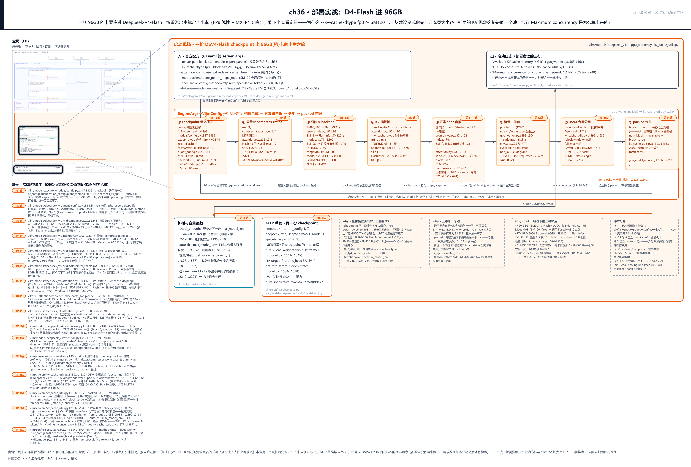

> *图注：本章放大的是[第 1 章](../../ch01-vllm-v1-in-one-map/narrative/chapter.md) L0 图左下「启动视角」块与「调度 · 显存账本」列的交汇。三段读图：上排两条是部署者的进出——左边进的是官方配方的旋钮清单（一份 CI 配置 yaml 的 server_args），右边出的是启动日志的三行读数（本章账本的最终产出；其中 `GPU KV cache size` 一行的口径是并发 × max_model_len，不是块数 × 256，读法见「护栏与最后一行日志」节）；中排 ①-⑧ 是启动账本的八拍：① checkpoint 量化档位、② 层普查 compress_ratios、③ 硬件×backend、④ KV 档解析、⑤ 五类 spec 自报、⑥ 测量三件套、⑦ DSV4 专属分组、⑧ packed 定账；下排是护栏与容量读数、MTP 草稿的登记、三条 why 注（量化档位决策树、五本账一个池、96GB 档位卡的三种命运）与邻章分界。接在四块已读结构上：[第 14 章](../../ch14-memory-ledger/narrative/chapter.md)的账本管线（⑥⑦⑧ 只展开 DSV4 特有件）、[第 27 章](../../ch27-quantization/narrative/chapter.md)的量化格式、[第 28 章](../../ch28-deepseek-v4-principles/narrative/chapter.md)与[第 29 章](../../ch29-deepseek-v4-assembly/narrative/chapter.md)的 DSV4 原理与拼装、[第 35 章](../../ch35-distributed-tp-pp-dp-ep/narrative/chapter.md)的 TP/EP 切法。站号 = DSV4-Flash 启动账本的代码顺序（部署章没有「请求流」，请求要在账本立起来之后才有得跑），正文按讲解需要编排，不必照站号读。*

读法建议：只想知道「档位是谁定的」，直奔[「机房说了算：硬件层的门禁」](#机房说了算硬件层的门禁)；想看五本 KV 账怎么算字节，跳[「五本账自报：168 份 spec」](#五本账自报168-份-spec)；那行并发出数怎么来的，看[「护栏与最后一行日志」](#护栏与最后一行日志)；要抄部署作业的，[「96GiB 预算瀑布与四个阀门」](#96gib-预算瀑布与四个阀门)与[「官方配方逐旋钮」](#官方配方逐旋钮)连读；想跟全程，按序读。

照例交代取证环境。96GB 单卡装不下这台模型（全模型权重约 155-160GiB，TP2 起步），本机也没有这样的卡，全章没有一份真实启动日志可抄。替代做法：全部页宽、分组、定账、护栏、并发的算术，由一个脚本对着 v0.27.1 源码逐行复算——页大小直接构造源码里的真实 spec 类读出，分组与定账的四段函数从 `vllm/v1/core/kv_cache_utils.py` 逐字复刻执行，模型形状取自 DeepSeek 官方发布的 config.json（2026-09 取回）。权重、激活峰、图池三项给的是量级估计，凡属估计处就地标 est；表内数字一个没改。

## 出厂即定档：权重账先定半本

现在走到 L2 图拍片 ①：checkpoint 量化档位。先认识这台模型本身，它的官方事实（[HF 模型卡](https://huggingface.co/deepseek-ai/DeepSeek-V4-Flash)，外部口径）一句话立住：总参数 284B、每 token 激活约 13B（MoE 稀疏路由，256 个专家每 token 只挑少数几个算）、上下文 1M token、MIT 许可、自称 preview version（预览版）。权重精度是 FP4+FP8 混合：MoE 专家用 FP4（就是本章要算字节账的 MXFP4 布局），线性与注意力层用 FP8。模型卡还给了两个对部署极重要的相对数字：1M 上下文下，单 token 计算量约为 V3.2 的 27%、KV cache 占用约为 10%。后一个数本章末段会拿这本源码账亲手对一遍（对账的口径差在哪，[第 28 章](../../ch28-deepseek-v4-principles/narrative/chapter.md)拆过）。

还有一个容易踩的坑先钉死：Flash 与 Flash-Base 是两份不同的 checkpoint。Flash 是后训练的 instruct 版（支持三种思考模式），Flash-Base 是预训练基座、专家权重是 FP8 而非 FP4。源码里 `expert_dtype` 的 fp4/fp8 两档，正对应这两份 checkpoint 的出厂差异。

### checkpoint 进门第一刀：fp8 改写成 deepseek_v4_fp8

量化档位的第一刀，操作员一个旋钮都没拨就已经落了。DSV4 的 HF config 里 `quantization_config.quant_method` 写的是通用的 `"fp8"`；config 装配期有一道校验钩子，看见 model_type 是 `deepseek_v4` 就把它改写成 `"deepseek_v4_fp8"`：

```python
# vllm/model_executor/models/config.py:L317-L326 · DeepseekV4ForCausalLMConfig.verify_and_update_model_config
class DeepseekV4ForCausalLMConfig(VerifyAndUpdateConfig):
    @staticmethod
    def verify_and_update_model_config(model_config: "ModelConfig") -> None:
        quant_config = getattr(model_config.hf_config, "quantization_config", None)
        if quant_config is not None and quant_config.get("quant_method") == "fp8":
            model_type = getattr(model_config.hf_config, "model_type", None)
            if model_type == "deepseek_v4":
                model_config.hf_config.quantization_config["quant_method"] = (
                    "deepseek_v4_fp8"
                )
        # … 省略：hf_text_config 的同款改写（L328-L339，视觉/多模态包装模型才走的路径）…
```

为什么非要这一刀？把 why 链摆全。**旧设计**：通用 `Fp8Config` 对所有 FP8 checkpoint 一视同仁。**痛点**：DSV4 两份 checkpoint 的专家精度档不同（Flash 的 MXFP4 专家、Flash-Base 的 FP8 块专家），通用 config 根本不知道 `expert_dtype` 这个字段的存在，会拿错专家的量化方法。**v1 方案**：改写让量化注册表选中 `DeepseekV4FP8Config`——一个 expert_dtype 感知的 FP8 子类（注册与分发机制[第 29 章](../../ch29-deepseek-v4-assembly/narrative/chapter.md)站 8 立过，本章只取操作员视角）。**代价**：又多了一层「同一个词在不同上下文里指不同东西」的注册表魔法：HF 侧写的 `fp8`、装配期看到的 `deepseek_v4_fp8`、用户显式 `--quantization deepseek_v4_fp8` 强制报名，三个入口汇到同一个名字上。

### expert_dtype：专家档位读表，但要懒读

`DeepseekV4FP8Config` 的 docstring 把两档讲得明明白白：

```python
# vllm/models/deepseek_v4/quant_config.py:L29-L47 · DeepseekV4FP8Config（docstring）
class DeepseekV4FP8Config(Fp8Config):
    """FP8 config for DeepSeek V4 with expert-dtype-aware MoE dispatch.

    DeepSeek V4 checkpoints always use FP8 block quantization for
    linear/attention layers. The MoE expert weights vary by checkpoint:
    - ``expert_dtype="fp4"`` (e.g. DeepSeek-V4-Flash): MXFP4 experts
      with ue8m0 (e8m0fnu) FP8 linear scales.
    - ``expert_dtype="fp8"`` (e.g. DeepSeek-V4-Flash-Base): FP8 block
      experts with float32 FP8 linear scales.

    The dispatch and the linear scale dtype are both keyed off
    ``expert_dtype`` from the model's hf_config; missing values default
    to ``"fp4"`` so existing FP4 checkpoints stay unchanged.

    NOTE: ``expert_dtype`` is resolved lazily because this config is
    constructed during VllmConfig setup, before ``set_current_vllm_config``
    is active. Reading hf_config eagerly in ``__init__`` would always see
    the default ``"fp4"`` and silently misroute Flash-Base checkpoints.
    """
```

三条事实从中读出：线性/注意力层恒为 FP8 块量化（128×128 块、ue8m0 缩放，格式数学[第 27 章](../../ch27-quantization/narrative/chapter.md)已立），无档可选；专家按 `expert_dtype` 分档；`is_scale_e8m0` 也随档走（fp4 检查点的 FP8 线性缩放是 ue8m0，fp8 检查点是 float32）。最值得停下来看的是那条 NOTE：**专家档位必须懒读**。这个 config 对象在 VllmConfig 装配期构造，那时 `set_current_vllm_config` 还没生效；要是在 `__init__` 里急匆匆读 hf_config，永远只能看到默认值 `"fp4"`，Flash-Base（fp8 专家）会被静默路由到 MXFP4 方法上——不报错、直接算错。惰性解析把读表推迟到第一次真正用的时候：

```python
# vllm/models/deepseek_v4/quant_config.py:L57-L84 · expert_dtype 惰性解析（节选）
    @property
    def expert_dtype(self) -> str:
        if self._resolved_expert_dtype is None:
            try:
                hf_config = get_current_vllm_config().model_config.hf_config
            except Exception:
                # vllm_config not yet set; defer the decision until a
                # later call lands inside set_current_vllm_config.
                return "fp4"                                                   # L65
            expert_dtype = getattr(hf_config, "expert_dtype", "fp4")
            # … 省略：非法值 raise（L67-L71）…
            self._resolved_expert_dtype = expert_dtype
            # … 省略：logger 导入与 info_once 日志（L73-L77）…
        return self._resolved_expert_dtype

    @property
    def is_scale_e8m0(self) -> bool:
        # FP4 checkpoints store FP8 linear scales as e8m0fnu; FP8 expert
        # checkpoints (Flash-Base) store them as float32.
        return self.expert_dtype == "fp4"
```

读不成就先返回默认值、把决定推迟（L65）；一旦在正确的时机读到了，缓存进 `_resolved_expert_dtype` 不再变。分档的消费端在 `get_quant_method`：专家层按档拿到 `Mxfp4MoEMethod`（fp4）或落回父类的 `Fp8MoEMethod`（fp8 块专家）：

```python
# vllm/models/deepseek_v4/quant_config.py:L173-L194 · get_quant_method（expert 档分岔）
    def get_quant_method(self, layer, prefix):
        if isinstance(layer, RoutedExperts):
            # … 省略：ignored_layers 跳过检查（L175-L180）…
            if self.expert_dtype == "fp4":
                if self.moe_quant_algo == "NVFP4":
                    # … 省略：NVFP4 变体的 import 与 return（L183-L190）…
                return Mxfp4MoEMethod(layer.moe_config)                         # L191
            # expert_dtype == "fp8": fall through to Fp8Config which
            # returns Fp8MoEMethod with block-wise float32 scales.
        return super().get_quant_method(layer, prefix)
```

这套档位是**出厂内置，不是部署选项**。上面 `get_quant_method` 的分岔里没有任何「再量化」入口：专家档位跟着 checkpoint 的 `expert_dtype` 走，选模型即选档位；[第 27 章](../../ch27-quantization/narrative/chapter.md)讲的 GPTQ/AWQ 部署侧再量化谱系在 DSV4 上因此不适用，这是后面决策树的第一层。

### 每参数半字节再加三十二分之一：MXFP4 的权重算术

权重账最硬的证据就在 MXFP4 专家的物理容器上（DeepGEMM MegaMoE 后端，[第 29 章](../../ch29-deepseek-v4-assembly/narrative/chapter.md)立过它的单算子融合）：

```python
# vllm/models/deepseek_v4/nvidia/model.py:L202-L246 · DeepseekV4MegaMoEExperts（权重形状，节选）
        self.w13_weight = nn.Parameter(
            torch.zeros(
                num_local_experts,
                2 * intermediate_size,
                hidden_size // 2,                                               # L206
                dtype=torch.uint8,
            ),
            requires_grad=False,
        )
        # … 省略：set_weight_attrs 注册（L211）…
        self.w13_weight_scale = nn.Parameter(
            torch.zeros(
                num_local_experts,
                2 * intermediate_size,
                hidden_size // 32,                                              # L217
                dtype=torch.uint8,
            ),
            requires_grad=False,
        )
        # … 省略：set_weight_attrs 注册（L222）…
        self.w13_weight_scale.quant_method = "block"                            # L223

        self.w2_weight = nn.Parameter(
            torch.zeros(
                num_local_experts,
                hidden_size,
                intermediate_size // 2,                                         # L229
                dtype=torch.uint8,
            ),
            requires_grad=False,
        )
        # … 省略：set_weight_attrs 注册（L234）与 w2_weight_scale 同款（[E, H, I//32] uint8，L236-L246）…
```

两个 shape 讲完全部字节规则。`hidden_size // 2` 列的 uint8：MXFP4 一个值只占 4 bit，一个字节装 2 个值（`vllm/models/deepseek_v4/common/ops/fused_indexer_q.py:L11` 的 `MXFP4_BLOCK_SIZE = 32` 是同一家族的分块常数）。`hidden_size // 32` 列的 scale：每 32 个值配 1 字节 ue8m0 指数缩放（ue8m0＝纯指数 FP8 格式、值只能是 2 的幂，[第 27 章](../../ch27-quantization/narrative/chapter.md)立过）。每参数的字节就是 $`0.5 + 1/32 = 0.53125`$，与专家数、层数、TP 切法统统无关。代入 Flash 的 config（hidden 4096、moe_intermediate 2048、256 专家、43 层，config.json 官方值）：

<!-- trace: m3 -->
| 账项 | 算术（值×字节） | 字节 |
| --- | --- | --- |
| w13 packed（[2I=4096, H//2=2048] uint8） | 16,777,216 值（2I×H = 4096×4096）× 0.5B（每字节 2 个 fp4） | 8,388,608 |
| w13 ue8m0 scale（[4096, H//32=128]） | 16,777,216 值 ÷ 32 | 524,288 |
| w2 packed（[H=4096, I//2=1024]） | 4096×2048 值 × 0.5B | 4,194,304 |
| w2 scale（[4096, I//32=64]） | 8,388,608 值 ÷ 32 | 262,144 |
| 单专家合计（25,165,824 参数 = 3×2048×4096） | 值 12,582,912B + 缩放 786,432B（恰 1/17） | 13,369,344 |
| 每层 256 专家 | 13,369,344 × 256 | 3,422,552,064（=3.1875GiB） |
| 43 层全部路由专家 | × 43 | 147,169,738,752（=137.06GiB；十进制 147.17GB） |

一个容易犯的单位错顺手挑明：147,169,738,752 字节按十进制是 147.17GB、按二进制是 137.06GiB——vLLM 日志的 `format_gib` 一律按 GiB 报数，本章统一 GiB，别拿 GB 的数去对日志。不变量也顺手立住：packed 字节数 = 参数 ÷ 2、scale 字节数 = 参数 ÷ 32，两个除法在 4096/2048 这种 2 的幂维度上永远整除，没有舍入项：277,025,390,592 个专家参数 × 0.53125B/param 严格线性，TP 切多少份、每份就是多少字节。

专家之外还有三笔零头：线性/注意力层 FP8（约 0.12GiB/层量级，est）、embed 与 lm_head 各一份 129,280×4096 的 bf16（两份合计 1.97GiB）、MTP 草稿层（multi-token prediction，多 token 预测头：训练时多训的一个「再往前多预测一步」的层，推理时改行当投机解码的草稿模型，本章末段讲它的出生）再付一份注意力加 MoE。全模型合计约 155-160GiB（est 量级）。结论只有一个方向：**单张 96GB 必然装不下，TP2 是第一道解不是最优解**——TP2 每卡专家 68.53GiB，加上线性、embed、MTP 摊下来的每卡约 78.7GiB（est），96GiB 卡就剩一个零头给 KV 了。所以章题里的「进 96GB」，首先是[第 35 章](../../ch35-distributed-tp-pp-dp-ep/narrative/chapter.md)的并行问题，其次才是本章的 KV 问题。

## 层普查：一列 44 个数字派活

现在走到 L2 图拍片 ②。权重档看完，KV 侧的账本从一列数字开始：config 里那张 44 项的 `compress_ratios` 表。[第 28 章](../../ch28-deepseek-v4-principles/narrative/chapter.md)立过逐层交替排布的设计（4 保分辨率要挑着看、128 丢分辨率但看得全），本章只看它作为账本输入的一面——这一列数字决定五本账各自的层数：

```python
# vllm/models/deepseek_v4/attention.py:L206-L213 · DeepseekV4Attention.__init__（compress_ratio）
        self.window_size = config.sliding_window
        # NOTE(zyongye) Compress ratio can't be 0
        # we do this for because MTP layer is not included
        # in the compress ratio list
        if layer_id < config.num_hidden_layers:                                 # L210
            self.compress_ratio = max(1, config.compress_ratios[layer_id])      # L211
        else:
            self.compress_ratio = 1
```

逐层查表、`max(1, r)` 把 0 折成 1（L211）；MTP 草稿层（layer_id ≥ 43）不走查表、固定 1（L212-L213）——所以表里第 44 项的 0 只是占位，真正的 MTP 层永不读它。Flash 的 44 项列表是 `[0, 0, (4, 128)×20, 4, 0]`（config.json 官方值）：2 个 0（纯窗口层）+ 21 个 4（C4A 层，带 Lightning Indexer）+ 20 个 128（C128 层）+ 1 个 0（MTP 占位）。类名沿用[第 26 章](../../ch26-deepseek-indexer-nsa-dsa/narrative/chapter.md)的叫法：swaonly（纯滑窗）、C4A（压缩 4 倍带检索）、C128A（重压缩 128 倍）。

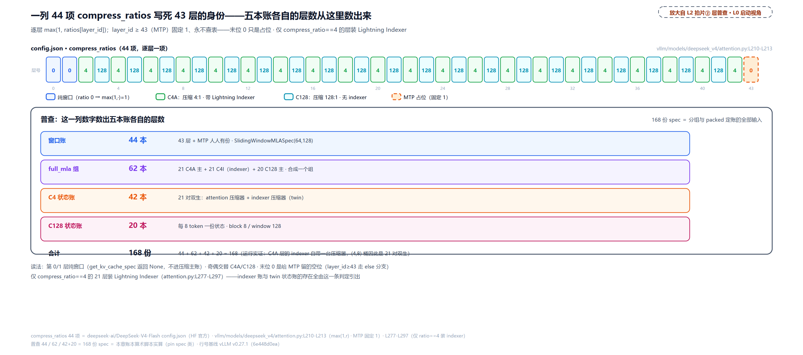

> *图注：L2 章图拍片 ② 的放大。一列 44 项 compress_ratios 决定全部账本的层数：第 0/1 层纯窗口（无压缩）、中段 4 与 128 逐层交替（C4A 带 Lightning Indexer，layer_id 2..42；C128A 在 3..41）、末位 0 是 MTP 占位永不查表（`vllm/models/deepseek_v4/attention.py:L210-L213` 的 max(1,·) 与 else 分支）。下方普查面板的四个计数器就是五本账的层数来源：窗口账 44 本（43 层 + MTP）、full_mla 组 62 本（21 本 C4A 主账 + 21 本 indexer 检索账 + 20 本 C128 主账）、C4 状态账 42 本（21 对双生）、C128 状态账 20 本，合计 168 份 spec。这一列数字是 checkpoint 发布事实，vLLM 不设默认值。*

普查的下游连锁，源码里一句话定一半：只有 `compress_ratio == 4` 的层才装 indexer（`vllm/models/deepseek_v4/attention.py:L277-L297`，注释原话 "Only C4A uses sparse attention and hence has indexer"）。于是每层报几本账完全由压缩比决定：纯窗口层只有窗口账、C4A 层五本全报、C128 层没有 indexer 账。这个 census 公式[第 14 章](../../ch14-memory-ledger/narrative/chapter.md)压力测试节用 5 层玩具表立过（c1 层 1 类、c4 层 5 类、c128 层 3 类），本章把玩具表换成真实 44 项，公式不变。

## 机房说了算：硬件层的门禁

现在走到 L2 图拍片 ③④。档位树的第二层不在 checkpoint 里，在机房里：同一份模型，三张 96GB 档位的卡走出三种命运。这层的钥匙是一对数字——compute capability（NVIDIA 给每代 GPU 标的「主版本.次版本」能力集编号，口语拼 smXY：sm90=Hopper 世代、sm100=Blackwell 数据中心卡、sm120=Blackwell 消费/专业卡；[第 21 章](../../ch21-attention-backends/narrative/chapter.md)立过记法，这里只需要记住 **sm100 与 sm120 同叫 Blackwell 却是两套能力集**，型号对照见[NVIDIA 官方表](https://developer.nvidia.com/cuda/gpus)）。

### SM 版本先分岔，backend 跟着走

不显式指定 backend 时，注意力类由卡的 major 版本一锤定音：

```python
# vllm/models/deepseek_v4/nvidia/model.py:L771-L802 · _select_dsv4_attn_cls
def _select_dsv4_attn_cls(vllm_config: VllmConfig) -> type[DeepseekV4Attention]:
    """Pick the CUDA sparse-MLA attention class for the configured backend.
    # … 省略：docstring 后半（L774-L778，SM12 默认 FlashInfer 的原话说明）…
    """
    backend = vllm_config.attention_config.backend
    device_capability = current_platform.get_device_capability()
    # … 省略：显式 backend 旋钮的两段分支（L781-L798，非法名 raise + 指定类直返）…
    if device_capability is not None and device_capability.major == 12:         # L800
        return DeepseekV4FlashInferSM120Attention
    return DeepseekV4FlashMLAAttention
```

major==12（RTX PRO 6000 这类卡）走 FlashInfer 的 SM120 类，其余 CUDA 卡（major 9 或 10：H20、H100、B200）走 FlashMLA。FlashMLA 那条路自己的算力声明是 major ∈ [9, 10]（`vllm/models/deepseek_v4/sparse_mla.py:L92-L93`），H20-96G 也在列。显式 backend 旋钮优先于这条自动分岔——但拨错了名会直接 ValueError，不静默回退。

### 放行清单：KV 档在 SM120 上不是选择题

选完 backend，FlashInfer 这族还有一道 `supports_combination` 门，逐项检查「这个组合我接不接」。这是硬件替操作员做选择题的现场：

```python
# vllm/models/deepseek_v4/nvidia/flashinfer_sparse.py:L113-L150 · DeepseekV4FlashInferMLASparseBackend（放行清单，节选）
    @classmethod
    def supports_compute_capability(cls, capability: DeviceCapability) -> bool:
        return capability.major in [10, 12]                                     # L115

    @classmethod
    def supports_combination(
        cls,
        head_size: int,
        dtype: torch.dtype,
        kv_cache_dtype: CacheDType | None,
        block_size: int | None,
        use_mla: bool,
        has_sink: bool,
        use_sparse: bool,
        use_mm_prefix: bool,
        device_capability: DeviceCapability,
    ) -> str | None:
        if device_capability.major == 10:                                       # L130
            if kv_cache_dtype == "fp8_ds_mla":
                return (
                    "FLASHINFER_MLA_SPARSE_DSV4 SM10x uses the plain "
                    "per-tensor FP8 KV layout, not fp8_ds_mla"
                )
            if kv_cache_dtype not in (None, "auto", "bfloat16", "fp8", "fp8_e4m3"):
                return "kv_cache_dtype not supported"
            return None
        if device_capability.major == 12:                                       # L139
            if kv_cache_dtype not in ("fp8", "fp8_e4m3", "fp8_ds_mla"):         # L140
                return "kv_cache_dtype not supported"
            from vllm.utils.flashinfer import has_flashinfer_sparse_mla_sm120

            if not has_flashinfer_sparse_mla_sm120():
                return (
                    "FLASHINFER_MLA_SPARSE_DSV4 SM120 requires FlashInfer's "
                    "sparse MLA decode API"
                )
            return None
        return "FLASHINFER_MLA_SPARSE_DSV4 requires SM10x or SM12x"
```

两个分支的脾气完全相反。**major==10**（SM100 的 FlashInfer 路）：明确拒收 fp8_ds_mla 这个内部暗号（要走普通逐张量 FP8 行），但 bf16、auto、fp8 都放行。**major==12**（SM120，96GB 档位的 RTX PRO 6000）：只放行 fp8/fp8_e4m3/fp8_ds_mla（L140）——**bf16 与 auto 直接不支持**。在这张卡上「KV 用不用 fp8」不是操作员的自由，是硬件的命令；运行时还要过一道环境检查 `has_flashinfer_sparse_mla_sm120()`（FlashInfer 的 sparse MLA decode API 是否可用，`flashinfer_sparse.py:L576-L582` 的 `__init__` 里再拦一次）。

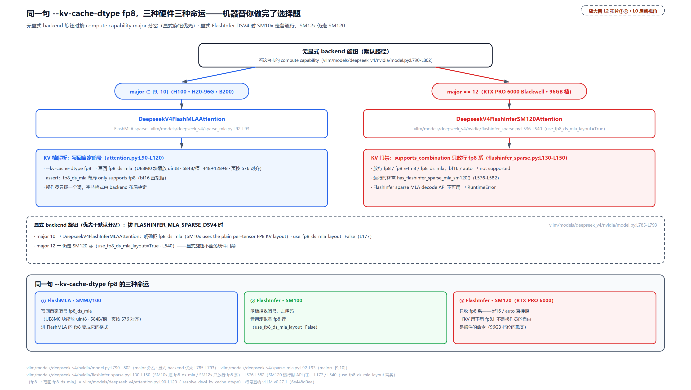

> *图注：L2 章图拍片 ③④ 的合并放大。无显式 backend 时 `_select_dsv4_attn_cls` 按 major 分岔（`vllm/models/deepseek_v4/nvidia/model.py:L800-L802`）：major 12 → FlashInfer SM120、其余 CUDA（9/10）→ FlashMLA（`sparse_mla.py:L92-L93` 声明 major∈[9,10]）。随后 supports_combination 再细分（`flashinfer_sparse.py:L130-L150`）：SM10x 拒 fp8_ds_mla 走普通逐张量 fp8 行；SM12x 只放行 fp8 系、还需 FlashInfer sparse MLA decode API。同一句 `--kv-cache-dtype fp8` 三种命运：FlashMLA 把它写回暗号 fp8_ds_mla（584B 槽、页按 576 对齐）、SM100 FlashInfer 拒暗号收明码按普通 fp8 行存、SM120 FlashInfer 强制 fp8 系。两条不在图上的要点另行展开：MegaMoE 只认 SM100 的门在下一节与决策树图的 ②-3 卡；三张卡的带宽口径见下表。*

### MegaMoE 只认 SM100

MoE 侧还有一扇更窄的门。配方里的 `--moe-backend deep_gemm_mega_moe` 落到 `DeepseekV4MegaMoEExperts` 上，它的运行时门禁只认 SM100：

```python
# vllm/models/deepseek_v4/nvidia/model.py:L314-L317 · MegaMoE 的 SM100 门
    def _check_runtime_supported(self) -> None:
        device = self.w13_weight.device
        if torch.cuda.get_device_capability(device)[0] != 10:
            raise NotImplementedError("DeepGEMM MegaMoE requires SM100 GPUs.")
```

major != 10 直接 NotImplementedError，fail-fast 不降级。也就是说 B200（sm100）能用的单算子 MoE mega-kernel，H20（sm90）和 RTX PRO 6000（sm120）都用不了，专家计算退回通用 FusedMoE 路线。三层门禁合起来，96GB 档位三种命运的硬件输入就齐了。

### 同是 96GB，三张卡三种命运

把三张卡摆在一起看（规格为多源交叉整理，方向无疑、尾数以官方页为准）：

| 卡 | 架构（SM） | 显存 | 带宽 | vLLM 里的路 |
| --- | --- | --- | --- | --- |
| H20-96G | Hopper（sm90） | 96GB HBM3 | 4.0 TB/s | FlashMLA + fp8_ds_mla KV；MegaMoE 门外，专家走通用路 |
| RTX PRO 6000 Blackwell | Blackwell 专业卡（sm120） | 96GB GDDR7（带 ECC 纠错） | 约 1.8 TB/s | FlashInfer SM120；KV 强制 fp8 系；还要 FlashInfer sparse API |
| B200 | Blackwell 数据中心（sm100） | 每卡 180GB HBM3e 级 | NVLink 1.8 TB/s/卡（卡间互联） | FlashMLA + MegaMoE；官方配方的机台 |

值得点破的是带宽列的口径。前两行的 4.0 TB/s 与约 1.8 TB/s 是显存带宽，也就是 GPU 读写自己显存的速度，HBM（堆叠 DRAM 加超宽总线的显存）与 GDDR7（焊在板上的离散显存颗粒）两种技术路线的差距就在这。B200 那格的 NVLink 不是显存带宽：NVLink 是 NVIDIA GPU 之间的专用高速互联总线，管的是卡与卡之间搬数据（B200 自己的显存带宽是 8 TB/s 级的另一回事），别拿 1.8 去跟 GDDR7 的 1.8 比出「旗舰显存带宽≈工作站卡」的错结论。所以 **「96GB 容量档」与「带宽档」不是一回事**，带宽列里前两行与第三行也不是同一种带宽。RTX PRO 6000 的意义在于一张 300-600W 的工作站卡就能凑出 96GB，进办公室不需要机房；H20 是出口管制年代「算力阉割、显存保留」的中国特供线；B200 是旗舰，新后端只对它这一代开（[NVIDIA 产品页](https://www.nvidia.com/en-us/products/workstations/rtx-pro-6000-blackwell-workstation-edition/)、[HGX 平台页](https://www.nvidia.com/en-us/data-center/hgx/)）。对部署者更实际的是：三张卡在 vLLM 里走三条不同代码路径，同一份 155-160GiB 权重账，档位树的交集各不相同，但**账本方程一张表都不换**，变的只是硬件层的输入。

### 三层画成一棵树

checkpoint 层（出生即定）、硬件层（门禁不是建议）、操作员层（剩下的自由度），合起来就是本章的「量化档位决策树」：

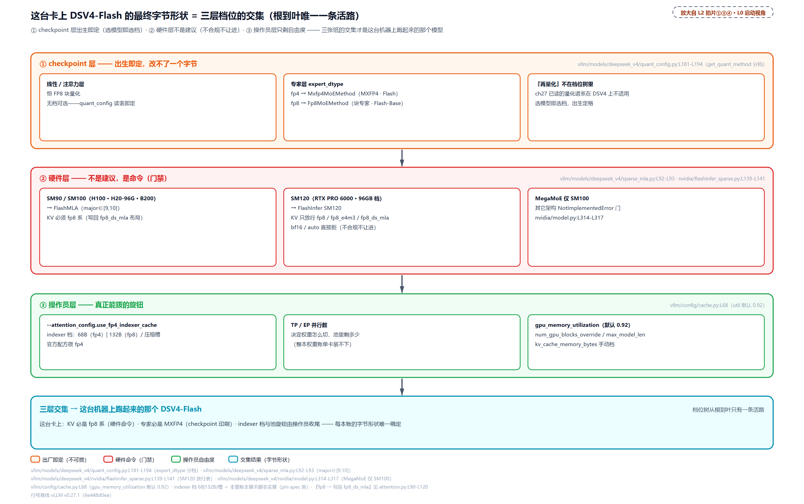

> *图注：L2 章图拍片 ①③④ 的合成树。checkpoint 层不可拨：线性/注意力恒 FP8 块量化、专家按 expert_dtype 分档（fp4→Mxfp4MoEMethod、fp8→Fp8MoEMethod，`vllm/models/deepseek_v4/quant_config.py:L181-L194`），再量化不在树上。硬件层是命令：SM90/100→FlashMLA（`sparse_mla.py:L92-L93` 声明 major∈[9,10]）且其 fp8_ds_mla 布局 assert 只收 fp8 系（`attention.py:L105`）、SM120→FlashInfer 且只放行 fp8 系（`flashinfer_sparse.py:L139-L141`）、MegaMoE 仅 SM100（`nvidia/model.py:L314-L317`）。操作员真正能拨的只剩 indexer 档（use_fp4_indexer_cache，68|132B/槽）、TP/EP 数与池旋钮（gpu_memory_utilization 默认 0.92＝`vllm/config/cache.py:L68`、num_gpu_blocks_override、max_model_len、kv_cache_memory_bytes 手动档）。从根到叶唯一一条活路，就是这台卡上这台模型的最终字节形状。*

这棵树回答了开篇第一问：`--kv-cache-dtype fp8` 在 SM120 卡上之所以「从建议变成命令」，是因为它的 KV 路只有一条、那条路只收 fp8 系。剩下两问（五本账怎么挤一个池、并发行怎么算）分别归下面的账本段与定账段。

## 拨一个词，定一种字节：KV 档解析

现在走到 L2 图拍片 ④。操作员在 KV 侧只拨一个词：`--kv-cache-dtype`（合法档见 `vllm/config/cache.py:L19-L36`）。这个词落进哪种字节格式，由 backend 的布局决定——解析函数是本章 KV 侧最值得逐行读的一段：

```python
# vllm/models/deepseek_v4/attention.py:L90-L120 · _resolve_dsv4_kv_cache_dtype
def _resolve_dsv4_kv_cache_dtype(
    use_fp8_ds_mla_layout: bool,
    kv_cache_dtype: str,
    cache_config: CacheConfig | None,
) -> tuple[str, torch.dtype]:
    """Map ``(layout, --kv-cache-dtype)`` to ``(cache_dtype_str, torch_dtype)``.
    # … 省略：docstring 后半（L96-L102，两种布局的差异说明）…
    """
    if use_fp8_ds_mla_layout:
        # fp8_ds_mla block format: UE8M0 block-scaled fp8 packed as uint8.
        assert kv_cache_dtype.startswith("fp8"), (                # L105
            f"DeepseekV4 fp8_ds_mla layout only supports fp8 kv-cache, "
            f"got {kv_cache_dtype}"
        )
        if kv_cache_dtype != "fp8_ds_mla":
            if cache_config is not None:
                cache_config.cache_dtype = "fp8_ds_mla"           # L111
            kv_cache_dtype = "fp8_ds_mla"
            logger.info_once("Using DeepSeek's fp8_ds_mla KV cache format.")
        return kv_cache_dtype, torch.uint8

    # Plain bf16 / per-tensor fp8 KV row (FlashInfer).
    if kv_cache_dtype.startswith("fp8"):
        return kv_cache_dtype, torch.float8_e4m3fn
    # auto / bfloat16 -> plain bf16 KV row.
    return kv_cache_dtype, torch.bfloat16
```

fp8_ds_mla 布局（FlashMLA 与 SM120 FlashInfer，`use_fp8_ds_mla_layout=True` 由各注意力子类声明）干三件事：assert 档位必须以 fp8 开头（L105）；把 `cache_config.cache_dtype` **原地写回**成 `"fp8_ds_mla"`（L111）——此后全引擎所有下游（页规格、spec 自报、分组）读到的都是这个改写后的档名，页大小因此统一按 fp8_ds_mla 布局算：每存储槽 584B（448+128+8，下节逐本推导），页再补齐到 576 的倍数；返回 uint8 当存储 dtype（UE8M0 块缩放的 fp8 值按字节打包）。FlashInfer SM100 路不写回，KV 按普通行存 bf16 或逐张量 fp8 e4m3。

为什么链四要素摆全。**旧设计**：cache_dtype 由用户说了算、原样透传。**痛点**：同一个词 `"fp8"` 在两种布局下的字节含义完全不同（块缩放打包的 uint8 vs 逐张量 fp8 行），透传会让页规格算错。**v1 方案**：布局知情解析加写回，一处改写、处处一致。**代价**：操作员在日志里看到的档名可能不是自己输入的那个；bf16 在 SM120 上根本无路可走（上一节的放行清单）。

## 五本账自报：168 份 spec

现在走到 L2 图拍片 ⑤，本章的主菜。[第 14 章](../../ch14-memory-ledger/narrative/chapter.md)立过账本管线的规矩：**每层自己知道自己要多少历史**，`get_kv_cache_spec` 是每层向账本的申报表，账本只收账、不发明页大小。DSV4 是这套申报制最重的实例。五本账的名字先立住（五本账摊出五种页宽，每格为 fp8_ds_mla 档对齐后的每块页，推导随即逐本来）：**窗口账** 44 本（每层一份，block 64、窗 128，37,440B/块）、**压缩主账** 41 本（C4A 21 本 37,440B + C128 20 本 1,728B）、**indexer 检索账** 21 本（仅 C4A，fp4 档 4,608B；下文缩写为 C4I）、**C4 状态账** 21 对双生（32,832B + 8,640B）、**C128 状态账** 20 本（32,832B）——合计 168 份 spec：

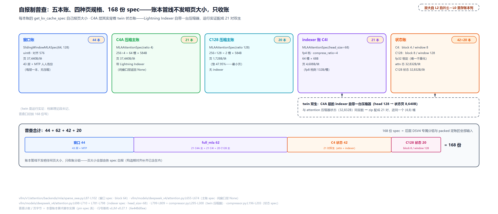

> *图注：L2 章图拍片 ⑤ 的普查总表放大。五本账自报 168 份 spec：窗口账 44 本（43 层 + MTP，每本 37,440B/块）、压缩主账与 indexer 账合进一个 full_mla 组共 62 本（21 本 C4A 主账 37,440B + 21 本 C4I indexer 4,608B + 20 本 C128 主账 1,728B）、状态账 42+20 本（C4A 层是双生的一对：注意力压缩器 32,832B + indexer 压缩器 8,640B；C128 状态 32,832B）。普查表即后面专属分组与 packed 定账的全部输入。注意 C4A 层其实背着 twin 双生状态账——它的 Lightning Indexer 内嵌自己的压缩器（`vllm/models/deepseek_v4/attention.py:L799-L809`），`DeepseekCompressor.__init__` 无条件建状态缓存（`compressor.py:L295-L300`）。*

这份 census 有一个容易漏数的点：indexer 自己带一台压缩器，于是 C4A 层的状态账是**一对双生**（attention 压缩器的 32,832B 大账 + indexer 压缩器的 8,640B 小账），普查按 42 本状态账（21 对）计数。逐本的申报代码，挑三段承重的看。

### 压缩主账：num_kv_heads=1、head_size=512、584B 槽

主账由注意力层申报，纯窗口层不报（窗口账另册）：

```python
# vllm/models/deepseek_v4/attention.py:L655-L674 · DeepseekV4Attention.get_kv_cache_spec
    def get_kv_cache_spec(self, vllm_config: VllmConfig) -> KVCacheSpec | None:
        if (
            self.compress_ratio <= 1
        ):  # SWA part. Allocated separately as DeepseekV4SWACache.
            return None                                                         # L659
        # fp8_ds_mla is a UE8M0 block-scaled uint8 layout and needs 576B
        # alignment; plain bf16 / per-tensor fp8 rows use natural element-size
        # pages.
        uses_fp8_ds_mla_layout = self.kv_cache_dtype == "fp8_ds_mla"
        return MLAAttentionSpec(
            block_size=vllm_config.cache_config.block_size,                     # L665
            num_kv_heads=1,
            head_size=self.head_dim,
            dtype=torch.uint8 if uses_fp8_ds_mla_layout else self.kv_cache_torch_dtype,
            compress_ratio=self.compress_ratio,                                 # L669
            cache_dtype_str=self.kv_cache_dtype,
            alignment=576 if uses_fp8_ds_mla_layout else 512,                   # L671
            model_version="deepseek_v4",
            kv_quant_mode=get_kv_quant_mode(self.kv_cache_dtype),
        )
```

三个字段各有一句人话：`num_kv_heads=1`，MLA 潜向量天然单份（[第 25 章](../../ch25-mla-two-expansions/narrative/chapter.md)立过 MQA 吸收路数），比 GQA 还少一层头份数维度；`compress_ratio` 是这台压缩器的压缩比，后面分组的关键字段；`alignment=576` 是 fp8_ds_mla 布局的对齐硬要求。字节算术全在 spec 类里：

```python
# vllm/v1/kv_cache_interface.py:L388-L426 · MLAAttentionSpec（节选）
@dataclass(frozen=True, kw_only=True)
class MLAAttentionSpec(FullAttentionSpec):
    # … 省略：字段声明（L390-L397，alignment/compress_ratio/model_version）…
    def __post_init__(self):
        super().__post_init__()
        _apply_alignment_padding(self)                                          # L401

    @property
    def storage_block_size(self) -> int:
        return self.block_size // self.compress_ratio                           # L405

    @property
    def real_page_size_bytes(self) -> int:
        if self.cache_dtype_str == "fp8_ds_mla":
            if self.model_version == "deepseek_v4":
                # DeepseekV4: 448B NoPE + 128B RoPE + 8B fp8 scale = 584B per token.
                # head_size stays semantic (512); bytes are determined here.
                return self.storage_block_size * 584                            # L413
            # V3.2 main MLA: 656-byte custom layout (kv_lora_rank=512 +
            # qk_rope_head_dim=64, head_size=576). See flashmla_sparse.py.
            return self.block_size * 656
        # … 省略：普通行布局的字节公式（L417-L426）…
```

两条除法/乘法定全本账。**槽数除法**（L405）：一个 block_size=256 的管理块，C4A 只存 256÷4=64 个压缩槽、C128 只存 2 个——压缩把「token 数」换算成「槽位」就是这一行（管理面 256 与物理面的两套坐标系，[第 14 章](../../ch14-memory-ledger/narrative/chapter.md)压缩块记账节立过）。**槽宽乘法**（L413）：fp8_ds_mla 布局下每个存储槽 584B，拆开是 $`584 = 448 + 128 + 8`$：448B NoPE（潜向量不带位置编码的主段）+ 128B RoPE（带旋转位置编码的短分量）+ 8B fp8 缩放字节；head_size 保持语义值 512 不进算式，字节由布局直接指定（解析函数 docstring 里「576B per-token slot」的写法只算 448+128 的 token data、漏了那 8B 缩放字节，页宽账以这里的 584 为准）。V3.2 是另一套 656B 布局，同族不同形。

### indexer 账的暗开关：68B 还是 132B

五本账里最隐蔽的一本：Lightning Indexer 的 K 账。它藏着一个操作员旋钮 `--attention_config.use_fp4_indexer_cache`（`vllm/config/attention.py:L68` 定义、默认 False，官方配方里拨成 True）：

```python
# vllm/models/deepseek_v4/attention.py:L781-L798 · DeepseekV4Indexer.__init__（indexer 档 k_cache_head_dim）
        assert cache_config is not None, "Deepseek V4 indexer requires cache_config"
        if self.use_fp4_kv:
            # MXFP4 stores two values per byte plus one UE8M0 byte per 32 values.
            # head_dim bytes = 64 packed values + 4 UE8M0 scales = 68.
            k_cache_head_dim = self.head_dim // 2 + self.head_dim // MXFP4_BLOCK_SIZE   # L785
        else:
            # NOTE(yifan): FP8 indexer cache uses the same layout as V3.2:
            # head_dim bytes = 128 fp8 + 4 fp32 scale = 132.
            k_cache_head_dim = (
                self.head_dim + self.head_dim // self.quant_block_size * 4    # L789-L790
            )
        self.k_cache = DeepseekV4IndexerCache(
            head_dim=k_cache_head_dim,
            dtype=torch.uint8,
            prefix=f"{prefix}.k_cache",
            cache_config=cache_config,
            compress_ratio=self.compress_ratio,
        )
```

两条公式各算一遍（indexer 的 head_dim 是 128）：fp4 档每槽 128÷2 + 128÷32 = 68B（64B packed 值 + 4B ue8m0 缩放）；fp8 档每槽 128 + 128÷128×4 = 132B（128B fp8 值 + 4B 缩放字节，即每 128 值配 1 个 fp32 缩放、一个 fp32 恰 4B；源码注释写的 “4 fp32 scale” 里那个 4 是字节数不是缩放个数，照注释数个数会误算出 144，V3.2 同款布局）。这一档只作用于 21 个 C4A 层，但档差近一倍：

<!-- trace: m8 -->
| 档 | 槽宽公式（head 128） | 槽字节 | 每块页（64 槽，576 对齐后） | 每 token 摊（池/载荷） |
| --- | --- | --- | --- | --- |
| fp4（配方档） | 128//2 + 128//32 = 64+4 | 68 | 4,608 | 18B / 17B |
| fp8（默认档） | 128 + 128//128×4 = 128+4 | 132 | 8,640 | 33.75B / 33B |
| 对 block_stride 的杠杆 | — | — | full_mla 组叠放 917,568 vs 1,002,240 | fp4 档多 9.23% 块（8GiB 池 9,361 vs 8,570） |

表里最后一行是这一旋钮的实战价值：换档只改 indexer 一本账的槽宽，block_stride（下一节定账的主角）从 1,002,240 缩到 917,568（档差恰是 21×(8,640−4,608) = 84,672B，即 21 本 indexer 账各差一页），同一口池多出 9.23% 的块——**不换卡、不改并行就能白拿的最大单项 KV 收益**。每 token 摊销给两个口径：池口径 18B（页 4,608B 摊到 256 个管理 token）与载荷口径 17B（68B 摊到 4 个 token 一个压缩槽），差的那 1B 是 576 对齐垫的税，马上就讲。

### 状态账与它的双生兄弟

压缩器每凑满一个压缩比才产出一份正式压缩 KV，凑的过程中原料要暂存——这就是状态账（[第 26 章](../../ch26-deepseek-indexer-nsa-dsa/narrative/chapter.md)立过前向数学，本章只看账）。它的自报：

```python
# vllm/models/deepseek_v4/compressor.py:L191-L203 · CompressorStateCache.get_kv_cache_spec
    def get_kv_cache_spec(self, vllm_config: VllmConfig) -> KVCacheSpec:
        # fp8_ds_mla is the UE8M0 paged layout and needs 576B alignment. Plain
        # full-cache rows share state pages with contiguous KV pages, so padding
        # would break page matching.
        uses_fp8_ds_mla_layout = vllm_config.cache_config.cache_dtype == "fp8_ds_mla"
        return SlidingWindowMLASpec(  # only has one vector instead of K + V
            block_size=self.block_size,
            num_kv_heads=1,
            head_size=self.state_dim,                                          # L199
            dtype=self.dtype,
            sliding_window=self.sliding_window,
            alignment=576 if uses_fp8_ds_mla_layout else 512,                  # L202
        )
```

三个数字值得记：状态维度 `state_dim = 2 × coff × head_dim`（`compressor.py:L296`，kv_state 与 score_state 各占一半；C4 的重叠系数 coff=2、C128 的 coff=1）——注意力压缩器（head 512）的状态宽 2,048、indexer 压缩器（head 128）宽 512；**dtype 恒 fp32**（类里的 assert 写死，`compressor.py:L173`），五本账里唯一不量化的一本；窗口由压缩比硬推（C4 到窗 8、C128 到窗 128）。每层都有的窗口账与此同型（`vllm/v1/attention/backends/mla/sparse_swa.py:L87-L102`，block 64、窗 128），一并归入 SlidingWindowMLASpec 这一支。

### 每页补到 576：对齐税总表

五本账的页宽到此全部凑齐，可以合一张总表了。fp8_ds_mla 布局要求每页是 576 的倍数，`_apply_alignment_padding`（`vllm/v1/kv_cache_interface.py:L353-L359`）在 spec 构造期一次 round_up 写进冻结的 dataclass——[第 14 章](../../ch14-memory-ledger/narrative/chapter.md)立过机制，本章看账：

<!-- trace: m6 -->
| 账（每块） | 原始页 = 槽×槽宽 | 576 对齐后 | 垫字节（垫%） |
| --- | --- | --- | --- |
| 窗口账（block 64，64 槽×584B） | 37,376 | 37,440 | 64（0.17%） |
| C4A 压缩主账（256÷4=64 槽×584B） | 37,376 | 37,440 | 64（0.17%） |
| C128 压缩主账（256÷128=2 槽×584B） | 1,168 | 1,728 | 560（47.95%） |
| C4I indexer fp4（64 槽×68B） | 4,352 | 4,608 | 256（5.88%） |
| C4 状态账（4×2048×4B fp32） | 32,768 | 32,832 | 64（0.20%） |

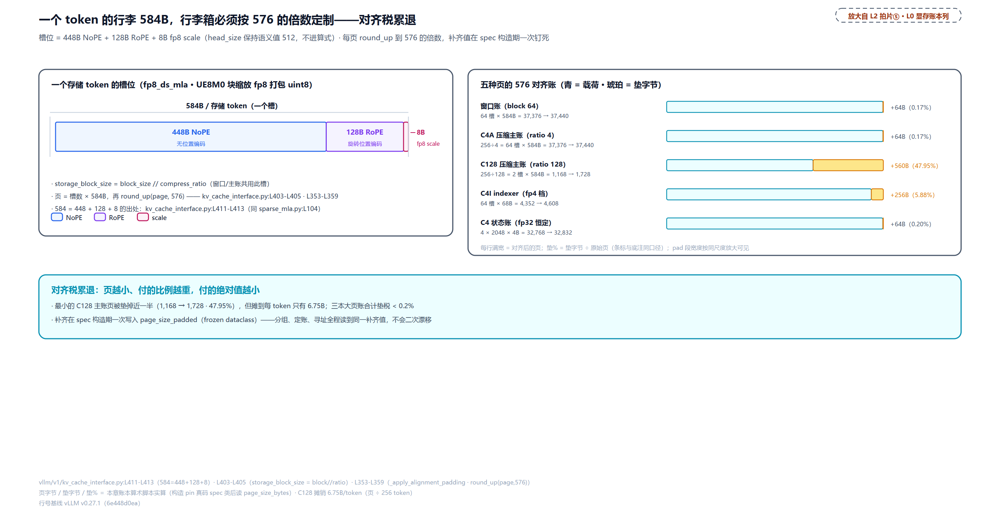

> *图注：L2 章图拍片 ⑤ 里「页怎么算出来」的字节级放大。一个 token 的行李 584B：448B NoPE + 128B RoPE + 8B fp8 缩放（`vllm/v1/kv_cache_interface.py:L411-L413`）；FlashMLA 的打包格式要求页是 576 的倍数（`L353-L359` 的 round_up）。对齐税累退：三本大页账只垫 64B（0.17-0.20%），最小的 C128 主账页垫掉近一半（1,168→1,728，47.95%），indexer fp4 垫 5.88%，但 C128 摊到每 token 只有 6.75B，绝对量可忽略。图示的 C4 状态页补齐后 32,832B。两笔等宽关系不在本图展开：这 32,832B 与 C128 状态页恰好等大（见「块大小锁死」图）；indexer 压缩器的双生状态页 8,640B 与 indexer fp8 档页同宽（见「68B 还是 132B」小节的档差表）。*

这张表有个漂亮的规律：**对齐税累退**——页越小、付的比例越重（C128 主账垫掉 47.95%），付的绝对值越小（三本大页账合计垫税不到 0.2%）。垫多少由「原始页宽向上取整到 576 的倍数」唯一决定，垫字节恒小于 576B；补齐值在 spec 构造期一次性钉死（frozen dataclass），分组、定账、寻址全程读同一个数，不会二次漂移。

### 块大小不是旋钮

最后一块拼图：这些账里的 block_size（窗口账 64、C4 状态账 4、C128 状态账 8）看起来像可调参数，其实全被「与 KV 块共享物理张量」锁死了：

```python
# vllm/v1/attention/backends/mla/sparse_swa.py:L77-L82 · DeepseekV4SWACache.__init__（锁死注释）
        # Block size is constrained by tensor sharing between SWA and C4A KV blocks.
        # Since both block types share the same physical tensor, they must use the
        # same page size. The C4A KV block shape [256//4, head_dim] = [64, head_dim]
        # determines the SWA block size of 64 tokens per block.
        # TODO(yifan): make SWA block size automatically determined and configurable.
        self.block_size = 64                                                   # L82
```

注释把因果讲透了：C4A 的压缩 KV 块天生 [256//4, head_dim] = 64 行，窗口账与它共享同一张物理张量、页大小必须一致，所以 SWA 的块只能 64——不是选的，是被定形的。状态账同理（`vllm/models/deepseek_v4/compressor.py:L177-L189` 的同款注释，KV 块形反推 C4 状态块 [4, 2·512·2·4] 与 C128 状态块 [8, 512·2·4]）。两处 TODO 自认这是待解的硬编码。

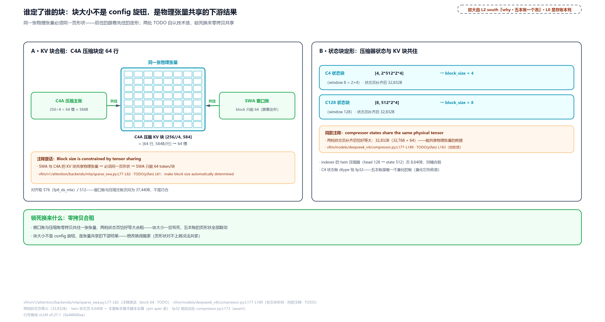

> *图注：L2 章图 south「五本账一个池」注的展开。C4A 的压缩 KV 块天生 64 行（256 token ÷ 4），窗口账与它共享同一张物理张量、只能跟 64（`vllm/v1/attention/backends/mla/sparse_swa.py:L77-L82` 注释原话 "Block size is constrained by tensor sharing"）；压缩器状态块 4 与 8 同理（`vllm/models/deepseek_v4/compressor.py:L177-L189`，KV 块形 [64, 584] 反推状态块形 [4, 2·512·2·4] 与 [8, 512·2·4]）。代价换来的是零拷贝共住：窗口账与压缩账同住一张张量、两档状态页补齐后恰好等大（32,832B）。两处 TODO 注释自认这是待解的硬编码（`sparse_swa.py:L81`、`compressor.py:L183`）。*

[第 14 章](../../ch14-memory-ledger/narrative/chapter.md)讲过三对「刻意同页」的设计；本章实战视角的意义是一句话：**操作员的旋钮清单里没有块大小**。`--block-size` 拨的是管理块（主账与 indexer 账的 256），窗口账与状态账的块根本不在旋钮面上。

## 量房：一次 dummy 前向定池子

现在走到 L2 图拍片 ⑥。五本账各自报完页宽，轮到池子有多大——这半边[第 14 章](../../ch14-memory-ledger/narrative/chapter.md)立过通用件（测量式分配三步：定预算、量峰值、一行减法），本章看 DSV4 实战的读法：

```python
# vllm/v1/worker/gpu_worker.py:L498-L548 · Worker.determine_available_memory（测量主体，节选）
        # Execute a forward pass with dummy inputs to profile the memory usage
        # of the model.
        with memory_profiling(
            self.init_snapshot,
            weights_memory=int(self.model_runner.model_memory_usage),
        ) as profile_result:
            self.model_runner.profile_run()                                     # L504

        # … 省略：cudagraph 估计的条件与 ROCm/XPU 注释（L506-L517）…
        cudagraph_memory_estimate = 0
        if (
            current_platform.is_cuda_alike()
            and self.vllm_config.compilation_config.cudagraph_mode != CUDAGraphMode.NONE
        ):
            cudagraph_memory_estimate = self.model_runner.profile_cudagraph_memory()

        # Respect the opt-in flag as originally designed.
        cudagraph_memory_estimate_applied = (
            cudagraph_memory_estimate
            if envs.VLLM_MEMORY_PROFILER_ESTIMATE_CUDAGRAPHS                   # L522
            else 0
        )
        # … 省略：woosuk 的『其它进程不得在 profile 期间动显存』assert（L533-L543）…
        self.available_kv_cache_memory_bytes = (
            self.requested_memory                                                # L545
            - profile_result.non_kv_cache_memory
            - cudagraph_memory_estimate_applied
        )
```

三件套齐了：`memory_profiling` 包住一次 dummy 前向（L504）量出非 KV 占用的峰值账——DSV4 的 eager scratch 池（eager 执行时的临时工作缓冲）、indexer 与 compressor 的 workspace 在这次前向里全部真占上，测量不漏账（minimal 池的预演在 `vllm/v1/worker/gpu_model_runner.py:L6508-L6532`，五本账的 spec 先收一遍、按最小块数落一次张量再跑）；CUDA graph 若启用，先估一笔图池（`VLLM_MEMORY_PROFILER_ESTIMATE_CUDAGRAPHS` 默认开，`vllm/envs.py:L295`）；最后一行减法（L545-L548）。方程与 96GB 主线代入：

```math
\mathrm{available} \;=\; \lceil \mathrm{total} \times \mathrm{util} \rceil \;-\; \mathrm{non\_kv} \;-\; \mathrm{cudagraph}_{\mathrm{est}}
```

<!-- trace: m12 -->
| 方程项 | 值 | 出处/性质 |
| --- | --- | --- |
| requested = ceil(总显存×util) | 96GiB×0.92 = 88.32GiB | utils.py:L414-L416；util 默认 0.92=cache.py:L68 |
| − non_kv（权重+激活峰，profile 实测） | ≈78.7(est) + 3.6(est) GiB | gpu_worker.py:L500-L504（memory_profiling 包 dummy 前向，DSV4 eager scratch/indexer/compressor workspace 全占上） |
| − cudagraph 估计 | ≈1.0(est) GiB | gpu_worker.py:L512-L524；VLLM_MEMORY_PROFILER_ESTIMATE_CUDAGRAPHS 默认开=envs.py:L295 |
| = available（取整做后续输入） | 5.00GiB | 日志行 gpu_worker.py:L563-L566『Available KV cache memory』 |
| 手动档 kv_cache_memory_bytes | 跳过显存测量、直接以指定字节定池（dummy 前向仍跑一遍完成编译） | gpu_worker.py:L474-L496（log 明说 skipped memory profiling、does not respect gpu_memory_utilization） |

三句读法。**预算先于一切**：88.32GiB 是 `ceil(96GiB × 0.92)`（`vllm/v1/worker/utils.py:L414-L416`），0.92 的默认值（`vllm/config/cache.py:L68`）留下的 7.68GiB 余量是给「profile 看不见的峰」准备的保险垫——profile 是快照不是保证，真实负载的激活峰可能更高，唯一的缓冲就是这份余量。**权重是最大闸门**：TP2 每卡 78.7GiB（est）一扣，96GiB 卡只剩约 5GiB 给 KV；TP4 权重减半（每卡约 39.4GiB，est），池子直接翻到约 44GiB（est），同一个方程、换个 TP 档就是另一个世界。**手动档**：`kv_cache_memory_bytes` 设了就跳过显存测量、直接按指定字节定池（L474-L476 注释原话「still need a profile run which compiles the model」：dummy 前向仍要跑一遍完成编译，跳过的只是测量；日志明说 skipped memory profiling、不尊重 gpu_memory_utilization），适合「上次启动量过了、这次直接用测值」的复跑场景。

## 分宿舍：四个桶与一个 22

现在走到 L2 图拍片 ⑦。168 份 spec 收齐，要分组了。通用混合组化（[第 14 章](../../ch14-memory-ledger/narrative/chapter.md)立的等量化组路线）在这里撞墙：它假设「full + 恰好一种其它类型」，DSV4 是五组异页，官方自己的假设清单都罩不住。v0.27.1 为它开了专属通道：

```python
# vllm/v1/core/kv_cache_utils.py:L1592-L1632 · group_and_unify_kv_cache_specs
def group_and_unify_kv_cache_specs(
    kv_cache_spec: dict[str, KVCacheSpec],
) -> list[UniformTypeKVCacheSpecs] | None:
    """
    Group the KV cache specs and unify each group into one UniformTypeKVCacheSpecs.
    Currently, this is only used for DeepseekV4.
    """
    if not any(
        isinstance(spec, SlidingWindowMLASpec) for spec in kv_cache_spec.values()
    ):
        return None

    # SlidingWindowMLASpec models with uniform page sizes don't need tuple packing.
    page_sizes = {spec.page_size_bytes for spec in kv_cache_spec.values()}
    if len(page_sizes) <= 1:
        return None

    mla_specs: dict[str, KVCacheSpec] = {}
    grouped_swa_mla_specs: dict[tuple[int, int], dict[str, KVCacheSpec]] = defaultdict(
        dict
    )
    # NOTE: Here we group SWA layers by (block_size, sliding_window), which separates
    # SWA layers, C4I+C4A layers, and C128A layers into three different groups. It can
    # be fragile with only block_size and sliding_window as keys, but fine for now.
    for name, spec in kv_cache_spec.items():
        if isinstance(spec, SlidingWindowMLASpec):
            grouped_swa_mla_specs[(spec.block_size, spec.sliding_window)][name] = spec
        elif isinstance(spec, MLAAttentionSpec):
            mla_specs[name] = spec

    assert len(mla_specs) > 0
    mla_uniform_spec = UniformTypeKVCacheSpecs.from_specs(mla_specs)
    # … 省略：assert 与三个 SWA 桶各自 from_specs、返回（L1624-L1632）…
```

docstring 自认「目前只有 DeepseekV4 用」。分桶键是 `(block_size, sliding_window)`：窗口账落 (64,128) 桶、C4 状态账落 (4,8) 桶、C128 状态账落 (8,128) 桶，全部 MLA 型 spec（压缩主账 + indexer 账，页宽 37,440/4,608/1,728 三种）合成一个 full_mla 桶——`UniformTypeKVCacheSpecs` 允许组内页宽不同（[第 14 章](../../ch14-memory-ledger/narrative/chapter.md)立过「同型异页」）。注释也诚实：只拿两个数字当键「can be fragile, but fine for now」。

分完桶还不够——四个桶的层数（62、44、42、20）参差，没有现成的公共粒度，packed 布局要求各组的层元组数对齐，于是有垫整：

```python
# vllm/v1/core/kv_cache_utils.py:L1679-L1708 · _get_kv_cache_groups_uniform_groups（层元组与垫整，节选）
    # For now, we restrict the first grouped_spec to be UniformTypeKVCacheSpecs
    # containing only MLAAttentionSpec.
    full_mla_spec = grouped_specs[0]                                           # L1681
    # … 省略：full_mla_group 组装（L1682-L1689）…
    # We define a layer tuple as a group of layers with different page sizes, and
    # one UniformTypeKVCacheSpecs contains a list of layer tuples.
    # For example, if we have 11 C4 layers and 10 C128 layers, we can define a layer
    # tuple as [C4I, C4A, C128], and the full_mla_group will contain "11" layer tuples.
    # The other uniform KV cache specs will be similarly partitioned into layer tuples.
    # Say we have 21 SWA layers, all with the same page size, then we will have "21"
    # layer tuples.
    num_layer_tuples_per_group: list[int] = [
        g_spec.get_num_layer_tuples() for g_spec in grouped_specs              # L1698-L1700
    ]
    # Choose `num_layer_tuples` to minimize total padding across groups.
    num_layer_tuples = _approximate_gcd(
        num_layer_tuples_per_group, lower_bound=num_layer_tuples_per_group[0]  # L1702-L1704
    )
    # Round up to the nearest multiple of `num_layer_tuples` (i.e., padding)
    num_layer_tuples_per_group = [
        round_up(x, num_layer_tuples) for x in num_layer_tuples_per_group      # L1706-L1708
    ]
```

**层元组**（layer tuple）是这段的发明：一组页宽不同的层捆成一排——full_mla 桶的三种页宽按「每种页宽各出一层」配平，配出来的最小重复单元就是元组（Flash 的 full_mla 元组 = 一本 C4A 主 37,440 + 一本 C4I 4,608 + 一本 C128 主 1,728，共 43,776B/元组）。`_approximate_gcd`（L1635-L1667）在有限域上暴力扫 d、选总垫最小的粒度（并列取大 d），结果确定无启发式随机。SWA 桶随后按 d 拆成等大的子组；(4,8) 桶里 attention 状态层的页（32,832B）与 indexer 状态层的页（8,640B）层数相同，两列层一一对齐成 21 对双生元组（源码里就是 `zip` 把两种页宽各自的层列表拉链配对，`L1726-L1729` 的 assert 保证两边层数相等、不会落单）。全套四步代入真实 168 份：

<!-- trace: m10 -->
| 步 | 输入 → 算术 | 结果 |
| --- | --- | --- |
| spec 普查 | 44 窗口 + 62 MLA（21 C4A 主 + 21 C4I + 20 C128 主）+ 42 状态(4,8)（21 attn + 21 indexer 双生）+ 20 状态(8,128) | 168 份 spec |
| (block,window) 分桶 | (64,128)→44；(4,8)→42；(8,128)→20；MLA 合一 full_mla(62) | 4 个 Uniform 桶 |
| 每桶元组数 = 最常见页的层数 | [21, 44, 21, 20] | full_mla/SWA/C4态/C128态 |
| _approximate_gcd 选垫整粒度 | d∈[21,44] 暴力：d=21 垫 20、d=22 垫 4（最小）、d=23 垫 9 | d=22 |
| SWA 桶拆分 + 双生配对 | cdiv(44,22)=2 → 两个 22 层子组；(4,8) 桶 zip 拉链配对 → 21 对 [attn态，indexer态] 元组 | final 5 组 |
| eagle 标注 | 含 MTP 末层（L43.mtp.swa_cache）的组标 is_eagle_group | 第 3 组（SWA-2） |

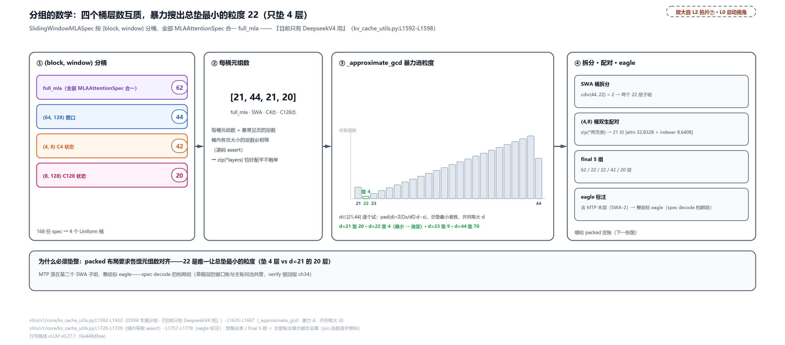

> *图注：L2 章图拍片 ⑦ 的机制放大。四个桶的元组数参差（[21, 44, 21, 20]，没有现成公共粒度），packed 布局要求各组元组数对齐——_approximate_gcd 暴力搜出 22 是总垫最小的粒度（垫 4 层，d=21 要垫 20）；44 人的 SWA 桶劈成两个 22；(4,8) 桶里 attention 状态（32,832B）与 indexer 状态（8,640B）同层数，zip 成 21 对双生元组；MTP 的末层窗口账落在第二个 SWA 子组，整组标 eagle（`vllm/v1/core/kv_cache_utils.py:L1757-L1778`，含 MTP 层的组整组进 spec decode 档期）。final 5 组：62 / 22 / 22 / 42 / 20 层。*

eagle 标注值得一提：MTP 草稿层自报的账只有一份窗口账——它的 compress_ratio 固定 1（层普查节看过的那个 else 分支），不挂压缩器也没有 indexer，账面长得跟纯窗口层那一档一样；但它的消费节奏属于投机解码的 verify 链（[第 34 章](../../ch34-spec-decode-implementation/narrative/chapter.md)）。标注函数找「最后一个注册的层」所在的组、整组打上 `is_eagle_group`（`kv_cache_utils.py:L1757-L1778`，FIXME 自认 hacky）。分组的 why 链收拢：**旧设计** 通用混合组化只干净支持「full + 恰一种其它」；**痛点** DSV4 五组异页直接超载，等页 unify 三条出路（调大块、pad、拒收）一条都接不住；**v1 方案** 专属分组加层元组装包加 packed 落地；**代价** 垫整空位付 padding 税（本例 4 层）、(block,window) 两键分桶的脆弱性注释自认、eagle 判定靠「最后一层」的隐式约定。

## 一个池五个租户：packed 定账

现在走到 L2 图拍片 ⑧。五个组、五种页宽、一个预算，怎么落成物理张量？通用路是多池分组（每组各出一层共享一池，[第 14 章](../../ch14-memory-ledger/narrative/chapter.md)的三种布局表），DSV4 默认走 packed：

```python
# vllm/v1/core/kv_cache_utils.py:L1308-L1358 · _use_packed_kv_cache_config / _get_kv_cache_config_packed（节选）
def _use_packed_kv_cache_config(
    vllm_config: VllmConfig,
    kv_cache_groups: list[KVCacheGroupSpec],
) -> bool:
    is_dsv4 = all(
        isinstance(group.kv_cache_spec, UniformTypeKVCacheSpecs)
        for group in kv_cache_groups
    )
    # … 省略：enable_cross_layers_blocks 实验开关（L1316-L1326，注释挂 issue 42082）…
    return is_dsv4 or (enable_cross_layers and len(kv_cache_groups) > 1)


def _get_kv_cache_config_packed(
    vllm_config: VllmConfig,
    kv_cache_groups: list[KVCacheGroupSpec],
    available_memory: int,
) -> tuple[int, list[KVCacheTensor]]:
    """Plan a packed per-block KV cache tensor layout.

    Cache groups use dense, overlapping layouts within one block slab. Each
    emitted tensor aliases the same physical backing allocation.
    """
    block_stride, layers_by_offset = _get_packed_kv_cache_layout(kv_cache_groups)

    num_blocks = available_memory // block_stride                              # L1342
    num_blocks = may_override_num_blocks(vllm_config, num_blocks)

    total_size = block_stride * num_blocks

    kv_cache_tensors: list[KVCacheTensor] = []
    for byte_offset in sorted(layers_by_offset):
        kv_cache_tensors.append(
            KVCacheTensor(
                size=total_size,
                shared_by=layers_by_offset[byte_offset],
                offset=byte_offset,
                block_stride=block_stride,
            )
        )
    return num_blocks, kv_cache_tensors
```

布局本体 `_get_packed_kv_cache_layout`（`L1283-L1305`）只有 20 行，[第 14 章](../../ch14-memory-ledger/narrative/chapter.md)逐行走过：每组组内从偏移 0 密排层页、`block_stride = max(各组层页和)`——**块宽按最宽的租户修，窄租户叠在其上**，因为一个块 id 同一时刻只归一个组（docstring 原话 "layouts from different groups may overlap"）。`num_blocks` 一次整除（L1342），每个出现过的字节偏移发一张 `KVCacheTensor`，全部别名同一份物理背衬（落卡是 `gpu_model_runner.py:L7312-L7353` 里的一次 `torch.zeros`）。五组的叠放账：

<!-- trace: m11 -->
| 组（final 5） | 层页叠放 Σ | 是否定 stride |
| --- | --- | --- |
| full_mla（62 层） | 21×37,440 + 21×4,608 + 20×1,728 = 917,568 | 是（最大） |
| SWA-1 / SWA-2（22+22 层） | 22×37,440 = 823,680（各） | 否 |
| 状态(4,8)（42 层=21 对双生） | 21×32,832 + 21×8,640 = 870,912 | 否 |
| 状态(8,128)（20 层） | 20×32,832 = 656,640 | 否 |
| block_stride = max(各组 Σ) | 917,568B/块 | num_blocks = available // 917,568 |
| 落地（8GiB 假设池） | 全部张量别名同一 torch.zeros(9,361×917,568) | 一次除法 + 一次 CUDA 分配 |

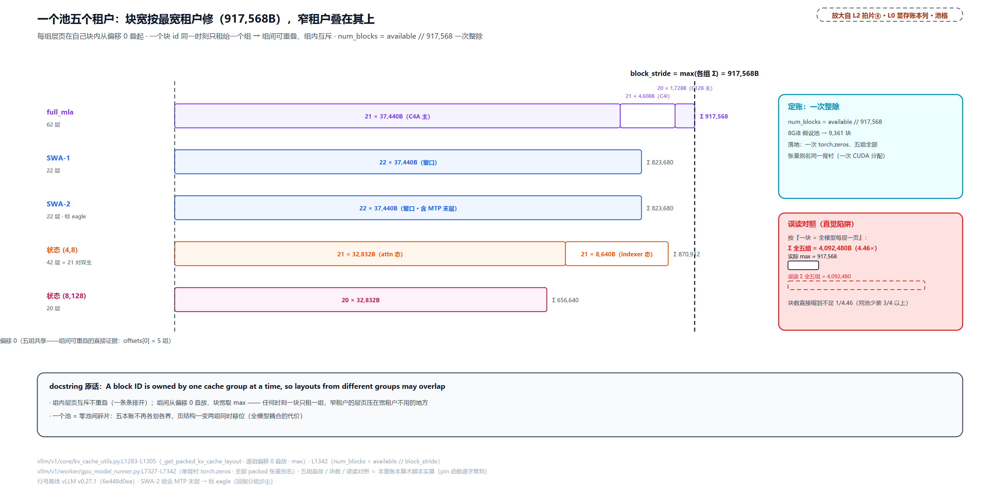

> *图注：L2 章图拍片 ⑧ 的字节布局展开。五组从偏移 0 各自叠放层页（复算输出里偏移 0 被 5 组共享，是组间重叠的直接证据），块宽取最重组 full_mla 的 917,568B，其余四组与它共享同一块区间（图示五组按分组产出顺序自上而下排列——除定 stride 的 full_mla 外，状态(4,8) 组的 870,912B 其实比 SWA 组的 823,680B 更宽，但都装得进 917,568B 的块宽）：一个块 id 同一时刻只属一组，所以组间可以重叠、组内互斥。一次除法定块数（8GiB 池 → 9,361 块）、一次 CUDA 分配落卡（`gpu_model_runner.py:L7327-L7342` 单背衬 torch.zeros，全部 packed 张量别名）。若按「一块 = 全模型每层一页」的直觉口径会把块宽高估到 4,092,480B（五个组和相加），块数缩到不足四分之一——正确口径是 max 不是 sum。*

这张表里最值得单独划线的是最后一行的对照：直觉会把「一个块」理解成「全模型 168 层页的总和」（4,092,480B），那会高估 4.46 倍、块数缩到不足四分之一。正确理解是 **max 不是 sum**——一个块在任一时刻只服务一个组，块宽只要装得下最宽的组（full_mla 的整栈 917,568B）就行。为什么 packed 而不是五池，why 链四要素：**旧设计** 通用多池布局要求页统一或等量组，每池各组各出一层；**痛点** 五种页宽 37,440/32,832/8,640/4,608/1,728 根本无法统一，硬 pad 是浪费、不 pad 是拒收，且组多时池碎片化（某组的池用完了、别组的闲着）；**v1 方案** 一个 slab 重叠时间复用，零池间碎片、一次除法、一次分配；**代价** 任何一组的页结构变化都改 block_stride（全模型耦合：indexer 换档动的是 full_mla 组的 21 页，stride 就从 1,002,240 挪到 917,568）、垫整空位付 padding 税、跨层张量要求全部组都是 UniformType（判据 `is_dsv4` 的由来）。

## 护栏与最后一行日志

现在走到 L2 图 south 的「护栏与容量读数」。块数定了（5GiB 池 → 5,851 块），还剩两问：够不够装下一条最长的请求（护栏）？能同时接几路（并发）？先看并发的分母怎么算：

```python
# vllm/v1/core/kv_cache_utils.py:L937-L959 · get_max_concurrency_for_kv_cache_config
def get_max_concurrency_for_kv_cache_config(
    vllm_config: VllmConfig, kv_cache_config: KVCacheConfig
) -> float:
    """Get the maximum concurrency for the given KV cache configuration.

    A request at max_model_len consumes whole blocks from each group's block
    table — cdiv(per-request bytes, page bytes) of the group's spec — and all
    groups draw those block ids from one shared pool, so the per-request
    total is the sum over groups. The memory/page ratio is identical whether
    # … 省略：docstring 尾（worker/scheduler 两侧口径一致到调用点的说明，L947-L949）…
    """
    num_blocks_per_request = sum(
        cdiv(
            group.kv_cache_spec.max_memory_usage_bytes(vllm_config),
            group.kv_cache_spec.page_size_bytes,
        )
        for group in kv_cache_config.kv_cache_groups
    )
    max_concurrency = kv_cache_config.num_blocks / num_blocks_per_request
    return max_concurrency
```

```math
\mathrm{concurrency} \;=\; \frac{\mathrm{num\_blocks}}{\sum_{g}\,\big\lceil \mathrm{usage}_g \,/\, \mathrm{page}_g \big\rceil}
```

分母是「一条 max_model_len 请求的峰值预留块数」，逐组 cdiv（ceiling division，向上取整的除法）再求和。这个分母里藏着一笔暗账——**在途 chunk 项**。窗口账与状态账是「边跑边还」的账：窗外块按处理过的 token 回收，在途的 prefill 步会瞬时持有整块，所以预留按 `cdiv(min(窗口−1+在途，max_model_len)，块)+1` 算（SlidingWindowSpec 的准入上限，单源供启动估算与运行时放行）。

公式里的三处修正各管一件事：−1 只给最近「窗口−1」个已算 token 留位；+1 是窗口起点未必落在块边界，最坏要多占一块；min 是预留的封顶：预留的是这条请求实际可能持有的峰值，长请求取「窗口−1+在途」，短请求被自身长度 max_model_len 钳住（`kv_cache_interface.py:L604` 注释原话 “never more than `max_model_len`”）。

在途 = `max_concurrent_batches × max_num_batched_tokens`：`max_num_batched_tokens` 是每步的 token 预算，chunked prefill 的 chunk 就按它切，场景表里的「chunk 8192」正是它起 API server 服务时的默认值（[第 10 章](../../ch10-continuous-batching-chunked-prefill/narrative/chapter.md)立过这本预算；`vllm/config/vllm.py:L553-L561`，注释原话 "out-of-window blocks are freed on the processed-token basis, so in-flight steps transiently keep their blocks"）。起 HTTP 服务的 API server 形态默认 async 调度（[第 12 章](../../ch12-async-scheduling/narrative/chapter.md)的双缓冲：一个批在 GPU 上算的同时，CPU 排下一个批，两个批错开一拍），并发批数为 2（`vllm.py:L539-L550`：async 调度且流水线并行数为 1 时返回 2），在途因此是 2×chunk。护栏的口径则更保守，走 DSV4 特化分支按垫整口径给每块计价：块宽不用真实 stride 917,568、统一按 22 元组 × 43,776B = 963,072B（`kv_cache_utils.py:L1904-L1937`），单请求峰值块数 × 963,072B 即护栏需要。容量函数本身很薄：

```python
# vllm/v1/core/kv_cache_utils.py:L1877-L1887 · get_kv_cache_capacity
def get_kv_cache_capacity(
    vllm_config: VllmConfig, kv_cache_config: KVCacheConfig
) -> tuple[int, float]:
    """
    Get the group-aware KV cache token capacity and max concurrency.
    """
    max_model_len = vllm_config.model_config.max_model_len
    max_concurrency = get_max_concurrency_for_kv_cache_config(
        vllm_config, kv_cache_config
    )
    return int(max_concurrency * max_model_len), max_concurrency
```

护栏口径恒不小于池口径：22 × 43,776 = 963,072 ≥ block_stride 917,568，所以**过了护栏必有并发 ≥ 1、并发行必能打印**——两行数字出自同一本账、两种口径（护栏从严垫整、并发按组精算），这是不变量不是巧合。顺带把「垫整垫在哪」说清：垫整垫的只是各组元组数对齐所需的「名额」，不新增物理层页，block_stride 按各组真实层页之和取 max（full_mla 的 62 层合计 917,568B），垫的代价只在护栏这份计价口径里显形。护栏不过就 ValueError，报错文案在 `_check_enough_kv_cache_memory`（`kv_cache_utils.py:L751-L788`），附二分估计的可行长度（估计器与护栏同一份组垫整口径）；`max_model_len=-1` 时自动 auto-fit。表头的读法钥匙先给：主账组的每请求块数 = cdiv(max_model_len, 管理块 256)，128K 场景 512、1M 场景 4,096；「窗×2」是 SWA 桶垫整后拆成的两个 22 层子组各计一份（128K 场景每份 259 块）；两本状态账的块数是前文「窗口−1+在途」预留公式逐组代入的结果（4,099 与 2,065）。六个场景一张表（池与上下文两档、chunk 两档）：

<!-- trace: m13 -->
| 场景（池/上下文/chunk→在途） | 每请求峰值块数 [主·窗×2·C4态·C128态] | 护栏需要（22 元组垫整口径） | 判定 | 并发 / 容量 tokens |
| --- | --- | --- | --- | --- |
| A：5GiB / 128K / 8192→16,384 | 7,194 [512·259×2·4,099·2,065] | 6.453GiB > 5GiB | ValueError + 二分估计 max_len=13,572 | （并发行不打印） |
| B：同池 chunk 2048→4,096 | 2,202 [512·67×2·1,027·529] | 1.975GiB ✓ | 过 | 2.6571× / 348,275 |
| C：8GiB / 1M / 8192→16,384 | 10,778 [4,096·259×2·4,099·2,065] | 9.667GiB > 8GiB | ValueError + 二分估计 572,672 | （并发行不打印） |
| D：同池 chunk 2048→4,096 | 5,786 [4,096·67×2·1,027·529] | 5.19GiB ✓ | 过 | 1.6179× / 1,696,460 |
| E：8GiB / 128K / 8192→16,384 | 7,194 | 6.453GiB ✓ | 过 | 1.3012× / 170,553 |
| F：护栏边 13,572 / 8192→16,384 | 5,574 | 4.999GiB ✓（贴边） | 过 | 1.0497× / 14,246 |

这张表几乎每一行都是一课。**场景 A**（TP2 的 5GiB 池、128K 上下文、服务端默认 chunk 8192）：每请求峰值 7,194 块里四本旁账占 6,682 块（92.9%）——全是「窗口−1+在途 chunk」的峰值预留，C4 状态账块粒度最细（block 4）独大 4,099 块；护栏直接 ValueError，但报错亲口给出可行长度 13,572。**场景 B**（同池只砍 chunk 到 2048）：在途 16,384→4,096，分母 7,194→2,202（−69.4%），不仅过了护栏、并发还到 2.66×，**砍 chunk 的杠杆比任何 KV 量化档都大**。**场景 C/D**（1M 上下文）：默认 chunk 下 8GiB 池也过不了护栏；砍 chunk 后 1.6179× 复活，这就是开篇那行 `Maximum concurrency: 1.62x` 的出处。**场景 F**：拿护栏建议的 13,572 当 max_model_len 重跑，护栏需要 4.999GiB 贴着 5GiB 池过。这个 13,572 已比「窗口−1+在途」的 16,511 短，四本旁账的预留全被请求自身长度封顶（前文 min 的封顶作用），每请求峰值随之从 A 的 7,194 块缩到 5,574 块：二分估计算出来的数是真的能跑的数。最后两行日志就在配置尾部：

```python
# vllm/v1/core/kv_cache_utils.py:L2225-L2240 · get_kv_cache_configs 尾部（容量/并发日志）
        if len(kv_cache_config.kv_cache_groups) > 0:
            max_model_len = vllm_config.model_config.max_model_len
            # GPU KV cache size in tokens = max_concurrency * max_model_len:
            # the total tokens of context the pool can hold at peak
            # utilization. Sourcing this from the concurrency calculation
            # handles hybrid layouts correctly.
            num_tokens, max_concurrency = get_kv_cache_capacity(
                vllm_config, kv_cache_config
            )

            logger.info_once("GPU KV cache size: %s tokens", f"{num_tokens:,}")
            logger.info_once(
                "Maximum concurrency for %s tokens per request: %.2fx",
                f"{max_model_len:,}",
                max_concurrency,
            )
```

部署者的读法：`GPU KV cache size` 是池在峰值利用下能装的总上下文 token 数（= 并发 × max_model_len，混合组感知）；`Maximum concurrency` 是同一笔账除以单请求预留。配合上游那行 `Available KV cache memory`（量房节的瀑布出口），三行日志就是本章账本的三个出口读数。

## 每个 token 多贵：三级行李费

把五本账的稳态摊销合起来算一遍，就明白 1M 上下文凭什么能活。每 token 斜率全部来自前面立过的源码公式：主账与 indexer 账的页宽出自 `vllm/v1/kv_cache_interface.py:L403-L426`（storage×584 补齐 576）与 `vllm/models/deepseek_v4/attention.py:L781-L798`（68B 槽），摊销只是再除一个 256。口径先立：主账与 indexer 账随长度线性涨（按 256-token 管理块摊销），窗口账与状态账被准入上限封顶为 O(窗口+在途)，不随全长线性涨——所以「每 token 多贵」只数线性项：

```math
146.25 \times 21 \;+\; 6.75 \times 20 \;+\; 18 \times 21 \;=\; 3584.25\ \mathrm{B/token}
```

<!-- trace: m17 -->
| 账 | 每 token 摊（池口径） | ×层数 | 小计 |
| --- | --- | --- | --- |
| C4A 压缩主账（37,440B ÷ 256 token） | 146.25B | 21 | 3,071.25B |
| C128 压缩主账（1,728B ÷ 256） | 6.75B | 20 | 135B |
| indexer fp4（4,608B ÷ 256；载荷 68B÷4=17B） | 18B | 21 | 378B |
| 稳态合计（fp4 档；fp8 档 3,915B） | — | — | 3,584.25B ≈ 3.5KiB |
| 对照：DSV4 全不压缩（584B × 44 本账） | — | — | 25,696B（7.2×） |
| 对照：Llama-70B GQA（2×8×128×2B×80 层） | — | — | 327,680B = 320KiB（91.4×） |

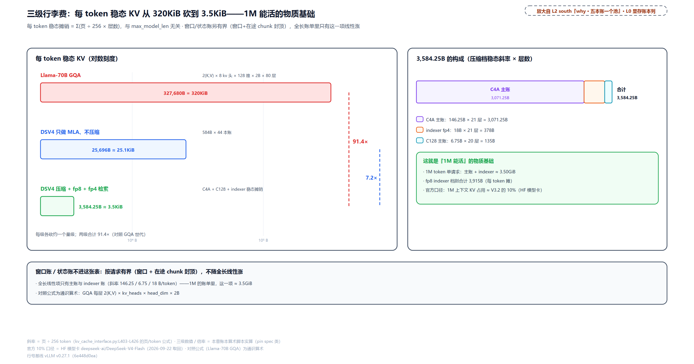

> *图注：L2 章 south「五本账一个池」注的量化展开。三级行李费：Llama-70B GQA（2×8 头×128 维×2B×80 层）327,680B/token → DSV4 只做 MLA 不压缩（584B × 44 本账）25,696B/token → 压缩+fp8+fp4 检索 3,584.25B/token（C4A 146.25×21 + C128 6.75×20 + indexer 18×21）——每级各砍约一个量级、合计 91.4×。1M token 单请求的线性项总共 ≈3.50GiB（3,584.25B × 1,048,576），窗口/状态另有界。模型卡的官方口径（1M 上下文 KV 约为 V3.2 的 10%）与这本账同向。*

三级阶梯每级砍约一个量级：GQA 世代 320KiB/token 是长上下文显存天花板的本体；MLA 压缩（潜向量单份缓存）砍到 25.1KiB；V4 的压缩加 fp8 加 fp4 检索再砍到 3.5KiB。1M token 单请求的线性项 ≈3.50GiB——对照开篇模型卡的「KV 约为 V3.2 的 10%」（外部口径，方向一致），压缩链就是那 90% 的出处。这也是场景 D 里 1M 上下文能用 8GiB 池跑 1.62 路并发的物质基础：每 token 只付 3.5KiB 的账，一本 1M 的上下文才装得进预算表。

## 96GiB 预算瀑布与四个阀门

账本全件齐了，把 96GiB 主线从头到尾串成一条瀑布：进水口 88.32GiB（=96×0.92），权重是最大闸门（TP 档定开度），激活峰与图池是两道暗渠，剩下的流进 KV 池，除以 block_stride 得块数，再除以单请求预留得并发。池小了不是认输，是按杠杆大小依次拧阀门：

<!-- trace: m18 -->
| 档位/旋钮 | 算术 | 效果（块数与并发） |
| --- | --- | --- |
| 出生：权重 TP2 | 277B 专家×0.53125B + 线性/embed/MTP ≈ 155-160GiB(est) | 单卡装不下；TP2 每卡 ≈78.7GiB(est) → 池 ≈5GiB |
| 第一刀：砍 max_model_len（护栏建议值） | 128K → 13,572（5GiB/chunk8192 的二分估计） | 从 ValueError 到 1.0497× 贴边活（每请求 5,574 块、护栏 4.999GiB 贴边过） |
| 同刀位的另一刃：砍 chunk（在途预留） | 8192→2048（在途 16,384→4,096） | 分母 7,194→2,202（−69.4%）；128K 并发 2.6571×；1M 从 ValueError 到 1.6179×（8GiB 池） |
| 第二刀：indexer fp8→fp4 | stride 1,002,240→917,568 | 块数 +9.23%（8GiB 池 8,570→9,361）——不换卡白拿 |
| 第三刀：TP 档 2→4 | 权重每卡 ≈78.7→39.4GiB(est) → 池 5→44GiB(est) | 51,488 块；128K 并发 7.1571×（offloading 配方即 TP4 形态） |
| 最后的手动门：override / kv_cache_memory_bytes | 账本同步折算 / 跳过 profile 手动定池 | num_gpu_blocks_override 配错=OOM；手动档不受 util 约束 |

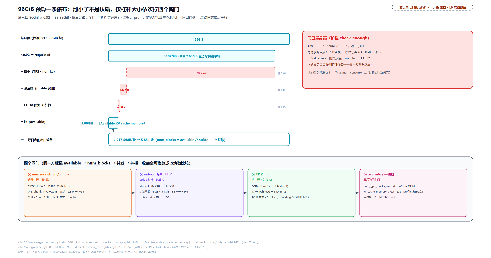

> *图注：L2 章上排「出 · 启动日志」与中排拍片 ⑥⑧ 的合并兑现。瀑布五级：88.32GiB 进水口（`vllm/v1/worker/utils.py:L414-L416` + `vllm/config/cache.py:L68`）→ 权重闸门（TP 档定开度：TP2 约 78.7GiB est、TP4 约 39.4GiB est）→ 激活峰与图池两道暗渠（profile 实测/估计）→ 池 → ÷917,568 → 块数 → ÷单请求预留 → 并发行。四个阀门按杠杆排序：max_model_len/chunk（分母 −69.4%，护栏亲口报 13,572）→ indexer fp4（+9.23% 块）→ TP 档（池 ×9，TP4 44GiB 池 51,488 块、128K 并发 7.1571×）→ override/手动档（`kv_cache_utils.py:L2165-L2179` 的折算同步账本）。三行日志正是这条链的三个出口。*

阀门次序值得多说一句为什么。三个杠杆同单位可比（都折成 Δ块数）：分母杠杆最大（chunk 砍到四分之一让分母 −69.4%）但**同时伤吞吐**：chunk 小、长 prompt 被切成的 prefill 步数就多、首 token 延迟变差（[第 10 章](../../ch10-continuous-batching-chunked-prefill/narrative/chapter.md)立过这笔交易）；indexer fp4 白拿但只 +9.23%；TP 档最贵（要加卡）但把池子翻九倍。所以次序是先动不花钱的（max_model_len 砍到护栏建议值、或按业务砍 chunk）、再动白拿的（fp4 indexer）、最后才动硬件与手动门。`num_gpu_blocks_override` 那道手动门要特别小心：设了它，账本会**同步折算** available_memory（`kv_cache_utils.py:L2165-L2179`，护栏与 auto-fit 都按折算后的账走，防账本漂移），但数值本身仍靠人——配错就是运行期 OOM，护栏救不了。

## 官方配方逐旋钮

全章机制讲完，最后回到 L2 图上排左：那份进场的「官方配方」逐旋钮对回。先回答「凭什么算配方」：它不是文档教程，是 vLLM 仓内 CI（continuous integration，持续集成，代码每次变更自动跑一套验证）的精度回归门——

```yaml
# tests/evals/gsm8k/configs/moe-refactor/DeepSeek-V4-Flash-deepgemm-mega-moe.yaml:L1-L5 · 官方配方全文
model_name: "deepseek-ai/DeepSeek-V4-Flash"
accuracy_threshold: 0.95
num_questions: 1319
num_fewshot: 5
server_args: "--trust-remote-code --kv-cache-dtype fp8 --block-size 256 --enable-expert-parallel --tensor-parallel-size 2 --attention_config.use_fp4_indexer_cache=True --moe-backend deep_gemm_mega_moe --tokenizer-mode deepseek_v4 --tool-call-parser deepseek_v4 --enable-auto-tool-choice --reasoning-parser deepseek_v4 --speculative_config.method=mtp --speculative_config.num_speculative_tokens=2"
```

GSM8K（OpenAI 的 grade-school-math 数据集，8.5K 道小学数学应用题、每题 2-8 步推理，[arXiv:2110.14168](https://arxiv.org/abs/2110.14168)，LLM 数学能力的标准考卷）1319 题全量、5-shot（先给 5 道带答案的例题再做题的考法）、精度门槛 0.95。这份 yaml 由 vLLM 团队随代码演进持续维护、在 CI（Buildkite 流水线）里真实起服务、以精度断言守门——每个 flag 都被这套门槛验证过「组合起来能跑且不掉点」。对照之下 HF 模型卡只给最简一句 `vllm serve deepseek-ai/DeepSeek-V4-Flash`（不带任何 TP/EP/KV flag，单机根本装不下 155-160GiB 权重）：**完整部署形态只存在于仓内**，部署知识住在 CI 里。逐旋钮对账：

| 配方 flag | 对回的机制 | 本章位置 |
| --- | --- | --- |
| `--trust-remote-code` | 加载 deepseek_v4 自定义模型代码的通行证 | [第 29 章](../../ch29-deepseek-v4-assembly/narrative/chapter.md) |
| `--kv-cache-dtype fp8` | KV 档解析与写回 fp8_ds_mla | [「拨一个词，定一种字节」](#拨一个词定一种字节kv-档解析) |
| `--block-size 256` | 稀疏 MLA 后端的管理块偏好（`sparse_swa.py:L119-L121` 的 `get_preferred_block_size` 硬性返回 256） | [「五本账自报」](#五本账自报168-份-spec) |
| `--tensor-parallel-size 2 --enable-expert-parallel` | 权重账的切法（TP2 每卡 ≈78.7GiB est） | [第 35 章](../../ch35-distributed-tp-pp-dp-ep/narrative/chapter.md) |
| `--attention_config.use_fp4_indexer_cache=True` | indexer 档 68B/槽，stride 1,002,240→917,568 | [「indexer 账的暗开关」](#indexer-账的暗开关68b-还是-132b) |
| `--moe-backend deep_gemm_mega_moe` | MegaMoE 的 SM100 门（B200 机台的专属后端） | [「MegaMoE 只认 SM100」](#megamoe-只认-sm100) |
| `--tokenizer-mode deepseek_v4` 等 serving 三件 | tokenizer/parser 面（DeepseekV4ForCausalLM 本就自动默认它，`vllm/config/model.py:L657-L658`；显式写出是保险） | 不碰显存账，本书服务篇展开 |
| `--speculative_config.method=mtp` ×2 | MTP 草稿的出生（下一段） | [「MTP 草稿的出生」](#mtp-草稿的出生同一份-checkpoint-里的第二本账) |

仓里还有两份变体配方，三种部署形态各有 CI 门槛背书。offloading 版把 KV 卸到 CPU 内存：

```python
# tests/evals/gsm8k/test_gsm8k_offloading.py:L156-L173 · offloading 变体（节选）
    OffloadingModelConfig(
        id="offloading-deepseek-v4-flash",
        model="deepseek-ai/DeepSeek-V4-Flash",
        connector="OffloadingConnector",
        # Baseline ~0.97 on 200 questions (measured on GB200).
        accuracy_threshold=0.90,                                                # L161
        extra_server_args=[
            "--tensor-parallel-size",
            "4",
            "--enable-expert-parallel",
            "--kv-cache-dtype",
            "fp8",
            "--block-size",
            "256",
        ],
        cpu_offload_gib=16,
        startup_timeout=1200,
    ),
```

TP4 形态（权重每卡减半、池子翻到约 44GiB est）加 `OffloadingConnector` 与 `cpu_offload_gib=16`——KV 卸载重载容许一点损耗，门槛放宽到 0.90；卸载机制归[第 38 章](../../ch38-kv-pooling/narrative/chapter.md)。P/D 分离版在 `.buildkite/test_areas/disaggregated.yaml:L223-L243`（H200×8），核心是它的 env 块：

```yaml
# .buildkite/test_areas/disaggregated.yaml:L231-L240 · DSv4-Flash Disaggregated DP EP（env 节选）
  env:
    ENABLE_HMA_FLAG: "1"
    DP_EP: "1"
    GPU_MEMORY_UTILIZATION: "0.85"
    PREFILLER_TP_SIZE: "4"
    DECODER_TP_SIZE: "4"
    PREFILL_BLOCK_SIZE: "256"
    DECODE_BLOCK_SIZE: "256"
    MODEL_NAMES: "deepseek-ai/DeepSeek-V4-Flash"
    VLLM_SERVE_EXTRA_ARGS: "--trust-remote-code,--kv-cache-dtype,fp8"
```

前两行（ENABLE_HMA_FLAG、DP_EP）是这条 CI 作业自己的环境接线，DP_EP 对应条目标签里的「Disaggregated DP EP」形态；真正的服务 flag 在 VLLM_SERVE_EXTRA_ARGS 一行。读三点：prefiller 与 decoder 各 TP4、util 从默认 0.92 压到 0.85、KV 侧仍是那句 fp8（prefill 与 decode 拆到不同进程组、KV 跨机接续，机制归[第 37 章](../../ch37-pd-disaggregation/narrative/chapter.md)）。三份配方的共同底座 flag（kv fp8、EP、block 256）不变，变的只是并行形态与外存路径。

### MTP 草稿的出生：同一份 checkpoint 里的第二本账

配方最后两段 flag 登记 MTP（开篇权重账段立过的多 token 预测草稿头；verify 链[第 34 章](../../ch34-spec-decode-implementation/narrative/chapter.md)全拆过，这里只看它的出生登记）：

```python
# vllm/config/speculative.py:L345-L350 · mtp 档的 hf_config 改写
        if hf_config.model_type == "deepseek_v4":
            hf_config.model_type = "deepseek_mtp"
            n_predict = getattr(hf_config, "num_nextn_predict_layers", None)
            hf_config.update(
                {"n_predict": n_predict, "architectures": ["DeepSeekV4MTPModel"]}
            )
```

`method=mtp` 拨下去，草稿模型的 hf_config 被就地改写成 `deepseek_mtp`、架构名换成 `DeepSeekV4MTPModel`（注册表把它映到 `vllm.models.deepseek_v4.DeepSeekV4MTP`，`vllm/model_executor/models/registry.py:L643`）。关键在于**草稿权重不用另下**：目标 checkpoint 里 `mtp.` 前缀的层就是草稿（Flash 的 `num_nextn_predict_layers=1`），目标模型装载时跳过它们：

```python
# vllm/models/deepseek_v4/nvidia/model.py:L1540-L1545 · load_weights（skip mtp.）
    def load_weights(self, weights: Iterable[tuple[str, torch.Tensor]]) -> set[str]:
        loader = AutoWeightsLoader(self, skip_substrs=["mtp."])                 # L1541
        loaded_params = loader.load_weights(weights, mapper=self.hf_to_vllm_mapper)
        self.model.finalize_mega_moe_weights()
        self.model.finalize_mhc_broadcast_weights()
        return loaded_params
```

草稿的输入接口是目标模型的隐藏态缓冲 `get_mtp_target_hidden_states`（`model.py:L1534-L1538`），草稿与目标怎么配合是[第 34 章](../../ch34-spec-decode-implementation/narrative/chapter.md)的账；一轮 forward 里两本账并行：目标模型 `skip_substrs=["mtp."]` 跳过草稿层（L1541），草稿模型只挑 `mtp.` 前缀。本章 L2 图下排那块「MTP 草稿 · 同一份 checkpoint」至此对清：配方的 `num_speculative_tokens=2` 只是出生登记，每拍怎么猜怎么验，是另一章的账。

## 收尾：启动视角的显存账点亮

回头看[第 1 章](../../ch01-vllm-v1-in-one-map/narrative/chapter.md)的 L0 图：左下「启动视角」块与「调度 · 显存账本」列的交汇，本章点亮了它在一个真实部署上的全程。三根线收拢。**档位线**：最终字节形状 = 三层交集——checkpoint 层出生即定（`fp8` 进门改写 `deepseek_v4_fp8`、expert_dtype 惰性分档 MXFP4/FP8 块专家、每参数 0.53125B 的权重算术），硬件层是命令（SM90/100 走 FlashMLA、SM120 走 FlashInfer 且 KV 只放行 fp8 系、MegaMoE 仅 SM100），操作员只剩 indexer 档、TP/EP 与池旋钮。**账本线**：一列 44 个 compress_ratios 派活，168 份 spec 自报五本账（含 C4A 层的双生状态账），专属分组四个桶垫整到 22、五个组全别名同一条 917,568B 块宽的 packed slab；`vllm/models/deepseek_v4/` 与 `vllm/v1/core/kv_cache_utils.py` 是这两件事的家。**读数线**：`Available KV cache memory`（瀑布出口）→ `GPU KV cache size`（容量 token 数）→ `Maximum concurrency`（并发倍数），三行日志全部可从源码公式一步步推到数字；96GiB 主线上 TP2 只剩约 5GiB 池，四个阀门按杠杆依次拧（护栏亲口报 13,572、砍 chunk 让分母 −69.4%、fp4 indexer 白拿 9.23%、TP4 把池翻到 44GiB）。[第 14 章](../../ch14-memory-ledger/narrative/chapter.md)立的通用管线与[第 35 章](../../ch35-distributed-tp-pp-dp-ep/narrative/chapter.md)立的四刀，在这台机器上合成了一份可抄的作业。

账本立起来是服务的前提，但真实服务不止一本账。本章的 KV 池是一部引擎独享的；同一份 96GB 档位的预算下，prefill 与 decode 两相争夺的矛盾、把两本账拆到两组机器再让 KV 跨机接续的做法，就是下一章 P/D 分离要算的账。

（完）
