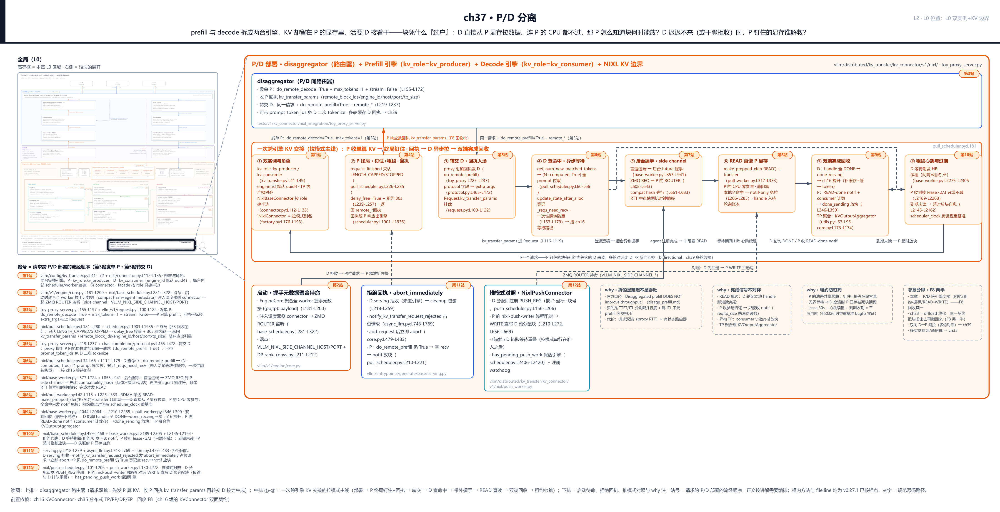
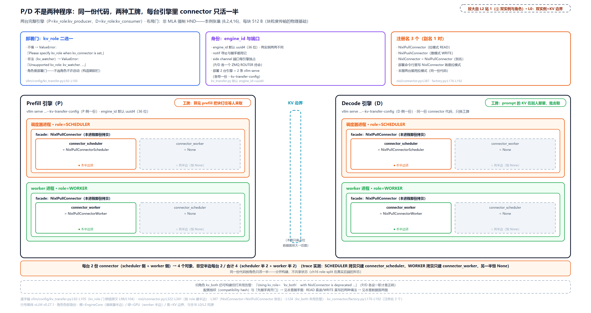
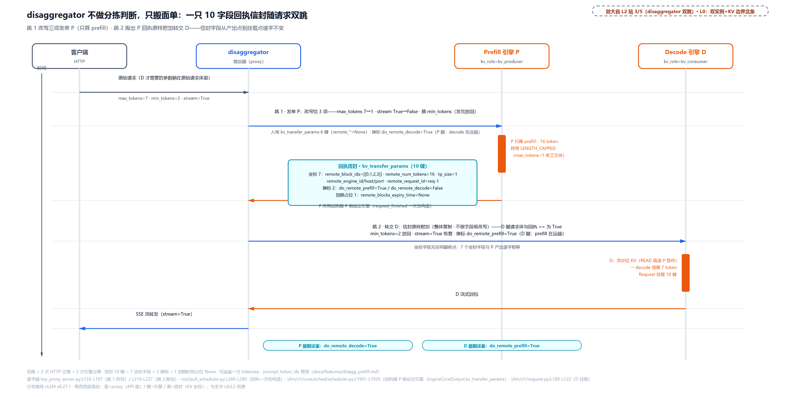
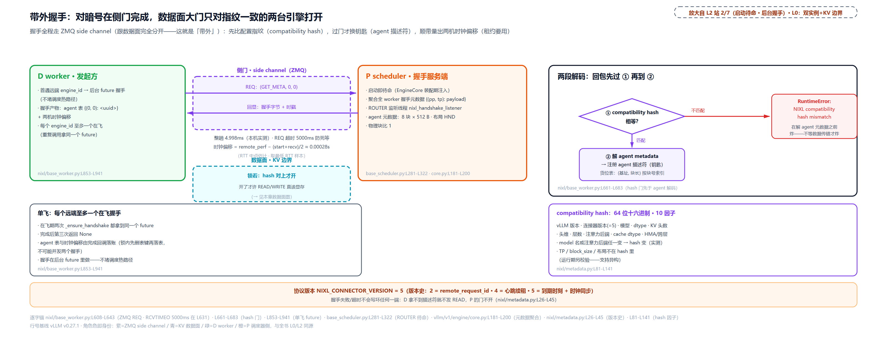
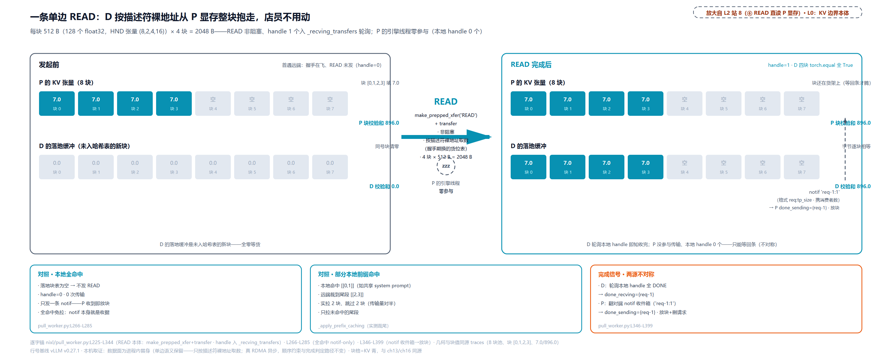
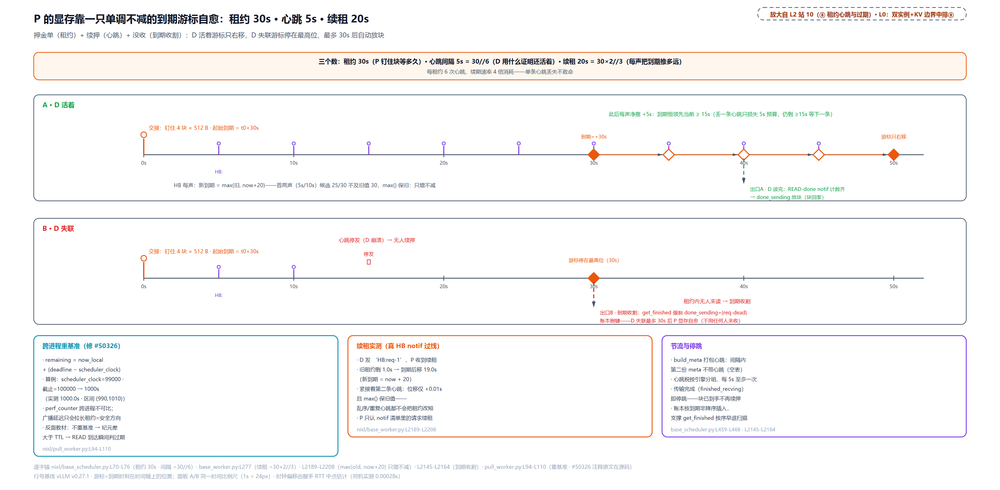
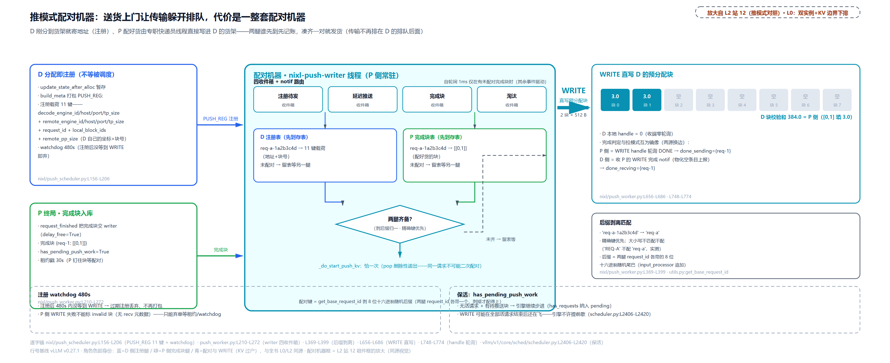

# 第 37 章　P/D 分离

prefill 和 decode 拆成两台引擎，听着只是分工，可 KV 还留在 prefill 那台的显存里，decode 的活怎么接着干？最顺的设想是 decode 直接从 prefill 的显存里把块拉走，连 prefill 的 CPU 都不过一下。但正因为 prefill 全程没参与这次搬运，它也就根本不知道「块什么时候被取走了」：那些为了交接而钉在池里的块，谁来解封？更糟的情形还有：decode 排队太久、心跳断了，甚至干脆把请求拒收了，prefill 钉住的显存会不会变成一堆没人认领的死块？一台引擎的显存，凭什么能变成另一台的「外存」？

答案是三件套：一只随请求和响应过线的回执信封（`kv_transfer_params`）、一份带租约心跳的钉住协议、一条带兼容门的带外握手。[第 16 章](../../ch16-kv-connector/narrative/chapter.md)立契约时留了话：P/D 过户与 offload 卸载共用一份双面契约，NIXL、LMCache、Mooncake 等后端各写各的填法。本章兑现前半句：给那份契约装上第一条真实的腿，NIXL 连接器的 P/D 分离部署。[第 35 章](../../ch35-distributed-tp-pp-dp-ep/narrative/chapter.md)立了多实例的骨架（怎么建组、怎么付通信税）；本章在骨架上摆出一种新的双实例形态：P（prefill 实例）只算 prefill，D（decode 实例）接力生成，两台都是完整引擎，中间站一位 disaggregator 路由器。

## 你在这里



> *图注：本章放大的是[第 1 章](../../ch01-vllm-v1-in-one-map/narrative/chapter.md) L0 图右下「多实例视角」虚线块的 P/D 分离视角（Part VIII 各章共用这个块作锚，本章取其中双实例 + KV 边界这一视角）：两台完整引擎（P=`kv_role:kv_producer`、D=`kv_role:kv_consumer`）加一条 NIXL 的 KV 传输边界，块在这条边界上「过户」。它接在三块已读结构上：[第 16 章](../../ch16-kv-connector/narrative/chapter.md)立的双面契约（调度器侧五原语、worker 侧收发钩子、WAITING_FOR_REMOTE_KVS 等待路径，本章全部当已立直接消费）、[第 35 章](../../ch35-distributed-tp-pp-dp-ep/narrative/chapter.md)立的 TP/DP 多实例骨架、[第 13 章](../../ch13-paged-kv/narrative/chapter.md)与[第 15 章](../../ch15-prefix-caching/narrative/chapter.md)的块池与前缀缓存。图三段读：上排 disaggregator 路由器（请求双跳的中间人）；中排 ①-⑧ 是一次跨引擎 KV 交接的拉模式主线（双实例部署 → P 终局钉住+回执 → 转交 → D 查命中 → 带外握手 → READ 直读 → 双端回收 → 租约心跳）；下排是启动待命、拒绝回执、推模式对照与三条 why 注、一条邻章分界注（图上的 F8 是全书伏笔编号：[第 16 章](../../ch16-kv-connector/narrative/chapter.md)埋的双面契约，本章的 P/D 过户与[第 38 章](../../ch38-kv-pooling/narrative/chapter.md)的池化各回收一半）。站号 1-12 = 请求流经代码的顺序（1-2 部署与待命、3-5 控制面双跳、6-9 数据面主线、10-11 可靠性、12 推模式对照），正文按讲解需要编排、不必照站号读。*

读法建议：只想知道「两台引擎怎么互相找到对方的显存」，直奔[「带外握手」](#带外握手对暗号换货位表站-27)与[「单边 READ」](#单边-read货在-p-显存d-自己来取站-8)；关心控制面（请求怎么两跳、回执长什么样），看[「中间人 disaggregator」](#中间人-disaggregator一只回执信封的双跳站-3-5)与[「P 终局」](#p-终局押下-30-秒开出回执站-4)；可靠性（D 崩了显存怎么办）在[「租约与心跳」](#租约与心跳显存的自愈站-10)与[「拒收回执」](#拒收回执d-不来了押金也能退站-11)；推模式与拉模式的取舍在[「推模式对照」](#推模式对照把取货变成送货上门站-12)。想跟全程，按序读。

照例交代取证环境，全章数值表都适用：本章实测来自配套精简版（按 v0.27.1 只做减法抽出，36 个测试全过），在 host 上把「两台引擎」装配进同一进程跑通全部控制面（带外握手走真 ZMQ 套接字、回执双跳走真 proxy 函数、租约心跳与收割、推模式配对，全是真源码路径真跑）。唯一的数据面替身在 READ/WRITE 一节就地挑明：本机没有 RDMA（remote direct memory access，网卡直读对端内存的传输技术，「单边 READ」一节整段展开）网卡，真 NIXL 的单边传输换成进程内按描述符裸地址搬字节（单边语义保留，只认坐标、不经对端代码路径）。四处取证差异后文碰到会就近说明：替身传输当场完成，真 RDMA 下轮询会先见 PROC 中间态（本机观察不到，代码路径逐字保留）；notif 随替身同步送达（真 NIXL 由网卡在传输完成时发出，送达时机更晚）；host 是 CPU 平台，`use_host_buffer` 恒为 False（真 CUDA 平台 `kv_buffer_device=cpu` 时为 True）；端口号、uuid、hash 前缀是本次快照、不是稳定常量，时延类数字量级供参考。

## 为什么拆：拆的是延迟分布，不是吞吐

先把动机这笔得失摆清，再进部署（部署开关就是下一节的 `kv_role`，`vllm/config/kv_transfer.py:L41-L72`）。旧设计就是前面各章拼出的那台单引擎：prefill 和 decode 混在同一个连续批里跑（[第 10 章](../../ch10-continuous-batching-chunked-prefill/narrative/chapter.md)的连续批处理）。混跑的问题在于两种负载的瓶颈根本不同：prefill 一次吃 L 个 token（L 为序列长度，d 为每个 token 一层的向量维，约等于头数×头维），注意力计算量约 $`O(L^2 \cdot d)`$，吃**算力**；decode 每步只算 1 个 token，却要读全历史 KV，每步搬运量约 $`O(L \cdot d)`$，吃**带宽**。同卡混跑时互相拖累：一条长 prefill 的算子把 decode 的小步挡在后面，用户侧看到的直接症状是尾 ITL（inter-token latency，相邻 token 的间隔）被 prefill 突发挤大；反过来，decode 高频小核又打断 prefill 的流水。TTFT（time to first token，首 token 延迟）与 ITL 这两个口径[第 10 章](../../ch10-continuous-batching-chunked-prefill/narrative/chapter.md)立过，本章反复用。

拆开之后各按瓶颈配比：P 堆算力（大 TP、高时钟），D 堆带宽（大 batch、大显存）。但代价也直白，官方文档一句话钉死：**「Disaggregated prefill DOES NOT improve throughput」**（`docs/features/disagg_prefill.md`）。拆分买的是 TTFT 与 ITL 分别调优、尾 ITL 不受 prefill 突发挤压；不买吞吐。控制面上请求还得多跑一跳（先 P 后 D，中间过一次路由器），这是净增开销。外加一个拆出来的新问题，也是本章的主线：**KV 过户**。prefill 已经算好的几十 GB 缓存留在 P 的显存里，D 拿不到就得起从头算，拆开赚的全赔回去。[第 16 章](../../ch16-kv-connector/narrative/chapter.md)为这类需求立了双面契约；本章讲它的第一种真实填法。

## 同一份代码，两种工牌（站 1）

P 和 D 不是两种程序，是同一种引擎的两种上岗方式：一台挂「算完 prefill 把块钉住等人来取」的工牌，一台挂「prompt 的 KV 在别人那里，我去取」的工牌。部署上就是两条 `vllm serve`，各带一份 `--kv-transfer-config`：P 写 `kv_role:kv_producer`，D 写 `kv_role:kv_consumer`。角色是部署门，不选不许启动：

```python
# vllm/config/kv_transfer.py:L41-L48 · KVTransferConfig（角色字段）
    kv_role: KVRole | None = None
    """Whether this vLLM instance produces, consumes KV cache, or both. Choices
    are 'kv_producer', 'kv_consumer', and 'kv_both'."""

    kv_rank: int | None = None
    """The rank of this vLLM instance in the KV cache transfer. Typical value:
    0 for prefill instance, 1 for decode instance.
    Currently only 1P1D is supported."""
```

```python
# vllm/config/kv_transfer.py:L92-L106 · KVTransferConfig.__post_init__
    def __post_init__(self) -> None:
        if self.engine_id is None:
            self.engine_id = str(uuid.uuid4())  # L94
        # … 省略：kv_role 合法性与 kv_connector 联检……
        if self.kv_connector is not None and self.kv_role is None:
            raise ValueError(
                "Please specify kv_role when kv_connector "
                f"is set, supported roles are {get_args(KVRole)}"
            )
```

两个细节值得停一下。其一，`engine_id` 默认取 `uuid4()`（36 位），两台引擎天然各有身份，后面握手、notif 寻址全靠它。其二，`kv_rank` 的注释直说「Currently only 1P1D is supported」：一个 P 配一个 D 是正典形态，本章主线也是它（多 P 多 D 由路由器在外面配对）。

### NIXL：搬货的人

部署命令里写的连接器名字是 `NixlConnector`，NIXL 得先讲清楚，它是本章数据面的全部底座。

NIXL（NVIDIA Inference Xfer Library）是 NVIDIA 开源的传输库，README 自述「targeted for accelerating point to point communications in AI inference frameworks」：把「把一块内存（CPU/GPU/存储里的都行）从这台机器搬到那台机器」抽象成一套统一 API，底下真用 UCX（Unified Communication X，跨 InfiniBand/TCP 的统一通信框架；InfiniBand＝IB，高性能互联网络标准）、RDMA 还是别的，由插件决定（vLLM 把依赖钉在 `nixl == 1.3.1`，2026-07-08 版；默认传输后端是 UCX，可经 `kv_connector_extra_config.backends` 换，如 LIBFABRIC。上游 1.4.x 是本章 pin 之后的事，不进机制叙事）。读者立住五个概念就够本章用了：

1. **agent**：每个进程一个端点，有全局唯一的名字；vLLM 里一台引擎（的一个 worker）一个 agent，名字与 `engine_id` 对应。
2. **内存注册**：张量先调 `register_memory` 登记，之后的传输只认登记过的内存。为什么必须注册，讲到 READ 一节的 RDMA 底座时展开。
3. **descriptor（描述符）**：一段内存的坐标（地址、长度、设备）。跨机传输前要序列化发给对端，即「货位表」。
4. **transfer**：`create_xfer_req("READ"|"WRITE", local_descs, remote_descs, remote_agent, notif_msg)`，本地描述符一组、对端描述符一组、对端 agent 名、外加一条可挂在本传输上的通知。READ 是发起方把对端内存**拉**进自己的 buffer；WRITE 是发起方把本地 buffer **写**进对端。都返回一个 handle（本次传输的凭证），用 `check_xfer_state` 非阻塞轮询（DONE/PROC/ERR）。
5. **notification（notif，通知）**：随同一套基础设施走的控制消息，也可以挂在一次传输的完成点上（`notif_msg` 参数），传完了自动发给对端。vLLM 的「块被读走了」回执、心跳、推模式注册全走它。

用一个说明性外部最小例（取自 NIXL 官方示例 `basic_two_peers.py`，2026-09 核，非 vLLM 源码）把这五件串起来：两个进程，target 死守一块全 1 的张量，initiator 持全 0 张量，目标是让 initiator 通过 READ 拿到数据：

```python
# 说明性外部示例：NIXL basic_two_peers（非 vLLM 源码）
agent = nixl_agent(mode, config)           # 每个进程一个 agent 端点
reg_descs = agent.register_memory(tensor)  # 张量登记——没登记的内存传输不认

# target：把自己的内存坐标序列化，经通知发给 initiator
target_descs = agent.get_xfer_descs(target_rows)
agent.send_notif("initiator", agent.get_serialized_descs(target_descs))

# initiator：解出对方坐标，发起 READ
target_descs = agent.deserialize_descs(notifs["target"][0])
xfer = agent.initialize_xfer("READ", initiator_descs, target_descs, "target", "Done_reading")
agent.transfer(xfer)                        # 非阻塞发起
while agent.check_xfer_state(xfer) != "DONE": ...
# initiator 的 0 变成 1（内容来自 target）；target 收到 b"Done_reading" 通知
```

逐点读：READ 的方向是「发起方的 buffer 被对端内存的内容填满」；最后一个参数 `"Done_reading"` 是挂在这次传输上的通知，传输完成时自动发给 target，让完全没参与传输的 target 知道「数据已被读走」。这正是 vLLM 里 P 靠 READ-done notif 放块的原始形态。顺带认个亲：示例里的 `initialize_xfer` 就是概念 4 的 `create_xfer_req`——NIXL 的 API 名随版本演进，vLLM 侧后文再薄封装成 `nixl_wrapper.make_prepped_xfer`，参数同形、语义一致，都产出一个可轮询的 handle。分工上把三层关系摆正：[第 5 章](../../ch05-zmq-topology-and-protocol/narrative/chapter.md)的 ZMQ 与 msgpack 是**信使**（控制消息过线，已立）；[第 16 章](../../ch16-kv-connector/narrative/chapter.md)的契约是**调度骨架**（已立）；NIXL 是**搬货的人**（本章新立的传输底座）。

### 同一份代码，只活一半

连接器的类图是 ch16 role-split 的真实后端形态。每台引擎内部，调度器进程和 worker 进程各建一份 `NixlBaseConnector` 的 facade 实例；facade 按 role 只建半边子对象，另一半恒 `None`：

```python
# vllm/distributed/kv_transfer/kv_connector/v1/nixl/connector.py:L112-L135 · NixlBaseConnector.__init__
    def __init__(
        self,
        vllm_config: VllmConfig,
        role: KVConnectorRole,
        kv_cache_config: "KVCacheConfig",
    ):
        super().__init__(vllm_config, role, kv_cache_config)
        assert vllm_config.kv_transfer_config is not None
        assert vllm_config.kv_transfer_config.engine_id is not None

        if vllm_config.kv_transfer_config.kv_role == "kv_both":
            logger.warning_once(  # L123
                "Using kv_role='kv_both' with NixlConnector is deprecated "
                "and will be removed in a future release. Please set "
                "kv_role='kv_producer' for prefill instances and "
                "kv_role='kv_consumer' for decode instances. "
            )
        # … 省略：kv_cache_config / engine_id 存字段……
        # Subclasses must set self.connector_scheduler and self.connector_worker
        self.connector_scheduler: NixlBaseConnectorScheduler | None = None
        self.connector_worker: NixlBaseConnectorWorker | None = None  # L135
```

拉模式的子类把「只建半边」写死：

```python
# vllm/distributed/kv_transfer/kv_connector/v1/nixl/connector.py:L322-L341 · NixlPullConnector.__init__
        super().__init__(vllm_config, role, kv_cache_config)
        if role == KVConnectorRole.SCHEDULER:
            self.connector_scheduler = NixlPullConnectorScheduler(
                vllm_config, self.engine_id, kv_cache_config
            )
            self.connector_worker = None
        elif role == KVConnectorRole.WORKER:
            self.connector_scheduler = None
            self.connector_worker = NixlPullConnectorWorker(
                vllm_config, self.engine_id, kv_cache_config
            )
```

注册名有三个，两条腿走路一条腿推：

```python
# vllm/distributed/kv_transfer/kv_connector/factory.py:L176-L193 · NIXL 三条注册
KVConnectorFactory.register_connector(
    "NixlConnector",
    "vllm.distributed.kv_transfer.kv_connector.v1.nixl",
    "NixlConnector",
)
KVConnectorFactory.register_connector(
    "NixlPullConnector", …
)
KVConnectorFactory.register_connector(
    "NixlPushConnector", …
)

# vllm/distributed/kv_transfer/kv_connector/v1/nixl/connector.py:L387 · 拉模式文件末尾
NixlConnector = NixlPullConnector   # 向后兼容别名：默认形态=拉
```



> *图注：两个完整引擎框（P 左 D 右），各含调度器进程与 worker 进程两份 facade；每份只亮半边（调度器半边或 worker 半边），另一半灰虚标 None；两台合计 4 个 connector 对象、每份恰一半非空，非空半边合计 4——每台 2（scheduler 半 + worker 半；底部计数条）。上沿部署带三列：kv_role 二选一（缺省/非法值直接 ValueError，报错原文在图上）、engine_id 默认 uuid4（36 位）两两不同、NixlConnector=拉模式别名；布局门印 HND 张量 (8,2,4,16)、每块 512 B。kv_both 旧角色的弃用告警在底部注脚，中间 KV 边界只画占位，数据面的真正放大在[「单边 READ」](#单边-read货在-p-显存d-自己来取站-8)一节。*

<!-- trace: m1 -->
| 核对项 | 输入 | 实测 | 判定 |
|---|---|---|---|
| factory 注册名 | NixlConnector / NixlPullConnector / NixlPushConnector | 3 个名字全部解析；`NixlConnector is NixlPullConnector` 为 True，别名恰 1 对 | 部署命令行里写的 NixlConnector 就是拉模式 |
| kv_role 部署门 | 不填 / 填 kv_watcher | 两者都 ValueError（Please specify kv_role… / Unsupported kv_role…） | 角色是部署门，不选角色不许启动 |
| engine_id | 两个实例都走默认 | 各 36 位（uuid4），两两不同 | 两台引擎天然各有身份（握手与 notif 寻址都用它） |
| facade 半边 | SCHEDULER role 与 WORKER role 各建一份 connector | 4 个 connector 对象每个恰 1 个半边非空（合计 4：scheduler 半 2 + worker 半 2） | 同一份代码按角色只活一半，分开构建、不共享状态 |
| 布局门 | 非 MLA / MLA | 非 MLA 强制 HND（张量 (8, 2, 4, 16)）；MLA 返回 None 走默认 | HND 把 K/V 打包进内容维，一块的 KV 一个单元过线 |
| kv_both 旧角色 | kv_role=kv_both | 仍能建出 scheduler 半边（打弃用告警） | P/D 各设一职才是正统，both 是待清退的兼容位 |

（表里 MLA 指 multi-head latent attention，DeepSeek 系的潜空间注意力，[第 25 章](../../ch25-mla-two-expansions/narrative/chapter.md)展开过。布局门是 facade 的类方法 `get_required_kvcache_layout`（connector.py:L141-L157），由引擎装配期来问连接器要哪种 KV 张量内存布局：MLA 返回 None 走默认，其余模型一律返回 HND——[第 21 章](../../ch21-attention-backends/narrative/chapter.md)立过的 NHD/HND 物理置换，HND 把同一头的 token 摆在一起、一块的 K/V 打包进内容维当一个连续单元过线，worker 注册 KV 张量用的就是这套摆放。）

### 契约钩子的填法：save 是「不动」

ch16 给每个后端留了一排钩子：load 族（`start_load_kv` 一拍开头把要收的请求发起为异步传输、`wait_for_layer_load` 每层算注意力前等自己那层数据到位）、save 族（`save_kv_layer` 每层算完把 KV 交给连接器、`wait_for_save` 一拍收尾保证存完，防 paged buffer 在存完前被覆写）、收尾（`get_finished` 上报两类完成）。NIXL 拉模式的填法很反直觉：**save 是空动作**。

```python
# vllm/distributed/kv_transfer/kv_connector/v1/nixl/connector.py:L277-L292 · NixlBaseConnector（钩子填法）
    def wait_for_layer_load(self, layer_name: str) -> None:
        """NixlConnector does not do layerwise saving."""
        pass

    def save_kv_layer(
        self,
        layer_name: str,
        kv_layer: torch.Tensor,
        attn_metadata: AttentionMetadata,
        **kwargs,
    ) -> None:
        """NixlConnector does not save explicitly."""  # L288
        pass
```

docstring 说得直白：不逐层存、不显式存。为什么可以空？因为 KV 从头到尾躺在 paged 池里没动过，「存出去」的语义被「钉住不放」顶替：P 算完终局不释放块（下一节展开），等于把块按在原地等读；「取回来」的语义由 D 端的 READ 完成。`wait_for_save` 只在 host buffer 模式才有实质：**加速器**平台把 `kv_buffer_device` 显式配成 `cpu` 时，设备上的块要先拷进一份主机缓冲才能交给传输（CPU 平台上 KV 本就在主机内存，旗标恒 False，用不着这道中转；CUDA 默认设备直传，同样空过）。整条生命周期用一张说明性走台表立起来（真动作四处、钩子空过三处）：

| 阶段 | P 侧（kv_producer） | D 侧（kv_consumer） |
|---|---|---|
| 前向各层 | `save_kv_layer` → 空过（KV 自然落在池里） | `wait_for_layer_load` → 空过（「等」由调度器侧等待态承担，不逐层堵） |
| 一拍收尾/开头 | `wait_for_save` → 空过（非 host buffer 模式） | 准入分配（占块但延迟入缓存，ch16 的 delay_cache_blocks） |
| 请求终局 | `request_finished` → **真动作**：钉住 + 租约 + 产回执 | — |
| 一拍开头 | — | `start_load_kv` → **真动作**：发 READ（或先后台握手） |
| 等待期 | 收 HB: 心跳 → 续租（**真动作**） | 请求停在 WAITING_FOR_REMOTE_KVS（ch16 已立的等待路径） |
| 后续拍 | 收读完成 notif / 到期 → 放块 | `get_finished` → **真动作**：轮询全 DONE 报完成，接 ch16 提升 |

（表为说明性走台；钩子名与行为对 pin 源码，时间轴在各节展开。）官方 disagg_prefill 文档画的是 layer-by-layer 的存取工作流，那是契约的槽位；NIXL 选了整请求块级传输（一次把整段 KV 传完），于是逐层钩子退化成 no-op。这是实现策略选择，不是契约废弃：引擎侧调用点一字不动，「存到哪、从哪取」全部可换，ch38 的池化后端就是另一种填法（LMCache 搬去 CPU/盘），届时同一排钩子会活过来。

## 中间人 disaggregator：一只回执信封的双跳（站 3-5）

两台引擎互相失明：各有各的请求 id 空间、各有各的调度循环，P 的「某请求的第 7 号块」对 D 毫无意义。得有人站中间翻译。**disaggregator**（P/D 路由器）就是这位：它先把请求发给 P 算 KV，把 P 随响应带回的「回执信封」原样转交 D；它自己从不碰一个字节的 KV 数据。vLLM 仓库里放着最小参考实现（`tests/v1/kv_connector/nixl_integration/toy_proxy_server.py`，官方文档给的启动命令就指向它）；官方口径也是明话：「vLLM relies on third-party connectors for production-level disaggregated prefilling」，生产用第三方路由器（vllm-router，vLLM 组织维护的轻量路由器、SGLang Model Gateway 的 fork；要整套多引擎编排再看 NVIDIA Dynamo，见其 GitHub）。引擎只认 `kv_transfer_params` 契约、路由器只搬信封，两边各自独立演进。

参考实现「发单 P」的函数，控制面的第一跳：

```python
# tests/v1/kv_connector/nixl_integration/toy_proxy_server.py:L155-L181 · send_request_to_service（发单 P，节选）
    req_data = req_data.copy()
    req_data["kv_transfer_params"] = {
        "do_remote_decode": True,        # L163 P 腿旗标：decode 将在远端发生
        "do_remote_prefill": False,
        "remote_engine_id": None,
        "remote_block_ids": None,
        "remote_host": None,
        "remote_port": None,
    }
    req_data["stream"] = False           # L170 P 腿只要回执，不流式
    req_data["max_tokens"] = 1           # L171 只算 prefill：一个 token 就收工交块
    # … 省略：max_completion_tokens / stream_options 同步收紧……
    # These args are not supported for P
    min_tokens = req_data.pop("min_tokens", None)   # L177 D 才要的参数先摘掉
    # … 省略：HTTP 发送与连接回收；发完把 min_tokens 放回……
```

改写恰三项：`max_tokens` 压到 1、`stream` 关掉、D 专属参数摘掉（发完放回）。P 收到的 `kv_transfer_params` 里 `do_remote_decode=True`；这只字典在两条腿上语义翻转：P 腿这句读作「这条请求的 decode 将在远端发生」（P 于是知道自己只算 prefill、终局产回执），下一腿 D 收到时同一个字典换 `do_remote_prefill=True`，读作「这条请求的 prefill 已在远端算完」（D 于是把整段 prompt 当外部命中异步拉）。旗标是腿的入场券，坐标字段一个不改。

「转交 D」的第二跳更短：掏出 P 回执原样附加。

```python
# tests/v1/kv_connector/nixl_integration/toy_proxy_server.py:L219-L240 · _handle_completions（转交 D，节选）
        req_data = await request.json()
        request_id = str(uuid.uuid4())
        # Get the next prefill client in round-robin fashion
        prefill_client_info = get_next_client(request.app, "prefill")   # L225 选实例
        response = await send_request_to_service(
            prefill_client_info, api, req_data, request_id
        )
        # Extract the needed fields
        response_json = response.json()
        await response.aclose()  # CRITICAL: Release connection back to pool
        kv_transfer_params = response_json.get("kv_transfer_params", {})  # L235 掏回执
        if kv_transfer_params:
            req_data["kv_transfer_params"] = kv_transfer_params          # L237 原样附加
        decode_client_info = get_next_client(request.app, "decode")      # round-robin（轮着选）选 D
```

信封怎么进 D 的引擎？HTTP 层把它放进 `extra_args`，`Request` 构造时摘出挂上，从此对调度器侧连接器可见：

```python
# vllm/v1/request.py:L101-L119 · Request.__init__（kv_transfer_params 挂载，节选）
        # P/D: Connector-specific KV transfer parameters.
        self.kv_transfer_params: dict[str, Any] | None = None  # L102
        # … 省略：ec_transfer_params（编码器缓存，另一族）……
            if sampling_params.extra_args is not None:
                self.kv_transfer_params = sampling_params.extra_args.get(
                    "kv_transfer_params"
                )   # L117-L119
```



> *图注：四条竖直生命线（客户端 / disaggregator / P / D）共享时间轴。跳 1 标「改写恰 3 项」（max_tokens 7→1、stream True→False、min_tokens 2 摘掉发完放回）发单 P，P 的活动条只跑 prefill 16 token；回程消息上骑着青色回执信封（10 键全列，坐标字段 remote_block_ids=[[0,1,2,3]]、remote_num_tokens=16、tp_size=1、engine_id/host/port）；跳 2 信封原样附加转交 D（D 腿请求体的 kv_transfer_params 与回执逐字相等，== 为 True），D 活动条接力异步拉与 decode。*

<!-- trace: m2 -->
| 跳 | 动作（真函数） | 信封/请求体关键字段 | 判定 |
|---|---|---|---|
| 客户端原始请求 | — | max_tokens=7、min_tokens=2、stream=True | D 才需要的参数躺在原始请求体里 |
| 跳 1：发单 P | send_request_to_service | max_tokens=1、stream=False、min_tokens 摘掉（发完放回）；kv_transfer_params 6 键、do_remote_decode=True | P 只算 prefill 的 1 个 token 就收工交块 |
| P 终局产回执 | request_finished | 回执 10 键：remote_block_ids=[[0,1,2,3]]、remote_num_tokens=16、tp_size=1、remote_engine_id/host/port | 全部传输坐标由 P 侧一次性打包 |
| 跳 2：转交 D | _handle_completions | D 腿请求体的 kv_transfer_params 与回执逐字相等（== 为 True）；min_tokens=2 放回 | 控制面的全部工作=搬运这只信封，不做任何改写 |
| D 挂载 | Request(extra_args) | 挂载 10 键；7 个坐标字段与 P 产出逐一相等；do_remote_prefill=True / do_remote_decode=False | 两条腿各翻一个旗标：P 腿「decode 在远端」、D 腿「prefill 在远端」 |

信封逐字不变不是巧合，是设计：从 P 的 `request_finished` 尾部一次性构造（一个 10 键字典字面量，下一节嵌入），此后每个搬运点都只做整体赋值，proxy 腿 `req_data["kv_transfer_params"] = kv_transfer_params`、HTTP 层放进 extra_args、`Request` 构造摘出整只字典，不存在任何字段级改写点。两个旗标的翻转各自发生在腿的入口构造处。

控制面还有两笔代价。可选优化：`prompt_token_ids` 复用，P 响应可带 `return_token_ids`，proxy 把 token ids 随信封转交，D 免一次 tokenize（官方文档「Reusing prefill token ids on decode」节）。代价：请求双跳多一整段 HTTP 往返（P 的 max_tokens=1 响应也要走完整过境）；多轮对话时 proxy 必须有状态（按会话缓存 D 的回执做反向回拉，参考实现 `examples/disaggregated/disaggregated_serving/disagg_proxy_multiturn.py`，在 examples/ 而非上一处的 tests/，完整故事[第 39 章](../../ch39-openai-serving-multiturn/narrative/chapter.md)展开）；且 `kv_transfer_params` 是 OpenAI 规范之外的非标字段，严格前端会拒。

## P 终局：押下 30 秒，开出回执（站 4）

现在走到 L2 图中排②：P 把 prefill 算完，请求终局。收尾不是「打扫」，是「移交押金」，但押给谁、押多久，有一串门。

```python
# vllm/distributed/kv_transfer/kv_connector/v1/nixl/pull_scheduler.py:L192-L235 · NixlPullConnectorScheduler.request_finished（门，节选）
        params = request.kv_transfer_params
        if not params:
            return False, None            # L201 普通请求：不是 P/D 部署的事

        is_p_node = bool(params.get("do_remote_decode"))   # L203 P 腿旗标即身份
        is_d_node = not is_p_node
        # … 省略：停心跳清理（abort 未达收完的请求，「租约与心跳」一节的反向操作）……

        if params.get("do_remote_prefill"):   # L210 拒收回执的解围分支（见「拒收回执」一节）
            # … 省略：登记空块列表待收项后 return False, None……
            self._reqs_need_recv[request.request_id] = (request, [])  # L219
            params["do_remote_prefill"] = False
            return False, None

        if is_d_node and not self.is_bidirectional_kv_xfer_enabled:
            return False, None            # L224 D 侧单向模式：无 P/D 交接

        if request.status not in (
            RequestStatus.FINISHED_LENGTH_CAPPED,   # L227 双条件：算满额度
            RequestStatus.FINISHED_STOPPED,          # L228 或命中停止串
        ):
            # Also include the case of a P/D Prefill request with immediate
            # block free (eg abort). Stop tracking this request.
            self._reqs_not_processed.add(request.request_id)  # L232 异常终局不交接
            # … 省略：partial prefill 的 _reqs_need_save 清理……
            return False, None
```

三道门读下来：没有 `kv_transfer_params` 的请求不管；`do_remote_prefill` 仍为 True 的（从未被调度就被 abort，拒收回执的占位请求）走空收货解围；终局状态只认 `LENGTH_CAPPED`（`max_tokens=1` 算满正是它）与 `STOPPED`，abort 之类异常终局只记 `_reqs_not_processed`、块立即释放。**交接只发生在「正常收工 × 有块可交」的交集上。**

过了门，就是本章的契约落地点：[第 16 章](../../ch16-kv-connector/narrative/chapter.md)埋的那句「`request_finished` 返回 True 即接管块的异步释放」，在这里落地为租约钉住加回执。

```python
# vllm/distributed/kv_transfer/kv_connector/v1/nixl/pull_scheduler.py:L239-L280 · request_finished（租约+回执）
        delay_free_blocks = any(len(group) > 0 for group in block_ids)  # L239
        remote_num_tokens = 0
        blocks_expiry_time = None
        if delay_free_blocks:
            # Prefill request on remote. It will be read from D upon completion
            request_kv_blocks_ttl = self._kv_lease_duration   # L244 租约，默认 30s
            if is_d_node:
                # For blocks pinned on D, use a simpler timeout for now instead of a
                # lease mechanism as turn2 request is client-driven.
                request_kv_blocks_ttl = self.decoder_kv_blocks_ttl
            # … 省略：debug 日志……
            self._reqs_need_send[request.request_id] = (
                time.perf_counter() + request_kv_blocks_ttl   # L256 钉住账本盖到期戳
            )
            if is_d_node:
                blocks_expiry_time = self._reqs_need_send[request.request_id]
            # NOTE HMA will "mark" empty/null blocks in groups with 0s (eg SWA ones),
            # trimming down after allocating for the whole sequence length. ...
            block_ids = self.get_exchange_clipped_blocks(block_ids)  # L265 交接块剪裁（收边一节）

            remote_num_tokens = request.num_computed_tokens   # L267 覆盖的 token 数

        return delay_free_blocks, dict(                        # L269 回执信封本体
            do_remote_prefill=is_p_node,
            do_remote_decode=is_d_node,
            remote_block_ids=block_ids,                        # L272 块号
            remote_engine_id=self.engine_id,                   # L273 引擎标识
            remote_request_id=request.request_id,              # L274 对账键
            remote_host=self.side_channel_host,                # L275 side channel 地址
            remote_port=self.side_channel_port,                # L276 端口
            tp_size=self.vllm_config.parallel_config.tensor_parallel_size,  # L277
            remote_num_tokens=remote_num_tokens,               # L278
            remote_blocks_expiry_time=blocks_expiry_time,      # L279 双向模式才非空
        )
```

四个设计点。**其一**，返回值 `(delay_free_blocks, dict)` 的第一项正是 ch16 契约的「接管」答复：True 意味着块不随请求释放，改由连接器异步善后。**其二**，`_reqs_need_send[req] = now + 30s` 把「等多久」写死成一个到期时刻，这是租约（「租约与心跳」一节的主角，`kv_lease_duration` 默认 30 秒）。**其三**，回执的 10 个键就是上一节信封的全部内容：7 个坐标字段（块号、引擎、请求 id、host、port、tp 规模、token 数）加 2 个旗标加 1 个到期时刻占位。host/port 填的是 P 的 side channel 地址——那条与数据面分开的侧门监听通道，「带外握手」一节的主角。**其四**，`remote_num_tokens = num_computed_tokens`，块对齐，交接的是「已算完的整块」。

引擎侧的出口也核一遍：`_free_request` 调连接器的 `request_finished`（经 `_connector_finished` 从块池取出已算部分的块表），把回执挂上输出。

```python
# vllm/v1/core/sched/scheduler.py:L2300-L2327 · Scheduler._free_request（节选）
    def _free_request(
        self, request: Request, delay_free_blocks: bool = False
    ) -> tuple[dict[str, Any] | None, dict[str, Any] | None]:
        assert request.is_finished()
        self._inflight_prefills.discard(request)
        connector_delay_free_blocks, kv_xfer_params = self._connector_finished(request)  # L2306
        # … 省略：EC connector 同款钩子……
        delay_free_blocks |= connector_delay_free_blocks      # L2323 接管与延迟释放取并
        if not delay_free_blocks:
            self._free_blocks(request)                        # L2325 不接管：当场放块
        return kv_xfer_params, ec_xfer_params                 # L2327 回执随返回值上行
```

```python
# vllm/v1/core/sched/scheduler.py:L1901-L1936 · Scheduler.update_from_outputs（回执出引擎，节选）
                if finished:
                    kv_transfer_params, ec_transfer_params = self._free_request(request)  # L1902
            # … 省略：logprobs 等常规收尾……
                outputs[request.client_index].append(
                    EngineCoreOutput(
                        # … 省略：token/finish_reason 等常规字段……
                        kv_transfer_params=kv_transfer_params,   # L1935 随响应体出引擎
                        ec_transfer_params=ec_transfer_params,
```

回执出引擎与块延迟释放是同一个钩子的两半：`kv_transfer_params` 从 `request_finished` 一路带到 `EngineCoreOutput`、再进 P 的 HTTP 响应体，上一节 proxy 掏的就是它。

<!-- trace: m3 -->
| 终局场景 | request_finished 返回 | P 侧账本（实测） | 判定 |
|---|---|---|---|
| LENGTH_CAPPED（disaggregator 发单的 max_tokens=1 触发） | (True, 10 键回执) | _reqs_need_send 盖戳：deadline − t0 = 30.0s（租约 30s）；回执 remote_num_tokens=16、块 [0,1,2,3] 共 4 块钉住 | 块交给 connector 异步释放，ch16 所有权转移点的真实落地 |
| STOPPED（命中停止串） | (True, 同款回执) | 同样钉住；本例 remote_num_tokens=12、块 [0,1]（手工构造的对照输入对，token-块比未按 4 token/块 对齐；真实引擎给的块表必与 num_computed_tokens 对齐） | 双条件的另一条：只有这两种正常终局才交接 |
| ABORTED | (False, None) | req 进 _reqs_not_processed；不进 _reqs_need_send | 异常终局不交接，块立即释放 |
| 引擎侧出口 | Scheduler._free_request 返回回执 | kv_blocks_freed 此刻不含 req-p、请求仍被跟踪；worker 报 finished_sending 后块才放、请求才删 | 回执出引擎与块延迟释放是同一个钩子的两半 |

钉住之后块去哪？`_reqs_need_send` 的每个键恰有三个消亡来源：D 读完的 notif 计数齐（「双端回收」一节）、租约到期收割（「租约与心跳」一节）、拒绝回执触发的空收货 notif（「拒收回执」一节），不存在无人监督的第四条路径，最坏也被 30 秒租约兜底。这三条正是本章后半的目录。

## D 入场：整段 prompt 当外部命中（站 6）

信封挂上 `Request` 之后，D 的调度器第一次查缓存时就会遇到它。ch16 立过「外部缓存当第二个前缀缓存」：调度器先查本地哈希表、再问连接器 `get_num_new_matched_tokens`。NIXL 拉模式的填法是一句摊牌：**整段 prompt 的 KV 都在远端**。

```python
# vllm/distributed/kv_transfer/kv_connector/v1/nixl/pull_scheduler.py:L34-L66 · get_num_new_matched_tokens
    def get_num_new_matched_tokens(
        self, request: "Request", num_computed_tokens: int
    ) -> tuple[int, bool]:
        """
        For remote prefill, pull all prompt blocks from remote
        asynchronously relative to engine execution.
        ...
        """
        params = request.kv_transfer_params
        # … 省略：debug 日志……
        if params is not None and params.get("do_remote_prefill"):   # L60 D 腿旗标
            # Remote prefill: get all prompt blocks from remote.
            token_ids = request.prompt_token_ids or []
            actual = self._get_remote_prefill_token_count(len(token_ids))
            count = actual - num_computed_tokens   # L64 只报增量 N−computed
            if count > 0:
                return count, True                # L66 异步位恒 True
```

返回 `(count, True)`：第二项 True 即 ch16 的「异步加载」答复，请求先占块、停在 WAITING_FOR_REMOTE_KVS 等待态（那条路径、它的护轨与「已分配未缓存」窗口，[第 16 章](../../ch16-kv-connector/narrative/chapter.md)立过，本章不重讲）。`_get_remote_prefill_token_count` 对普通模型返回 N；Mamba 一类状态模型返回 N−1——函数 docstring 一句话给了 why：decoder 必须重算最后一个 token、从 h(N−1) 出发（h(N−1)＝处理完前 N−1 个 token 后的状态张量；base_scheduler.py:L367-L372）；P 侧的配套截尾收边一节提一句。

登记待收在 `update_state_after_alloc`，分配结果里取「未入本地哈希表的块」当落地缓冲：

```python
# vllm/distributed/kv_transfer/kv_connector/v1/nixl/pull_scheduler.py:L134-L179 · update_state_after_alloc（D 腿登记，节选）
        elif params.get("do_remote_prefill") or (
            params.get("do_remote_decode")
            and self.is_bidirectional_kv_xfer_enabled
            and not params.get("_remote_blocks_processed")
        ):
            if params.get("remote_block_ids"):     # L139 坐标齐全才登记
                if all(
                    p in params
                    for p in (
                        "remote_engine_id",
                        "remote_request_id",
                        "remote_host",
                        "remote_port",
                    )
                ):
                    # If remote_blocks and num_external_tokens = 0, we have
                    # a full prefix cache hit on the local node. We need to call
                    # send_notif in _read_blocks to free the memory on the remote node.

                    unhashed_local_block_ids: BlockIds = (
                        blocks.get_unhashed_block_ids_all_groups()   # L154 未入哈希表的块
                        if num_external_tokens > 0
                        else ()                                      # L156 全命中：空列表
                    )
                    local_block_ids = self.get_exchange_clipped_blocks(
                        unhashed_local_block_ids
                    )
                    # Get unhashed blocks to pull from remote. Mind that a full prefix
                    # cache hit is indicated with an empty list.
                    self._reqs_need_recv[request.request_id] = (    # L164 待收账本
                        request,
                        local_block_ids,
                    )
            # … 省略：坐标不全的告警分支……
            # Only trigger 1 KV transfer per request.
            params["do_remote_prefill"] = False          # L178 一次性翻转
            params["_remote_blocks_processed"] = True    # L179 抢占重入不重发
```

两个细节承重。其一，落地缓冲是**未入哈希表的块**（`get_unhashed_block_ids_all_groups`）：这些块已分配但还没进前缀缓存哈希表，远端数据落进来不会被本地缓存语义干扰；空列表是全命中信号：本地已有整段 prompt（比如跨请求共享的 system prompt 命中了前缀缓存），一个字节都不用拉，但账还是要记（READ 一节会看到空列表触发 notif-only 放块）。其二，臂尾无条件翻转 `do_remote_prefill=False` 与 `_remote_blocks_processed=True`，此后两条入口路径都以它为门，**一个请求只登记一次待收**，被抢占重排也不会重复下单。

<!-- trace: m4 -->
| 查询/登记 | 输入 | 返回或账本（实测） | 判定 |
|---|---|---|---|
| D 腿·零已算 | num_computed_tokens=0 | (16, True) | 整段 prompt 都在远端，全量异步拉 |
| D 腿·部分已算 | num_computed_tokens=12 | (4, True) | 只报增量 N−computed；异步位恒 True |
| D 腿·全部已算 | num_computed_tokens=16 | (0, False) | 没有可拉的，不进等待路径 |
| P 腿骨架·低于阈值 | remote_num_tokens=32、computed=0 | (0, False)：count 32 < 阈值 64 | 短拉不划算，本地重算更便宜（kv_recompute_threshold=64，双向回拉分支，多轮对话的主场） |
| P 腿骨架·正好过界 | remote_num_tokens=64 | (64, True) | 边界含等号：=64 就值得拉 |
| 登记待收 | update_state_after_alloc（未哈希块 [0,1,2,3]） | _reqs_need_recv=[[[0,1,2,3]]]；do_remote_prefill 翻 False、_remote_blocks_processed=True；重入换块表 [[4,5]] 也不改账 | 一请求只触发一次传输（抢占重入不重发）→ 接 ch16 等待路径 |

表里后两行是 P 腿骨架（`do_remote_decode` 的双向回拉分支）：多轮对话里 D 攒了新 KV，下一个 turn 回到 P 时可反拉；低于 `kv_recompute_threshold`（默认 64 token）就本地重算。完整双向故事[第 39 章](../../ch39-openai-serving-multiturn/narrative/chapter.md)展开，本章只认这条路标。

## 带外握手：对暗号，换货位表（站 2、7）

现在走到数据面前。D 要直接读写 P 的显存，第一个问题不是「怎么搬」，是「凭什么认得对方」。两台引擎独立部署独立演进：vLLM 版本、模型结构、KV dtype、注意力后端、块大小都可能漂移。像 KV dtype 这种因子，一边 fp8 一边 bf16 时传输层毫不知情——两边各按自己的理解搬字节，数据静静变成乱码（且极难归因）。所以先在一条**侧门**上「对暗号、换钥匙」，跟数据面完全分开；这就是「带外」（out-of-band），侧门在代码里叫 side channel（P 终局回执里的 remote_host/remote_port 就是它的地址）。

### P 侧待命（站 2）

P 从启动起就位。每个 worker 注册 KV 张量时算好自己的握手元数据；EngineCore 把全部 worker 的元数据聚合成 `{(pp_rank, tp_rank): payload}` 注入调度器侧连接器：

```python
# vllm/v1/engine/core.py:L181-L200 · EngineCore.__init__（握手元数据聚合，节选）
        # If a KV connector is initialized for scheduler, we want to collect
        # handshake metadata from all workers so the connector in the scheduler
        # will have the full context
        kv_connector = self.scheduler.get_kv_connector()
        if kv_connector is not None:
            xfer_handshake_metadata = (
                self.model_executor.get_kv_connector_handshake_metadata()
            )
            if xfer_handshake_metadata:
                # xfer_handshake_metadata is list of dicts from workers
                # Each dict already has structure {(pp_rank, tp_rank): metadata}
                content: dict[tuple[int, int], Any] = {}
                for worker_dict in xfer_handshake_metadata:
                    if worker_dict is not None:
                        content.update(worker_dict)
                kv_connector.set_xfer_handshake_metadata_pp_aware(content)  # L200 注入
```

调度器侧拿到元数据就启动 ZMQ ROUTER 监听线程（[第 5 章](../../ch05-zmq-topology-and-protocol/narrative/chapter.md)立过的 ROUTER 信封路由与 msgpack 二进制序列化，这里是它们的又一个用武之地；端点由 `VLLM_NIXL_SIDE_CHANNEL_HOST/PORT` 环境变量决定，默认 `localhost:5600`，DP 部署按 rank 偏移）：

```python
# vllm/distributed/kv_transfer/kv_connector/v1/nixl/base_scheduler.py:L306-L322 · set_xfer_handshake_metadata（启动监听）
        # Only start the listener when we have metadata to serve.
        if self._nixl_handshake_listener_t is None:
            ready_event = threading.Event()
            self._nixl_handshake_listener_t = threading.Thread(
                target=self._nixl_handshake_listener,
                args=(
                    encoded_data,
                    ready_event,
                    self._stop_event,
                    self.side_channel_host,
                    self.side_channel_port,
                ),
                daemon=True,
                name="nixl_handshake_listener",   # L319
            )
            self._nixl_handshake_listener_t.start()
            ready_event.wait()  # Wait for listener ZMQ socket to be ready.  # L322
```

```python
# vllm/distributed/kv_transfer/kv_connector/v1/nixl/base_scheduler.py:L337-L365 · _nixl_handshake_listener（监听线程体，节选）
        path = make_zmq_path("tcp", host, port)
        with zmq_ctx(zmq.ROUTER, path) as sock:
            sock.setsockopt(zmq.RCVTIMEO, 1000)
            ready_event.set()
            while True:
                # … 省略：收包与 (GET_META_MSG, pp, tp) 解码……
                if msg != GET_META_MSG:
                    logger.warning("Connection listener got unexpected message %s", msg)
                # Echo our perf_counter so P can estimate the clock offset.
                # perf_counter is only comparable within a process, so this
                # listener must run in the same process that stamps the block
                # expiry deadline (`_reqs_need_send`).
                ts = msgspec.msgpack.encode(time.perf_counter())   # L362 回显本地时钟
                sock.send_multipart(
                    (identity, b"", encoded_data[(target_pp_rank, target_tp_rank)], ts)
                )
```

注意 L358-L361 的注释为什么把「回显时钟」当正经事：监听线程必须与盖租约戳的 `_reqs_need_send` 同进程，因为 `perf_counter` 只在单进程内可比。这个时戳正是「租约与心跳」一节处理跨机时钟的原料。

### D 首遇远端：REQ、兼容门、时钟偏移（站 7）

D 的 worker 在 `start_load_kv` 里首遇某远端 engine_id 时（`_remote_agents` 里没有它），起一个后台 future 去握手，不堵调度热路径。握手客户端向 P 的 side channel 发 `(GET_META_MSG, pp_rank, tp_rank)`：

```python
# vllm/distributed/kv_transfer/kv_connector/v1/nixl/base_worker.py:L608-L643 · _nixl_handshake（客户端，节选）
        path = make_zmq_path("tcp", host, port)
        # Clock offset to the peer, estimated from the handshake round-trip.
        # Keep the lowest-RTT sample: hop cost is ~uniform across ranks, so a
        # higher RTT is just noise that skews the midpoint estimate.
        best_rtt = float("inf")
        best_offset: float | None = None

        with zmq_ctx(zmq.REQ, path) as sock:
            for remote_pp_rank, remote_rank in itertools.product(...):
                # … 省略：逐远端 rank 循环……
                msg = msgspec.msgpack.encode(
                    (GET_META_MSG, remote_pp_rank, remote_rank)
                )
                sock.setsockopt(zmq.RCVTIMEO, 5000)  # milliseconds  # L631 防死等
                start_time = time.perf_counter()
                sock.send(msg)
                reply_parts = sock.recv_multipart()
                recv_time = time.perf_counter()
                handshake_bytes = reply_parts[0]

                remote_perf = msgspec.msgpack.decode(reply_parts[1])
                rtt = recv_time - start_time
                if rtt < best_rtt:                    # L641 取最低 RTT 样本去噪
                    best_rtt = rtt
                    best_offset = remote_perf - (start_time + recv_time) / 2  # L643 RTT 中点
```

往返一趟顺手把两机时钟偏移估出来：`offset = remote_perf − (start + recv) / 2`；这是 NTP（network time protocol，网络对时协议）同款的中点假设（往返对称），取最低 RTT（round-trip time，往返时延）样本是因为跳数开销对每个 rank 几乎一样，更高的 RTT 只是噪声。这个偏移本章单向主线用不上——它的消费点在双向模式：D 拿 P 盖的 `remote_blocks_expiry_time` 判过期时要先把 P 的表换算到本机钟（pull_worker.py:L115-L124），[第 39 章](../../ch39-openai-serving-multiturn/narrative/chapter.md)展开。

回包的解码是**两段**的，兼容门夹在中间：

```python
# vllm/distributed/kv_transfer/kv_connector/v1/nixl/base_worker.py:L646-L683 · _nixl_handshake（两段解码与兼容门，节选）
                handshake_decoder = msgspec.msgpack.Decoder(NixlHandshakePayload)
                try:
                    handshake_payload = handshake_decoder.decode(handshake_bytes)
                except (msgspec.DecodeError, msgspec.ValidationError) as e:
                    raise RuntimeError(
                        f"Failed to decode NixlHandshakePayload. This likely indicates "
                        f"an incompatibility between connector version. Error: {e}"
                    ) from e
                # … 省略：一段计时 debug 日志……
                # Check compatibility hash BEFORE decoding agent metadata
                assert self.compat_hash is not None
                if (
                    self.enforce_compat_hash
                    and handshake_payload.compatibility_hash != self.compat_hash  # L665
                ):
                    raise RuntimeError(
                        f"NIXL compatibility hash mismatch. "
                        f"Local: {self.compat_hash}, "
                        f"Remote: {handshake_payload.compatibility_hash}. "
                        f"Prefill and decode instances have incompatible "
                        f"configurations. This may be due to: different vLLM versions,"
                        f" models, dtypes, KV cache layouts, attention backends, etc. "
                        # … 省略：enforce_handshake_compat 关掉的提示……
                    )

                logger.info(
                    "NIXL compatibility check passed (hash: %s)",
                    handshake_payload.compatibility_hash,
                )
                # … 省略：过门后才解 NixlAgentMetadata、校验 engine_id、注册 agent……
```

先解轻量的 `NixlHandshakePayload`（只含 compatibility hash 与打包的 agent 元数据字节），比 hash；对不上直接报错并列出可能原因，配置漂移必须在握手期炸，不能等数据传错才炸。过了门才解 `NixlAgentMetadata`（基址、块数、块长、布局、物理块比），把远端内存注册成本地可寻址的描述符。hash 的因子集一眼看全：

```python
# vllm/distributed/kv_transfer/kv_connector/v1/nixl/metadata.py:L113-L130 · compute_nixl_compatibility_hash（因子集）
    factors = {
        # Version compatibility
        "vllm_version": vllm_version,
        "nixl_connector_version": NIXL_CONNECTOR_VERSION,
        # Model architecture - affects KV cache shape
        "model": model_config.model,
        "dtype": str(model_config.dtype),
        "num_kv_heads": model_config.get_total_num_kv_heads(),
        "head_size": model_config.get_head_size(),
        "num_hidden_layers": model_config.get_total_num_hidden_layers(),
        # Attention backend and KV cache dtype affect memory layout
        "attn_backend_name": attn_backend_name,
        "cache_dtype": str(cache_config.cache_dtype),
        "cross_layers_blocks": cross_layers_blocks,
        "is_hma_enabled": is_hma_enabled,
    }
```

十一个键合组计十因子：两个版本号、模型结构五项（名字/dtype/KV 头数/头维/层数）、注意力后端、cache dtype，再加 `cross_layers_blocks` 与 `is_hma_enabled`（混合 KV 缓存旗标：模型带 full 注意力之外的组（SWA/SSM）时为真，块表按组分开记——「收边」一节剪裁的主角）两个键合记的一项「布局旗标」，全进门。TP 规模、block_size、KV 内存布局（HND/NHD）**不在** hash 里，这是刻意的宽松，为支持异构部署留门；hash 的注释明说这三类因子「validated at runtime」（metadata.py:L96-L98），落点是握手换回 agent 元数据后的 `_validate_remote_agent_handshake`（base_worker.py:L1698 起），关键分支走读一遍：

```python
# vllm/distributed/kv_transfer/kv_connector/v1/nixl/base_worker.py:L1711-L1771 · _validate_remote_agent_handshake（关键分支，节选）
        tp_ratio = self.transfer_topo.tp_ratio(remote_tp_size)   # L1711
        block_size_ratio = self.transfer_topo.block_size_ratio(
            nixl_agent_meta.block_size
        )
        # … 省略：Mamba/MLA 的物理块比与 KV 复制检查（L1715-L1738）……
        if block_size_ratio != 1:                                 # L1740
            # Heterogeneous block sizes transfer at remote-block granularity;
            # the untransferred tail of the last local attention block is
            # zeroed in the receive post-process, and mamba state pages
            # transfer 1:1 (never sub-split).
            assert not self.use_host_buffer, (
                "Heterogeneous block sizes are not supported with host buffer"
            )
        # … 省略：host buffer 布局选取（L1748-L1752）……
        if not self.use_mla and nixl_agent_meta.kv_cache_layout != kv_cache_layout:   # L1753
            if (
                self.kv_transfer_config.enable_permute_local_kv
                and nixl_agent_meta.kv_cache_layout == "HND"
            ):
                # … 省略：日志与 HMA 断言（L1758-L1764）……
                self.enable_permute_local_kv = True               # L1765 换位开关
            else:
                raise RuntimeError(
                    "Heterogeneous TP expects same kv_cache_layout. "
                    "Or enable experimental feature to use HND to NHD support by "
                    "setting 'enable_permute_local_kv'=True in --kv-transfer-config."
                )
```

断言逐条对码。**其一**，TP 规模谁大谁小都行、但两侧必须互相整除（`tp_ratio` 与 `block_size_ratio` 两个 helper 自带断言，utils.py:L530-L548）。**其二**，块大小必须是整数倍——本地块大小被远端块大小整除。**其三**，整倍数的块大小差异甚至不是错误：注释写得明白，按远端块粒度照样搬，收尾把本地最后一个注意力块没传满的尾巴置零，Mamba 状态页一比一直传。**其四**，布局不同先看开关：开了 `enable_permute_local_kv` 且远端是 HND，就置换位旗标、数据照收、收完在本端重排；否则 RuntimeError（MLA 不进这道布局门——它不强制 HND，两头都走默认布局）。本节开头「静默传错」的例子特意挑 dtype 而不挑块大小，正因为块大小有这道运行期的门。注释自认这套因子「likely to evolve」。因子里的 `nixl_connector_version` 是线上协议的版本纪律，每有不兼容变更必 bump：

```python
# vllm/distributed/kv_transfer/kv_connector/v1/nixl/metadata.py:L26-L45 · 线上协议版本史
PUSH_REG_NOTIF_PREFIX = b"PUSH_REG:"
# … 省略：版本纪律注释（schema/协议/布局任一破坏性变更必 bump）……
# Version History:
#   1: Initial version with compatibility checking
#   2: Add remote_request_id to kv_transfer_params
#   3: Add physical_blocks_per_logical_kv_block to NixlAgentMetadata
#   4: Add KV block lease renewal through heartbeats
#   5: Add remote_blocks_expiry_time to kv_transfer_params + handshake
#      clock-sync timestamp
NIXL_CONNECTOR_VERSION: int = 5
```

版本 4 是心跳续租、版本 5 是到期时刻加时钟同步，本章「租约与心跳」一节的主角都是协议近期才长出来的器官。握手本身的并发防护是**单飞**：`_ensure_handshake` 在锁内查三态（已注册返回 None、在飞返回既有 future、否则提交新 future），完成回调在锁内先删表键再落 `_remote_agents`；同一 engine_id 至多一个在飞握手，完成后恰注册一次。



> *图注：左侧上下两条通道对照：上紫带是 ZMQ side channel（D 的 REQ 发 (GET_META,0,0)、P 的 ROUTER 回显握手字节加本地时戳，D 用往返估时钟偏移），下青带是数据面的门、标「hash 对上才开」。右侧两段解码流程：hash 因子盒（10 因子，model 名或注意力后端任一变则 hash 变；TP/block_size/布局不在 hash 里）→ 菱形 hash 门（不匹配在解 agent 元数据之前报 RuntimeError，匹配才解元数据注册描述符）。底部两条：单飞（在飞返回 future、完成返回 None）与协议版本 NIXL_CONNECTOR_VERSION=5 的版本史（2=remote_request_id、4=心跳续租、5=到期时刻+时钟同步）。*

<!-- trace: m5 -->
| 步骤 | 动作 | 关键标量（实测） | 判定 |
|---|---|---|---|
| P 待命 | 启动即聚合 worker 握手元数据、起 ROUTER 监听线程 | 线程 nixl_handshake_listener 存活；compat hash 64 位十六进制；agent 元数据：8 块 × 512 B、布局 HND、物理块比 1 | 握手服务端先于任何请求就位（EngineCore 装配期注入） |
| D→P 握手 | ZMQ REQ 发 (GET_META, 0, 0) | 返回 agent 表 {(0, 0): <uuid>}；时钟偏移 0.00028s（同机近似 0）；整趟 4.998ms | 握手不走数据面，是两台引擎的控制通道；RTT 中点顺带估出两机时钟偏移（租约要用） |
| 兼容门 | D 的 hash 强制改为 64 个 0 | RuntimeError: NIXL compatibility hash mismatch（在解 agent 元数据之前） | 配置漂移在握手期炸，不等数据传错才炸 |
| 单飞 | 连续两次 _ensure_handshake | 在飞期两次都拿到 future；完成后第三次返回 None、agent 表与时钟偏移落账 | 每个远端至多一个在飞握手 |
| hash 因子 | 只改 model 名 / 只改注意力后端 | 10 因子摘要：任一因子变 → hash 变（64 位） | 版本+模型+dtype+后端全进门；TP/block_size/布局不在 hash 里（运行期另校验，支持异构） |

## 单边 READ：货在 P 显存，D 自己来取（站 8）

进数据面前，先把「连 P 的 CPU 都不过」这句话的物理含义讲准：它是 RDMA 单边操作的直接后果，后面的完成信号不对称、注册、心跳，全从这一个语义推出来。

**RDMA 是什么**：remote direct memory access，一台机器的网卡直接读写另一台机器的内存，双方操作系统内核都不在数据路径上（对照传统 socket：数据至少要在用户缓冲与内核缓冲之间来回拷）。**单边 vs 双边**：InfiniBand（高性能互联网络标准）语义里一条消息要么是 channel send/receive（双边，接收方须预先投递缓冲、双方软件都参与），要么是 RDMA READ/WRITE（单边，发起方拿到对端内存坐标后，自家网卡直接完成传输，对端 CPU 全程不参与）。本章走单边。**完成信号不对称**（本章「P 只能靠 notif」的根因）：单边通信的完成事件只落在发起方；对端想知道「有人读过我」，只能等发起方另发一条消息。vLLM 选的就是后者：READ-done notif。**内存注册与钉页**：网卡认物理地址、应用手里是虚拟地址（[第 13 章](../../ch13-paged-kv/narrative/chapter.md)立过的地址翻译），所以参与传输的内存必须先注册：把虚拟地址范围翻成物理页并锁住（pinning，[第 5 章](../../ch05-zmq-topology-and-protocol/narrative/chapter.md)见过的页锁定内存），注册有毫秒级成本、所以初始化一次长期复用（NIXL 的 agent 注册正是干这个）。注意这层「钉页」是物理内存的锁页，与本章贯穿的「把块钉在池里不释放」是两层事：前者是网卡传输的前提，后者是引擎账本上的所有权语义。**GPUDirect RDMA** 把数据路径延伸进显存：显存经 PCIe BAR 窗口（BAR，Base Address Register，设备在主机地址空间里的映射窗口）暴露给网卡，网卡直接读写 GPU 内存、省掉「先落主机内存再拷进显存」的两道拷贝。措辞安全线：说「CPU 零参与」指**数据路径**，注册与提交仍在 CPU 的用户态控制面，不是全程无 CPU；是否有主机内存中转取决于后端与环境。

### start_load_kv：一拍开头把货订出去

D 的 worker 每拍开头收 `start_load_kv`，对待收账本逐请求处理：

```python
# vllm/distributed/kv_transfer/kv_connector/v1/nixl/pull_worker.py:L42-L113 · NixlPullConnectorWorker.start_load_kv（节选）
    def start_load_kv(self, metadata: NixlConnectorMetadata):
        """
        Start loading by triggering non-blocking nixl_xfer.
        We check for these trnxs to complete in each step().
        """
        for req_id, meta in metadata.reqs_to_recv.items():
            meta.local_physical_block_ids = self._logical_to_kernel_block_ids(
                meta.local_block_ids, self._physical_blocks_per_logical_kv_block
            )
            assert meta.remote is not None
            remote_engine_id = meta.remote.engine_id
            # always store metadata for failure recovery
            self._recving_metadata[req_id] = meta          # L64 失败回滚的输入先落账
            if remote_engine_id not in self._remote_agents:
                # Initiate handshake with remote engine to exchange metadata.
                with self._handshake_lock:
                    if remote_engine_id not in self._remote_agents:
                        self._background_nixl_handshake(req_id, remote_engine_id, meta)  # L69
                        continue                          # 首遇：先握手，READ 补发

            # Handshake already completed, start async read xfer.
            self._read_blocks_for_req(req_id, meta)       # L73 已握手：直发 READ

        # Start transfers for requests whose handshakes have now finished.
        while not self._ready_requests.empty():
            self._read_blocks_for_req(*self._ready_requests.get_nowait())  # L77 握手完成回调补发

        # … 省略：reqs_in_batch / reqs_not_processed 两笔在批账目维护……
        # Add to requests that are waiting to be read and track expiration.
        # Deadlines are stamped with the scheduler process's perf_counter,
        # which is not comparable to ours when the worker runs in another
        # process on another node (perf_counter epochs differ by boot time).
        # Rebase the remaining TTL onto our clock; broadcast latency only
        # lengthens the lease, which is the safe direction. A cross-node
        # epoch gap larger than the TTL otherwise expires the lease on
        # arrival and the blocks are freed before D reads them.
        now_local = time.perf_counter()                   # L102 跨机时钟重基准（租约一节展开）
        for req_id, expiration_time in metadata.reqs_to_send.items():
            if req_id in self._reqs_to_process:
                if metadata.scheduler_clock:
                    expiration_time = now_local + (
                        expiration_time - metadata.scheduler_clock
                    )                                     # L106-L108 重基准
                self._reqs_to_send[req_id] = expiration_time

        # Send heartbeats to P-side engines to keep KV blocks alive while
        # requests sit in the D scheduler WAITING queue.
        self._send_heartbeats(metadata)                   # L113 心跳
```

三个动作叠在一拍里：待收请求要么直发 READ、要么首遇远端先握手（完成后从 `_ready_requests` 补发）；P 侧钉住的到期时刻按 `scheduler_clock` 重基准到本 worker 时钟（租约一节展开）；末尾发心跳。`_read_blocks` 本体：

```python
# vllm/distributed/kv_transfer/kv_connector/v1/nixl/pull_worker.py:L262-L334 · _read_blocks（READ 本体，节选）
        # Number of D TP workers that will read from dst P. Propagate info
        # on notification so that dst worker can wait before freeing blocks.
        notif_id = f"{remote_request_id}:{self.world_size}".encode()  # L264 回执携消费者数

        # Full prefix cache hit: do not need to read remote blocks,
        # just notify P worker that we have the blocks we need.
        if len(local_block_ids) == 0:                     # L268 全命中：免拉
            agent_name = self._remote_agents[dst_engine_id][(0, remote_rank)]
            try:
                self.nixl_wrapper.send_notif(agent_name, notif_msg=notif_id)  # L272 只发回执
            except Exception as e:
                # … 省略：发送失败的记录与告警（P 侧靠超时兜底）……
            return

        assert (
            len(remote_block_ids)
            == len(local_block_ids)
            == len(self.kv_cache_config.kv_cache_groups)
        )
        remote_physical_per_logical = remote_info.remote_physical_blocks_per_logical
        local_block_ids, remote_block_ids = self._apply_prefix_caching(   # L293 部分命中尾裁剪
            local_block_ids, remote_block_ids, remote_physical_per_logical
        )

        # NOTE (nicolo) With homogeneous TP, each TP worker loads KV from
        # corresponding rank. With heterogeneous TP, fixing D>P, the D tp
        # workers will issue xfers to parts of the P worker remote kv caches.
        # … 省略：两侧描述符 id 换算（对称 TP 下块号一一对应直通）……

        # Prepare transfer with Nixl.
        handle = None
        try:
            handle = self.nixl_wrapper.make_prepped_xfer(
                "READ",                                     # L321 单边读
                local_xfer_side_handle,
                local_block_descs_ids,
                remote_xfer_side_handle,
                remote_block_descs_ids,
                notif_msg=notif_id,                         # L326 完成即发回执
            )

            # Begin async xfer.
            self.nixl_wrapper.transfer(handle)              # L330 非阻塞发起

            # Use handle to check completion in future step().
            self._recving_transfers[request_id].append(handle)  # L333 留待轮询
        except Exception as e:
            # … 省略：失败标 invalid 块（收边一节）……
```

读三处。**其一**，`notif_id` 的格式是 `"<P 侧请求 id>:<D 侧 TP 规模>"`，把「这条传输有几个消费者」编进回执，P 侧据此计数（下一节）。**其二**，全命中分支（本地块表空）连一次传输都不发，只发一条 notif；通知不是数据路径，它本身就是收据：「我要的都有了，你的块可以放了」。部分命中走 `_apply_prefix_caching` 尾裁剪：本地已有前缀（如共享 system prompt）时，远端块表裁到尾段、只拉未命中的块（入参 `remote_physical_per_logical` 是物理块比：一个逻辑块在物理布局里占几个物理块——用户配的 block_size 比注意力内核的块大时它大于 1、块表按内核块重新切分（base_worker.py:L558-L575），READ 的块号换算按它折算；本章同构部署恒为 1）。**其三**，`make_prepped_xfer('READ')` + `transfer` 非阻塞发起：D 的网卡按握手期换来的描述符，直接从 P 的显存把块拉进 D 的本地块，P 的引擎线程零参与。handle 进 `_recving_transfers`，后续拍轮询。



> *图注：左幅「发起前」：P 的 KV 块带 8 格中 [0]-[3] 四格着色（7.0 填充、块校验和 896.0），D 同构块带全灰（0.0）。中缝粗 READ 箭头（make_prepped_xfer('READ')+transfer、非阻塞、按描述符裸地址、4 块 × 512 B = 2048 B），箭头正下方 zzz——P 侧引擎线程打盹零参与（READ 本体逐字锚见页脚）。右幅「READ 完成后」：D 同 4 格着色（torch.equal 全 True、校验和 896.0），一条 'req-1:1' notif 回条沿虚线发回让 P 放块（格式 req:tp_size，携消费者数；P 本地 handle 0 个）。底部三对照：全命中 handle=0 只发 notif、部分命中远端裁尾 [[2,3]]（拉 2 跳 2）、完成信号两源不对称（D 轮询本地 handle 全 DONE → done_recving，P 翻对端 notif 收件箱 'req-1:1' → done_sending 放块）。*

<!-- trace: m6 -->
| 轮次 | 动作 | 关键标量（实测） | 判定 |
|---|---|---|---|
| 备料 | P 块 [0,1,2,3] 填 7.0、D 清零 | 每块 512 B × 4 块 = 2048 B；块校验和 P=896.0、D=0.0 | D 的落地缓冲是未入哈希表的新块 |
| 首遇远端 | start_load_kv：P 不在 _remote_agents | 后台握手在飞、READ 未发（handle=0）、D 校验和仍 0.0 | 首次跨引擎必须先换描述符 |
| 发 READ | 握手完成后排空 _ready_requests | make_prepped_xfer('READ')+transfer；handle=1；D 四块 torch.equal 全 True、校验和 896.0 | D 直接按描述符裸地址拉，P 的引擎线程零参与 |
| D 收 | get_finished 轮询本地 handle | done_recving={req-1}（本地 DONE 判定）、发送侧空 | 完成信号源一：本地轮询 |
| P 放 | P 翻对端 notif 收件箱 | 收到 notif 'req-1:1'（格式 req:tp_size）→ done_sending={req-1}、_reqs_to_send 删键 | 完成信号源二：对端通知，P 本地没有 handle 可轮询（不对称） |
| 对照·本地全命中 | 落地块表为空 | 不发 READ（handle=0），只发 notif；P 收到即放块 | 全命中免拉，notif 本身就是收据 |
| 对照·部分本地前缀命中 | _apply_prefix_caching([[0,1]], [[0,1,2,3]]) | 远端裁到尾段 [[2,3]]：实拉 2 块、跳过 2 块 | 只拉未命中的尾段（如共享 system prompt 的本地前缀） |

就地挑明取证差异：本机无 RDMA，这条 READ 由精简版的进程内替身承载，按描述符裸地址搬字节，单边语义保留（不经对端 Python 路径）；替身当场搬完，真 RDMA 下 `check_xfer_state` 会先返回若干次 PROC（在途）再 DONE，本机观察不到 PROC 阶段，轮询代码路径逐字保留。顺序约束与完成判定不受影响。

## 双端回收：完成信号不对称（站 9）

同一场交接的「完成」在两端长得不一样，这正是单边语义要付的代价。每拍 `get_finished` 收两个源：

```python
# vllm/distributed/kv_transfer/kv_connector/v1/nixl/base_worker.py:L2044-L2064 · get_finished（双源头部）
    def get_finished(self) -> tuple[set[str], set[str]]:
        """
        Get requests that are done sending or recving on this specific worker.
        The scheduler process (via the MultiprocExecutor) will use this output
        to track which workers are done.
        """
        assert self.transfer_topo is not None
        done_sending = self._get_new_notifs()                              # L2051 源一：对端 notif
        done_recving = self._pop_done_transfers(self._recving_transfers)   # L2052 源二：本地 handle 轮询

        # Drain queue of requests where handshake or transfer setup failed.
        failed_recv_reqs = set[ReqId]()
        while not self._failed_recv_reqs.empty():
            # … 省略：失败队列排空……
        # Add failed requests to done_recving for scheduler tracking
        # (blocks are already marked invalid, scheduler will handle recompute)
        done_recving.update(failed_recv_reqs)   # L2064 失败并入「收完」（收边一节）
```

D 侧的源二，逐 handle 轮询、全 DONE 才算请求级完成：

```python
# vllm/distributed/kv_transfer/kv_connector/v1/nixl/base_worker.py:L2210-L2255 · _pop_done_transfers（节选）
        done_req_ids: set[str] = set()
        for req_id, handles in list(transfers.items()):
            in_progress = []
            for handle in handles:
                xfer_state = self.nixl_wrapper.check_xfer_state(handle)
                if xfer_state == "DONE":
                    # … 省略：telemetry 记账与 handle 回收……
                elif xfer_state == "PROC":
                    in_progress.append(handle)   # L2230 在途：留下轮
                    continue
                # … 省略：ERR/异常 → 失败处理……
            if not in_progress:
                # Only report request as completed when all transfers are done.
                done_req_ids.add(req_id)         # L2251 全 DONE 才上报
                del transfers[req_id]
            else:
                transfers[req_id] = in_progress
        return done_req_ids
```

P 侧的源一，notif 里数人头：

```python
# vllm/distributed/kv_transfer/kv_connector/v1/nixl/pull_worker.py:L346-L399 · _get_new_notifs（P 侧，节选）
        notified_req_ids: set[str] = set()
        for notifs in self.nixl_wrapper.get_new_notifs().values():
            for notif in notifs:
                msg = notif.decode("utf-8")

                # Handle heartbeat messages from D-side.
                if msg.startswith("HB:"):                 # L362 心跳路由（下一节）
                    self._handle_heartbeat(msg[3:])
                    continue

                req_id, tp_size = msg.rsplit(":", 1)      # L366 拆回执：请求 id + 消费者数
                # … 省略：未登记请求的告警（可能已过期）……
                n_consumers = int(tp_size)
                tp_ratio = self.transfer_topo.tp_ratio(n_consumers)   # L381 符号约定见下
                consumers_per_producer = (
                    -tp_ratio if n_consumers > self.world_size else 1
                )   # L385-L387 对称 TP 恰 1；异构按比例放大

                self.consumer_notification_counts_by_req[req_id] += 1
                # Wait all consumers (D) to be done reading before freeing.
                if (
                    self.consumer_notification_counts_by_req[req_id]
                    == consumers_per_producer
                ):   # L391-L394 计数齐才放块
                    notified_req_ids.add(req_id)
                    del self.consumer_notification_counts_by_req[req_id]
                    self._reqs_to_process.remove(req_id)
                    self._reqs_to_send.pop(req_id, None)  # L398 钉住账本删键
        return notified_req_ids
```

对称 TP 下每个 P rank 恰被一个 D rank 读，`consumers_per_producer=1`，一条 notif 即放块。异构 TP（D 侧 rank 多于 P）时目标值放大成 D/P——那个负号不是笔误：`tp_ratio` 的符号约定是「本地 TP 不少于对端为正、对端更多为负」（`transfer_topo.tp_ratio` 的 docstring，vllm/distributed/kv_transfer/kv_connector/utils.py:L523-L540），P 侧视角本地=P、对端=D，D 的 rank 更多时它返回 −D/P，取负恰得「每个 P worker 被几个 D worker 读」，计数从 0 起 +1 递增、数到它即放。少等一个人就放块，等于把还在被读的货架腾了。

TP 聚合还差一层：TP 部署里每个 worker 各持一份 KV 分片、各自调 `get_finished` 各报一次，调度器进程只该收到「全员完成」。`KVOutputAggregator` 负责点名：

```python
# vllm/distributed/kv_transfer/kv_connector/utils.py:L53-L95 · KVOutputAggregator（节选）
class KVOutputAggregator:
    """Utility class to aggregate the output of all workers into a single
    output corresponding to Rank 0 for scheduler."""

    def __init__(self, expected_finished_count: int):
        # Complete transfer tracker. Used to track finished requests
        # [req_id -> n_remaining_workers]
        self._recv_remaining_count = dict[str, int]()
        self._send_remaining_count = dict[str, int]()
        self._expected_finished_count = expected_finished_count   # L62 期望计数

    @classmethod
    def from_connector(cls, connector: "KVConnectorBase", world_size: int):
        return cls(connector.get_finished_count() or world_size)  # L66

    def aggregate(
        self, outputs: list[ModelRunnerOutput | None], output_rank: int = 0
    ) -> ModelRunnerOutput | None:
        # … 省略：遍历各 worker 输出……
        def update_finished_set(
            req_ids: set[str] | None,
            remaining_count_dict: dict[str, int],
            finished_set: set[str],
        ) -> None:
            for req_id in req_ids or ():
                remaining_count = remaining_count_dict.get(
                    req_id, self._expected_finished_count
                )
                remaining_count_dict[req_id] = remaining_count - 1   # L85 每报一次减一
                if remaining_count_dict[req_id] == 0:
                    finished_set.add(req_id)                          # L87 归零才上报
                    del remaining_count_dict[req_id]
```

聚合器由 executor 装配（EngineCore 启动时 `init_kv_output_aggregator`，`vllm/v1/engine/core.py:L173-L174`；[第 17 章](../../ch17-executor-worker-model-runner/narrative/chapter.md)立的执行三层在这里给连接器递话）。调度器侧的落点是 ch16 立好的 `_update_from_kv_xfer_finished`：`finished_recving` 里的请求提升回调度（补缓存、全命中退一 token 重算），`finished_sending` 里的放块删请求。本章只核一眼两侧各拿到什么：

```python
# vllm/v1/core/sched/scheduler.py:L2729-L2741 · _update_from_kv_xfer_finished（节选）
        for req_id in kv_connector_output.finished_recving or ():
            logger.debug("Finished recving KV transfer for request %s", req_id)
            assert req_id in self.requests
            req = self.requests[req_id]
            if req.status == RequestStatus.WAITING_FOR_REMOTE_KVS:
                self.finished_recving_kv_req_ids.add(req_id)   # L2734 D：提升回调度
            else:
                assert RequestStatus.is_finished(req.status)
                self._free_blocks(self.requests[req_id])
        for req_id in kv_connector_output.finished_sending or ():
            logger.debug("Finished sending KV transfer for request %s", req_id)
            assert req_id in self.requests
            self._free_blocks(self.requests[req_id])            # L2741 P：放块删请求
```

<!-- trace: m7 -->
| 视角 | 动作 | 输入 | 输出/判定（实测） |
|---|---|---|---|
| D（收端） | get_finished 轮询本地 handle | 在飞 handle 1 个 | done_recving={req-1}；done_sending 空 |
| P（发端） | get_finished 翻对端 notif 收件箱 | 本地 handle 0 个 | done_sending={req-1}；_reqs_to_send 删键，两个物理来源不对称 |
| TP 聚合·第 1 拍 | aggregate（expected=2：worker0 报 r1、worker1 没报） | 计数 2−1=1 | finished_recving=None，不上报 |
| TP 聚合·第 2 拍 | worker1 也报 r1（迟到单独报同理） | 计数归零 | finished_recving={r1}，齐了才上报 |
| 调度器落点 | _update_from_kv_xfer_finished | D 侧 finished_recving / P 侧 finished_sending | D：请求提升回调度（finished_recving_kv_req_ids）；P：块放、请求删 |

## 租约与心跳：显存的自愈（站 10）

回到开篇埋下的那一问：D 迟迟不来，P 钉住的显存谁解救？朴素做法是「P 把块钉住直到 D 来读」，即无界等待。痛点在 P 的 KV 池是共享预算：钉住的块就是挤占在途请求的容量，D 崩溃或失联时，无界等待等于让死块慢慢锁死 P 的显存。粗暴的短超时也不行：D 排队高峰时活块被误杀、白重算一遍。租约之前的老设计正是单个长超时（环境变量 `VLLM_NIXL_ABORT_REQUEST_TIMEOUT`，默认 480 秒）。设计文档自述其痛：P 会对「潜在数 GB 的死块」持有多达 8 分钟。

解法是**租约加心跳**。租约（lease）是分布式系统的老构件，即带时限的授权：到期自动失效，不需要谁主动归还、也不需要谁去检测崩溃；想让授权继续，持有者按心跳续期。这个名字进计算机科学是 1989 年 Gray 与 Cheriton 的论文（分布式文件缓存一致性）；现代同款是 Kubernetes 的 Lease 对象（节点心跳就是 kubelet 定期更新 renewTime，控制面按窗判活、过期即接管）。它把分布式最难的「失联判定」（分不清对端死了还是慢了）转译成定时器：不检测、不猜测，到期即回收。SGLang 的 P/D 也有同款 decode→prefill 心跳，说明「块留多久、谁还活着」是这层系统的公共课题。

### 三个数

```python
# vllm/distributed/kv_transfer/kv_connector/v1/nixl/base_scheduler.py:L64-L76 · NixlBaseConnectorScheduler.__init__（部署常量）
        self.side_channel_host = envs.VLLM_NIXL_SIDE_CHANNEL_HOST
        self.side_channel_port = (
            envs.VLLM_NIXL_SIDE_CHANNEL_PORT
            + vllm_config.parallel_config.data_parallel_index
        )
        # … 省略：kv_transfer_config 断言……
        self._kv_lease_duration: int = (
            vllm_config.kv_transfer_config.get_from_extra_config(
                "kv_lease_duration", 30
            )
        )   # L70-L74 租约 30s
        # NOTE (NickLucche): For now we use a hardcoded value for a simpler interface.
        self._heartbeat_interval = self._kv_lease_duration // 6   # L76 心跳间隔 5s
```

worker 侧再取一个：`self._lease_extension = kv_lease_duration * 2 // 3`（`base_worker.py:L273-L277`），续租 20 秒。三个数撑起自愈：**租约 30s**（P 钉住块等多久）、**心跳间隔 5s**（D 每约 5 秒喊一声「还活着」）、**续租 20s**（每声心跳把到期时刻往后推多远）。每租约 6 次心跳、续期速率是消耗速率的 4 倍，丢一两条心跳不致命。

### 跨机时钟：两台机器的表不能直接比

租约的到期时刻盖在 P 的**调度器进程**（`_reqs_need_send` 的 `perf_counter` 戳），判定却在 P 的 **worker 进程**，真部署里它们在不同节点。账本因此有两份进程副本、两个名字：调度器侧的 `_reqs_need_send` 盖到期戳，`build_connector_meta` 每拍把它整体搬成 worker 侧的 `_reqs_to_send`（就是「双端回收」里删键的那个表），到期判定与三路删键都发生在 worker 这份上。`perf_counter` 保证不倒退，但零点没有保证：Python 文档原话「The reference point of the returned value is undefined」，只有同进程内两次读数的差才有意义，两台机器的读数直接相减，差的是各自的开机时刻。这就是「P 终局」一节埋下的重基准（`pull_worker.py:L94-L109`，`start_load_kv` 里已嵌入）：

```text
remaining = now_local + (deadline − scheduler_clock)
```

`build_connector_meta` 每拍附带 `scheduler_clock`（本进程当前读数），worker 把「剩余时长」搬到自己钟上。方向性是安全的：广播延迟只会让 remaining 偏大（多留一会儿）；心跳续租只增不减（`max(old, new)`）。这不是理论洁癖：v0.27.1 之前有个真 bug（PR #50326「Rebase KV lease deadlines onto worker clock」），多节点部署下两机纪元差大于租约，第二台的 TTL（time to live，这里指租约剩余存活时长）算出来「接近零或负」，块在 READ 到达的瞬间被判过期提前释放，读到已被复用的块，静默数据损坏级别。修法就是上面这条重基准。顺带把它和握手估出的两机钟差（`best_offset`）分清：重基准解的是 P 内部调度器与 worker 两个进程的纪元差，靠 meta 里的 `scheduler_clock`；`best_offset` 服务的是另一头——双向模式里 D 直接拿 P 盖的到期时刻判过期，才需要把两台机器的表互相换算（[第 39 章](../../ch39-openai-serving-multiturn/narrative/chapter.md)）。

```python
# vllm/distributed/kv_transfer/kv_connector/v1/nixl/base_scheduler.py:L455-L468 · build_connector_meta（时钟与心跳打包，节选）
        meta.reqs_to_send = self._reqs_need_send
        # Clock reference for reqs_to_send: deadlines above are in this
        # process's perf_counter domain; workers (possibly on other nodes,
        # where perf_counter has a different epoch) rebase against this.
        meta.scheduler_clock = time.perf_counter()   # L459 时钟基准
        # … 省略：reqs_in_batch / reqs_not_processed……
        # Package heartbeats, throttled by heartbeat_interval.
        if self._heartbeat_by_engine:
            now = time.perf_counter()
            if now - self._last_heartbeat_time >= self._heartbeat_interval:  # L466 节流
                self._last_heartbeat_time = now
                meta.heartbeat_by_engine = self._heartbeat_by_engine
```

### 心跳双端与到期收割

D 侧发送（请求还在等待队列时按引擎分组发 HB notif；顺手做「先握手后心跳」：这条请求可能还排在队里，提前把到 P 的 agent 建好，下一条心跳就能走通）：

```python
# vllm/distributed/kv_transfer/kv_connector/v1/nixl/base_worker.py:L2275-L2300 · _send_heartbeats（节选）
    def _send_heartbeats(self, metadata: NixlConnectorMetadata) -> None:
        """
        Send heartbeat notifications to remote engines, extending lease on KV blocks.
        """
        for engine_id, hb_info in metadata.heartbeat_by_engine.items():
            # Proactive handshake (this request may still be in waiting queue) so
            # the **next** heartbeat for this remote can go through.
            if (
                self._ensure_handshake(
                    engine_id,
                    hb_info.host,
                    hb_info.port,
                    hb_info.tp_size,
                    hb_info.pp_size,
                    self._hb_handshake_notif_only and hb_info.pp_size > 1,
                )
                is not None
            ):
                continue  # handshake is still pending   # L2293 在飞就先跳过

            # Build the heartbeat message: "HB:req1,req2,..."
            hb_msg = ("HB:" + ",".join(hb_info.req_ids)).encode()   # L2296
            for agent_name in self._remote_agents[engine_id].values():
                try:
                    self.nixl_wrapper.send_notif(agent_name, notif_msg=hb_msg)
                except Exception:
                    # … 省略：发送失败 debug 日志……
```

P 侧续租，只增不减：

```python
# vllm/distributed/kv_transfer/kv_connector/v1/nixl/base_worker.py:L2189-L2208 · _handle_heartbeat
    def _handle_heartbeat(self, payload: str) -> None:
        """Extend leases for requests referenced in a heartbeat.

        Args:
            payload: comma-separated P-side request IDs, e.g.
                     "req_abc,req_def".
        """
        new_expiry = time.perf_counter() + self._lease_extension   # L2196 now+20s
        for req_id in payload.split(","):
            if req_id in self._reqs_to_send:
                old = self._reqs_to_send[req_id]
                self._reqs_to_send[req_id] = max(old, new_expiry)  # L2200 只增不减
```

到期收割在 `get_finished` 尾部：`_reqs_to_send` 按到期非降序排，扫到未过期的就提前收工。

```python
# vllm/distributed/kv_transfer/kv_connector/v1/nixl/base_worker.py:L2145-L2164 · get_finished（租约到期收割）
        # Handle timeout to avoid stranding blocks on remote.
        now = time.perf_counter()
        while self._reqs_to_send:
            req_id, expires = next(iter(self._reqs_to_send.items()))
            # Sorted dict, oldest requests are put first so we can exit early.
            if now < expires:
                break                                      # L2151 未到期：后面的更晚
            count = self.consumer_notification_counts_by_req.pop(req_id, 0)
            self.xfer_stats.record_kv_expired_req()
            logger.warning(
                "Releasing expired KV blocks for request %s which were "
                "retrieved by %d remote worker(s) before lease expired.",
                req_id,
                count,
            )
            self._reqs_to_process.remove(req_id)
            del self._reqs_to_send[req_id]                 # L2161
            done_sending.add(req_id)                       # L2162 强制报完成 → 放块
        return done_sending, done_recving
```

用一条说明性时间轴把三个数合起来看（数字按 pin 默认值推导；续租规则=收到心跳时刻 +20s、`max(old, new)` 只增不减）：

```text
t=0   P 算完 prefill：钉住块、盖租约——到期时刻 t=30
t=5   D 还在排队 → 发 HB: 通知 → 到期 = max(30, 5+20=25) = 30   （旧的更长，保持）
t=10  HB → max(30, 30) = 30
t=15  HB → max(30, 35) = 35
t=20  HB → max(35, 40) = 40
t=25  HB → max(40, 45) = 45
      ……每约 5s 一跳，到期时刻稳稳跑在「现在 + 约 20~30s」的前方
D 崩溃（末次心跳 t=25、到期 t=45）：P 在 t=45 收割放块并告警
      ——从失联到自愈 ≈ 20s，而不是旧设计的 480s
```

单调性是核心不变量：心跳迟到的后果只是「续得晚」，绝不会把到期时刻反向缩短，保护方向是宁可多留。只要 D 活着（心跳按 5 秒间隔到达），到期时刻恒领先当前时刻至少 15 秒；丢一条心跳只损失 5 秒预算。



> *图注：常数条（租约 30s / 心跳间隔 5s=30//6 / 续租 20s=30×2//3，每租约 6 次心跳、续期速率 4 倍消耗）之下同轴两场景。面板 A（D 活着）：t=0 起桩钉住 4 块、到期=+30s，HB 每 5s 一声、到期游标只右移、恒领先 ≥15s（台阶与 max() 算术一致：t=5、t=10 两跳的新到期 25、30 都不大于旧值 30、保旧持平，图面在前两跳标「max 保旧值持平」，t=15 起才每跳 +5——逐跳的账见正文时间轴），出口 A 是 notif 计数齐放块。面板 B（D 失联）：停发后游标停住、到期收割强制 done_sending 放块；从失联到自愈＝失联时剩余的租约——图面是失联即起桩的极简场景（30s），正文推演场景失联于 t=25（游标已推到 45）、自愈 ≈20s。三底盒：①跨进程重基准（修 #50326）——公式 remaining=now_local+(deadline−scheduler_clock)，算例 scheduler_clock=99000、截止=100000 → 1000s（实测 1000.0s），#50326 反面教材同在此盒（不重基准时跨机 perf_counter 纪元差大于 TTL → READ 到达瞬间判过期）；②续租实测（真 HB notif 过线）——旧租约剩 1.0s → 到期后移 19.0s、第二条心跳位移 +0.01s（晚到 0.01s 的新到期恰大 0.01s，max 取更大者——只增不减）；③节流与停跳——间隔内第二份 meta 不带心跳、传输完成（finished_recving）即停跳、账本按到期非降序早退。*

<!-- trace: m8 -->
| 轮次 | 动作 | 关键标量（实测） | 判定 |
|---|---|---|---|
| 常量面 | 构造期读 extra config | 租约 30s、心跳间隔 30//6=5s、续租 30×2//3=20s | 每租约 6 次心跳、续期速率 4 倍消耗，单条心跳丢失不致命 |
| 跨进程重基准 | worker 收到 meta（scheduler_clock=99000、截止=100000） | 剩余 1000s 原样搬进本机时钟域（实测差 1000.0s、落在 (990,1010)） | perf_counter 跨进程不可比；广播延迟只会拉长租约=安全方向 |
| 旧式对照 | scheduler_clock=0（旧 metadata） | 截止时刻 100000.0 原样保留 | 缺基准不重基准，v5 之前的线上格式 |
| 心跳续租 | D 发 'HB:req-1'、P 收（真 notif 过线） | 旧租约剩 1.0s → 到期时刻后移 19.0s（新到期=now+20） | P 只认 notif 清单里的请求续租 |
| 只增不减 | 紧接着第二条心跳 | 位移 +0.01s（晚到 0.01s 的新到期恰大 0.01s，max 取更大者） | 乱序/重复心跳都不会把租约改短 |
| 节流与停跳 | build_meta 打包心跳 | 间隔内第二份 meta 不带心跳（空表）；传输完成（finished_recving）即停跳 | 心跳税按引擎分组、每 5s 至多一次 |
| 到期收割 | 租约已过 1s 无人来读 | get_finished 强制 done_sending={req-dead}、账本删键 | D 失联时 P 显存自愈 |

一个数字口径别混：`decoder_kv_blocks_ttl` 默认 480 秒，那是**双向模式 D 侧块**的固定 TTL（不续租），与 P 侧这套 30 秒可续租约是两套账；推模式注册看门狗的默认值沿用了它（「推模式对照」一节）。

## 拒收回执：D 不来了，押金也能退（站 11）

最后一种坏消息：请求根本没进 D 的引擎。D 的 serving 层（HTTP 前端）可能因为参数校验、限流等原因拒收，但 P 那边货还押着，proxy 不会替它退押金。vLLM 的解法是「退货也是一封信」：D 主动发一条**占位请求**到自己的引擎（注意，是 D 自己的引擎），进门就立即作废；它唯一的作用是踩一遍引擎侧的 `request_finished` 收尾钩子，把钉住的远端块释放链走通。

先看检测点：serving 层给所有 `create_*` 包一层清理。

```python
# vllm/entrypoints/generate/base/serving.py:L218-L239 · _with_kv_transfer_rejection_cleanup（节选）
    async def _with_kv_transfer_rejection_cleanup(
        self,
        awaitable: Awaitable[_T],
        request: ChatCompletionRequest | CompletionRequest | ResponsesRequest,
        raw_request: Request | None,
    ) -> _T:
        """Wrap a `create_*` coroutine so that, if it raises or returns an
        ErrorResponse (i.e. the request never reached the engine), the KV
        connector is notified to free any pinned remote-prefill blocks."""
        kv_transfer_params = self.has_kv_connector and request.kv_transfer_params
        if not kv_transfer_params or not kv_transfer_params.get("do_remote_prefill"):
            return await awaitable          # L229 不是 D 腿回执：不触发

        notify = True
        try:
            result = await awaitable
            if not isinstance(result, ErrorResponse):
                notify = False              # L235 正常进引擎：不触发
            return result
        finally:
            if notify:
                # … 省略：notify_kv_transfer_request_rejected 调用与告警兜底……
```

条件精确：抛错**或**返回 `ErrorResponse`（请求未达引擎）且回执带 `do_remote_prefill`。占位请求本体：

```python
# vllm/v1/engine/async_llm.py:L743-L768 · notify_kv_transfer_request_rejected（节选）
    async def notify_kv_transfer_request_rejected(
        self,
        request_id: str,
        kv_transfer_params: dict[str, Any],
        *,
        data_parallel_rank: int | None = None,
    ) -> None:
        """Submit a pre-aborted request so the connector's request_finished
        hook runs to free any pre-admission KV-transfer resources (e.g. NIXL
        prefill blocks pinned on the P node)."""
        request = EngineCoreRequest(
            request_id=request_id,
            prompt_token_ids=[0],                    # L755 一个假 token
            sampling_params=SamplingParams(
                max_tokens=1,
                extra_args={"kv_transfer_params": dict(kv_transfer_params)},  # L759 回执原样带回
            ),
            # … 省略：arrival_time 等常规字段……
            abort_immediately=True,                  # L766 生而必死
        )
        await self.engine_core.add_request_async(request)
```

引擎侧落点：add 完立刻 abort，`request_finished` 钩子照样跑。

```python
# vllm/v1/engine/core.py:L479-L483 · EngineCore.add_request
        self.scheduler.add_request(request)
        if request.abort_immediately:
            # Immediately abort so the connector's request_finished hook runs
            # to free any pre-admission KV-transfer resources.
            self.abort_requests([request.request_id])
```

现在收口回「P 终局」一节嵌过的解围分支（`pull_scheduler.py:L210-L221`）：这条占位请求带着回执进 D 引擎又被立即 abort，`request_finished` 看到 `do_remote_prefill` **仍为 True**，说明 `update_state_after_alloc` 从未跑过（请求从未被调度）。于是登记一个**空块列表**的待收项：D 的 worker 对空列表走 notif-only 路径（READ 一节的全命中分支），一条 notif 发到 P、P 计数齐放块。占位请求成本极小（prompt 1 个假 token、从不被调度、传输量 0 字节、仅 1 条 notif），却把「D 根本来读」这一情形也接进了「每个被钉住的请求最终都会收到一条 notif」的保证里。这招在分布式系统里有亲戚：Kafka 的 tombstone（官方设计文档：「A message with a key and a null payload will be treated as a delete from the log」），空消息走正常通道传达状态变更。注脚而已，机制本身已经讲完。

<!-- trace: m10 -->
| 跳点 | 动作 | 判定依据 |
|---|---|---|
| D serving 层拒收 | create_* 返回 ErrorResponse（请求未进引擎）且回执带 do_remote_prefill | 才触发清理包装（否则静默） |
| 占位请求 | notify_kv_transfer_request_rejected：prompt=[0]、max_tokens=1、abort_immediately=True | add 完立即 abort，只为踩 request_finished 钩子 |
| P 侧空 recv | request_finished 见 do_remote_prefill 仍 True ⇒ 从未被调度 | 登记空块列表的待收项 → worker 发 notif 放块 |

## 推模式对照：把取货变成送货上门（站 12）

拉模式的 TTFT 是一条纯串行链，按本章走读的时序逐段排：P 算完 prefill，回执才随响应体出引擎，经 proxy 第二跳到 D；D 排队、准入、分配好本地块，READ 才在 `start_load_kv` 里发出（首遇远端还得先补握手）；传完、`get_finished` 报完成，再过一拍才轮到首 decode：

```math
TTFT_{pull} \approx T_{pfill} + T_{proxy} + T_{queue} + T_{xfer} + T_{first\_decode}
```

五段全在关键路径上。KV 明明已经算完躺在 P 显存里，D 却要等整条控制面链路走完才去搬。推模式（`NixlPushConnector`，PR #35264 引入）把「谁来发起」掉了个头：D 一分配到块就把自家坐标经 PUSH_REG 注册给 P，P 的常驻 `nixl-push-writer` 线程凑齐「P 完成块 × D 注册」两腿立即 WRITE——发起不再占 D 的调度拍，P 侧也不用再等 D 的 notif 往返，WRITE 本地 handle 全 DONE 即放块。而把 `T_proxy` 与 `T_queue` 真正从关键路径上**重叠掉**的，是上游设计文档（`docs/design/nixl_kv_push_connector.md` 背后的 RFC，issue #36923）写明的部署前提：**路由器两腿同时派发**。推模式下 D 不再需要 P 的块号（D 侧登记后自己把 `remote_block_ids` 置空），只要 P 的引擎坐标，路由器发单时就能替 D 填上；于是 D 的分配与注册和 P 的计算并行，P 一算完 WRITE 就上路，理想下：

```math
TTFT_{push} \approx T_{pfill} + T_{xfer} + T_{first\_decode}
```

两段是被重叠掉、不是被删掉——口径对准：$`T_{pfill}`$ 从路由器发单起算，「理想」指 D 侧的排队与分配快于 P 的计算、不在关键路径上。不理想时 WRITE 的起点取两腿中较晚者，一般式为：

```math
TTFT_{push} \approx \max(T_{pfill},\ T_{proxy}+T_{queue}) + T_{xfer} + T_{first\_decode}
```

单条 WRITE 要等 P 算完的块，$`T_{xfer}`$ 不可能与 $`T_{pfill}`$ 并行——它是两腿会合之后的纯串行段。前提补不上时（本章的参考双跳 proxy 就是如此：先 P 后 D，D 的注册要等回执里的 P 坐标），串行链退回与拉模式同形——引擎侧的推 machinery 已经就位，收益要靠路由器侧的派发方式来兑现。

推还是拉，是消息系统的经典取舍。Kafka 设计文档把账算成了教科书：推模型里「the consumer tends to be overwhelmed when its rate of consumption falls below the rate of production」（消费者跟不上就被灌爆）；拉模型的漂亮性质是「the consumer simply falls behind and catches up when it can」（落后只是落后、缓过来自然追上；消费速度天然反向顶住生产速度，这就是背压）。vLLM 以拉为默认：收方最清楚自己何时准备好（块分配、准入完成），晚开始的传输不白传。推是压 TTFT 的替代路径，赌 D 的准入总会发生，赌输了靠看门狗与租约兜底。两种模式共享同一套握手、租约、回执基础设施，只在「谁发起」上分岔。

推模式 D 侧的登记就发生在**分配时刻**——与拉模式的待收登记同一个钩子（`update_state_after_alloc`），只是登记的内容从「P 的块号」换成「D 自己的坐标」：

```python
# vllm/distributed/kv_transfer/kv_connector/v1/nixl/push_scheduler.py:L156-L206 · update_state_after_alloc（D 侧注册暂存，节选）
        # D side: only act on the first call (``do_remote_prefill`` is
        # unset on re-entry by the marker below).
        if not params.get("do_remote_prefill"):
            return
        if num_external_tokens <= 0:
            # Nothing to receive: full prefix-cache hit on D, no
            # registration to stage.
            return

        # First-pass D path: stash registration data the worker will
        # ship to P on the next ``build_connector_meta`` cycle.
        # … 省略：debug 日志……
        local_block_ids: BlockIds = blocks.get_unhashed_block_ids_all_groups()
        local_block_ids = self.get_exchange_clipped_blocks(local_block_ids)

        # ``remote_*`` fields are P's coordinates (from D's perspective).
        # ``decode_*`` fields are D's own info that P needs for the
        # reverse handshake before WRITE-ing.
        self._push_pending_registrations[request.request_id] = {   # L178 注册载荷
            "request_id": request.request_id,
            "decode_engine_id": self.engine_id,          # D 自己的坐标
            "decode_host": self.side_channel_host,
            "decode_port": self.side_channel_port,
            "decode_tp_size": (self.vllm_config.parallel_config.tensor_parallel_size),
            "local_block_ids": local_block_ids,          # D 的落地块号
            "remote_engine_id": params["remote_engine_id"],   # P 的坐标（来自回执）
            "remote_host": params["remote_host"],
            "remote_port": params["remote_port"],
            "remote_tp_size": params["tp_size"],
            "remote_pp_size": params.get("pp_size", 1),
        }
        self._push_registration_deadlines[request.request_id] = (
            time.perf_counter() + self._push_registration_timeout   # L192 看门狗
        )
        # In push mode D doesn't know P's blocks; P determines them
        # from the registration. We still track the request as
        # needing recv so the engine waits for P's WRITE completion.
        # … 省略：remote_block_ids 置空的 4 行 rationale 注释（空元组让基类
        #        add_new_req_to_recv 不 KeyError，真块号由 P 在 WRITE 时才得知）……
        params["remote_block_ids"] = ()
        self._reqs_need_recv[request.request_id] = (request, local_block_ids)

        # Mark as processed so a re-entry (e.g. preemption + reschedule)
        # doesn't re-stage the registration.
        params["do_remote_prefill"] = False
```

注册载荷 11 个键，两头坐标都在（D 的 `decode_*` 给 P 反向握手用、P 的 `remote_*` 来自回执）。「D 不必知道 P 的块号」是推拉的关键差异：拉模式 D 从回执拿到 P 的块号、自己发起；推模式 D 只交出**自己的**块号，P 从注册里读出来再写。注册带看门狗（`push_registration_timeout`，默认沿用 `decoder_kv_blocks_ttl` 的 480 秒）：注册后一直没等到 WRITE 就丢弃，防止状态泄漏。

P 侧是常驻的 `nixl-push-writer` 后台线程，核心是一台配对机器：两条腿谁先到都先记账，凑齐一对就发货。

```python
# vllm/distributed/kv_transfer/kv_connector/v1/nixl/push_worker.py:L210-L272 · _push_writer_loop（节选）
    def _push_writer_loop(self) -> None:
        sleep_s = _PUSH_WRITER_POLL_INTERVAL_MS / 1000.0

        while not self._push_writer_stop.is_set():
            try:
                # 1. D registrations to send.
                while True:
                    # … 省略：_reg_send_inbox 排空 → _send_registration_to_p……

                # 2. Deferred P→D pushes whose handshake just completed; do xfer now
                while True:
                    # … 省略：_deferred_push_inbox 排空 → _do_start_push_kv……

                # 3. P-side finished blocks; match against pending regs.
                while True:
                    # … 省略：_finished_blocks_inbox 排空……
                    matched = self._pop_matching_registration(rid)
                    if matched is not None:
                        self._do_start_push_kv(rid, blocks, matched)   # 配上即发货
                    else:
                        self._push_finished_blocks[rid] = blocks        # 先到先存表

                # 3b. Evict finished blocks for requests that have either
                # completed (WRITE acknowledged) or whose lease expired
                # without a D registration.  Drop pending registrations
                # for the same reason so we don't leak state.
                # … 省略：_evict_finished_inbox 排空、两表清理……

                # 4. NIXL notifs: route PUSH_REG; forward the rest.
                for notifs in self.nixl_wrapper.get_new_notifs().values():
                    for notif in notifs:
                        if notif.startswith(PUSH_REG_NOTIF_PREFIX):
                            self._handle_push_reg_notif(notif)     # D 的注册进来
                        else:
                            self._pending_completion_notifs.put(notif)
            except Exception:
                logger.exception("nixl-push-writer error; continuing")

            # Self-poll only while there is no other wake source: P-side
            # finished blocks waiting for a D PUSH_REG match. All other
            # progress is event-driven (see module docstring).
            if self._push_finished_blocks:
                self._push_writer_stop.wait(timeout=sleep_s)      # 有未配对块才 1ms 自轮询
            else:
                self._push_writer_wake.wait()
                self._push_writer_wake.clear()
```

四类收件箱加 notif 路由，全部事件驱动；只有「P 完成块等注册」这一种等待才落 1 毫秒自轮询。配对的难点在两腿的 request_id **不相等**：proxy 对两腿用的是同一个 request_id，但每台引擎的入口都会给自己的内部 id 追加 `-` 加 8 位十六进制随机后缀（`assign_request_id`，vllm/v1/engine/input_processor.py:L231-L249），于是 P 回执里的 `remote_request_id` 与 D 注册里的 id 各带一个**不同**的后缀、共守同一个 base。配对查找先试精确键、再剥后缀归一：

```python
# vllm/distributed/kv_transfer/kv_connector/v1/nixl/utils.py:L61-L68 · get_base_request_id
# Trailing 8-hex randomization suffix appended by
# ``input_processor.assign_request_id`` as ``-{random_uuid():.8}``.
_RANDOM_SUFFIX_RE = re.compile(r"-[0-9a-f]{8}$", re.IGNORECASE)


def get_base_request_id(request_id: str) -> str:
    """Strip the per-request ``-<8 hex>`` randomization suffix, if present."""
    return _RANDOM_SUFFIX_RE.sub("", request_id)
```

```python
# vllm/distributed/kv_transfer/kv_connector/v1/nixl/push_worker.py:L369-L382 · _pop_matching_registration
    def _pop_matching_registration(self, request_id: str) -> dict[str, Any] | None:
        """Pop the D-side registration matching *request_id*.

        Exact key first, then a match after stripping the random suffix from
        both sides. No match leaves the request unmatched (push not started).
        """
        data = self._pending_d_registrations.pop(request_id, None)
        if data is not None:
            return data
        base_id = get_base_request_id(request_id)
        for reg_id in list(self._pending_d_registrations):
            if get_base_request_id(reg_id) == base_id:
                return self._pending_d_registrations.pop(reg_id)
        return None
```

`pop` 是删除性读出，同一请求不可能配对两次，**每个请求的 WRITE 恰好发起一次**，且只在两腿齐备时发起。WRITE 本体与 READ 同族、方向相反：

```python
# vllm/distributed/kv_transfer/kv_connector/v1/nixl/push_worker.py:L656-L669 · _xfer_blocks_for_req（WRITE 本体）
        handle = None
        try:
            handle = self.nixl_wrapper.make_prepped_xfer(
                "WRITE",                                # L659 单边写：P 直写 D
                local_xfer_side_handle,
                local_block_descs_ids,
                remote_xfer_side_handle,
                remote_block_descs_ids,
                notif_msg=notif_id,
            )
            self.nixl_wrapper.transfer(handle)
            # Caller tracks the handle (atomically with the request's other
            # writes) so P can free blocks once all of them are done.
            return handle                               # L669 整请求原子记账
        # … 省略：失败分支——P 侧纯出站，无 recv 元数据可标 invalid，
        #        只能释放 handle、弃单等租约/看门狗兜底……
```

完成判定与拉模式**互为镜像**（两源换边）：P 侧自己发 WRITE、有本地 handle 可轮询，全 DONE 才 `done_sending` 放块；D 侧没参与传输、无 handle，收 P 的完成 notif 即物化一个空 `_recving_transfers` 条目报 `done_recving`。物化那一步的代码（D 侧 worker 翻 writer 线程转发的完成 notif）：

```python
# vllm/distributed/kv_transfer/kv_connector/v1/nixl/push_worker.py:L710-L728 · _get_new_notifs（D 侧消费完成 notif）
            req_id, tp_size = msg.rsplit(":", 1)

            # Not tracked as a P-side send/process for this notif.
            if req_id not in self._reqs_to_send and req_id not in self._reqs_to_process:
                if (meta := self._recving_metadata.get(req_id)) is not None:
                    # Consumer waits for one notif per producer rank writing
                    # here: pp_size stages * producers-per-consumer (>1 when
                    # producer TP > consumer TP; tp_size is the producer TP).
                    producers_per_consumer = max(1, int(tp_size) // self.world_size)
                    expected_notifs = meta.pp_size * producers_per_consumer
                    self.consumer_notification_counts_by_req[req_id] += 1
                    notifs = self.consumer_notification_counts_by_req[req_id]
                    if notifs < expected_notifs:
                        continue
                    del self.consumer_notification_counts_by_req[req_id]
                    # P drove the transfer (we own no NIXL handle), so
                    # materialise an empty ``_recving_transfers`` entry for
                    # ``_pop_done_transfers`` to report done.
                    self._recving_transfers.setdefault(req_id, [])  # L728
```

先按 `tp_size` 折算该请求应到的 producer 数、数齐各 producer 的完成 notif，然后 `setdefault(req_id, [])` 落一个空 handle 列表——`_pop_done_transfers`（「双端回收」的源二）对空列表没有在途项、直接判完成，`done_recving` 就此上报。还有一个引擎级细节：WRITE 可能在全部「活」请求结束后还在飞，引擎不能提前歇，`has_requests` 把连接器的 `has_pending_push_work` 纳入判活：

```python
# vllm/v1/core/sched/scheduler.py:L2406-L2421 · Scheduler.has_requests
    def has_requests(self) -> bool:
        # Override the interface default to also keep the engine alive while a
        # connector still has pending push work (e.g. push-mode WRITE transfers
        # in flight after all "live" requests have finished). Without this hook
        # the engine would quiesce before the connector can drain completions.
        # TODO: replace with a more general mechanism for connectors to keep
        # the scheduler alive.
        return (
            self.has_unfinished_requests()
            or self.has_finished_requests()
            or (self.connector is not None and self.connector.has_pending_push_work())
            or (
                self.ec_connector is not None
                and self.ec_connector.has_pending_push_work()
            )
        )
```



> *图注：左上蓝腿「D 分配即注册」（PUSH_REG 载荷 11 键：decode_engine_id/host/port/tp_size + remote_engine_id/host/port/tp_size + request_id + local_block_ids + remote_pp_size；watchdog 480s）、左下绿腿「P 终局完成块」（delay_free、完成块 {req-1:[[0,1]]}、租约戳 30s），两腿汇入中央配对机器（nixl-push-writer 线程：四收件箱 + 两张匹配表 → 菱形「两腿齐备？」谁先到先存表、齐则恰发一次）→ WRITE 粗箭头直写右幅 D 的预分配块格（[0,1] 填 3.0、校验和 384.0=P 侧；D 本地 handle=0，完成靠 P 的 notif 物化空条目）。底注三条：后缀剥离匹配（'req-a-1a2b3c4d'→'req-a'，精确键优先）、watchdog、has_pending_push_work 保活。*

<!-- trace: m9 -->
| 轮次 | 动作 | 关键标量（实测） | 判定 |
|---|---|---|---|
| D 分配即注册 | update_state_after_alloc 暂存、build_meta 打包 | 注册载荷 11 键（decode_* 4 项 + remote_* 4 项 + request_id + local_block_ids + pp_size）；watchdog 480s | 传输发起挂在分配时刻，由 P 侧常驻 writer 线程执行、不占 D 的调度拍 |
| P 终局 | request_finished 把完成块交 writer | delay_free=True；完成块 {req-1: [[0,1]]}；has_pending_push_work=True；租约戳 30s | P 钉住块等配对 |
| 配对+WRITE | writer 线程四收件箱配对（谁先到都能配） | 块 [0,1] 填 3.0 → D 块校验和 384.0 = P 侧；自轮询 1ms 仅在有未配对块时 | WRITE 直写 D 预分配块，D 本地 handle=0 |
| 双端完成 | P 轮询 WRITE handle；D 收完成 notif | P done_sending={req-1}；D done_recving={req-1}（物化空条目上报） | 完成判定与拉模式互为镜像（handle/notif 两源换边） |
| 后缀剥离 | get_base_request_id | 'req-a-1a2b3c4d' → 'req-a'；大小写不匹配不配；精确键优先 | 两腿各带不同的 8 位十六进制随机后缀、同一个 base，剥掉才配得上 |
| 注册 watchdog | 注册后 480s 内没等到 WRITE | 过期注册丢弃、不再打包 | P 侧 WRITE 失败不能标 invalid 块（无 recv 元数据），只能弃单等租约/watchdog |
| 保活 | has_requests 纳入 has_pending_push_work | 无活请求+有待推送块 → 引擎继续步进 | WRITE 可能在全部活请求结束后还在飞，引擎不许提前歇 |

推模式的代价账要诚实：每引擎每 TP rank 一条常驻 writer 线程加四个跨线程队列；两张匹配表加随机后缀剥离匹配；D 侧注册看门狗加 P 侧 WRITE 失败的弃单路径（纯出站、无 recv 元数据可标 invalid，不能走通用失败回滚）；`has_pending_push_work` 保活让引擎在无活请求时空转步进；且不支持双向回拉（构造期即 `NotImplementedError`，push_scheduler.py:L70，多轮对话仍走拉模式）。

## 收边：搬断了怎么办，搬多少才算够

主线之外还有两件小事，各一小节。

**搬断了。** 传输 setup 抛异常或轮询见 ERR 时，`_handle_failed_transfer` 做两个原子入队：请求进失败队列恒成立；块集合进 invalid 清单有条件——普通模型把坏块入清单，混合注意力模型（`_is_hma_required`）跳过（按 `local_block_ids[0]` 只能标出第一组、标不全会误导重算，源码在这留了 TODO 待处理）。`get_finished` 把失败队列并入 `done_recving`（按「收完了」上报），调度器拿到 invalid 块清单后走 ch16 立好的失败回滚（按第一个坏块截断重算，或按 `kv_load_failure_policy` 直接报错）：

```python
# vllm/distributed/kv_transfer/kv_connector/v1/nixl/base_worker.py:L2257-L2273 · _handle_failed_transfer
    def _handle_failed_transfer(self, req_id: str, handle: int | None):
        """
        Handle a failed transfer by marking all (logical) blocks as invalid and
        recording the failure.

        Args:
            req_id: The request ID.
            handle: The transfer handle.
        """
        # Use .get() here as the metadata cleanup is handled by get_finished()
        # TODO (NickLucche) handle failed transfer for HMA.
        if (meta := self._recving_metadata.get(req_id)) and not self._is_hma_required:
            self._invalid_block_ids.put(set(meta.local_block_ids[0]))   # L2269 坏块清单
        self._failed_recv_reqs.put(req_id)    # L2270 失败名单
        if handle is not None:
            self.nixl_wrapper.release_xfer_handle(handle)
        # … 省略：末行 telemetry 记账（record_failed_transfer）……
```

`start_load_kv` 开头那句「always store metadata for failure recovery」在这里兑现：失败回滚的输入先于传输存在。坏块清单「取出即置空」，绝不会被消费两次。推模式的 WRITE 提交失败是特例：P 侧纯出站、没有 `_recving_metadata` 可标 invalid，只能释放 handle 弃单，等租约或看门狗兜底。

<!-- trace: m11 -->
| 步骤 | 动作 | 关键标量（实测） | 判定 |
|---|---|---|---|
| 元数据先落账 | start_load_kv 存 _recving_metadata | 本地块 [0,1] 在账（2 块） | 失败回滚的输入先于传输存在（「always store metadata for failure recovery」） |
| 触发失败 | _handle_failed_transfer | 失败队列 +1 | 块标 invalid、请求入失败队列 |
| 上报 | get_finished | done_recving={req-1}（失败并入）；invalid 块首取 {0,1}、再取为空 | 失败请求按「收完」上报；坏块清单一次性取走即清空 |
| P 侧特例 | 推模式 WRITE 失败 | P 的 _recving_metadata 为空（0 项）、无可标 invalid 的块 | WRITE 纯出站，只能弃单等租约/看门狗兜底 |

**搬多少。** P 终局的回执带全块表吗？混合注意力模型不必：滑动窗口组的 KV 只有窗口内的尾巴还会被读到（[第 14 章](../../ch14-memory-ledger/narrative/chapter.md)立过滑动窗口注意力（SWA）的语义，老 token 的 KV 永不再读），过户只搬窗口盖住的尾块。`get_exchange_clipped_blocks` 在每个块号交接点做这道剪裁：

```python
# vllm/distributed/kv_transfer/kv_connector/v1/nixl/base_scheduler.py:L235-L279 · get_exchange_clipped_blocks（SWA 一支，节选）
    def get_exchange_clipped_blocks(
        self, block_ids: BlockIds, clip_ssm: bool = True
    ) -> BlockIds:
        """Clip a request's block lists down to the transferable blocks.
        ...
        """
        if len(block_ids) == 0 or not self._is_hma_required:
            # No blocks to clip eg Full prefix cache hit or not a hybrid model.
            return block_ids    # L257 非混合模型：直通
        # … 省略：组数断言……
        clipped = []
        for i, blocks in enumerate(block_ids):
            if n_sw := self.blocks_per_sw[i]:
                blocks = blocks[-n_sw:]     # L267 SWA 组只留尾 n_sw 块
            # … 省略：SSM 状态槽分支（Mamba 深水区，减法范畴）……
            clipped.append(blocks)
        return tuple(clipped)
```

每组的窗口块数在构造期算好（`blocks_per_sw`，每组取 `cdiv(W, block_size) + 1`，W 为该组窗口的 token 数，加一保守吸收窗口与块边界不对齐）。一句话总结这条剪裁的语义：**交接块 = 可恢复计算所需的最小集**。full 组整屋搬迁、SWA 组只搬窗口尾、Mamba 组只搬状态槽（那部分是深水区，本章点到为止；顺带一提，Mamba 模型 D 侧要重算最后一个 token，`_get_remote_prefill_token_count` 返回 N−1、P 侧同步截尾，同一句「最小集」哲学）。host buffer 旁路（加速器平台把 `kv_buffer_device` 配成 cpu、块先落主机缓冲再传）本章只留旗标：host 实测 `use_host_buffer=False`，真 CUDA 平台 `kv_buffer_device=cpu` 时为 True，那是 `wait_for_save` 唯一有实质的模式。

<!-- trace: m12 -->
| 配置/场景 | 输入块表 | get_exchange_clipped_blocks 输出（实测） | 判定 |
|---|---|---|---|
| 纯 full 配置（非混合） | ([[0..7]],) | 原样返回 [0..7] | _is_hma_required=False，不剪，直通 |
| 混合配置 full+SWA（窗 10 tokens） | 两组各 [0..7] | full 组保 8 块；SWA 组只留尾 4 块 [4,5,6,7] | blocks_per_sw=[0,4]：cdiv(10,4)+1=4（+1 保守吸收窗口与块边界不对齐） |
| 剪掉的是什么 | SWA 组头部 4 块 | 不过线 | 窗口外的头块不再被任何注意力读到，过线就是白搬 |
| host buffer 旗标 | kv_buffer_device=cpu（宿主 CPU 平台） | use_host_buffer=False（宿主观察；真 CUDA 平台为 True） | 加速器平台配 cpu 缓冲时才走的旁路实现不进本章，旗标与判定保留 |

## 总结：点亮 L0 的双实例与 KV 边界

本章点亮了 L0 图「多实例视角」块的 P/D 分离视角：两台完整引擎加一条 KV 边界。开篇四问的答案：**块凭什么过户**，P 终局把传输坐标（块号、引擎 id、side channel 地址、tp 规模）打包成 `kv_transfer_params` 回执，随响应出引擎、由 disaggregator 原样转交 D 挂上请求，D 把整段 prompt 当外部命中，占块等待、异步来取。**怎么搬**，带外握手先比 compatibility hash（版本、模型、dtype、后端十因子）再换内存描述符，然后 RDMA 单边 READ 直读 P 显存，P 的 CPU 零参与。**P 怎么知道块能放**，单边传输的完成事件只落发起方，D 读完后发一条 `req:tp_size` notif，P 数齐消费者才放块；TP 多卡再过一道 KVOutputAggregator 的点名。**D 不来了谁解救**，租约 30 秒、心跳 5 秒一续 20 秒（只增不减）、到期收割；D 干脆拒收时还有占位请求触发的空收货 notif。三件事带走：

1. **契约的第一种真实填法**。[第 16 章](../../ch16-kv-connector/narrative/chapter.md)埋下的双面契约（调度器五原语、worker 钩子、role-split 零共享、不透明搬运单），本章被 NIXL 连接器整体填实：`request_finished` 返回 True 落地为租约钉住加回执、外部缓存查询落地为全 prompt 命中、失败回滚落地为 invalid 块清单。契约的「异步世界账实分离」在跨引擎部署里显形为三笔新账：租约（P 侧块钉多久）、心跳（D 用什么证明活着）、拒绝回执（D 不来了谁销账）。

2. **单边传输的力量与税一体两面**。数据路径绕开双端 CPU 是拉模式的全部好处；代价有两条：完成信号不对称（D 本地轮询 handle、P 只能等 notif），以及发起方必须预先握有对端内存坐标（握手、注册、描述符这一整套控制面都是为此付的账）。

3. **可靠性不靠任何人的诚实**。P 不赌 D 会来读（租约到期自放）、不赌网络可探测（心跳续租而非探活）、不赌 proxy 会转告（拒收回执自己发信）；跨机时钟单独处理（重基准、RTT 中点、只增不减），因为两台机器的表天然不可比。每一条兜底都能独立失效而不出错，这是把「块归谁、留多久、谁还活着」从协议里挤出去、压进定时器和通知的结果。

还有半句留给下一章。本章的块只过了一道边界：从一台引擎的显存到另一台的显存，`save` 的语义是「钉住不动」。可显存之外还有 CPU 内存和磁盘：同一份契约的第二种填法（offload 池化）把块**搬出去再搬回来**，LMCache、Mooncake 这些后端接同一排钩子，把 KV 卸到 HBM 之外的分层存储，`save_kv_layer` 在那里会真的活过来。[第 38 章](../../ch38-kv-pooling/narrative/chapter.md)讲这条腿，契约伏笔的另一半回收。多轮对话的双向回拉（D 攒了新 KV 反哺 P）则在[第 39 章](../../ch39-openai-serving-multiturn/narrative/chapter.md)的服务面里接上。

（完）
