# 第 38 章　KV 池化

一块满载的 KV 块刚在 GPU 上算完，转眼就被前缀缓存驱逐了。驱逐本身没错，显存里挤不下那么多前缀；错的是它死得不必要——旁边几百 GB 的主存闲着，机柜里几 TB 的盘也闲着。操作系统几十年前就回答过同构的题：内存页可以换出去（swap out）、要用再换回来（swap in）。KV 块凭什么不能？把这道题拆开，是四道具体的坎：满块刚算完，怎么不打扰 GPU 就把它搬走？块还在异步搬运、GPU 调度器就要复用那块显存了，谁来拦住？盘上的块查询命中了却一时到不了 GPU，请求凭什么等得起？两台引擎共享一个池时，连「同一个前缀」算出来的哈希都对不上，还谈什么共享？

答案是一个门面加一份嵌套的契约，底下垫着一块放在 `/dev/shm`（Linux 上放共享内存的目录，跨进程能直接看见同一块物理内存，「CPU 池开张」一节细讲）里的物理内存。[第 16 章](../../ch16-kv-connector/narrative/chapter.md)立下双面契约时留了话：P/D 过户与 offload 卸载共用同一份契约，NIXL、LMCache、Mooncake 各写各的填法；[第 37 章](../../ch37-pd-disaggregation/narrative/chapter.md)兑现了前半句（跨引擎的腿，可靠交接的世界观），本章兑现后半句：给契约装上分层的腿——把块搬出去再搬回来。这条腿的世界观变了：P/D 的每个块都必须可靠送达，池化却是 best-effort，丢一次保存只是未来一次 miss。同一份契约，三种世界观，本章收尾。

## 你在这里

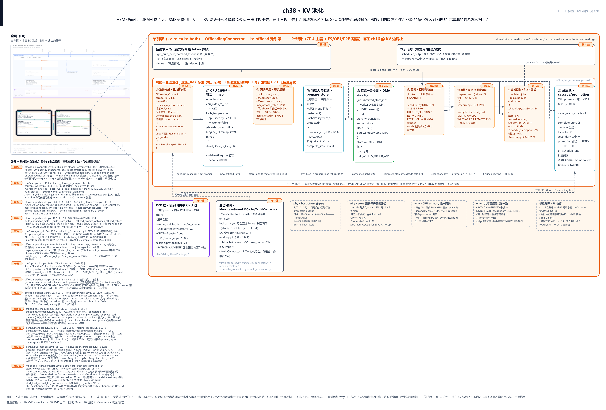

> *图注：本章放大的是[第 1 章](../../ch01-vllm-v1-in-one-map/narrative/chapter.md) L0 图中「KV 边界+外部池」这块：左上小地图的两枚高亮框分别框住账本列与 GPU 执行臂，两列之间的那条缝（图上以 SchedulerOutput/block_ids 过线画出）就是[第 16 章](../../ch16-kv-connector/narrative/chapter.md)立的 KV 边界；外部池在 L0 上没有自己的格子——它本来就在引擎之外（页脚原话：『外部池』在 L0 之外），图顶框题写明「外部池（CPU 主层 + FS/OBJ/P2P 副层）挂在 ch16 的 KV 边界上」，本章讲的就是这块边界外的领地怎么开张、块怎么进出。它接在三块已读结构上：[第 16 章](../../ch16-kv-connector/narrative/chapter.md)立的 KVConnector 双面契约（调度器侧原语、`WAITING_FOR_REMOTE_KVS` 等待路径、两封信，本章全部当已立直接消费）、[第 37 章](../../ch37-pd-disaggregation/narrative/chapter.md)的 P/D 分离（同一契约的第一种真实填法：可靠交接世界观）、[第 13 章](../../ch13-paged-kv/narrative/chapter.md)与[第 15 章](../../ch15-prefix-caching/narrative/chapter.md)的块池与链式哈希（池内键说的就是它的语言）。图三段读：上排是请求进出条（新请求查池、本步信号触发围栏）；中排 ①-⑨ 是一个块进出池的一生（池的构成 → CPU 池开张 → 满块采集 → 池准入驱逐 → 延迟提交+DMA → 四态查询 → 加载接 ch16 → 完成回收+围栏 → 分层池）；下排是 P2P 跨实例层、生态对照、四条 why 注与邻章分界。图上的 F8 是全书伏笔编号：[第 16 章](../../ch16-kv-connector/narrative/chapter.md)埋的双面契约，[第 37 章](../../ch37-pd-disaggregation/narrative/chapter.md)的 P/D 过户与本章的池化各回收一半，本章收后半。站号 1-13 = 块/请求流经代码的顺序（查询在第 8 站、存储每步滚动），正文按讲解需要编排、不必照站号读。*

读法建议：只想知道「池长什么样、为什么敢丢块」，看[「池的构成」](#池的构成契约里再嵌一份契约站-1)与[「CPU 池开张」](#cpu-池开张一份预算一块物理内存站-2)；关心块怎么出去（采集、准入、发车、DMA），按序读[「换出去」](#换出去之一满块采集认尾块站-4)四节；关心块怎么回来（查询、加载、回收、围栏），看[「四态查询」](#换回来之一四态查询稍后再问站-38)到[「围栏」](#围栏两列相向的火车站-10)四节；分层（SSD/远端）在[「分层池」](#分层池一座中转枢纽站-11)，跨实例共享在[「P2P」](#跨实例-p2p对暗号才能共享站-12)，Mooncake/LMCache/MultiConnector 三家后端在[「生态对照」](#生态对照同一道边界的三种池后端站-13)。想跟全程，按序读。

照例交代取证环境，全章数值表都适用：本章实测来自配套精简版（按 v0.27.1 只做减法抽出，69 个测试全过），14 份 trace 全部在 host 上真跑（Windows、CPU 执行、无 CUDA、不装 vLLM 包；调度器半边与 worker 半边同进程装配，控制流与字节流全为真源码路径）。取证环境与 pin 源码的差异共五处，后文碰到就地挑明（这段只登记差异清单，段中 stream/event、DMA 等词到「DMA 引擎三戒」「钉页」等节才正式立义）：一是 CUDA 的 stream/event（GPU 的工作队列与进度标记，「DMA 引擎三戒」一节展开）的时序在 host 上不可观察（替身流的等待是空操作），DMA 三戒（DMA 即直接内存访问搬运硬件，「钉页」一节细讲）的顺序论证以源码注释原文为锚，控制流与指针算术已 host 全覆盖；二是搬运内核 `swap_blocks_batch` 在 host 是逐描述符搬字节的替身（真 CUDA 平台是 C++ 批量拷贝 kernel）；三是 Windows 没有 `/dev/shm`，共享内存区走源码里「不建共享区、用私有张量」的分支，分账与几何逻辑不变；四是 MooncakeStore 的查询走真 ZMQ（ZeroMQ，嵌进应用进程的消息库，「跨实例 P2P」一节展开）套接字、对端是脚本化的服务进程，worker 的双传输线程与分布式 store 实现体要外部 mooncake 包；五是 P2P 的会话机器不进精简版，协议消息、三角色键（`remote_prefiller` 等 per-request 角色指定键，「跨实例 P2P」一节立）与启动硬门 host 全覆盖。

## 为什么值钱：三级介质的套利空间

先算账，再看代码。池化的全部动机压在一张硬件对照表上（数字取自 NVIDIA 与三星官方页，2026-08 一手核，属外部事实、非本章实测）：

| 层 | 代表硬件 | 带宽 | 容量（每节点量级） | 延迟量级 |
|---|---|---|---|---|
| HBM（GPU 板载高带宽显存） | H100 SXM 80GB；GB200 每 GPU 约 186GB HBM3e | 3.35-8 TB/s | 百 GB 级 | 亚百 ns |
| DRAM（主机内存） | GB200 Grace 至多 480GB LPDDR5X；DDR5 RDIMM 单条至 256GB | 数百 GB/s | 0.5-2+ TB | 约 100 ns |
| SSD（PCIe Gen5 固态盘，NVMe 协议） | 三星 9100 PRO 单盘 8TB | 顺序读约 14.8 GB/s | 数十 TB | 数十 μs |

两条规律：带宽每下一层掉一个数量级（8 TB/s 到 0.5 TB/s 再到 0.015 TB/s），容量每下一层涨一个数量级。KV cache 是推理期唯一「随上下文长度和并发数线性膨胀」的大数据结构（权重是只读的、放 HBM 就完事），所以它迟早溢出 HBM，这是算术必然。说明性推算（体量数字有出处、除法为本章所做）：agentic（智能体式多轮工具调用）负载的会话里，100K token 上下文的 KV 约 3.8GB（Kimi-2.5 FP8，vLLM×Mooncake 官方博客口径），一百个并发会话就是 380GB。单卡 80GB 的 H100 还得先扣权重，根本驻留不下；一台 2TB 内存的机器装它只是零头。

溢出之后为什么「搬回来」比重算划算？还是说明性推算：那 3.8GB 从 50 GB/s 的 DRAM 池拉回约 76 ms，从 14.8 GB/s 的 NVMe 拉回约 257 ms，而重算 100K token 的 prefill 在单卡上通常是秒级。传输永远比重算便宜一到两个数量级，这就是「用便宜的存储换昂贵的计算」的物理根基（也是 Mooncake 论文 FAST'25 发表标题里的原话，§10 还补了一句：论每美元带宽，GDDR 甚至 LPDDR 方案能比旗舰加速器好一个数量级）。生产口径的收益数字要带着负载画像读：vLLM×Mooncake 博客（2026-05）在 agentic 负载上实测（SWE-bench Pro 重放 Codex trace，输入输出比 131:1、中位 33 轮、理论可命中率 94.2%），命中率从 1.7% 提到 92.2%、吞吐 3.8 倍、P50（中位）TTFT（time to first token，首 token 延迟，[第 10 章](../../ch10-continuous-batching-chunked-prefill/narrative/chapter.md)立的口径）降 46 倍，但注意基线是「只缓存系统提示词的 NIXL P/D」；而 Mooncake 论文自己的生产统计是复用上限约 50%（个别服务 90%），数据集冷热天差地别（ArXiv 类几乎 0%、L-Eval 类大于 80%）。池化不是万灵药，命中率是负载的函数。价格账更别写死：2026 年记忆体超级周期里，TrendForce（2026-06-02）称 1Q26 起 DDR5 64GB RDIMM 的晶圆盈利能力史上首次反超 HBM、2027 年 HBM 合同价预计倍数级上涨。物理账（带宽、容量阶梯）不随价格波动，价格只改「加一层 DRAM/SSD 划不划算」的阈值。

落到 vLLM：一条命令就能开张——`vllm serve` 带 `--kv-offloading-size <GB>`，配置层把它折算成 `cpu_bytes_to_use` 并选中本章主角（`vllm/config/vllm.py:L899-L916`）。官方还有一条定价建议值得先记着：CPU 池应大于 GPU 池总量，「更大的 CPU 层意味着更少去慢副层跑一趟」（`docs/features/kv_offloading_usage.md`）。本章后半的分层池会解释这句话。

## 池的构成：契约里再嵌一份契约（站 1）

现在走到 L0 图 KV 边界的外侧。池化引擎在 vLLM 里不是一个新系统，是[第 16 章](../../ch16-kv-connector/narrative/chapter.md)那份 KVConnector 双面契约换了一双「搬运工的手」：契约外层照旧（调度器半边问「有没有」、worker 半边搬「字节」），内层又嵌了一份同构的小契约——池引擎自己的「决策半边」与「搬运半边」。整章的代码主角就住在这两层契约里。

### best-effort：丢一次 save 只是未来一次 miss

先看门面。`OffloadingConnector` 是池化后端的注册名，它实现 `KVConnectorBase_V1`，构造时按角色建半边——这套劈两半的把戏与 ch16 完全同款：

```python
# vllm/distributed/kv_transfer/kv_connector/v1/offloading_connector.py:L49-L80 · OffloadingConnector（facade）
class OffloadingConnector(KVConnectorBase_V1, SupportsHMA):
    @property
    def prefer_cross_layer_blocks(self) -> bool:
        return True

    @property
    def requires_kv_delivery(self) -> bool:
        # Runs as kv_both, but is a best-effort cache: a dropped save is just a
        # future cache miss, so opt out of the producer-role default.
        return False   # L58

    def __init__(
        self,
        vllm_config: VllmConfig,
        role: KVConnectorRole,
        kv_cache_config: KVCacheConfig,
    ):
        super().__init__(vllm_config, role, kv_cache_config)

        offloading_config = build_offloading_config(vllm_config, kv_cache_config)
        spec = OffloadingSpecFactory.create_spec(offloading_config)   # L69

        self.connector_scheduler: OffloadingConnectorScheduler | None = None
        self.connector_worker: OffloadingConnectorWorker | None = None
        if role == KVConnectorRole.SCHEDULER:
            self.connector_scheduler = OffloadingConnectorScheduler(
                spec, vllm_config, kv_cache_config
            )
        elif role == KVConnectorRole.WORKER:
            self.connector_worker = OffloadingConnectorWorker(
                spec, vllm_config, kv_cache_config
            )
```

三处值得停。其一，`requires_kv_delivery` 返回 `False`，注释原话就是本章世界观的宣言：「以 kv_both 运行，但它是 best-effort 缓存：丢一次 save 只是未来一次 cache miss，所以退出 producer 角色的默认值」。回忆 ch16 站 12：这面旗标是 P/D 世界的抢占护栏（producer 交接未决被抢占时得 `drop_stale_output`），offload 明确退出这个语义。其二，`request_finished` 返回 `False`、不接管块的释放（`offloading/scheduler.py:L1375-L1414`）——对照 [第 37 章](../../ch37-pd-disaggregation/narrative/chapter.md)的 P 终局「押下 30 秒租约、开回执」，池化连押金都不押。其三，`prefer_cross_layer_blocks=True`：跨层单张量布局利于整块多层一次传，这是给下层搬运的布局偏好。

这条 why 链值得完整摆一遍。**旧设计**是 ch37 的可靠交接世界观：producer `request_finished` 返回 True 接管块、租约钉住 30 秒等心跳续租、交接未决被抢占要丢弃过期输出。每个块都必须可靠送达对端。**痛点**在于 offload 的 store 每步都在发生（满块算出来就搬）：若也按可靠语义设计，每个 store 都得延迟释放 GPU 块、等 CPU 或 SSD 的确认回来，GPU 池容量被慢介质的搬运节奏绑架；而池化丢一块的代价只是「下次查询 miss、重算一遍」，与正确性无关。**方案**就是上面三件套（退出 producer 语义、不接管释放、正确性围栏换成后面要讲的 jobs_to_flush）。**代价**也直白：store 与块复用之间始终存在窗口期，得靠同步围栏兜底（最坏把一步停顿到 DMA 完成；DMA 即 direct memory access，直接内存访问，GPU 上独立于计算单元、按物理地址搬运本机显存与主存之间字节的硬件，ch37 的 RDMA 是它在网络侧的亲戚、别混，「钉页」一节细讲）；驱逐空间不足时 store 被静默拒收、只记一个指标，命中率悄悄降；外加认知税——同一份契约下 P/D 可靠、池化 best-effort，读代码必须先看 `requires_kv_delivery` 才知道自己在哪个世界。

### 不逐层、不同步、不接管

ch16 给 worker 侧立了一排逐层钩子（层前等本层、层后存本层），还有每拍收尾的强制同步点 `wait_for_save`。池化的填法是一排空壳：

```python
# vllm/distributed/kv_transfer/kv_connector/v1/offloading_connector.py:L103-L134 · 池化钩子的「空」填法
    def start_load_kv(self, forward_context: "ForwardContext", **kwargs) -> None:
        assert self.connector_worker is not None
        assert isinstance(self._connector_metadata, OffloadingConnectorMetadata)
        self.connector_worker.start_kv_transfers(self._connector_metadata)

    def wait_for_layer_load(self, layer_name: str) -> None:
        pass

    def save_kv_layer(
        self,
        layer_name: str,
        kv_layer: torch.Tensor,
        attn_metadata: "AttentionMetadata",
        **kwargs,
    ) -> None:
        pass

    def wait_for_save(self):
        # Store deferral is handled in get_finished(), which always runs even
        # when wait_for_save() is skipped (e.g. kv_connector_no_forward).
        pass

    def get_finished(self, finished_req_ids: set[str]) -> tuple[set[str], set[str]]:
        assert self.connector_worker is not None
        assert isinstance(self._connector_metadata, OffloadingConnectorMetadata)

        # Defer store jobs to the next step's start_kv_transfers. Done here
        # (rather than wait_for_save) so stores are queued even on steps where
        # wait_for_save is skipped.
        self.connector_worker.prepare_store_kv(self._connector_metadata)

        return self.connector_worker.get_finished(finished_req_ids)
```

三个 `pass` 不是偷懒，是三个明确的「不做」：不逐层（KV 是整块商品，不做层间流水）、不同步（`wait_for_save` 的栅栏语义整个让位，后面「围栏」一节看它的替代品）、不接管（请求结束不延迟释放，也在「围栏」收账）。真正干活的位置挪到了 `get_finished`：把 store job 入队的动作挂在这里，注释点明理由：`get_finished` 连没有前向的空拍也会被调用（ch16 站 8 的 `kv_connector_no_forward` 路径），store 永不遗漏。P/D 世界每拍强制等，池化世界连等都不等，「晚一拍发车」一节细讲。

### 契约的契约：OffloadingSpec 的两半

`__init__` 中间那行 `OffloadingSpecFactory.create_spec` 是本章的第二层契约。池引擎被抽象成一个 `OffloadingSpec`（规格说明），它自己又劈成两半：`get_manager()` 产住在调度器进程的 OffloadingManager（块在哪、谁可逐、账本原语），`get_worker()` 产住在 worker 进程的 OffloadingWorker（只管搬字节）。决策与搬运分离的模式在契约内层递归了一次：

```python
# vllm/v1/kv_offload/base.py:L162-L186 · OffloadingManager 契约（docstring 原文）
"""
OffloadingManager class for managing KV data offloading in vLLM v1

This class runs in the scheduler, tracks which blocks are offloaded
and their address.

The class provides the following primitives:
    lookup() - check whether a single block is offloaded and ready.
    prepare_load() - prepare given blocks to be read.
        The given blocks will be protected from eviction.
        This function returns a LoadSpec which encapsulates
        information required for performing the load.
    touch() - marks the give blocks as recently used. Can be used
        to track block's LRU. This function is separated from the
        prepare_load function to allow setting block recency even
        for blocks which do not need reading from the cache, such as
        blocks that are cached by the GPU prefix cache.
    complete_load() - mark blocks which were previously prepared to be
        loaded as done loading. This is to re-allow their eviction.
    prepare_store() - prepare the given blocks to be written.
        Returns a StoreSpec encapsulating offloading information,
        as well as a list of blocks that were evicted as a result.
    complete_store() - marks a previous store as completed.
        Following this call, the given blocks will become loadable.
"""
```

六个原语就是一本池账本的全部动词：查（`lookup`）、读前置备加防逐（`prepare_load`）、刷新鲜（`touch`）、读完解防（`complete_load`）、写入前置备加驱逐（`prepare_store`）、写完转可读（`complete_store`）。`touch` 的存在理由值得一读：它与 `prepare_load` 分开，是因为 GPU 前缀缓存命中的块不需要从池里读，但它们的新鲜度也该刷——不然池按 LRU 把「GPU 正在用」的块当冷块逐了。worker 半边的契约更瘦：

```python
# vllm/v1/kv_offload/base.py:L545-L566 · OffloadingWorker 契约
class OffloadingWorker(ABC):
    """Runs in the worker process. Performs async KV transfers for ONE
    offloaded medium (e.g. CPU). Direction is explicit via submit_store /
    submit_load, so there is no (src_medium, dst_medium) routing."""

    @abstractmethod
    def submit_store(
        self, job_id: int, src_spec: GPULoadStoreSpec, dst_spec: LoadStoreSpec
    ) -> bool:
        """Async GPU -> offloaded medium."""

    @abstractmethod
    def submit_load(
        self, job_id: int, src_spec: LoadStoreSpec, dst_spec: GPULoadStoreSpec
    ) -> bool:
        """Async offloaded medium -> GPU."""

    @abstractmethod
    def get_finished(self) -> list[TransferResult]: ...

    @abstractmethod
    def wait(self, job_ids: set[int]) -> None: ...
```

四个动词全是搬运：方向显式（`submit_store` 恒 GPU 到介质、`submit_load` 恒介质到 GPU），没有「从哪种介质到哪种介质」的路由——每种介质一个 worker，谁的孩子谁抱走。完成上报不带回调，靠 `get_finished` 轮询加 `wait` 围栏。选哪种引擎由一个字符串决定：

```python
# vllm/v1/kv_offload/factory.py:L50-L55 · OffloadingSpecFactory.create_spec
    @classmethod
    def create_spec(cls, config: OffloadingConfig) -> OffloadingSpec:
        spec_name = config.extra_config.get("spec_name", "CPUOffloadingSpec")
        spec_cls = cls.get_spec_cls(config.extra_config)
        logger.info("Creating offloading spec with name: %s", spec_name)
        return spec_cls(config)
```

`spec_name` 缺省是 `CPUOffloadingSpec`（单层 CPU 池，本章主线），写 `TieringOffloadingSpec` 就是分层池（「分层池」一节），还可以经 `spec_module_path` 加载树外实现，又一个 lazy import 注册表，与 ch16 的 connector 工厂同款。

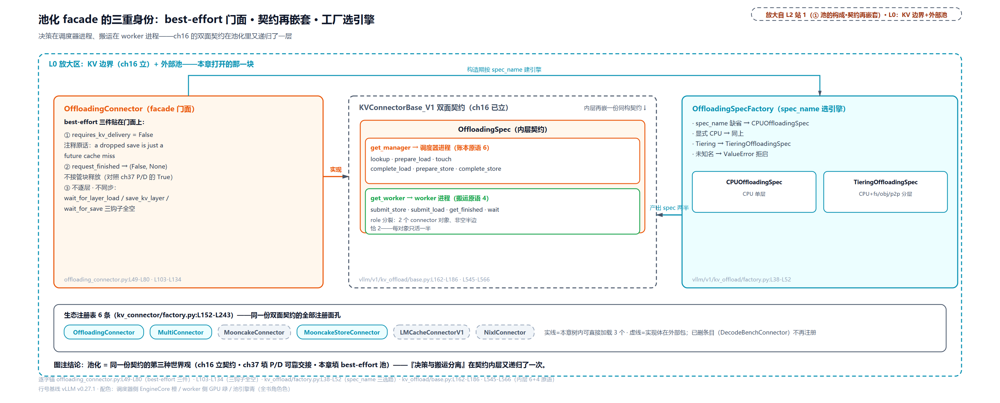

> *图注：左橙框是 OffloadingConnector 门面，best-effort 三件套①②③贴在框上（① `requires_kv_delivery=False` 及英文注释原话、② `request_finished` 返 `(False, None)` 不接管、③ `prefer_cross_layer_blocks=True` 跨层单张量布局），框内另有一行钩子填法：`start_load_kv` 只转发、其余三钩子 `pass` 空壳；中间 ch16 的 KVConnectorBase_V1 虚框内嵌 OffloadingSpec，再劈成 get_manager（调度器进程，6 个账本原语）与 get_worker（worker 进程，4 个搬运原语）两半；右青框工厂按 `spec_name` 三选路（缺省/显式 CPU 到 CPUOffloadingSpec、Tiering 到 TieringOffloadingSpec、未知名报错；另有 `spec_module_path` 树外加载旁路）。底部芯片行是生态注册表：精简版保留 6 条示范注册名，实线 3 条树内可加载。图注结论：池化是同一份契约的第三种填法，且「决策与搬运分离」在契约内层又递归了一次。*

到这里可以兑现那句跨章的话了。[第 16 章](../../ch16-kv-connector/narrative/chapter.md)埋下双面契约（F8），[第 37 章](../../ch37-pd-disaggregation/narrative/chapter.md)给它装上跨引擎的腿（可靠交接），本章给它装上分层的腿（best-effort 缓存）：`get_num_new_matched_tokens` 的「外部缓存当第二个前缀缓存」落地为四态查询，`request_finished` 的「True 即接管」落地为「False 不接管加围栏」，worker 的逐层钩子落地为一排空壳。三种世界观，同一排接口。

### 入场登记（站 3）

请求进场时（`on_new_request`，`offloading/scheduler.py:L804-L814`），调度器半边为它建一份档案：`ReqContext` 携带 `kv_transfer_params`（ch37 立的回执信封，池化往里塞的是 per-request 旋钮，「满块采集」一节用），`RequestOffloadState` 给每个 KV 组记 `offload_keys`（池内键）、`block_ids`（GPU 块号）和一个「存到第几箱」的游标。管理器侧顺访一遍各层的准入策略（`OffloadPolicy`：BLOCK_LEVEL 只搬新算的块，REQUEST_LEVEL 全块都搬——树内各副层（example/fs/p2p/obj 四种注册）当前都返回默认的 BLOCK_LEVEL，后者是留给树外层的钩子，`vllm/v1/kv_offload/base.py:L116-L122`）。档案建好，池开张。

## CPU 池开张：一份预算，一块物理内存（站 2）

### 定价：预算按全体 worker 计

CPU 池先定价再铺位。「预算」是一个配置数 `cpu_bytes_to_use`，「价」是「全体 worker 拼起来的一块」的字节数——不是每个 worker 各买一份：

```python
# vllm/v1/kv_offload/cpu/spec.py:L77-L110 · CPUOffloadingSpec.__init__（定价）
    def __init__(self, config: OffloadingConfig):
        super().__init__(config)

        cpu_bytes_to_use = self.extra_config.get("cpu_bytes_to_use")
        if not cpu_bytes_to_use:
            raise Exception(
                "cpu_bytes_to_use must be specified in kv_connector_extra_config"
            )

        world_size = config.parallel.world_size
        self.num_blocks = 0
        self.kv_bytes_per_chunk = 0
        self.cpu_page_size_per_worker = 0
        self.replicated_layout = config.replicated_layout and self._uses_shared_region()
        if config.worker_kv_bytes_per_block > 0 and world_size > 0:
            num_copies = 1 if self.replicated_layout else world_size
            kv_bytes_per_block = config.worker_kv_bytes_per_block * num_copies
            kv_bytes_per_chunk = kv_bytes_per_block * self.blocks_per_chunk

            # calculate cpu_page_size_per_worker
            self.cpu_page_size_per_worker = kv_bytes_per_chunk // num_copies

            # calculate num_blocks
            aligned_kv_bytes_per_chunk = round_up(
                kv_bytes_per_chunk, self.BLOCK_SIZE_ALIGNMENT
            )
            self.num_blocks = int(cpu_bytes_to_use) // aligned_kv_bytes_per_chunk   # L103

            # Expose aligned_kv_bytes_per_chunk as
            # kv_bytes_per_chunk. Note that this might contain
            # some padding. i.e. each offloaded block is of the form,
            # |--- W0-B0---|---- W1-B0---| ... |---- Wn-B0---| *** maybe-pad *** |
            # or |--- B0 (single copy) ---| *** maybe-pad *** |
            self.kv_bytes_per_chunk = aligned_kv_bytes_per_chunk
```

定价公式一行：`num_blocks = cpu_bytes_to_use ÷ round_up(每 worker 块字节 × world_size × blocks_per_chunk, PAGESIZE)`。TP（tensor parallel，张量并行，[第 35 章](../../ch35-distributed-tp-pp-dp-ep/narrative/chapter.md)）部署下每个 worker 只存自己的分片，所以一块池位里先排 W0 的页、再排 W1 的页、末尾补零凑整页。注释原文画的那条 `|--- W0-B0 ---|---- W1-B0 ---| ... | maybe-pad |` 就是池位的物理布局。对齐用的是 `mmap.PAGESIZE`（操作系统页大小，Linux 上通常 4096B），因为整块池位将来要按页映射、按页钉住。

<!-- trace: m2 -->
| 场景 | 定价公式代入 | 实测（num_blocks / 每 worker 页 / 垫字节） | 判定 |
|---|---|---|---|
| 主例（有垫字节） | 512B × 2 worker × 2 块 = 2048B → round_up(2048, 4096) = 4096B；100MiB ÷ 4096B | num_blocks=25600、每 worker 页 1024B、垫 2048B | 预算按全部 worker 计而非 per-worker；对齐垫零真实可见 |
| 对照（恰好页对齐） | 1024B × 2 × 2 = 4096B → aligned 4096B | num_blocks=25600、每 worker 页 2048B、垫 0 | 无 padding 时布局公式仍成立 |
| 小池 8192B | 8192 ÷ 4096 | num_blocks=2 | 预算小到只装 2 块（整除性） |
| canonical 规范化 | 8 块 × 512B 页、2 层 | 1 条 canonical 张量 (8, 512)、组 1 × 引用 2（两层数据同源同 data_ptr） | 任意 attention 布局先拍平成 (num_blocks, page) 视图（canonical 与层引用数在「规范化」「DMA 引擎三戒」两节立义） |
| 缺预算参数 | extra_config 无 cpu_bytes_to_use | Exception: cpu_bytes_to_use must be specified | 池预算是必填项，不定价不开张 |

主例值得盯一眼垫字节的量级：每块池位 4096B 里 2048B 是垫的（padding 率一半），这是 512B 小页示例的放大效应；真实模型的每块字节数远大于页大小，垫零占比可以忽略。不变量也简单：`num_blocks × kv_bytes_per_chunk ≤ cpu_bytes_to_use`，整除定义即上界；每个 worker 的槽位区间 `[rank × cpu_page_size, (rank+1) × cpu_page_size)` 线性排开、互不重叠。

### /dev/shm：怎么让三个进程看见同一块内存

定价算出的是字节数，铺位铺的是一块真内存，而且要让**全体 TP worker 进程和调度器进程**都看得见。先补三步背景（通用 Linux 语义，非 vLLM 专属）：

第一，普通内存为什么不能共享。每个进程有自己独立的虚拟地址空间，页表把它的虚拟页映射到各自独占的物理页，这是进程隔离的根基，也正是 A 进程里的一个指针拿到 B 进程里毫无意义的原因。第二，mmap（内存映射）是那座桥：`mmap()` 把一个文件映射进进程的虚拟地址空间，此后读写这段地址就是读写文件内容；关键的标志位是 `MAP_SHARED`，手册原话「共享这个映射：对映射区的更新对映射同一区域的其他进程可见」。两个进程各自 mmap 同一个文件加 MAP_SHARED，就共享了底层同一批物理页——写的一方不需要「发送」任何东西，读的一方直接看到。第三，`/dev/shm` 是那块地：Linux 挂载的 tmpfs，内核文档原话「把所有文件都放在虚拟内存里的文件系统」，不写盘、默认容量是物理内存的一半。在 `/dev/shm` 下建一个文件并 mmap，就得到一块跨进程共享的内存。

双终端最小例（通用语义验证，非 vLLM 代码）：

```bash
# 终端 1（写入方）
python3 -c "
import mmap
f = open('/dev/shm/demo.bin', 'w+b')
f.write(b'\x00' * 8); f.flush()
m = mmap.mmap(f.fileno(), 8)   # 默认就是 MAP_SHARED
m[0:4] = b'ABCD'
input()                        # 挂住进程，让映射存活
"
# 终端 2（另一个完全独立的进程）
python3 -c "
import mmap
f = open('/dev/shm/demo.bin', 'r+b')
m = mmap.mmap(f.fileno(), 8)
print(m[0:8])                  # 立刻打出 b'ABCD\x00\x00\x00\x00'
"
```

第二个进程没做任何「接收」动作，数据已经在那里。vLLM 的 `SharedOffloadRegion` 就是这件事的工程化，文件名自带引擎身份：

```python
# vllm/v1/kv_offload/cpu/shared_offload_region.py:L29-L56 · SharedOffloadRegion（docstring 与铺位）
    """
    Single mmap-backed memory region shared across all workers for a
    vLLM instance.  Workers coordinate via the filesystem: the first worker
    to open the file with O_EXCL becomes the creator and calls ftruncate;
    the rest open the existing file and wait until it reaches the expected
    size.  Each worker then mmap()s the full file.

    File path: /dev/shm/vllm_offload_{engine_id}.mmap
    """

    BLOCK_SIZE_ALIGNMENT: int = mmap.PAGESIZE

    def __init__(
        self,
        engine_id: str,
        num_blocks: int,
        rank: int | None,
        kv_bytes_per_block: int,
        cpu_page_size: int,
    ) -> None:
        self.page_size = mmap.PAGESIZE
        assert kv_bytes_per_block % self.page_size == 0

        self.num_blocks = num_blocks
        self._row_stride = kv_bytes_per_block
        self.total_size_bytes = self.num_blocks * self._row_stride

        self.mmap_path = f"/dev/shm/vllm_offload_{engine_id}.mmap"   # L56
```

三个细节。其一，创建权的竞选靠文件系统的 `O_CREAT | O_EXCL`：第一个以「排他创建」打开文件的 worker 赢得创建权、负责 `ftruncate` 把文件撑到池大小，其余 worker 打开既有文件并自旋等它长到位。没有中心协调者，协调走的是文件系统本身。其二，每个 worker mmap **整个文件**，但只对自己那一列槽位（`rank × cpu_page_size` 起的区间）做数据搬运；单层 CPU 池里调度器进程不碰池字节、只持账本——分层配置下它才会以 `rank=None` mmap 同一个文件（「分层池」一节看它为什么也要来）。其三，谁都不拷贝：TP worker 用 GPU DMA 写自己那段；分层配置里调度器进程的副层 I/O 线程再经 Python 的 memoryview（零拷贝内存视图）直接读写——**共享数据、零共享状态**。共享的只有池里的 KV 字节，所有簿记（free list、ref_cnt、驱逐账本）只存在调度器进程一份。共享内存的老难题「调用方必须自己做同步」被这个设计从根上绕开：要同步的状态压根没共享。

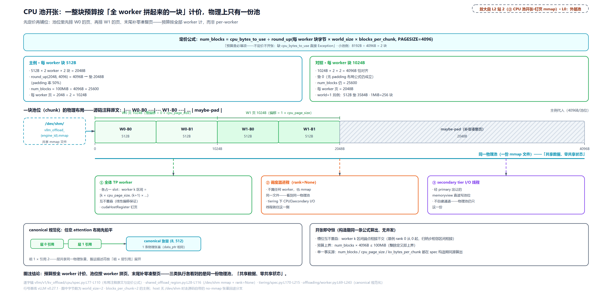

> *图注：上半是定价公式与两组实测数（主例 512B 每块垫 2048B、对照 1024B 垫 0，num_blocks 均 25600；另附 world=1 垫 3584B、小池 8192B 得 2 块、缺 `cpu_bytes_to_use` 直接异常三个边界）；下半一块池位的横条布局：W0 页（浅绿）｜W1 页（深绿）｜maybe-pad（灰斜纹 2048B），字节标尺 0/1024/2048/4096，左端标 `/dev/shm/vllm_offload_{engine_id}.mmap`；池位条下方一条总线接三个芯片：TP worker（槽偏移=rank × 页）、调度器进程（rank=None）、secondary tier I/O 线程（经 memoryview）——三类执行者同一物理池，其中 TP worker 属单层主线，后两类（调度器 mmap 与副层 I/O）随分层池登场。左下 mini 图是规范化：两层引用拍平成 1 条 (8,512) 张量、同 data_ptr；右下是『开张即守恒』不变量箱：num_blocks × kv_bytes_per_chunk ≤ 预算、槽位区间互不重叠、三个数同出一份 spec。图注结论：预算按全 worker 计价、池位按 worker 拼页、物理上只有一份。*

### 钉页：DMA 只认钉住的内存

worker 的搬运工就是前面 why 链里点名的那位 DMA：独立于计算单元、按「物理地址加长度」干活的搬运硬件。这里有一条操作系统的硬约束：普通内存页是「可换页」的，内核随时可能把它换出到盘或挪去别处；CPU 撞上被挪走的页会触发缺页中断，这次访问先暂停，内核用软件把页找回来，再接着执行，代价只是慢一点；DMA 引擎没有这条兜底：它拿到的是物理地址，页被挪走它就把数据搬去错误的地方。所以 NVIDIA 文档写得很硬：异步 host 缓冲「必须钉住并页锁定」，否则异步拷贝「退化为同步、无法与其他工作重叠」。vLLM 的做法是事后补钉——先 mmap 拿到池区间，再 `cudaHostRegister` 把整段注册成页锁定：

```python
# vllm/v1/kv_offload/cpu/gpu_worker.py:L123-L150 · pin_mmap_region（钉页）
def pin_mmap_region(region: SharedOffloadRegion) -> None:
    """Register the entire mmap as CUDA pinned memory via cudaHostRegister."""
    if not current_platform.is_cuda_alike():
        logger.info(
            "Skipping mmap host registration on %s; cudaHostRegister is only "
            "available on CUDA/ROCm.",
            current_platform.device_name,
        )
        return

    rank = region.rank

    base_ptr = region._base.data_ptr()
    result = torch.cuda.cudart().cudaHostRegister(base_ptr, region.total_size_bytes, 0)   # L136
    if result.value != 0:
        logger.warning(
            "cudaHostRegister failed for rank=%d (code=%d) — "
            "transfers will still work but may be slower (unpinned DMA)",
            rank,
            result,
        )
    else:
        logger.debug(
            "cudaHostRegister rank=%d %.2f GB",
            rank,
            region.total_size_bytes / 1e9,
        )
        region.is_pinned = True
```

钉页换来的是「每一步 store/load 都是真正的异步 DMA」，代价是这块内存从此退出内核的换页池（官方文档提醒：钉太多会挤压系统可换页内存），所以只钉确有需要的搬运缓冲。同一块物理页从此有两类访问者、两种要求：调度器进程和副层线程只需要 mmap（CPU 直读写，走页表，缺页有兜底），TP worker 的 GPU DMA 则必须钉页（物理地址要稳定）。「同一物理池、两类执行者、两种内存要求」正是池开张的设计要点。

### 规范化：把任意布局拍平成一块张量

最后一步开张准备在 worker 侧：`register_kv_caches`（`offloading/worker.py:L69-L243`）把引擎实际的 KV 张量（逐层的、跨层打包的、混合模型的多种组）统一规范化成 `(num_blocks, page)` 的 canonical（规范形）张量视图：不是拷贝，是 `as_strided` 重新切窗，两条物理上同源的层张量在上文定价实测的 canonical 规范化一行里共享同一个 `data_ptr`。搬运引擎只认规范形，布局的多样性被挡在门口。取证差异就此挑明：host 上没有 `/dev/shm`，`is_cuda_alike()` 为假，精简版走的是「不建共享区、用私有张量」的分支——上面的几何与分账逻辑原样跑，只是那块内存在 host 上不是共享 mmap。

## 换出去之一：满块采集，认尾块（站 4）

四道坎的第一道：满块刚算完，怎么不打扰 GPU 就搬走。答案拆成四步：采集（本节）、准入（下节）、发车（再下节）、DMA（再下下节）。

### 钥匙与箱子

池里的「钥匙」不是元组是一串字节：块哈希接 4 字节组号打包成 bytes，省掉 tuple 装箱的 GC（垃圾回收）开销，还能直接当字典键、文件名、网络载荷用：

```python
# vllm/v1/kv_offload/base.py:L23-L41 · OffloadKey（打包与解包）
# `OffloadKey` identifies an offloaded block. It combines a block hash with
# its KV cache group index, encoded as raw bytes to avoid tuple GC overhead.
# Use the helper functions below to construct / decompose keys.
OffloadKey = NewType("OffloadKey", bytes)


def make_offload_key(block_hash: bytes, group_idx: int) -> OffloadKey:
    """Pack a block hash and group index into an `OffloadKey`."""
    return OffloadKey(block_hash + group_idx.to_bytes(4, "big", signed=False))


def get_offload_block_hash(key: OffloadKey) -> bytes:
    """Extract the block hash from an `OffloadKey`."""
    return key[:-4]


def get_offload_group_idx(key: OffloadKey) -> int:
    """Extract the group index from an `OffloadKey`."""
    return int.from_bytes(key[-4:], "big", signed=False)
```

块哈希来自[第 15 章](../../ch15-prefix-caching/narrative/chapter.md)的链式哈希——池与前缀缓存说同一种语言，这是「外部缓存是第二个前缀缓存」能成立的前提。搬运的粒度是 chunk（搬运箱）：`blocks_per_chunk` 个 GPU 块并成一个 offload 块，CPU 页 = GPU 页 × blocks_per_chunk。箱子越大簿记越省（一条键管更多字节）、查找粒度越粗。这是个可调的权衡，配置上 `block_size` 与 `blocks_per_chunk` 二选一给（同给直接报错）。文件系统副层还会用哈希前缀给目录分桶（`<root>/<模型配置摘要>_r<rank>/<hhh>/<hh>_g<组号>/<hash>.bin` 四级路径），限住单目录扇出、按组隔离；完整哈希留在文件名里保唯一。

<!-- trace: m12 -->
| 项 | 输入 | 实测 | 判定 |
|---|---|---|---|
| 键打包 | hash 32B + group_idx=7 | key 总长 36（尾 4B=组号）；解包往返 hash/group 皆相等 | (hash, group) ↔ bytes 双射，直接当键用 |
| chunk 粒度 | GPU 块 4 token、offload block_size=8 token | blocks_per_chunk=2、tokens_per_hash=4、hashes_per_chunk=2、worker 每块 512B | CPU 页 = GPU 页 × 2（簿记 vs 粒度的权衡） |
| 互斥门 | block_size 与 blocks_per_chunk 同给 | ValueError: Specify only one | 两种说法二选一 |
| fs 目录分桶 | 键种子 5（rank 3） | …_r3/000/00_g0/<hash>.bin 共 4 级；种子 0/1 同桶 000、远种子桶 100 | 哈希前缀限目录扇出；完整哈希在文件名保唯一 |

### 每步增量采集

采集发生在每个调度步的尾巴（`build_connector_meta`），对每个本步有产出的请求推进一次。核心三步：算「可卸多少 token」、按箱切片取块、交给池准入。

```python
# vllm/distributed/kv_transfer/kv_connector/v1/offloading/scheduler.py:L1046-L1095 · _build_store_jobs（采集核心）
            num_offloadable_tokens = self._calc_num_offloadable_tokens(   # L1046
                req_status, num_tokens_after_batch
            )

            # Filter out chunks skipped due to sliding window attention / SSM
            # or unreachable by the load path's alignment constraints.
            new_offload_keys: list[OffloadKey] = []
            for group_config, group_state in zip(
                self.config.kv_group_configs, req_status.group_states
            ):
                num_chunks = req_status.storable_chunks(
                    group_config, group_state, num_offloadable_tokens
                )

                start_chunk_idx = group_state.next_stored_chunk_idx
                if num_chunks <= start_chunk_idx:
                    continue
                offload_keys = group_state.offload_keys[start_chunk_idx:num_chunks]
                # For each chunk, take the last corresponding GPU block. For
                # blocks_per_chunk=3 and GPU block IDs 1 5 6 7 2 4 9 3 8,
                # this selects GPU blocks 6 4 8.
                # A block_id of 0 means either a sliding window / SSM skip
                # or a stale entry that was zeroed out — skip it either way.
                offload_block_ids = group_state.block_ids[   # L1069
                    start_chunk_idx * blocks_per_chunk
                    + blocks_per_chunk
                    - 1 : num_chunks * blocks_per_chunk : blocks_per_chunk
                ]
                assert len(offload_keys) == len(offload_block_ids)

                for key_idx, (offload_key, block_id) in enumerate(
                    zip(offload_keys, offload_block_ids)
                ):
                    if block_id == 0:
                        continue   # L1080
                    # Skip SWA chunks that can never serve a load hit:
                    # within each full-attention alignment segment, only the
                    # trailing chunks queried by _sliding_window_lookup are
                    # reachable. EAGLE/MTP requires one additional chunk that
                    # lookup later drops as its volatile draft tail.
                    abs_chunk_idx = start_chunk_idx + key_idx
                    if not is_store_reachable_swa_chunk(
                        abs_chunk_idx,
                        num_chunks,
                        group_config.alignment_chunk_count,
                        group_config.sliding_window_size_in_chunks,
                        group_config.is_eagle_group,
                    ):
                        continue
                    new_offload_keys.append(offload_key)
```

三件设计。**其一，「每 chunk 取最后一个 GPU 块」**。准入判据只看每箱的尾块（L1069 那个切片，步长 `blocks_per_chunk`、起点是箱末）：尾块非 0，整箱就算齐了。注释自带的例子：`blocks_per_chunk=3`、GPU 块号 1 5 6 7 2 4 9 3 8，选出的尾块是 6 4 8——三箱分别以它们收尾，尾块在手说明这箱三块都已分配、可以整箱搬运。尾块为 0 的箱直接跳过：0 是空占位（SWA 即滑窗注意力的跳过位）或被清零的陈旧条目，反正不是好箱。**其二，游标增量**。`next_stored_chunk_idx` 记「存到第几箱」，采集区间恒为「从游标到 storable_chunks」的左闭右开区间，成功后游标推到箱数（`max` 防回退，注释原话「索引不许后退」）。已寄存的箱不重寄，decode 每步只搬新箱。**其三，「采了也命中不了」的减法**。先立「对齐段」这个词：混合模型（源码注释点名的例子是 DeepSeek V4）里 SWA 组的 chunk 比全注意力组小得多，而加载命中永远对齐到全注意力组的 chunk 边界，SWA 组的 chunk 序列就按「每 alignment_chunk_count 个一段」切段，一段就是一个全注意力 chunk 装得下的那几个 SWA chunk。举个数：全注意力组 chunk 16 token、SWA 组 chunk 4 token、滑窗 8 token 合 2 个 SWA chunk，一段就装 4 个 SWA chunk（16÷4），其中只有尾部 2 个够得着查询——滑窗注意力只看最近一个窗口，查询路径（后面「四态查询」）从尾往前数连续窗口，段头的 chunk 永远排不进任何一次命中。`is_store_reachable_swa_chunk` 按「段内位置 ≥ 段长 - 窗口」把这些够不着的在采集端就剔掉：采了也命中不了，白搬的不采。EAGLE/MTP（投机解码的草稿层）的尾箱易变（草稿被拒会重写），采集时同样剔除。同一哲学：搬运是要花带宽的，不可达的块一字节都不搬。

可卸 token 数本身有三重封顶（`_calc_num_offloadable_tokens`，`offloading/scheduler.py:L534-L543`）：

```python
# vllm/distributed/kv_transfer/kv_connector/v1/offloading/scheduler.py:L534-L543 · _calc_num_offloadable_tokens
    def _calc_num_offloadable_tokens(
        self, req_status: RequestOffloadState, num_computed_tokens: int
    ) -> int:
        num = min(num_computed_tokens, req_status.req.num_tokens)
        max_offload_tokens = req_status.max_offload_tokens
        if max_offload_tokens is not None:
            num = min(num, max_offload_tokens)
        if self.config.offload_prompt_only:
            num = min(num, req_status.req.num_prompt_tokens)
        return num
```

已算的才算且总数不超（头两道合在一个 `min` 里）、per-request 上限是第二道、默认只卸 prompt 是第三道（`offload_prompt_only` 默认开，decode 出来的特有尾部通常不值得缓存）。其中 `max_offload_tokens` 是塞在 `kv_transfer_params` 信封里随请求进场的旋钮：已知前缀值钱、请求特有的尾巴不值钱，就只卸前 N 个 token（实验性参数，`offloading/scheduler.py:L298-L310` 解析、类型不对静默忽略）。另一张旋钮 `kv_load_tiers` 是 per-request 的层过滤器（按介质的种类和位置限定哪些层可参与加载，无效条目回退全许、显式空表全拒），它作用的层概念到「分层池」一节才出现，例子先记账：

<!-- trace: m16 -->
| 旋钮 | 输入 | 实测 | 判定 |
|---|---|---|---|
| max_offload_tokens=8 | prompt 32 + decode 4 = 36 token | 只卸 8 token → src=[1,2]（2 块） | 上界而非目标：已知前缀值得缓存、特有尾部不值得 |
| 对照无旋钮 | 同请求无参数（prompt 32 + decode 4） | 卸 32 token → src=[1..8]（8 块）（offload_prompt_only 默认 True 掐掉 decode 4） | prompt-only 上限绑定：默认只卸 prompt、decode 尾不搬 |
| 非法值 | max_offload_tokens='big' | 解析为 None（忽略） | type is int 才收，容错不炸请求 |
| kv_load_tiers | [{cpu},{storage,local}] | CPU=True、STORAGE+LOCAL=True、STORAGE+REMOTE=False | per-request 按 medium/locality 限定参与的层 |
| 边界两极 | bogus 条目 / 显式空表 | bogus→回退 ALL（STORAGE=True）；空表→全拒（CPU=False） | 降级语义：无效回全许、显式空=全拒 |

采集实测（九块注释例 + 增量步 + 两个跳过场景）：

<!-- trace: m3 -->
| 轮次/场景 | 输入 | 采集结果（实测） | 判定 |
|---|---|---|---|
| 步 1 · 注释原例 | 36 token = 9 GPU 块 [1,5,6,7,2,4,9,3,8]，blocks_per_chunk=3 | 尾块切片=[6,4,8]（3 chunk 全准入）；搬运 src=全部 9 块、group_sizes=[9]、CPU 槽 [0,1,2]；游标→3 | 准入看尾块、搬运走整 chunk（『每 chunk 取最后一个 GPU 块』） |
| 步 2 · 增量游标 | decode +12 token（新 GPU 块 [11,12,13]） | 只采新 chunk：src=[11,12,13]、group_sizes=[3]、块起点 index 9；游标→4 | 已存 chunk 不重发（next_stored_chunk_idx 单调） |
| block_id=0 跳过 | GPU 块 [1,0,3,4] | chunk1 尾块 0 → 该 chunk 跳过；src=[1,3,4] | null/陈旧占位不入池（SWA skip 或被清零的 stale） |
| max_offload_tokens 封顶 | 36 token（prompt 32 + decode 4）、上限 8 | 可卸 8 token → src=[1,2] | per-request 上限 8 先绑定；prompt-only 掐尾的对照实测在 m16 无旋钮行 |
| prepare_store 拒收 | 池 1 块且被 prepare_load 钉住（预算 4096B） | store_jobs 空、游标停在 0 | best-effort：放弃本批不重试（只记指标） |

最后一行先剧透了下一节：采集出来的键要过池的准入，池说「收不下」时采集方不哭不闹，放弃本批、游标不动、下步重来。

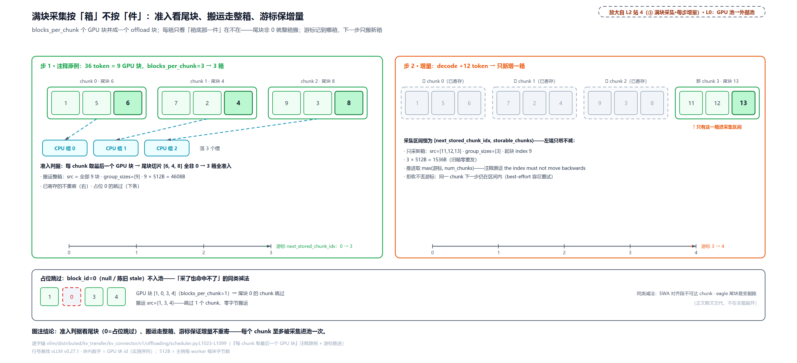

> *图注：左面板是步 1——九个 GPU 块 1 5 6 7 2 4 9 3 8 按三块一箱圈成三箱，每箱尾块（6、4、8）深绿高亮、虚线箭头落到 CPU 槽 0/1/2，准入与搬运两行数据（尾块切片 [6,4,8]、src=全部 9 块、9×512B=4608B），游标尺标 0→3；右面板是步 2：前三箱变浅色加对勾（已寄存），只新采一箱 [11,12,13]、起块 index 9、3×512B=1536B，游标尺 3→4，配四行区间不变量（含 the index must not move backwards 原话）；右下块是 block_id=0 例：[1,0,3,4]（一块一箱）中 chunk 1 的尾块 0 虚红框、该箱跳过、src=[1,3,4]，旁注 SWA 不可达与 eagle 尾块是同类减法。图注结论：准入判据看尾块（0 即跳过）、搬运走整箱、游标保证增量不重寄。*

## 换出去之二：池准入，旅馆的门房（站 5）

采集出的新箱到池门口了。池的准入像一间满员旅馆，`prepare_store` 是门房，五道闸门按序全过才放行。先认识账本上的最小记录 `BlockStatus`——它的一行注释就是整个状态机：

```python
# vllm/v1/kv_offload/cpu/policies/base.py:L10-L33 · BlockStatus
class BlockStatus(ctypes.Structure):
    """
    Offloading status for a single block of KV data.
    Holds the following information:

    ref_cnt - the current number of transfers using this block as a source.
        A value of -1 indicates the block is not yet ready to be read.
    block_id - index of the physical CPU buffer slot.
    """

    _fields_ = [("ref_cnt", ctypes.c_int32), ("block_id", ctypes.c_int64)]

    def __init__(self, block_id: int):
        super().__init__()
        # initialize block as "not ready" (ref_cnt = -1)
        self.ref_cnt = -1
        self.block_id = block_id

    @property
    def is_ready(self) -> bool:
        """
        Returns whether the block is ready to be read.
        """
        return self.ref_cnt >= 0
```

`ref_cnt`（引用计数）三态：**-1 写入中**（新落位、搬运未完，查得到、读不得）、**0 空闲**（可读、可逐）、**大于 0 被读**（正被加载引用，受保护）。三态之间的翻转点散布在后面各节。门房的完整算法：

```python
# vllm/v1/kv_offload/cpu/manager.py:L165-L236 · CPUOffloadingManager.prepare_store
    @override
    def prepare_store(
        self,
        keys: Collection[OffloadKey],
        req_context: ReqContext,
    ) -> PrepareStoreOutput | None:
        if self.counts is not None:
            num_keys = len(keys)
            keys = [k for k in keys if self.counts.get(k, 0) >= self.store_threshold]
            self.stores_skipped_in_current_batch += num_keys - len(keys)
        # filter out blocks that are already stored
        keys_to_store = [k for k in keys if self._policy.get(k) is None]

        if not keys_to_store:
            return PrepareStoreOutput(
                keys_to_store=[],
                store_spec=self._get_load_store_spec([], []),
                evicted_keys=[],
            )

        self.allocation_sizes_in_current_batch.append(len(keys_to_store))
        num_blocks_to_evict = len(keys_to_store) - self._get_num_free_blocks()   # L186

        to_evict: list[OffloadKey] = []
        if num_blocks_to_evict > 0:
            if num_blocks_to_evict > self._num_evictable_cache_blocks:
                # Eviction will fail.
                return None   # L192
            # There is a still a chance for eviction failure as some of the
            # idle blocks might be in the protected list.

            # Blocks from the original input are excluded from eviction candidates:
            # a block that was already stored must remain in the cache after this call.
            protected = set(keys)   # L198
            evicted = self._policy.evict(num_blocks_to_evict, protected)
            if evicted is None:
                return None

            # cache-policy removes only idle blocks.
            self._num_evictable_cache_blocks -= len(evicted)
            assert self._num_evictable_cache_blocks >= 0

            for key, block in evicted:
                self._free_block(block)
                to_evict.append(key)

        if to_evict and self.events is not None:
            self.events.append(
                OffloadingEvent(
                    keys=to_evict,
                    medium=self.medium,
                    removed=True,
                )
            )

        blocks = self._allocate_blocks(keys_to_store)   # L220
        assert len(blocks) == len(keys_to_store), (
            "Block pool did not allocate the expected number of blocks"
        )

        for key, block in zip(keys_to_store, blocks):
            self._policy.insert(key, block)
        self._num_write_pending_blocks += len(keys_to_store)

        # build store specs for allocated blocks
        store_spec = self._get_load_store_spec(keys_to_store, blocks)

        return PrepareStoreOutput(
            keys_to_store=keys_to_store,
            store_spec=store_spec,
            evicted_keys=to_evict,
        )
```

五道闸门顺着读。**闸一，频次过滤**（`counts` 非 None 时）：只放行出现过 `store_threshold` 次的键（「确认被复用才值得搬」），单层 CPU 池默认关（阈值为 1 等于无过滤），分层模式则显式禁用大于等于 2 的值（后面看为什么）。**闸二，去重**：已在池里的键剔掉。**闸三，需逐数对可逐数**（L186）：新客数减空闲房数，正数就是要赶的人头；需逐数超过可逐数（ref_cnt 为 0 的房间数）直接返回 `None` 拒收整批（L192）。best-effort 语义在这里显形：不硬塞、不等待、不重试，调用方记一个指标就走。**闸四，驱逐**：`policy.evict(n, protected)` 只逐空闲房，且本次输入名单上的客人（包括已存进的）受保护（L198，注释原话「已存的输入块在这次调用后必须还在缓存里」）；策略给不出足额名单也整体返回 `None`，且原子性有保证——要么给出足额、要么不动任何状态。**闸五，落位**：`_allocate_blocks` 一次性把新房分给新客，每客恰一间，落位即 `ref_cnt=-1`（写入中）。

写入完成的翻转在 `complete_store`：

```python
# vllm/v1/kv_offload/cpu/manager.py:L247-L262 · CPUOffloadingManager.complete_store（翻转核心）
        if success:
            for key in keys:
                block = self._policy.get(key)
                if block is not None and not block.is_ready:
                    block.ref_cnt = 0   # L251
                    self._num_write_pending_blocks -= 1
                    self._num_evictable_cache_blocks += 1
                    self._policy.mark_evictable(key)
                    stored_keys.append(key)
        else:
            for key in keys:
                block = self._policy.get(key)
                if block is not None and not block.is_ready:
                    self._num_write_pending_blocks -= 1
                    self._policy.remove(key)
                    self._free_block(block)
```

搬运确认到达，`ref_cnt` 从 -1 翻 0（L251）：块从「查得到读不得」变成「可读可逐」，三本计数账同步结转；失败分支则拆房退租。整条准入的原子性值得点名：要么整体成功（每新键恰占一块、驱逐数恰等于需逐数），要么返回 `None` 且零副作用，不存在半落位状态，`free + allocated ≤ num_blocks` 始终守恒。

驱逐策略是可插拔的，配置名选 `lru` 或 `arc`（`CachePolicyFactory`，`policies/factory.py:L12-L40`），还能走 `cache_policy_module_path` 加载树外实现。LRU（least recently used，最近最少使用）是常识；ARC 值得两句：它是 IBM 两位研究者 2003 年在 FAST 发表的算法，同时维护「最近用过一次」和「用过至少两次」两张 LRU 表、外加两张只记键的「幽灵表」，靠幽灵表的命中自动在「偏新近」与「偏频率」之间调配地盘，每请求常数开销、不用调参、天生抗扫描（一次性请求穿堂而过、不污染缓存；论文在 23 条真实 trace 上同容量显著胜过 LRU，摘要给的一例是 SPC1 类负载 4GB 缓存下 LRU 约 9.19% 对 ARC 20%）。ZFS（知名开源文件系统）的 ARC 是它最有名的落地。对 KV 池的直觉：多轮会话重复的会话前缀是「频率侧」画像，杂散单次请求是「新近侧」画像，ARC 的自适应正好在混合负载间自动找平衡。同一策略位放两个内置选项的意义就是：没有一种驱逐策略对所有负载画像都最优。

准入与驱逐的全套实测：

<!-- trace: m4 -->
| 轮次 | 动作 | 账本状态（实测） | 判定 |
|---|---|---|---|
| 空池首存 | prepare_store(k0) | MISS→写入中：ref_cnt=-1、write_pending=1、evictable=0、free=3；lookup=HIT_PENDING | ref_cnt=-1 语义=『写入中』：查得到、读不得 |
| complete_store | 搬运完成结算 | lookup=HIT、ref_cnt=0、evictable=1、write_pending=0 | 写入中→可读可逐的翻转点 |
| LRU 驱逐+touch | 池 3 存 k0/k1/k2，touch(k0) 后存 k9 | 逐出 k1（lookup=MISS）、k0 存活（HIT）；事件 BlockRemoved(keys=[1]) | touch 刷新鲜改变驱逐次序 |
| 驱逐失败 | 池 2 全被 prepare_load 钉住再存 k9 | 需逐 1 > 可逐 0 → 返回 None | 不足即拒收（best-effort 放弃） |
| 输入保护集 | 输入 [k0(已存), k9] | 逐出 k1、k0 留下（HIT） | 已存输入块必须留下（源码注释原话） |
| 钉/解钉 | load k0 期间存 k9→逐 k1；complete_load 后存 k10→逐 k0 | while_pinned_evicted=[1]、after_complete_load_evicted=[0] | ref_cnt 防逐的两侧（加载保护期 vs 解钉后） |
| store_threshold=2 | lookup 1 次后 store→空；2 次后→收 | seen_once=0、seen_twice=1、counts 计数=2 | 频次过滤：确认被复用才值得搬 |
| 事件面 | 存 1 块 / 逐 1 块 | BlockStored(removed=false, medium=CPU) + BlockRemoved(keys=[0]) | 池里有什么对外可见（外部索引消费） |

最后一行是池对外的另一张脸：每次存入与逐出都发一条事件（`OffloadingEvent`，带键、介质、增删标记），调度器半边把它们翻译成 `BlockStored` / `BlockRemoved` 的标准事件流吐出去（`take_events`，`offloading/scheduler.py:L1416-L1427`；`--kv-events-config` 开启，`self_describing` 模式还带 token 与块哈希）。谁消费？外部路由器与全局索引——「这个前缀的块在哪台引擎的池里」这张地图，就是靠这些逐块事件拼出来的；本章末尾的生态一节会看到它怎么被用起来。

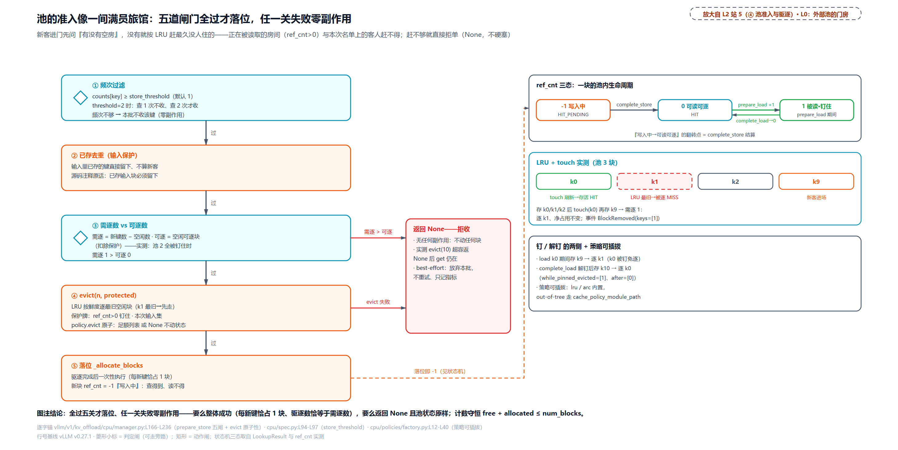

> *图注：左列五道闸门竖排（频次过滤 → 已存去重 → 需逐数 vs 可逐数 → evict(n, protected) → 落位），菱形标的是判定闸；第三、四关的旁路箭头汇入右侧红 None 箱（需逐 1 大于可逐 0、evict 超容返 None 后账本原样，只记指标）；闸四旁两块保护牌（ref_cnt 大于 0 钉住、输入保护集）；右列是 ref_cnt 三态状态机：-1 写入中（complete_store 翻转）到 0 可读可逐，prepare_load 加一到 1 被读、complete_load 归 0；落位动作有虚线连到状态机的 -1。下方四个箱：LRU+touch 实测（touch(k0) 后存 k9 逐 k1 留 k0、事件 BlockRemoved(keys=[1])）、钉/解钉实测（load 期间逐 [1]、解钉后 [0]）、频次阈值实测（store_threshold=2：查 1 次不收、查 2 次才收）、策略可插拔（lru/arc 经 CachePolicyFactory、cache_policy_module_path 树外）。图注结论：全过五关才落位、任一关失败零副作用，这就是门房的原子性。*

## 换出去之三：晚一拍发车（站 6）

过了准入的 store job 已经躺在 meta 里过线到 worker。第四道坎的前半在这里：怎么「不打扰 GPU」。

朴素做法是本拍收尾就搬、搬完再走，那等于在 `wait_for_save` 里同步发同步等。痛点用数字说话：decode 每步几十 ms，SSD 写一个 chunk 是 ms 级；offload 是旁路缓存，它的搬运若插进「采出下一个 token」的关键路径，每步都白加一段 I/O 延迟。所以「延迟一步提交」不是 v0.27.1 的新发明：它与这套连接器同龄（NOTE(orozery) 注释自连接器进树起就在；v0.21 时代同样是本拍入队、下一拍提交）。v0.21 时代的真实漏洞在入队挂点：入队动作挂在 `wait_for_save` 钩子上，而该钩子不是每拍都跑——空拍（ch16 站 8 的 `kv_connector_no_forward` 路径）会被跳过，store 可能漏发。v0.27.1 的改动是把入队动作挪到每拍必跑的 `get_finished`，延迟一步提交原样保留，修的是漏发。全部代码只有几行：

```python
# vllm/distributed/kv_transfer/kv_connector/v1/offloading/worker.py:L319-L344 · 一步之差
    def start_kv_transfers(self, metadata: OffloadingConnectorMetadata):
        assert self.worker is not None
        for job_id, src_spec, dst_spec in self._unsubmitted_store_jobs:
            success = self.worker.submit_store(job_id, src_spec, dst_spec)
            assert success
        self._unsubmitted_store_jobs.clear()

        for job_id, entry in metadata.load_jobs.items():
            self._load_jobs[job_id] = entry.req_id
            assert isinstance(entry.dst_spec, GPULoadStoreSpec)
            success = self.worker.submit_load(job_id, entry.src_spec, entry.dst_spec)
            assert success

    def prepare_store_kv(self, metadata: OffloadingConnectorMetadata):
        for job_id, entry in metadata.store_jobs.items():
            if not self._is_store_writer:
                # Gate before queueing: no _unsubmitted_store_jobs entry.
                self._connector_worker_meta.mark_completed(job_id)
                continue
            # NOTE(orozery): defer the store to the beginning of the next
            # engine step, so that offloading starts AFTER transfers related
            # to token sampling, thereby avoiding delays to token generation.   # L338-L340
            assert isinstance(entry.src_spec, GPULoadStoreSpec)
            self._unsubmitted_store_jobs.append(
                (job_id, entry.src_spec, entry.dst_spec)
            )
```

时间线：本拍 `get_finished` 里 `prepare_store_kv` 只把 job 追加进延迟队列（`_unsubmitted_store_jobs`，append-only）；下一拍 `start_kv_transfers` 开头先清空这个队列、再提交本拍的 load。NOTE(orozery) 的注释原话就是动机：「把 store 推迟到下一个引擎步的开头，让卸载在 token 采样相关的传输**之后**才开始，避免拖慢 token 生成」。不遗漏的保证在前面门面那节见过：`get_finished` 连空拍都跑，入队动作挂在它里面，store 永不丢。观测序列一锤定音：

<!-- trace: m5 -->
| 引擎步 | worker 侧动作 | 观测（实测） | 判定 |
|---|---|---|---|
| 步 N · 调度尾 | build_connector_meta 产 store job 0（src GPU 块 [1,2,3,4]） | meta.store_jobs 键 0 | 『满块采集』一节的产出待搬 |
| 步 N · execute 收尾 | get_finished → prepare_store_kv 只入队 | submitted=[]、延迟队列长 1 | store 不在本步提交，避开采样关键路径 |
| 步 N+1 · forward 前 | start_kv_transfers 开头 submit_store | submitted=[(0,store)]、completed_jobs={0:1} | 下一步开门第一件事补搬（NOTE(orozery)） |
| 步 N+1 · 完成回收 | get_finished 事件轮询 | finished_sending 空；字节核验 4 块全等（校验和 24576/25088/25600/26112） | store 永不发 finished_sending（完成走计数通道，见『点人头，不放礼炮』一节） |
| 步 N+1 · 查询命中 | 同前缀新请求查池 | num_hit=16、load_async=True | CPU 池成了『第二个前缀缓存』 |
| 步 N+2 · 加载 | load job 1 → submit_load | 提交序 [(0,store),(1,load)]；finished_recving={r2}；dst=[4,5,6,7]←src CPU 槽 [0,1,2,3] | store 先于 load 提交；完成接 ch16 提升路径 |

十六个 token 的 prompt（四块，每块填互不相同的字节）走完存、查、载一整圈：store 恰比产出晚一拍提交、字节逐块核验相等、同前缀的新请求在 CPU 池命中十六个 token。这个表还顺手立了两条不变量：每个 store job 从产出到提交恰延后一个引擎步、不遗漏不重复（队列 append-only、清空点只有两处且都先逐条提交再清）；单请求单方向互斥（`transfer_jobs` 注释原话「任一时刻它要么装着一个 load job、要么装着一个或多个 store job」——load 与 store 不并飞，查询入口的延后检查配合实现）。代价也记下：入队到提交之间 GPU 块多一步的暴露窗口。这块显存若在窗口里被复用怎么办？答案就是本章后半的围栏，先按下。

顺带一句，`_is_store_writer` 的分支是 TP 复制页轮转写的旁观者：非写者只记账不搬运（默认路径下每个 rank 都是自己分片的写者）。这是 MLA（multi-head latent attention，DeepSeek 系的多头潜在注意力，[第 25 章](../../ch25-mla-two-expansions/narrative/chapter.md)）复制布局的写放大优化（写放大=同一份数据被重复写多份的代价），主线用不上，知道有这么一扇门即可。

## 换出去之四：DMA 引擎三戒（站 7）

job 提交进 DMA 引擎了。搬运工 `SingleDirectionOffloadingHandler` 每方向一个（store 一个、load 一个），先把它的两条底层词汇立住（通用 CUDA 语义，非 vLLM 代码）：**stream** 是 GPU 上的工作队列，同一条队列里的操作按提交顺序执行，不同队列之间默认无顺序、可并发，「计算流跑模型、传输流搬 KV」能重叠就是这个道理；**event** 是插进队列的进度标记，可以非阻塞地问「到没到」（query），也可以阻塞等它（synchronize），还能带时间戳算耗时。跨队列要排队，用的是 `wait_event`：让本队列的后续命令推迟到某个 event 完成之后。

装货的清单是三列小抄：从哪读（src 指针）、写到哪（dst 指针）、搬多少（size）。一次搬运的描述符数 = 每组块数 × 组的层引用数。层引用数就是「CPU 池开张」定价表 canonical 一行「组 1 × 引用 2」的那个引用数：一个组的 KV 被几层张量引用（物理同源的层各算一引用）；9 块 × 2 引用 = 18 条描述符，正是下面实测表末行的 num_copy_ops。整批一次内核调用执行。三条顺序规则（三戒）是本节的算法核心：

```python
# vllm/v1/kv_offload/cpu/gpu_worker.py:L362-L400 · transfer_async（三戒）
        stream = (
            self._stream_pool.pop() if self._stream_pool else current_platform.Stream()
        )
        start_event = (
            self._event_pool.pop()
            if self._event_pool
            else torch.Event(enable_timing=True)
        )
        end_event = (
            self._event_pool.pop()
            if self._event_pool
            else torch.Event(enable_timing=True)
        )

        if self.gpu_to_cpu:
            # wait for model computation to finish before offloading
            stream.wait_stream(current_platform.current_stream())   # L378
        if self._transfers:
            last_transfer: Transfer = self._transfers[-1]
            last_event = last_transfer.end_event
            # assure job will start only after the previous one completes
            stream.wait_event(last_event)   # L383
        # CPU->GPU reads from host pinned memory, which is never written
        # by a concurrent GPU stream, so CU_MEMCPY_SRC_ACCESS_ORDER_ANY is
        # safe and lets the driver pipeline source reads. GPU->CPU reads
        # from the live GPU KV cache, which the compute stream keeps
        # writing; we must keep STREAM ordering so source reads are gated
        # by the transfer stream's wait_stream(compute) barrier.
        is_src_access_order_any = not self.gpu_to_cpu   # L390
        with current_platform.stream(stream):
            start_event.record(stream)
            if num_copy_ops > 0:
                self._swap_blocks_batch(
                    src,
                    dst,
                    sizes,
                    is_src_access_order_any=is_src_access_order_any,
                )
            end_event.record(stream)
```

**戒一，store 等计算流**（L378）：GPU 到 CPU 的搬运先 `wait_stream` 当前流——模型计算还在写本步 KV，抢跑搬走的就是半新半旧的块。**戒二，同向保序**（L383）：每个新传输的流 `wait_event` 前一个传输的结束事件，同方向串行执行（注释原话「保证 job 只在前一个完成之后才开始」）。**戒三，load 才许乱序源读**（L390）：CPU 到 GPU 的搬运开 `CU_MEMCPY_SRC_ACCESS_ORDER_ANY`，让驱动流水线化源读取。安全性的论证就在那段注释原文里：CPU 到 GPU 读的是 host 钉住内存，「永远没有并发 GPU 流在写它」；GPU 到 CPU 读的是活 KV cache，「计算流一直在写，必须保持流序、让源读被传输流的 wait_stream 栅挡住」。两类源的安全性完全不对称，三戒就是对这张不对称表的忠实翻译。

三条代价照例诚实：同向串行把带宽利用压在单流上限上，大批量 store 要排队；`wait_stream` 让 store 排在「本步全部计算」之后，晚一拍发车正好把它推进下一拍的窗口；平台分叉（XPU 没有统一虚拟地址，也就是 CPU 与 GPU 不共用一套地址编址；ROCm 的 host mapping 特殊）在真源码里还有几条择路分支，精简版固定一条主路。kernel 选择上还有一处注释值得引用：GPU 到 CPU 恒用专用拷贝引擎（copy engine，就是前面「钉页」「三戒」里那台 DMA 搬运硬件的英文名；`ops.swap_blocks_batch`），注释原话「GPU 到 CPU 是带宽受限的，专用拷贝引擎胜过 Triton」。搬运是纯带宽生意，别用计算核凑热闹。完成检测是轮询不是回调：`get_finished` 按事件 `query()` 出队、`wait` 是 `synchronize`；流、事件、描述符缓冲三池全复用（出队即归还）。取证差异就地挑明：host 上没有真 CUDA，三戒的时序不可观察（替身流的等待是空操作、事件即记即完），上表指针算术与字节守恒全部真跑，顺序规则以注释原文为锚。

<!-- trace: m6 -->
| 实验 | 输入 | 描述符/指针数学（实测） | 判定 |
|---|---|---|---|
| 1:1 快路 | 2 块、行距 100B | 块 [0,1] → 指针偏移 [0,100] | blocks_per_chunk=1 无需子块展开 |
| 展开+半块跳越 | 3 个 CPU 块、行距 200B、每块 2 子块 | 块 [1,2] skip=1 → 偏移 [300,400,500]；skip=0 → [200,300]（前两条，完整为 [200,300,400,500]） | GPU 首块不对齐 offload 块边界时从块中间起读（block_indices 的用途） |
| 描述符三缓冲 | 2 条描述符 × 32B | src/dst/size 三个 int64 张量；交换搬运后 dst 两半互换、字节和 2016 守恒 | 批量搬运=一次内核吃整个描述符数组 |
| 真实 store job 装配 | 9 GPU 块 × 组引用 2 | num_copy_ops=18、每条 512B、共 9216B；CPU 槽校验和 [93696,98304,102912]=每 3 块拼接之和（逐槽相等） | 描述符计数公式 = Σ group_size × 层引用数 |

第二行的「半块跳越」预告了加载方向的一个细节：offload 块（一箱）比 GPU 块大时，首块可以从箱中间起读——描述符指针 = 基址加块距加子块偏移，skip 只截断首块前缀、不破坏单射。「换回来之二」会用上它。

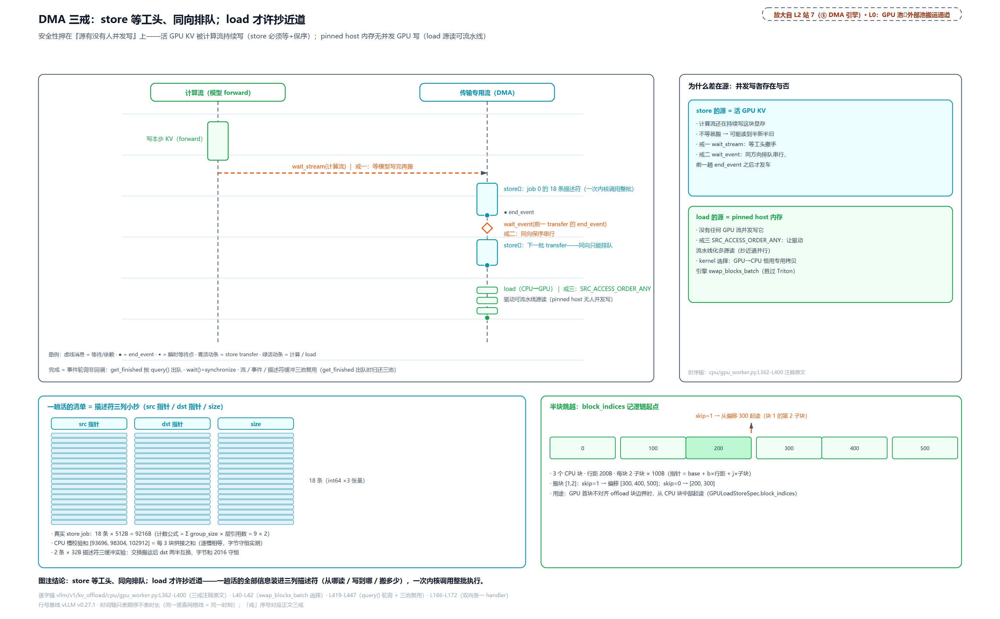

> *图注：上半是 UML 时序图——左生命线计算流、右生命线传输专用流共享时间轴：计算流一段活动条（写本步 KV），随后 wait_stream 虚线消息（戒一：等模型写完再搬）、store1 活动条加尾部 end_event 圆点、wait_event 菱形（戒二：同向保序串行）、store2；下方 load 段画三条平行细条标 SRC_ACCESS_ORDER_ANY（戒三：源读可流水线）；右侧 why 面板对照两条安全性论证（store 源=活 GPU KV 被计算流持续写、load 源=钉住内存无并发写）加 kernel 选择注（GPU→CPU 恒用专用拷贝引擎）。下半是描述符三列小抄：18 条、每条 512B、共 9216B 一次内核整批，配 CPU 槽和 [93696,98304,102912] 与字节和 2016 守恒、半块跳越六格偏移条（skip=1 得 300,400,500、skip=0 得 200,300——图面截取前两条，完整展开还有 400、500）。图注结论：store 等工头、同向排队；load 才许抄近道，安全性押在「源有没有人并发写」上。*

## 换回来之一：四态查询，稍后再问（站 3、8）

块已经出池待命。第二道坎的后半与第三道坎在这里交汇：新请求来了，池里有没有它的前缀？盘上的块命中了却一时到不了 GPU，请求等得起吗？

查询挂在 ch16 立好的入口上：调度器为每个等待中的请求先查本地前缀缓存、再问连接器（「第二个前缀缓存」的双查），连接器返回「外部还能命中多少 token」。池化引擎的答案是一个四档枚举加一条聚合规则：

```python
# vllm/v1/kv_offload/base.py:L107-L127 · LookupResult 与 OffloadPolicy
class LookupResult(Enum):
    """Result of OffloadingManager.lookup()."""

    MISS = auto()
    HIT = auto()
    HIT_PENDING = auto()
    RETRY = auto()


class OffloadPolicy(Enum):
    # Offload only newly-computed blocks as they arrive; prefix-hit
    # blocks (already offloaded by a prior request) are skipped.
    BLOCK_LEVEL = "block_level"
    # Offload all blocks for the request, including prefix hits.
    # Used by tiers that need the complete KV context for a request.
    REQUEST_LEVEL = "request_level"
```

四态是信息完备度的分级：**HIT** 在池且可读；**HIT_PENDING** 在池、写入在飞（查得到读不得的那个 -1 态）；**RETRY** 位置未定（分层池正在后台问，或正在升回主层）；**MISS** 确定不在。前缀查找逐块问、按态聚合：

```python
# vllm/distributed/kv_transfer/kv_connector/v1/offloading/scheduler.py:L545-L577 · _maximal_prefix_lookup
    def _maximal_prefix_lookup(
        self,
        keys: Iterable[OffloadKey],
        req_context: ReqContext,
        req: Request,
        group_config: GroupOffloadConfig,
        start_chunk_idx: int,
    ) -> int | None:
        """Return the number of consecutive offloaded chunks from the start,
        or None if the backend deferred a lookup."""
        hit_count = 0
        defer_lookup = False
        for local_idx, key in enumerate(keys):
            result = self.manager.lookup(key, req_context)
            match result:
                case LookupResult.HIT:
                    self._events_tracker.record_lookup(
                        req,
                        group_config,
                        start_chunk_idx + local_idx,
                        key,
                    )
                    hit_count += 1
                case LookupResult.HIT_PENDING:
                    defer_lookup = True
                    hit_count += 1
                case LookupResult.RETRY:
                    # Don't break: keep scanning to let manager kick off
                    # async lookups (until a miss is detected).
                    defer_lookup = True
                case LookupResult.MISS:
                    break
        return hit_count if not defer_lookup else None   # L577
```

两条聚合规则。其一，MISS 即 break——链式哈希保证「MISS 之后必 MISS」（[第 15 章](../../ch15-prefix-caching/narrative/chapter.md)立过的链性质，子块的哈希含父块，父不在子必不在），早停不损失命中。其二，HIT_PENDING 与 RETRY 各自特殊：前者计数但记一笔「没翻完」（块在架、还在上架，值得先计入、等下一趟确认）；后者不计数也不停，注释点明用意：**继续扫，让管理器借这趟扫描把异步查询踢出去**，直到撞上 MISS。任何一个 defer 位为真，整个查找返回 `None`（L577）：调度器层的语义是「稍后再问」。入口把 None 原样上传：

```python
# vllm/distributed/kv_transfer/kv_connector/v1/offloading/scheduler.py:L816-L871 · get_num_new_matched_tokens
    def get_num_new_matched_tokens(
        self, request: Request, num_computed_tokens: int
    ) -> tuple[int | None, bool]:
        # … 省略：docstring（None = 稍后再问；第二项 = 是否异步加载）……
        req_status = self._req_status[request.request_id]
        for group_state in req_status.group_states:
            group_state.block_ids.clear()

        if req_status.transfer_jobs:
            logger.debug(
                "Delaying request %s since it still has in-flight transfers",
                request.request_id,
            )
            return None, False   # L847

        req_status.update_offload_keys()
        req_status.num_locally_computed_tokens = num_computed_tokens

        num_hit_tokens: int | None
        if request.skip_reading_prefix_cache:
            num_hit_tokens = 0
        else:
            lookup_start = time.monotonic()
            num_hit_tokens = self._lookup(req_status)
            # … 省略：查询耗时指标与延迟首查登记……
        req_status.update_num_hit_chunks(num_computed_tokens + (num_hit_tokens or 0))

        self._touch(req_status)

        return num_hit_tokens, bool(num_hit_tokens)   # L871
```

None 的来源至此有三个：defer 位（这趟没翻完）、在飞互斥（L847，单请求 load 与 store 不并飞，有在飞 job 先延后）、命中块正被加载——`_lookup` 收尾把本次命中的键挨个对一遍 `_chunks_being_loaded` 在载名单（正是「换回来之二」登记加载时写入、完成结算时销账的那份），撞上任何一个就整体返 None（`offloading/scheduler.py:L769-L793`），同一键的第二个请求不想重复拉。三种 None 殊途同归：请求进 ch16 立好的 skipped 队列，下一拍再问，**池查询从不阻塞调度热路径，只许改天再来**。`_lookup` 的完整版还有两笔：SWA 组不查前缀、从尾往前数连续窗口（窗口对齐到 chunk，中断即无命中，`_sliding_window_lookup`，`offloading/scheduler.py:L579-L610`；采集端只存对齐段尾部，对上的正是这条从尾数窗口的路径）；多组模型的收敛循环里（`offloading/scheduler.py:L631-L660`，docstring 原话「每组都可能收紧 max_hit_size_tokens、使先算组的结果作废，所以循环重跑直到 num_hit_tokens 收敛」），full 组的长命中可能被 SWA 组的窗口收紧——拿 m7 实测的例走一遍：full 组 4 chunk 全命中先报 16 token，SWA 组按窗口从尾数只支持 3 chunk，全局边界被收到 12 token，full 组先前报的 16 作废、各组再扫一遍确认没有更紧的，两轮收敛到 12（先到先改、改了重扫；混合不动点的同款思想）。收尾的 `touch` 把命中键刷新鲜，包括 GPU 前缀缓存已命中的那些（`OffloadingManager.touch` 的 docstring 专门为此存在），防止池把「GPU 正在用」的块当冷块逐掉。

<!-- trace: m7 -->
| 轮次/场景 | 状态序列（脚本） | 返回（实测） | 判定 |
|---|---|---|---|
| 前缀查找 | [HIT,HIT,MISS,HIT] | hit_count=2 | MISS 即 break：第 4 块在池也不看（链式早停） |
| HIT_PENDING | [HIT,HIT_PENDING,MISS] | None | 计数继续但 defer 位为真 → 整体稍后再问 |
| RETRY | [RETRY,HIT,MISS] | None；扫描序=[0,1,2]（穿到 MISS 才停） | 不 break：让 manager 借扫描踢异步查询 |
| 入口层 None | 首块 HIT_PENDING | (None, False) | 接 ch16 skipped 队列下步重查 |
| 在飞互斥 | transfer_jobs={99} | (None, False) | 单请求 load/store 不可并发（契约不变量） |
| SWA 尾扫 | 窗口 2、尾部 [.., HIT,HIT,MISS] / 中断 [.., HIT,MISS,HIT] | end_idx=5 / 0 | 从尾向前数连续窗口；中断即无命中 |
| 多组收敛 | full 4 chunk 全 HIT=16 token、SWA 尾 [MISS,HIT] | 12 | full 组的长命中被 SWA 组收紧到 3 chunk |

取证差异就地挑明：单层 CPU 池真实只产 HIT、HIT_PENDING、MISS 三态，表里的 RETRY 场景由脚本化的假账本回放（真实 RETRY 的来源是分层池的后台查询，「分层池」一节的表是真分层管理器加真文件系统层跑出来的）。

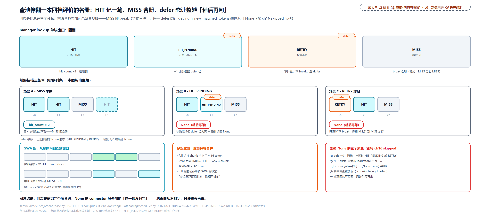

> *图注：顶部一行四态盒——HIT（在池可读）、HIT_PENDING（在池、写入在飞，挂 defer 徽标）、RETRY（位置未定，挂 defer 徽标）、MISS（确定不在），各配一句语义与效果；中部三个场景面板：A 序列 [HIT,HIT,MISS,HIT] 第四格灰掉（MISS 后早停，hit_count=2）、B [HIT,HIT_PENDING,MISS] 计数但返 None、C [RETRY,HIT,MISS] 穿扫 [0,1,2] 到 MISS 才停、返 None；下方 SWA 箱两行六格（尾部连续 2 块 HIT 得 end_idx=5 高亮、中断例得 0）、多组收敛箱（full 组 16 token 被 SWA 组收紧到 12）、None 三来源箱（defer 位 / 在飞互斥 transfer_jobs={99} / 命中块正被加载）。图注结论：四态是信息完备度分级，None 是 connector 层叠加的「这趟没翻完」。池查询从不阻塞，只许改天再来。*

## 换回来之二：命中只走半程（站 9）

命中之后不是「复制粘贴」而是「挂号领床位」，五步：

```python
# vllm/distributed/kv_transfer/kv_connector/v1/offloading/scheduler.py:L948-L970 · update_state_after_alloc（登记尾部）
        src_spec = self.manager.prepare_load(keys_to_load, req_status.req_context)
        dst_spec = GPULoadStoreSpec(
            dst_block_ids, group_sizes=group_sizes, block_indices=block_indices
        )

        load_job_id = self._generate_job_id()
        self._current_batch_load_jobs[load_job_id] = TransferJob(
            req_id=request.request_id,
            src_spec=src_spec,
            dst_spec=dst_spec,
        )
        # a load can only be issued when no other jobs are pending.
        assert not req_status.transfer_jobs   # L960
        req_status.transfer_jobs.add(load_job_id)
        self._jobs[load_job_id] = TransferJobStatus(
            req_id=request.request_id,
            pending_count=self.config.num_workers,
            keys=set(keys_to_load),
            is_store=False,
        )

        if self._chunks_being_loaded is not None:
            self._chunks_being_loaded.update(keys_to_load)
```

这五步接在 ch16 站 5-6 的老轨道上：调度器为命中 token 分配 GPU 块（`allocate_slots` 带 `delay_cache_blocks`，先占位不进缓存账），连接器在 `update_state_after_alloc` 里把「从池里哪些槽、搬到哪些 GPU 块」登记成 load job。`prepare_load` 把池侧块的 `ref_cnt` 加一钉住（防搬运期间被逐，「池准入」一节实测表的钉/解钉行见过两侧）；`GPULoadStoreSpec` 是 GPU 侧的床位单——`group_sizes` 分组、`block_indices` 记每组逻辑起点，正是 DMA 一节「半块跳越」的消费方：offload 块比 GPU 块大时，首块从箱中间起读。job 随 meta 过线，worker 在 `start_kv_transfers` 里 `submit_load`（提交序恒在补搬的 store 之后），CPU 到 GPU 的 DMA 开跑。请求这边的状态早已被 ch16 安排好：`WAITING_FOR_REMOTE_KVS`，占着块、不跑前向，停在 skipped 队列。

到货的信号是 `finished_recving`（「完成回收」一节的 get_finished 里发出），随后整条提升链都是 ch16 站 9-10 立好的机器：`_update_waiting_for_remote_kv` 补缓存、把「已分配未缓存」的窗口关上；全命中的请求退一个 token 重算（采样契约）；加载失败按第一个坏块截断重算区。本章只负责把货送到站台。

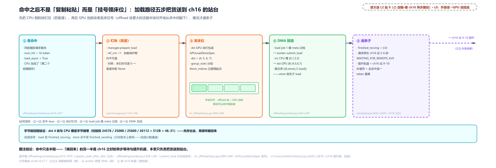

> *图注：五站横排——①查命中（16 token）→ ②钉块（prepare_load，ref_cnt+1 防逐）→ ③发床位（GPULoadStoreSpec：dst GPU 块 [4,5,6,7]，组内小图标标半块对齐，offload 块大于 GPU 块时首块从中部起读）→ ④DMA 回流（CPU 槽 [0,1,2,3] 到 GPU [4,5,6,7]，提交序 store 先于 load）→ ⑤递条子（finished_recving={r2}，卡内标明：等待停在 ch16 站 5-6 的 WAITING_FOR_REMOTE_KVS、提升轨道是站 9-10），右缘虚线接出画面标「→ ch16 站 9-10 提升（已立·本章消费）」。底条字节证据：四块校验和 24576/25088/25600/26112（每块 512B 填互不相同的字节 48..51），回程 dst 与 CPU 槽逐字节相等；store 不发 finished_sending。图注结论：命中只走半程，「换回来」的另一半是 ch16 立好的异步等待与提升机器。*

## 换回来之三：点人头，不放礼炮（站 10）

完成信号的池化语义与 ch37 双源完成信号恰成对照：**store 永不发 `finished_sending`**。为什么？池化的 store 没有对端接收者，完成只是「货落进池了」——这件事对调度器才有意义（账本翻状态、事件出账），对请求毫无意义（请求可能早就走完生命周期了）。所以完成走的是上行信 `KVConnectorOutput`（ch16 两封信的回程，不是 ch37 立的那只 `kv_transfer_params` 回执信封）捎回的计数通道，worker 每完成一个 job 记一笔 `{job_id: 1}`：

```python
# vllm/distributed/kv_transfer/kv_connector/v1/offloading/worker.py:L346-L381 · get_finished
    def get_finished(self, finished_req_ids: set[str]) -> tuple[set[str], set[str]]:
        # … 省略：docstring——store 永不发 finished_sending，完成走计数；load 照发……
        assert self.worker is not None
        finished_recving: set[str] = set()
        for transfer_result in self.worker.get_finished():
            # we currently do not support job failures
            job_id = transfer_result.job_id
            assert transfer_result.success
            is_load = job_id in self._load_jobs
            # … 省略：transfer_stats 按方向记账……
            self._connector_worker_meta.mark_completed(job_id)   # L376
            req_id = self._load_jobs.pop(job_id, None)
            if req_id is not None:
                finished_recving.add(req_id)

        return set(), finished_recving   # L381
```

返回值的第一项永远是空集（`set()`，L381），这就是「不放礼炮」的字面实现；load 照发 `finished_recving` 接 ch16 提升。注释顺带承认「目前不支持 job 失败」：失败面整体交给 ch16 的坏块链（加载失败的块按第一个坏块截断）。调度器侧收计数、点人头：

```python
# vllm/distributed/kv_transfer/kv_connector/v1/offloading/scheduler.py:L1322-L1358 · update_connector_output（计数结算）
        for job_id, count in meta.completed_jobs.items():
            assert count > 0
            if job_id < self._stale_job_threshold:
                # … 省略：debug 日志（reset 前的陈旧回执直接跳过）……
                continue
            job_status = self._jobs[job_id]
            job_status.pending_count -= count   # L1332
            if job_status.pending_count > 0:
                continue
            assert job_status.pending_count == 0

            req_status = self._req_status[job_status.req_id]
            if job_status.is_store:
                self.manager.complete_store(job_status.keys, req_status.req_context)
            else:
                self.manager.complete_load(job_status.keys, req_status.req_context)
                if self._chunks_being_loaded:
                    self._chunks_being_loaded.difference_update(job_status.keys)
            # … 省略：盯防账本的两类注销（SWA 块无条件、非 SWA 块只对已结束请求）……
            del self._jobs[job_id]
            req_status.transfer_jobs.remove(job_id)
            if req_status.finished_signaled and not req_status.transfer_jobs:
                del self._req_status[job_status.req_id]
```

每个 job 的 `pending_count` 初始值是 `num_workers`（构造时就取自 world_size：TP 部署下每个 worker 搬自己那片、各报一次，两个词是同一笔账）：每个 worker 干完自己那份报到一次，计数减一；**聚满 world_size 次才结算一次**（L1332 后的判断），结算即 `complete_store`（-1 翻 0，块变可读可逐）或 `complete_load`（解钉）。陈旧回执（`reset_cache` 是清空池、重置 job 计数的入口，之后混进来的旧 id）被阈值拦下。还有一条保活语义：`has_pending_push_work`（`offloading/scheduler.py:L1272-L1278`）在账未清时返回真，引擎因此不许停步，空拍也要滚调度循环把计数收完（这正是 ch16 `kv_connector_no_forward` 存在的意义之一）。

<!-- trace: m9 -->
| 轮次 | 动作 | 账本（实测） | 判定 |
|---|---|---|---|
| 聚合语义 | w1 {0:1} + w2 {0:1,7:1} | aggregate → {0:2, 7:1} | 跨 worker 求和，每人各报 1 次 |
| 第 1 个 worker 报告 | world_size=2、store job 0 完成 | pending_count 2→1、lookup=HIT_PENDING、保活 True | 未聚满不结算（块还不可读） |
| 第 2 个 worker 报告 | 同 job 再报 1 次 | pending=0、lookup=HIT、job 销号、保活 False | 聚满 world_size 才 complete_store |
| world_size=1 对照 | 单 worker 一次报满 | lookup=HIT、保活 False | 计数门=world_size，单卡一步到位 |

## 围栏：两列相向的火车（站 10）

第二道坎的正面回答在此。异步搬运和块复用是两列相向的火车：store 还在读一块 GPU 显存，KV cache manager 可能已把这块显存分给新请求去写。调度器不停车，只在三种信号出现时拉闸——把还在延迟队列里的搬运**抢先发车**，然后站在站台**等它真的到站**，才放 GPU 改写这块显存。

三种触发（`build_connector_meta` 每步检查，`offloading/scheduler.py:L1228-L1255`）：请求被抢占（它的在飞 store 必须立即落地）；本步新分配的块与盯防账本 `_block_id_to_pending_jobs` 相交（有 store 引用的块要被复用了）；终局前 store 未完（请求结束了、块要释放了；代码在采集侧 `offloading/scheduler.py:L1209-L1214`，经 `build_connector_meta` 调 `_build_store_jobs` 生效）。盯防账本的登记点有两处：store 创建时登记 SWA 块（它们可能在请求结束前就被释放），`request_finished` 时补登记非 SWA 块（`offloading/scheduler.py:L1409-L1412`）。围栏的执行在 worker 侧：

```python
# vllm/distributed/kv_transfer/kv_connector/v1/offloading/worker.py:L292-L317 · handle_preemptions（围栏）
    def handle_preemptions(self, kv_connector_metadata: OffloadingConnectorMetadata):
        assert self.worker is not None

        # Pop jobs_to_flush from store_jobs into _unsubmitted_store_jobs
        # so the existing submission loop below submits them before wait().
        if kv_connector_metadata.jobs_to_flush:
            for job_id in kv_connector_metadata.jobs_to_flush:
                entry = kv_connector_metadata.store_jobs.pop(job_id, None)
                if entry is not None:
                    if not self._is_store_writer:
                        self._connector_worker_meta.mark_completed(job_id)
                        continue
                    assert isinstance(entry.src_spec, GPULoadStoreSpec)
                    self._unsubmitted_store_jobs.append(
                        (job_id, entry.src_spec, entry.dst_spec)
                    )

        # Submit deferred stores from previous step (and jobs_to_flush above).
        for job_id, src_spec, dst_spec in self._unsubmitted_store_jobs:   # L310
            assert isinstance(src_spec, GPULoadStoreSpec)
            success = self.worker.submit_store(job_id, src_spec, dst_spec)
            assert success
        self._unsubmitted_store_jobs.clear()

        if kv_connector_metadata.jobs_to_flush:
            self.worker.wait(kv_connector_metadata.jobs_to_flush)   # L317
```

两步：先把 flush 名单上的 store 从延迟队列弹出、连同队列里原有的一起提交（L310 的循环），再 `wait` 同步等到完成（L317，事件的 `synchronize`）。调用时机是 ch16 站 8 的挂点——`execute_model` 入口、状态更新之前，所以本步任何会写这些块的前向都排在围栏之后。这是 best-effort 世界里**唯一的同步点**，对照表值得摆一次：ch16 的 `wait_for_save` 是 P/D 世界「每拍强制等」（每拍都要等保存完才放行，用吞吐换正确性），本章的围栏是「被复用才等」（平时谁也不等谁，撞上才同步）。等待的上界是在飞传输的剩余 DMA 时间（同向串行队列深度乘单块时间），而「晚一拍发车」恰好把暴露窗口压到最短一格。两节设计在这里咬合。

<!-- trace: m10 -->
| 触发 | 输入 | 调度器侧（实测） | worker 侧围栏（实测） |
|---|---|---|---|
| 终局 | 请求带在飞 store job 0 结束（块 [1,2]） | jobs_to_flush={0}、盯防账本 {1,2} | （此刻 store 还在延迟队列、submitted=[]） |
| 块复用 | 新请求分到块 1（与盯防账本相交） | jobs_to_flush={0} | handle_preemptions：先提交 submitted=[(0,store)]、再 wait({0})、队列清空 |
| 抢占 | running 请求被抢占（在飞 store 未完） | jobs_to_flush={0} | 同款抢先提交+wait |
| 不接管对照 | request_finished | 返回 (False, None) | 块释放不延迟，对照 P/D 分离章的 True 接管 |

最后一行把 best-effort 的账结清：`request_finished` 返回 False、块的释放不延迟，「终局等不等」的答案是「不主动等、要复用时围栏等」。

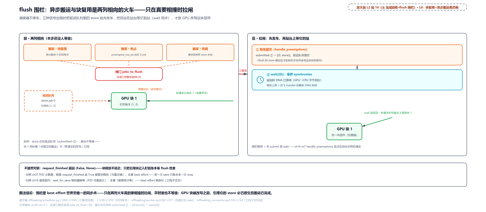

> *图注：左右对照共用同一块显存（块 1）作位置锚。前（左）面板：块 1 有两个相向的利益方：左侧延迟队列里的 store job 0（虚框虚箭头，还没发车），右侧新请求的分配箭头（实线，要写这块）；三枚触发小旗（GPU 块将被复用 / 请求被抢占 / 终局前 store 未完）的虚线汇入中间红闸门箱 jobs_to_flush={0}，配盯防账本 {1,2}。后（右）面板画闸门里的两步：①抢先提交（submitted 从 [] 变 [(0,store)]）②wait({0}) 同步（时钟图标，注等待上界=在飞传输剩余 DMA 时间），完成后新请求的写箭头才落到块 1 上。底条对照：request_finished 返回 (False, None) 不接管；ch37 的 True 接管、ch16 的 wait_for_save 每拍强制等。图注结论：围栏是 best-effort 世界里唯一的同步点——只在两列火车真的要相撞时拉闸。*

## 分层池：一座中转枢纽（站 11）

轮到第三道坎：SSD 里的块命中了怎么到 GPU？答案的骨架是一句话——**CPU 主层是唯一能 DMA GPU 的层，其余介质全部经它中转**。这个设计有五条成文原则，写在管理器的 docstring 里：

```python
# vllm/v1/kv_offload/tiering/manager.py:L3-L21 · TieringOffloadingManager 设计原则（docstring 原文）
"""
TieringOffloadingManager: Multi-tier KV cache offloading orchestrator.

This manager coordinates between a CPU primary tier (with direct GPU access)
and zero or more secondary tiers (Storage, Network, etc.) to provide
hierarchical KV cache offloading.

Key Design Principles:
1. Always offload to all tiers — When a block is stored to the primary tier,
   it is cascaded to ALL secondary tiers
2. Primary tier is the gateway — Secondary tiers cannot access GPU memory
   directly; all data flows through the CPU primary tier
3. Staged promotion — Blocks in secondary tiers must be promoted to the
   primary tier before GPU can access them
4. Transparent retry mechanism — Return None from lookup() to signal
   "data is being promoted, try later"
5. ref_cnt as eviction protection — primary.prepare_read() increments ref_cnt,
   protecting blocks from eviction until complete_read() is called
"""
```

为什么这样设计？**旧设计**是两级世界（GPU 对 CPU）DMA 直连，想再挂 SSD、对象存储、远端实例，但这些介质都没有 DMA GPU 显存的能力，若各自直连各写一套搬运，又是「每个后端各写各的」不可组合老路。**痛点**是容量阶梯三个量级（HBM 几十 GB、DRAM 几百 GB、SSD 几 TB），谁住哪、怎么升降、查询怎么统一，外加副层的 I/O（文件线程、网络）发生在哪个进程都不明朗。**方案**是五原则：store 完成即 cascade 全层下推（写一跳、到处有）；primary 是网关；secondary 命中先 promotion（升回主层）再用；期间 RETRY（「稍后再问」的老语义在新场景复用）；ref_cnt 全程做驱逐保护。**代价**：secondary 数据必两跳（secondary 到 CPU 再到 GPU），promotion 延迟等于两段搬运加至少一次 RETRY 往返（请求晚一至多步才命中）；cascade 全层下推是写放大（每块写进每个副层，磁盘寿命与流量都是账）；主层满则 promotion 直接失败、lookup 返 MISS——「有数据也到不了 GPU」是这座枢纽的诚实阴暗面。

查询的本体是「先 primary 后 secondary、命中即发起升回」：

```python
# vllm/v1/kv_offload/tiering/manager.py:L310-L350 · TieringOffloadingManager.lookup
        # Poll first so a promotion that finished since the last call is
        # already reflected as HIT (not stale HIT_PENDING/MISS) below, and
        # so blocks freed by cascade or promotion completions are evictable
        # in time for a promotion this lookup may initiate.
        self._maybe_process_finished_jobs()

        req_state = self._req_state.get(req_context.req_id)

        primary_hit = self.primary_tier.lookup(key, req_context)
        if primary_hit is LookupResult.HIT:
            return LookupResult.HIT
        if primary_hit is LookupResult.HIT_PENDING:
            return LookupResult.HIT_PENDING

        lookup_start = time.monotonic()
        any_retry = False
        for tier in self.secondary_tiers:
            if tier is exclude_tier:
                continue
            if not req_context.load_tier_filter.allows(tier.medium, tier.locality):
                continue
            result = tier.lookup(key, req_context)
            if result is LookupResult.HIT:
                promoted = self._initiate_promotion(tier, key, req_context)
                # … 省略：延迟指标累计……
                return LookupResult.MISS if not promoted else LookupResult.RETRY   # L341
            if result is LookupResult.RETRY:
                any_retry = True

        # … 省略：延迟指标累计……
        if any_retry:
            # … 省略：secondary_lookup_start_time 登记……
            return LookupResult.RETRY
        return LookupResult.MISS
```

开头先轮询完成事件（让刚落地的 promotion 立即表现为 HIT、让刚释放的块及时可逐）。RETRY 的「这趟没翻完」语义，就是从这里流回「四态查询」那节的 None。primary 命中或写入在飞都短路返回；下探 secondary（过 per-request 的层过滤器，`kv_load_tiers` 旋钮在这里生效）命中就 `_initiate_promotion`：先在主层 `prepare_write` 占位（ref_cnt=-1，同一键的重复 lookup 见占位不再重复发起；`prepare_write`/`prepare_read` 是 tiering 语境里 `prepare_store`/`prepare_load` 的对应名，落位与钉住防逐是同一对动作），真正的搬运推迟到 `on_schedule_end` 批量提交（每「层加请求」一批，`tiering/manager.py:L429-L451`）。占位失败（主层满）就是那句 `MISS if not promoted`。cascade 的挂点在 `complete_store`：

```python
# vllm/v1/kv_offload/tiering/manager.py:L586-L630 · complete_store（cascade 下推）
    @override
    def complete_store(
        self,
        keys: Collection[OffloadKey],
        req_context: ReqContext,
        success: bool = True,
    ) -> None:
        # … 省略：docstring（cascade 三步：prepare_read 钉 ref_cnt → submit_store → 登记）……
        # Step 1: Complete store in primary tier (makes blocks loadable)
        self.primary_tier.complete_store(keys, req_context, success)

        if success:
            # Step 2: Cascade to ALL secondary tiers
            # For each secondary tier, call primary.prepare_read() to get the
            # LoadStoreSpec AND to increment ref_cnt (protecting blocks from
            # eviction during the async transfer). One prepare_read() call per
            # secondary tier.
            for tier in self.secondary_tiers:
                job_metadata = self.create_store_job(keys, req_context)
                tier.submit_store(job_metadata)   # L622

        # Note: The async transfers are now in flight. Their completion is
        # tracked via get_finished_jobs() / _maybe_process_finished_jobs().
        req_id = req_context.req_id
        state = self._req_state[req_id]
        assert state.pending_primary_stores > 0
        state.pending_primary_stores -= 1
        self._maybe_finalize_request(req_id)
```

GPU 到主层的 store 一确认，同一批块就向**每个**副层各发一个异步 store job（`create_store_job` 里的 `prepare_read` 把主层块钉住，防止下推途中被逐）。副层有三种，走同一个注册表选（`SecondaryTierFactory`，`tiering/factory.py:L57-L77`）：`fs` 是线程池读写目录分桶的文件（本节实测用的就是它）；`obj` 是对象存储后端（S3 类，精简版删了实现体、注册机制由另两条示范）；`p2p` 是下一节的跨实例层。副层的 I/O 有个容易被忽略的落点——它在**调度器进程**：tiering 的 spec 在建管理器时让调度器进程也 mmap 同一块 `/dev/shm`（rank=None），副层拿到主层的 memoryview 直接读写池：

```python
# vllm/v1/kv_offload/tiering/spec.py:L170-L224 · get_manager（调度器进程的 mmap 与分层禁令）
        if not self._manager:
            # Create scheduler-side SharedOffloadRegion (rank=None) so the
            # primary tier can eagerly create a memoryview over _base.
            scheduler_mmap = SharedOffloadRegion(   # L173
                engine_id=self._engine_id,
                num_blocks=self.num_blocks,
                rank=None,
                kv_bytes_per_block=self.kv_bytes_per_chunk,
                cpu_page_size=self.cpu_page_size_per_worker,
            )
            # … 省略：primary/secondary 层的创建（secondary 拿 primary 的 memoryview）……
            if int(self.extra_config.get("store_threshold", 0)) >= 2:
                raise ValueError(
                    "store_threshold is not supported for TieringOffloadingSpec"
                )   # L221-L223
            self._manager = tiering_manager
```

同一块物理池、两个进程各管一段搬运：GPU 与 CPU 之间的 DMA 在 worker 进程（`get_worker` 继承单层 CPU 的实现），CPU 与副层之间的 I/O 在调度器进程（fs 的文件线程、p2p 的网络会话都长在管理器里）。`shared data, zero shared state` 的账本依然只有一份。末尾那个 `raise` 是「满块采集」一节欠的解释：频次过滤在分层模式被显式禁止：cascade 的语义要求一个请求的全块上下文「要么都在、要么都不在」（副层要的是请求的完整 KV 上下文），逐块按频次筛选会把一座层打得千疮百孔。

<!-- trace: m11 -->
| 轮次 | 动作 | 结果（实测） | 判定 |
|---|---|---|---|
| store+cascade | primary 槽 0 存 1 块 → complete_store | lookup=HIT；fs 层落 1 个 .bin（…_r0/000/00_g0/….bin 四级路径） | Always offload to all tiers：store 完成即全层下推 |
| primary 清空后查 | reset_cache 后 lookup（fs 文件仍在） | RETRY（fs 异步查询入队） | primary 是网关：miss 才下探 secondary |
| promotion 占位 | on_schedule_end 后再查 | RETRY（fs HIT → prepare_write 占位 ref_cnt=-1） | 升回期间请求稍后再问（RETRY 语义） |
| 批量提交+完成 | 再 on_schedule_end × 2 轮 | lookup=HIT、主层槽里 16 字节负载齐 | 两跳：fs→CPU→GPU；primary 满则 promotion 失败=MISS |

最后一行是「SSD 里的块到不了 GPU」的具体节奏：命中后 RETRY 两次、再等两轮步尾的批量提交，最坏三四个引擎步。这就是 lookup 异步化（把查询本身挪出调度热路径）存在的理由。取证差异：host 无 `/dev/shm`，这份 trace 用 numpy 池替身承载 memoryview 位，文件系统层是真代码（O_DIRECT，绕过系统页缓存直写盘的文件打开模式，不支持时自动回退缓冲 I/O，源码自带的分支）。

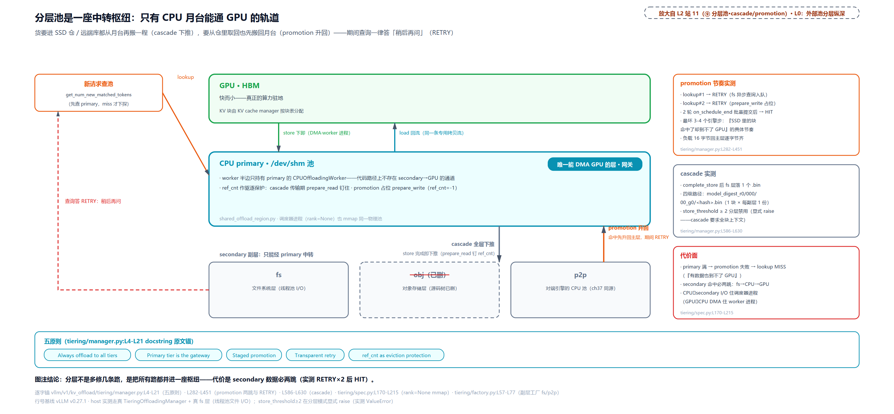

> *图注：三层横带——上 GPU（绿）、中 CPU primary（青，带网关徽标「唯一能 DMA GPU 的层」与两行不变量）、下 secondary 三个等宽框（fs、obj 加删除线标已删、p2p 注 ch37 同源即 NIXL）；primary 与 GPU 之间是双向 DMA 箭头；右侧两条竖直通道：下行 cascade（store 完成即全层下推，prepare_read 钉 ref_cnt）、上行 promotion（命中先升回主层）；左侧一条红虚线回环从 secondary 绕回左上请求入口，标 RETRY 稍后再问。右列三个箱：promotion 节奏实测（RETRY→RETRY→2 轮 on_schedule_end→HIT；cascade 四级路径 …_r0/000/00_g0/<hash>.bin；store_threshold 大于等于 2 分层 raise；代价面 rank=None / secondary 必两跳 / primary 满=MISS）。底部五原则芯片行（Always offload to all tiers / Primary is the gateway / Staged promotion / Transparent retry / ref_cnt as eviction protection）。图注结论：分层不是多修几条路，是把所有路并进一座枢纽，代价是 secondary 数据必两跳。*

## 跨实例 P2P：对暗号才能共享（站 12）

第四道坎：两台引擎共享一个池。分层机制把「远端实例的 CPU 池」当成一种 secondary tier（`p2p`），协议却与 ch37 的 P/D 很不一样——**对称 peer，没有固定的 P 与 D**：同一实例对不同请求既可以当取货人（consumer）、也可以当发货人（producer），谁是本地谁是远端由编排层（路由器或弹性调度器）在每个请求的角色键里指定（`remote_prefiller` / `remote_decoder` / `remote_kv_source` 三个键，`tiering/p2p/manager.py:L64-L154`；P/D 模式的请求跳过查询直接点名拉取）。

控制面走 ZMQ（ZeroMQ，一个嵌进应用进程的消息库：API 长得像 socket，但消息整条原子送达、自带收发模式与重连，不需要部署任何中间服务器，即「没有 broker 的消息传递」），数据面走 NIXL 的单边 WRITE 直写对端池。五步线协议（`tiering/p2p/session/protocol.py:L178-L304`）：

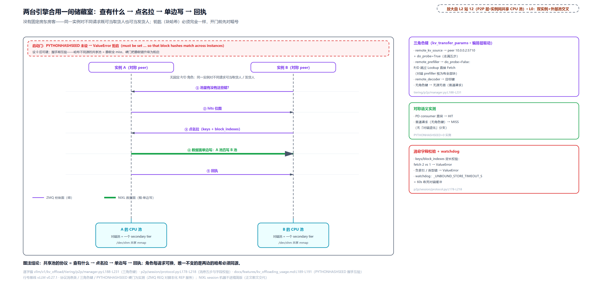

> *图注：UML 时序图，两条竖直生命线是实例 A 与实例 B（名牌下注「对称 peer：无固定 P/D 角色」），脚下各画一块自己的 CPU 池框（对端池=一个 secondary tier）。五条消息沿共享时间轴：①LookupMsg（B 问 A：这些键你有吗）→ ②LookupRespMsg（hits 位图）→ ③FetchMsg（点名拉，带 block_indexes）→ ④NIXL WRITE（粗箭头，数据面：A 的池直写 B 的池）→ ⑤TransferDoneMsg（回执）；④画粗、其余细，图例区分数据面与 ZMQ 控制面。顶部红虚线是启动门：PYTHONHASHSEED 未设直接 ValueError 拒启（原话节选），设 0 后可建、且握手期互验各 peer 的值。右列三箱：三角色键实测（remote_kv_source 到 10.0.0.2:5710 加 do_probe=True / remote_prefiller 的 do_probe=False 即跳过 Lookup 直接 Fetch / remote_decoder / 无键则无源无宿）、对称语义（PD consumer 查询 HIT、普通请求 MISS）、字段校验（fetch 2 对 1 报 ValueError）与 watchdog 60 秒收死对端缓冲。图注结论：共享池的协议=查有什么→点名拉→单边写→回执，角色每请求可换，唯一不变的是两边的哈希必须同源。*

协议自带两道保险，就是图右列箱子里那两条。一是消息字段校验：fetch 的键数与块索引数对不上（fetch 2 对 1）、索引为负或类型不对，直接 ValueError 报错（`p2p/session/protocol.py:L200-L215`）。二是 watchdog：提交了 store 却迟迟等不来对端 fetch 的批次，超过 `_UNBOUND_STORE_TIMEOUT_S`（60 秒）就整批记失败、请求 id 进失败名单，迟到的 fetch 短路拒绝——防死对端占着缓冲不放（`tiering/p2p/manager.py:L697-L731`）。

「对暗号」说的就是顶部那道启动门，它值得单独一节。

### 同一个前缀，两种哈希

两个 Python 进程对同一段 prompt 算出的块哈希，默认**不一样**。原因在语言层：出于安全（2011-2012 年的哈希洪水 DoS 事件：攻击者构造互相碰撞的 key 塞进哈希表，把本该常数级的插入拖成平方级 CPU 消耗，oCERT-2011-003 披露、CVE-2012-1150 修复），Python 3.3 起每个进程用随机盐计算 str 与 bytes 的 `hash()`，「同字符串、两进程、两答案」；PEP 456 又把字符串哈希换成带密钥的 SipHash 根治。逃生门是环境变量 `PYTHONHASHSEED`：设成同一个整数，一组进程的哈希就一致，官方文档写明的用途就是「让一组 Python 进程共享哈希值」。双终端一秒验证（通用 Python 语义）：

```bash
$ python3 -c "print(hash('same-prefix'))"    # 终端 1 → 比如 -4652078784780419784
$ python3 -c "print(hash('same-prefix'))"    # 终端 2 → 另一个数（每个进程都不同）
$ PYTHONHASHSEED=1234 python3 -c "print(hash('same-prefix'))"   # 两个终端同值
```

vLLM 的链式哈希种子在同一根线上。链头种子 `NONE_HASH` 未设环境变量时是随机数：

```python
# vllm/v1/core/kv_cache_utils.py:L87-L114 · init_none_hash
# The hash seed for the first block of any prefix block sequence.
#
# We use a random value to avoid hash collisions or PYTHONHASHSEED environment
# variable if set such that processes can share the seed if needed. This aligns
# with the behavior of Python's hash() function, which also uses a random seed
# if PYTHONHASHSEED is not set.
#
# The function `init_none_hash` initializes this variable globally.
NONE_HASH: BlockHash
_CBOR_HASH_FUNCTIONS = frozenset({sha256_cbor, xxhash_cbor})


def init_none_hash(hash_fn: Callable[[Any], bytes]):
    global NONE_HASH

    hash_seed = os.getenv("PYTHONHASHSEED")
    if hash_seed is None and hash_fn in _CBOR_HASH_FUNCTIONS:
        logger.warning(
            "PYTHONHASHSEED is not set. This will lead to non-reproducible "
            "block-hashes when using CBOR-based hash functions such as "
            "sha256_cbor or xxhash_cbor. Consider setting PYTHONHASHSEED to a "
            "fixed value for reproducibility."
        )

    if hash_seed is None:
        NONE_HASH = BlockHash(os.urandom(32))   # L112
    else:
        NONE_HASH = BlockHash(hash_fn(hash_seed))   # L114
```

种子不同，[第 15 章](../../ch15-prefix-caching/narrative/chapter.md)的整条哈希链就全不同。单进程的前缀缓存对此无所谓（进程内自洽）；**池一旦跨进程共享就全押在这上面**：文件副层的目录名是块哈希、对象副层的键是哈希、p2p 的 peer 匹配是哈希、Mooncake store 的去重键还是哈希。两个进程同一前缀不同哈希，等于永远 miss、目录重复写、peer 配不上对。更糟的是失败是静默的：不报错、不崩溃，只有命中率归零，你还以为是池化没生效。vLLM 的对策分两级：文件副层跨进程共享在文档里要求 PYTHONHASHSEED「必须设成同一个固定值」；p2p 更进一步——不设直接启动失败、握手时互验各 peer 的值（图上那道红门），把「静默 miss」升级成「显式报错」。这是把部署税变成显式契约的教科书做法。顺带一提，`hash_fn(seed)` 里的函数族用的是 CBOR（一种紧凑的二进制编码格式，哈希函数对它编码出的字节做摘要）编码变体，未设种子时那条 warning 也是为此打的。

## 生态对照：同一道边界的三种池后端（站 13）

本章主角之外，KVConnector 注册表里还站着几位池化同行（[第 16 章](../../ch16-kv-connector/narrative/chapter.md)数过全表十六个名字；配套精简版保留六条示范注册、其中三条树内可加载）。它们的架构差异比名字大得多，值得各给一小节：先立理论画面，再落到源码。

### MooncakeStore：池出引擎进程

Mooncake 是月之暗面（Moonshot AI）为 Kimi 打造的推理平台，FAST'25 最佳论文《Trading More Storage for Less Computation》描述的架构有三块骨架：**分离的 prefill/decode 集群**；**全局调度器 Conductor**（按 KVCache 分布派请求、估 TTFT、过载早拒绝、后台冷热复制）；**传输组件**（论文 v4 里叫 Messenger，开源世界叫 Transfer Engine 即 TE：多网卡 RDMA（remote direct memory access，网卡绕开对端 CPU 直读内存的传输技术，[第 37 章](../../ch37-pd-disaggregation/narrative/chapter.md)立过的词）带宽聚合、拓扑感知选路，官方口径 4×200Gbps 聚到 87 GB/s、8×400Gbps RoCE（以太网上跑 RDMA 的协议）到 190 GB/s）。必须点破的一处防错：开源出来的只有 TE 与 Store 等数据面组件，**Conductor 只存在于论文与后来的 RFC（提出后已关闭、未实现），README 根本不提**——装一个 mooncake 包买不到全局调度器。收益数字两套口径分开记：论文口径（模拟场景吞吐最多加 525%、Kimi 真实 trace 多处理 75% 请求，基线都是共置 vLLM）；vLLM 官方博客口径（2026-05，agentic 负载实测：命中率 1.7% 到 92.2%、吞吐 3.8 倍、P50 TTFT 降 46 倍，基线是只缓存系统提示词的 NIXL P/D）。

vLLM 侧的接法是 `MooncakeStoreConnector`：把开源的 MooncakeDistributedStore 当共享 KV 池，一个集群级 master（`mooncake_master`，默认 50051 端口）管元数据与协调，各 vLLM 实例内嵌客户端。两种凑池形态：embedded 模式每个 rank 捐一段内存进池，standalone-store 模式由独立进程独占 CPU 与 SSD 持池。官方用例（说明性外部示例，摘自 vLLM 官方文档）：

```bash
PYTHONHASHSEED=0 MOONCAKE_CONFIG_PATH=mooncake_config.json \
  vllm serve <model> --kv-transfer-config \
  '{"kv_connector":"MooncakeStoreConnector","kv_role":"kv_both"}'
```

第一行那个 `PYTHONHASHSEED=0` 就是上一节的原理：内容寻址要跨进程可复现，官方文档专门警告全进程必须一致。查询侧与 OffloadingConnector 完全同构，慢的时候答「稍后再问」：

```python
# vllm/distributed/kv_transfer/kv_connector/v1/mooncake/store/scheduler.py:L81-L134 · MooncakeStoreScheduler.get_num_new_matched_tokens
    def get_num_new_matched_tokens(
        self,
        request: Request,
        num_computed_tokens: int,
    ) -> tuple[int | None, bool]:
        # … 省略：docstring（未就绪时返回 (None, False)，调度器稍后重查）……
        if not self.enable_lookup:
            return 0, False

        # Fine-grained hits may land on a hash boundary inside a block; without
        # partial hits, prefixes shorter than one physical block are skipped.
        align = (
            self._hash_block_size if self.enable_partial_hash_hits else self._block_size
        )
        if request.num_tokens < align:
            return 0, False

        num_external_hit_tokens = self.client.lookup(
            request.request_id,
            request.num_tokens,
            request.block_hashes,
            non_block=self.lookup_async,
        )   # L107
        if num_external_hit_tokens is None:
            # Lookup not ready yet; scheduler will retry on a later step.
            return None, False

        if num_external_hit_tokens < num_computed_tokens:
            need_to_allocate = 0
        else:
            need_to_allocate = num_external_hit_tokens - num_computed_tokens   # L115
        # … 省略：debug 日志、LoadSpec 登记与空差值早退……
        return need_to_allocate, self.load_async
```

`non_block=self.lookup_async` 让查询走后台线程（ZMQ RPC 问 master），结果没就绪就返 None，这是 ch16 None 语义的第三种填法。命中差值「外部减本地已算」（L115）与 OffloadingConnector 逐块对齐是同一笔账的两种记法。worker 侧则把「晚一拍发车」推到极致：两个钩子干脆全空、所有 I/O 押在 `get_finished`。

```python
# vllm/distributed/kv_transfer/kv_connector/v1/mooncake/store/worker.py:L1538-L1562 · 双 no-op
    def start_load_kv(
        self,
        metadata: MooncakeStoreConnectorMetadata,
    ):
        """No-op: loads are issued in get_finished() for overlap."""
        pass

    def wait_for_save(
        self,
        metadata: MooncakeStoreConnectorMetadata,
    ):
        """No-op: stores are issued in get_finished() for overlap."""
        pass

    def get_finished(
        self,
        finished_req_ids: set[str],
        meta: MooncakeStoreConnectorMetadata,
    ) -> tuple[set[str], set[str]]:
        """Issue all I/O and get completed send/recv request IDs.

        All load and store I/O requests are issued here (after model
        compute is launched on the compute stream) for better
        compute-I/O overlap.
        """
        # … 省略：实现体为树内调度（请求入队、双传输线程发 I/O），底层 store 客户端须外部 mooncake 包（L1145 import）……
```

docstring 原话「所有 load 与 store 的 I/O 都在这里发（在模型计算上到计算流**之后**），换更好的计算-I/O 重叠」，与本章主角的 NOTE(orozery) 是同一设计直觉的两份实现。与 NIXL 的关系值得两句：ch37 的 P/D 默认走 NIXL（统一抽象盖住多种内存与存储、后端插件化），Mooncake TE 走「为 KV 大块传输做到拓扑极致」；两边还在互相嵌入（NIXL 的插件清单里就有 Mooncake 本尊，Mooncake 的生态页也列着 NIXL）。分层竞合，不是二选一。

### LMCache：引擎外的缓存管家

LMCache 是独立开源项目（2025-10 加入 PyTorch 基金会），自我定位「LLM 推理的 KV cache 管理层」：它管的不只是卸载（GPU 到 CPU、盘、Redis（常驻内存的键值存储）/S3 类远端，Mooncake Store 和 NIXL 都在它的可选后端清单里），还有**非前缀复用**（CacheBlend，EuroSys'25：任意位置的缓存块选择性重算拼装）与 **KV 压缩**（CacheGen，SIGCOMM'24）。这两张策略牌是它区别于 Mooncake Store 的独特特征。部署形态两种，正好对上 pin 里两个注册名：`LMCacheConnectorV1` 跑在引擎进程内；`LMCacheMPConnector` 连独立的 `lmcache server` 守护进程（MP 即 multi-process，ZMQ 5555 端口通信），一个 server 可被多台引擎共享——引擎崩了缓存还在（官方说法 no fate-sharing，不与引擎同命运），这正是「缓存要跨引擎实例、跨进程生命周期共享，就不能长在任何一个引擎进程里」的工程化。vLLM 侧的接入是薄壳双路：

```python
# vllm/distributed/kv_transfer/kv_connector/v1/lmcache_connector.py:L83-L113 · LMCacheConnectorV1（双路）
    def __init__(
        self,
        vllm_config: "VllmConfig",
        role: KVConnectorRole,
        kv_cache_config: "KVCacheConfig",
    ):
        super().__init__(
            vllm_config=vllm_config, role=role, kv_cache_config=kv_cache_config
        )
        assert vllm_config.kv_transfer_config is not None
        use_native = vllm_config.kv_transfer_config.get_from_extra_config(
            "use_native", False
        )
        if use_native:
            logger.info("Initializing native LMCache connector")
            # lazy import
            from vllm.distributed.kv_transfer.kv_connector.v1 import lmcache_integration

            _adapter = lmcache_integration.vllm_v1_adapter

            cls = _adapter.LMCacheConnectorV1Impl
        else:
            logger.info("Initializing latest dev LMCache connector")
            # lazy import
            from lmcache.integration.vllm.vllm_v1_adapter import (
                LMCacheConnectorV1Impl as LMCacheConnectorLatestImpl,
            )

            cls = LMCacheConnectorLatestImpl

        self._lmcache_engine = cls(vllm_config, role, self)
```

`use_native` 选边：True 走 vLLM 树内的适配器（内置适配层），False 走外部 lmcache 包的 `vllm_v1_adapter`（「latest dev」，修复比树内快）。同一个注册名背后是「引擎内置 vs 独立项目嵌入式」两种工程形态，全靠 lazy import 切换。它的官方 quickstart 有个对初学者很有说服力的实录（说明性外部示例）：第一个请求存 31 个 token、CPU 侧吞吐 1.98 GB/s；第二个同前缀请求命中 24 个而不是 31，因为 chunk 哈希按 8-token 对齐、末尾 7 个不满块不构成可命中单元；其中 16 个又被 vLLM 本地 GPU 前缀缓存接住，真正从 LMCache 加载 8 个。「多层缓存各管一段」的活教材。

### MultiConnector：配电排

最后一块积木是组合器：列表里放多个子连接器（各自引擎身份与角色），P/D 与池化同引擎并存。规则一句话——**查询按列表顺序，第一个命中数大于零的子连接器获得这个请求的加载权，后续更长的命中不覆盖；store 则全部子连接器都收**：

```python
# vllm/distributed/kv_transfer/kv_connector/v1/multi_connector.py:L385-L407 · MultiConnector.get_num_new_matched_tokens
    def get_num_new_matched_tokens(
        self,
        request: "Request",
        num_computed_tokens: int,
    ) -> tuple[int | None, bool]:
        to_return = (0, False)
        for i, c in enumerate(self._connectors):
            toks, load_async = c.get_num_new_matched_tokens(
                request, num_computed_tokens
            )
            # If there is a connector still looking up the matches,
            # we return None to indicate that we are not done yet.
            if toks is None:
                return (None, False)
            # The first connector that has new matched tokens will be assigned
            # to this request.
            if to_return[0] == 0 and toks > 0:   # L401
                self._requests_to_connector[request.request_id] = i
                to_return = (toks, load_async)
        return to_return
```

判据只在 `to_return[0] == 0 and toks > 0` 时首次赋值（L401），赋值后条件恒假，注释原话「The first connector that has new matched tokens will be assigned to this request」。获选者记进 `_requests_to_connector`，分配阶段按表路由：实测里两腿 A 报零、B 报五，B 获胜，A 对同一请求的分配回执收到零。任一子连接器还在查（返 None）则整体 None，稍后再问的语义向上透传。加载权的争用为什么不取「最长命中」？注释没说，但结合场景能读出来：P/D 腿（NIXL）与池化腿（MooncakeStore）的命中经常同源（都存了那段 prompt），逐连接器加载会造成双重搬运；首命中即定，把「谁有货」的仲裁压成 O(列表长) 的一次扫描。

### 原生一族与选型地图

vLLM 自家的开箱即用件在配置层一键激活（`vllm/config/vllm.py:L899-L926`）：

```python
# vllm/config/vllm.py:L899-L927 · _post_init_kv_transfer_config（快捷开关）
        # KV offloading is only activated when kv_offloading_size is set.
        if (kv_offloading_size := self.cache_config.kv_offloading_size) is None:
            return

        kv_offloading_backend = self.cache_config.kv_offloading_backend

        # If no KVTransferConfig is provided, create a default one.
        if self.kv_transfer_config is None:
            self.kv_transfer_config = KVTransferConfig()

        if kv_offloading_backend == "native":
            if envs.VLLM_USE_SIMPLE_KV_OFFLOAD:
                config_connector = "SimpleCPUOffloadConnector"
            else:
                config_connector = "OffloadingConnector"
            self.kv_transfer_config.kv_connector = config_connector
            self.kv_transfer_config.kv_connector_extra_config.update(
                {"cpu_bytes_to_use": kv_offloading_size * (1 << 30)}
            )
        elif kv_offloading_backend == "lmcache":
            # Default to LMCache multi-process (MP) mode. The actual KV
            # storage capacity is managed by the standalone LMCache server
            # process, so ``kv_offloading_size`` is not propagated here.
            # ``LMCacheMPConnector`` falls back to ``tcp://localhost:5555``
            # when host/port are not provided via extra_config.
            self.kv_transfer_config.kv_connector = "LMCacheMPConnector"

        # This is the same for all backends
        self.kv_transfer_config.kv_role = "kv_both"
```

`--kv-offloading-size` 的 GiB 数折算成 `cpu_bytes_to_use`；后端选 native 默认落本章主角 OffloadingConnector（环境变量可切更朴素的 SimpleCPUOffloadConnector），选 lmcache 落 MP 连接器（容量归独立 server 管，size 不透传）；所有后端一律 `kv_both`。原生族还有一位教学参考实现 ExampleConnector：把 KV 写成本地 safetensors 文件（Hugging Face 出的安全张量存盘格式：纯数据不含可执行逻辑、读取走零拷贝 mmap）、按文件存在与否判断前缀已否落盘，是「共享存储」的最小样板，生产池不是它的定位。命名史上有个坑：2025 年上半年的 vLLM issue 里这个角色叫 SharedStorageConnector，pin v0.27.1 的注册名已是 ExampleConnector，社区教程里新旧名混用（据 pin 注册表与 issue 标题核对；具体更名经过未逐条核）。

三方怎么选，一张小对账（定位一句话化：Mooncake Store 是底座、LMCache 是管家、vLLM 原生是开箱即用）：

| 路线 | 管什么 | vLLM 侧注册名 | 何时选 |
|---|---|---|---|
| Mooncake Store | 数据面底座：master 元数据加各节点捐内存、RDMA 零拷贝、RAM 加 SSD 分层 | MooncakeStoreConnector | 跨实例跨节点的集群级池、有多网卡 RDMA、要生产验证过的整栈 |
| LMCache | 策略层：多级后端、非前缀复用（CacheBlend）、压缩（CacheGen）、独立 server 跨实例 | LMCacheConnectorV1 / LMCacheMPConnector | 单机起步渐进长成跨实例、要复用与压缩策略、缓存独立于引擎存活 |
| vLLM 原生 | 树内参考实现：单实例 CPU 卸载为主 | OffloadingConnector / SimpleCPUOffloadConnector / ExampleConnector | 显存吃紧先卸本机 DRAM、本地调试与理解契约、教学 |

三层不是三选一：LMCache 可把 Mooncake Store 当远端后端（Mooncake README 官方列名，joint KVCache-centric serving），P/D 与池化经 MultiConnector 叠加，vLLM×Mooncake 博客里那 92.2% 的命中块就是 P/D 加池化并存的形态跑出来的。生态实测（Mooncake 走真 ZMQ 对脚本化服务端、LMCache 双路以替身注入、MultiConnector 两腿假池）：

<!-- trace: m14 -->
| 生态 | 场景 | 实测 | 判定 |
|---|---|---|---|
| MooncakeStore · 异步查询 | 16 token、后台 ZMQ 未就绪 → 就绪 | 首问 (None, False) → 再问 (12, True) | None=稍后再问的第三种填法（接 ch16 skipped） |
| MooncakeStore · 同步+对齐 | 外部命中 12、本地已算 12 | need_to_allocate=0 | 差值语义 (N−computed) 与 OffloadingConnector 同构 |
| MooncakeStore · I/O 押 get_finished | start_load_kv / wait_for_save | 双 no-op；get_finished 骨架 NotImplementedError（实现体须外部包） | 全部 I/O 在 compute 后发，重叠窗口最大化 |
| LMCache 双路 | use_native=True / False | 分别加载 native / latest 两个实现、引擎对象不同 | 内置适配器 vs 外部包，同注册名两种工程形态 |
| MultiConnector 首命中 | A=0,B=5 → (5, False)；下一请求 A=20 → (20) | 分配路由：A 收 (r1,0)、B 收 (r1,5) | 列表顺序首个命中数>0 者获加载权；全部子收 store |

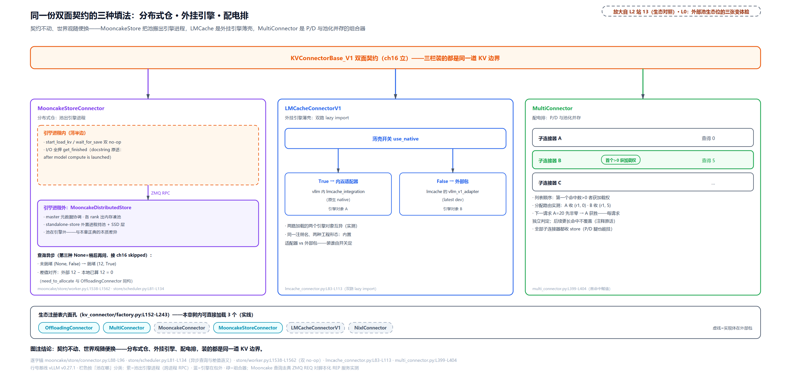

> *图注：顶部一条横梁是 KVConnectorBase_V1 双面契约（ch16 立），三支箭头垂下三个等宽栏。左栏 MooncakeStore：引擎框内画双 no-op（start_load_kv / wait_for_save，I/O 全押 get_finished）与查询异步（(None, False) 到 (12, True)、同步对齐 12−12=0），ZMQ RPC 箭头出引擎进程到 MooncakeDistributedStore 紫框（master 协调、各 rank 捐内存、SSD 层）。池出引擎进程是它与本章主角（OffloadingConnector）的本质差异。中栏 LMCache：use_native 开关分出内置适配器与外部包双路径箱，两引擎对象互异。右栏 MultiConnector：竖排子连接器 A（徽标 0）、B（徽标 5，高亮「首个>0 获加载权」）、C，分配路由 A 收 (r1,0)、B 收 (r1,5)，下一请求 A=20 获胜、后续更长不覆盖，旁注全部子收 store。底部芯片行：注册表六面孔，实线三条树内可加载。图注结论：契约不动、世界观随便换：分布式仓、外挂管家、配电排，装的都是同一道 KV 边界。*

## 总结：点亮 L0 的外部池

本章点亮了 L0 图「KV 边界+外部池」这块：边界是[第 16 章](../../ch16-kv-connector/narrative/chapter.md)立的，池是本章开的。开篇四问的答案：**满块怎么不打扰 GPU 就搬走**：按箱采集认尾块、池准入赶客留客、晚一拍发车绕开采样关键路径、DMA 三戒管住顺序（store 等计算流、同向保序、load 才许乱序源读）。**异步搬运中被复用的块谁拦**：盯防账本加三触发围栏，块将复用、请求被抢占、终局未完，先把 store 抢先提交再同步 wait，GPU 改写显存之前搬运必已落地；这是 best-effort 世界唯一的同步点，对照 P/D 的每拍强制等。**盘上的命中怎么到 GPU**：分层池把 CPU 设成唯一网关，secondary 命中先 promotion 升回主层、期间 RETRY「稍后再问」，请求进 skipped 队列等货上月台；代价是两跳与写放大，主层满则干脆 MISS。**共享池的哈希怎么对上**：PYTHONHASHSEED 钉住链式哈希种子，p2p 把它升为启动硬门加握手互验，静默 miss 变显式报错。

三件事带走：

1. **best-effort 是一套完整的账**。丢一次 save 只是未来一次 miss，这句注释背后是三件互相咬合的设计：退出 producer 语义（不接管释放）、完成走计数不走礼炮（completed_jobs 聚满 world_size 才结算）、正确性围栏改「被复用才等」（jobs_to_flush 抢先提交加 wait）。每一步异步收益（不逐层、不同步、不接管）都有对应的护栏在付账——与 ch16「异步的每一分收益都有护栏」是同一条书脊。

2. **「决策与搬运分离」递归到了第二层**。ch16 把连接器劈成调度器半边与 worker 半边；池引擎在契约内部又嵌了同构的一份（OffloadingManager 的六原语账本住调度器进程、OffloadingWorker 的四动词搬运住 worker 进程），物理池放 `/dev/shm`：共享数据、零共享状态——单层下碰池字节的只有 worker 进程的 DMA，账本独住调度器进程；分层池再叠一层编排（primary 网关加三种 secondary），调度器进程这才 mmap 进池接管副层 I/O，同一物理池两个进程各管一段搬运。

3. **同一份契约的三种世界观至此收齐**。[第 16 章](../../ch16-kv-connector/narrative/chapter.md)立契约时留的话全部兑现：[第 37 章](../../ch37-pd-disaggregation/narrative/chapter.md)给它装上跨引擎的腿（可靠交接：租约、心跳、回执），本章装上分层的腿（best-effort 缓存：准入、驱逐、围栏），生态位上还有 MooncakeStore 的分布式池世界观（master 协调、查询异步、I/O 全押 get_finished）。判别一个后端在哪个世界，先看 `requires_kv_delivery`。

契约的第四种填法留给后面。池里的块已经能跨介质、跨实例流动，但「带着 KV 迁往一台新引擎」的弹性扩缩容（scale_up 时把存量 KV 搬走、握手对齐），正是踩着这一章的搬运协议往上走的。而更近的一站回到用户跟前：多轮对话把同一个前缀反复送进引擎，agentic 负载里输入输出比一百三十一比一——池化收益的真正购买者就是坐在服务另一头的它们。[第 39 章](../../ch39-openai-serving-multiturn/narrative/chapter.md)走进 API 进程与入口，看 OpenAI 协议那一面怎么接住多轮对话，也看「断连反向 abort」那条伏笔怎么收。

（完）
