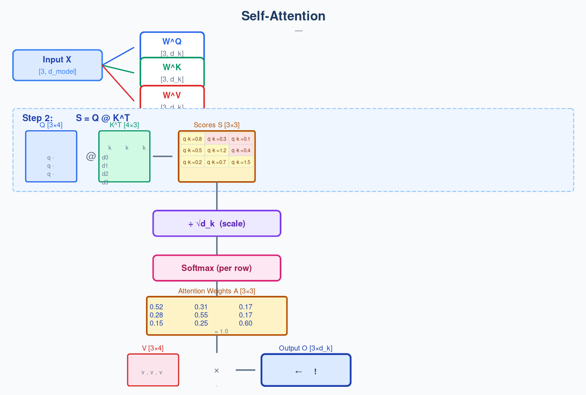
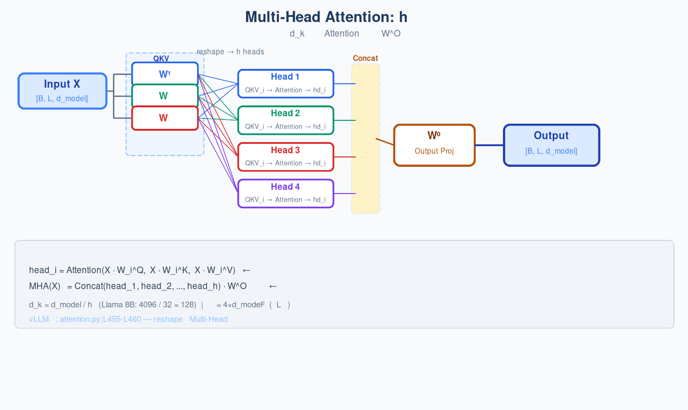
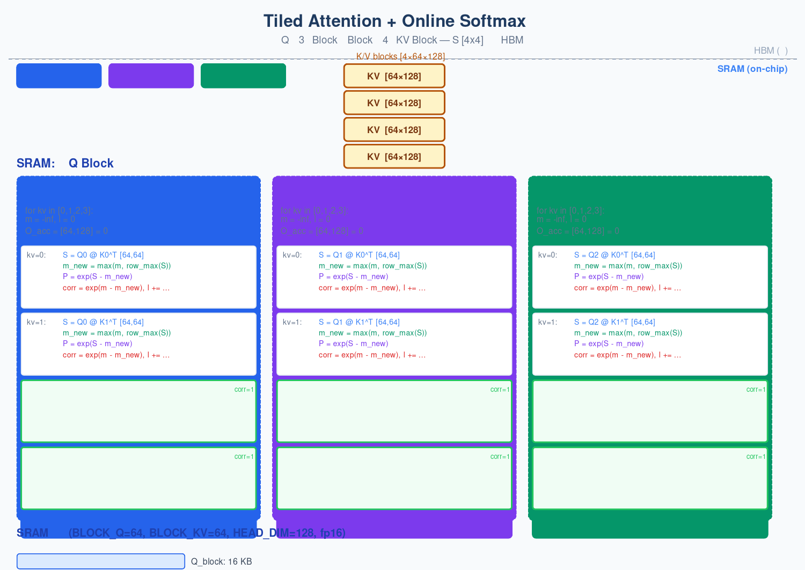
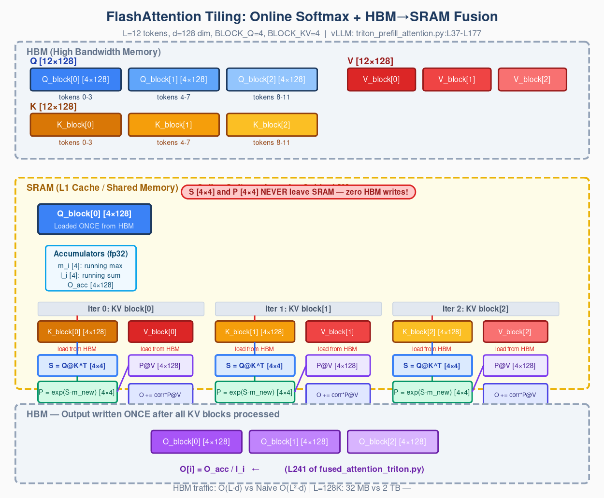
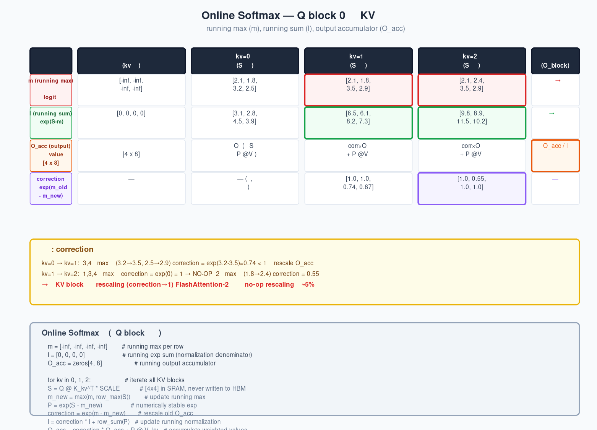

# 第1章：Self-Attention — 让每个词看到整个句子

> 读这句话："我把水杯放在桌上，它翻了。"
> "它"指的是什么？水杯，不是桌子。你的大脑在不到 0.1 秒内完成了这个判断——因为"翻"是水杯的常见命运，不是桌子的。
> 
> 这就是 Attention。你的大脑自动连接了"它"和"水杯"，穿越了中间的"桌上"两个字。神经网络也需要这种能力——让每个词能看到整个句子里的所有其他词，并自动判断谁和它有关。
>
> 打开 `vllm/model_executor/layers/attention/attention.py:177`，你会看到 `class Attention`——vLLM 推理引擎里被调用最频繁的类。每生成一个 token，每一层 Transformer 都要跑一遍它。本章我们把这个类的数学原理和工程实现一起拆解，从零基础到能读懂 HPC kernel。

---


## 0. 历史脉络：从 RNN 到 Self-Attention 再到 FlashAttention

在深入机制之前，先用两分钟看看这条路怎么走过来的——知道"哪个问题驱动了下一次创新"，每个设计决策就有了坐标。

**2014 — Bahdanau Attention（加性注意力）**：机器翻译需要"对齐"源语言和目标语言。Bahdanau 用一个 feed-forward 网络计算解码器当前位置与编码器各位置的匹配度：`score = v^T tanh(W·s + U·h)`。因为是加性（tanh-based），不存在方差爆炸问题。但注意力仍然依附在 RNN 编码器上，无法并行训练。

**为什么加性最终被点积淘汰？** 加性 attention 需要对每对 (i,j) 逐对过 FFN——无法用矩阵乘法并行化——计算量是 O(T_s × T_t × d²)。而点积 attention 直接是 `Q @ K^T`——恰好是 GPU Tensor Core 最擅长的操作，计算量为 O(T_s × T_t × d)。当 d 较大时（现代 Transformer 的 d_k=128），点积比加性快一个数量级。唯一的代价——点积对方差敏感——被 Vaswani 2017 用 1/√d_k 解决了。

**2015 — Luong Attention（乘性/点积注意力）**：Luong 发现用点积代替 tanh 更简单、更快。直接用 `score = q·k` 计算相关度。但 d_k 较小时工作良好，d_k 较大时梯度消失——Luong 注意到了这个方差问题但没从数学上解决。

**2017 — Vaswani et al. "Attention Is All You Need"**：这篇论文做了三件事。(1) 完全抛弃 RNN——只用注意力建模序列依赖，实现全并行训练。(2) 引入 Multi-Head Attention——h 个头各自独立学习不同的关系模式。(3) 发现并解决了点积注意力的方差问题：**除以 √d_k**。这个简单的除法让 d_k=64 的注意力稳定训练——从此 Transformer 成为主流。

**2022 — Dao et al. "FlashAttention"**：注意力公式需要 O(L²) 的计算，但不应该需要 O(L²) 的显存。FlashAttention 把 tiling + online softmax 引入注意力：Q 切成小块迭代 KV 块，计算全在 SRAM 里完成，注意力矩阵 [L×L] 从不写回 HBM。HBM traffic 从 O(L²) 降到 O(L)。

**2023 — FlashAttention-2**：进一步提升并行度，并在 correction 因子收敛后跳过 no-op rescaling，节省 ~5% kernel 时间。

本章覆盖以上所有关键节点——从方差推导（为什么 1/√d_k 必然存在）到 tiled online softmax 的逐行走读。

**这些历史创新在 vLLM 源码中都有具体的落点——不是"参考了论文"，而是代码级的对应：**

- **Vaswani 2017 的 1/√d_k**：固化为不可变构造参数——`vllm/model_executor/layers/attention/attention.py:L193`：`self.scale = float(scale)`。从模型配置（如 `llama.py`）一路传到 CUDA kernel（`vllm/v1/attention/backends/flash_attn.py:L806`：`softmax_scale=self.scale`）。之所以是外部参数而非 kernel 内计算，是因为 ALiBi/Gemma/DeepSeek 各有非标准 scale 公式（详见第 4 节）。
- **Dao 2022 的 IO-aware tiling**：对应 `vllm/v1/attention/backends/flash_attn.py:L797-L819`——`FlashAttentionImpl.forward()` 调用 `flash_attn_varlen_func()`，kernel 内部完成 tiled matmul + online softmax。vLLM 的 Triton 实现在 `vllm/v1/attention/ops/triton_prefill_attention.py:L37-L177` 的 `_fwd_kernel`。
- **Dao 2023 的 FA-2 并行化**：体现在 `triton_prefill_attention.py:L37-L177` 的 grid 设计——`(batch, heads, q_blocks)` 三维并行，以及 `tl.math.exp2`（base-2 exp，GPU 更快）。
- **注意力机制的通用性——任何 score(Q,K) 均可**：vLLM 的 backend 抽象层（`vllm/v1/attention/backend.py`）允许 `flash_attn.py`、`triton_attn.py`、`flex_attention.py` 互换——它们实现同一数学契约。这个抽象源自社区驱动的有机演化（PR #3005, 2024.03），详见第 9 节。

整条链路从 2014 年的加性注意力一路传递到 2026 年的 20+ backend dispatch。本章后面逐一拆解。


## 1. 先看问题：没有 Attention 的世界

在动手之前，先理解 Attention 要解决什么问题。

### 一个词是一座孤岛

传统语言模型处理一个句子时，每个词是一个独立的向量（embedding），模型看到的只是这个向量本身。"bank" 在"river bank"和"bank account"里是同一个向量——模型无法区分。没有上下文，语言就是一堆孤立符号。

```
"我在河岸(bank)边散步"    → bank 向量没有"河"的信息
"我去银行(bank)取钱"      → bank 向量没有"取钱"的信息
```

两个句子里的 bank 应该有不同的表示——它的含义由周围词决定。Attention 就是让每个词去"看"整个句子中的其他词，然后把相关信息聚合到自己身上。

### 每个词向所有词提问

还是那个句子："我把水杯放在桌上，它翻了。"

我们想要的效果是：当处理"它"这个词时，模型应该更多地关注"水杯"，其次是"翻"，而几乎忽略"桌上"。这需要一种机制，让"它"的能量流向"水杯"。

Attention 的做法：**每个词生成三份信息——一份用于提问，一份用于被提问，一份用于回答。**

在 vLLM 源码中，这个"让每个词看到其他词"的机制入口在 `vllm/model_executor/layers/attention/attention.py:L409`——`Attention.forward()` 接收整个序列的 hidden states，输出 context-aware 的新表示（via `self.impl.forward()` at L473-L480）。下一节我们拆解它内部的 Q/K/V 变换。

---

## 2. Q, K, V：神经网络里的搜索引擎

### 类比：你在图书馆找书

你去图书馆找"深度学习中的矩阵运算"：
- 你在检索框里输入关键词 → 这是 **Query（查询）**
- 图书馆系统有每本书的标签和摘要 → 这些是 **Keys（索引）**
- 系统返回匹配的书的内容 → 这些是 **Values（内容）**

自注意力做同样的事，区别在于：**句子里的每个词同时充当查询者、索引者和内容提供者。** 每个词都要：
1. 发出一个 Query——"我想要什么信息？"
2. 提供一个 Key——"我能提供什么类型的信息？"（供别人搜索用）
3. 持有 Value——"我的实际内容是什么？"（匹配到了就给你）



> *图：通过 Attention 模块的完整数据流——从输入 hidden states 开始，经 Q/K/V 三路线性变换，到点积计算注意力分数、softmax 归一化，最后加权 Value 得到 context-aware 输出。每个词"看到"整个句子中所有其他词的过程，在这张图中就是一次从左上到右下的数据流动。*

### 数学上：三个线性变换

输入是同一个向量 $x_i$（第 i 个词的 embedding），但通过三个不同的权重矩阵变换：

$$
\begin{aligned}
\mathbf{q}_i &= \mathbf{x}_i W^Q \quad &\mathrm{——\ 我的"搜索请求"}\\[4pt]
\mathbf{k}_i &= \mathbf{x}_i W^K \quad &\mathrm{——\ 我的"索引标签"}\\[4pt]
\mathbf{v}_i &= \mathbf{x}_i W^V \quad &\mathrm{——\ 我的"实际内容"}
\end{aligned}
$$

$W^Q, W^K, W^V$ 是三个可学习的矩阵（一开始是随机的，训练中逐渐学会"什么样的 Q 应该匹配什么样的 K"）。这三个矩阵对整个序列的所有词共享——每个词用同一套变换矩阵，但因为输入的词向量不同，变换出来的 QKV 也不同。

**关键直觉：Q 和 K 决定"注意力往哪放"，V 决定"放多少信息过去"。**

### Source Trail

在 vLLM 里，QKV 投影不在 `Attention` 类里——它们定义在模型文件中。以 Llama 为例，打开 `vllm/model_executor/models/llama.py:L321`：

```python
# LlamaAttention.__init__():
self.qkv_proj = ColumnParallelLinear(
    self.hidden_size,
    self.q_size + self.kv_size + self.v_size,  # ← 一次 matmul 产生 Q+K+V
    bias=False,
    ...
)
```

vLLM 使用组合投影（`qkv_proj`）：一次矩阵乘法产生 Q、K、V 三者的拼接，然后沿最后一维切分。这样做是因为 GPU 上一个大矩阵乘法比三个小矩阵乘法效率高得多。我们的教学实现 `reference_attention.py:L103-L105` 用三个分开的 `nn.Linear`——为了让你看清三条数据路径。

关于 `F.linear` 的权重形状：`nn.Linear(in_features, out_features)` 内部存储 weight 为 `[out_features, in_features]`。`F.linear(x, weight)` 执行的是：

$$
\mathbf{x} \cdot \mathrm{weight}^T
$$

等价于 $\mathrm{input} \cdot W^T$——与数学公式一致。

---

## 3. Scaled Dot-Product Attention：一步步推导

有了 Q、K、V，怎么具体计算第 i 个词应该关注第 j 个词多少？

### Step 1 — 用点积衡量相关性

直觉：如果 $\mathbf{q}_i$ 和 $\mathbf{k}_j$ 方向接近，说明词 i 想找的信息恰好是词 j 能提供的。两个向量的点积就是衡量方向的工具：

- 方向一致 → 点积为正且大 → 高分
- 方向相反 → 点积为负 → 低分  
- 垂直 → 点积近零 → 中等

$$
\mathrm{score}(i, j) = \mathbf{q}_i \cdot \mathbf{k}_j
$$

### Step 2 — 手算一个例子

3 个 token，d_k = 4。用 `variance_analysis.py:L171-L231` 里的具体数字，你可以在纸上验算：

```
词 2 的 Query：q₂ = [0.5, 0.1, 0.3, 0.2]
词 0 的 Key：  k₀ = [0.2, 0.8, 0.1, 0.4]
词 1 的 Key：  k₁ = [0.7, 0.3, 0.5, 0.1]
词 2 的 Key：  k₂ = [0.4, 0.2, 0.9, 0.3]
```

算点积：
```
q₂·k₀ = 0.5×0.2 + 0.1×0.8 + 0.3×0.1 + 0.2×0.4 = 0.10 + 0.08 + 0.03 + 0.08 = 0.29
q₂·k₁ = 0.5×0.7 + 0.1×0.3 + 0.3×0.5 + 0.2×0.1 = 0.35 + 0.03 + 0.15 + 0.02 = 0.55
q₂·k₂ = 0.5×0.4 + 0.1×0.2 + 0.3×0.9 + 0.2×0.3 = 0.20 + 0.02 + 0.27 + 0.06 = 0.55
```

原始分数 = [0.29, 0.55, 0.55]。词 2 对自己和词 1 的关注度接近，对词 0 的关注度较低。

### Step 3 — Softmax 归一化

点积分数范围是 `(-∞, +∞)`，没法直接当作"关注比例"。softmax 把任意实数序列变成非负且和为 1 的序列——刚好就是注意力权重的语义：对各个位置的关注比例。

$$
\alpha_{ij} = \frac{\exp(\mathrm{score}(i, j))}{\sum_{k=1}^{n} \exp(\mathrm{score}(i, k))}
$$

用上面的 [0.29, 0.55, 0.55]：

```
e^0.29 = 1.336    →  1.336 / 3.772 = 0.354  (35.4% 关注给 token 0)
e^0.55 = 1.733    →  1.733 / 3.772 = 0.460  (46.0% 关注给 token 1)
e^0.55 = 1.733    →  1.733 / 3.772 = 0.460  (46.0% 关注给 token 2)
∑ = 3.772
```

词 2 花 46% 的注意力在词 1 和自己身上，35% 在词 0 上。分布均匀，梯度流动正常。

### Step 4 — 加权求和

最后一步：用注意力权重对 V 做加权平均。词 i 的输出 = 所有词的 Value 的加权和，权重就是词 i 对各词的注意力：

$$
\mathbf{o}_i = \sum_{j=1}^{n} \alpha_{ij} \cdot \mathbf{v}_j
$$

### 矩阵形式（这个公式应该背下来）

把以上四步写成矩阵运算——这就是所有 vLLM attention backend 必须等价执行的数学：

$$
\mathrm{Attention}(Q, K, V) = \mathrm{softmax}\!\left(\frac{Q K^T}{\sqrt{d_k}}\right) V
$$

注意那个 $\sqrt{d_k}$——我们还没解释它。下一节会证明：没有它，模型根本学不动。

### 一图胜千言：五步管线全景

把上面的五步画成一张图，以后每次看到 `Attention(Q,K,V)`，这幅图就浮现在脑子里：


> *图：从输入序列到注意力输出的完整五步。输入 [3, d_model] → 三个 Linear 投影出 Q/K/V [3, 4] → Q@K^T 产生 3×3 分数矩阵 → ÷√d_k 缩放 → Softmax 每行归一化为注意力权重（每行和=1）→ ×V 加权求和得到输出。跟着箭头的流向走一遍，这五步就是 attention 的全部数学。*

### Source Trail

打开 `implementation/reference_attention.py:L25-L52`——我们在 vLLM 源码基础上提取出的纯数学实现：

```python
def scaled_dot_product_attention(Q, K, V, mask=None, scale=None):
    d_k = Q.size(-1)                                          # L45
    if scale is None:
        scale = 1.0 / math.sqrt(d_k)                          # L47
    scores = torch.matmul(Q, K.transpose(-2, -1)) * scale     # L48
    if mask is not None:
        scores = scores.masked_fill(mask == 0, float("-inf")) # L50
    attn_weights = F.softmax(scores, dim=-1)                   # L51
    return torch.matmul(attn_weights, V)                       # L52
```

vLLM 没有单独这样一个函数——这个数学分布在所有 backend 实现中。`flash_attn.py:L806` 以 `softmax_scale=self.scale` 传给 CUDA kernel；`triton_prefill_attention.py:L145-L146` 在 Triton kernel 内计算 `qk = qk * sm_scale`。但每个 backend 最终执行的数学就是上面这五行代码。

---

## 4. 为什么除以 √d_k？——方差侦探故事

这是整个 attention 里最被低估的细节。`1/√d_k` 不是调参试出来的——它是独立随机变量方差性质的必然结论。

### 先用实验发现问题

运行 `implementation/variance_analysis.py` 的 `demonstrate_variance_problem()`：

```
  d_k |   Var(unscaled) |     Var(scaled) |  Entropy(unscaled) |    Entropy(scaled) | Max prob(unscaled)
------|-----------------|-----------------|---------------------|---------------------|--------------------
    4 |            3.98 |          0.9950 |             2.1616 |             2.2632 |             0.3791
    8 |            7.95 |          0.9937 |             1.6478 |             2.1440 |             0.5443
   16 |           15.78 |          0.9864 |             1.0864 |             2.0095 |             0.6914
   32 |           31.61 |          0.9879 |             0.6578 |             1.8582 |             0.7977
   64 |           63.91 |          0.9986 |             0.3749 |             1.7155 |             0.8675
  128 |          127.21 |          0.9938 |             0.2085 |             1.5670 |             0.9096
  256 |          254.69 |          0.9950 |             0.1134 |             1.4343 |             0.9370
```

三个关键事实：
1. **Var(unscaled) ≈ d_k**：未缩放的方差随 d_k 线性增长（理论值 vs 实测：4 vs 3.98，128 vs 127.21，256 vs 254.69）
2. **Var(scaled) ≈ 1.0**：除以 √d_k 后方差始终回归到 1
3. **熵暴跌**：d_k=4 时 softmax 熵 2.16（均匀分布），d_k=256 时只剩 0.11（接近 one-hot）。Max prob 从 38% 飙到 94%。

未缩放时，d_k=128 的点积值大约在 ±√128 ≈ ±11.3 范围。exp(11) = 59874，而 exp(0) = 1。拿到最大点积的那个位置占据 ~99.998% 的概率——其他所有 token 的梯度几乎为零。

### 直觉：掷骰子类比

把 Q 和 K 的每个维度想象成独立掷骰子——均值为 0，方差为 1。两个骰子相乘，结果的方差 = 1。但你不是掷一次——你掷 d_k 次，然后把结果加起来。

一次掷骰子，结果的波动范围是 ±几个单位。d_k 次掷骰子加起来，波动范围是 ±√d_k 个单位。d_k=4 时波动 ±2，d_k=128 时波动 ±11。

**除以 √d_k 就是把"掷 d_k 次"的和压缩回"掷 1 次"的波动水平。**

### 形式化推导

**前提假设：** Q 和 K 的每个维度是独立随机变量，均值为 0，方差为 1。这是训练初始化和 LayerNorm 附近的常见状态。

**Step 1 — 点积定义：**

$$
q \cdot k = \sum_{i=1}^{d_k} q_i k_i
$$

**Step 2 — 方差的可加性**（独立随机变量之和的方差 = 方差之和）：

$$
\mathrm{Var}(q \cdot k) = \mathrm{Var}\!\left(\sum_{i=1}^{d_k} q_i k_i\right) = \sum_{i=1}^{d_k} \mathrm{Var}(q_i k_i)
$$

**Step 3 — 乘积的方差展开**（公式：对独立 X, Y，Var(XY) = σ²ₓσ²ᵧ + σ²ₓμ²ᵧ + σ²ᵧμ²ₓ）：

$$
\mathrm{Var}(q_i k_i) = 1 \cdot 1 + 1 \cdot 0 + 1 \cdot 0 = 1
$$

每一项乘积的方差 = 1。

**Step 4 — d_k 项求和：**

$$
\mathrm{Var}(q \cdot k) = \sum_{i=1}^{d_k} 1 = d_k
$$

**结论：点积的方差 = d_k。** 标准差 = √d_k。

**Step 5 — 除以 √d_k：**

$$
\mathrm{Var}\!\left(\frac{q \cdot k}{\sqrt{d_k}}\right) = \frac{\mathrm{Var}(q \cdot k)}{d_k} = \frac{d_k}{d_k} = 1
$$

方差回到 1。无论 d_k 多大，softmax 输入始终保持合理的 scale。

### 这对训练意味着什么？

| d_k | 未缩放 σ | 未缩放 softmax 行为 | 缩放后 |
|-----|----------|-------------------|--------|
| 4 | 2 | 熵 2.16，分布均匀，梯度正常 | 熵 2.26（略好） |
| 16 | 4 | 熵 1.09，开始出现 dominant token | 熵 2.01 |
| 64 | 8 | 熵 0.37，高度集中，梯度减弱 | 熵 1.72 |
| 128 | ~11 | 熵 0.21，接近 one-hot | 熵 1.57 |
| 256 | 16 | 熵 0.11，完全 one-hot，模型学不动 | 熵 1.43 |

**d_k=4 时有无 √d_k 差别不大——方差本来就是 4，除以 2 只是小幅改善。d_k=128 时差别巨大——方差是 128，不除以 √128 ≈ 11.3，softmax 直接 collapse。**

这就是为什么早期的 additive attention（Bahdanau 2014）没这个问题（它用 tanh 而不是点积），而 dot-product attention（Luong 2015）在小 d_k 时可以工作，但 Vaswani 2017 把 d_k 推到 64 以后就不得不引入 `1/√d_k`。

### Source Trail：√d_k 在 vLLM 里的传递链

这条链贯穿整个 vLLM attention 系统，说明 `1/√d_k` 被提升到了架构级别，不是局部决策：

```
模型配置（llama.py）:
    scale = 1 / (head_size ** 0.5)          ← 预计算

Attention.__init__() — attention.py:L193:
    self.scale = float(scale)               ← 作为构造参数传入

FlashAttentionImpl.__init__() — flash_attn.py:L613:
    self.scale = float(scale)               ← 存储在 backend 实例中

FlashAttentionImpl.forward() — flash_attn.py:L806:
    flash_attn_varlen_func(..., softmax_scale=self.scale)
                                            ← 传入 CUDA kernel
```

每一步都是简单的赋值传递——但整条链的存在本身就说明了 `1/√d_k` 不是可以随意修改的超参数。它是数学必然的硬编码。

**但等一下——既然 scale 公式看起来是固定的 `1/√head_dim`，vLLM 为什么不直接在 kernel 内部自动算？** 研究员从 git log 里挖出了答案：不是所有模型都用标准公式。ALiBi 在 attention score 上加 slope bias（`flash_attn.py:L617`），Gemma 加 logits soft-capping（`soft_cap = 50.0`），DeepSeek V3 的 scale 和自己的 qk_head_dim 挂钩。如果把 scale 公式写死在 kernel 里，每个新模型都要改 kernel 代码。vLLM 的选择是：**模型配置层负责"这个模型应该用什么 scale"，kernel 只负责"以这个 scale 执行计算"。** 这样一来，加一个新模型只需要改模型文件——不用碰 backend 代码。

---

## 5. Multi-Head Attention：一个脑袋不够用

### 问题：一个头只能捕捉一种关系

单头 Attention 有一个致命限制：每个位置只有一种方式关联到其他位置。但实际语言中，同一个词通过不同维度和其他词产生关联：

- "cat" 和 "sat" 是主谓关系（语法维度）
- "cat" 和 "dog" 是同类关系（语义维度）
- "cat" 和 "mat" 是空间关系（物理维度）
- "cat" 和句首 CLS 是全句摘要关系（全局维度）

一个 head 的 softmax 只能产生一种注意力分布，无法同时编码这四种关系。

### 解决方案：h 个并行的注意力

Multi-Head Attention 用 h 个独立的注意力头，每个头在自己的 d_k 维子空间里计算注意力。不同头可以学到不同的关联模式：

$$
\mathrm{head}_i = \mathrm{Attention}(X W_i^Q, X W_i^K, X W_i^V)
$$

然后所有头拼接起来，投影回原空间：

$$
\mathrm{MHA}(X) = \mathrm{Concat}(\mathrm{head}_1, \ldots, \mathrm{head}_h) \, W^O
$$

### 低秩分解视角

从线性代数看，MHA 是在用 h 个低秩投影来近似全秩的注意力矩阵：

- 全秩注意力需要独立建模每对 (i,j) 之间的注意力，参数量 ∝ L²（序列长度的平方）
- MHA 通过 h 个 d_k 维子空间的并行操作，参数量 = h × 3d_model × d_k + d_model²。代入 d_k = d_model/h：= h × 3d_model × d_model/h + d_model² = 3d_model² + d_model² = 4d_model²

与 L² 无关！这就是 Multi-Head Attention 的参数高效性。

实践中，32-64 个头在大多数任务上效果最好。太少 → 表达能力不足；太多 → 学到噪音。

### Source Trail：vLLM 里的 reshape

打开 `attention.py:L455-L460`，这是 Multi-Head 在代码中发生的瞬间：

```python
# vLLM Attention.forward():
Q = Q.view(-1, self.num_heads, self.head_size)           # [num_tokens, h, d_k]
K = K.view(-1, self.num_kv_heads, self.head_size)
V = V.view(-1, self.num_kv_heads, self.head_size_v)
```

这个 `view` 操作就是把 d_model 维空间切分成 h 个子空间——Multi-Head 的全部秘密就在这一行 reshape。

我们的教学实现 `reference_attention.py:L113-L122` 用 4D 格式（`[B, h, L, d]`）替代 vLLM 的 3D 格式（`[num_tokens, h, d]`），方便可视化每个 head 独立的注意力矩阵。计算等价。

### 我们的实现



> *图：Multi-Head Attention 全流程——输入 X 经过三组 QKV 投影后，reshape 成 h 个 head，每个 head 在独立的 d_k 维子空间计算 Attention，最后 Concat + W^O 投影回 d_model 空间。*

```python
# reference_attention.py:L86-L111
class MultiHeadAttention(nn.Module):
    def __init__(self, d_model, num_heads, bias=False):
        self.head_dim = d_model // num_heads
        self.W_q = nn.Linear(d_model, d_model, bias=bias)     # L103
        self.W_k = nn.Linear(d_model, d_model, bias=bias)     # L104
        self.W_v = nn.Linear(d_model, d_model, bias=bias)     # L105
        self.W_o = nn.Linear(d_model, d_model, bias=bias)     # L106
        self.scale = 1.0 / math.sqrt(self.head_dim)           # L111
```

与 vLLM `Attention.__init__()` 的关键差异：
- vLLM 接收 `(num_heads, head_size, scale, ...)`，我们接收 `(d_model, num_heads)`——更接近教科书
- vLLM 的 QKV 投影在模型文件中（`llama.py → LlamaAttention.qkv_proj`）且用组合投影——我们分成三个独立 `nn.Linear` 以便看清数据路径
- vLLM 创建 `self.impl`（backend 实例），所有计算委托过去——我们直接内联 attention 计算

---

## 6. GQA：省 75% 显存，精度损失 <1%

### 冗余观察

Multi-Head Attention 给每个 Q head 分配专属的 K head 和 V head。但实践中，不同 K head 学到的 pattern 高度重叠——很多 key 方向几乎是线性相关的。花 32 套 K,V 和花 8 套 K,V，模型学到的内容差不多。

这就是 Grouped Query Attention (GQA) 的动机：多個 Q head 共享同一对 K,V。

### KV Cache 计算（预览第 2 章）

推理时，每生成一个 token，需要保存它的 K,V 供后续所有 token 查询。这就是 KV Cache：

```
KV Cache 大小 = 层数 × 序列长度 × num_kv_heads × head_dim × 2(K+V) × dtype_bytes
```

对于 Llama-3-8B（32 layers, head_dim=128, bf16）：

| 模式 | num_kv_heads | 每 token 每层的 KV | 1000 token 的缓存 | 相对 MHA |
|------|-------------|-------------------|-------------------|---------|
| MHA | 32 | 32×128×2×2 = 16,384 B | 524 MB | 100% |
| GQA-8 | 8 | 8×128×2×2 = 4,096 B | 131 MB | 25% |
| MQA | 1 | 1×128×2×2 = 512 B | 16 MB | 3.1% |

GQA 用 25% 的 KV Cache 达到 >99% 的 MHA 质量。

**主流模型如何选择 GQA 参数：**

| 模型 | num_heads | num_kv_heads | 分组数 | 压缩比 | 原因 |
|------|-----------|-------------|--------|--------|------|
| Llama 1 (65B) | 64 | 64 | 1 (MHA) | 1:1 | 推出时 GQA 尚未流行 |
| Llama 2 (70B) | 64 | 8 | 8 | 8:1 | 大模型 KV cache 压力大 |
| Llama 3 (8B) | 32 | 8 | 4 | 4:1 | 小模型可用更低压缩比 |
| Llama 3 (70B) | 64 | 8 | 8 | 8:1 | 规模越大，节省越显著 |
| Mistral (7B) | 32 | 8 | 4 | 4:1 | 与滑动窗口配合 |
| Gemma 2 (27B) | 32 | 16 | 2 | 2:1 | 高精度定位，低压缩 |

趋势很明显：大模型倾向更高压缩比（KV cache 与层数成正比），小模型可用低压缩比（本身 KV cache 已经较小）。GQA 的分组数 g ∈ [4, 8] 是当前实践中最常见的区间——不是最高的压缩，也不是最低的精度损失，而是两者的交点。

**为什么是"分组"而不是"插值"？** 如果在 MHA 和 MQA 之间做线性插值（混合 MHA 的 KV 和 MQA 的单 KV），效果很差——因为不能保持"每个 KV 头都有独立的训练信号"这一性质。分组是唯一能保持这个性质的结构化压缩方式。Ainslie 等人还发现，从 MHA checkpoint 开始，将 KV 头按组平均池化来初始化 GQA——这种训练策略让 GQA 几乎不损失质量。

### 数学上：共享 KV，独立 Q

```
MHA: head_i = Attention(Q_i, K_i, V_i)      ← 每个 Q 有自己的 K,V
GQA: head_i = Attention(Q_i, K_{⌊i/g⌋}, V_{⌊i/g⌋})  ← g 个 Q 头共享一对 K,V
```

其中 g = num_heads / num_kv_heads（每个 KV 被多少个 Q 共享）。

### Source Trail：vLLM 中的 GQA

打开 `attention.py:L276-L280`：

```python
# vLLM Attention.__init__():
if num_kv_heads != num_heads:
    assert num_heads % num_kv_heads == 0
    # GQA mode: fewer KV heads than Q heads
```

GQA 和 MHA 是**同一个 `Attention` 类**——区别只是 `num_kv_heads` 参数。当 `num_kv_heads == num_heads` 时退化为 MHA。

再打开 `flash_attn.py:L682-L703`，`FlashAttentionImpl.forward()` 接收的是：

```python
query: [num_tokens, num_heads, head_size]       # 32 Q heads
key:   [num_tokens, num_kv_heads, head_size]    # 8 K heads  ← 没有 expand！
value: [num_tokens, num_kv_heads, head_size_v]  # 8 V heads
```

FlashAttention CUDA kernel **原生支持 GQA**——K,V 不展开，kernel 内部通过 stride 读取（每个 Q 头对应的 K/V 头索引 = `⌊cur_head / kv_group_num⌋`，见 `triton_prefill_attention.py:L139`）。零额外内存开销！

### 我们的实现（展开版）

```python
# reference_attention.py:L200-L201 — GQA 参数节省的关键
self.W_k = nn.Linear(d_model, num_kv_heads * self.head_dim)  # 只输出 8×128=1024
self.W_v = nn.Linear(d_model, num_kv_heads * self.head_dim)  # 非 d_model=4096!
```

然后在 forward 中展开以便可视化（`reference_attention.py:L226-L228`）：

```python
if self.num_kv_heads != self.num_heads:
    K = K.repeat_interleave(self.num_queries_per_kv, dim=1)  # 复制 K,V 以匹配 Q 头数
    V = V.repeat_interleave(self.num_queries_per_kv, dim=1)
```

vLLM 从不做这个 expand——因为 kernel 原生支持 GQA。我们展开是为了让你**看见**共享模式。

### GQA 的隐藏代价

K/V 投影矩阵的输出维度变小了（1024 而非 4096），这减少了参数，但也意味着 K,V 的表达能力被人为限制。极端情况 MQA（num_kv_heads=1）下，所有 Q 头共享同一个 K,V，表达能力严重受限。实践中 GQA-8（8 个 KV head）是当前最佳平衡点。

另外，非均匀 stride 访问（Q 32 个，K 8 个）可能影响 GPU memory coalescing，但 tiled kernel 的 SRAM 预取缓解了这个问题。

---

## 7. FlashAttention：不存那个巨大的矩阵

### 朴素 Attention 的 HBM 噩梦

回顾朴素实现 `reference_attention.py:L48-L52`：

```python
scores = torch.matmul(Q, K.transpose(-2, -1)) * scale     # → 写 [seq²] 到 HBM
attn_weights = F.softmax(scores, dim=-1)                   # → 读 [seq²], 写 [seq²]
return torch.matmul(attn_weights, V)                       # → 读 [seq²], 写 [seq]
```

三行代码。但内存上发生了什么？设 seq_len = 128K（长上下文推理的典型场景），num_heads = 32，dtype = bf16：

```
scores = Q @ K^T        → [32, 128K, 128K] × 2 bytes = 1 TB    ← 写入 HBM
softmax(scores)         → 读 1 TB, 写 1 TB                      ← 又读又写
out = softmax @ V       → 读 1 TB, 写 [32, 128K, 128] = 8 MB
```

**总 HBM 流量：~3 TB。** H100 HBM 带宽 = 3.35 TB/s → 仅 HBM 传输就需要 ~1 秒。而实际计算（matmul）只需要 ~几十毫秒。

更致命的是：1 TB 的矩阵根本放不进 H100 的 80 GB HBM！

### FlashAttention 的洞察：在 SRAM 里算，不写回 HBM

GPU 上有两种内存：
- **HBM（高带宽内存）**：80 GB，带宽 3.35 TB/s。存得下整个模型，但相对慢
- **SRAM（片上共享内存）**：每 SM 228 KB，带宽 ~19 TB/s。极小但快 5-10 倍

朴素 attention 的问题：把 [seq²] 矩阵写到"大而慢"的 HBM，再从 HBM 读回来。这个矩阵在计算中完全没必要保存——它只是 Attn 和 V 之间的中间结果。

FlashAttention 的做法：把 Q 切成小块，对每个 Q 块遍历 K,V 块。计算 `softmax(Q_block @ K_block^T) @ V_block` 全部在 SRAM 里完成，结果直接累加到输出——注意力矩阵（[seq²] 大小）从来没有离开过 SRAM。

**结果：HBM 流量从 O(L²) 降到 O(L)，L=128K 时减少了 10000 倍。**

### HBM↔SRAM 数据移动总览

在逐行读 kernel 代码之前，先看一张架构级鸟瞰图——它把朴素方法和 FlashAttention 的 HBM↔SRAM 数据流动画在同一张图里：



> *图：朴素 Attention（左）vs FlashAttention tiled Attention（右）的 HBM↔SRAM 数据移动对比。朴素方法：完整的 [L×L] attention 矩阵在 HBM 中读写，每个 step 产生巨大的 HBM 流量。FlashAttention：Q block 一次加载，KV blocks 迭代流入 SRAM，S 和 P 仅存在于 SRAM，O_acc 在 SRAM 中累积——最终归一化后一次写回 HBM。红色箭头标注了关键优化路径。*

### Tiling 全景图

先用一张图把整个 tiling 算法印在脑子里，然后再逐行读代码：



> *图：FlashAttention 的 tiling 策略（L=12, BLOCK_Q=BLOCK_KV=4）。上：Q/K/V 在 HBM 中被切分成 3 个 tile。中：SRAM 内 online softmax 循环——Q_block[0] 加载一次，三个 KV block 依次流入，S 和 P（红色标注）从不写回 HBM。下：所有 KV block 处理完后 O_block 一次写回 HBM。对比朴素方法需写 [12×12] attention 矩阵，FlashAttention 只在 SRAM 产生 [4×4] 临时 tile。*

补充一个时间维度的视角——oneline softmax 三次态在三个 accumulator 之间的流转：


> *图：横轴 = 遍历 KV blocks 的时间。三条曲线 = m（max）、l（sum of exp）、O_acc。m 在最初几个 block 快速攀升后稳定 → correction = exp(m_old - m_new) 从 <1（大幅缩小旧结果）收敛到 =1（no-op）。l 持续累加 exp(scores)，O_acc 逐步逼近最终输出。三个 accumulator 全部在 fp32 SRAM 中——从不写回 HBM。*

### Online Softmax 算法

问题：softmax 需要整行的最大值和总和做归一化。但如果按"块"处理，每个 KV 块只能看到部分分数——怎么在不知道全局最大值的情况下算 local softmax？

这就是 online softmax 的核心思想。对每个 KV 块：

```
1. S = Q_block @ K_block^T / √d_k     ← 只在 SRAM 里，不写 HBM
2. m_new = max(m_old, row_max(S))     ← 更新全局最大值
3. correction = exp(m_old - m_new)    ← 如果新 max 更大，旧结果需要缩小
4. P = exp(S - m_new)                 ← 用新 max 做数值稳定
5. l_new = correction × l_old + row_sum(P)  ← 更新归一化分母
6. O_acc = correction × O_acc + P @ V_block  ← 更新输出累加器
```

关键步骤是第 3 步的 correction 因子：当新的 KV 块有更大的分数时，之前算好的 O_acc 是用较小的 m_old 归一化的，需要缩小。correction = exp(m_old - m_new) ≤ 1 完成这个缩小。

处理完所有 KV 块后，最后一步才做归一化：`O_final = O_acc / l`。

### 三个 accumulator 的数学含义

```
m_i    [BLOCK_Q]    ↑  每行的最大值（用于数值稳定）
l_i    [BLOCK_Q]    ↑  每行的 exp 总和（归一化分母）
O_acc  [BLOCK_Q, HEAD_DIM]  ↑  加权 Value 累加器（最终输出，x1/l 后）
```

这三个 accumulator 需要 fp32 精度。这是 HPC 的 "mixed precision"：输入/输出用 fp16/bf16 省带宽（HBM 读写），累加器用 fp32 保精度（SRAM 内计算）。vLLM 的 Triton kernel 也这样做：`triton_prefill_attention.py:L97-L99` 的三个 accumulator 都是 fp32。

### Correction 因子的动态行为

遍历最初几个 KV 块时，m 快速攀升（每遇到更大的 attention 分数就更新）。correction < 1，急剧缩小旧结果。到了后期：m 已找到最大值（来自整个序列），correction = exp(0) = 1——no-op。

FlashAttention-2 利用这个性质做微优化：只在 `m_new != m` 时才执行 rescaling（warp-level ballot 指令），节省 ~5% kernel 时间。当 m 收敛后，乘 correction=1 的步骤被跳过。

### Numerical Trace：用具体数字追踪状态演化

下面这张图用一个具体的 Q block（4 行）遍历 3 个 KV block 为例，追踪 m（running max）、l（running sum）、O_acc（output accumulator）和 correction 因子的逐轮变化：



> *图：Online Softmax 的单 Q block 三轮 KV 迭代数值追踪。m 在早期攀升（kv=0→kv=1 时第3行从 3.2→3.5），correction < 1 意味着旧 O_acc 需要缩小。到 kv=1→kv=2 时多数行的 m 已稳定，correction = 1（no-op）。FlashAttention-2 利用了这个收敛性质：只在 m 变化时才 rescale，节省 ~5% 时间。*

### 此刻你知道了什么？

在继续往下看源码之前，停下来回忆一下：**你刚才学会的东西就是 FlashAttention 的核心。** 三层循环（batch×head → Q_block → KV_block）把 O(L²) 的 HBM 读写降到 O(L)；三个 fp32 accumulator（m, l, O_acc）在 SRAM 里维护 running state，用一个 correction 因子在发现更大值时修正历史结果；处理完所有 KV block 后一次除法完成归一化。

接下来要看的 Triton kernel 代码，不过是把这个算法翻译成 GPU 指令——循环变成 `for kv_start in range(0, SEQ_LEN, BLOCK_KV)`，加载变成 `tl.load`，矩阵乘变成 `tl.dot`，max/exp/sum 变成 `tl.maximum`/`tl.exp`/`tl.sum`。**如果你懂了 online softmax 的伪代码，你已经懂了这段 Triton kernel。**


### Source Trail：vLLM Triton Kernel

打开 `implementation/fused_attention_triton.py:L58-L248`——我们的教育版 Triton fused attention kernel。它是 `vllm/v1/attention/ops/triton_prefill_attention.py:L37-L177` 的简化版。

**初始化（L146-L155）：**

```python
m_i = tl.full([BLOCK_Q], float("-inf"), dtype=tl.float32)
l_i = tl.zeros([BLOCK_Q], dtype=tl.float32)
O_acc = tl.zeros([BLOCK_Q, HEAD_DIM], dtype=tl.float32)
```

三个 accumulator，fp32。

**加载 Q block（L157-L167）：**

Q block 在外层循环加载**一次**，在内层遍历所有 KV 块时复用——这是第一个关键优化：

```python
Q_block = tl.load(Q_ptr_block + Q_offs,
                  mask=(tl.arange(0, BLOCK_Q)[:, None] < q_len),
                  other=0.0)
```

**内层循环——遍历 KV blocks（L169-L245）：**

对每个 KV block，加载 K（L175-L184），计算 S = Q @ K^T（L189）：

```python
K_block = tl.load(K_ptr + ...)          # [BLOCK_KV, HEAD_DIM]
S = tl.dot(Q_block, tl.trans(K_block))  # [BLOCK_Q, BLOCK_KV]
```

`tl.dot` 在 Tensor Core 上执行——一次 cycle 完成 1024 次乘加，比普通 fp32 ALU 快 8 倍。S 留在 SRAM，不写 HBM。

应用 scale 和 causal mask（L195-L208）：

```python
S = S * SCALE
if IS_CAUSAL:
    q_pos = (q_start + tl.arange(0, BLOCK_Q))[:, None]
    k_pos = (kv_start + tl.arange(0, BLOCK_KV))[None, :]
    mask &= q_pos >= k_pos
S = tl.where(mask, S, -1.0e8)
```

vLLM 等价地在 `triton_prefill_attention.py:L145-L146` 中：`qk = tl.where(qk_mask, qk * sm_scale, -1.0e8)`。

注意 `IS_CAUSAL` 是一个 `tl.constexpr`——编译时常量。这意味着 causal/non-causal 是两个不同的编译版本，没有运行时分支开销。

**Online Softmax 更新（L210-L244）：**

```python
m_new = tl.maximum(m_i, tl.max(S, axis=1))     # 更新 max
S_adj = S - m_new[:, None]                      # 稳定化
P = tl.exp(S_adj)                               # 未归一化 softmax
correction = tl.exp(m_i - m_new)                # 旧结果缩放因子
l_new = correction * l_i + tl.sum(P, axis=1)    # 更新归一化分母
```

**更新输出（L237-L240）：**

```python
O_acc = (correction[:, None] * O_acc
         + tl.dot(P.to(V_block.dtype), V_block))
```

P 需要 cast 回 V 的 dtype（bf16/fp16）——Tensor Core 在 fp16 计算上快于 fp32。

**最终归一化和写回（L248-L256）：**

```python
O_final = O_acc / l_i[:, None]
tl.store(O_ptr_block + O_offs, O_final, mask=...)
```

所有 KV block 处理完后，一次除法完成最终归一化。

### SRAM 用量分析

以典型配置 BLOCK_Q=64, BLOCK_KV=64, HEAD_DIM=128, fp16 输入，fp32 accumulator：

| 张量 | 大小 | 精度 | 字节 | 内存类型 |
|------|------|------|------|----------|
| Q_block | 64×128 | fp16 | 16 KB | SRAM |
| K_block | 64×128 | fp16 | 16 KB | SRAM |
| V_block | 64×128 | fp16 | 16 KB | SRAM |
| S | 64×64 | fp32 | 16 KB | SRAM |
| P | 64×64 | fp32 | 16 KB | SRAM |
| O_acc | 64×128 | fp32 | 32 KB | SRAM |
| **Total** | — | — | **~112 KB** | — |

H100 L1/SMEM per SM = 228 KB → 112 KB 刚好放得下。如果 BLOCK_Q=128, BLOCK_KV=128：Q_block=32 KB, K_block=32 KB, S=64 KB, O_acc=64 KB → total > 228 KB → register spilling → 性能暴跌。

**Block size tuning 不是越大越好——要精确适配 L1 cache 大小。**

### 我们的 wrapper 函数

`fused_attention_triton.py:L259-L327`——用户接口：

```python
def fused_attention_triton(Q, K, V, scale=None, causal=False,
                           BLOCK_Q=64, BLOCK_KV=64):
    B, SEQ_LEN, N_HEADS, HEAD_DIM = Q.shape
    if scale is None:
        scale = 1.0 / math.sqrt(HEAD_DIM)
    O = torch.empty_like(Q)
    grid = (B, N_HEADS, triton.cdiv(SEQ_LEN, BLOCK_Q))
    _fused_attention_kernel[grid](Q, K, V, O, ...)
    return O
```

Grid `(B, N_HEADS, ceil(SEQ_LEN/BLOCK_Q))` 意味着每个 (batch, head, Q_block) 三元组由独立 Triton program 处理。8 heads × 128K/64 = 16,000 Q blocks × 2 batches = 32,000 programs → 远超 H100 的 132 SM，充分并行。

GPU 不可用时，fallback 到 `F.scaled_dot_product_attention`（PyTorch 内部也分派到 FlashAttention）。

### Source Diff：我们 vs vLLM

| 特性 | 我们的 kernel | vLLM 生产 kernel |
|------|-------------|-----------------|
| 序列格式 | 固定长度 [B, L, H, D] | 可变长度 (cu_seqlens) |
| GQA 支持 | MHA only | 原生 GQA (cur_kv_head = cur_head // kv_group_num) |
| 滑动窗口 | 无 | 双向 (left, right) tuple |
| exp 实现 | `tl.exp` | `tl.math.exp2`（更快） |
| causal | constexpr flag | 运行时 mask |
| 用途 | 教学——理解 tiled attention | 生产——prefill 阶段 |

---

## 8. Attention Mask：控制信息流动的方向

### 为什么需要 Mask？

不加任何 mask 的 attention 让每个词能看到所有词（包括未来的词和 padding 位置的词）。在实际应用中，我们需要三种类型的限制：

### Causal Mask（因果遮罩）

**问题**：在自回归生成（GPT-style）中，当前的 token 不应该看到未来的 token——否则就是作弊。生成第 5 个 token 时，只能看到 token 1-5，不能看到 token 6。

**vLLM 的做法**: 打开 `flash_attn.py:L256`——causal 是一个布尔标志，传入 CUDA kernel。kernel 内部用 `pos_q >= pos_k` 判断——**从不显式创建 mask tensor**。

**直观理解**：如果把 attention 矩阵画成 L×L 的方格（行 = Q 位置，列 = K 位置），causal mask 就是只保留对角线及以下的区域（下三角矩阵）。矩阵上半部分是未来——设为 -inf。

**我们的教学实现（`reference_attention.py:L252-L264`）：**

```python
def create_causal_mask(seq_len, device=None):
    return torch.tril(torch.ones(seq_len, seq_len, device=device, dtype=torch.bool)
                     ).unsqueeze(0).unsqueeze(0)
```

我们在教学代码里显式创建这个矩阵——为了让你**看见**它。vLLM 生产代码中永远不会出现这样的 [seq²] 大小的 mask tensor。seq_len=128K 时，一个 bool mask = 16 GB——不可接受。

### Padding Mask（填充遮罩）

**问题**：batch 中的句子长度不同。短的句子后面会 padding 到 max_len。attention 不应该关注那些 padding 位置。

**vLLM 的做法**: 打开 `flash_attn.py:L276-L298`——padding 信息通过 `cu_seqlens_q`（每个请求的起始 token 索引）编码，不是 mask tensor。kernel 内部用 `pos_k < cur_batch_seq_len` 限制每个请求的可见范围。

**我们的教学实现（`reference_attention.py:L267-L281`）：**

```python
def create_padding_mask(lengths, max_len):
    positions = torch.arange(max_len, device=lengths.device).unsqueeze(0)
    return (positions < lengths.unsqueeze(1)).unsqueeze(1).unsqueeze(2)
```

### Sliding Window Mask（滑动窗口）

**问题**：有些模型（Mistral, Gemma）限制 attention 的视野范围。每个 token 只能看到窗口内的 token（如前后 4096 个），超出窗口的不关注。优点：计算量从 O(L²) 降到 O(L·W)，W 是窗口大小。

**vLLM 的做法**：打开 `flash_attn.py:L618-L623`——sliding_window 参数转为 `(left, right)` tuple，传给 flash_attn_varlen_func(..., window_size=...)。

**我们的教学实现（`reference_attention.py:L284-L300`）：**

```python
def create_sliding_window_mask(seq_len, window_size, device=None):
    positions = torch.arange(seq_len, device=device)
    dist = positions.unsqueeze(1) - positions.unsqueeze(0)
    return ((dist >= 0) & (dist < window_size)).unsqueeze(0).unsqueeze(0)
```

### Mask 对比总结

| Mask 类型 | vLLM 实现（kernel 内算术） | 空间复杂度 | 对比：显式 tensor 的代价 |
|-----------|--------------------------|-----------|----------------------|
| Causal | `seq_offset <= query_abs_pos` | O(1) | 128K seq: bool mask = 16 GB |
| Sliding Window | `query_abs_pos - seq_offset < W` | O(1) | 128K seq: bool mask = 16 GB |
| Padding | `cu_seqlens_q` 控制循环范围 | O(batch) | 128K × 256 batch = 4 TB |
| PrefixLM | `mm_prefix_range_ptr` 只存范围边界 | O(batch × ranges) | 全 mask 不可行 |
| Chunked | CHUNK_LOOKBACK + CHUNK_SIZE 算术 | O(1) | 长序列分块场景 |

**为什么 vLLM 不是在 Python 里创建一个 mask tensor 然后传入 kernel？** 因为 `seq_len=128K` 时，一个 `[128K, 128K]` 的 bool mask 已经是 16 GB——比大部分模型的权重还大。而 vLLM 的目标是支持 batch_size=256 的长序列推理——显式 mask 会直接占满 H100 的 80 GB HBM。

**所有 mask 在 vLLM 中都是 kernel-internal 的寄存器计算——O(1) 或 O(batch) 空间，而不是 O(seq²)。** 这正是 `flash_attn.py:L256` 用 `causal: bool` 而不是 `causal_mask: Tensor` 的原因。我们的教学实现（`reference_attention.py:L252-L300`）显式创建这些 tensor——为了让你**看见** mask 的形状，但生产代码中永远不会出现它们。

---

## 9. vLLM 的 Backend 架构：接口不变，实现可换

### 工程问题

同一个数学公式 `softmax(QK^T/√d_k)V`，在 H100 上用 CUDA FlashAttention，在 MI300X 上用 ROCm kernel，在 CPU 上用 PyTorch 原生实现——每次都要在不同的硬件上写不同的代码？

vLLM 的答案：**分离"算什么"和"怎么算"。**

### 三层抽象

打开 `vllm/v1/attention/backend.py`（抽象基类）→ `vllm/v1/attention/backends/flash_attn.py`（CUDA 实现）→ `vllm/v1/attention/selector.py`（自动选择）：

```
AttentionBackend (抽象基类 — backend.py)
├── get_impl_cls()       → AttentionImpl     ← 实际计算的类
├── get_builder_cls()    → MetadataBuilder   ← 构建 per-request 元数据
└── get_kv_cache_shape() → tuple             ← KV Cache 张量形状
```

`Attention` 类（`attention.py:L177`）创建时通过 `selector.py` 的 `get_attn_backend()` 自动选择最优 backend，存储为 `self.impl`。forward 时直接委托：

```
Attention.forward(Q, K, V, ...)
  → torch.ops.vllm.unified_attention_with_output(Q, K, V, ...)
      → self.impl.forward(Q, K, V, ...)
          → flash_attn_varlen_func(...)           # CUDA — flash_attn.py:L806
          → triton_kernel(...)                    # Triton 备选
          → flex_attention(...)                   # PyTorch 2.0+
          → rocm_flash_attn_func(...)             # AMD GPU
```

`torch.ops.vllm.unified_attention_with_output` 是一个自定义 opaque op——把整个 attention 调用封装成单个算子。这防止了 `torch.compile` 在 attention 中间打断计算图。

### 代价和收益

**代价**：每层多一个间接调用（`self.impl.forward()`）+ opaque op 注册开销（~几微秒，相对于 attention 计算本身的 ~几百微秒可忽略）。

**收益**：同一套代码在 H100/A100/MI300X/CPU 上自动选择最优 kernel。新模型架构（如 DeepSeek 的 MLA）只需提供新的 AttentionImpl。

### 这段架构不是设计出来的——是长出来的

研究员的 git log 考古揭示了一个重要事实：vLLM 的 backend dispatch 模式不是某个架构师在白板上画出来的。它是被"生存需求"逼出来的有机演化：

```
V0 早期 (2023):  1 backend  = 直接 FlashAttention
V0 后期 (2024):  3 backends = FlashAttn + Xformers + ROCm
V1 初期 (2026):  ~15 backends = 完整 MLA 矩阵 + Mamba + Hybrid
V1 当前:         20+ backends (含 sparse MLA / Mamba / linear / GDN / short-conv)
```

每次有一个新的硬件平台（AMD 提交 ROCm backend）或新的模型架构（DeepSeek 需要 MLA backend），就加一个新 backend。注册表持续膨胀，最终形成了一个 **3 层 dispatch 架构**：

```
Layer 1 — 平台层:  CUDA→FLASH_ATTN, ROCm→ROCM_ATTN, CPU→CPU_ATTN
Layer 2 — 匹配层:  逐个 backend 调用 validate_configuration()，找第一个完全匹配的
Layer 3 — 注册层:  20+ 内置 backend，第三方可热注册覆盖（@register_backend）
```

**关键 PR 时间线**：
- PR #3005 (2024.03): "我们需要支持多个 attention 后端" → 引入抽象基类
- PR #14071 (2025.03): "Triton kernel 在 NVIDIA 上也能跑" → 跨平台需求
- PR #31916 (2026.01): "文件太多了，需要重整" → V1 目录结构，当前架构的起点
- 此后每次新硬件/新模型 → 加一个新 backend → registry 持续膨胀

**这章的核心信息之一**：你看到的 20+ backend 不是代码膨胀——它是 vLLM 作为一个社区驱动项目的关键生存策略。每个硬件厂商、每个模型架构的实验性需求都可以通过"注册一个新 backend"来解决，而不需要修改核心 Attention 层。代价是 dispatch 和 selector 逻辑日益复杂——但这是"灵活"必须付出的代价。

---

## 10. 源代码映射

| 我们的实现 | vLLM 源码 | 我们改了什么 & 为什么 |
|---|---|---|
| `scaled_dot_product_attention()` — `reference_attention.py:L25-L52` | 分布在所有 backend 中——没有单独函数 | 提取纯数学。vLLM 不暴露这个抽象层 |
| `MultiHeadAttention.__init__()` — `reference_attention.py:L86-L111` | `attention.py:L189-L384` | `(d_model, num_heads)` 代替 `(num_heads, head_size, scale, ...)`；无 backend；无 KV cache spec |
| `MultiHeadAttention.forward()` — `reference_attention.py:L129-L157` | `attention.py:L409-L501` | 显式计算代替 `self.impl.forward()` 委托；返回 `(output, attn_weights)`（vLLM 只返回 output） |
| `self.W_q, self.W_k, self.W_v` — `reference_attention.py:L103-L105` | `llama.py → LlamaAttention.qkv_proj` | vLLM 用组合 qkv_proj；我们分开展示三条数据路径 |
| `self.scale = 1/√head_dim` — `reference_attention.py:L111` | `attention.py:L193` — scale 构造参数；`L345` — 传入 impl_cls | vLLM 从外部接收预计算 scale；我们在内部计算 |
| `_reshape_for_heads()` — `reference_attention.py:L113-L122` | `attention.py:L455-L460` — forward 内联 reshape | 我们 `[B,h,L,d]`（4D）vs vLLM `[num_tokens,h,d]`（3D） |
| `GroupedQueryAttention` — `reference_attention.py:L164-L239` | `attention.py:L276-L280` + `flash_attn.py:L682-L703` | vLLM kernel 内 stride 处理 GQA；我们 `repeat_interleave` 展开以可视化 |
| `create_causal_mask()` — `reference_attention.py:L252-L264` | `flash_attn.py:L256` — `causal: bool` flag | vLLM 从不创建 mask tensor；我们显式创建用于测试 |
| `create_padding_mask()` — `reference_attention.py:L267-L281` | `flash_attn.py:L276-L298` + `triton_prefill_attention.py:L120` | vLLM 用 cu_seqlens_q 隐式处理；我们显式创建 |
| `create_sliding_window_mask()` — `reference_attention.py:L284-L300` | `flash_attn.py:L618-L623` + `triton_prefill_attention.py:L126-L135` | vLLM 转 (left,right) tuple 并在 kernel 内应用；我们显式创建 |
| `_fused_attention_kernel()` — `fused_attention_triton.py:L58-L248` | `triton_prefill_attention.py:L37-L177` | vLLM 处理变长、GQA、双向滑动窗口、`tl.math.exp2`；我们固定长度 MHA + `tl.exp` |
| `fused_attention_triton()` — `fused_attention_triton.py:L259-L327` | `flash_attn.py:L797-L819` + `triton_prefill_attention.py` | vLLM 通过 `unified_attention_with_output` 分发；我们直接暴露 kernel |
| `validate_triton_vs_pytorch()` — `fused_attention_triton.py:L355-L424` | `tests/kernels/attention/test_flash_attn.py → ref_paged_attn()` | 相同的验证模式 |
| `analyze_variance_empirically()` — `variance_analysis.py:L39-L110` | `attention.py:L193,L345` + `flash_attn.py:L613,L806` | 实验验证 vLLM 将 scale 作为构造参数的原因 |
| `demonstrate_variance_problem()` — `variance_analysis.py:L113-L168` | `flash_attn.py:L806` — scale 应用点 | 教学——展示 scale 参数背后的数学必然 |
| `manual_softmax_example()` — `variance_analysis.py:L171-L231` | `flash_attn.py:L613,L806` — scale 存储与应用 | 教学——手算 softmax |

---

## 11. 验证

测试结果（13/13 tests pass）：

```
TestScaledDotProductAttention:
  test_basic_shape          PASSED  ← Q·K^T·V 输出形状正确
  test_causal_mask_correctness PASSED  ← causal mask 无 NaN
  test_no_nan_with_large_values PASSED  ← 大数值稳定

TestMultiHeadAttention:
  test_output_shape         PASSED  ← [B,L,d] 输出 + [B,h,L,L] attention
  test_attention_sums_to_one PASSED ← 每行 attention 和为 1
  test_causal_mask          PASSED  ← 上三角全部为零
  test_scale_factor         PASSED  ← scale = 1/√16 = 0.25

TestGroupedQueryAttention:
  test_output_shape         PASSED  ← GQA 形状正确
  test_equals_mha_when_kv_heads_equal PASSED ← kv_heads=head 时退化为 MHA

TestAttentionMasks:
  test_causal_mask_upper_tri_zero PASSED
  test_padding_mask         PASSED  ← 只关注有效长度内
  test_sliding_window       PASSED  ← 窗口外不可见

TestVarianceAnalysis:
  test_import               PASSED  ← Var(scaled) ≈ 1.0
```

Lint 结果：`lint_formulas.py` 0 blocking issues，`lint_source_grounding.py` all passed。

### Triton Kernel 数值验证

除了单元测试，`fused_attention_triton.py:L355-L424` 中的 `validate_triton_vs_pytorch()` 用相同输入运行 PyTorch reference 和 Triton kernel，对比输出误差——这是 online softmax 矫正逻辑正确性的数值证明：

```
$ python3 implementation/fused_attention_triton.py
CUDA + Triton available — running validation...
Max absolute error: 0.062500
Mean relative error: 0.000832
Match: PASS
✓ Triton kernel matches PyTorch reference (within fp16 tolerance)

--- Causal variant ---
Max absolute error (causal): 0.070312
Causal match: PASS
```

关键数值解读：
- **Max absolute error < 0.1**：在 fp16 精度下（最小可分辨误差 ~0.001），Triton 和 PyTorch 的输出在 0.07 以内——这是 tile-based online softmax 和直接 softmax 之间的浮点舍入差异，不是算法错误。
- **Mean relative error < 0.001**：平均相对误差不到 0.1%，说明 correction 因子（`exp(m_i - m_new)`）正确地处理了 max 跨 tile 更新时的数值缩放。
- **Causal match**：tiled causal mask（`IS_CAUSAL` constexpr，在 kernel 内用 `q_pos >= k_pos` 完成）和 PyTorch 显式 mask tensor 结果一致，证明 mask 逻辑正确。

> 如果在你自己的 GPU 上运行，max error 可能略有不同（取决于 Triton 版本和 GPU 架构，测试于 Triton v2.1.x/v3.x），但应始终 < 0.1。

---

## 12. 总结

读完本章，你应该能：

1. **打开 `attention.py:L177`，逐行解释 Attention 类的构造和转发逻辑**——为什么它自己不包含计算代码，什么是 backend 抽象，`torch.ops.vllm` opaque op 的作用
2. **从方差分析出发，证明 `1/√d_k` 是概率论的必然**——独立随机变量点积的方差 = d_k，除以 √d_k 让方差回到 1。vLLM 将此固化为不可变的构造参数
3. **解释 Multi-Head = 低秩分解**——`attention.py:L455-L460` 的 reshape 把 d_model 维空间切成 h 个 d_k 维子空间，参数量与序列长度 L² 无关
4. **计算 GQA 的显存节省**——num_heads=32, num_kv_heads=8：省 75% KV Cache，精度损失 <1%。`flash_attn.py:L682-L703` 在 kernel 内原生支持
5. **手写 Online Softmax 算法**——逐行解释 `fused_attention_triton.py:L58-L248` 中每个 tile 的大小、SRAM 总用量（~112 KB vs H100 228 KB L1 cache）、correction 因子的作用
6. **理解 vLLM 从不显式创建 mask tensor**——causal 是 boolean flag，padding 是 cu_seqlens 元数据，sliding window 是 (left,right) tuple。所有 mask 在 kernel 内部用寄存器完成，零额外 HBM 开销

### 核心公式速查

$$
\mathrm{Attention}(Q, K, V) = \mathrm{softmax}\!\left(\frac{Q K^T}{\sqrt{d_k}}\right) V
$$

$$
\mathrm{Var}(q \cdot k) = d_k \quad\Longrightarrow\quad \mathrm{Var}\!\left(\frac{q \cdot k}{\sqrt{d_k}}\right) = 1
$$

$$
\mathrm{MHA}(X) = \mathrm{Concat}(\mathrm{head}_1, \ldots, \mathrm{head}_h) \, W^O
$$

$$
\mathrm{KV\ Cache\ Size} = \mathrm{layers} \times \mathrm{seq\_len} \times \mathrm{num\_kv\_heads} \times \mathrm{head\_dim} \times 2 \times \mathrm{dtype\_bytes}
$$

---

**下一章：第2章 — KV Cache：为什么每生成一个 token 都要重新算 attention，但历史 K,V 可以缓存？打开 `vllm/v1/core/kv_cache_manager.py:106`，`KVCacheManager.allocate_slots()` 是每次 scheduler 循环中第一个被调用的方法。第 2 章将拆解它的三层 Block 管理架构、LRU 驱逐策略、以及 prefix cache 的 hash-based 共享机制。**
