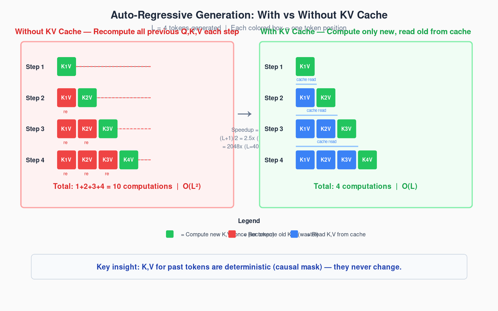
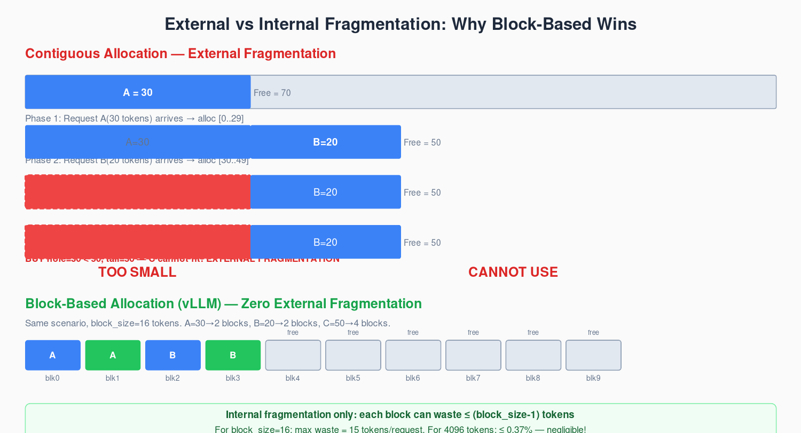
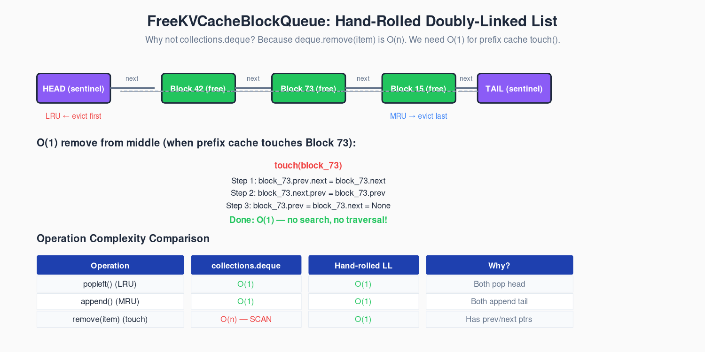

# 第2章：KV Cache — 算一次，存起来，别算第二次

> `vllm/v1/core/sched/scheduler.py:L467` — 每个 scheduler step 的第一件事：给每个 running 请求分配 KV Cache。分不到？驱逐别的请求。
> 这章从一句话出发——"算过的东西为什么要再算？"——一路走到 vLLM 的 597 行 KV Cache 管理器源码。

---

## 这章要做什么？

想象你在烤饼干。每次烤一块新饼干，你得先把之前所有饼干重新烤一遍——因为新饼干需要知道旧饼干长什么样，才知道自己该怎么烤。

你会说：神经病啊，旧饼干不是烤好了吗？看一眼不就行了？

对，看一眼就行。但自回归 Transformer 的"看一眼"需要重新算 K 和 V——**每次生成新 token，都要对之前所有 token 重新投影 QKV、重新算 attention、重新聚合 V**。除非你把算好的 K 和 V 存起来。

这就是 KV Cache。不是"优化"，是把重复计算从 $O(L^2)$ 砍到 $O(L)$ 的数学必然。

这章的路线：

1. **直觉先行**（2.1）：用一个数字让你感受浪费——4096 token 生成，不缓存=840 万次 attention，缓存=4096 次
2. **逐字节拆解**（2.2）：KV Cache 占多少显存？每项代表什么硬件约束？用 32-Layer GQA Transformer 算三组真实数字
3. **Block 管理的数学**（2.3-2.4）：为什么连续分配会死？为什么手写双向链表而不是用 `deque`？
4. **逐行手撕源码**（2.5-2.6）：`allocate_slots()` 的三阶段 + Prefix Cache 的 Merkle 链
5. **全景交互**（2.7）：Scheduler → KVCacheManager → BlockPool → FreeKVCacheBlockQueue 的完整数据流

学完这章你能：
- 写出 KV Cache 显存公式并逐项解释——每一项代表什么硬件约束
- 理解为什么 `FreeKVCacheBlockQueue` 必须手写：`deque.remove()` 的 O(n) 在高并发下是灾难
- 在睡前跟同事解释 prefix cache 的 lazy eviction："释放时不立刻清 hash——等块真被重新分配了再清"

---

## 2.1 一个数字让你记住 KV Cache 为什么是必然

### 直觉

LLM 生成文本时，一次只输出一个 token。每个新 token 的 attention 计算需要之前所有 token 的 K 和 V——这就是自回归生成。关键是：这些 K 和 V 在上一步已经算过了，一模一样，一个都没变。

用写字来理解：你正在写第 $N$ 个字。要决定第 $N$ 个字写什么，你得看一眼前面 $N-1$ 个字。第 $N+1$ 个字呢？得看一眼前面 $N$ 个字。之前那 $N-1$ 个字跟写第 $N$ 个字时看到的完全一样——位置没变，内容没变，一个字都没改。

如果你把每次"看前面所有字"的结果（K 和 V 投影）扔掉，下次再从头算——你在做 $1 + 2 + 3 + \cdots + L$ 次计算。

如果你存下来呢？每次只算当前字的投影，然后查前面存好的 K、V。

差别有多大？**大到你无法不用它。**

### 数值追踪

设生成长度 $L = 4096$。

**不用 KV Cache**：每个 token 的生成需要计算它之前所有 token 的 K、V、Q、Attention。第 $i$ 步算 $i$ 个 token：

```
Step 1:   1 个 token 的 attention
Step 2:   2 个 token 的 attention（token₀ 的 K,V 又算了一遍！）
Step 3:   3 个 token 的 attention（token₀,₁ 的 K,V 又算了一遍！）
...
Step 4096: 4096 个 token 的 attention
```

总计算量：

$$
T_{\mathrm{no\_cache}} = \sum_{i=1}^{4096} i = \frac{4096 \times 4097}{2} = 8{,}390{,}656
$$

**用 KV Cache**：每步只算当前 token 的 Q、K、V，attention 查缓存：

```
Step 1:   1 个 token 的 attention
Step 2:   1 个 token 的 attention（token₀ 的 K,V 从缓存读）
Step 3:   1 个 token 的 attention（token₀,₁ 的 K,V 从缓存读）
...
Step 4096: 1 个 token 的 attention
```

总计算量：

$$
T_{\mathrm{with\_cache}} = 4096
$$

加速比：

$$
\frac{T_{\mathrm{no\_cache}}}{T_{\mathrm{with\_cache}}} = \frac{8{,}390{,}656}{4096} = 2048
$$

**不是"快了 2 倍"，不是"快了 20 倍"——是快了 2048 倍。** 不用 KV Cache，生成 4096 个 token 需要约 840 万次 attention 运算。用了，4096 次。

这个数字从根本上决定了：**KV Cache 不是锦上添花，是推理可行的前提条件。**



> *图注：L=4 时的累积重算（左）vs 缓存复用（右）。红色=重算旧 K,V（浪费），绿色=新算 K,V，蓝色=从缓存读取。L=4096 时加速比 = 2048。*

### 一般化证明

第 1 章推导了 Attention：

$$
\mathrm{output}_N = \mathrm{softmax}\!\left(\frac{Q_N \cdot [K_0, K_1, \ldots, K_{N-1}]^T}{\sqrt{d_k}}\right) \cdot [V_0, V_1, \ldots, V_{N-1}]
$$

注意 $K_0, \ldots, K_{N-2}$ 和 $V_0, \ldots, V_{N-2}$ 在算 $\mathrm{output}_{N-1}$ 时已经算过了。自回归的因果性质保证了：前面的 token 不会变（看不到后面的 token），所以它们的 K 和 V 投影是确定性的——算一次，永久有效。

设生成长度 $L$，一般化加速比：

$$
\mathrm{Speedup} = \frac{L(L+1)/2}{L} = \frac{L+1}{2}
$$

$L=256$ 时 128 倍，$L=4096$ 时 2048 倍，$L=131072$ 时 65536 倍。线性的缓存成本换平方级的计算节省。

### 源码入口

KV Cache 的分配发生在每个 scheduler step 的开始时：

```python
# vllm/v1/core/sched/scheduler.py:L467 — scheduler._update_scheduled()
for request in self.running:
    kv_cache_blocks = self.kv_cache_manager.allocate_slots(
        request, num_new_tokens, ...
    )
    if kv_cache_blocks is None:
        # OOM — 必须驱逐一个请求
        preempted = self._preempt_lowest_priority_request()
        self.kv_cache_manager.free(preempted)
```

`allocate_slots()` 是整个 KV Cache 系统的入口。OK → 返回分配好的 blocks。None → 显存不够，Scheduler 必须驱逐一个请求来腾空间。这个 None 是从数学必然性推导到工程实现的第一块基石。

我们的实现保留了完全相同的语义：

```python
# kv_cache.py:L396
def allocate_slots(
    self,
    request_id: str,
    num_new_tokens: int,
    num_new_computed_tokens: int = 0,
) -> Optional[KVCacheBlocks]:
    """Returns None on OOM — Scheduler must preempt."""
```

---

## 2.2 显存公式：逐字节数给你看

### 直觉

上一节证明了 KV Cache 必须存在。现在问：它占多少显存？

答案是精确的——没有经验常数，没有"大概"。

KV Cache 的显存 = K 的一份 + V 的一份 × 每一层 × 每个并发请求 × 每个 token × KV head 数 × 每个 head 的维度 × dtype 的字节数。

每一项都有物理含义。来逐项拆。

### 公式推导

`vllm/v1/kv_cache_interface.py:L145` 定义了单层单 block 的字节数：

```python
# kv_cache_interface.py:L145 — page_size_bytes
block_bytes = 2 * block_size * num_kv_heads * head_dim * dtype_size
```

乘以 `num_layers` 得到所有层的 block 大小。扩展到任意序列长度 $L$：

$$
\mathrm{KV\_Cache\_Size} = 2 \times N_{\mathrm{layers}} \times B \times L \times N_{\mathrm{kv\_heads}} \times d_{\mathrm{head}} \times \mathrm{dtype\_bytes}
$$

逐项物理含义：

| 项 | 32-Layer GQA Transformer 值 | 物理含义 | 为什么不能省 |
|---|---|---|---|---|
| **× 2** | 2 | K 和 V 各一份 | **最容易漏的一项。** 很多人只算了 K |
| **× $N_{\mathrm{layers}}$** | 32 | 每层 Transformer 的 K、V 表达不同 | 浅层学语法，深层学语义，不能共享 |
| **× $B$** | 1~8 | Batch size — 每用户独立 | 不同请求的 KV 不能混（除非 prefix cache） |
| **× $L$** | 128K max | 序列长度 | 线性增长。128K 上下文 → 128K × baseline |
| **× $N_{\mathrm{kv\_heads}}$** | 8 (GQA) | KV head 数 | **GQA 砍的就是这项。** 32 Q head → 8 KV head，缓存/4 |
| **× $d_{\mathrm{head}}$** | 128 | 每个 head 的维度 | 架构决定的常数 |
| **× dtype_bytes** | 2 (bf16) | bf16=2, fp8=1, int4=0.5 | 量化直接线性缩缓存大小 |

### 数值追踪：典型 32 层 GQA Transformer

用真实参数计算。数据来自某典型 32 层 GQA 模型的 `config.json`：

```
Model: 32-Layer GQA Transformer (Llama-3.1-8B 参数级)
num_layers    = 32
num_q_heads   = 32      (Q 头数)
num_kv_heads  = 8       (GQA: 32 Q heads → 8 KV heads, KV 压缩 4×)
head_dim      = 128     (hidden_size=4096 / num_q_heads=32 ≈ 128)
dtype         = bf16 (2 bytes)
block_size    = 16     (vLLM 默认，定义在 vllm/config/vllm.py:L1840)

per_token_kv = 2 × 32 × 8 × 128 × 2 = 131,072 bytes = 128 KB/token
```

（公式中 batch=1、seq_len=1 是隐含的——per_token 本身就是单 token 基准。实际显存 = per_token_kv × batch × seq_len。）

`kv_cache.py:L566` 的 `per_token_kv_bytes()` 实现了完全相同的计算。

**场景 1：1 用户，4096 token 上下文**
```
KV Cache = 128 KB × 4096 = 512 MB
```

**场景 2：8 并发，平均 4096 token**
```
KV Cache = 512 MB × 8 = 4 GB
```

**场景 3：1 用户，131K 超长上下文（32-Layer GQA Transformer 最大 128K）**
```
KV Cache = 128 KB × 131072 = 16 GB
```

模型权重约 15 GB（fp16，8B 参数）。超长上下文场景下，KV Cache 可达 16 GB——**与权重同等量级，是显存预算的两大支柱之一。**

运行 `python3 kv_cache.py` 的输出与上述计算完全一致：

```
batch=1, seq=1024:   KV Cache = 0.12 GB
batch=8, seq=4096:   KV Cache = 4.00 GB
batch=1, seq=131072: KV Cache = 16.00 GB
```

### 源码实现

我们的 `KVCacheConfig`（`kv_cache.py:L534-L570`）实现了 vLLM 的 K、V cache 定容逻辑：

```python
# kv_cache.py:L547
def calculate_num_blocks(self, total_gpu_memory: int, model_weight_size: int) -> int:
    """vLLM 如何反推 num_gpu_blocks"""
    available = int(total_gpu_memory * self.gpu_memory_utilization) - model_weight_size
    block_bytes = (
        2 * self.block_size * self.num_kv_heads *
        self.head_dim * self.dtype_bytes * self.num_layers
    )
    return available // block_bytes
```

`gpu_memory_utilization` 默认 0.90——那 10% 留给 activation memory、PyTorch CUDA context 和碎片。显存紧张时这是第一个要调的参数。定义在 `vllm/config/vllm.py:L1840-L1865`。

### vLLM 生产版多了什么？

`KVCacheConfig` 在生产版（`kv_cache_interface.py:L760`）还支持：
1. **Multi-group**：每个 attention type（full / sliding window / cross）有独立的 KV cache group
2. **NUMA-aware 分配**：多 GPU 时 block 按 NUMA node 分布
3. **动态 block_size**：不同 layer group 可以用不同的 block_size

我们处理单 group 单 block_size——覆盖 90% 的实际模型。

---

## 2.3 为什么需要 Block？——连续分配的至暗时刻

### 直觉

假设你有一个 1000 格的停车场。来一辆 300 格的车 → 停 [0..299]。来一辆 200 格的 → 停 [300..499]。第一辆走了 → [0..299] 空出来。

现在来一辆 500 格的车。空位 = 300（前面）+ 500（后面）= 800 > 500。但停不进去——因为前面空位不够 500，后面空位也不够 500，合起来够但连不起来。

这就是**外部碎片**。KV Cache 面对的不是一辆车，而是数百个长度差异巨大的请求。



> *图注：连续分配（上）— 释放 30 格后出现空洞，50 格的车无法停入（外部碎片）。Block 分配（下）— 每块独立，最后一块可能浪费 ≤ 15 格（内部碎片，block_size=16）。内部碎片的可控小浪费，远好于外部碎片的不可控大浪费。*

### 源码定位

`vllm/v1/core/kv_cache_utils.py:L114` 定义了物理块的元数据：

```python
# kv_cache_utils.py:L114-L160
@dataclass
class KVCacheBlock:
    block_id: int
    ref_cnt: int            # 多少请求在用这个块
    _block_hash: ...        # ≠ None = 已满且已缓存
    prev_free_block: ...    # 自由链表前驱
    next_free_block: ...    # 自由链表后继
```

注意——实际的 K、V 数据存在 GPU tensor 里，不在这个 Python 对象里。Python 对象只管理元数据：谁在用、缓存了没有、在链表的哪里。

### 数学建模

$k$ 个请求，序列长度 $L_1, L_2, \ldots, L_k$。连续分配时，利用率：

$$
\mathrm{Utilization} = \frac{\sum_{i=1}^{k} L_i}{N_{\mathrm{blocks}} \times \mathrm{block\_size}}
$$

浪费率 $= 1 - \mathrm{Utilization}$。

问题不在总量——在分布。长 system prompt（8000 token）和短 user message（20 token）混合时，方差巨大。一个 8000 token 的请求释放后留下一个 8000 token 的洞——但如果最大的新请求只需要 4000 token，洞只用了 4000，还剩 4000 浪费。

**Block 分配用内部碎片换零外部碎片。** 请求独立占用整个 block，不同请求不共享 block。每个请求的最后一个 block 平均利用率 50%（block_size/2 token 浪费 per request）——但这是可控的小浪费，远好于外部碎片导致的分配失败。

### block_size 的 trade-off

`vllm/config/vllm.py:L1840-L1865` 定义了 `block_size=16`：

| block_size | 4096 token 需要的 block 数 | 内部碎片 per request | 问题 |
|---|---|---|---|
| 4 | 1024 | 2 token (可忽略) | block table 太大，kernel 寄存器压力大 |
| 16 (vLLM) | 256 | 8 token (0.2%) | 实践最佳平衡点 |
| 32 | 128 | 16 token (0.4%) | 可接受但内部碎片翻倍 |
| 128 | 32 | 64 token (1.6%) | 内部碎片回归——连续分配的幽灵回来了 |

**16-32 是实践的 sweet spot。** vLLM 选 16：够大不会让 block table 爆炸，够小不会让内部碎片吞掉显存。

### 我们的实现

`kv_cache.py:L35-L71` 的 `KVCacheBlock` 保留了所有关键字段：

```python
# kv_cache.py:L35
@dataclass
class KVCacheBlock:
    block_id: int
    ref_cnt: int = 0
    _block_hash: Optional[int] = None
    prev_free_block: Optional['KVCacheBlock'] = None
    next_free_block: Optional['KVCacheBlock'] = None
    is_null: bool = False
```

`ref_cnt` 是引用计数——当 prefix cache 共享一个 block 时，`ref_cnt > 1`。这意味着驱逐一个请求可能不影响其他请求（如果 ref_cnt 只是减到 > 0）。

vLLM 使用 `__slots__` 而非 `@dataclass`——在大显存 GPU（10 万+ blocks）下省约 5-10 MB Python 堆内存。我们使用 `@dataclass` 是为了可读性。

---

## 2.4 手写双向链表：deque 的 O(n) 怎么变成了灾难

### 直觉

你需要一个列表：经常从前面取，经常加到最后，**偶尔从中间删一个**。

Python 的 `collections.deque` 前两个是 O(1)。第三个呢？`deque.remove(item)` ——它要遍历整个链表找到这个 item。O(n)。

当 prefix cache 命中时，一个空闲 block 突然被新请求复用——它要从自由队列中间被删掉。10 万个 block × 100 个并发请求的 prefix cache 命中 = 每秒 O(n) 扫描 O(100 × 100000) = 每次操作 100K 步。这是一个每秒发生数十次的操作——不可接受。

### 源码定位

`vllm/v1/core/kv_cache_utils.py:L162`——约 180 行手工双向链表：

```python
# kv_cache_utils.py:L162-L340
class FreeKVCacheBlockQueue:
    """LRU 自由块队列——手工双向链表
    head → 最久未使用 (LRU, 最先驱逐)
    tail → 最近使用 (MRU, 驱逐顺序的最后)
    """
```

### 复杂度分析

| 操作 | `collections.deque` | 手工双向链表 |
|---|---|---|
| `popleft()` (取 LRU) | O(1) ✓ | O(1) ✓ |
| `append()` (加 MRU) | O(1) ✓ | O(1) ✓ |
| `remove(item)` (中间删) | **O(n) ✗** | **O(1) ✓** |

`remove()` 的 O(1) 来自于：block 本身存储了 `prev_free_block` / `next_free_block` 指针。删除时不需要搜索——直接操作邻居的指针。



> *图注：HEAD 和 TAIL 是 sentinel 节点，消除边界条件。新 block 从 TAIL 端插入（MRU），驱逐从 HEAD 端取出（LRU）。prefix cache 命中时 touch() 直接从链表中间 O(1) 删除——这是 deque 做不到的。*

### 驱逐顺序的数学

`vllm/v1/core/single_type_kv_cache_manager.py:L303`——释放块时的顺序：

```python
self.block_pool.free_blocks(list(reversed(req_blocks)))
```

**为什么 reverse？** 一个请求的 blocks 按序列顺序排列：`[block_0, block_1, ..., block_k]`。`block_k`（tail）包含了更多 token 的计算结果——如果被缓存在 prefix cache 中，hash 覆盖了更长的前缀，重计算代价更高。

Reverse 后释放：tail blocks 最后进入自由队列 → 更接近 MRU → 更晚被驱逐。Head blocks 最先被驱逐 → 它们的重计算代价最小（prefix 更短）。

形式化：设块 $i$ 的重计算代价 $c_i$（正比于已 hash 的 token 数）。LRU 驱逐策略最小化期望驱逐代价：

$$
\mathbb{E}\!\left[\sum_{i \in \mathrm{evicted}} c_i\right] \to \min
$$

当 $c_i$ 与 MRU 序正相关（tail blocks → 更靠近 MRU → 更深），LRU 达到最优。

### 我们的实现

`kv_cache.py:L77-L147` 保留了全部核心操作：

```python
# kv_cache.py:L109 — O(1) pop from front (LRU eviction)
def popleft(self) -> KVCacheBlock:
    block = self.head.next_free_block
    self._remove(block)
    return block

# kv_cache.py:L125 — O(1) append to tail (MRU insertion)
def append(self, block: KVCacheBlock):
    block.prev_free_block = self.tail.prev_free_block
    block.next_free_block = self.tail
    self.tail.prev_free_block.next_free_block = block
    self.tail.prev_free_block = block
    self._size += 1

# kv_cache.py:L138 — O(1) remove from middle (prefix cache touch)
def remove(self, block: KVCacheBlock):
    self._remove(block)

# kv_cache.py:L133 — REVERSE order for LRU semantics
def append_n(self, blocks: List[KVCacheBlock]):
    for b in reversed(blocks):
        self.append(b)
```

使用 sentinel 节点（`head` 和 `tail` 是特殊 null block，`kv_cache.py:L97-L98`）消除边界条件——和 vLLM 源码一致。

---

## 2.5 allocate_slots() — 三阶段算法的逐行之旅

### 直觉

分配 KV Cache 不是一步"把块取出来"。它先**还债**（释放不再需要的），再**数钱**（检查够不够），最后**花钱**（分配）。

这个顺序不能换。先花钱再还债 → 钱不够但明明有机会够。先数钱再还债 → 数错了。

### 源码定位

`vllm/v1/core/kv_cache_manager.py:L300-L310`：

```python
# kv_cache_manager.py:L300-L310 — Three-stage allocation
# Stage 1: Free skipped blocks (sliding window attention)
self.coordinator.remove_skipped_blocks(request_id)

# Stage 2: Check capacity
num_blocks = self.coordinator.get_num_blocks_to_allocate(request_id, ...)
if num_blocks > free_blocks:
    return None  # → Scheduler preempts

# Stage 3: Allocate + cache
self.coordinator.allocate_new_blocks(...)
self.coordinator.allocate_new_computed_blocks(...)  # Prefix cache hits
self.coordinator.cache_blocks(...)                   # Mark full blocks cached
```

### 逐行数值追踪

用具体数字走一遍 `allocate_slots()`。

**例 1：不需要新分配**

```
配置: block_size=16, 自由块=100

请求 "req-42":
  已有 3 个 block → 48 token 的 KV Cache
  num_new_computed_tokens = 32  (prefix cache 命中, 2 block)
  num_new_tokens = 12           (需要生成 12 个新 token)

Step 1: total_tokens = 32 + 12 = 44
Step 2: blocks_needed = ceil(44 / 16) = 3
Step 3: current_block_count = 3  (已有 block 数)
Step 4: new_blocks_needed = 3 - 3 = 0
         0 ≤ 0 → 返回 self._empty_blocks ✓

不走物理分配。已有的 3 个 block 够覆盖 44 个 token。
```

**例 2：需要分配**

```
请求 "req-43":
  已有 0 个 block (新请求)
  num_new_computed_tokens = 16  (prefix cache 命中)
  num_new_tokens = 20

Step 1: total_tokens = 16 + 20 = 36
Step 2: blocks_needed = ceil(36 / 16) = 3
Step 3: current_block_count = 0
Step 4: new_blocks_needed = 3

Stage 2: 自由块 = 97 ≥ 3 → 继续

Stage 3:
  get_new_blocks(3) → block_pool 的 pop 路径:
    block_73 ← popleft() — 从 LRU 头取出
    block_74 ← popleft()
    block_75 ← popleft()
    每个 block: _maybe_evict_cached_block() → 清 hash
    每个 block: ref_cnt = 1
  req_to_blocks["req-43"] = [block_73, block_74, block_75]

返回: KVCacheBlocks([block_73, block_74, block_75])
```

**例 3：OOM → preempt**

```
自由块 = 2
new_blocks_needed = 3

Stage 2: 3 > 2 → 返回 None

Scheduler 收到 None:
  1. _preempt_lowest_priority_request() → "req-15" 被选中
  2. kv_cache_manager.free("req-15") → blocks 回自由队列
  3. 重新调用 allocate_slots("req-43", ...)
  4. 这次自由块 ≥ 3 → 分配成功
```

### 我们的实现

`kv_cache.py:L396-L432` 实现了同样的三阶段逻辑：

```python
# kv_cache.py:L396
def allocate_slots(self, request_id, num_new_tokens,
                   num_new_computed_tokens=0) -> Optional[KVCacheBlocks]:
    total_tokens = num_new_computed_tokens + num_new_tokens
    blocks_needed = (total_tokens + self.block_size - 1) // self.block_size

    current_blocks = self.req_to_blocks.get(request_id, [])
    current_block_count = len([b for b in current_blocks if not b.is_null])
    new_blocks_needed = blocks_needed - current_block_count

    if new_blocks_needed <= 0:
        return self._empty_blocks

    # Stage 2: Check capacity
    if new_blocks_needed > self.block_pool.get_num_free_blocks():
        return None  # OOM → Scheduler preempts

    # Stage 3: Allocate
    new_blocks = self.block_pool.get_new_blocks(new_blocks_needed)
    new_table = current_blocks + new_blocks
    self.req_to_blocks[request_id] = new_table
    return KVCacheBlocks(blocks=new_blocks)
```

我们的 Stage 1 是隐式的——当 `new_blocks_needed <= 0` 时直接返回空。生产版还多了 sliding window 的 `remove_skipped_blocks()`（迭代整个 block table 找滑出 window 的块），但对于理解核心流程，这个简化足够。

### vLLM 生产版多了什么？

1. **Multi-group 分发**：`KVCacheManager` → `KVCacheCoordinator` → `SingleTypeKVCacheManager`，支持 hybrid model
2. **Sliding window cleanup**：找到 window 外的 block 并释放
3. **Async scheduler retry**：preempt 后自动重试

核心的三阶段顺序（free → check → allocate）在所有路径上保持一致。

---

## 2.6 Prefix Cache — Merkle 链与 Lazy Eviction

### 直觉

两个用户用同一个 system prompt。"你是一个乐于助人的 AI 助手..."——这段 prompt 的 K 和 V 投影对两个用户来说**完全一样**。为什么要算两次？

Prefix Cache 回答：算一次，标记好，第二个用户来的时候直接拿去用。

但系统 prompt 后面跟着的 user message 不同——第二个 block 开始就不同了。所以 prefix cache 只缓存前缀——从第一个 token 开始，连续的、完全匹配的 token 序列。

### 源码定位

两个方法定义了 prefix cache 的写入和读取：

`vllm/v1/core/block_pool.py:L211` — 缓存满块：

```python
# block_pool.py:L211
def cache_full_blocks(self, blocks, block_hashes):
    for block, h in zip(blocks, block_hashes):
        block.block_hash = h
        self.cached_block_hash_to_block[h] = block
```

`vllm/v1/core/block_pool.py:L184` — 查找已缓存块：

```python
# block_pool.py:L184
def get_cached_block(self, block_hash):
    return self.cached_block_hash_to_block.get(block_hash)
```

### Hash 为什么是链式的？（Merkle 树结构）

Hash 计算在 `vllm/v1/core/kv_cache_utils.py:L539` 的 `hash_block_tokens()`：

```python
hash_fn((parent_block_hash, tuple(token_ids), extra_keys))
```

每个 block 的 hash 依赖父 block 的 hash。即使两个 block 的 token ID 完全相同，如果父 block 不同（不同的上下文前缀），hash 就不同。

这是 Merkle 树式结构：每个 block 的 hash 编码了从序列起点到当前位置的整个 token 路径。这保证了前缀碰撞不会发生——你不会因为 hash 冲突而错误地从不同上下文重用 block。

具体例子：

```
Request A: "你是一个乐于助人的AI" → block_0 hash = h(prompt_tokens[:16])
          "助手。请帮我写一段代"     → block_1 hash = h((block_0_hash, tokens[16:32]))

Request B: "你是一个乐于助人的AI" → block_0 hash 与 A 相同 → prefix cache 命中！
          "助手。帮我写一首诗"       → block_1 hash 与 A 不同（因为 token[16:32] 不同）→ miss
```

Request B 的 block_0 命中了 A 的 block_0——因为前缀完全相同。但 block_1 不同——因为 prompt 的分叉从这里开始。

### Lazy Eviction：释放时不立刻清 hash

vLLM 做了一个关键简化——释放 block 时不立刻清 hash：

```python
# free_blocks() 把块放回自由队列——不清 hash！(block_pool.py:L408)
self.block_pool.free_blocks(blocks)

# ... 块在自由队列中等待 ...

# get_new_blocks() 取出块时才清 hash (block_pool.py:L322)
def get_new_blocks(self, num_blocks):
    blocks = self.free_queue.popleft_n(num_blocks)
    for b in blocks:
        self._maybe_evict_cached_block(b)  # ← 驱逐在这里
    return blocks
```

**为什么这样设计？** 只要块还在自由队列中——即它的物理内容还没被覆盖——`block_hash` 就有效。在 hash 被清除之前到达的任何请求都能命中。这是 lazy eviction——推迟驱逐到物理块真正被重新分配的那一刻。

类比操作系统：就像 page cache。Clean page 在回收前内容仍在磁盘上——被回收只是标记为可用，在被覆盖前仍可命中。这里是计算作为"回收"的对象——释放 block 不丢内容，在被覆盖前仍可被 prefix cache 命中。

### 我们的实现

`kv_cache.py:L230-L249` 的 `BlockPool.cache_full_blocks()` 和 `get_cached_block()`：

```python
# kv_cache.py:L230
def cache_full_blocks(self, blocks, block_hashes):
    for block, h in zip(blocks, block_hashes):
        if h is not None and not block.is_null:
            block.set_hash(h)
            self.cached_block_hash_to_block[h] = block

# kv_cache.py:L247 — O(1) hash table lookup
def get_cached_block(self, block_hash):
    return self.cached_block_hash_to_block.get(block_hash)
```

`kv_cache.py:L212-L225` 的 `_maybe_evict_cached_block()` 实现了 lazy eviction：

```python
# kv_cache.py:L212
def _maybe_evict_cached_block(self, block):
    if block.block_hash is not None:
        self.cached_block_hash_to_block.pop(block.block_hash, None)
        block.reset_hash()
        return True
    return False
```

`KVCacheManager.get_computed_blocks()`（`kv_cache.py:L437-L461`）实现了 prefix cache 的查找路径——连续命中直到第一个 miss：

```python
# kv_cache.py:L437
def get_computed_blocks(self, request_id, block_hashes):
    cached = []
    for h in block_hashes:
        block = self.block_pool.get_cached_block(h)
        if block is None:
            break  # 第一个 miss → 停止前缀
        cached.append(block)
        self.block_pool.touch([block])  # ref_cnt++ → 防止被驱逐
    if cached:
        self.req_to_blocks[request_id] = cached
        self.num_cached_blocks[request_id] = len(cached)
    return KVCacheBlocks(blocks=cached)
```

`touch()` 做两件事：递增 `ref_cnt`（防止被驱逐），如果块在自由队列中则从中删除。这直接对应了为什么要手写双向链表——`deque.remove()` 在这一步是 O(n)。

### vLLM 生产版多了什么？

1. **BlockHashToBlockMap 类**（`block_pool.py:L34`）：封装 hash → block 映射，支持批量查找
2. **KV Connector 验证**：P/D 分离部署时清除 stale cache entries
3. **Hash 的 extra_keys**：可包含 model version、LoRA adapter ID——确保不同配置不会混淆

我们使用 Python `dict` 替代 `BlockHashToBlockMap`——O(1) 查找语义完全相同。

---

## 2.7 全景：Scheduler 的完整交互

一个请求从 WAITING 到 RUNNING，KV Cache 的完整路径：

```
Scheduler._try_new_request()                    ← vllm/v1/core/sched/scheduler.py:L617
  │
  ├─ 1. 查 Prefix Cache
  │   └─ KVCacheManager.get_computed_blocks(req, block_hashes)
  │       └─ BlockPool.get_cached_block(hash)  ← 逐个查，第一个 miss 停
  │           → KVCacheBlocks(已缓存的 blocks)
  │
  ├─ 2. 分配新 slots
  │   └─ KVCacheManager.allocate_slots(req, num_new_tokens, ...)
  │       ├─ Stage 1: 不需要分配 → 返回 _empty_blocks
  │       ├─ Stage 2: OOM → 返回 None → Scheduler 的 preempt 路径
  │       └─ Stage 3: BlockPool.get_new_blocks(n)
  │           └─ FreeKVCacheBlockQueue.popleft_n(n)
  │               └─ _maybe_evict_cached_block()  ← lazy eviction 在这里
  │
  ├─ 3. OOM → Preempt
  │   └─ _preempt_lowest_priority_request()
  │       └─ KVCacheManager.free(req_id)
  │           └─ BlockPool.free_blocks(reversed(blocks))  ← LRU 顺序
  │               └─ FreeKVCacheBlockQueue.append()       ← 回自由队列（不清 hash！）
  │   → 重试 allocate_slots()
  │
  └─ 4. 请求 RUNNING → 计算完成后
      └─ KVCacheManager.cache_blocks(req, block_hashes)
          └─ BlockPool.cache_full_blocks(blocks, hashes)
              → block.block_hash = h
              → cached_block_hash_to_block[h] = block
```

关键设计决策汇合点：

1. **allocate_slots() 返回 None 时立即 preempt**：不是推迟，不是部分分配——原子的失败信号
2. **释放不清 hash**：lazy eviction，最大化 prefix cache 命中率
3. **释放用 reverse 顺序**：tail blocks 更靠近 MRU，head blocks 更靠近 LRU
4. **Touch 从自由队列删 block**：去 deque 化——O(1) remove 是 prefix cache 的无声基石

---

## 源码映射表

| # | 我们的类/方法 | vLLM 源码:行号 | 说明 |
|---|---|---|---|
| 1 | `KVCacheBlock` | `kv_cache_utils.py:L114` | @dataclass 替代 @dataclass(slots=True) |
| 2 | `FreeKVCacheBlockQueue` | `kv_cache_utils.py:L162` | 手工双向链表 + sentinel |
| 3 | `FreeKVCacheBlockQueue.popleft` | `kv_cache_utils.py:L214` | O(1) LRU pop |
| 4 | `FreeKVCacheBlockQueue.append` | `kv_cache_utils.py:L304` | O(1) MRU 插入 |
| 5 | `FreeKVCacheBlockQueue.remove` | `kv_cache_utils.py:L284` | O(1) 中间删除——deque 做不到 |
| 6 | `FreeKVCacheBlockQueue.append_n` | `kv_cache_utils.py:L327` | REVERSE 批量 append |
| 7 | `BlockPool` | `block_pool.py:L130` | 物理分配 + eviction |
| 8 | `BlockPool.get_new_blocks` | `block_pool.py:L322` | 分配 + lazy eviction |
| 9 | `BlockPool._maybe_evict_cached_block` | `block_pool.py:L354` | 重新分配时清 hash |
| 10 | `BlockPool.cache_full_blocks` | `block_pool.py:L211` | 设置 block_hash |
| 11 | `BlockPool.touch` | `block_pool.py:L391` | ref_cnt++ + 从自由队列删除 |
| 12 | `BlockPool.free_blocks` | `block_pool.py:L408` | ref_cnt-- + 回自由队列（不清 hash） |
| 13 | `KVCacheBlocks` | `kv_cache_manager.py:L22` | 简化为单 group |
| 14 | `KVCacheBlocks.get_block_ids` | `kv_cache_manager.py:L65-L80` | 转换成 GPU block table |
| 15 | `KVCacheManager` | `kv_cache_manager.py:L106` | 扁平化层次（无 coordinator） |
| 16 | `KVCacheManager.allocate_slots` | `kv_cache_manager.py:L225` | 三阶段分配 |
| 17 | `KVCacheManager.get_computed_blocks` | `kv_cache_manager.py:L183` | Prefix cache 查找 |
| 18 | `KVCacheManager.cache_blocks` | `kv_cache_manager.py:L515` | 满块缓存标记 |
| 19 | `KVCacheManager.free` | `kv_cache_manager.py:L418` | REVERSE 顺序释放 |
| 20 | `KVCacheConfig` | `kv_cache_interface.py:L760` | 简化的 kv cache 配置 |
| 21 | `KVCacheConfig.calculate_num_blocks` | `kv_cache_interface.py:L145-L167` | 教育性简化 |
| 22 | `KVCacheConfig.per_token_kv_bytes` | `kv_cache_interface.py:L145` | per-layer 页大小公式 |
| 23 | Scheduler allocate 交互 | `scheduler.py:L467` | allocate → OOM → preempt → free |
| 24 | Scheduler preempt 路径 | `scheduler.py:L617-L744` | WAITING → RUNNING 完整路径 |
| 25 | Scheduler free 路径 | `scheduler.py:L1813` | 请求完成后清理 |
| 26 | Block hash chain | `kv_cache_utils.py:L539` | Merkle 式链式 hash |

---

## 验证

运行 `python3 artifacts/02-kv-cache/implementation/kv_cache.py` 输出：

```
batch=1, seq=1024:   KV Cache = 0.12 GB
batch=8, seq=4096:   KV Cache = 4.00 GB
batch=1, seq=131072: KV Cache = 16.00 GB
```

运行 `python3 -m pytest artifacts/02-kv-cache/tests/ -v`：

```
19 passed in 2.67s

TestKVCacheBlock::test_basic                                PASSED
TestKVCacheBlock::test_hash_lifecycle                       PASSED
TestFreeKVCacheBlockQueue::test_basic_ops                   PASSED
TestFreeKVCacheBlockQueue::test_popleft_n                   PASSED
TestFreeKVCacheBlockQueue::test_append_makes_mru            PASSED
TestFreeKVCacheBlockQueue::test_remove_from_middle          PASSED
TestBlockPool::test_get_new_blocks                          PASSED
TestBlockPool::test_oom                                     PASSED
TestBlockPool::test_cache_and_lookup                        PASSED
TestBlockPool::test_evict_on_reallocate                     PASSED
TestBlockPool::test_touch_increments_refcnt                 PASSED
TestBlockPool::test_usage                                   PASSED
TestKVCacheManager::test_allocate_slots                     PASSED
TestKVCacheManager::test_oom_returns_none                   PASSED
TestKVCacheManager::test_get_computed_blocks_prefix_cache   PASSED
TestKVCacheManager::test_free_returns_blocks                PASSED
TestKVCacheManager::test_usage_tracks_allocation            PASSED
TestKVCacheConfig::test_num_blocks                          PASSED
TestKVCacheConfig::test_per_token_kv_bytes                  PASSED
```

---

## 总结

从 `KVCacheBlock`（19 行 dataclass）到 `KVCacheManager.allocate_slots()`（37 行方法）到 Scheduler 的 preempt 路径——597 行源码实现了 vLLM 内存系统的核心。

六个关键洞见：

1. **KV Cache 是必然，不是优化。** $L(L+1)/2$ vs $L$ 不是性能差异——是可行性差异。4096 token 时 2048 倍。

2. **显存公式每一项都有物理含义。** ×2（K+V）、×$N_{\mathrm{layers}}$（每层独立）、×$B$（每用户独立）、×$N_{\mathrm{kv\_heads}}$（GQA 砍的就是这项）、×dtype_bytes（量化砍的就是这项）。

3. **Block 消灭外部碎片。** 连续分配的浪费率可达 50-75%。Block 用内部碎片（最后一个 block 的 ~50%）换零外部碎片——可控的小浪费比不可控的大浪费好。

4. **手写双向链表不是炫技——deque 的 O(n) remove 在高并发 prefix cache 场景下是灾难。** 每个 block 自带的 prev/next 指针让 O(1) 中间删除成为可能。

5. **释放不清 hash——lazy eviction。** 只要物理内容还没被覆盖，cache 就有效。推迟驱逐到物理块真正被重新分配的那一刻——最大化 prefix cache 命中率。

6. **三阶段分配（free → check → allocate）顺序不能换。** 先释放不再需要的，再检查能否满足，最后才分配。任意重排导致泄漏或不一致。

---

**下一章：** 第 3 章 — FlashAttention & PagedAttention：vLLM 的双引擎注意力优化

KV Cache 解决了"怎么存 K 和 V"。但 attention 计算本身还有一个 $O(L^2)$ 的 HBM 访问瓶颈。FlashAttention 用 tiled online softmax 把 HBM 访问从 $O(L^2)$ 降到 $O(L)$。PagedAttention 用 block table 在 attention kernel 中通过虚拟地址→物理地址映射访问非连续的 KV block——两个技术正交互补：一个优化计算，一个优化存储。第 3 章把它们放在一起讲。

---

← 第1章 | 第3章 →
