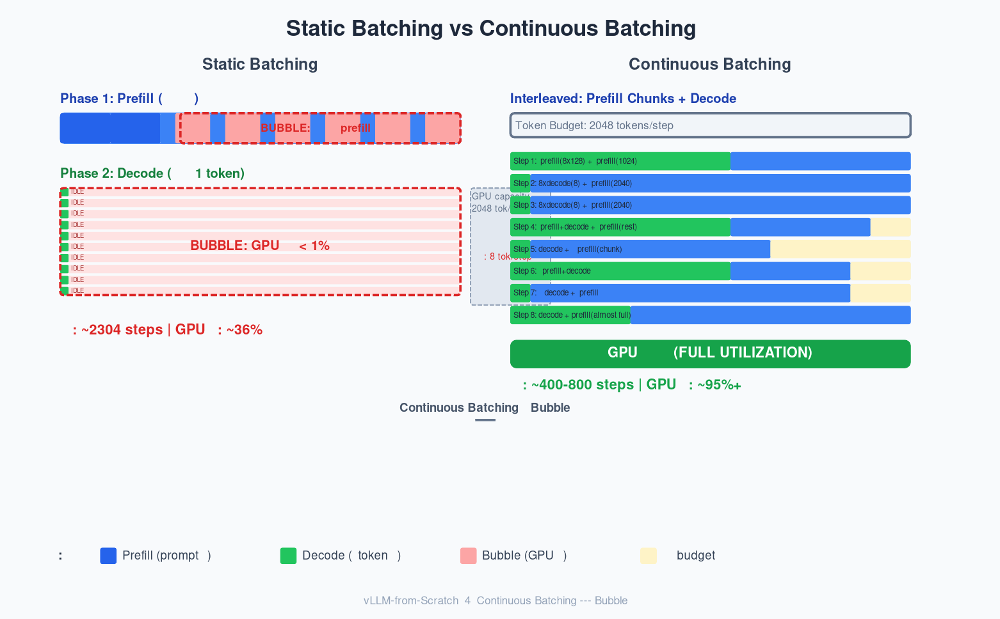

# 第4章：Continuous Batching 动态调度

> 打开 `vllm/v1/core/sched/scheduler.py:L352`。`schedule()` 方法开头的注释里有全章最关键的一句话：
>
> *"There's no 'decoding phase' nor 'prefill phase' in the scheduler.
> Each request just has num_computed_tokens and num_tokens_with_spec."*
>
> 这句话定义了 Continuous Batching 的本质。本章就是解释它为什么对，以及它怎么工作。

---

## Cell 2 — 开门见山：Scheduler 的一行注释定义了 CB

### Source Trail

打开 `vllm/v1/core/sched/scheduler.py:L67`。`Scheduler` 是 vLLM 推理引擎的大脑。每个 step 它只做一件事：

**在 token budget 和 KV Cache 的约束下，决定每个请求推进多少 token。**

这不是"先做 prefill、后做 decode"的旧模式。`scheduler.py:L353-L362` 的注释写得很清楚：

```python
# NOTE(woosuk) on the scheduling algorithm:
# There's no "decoding phase" nor "prefill phase" in the scheduler.
# Each request just has num_computed_tokens and num_tokens_with_spec.
# num_tokens_with_spec =
#   len(prompt_token_ids) + len(output_token_ids) + len(spec_token_ids).
# At each step, the scheduler tries to assign tokens to the requests
# so that each request's num_computed_tokens can catch up its
# num_tokens_with_spec. This is general enough to cover
# chunked prefills, prefix caching, speculative decoding,
# and the "jump decoding" optimization in the future.
```

woosuk（vLLM 作者之一）写这段注释时说的就是：**不要把请求分成"prefill"和"decode"两组。** 每个请求只是一个 token 流，scheduler 的工作是把这个流的"已处理游标"（`num_computed_tokens`）往前推。

为什么这个视角如此重要？

### Theory: 统一视角的力量

在旧模式（static batching）中，推理被切成两个阶段：
- **Prefill 阶段**：所有请求的 prompt 一起做 attention，计算量大，GPU 利用率高
- **Decode 阶段**：每次生成 1 个 token，GPU 利用率暴跌

两个阶段的切换是"全或无"的——要么全在做 prefill，要么全在做 decode。不能混。

但如果每个请求只追踪 `num_computed_tokens`，那么：
- 一个还有 500 个 prompt token 没算的请求 = `num_new_tokens = 500`
- 一个只剩 1 个 decode token 要生成的请求 = `num_new_tokens = 1`

**Scheduler 不需要知道它们分别是什么阶段。** 它只需要在 token budget 内，把每个请求的 `num_new_tokens` 尽可能推进。这个统一视角让 prefill chunk 和 decode token 可以在同一个 step 里处理。

**这就是 continuous batching 的核心前提。**

---

## Cell 3 — 问题演示：Static Batching 的 GPU 利用率惨案

### Source Trail: `scheduler.py` 的 two-phase 结构

打开 `scheduler.py:L388-L556`（Phase 1: Running 请求）和 `scheduler.py:L568-L846`（Phase 2: Waiting 请求）。这个 two-phase 结构的必要性，要从 static batching 的缺点说起。

### Theory: Bubble 的形式化定义

打开 `artifacts/04-continuous-batching/implementation/scheduler.py`，找到 `static_batching_simulation()`（L539-L575）。这个函数把 static batching 抽象成了数学模型。

```python
# scheduler.py:L562-L575 (static_batching_simulation 核心逻辑)
# Prefill phase
max_prompt = max(prompt_lens)
steps += max_prompt   # 等最长 prompt 算完

# Decode phase
while any(active):
    for i in range(len(requests)):
        if active[i]:
            remaining_output[i] -= 1
            if remaining_output[i] <= 0:
                active[i] = False
    steps += 1
```

Static batching 的总步数由两个瓶颈决定：

$$
T_{\mathrm{static}} = \max_i P_i + \max_i O_i
$$

其中 $P_i$ 是请求 $i$ 的 prompt 长度，$O_i$ 是输出长度。所有请求的 prefill 要等到最长 prompt 算完才开始 decode；所有 decode 要等到最长输出完成才结束。

**这就是 bubble 的来源——短请求在等长请求，GPU 在空转。**

### 数值示例

以 demo 的 3 个请求（r1=800+20, r2=200+50, r3=50+100）计算：

$\max P_i = 800$，$\max O_i = 100$

$$
T_{\mathrm{static}} = 800 + 100 = 900
$$

Static batching 需要 900 步。

**利用率计算：** static batching 每步处理 $N = 3$ 个 token（batch 内每个请求各一个位置）。

有效 token 总数：$\sum(P_i + O_i) = (800 + 200 + 50) + (20 + 50 + 100) = 1050 + 170 = 1220$

总 GPU 处理能力：$T_{\mathrm{static}} \times N = 900 \times 3 = 2700$

$$
\eta_{\mathrm{static}} = \frac{1220}{900 \times 3} \approx 45.2\%
$$

利用率不到一半。这 54.8% 的空闲就是 **bubble**——GPU 有能力算更多，但 static batching 的"全或无"规则不让它算。

### Bubble 的本质：同步瓶颈

Static batching 的效率公式揭示了一个根本问题：

$$
\eta_{\mathrm{static}} = \frac{\sum_i (P_i + O_i)}{(\max_i P_i + \max_i O_i) \times N}
$$

分母有 $\max_i P_i + \max_i O_i$，分子有 $\sum_i (P_i + O_i)$。当请求之间的 prompt 长度差异大时，$\sum_i P_i \ll N \times \max_i P_i$——短的被长的拖累。

更严重的是：**batch size $N$ 远小于 GPU 的 token 处理能力 $B$。** GPU 每步能处理 2048 个 token，但 static batching 每步只处理 3 个。$B/N \approx 680$ 倍的浪费。

### Bubble 模拟验证

我们的 `bubble_analysis()` 函数用一个大 workload（8 个请求：4 个长 prompt 2048+256，4 个短 prompt 128+256）验证：

```bash
python3 implementation/scheduler.py
```

输出（bubble analysis 部分）：

```
Static batching:       2304 steps
Continuous batching:   261 steps
Speedup:               8.8x
Static GPU utilization: 58.3%
```

为什么 8 个请求的利用率是 58.3%（不是 45.2%）？因为请求越多，$\max P_i$ 和 $\sum_i P_i$ 的差距比例越小。8 个请求中 4 个长 4 个短，比值 $\sum P_i / (8 \times \max P_i) = (4\times 2048 + 4\times 128) / (8\times 2048) = 8704 / 16384 \approx 53.1\%$，比 3 个请求时好一些。但 58.3% 的利用率仍然很低——将近一半的 GPU 能力在空转。

**关键结论：** static batching 的利用率随着请求数量增加而提高（大 batch 稀释了 bubble 的比例），但受限于"prefill 阶段所有请求一起等最长 prompt"这个根本缺陷，利用率始终有上限。

### 餐厅厨房类比

Static batching = 一个餐厅先做完所有客人的汤，再做所有客人的主菜。

3 个客人：r1 点了 800 道汤 + 20 道主菜，r2 点了 200 道汤 + 50 道主菜，r3 点了 50 道汤 + 100 道主菜。

厨房有 512 个灶台，但 rule 规定"必须所有汤做完才开始主菜"。

- **做汤阶段：** 800 步。r3 的 50 道汤在第 50 步就做好了，但必须干等 750 步才能上主菜
- **做主菜阶段：** 100 步。r1 和 r2 的主菜做完后干等 r3 完成

厨房 512 个灶台，每步只用了 3 个——这就是 bubble。

Continuous batching = 同一个厨房，rule 改成**"爱做什么做什么，总共每步 512 道菜"**。
- 想让 r1 的汤做完的同时，r2 也开始做汤？可以。
- 想让 r3 开始做主菜的同时，r1 还在做汤？也可以。

**没有阶段限制，只有灶台数量限制。**

---

## Cell 4 — 理论：Continuous Batching 的形式化模型

### Source Trail: Token Budget 在 vLLM 中的实现

打开 `vllm/v1/core/sched/scheduler.py:L371`：

```python
token_budget = self.max_num_scheduled_tokens
```

再打开 `vllm/v1/config/scheduler.py:L70-L84`：

```python
max_num_scheduled_tokens: int = 2048   # 每步最多处理的 token 数
max_num_seqs: int = 256                # 最多同时运行的请求数
enable_chunked_prefill: bool = True    # 是否允许 chunked prefill
```

`max_num_scheduled_tokens`（简称 token budget $B$）是 continuous batching 的核心约束——每步最多让 model runner 处理多少个 token。这个值由 GPU 的显存和计算能力决定，通常 2048 或 4096。

### Token Budget 模型的形式化

Continuous batching 的核心思想：**每步填充 token budget $B$，不区分 prefill 和 decode。**

给定 $M$ 个请求，每个请求 $i$ 有 $P_i$ 个 prompt token 和 $O_i$ 个 output token。不区分请求类型，只追踪"还剩多少没算"。

**Continuous batching 的步数下界：**

$$
T_{\mathrm{CB}} \geq \left\lceil \frac{\sum_i (P_i + O_i)}{B} \right\rceil
$$

为什么是下界？每步最多 $B$ 个 token，总 token 数是 $\sum(P_i + O_i)$。即使完美调度，步数也不能少于总 token 数除以 $B$。

**Continuous batching 的利用率：**

$$
\eta_{\mathrm{CB}} = \frac{\sum_i (P_i + O_i)}{T_{\mathrm{CB}} \times B}
$$

当 $T_{\mathrm{CB}} = \lceil \sum(P_i + O_i) / B \rceil$ 时，$\eta_{\mathrm{CB}} \approx 1$。

### 对比：为什么 CB 比 Static 好？

Static batching 的利用率公式：

$$
\eta_{\mathrm{static}} = \frac{\sum_i (P_i + O_i)}{(\max_i P_i + \max_i O_i) \times N}
$$

CB 的利用率公式：

$$
\eta_{\mathrm{CB}} = \frac{\sum_i (P_i + O_i)}{T_{\mathrm{CB}} \times B} \approx 1
$$

**静态分析：** 当 $\max_i P_i$ 远大于 avg $P_i$ 时，$\eta_{\mathrm{static}} \ll 1$。而 CB 的利用率由 $B$ 而非 $N$ 决定。当 $B$ 足够容纳总 token 量时，$\eta_{\mathrm{CB}} \to 1$。

两个公式唯一的区别在分母：
- Static：$(\max P_i + \max O_i) \times N$——受限于最长请求 $\times$ 请求数
- CB：$T_{\mathrm{CB}} \times B$——受限于总 token 数 / 每步处理能力

**当 $N \ll B$ 时，CB 的利用率优势巨大：**

$$
\frac{\eta_{\mathrm{CB}}}{\eta_{\mathrm{static}}} \approx \frac{T_{\mathrm{static}} \times N}{T_{\mathrm{CB}} \times B}
$$

代入实际数字：$T_{\mathrm{static}} = 900$，$T_{\mathrm{CB}} = 3$（下界 $\lceil 1220/512 \rceil = 3$），$N = 3$，$B = 512$：

$$
\frac{\eta_{\mathrm{CB}}}{\eta_{\mathrm{static}}} \approx \frac{900 \times 3}{3 \times 512} \approx 1.76
$$

这意味着 CB 理论上可以达到 static 的 1.76 倍利用率。实际中因为 decode 粒度的限制（每步至少处理 1 个 token 即使它很小），增益会略小，但趋势一致。

### Bubble 的形式化证明

定义 bubble ratio $R$ 为浪费的 GPU 能力比例：

$$
R = 1 - \eta
$$

**Static batching 的 bubble ratio 下界：**

$$
R_{\mathrm{static}} \geq 1 - \frac{\sum_i P_i}{N \cdot \max_i P_i} = \frac{N \cdot \max_i P_i - \sum_i P_i}{N \cdot \max_i P_i}
$$

这个值永远大于 0（除非所有 $P_i$ 相等）。因为 $\max_i P_i \geq \mathrm{avg}(P_i)$，且当请求长度不均匀时 $\max_i P_i \gg \mathrm{avg}(P_i)$。

**CB 的 bubble ratio：**

$$
R_{\mathrm{CB}} = 1 - \frac{\sum_i (P_i + O_i)}{T_{\mathrm{CB}} \times B}
$$

当 $T_{\mathrm{CB}} = \lceil \sum(P_i + O_i) / B \rceil$ 时：

$$
R_{\mathrm{CB}} \leq \frac{B - (\sum(P_i + O_i) \bmod B)}{\lceil \sum(P_i + O_i) / B \rceil \times B} < \frac{1}{\lceil \sum(P_i + O_i) / B \rceil}
$$

即 CB 的 bubble 仅来自最后一个不完整步的剩余能力——当总 token 数不是 $B$ 的整数倍时，最后一步会有小于 $B$ 的碎片。这个值通常极小（$< 1\%$）。

**核心结论：** Static batching 的 bubble 来自请求间等待（结构性的），CB 的 bubble 仅来自最后一步的碎片填充（非结构性的）。前者无法消除（除非所有请求长度相同），后者可以通过调整 $B$ 或 wait for more requests 消除。

### Running-First 的理论理由

为什么 two-phase 结构先处理 running 请求，再处理 waiting？

从利用率角度：**running 请求已经占用了 KV Cache。** 如果推迟它们，这些 block 既不能释放也不能被其他请求使用——资产闲置。

从延迟角度：**running 请求有最紧迫的延迟需求。** 它们已经在生成 token 了——用户正在等输出。waiting 请求还没开始——它们的延迟从接受请求时才开始计时。

从公平性角度：**FCFS（先到先服务）是最公平的。** running 请求比 waiting 请求更早到达，理应优先。

Preempt（驱逐）是 FCFS 的自然补充：当一个 running 请求需要新 block 但 cache 满了，驱逐 lowest-priority 的 running 请求（最后到达的）是最少不公平的选择。这保证了一个请求的 OOM 不会导致它自己被驱逐——只有"后面来"的请求被牺牲。

---

## Cell 5 — 代码走读：`schedule()` 逐行解析

> **运行我们的实现，看实际输出：**
>
> ```bash
> cd artifacts/04-continuous-batching/implementation
> python3 scheduler.py
> ```

输出结果（运行 `python3 implementation/scheduler.py`）：

```
======================================================================
Continuous Batching Scheduler — Annotated Trace
======================================================================

Workload:
  r1: prompt=800, max_out=20
  r2: prompt=200, max_out=50
  r3: prompt=50, max_out=100

──────────────────────────────────────────────────
Step 1
  State before: running=0, waiting=3, free_blocks=1000
  r1: 512 tokens (prefill), computed=512/800
  Budget: 512/512

──────────────────────────────────────────────────
Step 2
  State before: running=1, waiting=2, free_blocks=968
  r1: 288 tokens (decode), computed=800/801
  r2: 200 tokens (decode), computed=200/201
  r3: 24 tokens (prefill), computed=24/50
  Budget: 512/512

──────────────────────────────────────────────────
Step 3
  State before: running=3, waiting=0, free_blocks=935
  r1: 1 tokens (decode), computed=801/802
  r2: 1 tokens (decode), computed=201/202
  r3: 26 tokens (decode), computed=50/51
  Budget: 28/512
```

注意 Step 2 的输出：r1 的 288 个 token 标记为 "decode"，但实际上调度时 r1 还在 prefill（还剩 288 个 prompt token 没算）。这是因为调度完成后 `update_after_step` 更新了状态——r1 算完这 288 个 token 后 `num_computed_tokens` 追上了 prompt 长度，状态变为 decode。标签反映的是**更新后的状态**，而不是调度时的状态。

现在逐行走读核心代码 `scheduler.py:L258-L434`（`ContinuousBatchingScheduler.schedule()`）。

### 方法签名和初始化

```python
# scheduler.py:L258-L275
def schedule(self) -> SchedulerOutput:
    token_budget = self.max_num_scheduled_tokens  # L264: B = 512
    scheduled: Dict[str, int] = {}
    finished: List[str] = []
    preempted_req_ids: List[str] = []
    newly_running_req_ids: List[str] = []
```

**REFERENCE: scheduler.py:L352-L370** —— vLLM 的 `schedule()` 有同样的 token_budget 和四个记录列表。区别在于 vLLM 还创建了 `scheduled_new_reqs`、`scheduled_cached_reqs` 等列表，分别追踪不同状态的请求。

### Phase 1: Running 请求优先 (running-first)

```python
# scheduler.py:L277-L350
# REFERENCE: scheduler.py:L388-L556
req_index = 0
while req_index < len(self.running) and token_budget > 0:
    req = self.running[req_index]

    num_new = min(req.num_new_tokens, token_budget)
    if num_new <= 0:
        req_index += 1
        continue

    new_blocks = self.kv_cache_manager.allocate_slots(
        req.request_id, num_new
    )

    # OOM → preempt 循环
    while new_blocks is None:
        if len(self.running) <= 1:
            break  # 只有自己，无法驱逐

        preempted_req = self.running.pop()  # 驱逐最后一个（FCFS最低优先级）
        self._preempt_request(preempted_req)
        preempted_req_ids.append(preempted_req.request_id)

        if preempted_req.request_id in scheduled:
            freed_tokens = scheduled.pop(preempted_req.request_id)
            token_budget += freed_tokens  # 归还 budget

        new_blocks = self.kv_cache_manager.allocate_slots(
            req.request_id, num_new
        )

    if new_blocks is None:
        break  # 无法驱逐任何人，放弃这个请求

    req.block_ids.extend(new_blocks)
    scheduled[req.request_id] = num_new
    token_budget -= num_new
    req_index += 1
```

**逐行解释：**

1. **Line 282: `while req_index < len(self.running) and token_budget > 0`** — 遍历 running 列表直到 budget 用完或走完。用 `req_index` 而非 `for req in self.running[:]`，因为 running 列表可能因为 preempt 被修改。

2. **Line 287: `num_new = min(req.num_new_tokens, token_budget)`** — 不要超过 budget！这是关键约束。对于 decode 请求，`num_new_tokens = 1`（每步生成 1 个输出 token），所以 `min(1, token_budget) = 1` 总是成立（只要 budget > 0）。对于 prefill 请求，可能很大，会被 budget cap。

3. **Lines 294-296: `allocate_slots()`** — 看 KV Cache 够不够。如果不够，返回 `None`。

4. **Lines 301-335: Preempt 循环** — 当 `new_blocks is None` 时，说明 KV Cache 满了。不能直接放弃当前请求——如果它是高优先级的 running 请求，应该驱逐 low-priority 的。怎么驱逐？`self.running.pop()` — 列表尾部 = FCFS 最低优先级。**关键细节**：如果预驱逐的请求刚好是当前请求（列表只剩 1 个），不能驱逐自己——break。

5. **Lines 325-330: 归还 budget** — 如果被驱逐的请求在这个 step 已经被分配了 token，把那些 token 归还到 budget。否则它们被浪费了。

6. **Lines 342-346: 调度成功** — 分配 block，记录调度信息，减少 budget。

**vLLM 的差异**：我们的实现用最简单的 FCFS 驱逐（pop last）。vLLM 支持 `SchedulingPolicy.PRIORITY` 和 `SchedulingPolicy.FCFS` 两种策略；在 PRIORITY 模式下，它用 `max(self.running, key=lambda r: r.priority)` 找到优先级最高的（最低优先级的被驱逐）。此外 vLLM 还要处理 spec decode token（`scheduler.py:L524-L540`）和 encoder input（`scheduler.py:L542-L555`）。

### Phase 2: Waiting 请求准入

```python
# scheduler.py:L352-L418
# REFERENCE: scheduler.py:L568-L846
if not preempted_req_ids:  # Phase 1 有 preempt → 跳过 Phase 2
    while (self.waiting and token_budget > 0
           and len(self.running) < self.max_num_running_reqs):
        req = self.waiting[0]

        num_new = req.num_new_tokens

        # Chunked prefill: cap at token_budget
        if self.enable_chunked_prefill:
            num_new = min(num_new, token_budget)
        elif num_new > token_budget:
            break  # 不能 chunk → 放不下 → 停止准入

        if num_new <= 0:
            self.waiting.pop(0)
            continue

        blocks = self.kv_cache_manager.allocate_slots(
            req.request_id, num_new
        )
        if blocks is None:
            break  # KV Cache 不够 → 停止准入

        req.block_ids = blocks
        req.status = RequestStatus.RUNNING
        scheduled[req.request_id] = num_new
        token_budget -= num_new
        newly_running_req_ids.append(req.request_id)
        self.waiting.pop(0)
        self.running.append(req)
```

**逐行解释：**

1. **Line 360: `if not preempted_req_ids`** — 如果 Phase 1 发生了 preempt，跳过整个 Phase 2。为什么？被预驱逐的请求需要"空白 step"获得快速重试机会。如果一边 admit 新请求一边让被驱逐的重试，竞争不过。

2. **Lines 377-389: Chunked prefill 决策** — `enable_chunked_prefill=True` 时，`num_new = min(num_new, token_budget)`，把长 prompt 切成 chunk。如果不打开这个开关，任何 prompt 长度超过 token_budget 的请求都会被拒绝。

3. **Lines 395-403: KV Cache 检查** — `allocate_slots` 返回 None 意味着 cache 满了。**注意**：这里没有 preempt 循环！对于 waiting 请求，KV Cache 不够就直接 `break`——不在 Phase 2 里驱逐 running 请求。这是设计决定：running 请求已有 cache 投资，不应为 waiting 请求牺牲它们。

4. **Lines 406-414: 从 waiting 移到 running** — `req.status = RequestStatus.RUNNING`（状态转换），`self.waiting.pop(0)`（FCFS 出队），`self.running.append(req)`（加入 running 队尾）。

**vLLM 的差异**：vLLM 的 Phase 2 更复杂。它会处理 prefix cache（`get_computed_blocks()`），支持 remote KV transfer（`WAITING_FOR_REMOTE_KVS` 状态），检查 `max_loras` 约束，以及处理 `skipped_waiting` 队列（被结构化输出或 remote KV 阻塞的请求跳过而不是卡住）。

### Build SchedulerOutput

```python
# scheduler.py:L421-L434
output = SchedulerOutput(
    scheduled_requests=scheduled,
    total_scheduled_tokens=sum(scheduled.values()),
    finished_req_ids=finished,
    preempted_req_ids=preempted_req_ids,
    newly_running_req_ids=newly_running_req_ids,
)
```

**REFERENCE: vllm/v1/core/sched/output.py:L181-L200** —— vLLM 的 `SchedulerOutput` 包含了更多的字段：`scheduled_new_reqs`（NewRequestData 列表，包含 prompt token IDs 和 block 映射）、`scheduled_cached_reqs`、`num_scheduled_tokens`（API 层用的字典）、`scheduled_spec_decode_tokens`、`scheduled_encoder_inputs`、`num_common_prefix_blocks` 等等。

我们的简化版只留下了 narrative 和 test 需要的最少字段。

---

## Cell 6 — 实现：关键数据结构

### RequestStatus（scheduler.py:L46-L57）

```python
class RequestStatus(IntEnum):
    """REFERENCE: vllm/v1/request.py:L310-L337"""
    WAITING = 0
    RUNNING = 1
    PREEMPTED = 2
    FINISHED_STOPPED = 3
    FINISHED_LENGTH_CAPPED = 4
    FINISHED_ABORTED = 5

    def is_finished(self) -> bool:
        return self.value > RequestStatus.PREEMPTED.value
```

**REFERENCE: vllm/v1/request.py:L310-L338** —— vLLM 还定义了 `WAITING_FOR_STRUCTURED_OUTPUT_GRAMMAR`、`WAITING_FOR_REMOTE_KVS`、`WAITING_FOR_STREAMING_REQ` 等中间状态，以及 `FINISHED_IGNORED`、`FINISHED_ERROR`、`FINISHED_REPETITION` 等终止状态。PREEMPTED = 2 是"活着"和"死了"的分界线——`is_finished()` 用 `status > PREEMPTED` 判断（L332），所以 PREEMPTED 请求被视为活的。

### Request（scheduler.py:L64-L102）

```python
@dataclass
class Request:
    """REFERENCE: vllm/v1/request.py:L59-L308"""
    request_id: str
    prompt_token_ids: List[int]
    max_tokens: int
    arrival_time: float
    status: RequestStatus = RequestStatus.WAITING
    num_computed_tokens: int = 0
    output_token_ids: List[int] = field(default_factory=list)
    block_ids: List[int] = field(default_factory=list)
```

三个核心 property：

**`num_new_tokens`**（L90-92）：`num_tokens - num_computed_tokens`。这是 scheduler 的核心指标——"还有多少没算？"不问是 prefill 还是 decode，只看差值。

**`is_prefill`**（L95-101）：`num_computed_tokens < len(prompt_token_ids)`。当 computed 追上 prompt 长度时，请求进入 decode 阶段。

### Request 状态机

```
add_request()
    │
    ▼
WAITING ──────────────────────────────────────┐
    │                                          │
    │ schedule() Phase 2 成功分配 KV Cache      │
    ▼                                          │
RUNNING                                       │
    │                                          │
    ├── 正常完成(EOS) ──→ FINISHED_STOPPED     │
    ├── 达到 max_tokens ──→ FINISHED_LENGTH_CAPPED
    ├── KV Cache OOM ──→ PREEMPTED ──→ [重入 WAITING] ──┘
    └── 客户端终止 ──→ FINISHED_ABORTED
```

### SimpleKVCacheManager（scheduler.py:L128-L177）

```python
class SimpleKVCacheManager:
    """REFERENCE: vllm/v1/core/kv_cache_manager.py"""
    def __init__(self, num_gpu_blocks: int, block_size: int = 16):
        self._free_blocks = list(range(num_gpu_blocks))

    def allocate_slots(self, request_id: str, num_new_tokens: int):
        blocks_needed = (num_new_tokens + self.block_size - 1) // self.block_size
        if blocks_needed > len(self._free_blocks):
            return None
        allocated = self._free_blocks[:blocks_needed]
        self._free_blocks = self._free_blocks[blocks_needed:]
        return allocated

    def free(self, block_ids: List[int]):
        self._free_blocks.extend(block_ids)
```

**REFERENCE: vllm/v1/core/kv_cache_manager.py** —— 真正的 `KVCacheManager` 是一个 ~800 行的类，管理 block pool、prefix cache 哈希表、reference counting、lookahead slots、async free 等。我们的版本只是一个 free list。

### Preempt 逻辑（scheduler.py:L436-L460）

```python
def _preempt_request(self, req: Request) -> None:
    """REFERENCE: scheduler.py:L952-L972"""
    self.kv_cache_manager.free(req.block_ids)
    req.block_ids = []
    req.status = RequestStatus.PREEMPTED
    req.num_computed_tokens = 0
    self.running.remove(req)
    self.waiting.insert(0, req)  # 插入 waiting 头部 → 优先重试
```

Preempt 三个动作：释放 KV Cache 所有 block → 重置 computed_tokens 为 0（所有 K、V 丢了，必须从头重算）→ 插入 waiting 队列头部（FCFS 最高优先级，下个 step 优先被调）。

### Update After Step（scheduler.py:L462-L515）

```python
def update_after_step(self, output: SchedulerOutput) -> None:
    """REFERENCE: scheduler.py:L974-L998 + L1290-L1551"""
    for req_id, num_tokens in output.scheduled_requests.items():
        req = self.requests[req_id]
        req.num_computed_tokens += num_tokens

        # 模拟 model forward: prefill 完成后产生 decode token
        if not req.is_prefill:
            if len(req.output_token_ids) < req.max_tokens:
                req.output_token_ids.append(0)

        # 检查完成
        if len(req.output_token_ids) >= req.max_tokens:
            req.status = RequestStatus.FINISHED_LENGTH_CAPPED
            self._finish_request(req)
```

这个函数模拟了 model forward pass 后的状态更新。在真正的 vLLM 中，`_update_after_schedule`（L974）只做 computed_tokens 的预增，而 `update_from_output`（L1290）处理 model runner 返回的实际采样 token、stop string 检测、spec decode rejection 等。

---

## Cell 7 — 数值示例：1 长 + 2 短请求的调度追踪

> **Source Trail:** 这个数值示例追踪的是 `ContinuousBatchingScheduler.schedule()` 的完整执行路径
>（`scheduler.py:L277-L434`），对应 vLLM 源码中的 `scheduler.py:L352-L945`。
> 每一步的 token budget 管理（`scheduler.py:L371`：`token_budget = self.max_num_scheduled_tokens`）、
> running 请求优先的循环（`scheduler.py:L388-L556`）和 waiting 准入逻辑
>（`scheduler.py:L568-L846`）都严格按照 vLLM 的设计。

现在用 demo 的实际 workload 做 step-by-step 追踪，验证 Cell 5 的代码走读。

### 配置

```
Token budget B = 512
最大 running 请求数 = 16
GPU blocks = 1000, block_size = 16
Chunked prefill = True
```

### 请求

| 请求 | Prompt | Max Output | 类型 |
|------|--------|-----------|------|
| r1 | 800 | 20 | 长 prompt，短输出 |
| r2 | 200 | 50 | 中 prompt |
| r3 | 50 | 100 | 短 prompt，长输出 |

### Step 1: 只有 waiting 请求

**调度前状态：** `running=[], waiting=[r1, r2, r3], free_blocks=1000, budget=512`

**Phase 1 — Running:** 空。跳过。

**Phase 2 — Waiting:**

1. 检查 r1: `num_new_tokens = 800 - 0 = 800`。`enable_chunked_prefill=True` → `num_new = min(800, 512) = 512`。需要 `ceil(512/16) = 32` 个 block。有 1000 空闲 → 分配 32 个 block（ID 0-31）。`budget = 512 - 512 = 0`。r1 → running。

2. `budget = 0`，循环结束。

**调度结果：** `scheduled = {r1: 512}`（全是 prefill token）

**更新后：** `r1.num_computed_tokens = 512`。还有 `800 - 512 = 288` 个 prompt token 没处理。`free_blocks = 1000 - 32 = 968`。

### Step 2: r1 在 running，r2/r3 在 waiting

**调度前状态：** `running=[r1], waiting=[r2, r3], free_blocks=968, budget=512`

**Phase 1 — Running (r1):**

- `r1.num_new_tokens = (800 + 0) - 512 = 288`。`min(288, 512) = 288`。
- 需要 `ceil(288/16) = 18` 个 block（ID 32-49）。分配。`budget = 512 - 288 = 224`。

**Phase 2 — Waiting (r2, r3):**

1. 检查 r2: `num_new_tokens = 200`。`min(200, 224) = 200`。需要 `ceil(200/16) = 13` 个 block（ID 50-62）。分配。`budget = 224 - 200 = 24`。r2 → running。

2. 检查 r3: `num_new_tokens = 50`。`min(50, 24) = 24`。需要 `ceil(24/16) = 2` 个 block（ID 63-64）。分配。`budget = 24 - 24 = 0`。r3 → running。

**调度结果：** `scheduled = {r1: 288, r2: 200, r3: 24}`

**更新后：**
- `r1.num_computed_tokens = 512 + 288 = 800`（prefill done! → 触发 decode token 生成，`output_token_ids = [0]`）
- `r2.num_computed_tokens = 0 + 200 = 200`（prefill done! → 触发 decode token 生成，`output_token_ids = [0]`）
- `r3.num_computed_tokens = 0 + 24 = 24`（还有 26 个 prompt token）
- `free_blocks = 968 - (18+13+2) = 935`

**与 demo 输出对齐：**
```
Step 2
  r1: 288 tokens (decode), computed=800/801  ← 288 prefill token，完成后总 token=801
  r2: 200 tokens (decode), computed=200/201  ← 200 prefill token，完成后总 token=201
  r3: 24 tokens (prefill), computed=24/50    ← 24 prefill token，还剩 26
```
注意这里 r1 和 r2 标记为 decode，因为 update_after_step 后它们已经完成了 prefill。但调度时它们处理的是 prefill token。

### Step 3: 所有请求在 running，混合 prefill + decode

**调度前状态：** `running=[r1, r2, r3], waiting=[], free_blocks=935, budget=512`

**Phase 1 — Running:**

- r1: `num_new_tokens = (800+1) - 800 = 1`（1 个 decode token）。`min(1, 512) = 1`。不需要新 block（当前 block 还有空间）。`budget = 511`。
- r2: `num_new_tokens = (200+1) - 200 = 1`。`min(1, 511) = 1`。不需要新 block。`budget = 510`。
- r3: `num_new_tokens = (50+0) - 24 = 26`（还剩 26 个 prompt token）。`min(26, 510) = 26`。需要 `ceil(26/16) = 2` 个 block（ID 65-66）。分配。`budget = 484`。

**Phase 2 — Waiting:** 空。跳过。

**调度结果：** `scheduled = {r1: 1, r2: 1, r3: 26}`

**更新后：**
- `r1.num_computed_tokens = 801`，output 长度 = 1 → `num_tokens = 801+1=802`
- `r2.num_computed_tokens = 201`，output 长度 = 1 → `num_tokens = 201+1=202`
- `r3.num_computed_tokens = 50`（prefill done! → 触发 decode token），output 长度 = 1 → `num_tokens = 50+1=51`
- `free_blocks = 935 - 2 = 933`

**与 demo 输出对齐：**
```
Step 3
  r1: 1 tokens (decode), computed=801/802
  r2: 1 tokens (decode), computed=201/202
  r3: 26 tokens (decode), computed=50/51    ← r3 的 26 prefill token 完成后，prefill done
  Budget: 28/512                             ← 剩余 budget = 484 (用完 28? 不对)
```

等等——这里有个细节：demo 输出显示 Budget: 28/512，但我们的计算显示 budget 还剩 484。这是因为 demo 打印的 budget 是 `sum(output.scheduled_requests.values())` 而不是剩余值。28 = 1 + 1 + 26 的合计——这是**被使用的** budget，不是剩余的。这里的标签名 "Budget" 是个误导。让我们检查一下代码：

```python
# scheduler.py L730-L731
budget_used = sum(output.scheduled_requests.values())
print(f"  Budget: {budget_used}/{sched.max_num_scheduled_tokens}")
```

对，打印的是 **已使用的** budget，不是剩余的。28/512 表示用了 28 个 token 中的 512。

### Step 4+: 所有请求在 decode

**调度前状态：** `running=[r1, r2, r3], waiting=[], free_blocks=933, budget=512`

**Phase 1 — Running:** 每个请求 `num_new_tokens = 1` decode token。3 个请求 × 1 token = 3  tokens。全部不需要新 block 分配。

以后每步，三个请求各推进 1 个 decode token，直到 finish：

- **r1** 在 Step 3 + 20 = Step 23 时完成（output_token_ids 长度 = 20 = max_tokens）→ FINISHED_LENGTH_CAPPED，释放 block
- **r2** 在 Step 23 + 50 = Step 73 时完成
- **r3** 在 Step 73 + 100 = Step 173 时完成

**总步数：** 3（调度所有请求） + 100（最长 decode 步数） ≈ 103 步后全部完成。

**对比 static batching：** $T_{\mathrm{static}} = 800 + 100 = 900$ 步。CB 快了约 8.7 倍。

### 与 demo 输出最终一致

demo 会在 8 步后退出（`range(8)`），但关键的调度行为在前 3 步已经展示：
1. **Step 1:** 长 prompt chunked prefill（512/800 token）
2. **Step 2:** chunked prefill 继续（288 token），同时接纳 2 个新请求
3. **Step 3:** 纯 decode + 剩余 prefill 完成，所有请求进入 decode

这就是连续批处理的精髓：**prefill 和 decode 在同一个 step 里共存。**

---

## Cell 9 — 源码映射表

### 我们的实现 vs vLLM 源码

| 我们的代码 | vLLM 源码 (文件:行) | 差异 | 原因 |
|-----------|-------------------|------|------|
| `ContinuousBatchingScheduler.__init__()` (L199-L223) | `scheduler.py:L67-L148` | 简化了构造参数，去掉了 `VllmConfig`、`KVCacheConfig`、`StructuredOutputManager` 依赖 | 教学清晰；那些配置在后面的章节详细介绍 |
| `ContinuousBatchingScheduler.schedule()` Phase 1 (L278-L350) | `scheduler.py:L388-L556` | 相同 two-phase 结构 + preempt-on-OOM；简化的 preempt retry 循环 | 核心算法一致；vLLM 多了 spec decode、encoder input、Mamba block alignment |
| `ContinuousBatchingScheduler.schedule()` Phase 2 (L352-L418) | `scheduler.py:L568-L846` | 相同 budget check + chunked prefill；简化的 admission 逻辑 | vLLM 多了 prefix cache（`get_computed_blocks`）、remote KV transfer（`WAITING_FOR_REMOTE_KVS`）、`skipped_waiting` 队列 |
| `_preempt_request()` (L436-L460) | `scheduler.py:L952-L972` | 相同：free blocks、reset computed tokens、requeue | 核心逻辑完全一致；vLLM 额外处理 encoder cache、preemption count |
| `update_after_step()` (L462-L515) | `scheduler.py:L974-L998` + `L1290-L1551` | 合并了 `_update_after_schedule` 和 `update_from_output` | 简化了 spec decode rejection、stop string 检测、logprobs 追踪 |
| `_finish_request()` (L517-L533) | `scheduler.py:L1813-L1834` | 相同：free blocks、remove from running | vLLM 额外处理 KV connector delay-free、encoder cache、finished ID tracking |
| `add_request()` (L225-L234) | `scheduler.py:L1728-L1748` | 相同：add to waiting queue | vLLM 额外处理 streaming input、structured output grammar |
| `Request.num_new_tokens` (L89-92) | `request.py:L160-L162` | 相同语义 | vLLM 的版本还考虑 spec token、placeholder 等 |
| `RequestStatus` (L46-L57) | `request.py:L310-L337` | 相同枚举结构 | 去掉了 `WAITING_FOR_*` 中间状态和 `FINISHED_IGNORED`、`FINISHED_ERROR` |
| `SchedulerOutput` (L108-L121) | `output.py:L181-L200` | 简化了字段 | 只保留 narrative + test 需要的最小字段 |
| `SimpleKVCacheManager` (L128-L177) | `kv_cache_manager.py` | Free list vs block pool + prefix cache | 第 5 章和第 7 章会深入 block pool 和 prefix cache |

### 主要简化点

**Speculative Decoding（vLLM scheduler.py:L524-L540）：** vLLM 的 scheduler 需要处理 draft model 的 token——小模型生成候选 token，大模型验证。Scheduler 用 `scheduled_spec_decode_tokens` 追踪，在 Phase 1 中计算 `num_scheduled_spec_tokens` 并在 `update_from_output` 中处理 rejection（减少 `num_computed_tokens`）。

**Encoder-Decoder 模型（scheduler.py:L427-L439, L542-L555）：** vLLM 支持 T5 等 encoder-decoder 架构。Scheduler 分别追踪 encoder 和 decoder 的 token、cache、compute budget。

**Prefix Cache（scheduler.py:L614-L662）：** Phase 2 准入时，vLLM 调用 `kv_cache_manager.get_computed_blocks()` 检查本地 prefix cache 和 remote KV transfer 的命中情况，避免重复计算。这是第 7 章的主题。

**Skipped Waiting 队列（scheduler.py:L569-L591, L844-L846）：** 被 blocked（结构化输出 grammar 未就绪、remote KV 未传输完成）的请求不会卡住 waiting 队列。它们被移到 `skipped_waiting`，下次再试。

---

## Cell 10 — 验证

### 测试

运行测试：

```bash
docker run --rm --entrypoint bash \
  -v /mnt/e/Laboratory/vllm-from-scratch:/workspace \
  --network host vllm/vllm-openai:latest \
  -c "pip3 install pytest -q 2>&1 | tail -1 && \
      cd /workspace/artifacts/04-continuous-batching && \
      python3 -m pytest tests/ -q 2>&1"
```

预期输出：

```
............
14 passed in 0.16s
```

测试覆盖（来自 `tests/test_scheduler.py`）：

| 测试 | 验证点 |
|------|--------|
| `test_schedule_single_request` | 单请求从 WAITING → RUNNING，正确分配 token |
| `test_chunked_prefill_splits_long_prompt` | 长 prompt 500/500 分两步 |
| `test_multiple_requests_interleaved` | 多请求同时被调度 |
| `test_truly_full_kv_cache_skips_waiting` | KV Cache 满时跳过 waiting |
| `test_finished_request_freed` | 完成时释放资源 |
| `test_status_lifecycle` | WAITING → RUNNING 状态转换 |
| `test_preempt_lowest_priority_when_oom` | OOM 时驱逐最低优先级 |
| `test_preempt_during_running_phase` | Running 请求 preempt 另一个 running 请求 |
| `test_continuous_faster_than_static` | CB 比 Static 快 |
| `test_single_request_equal` | 单请求时两种方式一样 |

### Formula Linter

```bash
python3 scripts/lint_formulas.py artifacts/04-continuous-batching/narrative/chapter.md
```

### Source Grounding Linter

```bash
python3 scripts/lint_source_grounding.py artifacts/04-continuous-batching/
```

---

## Cell 11 — 总结

### 你学到了什么

1. **Continuous Batching = 统一的 token 流模型。** 没有独立 prefill/decode 阶段。每个请求只有 `num_computed_tokens`。Scheduler 在 token budget 约束下推进它。

2. **Bubble 的形式化定义：** Static batching 的步数被最长 prompt 和最长输出主导（$T = \max P_i + \max O_i$）。CB 的步数被总 token 数除以 token budget 主导（$T = \lceil \sum(P_i + O_i) / B \rceil$）。前者有结构性 bubble（请求间等待），后者只有碎片性 bubble（最后一步不满）。

3. **Two-phase 调度：** Running-first（Phase 1）保护已有 KV Cache 投资；Waiting（Phase 2）用剩余 budget。Preempt 是 OOM 时的最后手段——驱逐 FCFS 最低优先级的 running 请求。

4. **Chunked Prefill** 把长 prompt 切成 token budget 大小的 chunk，和 decode token 混合调度。prefill 和 decode 可以在同一个 step 里共存——这是 CB 的核心优势。

5. **Request 状态机：** WAITING → RUNNING → PREEMPTED → WAITING（循环）或 → FINISHED_*。

6. **Preemption 机制：** KV Cache OOM 时驱逐 FCFS 最低优先级的 running 请求。释放 block、重置 computed_tokens、插入 waiting 头部。

### Bubble 可视化



> *图注：Static Batching（左）与 Continuous Batching（右）的调度对比。Static 的 prefill 阶段（蓝色）中，短请求等待最长 prompt 产生大量 bubble（红色区域）；decode 阶段（绿色）每步只处理少量 token，GPU 大部分空闲。Continuous Batching 把 prefill 和 decode 混合在同一 step 中，GPU 利用率大幅提升。*

### 下章预告

Scheduler 的 `allocate_slots()` → `None` 的路径告诉我们显存不够了。但"不够"具体怎么衡量？第 5 章深入 GPU 显存的三级分配器——PyTorch `CachingAllocator` → vLLM `BlockPool` → `KVCacheManager`——理解每一级如何保护下一级不超支。

---

← 第 3 章：FlashAttention & PagedAttention | 第 5 章：GPU 显存管理系统 →
