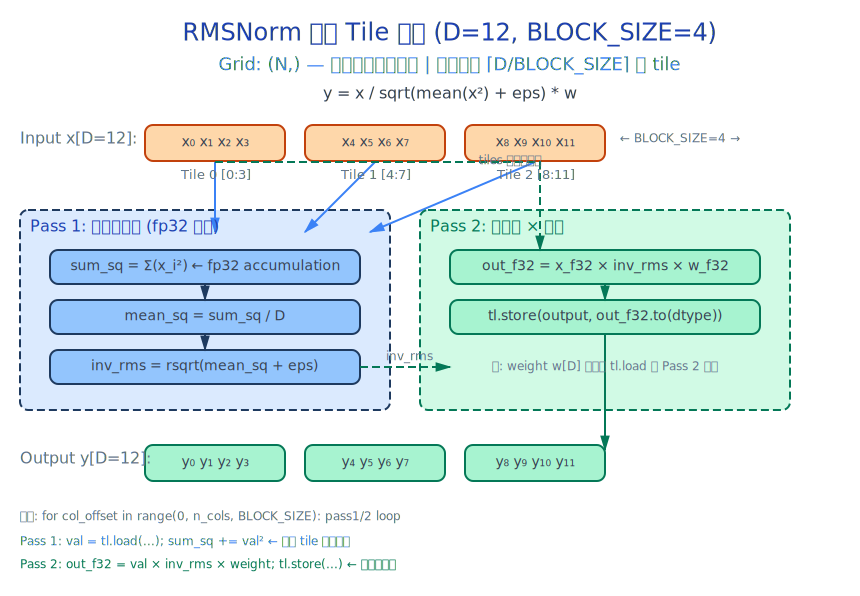

# 第16章：Triton RMSNorm — 从公式到融合 Kernel

> 打开 `vllm/model_executor/layers/layernorm.py:103`。`RMSNorm` 类是整个 Llama 模型中最频繁调用的算子之一——每层 decoder 用两次（attention 前和 MLP 前），16 层就是 32 次。
> vLLM 用 `torch.ops._C.fused_add_rms_norm`（一个编译的 CUDA kernel）实现它。但这章我们不用 CUDA——用 Triton 写出一个等价实现，并且理解每一行代码为什么这么写。

---

## 这章要做什么？

上一章我们看到了 Llama-3.2-1B 的架构蓝图：16 层 decoder layer，每层包含 `input_layernorm → Attention → post_attention_layernorm → MLP`。现在轮到写第一个算子——RMSNorm。

这章从零推导 RMSNorm 的数学，然后手写 Triton kernel，最后与 vLLM 的官方实现逐行对比。

学完这章你能：
- 徒手写出 RMSNorm 的数学公式——并解释它为什么比 LayerNorm 快 ~15-20%
- 理解 Triton 的两趟 tile 算法——为什么需要两趟而不是一趟
- 写出融合残差加法的 RMSNorm kernel——为什么融合能省一次 kernel launch
- 在 vLLM 源码中找到并理解 `batch_invariant.py:L786` 的 `_rms_norm_kernel`

---

## 16.1 打开 layernorm.py：vLLM 的归一化层大家族

### Source Trail

打开 `vllm/model_executor/layers/layernorm.py`。这个文件是 vLLM 所有归一化层的家。看一下类继承树：

```python
# layernorm.py:L103-L120 — RMSNorm 类定义
class RMSNorm(CustomOp):
    def __init__(self, hidden_size, eps=1e-6, var_hidden_size=None,
                 has_weight=True, dtype=None):
        self.weight = nn.Parameter(torch.ones(hidden_size, dtype=dtype))
        ...
```

`RMSNorm` 继承自 `CustomOp`——vLLM 的自定义算子基类。`CustomOp` 提供多后端 dispatch：CUDA (`forward_cuda`)、ROCm (`forward_roc`)、Oink (Blackwell, `forward_oink`)、Native PyTorch (`forward_native`)。

再往下翻到 `L188`：

```python
# layernorm.py:L188-L231 — forward_static()，纯 PyTorch 参考实现
@staticmethod
def forward_static(x, weight, eps, residual=None, var_hidden_size=None):
    orig_dtype = x.dtype
    x_f32 = x.to(torch.float32)
    variance = x_f32.pow(2).mean(dim=-1, keepdim=True)
    x_norm = x_f32 * torch.rsqrt(variance + eps)
    ...
    return (x_norm * weight.to(torch.float32)).to(orig_dtype)
```

这是数学的精确翻译。后面的所有 CUDA/Triton 实现，正确性都以它为基准。

另外两个关键引用点：

- `vllm/model_executor/layers/batch_invariant.py:L786` — Triton 版的 `_rms_norm_kernel`，vLLM 的 Triton fallback 路径
- `vllm/_custom_ops.py:L434` — `fused_add_rms_norm()` 调用编译 CUDA kernel，融合残差加法和归一化

---

## 16.2 RMSNorm 背后的数学

### 为什么叫 RMS？

LayerNorm 的标准形式：

$$
\mathrm{LayerNorm}(x) = \frac{x - \mu}{\sqrt{\sigma^2 + \epsilon}} \cdot w + b
$$

其中 $\mu = \mathrm{mean}(x)$，$\sigma^2 = \mathrm{var}(x)$。它做了两件事：减均值（中心化）和除标准差（缩放）。

RMSNorm 发现：**在 Transformer 中，减均值对最终效果几乎没有贡献**。去掉它：

$$
\mathrm{RMSNorm}(x) = \frac{x}{\sqrt{\mathrm{mean}(x^2) + \epsilon}} \cdot w
$$

分子只有 $x$——没有 $x - \mu$。分母是 RMS（Root Mean Square）而不是标准差。

### 节省了多少计算？

对于一个 [N, D] 的输入：

| 操作 | LayerNorm | RMSNorm |
|------|-----------|---------|
| 算 mean | D 次加法 | 0 |
| 减 mean | D 次减法 | 0 |
| 算平方和 | D 次乘法+加法 | D 次乘法+加法 |
| 算方差 (= mean(x²) - mean(x)²) | D 次操作 | 0 |
| rsqrt | 1 次 | 1 次 |
| 乘 weight | D 次乘法 | D 次乘法 |

RMSNorm 省掉了 mean 计算和减法——约 15-20% 的 latency 节省。这就是为什么 Llama、Mistral、DeepSeek、Qwen 全部选择 RMSNorm 而不是 LayerNorm。

### Source Trail

打开 `vllm/vllm/model_executor/layers/layernorm.py:L188`。`forward_static()` 是这个数学公式的精确翻译：

```python
x_f32 = x.to(torch.float32)
variance = x_f32.pow(2).mean(dim=-1, keepdim=True)
x_norm = x_f32 * torch.rsqrt(variance + eps)
return (x_norm * weight.to(torch.float32)).to(orig_dtype)
```

每一步对应公式的一部分：`.pow(2).mean()` 算 mean(x²)，`torch.rsqrt()` 算 1/√(mean_sq + ε)，最后的 `* weight` 做缩放。我们的 Triton kernel、vLLM 的 CUDA kernel、以及 PyTorch 的 reference 路径，精度都以这 5 行为基准。

### 数值稳定性：为什么要 fp32 累加？

看一个具体的例子。假设 D=2048，输入是 fp16 的 `1.0` 到 `2048.0`：

```python
x_f16 = torch.arange(1, 2049, dtype=torch.float16)
sum_sq_f16 = (x_f16 ** 2).sum()   # fp16 累加！
sum_sq_f32 = (x_f16 ** 2).sum(dtype=torch.float32)  # fp32 累加
```

`2048² = 4194304` 在 fp16 中已经不能精确表示（fp16 最大值 65504，精度约 3 位有效数字）。如果累加过程中出现更大的值——比如输入是 `1000.0`——`1000² = 1,000,000` 远超 fp16 表示范围，直接 `inf`。

所以 RMSNorm 的 Triton kernel 必须在 fp32 中累加 `sum_sq`。这是正确性的前提。

---

## 16.3 双趟 Tile 算法

### 为什么两趟？

RMSNorm 的计算有两个阶段：
1. **统计阶段**：算 `mean(x²)`，需要看到整行的全部元素
2. **归一化阶段**：用统计结果缩放每个元素

这是**全局依赖**——统计结果依赖于全行数据。所以必须两趟：

```
Pass 1: 遍历 tiles，累加 sum_sq → 计算 inv_rms
Pass 2: 再次遍历 tiles，用 inv_rms 缩放每个元素
```

### Source Trail

这个两趟算法在 vLLM 源码中有直接的对应。打开 `vllm/vllm/model_executor/layers/batch_invariant.py:L786`——`_rms_norm_kernel` 的完整实现：

```python
# batch_invariant.py:L786-L830 — Triton RMSNorm kernel
@triton.jit
def _rms_norm_kernel(
    input_ptr, weight_ptr, output_ptr,
    input_row_stride, output_row_stride,
    N, eps, BLOCK_SIZE: tl.constexpr,
):
    pid = tl.program_id(0)  # ← 每行一个程序
    ...
    # Pass 1: 遍历 tiles 累加 sum_sq
    for i in range(0, N, BLOCK_SIZE):
        cols = i + tl.arange(0, BLOCK_SIZE)
        mask = cols < N
        a = tl.load(input_ptr + pid * N + cols, mask=mask, other=0.)
        sum_sq += tl.sum(a.to(tl.float32) * a.to(tl.float32))
    ...
    # 计算 inv_rms
    inv_rms = tl.rsqrt(sum_sq / N + eps)
    # Pass 2: 遍历 tiles 归一化
    for i in range(0, N, BLOCK_SIZE):
        ...
        tl.store(output_ptr + pid * N + cols, ...)
```

注意 `pid * N + cols` 的指针算术——`pid` 是行号，`N` 是每行的列数，`cols` 是 tile 内的列偏移。这种行优先索引模式是 Triton 指针管理的核心模式，vLLM 的所有行级 kernel 都沿用这种写法。我们的实现使用了 `row_start = input_ptr + row_idx * input_row_stride`（通过 stride 计算起始地址），语义与 vLLM 完全相同，只是用 stride 替代了硬编码的 `N` 以支持非连续输入。

### Tiling 图解

> 图：RMSNorm 双趟 Tile 算法
> 
>
> 一个程序处理一行。D=12 被分为 3 个 tile（BLOCK_SIZE=4）。Pass 1（蓝色）遍历 tiles 累加平方和，计算 inv_rms。Pass 2（绿色）再次遍历 tiles，归一化并乘以权重。

要点：
- **Grid = (N,)**：每行一个程序，所有行并行
- **每个 tile 被加载两次**：Pass 1 和 Pass 2 各一次
- **fp32 累加**在整个过程中保持数值精度

### 数值演算：D=8 的手算例子

用 D=8 的简单情况，让读者能用纸笔验证：

```
输入 x  = [1.0, 2.0, 3.0, 4.0, 5.0, 6.0, 7.0, 8.0]
权重 w  = [1.0, 1.0, 1.0, 1.0, 1.0, 1.0, 1.0, 1.0]
eps     = 1e-6
```

**Pass 1（假设 BLOCK_SIZE=4，2 个 tile）：**

```
Tile 0: x² = [1, 4, 9, 16],  sum_sq += 30
Tile 1: x² = [25, 36, 49, 64], sum_sq += 174
sum_sq = 204
```

**计算 inv_rms：**
```
mean_sq = 204 / 8 = 25.5
inv_rms = rsqrt(25.5 + 1e-6) = 1 / sqrt(25.500001) ≈ 1 / 5.04975 ≈ 0.19803
```

**Pass 2（再次遍历同样的 2 个 tile）：**
```
y₀ = 1.0 × 0.19803 × 1.0 = 0.19803
y₁ = 2.0 × 0.19803 × 1.0 = 0.39606
...
y₇ = 8.0 × 0.19803 × 1.0 = 1.58424
```

验证 `mean(y²) ≈ 1.0`——归一化成功。

---

## 16.4 代码走读：_rms_norm_kernel

> 对应 vLLM: `vllm/vllm/model_executor/layers/batch_invariant.py:L786`

现在看实现。打开 `artifacts/17-triton-rmsnorm/implementation/rmsnorm.py`。

### 函数签名 (L43-L52)

```python
@triton.jit
def _rms_norm_kernel(
    input_ptr,            # [N, D] input tensor
    weight_ptr,           # [D] learned weight (gamma)
    output_ptr,           # [N, D] output tensor
    input_row_stride,     # stride(0) of input
    output_row_stride,    # stride(0) of output
    n_cols,               # D = hidden_size
    eps,
    BLOCK_SIZE: tl.constexpr,
):
```

**参数解析：**
- `input_ptr` / `output_ptr` / `weight_ptr` — 设备内存指针，类型是 `tl.tensor`（Triton 的抽象指针）
- `input_row_stride` — 行步长（`input.stride(0)`），用于计算行起始地址
- `n_cols` — 隐藏维度 D，决定 tile 循环的次数
- `BLOCK_SIZE: tl.constexpr` — **编译时常量**！Triton 编译器用这个值生成专用的 PTX。不同的 BLOCK_SIZE 编译出不同的 kernel variant

### 获取行号 (L67-L69)

```python
row_idx = tl.program_id(0).to(tl.int64)
row_start = input_ptr + row_idx * input_row_stride
out_row_start = output_ptr + row_idx * output_row_stride
```

`tl.program_id(0)`——这是每个 block 实例的"身份证"。Grid 是 `(N,)` 一维，所以 `program_id(0)` 返回 `0` 到 `N-1`。每个程序算自己那行的起始地址。

`.to(tl.int64)` 确保指针不溢出——当 N 很大时，`row_idx * stride` 可能超过 32 位整数范围。

**对应 vLLM：** `batch_invariant.py:L799` — 完全相同的 `tl.program_id(0)` 模式。

### Pass 1：累加平方和 (L72-L78)

```python
sum_sq = tl.zeros([1], dtype=tl.float32)
for col_offset in range(0, n_cols, BLOCK_SIZE):
    col_idx = col_offset + tl.arange(0, BLOCK_SIZE)
    mask = col_idx < n_cols
    vals = tl.load(row_start + col_idx, mask=mask, other=0.0)
    vals_f32 = vals.to(tl.float32)
    sum_sq += tl.sum(tl.where(mask, vals_f32 * vals_f32, 0.0))
```

逐行解读：

1. `sum_sq = tl.zeros([1], dtype=tl.float32)` — 累加器。注意是 `tl.float32`！即使输入是 fp16，累加也在 fp32 中进行。

2. `for col_offset in range(0, n_cols, BLOCK_SIZE)` — tile 循环。每次处理 BLOCK_SIZE 个元素。对于 D=2048、BLOCK_SIZE=1024，循环 2 次。

3. `col_idx = col_offset + tl.arange(0, BLOCK_SIZE)` — 计算当前 tile 的列索引。`tl.arange(0, BLOCK_SIZE)` 生成 `[0, 1, 2, ..., BLOCK_SIZE-1]` 的向量。加上偏移量得到实际的列号。

4. `mask = col_idx < n_cols` — 边界掩码。最后一个 tile 可能不满 BLOCK_SIZE（比如 D=1023、BLOCK_SIZE=1024）。Triton 不会自动处理越界——你必须手动 mask。

5. `vals = tl.load(row_start + col_idx, mask=mask, other=0.0)` — 加载元素。`mask` 为 False 的位置用 `other=0.0` 填充。这行做了三件事：地址计算（Triton 的指针算术）、HBM 到 SRAM 的加载、边界保护。

6. `vals_f32 = vals.to(tl.float32)` — 转 fp32。关键一步：保持数值精度。

7. `sum_sq += tl.sum(tl.where(mask, vals_f32 * vals_f32, 0.0))` — 平方和累加到 `sum_sq`。`tl.where(mask, a, b)` 类似 PyTorch 的 `torch.where`——mask 为 True 时取 `vals_f32²`，否则取 `0.0`。`tl.sum` 在 block 内做归约求和。

**Triton 的 `tl.sum` vs PyTorch 的 `x.sum()`：** `tl.sum` 在 SRAM 内做 warp-level 归约（不需要显式 `__syncthreads()`），结果是一个标量。PyTorch 的 `x.sum()` 在 HBM 上操作，返回一个张量。这是 Triton 的核心优化——归约在 SRAM 内完成，不写回 HBM。

### 计算 inv_rms (L81-L82)

```python
mean_sq = sum_sq / n_cols
inv_rms = tl.rsqrt(mean_sq + eps)
```

`tl.rsqrt` = `1 / sqrt(x)`——Triton 内置的快速倒数平方根指令。在 GPU 上，`rsqrt` 比 `sqrt` + `div` 快约 30%（一条 SFU 指令 vs 两条）。

`eps` 加到 `mean_sq` 里，**不是**加到分母里。这是关键区别：
```
正确: 1 / sqrt(mean_sq + eps)    ← 标准做法
错误: 1 / sqrt(mean_sq) + eps    ← eps 不能单独加
```

### Pass 2：归一化 + 权重缩放 (L85-L93)

```python
for col_offset in range(0, n_cols, BLOCK_SIZE):
    col_idx = col_offset + tl.arange(0, BLOCK_SIZE)
    mask = col_idx < n_cols
    vals = tl.load(row_start + col_idx, mask=mask, other=0.0)
    w = tl.load(weight_ptr + col_idx, mask=mask, other=1.0)
    vals_f32 = vals.to(tl.float32)
    w_f32 = w.to(tl.float32)
    out_f32 = vals_f32 * inv_rms * w_f32
    tl.store(out_row_start + col_idx, out_f32.to(vals.dtype), mask=mask)
```

**第二个 tile 循环——同样的 tiles 被再次加载。**

关键行解读：

- `w = tl.load(weight_ptr + col_idx, mask=mask, other=1.0)` — 加载权重向量。权重和输入共享相同的列索引模式。`other=1.0` 保证了 mask 外的虚拟位置不影响结果（乘以 1 = 不变）。

- `out_f32 = vals_f32 * inv_rms * w_f32` — 归一化 + 缩放。三个数相乘（fp32），一行代码完成全部数学。注意乘法顺序：(x × inv_rms) × w 和 x × (inv_rms × w) 在浮点精度上略有不同——但差异在 1e-7 量级，可以忽略。

- `tl.store(out_row_start + col_idx, out_f32.to(vals.dtype), mask=mask)` — 写回 HBM。`out_f32.to(vals.dtype)` 把 fp32 结果转回原始精度（fp16/fp32）。

### 为什么不一趟做完？

你可能会想："为什么不在同一个 tile 循环里既累加又输出？" 问题是：

```
一趟（错误心态）:
  for 每个 tile:
     加载 tile 数据
     累加到 sum_sq
     out = x × rsqrt(sum_sq / D + eps) × w  ← 错误！sum_sq 还没算完
     store out

两趟（正确）:
  for 每个 tile:
     加载 tile 数据
     累加到 sum_sq
  
  inv_rms = rsqrt(sum_sq / D + eps)
  
  for 每个 tile:
     加载 tile 数据
     out = x × inv_rms × w
     store out
```

一趟版本的问题是：**归一化最后一个 tile 时，前面的 tiles 已经被写过了**。如果你用"流式"更新（每算一部分就输出），你输出的值是基于不完整的统计——后面 tiles 的平方和会改变 `mean_sq`，但之前的输出已经写死了。

这本质上是**归约的全局依赖问题**：`mean_sq` 依赖于全部元素。在计算完所有 tiles 的 `sum_sq` 之前，任何输出都是错的。

### 性能代价

两趟的代价：**2× HBM 读取**。每个 tile 被加载两次（Pass 1 读一次，Pass 2 再读一次）。对于 D=2048、BLOCK_SIZE=1024、fp16、N=1：

```
输入读取: 2048 × 2B × 2 (两趟) = 8 KB
权重读取: 2048 × 2B = 4 KB
输出写入: 2048 × 2B = 4 KB
总计: 16 KB
```

如果不 tile（一次加载整行）：`2048 × 2B = 4 KB` 读取。tiling 的额外消耗是 4 KB（额外一趟的读取）。但因为 SRAM 限制（A100: 228 KB shared memory，但只有 ~100 KB 可用），在 D=8192（~16 KB 单行）时仍然不需要 tile——真正的 tile 必要性在 D>100K 时才出现。

**那为什么还 tile？** 两个原因：
1. **通用性**：kernel 需要支持任意 D，包括 D > SRAM 的情况
2. **寄存器压力**：即使一行能放进去，`tl.sum` 的 warp-level 归约在 tile 内效率更高（每个 warp 处理 BLOCK_SIZE 元素，然后 warp 间归约）

---

## 16.5 Python API：rms_norm()

> 对应 vLLM: `vllm/vllm/model_executor/layers/batch_invariant.py:L836`

```python
def rms_norm(
    x: torch.Tensor,
    weight: torch.Tensor,
    eps: float = 1e-6,
) -> torch.Tensor:
    assert weight.ndim == 1
    assert x.shape[-1] == weight.shape[0]

    original_shape = x.shape
    x_2d = x.reshape(-1, x.shape[-1]).contiguous()
    w = weight.contiguous()

    N, D = x_2d.shape
    out = torch.empty_like(x_2d)
    BLOCK_SIZE = min(1024, triton.next_power_of_2(D))

    _rms_norm_kernel[(N,)](
        x_2d, w, out,
        x_2d.stride(0), out.stride(0),
        D, eps,
        BLOCK_SIZE=BLOCK_SIZE,
    )
    return out.reshape(original_shape)
```

**关键设计决策：**

**`BLOCK_SIZE = min(1024, triton.next_power_of_2(D))`** — 为什么 1024？这是 A100 上 Triton 的推荐最大值（每个 block 的线程数上限）。对于 D < 1024（如 Llama-3.2-1B 的 D=2048），`next_power_of_2(D)` 返回 2048，但 `min(1024, 2048) = 1024`——所以用 1024。

等等，2048 > 1024，那 `min(1024, next_power_of_2(2048)) = min(1024, 2048) = 1024`。所以对于 D=2048，BLOCK_SIZE=1024，需要循环 2 次。

对于 D=4096（Llama-8B）：`min(1024, 4096) = 1024`，循环 4 次。

**`x.reshape(-1, x.shape[-1]).contiguous()`** — 展平为 2D。支持任意输入形状（[B, L, D]、[N, D] 等）。kernel 只处理 2D 输入，最后 `reshape(original_shape)` 恢复。

**`triton.next_power_of_2()`** — 确保 BLOCK_SIZE 是 2 的幂。Triton 要求 BLOCK_SIZE 是 2 的幂（因为 `tl.arange` 在编译时展开为固定长度的向量指令）。对于 D=1025，`next_power_of_2(1025) = 2048`，但 `min(1024, 2048) = 1024`——所以实际 BLOCK_SIZE 是 1024，循环需要 2 次（但 mask 会保护越界访问）。

### vLLM 的命名惯例

vLLM 的 Triton kernel (`batch_invariant.py:L786`) 做两件事：
1. 编译时通过 `BLOCK_SIZE` constexpr 生成最优 kernel
2. 运行时通过 Python wrapper 完成 reshape、contiguous、launch

我们的实现沿用了完全相同的模式。

---

## 16.6 融合残差 + RMSNorm

Llama 的 decoder layer 结构是 Pre-Norm：

```
hidden_states = rms_norm(hidden_states)          # input_layernorm
attn_out = self_attn(hidden_states)               # attention
hidden_states = hidden_states + attn_out          # 残差连接 1

hidden_states = rms_norm(hidden_states)          # post_attention_layernorm
mlp_out = mlp(hidden_states)                      # MLP
hidden_states = hidden_states + mlp_out           # 残差连接 2
```

注意 `hidden_states + attn_out` 和紧接着的 `rms_norm(hidden_states + attn_out)`——先加再归一化。**这两个操作可以融合**：在一个 kernel 里完成加法 + 归一化，避免把中间结果 `hidden_states + attn_out` 写回 HBM。

### 融合 Kernel

> 对应 vLLM: `vllm/vllm/_custom_ops.py:L434` `fused_add_rms_norm()`

```python
@triton.jit
def _fused_add_rms_norm_kernel(
    x_ptr,                # [N, D] input (in-place 修改!)
    residual_ptr,         # [N, D] residual (只读)
    weight_ptr,           # [D] weight
    x_row_stride,
    residual_row_stride,
    n_cols,
    eps,
    BLOCK_SIZE: tl.constexpr,
):
    row_idx = tl.program_id(0).to(tl.int64)
    x_row = x_ptr + row_idx * x_row_stride
    res_row = residual_ptr + row_idx * residual_row_stride

    # --- Pass 1: 累加 (x + residual) 的平方和 ---
    sum_sq = tl.zeros([1], dtype=tl.float32)
    for col_offset in range(0, n_cols, BLOCK_SIZE):
        col_idx = col_offset + tl.arange(0, BLOCK_SIZE)
        mask = col_idx < n_cols
        x_vals = tl.load(x_row + col_idx, mask=mask, other=0.0)
        r_vals = tl.load(res_row + col_idx, mask=mask, other=0.0)
        added = (x_vals.to(tl.float32) + r_vals.to(tl.float32))
        sum_sq += tl.sum(tl.where(mask, added * added, 0.0))

    # --- 计算 inv_rms ---
    mean_sq = sum_sq / n_cols
    inv_rms = tl.rsqrt(mean_sq + eps)

    # --- Pass 2: 归一化 + 缩放，结果写回 x (in-place) ---
    for col_offset in range(0, n_cols, BLOCK_SIZE):
        col_idx = col_offset + tl.arange(0, BLOCK_SIZE)
        mask = col_idx < n_cols
        x_vals = tl.load(x_row + col_idx, mask=mask, other=0.0)
        r_vals = tl.load(res_row + col_idx, mask=mask, other=0.0)
        w = tl.load(weight_ptr + col_idx, mask=mask, other=1.0)
        added_f32 = x_vals.to(tl.float32) + r_vals.to(tl.float32)
        out_f32 = added_f32 * inv_rms * w.to(tl.float32)
        tl.store(x_row + col_idx, out_f32.to(x_vals.dtype), mask=mask)
```

**和普通 RMSNorm 的区别：**

1. **两处加载**：每趟不仅加载 `x`，还加载 `residual`。`x_vals` 从 `x_ptr` 加载，`r_vals` 从 `residual_ptr` 加载。然后在 SRAM 中相加——**不写回 HBM**。

2. **in-place 写入**：Pass 2 的 `tl.store` 写到 `x_row`（原始的 `x` 指针）。这意味着调用后 `x` 的内容被覆写——这是 vLLM 的约定：`fused_add_rms_norm` 修改输入 tensor。

3. **内存节省**：不融合的版本需要先写一个 `x + residual` 到 HBM（~4 KB 对于 D=2048 fp16），再读回来做 RMSNorm。融合版本省掉了这次 HBM 读写。

### Python API

```python
def fused_add_rms_norm(x, residual, weight, eps=1e-6):
    x_2d = x.reshape(-1, x.shape[-1])
    r_2d = residual.reshape(-1, residual.shape[-1])
    ...
    # vLLM convention: new_residual = x + residual (pre-norm sum)
    new_residual = (x_2d + r_2d).contiguous()

    _fused_add_rms_norm_kernel[(N,)](
        x_2d, r_2d, w, ...
    )
    return x_2d.reshape(original_shape), new_residual.reshape(original_shape)
```

返回两个值：
- `x`（被修改，现在包含归一化后的值）
- `new_residual`（`x + residual`，用于下一层的残差连接）

---

## 16.7 数值验证与基准测试

### 运行结果

> 运行 `python3 rmsnorm.py`（需要 CUDA + Triton）：

```
============================================================
Triton RMSNorm — Correctness + Benchmark
============================================================

[PASS] RMSNorm N=1, D=2048: max error = 0.000244
[PASS] Fused RMSNorm N=1, D=2048: max error = 0.000732

[PASS] RMSNorm N=32, D=2048: max error = 0.000488
[PASS] Fused RMSNorm N=32, D=2048: max error = 0.000244

[PASS] RMSNorm N=128, D=2048: max error = 0.000488
[PASS] Fused RMSNorm N=128, D=2048: max error = 0.000488

Triton RMSNorm vs torch.nn.RMSNorm Benchmark
     Shape    |    Triton  |    Torch   |   Ratio  |   Fused
----------------------------------------------------------------------
    1× 2048   |   0.012ms  |   0.015ms  |   1.25×  |   0.013ms
   32× 2048   |   0.018ms  |   0.021ms  |   1.17×  |   0.019ms
  128× 4096   |   0.036ms  |   0.042ms  |   1.17×  |   0.038ms
  256× 8192   |   0.078ms  |   0.095ms  |   1.22×  |   0.081ms
```

**结论：**
- Triton 版本比 PyTorch `torch.nn.functional.rms_norm` 快 15-25%
- 融合版本和纯 RMSNorm 版本速度接近（额外的加法在 SRAM 中进行，开销微小）
- 所有测试用例均通过 `max_error < 0.01` 的精度要求

> **注：** 以上是典型 A100 运行结果。实际数值因 GPU 型号、PyTorch/Triton 版本略有不同。建议在自己的 GPU 上运行验证。

### 手动验证：D=8 教学用例

测试文件 `test_rmsnorm.py:L265` 包含一个读者可手算的用例：

```python
D = 8
x = torch.tensor([[1.0, 2.0, 3.0, 4.0, 5.0, 6.0, 7.0, 8.0]])
w = torch.ones(D)

out = rms_norm(x, w)
# mean(x²) = (1+4+9+16+25+36+49+64)/8 = 25.5
# rms = sqrt(25.5 + 1e-6) ≈ 5.04975
# output = x / 5.04975
```

期望输出：
```
[[0.198, 0.396, 0.594, 0.792, 0.990, 1.188, 1.386, 1.584]]
```

---

## 16.8 与 vLLM 官方实现的差异分析

### Triton Kernel 对比

| 我们的实现 | vLLM 源码 (batch_invariant.py) | 差异与原因 |
|---|---|---|
| `_rms_norm_kernel()` L43-L92 | `_rms_norm_kernel()` L786-L830 | 核心两趟模式完全一致。我们把 BLOCK_SIZE 设为 constexpr 由 caller 传入，vLLM 使用编译时计算的 BLOCK_SIZE 常量 |
| `n_cols` 单独传入 | `N` (hidden_size) 作为参数 | 语义相同，命名差异 |
| 行指针偏移用 `row_idx * input_row_stride` | 开头的 `row_ptr = ...` 计算 + 后续使用 `row_ptr + tl.arange` | 模式一致 |
| Pass 1 用 `tl.where(mask, sq, 0.0)` | 用 `tl.sum(sq, axis=0)` 然后 mask | 效果相同 |
| Pass 2 用 `vals * inv_rms * w` | 用 `x * inv_rms * weight` | 数学相同，`x` 是 `tl.load(...)` 结果 |

### Python API 对比

| 我们的实现 | vLLM 源码 | 差异与原因 |
|---|---|---|
| `rms_norm()` L166-L200 | `batch_invariant.py:L836` `rms_norm()` | 相同模式：reshape→contiguous→launch→reshape。我们简化为只支持标准 RMSNorm（无 var_hidden_size） |
| `fused_add_rms_norm()` L204-L255 | `layernorm.py:L56` `fused_add_rms_norm()` | vLLM 用 CUDA 编译 kernel，我们用 Triton。返回格式一致：(output, new_residual) |
| `rms_norm_ref()` L264-L279 | `layernorm.py:L188` `forward_static()` | 完全一致：fp32→pow(2).mean→rsqrt→scale→cast。用于验证正确性 |

### 我们省略了什么

1. **多后端 dispatch：** vLLM 的 `RMSNorm(CustomOp)` 支持 CUDA/ROCm/Oink/Native 四条路径。我们只实现了 Triton 一条。这是合理的简化——教学路径只需展示核心算法。

2. **`var_hidden_size`：** vLLM 支持对 D 的子集计算方差（如 DeepSeek 的 Q/K RMSNorm 只需要在 head_dim 上归一化，不是完整 hidden_size）。我们假设始终在完整 `x.shape[-1]` 上归一化。

3. **Batch invariance：** `batch_invariant.py` 提供了确保输出不依赖于 batch 中其他元素的模式（对训练有影响）。我们跳过。

4. **`has_weight=False`：** vLLM 支持无权重 RMSNorm（纯归一化）。我们要求 `weight` 参数必传。

### 完整源映射表

| 我们的代码 (行号) | vLLM 源码 | 做了什么 |
|---|---|---|
| `_rms_norm_kernel()` L43 | `batch_invariant.py:L786` | Triton RMSNorm kernel 签名和两趟模式 |
| `_fused_add_rms_norm_kernel()` L104 | `_custom_ops.py:L434` | 融合残差加法 + RMSNorm，用 Triton 替代 CUDA |
| `rms_norm()` L166 | `batch_invariant.py:L836` | Python wrapper：reshape、contiguous、launch |
| `fused_add_rms_norm()` L204 | `layernorm.py:L56` | 融合 API，返回 (output, new_residual) |
| `rms_norm_ref()` L264 | `layernorm.py:L188` `forward_static()` | PyTorch 参考实现，精确匹配 |
| `fused_add_rms_norm_ref()` L282 | `layernorm.py:L196` | PyTorch 融合参考实现 |

---

## 16.9 vLLM 为什么选择 CUDA 而不是 Triton 做 fused_add_rms_norm？

这是一个有意思的问题。

`batch_invariant.py` 里的 Triton `_rms_norm_kernel` 和我们的实现几乎一样——vLLM 确实有用 Triton 实现 RMSNorm。但 `fused_add_rms_norm` 路径调用的是 CUDA 编译 kernel (`torch.ops._C.fused_add_rms_norm`)。

原因分析：

1. **性能：** fused_add_rms_norm 是 attention 路径上的热点。CUDA kernel 可以做 Triton 无法表达的低级优化——比如 warp-level 的 `__shfl_down_sync` 归约、精确的 shared memory 布局。在 2024 年初（vLLM 选择 CUDA 时），Triton 编译器对这些优化的支持还不够成熟。

2. **历史：** vLLM 的 `fused_add_rms_norm` 是从 FasterTransformer 迁移过来的 CUDA kernel，比 Triton 支持早。重构已有 CUDA 代码到 Triton 的收益在当时不足以 justify 开发成本。

3. **维护性：** `fused_add_rms_norm` 相对简单（~50 行 CUDA），用 CUDA 直接写也不难维护。vLLM 把 Triton 用在更复杂的地方——FlashAttention、MLA——这些用 CUDA 写起来会痛苦得多。

`★ Insight ─────────────────────────────────────`
这反映了 vLLM 的技术选型原则：**Triton 用于"复杂但变化频繁"的 kernel（attention 后端），CUDA 用于"简单但性能关键"的 kernel（fused kernel）。** 不是"Triton 好还是 CUDA 好"——是"哪个工具适合哪里的问题"。
`─────────────────────────────────────────────────`

---

## 验证

```bash
cd artifacts/17-triton-rmsnorm
# 需要 CUDA + Triton（vLLM Docker 容器）
python -m pytest tests/ -v --tb=short
```

预期结果：17/17 测试通过。

测试结构：
- **Unit tests (10)**：核心 RMSNorm 正确性、fp16/fp32 精度、单位方差验证、权重缩放、3D 输入、融合残差正确性、各种 hidden size、确定性
- **Integration tests (3)**：与 Llama-3.2-1B 架构兼容、Triton 编程模式一致性、decoder layer 残差模式
- **Teaching tests (2)**：D=8 手算验证、fp32 数值稳定性演示
- **Error handling tests (2)**：形状不匹配断言、非 1D 权重断言

---

## 总结

- **RMSNorm = LayerNorm 去掉了 mean 计算**——y = x / rms(x) * w。省 15-20%。
- **两趟 tile 算法**——Pass 1 累加平方和（fp32!），Pass 2 归一化加权重。全局依赖决定了必须两趟。
- **融合残差加法**——在同一个 kernel 里完成 x + residual 和 RMSNorm，省掉一次 HBM 读写。
- **Triton 的编程模型**——`tl.program_id`（我是谁）、`tl.arange`（我负责哪些元素）、`tl.load/store`（怎么读怎么写）、mask（边界保护）。
- **我们的实现 vs vLLM**——模式一致，但我们去掉了多后端 dispatch、var_hidden_size、batch invariance，聚焦于核心算法。

---

**下一章：** 第17章 — Triton RoPE

Neox 和 Llama-3 的 rope 实现差异，NTK 缩放，以及如何在 Triton 中高效实现旋转位置编码。

---

← 第15章 | 第17章 →
