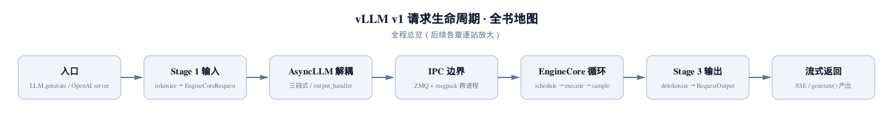
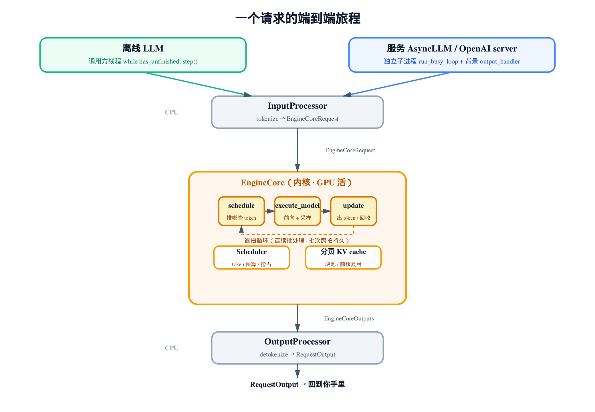
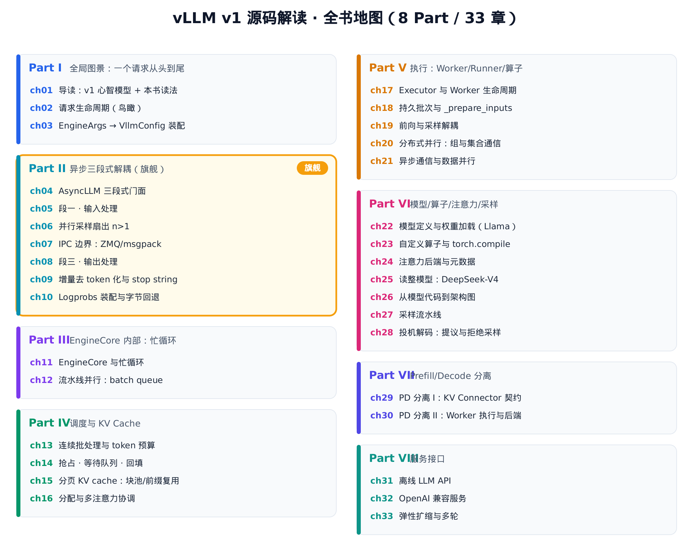

# 第1章　vLLM v1 是什么，以及这本书怎么读



> 这是全书的起点，所以没有"上一章"。
> 本章给你一张地图：一个请求怎么从 API 走到 token，v1 比 v0 变了什么。
> 下一章起，我们沿着这张图逐站深入真实源码。

读源码这件事，最怕一上来就扎进某个文件，读了三百行还不知道自己在系统的哪一层。

所以这一章不解一行难懂的代码。它只做一件事：把 vLLM v1 的骨架摊在你面前，让你看清**一个请求从进来到吐出 token，中间经过哪几个真实的类**。后面三十多章，每一章都是把本章某个方框放大、钻进去逐行精读。先有地图，再谈细节。

本章引用的源码都点到为止——只为指认"这个东西在哪、长什么形状"。真正的逐行解读，留给它各自的主场。

## 1.1 一个请求的端到端旅程

先看最朴素的问题：你写下 `llm.generate("你好")`，到拿到回复，中间发生了什么？

vLLM v1 把这条路拆成三段，外加一个内核。用真实的类名说，是这样一条链：

```
你的 prompt
   │
   ▼  InputProcessor        ← 第一段：把文本变成引擎能吃的请求
EngineCoreRequest
   │
   ▼  EngineCore            ← 内核：一拍一拍地算 token
EngineCoreOutputs
   │
   ▼  OutputProcessor       ← 第三段：把内核输出还原成人话
RequestOutput → 回到你手里
```

把这条链连同它的两个驱动入口、内核里逐拍循环的三步，画成一张图，就是本章要你记住的全部骨架：



> *图注：中间一条三段式主链 `InputProcessor → EngineCore → OutputProcessor`；上方两个使用面入口（离线 `LLM` / 服务 `AsyncLLM`）共享同一个内核，只是驱动方式不同；`EngineCore` 内是逐拍循环的三步 schedule→execute→update，外加它管的 Scheduler 与分页 KV cache。后面三十多章，每一章都是把这张图的某个方框放大。*

这三个名字——`InputProcessor`、`EngineCore`、`OutputProcessor`——是本书反复出现的主角。把它们的分工记牢：

- **`InputProcessor`**（`vllm/v1/engine/input_processor.py`）：第一段。负责 tokenize、参数校验、分配请求 id，最后产出一个 `EngineCoreRequest`。它是 CPU 活，跟 GPU 没关系。
- **`EngineCore`**（`vllm/v1/engine/core.py`）：内核。它管着调度器、分页 KV cache，把请求一拍一拍喂进模型前向，吐出 token。这是 GPU 活的所在。
- **`OutputProcessor`**（`vllm/v1/engine/output_processor.py`）：第三段。负责 detokenize（把 token id 变回字符）、拼装 `RequestOutput`、处理流式增量。又是 CPU 活。

为什么偏偏拆成"CPU—GPU—CPU"这三段？这正是 v1 区别于 v0 的核心设计，下一节就讲。先记住这条链的形状。

## 1.2 v1 相比 v0 变了什么

如果你用过 v0，会发现 v1 几乎是重写。四个关键转变，每一个都对应本书后面某个 Part 的深挖。这里逐一点到为止。

### 转变一：异步三段式解耦（旗舰）

v0 的引擎是一坨：tokenize、调度、前向、detokenize 全挤在一个进程、一个事件循环里。结果是 CPU 干重活（比如 detokenize 一长串输出）时，GPU 只能干等；反过来 GPU 忙时，新请求的 tokenize 也排不上队。

v1 的答案是把上一节那三段**在进程边界两侧解耦**。我们先看同步版的骨架——它在 `LLMEngine` 的构造里把三件套摆得清清楚楚：

```python
# vllm/v1/engine/llm_engine.py:L90
self.renderer = renderer = renderer_from_config(self.vllm_config)

# Convert EngineInput --> EngineCoreRequest.
self.input_processor = InputProcessor(self.vllm_config, renderer)

# Converts EngineCoreOutputs --> RequestOutput.
self.output_processor = OutputProcessor(
    renderer.tokenizer,
    log_stats=self.log_stats,
    stream_interval=self.vllm_config.scheduler_config.stream_interval,
    tracing_enabled=tracing_endpoint is not None,
)

# EngineCore (gets EngineCoreRequests and gives EngineCoreOutputs)
self.engine_core = EngineCoreClient.make_client(
    multiprocess_mode=multiprocess_mode,
    asyncio_mode=False,
    vllm_config=vllm_config,
    executor_class=executor_class,
    log_stats=self.log_stats,
)
```

注意源码里原本就写好的注释，把三段的契约说得明明白白：`InputProcessor` 把 `EngineInput` 转成 `EngineCoreRequest`，`OutputProcessor` 把 `EngineCoreOutputs` 转回 `RequestOutput`，中间 `EngineCore` 收前者、给后者。这就是"三段式"的字面含义。

这里 `asyncio_mode=False`，是**同步**版骨架。它适合离线吞吐场景，调用方线程亲自驱动。

真正的精髓在服务场景。看 `AsyncLLM` 的构造，三件套几乎一模一样，唯独 `EngineCore` 那一行变了：

```python
# vllm/v1/engine/async_llm.py:L134
# Convert EngineInput --> EngineCoreRequest.
self.input_processor = InputProcessor(self.vllm_config, renderer)

# Converts EngineCoreOutputs --> RequestOutput.
self.output_processor = OutputProcessor(
    renderer.tokenizer,
    log_stats=self.log_stats,
    stream_interval=self.vllm_config.scheduler_config.stream_interval,
    tracing_enabled=tracing_endpoint is not None,
)

# EngineCore (starts the engine in background process).
self.engine_core = EngineCoreClient.make_async_mp_client(
    vllm_config=vllm_config,
    executor_class=executor_class,
    log_stats=self.log_stats,
    client_addresses=client_addresses,
    client_count=client_count,
    client_index=client_index,
)
```

同步版用 `make_client`，服务版用 `make_async_mp_client`。后者的注释直说：`starts the engine in background process`——**引擎内核被搬进了一个独立的子进程**。

这就是解耦的物理基础。GPU 重活的 `EngineCore` 在另一个进程跑，API 这边的事件循环不会被它的前向计算阻塞。两个进程之间靠进程间通信（IPC）传消息，那套 ZMQ + msgpack 的机制本身就是一章的分量，[第 7 章会专门拆开它](../ch07-engine-core/narrative/chapter.md)。

可一旦内核进了另一个进程，新问题来了：它在那边一拍拍吐 token，谁负责把这些输出送回每个等待中的请求？答案是一个**背景任务**：

```python
# vllm/v1/engine/async_llm.py:L170
self.output_handler: asyncio.Task | None = None
try:
    # Start output handler eagerly if we are in the asyncio eventloop.
    asyncio.get_running_loop()
    self._run_output_handler()
except RuntimeError:
    pass
```

`output_handler` 是个懒启动的 asyncio 任务——只有当前确实在事件循环里才马上拉起来。它就是那个"邮差"：不停从子进程拉输出，再分发回各个请求的队列。它内层的循环长这样：

```python
# vllm/v1/engine/async_llm.py:L656
async def output_handler():
    try:
        while True:
            # 1) Pull EngineCoreOutputs from the EngineCore.
            outputs = await engine_core.get_output_async()
            num_outputs = len(outputs.outputs)

            # … 省略：迭代统计的初始化 …

            engine_core_outputs = outputs.outputs
            for start in range(0, num_outputs, chunk_size):
                end = start + chunk_size
                outputs_slice = engine_core_outputs[start:end]
                # 2) Process EngineCoreOutputs.
                processed_outputs = output_processor.process_outputs(
                    outputs_slice, outputs.timestamp, iteration_stats
                )
                # NOTE: RequestOutputs are pushed to their queues.
                assert not processed_outputs.request_outputs

                # Allow other asyncio tasks to run between chunks
                if end < num_outputs:
                    await asyncio.sleep(0)

                # 3) Abort any reqs that finished due to stop strings.
                if processed_outputs.reqs_to_abort:
                    await engine_core.abort_requests_async(
                        processed_outputs.reqs_to_abort
                    )
```

不用细究每一行——这里只看那个清晰的三步骨架：**1) 从内核拉一批输出 → 2) 交给 `OutputProcessor` 还原 → 3) 把因 stop string 结束的请求叫停**。中间那句 `await asyncio.sleep(0)` 是个细节伏笔：批量大时它主动让出事件循环，免得堵住其他协程。

这套"输入处理在本进程、内核在外进程、背景 handler 把输出多路复用回各请求队列"的架构，是 v1 的皇冠明珠。它复杂、精巧，值得整整一个 Part。所以本书把它列为**旗舰 [Part II（第 4–10 章）](../ch04-async-llm/narrative/chapter.md)**，从 `AsyncLLM` 门面一路拆到增量 detokenize 和 logprobs 装配。本章只让你认得它的轮廓。

### 转变二：跨拍持久批次与连续批处理

第二个转变在内核里。v0 是"凑一批请求、一起跑到底、再凑下一批"，慢请求会拖住整批。v1 不这么干——它一拍（one step）只决定"这一拍跑哪些请求、哪些 token"，请求逐拍动态进出。这就是 continuous batching（连续批处理）。

看 `EngineCore.step`，一拍的全貌就三步：

```python
# vllm/v1/engine/core.py:L406
def step(self) -> tuple[dict[int, EngineCoreOutputs], bool]:
    """Schedule, execute, and make output.

    Returns tuple of outputs and a flag indicating whether the model
    was executed.
    """
    # … 省略：没有待处理请求时直接返回 …
    scheduler_output = self.scheduler.schedule()
    future = self.model_executor.execute_model(scheduler_output, non_block=True)
    grammar_output = self.scheduler.get_grammar_bitmask(scheduler_output)
    with (
        self.log_error_detail(scheduler_output),
        self.log_iteration_details(scheduler_output),
    ):
        model_output = future.result()
        if model_output is None:
            model_output = self.model_executor.sample_tokens(grammar_output)

    # … 省略：处理执行期间到达的 abort …
    engine_core_outputs = self.scheduler.update_from_output(
        scheduler_output, model_output
    )

    return engine_core_outputs, scheduler_output.total_num_scheduled_tokens > 0
```

三步对应函数 docstring 自己的概括：**`schedule()`（这一拍跑哪些 token）→ `execute_model`（前向）→ `update_from_output`（出 token、回收已完成、续接未完成）**。token 就是这样一拍一拍产出来的。（上面代码里 `execute_model` 触发前向，采样 `sample_tokens` 是"执行"阶段的尾子步——这里只点位置，细节留给 Part V。）

调度器怎么用 token 预算挑请求、怎么抢占、批次怎么跨拍持久存在——这些是 [Part IV（第 13–16 章）](../ch13-scheduler/narrative/chapter.md) 的内容。本章只让你记住 `step` 的这个"调度—执行—更新"三拍节奏。

### 转变三：torch.compile piecewise 编译

第三个转变关于性能。v1 默认走 `torch.compile`，但用的是 vLLM 自定义的编译路径。这里有个**极易踩的坑**，先把两个枚举并排放出来看清楚：

```python
# vllm/config/compilation.py:L37
class CompilationMode(enum.IntEnum):
    """The compilation approach used for torch.compile-based compilation of the
    model."""

    NONE = 0
    """No torch.compile compilation is applied, model runs in fully eager pytorch mode.
    The model runs as-is."""
    STOCK_TORCH_COMPILE = 1
    """The standard `torch.compile` compilation pipeline."""
    DYNAMO_TRACE_ONCE = 2
    """Single Dynamo trace through the model, avoiding recompilation."""
    VLLM_COMPILE = 3
    """Custom vLLM Inductor-based backend with caching, piecewise compilation,
    shape specialization, and custom passes."""


class CUDAGraphMode(enum.Enum):
    """Constants for the cudagraph mode in CompilationConfig.
    Meanwhile, the subset enum `NONE`, `PIECEWISE` and `FULL` are also
    treated as concrete runtime mode for cudagraph runtime dispatching.
    """

    NONE = 0
    PIECEWISE = 1
    FULL = 2
    # … 省略：FULL_DECODE_ONLY 等复合成员 …
```

注意看清楚：所谓"piecewise 图切分编译"，指的是 `CompilationMode.VLLM_COMPILE`（值为 3）。它的 docstring 白纸黑字写着 `piecewise compilation`——vLLM 自定义的 Inductor 后端，带缓存、图切分、形状特化和自定义 pass。

**`CompilationMode` 里根本没有 `PIECEWISE` 这个成员。**

那 `PIECEWISE` 在哪？在下面**另一个**枚举 `CUDAGraphMode` 里（值为 1），讲的是 CUDA graph 怎么分段捕获，是完全不同的一回事。一个管 torch.compile 的编译策略，一个管 CUDA graph 的捕获模式——名字撞脸，但别混。本书讲"v1 的 piecewise 编译"时，指的永远是 `VLLM_COMPILE`。

编译这条线——自定义算子怎么插进图、piecewise 后端怎么按形状区间分派 CUDA graph——是 [Part VI（第 22–28 章）](../ch23-custom-ops-and-compilation/narrative/chapter.md) 的核心。

### 转变四：分页 KV cache

第四个转变是内存。v1 的 KV cache 是**分页**的：先做一遍显存 profiling，按剩下多少显存切成固定大小的块，再由调度器和块池统一管理。分页之后能做前缀复用、动态分配、避免碎片——这是高吞吐推理的内存基石。

它就建在 `EngineCore` 的构造里：profiling 跑完才初始化分页 KV cache，紧接着建调度器。块池、前缀缓存、块的引用计数与 LRU 回收，是 [Part IV 第 15–16 章](../ch15-kv-cache/narrative/chapter.md) 的主场。本章不展开，只标明它的位置。

## 1.3 两个使用面：同一个内核，两种驱动

vLLM 有两个入口，你大概率两个都会用到：

- **离线 `LLM`**：写脚本批量跑推理。`from vllm import LLM; LLM(...).generate(...)`。同步、简单、吞吐优先。
- **OpenAI server**：起一个 HTTP 服务，对外暴露 OpenAI 兼容接口。异步、高并发、低延迟优先。背后是 `AsyncLLM`。

关键洞察是：**这两个面共享同一个 `EngineCore` 内核，只是驱动方式不同。** 内核一致，避免了两套实现各跑各的、慢慢漂移。

先看离线面的起点。`LLM.__init__` 把一堆构造参数打包成 `EngineArgs` 后，建同步引擎：

```python
# vllm/entrypoints/llm.py:L380
log_non_default_args(engine_args)

self.llm_engine = LLMEngine.from_engine_args(
    engine_args=engine_args, usage_context=UsageContext.LLM_CLASS
)
```

留意 `usage_context=UsageContext.LLM_CLASS`——这是个字面量标记，告诉下游"我是离线 LLM 这个使用面"。配置装配会据它做些场景相关的默认值选择。

离线面怎么驱动引擎？调用方线程**亲自**反复 step，直到没有未完成请求：

```python
# vllm/entrypoints/llm.py:L1860
while self.llm_engine.has_unfinished_requests():
    step_outputs = self.llm_engine.step()
```

简单直接，一个 while 循环就是引擎的心跳。没有 IPC、没有背景任务——这是 pull 模型，调用方主动拉。

服务面则完全不同。`EngineCore` 在它那个独立子进程里，自己有个永不停的总循环：

```python
# vllm/v1/engine/core.py:L1168
def run_busy_loop(self):
    """Core busy loop of the EngineCore."""
    while self._handle_shutdown():
        # 1) Poll the input queue until there is work to do.
        self._process_input_queue()
        # 2) Step the engine core and return the outputs.
        self._process_engine_step()

    raise SystemExit
```

把这两段并排看，v1 架构最漂亮的对称就显出来了：

| | 离线 `LLM` | 服务 OpenAI server / `AsyncLLM` |
|---|---|---|
| 门面 | `LLMEngine`（同步） | `AsyncLLM`（异步） |
| `EngineCore` 在哪 | 本进程内（`make_client`） | 独立子进程（`make_async_mp_client`） |
| 谁驱动步进 | 调用方线程 `while has_unfinished: step()` | 子进程内 `run_busy_loop` 自转 |
| 输出回送 | step 返回值直接拿 | 背景 `output_handler` 多路复用回各队列 |
| 适合场景 | 离线批量、吞吐 | 在线服务、低延迟高并发 |

同一个 `EngineCore.step`，离线由你的线程一拍拍敲，服务由子进程自己一拍拍转。心跳一样，握把不同。离线面的全部细节在 [第 31 章](../ch31-entrypoints/narrative/chapter.md)，服务面在 [第 32 章](../ch32-entrypoints/narrative/chapter.md)。

## 1.4 配置是怎么搭起来的

上面两个面都从一个动作开始：`from_engine_args`。它做的第一件大事，是把扁平的命令行式参数装配成一个聚合配置对象：

```python
# vllm/v1/engine/llm_engine.py:L161
# Create the engine configs.
vllm_config = engine_args.create_engine_config(usage_context)
executor_class = Executor.get_class(vllm_config)

# … 省略：多进程开关判断 …

# Create the LLMEngine.
return cls(
    vllm_config=vllm_config,
    executor_class=executor_class,
    # … 省略：log_stats / usage_context 等其余构造参数 …
)
```

两步，顺序很重要：**先 `create_engine_config(usage_context)` 把参数装配成 `VllmConfig`，再据这份配置选 `Executor`、搭引擎**。配置先成型，引擎再据配置长出来——这是全书 wiring 的总开关。

`create_engine_config` 装配出的 `VllmConfig` 是什么？一个聚合 dataclass：

```python
# vllm/config/vllm.py:L268
@config(config=ConfigDict(arbitrary_types_allowed=True))
class VllmConfig:
    """Dataclass which contains all vllm-related configuration. This
    simplifies passing around the distinct configurations in the codebase.
    """

    model_config: ModelConfig = None  # type: ignore[assignment]
    """Model configuration."""
    cache_config: CacheConfig = Field(default_factory=CacheConfig)
    """Cache configuration."""
    parallel_config: ParallelConfig = Field(default_factory=ParallelConfig)
    """Parallel configuration."""
    scheduler_config: SchedulerConfig = Field(
        default_factory=SchedulerConfig.default_factory,
    )
    """Scheduler configuration."""
    # … 省略：device / load / attention / compilation 等十几个同形子配置字段 …
```

它的 docstring 自己点了题：`simplifies passing around the distinct configurations`——把十几个子系统的配置（模型、缓存、并行、调度、编译……）合成一个对象，全栈各层传一个 `vllm_config` 就够了，不用拖着十几个参数到处跑。

本章只让你认得 `VllmConfig` 的存在和形状：它是聚合 dataclass，是"全栈传递的单一对象"。它每个子字段怎么从命令行参数装配出来、优化等级 O0–O3 怎么影响编译、工厂怎么据 flag 选 Executor，是 [第 3 章](../ch03-config-and-wiring/narrative/chapter.md) 的内容。

## 1.5 这本书怎么读

读法很简单，三条规矩：

**一、源码是主线。** 这不是一本"重新实现一个简化版 vLLM"的书。每一章的正文都直接内嵌**真实的 vLLM 源码**，逐段解读它的设计决策和控制流。你不开着源码也能跟下来——因为关键片段就在书里，无关分支我们用 `# … 省略 …` 裁掉，只留主干。

**二、每章配一份可运行的精简版做交叉验证。** 大多数章节会附一段"剥掉无关分支后能跑起来"的代码，让你亲手跑一跑、看看中间张量和数值长什么样。它只是验证工具，不是主角——主角永远是真实源码。

**三、每章开篇有 Roadmap。** 就是本章开头那张"你在这里"的图。它告诉你当前章在全书哪个位置、上一章立了什么、本章解决什么、下一章接什么。读到一半迷路了，翻回章首看图。

还有一条贯穿全书的纪律，顺带说明：书里所有源码路径都写成规范的 `vllm/...` 形式（比如本章引的 `vllm/v1/engine/core.py`、`vllm/config/vllm.py`），行号以本书锚定的源码版本为准。你照着路径就能在真实仓库里定位到对应代码。

## 1.6 全书地图：8 个 Part、33 章

最后给你整张地图。全书按 vLLM v1 的真实模块组织，分 8 个 Part：



逐 Part 一句话导览：

- **Part I（第 1–3 章）　全局图**：一个请求从头到尾的鸟瞰，外加配置怎么从 `EngineArgs`（`vllm/engine/arg_utils.py`）装配成 `VllmConfig`。你现在就在这里。
- **Part II（第 4–10 章）　异步三段式解耦【旗舰】**：本书皇冠。从 `AsyncLLM` 门面，到输入处理、IPC 边界、输出处理、增量 detokenize、logprobs 装配，把转变一拆到底。
- **Part III（第 11–12 章）　EngineCore 内部：忙循环**：`step` 的编排、`run_busy_loop`、流水线并行用的 batch queue。
- **Part IV（第 13–16 章）　调度与 KV cache**：连续批处理与 token 预算、抢占与等待队列、分页 KV cache 的块池与前缀缓存。转变二和转变四都在这。
- **Part V（第 17–21 章）　执行：Worker、Runner、算子**：Executor 与 worker 生命周期、跨拍持久批次与 `_prepare_inputs`、前向与采样解耦、分布式并行。
- **Part VI（第 22–28 章）　模型、算子、注意力与采样**：从 Llama 基线一路到自定义算子、torch.compile 与注意力后端；再完整读一个 DeepSeek-V4，落到采样流水线与投机解码。转变三在这。
- **Part VII（第 29–30 章）　Prefill/Decode 分离**：KV connector 契约、调度集成、worker 执行与可插拔传输后端。
- **Part VIII（第 31–33 章）　服务接口**：离线 `LLM` API、OpenAI 兼容服务器、弹性伸缩与多轮。

这是一条推荐的线性路径，但**不必从头读到尾**。每章开篇的 Roadmap 和依赖标注会告诉你它依赖哪些前置章。想直接看分页 KV cache？翻到第 15 章，Roadmap 会帮你补齐上下文。

地图在手，下一章我们就上路——用一次低分辨率的全程追踪，把这张图走一遍。
