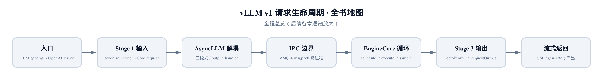
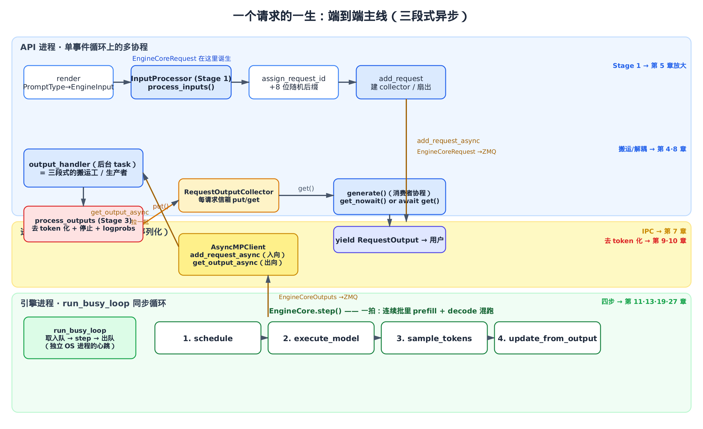
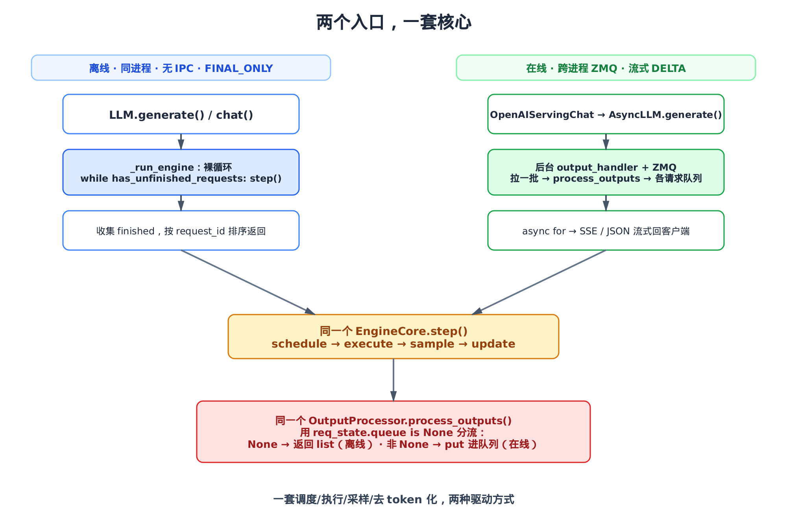
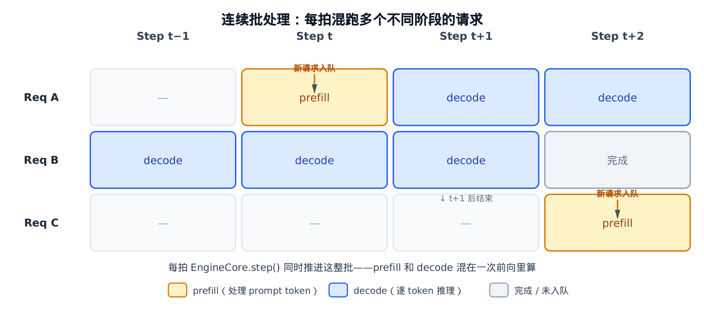

# 第2章　请求的一生（鸟瞰追踪）：从入口到出口走一遍完整主线

## 你在这里



> *图注：全书地图，本章不高亮单一节点——因为它横跨全部阶段。*
> *上一章交代了「这本书怎么读、vLLM v1 长什么样」。*
> *本章带你跟着一个请求从进到出走一遍，先有完整地图。*
> *后面每一章再钻进某一站的细节——本章会沿途给出跳转链接。*

读源码最怕一上来就钻进某个函数，读了半天不知道它在整条链上的哪一环。所以这一章我们换个读法：**先不抠任何细节**，跟着一个请求，从用户敲下 `generate()`（或发出一个 HTTP 请求）那一刻起，一路走到结果吐回用户。沿途经过的每一站，我们都只点一下名。整条主线的总枢纽是 `vllm/v1/engine/async_llm.py` 里的 `AsyncLLM`——本章会反复回到它。

每一站都只点到为止——告诉你它**是什么、收什么、吐什么、交给谁**，然后给一个跳转链接，指向后面哪一章会把它放大。读完这一章，你脑子里会有一张完整的地图；之后任何一章，你都知道它挂在地图的哪个位置。

这一章是地图，不是某个算法的拆解，所以不带可跑的演示代码。主线就是真实 vLLM 源码本身，我们一段段读过去。

---

## 2.1 一张总图：三段式异步把整条链串起来

先把全景摆出来，后面所有细节都挂在它上面。



> *图注：三条泳道。上蓝是 API 进程（单事件循环上跑很多协程），中黄是进程边界 ZMQ，下绿是独立的引擎进程。一个请求先在上面被处理成 `EngineCoreRequest`，穿过 ZMQ 进引擎进程被一拍拍地算，结果再穿回来、组装成 `RequestOutput`、yield 给用户。右边角标标着每一站在第几章被放大。*

这张图的核心是 vLLM v1 的**三段式异步解耦**——它在 `vllm/v1/engine/async_llm.py` 里被装配起来，整本书反复会用到这个词，这里先讲清它是哪三段：

1. **输入段（API 进程内）**：把用户给的 prompt 校验、分词、组装成一个能跨进程传的 `EngineCoreRequest`。
2. **引擎段（独立 OS 进程）**：一个叫 `run_busy_loop` 的同步循环不停地「取请求 → 算一拍 → 吐结果」，跑模型前向、采样。它和 API 进程经 ZMQ 通信。
3. **输出段（回到 API 进程）**：一个后台协程把引擎吐出来的 token 拉回来，去 token 化、判停止、组装成面向用户的 `RequestOutput`，再交还给等在那里的请求。

为什么要拆成三段、还要把引擎单拎到另一个进程？一句话：**别让模型执行堵死 API 服务器**。模型前向是个被 GIL 绑死的重活，如果它和 HTTP 处理挤在同一个 Python 进程，一跑前向，整个事件循环就卡住，别的请求全得排队。把引擎拎进独立进程，API 进程就只剩下轻活——分词、组装、收结果、回 SSE——一个事件循环能轻松扛住大量并发连接。这条设计主线，[第 4 章](../ch04-async-llm/narrative/chapter.md) 会从 `AsyncLLM` 的搭建过程整章展开。

下面我们就顺着这张图，从入口走到出口。

---

## 2.2 入口：两扇门，同一套核心

请求进 vLLM 有两扇门，但进门之后走的是同一套核心。

**第一扇门是离线的 `LLM`**——你在 Python 脚本里 `llm.generate(prompts, sampling_params)` 批量跑一堆 prompt。**第二扇门是在线的 HTTP 服务器**——`OpenAIServingChat` 接住 `/v1/chat/completions` 请求，渲染成引擎输入后，落到 `AsyncLLM.generate()`。

HTTP 这扇门的落点长这样（`vllm/entrypoints/openai/chat_completion/serving.py:L341`）：

```python
# vllm/entrypoints/openai/chat_completion/serving.py:L341
generator = self.engine_client.generate(
    engine_input,
    sampling_params,
    sub_request_id,
    lora_request=lora_request,
    trace_headers=trace_headers,
    priority=request.priority,
    # … 省略：data_parallel_rank / reasoning_* 等参数 …
)
```

注意 `engine_input` 这个名字——它是**已经渲染好**的引擎输入。从一堆聊天消息（`messages`）到这个 `engine_input`，中间隔着一层 chat template 套用 + 分词的「渲染」工序。这层渲染本身是一个专题，本章不展开；你只要知道：HTTP 请求走到这一行时，消息已经变成了引擎认得的输入，接下来 `engine_client.generate(...)` 拿到的是一个异步生成器，后面 `async for` 它、把每一片吐成 SSE 回客户端。

这里的 `engine_client` 在生产部署里就是 `AsyncLLM`。**所以无论你走 HTTP 还是别的在线协议，最终都汇到 `AsyncLLM.generate()` 这一个函数**——它就是本章主线的「出口」，我们 [§2.9](#29-出口generate-只消费队列) 会回到它。

那离线的 `LLM` 呢？它不走 ZMQ、不起后台协程，是一个裸的同步循环。我们把它放到本章最后 [§2.10](#210-对照一套核心两种驱动) 和异步入口做对照——这样你能看清「一套核心，两种驱动」这个 vLLM 关键的心智模型。



> *图注：左边离线 `LLM` 是同进程裸循环，右边在线 `AsyncLLM` 是跨进程 + 后台协程。两条路在底部汇聚到同一个 `EngineCore.step()` 和同一个 `OutputProcessor.process_outputs()`——后者靠「请求有没有队列」一个判断分流回两条路。*

现在先走在线这条主路。

---

## 2.3 渲染 → Stage 1：prompt 变成跨进程的 `EngineCoreRequest`

进了 `AsyncLLM.generate()`，第一件事是 `add_request`。它把渲染好的输入喂给输入处理器，吐出 Stage 1 的产物（`vllm/v1/engine/async_llm.py:L349`）：

```python
# vllm/v1/engine/async_llm.py:L349
else:
    request = self.input_processor.process_inputs(
        request_id,
        prompt,
        params,
        supported_tasks=await self.get_supported_tasks(),
        arrival_time=arrival_time,
        # … 省略：lora_request / tokenization_kwargs / trace_headers 等 …
    )
    prompt_text, _, _ = extract_prompt_components(self.model_config, prompt)
# … 省略：EngineCoreRequest 直传的兼容分支、流式输入分支 …

self.input_processor.assign_request_id(request)
```

`process_inputs()` 是 **Stage 1 的唯一出口**。它干的活包括：校验参数、把文本分词成 `prompt_token_ids`、处理多模态特征、做任务路由，最终产出一个 `EngineCoreRequest`。这个对象很关键——它就是**那个要穿过进程边界、被 ZMQ 序列化送进引擎进程的载荷**。它带着 `prompt_token_ids`、`sampling_params`、多模态特征等等，是「进引擎的到底是什么」这个问题的答案。Stage 1 的内部——分词、多模态、任务路由——[第 5 章](../ch05-input-processing/narrative/chapter.md) 会整章拆开。

紧接着的 `assign_request_id` 是一笔不起眼但很重要的账。它给请求 ID 加一截随机后缀（`vllm/v1/engine/input_processor.py:L215`）：

```python
# vllm/v1/engine/input_processor.py:L215
@staticmethod
def assign_request_id(request: EngineCoreRequest):
    """Replace the externally supplied request ID with an internal request ID
    that adds 8 random characters in order to ensure uniqueness.
    """
    # … 省略：external_req_id 已被设置时报错的校验 …
    request.external_req_id = request.request_id
    # … 省略：VLLM_DISABLE_REQUEST_ID_RANDOMIZATION 的兼容警告分支 …
    request.request_id = f"{request.external_req_id}-{random_uuid():.8}"
```

为什么要这么做？因为外部传进来的 `request_id` 是用户/上游给的，**可能重复**。引擎内部用请求 ID 当 key 来追踪每个请求的状态（队列、去 token 化器、logprobs 累计……），ID 一撞，状态就串。所以内部统一追加 8 位随机后缀保证全局唯一，同时把原始 ID 存进 `external_req_id` 留着回传给用户。一行代码，挡住了一类隐蔽的跨请求串扰 bug。

到这里，Stage 1 完成：用户的 prompt 已经变成一个唯一标识、可跨进程传输的 `EngineCoreRequest`。下一步，给它配一个「信箱」。

---

## 2.4 建信箱：每个请求一个 `RequestOutputCollector`

请求要进引擎了，但它的结果将来要怎么找回到「正在等它的那个 `generate()` 协程」？答案是：进引擎之前，先给它建一个专属信箱。

`add_request` 接着做两件事（`vllm/v1/engine/async_llm.py:L392`）：

```python
# vllm/v1/engine/async_llm.py:L392
# We start the output_handler on the first call to add_request() so
# we can call __init__ before the event loop, which enables us
# to handle startup failure gracefully in the OpenAI server.
self._run_output_handler()

# Create a new output collector for the request.
queue = RequestOutputCollector(params.output_kind, request.request_id)
```

第一行 `_run_output_handler()` 启动那个后台搬运协程——注意它是**惰性**启动的：第一次 `add_request` 才起，而不是在 `__init__` 里。这有个讲究：OpenAI 服务器在 uvicorn 起事件循环**之前**就构造好了 `AsyncLLM`，那会儿还没有事件循环可以挂协程；推迟到第一次真正收到请求时再起，就能优雅处理启动期的失败。这个搬运协程是三段式的第三段，我们 [§2.7](#27-输出段后台搬运工把结果拉回来) 细看。

第二行造的 `RequestOutputCollector` 就是这个请求的**专属信箱**。它是三段式两端之间的对接点：将来后台协程往里 `put` 结果，`generate()` 从里 `get` 结果。我们 [§2.9](#29-出口generate-只消费队列) 会读它的代码。

建好信箱，请求正式入引擎。如果用户要的是 `n>1`（一个 prompt 采样多条），这里还会扇出多条子请求**共用同一个信箱**（`vllm/v1/engine/async_llm.py:L381`）：

```python
# vllm/v1/engine/async_llm.py:L381
if is_pooling or params.n == 1:
    await self._add_request(request, prompt_text, None, 0, queue)
    return queue
# … 省略：n>1 时用 ParentRequest 扇出 n 条子请求、都挂到同一个 queue …
```

鸟瞰主线只需记住：**单请求一条直走，`n>1` 扇出多条子请求、共用一个 collector**。并行采样扇出的扇出与合并细节，[第 6 章](../ch06-input-processor/narrative/chapter.md) 会放大。

---

## 2.5 分叉点：同一个请求，同时挂到本进程和引擎进程

下面这一段，是整章最关键的十几行——三段式异步解耦的**分叉点**就在这里（`vllm/v1/engine/async_llm.py:L400`）：

```python
# vllm/v1/engine/async_llm.py:L400
async def _add_request(
    self,
    request: EngineCoreRequest,
    prompt: str | None,
    parent_req: ParentRequest | None,
    index: int,
    queue: RequestOutputCollector,
):
    # Add the request to OutputProcessor (this process).
    self.output_processor.add_request(request, prompt, parent_req, index, queue)

    # Add the EngineCoreRequest to EngineCore (separate process).
    await self.engine_core.add_request_async(request)
```

看清这两行干了什么：同一个请求，被**同时挂到两个地方**。

- 第一行 `output_processor.add_request(...)`：在**本进程**（API 进程）的 `OutputProcessor` 里登记一份请求状态——把刚才那个信箱 `queue`、去 token 化器、logprobs 累计器都建起来，等结果回来时用。
- 第二行 `engine_core.add_request_async(request)`：把那个 `EngineCoreRequest` 经 ZMQ 送进**独立进程**的引擎。

这就是「解耦」的字面意思：请求的**输出簿记留在 API 进程**（因为去 token 化、组装 `RequestOutput` 都是轻活，且要直接回给用户），而**计算搬去引擎进程**（重活，别堵 API）。一个请求被劈成两半，分别落在两个进程，靠请求 ID 和那个信箱在将来重新对上。

送进引擎的那一行落到 IPC 客户端（`vllm/v1/engine/core_client.py:L1058`）：

```python
# vllm/v1/engine/core_client.py:L1058
async def add_request_async(self, request: EngineCoreRequest) -> None:
    request.client_index = self.client_index
    await self._send_input(EngineCoreRequestType.ADD, request)
    self._ensure_output_queue_task()
```

`_send_input` 就是把请求用 msgpack 序列化、经 ZMQ socket 发到引擎进程。ZMQ + msgpack + 零拷贝张量这套 IPC 机制是怎么搭的，[第 7 章](../ch07-engine-core/narrative/chapter.md) 会专门讲。本章只需记住：**这条线是进程边界，过了它请求就离开了 API 进程的地盘**。

---

## 2.6 引擎段：一个独立进程，不停地算「一拍」

请求穿过 ZMQ，进了引擎进程。这个进程有自己的心跳——`run_busy_loop`（`vllm/v1/engine/core.py:L1164`）：

```python
# vllm/v1/engine/core.py:L1164
def run_busy_loop(self):
    """Core busy loop of the EngineCore."""
    while self._handle_shutdown():
        # 1) Poll the input queue until there is work to do.
        self._process_input_queue()
        # 2) Step the engine core and return the outputs.
        self._process_engine_step()

    raise SystemExit
```

干净利落：只要没收到关停信号，就反复「取入队的请求 → 跑一拍 → 把结果出队」。它和 API 进程完全异步——API 那边的事件循环忙它的，这边的 `while` 循环忙这边的，两者只经 ZMQ 队列对话。注意这里的「异步」是**进程间的解耦**，引擎自己内部是一个老老实实的同步 `while` 循环，不是多线程。

核心在 `_process_engine_step` 里调的 `step()`——vLLM 的「一拍」。它就是这本书后半本的总锚点（`vllm/v1/engine/core.py:L402`）：

```python
# vllm/v1/engine/core.py:L402
def step(self) -> tuple[dict[int, EngineCoreOutputs], bool]:
    """Schedule, execute, and make output."""
    # … 省略：scheduler 没有请求时直接返回 …
    scheduler_output = self.scheduler.schedule()
    future = self.model_executor.execute_model(scheduler_output, non_block=True)
    # … 省略：grammar_bitmask / 结构化输出分支 …
    model_output = future.result()
    if model_output is None:
        model_output = self.model_executor.sample_tokens(grammar_output)

    # … 省略：执行期间累积的 abort 处理 …
    engine_core_outputs = self.scheduler.update_from_output(
        scheduler_output, model_output
    )
    return engine_core_outputs, scheduler_output.total_num_scheduled_tokens > 0
```

一拍只有四步，但每一步都是后面一整章（甚至几章）的主题：

1. **`schedule()`**——决定这一拍跑哪些请求、各自跑多少 token。它要在显存预算内塞进尽可能多的请求，是「连续批处理」的大脑。[第 13 章](../ch13-scheduler/narrative/chapter.md)、[第 14 章](../ch14-scheduler/narrative/chapter.md) 讲调度与 KV 预算。
2. **`execute_model()`**——把这一批喂进模型跑前向。注意 `non_block=True`：执行和采样在 v1 里被解耦成两步，执行可以异步。模型执行、持久批次（persistent batch）、输入组装见 [第 17](../ch17-worker-and-executor/narrative/chapter.md)–[19 章](../ch19-model-runner/narrative/chapter.md)。
3. **`sample_tokens()`**——从 logits 采出这一拍每个请求的下一个 token。采样管线见 [第 27 章](../ch27-sampling/narrative/chapter.md)。
4. **`update_from_output()`**——把采出的 token 写回各请求状态、判断谁结束了，组装成 `EngineCoreOutputs` 返回。它的内部簿记 [第 14 章](../ch14-scheduler/narrative/chapter.md) 一并讲。

这里要建立一个关键直觉：**一拍处理的是「一批」请求，不是一个**。同一拍里，可能有刚进来、正在 prefill（吃 prompt）的请求，也有跑了很久、正在 decode（逐 token 吐）的请求，它们被混在一个连续批里一起算——这就是连续批处理（continuous batching）。所以一个用户请求的「一生」会**横跨很多拍**，每拍只往前挪几个 token。[第 11 章](../ch11-engine-core/narrative/chapter.md) 会从引擎核心和这个 busy loop 整章讲起。



> *图注：三个请求同时在引擎里跑。Req A 在 Step t 以 prefill 姿态入队，t+1 起进入 decode；Req B 已在 decode 中途，t+1 后结束离队；Req C 在 Step t+2 才入队，直接进 prefill。每拍 `EngineCore.step()` 同时推进这整批——这就是 prefill 与 decode 混跑、「连续」之所在。*

`step()` 吐出的 `EngineCoreOutputs` 被 put 进输出队列，经 ZMQ 送回 API 进程。请求又一次穿过进程边界，这回是往回走。

---

## 2.7 输出段：后台搬运工把结果拉回来

结果回到了 API 进程，但是谁在接？就是 [§2.4](#24-建信箱每个请求一个-requestoutputcollector) 惰性启动的那个后台协程。它是三段式的第三段——**搬运工**（`vllm/v1/engine/async_llm.py:L656`）：

```python
# vllm/v1/engine/async_llm.py:L656
async def output_handler():
    try:
        while True:
            # 1) Pull EngineCoreOutputs from the EngineCore.
            outputs = await engine_core.get_output_async()
            num_outputs = len(outputs.outputs)
            # … 省略：iteration_stats 观测性记录 …

            # Split outputs into chunks of at most
            # VLLM_V1_OUTPUT_PROC_CHUNK_SIZE, so that we don't block the
            # event loop for too long.
            engine_core_outputs = outputs.outputs
            for start in range(0, num_outputs, chunk_size):
                end = start + chunk_size
                outputs_slice = engine_core_outputs[start:end]
                # 2) Process EngineCoreOutputs.
                processed_outputs = output_processor.process_outputs(
                    outputs_slice, outputs.timestamp, iteration_stats
                )
                # NOTE: RequestOutputs are pushed to their queues.
                assert not processed_outputs.request_outputs

                # Allow other asyncio tasks to run between chunks
                if end < num_outputs:
                    await asyncio.sleep(0)

                # 3) Abort any reqs that finished due to stop strings.
                if processed_outputs.reqs_to_abort:
                    await engine_core.abort_requests_async(
                        processed_outputs.reqs_to_abort
                    )
            # … 省略：scheduler/iteration 统计记录 …
    except Exception as e:
        logger.exception("AsyncLLM output_handler failed.")
        output_processor.propagate_error(e)
```

这个 `while True` 是**生产者**。它干三件事：

1. **拉一批**：`await engine_core.get_output_async()` 从 ZMQ 输出队列等来一批 `EngineCoreOutputs`。注意这一批是**跨多个请求**的——引擎一拍算了一整批，吐出来的也是一整批，里面混着 N 个不同请求的 token。
2. **分块喂给 Stage 3**：把这一批切成小块（默认每块至多 128 个输出，即 `chunk_size`），逐块交给 `process_outputs()` 去 token 化、组装。为什么要分块、还要在块间 `await asyncio.sleep(0)`？因为一批可能很大——同一拍可能有成百上千个请求在跑，吐回来的输出就是这个量级——一口气处理完会长时间霸占事件循环，别的请求的流式输出就会卡顿。切块 + 主动让出，把延迟摊匀。这个 `chunk_size` 的来历与取值动机 [第 4 章](../ch04-async-llm/narrative/chapter.md) 细说。
3. **回头 abort**：如果某个请求是因为命中了停止字符串（stop string）而结束的——这判定发生在 API 进程的去 token 化里，引擎那边还不知道——就收集这些请求，回头通知引擎 abort 它们。

`get_output_async` 这一端落在 IPC 客户端（`vllm/v1/engine/core_client.py:L990`）：

```python
# vllm/v1/engine/core_client.py:L990
async def get_output_async(self) -> EngineCoreOutputs:
    self._ensure_output_queue_task()
    # … 省略：异常经队列转发以便关停服务器 …
    outputs = await self.outputs_queue.get()
    if isinstance(outputs, Exception):
        raise self._format_exception(outputs) from None
    return outputs
```

它是 IPC 的「出向」，和 [§2.5](#25-分叉点同一个请求同时挂到本进程和引擎进程) 的 `add_request_async`（入向）一对。两根管子，一进一出，构成 API 进程和引擎进程之间的隧道。

注意整个 `output_handler` 里有一句关键断言：`assert not processed_outputs.request_outputs`。意思是——在线模式下，`process_outputs` **不返回** `RequestOutput` 列表，而是直接把结果 `put` 进各请求的信箱。这个分流是怎么发生的？看 Stage 3 本体。

---

## 2.8 Stage 3：去 token 化、判停止、组装 `RequestOutput`

`process_outputs()` 是输出段的主体，也是全章唯一**遍历整批**的函数。它把引擎吐回来的一批 `EngineCoreOutput` 一个个拆开处理（`vllm/v1/engine/output_processor.py:L572`）：

```python
# vllm/v1/engine/output_processor.py:L572
def process_outputs(
    self,
    engine_core_outputs: list[EngineCoreOutput],
    engine_core_timestamp: float | None = None,
    iteration_stats: IterationStats | None = None,
) -> OutputProcessorOutput:
    """
    Process the EngineCoreOutputs:
    1) Compute stats for logging
    2) Detokenize
    3) Create and handle RequestOutput objects ...
    """
```

每个 `EngineCoreOutput` 都是某个请求这一拍新产出的几个 token。对它，Stage 3 做三件正事，最后做一个分流（`vllm/v1/engine/output_processor.py:L631`）：

```python
# vllm/v1/engine/output_processor.py:L631
# 2) Detokenize the token ids into text and perform stop checks.
stop_string = req_state.detokenizer.update(
    new_token_ids, finish_reason == FinishReason.STOP
)
if stop_string:
    finish_reason = FinishReason.STOP
    stop_reason = stop_string

# 3) Compute sample and prompt logprobs for request, if required.
req_state.logprobs_processor.update_from_output(engine_core_output)

# 4) Create and handle RequestOutput objects.
if request_output := req_state.make_request_output(
    new_token_ids, pooling_output, finish_reason, stop_reason,
    # … 省略：kv_transfer_params / routed_experts 等专题字段 …
):
    if req_state.queue is not None:
        # AsyncLLM: put into queue for handling by generate().
        req_state.queue.put(request_output)
    else:
        # LLMEngine: return list of RequestOutputs.
        request_outputs.append(request_output)
```

三件正事：

- **去 token 化**：`detokenizer.update(...)` 把新 token id 增量解成可读文字，顺带做停止字符串检查。「增量」是关键——逐 token 拼字符串远比想象的麻烦，一个中文字、一个 emoji 可能跨好几个 token，单解一个会得到半截乱码。[第 9 章](../ch09-detokenization/narrative/chapter.md) 专讲增量去 token 化与 stop string。
- **logprobs**：`logprobs_processor.update_from_output(...)` 把引擎吐回的 logprobs 张量装配成 OpenAI 兼容的容器。[第 10 章](../ch10-logprobs/narrative/chapter.md) 专讲，还会处理上面那个 byte-fallback 乱码问题在 logprobs 里的版本。
- **组装**：`make_request_output(...)` 把这一拍的增量包成面向用户的 `RequestOutput`——带着 `text`、`token_ids`、`finished`、`finish_reason`。

最后那个 `if req_state.queue is not None` 就是**两个入口在出口处的分流闸**：

- **在线（`AsyncLLM`）**：请求有信箱（`queue` 非 None），结果直接 `queue.put(...)`，交给搬运工流转。
- **离线（`LLMEngine`）**：请求没信箱（`queue is None`），结果攒进一个 list 返回。

一行 `if`，同一套 Stage 3 代码同时服务两种驱动方式。Stage 3 输出处理的整体——这条单循环怎么把一整批解多路复用、扇出回 N 个客户端——[第 8 章](../ch08-output-processor/narrative/chapter.md) 整章拆开。

`put` 进了信箱，结果就快到家了。

---

## 2.9 出口：`generate()` 只消费队列

回到本章主线的出口。先看那个「信箱」`RequestOutputCollector` 的本体——它简单得出人意料（`vllm/v1/engine/output_processor.py:L45`）：

```python
# vllm/v1/engine/output_processor.py:L45
class RequestOutputCollector:
    """
    Collects streamed RequestOutputs per individual request,
    for hand-off to the consuming asyncio generate task.
    When streaming deltas, RequestOutputs are merged if the
    producer gets ahead of the consumer.
    """
    def __init__(self, output_kind: RequestOutputKind, request_id: str):
        self.aggregate = output_kind == RequestOutputKind.DELTA
        self.request_id = request_id
        self.output: RequestOutput | PoolingRequestOutput | Exception | None = None
        self.ready = asyncio.Event()
        # … 省略：流式输入相关字段 …

    def put(self, output) -> None:
        """Non-blocking put operation."""
        if self.output is None or isinstance(output, Exception):
            self.output = output
            self.ready.set()
        elif isinstance(self.output, RequestOutput) and isinstance(output, RequestOutput):
            # … 这样 n>1 的不同子请求结果不会互相覆盖 …
            self.output.add(output, aggregate=self.aggregate)
        # … 省略：pooling 分支 …

    async def get(self) -> RequestOutput | PoolingRequestOutput:
        """Get operation blocks on put event."""
        while (output := self.output) is None:
            await self.ready.wait()
        self.output = None
        self.ready.clear()
        if isinstance(output, Exception):
            raise output
        return output

    def get_nowait(self):
        """Non-blocking get operation."""
        output = self.output
        if output is not None:
            self.output = None
            self.ready.clear()
        if isinstance(output, Exception):
            raise output
        return output
```

它就是一个**单槽信箱**加一个 `asyncio.Event`：搬运工 `put`、`generate()` 协程 `get`。三个细节值得点出：

1. **DELTA 合并**：流式（DELTA）模式下，如果生产者跑在消费者前面，`put` 不会丢老结果，而是把新片 `add` 进去合并。消费者一次 `get` 就拿到合并后的增量，少一次任务切换。
2. **异常同道传播**：引擎那边出错，错误也经这个信箱抛出来——`get` 里 `isinstance(output, Exception)` 就 `raise`。一条通道，结果和异常都走。
3. **`n>1` 不互相覆盖**：扇出的子请求往同一个信箱 put 时，`add` 保证它们按索引各占各的位，不会盖掉彼此。

有了这个信箱，`generate()` 的出口循环就极其简单（`vllm/v1/engine/async_llm.py:L573`）：

```python
# vllm/v1/engine/async_llm.py:L573
finished = False
while not finished:
    # Note: drain queue without await if possible (avoids
    # task switching under load which helps performance).
    out = q.get_nowait() or await q.get()

    assert isinstance(out, RequestOutput)
    finished = out.finished
    if out is not STREAM_FINISHED:
        yield out
# … 省略：客户端断开 / 引擎死亡等异常分支 …
```

看清这个出口的本质：**`generate()` 从头到尾只跟信箱打交道，根本不碰引擎**。它就是一个消费者协程——`q.get_nowait() or await q.get()` 先试着不阻塞地拿（队列里有就直接拿，避免任务切换），拿不到才 `await`；拿到一片 `RequestOutput` 就 `yield` 给调用者，直到 `finished`。

这就是三段式解耦最漂亮的地方：**一个 `generate()` 协程 = 一个消费者，唯一的 `output_handler` = 一个生产者，二者经各请求的信箱对接**。成百上千个 `generate()` 协程并发跑在同一个事件循环上，每个只管拉自己信箱里的东西；引擎在另一个进程里一拍拍地喂。单个事件循环扛得住这个量级，恰恰因为每个 `generate()` 只做去 token 化、`yield` 这种轻活——真正吃 GIL 的模型前向早被 [§2.5](#25-分叉点同一个请求同时挂到本进程和引擎进程) 搬去了独立的引擎进程。互不阻塞，这才扛得住高并发。

至于客户端中途断开怎么办——`generate()` 会被 `CancelledError` 唤醒，顺手 abort 掉这个请求，告诉引擎别白算了。错误传播与断开处理的细节，[第 4 章](../ch04-async-llm/narrative/chapter.md) 一并展开。

到这里，一个在线请求的一生就走完了：**prompt → 渲染 → Stage 1 `EngineCoreRequest` → ZMQ → 引擎一拍拍算 → ZMQ → Stage 3 组装 → 信箱 → `generate()` yield → 用户**。

---

## 2.10 对照：一套核心，两种驱动

最后兑现 [§2.2](#22-入口两扇门同一套核心) 的承诺，看离线入口怎么用同一套核心。`LLM.generate()` 把请求加进引擎后，驱动循环长这样（`vllm/entrypoints/llm.py:L1858`）：

```python
# vllm/entrypoints/llm.py:L1858
outputs: list[_O] = []
# … 省略：tqdm 进度条与 toks/s 统计 …
while self.llm_engine.has_unfinished_requests():
    step_outputs = self.llm_engine.step()
    for output in step_outputs:
        assert isinstance(output, output_type)
        if output.finished:
            outputs.append(output)
            # … 省略：进度条更新 …
# Sort the outputs by request ID.
return sorted(outputs, key=lambda x: int(x.request_id))
```

把它和在线那条链摆在一起对照，差异一目了然：

| | 离线 `LLM` | 在线 `AsyncLLM` |
|---|---|---|
| 进程结构 | 同进程，无 IPC | API 进程 + 独立引擎进程，ZMQ 隔开 |
| 驱动方式 | 裸 `while: step()` 同步循环 | 后台 `output_handler` 协程 + `generate()` 消费者 |
| 输出形态 | `FINAL_ONLY`，攒齐排序返回 | 流式 `DELTA`，逐片 yield 回 SSE |
| Stage 3 分流 | `queue is None` → 返回 list | `queue` 非 None → put 进信箱 |

但**核心是同一套**：同一个 `EngineCore.step()`（同样的 schedule → execute → sample → update 四步），同一个 `OutputProcessor.process_outputs()`（同样的去 token 化 + 组装），只是被两种不同的方式驱动。离线场景不要并发、不要流式，就用最朴素的同步循环；在线场景要扛并发、要流式，就套上跨进程 + 后台协程那层壳。理解了这一点，你就抓住了 vLLM v1 引擎的骨架——**剩下的每一章，都是在放大这副骨架上的某一块**。

离线 `LLM` 这扇门的完整 API（批量、chat、beam search 等）见 [第 31 章](../ch31-entrypoints/narrative/chapter.md)；在线 OpenAI 兼容服务器的完整形态见 [第 32 章](../ch32-entrypoints/narrative/chapter.md)。

---

## 总结

这一章我们什么细节都没抠，只跟着一个请求走了一遍完整主线，给你一张地图：

- **三段式异步解耦**是 vLLM v1 的骨架：输入段（API 进程，Stage 1 出 `EngineCoreRequest`）→ 引擎段（独立进程，`run_busy_loop` 一拍拍 `step`）→ 输出段（回 API 进程，后台搬运 + Stage 3 组装）。
- **关键分叉点**在 `_add_request`：同一个请求同时挂到本进程的 `OutputProcessor` 和独立进程的 `EngineCore`，输出簿记留在 API 进程、计算搬去引擎进程。
- **每请求一个信箱**（`RequestOutputCollector`）把生产者（唯一的 `output_handler`）和成百上千个消费者（每个 `generate()`）解耦，撑起高并发。
- **一拍处理一整批**，一个请求的一生横跨很多拍——这是连续批处理的直接后果。
- **一套核心，两种驱动**：离线裸循环、在线后台协程，共用同一个 `step()` 和 `process_outputs()`。

最后，把这张图「跑」一遍。拿一个最小请求 `prompt="你好"` 走在线主线：Stage 1 把它分词、组装成 `EngineCoreRequest`（设 `prompt_token_ids=[A, B]`），穿过 ZMQ 进引擎，`add_request` 顺手给它建好信箱。然后看连续两拍，它在引擎里怎么一点点往前挪、结果怎么经信箱流到 `generate()`：

| 拍号 | 该请求阶段 | 这一拍新 token | `detokenizer.update` 拼出的增量 | 信箱（put 进 → get 出） | `generate()` yield |
|---|---|---|---|---|---|
| 第 t 拍 | prefill（吃完 `[A, B]`，出首 token） | `[C]` | `"你"` | put `RequestOutput(text="你")` → 被 get 走 | yield 一个 DELTA：`"你"` |
| 第 t+1 拍 | decode（逐 token 吐） | `[D]` | `"好"` | put `RequestOutput(text="好")` → 被 get 走 | yield 一个 DELTA：`"好"` |

每一拍，引擎只为这个请求往前算出一两个 token；`output_handler` 把它拉回来、交 Stage 3 去 token 化成增量文字、`put` 进信箱；等在 `get` 上的 `generate()` 被唤醒，`yield` 出这一片。同一拍里，引擎其实还在为别的几百个请求做同样的事——这张表只是把镜头对准了其中一个。一个请求的一生，就是这样横跨很多拍、每拍只前进几个 token 地走完的。

地图有了。从下一章起，我们就一站一站钻进去。
