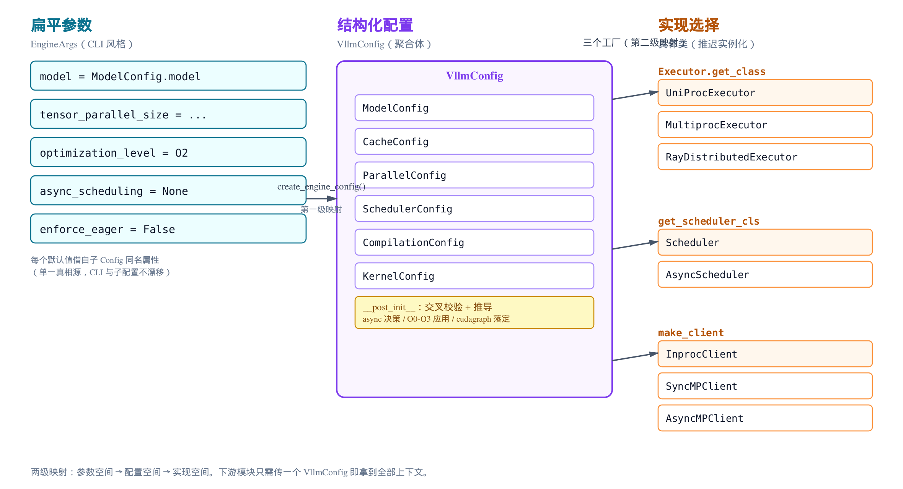
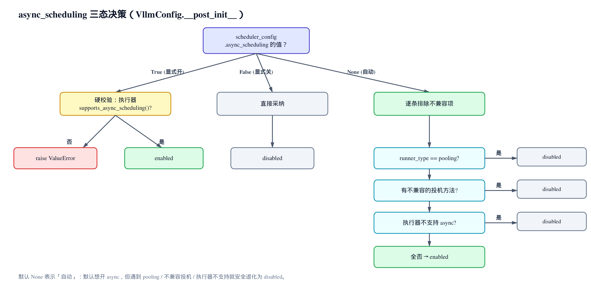
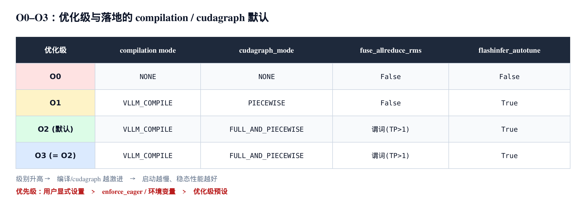

# 第3章　从 EngineArgs 到 VllmConfig：把整套引擎装配起来

## 你在这里


> *图注：全书路线图，画的是一个请求从入口到流式返回的生命周期。本章高亮在最左边的「入口」阶段——但严格说，本章讲的是比入口还早一拍的事：引擎被构造出来的那一瞬间。后面所有阶段（输入、调度、执行、输出）都依赖本章拼出来的那一个对象。*

前两章我们已经有了底子：[vLLM v1 的整体心智模型](../ch01-overview/narrative/chapter.md)，以及[一个请求端到端的鸟瞰路径](../ch02-request-lifecycle/narrative/chapter.md)。鸟瞰那一章里，每个环节我们都假设「引擎已经建好了」——`AsyncLLM` 也好、`EngineCore` 也好、调度器也好，都是现成的。

可它们是怎么建好的？答案的入口是 `vllm/v1/engine/llm_engine.py` 里的一个类方法 `from_engine_args`——本章就从它讲起。

你在命令行敲下 `vllm serve meta-llama/Llama-3-8B --tensor-parallel-size 2 -O3`，或者在 Python 里写 `LLM(model="...", tensor_parallel_size=2)`，这串扁平的参数，最后是怎么变成一个跑在两张卡上、开了 full cudagraph、用多进程执行器、配了异步调度的引擎的？

这章给答案。主角是一条**配置数据流**，从 `EngineArgs` 这个扁平的参数袋子出发，经过 `create_engine_config()` 组装成结构化的 `VllmConfig`，再由三个「工厂」根据 `VllmConfig` 里的 flag 选出具体的执行器、调度器、IPC 客户端类。读完这章，你会明白：

- vLLM 启动其实只有**两级映射**：参数 → 配置 → 实现类；
- `-O0` 到 `-O3` 这个优化级旋钮，到底拨动了什么；
- 为什么单卡默认 `uni`、多卡默认 `mp`，你没指定它怎么知道的；
- 为什么默认就有异步调度，但某些组合会自动退化；
- `compute_hash` 那个 10 位短指纹是干嘛的，跟 `torch.compile` 缓存什么关系。

本章的终点是 `EngineCore.__init__`——三个工厂的产物在那里汇合、实例化。它实例化出来的执行器和调度器**怎么跑**，分别留给 [第 13 章：连续批处理](../ch13-continuous-batching/narrative/chapter.md) 和 [第 17 章：执行器与 Worker 生命周期](../ch17-executors-workers/narrative/chapter.md)；本章只负责把它们**装配到位**。下一章 [第 4 章：AsyncLLM 三段式](../ch04-async-llm/narrative/chapter.md) 用的，正是本章拼出来的这个 `VllmConfig`。

---

## 3.1 一句话钩子：扁平进去，结构化出来

先看整章的起点。无论是同步的 `LLMEngine` 还是异步的 `AsyncLLM`，都走同一条路。这是 `LLMEngine` 的入口：

```python
# vllm/v1/engine/llm_engine.py:L151
    @classmethod
    def from_engine_args(
        cls,
        engine_args: EngineArgs,
        usage_context: UsageContext = UsageContext.ENGINE_CONTEXT,
        stat_loggers: list[StatLoggerFactory] | None = None,
        enable_multiprocessing: bool = False,
    ) -> "LLMEngine":
        """Creates an LLM engine from the engine arguments."""

        # Create the engine configs.
        vllm_config = engine_args.create_engine_config(usage_context)
        executor_class = Executor.get_class(vllm_config)

        # … 省略：VLLM_ENABLE_V1_MULTIPROCESSING 环境变量覆盖 …

        # Create the LLMEngine.
        return cls(
            vllm_config=vllm_config,
            executor_class=executor_class,
            log_stats=not engine_args.disable_log_stats,
            usage_context=usage_context,
            stat_loggers=stat_loggers,
            multiprocess_mode=enable_multiprocessing,
        )
```

整章的骨架，三行就够：

1. `engine_args.create_engine_config(...)` —— 把扁平的 `EngineArgs` 组装成结构化的 `VllmConfig`。这是**第一级映射**。
2. `Executor.get_class(vllm_config)` —— 根据 `VllmConfig` 里的 flag，选出一个执行器**类**。这是三个工厂之一，属于**第二级映射**。
3. 把 `vllm_config` 和 `executor_class` 交给 `__init__`。

这里有个容易被忽略的细节，但它很重要：第 2 步拿到的 `executor_class` 是一个**类**，不是实例。注意变量名就叫 `executor_class`。真正的 `executor_class(vllm_config)` 实例化要等到本章末尾的 `EngineCore.__init__` 才发生——因为实例化执行器要碰 GPU、起子进程，那是重活，得在引擎核心（很可能在另一个进程）里做，不能在配置组装阶段做。这个「选类」和「实例化」的分离，是本章的一条暗线。

先把整章的地图摊开：



> *图注：三列。左边「扁平参数」是 `EngineArgs`，CLI 风格、几百个字段；中间「结构化配置」是 `VllmConfig`，里面装着一堆子 Config 方块；右边「实现选择」是三个工厂选出的具体类。`create_engine_config()` 这一根箭头完成左→中的第一级映射；三个工厂（`Executor.get_class` / `get_scheduler_cls` / `make_client`）完成中→右的第二级映射。中间那个黄色的 `__post_init__` 方块，是本章第二主角——所有跨子配置的校验和推导都在那里集中落地。*

抓住这张图，vLLM 的启动你就懂了一大半。下面逐级拆开。

---

## 3.2 第一级映射：EngineArgs 是个扁平的参数袋子

先看 `EngineArgs` 长什么样。它是一个普通的 dataclass，字段多到几百个，但有一个非常漂亮的设计决策藏在默认值里：

```python
# vllm/engine/arg_utils.py:L415
class EngineArgs:
    """Arguments for vLLM engine."""

    model: str = ModelConfig.model
    served_model_name: str | list[str] | None = ModelConfig.served_model_name
    tokenizer: str | None = ModelConfig.tokenizer
    runner: RunnerOption = ModelConfig.runner
    skip_tokenizer_init: bool = ModelConfig.skip_tokenizer_init
    dtype: ModelDType = ModelConfig.dtype
    kv_cache_dtype: CacheDType = CacheConfig.cache_dtype
    seed: int = ModelConfig.seed
    max_model_len: int = ModelConfig.max_model_len
    # Note: Specifying a custom executor backend by passing a class
    # is intended for expert use only. The API may change without
    # notice.
    distributed_executor_backend: (
        str | DistributedExecutorBackend | type[Executor] | None
    ) = ParallelConfig.distributed_executor_backend
    # … 省略：多模态 / LoRA / 投机 / KV-transfer 等几百个字段 …
```

看出门道了吗？每个字段的默认值，不是写死的字面量，而是**直接引用对应子 Config 类的同名属性**：`model = ModelConfig.model`、`kv_cache_dtype = CacheConfig.cache_dtype`、`distributed_executor_backend = ParallelConfig.distributed_executor_backend`。

这是「单一真相源」（single source of truth）模式。子配置类 `ModelConfig` 里的 `max_model_len` 默认值改了，CLI 的默认值**自动跟着变**——因为它们引用的是同一个东西，不存在两处维护、互相漂移的可能。如果哪天你看到 vLLM 文档里说某个 CLI 参数的默认值是 X，去翻 `EngineArgs` 发现写的是 `= SomeConfig.foo`，别困惑，那就是说「默认值跟 `SomeConfig.foo` 保持一致」。

还有一个有意思的字段：`distributed_executor_backend` 默认是 `None`。它不是「没设置」的意思那么简单——`None` 是一个**待推导**的信号，后面 vLLM 会根据你的卡数、平台、是否有 Ray 来填它。这是本章第一个「三态/可推导默认」的例子，[3.6 节](#36-第二级映射之一执行器工厂-executorget_class) 会接着讲。

值得一提的是，「字段类型驱动 CLI 形态」这条规则随版本还在变得更完整。`bool` 字段会自动派生出 `--x/--no-x` 这样的成对开关，这套自动化由 `arg_utils.py` 里的 `get_kwargs`（内核是 `_compute_kwargs`）统一负责——它读字段的类型注解，决定生成什么样的 argparse 参数。

> **v0.21.0 更新**：早先有一类参数躲不过手写特例——类型为 `bool | str | None` 的「可裸可带值」旗标（典型是 `--hf-token`：裸写表示从环境读，带值表示直接给 token），源码里那条 `# This one is a special case ... TODO: Handle this in get_kwargs` 注释正是为它写的。`_compute_kwargs` 现在新增了对 `{bool, str, None}` 类型的识别（生成 `nargs="?"`、`const=True`），这个 TODO 被兑现，`--hf-token` 回归普通的 `**kwargs` 展开、不再特判。于是类型到 CLI 形态的映射更完整了：`bool` → 成对开关，`bool | str | None` → 可裸可带值的可选旗标。

### dict 自动升格成 Config 对象

`EngineArgs` 还有个贴心的 `__post_init__`，处理用户用 dict 传子配置的情况：

```python
# vllm/engine/arg_utils.py:L701
    def __post_init__(self):
        # support `EngineArgs(compilation_config={...})`
        # without having to manually construct a
        # CompilationConfig object
        if isinstance(self.compilation_config, dict):
            self.compilation_config = CompilationConfig(**self.compilation_config)
        if isinstance(self.attention_config, dict):
            self.attention_config = AttentionConfig(**self.attention_config)
        if isinstance(self.mamba_config, dict):
            self.mamba_config = MambaConfig(**self.mamba_config)
        # … 省略：kernel_config / eplb_config 同样的 dict→Config 升格，外加插件加载 …
```

意思是：你可以写 `EngineArgs(compilation_config={"mode": ...})`，不用先手工 `CompilationConfig(...)`。`__post_init__` 检测到它是个 dict，就帮你升格成真正的 `CompilationConfig` 对象。这是个纯粹的便利层，但它也告诉你一件事：**到 `create_engine_config` 真正开跑之前，所有子配置已经是规整的对象了。**

---

## 3.3 create_engine_config：把扁平参数重新打包

现在进入第一级映射的主体。`create_engine_config` 是个挺长的方法（一千多行的文件里它占了五百多行），但它的结构其实很规律。先看开场：

```python
# vllm/engine/arg_utils.py:L1636
    def create_engine_config(
        self,
        usage_context: UsageContext | None = None,
        headless: bool = False,
    ) -> VllmConfig:
        """
        Create the VllmConfig.

        NOTE: If VllmConfig is incompatible, we raise an error.
        """
        current_platform.pre_register_and_update()

        device_config = DeviceConfig(device=cast(Device, current_platform.device_type))

        envs.validate_environ(self.fail_on_environ_validation)

        # … 省略：speculator 模型检测，可能覆盖 model / tokenizer …

        model_config = self.create_model_config()
        self.model = model_config.model
        self.model_weights = model_config.model_weights
        self.tokenizer = model_config.tokenizer

        self._check_feature_supported()
        self._set_default_chunked_prefill_and_prefix_caching_args(model_config)
        self._set_default_reasoning_config_args()
```

开场做了几件事：

- `current_platform.pre_register_and_update()` —— 让平台层注册自己（CUDA / ROCm / TPU 各有钩子，可能往 CLI 注入设备专属选项）。
- 建 `DeviceConfig`。
- `create_model_config()` —— **这是最重的一步**。它要去读 HuggingFace 的模型 config（可能联网下载），推断 dtype、`max_model_len`、`runner_type`，检测是不是多模态、是不是 encoder-decoder。整章里真正花时间的就是这一步，其余都是轻量的内存操作。读完之后把规范化的 `model`/`tokenizer` 写回 `self`。
- 一串 `_set_default_*` —— 根据模型能力和使用场景补默认值（比如 chunked prefill、prefix caching 开不开，取决于模型支不支持）。

接着是一连串「打包」。这是整个方法的核心套路，看一个代表就懂了——`CacheConfig`：

```python
# vllm/engine/arg_utils.py:L1693
        cache_config = CacheConfig(
            block_size=self.block_size,
            gpu_memory_utilization=self.gpu_memory_utilization,
            kv_cache_memory_bytes=self.kv_cache_memory_bytes,
            cache_dtype=resolved_cache_dtype,
            is_attention_free=model_config.is_attention_free,
            num_gpu_blocks_override=self.num_gpu_blocks_override,
            sliding_window=sliding_window,
            enable_prefix_caching=self.enable_prefix_caching,
            prefix_caching_hash_algo=self.prefix_caching_hash_algo,
            # … 省略：calculate_kv_scales / mamba_* / kv_offloading_* 等字段 …
        )
```

就是「把扁平的 `self.*` 字段，重新打包成一个结构化的子配置对象」。每个关键字参数要么直接来自 `EngineArgs` 字段（`self.block_size`），要么来自上面推导出的局部变量（`resolved_cache_dtype`、`sliding_window`），要么从已经建好的 `model_config` 派生（`model_config.is_attention_free`）。

> **v0.21.0 更新**：`LoadConfig` 的打包同样在持续长字段——新增了两个权重预取旋钮 `safetensors_prefetch_num_threads`（预取 worker 线程数）和 `safetensors_prefetch_block_size`（每文件预取读取块字节数），对应 CLI `--safetensors-prefetch-num-threads` / `--safetensors-prefetch-block-size`，由 `create_load_config` 回填进 `LoadConfig`。后者跟 `max_num_batched_tokens` 一样支持人类可读写法（如 `16M`）。这是纯加法旋钮，不改主控制流，只是「`EngineArgs` 这个扁平袋子持续长字段、CLI 自动派生」模式的又一例。

`SchedulerConfig`、`ParallelConfig`、`LoadConfig`、`CompilationConfig`……全是**同一个套路**。看 `SchedulerConfig`，注意它怎么从 `model_config` 派生标志：

```python
# vllm/engine/arg_utils.py:L1966
        scheduler_config = SchedulerConfig(
            runner_type=model_config.runner_type,
            max_num_batched_tokens=self.max_num_batched_tokens,
            max_num_seqs=self.max_num_seqs,
            max_model_len=model_config.max_model_len,
            enable_chunked_prefill=self.enable_chunked_prefill,
            is_multimodal_model=model_config.is_multimodal_model,
            is_encoder_decoder=model_config.is_encoder_decoder,
            policy=self.scheduling_policy,
            scheduler_cls=self.scheduler_cls,
            async_scheduling=self.async_scheduling,
            # … 省略：max_num_partial_prefills / stream_interval 等 …
        )
```

两个细节值得记住：

第一，`runner_type` / `is_multimodal_model` / `is_encoder_decoder` 都来自 `model_config`，不是从 `EngineArgs` 重复读一遍。**子配置之间通过 `model_config` 派生，而不是各自重复定义同一个事实**——这避免了「模型说自己是多模态，调度器却以为不是」这种不一致。

第二，`policy` / `scheduler_cls` / `async_scheduling` 这三个字段，是后面调度器工厂（[3.7 节](#37-第二级映射之二调度器工厂-get_scheduler_cls)）的输入。此刻 `async_scheduling` 很可能还是 `None`（用户没指定），它的最终值要等 `VllmConfig.__post_init__` 推导。先记住这条线。

打包完所有子配置，方法的收尾就是把它们一次性塞进 `VllmConfig`：

```python
# vllm/engine/arg_utils.py:L2159
        config = VllmConfig(
            model_config=model_config,
            cache_config=cache_config,
            parallel_config=parallel_config,
            scheduler_config=scheduler_config,
            device_config=device_config,
            load_config=load_config,
            # … 省略：offload / attention / mamba / kernel / lora / speculative 等子配置 …
            compilation_config=compilation_config,
            optimization_level=self.optimization_level,
            performance_mode=self.performance_mode,
            # … 省略：kv_transfer / reasoning / profiler / additional 等 …
        )

        return config
```

注意 `optimization_level` 和 `performance_mode` 也在这里传进去。它们俩还没「生效」——只是被搬进了 `VllmConfig`。真正把 `-O3` 翻译成「开 full cudagraph、开这几个 fusion」的动作，发生在下面要讲的 `VllmConfig.__post_init__` 里。

这就是第一级映射的全貌：**几百个扁平参数 → 十几个结构化子配置 → 一个 `VllmConfig` 聚合体**。为什么要分扁平和结构化两层？因为扁平的好处是适合 CLI（一个 `--xxx` 对一个字段），结构化的好处是适合内部传递和校验（下游模块只需要拿一个 `VllmConfig` 就有了全部上下文）。两层各司其职，`create_engine_config` 就是它们之间的翻译器。

---

## 3.4 VllmConfig.__post_init__：跨子配置的校验与推导中枢

`VllmConfig` 构造出来的那一刻，dataclass 会自动调用它的 `__post_init__`。这是本章第二主角。它干的事，是那些**「单个子配置自己说了不算、得几个子配置凑在一起才能定」**的校验和推导。

为什么这些逻辑要集中在 `VllmConfig.__post_init__`，而不是散落到各个子配置里？因为很多约束天生是跨配置的：

- 异步调度开不开，取决于**执行器**支不支持 + 有没有**投机解码** + 是不是 **pooling 模型**——横跨三个子配置；
- cudagraph 用哪个模式，取决于 `enforce_eager`（在 `ModelConfig`）+ `optimization_level`（在 `VllmConfig` 自己）+ 环境变量。

如果把这些拆到各子配置的 `__post_init__` 里，就会产生「谁先 init、谁后 init」的顺序依赖噩梦。集中到一个地方落地，干净。

先看 `__post_init__` 的开头：

```python
# vllm/config/vllm.py:L758
    def __post_init__(self):
        """Verify configs are valid & consistent with each other."""

        # To give each torch profile run a unique instance name.
        self.instance_id = f"{time.time_ns()}"

        if self.performance_mode != "balanced":
            logger.info_once("Performance mode set to '%s'.", self.performance_mode)

        self.try_verify_and_update_config()

        if self.model_config is not None:
            self.model_config.verify_with_parallel_config(self.parallel_config)
            self.model_config.verify_dual_chunk_attention_config(self.load_config)

            self.parallel_config.is_moe_model = self.model_config.is_moe

        if self.lora_config is not None:
            self.lora_config.verify_with_model_config(self.model_config)

        # … 省略：mamba 随机舍入校验、deep_gemm 自动禁用等硬件/特性边角分支 …

        if self.quant_config is None and self.model_config is not None:
            self.quant_config = VllmConfig._get_quantization_config(
                self.model_config, self.load_config
            )
```

几个动作的性质各不相同，值得分清：

- `instance_id = f"{time.time_ns()}"` —— 给这次运行一个唯一名字（profiler 用）。
- `try_verify_and_update_config()` —— 按模型架构做特定改写（有些模型需要调整配置，HF 驱动）。
- `model_config.verify_with_parallel_config(...)` —— **交叉校验**：比如 TP size 必须能整除注意力头数，不满足就报错。
- `parallel_config.is_moe_model = self.model_config.is_moe` —— **子配置间补全**：`ParallelConfig` 自己不知道模型是不是 MoE，从 `model_config` 抄过来。
- 最后推导量化配置（缺省时从模型元数据读）。

这些是「热身」。`__post_init__` 还是一切「跨子配置硬约束」的兜底落地点——单看某一个子配置都合法、凑在一起才知道不行的组合，校验就集中写在这里。v0.21.0 又往这里补了两道这样的闸门，正好是这个模式的典型例证：

> **v0.21.0 更新（KV transfer 兼容闸门）**：`__post_init__` 在 KV transfer 收尾处新增了 `_verify_kv_transfer_compat`。逻辑是——只要配置了任意 KV connector（NIXL / Mooncake 之类），又把环境变量 `PYTORCH_CUDA_ALLOC_CONF` 打开成 `expandable_segments:True`、且没开 sleep mode，就直接 `raise ValueError`。原因很有教学性：PyTorch 的 CUDA 虚拟内存分配器会把 KV cache 的虚拟地址重映射到不同物理页，使 connector 通过 `ibv_reg_mr` 注册（pin）的 KV 内存指向被搬走的废弃物理页，运行时触发 `IBV_WC_REM_ACCESS_ERR`。单看 `KVTransferConfig` 或那个环境变量都合法，凑在一起才知道会出错——这正是为什么这类约束必须集中在 `__post_init__`。（sleep mode 是例外，因为它的内存池作用域内会自动关掉 expandable_segments。）

> **v0.21.0 更新（路由专家返回的能力边界）**：新增 CLI `--enable-return-routed-experts`（落在 `ModelConfig.enable_return_routed_experts`）。它带来的不是一段执行逻辑，而是 `__post_init__` 里一组「这个特性目前支持到哪」的校验：一旦开启，`_validate_return_routed_experts` 会拒绝尚未端到端验证的并行组合——`pipeline_parallel_size > 1`、`prefill_context_parallel_size > 1`、`decode_context_parallel_size > 1`，以及 `async_scheduling`，任一命中即报错。这也印证了本节的观点：`VllmConfig.__post_init__` 是把「能力边界」这类跨配置约束兜底落地的地方。

接下来才是本章重点的两个推导：**异步调度决策** 和 **优化级落地**。

---

## 3.5 async_scheduling 三态决策：默认开，但会自动退化

异步调度（async scheduling）是 vLLM v1 的一个性能特性——它让调度和执行能错开重叠（细节在 [第 4 章](../ch04-async-llm/narrative/chapter.md) 和调度章展开）。但它不是无条件能用的，跟一些特性不兼容。vLLM 用了一个很典型的「**三态字段**」来处理这种「默认想开、但有时得关」的情况。

`async_scheduling` 有三个值：`True`（用户显式要开）、`False`（用户显式要关）、`None`（默认，意思是「你看着办」）。看决策代码：

```python
# vllm/config/vllm.py:L814
        from vllm.v1.executor.abstract import Executor

        executor_backend = self.parallel_config.distributed_executor_backend
        executor_class = Executor.get_class(self)
        executor_supports_async_sched = executor_class.supports_async_scheduling()

        if self.scheduler_config.async_scheduling:
            # Async scheduling explicitly enabled, hard fail any incompatibilities.
            # … 省略：投机方法 / disable_padded_drafter_batch 的硬校验 …
            if not executor_supports_async_sched:
                raise ValueError(
                    f"`{executor_backend}` does not support async scheduling yet."
                )
        elif self.scheduler_config.async_scheduling is None:
            # Enable async scheduling unless there is an incompatible option.
            if (
                self.model_config is not None
                and self.model_config.runner_type == "pooling"
            ):
                self.scheduler_config.async_scheduling = False
            elif (
                self.speculative_config is not None
                and self.speculative_config.method not in get_args(EagleModelTypes)
                and self.speculative_config.method not in get_args(NgramGPUTypes)
            ):
                self.scheduler_config.async_scheduling = False
            elif not executor_supports_async_sched:
                self.scheduler_config.async_scheduling = False
            else:
                self.scheduler_config.async_scheduling = True

        logger.info_once(
            "Asynchronous scheduling is %s.",
            "enabled" if self.scheduler_config.async_scheduling else "disabled",
        )
```

先注意头三行：它**提前调用了 `Executor.get_class(self)`**，问执行器类「你支持异步调度吗」（`supports_async_scheduling()`）。这是一个有意思的回路——执行器工厂在这里被借来当「能力查询」用，而不是真去实例化执行器。这也是为什么 `distributed_executor_backend` 必须在这之前就推导好：`ParallelConfig` 在 [3.3 节](#33-create_engine_config把扁平参数重新打包) 的 `create_engine_config` 里构造，它的 `__post_init__` 那时候就已经把 `None` 填成了 `"uni"` 或 `"mp"`——早于外层 `VllmConfig(...)` 构造才触发的这个 `__post_init__`（[下一节](#36-第二级映射之一执行器工厂-executorget_class) 详述推导规则）。

然后三态分流：

- **用户显式 `True`**：硬校验。投机方法不兼容、执行器不支持，**直接 `raise`**。你明确说要开，那就不能默默给你关掉骗你。
- **用户显式 `False`**：什么都不做，采纳。（这条分支在代码里是「都不进」自然落下。）
- **`None`（默认）**：逐条排除。是 pooling 模型？关。用了不兼容的投机方法？关。执行器不支持？关。全都不是，才开。

画成决策树更清楚：



> *图注：根节点是 `async_scheduling` 的值。`True` 走硬校验，不兼容就 `raise`；`False` 直接采纳为 disabled；`None` 走「逐条排除」——pooling / 不兼容投机 / 执行器不支持，任何一条命中就退化为 disabled，全部不命中才 enabled。这就解释了为什么 vLLM「默认就有异步调度」，但你换个 pooling 模型跑就发现它悄悄关了。*

这个三态模式很值得品。它同时满足两种用户：图省心的用户用默认 `None`，系统自动选安全的；较真的用户显式 `True`，系统帮他严格校验、不兼容就报错而不是阴它。**「自动安全退化」和「显式严格校验」用同一个字段表达**，靠的就是 `None` 这第三态。

`async_scheduling` 这个最终落定的布尔值，会在本章末尾喂给调度器工厂，决定选 `Scheduler` 还是 `AsyncScheduler`。

---

## 3.6 第二级映射之一：执行器工厂 Executor.get_class

讲完推导，回到工厂。三个工厂里最直白的是执行器工厂。先看它怎么选类：

```python
# vllm/v1/executor/abstract.py:L47
    @staticmethod
    def get_class(vllm_config: VllmConfig) -> type["Executor"]:
        executor_class: type[Executor]
        parallel_config = vllm_config.parallel_config
        distributed_executor_backend = parallel_config.distributed_executor_backend
        # distributed_executor_backend must be set in VllmConfig.__post_init__
        if isinstance(distributed_executor_backend, type):
            if not issubclass(distributed_executor_backend, Executor):
                raise TypeError(...)
            executor_class = distributed_executor_backend
        elif distributed_executor_backend == "ray":
            # … 省略：Ray V2 / V1 两个分支 …
            executor_class = RayDistributedExecutor
        elif distributed_executor_backend == "mp":
            from vllm.v1.executor.multiproc_executor import MultiprocExecutor

            executor_class = MultiprocExecutor
        elif distributed_executor_backend == "uni":
            from vllm.v1.executor.uniproc_executor import UniProcExecutor

            executor_class = UniProcExecutor
        elif distributed_executor_backend == "external_launcher":
            executor_class = ExecutorWithExternalLauncher
        elif isinstance(distributed_executor_backend, str):
            executor_class = resolve_obj_by_qualname(distributed_executor_backend)
            # … 省略：subclass 校验 …
        else:
            raise ValueError(
                f"Unknown distributed executor backend: {distributed_executor_backend}"
            )
        return executor_class
```

本质就是一张**查表**：`distributed_executor_backend` 这个字符串 flag → 一个具体的执行器类。`"mp"` → `MultiprocExecutor`、`"uni"` → `UniProcExecutor`、`"ray"` → `RayDistributedExecutor`、`"external_launcher"` → `ExecutorWithExternalLauncher`。它也接受你直接传一个类（专家用法）或一个类的全限定名字符串（动态解析）。

注意工厂里那行注释：`distributed_executor_backend must be set in VllmConfig.__post_init__`——到工厂被调用时，这个字段**必须已经不是 `None` 了**。那它是在哪从 `None` 变成 `"mp"`/`"uni"` 的呢？答案在 `ParallelConfig.__post_init__`，比这个工厂更早执行：

```python
# vllm/config/parallel.py:L831
        if self.distributed_executor_backend is None and self.world_size_across_dp > 1:
            # We use multiprocessing by default if world_size fits on the
            # current node and we aren't in a ray placement group.

            from vllm.v1.executor import ray_utils

            backend: DistributedExecutorBackend = "mp"
            ray_found = ray_utils.ray_is_available()
            if current_platform.is_tpu() and envs.VLLM_XLA_USE_SPMD:
                backend = "uni"
            elif current_platform.is_cuda() and self.nnodes > 1:
                backend = "mp"
            elif (
                current_platform.is_cuda()
                and current_platform.device_count() < self.world_size
            ):
                gpu_count = current_platform.device_count()
                raise ValueError(
                    f"World size ({self.world_size}) is larger than the number of "
                    f"available GPUs ({gpu_count}) in this node. ..."
                )
            # … 省略：data_parallel_backend=="ray" / 检测到 Ray 已初始化 → "ray" …
            self.distributed_executor_backend = backend
            logger.debug("Defaulting to use %s for distributed inference", backend)

        if self.distributed_executor_backend is None and self.world_size == 1:
            self.distributed_executor_backend = "uni"
```

这段就是「单卡为什么默认 `uni`、多卡为什么默认 `mp`」的来历。`world_size = TP × PP`（单 DP 路径下），逻辑是：

- `world_size == 1`（单卡单进程）→ `"uni"`（uniproc，就在本进程跑，不起子进程）；
- `world_size > 1` 且能放进本节点 → `"mp"`（multiproc，每个 rank 一个子进程）；
- 检测到 Ray 环境 → `"ray"`；
- `world_size` 比本机 GPU 数还多 → 直接 `raise`，省得你后面莫名其妙崩。

你不指定 backend，vLLM 就用这套规则给你推一个合理的默认；你显式指定了，它就尊重你的。又是「合理默认 + 显式优先」那一套——本章你会一次次看到这个模式。

回头看执行器工厂里被借去当「能力查询」的 `supports_async_scheduling()`。不同执行器类对它的回答不一样，这正是 [3.5 节](#35-async_scheduling-三态决策默认开但会自动退化) 那个决策的依据：基类 `Executor` 默认返回 `False`，而 `UniProcExecutor` 和 `MultiprocExecutor` 都重写成 `True`。所以单卡 `uni`、多卡 `mp` 这两条主流路径，执行器都是支持异步调度的——这也是为什么默认情况下异步调度通常是开着的。

---

## 3.7 第二级映射之二：调度器工厂 get_scheduler_cls

第二个工厂更短。它把 [3.5 节](#35-async_scheduling-三态决策默认开但会自动退化) 推导出的 `async_scheduling` 布尔值，翻译成一个具体的调度器类：

```python
# vllm/config/scheduler.py:L168
    def get_scheduler_cls(self) -> type["SchedulerInterface"]:
        if self.scheduler_cls is None:
            if self.async_scheduling:
                from vllm.v1.core.sched.async_scheduler import AsyncScheduler

                return AsyncScheduler
            from vllm.v1.core.sched.scheduler import Scheduler

            return Scheduler

        # This warning can be removed once the Scheduler interface is
        # finalized and we can maintain support for scheduler classes that
        # implement it
        logger.warning_once(
            "Using custom scheduler class %s. This scheduler interface is "
            "not public and compatibility may not be maintained.",
            self.scheduler_cls,
        )
        if not isinstance(self.scheduler_cls, str):
            return cast(type["SchedulerInterface"], self.scheduler_cls)
        return resolve_obj_by_qualname(self.scheduler_cls)
```

逻辑一目了然：没指定自定义 `scheduler_cls` 时，`async_scheduling` 为真就选 `AsyncScheduler`，否则选默认的 `Scheduler`。也允许传自定义类或全限定名（会 warn 一句「这个接口不是公开的，不保证兼容」）。

这就是工厂模式的好处：[3.5 节](#35-async_scheduling-三态决策默认开但会自动退化) 那一长串「pooling 模型关、投机方法关、执行器不支持关」的复杂决策，**最后浓缩成一个布尔字段**；到了用调度器的地方（`EngineCore`），只需要 `get_scheduler_cls()` 一句，拿到正确的类，完全不必关心当初是怎么决策出来的。**复杂的判断集中在一处推导，使用方只看结果**——配置与实现选择就这样解耦了。

---

## 3.8 第二级映射之三：IPC 客户端工厂 make_client

第三个工厂连接的是 [第 4 章的异步三段式](../ch04-async-llm/narrative/chapter.md)。它根据「执行模式」选 IPC 客户端：

```python
# vllm/v1/engine/core_client.py:L80
    @staticmethod
    def make_client(
        multiprocess_mode: bool,
        asyncio_mode: bool,
        vllm_config: VllmConfig,
        executor_class: type[Executor],
        log_stats: bool,
    ) -> "EngineCoreClient":
        # TODO: support this for debugging purposes.
        if asyncio_mode and not multiprocess_mode:
            raise NotImplementedError(
                "Running EngineCore in asyncio without multiprocessing "
                "is not currently supported."
            )

        if multiprocess_mode and asyncio_mode:
            return EngineCoreClient.make_async_mp_client(
                vllm_config, executor_class, log_stats
            )

        if multiprocess_mode and not asyncio_mode:
            return SyncMPClient(vllm_config, executor_class, log_stats)

        return InprocClient(vllm_config, executor_class, log_stats)
```

这是一张**二维查表**，两个布尔维度 `(multiprocess_mode, asyncio_mode)`：

| multiprocess | asyncio | 选择 | 谁用 |
|---|---|---|---|
| 否 | 否 | `InprocClient`（同进程，没有 IPC） | `LLMEngine` 简单/调试 |
| 是 | 否 | `SyncMPClient`（子进程 + 同步） | `LLMEngine` 多进程 |
| 是 | 是 | → `make_async_mp_client` | `AsyncLLM`（OpenAI server） |
| 否 | 是 | `NotImplementedError`（暂不支持） | —— |

回想 [3.1 节](#31-一句话钩子扁平进去结构化出来) 的入口代码，`LLMEngine` 调 `make_client` 时传的是 `asyncio_mode=False`——所以同步引擎走的是上半张表（`InprocClient` 或 `SyncMPClient`）。而 [第 4 章](../ch04-async-llm/narrative/chapter.md) 的 `AsyncLLM` 走的是 `make_async_mp_client` 这一支。来看它的细分：

```python
# vllm/v1/engine/core_client.py:L105
    @staticmethod
    def make_async_mp_client(
        vllm_config: VllmConfig,
        executor_class: type[Executor],
        log_stats: bool,
        client_addresses: dict[str, str] | None = None,
        client_count: int = 1,
        client_index: int = 0,
    ) -> "AsyncMPClient":
        parallel_config = vllm_config.parallel_config
        # … 省略：client_args 元组拼装 …
        if parallel_config.data_parallel_size > 1:
            if parallel_config.data_parallel_external_lb:
                return DPAsyncMPClient(*client_args)
            return DPLBAsyncMPClient(*client_args)
        return AsyncMPClient(*client_args)
```

异步客户端再按**数据并行（DP）维度**细分：单 DP → `AsyncMPClient`；多 DP 用外部负载均衡 → `DPAsyncMPClient`；多 DP 用内部负载均衡 → `DPLBAsyncMPClient`。

> **v0.21.0 更新**：走到这条 external LB 分支之前，配置阶段收紧了它的适用范围——当 `data_parallel_size > 1` 且开了 external LB、而模型**不是 MoE** 时，`create_engine_config` 阶段就直接 `raise ValueError`，并提示「非 MoE 请改起多个独立 vLLM 实例」。换句话说，external LB 现在是 MoE 专属路径；以前非 MoE 也能进这条路（行为未定义），现在被提前挡住了。这些客户端的内部机制——ZMQ、msgpack、跨进程怎么通信——是 [第 7 章：IPC 边界](../ch07-ipc-boundary/narrative/chapter.md) 的内容；本章只需要知道：**`make_async_mp_client` 是异步三段式的入口**，它会起一个独立子进程把 `EngineCore` 跑起来。这就是 [第 4 章](../ch04-async-llm/narrative/chapter.md) 那张三段图里「进程边界」的来源。

三个工厂讲完了，规律是统一的：**都从 `VllmConfig`（或它派生的 flag）出发，查表选出一个具体类**。同一套配置，在单卡/多卡、同步/异步、单 DP/多 DP 之下，选出完全不同的实现——而调用方一句都不用改。这就是「把配置和实现选择解耦」的全部含义。

---

## 3.9 O0–O3 优化级：一个声明式的旋钮

现在回头补上 [3.4 节](#34-vllmconfig__post_init__跨子配置的校验与推导中枢) 留的尾巴：`optimization_level` 是怎么「生效」的。

先看它的语义定义。这是 vLLM 作者在源码里给的权威说明：

```python
# vllm/config/vllm.py:L68
class OptimizationLevel(IntEnum):
    """Optimization level enum."""

    O0 = 0
    """O0 : No optimization. no compilation, no cudagraphs, no other
    optimization, just starting up immediately"""
    O1 = 1
    """O1: Quick optimizations. Dynamo+Inductor compilation and Piecewise
    cudagraphs"""
    O2 = 2
    """O2: Full optimizations. -O1 as well as Full and Piecewise cudagraphs."""
    O3 = 3
    """O3: Currently the same as -O2s."""
```

它是个「启动时间 vs 运行性能」的单调旋钮：

- **O0**：什么都不开，立刻启动。适合快速迭代、调试——你不想每改一行代码就等 `torch.compile` 编译几分钟。
- **O1**：开 Dynamo+Inductor 编译 + Piecewise cudagraph。快速优化。
- **O2**（**默认**）：O1 的基础上再开 Full & Piecewise cudagraph。生产环境用这个。
- **O3**：当前等同 O2（给未来预留）。

`VllmConfig` 的 `optimization_level` 字段默认就是 `O2`。

关键问题是：`-O3` 这个枚举值，怎么变成「开这几个 fusion、用那个 cudagraph 模式」的具体设置？答案是 vLLM 没用一大坨 if-else，而是用了**预设字典 + 查表**：

```python
# vllm/config/vllm.py:L175
OPTIMIZATION_LEVEL_00 = {
    "compilation_config": {
        "pass_config": {
            "fuse_norm_quant": False,
            "fuse_act_quant": False,
            "fuse_allreduce_rms": False,
            # … 省略：其余 fusion 开关，O0 全部 False …
        },
        "cudagraph_mode": CUDAGraphMode.NONE,
        "use_inductor_graph_partition": False,
    },
    "kernel_config": {
        "enable_flashinfer_autotune": False,
    },
}
# … 省略：O1（PIECEWISE cudagraph + Inductor fusion）…
OPTIMIZATION_LEVEL_02 = {
    "compilation_config": {
        "pass_config": {
            "fuse_norm_quant": enable_norm_fusion,
            "fuse_act_quant": enable_act_fusion,
            "fuse_allreduce_rms": enable_allreduce_rms_fusion,
            "fuse_attn_quant": IS_QUANTIZED,
            "enable_sp": IS_DENSE,
            # … 省略：其余 fusion 开关 …
        },
        "cudagraph_mode": CUDAGraphMode.FULL_AND_PIECEWISE,
        "use_inductor_graph_partition": False,
    },
    "kernel_config": {
        "enable_flashinfer_autotune": True,
    },
}

OPTIMIZATION_LEVEL_TO_CONFIG = {
    OptimizationLevel.O0: OPTIMIZATION_LEVEL_00,
    OptimizationLevel.O1: OPTIMIZATION_LEVEL_01,
    OptimizationLevel.O2: OPTIMIZATION_LEVEL_02,
    OptimizationLevel.O3: OPTIMIZATION_LEVEL_03,
}
```

每个优化级就是一个嵌套字典，声明式地写明「这一级，cudagraph 用什么模式、各个 fusion 开关怎么设、flashinfer autotune 开不开」。`OPTIMIZATION_LEVEL_TO_CONFIG` 是从枚举到字典的查表。整理成一张表更直观：



> *图注：行是 O0/O1/O2/O3，列是 compilation mode、cudagraph_mode、一个代表性 fusion 开关（`fuse_allreduce_rms`）、flashinfer autotune。可以看到这是个单调旋钮：级别升高，编译和 cudagraph 越激进。底部红字是优先级规则——用户显式设置 > `enforce_eager`/环境变量 > 优化级预设，下面马上讲它怎么保证的。*

这里还有一个精巧的设计：预设字典里的值，**可以是常量，也可以是函数**。看 O2 里 `fuse_norm_quant` 的值是 `enable_norm_fusion`——那是个函数，不是布尔值。为什么？因为某些 fusion 开不开，得运行时按平台、模型、是否量化来动态决定，没法在模块加载时写死一个常量。把值写成函数，就能**延迟求值**：等真正应用预设时，再调用这个函数、传入当前的 `VllmConfig`，算出实际该用的布尔值。

### 优化级怎么「应用」：递归只填 None

字典有了，怎么把它落到 `compilation_config` / `kernel_config` 上？看应用机制：

```python
# vllm/config/vllm.py:L647
    def _apply_optimization_level_defaults(self, defaults: dict[str, Any]) -> None:
        """Apply optimization level defaults using self as root.

        Recursively applies values from defaults into nested config objects.
        Only fields present in defaults are overwritten.

        If the user configuration does not specify a value for a default field
        and if the default field is still None after all user selections are
        applied, then default values will be applied to the field. User specified
        fields will not be overridden by the default.
        """

        def apply_recursive(config_obj: Any, config_defaults: dict[str, Any]) -> None:
            for key, value in config_defaults.items():
                if not hasattr(config_obj, key):
                    continue

                current = getattr(config_obj, key)
                if isinstance(value, dict) and is_dataclass(current):
                    apply_recursive(current, value)
                else:
                    self._set_config_default(config_obj, key, value)

        apply_recursive(self, defaults)
```

它递归遍历预设字典：遇到「字典 + 对应字段是个 dataclass」就往下钻（`pass_config` 是嵌套的，所以要递归），否则调 `_set_config_default` 写值。

注释里那句话是整个机制的灵魂：**「user specified fields will not be overridden by the default」**——用户显式设的字段，预设绝不覆盖。怎么做到的？看 `_set_config_default`：它只在「字段当前还是 `None`」时才写默认值。换句话说，**`None` 表示「用户没碰过这个字段，你可以填」**；非 `None` 表示「用户已经表态了，别动」。这跟 [3.5 节](#35-async_scheduling-三态决策默认开但会自动退化) 的 `async_scheduling`、[3.6 节](#36-第二级映射之一执行器工厂-executorget_class) 的 `distributed_executor_backend` 是同一个哲学——`None` 是「待填」的信号。前面提到的那些函数值，也是在这一步被调用求值的。

### 优先级是怎么排出来的

把 `__post_init__` 尾段的 compilation 落定逻辑看完，整个优先级链就清楚了：

```python
# vllm/config/vllm.py:L941
        if self.model_config is not None and self.model_config.enforce_eager:
            logger.warning(
                "Enforce eager set, disabling torch.compile and CUDAGraphs. "
                "This is equivalent to setting -cc.mode=none -cc.cudagraph_mode=none"
            )
            self.compilation_config.mode = CompilationMode.NONE
            self.compilation_config.cudagraph_mode = CUDAGraphMode.NONE

        if os.environ.get("TORCH_COMPILE_DISABLE") == "1":
            self.compilation_config.mode = CompilationMode.NONE

        # … 省略：custom-op 等边角分支 …

        current_platform.apply_config_platform_defaults(self)

        if self.compilation_config.mode is None:
            if self.optimization_level > OptimizationLevel.O0:
                self.compilation_config.mode = CompilationMode.VLLM_COMPILE
            else:
                self.compilation_config.mode = CompilationMode.NONE

        # … 省略：ir_enable_torch_wrap / custom_ops 默认化 …

        self.kernel_config.set_platform_defaults(self)

        default_config = OPTIMIZATION_LEVEL_TO_CONFIG[self.optimization_level]
        self._apply_optimization_level_defaults(default_config)
```

按执行顺序读，优先级从高到低就出来了：

1. **`enforce_eager`**：用户要求 eager，直接把 `mode` 和 `cudagraph_mode` 砸成 `NONE`。这一步**覆盖优化级**——你设了 `-O3` 又开 `enforce_eager`，eager 赢。
2. **`TORCH_COMPILE_DISABLE=1` 环境变量**：把 `mode` 设 `NONE`。
3. **优化级默认**：只有当 `mode` 走到这里还是 `None`（前面没人动过）时，才按优化级决定——大于 O0 就 `VLLM_COMPILE`，否则 `NONE`。
4. 最后 `_apply_optimization_level_defaults` 落实剩下那些 fusion / cudagraph 默认——而它只填 `None` 字段，所以**用户在最外层显式设过的，全程不被覆盖**。

于是完整优先级是：**用户显式设置 > `enforce_eager`/环境变量 > 优化级预设**。这套优先级不是写在某个 if-else 大瀑布里硬排的，而是靠「按顺序执行 + `None` 才填」这个朴素机制**自然涌现**的。读 vLLM 配置代码时，看到 `if xxx is None:` 就该条件反射：这是在尊重用户的显式选择。

---

## 3.10 compute_hash：计算图的 10 位指纹

本章点名的最后一块是 `compute_hash`。它跟前面的组装/工厂是正交的一条线，但很关键，因为它直接关系到 `torch.compile` 的编译缓存命中率。

`torch.compile` 把模型编译成优化过的代码，这个过程很慢（动辄几十秒到几分钟）。所以 vLLM 会把编译产物缓存起来，下次配置没变就直接复用。问题是：**怎么判断「配置没变」？** 总不能把整个 `VllmConfig` 拿来比——里面一堆字段（比如 `served_model_name`、日志开关）改了根本不影响编译出来的计算图。

`compute_hash` 的答案是：**只收集「影响计算图结构」的因子，哈希成一个 10 位短指纹**。

```python
# vllm/config/vllm.py:L362
    def compute_hash(self) -> str:
        """
        WARNING: Whenever a new field is added to this config,
        ensure that it is included in the factors list if
        it affects the computation graph.

        Provide a hash that uniquely identifies all the configs
        that affect the structure of the computation
        graph from input ids/embeddings to the final hidden states,
        ...
        """
        factors: list[Any] = []

        # summarize vllm config
        vllm_factors: list[Any] = []
        from vllm import __version__

        vllm_factors.append(__version__)
        if self.model_config:
            vllm_factors.append(self.model_config.compute_hash())
        else:
            vllm_factors.append("None")
        if self.cache_config:
            vllm_factors.append(self.cache_config.compute_hash())
        else:
            vllm_factors.append("None")
        if self.parallel_config:
            vllm_factors.append(self.parallel_config.compute_hash())
        else:
            vllm_factors.append("None")
        if self.scheduler_config:
            vllm_factors.append(self.scheduler_config.compute_hash())
        else:
            vllm_factors.append("None")
        # … 省略：device / load / lora / speculative 等子配置，全是同样的
        #   「有就 append 它的 hash、没有就 append "None"」结构 …
        if self.compilation_config:
            vllm_factors.append(self.compilation_config.compute_hash())
        else:
            vllm_factors.append("None")
        if self.kernel_config:
            vllm_factors.append(self.kernel_config.compute_hash())
        else:
            vllm_factors.append(None)
        factors.append(vllm_factors)

        hash_str = safe_hash(str(factors).encode(), usedforsecurity=False).hexdigest()[
            :10
        ]
        return hash_str
```

算法本身朴素：收集一个 `factors` 列表（vLLM 版本号 + 每个子配置自己的 `compute_hash()`），转成字符串、哈希、取前 10 位。结构上是高度重复的「有就 append 子配置的 hash、没有就 append `"None"`」。

有意思的是它**收什么、不收什么**，那才是设计：

- **收**：vLLM 版本（版本变了编译产物可能不兼容）、`model_config`（模型结构）、`parallel_config`（TP/PP 改了计算图就变）、`compilation_config`（编译模式本身）……都是会改变「从 input ids 到 final hidden states 的计算图结构」的因子。
- **不收**：tokenize / detokenize 相关的配置。注释里那句 `from input ids/embeddings to the final hidden states` 划定了边界——**前处理和后处理不在计算图里，所以不入哈希**。你改了停止串、改了输出格式，计算图没变，指纹不变，缓存照样命中。

源码顶上那句大写的 `WARNING` 也值得一提：新加字段如果影响计算图，**必须**记得加进 `factors`。否则就会出现「配置实际变了但指纹没变」，缓存命中了一个错误的编译产物——这种 bug 很隐蔽。这是一段需要开发者自律维护的代码。

那么哪些配置改动会触发昂贵的重编译？看 `factors` 里收了什么就知道：换模型、改 TP/PP、改优化级（`compilation_config` 变了）——这些都会让指纹变、触发重编译。而改 `max_num_seqs`、换日志后端这类，不影响图结构，缓存照命中。理解 `compute_hash` 的作用域，你就能预测「我这个改动会不会让 vLLM 重新编译几分钟」。

---

## 3.11 汇合点：EngineCore.__init__，三个工厂的产物落地

走到这里，配置组装完了（第一级），三个工厂也讲完了（第二级）。但 [3.1 节](#31-一句话钩子扁平进去结构化出来) 留了个悬念：执行器工厂只「选了类」，没「实例化」。实例化在哪发生？

答案是本章的终点——`EngineCore.__init__`：

```python
# vllm/v1/engine/core.py:L116
        # Setup Model.
        self.model_executor = executor_class(vllm_config)
        if executor_fail_callback is not None:
            self.model_executor.register_failure_callback(executor_fail_callback)

        self.available_gpu_memory_for_kv_cache = -1

        # … 省略：elastic-ep 早期初始化 …

        # Setup KV Caches and update CacheConfig after profiling.
        kv_cache_config = self._initialize_kv_caches(vllm_config)
        self.structured_output_manager = StructuredOutputManager(vllm_config)

        # Setup scheduler.
        Scheduler = vllm_config.scheduler_config.get_scheduler_cls()

        # … 省略：chunked-prefill 无 kvcache 的保护、block-size 解析 …

        self.scheduler: SchedulerInterface = Scheduler(
            vllm_config=vllm_config,
            kv_cache_config=kv_cache_config,
            structured_output_manager=self.structured_output_manager,
            include_finished_set=include_finished_set,
            log_stats=self.log_stats,
            block_size=scheduler_block_size,
            hash_block_size=hash_block_size,
        )
```

两件事在这里发生，正好对应三个工厂里的两个：

1. `self.model_executor = executor_class(vllm_config)` —— **执行器类终于实例化了**。注意 `executor_class` 从 [3.1 节](#31-一句话钩子扁平进去结构化出来) 一路传到这里，全程都是个「类」，到这一刻才 `(...)` 调用变成实例。实例化要碰 GPU、起 worker，所以推迟到这个可能位于独立子进程的引擎核心里做——这就是当初「选类不实例化」那个设计的回报。
2. `Scheduler = vllm_config.scheduler_config.get_scheduler_cls()` 然后 `Scheduler(...)` —— **调度器工厂在这里被调用**，把 [3.5 节](#35-async_scheduling-三态决策默认开但会自动退化) 推导出的 `async_scheduling` 兑现成一个具体的 `Scheduler` 或 `AsyncScheduler` 实例。

（第三个工厂 `make_client` 在更外层、构造 `EngineCore` 之前就调用了——它决定了 `EngineCore` 是在本进程还是子进程里被构造的。）

中间那行 `_initialize_kv_caches` 是另一桩重活：它会真的去 GPU 上 profiling，量出能给 KV cache 多少显存，再回填 `CacheConfig`。这部分属于 [第 15 章：分页 KV cache](../ch15-paged-kv-cache/narrative/chapter.md)，本章不展开——`CacheConfig.block_size` 和 `enable_prefix_caching` 这两个我们 [3.3 节](#33-create_engine_config把扁平参数重新打包) 打包进去的字段，到那一章才真正发挥作用。

到这里，引擎就**装配完成**了：有了实例化的执行器，有了实例化的调度器，KV cache 也初始化了。它们具体怎么跑起来——执行器怎么驱动 worker、调度器怎么连续批处理——是后面章节的事。本章的使命，到「装配到位」为止。

> **v0.21.0 更新**：同在 `vllm/v1/engine/core.py`，`EngineCore.add_request` 末尾新增了一个小分支：当请求标了 `request.abort_immediately` 时，请求一进 scheduler 就被立即 abort。目的是让 KV connector 的 `request_finished` 钩子跑起来，回收预准入阶段（pre-admission）申请、但因拒绝而搁浅的 KV blocks。这属于 disaggregated / KV-transfer 的边角控制流，此处点名即可，细节留给 KV 连接器专章。

---

## 3.12 跑一遍：观察装配的实际数值

源码读到这儿，纸上谈兵容易飘。本章配了一个**只做减法的可运行精简版**，把上面这条配置流（`EngineArgs` → `create_engine_config` → `VllmConfig.__post_init__` → 三工厂 → `EngineCore`）原样保留下来，但删掉了所有跟主线无关的分支（Ray、DP 负载均衡、各种硬件边角校验），让它能在一台没有 GPU、没装 vLLM 的普通机器上跑起来、设断点、看实际数值。它跟真实 vLLM 同名、同结构、同控制流——只是剥掉了无关的枝叶。

我们用它来验证三个最容易记混的推导，对应的真实源码分别在 `vllm/config/parallel.py`、`vllm/config/vllm.py` 和 `vllm/v1/executor/abstract.py`。

### 数值 1：单卡 vs 多卡，backend 怎么推

```text
EngineArgs(tensor_parallel_size=1)
  → world_size = 1×1 = 1
  → ParallelConfig.__post_init__: backend None + world_size==1
  → distributed_executor_backend = "uni"
  → Executor.get_class → UniProcExecutor

EngineArgs(tensor_parallel_size=2)   # 假设本机 ≥2 张卡
  → world_size = 2×1 = 2
  → ParallelConfig.__post_init__: backend None + world_size>1
  → distributed_executor_backend = "mp"
  → Executor.get_class → MultiprocExecutor

EngineArgs(tensor_parallel_size=4)   # 但本机只有 1 张卡
  → world_size = 4 > device_count(1)
  → raise ValueError("World size (4) is larger than the number of available GPUs (1)")
```

跟 [3.6 节](#36-第二级映射之一执行器工厂-executorget_class) 读到的逻辑一致：单卡 `uni`、多卡 `mp`、要的卡比有的多直接报错。

### 数值 2：async_scheduling 的三态退化

把执行器和模型类型组合起来，观察 `None` 怎么退化：

```text
默认（generate 模型，单卡 uni 执行器，async_scheduling=None）
  → 非 pooling、无投机、uni 执行器 supports_async_scheduling()==True
  → 全部排除项都不命中 → async_scheduling = True → get_scheduler_cls() → AsyncScheduler

pooling 模型（runner_type="pooling", async_scheduling=None）
  → 第一条排除命中 → async_scheduling = False → get_scheduler_cls() → Scheduler

显式 async_scheduling=True + 一个不支持异步的执行器
  → 硬校验失败 → raise ValueError("... does not support async scheduling yet")
```

第一种是最常见的默认路径——所以你不配任何东西，跑一个普通生成模型，拿到的就是 `AsyncScheduler`。第二种印证了「pooling 模型悄悄关掉 async」。第三种印证了「显式 `True` 遇到不兼容会报错而不是阴你」。

### 数值 3：优化级与用户显式设置的优先级

```text
optimization_level=O0
  → mode 走到默认判断时仍 None，且 O0 不大于 O0
  → compilation_config.mode = NONE，cudagraph_mode = NONE，flashinfer_autotune = False

optimization_level=O2（默认）
  → mode = VLLM_COMPILE，cudagraph_mode = FULL_AND_PIECEWISE，flashinfer_autotune = True

optimization_level=O2 但 enforce_eager=True
  → enforce_eager 先把 mode/cudagraph_mode 砸成 NONE
  → 后面 _apply_optimization_level_defaults 只填 None 字段，已是 NONE 的不动
  → 最终 mode = NONE（enforce_eager 赢，覆盖了 O2）

optimization_level=O0 但用户显式 cudagraph_mode=PIECEWISE
  → 用户设的非 None，_set_config_default 跳过它
  → 最终 cudagraph_mode = PIECEWISE（用户显式 > O0 预设）
```

最后两条是关键：第三条证明 `enforce_eager` 覆盖优化级，第四条证明用户显式设置覆盖优化级预设。优先级链 **用户显式 > enforce_eager/env > 优化级预设** 在数值上被坐实了——而它背后没有一句专门排优先级的代码，全靠 [3.9 节](#39-o0o3-优化级一个声明式的旋钮) 那个「按顺序执行 + 只填 None」的机制涌现出来。

这些数值不是主角，源码才是。但跑一遍能让你确信：上面逐段解读的控制流，确实就是引擎启动时真实发生的事。

---

## 3.13 小结：抓住两级映射，启动就不神秘了

回头看整章，vLLM 的启动其实可以压缩成一句话：

> **两级映射：扁平参数 →（`create_engine_config`）→ 结构化 `VllmConfig` →（三个工厂）→ 具体实现类。**

把这条线串起来：

- **第一级**（[3.2](#32-第一级映射engineargs-是个扁平的参数袋子)–[3.3](#33-create_engine_config把扁平参数重新打包) 节）：`EngineArgs` 扁平、默认值借自子配置（单一真相源）；`create_engine_config` 把几百个扁平参数重新打包成十几个结构化子配置，聚合进 `VllmConfig`。扁平适合 CLI，结构化适合内部传递。
- **推导中枢**（[3.4](#34-vllmconfig__post_init__跨子配置的校验与推导中枢)–[3.5](#35-async_scheduling-三态决策默认开但会自动退化)、[3.9](#39-o0o3-优化级一个声明式的旋钮) 节）：`vllm/config/vllm.py` 里的 `VllmConfig.__post_init__` 集中处理所有跨子配置的校验和推导——`async_scheduling` 三态决策、`O0–O3` 优化级落地。一个反复出现的模式：**`None` = 「待填/自动」，非 `None` = 「用户表态、别动」**；优先级靠「按顺序执行 + 只填 None」自然涌现。
- **第二级**（[3.6](#36-第二级映射之一执行器工厂-executorget_class)–[3.8](#38-第二级映射之三ipc-客户端工厂-make_client) 节）：三个工厂——`Executor.get_class` / `get_scheduler_cls` / `make_client`——都从 `VllmConfig` 的 flag 查表选出具体类。把「配置」和「实现选择」解耦：同一套配置在单卡/多卡、同步/异步下选出不同实现，调用方无感。
- **指纹**（[3.10](#310-compute_hash计算图的-10-位指纹) 节）：`compute_hash` 只收影响计算图结构的因子，产 10 位指纹做 `torch.compile` 缓存键。理解它的作用域，就能预测哪些改动会触发重编译。
- **汇合**（[3.11](#311-汇合点enginecore__init__三个工厂的产物落地) 节）：`EngineCore.__init__` 是终点——执行器类在这里才实例化（重资源推迟），调度器工厂在这里兑现。装配到此完成。

读到这里，你应该能拿起任何一个 `vllm serve ...` 命令，在脑子里走一遍它会装配出什么样的引擎了。下一章我们用本章拼好的这个 `VllmConfig`，去看 [AsyncLLM 怎么把一个请求拆成三段、跨进程重叠跑](../ch04-async-llm/narrative/chapter.md)——那条进程边界，正是本章 `make_async_mp_client` 起的。
