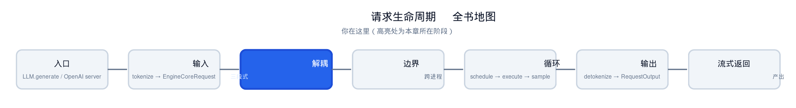
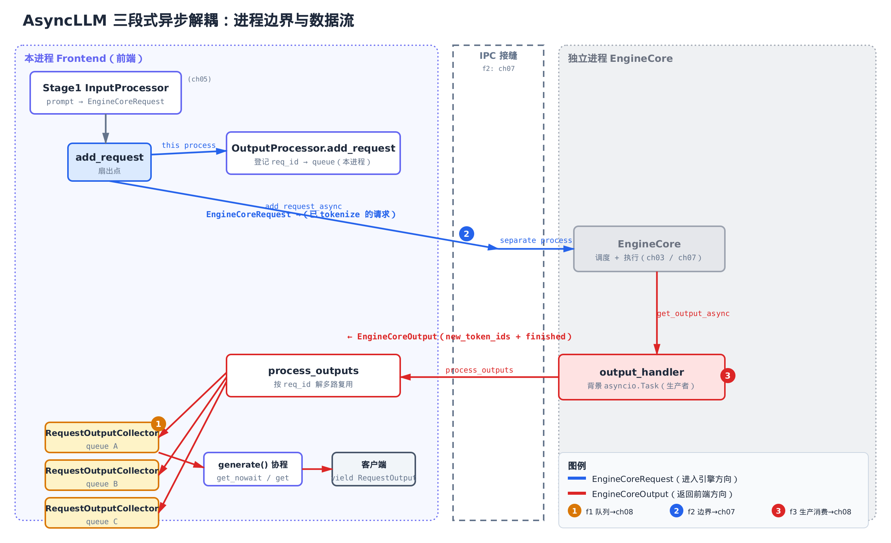
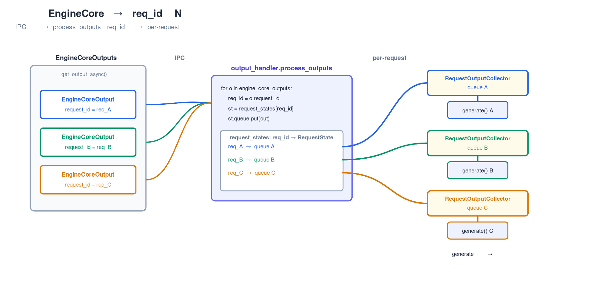
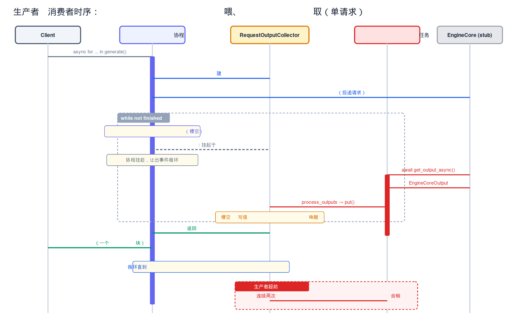

# 第4章　AsyncLLM：三段式异步解耦

## 你在这里



> *图注：全书 15 个子系统的路线图。本章点亮 `async-engine`——也就是 `AsyncLLM` 这层异步前端。它的左右两侧（`input-processor` / `engine-core` / `output-processor`）是三段式的三个去处，分别留给后面的章节展开。*

前面几章，我们已经有了纵览全局的底子：[vLLM v1 的整体心智模型](../ch01-overview/narrative/chapter.md)、[一个请求端到端的鸟瞰路径](../ch02-request-lifecycle/narrative/chapter.md)，以及[从 `EngineArgs` 怎么组装出 `VllmConfig`](../ch03-config-assembly/narrative/chapter.md)——本章构造三段所依赖的那套配置，正是上一章拼出来的。但有个问题一直没回答：**一个请求从 HTTP 进来、到 token 一个一个吐回客户端，中间到底经过几只手？**

这章给答案。主角是 `vllm/v1/engine/async_llm.py:L70` 里的 `AsyncLLM` 类。它是 OpenAI 兼容服务器背后的异步引擎前端，一个不到 800 行的 facade。它干的事可以浓缩成一句话：

> 把一个请求拆成**三段**，让 CPU 干的活和 GPU 干的活在不同进程里**重叠**跑，互不挡道。

这章我们只讲清楚 `AsyncLLM` 这一层怎么**编排**这三段——它怎么接请求、怎么把请求扇出到三段、怎么用一个背景任务把结果收回来再分发给成百上千个并发的 `generate()` 协程。三段各自的内部细节会在后面解锁：

- **Stage1 输入预处理**（tokenize、校验）—— [第 5 章：输入处理](../ch05-input-processing/narrative/chapter.md)
- **Stage2 EngineCore 跨进程 IPC**（ZMQ、msgpack、进程编排）—— [第 7 章：IPC 边界](../ch07-ipc-boundary/narrative/chapter.md)
- **Stage3 输出后处理**（detokenize、累积、停止串检测）—— [第 8 章：输出处理](../ch08-output-processing/narrative/chapter.md)

下一章会钻进 [Stage1 的输入处理](../ch05-input-processing/narrative/chapter.md)；本章只把它当黑盒用。读完这章，你会对"一个 token 怎么流回客户端"有一张完整的地图。

---

## 4.1 一句话钩子：为什么要拆成三段

先看一张全景图，心里有个数，后面逐段拆。



> *图注：三条泳道。左边「本进程 Frontend」做 CPU 活（tokenize/detokenize）；右边「独立进程 EngineCore」做 GPU 活（调度+执行）；中间虚线是进程边界（IPC，机制留 [第 7 章：IPC 边界](../ch07-ipc-boundary/narrative/chapter.md)）。蓝线是请求进入引擎的方向（`EngineCoreRequest`），红线是结果返回前端的方向（`EngineCoreOutput`）。图里特意标出的三处，是本章会逐一拆开的三块骨架：每请求一条的队列、把前后端分到两个进程的边界，以及在后台把结果收回来再分发的生产者-消费者背景任务。*

为什么非要拆成三段、还要跨进程？答案藏在一个朴素的事实里：**tokenize 是 CPU 干的纯 Python 活，模型前向是 GPU 干的活，这两件事如果挤在同一个进程同一个线程，会被 Python 的 GIL 逼着串行。**

来源：`vllm/v1/engine/async_llm.py:L132-L153`（`__init__` 一次性构造三段）。我们先把三段诞生的地方看一眼，下一节再逐行解读：

```python
        # vllm/v1/engine/async_llm.py:L132-L153
        self.renderer = renderer = renderer_from_config(self.vllm_config)

        # Convert EngineInput --> EngineCoreRequest.
        self.input_processor = InputProcessor(self.vllm_config, renderer)

        # Converts EngineCoreOutputs --> RequestOutput.
        self.output_processor = OutputProcessor(
            renderer.tokenizer,
            log_stats=self.log_stats,
            stream_interval=self.vllm_config.scheduler_config.stream_interval,
            tracing_enabled=tracing_endpoint is not None,
        )

        # EngineCore (starts the engine in background process).
        self.engine_core = EngineCoreClient.make_async_mp_client(
            vllm_config=vllm_config,
            executor_class=executor_class,
            # … 省略：client_addresses / client_count / client_index 是多前端/DP 扩展参数 …
        )
```

三行注释（vLLM 作者原文）已经把三段点破：

- `InputProcessor` —— Convert EngineInput → EngineCoreRequest（Stage1，本进程）
- `OutputProcessor` —— Converts EngineCoreOutputs → RequestOutput（Stage3，本进程）
- `EngineCoreClient` —— **starts the engine in background process**（Stage2，独立进程）

注意第三行那句注释：`make_async_mp_client` 不是构造一个对象那么简单，它会**起一个独立的子进程**把 EngineCore 跑起来。这个进程边界是三段式的物理前提，它的 IPC 机制（ZMQ + msgpack）留到 [第 7 章：IPC 边界](../ch07-ipc-boundary/narrative/chapter.md) 揭晓；本章只需要知道：**Stage2 在另一个进程里，前端通过两个异步方法跟它对话。**

### 拆段到底省了多少？给个数

设单步里 CPU 部分（tokenize/detokenize）耗时 $T_{cpu}$，GPU 部分（调度+前向）耗时 $T_{gpu}$。

**不拆**（同进程同线程，受 GIL 串行）每步总时间：

$$
T_{\mathrm{single}} = T_{cpu} + T_{gpu}
$$

**拆到两进程后**，前端处理第 $i{+}1$ 个请求的 CPU 活，可以和后端跑第 $i$ 批的 GPU 活**重叠**。稳态下每步时间趋近二者的较大者：

$$
T_{\mathrm{pipelined}} = \max(T_{cpu},\, T_{gpu})
$$

吞吐上界因此被抬高：

$$
\frac{1}{T_{cpu}+T_{gpu}} \;\longrightarrow\; \frac{1}{\max(T_{cpu},\, T_{gpu})}
$$

**翻译成人话**：假设 tokenize 一批要 8ms、GPU 跑一步也要 8ms。不拆，每步 16ms；拆了，两件事并排跑，每步约 8ms——**吞吐近乎翻倍**。当 $T_{cpu}$ 和 $T_{gpu}$ 同量级时收益最大，这也是后面[连续批处理](../ch13-continuous-batching/narrative/chapter.md)能持续把 GPU 喂饱的前提：前端不停接客、预处理，后端不停跑批，谁也别等谁。

---

## 4.2 三段在哪里诞生：`__init__` 的构造与背景任务

来源：`vllm/v1/engine/async_llm.py:L132-L153`、`L170-L176`。

上一节看了三段构造。现在看构造之后紧接着的一段——它解释了一个容易踩的坑：**那个把结果收回来的背景任务，为什么不是构造时就起？**

```python
        # vllm/v1/engine/async_llm.py:L170-L176
        self.output_handler: asyncio.Task | None = None
        try:
            # Start output handler eagerly if we are in the asyncio eventloop.
            asyncio.get_running_loop()
            self._run_output_handler()
        except RuntimeError:
            pass
```

这五行是"急切但不强求"的启动策略：

1. 先把 `output_handler` 占位成 `None`。
2. 试着拿当前正在跑的事件循环 `asyncio.get_running_loop()`。
3. 拿到了，说明此刻就在事件循环里，**急切启动**背景任务。
4. 拿不到（抛 `RuntimeError`），说明 `__init__` 跑在事件循环之前——**静默跳过**，等首个请求来了再启。

为什么要兼容"事件循环还没起"这种情况？因为 OpenAI 兼容服务器的启动顺序：服务器框架往往先构造引擎对象，**之后**才进入 asyncio 事件循环。如果 `__init__` 里硬要 `asyncio.create_task`，启动期就会炸。把启动失败优雅地推迟，是这五行的全部用意。那"等首个请求再启"在哪兑现？下一节的 `add_request` 里。

`output_handler` 这个背景任务就是那个生产者实体——它在后台不停从 EngineCore 拉结果、推回各请求的队列。它和 `generate()` 协程构成一对生产者-消费者关系，这层关系在流式输出里的完整角色会在 [第 8 章：输出处理](../ch08-output-processing/narrative/chapter.md) 接着讲。本节先记住它的名字和"懒/急启"的双保险。

---

## 4.3 一个请求进来：`generate()` 异步生成器

来源：`vllm/v1/engine/async_llm.py:L524-L635`。

`AsyncLLM` 对外最重要的入口是 `generate()`。服务器每收到一个请求，就调一次它，拿到一个**异步生成器**（`AsyncGenerator`），然后 `async for` 迭代它，把吐出来的 `RequestOutput` 转成 SSE 推给客户端。

先看它的 docstring（vLLM 原文）和主循环——它把这层 facade 的工作流程逐字列清了：

```python
    # vllm/v1/engine/async_llm.py:L524-L635
    async def generate(
        self,
        prompt: ...,
        sampling_params: SamplingParams,
        request_id: str,
        # … 省略：lora / trace_headers / priority / reasoning_* 等透传入参 …
    ) -> AsyncGenerator[RequestOutput, None]:
        """
        Main function called by the API server to kick off a request
            * 1) Making an AsyncStream corresponding to the Request.
            * 2) Processing the Input.
            * 3) Adding the Request to the Detokenizer.
            * 4) Adding the Request to the EngineCore (separate process).

        A separate output_handler loop runs in a background AsyncIO task,
        pulling outputs from EngineCore and putting them into the
        per-request AsyncStream.

        The caller of generate() iterates the returned AsyncGenerator,
        returning the RequestOutput back to the caller.
        """

        q: RequestOutputCollector | None = None
        try:
            q = await self.add_request(
                request_id,
                prompt,
                sampling_params,
                # … 省略：其余透传入参 …
            )

            # The output_handler task pushes items into the queue.
            # This task pulls from the queue and yields to caller.
            finished = False
            while not finished:
                # Note: drain queue without await if possible (avoids
                # task switching under load which helps performance).
                out = q.get_nowait() or await q.get()

                # Note: both OutputProcessor and EngineCore handle their
                # own request cleanup based on finished.
                assert isinstance(out, RequestOutput)
                finished = out.finished
                if out is not STREAM_FINISHED:
                    yield out

        # If the request is disconnected by the client, generate()
        # is cancelled or the generator is garbage collected. So,
        # we abort the request if we end up here.
        except (asyncio.CancelledError, GeneratorExit):
            if q is not None:
                await self.abort(q.request_id, internal=True)
            # … 省略：EngineDeadError / ValueError / 通用 Exception 的错误分类分支 …
            raise
        finally:
            if q is not None:
                q.close()
```

把它拆开看，`generate()` 其实只做三件事：

**第一步：登记，拿队列。** `q = await self.add_request(...)`。这一句把请求送进登记流程，**返回本请求专属的一个队列** `q`（类型 `RequestOutputCollector`，它的真身见 [§4.6](#46-队列的真身requestoutputcollector)）。注意它返回的是队列，不是结果——结果稍后由背景任务往这个队列里塞。`add_request` 内部干了什么，下一节细讲。

**第二步：拉取与判停的主循环。** 看这一行，是本章最值得品的设计之一：

```python
                out = q.get_nowait() or await q.get()
```

读法：**先非阻塞地试 `get_nowait()`；取到了就用，取不到（返回 `None`）才 `await get()` 真正挂起等待。** 注释（vLLM 原文）解释了动机：`avoids task switching under load which helps performance`——高负载下输出常常已经就绪，先快取一把能省掉一次协程挂起/恢复的事件循环开销。

> **快路径优先：省掉一次调度往返**
>
> 协程的 `await` 不是免费的。每次 `await` 一个还没就绪的事件，当前协程要挂起、控制权交回事件循环、轮一圈再被唤醒恢复。这一来一回有实打实的成本。高并发下，当背景任务已经把 token 塞进队列了，消费者其实"伸手就能拿到"。`get_nowait()` 命中时，整条路径退化成一次普通的字典/属性读取，**零调度往返**。只有真没数据时才付出 `await` 的代价。

`get_nowait()` 和 `get()` 这对方法是怎么实现的（`get_nowait()` 为什么能"伸手就拿"），是下一节队列那一小节的主题。

**第三步：判停与吐出。** `finished = out.finished` 读这块输出有没有带"完成"标志，作为 `while` 的退出条件；然后 `yield out` 把它交给上层迭代者。`out.finished` 从哪来？它最终源自 EngineCore 返回的 `EngineCoreOutput.finished`——后面 4.6 节会看到这个属性。

> 旁白：源码里这里还有一句 `if out is not STREAM_FINISHED`。`STREAM_FINISHED` 是个只在**输入流式**路径才出现的哨兵值；常规一次性 prompt 的请求永远不会等于它，所以这层守卫对我们的主线是恒真的。输入流式是正交特性，本章不展开。

**第四步：生命周期收尾。** `except (asyncio.CancelledError, GeneratorExit)` 是关键的健壮性设计。客户端一断开，上层就取消这个 `generate()` 协程——或者它被垃圾回收。两种情况都会抛 `CancelledError` / `GeneratorExit`。这时候 `await self.abort(...)` 去把这个请求在 Stage3（OutputProcessor）和 Stage2（EngineCore）**双向清理**掉——否则一个客户端早就走了的请求还在 GPU 上空跑，纯属浪费。`finally` 里的 `q.close()` 是兜底清理。

这就是消费者侧的全貌。请记住这条主循环的形状：`while not finished: out = 快取 or 等待; yield out`。它的对端——那个往队列里塞 token 的生产者——在 4.5 节。

---

## 4.4 三段解耦的扇出点：`add_request` 与 `_add_request`

来源：`vllm/v1/engine/async_llm.py:L280-L398`（`add_request`）、`L400-L415`（`_add_request`）。

`generate()` 第一步那句 `await self.add_request(...)` 落到哪？落到这里。`add_request` 是登记主干，`_add_request` 是它内部最关键的 16 行。

### 4.4.1 `add_request`：从 prompt 到队列

```python
    # vllm/v1/engine/async_llm.py:L280-L398
    async def add_request(
        self,
        request_id: str,
        prompt: ...,
        params: SamplingParams | PoolingParams,
        # … 省略：其余透传入参 …
    ) -> RequestOutputCollector:
        """Add new request to the AsyncLLM."""

        if self.errored:
            raise EngineDeadError()

        # … 省略：kv_sharing_fast_prefill 的 prompt_logprobs 校验、
        #         流式输入分支、EngineCoreRequest 直传的 deprecated 分支 …

        # Convert Input --> Request.
        request = self.input_processor.process_inputs(
            request_id,
            prompt,
            params,
            supported_tasks=await self.get_supported_tasks(),
            # … 省略：reasoning_* 透传 …
        )

        self.input_processor.assign_request_id(request)

        # We start the output_handler on the first call to add_request() so
        # we can call __init__ before the event loop, which enables us
        # to handle startup failure gracefully in the OpenAI server.
        self._run_output_handler()

        # Create a new output collector for the request.
        queue = RequestOutputCollector(params.output_kind, request.request_id)

        # Use cloned params that may have been updated in process_inputs()
        params = request.params

        if is_pooling or params.n == 1:
            await self._add_request(request, prompt_text, None, 0, queue)
            return queue
        # … 省略：n>1 的 ParentRequest 扇出子请求（并行采样）…
```

四步，对应 docstring 列的前三项，外加一个为后文埋下的种子——每请求专属队列：

1. **`process_inputs(...)`** —— Stage1，把原始 prompt + 采样参数转成已 tokenize 的 `EngineCoreRequest`。本章把它当黑盒；内部 tokenize/校验留 [第 5 章：输入处理](../ch05-input-processing/narrative/chapter.md)。
2. **`self._run_output_handler()`** —— 这就是 4.2 节说的"等首个请求再启"的兑现点。注释（vLLM 原文）写得明明白白：之所以放在首个 `add_request`，是为了让 `__init__` 能早于事件循环跑、从而在 OpenAI server 启动失败时优雅处理。`_run_output_handler` 内部有幂等保护，重复调用安全（4.5 节看到）。
3. **`queue = RequestOutputCollector(...)`** —— 为**这一个请求**新建一个专属队列。注意是"每请求一个"，不是全局共享。这是异步多路复用的关键，理由在 [§4.7](#47-解多路复用一批输出怎么分回-n-个队列) 量化。
4. **`await self._add_request(...)` 然后 `return queue`** —— 走 `n == 1` 主路径（`n>1` 并行采样是同机制重复，本章不展开），把活儿交给 `_add_request`，最后把队列还给 `generate()`。

### 4.4.2 `_add_request`：全章最关键的 16 行

如果这一章只能记住一段代码，就是它。三段解耦的"扇出"动作全在这里：

```python
    # vllm/v1/engine/async_llm.py:L400-L415
    async def _add_request(
        self,
        request: EngineCoreRequest,
        prompt: str | None,
        parent_req: ParentRequest | None,
        index: int,
        queue: RequestOutputCollector,
    ):
        # Add the request to OutputProcessor (this process).
        self.output_processor.add_request(request, prompt, parent_req, index, queue)

        # Add the EngineCoreRequest to EngineCore (separate process).
        await self.engine_core.add_request_async(request)

        # … 省略：log_requests 日志 …
```

两条注释（vLLM 原文）逐字点破了进程边界：

- `# Add the request to OutputProcessor (this process).` —— **本进程**：把队列 `queue` 登记进 Stage3 的 OutputProcessor，建立 `req_id → queue` 的映射。这一步在本进程同步完成。
- `# Add the EngineCoreRequest to EngineCore (separate process).` —— **独立进程**：把 `EngineCoreRequest` 经 `add_request_async` 投递到另一个进程的 EngineCore。这一步是 `await`，因为它要过 IPC。

**同一个请求，同时往两个方向登记**：一路留在本进程等着接收结果（OutputProcessor 那条），一路送出进程去真正干活（EngineCore 那条）。这就是"扇出"。注意这两路是不对称的——本进程那路只是建个映射表项，跨进程那路才是把 tokenize 好的请求真正送进引擎。

`add_request_async` 是 Stage2 的 IPC 接缝：它 encode 后经 ZMQ 把 `EngineCoreRequest` 发到 EngineCore 进程。`AsyncLLM` 只看到这一个 `await`，进程/ZMQ/序列化全在幕后——这些是 [第 7 章：IPC 边界](../ch07-ipc-boundary/narrative/chapter.md) 的主题。

---

## 4.5 结果怎么回来：`output_handler` 背景任务（生产者）

来源：`vllm/v1/engine/async_llm.py:L637-L707`。

请求送出去了，token 一个个在 EngineCore 进程里生出来。谁负责把它们收回前端、再分给对应的 `generate()`？就是那个一直在后台转的 `output_handler` 任务。它就是那个生产者实体，和 `generate()` 主循环（消费者）配成一对。

```python
    # vllm/v1/engine/async_llm.py:L637-L707
    def _run_output_handler(self):
        """Background loop: pulls from EngineCore and pushes to AsyncStreams."""

        if self.output_handler is not None:
            return

        # Ensure that the task doesn't have a circular ref back to the AsyncLLM
        # object, or else it won't be garbage collected and cleaned up properly.
        engine_core = self.engine_core
        output_processor = self.output_processor
        # … 省略：log_stats / _logger_ref（弹性 EP 扩缩用）/ renderer 等统计捕获 …
        chunk_size = envs.VLLM_V1_OUTPUT_PROC_CHUNK_SIZE

        async def output_handler():
            try:
                while True:
                    # 1) Pull EngineCoreOutputs from the EngineCore.
                    outputs = await engine_core.get_output_async()
                    num_outputs = len(outputs.outputs)

                    # … 省略：iteration_stats 统计旁路 …

                    # Split outputs into chunks of at most
                    # VLLM_V1_OUTPUT_PROC_CHUNK_SIZE, so that we don't block the
                    # event loop for too long.
                    engine_core_outputs = outputs.outputs
                    for start in range(0, num_outputs, chunk_size):
                        end = start + chunk_size
                        outputs_slice = engine_core_outputs[start:end]
                        # 2) Process EngineCoreOutputs.
                        processed_outputs = output_processor.process_outputs(
                            outputs_slice, outputs.timestamp, iteration_stats
                        )
                        # NOTE: RequestOutputs are pushed to their queues.
                        assert not processed_outputs.request_outputs

                        # Allow other asyncio tasks to run between chunks
                        if end < num_outputs:
                            await asyncio.sleep(0)

                        # 3) Abort any reqs that finished due to stop strings.
                        if processed_outputs.reqs_to_abort:
                            await engine_core.abort_requests_async(
                                processed_outputs.reqs_to_abort
                            )
                    # … 省略：update_scheduler_stats + logger 记录（观测旁路）…
            except Exception as e:
                logger.exception("AsyncLLM output_handler failed.")
                output_processor.propagate_error(e)

        self.output_handler = asyncio.create_task(output_handler())
```

逐块解读这台"收发机"：

**幂等保护与去循环引用。** 开头 `if self.output_handler is not None: return`——这是 4.4 节说的"重复调用安全"：背景任务只起一次。紧接着用局部变量 `engine_core = self.engine_core` 把要用的成员捕获出来。注释（vLLM 原文）解释了为什么不直接在闭包里用 `self`：闭包若回指 `self`，会形成循环引用，妨碍 `AsyncLLM` 对象被垃圾回收、清理不干净。用局部变量切断这条回路是个值得学的细节。

**`while True` 的三步循环：**

1. **拉一批**：`outputs = await engine_core.get_output_async()`。这是 Stage2 IPC 接缝的另一半——`get_output_async` 从一个 asyncio 队列里 `await` 出一批 `EngineCoreOutputs`，这个队列由幕后的 ZMQ 接收任务填充。**一个 IPC 出口，统一收所有请求的输出**，而不是每请求各开一条 IPC 流。机制留 [第 7 章：IPC 边界](../ch07-ipc-boundary/narrative/chapter.md)。
2. **分块处理**：按 `VLLM_V1_OUTPUT_PROC_CHUNK_SIZE` 把这一批切成小块，每块调 `output_processor.process_outputs(...)`。注意那句 `assert not processed_outputs.request_outputs`——异步路径下 `process_outputs` **不返回**结果列表，结果是被直接 `put` 进各请求队列的（注释 vLLM 原文：`RequestOutputs are pushed to their queues`）。这条 `assert` 是个忠实性自检：异步路径就不该有返回值。
3. **块间让步**：`if end < num_outputs: await asyncio.sleep(0)`。这一句是单线程协作式调度的精髓，单开一节讲（4.5.1）。

**故障传播。** 最外层 `except Exception` 抓到任何异常，调 `output_processor.propagate_error(e)` 把异常塞进**每一个**还在等待的请求队列里。这样所有挂在 `generate()` 里 `await get()` 的协程都会被唤醒并抛出异常，而不是永久卡死。背景任务死了不能让前端所有人陪葬——这是必须的健壮性。

**真正起任务。** 最后 `self.output_handler = asyncio.create_task(output_handler())` 才把这个内层协程包成一个长驻 `asyncio.Task`，扔进事件循环后台跑。

### 4.5.1 为什么要分块 + `asyncio.sleep(0)`：单线程协作式调度

来源：`vllm/v1/engine/async_llm.py:L667-L683`。

这是本章第二个值得品的设计。要讲清它，先要理解 `AsyncLLM` 前端的并发模型。

**前端所有协程跑在一个事件循环、单个 OS 线程上。** 那些 `generate()` 协程、还有这个 `output_handler` 任务，全在同一个线程里轮流跑。好处是：**临界区天然原子**——协程只在 `await` 点才可能被切走，所以像队列那个"单槽"读写之间不会被打断，根本不需要锁（4.6 节会看到队列实现确实没有任何 `Lock`）。

但单线程协作式有个代价：**任何一段不带 `await` 的长循环，都会霸占整个线程，把其它所有协程饿死。**

`process_outputs` 处理一大批输出是纯 CPU 循环，中间没有 `await`。如果一批有几百个请求的输出，一口气处理完，期间事件循环被完全占住——最要命的是，此时新请求的 `add_request` 没法被处理，**前端接客被卡住，请求接收尾延迟飙升**。

解法就是 `await asyncio.sleep(0)`。它不是真的睡：

> **`asyncio.sleep(0)` 的让步语义**
>
> `sleep(0)` 不挂起任何真实时长，它只是把当前协程"排到就绪队列末尾"，让事件循环先去跑一轮别的就绪协程，然后再回来继续。一句话：**主动让一让，给别人插队的机会。**

量化一下分块的效果。设处理单个请求输出耗时 $c$，一批共 $N$ 个：

- **不分块**：其它协程（比如等着接客的 `add_request`）最坏要等整批跑完，等待时间 $N \cdot c$。
- **分块为每块 $K$ 个**（块间 `sleep(0)`）：其它协程最多等一块跑完就有机会插进来，最坏等待降到 $K \cdot c$。

**翻译成人话**：`VLLM_V1_OUTPUT_PROC_CHUNK_SIZE` 默认是 128。假设处理一个请求输出要 0.05ms。一批来了 1024 个请求的输出，不分块就是一段 51ms 的"独占"，期间新请求干瞪眼；分块成 128 一组，每跑 128 个（约 6.4ms）就让一让，新请求最多等 6.4ms 就能被接进来。**用一点点吞吐换接客的及时性**——高输出吞吐下前端仍能保持响应，正是这一行的目的。

---

## 4.6 队列的真身：`RequestOutputCollector`

来源：`vllm/v1/engine/output_processor.py:L45-L106`。

前面反复提到"每请求一个队列"，现在拆开看它到底是什么。它的名字叫 `RequestOutputCollector`，但**它不是 `asyncio.Queue`**——而是一个更轻的东西：**一个单槽 + 一个 `asyncio.Event`**。

```python
# vllm/v1/engine/output_processor.py:L45-L106
class RequestOutputCollector:
    """
    Collects streamed RequestOutputs per individual request,
    for hand-off to the consuming asyncio generate task.

    When streaming deltas, RequestOutputs are merged if the
    producer gets ahead of the consumer.
    """

    def __init__(self, output_kind: RequestOutputKind, request_id: str):
        self.aggregate = output_kind == RequestOutputKind.DELTA
        self.request_id = request_id
        self.output: RequestOutput | PoolingRequestOutput | Exception | None = None
        self.ready = asyncio.Event()
        # … 省略：_input_stream_task（流式输入清理）…

    def put(self, output: RequestOutput | PoolingRequestOutput | Exception) -> None:
        """Non-blocking put operation."""
        if self.output is None or isinstance(output, Exception):
            self.output = output
            self.ready.set()
        elif isinstance(self.output, RequestOutput) and isinstance(
            output, RequestOutput
        ):
            # This ensures that request outputs with different request indexes
            # (if n > 1) do not override each other.
            self.output.add(output, aggregate=self.aggregate)
        # … 省略：PoolingRequestOutput 分支 …

    async def get(self) -> RequestOutput | PoolingRequestOutput:
        """Get operation blocks on put event."""
        while (output := self.output) is None:
            await self.ready.wait()
        self.output = None
        self.ready.clear()
        if isinstance(output, Exception):
            raise output
        return output

    def get_nowait(self) -> RequestOutput | PoolingRequestOutput | None:
        """Non-blocking get operation."""
        output = self.output
        if output is not None:
            self.output = None
            self.ready.clear()
        if isinstance(output, Exception):
            raise output
        return output
```

它有三个核心动作，正好对上前面看到的生产者和消费者：

**`put`（生产者写入端，`output_handler` 调）。** 三种情况：

- 槽是空的（`self.output is None`）或者来的是异常 → 直接写进槽 + `self.ready.set()` 拉响信号灯。
- 槽里已经有一个没被取走的 `RequestOutput`（说明消费者没跟上）→ 不丢弃、不阻塞，而是 `self.output.add(output, ...)` **合并**进去。这就是 docstring 说的 "merged if the producer gets ahead of the consumer"。这个 merge 语义是背压的替代，4.6.1 单讲。

**`get`（消费者阻塞读端，`generate()` 调）。** `while (output := self.output) is None: await self.ready.wait()`——只要槽空就挂在信号灯上等。被 `put` 唤醒后，取走值、清空槽、`ready.clear()` 复位信号灯。如果取到的是异常就 `raise`（这正是 4.5 节 `propagate_error` 能把故障传到每个 `generate()` 的机制）。

**`get_nowait`（消费者快路径，`generate()` 调）。** 看槽里有没有值：有就取走，没有就返回 `None`，**绝不挂起**。

现在回头看 4.3 节那行 `out = q.get_nowait() or await q.get()` 就全通了：左边 `get_nowait()` 命中就是"伸手就拿到"（一次属性读取，零 `await`）；只有它返回 `None` 才退到右边 `await get()` 真正挂起等待。**快路径优先**的实现，就是这两个方法的配合。

为什么用单槽 + Event 而不用 `asyncio.Queue`？因为对单个请求来说，消费者（一个 `generate()`）只关心"有没有下一块输出"，不需要 FIFO 多元素缓冲——生产者超前时直接合帧比堆积更合理。单槽 + Event 比 `asyncio.Queue` 更轻、开销更小。

### 4.6.1 生产者超前时的 merge：背压的替代

当 `output_handler`（生产者）比某个慢客户端的 `generate()`（消费者）跑得快，单槽里已经有一个还没被取走的 `RequestOutput`，又来了新的一块。`put` 的选择是 `self.output.add(new, aggregate=...)`——合帧。

来源：`vllm/outputs.py:L145`（`RequestOutput.add`）。合并的语义按输出模式分两种：

- **DELTA 模式**（`aggregate=True`，流式增量）：把新一块的 token **累加**到现有这块后面。消费者下次 `get` 一次拿到合并后的更大块。
- **FINAL 模式**（`aggregate=False`）：以最新的覆盖旧的。

为什么这么设计？因为另一条路——**背压**（生产者阻塞等消费者）——会很糟糕：慢客户端会把背压一路顶回 GPU，拖累所有其他请求。merge 让生产者永不阻塞：

> **merge = 对慢消费者自动合帧**
>
> 慢客户端看到的不是更密的小块，而是合并后的更大块——但 **token 序列完整、一个不丢**，语义正确。代价只是这个慢客户端的流式粒度变粗。用"合帧"换"生产者永不阻塞、不回压 GPU"，对一个要服务上千并发的引擎是笔划算的买卖。

#### 逐轮追踪单槽：消费者落后 / 生产者超前

光说"不丢"还不够，我们对着具体数值走几轮，把单槽 + `ready` 事件在交错时序下的状态演化看清楚。设某请求处于 DELTA 流式模式（`aggregate=True`），生产者依次产出 token 块 A、B、C。下表的列是单槽机制的全部可观测状态：

| 轮次 | 动作 | `self.output` 槽 | `ready` | 走哪条路 / 消费者收到 |
|------|------|------------------|---------|----------------------|
| 0 | 初始 | `None` | clear | —— |
| 1 | 消费者 `get_nowait()` | `None` | clear | 槽空 → 返回 `None` → 退到 `await get()` 挂起（**慢路径**） |
| 2 | 生产者 `put(A)` | `A` | **set** | `ready.set()` 唤醒挂起的消费者 |
| 2′ | 消费者 `get()` 醒来取走 | `None` | clear | 取走 `A`、清槽、`ready.clear()` → **`yield A`** |
| 3 | 生产者 `put(B)`（消费者还没回来） | `B` | set | 槽空 → 写入 + `set` |
| 4 | 生产者 `put(C)`（**超前**，槽未空） | `B+C` | set | 槽非空 → `self.output.add(C)` **合帧**，不阻塞 |
| 5 | 消费者 `get_nowait()` | `None` | clear | 槽有值 → 命中（**快路径**，零 `await`） → 取走、清槽 → **`yield B+C`** |

读这张表，三件事一目了然：

- **轮 1 vs 轮 5 正是 4.3 节 `get_nowait() or await get()` 的两条分支**：消费者落后于生产者时走快路径（轮 5，零调度往返），消费者抢先于生产者时退到慢路径挂起（轮 1）。
- **轮 4 是生产者超前**：槽里已有 `B` 未被取走，新来的 `C` 不丢、不阻塞，而是 `add` 进去合成 `B+C`。生产者这一步照样 O(1) 返回。
- **消费者最终收到的并集 `A, B+C` = 生产者 put 的全部 `A, B, C`，顺序不变**——一个 token 都没丢，只是流式粒度在轮 5 变粗了一档。

#### 为什么任意交错都不丢 token：一个不变量

上表只走了一种交错。要确信**任何** producer/consumer 交错下都不丢、不乱序，给出一条不变量即可。

**不变量 I**：任一时刻，已 `put` 进 collector 的全部 token 子序列，恰好等于"已被 `get`/`get_nowait` 取走的部分" ⊕ "当前槽内未取的部分"，且两部分拼接后顺序与产出顺序一致。

**基础**：初始槽为 `None`、尚无取走，两部分皆空，I 平凡成立。

**归纳**：每个操作都保持 I：

- **`put` 到空槽**（`self.output is None`，`output_processor.py:L64-66`）：新块整体进槽，"槽内未取"延长一块，I 保持。
- **`put` 到非空槽**（`self.output.add(...)`，`L67-72`）：走到 `outputs.py:L145` 的 `add`，两种输出模式各有一条分支，都保持 I：
  - **DELTA 模式**（`aggregate=True`）对同 `index` 的 completion 执行 `completion.token_ids.extend(next_completion.token_ids)`（`outputs.py:L159`）——把新块按序 **append 到旧块尾**。这里每个 `RequestOutput` 携带的是**增量** token，所以 extend 才是正确的拼接。槽内子序列因此是"有序前缀的延长"，I 保持。这正是轮 4 的合帧。
  - **FINAL 模式**（`aggregate=False`）执行 `self.outputs[i] = next_completion`（`outputs.py:L169`）——直接用新块**覆盖**旧块。乍看像会丢 token，其实不会：FINAL 模式下每个 `RequestOutput` 携带的不是增量，而是**到目前为止的累计全量**（完整前缀）。后到的块本身就是旧块的超集，覆盖等价于"取最新的那份完整前缀"。槽内子序列仍是同一条有序前缀（只是换成了更长的那份），并集与顺序都不变，I 保持。换句话说，DELTA 靠"拼接"、FINAL 靠"取最新全量"，殊途同归地不丢、不乱序。
- **`get` / `get_nowait`**（`L78-96`）：把整个槽内块移到"已取走"侧、置槽为 `None`、`ready.clear()`。两部分之间搬了一块，并集与顺序都不变，I 保持。

由归纳，无论操作以何种次序交错、无论 DELTA 还是 FINAL 模式，消费者最终取走的并集**等于生产者 put 的全部 token 且保持产出顺序**——永不丢、永不乱序。同时，`put` 的三个分支全是 O(1)（写槽 / `extend` / 替换），**生产者从不阻塞**。这就是"merge 作为背压替代"这一设计决策能成立的全部依据：合帧不破坏正确性，于是用合帧换"永不回压 GPU"才是笔划算的买卖。

---

## 4.7 解多路复用：一批输出怎么分回 N 个队列

来源：`vllm/v1/engine/output_processor.py:L508-L537`（`add_request`）、`L600-L660`（`process_outputs`）。

最后一块拼图：`output_handler` 从 IPC 单出口拉回的是**一整批**混着不同请求的 `EngineCoreOutput`，怎么把它们准确分回各自的队列？这就是"解多路复用"（de-multiplex）。



> *图注：左边是 IPC 单出口拉回的一批 `EngineCoreOutputs`（混着 req_A/req_B/req_C）。中间 `process_outputs` 的 for 循环按 `req_id` 查 `request_states` 表，找到每条输出对应的队列。右边三个独立队列各连各的 `generate()` 协程。这与 `_add_request` 时的"扇出登记"正好对称：进来时一个请求登记一条映射，回去时按这条映射分发。*

**先看登记侧** `OutputProcessor.add_request`——它就是 4.4.2 节 `_add_request` 里"本进程那一路"落到的地方：

```python
    # vllm/v1/engine/output_processor.py:L508-L537
    def add_request(
        self,
        request: EngineCoreRequest,
        prompt: str | None,
        parent_req: ParentRequest | None = None,
        request_index: int = 0,
        queue: RequestOutputCollector | None = None,
    ) -> None:
        request_id = request.request_id
        req_state = self.request_states.get(request_id)
        # … 省略：已存在 req_state 的流式更新分支 …
        req_state = RequestState.from_new_request(
            tokenizer=self.tokenizer,
            request=request,
            prompt=prompt,
            parent_req=parent_req,
            request_index=request_index,
            queue=queue,
            # … 省略：log_stats / stream_interval …
        )
        self.request_states[request_id] = req_state
        # … 省略：parent_requests / external_req_ids 映射 …
```

关键就一件事：把 `generate` 传进来的 `queue` 存进 per-request 的 `RequestState`，再把这个 `RequestState` 记进 `self.request_states[request_id]`。**这建立了 `req_id → RequestState（含 queue）` 的查找表**——这正是后面按 `req_id` 解扇出的前提。

**再看分发侧** `process_outputs`——`output_handler` 每块调的就是它：

```python
        # vllm/v1/engine/output_processor.py:L600-L660
        for engine_core_output in engine_core_outputs:
            req_id = engine_core_output.request_id
            req_state = self.request_states.get(req_id)
            if req_state is None:
                # Ignore output for already-aborted request.
                continue
            # … 省略：detokenize / logprobs / stop-string 检测（Stage3 细节，留 ch08）…
            # 4) Create and handle RequestOutput objects.
            if request_output := req_state.make_request_output(
                new_token_ids,
                # … 省略：pooling_output / finish_reason / stop_reason 等 …
            ):
                # … 省略：流式输入下的 finished 改写（output_processor.py:L652-653，正交特性，本章不展开）…
                if req_state.queue is not None:
                    # AsyncLLM: put into queue for handling by generate().
                    req_state.queue.put(request_output)
                else:
                    # LLMEngine: return list of RequestOutputs.
                    request_outputs.append(request_output)
```

逐条 `EngineCoreOutput` 处理：

1. **读 `req_id`**，按它查 `request_states` 表。
2. **查不到（`req_state is None`）就跳过**——注释（vLLM 原文）说这是已经 abort 的请求的残留输出，忽略即可（比如客户端早断开、4.3 节那条 abort 路径已清掉它）。
3. **生成 `RequestOutput`**（detokenize 等装配细节是 Stage3 的活，留 [第 8 章：输出处理](../ch08-output-processing/narrative/chapter.md)）。
4. **关键的分流**：`if req_state.queue is not None: req_state.queue.put(request_output)`——有队列（AsyncLLM 用法），就 `put` 回**这个请求专属的队列**；`else` 收集成 list 返回（同步 `LLMEngine` 用法）。

这条 `queue is not None` 的分流很优雅：**同一套 Stage3 逻辑同时服务异步和同步两种引擎**。本章只走"有队列"分支，但保留这个判断能让你看清 `AsyncLLM` 与 `LLMEngine` 的关系。

`put` 一旦命中目标队列，就拉响那个队列的 `Event`，对应请求的 `generate()` 协程立即就绪——结果就这样精确地流回了发起它的那条协程。

### 4.7.1 为什么 per-request 队列能降尾延迟（O(1) vs O(N)）

现在可以回答 4.4 节埋的问题：**为什么每请求一个队列，而不是全局共享一条？**

设系统并发 $N$ 个请求。

**反例：共享一条输出流。** 第 $j$ 个请求的 token 要排在队列里，等前面其它请求的 token 被消费完才轮到它。它的尾延迟随并发数**线性恶化**——并发越高，每个请求等得越久，量级 $O(N)$。

**per-request 队列：物理隔离 N 路。** `output_handler` 一次 `put` 直接命中目标请求的 `Event`，**只唤醒那一个请求的 `generate()`**，跟其它请求完全不排队。配合 4.6 节的 `get_nowait()` 快路径，单个请求从"EngineCore 产出 token"到"`yield` 给客户端"的延迟约等于：

$$
T_{\mathrm{tok2cli}} \approx T_{\mathrm{put}} + T_{\mathrm{resume}}
$$

也就是**一次 `put` + 一次协程恢复**，与系统总并发量**无关**——量级 $O(1)$。

**翻译成人话**：共享队列像一个收银台排长队，人越多越慢；per-request 队列像每人一个专属取餐口，叫到号直接取，别人多少跟你无关。这就是 `AsyncLLM` 能在高并发下保持低尾延迟的核心原因，per-request 队列在流式输出里的完整角色，[第 8 章：输出处理](../ch08-output-processing/narrative/chapter.md) 还会进一步展开。

---

## 4.8 IPC 上流动的是什么：两种跨进程消息

来源：`vllm/v1/engine/__init__.py:L80-L131`（`EngineCoreRequest`）、`L161-L191`（`EngineCoreOutput`）。

进程边界的机制留 [第 7 章：IPC 边界](../ch07-ipc-boundary/narrative/chapter.md)，但有一点本章必须交代清楚：**那条虚线上流过去、流回来的，到底是什么对象？** 看清这个，三段式的数据流就闭合了。

```python
    # vllm/v1/engine/__init__.py:L80-L191
class EngineCoreRequest(
    msgspec.Struct,
    array_like=True,
    omit_defaults=True,
    gc=False,
):
    request_id: str
    prompt_token_ids: list[int] | None
    sampling_params: SamplingParams | None
    arrival_time: float
    # … 省略：mm_features / lora_request / cache_salt / 等次要字段 …


class EngineCoreOutput(
    msgspec.Struct,
    array_like=True,
    omit_defaults=True,
    gc=False,
):
    request_id: str
    new_token_ids: list[int]
    finish_reason: FinishReason | None = None
    # … 省略：logprobs / pooling / kv_transfer / 等次要字段 …

    @property
    def finished(self) -> bool:
        return self.finish_reason is not None
```

两个方向，两种消息：

- **进入引擎方向：`EngineCoreRequest`。** 注意 `prompt_token_ids` 是 `list[int]`——**已经 tokenize 好了**。这正是 Stage1（`process_inputs`）的产物：跨进程传的不是原始文本，而是 token id。`AsyncLLM._add_request` 里 `add_request_async(request)` 发出去的就是它。
- **返回前端方向：`EngineCoreOutput`。** 核心字段是 `request_id`（让 4.7 节按它解多路复用）+ `new_token_ids`（这一步新生的 token）+ `finish_reason`。`output_handler` 里 `get_output_async()` 收回来的批，装的就是它。

特别留意末尾那个 `finished` 属性：`return self.finish_reason is not None`。**这就是 4.3 节 `generate()` 主循环 `finished = out.finished` 判停的最终来源**——一路从 EngineCore 进程的采样结果，经 IPC、经 `process_outputs` 装配进 `RequestOutput`，最后让消费者协程知道"可以收工了"。

这几个 `msgspec.Struct` 上的 `array_like=True` / `gc=False` 是为了跨进程序列化时更紧凑、更快——但具体怎么 encode、怎么过 ZMQ，是 [第 7 章：IPC 边界](../ch07-ipc-boundary/narrative/chapter.md) 的事。本章你只要记住：**IPC 上进去的是 tokenize 好的请求，回来的是新 token + 完成标志。**

---

## 4.9 把三段串起来：完整时序

来源：`vllm/v1/engine/async_llm.py:L524-L707`、`vllm/v1/engine/output_processor.py:L45-L660`。

前面每段单看了，现在把生产者和消费者放进同一条时间线，看一个请求的完整一生。



> *图注：五条生命线。`generate()`（消费者）和 `output_handler`（生产者）经 `RequestOutputCollector` 这个单槽收发。常见时序：消费者 `get_nowait()` 扑空 → `await get()` 挂起；生产者 `get_output_async()` 收到 `EngineCoreOutput` → `process_outputs` → `put()` → `ready.set()` 唤醒消费者 → `get()` 返回 → `yield` 给客户端。底部红框是"生产者超前"分支：连续两次 `put()` 触发 `self.output.add()` 合帧。*

走一遍完整数据流（括号里是落点）：

1. API server `await`-迭代 `generate(prompt, sampling_params, request_id)`（`async_llm.py:generate L524`）→ 拿到一个 `AsyncGenerator`。
2. `generate` 内部 `q = await self.add_request(...)`（`generate L559`）→ 进入登记，返回本请求专属队列 `q`。
3. `add_request` 调 `input_processor.process_inputs(...)`（`add_request L349`）[Stage1，本进程] 把 prompt 转成 `EngineCoreRequest`。
4. `add_request` 调 `self._run_output_handler()`（`add_request L373`）懒启背景任务（若尚未启）。
5. `add_request` 建 `queue = RequestOutputCollector(...)`（`add_request L376`）[每请求专属队列]。
6. `add_request → _add_request`（`_add_request L400`）**扇出两路**：
   - 6a. `output_processor.add_request(request, ..., queue)`（`output_processor.py:add_request L508`）[本进程] 把 `queue` 存进 `req_id → RequestState` 表。
   - 6b. `await engine_core.add_request_async(request)`（`_add_request L412`）[跨进程，IPC] 把 `EngineCoreRequest` 投递到独立进程 EngineCore [跨过进程边界]。
7. [独立进程，留 [第 7 章：IPC 边界](../ch07-ipc-boundary/narrative/chapter.md)] EngineCore 调度+执行，产出 `EngineCoreOutputs`。
8. 背景任务 `output_handler` `await engine_core.get_output_async()`（`_run_output_handler L660`）[跨进程，IPC] 收一批 [生产者拉取]。
9. `output_handler` 分块调 `output_processor.process_outputs(...)`（`_run_output_handler L675`）。
10. `process_outputs` 按 `req_id` 查表并 `req_state.queue.put(request_output)`（`output_processor.py L655-657`）解多路复用回各请求队列。
11. `put` 唤醒对应队列的 `asyncio.Event`（`RequestOutputCollector.put L66`）。
12. `generate` 的 `while` 循环 `out = q.get_nowait() or await q.get()`（`generate L579`）取出，`if out.finished` 判停，`yield out`（`generate L584-586`）给调用方。
13. 客户端断开 → `generate` 收 `CancelledError` → `await self.abort(...)`（`generate L591-593`）在 OutputProcessor 与 EngineCore 双向清理。

一条请求，**进来时扇出两路（本进程登记 + 跨进程投递），回去时按 `req_id` 解扇出回专属队列**。进与出对称，CPU 段与 GPU 段在两个进程里重叠跑——这就是"三段式异步解耦"五个字的全部含义。

---

## 4.10 跑起来看数值：交叉验证

来源：`vllm/v1/engine/async_llm.py`、`vllm/v1/engine/output_processor.py`。

光读代码容易"觉得懂了"，实际未必。为了能在本地（无 GPU/CUDA）把上面这套编排亲手跑一遍、打断点观察生产者-消费者关系，我们做了一个**只做减法**的精简版：把和"三段式如何编排请求"正交的分支（观测/profiler/DP/流式输入/`n>1`/错误分类）删掉，唯一的替换是把 Stage2 的"独立进程 EngineCore + ZMQ"换成一个**同进程的替身**——它对外仍暴露同名的 `add_request_async` / `get_output_async` / `abort_requests_async` 三个异步方法。这样 `AsyncLLM` 的 `__init__` / `add_request` / `_add_request` / `generate` / `_run_output_handler` 几乎一字不改，三段式骨架与生产者-消费者关系原样可见，只是进程边界被换成了同进程的队列（真实 IPC 留 [第 7 章：IPC 边界](../ch07-ipc-boundary/narrative/chapter.md)）。

这个精简版**不是主角**，只是一面镜子，用来印证上面读到的控制流真的成立。几个值得亲手验证的点：

**① per-request 队列的快/慢路径与隔离。** 给一个请求连续投两块输出再消费，能观察到第一块走 `get_nowait()` 快路径（命中、零 `await`）、第二块走 `await get()` 慢路径（挂起、被 `put` 唤醒）。同时跑两个请求，能验证 token 各回各的队列、互不串扰——对应 4.6 / 4.7 节。

**② 扇出双登记。** 在 `_add_request` 打断点，能看到同一个 `request` 先进了本进程 `OutputProcessor.request_states`，再被 `await` 投递给 Stage2 替身——对应 4.4.2 节那 16 行。

**③ 生产者-消费者与分块让步。** 让 Stage2 替身一次产出一大批输出，能观察到 `output_handler` 按 `VLLM_V1_OUTPUT_PROC_CHUNK_SIZE` 分块、块间 `await asyncio.sleep(0)` 让出，期间别的协程（比如新 `add_request`）能插进来跑——对应 4.5 节。

**④ 生命周期。** 取消一个正在 `generate()` 的协程，能看到 `CancelledError` 触发 `abort`，请求在 OutputProcessor 与 Stage2 双向被清掉——对应 4.3 节。

**⑤ merge 合帧。** 让生产者连投两块而消费者不取，能看到单槽里两块被 `self.output.add()` 合并、消费者下次一把拿到合并结果——对应 4.6.1 节。

精简版与配套测试覆盖了上述全部要点（19 项全绿）。需要强调的是：精简版复现的是**真实 vLLM 的行为**而非自洽的玩具——每一处都对着 pin `f3fef123` 的真实源码逐行核对过；删掉的都是与主线正交的分支，删回去就约等于真实的 `AsyncLLM`。它的价值是让你能动手把这章读到的控制流"跑出数值"，而不是替代真实源码。

---

## 4.11 小结：你现在掌握了什么

这一章我们只盯着 `vllm/v1/engine/async_llm.py` 里的 `AsyncLLM` 这一层 facade，把它怎么编排三段讲透了。回顾几个值得带走的设计：

- **三段式 = 拆 CPU 活与 GPU 活到两个进程重叠跑**。每步耗时从"CPU 段加 GPU 段之和"降到二者较大者（推导见 4.1 的块公式），绕过 GIL，喂饱 GPU。
- **`generate()` 是消费者**：`out = q.get_nowait() or await q.get()` 快路径优先，省调度往返；`finished` 判停；取消则 `abort` 双向清理。
- **`_add_request` 是扇出点**：同一请求同时登记本进程 OutputProcessor + 跨进程投递 EngineCore，两条注释逐字点破进程边界。
- **`output_handler` 是生产者**：单个长驻背景任务，从 IPC 单出口拉批、分块 `process_outputs`、块间 `sleep(0)` 让步，故障 `propagate_error` 传给所有消费者。
- **`RequestOutputCollector` 是连接二者的队列**：单槽 + Event，比 `asyncio.Queue` 轻；生产者超前时 merge 合帧（背压的替代）。
- **per-request 队列降尾延迟**：token-to-client 延迟 $O(1)$ 而非 $O(N)$，与并发量解耦。

三段式留了三个去处给后面：

- **Stage1 `InputProcessor`**：prompt 怎么 tokenize、校验、装成 `EngineCoreRequest`——下一章 [第 5 章：输入处理](../ch05-input-processing/narrative/chapter.md)。
- **Stage2 进程边界**：`add_request_async` / `get_output_async` 背后的 ZMQ + msgpack + 进程编排——[第 7 章：IPC 边界](../ch07-ipc-boundary/narrative/chapter.md)。
- **Stage3 `OutputProcessor`**：`process_outputs` 里被我们省略的 detokenize、累积、停止串检测，以及 per-request 队列在流式输出里的完整角色——[第 8 章：输出处理](../ch08-output-processing/narrative/chapter.md)。

下一章，我们就从 Stage1 进去，看一段 prompt 文本怎么变成引擎能吃的 token。
