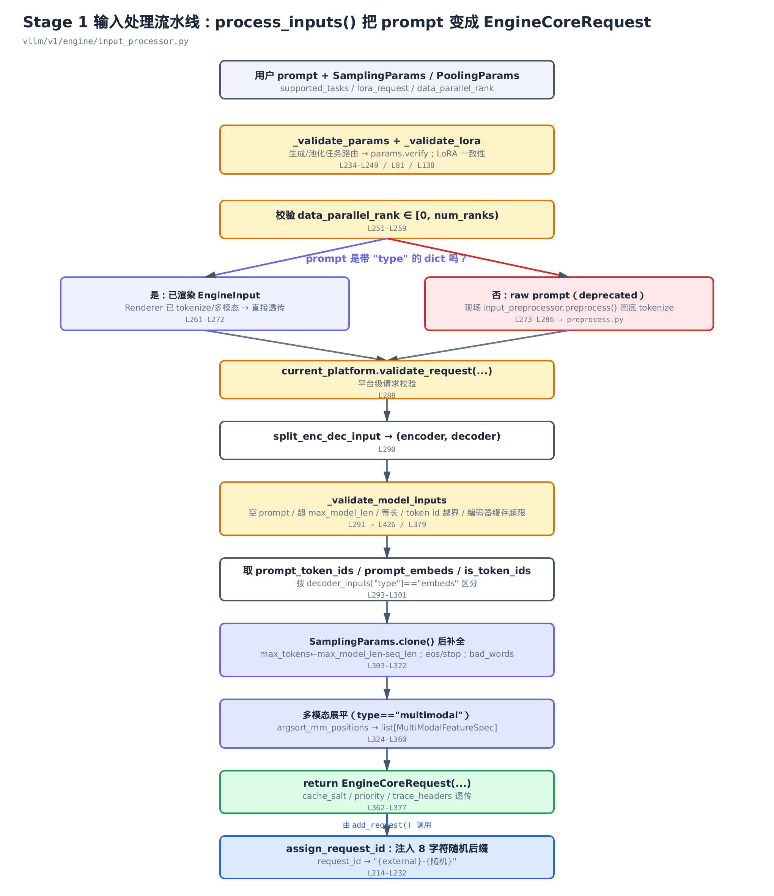
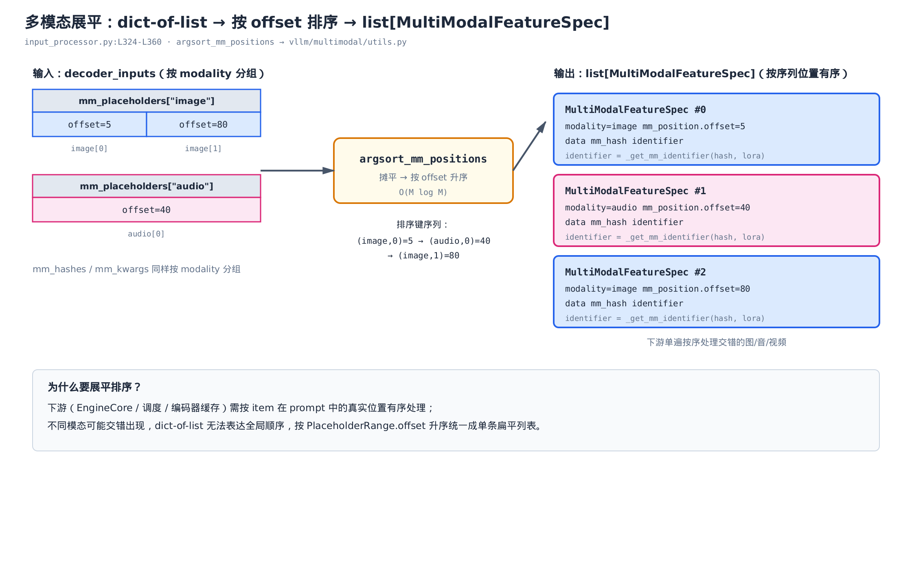
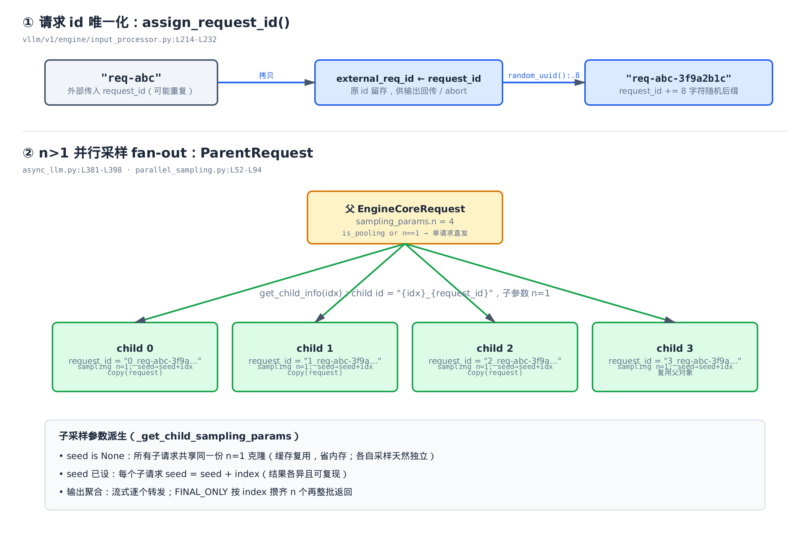

# 第5章　Stage 1 输入处理：从 prompt 到 EngineCoreRequest

## 你在这里


> *图注：全书子系统路线图，本章点亮 `input-processor`——三段式里最靠前的那一段。它左边接的是 `entrypoints`/`async-engine`（上一章的 `AsyncLLM`），右边把成品交给 `engine-core`。本章只管「请求进引擎之前」的最后一道工序。*

上一章 [AsyncLLM 三段式异步解耦](../ch04-async-llm/narrative/chapter.md) 把整条流水线拆成了三段，并且明确说过：Stage 1 的输入处理当时**被当成黑盒**——`add_request` 拿到一个 prompt，转手就喊一声 `process_inputs`，黑盒里吐出一个 `EngineCoreRequest`，然后这个结构体被扔过进程边界送进 EngineCore。

这章我们就掀开这个黑盒。问题很具体：

> 用户给的是一段文本、一串 token、一张图、还是一个嵌入向量；要的是采样还是池化；带不带 LoRA——这些五花八门的输入，怎么统一收敛成**一个**干净、可序列化、字段齐全的 `EngineCoreRequest`？

主角是 `vllm/v1/engine/input_processor.py` 里的 `InputProcessor` 类，核心方法叫 `process_inputs`。它干的活可以概括成一句话：

> **校验 + 归一化 + 组装**——把杂乱的用户输入校验一遍、补全采样参数、把多模态数据排好序，最后塞进一个 msgspec 结构体。

读完这章，你会知道：一个请求在「进引擎」之前到底被检查了多少遍、`max_tokens` 没填时引擎替你填了什么、`n=4` 的并行采样是在哪一层裂成 4 个子请求的、以及为什么每个请求的 id 后面都挂着一串随机字符。下一段 [EngineCore 跨进程 IPC](../ch07-ipc-boundary/narrative/chapter.md) 会接手本章产出的 `EngineCoreRequest`，把它真正送过进程边界。

---

## 5.1 一句话钩子：tokenize 已经不在这里了

先纠正一个很容易踩的直觉。

「输入处理」四个字，多数人第一反应是 **tokenize**——把文本切成 token id。在老版本的 vLLM 里确实如此，`process_inputs` 是 tokenize 的主战场。但 v1 的真实源码已经变了：**tokenize 和多模态的重活，都下沉到了 API 层的 Renderer**（`render_cmpl` / `render_chat`）。等输入流到 `InputProcessor` 时，文本早已变成 token id，图片早已被处理成嵌入。

证据就在 `process_inputs` 的分流处：

```python
# vllm/v1/engine/input_processor.py:L261-L286
if isinstance(prompt, dict) and "type" in prompt:
    # … 省略：tokenization_kwargs 已废弃的告警分支 …
    if arrival_time is None:
        arrival_time = prompt.get("arrival_time", time.time())

    processed_inputs: EngineInput = prompt          # 已渲染好，直接透传
else:
    # raw prompt 是 deprecated 路径，v0.18 将移除
    if arrival_time is None:
        arrival_time = time.time()

    processed_inputs = self.input_preprocessor.preprocess(
        prompt,
        tokenization_kwargs=tokenization_kwargs,    # 兜底：现场 tokenize
    )
```

看清这个 `if`：

- **主路径**——`prompt` 是一个带 `"type"` 键的 dict，那就是 Renderer 已经渲染好的 `EngineInput`，`InputProcessor` **原封不动透传**，一个 token 都不切。
- **兜底路径**——你直接塞了个裸 prompt（文本/PIL 图片之类），这条路打着 deprecation 警告，临时调 `InputPreprocessor.preprocess()` 现场 tokenize。这条路 v0.18 就要删。

所以这章的定位要摆正：**`InputProcessor` 主要是个校验器和组装器，不是 tokenizer。** 它真正的价值在「把好关」和「补齐料」，而不是切词。下面我们顺着 `process_inputs` 的控制流，一道工序一道工序地走。整条流水线长这样：



> *图注：`process_inputs` 的竖向流水线。黄色框是校验关卡，紫色框是归一化/补全，绿色框是最终产物 `EngineCoreRequest`，蓝色框是随后由 `add_request` 调用的 id 注入。每个框都标了真实源码行号。*

---

## 5.2 进门先验票：三道校验关卡

`process_inputs` 一进门，连碰都不碰 prompt，先把三件事校验掉。这是典型的「fail fast」——错的请求越早拒绝越好，别让脏数据流到下游再炸。

```python
# vllm/v1/engine/input_processor.py:L248-L259
def process_inputs(self, request_id, prompt, params, supported_tasks, ...):
    self._validate_params(params, supported_tasks)
    self._validate_lora(lora_request)

    parallel_config = self.vllm_config.parallel_config
    dp_size = parallel_config.data_parallel_size
    dp_local_size = parallel_config.data_parallel_size_local
    num_ranks = dp_local_size if parallel_config.local_engines_only else dp_size
    if data_parallel_rank is not None and not (0 <= data_parallel_rank < num_ranks):
        raise ValueError(
            f"data_parallel_rank {data_parallel_rank} "
            f"is out of range [0, {num_ranks})."
        )
```

第三道（`data_parallel_rank` 范围）很直白：你指定让请求去第几个 DP rank，那这个编号必须落在 `[0, num_ranks)` 里。前两道值得拆开看。

### 5.2.1 `_validate_params`：先问「这模型干得了这活吗」

```python
# vllm/v1/engine/input_processor.py:L81-L116
def _validate_params(self, params, supported_tasks):
    """Raise `ValueError` if SamplingParams or PoolingParams is not valid."""
    if isinstance(params, SamplingParams):
        supported_generation_tasks = [
            task for task in supported_tasks if task in GENERATION_TASKS
        ]
        if not supported_generation_tasks:
            raise ValueError("This model does not support generation")

        params.verify(
            self.model_config,
            self.speculative_config,
            self.structured_outputs_config,
            self.tokenizer,
        )
        # … 省略：thinking_token_budget 与 reasoning_config 的一致性校验 …
    elif isinstance(params, PoolingParams):
        supported_pooling_tasks = [
            task for task in supported_tasks if task in POOLING_TASKS
        ]
        if not supported_pooling_tasks:
            raise ValueError("This model does not support pooling")
        # … 省略：pooling task 的默认补全与合法性细查 …
        params.verify(self.model_config)
    else:
        raise TypeError("params must be either SamplingParams or PoolingParams, ...")
```

这里有个干净的两分法：参数对象的**类型**决定了请求的**性质**。

- 传 `SamplingParams` → 这是个生成请求。先看模型支持的任务里有没有生成类（`GENERATION_TASKS`），没有就直接报「不支持生成」；有，再调 `params.verify(...)` 把采样参数本身查一遍（`temperature`、`top_p`、投机解码、结构化输出的种种约束）。
- 传 `PoolingParams` → 这是个池化/嵌入请求，走 `POOLING_TASKS` 那条对称的分支。
- 两者都不是 → `TypeError`。

`params.verify` 内部还有一长串子校验（温度范围、beam search 限制、logits processor 兼容性……），那是 `SamplingParams` 自己的职责，本章不展开。这里要记住的是**结构**：先按 `supported_tasks` 做能力门禁，再做参数自洽性检查。

### 5.2.2 `_validate_lora`：没开 LoRA 就别传 LoRA

```python
# vllm/v1/engine/input_processor.py:L138-L155
def _validate_lora(self, lora_request):
    if lora_request is None:
        return

    # LoRA request passed in while LoRA is not enabled
    if not self.lora_config:
        raise ValueError(f"Got lora_request {lora_request} but LoRA is not enabled!")

    if self.tokenizer is not None:
        # … 省略：per-LoRA tokenizer 已废弃的告警文案 …
        ...
```

逻辑朴素到一句话能讲完：你没传 LoRA，直接放行；你传了 LoRA 但引擎根本没开 LoRA（`lora_config` 为空），就报错。把这种「配置与请求矛盾」的情况挡在门口，避免下游拿着一个永远命中不了的 LoRA 句柄空转。

这三道关卡全过了，才轮到 prompt 本身登场。

---

## 5.3 归一化：透传还是兜底 tokenize

[§5.1](#51-一句话钩子tokenize-已经不在这里了) 已经把这个分流讲透了——主路径透传 `EngineInput`，兜底路径走 `InputPreprocessor.preprocess()`。这里补一句兜底路径里发生了什么。

`InputPreprocessor.preprocess()` 是老路径的预处理总入口：它先按是否 encoder-decoder 架构分流，decoder-only 的文本会走到 `_process_text()`，在那里调 `_tokenize_prompt()` 真正切词，再包成统一的 `TokensInput`。多模态、纯嵌入也各有委托。它的产物和主路径透传的 `EngineInput` 是**同一种 TypedDict 家族**——这正是设计的巧妙处：不管走哪条路，出来的 `processed_inputs` 形状一致，后面的代码不用区分来源。

两条路汇合后，立刻是一道平台级校验和一次结构拆分：

```python
# vllm/v1/engine/input_processor.py:L288-L291
current_platform.validate_request(processed_inputs, params)

encoder_inputs, decoder_inputs = split_enc_dec_input(processed_inputs)
self._validate_model_inputs(encoder_inputs, decoder_inputs)
```

`split_enc_dec_input` 把可能是「编码器+解码器」的复合输入拆成两半。绝大多数 decoder-only 模型 `encoder_inputs` 是 `None`，我们后面取数据基本只看 `decoder_inputs`。拆完马上进入第二大类校验——模型输入校验。

---

## 5.4 模型输入校验：空、超长、越界，三种死法

`_validate_model_inputs` 只是个分发器，对 encoder（如果有）和 decoder 各调一次 `_validate_model_input`。真正干活的是后者：

```python
# vllm/v1/engine/input_processor.py:L426-L476
def _validate_model_input(self, prompt_input, prompt_type):
    model_config = self.model_config
    tokenizer = self.tokenizer

    prompt_ids = (
        None if prompt_input["type"] == "embeds" else prompt_input["prompt_token_ids"]
    )
    prompt_embeds = (
        prompt_input["prompt_embeds"] if prompt_input["type"] == "embeds" else None
    )

    prompt_len = length_from_prompt_token_ids_or_embeds(prompt_ids, prompt_embeds)
    self._validate_prompt_len(prompt_len, prompt_type)

    if prompt_input["type"] == "multimodal":
        decoder_mm_positions = prompt_input["mm_placeholders"]
        for modality, mm_positions in decoder_mm_positions.items():
            for mm_position in mm_positions:
                num_embeds = mm_position.get_num_embeds()
                if num_embeds > self.mm_encoder_cache_size:
                    raise ValueError(...)   # 编码器缓存放不下这个 item

    if prompt_ids and tokenizer is not None:
        max_input_id = max(prompt_ids, default=0)
        # 取 tokenizer.max_token_id 与 model_vocab_size-1 的较大者判越界
        model_vocab_size = model_config.get_vocab_size()
        if max_input_id > max(tokenizer.max_token_id, model_vocab_size - 1):
            raise ValueError(f"Token id {max_input_id} is out of vocabulary")
```

这段是本章的「门神」。它把请求可能踩的雷分成三类。

**第一类：长度。** `_validate_prompt_len` 管这块：

```python
# vllm/v1/engine/input_processor.py:L379-L424
def _validate_prompt_len(self, prompt_len, prompt_type):
    if self.skip_prompt_length_check:
        return

    if prompt_len == 0 and prompt_type == "decoder":
        raise ValueError(f"The {prompt_type} prompt cannot be empty")

    model_config = self.model_config
    max_prompt_len = (
        model_config.max_model_len
        if prompt_type == "decoder"
        else self.mm_encoder_cache_size
    )
    if prompt_len > max_prompt_len:
        # … 省略：给用户的修改建议文案 …
        raise ValueError(
            f"The {prompt_type} prompt (length {prompt_len}) is "
            f"longer than the maximum model length of {max_prompt_len}."
        )
    elif prompt_len == max_prompt_len and model_config.runner_type == "generate":
        # … 省略：建议文案 …
        raise ValueError(
            f"The {prompt_type} prompt (length {prompt_len}) plus the number of "
            f"requested output tokens (at least 1) is longer than the maximum "
            f"model length of {max_prompt_len}."
        )
```

三种死法在这一个函数里：**空**（decoder prompt 长度为 0）、**超长**（`> max_model_len`）、以及一个容易被忽略的**等长**——`prompt_len == max_model_len` 且模型是生成型。为什么「正好等于」也要拒？因为生成至少要吐 1 个 token，prompt 占满了整个上下文窗口，连一个输出 token 的位置都不剩了。这是个边界条件，但漏掉它会让请求进了引擎才在某一步崩掉，那时排查成本高得多。

**第二类：多模态嵌入超限。** 每个多模态 item（一张图、一段音频）会展开成若干个嵌入 token，由 `PlaceholderRange.get_num_embeds()` 算出。如果单个 item 的嵌入数超过编码器缓存 `mm_encoder_cache_size`，直接拒——因为编码器缓存根本装不下它。

**第三类：token id 越界。** 这一句藏着一个真实世界的坑：

```python
if max_input_id > max(tokenizer.max_token_id, model_vocab_size - 1):
```

为什么是 `max(tokenizer.max_token_id, model_vocab_size - 1)` 取**较大者**，而不是简单地拿模型词表大小判？因为像 Qwen3 这类模型，**语言模型侧的词表**和 **tokenizer 侧的 token 上限**对不齐：模型可能多出一批保留 token，tokenizer 可能多出一批多模态占位 token。只看其中一侧都会误判——把合法 token 当成 OOV 拒掉。取两侧的较大者，是个朴素但必要的兼容性补丁。

这三类校验全过，prompt 才被认定「干净」。下面开始取料、补料。

---

## 5.5 取出 prompt 字段：三种载体的归一化访问

```python
# vllm/v1/engine/input_processor.py:L293-L301
# Mypy can be conservative for TypedDict unions; normalize access.
if decoder_inputs["type"] == "embeds":
    prompt_embeds = decoder_inputs["prompt_embeds"]
    prompt_token_ids = decoder_inputs.get("prompt_token_ids")
    prompt_is_token_ids = decoder_inputs.get("is_token_ids")
else:
    prompt_token_ids = decoder_inputs["prompt_token_ids"]
    prompt_embeds = None
    prompt_is_token_ids = None
```

输入有三种载体：纯 token id、纯嵌入向量（`embeds`）、以及混合模式。这段把它们统一成三个本地变量 `prompt_token_ids` / `prompt_embeds` / `prompt_is_token_ids`，后面的逻辑就只跟这三个变量打交道，不用再反复 `if type ==`。

`prompt_is_token_ids` 是给混合模式准备的逐位置掩码：`True` 表示这个位置是真实 token id，`False` 表示这个位置用预计算的嵌入。纯 token 和纯嵌入的请求它都是 `None`。

---

## 5.6 补料：`SamplingParams.clone()` 与三处补全

取完料，对采样参数动一次「克隆 + 补全」。这是本章设计感最强的一段：

```python
# vllm/v1/engine/input_processor.py:L303-L322
sampling_params = None
pooling_params = None
if isinstance(params, SamplingParams):
    # TODO: can we avoid cloning here in multiproc case?
    sampling_params = params.clone()
    # If unset max tokens, then generate up to the max_model_len.
    if sampling_params.max_tokens is None:
        seq_len = length_from_prompt_token_ids_or_embeds(
            prompt_token_ids, prompt_embeds
        )
        sampling_params.max_tokens = self.model_config.max_model_len - seq_len

    sampling_params.update_from_generation_config(
        self.generation_config_fields,
        self.renderer.get_eos_token_id(),
    )
    if self.tokenizer is not None:
        sampling_params.update_from_tokenizer(self.tokenizer)
else:
    pooling_params = params.clone()
```

### 5.6.1 为什么先 `clone()`

第一行就 `params.clone()`。这不是洁癖。`process_inputs` 接下来要**就地改**这个参数对象——补 `max_tokens`、注入 eos/stop、补 bad_words。如果直接改调用方传进来的那个对象，就会污染它：调用方拿同一个 `SamplingParams` 复用给下一个请求时，会莫名其妙带上上一个请求被补全的字段。克隆一份再改，调用方的原对象永远干净。

[后面 n>1 的 fan-out](#58-fan-outn1-的并行采样在哪一层裂开) 还会基于这个克隆再派生子参数，clone 是整条链路不互相污染的地基。

### 5.6.2 `max_tokens` 没填时填什么

最有意思的补全：**用户没指定 `max_tokens`，引擎替你填成 `max_model_len - seq_len`。**

直觉先行：模型的上下文窗口是固定的（比如 4096）。prompt 已经吃掉了 `seq_len` 个位置，那剩下能用来生成的，最多就是 `max_model_len - seq_len` 个。把这个差值当默认上限，保证 **prompt + 输出 ≤ 上下文窗口**，绝不越界。

给个数。设 `max_model_len = 4096`，prompt 是 100 个 token：

$$
\mathrm{max\_tokens} = \mathrm{max\_model\_len} - \mathrm{seq\_len} = 4096 - 100 = 3996
$$

人话翻译：你没说要生成多少，那就敞开了生成，一直到把上下文窗口剩下的 3996 个位置填满为止。`seq_len` 由 `length_from_prompt_token_ids_or_embeds` 算——有 token id 就数 token，纯嵌入就数嵌入行数。

### 5.6.3 两处 `update_from_*`：注入 eos 与校验 bad_words

`update_from_generation_config` 把模型自带的生成配置（主要是 eos token）并进采样参数。它的关键逻辑值得看一眼：

```python
# vllm/sampling_params.py:L543-L572
def update_from_generation_config(self, generation_config, eos_token_id=None):
    """Update if there are non-default values from generation_config"""
    if not self.ignore_eos:
        self._eos_token_id = eos_token_id
    # … 省略：把 eos_token_id 并入内部 _all_stop_token_ids（支持 min_tokens）…
    if (eos_ids := generation_config.get("eos_token_id")) is not None:
        eos_ids = {eos_ids} if isinstance(eos_ids, int) else set(eos_ids)
        if eos_token_id is not None:
            # 主 eos 单独处理停止，不必再塞进 stop_token_ids
            eos_ids.discard(eos_token_id)
        if eos_ids:
            # … 省略：把其余 eos 并入 stop_token_ids …
            ...
```

要点：**主 eos**（`eos_token_id`）被单独存为 `_eos_token_id`，由停止逻辑专门处理；模型配置里其余的 eos id 则并入 `stop_token_ids`。这样既不重复，又能支持多个停止 token。

紧接着的 `update_from_tokenizer` 只在 tokenizer 存在时调，它处理 `bad_words`——把用户给的「禁止生成的词」转成 token 级约束。没设 bad_words 就直接返回，零开销。

补全顺序是固定的：先 `max_tokens`，再 `update_from_generation_config`，最后 `update_from_tokenizer`。`PoolingParams` 没有这些生成专属字段，只 `clone()` 一下就够。

---

## 5.7 多模态展平：从 dict-of-list 到有序的 feature 列表

到这里，文本/采样这条线已经齐活。如果请求带多模态，还有最后一道归一化——把按模态分组的字典，**展平排序**成一个有序列表。

```python
# vllm/v1/engine/input_processor.py:L324-L360
# Multimodal related.
mm_features: list[MultiModalFeatureSpec] | None = None

if decoder_inputs["type"] == "multimodal":
    decoder_mm_inputs = decoder_inputs["mm_kwargs"]
    decoder_mm_positions = decoder_inputs["mm_placeholders"]
    decoder_mm_hashes = decoder_inputs["mm_hashes"]

    if not all(isinstance(leaf, str) for leaf in json_iter_leaves(decoder_mm_hashes)):
        raise ValueError(f"mm_hashes must contain only strings, got: {decoder_mm_hashes}.")

    # Merge and flatten multimodal placeholders, hashes and inputs
    # from dictionaries to lists, and sort them by each item's position
    # in the input sequence.
    sorted_mm_idxs = argsort_mm_positions(decoder_mm_positions)

    mm_features = []
    for modality, idx in sorted_mm_idxs:
        base_mm_hash = decoder_mm_hashes[modality][idx]
        mm_features.append(
            MultiModalFeatureSpec(
                data=decoder_mm_inputs[modality][idx],
                modality=modality,
                identifier=self._get_mm_identifier(base_mm_hash, lora_request),
                mm_position=decoder_mm_positions[modality][idx],
                mm_hash=base_mm_hash,
            )
        )
```

### 5.7.1 为什么要展平排序

输入里，多模态数据是**按模态分组**的字典：`mm_placeholders["image"]` 是所有图片的位置列表，`mm_placeholders["audio"]` 是所有音频的。但下游（EngineCore、调度、编码器缓存）需要按 item 在 prompt 里的**真实位置**顺序处理——而图、音、视频可能在 prompt 里**交错**出现。按模态分组的字典天然表达不了这个全局顺序。

`argsort_mm_positions` 就是来解决这个的：它把 dict-of-list 摊平成 `(modality, idx)` 的序列，按每个 item 的 `PlaceholderRange.offset` 升序排。一个具体例子：



> *图注：两张图（offset=5、offset=80）和一段音频（offset=40）交错出现。`argsort_mm_positions` 按 offset 升序，排成 image[0] → audio[0] → image[1]，展平成一条按序列位置有序的 `MultiModalFeatureSpec` 列表。*

排序后逐个造 `MultiModalFeatureSpec`，每个 spec 打包了一个 item 的全部信息：数据本身、模态、缓存标识符、位置、哈希。展平的复杂度是 $O(M \log M)$（$M$ 是 item 总数），换来的是下游能单遍按序处理。

### 5.7.2 缓存标识符里的 LoRA 前缀

`identifier` 那一项调了 `_get_mm_identifier`，这里藏着一个不易察觉的正确性问题：

```python
# vllm/v1/engine/input_processor.py:L157-L173
def _get_mm_identifier(self, mm_hash, lora_request):
    """When enable_tower_connector_lora is True, multi-modal embeddings
    vary depending on the LoRA request. Therefore the mm_hash must be
    generated based on the LoRA request to prevent incorrect cache hits."""
    if (
        lora_request is None
        or self.lora_config is None
        or not self.lora_config.enable_tower_connector_lora
    ):
        return mm_hash
    return f"{lora_request.lora_name}:{mm_hash}"
```

`mm_hash` 是多模态数据的内容哈希，用作缓存键。一般情况下，同一张图无论哪个请求来都该命中同一份缓存——直接用 `mm_hash` 即可。但当 `enable_tower_connector_lora` 打开时，**同一张图在不同 LoRA 下算出的嵌入是不一样的**。这时如果还用纯 `mm_hash` 做键，就会错误命中——拿 LoRA A 算出的嵌入去喂 LoRA B 的请求。修法很直接：在键前面拼上 LoRA 名字，`{lora_name}:{mm_hash}`，把 LoRA 维度纳入缓存键。

开头那句 `mm_hashes must contain only strings` 的校验也是同理——缓存键必须是字符串，混进非字符串说明上游的 `MultiModalProcessor` 实现有 bug，得早点拦。

这些 `mm_features` 和它们的 `PlaceholderRange`、`encoder_cache_size`，会在后续多模态编码器缓存与调度的章节里被真正消费——本章只负责把它们排好序、打包好。

---

## 5.8 组装成品：`EngineCoreRequest`

所有料备齐，最后一步是组装：

```python
# vllm/v1/engine/input_processor.py:L362-L377
return EngineCoreRequest(
    request_id=request_id,
    prompt_token_ids=prompt_token_ids,
    prompt_embeds=prompt_embeds,
    prompt_is_token_ids=prompt_is_token_ids,
    mm_features=mm_features,
    sampling_params=sampling_params,
    pooling_params=pooling_params,
    arrival_time=arrival_time,
    lora_request=lora_request,
    cache_salt=decoder_inputs.get("cache_salt"),
    priority=priority,
    data_parallel_rank=data_parallel_rank,
    trace_headers=trace_headers,
    resumable=resumable,
)
```

注意 `cache_salt` 是从 `decoder_inputs.get("cache_salt")` 透传的——这个字段用来给前缀缓存分桶（让相同前缀但不该共享缓存的请求隔离开），在前缀缓存章节会用到，本章只管原样传下去。`sampling_params` 和 `pooling_params` 一定有且只有一个非空，对应生成 / 池化两类请求。

`EngineCoreRequest` 不是普通 dataclass，它是个为**跨进程 IPC** 量身定做的 msgspec 结构体：

```python
# vllm/v1/engine/__init__.py:L80-L131
class EngineCoreRequest(
    msgspec.Struct,
    array_like=True,        # 序列化成数组而非字典，省掉字段名开销
    omit_defaults=True,     # 默认值字段不序列化，进一步压缩
    gc=False,               # 不参与 GC，降开销
):
    request_id: str
    prompt_token_ids: list[int] | None
    mm_features: list[MultiModalFeatureSpec] | None
    sampling_params: SamplingParams | None
    pooling_params: PoolingParams | None
    arrival_time: float
    lora_request: LoRARequest | None
    cache_salt: str | None
    data_parallel_rank: int | None
    prompt_embeds: torch.Tensor | None = None
    # … 省略：client_index / current_wave 等 IPC/DP 字段 …
    external_req_id: str | None = None
    # … 省略：reasoning 相关字段 …

    @property
    def params(self) -> SamplingParams | PoolingParams:
        """Return the processed params (sampling or pooling)."""
        if self.sampling_params is not None:
            return self.sampling_params
        assert self.pooling_params is not None
        return self.pooling_params
```

那三个 `msgspec.Struct` 的参数全是为序列化体积和速度服务的：`array_like` 让结构体序列化成数组（不带字段名）、`omit_defaults` 跳过默认值字段、`gc=False` 省掉 GC 开销。原因很简单——这个结构体马上要被 [Stage 2 序列化送过进程边界](../ch07-ipc-boundary/narrative/chapter.md) 进 EngineCore，体积越小、序列化越快越好。

那个 `params` 属性是个贴心的统一访问器：不管请求是采样还是池化，调用方都用 `request.params` 拿参数，不必自己判断哪个非空。`external_req_id` 字段先记在这——下一节它就是主角。

---

## 5.9 请求 id 唯一化：那串随机后缀是干嘛的

`process_inputs` 返回的 `EngineCoreRequest`，`request_id` 还是用户传进来的原始值。但用户传的 id **可能重复**（不同客户端、甚至同一客户端的笔误）。内部如果靠它做唯一键，重复就会引发串台——A 请求的输出发给了 B。

解法是在 `add_request` 里、`process_inputs` 之后，调一次 `assign_request_id`：

```python
# vllm/v1/engine/input_processor.py:L214-L232
@staticmethod
def assign_request_id(request: EngineCoreRequest):
    """Replace the externally supplied request ID with an internal request ID
    that adds 8 random characters in order to ensure uniqueness.
    """
    if request.external_req_id is not None:
        raise ValueError(
            "The external_req_id field should not be set on EngineCoreRequests"
            " passed to vLLM; use the request_id field."
        )
    request.external_req_id = request.request_id
    if envs.VLLM_DISABLE_REQUEST_ID_RANDOMIZATION:
        # … 省略：关闭随机化的 deprecation 告警 …
        ...
    else:
        request.request_id = f"{request.external_req_id}-{random_uuid():.8}"
```

两步走：

1. 把原始 `request_id` 备份到 `external_req_id`——这个原始 id 不能丢，输出回传给客户端、以及 `abort(req_id, internal=False)` 都还要用它。
2. 给 `request_id` 接上 8 个随机十六进制字符，变成内部唯一 id。



> *图注：上半，`"req-abc"` 先拷进 `external_req_id`，再被改写成 `"req-abc-3f9a2b1c"`。下半是 n>1 的 fan-out，下一节展开。*

**为什么 8 个字符够？** `random_uuid()` 取 uuid4 的 hex（128 bit 随机），`:.8` 截前 8 个十六进制字符，即 32 bit 随机。注意目标不是「全局密码学唯一」——只是「在单实例内消歧外部重复的 id」。即便两个请求恰好都叫 `"req-abc"`，它们再撞上同一个 8 字符后缀的概率，按生日界约为 $n^2 / 2^{33}$，小到可以忽略。这是个务实的工程取舍：不追求绝对唯一，只追求「实际上不会撞」。

开头那个 `if request.external_req_id is not None: raise` 是道防呆——`external_req_id` 是内部字段，调用方本不该设它；设了说明用法错了，早报早好。

---

## 5.10 fan-out：n>1 的并行采样在哪一层裂开

最后一块拼图。用户要 `n=4`（同一个 prompt 采 4 个不同结果），这 4 个请求是在哪儿裂开的？

答案是：**不在 `InputProcessor` 里。** `process_inputs` 永远只产出**一个**父 `EngineCoreRequest`。裂分发生在更上层的 `add_request`，由 `ParentRequest` 协调：

```python
# vllm/v1/engine/async_llm.py:L381-L398
if is_pooling or params.n == 1:
    await self._add_request(request, prompt_text, None, 0, queue)
    return queue

parent_params = params
assert isinstance(parent_params, SamplingParams)

# Fan out child requests (for n>1).
parent_request = ParentRequest(request)
for idx in range(parent_params.n):
    request_id, child_params = parent_request.get_child_info(idx)
    child_request = request if idx == parent_params.n - 1 else copy(request)
    child_request.request_id = request_id
    child_request.sampling_params = child_params
    await self._add_request(child_request, prompt_text, parent_request, idx, queue)
return queue
```

为什么把 fan-out 放在这一层、而不是塞进 `process_inputs`？因为**职责分离**：`process_inputs` 管「单个请求的输入处理」，而把一个请求拆成 n 个、再把 n 路输出聚合回 1 路，是「请求接入与生命周期管理」的活，交给专门的 `ParentRequest` 状态机更干净。`InputProcessor` 不必知道并行采样的存在。

走查一下这个循环（`n=4`）：

- `n==1`（或池化）→ 根本不 fan-out，单请求直发，省掉所有开销。这是最常见的快路径。
- `n>1` → 建一个 `ParentRequest`，循环 4 次。每次 `get_child_info(idx)` 给出子 id 和子参数。
- 子请求对象有个小优化：**最后一个（`idx == n-1`）直接复用父 `request` 对象**，前面三个 `copy(request)`。因为父对象之后不再单独使用，最后一轮可以省一次拷贝。

### 5.10.1 子 id 与子参数的派生

```python
# vllm/v1/engine/parallel_sampling.py:L52-L94
def _get_child_sampling_params(self, index):
    seed = self.sampling_params.seed
    if self.cached_child_sampling_params:
        # Reuse child sampling_params data structure
        return self.cached_child_sampling_params
    # Build child sampling_params
    child_sampling_params = copy(self.sampling_params)
    child_sampling_params.n = 1
    if seed is None:
        # Cache child sampling_params for later reuse
        self.cached_child_sampling_params = child_sampling_params
    else:
        # Each child gets a clone with a unique seed
        child_sampling_params.seed = seed + index
    return child_sampling_params

def get_child_info(self, index):
    child_req_id = f"{index}_{self.request_id}"
    self.child_requests.add(child_req_id)
    return child_req_id, self._get_child_sampling_params(index)
```

**子 id**：`f"{index}_{request_id}"`，比如父 id 是 `req-abc-3f9a2b1c`，四个子 id 就是 `0_req-abc-3f9a2b1c` … `3_req-abc-3f9a2b1c`。前缀编号天然唯一，又能反查回父。

**子参数**的派生有个漂亮的分叉，全看有没有设 `seed`：

- **没设 seed**：四个子请求采样本就相互独立（各自的随机性来自全局 RNG），所以可以**共享同一份** `n=1` 的克隆——第一次造好就缓存进 `cached_child_sampling_params`，后面三次直接复用。省内存。
- **设了 seed**：要保证四个结果**既各不相同、又可复现**。于是每个子请求拿 `seed + index`——子 0 用 `seed`、子 1 用 `seed+1`……确定且互不相同。

注意这里 `n` 被改成 1——每个子请求只采 1 个结果，4 个子请求合起来才是用户要的 `n=4`。

### 5.10.2 输出怎么聚合回去

裂开了，最终还得合回来。`get_outputs` 管聚合，有两种模式：

```python
# vllm/v1/engine/parallel_sampling.py:L100-L126
def get_outputs(self, child_request_id, completion_output):
    already_finished_and_returned = False
    if completion_output.finished():
        if child_request_id in self.child_requests:
            self.child_requests.remove(child_request_id)
        else:
            # 这个子请求上一轮就完成并返回过了
            already_finished_and_returned = True

    if self.sampling_params.output_kind != RequestOutputKind.FINAL_ONLY:
        # 流式：直接转发当前输出（已完成且已返回过的不再发）
        outputs = [] if already_finished_and_returned else [completion_output]
    else:
        # 非流式：把 n 个最终输出按 index 攒齐
        self.output_aggregator[completion_output.index] = completion_output
        outputs = [] if self.child_requests else self.output_aggregator

    finished = not self.child_requests
    return outputs, finished
```

- **流式**（非 `FINAL_ONLY`）：哪个子请求有新输出就立刻转发哪个，不等齐。已经完成并返回过的不重复发。
- **非流式**（`FINAL_ONLY`）：把每个子请求的最终结果按 `index` 写进 `output_aggregator`，**等所有子请求都完成**（`child_requests` 清空）才整批返回这 n 个结果。

判定整个并行采样请求是否结束，就一句 `finished = not self.child_requests`——子请求集合空了就完事。这套聚合逻辑会在 [Stage 3 输出处理](../ch08-output-processing/narrative/chapter.md) 里被真正驱动，本章只看它的内部状态机。

---

## 5.11 跑起来看数值：补全与 fan-out 的可观察行为

前面讲的都是控制流。为了确认我们对这些行为的理解没跑偏，可以脱离 vLLM 的重型依赖，用一份忠实子集把关键路径跑一遍、断言数值。下面这些行为都是直接对照真实源码 `vllm/v1/engine/input_processor.py`（pin `f3fef123`）逐项核验过的。

**`max_tokens` 默认补全。** `max_model_len=4096`、prompt 100 token、用户没设 `max_tokens` → 产出的 `EngineCoreRequest.sampling_params.max_tokens` 恰为 `3996`。用户显式设了值，则原样保留，不被覆盖。

**`clone()` 不污染入参。** 把同一个 `SamplingParams(max_tokens=None)` 传进 `process_inputs`，返回后**原对象的 `max_tokens` 仍是 `None`**——补全只发生在克隆体上。

**`assign_request_id` 唯一性。** 同一个外部 id `"req-abc"` 连续接入两次，两次产出的内部 `request_id` 不同（后缀随机），但 `external_req_id` 都还原样是 `"req-abc"`。

**多模态排序。** 构造一个 image(offset=5)、audio(offset=40)、image(offset=80) 交错的请求 → 产出的 `mm_features` 顺序严格是 `[image, audio, image]`，与 offset 升序一致。

**fan-out。** `n=4` 时产出 4 个子请求，子 id 形如 `0_…`、`1_…`、`2_…`、`3_…`，每个子的 `sampling_params.n == 1`；设了 `seed` 时子 i 的 seed 为 `seed+i`。`n=1` 或池化请求则完全不 fan-out。

这些断言全部通过——说明本章对控制流的解读和真实源码的可观察行为一致。

---

## 5.12 小结：这一关到底把好了什么

回到开头那个问题：五花八门的输入，怎么收敛成一个干净的 `EngineCoreRequest`？现在答案清晰了。`vllm/v1/engine/input_processor.py` 里的 `InputProcessor` 是请求进引擎前的最后一道关，它干三件事：

- **校验**——参数能力门禁、LoRA 一致性、DP rank 范围；空/超长/等长/越界四类模型输入校验。错的请求在这里就被挡回，不污染下游。
- **归一化 + 补料**——三种 prompt 载体统一访问；`SamplingParams` 克隆后补全 `max_tokens`、eos/stop、bad_words；多模态从分组字典展平排序成有序的 `MultiModalFeatureSpec` 列表。
- **组装 + 唯一化**——打包成为 IPC 优化过的 `EngineCoreRequest`，并注入 8 字符随机后缀保证内部 id 唯一。

还有一个重要的边界认知：**tokenize 已经不在这里了**，重活下沉到了 Renderer；**fan-out 也不在这里**，n>1 的裂分由上层的 `ParentRequest` 负责。`InputProcessor` 聚焦做好「单请求的校验与组装」这一件事。

下一段，本章产出的这个 `EngineCoreRequest` 会被序列化、送过进程边界，进入 [EngineCore 跨进程 IPC](../ch07-ipc-boundary/narrative/chapter.md)——那里才是它真正「进引擎」的地方。
