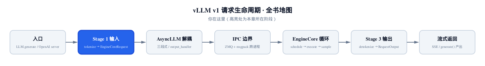
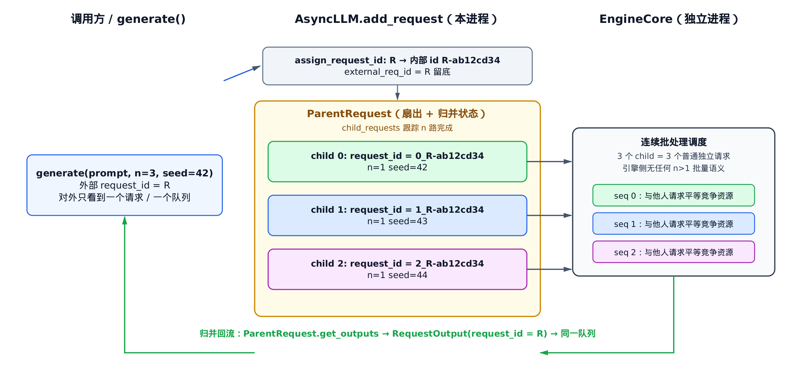
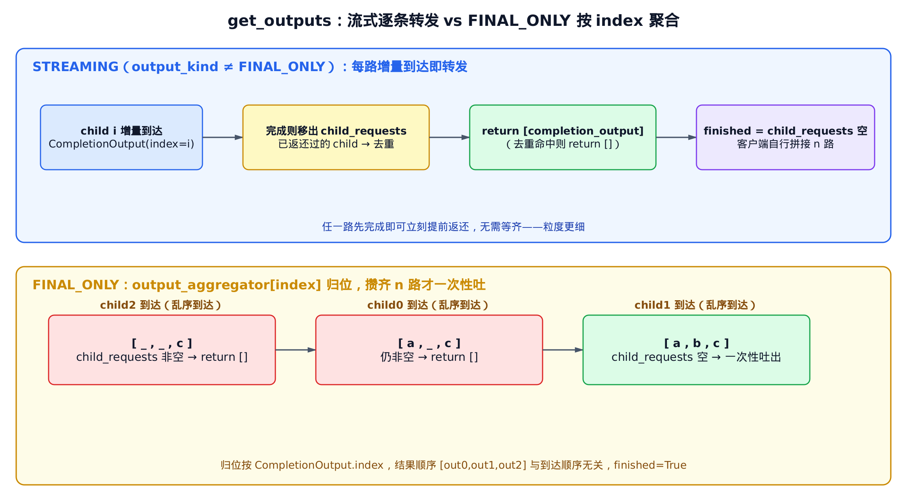

# 第6章　Parallel Sampling：把一个 n=3 请求扇成三个独立请求

## 你在这里



> *图注：全书子系统路线图，本章仍点亮 `input-processor` 这一段——但视角换了。上一章我们站在「单个请求怎么进引擎」的角度看输入处理；这一章把镜头拉到请求接入的最上层，看 `AsyncLLM.add_request` 怎么把一个 `n>1` 的请求**扇出**成多个对等的普通请求，再在输出侧**归并**回来。它左边接 [第 4 章的 AsyncLLM 三段式](../ch04-async-llm/narrative/chapter.md)，右边把归并好的结果交给 [第 8 章的输出处理](../ch08-output-processing/narrative/chapter.md) 真正驱动。*

[第 4 章](../ch04-async-llm/narrative/chapter.md) 拆三段式时，`add_request` 那段代码里有一行注释被我们一笔带过：

```python
# … 省略：n>1 的 ParentRequest 扇出子请求（并行采样）…
```

当时的原话是「`n>1` 并行采样是同机制重复，本章不展开」。[第 5 章](../ch05-input-processing/narrative/chapter.md) 又顺手揭了半层盖子——指出裂分不在 `InputProcessor` 里、而在更上层的 `ParentRequest`，并走查了子 id 与子参数怎么派生。但两章都刻意没碰一个更要紧的问题：

> 用户要 `n=3`（同一个 prompt 采 3 个不同结果），vLLM 为什么不在引擎里加一个「一次算 3 路」的批量参数，反而要在客户端进程把它**拆成 3 个对等的普通请求**、各自排队、各自调度？

这章把这个分支彻底兑现。主角是 `vllm/v1/engine/parallel_sampling.py` 里的 `ParentRequest` 类。它干的事可以浓缩成一句话：

> **对外是一个请求，对内是 n 个请求**——派生时一裂为 n，归并时 n 合为一，中间那 n 路在引擎眼里是 n 个素不相识的陌生人。

读完这章，你会明白：为什么「独立调度」比「批量 n」更省事也更公平、子请求的 id 和随机种子怎么保证既唯一又可复现、n 路输出在流式和非流式下分别怎么攒、以及取消一个 `n=3` 请求时那 3 个子请求怎么被一锅端。

---

## 6.1 一句话钩子：n 不是一个引擎参数

先纠正一个很自然的直觉。

`SamplingParams` 里有个字段叫 `n`，意思是「这个 prompt 给我采几个结果」。直觉上，你会以为 `n=3` 是个**引擎参数**：客户端把 `n=3` 原样塞进请求，丢给引擎，引擎内部某个地方读到 `n=3`，于是在注意力、在 KV cache、在调度器里都按「一次三路」来安排。

真实的 vLLM v1 **恰恰相反**。`n` 在请求离开客户端进程之前就被「消化」掉了：`AsyncLLM.add_request` 把一个 `n=3` 的请求**当场拆成 3 个 `n=1` 的请求**，每个都带自己唯一的 id，各自独立地送进引擎。等请求真正过了进程边界、落到调度器手里时，它看到的只是 3 个普普通通、互不相干的 `n=1` 请求——和别的用户发来的请求长得一模一样。

换句话说：

> 引擎侧**根本不知道**「并行采样」这回事。`n>1` 的全部复杂度，都被关在客户端进程的 `ParentRequest`（`vllm/v1/engine/parallel_sampling.py`）这一个类里。

这是个典型的「把复杂度往边缘推」的设计。下面这张图先给你一个全景，后面逐段拆。



> *图注：横向三栏。左：调用方发 `generate(prompt, n=3, seed=42)`，对外只有一个请求 id `R`、一个队列。中：`AsyncLLM.add_request` 先把 `R` 内部化成带随机后缀的 `R-ab12cd34`，再由 `ParentRequest` 扇出三个 child——id 是 `0_R-ab12cd34` / `1_…` / `2_…`，各自 `n=1`、种子 `42/43/44`。右：三个 child 经 IPC 各自下发 EngineCore，被当成三个互不相干的普通请求调度。底部绿线是归并回流：三路结果经 `ParentRequest.get_outputs` 合成单一 `RequestOutput(request_id=R)`，回到同一个队列。*

---

## 6.2 扇出的入口：`add_request` 的两条岔路

请求接入的总闸门是 `AsyncLLM.add_request`。第 4 章和第 5 章都看过它的局部，这里我们把和并行采样相关的主干完整摊开（无关分支按惯例省略）：

```python
# vllm/v1/engine/async_llm.py:L368-L398
self.input_processor.assign_request_id(request)

# We start the output_handler on the first call to add_request() so
# we can call __init__ before the event loop, which enables us
# to handle startup failure gracefully in the OpenAI server.
self._run_output_handler()

# Create a new output collector for the request.
queue = RequestOutputCollector(params.output_kind, request.request_id)

# Use cloned params that may have been updated in process_inputs()
params = request.params

if is_pooling or params.n == 1:
    await self._add_request(request, prompt_text, None, 0, queue)
    return queue

parent_params = params
assert isinstance(parent_params, SamplingParams)

# Fan out child requests (for n>1).
parent_request = ParentRequest(request)
for idx in range(parent_params.n):
    request_id, child_params = parent_request.get_child_info(idx)
    child_request = request if idx == parent_params.n - 1 else copy(request)
    child_request.request_id = request_id
    child_request.sampling_params = child_params
    await self._add_request(
        child_request, prompt_text, parent_request, idx, queue
    )
return queue
```

这段代码的骨架是一个**二岔路**。岔路口的判据是 `is_pooling or params.n == 1`：

- **快路径**（`n==1` 或池化）：根本不建 `ParentRequest`，单个请求直发，`parent_req` 传 `None`、`index` 传 `0`。这是绝大多数请求走的路，省掉了并行采样的一切开销。这条路第 4 章已经讲透了。
- **扇出路径**（`n>1`）：建一个 `ParentRequest`，循环 `range(n)` 派生 n 个 child，逐个 `_add_request` 下发。

注意一个贯穿全章的关键不变量，它在岔路口之前就立好了：**队列只建一个**。`queue = RequestOutputCollector(...)` 在分岔之前执行，无论走哪条路，对外都只有这**一个**队列。扇出路径下，这同一个 `queue` 被传给每一个 child（循环里 `_add_request(..., queue)`）。这是「对外是一个请求」的物理基础——调用方的 `generate()` 协程只盯着这一个队列收结果，n 路 child 的输出最终都汇进这里。

至于循环体里那行 `child_request = request if idx == parent_params.n - 1 else copy(request)`，第 5 章点过：最后一个 child 直接复用父 `request` 对象、前面的用浅拷贝，省一次拷贝。这是纯微优化，控制流上等价于「全部 copy」，这里不再展开。我们把笔墨留给真正值钱的东西——**为什么是 n 个独立请求**。

---

## 6.3 为什么独立调度优于「引擎内批量 n」

这是本章的题眼。我们来认真对比两套方案。

**方案 A（vLLM 没采用的）**：`n` 作为引擎内部批量参数。客户端把 `n=3` 原样下发，调度器、block manager、attention 都得认识 `n>1`：调度时要把这「一个三路请求」当成一个整体排队，KV cache 要为三路预留，抢占要三路一起抢占或一起恢复，输出要三路一起产出。

**方案 B（vLLM 采用的）**：客户端扇出成 3 个 `n=1` 的独立请求，引擎一无所知。

vLLM 选 B，理由有三层，一层比一层实在。

**第一层：复用既有机制，零特判。** 引擎里那套连续批处理（continuous batching）、调度、抢占、KV cache、prefix caching，全是为「普通的 `n=1` 请求」打磨的。方案 B 把「采 n 个」还原成「n 个普通请求」，于是 scheduler、block manager、attention **一行都不用改**——它们只见过普通请求，现在还是只见普通请求。证据就是子参数里那行强制 `n=1`：

```python
# vllm/v1/engine/parallel_sampling.py:L52-L67（节选）
child_sampling_params = copy(self.sampling_params)
child_sampling_params.n = 1
```

每个 child 的 `n` 被摁成 1，引擎拿到的永远是 `n==1`。方案 A 则要在引擎的每一层都插入 `if n > 1` 的特判分支，复杂度像墨水一样渗进整个系统。

**第二层：资源公平。** 想象一个用户发了 `n=64`（一次要 64 个候选），同时还有 100 个别的用户各发 `n=1`。方案 A 下，这「一个 64 路请求」是调度器眼里的**一个**调度单元——要么整体进、要么整体等，很容易出现「一个大请求霸占调度、把小请求全饿死」的不公平。方案 B 下，这 64 路是调度队列里 64 个**对等**的成员，和那 100 个 `n=1` 请求肩并肩排队、平等竞争资源。调度器按统一的策略调度所有请求，天然均衡。

**第三层：粒度更细的抢占与提前返还。** n 路 child 各自独立推进，于是：

- 某一路先生成完，就能**单独**释放它的 KV cache、并在流式下**提前**把它的结果返还给客户端，不必等其他路。
- 抢占/恢复也是单路粒度——显存吃紧时可以只抢占其中一路，而不是把整个 `n=64` 一锅端。

这三层叠起来，结论很干脆：把「生成 n 个候选」翻译成「n 个普通请求」，是用一点点客户端的扇出/归并代价，换来了引擎侧的**彻底简单**和调度上的**彻底公平**。

代价当然也有：n 个请求各自有一份元数据、一份 `RequestState`，内存上比「共享一份」略贵。但有一处省回来了——n 路的 prompt 完全相同，prefix caching 会让它们**共享同一段 prompt 前缀的 KV**。所以实际的显存账大致是：

$$
\mathrm{KV}_\mathrm{total} \approx \mathrm{KV}_\mathrm{prompt} + n \times \mathrm{KV}_\mathrm{output}
$$

人话：prompt 那段 KV 只存一份（n 路共享），只有各自生成出来的 output token 才各占一份。对「长 prompt、短输出、大 n」的场景（典型如 best-of-n 重排），这笔账非常划算。

---

## 6.4 子请求的身份：唯一 id 与确定性种子

扇出的每一步，都由 `ParentRequest` 经手。先看它的构造与派生逻辑：

```python
# vllm/v1/engine/parallel_sampling.py:L36-L94
def __init__(self, request: EngineCoreRequest) -> None:
    assert request.external_req_id is not None
    sampling_params = request.params
    self.request_id = request.request_id
    self.external_req_id = request.external_req_id
    self.sampling_params = sampling_params

    self.child_requests = set()
    self.output_aggregator = (
        [cast(CompletionOutput, None)] * sampling_params.n
        if (sampling_params.output_kind == RequestOutputKind.FINAL_ONLY)
        else []
    )
    self.max_num_generation_tokens = 0
    self.cached_child_sampling_params = None

def _get_child_sampling_params(
    self,
    index: int,
) -> SamplingParams:
    seed = self.sampling_params.seed
    if self.cached_child_sampling_params:
        # Reuse child sampling_params data structure
        return self.cached_child_sampling_params
    # Build child sampling_params
    child_sampling_params = copy(self.sampling_params)
    child_sampling_params.n = 1
    if seed is None:
        # Cache child sampling_params for later reuse
        self.cached_child_sampling_params = child_sampling_params
    else:
        # Each child gets a clone with a unique seed
        child_sampling_params.seed = seed + index
    return child_sampling_params

def get_child_info(self, index: int) -> tuple[str, SamplingParams]:
    child_req_id = f"{index}_{self.request_id}"
    self.child_requests.add(child_req_id)
    return child_req_id, self._get_child_sampling_params(index)
```

构造函数存下三样东西，都为后面的归并埋伏笔：父的内部 `request_id`、父的对外 `external_req_id`、父的 `sampling_params`。另外预置了两个状态容器——`child_requests`（一个集合，跟踪还有哪几路没完成）和 `output_aggregator`（非流式时按 index 归位 n 个结果的数组），它们是 [§6.6](#66-归并n-路结果怎么合回一路) 归并状态机的两块基石。

`get_child_info(index)` 是扇出的关键一步，它做两件事。

### 6.4.1 子 id：`f"{index}_{request_id}"`

子 id 的构造是 `f"{index}_{self.request_id}"`。要看懂它为什么能保证唯一，得先回到 [第 5 章讲过的 `assign_request_id`](../ch05-input-processing/narrative/chapter.md)。它在扇出**之前**就已经把请求的 id 内部化了：

```python
# vllm/v1/engine/input_processor.py:L214-L232
@staticmethod
def assign_request_id(request: EngineCoreRequest):
    """Replace the externally supplied request ID with an internal request ID
    that adds 8 random characters in order to ensure uniqueness.
    """
    if request.external_req_id is not None:
        raise ValueError(
            "The external_req_id field should not be set on EngineCoreRequests"
            " passed to vLLM; use the request_id field."
        )
    request.external_req_id = request.request_id
    # … 省略：VLLM_DISABLE_REQUEST_ID_RANDOMIZATION 关闭随机化的兼容分支 …
        request.request_id = f"{request.external_req_id}-{random_uuid():.8}"
```

这一步把用户给的外部 id（比如 `R`）先原样存进 `external_req_id` 留底，再给请求生成一个带 8 个十六进制随机字符后缀的内部 id（比如 `R-ab12cd34`）。`random_uuid()` 取的是 `uuid4` 的低 64 位、格式化成 16 个 hex 字符，`:.8` 截前 8 位。这 8 位随机后缀保证了**跨请求**唯一——哪怕两个用户都用了外部 id `R`，内部 id 也不会撞。

有了这个已经全局唯一的父内部 id，子 id 只要再在前面缀上 index 就够了：`0_R-ab12cd34`、`1_R-ab12cd34`、`2_R-ab12cd34`。这套命名一石二鸟：

- **唯一**：父 id 跨请求唯一，index 前缀又保证同一父下的 n 路互不相同。
- **可反查**：去掉 `index_` 前缀（或查表）就能从任一 child 找回它属于哪个父——这正是后面级联取消和归并的前提。

每派生一个子 id，`get_child_info` 顺手把它 `add` 进 `child_requests` 集合。这个集合就是「还有几路在跑」的账本，归并时全靠它判断是否攒齐。

### 6.4.2 子种子：一个漂亮的不对称

子参数的派生在 `_get_child_sampling_params` 里，逻辑分两支，全看用户设没设 `seed`。这里有个容易看漏的**不对称**，值得停下来嚼一嚼。

**设了 seed**：每个 child 拿一份**独立克隆**，种子是 `seed + index`——子 0 用 `seed`、子 1 用 `seed+1`、子 2 用 `seed+2`。为什么要递进？因为如果 n 路共用同一个 seed，采样过程会**完全相同**，n 个结果会一模一样——并行采样退化成了「同一个答案抄 n 遍」，毫无意义。`seed+index` 这个确定性递进同时满足两个要求：

- **n 路互异**：相邻种子让 n 路走上不同的随机轨迹。
- **整次可复现**：给定 `(prompt, seed, n)`，这 n 个结果完全确定、可重放。这对调试和评测至关重要。

**没设 seed**：所有 child **复用同一份缓存的 params 对象**——第一次造好就存进 `cached_child_sampling_params`，后面直接返回同一个对象。为什么这次能共享？因为没 seed 时，n 路的随机性天然来自全局 RNG 的独立抽样，**本就互异**，不需要靠不同 params 来制造差异。既然不需要差异化，那就没必要为每个 child 各 copy 一份——共享一个对象省内存、省拷贝。

把这个不对称写成一句话：**有 seed 时差异化是正确性的需要，无 seed 时共享是优化的机会。** vLLM 把两者都精确地拿捏住了。

> 一个容易踩的坑：这意味着 `cached_child_sampling_params` 只在「无 seed」时才会被填充。设了 seed 时它**永远是 None**，因为代码走的是 `else` 分支、根本不写缓存。后面跑数值时我们会专门验证这条。

---

## 6.5 双进程登记：本进程一份 RequestState，跨进程一个独立请求

每派生一个 child，`add_request` 都调一次 `_add_request` 把它下发。这个方法第 4 章讲过，它把同一个 child 同时挂到两个地方——本进程的 `OutputProcessor`、和独立进程的 `EngineCore`。我们重点看本进程这一侧的登记，因为归并就靠它：

```python
# vllm/v1/engine/output_processor.py:L533-L562
def add_request(
    self,
    request: EngineCoreRequest,
    prompt: str | None,
    parent_req: ParentRequest | None = None,
    request_index: int = 0,
    queue: RequestOutputCollector | None = None,
) -> None:
    request_id = request.request_id
    req_state = self.request_states.get(request_id)
    if req_state is not None:
        self._update_streaming_request_state(req_state, request, prompt)
        return

    req_state = RequestState.from_new_request(
        tokenizer=self.tokenizer,
        request=request,
        prompt=prompt,
        parent_req=parent_req,
        request_index=request_index,
        queue=queue,
        log_stats=self.log_stats,
        stream_interval=self.stream_interval,
    )
    self.request_states[request_id] = req_state
    if parent_req:
        self.parent_requests[parent_req.request_id] = parent_req

    # Track the external_req_id -> [internal_req_id, ...] mapping
    self.external_req_ids[req_state.external_req_id].append(request_id)
```

每个 child 在这里拿到一份**独立的** `RequestState`。这点很要紧：n 路各有各的 detokenizer、各有各的 logprobs 累积状态，互不干扰——它们在输出处理眼里就是 n 个独立请求（输出处理的全部细节留 [第 8 章](../ch08-output-processing/narrative/chapter.md)）。注意传进去的 `request_index` 正是扇出时的 `idx`，它后面会变成 `CompletionOutput.index`，是归并时归位的依据。

这段还顺手织了两张表，正是 n>1 归并与取消的两条命脉：

- `self.parent_requests[parent_req.request_id] = parent_req`——记下「父内部 id → ParentRequest」。取消父请求时靠它找到 `ParentRequest`、进而级联取消子请求。
- `self.external_req_ids[external].append(request_id)`——记下「对外 id → [内部 id 列表]」的反查表。一个 `n=3` 请求，这个列表里就攒了 3 个内部 child id。取消「对外那一个请求」时，靠它一次找到全部 3 个内部 child。

到这里，扇出侧就齐活了：n 个 child，n 份独立 `RequestState`，外加两张让它们能被当成「一个请求」对待的映射表。下面看回程——n 路结果怎么合回一路。

---

## 6.6 归并：n 路结果怎么合回一路

结果从引擎回流时，每个 child 的输出会经过它自己那份 `RequestState`，在那里碰到归并的岔路口：

```python
# vllm/v1/engine/output_processor.py:L321-L331
if self.parent_req is None:
    outputs = [output]
else:
    outputs, finished = self.parent_req.get_outputs(self.request_id, output)
    if not outputs:
        return None
    external_req_id = self.parent_req.external_req_id

return self._new_request_output(
    external_req_id, outputs, finished, kv_transfer_params
)
```

这里有两个本章必须盯死的动作：

1. **有父就走归并**：`parent_req is None`（普通单请求）直接把这一路输出原样吐出；有父则交给 `parent_req.get_outputs` 决定这一批到底向客户端吐什么。`get_outputs` 返回空列表时直接 `return None`——表示这一批 child 暂时没有该展示给客户端的内容。
2. **id 改回 external**：归并后用 `external_req_id`（而不是内部 child id）去组装最终的 `RequestOutput`。这是「对外是一个请求」最后的临门一脚——调用方看到的 `RequestOutput.request_id` 永远是它当初发的那个 `R`，内部那串 `0_R-ab12cd34` 它一无所知。

归并的核心逻辑全在 `get_outputs` 里。它分流式和非流式两套，差别很大：

```python
# vllm/v1/engine/parallel_sampling.py:L100-L126
def get_outputs(
    self,
    child_request_id: str,
    completion_output: CompletionOutput,
) -> tuple[list[CompletionOutput], bool]:
    already_finished_and_returned: bool = False
    if completion_output.finished():
        if child_request_id in self.child_requests:
            self.child_requests.remove(child_request_id)
        else:
            # child request ID is not available in child_requests
            # which means the request had finished in previous
            # batch step and returned to the client earlier
            already_finished_and_returned = True

    if self.sampling_params.output_kind != RequestOutputKind.FINAL_ONLY:
        # If streaming, just return the current output
        #
        # DO NOT output finished and already returned child request to client again
        outputs = [] if already_finished_and_returned else [completion_output]
    else:
        # If not streaming, aggregate the n final outputs.
        self.output_aggregator[completion_output.index] = completion_output
        outputs = [] if self.child_requests else self.output_aggregator

    finished = not self.child_requests
    return outputs, finished
```

开头那段是两套模式共用的**记账**：如果这一批输出标记了 `finished()`，就尝试把对应的 child id 从 `child_requests` 集合移除。移除不掉（id 不在集合里）说明这个 child 上一批就完成并返还过了，于是把 `already_finished_and_returned` 标真——这是给流式去重用的。触发场景是异步时序：OutputProcessor 上一批已把 child 从集合移除并向 EngineCore 发出 abort，但 abort 尚未到达时 EngineCore 又跑了一批、再次产出该 child 的 `finished` 输出——这一"迟到的终态"走到这里就被截住、不重复吐给客户端。

记完账，分流：



> *图注：上半是流式（`output_kind ≠ FINAL_ONLY`）——每路增量到达即转发，child 完成就移出集合，已返还过的 child 再来就去重成空。下半是 FINAL_ONLY——每路最终结果按 `index` 写进 `output_aggregator`，集合非空时返回 `[]`，攒齐 n 路（集合清空）才把整个 aggregator 一次性吐出。归位按 `CompletionOutput.index`，结果顺序与到达顺序无关。*

**流式**（`output_kind` 不是 `FINAL_ONLY`）：哪路有新增量就立刻转发哪路（`[completion_output]`），不等齐。客户端会陆续收到三路混在一起的增量，靠 `CompletionOutput.index` 自己分辨这是第几路、拼回三个结果。唯一的特例就是上面记的账——已完成且已返还过的 child 不再重复吐（返回 `[]`），免得客户端收到重复的终态。

**非流式**（`FINAL_ONLY`）：把每路的最终结果按 `completion_output.index` 写进 `output_aggregator` 的对应槽位。然后看 `child_requests` 还空不空——非空就返回 `[]`（还没攒齐，先憋着），空了（n 路全完成）才把整个 `output_aggregator` 一次性吐出。这正符合「非流式只在最后给一整批」的语义。

最后那行 `finished = not self.child_requests` 是整个并行采样请求的完成判据：子请求集合空了，这一整个 `n>1` 请求才算结束。

> 顺带一提，`ParentRequest` 还有一个 `observe_num_generation_tokens` 之类的指标钩子，把 n 路里最长那路的生成长度记进迭代统计。它属于可观测性旁路，不影响扇出/归并的正确性，这里一句带过即可。

---

## 6.7 取消：一个对外 id 牵出 n 个内部 child

并行采样还有一个收尾动作：取消。用户取消「那一个请求」，引擎得把底下 n 个 child 全停掉。这件事靠的就是 [§6.5](#65-双进程登记本进程一份-requeststate跨进程一个独立请求) 织的那两张表。

```python
# vllm/v1/engine/output_processor.py:L491-L531（节选）
internal_req_ids: list[str] = []
for request_id in request_ids:
    if internal:
        # Internal ID - this may be a parent request
        internal_req_ids.append(request_id)
        # … 省略：从 external->internal 反查表里摘除这个内部 id …
    elif internal_ids := self.external_req_ids.pop(request_id, []):
        # External ID - abort all requests in the external->internal mapping
        internal_req_ids.extend(internal_ids)

request_ids_to_abort: list[str] = []
for request_id in internal_req_ids:
    req_state = self.request_states.pop(request_id, None)
    if req_state is not None:
        request_ids_to_abort.append(request_id)
        # … 省略：产出 abort 终态 output、清理 lora 状态 …
    elif parent := self.parent_requests.get(request_id):
        # Abort children prior to removing the parent.
        if parent.child_requests:
            child_reqs = list(parent.child_requests)
            child_reqs = self.abort_requests(child_reqs, internal=True)
            request_ids_to_abort.extend(child_reqs)
        self.parent_requests.pop(request_id, None)
return request_ids_to_abort
```

这里有两条取消的入口，对应两种 id：

- **用对外 id 取消**（`internal=False`）：从 `external_req_ids` 反查表里一把 `pop` 出该对外 id 名下的全部内部 child id，逐个加进待取消列表。一个 `R` 牵出三个 `0_R-…` / `1_R-…` / `2_R-…`。
- **用内部父 id 取消**（`internal=True`）：当某个内部 id 在 `request_states` 里查不到、却在 `parent_requests` 里查得到时，说明它是个父 id。于是把这个父名下 `child_requests` 集合里**还没完成**的 child 全捞出来，递归 `abort_requests(child_reqs, internal=True)`，再把父本身从 `parent_requests` 里摘掉。

两条路殊途同归：**取消一个并行采样请求，就是把它名下所有未完成的 child 一锅端。** 这也再次印证了那两张映射表的价值——没有它们，「一个请求」和「n 个 child」之间就断了线。

---

## 6.8 跑起来看数值：扇出、种子、归并、级联取消

前面全是控制流。为了确认我们对这些行为的理解没跑偏，可以脱离 vLLM 的重型依赖，用一份忠实子集把关键路径跑一遍、断言数值。下面这些行为都是直接对照真实源码 `vllm/v1/engine/parallel_sampling.py`、`vllm/v1/engine/output_processor.py`（pin `f3fef123`）逐项核验过的。

**子 id 唯一且 index 前缀。** `n=3` 时三个子 id 严格是 `0_{父id}`、`1_{父id}`、`2_{父id}`，三者互异，且全部登记进了 `child_requests` 集合。

**子参数强制 n=1、种子确定性递进。** `n=3, seed=42` 时，三个子参数的 `n` 全是 1，种子分别是 `42 / 43 / 44`，三者互异。

**无 seed 复用同一对象、有 seed 各自独立。** `seed=None` 时，三次 `get_child_info` 拿到的子参数是**同一个对象**（`p0 is p1 is p2`），且 `cached_child_sampling_params` 被填充；`seed=7` 时三个子参数是**不同对象**，且 `cached_child_sampling_params` 始终是 `None`——精确复现了 [§6.4.2](#642-子种子一个漂亮的不对称) 那个不对称。

**流式逐条转发 + 去重。** 流式下，未完成的增量直接转发；某 child 完成则转发其终态并移出集合；同一个已完成已返还的 child 再来一次，返回空、不重复吐。

**FINAL_ONLY 按 index 归位、攒齐才吐。** 让三路**乱序**完成（先 child2、再 child0、最后 child1），前两次因集合非空都返回 `[]`；第三次攒齐，一次性吐出的结果顺序是按 index 的 `[out0, out1, out2]`——**与到达顺序无关**，`finished=True`。

**扇出端到端。** `n=3` 走完 `add_request`，引擎侧收到 **3 个**独立 child（各自 `n=1`），三个 id 唯一、都带 `_` 前缀，种子是 `42/43/44`；本进程侧建了 3 份独立 `RequestState`、1 个 `parent_requests` 项、对外反查表 `external_req_ids["R"]` 里攒了 3 个内部 id；三路共享同一个队列。而 `n=1` 走快路径——只下发 1 个请求，`parent_requests` 为空。

**归并对外只露一个 id。** `n=2`、FINAL_ONLY，两路 child 各自经自己的 `RequestState` 归并：第一路完成时因没攒齐返回 `None`；第二路完成时返回的 `RequestOutput.request_id` 被改回了对外的 `"R"`，`finished=True`，`outputs` 里整整齐齐两个结果。

**级联取消。** `n=3` 请求，用内部父 id 取消，级联取消了全部 3 个 child，`parent_requests` 清空；改用对外 id `"R"` 取消 `n=2` 请求，经反查表取消了全部 2 个内部 child，`external_req_ids` 和 `request_states` 都清干净。

这些断言全部通过——说明本章对控制流的解读和真实源码的可观察行为一致。

---

## 6.9 小结：复杂度被关进了一个类

回到开头那个问题：用户要 `n=3`，vLLM 为什么不在引擎里加批量参数、反而拆成 n 个独立请求？现在答案完整了。

`vllm/v1/engine/parallel_sampling.py` 里的 `ParentRequest` 是并行采样的全部复杂度的**唯一收容所**。它干三件事：

- **扇出**——把一个 `n>1` 请求派生成 n 个 `n=1` 的 child，每个带唯一 id（index 前缀于已随机化的父内部 id）和确定性种子（有 seed 则 `seed+index`、无 seed 则共享缓存）。
- **登记**——经 `OutputProcessor` 给每个 child 建独立 `RequestState`，并织出「父 id → ParentRequest」「对外 id → 内部 id 列表」两张表，让 n 路既能各自独立、又能被当成一个请求归并和取消。
- **归并**——`get_outputs` 把 n 路结果合回一路：流式逐条转发（去重已返还），非流式按 index 攒齐才整批吐；最终 `RequestOutput.request_id` 改回对外 id，对调用方完全透明。

这套设计的精髓，是把「采 n 个候选」彻底翻译成引擎熟悉的「n 个普通请求」——引擎侧零特判、调度上零偏袒，所有 `n>1` 的脏活累活都被关在 `ParentRequest` 这一个类里。第 4 章那行「`n>1` 本章不展开」的注释，到这里就兑现完了。

这章我们多次提到，归并的状态机虽然定义在 `ParentRequest` 里，但真正**驱动**它转起来的——把引擎吐回的 `EngineCoreOutput` 喂给每个 child 的 `RequestState`、再 `put` 进那个共享队列——是输出处理这一段的活。下一段我们就去 [Stage 3 输出处理](../ch08-output-processing/narrative/chapter.md)，看一个 token 从引擎回到客户端的最后一程。
