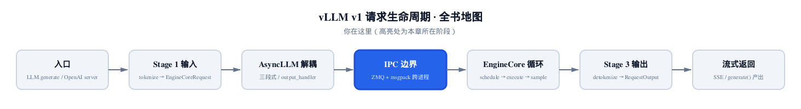
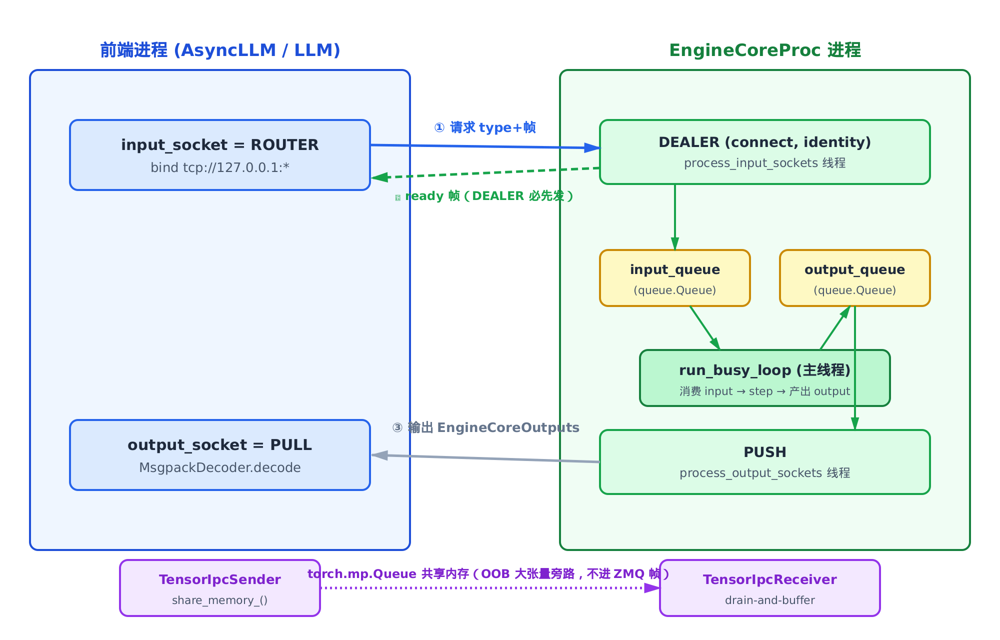
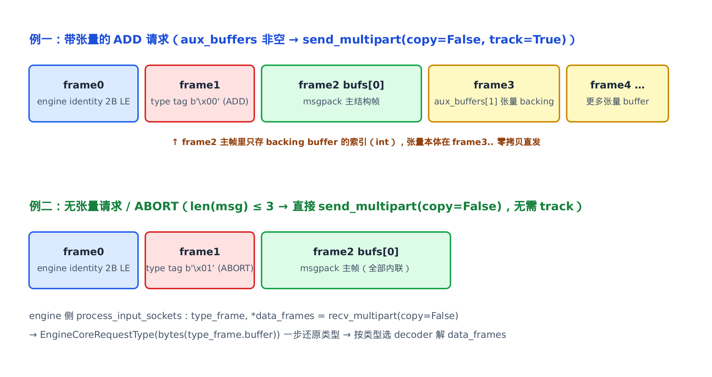
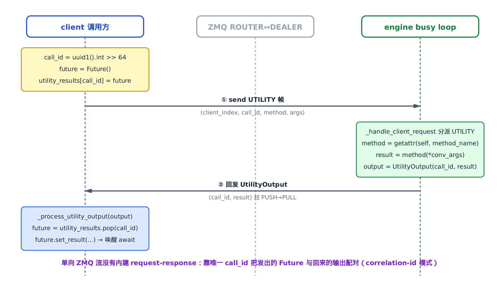
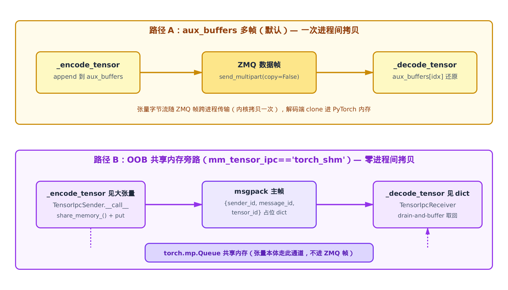

# 第7章　IPC 边界：前端与 EngineCore 之间那条线

## 你在这里



> *图注：全书地图高亮当前位置。前面 [第 4 章](../ch04-async-llm/narrative/chapter.md) 把引擎拆成三段、在两个进程里重叠跑；本章钻进那条把前端和 EngineCore 分开的虚线，看清跨进程到底怎么通信；再往后 EngineCore 进程内部的调度→执行→采样循环，是后续章节的事。*

本章的代码主线集中在四个文件：`vllm/v1/engine/core_client.py`（前端三层 client）、`vllm/v1/engine/core.py`（engine 侧 `EngineCoreProc` 的两个 IO 线程与 busy loop）、`vllm/v1/serial_utils.py`（msgpack 多帧编解码）、`vllm/v1/engine/tensor_ipc.py`（多模态张量旁路）。

[第 3 章](../ch03-config-and-wiring/narrative/chapter.md) 拼出 `VllmConfig`、用工厂选好了 IPC 客户端的类，但它说："这些客户端的内部机制——ZMQ、msgpack、跨进程怎么通信——留给本章。"

[第 4 章](../ch04-async-llm/narrative/chapter.md) 把引擎拆成三段，反复在图里画一条虚线，标着"进程边界（IPC）"。它甚至坦白：为了能在本地无 GPU 跑通，那一章用了一个**同进程的替身**——对外暴露同名的 `add_request_async` / `get_output_async` / `abort_requests_async`，但把真实的"独立进程 EngineCore + ZMQ"换掉了。第 4 章原话是："真实 IPC 留第 7 章。"

**本章就是这两笔欠账的结清处。** 那个同名同签名的替身，真身是谁？前端发出一个 `await engine_core.add_request_async(request)`，这个 `await` 背后到底发生了什么——request 怎么 encode、怎么过 ZMQ socket、engine 进程怎么收、结果怎么回来？读完本章，第 4 章那条虚线对你就不再是虚线，而是一套你能逐帧拆开的协议。

本章只讲**边界本身**：

- 三层 client（`InprocClient` / `SyncMPClient` / `AsyncMPClient`）——第 4 章那个替身的真实对应物；
- ZMQ 的 socket 拓扑（ROUTER↔DEALER 做请求、PUSH↔PULL 做输出）和 ready 握手；
- 字节标签协议（`EngineCoreRequestType` 那 6 个单字节）；
- msgpack 多帧编解码 + `aux_buffers` 零拷贝；
- `EngineCoreProc` 的两个 IO 线程怎么和 busy loop 解耦；
- 跨进程 RPC（`call_utility` 的 call_id + Future 配对）；
- 多模态大张量的共享内存旁路（`TensorIpcSender` / `TensorIpcReceiver`）。

至于边界**那一头**——EngineCore 进程内的 scheduler、executor、KV cache、数据并行——本章只在数据流必经处点到 `run_busy_loop` 如何消费 `input_queue`、生产 `output_queue`，细节是后续章节的主场。

为了能在本地（无 GPU/CUDA）把这套协议亲手跑一遍、打断点观察，本章配了一份**只做减法**的精简版：和真实 vLLM 同名、同结构、同控制流，唯一的承载替换是——真实代码 `fork` 出独立子进程跑 `EngineCoreProc`，精简版在同进程用 daemon 线程承载，但 **ZMQ socket 仍是真实的跨 context 通信**（`tcp://127.0.0.1` 临时端口），ROUTER↔DEALER / PUSH↔PULL / 字节标签 / 多帧编解码全链路一字不差。它是用来"跑起来看数值"的交叉验证物，正文主线仍是真实源码。

---

## 7.1 一句话钩子：同一套接口，三种传输

第 4 章的 `AsyncLLM` 全程只跟一个对象打交道：`self.engine_core`。它调 `add_request_async`、`get_output_async`、`abort_requests_async`，从不关心对面是同进程还是隔着 socket。这种"调用方无感"不是巧合，是设计出来的。

来看这个抽象基类的自我介绍：

```python
# vllm/v1/engine/core_client.py:L69
class EngineCoreClient(ABC):
    """
    EngineCoreClient: subclasses handle different methods for pushing
        and pulling from the EngineCore for asyncio / multiprocessing.

    Subclasses:
    * InprocClient: In process EngineCore (for V0-style LLMEngine use)
    * SyncMPClient: ZMQ + background proc EngineCore (for LLM)
    * AsyncMPClient: ZMQ + background proc EngineCore w/ asyncio (for AsyncLLM)
    """
```

一句话概括：**把"请求语义"和"传输策略"解耦**。

- **请求语义**——往引擎塞请求、从引擎取输出、中止请求——是一套统一接口，三个子类都实现它。
- **传输策略**——进程内直连？同步多进程？异步多进程？——是三个子类各自的事。

这正是第 4 章里那个"同名同签名替身"的真实落地。第 4 章用一个同进程替身演示三段式骨架，是因为这套接口本来就允许传输层自由替换——替身换的是 `InprocClient` 的同进程直连，生产用的是 `AsyncMPClient` 的跨进程 ZMQ。骨架不动，只换"那条线"怎么连。

工厂方法把三选一摊在阳光下：

```python
# vllm/v1/engine/core_client.py:L80
@staticmethod
def make_client(
    multiprocess_mode: bool,
    asyncio_mode: bool,
    # … 省略：vllm_config / executor_class / log_stats …
) -> "EngineCoreClient":
    # TODO: support this for debugging purposes.
    if asyncio_mode and not multiprocess_mode:
        raise NotImplementedError(
            "Running EngineCore in asyncio without multiprocessing "
            "is not currently supported."
        )

    if multiprocess_mode and asyncio_mode:
        return EngineCoreClient.make_async_mp_client(
            vllm_config, executor_class, log_stats
        )

    if multiprocess_mode and not asyncio_mode:
        return SyncMPClient(vllm_config, executor_class, log_stats)

    return InprocClient(vllm_config, executor_class, log_stats)
```

两个布尔，四个象限，但只有三条活路：

| `multiprocess_mode` | `asyncio_mode` | 选中 | 谁在用 |
|---|---|---|---|
| 否 | 否 | `InprocClient`（同进程，无 ZMQ） | `LLMEngine` 简单/调试 |
| 是 | 否 | `SyncMPClient`（子进程 + 线程） | `LLM` 离线批量 |
| 是 | 是 | `AsyncMPClient`（子进程 + 协程） | `AsyncLLM` / OpenAI server |
| 否 | 是 | `NotImplementedError` | —— |

第四个象限——异步但不多进程——直接抛异常。为什么？异步的价值在于"等 IPC 的时候让出事件循环干别的"；如果根本没有 IPC（同进程），异步就没有等待点可让，纯属空转。vLLM 干脆不支持这种没意义的组合。

第 4 章的 `AsyncLLM` 走的是最后一行 `make_async_mp_client`，落到 `AsyncMPClient`——**它就是第 4 章生产路径真正用的 client，本章的主角。**

我们从最简单的 `InprocClient` 起步，因为它是理解"有 IPC"和"无 IPC"差异的最好对照组。

---

## 7.2 对照组：`InprocClient`，没有 IPC 的 IPC 客户端

`InprocClient` 是个有趣的存在：它实现了"IPC 客户端"的接口，却完全没有 IPC。

```python
# vllm/v1/engine/core_client.py:L274
class InprocClient(EngineCoreClient):
    """
    InprocClient: client for in-process EngineCore. Intended
    for use in LLMEngine for V0-style add_request() and step()
        EngineCore setup in this process (no busy loop).

        * pushes EngineCoreRequest directly into the EngineCore
        * pulls EngineCoreOutputs by stepping the EngineCore
    """

    def __init__(self, *args, **kwargs):
        self.engine_core = EngineCore(*args, **kwargs)

    def get_output(self) -> EngineCoreOutputs:
        outputs, model_executed = self.engine_core.step_fn()
        self.engine_core.post_step(model_executed=model_executed)
        return outputs and outputs.get(0) or EngineCoreOutputs()

    def add_request(self, request: EngineCoreRequest) -> None:
        req, request_wave = self.engine_core.preprocess_add_request(request)
        self.engine_core.add_request(req, request_wave)

    def abort_requests(self, request_ids: list[str]) -> None:
        if len(request_ids) > 0:
            self.engine_core.abort_requests(request_ids)
```

看清楚每个方法体：

- `add_request`：直接调 `self.engine_core.add_request(...)`。一次普通的方法调用。
- `get_output`：直接调 `self.engine_core.step_fn()` 步进一次引擎，把结果返回。

**没有序列化，没有 socket，没有后台 busy loop。** 调用方调 `add_request` 时，引擎并不会自己跑——得等调用方主动 `get_output` 来步进它。这是老式 `LLMEngine` 的"塞一个请求、手动步一下"工作法。

记住它的形状：`add_request` 直达、`get_output` 直接步进。接下来两节的多进程 client，每一处都和它对比，你就能精确看见"加上 IPC"到底加了什么。剧透：加的是**字节、socket、握手、线程、引用计数**——而这些复杂度，全是为了让前端那个 CPU 进程和引擎那个 GPU 进程能各跑各的、互不阻塞。

---

## 7.3 socket 拓扑：四个 socket，两个方向

现在跨过那条线。多进程版的核心是四个 ZMQ socket，两两配对成两条单向通路。先看全景图，后面逐段坐实到代码。



> *图注：左边前端进程持 ROUTER（input_socket，bind）+ PULL（output_socket）；右边 EngineCoreProc 进程持 DEALER（connect，带 identity）+ PUSH，外加两个 IO 线程、两个内部 queue、一个 run_busy_loop。蓝线是请求方向（ROUTER→DEALER），绿虚线是握手 ready 帧（DEALER 必须先发），灰线是输出方向（PUSH→PULL）。底部紫线是另一条独立通道：多模态大张量经 torch.mp.Queue 共享内存旁路，根本不进 ZMQ 帧。*

为什么是这两对 socket，而不是随便挑？ZMQ 的 socket 类型不是花样，是语义：

- **ROUTER↔DEALER**——带身份（identity）的双向异步对。ROUTER 收发都带一帧"身份"，DEALER 自带 identity。前端用 ROUTER `bind`，engine 用 DEALER `connect`。这样**前端能按身份把请求精确路由到指定 engine**（数据并行有多个 engine 时按 rank 选谁），engine 的 DEALER 自带身份让 ROUTER 知道回信地址。
- **PUSH↔PULL**——单向的负载均衡/汇聚管道。engine 用 PUSH 发、前端用 PULL 收。**多个 engine 的输出汇聚到一个前端的单一出口**——回想第 4 章的 `output_handler`，它从"一个 IPC 出口统一收所有请求的输出"，物理来源就是这个 PULL。

请求方向选 ROUTER/DEALER（因为需要定向），输出方向选 PUSH/PULL（因为只需汇聚），各取所需。

来看前端这一侧的装配。`MPClient.__init__` 是基类，`SyncMPClient` 和 `AsyncMPClient` 共享它：

```python
# vllm/v1/engine/core_client.py:L473
def __init__(
    self,
    asyncio_mode: bool,
    # … 省略：vllm_config / executor_class / log_stats / client_addresses …
):
    self.vllm_config = vllm_config

    # ZMQ setup.
    sync_ctx = zmq.Context(io_threads=2)
    self.ctx = zmq.asyncio.Context(sync_ctx) if asyncio_mode else sync_ctx

    # This will ensure resources created so far are closed
    # when the client is garbage collected, even if an
    # exception is raised mid-construction.
    self.resources = BackgroundResources(ctx=sync_ctx)
    self._finalizer = weakref.finalize(self, self.resources)
    success = False
    try:
        # … 省略：DP / elastic-EP 分支 …
        addresses = get_engine_zmq_addresses(vllm_config)
        self.input_socket = self.resources.input_socket = make_zmq_socket(
            self.ctx, addresses.inputs[0], zmq.ROUTER, bind=True,
            # … 省略：router_handover …
        )
        self.resources.output_socket = make_zmq_socket(
            self.ctx, addresses.outputs[0], zmq.PULL
        )

        with launch_core_engines(
            vllm_config, executor_class, log_stats, addresses
        ) as (engine_manager, coordinator, addresses, tensor_queue):
            # … 省略：coordinator / engine_manager 登记（数据并行编排，属另章）…
            pass
```

四行关键：

1. `zmq.Context(io_threads=2)`——ZMQ 自己起两个 IO 线程跑 socket，和 Python 解耦。
2. `asyncio_mode` 决定包不包一层 `zmq.asyncio.Context`——这是 `SyncMPClient`（用普通 socket + 线程）和 `AsyncMPClient`（用 asyncio socket + 协程）唯一的底层差别。
3. `input_socket` 是 ROUTER，`bind=True`——前端是服务端，等 engine 来连。
4. `output_socket` 是 PULL——收汇聚来的输出。
5. `launch_core_engines(...)`——**这一句起独立子进程**，把 `EngineCoreProc` 跑起来。这就是第 3 章和第 4 章反复提到的"`make_async_mp_client` 会起一个独立子进程"的真身。

> 精简版在这一步做了**唯一一处结构性替换**：不 `fork` 子进程，而是在同进程起一个 daemon 线程承载 `EngineCoreProc`。但 socket 仍是真实的跨 ZMQ context 通信（用 `tcp://127.0.0.1` 临时端口替代 `ipc://`），ROUTER↔DEALER 的协议一字不差。这样你在本地无需 fork、无需 GPU，就能对整条 socket 链路打断点。

注意构造函数开头那个 `weakref.finalize` + `BackgroundResources`——它解决一个棘手的生命周期问题，我们放到 [§7.9](#79-清理与故障谁来关-socket) 专门讲，那里你会明白为什么后台线程**不能**持有 client 的强引用。

---

## 7.4 ready 握手：DEALER 为什么必须先开口

socket 建好了，但还不能直接发请求。这里有个 ZMQ 的硬性约束，不绕过去就会丢消息。

ROUTER 的规矩是：**它只能向"见过的身份"回发消息**。前端的 ROUTER 刚 `bind`，还没收到过任何 engine 的消息，它压根不知道有哪些 DEALER 连上来、它们的 identity 是什么。这时候前端要是抢先 `send` 请求，ROUTER 不知道发给谁，消息直接被丢弃。

破解办法：**让 engine 的 DEALER 先开口**。engine 进程一启动，第一件事就是主动发一帧 ready 给前端。ROUTER 收到这一帧，记下这个 DEALER 的 identity，从此双向通道才打通。

看 engine 侧 `process_input_sockets` 线程的开场（这是 engine 进程里负责收请求的 IO 线程）：

```python
# vllm/v1/engine/core.py:L1372
def process_input_sockets(
    self, input_addresses, coord_input_address, identity, ready_event,
):
    """Input socket IO thread."""

    # Msgpack serialization decoding with optional tensor IPC receiver.
    add_request_decoder = MsgpackDecoder(
        EngineCoreRequest, oob_tensor_provider=self.tensor_ipc_receiver
    )
    generic_decoder = MsgpackDecoder(oob_tensor_provider=self.tensor_ipc_receiver)

    with ExitStack() as stack, zmq.Context() as ctx:
        input_sockets = [
            stack.enter_context(
                make_zmq_socket(
                    ctx, input_address, zmq.DEALER, identity=identity, bind=False
                )
            )
            for input_address in input_addresses
        ]
        # … 省略：coordinator XSUB socket（数据并行编排，属另章）…

        # Register sockets with poller.
        poller = zmq.Poller()
        ready_response = EngineCoreReadyResponse(
            max_model_len=self.vllm_config.model_config.max_model_len,
            num_gpu_blocks=self.vllm_config.cache_config.num_gpu_blocks or 0,
            dp_stats_address=self.frontend_stats_publish_address,
        )
        ready_payload = msgspec.msgpack.encode(ready_response)
        for input_socket in input_sockets:
            # Send initial message to each input socket - this is required
            # before the front-end ROUTER socket can send input messages
            # back to us.
            input_socket.send(ready_payload)
            poller.register(input_socket, zmq.POLLIN)

        ready_event.set()
        del ready_event
        while True:
            # … 下一节讲收请求的主循环 …
```

三个点：

1. DEALER `connect`，且带 `identity=identity`——这个 identity 是 engine 的 rank，编成 2 字节小端（`engine_index.to_bytes(2, "little")`）。
2. `send(ready_payload)`——主动把一帧 `EngineCoreReadyResponse` 发给前端。源码注释写得明明白白："this is required before the front-end ROUTER socket can send input messages back to us."（前端 ROUTER 必须先收到这一帧，才能往回发请求。）
3. ready 帧里带着 `max_model_len`、`num_gpu_blocks`——engine 进程初始化时可能自动调整了这些值（比如按显存自适应 KV cache 块数），握手时同步回前端。

前端这一侧，在请求开始流动之前，先在 input socket 上轮询等所有 engine 的 ready：

```python
# vllm/v1/engine/core_client.py:L577
# Wait for ready messages from each engine on the input socket.
identities = set(self.core_engines)
sync_input_socket = zmq.Socket.shadow(self.input_socket)
while identities:
    if not sync_input_socket.poll(
        timeout=VLLM_ENGINE_READY_TIMEOUT_S * 1000  # convert to ms
    ):
        raise TimeoutError(
            # … 省略：超时提示（大模型权重加载慢，可调环境变量）…
        )
    identity, payload = sync_input_socket.recv_multipart()
    identities.remove(identity)
    self._apply_ready_response(payload)
```

逻辑很直白：把所有要等的 engine identity 放进集合，每收到一个 ready 就划掉一个，集合空了才放行。等不到就 `TimeoutError`——超时提示还贴心地说"这通常是大模型权重加载太慢导致的，可以调 `VLLM_ENGINE_READY_TIMEOUT_S`"。

`_apply_ready_response` 把 ready 帧解出来、把 engine 端自适应后的配置同步回前端。这一步走完，构造函数才继续往下，握手完成。

**握手的本质是个时序契约**：DEALER 先 `send` → ROUTER 记住身份 → 双向通道打通 → 前端才能定向回发。漏了这一步，第一个请求就石沉大海。

把这条契约的正确性补成闭环——它由两个动作合起来才成立。前面说的"ROUTER 只向见过的身份回发"只是前提的一半；另一半是**前端构造函数会等齐所有 identity 才放行**：那个 `while identities:` 循环在集合清空前不返回，意味着构造函数返回时，每个 engine 的 identity 都已经被 ROUTER 收到 ready 帧时记录在案。把两半连起来就是完整因果链：前端等齐所有 ready → 返回时每个 engine 的 identity 都已被 ROUTER 记录 → 此后任何 `_send_input` 的定向回发都落在**已知**身份上 → 必不被 ROUTER 丢弃。所以"握手后第一个请求必达"不是直觉，而是"DEALER 先发"与"前端等齐"两个动作叠加出的保证。

---

## 7.5 字节标签协议：6 个单字节，省一次编码

握手完成，可以发请求了。但前端发出去的不止是"请求内容"，还得带上"这是什么请求"——是新增（ADD）、中止（ABORT）、还是一次工具调用（UTILITY）?engine 侧得先知道类型，才知道该用哪个 decoder 去解后面的内容。

vLLM 把请求类型设计成 6 个**单字节十六进制**：

```python
# vllm/v1/engine/__init__.py:L237
class EngineCoreRequestType(enum.Enum):
    """
    Request types defined as hex byte strings, so it can be sent over sockets
    without separate encoding step.
    """

    ADD = b"\x00"
    ABORT = b"\x01"
    START_DP_WAVE = b"\x02"
    UTILITY = b"\x03"
    # Sentinel used within EngineCoreProc.
    EXECUTOR_FAILED = b"\x04"
    # Sentinel to wake up input_queue.get() during shutdown.
    WAKEUP = b"\x05"
```

注意类的 docstring：**"so it can be sent over sockets without separate encoding step."**（定义成十六进制字节串，就能直接过 socket，省掉单独的编码步骤。）

这是个小而精的设计。`EngineCoreRequestType.ADD.value` 本身就是 `b"\x00"`——已经是字节了。ZMQ 多帧消息的每一帧都是字节串，所以这个标签可以**直接当作消息的一帧发出去**，不用先 msgpack 编码、对面再解码。engine 侧收到这一帧，`EngineCoreRequestType(bytes(type_frame.buffer))` 一步还原成枚举。

这就引出 vLLM 在这条线上的消息布局——**多帧消息**。一条 ZMQ 消息不是一坨字节，而是好几帧拼起来：



> *图注：上半是带张量的 ADD 请求，超过 3 帧——frame0 是 engine 身份（2 字节小端），frame1 是类型标签 b'\x00'，frame2 是 msgpack 主结构帧，frame3 起是张量的零拷贝 backing buffer。下半是无张量请求（如 ABORT），恰好 3 帧，走 copy=False 快路径。两者的关键差别在于：有没有额外的张量帧，这决定了发送时要不要 track（见 §7.6）。*

把类型和负载**分帧**，还有个额外好处：engine 侧可以先看类型帧，再决定用哪个 decoder 解负载帧。下一节就看这个分派。

---

## 7.6 发与收：多帧消息怎么打包、怎么落地

### 7.6.1 前端打包：`_send_input`

前端把"身份 + 类型 + 编码后的负载"拼成多帧消息发出去。先看同步版（`SyncMPClient`），它最直白：

```python
# vllm/v1/engine/core_client.py:L798
def _send_input(self, request_type: EngineCoreRequestType, request: Any):
    self.ensure_alive()
    self.free_pending_messages()
    # (Identity, RequestType, SerializedRequest)
    msg = (self.core_engine, request_type.value, *self.encoder.encode(request))

    if len(msg) <= 3:
        # No auxiliary buffers => no tensor backing buffers in request.
        self.input_socket.send_multipart(msg, copy=False)
        return

    tracker = self.input_socket.send_multipart(msg, copy=False, track=True)
    self.add_pending_message(tracker, request)
```

逐行拆开 `msg = (self.core_engine, request_type.value, *self.encoder.encode(request))`：

- `self.core_engine`——目标 engine 的 identity（2 字节小端），ROUTER 靠它路由。这是 frame0。
- `request_type.value`——字节标签，比如 ADD 就是 `b"\x00"`。这是 frame1。它**没经过 msgpack**，正是上节说的"省一次编码"。
- `*self.encoder.encode(request)`——msgpack 编码的结果，是一个**多帧序列**（下节细讲）。展开成 frame2、frame3……

然后是个关键分叉，盯住 `len(msg)`：

- **`len(msg) <= 3`**：身份 + 类型 + 单帧主结构，说明请求里没有大张量（编码只产出了 1 帧主结构）。直接 `send_multipart(msg, copy=False)`，发完不用管。这是无张量请求的快路径。
- **`len(msg) > 3`**：编码产出了额外的张量 backing buffer 帧。这时用 `track=True`，并把请求对象塞进 `pending_messages`。

为什么超过 3 帧就要特殊处理？因为 `copy=False`。

### 7.6.2 `copy=False` 与 `track=True`：零拷贝的代价

`send_multipart(msg, copy=False)` 告诉 ZMQ：**别拷贝这些字节，直接引用 Python 这边的内存去发**。对大张量来说这是巨大的省钱——避免把几 MB 的张量字节再复制一遍。

但天下没有免费的零拷贝。`copy=False` 意味着 ZMQ 在后台 IO 线程里**异步**地从你的 Python 内存读数据发出去。如果这期间 Python 把那块内存释放了、或者复用了（比如 `bytearray` 被覆写、张量被 GC），ZMQ 读到的就是垃圾，数据损坏。

所以对带张量的消息，要做两件事：

1. `track=True`——拿到一个 `MessageTracker`，它能告诉你"ZMQ 发完了没"(`tracker.done`)。
2. `self.add_pending_message(tracker, request)`——**把请求对象的引用攥住**，直到 tracker 报告发送完成才放手。

`add_pending_message` / `free_pending_messages` 这对就是干这个的：

```python
# vllm/v1/engine/core_client.py:L630
def add_pending_message(self, tracker: zmq.MessageTracker, msg: Any):
    if not tracker.done:
        self.pending_messages.appendleft((tracker, msg))

def free_pending_messages(self):
    while self.pending_messages and self.pending_messages[-1][0].done:
        self.pending_messages.pop()
```

`pending_messages` 是个双端队列：新消息从左边进（`appendleft`），每次发新请求前 `free_pending_messages` 从右边检查最老的那条发完没——发完了就 `pop` 掉，释放引用。这是个先进先出的引用保管箱，保证"ZMQ 还在用的内存"不被提前回收。

这里有个不点破就显得"凭什么只查队尾"的不变式：`appendleft` 保证**新消息总在左、最老消息总在右**；而同一个 ROUTER socket 上的多帧消息按发送顺序完成，所以**最老的 tracker 必然最先 `done`**。因此 `free_pending_messages` 只需从右端（`[-1]`）循环弹出已 `done` 的，遇到第一个未完成处即停——无需遍历整队。停在队尾未完成处是安全的：若最老的那条都还没发完，比它更新的（在它左边、更晚入队）一定也没发完，往左查纯属浪费。这是一个"按完成顺序排好的 FIFO"，`pop` 到第一个未完成即止。[§7.10](#710-输出热路径编码复用与零拷贝回收) 输出热路径上那个 `pending` deque 同构——同样是 `appendleft` 进、查 `[-1]` 出，靠的是同一条 FIFO 完成序的不变式。

异步版（`AsyncMPClient`）的逻辑对称，只是因为在 asyncio 里，`send_multipart` 返回的是个 `Future`，得用回调来攥引用：

```python
# vllm/v1/engine/core_client.py:L1013
def _send_input_message(
    self, message: tuple[bytestr, ...], engine: EngineIdentity, objects: Any
) -> Awaitable[Any]:
    """
    objects is a reference to retain until zmq is finished with the
    buffers, in case they were extracted from tensors in the request.
    """
    self.ensure_alive()
    self.free_pending_messages()

    msg = (engine,) + message
    if not objects or len(msg) <= 3:
        # No auxiliary buffers => no tensor backing buffers in request.
        return self.input_socket.send_multipart(msg, copy=False)

    future: "asyncio.Future[zmq.MessageTracker]"
    future = self.input_socket.send_multipart(msg, copy=False, track=True)

    def add_pending(f: "asyncio.Future[zmq.MessageTracker]"):
        with contextlib.suppress(BaseException):
            self.add_pending_message(f.result(), objects)

    future.add_done_callback(add_pending)
    return future
```

同样的 `len(msg) <= 3` 快路径，同样的 `track=True` + 攥引用——只是攥引用这一步挪进了 `add_done_callback`。同步用 `MessageTracker` 直接判，异步用 `Future` 回调，**协议完全一样，只是适配两种并发模型**。这种"同步用线程、异步用协程，但协议对称"的结构，本章会反复见到。

### 7.6.3 engine 落地：字节标签选 decoder，投 input_queue

消息到了 engine 侧。接上 [§7.4](#74-ready-握手dealer-为什么必须先开口) 那个 `process_input_sockets` 线程的主循环：

```python
# vllm/v1/engine/core.py:L1433
        while True:
            for input_socket, _ in poller.poll():
                # (RequestType, RequestData)
                type_frame, *data_frames = input_socket.recv_multipart(copy=False)
                # … 省略：忽略 DP coordinator 的 READY 通知帧 …
                request_type = EngineCoreRequestType(bytes(type_frame.buffer))

                # Deserialize the request data.
                request: Any
                if request_type == EngineCoreRequestType.ADD:
                    req: EngineCoreRequest = add_request_decoder.decode(data_frames)
                    # … 省略：preprocess 异常时的错误回报分支 …
                    request = self.preprocess_add_request(req)
                else:
                    request = generic_decoder.decode(data_frames)

                    if request_type == EngineCoreRequestType.ABORT:
                        # Aborts are added to *both* queues, allows us to eagerly
                        # process aborts while also ensuring ordering in the input
                        # queue to avoid leaking requests. This is ok because
                        # aborting in the scheduler is idempotent.
                        self.aborts_queue.put_nowait(request)

                # Push to input queue for core busy loop.
                self.input_queue.put_nowait((request_type, request))
```

把它和前端 `_send_input` 的打包对起来看，严丝合缝：

1. `type_frame, *data_frames = recv_multipart(copy=False)`——第一帧拆成类型，剩下的是负载帧。和前端的"身份 + 类型 + 负载"三段对称（身份帧被 ROUTER 在路由时吃掉了，engine 收到的是 `类型 + 负载`）。
2. `EngineCoreRequestType(bytes(type_frame.buffer))`——一步还原类型，印证了字节标签的"省一次编码"。
3. **按类型选 decoder**：ADD 用 `add_request_decoder`（它知道目标类型是 `EngineCoreRequest`，而且带着张量 IPC provider）;其他类型用 `generic_decoder`。这就是上节说的"分帧的好处"——先看类型，再决定怎么解。
4. ADD 解完还调 `preprocess_add_request`，把 `EngineCoreRequest` 转成内部的 `Request` 实体。
5. 最后 `input_queue.put_nowait((request_type, request))`——**投进内部队列就完事了**。

最后这一步是本章的枢纽：**IO 线程不直接处理请求，只把它投进 `input_queue`。** 真正处理在另一个线程（busy loop）。为什么这么拆？[§7.7](#77-两个-io-线程把-zmq-和-gpu-解耦) 揭晓。

先留意 ABORT 那个特别处理：它**同时**投进 `input_queue` 和 `aborts_queue`。源码注释解释得很到位：abort 进 `input_queue` 是为了**保持和其他请求的顺序**（否则可能漏掉 abort 导致请求泄漏）;同时进 `aborts_queue` 是为了让 busy loop 在阻塞等待时也能**急切地**先处理 abort。两份不冲突，因为"在 scheduler 里 abort 是幂等的"——处理两次无害。这是个用冗余换响应性的小设计。

---

## 7.7 两个 IO 线程：把 ZMQ 和 GPU 解耦

现在回答上节留的问题：为什么 IO 线程收到请求只是投队列，不直接处理？

看 `EngineCoreProc` 的构造，答案在注释里：

```python
# vllm/v1/engine/core.py:L812
def __init__(
    self, input_address, output_address, ctx,
    # … 省略：vllm_config / executor_class / log_stats / tensor_queue …
    *, engine_index: int = 0,
):
    self.input_queue = queue.Queue[tuple[EngineCoreRequestType, Any]]()
    self.output_queue = queue.Queue[tuple[int, EngineCoreOutputs] | bytes]()
    # … 省略：executor_fail_callback / tensor_ipc_receiver 装配 …

    self.engine_index = engine_index
    identity = self.engine_index.to_bytes(length=2, byteorder="little")
    # … 省略：DP 双握手 / coordinator socket（属另章）…
    super().__init__(vllm_config, executor_class, log_stats)

    # Background Threads and Queues for IO. These enable us to
    # overlap ZMQ socket IO with GPU since they release the GIL,
    # and to overlap some serialization/deserialization with the
    # model forward pass.
    # Threads handle Socket <-> Queues and core_busy_loop uses Queue.
    ready_event = threading.Event()
    input_thread = threading.Thread(
        target=self.process_input_sockets,
        args=([input_address], None, identity, ready_event),
        daemon=True,
    )
    input_thread.start()

    self.output_thread = threading.Thread(
        target=self.process_output_sockets,
        args=([output_address], None, self.engine_index),
        daemon=True,
    )
    self.output_thread.start()

    # Don't complete construction until the input thread has sent ready.
    while not ready_event.wait(timeout=10):
        if not input_thread.is_alive():
            raise RuntimeError("Input socket thread died during startup")
```

注释是关键：**"These enable us to overlap ZMQ socket IO with GPU since they release the GIL, and to overlap some serialization/deserialization with the model forward pass."**（这些线程让 ZMQ socket IO 能和 GPU 重叠——因为它们释放 GIL——也让部分序列化/反序列化和模型前向重叠。）

三个角色，三条线，两个队列：

```
process_input_sockets 线程  →  input_queue  →  run_busy_loop 主线程  →  output_queue  →  process_output_sockets 线程
        (收 + 解码)                              (调度 + 执行 + 采样)                         (编码 + 发)
```

- **input 线程**：专职 ZMQ 收 + msgpack 解码，投 `input_queue`。
- **主线程（busy loop）**：专职步进引擎——从 `input_queue` 取请求、step、把输出投 `output_queue`。**它永远不直接碰 socket。**
- **output 线程**：专职从 `output_queue` 取输出、msgpack 编码 + ZMQ 发。

为什么值得拆三条线？因为 ZMQ 的 `recv`/`send` 和 msgpack 编解码都会**释放 GIL**。GIL 一释放，主线程的 GPU 前向就能在同一时刻跑。如果不拆——比如让 busy loop 自己收发——那它每次等网络、等序列化时，GPU 就闲着。拆开后，网络 IO、序列化、GPU 计算可以**流水重叠**，这正是吞吐的来源。

两个内部队列（`input_queue` / `output_queue`）是解耦点：它们把"网络字节流"和"引擎步进"彻底隔开。busy loop 只跟队列打交道，不知道也不关心字节怎么来的。

注意构造末尾那个 `ready_event.wait()`:**构造函数不返回，直到 input 线程发完了 ready 帧**。这保证 `EngineCoreProc` 对象一旦构造完成，握手就已经发起，不会出现"engine 还没准备好，前端却已开始发请求"的竞态。

来看主线程的 busy loop:

```python
# vllm/v1/engine/core.py:L1164
def run_busy_loop(self):
    """Core busy loop of the EngineCore."""
    while self._handle_shutdown():
        # 1) Poll the input queue until there is work to do.
        self._process_input_queue()
        # 2) Step the engine core and return the outputs.
        self._process_engine_step()

    raise SystemExit
```

两步一循环：先吸干 `input_queue` 里的请求，再步进一次引擎。`_process_engine_step` 把每条输出投回 `output_queue`:

```python
# vllm/v1/engine/core.py:L1205
def _process_engine_step(self) -> bool:
    """Called only when there are unfinished local requests."""

    # Step the engine core.
    outputs, model_executed = self.step_fn()
    # Put EngineCoreOutputs into the output queue.
    for output in outputs.items() if outputs else ():
        self.output_queue.put_nowait(output)
    # Post-step hook.
    self.post_step(model_executed)
    # … 省略：WAITING_FOR_REMOTE_KVS 让步（属另章）…
    return model_executed
```

`self.step_fn()` 就是引擎那一步真正的"调度→执行→采样"——它的内部（scheduler 怎么挑请求、executor 怎么跑 GPU、采样怎么出 token）是后续章节的主场，本章只需知道它**消费 `input_queue` 的请求、产出投进 `output_queue`**。IPC 的另一端，就是这个生产者/消费者。

`run_busy_loop` 怎么按字节标签分派从 `input_queue` 取出的请求？在 `_handle_client_request`，这正好引出下一节的 RPC。

---

## 7.8 跨进程 RPC：在单向流上模拟"调用-返回"

到目前为止，ADD 和 ABORT 都是"发出去就完事"的单向消息——前端不等回音。但有些操作需要**返回值**：比如前端想问 engine"你支持哪些任务？"(`get_supported_tasks`)、或让它"做一次性能 profile"。这些是跨进程的**远程过程调用（RPC）**。

难点在于：ZMQ 的 DEALER/PUSH 是**单向流**，没有内建的"请求-响应"配对。前端发一个 UTILITY 请求出去，稍后输出通道回来一批东西，但前端怎么知道**哪个返回对应哪个调用**?尤其是可能同时有好几个 RPC 在飞。

vLLM 的答案是分布式系统的经典套路：**correlation-id**（关联 id）。每次调用生成一个唯一 id，带在请求里发出去；返回时原样带回这个 id，前端按 id 找回对应的等待者。



> *图注：三条生命线。client 调用方生成 call_id、建一个 Future 存进 utility_results[call_id]、发 UTILITY 帧；engine busy loop 反射调用对应方法、把结果包成带同一 call_id 的 UtilityOutput 回发；输出线程收到后用 call_id 找回 Future 并置结果，唤醒 await。单向 ZMQ 流靠这个 call_id 模拟出了请求-响应。*

看同步版 `call_utility`:

```python
# vllm/v1/engine/core_client.py:L812
def call_utility(self, method: str, *args) -> Any:
    call_id = uuid.uuid1().int >> 64
    future: Future[Any] = Future()
    self.utility_results[call_id] = future
    self._send_input(EngineCoreRequestType.UTILITY, (0, call_id, method, args))

    return future.result()
```

四步走：

1. `call_id = uuid.uuid1().int >> 64`——生成一个唯一 id（取 uuid1 的高 64 位）。
2. 建一个空 `Future`，存进 `utility_results[call_id]`——这是"在此等待这个 id 的返回"的登记。
3. `_send_input(UTILITY, (0, call_id, method, args))`——把 `(client_index, call_id, method, args)`（即客户端号、调用号、方法名、参数）当负载发出去。
4. `future.result()`——**阻塞**等结果（同步版会卡住调用线程，直到 Future 被置值）。

异步版 `_call_utility_async` 结构一模一样，只是 Future 换成 asyncio 的、`return future.result()` 换成 `await future`:

```python
# vllm/v1/engine/core_client.py:L1041
async def _call_utility_async(self, method: str, *args, engine: EngineIdentity) -> Any:
    call_id = uuid.uuid1().int >> 64
    future = asyncio.get_running_loop().create_future()
    self.utility_results[call_id] = future
    message = (
        EngineCoreRequestType.UTILITY.value,
        *self.encoder.encode((self.client_index, call_id, method, args)),
    )
    await self._send_input_message(message, engine, args)
    self._ensure_output_queue_task()
    return await future
```

又一次"同步用阻塞 Future、异步用 await Future，协议对称"。

engine 那一端，busy loop 从 `input_queue` 取出请求后，`_handle_client_request` 按字节标签分派：

```python
# vllm/v1/engine/core.py:L1266
def _handle_client_request(
    self, request_type: EngineCoreRequestType, request: Any
) -> None:
    """Dispatch request from client."""

    if request_type == EngineCoreRequestType.WAKEUP:
        return
    elif request_type == EngineCoreRequestType.ADD:
        req, request_wave = request
        # … 省略：shutdown 期间的请求拒绝守卫（属另章）…
        self.add_request(req, request_wave)
    elif request_type == EngineCoreRequestType.ABORT:
        self.abort_requests(request)
    elif request_type == EngineCoreRequestType.UTILITY:
        client_idx, call_id, method_name, args = request
        # … 省略：shutdown 期间的请求拒绝守卫（属另章）…
        output = UtilityOutput(call_id)
        # Lazily look-up utility method so that failure will be handled/returned.
        get_result = lambda: (
            (method := getattr(self, method_name))
            and method(*self._convert_msgspec_args(method, args))
        )
        enqueue_output = lambda out: self.output_queue.put_nowait(
            (client_idx, EngineCoreOutputs(utility_output=out))
        )
        self._invoke_utility_method(method_name, get_result, output, enqueue_output)
    elif request_type == EngineCoreRequestType.EXECUTOR_FAILED:
        raise RuntimeError("Executor failed.")
```

字节标签在这里**驱动行为**：每个 `EngineCoreRequestType` 对应一个分支。看 UTILITY 这一支：

1. 拆出 `(client_idx, call_id, method_name, args)`。
2. `getattr(self, method_name)`——**反射**查到 engine 上的那个方法。这意味着前端能调 engine 的**任意**方法（`get_supported_tasks`、`profile`、`add_lora`、`collective_rpc`……），不用为每个方法写一条 IPC 路径。
3. `_convert_msgspec_args`——把 msgpack 还原出来的原生类型（list/dict）转回方法签名期望的 `msgspec.Struct` 类型。msgpack 不认识自定义类，跨进程传过来的是裸数据，这一步把它"还原成对象"。
4. 调用方法，把结果包成带**同一个 call_id** 的 `UtilityOutput`，投进 `output_queue` 回发。

结果回到前端，由输出处理器按 call_id 解决 Future:

```python
# vllm/v1/engine/core_client.py:L694
def _process_utility_output(output: UtilityOutput, utility_results: dict[int, AnyFuture]):
    """Set the result from a utility method in the waiting future."""
    future = utility_results.pop(output.call_id)
    failure_message = output.failure_message
    try:
        if failure_message is not None:
            future.set_exception(Exception(failure_message))
        else:
            assert output.result is not None
            future.set_result(output.result.result)
    except asyncio.InvalidStateError:
        # … 省略：Future 已被取消时静默 …
        pass
```

`utility_results.pop(output.call_id)`——用回来的 call_id 找回当初登记的那个 Future。成功就 `set_result`（唤醒 `future.result()` / `await future`），失败就 `set_exception`。环就此闭合。

**一句话：correlation-id 让"发出去一个 Future、收回来按 id 配对"成为可能，把单向 ZMQ 流变成了能拿返回值的 RPC。** engine 侧的反射调用则让这条 RPC 通道一次性支持所有方法，不必为每个新方法改协议。

---

## 7.9 清理与故障：谁来关 socket

回到 [§7.3](#73-socket-拓扑四个-socket两个方向) 埋下的伏笔：那个 `weakref.finalize` + `BackgroundResources` 是干嘛的？

问题出在后台线程/协程。`SyncMPClient` 有个 `process_outputs_socket` 后台线程一直在 `recv`,`AsyncMPClient` 有个对应的协程任务。这些后台活计需要访问 socket、decoder、结果表——如果它们直接持有 `client` 对象的引用，就成了**循环引用**：client 持有线程，线程持有 client，谁也 GC 不掉，socket 永远不关、子进程永远不退。

vLLM 的解法是把"后台资源"拆进一个独立的 dataclass，由 finalizer 持有，**让后台线程只引用这个资源包、不引用 client**：

```python
# vllm/v1/engine/core_client.py:L367
@dataclass
class BackgroundResources:
    """Used as a finalizer for clean shutdown, avoiding
    circular reference back to the client object."""

    ctx: zmq.Context
    output_socket: zmq.Socket | None = None
    input_socket: zmq.Socket | None = None
    output_queue_task: "asyncio.Task | None" = None
    # … 省略：shutdown_path / engine_manager 等 …

    # Set if any of the engines are dead. Here so that the output
    # processing threads can access it without holding a ref to the client.
    engine_dead: bool = False

    def __call__(self):
        """Clean up background resources."""
        self.engine_dead = True
        # … 省略：async/sync 分支的关闭信号细节 …
        for sock in (self.output_socket, self.input_socket):
            if sock is not None:
                with contextlib.suppress(Exception):
                    sock.close(linger=0)
        # … 省略：cancel output_queue_task …
```

注释点透：`engine_dead` 标志放在这里，是为了"让输出处理线程能访问它，而不必持有 client 引用"。`weakref.finalize(self, self.resources)` 注册了一个终结器：当 client 被 GC（或构造中途异常）,`BackgroundResources.__call__` 被调，干净地关 socket、cancel 任务。**线程引用的是 `resources`，不是 `client`，循环引用就此打破。**

回看 [§7.6.3](#763-engine-落地字节标签选-decoder投-input_queue) 提过 `SyncMPClient` 构造时那句注释："Ensure that the outputs socket processing thread does not have a ref to the client which prevents gc."——它把 `resources`、`decoder`、`outputs_queue` 等局部变量先取出来，再喂给后台线程函数，刻意绕开 `self`。同一个意图。

### 故障传播：`ENGINE_CORE_DEAD` 哨兵

engine 子进程崩了怎么办？前端不能一直 `recv` 挂死等永远不来的输出。vLLM 用一个**哨兵帧**传播死讯。

engine 侧出事时，把一个特殊字节串投进 `output_queue`:

```python
# vllm/v1/engine/core.py:L1358
def _send_engine_dead(self):
    """Send EngineDead status to the EngineCoreClient."""
    # Put ENGINE_CORE_DEAD in the queue.
    self.output_queue.put_nowait(EngineCoreProc.ENGINE_CORE_DEAD)
    # Wait until msg sent by the daemon before shutdown.
    self.output_thread.join(timeout=5.0)
```

output 线程取到这个哨兵，发给所有 socket 后退出：

```python
# vllm/v1/engine/core.py:L1500
        while True:
            output = self.output_queue.get()
            if output == EngineCoreProc.ENGINE_CORE_DEAD:
                for socket in sockets:
                    socket.send(output)
                break
            # … 省略：正常输出的编码/发送（见 §7.10）…
```

注意 [§7.6.3](#763-engine-落地字节标签选-decoder投-input_queue) 那个 PUSH socket 建立时用了 `linger=4000`（见下节代码）——源码注释说得清楚："We must set linger to ensure the ENGINE_CORE_DEAD message is sent prior to closing the socket."(linger 保证哨兵帧发出去之后才关 socket，否则消息会丢。)

前端这边，每次收到帧都先验一下是不是这个哨兵：

```python
# vllm/v1/engine/core_client.py:L447
def validate_alive(self, frames: Sequence[zmq.Frame]):
    if len(frames) == 1 and (frames[0].buffer == EngineCoreProc.ENGINE_CORE_DEAD):
        self.engine_dead = True
        raise EngineDeadError()
```

判据很精确：**只有一帧、且内容是 `ENGINE_CORE_DEAD`** 才算死讯——正常的输出消息总是多帧的，不会误判。一旦命中，置 `engine_dead`、抛 `EngineDeadError`，让后续操作快速失败而不是挂死。这个异常会顺着 [§7.10](#710-输出热路径编码复用与零拷贝回收) 的输出处理传给所有等待的请求，呼应第 4 章 `output_handler` 的故障传播。

---

## 7.10 输出热路径：编码复用与零拷贝回收

输出方向是**热路径**——每步生成都要把一批 `EngineCoreOutputs` 编码、发回前端，频率极高。vLLM 在这里做了精细的内存复用，值得单独看。

```python
# vllm/v1/engine/core.py:L1466
def process_output_sockets(
    self, output_paths: list[str], coord_output_path: str | None, engine_index: int
):
    """Output socket IO thread."""

    # Msgpack serialization encoding.
    encoder = MsgpackEncoder()
    # Send buffers to reuse.
    reuse_buffers: list[bytearray] = []
    # Keep references to outputs and buffers until zmq is finished
    # with them (outputs may contain tensors/np arrays whose
    # backing buffers were extracted for zero-copy send).
    pending = deque[tuple[zmq.MessageTracker, Any, bytearray]]()

    # We must set linger to ensure the ENGINE_CORE_DEAD
    # message is sent prior to closing the socket.
    with ExitStack() as stack, zmq.Context() as ctx:
        sockets = [
            stack.enter_context(
                make_zmq_socket(ctx, output_path, zmq.PUSH, linger=4000)
            )
            for output_path in output_paths
        ]
        # … 省略：coordinator PUSH socket（client_index==-1，属另章）…
        max_reuse_bufs = len(sockets) + 1

        while True:
            output = self.output_queue.get()
            if output == EngineCoreProc.ENGINE_CORE_DEAD:
                for socket in sockets:
                    socket.send(output)
                break
            assert not isinstance(output, bytes)
            client_index, outputs = output
            outputs.engine_index = engine_index

            # Reclaim buffers that zmq is finished with.
            while pending and pending[-1][0].done:
                reuse_buffers.append(pending.pop()[2])

            buffer = reuse_buffers.pop() if reuse_buffers else bytearray()
            buffers = encoder.encode_into(outputs, buffer)
            tracker = sockets[client_index].send_multipart(
                buffers, copy=False, track=True
            )
            if not tracker.done:
                ref = outputs if len(buffers) > 1 else None
                pending.appendleft((tracker, ref, buffer))
            elif len(reuse_buffers) < max_reuse_bufs:
                # Limit the number of buffers to reuse.
                reuse_buffers.append(buffer)
```

这里有两层巧思：

**第一层：buffer 复用池（`reuse_buffers`）。** 编码用的是 `encode_into(outputs, buffer)`——把结果写进一块**已有的 `bytearray`**，而不是每次新分配。用完的 buffer 等 ZMQ 发完（`tracker.done`）后回收进池子，下次直接 `pop` 出来重用。`max_reuse_bufs` 限制池子大小，避免无界增长。高频热路径上，这省掉了海量的内存分配/回收。

**第二层：零拷贝引用保管（`pending`）。** 和 [§7.6.2](#762-copyfalse-与-tracktrue零拷贝的代价) 前端那套一个道理：`send_multipart(copy=False, track=True)` 后，如果还没发完（`not tracker.done`），就把 `(tracker, ref, buffer)` 攥进 `pending`——`ref` 是输出对象（当含张量/多帧时要保住张量内存）,`buffer` 是那块 bytearray（发完才能回收复用）。每轮循环开头 `while pending and pending[-1][0].done` 检查最老的发完没，发完了就把它的 buffer 还给复用池。

输出这一头，前端收的逻辑（以同步版为例）就是 [§7.9](#79-清理与故障谁来关-socket) 提到的后台线程：

```python
# vllm/v1/engine/core_client.py:L745
def process_outputs_socket():
    assert isinstance(out_socket, zmq.Socket)
    try:
        while True:
            frames = out_socket.recv_multipart(copy=False)
            resources.validate_alive(frames)
            outputs: EngineCoreOutputs = decoder.decode(frames)
            if outputs.utility_output:
                _process_utility_output(outputs.utility_output, utility_results)
            else:
                outputs_queue.put_nowait(outputs)
    except Exception as e:
        outputs_queue.put_nowait(e)
```

收一批 → `validate_alive` 验死讯 → `decode` 还原 → 是 RPC 返回就解决 Future，否则投进 `outputs_queue`。**这个 `outputs_queue` 正是第 4 章 `output_handler` `await engine_core.get_output_async()` 拉取的那个队列**——第 4 章说"这个队列由幕后的 ZMQ 接收任务填充"，填充它的就是这个后台线程/协程。两章在这里接上了。

---

## 7.11 msgpack 多帧零拷贝：小张量内联，大张量旁路

前面反复提到 `encoder.encode(request)` 返回"多帧"，现在拆开看这个编码器的本事。它要解决的问题是：`EngineCoreRequest` 里可能带着大张量（比如多模态的图像特征、`prompt_embeds`），怎么序列化才**既正确又不浪费拷贝**?

编码入口很简洁：

```python
# vllm/v1/serial_utils.py:L166
def encode(self, obj: Any) -> Sequence[bytestr]:
    try:
        if self.oob_tensor_consumer is not None:
            self.oob_tensor_consumer.new_message()
        self.aux_buffers = bufs = [b""]
        bufs[0] = self.encoder.encode(obj)
        # This `bufs` list allows us to collect direct pointers to backing
        # buffers of tensors and np arrays, and return them along with the
        # top-level encoded buffer instead of copying their data into the
        # new buffer.
        return bufs
    finally:
        self.aux_buffers = None
```

核心是 `aux_buffers` 这个列表。`bufs[0]` 是 msgpack 编码出的**主结构帧**;编码过程中遇到大张量，不把张量字节塞进主帧，而是**把张量的 backing buffer 追加到 `bufs` 后面**，主帧里只留一个索引。返回的 `bufs` 就是多帧——`[main_frame, tensor_frame1, tensor_frame2, ...]`（主帧后跟一串张量帧）。这正是 [§7.6](#76-发与收多帧消息怎么打包怎么落地) 那个 `send_multipart` 多帧消息的来源。

真正的分流在 `_encode_tensor`，它有**三条路**：

```python
# vllm/v1/serial_utils.py:L257
def _encode_tensor(
    self, obj: torch.Tensor
) -> tuple[str, tuple[int, ...], int | dict | memoryview]:
    oob_consumer = self.oob_tensor_consumer
    # view the tensor as a contiguous 1D array of bytes
    if obj.nbytes < self.size_threshold and obj.is_cpu:
        # Smaller tensors are encoded inline, just like ndarrays.
        data = msgpack.Ext(CUSTOM_TYPE_RAW_VIEW, tensor_data(obj))
    elif oob_consumer is not None and (data := oob_consumer(obj)) is not None:
        assert isinstance(data, dict)
    else:
        # Otherwise encode index of backing buffer to avoid copy.
        assert self.aux_buffers is not None
        data = len(self.aux_buffers)
        self.aux_buffers.append(tensor_data(obj))
    dtype = str(obj.dtype).removeprefix("torch.")
    return dtype, obj.shape, data
```

三条路对应三种张量：

1. **小张量（`< size_threshold` 且在 CPU）→ 内联。** 阈值是 `VLLM_MSGPACK_ZERO_COPY_THRESHOLD`，默认 **256 字节**。小到这个程度，多帧管理的开销比拷贝本身还贵，干脆把字节直接塞进主帧（用 `msgpack.Ext` 扩展类型，解码端能零拷贝读）。
2. **有 OOB consumer 且它接手 → 旁路。** 这是多模态大张量的共享内存通道，`data` 是一个占位 dict。下节 [§7.12](#712-多模态张量共享内存旁路) 专讲。
3. **其余大张量 → `aux_buffers`。** 把 backing buffer 追加进 `aux_buffers`，主帧里存它的索引（一个 int）。`send_multipart(copy=False)` 时这块 buffer 零拷贝直发。

无论哪条路，返回的都是 `(dtype, shape, data)` 三元组——只是 `data` 的形态不同（内联字节 / 占位 dict / 索引 int）。解码端 `_decode_tensor` 照着这三种形态还原：

```python
# vllm/v1/serial_utils.py:L399
def _decode_tensor(self, arr: Any) -> torch.Tensor:
    dtype, shape, data = arr
    if isinstance(data, dict):
        assert self.oob_tensor_provider, (
            "Received OOB tensor but tensor provider is not set"
        )
        return self.oob_tensor_provider(dtype, shape, data)

    is_aux = isinstance(data, int)
    buffer = self.aux_buffers[data] if is_aux else data
    buffer = buffer if isinstance(buffer, memoryview) else memoryview(buffer)
    torch_dtype = getattr(torch, dtype)
    # … 省略：空 buffer 的边界处理 …
    # Create uint8 array
    arr = torch.frombuffer(buffer, dtype=torch.uint8)
    # Clone ensures tensor is backed by pytorch-owned memory for safe
    # future async CPU->GPU transfer.
    if not is_aux:
        arr = arr.clone()
    # … 省略：share_mem / pin_memory 分支 …
    # Convert back to proper shape & type
    return arr.view(torch_dtype).view(shape)
```

`data` 是 dict → 走 OOB provider（下节）；是 int → `aux_buffers[data]` 按索引零拷贝取那一帧；是内联字节 → 直接用。三种解码对称三种编码。

**给个数，这套机制就具体了。** 精简版的交叉验证测试直接量出了帧数：

| 输入 | 字节数 | vs 256B 阈值 | encode 产出帧数 | 走哪条路 |
|---|---|---|---|---|
| `torch.arange(4, int32)` | 16B | 小于 | **1 帧**（只有主帧） | 内联 |
| `torch.arange(200, int64)` | 1600B | 大于 | **2 帧**（主帧 + 1 aux 帧） | aux_buffers |
| `np.arange(100, float64)` | 800B | 大于 | **2 帧** | aux_buffers |
| 大张量 + OOB consumer | 1600B | —— | **1 帧**（张量走旁路） | OOB |

挑第二行（`200 int64=1600B→2 帧`）把"索引 1 是怎么算出来的"追到可手算：进 `encode` 时 `aux_buffers` 被初始化成 `[b""]`（`len=1`，第 0 槽预留给主帧）→ 1600B > 256B 阈值、又没配 OOB consumer，`_encode_tensor` 走第三条 `else` 分支：先 `data = len(self.aux_buffers)` 取到当前长度 **1** 作索引，再 `aux_buffers.append(tensor_data(obj))` 把张量 backing buffer 追加进去，`aux_buffers` 长度从 1 变 **2** → 返回三元组 `(int64, (200,), 1)`，主帧里这个张量字段记的就是**索引 1**。`encode` 收尾时 `bufs[0]` 写入主帧、`bufs` 整体是 `[main_frame, tensor_frame]`（主帧 + 那块 1600B 张量帧），恰好 **2 帧**，张量帧正好落在索引 1 处——和主帧里记的索引对上。

注意最后一行：走 OOB 时，张量本体根本不进 ZMQ 帧，所以主帧仍是 **1 帧**——这正是下节共享内存旁路的价值。而且测试还验证了：如果编码端用了 OOB、解码端却没配 provider,`decode` 会断言失败（"Received OOB tensor but tensor provider is not set"）——编解码两端的 OOB 设置必须配套。

> 这些帧数是在本地无 GPU 跑出来的：把张量喂给 `MsgpackEncoder.encode`，数返回的 `bufs` 长度。你可以亲手改张量大小，看它在 256B 阈值两侧如何在"1 帧内联"和"2 帧零拷贝"之间切换。

---

## 7.12 多模态张量共享内存旁路

最后一条路：OOB（out-of-band，带外）旁路。它专为**超大多模态张量**而生——图像/视频特征可能几十 MB，甚至已经在 GPU 上。这种张量，连"零拷贝塞进 ZMQ 帧"都嫌重（ZMQ 内核态还是要搬一次）,vLLM 给它开了条完全独立的通道：`torch.multiprocessing.Queue` 的共享内存。



> *图注：对照两条路。上半（路径 A）是默认的 aux_buffers 多帧——张量字节随 ZMQ 帧跨进程，内核拷贝一次。下半（路径 B）是 OOB 旁路——张量经 share_memory_() 后放进 torch.mp.Queue 共享内存，msgpack 主帧里只塞一个 {sender_id, message_id, tensor_id} 占位 dict，接收端按这个 id 从共享内存直接取回，零进程间拷贝。*

发送端 `TensorIpcSender` 实现了编码器期望的 `OOBTensorConsumer` 接口——也就是 `_encode_tensor` 第二条路调的那个 `oob_consumer(obj)`:

```python
# vllm/v1/engine/tensor_ipc.py:L69
def __call__(self, tensor: torch.Tensor) -> dict[str, Any] | None:
    """Send tensor via queue, return its handle. Returns None if failed."""
    try:
        # Move tensor to shared memory for IPC
        # This is required for proper inter-process communication
        if not tensor.is_shared():
            tensor = tensor.share_memory_()

        metadata = {
            "sender_id": self._sender_id,
            "message_id": self._message_counter,
            "tensor_id": self._tensor_id_counter,
        }

        self._tensor_id_counter += 1

        ipc_data = TensorIpcData(**metadata, tensor=tensor)
        # Use a timeout to avoid blocking indefinitely
        self.queue.put(ipc_data, timeout=10.0)

        return metadata
    except Exception:
        # Falling back to standard serialization.
        return None
```

三步：`share_memory_()` 把张量挪到共享内存（进程间能直接访问的那种）→ `queue.put` 把它经 `torch.mp.Queue` 发出去 → **返回一个 `{sender_id, message_id, tensor_id}` 元数据 dict**。这个 dict 就是 `_encode_tensor` 拿去当 `data` 嵌进 msgpack 主帧的占位符。张量本体走了共享内存，主帧里只剩这仨 id。

留意最后的 `except` 兜底：如果共享内存出了岔子，返回 `None`——`_encode_tensor` 那个 `(data := oob_consumer(obj)) is not None` 判断就会失败，**自动回退到 aux_buffers 普通序列化**。旁路是优化，坏了不影响正确性。

`message_id` 和 `tensor_id` 的语义，看 `new_message`:

```python
# vllm/v1/engine/tensor_ipc.py:L65
def new_message(self) -> None:
    self._message_counter += 1
    self._tensor_id_counter = 0
```

每条新消息（一次 `encode` 开头会调它）`message_id` 加一、`tensor_id` 归零；同一条消息内每发一个张量 `tensor_id` 递增。这样 `(sender_id, message_id, tensor_id)` 三元组**全局唯一标定一个张量**。

接收端 `TensorIpcReceiver` 充当解码器期望的 provider(`_decode_tensor` 见 dict 时调它)。难点是：多个生产者、多个张量，可能**乱序**到达队列——你要的那个张量也许排在别人后面。它用 **drain-and-buffer** 模式应对：

```python
# vllm/v1/engine/tensor_ipc.py:L124
def __call__(
    self, dtype: str, shape: tuple[int, ...], meta: dict[str, Any]
) -> torch.Tensor:
    # Create lookup key from handle
    sender_id: str = meta["sender_id"]
    message_id: int = meta["message_id"]
    tensor_id: int = meta["tensor_id"]

    # Drain all available tensors. We save them regardless if this is
    # the one we're waiting for as they may arrive out of order from
    # multiple producers.
    while True:
        sender = self._tensor_buffers.get(sender_id)
        if sender is not None:
            tensors = sender.tensors
            tensor = tensors.get(message_id, {}).pop(tensor_id, None)
            if tensor is not None:
                if sender.current_message_id != message_id:
                    while tensors and (mid := next(iter(tensors))) < message_id:
                        sender.tensors.pop(mid)
                    sender.current_message_id = message_id
                return tensor

        ipc_data: TensorIpcData = self.queue.get(timeout=10.0)

        # Store tensor
        sender = self._tensor_buffers[ipc_data.sender_id]
        if sender.current_message_id > ipc_data.message_id:
            # Ignoring stale tensor from sender.
            continue

        sender.tensors.setdefault(ipc_data.message_id, {})[ipc_data.tensor_id] = (
            ipc_data.tensor
        )
```

逻辑是"排空并缓冲":

1. 先看缓冲区里有没有要的那个张量（按三元组查），有就返回。
2. 没有就 `queue.get` 取**下一个**——但取到的不一定是要的那个，可能是别的张量。不管它是不是要的，**先存进缓冲区**(`setdefault`)，再回到第 1 步继续找。
3. 一旦命中目标，推进 `current_message_id`，顺手丢弃比它更早的消息（`mid < message_id` 的那些）——它们已经过期，留着只会泄漏内存。
4. 取出来的张量如果 `message_id` 比当前还旧（`current_message_id > ipc_data.message_id`），直接 `continue` 跳过——这是过期的陈旧张量。

**给个数，逐迭代追一遍。** 交叉验证测试构造了一个乱序场景：同一条消息内连发张量 A（`message_id=1, tensor_id=0`）和 B（`message_id=1, tensor_id=1`），两个都已 `put` 进队列，然后**先请求 B**。把 `__call__(meta_b)` 一步步走下来：

- **请求 B，迭代 1**：缓冲区 `_tensor_buffers` 是空的（还没收过任何 sender），第 1 步 `sender = ...get(sender_id)` 拿到 `None`，未命中 → 落到 `queue.get`，取出队首的 **A**。A 不旧（`current_message_id=0 ≤ 1`），按 `(sender_id, message_id, tensor_id)` 存进缓冲。回到循环头。
- **请求 B，迭代 2**：缓冲区里有这个 sender 了，`tensors.get(1, {}).pop(0, ...)` 找 `tensor_id=1`——可缓冲里只有 `tensor_id=0`（A），未命中 → 再 `queue.get`，取出 **B**，同样存进缓冲。回到循环头。
- **请求 B，迭代 3**：这次 `pop(1)` 命中 B。因为是首次命中该消息，`current_message_id`(0) ≠ `message_id`(1)，进入清理：丢弃所有 `mid < 1` 的旧消息（这里没有），把 `current_message_id` 推进到 1，`return B`。三次迭代、消费两个队列元素后返回。
- **随后请求 A**：缓冲区里 A（`tensor_id=0`）还在（迭代 1 存的没被取走），迭代 1 直接 `pop(0)` 命中，**0 次 `queue.get`**，立即返回。

为什么这循环一定终止、一定能取到目标？给一个不变式 + 终止性论证：

- **不变式**：每轮循环只有两种出口——要么在第 1 步命中目标 `return`，要么走到 `queue.get` 从队列**恰好消费一个**元素存进缓冲。循环体不会"既不命中也不消费"地空转。
- **终止性**：目标张量在发送端已经 `put` 进队列（`oob_consumer(obj)` 成功才会在主帧里写占位 dict，否则回退 aux_buffers，根本不会走到这里取它）。设队列中排在目标之前的元素有 `k` 个，则至多 `k` 次 `queue.get` 把它们逐个搬进缓冲、第 `k+1` 次（或更早，若目标已在缓冲）取到目标 → 循环至多 `k+1` 轮必返回，不会死循环。
- **不漏取**：每个被 `queue.get` 取出的元素无条件先存缓冲（除非比 `current_message_id` 还旧才丢），所以"取出来但暂时用不上"的元素不会丢失，后续按 id 精确命中——这正是上面"再请求 A 时 0 次 get"的依据。

drain-and-buffer 处理乱序的能力，到此既可观测（测试断言两个张量都正确取回）、也可自证（不变式保证每轮要么命中要么进度+1，故必终止于命中）。

> 这套 sender/receiver 在精简版里用普通 `queue.Queue` 替代 `torch.mp.Queue` 跑通——单进程内 `put`/`get` 语义一致，drain-and-buffer 的乱序重组逻辑一字不差。你能在本地断点看缓冲区怎么暂存乱序张量、怎么按 id 命中。

---

## 7.13 跑起来看数值：端到端交叉验证

光读代码容易"觉得懂了"。精简版的端到端测试把整条 IPC 链路在本地（无 GPU、无 fork）跑通，验证的全是真实协议的可观察行为：

- **ready 握手**：`SyncMPClient()` 构造完成后，`c.core_engine == (0).to_bytes(2, "little")`——握手成功，记下了 rank0 的 2 字节身份。如果 DEALER 没先发 ready，构造会卡在 [§7.4](#74-ready-握手dealer-为什么必须先开口) 那个 poll 超时上。
- **ADD 抵达**：`c.add_request(EngineCoreRequest(request_id="rid1", ...))` 后，稍等片刻 `"rid1"` 出现在 engine 的请求表里——请求经 ROUTER→DEALER、解码、投 `input_queue`、被 busy loop 消费，全链路通。
- **ABORT 双队列**：abort 后，要么 `aborts_queue` 非空、要么请求已被移除——印证了 [§7.6.3](#763-engine-落地字节标签选-decoder投-input_queue) 的双队列设计。
- **RPC 往返**：`c.call_utility("get_supported_tasks")` 返回 `["generate"]`，且 `utility_results` 已清空——call_id + Future 配对成功、Future 被解决后清出登记表。
- **带张量 ADD**：塞一个 500 元素 int64 张量（>256B）的请求，触发多帧 `track=True` 发送，`pending_messages` 攥住引用，请求仍正确抵达。
- **死讯**：`validate_alive` 喂一个 `ENGINE_CORE_DEAD` 单帧，抛 `EngineDeadError`;喂普通多帧消息则不触发——判据精确，不误判。
- **异步全程**：`AsyncMPClient` 跑完 `add_request_async` → `get_supported_tasks_async` → `abort_requests_async` 一整圈，协程版和线程版协议对称。

> 这些都在 host 直接 `pytest` 跑通，无需 import vllm、无需 CUDA。它的意义是：让你能在本地对这套跨进程协议下断点、改参数、看字节——真实 vLLM 里这些都发生在另一个进程，不好观察。精简版是"看数值"的脚手架，真实源码才是协议的权威。

---

## 7.14 小结：你现在掌握了什么

第 4 章那条标着"IPC"的虚线，现在被你逐帧拆开了。回头看，它由这几层叠成：

- **一套接口，三种传输**（`vllm/v1/engine/core_client.py:L69`）：`EngineCoreClient` 把请求语义和传输策略解耦。`InprocClient` 同进程直连（无 IPC 的对照组）、`SyncMPClient` 子进程 + 线程、`AsyncMPClient` 子进程 + 协程。第 4 章那个"同名同签名替身"，真身就是 `AsyncMPClient`。
- **四个 socket，两个方向**：ROUTER↔DEALER 做请求（需按身份定向路由）、PUSH↔PULL 做输出（多 engine 汇聚到一个前端）。DEALER 必须先发 ready 帧，ROUTER 才能回信。
- **字节标签协议**：6 个单字节请求类型，直接当 ZMQ 帧发，省一次编码；engine 侧按类型选 decoder、驱动分派。
- **两个 IO 线程 + 两个内部队列**：把 ZMQ 收发/序列化和 GPU 前向解耦重叠，busy loop 永不直接碰 socket。
- **零拷贝三件套**：`copy=False` 直接引用内存、`track=True` + pending 攥引用防提前回收、`encode_into` 复用 buffer。代价是引用计数的精细管理。
- **msgpack 多帧**：小张量（<256B）内联、大张量进 aux_buffers 零拷贝、超大多模态张量走共享内存旁路。
- **跨进程 RPC**：call_id + Future 的 correlation-id 模式，在单向流上模拟请求-响应；反射调用让一条通道支持所有方法。
- **故障与清理**：`ENGINE_CORE_DEAD` 哨兵传播死讯，`weakref.finalize` + `BackgroundResources` 做无环终结，后台线程不持 client 强引用。

第 3 章那笔"IPC 留第 7 章"的欠账、第 4 章那个"真实 IPC 留第 7 章"的替身，到这里都结清了。你现在再看 `await engine_core.add_request_async(request)`，看到的不再是一个黑盒 `await`，而是：encode 成多帧 → 拼上身份和字节标签 → ROUTER 定向 send → DEALER 收 → 选 decoder 解 → 投 input_queue → busy loop 消费。

边界讲清了，剩下的是边界**那一头**——`step_fn()` 里真正的调度→执行→采样。那是 EngineCore 进程内部的故事，后续章节接着讲。
