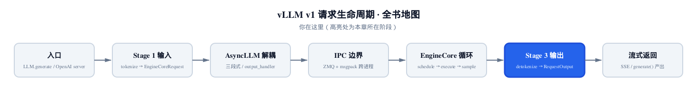
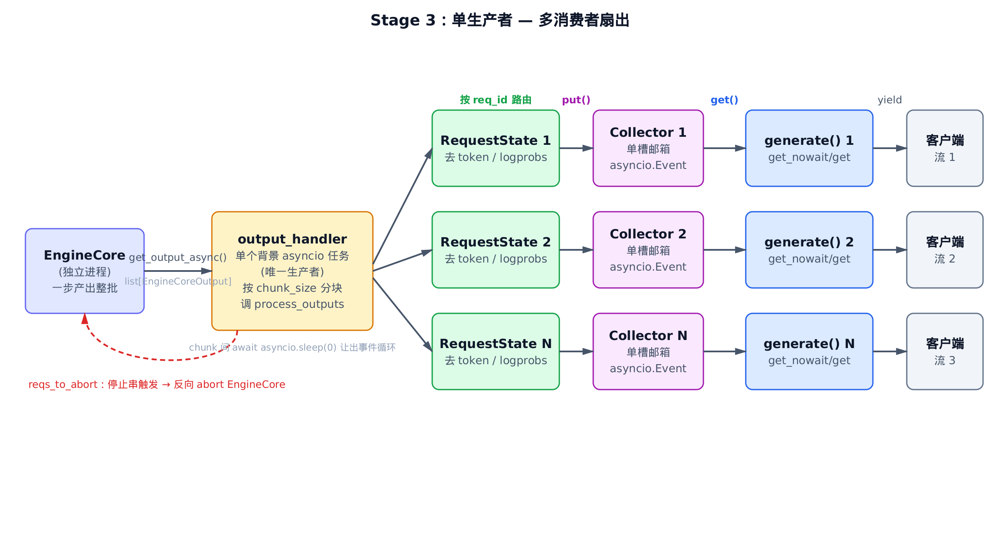
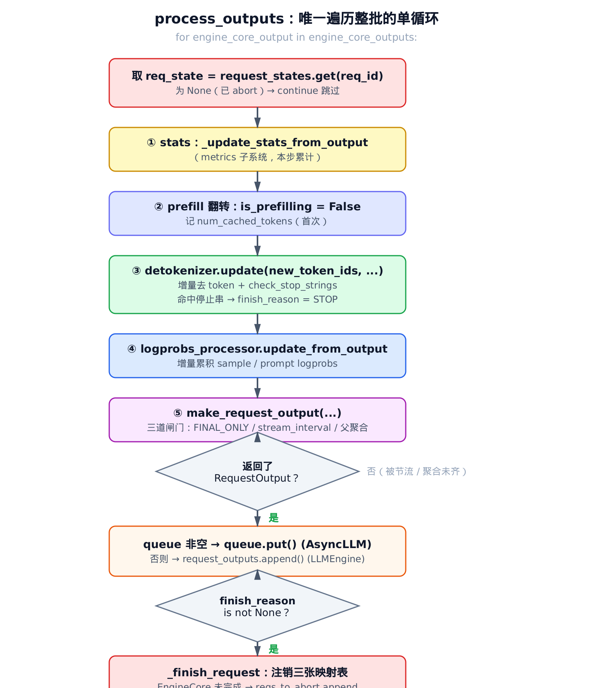
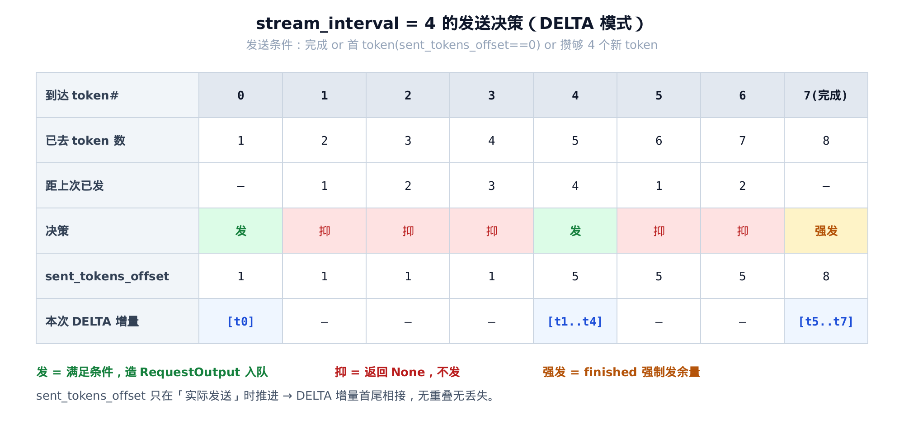
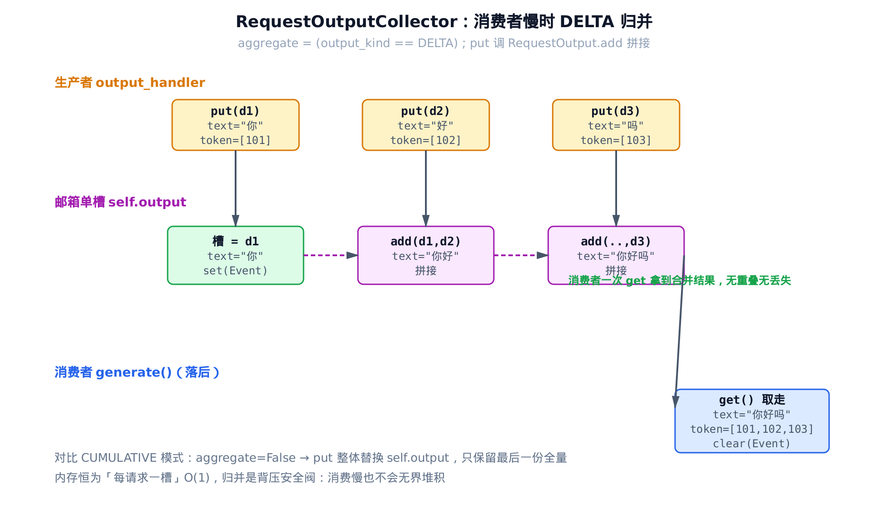
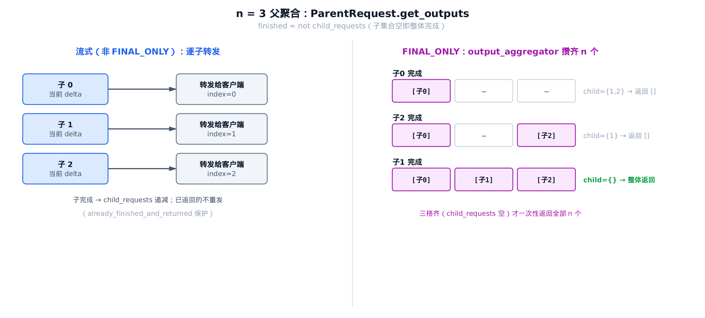

# 第8章　Stage 3 输出处理：把一批 token 分发回 N 个流

## 你在这里



> *图注：全书地图高亮当前位置。前面 [第 4 章](../ch04-async-llm/narrative/chapter.md) 把引擎拆成三段、在两个进程里重叠跑，并在图里反复标出三块骨架；[第 7 章](../ch07-engine-core/narrative/chapter.md) 钻进那条进程虚线，把 IPC 协议逐帧拆开。本章是请求生命周期的最后一棒——结果从 EngineCore 回到前端之后，怎么被去 token、检测停止串、攒成 `RequestOutput`，再分发回 N 个客户端流。再往后就是流式返回给调用者，那已经是 `generate()` 吐出去的事。*

[第 4 章](../ch04-async-llm/narrative/chapter.md) 拆三段式时，在那张泳道图里圈了三块骨架，并对其中两块打了欠条：

- 它讲了 `output_handler` 是个后台生产者、`generate()` 是消费者，但坦白说"这层生产者-消费者关系在流式输出里的完整角色，第 8 章接着讲"。
- 它讲了每个请求有一条专属队列 `RequestOutputCollector`，是"异步多路复用的关键"，但队列内部怎么归并、怎么用 `asyncio.Event` 唤醒，只给了个剪影。

**本章就是这两笔欠账的结清处。** 第 4 章那条"一批输出怎么分回 N 个队列"的虚线，本章把它实成一条你能逐段追踪的数据流：EngineCore 一步吐出**混了 N 个请求 token** 的一整批，到底是哪个函数、用什么循环，把它解开成 N 条互不干扰的流。

本章的代码主线集中在四个文件：

- `vllm/v1/engine/output_processor.py`——Stage 3 总入口，`process_outputs()` 单循环、`RequestState`、`RequestOutputCollector`，本章主轴；
- `vllm/v1/engine/detokenizer.py`——增量去 token 与停止串检测；
- `vllm/v1/engine/parallel_sampling.py`——`n>1` 并行采样的父聚合；
- `vllm/v1/engine/async_llm.py`——`output_handler` 生产者循环与 `generate()` 消费者循环（第 4 章已搭骨架，本章补完它们围着队列转的那段）。

为了能在本地（无 GPU/CUDA）把这套输出处理亲手跑一遍、打断点观察数值，本章配了一份**只做减法**的精简版：和真实 vLLM 同名、同结构、同控制流，唯一的承载替换是——真实代码用 tokenizer 库做去 token、用 torch 张量装 logprobs，精简版把这两样换成最小占位（一个 `id→str` 的 `decode` 回调、几个普通 list），其余去 token 算法、停止串窗口、DELTA 归并、父聚合、`process_outputs` 单循环全部一字不差。它是用来"跑起来看数值"的交叉验证物，正文主线仍是真实源码。

本章只讲**输出侧**。EngineCore 进程内部怎么调度、怎么采样出这些 token，是 [第 7 章](../ch07-engine-core/narrative/chapter.md) 及其后续的主场；本章从"一批 `EngineCoreOutput` 已经回到前端"这一刻接手。

---

## 8.1 一句话钩子：一个函数管整批，一条队列喂一个流

先把全章的形状摆出来，后面所有细节都挂在这张图上。



> *图注：EngineCore 一步产出混了 N 个请求 token 的整批；`output_handler` 是唯一的后台生产者，按 `req_id` 把每条输出路由到对应的 `RequestState` 做去 token/logprobs，再 `put` 进各自的 `RequestOutputCollector` 单槽邮箱；N 个 `generate()` 协程各自从自己的邮箱 `get` 出来 `yield` 给客户端。红色虚线是反向通道：检测到停止串而 EngineCore 还没停的请求，要反向 abort 回去。*

这张图里藏着 V1 输出侧的两条核心设计：

**第一，"整批只遍历一次"。** EngineCore 一步可能同时推进几百个请求，每个都吐出新 token。所有"需要逐个 token 碰一下"的活——算 stats、去 token、检测停止串、算 logprobs、造输出对象——全塞进**同一个** for 循环里跑完。这不是偷懒，是 V1 刻意把"对整批的 Python 循环"压到最少，因为 Python 层每多绕一圈 `for`，在高吞吐下都是实打实的系统开销。承担这个职责的函数只有一个：`process_outputs()`（`vllm/v1/engine/output_processor.py:L572`）。

**第二，"一请求一邮箱"。** 解多路复用（把一批 N 个请求的 token 分回 N 条流）不是靠一个全局大队列让 N 个协程去抢，而是每个请求一个独立的单槽邮箱 `RequestOutputCollector`。生产者按 `req_id` 精确投递，消费者各守各的邮箱——互不干扰，也不用加锁抢。

接下来三节顺着数据流走：先看生产者怎么把一批拆开喂进单循环（§8.2），再钻进单循环本身（§8.3），最后看单循环里每一步调用的子系统（§8.4 起）。

---

## 8.2 生产者：`output_handler` 怎么把一批喂进单循环

第 4 章告诉我们 `output_handler` 是个后台 asyncio 任务、是生产者。它具体在循环里做什么？看真实源码（`vllm/v1/engine/async_llm.py`）：

```python
# vllm/v1/engine/async_llm.py:L656
async def output_handler():
    try:
        while True:
            # 1) Pull EngineCoreOutputs from the EngineCore.
            outputs = await engine_core.get_output_async()
            num_outputs = len(outputs.outputs)

            # … 省略：log_stats 时构造 IterationStats（metrics 子系统） …

            # Split outputs into chunks of at most
            # VLLM_V1_OUTPUT_PROC_CHUNK_SIZE, so that we don't block the
            # event loop for too long.
            engine_core_outputs = outputs.outputs
            for start in range(0, num_outputs, chunk_size):
                end = start + chunk_size
                outputs_slice = engine_core_outputs[start:end]
                # 2) Process EngineCoreOutputs.
                processed_outputs = output_processor.process_outputs(
                    outputs_slice, outputs.timestamp, iteration_stats
                )
                # NOTE: RequestOutputs are pushed to their queues.
                assert not processed_outputs.request_outputs

                # Allow other asyncio tasks to run between chunks
                if end < num_outputs:
                    await asyncio.sleep(0)

                # 3) Abort any reqs that finished due to stop strings.
                if processed_outputs.reqs_to_abort:
                    await engine_core.abort_requests_async(
                        processed_outputs.reqs_to_abort
                    )
            # … 省略：update_scheduler_stats + Prometheus 指标记录（metrics 子系统） …
    except Exception as e:
        logger.exception("AsyncLLM output_handler failed.")
        output_processor.propagate_error(e)
```

这段循环干净得只剩骨头，正好把生产者的三件事摊开。

**第一件，拉。** `await engine_core.get_output_async()` 从 EngineCore 拉来一整批 `EngineCoreOutput`。注意这个 `await`——它正是第 4 章那条进程虚线、第 7 章拆开的 IPC 协议的前端落点。本章不关心这一批是怎么跨进程回来的，只关心它回来之后怎么处理。

**第二件，分块。** 一批可能有几百个输出，如果一口气全丢给 `process_outputs` 跑完，这个协程会长时间霸占事件循环，期间没有任何 `generate()` 协程能拿到 CPU 把已处理好的 token `yield` 出去——首字延迟会被整批拖累。所以这里按 `VLLM_V1_OUTPUT_PROC_CHUNK_SIZE` 切片，**每跑完一块就 `await asyncio.sleep(0)` 主动让出一次**，给别的协程插队的机会。`sleep(0)` 是 asyncio 的惯用让步法：不真睡，只是把控制权交还事件循环转一圈。

**第三件，反向 abort。** `process_outputs` 返回一个 `reqs_to_abort` 列表——那些"前端检测到停止串、但 EngineCore 自己还不知道该停"的请求。为什么会有这种错位？因为停止串是**文本级**判定（比如 stop=`"\n\n"`，得把 token 去成文字才看得出来），而 EngineCore 只懂 **token 级**停止。所以去 token 这一侧发现该停时，得反向通知 EngineCore：别再为这个请求算了，把它的 KV cache 资源放掉。这条反向通道就是图里那根红色虚线，§8.6 会接住它的另一头。

中间那句 `assert not processed_outputs.request_outputs` 很关键，它是一个**路径断言**：异步路径下，所有造好的 `RequestOutput` 都已经 `put` 进各自的队列了，绝不会以"返回列表"的形式回来。为什么会有这个分叉？因为 `process_outputs` 同时服务两条产品线——这正是下一节单循环结尾要讲的。

> 这里多说一句它的反面：`except` 块里那句 `output_processor.propagate_error(e)`。后台任务一旦死掉，所有正阻塞等结果的 `generate()` 协程会永久挂起。`propagate_error` 把异常 `put` 进每一个请求的队列，让每个等待者都重新抛出这个错误而非干等。这个"错误广播"机制的另一头在 §8.5 的邮箱 `put`/`get` 里。

---

## 8.3 主轴：`process_outputs()` 的单循环

现在进主轴。这是全书你会反复回来看的一个函数。先看它的源码（`vllm/v1/engine/output_processor.py`），它的 docstring 把自己的定位写得毫不含糊：

```python
# vllm/v1/engine/output_processor.py:L572
def process_outputs(
    self,
    engine_core_outputs: list[EngineCoreOutput],
    engine_core_timestamp: float | None = None,
    iteration_stats: IterationStats | None = None,
) -> OutputProcessorOutput:
    """
    … docstring 旁白：vLLM V1 把对整批的 Python 循环次数压到最少以降
    低系统开销。这是唯一应该遍历 EngineCoreOutputs 的函数。
    凡是需要碰整批每个元素的逻辑，都从下面这个循环里做。
    """
    request_outputs: list[RequestOutput | PoolingRequestOutput] = []
    reqs_to_abort: list[str] = []
    for engine_core_output in engine_core_outputs:
        req_id = engine_core_output.request_id
        req_state = self.request_states.get(req_id)
        if req_state is None:
            # Ignore output for already-aborted request.
            continue

        # 1) Compute stats for this iteration.
        self._update_stats_from_output(
            req_state, engine_core_output, engine_core_timestamp, iteration_stats
        )

        new_token_ids = engine_core_output.new_token_ids
        finish_reason = engine_core_output.finish_reason
        stop_reason = engine_core_output.stop_reason
        kv_transfer_params = engine_core_output.kv_transfer_params

        if req_state.is_prefilling:
            if engine_core_output.prefill_stats is not None:
                req_state.num_cached_tokens = (
                    engine_core_output.prefill_stats.num_cached_tokens
                )
            req_state.is_prefilling = False

        # … 省略：pooling 分支（非生成式/嵌入请求跳过去 token 与 logprobs） …
        assert req_state.detokenizer is not None
        assert req_state.logprobs_processor is not None
        # 2) Detokenize the token ids into text and perform stop checks.
        stop_string = req_state.detokenizer.update(
            new_token_ids, finish_reason == FinishReason.STOP
        )
        if stop_string:
            finish_reason = FinishReason.STOP
            stop_reason = stop_string

        # 3) Compute sample and prompt logprobs for request, if required.
        req_state.logprobs_processor.update_from_output(engine_core_output)

        # 4) Create and handle RequestOutput objects.
        if request_output := req_state.make_request_output(
            new_token_ids, finish_reason, stop_reason, kv_transfer_params,
        ):
            if req_state.queue is not None:
                # AsyncLLM: put into queue for handling by generate().
                req_state.queue.put(request_output)
            else:
                # LLMEngine: return list of RequestOutputs.
                request_outputs.append(request_output)

        # Free completed requests.
        if finish_reason is not None:
            # … 省略：streaming_input 分支（resumable 流式输入，边角特性） …
            self._finish_request(req_state)
            if not engine_core_output.finished:
                # If req not finished in EngineCore, but Detokenizer
                # detected stop string, abort needed in EngineCore.
                reqs_to_abort.append(req_id)
            # … 省略：per-request stats 累计 + 可选 OpenTelemetry tracing …

    return OutputProcessorOutput(
        request_outputs=request_outputs,
        reqs_to_abort=reqs_to_abort,
    )
```

把这个循环按对应的流程图读一遍：



> *图注：竖向五步流程。取 state（已 abort 则跳过）→ stats → prefill 翻转 → 去 token+停止串 → logprobs → `make_request_output` 三道闸门 → 入队或入列表 → 完成则注销 + 反向 abort。每个 `engine_core_output` 都从头走一遍这条竖线。*

**入口的守门：已 abort 静默跳过。** 循环第一件事是 `req_state = self.request_states.get(req_id)`，拿不到（`None`）就 `continue`。这处理的是一个天然竞态：客户端断连导致请求被 abort，前端这边已经把 `RequestState` 删了，但 EngineCore 进程里这个请求的在途 token 可能正好这一批刚吐出来。直接跳过是幂等且安全的——没有 state 可以承接，就当它不存在。

**第 ① 步，stats。** `_update_stats_from_output` 累计本步的吞吐/延迟指标。它属于 metrics 子系统，本章不展开；只需知道它和输出主路径正交，传 `None` 就早早返回。

**第 ② 步，prefill→decode 翻转。** `if req_state.is_prefilling:` 这块只在请求**第一次**产出 token 时进一次：记下 `num_cached_tokens`（prefix cache 命中了多少 prompt token），然后把 `is_prefilling` 翻成 `False`。之后这个请求就一直是 decode 阶段，不再进这块。这是一个一次性的状态翻转标志。

**第 ③ 步，去 token + 停止串。** `req_state.detokenizer.update(...)` 把新 token 增量地变成文字，顺带在新增字符里查停止串。**注意它的返回值用法**：一旦命中停止串，立刻就地把 `finish_reason` 改成 `STOP`、`stop_reason` 设成那个停止串。这一句就是 §8.2 那条反向通道的源头——"前端先于 EngineCore 判定该停"正是从这里发生的。去 token 的算法在 §8.4 细讲。

**第 ④ 步，logprobs。** `update_from_output` 增量累积 sample/prompt logprobs。这是去 token 之外的第二个被调用子系统，§8.4 末尾讲它的接口。

**第 ⑤ 步，造输出并分发。** `make_request_output(...)` 把本步增量变成（或不变成）一个 `RequestOutput`——它内部有三道节流/分流闸门，是 §8.5 的主题。这里只看分发：用了海象赋值 `if request_output := ...`，**返回 `None` 时整个 if 跳过**（被节流了，本步不发）。返回了对象，就看 `req_state.queue` 是不是 `None`：

```python
if req_state.queue is not None:
    # AsyncLLM: put into queue for handling by generate().
    req_state.queue.put(request_output)
else:
    # LLMEngine: return list of RequestOutputs.
    request_outputs.append(request_output)
```

**这就是那个路径分叉。** 同一份 `OutputProcessor`、同一套去 token/logprobs/停止串/聚合逻辑，同时服务两条产品线：`AsyncLLM`（在线服务，每请求有队列，结果 `put` 进队列由 `generate()` 取）和 `LLMEngine`（离线批处理，没有队列，结果攒进 `request_outputs` 列表一次返回）。靠 `queue is None` 这一个判断分流，避免了同步/异步两套实现。这也解释了 §8.2 那句断言：异步路径下 `queue` 永不为 `None`，所以返回的 `request_outputs` 必然是空的。

**完成清理。** 循环最后 `if finish_reason is not None:` 处理收尾。`_finish_request` 把请求从映射表注销（§8.6）。紧接着那个 `if not engine_core_output.finished:` 是反向 abort 的判定：如果 EngineCore 自己已经标记这个请求完成了（正常 EOS 或长度上限），就不用反向通知；只有"EngineCore 还以为没完、但前端去 token 检测到停止串"这种错位，才把 `req_id` 加进 `reqs_to_abort`，回到 §8.2 让 `output_handler` 反向 abort。

精简版逐行保留了这个单循环（仅按减法计划删去 pooling/streaming-input/tracing 三个正交分支与 metrics 内部）。后面 §8.7 我们会真的跑它，看一批输出怎么被分发出去。

---

## 8.4 第一个子系统：增量去 token 与停止串

单循环第 ③ 步只有一行 `detokenizer.update(...)`，但这一行背后是 V1 去 token 的全部精华。先讲清"为什么不能简单地一个 token 一个 token 各自解码再拼起来"。

**为什么去 token 必须增量。** BPE/byte-fallback 分词下，相邻 token 的文本边界是**相互依赖**的：一个多字节 UTF-8 字符（比如一个中文字、一个 emoji）可能被切成两个 token，单独解码任何一个都得不到完整字符。所以不能 `decode(单 token)` 再拼接——必须维护跨 token 的解码状态。真实 vLLM 为此有两套 `decode_next` 实现:Fast 走 `tokenizers` 库的 `DecodeStream`（库内部维护状态），Slow 走 Python 的 `detokenize_incrementally`（用 `prefix_offset`/`read_offset` 滑窗）。这两套都属 tokenizer 库内部，本章把它抽象成"给一个 token、吐出它新增的那段文字"这个接口，不展开 byte-fallback 细节。

来看 `update` 本身的算法（`vllm/v1/engine/detokenizer.py`）——这部分 V1 是自己写的，是本章要讲清的：

```python
# vllm/v1/engine/detokenizer.py:L95
def update(self, new_token_ids: list[int], stop_terminated: bool) -> str | None:
    if not new_token_ids:
        return None

    if stop_terminated and not self.include_stop_str_in_output:
        # If stop-terminated, exclude last token from detokenization
        skipped_stop_token_id = new_token_ids[-1]
        new_token_ids = new_token_ids[:-1]
    else:
        skipped_stop_token_id = None

    # 1) Detokenize the new token ids incrementally.
    stop_check_offset = len(self.output_text)
    for new_token_id in new_token_ids:
        self.token_ids.append(new_token_id)
        self.output_text += self.decode_next(new_token_id)
        # Support min_tokens
        if self.min_tokens and self.num_output_tokens() <= self.min_tokens:
            stop_check_offset = len(self.output_text)

    if skipped_stop_token_id is not None:
        self.token_ids.append(skipped_stop_token_id)

    # 2) Evaluate stop strings.
    stop_string = None
    if self.stop and self.num_output_tokens() > self.min_tokens:
        stop = check_stop_strings(
            output_text=self.output_text,
            new_char_count=len(self.output_text) - stop_check_offset,
            stop=self.stop,
            include_in_output=self.include_stop_str_in_output,
        )
        if stop is not None:
            stop_string, truncate_to = stop
            if truncate_to != -1:
                self.output_text = self.output_text[:truncate_to]

    return stop_string
```

三个值得停下来看的设计点：

**(a) 停止 token 的"记账但不解码"。** 顶上那段：如果是 EOS token 触发的停止（`stop_terminated`），且用户不要求把停止串留在输出里，就把**最后一个 token 从去 token 中排除**——但仍然 `self.token_ids.append(skipped_stop_token_id)`。也就是：文字里不出现它，token_ids 里记着它。这保证了"输出文本干净"和"token 计数准确"两件事不冲突。

**(b) `min_tokens` 保护。** 那句 `if self.min_tokens and ... <= self.min_tokens: stop_check_offset = len(self.output_text)`，作用是在还没到最小生成长度之前，**不断把停止串检测的起点推到当前文本末尾**——等价于"这段时间内出现的停止串一律不算"。用户既要求"至少生成 50 个 token"又设了停止串时，这条保证前者优先。

**(c) 停止串检测只扫新增字符。** 关键在传给 `check_stop_strings` 的 `new_char_count`——只有本步新增的那几个字符。来看它怎么用：

```python
# vllm/v1/engine/detokenizer.py:L304
def check_stop_strings(
    output_text: str, new_char_count: int, stop: list[str], include_in_output: bool,
) -> tuple[str, int] | None:
    if not new_char_count or not stop:
        return None
    for stop_str in stop:
        stop_string_len = len(stop_str)
        # Avoid searching already-searched text.
        stop_index = output_text.find(stop_str, 1 - new_char_count - stop_string_len)
        if stop_index == -1:
            continue
        if include_in_output:
            # Truncate to end of stop string.
            stop_index += stop_string_len
            if stop_index >= len(output_text):
                return stop_str, -1   # No truncation required.
        return stop_str, stop_index
    return None
```

`find` 的起点是 `1 - new_char_count - stop_string_len`（负索引，从尾部往回数），而不是 `0`。为什么不从头扫？因为前面的文本上一步已经扫过了。一个停止串要在本步**首次**出现，它的尾巴必然落在新增字符里，所以只需从"新增字符开头再往前 `stop_string_len - 1` 个字符"扫起，就能覆盖所有可能跨步边界的命中。

**这把复杂度从平方级摊薄到线性级。** 朴素做法每步都重扫全文：第 $k$ 步扫 $k$ 个字符，$L$ 步累计起来是

$$
\sum_{k=1}^{L} k = \frac{L(L+1)}{2} = O(L^2)
$$

只扫新增字符则每步成本约等于本步新增字符数，全序列累计起来就是各步新增之和，等于 $L$ 个字符的线性量级。一句话翻译：对一条 2000 token 的回答，朴素法约要做两百万次字符比较的量级，摊还法只做两千次量级。

返回的 `truncate_to` 是截断点：`include_in_output=False` 时停止串本身要被裁掉，把 `output_text` 截到停止串之前；`include_in_output=True` 且停止串已完整落在文本里则返回 `-1`（不裁）。

最后一块是文字的**产出口** `get_next_output_text`，单循环第 ⑤ 步造 `CompletionOutput` 时会调它：

```python
# vllm/v1/engine/detokenizer.py:L148
def get_next_output_text(self, finished: bool, delta: bool) -> str:
    """If delta is True, only new text since the last call to
    this method is returned"""
    # We return the full output text if the sequence is finished.
    buffer_length = 0 if finished else self.stop_buffer_length
    if not delta:
        if not buffer_length:
            return self.output_text
        return self.output_text[:-buffer_length]

    length = len(self.output_text) - buffer_length
    last_offset = self._last_output_text_offset
    if last_offset < length:
        self._last_output_text_offset = length
        return self.output_text[last_offset:length]
    return ""
```

`delta=True` 只回上次调用之后新增的那段文字并推进 `_last_output_text_offset`；`delta=False` 回全量。`stop_buffer_length` 是个微妙的安全垫：当设了停止串且要排除它、而序列还没结束时，**末尾留出 `max(停止串长)-1` 个字符不发**。道理是：这几个尾字符可能正是某个停止串的前半截，下一步才能确认——提前发出去就来不及裁了。等 `finished` 为真，`buffer_length` 归零，尾巴一次性补齐。这正是流式输出"不会把可能属于停止串的尾巴过早 yield 出去"的保证。

**第二个子系统：logprobs，一句话接口。** 单循环第 ④ 步的 `logprobs_processor.update_from_output(engine_core_output)` 做的事很直白——分发：

```python
# vllm/v1/engine/logprobs.py:L348
def update_from_output(self, output: EngineCoreOutput) -> None:
    if output.new_logprobs is not None:
        self._update_sample_logprobs(output.new_logprobs)
    if output.new_prompt_logprobs_tensors is not None:
        self._update_prompt_logprobs(output.new_prompt_logprobs_tensors)
```

sample logprobs 这边每步把采样 token 的 logprob 累加进 `cumulative_logprob`、把每位的 logprob 容器 append 进 `logprobs` 列表。prompt logprobs 这边有个 DELTA 语义的细节留到 §8.5 讲：prompt logprobs 跨多个 prefill chunk 累积，DELTA 模式要求它们**整体在一次输出里返回再忘掉**，靠的是 `pop_prompt_logprobs()` 一次性吐出并清空。

---

## 8.5 三道闸门：`make_request_output` 与 DELTA 归并

单循环第 ⑤ 步那个 `make_request_output(...)`，是"本步增量到底发不发、发多少"的总闸门。看真实源码（`vllm/v1/engine/output_processor.py`）：

```python
# vllm/v1/engine/output_processor.py:L269
def make_request_output(
    self, new_token_ids, pooling_output, finish_reason, stop_reason,
    kv_transfer_params=None, routed_experts=None,
) -> RequestOutput | PoolingRequestOutput | None:
    finished = finish_reason is not None
    final_only = self.output_kind == RequestOutputKind.FINAL_ONLY

    if not finished and final_only:
        # Only the final output is required in FINAL_ONLY mode.
        return None

    if self.stream_interval > 1:
        assert self.detokenizer is not None
        # Send output request only when
        # 1. It has finished, or
        # 2. It is the first token, or
        # 3. It has reached the stream interval number of tokens
        if not (
            finished
            or self.sent_tokens_offset == 0
            or self.detokenizer.num_output_tokens() - self.sent_tokens_offset
            >= self.stream_interval
        ):
            return None

        if self.output_kind == RequestOutputKind.DELTA:
            # Send tokens from the offset in DELTA mode, otherwise all
            # tokens are sent.
            new_token_ids = self.detokenizer.output_token_ids[
                self.sent_tokens_offset:
            ]
            self.sent_tokens_offset = self.detokenizer.num_output_tokens()

    external_req_id = self.external_req_id

    # … 省略：pooling 分支（非生成式请求走 _new_pooling_output） …
    output = self._new_completion_output(
        new_token_ids, finish_reason, stop_reason, routed_experts
    )

    if self.parent_req is None:
        outputs = [output]
    else:
        outputs, finished = self.parent_req.get_outputs(self.request_id, output)
        if not outputs:
            return None
        external_req_id = self.parent_req.external_req_id

    return self._new_request_output(
        external_req_id, outputs, finished, kv_transfer_params
    )
```

三道闸门，每道都能让本步返回 `None`（不发）：

**闸门一：`FINAL_ONLY`。** 如果调用方要的是非流式结果（只要最后一份完整输出），那中途每一步都直接 `return None`，只有 `finished` 时才往下走。这是离线批处理和"非流式 API 调用"的常态。

**闸门二：`stream_interval` 节流。** 即便是流式（要逐步发），`stream_interval > 1` 时也不是每个 token 都发。发送只在三种情况：完成、首 token（`sent_tokens_offset == 0`）、或者攒够了 `stream_interval` 个新 token。直觉：把发送频率降到约 $1/k$，用稍高一点的中段延迟，换更低的 per-token 序列化/事件循环开销。高并发流式场景下，"每个 token 都造一个对象、过一遍队列、`yield` 一次"的固定开销不可忽视。

这里的正确性关键是 `sent_tokens_offset`。DELTA 模式下，攒批之后**只发"从上次已发偏移到现在"的那段 token**，然后把偏移推进到当前位置。看这张决策表把它走一遍：



> *图注：`stream_interval=4`。token#0 是首 token，发，offset 推到 1；#1~#3 攒着不发；#4 时"已去 token 数 5 − offset 1 = 4"攒够，发增量 `[t1..t4]`，offset 推到 5；#5~#6 又攒着；完成时强制把余量 `[t5..t7]` 发出。`sent_tokens_offset` 只在实际发送时推进，所以各次 DELTA 增量首尾相接，既不重叠也不丢失。*

**闸门三：`n>1` 父聚合。** 如果这个请求是某个 `n>1` 并行采样请求的子序列（`parent_req` 非空），单条子输出不直接成为对客户端的 `RequestOutput`，得先交给 `parent_req.get_outputs(...)` 做父聚合，聚合不出东西（比如 FINAL_ONLY 下还没攒齐 n 个）就 `return None`。这是 §8.6 的主题。

发出去的那个 `RequestOutput` 里装的 `CompletionOutput` 由 `_new_completion_output` 造：

```python
# vllm/v1/engine/output_processor.py:L376
def _new_completion_output(
    self, token_ids, finish_reason, stop_reason, routed_experts=None,
) -> CompletionOutput:
    finished = finish_reason is not None
    delta = self.output_kind == RequestOutputKind.DELTA

    # Prepare text and token_ids, based on delta mode
    text = self.detokenizer.get_next_output_text(finished, delta)
    if not delta:
        token_ids = self.detokenizer.output_token_ids

    # Prepare logprobs, based on delta mode
    logprobs = self.logprobs_processor.logprobs
    if delta and logprobs:
        logprobs = logprobs[-len(token_ids):]

    return CompletionOutput(
        index=self.request_index,
        text=text, token_ids=token_ids, logprobs=logprobs,
        cumulative_logprob=self.logprobs_processor.cumulative_logprob,
        finish_reason=str(finish_reason) if finished else None,
        stop_reason=stop_reason if finished else None,
    )
```

DELTA 与全量的三处分叉对照清楚：`text` 由 `get_next_output_text(finished, delta)` 给出，delta 模式只给新增那段（§8.4）；`token_ids` 在非 delta 下整体取 `output_token_ids`（全量），delta 下用传进来的增量切片；`logprobs` 在 delta 下只切最后 `len(token_ids)` 个，对齐本次发的 token。`index=self.request_index` 是 `n>1` 时区分各子序列的关键，下一节会看到它撑起整个父聚合。

### 8.5.1 队列的真身：`RequestOutputCollector`

第 4 章在 [§4.6](../ch04-async-llm/narrative/chapter.md) 给过队列一个剪影，说它的归并真身留待本章。现在揭开。它就是图里那个"单槽邮箱"：

```python
# vllm/v1/engine/output_processor.py:L45
class RequestOutputCollector:
    """
    Collects streamed RequestOutputs per individual request,
    for hand-off to the consuming asyncio generate task.

    When streaming deltas, RequestOutputs are merged if the
    producer gets ahead of the consumer.
    """

    def __init__(self, output_kind: RequestOutputKind, request_id: str):
        self.aggregate = output_kind == RequestOutputKind.DELTA
        self.request_id = request_id
        self.output: RequestOutput | PoolingRequestOutput | Exception | None = None
        self.ready = asyncio.Event()
        # … 省略：_input_stream_task（流式输入任务清理，边角特性） …

    def put(self, output) -> None:
        """Non-blocking put operation."""
        if self.output is None or isinstance(output, Exception):
            self.output = output
            self.ready.set()
        elif isinstance(self.output, RequestOutput) and isinstance(
            output, RequestOutput
        ):
            # This ensures that request outputs with different request indexes
            # (if n > 1) do not override each other.
            self.output.add(output, aggregate=self.aggregate)
        # … 省略：PoolingRequestOutput 合并分支 …

    async def get(self) -> RequestOutput | PoolingRequestOutput:
        """Get operation blocks on put event."""
        while (output := self.output) is None:
            await self.ready.wait()
        self.output = None
        self.ready.clear()
        if isinstance(output, Exception):
            raise output
        return output

    def get_nowait(self) -> RequestOutput | PoolingRequestOutput | None:
        """Non-blocking get operation."""
        output = self.output
        if output is not None:
            self.output = None
            self.ready.clear()
        if isinstance(output, Exception):
            raise output
        return output
```

它不是一个队列，是一个**单槽**——只有一个 `self.output` 位置。看三个方法各自的角色：

**`put`（生产者侧，非阻塞）。** 三种情况：(1) 槽空，或者来的是异常，直接放进去并 `ready.set()` 唤醒等待者——异常**优先覆盖**，这是 §8.2 错误广播的落点：哪怕槽里有结果，异常也要顶上去让消费者抛出。(2) 槽里已经有一个 `RequestOutput`、新来的也是，就不覆盖，而是 `self.output.add(output, aggregate=self.aggregate)` **归并**。(3) pooling 情况（本章略）。

**关键就在第 (2) 种：生产者跑到了消费者前面怎么办？** `output_handler` 一步可能给同一个请求 `put` 好几次（流式逐步发），而对应的 `generate()` 协程还没来得及 `get`。如果是普通队列，这些就会堆积，内存无界增长。单槽邮箱的答案是**就地归并**：把新 delta 合进槽里那个对象。内存恒为"每请求一槽"，归并成了**背压安全阀**——消费者慢，多个 delta 合成一个，绝不堆积。

**`get`（消费者侧，阻塞）。** `while self.output is None: await self.ready.wait()` 阻塞在 `asyncio.Event` 上，被 `put` 的 `set()` 唤醒。取走后清槽、`clear()` 重新武装 Event。

**`get_nowait`（消费者侧，非阻塞快取）。** 不 await，槽里有就拿走、没有返回 `None`。它的用途马上在 §8.6 的消费循环里见分晓。

`aggregate` 这个开关由 `output_kind == DELTA` 决定，它直接控制 `put` 里归并要不要"拼接"。归并的真正实现在 `RequestOutput.add`（`vllm/outputs.py`）：

```python
# vllm/outputs.py:L145
def add(self, next_output: "RequestOutput", aggregate: bool) -> None:
    """Merge subsequent RequestOutput into this one"""
    self.finished |= next_output.finished
    self.kv_transfer_params = next_output.kv_transfer_params

    for next_completion in next_output.outputs:
        for i, completion in enumerate(self.outputs):
            if completion.index == next_completion.index:
                if aggregate:
                    # Merge outputs with same index
                    completion.text += next_completion.text
                    if not isinstance(completion.token_ids, MutableSequence):
                        completion.token_ids = list(completion.token_ids)
                    completion.token_ids.extend(next_completion.token_ids)
                    if next_completion.logprobs:
                        assert completion.logprobs is not None
                        completion.logprobs.extend(next_completion.logprobs)
                    completion.cumulative_logprob = next_completion.cumulative_logprob
                    completion.finish_reason = next_completion.finish_reason
                    completion.stop_reason = next_completion.stop_reason
                else:
                    # Replace the output with the new one
                    self.outputs[i] = next_completion
                break
        else:
            self.outputs.append(next_completion)
```

按 `CompletionOutput.index` 配对（这就是 `_new_completion_output` 那个 `index` 的用武之地）。`aggregate=True`（DELTA）时**拼接**：text 续上、token_ids 续上、logprobs 续上，刷新 `cumulative_logprob` 和完成标志。`aggregate=False`（CUMULATIVE，每步都是全量）时**整体替换**——因为新的本就是更全的，留它就行。

最妙的是最后那个 `for...else`：内层 `for` 没找到匹配 index 就走 `else` 分支 `append`。这正是注释里"不同 request index 不互相覆盖"的兑现——`n>1` 时若来的是另一个子序列（不同 index），它不会顶掉已有的，而是并排放进 `outputs`。一个邮箱因此能同时装下一个 `n>1` 请求的多条子流。

把 DELTA 归并的时序走一遍：



> *图注：消费者落后时，生产者连 `put` 三个 delta。第一次槽空，直接放 d1 并 `set` Event；第二、三次槽里有，调 `add` 把文本/token 拼成 `"你好"`、`"你好吗"`。消费者一次 `get` 拿到合并结果，无重叠无丢失。对比 CUMULATIVE 模式是整体替换，只留最后一份全量。*

至此，第 4 章关于"每请求一条队列"的那笔欠账结清：邮箱单槽 + `asyncio.Event` 唤醒 + DELTA 归并背压，让一个后台生产者能扇出到 N 个消费者而互不干扰，且消费快慢都安全。

---

## 8.6 `n>1` 父聚合与完成清理

### 父聚合：一个外部请求，n 条子流

`n>1` 并行采样：客户端发一个请求要 `n` 个候选回答。在引擎内部，它被拆成 `n` 个独立的子请求（拆分在输入侧，本章不管），各自在 EngineCore 里生成。但对客户端，它仍是**一个**请求，要返回 `n` 个 `CompletionOutput`。把 n 条子流重新聚合成"一个请求的 n 个输出"，就是 `ParentRequest.get_outputs` 的活（`vllm/v1/engine/parallel_sampling.py`）：

```python
# vllm/v1/engine/parallel_sampling.py:L100
def get_outputs(
    self, child_request_id: str, completion_output: CompletionOutput,
) -> tuple[list[CompletionOutput], bool]:
    already_finished_and_returned: bool = False
    if completion_output.finished():
        if child_request_id in self.child_requests:
            self.child_requests.remove(child_request_id)
        else:
            # child request ID is not available in child_requests
            # which means the request had finished in previous
            # batch step and returned to the client earlier
            already_finished_and_returned = True

    if self.sampling_params.output_kind != RequestOutputKind.FINAL_ONLY:
        # If streaming, just return the current output
        # DO NOT output finished and already returned child request to client again
        outputs = [] if already_finished_and_returned else [completion_output]
    else:
        # If not streaming, aggregate the n final outputs.
        self.output_aggregator[completion_output.index] = completion_output
        outputs = [] if self.child_requests else self.output_aggregator

    finished = not self.child_requests
    return outputs, finished
```

两种模式分得很清，对照这张图：



> *图注：n=3。流式模式逐子转发——每个子的当前 delta 直接转发给客户端，子完成就从 `child_requests` 移除。FINAL_ONLY 模式按 index 把子的最终输出填进 `output_aggregator` 的对应格子，三格齐了（`child_requests` 空）才整体一次返回全部 3 个。两种模式下 `finished` 都等于"`child_requests` 是否已空"。*

**流式（非 FINAL_ONLY）：逐子转发。** 直接把当前子的输出转发出去。但有个去重保护：子完成时从 `child_requests` 移除；如果发现某个子**不在** `child_requests` 里却又来了完成信号，说明它上一批就完成并返回过了——`already_finished_and_returned` 置真，返回空列表，**绝不把已返回的完成态再发给客户端一次**。

**FINAL_ONLY：攒齐再发。** 把每个子的最终输出按 `index` 填进 `output_aggregator` 的对应格子；只有当 `child_requests` 空（所有子都完成）时才 `outputs = self.output_aggregator` 整体返回，否则返回空（回到 §8.5 让 `make_request_output` 返回 `None`）。

两种模式的 `finished` 都是 `not self.child_requests`——整个父请求的完成，等价于所有子请求都完成。`child_requests` 这个集合既是去重依据，又是完成判定，一物两用。

### 完成清理：`_finish_request` 注销三张表

请求收尾时，单循环调 `_finish_request` 把它从 `OutputProcessor` 的账本里彻底抹掉：

```python
# vllm/v1/engine/output_processor.py:L689
def _finish_request(self, req_state: RequestState) -> None:
    req_id = req_state.request_id
    self.request_states.pop(req_id)

    internal_ids = self.external_req_ids[req_state.external_req_id]
    internal_ids.remove(req_id)
    if not internal_ids:
        del self.external_req_ids[req_state.external_req_id]

    # Remove parent request if applicable.
    parent_req = req_state.parent_req
    if parent_req and not parent_req.child_requests:
        self.parent_requests.pop(parent_req.request_id, None)
```

`OutputProcessor` 持有三张映射表，`_finish_request` 逐一清理：

- `request_states`（内部 id → `RequestState`）：直接 `pop`。
- `external_req_ids`（外部 id → [内部 id 列表]）：从列表里 `remove` 这个内部 id；列表空了（`n>1` 的最后一个子也走了）就删键。
- `parent_requests`（父 id → `ParentRequest`）：只有当父的 `child_requests` 已空才 `pop`——`n>1` 时前几个子完成不能删父，得等最后一个。

清干净这三张表，`has_unfinished_requests()` / `get_num_unfinished_requests()` 才能给出准确的在途请求数——这是引擎判断"还有没有活要干"的依据。

### 消费者：`generate()` 围着邮箱转

最后补上第 4 章那笔关于生产者-消费者的欠账的消费者侧。`generate()` 的拉取循环（`vllm/v1/engine/async_llm.py`）：

```python
# vllm/v1/engine/async_llm.py:L576
# The output_handler task pushes items into the queue.
# This task pulls from the queue and yields to caller.
finished = False
while not finished:
    # Note: drain queue without await if possible (avoids
    # task switching under load which helps performance).
    out = q.get_nowait() or await q.get()

    # Note: both OutputProcessor and EngineCore handle their
    # own request cleanup based on finished.
    assert isinstance(out, RequestOutput)
    finished = out.finished
    if out is not STREAM_FINISHED:
        yield out
```

这就是 §8.5.1 里 `get_nowait` 的用武之地。`out = q.get_nowait() or await q.get()` 是个性能优化的惯用法：先**非阻塞**试一把，邮箱里有就立刻拿（不让出协程，避免高负载下的任务切换开销）；没有才退化成阻塞 `await q.get()`。`finished = out.finished` 驱动循环终止——`RequestOutput.add` 里那句 `self.finished |= next_output.finished` 保证了归并后的完成态不会丢。`STREAM_FINISHED` 是个哨兵，用来终止循环但不 `yield` 给调用者。

至此，第 4 章打的两笔欠账全部结清：

- **每请求一条队列**——`RequestOutputCollector` 单槽邮箱 + `asyncio.Event` + DELTA 归并背压（§8.5.1）；
- **生产者-消费者**——`output_handler` 一批拉回、按 `req_id` 路由、`put` 进各邮箱（§8.2），N 个 `generate()` 各自 `get_nowait`/`get` 拉自己的邮箱 `yield`（本节）。一批 → N 流的多路复用，就此实成单生产者多消费者。

---

## 8.7 跑起来看数值：交叉验证

前面都是读真实源码。现在用精简版把这条数据流**真的跑一遍**，让抽象落到数值上。精简版与真实 vLLM 同名同结构，只把 tokenizer 库和 torch 张量换成最小占位。

**验证一：单循环把一批分回各自队列（AsyncLLM 路径）。** 构造一批含三个请求的 `EngineCoreOutput`，看 `process_outputs` 是否分别 `put` 进各自的邮箱、互不串台。这正是 §8.3 那个分叉的核心断言。

**验证二：DELTA 归并的背压。** 让生产者对同一个请求连续 `put` 两个 delta（模拟消费者落后），再 `get` 一次，验证拿到的是拼接后的完整结果——对应 §8.5.1 那张归并时序图。

**验证三：`stream_interval` 节流的发送时点与偏移推进。** `stream_interval=4`，逐 token 喂，记录哪几步真的发了、`sent_tokens_offset` 怎么走——对应 §8.5 那张决策表。

跑测试套件：

```
$ python3 -m pytest tests/ -q
...................................                                       [100%]
35 passed
```

35 个断言全过，覆盖了：邮箱 put/Event/DELTA 归并/CUMULATIVE 替换/不同 index 不互覆盖/异常优先/get 阻塞；增量去 token/停止串截断/stop-terminated 末 token 排除但留 id/min_tokens 延迟/delta vs 全量;`n>1` 流式逐子转发与 FINAL_ONLY 攒齐;单循环跳过已 abort/prefill 翻转/两条路径分叉/停止串反向 abort/三表注销;以及 `output_handler` 单生产者扇出多消费者、chunk 分块。

这些数值不是新东西——它们是前面读过的真实源码控制流的运行投影。精简版的价值就在这里：你可以打开 `make_request_output`、在 `sent_tokens_offset` 那行打个断点，亲眼看着它随发送一步步推进，把 §8.5 的决策表从"我相信"变成"我看见了"。

---

## 8.8 小结：你现在掌握了什么

请求生命周期的最后一棒跑完了。回头看这一章立了什么：

- **`process_outputs` 是唯一遍历整批的单循环**（`vllm/v1/engine/output_processor.py:L572`）。 V1 把对整批的 Python 循环压到最少——取 state、stats、prefill 翻转、去 token+停止串、logprobs、造输出/分发、完成清理，全在一个 for 里跑完（§8.3）。
- **一套逻辑服务两条路径。** `queue is None` 一个判断，分出 AsyncLLM（入队）和 LLMEngine（返回列表），不写两套（§8.3）。
- **增量去 token 是必须的，停止串检测是摊还 $O(L)$ 的。** 跨 token 文本边界相互依赖，所以维护解码状态；停止串只扫新增字符，避免重扫退化（§8.4）。
- **三道闸门控制发不发。** FINAL_ONLY / stream_interval 节流 / `n>1` 父聚合，每道都能让本步不发；DELTA 靠 `sent_tokens_offset` 保证增量首尾相接（§8.5）。
- **`RequestOutputCollector` 是 per-request 单槽邮箱。** `asyncio.Event` 唤醒、DELTA 归并做背压安全阀，让单生产者扇出 N 个消费者而互不干扰（§8.5.1）。这结清了第 4 章关于队列与生产者-消费者的两笔欠账。
- **`n>1` 父聚合 + 三表注销** 收束了并行采样与请求生命周期（§8.6）。

[第 4 章](../ch04-async-llm/narrative/chapter.md) 那张泳道图里圈出的三块骨架——每请求一条队列、进程边界、后台生产者-消费者——到这里全部拆开过了：进程边界归 [第 7 章](../ch07-engine-core/narrative/chapter.md)，队列与生产者-消费者归本章。从客户端一个 `await generate()` 进去，到一个个 token `yield` 回来，整条链路你现在能逐帧拆开。
