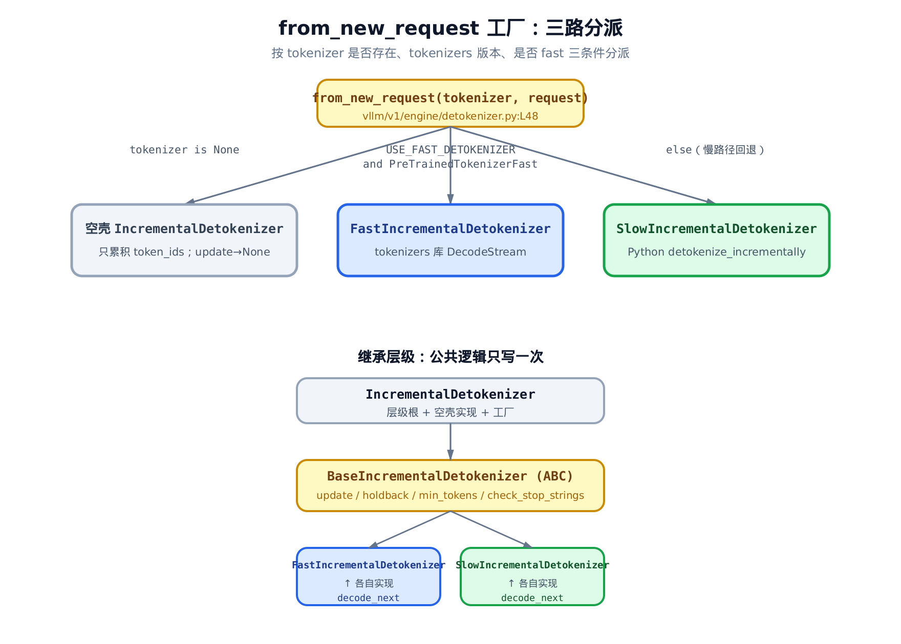
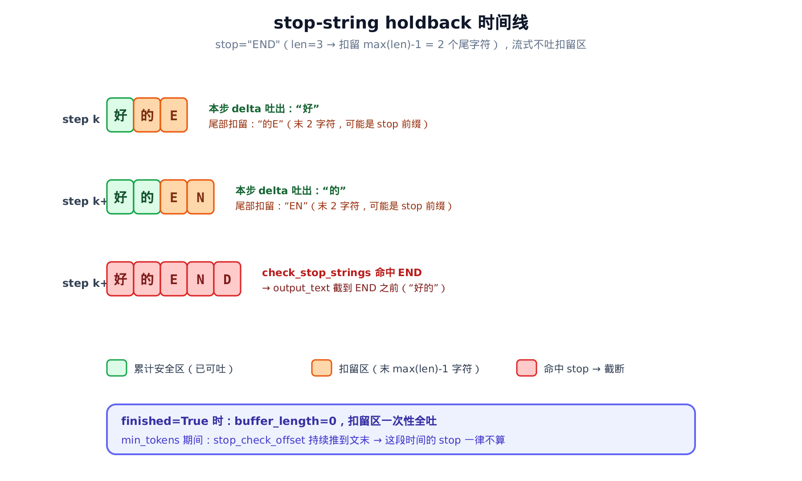
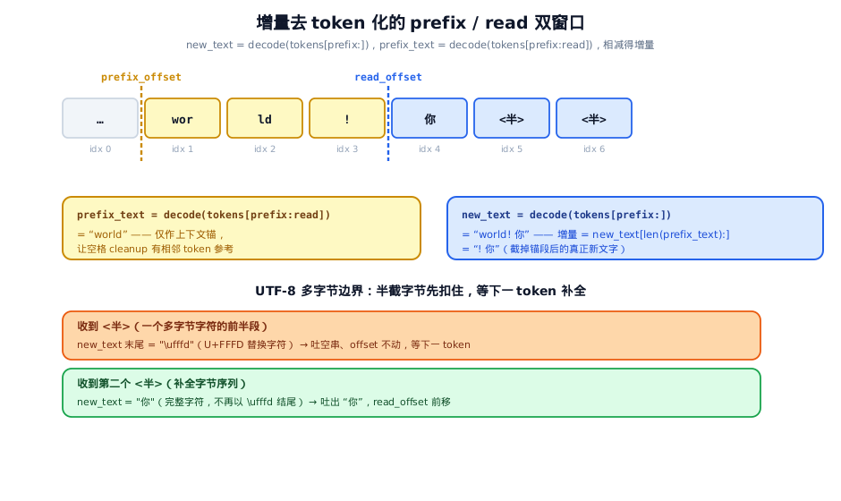

# 第9章　增量去 token 化与 stop string：把 id 流变成会停的文字流

## 你在这里


> *图注：全书地图高亮当前位置。[第 8 章](../ch08-output-processor/narrative/chapter.md) 拆开了 Stage 3 的那条单循环 `process_outputs()`——一整批混着 N 个请求的 token，怎么被解多路复用、扇出回 N 个客户端流。本章钻进那条单循环里被一笔带过的一个调用：`detokenizer.update()`。它负责把 token id 增量地变成文字、检测 stop string、按 `min_tokens` 守住下限，还要在 UTF-8 多字节字符被拆到多个 token 上时不吐半个乱码。再往后，[第 10 章](../ch10-logprobs/narrative/chapter.md) 接着讲同一循环里的另一笔账——logprobs 的组装。*

第 8 章那条单循环里有一行，当时我们故意没展开：

```python
# vllm/v1/engine/output_processor.py:L657
stop_string = req_state.detokenizer.update(
    new_token_ids, finish_reason == FinishReason.STOP
)
```

这一行做了两件看似简单、其实暗藏陷阱的事：**把新来的几个 token id 接着上文解成文字**，以及**判断输出里是不是冒出了用户设的 stop string**。本章就是这一行的全部内幕。

为什么这件事不简单？四个坑，每个都能让输出错乱：

1. **空格**。一个 token 解成什么字，取决于它两边是谁。`"▁world"` 单独解是 `"world"`，但接在 `"hello"` 后面要不要加空格，得看上下文。逐 token 解码若丢了上下文，空格就乱。
2. **UTF-8 多字节边界**。一个中文字符在 byte-fallback tokenizer 里可能被拆到两三个 token 上。解到一半是半截字节，显示成乱码 `�`。这半个字符绝不能吐给用户。
3. **stop string 跨 token**。stop=`"END"` 可能是 `"E"`、`"N"`、`"D"` 三个 token 才拼齐。流式输出时，你不能把可能是 stop 前缀的尾字符提前吐出去——一旦事后要截断就晚了。
4. **min_tokens**。用户要求"至少生成 20 个 token 再允许停"。这期间就算文字里出现了 stop string，也不能停。

本章的代码主线集中在三个文件：

- `vllm/v1/engine/detokenizer.py`——去 token 化的三路类层级 + `update` 主流程 + `check_stop_strings`，本章主轴；
- `vllm/tokenizers/detokenizer_utils.py`——慢路径的双 offset 窗口算法 + UTF-8 边界守卫；
- `vllm/v1/engine/output_processor.py`——第 8 章那条单循环里调 `update` 拿 stop_string 的那一小段，本章只关心它怎么把 stop_string 转成终止信号、回灌 EngineCore。

为了能在本地（无 GPU）把这套逻辑亲手跑一遍、打断点看数值，本章配了一份**只做减法**的精简版：和真实 vLLM 同名、同结构、同控制流，只删掉与去 token 化正交的可选分支（比如相邻特殊 token 间的空格抑制），其余 update 主流程、双窗口算法、UTF-8 守卫、stop 窗口搜索一字不差。它是"跑起来看数值"的交叉验证物，正文主线仍是真实源码。

---

## 9.1 三路工厂：一个 tokenizer 决定走哪条路

去 token 化不是一个类，而是一个三层类层级 + 一个工厂方法。先看这张全景，后面所有细节都挂在它上面。



> *图注：上半是工厂 `from_new_request` 的决策树——没 tokenizer 走空壳、Fast tokenizer 且 tokenizers 版本够新走快路径、否则退回慢路径。下半是继承层级：公共逻辑（update / holdback / min_tokens / 查 stop）全在抽象基类 `BaseIncrementalDetokenizer` 里写一次，两个子类只各自实现 `decode_next`——一个用 Rust 的 `DecodeStream`，一个用纯 Python 的 `detokenize_incrementally`。*

工厂方法本身很短，但每个分支都有讲究（`vllm/v1/engine/detokenizer.py`）：

```python
# vllm/v1/engine/detokenizer.py:L48-L66
@classmethod
def from_new_request(
    cls,
    tokenizer: TokenizerLike | None,
    request: EngineCoreRequest,
) -> "IncrementalDetokenizer":
    assert request.sampling_params is not None

    if tokenizer is None:
        # No tokenizer => skipping detokenization.
        return IncrementalDetokenizer()

    if USE_FAST_DETOKENIZER and isinstance(tokenizer, PreTrainedTokenizerFast):
        # Fast tokenizer => use tokenizers library DecodeStream.
        return FastIncrementalDetokenizer(tokenizer, request)

    # Fall back to slow python-based incremental detokenization.
    return SlowIncrementalDetokenizer(tokenizer, request)
```

三条路，对应三种处境：

**没 tokenizer，走空壳。** 有些请求根本不需要文字（比如只要 token id 喂给下游、或者纯 embedding 任务）。这时返回根类 `IncrementalDetokenizer` 本身——它只攒 token_ids，`update` 永远返回 `None`，`get_next_output_text` 永远返回空串。什么都不解码，省掉开销。

**Fast tokenizer，走快路径。** 这是绝大多数请求的归宿。条件有两个，缺一不可：tokenizer 是 `PreTrainedTokenizerFast`（HuggingFace 的快速 tokenizer，底层是 Rust），且 `USE_FAST_DETOKENIZER` 为真。后者是个版本闸：

```python
# vllm/v1/engine/detokenizer.py:L22
# Only tokenizers >= 0.22.0 supports DecodeStream with native prefill
# (ids parameter) used for FastIncrementalDetokenizer.
USE_FAST_DETOKENIZER = version.parse(tokenizers.__version__) >= version.parse("0.22.0")

# Error string from https://github.com/huggingface/tokenizers/...
INVALID_PREFIX_ERR_MSG = "Invalid prefix encountered"
```

为什么卡 0.22.0？因为快路径要用 `tokenizers` 库的 `DecodeStream`，并用它的 `ids` 参数做 **native prefill**——一次性把 prompt 喂进流里预热（细节见 §9.5）。这个 `ids` 参数是 0.22.0 才加的。版本不够，就只能退回慢路径。那个 `INVALID_PREFIX_ERR_MSG` 字符串先记一笔，它是快路径错误恢复的判别钥匙，§9.6 会用到。

**其余情况，走慢路径。** 非 fast tokenizer，或者 tokenizers 太老。慢路径是纯 Python 的增量去 token 化，任何 tokenizer 都能跑，代价是慢。

注意一个设计取舍：**三路分派的复杂度，被压在了构造期**。请求一建好，走哪条路就定死了，运行期的每次 `update` 都不再判断。这正是把"和具体 tokenizer 无关的公共逻辑"全提到基类、把"和后端有关的解码"留给子类 `decode_next` 的好处——主流程写一次，两条后端各自实现。下一节就看这个写一次的主流程。

---

## 9.2 主流程：update 一次做完解码、min_tokens、查 stop

`BaseIncrementalDetokenizer.update` 是本章的心脏。它在第 8 章那条单循环里每步被调一次，吃进"这步新生成的 token id"，吐出"是否命中 stop string"。整个函数（`vllm/v1/engine/detokenizer.py`）：

```python
# vllm/v1/engine/detokenizer.py:L95
def update(self, new_token_ids: list[int], stop_terminated: bool) -> str | None:
    """
    Update RequestState for the request_id by:
        1) Detokenize the new token ids incrementally.
        2) Evaluate stop criteria.

    Return matched stop string or None.
    """
    if not new_token_ids:
        # Skip detokenization if no new token ids.
        return None

    if stop_terminated and not self.include_stop_str_in_output:
        # If stop-terminated, exclude last token from detokenization
        # based on include_stop_str_in_output parameter.
        skipped_stop_token_id = new_token_ids[-1]
        new_token_ids = new_token_ids[:-1]
    else:
        skipped_stop_token_id = None

    # 1) Detokenize the new token ids incrementally.
    stop_check_offset = len(self.output_text)
    for new_token_id in new_token_ids:
        self.token_ids.append(new_token_id)
        self.output_text += self.decode_next(new_token_id)
        # Support min_tokens, see https://github.com/vllm-project/vllm/pull/22014
        if self.min_tokens and self.num_output_tokens() <= self.min_tokens:
            stop_check_offset = len(self.output_text)

    if skipped_stop_token_id is not None:
        # Cleanup after skipping detokenization.
        self.token_ids.append(skipped_stop_token_id)

    # 2) Evaluate stop strings.
    stop_string = None
    if self.stop and self.num_output_tokens() > self.min_tokens:
        stop = check_stop_strings(
            output_text=self.output_text,
            new_char_count=len(self.output_text) - stop_check_offset,
            stop=self.stop,
            include_in_output=self.include_stop_str_in_output,
        )
        if stop is not None:
            stop_string, truncate_to = stop
            if truncate_to != -1:
                self.output_text = self.output_text[:truncate_to]

    return stop_string
```

它把四个坑里的三个都装在这一个函数里。逐段拆。

**第一段：跳过 stop token。** 当 EngineCore 因为遇到 EOS 或某个 stop_token_id 而结束（`stop_terminated=True`），且用户不想在输出里看到那个触发停止的 token（`include_stop_str_in_output=False`），就把 `new_token_ids` 的最后一个弹出来不解码。但注意——它**不参与文字解码，事后仍补进 `token_ids`**（`self.token_ids.append(skipped_stop_token_id)`）。文字和 id 是两本账：用户的可见文字里不要这个停止 token，但 token id 列表（供下游、供统计）还得是完整的。

**第二段：逐 token 解码 + min_tokens 守卫。** for 循环里，每个 token 先 append 进 id 列表，再 `decode_next` 解成文字接到 `output_text` 尾巴上。`decode_next` 是抽象方法，快/慢路径各自实现，§9.5、§9.6 细讲。

min_tokens 用两道闸把守，这里是第一道——offset 推进（第二道是下一段的整体门控）。`stop_check_offset` 初始指向本次解码前的文末。循环里只要还没到 min_tokens（`num_output_tokens() <= self.min_tokens`），就把 `stop_check_offset` 一路推到当前文末。它的含义是"从这个位置往后的新增字符，才允许参与 stop 检查"。min_tokens 期间不断推这个 offset，等于把这段时间产生的所有字符都排除在 stop 搜索之外。

**第三段：查 stop。** min_tokens 的第二道闸在这：**只有 `num_output_tokens() > self.min_tokens` 才进 `check_stop_strings`**。两道闸配合——一道排除 min_tokens 期间产生的字符（offset 推进），一道整体门控"够不够 token 才允许查 stop"。`new_char_count = len(output_text) - stop_check_offset`，正是"本次该搜索的新增字符数"。命中后若 `truncate_to != -1`，把 `output_text` 截到那个位置。

为什么 min_tokens 要这么较真？因为它的语义是硬下限：用户说"至少 20 个 token"，那 stop string 就不许在第 20 个之前生效。漏一个字符进 stop 搜索窗口，都可能让请求提前停掉，违反承诺。

下面三节分别钻进这一段里被一笔带过的三个机关：holdback（流式怎么不提前吐 stop 前缀，§9.3）、`check_stop_strings`（搜索窗口怎么算，§9.4）、`decode_next` 的两种后端（§9.5、§9.6）。

---

## 9.3 holdback：流式输出为什么要扣住尾巴

update 截断 `output_text` 是在**整批处理时**做的。但流式输出有个时间差问题：token 是一个一个来的，用户也想一个字一个字看到。如果 stop=`"END"`，而模型刚吐出 `"E"`，这个 `"E"` 该不该马上给用户？

不该。因为下一步可能来 `"N"`、再下一步 `"D"`——那 `"END"` 就是 stop string，整段都该被截掉。可 `"E"` 已经流出去了，收不回来了。

vLLM 的解法叫 **holdback**：流式输出时，尾部扣住几个字符不吐，等局势明朗。扣多少？看构造期算好的 `stop_buffer_length`（`vllm/v1/engine/detokenizer.py`）：

```python
# vllm/v1/engine/detokenizer.py:L72
# Stop strings
params = request.sampling_params
assert params is not None
if params.stop is None:
    self.stop = []
elif isinstance(params.stop, str):
    self.stop = [params.stop]
else:
    self.stop = params.stop
self.min_tokens = params.min_tokens
self.include_stop_str_in_output = params.include_stop_str_in_output

# Number of chars to hold back when stop strings are to be excluded
# from streamed output.
if self.stop and not self.include_stop_str_in_output:
    self.stop_buffer_length = max(len(s) for s in self.stop) - 1
else:
    self.stop_buffer_length = 0
self._last_output_text_offset: int = 0
```

核心就一行：`stop_buffer_length = max(len(s) for s in self.stop) - 1`。设最长 stop 串长 $L$，就扣住尾部 $L-1$ 个字符。

**为什么是 $L-1$ 而不是 $L$？** 这是个能证明的最优值。

**直觉先行：** 任何 stop 串在"完整出现"之前，已经露面的部分最多只有 $L-1$ 个字符（差最后一个字符才凑齐）。只要把尾部 $L-1$ 个字符全扣住不吐，那么任何尚未完整出现的 stop 前缀，就一定还压在缓冲里、随时能回收。而 stop 串**完整出现的那一刻**，`check_stop_strings` 会在同一次 update 里命中并截断——被截掉的字符还没流出去，所以根本不用扣到第 $L$ 个。

**严格点说。** 设当前文长 $n$，扣住的尾部区间是 $[n-(L-1),\ n)$。假设某 stop 串 $s$ 将在未来某步完整出现、结束于位置 $e$，它的起点就是 $e-|s|$。

在它完整出现之前的任意时刻，文末还没到终点，也就是 $n < e$——$s$ 至少还差一个字符。这一刻 $s$ 已露面的前缀落在区间 $[e-|s|,\ n)$，它的长度是：

$$
n-(e-|s|) = |s|-(e-n) \le |s|-1 \le L-1
$$

（第一个 $\le$：因为 $n < e$，故 $e-n \ge 1$；第二个 $\le$：$|s| \le L$ 即任意 stop 串不超过最长串。）

这段长度不超过 $L-1$ 的前缀，右端正好是 $n$，所以整个落在扣留区 $[n-(L-1),\ n)$ 里——**未完成的 stop 前缀从不外流**。

而当文末抵达终点（$n=e$、stop 串完整出现）时，update 直接截断，根本不依赖 holdback。

所以 $L-1$ 充分；又因为露面的前缀最长能到 $L-1$，再少扣一个就可能漏，故 $L-1$ 也是最省的。

这个时间线画出来是这样：



> *图注：stop=`"END"`，$L=3$，扣留 $L-1=2$ 个尾字符。前两步流式只吐安全区（绿）、扣住可能是前缀的尾部（橙）；第三步 `"END"` 拼齐，`check_stop_strings` 命中、`output_text` 截到 `"END"` 之前。底部两条注：序列结束（`finished=True`）时 holdback 归零、扣留区一次性全吐；min_tokens 期间 `stop_check_offset` 持续推到文末，这段时间的 stop 一律不算。*

holdback 在取文本时兑现。`get_next_output_text` 是流式取文本的出口（`vllm/v1/engine/detokenizer.py`）：

```python
# vllm/v1/engine/detokenizer.py:L148
def get_next_output_text(self, finished: bool, delta: bool) -> str:
    """If delta is True, only new text since the last call to
    this method is returned"""

    # We return the full output text if the sequence is finished.
    buffer_length = 0 if finished else self.stop_buffer_length
    if not delta:
        if not buffer_length:
            return self.output_text
        return self.output_text[:-buffer_length]

    length = len(self.output_text) - buffer_length
    last_offset = self._last_output_text_offset
    if last_offset < length:
        self._last_output_text_offset = length
        return self.output_text[last_offset:length]
    return ""
```

第一行就把规则说尽了：**`buffer_length = 0 if finished else self.stop_buffer_length`**。序列没结束，扣住 `stop_buffer_length` 个尾字符；一旦结束，扣零——把之前压着的全释放出去。

两种取法：`delta=False`（cumulative，要全文）返回 `output_text[:-buffer_length]`；`delta=True`（增量流式，只要上次之后的新字符）返回 `output_text[last_offset:length]`，其中 `length = len(output_text) - buffer_length` 正是扣掉缓冲后的可见末尾，`_last_output_text_offset` 记住上次吐到哪、保证不重复吐。

**一轮数值追踪**，把这两节连起来看。设 stop=`["END"]`、`include_stop_str_in_output=False`、`min_tokens=0`，流式（delta=True）。`stop_buffer_length = 3-1 = 2`。下表逐行对应上图三步，是同一条 delta 流——`_last_output_text_offset` 依次 0→1→2：

| 步 | decode 出 | output_text | finished | length=len-2 | 本次 delta 吐 |
|----|-----------|-------------|----------|--------------|---------------|
| k   | `"好的E"`  | `"好的E"`     | False    | 3-2=1        | `"好"`（offset 0→1）|
| k+1 | `"N"`     | `"好的EN"`    | False    | 4-2=2        | `"的"`（offset 1→2）|
| k+2 | `"D"`     | `"好的END"`   | —        | check_stop 命中，截到 `"好的"` | — |

第 k+2 步，`check_stop_strings` 在 `"好的END"` 里找到 `"END"` 起于索引 2，截断 `output_text = "好的"`。此前流式只吐了 `"好"`、`"的"`——`"END"` 一个字都没漏出去。holdback 把"可能是 stop 前缀的尾巴"死死压住，直到真相大白。这就是 $L-1$ 充分性证明在跑起来时的样子。

---

## 9.4 check_stop_strings：只搜该搜的那一小段

上一节反复提到 `check_stop_strings` 会"命中并截断"。它怎么找、为什么不每次扫全文？看源码（`vllm/v1/engine/detokenizer.py`）：

```python
# vllm/v1/engine/detokenizer.py:L309
def check_stop_strings(
    output_text: str,
    new_char_count: int,
    stop: list[str],
    include_in_output: bool,
) -> tuple[str, int] | None:
    """Check if any stop strings are matched and truncate sequence
    output text accordingly.

    Returns tuple (stop_string, offset) if matched or else None.

    Where stop_string is the matched stop string and offset is the
    length to which output_text should be truncated, or -1 for no
    truncation.
    """
    if not new_char_count or not stop:
        return None

    for stop_str in stop:
        stop_string_len = len(stop_str)
        # Avoid searching already-searched text.
        stop_index = output_text.find(stop_str, 1 - new_char_count - stop_string_len)
        if stop_index == -1:
            continue

        if include_in_output:
            # Truncate to end of stop string.
            stop_index += stop_string_len
            if stop_index >= len(output_text):
                # No truncation required.
                return stop_str, -1

        # Truncate the output text to either the beginning
        # or end of the stop string.
        return stop_str, stop_index
    return None
```

关键在 `find` 的 start 参数：`1 - new_char_count - stop_string_len`。这是个负索引（Python 里负数从尾部数起），它划定了一个**搜索下界**。

**为什么不从头搜起？** 因为之前的字符早搜过了。一个 stop 串要在本步才命中，必然横跨"本次新增的字符"——否则上一步就该命中了。所以只需回看两段：

- 本次新增的 `new_char_count` 个字符；
- 加上它们左边、可能与之拼成 stop 串的 $L-1$ 个旧字符（$L=$ `stop_string_len`）。

合起来回看 `new_char_count + stop_string_len - 1` 个字符，对应负索引起点 `-(new_char_count + stop_string_len - 1) = 1 - new_char_count - stop_string_len`。一字不差。

**量化一下省了多少。** 朴素做法每步 `find` 扫整段，是 $O(n)$，$n$ 步累计 $O(n^2)$。这个窗口把每步搜索压到只跟"本步新增几个字符加 stop 串长"有关：

$$
O(\mathrm{new\_char\_count} + L)
$$

和总长 $n$ 无关。流式下每步通常只新增几个字符，等于把 stop 匹配从二次降到近线性。

**截断 offset 怎么算？** 看 `include_in_output`：

- **不含 stop（默认）**：`stop_index` 就是 stop 串的**起点**，截到这就把 stop 整段切掉。比如 `"好的END"` 命中 `"END"` 于索引 2，截成 `"好的"`。
- **含 stop**：`stop_index += stop_string_len` 推到 stop 串**末尾**之后，保留 stop 串。若已经到文末（`stop_index >= len`），返回 `-1` 表示"无需截断"——这就是 update 里那个 `if truncate_to != -1` 判断的来源。

回到 §9.3 的数值例子：第 k+2 步 `output_text="好的END"`，`new_char_count` 是本步新增（`"D"`，1 个字符），`stop_string_len=3`，start = `1-1-3 = -3`，即从倒数第 3 个字符 `"E"` 起找 `"END"`，命中于索引 2，返回 `("END", 2)`，截成 `"好的"`。窗口刚好覆盖到能拼出 stop 的最左端，一个字符都不多扫。

---

## 9.5 慢路径：双 offset 窗口怎么对抗空格清理

现在轮到 `decode_next` 的两种后端。先看慢路径——它把"逐 token 解码为什么难"讲得最透。

难点在开篇提过的坑 1：**tokenizer 的 `convert_tokens_to_string` 会按相邻 token 决定加不加空格**（这叫 cleanup 算法——HuggingFace tokenizer 在把 token 列表转为字符串时，用前后邻居判断要不要在 `"▁world"` 这类以下划线/空格标记开头的 token 前补一个空格）。你要是只把单个新 token 拿去解码，就丢了它和左邻右舍的关系，空格全错。

慢路径的对策是 `detokenize_incrementally`，核心是一对 offset——`prefix_offset` 和 `read_offset`——圈出一段上下文窗口。先看慢路径子类怎么调它（`vllm/v1/engine/detokenizer.py`）：

```python
# vllm/v1/engine/detokenizer.py:L291
def decode_next(self, next_token_id: int) -> str:
    new_tokens, decoded_text, prefix_offset, read_offset = detokenize_incrementally(
        tokenizer=self.tokenizer,
        all_input_ids=self.token_ids,
        prev_tokens=self.tokens,
        prefix_offset=self.prefix_offset,
        read_offset=self.read_offset,
        skip_special_tokens=self.skip_special_tokens,
        spaces_between_special_tokens=self.spaces_between_special_tokens,
    )

    self.tokens.extend(new_tokens)
    self.prefix_offset = prefix_offset
    self.read_offset = read_offset

    return decoded_text
```

它把上次的两个 offset 传进去，拿回新文本和**更新后**的两个 offset，存起来供下次用。两个 offset 的初值在构造期由 `convert_prompt_ids_to_tokens` 算好（`vllm/tokenizers/detokenizer_utils.py`）：

```python
# vllm/tokenizers/detokenizer_utils.py:L56
# 5 is an arbitrary value that should work for all
# tokenizers (bigger = more conservative).
INITIAL_INCREMENTAL_DETOKENIZATION_OFFSET = 5


def convert_prompt_ids_to_tokens(
    tokenizer: TokenizerLike,
    prompt_ids: list[int],
    skip_special_tokens: bool = False,
) -> tuple[list[str], int, int]:
    """Converts the prompt ids to tokens and returns the tokens and offsets
    for incremental detokenization.

    Note that not all tokens are converted to strings. Only the tokens that
    are necessary for incremental detokenization are converted to strings.
    """
    # We do not need to convert the whole prompt to tokens.
    # Offset a little more in case we have special tokens.
    new_tokens = tokenizer.convert_ids_to_tokens(
        prompt_ids[-INITIAL_INCREMENTAL_DETOKENIZATION_OFFSET - 2 :],
        skip_special_tokens=skip_special_tokens,
    )
    read_offset = len(new_tokens)
    prefix_offset = max(read_offset - INITIAL_INCREMENTAL_DETOKENIZATION_OFFSET, 0)
    # This is required to guard against out-of-vocab prompt token ids
    _replace_none_with_empty(new_tokens)  # type: ignore[arg-type]
    return new_tokens, prefix_offset, read_offset
```

注意它**不解码整个 prompt**，只取末尾 `INITIAL_OFFSET+2 = 7` 个 token。因为增量解码只需要"紧邻新 token 的那一小段上下文"就够判断空格了，整段 prompt 解码纯属浪费。`read_offset` 指向已读到的位置，`prefix_offset` 往前退 5 个 token 作为上下文锚。

**量化一下这个窗口省了多少。** 朴素做法每步都把"到目前为止的全序列"重新 detokenize 一遍——第 $k$ 步要解 $k$ 个 token，$n$ 步累计 $O(n^2)$。双 offset 窗口把每步的解码范围钉死在 `[prefix_offset:]` 这一小段尾部 token 上，长度恒为 `INITIAL_OFFSET=5` 量级、与已生成多少 token 无关，于是每步降到 $O(\mathrm{INITIAL\_OFFSET})$、整体趋近 $O(n)$。和 §9.4 的 stop 搜索窗口是同一招、同一收益：把"每步重扫全文"压成"每步只看尾部常数段"，二次降到近线性。窗口存在的唯一理由是给空格 cleanup 喂足相邻上下文，而非正确性需要全量重解。

真正干活的是 `detokenize_incrementally`（函数定义在 `vllm/tokenizers/detokenizer_utils.py:L110`，下面截取的是它 L143 起的函数体主干）：

```python
# vllm/tokenizers/detokenizer_utils.py:L143 起（函数体）
new_token_id = all_input_ids[-1]
# This is the first iteration for this sequence
is_first_iter = prev_tokens is None
if is_first_iter:
    (prev_tokens, prefix_offset, read_offset) = convert_prompt_ids_to_tokens(
        tokenizer, all_input_ids[:-1], skip_special_tokens=skip_special_tokens
    )
assert prev_tokens is not None

# If the new token id is out of bounds, return an empty string.
if 0 <= new_token_id < len(tokenizer):
    # Put new_token_id in a list so skip_special_tokens is respected
    new_tokens = tokenizer.convert_ids_to_tokens(
        [new_token_id], skip_special_tokens=skip_special_tokens
    )
    if isinstance(new_tokens, str):
        new_tokens = [new_tokens]
    else:
        # This is required to guard against out-of-vocab prompt token ids
        # (for example when using dummy weights)
        _replace_none_with_empty(new_tokens)  # type: ignore[arg-type]
else:
    new_tokens = [""]
output_tokens = prev_tokens + new_tokens

# If this is the first iteration, return all tokens.
if is_first_iter:
    new_tokens = output_tokens

# The prefix text is necessary only to defeat cleanup algorithms in
# the decode which decide to add a space or not depending on the
# surrounding ids.
if tokenizer.is_fast or not tokenizer.get_added_vocab():
    prefix_text = tokenizer.convert_tokens_to_string(
        output_tokens[prefix_offset:read_offset]
    )
    new_text = tokenizer.convert_tokens_to_string(output_tokens[prefix_offset:])
# … 省略：非 fast 且有 added vocab 的 tokenizer 走逐 added-token 切段的等价分支 …

if len(new_text) <= len(prefix_text) or new_text.endswith("�"):
    # utf-8 char at the end means it's a potential unfinished byte sequence
    # from byte fallback tokenization.
    # If it's in the middle, it's probably a real invalid id generated
    # by the model
    return new_tokens, "", prefix_offset, read_offset

new_text = new_text[len(prefix_text) :]
return new_tokens, new_text, read_offset, len(output_tokens)
```

双窗口的精髓在这两行：

```python
prefix_text = tokenizer.convert_tokens_to_string(output_tokens[prefix_offset:read_offset])
new_text    = tokenizer.convert_tokens_to_string(output_tokens[prefix_offset:])
```

两次解码**都从同一个 `prefix_offset` 起**，区别只在右端：`prefix_text` 解到 `read_offset`（不含新 token），`new_text` 解到末尾（含新 token）。两者公共前缀完全一样——因为左边那段上下文一致，cleanup 的空格判断也就一致。把 `prefix_text` 从 `new_text` 头上削掉（`new_text[len(prefix_text):]`），剩下的就是**带正确空格的纯增量文本**。

为什么不直接解码新 token？因为脱离了左边上下文，cleanup 可能多加或少加一个空格。用一段共享前缀"锚"住空格判断，再相减——这就是双窗口对抗空格清理的全部手法。



> *图注：token 横条上标出 `prefix_offset`、`read_offset` 两条竖线。`prefix_text=decode([prefix:read])`、`new_text=decode([prefix:])`，二者相减得增量。下半画 UTF-8 半字节情形：解到一半末尾是 `�`，吐空串、offset 不动，等下一 token 把字节补全再推进。*

**这就接上了坑 2——UTF-8 多字节边界**：

```python
if len(new_text) <= len(prefix_text) or new_text.endswith("�"):
    return new_tokens, "", prefix_offset, read_offset
```

两种情形吐空串、**不推进 offset**：

- `len(new_text) <= len(prefix_text)`：新 token 没让文本变长，说明它还没解出可见字符。
- `new_text.endswith("�")`：末尾是替换字符 U+FFFD（`�`）。byte-fallback tokenizer 把一个多字节 UTF-8 字符拆到几个 token 上，解到一半就是半截字节，显示成 `�`。

关键判断是**末尾**：末尾的 `�` 意味着"字节序列还没拼完"，应当等下一个 token 补全，所以吐空串、按兵不动（offset 不变，下次还从这儿接着解）。而**中间**的 `�` 才是模型真生成了一个非法 id——那不归这里管。

**省略说明**：上面省掉了一个 `else` 分支（非 fast 且带 added vocab 的 tokenizer）。它把 added token 切出来逐段拼接，但对 offset 和 UTF-8 逻辑而言行为等价，只是写法绕，本章按主线 fast / 无 added-vocab 路径讲。

**一轮 UTF-8 数值追踪。** 设一个中文字 `"你"`（UTF-8 三字节）被 byte-fallback 拆成两个 token：先来半截字节，再来补全字节。

| 步 | 新 token | new_text 末尾 | 判断 | decode_next 返回 | offset 动否 |
|----|----------|---------------|------|-----------------|-------------|
| j   | 半字节   | `"…�"`（`�`）| `endswith("�")` 真 | `""` | 不动 |
| j+1 | 补全字节 | `"…你"`        | 都不满足 | `"你"`（相减后）| 推进 |

第 j 步硬扣住半个乱码不吐；第 j+1 步字节补齐，`"你"` 完整解出、offset 这才前进。用户从头到尾只看到 `"你"`，从没见过 `�`。

---

## 9.6 快路径：DecodeStream 与 UTF-8 错误恢复

快路径不用纯 Python 算双窗口——它把这套苦活交给 `tokenizers` 库的 Rust 实现 `DecodeStream`。`DecodeStream` 内部自己维护增量状态，逐 token `step` 就行。

构造期就和慢路径分道扬镳——它用 `DecodeStream` 的 `ids` 参数做 **native prefill**（`vllm/v1/engine/detokenizer.py`）：

```python
# vllm/v1/engine/detokenizer.py:L179
# Use native prefill to prime the decode stream with prompt tokens.
# Look up DecodeStream on the module so backend patches (e.g. the
# fastokens shim that replaces ``tokenizers.decoders.DecodeStream``)
# are honored regardless of import order.
self.stream = tokenizers.decoders.DecodeStream(
    ids=request.prompt_token_ids,
    skip_special_tokens=self.skip_special_tokens,
)
```

prompt 一次性喂进流里预热，之后只喂新 token。这正是 §9.1 那个版本闸卡 0.22.0 的原因——`ids` 参数那时才有。

> **v0.21.0 更新**：注意这里写的是全名 `tokenizers.decoders.DecodeStream(...)` 而非裸名 `DecodeStream`——后面错误恢复时重建解码流（`vllm/v1/engine/detokenizer.py:L243` 附近）也是同样写法，模块导入相应由 `from tokenizers.decoders import DecodeStream` 改成 `import tokenizers.decoders`。区别在于：裸名会在导入期被绑死成一个局部名，谁先 import 谁说了算；按模块属性解析后，像 fastokens 这类后端在运行期替换 `tokenizers.decoders.DecodeStream` 的 shim 才会被尊重，不再受 import 顺序影响。`FastIncrementalDetokenizer` 的流式语义不变，只是把底层解码流实现从"导入期绑死"放开为"可热替换"。

解码就是调 `step`（`vllm/v1/engine/detokenizer.py`）：

```python
# vllm/v1/engine/detokenizer.py:L210
def decode_next(self, next_token_id: int) -> str:
    token = self._protected_step(next_token_id)

    # … 省略：spaces_between_special_tokens=False 时抑制相邻特殊 token 间空格的可选分支 …

    return token or ""

def _protected_step(self, next_token_id: int) -> str | None:
    try:
        token = self.stream.step(self.tokenizer, next_token_id)
    except (OverflowError, TypeError):
        # Handle rare observed overflow, still to be diagnosed.
        # See https://github.com/vllm-project/vllm/issues/21951.
        logger.exception("Encountered invalid token id: %r", next_token_id)
        token = None
    except Exception as e:
        if not str(e).startswith(INVALID_PREFIX_ERR_MSG):
            raise e
        # Recover from edge case where tokenizer can produce non-monotonic,
        # invalid UTF-8 output, which breaks the internal state of
        # tokenizers' DecodeStream.
        # See https://github.com/vllm-project/vllm/issues/17448.
        logger.warning(
            "Encountered invalid prefix detokenization error"
            " for request %s, resetting decode stream.",
            self.request_id,
        )
        self.stream = DecodeStream(skip_special_tokens=self.skip_special_tokens)
        token = self.stream.step(self.tokenizer, next_token_id)
    return token
```

`decode_next` 干净得只剩一句 `_protected_step` + 兜底空串。复杂度全在 `_protected_step` 的异常处理里——这是坑 2 的快路径版本，但麻烦在于 `DecodeStream` 是个有状态的黑盒。

三种异常，三种处置：

- **`(OverflowError, TypeError)`**：罕见的 overflow（issue #21951，至今没完全诊断清楚）。吞掉，返回 `None`（外层 `token or ""` 变空串）。宁可这一个 token 没文字，也不让整个请求崩。
- **`"Invalid prefix encountered"` 开头的异常**：这是 §9.1 记下的那个 `INVALID_PREFIX_ERR_MSG`。`DecodeStream` 内部状态被非单调、无效的 UTF-8 输出搞坏了（issue #17448）。慢路径靠"不推进 offset"自然等待，但快路径的状态在 Rust 黑盒里，没法只回退一点——只能**整个重建 `DecodeStream`** 并重放当前 token。重建后状态干净，`step` 能正常出字。
- **其他异常**：`raise e` 原样抛出。不是已知的可恢复情形，不硬吞——掩盖真 bug 比崩溃更危险。

判别全靠那个错误字符串前缀匹配 `str(e).startswith(INVALID_PREFIX_ERR_MSG)`。这是个略脆的契约（依赖上游库的错误文案），所以源码里特意把它链接到了 `tokenizers` 仓库里抛这条错的具体那一行，留作追溯。

**省略说明**：`decode_next` 里省掉了一个可选分支——`spaces_between_special_tokens=False` 时抑制相邻特殊 token 之间的空格。它默认不触发（多数请求要么 skip 特殊 token、要么保留空格），与本章关心的 UTF-8 / stop 行为正交。删掉后 `decode_next` 退化成 `return token or ""`，主线不受影响。

**快慢两路的一个口径差异**值得记一笔：慢路径的 `token_ids` 里**含 prompt**（双窗口算法需要完整上下文），快路径不含（`DecodeStream` 已经用 prompt 做过 native prefill，只攒 output token）。所以慢路径子类覆写了 `output_token_ids` 和 `num_output_tokens`，减去 prompt 长度，对外保持"输出 token"口径统一——否则 §9.2 那两道 min_tokens 闸用的 `num_output_tokens()` 在两条路上含义就不一致了。

---

## 9.7 闭环：stop_string 怎么反向通知 EngineCore

最后回到起点。`update` 吐出 stop_string 之后，第 8 章那条单循环怎么处置它？看那一小段（`vllm/v1/engine/output_processor.py`）：

```python
# vllm/v1/engine/output_processor.py:L653
assert req_state.detokenizer is not None
# 2) Detokenize the token ids into text and perform stop checks.
stop_string = req_state.detokenizer.update(
    new_token_ids, finish_reason == FinishReason.STOP
)
if stop_string:
    finish_reason = FinishReason.STOP
    stop_reason = stop_string

# … 省略：logprobs 组装、RequestOutput 装配、流式输入回灌等正交逻辑 …

# Free completed requests.
if finish_reason is not None:
    self._finish_request(req_state)
    if not engine_core_output.finished:
        # If req not finished in EngineCore, but Detokenizer
        # detected stop string, abort needed in EngineCore.
        reqs_to_abort.append(req_id)
```

这里有个**层级错位**要处理。stop string 是**文本层**概念——得把 token 解成文字才看得出 `"\n\n"` 出现了。而 EngineCore 在另一个进程里，只懂 **token 层**的停止（EOS、stop_token_id）。它压根不知道"文字里冒出了 stop string"这回事。

所以去 token 化这一侧检测到 stop_string 后要做两件事：

1. **对前端改写终止理由**：`finish_reason = FinishReason.STOP`、`stop_reason = stop_string`。这个请求在前端看来已经结束了。
2. **反向通知 EngineCore**：`if not engine_core_output.finished`——EngineCore 自己还没把这个请求当结束（因为它没检测文本），那就把 `req_id` 塞进 `reqs_to_abort`。第 8 章里我们见过这个列表的另一头：`output_handler` 会 `await engine_core.abort_requests_async(reqs_to_abort)`，反向把请求 abort 掉、释放它的 KV cache。这条反向通道，就是第 8 章那张图里的红色虚线。

至此闭环成形：一批 token id 进来 → 增量解成文字（双窗口/DecodeStream，守住 UTF-8 边界）→ 流式时 holdback 扣住尾巴 → 够 min_tokens 后查 stop（窗口化搜索）→ 命中则截断文本、改写 finish_reason、反向 abort EngineCore。第 8 章那条被一笔带过的 `detokenizer.update()`，里里外外讲完了。

---

## 本章小结

把一串 token id 变成"会在正确位置停下"的文字流，难点不在解码本身，而在四个边界。本章的代码主线落在 `vllm/v1/engine/detokenizer.py` 与 `vllm/tokenizers/detokenizer_utils.py` 两个文件：

- **空格**：慢路径用 `prefix_offset`/`read_offset` 双窗口给 cleanup 算法喂足上下文，两次解码相减得纯增量；快路径把这交给 `DecodeStream`。
- **UTF-8 多字节**：末尾的 `�` 意味着字节没拼完，吐空串、不推进，等下一 token——慢路径靠 offset 不动，快路径靠重建 `DecodeStream` 从内部状态损坏中恢复。
- **stop string 跨 token**：流式扣住尾部 $L-1$ 个字符（`stop_buffer_length`），证明了这是充分且最省的 holdback；`check_stop_strings` 只在 `1-new_char_count-L` 起的窗口里搜，把匹配从 $O(n^2)$ 降到近线性。
- **min_tokens**：两道闸——offset 推进排除早期字符、`num_output_tokens() > min_tokens` 门控查 stop 时机——守住"至少生成这么多"的硬下限。

最后，stop string 是文本层信号，必须反向 abort 回 token 层的 EngineCore，才能真正释放资源。下一章，[第 10 章](../ch10-logprobs/narrative/chapter.md) 接着拆同一条单循环里的另一笔账——logprobs 的组装，以及它自己那套 byte-fallback 修正。
