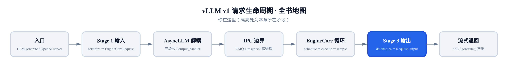
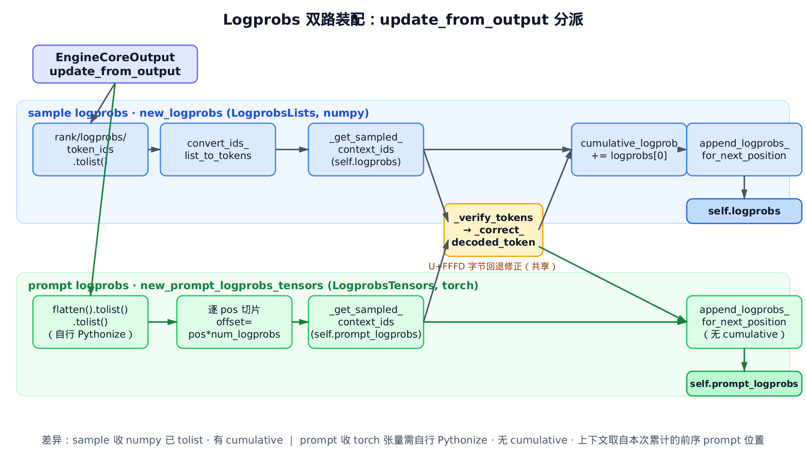
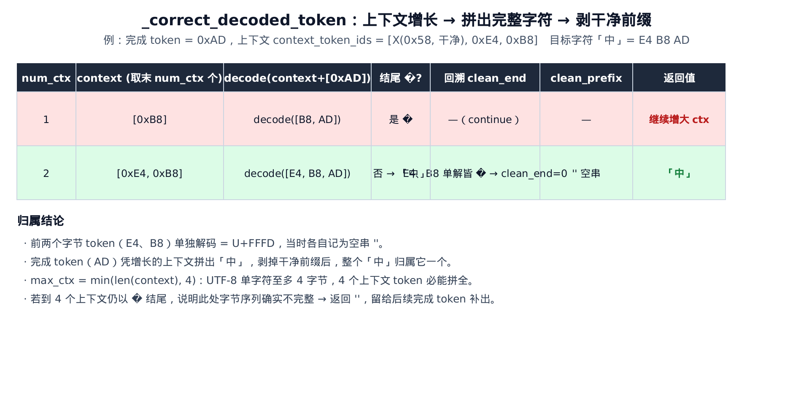
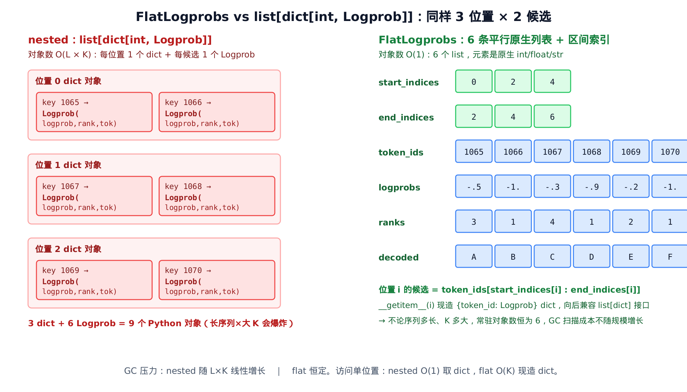

# 第10章　Logprobs 装配与字节回退修正：从张量到 OpenAI 容器

## 你在这里



> *图注：全书地图高亮当前位置。[第 8 章](../ch08-output-processor/narrative/chapter.md) 拆开了 Stage 3 那条单循环 `process_outputs()`——一整批混着 N 个请求的输出，怎么被解多路复用、扇出回 N 个客户端流。[第 9 章](../ch09-detokenization/narrative/chapter.md) 钻进那循环里的 `detokenizer.update()`，讲了把 token id 增量解成会停的文字流。本章接着讲同一循环里被一笔带过的另一笔账：`logprobs_processor.update_from_output()`——把 EngineCore 吐回来的一堆 logprobs 张量，装配成 OpenAI 兼容的 sample / prompt logprobs 容器。再往后，这些容器随 `RequestOutput` 一起返回给调用者，请求生命周期就走完了。*

第 8 章那条单循环里，每个请求都会走到这么一行（`vllm/v1/engine/output_processor.py:L639-L641`）：

```python
# vllm/v1/engine/output_processor.py:L639
req_state.logprobs_processor.update_from_output(engine_core_output)
```

上一章我们盯着它隔壁的 `detokenizer.update()`。这一章轮到它本身。这一行看着平平无奇，背后却藏着四件不那么平凡的事：

1. **两条形态不同的输入**。sample logprobs（生成 token 的）和 prompt logprobs（prompt token 的）从 EngineCore 出来时长得不一样——一个是已经搬到 CPU 的 numpy 列表，一个是还带着 torch 张量的二维数组。两条路装配代码看着像重复，其实必须分开。
2. **一个累计概率**。生成序列要维护 `cumulative_logprob = Σ log P`，用于打分；prompt 不参与。
3. **一个字节回退的坑**。logprobs 里每个候选 token 都要解成可读字符串。可一个中文字、一个 emoji 在 byte-fallback tokenizer 里会被拆到好几个 token 上，单独解一个 token 只能得到半截字节、显示成乱码 `�`。怎么把它修回完整字符——这是本章的技术核心。
4. **两种存储格式**。同样一份 logprobs，可以存成朴素的 `list[dict]`，也可以存成省内存、降 GC 的 `FlatLogprobs`。由 `sampling_params.flat_logprobs` 选。

本章的代码主线集中在两个文件：

- `vllm/v1/engine/logprobs.py`——每请求的装配器 `LogprobsProcessor`，双路更新、字节回退修正、累计跟踪，本章主轴；
- `vllm/logprobs.py`——底层容器：`Logprob` 叶子、`FlatLogprobs` 扁平结构、`append_logprobs_for_next_position` 写入分叉。

末尾我们还会回到 `output_processor.py`，看这些容器怎么被 `_new_completion_output` 在 DELTA / FINAL 模式下取走，装进 `CompletionOutput`。

为了能在本地（无 GPU）把这套逻辑亲手跑一遍、打断点看数值，本章配了一份**只做减法**的精简版：和真实 vLLM 同名、同结构、同控制流，只删掉与 logprobs 正交的编排逻辑（队列归并、统计、并行采样合并等），装配主流程、字节回退算法、累计跟踪、flat/nested 分叉一字不差。它是"跑起来看数值"的交叉验证物，正文主线仍是真实源码。

---

## 10.1 一张总图：两条泳道，一个分派口

先看全景，后面所有细节都挂在它上面。



> *图注：上泳道是 sample logprobs，下泳道是 prompt logprobs，共用中间那个黄色的字节回退修正框。两条泳道都从同一个分派口 `update_from_output` 进来，最后各自写进 `self.logprobs` / `self.prompt_logprobs`。关键差异标在底注：sample 收 numpy 已 tolist、维护 cumulative；prompt 收 torch 张量、需自行 Pythonize、不维护 cumulative。*

分派口本身只有四行（`vllm/v1/engine/logprobs.py:L348-L352`）：

```python
# vllm/v1/engine/logprobs.py:L348
def update_from_output(self, output: EngineCoreOutput) -> None:
    if output.new_logprobs is not None:
        self._update_sample_logprobs(output.new_logprobs)
    if output.new_prompt_logprobs_tensors is not None:
        self._update_prompt_logprobs(output.new_prompt_logprobs_tensors)
```

两个 `if` 互不排斥——一个 `EngineCoreOutput` 可能同时带着 sample 和 prompt 两路 logprobs，于是两条泳道都跑。这就是图上唯一对外的入口。

但在跑装配之前，得先有容器。容器什么时候建、建成什么样，全看请求当初要不要 logprobs。

## 10.2 容器初始化：三个三元分支决定开关

每个请求新进来时，`from_new_request` 给它造一个 `LogprobsProcessor`。这个工厂方法不长，但每个三元分支都对应一个开关语义，值得逐个看（`vllm/v1/engine/logprobs.py:L29-L67`）：

```python
# vllm/v1/engine/logprobs.py:L29
@dataclass
class LogprobsProcessor:
    # Tokenizer for this request,
    # None if detokenization is disabled.
    tokenizer: TokenizerLike | None

    # Logprobs for this request
    logprobs: SampleLogprobs | None
    prompt_logprobs: PromptLogprobs | None
    cumulative_logprob: float | None
    num_logprobs: int | None
    num_prompt_logprobs: int | None

    @classmethod
    def from_new_request(
        cls,
        tokenizer: TokenizerLike | None,
        request: EngineCoreRequest,
    ) -> "LogprobsProcessor":
        sampling_params = request.sampling_params
        assert sampling_params is not None
        num_logprobs = sampling_params.num_logprobs
        num_prompt_logprobs = sampling_params.prompt_logprobs
        return cls(
            tokenizer=tokenizer,
            cumulative_logprob=(None if num_logprobs is None else 0.0),
            logprobs=(
                None
                if num_logprobs is None
                else create_sample_logprobs(sampling_params.flat_logprobs)
            ),
            prompt_logprobs=(
                None
                if num_prompt_logprobs is None
                else create_prompt_logprobs(sampling_params.flat_logprobs)
            ),
            num_prompt_logprobs=num_prompt_logprobs,
            num_logprobs=num_logprobs,
        )
```

三个三元分支，记住一句话就够：**`None` 即"这路 logprobs 整条关闭"**。

- `num_logprobs is None` ⇒ 用户没要 sample logprobs，那么 `logprobs` 容器和 `cumulative_logprob` **一起**都是 `None`。注意累计概率是跟着 sample 路一起开关的——没有 sample logprobs，就没有累计概率可言。
- `num_prompt_logprobs is None` ⇒ 用户没要 prompt logprobs，`prompt_logprobs` 容器是 `None`。
- 要的话，就调 `create_sample_logprobs` / `create_prompt_logprobs` 造容器；`cumulative_logprob` 初值给 `0.0`（准备往上累加）。

容器长什么样，取决于 `flat_logprobs` 这个布尔开关，这正是 §10.6 要讲的 flat vs nested。先看构造函数本身（`vllm/logprobs.py:L162-L172`）：

```python
# vllm/logprobs.py:L162
def create_prompt_logprobs(flat_logprobs: bool) -> PromptLogprobs:
    """Creates a container to store prompt logprobs for a request"""
    logprobs: PromptLogprobs = FlatLogprobs() if flat_logprobs else []
    # NOTE: logprob of first prompt token is None.
    logprobs.append(None)
    return logprobs


def create_sample_logprobs(flat_logprobs: bool) -> SampleLogprobs:
    """Creates a container to store decode logprobs for a request"""
    return FlatLogprobs() if flat_logprobs else []
```

两个细节：

1. **flat 选 `FlatLogprobs()`，否则用裸 `[]`**。这就是格式分叉的源头。
2. **prompt 容器开局就 `append(None)`**。为什么？第一个 prompt token 没有前驱，没法定义"在前文条件下的 logprob"——它的条件概率没有意义。所以首位永远占一个 `None`。sample 容器没有这个占位，因为生成的第一个 token 是有 prompt 作前文的。

用精简版把这三个分支跑一遍，数值印证上面的描述：

```python
# 全关：三个容器与累计都是 None
p = make_proc(num_logprobs=None, num_prompt_logprobs=None)
assert p.logprobs is None and p.prompt_logprobs is None
assert p.cumulative_logprob is None

# 开 sample：容器空 []，累计初值 0.0；prompt 仍关
p = make_proc(num_logprobs=2)
assert p.logprobs == [] and p.cumulative_logprob == 0.0
assert p.prompt_logprobs is None

# 开 prompt：首位 None 占位；sample 关 ⇒ 累计是 None
p = make_proc(num_prompt_logprobs=2)
assert p.prompt_logprobs == [None]
assert p.cumulative_logprob is None
```

容器备好了。现在两条泳道分别往里灌数据。先看上泳道。

## 10.3 sample logprobs：累计、sampled-first、非增量去 token

`_update_sample_logprobs` 是上泳道的全部（`vllm/v1/engine/logprobs.py:L69-L119`）：

```python
# vllm/v1/engine/logprobs.py:L69
def _update_sample_logprobs(self, logprobs_lists: LogprobsLists) -> None:
    """Update with sample logprobs from EngineCore.

    Outer lists are only of len > 1 if EngineCore made
    >1 tokens in prior step (e.g. in spec decoding).
    """
    assert self.num_logprobs is not None
    assert self.logprobs is not None
    assert self.cumulative_logprob is not None

    token_ids_lst, logprobs_lst, ranks_lst, _ = logprobs_lists

    for rank_np, logprobs_np, token_ids_np in zip(
        ranks_lst, logprobs_lst, token_ids_lst
    ):
        rank = rank_np.tolist()
        logprobs = logprobs_np.tolist()
        token_ids = token_ids_np.tolist()
        # Detokenize (non-incrementally).
        decoded_tokens: list[str] | Iterable[None]
        if self.tokenizer is None:
            decoded_tokens = NONES
        else:
            decoded_tokens_list = convert_ids_list_to_tokens(
                self.tokenizer, token_ids
            )
            context_token_ids = self._get_sampled_context_ids(self.logprobs)
            decoded_tokens = self._verify_tokens(
                decoded_tokens_list=decoded_tokens_list,
                tokens=token_ids,
                context_token_ids=context_token_ids,
            )

        # Sampler puts the sampled logprob in first.
        sampled_token_logprob = logprobs[0]
        self.cumulative_logprob += sampled_token_logprob

        # Update with the Logprob container for this pos.
        append_logprobs_for_next_position(
            self.logprobs,
            token_ids,
            logprobs,
            decoded_tokens,
            rank,
            self.num_logprobs,
        )
```

逐段拆。

**输入解包**。`LogprobsLists` 是个有四个字段的具名元组，这里解包出三个：`token_ids_lst`、`logprobs_lst`、`ranks_lst`（第四个 `cu_num_generated_tokens` 用 `_` 丢掉）。注意这三个已经是 numpy 形态了——EngineCore 那边已经搬到 CPU。

**外层 for 循环为什么存在**。docstring 说得很直白：外层列表长度只有在前一步 EngineCore 一次产出多个 token 时才大于 1，比如投机解码。普通逐 token 解码，每次只有一个位置。所以你可以先按"每步一个位置"理解整个循环体，最后补一句"投机解码时会有多个位置连着来"即可。

**`.tolist()` 三连**。`rank_np.tolist()` / `logprobs_np.tolist()` / `token_ids_np.tolist()`——把 numpy 标量/数组转成原生 Python。这一步是 sample 和 prompt 的第一个分水岭：sample 收到的已经是 numpy（搬过 CPU），一个 `.tolist()` 就够；prompt 收到的还是 torch 张量，要费更多手脚（§10.4 见分晓）。

**非增量去 token**。`convert_ids_list_to_tokens` 把这一组 token id **逐个**解成字符串（`vllm/tokenizers/detokenizer_utils.py:L83-L104`）：

```python
# vllm/tokenizers/detokenizer_utils.py:L83
def convert_ids_list_to_tokens(
    tokenizer: TokenizerLike,
    token_ids: list[int],
) -> list[str]:
    """Detokenize the input ids individually."""
    token_str_lst = []
    for token_id in token_ids:
        # use default skip_special_tokens.
        token_str = tokenizer.decode([token_id])
        if token_str is None:
            token_str = ""
        token_str_lst.append(token_str)
    return token_str_lst
```

这里的关键词是**逐个**——`tokenizer.decode([token_id])` 一次只喂一个 id。这和第 9 章的"增量去 token"是两条完全不同的路：增量去 token 会带着上下文窗口、保证空格和多字节边界正确；这里是把每个候选 token **孤立**解码。孤立解码罕见多字节字符，必然踩到 `�` 那个坑——这正是 `_verify_tokens` 要收拾的烂摊子，下一节专门讲。

**累计概率**。`sampled_token_logprob = logprobs[0]`，然后 `cumulative_logprob += sampled_token_logprob`。为什么取第 0 个？因为 sampler 约定把**被采样的那个 token** 放在每行第一个。所以 `logprobs[0]` 就是"在前文条件下、模型给被采样 token 的对数概率"，累计起来就是整段生成序列的对数概率：

$$
\mathrm{cumulative\_logprob} = \sum_{t} \log P(x_t \mid x_{<t})
$$

人话翻译：把每一步"模型确实吐出的那个词"的对数概率加起来，得到整句话的打分。越接近 0，模型对这句话越有把握；越负，越是勉强生成的。这个值后面随 `CompletionOutput` 一起返回，可用于 beam search 或序列重排。prompt 路不碰它——prompt 不是模型生成的，累计它没意义。

**写入**。最后 `append_logprobs_for_next_position` 把这一位置的所有候选写进容器，§10.6 拆它。

用精简版验证累计和 sampled-first 这两件事：

```python
p = make_proc(tokenizer=IdentityTokenizer(), num_logprobs=2)
# 每行第一个是被采样 token；cumulative += logprobs[0]
p._update_sample_logprobs(_lists_one_step([1065, 1066, 1067],
                                          [-0.5, -1.0, -2.0], rank=7))
assert p.cumulative_logprob == -0.5            # += logprobs[0]
pos0 = p.logprobs[0]
assert pos0[1065].rank == 7                    # 被采样 token 的真实 vocab rank
assert pos0[1066].rank == 1 and pos0[1067].rank == 2   # top-k 候选名次
p._update_sample_logprobs(_lists_one_step([1097, 1098, 1099],
                                          [-0.25, -1.0, -2.0], rank=1))
assert p.cumulative_logprob == -0.75           # -0.5 + -0.25
```

数值对上了：累计从 `-0.5` 加到 `-0.75`；每位置第一个 token（被采样的 1065）拿到的是真实 vocab rank `7`，其余候选拿固定名次 `1, 2`。这个"第一个就是被采样 token"的不变式很重要，§10.5 取字节修正上下文时还要靠它。

## 10.4 prompt logprobs：自己 Pythonize 一个二维张量

下泳道 `_update_prompt_logprobs` 和上泳道结构上像孪生，差异全在"输入形态"上（`vllm/v1/engine/logprobs.py:L121-L187`）：

```python
# vllm/v1/engine/logprobs.py:L121
def _update_prompt_logprobs(
    self,
    prompt_logprobs_tensors: LogprobsTensors,
) -> None:
    """Update with prompt logprobs from EngineCore."""
    # Prompt logprobs are enabled.
    assert self.num_prompt_logprobs is not None
    assert self.prompt_logprobs is not None

    token_ids, logprobs, ranks, _ = prompt_logprobs_tensors

    # Recover shapes.
    num_prompt_tokens, num_logprobs = logprobs.shape

    # Detokenize non-incrementally.
    # Output is flat: [num_tok, num_lps] -> [num_tok * num_lps]
    all_decoded_tokens: list[str] | None = (
        None
        if self.tokenizer is None
        else convert_ids_list_to_tokens(
            self.tokenizer, token_ids.flatten().tolist()
        )
    )

    # Pythonize the torch tensors.
    prompt_token_ranks = ranks.tolist()
    prompt_logprobs = logprobs.tolist()
    token_ids_list = token_ids.tolist()

    # Make Logprob for each position.
    for pos in range(num_prompt_tokens):
        # Handle flattening and UTF-8 correction per position
        offset = pos * num_logprobs
        offset_end = offset + num_logprobs

        decoded_tokens_for_pos: list[str] | Iterable[None]
        if all_decoded_tokens is None:
            decoded_tokens_for_pos = NONES
        else:
            # Extract decoded tokens for this position
            decoded_tokens_slice = all_decoded_tokens[offset:offset_end]
            # Context: preceding prompt tokens accumulated in
            # self.prompt_logprobs from previous loop iterations.
            context_token_ids = self._get_sampled_context_ids(self.prompt_logprobs)
            # Apply UTF-8 correction within this position's token boundaries
            decoded_tokens_for_pos = self._verify_tokens(
                decoded_tokens_list=decoded_tokens_slice,
                tokens=token_ids_list[pos],
                context_token_ids=context_token_ids,
            )

        # Update with the Logprob container for this pos.
        append_logprobs_for_next_position(
            self.prompt_logprobs,
            token_ids_list[pos],
            prompt_logprobs[pos],
            decoded_tokens_for_pos,
            prompt_token_ranks[pos],
            self.num_prompt_logprobs,
        )
```

三个和 sample 不一样的地方，都来自"输入是 torch 二维张量"：

**1. 自己恢复形状、自己 Pythonize**。`num_prompt_tokens, num_logprobs = logprobs.shape`——从张量形状 `[num_tok, num_lps]` 读出有几个 prompt 位置、每位置几个候选。然后 `.tolist()` 三连把整个张量搬成原生嵌套列表。sample 那边 EngineCore 早就帮它 `.tolist()` 过了，prompt 这边得自己来。

**2. 一次性扁平去 token，再切回来**。注意 `token_ids.flatten().tolist()`——把整个 `[num_tok, num_lps]` 拍平成一维 `[num_tok × num_lps]`，**一把** `convert_ids_list_to_tokens`。为什么不逐位置去 token？因为 tokenizer 调用有开销，一次解一大批比解 `num_tok` 次小批划算。代价是解完得自己切回每位置：循环里用 `offset = pos * num_logprobs`、`offset_end = offset + num_logprobs` 切出第 `pos` 个位置的那 `num_logprobs` 个候选字符串。

**3. 上下文来源不同**。sample 取上下文用 `self.logprobs`（已生成的序列），prompt 取上下文用 `self.prompt_logprobs`——也就是**本次循环里已经累计的前序 prompt 位置**。这很合理：prompt 的字节回退修正，前文当然是前面的 prompt token。

**4. 没有累计**。整个方法里找不到 `cumulative_logprob +=`。prompt 不参与累计概率，前面说过了。

用精简版喂一个 `[2, 2]` 张量（2 个 prompt 位置，每位置 2 个候选），验证 Pythonize + 切片 + 首位 None 都对：

```python
p = make_proc(tokenizer=IdentityTokenizer(), num_prompt_logprobs=2)
token_ids = FakeArray([[1065, 1066], [1067, 1068]])
logprobs  = FakeArray([[-0.5, -1.0], [-0.25, -1.5]])
ranks     = FakeArray([3, 4])
p._update_prompt_logprobs(LogprobsTensors(token_ids, logprobs, ranks, None))

assert p.prompt_logprobs[0] is None            # 首位 None 占位仍在
assert p.prompt_logprobs[1][1065].rank == 3    # 被选中 prompt token 的真实 rank
assert p.prompt_logprobs[2][1067].rank == 4
assert p.cumulative_logprob is None            # prompt 不维护累计
```

> 顺带说一句：精简版能在没有 CUDA、没有 torch 的笔记本上跑通，靠的是一个最小桩数组同时实现了 `.shape`、`.flatten().tolist()`、`.tolist()` 这三个接口——numpy 和 torch 张量都支持它们。被测的方法体一个字没改，只是喂给它的输入换成了桩。

两条泳道讲完了。它们在中间汇到同一个黄色框：字节回退修正。这是本章最硬的一段。

## 10.5 字节回退修正：把半截字节拼回完整字符

### 10.5.1 坑从哪来

BPE / SentencePiece 这类 tokenizer 有个 **byte-fallback** 机制：碰到词表里没有的罕见字符，就退化成按字节编码。一个中文字"中"的 UTF-8 是三个字节 `E4 B8 AD`，byte-fallback 会把它拆成三个 byte 级 token。

平时这没问题——增量去 token 会攒齐字节再吐字（第 9 章）。但 logprobs 这里走的是**孤立逐 token 解码**（§10.3 的 `convert_ids_list_to_tokens`）。你单独 `tokenizer.decode([0xE4])`，只有一个字节、凑不齐一个 UTF-8 字符，Python 只能给你一个替换字符 `�`（U+FFFD）。

所以每个以 `�` 结尾的 decoded token，都是一个"字节序列没拼完"的信号。得想办法把它拼回去。怎么拼？**借前文**。

### 10.5.2 上下文从哪来：每位置第一个就是被选中 token

修正要用"前面几个真实落定的 token"作上下文。`_get_sampled_context_ids` 负责把它们捞出来（`vllm/v1/engine/logprobs.py:L208-L247`）：

```python
# vllm/v1/engine/logprobs.py:L208
@staticmethod
def _get_sampled_context_ids(
    logprobs_source: SampleLogprobs | PromptLogprobs | None,
    max_context: int = 4,
) -> list[int]:
    """Extract recent sampled token IDs from a logprobs source.

    The sampled (or prompt) token at each position is the first
    entry, since it is always inserted first by
    append_logprobs_for_next_position.
    """
    if not logprobs_source:
        return []

    n = len(logprobs_source)
    start = max(0, n - max_context)

    # Efficient path for FlatLogprobs: access token_ids directly.
    if isinstance(logprobs_source, FlatLogprobs):
        return [
            logprobs_source.token_ids[logprobs_source.start_indices[i]]
            for i in range(start, n)
            if logprobs_source.start_indices[i] < logprobs_source.end_indices[i]
        ]

    # list[dict] path
    result: list[int] = []
    for i in range(start, n):
        entry = logprobs_source[i]
        if entry is not None:
            result.append(next(iter(entry)))
    return result
```

三个要点：

- **只取最近 ≤4 个**。`start = max(0, n - max_context)`，`max_context=4`。为什么是 4？因为 UTF-8 单个字符最多 4 字节，所以任何一个没拼完的多字节序列，至多跨 4 个 byte-fallback token。4 个上下文 token 一定够把它拼全——这是个数学上界，不是拍脑袋。
- **每位置取"第一个 entry"**。无论 flat 还是 nested，取的都是每个位置的第一个 token id。这正是 §10.3 立下的不变式：`append_logprobs_for_next_position` 总把被采样/被选中的 token 第一个写入。所以 FlatLogprobs 直接走 `token_ids[start_indices[i]]`（该位置区间的头一个），nested 走 `next(iter(entry))`（dict 的第一个 key）。两条路殊途同归。
- **flat 路径跳过空位置**。`if start_indices[i] < end_indices[i]`——prompt 首位那个 `append(None)` 写出的是个零长度区间（start == end），它没有真实 token，得跳过。

### 10.5.3 核心算法：增长上下文 → 拼出字符 → 剥干净前缀

主角登场。`_correct_decoded_token` 拿一个坏掉的 token id 和一串上下文，还原它应该归属的文本（`vllm/v1/engine/logprobs.py:L249-L310`）：

```python
# vllm/v1/engine/logprobs.py:L249
def _correct_decoded_token(
    self, token_id: int, context_token_ids: list[int]
) -> str:
    """Correct a decoded token that contains the replacement character.

    When byte-fallback tokenization splits multi-byte UTF-8
    characters across tokens, individual token decoding produces
    the replacement character U+FFFD. This method uses preceding
    sampled tokens as context to reconstruct the correct text.
    """
    assert self.tokenizer is not None

    max_ctx = min(len(context_token_ids), 4)

    for num_ctx in range(1, max_ctx + 1):
        context = context_token_ids[-num_ctx:]
        full_decoded = self.tokenizer.decode(context + [token_id])

        if full_decoded.endswith("�"):
            continue

        # Find the boundary between "clean" context tokens and
        # byte-fallback tokens that are part of the same incomplete
        # sequence. Byte-fallback context tokens returned "" when
        # they were processed, so their text must be attributed to
        # this completing token.
        clean_end = len(context)
        for j in range(len(context) - 1, -1, -1):
            if self.tokenizer.decode([context[j]]).endswith("�"):
                clean_end = j
            else:
                break

        # Decode only the clean (non-byte-fallback) prefix.
        if clean_end > 0:
            clean_prefix = self.tokenizer.decode(context[:clean_end])
        else:
            clean_prefix = ""

        if full_decoded.startswith(clean_prefix):
            return full_decoded[len(clean_prefix) :]

        # Tokenizer normalization may cause prefix mismatch.
        # Find the longest common prefix between them.
        common_len = 0
        for a, b in zip(clean_prefix, full_decoded):
            if a != b:
                break
            common_len += 1
        return full_decoded[common_len:]

    return ""
```

> 源码里那个 `"�"` 就是替换字符 `�`（U+FFFD）的字面量。下文统一称 `�`。

算法分三段，跟着这张追踪表走：



> *图注：以「中」= `E4 B8 AD` 为例，上下文是 `[X(干净 ASCII), E4, B8]`，完成 token 是 `AD`。`num_ctx` 从 1 增长：拼 `[B8, AD]` 仍以 `�` 结尾（字节不全）→ continue；拼 `[E4, B8, AD]` 解出「中」→ 回溯发现 E4、B8 单解都是 `�`（属同一未完成序列，clean_end 归零）→ 干净前缀为空 → 整个「中」归属完成 token AD。前两个字节 token 当时各自记为空串。*

**第一段：逐步增大上下文，直到拼出完整字符**。`num_ctx` 从 1 数到 `max_ctx`，每轮取末尾 `num_ctx` 个上下文 token，拼上当前 token id，整体重新解码：`full_decoded = decode(context + [token_id])`。如果结果还以 `�` 结尾，说明字节还没凑齐 → `continue` 加更多上下文。一旦不以 `�` 结尾，说明这一轮把完整字符拼出来了，进入第二段。

**第二段：回溯找"干净边界"，把同伙字节的文本归还给完成 token**。现在 `full_decoded` 里可能既有干净的上下文字符、又有刚拼出的字符。问题是：这个字符应该只归属当前 token，前面那些干净上下文不该重复算进来。于是从 `context` 末尾往前回溯：哪些上下文 token **单独解码也是 `�`**？它们就是和当前 token 同属一个未完成序列的"同伙字节"。这些同伙当初被处理时各自返回了空串 `""`，它们的文本得算到这个"收尾 token"头上。`clean_end` 标出干净 token 和同伙字节的分界。

**第三段：剥掉干净前缀，剩下的就是本 token 的文本**。把 `context[:clean_end]`（纯干净部分）单独解出 `clean_prefix`，然后从 `full_decoded` 里 `startswith` 剥掉它，返回剩下的。`if full_decoded.startswith(clean_prefix)` 是常规路；万一 tokenizer 做了归一化（比如空格替换）导致前缀不严格相等，退化成"最长公共前缀"再剥。

**返回 `''` 的语义**：循环跑完 4 个上下文都没拼出完整字符（`return ""`），说明这个字节序列在此处**确实还没完整**。本 token 暂记空串，等后续真正的"收尾 token"来时，由它一次性把整个字符补出来。

精简版三个数值实验，把三种情形钉死：

```python
p = make_proc(tokenizer=ByteFallbackTokenizer(), num_logprobs=1)
e4, b8, ad = 0xE4, 0xB8, 0xAD       # "中" = E4 B8 AD

# ① 前两字节作上下文，第三字节收尾 → 拼出 "中"
assert p._correct_decoded_token(ad, context_token_ids=[e4, b8]) == "中"

# ② 只有一个字节作上下文，还差一字节 → 拼不全 → ''
assert p._correct_decoded_token(b8, context_token_ids=[e4]) == ""

# ③ 前面有干净 ASCII 'X'，再接两字节 → 干净前缀被剥，只归属本 token 的 "中"
x = 0x58
assert p._correct_decoded_token(ad, context_token_ids=[x, e4, b8]) == "中"
```

实验③尤其说明问题：上下文里混着一个干净的 `X`，最后返回的依然只有"中"——干净前缀被正确剥掉了。

### 10.5.4 横向候选 vs 纵向上下文：别搞混两个维度

`_correct_decoded_token` 一次修一个 token。但每个 logprobs 位置有好几个候选（被采样的 + top-k 替代项）。`_verify_tokens` 负责批量过一遍、挑出坏的去修（`vllm/v1/engine/logprobs.py:L312-L346`）：

```python
# vllm/v1/engine/logprobs.py:L312
def _verify_tokens(
    self,
    decoded_tokens_list: list[str],
    tokens: list[int],
    context_token_ids: list[int] | None = None,
) -> list[str]:
    """Verify and correct decoded tokens with replacement characters.

    Args:
        decoded_tokens_list: Decoded token strings to verify.
        tokens: Token IDs corresponding to decoded_tokens_list.
            These are alternatives at the SAME position (e.g.
            [sampled, top1, top2]), NOT sequential tokens.
        context_token_ids: Preceding sampled token IDs providing
            sequential context. If None, extracted from
            self.logprobs.
    """
    if context_token_ids is None:
        context_token_ids = self._get_sampled_context_ids(self.logprobs)

    corrected_decoded_token_map = dict()
    for idx, text in enumerate(decoded_tokens_list):
        if text.endswith("�"):
            corrected_decoded_token_map[idx] = self._correct_decoded_token(
                tokens[idx], context_token_ids
            )

    for idx, text in corrected_decoded_token_map.items():
        decoded_tokens_list[idx] = text

    return decoded_tokens_list
```

这里有个**容易栽跟头的概念区分**，docstring 写得很重：

- **`tokens` 是横向的**：同一个位置上的候选 `[sampled, top1, top2, ...]`。它们是"在这一步，模型本来还可能吐哪些词"的 top-k 替代项。
- **`context_token_ids` 是纵向的**：序列前文，真正落定的前几个 token。

修正时，**每个横向候选都用同一份纵向上下文独立修正**。绝不能拿候选互相当上下文——它们是同一时刻的平行宇宙，不构成前后序列。`_verify_tokens` 逐个查 `decoded_tokens_list`，只有以 `�` 结尾的才送去 `_correct_decoded_token`，且都用同一个 `context_token_ids`。

（那个 `context_token_ids is None` 的回退分支是防御性默认——实际两个调用方都显式传了上下文，永远走不到。）

精简版验证"横向候选共享纵向上下文"：

```python
p = make_proc(tokenizer=ByteFallbackTokenizer(), num_logprobs=1)
e4, b8, ad = 0xE4, 0xB8, 0xAD
# 同位置两个候选：完成字节 ad（解出 �，要修）、干净 'Y'（不动）
out = p._verify_tokens(
    decoded_tokens_list=[p.tokenizer.decode([ad]), p.tokenizer.decode([0x59])],
    tokens=[ad, 0x59],
    context_token_ids=[e4, b8],
)
assert out == ["中", "Y"]     # 候选0 用上下文修成 "中"；候选1 不以 � 结尾，原样保留
```

### 10.5.5 端到端：逐位置喂三个字节，最后一位补出整字

把上面拼起来跑一遍真实流程——逐位置喂"中"的三个字节 token，看 sample 路用累计上下文把它重建出来：

```python
p = make_proc(tokenizer=ByteFallbackTokenizer(), num_logprobs=0)
e4, b8, ad = 0xE4, 0xB8, 0xAD
for tid in (e4, b8, ad):
    p._update_sample_logprobs(_lists_one_step([tid], [-0.1], rank=1))

assert p.logprobs[0][e4].decoded_token == ""    # 第1字节：还不全 → ''
assert p.logprobs[1][b8].decoded_token == ""    # 第2字节：还不全 → ''
assert p.logprobs[2][ad].decoded_token == "中"  # 第3字节：收尾，补出整字
```

前两个位置各记空串，第三个位置一次性吐出"中"。`self.logprobs` 自己就是上下文来源——`_get_sampled_context_ids(self.logprobs)` 每次从已写入的前序位置取最近 ≤4 个 token id。prompt 路同理，只是上下文换成 `self.prompt_logprobs`。

## 10.6 两种存储格式：FlatLogprobs 怎么降 GC

现在回头补上那个一直悬着的开关：`flat_logprobs`。同样一份 logprobs，朴素存法是 `list[dict[int, Logprob]]`——每个位置一个 dict，dict 里每个候选一个 `Logprob` 对象。长序列配大 `top_logprobs` 时，对象数量会爆炸。

`Logprob` 就是那个叶子（`vllm/logprobs.py:L12-L24`）：

```python
# vllm/logprobs.py:L12
@dataclass
class Logprob:
    """Infos for supporting OpenAI compatible logprobs and token ranks."""
    logprob: float
    rank: int | None = None
    decoded_token: str | None = None
```

问题在于：假设序列长 L、每位置 K 个候选，nested 存法要造的对象数是 L 个 dict（每位置一个）加 L×K 个 `Logprob`（每候选一个）：

$$
\mathrm{nested\ objects} = L + L \times K
$$

Python 对象越多，垃圾回收扫描越慢。`FlatLogprobs` 的思路是把这些对象**压成 6 条平行的原生列表**（`vllm/logprobs.py:L30-L72`）：

```python
# vllm/logprobs.py:L30
@dataclass
class FlatLogprobs(MutableSequence[LogprobsOnePosition | None]):
    """Flat logprobs of a request into multiple primitive type lists.

    Compared to list[dict[int, Logprob]], this data structure reduced GC
    overhead significantly. ... regardless of the sequence length and
    top_logprobs setup, FlatLogprobs would only introduce a constant
    amount of objects.
    """

    # Start / end indices to indicate the range of logprobs for each position.
    start_indices: list[int] = field(default_factory=list)
    end_indices: list[int] = field(default_factory=list)

    # Flatten Logprob information for (each position, rank).
    token_ids: list[int] = field(default_factory=list)
    logprobs: list[float] = field(default_factory=list)
    ranks: list[int | None] = field(default_factory=list)
    decoded_tokens: list[str | None] = field(default_factory=list)

    def append(self, logprobs_one_position: LogprobsOnePosition | None) -> None:
        """Appends the container with logprobs for the next position"""
        self.start_indices.append(len(self.logprobs))
        if logprobs_one_position:
            for token_id, logprob in logprobs_one_position.items():
                self.token_ids.append(token_id)
                self.logprobs.append(logprob.logprob)
                self.ranks.append(logprob.rank)
                self.decoded_tokens.append(logprob.decoded_token)
        self.end_indices.append(len(self.logprobs))

    def append_fast(
        self,
        token_ids: list[int],
        logprobs: list[float],
        ranks: itertools.chain[int],
        decoded_tokens: Iterable[str | None],
    ) -> None:
        self.start_indices.append(len(self.logprobs))
        for token_id, logprob, rank, decoded_token in zip(
            token_ids, logprobs, ranks, decoded_tokens
        ):
            self.token_ids.append(token_id)
            self.logprobs.append(logprob)
            self.ranks.append(rank)
            self.decoded_tokens.append(decoded_token)
        self.end_indices.append(len(self.logprobs))
```



> *图注：左边 nested——3 个位置造 3 个 dict + 6 个 Logprob 对象，对象数随 L×K 增长。右边 flat——4 条值列表（token_ids / logprobs / ranks / decoded）+ 2 条索引列表（start / end），元素全是原生 int/float/str，对象数恒定。位置 i 的候选用 `token_ids[start_indices[i] : end_indices[i]]` 这个区间取回。*

核心就一句话：**把"每位置一个 dict、每候选一个对象"摊平成 6 条原生列表，再用每位置的 `[start_indices[i], end_indices[i])` 区间索引切回去**。元素是原生 int/float/str，不是 Python 对象，于是无论序列多长、`top_logprobs` 多大，常驻的 Python 对象数恒为 6（那 6 个 list），GC 扫描成本不再随规模增长。

两个写入方法的差别：`append` 吃一个现成的 dict（`{token_id: Logprob}`），拆开摊进列表；`append_fast` 直接吃几条平行数据，连那个中间 dict 都不造——这是热路径，省一次建 dict 的开销。还有个细节：`append(None)`（prompt 首位那个占位）会写出一个 `start == end` 的零长度区间，对应 §10.5.2 里"flat 路径跳过空位置"那个判断。

为了向后兼容 `list[dict]` 接口，`FlatLogprobs` 实现了 `MutableSequence`：`__getitem__(int)` 会现场造一个 `{token_id: Logprob}` dict 还原出来，外部代码用起来感觉不出区别。但它是**只追加、不可改**的——`__setitem__` / `__delitem__` / `insert` 全部 `raise TypeError`。这个不变式让它能安全地被当索引结构用。

精简版验证不变式和现造 dict：

```python
flat = FlatLogprobs()
flat.append({1065: Logprob(logprob=-0.5, rank=1, decoded_token="A")})
assert flat[0][1065].decoded_token == "A"   # __getitem__ 现造 dict 还原
import pytest
with pytest.raises(TypeError): flat[0] = {}      # 只追加，不可改
with pytest.raises(TypeError): del flat[0]
with pytest.raises(TypeError): flat.insert(0, {})
```

## 10.7 写入分叉与 rank 链：第一个为什么是被选中 token

两条泳道都把活儿交给 `append_logprobs_for_next_position` 收尾。它干两件事：构造 rank 链、按格式分叉写入（`vllm/logprobs.py:L175-L206`）：

```python
# vllm/logprobs.py:L175
def append_logprobs_for_next_position(
    request_logprobs: PromptLogprobs | SampleLogprobs,
    token_ids: list[int],
    logprobs: list[float],
    decoded_tokens: Iterable[str | None],
    rank: int,
    num_logprobs: int,
) -> None:
    """Appends logprobs for the next position"""
    if num_logprobs == -1:
        num_logprobs = len(logprobs)
    # We do not need a special case for the sampled token
    # being in the topk, since inserting duplicated data
    # into a dictionary twice is the same as doing it once.
    topk_ranks = range(1, num_logprobs + 1)
    ranks = itertools.chain((rank,), topk_ranks)

    if isinstance(request_logprobs, FlatLogprobs):
        request_logprobs.append_fast(token_ids, logprobs, ranks, decoded_tokens)
    else:
        request_logprobs.append(
            {
                token_id: Logprob(
                    logprob=logprob,
                    rank=rank,
                    decoded_token=token,
                )
                for token_id, logprob, rank, token in zip(
                    token_ids, logprobs, ranks, decoded_tokens
                )
            }
        )
```

**rank 链 `chain((rank,), range(1, num_logprobs+1))`**：第一个是 `rank`——被采样/被选中 token 的**真实 vocab 名次**（它在整个词表里排第几）；后面跟着 `1, 2, ..., num_logprobs`，是 top-k 候选的固定名次。这就是为什么"每位置第一个 entry 永远是被选中 token"——它被排在链头第一个写入。§10.5.2 取上下文、§10.3 取累计概率，全靠这个不变式。

**两个小分支**：`num_logprobs == -1` 表示要返回全词表，用 `len(logprobs)` 顶替长度。注释里那句"sampled token 若也在 top-k 里也不用特判"也值得一提：往 dict 里写两次同一个 key，等价于写一次（后写覆盖先写）——所以被选中 token 即便恰好也在 top-k 名次里，nested 路自动去重。

**格式分叉**：flat 走 `append_fast`（不造中间 dict），nested 走 `append`（造 `{token_id: Logprob}` dict）。一个开关，两套落地。

验证 rank 链和 flat/nested 等价：

```python
# rank 链：第一个 = 传入 rank，后续 = 1,2,...
container = []
append_logprobs_for_next_position(container, [1065, 1066, 1067],
                                  [-0.5, -1.0, -2.0], ["A", "B", "C"],
                                  rank=9, num_logprobs=2)
assert container[0][1065].rank == 9
assert container[0][1066].rank == 1 and container[0][1067].rank == 2

# flat 与 nested：第一个 token 都是被选中的 1065
nested, flat = [], FlatLogprobs()
for c in (nested, flat):
    append_logprobs_for_next_position(c, [1065, 1066], [-0.5, -1.0],
                                      ["A", "B"], rank=3, num_logprobs=1)
assert next(iter(nested[0])) == 1065
assert flat.token_ids[flat.start_indices[0]] == 1065
```

## 10.8 下游取用：DELTA 切尾、prompt 一次性发完

装配完的容器，怎么被 Stage 3 取走？回到 `output_processor.py`。先看 sample 路进 `CompletionOutput`（`vllm/v1/engine/output_processor.py:L376-L407`）：

```python
# vllm/v1/engine/output_processor.py:L376
def _new_completion_output(
    self,
    token_ids: list[int],
    finish_reason: FinishReason | None,
    stop_reason: int | str | None,
    routed_experts: np.ndarray | None = None,
) -> CompletionOutput:
    assert self.detokenizer is not None
    assert self.logprobs_processor is not None
    finished = finish_reason is not None
    delta = self.output_kind == RequestOutputKind.DELTA

    # Prepare text and token_ids, based on delta mode
    text = self.detokenizer.get_next_output_text(finished, delta)
    if not delta:
        token_ids = self.detokenizer.output_token_ids

    # Prepare logprobs, based on delta mode
    logprobs = self.logprobs_processor.logprobs
    if delta and logprobs:
        logprobs = logprobs[-len(token_ids) :]

    return CompletionOutput(
        index=self.request_index,
        text=text,
        token_ids=token_ids,
        routed_experts=routed_experts,
        logprobs=logprobs,
        cumulative_logprob=self.logprobs_processor.cumulative_logprob,
        finish_reason=str(finish_reason) if finished else None,
        stop_reason=stop_reason if finished else None,
    )
```

关键是 DELTA 模式下那行 `logprobs = logprobs[-len(token_ids):]`。

[第 8 章](../ch08-output-processor/narrative/chapter.md) 讲过 `RequestOutputKind` 有 DELTA（流式只发增量）和非 DELTA（每次发全量）之分。流式输出每一步只该回传**本批新增 token** 的 logprobs，于是切尾：取最后 `len(token_ids)` 个位置。如果容器是 `FlatLogprobs`，它的 `__getitem__(slice)` 会返回一个 0-indexed 平移过的新 `FlatLogprobs`；如果是 `list[dict]`，就是普通切片。

**`cumulative_logprob` 不切**。它始终是整段序列的累计值，跟着 `CompletionOutput` 原样带出去——切尾只切逐位置的 logprobs，累计概率是整体打分，不能被切片重置。

验证 DELTA 切尾、cumulative 不切，以及 flat 切片仍返回 flat：

```python
# DELTA：3 个位置已累计，本批只新增 1 个 → logprobs 切到最后 1 个，cumulative 不切
p = make_proc(tokenizer=IdentityTokenizer(), num_logprobs=1)
for tid in (1065, 1066, 1067):
    p._update_sample_logprobs(_lists_one_step([tid], [-0.5], rank=1))
state = RequestState(p, RequestOutputKind.DELTA, FakeDetokenizer(text="C"))
out = state._new_completion_output(token_ids=[1067])
assert len(out.logprobs) == 1                         # 只切尾最后 1 个位置
assert next(iter(out.logprobs[0])) == 1067
assert out.cumulative_logprob == -1.5                 # 整段累计 -0.5×3，不随切尾变

# flat 切片仍是 FlatLogprobs，0-indexed 平移后仍能取回被选中 token
p2 = make_proc(tokenizer=IdentityTokenizer(), num_logprobs=1, flat=True)
for tid in (1065, 1066, 1067):
    p2._update_sample_logprobs(_lists_one_step([tid], [-0.5], rank=1))
state2 = RequestState(p2, RequestOutputKind.DELTA, FakeDetokenizer(text="BC"))
out2 = state2._new_completion_output(token_ids=[1066, 1067])
assert isinstance(out2.logprobs, FlatLogprobs) and len(out2.logprobs) == 2
```

prompt 路在 DELTA 下有自己的发送语义。`pop_prompt_logprobs` 一次性返回再清空（`vllm/v1/engine/logprobs.py:L189-L206`）：

```python
# vllm/v1/engine/logprobs.py:L189
def pop_prompt_logprobs(self) -> PromptLogprobs | None:
    """Pop and return all request prompt logprobs

    The logprobs processor aggregates prompt chunk logprobs
    over one or more prefill chunks. This method returns
    all prompt logprobs at once and then forgets them.
    Ensures correct RequestOutputKind.DELTA semantics
    wherein all prompt logprobs are returned at once at
    the end of prefill.
    """
    plp = self.prompt_logprobs
    if plp:
        self.prompt_logprobs = []
    return plp
```

道理在于：prompt 可能被切成多个 prefill chunk 分批喂进来，logprobs 跨这些 chunk 累积。到 prefill 结束、prompt logprobs 攒齐了，DELTA 模式一次性把它全发出去，然后**清空**（重置成 `[]`），避免下一轮又重发一遍。非 DELTA（全量）模式则直接读 `prompt_logprobs` 不清空。

验证 pop 取后清空：

```python
p = make_proc(tokenizer=IdentityTokenizer(), num_prompt_logprobs=2)
p._update_prompt_logprobs(LogprobsTensors(
    FakeArray([[1065, 1066]]), FakeArray([[-0.5, -1.0]]), FakeArray([1]), None))
popped = p.pop_prompt_logprobs()
assert popped is not None and len(popped) == 2   # None 占位 + 1 个 prompt 位置
assert p.prompt_logprobs == []                   # pop 后清空
```

## 10.9 小结

这一章把 `update_from_output`（`vllm/v1/engine/logprobs.py:L348`）这一行背后的全部内幕拆开了。回头看那张总图，四件事现在都有了着落：

- **双路分派**：`update_from_output` 按 `new_logprobs` / `new_prompt_logprobs_tensors` 分到两条泳道。sample 收 numpy 已 tolist、维护累计；prompt 收 torch 张量、自己 Pythonize、不维护累计。两条路看着重复，根因是 EngineCore 侧形态不同。
- **累计概率**：`cumulative_logprob = Σ log P(被采样 token | 前文)`，只在 sample 路 `+= logprobs[0]` 累加，靠"每位置第一个就是被选中 token"这个不变式取值。
- **字节回退修正**：byte-fallback 把多字节字符拆到多个 token，孤立解码出 `�`。`_correct_decoded_token` 用前 ≤4 个落定 token 作上下文，增长拼接重解码、回溯剥干净前缀，把字符归属到收尾 token。横向候选共享同一份纵向上下文，各自独立修。
- **flat vs nested**：`FlatLogprobs` 把 nested 那 L+L×K 个对象压成 6 条原生列表 + 区间索引，对象数恒定、显著降 GC，仍兼容 `list[dict]` 接口。

下游 `_new_completion_output` 在 DELTA 下切尾 sample logprobs（cumulative 不切）、`pop_prompt_logprobs` 在 prefill 末把 prompt logprobs 一次性发完即清空。到这里，请求从 EngineCore 回来后该装配的最后一份数据也就位了——它随 `RequestOutput` 一起返回调用者，请求生命周期画上句号。
