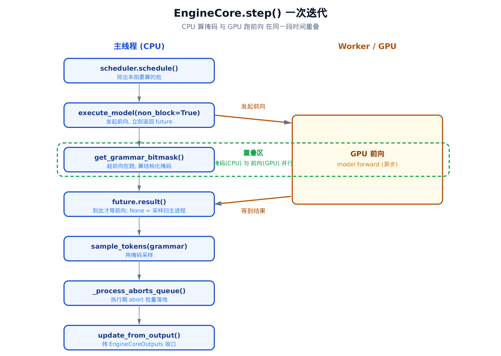
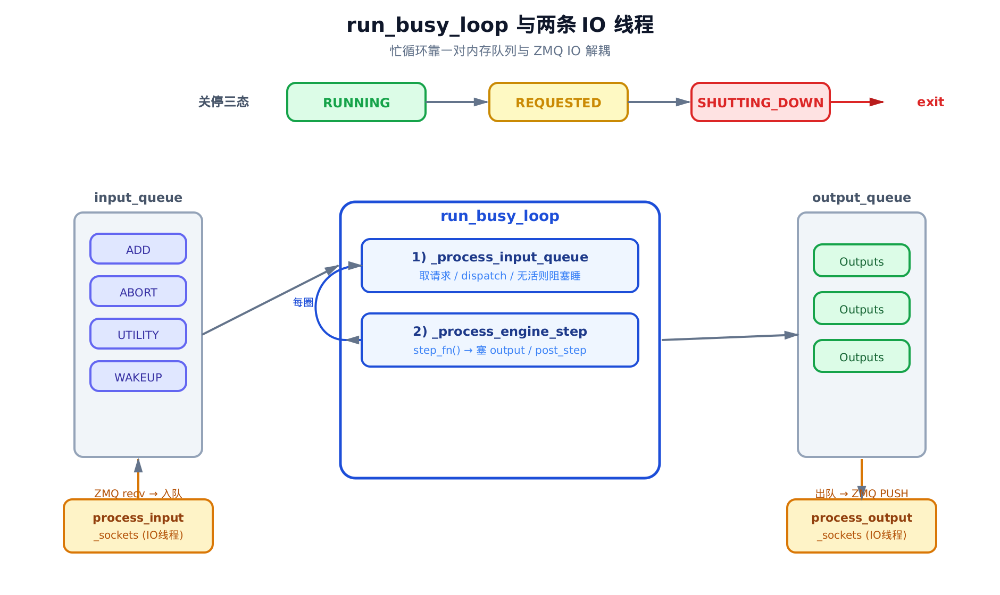
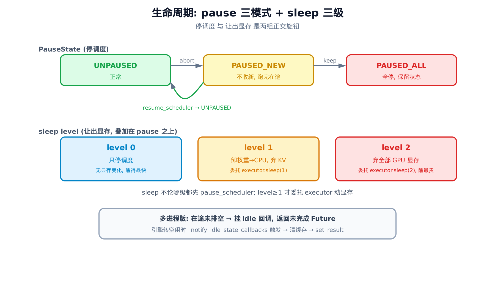
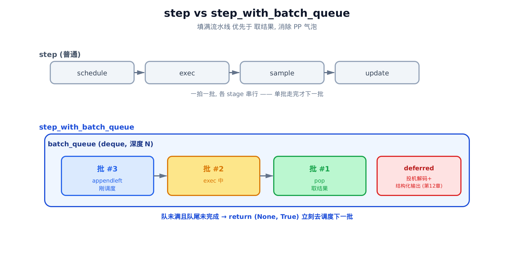

# 第11章　EngineCore 与忙循环：一次推理迭代到底做了什么

## 你在这里


> *图注：全书地图高亮当前阶段。[第 7 章](../ch07-engine-core/narrative/chapter.md) 把前端与 EngineCore 之间那条虚线拆成了一套 ZMQ 协议，但它在结尾留了一笔账：「边界那一头——EngineCore 进程内的调度、执行、采样循环——细节是后续章节的主场。」本章就是那一头。我们钻进 EngineCore 进程，看清 `run_busy_loop` 如何一圈圈转、`step()` 一次迭代到底干了什么；再往后 [第 12 章](../ch12-batch-queue/narrative/chapter.md) 会把本章点到的 batch queue 展开成完整的流水线并行机制。*

[第 4 章](../ch04-async-llm/narrative/chapter.md) 把引擎拆成三段，反复强调中间那段 `EngineCore` 在另一个进程里独立转动。它对外只暴露三个方法——`add_request_async` / `get_output_async` / `abort_requests_async`——然后说：这台引擎自己怎么一步步推理，留到后面。

[第 7 章](../ch07-engine-core/narrative/chapter.md) 接着把「另一个进程」这件事坐实了：ZMQ 的 socket 拓扑、msgpack 多帧编解码、两个 IO 线程怎么把请求塞进 `input_queue`、把输出从 `output_queue` 抽走。但它刻意没碰进程内部的引擎本体。

**本章结清这笔账。** 那个在独立进程里独立转动的引擎，它的「心跳」是什么样的？请求进了 `input_queue` 之后会发生什么？一次 `step()` 凭什么能让 GPU 前向、语法掩码（grammar bitmask）计算、token 采样三件事咬合得严丝合缝？引擎要睡觉、要暂停、要被关掉，又是怎么做到的？

本章的代码主线集中在一个文件——`vllm/v1/engine/core.py`——里的两个类：

- `EngineCore`：引擎的「内循环」。持有 [执行器](../ch03-config-and-wiring/narrative/chapter.md)（executor）和调度器（scheduler），提供 `step()` 单步编排和 `pause`/`sleep`/`wake_up` 生命周期。它不知道 ZMQ 的存在。
- `EngineCoreProc`：`EngineCore` 的子进程外壳。在内循环外面套一圈 `run_busy_loop`，把第 7 章那两个 IO 线程喂进来的请求取出来、跑一步、把结果塞回去。

为了能在本地（无 GPU/CUDA）把这两条主线亲手跑一遍、打断点观察控制流，本章配了一份**只做减法**的精简版：和真实 vLLM 同名、同结构、同控制流，唯一的承载替换是——真实的 executor / scheduler 构造（属其它章节）换成测试注入的协作者对象，它们的方法调用**原样保留**。删去所有标了 `# SUBTRACTED` 的分支后，它就回到真实 `EngineCore` 的单引擎子集。它是「跑起来看数值」的交叉验证物，正文主线始终是真实源码。

本章要讲清四件事：

- **§11.1–§11.3** `step()`：一次推理迭代的完整编排，以及它最精巧的一手——让 CPU 算掩码和 GPU 跑前向重叠；
- **§11.4** `run_busy_loop`：引擎的心跳，以及它如何与第 7 章的 IO 线程解耦；
- **§11.5** 关停：三态状态机怎么让一个阻塞在队列上的引擎安全退出；
- **§11.6–§11.7** 生命周期：pause 三模式、sleep 三级，怎么在「停调度」和「让出显存」之间分层取舍；外加 batch queue 接入点和进程内对照。

---

## 11.1 一句话钩子：引擎的一次「心跳」

把 EngineCore 想成一台节拍器。每一拍，它做同一件事：看看调度器手上有没有活，有就排一个批、推一遍模型、采一批 token、把结果交出去。这一拍，就是 `step()`。

钩子在于：这一拍里藏着一次 GPU 前向——几毫秒到几十毫秒不等，是整拍里最贵的部分。一个朴素的实现会是「发起前向 → 干等它结束 → 拿结果采样」。但 vLLM 在「干等」的那段时间里，偷偷把 CPU 该干的活塞了进去。这一节先看朴素版长什么样，下一节再看它怎么偷时间。

来看 `step()` 的真身：

```python
# vllm/v1/engine/core.py:L402
def step(self) -> tuple[dict[int, EngineCoreOutputs], bool]:
    """Schedule, execute, and make output.

    Returns tuple of outputs and a flag indicating whether the model
    was executed.
    """

    # Check for any requests remaining in the scheduler - unfinished,
    # or finished and not yet removed from the batch.
    if not self.scheduler.has_requests():
        return {}, False
    scheduler_output = self.scheduler.schedule()
    future = self.model_executor.execute_model(scheduler_output, non_block=True)
    grammar_output = self.scheduler.get_grammar_bitmask(scheduler_output)
    with (
        self.log_error_detail(scheduler_output),       # 故障转储：前向抛异常时 dump 引擎状态
        self.log_iteration_details(scheduler_output),  # 可选迭代日志，默认透传
    ):
        model_output = future.result()
        if model_output is None:
            model_output = self.model_executor.sample_tokens(grammar_output)

    # Before processing the model output, process any aborts that happened
    # during the model execution.
    self._process_aborts_queue()
    engine_core_outputs = self.scheduler.update_from_output(
        scheduler_output, model_output
    )

    return engine_core_outputs, scheduler_output.total_num_scheduled_tokens > 0
```

二十来行，干净得不像一个推理引擎的核心。我们逐段拆。

那两个 `with` 上下文管理器是观测包装，不改数据流：`log_error_detail` 在前向抛异常时 dump 引擎状态供事后排查，`log_iteration_details` 只在显式开启迭代日志时打印统计、默认原样透传。把它们当作透明的就好，后面不再提。

剩下的是一条直线，七步：

1. **`has_requests()` 守门**——调度器手上一个请求都没有，直接返回 `({}, False)`，这一拍空转都不空转。注意注释：这里的「有请求」既包括没跑完的，也包括跑完了但还没从批次里清走的。
2. **`schedule()`**——调度器决定这一拍要推哪些请求、各推多少 token，产出一个 `scheduler_output`。它是连续批处理的大脑，细节是 [第 13 章](../ch13-continuous-batching/narrative/chapter.md) 的主场，这里我们只把它当作「这一批要算什么」的清单。
3. **`execute_model(..., non_block=True)`**——发起 GPU 前向。注意 `non_block=True`：它**不等前向跑完**，立刻返回一个 `future`。
4. **`get_grammar_bitmask()`**——算结构化输出的语法掩码（下一节细讲它为什么夹在这）。
5. **`future.result()`**——到这里才真正等前向结束。
6. **`sample_tokens(grammar_output)`**——`if model_output is None` 时才采样。这个分支条件值得停一下：为什么前向跑完了，输出还可能是 `None`？
7. **`_process_aborts_queue()` + `update_from_output()`**——先把执行期间到达的中止请求批量落地，再把模型输出转成 `EngineCoreOutputs` 交出去。

第 3、4、5 步的顺序是这一拍的灵魂，下一节单独讲。先把第 6 步那个 `None` 说清楚。

---

## 11.2 采样为什么从前向里拆出来

`execute_model` 返回的 `future`，`result()` 出来可能是 `None`。这不是出错——它是一个**约定信号**：「前向我跑完了，但 token 我没采，因为采样要用语法掩码，而掩码这会儿还没算好，你（主进程）拿着掩码自己采。」

为什么要这样拆？因为结构化输出（structured output，比如强制模型只输出合法 JSON）的工作方式是：在采样那一步，往 logits 上盖一张语法掩码，把不合法的 token 概率压成负无穷。而这张掩码依赖**这一拍调度了哪些请求、各自的语法状态走到哪了**——也就是说，它依赖 `scheduler_output`，必须在 `schedule()` 之后才能算。

如果把采样焊死在前向里（worker 一口气算完前向就采样），那掩码就得在发起前向**之前**算好。可那样一来，CPU 算掩码的时间和 GPU 跑前向的时间就**串行**了，谁也盖不住谁。

vLLM 的选择是把采样从前向里拆出来：

```python
# vllm/v1/engine/core.py:L414
future = self.model_executor.execute_model(scheduler_output, non_block=True)
grammar_output = self.scheduler.get_grammar_bitmask(scheduler_output)
# … 省略：log 上下文 …
model_output = future.result()
if model_output is None:
    model_output = self.model_executor.sample_tokens(grammar_output)
```

读这四行的时间轴，关键在「谁在等谁」：

- `execute_model(non_block=True)` 这行**不阻塞**。它把前向任务交给 worker，立刻返回。GPU 在后台开始算。
- 紧接着主线程**没闲着**——它在 `get_grammar_bitmask` 上算掩码。这段 CPU 计算和 GPU 前向**在同一段墙钟时间里并行**。
- 直到 `future.result()`，主线程才停下来等前向。
- 等到了，`model_output is None` 说明 worker 把采样留给了主进程，于是 `sample_tokens(grammar_output)` 用刚算好的掩码采样。

一句人话：**发起前向不等它，趁它在 GPU 上跑，CPU 这边把掩码算了；前向回来再用掩码采样。** 掩码计算的延迟被前向盖住了——前提是掩码算得比前向快，这在实践中几乎总成立。

把这一手量化一下。设一次迭代里几个阶段的耗时为：

$$
T_{\mathrm{step}} \;\approx\; \max\!\big(T_{\mathrm{forward}},\; T_{\mathrm{bitmask}}\big) \;+\; T_{\mathrm{sample}} \;+\; T_{\mathrm{update}}
$$

人话翻译：这一拍花的时间 ≈（前向和掩码两者里更慢的那个）+ 采样 + 收尾。因为前向和掩码并行，所以是 `max` 而不是相加。举个数：前向 20 ms、掩码 2 ms，并行后这一段就是 `max(20, 2) = 20` ms，那 2 ms 的掩码计算**白赚**——它整个藏进了前向的影子里。要是串行，就是 `20 + 2 = 22` ms。

> 这个 `non_block` 的参数、`execute_model` 与 `sample_tokens` 的拆分，背后是 executor 那一侧的异步执行机制。本章只用到「它返回 Future、返回 None 就主进程采样」这个契约；契约怎么在 worker 里兑现，是 executor 章的事。

我们可以用精简版把这个顺序钉死。精简版的 `FakeExecutor` 把每次调用按顺序记进 `calls` 列表，于是「掩码计算夹在前向发起和采样之间」就成了一个可断言的事实：

```python
# 来自本章精简版的交叉验证
def test_grammar_bitmask_computed_before_future_result():
    core, ex, sch = make_core()
    sch._requests = ["r1"]
    core.step()
    exec_idx   = ex.calls.index(("execute_model", True))          # non_block=True
    sample_idx = ex.calls.index(("sample_tokens", "bitmask", False))
    assert exec_idx < sample_idx          # 先发起前向，后用掩码采样
    assert "get_grammar_bitmask" in sch.calls
```

跑出来 35 个测试全过。这条断言验证的正是 `execute_model(non_block=True)` → `get_grammar_bitmask` → `sample_tokens` 这个顺序——也就是重叠机制的骨架。

还有一个边界：如果 worker **就地**把 token 采了（`model_output` 不是 `None`），主进程就不再采样：

```python
# 精简版交叉验证
def test_step_skips_sample_when_executor_returns_output():
    core, ex, sch = make_core(executor=FakeExecutor(exec_returns_none=False))
    sch._requests = ["r1"]
    core.step()
    assert not any(c[0] == "sample_tokens" for c in ex.calls if isinstance(c, tuple))
```

`None` 与非 `None`，就是 worker 在说「采样这活归你」还是「我顺手干了」。`step()` 据此二选一。

---

## 11.3 执行期到达的中止，为什么要排队

`step()` 跨越一次 GPU 前向，那是这一拍里最长的一段时间。在这段时间里，客户端完全可能改主意——把某个正在算的请求 abort 掉（用户按了停止、连接断了）。

问题来了：这个 abort 是在前向**进行中**到达的。这一批 token 已经在 GPU 上算出来了。如果直接对一个本该中止的请求继续走 `update_from_output`、继续吐 token，就是在浪费、甚至是在给已经断开的客户端产出垃圾。

vLLM 的处理是：执行期间到达的 abort 不立刻落地，而是先塞进一个独立的 `aborts_queue`，等前向回来、**在出输出之前**统一处理：

```python
# vllm/v1/engine/core.py:L424（step 尾段）
# Before processing the model output, process any aborts that happened
# during the model execution.
self._process_aborts_queue()
engine_core_outputs = self.scheduler.update_from_output(
    scheduler_output, model_output
)
```

`_process_aborts_queue` 把队里攒下的中止请求**一次性批量**交给调度器：

```python
# vllm/v1/engine/core.py:L561
def _process_aborts_queue(self):
    if not self.aborts_queue.empty():
        request_ids = []
        while not self.aborts_queue.empty():
            ids = self.aborts_queue.get_nowait()
            # Should be a list here, but also handle string just in case.
            request_ids.extend((ids,) if isinstance(ids, str) else ids)
        # More efficient to abort all as a single batch.
        self.abort_requests(request_ids)
```

两个设计点：

**时机**——卡在 `update_from_output` 之前。这样一来，本拍要被中止的请求在「把模型输出转成对外输出」之前就被调度器标记为 `FINISHED_ABORTED`，`update_from_output` 处理时就不会再为它们产出 token。

**批量**——把队里所有 abort 攒成一个列表，调一次 `abort_requests`。逐个中止要逐个走调度器的清理逻辑，批量一次更省。

那为什么要有 `aborts_queue` 这条独立队列，而不是和普通请求走同一条路？这要连回第 7 章。abort 请求经 ZMQ 进来时被**双投**：一份进 `input_queue`（和 ADD 等请求一起排队，等忙循环常规处理），一份进 `aborts_queue`（让 `step()` 能在本拍前向回来时就抢先处理掉）。双投保证了即使忙循环正卡在一次 `step()` 里出不来，紧急的 abort 也有一条「快速通道」能在这一拍结束前生效。第 7 章讲的就是这个双投在 IO 线程里怎么落地的；本章接住的是它在 `step()` 内的兑现点。

精简版把这个时序也钉死了——abort 先于 update：

```python
# 精简版交叉验证
def test_process_aborts_queue_before_update():
    core, ex, sch = make_core()
    sch._requests = ["r1"]
    core.aborts_queue.put_nowait(["r1"])
    core.step()
    finish_idx = next(i for i, c in enumerate(sch.calls)
                      if isinstance(c, tuple) and c[0] == "finish_requests")
    update_idx = sch.calls.index("update_from_output")
    assert finish_idx < update_idx        # 中止落地 早于 出输出

def test_aborts_queue_batched_into_single_finish():
    core, ex, sch = make_core()
    sch._requests = ["r1"]
    core.aborts_queue.put_nowait(["a", "b"])
    core.aborts_queue.put_nowait(["c"])
    core._process_aborts_queue()
    finish_calls = [c for c in sch.calls if isinstance(c, tuple) and c[0] == "finish_requests"]
    assert len(finish_calls) == 1                    # 攒成一批
    assert sorted(finish_calls[0][1]) == ["a", "b", "c"]
```

到这里 `step()` 这一拍就讲完了。下面把镜头拉远，看是谁在一拍接一拍地敲这个节拍器。



> *图注：`schedule()` 出清单后，`execute_model(non_block=True)` 在 GPU 上异步发起前向（右泳道），主线程不等它、立刻在 CPU 上算 `get_grammar_bitmask`（左泳道）——两段在同一墙钟时间里重叠。`future.result()` 是汇合点；返回 `None` 表示采样留给主进程，用刚算好的掩码 `sample_tokens`。出输出前先 `_process_aborts_queue` 处理执行期到达的中止，最后 `update_from_output` 收口。*

---

## 11.4 run_busy_loop：引擎的心跳

`step()` 是一拍。是谁在一拍接一拍地敲？是 `run_busy_loop`——EngineCore 子进程的主循环。第 7 章讲完 IO 线程后把请求送到了 `input_queue` 门口，本节就是门内那个永不停歇的循环。

它短得惊人：

```python
# vllm/v1/engine/core.py:L1164
def run_busy_loop(self):
    """Core busy loop of the EngineCore."""
    while self._handle_shutdown():
        # 1) Poll the input queue until there is work to do.
        self._process_input_queue()
        # 2) Step the engine core and return the outputs.
        self._process_engine_step()

    raise SystemExit
```

整个引擎进程的一辈子，就是这个 while。每圈两步：先把门口（`input_queue`）的请求收进来，再敲一拍（`step`）。循环条件 `_handle_shutdown()` 是关停闸门，§11.5 单讲，先看循环体那两步。

### 第一步：把请求收进来，没活就睡

`_process_input_queue` 干两件事：有活时把 `input_queue` 里的请求 dispatch 掉、然后退出去让引擎跑一拍；没活时**阻塞**在队列上，不空转烧 CPU。

```python
# vllm/v1/engine/core.py:L1174
def _process_input_queue(self):
    """Exits when an engine step needs to be performed."""

    waited = False
    while not self.has_work() and self.is_running():
        # Notify callbacks waiting for engine to become idle.
        self._notify_idle_state_callbacks()
        if self.input_queue.empty():
            # Drain aborts queue; all aborts are also processed via input_queue.
            with self.aborts_queue.mutex:
                self.aborts_queue.queue.clear()
            # … 省略：DEBUG 日志 …
        block = self.process_input_queue_block
        try:
            req = self.input_queue.get(block=block)
            self._handle_client_request(*req)
        except queue.Empty:
            break
        if not block:
            break
    # … 省略：DEBUG 日志 …

    # Handle any more client requests.
    while not self.input_queue.empty():
        req = self.input_queue.get_nowait()
        self._handle_client_request(*req)
```

读懂它的关键是那个 `while not self.has_work()`：**只有在没活可干时才进这个循环**。`has_work()` 是引擎「该不该敲一拍」的总判据：

```python
# vllm/v1/engine/core.py:L1152
def has_work(self) -> bool:
    """Returns true if the engine should be stepped."""
    return (
        self.engines_running          # 单引擎下恒为 False（仅数据并行场景置位）
        or self.scheduler.has_requests()
        or bool(self.batch_queue)
    )
```

单引擎读者可以把 `engines_running` 当作恒 `False`（它只在数据并行场景由全局协调置位）。于是 `has_work()` 约等于「调度器手上有请求，或者 batch queue 里还有在飞的批」。

把这两段连起来读，`_process_input_queue` 的逻辑就清楚了：

- **没活**（`not has_work()`）：进 while，阻塞在 `input_queue.get(block=True)` 上等请求。一个请求都没有时，引擎进程**零 CPU 占用**地睡着——这是它和「忙等空转」的本质区别。来了请求就 dispatch，dispatch 完如果有活了（`has_work()` 变真），while 条件不再满足，退出。
- **有活**：根本不进 while。直接走到末尾那个 `while not self.input_queue.empty()`，用**非阻塞**的 `get_nowait()` 把门口攒着的请求一次清空（这些是上一拍 step 期间 IO 线程顺手塞进来的），然后返回，让引擎去敲一拍。

`block=True` 的阻塞睡眠是这里的精髓。一个推理引擎大部分时间要么在算（GPU 忙），要么在等请求（该睡）。`input_queue.get(block=True)` 让「等请求」这段时间真正交还 CPU，而不是拿一个 `while True` 烧着轮询。

> 但「阻塞睡着」带来一个新问题：如果引擎正睡在 `input_queue.get` 上，这时要关掉它怎么办？关停信号没法叫醒一个阻塞的队列。这正是 §11.5 那个 `WAKEUP` 哨兵要解决的事——先记住这个悬念。

### 第二步：敲一拍，把输出送出门

`_process_engine_step` 调 `step_fn()`、把产出塞进 `output_queue`、跑 post-step 钩子：

```python
# vllm/v1/engine/core.py:L1205
def _process_engine_step(self) -> bool:
    """Called only when there are unfinished local requests."""

    # Step the engine core.
    outputs, model_executed = self.step_fn()
    # Put EngineCoreOutputs into the output queue.
    for output in outputs.items() if outputs else ():
        self.output_queue.put_nowait(output)
    # Post-step hook.
    self.post_step(model_executed)

    # If no model execution happened but there are waiting requests
    # (e.g., WAITING_FOR_REMOTE_KVS), yield the GIL briefly to allow
    # background threads (like NIXL handshake) to make progress.
    if not model_executed and self.scheduler.has_unfinished_requests():
        time.sleep(0.001)

    return model_executed
```

三个看点：

**`self.step_fn()` 不是写死的 `self.step`**。它在 `__init__` 时就静态绑定好了——绑 `step` 还是绑 `step_with_batch_queue`，取决于一个开关。这是 §11.7 batch queue 接入点的引子。

**输出塞进 `output_queue`**。`outputs.items()` 是 `{client_index: EngineCoreOutputs}`，逐个 `put_nowait` 进去。然后第 7 章那个 `process_output_sockets` IO 线程会把它们抽走、编码、经 ZMQ 推回客户端。忙循环只管往内存队列里塞，不碰网络——网络 IO 交给独立线程，互不阻塞。这是 `input_queue` / `output_queue` 这对内存队列存在的全部理由：**用一对线程安全队列，把「跑模型的循环」和「读写 socket 的 IO」彻底解耦**。忙循环只跟内存打交道，逻辑简单且不会被网络卡住；IO 线程的序列化和 socket 操作释放 GIL，能和 GPU 前向真正并行。

**那 1 毫秒的 `time.sleep`**。看注释：有些请求会卡在 `WAITING_FOR_REMOTE_KVS`——等另一台机器把 KV cache 通过 NIXL 握手传过来。这种请求没法 step（数据还没到），但又确实「没完成」。如果忙循环为它疯狂空转，会把 CPU 时间片全占了，做握手的后台线程反而饿死、永远握不上手。短睡 1 ms 把轮询频率压到约 1000 Hz，给后台线程让出时间片。这是一个「紧轮询会饿死协作线程」的经典折中。

精简版把这一圈也跑通了：输出确实进了 `output_queue`，请求消费完加关停信号后循环干净退出。

```python
# 精简版交叉验证
def test_process_engine_step_enqueues_outputs():
    core, ex, sch = make_proc()
    sch._requests = ["r1"]
    core._process_engine_step()
    item = core.output_queue.get_nowait()
    assert item == (0, EngineCoreOutputs())      # (client_index, outputs)

def test_busy_loop_runs_step_then_exits_on_shutdown():
    core, ex, sch = make_proc()
    sch._requests = ["r1"]
    orig_step = core._process_engine_step
    def step_then_shutdown():
        result = orig_step()
        sch._requests = []                          # 请求被消费
        core.shutdown_state = EngineShutdownState.REQUESTED
        return result
    core._process_engine_step = step_then_shutdown
    with pytest.raises(SystemExit):                 # 关停后忙循环抛 SystemExit
        core.run_busy_loop()
    assert "schedule" in sch.calls                  # 确实敲过一拍
```



> *图注：忙循环（中）每圈两步——`_process_input_queue` 从 `input_queue` 取请求并 dispatch（ADD/ABORT/UTILITY/WAKEUP），`_process_engine_step` 敲一拍 `step_fn` 并把产出塞 `output_queue`。左右两条 ZMQ IO 线程（第 7 章详解）分别喂入 `input_queue`、抽走 `output_queue`，与忙循环靠这对内存队列解耦。顶部是 §11.5 的关停三态机。*

### dispatch：一个请求进来，分到哪去

`_process_input_queue` 取出的每个请求都交给 `_handle_client_request`，由它按类型分派。请求的类型用第 7 章那套[字节标签协议](../ch07-engine-core/narrative/chapter.md)（byte-tag protocol）标着——`ADD`、`ABORT`、`UTILITY` 等，各是一个单字节：

```python
# vllm/v1/engine/core.py:L1266
def _handle_client_request(
    self, request_type: EngineCoreRequestType, request: Any
) -> None:
    """Dispatch request from client."""

    if request_type == EngineCoreRequestType.WAKEUP:
        return
    elif request_type == EngineCoreRequestType.ADD:
        req, request_wave = request
        if self._reject_add_in_shutdown(req):
            return
        self.add_request(req, request_wave)
    elif request_type == EngineCoreRequestType.ABORT:
        self.abort_requests(request)
    elif request_type == EngineCoreRequestType.UTILITY:
        client_idx, call_id, method_name, args = request
        # … 省略：关停期拒绝判断 …
        output = UtilityOutput(call_id)
        # Lazily look-up utility method so that failure will be handled/returned.
        get_result = lambda: (
            (method := getattr(self, method_name))
            and method(*self._convert_msgspec_args(method, args))
        )
        enqueue_output = lambda out: self.output_queue.put_nowait(
            (client_idx, EngineCoreOutputs(utility_output=out))
        )
        self._invoke_utility_method(method_name, get_result, output, enqueue_output)
    elif request_type == EngineCoreRequestType.EXECUTOR_FAILED:
        raise RuntimeError("Executor failed.")
    # … 省略：未知类型告警 …
```

四条主要分支：

- **`WAKEUP`**——直接 `return`，什么都不做。它是个哨兵，§11.5 揭晓它的用途。
- **`ADD`**——拆出 `(req, request_wave)`，交给 `add_request`（校验后转给调度器）。
- **`ABORT`**——交给 `abort_requests`（让调度器把这些请求标成 `FINISHED_ABORTED`）。
- **`UTILITY`**——这是个**通用 RPC 通道**。客户端想调引擎上某个方法（比如查询是否在睡、重置缓存、甚至触发 sleep），不必为每个方法单设一种消息类型，统一打包成 UTILITY：`(client_idx, call_id, method_name, args)`。引擎用 `getattr(self, method_name)` 懒查到方法、调用、把返回值连同 `call_id` 塞回 `output_queue`。那个 `call_id` 是第 7 章讲的[关联标识](../ch07-engine-core/narrative/chapter.md)（correlation-id）——客户端凭它把异步回来的结果对上当初的调用。**§11.6 那些生命周期方法，大多就是经这条 UTILITY 路径被调用的。**

精简版把这套分派逐条验证了——ADD 走 add_request、ABORT 走 finish_requests、WAKEUP 是空操作、UTILITY 真的调到了方法并把结果带 call_id 塞回队列：

```python
# 精简版交叉验证（节选）
def test_handle_client_request_wakeup_is_noop():
    core, ex, sch = make_proc()
    core._handle_client_request(EngineCoreRequestType.WAKEUP, None)
    assert sch.calls == []                       # 哨兵：纯空操作

def test_utility_method_invoked_and_enqueued():
    core, ex, sch = make_proc()
    core._handle_client_request(
        EngineCoreRequestType.UTILITY, (0, 42, "is_sleeping", ()))
    client_idx, outputs = core.output_queue.get_nowait()
    assert outputs.utility_output.call_id == 42          # 带回 call_id
    assert outputs.utility_output.result.result is False # 真调到了 is_sleeping()
```

---

## 11.5 关停：怎么叫醒一个睡着的引擎

现在回收 §11.4 留的悬念。忙循环没活时阻塞睡在 `input_queue.get(block=True)` 上。要关掉这个进程，信号处理器（收到 SIGTERM/SIGINT）能做的很有限——它在中断主线程的任意时刻触发，**不能安全操作非可重入的队列锁**。它没法直接「叫停」那个阻塞的 `get`。

vLLM 的解法分两半。信号处理器只做两件最小的事：把状态标记为「请求关停」，再往队列里投一个 `WAKEUP` 哨兵：

```python
# vllm/v1/engine/core.py:L1114（run_engine_core 内）
def wakeup_engine():
    # Wakes up idle engine via input_queue when shutdown is requested
    # Not safe in a signal handler - we may interrupt the main thread
    # while it is holding the non-reentrant input_queue.mutex
    engine_core.input_queue.put_nowait((EngineCoreRequestType.WAKEUP, None))

signal_callback = SignalCallback(wakeup_engine)

def signal_handler(signum, frame):
    engine_core.shutdown_state = EngineShutdownState.REQUESTED
    signal_callback.trigger()
```

这下 §11.4 那个 `WAKEUP` → `return` 的空分支就有意义了：它**不为了做事，只为了把阻塞的 `input_queue.get` 唤醒**。哨兵一进队列，睡着的 `get` 立刻返回，`_handle_client_request` 拿到 `WAKEUP` 啥也不干就 `return`，控制权交回忙循环。忙循环转下一圈，去检查 `_handle_shutdown()`——这次它会看到 `shutdown_state` 已经是 `REQUESTED` 了。

`_handle_shutdown` 是一个三态状态机，它既是 while 的闸门，也是排空逻辑的所在：

```python
# vllm/v1/engine/core.py:L1230
def _handle_shutdown(self) -> bool:
    # Check if shutdown was requested and handle it
    if self.shutdown_state == EngineShutdownState.RUNNING:
        return True

    if self.shutdown_state == EngineShutdownState.REQUESTED:
        shutdown_timeout = self.vllm_config.shutdown_timeout
        # … 省略：日志 …
        if shutdown_timeout == 0:
            num_requests = self.scheduler.get_num_unfinished_requests()
            # … 省略：日志 …
            aborted_reqs = self.scheduler.finish_requests(
                None, RequestStatus.FINISHED_ABORTED
            )
            self._send_abort_outputs(aborted_reqs)
        else:
            # … 省略：超时排空模式的日志 …
            pass

        self.shutdown_state = EngineShutdownState.SHUTTING_DOWN

    # Exit when no work remaining
    if not self.has_work():
        # … 省略：日志 …
        return False

    return True
```

三态走一遍：

- **`RUNNING`**——正常运转，返回 `True`，忙循环继续。
- **`REQUESTED`**——刚被信号置位。这一步决定怎么收尾：`shutdown_timeout == 0`（默认）就**立刻中止全部在途请求**、把它们的 abort 输出送出门（让客户端知道发生了什么）；非零超时则进入排空模式、给在途请求一段时间跑完。处理完转入 `SHUTTING_DOWN`。
- **`SHUTTING_DOWN`**——落到最后那个 `if not self.has_work()`：还有活就再转一圈（把排空的请求跑完），活全清了就返回 `False`。

`_handle_shutdown` 返回 `False`，`run_busy_loop` 的 while 退出，`raise SystemExit`，进程干净结束。

把整条链连起来看，关停其实是一次精心编排的握手：信号处理器不敢碰队列锁 → 投 `WAKEUP` 哨兵 → 叫醒阻塞的 `get` → 忙循环转一圈撞上 `_handle_shutdown` → 三态机排空 → 退出。每一环都绕开了「在信号上下文里做危险操作」这个雷区。

精简版把三态迁移和有活退出验证了：

```python
# 精简版交叉验证
def test_handle_shutdown_three_states():
    core, ex, sch = make_proc()
    assert core._handle_shutdown() is True                 # RUNNING：继续
    core.shutdown_state = EngineShutdownState.REQUESTED
    assert core._handle_shutdown() is False                # 无活 + timeout 0：中止后退出
    assert core.shutdown_state == EngineShutdownState.SHUTTING_DOWN
```

---

## 11.6 生命周期：停调度 vs 让出显存

引擎不总是满负荷跑。有时要临时让出 GPU 给别的任务（多模型分时复用），有时要冻住生成做权重热更新。vLLM 把这些需求分解成两组正交的旋钮：**pause（停调度）** 和 **sleep（让出显存）**。它们都经 §11.4 那条 UTILITY 路径被调用。

### pause：三种「停」

`pause_scheduler` 有三种模式，对应三种「停」的语义：

```python
# vllm/v1/engine/core.py:L634（in-proc 版）
def pause_scheduler(
    self, mode: PauseMode = "abort", clear_cache: bool = True
) -> Future | None:
    """Pause generation; behavior depends on mode.
    - ``abort``: 设 PAUSED_NEW，中止全部，（可选）清缓存。
    - ``wait``:  设 PAUSED_NEW，继续 step 直到排空（in-proc 不允许）。
    - ``keep``:  设 PAUSED_ALL；队列在输出排空后完成。
    """
    if mode not in ("keep", "abort", "wait"):
        raise ValueError(f"Invalid pause mode: {mode}")
    if mode == "wait":
        raise ValueError("'wait' mode can't be used in inproc-engine mode")

    if mode == "abort":
        self.scheduler.finish_requests(None, RequestStatus.FINISHED_ABORTED)

    pause_state = PauseState.PAUSED_ALL if mode == "keep" else PauseState.PAUSED_NEW
    self.scheduler.set_pause_state(pause_state)
    if clear_cache:
        self._reset_caches()

    return None
```

三模式落到调度器的 `PauseState` 上。这个枚举定义在 `vllm/v1/core/sched/interface.py:L22`，只有三个值：

- `UNPAUSED`——正常。
- `PAUSED_NEW`——不再调度**新**请求，但已经在 running 的请求继续算完。
- `PAUSED_ALL`——彻底停，谁都不调度。

于是：

- **`abort`**（默认）——最干脆。先 `finish_requests` 把所有在途请求中止，再设 `PAUSED_NEW`，清缓存。立刻见效，不留尾巴。
- **`keep`**——设 `PAUSED_ALL`，全停但**保留请求状态**，等 resume 后接着跑。适合「先冻一下，待会儿原样继续」。
- **`wait`**——排空模式：不收新请求，但让在途的跑完。注意 in-proc 版**直接抛 `ValueError`**——这个模式只在多进程版有意义，原因下面讲。

`resume_scheduler` 是它的逆操作，一行——把状态设回 `UNPAUSED`，调度恢复。

### in-proc 同步 vs multi-proc 异步：那个 Future

注意 in-proc 版的 `pause_scheduler` **同步返回 `None`**——调完就完了。但它的多进程版（`EngineCoreProc` 里的覆写）返回的是一个 **`Future`**。为什么有这个差别？

因为多进程下，「中止」这件事不是设个状态就完。被 abort 的请求，它们的 abort 输出得**真的经 `output_queue` 发回客户端**、在途请求得**真的排空**，之后清缓存才安全。这是个要等的异步过程。多进程版于是这样写：

```python
# vllm/v1/engine/core.py:L1542（EngineCoreProc 覆写版，节选）
def engine_idle_callback(engine: "EngineCoreProc", future: Future[Any]) -> None:
    if clear_cache:
        engine._reset_caches()
    future.set_result(None)

if mode == "abort":
    aborted_reqs = self.scheduler.finish_requests(None, RequestStatus.FINISHED_ABORTED)
    self._send_abort_outputs(aborted_reqs)          # abort 输出经 output_queue 发客户端

pause_state = PauseState.PAUSED_ALL if mode == "keep" else PauseState.PAUSED_NEW
self.scheduler.set_pause_state(pause_state)

if self._pause_complete():            # _pause_complete() == not has_work()
    if clear_cache:
        self._reset_caches()
    return None                       # 已经没活：同步完成

future = Future[Any]()
self._idle_state_callbacks.append(partial(engine_idle_callback, future=future))
return future                         # 还有在途：挂回调，返回未完成的 Future
```

逻辑是「能同步就同步，不能就挂回调」：

- 如果调用时引擎**已经没活了**（`_pause_complete()` 即 `not has_work()`），那就地清缓存、返回 `None`，皆大欢喜。
- 如果还有在途请求，没法当场清缓存——于是注册一个 idle 回调到 `_idle_state_callbacks`，返回一个**未完成**的 Future。

这个回调什么时候触发？回到 §11.4 的 `_process_input_queue`——它在每次发现 `not has_work()`（引擎转入空闲）时会调 `_notify_idle_state_callbacks()`。也就是说：引擎把在途请求都跑完、真正空下来的那一刻，注册的回调被触发，清缓存、`future.set_result(None)`。调用方 `await` 这个 Future，就实现了「等引擎排空再清缓存」的异步语义。`wait` 模式只在多进程有意义，正是因为它依赖这套「继续 step 排空 + idle 回调」的机制，in-proc 没有忙循环可排，故直接禁掉。

精简版把两条路径都验证了——in-proc 同步返回 None；multi-proc 在有活时返回未完成 Future，引擎转空闲时回调把它完成：

```python
# 精简版交叉验证
def test_proc_pause_returns_future_when_work_pending():
    core, ex, sch = make_proc()
    sch._requests = ["r1"]                     # has_work True -> pending
    fut = core.pause_scheduler(mode="keep")
    assert isinstance(fut, Future) and not fut.done()
    sch._requests = []                          # 引擎转空闲
    core._notify_idle_state_callbacks()         # 触发 idle 回调
    assert fut.done()                           # Future 被完成
```

### sleep：三级让出显存

pause 只是停调度，显存一点没动。要真把 GPU 显存让出来，得 `sleep`。它分三级：

```python
# vllm/v1/engine/core.py:L673
def sleep(self, level: int = 1, mode: PauseMode = "abort") -> None | Future:
    """Put the engine to sleep at the specified level.
        - Level 0: Pause scheduling only. No GPU memory changes.
        - Level 1: Offload model weights to CPU, discard KV cache.
        - Level 2: Discard all GPU memory.
    """

    # Pause scheduler before sleeping.
    clear_prefix_cache = level >= 1
    pause_future = self.pause_scheduler(mode=mode, clear_cache=clear_prefix_cache)
    if level < 1:
        return pause_future

    # Level 1+: Delegate to executor for GPU memory management
    model_executor = self.model_executor
    if pause_future is None:
        model_executor.sleep(level)
        return None

    future = Future[Any]()

    def pause_complete(f: Future):
        try:
            f.result()  # propagate any exception
            future.set_result(model_executor.sleep(level))
        except Exception as e:
            future.set_exception(e)

    logger.info("Waiting for in-flight requests to complete before sleeping...")
    pause_future.add_done_callback(pause_complete)
    return future
```

读法是「sleep = pause + 委托 executor 管显存」：

- **不管哪一级，先 `pause_scheduler`**。停了调度才能安全动显存。
- **level 0**——到此为止。`level < 1` 直接返回 pause 的结果，**不碰 executor、不碰显存**。它就是个「只停调度」的别名，醒来快。
- **level 1+**——把活委托给 executor 的 `sleep(level)`：level 1 卸权重到 CPU、丢 KV cache；level 2 干脆丢掉全部 GPU 显存。这里又出现了 §11.6 那个同步/异步的分叉——`pause_future is None`（in-proc，已同步排空）就直接 `executor.sleep`；否则（multi-proc，要等排空）挂 `pause_complete` 回调，等 pause 的 Future 完成了再 `executor.sleep`，并把它链到自己返回的 Future 上。

`wake_up` 是逆操作，把 executor 唤醒、再 resume 调度：

```python
# vllm/v1/engine/core.py:L709
def wake_up(self, tags: list[str] | None = None):
    """Wake up the engine from sleep."""
    if tags is not None and "scheduling" in tags:
        tags = [t for t in tags if t != "scheduling"]

    if tags is None or tags:
        self.model_executor.wake_up(tags)

    # Resume scheduling (applies to all levels)
    self.resume_scheduler()
```

那个 `"scheduling"` tag 是 level-0 专用的小细节：level 0 睡觉时根本没动显存，醒来也就不必叫 executor，只 `resume_scheduler` 即可。代码用「把 `scheduling` 从 tags 里剔掉，剔完若 tags 空了就跳过 `executor.wake_up`」实现这个判断。

`is_sleeping` 把两层状态合一——只要调度器在暂停态、**或** executor 在睡，就算在睡：

```python
# vllm/v1/engine/core.py:L727
def is_sleeping(self) -> bool:
    """Check if engine is sleeping at any level."""
    return self.is_scheduler_paused() or self.model_executor.is_sleeping
```

这层分层取舍的本质是一个时间/显存的权衡：level 0 醒得最快但一点显存没省；level 1 让出大头（KV cache 通常是显存吃得最多的），权重还在 CPU 待命、唤醒只需搬回 GPU；level 2 最彻底地交还显存，但唤醒最贵。按「多快要复用」和「多想让出显存」在这三级里选。

精简版把分级语义钉死——level 0 不碰 executor，level 1 委托 executor.sleep，wake_up 唤醒 executor 并 resume，`"scheduling"` tag 跳过 executor：

```python
# 精简版交叉验证（节选）
def test_sleep_level0_only_pauses_no_executor():
    core, ex, sch = make_core()
    core.sleep(level=0)
    assert not any(isinstance(c, tuple) and c[0] == "sleep" for c in ex.calls)

def test_sleep_level1_delegates_to_executor():
    core, ex, sch = make_core()
    core.sleep(level=1)
    assert ("sleep", 1) in ex.calls

def test_wake_up_scheduling_tag_skips_executor():
    core, ex, sch = make_core()
    core.wake_up(tags=["scheduling"])
    assert not any(c[0] == "wake_up" for c in ex.calls if isinstance(c, tuple))
    assert ("set_pause_state", PauseState.UNPAUSED) in sch.calls    # 仍 resume
```



> *图注：上半是 `PauseState` 三态（UNPAUSED ↔ PAUSED_NEW ↔ PAUSED_ALL），由 `pause_scheduler(abort/keep)` 与 `resume_scheduler` 驱动。下半是 sleep 三级叠加在 pause 之上：level 0 只停调度（不碰显存）、level 1 卸权重弃 KV、level 2 弃全部 GPU 显存；level≥1 委托 executor。右侧支线是多进程版「在途未排空 → 挂 idle 回调 → 异步完成 Future」的路径。*

---

## 11.7 两条尾线：batch queue 接入点与进程内对照

最后收两条线：§11.4 提过的 `step_fn` 那个开关，以及「没有忙循环时 `step()` 怎么被驱动」。

### batch queue：step_fn 的另一种绑定

`_process_engine_step` 调的是 `self.step_fn()`，不是写死的 `self.step`。这个绑定在 `__init__` 时一次性定好：

```python
# vllm/v1/engine/core.py:L184
self.batch_queue_size = self.model_executor.max_concurrent_batches
self.batch_queue = None
if self.batch_queue_size > 1:
    self.batch_queue = deque(maxlen=self.batch_queue_size)
# … 省略 …
self.step_fn = (
    self.step if self.batch_queue is None else self.step_with_batch_queue
)
```

逻辑很简单：executor 的 `max_concurrent_batches > 1` 时（也就是开了流水线并行 PP），启用 `batch_queue` 并把 `step_fn` 绑到 `step_with_batch_queue`；否则零开销走普通 `step`。绑定一次，之后每拍不再判断分支。

`step_with_batch_queue` 是 PP 的核心——它允许同时有多个批在流水线的不同 stage 上飞，靠「先填满流水线优先于取结果」消除 PP 气泡。它的关键一手是：调度到新批、且队列没满、且队尾那个批还没算完时，**直接返回 `(None, True)`**，让忙循环立刻转下一圈再去调度一个批，而不是傻等当前批：

```python
# vllm/v1/engine/core.py:L498（step_with_batch_queue 上半段节选）
if not deferred_scheduler_output:
    # Add this step's future to the queue.
    batch_queue.appendleft((future, scheduler_output, exec_future))
    if (
        model_executed
        and len(batch_queue) < self.batch_queue_size
        and not batch_queue[-1][0].done()
    ):
        # Don't block on next worker response unless the queue is full
        # or there are no more requests to schedule.
        return None, True
```

精简版验证了「队列没满、队尾未完成 → 返回 (None, True) 并把批留在队里」这个填管道行为：

```python
# 精简版交叉验证
def test_batch_queue_fills_before_taking_result():
    ex = FakeExecutor(max_concurrent_batches=2, exec_returns_none=False)
    sch = FakeScheduler(); sch._requests = ["r1"]
    core, _, _ = make_core(executor=ex, scheduler=sch)
    pending = Future()                             # 让队尾 future 处于「未完成」
    ex.sample_tokens = lambda g, non_block=False: pending
    out, executed = core.step_with_batch_queue()
    assert out is None and executed is True        # 不取结果，先填管道
    assert len(core.batch_queue) == 1
```

batch queue 的完整时间轴、PP 各 stage 怎么重叠、`deferred_scheduler_output` 那条（投机解码叠加结构化输出的）小众路径——是 [第 12 章](../ch12-batch-queue/narrative/chapter.md) 的主场。本章只需点明：**忙循环里那个 `step_fn()`，普通情况是 `step`，开了 PP 就换成 `step_with_batch_queue`，二者签名相同、对忙循环透明。**



> *图注：上轨是 `step`——单批串行经过 schedule→exec→sample→update，一拍一批。下轨是 `step_with_batch_queue`——一个深度为 N 的 deque，新批 `appendleft` 进队、`pop` 取队首结果；只要队没满且队尾未完成就 `return (None, True)` 立刻去调度下一批，让 PP 各 stage 都有活干。右侧标出 `deferred_scheduler_output`（投机解码 + 结构化输出）的小众分支，留给第 12 章。*

### InprocClient：没有忙循环时，谁敲节拍

整章我们都在讲「忙循环一拍接一拍敲 `step()`」。但 §11.1 那个 `step()` 自己不知道忙循环的存在——它就是个方法，谁都能调。`InprocClient` 就证明了这点：它是 [第 4 章](../ch04-async-llm/narrative/chapter.md) 同步路径用的进程内客户端，**没有忙循环、没有 ZMQ**，直接持有一个 `EngineCore`，每次要输出就亲手敲一拍：

```python
# vllm/v1/engine/core_client.py:L284
def __init__(self, *args, **kwargs):
    self.engine_core = EngineCore(*args, **kwargs)

def get_output(self) -> EngineCoreOutputs:
    outputs, model_executed = self.engine_core.step_fn()
    self.engine_core.post_step(model_executed=model_executed)
    return outputs and outputs.get(0) or EngineCoreOutputs()

def add_request(self, request: EngineCoreRequest) -> None:
    req, request_wave = self.engine_core.preprocess_add_request(request)
    self.engine_core.add_request(req, request_wave)
```

对照着看就懂了：`EngineCoreProc` 的忙循环是 `_process_input_queue` + `_process_engine_step` 自动转；`InprocClient` 则是调用方每调一次 `get_output` 就**手动**驱动 `step_fn()` + `post_step` 一拍。同一个 `step()`，两种驱动方式——一个被忙循环自动敲，一个被客户端手动敲。这正说明 `step()` 把「一次迭代的逻辑」和「谁来调度这次迭代」彻底分开了。

精简版验证 `get_output` 确实驱动了一拍 `step_fn`：

```python
# 精简版交叉验证
def test_inproc_client_get_output_steps_engine():
    ex = FakeExecutor(); sch = FakeScheduler(); sch._requests = ["r1"]
    client = InprocClient(FakeConfig(), ex, sch)
    out = client.get_output()
    assert "schedule" in sch.calls                  # 直接驱动了 step
    assert isinstance(out, EngineCoreOutputs)
```

### 另一头：output_queue 怎么连回第 4 章

最后把 `output_queue` 的另一端接回 [第 4 章](../ch04-async-llm/narrative/chapter.md) 的[三段式解耦](../ch04-async-llm/narrative/chapter.md)。§11.4 里，`step` 的产出被塞进 `output_queue`、由 IO 线程经 ZMQ 推回客户端。客户端这边（`AsyncMPClient`）有一个后台 task 收 ZMQ、解码、塞进一个 asyncio 队列；前端的 `get_output_async` 就从这个队列 `await` 取出：

```python
# vllm/v1/engine/core_client.py:L979（process_outputs_socket 尾段 + get_output_async）
                    if outputs.outputs or outputs.scheduler_stats:
                        outputs_queue.put_nowait(outputs)
            except Exception as e:
                outputs_queue.put_nowait(e)
            # … 省略：取消处理 …

        resources.output_queue_task = asyncio.create_task(
            process_outputs_socket(), name="EngineCoreOutputQueueTask"
        )

    async def get_output_async(self) -> EngineCoreOutputs:
        self._ensure_output_queue_task()
        assert self.outputs_queue is not None
        outputs = await self.outputs_queue.get()
        if isinstance(outputs, Exception):
            raise self._format_exception(outputs) from None
        return outputs
```

这就把整条链闭合了。第 4 章的 `AsyncLLM` 里那个 `await self.engine_core.get_output_async()`，背后是：本章 `step()` 产出 → `output_queue` → 第 7 章 IO 线程 + ZMQ → `AsyncMPClient` 后台 task → asyncio `outputs_queue` → `get_output_async` 取出 → 进第 8 章的输出处理。第 4 章三段式里那段神秘的「EngineCore 段」，到这里彻底现了真身——它就是 `run_busy_loop` 里一拍接一拍的 `step()`。

---

## 小结：一台节拍器

回到开头那个比喻。本章这台节拍器的全部源码就在 `vllm/v1/engine/core.py` 一个文件里——`EngineCore` 是节拍器本体，`run_busy_loop`（`vllm/v1/engine/core.py:L1164`）是带动它的发条，`step()`（`vllm/v1/engine/core.py:L402`）是每一拍：

- **一拍（`step`）** 做七件事：守门 → 调度 → 异步发起前向 → **趁前向在跑算语法掩码** → 等前向 → 用掩码采样 → 落地执行期 abort 后出输出。最精巧的是那个重叠——CPU 算掩码藏进 GPU 前向的影子里，`non_block=True` 是它的开关。
- **发条（`run_busy_loop`）** 每圈两步：从 `input_queue` 收请求（没活就阻塞睡，零 CPU），敲一拍把输出塞 `output_queue`。靠一对内存队列和第 7 章那两个 IO 线程解耦，互不阻塞。
- **关停** 是一场绕开信号雷区的握手：`WAKEUP` 哨兵叫醒睡着的队列，三态机排空后退出。
- **生命周期** 把「停调度」（pause 三模式）和「让出显存」（sleep 三级）拆成正交的旋钮，多进程下用 idle 回调实现「等排空再动手」的异步语义。

`step()` 里那几个被我们当作黑盒的方法——`schedule()` 怎么排批、`update_from_output` 怎么收口、`execute_model` 怎么在 worker 里异步跑——是后面几章逐个揭开的。[第 12 章](../ch12-batch-queue/narrative/chapter.md) 先把本章点到的 batch queue 展开成完整的流水线并行；[第 13 章](../ch13-continuous-batching/narrative/chapter.md) 钻进 `schedule()` 看连续批处理怎么决定每拍推什么。节拍器已经在转，接下来是看清每一拍里调度器到底在想什么。
