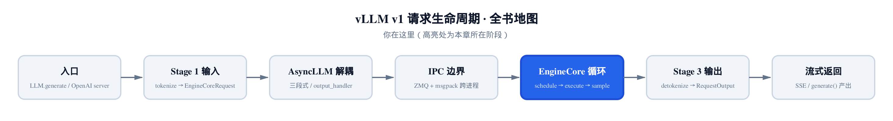
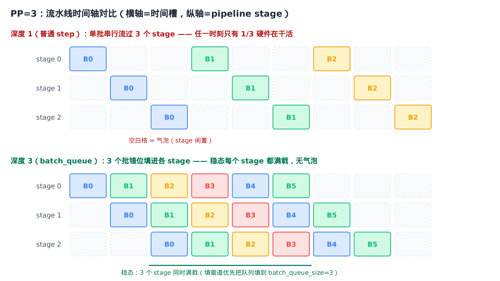
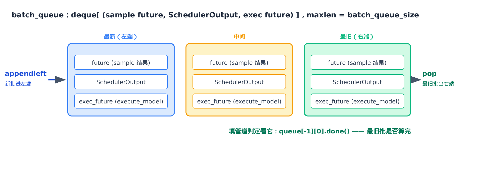
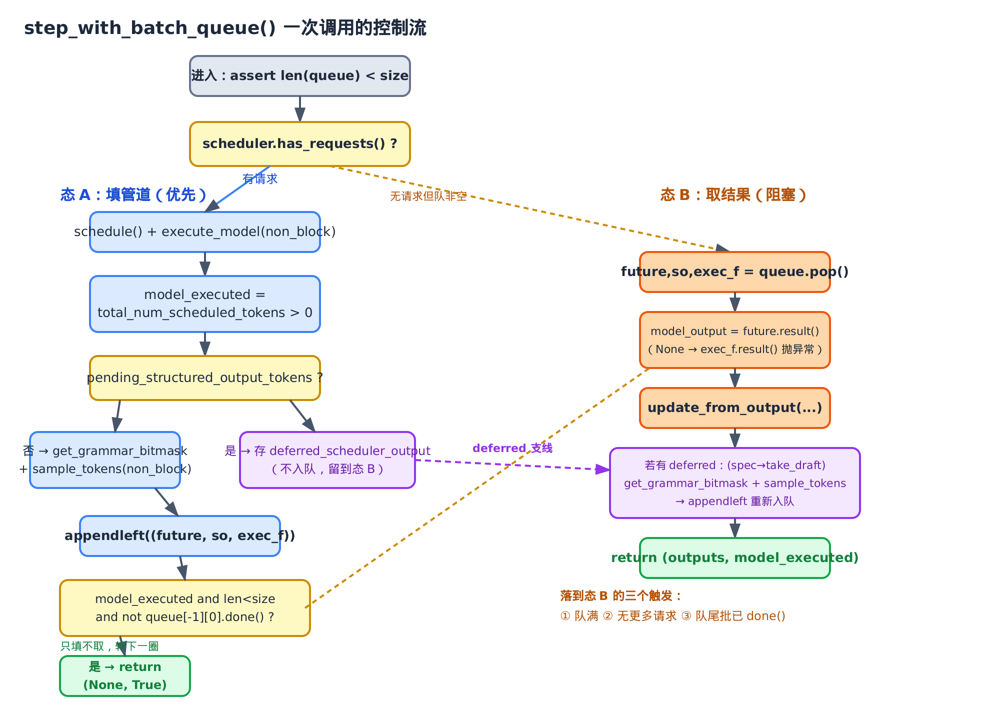

# 第12章　step_with_batch_queue：用 (SchedulerOutput, future) 对填满流水线

## 你在这里



> *图注：全书地图高亮当前阶段。[第 11 章](../ch11-engine-core/narrative/chapter.md) 把 `EngineCore` 的「心跳」`step()` 一拍拆到底，并在结尾留了一笔账：忙循环里那个 `step_fn()`，普通情况是 `step`，开了流水线并行就换成 `step_with_batch_queue`——「batch queue 的完整时间轴、各 stage 怎么重叠、那条投机解码叠结构化输出的小众路径，是第 12 章的主场」。本章就是那一场。我们把 `step_with_batch_queue` 这一个方法拆到底，看清那个 `deque` 怎么靠 `appendleft`/`pop` 把多个批同时挂在流水线的不同 stage 上，让 PP 气泡消失。往后 [第 13 章](../ch13-continuous-batching/narrative/chapter.md) 会钻进 `schedule()`，看连续批处理每一拍到底决定推什么。*

[第 11 章](../ch11-engine-core/narrative/chapter.md) 立下的事是：`EngineCore` 每一拍调 `self.step_fn()`，而这个 `step_fn` 在 `vllm/v1/engine/core.py` 的 `__init__` 时就**静态绑定**好了——绑 `step` 还是绑 `step_with_batch_queue`，取决于一个开关。那一章把 `step` 讲透了：一次迭代里 `schedule → execute_model(non_block) → 算掩码 → 等前向 → 采样 → 收口`，最精巧的一手是让 CPU 算掩码和 GPU 跑前向重叠。

但 `step` 有个天花板。它一拍只推**一个批**，这个批必须完整走完「调度→执行→采样→收口」，下一拍才能开始下一个批。单卡单 stage 时这没问题。可一旦开了**流水线并行**（pipeline parallelism，PP）——把模型的层切成若干段、分给若干张卡串行接力——一个批要顺序流过 P 个 stage。`step` 一次只喂一个批进流水线，于是同一时刻**只有一个 stage 在干活**，其余 P−1 个 stage 全在干等。这就是 PP 的「气泡」（bubble）。

**本章结清这笔账。** `step_with_batch_queue` 是 `step` 的流水线变体：它维护一个深度为 `batch_queue_size` 的队列，让多个批同时在飞、各自停在流水线的不同 stage 上。它的核心信条只有一句——**填满流水线，优先于取模型输出**。本章要讲清五件事：

- **§12.1** 气泡问题：为什么单批串行让 PP 利用率只有 1/P，队列深度怎么把它救回来；
- **§12.2** 启动期绑定：`batch_queue_size` 从哪来，`async_scheduling` 标志怎么经由 `max_concurrent_batches` 间接决定 `step_fn` 绑哪个 step；
- **§12.3** 上半段「填管道」：`appendleft` 入队，以及那个让本章成立的判定——`return (None, True)`；
- **§12.4** 下半段「取结果」：`pop` 队尾、`future.result()`、为什么队列元素要存三元组；
- **§12.5** deferred sampling：结构化输出 + 投机解码叠加时，采样为什么必须推迟，怎么推迟。

为了能在本地（无 GPU/CUDA/PP）把这一个方法亲手跑一遍、打断点看队列怎么涨怎么消，本章配了一份**只做减法**的精简版：和真实 vLLM 同名、同结构、同控制流。它替换的只有真实的 executor / scheduler 构造（属其它章节的进程/IPC/CUDA 编排），换成测试注入的协作者对象，方法调用**原样保留**；`step_with_batch_queue` 本身逐行不动。它是「跑起来看数值」的交叉验证物，正文主线始终是真实源码。

---

## 12.1 一句话钩子：流水线里的空座位

把流水线并行想成一条三人接力流水线：第一棒只算模型的前 1/3 层，传给第二棒算中间 1/3，再传给第三棒算最后 1/3，最后一棒出 logits。三个人站成一排。

现在只发一个批进来。第一棒开算时，第二、第三棒在干等；批传到第二棒，第一、第三棒在干等。任一时刻，三个人里只有一个在动——利用率 1/3，另外 2/3 是空座位。批越大、stage 越多，浪费越扎眼：PP=8 时，单批串行的利用率只有 1/8。

钩子在于：**这些空座位本可以坐人**。第一棒算完批 0 的前段、把它传给第二棒之后，第一棒就空出来了——这时如果手边还有批 1，立刻让第一棒开算批 1，它就不闲着了。再过一拍，批 0 到第三棒、批 1 到第二棒、批 2 进第一棒——三个棒全满载。这就是流水线「填满」之后的稳态。



> *图注：上轨是深度 1（普通 `step`）——单批串行流过 3 个 stage，对角线之外全是气泡（虚线空格），任一时刻只有 1/3 硬件在干活。下轨是深度 3（`batch_queue`）——批 0/1/2 错位填进各 stage，稳态下每个 stage 都满载，气泡消失。下轨能成立的前提是：有人在批 0 还没算完时，就抢先把批 1、批 2 调度进来——这正是 `step_with_batch_queue` 的「填管道优先」。*

要让「填满」发生，`EngineCore` 不能再傻等当前批走完全程。它得能**不阻塞地连续发批**：发了批 0 不等结果，立刻去发批 1，再发批 2，直到流水线灌满；然后才回头取最早那个批的结果。装这些「已发出、还没取结果」的在飞批的容器，就是 `batch_queue`——一个深度恰好等于「流水线要多少个并发批才填满」的 `deque`。

量化一下气泡。设流水线有 P 个 stage，每个 stage 一拍耗时相同。单批串行跑完全部 P 个 stage 要 P 拍，这段时间的总算力是「P 个 stage × P 拍」个 stage·拍，但真正干活的只有对角线上那 P 个。利用率就是这两者之比：

$$
\mathrm{utilization}_{\mathrm{depth}=1} = \frac{P}{P \times P} = \frac{1}{P}
$$

人话：PP=8，单批串行只用上 1/8 的卡，剩下 7/8 是气泡。而把队列填到 $P$ 个并发批后，稳态每拍 P 个 stage 全在算，利用率趋近 1——吞吐近似 ×P 提升。上限受调度/采样的串行依赖、队列深度、以及后面要讲的 deferred 路径打断流水线的影响。

这就是 `batch_queue` 存在的全部理由。`__init__` 里那段注释把它说得明明白白：

```python
# vllm/v1/engine/core.py:L184
# Setup batch queue for pipeline parallelism.
# Batch queue for scheduled batches. This enables us to asynchronously
# schedule and execute batches, and is required by pipeline parallelism
# to eliminate pipeline bubbles.
```

「异步地调度并执行多个批，是流水线并行消除气泡所必需的。」下一节先看这个队列在启动期怎么被建起来。

---

## 12.2 启动期：队列从哪来，step 绑哪个

`step_with_batch_queue` 不是每拍现选的——它在 `EngineCore.__init__` 尾段就和 `step` 二选一**静态绑定**好了。来看这段落地代码：

```python
# vllm/v1/engine/core.py:L184
# Setup batch queue for pipeline parallelism.
# … 省略：上面引过的注释 …
self.batch_queue_size = self.model_executor.max_concurrent_batches
self.batch_queue: (
    deque[tuple[Future[ModelRunnerOutput], SchedulerOutput, Future[Any]]] | None
) = None
if self.batch_queue_size > 1:
    logger.debug("Batch queue is enabled with size %d", self.batch_queue_size)
    self.batch_queue = deque(maxlen=self.batch_queue_size)

# … 省略：is_ec_consumer / is_pooling_model / request_block_hasher 初始化，与队列主线无关 …

self.step_fn = (
    self.step if self.batch_queue is None else self.step_with_batch_queue
)
self.async_scheduling = vllm_config.scheduler_config.async_scheduling
```

逐段拆，三件事：

**第一，队列深度 = `max_concurrent_batches`。** `batch_queue_size` 不是配置项，而是问执行器（executor）要来的：「你这套部署，要几个批并发才填满流水线？」这个值后面会反复出现——它既是 `deque` 的 `maxlen`（队列最多挂几个在飞批），也是「填管道判定」的阈值（队列填到这个数就该停下来取结果）。

**第二，深度决定建不建队列。** 只有 `batch_queue_size > 1` 才 `deque(maxlen=...)`；否则 `batch_queue` 留 `None`。注意那个类型注解，它就是全章的核心数据结构：

```python
deque[tuple[Future[ModelRunnerOutput], SchedulerOutput, Future[Any]]]
```

队列里每个元素是一个**三元组**：`(采样结果 future, 这个批的 SchedulerOutput, execute_model 的 future)`。为什么要存三个、而不是一个 future，§12.4 出队时自会明白。

**第三，`step_fn` 二选一。** 一句话：`batch_queue is None` 就绑 `step`，否则绑 `step_with_batch_queue`。绑定**一次**，之后每拍直接调 `self.step_fn()`，不再判断分支——[第 11 章](../ch11-engine-core/narrative/chapter.md#你在这里) 的忙循环对此完全透明，它不知道也不关心自己驱动的是哪个 step。

精简版把这段原样搬了过来，于是可以在本地直接断言绑定结果：

```python
# 深度 1 → batch_queue 为 None → step_fn 绑普通 step
core = _MinimalEngineCore(FakeExecutor(max_concurrent_batches=1), FakeScheduler())
assert core.batch_queue is None
assert core.step_fn == core.step

# 深度 2 → 建 deque(maxlen=2) → step_fn 绑 step_with_batch_queue
core = _MinimalEngineCore(FakeExecutor(max_concurrent_batches=2), FakeScheduler())
assert core.batch_queue is not None and core.batch_queue.maxlen == 2
assert core.step_fn == core.step_with_batch_queue
```

### max_concurrent_batches：那条间接链

`EngineCore` 自己**不看** `async_scheduling` 来选 step——它只看 `batch_queue` 是不是 `None`。那 `async_scheduling` 又怎么参与决策的？答案藏在 `max_concurrent_batches` 里。这个属性在每种执行器上有不同定义，正是它把「PP size」和「async_scheduling」两个看似无关的开关，统一翻译成一个数字。

基类默认最保守：

```python
# vllm/v1/executor/abstract.py:L256
@property
def max_concurrent_batches(self) -> int:
    return 1
```

多进程执行器（多卡部署走它）看流水线宽度：

```python
# vllm/v1/executor/multiproc_executor.py:L474
@cached_property
def max_concurrent_batches(self) -> int:
    # PP requires PP-size concurrent batches to fill the pipeline.
    pp_size = self.parallel_config.pipeline_parallel_size
    return 2 if pp_size <= 1 and self.scheduler_config.async_scheduling else pp_size
```

读这一行的逻辑：

- **PP > 1**：直接返回 `pp_size`。要填满 P 级流水线，就得有 P 个并发批——这是 §12.1 那张图下轨的直接来源。
- **PP ≤ 1 但开了 `async_scheduling`**：返回 2。
- **两者都没有**：`pp_size` 此时是 1，返回 1 → `batch_queue` 不建 → 绑普通 `step`。

单进程执行器（单卡部署）更简单，根本没有 PP，只剩 `async_scheduling` 这一个理由：

```python
# vllm/v1/executor/uniproc_executor.py:L63
@cached_property
def max_concurrent_batches(self) -> int:
    return 2 if self.scheduler_config.async_scheduling else 1
```

这就解开了那条间接链：**`async_scheduling=True` 让单卡的 `max_concurrent_batches` 返回 2 → `batch_queue_size=2 > 1` → 建队列 → `step_fn` 绑 `step_with_batch_queue`。** 全程没有一句 `if async_scheduling`，决策完全经由 `max_concurrent_batches` 这个数字传递。精简版把三处定义都保留了，可以逐一核对：

```python
assert AbstractExecutor().max_concurrent_batches == 1
# 单卡 + async_scheduling → 2
assert UniProcExecutor(_SchedulerConfig(async_scheduling=True)).max_concurrent_batches == 2
# PP=4 → 4（无论 async_scheduling）
assert MultiprocExecutor(_ParallelConfig(pipeline_parallel_size=4),
                         _SchedulerConfig()).max_concurrent_batches == 4
# 单 PP + async_scheduling → 2
assert MultiprocExecutor(_ParallelConfig(pipeline_parallel_size=1),
                         _SchedulerConfig(async_scheduling=True)).max_concurrent_batches == 2
```

那为什么单卡 `async_scheduling` 只要深度 2、不是 P？因为这里没有 P 级流水线要填。深度 2 是为了重叠**另外两段**：CPU 端的 `schedule()` 和 GPU 端的 `execute_model()`。批 i 在 GPU 上跑前向时，让批 i+1 在 CPU 上做调度——两段流水化，把调度开销藏进 GPU 计算时间里。深度 2 就够形成这种「双缓冲」。所以同一个 `step_with_batch_queue`，对 PP 是「填满 P 级硬件流水线」，对单卡 `async_scheduling` 是「重叠 CPU 调度与 GPU 执行」——一套机制，两种受益。

绑定讲完了。下面进入方法本体，先看上半段——它怎么「填管道」。

---

## 12.3 上半段：填管道优先于取结果

`step_with_batch_queue` 的 docstring 把整个执行流写在了最前面，值得一字不漏读：

```python
# vllm/v1/engine/core.py:L443
def step_with_batch_queue(
    self,
) -> tuple[dict[int, EngineCoreOutputs] | None, bool]:
    """Schedule and execute batches with the batch queue.
    Note that if nothing to output in this step, None is returned.

    The execution flow is as follows:
    1. Try to schedule a new batch if the batch queue is not full.
    If a new batch is scheduled, directly return an empty engine core
    output. In other words, fulfilling the batch queue has a higher priority
    than getting model outputs.
    2. If there is no new scheduled batch, meaning that the batch queue
    is full or no other requests can be scheduled, we block until the first
    batch in the job queue is finished.
    3. Update the scheduler from the output.
    """
```

第 1 步那句 `fulfilling the batch queue has a higher priority than getting model outputs`——「填满批队列的优先级高于取模型输出」——就是本章的整个题眼。下面看它怎么落地。

方法一进来先立两条不变量：

```python
# vllm/v1/engine/core.py:L460
batch_queue = self.batch_queue
assert batch_queue is not None

# Try to schedule a new batch if the batch queue is not full, but
# the scheduler may return an empty batch if all requests are scheduled.
# Note that this is not blocking.
assert len(batch_queue) < self.batch_queue_size
```

第二个 `assert` 很关键：**进入这个方法时，队列一定没满**。这是个不变量，全靠下面的 `return` 维护——队列一旦填满，这一拍就不会再尝试入队。记住它，§12.4 末尾会回头印证。

接着是上半段主体。我先把它整段贴出来，再逐块拆：

```python
# vllm/v1/engine/core.py:L468
model_executed = False
deferred_scheduler_output = None
if self.scheduler.has_requests():
    scheduler_output = self.scheduler.schedule()
    # … 省略：log_error_detail 故障转储上下文 …
    exec_future = self.model_executor.execute_model(
        scheduler_output, non_block=True
    )
    # … 省略：is_ec_consumer 分支，常规部署恒 True，故 model_executed = 是否真调度了 token …
    model_executed = scheduler_output.total_num_scheduled_tokens > 0

    if not model_executed:                          # （pooling 模型快路也并入这支）
        # No sampling required (no requests scheduled).
        future = cast(Future[ModelRunnerOutput], exec_future)
    else:
        if not scheduler_output.pending_structured_output_tokens:
            # We aren't waiting for any tokens, get any grammar output
            # and sample immediately.
            grammar_output = self.scheduler.get_grammar_bitmask(scheduler_output)
            future = self.model_executor.sample_tokens(
                grammar_output, non_block=True
            )
        else:
            # We need to defer sampling until we have processed the model output
            # from the prior step.
            deferred_scheduler_output = scheduler_output

    if not deferred_scheduler_output:
        # Add this step's future to the queue.
        batch_queue.appendleft((future, scheduler_output, exec_future))
        if (
            model_executed
            and len(batch_queue) < self.batch_queue_size
            and not batch_queue[-1][0].done()
        ):
            # Don't block on next worker response unless the queue is full
            # or there are no more requests to schedule.
            return None, True
```

**块一：不阻塞地发批。**

```python
scheduler_output = self.scheduler.schedule()
exec_future = self.model_executor.execute_model(scheduler_output, non_block=True)
model_executed = scheduler_output.total_num_scheduled_tokens > 0
```

和 `step` 开头一样：`schedule()` 排一个批，`execute_model(non_block=True)` 把前向交给 worker、立刻返回 `exec_future`。`non_block=True` 是整个机制的地基——不阻塞，才能连续发批。`model_executed` 记录这一批是否真调度到了 token（常规部署下就是 `total_num_scheduled_tokens > 0`；调度器可能返回空批，那 `model_executed` 就是 `False`）。

**块二：立即采样，还是延后采样。**

```python
if not model_executed:
    future = cast(Future[ModelRunnerOutput], exec_future)
else:
    if not scheduler_output.pending_structured_output_tokens:
        grammar_output = self.scheduler.get_grammar_bitmask(scheduler_output)
        future = self.model_executor.sample_tokens(grammar_output, non_block=True)
    else:
        deferred_scheduler_output = scheduler_output
```

这里决定 `future` 是什么：

- 没真调度到 token（`not model_executed`，pooling/embedding 模型的快路也并在这支）：无需采样，`exec_future` 直接当最终 `future`。
- 调度到了，且**不缺**算掩码所需的 token（`not pending_structured_output_tokens`）：算 `grammar_output`、`sample_tokens(non_block=True)` 立即非阻塞采样，拿到 `future`。这是绝大多数批走的路。
- 调度到了，但**缺** token：把 `scheduler_output` 暂存进 `deferred_scheduler_output`，**这一拍不采样、不入队**——为什么会缺 token、怎么补，留到 §12.5。

**块三：入队 + 填管道判定（题眼）。**

```python
if not deferred_scheduler_output:
    batch_queue.appendleft((future, scheduler_output, exec_future))
    if (
        model_executed
        and len(batch_queue) < self.batch_queue_size
        and not batch_queue[-1][0].done()
    ):
        return None, True
```

只要不是 deferred，就把三元组 `(future, scheduler_output, exec_future)` 用 `appendleft` 塞进队列**左端**。然后是本章最该停下来盯住的三行条件：

`model_executed and len(batch_queue) < self.batch_queue_size and not batch_queue[-1][0].done()`

三个条件全部为真，才 `return None, True`，**直接返回、不去取任何结果**：

1. `model_executed`——这一批真发了模型（空批不算，没必要为空批让出取结果的机会）；
2. `len(batch_queue) < self.batch_queue_size`——队列**还没满**，流水线还有空位可以再塞批；
3. `not batch_queue[-1][0].done()`——队尾（`[-1]`，最早入队那个批）的采样 future **还没算完**。

`batch_queue[-1]` 是最旧的批，`[0]` 取它三元组里的采样 future，`.done()` 问它好了没。这一条的意思是：**连最老的批都还没出结果，说明流水线还在灌、远没到回收的时候**，那就别浪费时间阻塞等结果，赶紧 `return None, True` 让忙循环转下一圈、再调度一个新批进来。

返回值 `(None, True)` 怎么读？第一位 `None` 是「这一拍没有引擎输出要交」（光填管道了，没取结果）；第二位 `True` 是「我执行了模型，没空转」——忙循环靠它知道引擎在干活、不该睡。

三个条件只要有一个不成立，就**不**进 `if`、不返回，控制流自然往下落到下半段去取结果。换句话说，「该停止填管道、回头取结果」的时机正好是这三条的反面：队满了（`len == size`）、或队尾批已经算完了（`done()`）、或这是个空批（`not model_executed`）。

精简版用一个「永远 `done()` 返回 `False`」的 future 替身，就能在本地复现「填管道优先」这一态：

```python
core = _MinimalEngineCore(FakeExecutor(max_concurrent_batches=3), sched)
sched.queue(SchedulerOutput(total_num_scheduled_tokens=1, batch_id=1))
# 用 _NeverDoneFuture 让队尾 future.done() 恒为 False，强制走填管道分支
out, executed = core.step_with_batch_queue()
assert out is None and executed is True          # return (None, True)
assert len(core.batch_queue) == 1                # 批已入队，但没去取它的结果
```

这正是测试里 `test_fill_pipeline_priority_returns_none_true` 验证的行为：调度到批、队未满、队尾未完成 → 入队后立刻返回 `(None, True)`，队列长度涨到 1 而没有任何 `update_from_output` 被调用。一拍只「填」不「取」。

最后还有一支边界，处理「没有新请求可调度」的情况：

```python
# vllm/v1/engine/core.py:L508
elif not batch_queue:
    # Queue is empty. We should not reach here since this method should
    # only be called when the scheduler contains requests or the queue
    # is non-empty.
    return None, False
```

如果调度器没请求（`has_requests()` 为假）**且**队列也空了，那真没活干，返回 `(None, False)`——第二位 `False` 告诉忙循环这一拍空转了。注释也老实说了：正常不该走到这（[第 11 章](../ch11-engine-core/narrative/chapter.md) 的 `has_work()` 会拦在前面），这是一道防御。

注意这是 `elif`：只有 `has_requests()` 为假时才检查。如果调度器**有**请求，控制流要么在上面 `return None, True` 走了，要么就带着「这一拍新调度的批」往下落进下半段取结果。

---

## 12.4 下半段：pop 队尾，取出最旧那个批

控制流落到下半段，意味着这一拍该回收结果了——可能是队满了，可能是队尾批已完成，也可能是调度器没新请求但队里还有在飞批。无论哪种，动作都一样：取最旧那个批。

```python
# vllm/v1/engine/core.py:L515
# Block until the next result is available.
future, scheduler_output, exec_model_fut = batch_queue.pop()
with (
    # … 省略：log_error_detail / log_iteration_details 观测上下文 …
):
    model_output = future.result()
    if model_output is None:
        # None from sample_tokens() implies that the original execute_model()
        # call failed - raise that exception.
        exec_model_fut.result()
        raise RuntimeError("unexpected error")
```

`batch_queue.pop()` 从 `deque` **右端**弹出——也就是最早 `appendleft` 进来的那个批。配上 §12.3 的 `appendleft`，一进左、一出右，整个队列就是个严格的 **FIFO**：先调度的批，先取结果。



> *图注：`batch_queue` 是个 `deque`，每个槽是 `(采样 future, SchedulerOutput, exec_future)` 三元组。新批从左端 `appendleft` 进、最旧批从右端 `pop` 出，构成 FIFO。右端那个最旧的批是「填管道判定」`queue[-1][0].done()` 盯的对象——它算完了，就该切到取结果。*

### 为什么队列元素要存三元组

`pop()` 一次解包出三样东西，每一样都不可少——这正是 §12.2 那个 `tuple[Future, SchedulerOutput, Future]` 类型注解的来由：

```python
future, scheduler_output, exec_model_fut = batch_queue.pop()
```

- **`future`（采样结果）**：`future.result()` 阻塞到拿到这个批的 `model_output`。这是「取结果」真正等的东西。
- **`scheduler_output`（调度清单）**：马上要喂给 `update_from_output`，告诉调度器「这个批当初调度了什么」，它才能把输出对回到正确的请求上。入队时不存它，出队时就无从知道这堆 token 是谁的。
- **`exec_model_fut`（execute_model 的 future）**：用来在出错时**抛出真异常**。看那个 `if model_output is None` 分支——采样 future 返回 `None`，不是正常情况（这条路径下采样总该出 `ModelRunnerOutput`），它是个**信号**：上游的 `execute_model` 失败了，采样拿不到输入。这时 `exec_model_fut.result()` 会把 worker 里那个**真正的底层异常**重新抛出来；后面那句 `raise RuntimeError("unexpected error")` 只是兜底，正常到不了。

一句话：采样 future 负责拿结果，`SchedulerOutput` 负责对账，`exec_future` 负责在采样 future 撒谎说 `None` 时供出真凶。三个缺一不可，所以队列存三元组。

精简版能直接把这条异常路径演出来：

```python
# 让 execute_model 失败、sample 返回 None；pop 后应抛底层异常
core = _MinimalEngineCore(FakeBrokenExecutor("execute_model boom"), sched)
# … seed 一个在飞批 …
with pytest.raises(Exception, match="execute_model boom"):
    core.step_with_batch_queue()
```

这是 `test_sample_none_raises_underlying_exec_error`：采样 future 给 `None`，方法靠 `exec_model_fut.result()` 抛出 `"execute_model boom"`，而不是把 `None` 当正常结果往下传。

### 取到结果之后：收口

```python
# vllm/v1/engine/core.py:L529
# Before processing the model output, process any aborts that happened
# during the model execution.
self._process_aborts_queue()
engine_core_outputs = self.scheduler.update_from_output(
    scheduler_output, model_output
)
```

和 `step` 的收尾一样：先 `_process_aborts_queue()` 消化掉模型执行期间到达的中止请求（异步发批意味着执行窗口拉长了，这段时间里完全可能有请求被取消），再 `update_from_output(scheduler_output, model_output)` 把这个批的输出转成 `engine_core_outputs`。

如果没有 deferred 任务（绝大多数情况），方法到这就 `return engine_core_outputs, model_executed`——交出这个批的输出，第二位 `model_executed` 报告本拍是否执行了模型。

把 FIFO 落到本地验证：

```python
# 两个批先后入队，应按入队顺序（1 先于 2）被 update_from_output 收口
sched.queue(SchedulerOutput(total_num_scheduled_tokens=1, batch_id=1))
sched.queue(SchedulerOutput(total_num_scheduled_tokens=1, batch_id=2))
# … 驱动若干拍直到两批都收口 …
collected = [so.batch_id for so, _ in sched.update_from_output_calls]
assert collected == [1, 2]                       # 先调度的批先收口
```

`test_appendleft_then_pop_is_fifo` 断言的就是这个：批 1 先 `appendleft`、批 2 后 `appendleft`，但 `pop` 从右端取，于是批 1 先被 `update_from_output`——`appendleft + pop` = FIFO，名副其实。

### 逐拍看队列怎么涨、怎么切

把上面那个 `batch_queue_size = 2`、连发批 1 / 批 2 的场景按拍展开，就能看清「填管道」和「取结果」两态是怎么交替的——关键在那三行判定每拍取什么值：

| 拍 | 动作 | 队尾批 `.done()` | `len < size`(2) | 判定 | 返回 | 队列(左→右) |
|----|------|------|------|------|------|------|
| 1 | `schedule` 批1 → `appendleft` | 队尾未完成 → `False` | `1<2` 真 | 三条全真 → 只填不取 | `(None, True)` | `[批1]` |
| 2 | `schedule` 批2 → `appendleft` | （队已满，第二条先短路） | `2<2` 假 | 第二条假 → 落下半段 | `(outputs, True)` | `pop` 批1 → `[批2]` |
| 3 | 无新请求，队非空 | — | — | `has_requests` 假 → 直接下半段 | `(outputs, True)` | `pop` 批2 → `[]` |

读这张表的两个要点：第 1 拍队还没满、最老批也没算完，三条件全真，于是 `return (None, True)` 只把批 1 灌进流水线、一个结果都不取；第 2 拍批 2 一入队，`len(batch_queue)` 变成 2，`len < size` 当场为假，判定短路落到下半段，`pop` 出最老的批 1 收口。队列就这样在「填到满」和「pop 一个」之间稳态摆动，长度始终在 `[0, size]` 内。第 1、2 拍正是 `test_appendleft_then_pop_is_fifo` 实测的两步（批 1 先于批 2 收口），第 3 拍对应「无更多请求也得把在飞批 `pop` 干净」。

### 回头印证那条不变量

还记得 §12.3 开头那个 `assert len(batch_queue) < self.batch_queue_size` 吗？现在能看清它为什么永远成立了。每一拍要么在上半段 `return None, True`（此时队列恰好填了一个、但条件保证填之前 `len < size`），要么落到下半段 `pop` 掉一个。队列只在「填管道判定」的保护下增长——而那个判定的第二个条件 `len(batch_queue) < self.batch_queue_size` 一旦不满足（队满），就不返回、直接落下来 `pop`。于是下一拍进来时，必然刚 `pop` 过、或刚好没填满。队列**永远不会溢出**，`maxlen` 只是双保险。

把这件事写成一句归纳骨架就是：**基例**——方法第一次被调用时 `len(batch_queue) == 0 < size`；**归纳步**——假设某拍进入时 `len < size`，这一拍至多 `appendleft` 一次（`+1`），且只有在 `appendleft` 前 `len < size`（即填后 `len ≤ size`）的前提下才执行，凡填到 `len == size` 就不再走 `return`、必落到下半段 `pop`（`−1`）。两个方向都被夹住，于是「进入方法时 `len < size`」这个不变量逐拍保持，`len(batch_queue)` 这个非负整数被牢牢锁在 `[0, size]` 内——上半段开头那个 `assert len(batch_queue) < self.batch_queue_size` 永不触发。

最后看一眼队列对忙循环的影响。[第 11 章](../ch11-engine-core/narrative/chapter.md) 提过 `has_work()`：

```python
# vllm/v1/engine/core.py:L1152
def has_work(self) -> bool:
    """Returns true if the engine should be stepped."""
    return (
        self.engines_running
        or self.scheduler.has_requests()
        or bool(self.batch_queue)
    )
```

那个 `or bool(self.batch_queue)` 是队列语义的一部分：哪怕调度器手上一个新请求都没有，只要队列里还有**在飞的批**（已发出、还没取结果），`has_work()` 就为真，忙循环就不能睡——它必须继续转，去把这些批 `pop` 出来收口。否则在飞的批就永远悬在那、结果永远不交付。

---

## 12.5 deferred sampling：当采样必须等上一步

前面一直把 `pending_structured_output_tokens` 那条岔路按下不表。现在补上。它是 `step_with_batch_queue` 里最绕、也最能体现「异步发批」代价的一段：**结构化输出叠加投机解码时，采样没法在发批的同一拍完成，必须推迟。**

### 为什么会缺 token

先回到 §12.3 块二那个开关：

```python
if not scheduler_output.pending_structured_output_tokens:
    # 不缺 token：立即算掩码、立即采样
    ...
else:
    # 缺 token：暂存，推迟采样
    deferred_scheduler_output = scheduler_output
```

`pending_structured_output_tokens` 这个标志（和它的同伴 `has_structured_output_requests`）定义在 `SchedulerOutput` 上，注释点明了它们只在异步调度下置位：

```python
# vllm/v1/core/sched/output.py:L221
# Whether any of the scheduled requests use structured output.
# Set only in async scheduling case.
has_structured_output_requests: bool = False

# Whether the scheduled requests have all the output tokens they
# need to perform grammar bitmask computation.
pending_structured_output_tokens: bool = False
```

要理解「缺什么 token」，得看 grammar 掩码是怎么算的。结构化输出（structured output，比如强制模型只吐合法 JSON）靠在采样那步往 logits 上盖一张语法掩码（grammar bitmask），把不合法的 token 概率压成负无穷。这张掩码不是凭空算的——它依赖**这一批将要在哪些位置采样**。看 `get_grammar_bitmask` 的尾段：

```python
# vllm/v1/core/sched/scheduler.py:L1266
def get_grammar_bitmask(
    self, scheduler_output: SchedulerOutput
) -> GrammarOutput | None:
    if not scheduler_output.has_structured_output_requests:
        return None
    # … 省略：收集用结构化输出的请求 id 列表 …
    bitmask = self.structured_output_manager.grammar_bitmask(
        self.requests,
        structured_output_request_ids,
        scheduler_output.scheduled_spec_decode_tokens,
    )
    return GrammarOutput(structured_output_request_ids, bitmask)
```

关键是最后那个参数 `scheduled_spec_decode_tokens`——掩码计算要用到**这一批的投机解码草稿 token**。问题来了：在异步调度下，当我们调度**这个**新批时，**上一步**的输出可能还没处理完（这正是 `pending_structured_output_tokens` 为真的含义）。而投机解码的草稿 token 恰恰来自上一步 worker 的输出。缺了它，掩码就算不准。

于是逻辑只能是：**先把上一步的结果取出来、`update_from_output` 处理完、拿到草稿 token，再回头给这个 deferred 批算掩码、补采样。** 这就是为什么 deferred 批在上半段**只暂存、不入队**——它还没法采样，硬采会盖一张错掩码。

### 怎么补回来

deferred 的兑现在下半段末尾。注意此刻 `pop` 出的、刚 `update_from_output` 过的，正是**上一步**那个批——它的输出已经落地，草稿 token 也就到手了：

```python
# vllm/v1/engine/core.py:L535
# NOTE(nick): We can either handle the deferred tasks here or save
# in a field and do it immediately once step_with_batch_queue is
# re-called. The latter slightly favors TTFT over TPOT/throughput.
if deferred_scheduler_output:
    # If we are doing speculative decoding with structured output,
    # we need to get the draft token ids from the prior step before
    # we can compute the grammar bitmask for the deferred request.
    if self.use_spec_decode:
        draft_token_ids = self.model_executor.take_draft_token_ids()
        assert draft_token_ids is not None
        # Update the draft token ids in the scheduler output to
        # filter out the invalid spec tokens, which will be padded
        # with -1 and skipped by the grammar bitmask computation.
        self.scheduler.update_draft_token_ids_in_output(
            draft_token_ids, deferred_scheduler_output
        )
    # We now have the tokens needed to compute the bitmask for the
    # deferred request. Get the bitmask and call sample tokens.
    grammar_output = self.scheduler.get_grammar_bitmask(
        deferred_scheduler_output
    )
    future = self.model_executor.sample_tokens(grammar_output, non_block=True)
    batch_queue.appendleft((future, deferred_scheduler_output, exec_future))

return engine_core_outputs, model_executed
```

三步走：

1. **取草稿 token（仅投机解码）**：`take_draft_token_ids()` 把这一步 worker 算出的草稿 token 取回来；`update_draft_token_ids_in_output` 把它写进 deferred 批的 `SchedulerOutput`，无效的草稿用 `-1` 填充、会被掩码计算跳过。现在 deferred 批的「将要采样哪些位置」终于齐全了。
2. **补算掩码 + 采样**：`get_grammar_bitmask(deferred_scheduler_output)`——这次 token 齐了，算得出正确掩码；`sample_tokens(non_block=True)` 完成那一拍欠下的采样。
3. **重新入队**：`appendleft((future, deferred_scheduler_output, exec_future))` 把补好采样的批塞回队列，等后续某拍 `pop` 出来收口。

有一处极易看漏：**deferred 重入队用的 `exec_future` 是上半段那个变量**——deferred 批的 `execute_model` 在上半段早跑过了（前向不依赖掩码，掩码只在采样那步才用），当时只是缺 token 没法采样。所以这里**不重跑 `execute_model`**，只补一次 `sample_tokens`，复用同一个 `exec_future`。前向只算一遍，掩码与采样补一遍——账算得很干净。

那句 `NOTE(nick)` 也值得读：deferred 任务可以「当场处理」（现在这样），也可以「存进字段、下次进方法时再做」。当前选当场，源码说这「略偏向 TTFT 而非 TPOT/吞吐」——结构化输出 + 异步调度叠加时的一个微观调度取舍，知道有这权衡即可。

精简版把这条支线完整跑通了。`test_deferred_sampling_postpones_then_recovers` 验证「上半段暂存不入队、下半段 `update_from_output` 后补采样重入队」；`test_deferred_with_spec_decode_takes_draft_tokens` 验证投机解码下 `take_draft_token_ids` + `update_draft_token_ids_in_output` 在补掩码之前被正确调用：

```python
core = _MinimalEngineCore(FakeExecutor(2), sched, use_spec_decode=True)
core.model_executor.draft_token_ids = [[1, 2, -1]]    # 含一个无效草稿 token（-1）
# … seed 一个前序在飞批，再调度一个 pending_structured_output_tokens=True 的批 …
core.step_with_batch_queue()
# 补掩码前，先取了草稿 token 并写回 deferred 的 SchedulerOutput
assert sched.update_draft_calls == [([[1, 2, -1]], deferred_so)]
```

`-1` 那个无效草稿被保留在输入里、留给掩码计算跳过——和源码注释里说的「padded with -1 and skipped」对得上。



> *图注：一次 `step_with_batch_queue` 调用的两态。态 A「填管道」：有请求就 `schedule + execute_model(non_block)`，按 `pending_structured_output_tokens` 决定立即采样还是存为 deferred；非 deferred 则 `appendleft` 入队，若队未满且队尾未完成就 `return (None, True)` 只填不取。态 B「取结果」：`pop` 队尾、`future.result()`、`update_from_output`，再兑现 deferred（紫色支线：取草稿 token → 补掩码 → 补采样 → 重新入队）。落到态 B 的三个触发：队满、无更多请求、队尾批已 `done()`。*

---

## 12.6 小结：一个方法，两种受益

回头看，`vllm/v1/engine/core.py` 里的 `step_with_batch_queue` 其实只在 `step` 上加了一件事：把「发批」和「取结果」**解耦**，中间垫一个深度为 `batch_queue_size` 的 FIFO 队列。

- **队列深度**问执行器要：PP 下是 `pp_size`（填满 P 级流水线），单卡 `async_scheduling` 下是 2（重叠 CPU 调度与 GPU 执行）。`async_scheduling` 标志全程没被 `EngineCore` 直接看到，它经由 `max_concurrent_batches` 这个数字，间接决定了 `step_fn` 绑哪个 step。
- **填管道优先**是灵魂：能调度、队未满、队尾未完成，就 `appendleft` 入队后 `return (None, True)`，不取结果、立刻去发下一个批。只有队满、无更多请求、或队尾已完成时，才 `pop` 队尾取结果。`appendleft` + `pop` = 严格 FIFO。
- **队列元素是三元组**：采样 future 取结果、`SchedulerOutput` 对账、`exec_future` 在采样撒谎说 `None` 时供出真凶。
- **deferred sampling** 是异步发批的代价：结构化输出 + 投机解码下，算掩码要用上一步的草稿 token，缺 token 时只能把采样推迟到 `pop` 出上一步结果、拿到草稿 token 之后，补掩码 + 补采样 + 重入队，且不重跑前向。

一套机制，对 PP 是消除流水线气泡，对单卡 `async_scheduling` 是重叠 CPU/GPU——这就是 [第 11 章](../ch11-engine-core/narrative/chapter.md) 结尾那个「`step_fn` 的另一种绑定」背后的全部故事。

那几个被我们当作黑盒的方法——`schedule()` 凭什么决定这一拍推哪些请求、各推多少 token——是下一章的主场。节拍器已经在转，流水线也填满了，接下来 [第 13 章](../ch13-continuous-batching/narrative/chapter.md) 钻进 `schedule()`，看连续批处理到底怎么排每一个批。
