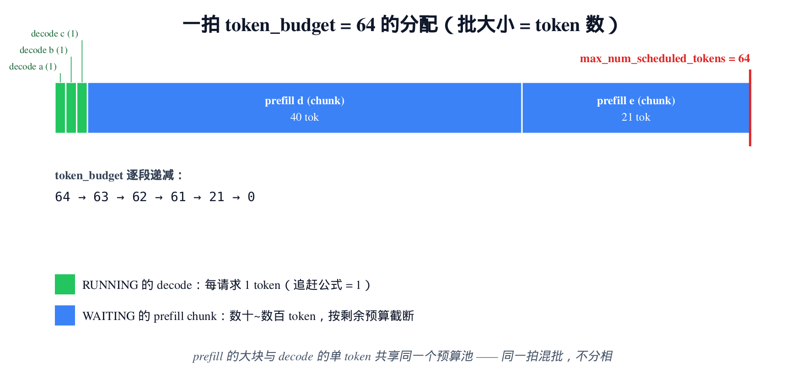
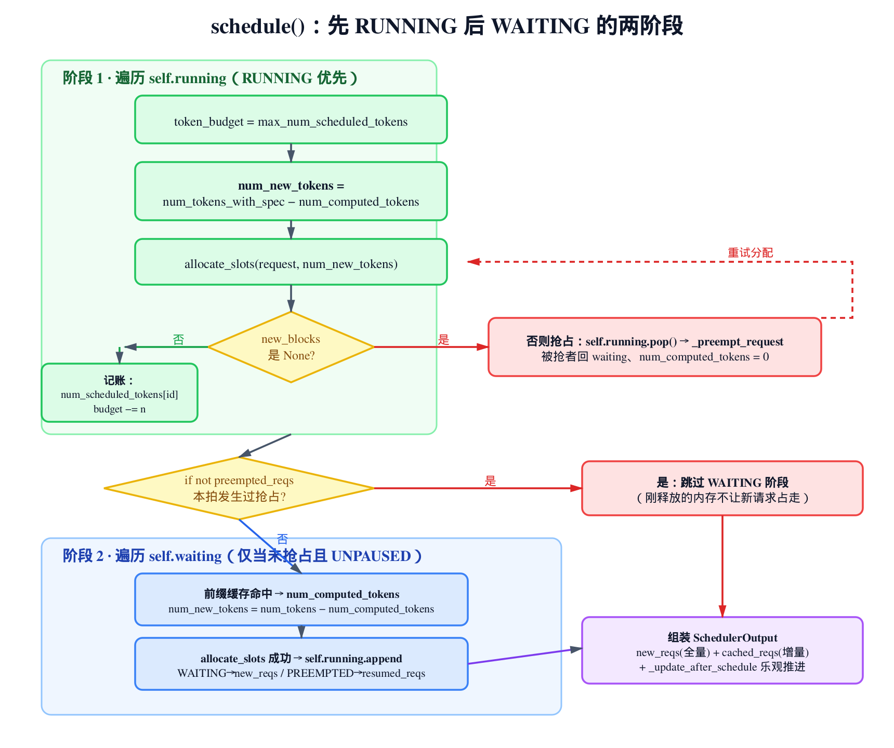
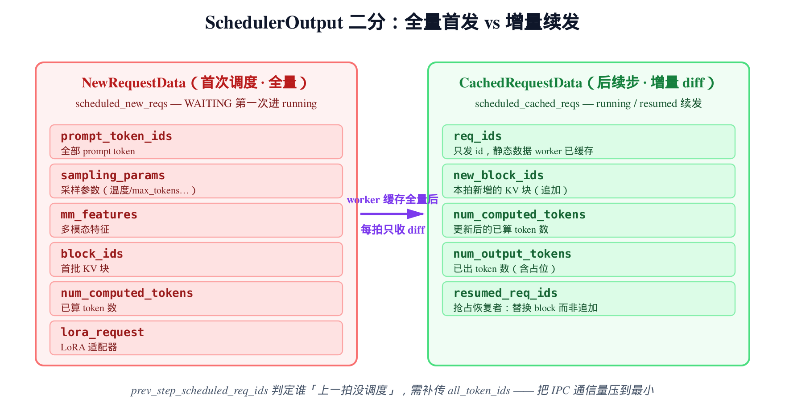
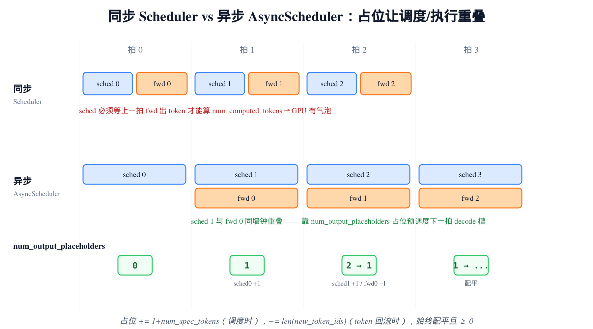

# 第13章　schedule()：Token 为中心的连续批处理

## 你在这里


> *图注：全书地图高亮当前阶段「EngineCore 循环」。[第 11 章](../ch11-engine-core/narrative/chapter.md) 把 `EngineCore.step()` 一拍拆到底，那一拍的第一个动作就是 `scheduler_output = self.scheduler.schedule()`——当时我们把它当黑盒，只说它「产出这一批要算什么的清单」。[第 12 章](../ch12-engine-core/narrative/chapter.md) 又把流水线变体讲透，结尾留下一句话：`schedule()` 凭什么决定这一拍推哪些请求、各推多少 token，是下一章的主场。本章就钻进这个黑盒。下一章接着讲调度器背后的 KV 块分配器——`allocate_slots` 怎么把 token 落到分页显存上。*

[第 11 章](../ch11-engine-core/narrative/chapter.md) 立下的事是：`EngineCore` 每一拍调一次 `schedule()`，拿回一个 `SchedulerOutput`，喂给模型跑前向；前向出了 token，再调 `update_from_output()` 收口。那一章把循环的骨架讲清了，唯独把 `schedule()` 和 `update_from_output()` 这两个方法当作黑盒——「这一批要算什么」由它们说了算，但「凭什么这么算」没展开。本章的代码主线集中在 `vllm/v1/core/sched/` 这一个目录：调度器主体 `vllm/v1/core/sched/scheduler.py`、异步变体 `vllm/v1/core/sched/async_scheduler.py`、产物结构 `vllm/v1/core/sched/output.py`。

**本章就把这两个方法拆到底。** 你会看到 vLLM v1 调度器一个反直觉的设计：它的代码里**没有「prefill 阶段」也没有「decode 阶段」**。传统推理引擎把请求分成两类——还在读 prompt 的（prefill）和已经在吐字的（decode）——然后为两类各写一条调度路径。v1 把这两条路径**合成了一条**。一个请求在调度器眼里只有两个数：已经算了多少 token（`num_computed_tokens`），还差多少 token 要算（`num_tokens_with_spec`）。每一拍，调度器尽量让前者去追后者。prefill 是「差得多」，decode 是「差 1 个」——同一套逻辑，同一个预算池，同一拍里混着跑。

这一章要讲清七件事：

- **§13.1** 「不分相」到底是什么意思：`num_computed_tokens` 追赶 `num_tokens_with_spec` 这一条公式如何吃下 prefill、decode、chunked prefill、prefix caching；
- **§13.2** token 预算：为什么连续批处理的「批大小」是 token 数而不是请求数，`token_budget` 怎么跨两阶段递减；
- **§13.3** 阶段一调度 RUNNING：追赶公式、`allocate_slots` 失败时的 FCFS 抢占；
- **§13.4** 阶段二调度 WAITING：`if not preempted_reqs` 守卫、chunked prefill 的截断；
- **§13.5** `SchedulerOutput` 的二分：首次发 `NewRequestData`（全量）、后续发 `CachedRequestData`（增量）；
- **§13.6** `update_from_output()`：反馈环的另一半，追加 token、判 stop、释放;
- **§13.7** `AsyncScheduler`：`num_output_placeholders` 占位机制，如何让调度和执行重叠。

为了能在本地（无 GPU）把这套逻辑亲手跑一遍、打断点看每个标量怎么变，本章配了一份**只做减法**的精简版：和真实 vLLM 同名、同结构、同控制流，只删掉与连续批处理主干无关的子系统（KV connector、多模态、结构化输出、LoRA、流水线并行等），删除点都原样标注。它是「跑起来看数值」的交叉验证物——正文的主线，始终是真实 `vllm/v1/core/sched/` 的源码。

---

## 13.1 没有 prefill 相，没有 decode 相

先看调度器对外的契约。`SchedulerInterface` 定义了 `schedule()` 该返回什么：

```python
# vllm/v1/core/sched/interface.py:L52
@abstractmethod
def schedule(self) -> "SchedulerOutput":
    """Schedule the requests to process in this scheduling step.

    The scheduling decision is made at the iteration level. Each scheduling
    step corresponds to a single forward pass of the model. Therefore, this
    method is called repeatedly by a busy loop in the engine.

    Essentially, the scheduler produces a dictionary of {req_id: num_tokens}
    that specifies how many tokens to process for each request in this
    scheduling step. For example, num_tokens can be as large as the number
    of prompt tokens for new requests, or it can be 1 for the requests that
    are auto-regressively generating new tokens one by one. Otherwise, it
    can be somewhere in between in case of chunked prefills, prefix caching,
    speculative decoding, etc.
    """
```

把这段读慢一点，它把全章浓缩进了一句话：调度器的产物，本质上是一张字典 `{req_id: num_tokens}`——**每个请求这一拍要算几个 token**。

注意它怎么举例。一个**新请求**，`num_tokens` 可以等于整个 prompt 的长度（一口气把 prompt 算完）。一个**正在自回归吐字的请求**，`num_tokens` 就是 1（一次一个 token）。而 chunked prefill、prefix caching、投机解码这些情况，`num_tokens` 落在两者之间。

关键在于：**契约里没有「这是 prefill」「这是 decode」的标志位。** 对外只有「这个请求要算几个 token」这一个数。prefill 和 decode 的区别，被压缩成了「这个数大」还是「这个数小」。

为什么能这么干？看 `schedule()` 开头那段 woosuk 写的注释，它是整个调度器的设计宣言：

```python
# vllm/v1/core/sched/scheduler.py:L352
def schedule(self) -> SchedulerOutput:
    # NOTE(woosuk) on the scheduling algorithm:
    # There's no "decoding phase" nor "prefill phase" in the scheduler.
    # Each request just has the num_computed_tokens and
    # num_tokens_with_spec. num_tokens_with_spec =
    # len(prompt_token_ids) + len(output_token_ids) + len(spec_token_ids).
    # At each step, the scheduler tries to assign tokens to the requests
    # so that each request's num_computed_tokens can catch up its
    # num_tokens_with_spec. This is general enough to cover
    # chunked prefills, prefix caching, speculative decoding,
    # and the "jump decoding" optimization in the future.
```

「There's no decoding phase nor prefill phase in the scheduler.」——调度器里没有解码相，也没有预填相。每个请求身上只挂两个标量：

- `num_computed_tokens`：**已经算过**的 token 数（KV cache 里已经有它们的 key/value）；
- `num_tokens_with_spec`：**总共要算**的 token 数，等于 `len(prompt) + len(output) + len(spec)`——prompt 长度 + 已经生成的输出长度 + 这一拍的草稿 token 数。

每一拍，调度器干的事就一句话：**尽量让 `num_computed_tokens` 追上 `num_tokens_with_spec`。**

我们用这把尺子量一下两种经典场景：

- **一个刚进来的请求**，prompt 100 个 token，还没算过任何东西。`num_computed_tokens = 0`，`num_tokens_with_spec = 100`。差 100。这就是 prefill——「差得多」。
- **一个已经吐了 50 个字的请求**，prompt 100 + 输出 50 = 150 都算过了，现在要生成第 51 个字。`num_computed_tokens = 150`，`num_tokens_with_spec = 151`（输出 +1）。差 1。这就是 decode——「差 1 个」。

同一条减法 `num_tokens_with_spec − num_computed_tokens`，prefill 时它等于剩余 prompt 长度，decode 时它等于 1。**调度器根本不需要知道哪个是 prefill、哪个是 decode**——它只看这个差值，给请求分配「这一拍补多少」。注释最后那行点破了威力来源：这套逻辑「general enough」——足够通用，天然覆盖 chunked prefill（差值被预算截断，分几拍补）、prefix caching（命中的前缀直接计进 `num_computed_tokens`，差值变小）、投机解码（差值里含草稿 token），甚至将来的 jump decoding。一条公式，吃下所有特性。这是 v1 相对 v0 最核心的简化——v0 要为 prefill 和 decode 维护两套队列、两条调度路径，v1 把它们抹平成了一条数轴上的追赶。

> 后面 §13.3 你会看到这条减法在 RUNNING 阶段的真身（还多了个 `num_output_placeholders` 项，那是 §13.7 异步调度的伏笔）；§13.4 看它在 WAITING 阶段的变体。

---

## 13.2 批大小是 token 数，不是请求数

「连续批处理」（continuous batching）这个词，重点在「连续」——批的成员随时进出，不像传统静态批那样凑齐一批才发车、跑完才换人。但它还有个同样重要、却常被忽略的点：**这个批的大小，是按 token 数算的，不是按请求数算的。**

看 `schedule()` 怎么开局。它一上来初始化一堆结果容器和一个预算：

```python
# vllm/v1/core/sched/scheduler.py:L364
        scheduled_new_reqs: list[Request] = []
        scheduled_resumed_reqs: list[Request] = []
        scheduled_running_reqs: list[Request] = []
        preempted_reqs: list[Request] = []

        req_to_new_blocks: dict[str, KVCacheBlocks] = {}
        num_scheduled_tokens: dict[str, int] = {}
        token_budget = self.max_num_scheduled_tokens
        if self._pause_state == PauseState.PAUSED_ALL:
            # Do not schedule any requests when paused.
            token_budget = 0
        # … 省略：encoder / spec decode 相关容器的初始化 …

        self.kv_cache_manager.new_step_starts()
```

`token_budget = self.max_num_scheduled_tokens`——这是这一拍能分配的 token 总数上限，缺省回退到 `max_num_batched_tokens`（用户配置，典型值 2048、8192 这种）。

四个结果列表分别装最后调度成功的请求，按它们的「身份」分类：`scheduled_new_reqs`（首次调度）、`scheduled_resumed_reqs`（抢占后恢复）、`scheduled_running_reqs`（一直在跑的）、`preempted_reqs`（这一拍被抢占的）。`num_scheduled_tokens` 就是契约里那张 `{req_id: num_tokens}` 字典，边调度边往里填。

那个 `PauseState.PAUSED_ALL` 的短路很直白：引擎被要求全暂停时，把预算直接清零——预算为 0，后面两阶段的循环条件 `token_budget > 0` 立刻为假，一个请求都调度不了。这是「暂停」最干净的实现：不动任何队列，只掐预算。

现在看预算怎么花掉。下面这张图是一拍调度的「资源账本」：



> *图注：`token_budget = 64`。先被 RUNNING 队列里三个 decode 请求各消耗 1 token（绿，追赶公式 = 1），再被 WAITING 队列里两个 prefill chunk 消耗（蓝，按剩余预算截断）。预算从 64 一路减到 0，右端红线是 `max_num_scheduled_tokens` 的硬上限。注意：三个 decode 的单 token 和两个 prefill 的几十 token 共享同一个预算池——这就是「不分相」在资源层面的体现：一拍之内 prefill 的大块和 decode 的小点混在一起，谁也不优先占满。*

这张图回答了「连续批处理为什么快」：GPU 跑一次前向，固定开销很大（启动 kernel、读权重）。如果一拍只算 1 个 decode token，这次前向的算力基本浪费了。所以 v1 把多个请求的 token **塞进同一拍**——3 个 decode（3 token）+ 2 个 prefill chunk（61 token），凑成 64 token 一起算，把 GPU 喂饱。批的成员、prefill 和 decode 的配比，每一拍都不一样（请求随时进出），所以叫「连续」。

下面这张图是 `schedule()` 全程的控制流，后面几节会顺着它走：



> *图注：`schedule()` 分两阶段。阶段一遍历 `self.running`（在途请求优先），对每个请求算追赶公式、调 `allocate_slots` 分配 KV 块；分配失败就抢占队尾、回到分配重试。阶段二只在「本拍没发生过抢占」时执行（`if not preempted_reqs` 守卫），从 `self.waiting` 取新请求，前缀缓存命中后算 chunked 截断、入 running。最后组装 `SchedulerOutput`。*

---

## 13.3 阶段一：先伺候在途请求（RUNNING）

第一阶段遍历 `self.running`——已经在跑的请求。**RUNNING 优先于 WAITING**，这是个刻意的策略：先保证在途请求往前推进（低延迟、避免吐到一半的请求被新来的饿死）。

```python
# vllm/v1/core/sched/scheduler.py:L387
        # First, schedule the RUNNING requests.
        req_index = 0
        while req_index < len(self.running) and token_budget > 0:
            request = self.running[req_index]

            # … 省略：async_scheduling 的提前剪枝分支（§13.7 再讲）…

            num_new_tokens = (
                request.num_tokens_with_spec
                + request.num_output_placeholders
                - request.num_computed_tokens
            )
            if 0 < self.scheduler_config.long_prefill_token_threshold < num_new_tokens:
                num_new_tokens = self.scheduler_config.long_prefill_token_threshold
            num_new_tokens = min(num_new_tokens, token_budget)

            # Make sure the input position does not exceed the max model len.
            # This is necessary when using spec decoding.
            num_new_tokens = min(
                num_new_tokens, self.max_model_len - 1 - request.num_computed_tokens
            )
```

循环条件 `token_budget > 0`：预算花光就停。

核心是 `num_new_tokens` 那个减法——§13.1 那条追赶公式的真身。它在 `num_tokens_with_spec − num_computed_tokens` 之外多了一项 `+ request.num_output_placeholders`。这个 placeholder 是异步调度专用的占位，同步调度时它恒为 0，所以现在可以先把它当作不存在；§13.7 会专门拆它。

算出原始差值后，接着三重 `min` 把它往下截：

1. `long_prefill_token_threshold`：如果配了「长 prefill 阈值」（默认 0 = 不限），单个请求一拍最多算这么多 token——防止一个超长 prompt 独占一整拍、把 decode 请求都堵住；
2. `token_budget`：不能超过这一拍剩下的预算——这是「批大小 = token 数」的强制点；
3. `max_model_len - 1 - num_computed_tokens`：不能让位置索引越过模型最大长度。

三重截断之后，`num_new_tokens` 就是这个请求这一拍**真正会算**的 token 数。对一个 decode 请求，原始差值是 1，三个 `min` 都不会动它，最终就是 1。对一个剩 50 token prompt、但预算只剩 16 的 prefill 请求，差值 50 被 `token_budget` 截成 16——这就是 **chunked prefill**：prompt 太长，分几拍算完，每拍算一块。

差值算完，下一步是为这些新 token 找 KV cache 的空间。这里是调度和显存的耦合点：

```python
# vllm/v1/core/sched/scheduler.py:L446
            if num_new_tokens == 0:
                # The request cannot be scheduled because one of the following
                # reasons: ... (encoder budget / cache exhausted, etc.)
                # NOTE(woosuk): Here, by doing `continue` instead of `break`,
                # we do not strictly follow the FCFS scheduling policy and
                # allow the lower-priority requests to be scheduled.
                req_index += 1
                continue

            # Schedule newly needed KV blocks for the request.
            with record_function_or_nullcontext("schedule: allocate_slots"):
                while True:
                    new_blocks = self.kv_cache_manager.allocate_slots(
                        request,
                        num_new_tokens,
                        num_lookahead_tokens=self.num_lookahead_tokens,
                    )

                    if new_blocks is not None:
                        # The request can be scheduled.
                        break

                    # The request cannot be scheduled.
                    # Preempt the lowest-priority request.
                    # … 省略：PRIORITY 策略下选最低优先级请求；FCFS 默认抢队尾 …
                    preempted_req = self.running.pop()

                    self._preempt_request(preempted_req, scheduled_timestamp)
                    preempted_reqs.append(preempted_req)
                    if preempted_req == request:
                        # No more request to preempt. Cannot schedule this request.
                        break

            if new_blocks is None:
                # Cannot schedule this request.
                break

            # Schedule the request.
            scheduled_running_reqs.append(request)
            request_id = request.request_id
            req_to_new_blocks[request_id] = new_blocks
            num_scheduled_tokens[request_id] = num_new_tokens
            token_budget -= num_new_tokens
            req_index += 1
```

`num_new_tokens == 0` 的处理藏着一个细节：它用 `continue` 而不是 `break`。woosuk 在注释里说清了——这**不严格遵守 FCFS**。如果某个请求因为某种原因（编码预算耗尽、缓存满等）这一拍分不到 token，不是停下整个调度，而是跳过它、继续看后面的请求。一个卡住的请求不该阻塞整批。

接下来 `allocate_slots` 是关键。它向 KV cache 管理器申请放这 `num_new_tokens` 个 token 的 KV 块。**返回非 None = 分配成功；返回 None = 显存满了。**

显存满了怎么办？看那个 `while True` 循环——它在**抢占**。`self.running.pop()` 弹出队列**最后一个**请求（FCFS 下，最后一个 = 最晚到达的，最该让位），调 `_preempt_request` 把它踢回 waiting 队列，然后回到循环顶部**重试** `allocate_slots`。抢一个不够就再抢一个，直到分配成功，或者抢到把自己都抢了（`preempted_req == request`，说明队列里只剩它自己还分不到，彻底没救，`break`）。

被抢占的请求经历了什么：

```python
# vllm/v1/core/sched/scheduler.py:L952
    def _preempt_request(self, request, timestamp: float) -> None:
        assert request.status == RequestStatus.RUNNING, (
            "Only running requests can be preempted"
        )
        self.kv_cache_manager.free(request)
        request.status = RequestStatus.PREEMPTED
        request.num_computed_tokens = 0
        if request.spec_token_ids:
            request.spec_token_ids = []
        request.num_preemptions += 1
        # Put the request back to the waiting queue.
        self.waiting.prepend_request(request)
```

三个动作：`free` 释放它占的 KV 块（腾出显存）、状态置 `PREEMPTED`、**`num_computed_tokens = 0`**。最后一个最狠——被抢占的请求，之前算过的 KV 全丢了，将来恢复时得**从头 prefill**。这是 vLLM 的「recompute」式抢占（不落盘、靠重算），代价是重算，好处是实现简单、不占额外内存。最后 `prepend_request` 把它放回 waiting 队列**最前面**（它资历老，优先恢复）。

分配成功后是四行记账，每一行都重要：

```python
            scheduled_running_reqs.append(request)        # 进「在途已调度」分类
            req_to_new_blocks[request_id] = new_blocks    # 记下新分的块
            num_scheduled_tokens[request_id] = num_new_tokens  # 填进契约字典
            token_budget -= num_new_tokens                # 预算扣减 ← 批大小守恒
            req_index += 1
```

`token_budget -= num_new_tokens` 就是图 13-token-centric-budget 里那根预算条往右走的一步。

精简版把这套逻辑剥到只剩 FCFS 主干，可以本地跑出抢占。我们给调度器只配 2 个 KV 块、两个请求各占满 1 块，让它们各吐一个 token——第二个 token 就让队尾请求需要第 3 块，没块了：

```python
def test_preemption_when_out_of_blocks():
    sched = new_scheduler(num_gpu_blocks=2, block_size=16, max_model_len=4096)
    sched.add_request(make_req("a", prompt_len=16, max_tokens=100))
    sched.add_request(make_req("b", prompt_len=16, max_tokens=100))
    o = sched.schedule()                      # a、b 各占 1 块（16 token = 1 块）
    assert sched.kv_cache_manager.num_free_blocks == 0
    sched.update_from_output(o, FakeModelRunnerOutput(o, {"a": [1], "b": [1]}))
    o2 = sched.schedule()                      # 下一个 decode token 需要第 3 块 → 没块
    assert o2.preempted_req_ids                # 抢占发生
    preempted = sched.requests[next(iter(o2.preempted_req_ids))]
    assert preempted.status == RequestStatus.PREEMPTED
    assert preempted.num_computed_tokens == 0  # 被抢者归零，将来从头算
    assert preempted in list(sched.waiting)    # 回到 waiting
```

跑出来：`allocate_slots` 返回 None，队尾被抢占，状态 `PREEMPTED`，`num_computed_tokens` 归零，回到 waiting 队列。和真实 vLLM 的抢占行为对得上。

---

## 13.4 阶段二：再接纳新请求（WAITING）

RUNNING 都伺候完、预算还有剩，才轮到 WAITING 队列里的新请求。阶段二开头有一道关键守卫：

```python
# vllm/v1/core/sched/scheduler.py:L567
        # Next, schedule the WAITING requests.
        if not preempted_reqs and self._pause_state == PauseState.UNPAUSED:
            step_skipped_waiting = create_request_queue(self.policy)

            while (self.waiting or self.skipped_waiting) and token_budget > 0:
                if len(self.running) == self.max_num_running_reqs:
                    break

                request_queue = self._select_waiting_queue_for_scheduling()
                assert request_queue is not None

                request = request_queue.peek_request()
                request_id = request.request_id
                # … 省略：被阻塞 waiting 状态（等远程 KV 等）的提升逻辑 …
```

`if not preempted_reqs`——**只要这一拍发生过抢占，就完全不调度 WAITING。** 这个守卫看似保守，其实是对的：抢占刚刚释放了一些 KV 块，如果立刻让新请求把这些块占走，那被抢占的请求就更难恢复了，会陷入「抢占→新请求占内存→被抢者还是回不来→再抢占」的抖动。所以一旦抖动的苗头出现（发生抢占），这一拍就别再火上浇油了，只管把在途请求推进，等下一拍内存宽裕些再说。

守卫里还有两个边界：`UNPAUSED`（暂停状态不接新请求）和 `len(self.running) == self.max_num_running_reqs`（在途请求数到顶，不再接——这是并发请求数的硬上限，区别于 token 预算）。

进入循环后，`peek_request` 先看一眼队首请求（还不弹出）。然后算它要调度多少 token。和 RUNNING 阶段不同，新请求得先查**前缀缓存命中**——如果它的 prompt 前缀已经在别处算过、KV 还在缓存里，那部分直接白嫖，计进 `num_computed_tokens`，不用重算。命中查询的细节属于下一章的 KV cache 管理器，这里只需知道：查完之后 `num_computed_tokens` 可能已经 > 0。然后算追赶公式的 WAITING 变体：

```python
# vllm/v1/core/sched/scheduler.py:L672
                else:
                    # Number of tokens to be scheduled.
                    # We use `request.num_tokens` instead of
                    # `request.num_prompt_tokens` to consider the resumed
                    # requests, which have output tokens.
                    num_new_tokens = request.num_tokens - num_computed_tokens
                    threshold = self.scheduler_config.long_prefill_token_threshold
                    if 0 < threshold < num_new_tokens:
                        num_new_tokens = threshold

                    # chunked prefill has to be enabled explicitly to allow
                    # pooling requests to be chunked
                    if (
                        not self.scheduler_config.enable_chunked_prefill
                        and num_new_tokens > token_budget
                    ):
                        # If chunked_prefill is disabled,
                        # we can stop the scheduling here.
                        break

                    num_new_tokens = min(num_new_tokens, token_budget)
                    assert num_new_tokens > 0
```

`num_new_tokens = request.num_tokens - num_computed_tokens`——还是那条减法。注释特意说明用 `num_tokens`（含已生成的输出）而非 `num_prompt_tokens`，因为这条路径也走「被抢占后恢复」的请求（它们有输出 token）。

这里出现了一个重要分叉：**chunked prefill 开没开**。`enable_chunked_prefill` 控制「prompt 能不能拆成几拍算」。如果**关了**，而这个请求要算的 token 超过了剩余预算，直接 `break`——整个 prompt 要么一拍装下，要么这一拍干脆不调度它。如果**开了**（默认），下面 `min(num_new_tokens, token_budget)` 会把它截到预算大小，prompt 分几拍算完。

精简版把这两条路都跑给你看。chunked prefill 开着、50 token 的 prompt、预算只有 16：

```python
def test_token_budget_chunks_long_prefill():
    sched = new_scheduler(max_num_batched_tokens=16, enable_chunked_prefill=True)
    sched.add_request(make_req("a", prompt_len=50))
    out = sched.schedule()
    assert out.num_scheduled_tokens == {"a": 16}        # 50 被截到 16
    assert sched.requests["a"].num_computed_tokens == 16  # 乐观推进（§13.5）
    out2 = sched.schedule()
    assert out2.num_scheduled_tokens == {"a": 16}        # 下一拍立刻续上第二块
    assert sched.requests["a"].num_computed_tokens == 32
```

第一拍算 16，第二拍立刻续上 16（无需等模型跑完——为什么能立刻续上，是 §13.5 的乐观推进）。关掉 chunked prefill，同样 50 token、预算 16：

```python
def test_no_chunked_prefill_breaks_when_over_budget():
    sched = new_scheduler(max_num_batched_tokens=16, enable_chunked_prefill=False)
    sched.add_request(make_req("a", prompt_len=50))
    out = sched.schedule()
    assert out.num_scheduled_tokens == {}    # 超预算且不许拆 → 整块不调度
```

这一拍什么都没调度——50 > 16，又不许拆，只能 `break` 等下一拍（除非把预算配大）。

分配 token 数定了，接着同样是 `allocate_slots`（失败就 `break`——WAITING 阶段不抢占，没块就算了）。成功后，请求正式入列：

```python
# vllm/v1/core/sched/scheduler.py:L807
                self.running.append(request)
                # … 省略：日志事件记录 …
                if request.status == RequestStatus.WAITING:
                    scheduled_new_reqs.append(request)
                elif request.status == RequestStatus.PREEMPTED:
                    scheduled_resumed_reqs.append(request)
                else:
                    raise RuntimeError(f"Invalid request status: {request.status}")

                # … 省略：LoRA 记账 …
                req_to_new_blocks[request_id] = self.kv_cache_manager.get_blocks(
                    request_id
                )
                num_scheduled_tokens[request_id] = num_new_tokens
                token_budget -= num_new_tokens
                request.status = RequestStatus.RUNNING
                request.num_computed_tokens = num_computed_tokens
```

请求被 `append` 进 `self.running`，状态置 `RUNNING`。这里按**进来之前的状态**分流：原本 `WAITING`（第一次进）的进 `scheduled_new_reqs`，原本 `PREEMPTED`（之前被抢、现在恢复）的进 `scheduled_resumed_reqs`。这个分类不是为了好看——它直接决定了 `SchedulerOutput` 给这个请求发**全量**还是**增量**数据。这正是下一节的事。

阶段二结束，`schedule()` 做一组断言，把这一拍的资源守恒钉死：

```python
# vllm/v1/core/sched/scheduler.py:L848
        # Check if the scheduling constraints are satisfied.
        total_num_scheduled_tokens = sum(num_scheduled_tokens.values())
        assert total_num_scheduled_tokens <= self.max_num_scheduled_tokens

        assert token_budget >= 0
        assert len(self.running) <= self.max_num_running_reqs
        # Since some requests in the RUNNING queue may not be scheduled in
        # this step, the total number of scheduled requests can be smaller than
        # len(self.running).
        assert len(scheduled_new_reqs) + len(scheduled_resumed_reqs) + len(
            scheduled_running_reqs
        ) <= len(self.running)
```

`total_num_scheduled_tokens ≤ max_num_scheduled_tokens`：这一拍所有请求加起来的 token 数，不超预算上限。`token_budget ≥ 0`：预算从没花超。`len(self.running) ≤ max_num_running_reqs`：在途请求数不超并发上限。这三条就是连续批处理的「批大小」边界——一拍能算多少 token、能容纳多少请求，全在这里封顶。

「不分相」最直观的证据，是同一拍里 prefill 和 decode 共存。精简版直接验这件事：

```python
def test_continuous_batch_mixes_prefill_and_decode():
    sched = new_scheduler(max_num_batched_tokens=64)
    sched.add_request(make_req("a", prompt_len=4))          # a 先跑、进 decode
    o = sched.schedule()
    sched.update_from_output(o, FakeModelRunnerOutput(o, {"a": [100]}))
    sched.add_request(make_req("b", prompt_len=20))         # 再来个长 prompt 的 b
    out = sched.schedule()
    assert out.num_scheduled_tokens["a"] == 1               # a 是 decode（1 token）
    assert out.num_scheduled_tokens["b"] == 20              # b 是 prefill（20 token）
    assert out.total_num_scheduled_tokens == 21             # 共享同一预算
    assert {r.req_id for r in out.scheduled_new_reqs} == {"b"}      # b 走全量
    assert set(out.scheduled_cached_reqs.req_ids) == {"a"}          # a 走增量
```

同一拍里，`a` 算 1 个 decode token、`b` 算 20 个 prefill token，加起来 21，共享一个预算池。调度器代码里没有任何地方写「if prefill / if decode」——它只是对每个请求算了那条减法。这就是「不分相」。

---

## 13.5 SchedulerOutput：全量发一次，之后只发 diff

调度决策做完了，现在要把它打包成 `SchedulerOutput`，送给（可能在另一个进程里的）model runner。这里有个通信成本的设计：**首次调度的请求发全量数据，之后只发增量。**

为什么？model runner 跑在 worker 进程里，调度器每拍都要把「这一批算什么」通过 IPC 发过去。一个请求的静态数据——prompt token、采样参数、多模态特征——一旦发过一次，worker 缓存住就行，没必要每拍重发。每拍真正变化的，只有「又算了几个 token、新分了哪些块」这点 diff。

看这两个数据结构。首次调度用 `NewRequestData`：

```python
# vllm/v1/core/sched/output.py:L30
@dataclass
class NewRequestData:
    req_id: str
    prompt_token_ids: list[int] | None
    mm_features: list[MultiModalFeatureSpec]
    sampling_params: SamplingParams | None
    pooling_params: PoolingParams | None
    block_ids: tuple[list[int], ...]
    num_computed_tokens: int
    lora_request: LoRARequest | None
    prompt_embeds: "torch.Tensor | None" = None
    prompt_is_token_ids: list[bool] | None = None
```

全套：完整 prompt、采样参数、多模态特征、LoRA、首批 KV 块。后续调度用 `CachedRequestData`，只有 diff：

```python
# vllm/v1/core/sched/output.py:L111
@dataclass
class CachedRequestData:
    req_ids: list[str]
    # For request ids not in resumed_req_ids, new_block_ids will be appended to
    # the request's block IDs. For those in the set, new_block_ids will be used as the
    # request's block IDs instead of appending to the existing block IDs.
    resumed_req_ids: set[str]
    # NOTE(woosuk): new_token_ids is only used for pipeline parallelism.
    # When PP is not used, new_token_ids will be empty.
    new_token_ids: list[list[int]]
    # For requests not scheduled in the last step, propagate the token ids to the
    # connector. Won't contain requests that were scheduled in the prior step.
    all_token_ids: dict[str, list[int]]
    new_block_ids: list[tuple[list[int], ...] | None]
    num_computed_tokens: list[int]
    num_output_tokens: list[int]
```

没有 prompt、没有采样参数——那些 worker 已经缓存了。只有：又新增了哪些块（`new_block_ids`）、`num_computed_tokens` 更新到几、`num_output_tokens` 几。这张图把两者并排：



> *图注：首次调度发 `NewRequestData`（左，全量）：完整 prompt、采样参数、多模态、首批块。worker 缓存住后，后续步只发 `CachedRequestData`（右，增量 diff）：新块、更新后的 token 计数。`resumed_req_ids` 标出哪些请求是「抢占后恢复」的——对它们，`new_block_ids` 是**替换**整套块（之前的块在抢占时已被 free），而非追加。`prev_step_scheduled_req_ids` 用来判定哪些请求「上一拍没被调度」，需要补传 `all_token_ids`。*

`SchedulerOutput` 本身就是把这两类装在一起：

```python
# vllm/v1/core/sched/output.py:L180
@dataclass
class SchedulerOutput:
    # list of the requests that are scheduled for the first time.
    # We cache the request's data in each worker process, so that we don't
    # need to re-send it every scheduling step.
    scheduled_new_reqs: list[NewRequestData]
    # list of the requests that have been scheduled before.
    # Since the request's data is already cached in the worker processes,
    # we only send the diff to minimize the communication cost.
    scheduled_cached_reqs: CachedRequestData

    # req_id -> num_scheduled_tokens
    # Number of tokens scheduled for each request.
    num_scheduled_tokens: dict[str, int]
    total_num_scheduled_tokens: int
    # … 省略：spec / encoder / connector 等子系统的元数据字段 …
    finished_req_ids: set[str]
    free_encoder_mm_hashes: list[str]
```

注释把意图说得明明白白：new_reqs「cache the request's data in each worker process」，cached_reqs「only send the diff to minimize the communication cost」。

组装代码用 §13.3/§13.4 攒的那几个分类列表来分流：

```python
# vllm/v1/core/sched/scheduler.py:L871
        # Construct the scheduler output.
        # … 省略：use_v2_model_runner 分支 …
        new_reqs_data = [
            NewRequestData.from_request(
                req, req_to_new_blocks[req.request_id].get_block_ids()
            )
            for req in scheduled_new_reqs
        ]

        with record_function_or_nullcontext("schedule: make_cached_request_data"):
            cached_reqs_data = self._make_cached_request_data(
                scheduled_running_reqs,
                scheduled_resumed_reqs,
                num_scheduled_tokens,
                scheduled_spec_decode_tokens,
                req_to_new_blocks,
            )

        # Record the request ids that were scheduled in this step.
        self.prev_step_scheduled_req_ids.clear()
        self.prev_step_scheduled_req_ids.update(num_scheduled_tokens.keys())
        # … 省略：构造 SchedulerOutput dataclass、注入各类元数据 …
```

`scheduled_new_reqs` → 走 `from_request`，造全量。`scheduled_running_reqs + scheduled_resumed_reqs` → 走 `_make_cached_request_data`，造增量。

最后两行很关键：`prev_step_scheduled_req_ids` 被刷成「这一拍调度了哪些请求」。下一拍组装增量时，它用来判断某请求是不是「上一拍刚调过」——这决定要不要补传 `all_token_ids`。看 `_make_cached_request_data`：

```python
# vllm/v1/core/sched/scheduler.py:L1060
        num_running_reqs = len(running_reqs)
        for idx, req in enumerate(itertools.chain(running_reqs, resumed_reqs)):
            req_id = req.request_id
            req_ids.append(req_id)
            # … 省略：PP 下回传采样 token 的 new_token_ids 分支（非 PP 时恒空）…
            scheduled_in_prev_step = req_id in self.prev_step_scheduled_req_ids
            if idx >= num_running_reqs:
                assert not scheduled_in_prev_step
                resumed_req_ids.add(req_id)
            if not scheduled_in_prev_step:
                all_token_ids[req_id] = req.all_token_ids.copy()
            new_block_ids.append(
                req_to_new_blocks[req_id].get_block_ids(allow_none=True)
            )
            num_computed_tokens.append(req.num_computed_tokens)
            num_output_tokens.append(
                req.num_output_tokens + req.num_output_placeholders
            )

        return CachedRequestData(
            req_ids=req_ids,
            resumed_req_ids=resumed_req_ids,
            new_token_ids=new_token_ids,
            all_token_ids=all_token_ids,
            new_block_ids=new_block_ids,
            num_computed_tokens=num_computed_tokens,
            num_output_tokens=num_output_tokens,
        )
```

`itertools.chain(running_reqs, resumed_reqs)` 把在途和恢复的请求串起来遍历。`idx >= num_running_reqs` 的就是 resumed 部分——它们进 `resumed_req_ids`（对应图里「替换 block 而非追加」的语义）。`if not scheduled_in_prev_step`（上一拍没调过的）才补传 `all_token_ids`——上一拍刚调过的，worker 那边 token 是连续的，不用补。这就是 `prev_step_scheduled_req_ids` 的用处。

精简版可以直接看到「首次全量、二拍增量」的切换：

```python
def test_first_schedule_emits_new_request_data():
    sched = new_scheduler()
    sched.add_request(make_req("a", prompt_len=10))
    out = sched.schedule()
    assert out.num_scheduled_tokens == {"a": 10}
    assert len(out.scheduled_new_reqs) == 1                 # 首次 → 全量
    assert out.scheduled_new_reqs[0].prompt_token_ids == list(range(10))
    assert out.scheduled_cached_reqs.num_reqs == 0          # 没有增量

def test_second_schedule_emits_cached_request_data():
    # … a 第一拍 prefill 10、产出 1 个 token …
    out2 = sched.schedule()
    assert out2.num_scheduled_tokens == {"a": 1}            # decode：11-10=1
    assert len(out2.scheduled_new_reqs) == 0               # 不再发全量
    assert out2.scheduled_cached_reqs.req_ids == ["a"]      # 只发增量
```

第一拍 `a` 在 `scheduled_new_reqs` 里、带全量 prompt；进入 decode 后第二拍转到 `scheduled_cached_reqs`、只发 diff。通信量从「整个 prompt」缩到「一个 token 的增量」。

### 乐观推进：为什么下一拍能立刻续上

`schedule()` 的最后一步，是在返回之前就把 `num_computed_tokens` 往前推——**不等模型跑完**：

```python
# vllm/v1/core/sched/scheduler.py:L943
        with record_function_or_nullcontext("schedule: update_after_schedule"):
            self._update_after_schedule(scheduler_output)
        return scheduler_output
```

```python
# vllm/v1/core/sched/scheduler.py:L974
    def _update_after_schedule(self, scheduler_output: SchedulerOutput) -> None:
        # Advance the number of computed tokens for the request AFTER
        # the request is scheduled.
        # 1. The scheduler_output of the current step has to include the
        #    original number of scheduled tokens to determine input IDs.
        # 2. Advance the number of computed tokens here allowing us to
        #    schedule the prefill request again immediately in the next
        #    scheduling step.
        # 3. If some tokens (e.g. spec tokens) are rejected later, the number of
        #    computed tokens will be adjusted in update_from_output.
        num_scheduled_tokens = scheduler_output.num_scheduled_tokens
        for req_id, num_scheduled_token in num_scheduled_tokens.items():
            request = self.requests[req_id]
            request.num_computed_tokens += num_scheduled_token
            request.is_prefill_chunk = request.num_computed_tokens < (
                request.num_tokens + request.num_output_placeholders
            )
            # … 省略：structured output 累计 …

        # Clear the finished request IDs.
        # NOTE: We shouldn't do self.finished_req_ids.clear() here because
        # it will also affect the scheduler output.
        self.finished_req_ids = set()
```

`request.num_computed_tokens += num_scheduled_token`——刚调度了 16 个 token，立刻就当作「已经算了 16 个」。注释第 2 条说破原因：**这样下一拍就能立刻接着调度这个 prefill 请求的下一块**，不用先等这一拍的前向跑完、再回来更新计数。这是「乐观」——假设前向一定成功。万一投机解码的草稿 token 后来被拒了（前向跑完才知道），第 3 条说了：在 `update_from_output` 里把多推的退回去。

这就是 §13.4 那个测试里「第一拍算 16、第二拍立刻续 16」能成立的原因：第一拍调度后 `num_computed_tokens` 立刻变成 16，第二拍的追赶公式 `50 - 16 = 34`，再截到预算 16——续上了。乐观推进是 chunked prefill 能流水起来的引擎。

`is_prefill_chunk` 也在这里更新：如果 `num_computed_tokens` 还没追上总数，说明 prompt 还没读完，这个请求还在 prefill 中途。这个标志位 §13.7 异步调度会用到。

---

## 13.6 update_from_output：反馈环的另一半

`schedule()` 是「发出去」，`update_from_output()` 是「收回来」。模型跑完前向、采样出 token，[EngineCore](../ch11-engine-core/narrative/chapter.md) 把 `ModelRunnerOutput` 交给它，它负责把 token 追加到请求上、判断该不该停、停了就释放：

```python
# vllm/v1/core/sched/scheduler.py:L1290（精简：剥去 connector/encoder/structured/pooling/logprobs/stats）
    def update_from_output(self, scheduler_output, model_runner_output):
        sampled_token_ids = model_runner_output.sampled_token_ids
        num_scheduled_tokens = scheduler_output.num_scheduled_tokens
        outputs = defaultdict(list)

        stopped_running_reqs, stopped_preempted_reqs = set(), set()
        for req_id, num_tokens_scheduled in num_scheduled_tokens.items():
            request = self.requests.get(req_id)
            if request is None or request.is_finished():
                continue                                   # 执行期被中止的，跳过

            req_index = model_runner_output.req_id_to_index[req_id]
            generated_token_ids = (
                sampled_token_ids[req_index] if sampled_token_ids else []
            )
            # … 省略：投机解码的拒绝回退（拒了多少草稿就把 num_computed_tokens 退回多少）…

            stopped = False
            new_token_ids = generated_token_ids
            status_before_stop = request.status
            if new_token_ids:
                new_token_ids, stopped = self._update_request_with_output(
                    request, new_token_ids
                )

            finish_reason = None
            if stopped:
                finish_reason = request.get_finished_reason()
                self._free_request(request)
                if status_before_stop == RequestStatus.RUNNING:
                    stopped_running_reqs.add(request)
                else:
                    stopped_preempted_reqs.add(request)

            if new_token_ids or stopped:
                outputs[request.client_index].append(
                    _EngineCoreOutput(req_id, new_token_ids, finish_reason)
                )

        # Remove the stopped requests from the running and waiting queues.
        if stopped_running_reqs:
            self.running = [r for r in self.running if r not in stopped_running_reqs]
        if stopped_preempted_reqs:
            self.waiting.remove_requests(stopped_preempted_reqs)
        return dict(outputs)
```

遍历这一拍调度过的每个请求，从 `sampled_token_ids` 取出它新生成的 token。一个 prefill chunk 没生成新 token（prompt 还没读完），`generated_token_ids` 是空的，直接跳过追加。一个 decode 请求生成了 1 个 token，就走 `_update_request_with_output` 追加并判停：

```python
# vllm/v1/core/sched/scheduler.py:L1622
    def _update_request_with_output(self, request, new_token_ids):
        stopped = False
        for num_new, output_token_id in enumerate(new_token_ids, 1):
            request.append_output_token_ids(output_token_id)
            stopped = check_stop(request, self.max_model_len)
            if stopped:
                del new_token_ids[num_new:]  # Trim new tokens if needed.
                break
        return new_token_ids, stopped
```

逐个追加 token，每加一个就 `check_stop`——到 `max_tokens` 了？吐出 EOS 了？命中 stop string 了？一旦停了，把多余的 token 截掉（停下之后的 token 不该返回给用户）。

停了的请求走 `_free_request`——释放 KV 块、把 id 记进 `finished_req_ids`（这一拍要随 `SchedulerOutput` 告诉 worker「这些请求结束了，清掉缓存」）、从 `self.requests` 删除。最后从 `running` 或 `waiting` 里把停掉的请求摘出去。

精简版验「达到 max_tokens 就停」的完整闭环：

```python
def test_request_stops_at_max_tokens():
    sched = new_scheduler()
    sched.add_request(make_req("a", prompt_len=4, max_tokens=2))
    o = sched.schedule()                                   # prefill 4
    sched.update_from_output(o, FakeModelRunnerOutput(o, {"a": [10]}))   # 第 1 个 token
    o2 = sched.schedule()
    outs = sched.update_from_output(o2, FakeModelRunnerOutput(o2, {"a": [11]}))  # 第 2 个 → max
    assert sched.requests.get("a") is None                 # 已 free，从 requests 删除
    assert "a" in sched.finished_req_ids                   # 记进 finished
    flat = [o for lst in outs.values() for o in lst]
    assert any(o.finish_reason is not None for o in flat)  # 输出带 finish_reason
```

第 2 个 token 触顶 `max_tokens=2`，请求结束、释放、记入 `finished_req_ids`，输出带上 `finish_reason`。这就是连续批处理里一个请求「退出批」的全过程——它腾出的 KV 块和 running 槽位，下一拍立刻能被 WAITING 队列里的新请求接手。批的成员就是这样连续流转的。

到这里，「不分相 + token 预算 + 两阶段 + 全量/增量 + 反馈环」就是 `schedule()` 决定每拍推哪些请求、推多少 token 的全部答案。[第 11 章和第 12 章](../ch11-engine-core/narrative/chapter.md)当作黑盒的那个方法，现在彻底展开了。

---

## 13.7 AsyncScheduler：让调度和执行重叠

最后一块拼图，是 vLLM 默认会启用的**异步调度**。[第 3 章 §3.5](../ch03-config-and-wiring/narrative/chapter.md#35-async_scheduling-三态决策默认开但会自动退化) 讲配置时埋了一笔账：`async_scheduling` 是个三态开关（True / False / None），它的最终值会影响 `EngineCore` 实例化哪个调度器——`async_scheduling=True` 时实例化 `AsyncScheduler`，否则是普通 `Scheduler`。当时只说「记住这条线」，现在到了它兑现的地方：这个 `AsyncScheduler` 实例，**到底怎么驱动连续批处理？**

先看它解决什么问题。回到同步 `Scheduler`：第 N 拍调度时，追赶公式要读 `num_computed_tokens`。但这个值，要等第 N−1 拍的前向**跑完、采样出 token**，才能正确更新。于是同步调度被卡死成一条直线——调度，等前向，调度，等前向。前向在 GPU 上跑的时候，CPU 上的调度器在干等；调度器在算的时候，GPU 在干等。两边轮流闲着。

异步调度想让这两件事**重叠**：第 N 拍的调度，和第 N−1 拍的前向，同时进行。但这就撞上一个矛盾——第 N 拍调度时，第 N−1 拍的 token 还没算出来，`num_computed_tokens` 该怎么填？

`AsyncScheduler` 的答案是**占位**。它继承 `Scheduler`，只覆写两个方法，引入一个字段 `num_output_placeholders`：

```python
# vllm/v1/core/sched/async_scheduler.py:L12
class AsyncScheduler(Scheduler):
    def __init__(self, *args, **kwargs) -> None:
        super().__init__(*args, **kwargs)
        # reusable read-only placeholder list for speculative decoding.
        self._spec_token_placeholders: list[int] = [-1] * self.num_spec_tokens

    def _update_after_schedule(self, scheduler_output: SchedulerOutput) -> None:
        super()._update_after_schedule(scheduler_output)
        spec_decode_tokens = scheduler_output.scheduled_spec_decode_tokens
        for req_id in scheduler_output.num_scheduled_tokens:
            request = self.requests[req_id]
            if request.is_prefill_chunk:
                continue
            # … 省略：structured output 标记 …
            # The request will generate a new token plus num_spec_tokens
            # in this scheduling step.
            cur_num_spec_tokens = len(spec_decode_tokens.get(req_id, ()))
            request.num_output_placeholders += 1 + cur_num_spec_tokens
            # Add placeholders for the new draft/spec tokens.
            # We will update the actual spec token ids in the worker process.
            request.spec_token_ids = self._spec_token_placeholders
```

它覆写 §13.5 那个乐观推进的 `_update_after_schedule`：先调父类把 `num_computed_tokens` 推进，然后对每个**不在 prefill 中途**（`is_prefill_chunk` 为假，即将吐字）的请求，把 `num_output_placeholders += 1 + cur_num_spec_tokens`。

这一句是异步调度的全部魔法。意思是：「我知道这一拍的前向**将会**给这个请求产出 1 个真 token（再加 `num_spec_tokens` 个草稿 token），虽然现在还没算出来，但我**先记上**。」于是下一拍调度时，追赶公式里的 `+ request.num_output_placeholders`（§13.3 我们当时跳过的那一项）就生效了——它告诉调度器「这个请求其实还差 1 个 token 要算」，于是 §13.3 那个 async 提前剪枝和追赶公式能为它预留下一拍的 decode 槽位，**不必等前向真的回来**。这就是 §3.5 那个 `AsyncScheduler` 实例驱动连续批处理的方式：靠占位，让 `schedule(N)` 和 `forward(N−1)` 在同一段墙钟时间里重叠，GPU 不再有调度间隙的气泡。

这张图把同步和异步的时间线并排：



> *图注：上半是同步 `Scheduler`——`sched` 和 `fwd` 在每一拍里严格串行，sched 必须等上一拍 fwd 出 token 才能算 `num_computed_tokens`，GPU 有气泡。下半是异步 `AsyncScheduler`——`sched 1` 和 `fwd 0` 在同一墙钟时间里重叠，靠 `num_output_placeholders` 占位预先调度下一拍的 decode 槽。底部那行是占位计数的演化：每拍调度 `+1`，每次真 token 回流 `−1`，始终配平、始终 ≥ 0。*

占位记上了，总得有兑现的时候。真 token 从前向回流时，`AsyncScheduler` 覆写的第二个方法把账平掉：

```python
# vllm/v1/core/sched/async_scheduler.py:L37
    def _update_request_with_output(self, request, new_token_ids):
        # … 省略：discard_latest_async_tokens（缓存重置边角）…
        status_before_update = request.status
        new_token_ids, stopped = super()._update_request_with_output(
            request, new_token_ids
        )
        # Update the number of output placeholders.
        request.num_output_placeholders -= len(new_token_ids)
        assert request.num_output_placeholders >= 0
        # Cache the new tokens. Preempted requests should be skipped.
        if status_before_update == RequestStatus.RUNNING:
            self.kv_cache_manager.cache_blocks(
                request, request.num_computed_tokens - request.num_output_placeholders
            )
        return new_token_ids, stopped
```

调父类把 token 真正追加上去之后，`num_output_placeholders -= len(new_token_ids)`——产出几个真 token，就把几个占位减回去。`assert num_output_placeholders >= 0` 钉死了配平：占位永远不会减成负数，因为「先记上的占位」和「后兑现的真 token」严格一一对应。（注意这里才 `cache_blocks`——同步版在 `allocate_slots` 时就缓存了 KV 块，异步版因为真 token 滞后一拍，得等 token 回来才缓存。）

精简版可以把这个占位计数的「加上去、减回来」全程跑出来：

```python
def test_async_scheduler_adds_placeholder_after_schedule():
    sched = AsyncScheduler(max_num_seqs=8, max_num_batched_tokens=64, ...)
    sched.add_request(make_req("a", prompt_len=4, max_tokens=100))
    o1 = sched.schedule()                          # prefill 4，一拍读完
    a = sched.requests["a"]
    assert a.is_prefill_chunk is False             # prompt 读完，将要吐字
    assert a.num_output_placeholders == 1          # 记 1 个占位
    o2 = sched.schedule()                          # 上一拍 token 还没回，靠占位仍能调度
    assert o2.num_scheduled_tokens.get("a") == 1   # 预调度了 1 个 decode 槽
    assert a.num_output_placeholders == 2          # 两拍各 +1，都还没兑现 → 累到 2

def test_async_placeholder_redeemed_on_output():
    # … o1 = sched.schedule()，a.num_output_placeholders == 1 …
    sched.update_from_output(o1, FakeModelRunnerOutput(o1, {"a": [100]}))
    assert a.num_output_placeholders == 0          # 真 token 回流，占位兑现归零
    assert a.num_output_tokens == 1
```

第一个测试：prefill 一拍读完 4 个 prompt token，请求进入「将吐字」状态，记 1 个占位；下一拍**上一拍的 token 还没回来**，但靠这个占位，调度器照样为它排了 1 个 decode 槽，占位累加到 2。第二个测试：真 token 回流，占位减回 0，账平了。占位的加减始终配平——这是异步调度正确性的基石，也是 [第 3 章](../ch03-config-and-wiring/narrative/chapter.md) 那个 `async_scheduling` 开关最终落到实处的地方。

---

## 小结

这一章把 `EngineCore` 循环里那个最关键的黑盒 `schedule()` 拆到了底——它的全部源码就在 `vllm/v1/core/sched/scheduler.py`（同步主体）、`vllm/v1/core/sched/async_scheduler.py`（异步占位）和 `vllm/v1/core/sched/output.py`（产物结构）三个文件里。核心就一句话：**v1 调度器不分 prefill / decode 相，把所有请求统一成「`num_computed_tokens` 追赶 `num_tokens_with_spec`」的一条数轴。** 围绕这条主线：

- **token 为中心**：批大小是 token 数（`token_budget`），不是请求数。prefill 的大块和 decode 的单 token 共享同一个预算池，一拍混着算，把 GPU 喂饱。
- **两阶段**：先 RUNNING（在途请求优先，分不到块就 FCFS 抢占队尾、被抢者归零重算），再 WAITING（仅当本拍没抢占过，`if not preempted_reqs` 守卫防抖动）。
- **全量 / 增量二分**：首次发 `NewRequestData`（worker 缓存住），之后只发 `CachedRequestData` 的 diff，把跨进程通信量压到最小。
- **乐观推进**：调度后立刻把 `num_computed_tokens` 往前推，不等前向，让 chunked prefill 下一拍立刻续上。
- **异步重叠**：`AsyncScheduler` 用 `num_output_placeholders` 占位，让 `schedule(N)` 和 `forward(N−1)` 重叠，消掉调度间隙的 GPU 气泡——这正是 [第 3 章](../ch03-config-and-wiring/narrative/chapter.md) 那个 `async_scheduling=True` 实例驱动连续批处理的真身。

调度器决定了「这一拍算哪些 token」，但它有个一直没展开的依赖：`allocate_slots` 凭什么说「有块」或「没块」？那些 KV 块是怎么分页、怎么按前缀复用、怎么在抢占时释放的？这是下一章 KV cache 管理器的主场——把调度器一直当接口调用的那个分页显存分配器，彻底拆开。
