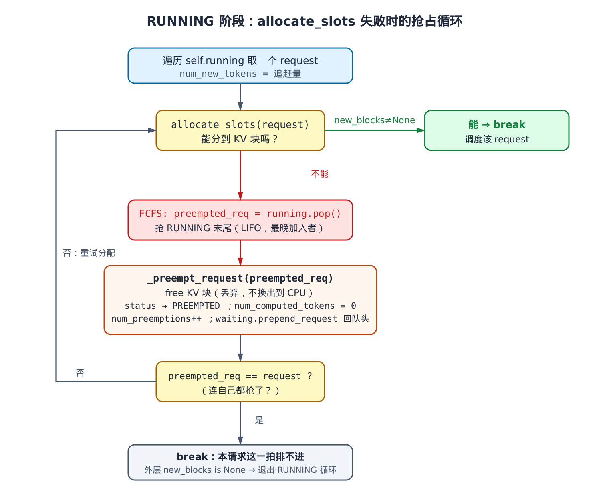
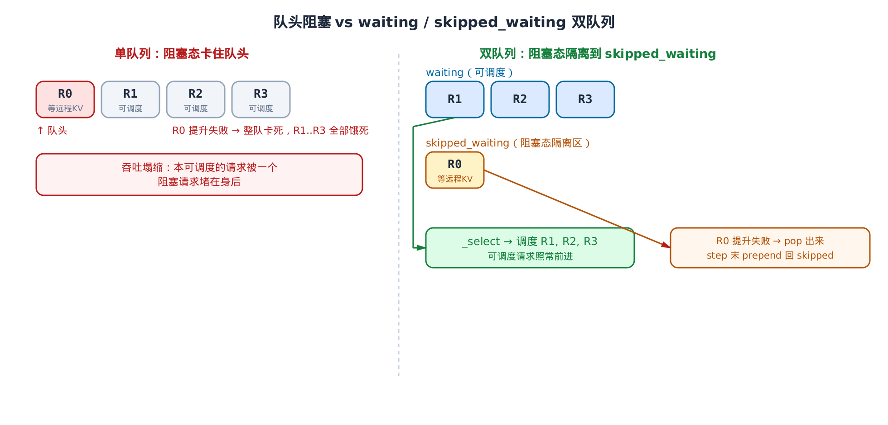
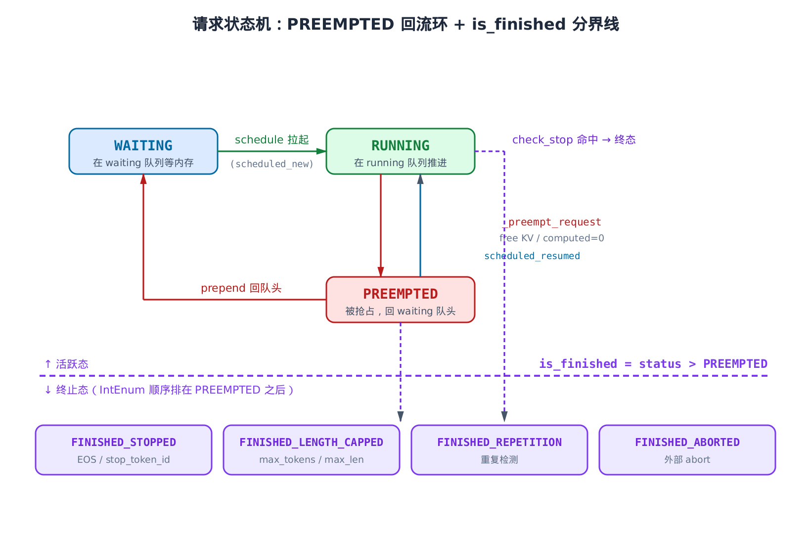

# 第14章　抢占与请求生命周期回流：分配失败之后

## 你在这里


> *图注：全书地图高亮当前阶段「EngineCore 循环」。[第 13 章](../ch13-scheduler/narrative/chapter.md) 把 `schedule()` 的主线讲透了——「不分相」的连续批处理、token 预算怎么跨 RUNNING/WAITING 两阶段递减。但那一章在两个地方踩了刹车：RUNNING 阶段 `allocate_slots` 失败时会进一个抢占循环，当时只说「会抢占」没展开；`update_from_output()` 把它当反馈环的另一半，只说「追加 token、判 stop、释放」没钻进去。本章把这两个被刹住的分支补完。下一章 **第 15 章** 接着讲调度器背后的分页 KV 缓存——块池怎么分配、前缀缓存怎么命中。*

[第 13 章](../ch13-scheduler/narrative/chapter.md) 立下的事是：调度器每一拍干两件事。先扫 `running` 队列，让每个在跑的请求继续往前算几个 token；再扫 `waiting` 队列，把新请求拉进来。两阶段共用一个 `token_budget`，谁先用谁先得。

但有一句话当时被我们快速带过了。RUNNING 阶段给一个请求算 token，得先问 KV 缓存管理器要显存块——`allocate_slots()`。**如果显存满了，要不到块呢？** 第 13 章只说「会触发抢占」，然后就跳走了。

这一章就停在这个「要不到块」的瞬间。你会看到 vLLM v1 在内存压力下的一整套动作：

- **§14.1** 抢占循环：`allocate_slots` 返回 `None` 之后，调度器怎么 LIFO 抢掉一个在跑的请求腾出空间；为什么是「丢弃重算」而不是「换出到 CPU」。
- **§14.2** 被抢请求去哪了：`_preempt_request` 的副作用——它把请求的状态、已算 token 数、KV 块全部回退，塞回 `waiting` 队头，等下一拍内存松动时复活。这就是「回流」。
- **§14.3** 抢占之后为什么要**完全跳过** WAITING 阶段：`if not preempted_reqs` 这一个守卫背后的判断。
- **§14.4** `waiting` / `skipped_waiting` 双队列：一个等远程 KV 的请求卡在队头，会不会饿死它后面所有人？双队列怎么破这个队头阻塞。
- **§14.5** `update_from_output()` 的生命周期回流：追加采样 token、判停止、迁移到完成态、释放资源的完整闭环；以及投机解码被拒时的计数回扣。
- **§14.6** `check_stop`：token 级停止判定（EOS / `stop_token_ids` / 长度 / 重复）——以及它和你以为的「stop string」其实**不是一回事**。
- **§14.7** `RequestStatus` 状态机：用一个 `IntEnum` 的排布技巧，把「是否完成」压缩成一次整型比较。

照例，本章配一份**只做减法**的精简版：和真实 `vllm/v1/core/sched/scheduler.py` 同名、同结构、同控制流，只删掉与抢占·回流主线无关的子系统（多模态 encoder、远程 KV connector、结构化输出、流式输入、PRIORITY 策略、统计日志），删除点原样标注。它不 import vllm、不需要 GPU，`pytest` 直接能跑——用来在本地打断点、亲眼看 `num_computed_tokens` 怎么被清零、被抢请求怎么排回队头。但正文的主线，始终是真实源码。

---

## 14.1 要不到块：抢占循环

先把场景摆清楚。RUNNING 阶段，调度器遍历 `self.running`，轮到某个请求 `request`，它这一拍要算 `num_new_tokens` 个 token。算之前得先有地方放这些 token 的 KV——向 `kv_cache_manager` 要块：

```python
# vllm/v1/core/sched/scheduler.py:L464
# Schedule newly needed KV blocks for the request.
with record_function_or_nullcontext("schedule: allocate_slots"):
    while True:
        new_blocks = self.kv_cache_manager.allocate_slots(
            request,
            num_new_tokens,
            num_lookahead_tokens=self.num_lookahead_tokens,
        )

        if new_blocks is not None:
            # The request can be scheduled.
            break

        # The request cannot be scheduled.
        # Preempt the lowest-priority request.
        # … 省略：PRIORITY 策略分支 …
        preempted_req = self.running.pop()

        self._preempt_request(preempted_req, scheduled_timestamp)
        preempted_reqs.append(preempted_req)
        if preempted_req == request:
            # No more request to preempt. Cannot schedule this request.
            break

if new_blocks is None:
    # Cannot schedule this request.
    break
```

读这段，先抓住那个 `while True`。它不是「要一次块，失败就放弃」——而是**「要不到就抢，抢完再要，直到要到为止」**。

`allocate_slots` 有两种结果。要到了块，返回非 `None`，`break` 出循环，请求正常调度。要不到——返回 `None`——说明块池空了。这时候 vLLM 不等、不排队，而是**当场抢一个正在跑的请求的资源**。

抢谁？FCFS 策略下就一行：

```python
preempted_req = self.running.pop()
```

`self.running` 是一个普通 list，按请求被调度进来的顺序排列，**末尾是最晚加入的那个**。`pop()` 不带参数，抢的就是末尾——这是 **LIFO（后进先出）**。

为什么抢最后一个，而不是最前一个？想想公平性。`running` 队头是最老的请求，它已经跑了很久、算了很多 token；队尾是刚被拉进来的新人。如果抢队头，老请求前功尽弃，对它最不公平。抢队尾，被抢的是「进度最浅、最容易重来」的那个，对整体公平性的破坏最小。

抢完一个就回到 `while True` 顶部，再要一次块。如果还不够，再抢一个。`preempted_reqs` 这个 list 记下本拍抢了哪些——这个名字后面 §14.3 会再用到，先记住它。

那如果把所有人都抢光了还是要不到块呢？看终止条件：

```python
if preempted_req == request:
    # No more request to preempt. Cannot schedule this request.
    break
```

这里有个微妙的设计。当 `running` 里只剩 `request` 自己时，`self.running.pop()` 抢到的就是 `request` 本身。`preempted_req == request` 成立——意思是「我把自己都抢了，没人可抢了」。这时候认输 `break`，外层再看 `new_blocks is None` 成立，连整个 RUNNING 循环都退出。本拍这个请求排不进去，它已经被自己的抢占动作塞回了 `waiting`，下一拍再说。

把这个 `while True` 逐拍跑一遍，比读流程图更直观。设块池只剩 0 块、`running = [A, B, C]`（C 最晚加入），新来的 `request = D` 这一拍要 1 个 token：

| 轮 | `allocate_slots` | 动作 | `running` | `preempted_reqs` | `preempted_req==request`? | 返回 |
|---|---|---|---|---|---|---|
| 1 | `None`（块池空） | `pop()→C`，`_preempt_request(C)`：free C 的块 | `[A, B]` | `[C]` | 否 | `continue` 重试 |
| 2 | 仍 `None`（D 要的块还不够） | `pop()→B`，`_preempt_request(B)` | `[A]` | `[C, B]` | 否 | `continue` 重试 |
| 3 | 非 `None`（B 的块够 D 用了） | — | `[A]` | `[C, B]` | — | `break` 正常调度 D |

每抢一个就 `free` 一批块、回 `allocate_slots` 再要一次；要到就停。换个极端场景——块池碎到怎么抢都不够：第 1、2 轮抢掉 C、B 后 `running` 只剩 `[A]`，第 3 轮 `allocate_slots` 还是 `None`，`pop()` 抢到 A，第 4 轮再 `None` 时 `running` 已空，`pop()` 抢到的就是 D 自己——`preempted_req == request` 成立，`break` 放弃本请求。

这个循环为什么一定会停？因为每一轮要么 `break`（要到块），要么 `self.running.pop()` 让 `running` 长度严格减 1。`len(running)` 是个**单调递减的非负整数**，最多减到 0；减到 0 后下一次 `pop()` 必然抢到 `request` 自己，触发 `preempted_req == request` 的 `break`。所以无论块池多紧，循环至多 `len(running) + 1` 轮必然终止——不会空转。

整个流程，一张图说清：



> *图注：`allocate_slots` 失败（红箭头）就 LIFO 抢 RUNNING 末尾、执行 `_preempt_request`，然后回到分配重试（左侧灰色回环）；直到要到块（绿箭头 break 调度）或连自己都抢了（底部 break 放弃）。注意抢占是「丢弃重算」——`_preempt_request` 里 free 掉 KV 块、把 `num_computed_tokens` 清零，不做任何 CPU 换出。*

这里值得停一下，对比一下别的引擎的做法。很多推理系统遇到内存压力，会把被抢请求的 KV 缓存**换出（swap）到 CPU 内存**，等内存松了再换回来。这样被抢请求不用重算。vLLM v1 **不这么做**——它直接把 KV 块还给块池，被抢请求回头从 0 重新 prefill。

为什么宁可重算也不换出？换出换入要走 PCIe，KV 缓存动辄几 GB，I/O 开销大、还得管理 CPU 侧的缓冲区。而 vLLM 有一张底牌：前缀缓存。被抢请求回 `waiting` 重新调度时，它之前算过的那些 token 的前缀块，只要还没被别的请求挤掉，就能直接命中、跳过重算。

把成本量级写明白：记被抢请求已生成长度为 $L$、前缀缓存未命中的部分为 $L_{\mathrm{miss}}$。朴素的「丢弃重算」要重新 prefill 整段，但前缀缓存命中后只需重算没命中的那部分：

$$
O(L) \;\longrightarrow\; O(L_{\mathrm{miss}})
$$

命中率越高，$L_{\mathrm{miss}}$ 越接近 0，重算成本越低。这就是 v1 敢用「丢弃」替「换出」的底气——这套前缀缓存的机制，**第 15 章** 会拆开讲。v1 用「简单的内存模型 + 前缀缓存兜底」换掉了「复杂的 swap 管理」。

---

## 14.2 回流：被抢请求去哪了

上面 `self.running.pop()` 只是把请求从 `running` 队列里摘出来。真正的抢占动作——回退它的所有状态——在 `_preempt_request` 里：

```python
# vllm/v1/core/sched/scheduler.py:L952
def _preempt_request(self, request: Request, timestamp: float) -> None:
    """Preempt a request and put it back to the waiting queue.

    NOTE: The request should be popped from the running queue outside of this
    method.
    """
    assert request.status == RequestStatus.RUNNING, (
        "Only running requests can be preempted"
    )
    self.kv_cache_manager.free(request)
    self.encoder_cache_manager.free(request)
    request.status = RequestStatus.PREEMPTED
    request.num_computed_tokens = 0
    if request.spec_token_ids:
        request.spec_token_ids = []
    request.num_preemptions += 1
    # … 省略：记录 PREEMPTED 事件（仅统计）…

    # Put the request back to the waiting queue.
    self.waiting.prepend_request(request)
```

逐行看这套副作用，它们合起来就是「让请求干净地退回未调度状态」：

1. **`kv_cache_manager.free(request)`** + **`encoder_cache_manager.free(request)`**：把请求占的 KV 块和多模态 encoder 缓存块全部还给各自的块池。多模态请求（图片/音频）prefill 阶段会把 encoder 中间结果缓存下来复用；抢占时同样要还掉，否则那部分显存白占着。这正是腾出来给别人用的空间——抢占的目的。
2. **`status = RequestStatus.PREEMPTED`**：状态从 `RUNNING` 改成 `PREEMPTED`。这个状态很关键，它是「曾经跑过、现在被抢、等着复活」的标记。后面拉它复活时，靠这个状态认出它是「老兵回归」而不是「新兵入伍」。
3. **`num_computed_tokens = 0`**：已算 token 数清零。这一行就是「丢弃重算」的字面意思——调度器从此认为这个请求**一个 token 都没算过**，下次得从头 prefill。（前缀缓存能让「从头」变快，但调度器的账面上确实归零了。）
4. **`spec_token_ids = []`**：清掉投机解码的草稿 token。这些草稿是基于「当前进度」猜的，进度都归零了，草稿自然作废。
5. **`num_preemptions += 1`**：抢占计数加一。一个请求可能被反复抢占，这个计数累加。它是诊断信号——如果某个请求 `num_preemptions` 很大，说明系统长期内存吃紧、它一直在被抢-复活-再被抢之间抖动。

最后一行是「回流」的落点：

```python
self.waiting.prepend_request(request)
```

注意是 `prepend`——插到 `waiting` **队头**，不是队尾。`FCFSRequestQueue` 底层是个 `deque`，`prepend_request` 就是 `appendleft`：

```python
# vllm/v1/core/sched/request_queue.py:L92
def prepend_request(self, request: Request) -> None:
    """Prepend a request to the front of the queue."""
    self.appendleft(request)
```

为什么回队头而不是队尾？因为被抢的请求本是 RUNNING 里进度领先的，它只是临时让位。塞回队头，下一拍内存一松动，它能第一时间被重新拉起，把抖动降到最小。如果塞队尾，它得排在所有新请求后面，复活遥遥无期——那就不是「临时让位」而是「打回原形」了。

精简版把这套副作用原样保留，删掉了 encoder 释放和统计事件（与抢占主线正交），你可以亲手验证：

```python
# 精简版交叉验证（节选）：抢占前后的状态对比
req.status = RequestStatus.RUNNING
req.num_computed_tokens = 50          # 已经算了 50 个 token
sched.running = [other, req]          # req 在末尾
sched._allocate_with_preemption(new_req, num_new_tokens=1)  # 块池已满 → 触发抢占

assert req.status == RequestStatus.PREEMPTED   # 被抢，状态回退
assert req.num_computed_tokens == 0            # 已算 token 清零
assert req.num_preemptions == 1                # 抢占计数 +1
assert sched.waiting.peek_request() is req     # 回到了 waiting 队头
```

跑一遍就能看到 `num_computed_tokens` 从 50 直接归 0、`req` 从 `running` 末尾跳到 `waiting` 队头。这是把抢占语义「从抽象描述」变成「能打断点观察的标量变化」。

---

## 14.3 抢占之后，本拍不再放新请求

RUNNING 阶段结束，按第 13 章的主线，接下来该进 WAITING 阶段拉新请求了。但这里有一个一眼容易看漏、却很关键的守卫：

```python
# vllm/v1/core/sched/scheduler.py:L567
# Next, schedule the WAITING requests.
if not preempted_reqs and self._pause_state == PauseState.UNPAUSED:
    step_skipped_waiting = create_request_queue(self.policy)
    # … WAITING 阶段的全部逻辑都在这个 if 里 …
```

`not preempted_reqs`——**本拍只要发生过抢占，整个 WAITING 阶段就被跳过。**（另一个条件 `_pause_state == UNPAUSED` 是暂停控制，与本章正交，精简版里恒为真。）

这个判断的逻辑很朴素，但很对。`preempted_reqs` 非空，意味着刚才 RUNNING 阶段为了给在跑的请求腾地方，已经抢掉了别人——这是内存严重不足的铁证。此时此刻，块池是空的。如果还往里塞新的 WAITING 请求，几乎必然又要不到块、又触发抢占——刚抢回来的空间转头又被吃掉，系统在「抢占-复活」之间空转，吞吐反而塌缩。

所以 vLLM 的选择是：**这一拍内存这么紧，就别折腾了。** 把本拍完整交给已经在 `running` 里的请求去推进，新请求下一拍再考虑。这是一个「检测到压力就主动收缩」的背压设计，一行 `if` 守住。

精简版把这个守卫原样保留（只删掉正交的 `_pause_state` 部分），它是本章核心而非可删项：

```python
# 精简版：not preempted_reqs 守卫保留，_pause_state 按减法删除
if not preempted_reqs:
    step_skipped_waiting = create_request_queue(self.policy)
    while (self.waiting or self.skipped_waiting) and token_budget > 0:
        # …
```

---

## 14.4 双队列：别让一个阻塞请求饿死整队

现在假设本拍**没有**发生抢占，顺利进入 WAITING 阶段。这里 vLLM v1 有一个第 13 章没提的结构：`waiting` 不是一个队列，而是**两个**——`waiting` 和 `skipped_waiting`。

为什么要两个？先看一个会出问题的场景。

`waiting` 队列里的请求，不全都「准备好了可以跑」。有些在等外部条件：

- 等远程节点把 KV 缓存传过来（P/D 分离场景，状态 `WAITING_FOR_REMOTE_KVS`）；
- 等结构化输出的语法对象编译好（约束解码，`WAITING_FOR_STRUCTURED_OUTPUT_GRAMMAR`）；
- 等流式输入的下一段（多轮会话，`WAITING_FOR_STREAMING_REQ`）。

这些叫**阻塞态**。问题来了：如果一个阻塞态请求恰好排在 FCFS 队头，而 FCFS 必须按顺序来——它没准备好，就轮不到后面的人。哪怕队头后面排着 $N$ 个「完全可以跑」的请求，全被这一个堵在身后**饿死**——单队列下队头阻塞的代价是 $O(N)$ 个本可调度的请求被白白拖住，吞吐塌缩到 0。

vLLM 的解法：把阻塞态请求**隔离**到第二个队列 `skipped_waiting`，让可调度的请求在 `waiting` 里畅通无阻。隔离后，每个阻塞请求只是被 $O(1)$ 地 `pop` + `prepend` 跳过一次，后面 $N$ 个可调度请求照常前进；单拍的额外代价不过是最多遍历两队总长一遍，即每拍 `peek`/`pop` 次数满足：

$$
C_{\mathrm{step}} \le |waiting| + |skipped\_waiting|
$$

也就是把 $O(N)$ 的队头阻塞换成了对两队的线性一遍扫描。



> *图注：左边单队列——阻塞态 R0 卡在队头，R1/R2/R3 全部饿死，吞吐塌缩。右边双队列——R0 被隔离到 `skipped_waiting`，`_select_waiting_queue_for_scheduling` 选 `waiting` 调度 R1/R2/R3；R0 这一拍提升失败就 pop 出来，step 末再 prepend 回 `skipped_waiting` 等下拍重试。可调度请求不再被阻塞请求堵住。*

请求进队时就按状态分流。归类规则和入队入口：

```python
# vllm/v1/core/sched/scheduler.py:L1554
@staticmethod
def _is_blocked_waiting_status(status: RequestStatus) -> bool:
    return status in (
        RequestStatus.WAITING_FOR_STRUCTURED_OUTPUT_GRAMMAR,
        RequestStatus.WAITING_FOR_REMOTE_KVS,
        RequestStatus.WAITING_FOR_STREAMING_REQ,
    )

def _enqueue_waiting_request(self, request: Request) -> None:
    if self._is_blocked_waiting_status(request.status):
        self.skipped_waiting.add_request(request)
    else:
        self.waiting.add_request(request)
```

简单直接——是阻塞态就进 `skipped_waiting`，否则进普通 `waiting`。

每一拍调度时，从两个队列里挑一个来调度。FCFS 策略下，`skipped_waiting` 优先：

```python
# vllm/v1/core/sched/scheduler.py:L1567
def _select_waiting_queue_for_scheduling(self) -> RequestQueue | None:
    if self.policy == SchedulingPolicy.FCFS:
        return self.skipped_waiting or self.waiting or None
    # … 省略：PRIORITY 模式比较两队队头 …
```

为什么 `skipped_waiting` 优先？因为里面的请求曾经被跳过，得给它们「优先重试」的机会，否则它们会被源源不断的新 `waiting` 请求一直压着，反而饿死。`skipped_waiting or self.waiting` 这个写法：`skipped_waiting` 非空就先调度它，空了才轮到 `waiting`。

那调度循环里碰到一个还没准备好的阻塞态请求，怎么办？这是双队列机制的核心动作：

```python
# vllm/v1/core/sched/scheduler.py:L578
request = request_queue.peek_request()
request_id = request.request_id

# try to promote blocked statuses while traversing skipped queue.
if self._is_blocked_waiting_status(
    request.status
) and not self._try_promote_blocked_waiting_request(request):
    # … 省略：WAITING_FOR_REMOTE_KVS 的 debug 日志 …
    request_queue.pop_request()
    step_skipped_waiting.prepend_request(request)
    continue
```

读这段。`peek_request` 只看队头、不取出。如果队头是阻塞态，就调 `_try_promote_blocked_waiting_request` 试着「提升」它——比如远程 KV 这拍到货了，就能从 `WAITING_FOR_REMOTE_KVS` 转回 `WAITING`、变成可调度。提升成功就往下走正常调度。

提升**失败**（条件还没满足）呢？关键就在 `pop_request()` + `prepend_request` + `continue` 这三步：

- `pop_request()`：把这个阻塞请求从当前队列**取出来**——别让它继续占着队头堵后面。
- `step_skipped_waiting.prepend_request(request)`：放进一个**本拍临时队列** `step_skipped_waiting`。
- `continue`：回循环顶部，`peek` 下一个请求。

于是这个阻塞请求被「跳过」了——它没准备好，就先放一边，让循环去看后面那些可能可以调度的请求。这就是「不让一个阻塞请求卡死整队」的实现。

`step_skipped_waiting` 是本拍的临时收集站。等 WAITING 阶段结束，它们要整体搬回持久的 `skipped_waiting` 队列：

```python
# vllm/v1/core/sched/scheduler.py:L844
# re-queue requests skipped in this pass ahead of older skipped items.
if step_skipped_waiting:
    self.skipped_waiting.prepend_requests(step_skipped_waiting)
```

注意 `prepend_requests`——插到 `skipped_waiting` **前面**，排在更老的 skipped 项之前。这保证「本拍刚跳过的」下一拍优先重试，不会被陈年旧账压着，避免饿死。

精简版完整保留了双队列的全部结构——三个队列、归类、选择、跳过、重排——只把 `_try_promote_blocked_waiting_request` 退化成恒 `return False`（因为远程 KV / grammar / streaming 这些「提升条件」依赖被删掉的子系统）。这样一来，阻塞态请求在精简版里永远提升不了、永远被跳过——恰好把「跳过 + 重排」这条路径单独拎出来给你测：

```python
# 精简版交叉验证：阻塞态请求被跳过，可调度请求照常前进
blocked = make_request("R0", status=RequestStatus.WAITING_FOR_REMOTE_KVS)
ready = make_request("R1", status=RequestStatus.WAITING)
sched.add_request(blocked)   # → 进 skipped_waiting
sched.add_request(ready)     # → 进 waiting
out = sched.schedule()

assert "R1" in out.scheduled_new_reqs       # 可调度请求照常被拉起
assert sched.skipped_waiting.peek_request() is blocked  # 阻塞请求被跳过、留在 skipped
```

至于这些阻塞态究竟在等什么、`_try_promote_blocked_waiting_request` 在真实 vLLM 里凭什么条件提升——`WAITING_FOR_REMOTE_KVS` 的来龙去脉属于 P/D 分离的范畴，**第 29 章** 会把远程 KV 加载、提升回 `WAITING` 的完整路径接上。本章只需记住：**双队列是为了避免队头阻塞，被跳过的请求会被公平地重排回去等下拍。**

---

## 14.5 回流闭环：update_from_output

到这里，`schedule()` 这一侧讲完了。但调度只是「派活」，还没拿到「干活的结果」。模型跑完前向、采样出新 token 之后，结果要喂回调度器，由它来：追加 token、判断该不该停、迁移完成态、释放资源。这是反馈环的另一半——`update_from_output()`。第 13 章把它当黑盒，本章拆开。

先看抢占请求是怎么「回流」复活的，把上半章的环闭上。WAITING 阶段成功调度一个请求时，按它**进来时的状态**分两类落点：

```python
# vllm/v1/core/sched/scheduler.py:L807
self.running.append(request)
# … 省略：记录 SCHEDULED 事件 …
if request.status == RequestStatus.WAITING:
    scheduled_new_reqs.append(request)
elif request.status == RequestStatus.PREEMPTED:
    scheduled_resumed_reqs.append(request)
else:
    raise RuntimeError(f"Invalid request status: {request.status}")
```

读这段。请求进 `running` 了，但分两种身份：

- 状态是 `WAITING`——**首次**被调度的新请求，进 `scheduled_new_reqs`。
- 状态是 `PREEMPTED`——**曾被抢占、现在回流复活**的老兵，进 `scheduled_resumed_reqs`。

这就是 §14.2 那个 `status = PREEMPTED` 标记的用武之地。抢占时打上 `PREEMPTED`，复活时靠它区分「新请求」和「resumed 请求」。两者对下游 worker 的意义不同：新请求要发完整的 prompt 数据，resumed 请求 worker 那边已经认识它了，发的内容不一样。抢占的「回流」闭环——RUNNING → PREEMPTED → 回 waiting 队头 → 复活进 running——到这里完整画完。

现在进 `update_from_output` 主循环。它逐个处理本拍有采样输出的请求。删掉与状态迁移正交的部分（logprobs 切片、输出装配、约束解码校验——这些属于其他章节），骨架是这样：

```python
# vllm/v1/core/sched/scheduler.py:L1331
stopped_running_reqs: set[Request] = set()
stopped_preempted_reqs: set[Request] = set()
for req_id, num_tokens_scheduled in num_scheduled_tokens.items():
    # … 省略：跳过已 finished/aborted 的请求、取出本拍采样的 generated_token_ids …

    # —— 投机解码回退 ——
    scheduled_spec_token_ids = scheduler_output.scheduled_spec_decode_tokens.get(req_id)
    if scheduled_spec_token_ids and generated_token_ids:
        num_draft_tokens = len(scheduled_spec_token_ids)
        num_accepted = len(generated_token_ids) - 1
        num_rejected = num_draft_tokens - num_accepted
        if request.num_computed_tokens > 0:
            request.num_computed_tokens -= num_rejected
        if request.num_output_placeholders > 0:
            request.num_output_placeholders -= num_rejected
        # … 省略：投机解码统计 …

    stopped = False
    new_token_ids = generated_token_ids
    status_before_stop = request.status

    # —— 追加 token + 停止检测 ——
    if new_token_ids:
        new_token_ids, stopped = self._update_request_with_output(
            request, new_token_ids
        )
    # … 省略：pooling 输出 / 结构化输出 grammar 校验 …

    finish_reason = None
    if stopped:
        # Capture finish_reason BEFORE _handle_stopped_request, which may
        # reset the status to WAITING for streaming requests that continue.
        finish_reason = request.get_finished_reason()
        finished = self._handle_stopped_request(request)
        if finished:
            kv_transfer_params = self._free_request(request)

        if status_before_stop == RequestStatus.RUNNING:
            stopped_running_reqs.add(request)
        else:
            stopped_preempted_reqs.add(request)
```

这段信息密度高，拆成几块看。

**投机解码回退。** 投机解码（speculative decoding）会先用一个小模型猜几个「草稿 token」，再用大模型一次性验证。验证时可能拒掉一部分。`num_draft_tokens` 是猜了几个，`num_accepted = len(generated_token_ids) - 1`（接受的数量，减 1 是因为总有一个「bonus token」是大模型自己出的、不算草稿），`num_rejected` 是被拒的。

为什么要回扣计数？因为调度这些草稿 token 时，调度器**乐观地**把它们算进了 `num_computed_tokens`——假设全被接受。一旦有草稿被拒，这部分计数就是虚的，必须回退：

```python
if request.num_computed_tokens > 0:
    request.num_computed_tokens -= num_rejected
if request.num_output_placeholders > 0:
    request.num_output_placeholders -= num_rejected
```

不回退会怎样？下一拍算「这个请求还差多少 token」时，`num_computed_tokens` 偏大，调度器会以为某些位置已经算过、跳过它们——而那些位置对应的恰是被拒草稿，其实没算。结果就是错位、漏算。`num_output_placeholders` 是异步调度下的占位计数（§14.7 细说），同理回扣。

**追加 token + 停止检测。** 这是 `_update_request_with_output`，下一节 §14.6 单独讲。它返回 `(new_token_ids, stopped)`——可能截断过的 token 列表，和「停没停」。

**先抓 finish_reason，再处理停止。** 这里有个顺序上的讲究，注释专门点出来了：

```python
# Capture finish_reason BEFORE _handle_stopped_request, which may
# reset the status to WAITING for streaming requests that continue.
finish_reason = request.get_finished_reason()
finished = self._handle_stopped_request(request)
```

`get_finished_reason` 把请求**当前状态**翻译成对外的结束原因（STOP / LENGTH / …）。但紧接着的 `_handle_stopped_request` 对某些请求（流式输入的多轮会话）会**把状态改回 `WAITING`**——它这一段输入算完了，但会话没结束，要等下一段。如果先调 `_handle_stopped_request` 再取 reason，状态已经被改回 `WAITING` 了，`get_finished_reason` 拿到的就是错的。所以必须**先抓后改**。这是一个典型的「副作用顺序敏感」的代码点，注释救了后来的读者。

`_handle_stopped_request` 返回 `True` 才是「真完成」，这时才 `_free_request` 释放资源（§14.5 末讲）。

**按抢占前状态分流。** 最后这两行收集停止的请求，但分两个集合：

```python
if status_before_stop == RequestStatus.RUNNING:
    stopped_running_reqs.add(request)
else:
    stopped_preempted_reqs.add(request)
```

为什么要按 `status_before_stop` 分？因为一个请求停止时，它可能在 `running` 里（正常跑着停的），也可能在 `waiting` 里（被抢占成 `PREEMPTED`、还没复活就停了——比如同拍被外部 abort）。停止后要从**它实际所在的队列**摘掉它，分流就是为了知道该去哪个队列摘。循环结束后批量摘除：

```python
# vllm/v1/core/sched/scheduler.py:L1476
# Remove the stopped requests from the running and waiting queues.
if stopped_running_reqs:
    self.running = remove_all(self.running, stopped_running_reqs)
if stopped_preempted_reqs:
    # This is a rare case and unlikely to impact performance.
    self.waiting.remove_requests(stopped_preempted_reqs)
```

`stopped_running_reqs` 从 `running` 摘，`stopped_preempted_reqs` 从 `waiting` 摘。注释还诚实地标了 `stopped_preempted_reqs` 是「罕见情况」——被抢占的请求恰好在被抢的那一拍停止，确实少见，但代码得正确处理，不能留悬挂引用。

**真完成的资源回收。** 当 `_handle_stopped_request` 返回 `True`，请求真的结束了，走 `_free_request`：

```python
# vllm/v1/core/sched/scheduler.py:L1813
def _free_request(
    self, request: Request, delay_free_blocks: bool = False
) -> dict[str, Any] | None:
    assert request.is_finished()

    connector_delay_free_blocks, kv_xfer_params = self._connector_finished(request)
    self.encoder_cache_manager.free(request)
    request_id = request.request_id
    self.finished_req_ids.add(request_id)
    # … 省略：多客户端 finished_req_ids_dict 分发 …

    delay_free_blocks |= connector_delay_free_blocks
    if not delay_free_blocks:
        self._free_blocks(request)
    return kv_xfer_params

def _free_blocks(self, request: Request):
    assert request.is_finished()
    self.kv_cache_manager.free(request)
    del self.requests[request.request_id]
```

资源回收闭环：把 `request_id` 登记进 `finished_req_ids`（下一拍 `SchedulerOutput` 会带上它，通知 worker 那边也释放对应缓存），释放 KV 块，从 `self.requests` 字典里删掉这个请求——它的生命周期到此终结。（`delay_free_blocks` 服务于异步 KV 传输——connector 还在用这些块，得延迟释放，与本地内存主线正交。）

至此，一个请求从被调度、被抢占回流、复活、生成、停止、释放的完整生命周期，全都串起来了。

---

## 14.6 停止判定：check_stop，以及它不是 stop string

`_update_request_with_output` 是「追加 token + 判停」的实际循环：

```python
# vllm/v1/core/sched/scheduler.py:L1622
def _update_request_with_output(
    self, request: Request, new_token_ids: list[int]
) -> tuple[list[int], bool]:
    # Append generated tokens and check for stop. Note that if
    # a request is still being prefilled, we expect the model runner
    # to return empty token ids for the request.
    stopped = False
    for num_new, output_token_id in enumerate(new_token_ids, 1):
        request.append_output_token_ids(output_token_id)

        # Check for stop and update request state.
        # This must be called before we make the EngineCoreOutput.
        stopped = check_stop(request, self.max_model_len)
        if stopped:
            del new_token_ids[num_new:]  # Trim new tokens if needed.
            break
    return new_token_ids, stopped
```

逐个 token 来：`append_output_token_ids` 把它追加进请求的输出序列，然后立刻 `check_stop` 看停没停。一旦某个 token 触发停止，`del new_token_ids[num_new:]` 把**它之后**的 token 全截掉——停止 token 之后生成的不该返回给用户——然后 `break`。

为什么要逐 token 判、而不是一批算完再判？因为停止可能发生在批的中间。比如本拍采样出 5 个 token，第 3 个是 EOS，那第 4、5 个就不该存在。逐 token 判才能精确地在 EOS 处截断。

停止的判据在 `check_stop`：

```python
# vllm/v1/core/sched/utils.py:L94
def check_stop(request: Request, max_model_len: int) -> bool:
    assert not request.pooling_params

    sampling_params = request.sampling_params
    assert sampling_params is not None

    if request.num_output_tokens < sampling_params.min_tokens:
        return False

    last_token_id = request.output_token_ids[-1]
    if last_token_id == sampling_params.eos_token_id:
        request.status = RequestStatus.FINISHED_STOPPED
        return True

    if last_token_id in (sampling_params.stop_token_ids or ()):
        request.status = RequestStatus.FINISHED_STOPPED
        request.stop_reason = last_token_id
        return True
    if (
        request.num_tokens >= max_model_len
        or request.num_output_tokens >= request.max_tokens
    ):
        request.status = RequestStatus.FINISHED_LENGTH_CAPPED
        return True

    # … 省略：repetition 重复检测 …
    return False
```

判定**有顺序**，这个顺序决定了停止原因：

1. **`min_tokens` 门槛**：还没生成够最少 token 数，**一律不停**——直接 `return False`，连 EOS 都压住。这保证 `min_tokens` 的硬约束优先于一切。
2. **EOS**：最后一个 token 是 `eos_token_id`，停，状态 `FINISHED_STOPPED`。
3. **`stop_token_ids`**：最后一个 token 落在用户指定的停止 token 集合里，停，`FINISHED_STOPPED`，并记下是哪个 token 触发的（`stop_reason`）。
4. **长度封顶**：总长到了 `max_model_len`，或输出长度到了 `max_tokens`，停，状态 `FINISHED_LENGTH_CAPPED`。
5. **重复检测**（精简版删了细节，真实里有）：检测到病态重复，停，`FINISHED_REPETITION`。

顺序的意义在于优先级。假设某个 token 既是 EOS、又恰好是触及 `max_tokens` 的最后一个——它会被判成 `FINISHED_STOPPED`（STOP）而不是 `FINISHED_LENGTH_CAPPED`（LENGTH），因为 EOS 排在长度检查前面。对外暴露的结束原因因此是 `STOP`，符合直觉：模型主动说完了，而非被截断。

**现在说那个一定要澄清的点。** 本章标题里有「stop string」，但你在 `check_stop` 里看到的全是 **token id**——`eos_token_id`、`stop_token_ids` 都是整数。这里**没有**字符串子串匹配。

这不是疏漏，是设计。vLLM 把停止判定分了两层：

- **token 级**，在调度器侧的 `check_stop`：判 EOS、判 `stop_token_ids`（整数 id）、判长度、判重复。它工作在 **token 空间**——只看 token id，不看文本。
- **字符串级**，在前端 detokenizer 的 `check_stop_strings`：判用户给的 stop **字符串**（比如 `"\n\n"` 或 `"</answer>"`）是不是出现在生成的文本里。它工作在**文本空间**——得先把 token 解码成字符串才能做子串匹配。

为什么分两层？因为一个 stop 字符串可能跨好几个 token，甚至和某个 token 的解码结果只部分重叠——这种子串匹配在 token 空间根本做不了，必须解码到文本再匹配。这套文本空间的 stop string 逻辑，[第 9 章：增量去 token 化与 stop string](../ch09-detokenization/narrative/chapter.md) 已经讲透了。

所以：**调度器侧的 `check_stop` 只管 token 级停止，stop string 子串匹配不在这里。** 别把字符串匹配画进调度器——那是 vLLM 没有的逻辑。两层甚至可能给出不同的截断点：token 级在 EOS 处停，字符串级在某个子串处停，谁先触发看具体情况。

精简版的 `check_stop` 忠实保留了 token 级的判定顺序（删了重复检测细节），可以验证 EOS 优先于长度：

```python
# 精简版交叉验证：同一 token 既是 EOS 又触及 max_tokens → STOP 而非 LENGTH
req.max_tokens = 3
req.append_output_token_ids(EOS_ID)   # 第 3 个输出 token 恰好是 EOS
assert check_stop(req, max_model_len=1024) is True
assert req.status == RequestStatus.FINISHED_STOPPED      # EOS 优先
assert req.get_finished_reason() == FinishReason.STOP    # 不是 LENGTH
```

---

## 14.7 状态机：一次整型比较判完成

本章反复出现 `RequestStatus`——`WAITING`、`RUNNING`、`PREEMPTED`、各种 `FINISHED_*`。它是整章状态迁移的真相源。看它的定义，有个值得学的小技巧：

```python
# vllm/v1/request.py:L310
class RequestStatus(enum.IntEnum):
    """Status of a request."""

    WAITING = enum.auto()
    WAITING_FOR_STRUCTURED_OUTPUT_GRAMMAR = enum.auto()
    WAITING_FOR_REMOTE_KVS = enum.auto()
    WAITING_FOR_STREAMING_REQ = enum.auto()
    RUNNING = enum.auto()
    PREEMPTED = enum.auto()
    # Note: anything after PREEMPTED will be considered
    # as a finished status.
    FINISHED_STOPPED = enum.auto()
    FINISHED_LENGTH_CAPPED = enum.auto()
    FINISHED_ABORTED = enum.auto()
    FINISHED_IGNORED = enum.auto()
    FINISHED_ERROR = enum.auto()
    FINISHED_REPETITION = enum.auto()

    @staticmethod
    def is_finished(status: "RequestStatus") -> bool:
        return status > RequestStatus.PREEMPTED
```

注意它是 `IntEnum`——每个状态背后是个整数，`enum.auto()` 顺序赋值。排布是精心设计的：**所有 `FINISHED_*` 态都排在 `PREEMPTED` 之后**。于是「这个请求完成了吗」可以写成一行：

```python
return status > RequestStatus.PREEMPTED
```

一次整型比较，搞定。不用查集合、不用 `in (FINISHED_STOPPED, FINISHED_LENGTH_CAPPED, ...)` 列一长串。`update_from_output` 在热路径里高频调 `is_finished`（每个请求每拍都要判一次「是不是已经完成了，要不要跳过」），省下的查找成本是实打实的。注释 `# anything after PREEMPTED will be considered as a finished status` 把这个约定钉死——以后加新的完成态，记得排在 `PREEMPTED` 后面。

完成态还要翻译成对外的结束原因，靠一张映射表：

```python
# vllm/v1/request.py:L344
_FINISHED_REASON_MAP = {
    RequestStatus.FINISHED_STOPPED: FinishReason.STOP,
    RequestStatus.FINISHED_LENGTH_CAPPED: FinishReason.LENGTH,
    RequestStatus.FINISHED_ABORTED: FinishReason.ABORT,
    RequestStatus.FINISHED_IGNORED: FinishReason.LENGTH,
    RequestStatus.FINISHED_ERROR: FinishReason.ERROR,
    RequestStatus.WAITING_FOR_STREAMING_REQ: FinishReason.STOP,
    RequestStatus.FINISHED_REPETITION: FinishReason.REPETITION,
}
```

`§14.5` 里那个「先抓后改」的 `get_finished_reason`，查的就是这张表。

把整章的状态迁移画在一起，那个「`is_finished` 分界线」就是这张状态机图的灵魂：



> *图注：`WAITING --schedule--> RUNNING`（首次，scheduled_new）；`RUNNING --_preempt_request--> PREEMPTED`（free KV、computed=0）；`PREEMPTED` 既能 prepend 回 `WAITING` 队头，也能直接被拉回 `RUNNING`（scheduled_resumed）——这就是抢占回流环。紫色虚线是 `is_finished = status > PREEMPTED` 分界：线以上是活跃态，线以下全是 `FINISHED_*` 终态，`check_stop` 命中即落入其一。`IntEnum` 顺序排布让「过线」等价于「完成」。*

### 异步调度下的占位簿记

最后补一个 `AsyncScheduler` 的覆写。第 13 章末讲过，异步调度让「调度下一拍」和「执行当前拍」重叠起来跑——调度器不等模型出结果就先排下一拍。这带来一个簿记问题：下一拍排的时候，当前拍的 token 还没真的生成，但又得给它**占个位**，否则下一拍会重复调度同一个位置。这个占位就是 `num_output_placeholders`。

`AsyncScheduler` 覆写 `_update_request_with_output` 来维护这个占位：

```python
# vllm/v1/core/sched/async_scheduler.py:L37
def _update_request_with_output(
    self, request: Request, new_token_ids: list[int]
) -> tuple[list[int], bool]:
    if request.discard_latest_async_tokens:
        # If the request is force preempted in reset_prefix_cache, we
        # should discard the latest async token.
        request.discard_latest_async_tokens = False
        return [], False

    status_before_update = request.status
    new_token_ids, stopped = super()._update_request_with_output(
        request, new_token_ids
    )

    # Update the number of output placeholders.
    request.num_output_placeholders -= len(new_token_ids)
    assert request.num_output_placeholders >= 0

    # Cache the new tokens. Preempted requests should be skipped.
    if status_before_update == RequestStatus.RUNNING:
        self.kv_cache_manager.cache_blocks(
            request, request.num_computed_tokens - request.num_output_placeholders
        )
    return new_token_ids, stopped
```

三个关键点：

1. **`discard_latest_async_tokens`**：如果请求在 `reset_prefix_cache` 里被**强制抢占**了，在途的那个异步 token 是基于旧进度算的，作废——直接返回 `[]`，啥也不追加。这是异步重叠和抢占撞在一起时的特判。
2. **占位回扣**：实际生成了 `len(new_token_ids)` 个 token，就从 `num_output_placeholders` 里扣掉这么多——占的位兑现了。`assert >= 0` 守住不会扣穿。（§14.5 的投机解码回退也扣这个计数，同一个簿记。）这条 `>= 0` 不变量为什么恒成立？看它的增减：调度一拍时**每占一个位 `+1`**（含投机草稿），回流时**每兑现一个 token `-1`**、每拒一个草稿 `-1`——扣减的来源（实际 token + 被拒草稿）和当初占位的来源（乐观计入的每个被调度 token）**一一配对**，扣减量永远不超过当初占的量。基例占位为 0，每步净变化让它回不到负数，故 `num_output_placeholders` 恒 $\ge 0$——`assert` 只是把这条归纳出来的不变量钉成运行期防线。
3. **只有 RUNNING 才缓存块**：被抢占的请求（`status != RUNNING`）跳过 `cache_blocks`——它的块都 free 了，没什么可缓存的。这和 §14.2 的抢占语义一致：抢占即丢弃，别再往一个已经被回退的请求上写缓存。

精简版同样覆写了这个方法，保留了三个分支，你能在本地构造「强制抢占丢弃异步 token」「占位回扣到 0」这些边界，亲眼确认 `num_output_placeholders` 的账永远平。

---

## 小结

这一章把第 13 章在 `allocate_slots` 失败处踩的那脚刹车松开，看清了 vLLM v1 在内存压力下的全套动作：

- **抢占是丢弃重算，不是换出。** FCFS LIFO 抢 `running` 末尾（`vllm/v1/core/sched/scheduler.py:L504`），`_preempt_request`（`scheduler.py:L952`）把 KV free 掉、`num_computed_tokens` 清零、塞回 `waiting` 队头。重算成本靠前缀缓存兜底——这是 v1 用「简单内存模型」换掉「复杂 swap 管理」的取舍。
- **检测到抢占就收缩。** `if not preempted_reqs` 一行守卫（`scheduler.py:L567`），本拍发生过抢占就完全跳过 WAITING，不在内存紧张时火上浇油。
- **双队列破队头阻塞。** 阻塞态请求隔离到 `skipped_waiting`（`scheduler.py:L1554`、`L1567`），可调度请求在 `waiting` 里畅通；被跳过的请求公平重排回去等下拍重试。
- **`update_from_output` 是反馈环的另一半（`scheduler.py:L1331`）。** 投机解码回退（回扣 `num_computed_tokens`）、逐 token 追加 + `check_stop`、先抓 `finish_reason` 再处理停止、按抢占前状态分流摘除、真完成才 `_free_request`。
- **`check_stop`（`vllm/v1/core/sched/utils.py:L94`）只管 token 级停止**——EOS / `stop_token_ids` / 长度 / 重复，有固定优先级。stop **string** 子串匹配在 [前端 detokenizer](../ch09-detokenization/narrative/chapter.md)，不在这里。
- **`RequestStatus` 用 `IntEnum` 顺序排布**（`vllm/v1/request.py:L310`），把「是否完成」压成一次 `status > PREEMPTED` 的整型比较。

调度器这一侧，到此讲完了它「派活」和「收活」的完整逻辑。但有一个黑盒还没开：`allocate_slots` 究竟怎么把 token 落到分页显存上、前缀缓存又凭什么能命中、被抢请求复活时怎么把成本降下来——**第 15 章：分页 KV 缓存** 钻进块池和前缀缓存，把本章一直在调用的那个 `kv_cache_manager` 拆开。
