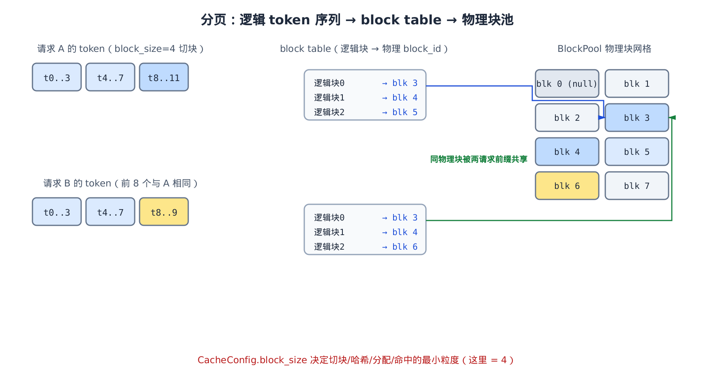
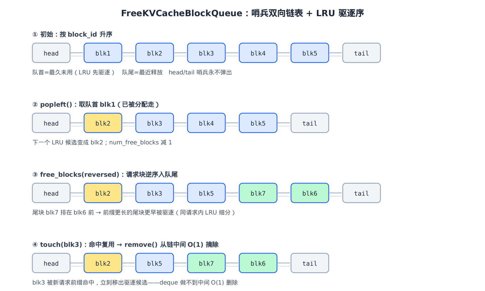
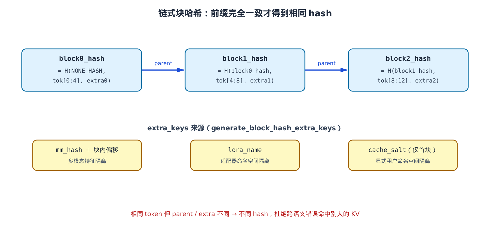
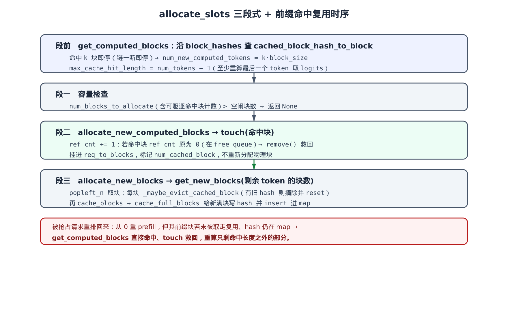

# 第15章　分页 KV 缓存机制：块池与前缀缓存

## 你在这里


> *图注：全书地图高亮主线阶段「EngineCore 循环」，本章深入它背后的 KV 缓存子系统。*
> *[第 14 章](../ch14-scheduler/narrative/chapter.md) 讲了抢占——要不到块就丢弃重算。*
> *本章解决「块」本身：物理显存怎么切、怎么分配、怎么靠前缀缓存复用。*
> *下一章接 attention backend，讲算出来的 KV 怎么写进这些块。*

[第 14 章](../ch14-scheduler/narrative/chapter.md) 反复提到一个动词：`allocate_slots`。调度器给请求算 token 之前，先向它要显存块；要不到，就抢占。但那一章把 `kv_cache_manager` 当黑盒——「要块」「还块」「命中」三个动作只说了名字，没说里面发生了什么。

这一章就掀开这个黑盒。它要回答三个问题：

- 物理显存被切成什么样，一个请求的 token 序列怎么落到这些块上？这是**分页**。
- 两个请求共享同一段 prompt 前缀时，第二个能不能直接捡现成的 KV、跳过重算？这是**前缀缓存**。
- 一个被抢占的请求重排回来、从头 prefill，它之前算过的 KV 块如果还在，能不能直接复用？这是第 14 章欠下的一笔账。

照例，本章配一份**只做减法**的精简版：和真实 `vllm/v1/core/` 下的 `block_pool.py`、`kv_cache_utils.py`、`kv_cache_manager.py` 同名、同结构、同控制流。它锁定**单 KV cache group + 全注意力 + 开启前缀缓存**的主路径，删掉混合模型（滑窗 / Mamba / 多组协调）、投机解码草稿头、上下文并行、KV connector 这些正交维度，删除点原样标注。它不 import vllm、不需要 GPU，`pytest` 直接能跑——用来在本地打断点、亲眼看引用计数怎么变、命中长度算成几块。但正文的主线，始终是真实源码。

我们自底向上：先看一个「块」长什么样，再看空闲块怎么排队，然后是块的哈希怎么算、命中怎么查，最后把它们串成 `allocate_slots` 的三段式分配。

---

## 15.1 分页：为什么 KV 缓存要切块

先回到问题的起点。自回归生成里，每个请求的每个 token 都要算一份 Key/Value 向量，缓存下来给后面的 token 做注意力。一个请求要缓存多少 KV？等于它当前的 token 数——而这个数**一直在涨**，每生成一个 token 涨一格。

如果给每个请求预留一整段连续显存，就得按**最大可能长度**预留。一个 max_model_len=8192 的模型，哪怕请求只生成了 10 个 token，也得占着 8192 个 token 的位置。这是巨大的内部浪费。退一步，按需扩张连续段呢？那又会把显存切成无数大小不一的碎片，新请求来了凑不出一段连续的——外部碎片。

vLLM 的解法是借操作系统的分页思想：把物理 KV 显存切成 `num_gpu_blocks` 个**等长**的块，每块固定装 `block_size` 个 token 的 KV。这套机制的代码都在 `vllm/v1/core/` 下——`block_pool.py` 管物理块、`kv_cache_utils.py` 管块的元数据与哈希、`kv_cache_manager.py` 是对调度器的门面。请求的逻辑 token 序列也按 `block_size` 切块，每个逻辑块通过一张 **block table** 映射到任意一个物理块。逻辑上连续、物理上可以散落。



看左边请求 A：12 个 token 按 `block_size=4` 切成 3 个逻辑块。中间的 block table 记下「逻辑块 0 → 物理 blk 3，逻辑块 1 → blk 4，逻辑块 2 → blk 5」。右边物理块网格里，这三块物理上并不相邻——无所谓，注意力 kernel 按 block table 寻址。需要多少算多少，块用完了归还，没有连续显存的要求，也就没有外部碎片。

这里就回收了我们在 [第 3 章](../ch03-config-and-wiring/narrative/chapter.md) 配置阶段埋下的一个伏笔。当时 `CacheConfig` 里有两个字段一直没真正用上：`block_size` 和 `enable_prefix_caching`。现在它们登场了——`block_size` 就是这张图里的切块粒度（图中等于 4），它同时决定了哈希、分配、命中三件事的最小单位；`enable_prefix_caching` 则决定整个前缀缓存机制开不开。本章后面会一处处点明它们的作用。

注意图里右边那个 `blk 0 (null)`：它是个特殊的占位块，初始化时就被单独拎出来，永不参与缓存和释放。为什么要它，§15.4 讲引用计数时会说清。

更妙的是请求 B。它的前 8 个 token 和 A 完全一样（图里 A、B 的前两块都映射到 blk 3、blk 4）。既然 token 一样、算出来的 KV 也一样，B 为什么要重算？它直接复用 A 的物理块就行——这就是前缀缓存，也是本章后半的重头戏。一个物理块被多个请求共享，图里用两条箭头指向同一个 blk 3 标了出来。

要让这套机制跑起来，得先有一个能描述「单个块」的数据结构。

---

## 15.2 一个块：KVCacheBlock

`KVCacheBlock` 是整章最小的积木。它不持有 KV 数据本身（那是 worker 侧的张量），只持有**元数据**——这个块是谁、被谁用着、缓存了哪段前缀的哈希：

```python
# vllm/v1/core/kv_cache_utils.py:L113
@dataclass(slots=True)
class KVCacheBlock:
    """KV-cache block metadata."""

    # Block ID, ranging from 0 to num_gpu_blocks - 1.
    block_id: int
    # Reference count.
    ref_cnt: int = 0
    # The hash key (block hash + group id) of the block, only available
    # when the block is full and cached.
    _block_hash: BlockHashWithGroupId | None = None

    # Used to construct a doubly linked list for free blocks.
    # These two attributes should only be manipulated by FreeKVCacheBlockQueue.
    prev_free_block: "KVCacheBlock | None" = None
    next_free_block: "KVCacheBlock | None" = None

    # Whether the block is a null block that should never be cached.
    is_null: bool = False
```

四个字段，每个都对应本章一个机制：

- **`block_id`**：物理块号，0 到 `num_gpu_blocks - 1`，worker 侧按它寻址真正的 KV 张量。这是块的身份证，一经分配**永不改变**——后面会看到这个不变量约束了好几处设计。
- **`ref_cnt`**：引用计数。有多少个活跃请求或缓存正引用这块。`ref_cnt > 0` 说明有人在用，不能动它；归零才可被回收。§15.4 整节讲它。
- **`_block_hash`**：块哈希（带 group id）。**只有当块满了且被缓存时才有值**。它是前缀缓存的钥匙——拿这个哈希去查表，就能找到「内容和这一块相同的已缓存块」。
- **`prev_free_block` / `next_free_block`**：两个指针，把空闲块串成一条双向链表。注释特意写了「只应由 `FreeKVCacheBlockQueue` 操作」——下一节就是它。
- **`is_null`**：占位块标记。配合上节图里那个 `blk 0`。

`@dataclass(slots=True)` 不是随手加的。开了 `slots` 后，实例不再有 `__dict__`，字段存在固定槽位里——几万个块对象，省下的内存和属性访问开销很可观。

`_block_hash` 用了一对 property 把读写包起来，关键在 setter 的断言：

```python
# vllm/v1/core/kv_cache_utils.py:L137
@block_hash.setter
def block_hash(self, block_hash: BlockHashWithGroupId):
    assert self.block_hash is None, (
        "The block already has a hash. This should not happen."
    )
    self._block_hash = block_hash

def reset_hash(self):
    """Reset the block hash when the block is evicted."""
    self._block_hash = None
```

这个断言是一道保险：一个块在被驱逐前，绝不允许被赋第二个哈希。块的生命周期是「分配 → 满了写哈希 → 被驱逐复用时 `reset_hash()` 清空 → 再写新哈希」。中间任何一步乱了序，断言就炸——它把「一个块同时挂着两段前缀的身份」这种逻辑错误挡在了门外。`reset_hash()` 是唯一合法的清空入口，§15.5 会看到它在块被复用的瞬间被调用。

---

## 15.3 空闲块怎么排队：FreeKVCacheBlockQueue

块分两种状态：**被占用**（`ref_cnt > 0`，某请求正用着）和**空闲**（`ref_cnt == 0`，可被分配）。空闲块需要一个队列管起来，回答两个问题：分配时取哪一块？显存紧张要驱逐时，先丢哪一块？

答案都是 **LRU**——最久没用的块排在最前，优先被取走、优先被驱逐。但 vLLM 没有直接用 Python 的 `deque`，而是自己实现了一条双向链表。类注释把原因写得很直白：

```python
# vllm/v1/core/kv_cache_utils.py:L162
class FreeKVCacheBlockQueue:
    """This class organizes a list of KVCacheBlock objects to a doubly linked
    list of free blocks. We implement this class instead of using Python
    builtin deque to support removing a block in the middle of the queue
    in O(1) time. To close the performance gap to the builtin deque which is
    implemented in C++, this class does not allocate any Python objects when
    manipulating the linked list. Instead, this class manipulates the
    prev_free_block and next_free_block attributes of the given blocks.
    """
```

两个设计动机：

1. **要支持 O(1) 从队列中间删除任意块**。`deque` 只能从两端 O(1) 操作，中间删除是 O(n)。为什么需要中间删除？因为前缀缓存：一个空闲块（在队列里当驱逐候选）突然被新请求的前缀命中了，得**立刻**把它从驱逐候选里捞出来，否则它可能下一刻就被驱逐掉，命中就白命中了。这个「从中间捞出来」的操作，必须 O(1)。
2. **不分配任何 Python 对象**。链表节点不是单独的对象，而是直接借用 `KVCacheBlock` 自带的 `prev_free_block` / `next_free_block` 指针。这样串链、解链都只是改几个引用，逼近 C 实现的 `deque` 的性能。

初始化时，它把所有块按 `block_id` 顺序串起来，两端各加一个**哨兵**（fake head / fake tail）：

```python
# vllm/v1/core/kv_cache_utils.py:L184
def __init__(self, blocks: list[KVCacheBlock]) -> None:
    self.num_free_blocks = len(blocks)

    # Initialize doubly links of consecutive blocks
    for i in range(self.num_free_blocks):
        if i > 0:
            blocks[i].prev_free_block = blocks[i - 1]
        if i < self.num_free_blocks - 1:
            blocks[i].next_free_block = blocks[i + 1]

    # Create a fake head and a tail block for the doubly linked list to
    # reduce branching in the code.
    self.fake_free_list_head = KVCacheBlock(block_id=-1)
    self.fake_free_list_tail = KVCacheBlock(block_id=-1)
    if self.num_free_blocks > 0:
        self.fake_free_list_head.next_free_block = blocks[0]
        blocks[0].prev_free_block = self.fake_free_list_head
        self.fake_free_list_tail.prev_free_block = blocks[-1]
        blocks[-1].next_free_block = self.fake_free_list_tail
    # … 省略：空列表时直接把 head、tail 互连 …
```

哨兵 `block_id=-1`，永远不会被弹出。它的价值是**消除边界分支**：因为保证了 head、tail 永远在，链表里每个真实块都一定有 `prev` 和 `next`，弹出、删除、追加时都不用判「是不是第一个 / 最后一个」。注释原话——「The implementation guaranteed that the fake head and tail are NEVER got popped, so we could safely assume each real block in the queue has prev and next blocks」。

来看三个核心操作。**`popleft`** 从队首取最久未用块：

```python
# vllm/v1/core/kv_cache_utils.py:L214
def popleft(self) -> KVCacheBlock:
    """Pop the first free block and reduce num_free_blocks by 1."""
    if (
        self.fake_free_list_head.next_free_block is self.fake_free_list_tail
        or self.fake_free_list_head.next_free_block is None
    ):
        assert self.num_free_blocks == 0, ...
        raise ValueError("No free blocks available")

    first_block: KVCacheBlock = self.fake_free_list_head.next_free_block
    # … 省略：防御性检查 first_block.next_free_block is None …

    # Connect fake_head and the next block of first_block.
    self.fake_free_list_head.next_free_block = first_block.next_free_block
    first_block.next_free_block.prev_free_block = self.fake_free_list_head

    # Remove the block from the linked list.
    first_block.prev_free_block = first_block.next_free_block = None

    self.num_free_blocks -= 1
    return first_block
```

逻辑很干净：取 head 后面第一个真实块，把 head 直接连到它的下一个，再把它自己的指针清空（解链）。`num_free_blocks` 减 1。批量版 `popleft_n(n)` 是同样的事循环 n 次，`get_new_blocks` 一次要多块时用它。

**`remove`** 是这个类存在的理由——O(1) 删中间：

```python
# vllm/v1/core/kv_cache_utils.py:L284
def remove(self, block: KVCacheBlock) -> None:
    """Remove a block in the free list and reduce num_free_blocks by 1."""
    if block.prev_free_block is None or block.next_free_block is None:
        raise RuntimeError(f"remove() called on an invalid block: {block}")

    # Link the previous block to the next block.
    block.prev_free_block.next_free_block = block.next_free_block
    # Link the next block to the previous block.
    block.next_free_block.prev_free_block = block.prev_free_block

    # Remove the block from the linked list.
    block.prev_free_block = block.next_free_block = None
    self.num_free_blocks -= 1
```

给定任意一个块，把它的前驱和后继直接对接，自己解链。四次指针赋值，与队列长度无关。这就是哨兵的回报：因为保证了 `prev`、`next` 永远非空（中间块两侧一定有东西，最坏也是哨兵），这里不用任何边界判断。

最后 **`append_n`** 把块还回队尾（驱逐优先级最低），这是释放块时走的路径，§15.4 详谈。

下面这张图把链表的四个状态连起来看——这是本章第一个需要追踪的「循环状态」，把分配、释放、命中救回三个动作在同一条链上演一遍：



读这张图的关键是理解**队首与队尾的语义**：队首是 LRU 端，最久未用，分配和驱逐都从这头下手；队尾是最近释放端。状态 ③ 藏着一个细节——释放一个请求的块时是**逆序**入队的，所以请求的尾块（前缀更长）排在头块前面，会更早被驱逐。为什么尾块该先驱逐？因为前缀越长的块，被另一个请求完整命中的概率越低（得前面所有 token 都一样才命中到它）。这个「逆序」不在队列类里做，而在上层 `free` 里做，§15.6 会看到那行 `reversed`。

状态 ④ 演的就是 `remove` 的用武之地：blk3 本来在队列中间当驱逐候选，被新请求前缀命中了，一个 `remove` 把它 O(1) 摘出去——这一步若用 `deque` 就是 O(n)，规模一大就成瓶颈。

---

## 15.4 引用计数：谁在用这块

队列管「空闲块」，但一个块从空闲到被占用再回到空闲，靠的是 `ref_cnt`。语义只有三条，记住它整章就通了：

- `ref_cnt` = 有多少活跃请求 / 缓存正引用这块。
- `ref_cnt > 0`：有人用着，**不在** free queue（不可驱逐）。
- `ref_cnt == 0`：没人用，**在** free queue 队尾（可驱逐，但仍可被命中救回）。

注意第三条的微妙之处：`ref_cnt == 0` 的块**没有立刻被销毁**。它还留在 free queue 里当驱逐候选，而且——只要还没被真正取走复用——它的 `_block_hash` 还在，仍然可以被前缀命中捞回来。这正是前缀缓存能跨请求复用的物理基础，也是 §15.7 回收第 14 章那笔账的关键。

所有块都由 `BlockPool` 这个全局管家持有：

```python
# vllm/v1/core/block_pool.py:L149
def __init__(
    self,
    num_gpu_blocks: int,
    enable_caching: bool,
    hash_block_size: int,
):
    assert isinstance(num_gpu_blocks, int) and num_gpu_blocks > 0
    self.num_gpu_blocks = num_gpu_blocks
    self.enable_caching = enable_caching
    self.hash_block_size = hash_block_size
    # All kv-cache blocks.
    self.blocks: list[KVCacheBlock] = [
        KVCacheBlock(idx) for idx in range(num_gpu_blocks)
    ]
    # Free block queue ...
    self.free_block_queue = FreeKVCacheBlockQueue(self.blocks)

    # Cache for block lookup
    self.cached_block_hash_to_block: BlockHashToBlockMap = BlockHashToBlockMap()

    # To represent a placeholder block with block_id=0.
    # The ref_cnt of null_block is not maintained, needs special care to
    # avoid freeing it.
    self.null_block = self.free_block_queue.popleft()
    self.null_block.is_null = True
```

三件家当：`blocks` 是全部块的列表（一次性建好，`block_id` 就是下标）；`free_block_queue` 是上节的空闲队列；`cached_block_hash_to_block` 是前缀缓存的查找表（下节讲）。这里的 `enable_caching` 就是 [第 3 章](../ch03-config-and-wiring/narrative/chapter.md) 那个 `enable_prefix_caching` 一路传下来的开关。

最后两行造了 `null_block`：构造时就 `popleft` 把 0 号块拎出来，标记 `is_null`。它是个**占位块**——某些位置（滑窗外、被跳过的 token）的 block table 需要填一个东西占位，又不希望它被当成真块缓存或释放，就填这个 null block。注释特意写「ref_cnt 不维护，需要特殊处理避免被释放」。因为它从一开始就不在 free queue 里（被 popleft 走了），后面所有涉及驱逐、释放的代码都会用 `not block.is_null` 把它跳过。本章单组全注意力主路径其实不产生 null 满块，但这个机制要认得——它解释了为什么 `block_id=0` 总是「保留位」。

现在看引用计数的两个动作。**取块**走 `get_new_blocks`：

```python
# vllm/v1/core/block_pool.py:L322
def get_new_blocks(self, num_blocks: int) -> list[KVCacheBlock]:
    """Get new blocks from the free block pool.
    Note that we do not check block cache in this function."""
    if num_blocks > self.get_num_free_blocks():
        raise ValueError(f"Cannot get {num_blocks} free blocks from the pool")

    ret: list[KVCacheBlock] = self.free_block_queue.popleft_n(num_blocks)

    # In order to only iterate the list once, we duplicated code a bit
    if self.enable_caching:
        for block in ret:
            self._maybe_evict_cached_block(block)
            assert block.ref_cnt == 0
            block.ref_cnt += 1
    else:
        for block in ret:
            assert block.ref_cnt == 0
            block.ref_cnt += 1
    return ret
```

从队首 `popleft_n` 取 n 块，每块 `ref_cnt += 1`。关键在开了缓存时多调一句 `_maybe_evict_cached_block`——这就是**惰性驱逐**。取到的块可能是某段旧前缀的缓存块（它带着 `_block_hash`，还挂在查找表里）。现在要把它派给新请求了，得先把它的旧身份从缓存表里抹掉，否则别人按旧哈希查会查到一块已经被占用、内容即将被覆盖的块：

```python
# vllm/v1/core/block_pool.py:L354
def _maybe_evict_cached_block(self, block: KVCacheBlock) -> bool:
    """If a block is cached in `cached_block_hash_to_block`, we reset its
    hash metadata and evict it from the cache."""
    block_hash = block.block_hash
    if block_hash is None:
        # The block doesn't have hash, eviction is not needed
        return False

    if self.cached_block_hash_to_block.pop(block_hash, block.block_id) is None:
        # block not found in cached_block_hash_to_block, eviction not needed
        return False

    block.reset_hash()
    return True
```

没哈希（从没缓存过的块）直接返回；有哈希就从查找表里 `pop` 掉，再 `reset_hash()` 清空块上的哈希。「惰性」二字的精髓在这里：缓存块不是一释放就驱逐，而是**拖到真要拿它复用的那一刻**才驱逐。在这之前，它一直是个可被命中的候选——拖得越久，被命中复用的机会越大。

**还块**走 `free_blocks`，和 `touch` 配成一对：

```python
# vllm/v1/core/block_pool.py:L391
def touch(self, blocks: Sequence[KVCacheBlock]) -> None:
    """Touch a block increases its reference count by 1, and may remove
    the block from the free queue. This is used when a block is hit by
    another request with the same prefix."""
    for block in blocks:
        # ref_cnt=0 means this block is in the free list (i.e. eviction
        # candidate), so remove it.
        if block.ref_cnt == 0 and not block.is_null:
            self.free_block_queue.remove(block)
        block.ref_cnt += 1

def free_blocks(self, ordered_blocks: Iterable[KVCacheBlock]) -> None:
    """Free a list of blocks. The blocks should be ordered by their
    eviction priority, where the first block will be evicted first."""
    # Materialize the iterable to allow multiple passes.
    blocks_list = list(ordered_blocks)
    for block in blocks_list:
        block.ref_cnt -= 1
    self.free_block_queue.append_n(
        [block for block in blocks_list if block.ref_cnt == 0 and not block.is_null]
    )
```

`touch` 是「命中复用」时调的：某块被新请求的前缀命中，`ref_cnt += 1`。但有个前置动作——如果这块当前 `ref_cnt == 0`（正躺在 free queue 当驱逐候选），得先 `remove` 把它从队列里捞出来，免得它一边被新请求用着、一边还被当驱逐候选。这就是上节那个 O(1) 中间删除的现场。`is_null` 的块跳过（它本就不在队列里）。

`free_blocks` 是请求结束或被抢占时调的：每块 `ref_cnt -= 1`，然后**只把归零的、非 null 的块**追加回 free queue 队尾。注意减到 0 的块**保留了 `_block_hash`**——`free_blocks` 全程没碰哈希。这意味着它回到队列后，仍是一个带身份的、可被命中的驱逐候选。只有等它真被 `get_new_blocks` 取走复用，`_maybe_evict_cached_block` 才会清掉它的哈希。这一前一后的呼应，是前缀缓存「释放后仍能复用」的全部秘密。

这几条规则有一个**不变量**值得点明：`ref_cnt == 0` 与「块在 free queue 中」始终等价。每个让 `ref_cnt` 降到 0 的操作（`free_blocks`）都把块 append 回队列；每个让 `ref_cnt` 从 0 升上去的操作（`touch`、`get_new_blocks`）都先把块移出队列（`get_new_blocks` 是 `popleft_n` 取出，`touch` 是 `remove` 摘出）。两边一一配对，这个等价关系就恒成立——驱逐时只看 free queue 就够了，不必扫全部块找谁 `ref_cnt` 为 0。

我们可以把 `get_new_blocks → free_blocks → touch` 的引用计数演化连起来追一遍。下表追踪一个块从分配到被命中救回的全过程（`BLOCK_SIZE=4`、池子 8 块、null 占掉 blk0 后 7 块可用）：

| 步 | 动作 | blk 的 ref_cnt | blk 在 free queue? | blk 有 hash? | free 块数 |
|---|---|---|---|---|---|
| 0 | 初始 | 0 | 是（队首区） | 否 | 7 |
| 1 | `get_new_blocks(1)` 取走 blk | 0→1 | 否（popleft 出队） | 否 | 6 |
| 2 | 满块缓存，写 `block_hash` | 1 | 否 | 是 | 6 |
| 3 | `free_blocks([blk])` 请求结束 | 1→0 | 是（append 回队尾） | **是（保留）** | 7 |
| 4 | 另一请求前缀命中 → `touch([blk])` | 0→1 | 否（remove 出队） | 是 | 6 |

第 3 步是 f11 那笔账的物理现场：块释放了、`ref_cnt` 归零回了队列，但 hash 还在。只要在第 4 步之前没有别的请求把它 `get_new_blocks` 取走（那会触发 `_maybe_evict_cached_block` 清 hash），它就能被命中、被 `touch` 一把救回。这套行为在精简版的 `test_touch_rescues_block_from_free_queue` 和 `test_maybe_evict_clears_hash_when_reused` 里能亲手验证——前者断言 touch 后 `ref_cnt == 1` 且空闲块数减 1，后者断言块被复用后 `block_hash is None`。

剩下的问题是：**第 4 步怎么知道 blk 被命中了？** 得有人能根据「token 内容」找到「缓存了这段内容的块」。这就要给块算哈希。

---

## 15.5 块哈希：前缀缓存的钥匙

前缀缓存的核心诉求是：两个请求，如果**前缀的 token 完全一样**，那这段前缀的 KV 也一样，第二个请求应当能复用第一个算好的块。要实现它，得给每个满块算一个哈希，用哈希当钥匙去查「有没有内容相同的现成块」。

但有个陷阱：光哈希「这一块的 token」不够。考虑两个请求，都有一块 token 是 `[5,6,7,8]`，但一个的前缀是 `[1,2,3,4]`、另一个是 `[9,9,9,9]`。这两块的 token 内容一样，可它们的 **KV 不一样**——因为注意力是因果的，`[5,6,7,8]` 的 KV 依赖前面所有 token。如果只按本块 token 算哈希，它俩会撞到同一个哈希，第二个请求就会错误复用第一个的 KV。

vLLM 的解法是**链式哈希**：把上一块的哈希拌进当前块的哈希里。

```python
# vllm/v1/core/kv_cache_utils.py:L539
def hash_block_tokens(
    hash_function: Callable[[Any], bytes],
    parent_block_hash: BlockHash | None,
    curr_block_token_ids: Sequence[int],
    extra_keys: tuple[Any, ...] | None = None,
) -> BlockHash:
    """Computes a hash value corresponding to the contents of a block and
    the contents of the preceding block(s). The hash value is used for
    prefix caching."""
    if not parent_block_hash:
        parent_block_hash = NONE_HASH

    curr_block_token_ids_tuple = tuple(curr_block_token_ids)
    return BlockHash(
        hash_function((parent_block_hash, curr_block_token_ids_tuple, extra_keys))
    )
```

哈希的输入是个三元组——父块哈希、本块 token、extra_keys。第一块没有父块，用一个随机种子 `NONE_HASH` 兜底——随机是为了避免跨进程的哈希碰撞，对齐了 Python `hash()` 的做法。

链式的妙处用一句话归纳：**相同 token 序列，当且仅当前缀完全一致时才得到相同哈希**。归纳地看——第一块的哈希由 `(NONE_HASH, tok[0:B])` 决定，前缀一致 ⇒ 它们相同；假设第 k 块前所有块哈希都相同，那第 k 块的哈希由前块哈希与 `tok[kB:(k+1)B]` 共同决定，两项都相同 ⇒ 它也相同；反之任何一块的前缀出现差异，差异会顺着链一路「染」到它之后的所有块哈希。于是「沿哈希链查命中、一断即停」天然就是正确的——断点之后的块前缀必然已经不同。



图上半部分就是这条链：`block0_hash = H(NONE_HASH, tok[0:4], extra0)`，`block1_hash = H(block0_hash, tok[4:8], extra1)`，依次串下去。精简版的 `test_block_hash_is_chained_with_parent` 把这点钉死了：同样的 token `[5,6,7,8]`，父哈希不同 → 块哈希不同。

### extra_keys：防止跨语义的错误命中

三元组的第三项 `extra_keys` 是另一道隔离。光 token 一致还不够安全——同样的 token，如果属于**不同的多模态特征、不同的 LoRA 适配器、不同的租户命名空间**，它们的 KV 也可能不同（或者出于隔离要求不该共享）。`extra_keys` 把这些「语义身份」也拌进哈希。

先有个谓词判断要不要算 extra keys：

```python
# vllm/v1/core/kv_cache_utils.py:L373
def need_extra_keys(request: Request) -> bool:
    """Check whether the blocks allocated to this request need extra hash keys."""
    # Multimodal requests need to include the MM hash.
    # LoRA requests need to include the LoRA name.
    # Request with provided cache salt need to include the salt.
    return (
        bool(request.mm_features)
        or (request.lora_request is not None)
        or (request.cache_salt is not None)
    )
```

三种情况：有多模态特征、是 LoRA 请求、显式指定了 cache salt。具体生成在 `generate_block_hash_extra_keys`：

```python
# vllm/v1/core/kv_cache_utils.py:L501
def generate_block_hash_extra_keys(
    request: Request, start_token_idx: int, end_token_idx: int, start_mm_idx: int
) -> tuple[tuple[Any, ...] | None, int]:
    mm_extra_keys, new_start_mm_idx = _gen_mm_extra_hash_keys(
        request, start_token_idx, end_token_idx, start_mm_idx
    )
    lora_extra_keys: list[str] = _gen_lora_extra_hash_keys(request)
    cache_salt_keys: list[str] = (
        [request.cache_salt] if (start_token_idx == 0 and request.cache_salt) else []
    )
    # … 省略：prompt embeds 输入专用的 keys，常规 token 请求恒为空 …

    extra_keys: list[Any] = lora_extra_keys + mm_extra_keys + cache_salt_keys

    if not extra_keys:
        return None, new_start_mm_idx

    return tuple(extra_keys), new_start_mm_idx
```

三类 key 各管一摊（图下半部分画了出来）：

- **mm_hash**：多模态特征的哈希 + 它在块内的偏移。同一张图出现在不同位置，key 不同，不会错误命中。
- **lora_name**：LoRA 适配器的名字。不同适配器算出的 KV 不同，名字拌进哈希就隔离开了。
- **cache_salt**：一个显式的命名空间标签，给多租户场景隔离用。注意它**只在首块**注入（`start_token_idx == 0`）——首块哈希一变，整条链都变（链式效应），所以一个 salt 就足以隔离整个前缀，不必每块都拌。

精简版用三个测试把语义钉死：`test_cache_salt_only_first_block`（salt 只进首块）、`test_cache_salt_changes_block_hash`（加 salt 后首块哈希变了）、`test_lora_name_in_extra_keys`（LoRA 名进了 key）。一个普通文本请求三项都没有，`extra_keys` 返回 `None`，链式哈希退化成只看父哈希与本块 token——这正是 §15.1 里请求 B 能命中请求 A 的原因：纯文本、前缀一致、没有额外身份。

### 谁来算这些哈希

哈希不是分配时才算，而是请求每次新凑满一个块时**立刻**算好、追加到 `request.block_hashes` 列表。触发时机是 `Request.append_output_token_ids`——每次新 token 追加时都会调 `update_block_hashes()`，它再调这里的 `request_block_hasher`，增量补算新满块的哈希：

```python
# vllm/v1/core/kv_cache_utils.py:L643
def request_block_hasher(request: Request) -> list[BlockHash]:
    start_token_idx = len(request.block_hashes) * block_size
    num_tokens = request.num_tokens

    if start_token_idx + block_size > num_tokens:
        # Early stop when there no new full blocks created.
        return []

    # … 省略：start_token_idx>0 时只需看最后一个 mm 输入的优化 …
    prev_block_hash_value = (
        request.block_hashes[-1] if request.block_hashes else None
    )
    new_block_hashes: list[BlockHash] = []
    while True:
        end_token_idx = start_token_idx + block_size
        if end_token_idx > num_tokens:
            # We only hash full blocks
            break

        extra_keys, curr_mm_idx = generate_block_hash_extra_keys(
            request, start_token_idx, end_token_idx, curr_mm_idx
        )
        block_tokens = request.all_token_ids[start_token_idx:end_token_idx]
        block_hash = hash_block_tokens(
            caching_hash_fn, prev_block_hash_value, block_tokens, extra_keys
        )
        new_block_hashes.append(block_hash)
        start_token_idx += block_size
        prev_block_hash_value = block_hash

    return new_block_hashes
```

从「已有几个块哈希」算出从哪个 token 开始，往后每凑满一个 `block_size` 就算一个哈希。两个边界要看清：

- **只哈希满块**。`end_token_idx > num_tokens` 就 break——半满的块（正在生成、还没填满）不算哈希。这是因为只有满块的内容才确定下来、才值得缓存复用。这里又一次见到 `block_size` 是粒度：哈希严格按它切。
- **链式接续**。`prev_block_hash_value` 初始化为已有的最后一个块哈希，新算的块顺着接上去——保证整个请求的块哈希始终是一条完整的链。

到这一步，每个请求都带着一条 `block_hashes` 链。命中查询就是拿这条链去查表。

---

## 15.6 查表与命中：从 block_hashes 到物理块

查找表是 `BlockHashToBlockMap`，逻辑上就是 `{块哈希 → 物理块}`。但它有个反直觉的设计：**不去重相同内容的块**，同一个哈希可以对应多个块。

```python
# vllm/v1/core/block_pool.py:L75
def insert(self, key: BlockHashWithGroupId, block: KVCacheBlock) -> None:
    """Inserts the KVCacheBlock to the cache."""
    blocks = self._cache.get(key)
    if blocks is None:
        # When key is not found, attach a single block to the key
        self._cache[key] = block
    elif isinstance(blocks, KVCacheBlock):
        # If there's a block with the same key, merge the original block
        # and the new block into a dict
        self._cache[key] = {blocks.block_id: blocks, block.block_id: block}
    elif isinstance(blocks, dict):
        # If it's already a dict, simply insert the block
        blocks[block.block_id] = block
    else:
        self._unexpected_blocks_type(blocks)
```

值是个 union 类型：常见情况一个哈希对一个块，直接存块对象；万一同哈希来了第二个块，才退化成 `{block_id: 块}` 的字典。类注释解释了**为什么允许多块**：

> We currently don't de-duplicate the blocks in the cache ... This is because we want to make sure the allocated block IDs won't change so that block tables are append-only.

回到 §15.2 那个不变量——`block_id` 一经分配永不改变。如果强行去重（发现内容相同就把两个块合并成一个），就得改某个请求 block table 里的 `block_id`，破坏了 block table 的 append-only 性质（worker 侧正按这些 `block_id` 寻址 KV）。所以宁可让同哈希挂多块，命中时取任意一个即可（`get_one_block` 实现是 `next(iter(blocks.values()))`，Python 3.7+ dict 保持插入顺序，所以实际取到的是最早登记的那块）。union 退化成 dict 也是为了省 GC——绝大多数哈希只对一块，不必为它们都建字典。精简版 `test_map_single_then_dict_on_duplicate` 走了一遍「单块 → 插第二块退化成 dict → pop 一个剩一个」的完整路径。

查询入口是 `get_cached_block`：

```python
# vllm/v1/core/block_pool.py:L184
def get_cached_block(
    self, block_hash: BlockHash, kv_cache_group_ids: list[int]
) -> list[KVCacheBlock] | None:
    """Get the cached block by the block hash for each group in
    `kv_cache_group_ids`, or None if cache miss for any group."""
    cached_blocks = []
    for group_id in kv_cache_group_ids:
        block_hash_with_group_id = make_block_hash_with_group_id(
            block_hash, group_id
        )
        block = self.cached_block_hash_to_block.get_one_block(
            block_hash_with_group_id
        )
        if not block:
            return None
        cached_blocks.append(block)
    return cached_blocks
```

注意查表的键不是裸的 `block_hash`，而是 `make_block_hash_with_group_id` 打包出来的 `BlockHashWithGroupId`——块哈希后面拼上 4 字节大端的 group id。混合模型里同一段 token 前缀在不同 KV cache group 要分开缓存，靠这个 group id 区分。用纯 bytes 拼接而非元组，又是为了省 GC、查表更快。本章单组路径下 group id 恒为 0，但这个打包步骤还在。

命中查询本身——沿哈希链逐块查，一断即停——在 `FullAttentionManager.find_longest_cache_hit`：

```python
# vllm/v1/core/single_type_kv_cache_manager.py:L447
@classmethod
def find_longest_cache_hit(
    cls,
    block_hashes: list[BlockHash],
    max_length: int,
    kv_cache_group_ids: list[int],
    block_pool: BlockPool,
    kv_cache_spec: KVCacheSpec,
    # … 省略：use_eagle / alignment_tokens / dcp / pcp 参数，单组全注意力均为缺省 …
) -> tuple[list[KVCacheBlock], ...]:
    computed_blocks: tuple[list[KVCacheBlock], ...] = tuple(
        [] for _ in range(len(kv_cache_group_ids))
    )
    block_size = kv_cache_spec.block_size
    max_num_blocks = max_length // block_size
    for block_hash in itertools.islice(block_hashes, max_num_blocks):
        # block_hashes is a chain of block hashes. If a block hash is not
        # in the cached_block_hash_to_block, the following block hashes are
        # not computed yet for sure.
        if cached_block := block_pool.get_cached_block(
            block_hash, kv_cache_group_ids
        ):
            for computed, cached in zip(computed_blocks, cached_block):
                computed.append(cached)
        else:
            break
    return computed_blocks
```

`max_num_blocks = max_length // block_size`——又见 `block_size` 当粒度，它把「最多查多长前缀」换算成「最多查几块」。然后顺着 `block_hashes` 链逐块 `get_cached_block`，命中就收进 `computed_blocks`，一旦 miss 立刻 `break`。这个 break 之所以正确，全靠上节那条链式哈希的归纳性质——一块没命中，它之后的块前缀必然已不同，再查也是白查。

`itertools.islice` 限制了最多查 `max_num_blocks` 个，并不遍历整条链；命中 k 块就是 O(k) 次哈希查表，与请求总长无关。这是前缀命中的复杂度——和命中长度线性，不和请求长度线性。

对外的门面把这一切包起来，就是 `KVCacheManager.get_computed_blocks`：

```python
# vllm/v1/core/kv_cache_manager.py:L183
def get_computed_blocks(self, request: Request) -> tuple[KVCacheBlocks, int]:
    """Get the computed (cached) blocks for the request.
    Note that the computed blocks must be full."""
    # We skip finding the prefix cache hit when prefix caching is
    # disabled or the request is marked as skipping kv cache read.
    if not self.enable_caching or request.skip_reading_prefix_cache:
        return self.empty_kv_cache_blocks, 0

    # NOTE: When all tokens hit the cache, we must recompute the last token
    # to obtain logits. Thus, set max_cache_hit_length to prompt_length - 1.
    max_cache_hit_length = request.num_tokens - 1
    computed_blocks, num_new_computed_tokens = (
        self.coordinator.find_longest_cache_hit(
            request.block_hashes, max_cache_hit_length
        )
    )

    return self.create_kv_cache_blocks(computed_blocks), num_new_computed_tokens
```

第一行就是 [第 3 章](../ch03-config-and-wiring/narrative/chapter.md) 那个 `enable_prefix_caching` 的总闸：关了直接返回空命中、0 个 token，整套查表机制被旁路。这就是那个配置字段「真正发挥作用」的地方之一。

`max_cache_hit_length = request.num_tokens - 1` 这个 `-1` 值得停一下。哪怕一个请求的所有 token 都命中了缓存，也**必须重算最后一个 token**——因为要拿它的 logits 来采样下一个 token，而缓存里只有 KV、没有 logits。所以最多命中到「倒数第二个 token 所在的块」。又因为分配要求 `num_computed_tokens` 按块对齐，这个 `-1` 实际可能让最后一整块退回重算。

返回的 `num_new_computed_tokens` 就是命中长度。命中 k 块 ⇒ 复用 k·`block_size` 个 token 的 KV ⇒ 本次 prefill 只需算剩下的 `P − k·block_size` 个 token（P 是 prompt 长度）。命中率越高，省得越多——这是前缀缓存的全部价值，量化成一条公式就这么简单。精简版 `test_second_request_hits_shared_prefix` 给了具体数字：两个请求共享前 8 个 token，命中 8 个 token = 2 块，第二个请求省下这 2 块的 prefill。

命中查到的块还只是「候选」，真正把它们挂到请求名下、再补齐缺的块，是 `allocate_slots` 的活。

---

## 15.7 三段式分配：allocate_slots

`allocate_slots` 是这一整章所有零件的总装现场。第 14 章调的就是它。它干三件事：检查容量、挂前缀命中块、分配新块。来看主干：

```python
# vllm/v1/core/kv_cache_manager.py:L225
def allocate_slots(
    self,
    request: Request,
    num_new_tokens: int,
    num_new_computed_tokens: int = 0,
    new_computed_blocks: KVCacheBlocks | None = None,
) -> KVCacheBlocks | None:
    # … 省略：投机解码 lookahead、外部 KV connector、编码器输入、SWA 准入闸等分支 …
    if new_computed_blocks is not None:
        new_computed_block_list = new_computed_blocks.blocks
    else:
        new_computed_block_list = self.empty_kv_cache_blocks.blocks

    num_local_computed_tokens = (
        request.num_computed_tokens + num_new_computed_tokens
    )
    total_computed_tokens = min(num_local_computed_tokens, self.max_model_len)
    num_tokens_main_model = total_computed_tokens + num_new_tokens
    num_tokens_need_slot = min(num_tokens_main_model, self.max_model_len)

    num_blocks_to_allocate = self.coordinator.get_num_blocks_to_allocate(
        request_id=request.request_id,
        num_tokens=num_tokens_need_slot,
        new_computed_blocks=new_computed_block_list,
        total_computed_tokens=num_local_computed_tokens,
        num_tokens_main_model=num_tokens_main_model,
    )

    if num_blocks_to_allocate > self.block_pool.get_num_free_blocks():
        # Cannot allocate new blocks
        return None

    if new_computed_block_list is not self.empty_kv_cache_blocks.blocks:
        # Append the new computed blocks to the request blocks ...
        self.coordinator.allocate_new_computed_blocks(
            request_id=request.request_id,
            new_computed_blocks=new_computed_block_list,
            num_local_computed_tokens=num_local_computed_tokens,
            num_external_computed_tokens=0,
        )

    new_blocks = self.coordinator.allocate_new_blocks(
        request.request_id,
        num_tokens_need_slot,
        num_tokens_main_model,
    )

    # … 省略：enable_caching=False 或 delay_cache_blocks 早退 …
    num_tokens_to_cache = min(
        total_computed_tokens + num_new_tokens,
        request.num_tokens,
    )
    self.coordinator.cache_blocks(request, num_tokens_to_cache)

    return self.create_kv_cache_blocks(new_blocks)
```

三段对照下图来看：



**段一：容量检查。** `get_num_blocks_to_allocate` 算出这次到底要新占多少块，和空闲块数比。不够就直接 `return None`——这个 `None` 正是第 14 章里触发抢占的信号。这里有个容易漏的点：命中的前缀块虽然不用新分配内容，但如果它当前 `ref_cnt == 0`（在 free queue 当驱逐候选），`touch` 会把它从队列里 `remove` 出去，等于消耗了一个「空闲名额」。所以容量检查必须把这些「可驱逐的命中块」也算进去：

```python
# vllm/v1/core/single_type_kv_cache_manager.py:L88
def get_num_blocks_to_allocate(
    self, request_id, num_tokens, new_computed_blocks,
    total_computed_tokens, num_tokens_main_model,
) -> int:
    num_required_blocks = cdiv(num_tokens, self.block_size)
    num_req_blocks = len(self.req_to_blocks.get(request_id, ()))
    # … 省略：running 请求的快路径、滑窗跳块 …
    num_new_blocks = max(
        num_required_blocks - max(num_skipped_blocks, num_local_computed_blocks), 0,
    )
    # If a computed block is an eviction candidate (in the free queue and
    # ref_cnt == 0), it will be removed from the free queue when touched ...
    num_evictable_blocks = self._get_num_evictable_blocks(
        new_computed_blocks[num_skipped_new_computed_blocks:]
    )
    return num_new_blocks + num_evictable_blocks
```

`req_to_blocks` 是 `FullAttentionManager` 持有的一个 `defaultdict(list)`，键是 `request_id`，值是该请求当前已分配的块列表——全新请求为空 `()`，`get` 配默认值即可安全读空。`num_new_blocks` 是「装下所有 token 需要的块数，减去已有的和命中的」，再加上 `num_evictable_blocks`（命中块里 `ref_cnt == 0` 的那些）。注释把理由写得清清楚楚。

**段二：挂前缀命中块。** 如果有命中块，`allocate_new_computed_blocks` 把它们 `touch` 一下（`ref_cnt += 1`、必要时从 free queue 救回），挂进请求的块账本 `req_to_blocks`：

```python
# vllm/v1/core/single_type_kv_cache_manager.py:L169
def allocate_new_computed_blocks(
    self, request_id, new_computed_blocks,
    num_local_computed_tokens, num_external_computed_tokens,
) -> None:
    # … 省略：running 请求快路径、外部块、滑窗 null 填充 …
    req_blocks = self.req_to_blocks[request_id]
    assert len(req_blocks) == 0

    # Touch the computed blocks to make sure they won't be evicted.
    if self.enable_caching:
        self.block_pool.touch(new_computed_blocks)
    # … 省略：enable_caching=False 时命中块应为空的断言 …

    req_blocks.extend(new_computed_blocks)
    self.num_cached_block[request_id] = len(req_blocks)
```

关键就一句 `self.block_pool.touch(new_computed_blocks)`——命中块不是重新分配的物理块，而是**复用已有的**，只是引用计数 +1。精简版 `test_hit_blocks_are_touched_not_reallocated` 验证了这点：共享块在第二个请求命中后 `ref_cnt == 2`，两个请求一起引用它，没有任何新块被分配。这就是 §15.1 图里「一个物理块被多请求共享」的代码现场。

**段三：分配新块 + 缓存满块。** 命中只覆盖了前缀，剩下的 token 还得算，得给它们要新块。`allocate_new_blocks` 调 `get_new_blocks`（§15.4 那个带惰性驱逐的取块）。最后 `cache_blocks` 把这次新凑满的块写上哈希、登记进查找表：

```python
# vllm/v1/core/block_pool.py:L211
def cache_full_blocks(
    self, request, blocks, num_cached_blocks, num_full_blocks,
    block_size, kv_cache_group_id,
) -> None:
    if num_cached_blocks >= num_full_blocks:
        return
    new_full_blocks = blocks[num_cached_blocks:num_full_blocks]
    assert len(request.block_hashes) >= num_full_blocks
    # Common case: block_size == hash_block_size.
    block_hashes = request.block_hashes
    new_block_hashes = block_hashes[num_cached_blocks:]
    for i, blk in enumerate(new_full_blocks):
        assert blk.block_hash is None
        block_hash = new_block_hashes[i]
        # Update and add the full block to the cache.
        block_hash_with_group_id = make_block_hash_with_group_id(
            block_hash, kv_cache_group_id
        )
        blk.block_hash = block_hash_with_group_id
        self.cached_block_hash_to_block.insert(block_hash_with_group_id, blk)
```

它只处理 `num_cached_blocks` 到 `num_full_blocks` 之间的**新满块**（已缓存的不重复登记，没满的不登记）。每块取出请求早先算好的哈希（`request.block_hashes`，§15.5 算的），打包 group id，写进块的 `block_hash`（那个带断言的 setter 这时上岗——块此前必须无哈希），再 `insert` 进查找表。注释那句「Common case: block_size == hash_block_size」是又一处 `block_size` 的回响：单组下哈希粒度就等于块大小，走最简单的路径。

至此，这个块就成了别人可命中的缓存块——它的哈希进了表，下一个有相同前缀的请求来 `find_longest_cache_hit` 就能查到它。一个请求结束时走 `free`，逆序把块还回去：

```python
# vllm/v1/core/single_type_kv_cache_manager.py:L303
def free(self, request_id: str) -> None:
    """Free the blocks for the request."""
    req_blocks = self.req_to_blocks.pop(request_id, [])
    # Free blocks in reverse order so that the tail blocks are freed first.
    ordered_blocks = reversed(req_blocks)
    self.block_pool.free_blocks(ordered_blocks)
    self.num_cached_block.pop(request_id, None)
```

这就是 §15.3 说的那个 `reversed`：尾块（前缀更长、复用概率更低）逆序排到 free queue 更靠前，更早被驱逐。`free_blocks` 减引用计数、归零入队，但保留哈希——闭环回到了 §15.4。

### 那笔账：抢占重算靠前缀命中缓解

现在可以结清 [第 14 章](../ch14-scheduler/narrative/chapter.md) 欠的账了。那一章里，一个请求被抢占时，`num_computed_tokens` 被清零、请求退回 `waiting` 队头，等内存松动再从 **0 重新 prefill**。当时留了一句话：重算的代价能被前缀缓存大幅缓解。机制现在拼齐了：

抢占时调的是 `KVCacheManager.free`，它走上面的 `free_blocks`——块的 `ref_cnt` 减到 0、回 free queue，但**哈希全部保留**。这些块就成了「带身份的驱逐候选」。

重排回来时，请求从 0 重 prefill，第一步又是 `get_computed_blocks` 查命中。如果在抢占到重排这段时间里，这些前缀块**没被别的请求 `get_new_blocks` 取走复用**（取走才会触发 `_maybe_evict_cached_block` 清哈希），那它们的哈希还在表里，`find_longest_cache_hit` 会沿着这个请求自己的 `block_hashes` 链**命中它们自己刚才算过的块**，`touch` 一把救回。

于是重算的代价从「整段 prompt 重新 prefill」退化成「只算命中长度之外的部分」。量化地说：被抢请求有 P 个 token、命中回 k 块，重算量从 P 降到 `P − k·block_size`。前缀块全没被驱逐的理想情况下，k·block_size 逼近 P，重算几乎是免费的——只剩那个为取 logits 必须重算的尾巴。精简版 `test_preempted_request_reuses_undropped_prefix_blocks` 把这条路演完整了：分配并缓存 3 块 → `free`（断言块的 `block_hash` 仍非 None）→ `num_computed_tokens` 清零模拟重排 → `get_computed_blocks` 命中原来的 `block_id`。被抢占请求复用了自己未被驱逐的前缀块，省去重算——这就是第 14 章那句话的全部底气。

---

## 15.8 小结：一张图看懂分页 KV 缓存

自底向上走了一遍，把零件归位：

- **`KVCacheBlock`** 是最小积木，`block_id` 是不变的身份，`ref_cnt` 管「谁在用」，`_block_hash` 管「缓存了哪段前缀」，`is_null` 标记占位块。
- **`FreeKVCacheBlockQueue`** 用哨兵双向链表管空闲块，LRU 排序，支持 O(1) 中间删除——这是 `touch` 把命中块从驱逐候选里救回的前提，`deque` 做不到。
- **链式块哈希**（`hash_block_tokens` + `extra_keys`）保证「前缀完全一致才同哈希」，让沿链查命中、一断即停天然正确；extra_keys 把多模态 / LoRA / cache_salt 的语义身份也拌进去，杜绝跨语义错误命中。
- **`BlockHashToBlockMap`** 是 `{哈希 → 块}` 查找表，不去重以维持 block table 的 append-only。
- **`allocate_slots`** 三段式总装：查容量（不够返 `None` 触发抢占）、`touch` 挂前缀命中块、`get_new_blocks` 补新块、`cache_full_blocks` 登记。
- **引用计数 + 惰性驱逐**（`vllm/v1/core/block_pool.py` 的 `free_blocks` / `get_new_blocks`）：块释放时 `ref_cnt` 归零回队列但**保留哈希**，拖到真被复用才清——这是前缀缓存能跨请求、跨抢占复用的全部秘密。

把这套机制的代价摆到一张表上，能看清它为什么扛得住高并发——每一步要么和块数线性、要么单块常数，而且全程**不搬运任何 KV 显存**（块号在变，显存原地不动）：

| 操作 | 复杂度 | 说明 |
|---|---|---|
| `get_new_blocks(n)` | O(n) | 队首 `popleft_n` 取 n 块 |
| `touch` / `free`（单块） | O(1) | 哨兵双向链表，`remove` / `append` 四次指针赋值，与队列长无关 |
| `find_longest_cache_hit` | O(命中块数) | 沿哈希链查表、一断即停，与请求总长无关 |
| `cache_full_blocks` | O(新满块数) | 只登记本次新凑满的块 |

这里两个对比最该记住：空闲块的中间删除是 **O(1)** 而非 `deque` 的 O(n)——这是 `touch` 救回命中块的前提；命中查询是 **O(命中块数)** 而非 O(请求长度)——所以前缀越长、命中越多，省得越多而查询本身不变贵。

我们也结清了两笔账。[第 3 章](../ch03-config-and-wiring/narrative/chapter.md) 的 `CacheConfig.block_size` 在这一章无处不在——切块、哈希、分配、命中的最小粒度都是它；`enable_prefix_caching` 则是 `get_computed_blocks` 查不查命中、`get_new_blocks` 惰不惰性驱逐的总闸。[第 14 章](../ch14-scheduler/narrative/chapter.md) 的抢占重算，靠 `free_blocks` 保留哈希 + `find_longest_cache_hit` 命中复用，把代价从「整段重 prefill」压到「只算未命中部分」。

下一章接着往下：这些块分好了，attention backend 怎么把算出来的 Key/Value 真正写进它们对应的物理显存。块是地址，KV 是内容——我们刚铺好了地址簿。
