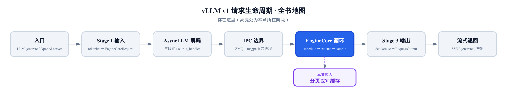
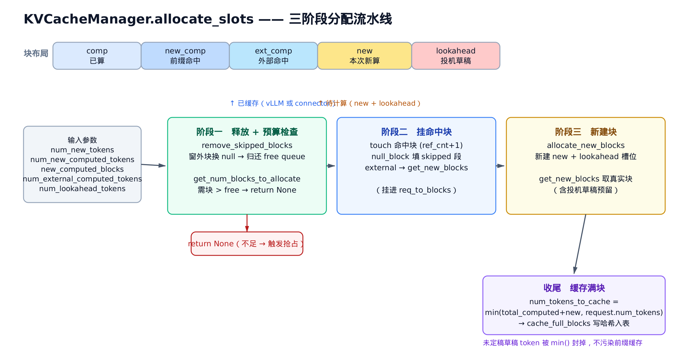
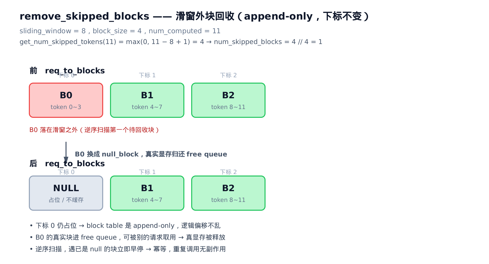
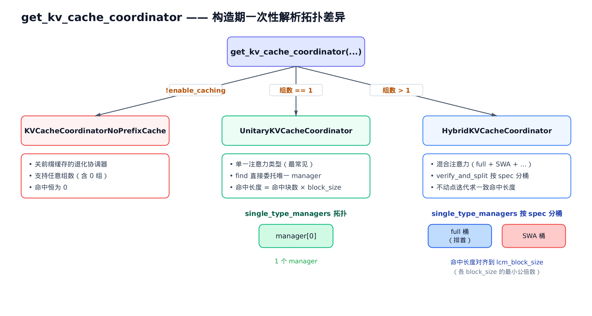
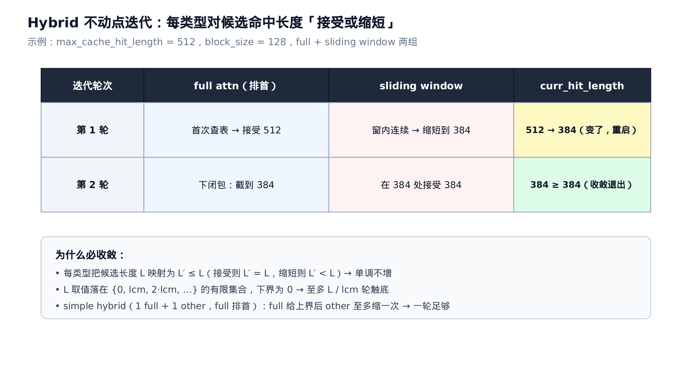

# 第16章　KV 块分配与多注意力协调

## 你在这里



> *图注：全书地图仍停在主线阶段「EngineCore 循环」，本章继续深入它背后的分页 KV 缓存。*
> *[第 15 章](../ch15-kv-cache/narrative/chapter.md) 立了块池、LRU、块哈希、前缀命中这些零件。*
> *本章解决「拿到这些零件后怎么决策」：一次分配里哪些块该释放、哪些该挂、哪些该新建。*
> *下一章离开 KV 缓存，转向 Executor 与 Worker 的生命周期。*

[第 15 章](../ch15-kv-cache/narrative/chapter.md) 把 `allocate_slots` 的三段式过了一遍——但走的是一条**最顺**的路：单一注意力类型、全注意力、开着前缀缓存。那条路上，「释放窗外块」这一步直接被跳过了（全注意力从不释放），「混合模型怎么协调多种注意力」更是连碰都没碰。

那一章末尾的小结里，三段式被压成了一句话：「查容量、挂命中块、补新块、登记」。这句话在主路径上是对的，但它藏起了三个真实 vLLM 每天都要处理的深水区：

- 一个滑动窗口请求，窗口往前滑，**窗外的旧块**该怎么释放、释放完下标会不会乱？
- 一个请求的 KV 不全在本地——有些是**外部 connector**（比如 P/D 分离的另一端）算好的，这些「外部已算 token」怎么挂块？投机解码的**草稿 token** 又怎么预留槽位却不污染缓存？
- 一个模型同时有 full attention 和 sliding window 两种层（现在很多模型都这样），它们对「前缀命中到哪」的判断**不一致**——到底该信谁？

这一章就把这三个深水区填平。主角有两个：`allocate_slots` 的**完整**三阶段（[第 15 章](../ch15-kv-cache/narrative/chapter.md#157-三段式分配allocate_slots) 只展开了中段），和它背后那个决定「有几种注意力类型、该怎么协调」的 `KVCacheCoordinator`。

照例配一份**只做减法**的精简版：和真实 `vllm/v1/core/` 下的 `kv_cache_manager.py`、`kv_cache_coordinator.py`、`single_type_kv_cache_manager.py` 同名、同结构、同控制流。它复用 [第 15 章](../ch15-kv-cache/narrative/chapter.md) 的块池与哈希基础设施，只补回那三个被跳过的分支；删掉的（Mamba 状态块、cross-attention 编码器、投机解码草稿头、上下文并行）都原样标注。它不 import vllm、不要 GPU，`pytest` 直接跑——用来在本地亲眼看不动点怎么收敛、窗外块怎么变成 null。正文的主线，始终是真实源码。

我们先把 `allocate_slots` 的全貌摊开，再逐阶段下钻，最后上到协调层看 Unitary 与 Hybrid 的分野。

---

## 16.1 三阶段的全貌：allocate_slots 摊开看

先看入口。调度器要给一个请求安排显存时，调的就是这个函数。它的签名比 [第 15 章](../ch15-kv-cache/narrative/chapter.md) 见到的多了一串参数——那些正是本章的主角：

```python
# vllm/v1/core/kv_cache_manager.py:L225
def allocate_slots(
    self,
    request: Request,
    num_new_tokens: int,
    num_new_computed_tokens: int = 0,
    new_computed_blocks: KVCacheBlocks | None = None,
    num_lookahead_tokens: int = 0,
    num_external_computed_tokens: int = 0,
    delay_cache_blocks: bool = False,
    num_encoder_tokens: int = 0,
    full_sequence_must_fit: bool = False,
) -> KVCacheBlocks | None:
```

源码里这个函数的 docstring 画了一张 block 布局图，值得照搬到正文——它是理解整章的地图：

```text
----------------------------------------------------------------------
| < comp > | < new_comp > | < ext_comp >  | < new >  | < lookahead > |
----------------------------------------------------------------------
                                          |   < to be computed >     |
----------------------------------------------------------------------
                          |            < to be allocated >           |
----------------------------------------------------------------------
| Prefix-cached tokens from either vLLM   |
| or connector. Can be safely removed if  |
| they are outside sliding window.        |
----------------------------------------------------------------------
```

一个请求的 token 序列从左到右分五段：

- **comp**：`request.num_computed_tokens`，这个请求此前已经算过、块都在手的 token。
- **new_comp**：`num_new_computed_tokens`，本次刚命中 vLLM 前缀缓存的 token——块是别人算好的，`touch` 一下就能借用。
- **ext_comp**：`num_external_computed_tokens`，外部 connector 算好的 token——KV 在外面，但 vLLM 这边得分配真实块去**接收**它们。
- **new**：`num_new_tokens`，本次真正要前向计算的 token（可能含未定稿的草稿 token）。
- **lookahead**：`num_lookahead_tokens`，投机解码额外预留的草稿槽位。

下面这张图把五段布局和三阶段的处理串了起来，先看全局，再逐段下钻：



> *图注：输入参数汇入三阶段。阶段一释放窗外块并做预算检查（不足直接 return None）；阶段二挂前缀命中块、null 填 skipped 段、为 external 分配真实块；阶段三新建 new + lookahead 槽位；收尾把缓存量封顶到 request.num_tokens 再写哈希入表。*

函数开头先合并「已算」的 token 总量，这是后面所有决策的基准：

```python
# vllm/v1/core/kv_cache_manager.py:L325
# The number of computed tokens is the number of computed tokens plus
# the new prefix caching hits
num_local_computed_tokens = (
    request.num_computed_tokens + num_new_computed_tokens
)
total_computed_tokens = min(
    num_local_computed_tokens + num_external_computed_tokens,
    self.max_model_len,
)
```

`num_local_computed_tokens` 是「本地已算」（comp + new_comp），`total_computed_tokens` 再加上外部那段（ext_comp），并用 `max_model_len` 封顶。接着算出本次到底要给多少 token 留槽位：

```python
# vllm/v1/core/kv_cache_manager.py:L351
num_tokens_main_model = total_computed_tokens + num_new_tokens
num_tokens_need_slot = min(
    num_tokens_main_model + num_lookahead_tokens, self.max_model_len
)
```

注意这里的层次：`num_tokens_main_model` 是主模型真正要算的长度（已算 + 本次新算），`num_tokens_need_slot` 再加上 lookahead 草稿——**草稿要槽位，但不算进主模型长度**。这个区分待会儿在收尾「该缓存多少」时会回头咬一口。

剩下的就是三阶段。下面三节逐个拆。

---

## 16.2 阶段一：释放窗外块 + 预算检查

三阶段里，第一阶段做两件事：先**释放**用不到的旧块，再**检查**剩下的够不够。顺序不能反——源码注释把理由写得很直白：

```python
# vllm/v1/core/kv_cache_manager.py:L356
# Free the blocks that are skipped during the attention computation
# (e.g., tokens outside the sliding window).
# We can do this even if we cannot schedule this request due to
# insufficient free blocks.
# Should call this function before allocating new blocks to reduce
# the number of evicted blocks.
self.coordinator.remove_skipped_blocks(
    request.request_id, total_computed_tokens
)
```

「在分配新块前调用，以减少被驱逐的块数」——先把这个请求自己用不到的块还回 free queue，可用容量就大了，这次分配触发的驱逐就少了。窗外的旧块对后续注意力计算毫无用处，提前释放不损正确性，纯赚。

### 什么叫「窗外块」

全注意力里，每个 token 都要看到它前面所有 token，所以**永不释放**。但滑动窗口注意力（sliding window attention，SWA）不一样：当前 token 只看最近 `sliding_window` 个 token，更早的 KV 算完就再也用不上了。

判断「跳过多少 token」的逻辑由每种注意力类型自己给。基类的默认行为是**一个都不跳**：

```python
# vllm/v1/core/single_type_kv_cache_manager.py:L428
def get_num_skipped_tokens(self, num_computed_tokens: int) -> int:
    # The default behavior is to not skip any tokens.
    return 0
```

这就是为什么 [第 15 章](../ch15-kv-cache/narrative/chapter.md) 的全注意力主路径里 `remove_skipped_blocks` 像是不存在——它确实跑了，但 `get_num_skipped_tokens` 返回 0，函数开头就返回了。滑动窗口管理器把它重写成一道公式：

```python
# vllm/v1/core/single_type_kv_cache_manager.py:L606
def get_num_skipped_tokens(self, num_computed_tokens: int) -> int:
    # For sliding window, this corresponds to the tokens that are prior to
    # the current sliding window.
    # Example: sliding_window=4, num_computed_tokens=7 -> skip 4 (tokens 0~3).
    return max(0, num_computed_tokens - self.sliding_window + 1)
```

写成公式：

$$
\mathrm{skipped} = \max(0,\ \mathrm{num\_computed} - \mathrm{sliding\_window} + 1)
$$

直觉先行：算到第 `num_computed` 个 token 时，下一个要算的 token 能看到的窗口是最近 `sliding_window` 个。窗口左边界之前的 token 全部出局。那个 `+1` 是因为「下一个 token」也要占一个窗口名额，所以窗口往前滑的步子比 token 序号慢一格。

数值翻译：`sliding_window=4`、`num_computed=7`。`max(0, 7-4+1)=4`——前 4 个 token（0\~3）出局，窗口现在罩住 4\~7（其实是 4\~6 再加下一个待算的 7）。

分块本地注意力（chunked local attention）是另一种局部注意力，它的跳过规则不按滑窗滑，而是**向下取整到 chunk 边界**：

```python
# vllm/v1/core/single_type_kv_cache_manager.py:L741
def get_num_skipped_tokens(self, num_computed_tokens: int) -> int:
    num_skipped_tokens = (
        num_computed_tokens // self.attention_chunk_size
    ) * self.attention_chunk_size
    return num_skipped_tokens
```

`chunk=8`、`num_computed=13`：`13 // 8 * 8 = 8`——跳过前 8 个（整整一个 chunk），当前 chunk 内的 8\~12 保留。`num_computed=7`（还没跨过第一个 chunk 边界）：`7 // 8 * 8 = 0`，一个不跳。

三种注意力，三种 `get_num_skipped_tokens`，这就是本章「各注意力类型差异」的第一个落点。精简版 `test_full_attention_never_skips`、`test_sliding_window_skipped_tokens`、`test_chunked_local_skipped_tokens_rounds_to_chunk` 把三条公式各钉了几个数值点。

### 释放：换 null，不删除

知道要跳多少 token，下一步是把对应的块还回去。这里有个关键设计：**不从块表里删除，而是换成共享的 null_block**。看 `remove_skipped_blocks` 的全貌：

```python
# vllm/v1/core/single_type_kv_cache_manager.py:L385
def remove_skipped_blocks(
    self, request_id: str, total_computed_tokens: int
) -> None:
    # Remove the blocks that will be skipped during attention computation.
    num_skipped_tokens = self.get_num_skipped_tokens(total_computed_tokens)
    if num_skipped_tokens <= 0:
        # This indicates that ALL tokens are inside attention window.
        # ... 全注意力走这里直接返回，从不释放 ...
        return
    blocks = self.req_to_blocks[request_id]
    num_skipped_blocks = num_skipped_tokens // self.block_size
    # `num_skipped_tokens` may include tokens that haven't been allocated yet
    # ... so we must cap to the number of blocks that currently exist ...
    num_skipped_blocks = min(num_skipped_blocks, len(blocks))
    removed_blocks: list[KVCacheBlock] = []
    # Because the block starts from index 0, the num_skipped_block-th block
    # corresponds to index num_skipped_blocks - 1.
    for i in range(num_skipped_blocks - 1, -1, -1):
        if blocks[i] == self._null_block:
            # If the block is already a null block, the blocks before it
            # should also have been set to null blocks by the previous calls
            # to this function.
            break
        removed_blocks.append(blocks[i])
        blocks[i] = self._null_block
    self.block_pool.free_blocks(removed_blocks)
```

逆序扫描 `[num_skipped_blocks-1, ..., 0]`，把每个窗外块换成 `_null_block`，真实块收进 `removed_blocks` 一次性 `free_blocks` 归还。下面这张图把这个过程画了出来：



> *图注：sliding_window=8、block_size=4、num_computed=11。skipped=max(0,11-8+1)=4，整除块大小得 1 个 skipped 块。逆序把 B0 换成 null_block 并归还 free queue，下标不变，真实显存被释放。*

为什么是「换 null」而不是「删除」？因为块表是 **append-only** 设计——块的下标就是它的逻辑位置，删掉前面一个，后面所有块的逻辑偏移全乱。换成一个共享的 `null_block` 既释放了真实显存（那个真实块进了 free queue，能被别人取用），又保住了下标稳定。这个 `null_block` 正是 [第 15 章](../ch15-kv-cache/narrative/chapter.md#152-一个块kvcacheblock) 介绍 `KVCacheBlock.is_null` 时埋下的那个特殊块——它初始化时就被单拎出来，永不参与缓存与释放，专门干这种占位的活。现在它上岗了。

两个小心思值得点明：

**逆序 + 遇 null 早停 = 幂等。** 为什么逆序？因为这函数会被反复调用（每个调度步都可能调一次）。逆序扫描时，一旦撞到已经是 null 的块，就说明它前面的块在更早的调用里也都被换成 null 了——直接 `break`。于是同一个请求第二次、第三次调用 `remove_skipped_blocks`，已经回收过的块不会被重复处理。这是一条**单调推进**的指针：每次只把新滑出窗口的那几块换掉，已 null 的不动。精简版 `test_remove_skipped_blocks_idempotent_early_stop` 连调两次，验证第二次没有额外释放。

**`min(num_skipped_blocks, len(blocks))` 这道封顶。** 注释解释得到位：`num_skipped_tokens` 可能算出比当前已分配块还多的数（比如窗口滑进了还没分配的外部已算 token 区间）。不封顶就会下标越界。封顶后，最多释放「当前真实存在」的块数。

### 预算检查：精确预测要申请几块

释放完，看够不够。`get_num_blocks_to_allocate` 算出这次分配将要向块池**净申请**多少真实块，和空闲块数一比：

```python
# vllm/v1/core/kv_cache_manager.py:L366
num_blocks_to_allocate = self.coordinator.get_num_blocks_to_allocate(
    request_id=request.request_id,
    num_tokens=num_tokens_need_slot,
    new_computed_blocks=new_computed_block_list,
    num_encoder_tokens=num_encoder_tokens,
    total_computed_tokens=num_local_computed_tokens
    + num_external_computed_tokens,
    num_tokens_main_model=num_tokens_main_model,
)

if num_blocks_to_allocate > self.block_pool.get_num_free_blocks():
    # Cannot allocate new blocks
    return None
```

返回 `None` 就是 [第 14 章](../ch14-scheduler/narrative/chapter.md) 那个**抢占触发点**——要不到块，调度器只能抢占别的请求或把这个请求退回去。

这个预测必须**精确**，不能近似。多估了浪费容量、调度吞吐下降；少估了真去分配时块不够，前向计算中途 OOM 直接崩。看它怎么算的：

```python
# vllm/v1/core/single_type_kv_cache_manager.py:L88
def get_num_blocks_to_allocate(
    self,
    request_id: str,
    num_tokens: int,
    new_computed_blocks: Sequence[KVCacheBlock],
    total_computed_tokens: int,
    num_tokens_main_model: int,
    apply_admission_cap: bool = False,
) -> int:
    num_required_blocks = cdiv(num_tokens, self.block_size)
    # ... apply_admission_cap 分支见 §16.3 ...
    num_req_blocks = len(self.req_to_blocks.get(request_id, ()))

    if request_id in self.num_cached_block:
        # Fast-path: a running request won't have any new prefix-cache hits.
        assert len(new_computed_blocks) == 0
        return max(num_required_blocks - num_req_blocks, 0)

    num_skipped_tokens = self.get_num_skipped_tokens(total_computed_tokens)
    num_local_computed_blocks = len(new_computed_blocks) + num_req_blocks
    # Number of whole blocks that are skipped by the attention window.
    num_skipped_blocks = num_skipped_tokens // self.block_size
    # We need blocks for the non-skipped suffix.
    num_new_blocks = max(
        num_required_blocks - max(num_skipped_blocks, num_local_computed_blocks),
        0,
    )

    # ... num_skipped_new_computed_blocks 折抵见下 ...
    num_skipped_new_computed_blocks = max(0, num_skipped_blocks - num_req_blocks)

    # If a computed block is an eviction candidate (in the free queue and
    # ref_cnt == 0), it will be removed from the free queue when touched by
    # the allocated request, so we must count it in the free-capacity check.
    num_evictable_blocks = self._get_num_evictable_blocks(
        new_computed_blocks[num_skipped_new_computed_blocks:]
    )
    return num_new_blocks + num_evictable_blocks
```

拆成两项相加：

**第一项 `num_new_blocks`：要新建几块。** 核心是这个 `max`：

$$
\mathrm{num\_new\_blocks} = \max\big(\mathrm{num\_required} - \max(\mathrm{num\_skipped},\ \mathrm{num\_local\_computed}),\ 0\big)
$$

`num_required` 是这次需要的总块数（按 `num_tokens_need_slot` 算）。从里减掉「已经有的」——但「已经有的」要取 `num_skipped_blocks` 和 `num_local_computed_blocks` 的较大者。为什么取 max？两种情形：窗口里还有本地已算块时，这些块顶用，`num_local_computed_blocks` 主导；窗口滑得太远、本地块全出窗了，那 `num_skipped_blocks` 主导（出窗的块虽然换了 null 但下标占着，required 是从下标 0 数的）。取较大者才不会重复计算这段已被覆盖的前缀。

**第二项 `num_evictable_blocks`：可驱逐命中块也要算进预算。** 这是个容易漏的坑。前缀命中的块，如果此刻 `ref_cnt==0`（在 free queue 里当驱逐候选），那它在概念上是「空闲」的——可一旦这个请求 `touch` 它，它就被移出 free queue 占住了容量。所以这些块虽然是「命中复用」不用新建，却**实实在在消耗了一个空闲名额**。不把它们计入，就会高估可用容量、超分配。`_get_num_evictable_blocks` 数的就是命中块里这种「在 free queue 中的驱逐候选」。精简版 `test_get_num_blocks_counts_evictable_hit_blocks` 专门验证：命中一个 ref_cnt==0 的块，预算里照样给它留一格。

> 块数守恒：`num_new_blocks + num_evictable_blocks` 预测的，正是阶段二、阶段三合起来将向 `BlockPool` 净申请的真实块数。阶段二为 external 分配 + 阶段三新建 = `num_new_blocks`；阶段二 touch 驱逐候选 = `num_evictable_blocks`。**预测 == 实际申请**，预算检查零误差。

那个 `request_id in self.num_cached_block` 的 fast-path 是给**正在运行**的请求走的——它早就在跑了，不会有新的前缀命中，直接拿 `num_required - num_req` 就行（投机解码下 required 可能比已有还小，所以 `max(..., 0)` 兜底）。本章重点是**新请求**走的那条完整路径。

---

## 16.3 准入上限：SWA 凭什么敢少留块

上一节 `get_num_blocks_to_allocate` 里跳过了一段——`apply_admission_cap` 分支。它单独拎出来讲，因为这是 SWA 与 chunked-local 这类**会回收块**的注意力独有的一道关：

```python
# vllm/v1/core/single_type_kv_cache_manager.py:L119
num_required_blocks = cdiv(num_tokens, self.block_size)
if apply_admission_cap and self._max_admission_blocks_per_request is not None:
    # Recycling-aware specs (SWA, chunked-local) cap the per-request
    # reservation here so admission matches the startup pool sizer.
    num_required_blocks = min(
        num_required_blocks, self._max_admission_blocks_per_request
    )
```

问题的根源：滑窗请求的 `cdiv(全长)` 是按**整条序列长度**算的，但它实际**同时持有**的真实块远没那么多——因为窗外块一直在被 `remove_skipped_blocks` 回收。每请求峰值真实持块约为

$$
\mathrm{cdiv}(\mathrm{sliding\_window} - 1 + \mathrm{newly\_scheduled\_tokens},\ \mathrm{block\_size}) + 1
$$

那个 `+1` 是因为窗口左边界未必落在块边界上，可能多压半个块。代入数值看量级差：max_model_len=32768、sliding_window=4096、block_size=16，全长口径要 `cdiv(32768,16)=2048` 块，而峰值持块只有 `cdiv(4096-1,16)+1≈257` 块——相差近 **8 倍**。按全长留量等于把一个请求的占用虚报了 8 倍，准入会无谓地拒掉本能放下的请求。

如果准入时按 `cdiv(全长)` 留量，会发生什么？要么过度保守、明明放得下却拒了（吞吐塌方），要么——更糟——启动时的池大小估算器（pool sizer）按「回收后的峰值」算了池容量，运行时准入却按「全长」检查，两套口径打架。源码注释把后果点名了：

```python
# vllm/v1/core/single_type_kv_cache_manager.py:L120
# ... so admission matches the startup pool sizer
# (`SlidingWindowSpec.max_admission_blocks_per_request` / its
# chunked-local counterpart). `remove_skipped_blocks` runs from
# `allocate_slots` before each chunk's `get_num_blocks_to_allocate`,
# so per-request peak real-held blocks <= this cap, which keeps
# `sum(reservations) <= pool` <=> `sum(peak_real_held) <= pool`.
# Drift between the two would re-introduce the deadlock from
# issue #39734 or, worse, mid-prefill OOM.
```

解法是**单一真相源**：准入上限和启动池估算用**同一个** spec 方法算出来。看 `get_manager_for_kv_cache_spec` 怎么注入这个上限：

```python
# vllm/v1/core/single_type_kv_cache_manager.py:L1155
def get_manager_for_kv_cache_spec(
    kv_cache_spec: KVCacheSpec,
    max_num_batched_tokens: int,
    max_model_len: int,
    **kwargs,
) -> SingleTypeKVCacheManager:
    manager_class = spec_manager_map[type(kv_cache_spec)]
    # SlidingWindow / ChunkedLocalAttention managers recycle blocks across
    # chunks; the runtime admission cap must match the recycling-aware bound
    # the startup pool sizer uses (single source of truth: the spec method).
    if isinstance(kv_cache_spec, (SlidingWindowSpec, ChunkedLocalAttentionSpec)):
        kwargs["max_admission_blocks_per_request"] = (
            kv_cache_spec.max_admission_blocks_per_request(
                max_num_batched_tokens=max_num_batched_tokens,
                max_model_len=max_model_len,
            )
        )
    manager = manager_class(kv_cache_spec, **kwargs)
    return manager
```

`kv_cache_spec.max_admission_blocks_per_request(...)` 这个 spec 侧方法，既被启动时的池估算器调用来定池容量，又在这里被注入进 manager 当运行时准入上限。两边永远一致。于是不等式

$$
\sum_{\mathrm{requests}} \mathrm{reservation} \le \mathrm{pool} \iff \sum_{\mathrm{requests}} \mathrm{peak\_real\_held} \le \mathrm{pool}
$$

恒成立——「启动估算能放下的请求，运行时一定能被准入」，不会死锁，也不会 prefill 中途 OOM。这个等价性依赖一个前提：`remove_skipped_blocks` 在每个 chunk 的预算检查**之前**运行（[§16.2](#162-阶段一释放窗外块--预算检查) 那个「先释放后检查」的顺序），保证每请求峰值持块不超上限。一环扣一环。

精简版 `test_admission_cap_injected_for_sliding_window` 验证滑窗 manager 拿到了非 None 的上限，`test_admission_cap_none_for_full_attention` 验证全注意力没这玩意（它不回收，`cdiv(全长)` 就是真实持块），`test_admission_cap_clamps_required_blocks` 验证超过上限时被夹住。

那 `apply_admission_cap` 这个开关什么时候打开？回到 [§16.1](#161-三阶段的全貌allocate_slots-摊开看) 略过的 `full_sequence_must_fit` 分支：

```python
# vllm/v1/core/kv_cache_manager.py:L335
if full_sequence_must_fit:
    # First check and fail if the full request sequence won't fit.
    full_num_tokens = min(request.num_tokens, self.max_model_len)
    num_blocks_to_allocate = self.coordinator.get_num_blocks_to_allocate(
        # ... num_tokens=full_num_tokens ...
        apply_admission_cap=True,
    )
    if num_blocks_to_allocate > self.block_pool.get_num_free_blocks():
        return None
```

这是 chunked prefill 场景下的一道前置准入闸。chunked prefill 一次只送一个 chunk 进来，正常预算检查只看这个 chunk 够不够——可能出现「第一个 chunk 放得下、整条序列放不下」的过度准入。`full_sequence_must_fit=True` 时，先拿**整条序列长度** + `apply_admission_cap=True` 走一遍 recycling-aware 上限，整条放不下就立刻拒，避免准入了一半 prefill 不下去的尴尬。这条闸默认关着，开它的是调度器。

---

## 16.4 阶段二、三：挂命中块、新建、缓存

预算过关，进入真正动手分配的阶段二和阶段三。

### 阶段二：三件事——touch、null 填、external 分配

```python
# vllm/v1/core/kv_cache_manager.py:L380
if (
    new_computed_block_list is not self.empty_kv_cache_blocks.blocks
    or num_external_computed_tokens > 0
):
    self.coordinator.allocate_new_computed_blocks(
        request_id=request.request_id,
        new_computed_blocks=new_computed_block_list,
        num_local_computed_tokens=num_local_computed_tokens,
        num_external_computed_tokens=num_external_computed_tokens,
    )
```

只要有前缀命中块、或者有外部已算 token，就调 `allocate_new_computed_blocks`。它的实体在管理器里，把三件事一气做完：

```python
# vllm/v1/core/single_type_kv_cache_manager.py:L169
def allocate_new_computed_blocks(
    self,
    request_id: str,
    new_computed_blocks: Sequence[KVCacheBlock],
    num_local_computed_tokens: int,
    num_external_computed_tokens: int,
) -> None:
    # ... 运行中请求的 fast-path 省略：无新命中块，直接返回 ...
    # A new request.
    req_blocks = self.req_to_blocks[request_id]
    assert len(req_blocks) == 0
    num_total_computed_tokens = (
        num_local_computed_tokens + num_external_computed_tokens
    )
    num_skipped_tokens = self.get_num_skipped_tokens(num_total_computed_tokens)
    num_skipped_blocks = num_skipped_tokens // self.block_size
    if num_skipped_blocks > 0:
        # It is possible that all new computed blocks are skipped when
        # num_skipped_blocks > len(new_computed_blocks).
        new_computed_blocks = new_computed_blocks[num_skipped_blocks:]
        # Some external computed tokens may be skipped too.
        num_external_computed_tokens = min(
            num_total_computed_tokens - num_skipped_tokens,
            num_external_computed_tokens,
        )

    # Touch the computed blocks to make sure they won't be evicted.
    if self.enable_caching:
        self.block_pool.touch(new_computed_blocks)
    # Skip blocks are padded with null blocks.
    req_blocks.extend([self._null_block] * num_skipped_blocks)
    # Add the remaining computed blocks.
    req_blocks.extend(new_computed_blocks)
    self.num_cached_block[request_id] = len(req_blocks)

    if num_external_computed_tokens > 0:
        # Allocate new blocks for external computed tokens.
        allocated_blocks = self.block_pool.get_new_blocks(
            cdiv(num_total_computed_tokens, self.block_size) - len(req_blocks)
        )
        req_blocks.extend(allocated_blocks)
        if type(self.kv_cache_spec) in (FullAttentionSpec, TQFullAttentionSpec):
            self.new_block_ids.extend(b.block_id for b in allocated_blocks)
```

逐步看：

1. **先算 skipped、再切掉命中块的头。** 如果命中的前缀里有一段已经在窗外，那这段命中块根本不用挂——`new_computed_blocks[num_skipped_blocks:]` 直接切掉。命中长度和窗口共同决定真正要挂的块。
2. **touch 命中块。** `block_pool.touch` 给命中块 `ref_cnt+1`，若在 free queue 里就移出来——这就是 [第 15 章](../ch15-kv-cache/narrative/chapter.md#154-引用计数谁在用这块) 讲过的「把驱逐候选救回」，也正是 [§16.2](#162-阶段一释放窗外块--预算检查) 预算里 `num_evictable_blocks` 要预留的那些块。
3. **null 填 skipped 段 + 挂命中块。** `req_blocks` 先填 `num_skipped_blocks` 个 null（占住窗外那段下标），再接上命中块。下标对齐，逻辑位置准确。
4. **为 external 分配真实块。** 这是本章相对 [第 15 章](../ch15-kv-cache/narrative/chapter.md) 全新的分支。外部 connector 算好的 token，KV 数据在外面，但 vLLM 这边得有真实块去**接收**它们——所以走 `get_new_blocks`（真实分配），不是 `touch`（借用命中）。要分配的块数是「总已算 token 需要的块」减「已经挂上的（null + 命中）」。

为什么 external 走 `get_new_blocks` 而命中走 `touch`？因为命中块是 vLLM 自己前缀缓存里已有的物理块，借用即可；external 的 KV 不在 vLLM 缓存里，得新占一块显存来装。两者本质不同。精简版 `test_external_computed_tokens_allocate_real_blocks` 验证：给定 external token 数，函数确实 `get_new_blocks` 了对应的真实块。

### 阶段三：新建 new + lookahead 槽位

```python
# vllm/v1/core/kv_cache_manager.py:L393
new_blocks = self.coordinator.allocate_new_blocks(
    request.request_id,
    num_tokens_need_slot,
    num_tokens_main_model,
    num_encoder_tokens,
)
```

`allocate_new_blocks` 按 `num_tokens_need_slot`（含 lookahead）补齐块表：需要 `cdiv(num_tokens_need_slot, block_size)` 块，已有 `len(req_blocks)` 块，差额就 `get_new_blocks` 取。这里**草稿槽位也被预留**——lookahead 那段虽然 token 还没定稿，物理块得先占着，不然投机解码算出来的草稿 KV 没处放。精简版 `test_lookahead_reserves_slots` 验证带 lookahead 时多分了对应的块。

### 收尾：缓存量封顶到 request.num_tokens

最后一步，把这次新算出来的满块写哈希入表，让后来者能命中。但**缓存多少有讲究**：

```python
# vllm/v1/core/kv_cache_manager.py:L400
# P/D: delay caching blocks if we have to recv from remote.
if not self.enable_caching or delay_cache_blocks:
    return self.create_kv_cache_blocks(new_blocks)

# NOTE(woosuk): We want to commit (cache) up to num_local_computed_tokens
# + num_external_computed_tokens + num_new_tokens, but must exclude
# "non-committable" tokens (e.g., draft tokens that could be rejected).
# Therefore, we cap the number at `request.num_tokens`, ensuring only
# "finalized" tokens are cached.
num_tokens_to_cache = min(
    total_computed_tokens + num_new_tokens,
    request.num_tokens,
)
self.coordinator.cache_blocks(request, num_tokens_to_cache)

return self.create_kv_cache_blocks(new_blocks)
```

`num_tokens_to_cache` 被 `min(..., request.num_tokens)` 封顶——这道封顶是为投机解码准备的。`num_new_tokens` 里可能含未定稿的草稿 token，它们**有可能被拒**。如果把草稿 token 也缓存进前缀缓存，万一被拒，别的请求命中了这段「其实算错了」的 KV，缓存就被污染了。`request.num_tokens` 是「已定稿」的边界，封到这里，只缓存定稿 token。这正是 [§16.1](#161-三阶段的全貌allocate_slots-摊开看) 区分 `num_tokens_main_model` 和 `num_tokens_need_slot` 时埋下的那一口——草稿要槽位（阶段三预留了），但不进缓存（这里封掉了）。精简版 `test_lookahead_tokens_not_cached` 把这条钉死：带 lookahead 分配后，缓存的块数不含草稿那段。

那个 `delay_cache_blocks` 早退分支是 P/D 分离用的——KV 要从远端收，先别急着缓存，等收到再说。和 `enable_caching=False` 共用一条早退路径，点到为止。

至此 `allocate_slots` 三阶段全部走完。但你可能注意到，上面所有动作都经过一个 `self.coordinator.xxx`——这个 coordinator 是谁？它怎么知道该转发给哪个管理器？这就是本章的第二个主角。

---

## 16.5 协调层：三态工厂

`allocate_slots` 里每一步都委托给 `self.coordinator`。这个协调器的职责是：把「有几种注意力类型」这件事**藏起来**，让 `allocate_slots` 不管模型是单一注意力还是混合注意力，都用同一套调用。

差异在**构造期**一次性解析。`get_kv_cache_coordinator` 是个三态工厂：

```python
# vllm/v1/core/kv_cache_coordinator.py:L594
def get_kv_cache_coordinator(
    kv_cache_config, max_model_len, max_num_batched_tokens, use_eagle,
    enable_caching, enable_kv_cache_events, dcp_world_size, pcp_world_size,
    hash_block_size, metrics_collector=None,
) -> KVCacheCoordinator:
    if not enable_caching:
        return KVCacheCoordinatorNoPrefixCache(...)
    if len(kv_cache_config.kv_cache_groups) == 1:
        return UnitaryKVCacheCoordinator(...)
    return HybridKVCacheCoordinator(...)
```

三条岔路，对应三种拓扑：



> *图注：构造期一次解析。关缓存走 NoPrefixCache（支持任意组数含 0，命中恒 0）；单 KV cache group 走 Unitary（最常见，直接委托唯一 manager）；多组走 Hybrid（按 spec 分桶、full 排首、不动点迭代）。*

为什么要在构造期分流，而不是运行时 `if-else`?因为**绝大多数模型是单组**（所有层同一种注意力）。让它们走 Unitary 这条最短路径，避开混合模型才需要的分桶和不动点迭代开销。把拓扑差异前移到构造期，热路径就干净了。

这三态共享一个基类 `KVCacheCoordinator`。基类持有块池和**每组一个** `single_type_manager`，把绝大多数操作**逐组转发并累加**：

```python
# vllm/v1/core/kv_cache_coordinator.py:L80
def get_num_blocks_to_allocate(self, request_id, num_tokens, ...) -> int:
    num_blocks_to_allocate = 0
    for i, manager in enumerate(self.single_type_managers):
        num_blocks_to_allocate += manager.get_num_blocks_to_allocate(...)
    return num_blocks_to_allocate
```

`remove_skipped_blocks`、`allocate_new_blocks`、`cache_blocks` 全是这个模式——遍历每组 manager，转发同样的调用。单组时这个循环只转一圈，开销可忽略。唯一不能简单逐组转发的，是 `find_longest_cache_hit`——前缀命中查找，三态各有各的实现。这是三态真正分野的地方。

**NoPrefixCache** 最简单，关了缓存，命中恒为空：

```python
# vllm/v1/core/kv_cache_coordinator.py:L313
def find_longest_cache_hit(
    self, block_hashes, max_cache_hit_length,
) -> tuple[tuple[list[KVCacheBlock], ...], int]:
    blocks = tuple([] for _ in range(self.num_single_type_manager))
    return blocks, 0
```

它还有个特别之处：注释写明「支持任意组数，包括 0 组」。另两态都断言组数恰好是 1 或大于 1，只有它能处理退化情形。精简版 `test_no_prefix_cache_supports_zero_groups` 验证 0 组也不崩。

**Unitary** 直接委托唯一的那个 manager：

```python
# vllm/v1/core/kv_cache_coordinator.py:L373
def find_longest_cache_hit(
    self, block_hashes, max_cache_hit_length,
) -> tuple[tuple[list[KVCacheBlock], ...], int]:
    hit_blocks = self.single_type_managers[0].find_longest_cache_hit(
        block_hashes=block_hashes,
        max_length=max_cache_hit_length,
        kv_cache_group_ids=[0],
        block_pool=self.block_pool,
        kv_cache_spec=self.kv_cache_spec,
        use_eagle=0 in self.eagle_group_ids,
        alignment_tokens=self.block_size,
    )
    return hit_blocks, len(hit_blocks[0]) * self.block_size
```

命中长度 = 命中块数 × `block_size`，没有任何协调逻辑，因为只有一种注意力。它构造时断言 `hash_block_size == block_size` 且组数 == 1。[第 15 章](../ch15-kv-cache/narrative/chapter.md#156-查表与命中从-block_hashes-到物理块) 讲的 `FullAttentionManager.find_longest_cache_hit`，走的就是 Unitary 这条委托。精简版 `test_unitary_find_longest_cache_hit_delegates` 验证它确实把调用透传给了唯一 manager。

真正烧脑的是 **Hybrid**——多种注意力，命中长度要让**所有类型同时成立**。下一节专门拆它。

---

## 16.6 Hybrid 的不动点迭代：让所有注意力达成一致

混合模型（full attention + sliding window，或再加 chunked-local）有个根本麻烦：**不同注意力类型对「前缀命中到哪」的判断不一致**。

- 全注意力要求从头**连续**命中——命中长度是「从 token 0 起连续匹配的最长前缀」。
- 滑动窗口只在乎**窗口内**连续命中——它可以接受「前面一段没缓存、但窗口内这段命中」。

同一个请求，full 说能命中到第 512 个 token，SWA 说只能到第 384 个。最终命中长度必须让两者都成立，只能取**它们都认可的最长长度**。怎么求？vLLM 用了一个**不动点迭代**。

### 构造期：分桶、full 排首、算 lcm

迭代之前，Hybrid 在构造期先把多个 group 整理成「注意力桶」：

```python
# vllm/v1/core/kv_cache_coordinator.py:L436
def verify_and_split_kv_cache_groups(self) -> None:
    attention_groups: list[
        tuple[KVCacheSpec, list[int], type[SingleTypeKVCacheManager]]
    ] = []

    for i, g in enumerate(self.kv_cache_config.kv_cache_groups):
        manager_cls = self.single_type_managers[i].__class__
        spec = g.kv_cache_spec
        # Try to find an existing group with the same spec
        for existing_spec, group_ids, existing_cls in attention_groups:
            if existing_spec == spec:
                assert manager_cls is existing_cls
                group_ids.append(i)
                break
        else:
            attention_groups.append((spec, [i], manager_cls))

    assert len(attention_groups) > 1, (
        "HybridKVCacheCoordinator requires at least two attention groups."
    )

    # Put full attention first: its efficient left-to-right scan provides
    # a tighter initial bound, reducing work for subsequent groups.
    self.attention_groups = sorted(
        attention_groups,
        key=lambda x: not isinstance(x[0], FullAttentionSpec),
    )

    # The cache hit length must be a multiple of the LCM of the block sizes
    # to make sure the cache hit length is a multiple of the block size of
    # each attention type.
    block_sizes = [spec.block_size for spec, _, _ in attention_groups]
    self.lcm_block_size = lcm(*block_sizes)
```

三件事：

1. **按 spec 分桶。** 相同 spec 的 group 合并成一个桶（一个桶可能含多个 group_id）。同 spec 的注意力命中规则一样，一起处理。
2. **full attention 排首。** 那个 `sorted(..., key=lambda x: not isinstance(x[0], FullAttentionSpec))` 把 full 桶排到最前。注释说理由：full 的左到右扫描给出**最紧的初始上界**——先跑它，后续类型的搜索区间就被压窄了，迭代总工作量更小。这是个纯优化，但很关键。
3. **算 lcm_block_size。** 不同注意力类型可以有不同 `block_size`。命中长度必须是**所有 block_size 的最小公倍数**的整数倍，才能保证对每个类型都落在整块边界上（vLLM 还不支持部分块命中）。

### 不动点迭代本体

分桶就绪，看核心循环。这段是全章最值得逐行读的代码：

```python
# vllm/v1/core/kv_cache_coordinator.py:L487
def find_longest_cache_hit(
    self, block_hashes, max_cache_hit_length,
) -> tuple[tuple[list[KVCacheBlock], ...], int]:
    # Find the longest cache hit using an iterative fixed-point algorithm.
    # Each attention type either accepts the current candidate length or
    # reduces it. If any type reduces the length, restart checks over all
    # types. This converges because length monotonically decreases and is
    # bounded below by 0.

    num_groups = len(self.kv_cache_config.kv_cache_groups)
    hit_length = max_cache_hit_length
    hit_blocks_by_group: list[list[KVCacheBlock] | None] = [None] * num_groups

    # Simple hybrid (1 full attn + 1 other): one iteration suffices.
    is_simple_hybrid = len(self.attention_groups) == 2 and isinstance(
        self.attention_groups[0][0], FullAttentionSpec
    )

    while True:
        curr_hit_length = hit_length

        for idx, (spec, group_ids, manager_cls) in enumerate(self.attention_groups):
            cached_blocks = hit_blocks_by_group[group_ids[0]]
            if isinstance(spec, FullAttentionSpec) and cached_blocks is not None:
                # Full attention is downward-closed: look up cached blocks
                # once; on subsequent iterations just trim to current length.
                curr_hit_length = (
                    curr_hit_length // spec.block_size * spec.block_size
                )
                continue

            hit_blocks = manager_cls.find_longest_cache_hit(
                block_hashes=_get_block_hashes(spec),
                max_length=curr_hit_length,
                kv_cache_group_ids=group_ids,
                block_pool=self.block_pool,
                kv_cache_spec=spec,
                use_eagle=use_eagle,
                alignment_tokens=self.lcm_block_size,
            )
            _new_hit_length = len(hit_blocks[0]) * spec.block_size
            curr_hit_length = _new_hit_length
            for group_id, blocks in zip(group_ids, hit_blocks):
                hit_blocks_by_group[group_id] = blocks

        if curr_hit_length >= hit_length:
            break
        hit_length = curr_hit_length
        if is_simple_hybrid:
            break

    # Truncate full attention blocks to final hit_length (if present)
    spec, group_ids, _ = self.attention_groups[0]
    if isinstance(spec, FullAttentionSpec):
        num_blocks = hit_length // spec.block_size
        for group_id in group_ids:
            if (blks := hit_blocks_by_group[group_id]) is not None:
                del blks[num_blocks:]

    return tuple(
        blocks if blocks is not None else [] for blocks in hit_blocks_by_group
    ), hit_length
```

机制是这样：以 `max_cache_hit_length` 为初值，每轮 `while` 让每个注意力类型对当前候选长度 `curr_hit_length` 做一次判定——**接受或缩短**。任一类型缩短了，长度变小，重启全类型校验（因为缩短后的长度可能让别的类型也要重新查）。某轮谁都没缩短（`curr_hit_length >= hit_length`），说明所有类型达成一致，退出。

两个优化嵌在里面：

- **full attention 下闭包早停。** full 的命中是「下闭包」的——如果它在长度 L 命中，那在任何 L′ < L 也必然命中（前缀更短，照样从头连续）。所以 full 只需**首次查一次表**，后续轮次直接把长度截到当前候选即可（那个 `continue` 分支），不必重查。
- **simple hybrid 一轮足够。** 只有「1 个 full + 1 个 other」且 full 排首时，`is_simple_hybrid=True`，循环底部直接 `break`。下面会证明这种情形一轮必收敛。

最后那段截断：full 的命中块在首次查表时按初始上界查得偏长，循环结束要按最终 `hit_length` 截掉尾巴（`del blks[num_blocks:]`），对齐到收敛长度。

### 一张表看它怎么收敛

光看代码不够直观，看一轮一轮的状态怎么变：



> *图注：初值 512，block_size=128，full + sliding window 两组。第 1 轮 full 接受 512、SW 缩短到 384，长度变了重启；第 2 轮 full 截到 384、SW 接受 384，curr ≥ hit 收敛退出。底部归纳收敛性。*

跟着图走一遍：

- **第 1 轮。** `curr_hit_length=512` 起步。full 首次查表，从头连续命中到 512，接受。SW 在 512 处查，发现窗内只连续命中到 384，把 `curr_hit_length` 缩短到 384。一轮结束 `curr_hit_length=384 < hit_length=512`——变了，`hit_length=384`，重启。
- **第 2 轮。** `curr_hit_length=384`。full 走 `continue` 分支，把自己截到 384（不重查表）。SW 在 384 处查，这次窗内连续命中到 384，接受。一轮结束 `curr_hit_length=384 >= hit_length=384`——没变，`break`。
- **收尾。** full 的命中块从 512 那次查得的长度截回 384 块数。返回每组命中块 + 最终长度 384。

把这两轮 `while` 的逐拍状态摊成一张表，循环怎么收敛一目了然（`block_size=128`，`lcm=128`，full 排首）：

| 轮次 | 动作（依次处理两组） | `hit_length`（轮初） | `curr_hit_length`（轮末） | 判定（`curr ≥ hit`?） | 返回 |
| --- | --- | --- | --- | --- | --- |
| 第 1 轮 | full 首查表→接受 512；SW 在 512 处查→缩短到 384 | 512 | 384 | 384 < 512，否 → `hit_length=384` 重启 | 继续 |
| 第 2 轮 | full 走 `continue` 截到 384；SW 在 384 处查→接受 384 | 384 | 384 | 384 ≥ 384，是 → `break` | 收敛 |
| 收尾 | full 命中块 `del blks[384//128:]` 截回 3 块 | — | — | — | 返回（每组命中块，384） |

关键标量只有一个 `curr_hit_length`，它每轮**只减不增**：512 → 384 → 384（不动）。第二轮谁都没把它压下去，就是不动点。

精简版 `test_hybrid_find_longest_cache_hit_converges_to_min` 构造了一个 full 命中更长、SWA 命中更短的场景，断言最终收敛到两者一致的较短长度。`test_hybrid_verify_and_split_full_attn_first` 验证 full 桶确实排在 `attention_groups[0]`。

### 为什么一定收敛

不动点迭代最怕不收敛——死循环。这里给出收敛性的归纳骨架：

把候选命中长度记作 L（token 数）。每轮迭代中，每个注意力类型把 L 映射为不超过它的新值——接受则不变，缩短则严格变小：

$$
L' \le L,\quad \mathrm{accept} \Rightarrow L' = L,\quad \mathrm{shrink} \Rightarrow L' < L
$$

所以一轮内 L 单调不增。两种结局：某轮无任何类型缩短（`curr_hit_length >= hit_length`），到达不动点退出；否则 L 严格下降。

而 L 的取值落在离散有限集合里——必须是 `lcm_block_size` 的倍数，下界为 0：

$$
L \in \{0,\ \mathrm{lcm},\ 2\cdot\mathrm{lcm},\ \dots\}
$$

一个严格下降、有下界、取值离散的量，必然有限步触底。轮数上界就是初值除以步长：

$$
\mathrm{rounds} \le \Big\lceil \mathrm{max\_cache\_hit\_length} / \mathrm{lcm\_block\_size} \Big\rceil
$$

这是单调量 + 离散下界保证终止性的标准论证。

simple hybrid 为什么一轮足够？full 排首给出上界，唯一的 other 类型在这个上界处至多缩短一次。下一轮 full 走 `continue` 不会再缩；other 在新的更短长度处——它在更长的上界已经命中了这个长度，在更短处必然还命中（同样是下闭包），接受。第二轮谁都不缩，本就该退。所以代码直接 `break` 省掉这必然空转的第二轮。精简版 `test_hybrid_simple_hybrid_flag` 验证「1 full + 1 other」时 `is_simple_hybrid` 为真。

### 复杂度：贵在哪、省在哪

把这些落成可比较的量级：

- **Unitary 命中查找**：复杂度 `O(max_num_blocks)`，沿哈希链逐块查，和单组前缀长度成正比。
- **Hybrid 不动点**：最坏 `O(轮数 × 每轮各类型单次查找之和)`，轮数上界就是上面那个 `max_cache_hit_length / lcm_block_size`。

但实践中这个最坏上界几乎碰不到。full 排首给紧初始上界 + 下闭包只查一次表，再加 simple hybrid 一轮早停——常见的「1 full + 1 SWA」模型，命中查找就退化成**两次单组查找加一轮判定**，和 Unitary 同量级。复杂的多类型混合才会多迭代几轮，而轮数被 `L / lcm` 这个不大的数压着。这就是「把拓扑差异前移到构造期、热路径只在真需要时多花钱」的回报。

---

## 16.7 小结：分配决策与多注意力协调

[第 15 章](../ch15-kv-cache/narrative/chapter.md) 把零件备齐，这一章把零件装成了能应对真实复杂度的分配决策。三条主线分别落在 `vllm/v1/core/kv_cache_manager.py:L225`（三阶段总控）、`vllm/v1/core/single_type_kv_cache_manager.py:L88`（需块预测）、`vllm/v1/core/kv_cache_coordinator.py:L487`（不动点迭代）。归位一下：

- **`allocate_slots` 完整三阶段**：阶段一 `remove_skipped_blocks` 释放窗外块（换 null 不删除，保住 append-only 下标）+ `get_num_blocks_to_allocate` 精确预测（skipped 折抵 + 可驱逐块计入，预测 == 实际申请）；阶段二 `allocate_new_computed_blocks` 三步走（touch 命中、null 填 skipped、external 走 `get_new_blocks`）；阶段三新建 new + lookahead 槽位；收尾 `num_tokens_to_cache` 封顶到 `request.num_tokens`，挡住未定稿草稿污染缓存。
- **各注意力类型的差异收束在 `get_num_skipped_tokens`**：全注意力恒 0（从不释放）、滑窗 `max(0, n-window+1)`、分块本地向下取整到 chunk。一个虚函数，三种回收语义。
- **recycling-aware 准入上限**：SWA / chunked-local 用 spec 侧单一真相源方法定 `max_admission_blocks_per_request`，启动池估算与运行时准入同口径，`sum(reservation) ≤ pool ⟺ sum(peak) ≤ pool`，杜绝死锁与 prefill 中途 OOM。
- **`KVCacheCoordinator` 三态工厂**：拓扑差异构造期一次解析——NoPrefixCache（任意组数退化）/ Unitary（单组直委托，最常见）/ Hybrid（多组分桶 + 不动点）。逐组转发把「有几种注意力」对 `allocate_slots` 透明。
- **Hybrid 不动点迭代**：每类型对候选长度「接受或缩短」，缩短即重启；单调递减 + lcm 倍数离散下界 0 保证至多 $L/\mathrm{lcm}$ 轮收敛；full 排首给紧上界 + 下闭包早停 + simple hybrid 一轮，把常见情形压回 Unitary 量级。

这一章也是 KV 缓存子系统的收尾。从 [第 15 章](../ch15-kv-cache/narrative/chapter.md) 的块、队列、哈希、命中，到这一章的三阶段分配与多注意力协调，分页 KV 缓存的「显存怎么切、怎么分、怎么省」算讲透了。

但有一个前提一直被我们当作给定：那个 `num_gpu_blocks`——块池到底有多少块——是哪来的？它不是拍脑袋定的，而是 Worker 在启动时**实测**显存、profiling 出来的。下一章离开 KV 缓存的核心，转向 Executor 与 Worker 的生命周期，看这些块在被分配之前，是怎么被「数」出来的。
