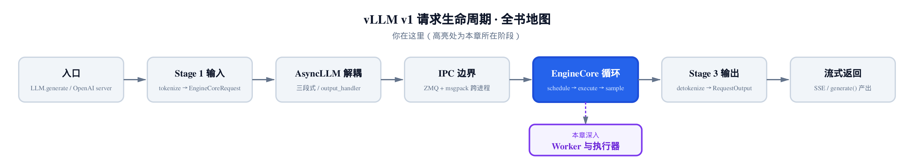
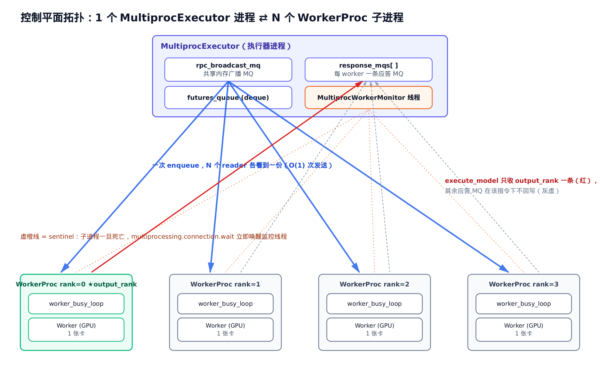
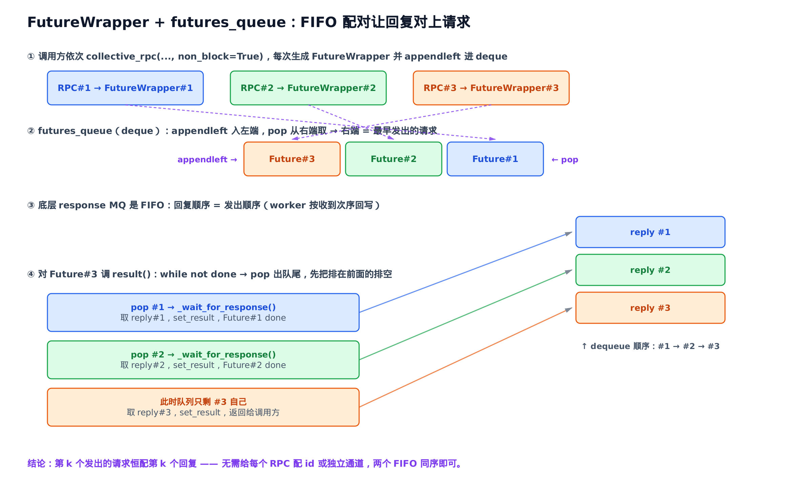
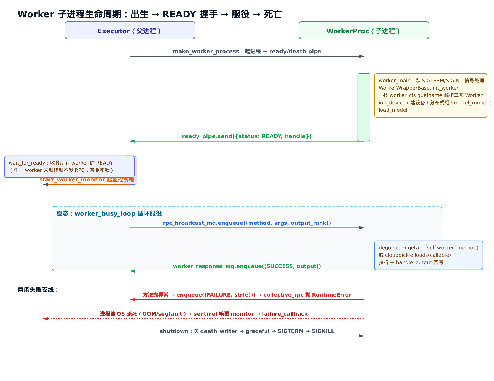

# 第17章　执行器与 Worker 生命周期

## 你在这里



> *图注：全书地图从 KV 缓存转入执行层。本章是 Part V 的第一站。*
> *[第 16 章](../ch16-kv-cache/narrative/chapter.md) 讲完了 KV 块怎么分配、多注意力怎么协调。*
> *本章解决「调度器算好的指令，怎么送到真正跑模型的 worker 上去」。*
> *下一章起进入 worker 内部，看持久 batch 与前向计算本身。*

到这里，引擎的「大脑」已经齐活了。调度器（[第 13–14 章](../ch13-scheduler/narrative/chapter.md)）每一拍决定跑哪些请求、KV 缓存（[第 15–16 章](../ch15-kv-cache/narrative/chapter.md)）决定它们的显存落在哪。一拍调度的产物是一个 `SchedulerOutput`——一张「这批 token 该怎么算」的工单。

可工单算好了，谁来执行？真正把模型前向跑在 GPU 上的，是 **worker**。一张卡一个 worker。八卡张量并行，就是八个 worker 得**同时**收到同一张工单、各算各的分片。

中间这一层——把「一张工单」可靠地送达「N 个 worker」、收回结果、还要在某个 worker 突然死掉时不让整个引擎静默挂住——就是本章的主角：**Executor（执行器）**。它是引擎大脑和 GPU 肌肉之间的**控制平面**。

这一层有意思的地方在于它的**对称性**：不管你是单卡跑着玩，还是 8 卡张量并行、再叠 4 段流水线并行共 32 张卡，引擎大脑写的代码**一模一样**——它只调一个方法 `execute_model`。差异全被收进了 Executor。本章就拆开看这层抽象怎么做到的：

- **工厂三态分发**：一个静态方法 `get_class()`，按配置里一个字符串，挑出 uni / mp / ray 哪种执行器。
- **collective_rpc**：所有引擎指令的**唯一**入口。「把一次调用广播给所有 worker 并收齐结果」被抽象成这一个方法。
- **MultiprocExecutor**：多进程执行器的全部门道——共享内存广播、`FutureWrapper` 异步收结果、子进程拉起 / 就绪握手 / 失败监控 / 三级关停。
- **WorkerWrapperBase**：让 worker「延迟出生」的包装——先记住要造哪种 worker，等环境就位了再真造。

照例配一份**只做减法**的精简版：和真实 `vllm/v1/executor/` 下的 `abstract.py`、`uniproc_executor.py`、`multiproc_executor.py`，以及 `vllm/v1/worker/worker_base.py` 同名、同结构、同控制流。它**真的会 spawn 出 worker 子进程**，能跑通「拉起 worker → 广播 RPC → worker 执行 → 收应答 → 失败传播 → 三级关停」整条闭环；只把 CUDA / torch / 真实分布式 / NUMA / 多模态 / ray / 多节点这些与控制流正交的东西删掉（都原样标注）。它不 import vllm、不要 GPU，`pytest` 直接跑——用来在本地亲眼看广播怎么一对多、`FutureWrapper` 怎么按序排空。正文的主线，始终是真实源码。

先把整层的拓扑摆出来，再从工厂入口一路下钻。

---

## 17.1 控制平面长什么样

先建立一张图。一个引擎进程里，跑着 `MultiprocExecutor`（`vllm/v1/executor/multiproc_executor.py`）；它脚下拉起了 N 个 **worker 子进程**，每个进程独占一张 GPU。



> *图注：1 个执行器进程 ⇄ N 个 worker 子进程的星形拓扑。粗蓝箭头是一对多广播（一次 enqueue），细线是多对一应答；虚橙线是监控用的 sentinel。*

这是个**星形**结构，但请注意它的**不对称**：

- **下行（广播）是一对多**：执行器把一条 RPC 往 `rpc_broadcast_mq`（共享内存广播队列）里 **enqueue 一次**，所有 worker 都能读到同一份。一次发送，N 个 reader。
- **上行（应答）是多对一**：每个 worker 有自己的一条 `worker_response_mq`，把结果各自写回。执行器要从 N 条队列里把结果收齐。

还有第三条线，平时不出声：**sentinel 监控**。一个后台线程同时盯着所有 worker 进程，任一进程死掉，它立刻知道。

这三件事——广播、收应答、监控死活——就是控制平面的全部职责。下面逐个拆。但在拆 mp 这套复杂家伙之前，先看最简单的情形：只有一个 worker，连子进程都不用起。

---

## 17.2 工厂：一个字符串挑出执行器

引擎不直接 `new` 某个执行器。它问工厂要：

```python
# vllm/v1/executor/abstract.py:L47
@staticmethod
def get_class(vllm_config: VllmConfig) -> type["Executor"]:
    executor_class: type[Executor]
    parallel_config = vllm_config.parallel_config
    distributed_executor_backend = parallel_config.distributed_executor_backend
    # distributed_executor_backend must be set in VllmConfig.__post_init__
    if isinstance(distributed_executor_backend, type):
        # 用户直接传了一个 Executor 子类（扩展点）
        if not issubclass(distributed_executor_backend, Executor):
            raise TypeError(...)
        executor_class = distributed_executor_backend
    elif distributed_executor_backend == "ray":
        # … 省略：ray 后端的两条具体实现，另成体系，本章不展开 …
        from vllm.v1.executor.ray_executor import RayDistributedExecutor
        executor_class = RayDistributedExecutor
    elif distributed_executor_backend == "mp":
        from vllm.v1.executor.multiproc_executor import MultiprocExecutor
        executor_class = MultiprocExecutor
    elif distributed_executor_backend == "uni":
        from vllm.v1.executor.uniproc_executor import UniProcExecutor
        executor_class = UniProcExecutor
    elif distributed_executor_backend == "external_launcher":
        executor_class = ExecutorWithExternalLauncher
    elif isinstance(distributed_executor_backend, str):
        # 字符串 qualname → 解析成用户自定义 Executor 类（扩展点）
        executor_class = resolve_obj_by_qualname(distributed_executor_backend)
        if not issubclass(executor_class, Executor):
            raise TypeError(...)
    else:
        raise ValueError(
            f"Unknown distributed executor backend: {distributed_executor_backend}"
        )
    return executor_class
```

读这段，要看清两件事。

**第一，分发的「键」只是个字符串**：`parallel_config.distributed_executor_backend`。它在 [第 3 章](../ch03-config-and-wiring/narrative/chapter.md) 的配置组装期就定好了——单卡默认 `"uni"`，多卡默认 `"mp"`，要用 ray 集群才是 `"ray"`。把「单卡 / 多进程 / Ray / 外部启动器」这四种截然不同的进程编排，全收敛到这**一个分发点**。引擎别处不需要知道这件事。

**第二，它留了扩展口**。注意第一个分支 `isinstance(..., type)` 和最后一个 `isinstance(..., str)`：你可以直接把一个自定义 `Executor` 子类传进来，或者传一个它的全限定名字符串（qualname，像 `"my_pkg.MyExecutor"`），工厂用 `resolve_obj_by_qualname` 把字符串解析成类。RLHF 训练框架、外部调度系统接管 vLLM 时，靠的就是这个口子。

> 注意：`get_class` 只**返回类**，不实例化。实例化是下一步引擎自己做的事。把「挑哪个类」和「造它」分开，让工厂保持无副作用——一个纯函数，给配置还类。

本章聚焦 `uni` 和 `mp` 两条主路；ray 自成一套编排（独立话题），external_launcher 是 torchrun 多引擎场景，都点到为止。

---

## 17.3 一切引擎指令，都是 collective_rpc

挑出类、造出实例之后，引擎怎么用它？看基类构造：

```python
# vllm/v1/executor/abstract.py:L95
def __init__(self, vllm_config: VllmConfig) -> None:
    self.vllm_config = vllm_config
    self.model_config = vllm_config.model_config
    # … 省略：把 cache_config / parallel_config / scheduler_config 等
    #          逐个摊平到 self 上的样板赋值 …
    self._init_executor()
    self.is_sleeping = False
    self.sleeping_tags: set[str] = set()
    self.kv_output_aggregator: KVOutputAggregator | None = None

@abstractmethod
def _init_executor(self) -> None:
    raise NotImplementedError
```

基类 `__init__` 把配置摊平之后，把真正「拉起 worker」这件事甩给了一个抽象钩子 `_init_executor()`。`UniProcExecutor` 在这里造一个进程内 worker，`MultiprocExecutor` 在这里 fork 出 N 个子进程——基类一概不管。这是模板方法：**构造的骨架在基类，拉起 worker 的肉在子类**。

那构造完之后呢？引擎要让 worker 跑前向、要查 KV 容量、要加载 LoRA、要让 worker 睡眠省显存……这么多动作，是不是每个都得在 Executor 上开一个方法、各写一套「怎么送到所有 worker」？

不是。vLLM 把它们全压成**一个**抽象：

```python
# vllm/v1/executor/abstract.py:L199
@abstractmethod
def collective_rpc(
    self, method, timeout=None, args=(), kwargs=None, non_block: bool = False
):
    raise NotImplementedError
```

`collective_rpc` 的契约（从它的重载签名与 docstring 提炼）是这样的：

- `method`：worker 的**方法名字符串**，或者一个**可序列化的 callable**——后者会被发到所有 worker 上执行（额外把 worker 自身当首个参数）。
- `timeout`：秒；超时抛 `TimeoutError`；`None` 表示无限等。
- `args` / `kwargs`：透传给 worker 方法。
- `non_block`：`True` 时**立刻返回 Future**，不阻塞。
- **返回**：每个 worker 结果组成的 `list`。
- 建议只用来传**控制消息**，大块数据走别的通道。

有了这一个入口，所有引擎指令都成了它的**薄封装**。看 `execute_model`：

```python
# vllm/v1/executor/abstract.py:L221
def execute_model(
    self, scheduler_output: SchedulerOutput, non_block: bool = False
) -> ModelRunnerOutput | None | Future[ModelRunnerOutput | None]:
    output = self.collective_rpc(
        "execute_model", args=(scheduler_output,), non_block=non_block
    )
    return output[0]
```

就三行。把方法名 `"execute_model"` 和工单 `scheduler_output` 交给 `collective_rpc`，收回一个结果 list，取 `output[0]`。

> 为什么取 `[0]`？因为这里只关心**一个** worker 的输出。张量并行下各 rank 的最终 token 是冗余的，流水线并行下只有最后一段产出真 token——所以执行器只需要其中一个 rank 的回复。这个「只收一个 rank」的优化，[§17.6](#execute_model-为什么只收一个-rank) 会落实到 mp 版的 `output_rank` 上。

`sample_tokens`、`determine_available_memory`、`add_lora`、`sleep`、`wake_up`、`check_health`……翻一遍 `abstract.py`，十几个方法全是同一个模子：包一层 `collective_rpc`，换个方法名。这意味着**子类只要实现 `collective_rpc` 这一处，整套指令的语义就齐了**。`UniProcExecutor` 和 `MultiprocExecutor` 的全部差异，浓缩在这一个方法的两种实现里。

下面就把这两种实现摆在一起看。

---

## 17.4 最简对照：UniProcExecutor

单卡情形没有子进程。worker 就活在引擎进程里，叫 `driver_worker`：

```python
# vllm/v1/executor/uniproc_executor.py:L26
class UniProcExecutor(Executor):
    def _init_executor(self) -> None:
        """Initialize the worker and load the model."""
        self.driver_worker = WorkerWrapperBase(rpc_rank=0)
        distributed_init_method, rank, local_rank = self._distributed_args()
        kwargs = dict(
            vllm_config=self.vllm_config,
            local_rank=local_rank,
            rank=rank,
            distributed_init_method=distributed_init_method,
            is_driver_worker=True,
            shared_worker_lock=Lock(),
        )
        # … 省略：async_output_thread 线程池（异步调度时才建）…
        self.driver_worker.init_worker(all_kwargs=[kwargs])
        self.driver_worker.init_device()
        self.driver_worker.load_model()
        current_platform.update_block_size_for_backend(self.vllm_config)
```

注意 `driver_worker` 的类型是 `WorkerWrapperBase`——不是真正的 GPU `Worker`。这层包装是关键，[§17.8](#178-workerwrapperbase延迟出生) 专门讲。现在只需知道：它经历了三步——`init_worker`（造出真 worker）、`init_device`（占设备、建分布式环境）、`load_model`（把权重读进显存）。这三步，正是每个 worker「从无到可服务」要走的路。mp 子进程里走的是同样三步，只是换了个进程。

`collective_rpc` 在这里**退化**成同进程直调：

```python
# vllm/v1/executor/uniproc_executor.py:L67
def collective_rpc(
    self,
    method: str | Callable,
    timeout: float | None = None,
    args: tuple = (),
    kwargs: dict | None = None,
    non_block: bool = False,
    single_value: bool = False,
) -> Any:
    if kwargs is None:
        kwargs = {}
    if not non_block:
        result = run_method(self.driver_worker, method, args, kwargs)
        return result if single_value else [result]
    # non_block：同步算出结果，包进一个已经完成的 Future
    try:
        result = run_method(self.driver_worker, method, args, kwargs)
        # … 省略：AsyncModelRunnerOutput 的异步取值分支 …
        future = Future[Any]()
        future.set_result(result if single_value else [result])
    except Exception as e:
        future = Future[Any]()
        future.set_exception(e)
    return future
```

没有广播，没有队列。`run_method(self.driver_worker, method, ...)` 就地把方法调了——`run_method` 内部按 `method` 的类型派发：字符串就 `getattr`、bytes 就 `cloudpickle.loads`、callable 就直接调。结果包成 `[result]` 返回（契约要求返回 list）。

`non_block=True` 时也没真正「异步」：它**同步算完**，把结果塞进一个**已完成**的 `Future` 再返回。所以单卡下 `non_block` 是个空架子——但它让接口和 mp 版**对齐**：调用方拿到的都是 Future，不必区分后端。

这就是 mp 的「退化基线」：一个 worker、同进程直调、Future 是装饰。记住这个形状，下面看 mp 怎么把它**多进程化**——同一套语义，worker 变成 N 个真子进程，直调变成跨进程广播。

---

## 17.5 MultiprocExecutor：把 N 个 worker 拉起来

`_init_executor` 是整个多进程拓扑的**诞生现场**。它干三件事：建一条广播队列、逐 rank 拉起子进程、等所有 worker 就绪。

```python
# vllm/v1/executor/multiproc_executor.py:L130
self.rpc_broadcast_mq: MessageQueue | None = None
scheduler_output_handle: Handle | None = None
if self.parallel_config.node_rank_within_dp == 0:
    max_chunk_bytes = envs.VLLM_MQ_MAX_CHUNK_BYTES_MB * 1024 * 1024
    mq_connect_ip = get_ip()
    self.rpc_broadcast_mq = MessageQueue(
        self.world_size,
        self.local_world_size,
        max_chunk_bytes=max_chunk_bytes,
        connect_ip=mq_connect_ip,
    )
    scheduler_output_handle = self.rpc_broadcast_mq.export_handle()
# Create workers
context = get_mp_context()
shared_worker_lock = context.Lock()
unready_workers: list[UnreadyWorkerProcHandle] = []
success = False
try:
    global_start_rank = (
        self.local_world_size * self.parallel_config.node_rank_within_dp
    )
    # … 省略：inherited_fds / NUMA / OMP 等平台适配 …
    for local_rank in range(self.local_world_size):
        global_rank = global_start_rank + local_rank
        is_driver_worker = self._is_driver_worker(global_rank)
        unready_worker_handle = WorkerProc.make_worker_process(
            vllm_config=self.vllm_config,
            local_rank=local_rank,
            rank=global_rank,
            distributed_init_method=distributed_init_method,
            input_shm_handle=scheduler_output_handle,
            shared_worker_lock=shared_worker_lock,
            is_driver_worker=is_driver_worker,
            inherited_fds=inherited_fds,
        )
        unready_workers.append(unready_worker_handle)
    # Workers must be created before wait_for_ready to avoid deadlock,
    # since worker.init_device() does a device sync.
    self.workers = WorkerProc.wait_for_ready(unready_workers)
    if self.monitor_workers:
        self.start_worker_monitor()
    # … 省略：装配 self.response_mqs（单节点取各 worker 的 worker_response_mq）…
    if self.rpc_broadcast_mq is not None:
        self.rpc_broadcast_mq.wait_until_ready()
    for response_mq in self.response_mqs:
        response_mq.wait_until_ready()
    self.futures_queue = deque[FutureWrapper]()
    success = True
finally:
    if not success:
        # 失败：关 death_writer 通知 worker 退出，再强制终止
        for uw in unready_workers:
            if uw.death_writer is not None:
                uw.death_writer.close()
                uw.death_writer = None
        self._ensure_worker_termination([uw.proc for uw in unready_workers])
```

几个要点。

**`world_size` 个 worker，每个一张卡。** `world_size = tensor_parallel × pipeline_parallel × prefill_context_parallel`，构造一开始就 `assert` 过这个等式。单节点起 `local_world_size` 个子进程，循环里一个 `local_rank` 一个，各调 `make_worker_process` 拉起来。

**先全部拉起，再等就绪。** 注意那条注释——「Workers must be created before wait_for_ready to avoid deadlock」。为什么不能起一个等一个？因为 worker 的 `init_device()` 里有**设备同步**（NCCL 建组要所有 rank 同时到场）。要是父进程起完 rank 0 就阻塞等它 READY，rank 0 卡在设备同步上等 rank 1……而 rank 1 还没被起，死锁。所以必须**先把 N 个全 spawn 出去**，让它们彼此能在 init_device 里会合，父进程再统一 `wait_for_ready`。

**广播队列只建一份。** `rpc_broadcast_mq` 是**一条**共享内存 `MessageQueue`，`export_handle()` 导出它的句柄，作为参数发给每个子进程——这样所有 worker 都连到**同一条**广播队列。这是「一次 enqueue、N 个 reader 都看到」的物理基础。

> 这里有个值得记的设计取舍：调度产物要一次发给所有 TP/PP worker，与其逐个 worker 单独 pickle-over-pipe 发 N 份，不如用共享内存广播——**一次** enqueue，N 个 reader 共享同一块内存，零拷贝、省掉 N 份序列化。

**失败要兜底。** `try/finally` 里，`success` 标志一旦没置上（中途抛异常），`finally` 就关掉所有 `death_writer`（让已起的 worker 自己退出），再 `_ensure_worker_termination` 强杀。**拉起一半就崩，不留僵尸进程。**

> 这套精简版把这条路径完整保留了，连 `try/finally` 的清理都在。它真的 spawn 子进程、真的走 `wait_for_ready` 握手，所以你能在本地起 4 个「假 worker」、打断点看 `unready_workers` 怎么变成 `self.workers`，也能故意让某个 worker 在初始化时抛异常，看 `finally` 怎么把其余的收干净。

子进程内部那三步（`init_worker → init_device → load_model）和就绪握手的细节，放到 [§17.7](#177-worker-子进程出生服役死亡) 单独讲。这里先把控制平面的「发指令、收结果」闭环说完。

---

## 17.6 collective_rpc 的 mp 实现：广播一次，按需收回

这是控制平面的心脏。完整看一遍：

```python
# vllm/v1/executor/multiproc_executor.py:L339
def collective_rpc(
    self,
    method: str | Callable,
    timeout: float | None = None,
    args: tuple = (),
    kwargs: dict | None = None,
    non_block: bool = False,
    unique_reply_rank: int | None = None,
    kv_output_aggregator: KVOutputAggregator | None = None,
) -> Any:
    assert self.rpc_broadcast_mq is not None, (
        "collective_rpc should not be called on follower node"
    )
    if self.is_failed:
        raise RuntimeError("Executor failed.")
    deadline = None if timeout is None else time.monotonic() + timeout
    kwargs = kwargs or {}
    # … 省略：kv_output_aggregator 聚合分支（PD 解耦专用，默认 aggregate = 恒等）…
    output_rank = unique_reply_rank
    aggregate = lambda x: x
    if isinstance(method, str):
        send_method = method
    else:
        send_method = cloudpickle.dumps(method, protocol=pickle.HIGHEST_PROTOCOL)
    self.rpc_broadcast_mq.enqueue((send_method, args, kwargs, output_rank))
    response_mqs: Sequence[MessageQueue] = self.response_mqs
    if output_rank is not None:
        response_mqs = (response_mqs[output_rank],)

    def get_response():
        responses = []
        for mq in response_mqs:
            dequeue_timeout = (
                None if deadline is None else (deadline - time.monotonic())
            )
            try:
                status, result = mq.dequeue(timeout=dequeue_timeout)
            except TimeoutError as e:
                raise TimeoutError(f"RPC call to {method} timed out.") from e
            if status != WorkerProc.ResponseStatus.SUCCESS:
                raise RuntimeError(
                    f"Worker failed with error '{result}', please check the"
                    " stack trace above for the root cause"
                )
            responses.append(result)
        return responses[0] if output_rank is not None else responses

    future = FutureWrapper(
        self.futures_queue,
        get_response=get_response,
        aggregate=aggregate,
    )
    return future if non_block else future.result()
```

把它拆成「发」和「收」两半。

**发，只发一次。** 不管有几个 worker，就一句 `self.rpc_broadcast_mq.enqueue((send_method, args, kwargs, output_rank))`。一个四元组进广播队列，所有 worker 各读一份。这就是「下行一对多」的全部代码。

注意 `send_method` 的两种形态。`method` 是字符串就原样发；是 callable 就 `cloudpickle.dumps` **把整个函数序列化**发出去。后者是个强能力：你可以在引擎侧写一个临时函数，让它在每个 worker 上跑——worker 侧反序列化后调用它（[§17.7](#177-worker-子进程出生服役死亡) 会看到 worker 怎么 `cloudpickle.loads` 接住）。collective_rpc 因此不只能调 worker 的**已有**方法，还能下发**任意**逻辑。RLHF 里在 worker 上同步权重、自定义诊断，靠的就是这条。

**收，按 `output_rank` 决定收几个。** 关键在这两行：

```python
response_mqs: Sequence[MessageQueue] = self.response_mqs
if output_rank is not None:
    response_mqs = (response_mqs[output_rank],)
```

`output_rank is None` 时，`get_response` 遍历**所有** worker 的应答队列，收齐 N 个结果——这是「上行多对一」。但若指定了 `output_rank`，就只从**那一个** worker 的队列收一个。`execute_model` 走的就是后者。

**收的过程里就把失败查了。** `get_response` 里 `dequeue` 回来的是 `(status, result)`。`status != SUCCESS` 直接抛 `RuntimeError`，把 worker 侧的错误抬到调用方。这是**两条失败路径**里的第一条——「方法在 worker 上抛了异常」——[§17.9](#179-两条失败路径方法错-vs-进程死) 会和第二条对照。

最后，`non_block` 决定**当场返回 future 还是等到结果**：`return future if non_block else future.result()`。这个 `FutureWrapper` 是本章最妙的一个小零件，单开一节讲。

### FutureWrapper：让回复按发出顺序对上号

非阻塞模式下，执行器可以**连发**好几个 RPC 不立刻等结果（流水线并行就靠这个填满管线）。可问题来了：底层应答队列是 FIFO，回复**按发出顺序**排着；要是第二个 RPC 的结果先被人取走了，第一个就对不上号了。怎么保证「第 k 个发出的请求，配第 k 个回复」？

`FutureWrapper` 的答案小而精：

```python
# vllm/v1/executor/multiproc_executor.py:L69
class FutureWrapper(Future):
    def __init__(
        self,
        futures_queue: deque["FutureWrapper"],
        get_response: Callable[[], Any],
        aggregate: Callable = lambda x: x,
    ):
        self.futures_queue = futures_queue
        self.get_response = get_response
        self.aggregate = aggregate
        super().__init__()
        self.futures_queue.appendleft(self)

    def result(self, timeout=None):
        if timeout is not None:
            raise RuntimeError("timeout not implemented")
        # Drain any futures ahead of us in the queue.
        while not self.done():
            future = self.futures_queue.pop()
            future._wait_for_response()
        return super().result()

    def _wait_for_response(self):
        try:
            response = self.aggregate(self.get_response())
            with suppress(InvalidStateError):
                self.set_result(response)
        except Exception as e:
            with suppress(InvalidStateError):
                self.set_exception(e)
```

机关在这一对操作：构造时 `appendleft`（从左端入队），排空时 `pop`（从右端出队）。一左一右，正好是 **FIFO**——最早构造的 future，待在队列最右端，最先被 `pop`。

`result()` 的循环是点睛之笔：`while not self.done()`——只要我自己还没拿到结果，就 `pop` 出队尾那个（比我早发的）future，先把**它**的回复取了（`_wait_for_response`）。一直排到我自己。因为底层应答队列也是 FIFO、和发出顺序同序，所以「按队列顺序逐个取」恰好让每个回复落到正确的 future 上。

来追一遍。设非阻塞连发了 3 个 RPC：



> *图注：3 次 non_block 发出 → 3 个 FutureWrapper appendleft 进 deque。对最后一个调 result()，先把排在前面的两个排空，回复顺序与底层 MQ 的 FIFO 同序。*

| 轮次 | 动作 | futures_queue（左…右） | 应答 MQ 取走 | 谁拿到结果 |
| --- | --- | --- | --- | --- |
| — | 发 RPC#1 → 造 Future#1，appendleft | `[#1]` | — | — |
| — | 发 RPC#2 → 造 Future#2，appendleft | `[#2, #1]` | — | — |
| — | 发 RPC#3 → 造 Future#3，appendleft | `[#3, #2, #1]` | — | — |
| 1 | `Future#3.result()`：未 done → `pop` 出 #1 | `[#3, #2]` | reply#1 | Future#1 ✓ |
| 2 | 仍未 done → `pop` 出 #2 | `[#3]` | reply#2 | Future#2 ✓ |
| 3 | 仍未 done → `pop` 出 #3（自己） | `[]` | reply#3 | Future#3 ✓ → 返回 |

**为什么这样必然对得上？** 这就是一句话能归纳的不变量：底层应答 MQ 是 FIFO，回复的入队顺序 = RPC 的发出顺序；`futures_queue` 用 `appendleft` / `pop` 也维持同一个 FIFO 序。两个 FIFO 同序，所以「逐个排空、第 i 次 `dequeue` 配第 i 个 `pop` 出来的 future」必然让第 k 个请求对上第 k 个回复——**无需给每个 RPC 配 id，也无需为每个 RPC 开独立通道**。一个 deque + 一条 FIFO 队列，就把异步流水线的配对问题解决了。

> 精简版把这个类**字面照搬**，底层应答队列换成等价的 FIFO（语义不变）。你可以连发几个 non_block RPC、打印 `futures_queue` 的长度，亲眼看 `result()` 怎么把它从 3 排空到 0。

### execute_model 为什么只收一个 rank

回头补上 [§17.3](#173-一切引擎指令都是-collective_rpc) 埋下的那个 `output[0]`。mp 版决定「收哪个 rank」的是这个函数：

```python
# vllm/v1/executor/multiproc_executor.py:L480
def _get_output_rank(self) -> int:
    # Only returns ModelRunnerOutput from TP rank=0 and PP rank=-1
    # (the first TP worker of the last PP stage).
    # 例：TP=8, PP=4 → world_size=32
    #   0-7  → PP rank 0
    #   8-15 → PP rank 1
    #   16-23→ PP rank 2
    #   24-31→ PP rank 3
    # 故 world_size - tp_size = 32 - 8 = 24，正是最后一段 PP 的第一个 TP worker
    return (
        self.world_size
        - self.parallel_config.tensor_parallel_size
        * self.parallel_config.prefill_context_parallel_size
    )
```

逻辑落到一个简单算式：**最后一段流水线的第一个张量并行 worker**，全局 rank = `world_size - tp_size × pcp_size`。为什么是它？流水线并行下，只有**最后一段**算出最终 logits / token；张量并行下，同一段的各 rank 输出是冗余的，取 **rank 0** 即可。把这个 rank 当 `output_rank` 传进 `collective_rpc`，应答就只从这一条队列收。

这是个量化得很清楚的优化：广播仍是一次（O(1) 次发送），但**应答从 O(world_size) 次 `dequeue` 降到 O(1) 次**。32 卡时，不必从 32 条队列收 32 份冗余结果，只收 1 份。

---

## 17.7 worker 子进程：出生、服役、死亡

现在钻进子进程内部。一个 worker 的一生，从父进程 `make_worker_process` 起，到自己 `shutdown` 止。先看整条时间线：



> *图注：父进程拉起子进程、装好 ready/death 两条管道；子进程初始化完发 READY 握手；父进程收齐后挂监控、进稳态服役；底部是两条失败支线。*

**父进程怎么拉起。** `make_worker_process` 建两条**单向**管道（ready pipe、death pipe），把 `worker_main` 作为 `context.Process` 的 target spawn 出去，然后**关掉自己这端不该持有的管道口**，返回一个「未就绪句柄」`UnreadyWorkerProcHandle`：

```python
# vllm/v1/executor/multiproc_executor.py:L643
@staticmethod
def make_worker_process(...) -> UnreadyWorkerProcHandle:
    context = get_mp_context()
    # Ready pipe：子→父，报告就绪
    ready_reader, ready_writer = context.Pipe(duplex=False)
    # Death pipe：让子进程感知父进程退出
    death_reader, death_writer = context.Pipe(duplex=False)
    process_kwargs = {
        # … vllm_config / rank / input_shm_handle 等 …
        "ready_pipe": ready_writer,
        "death_pipe": death_reader,
    }
    proc = context.Process(
        target=WorkerProc.worker_main, kwargs=process_kwargs,
        name=f"VllmWorker-{rank}", daemon=True,
    )
    # … 省略：NUMA 绑定 …
    proc.start()
    # 父进程关掉子进程那端的管道口
    ready_writer.close()
    death_reader.close()
    # 保留 death_writer：父进程一退出，子进程的 death_reader 收到 EOFError
    return UnreadyWorkerProcHandle(proc, rank, ready_reader, death_writer)
```

两条管道各司其职，这是个干净的设计：

- **ready pipe（子→父）**：子进程把模型加载完、应答队列建好之后，才往这条管道发 READY。父进程靠它知道「这个 worker 可以收 RPC 了」。**没就绪就别发指令**，否则对着没建好队列的 worker 广播，死锁。
- **death pipe（父→子）**：父进程**握着写端不放**。一旦父进程崩了 / 退出了，写端关闭，子进程那端的 `recv()` 收到 `EOFError`——子进程借此**感知父进程死了**，自己清理退出，不当孤儿。

**子进程入口 `worker_main`。** 这是 `context.Process` 真正执行的函数，worker 的「出生→服役→死亡」全在它一个 try 块里：

```python
# vllm/v1/executor/multiproc_executor.py:L791
@staticmethod
def worker_main(*args, **kwargs):
    """Worker initialization and execution loops."""
    shutdown_requested = threading.Event()

    def signal_handler(signum, frame):
        nonlocal shutdown_requested
        if not shutdown_requested.is_set():
            shutdown_requested.set()
            raise SystemExit()

    signal.signal(signal.SIGTERM, signal_handler)
    signal.signal(signal.SIGINT, signal_handler)
    worker = None
    ready_writer = kwargs.pop("ready_pipe")
    death_pipe = kwargs.pop("death_pipe", None)
    # … 省略：关掉继承自父进程的多余 fd …
    try:
        worker = WorkerProc(*args, **kwargs)
        assert worker.worker_response_mq is not None
        worker.monitor_death_pipe(death_pipe, shutdown_requested)
        # 一切加载完，才发 READY
        ready_writer.send(
            {
                "status": WorkerProc.READY_STR,
                "handle": worker.worker_response_mq.export_handle(),
                "peer_response_handles": worker.peer_response_handles,
            }
        )
        if worker.rpc_broadcast_mq is not None:
            worker.rpc_broadcast_mq.wait_until_ready()
        worker.worker_response_mq.wait_until_ready()
        ready_writer.close()
        ready_writer = None
        worker.worker_busy_loop()
    except Exception:
        # busy_loop 里出异常会被转成 FAILURE 经 MQ 报给 Executor
        if ready_writer is not None:
            logger.exception("WorkerProc failed to start.")
        elif shutdown_requested.is_set():
            logger.info("WorkerProc shutting down.")
        else:
            logger.exception("WorkerProc failed.")
        shutdown_requested.set()
    except SystemExit as e:
        logger.warning("WorkerProc was terminated")
        raise e
    finally:
        if ready_writer is not None:
            ready_writer.close()
        if death_pipe is not None:
            death_pipe.close()
        if worker is not None:
            worker.shutdown()
```

读这段抓三个点：

1. **先装信号处理。** `SIGTERM` / `SIGINT` 来了，置 `shutdown_requested`、抛 `SystemExit`——把「被外面要求关停」变成一个能被 finally 接住的正常退出路径。父进程三级关停（[§17.10](#1710-三级关停优雅--sigterm--sigkill)）发的 `SIGTERM`，就是被这里接住的。
2. **READY 卡在加载之后。** `ready_writer.send({status: READY, ...})` 这行，前面是 `WorkerProc(*args)` 的完整构造——也就是模型已经加载完、应答队列已经建好。**先就绪、后报告**，父进程收到 READY 就能放心发 RPC。
3. **`ready_writer is not None` 用来区分两种失败。** 注意这个细节：发完 READY 后代码把 `ready_writer` 置 `None`。所以 except 里判断 `ready_writer is not None`，就能区分「**启动期**就崩了（还没发 READY）」和「**运行期**才崩（busy_loop 里出事）」——两种失败该打的日志、该走的恢复路径不一样。无论哪种，`finally` 都保证 `worker.shutdown()` 被调，资源不泄漏。

**子进程构造 `WorkerProc.__init__` 干的事**，正是 [§17.4](#174-最简对照uniprocexecutor) 那三步搬进子进程：

```python
# vllm/v1/executor/multiproc_executor.py:L578
def __init__(self, vllm_config, local_rank, rank, ...):
    self.rank = rank
    wrapper = WorkerWrapperBase(rpc_rank=local_rank, global_rank=rank)
    all_kwargs: list[dict] = [{} for _ in range(vllm_config.parallel_config.world_size)]
    all_kwargs[local_rank] = {
        "vllm_config": vllm_config, "local_rank": local_rank, "rank": rank,
        "distributed_init_method": distributed_init_method,
        "is_driver_worker": is_driver_worker, "shared_worker_lock": shared_worker_lock,
    }
    wrapper.init_worker(all_kwargs)        # ① 按 worker_cls 解析真实 Worker 类并实例化
    self.worker = wrapper
    # Load model
    self.worker.init_device()              # ② 占设备、建分布式组、构造 model_runner
    self.worker.load_model()               # ③ 权重读进显存
    # … 省略：async_scheduling 的异步输出线程 …
    current_platform.update_block_size_for_backend(vllm_config)
    self._init_message_queues(input_shm_handle, vllm_config)   # 建本 worker 的应答队列
    enable_envs_cache()
```

`init_worker → init_device → load_model`——和单卡 `driver_worker` 走的是**同一条路**，只是换了进程。最后 `_init_message_queues` 把本 worker 的 `worker_response_mq` 建好，连上那条共享广播队列。`all_kwargs` 用 `world_size` 长度的 list 只填本 rank 槽位，是为兼容多种部署形态，本章不展开。

**稳态服役 `worker_busy_loop`。** worker 出生、报完 READY，就进这个无限循环服役：

```python
# vllm/v1/executor/multiproc_executor.py:L897
class ResponseStatus(Enum):
    SUCCESS = auto()
    FAILURE = auto()

def enqueue_output(self, output: Any):
    """把 worker 的输出写回 worker_response_mq；是 Exception 就转成 FAILURE。"""
    if isinstance(output, AsyncModelRunnerOutput):
        output = output.get_output()
    if isinstance(output, Exception):
        result = (WorkerProc.ResponseStatus.FAILURE, str(output))
    else:
        result = (WorkerProc.ResponseStatus.SUCCESS, output)
    if (response_mq := self.worker_response_mq) is not None:
        response_mq.enqueue(result)

def worker_busy_loop(self):
    """Main busy loop for Multiprocessing Workers"""
    assert self.rpc_broadcast_mq is not None
    while True:
        method, args, kwargs, output_rank = self.rpc_broadcast_mq.dequeue(
            indefinite=True
        )
        try:
            if isinstance(method, str):
                func = getattr(self.worker, method)
            elif isinstance(method, bytes):
                func = partial(cloudpickle.loads(method), self.worker)
            output = func(*args, **kwargs)
        except Exception as e:
            if hasattr(e, "add_note"):
                e.add_note(traceback.format_exc())
            logger.exception("WorkerProc hit an exception.")
            if output_rank is None or self.rank == output_rank:
                self.handle_output(e)
            continue
        if output_rank is None or self.rank == output_rank:
            self.handle_output(output)
```

这是控制平面在 worker 侧的**闭环**，和 [§17.6](#176-collective_rpc-的-mp-实现广播一次按需收回) 发出去的那个四元组**严丝合缝**对上：

- `dequeue` 拿到的 `(method, args, kwargs, output_rank)`，正是执行器 `enqueue` 进去的四元组。
- `method` 是字符串就 `getattr(self.worker, method)` 取方法——这正是 [§17.8](#178-workerwrapperbase延迟出生) 那个 `__getattr__` 透传能命中具体方法的地方；是 bytes 就 `cloudpickle.loads` 反序列化成 callable，把 worker 绑成首参。这和执行器侧 `cloudpickle.dumps` 严格对偶。
- **只有 `output_rank` 匹配本 rank（或 None）才回写。** 这就是 [§17.6](#execute_model-为什么只收一个-rank) 那个「只收一个 rank」在 worker 侧的另一半：不该回的 worker 算完就算完，不往应答队列写。
- `add_note(traceback.format_exc())` 是个小技巧：把子进程的**栈**附在异常上带回父进程，否则跨进程后栈信息就丢了。

**失败也通过同一条队列回报。** `worker_busy_loop` 里 `func` 抛异常，被 `except` 接住，`handle_output(e)` → `enqueue_output` 把它包成 `(FAILURE, str(e))` 写回应答队列；执行器侧 `get_response` 一看 `status != SUCCESS` 就抛 `RuntimeError`。注意 `continue`——**worker 不死**，报完这次错继续循环服役。这是第一条失败路径。

---

## 17.8 WorkerWrapperBase：延迟出生

前面反复出现一个 `WorkerWrapperBase`——单卡的 `driver_worker` 是它，mp 子进程里 `self.worker` 也是它。它不是真正的 GPU `Worker`，而是一层**延迟初始化**的包装。为什么要这层包装？

```python
# vllm/v1/worker/worker_base.py:L179
class WorkerWrapperBase:
    """This class represents one process in an executor/engine. It is
    responsible for lazily initializing the worker and handling the
    worker's lifecycle."""

    def __init__(self, rpc_rank: int = 0, global_rank: int | None = None) -> None:
        self.rpc_rank: int = rpc_rank
        self.global_rank: int = self.rpc_rank if global_rank is None else global_rank
        # Initialized after init_worker is called
        self.worker: WorkerBase
        self.vllm_config: VllmConfig

    def init_worker(self, all_kwargs: list[dict[str, Any]]) -> None:
        """Here we inject some common logic before initializing the worker."""
        kwargs = all_kwargs[self.rpc_rank]
        vllm_config: VllmConfig | None = kwargs.get("vllm_config")
        assert vllm_config is not None
        self.vllm_config = vllm_config
        vllm_config.enable_trace_function_call_for_thread()
        from vllm.plugins import load_general_plugins
        load_general_plugins()
        parallel_config = vllm_config.parallel_config
        if isinstance(parallel_config.worker_cls, str):
            worker_class: type[WorkerBase] = resolve_obj_by_qualname(
                parallel_config.worker_cls
            )
        else:
            raise ValueError("passing worker_cls is no longer supported. ...")
        # … 省略：worker_extension_cls 动态注入（给 collective_rpc 加可调方法）…
        with set_current_vllm_config(self.vllm_config):
            self.worker = worker_class(**kwargs)

    def init_device(self):
        assert self.vllm_config is not None
        with set_current_vllm_config(self.vllm_config):
            self.worker.init_device()

    def __getattr__(self, attr: str):
        return getattr(self.worker, attr)
```

关键在 `__init__` 和 `init_worker` **分成两步**。

构造时（`__init__`），它**只记住一个 `rpc_rank`**，真正的 `self.worker` 还是个没赋值的类型标注。真正造 worker 是后来 `init_worker` 才干的事。这中间的「空窗」是有意留的——因为造 worker（`worker_class(**kwargs)`）之前，必须先把一堆环境就位：进程的环境变量、CUDA 可见设备、插件。要是在错的环境里实例化，torch / CUDA 上下文会**绑错卡**。所以「记住要造什么」和「真正造」必须拆开，中间留出 `update_environment_variables` / 设备初始化的窗口。

`init_worker` 里那行 `resolve_obj_by_qualname(parallel_config.worker_cls)` 是延迟出生的落点：worker 的类**不是直接传进来的类对象，而是一个字符串全限定名**（像 `"vllm.v1.worker.gpu_worker.Worker"`），到这一步才解析成真实类、再 `worker_class(**kwargs)` 实例化。用字符串而非类对象，一来便于跨进程传递（不必 pickle 一个类），二来方便平台 / 插件按需替换——换个硬件后端，换个字符串就行。

最后那个 `__getattr__` 透传，看似不起眼，却是整套 RPC 能跑通的**根基**：任何 `WorkerWrapperBase` 没有的属性，都转发给内部 `self.worker`。所以 [§17.7](#177-worker-子进程出生服役死亡) 里 `getattr(self.worker, "execute_model")` 能直接命中真实 GPU worker 的 `execute_model`——包装层对调用方**完全透明**。collective_rpc 之所以能用一句 `getattr` 调到任意 worker 方法，靠的就是它。

那「真实 worker」长什么样？接口由 `WorkerBase` 定义——一组硬件无关的纯虚方法（`init_device` / `load_model` / `execute_model` / `determine_available_memory` 等）。GPU 上的实现是 `vllm/v1/worker/gpu_worker.py` 里的 `Worker`：`init_device` 占卡、建分布式环境、做显存快照、构造 model_runner；`execute_model` 包一层 `model_runner` 的前向。本章只把它当生命周期的**锚点**——它怎么剖析显存定 KV 容量、前向里怎么做流水线通信，是 [第 18 章](../ch18-model-runner/narrative/chapter.md) 起的主题。这里只需记住调用链：`collective_rpc` →（getattr 透传）→ `WorkerWrapperBase` → `Worker` → `model_runner`。

---

## 17.9 两条失败路径：方法错 vs 进程死

到这里，「正常」的闭环讲完了。但分布式系统真正的难点在**失败**。worker 会出两种事，vLLM 用两套独立机制接住，**缺一不可**：

**路径一：worker 方法抛了异常（worker 进程还活着）。** 这条 [§17.7](#177-worker-子进程出生服役死亡) 已经走完——`worker_busy_loop` 的 `except` 把异常包成 `(FAILURE, str(e))` 写回应答队列，执行器 `get_response` 收到非 SUCCESS 就抛 `RuntimeError`。worker `continue` 继续服役。**这是可定位、可恢复的同步失败**：调用方当场拿到错误和栈。

**路径二：worker 进程被操作系统直接杀了。** OOM killer、段错误、`kill -9`——这种情况下，worker 进程**根本到不了那个 `except`**，应答队列里**永远不会有回复**。如果只有路径一，执行器就会卡在 `dequeue` 上**静默挂死**。

所以必须有第二套：**sentinel 监控**。它在 [§17.5](#175-multiprocexecutor把-n-个-worker-拉起来) 那行 `start_worker_monitor()` 挂上：

```python
# vllm/v1/executor/multiproc_executor.py:L267
def start_worker_monitor(self, inline=False) -> None:
    workers = self.workers
    self_ref = weakref.ref(self)

    def monitor_workers():
        sentinels = [h.proc.sentinel for h in workers]
        died = multiprocessing.connection.wait(sentinels)
        _self = self_ref()
        if not _self or getattr(_self, "shutting_down", False):
            logger.debug("MultiprocWorkerMonitor: shutdown already initiated")
            return
        _self.is_failed = True
        proc_name = next(h.proc.name for h in workers if h.proc.sentinel == died[0])
        logger.error(
            "Worker proc %s died unexpectedly, shutting down executor.", proc_name
        )
        _self.shutdown()
        callback = _self.failure_callback
        if callback is not None:
            _self.failure_callback = None
            callback()

    if not inline:
        Thread(
            target=monitor_workers, daemon=True, name="MultiprocWorkerMonitor"
        ).start()
        return
    monitor_workers()

def register_failure_callback(self, callback: FailureCallback):
    if self.is_failed:
        callback()
    else:
        self.failure_callback = callback
```

机关是 `multiprocessing.connection.wait(sentinels)`。每个进程对象有个 `sentinel`——进程**还活着时不可读、一旦死掉就变可读**。`wait` 同时阻塞在所有 worker 的 sentinel 上；**任一**进程死，`wait` 立刻返回那个死掉的 sentinel。监控线程随即：置 `is_failed = True`（让后续 `collective_rpc` 直接抛错，不再傻等）、`shutdown()` 关停整个执行器、调 `failure_callback` 把噩耗通知引擎。

`register_failure_callback` 是引擎注册「worker 死了请通知我」的口子。注意它**有竞态保护**：注册时若 `is_failed` 已经是 True（worker 在注册前就死了），立刻同步调一次回调——绝不漏报。

> `weakref.ref(self)` 是为了不让监控线程**强引用**执行器：否则执行器明明没人用了，却因为后台线程攥着它而无法被 GC。线程里先 `self_ref()` 取强引用，取不到（已被回收）就安静退出。

两条路径合起来才完整：路径一报「**方法**出错了」，路径二报「**进程**没了」。一个查得到错误内容，一个查得到进程死活。**只有两者并存，引擎才永远不会对着一个死掉的 worker 静默等待。**

> 精简版把两条路径都跑得通。你可以让桩 worker 的某个方法 `raise`，看路径一回 `(FAILURE, ...)`；也可以在测试里 `os.kill` 掉一个 worker 子进程，看监控线程怎么置 `is_failed`、怎么触发你注册的回调。

---

## 17.10 三级关停：优雅 → SIGTERM → SIGKILL

最后一段生命周期：关停。GPU 显存、共享内存、子进程——任何一样泄漏都是事故。vLLM 的关停走**三级升级**，外加一道兜底。

先看升级逻辑：

```python
# vllm/v1/executor/multiproc_executor.py:L405
@staticmethod
def _ensure_worker_termination(worker_procs: list[BaseProcess]):
    def wait_for_termination(procs, timeout):
        # … 在 timeout 内轮询，全死了返回 True …
        start_time = time.time()
        while time.time() - start_time < timeout:
            if all(not proc.is_alive() for proc in procs):
                return True
            time.sleep(0.1)
        return False

    active_procs = lambda: [proc for proc in worker_procs if proc.is_alive()]
    # ① 先给 worker 时间优雅退出
    if wait_for_termination(active_procs(), 4):
        return
    # ② 还活着 → SIGTERM
    for p in active_procs():
        p.terminate()
    if not wait_for_termination(active_procs(), 4):
        # ③ 仍不死 → SIGKILL
        for p in active_procs():
            p.kill()
```

三级一目了然：① 等 4 秒看 worker 自己退（前提是已经触发了它们退出，见下）；② 不退就 `terminate()` 发 `SIGTERM`——这正是 [§17.7](#177-worker-子进程出生服役死亡) `worker_main` 那个信号处理器接住、转成 `SystemExit` 的信号；③ 还赖着就 `kill()` 发 `SIGKILL` 强杀。**从温柔到强硬，逐级加码。**

`shutdown()` 是关停的总入口，它先**触发**第一级，再逐级走完，最后关掉所有队列：

```python
# vllm/v1/executor/multiproc_executor.py:L441
def shutdown(self):
    """Properly shut down the executor and its workers"""
    if not getattr(self, "shutting_down", False):
        self.shutting_down = True
        if workers := getattr(self, "workers", None):
            for w in workers:
                # 关 death_writer：信号 worker 自己退出（第一级的"触发"）
                if w.death_writer is not None:
                    w.death_writer.close()
                    w.death_writer = None
            self._ensure_worker_termination([w.proc for w in workers])
            for w in workers:
                if w.worker_response_mq is not None:
                    w.worker_response_mq.shutdown()
                    w.worker_response_mq = None
    # 关广播队列与应答队列
    if rpc_broadcast_mq := getattr(self, "rpc_broadcast_mq", None):
        rpc_broadcast_mq.shutdown()
        self.rpc_broadcast_mq = None
    # … 省略：response_mqs 逐个 shutdown …
```

注意**第一级是怎么触发的**：关掉父进程握着的 `death_writer`。这就接上了 [§17.7](#177-worker-子进程出生服役死亡) 那条 death pipe——写端一关，子进程 `monitor_death_pipe` 里阻塞的 `recv()` 收到 `EOFError`，于是 worker 自己优雅退出。所以「第一级 4 秒」等的就是 worker 响应 death pipe。死活两端的协议在这里闭环。

`shutting_down` 标志保证 `shutdown` **幂等**——监控线程发现 worker 死了会调一次，正常退出也会调一次，标志确保只真正执行一遍。

还有一道**兜底**，在 [§17.5](#175-multiprocexecutor把-n-个-worker-拉起来) 构造一开始就埋了：

```python
# vllm/v1/executor/multiproc_executor.py:L112
self._finalizer = weakref.finalize(self, self.shutdown)
```

`weakref.finalize` 注册了「当这个执行器对象被 GC 时，自动调 `shutdown`」。所以哪怕调用方忘了显式关停、哪怕异常路径绕过了正常清理，只要执行器对象被回收，`shutdown` 就会被触发——**杜绝僵尸 worker 和显存泄漏的最后一道保险**。

---

## 17.11 本章总结：一层抽象，撑起所有并行

回头看这一章，控制平面其实只解决了一件事：**让引擎大脑对着「N 个 worker」说话，就像对着「一个函数」说话**。

这件事被层层抽象托起：

- **工厂** `get_class` 用一个字符串，把「单卡 / 多进程 / Ray」的进程编排差异，收敛到一个分发点。
- **collective_rpc** 是唯一入口——所有引擎指令都是它的薄封装，子类只实现这一处，整套语义就齐了。
- **mp 实现**用共享内存广播做「下行一对多」（一次 enqueue），用 `output_rank` + N 条应答队列做「上行多对一」（按需收一个或全收），用 `FutureWrapper` + 一条 deque 的 FIFO 配对，把异步流水线的「回复对上请求」问题，化成两个 FIFO 同序的小巧思。
- **生命周期**用 ready / death 两条管道做就绪握手与死亡感知，用 **两条独立失败路径**（方法错经 MQ 回报、进程死经 sentinel 监控）保证引擎永不静默挂死，用 **三级关停 + weakref 兜底** 杜绝泄漏。
- **WorkerWrapperBase** 的延迟出生，给「设置环境」和「实例化 worker」之间留出必需的窗口，`__getattr__` 透传让 RPC 能一句 `getattr` 命中任意 worker 方法。

`UniProcExecutor` 始终是这一切的**退化基线**：一个 worker、同进程直调、Future 是装饰。mp 不过是把它「多进程化」——同一套语义，worker 变成真子进程，直调变成跨进程广播。理解了「单卡时控制平面是什么」，多卡就只是它的展开。

这层抽象把「指令送达 worker」彻底讲清了。但工单送到之后，worker **内部**怎么把一张 `SchedulerOutput` 翻译成真正的张量、喂进模型、跑完前向、采出 token？那是肌肉里的事。[第 18 章](../ch18-model-runner/narrative/chapter.md) 推开 worker 的门，从持久 batch 与 `_prepare_inputs` 讲起。
