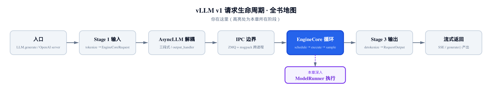
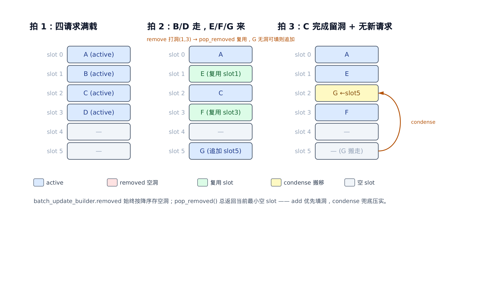
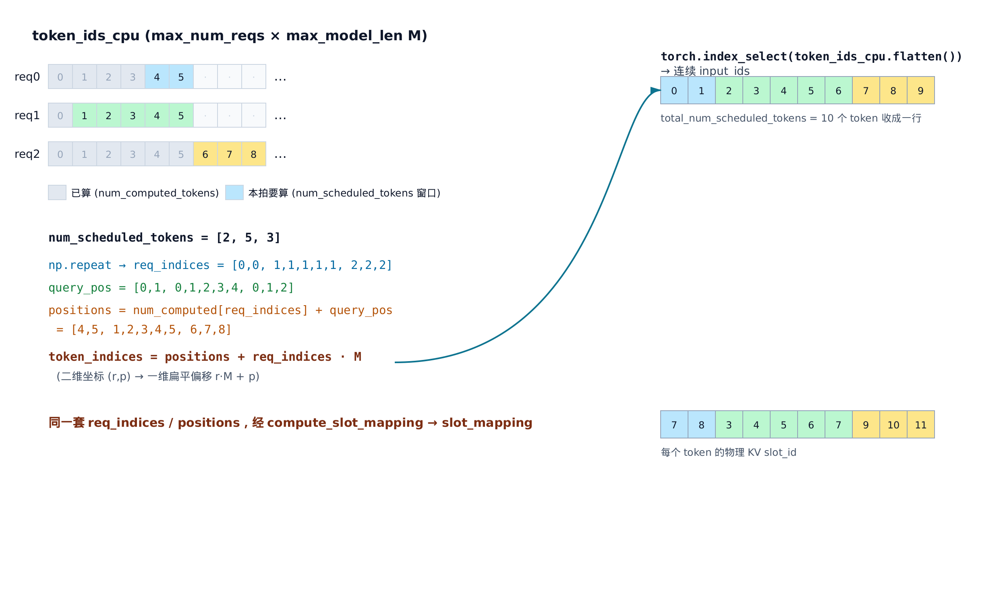
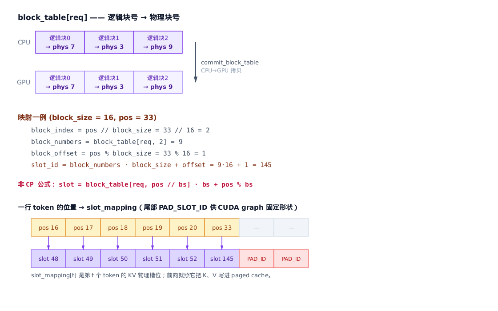

# 第18章　持久化批次与输入准备：把一张工单翻译成张量

## 你在这里



> 上一章把「指令送达 worker」讲透了。
> 本章推开 worker 的门：一张 `SchedulerOutput` 怎样变成喂给模型的 `input_ids`、`positions`、`slot_mapping`。
> 下一章接着讲前向之后——采样、把新 token 写回、跨拍续跑。

[上一章](../ch17-worker-and-executor/narrative/chapter.md)里，引擎大脑对着 N 个 worker 说话，就像对着一个函数说话。`collective_rpc` 把 `SchedulerOutput` 广播下去，每个 worker 的 `execute_model` 被调起。

可工单送到之后呢？`SchedulerOutput` 是一张**调度决策清单**：哪些请求本拍要算、各算几个 token、新分了哪些 KV 块。它不是张量。模型要的是连续的 `input_ids`、每个 token 的绝对 `positions`、每个 token 该往哪个物理 KV 槽写的 `slot_mapping`。

把清单翻译成张量，是 `GPUModelRunner` 的活。这一章就盯着它每拍干的两件事：

- **`_update_states`**：拿 `SchedulerOutput` 当差量，增量地维护一个**跨迭代存活的 `InputBatch`**——不每拍重建。
- **`_prepare_inputs`**：从这个持久批次里，用纯索引算术一次性收集出 `input_ids`、`positions`、`slot_mapping`，装配成 attention 后端要的元数据。

主角是 `InputBatch` 这个**持久批次**：一个横跨所有迭代、靠复用 slot 活下来的多请求容器。理解它，就理解了 vLLM 为什么能在高吞吐下让 CPU 端的簿记开销几乎为零。

本章的代码主线落在三处：`vllm/v1/worker/gpu_model_runner.py`（每拍编排）、`vllm/v1/worker/gpu_input_batch.py`（持久批次）、`vllm/v1/worker/block_table.py`（块表与 slot 映射）。

---

## 18.1 每拍的入口：先调和状态，再准备输入

先看 `execute_model` 怎么把这两件事串起来。剥掉分布式与投机解码的旁路，主干就这么几行：

```python
# vllm/v1/worker/gpu_model_runner.py:L3855
@torch.inference_mode()
def execute_model(
    self,
    scheduler_output: "SchedulerOutput",
    ...
) -> ModelRunnerOutput | ...:
    with record_function_or_nullcontext("Preprocess"):
        with self.synchronize_input_prep():
            # Update persistent batch states.
            self._update_states(scheduler_output)
            if not scheduler_output.total_num_scheduled_tokens:
                # No tokens to compute: return empty output early.
                ...
            # Prepare the decoder inputs.
            (attn_metadata, logits_indices, spec_decode_metadata, ...
            ) = self._prepare_inputs(scheduler_output)
    # … 省略：前向、采样、bookkeeping（下一章） …
```

顺序是关键：**先 `_update_states`，再 `_prepare_inputs`**。前者把这一拍的增删改落进持久批次，让批次的状态与调度器一致；后者才从这个已经对齐的批次里读数据、拼张量。两步之间有一道隐含契约——`_prepare_inputs` 假设 `_update_states` 已经把 `[0, num_reqs)` 这段索引收拾得**连续、无空洞、顺序与调度器一致**。这道契约怎么维持，是本章下半场的主线。

注意外层那个 `synchronize_input_prep()` 上下文。准备输入这一段会发起若干 CPU→GPU 异步拷贝，它保证这些拷贝在前向真正读数据前完成。我们不展开它，只记住：**准备输入是一段精心编排的 CPU 工作 + 异步拷贝**，目标是把数据搬到 GPU 时尽量与 CPU 计算重叠。

---

## 18.2 为什么不每拍重建：持久批次的赌注

最朴素的实现是：每一拍，照着 `SchedulerOutput` 从头建一个批次——开一块缓冲，把本拍每个请求的 token、采样参数、块表统统写一遍，前向完就扔。简单，但浪费。

浪费在哪？vLLM 在 `_update_states` 的注释里把这个设计决策的赌注写得很直白：

```python
# vllm/v1/worker/gpu_model_runner.py:L1129
# NOTE(woosuk): The persistent batch optimization assumes that
# consecutive batches contain mostly the same requests. If batches
# have low request overlap (e.g., alternating between two distinct
# sets of requests), this optimization becomes very inefficient.
```

**连续两拍的请求集合高度重叠。** 想想一批正在 decode 的请求：每拍每个请求只吐 1 个 token，请求集合几乎原样保留到下一拍。偶尔有一两个请求完成、一两个新请求加入——变化量很小。

既然变化小，那每拍重写整块缓冲就是在做无用功。持久批次的策略是：**让批次跨迭代活着，每拍只对差量动手**。新增的请求找个空位写进去，完成的请求标记一下腾出位子，其余原封不动。CPU 的开销于是与「变化量」成正比，而不是与「批大小」成正比。

这是一笔赌注：赌请求集合稳定。注释也老实承认，要是请求频繁增删、批次剧烈抖动，这套机制反而引入开销。但生产负载下，decode 请求长期驻留是常态，这笔赌注几乎总是赢。

那这个「活着的批次」长什么样？它是 `InputBatch`，一个固定形状的多请求容器：

```python
# vllm/v1/worker/gpu_input_batch.py:L62
self.token_ids_cpu_tensor = torch.zeros(
    (max_num_reqs, max_model_len),
    device="cpu",
    dtype=torch.int32,
    pin_memory=self.pin_memory,
)
self.token_ids_cpu = self.token_ids_cpu_tensor.numpy()
```

核心就是这块 `token_ids_cpu`：一个 `max_num_reqs × max_model_len` 的二维 int32 缓冲，**一行存一个请求的全长 token 序列**。除它之外，`InputBatch` 还并排维护一组同样按行索引的 CPU 镜像——`num_computed_tokens_cpu`（每请求已算多少 token）、`num_prompt_tokens`、`num_tokens_no_spec`、块表、整套采样参数列、以及 `req_id_to_index`（请求 ID → 行号映射）。

「一行一请求」这个布局是一切的地基。它让「请求 r 的第 p 个 token」永远落在固定的 `(r, p)` 位置，于是增删请求、收集 token 都退化成**纯索引算术**，不需要任何动态分配。代价是内存——源码自己也标了 TODO，说 `max_model_len` 很大时这块缓冲会过大。但换来的是机制上的极致简单。

行号（slot）就是请求在这个批次里的身份证。整个 `_update_states` 干的事，归根结底就是**管理这些 slot 的分配与回收**，让持久批次始终映射调度器的最新决策。下面三节拆开看。

---

## 18.3 _update_states 之一：用 SchedulerOutput 当差量

`_update_states` 开篇就处理「离开的请求」。`SchedulerOutput` 带来两类要从批次里抹掉的请求：已经**完成**的，以及本拍**没被调度**的（被抢占、或排不上号）。

```python
# vllm/v1/worker/gpu_model_runner.py:L1073
def _update_states(self, scheduler_output: "SchedulerOutput") -> Callable | None:
    # Remove finished requests from the cached states.
    for req_id in scheduler_output.finished_req_ids:
        self.requests.pop(req_id, None)
        self.num_prompt_logprobs.pop(req_id, None)
    # … 省略：迟交互池化清理、多模态 encoder cache 释放 …

    # Remove the finished requests from the persistent batch.
    for req_id in scheduler_output.finished_req_ids:
        self.input_batch.remove_request(req_id)
    # … 省略：关于 abort+resubmit 同 ID、reset_prefix_cache 强制抢占的注释 …

    # Remove the unscheduled requests from the persistent batch.
    scheduled_req_ids = scheduler_output.num_scheduled_tokens.keys()
    cached_req_ids = self.input_batch.req_id_to_index.keys()
    resumed_req_ids = scheduler_output.scheduled_cached_reqs.resumed_req_ids
    unscheduled_req_ids = cached_req_ids - (scheduled_req_ids - resumed_req_ids)
    for req_id in unscheduled_req_ids:
        self.input_batch.remove_request(req_id)
```

这里有两层缓存要分清：

- `self.requests`：一个 `req_id → CachedRequestState` 的字典，是 worker 端**全量**的请求快照。
- `self.input_batch`：本拍真正要前向的**持久批次**，只装当前活跃的那些。

完成的请求从两边都删。「未被调度」的请求则只从持久批次里 `remove_request`——它的快照还留在 `self.requests` 里，因为被抢占的请求以后还会回来，快照留着省得重建。

那一行集合运算值得停一下：

```python
unscheduled_req_ids = cached_req_ids - (scheduled_req_ids - resumed_req_ids)
```

`cached_req_ids` 是当前批次里的所有请求，`scheduled_req_ids` 是本拍被调度的请求。本该是「在批次里但没被调度」= `cached - scheduled`。为什么还要先减掉 `resumed_req_ids`？因为**恢复的请求**（上拍被抢占、本拍重新调度）虽然出现在 `scheduled_req_ids` 里，但它当前**不在**持久批次中——它得走「新增」路径重新加回去。把它从 `scheduled` 里剔除，是为了不让它被误判成「还在批次里」，从而保证它后面能被当作新请求重新 `add`。一行集合代数，干净地分清了「留」「删」「重加」三种命运。

接着是「到来的请求」。本拍全新的请求，要先建快照、再排队等并入批次：

```python
# vllm/v1/worker/gpu_model_runner.py:L1146
reqs_to_add: list[CachedRequestState] = []
# Add new requests to the cached states.
for new_req_data in scheduler_output.scheduled_new_reqs:
    req_id = new_req_data.req_id
    # … 省略：sampling/pooling 参数构造、RANDOM_SEED generator …
    req_state = CachedRequestState(
        req_id=req_id,
        prompt_token_ids=new_req_data.prompt_token_ids,
        sampling_params=sampling_params,
        generator=generator,
        block_ids=new_req_data.block_ids,
        num_computed_tokens=new_req_data.num_computed_tokens,
        output_token_ids=[],
        # … 省略：mm_features、lora_request 等字段 …
    )
    self.requests[req_id] = req_state
    reqs_to_add.append(req_state)
```

`CachedRequestState` 是 worker 端的单请求快照——prompt token、已生成的 output token、每个 KV group 的块号列表、已算 token 数、采样参数。它存进 `self.requests`，又被推进 `reqs_to_add` 待会儿统一并入持久批次。

这就解释了[第 13 章 §13.5](../ch13-scheduler/narrative/chapter.md) 那个「全量发一次、之后只发 diff」的设计为什么成立：**worker 缓存了每个请求的完整快照**，所以调度器后续每拍只需发增量——已算了多少 token、新分了哪些块——worker 拿差量就地更新快照即可，不必反复传整个请求。`CachedRequestState` 正是接住这份增量的容器。

> **v0.21.0 更新**：这条「快照随请求存活、slot 行随批次进出」的归属原则，在 v0.21.0 多收编了一个字段。prompt logprobs 在 chunked prefill 下要跨多个 prefill 分块累积一份在途张量；基线把它存在 `InputBatch` 的一个 `req_id → LogprobsTensors` 批次级字典里，随 slot 的 `remove_request` pop。问题是请求一旦被驱逐再恢复，这份在途累积就跟着 slot 丢了（#41411）。v0.21.0 把它挪进 `CachedRequestState.in_progress_prompt_logprobs_cpu`——即 `self.requests[req_id]` 这一层、跨 slot 进出始终存活的请求快照。生命周期从此跟着请求走、而非跟着 slot 行走，于是 chunked prefill 的驱逐与恢复中不再丢累积。又一个「易变的归批次、要存活的归快照」的例子。

---

## 18.4 _update_states 之二：在途请求就地更新 + 统一并入

新请求建好了快照，还没真正进批次。在那之前，先处理**在途请求**——上拍就在跑、本拍继续算的那些。调度器为它们只发增量：本拍它们已算到第几个 token、新分了哪些块、有没有投机 token。

```python
# vllm/v1/worker/gpu_model_runner.py:L1236
req_data = scheduler_output.scheduled_cached_reqs
scheduled_spec_tokens = scheduler_output.scheduled_spec_decode_tokens
for i, req_id in enumerate(req_data.req_ids):
    req_state = self.requests[req_id]
    num_computed_tokens = req_data.num_computed_tokens[i]
    new_block_ids = req_data.new_block_ids[i]
    resumed_from_preemption = req_id in req_data.resumed_req_ids
    req_index = self.input_batch.req_id_to_index.get(req_id)
    # … 省略：异步投机解码的乐观计数修正 …

    # Update the cached states.
    req_state.num_computed_tokens = num_computed_tokens

    # Update the block IDs.
    if not resumed_from_preemption:
        if new_block_ids is not None:
            # Append the new blocks to the existing block IDs.
            for block_ids, new_ids in zip(req_state.block_ids, new_block_ids):
                block_ids.extend(new_ids)
    else:
        # The request is resumed from preemption.
        # Replace the existing block IDs with the new ones.
        req_state.block_ids = new_block_ids

    if req_index is None:
        # The request is not in the persistent batch.
        # ... add it later.
        reqs_to_add.append(req_state)
        continue

    # Update the persistent batch.
    self.input_batch.num_computed_tokens_cpu[req_index] = num_computed_tokens
    if new_block_ids is not None:
        self.input_batch.block_table.append_row(new_block_ids, req_index)
    # … 省略：非末 PP rank 的 token 回填 …
    self.input_batch.update_req_spec_token_ids(req_state, scheduled_spec_tokens)
```

这段逻辑分两步对每个在途请求做。

**第一步，更新快照。** `num_computed_tokens` 直接覆盖。块号则分两种情况：正常推进的请求**追加**新块到已有列表（`block_ids.extend`），而**从抢占恢复**的请求是整列**替换**——因为它被抢时块全被回收了，恢复时拿的是全新一批块。

**第二步，就地更新持久批次。** 这里有个分叉：`req_index = req_id_to_index.get(req_id)` 拿到这个请求在持久批次里的行号。

- 若 `req_index is None`——请求不在批次里（典型是从抢占恢复的）——推进 `reqs_to_add`，走和新请求一样的「待并入」路径。
- 若 `req_index` 有值——请求就在批次里——那就**只改它那一行**:`num_computed_tokens_cpu[req_index]` 赋新值，`block_table.append_row` 把新块号追加到它的块表行。

看清楚这个「只改一行」：这就是持久批次省钱的地方。一个正在 decode 的请求，本拍的全部更新就是改一个标量 + 往块表行尾追加 0~1 个块号。没有重建，没有拷贝整行 token。

处理完所有在途请求，`reqs_to_add` 里攒齐了「新请求 + 恢复请求」。最后统一收尾：

```python
# vllm/v1/worker/gpu_model_runner.py:L1384
# Add the new or resumed requests to the persistent batch.
# The smaller empty indices are filled first.
for request in reqs_to_add:
    self.input_batch.add_request(request)
    self.input_batch.update_req_spec_token_ids(request, scheduled_spec_tokens)
# Condense the batched states if there are gaps left by removed requests
self.input_batch.condense()
# Allow attention backend to reorder the batch, potentially
self._may_reorder_batch(scheduler_output)
# Refresh batch metadata with any pending updates.
self.input_batch.refresh_metadata()
```

四步收尾，是本章机制的精华：

1. **`add_request`** 逐个把待并入的请求写进批次——「smaller empty indices are filled first」这句注释，就是下一节要拆的 slot 复用。
2. **`condense`** 把移除留下的空洞压实，让 `[0, num_reqs)` 重新连续。
3. **`_may_reorder_batch`** 给 attention 后端一个重排批次的机会（某些后端要求特定顺序）。
4. **`refresh_metadata`** 在批次有任何增删改后，重建 `SamplingMetadata`——采样参数张量得跟着 slot 的变动重新对齐（全量装配是采样章的事，这里只需知道「批变则刷新」）。

`add_request` + `condense` 这对组合，是「不每拍重建」的真正实现。下一节专门拆它。

---

## 18.5 slot 的回收与复用：打洞、复用、压实

把上一节的 `remove_request` / `add_request` / `condense` 三件事连起来看，会发现它们构成一套**两段式的 slot 回收**：移除时只「打洞」不搬数据，新增时优先「填洞」，实在填不满才统一「压实」。

先看 `remove_request` 为什么不搬数据：

```python
# vllm/v1/worker/gpu_input_batch.py:L510
def remove_request(self, req_id: str) -> int | None:
    """This method must always be followed by a call to condense()."""
    req_index = self.req_id_to_index.pop(req_id, None)
    if req_index is None:
        return None
    self.batch_update_builder.removed_append(req_index)
    self._req_ids[req_index] = None
    self.req_output_token_ids[req_index] = None
    self.spec_token_ids[req_index].clear()
    self.block_table.clear_row(req_index)
    # … 省略：LoRA 解绑、各采样参数集合的对称清理 …
```

它做的全是「标记」：解绑 `req_id_to_index` 映射、把该行的请求 ID 置 `None`、清掉块表行，然后——关键一步——把这个行号记进 `batch_update_builder.removed`。**它没有动 `token_ids_cpu` 里的数据，也没有把后面的请求往前搬。** 那行就成了一个「空洞」，等着被复用或压实。

为什么不立刻搬？因为移除时立刻搬移会产生 `O(N)` 的重复拷贝——删一个就搬一片，删几个就搬几片。两段式把搬移推迟、合并，摊还后搬移量最小。

`batch_update_builder` 是这套机制的账本。它把空洞行号存在一个**始终降序**的列表里，提供两个动作：`pop_removed()` 弹出并返回当前**最小**的空洞，`peek_removed()` 只看不弹。降序存储的意思是最小行号压在列表尾部——从尾部弹就等于永远取最小，不需要搜索。「最小空洞优先」是后面一切的基础。

新增请求时，`_register_add_request` 第一件事就是问账本要个空位：

```python
# vllm/v1/worker/gpu_input_batch.py:L309
def _register_add_request(self, request: "CachedRequestState") -> int:
    """Track add-request operations for logits processors."""
    # Fill the next empty index if there is one.
    if (new_req_index := self.batch_update_builder.pop_removed()) is None:
        # Append to end otherwise.
        new_req_index = self.num_reqs
    assert new_req_index < self.max_num_reqs
    self.batch_update_builder.batch_changed = True
    if request.sampling_params:
        self.batch_update_builder.added.append(
            (new_req_index, request.sampling_params,
             request.prompt_token_ids, request.output_token_ids)
        )
    return new_req_index
```

逻辑就两行精华：`pop_removed()` 拿到最小空洞就**复用**它；拿不到（没空洞了）才 `num_reqs` **追加**到末尾。复用空洞意味着——这一拍一个请求走、一个请求来，那个走的请求的 slot 直接被来的请求顶上，**根本不留洞**。

拿到 slot 号后，`add_request` 把请求的数据真正写进那一行：

```python
# vllm/v1/worker/gpu_input_batch.py:L353
# Copy the prompt token ids and output token ids.
num_prompt_tokens = length_from_prompt_token_ids_or_embeds(
    request.prompt_token_ids, request.prompt_embeds
)
self.num_prompt_tokens[req_index] = num_prompt_tokens
start_idx = num_prompt_tokens
end_idx = start_idx + len(request.output_token_ids)
if request.prompt_token_ids is not None:
    self.token_ids_cpu[req_index, :num_prompt_tokens] = request.prompt_token_ids
self.token_ids_cpu[req_index, start_idx:end_idx] = request.output_token_ids
self.is_token_ids[req_index, start_idx:end_idx] = True
# Number of tokens without spec decode tokens.
self.num_tokens_no_spec[req_index] = request.num_tokens
self.num_computed_tokens_cpu[req_index] = request.num_computed_tokens
self.block_table.add_row(request.block_ids, req_index)
# … 省略：把该请求的整套采样参数（temperature/top_p/top_k/penalties/…）写入对应 slot 列 …
```

prompt token 写进 `[0, num_prompt_tokens)`，已有的 output token 接在后面，块号写进块表行，采样参数填进对应列。一行 = 一个请求的全部状态。

最后，当移除的空洞**没被新增填满**时，`condense` 出场把尾部活请求滑下来：

```python
# vllm/v1/worker/gpu_input_batch.py:L683
def condense(self) -> None:
    """Slide non-empty requests down into lower, empty indices."""
    num_reqs = self.num_reqs
    if not (empty_req_indices := self.batch_update_builder.removed):
        # All removed requests were replaced by added requests, or else no
        # requests were removed at all. No condense() needed
        return
    # NOTE: empty_req_indices is sorted in descending order.
    last_req_index = num_reqs + len(empty_req_indices) - 1
    while empty_req_indices:
        # Find the largest non-empty index.
        while last_req_index in empty_req_indices:
            last_req_index -= 1
        # Find the smallest empty index.
        empty_index = self.batch_update_builder.peek_removed()
        if empty_index >= last_req_index:
            break
        # Move active request down into empty request index.
        self.batch_update_builder.pop_removed()
        req_id = self._req_ids[last_req_index]
        self._req_ids[empty_index] = req_id
        self._req_ids[last_req_index] = None
        self.req_id_to_index[req_id] = empty_index
        num_tokens = self._get_active_token_count(last_req_index)
        self.token_ids_cpu[empty_index, :num_tokens] = self.token_ids_cpu[
            last_req_index, :num_tokens
        ]
        self.num_computed_tokens_cpu[empty_index] = self.num_computed_tokens_cpu[
            last_req_index
        ]
        self.block_table.move_row(last_req_index, empty_index)
        # … 省略：各采样参数列的对称搬移、generator/allowed_token_ids 搬移 …
        last_req_index -= 1
```

这个 `while` 循环是「最大活请求填最小空洞」的双指针：每轮取**最大的非空行号** `last_req_index`，把它的数据搬到**最小的空洞** `empty_index`。一旦 `empty_index >= last_req_index`——空洞都跑到活请求后面去了——就 `break`，因为剩下的空洞全在尾部，不用填。

注意 `condense` 的开篇：`if not removed: return`。要是这一拍移除的空洞**全被新增填满了**,`removed` 已经空了，直接返回——一次搬移都不做。这正是注释说的「All removed requests were replaced by added requests」。decode 稳态下来一个走一个，空洞即生即填，`condense` 几乎永远是空转。

还有一处省钱细节：搬移时只拷 `:num_tokens` 这段**活跃前缀**，不拷满 `max_model_len` 整行。一个刚开始 decode 的请求可能只有几百个 token，却住在一个能放几万 token 的行里——只搬这几百个，带宽不浪费在空白上。

把三拍连起来看就清楚了：



> *图注：拍 1 四请求满载。拍 2 中 B、D 完成被打洞（slot 1、3），E、F 到来——`pop_removed()` 让它们直接复用 slot 1、3，无洞无搬移；同到的 G 已无洞可填，追加到末尾的 slot 5。拍 3 中 C 完成留洞且无新请求填补，`condense` 把尾部活请求 G 从 slot 5 搬进 slot 2，使 `[0, num_reqs)` 重新连续。*

**为什么 `condense` 一定会终止？** 看那个不变量：`last_req_index` 每轮要么因内层 `while` 自减、要么因外层尾部 `-= 1` 自减，**严格单调递减的非负整数**。`empty_index` 则单调递增（`removed` 降序弹出，每次弹最小）。两个指针一升一降相向而行，要么 `removed` 弹空、要么 `empty_index >= last_req_index` 触发 `break`——有限步必停。

终止只是一半，还得确认搬移**既不丢请求、也不覆盖活数据**。这靠一条循环不变量撑住：每轮搬移前，`[0, empty_index)` 区间内已无空洞，`(last_req_index, 末尾]` 区间内已无活请求。于是被搬的 `last_req_index` 一定是**待安置的最大活请求**，目标 `empty_index` 一定是**最小空洞**；而循环条件 `empty_index < last_req_index` 保证二者不重叠——源数据是活的、目标格子是空的，搬移既不丢也不重。两个指针每动一步都维持这条不变量，直到相遇。压实后 `[0, num_reqs)` 连续无洞，正好满足 `_prepare_inputs` 那道契约。

这套两段式的复杂度收益是实打实的。设批大小 `R`、最大序列长 `L`、本拍变更（增删移）请求数 `ΔN`：

- **全量重建**：每拍写满 `R × L` 的缓冲与全部采样列，`O(R·L)`。
- **持久批次**：`remove` 只标记 `O(删数)`；`add` 只写新请求那一行 `O(增数 · 该请求 token 数)`；`condense` 最多搬 `O(空洞数)` 个请求、每个只拷活跃前缀。

当 `ΔN ≪ R`、批次重叠度高时，单拍成本从 `O(R·L)` 压到约 `O(ΔN · avg_tokens)`。一个 256 请求、每请求 8K 上下文的批，稳态下每拍可能只变动 1~2 个请求——省下的就是 256×8192 vs 2×几百 的量级差。这就是「不每拍重建」的全部收益。

---

## 18.6 _prepare_inputs：二维坐标拍扁成一维收集

批次状态对齐了，该把数据捞出来拼张量了。`_prepare_inputs` 的核心是一个漂亮的索引技巧：把「请求 r 的第 p 个 token」这个二维坐标，拍扁成一维偏移，然后用一次 `index_select` 把本拍要算的所有 token 收集成连续的 `input_ids`。

```python
# vllm/v1/worker/gpu_model_runner.py:L1832
num_reqs = self.input_batch.num_reqs
# OPTIMIZATION: Start copying the block table first.
# This way, we can overlap the copy with the following CPU operations.
self.input_batch.block_table.commit_block_table(num_reqs)

# Get request indices.
# E.g., [2, 5, 3] -> [0, 0, 1, 1, 1, 1, 1, 2, 2, 2]
req_indices = np.repeat(self.arange_np[:num_reqs], num_scheduled_tokens)

# cu_num_tokens: [2, 5, 3] -> [2, 7, 10]
# self.query_pos.np[:10]: [0, 1, 0, 1, 2, 3, 4, 0, 1, 2]
cu_num_tokens = self._get_cumsum_and_arange(
    num_scheduled_tokens, self.query_pos.np
)

# Get positions.
positions_np = (
    self.input_batch.num_computed_tokens_cpu[req_indices]
    + self.query_pos.np[: cu_num_tokens[-1]]
)

# Get token indices.
# E.g., [0, 1, 0, 1, 2, 3, 4, 0, 1, 2]
# -> [0, 1, M, M + 1, ..., 2 * M, 2 * M + 1, 2 * M + 2]  where M is max_model_len.
token_indices = (
    positions_np + req_indices * self.input_batch.token_ids_cpu.shape[1]
)
token_indices_tensor = torch.from_numpy(token_indices)

# NOTE(woosuk): torch.index_select is much faster than np.take.
torch.index_select(
    self.input_batch.token_ids_cpu_tensor.flatten(),
    0,
    token_indices_tensor,
    out=self.input_ids.cpu[:total_num_scheduled_tokens],
)
```

跟着一组具体数字走一遍。假设本拍三个请求，`num_scheduled_tokens = [2, 5, 3]`——req0 算 2 个 token、req1 算 5 个、req2 算 3 个。

**第一行就埋了个优化**:`commit_block_table` 把块表从 CPU 镜像拷到 GPU，放在最前面。为什么是最前？因为这是个异步拷贝，放在最前能让它与紧接着的 `np.repeat`、`index_select` 等 CPU 工作**重叠**，把 PCIe 延迟藏进 CPU 计算的影子里。下一节细说这个双镜像。

**`np.repeat` 展开请求索引。** `[2, 5, 3]` → `req_indices = [0,0, 1,1,1,1,1, 2,2,2]`。每个要算的 token 都标上它属于哪个请求。

**`_get_cumsum_and_arange` 一箭双雕。** 三步推出两个数组：① `np.cumsum([2,5,3])` → `cu_num_tokens = [2, 7, 10]`；② `np.repeat(cu_num_tokens - [2,5,3], [2,5,3])` → `[0,0, 2,2,2,2,2, 7,7,7]`（每个 token 对应的组起点）；③ `arange[:10] - 组起点` → `query_pos = [0,1, 0,1,2,3,4, 0,1,2]`（每个 token 的请求内偏移）。全程无循环，把 `np.concatenate([np.arange(n) for n in num_tokens])` 的逐段生成替换为向量减法。`cu_num_tokens` 和 `query_pos` 是这三步的两个输出，所以叫「一箭双雕」。

**算绝对位置。** `positions = num_computed_tokens[req_indices] + query_pos`。每个请求本拍从它「已算到第几个 token」起步，加上请求内偏移，就是 token 的绝对位置。假设三个请求已算 `[4, 1, 6]` 个 token，那 `positions = [4,5, 1,2,3,4,5, 6,7,8]`。

这个公式值得品一下。[第 13 章 §13.1](../ch13-scheduler/narrative/chapter.md) 讲过调度器「不分 prefill/decode 相」——一个请求眼里只有 `num_computed_tokens` 在追 `num_tokens`。这里的位置计算正是那个 token-centric 模型在 worker 端的延续：**没有离散的阶段**，绝对位置永远是「已算的 + 本拍内偏移」。chunked prefill 是 `num_scheduled_tokens` 大，decode 是它等于 1，公式一字不改吃下所有情况。

**拍扁成一维。** 这是技巧的核心。`token_ids_cpu` 是 `(R, L)` 的二维行优先缓冲，元素 `(r, p)` 的扁平偏移就是 `r·L + p`(`L` = `max_model_len`)。所以：

$$
\mathrm{token\_indices}[i] = \mathrm{positions}[i] + \mathrm{req\_indices}[i] \times L
$$

一句话翻译：**把「第几个请求、第几个位置」这对二维坐标，换算成它在拉直后的一维大数组里的偏移。** 换算完，一次 `torch.index_select` 就把散落在不同行、不同列的 token 全捞进连续的 `input_ids`。注释专门点名用 `index_select` 而非 `np.take`——大张量上前者实测快得多。



> *图注：左边 `token_ids_cpu` 二维网格，灰格是各请求已算的前缀，彩格是本拍要算的窗口。中间三步索引算术：`np.repeat` 出 `req_indices`、`query_pos` 出请求内偏移、`token_indices = positions + req_indices·M` 拍扁。右边 `index_select` 把分散窗口收成一行连续 `input_ids`。底部：同一套 `req_indices`/`positions` 经 `compute_slot_mapping` 产出 `slot_mapping`——一份坐标，两处复用。*

---

## 18.7 位置、序列长与 slot_mapping：装配 attention 输入

收集完 `input_ids`，还差 attention 后端要的几样：每请求的 token 边界 `query_start_loc`、每请求当前序列长 `seq_lens`、每 token 该写哪个物理 KV 槽的 `slot_mapping`。

```python
# vllm/v1/worker/gpu_model_runner.py:L1929
# Prepare the attention metadata.
self.query_start_loc.np[0] = 0
self.query_start_loc.np[1 : num_reqs + 1] = cu_num_tokens
# Note: pad query_start_loc to be non-decreasing, as kernels
# like FlashAttention requires that
self.query_start_loc.np[num_reqs + 1 :].fill(cu_num_tokens[-1])
self.query_start_loc.copy_to_gpu()

self.num_computed_tokens[:num_reqs].copy_(
    self.input_batch.num_computed_tokens_cpu_tensor[:num_reqs],
    non_blocking=True,
)
self.positions[:total_num_scheduled_tokens] = (
    self.num_computed_tokens[req_indices_gpu].to(torch.int64)
    + self.query_pos.gpu[:total_num_scheduled_tokens]
)
self.seq_lens[:num_reqs] = (
    self.num_computed_tokens[:num_reqs] + num_scheduled_tokens_gpu
)
self.seq_lens[num_reqs:].fill_(0)
self.input_batch.block_table.compute_slot_mapping(
    num_reqs,
    self.query_start_loc.gpu[: num_reqs + 1],
    self.positions[:total_num_scheduled_tokens],
)
# Copy the tensors to the GPU.
self._prepare_input_ids(
    scheduler_output, num_reqs, total_num_scheduled_tokens, cu_num_tokens,
)
```

`query_start_loc` 就是 `[0]` 接上 `cu_num_tokens`——`[0, 2, 7, 10]`，标出每个请求的 token 在扁平 `input_ids` 里从哪到哪。末尾那行 `fill(cu_num_tokens[-1])` 把没用到的尾部 padding 成最后一个累积值，保证整个数组**非递减**——FlashAttention 这类 kernel 要求边界数组单调不减，否则越界。

`positions` 和上一节 CPU 端同公式，只是这回在 GPU 上算。`seq_lens` = 已算 + 本拍要算，是每请求的当前总长，attention 用它界定每个请求能看多远。

重头是 `compute_slot_mapping`——它把每个 token 的绝对位置映射成 KV cache 里的物理槽号。这是 PagedAttention 的落点，单独一节讲。

最后 `_build_attention_metadata` 把这些张量收束成 attention 后端的统一接口：

```python
# vllm/v1/worker/gpu_model_runner.py:L2166
def _get_block_table(kv_cache_gid: int):
    blk_table = self.input_batch.block_table[kv_cache_gid]
    blk_table_tensor = blk_table.get_device_tensor(num_reqs_padded)
    # Fill unused block table entries with NULL_BLOCK_ID for CUDAGraph padding.
    blk_table_tensor[num_reqs:num_reqs_padded].fill_(NULL_BLOCK_ID)
    return blk_table_tensor

cm_base = CommonAttentionMetadata(
    query_start_loc=self.query_start_loc.gpu[: num_reqs_padded + 1],
    seq_lens=self.seq_lens[:num_reqs_padded],
    num_reqs=num_reqs_padded,
    num_actual_tokens=num_tokens_padded,
    block_table_tensor=_get_block_table(0),
    slot_mapping=slot_mappings[0],
    causal=True,
    positions=self.positions[:num_tokens_padded],
    # … 省略：max_query_len、is_prefilling 等字段 …
)
```

`get_device_tensor` 取的就是持久批次块表的 **GPU 端镜像**——上一节最前面那个 `commit_block_table` 拷过去的东西，此刻正好用上。`CommonAttentionMetadata` 把 `query_start_loc`、`seq_lens`、`block_table_tensor`、`slot_mapping`、`positions` 打包成一个与具体 attention 实现解耦的结构，交给后端。后端怎么用这些张量做 PagedAttention，是后续 attention 实现章的事——这里我们只负责把它们**正确地装配出来**。

---

## 18.8 block_table 的 CPU/GPU 双镜像与 position→slot 映射

`slot_mapping` 是把逻辑位置接到物理 KV 显存的最后一公里。要讲清它，得先看 `block_table` 为什么维护 CPU、GPU 两份镜像。

块号的更新发生在 `_update_states` 阶段——`append_row` 往请求的块表行追加新分配的块号。这是 CPU numpy 操作，最廉价：

```python
# vllm/v1/worker/block_table.py:L102
def append_row(self, block_ids: list[int], row_idx: int) -> None:
    if not block_ids:
        return
    # … 省略：hybrid kernel block 的块号细分（等块大小时跳过）…
    num_blocks = len(block_ids)
    start = self.num_blocks_per_row[row_idx]
    self.num_blocks_per_row[row_idx] += num_blocks
    self.block_table.np[row_idx, start : start + num_blocks] = block_ids

def add_row(self, block_ids: list[int], row_idx: int) -> None:
    self.num_blocks_per_row[row_idx] = 0
    self.append_row(block_ids, row_idx)

def move_row(self, src: int, tgt: int) -> None:
    num_blocks = self.num_blocks_per_row[src]
    block_table_np = self.block_table.np
    block_table_np[tgt, :num_blocks] = block_table_np[src, :num_blocks]
    self.num_blocks_per_row[tgt] = num_blocks

def commit_block_table(self, num_reqs: int) -> None:
    self.block_table.copy_to_gpu(num_reqs)
```

`append_row` / `add_row` / `move_row` 全改 CPU 镜像 `block_table.np`——`append_row` 追加块号，`add_row` 重置后写（新请求）,`move_row` 是 `condense` 搬行时同步搬块表。它们都廉价，因为只动 numpy。

> **v0.21.0 更新**：这张表的列数由每组 `max_num_blocks` 定。v0.21.0 起，构造 `MultiGroupBlockTable` 时会把每个 KV cache group 的 `max_num_blocks` 向上对齐到 `128 / block_size` 的整数倍（`block_size ≤ 128` 时 `cdiv(n, 128//bs) * (128//bs)`，否则原样，#39324）——因为 TRTLLM MLA 等部分 attention 后端对 block table 的列数有 128 元素对齐的边角要求。对常规 `block_size` 这只会略微抬高列数，双镜像的语义与上面这套增量写法都不受影响。

但前向要的是 GPU 上的块表。于是 `commit_block_table` 把整个 CPU 镜像**批量**拷到 GPU。这就是上一节 `_prepare_inputs` 开头那个 `commit_block_table`——所有块号在 `_update_states` 里以最廉价的 CPU 增量写好，到 `_prepare_inputs` 一次性刷到 GPU，还故意放在最前面与后续 CPU 工作重叠。**CPU 改、批量 commit、GPU 用**，职责清清楚楚。

GPU 块表就位，`compute_slot_mapping` 启动 Triton kernel 算物理槽：

```python
# vllm/v1/worker/block_table.py:L141
def compute_slot_mapping(self, num_reqs, query_start_loc, positions) -> None:
    num_tokens = positions.shape[0]
    total_cp_world_size = self.pcp_world_size * self.dcp_world_size
    total_cp_rank = self.pcp_rank * self.dcp_world_size + self.dcp_rank
    _compute_slot_mapping_kernel[(num_reqs + 1,)](
        num_tokens, self.max_num_batched_tokens,
        query_start_loc, positions,
        self.block_table.gpu, self.block_table.gpu.stride(0),
        self.block_size, self.slot_mapping.gpu,
        TOTAL_CP_WORLD_SIZE=total_cp_world_size, TOTAL_CP_RANK=total_cp_rank,
        CP_KV_CACHE_INTERLEAVE_SIZE=self.cp_kv_cache_interleave_size,
        PAD_ID=PAD_SLOT_ID, BLOCK_SIZE=1024,
    )
```

注意 grid 是 `(num_reqs + 1,)`——`num_reqs` 个 program 各管一个请求，**外加一个**专门收尾。kernel 本体：

```python
# vllm/v1/worker/block_table.py:L341
req_idx = tl.program_id(0)
if req_idx == tl.num_programs(0) - 1:
    # Pad remaining slots for CUDA graph compatibility.
    for i in range(num_tokens, max_num_tokens, BLOCK_SIZE):
        offsets = i + tl.arange(0, BLOCK_SIZE)
        tl.store(slot_mapping_ptr + offsets, PAD_ID, mask=offsets < max_num_tokens)
    return
start_idx = tl.load(query_start_loc_ptr + req_idx).to(tl.int64)
end_idx = tl.load(query_start_loc_ptr + req_idx + 1).to(tl.int64)
virtual_block_size = block_size * TOTAL_CP_WORLD_SIZE
row_offset = req_idx * block_table_stride
for i in range(start_idx, end_idx, BLOCK_SIZE):
    offsets = i + tl.arange(0, BLOCK_SIZE)
    mask = offsets < end_idx
    pos = tl.load(positions_ptr + offsets, mask=mask, other=0)
    block_indices = pos // virtual_block_size
    block_numbers = tl.load(block_table_ptr + row_offset + block_indices).to(tl.int64)
    # … 省略：上下文并行(CP)分片下的 is_local 判定与本地块内偏移折算 …
    slot_ids = block_numbers * block_size + local_block_offsets
    tl.store(slot_mapping_ptr + offsets, slot_ids, mask=mask)
```

把上下文并行的旁路折叠掉（单 rank 时 `TOTAL_CP_WORLD_SIZE = 1`，`virtual_block_size` 退化成 `block_size`，`local_block_offsets` 退化成 `pos % block_size`），映射公式就清爽了：

$$
\mathrm{slot\_id} = \mathrm{block\_table}[\mathrm{req}, \lfloor \mathrm{pos} / \mathrm{bs} \rfloor] \times \mathrm{bs} + (\mathrm{pos} \bmod \mathrm{bs})
$$

一句话翻译：**token 的绝对位置 `pos`，落在它第 `pos // bs` 个逻辑块、块内第 `pos % bs` 格。查块表把逻辑块号换成物理块号，再乘块大小加块内偏移，就是它在 KV 显存里的物理槽。**

数值走一遍。设 `block_size = 16`，某 token `pos = 33`:

- `block_index = 33 // 16 = 2`——落在第 2 个逻辑块。
- `block_numbers = block_table[req, 2] = 9`——查表，这个逻辑块映射到物理块 9。
- `block_offset = 33 % 16 = 1`——块内第 1 格。
- `slot_id = 9 × 16 + 1 = 145`——它的 K、V 就写 KV cache 第 145 槽。



> *图注：上半 `block_table[req]` 把逻辑块号映射到物理块号，`commit_block_table` 把这张表从 CPU 镜像拷到 GPU 镜像。中间一例 `pos=33` 走完四步算出 `slot_id=145`。下半一行 token 各自映射到物理槽，尾部由最后一个 program 填 `PAD_SLOT_ID`——给 CUDA graph 留固定形状。*

最后那个「外加的 program」（`req_idx == num_programs - 1`）只干一件事：把 `[num_tokens, max_num_batched_tokens)` 这段尾部全填 `PAD_SLOT_ID`。为什么？CUDA graph 要求每拍的张量形状固定才能捕获重放。真实 token 数每拍不同，于是把尾部 padding 成定长、填上无害的 PAD 槽，让 batch 形状恒定可捕获。slot 映射对每个 token 独立、天然并行，放 GPU 算正合适——这也是它用 Triton kernel 而非 CPU 循环的原因。

---

## 18.9 交叉验证：在数值上看持久批次收敛

上面所有索引算术，都可以剥掉 CUDA 在纯 CPU 上跑一遍看数值。把真实 vLLM 删掉所有非主线分支（多模态 RoPE、prompt_embeds、投机解码、pooling、LoRA、分布式、混合块），得到的精简版与源码同名、同结构、同控制流，正好用来「跑起来看数值」。

slot 复用与压实这套两段式，可以脱离 GPU 直接验：

```python
# 持久批次：移除打洞不立即压实，新增优先复用最小空 slot
def test_remove_punches_hole_without_compacting():
    batch = make_batch(max_num_reqs=4)
    for rid in ["A", "B", "C", "D"]:
        batch.add_request(make_req(rid))
    batch.remove_request("B")          # 打洞 slot 1
    assert batch.req_id_to_index == {"A": 0, "C": 2, "D": 3}
    assert batch.batch_update_builder.removed == [1]   # 洞记在账本，数据没搬

def test_add_reuses_smallest_empty_slot():
    # 接上：来了个 E，应直接复用 slot 1，而不是追加到 slot 4
    batch.add_request(make_req("E"))
    assert batch.req_id_to_index["E"] == 1
```

这两个断言把 §18.5 的机制钉死了：`remove` 后 `removed = [1]` 而 `req_id_to_index` 里只是少了 B——证明**洞被标记、数据没搬**；接着 `add("E")` 让 E 落在 slot 1 而非 slot 4——证明 `pop_removed()` 确实**复用了最小空洞**。这里只打了一个洞，看不出账本的排序约定；多个洞时 `removed` 始终按**降序**存——比如同拍移除 B、D 会得到 `removed = [3, 1]`，`pop_removed()` 总从尾部弹出最小的那个，与 §18.5「最小空洞优先」严丝合缝。

token 收集的拍扁公式也能逐元素核对：

```python
# 二维 (req, pos) 坐标 → 一维扁平 token_indices
def test_token_index_flattening():
    num_scheduled = np.array([2, 5, 3])
    num_computed  = np.array([4, 1, 6])
    M = 8192
    req_indices = np.repeat(np.arange(3), num_scheduled)
    # [0,0, 1,1,1,1,1, 2,2,2]
    query_pos = build_query_pos(num_scheduled)
    # [0,1, 0,1,2,3,4, 0,1,2]
    positions = num_computed[req_indices] + query_pos
    token_indices = positions + req_indices * M
    # req1 第一个 token: pos=1, 扁平偏移 = 1 + 1*8192 = 8193
    assert token_indices[2] == 8193
```

`req1` 第一个要算的 token 绝对位置是 1，它住在 `token_ids_cpu` 第 1 行第 1 列，拍扁后的偏移就是 `1 + 1×8192 = 8193`——和 §18.6 的公式一字不差。

至于 §18.8 那个 `slot_id = block_table[req, pos//bs]·bs + pos%bs`，精简版把真实的 `@triton.jit` kernel 原样保留（只折掉 CP 分支），在有 CUDA 的机器上能直接拉起来，对 `pos=33 → slot=145` 这类样例逐个核对。这些验证不是主角——它们只是让你确信：正文逐段解读的那套索引算术，在真实数值上严丝合缝地收敛。

---

## 18.10 本章总结：持久批次，把工单翻译成张量

回头看这一章，`GPUModelRunner` 每拍只解决一件事：**把 `SchedulerOutput` 这张调度清单，翻译成模型能吃的张量**。这件事被一个核心数据结构托起——跨迭代存活的持久批次 `InputBatch`。

- **不每拍重建** 是全章的赌注：连续两拍请求高度重叠，所以只对差量动手。`_update_states` 拿 `SchedulerOutput` 当 diff，完成的请求打洞、在途的请求就地改一行、新来的请求填洞或追加。CPU 开销与变更量成正比，而非与批大小成正比。
- **两段式 slot 回收** 是机制核心：`remove_request` 只标记空洞不搬数据，`add_request` 经 `pop_removed()` 优先复用最小空洞，`condense` 在洞没填满时用相向双指针一次压实。摊还后搬移量最小，且 `condense` 的单调量保证它有限步必停、终态连续无洞。
- **拍扁收集** 是 `_prepare_inputs` 的精髓：把 `(req, pos)` 二维坐标换算成 `pos + req·M` 的一维偏移，一次 `index_select` 收集全部 `input_ids`。位置统一用 `num_computed + 请求内偏移`，无缝吃下 prefill/chunked/decode——这是调度器 token-centric 模型在 worker 端的延续。
- **block_table 双镜像 + Triton slot 映射** 是接物理显存的最后一公里：块号在 CPU 廉价增量写，`commit_block_table` 批量刷到 GPU 并与 CPU 工作重叠，kernel 按 `slot = block_table[req, pos//bs]·bs + pos%bs` 算出每个 token 的物理槽，尾部 padding 给 CUDA graph 留固定形状。

最后 `_build_attention_metadata` 把这些张量收束成 `CommonAttentionMetadata`，交给 attention 后端。`block_table_tensor` 和 `slot_mapping` 是这个接口的两个关键字段——后续 attention 实现章会从另一头接住它们，讲清 PagedAttention 怎么照着这张表去 KV 显存里读写。

张量备齐了，attention 元数据装配好了。接下来就是真正的前向、采样、把新采的 token 写回持久批次对应的 slot 行——让这个批次带着多出来的一个 token，活到下一拍。那是[下一章](../ch19-sampler/narrative/chapter.md)的事。
