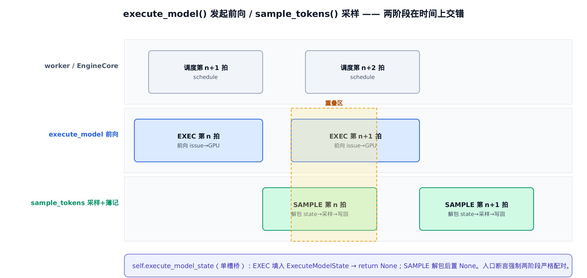
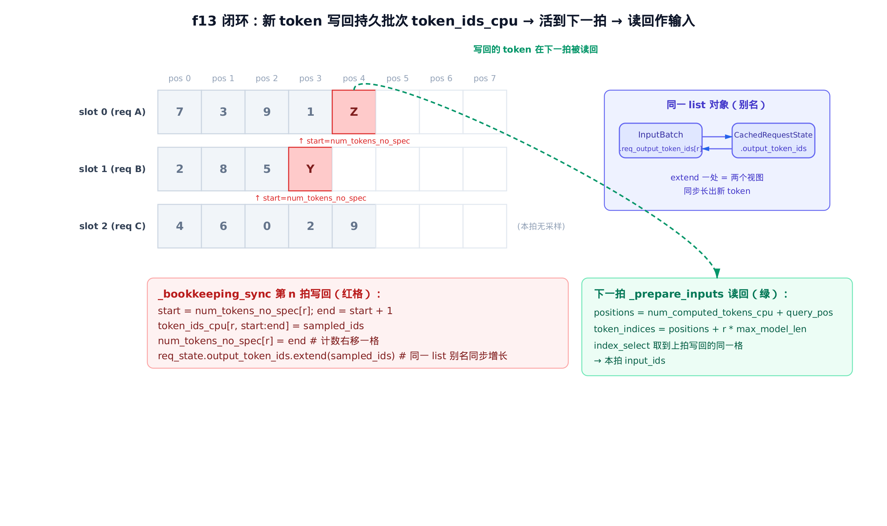
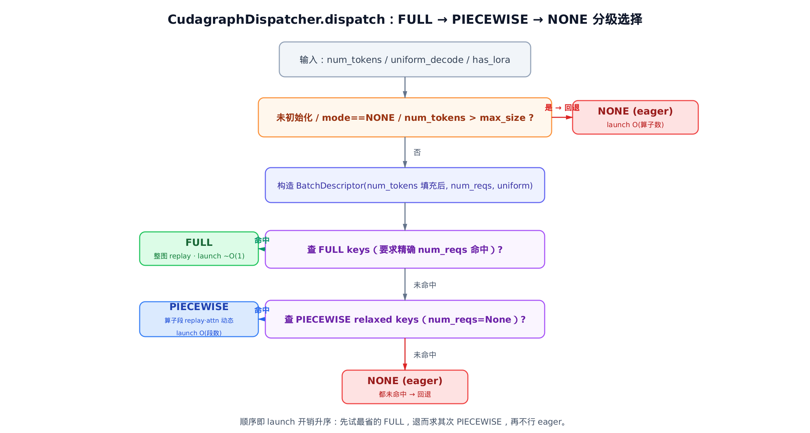

# 第19章　前向与采样解耦：execute_model() 两阶段、写回持久批次、CUDA graph 分派


> 上一章把一张调度工单翻译成了 GPU 张量，持久批次原地待命。
> 本章让模型真的跑起来：发起前向、采样、把新 token 写回批次。
> 下一章起深入 attention 后端，接住这里产出的 `slot_mapping`。

## 19.1 一个反直觉的方法：发起前向，却不等结果

先看一段会让人愣一下的代码。这是 GPU 模型运行器跑一拍推理的入口，`execute_model()`：它做完前向，最后一行却是 `return None`。

```python
# vllm/v1/worker/gpu_model_runner.py:L4156
        self.execute_model_state = ExecuteModelState(
            scheduler_output,
            logits,
            spec_decode_metadata,
            spec_decode_common_attn_metadata,
            hidden_states,
            sample_hidden_states,
            aux_hidden_states,
            ec_connector_output,
            cudagraph_stats,
            slot_mappings,
        )
        self.kv_connector_output = kv_connector_output

        # … 省略：async 调度下等上一拍前向的修正 …
        return None
```

跑完前向、算出了 `logits`，却不在这里采样、不返回 token，而是把这一拍的所有产物打包进一个叫 `ExecuteModelState` 的东西，塞进 `self.execute_model_state`，然后返回 `None`。

采样去哪了？在另一个方法 `sample_tokens()` 里。一拍推理被**切成了两半**：`execute_model()` 负责发起前向、缓存中间结果；`sample_tokens()` 负责解包、采样、把新 token 写回批次。

为什么要这么拆？答案藏在一个字里——**前向是异步发起的**。`_model_forward()` 把一串 kernel 提交（issue）给 GPU 之后就立刻返回了，kernel 还在 GPU 上排队跑，`logits` 这块显存里此刻还没有真正算好的数值。要读它的值，得等一次 GPU→CPU 同步。

如果在 `execute_model()` 里紧接着采样，就被迫在这里同步等待——CPU 干等 GPU。但把采样推迟到 `sample_tokens()`，CPU 在这两个方法之间的空档里就能去干别的：发起**下一拍**的前向、构建下一批的调度。这正是 [第11章](../ch11-engine-core/narrative/chapter.md) 讲的 EngineCore 执行/调度重叠机制，落到 worker 这一层的具体抓手。

本章就沿着这条两阶段主线，看清三件事：

- **两阶段怎么配对**——`execute_model()` 发起、`sample_tokens()` 收尾，中间靠一个单槽桥传递重型张量；
- **新 token 怎么活到下一拍**——`_bookkeeping_sync()` 把采样结果就地写回持久批次（这正是上一章埋下的悬念）；
- **前向走哪条 CUDA graph**——`CudagraphDispatcher.dispatch()` 在 FULL / PIECEWISE / NONE 之间分级取舍。

## 19.2 两阶段的桥：ExecuteModelState 与单槽断言

两阶段之间要传一大堆东西：`logits`、`hidden_states`、采样要用的 `sample_hidden_states`、CUDA graph 统计、投机解码元数据……vLLM 把它们封进一个 10 字段的 `NamedTuple`：

```python
# vllm/v1/worker/gpu_model_runner.py:L378
class ExecuteModelState(NamedTuple):
    """Ephemeral cached state transferred between execute_model() and
    sample_tokens(), after execute_model() returns None."""

    scheduler_output: "SchedulerOutput"
    logits: torch.Tensor
    spec_decode_metadata: SpecDecodeMetadata | None
    spec_decode_common_attn_metadata: CommonAttentionMetadata | None
    hidden_states: torch.Tensor
    sample_hidden_states: torch.Tensor
    aux_hidden_states: list[torch.Tensor] | None
    ec_connector_output: ECConnectorOutput | None
    cudagraph_stats: CUDAGraphStat | None
    slot_mappings: dict[str, torch.Tensor] | list[dict[str, torch.Tensor]] | None
```

注释里 `Ephemeral`（短命）这个词点出了它的本质：它只在 `execute_model()` 和 `sample_tokens()` 之间活一瞬，采样一做完就被丢弃。它住在一个**单槽**字段里：

```python
        self.execute_model_state: ExecuteModelState | None = None
```

注意是「单」槽——同一时刻只能缓存一份。这个设计有个隐患：万一调用方连着调了两次 `execute_model()` 却没穿插 `sample_tokens()`，第二次会把第一次的 state 覆盖掉。后果是**静默**的：第一拍的 GPU 张量泄漏、采样结果错乱，没人报错，只会算出错误的 token。

vLLM 不赌调用方守规矩，它在入口就把这条规矩钉死：

```python
# vllm/v1/worker/gpu_model_runner.py:L3825
    def execute_model(
        self,
        scheduler_output: "SchedulerOutput",
        intermediate_tensors: IntermediateTensors | None = None,
    ) -> ModelRunnerOutput | AsyncModelRunnerOutput | IntermediateTensors | None:
        if self.execute_model_state is not None:
            raise RuntimeError(
                "State error: sample_tokens() must be called "
                "after execute_model() returns None."
            )
```

`execute_model()` 进门第一件事：**断言槽必须是空的**。槽非空，说明上一拍的 state 还没被 `sample_tokens()` 消费——这是调用序列错了，直接抛 `RuntimeError`，把一个会静默损坏数据的 bug 变成一声响亮的崩溃。

对称地，`sample_tokens()` 进门要求槽**必须非空**，解包后立刻清空：

```python
# vllm/v1/worker/gpu_model_runner.py:L4178
    @torch.inference_mode
    def sample_tokens(
        self, grammar_output: "GrammarOutput | None"
    ) -> ModelRunnerOutput | AsyncModelRunnerOutput | IntermediateTensors:
        if self.execute_model_state is None:
            # … 省略：流水并行非末 rank / 纯 KV 传递的早返回 …
            return ...

        # Unpack ephemeral state.
        (
            scheduler_output,
            logits,
            # … 省略：其余字段 …
            slot_mappings,
        ) = self.execute_model_state
        # Clear ephemeral state.
        self.execute_model_state = None
```

一填一清，一空一非空，两个断言像两道闸——把「`execute_model()` 与 `sample_tokens()` 必须严格交替配对」写成了运行时不可绕过的契约。

我们用精简版把这条契约跑出来看。连调两次 `execute_model()` 而不采样，第二次必然炸：

```python
runner.execute_model(sched)          # 槽被填满
runner.execute_model(sched)          # 槽非空 → RuntimeError
# RuntimeError: State error: sample_tokens() must be called after
#               execute_model() returns None.
```

而正常的「发起→采样」配对，`execute_model()` 返回 `None`，`sample_tokens()` 解包后槽归 `None`：

```python
assert runner.execute_model(sched) is None      # 阶段一：发起，缓存，返回 None
assert runner.execute_model_state is not None    # 桥上有货
out = runner.sample_tokens(grammar_output=None)  # 阶段二：解包，采样
assert runner.execute_model_state is None        # 桥已清空，下一拍可再 execute
```

### 这就是 EngineCore 调用它的方式

把视角拉回上一层就更清楚了。EngineCore 跑一步推理时，对模型执行器正是这样两段调用：

```python
# vllm/v1/engine/core.py:L414
        future = self.model_executor.execute_model(scheduler_output, non_block=True)
        grammar_output = self.scheduler.get_grammar_bitmask(scheduler_output)
        # … 省略：错误/迭代日志上下文 …
        model_output = future.result()
        if model_output is None:
            model_output = self.model_executor.sample_tokens(grammar_output)
```

`non_block=True` 就是「发起完别等」的明示。注意末尾那个守卫：executor 先 `future.result()` 取回 `execute_model` 的返回，正因为它返回 `None`，EngineCore 才接着调 `sample_tokens()` 收尾——这就是「`return None` 触发采样」这条主线在调用方的配对形态。开启批次队列（batch queue）后，EngineCore 还会把多拍的 `execute_model` future 攒进一个 deque，让「发起第 n+1 拍前向」和「采样第 n 拍」在时间上叠起来跑。下面这张泳道图就是这套重叠在 worker 层的样子：



> *图注：第 n 拍的 SAMPLE 与第 n+1 拍的 EXEC 在橙色重叠区里同时推进。单槽 `execute_model_state` 在两阶段间传递重型张量，入口断言保证它们严格配对。*

**重叠到底省了多少？** 设单拍前向耗时 $T_\mathrm{fwd}$、采样加簿记耗时 $T_\mathrm{samp}$、调度构建下批耗时 $T_\mathrm{sched}$。把前向和采样揉在一个方法里串行做，一拍周期约是这两段之和：

$$
T_\mathrm{serial} \;\approx\; T_\mathrm{fwd} + T_\mathrm{samp}
$$

而且采样处必有一次 GPU↔CPU 同步卡着。拆成两阶段后，第 n 拍的采样能和第 n+1 拍的前向发起、下一批调度在流水线上交错。稳态吞吐不再受两者之和约束，而是受较慢的那条支配：

$$
T_\mathrm{step} \;\approx\; \max\bigl(T_\mathrm{fwd},\; T_\mathrm{samp} + T_\mathrm{sched}\bigr)
$$

人话翻译：前向在 GPU 上跑的那段时间，CPU 没闲着，它在采上一拍的 token、排下一拍的活。一拍的实际墙钟时间，被压到「GPU 算前向」和「CPU 采样加排活」两者中更长的那个——而不是把它们排成一条直线挨个等。

举个数量级（示意值，非实测）。设前向 8 毫秒、采样加排活 5 毫秒：

$$
T_\mathrm{fwd} \approx 8\,\mathrm{ms}, \qquad T_\mathrm{samp} + T_\mathrm{sched} \approx 5\,\mathrm{ms}
$$

串行拍周期约 $8+5=13$ 毫秒；两阶段下稳态拍周期约 $\max(8,5)=8$ 毫秒，省下约 38%。前向越重、采样排活越能藏进它的影子里，这个比例就越可观。

## 19.3 阶段一全景：从工单到一份缓存的 state

`execute_model()` 这半拍做的事，可以按顺序拆成五步：归一持久批次 → 建输入张量 → 决定 CUDA graph → 发起前向 → 算 logits 并缓存。我们顺着源码走一遍主干。

第一步，归一持久批次。这是上一章的活，这里一句带过：`_update_states()` 按调度工单把持久批次对齐——移除已完成的、装入新来的、原地腾挪。

```python
# vllm/v1/worker/gpu_model_runner.py:L3866
        num_scheduled_tokens = scheduler_output.total_num_scheduled_tokens
        with (
            record_function_or_nullcontext("gpu_model_runner: preprocess"),
            self.synchronize_input_prep(),
        ):
            # Update persistent batch states.
            deferred_state_corrections_fn = self._update_states(scheduler_output)
            # … 省略：连接器、级联注意力等可选分支 …
            if not num_scheduled_tokens:
                # Return empty ModelRunnerOutput if no work to do.
                return EMPTY_MODEL_RUNNER_OUTPUT
            # … 省略 …
            num_reqs = self.input_batch.num_reqs
            req_ids = self.input_batch.req_ids
            tokens = [scheduler_output.num_scheduled_tokens[i] for i in req_ids]
            num_scheduled_tokens_np = np.array(tokens, dtype=np.int32)
            max_num_scheduled_tokens = int(num_scheduled_tokens_np.max())
            num_tokens_unpadded = scheduler_output.total_num_scheduled_tokens

            logits_indices, spec_decode_metadata = self._prepare_inputs(
                scheduler_output,
                num_scheduled_tokens_np,
            )
```

第二步，`_prepare_inputs()` 把持久批次里的 token 取出来，拼成本拍的 `input_ids`、`positions`、`slot_mapping`。这一步藏着 f13 闭环的「读回侧」，我们留到 [§19.5](#195-f13-闭环新-token-怎么活到下一拍) 细讲。它返回 `logits_indices`——每个请求最后一个 token 在扁平张量里的下标，用来从一大片 `hidden_states` 里挑出真正要算 logits 的那几行。`hidden_states` 的形状是 `[total_tokens, hidden_dim]`，第一维把本拍所有请求的所有 token 按请求顺序拼扁，`logits_indices` 是一个长度等于批次请求数的一维整数数组，每个元素是对应请求最后一个 token 在这条 `total_tokens` 轴上的行号。

第三步，决定这一拍走哪条 CUDA graph：

```python
# vllm/v1/worker/gpu_model_runner.py:L3928
            (
                cudagraph_mode,
                batch_desc,
                should_ubatch,
                num_tokens_across_dp,
                cudagraph_stats,
            ) = self._determine_batch_execution_and_padding(
                num_tokens=num_tokens_unpadded,
                num_reqs=num_reqs,
                num_scheduled_tokens_np=num_scheduled_tokens_np,
                max_num_scheduled_tokens=max_num_scheduled_tokens,
                use_cascade_attn=cascade_attn_prefix_lens is not None,
                num_encoder_reqs=len(scheduler_output.scheduled_encoder_inputs),
            )
```

它产出两样东西：`cudagraph_mode`（FULL / PIECEWISE / NONE 之一）和 `batch_desc`（描述这个批次形状的 key）。怎么选的，留到 [§19.6](#196-cuda-graph-分派fullpiecewisenone-的分级取舍)。

第四步，发起前向。这是整章最关键的一行的所在地：

```python
# vllm/v1/worker/gpu_model_runner.py:L4071
        with (
            set_forward_context(
                attn_metadata,
                self.vllm_config,
                num_tokens=num_tokens_padded,
                num_tokens_across_dp=num_tokens_across_dp,
                cudagraph_runtime_mode=cudagraph_mode,
                batch_descriptor=batch_desc,
                ubatch_slices=ubatch_slices_padded,
                slot_mapping=slot_mappings,
                skip_compiled=has_encoder_input,
            ),
            record_function_or_nullcontext("gpu_model_runner: forward"),
            # … 省略：KV connector 上下文管理器（可选分支）…
        ):
            model_output = self._model_forward(
                input_ids=input_ids,
                positions=positions,
                intermediate_tensors=intermediate_tensors,
                inputs_embeds=inputs_embeds,
                **model_kwargs,
            )
```

`set_forward_context()` 把 `cudagraph_runtime_mode` 和 `batch_descriptor` 推进一个全局上下文。编译后的模型在它的 `forward` 内部会读这两个值，据此决定**要不要 replay 一张录好的 CUDA graph、replay 哪一张**。`_model_forward()` 调一下就返回——前向被 issue 到 GPU 了，但 `model_output` 里的数值还没算好。

第五步，挑出末位 token 的隐藏态，算 logits：

```python
# vllm/v1/worker/gpu_model_runner.py:L4097
        with record_function_or_nullcontext("gpu_model_runner: postprocess"):
            # … 省略：EAGLE-3 aux_hidden_states 拆包、流水并行非末 rank 早返回 …
            hidden_states = model_output
            # … 省略 …
            sample_hidden_states = hidden_states[logits_indices]
            logits = self.model.compute_logits(sample_hidden_states)
```

`hidden_states[logits_indices]` 这一下，把整批 token 的隐藏态里属于「每个请求最后一个位置」的那几行挑出来——只有这些位置要预测下一个 token，没必要对所有位置算 logits。然后 `compute_logits()` 把隐藏态投影到词表维度。

走到这里，前向已发起、logits 已（异步地）在路上，阶段一的活就齐了：打包进 `ExecuteModelState`，`return None`（这正是 [§19.1](#191-一个反直觉的方法发起前向却不等结果) 开头那段代码）。CPU 可以掉头去发起下一拍前向了。

## 19.4 阶段二全景：解包、采样、写回

`sample_tokens()` 接过桥上的那份 state。解包、清空槽之后（[§19.2](#192-两阶段的桥executemodelstate-与单槽断言) 见过了），它做三件事：采样、采样后状态更新、簿记同步。

```python
# vllm/v1/worker/gpu_model_runner.py:L4215
        # Apply structured output bitmasks if present.
        if grammar_output is not None:
            apply_grammar_bitmask(
                scheduler_output, grammar_output, self.input_batch, logits
            )

        with record_function_or_nullcontext("gpu_model_runner: sample"):
            sampler_output = self._sample(logits, spec_decode_metadata)

        self._update_states_after_model_execute(
            sampler_output.sampled_token_ids, scheduler_output
        )
```

`apply_grammar_bitmask()` 是结构化输出的活——如果这一拍带了语法约束，先在 logits 上盖掩码，把不合法的 token 压成负无穷。然后 `_sample()` 把 logits 交给采样器，吐出 `sampler_output.sampled_token_ids`。`_update_states_after_model_execute()` 是给 Mamba/投机解码这类 hybrid 模型记账用的，纯 Transformer 路径它什么也不做，但调用点保留着，标出它在流程里的位置。

接下来是本章的重头戏——簿记同步：

```python
# vllm/v1/worker/gpu_model_runner.py:L4333
        with record_function_or_nullcontext("gpu_model_runner: bookkeep"):
            (
                num_nans_in_logits,
                logprobs_lists,
                valid_sampled_token_ids,
                prompt_logprobs_dict,
                req_ids_output_copy,
                req_id_to_index_output_copy,
                invalid_req_indices,
            ) = self._bookkeeping_sync(
                scheduler_output,
                sampler_output,
                logits,
                hidden_states,
                scheduler_output.total_num_scheduled_tokens,
            )
```

`_bookkeeping_sync()` 把采样到的新 token 写回持久批次，并把这一拍要返回给上层的所有东西（每个请求采到的 token、logprobs、req_id 映射）整理好。它的写回循环就是上一章悬念的答案，单独开一节讲。

## 19.5 f13 闭环：新 token 怎么活到下一拍

上一章结尾留了个悬念：持久批次跨拍复用同一组大 CPU 张量，不每拍重建——那这一拍新采出来的 token，是怎么追加进去、又怎么在下一拍被当成输入读回来的？答案就在 `_bookkeeping_sync()` 的写回循环里。

### 写回侧：就地追加，推进计数

```python
# vllm/v1/worker/gpu_model_runner.py:L3479
        req_ids = self.input_batch.req_ids
        for req_idx in range(num_sampled_tokens):
            if self.use_async_scheduling:
                sampled_ids = [-1] if req_idx not in invalid_req_indices_set else None
            else:
                sampled_ids = valid_sampled_token_ids[req_idx]

            num_sampled_ids: int = len(sampled_ids) if sampled_ids else 0

            if not sampled_ids:
                continue

            start_idx = self.input_batch.num_tokens_no_spec[req_idx]
            end_idx = start_idx + num_sampled_ids
            assert end_idx <= self.max_model_len, (
                "Sampled token IDs exceed the max model length. "
                f"Total number of tokens: {end_idx} > max_model_len: "
                f"{self.max_model_len}"
            )

            self.input_batch.token_ids_cpu[req_idx, start_idx:end_idx] = sampled_ids
            self.input_batch.is_token_ids[req_idx, start_idx:end_idx] = True
            self.input_batch.num_tokens_no_spec[req_idx] = end_idx

            req_id = req_ids[req_idx]
            req_state = self.requests[req_id]
            req_state.output_token_ids.extend(sampled_ids)
```

盯住三行就够了。对每个采到 token 的请求（行号 `req_idx`，也是它在持久批次里的 slot 行）：

- `start_idx = num_tokens_no_spec[req_idx]`——这个请求当前已落位多少 token，就从那个位置接着写；
- `token_ids_cpu[req_idx, start_idx:end_idx] = sampled_ids`——把新 token 写进 slot 行的尾部那一格；
- `num_tokens_no_spec[req_idx] = end_idx`——计数右移，记下「现在又多了这么多 token」；
- `req_state.output_token_ids.extend(sampled_ids)`——把新 token 追加进这个请求的输出列表。

这里有个不显眼但关键的细节：最后一行 extend 的 `output_token_ids`，和持久批次里 `req_output_token_ids[req_idx]` 是**同一个 list 对象**。这个别名是请求装入 slot 行时建立的：

```python
# vllm/v1/worker/gpu_input_batch.py:L342
        req_id = request.req_id
        if req_index == len(self._req_ids):
            self._req_ids.append(req_id)
            self.req_output_token_ids.append(request.output_token_ids)
            self.spec_token_ids.append([])
        else:
            self._req_ids[req_index] = req_id
            self.req_output_token_ids[req_index] = request.output_token_ids
            self.spec_token_ids[req_index].clear()
        # … 省略：req_id_to_index 登记 …
        # Copy the prompt token ids and output token ids.
        num_prompt_tokens = length_from_prompt_token_ids_or_embeds(
            request.prompt_token_ids, request.prompt_embeds
        )
        self.num_prompt_tokens[req_index] = num_prompt_tokens
        start_idx = num_prompt_tokens
        end_idx = start_idx + len(request.output_token_ids)
        # … 省略：prompt token / is_token_ids 填充 …
        self.token_ids_cpu[req_index, start_idx:end_idx] = request.output_token_ids
        self.num_tokens_no_spec[req_index] = request.num_tokens
        self.num_computed_tokens_cpu[req_index] = request.num_computed_tokens
        self.block_table.add_row(request.block_ids, req_index)
```

`self.req_output_token_ids[req_index] = request.output_token_ids`——批次直接持有了请求快照那个 list 的**引用**，不是拷贝。所以写回循环里 `req_state.output_token_ids.extend(...)` 一处 extend，批次视图和请求快照**同时**长出新 token。一次操作，两个视图同步增长。

### 读回侧：下一拍把写回的 token 取回来当输入

写回只完成了一半闭环。下一拍 `execute_model()` 调 `_prepare_inputs()` 时，要把这些刚写进去的 token 取出来当模型输入：

```python
# vllm/v1/worker/gpu_model_runner.py:L1839
        # Get token indices.
        # E.g., [0, 1, 0, 1, 2, 3, 4, 0, 1, 2]
        # -> [0, 1, M, M + 1, M + 2, M + 3, M + 4, 2 * M, 2 * M + 1, 2 * M + 2]
        # where M is the max_model_len.
        token_indices = (
            positions_np + req_indices * self.input_batch.token_ids_cpu.shape[1]
        )
        token_indices_tensor = torch.from_numpy(token_indices)

        # NOTE(woosuk): We use torch.index_select instead of np.take here
        # because torch.index_select is much faster than np.take for large
        # tensors.
        torch.index_select(
            self.input_batch.token_ids_cpu_tensor.flatten(),
            0,
            token_indices_tensor,
            out=self.input_ids.cpu[:total_num_scheduled_tokens],
        )
```

`token_ids_cpu` 是个二维表（`max_reqs × max_model_len`），这里先把它拍扁成一维，再用 `index_select` 按下标一把取出本拍要的 token。下标怎么算的？`token_indices = positions + req_index * M`，其中 `positions = num_computed_tokens_cpu + query_pos`。

把它和写回侧对上：上一拍写回时，token 落在 `token_ids_cpu[req_idx, start_idx]`，而 `start_idx = num_tokens_no_spec[req_idx]`。下一拍这个请求的 `num_computed_tokens_cpu` 推进到了上次的 `start_idx`——也就是刚写回那个 token 所在的位置，它正是本拍 decode 要喂进模型的那个 query token。decode 的 `query_pos = 0`，于是 `positions = start_idx + 0 = start_idx`，`index_select` 取到的，恰是上一拍写回的那个 token。

整个闭环看下面这张图：



> *图注：第 n 拍写回（红格）把新 token 追加到 slot 行尾、计数右移；`req_output_token_ids[r]` 与 `output_token_ids` 是同一对象，一处 extend 两边同步；下一拍读回（绿）用 `positions + r·max_model_len` 索引到同一格当输入。*

### 一句话说清这个不变式

写回与读回为什么严丝合缝？因为有一个单调推进的计数撑着它。

先看起点：请求装入 slot 行时（`add_request`，本节上面那段 `gpu_input_batch.py:L342`），`num_tokens_no_spec = num_prompt_tokens`，首个生成 token 就写在第 `num_prompt_tokens` 格；下一拍 `num_computed_tokens` 恰好推进到该格——递推由此起步。

归纳步：每拍结束，写回循环对每个采到 token 的请求把 `num_tokens_no_spec[r]` 加上 `num_sampled_ids`、`len(output_token_ids)` 同步增长。读指针为什么恰好咬住这一格？关键在它的推进量和写指针是同一个数。decode 拍里调度器从 EngineCore 收到上拍的 `ModelRunnerOutput` 后，会把已计算 token 数推进——下一拍 `execute_model()` 进门调 `_update_states()`（`vllm/v1/worker/gpu_model_runner.py:L1339`）时，`num_computed_tokens_cpu[r]` 被赋成调度器传来的 `num_computed_tokens`，正是上拍写回量；而上拍写回时 `num_tokens_no_spec[r]` 加的正是同一个量。

说白了：两个计数从同一起点（`add_request` 处 `num_tokens_no_spec` 与 `num_computed_tokens` 都从 `num_prompt_tokens` 一侧出发）启动，每拍各加同一增量，所以恒等。于是 `positions = num_computed_tokens_cpu + query_pos`、`token_indices = positions + r·max_model_len`，落点必是上拍写进 `[start, end)` 区间那一格，`index_select` 取到的恰是刚写回的新 token。写指针（`num_tokens_no_spec`）和读指针（`num_computed_tokens`）由此一拍拍咬在同一格上——持久批次因此不必每拍重建，新 token 只在 slot 行尾部增量追加，一拍接一拍地长下去。

用精简版把两拍连起来跑，看这个计数和位置怎么递进。第一拍前批次某请求 `num_tokens_no_spec[0] = 4`，采样器固定吐 token `Z`：

```python
# 第 n 拍
runner.execute_model(sched)
runner.sample_tokens()
assert runner.input_batch.token_ids_cpu[0, 4] == Z        # 写回 slot 行第 4 格
assert runner.input_batch.num_tokens_no_spec[0] == 5      # 计数 4 → 5
assert req_state.output_token_ids[-1] == Z                # 别名列表也长出 Z

# 第 n+1 拍：_prepare_inputs 把第 4 格读回作输入
runner.execute_model(sched_next)
assert runner.input_ids.cpu[0] == Z                       # 上拍写回的 Z，这拍当了输入
```

写回的 `Z` 在下一拍原样回到了 `input_ids`——这就是「持久批次带着多出的 token 活到下一拍」的全部物理实现。

### 异步调度下的一个变奏

写回循环开头那个 `if self.use_async_scheduling:` 分支值得提一句。异步调度为了避免在 `sample_tokens()` 里做 GPU→CPU 同步（那会破坏前向/采样重叠），CPU 侧的 `token_ids_cpu` 这一拍只写**占位** `-1`，真实采样 token 留在 GPU 上的 `prev_sampled_token_ids`，等下一拍准备输入时直接在 GPU 上 scatter 进 `input_ids`。计数照常推进，闭环逻辑不变，只是真实 token 走 GPU 这条更快的路、绕开了一次同步。这呼应了 [第11章](../ch11-engine-core/narrative/chapter.md) 异步调度对「乐观推进、占位」的处理——同一个思路在 worker 层的落点。

### PP 非末位 rank 的变奏（v0.21.0）

> **v0.21.0 更新**：上面整节是以**末位 rank / 非流水线并行**的视角讲的——只有末位 rank 真去采样、走 `_bookkeeping_sync()` 这条写回循环。但流水线并行（PP）下，**非末位 rank** 拿不到采样器，新 token 是上游 rank 算好后通过 `_update_states()` 传下来、并入 `token_ids_cpu` 的。这条并行的写回路径（`vllm/v1/worker/gpu_model_runner.py:GPUModelRunner._update_states`，`is_last_rank` 为否的分支）在 v0.21.0 被修正过，且修正方向与正文不变式同源。
>
> 基线里非末位 rank 并入新 token 时，起点直接取 `start = num_computed_tokens`、终点 `num_computed_tokens + len(new_token_ids)`，无条件覆盖写。问题是这在两种边界下会丢 token、拉低精度（#41133）：(a) chunked prefill 下 `num_computed_tokens` 可能**小于**已落位计数 `num_tokens_no_spec`，按前者起笔会回退覆盖已有 token；(b) 异步调度的 PP 下这一拍可能**没有** `new_token_ids`，此时只该按 `num_computed_tokens` 推进计数、不该写。v0.21.0 改为：起点取 `start = num_tokens_no_spec[req_index]`（与正文写回侧**同一个写指针**），终点取 `end = max(start, num_computed_tokens + len(new_token_ids))`；仅当 `end > start` 才写，且有 `new_token_ids` 时只追加尾部 `new_token_ids[-num_new_tokens:]`（避免重复覆盖），并同步置 `is_token_ids[req_index, start:end] = True`，再推进 `num_tokens_no_spec`。
>
> 换句话说：正文里末位 rank「写指针 `num_tokens_no_spec` 与读指针 `num_computed_tokens` 一拍拍咬在同一格」的不变式，在 PP 非末位 rank 的写回路径上被**严格化**了——写回起点统一锚到 `num_tokens_no_spec`，`max(...)` 兜住「计数已超前但本拍无新 token」的情形。主线叙事不变，只是把同一条闭环铺到了 PP 的每一段 rank 上。

## 19.6 CUDA graph 分派：FULL/PIECEWISE/NONE 的分级取舍

回到 [§19.3 阶段一](#193-阶段一全景从工单到一份缓存的-state) 第三步留下的悬念：前向走哪条 CUDA graph，是谁决定的？是 `CudagraphDispatcher.dispatch()`。

先说清楚三态各自是什么、贵在哪：

- **NONE（eager）**：不录图，每拍重走一遍 Python 算子派发。launch 开销是算子数级别——每个算子都得 Python 这边发起一次 kernel launch，几百上千次。
- **PIECEWISE**：把前向里**非 attention 的连续算子段**录成图，attention 留动态。launch 开销降到段数级别。它对批次里的请求数宽容——它的 key 把 `num_reqs` 设成 `None`，意思是「任意请求数都能用这张图」。
- **FULL**：把整个前向（含 attention）录成一张图，replay 时一次 launch 搞定。launch 开销近常数，最省。但代价是它要求批次形状**精确匹配**录图时的 key——因为整图把 attention 也录死了，而 attention 的元数据依赖具体的请求数。

把三态的 launch 开销从省到费排成一行就是：FULL 近常数、PIECEWISE 正比于算子段数、NONE 正比于算子总数。

`dispatch()` 就在这三态间挑。它持有两套 key 集合（FULL 一套、PIECEWISE 一套），逻辑分两段。先是几道一票否决的回退条件：

```python
# vllm/v1/cudagraph_dispatcher.py:L273
        if (
            not self.keys_initialized
            or self.cudagraph_mode == CUDAGraphMode.NONE
            or max_size is None
            or num_tokens > max_size
            or allowed_modes <= {CUDAGraphMode.NONE}
        ):
            return CUDAGraphMode.NONE, BatchDescriptor(num_tokens)
```

key 还没初始化、模式本就是 NONE、或者这一批 token 数超过了能捕获的最大尺寸 `max_size`——任一成立，直接返回 NONE 走 eager。超尺寸这条很关键：录图是按固定尺寸录的，太大的批次没有对应的图，只能 eager。

过了这道关，按 launch 开销从省到费的顺序查 key：

```python
# vllm/v1/cudagraph_dispatcher.py:L301
        normalized_uniform = uniform_decode and self.cudagraph_mode.separate_routine()
        batch_desc = self._create_padded_batch_descriptor(
            num_tokens, normalized_uniform, has_lora, effective_num_active_loras
        )

        if CUDAGraphMode.FULL in allowed_modes:
            # check if key exists for full cudagraph
            batch_desc_to_check = batch_desc
            if batch_desc_to_check in self.cudagraph_keys[CUDAGraphMode.FULL]:
                return CUDAGraphMode.FULL, batch_desc_to_check

        if CUDAGraphMode.PIECEWISE in allowed_modes:
            # also check if the relaxed key exists for more "general"
            # piecewise cudagraph
            batch_desc_to_check = replace(batch_desc, num_reqs=None, uniform=False)
            if batch_desc_to_check in self.cudagraph_keys[CUDAGraphMode.PIECEWISE]:
                return CUDAGraphMode.PIECEWISE, batch_desc_to_check

        assert CUDAGraphMode.NONE in allowed_modes, ...
        return CUDAGraphMode.NONE, BatchDescriptor(num_tokens)
```

先查 FULL：拿精确的 `batch_desc`（带 `num_reqs`）去 FULL 的 key 集合里找，命中就用 FULL——最省。找不到，把描述符**放宽**——`replace(batch_desc, num_reqs=None, uniform=False)`，把 `num_reqs` 抹成 `None`——再去 PIECEWISE 集合里找。这个放宽正是 PIECEWISE「对请求数宽容」的体现：同一张 PIECEWISE 图能服务任意请求数的批次，所以查 key 时不计较 `num_reqs`。两套都没命中，回退 NONE。

这个 FULL → PIECEWISE → NONE 的顺序，就是按 launch 开销升序优先：先试最省的整图 replay，命不中退而求其次用算子段图，再不行才老老实实 eager。下面这张决策树把它画全：



> *图注：先过回退闸（未初始化 / mode==NONE / 超 max_size）；否则构造 BatchDescriptor，先查精确 FULL key，再查放宽的 PIECEWISE key，都未命中回退 NONE。终态旁标 launch 开销量级。*

精简版把三条路径各跑一遍。注册一个 FULL key、用精确 `num_reqs` 命中，拿到 FULL；查一个只在 PIECEWISE 注册过的形状，FULL 落空、放宽后命中 PIECEWISE；给一个超过 `max_size` 的 `num_tokens`，直接回退 NONE：

```python
disp.dispatch(num_tokens=8, uniform_decode=True)   # 精确命中 → (FULL, desc)
disp.dispatch(num_tokens=8, uniform_decode=False)  # FULL 落空、放宽命中 → (PIECEWISE, desc[num_reqs=None])
disp.dispatch(num_tokens=9999)                      # 超 max_size → (NONE, BatchDescriptor(9999))
```

三态、三条路，和真实 vLLM 的分派一致。

## 19.7 小结：一拍推理的两半

把这一章收束成一句话：vLLM 把一拍推理切成两半，是为了别让 CPU 干等 GPU。

`execute_model()`（`vllm/v1/worker/gpu_model_runner.py:L3825`）发起前向后立刻 `return None`，把 logits、hidden_states 等打包进单槽的 `ExecuteModelState`（`vllm/v1/worker/gpu_model_runner.py:L378`）；`sample_tokens()`（`vllm/v1/worker/gpu_model_runner.py:L4178`）再解包、采样、把新 token 写回持久批次。入口的两道断言把「先发起、后采样」的配对钉成不可绕过的契约。这半拍空档里，CPU 去发起下一拍前向、排下一批活——一拍的墙钟时间被压到 GPU 前向与 CPU 采样排活两者中较长的那个，而非两者之和。这正是 EngineCore 重叠机制在 worker 层的抓手。

采样产出的 token 经 `_bookkeeping_sync()`（写回循环在 `vllm/v1/worker/gpu_model_runner.py:L3479`）就地写回 `token_ids_cpu` 的 slot 行尾、推进 `num_tokens_no_spec`、extend 那个与批次共享的 `output_token_ids` list。下一拍 `_prepare_inputs()` 用 `positions + r·max_model_len` 把它读回当输入（`vllm/v1/worker/gpu_model_runner.py:L1839`）——持久批次就这样带着新 token 活到下一拍，无需每拍重建。这就是上一章埋下的那条线，到这里接上了。

而前向走哪条 CUDA graph，由 `dispatch()`（`vllm/v1/cudagraph_dispatcher.py:L234`）按 launch 开销分级取舍：先 FULL（最省，要精确匹配）、再 PIECEWISE（次省，对请求数宽容）、回退 NONE（eager）。

下一章起，我们从 `_prepare_inputs()` 产出的 `slot_mapping` 接着往下走，深入 attention 后端——看这些 token 是怎么落进 paged KV 缓存、又怎么被读出来算注意力的。
