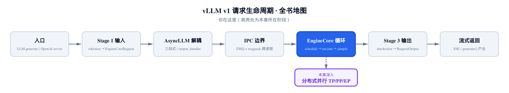
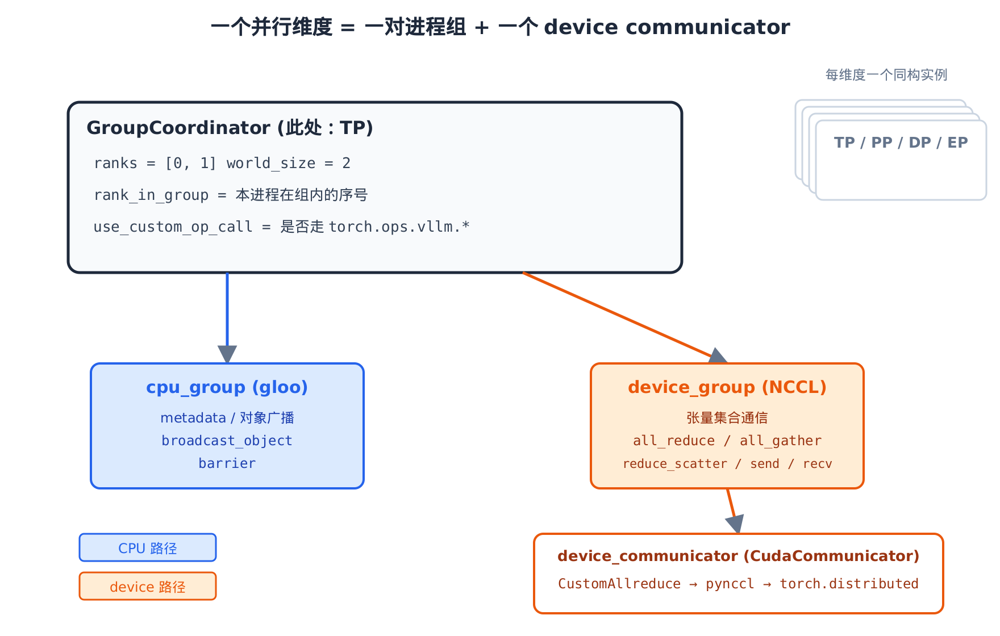
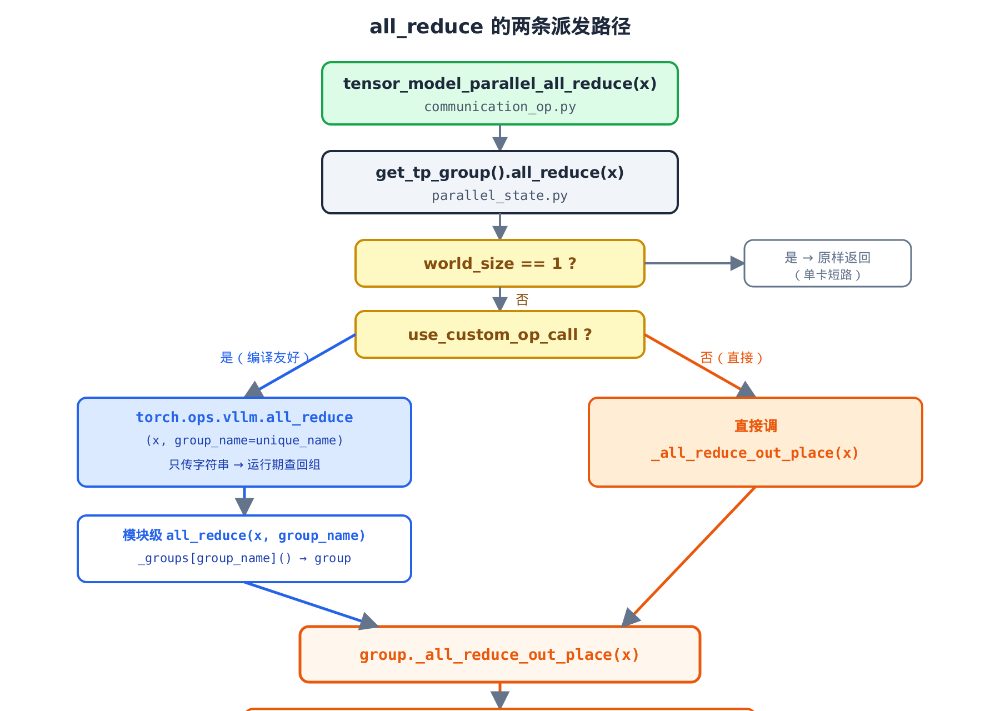
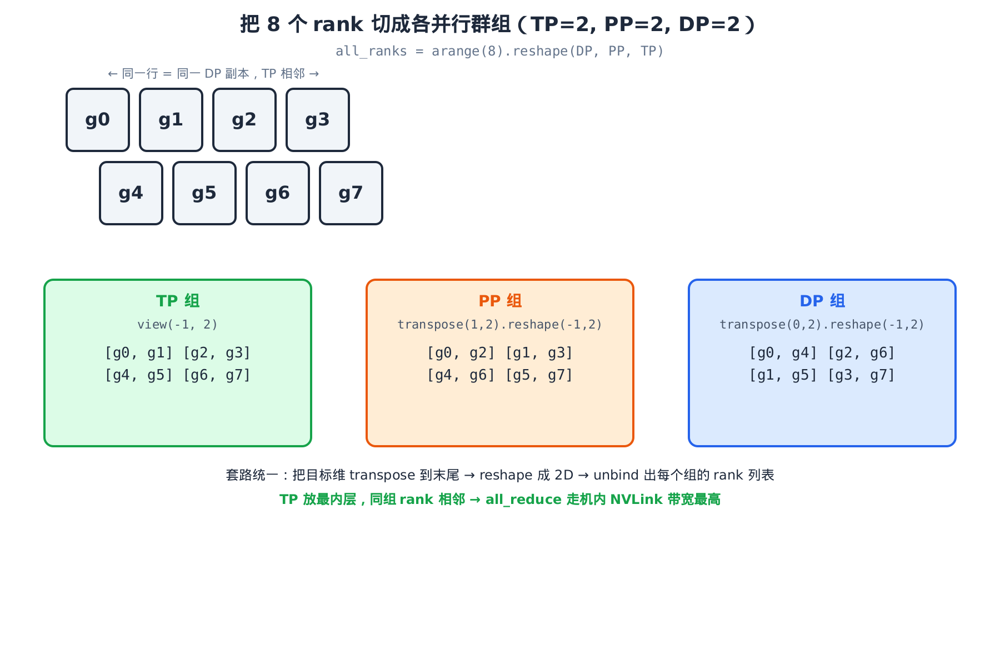
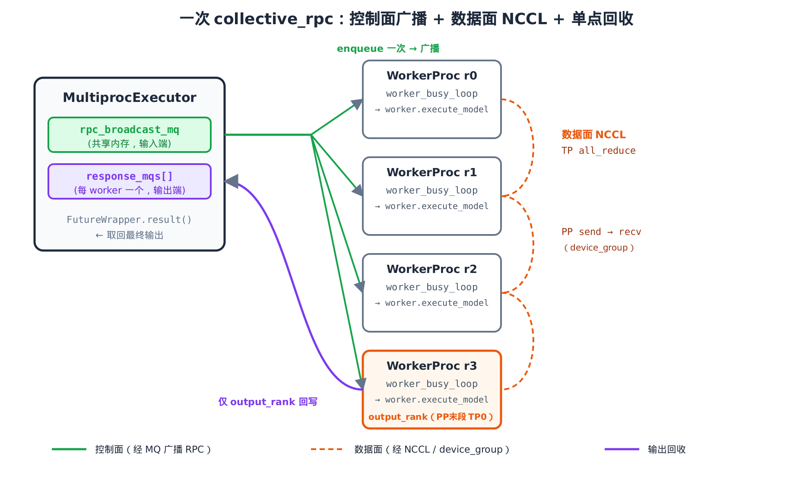

# 第20章　分布式并行的群组与集合通信

## 你在这里



> *图注：全书地图走到执行层的并行收官。*
> *[上一章](../ch19-model-runner/narrative/chapter.md)把一拍前向切成「发起」与「采样」两半，前向里那一行 `all_reduce` 当时一笔带过。*
> *本章解决「多张卡之间到底怎么通信」——把 TP/PP/DP/EP 各并行维度统一成一个抽象，讲透三大集合原语、双群组分工、和让通信能进 `torch.compile` 图的 custom-op。*
> *[下一章](../ch21-async-data-parallel/narrative/chapter.md)接着讲异步通信与数据并行，把这套群组用到 DP 调度上。*

前面十几章，我们一直默认模型跑在「一张卡」上。可真实的 vLLM 部署，动辄 8 卡张量并行、再叠几段流水线。[第 17 章](../ch17-worker-and-executor/narrative/chapter.md)讲过：一张卡一个 worker，八卡就是八个 worker 同时收到同一张工单、各算各的分片。

问题来了——它们**算各自的分片**，可注意力和 FFN 的输出得**合起来**才是完整结果。这就需要卡与卡之间通信。一行 `hidden_states = tensor_model_parallel_all_reduce(hidden_states)`，背后是一整套机制：谁和谁组成一个通信组？用什么后端（NCCL？gloo？vLLM 自研内核？）？这行通信怎么不把 `torch.compile` 的计算图打断？流水线相邻两段之间又怎么把中间结果传过去？

这一章就拆开这套机制。主角是一个统一抽象 `GroupCoordinator`：它把**每一个**并行维度——张量并行 TP、流水线并行 PP、数据并行 DP、专家并行 EP——都包装成同一个形状：**一对进程组 + 一个可选的 device communicator**。对外暴露 `all_reduce` / `all_gather` / `reduce_scatter` 这三大集合原语，外加流水线要用的 P2P `send`/`recv`。

四条主线：

- **`GroupCoordinator`**：一个并行维度的统一抽象。同时持有一个 CPU 群组（gloo）和一个 device 群组（NCCL），按数据类型分流。
- **三大集合原语 + custom-op**：`all_reduce`/`all_gather`/`reduce_scatter` 怎么注册成 `torch.ops.vllm.*`，让集合通信作为一个不透明节点编进 `torch.compile` 图里，而不触发 graph break。
- **5 维 rank 张量切群组**：一套 `transpose → reshape → unbind` 的机械变换，把全部 rank 切成 TP/PP/DP 各维度的进程组。
- **`MultiprocExecutor` 把群组拉起来**：每个 worker 进程在哪儿真正建起这些群组，控制面 RPC 怎么经一条共享内存队列广播到所有 worker。

照例配一份**只做减法**的精简版：和真实 `vllm/distributed/` 下的 `parallel_state.py`、`base_device_communicator.py`、`communication_op.py`，以及 `vllm/v1/executor/multiproc_executor.py` 同名、同结构、同控制流。它在 host 上用 gloo 后端就能 spawn 多 rank、真正跑通三大集合原语的数值、PP 的 `send`/`recv`、双群组分流的 `broadcast_tensor_dict`，以及 `collective_rpc` 的广播与回收——不要 GPU、不 import vllm。正文主线始终是真实源码；精简版只用来「亲眼看一眼数值对不对」。

先把一个 `GroupCoordinator` 解剖开。

---

## 20.1 一个并行维度 = 一对进程组 + 一个 communicator

先看全貌。下面这张图是本章所有内容的骨架。



> *图注：一个 `GroupCoordinator` 实例 = 一对进程组（蓝色 `cpu_group` 走 gloo，橙色 `device_group` 走 NCCL）+ 一个挂在 device 群组旁的 `device_communicator`。TP/PP/DP/EP 各有一个同构实例，结构完全一样，只是组里的 rank 不同。*

关键认知有两层。第一层：vLLM 不为 TP、PP、DP 各写一套通信代码——它写**一个** `GroupCoordinator`，每个维度实例化一份。第二层：每个实例内部**同时**握着两个进程组，按数据类型分流——元数据和对象走 CPU 群组（gloo），张量集合走 device 群组（NCCL）。

来看构造函数，这是整章的地基：

```python
# vllm/distributed/parallel_state.py:L290
class GroupCoordinator:
    # … 省略：类 docstring 与字段类型注解 …
    def __init__(
        self,
        group_ranks: list[list[int]],
        local_rank: int,
        torch_distributed_backend: str | Backend,
        use_device_communicator: bool,
        use_message_queue_broadcaster: bool = False,
        group_name: str | None = None,
    ):
        group_name = group_name or "anonymous"
        self.unique_name = _get_unique_name(group_name)
        _register_group(self)

        self.rank = torch.distributed.get_rank()
        self.local_rank = local_rank

        self_device_group = None
        self_cpu_group = None

        for ranks in group_ranks:
            device_group = torch.distributed.new_group(
                ranks, backend=torch_distributed_backend
            )
            # a group with `gloo` backend, to allow direct coordination between
            # processes through the CPU.
            with suppress_stdout():
                cpu_group = torch.distributed.new_group(ranks, backend="gloo")
            if self.rank in ranks:
                self.ranks = ranks
                self.world_size = len(ranks)
                self.rank_in_group = ranks.index(self.rank)
                self_device_group = device_group
                self_cpu_group = cpu_group

        assert self_cpu_group is not None
        assert self_device_group is not None

        self.cpu_group = self_cpu_group
        self.device_group = self_device_group
```

注意那个 `for ranks in group_ranks` 循环。传进来的 `group_ranks` 是**该维度所有组**的 rank 列表——比如 TP=2、world=8 时，它是 `[[0,1],[2,3],[4,5],[6,7]]` 四个组。每个组都得 `new_group` 出来（NCCL 集合通信要求**所有** rank 都参与建组，哪怕本进程不在那个组里），但本进程只**记住**自己所在的那一组：`self.ranks`、`self.world_size`、`self.rank_in_group`。

这里出现了第一个容易绊倒人的点：**三套 rank 坐标**。

- `rank`：torch.distributed 的全局 rank，唯一标识一个进程。
- `local_rank`：节点内序号，决定本进程绑哪块 GPU（`cuda:local_rank`）。
- `rank_in_group`：本进程在这个 `GroupCoordinator` 里的序号。所有集合算子的 `src`/`dst` 都用它，再经 `self.ranks[i]` 翻回全局 rank。

跨节点时三者会分叉：同一个 PP 组的两个进程可能 `local_rank` 相同（各自机内第 0 块卡）但全局 `rank` 不同。后面 `broadcast` 系列里反复出现的 `self.ranks[src]`，就是把「组内本地序号」翻成「全局 rank」的那一步。

构造函数后半段决定 device 后端和 custom-op 开关：

```python
# vllm/distributed/parallel_state.py:L359
        from vllm.platforms import current_platform

        if current_platform.is_cuda_alike():
            self.device = torch.device(f"cuda:{local_rank}")
        else:
            self.device = torch.device("cpu")
        # … 省略：xpu / out-of-tree 等其它平台的设备分支 …

        self.use_device_communicator = use_device_communicator
        self.device_communicator = None
        if use_device_communicator and self.world_size > 1:
            device_comm_cls = resolve_obj_by_qualname(
                current_platform.get_device_communicator_cls()
            )
            self.device_communicator = device_comm_cls(
                cpu_group=self.cpu_group,
                device=self.device,
                device_group=self.device_group,
                unique_name=self.unique_name,
            )
        # … 省略：mq_broadcaster 的构造（TP 组才建，见 §20.5）…

        self.use_custom_op_call = (
            current_platform.is_tpu() or current_platform.use_custom_op_collectives()
        )
```

两个产物值得记住。其一，`device_communicator` 是按**平台**动态解析出来的——CUDA 平台拿到的是 `CudaCommunicator`。`GroupCoordinator` 本身不知道底下是 NCCL 还是别的，它只管「分发到 communicator」。这个分层下一节细讲。其二，`use_custom_op_call` 是个布尔开关，它决定三大集合原语走不走 `torch.ops.vllm.*` 那条编译友好的路——这是 [§20.3](#203-让集合通信进-torchcompile-图custom-op) 整个 `torch.compile` 故事的总开关。

> 想亲手验证「一个维度一个实例、各握一对群组」？精简版在 host 上用 gloo spawn 4 个 rank，`initialize_model_parallel` 后打印每个 rank 的 `get_tp_group().ranks`、`get_pp_group().ranks`，你会看到 TP 组和 PP 组的 rank 列表确实不同、`cpu_group` 和 `device_group` 是两个不同的 ProcessGroup 对象。

---

## 20.2 三大集合原语，与「后端选择」的下沉

`GroupCoordinator` 对外的核心，是三个集合原语。先建立直觉，再看代码。

设一个 TP 组有 $p$ 张卡，每张卡上有一个 $N$ 元素的张量：

- **all_reduce**：每张卡把自己的张量求和，结果**每张卡都拿到完整的全和**。形状不变。RowParallel 线性层算完各自分片后，就靠它把分片求和成完整输出。
- **all_gather**：把每张卡的切片**拼接**起来，每张卡都拿到拼好的全量。沿 `dim` 维**放大 $p$ 倍**。序列并行里把切片重组回整条序列用它。
- **reduce_scatter**：先求和，再让每张卡**只留其中 $1/p$ 的切片**。沿 `dim` 维**缩小 $p$ 倍**。它和 all_gather 是一对对偶操作。

记住这三句形状口诀就够用了：**all_reduce 形状不变、all_gather 沿 dim ×p、reduce_scatter 沿 dim ÷p**。

形状口诀只说了「大小怎么变」，没说「数值怎么动」。拿一个 $p=2$ 的最小例子走一遍，三个原语就从形状记忆变成数值可验证：设 rank0 持 `[1, 2]`、rank1 持 `[3, 4]`（沿 `dim=0`）：

| 原语 | rank0 结果 | rank1 结果 | 形状 | 怎么得来 |
| --- | --- | --- | --- | --- |
| all_reduce | `[4, 6]` | `[4, 6]` | 不变（2） | 逐元素求和 `[1+3, 2+4]`，两卡都拿全和 |
| all_gather(dim=0) | `[1, 2, 3, 4]` | `[1, 2, 3, 4]` | ×2（4） | 按 rank 序拼接，两卡都拿全量 |
| reduce_scatter(dim=0) | `[4]` | `[6]` | ÷2（1） | 先求和成 `[4, 6]`，再切：rank0 留第 0 段 `[4]`、rank1 留第 1 段 `[6]` |

两个细节这张表才看得清，光记形状记不住：all_gather **按 rank 序拼接**（不是任意序），rank0 的段在前；reduce_scatter 是**先全和再切**，每个 rank 留的是「全和的自己那一段」而非「自己原值的一段」。reduce_scatter 接一个 all_gather，正好把 `[4]`/`[6]` 拼回 `[4, 6]`——这就是下面要说的「all_reduce = reduce_scatter + all_gather」在数值上的样子。

通信量上，按 ring 算法，设字节宽为 $b$，每张卡收发的字节数是：

$$
\mathrm{all\_reduce} = \frac{2(p-1)}{p}\,Nb,
\qquad
\mathrm{all\_gather} = \mathrm{reduce\_scatter} = \frac{p-1}{p}\,Nb
$$

代进去一比，按 ring 通信量是**恰好相等**——把两条 `(p-1)/p` 相加正好凑成 all_reduce 的 `2(p-1)/p`：

$$
\mathrm{all\_reduce} = \mathrm{reduce\_scatter} + \mathrm{all\_gather}
= \frac{p-1}{p}Nb + \frac{p-1}{p}Nb = \frac{2(p-1)}{p}Nb
$$

一个 all_reduce 的纯通信量，等于一个 reduce_scatter 接一个 all_gather（实测延迟上还差两次 kernel 的启动开销，纯字节数上则相等）。这个等式是序列并行的本钱——把一次 all_reduce 拆成「先 reduce_scatter、各算各的、再 all_gather」，能在不同位置摊销通信、还顺手把激活切小。本章不展开序列并行，但记住这笔账：拆开不亏通信量。

现在看 `all_reduce` 的代码。它的 docstring 道破了一个看似多此一举的迂回：

```python
# vllm/distributed/parallel_state.py:L502
    def all_reduce(self, input_: torch.Tensor) -> torch.Tensor:
        """
        User-facing all-reduce function before we actually call the
        all-reduce operation.

        We need this because Dynamo does not support passing an arbitrary
        object (`self` in this case) to a custom op. We need to pass the
         group name as a string, and then look up the group coordinator from
         the group name, dispatch the all-reduce operation to the group
         coordinator.

        In addition, PyTorch custom ops do not support mutation or returning
        a new tensor in the same op. So we always make the all-reduce operation
        out-of-place.
        """
        # Bypass the function if we are using only 1 GPU.
        if self.world_size == 1:
            return input_

        if self.use_custom_op_call:
            return torch.ops.vllm.all_reduce(input_, group_name=self.unique_name)
        else:
            return self._all_reduce_out_place(input_)

    def _all_reduce_out_place(self, input_: torch.Tensor) -> torch.Tensor:
        if self.device_communicator is None:
            raise ValueError("No device communicator found")
        return self.device_communicator.all_reduce(input_)
```

三层结构，每一层都有讲究：

1. **`world_size == 1` 短路**：单卡时根本没有通信对象，直接把张量原样返回。这一行让单卡和多卡共用同一份模型代码——模型里照常写 `all_reduce`，单卡时它就是恒等函数。
2. **`use_custom_op_call` 二选一**：要么走 `torch.ops.vllm.all_reduce`（下一节的 custom-op 路径），要么直接 `_all_reduce_out_place`。两条路最终都汇到同一个地方。
3. **汇合到 `_all_reduce_out_place` → `device_communicator.all_reduce`**：真正的通信落在 communicator 身上。

`all_gather` 和 `reduce_scatter` 是同一个骨架，只是多了 `dim` 和 `world_size` 参数（custom-op 需要这俩来推断输出形状）：

```python
# vllm/distributed/parallel_state.py:L531
    def all_gather(self, input_: torch.Tensor, dim: int = -1) -> torch.Tensor:
        world_size = self.world_size
        if world_size == 1:
            return input_
        assert -input_.dim() <= dim < input_.dim(), (
            f"Invalid dim ({dim}) for input tensor with shape {input_.size()}"
        )
        if self.use_custom_op_call:
            return torch.ops.vllm.all_gather(
                input_, dim, world_size, group_name=self.unique_name
            )
        else:
            return self._all_gather_out_place(input_, dim)
    # … 省略：reduce_scatter 同构，custom-op 时多传 dim/world_size，否则走 _reduce_scatter_out_place …
    # … 省略：all_gatherv / reduce_scatterv —— 带 per-rank 不等长 sizes 的变体，直接转发 device_communicator …
```

### 后端选择下沉到 communicator

注意上面三个 `_*_out_place` 方法的共同点：它们什么都不做，只转发给 `self.device_communicator`。这是一个刻意的分层——**`GroupCoordinator` 只管「群组与分发」，具体用哪个 device 后端，下沉到 communicator**。

默认实现长这样，纯 `torch.distributed`、全部作用在 `device_group` 上：

```python
# vllm/distributed/device_communicators/base_device_communicator.py:L180
    def all_reduce(self, input_: torch.Tensor) -> torch.Tensor:
        dist.all_reduce(input_, group=self.device_group)
        return input_

    def all_gather(self, input_: torch.Tensor, dim: int = -1) -> torch.Tensor:
        if dim < 0:
            dim += input_.dim()
        input_size = input_.size()
        # NOTE: we have to use concat-style all-gather here,
        # stack-style all-gather has compatibility issues with
        # torch.compile . see https://github.com/pytorch/pytorch/issues/138795
        output_size = (input_size[0] * self.world_size,) + input_size[1:]
        output_tensor = torch.empty(
            output_size, dtype=input_.dtype, device=input_.device
        )
        dist.all_gather_into_tensor(output_tensor, input_, group=self.device_group)
        output_tensor = output_tensor.reshape((self.world_size,) + input_size)
        output_tensor = output_tensor.movedim(0, dim)
        output_tensor = output_tensor.reshape(
            input_size[:dim]
            + (self.world_size * input_size[dim],)
            + input_size[dim + 1 :]
        )
        return output_tensor
    # … 省略：reduce_scatter（movedim 到 0、按 world_size 切块、reduce_scatter_tensor），结构对偶 …
```

两个细节值得圈出来。其一，`all_reduce` 是**原地**的（`dist.all_reduce(input_)` 直接改 `input_` 再返回）——这条直接路径不受「custom op 不许原地」的约束，约束只对 custom-op 路径生效，下一节会看到。其二，`all_gather` 那段 reshape/movedim 的体操，是为了把 `all_gather_into_tensor` 的结果按指定 `dim` 拼好，注释明说用 concat-style 而非 stack-style 是为了兼容 `torch.compile`——又一处为编译让路的痕迹。

CUDA 平台上，`CudaCommunicator` 会覆写这几个方法，语义一致，但底下不是单一的 NCCL：

```python
# vllm/distributed/device_communicators/cuda_communicator.py:L174
    def all_reduce(self, input_):
        if self.pynccl_comm is not None and should_nccl_symm_mem_allreduce(
            self.pynccl_comm.world_size, input_
        ):
            out = torch.ops.vllm.all_reduce_symmetric_with_copy(input_)
            if out is not None:
                return out
        # always try quick reduce first, then flashinfer, then custom allreduce,
        # and then pynccl. (quick reduce just for ROCM MI3*)
        # … 省略：quick reduce / flashinfer 两个可选加速分支，结构同下 …
        ca_comm = self.ca_comm
        if (
            ca_comm is not None
            and not ca_comm.disabled
            and ca_comm.should_custom_ar(input_)
        ):
            out = ca_comm.custom_all_reduce(input_)
            assert out is not None
            return out
        # … 省略：symm_mem 分支 …
        pynccl_comm = self.pynccl_comm
        if pynccl_comm is None or pynccl_comm.disabled:
            out = input_.clone()
            torch.distributed.all_reduce(out, group=self.device_group)
            return out
        assert pynccl_comm is not None
        out = pynccl_comm.all_reduce(input_)
```

这是一条**优先级回退链**：NCCL symmetric-mem → quick reduce（ROCm）→ flashinfer → `CustomAllreduce`（vLLM 自研的低延迟小张量 all-reduce）→ symm-mem → pynccl → 兜底 `torch.distributed`。（注意链首的 `symmetric-mem` 和靠后的 `symm-mem` 是两个不同分支：前者是 NCCL 自带的对称内存 all-reduce，后者是 vLLM 的 `symm_mem` 路径，别看混。）挑哪个，取决于张量大小、平台、各后端是否可用，而且**对调用方完全透明**。

对本章读者，结论很干脆：`GroupCoordinator` 之下，`device_communicator` 才是真正挑选具体内核的地方。这个分层的好处是——新平台只要提供一个自己的 `DeviceCommunicatorBase` 子类，`GroupCoordinator` 和模型代码**零改动**。

---

## 20.3 让集合通信进 torch.compile 图：custom-op

回到那个反复出现的 `use_custom_op_call` 开关。为什么要绕 `torch.ops.vllm.all_reduce` 这一圈，而不直接调通信？

答案藏在 `torch.compile` 里。

### 为什么集合通信会打断计算图

`torch.compile` 的前端 Dynamo，是逐条追踪 Python 字节码来构图的。它一旦遇到**无法符号化的对象**或**带副作用的操作**，就只能「break」——把图断成多段，段与段之间回落到 eager 模式逐行跑。每一次 graph break，都丢掉了跨这个点做算子融合的机会。

`torch.distributed.all_reduce` 恰好两条都犯：它有副作用（原地改张量、触发跨进程通信），还依赖一个 Dynamo 没法追踪的 `ProcessGroup` 对象。直接把它写进模型 forward，编译图就会在这里断开。

### custom-op 三件套怎么修复

vLLM 的修复是把集合算子注册成**自定义算子**。三件套，缺一不可：

**第一件，把接口收窄到「只传字符串」。** 模块级函数只接收 `(tensor, group_name: str)`——`group_name` 是个字符串，Dynamo 能符号化；运行期再用它查回 `GroupCoordinator`：

```python
# vllm/distributed/parallel_state.py:L130
def all_reduce(tensor: torch.Tensor, group_name: str) -> torch.Tensor:
    assert group_name in _groups, f"Group {group_name} is not found."
    group = _groups[group_name]()
    if group is None:
        raise ValueError(f"Group {group_name} is destroyed.")
    return group._all_reduce_out_place(tensor)
```

这就解释了上一节那个迂回——docstring 里说的「Dynamo 不支持把任意对象（`self`）传给 custom op，所以只能传 group_name 字符串、再查回 group coordinator」。`_groups` 是个进程级注册表，构造函数里 `_register_group(self)` 就是往这里登记的（弱引用，所以查回来要判 `None`）。

**第二件，给每个算子配一个 fake（meta）实现。** 它不真做通信，只**构造出正确形状的空张量**，让编译期（meta 设备上）能推断输出 shape：

```python
# vllm/distributed/parallel_state.py:L138
def all_reduce_fake(tensor: torch.Tensor, group_name: str) -> torch.Tensor:
    return torch.empty_like(tensor)


def reduce_scatter_fake(
    tensor: torch.Tensor, dim: int, world_size: int, group_name: str
) -> torch.Tensor:
    new_shape = list(tensor.shape)
    new_shape[dim] = tensor.shape[dim] // world_size
    return torch.empty(new_shape, dtype=tensor.dtype, device=tensor.device)


def all_gather_fake(
    tensor: torch.Tensor, dim: int, world_size: int, group_name: str
) -> torch.Tensor:
    new_shape = list(tensor.shape)
    new_shape[dim] = tensor.shape[dim] * world_size
    return torch.empty(new_shape, dtype=tensor.dtype, device=tensor.device)
```

看出来了吗——fake 实现就是把 [§20.2](#202-三大集合原语与后端选择的下沉) 那三句形状口诀**写成了代码**：all_reduce 用 `empty_like`（形状不变），reduce_scatter 把第 `dim` 维 `// world_size`（÷p），all_gather 把第 `dim` 维 `* world_size`（×p）。这就是为什么 `all_gather`/`reduce_scatter` 的 custom-op 调用必须多传 `dim` 和 `world_size`——fake 实现要靠它们算输出形状。

**第三件，把三个算子注册进去。** `direct_register_custom_op` 给每个 op 绑上它的 fake：

```python
# vllm/distributed/parallel_state.py:L262
direct_register_custom_op(
    op_name="all_reduce",
    op_func=all_reduce,
    fake_impl=all_reduce_fake,
)

direct_register_custom_op(
    op_name="reduce_scatter",
    op_func=reduce_scatter,
    fake_impl=reduce_scatter_fake,
)

direct_register_custom_op(
    op_name="all_gather",
    op_func=all_gather,
    fake_impl=all_gather_fake,
)
```

注册之后，这三个算子以 `torch.ops.vllm.all_reduce` 等形式存在。Dynamo 把它们当作**有确定形状语义的不透明节点**——编译期靠 fake 推断输出 shape、不真通信；运行期才执行真函数、查回 group、做真通信。图不被打断。

还差最后一块拼图：custom op 不许原地改、也不许在同一个 op 里返回新张量。所以 [§20.2](#202-三大集合原语与后端选择的下沉) 里所有路径都做成 **out-of-place**（`_all_reduce_out_place` 这个名字就是为此）——这正是 docstring 里第二段说的约束。

把这两条派发路径并排看一眼：



> *图注：左边蓝色是 custom-op 路径（编译友好，只传 group_name 字符串、运行期查回组）；右边橙色是直接路径。两条最终都汇到 `_all_reduce_out_place → device_communicator.all_reduce`，在 device 群组上完成 NCCL 集合。*

> 精简版在 host 上能直接验证这套：它真的调 `direct_register_custom_op` 把三个算子注册成 `torch.ops.vllm.*`，你可以在 meta 设备上调 `torch.ops.vllm.all_gather`，确认它**不通信**就返回了一个第 `dim` 维放大 `world_size` 倍的空张量——fake 实现在跑。再用真张量调一次，确认数值是拼接结果。

---

## 20.4 双群组分工：metadata 走 CPU，张量走 device

回到 [§20.1](#201-一个并行维度--一对进程组--一个-communicator) 那个「一对群组」的设计。为什么要两个？

因为通信的内容分两类。一类是**张量**——hidden states、logits，又大又在 GPU 上，要用 NCCL 走高带宽。另一类是**控制元数据**——一个张量的 shape/dtype、一个 Python 对象、一次同步信号，又小又天然在 CPU 上（pickle 序列化就在 CPU 完成）。后者用 gloo 群组，省掉无谓的 GPU↔CPU 拷贝。

`broadcast_object` 把这个分工说得最清楚：

```python
# vllm/distributed/parallel_state.py:L621
    def broadcast_object(self, obj: Any | None = None, src: int = 0):
        """Broadcast the input object.
        NOTE: `src` is the local rank of the source rank.
        """
        assert src < self.world_size, f"Invalid src rank ({src})"
        if self.world_size == 1:
            return obj
        if self.mq_broadcaster is not None:
            assert src == 0, "Message queue broadcaster only supports src=0"
            return self.mq_broadcaster.broadcast_object(obj)
        if self.rank_in_group == src:
            torch.distributed.broadcast_object_list(
                [obj], src=self.ranks[src], group=self.cpu_group
            )
            return obj
        else:
            recv = [None]
            torch.distributed.broadcast_object_list(
                recv, src=self.ranks[src], group=self.cpu_group
            )
            return recv[0]
```

广播对象走 `self.cpu_group`——因为 `broadcast_object_list` 的序列化/反序列化全在 CPU 上做，用 CPU 群组最自然。还能看到那个 `self.ranks[src]`：`src` 是组内本地 rank，要翻成全局 rank 才能喂给 `torch.distributed`。

最能体现分工的是 `broadcast_tensor_dict`——它一次广播一整个「键 → 张量或标量」的字典，把两类内容拆开走两个群组：

```python
# vllm/distributed/parallel_state.py:L725
    def broadcast_tensor_dict(
        self,
        tensor_dict: dict[str, torch.Tensor | Any] | None = None,
        src: int = 0,
        group: ProcessGroup | None = None,
        metadata_group: ProcessGroup | None = None,
    ) -> dict[str, torch.Tensor | Any] | None:
        if not torch.distributed.is_initialized() or self.world_size == 1:
            return tensor_dict

        group = self.device_group
        metadata_group = self.cpu_group
        assert src < self.world_size, f"Invalid src rank ({src})"

        rank_in_group = self.rank_in_group
        if rank_in_group == src:
            metadata_list, tensor_list = _split_tensor_dict(tensor_dict)
            # `metadata_list` lives in CPU memory.
            # `broadcast_object_list` has serialization & deserialization,
            # all happening on CPU. Therefore, we can use the CPU group.
            self.broadcast_object(metadata_list, src=src)
            async_handles = []
            for tensor in tensor_list:
                if tensor.numel() == 0:
                    continue
                if tensor.is_cpu:
                    # use metadata_group for CPU tensors
                    handle = torch.distributed.broadcast(
                        tensor, src=self.ranks[src], group=metadata_group, async_op=True
                    )
                else:
                    # use group for GPU tensors
                    handle = torch.distributed.broadcast(
                        tensor, src=self.ranks[src], group=group, async_op=True
                    )
                async_handles.append(handle)
            for async_handle in async_handles:
                async_handle.wait()
        else:
            metadata_list = self.broadcast_object(None, src=src)
            tensor_dict = {}
            async_handles = []
            for key, value in metadata_list:
                if isinstance(value, TensorMetadata):
                    tensor = torch.empty(
                        value.size, dtype=value.dtype, device=value.device
                    )
                    # … 省略：numel()==0 的占位张量直接塞进 dict …
                    if tensor.is_cpu:
                        handle = torch.distributed.broadcast(
                            tensor, src=self.ranks[src],
                            group=metadata_group, async_op=True,
                        )
                    else:
                        handle = torch.distributed.broadcast(
                            tensor, src=self.ranks[src], group=group, async_op=True
                        )
                    async_handles.append(handle)
                    tensor_dict[key] = tensor
                else:
                    tensor_dict[key] = value
            for async_handle in async_handles:
                async_handle.wait()
        return tensor_dict
```

整个流程拆成三步，分工一目了然：

1. **元数据先行，走 CPU 群组**。`_split_tensor_dict` 把字典拆成两半：张量 → `(key, TensorMetadata(device_type, dtype, size))`，非张量 → `(key, value)`。这份 `metadata_list` 用 `broadcast_object` 走 `cpu_group` 发出去。接收侧拿到它，就知道每个张量该是什么形状、在哪个设备。
2. **张量随后，按 `is_cpu` 选群组**。源 rank 遍历张量，CPU 张量走 `metadata_group`（即 `cpu_group`），GPU 张量走 `group`（即 `device_group`）。全部 `async_op=True` 先发起、攒一把 handle，最后统一 `wait`——并发发、一起等，不串行卡。
3. **接收侧据元数据重建占位**。非源 rank 先收 `metadata_list`，对每个 `TensorMetadata` 用 `torch.empty` 开一个对应形状/设备的占位张量，再 `broadcast` 把数据填进去，同样按 `is_cpu` 选群组。

这就是「双群组分工」的完整样貌：一次逻辑广播，元数据和 CPU 张量走 gloo、GPU 张量走 NCCL，井水不犯河水。

### barrier 为什么也走 CPU 群组

最后看一个反直觉的小决定。同步用的 `barrier`，明明是个纯控制操作，却**刻意**避开 device 群组：

```python
# vllm/distributed/parallel_state.py:L1040
    def barrier(self):
        """Barrier synchronization among the group.
        NOTE: don't use `device_group` here! `barrier` in NCCL is
        terrible because it is internally a broadcast operation with
        secretly created GPU tensors. It is easy to mess up the current
        device. Use the CPU group instead.
        """
        torch.distributed.barrier(group=self.cpu_group)
```

注释把话说死了：NCCL 的 barrier 内部其实是一次「带隐式创建的 GPU 张量的 broadcast」，容易把 current device 搞乱。所以同步走 gloo 群组，干净。这是「CPU 群组管控制面」这条原则里最不起眼、却最能体现设计意图的一笔。

> 精简版在 host 上跑 `broadcast_tensor_dict`，故意往字典里混 CPU 张量、GPU 张量（host 上都是 CPU 张量，但 `is_cpu` 分支照样走）和标量，你能在多 rank 间确认：所有 rank 收到的字典数值一致，且 `_split_tensor_dict` 的元数据/张量拆分语义和真实 vLLM 一字不差。

---

## 20.5 PP 的 P2P：把流水线一段的输出传给下一段

到这里讲的都是「组内所有 rank 一起动」的集合通信。流水线并行 PP 不一样——它是**点对点**：第 1 段算完前若干层，把 hidden states 传给第 2 段，第 2 段接着往下算。这是一对一，不是多对多。

`GroupCoordinator` 为此提供阻塞式 `send`/`recv`，同样委托给 `device_communicator`：

```python
# vllm/distributed/parallel_state.py:L1049
    def send(self, tensor: torch.Tensor, dst: int | None = None) -> None:
        """Sends a tensor to the destination rank in a blocking way"""
        """NOTE: `dst` is the local rank of the destination rank."""
        if self.device_communicator is None:
            raise ValueError("No device communicator found")
        self.device_communicator.send(tensor, dst)

    def recv(
        self, size: torch.Size, dtype: torch.dtype, src: int | None = None
    ) -> torch.Tensor:
        """Receives a tensor from the source rank."""
        """NOTE: `src` is the local rank of the source rank."""
        if self.device_communicator is None:
            raise ValueError("No device communicator found")
        return self.device_communicator.recv(size, dtype, src)
```

注意 `recv` 的签名——它要先知道 `size` 和 `dtype` 才能收。因为接收侧得**先开一个对应形状的空张量**，再让通信把数据填进去（NCCL 的 P2P 没法「收一个未知大小的张量」）。这个「发送方知道形状、接收方靠约定也知道形状」的契约，是 PP 调度里要小心维护的——PP 各段对中间张量的 shape 有共识，不然 `recv` 开错形状就乱套了。

`dst`/`src` 还是组内本地 rank，到 communicator 那层才翻成全局 rank。模型 forward 里，上一段 PP stage 调 `get_pp_group().send(hidden_states)`，下一段调 `get_pp_group().recv(size, dtype)`，hidden states 就这样跨段流动起来。

> 单张量 `send`/`recv` 是 PP 的主线。真实 vLLM 还有 `send_tensor_dict`/`recv_tensor_dict`，一次传一整个 `IntermediateTensors` 字典（含异步 `isend`/`irecv` 和 all_gather 优化分支）——那是同一主线的批量封装，本章不展开。精简版用单张量版讲清骨架。

---

## 20.6 5 维 rank 张量：一套变换切出所有群组

前面所有 `GroupCoordinator` 实例，都是从一份 `group_ranks` 建起来的。可这份「谁和谁一组」的列表，是怎么从 N 个 rank 算出来的？

这是本章最巧的一段代码。先看入口的分工：

```python
# vllm/distributed/parallel_state.py:L1358
def init_distributed_environment(...):
    # … 拉起 torch.distributed 的 WORLD 后端、按 DP 调整 rank/world_size …
    # … 建全局 _WORLD = init_world_group(...) …
```

`init_distributed_environment` 负责把 torch.distributed 的全局 world 拉起来、建一个包含所有 rank 的 `_WORLD` 群组。然后 `initialize_model_parallel` 接手，把 world 切成各个并行维度的群组。切分逻辑的核心，是把所有 rank 排成一个**多维张量**：

```python
# vllm/distributed/parallel_state.py:L1560
    # the layout order is: ExternalDP x DP x PP x TP
    # to get group_ranks for each dimension, transpose that dimension to the
    # last dimension, then reshape to 2D, then unbind the last dimension
    all_ranks = torch.arange(world_size).reshape(
        -1,
        data_parallel_size,
        pipeline_model_parallel_size,
        prefill_context_model_parallel_size,
        tensor_model_parallel_size,
    )

    # Build the tensor model-parallel groups.
    global _TP
    assert _TP is None, "tensor model parallel group is already initialized"
    group_ranks = all_ranks.view(-1, tensor_model_parallel_size).unbind(0)
    group_ranks = [x.tolist() for x in group_ranks]
    # message queue broadcaster is only used in tensor model parallel group
    _TP = init_model_parallel_group(
        group_ranks,
        get_world_group().local_rank,
        backend,
        use_message_queue_broadcaster=True,
        group_name="tp",
    )

    # Build the pipeline model-parallel groups.
    global _PP
    assert _PP is None, "pipeline model parallel group is already initialized"
    group_ranks = (
        all_ranks.transpose(2, 4).reshape(-1, pipeline_model_parallel_size).unbind(0)
    )
    group_ranks = [x.tolist() for x in group_ranks]
    _PP = init_model_parallel_group(
        group_ranks, get_world_group().local_rank, backend, group_name="pp"
    )

    global _DP
    assert _DP is None, "data parallel group is already initialized"
    group_ranks = all_ranks.transpose(1, 4).reshape(-1, data_parallel_size).unbind(0)
    group_ranks = [x.tolist() for x in group_ranks]
    _DP = init_model_parallel_group(
        group_ranks, get_world_group().local_rank, backend, group_name="dp"
    )
    # … 省略：DCP / PCP / EP / EPLB 各维度同构切分；弹性 EP 的 StatelessGroupCoordinator 分支 …
```

整段的套路就一句注释里写的：**把目标维度 transpose 到最后一维 → reshape 成 2D → unbind 出每个组**。对任何一个并行维度都成立，不用手写索引。

用一个具体配置看清楚：TP=2、PP=2、DP=2，共 8 张卡。源码里 `all_ranks` 始终是完整的 5 维张量 `(ExternalDP=1, DP=2, PP=2, PCP=1, TP=2)`——轴号 `transpose(2,4)`、`transpose(1,4)` 都是对这 5 维写的（DP=轴1、PP=轴2、PCP=轴3、TP=轴4）。可视化时把两个 size-1 维（ExternalDP、PCP）压掉，画成 `(DP=2, PP=2, TP=2)` 的三维网格，rank 数值完全不变，只是心里要记得轴号沿用 5 维写法。



> *图注：8 个 rank 排成 (DP, PP, TP) 网格。TP 在最内层，`view(-1, 2)` 直接切出相邻对；PP 把第 2 维 transpose 到末尾再切；DP 同理。三个维度共用一套变换。*

逐个对一下：

- **TP**：`view(-1, 2)` → `[0,1] [2,3] [4,5] [6,7]`。TP 是最内层，同组 rank **天然相邻**。
- **PP**：`transpose(2,4)` 把 PP 维换到末尾再切 → `[0,2] [1,3] [4,6] [5,7]`。同组 rank 隔着一个 TP 的跨度。
- **DP**：`transpose(1,4)` → `[0,4] [2,6] [1,5] [3,7]`。跨度最大。

为什么把 TP 放最内层、让它的 rank 相邻？因为 **TP 通信最频繁**——模型每一层的 attention 和 FFN 后都要 all_reduce。让同一 TP 组的卡相邻，意味着它们大概率在同一台机器、同一个 NVLink 岛内，all_reduce 能吃满机内带宽。PP 通信稀疏（每段之间才一次 send/recv），跨机也无妨。这个 layout 顺序，就是把「通信最贵的维度，放在带宽最高的位置」。

> 精简版的 `initialize_model_parallel` 原样保留了这段 5 维张量切分。host 上 spawn 8 个 rank，跑完后打印各 rank 的 `get_tp_group().ranks` / `get_pp_group().ranks` / `get_dp_group().ranks`，你会看到上面这三组 rank 列表分毫不差。这是把抽象的 transpose 变成肉眼可见数值的最快办法。

### 各维度是进程级单例

切出来的群组存在哪？每个并行维度对应一个**进程级全局单例**，配一个 `get_*_group()` 访问器：

```python
# vllm/distributed/parallel_state.py:L1226
_TP: GroupCoordinator | None = None


def get_tp_group() -> GroupCoordinator:
    assert _TP is not None, "tensor model parallel group is not initialized"
    return _TP


_PP: GroupCoordinator | None = None


def get_pp_group() -> GroupCoordinator:
    assert _PP is not None, "pipeline model parallel group is not initialized"
    return _PP


_EP: GroupCoordinator | None = None


def get_ep_group() -> GroupCoordinator:
    assert _EP is not None, (
        "expert parallel group is not initialized. "
        "EP group is only created for MoE models with num_experts > 0. "
        "This function should only be called for MoE models."
    )
    return _EP
    # … 省略：_DP / _DCP / _PCP / _WORLD 等访问器同构 …
```

单例的好处是模型 forward 在**任意深度**都能零参数拿到当前维度的通信组，不用把 group 对象沿调用链一层层透传。这就是 [§20.2](#202-三大集合原语与后端选择的下沉) 里 `all_reduce` 能被随手调用的底气。`get_ep_group` 的 assert 还顺带点了一个设计决策：EP 群组**只对 MoE 模型创建**，dense 模型不浪费进程组。

模型代码实际碰到的，是 `communication_op.py` 里薄薄一层封装——薄到只是 `get_tp_group().<op>`：

```python
# vllm/distributed/communication_op.py:L14
def tensor_model_parallel_all_reduce(input_: torch.Tensor) -> torch.Tensor:
    """All-reduce the input tensor across model parallel group."""
    return get_tp_group().all_reduce(input_)


def tensor_model_parallel_all_gather(
    input_: torch.Tensor, dim: int = -1
) -> torch.Tensor:
    """All-gather the input tensor across model parallel group."""
    return get_tp_group().all_gather(input_, dim)


def tensor_model_parallel_reduce_scatter(
    input_: torch.Tensor, dim: int = -1
) -> torch.Tensor:
    """Reduce-Scatter the input tensor across model parallel group."""
    return get_tp_group().reduce_scatter(input_, dim)
```

这一层是「模型层」和本章「分布式层」的**接缝**。[第 22 章](../ch22-model-definitions/narrative/chapter.md)读 Llama 模型定义时，你会看到 RowParallel 线性层调的就是 `tensor_model_parallel_all_reduce`——它根本不知道 `GroupCoordinator` 的存在，只调一个自由函数。整套群组机制对模型代码是隐形的。

---

## 20.7 谁把群组拉起来：MultiprocExecutor

前面讲的群组，得在**每个 worker 进程里**真正建起来。这是 `MultiprocExecutor` 的活——[第 17 章](../ch17-worker-and-executor/narrative/chapter.md)讲过它是引擎大脑和 GPU 之间的控制平面，这里补上它和分布式群组的接口。

启动期的编排骨架：

```python
# vllm/v1/executor/multiproc_executor.py:L150
        self.rpc_broadcast_mq: MessageQueue | None = None
        scheduler_output_handle: Handle | None = None
        if self.parallel_config.node_rank_within_dp == 0:
            max_chunk_bytes = envs.VLLM_MQ_MAX_CHUNK_BYTES_MB * 1024 * 1024
            mq_connect_ip = get_ip()
            self.rpc_broadcast_mq = MessageQueue(
                self.world_size,
                self.local_world_size,
                max_chunk_bytes=max_chunk_bytes,
                connect_ip=mq_connect_ip,
            )
            scheduler_output_handle = self.rpc_broadcast_mq.export_handle()
        # … 省略：多节点 follower 分支 …
        for local_rank in range(self.local_world_size):
            global_rank = global_start_rank + local_rank
            is_driver_worker = self._is_driver_worker(global_rank)
            unready_worker_handle = WorkerProc.make_worker_process(
                vllm_config=self.vllm_config,
                local_rank=local_rank,
                rank=global_rank,
                distributed_init_method=distributed_init_method,
                input_shm_handle=scheduler_output_handle,
                shared_worker_lock=shared_worker_lock,
                is_driver_worker=is_driver_worker,
                inherited_fds=inherited_fds,
            )
            unready_workers.append(unready_worker_handle)

        # Workers must be created before wait_for_ready to avoid
        # deadlock, since worker.init_device() does a device sync.
        self.workers = WorkerProc.wait_for_ready(unready_workers)
        # … 省略：worker monitor 启动 …
        self.response_mqs = []
        if self.parallel_config.node_rank_within_dp == 0:
            for rank in range(self.world_size):
                local_message_queue = self.workers[rank].worker_response_mq
                self.response_mqs.append(local_message_queue)

        # Ensure message queues are ready. Will deadlock if re-ordered.
        if self.rpc_broadcast_mq is not None:
            self.rpc_broadcast_mq.wait_until_ready()
        for response_mq in self.response_mqs:
            response_mq.wait_until_ready()

        self.futures_queue = deque[FutureWrapper]()
        self.output_rank = self._get_output_rank()
```

骨架四步：建一个共享内存广播队列 `rpc_broadcast_mq`（控制面 RPC 的**输入端**，把 handle 导出去）；按 local world size 逐个 spawn `WorkerProc`（每 GPU 一个进程，handle 传进去让它连上同一队列）；spawn 完才 `wait_for_ready` 收齐 worker，收集各 worker 的 `worker_response_mq` 成 `response_mqs`（**输出端**）；最后按固定顺序 `wait_until_ready`。

那行 `Will deadlock if re-ordered` 不是吓唬人——这些队列的就绪握手有严格的先后依赖，顺序换了真会死锁。还有 `worker.init_device() does a device sync`，所以必须先 spawn 全部 worker、再统一等就绪，否则第一个 worker 的 device sync 会等不到别人。

`init_device()` 里发生的，正是本章前半的全部内容：每个 worker 调 `init_distributed_environment`（建 torch.distributed WORLD + `_WORLD`），再调 `initialize_model_parallel`（[§20.6](#206-5-维-rank-张量一套变换切出所有群组) 那套 5 维切分，建起 `_TP`/`_PP`/`_DP`/`_EP`）。**群组就是在这里、在每个 worker 进程内，真正拉起来的。**

### 一次 collective_rpc 的广播与回收

群组建好后，稳态运行靠 `collective_rpc` 驱动。它把一次方法调用广播给所有 worker、按需收结果：

```python
# vllm/v1/executor/multiproc_executor.py:L339
    def collective_rpc(
        self,
        method: str | Callable,
        timeout: float | None = None,
        args: tuple = (),
        kwargs: dict | None = None,
        non_block: bool = False,
        unique_reply_rank: int | None = None,
        kv_output_aggregator: KVOutputAggregator | None = None,
    ) -> Any:
        assert self.rpc_broadcast_mq is not None
        if self.is_failed:
            raise RuntimeError("Executor failed.")
        deadline = None if timeout is None else time.monotonic() + timeout
        kwargs = kwargs or {}

        output_rank = unique_reply_rank

        if isinstance(method, str):
            send_method = method
        else:
            send_method = cloudpickle.dumps(method, protocol=pickle.HIGHEST_PROTOCOL)
        self.rpc_broadcast_mq.enqueue((send_method, args, kwargs, output_rank))

        response_mqs: Sequence[MessageQueue] = self.response_mqs
        if output_rank is not None:
            response_mqs = (response_mqs[output_rank],)

        def get_response():
            responses = []
            for mq in response_mqs:
                dequeue_timeout = (
                    None if deadline is None else (deadline - time.monotonic())
                )
                status, result = mq.dequeue(timeout=dequeue_timeout)
                if status != WorkerProc.ResponseStatus.SUCCESS:
                    raise RuntimeError(
                        f"Worker failed with error '{result}', please check the"
                        " stack trace above for the root cause"
                    )
                responses.append(result)
            return responses[0] if output_rank is not None else responses

        future = FutureWrapper(
            self.futures_queue,
            get_response=get_response,
            aggregate=lambda x: x,
        )
        return future if non_block else future.result()
```

两个设计决策值得圈出来：

**广播只 enqueue 一次。** `SchedulerOutput` 在推理循环里高频下发，要是逐 worker 开 socket，N 路序列化 + N 次系统调用太贵。共享内存广播队列 `enqueue` 一次，所有 worker 从同一条队列 `dequeue` 到同一份 `(method, args, kwargs, output_rank)`。这就是为什么启动期非建这个共享内存 MQ 不可。

**只从一个 rank 收结果。** `unique_reply_rank` 通常指向 **PP 末段的 TP rank0**。原因很实在：TP all_reduce 之后各 rank 结果一致，PP 只有末段产 logits——取这一个 rank 就是完整结果，省掉 `(world_size − 1)` 份冗余回传。`output_rank is not None` 时，`response_mqs` 缩成单元素，只 dequeue 那一个。

`FutureWrapper` 让这事支持异步：`non_block=True` 时立刻返回 future、不阻塞调度循环，否则当场 `.result()`。它配合 `futures_queue` 做 FIFO 有序排空，是 [第 19 章](../ch19-model-runner/narrative/chapter.md)那套「发起前向后不干等」的重叠机制在执行器层的抓手。

worker 那头，每个进程跑一个 busy loop，从队列取 RPC、反射调用：

```python
# vllm/v1/executor/multiproc_executor.py:L944
    def worker_busy_loop(self):
        """Main busy loop for Multiprocessing Workers"""
        assert self.rpc_broadcast_mq is not None
        while True:
            method, args, kwargs, output_rank = self.rpc_broadcast_mq.dequeue(
                indefinite=True
            )
            try:
                if isinstance(method, str):
                    func = getattr(self.worker, method)
                elif isinstance(method, bytes):
                    func = partial(cloudpickle.loads(method), self.worker)

                output = func(*args, **kwargs)
            except Exception as e:
                if hasattr(e, "add_note"):
                    e.add_note(traceback.format_exc())
                logger.exception("WorkerProc hit an exception.")
                if output_rank is None or self.rank == output_rank:
                    self.handle_output(e)
                continue

            if output_rank is None or self.rank == output_rank:
                self.handle_output(output)
```

`method` 是字符串就 `getattr` 取方法（`"execute_model"`），是 bytes 就 `cloudpickle.loads`（支持传一个临时函数过去）。调用完，**只有** `output_rank is None`（全员回）或本 `rank == output_rank` 才 `handle_output` 回写结果——和 `collective_rpc` 那头「只收一个 rank」严丝合缝地对上。

把控制面和数据面叠在一张图上看：



> *图注：实线是控制面——`collective_rpc` 一次 enqueue、经共享内存 MQ 广播到所有 worker。虚线是数据面——worker 之间还有 TP all_reduce、PP send/recv 走 NCCL（本章前半的群组）。只有 output_rank 那个 worker 回写 response_mq，executor 经 `FutureWrapper.result()` 取回。*

这张图把全章串起来了：`execute_model` 经控制面（实线、共享内存 MQ）广播到每个 worker；worker 内部 `ModelRunner.forward` 一跑，TP 层的 `all_reduce`、PP 段间的 `send`/`recv` 就走数据面（虚线、NCCL、device 群组）——也就是 [§20.2](#202-三大集合原语与后端选择的下沉) 到 [§20.5](#205-pp-的-p2p把流水线一段的输出传给下一段) 讲的那一切。控制面薄薄一条广播队列，数据面是本章主角那套群组。

> 精简版的 `MultiprocExecutor` 在进程内用线程承载 worker，跑通了完整的 `collective_rpc` 控制流：你能验证「enqueue 一次 → 所有 worker 收到 → 仅 output_rank 回写 → FutureWrapper 有序取回」，也能验证指定 `output_rank` 时只从那一个队列收、worker 抛异常时 `collective_rpc` 抛出 `RuntimeError`。控制面的骨架，和真实 vLLM 一致。

---

## 20.8 小结：一个抽象统一了所有并行维度

把这一章收成一句话：vLLM 用**一个** `GroupCoordinator` 抽象，统一了 TP/PP/DP/EP 所有并行维度的通信。

它的形状始终如一——一对进程组（`cpu_group` 走 gloo 管元数据/对象/barrier，`device_group` 走 NCCL 管张量集合）加一个可选的 `device_communicator`（`vllm/distributed/parallel_state.py:L290`）。三大集合原语 `all_reduce`/`all_gather`/`reduce_scatter` 形状口诀是「不变 / ×p / ÷p」，被注册成 `torch.ops.vllm.*` 自定义算子（`vllm/distributed/parallel_state.py:L262`），靠「只传 group_name 字符串 + fake 形状推断 + out-of-place」三件套，让集合通信成为 `torch.compile` 图里一个不打断图的不透明节点。

具体用哪个内核——`CustomAllreduce`、pynccl 还是 `torch.distributed`——下沉到 `device_communicator` 的一条回退链（`vllm/distributed/device_communicators/cuda_communicator.py:L174`），对模型代码透明。所有群组由一套 5 维 rank 张量的 `transpose → reshape → unbind` 机械切出（`vllm/distributed/parallel_state.py:L1560`），TP 放最内层吃满机内带宽；各维度存为进程级单例，模型 forward 经 `get_tp_group()` 零参数取用。PP 用单张量 `send`/`recv` 跨段传 hidden states。

这一切在每个 worker 进程的 `init_device()` 里拉起，由 `MultiprocExecutor` 经一条共享内存广播队列 `collective_rpc` 驱动（`vllm/v1/executor/multiproc_executor.py:L339`）——控制面广播、数据面 NCCL、只从 `output_rank` 收结果。

Part V 的执行层到此收官：从 worker 生命周期、持久批次、前向与采样解耦，到这一章的多卡通信，「一拍推理怎么在 N 张卡上跑起来」已经齐活。

[下一章](../ch21-async-data-parallel/narrative/chapter.md)起，我们把这套群组用到数据并行上——看 DP 各副本之间怎么异步协调、怎么用 `cpu_group` 做轻量的跨副本同步，把并行从「一份模型切到多卡」推到「多份模型副本协同调度」。
