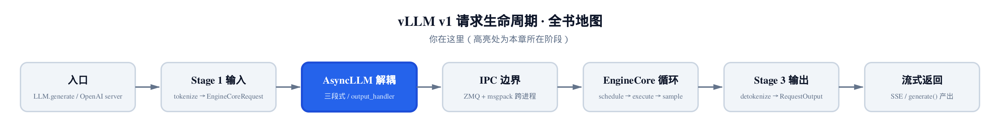
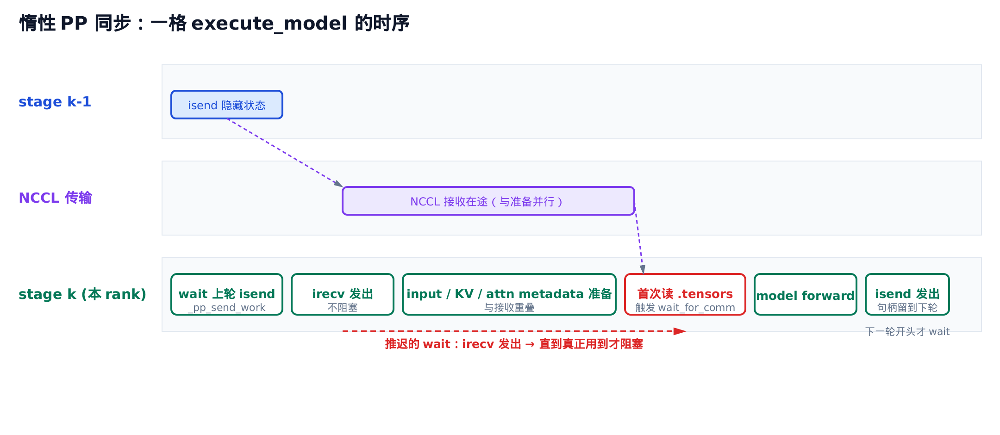
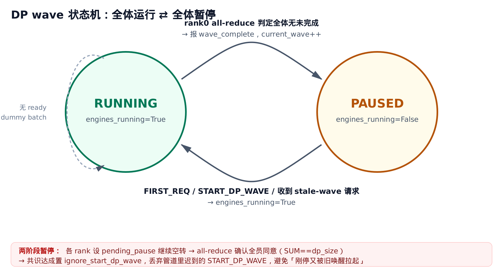
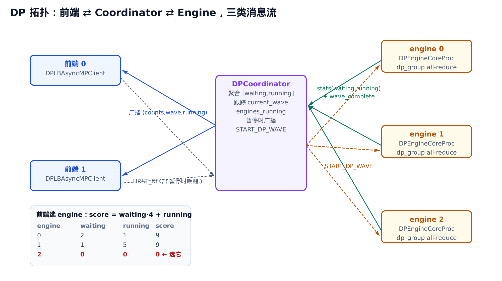

# 第 21 章 异步通信与数据并行：惰性 PP 同步、wave 共识、负载均衡



> *上一章把分布式集合通信原语铺到了桌面上：all-reduce、isend、irecv。*
> *本章把这些原语用到两件真正难的事上——让流水线并行的 wait 推迟到最后一刻，让多个数据并行引擎对「全体是否继续」达成共识。*
> *再往后，MoE 与专家并行会把「全员必须同步」这条铁律推到极致。*

本章的源码主线落在四个文件上：`vllm/v1/worker/gpu_worker.py`（惰性 PP 收发）、`vllm/v1/engine/core.py`（DP wave 忙循环）、`vllm/v1/engine/coordinator.py`（协调进程）、`vllm/v1/engine/core_client.py`（负载均衡客户端）。

## 这章要做什么

vLLM 跑大模型时有两条并行轴常常同时开：**流水线并行（pipeline parallel, PP）** 把模型切成几段，每段一个 stage，隐藏状态在 stage 之间传递；**数据并行（data parallel, DP）** 复制整个引擎，多份各自吃一批请求。两条轴都要跨进程通信，而通信是延迟杀手。

这一章只讲三个互相独立的机制，全都是为了**让通信不卡住计算**：

1. **惰性 PP 同步**：PP 的接收方发出 `irecv` 后不立刻等，把 `wait` 推迟到真正要读隐藏状态的那一瞬间，中间的准备工作和 NCCL 接收重叠跑。
2. **DP wave 共识**：多个 DP 引擎用每 32 步一次的 all-reduce，就「全体是否还有请求」达成共识，用一个单调递增的 wave 编号把「全体运行 → 全体暂停」的周期切成段。
3. **DP 负载均衡**：一个独立的协调进程居中收集各引擎负载，前端据此把请求按负载分到最空的引擎。

[第 4 章](../ch04-async-llm/narrative/chapter.md) 已经讲过 `AsyncLLM` 三段式异步外观——ZMQ 收发、output handler 那套。这章不重复那一层，只补上 PP 和 DP 这两个维度。三段式是「单引擎对外怎么异步」，这章是「多引擎/多 stage 之间怎么异步」。

## 惰性 PP 同步：把 wait 推迟到最后一刻

### 流水线的 bubble 从哪来

先说清楚朴素 PP 的痛点。模型切成 4 段放在 4 个 GPU 上，一个 token batch 要从 stage 0 顺着流到 stage 3。stage 1 必须等 stage 0 把隐藏状态传过来才能算，stage 2 等 stage 1……这段「等上游」的空转，就是流水线的 **bubble**。

朴素写法里，接收方会这样写：发一个阻塞 `recv`，原地等到张量收完，再往下走。问题是：收完张量之后、真正用到张量之前，接收方其实还有不少**和接收无关**的活要干——准备 input、给 KV cache 取地址、构建 attention metadata。这些活本可以和 NCCL 接收并行跑，却被一个阻塞 `recv` 白白堵在前面。

vLLM 的解法是：**把接收的 `wait` 推迟到隐藏状态真正被读取的那一刻**。先发非阻塞的 `irecv` 拿到一个句柄，立刻返回去干别的，等到谁第一次去读 `.tensors`，才在那一刻补上 `wait`。



> *图注：`stage k` 的一格执行。`irecv` 发出后不阻塞（绿框），中间的 input/KV/metadata 准备与 NCCL 接收并行；直到首次读 `.tensors` 才触发 `wait_for_comm`。红色虚线就是那段「推迟的 wait」。*

### 一个会自己 wait 的张量容器

这套惰性的核心，是一个叫 `AsyncIntermediateTensors` 的类。它继承普通的 `IntermediateTensors`（PP stage 之间传的就是这玩意），但多揣了两样东西：挂起的 `irecv` 句柄列表，和一个「是否已经 wait 过」的标志位。

```python
# vllm/v1/worker/gpu_worker.py:L74
class AsyncIntermediateTensors(IntermediateTensors):
    """IntermediateTensors with lazy comm synchronization"""

    def __init__(
        self,
        tensors: dict[str, torch.Tensor],
        comm_handles: list[Handle] | None = None,
        comm_postprocess: list[Callable[[], None]] | None = None,
    ) -> None:
        super().__init__(tensors)
        self._comm_handles = comm_handles
        self._comm_postprocess = comm_postprocess
        self._comm_waited = False

    def wait_for_comm(self) -> None:
        if self._comm_waited:
            return
        if self._comm_handles:
            for handle in self._comm_handles:
                handle.wait()
        if self._comm_postprocess:
            for fn in self._comm_postprocess:
                fn()
        self._comm_waited = True

    def __getattribute__(self, name: str):
        # ensure `.tensors` is ready before use
        if name == "tensors" and not object.__getattribute__(self, "_comm_waited"):
            object.__getattribute__(self, "wait_for_comm")()
        return object.__getattribute__(self, name)
```

关键在最后那个 `__getattribute__`。Python 里，**任何**属性访问都会先过这个钩子。这里拦的是 `.tensors`：只要谁读 `.tensors` 而且还没 wait 过，就先偷偷调 `wait_for_comm()`，把挂起的 `irecv` 等掉、把可能的分片重组（`comm_postprocess`）做掉，再返回真正的张量。

这个设计的妙处在于**对 model_runner 完全透明**。下游的 model_runner 拿到这个对象，照常写 `intermediate_tensors.tensors["hidden_states"]`，它根本不知道背后有个 `irecv` 在飞。谁先碰 `.tensors`，谁就在那一刻替大家把 wait 补上。`_comm_waited` 标志保证 wait 只发生一次——读第二次 `.tensors` 时 `wait_for_comm` 直接短路返回，是**幂等**的。

注意 `wait_for_comm` 内部为什么不用 `self._comm_waited`、`self._comm_handles`，而是绕一圈写 `object.__getattribute__(self, "wait_for_comm")()`？因为 `__getattribute__` 拦的是**所有**属性访问。把递归链显式走两步就清楚了——假设 `wait_for_comm` 里图省事直接写 `self._comm_handles`：

1. 读 `self._comm_handles` → 触发 `__getattribute__` 钩子 → 钩子里又调 `wait_for_comm()`；
2. `wait_for_comm()` 里再读 `self._comm_handles` → 又触发钩子 → 又调 `wait_for_comm()` → 回到第 1 步……

这就是无穷递归。绕过钩子直接走 `object.__getattribute__` 正是为了打破这个环：`object.__getattribute__` 是「不过钩子的原始属性访问」，从它读 `_comm_handles` 不会再触发拦截。所以钩子只对 `.tensors` 这一个名字做拦截，类内部读自己的状态全走 `object.__getattribute__` 直读，环就断了。

### irecv 为什么能不阻塞

句柄从哪来？来自 PP 通信组的 `irecv_tensor_dict`。它做的事是：先收一份**元数据**（每个张量的 shape/dtype），据此 `torch.empty` 预分配好接收缓冲区，然后对每个张量发一个 `torch.distributed.irecv`——非阻塞，立刻返回句柄。

```python
# vllm/distributed/parallel_state.py:L954
def irecv_tensor_dict(
    self,
    src: int | None = None,
    all_gather_group: "GroupCoordinator | None" = None,
    all_gather_tensors: dict[str, bool] | None = None,
) -> tuple[dict[str, torch.Tensor | Any] | None, list[Handle], list[Callable[[], None]]]:
    if not torch.distributed.is_initialized() or self.world_size == 1:
        return None, [], []

    if src is None:
        src = (self.rank_in_group - 1) % self.world_size
    # … 省略：先收元数据（shape/dtype），据此 torch.empty 预分配接收缓冲 …
    recv_metadata_list = self.recv_object(src=src)
    tensor_dict: dict[str, Any] = {}
    handles: list[Handle] = []
    postprocess: list[Callable[[], None]] = []

    for key, value in recv_metadata_list:
        if isinstance(value, TensorMetadata):
            full_tensor = torch.empty(value.size, dtype=value.dtype, device=value.device)
            # … 省略：序列并行下走 all_gather 分片接收 + postprocess 重组的旁支 …
            handle = torch.distributed.irecv(
                full_tensor, src=self.ranks[src], group=comm_group
            )
            handles.append(handle)
            tensor_dict[key] = full_tensor

    return tensor_dict, handles, postprocess
```

「先收元数据再预分配」这一步是 `irecv` 能异步的**前提**：要发非阻塞接收，得先有一块大小确定的缓冲区接着。所以元数据这步是同步的小开销（几个整数），真正的大张量传输才是异步的那部分。

返回的三元组 `(tensor_dict, handles, postprocess)` 正好喂给 `AsyncIntermediateTensors` 的构造参数：`tensor_dict` 是预分配好但**还没填满**的缓冲，`handles` 是挂起的接收句柄，`postprocess` 是序列并行时重组分片的闭包（不开序列并行就是空列表，纯 `irecv`）。

### 把一格流水线串起来

接收、发送都在 `Worker.execute_model` 里串成一条线。这是 PP 一个 stage 处理一拍的完整控制流：

```python
# vllm/v1/worker/gpu_worker.py:L772
@torch.inference_mode()
def execute_model(
    self, scheduler_output: "SchedulerOutput"
) -> ModelRunnerOutput | AsyncModelRunnerOutput | None:
    # ensure any previous non-blocking PP sends are complete
    if self._pp_send_work:
        for handle in self._pp_send_work:
            handle.wait()
        self._pp_send_work = []

    intermediate_tensors = None
    forward_pass = scheduler_output.total_num_scheduled_tokens > 0
    # … 省略：序列并行下计算 all_gather_tensors（只影响 residual 是否要 all-gather）…

    if forward_pass and not get_pp_group().is_first_rank:
        tensor_dict, comm_handles, comm_postprocess = get_pp_group().irecv_tensor_dict(
            all_gather_group=get_tp_group(),
            all_gather_tensors=all_gather_tensors,
        )
        assert tensor_dict is not None
        intermediate_tensors = AsyncIntermediateTensors(
            tensor_dict,
            comm_handles=comm_handles,
            comm_postprocess=comm_postprocess,
        )

    with self.annotate_profile(scheduler_output):
        output = self.model_runner.execute_model(scheduler_output, intermediate_tensors)
        # … 省略：pooling 模型 output is None 时调 pool() 的旁支 …
        if isinstance(output, ModelRunnerOutput | AsyncModelRunnerOutput | NoneType):
            return output

    assert isinstance(output, IntermediateTensors)
    # … 省略：external_launcher / is_last_rank 的断言，PP 中间 rank 恒不触发 …

    # launch non-blocking send of intermediate tensors
    self._pp_send_work = get_pp_group().isend_tensor_dict(
        output.tensors,
        all_gather_group=get_tp_group(),
        all_gather_tensors=all_gather_tensors,
    )

    return None
```

读这段，注意它惰性体现在**两头**：

- **接收侧**（非首 rank）：`irecv_tensor_dict` 拿到句柄就包成 `AsyncIntermediateTensors` 往下传，**这里完全没 wait**。wait 推迟到 model_runner 内部首次读 `.tensors`。中间发生的事——给 KV cache 取址、建 attention metadata——全和 NCCL 接收并行。
- **发送侧**（非末 rank）：算完用 `isend_tensor_dict` 非阻塞发送，句柄存进 `self._pp_send_work` 就返回 `None`。**发完不原地等对端收**。等什么时候 wait？下一拍 `execute_model` 一进来，开头那几行就把上一拍挂起的 `_pp_send_work` 等掉。

这就把 send 的完成检查推迟了**整整一拍**。发送方发完隐藏状态，马上去做下一拍的调度和前处理，跨 stage 的发送和本地计算彻底重叠。中间 rank 返回 `None`（它没有最终 logits），只有 last rank 返回真正的 `ModelRunnerOutput`——这条「中间 rank 返回 None、末 rank 返回 output」的控制流，是 PP 串联的骨架。

### 它到底省了多少

把这套机制的收益写成可比较的量级。设接收方在 `irecv` 之后、读 `.tensors` 之前那段准备工作耗时 $t_{\mathrm{prep}}$，NCCL 接收耗时 $t_{\mathrm{recv}}$。

朴素阻塞写法的关键路径是「先等收完，再准备」，两段串起来。惰性写法让两者并行，关键路径降到两段中较长的那段：

$$
t_{\mathrm{naive}} = t_{\mathrm{recv}} + t_{\mathrm{prep}}
\quad\longrightarrow\quad
t_{\mathrm{overlapped}} = \max(t_{\mathrm{recv}},\, t_{\mathrm{prep}})
$$

省下的就是两段里较短的那段。举个数：若接收 0.3ms、准备 0.2ms，朴素写法每格花 0.5ms，惰性写法只花 $\max(0.3, 0.2)=0.3$ms，省掉 0.2ms——这 0.2ms 乘以 PP 的 stage 数、再乘以每秒成千上万拍，省下来的就很可观。

一句人话：**只要准备工作和接收能并行，bubble 就缩短一段准备时间**。但它不改变 PP 固有的首尾填充开销——第一拍总得有人先把流水线灌满，这部分惰性帮不上忙。

### 在 host 上看它确实惰性

GPU、NCCL 都在容器里，但这套控制流是纯 Python，可以在普通机器上用「可 `.wait()` 的句柄替身」驱动真实流程，确认惰性确实成立：

- `irecv_tensor_dict` 返回的句柄此刻**没被 wait**——`AsyncIntermediateTensors` 的 `_comm_waited` 仍是 `False`；
- 第一次读 `.tensors` 之后，句柄的 `wait()` 才被调用，`_comm_waited` 翻成 `True`；
- 再读第二次 `.tensors`，`wait` 不再触发（幂等）；
- PP 中间 rank 的 `execute_model` 返回 `None`，并把 `isend` 句柄存进了 `_pp_send_work`；下一拍开头才 wait 上一拍这批句柄。

这些都和上面源码逐行对得上。`world_size == 1` 时 `irecv_tensor_dict` 直接返回 `(None, [], [])` 短路，也就是说单卡根本不会进 PP 收发这条路——只有真开了 PP 才付这份代价。

## DP wave 共识：让多个引擎齐步走

切换到第二个机制。数据并行下，整个引擎被复制成 $N$ 份（DP rank 0 到 $N-1$），每份独立吃请求。问题来了：**为什么这些独立的引擎还需要互相同步？**

答案藏在 MoE（mixture of experts）里。MoE 层的专家分散在各个 DP rank 上，一个 token 要路由到哪个专家、需要跨 rank 做 **all-to-all** 通信。all-to-all 是集合操作，**要求全员到场**——如果 rank 0 还在跑第 100 步、rank 1 因为没请求提前退出了，rank 0 的 all-to-all 就会永远等不到 rank 1，整个集群 **hang 死**。

所以 DP 引擎必须步调一致：要么全体在跑，要么全体暂停。`DPEngineCoreProc` 就是承载这套「齐步走」逻辑的进程。

### 全局状态：一个二元组

整个 DP 集群的全局状态，可以浓缩成一个二元组 `(current_wave, engines_running)`：

- `engines_running`：全体是在跑（`True`）还是全体暂停（`False`）；
- `current_wave`：一个单调递增的编号，每发生一次「全体运行 → 全体暂停」就 +1。

**wave** 这个词很形象：一波请求来了，全体引擎一起跑（一个 wave），跑干净了一起停；下一波请求再来，开新的 wave。用编号把这些波切成段，是后面处理唤醒竞态的基础。



> *图注：两个状态 RUNNING / PAUSED。RUNNING→PAUSED 由 rank0 的 all-reduce 触发。PAUSED→RUNNING 由新请求触发。无 ready 请求但仍 running 时，跑 dummy batch 维持步调。*

### 忙循环：每拍都在维持对齐

`run_busy_loop` 是 DP 引擎的心跳。剥掉外层的关停判断和输入轮询，每一拍的骨架是这样：

```python
# vllm/v1/engine/core.py:L1790
def run_busy_loop(self):
    """Core busy loop of the EngineCore for data parallel case."""
    while self._handle_shutdown():
        # 1) Poll the input queue until there is work to do.
        self._process_input_queue()

        executed = self._process_engine_step()
        self._maybe_publish_request_counts()

        local_unfinished_reqs = self.scheduler.has_unfinished_requests()
        if not executed:
            if not local_unfinished_reqs and not self.engines_running:
                # All engines are idle.
                continue

            # We are in a running state and so must execute a dummy pass
            # if the model didn't execute any ready requests.
            self.execute_dummy_batch()

        # 3) All-reduce operation to determine global unfinished reqs.
        self.engines_running = self._has_global_unfinished_reqs(local_unfinished_reqs)

        if not self.engines_running:
            if self.dp_rank == 0 or not self.has_coordinator:
                # Notify client that we are pausing the loop.
                client_index = -1 if self.has_coordinator else 0
                self.output_queue.put_nowait(
                    (client_index, EngineCoreOutputs(wave_complete=self.current_wave))
                )
            # Increment wave count and reset step counter.
            self.current_wave += 1
            self.step_counter = 0

    raise SystemExit
```

逐段读：

1. **跑一步**：`_process_engine_step` 真去调度+执行一个 batch，返回有没有真跑（`executed`）。`_maybe_publish_request_counts` 把本引擎当前的 `[waiting, running]` 负载发给协调进程（仅在数字变化时发，省带宽）。
2. **空转补齐**：如果本拍没真跑（`not executed`）但全局还在 running 状态，就跑一个 **dummy batch**。这是齐步走的关键——本引擎手头没 ready 请求，但别的引擎可能在跑 MoE all-to-all，需要本引擎到场凑数。dummy batch 是一个假的空 forward，专门用来维持各 rank 步调一致。要是连本引擎也没活、全局也不 running，那就 `continue` 真空转。
3. **共识**：`_has_global_unfinished_reqs` 做 all-reduce，问全体「还有没有未完成请求」，结果写回 `engines_running`。
4. **报暂停**：一旦共识判定全体没活了（`not engines_running`），由 **rank 0** 经 `output_queue` 报一条 `wave_complete=current_wave` 给协调进程，然后 `current_wave += 1`、`step_counter` 归零，开启下一个 wave。只有 rank 0 报，避免 $N$ 个 rank 重复上报。

### 一次 all-reduce 解决两个共识

这里最精巧的是 `sync_dp_state`：用**单次** 2 元素 SUM all-reduce，同时回答两个本来需要分开问的问题。

```python
# vllm/config/parallel.py:L666
@staticmethod
def sync_dp_state(
    dp_group: ProcessGroup, has_unfinished: bool, pending_pause: bool
) -> tuple[bool, bool]:
    """Combined all-reduce for DP state synchronization.

    Uses a single SUM all-reduce on a 2-element tensor:
      [0] = 1 if this rank has unfinished work, else 0.
            SUM > 0 ≡ logical OR across ranks → any rank has work.
      [1] = 1 if this rank has a pending pause request, else 0.
            SUM == dp_size ≡ all ranks reached pause consensus.
    """
    tensor = torch.tensor(
        [int(has_unfinished), int(pending_pause)], dtype=torch.int32, device="cpu"
    )
    torch.distributed.all_reduce(tensor, op=ReduceOp.SUM, group=dp_group)
    dp_size = dp_group.size()
    pause_count = tensor[1].item()
    has_unfinished_global = tensor[0].item() > 0 or pause_count % dp_size != 0
    return has_unfinished_global, pause_count == dp_size
```

把这两维拆开看它的正确性：

- **第 0 维 = 全局是否有未完成请求（逻辑 OR）**。每个 rank 填 0 或 1，SUM 之后 `> 0` 就等价于「**任一** rank 还有活」。这一维保证：只要还有一个 rank 没干完，全体继续——绝不会出现某个 rank 提前退出，害得别人的 all-to-all 缺人 hang 死。
- **第 1 维 = 是否全体达成暂停共识（逻辑 AND）**。每个 rank 填「我是否请求暂停（`pending_pause`）」，SUM 之后 `== dp_size` 才说明**所有** rank 都举了手。

把逻辑 OR 和逻辑 AND（计数等于规模）这两个共识，塞进**同一次** all_reduce(SUM)，省掉一轮通信。

还有个细节值得多看一眼：`has_unfinished_global` 的判定里有个 `or pause_count % dp_size != 0`。意思是——如果暂停计数**不是** `dp_size` 的整数倍（即只有一部分 rank 想暂停、还没全员一致），就当作「还有未完成」继续跑。这是一道保险：避免半数 rank 暂停、半数还在跑，导致 MoE all-to-all 错配。要停就全体停，没全体同意就接着跑。

### 32 步才同步一次

如果每一拍都做一次 all-reduce，通信开销会把性能吃掉一大块。`_has_global_unfinished_reqs` 在这里做了节流：

```python
# vllm/v1/engine/core.py:L1846
def _has_global_unfinished_reqs(self, local_unfinished: bool) -> bool:
    # Optimization - only perform finish-sync all-reduce every 32 steps.
    self.step_counter += 1
    if self.step_counter % 32 != 0:
        return True

    has_unfinished, pause_consensus = ParallelConfig.sync_dp_state(
        self.dp_group,
        has_unfinished=local_unfinished,
        pending_pause=self.pending_pause,
    )

    if pause_consensus:
        self.ignore_start_dp_wave = True
        self.pending_pause = False
        logger.debug("DP pause consensus reached, ignoring START_DP_WAVE.")

    return has_unfinished
```

`step_counter` 不到 32 的整数倍时，**直接返回 `True`**——「假定还有活，继续跑」，根本不做 all-reduce。只有每 32 步那一次，才真去同步。

这个权衡可以量化。设单步耗时 $t_{\mathrm{step}}$、一次 all-reduce 耗时 $t_{\mathrm{ar}}$，则均摊到每步的同步开销是：

$$
\overline{t_{\mathrm{sync}}} = \frac{t_{\mathrm{ar}}}{32}
$$

通信开销直接降一个数量级。代价是**延迟发现**：某个 rank 真空闲下来后，最坏要再多跑 31 步 dummy batch，才轮到下一次 all-reduce 把它发现。用「最多 31 步无谓空转」换「同步开销降 32 倍」——对吞吐导向的引擎，这笔账划算。

### 两阶段暂停：别被迟到的唤醒拉起

`pause_consensus` 达成后那两行很关键：`self.ignore_start_dp_wave = True`、`self.pending_pause = False`。这是**两阶段暂停**协议的第二阶段。

为什么要两阶段？想象这个竞态：rank 们刚通过 all-reduce 确认「全体暂停」，可就在暂停生效的前一刻，管道里还飞着一条早先发出的 `START_DP_WAVE`（唤醒消息）。如果不管它，这条迟到的唤醒会把刚停下的引擎又拉起来，破坏「全体一致暂停」。

于是分两步：

- **阶段 1**：各 rank 想暂停时先设 `pending_pause = True`，但**继续空转步进**，直到 all-reduce 确认全员都举了手（`SUM == dp_size`）。
- **阶段 2**：共识一达成，立刻置 `ignore_start_dp_wave = True`——此后所有飞行中的 `START_DP_WAVE` 一律丢弃，清掉 `pending_pause`。

这样就堵住了「刚共识暂停、又被旧唤醒拉起」的窗口。后面讲唤醒时会看到 `START_DP_WAVE` 的处理入口正是先查这个标志。

把这套 AND 共识也追成一张表。仍设 dp_size=2，看第 1 维（`pending_pause` 的 SUM）怎么从「半数举手」走到「全员举手」。这正好和上一节那张追第 0 维（OR）的表互补——这次盯的是第 1 维：

| sync 轮 | rank0 pending_pause | rank1 pending_pause | all-reduce[1] SUM | SUM % dp_size | has_unfinished_global | pause_consensus（SUM==2） | 动作 |
| --- | --- | --- | --- | --- | --- | --- | --- |
| 第一次 sync | 1 | 0 | 1 | 1（≠0） | **True** | False | 半数举手 → 判仍有活，继续空转步进 |
| 第二次 sync | 1 | 1 | 2 | 0 | False | **True** | 全员举手 → 共识达成，置 `ignore_start_dp_wave`、清 `pending_pause` |

读这张表：第一次 sync 只有 rank0 想暂停，SUM=1，`1 % 2 ≠ 0` 这道保险把 `has_unfinished_global` 顶成 `True`——于是全体继续空转，绝不会出现「rank0 停了、rank1 还在跑 all-to-all」的错配。直到第二次 sync 两个 rank 都举手，SUM=2 整除 dp_size，`pause_consensus` 才翻 `True`，两阶段暂停的第二阶段（丢弃迟到唤醒）这时才启动。

**这条「要停就全体停」的正确性**靠一个不变量：只要 `pending_pause` 的 SUM 不等于 `dp_size`，`has_unfinished_global` 必为真（`pause_count % dp_size != 0` 那一项兜底），全体一定继续。换言之 `engines_running` 只在 SUM 严格等于 dp_size 那一刻才被允许翻 `False`——半数同意永远不够，杜绝了部分暂停。

### 在 host 上追一轮 wave

把忙循环的状态连续追几拍，看 wave 怎么收敛。设 dp_size=2，两个引擎，构造一个「全体即将跑干净」的场景，逐拍记录关键标量（用整数 all-reduce 替身驱动真实控制流）：

| 拍 | step_counter（进 sync 后） | local_unfinished | 是否到 32 步 | all-reduce[0] SUM | engines_running | 动作 | current_wave |
| --- | --- | --- | --- | --- | --- | --- | --- |
| 第 31 拍 | 31 | False | 否 | —（短路返回 True） | True | 继续，跑 dummy | 5 |
| 第 32 拍 | 32 | False | 是 | 0（两 rank 都没活） | **False** | rank0 报 wave_complete，wave++ | 5 → **6** |
| 第 33 拍 | 1 | False | 否 | —（短路） | False | 全体 idle，`continue` 空转 | 6 |

读这张表：第 31 拍 `step_counter` 没到 32，`_has_global_unfinished_reqs` 直接返回 `True`，不做 all-reduce，引擎继续（手头没 ready 就跑 dummy batch）。第 32 拍触发 all-reduce，两个 rank 的第 0 维都填 0，SUM=0，判定全局无活 → `engines_running=False` → rank 0 报 `wave_complete=5`，`current_wave` 从 5 跳到 6，`step_counter` 归零。第 33 拍进来，全局已 idle，`continue` 真空转等新请求。

**终止性**靠这条单调量：`step_counter` 每拍 +1，每 32 步必触发一次 all-reduce；只要全体确无未完成，那次 all-reduce 的第 0 维 SUM 必为 0，`engines_running` 必翻 `False`，wave 必 +1。不会有「全体空了却永远停不下来」的情况——最多拖 31 步。

## DP 协调进程与负载均衡

最后一个机制。DP 部署是 **N 个前端 API server × M 个引擎** 的拓扑。前端要把请求分给最空的引擎，引擎要把 wave 状态同步给前端。如果让每个前端各自去和每个引擎 all-reduce、各自广播，$N \times M$ 条通路会乱成一团。

vLLM 的做法是塞一个**独立的协调进程** `DPCoordinator` 居中：所有引擎把负载和 wave 信号汇报给它，它聚合后单点广播给所有前端。前端之间、引擎之间不直接对话，全走协调进程这个枢纽。



> *图注：前端 ⇄ Coordinator ⇄ Engine 的三类消息流。引擎上报 stats + wave_complete（绿）；协调进程广播 (counts,wave,running) 给前端（蓝）、广播 START_DP_WAVE 给引擎（橙）；前端暂停时发 FIRST_REQ 唤醒（灰）。左下小表是前端选引擎的评分。*

### 谁来当这个客户端

前端用哪种客户端，由一个工厂函数按部署形态三选一：

```python
# vllm/v1/engine/core_client.py:L107
def make_async_mp_client(
    vllm_config: VllmConfig,
    executor_class: type[Executor],
    log_stats: bool,
    client_addresses: dict[str, str] | None = None,
    client_count: int = 1,
    client_index: int = 0,
) -> "AsyncMPClient":
    parallel_config = vllm_config.parallel_config
    client_args = (
        vllm_config, executor_class, log_stats,
        client_addresses, client_count, client_index,
    )
    if parallel_config.data_parallel_size > 1:
        if parallel_config.data_parallel_external_lb:
            # External load balancer - client per DP rank.
            return DPAsyncMPClient(*client_args)
        # Internal load balancer - client balances to all DP ranks.
        return DPLBAsyncMPClient(*client_args)
    return AsyncMPClient(*client_args)
```

三种形态，对应三种部署：

- **单引擎**（`dp_size == 1`）：`AsyncMPClient`，没有 DP 维度，就是 [第 4 章](../ch04-async-llm/narrative/chapter.md) 那个三段式客户端。
- **外部负载均衡**（`external_lb`）：`DPAsyncMPClient`，每个 client 绑定一个 DP rank，分流交给外部（比如 K8s ingress / 路由器），client 自己不做均衡。
- **内部负载均衡**（默认）：`DPLBAsyncMPClient`，client 自己在所有引擎间均衡——这是本节主角。

### 评分选最空的引擎

`DPLBAsyncMPClient` 怎么挑引擎？用一个简单的评分，挑分最低（最空）的：

```python
# vllm/v1/engine/core_client.py:L1350
def get_core_engine_for_request(self, request: EngineCoreRequest) -> EngineIdentity:
    # Engines are in rank order.
    if (eng_index := request.data_parallel_rank) is None and (
        eng_index := get_late_interaction_engine_index(
            request.pooling_params, len(self.core_engines)
        )
    ) is None:
        current_counts = self.lb_engines
        # TODO use P2C alg for larger DP sizes
        num_engines = len(current_counts)
        min_score = sys.maxsize
        eng_index = 0
        for i in range(num_engines):
            # Start from client_index to help with balancing when engines
            # are empty.
            idx = (self.eng_start_index + i) % num_engines
            waiting, running = current_counts[idx]
            score = waiting * 4 + running
            if score < min_score:
                min_score = score
                eng_index = idx
        # Increment local waiting count for better balancing between stats
        # updates from the coordinator (which happen every 100ms).
        current_counts[eng_index][0] += self.client_count

    chosen_engine = self.core_engines[eng_index]
    # Record which engine is chosen for this request, to handle aborts.
    self.reqs_in_flight[request.request_id] = chosen_engine
    return chosen_engine
```

核心是那行评分公式：

$$
\mathrm{score} = 4 \cdot \mathit{waiting} + \mathit{running}
$$

`waiting`（排队等上车的请求）权重是 `running`（已在批次里跑的）的 **4 倍**。直觉是：一个 `waiting` 的请求要等当前整个 batch 跑完才有机会上车，它对尾延迟的贡献远大于一个已经在跑的请求。所以排队的请求被赋更高权重，引擎一旦积压排队就显得「更满」，新请求自然绕开它。

举个数：三个引擎负载是 `[[2,1], [1,5], [0,0]]`，算分得 `[4·2+1, 4·1+5, 4·0+0] = [9, 9, 0]`。引擎 2 最空（0 分），新请求落到引擎 2。注意引擎 0 和引擎 1 同样是 9 分——引擎 0 有 2 个排队、引擎 1 有 5 个在跑，权重把它们拉平了，这正是 4:1 想表达的「排队 2 个 ≈ 在跑 8 个」的体感。

### 本地预增：抵消 100ms 滞后

最后一行 `current_counts[eng_index][0] += self.client_count` 是点睛之笔。

问题：协调进程每 **100ms** 才广播一次负载快照。这 100ms 里，如果来了一串请求、都看着同一份旧快照，会发生什么？——它们会**全挤到同一个引擎**（那个快照里最空的），造成羊群效应。等下一次快照来了才发现这引擎已经被挤爆，可惜来不及了。

解法是**本地预增**：每选中一个引擎，就在本地立刻把它的 `waiting` 加上 `client_count`，假装这个请求已经排上了。这样紧接着来的下一个请求，看到的就是「这引擎刚被占了一格」的更新后视图，自然会去找次空的。这是对 100ms 刷新滞后的**前馈补偿**。

用一个突发场景看效果。两个引擎初始都空 `[[0,0], [0,0]]`，`eng_start_index=0`，设 `client_count=1`（单前端，故每次预增 `waiting += 1`），连发两个请求：

| 请求 | 选前 lb_engines | eng0 score | eng1 score | 选中 | 预增后 lb_engines |
| --- | --- | --- | --- | --- | --- |
| a | `[[0,0],[0,0]]` | 0 | 0 | eng0（从 start_index 起，平局取先） | `[[1,0],[0,0]]` |
| b | `[[1,0],[0,0]]` | 4 | 0 | **eng1** | `[[1,0],[1,0]]` |

请求 a 落到引擎 0，预增后引擎 0 的 score 变成 4；请求 b 进来一看引擎 0 已是 4 分、引擎 1 还是 0 分，于是去引擎 1。两个请求被打散到两个引擎，**没有羊群**。如果没有预增，请求 b 会看到和 a 一样的旧快照，也挤到引擎 0。

循环从 `eng_start_index` 起轮询（而非永远从 0 开始）也是为打散——不同 client_index 的前端起点不同，空集群也能均匀铺开。源码里那句注释标了 `TODO use P2C alg`——更大 DP 规模下，会换成 power-of-two-choices（随机选两个比一下）的均衡算法，这是留给未来的优化。

显式指定 `data_parallel_rank` 的请求会跳过整个评分（第一个 walrus 分支直接定 `eng_index`），路由固定。`reqs_in_flight` 记下每个请求去了哪个引擎，是为了将来 abort 时能定向找到对的引擎。

### 协调进程的 wave 状态机

协调进程自己也维护一份 `(current_wave, engines_running)`，靠三个 ZMQ socket 轮询驱动。它处理引擎上报的事件：

```python
# vllm/v1/engine/coordinator.py:L368
if output_back in events:
    # We received a message from one of the engines.
    buffer = output_back.recv()
    outputs: EngineCoreOutputs = decoder.decode(buffer)

    eng_index = outputs.engine_index
    scheduler_stats = outputs.scheduler_stats
    if scheduler_stats:
        # 1. Updated request load stats - update our local state with these.
        stats = self.engines[eng_index].request_counts
        # … 省略：stats 乱序检测，只为排序统计快照，不影响 wave 主线 …
        stats[0] = scheduler_stats.num_waiting_reqs
        stats[1] = scheduler_stats.num_running_reqs
        stats_changed = True

    # Wave coordination: handle wave completion and start notifications
    if self.enable_wave_coordination:
        if (wave := outputs.wave_complete) is not None:
            # 2. rank 0 engine reports we've moved into the global paused state.
            if current_wave <= wave:
                new_wave = wave + 1
                current_wave = new_wave
                engines_running = False
                wave_state_changed = True
        elif (wave := outputs.start_wave) is not None and (
            wave > current_wave
            or (wave == current_wave and not engines_running)
        ):
            # 3. The engine received request for a non-current wave so we must
            # ensure that other engines progress to the next wave.
            current_wave = wave
            engines_running = True
            wave_state_changed = True
            self._send_start_wave(publish_back, wave, eng_index)

if wave_state_changed:
    message = (None, current_wave, engines_running)
    publish_front.send(msgspec.msgpack.encode(message))
```

三类事件：

1. **stats 更新**：把某引擎上报的 `[waiting, running]` 写进本地账本。这份账本聚合后会广播给所有前端做负载均衡。
2. **wave_complete**：rank 0 报告「全体进入暂停」。协调进程把 `current_wave` 推到 `wave+1`、`engines_running=False`。`current_wave <= wave` 的判断是去重——避免重复或过期的 complete 把 wave 推过头。
3. **start_wave**：某引擎收到一个**非当前 wave** 的请求（请求带的 wave 号比集群当前的新），说明有落后的引擎需要被推进。协调进程把全局 wave 对齐过去、`engines_running=True`，并广播 `START_DP_WAVE` 唤醒其余引擎。

任何 wave 状态变化，最后都通过 `publish_front` 广播 `(None, current_wave, engines_running)` 给所有前端，让它们的本地视图跟上。

### 暂停时怎么唤醒

引擎暂停后，新请求来了得先把全体拉回 running（MoE all-to-all 要全员在场），请求才能真正落地。这条唤醒链路要尽量快。

前端的 `add_request_async` 在发请求的**同时**（不等它发完）抢先发一条 `FIRST_REQ` 通知协调进程：

```python
# vllm/v1/engine/core_client.py:L1296
async def add_request_async(self, request: EngineCoreRequest) -> None:
    self._ensure_stats_update_task()

    request.current_wave = self.current_wave
    request.client_index = self.client_index

    chosen_engine = self.get_core_engine_for_request(request)
    to_await = self._send_input(EngineCoreRequestType.ADD, request, chosen_engine)
    if not self.engines_running:
        # Notify coordinator that we're sending a request
        req_msg = msgspec.msgpack.encode(("FIRST_REQ", chosen_engine))
        await self.first_req_send_socket.send(req_msg)

    await to_await

    self._ensure_output_queue_task()
```

注意时序：`_send_input` 返回一个 `to_await`（请求实际发送的协程），但**先不 await**。如果 `engines_running` 是 `False`（全体暂停），就先经独立的 `first_req_send_socket` 发 `FIRST_REQ`，**再**回头 await 请求发送。唤醒信号抢在请求前头跑，最小化「请求到了却没人接」的延迟。

请求还被盖上了 `current_wave`——这个章戳，正是协调进程判断「这是不是个 stale-wave 请求、要不要广播唤醒」的依据。协调进程收到 `FIRST_REQ` 后广播 `START_DP_WAVE`，各引擎的 `_handle_client_request` 接住它：先查 `ignore_start_dp_wave`（还记得两阶段暂停那道闸吗），没被忽略、且 wave 号够新、且自己不是已经直接收到请求的那个引擎（`exclude` 去重），才把自己拉回 running。

### 把协调链路在 host 上跑通

整条链路——前端评分选引擎、盖 wave、暂停时发 FIRST_REQ、协调进程聚合 stats 与 wave 状态机、广播回前端——都是纯 Python 控制流。用 socket 帧队列替身把它驱动起来，可以确认这些行为逐一成立：

- 工厂按 `dp_size` / `external_lb` 正确三选一；
- 评分确实选最空引擎，`waiting` 的 4:1 权重生效，预增能打散突发；
- 显式 `data_parallel_rank` 跳过均衡，负载账本不动；
- `add_request_async` 给请求盖上 `current_wave`，暂停时发 `FIRST_REQ`、running 时不发；
- 协调进程收 `wave_complete` 把 wave++ 并切到 paused、收 stale `wave_complete` 忽略、前端暂停时新请求触发 `START_DP_WAVE` 广播；
- 前端消费广播帧后更新 `current_wave` / `engines_running`，并把全局 counts 切片成自己管的那段 `lb_engines`。

这些和上面源码逐行对得上。真正触 NCCL / ZMQ / msgpack 的对照，得进容器跑；但控制流的正确性，在普通机器上就验得清楚。

## 小结

这一章拆了三个互相独立、却共享同一个理念的机制：**别让通信卡住计算**。

- **惰性 PP 同步**用 `AsyncIntermediateTensors` 的 `__getattribute__` 钩子，把 `irecv` 的 `wait` 推迟到首次读 `.tensors`，把 send 的 wait 推迟整整一拍——准备工作和 NCCL 传输重叠，bubble 缩短约一段准备时间。
- **DP wave 共识**用每 32 步一次的单次 2 元素 SUM all-reduce，一并解出「全局是否有活（OR）」和「是否全体暂停（AND）」，把通信开销降一个数量级；wave 编号 + 两阶段暂停（`pending_pause` → `ignore_start_dp_wave`）处理唤醒竞态。
- **DP 负载均衡**用独立协调进程居中聚合，前端用 `score = 4·waiting + running` 选最空引擎、本地预增抵消 100ms 滞后。

贯穿这三者的，是那条 MoE 的铁律——**专家并行的 all-to-all 要求全员在场**（`vllm/v1/engine/core.py:L1790` 的忙循环正是为它而存在）。正是它逼出了 DP 的齐步走、wave 共识、dummy batch 凑数。后面深入 MoE 与专家并行时，会反复回到这条铁律：一旦把模型按专家切开，「同步」就从优化项变成了正确性的底线。
