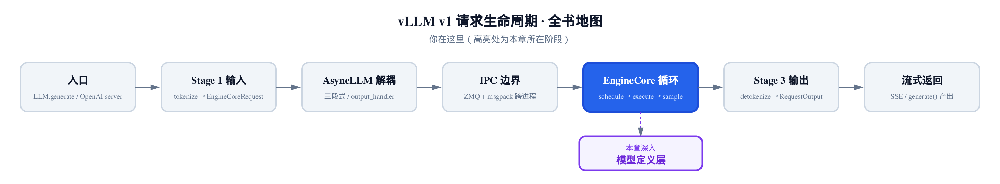
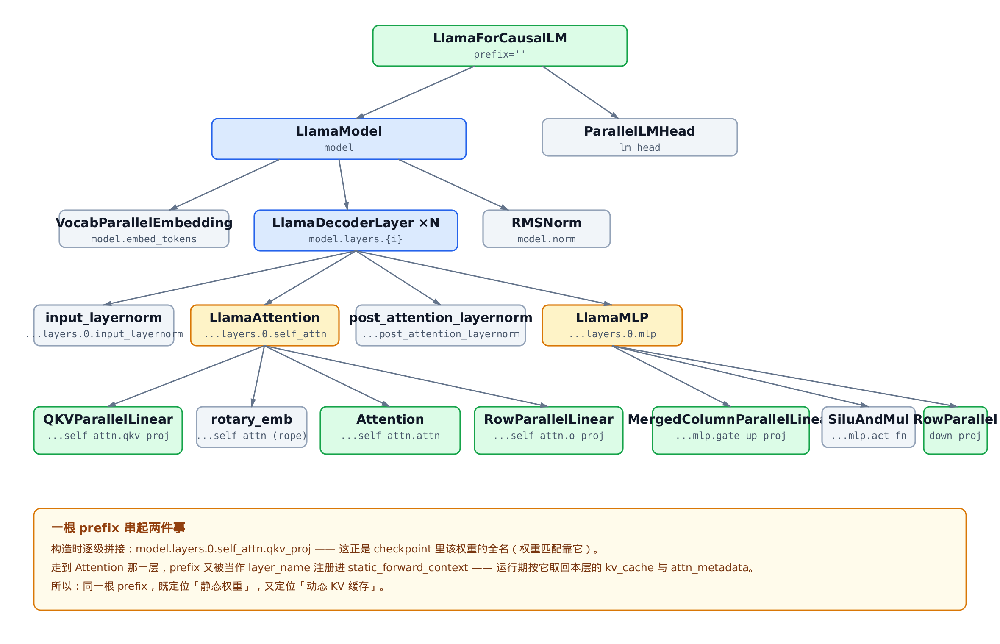
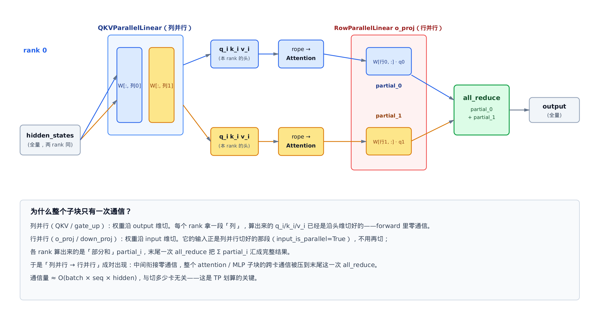
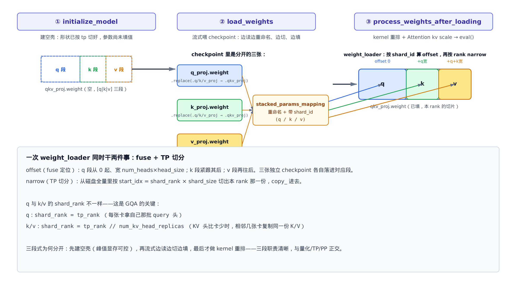

# 第22章　模型契约与权重装载：以 Llama 为最简参考

## 你在这里



> *图注：全书地图走到模型定义层。*
> *[上一章](../ch21-async-engine/narrative/chapter.md)把多卡之间的集合通信讲透了——那行 `all_reduce` 背后的群组怎么建、怎么进 `torch.compile` 图。*
> *本章往里走一层：模型代码本身长什么样。`(vllm_config, prefix)` 怎么构造、TP 线性层怎么切、Attention 怎么收口后端、权重怎么从磁盘装进切好的参数。*
> *[下一章](../ch23-custom-ops/narrative/chapter.md)接着把 Attention 里那个「自定义算子」和 `torch.compile` 拆开看。*

前面二十多章，我们一直把「模型」当黑盒。model runner 把 `input_ids`、`positions`、`inputs_embeds` 喂进去（[第 18 章](../ch18-model-runner/narrative/chapter.md)讲过怎么准备这些张量），黑盒吐出 `hidden_states`，采样器接着抽 token。这一章，我们把黑盒打开。

打开之后会发现：vLLM 的模型代码，和你在 HuggingFace `transformers` 里见过的 Llama 长得**很像**，又**很不一样**。像，是因为它就是标准的 decoder-only transformer——embedding、N 层 block、末尾 norm。不一样，是因为每一处都为「多卡推理」和「高效装载」改造过：三个投影 fuse 成一个、线性层自带张量并行切分、注意力收口成一个对后端无感的封装、权重从磁盘流式切进各卡。

为什么挑 Llama？因为它是**最简基线**。没有专家混合（MoE），没有潜在瓶颈（MLA），没有量化压缩，没有混合残差。后面 [第 25 章读 DeepSeek-V4](../ch25-deepseek-v4/narrative/chapter.md) 时，会把每一个新增结构都当作「对 Llama 的 delta」引入。所以这一章不只是讲 Llama——是在**确立一份契约**，让所有 vLLM v1 模型都照着它长。

四条主线：

- **`(vllm_config, prefix)` 构造契约**：所有 v1 模型类的 `__init__` 只收这两个关键字参数。`vllm_config` 是全局配置的单一入口，`prefix` 是模块在 state-dict 里的全路径——它一根串起「权重名」和「KV cache 寻址键」。
- **TP 线性层**：`QKVParallelLinear` / `MergedColumnParallelLinear` / `RowParallelLinear`。列并行沿 output 切、行并行沿 input 切，成对出现，整个子块只在末尾一次 `all_reduce`。
- **`Attention` 统一封装**：模型定义只给 `num_heads`/`head_size`/`scale`，后端选择、KV cache、量化 scale 全被它吸收。换后端不改模型代码。
- **三段式权重装载**：`initialize_model`（建空壳）→ `load_weights`（流式切填）→ `process_weights_after_loading`（kernel 重排）。中间靠 `stacked_params_mapping` 把 checkpoint 里分开的 q/k/v 重组进 fused 参数。

照例配一份**只做减法**的精简版：和真实 `vllm/model_executor/models/llama.py`、`vllm/model_executor/layers/linear.py` 同名、同结构、同控制流，只删掉量化/PP/Eagle/LoRA 注入这些与基线无关的分支。它在 host 上不要 CUDA、不 import vllm，就能跑通 TP 切分的数值、qkv fuse 的装载、三段式的前向。正文主线始终是真实源码；精简版只用来「亲眼看一眼数值对不对」。

先看模型整体长什么样。

---

## 22.1 一张图看懂模型的四级嵌套

vLLM 的 Llama 是一棵四层深的模块树。先把全貌摆出来，后面每一节都在这棵树的某个节点上展开。



> *图注：`LlamaForCausalLM` → `LlamaModel` → `LlamaDecoderLayer` → `{LlamaAttention, LlamaMLP}` → 各 TP 线性层。每个节点标注它的 `prefix`。*
> *绿色是本章的主角（契约入口与 TP 线性层），蓝色是容器，琥珀色是两个子模块，灰色是辅助层。*

从根往下读：

- **`LlamaForCausalLM`**（`vllm/model_executor/models/llama.py:L501`）：顶层契约入口。持有 `self.model` 和 `lm_head`，`forward` 透传给 `model`，`compute_logits` 经 `lm_head` 出 logits。
- **`LlamaModel`**：embedding + N 层 decoder + 末尾 RMSNorm 的容器。权重装载的核心逻辑住在这里。
- **`LlamaDecoderLayer`**：单层 transformer block。`self_attn` + `mlp` + 两个 norm。
- **`LlamaAttention` / `LlamaMLP`**：注意力和前馈两个子模块，各自构造 TP 线性层。
- **叶子**：`QKVParallelLinear`、`RowParallelLinear`、`MergedColumnParallelLinear`、`Attention`——本章后半段的主角。

这棵树的形状没什么意外，标准 transformer 就长这样。真正值得盯住的是图最下面那条横幅：**一根 `prefix` 串起两件事**。这是整个契约的脊梁，22.2 节专门讲它。

---

## 22.2 `(vllm_config, prefix)`：一份统一的构造契约

打开任何一个 vLLM v1 模型类，它的 `__init__` 签名都长一个样。看 `LlamaForCausalLM`（`vllm/model_executor/models/llama.py:L501`）：

```python
# vllm/model_executor/models/llama.py:L501
class LlamaForCausalLM(
    nn.Module, SupportsLoRA, SupportsPP, SupportsEagle, SupportsEagle3
):
    packed_modules_mapping = {
        "qkv_proj": ["q_proj", "k_proj", "v_proj"],
        "gate_up_proj": ["gate_proj", "up_proj"],
    }

    def __init__(
        self,
        *,
        vllm_config: VllmConfig,
        prefix: str = "",
        layer_type: type[nn.Module] = LlamaDecoderLayer,
    ):
        super().__init__()
        config = vllm_config.model_config.hf_config
        quant_config = vllm_config.quant_config
        self.config = config

        self.model = self._init_model(
            vllm_config=vllm_config,
            prefix=maybe_prefix(prefix, "model"),
            layer_type=layer_type,
        )

        # … 省略：PP 末段才建 lm_head/logits_processor，单卡恒走这一支 …
        self.lm_head = ParallelLMHead(
            config.vocab_size,
            config.hidden_size,
            quant_config=quant_config,
            prefix=maybe_prefix(prefix, "lm_head"),
        )
        if config.tie_word_embeddings:
            self.lm_head = self.lm_head.tie_weights(self.model.embed_tokens)
        self.logits_processor = LogitsProcessor(config.vocab_size, scale=logit_scale)
```

注意那个 `*`——它强制 `vllm_config` 和 `prefix` 只能按关键字传。这不是偶然。**所有** v1 模型类都遵守这个签名：构造时只拿到一个 `vllm_config` 大对象，自己从里头取 `hf_config`、`quant_config`、`cache_config`。

为什么收口成单一对象？想象一下另一种世界：每个模型类的 `__init__` 列一长串 `config, cache_config, quant_config, lora_config, scheduler_config, ...`。每加一个全局配置，所有模型类的签名都得改。收口成 `vllm_config` 后，新增配置只动 `VllmConfig` 一处，模型从中按需自取。

这份契约不是「君子约定」——装载器会**显式校验**它。看 `initialize_model`（`vllm/model_executor/model_loader/utils.py:L40`）：

```python
# vllm/model_executor/model_loader/utils.py:L56
signatures = inspect.signature(model_class.__init__)
all_params = [param.name for param in signatures.parameters.values()]
if "vllm_config" in all_params and "prefix" in all_params:
    # new-style model class
    with set_current_vllm_config(vllm_config, check_compile=True, prefix=prefix):
        model = model_class(vllm_config=vllm_config, prefix=prefix)
        record_metadata_for_reloading(model)
        return model
# … 省略：老式签名走 DeprecationWarning 兼容路径，逐个猜 config/cache_config… …
```

它用 `inspect` 看你的 `__init__` 接不接受这两个名字。接受，走新路径；不接受，警告并尝试兼容老式签名。精简版把这步压成一句 `assert`，跑测试时能看到「缺 `vllm_config`/`prefix` 的类会被拒」：

```python
# 摘自精简版测试：缺契约参数的类被 initialize_model 拒绝
class BadModel:
    def __init__(self, foo):   # 缺 vllm_config / prefix
        pass

with pytest.raises(AssertionError):
    initialize_model(vllm_config, model_class=BadModel)
```

那 `prefix` 呢？空字符串，看起来没什么用。下一节会看到，它其实是整个契约里最巧妙的一根线。

### prefix：一根线串起权重名和 KV cache

`prefix` 在构造时逐级拼接下去。`LlamaForCausalLM` 把 `"model"` 拼给 `self.model`，`LlamaModel` 把 `"model.layers.0"` 拼给第 0 层，一路到 `model.layers.0.self_attn.qkv_proj`。负责堆叠每一层的是 `make_layers`（`vllm/model_executor/models/llama.py:L378`）：

```python
# vllm/model_executor/models/llama.py:L378
self.start_layer, self.end_layer, self.layers = make_layers(
    config.num_hidden_layers,
    lambda prefix: layer_type(vllm_config=vllm_config, prefix=prefix),
    prefix=f"{prefix}.layers",
)
```

每一层都拿到 `f"{prefix}.layers.{idx}"` 当自己的 `prefix`。这个拼出来的全路径，**恰好就是 checkpoint 里这一层权重的名字前缀**——例如第 0 层经过逐级拼接后，`qkv_proj` 拿到 prefix `model.layers.0.self_attn.qkv_proj`，HuggingFace checkpoint 里对应权重的键名也正是 `model.layers.0.self_attn.q_proj.weight`（fuse 前）或 `model.layers.0.self_attn.qkv_proj.weight`（fuse 后）——前缀是一样的。装载时按名字匹配，靠的就是它。

但 `prefix` 不止管权重。走到 `Attention` 那一层，它又被拿去当 `layer_name`，注册进一张全局表（`vllm/model_executor/layers/attention/attention.py:L367`）：

```python
# vllm/model_executor/layers/attention/attention.py:L367
compilation_config = vllm_config.compilation_config
if prefix in compilation_config.static_forward_context:
    raise ValueError(f"Duplicate layer name: {prefix}")
compilation_config.static_forward_context[prefix] = self
# … 省略：kv_sharing 校验、KV cache 量化属性初始化 …

# use a placeholder kv cache tensor during init, which will be replaced
# by bind_kv_cache
self.kv_cache = torch.tensor([])
```

这两行有两层意思。第一，`prefix` **必须唯一**——重名直接 `raise`。第二，每个 `Attention` 实例以自己的 `prefix` 为键，把自己登记进 `static_forward_context`。运行期 model runner 会按这个键，把对应的 `kv_cache` 和 `attn_metadata` 绑回来。

所以同一根 `prefix`：在**静态侧**定位 checkpoint 权重，在**动态侧**定位 KV 缓存。一根线，两件事。精简版用一个模块级 dict 当 `static_forward_context` 的替身，跑测试能看到每层 Attention 都按 `prefix` 登记、重名会报错：

```python
# 摘自精简版测试：每层 Attention 以 prefix 注册，重名报错
LlamaForCausalLM(vllm_config=vllm_config)
assert "model.layers.0.self_attn.attn" in STATIC_FORWARD_CONTEXT
assert "model.layers.1.self_attn.attn" in STATIC_FORWARD_CONTEXT

with pytest.raises(ValueError, match="Duplicate layer name"):
    Attention(2, 2, 1.0, num_kv_heads=2, prefix="model.layers.0.self_attn.attn")
```

那行 `self.kv_cache = torch.tensor([])` 也值得留意——构造时 KV cache 是个**空占位**，等 model runner 后续 `bind_kv_cache` 才把真正的分页缓存塞进来。模型定义阶段根本不碰 KV cache 的内存。[第 24 章](../ch24-attention-backends/narrative/chapter.md)讲注意力后端时会接上这条线。

---

## 22.3 TP 线性层：列切分接行切分

模型契约立好了，接着看每一层里那些「线性层」到底特殊在哪。普通 `nn.Linear` 是一整块权重矩阵。vLLM 的线性层每一个都自带**张量并行（TP）切分**——8 卡部署时，一个 `[hidden, 4×hidden]` 的权重会被切成 8 份，每张卡只持有自己那一份、只算自己那一段。

切法分两种：沿 output 维切（列并行）和沿 input 维切（行并行）。两种成对出现，是 vLLM 把通信压到最低的关键。先看这张图，再逐个拆。



> *图注：tp=2 时，一个 attention 子块的数据流。*
> *`QKVParallelLinear`（列并行）沿 output 切，各 rank 算出自己那几个头的 q/k/v——零通信。`o_proj`（行并行）沿 input 切，各 rank 算出「部分和」，末尾一次 `all_reduce` 汇总。*

### 列并行：沿 output 切，零通信

`ColumnParallelLinear` 把权重矩阵沿 output（最后一维）切。看它的 `__init__`（`vllm/model_executor/layers/linear.py:L440`）：

```python
# vllm/model_executor/layers/linear.py:L440
def __init__(self, input_size, output_size, ...):
    # Divide the weight matrix along the last dimension.
    self.tp_rank = get_tensor_model_parallel_rank() if not disable_tp else 0
    self.tp_size = get_tensor_model_parallel_world_size() if not disable_tp else 1
    self.input_size_per_partition = input_size
    self.output_size_per_partition = divide(output_size, self.tp_size)
    self.output_partition_sizes = [self.output_size_per_partition]
    # If QKV or MergedColumn, use output size of each partition.
    if hasattr(self, "output_sizes"):
        self.output_partition_sizes = [
            divide(output_size, self.tp_size) for output_size in self.output_sizes
        ]
```

关键就两行：`input_size_per_partition = input_size`（input 不切），`output_size_per_partition = output_size // tp_size`（output 切成 tp 份）。每张卡持有 `[input, output/tp]` 的一块。

输出 `Y_i = X · W_i` 已经是沿 output 维切好的——这正是列并行的妙处：**forward 里不需要任何通信**，每张卡独立算出结果的一段。

那最后那个 `if hasattr(self, "output_sizes")` 是干嘛的？它是给 QKV 和 gate_up 这种「fuse 了多段」的子类留的钩子——22.4 节展开。

装载时，列并行沿 output 维（权重的 dim0）按 rank narrow 出本卡那段。精简版测试能看到 rank1 拿到的恰好是磁盘上 `[4:8]` 那几行：

```python
# 摘自精简版测试：列切分沿 output 维（dim0），rank1 拿 [4:8] 行
set_tp(2, 1)  # 2 卡，本 rank=1
layer = ColumnParallelLinear(input_size=4, output_size=8, bias=False)
assert layer.output_size_per_partition == 4   # 8 // 2
assert layer.input_size_per_partition == 4    # input 不切
full = torch.arange(8 * 4).reshape(8, 4)
layer.weight_loader(layer.weight, full)
assert torch.equal(layer.weight.data, full[4:8])
```

### 行并行：沿 input 切，末尾一次 all_reduce

`RowParallelLinear` 反过来——沿 input（权重的 dim1）切。每张卡持有 `[input/tp, output]` 的一块。它的 `forward` 是整个 TP 子块**唯一**发生通信的地方（`vllm/model_executor/layers/linear.py:L1544`）：

```python
# vllm/model_executor/layers/linear.py:L1544
def forward(self, input_):
    if self.input_is_parallel:
        input_parallel = input_
    else:
        # … 省略：input 还没切时才沿最后一维切，o_proj/down_proj 恒走上一支 …
        split_input = split_tensor_along_last_dim(input_, num_partitions=self.tp_size)
        input_parallel = split_input[self.tp_rank].contiguous()

    # Matrix multiply.
    # Only fuse bias add into GEMM for rank 0 (this ensures that
    # bias will not get added more than once in TP>1 case)
    bias_ = None if (self.tp_rank > 0 or self.skip_bias_add) else self.bias
    output_parallel = self.quant_method.apply(self, input_parallel, bias_)

    if self.reduce_results and self.tp_size > 1:
        output = tensor_model_parallel_all_reduce(output_parallel)
    else:
        output = output_parallel
    # … 省略：return 处理 bias …
    return output, output_bias
```

三处细节值得盯：

**第一，`input_is_parallel`。** `o_proj` 和 `down_proj` 的输入，正是上游列并行切好的那段。所以 `input_is_parallel=True`，直接拿来用，**不用再切**。列并行接行并行，中间衔接零通信——这就是为什么它们总是成对出现。

**第二，`all_reduce`。** 行并行各卡算出的 `output_parallel` 是**部分和**：rank0 算了 `X_0·W_0`，rank1 算了 `X_1·W_1`，加起来才是完整的 `X·W`。`tensor_model_parallel_all_reduce` 就在这里把各卡的部分和汇总成完整结果。这是[第 20 章](../ch20-distributed-parallelism/narrative/chapter.md)讲过的那个 `all_reduce`，现在我们看到它在模型里的落点了。

**第三，`bias` 只在 rank0 加。** 看那行 `bias_ = None if (self.tp_rank > 0 ...)`。如果每张卡都加一遍 bias，`all_reduce` 求和后 bias 会被加 `tp_size` 遍。所以只让 rank0 加，其余 rank 传 `None`。这是个容易忽略但必须对的 TP 正确性细节。

精简版能看到行切分沿 input 维（dim1）、且 tp=1 时不触发 `all_reduce`：

```python
# 摘自精简版测试：行切分沿 input 维（dim1），rank1 拿 [:, 4:8] 列
set_tp(2, 1)
layer = RowParallelLinear(input_size=8, output_size=4, bias=False)
assert layer.input_size_per_partition == 4   # 8 // 2
full = torch.arange(4 * 8).reshape(4, 8)
layer.weight_loader(layer.weight, full)
assert torch.equal(layer.weight.data, full[:, 4:8])
```

### 为什么这样划算

把一个 attention（或 MLP）子块拆开看通信代价：

| 阶段 | 切法 | forward 通信 |
|---|---|---|
| `qkv_proj` / `gate_up_proj` | 列并行（output 切） | 无 |
| `o_proj` / `down_proj` | 行并行（input 切） | 末尾 1 次 `all_reduce` |

整个子块的跨卡通信被压到**一次** `all_reduce`，通信量约 `O(batch × seq × hidden)`——注意它**与切多少卡无关**。8 卡和 2 卡，每层的 `all_reduce` 数据量一样（都是完整的 `hidden_states`）。卡越多，每卡算得越少，但通信不增加。这就是张量并行能横向扩展的根基。

严格说，这里指的是单次 `all_reduce` 需要交换的张量大小不随卡数变；ring 实现的跳数会随卡数缓增，但相对每卡省下的算力，通信占比仍随扩展下降。

---

## 22.4 QKV fuse：把三次小 GEMM 合成一次

标准 transformer 的注意力有三个独立投影：`q_proj`、`k_proj`、`v_proj`。vLLM 把它们 **fuse 成一个** `QKVParallelLinear`。同样，MLP 的 `gate_proj` 和 `up_proj` fuse 成 `MergedColumnParallelLinear`。

为什么 fuse？三次小矩阵乘（GEMM）合成一次大 GEMM，带宽利用更高、kernel 启动开销更省。而且 fuse 和列并行天然兼容——每一段（q/k/v）各自沿 output 维独立切就行。

先看 `LlamaAttention` 怎么构造这个 fused 层（`vllm/model_executor/models/llama.py:L124`）：

```python
# vllm/model_executor/models/llama.py:L142
tp_size = get_tensor_model_parallel_world_size()
self.total_num_heads = num_heads
assert self.total_num_heads % tp_size == 0
self.num_heads = self.total_num_heads // tp_size
self.total_num_kv_heads = num_kv_heads
if self.total_num_kv_heads >= tp_size:
    # Number of KV heads is greater than TP size, so we partition
    # the KV heads across multiple tensor parallel GPUs.
    assert self.total_num_kv_heads % tp_size == 0
else:
    # Number of KV heads is less than TP size, so we replicate
    # the KV heads across multiple tensor parallel GPUs.
    assert tp_size % self.total_num_kv_heads == 0
self.num_kv_heads = max(1, self.total_num_kv_heads // tp_size)
# … 省略：head_dim / q_size / kv_size / scaling …

self.qkv_proj = QKVParallelLinear(
    hidden_size=hidden_size,
    head_size=self.head_dim,
    total_num_heads=self.total_num_heads,
    total_num_kv_heads=self.total_num_kv_heads,
    bias=bias,
    quant_config=quant_config,
    prefix=f"{prefix}.qkv_proj",
)
self.o_proj = RowParallelLinear(
    input_size=self.total_num_heads * self.head_dim,
    output_size=hidden_size,
    bias=bias_o_proj,
    quant_config=quant_config,
    prefix=f"{prefix}.o_proj",
)
```

注意那段 `if self.total_num_kv_heads >= tp_size`——这是 **GQA（grouped-query attention）** 的分叉，下一小节细讲。先记住结构：`qkv_proj` 是列并行（fuse q/k/v），`o_proj` 是行并行——又是一对列并行接行并行。

`QKVParallelLinear` 在 `__init__` 里把三段的「全量宽度」记进 `output_sizes`（`vllm/model_executor/layers/linear.py:L1007`）：

```python
# vllm/model_executor/layers/linear.py:L1032
self.num_heads = divide(self.total_num_heads, tp_size)
if tp_size >= self.total_num_kv_heads:
    self.num_kv_heads = 1
    self.num_kv_head_replicas = divide(tp_size, self.total_num_kv_heads)
else:
    self.num_kv_heads = divide(self.total_num_kv_heads, tp_size)
    self.num_kv_head_replicas = 1
# … 省略：input_size = hidden_size，output_size 三段相加 …
self.output_sizes = [
    self.num_heads * self.head_size * tp_size,       # q_proj
    self.num_kv_heads * self.head_size * tp_size,    # k_proj
    self.num_kv_heads * self.v_head_size * tp_size,  # v_proj
]
```

这个 `output_sizes` 回到 22.3 节那个钩子——`ColumnParallelLinear.__init__` 里的 `if hasattr(self, "output_sizes")` 会逐段切分，让 q/k/v 三段在 fused 权重里各占一块、各自按 tp_size 切。

### GQA：KV 头比卡少时，复制而非切分

`num_kv_head_replicas` 是这一节的主角。现代 Llama 用 GQA：query 头多（比如 32 个），KV 头少（比如 8 个），多个 query 头共享一组 K/V。问题来了——KV 头数（8）可能**小于** TP size（比如 16 卡）。8 个头切不进 16 张卡。

vLLM 的应对：**复制**。为什么不是"把一个 KV 头的 `head_size` 维再切小"？因为 attention 是 q 与完整 K 做点积——如果某张卡只持有 K 的一半维度，点积结果就是无意义的残缺向量，无法与其他卡的结果简单 concat 还原。KV 头必须保持完整，超配的卡只能拿一份完整副本。

看上面那段的 `else` 分支——当 `tp_size >= total_num_kv_heads`，`num_kv_heads = 1`、`num_kv_head_replicas = tp_size // total_num_kv_heads`。意思是每张卡持有 1 个 KV 头，但每 `replicas` 张相邻的卡持有**同一份** K/V。

这个推导可以写成两条规则。设 KV 头数 `K`、TP size `P`：

- `K ≥ P`：正常切分。`num_kv_heads = K/P`，`replicas = 1`。
- `K < P`：复制。`num_kv_heads = 1`，`replicas = P/K`。每 `P/K` 张连续的卡共享一份 KV。

精简版用 8 个 query 头、2 个 KV 头、tp=4 来示范（KV 头 2 < 4，触发复制，`replicas = 4/2 = 2`）：

```python
# 摘自精简版测试：KV 头(2) < tp(4) → 复制，每 2 张卡共享一份 KV
set_tp(4, 0)
qkv = QKVParallelLinear(hidden_size=16, head_size=2, total_num_heads=8, total_num_kv_heads=2)
assert qkv.num_heads == 2          # 8 query 头 / 4 卡
assert qkv.num_kv_heads == 1       # KV < tp → 每卡 1 个
assert qkv.num_kv_head_replicas == 2   # 4 / 2
```

复制会怎么影响装载？答案在 `weight_loader` 里——下一节就到。

---

## 22.5 权重装载三段式：建空壳 → 流式切填 → 后处理

模型结构建好了，但参数还是空的。把磁盘上的 checkpoint 装进去，是三段式。看 `BaseModelLoader.load_model`（`vllm/model_executor/model_loader/base_loader.py:L43`）：

```python
# vllm/model_executor/model_loader/base_loader.py:L53
with set_default_torch_dtype(model_config.dtype):
    with target_device:
        model = initialize_model(
            vllm_config=vllm_config,
            model_config=model_config,
            prefix=prefix,
        )
    # … 省略：日志、在线量化的峰值显存记录 …
    self.load_weights(model, model_config)

    process_weights_after_loading(model, model_config, target_device)

return model.eval()
```

三段清清楚楚：

1. **`initialize_model`**：在 `target_device` 上下文里建模型——四级嵌套一路构造下来，每个并行线性层在构造时就按 `tp_rank`/`tp_size` 分好了**形状**，但参数**尚未填值**。
2. **`load_weights`**：流式喂 checkpoint，边读边切边填。
3. **`process_weights_after_loading`**：kernel 重排 + Attention 的 KV scale 初始化，最后 `model.eval()`。

为什么分三段？因为这样**峰值显存可控**。先建空壳（形状已按 TP 切小），再流式喂（读一个张量、切一个、填一个、丢一个），不会把整个 checkpoint 一次性读进内存。而且三段职责正交——量化、PP、TP 各自的逻辑塞进对应段，互不纠缠。

这张图把三段和 qkv fuse 叠在一起看：



> *图注：① 建空壳（fused `qkv_proj` 的 [q|k|v] 三段形状已就位，但空）。② `load_weights` 把 checkpoint 里分开的 `q/k/v_proj` 经 `stacked_params_mapping` 重命名 + 带 `shard_id`。③ `weight_loader` 按 `shard_id` 算 offset、按 rank narrow，把切片填进对应段。*

### stacked_params_mapping：重命名 + 带 shard_id

checkpoint 里 q/k/v 是分开的三张权重（`q_proj.weight`、`k_proj.weight`、`v_proj.weight`），可模型里它们 fuse 成了一个 `qkv_proj`。怎么对上？靠 `LlamaModel.load_weights` 里的 `stacked_params_mapping`（`vllm/model_executor/models/llama.py:L436`）：

```python
# vllm/model_executor/models/llama.py:L436
def load_weights(self, weights):
    stacked_params_mapping = [
        # (param_name, shard_name, shard_id)
        (".qkv_proj", ".q_proj", "q"),
        (".qkv_proj", ".k_proj", "k"),
        (".qkv_proj", ".v_proj", "v"),
        (".gate_up_proj", ".gate_proj", 0),
        (".gate_up_proj", ".up_proj", 1),
    ]
    params_dict = dict(self.named_parameters())
    loaded_params: set[str] = set()
    for name, loaded_weight in weights:
        if "rotary_emb.inv_freq" in name:
            continue
        # … 省略：跳过 ColossalAI 的 cos/sin_cached、量化 kv-scale 重映射 …
        for param_name, weight_name, shard_id in stacked_params_mapping:
            if weight_name not in name:
                continue
            name = name.replace(weight_name, param_name)
            # … 省略：GPTQ 的 extra bias 跳过、PP missing 判定 …
            param = params_dict[name]
            weight_loader = param.weight_loader
            weight_loader(param, loaded_weight, shard_id)
            break
        else:
            # … 省略：同样的 bias / PP missing 跳过 …
            param = params_dict[name]
            weight_loader = getattr(param, "weight_loader", default_weight_loader)
            weight_loader(param, loaded_weight)
        loaded_params.add(name)
    return loaded_params
```

这段的骨架是 Python 的 **for/else**——一个容易看漏的语法：

- **for 命中**：checkpoint 名里含 `.q_proj`，就把它 `.replace(".q_proj", ".qkv_proj")`，拿到 fused 参数，带着 `shard_id="q"` 调它的 `weight_loader`，然后 `break`。k/v、gate/up 同理。
- **for 走完没 break（else）**：这个权重不属于任何 fused 层——embedding、norm、lm_head 这些。走 `default_weight_loader` 直接装。

那个 `packed_modules_mapping` 类属性（22.2 节开头那段代码里见过）声明的就是这套 fuse 来源：`qkv_proj ← [q_proj, k_proj, v_proj]`。`stacked_params_mapping` 是它在装载侧的展开。

精简版构造一份和真实 Llama 同名的 checkpoint（独立 q/k/v、gate/up），跑 `load_weights`，能看到 fuse 后 q 段恰好等于 checkpoint 的 `q_proj`、k 段等于 `k_proj`：

```python
# 摘自精简版测试：stacked_params_mapping 把独立 q/k/v fuse 进 qkv_proj
loaded = model.load_weights(list(ckpt.items()))
qkv_w = dict(model.named_parameters())["model.layers.0.self_attn.qkv_proj.weight"].data
assert torch.equal(qkv_w[: nh * hd], ckpt["model.layers.0.self_attn.q_proj.weight"])
assert torch.equal(qkv_w[nh * hd : nh * hd + nkv * hd], ckpt["model.layers.0.self_attn.k_proj.weight"])
# 重命名后的 fused 名出现在 loaded；原独立名不出现
assert "model.layers.0.self_attn.qkv_proj.weight" in loaded
assert "model.layers.0.self_attn.q_proj.weight" not in loaded
```

### weight_loader：一次完成 fuse + TP 切分

`shard_id` 传到 `QKVParallelLinear.weight_loader` 后，offset 公式登场（`vllm/model_executor/layers/linear.py:L1306`）：

```python
# vllm/model_executor/layers/linear.py:L1306
assert loaded_shard_id in ["q", "k", "v"]

# If output dim is defined, use the default loading process.
if output_dim is not None:
    if loaded_shard_id == "q":
        shard_offset = 0
        shard_size = self.num_heads * self.head_size
    elif loaded_shard_id == "k":
        shard_offset = self.num_heads * self.head_size
        shard_size = self.num_kv_heads * self.head_size
    elif loaded_shard_id == "v":
        shard_offset = (self.num_heads + self.num_kv_heads) * self.head_size
        shard_size = self.num_kv_heads * self.v_head_size
    # … 省略：量化的 packed_dim / Marlin / bitsandbytes offset 调整 …

    param_data = param_data.narrow(output_dim, shard_offset, shard_size)
    if loaded_shard_id == "q":
        shard_rank = self.tp_rank
    else:
        shard_rank = self.tp_rank // self.num_kv_head_replicas
    start_idx = shard_rank * shard_size

    if not is_sharded_weight:
        loaded_weight = loaded_weight.narrow(output_dim, start_idx, shard_size)
# … 省略：per-tensor scale 的特例 …
assert param_data.shape == loaded_weight.shape
param_data.copy_(loaded_weight)
```

这段一次干两件事：

**fuse 定位（`shard_offset`）**：q 段从 0 起，宽 `num_heads × head_size`；k 段紧跟 q 之后；v 段再往后。`param_data.narrow(output_dim, shard_offset, shard_size)` 取出 fused 参数里**这一段**。

**TP 切分（`start_idx`）**：`loaded_weight.narrow(output_dim, start_idx, shard_size)` 从磁盘全量里切出**本 rank** 那一份。

注意那个 `shard_rank` 的分叉——这正是 22.4 节 GQA 复制的落点：

- **q 用 `tp_rank`**：每张卡拿自己那批 query 头。rank0 和 rank1 拿的不一样。
- **k/v 用 `tp_rank // num_kv_head_replicas`**：KV 头被复制时，相邻几张卡算出同一个 `shard_rank`，于是从磁盘切到**同一份** K/V。

`tp_rank // num_kv_head_replicas` 这个整除把「哪几张卡共享」的规律藏进了一个算符。以 tp=4、replicas=2 钉死它，相邻两张卡落到同一个 `shard_rank`：

| `tp_rank` | `tp_rank // 2`（`shard_rank`） | 拿到哪份 KV |
|---|---|---|
| 0 | 0 | KV 头 0 |
| 1 | 0 | KV 头 0 |
| 2 | 1 | KV 头 1 |
| 3 | 1 | KV 头 1 |

rank0、rank1 整除后都得 `shard_rank=0`，从磁盘切到同一份 K/V；rank2、rank3 都得 `shard_rank=1`，共享另一份。「相邻的卡共享、而非任意分组」就是整除向下取整的直接后果——它把连续的 `replicas` 个 rank 映射到同一个商。这正是下面 `seen[0]==seen[1]`、`seen[2]==seen[3]` 那组断言在测的东西。

精简版把 GQA 复制的可观察行为钉死了——tp=4、replicas=2 时，rank0 和 rank1 装到的 K 切片**相同**（共享），rank0 和 rank2 **不同**（不同 KV 头）：

```python
# 摘自精简版测试：k/v 用 tp_rank // replicas → 相邻卡共享 KV
seen = {}
for rank in range(4):
    set_tp(4, rank)
    qkv = QKVParallelLinear(hidden_size=16, head_size=2, total_num_heads=8, total_num_kv_heads=2)
    qkv.weight_loader(qkv.weight, full_k.clone(), loaded_shard_id="k")
    k_off = qkv.num_heads * qkv.head_size
    seen[rank] = qkv.weight.data.narrow(0, k_off, qkv.num_kv_heads * qkv.head_size).clone()
assert torch.equal(seen[0], seen[1])      # replica 共享
assert torch.equal(seen[2], seen[3])
assert not torch.equal(seen[0], seen[2])  # 不同 KV 头
```

`MergedColumnParallelLinear.weight_loader` 同理，只是 `shard_id` 是 0（gate）/1（up），offset 用 `sum(output_sizes[:id])`（`vllm/model_executor/layers/linear.py:L810`）。两段都用各自的 `tp_rank` narrow，没有复制语义。

### 第三段：process_weights_after_loading

最后一段。看 `process_weights_after_loading`（`vllm/model_executor/model_loader/utils.py:L99`）：

```python
# vllm/model_executor/model_loader/utils.py:L99
def process_weights_after_loading(model, model_config, target_device):
    for _, module in model.named_modules():
        quant_method = getattr(module, "quant_method", None)
        if isinstance(quant_method, QuantizeMethodBase):
            # 量化方法把权重重排成 kernel 格式（repack/量化等）
            with device_loading_context(module, target_device):
                quant_method.process_weights_after_loading(module)

    # Initialize post-load attention weights for Attention, MLA, and MM encoder.
    for _, module in model.named_modules():
        if isinstance(module, (Attention, MLAAttention, MMEncoderAttention)) and hasattr(
            module, "process_weights_after_loading"
        ):
            with device_loading_context(module, target_device):
                module.process_weights_after_loading(model_config.dtype)
```

两轮遍历。第一轮让每层的 `quant_method` 把权重重排成 kernel 想要的格式（非量化的 Llama 这步基本是 no-op）。第二轮专门照顾 `Attention` 层——初始化/校正它的 KV cache scale。做完，`load_model` 调 `model.eval()` 收尾。

精简版把三段串起来跑通，验证装载完的模型能正常前向、出 logits：

```python
# 摘自精简版测试：三段式装载后，模型能前向并出 logits
model = load_model(LlamaForCausalLM, vllm_config, list(ckpt.items()))
input_ids = torch.randint(0, cfg.vocab_size, (5,))
positions = torch.arange(5)
hidden = model(input_ids, positions)
assert hidden.shape == (5, cfg.hidden_size)
logits = model.compute_logits(hidden)
assert logits.shape == (5, cfg.vocab_size)
```

---

## 22.6 Attention 统一封装：模型对后端无感

回到注意力。`LlamaAttention.forward` 的主线短得惊人（`vllm/model_executor/models/llama.py:L223`）：

```python
# vllm/model_executor/models/llama.py:L223
def forward(
    self,
    positions: torch.Tensor,
    hidden_states: torch.Tensor,
) -> torch.Tensor:
    qkv, _ = self.qkv_proj(hidden_states)
    q, k, v = qkv.split([self.q_size, self.kv_size, self.kv_size], dim=-1)
    q, k = self.rotary_emb(positions, q, k)
    attn_output = self.attn(q, k, v)
    output, _ = self.o_proj(attn_output)
    return output
```

五行：列并行出 fused qkv → split 成 q/k/v → 旋转位置编码 → `self.attn(q, k, v)` → 行并行 + all_reduce。整个注意力的**复杂度**——选哪个后端（FlashAttention？Triton？）、KV cache 怎么读写、要不要量化——全被那一行 `self.attn(q, k, v)` 吞掉了。

`self.attn` 是 `Attention` 实例。看它的类 docstring（`vllm/model_executor/layers/attention/attention.py:L177`），职责写得明明白白：

```python
# vllm/model_executor/layers/attention/attention.py:L177
class Attention(nn.Module, AttentionLayerBase):
    """Attention layer.

    This class takes query, key, and value tensors as input. The input tensors
    can either contain prompt tokens or generation tokens.
    The class does the following:

    1. Store the input key and value tensors in the KV cache.
    2. Perform (multi-head/multi-query/grouped-query) attention.
    3. Return the output tensor.
    """
```

存 KV、算注意力、返回输出。`LlamaAttention` 构造它时只给了什么？回看 22.4 节那段构造代码下面的 `self.attn = attn_cls(...)`——只传 `num_heads`、`head_dim`、`scaling`、`num_kv_heads`、`prefix`。后端选择（`get_attn_backend`）、KV cache 管理、量化 scale，统统是 `Attention` 内部的事，模型定义碰都不碰。

这就是 vLLM 支持「多模型 × 多后端」的解耦点。换一个注意力后端，不用改任何一行模型代码——`Attention` 内部换 `self.impl` 就行。它的 `forward` 经两个自定义算子（`unified_kv_cache_update` + `unified_attention_with_output`），从 `forward_context` 按 `layer_name`（还记得吗，就是 `prefix`）取回本层的 `kv_cache` 和 `attn_metadata`。这两个算子怎么进 `torch.compile` 图、后端怎么选，是[第 23 章](../ch23-custom-ops/narrative/chapter.md)和[第 24 章](../ch24-attention-backends/narrative/chapter.md)的主题。

精简版在 host 上没有 CUDA、没有分页 KV cache，所以用一个 eager 的全因果 SDPA（含 GQA 的 KV 头复制）替身复现 decoder-only 注意力的可观察输出。它能跑通 GQA（8 query 头 / 2 KV 头）的形状：

```python
# 摘自精简版测试：GQA 下 attention 前向，o_proj 输出回到 hidden_size
attn = model.model.layers[0].self_attn
out = attn(positions, hidden)
assert out.shape == (seq, cfg.hidden_size)
assert attn.num_heads == 8 and attn.num_kv_heads == 2
```

---

## 22.7 把它串起来：一层 block 的前向

最后，把 attention 和 MLP 拼回一个 decoder layer，看数据怎么流。`LlamaDecoderLayer.forward`（`vllm/model_executor/models/llama.py:L316`）：

```python
# vllm/model_executor/models/llama.py:L316
def forward(
    self,
    positions: torch.Tensor,
    hidden_states: torch.Tensor,
    residual: torch.Tensor | None,
) -> tuple[torch.Tensor, torch.Tensor]:
    # Self Attention
    if residual is None:
        residual = hidden_states
        hidden_states = self.input_layernorm(hidden_states)
    else:
        hidden_states, residual = self.input_layernorm(hidden_states, residual)
    hidden_states = self.self_attn(positions=positions, hidden_states=hidden_states)

    # Fully Connected
    hidden_states, residual = self.post_attention_layernorm(hidden_states, residual)
    hidden_states = self.mlp(hidden_states)
    return hidden_states, residual
```

这里有个细节，是 vLLM 和教科书 transformer 的一处可见差异：**residual 不是隐式的 `x += `，而是一个显式张量，沿层链穿针引线返回**。

看 `RMSNorm` 的**双参**调用——`self.input_layernorm(hidden_states, residual)` 传了两个参数。这把「残差加法」fuse 进了 norm kernel：一次 kernel 调用既加残差又做归一化，省一次 kernel 启动和一次显存往返。代价是 residual 得在层与层之间显式传递。

第一层有个特例：`residual is None` 时，先把 `hidden_states` 存为 `residual`，再单参调 norm。这是残差链的「起点」初始化。精简版能看到这个协议——第一层传 `None` 进去、拿到非 `None` 的 residual 出来，第二层把它接着传：

```python
# 摘自精简版测试：第一层 residual=None 初始化，之后显式穿针
out, residual = layer(positions, hidden, None)
assert residual is not None          # 第一层用 hidden 初始化 residual
out2, residual2 = layer(positions, out, residual)   # 显式传递
assert out2.shape == (seq, cfg.hidden_size)
```

整个 `LlamaModel.forward` 就是把这套重复 N 遍（`vllm/model_executor/models/llama.py:L395`）：embedding → 逐层 decoder（`positions, hidden, residual` 三件套穿针）→ 末尾 RMSNorm。MLP 那边 `gate_up_proj`（列并行）→ `SiluAndMul` 门控 → `down_proj`（行并行 + all_reduce），结构和 attention 子块同构，又是一对列并行接行并行。

---

## 这章立了什么

我们把 vLLM v1 的模型代码打开看了一遍（主线住在 `vllm/model_executor/models/llama.py` 和 `vllm/model_executor/layers/linear.py`）。Llama 是最简基线，但它确立的是一份所有 v1 模型都遵守的**契约**：

- **`(vllm_config, prefix)` 构造**：全局配置收口成单一对象；`prefix` 一根线，既定位静态权重名，又定位动态 KV cache 寻址键。`initialize_model` 显式校验这份签名。
- **TP 线性层成对**：列并行（沿 output 切、零通信）接行并行（沿 input 切、末尾一次 `all_reduce`）。整个 attention/MLP 子块通信压到一次，且与卡数无关。
- **QKV/gate_up fuse**：三次小 GEMM 合一次大的；GQA 下 KV 头比卡少时复制（`num_kv_head_replicas`），q 用 `tp_rank`、k/v 用 `tp_rank // replicas`。
- **三段式装载**：建空壳 → 流式切填（`stacked_params_mapping` 重命名 + `shard_id` offset + rank narrow，一步完成 fuse + TP 切分）→ 后处理。
- **`Attention` 封装**：吸收后端选择和 KV cache，模型定义对后端无感——多模型 × 多后端的解耦点。

最重要的是记住 Llama **缺**了什么：没有 MoE、没有 MLA、没有量化压缩、没有混合残差。这些「缺」是刻意的留白。[第 25 章读 DeepSeek-V4](../ch25-deepseek-v4/narrative/chapter.md) 时，每一个新增结构都会作为「对 Llama 的 delta」引入——你会看到，理解了这份最简契约，再难的模型也只是在它上面叠加。

而那行被一笔吞掉的 `self.attn(q, k, v)`，以及让它进 `torch.compile` 图的自定义算子，是[下一章](../ch23-custom-ops/narrative/chapter.md)的事。
