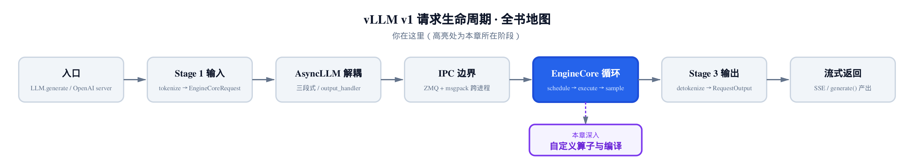
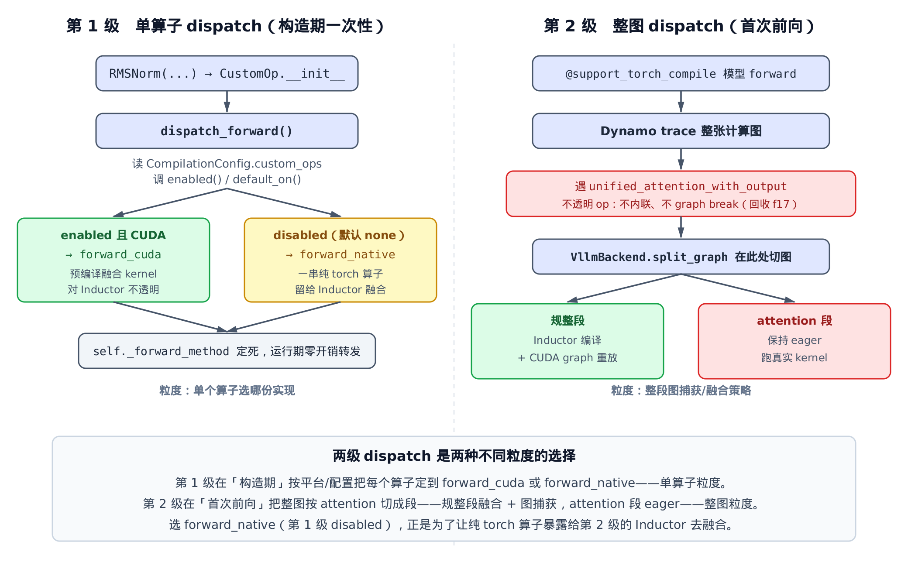
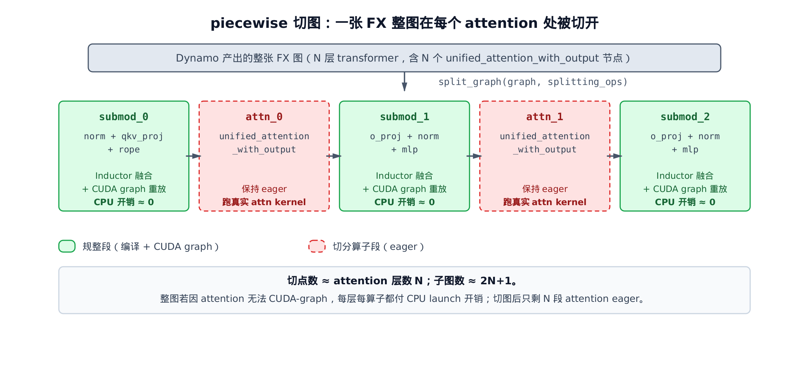

# 第23章　模型层如何变成融合、图捕获的 kernel：CustomOp 两级 dispatch 与 piecewise 编译

## 你在这里



> *图注：全书地图仍停在 EngineCore 执行阶段，本章钻进它底下的「编译与算子」一层。*
> *上一章把模型搭成了一棵嵌套的 `nn.Module` 树。*
> *本章拆开两件事：单个算子怎么选实现，整张图怎么被切成融合 + 图捕获的段。*
> *下一章接着进 `self.attn` 内部，看不同 attention 后端怎么实现。*

[上一章](../ch22-model-definitions/narrative/chapter.md)结尾留了个钩子。`LlamaAttention.forward` 里那行 `self.attn(q, k, v)`，把后端选择、KV cache 读写、量化统统吞了进去。而让这个算子能进 `torch.compile` 图、又不把整张图撕碎的机制，被推给了本章。本章的两条主线分别落在 `vllm/model_executor/custom_op.py` 和 `vllm/compilation/decorators.py`。

这一章就来还债。但在还债之前，先得搞清楚一件更基础的事：vLLM 里同一个算子——比如 RMSNorm——为什么会有两份实现？一份是手写的融合 CUDA kernel，一份是一串普通的 `torch` 算子。运行时到底走哪一份？谁来决定？

答案是**两级 dispatch**。这是本章的脊梁：

- **第 1 级**在「构造期」工作，粒度是**单个算子**。`CustomOp` 基类在 `__init__` 里一次性决定，这个算子今后走 `forward_cuda`（预编译融合 kernel）还是 `forward_native`（纯 torch）。
- **第 2 级**在「首次前向」工作，粒度是**整张图**。`@support_torch_compile` 把整个模型交给 `torch.compile`，由 vLLM 自己的后端把图切成段，规整段编译 + 图捕获，attention 段保持 eager。

两级看似无关，其实咬合得很紧：第 1 级之所以有时候故意选「纯 torch」那份，正是为了把算子暴露给第 2 级的编译器去融合。先看这张总图，心里有个骨架，后面逐段拆。



> *图注：左栏是单算子的构造期 dispatch，右栏是整图的首次前向 dispatch。*
> *底部一句话：选 `forward_native` 不是退化，是为了给第 2 级的 Inductor 留融合的余地。*

## 23.1 CustomOp：构造期把 forward 定死

先看第 1 级的载体——`CustomOp` 基类。它是 vLLM 里所有「一个算子、多份实现」的算子的共同祖先。RMSNorm、激活函数、各种 norm，都继承它。

它的核心招数藏在三个方法里（`vllm/model_executor/custom_op.py:L103`）：

```python
# vllm/model_executor/custom_op.py:L103
class CustomOp(nn.Module):
    """
    Base class for custom ops.
    Dispatches the forward method to the appropriate backend.
    """

    def __new__(cls, *args, **kwargs):
        # … 省略：检查 op 名是否被硬件插件「整类替换」（out-of-tree）。
        #          默认 in-tree 路径直接实例化 cls 本身。 …
        return super().__new__(op_cls_to_instantiate)

    def __init__(self, *, enforce_enable: bool = False, compile_native: bool = False):
        super().__init__()
        self._enforce_enable = enforce_enable
        self._forward_method = self.dispatch_forward(compile_native=compile_native)

    def forward(self, *args, **kwargs):
        return self._forward_method(*args, **kwargs)
```

关键在 `__init__` 那一行：`self._forward_method = self.dispatch_forward(...)`。

构造一个 `CustomOp` 子类对象时，它就**当场**调用 `dispatch_forward()`，把今后要用的 forward 方法选定，存进 `self._forward_method`。之后每次前向，`forward` 只做一件事——转发到这个已经定死的方法。**没有任何运行期的平台判断、配置判断。**

为什么敢这么干？`dispatch_forward` 开头的注释把假设说得很白（`vllm/model_executor/custom_op.py:L174`）：

```python
# vllm/model_executor/custom_op.py:L174
def dispatch_forward(self, compile_native: bool):
    # NOTE(woosuk): Here we assume that vLLM was built for only one
    # specific backend. Currently, we do not support dynamic dispatching.
    compilation_config = get_cached_compilation_config()

    enabled = self._enforce_enable or self.enabled()
    if enabled:
        compilation_config.enabled_custom_ops.update([self.__class__.name])
    else:
        compilation_config.disabled_custom_ops.update([self.__class__.name])

    if not enabled:
        # Compile forward_native to avoid eager torch ops if inside
        # opaque torch custom op (e.g. fused_moe, unified_attention, etc.)
        return self.maybe_compile(self.forward_native, enable=compile_native)

    if current_platform.is_rocm():
        return self.forward_hip
    # … 省略：is_cpu / is_tpu / is_xpu / is_out_of_tree 各平台分支，
    #          默认都回退到 forward_native …
    else:
        return self.forward_cuda
```

一个 vLLM 进程是为单一后端构建的——要么 CUDA，要么 ROCm，要么 CPU，不会中途换。既然平台从头到尾不变、配置也不变，那「选哪份 forward」这件事就只需算**一次**。算一次、存起来、之后零开销转发，比每次前向都判一遍要省。这是个典型的「把不变量提到循环外」的优化，只不过这里的「循环」是成千上万次前向。

`enabled` 那两行 `update` 只是把决定记账到 config，供日志和调试用，不影响 dispatch 结果，扫一眼即可。真正的两条主路是：

- **`enabled` 且在 CUDA 上** → `forward_cuda`，手写融合 kernel。
- **`enabled` 为假**（比如开了 Inductor）→ `maybe_compile(self.forward_native)`，纯 torch 那份。

`forward_hip`/`forward_cpu`/`forward_tpu` 这些平台变体，默认实现就是回退到 `forward_cuda` 或 `forward_native`，不是本章重点。盯住 cuda 和 native 这两路就够了。

那么——`enabled` 到底由谁说了算？

## 23.2 enabled() 与 default_on()：编译路径为什么默认走纯 torch

`enabled` 的逻辑很短，但它是整个第 1 级 dispatch 的开关（`vllm/model_executor/custom_op.py:L271`）：

```python
# vllm/model_executor/custom_op.py:L271
@classmethod
def enabled(cls) -> bool:
    # if no name, then it was not registered
    compilation_config = get_cached_compilation_config()
    custom_ops = compilation_config.custom_ops
    if not hasattr(cls, "name"):
        # … 省略：未注册的算子打一条 warning …
        return CustomOp.default_on()

    enabled = f"+{cls.name}" in custom_ops
    disabled = f"-{cls.name}" in custom_ops
    assert not (enabled and disabled), f"Cannot enable and disable {cls.name}"

    return (CustomOp.default_on() or enabled) and not disabled
```

读法是这样。`custom_ops` 是一个字符串列表，由 `CompilationConfig` 配。每个算子有个注册名（RMSNorm 是 `"rms_norm"`），用户可以写 `"+rms_norm"` 强制开它、`"-rms_norm"` 强制关它。那句 `assert` 拦住「又开又关」的矛盾配置。

最后一行是核心：**默认开（`default_on()`）或被显式 `+` 打开，且没被 `-` 关掉**，就算 enabled。换句话说，`-name` 的优先级最高，能压过默认。

而「默认开还是默认关」，由 `default_on()` 决定（`vllm/model_executor/custom_op.py:L291`）：

```python
# vllm/model_executor/custom_op.py:L291
@staticmethod
def default_on() -> bool:
    """
    Behavior controlled by `CompilationConfig.custom_ops`: On by default if
    'all', off by default if 'none'.
    When PyTorch Inductor is used, 'none' is the default value,
    otherwise 'all'.
    """
    compilation_config = get_cached_compilation_config()
    count_none = compilation_config.custom_ops.count("none")
    count_all = compilation_config.custom_ops.count("all")
    assert count_none + count_all == 1

    return not count_none > 0 or count_all > 0
```

`custom_ops` 列表里必定恰好有一个 `"all"` 或 `"none"`（那句 `assert count_none + count_all == 1` 保证了这一点），它定下全局基调。返回值 `not count_none > 0 or count_all > 0` 翻译成人话：**只要不是 `none`，就默认开**。

最妙的一句话在 docstring 里：**用 PyTorch Inductor 时，默认值是 `none`；否则是 `all`。**

为什么这么设计？这正是两级 dispatch 咬合的地方。

- **不用 Inductor**（纯 eager 或别的后端）：默认 `all` → 算子 enabled → 选 `forward_cuda`。这时没有编译器帮你融合，手写的融合 kernel 当然最快，直接用它。
- **用 Inductor**（也就是开了 `torch.compile`）：默认 `none` → 算子 disabled → 选 `forward_native`。这时有 Inductor 在，把 RMSNorm 拆成一串**它能看见**的纯 torch 算子，反而让 Inductor 有机会把 RMSNorm 和相邻的算子**融成一个 kernel**，效果常常胜过零散地调几个预编译 kernel。

一句话：**有编译器时，把活儿留给编译器；没编译器时，用手写 kernel。** 第 1 级的开关，本质是在替第 2 级（编译）让路。

我们可以在精简版里把这套开关逻辑跑一遍，看它对各种配置的判定：

```python
# 默认 'all'：rms_norm enabled → forward_cuda
cfg.custom_ops = ["all"]
assert RMSNorm.enabled() is True

# 默认 'none'（Inductor 路径）：rms_norm disabled → forward_native
cfg.custom_ops = ["none"]
assert RMSNorm.enabled() is False

# 'none' 基调下，用 '+rms_norm' 单独打开
cfg.custom_ops = ["none", "+rms_norm"]
assert RMSNorm.enabled() is True

# 'all' 基调下，用 '-rms_norm' 单独关掉（'-' 优先级最高）
cfg.custom_ops = ["all", "-rms_norm"]
assert RMSNorm.enabled() is False
```

这就是真实 `enabled()`/`default_on()` 的控制流，一条不差。把它跑起来，那句拗口的布尔表达式就不再抽象了。

还有一个细节值得点一句。`enabled` 为假时走的不是裸的 `forward_native`，而是 `maybe_compile(self.forward_native)`。注释解释了原因：当一个 `CustomOp` 被夹在某个**不透明的 torch 自定义算子内部**（比如 `fused_moe`、`unified_attention`），模型级的 `torch.compile` 根本看不到它——它藏在不透明算子的黑箱里。这时如果直接用 `forward_native`，那串纯 torch 算子会退化成一个个零散的 eager 调用，谁也不帮它融合。于是 vLLM 对它**单独**做一次 `torch.compile`，至少在算子内部把这几行编起来。这是个边角补丁，记住它的存在即可。

## 23.3 RMSNorm：一个 CustomOp 长什么样

抽象讲了两节，落到一个真实实例上。RMSNorm 是最干净的 `CustomOp` 范例（`vllm/model_executor/layers/layernorm.py:L102`）：

```python
# vllm/model_executor/layers/layernorm.py:L102
@CustomOp.register("rms_norm")
class RMSNorm(CustomOp):
    """Root mean square normalization.

    Computes x -> w * x / sqrt(E[x^2] + eps) where w is the learned weight.
    """

    def __init__(
        self,
        hidden_size: int,
        eps: float = 1e-6,
        var_hidden_size: int | None = None,
        has_weight: bool = True,
        dtype: torch.dtype | None = None,
    ) -> None:
        super().__init__()      # ← 这一行触发 CustomOp.__init__ → dispatch_forward

        self.hidden_size = hidden_size
        self.variance_epsilon = eps
        # … 省略：variance_size_override / 权重初始化 …
        # … 省略：ROCm aiter 与 SM100 fast-path 等硬件特例检测 …
```

两个地方要盯住。

第一行 `@CustomOp.register("rms_norm")`。这个装饰器把类登进一个注册表，并给类挂上 `name = "rms_norm"` 属性——`enabled()` 里那句 `f"+{cls.name}"` 用的就是它。注册逻辑很简单：

```python
# vllm/model_executor/custom_op.py:L307
@classmethod
def register(cls, name, dynamic_arg_dims=None):
    def decorator(op_cls):
        assert name not in op_registry, f"Duplicate op name: {name}"
        op_cls.name = name
        op_cls._dynamic_arg_dims = dynamic_arg_dims
        op_registry[name] = op_cls
        return op_cls
    return decorator
```

第二个要盯住的是 `__init__` 里那行 `super().__init__()`。它看着平平无奇，其实是**第 1 级 dispatch 的扳机**——它调到 `CustomOp.__init__`，那里就把 `dispatch_forward()` 跑了。所以构造一个 `RMSNorm`，它的 `_forward_method` 当场就定死了。模型作者写 `RMSNorm(hidden_size)` 时，根本意识不到背后已经悄悄选好了 cuda 还是 native。

现在看那「两份实现」到底差在哪。先看纯 torch 那份（`vllm/model_executor/layers/layernorm.py:L233`）：

```python
# vllm/model_executor/layers/layernorm.py:L233
def forward_native(
    self,
    x: torch.Tensor,
    residual: torch.Tensor | None = None,
) -> torch.Tensor | tuple[torch.Tensor, torch.Tensor]:
    """PyTorch-native implementation equivalent to forward()."""
    if residual is None:
        return ir.ops.rms_norm(
            x,
            self.weight.data if self.has_weight else None,
            self.variance_epsilon,
            self.variance_size_override,
        )

    return self.forward_static(
        x,
        self.variance_epsilon,
        self.hidden_size,
        x.dtype,
        self.weight.data if self.has_weight else None,
        residual,
        self.variance_size_override,
    )
```

`ir.ops.rms_norm` 和 `forward_static` 内部都是**一串普通 torch 算子**：上变到 fp32、平方、求均值、`rsqrt`、乘回权重。关键不在算法（RMSNorm 谁都会写），而在**这串算子对 Inductor 是透明的**——Inductor 能逐个看见它们、做模式匹配、把它们和上下游算子融成一个 kernel。`forward_static` 把这套纯 torch 流程写得很直白：

```python
# vllm/model_executor/layers/layernorm.py:L187
@staticmethod
def forward_static(x, variance_epsilon, hidden_size, orig_dtype,
                   weight=None, residual=None, variance_size_override=None):
    x = x.to(torch.float32)
    if residual is not None:
        x = x + residual
        residual = x.to(orig_dtype)
    # … 省略：variance_size_override 的形状校验分支 …
    variance = x.pow(2).mean(dim=-1, keepdim=True)
    x = x * torch.rsqrt(variance + variance_epsilon)
    x = x.to(orig_dtype)
    if weight is not None:
        x = x * weight
    return x if residual is None else (x, residual)
```

再看 CUDA 那份（`vllm/model_executor/layers/layernorm.py:L258`）：

```python
# vllm/model_executor/layers/layernorm.py:L258
def forward_cuda(
    self,
    x: torch.Tensor,
    residual: torch.Tensor | None = None,
) -> torch.Tensor | tuple[torch.Tensor, torch.Tensor]:
    if residual is None and not envs.VLLM_BATCH_INVARIANT:
        return ir.ops.rms_norm(
            x, self.weight.data, self.variance_epsilon, self.variance_size_override
        )
    # … 省略：variance_size_override 与 SM100 fast-path、batch-invariant 等特例 …
    if residual is not None:
        return fused_add_rms_norm(
            x, residual, self.weight.data, self.variance_epsilon
        )
```

有 `residual` 时，它调 `fused_add_rms_norm`——一个 C++/CUDA 预编译的融合 kernel，把「residual 相加 + RMSNorm」一口气在一个 kernel 里做完，连中间张量都不落地。它快，但对 Inductor 是**一个黑盒**：Inductor 看到的只是一次外部调用，没法把它拆开、也没法把它和邻居融合。

这就是两份实现的本质对照，一句话收束：

> **`forward_native` 用一串编译器看得见的纯 torch 算子，把融合的机会让给 Inductor；`forward_cuda` 调一个又快又不透明的预编译 kernel，自己把融合做完，但拒绝编译器染指。**

数值上两路应当等价。精简版用 `forward_static` 复现了 native 那串纯 torch 计算，也用纯 torch 复现了 `fused_add_rms_norm` 的「先 add 再 norm」语义，于是可以直接对拍：

```python
norm = RMSNorm(hidden_size=8)
x = torch.randn(4, 8)
# 无 residual：native 与 cuda 两路数值一致
assert torch.allclose(norm.forward_native(x), norm.forward_cuda(x), atol=1e-5)
# 有 residual：两路输出与残差都一致
yn, rn = norm.forward_native(x.clone(), res.clone())
yc, rc = norm.forward_cuda(x.clone(), res.clone())
assert torch.allclose(yn, yc, atol=1e-5) and torch.allclose(rn, rc, atol=1e-5)
```

两路数值一致，正说明它们是「同一个数学函数的两种实现」——dispatch 只是在选用哪一种跑法，不会改变结果。这也是为什么第 1 级敢在构造期随意定死：选哪份都对，只是快慢和「可不可融合」的差别。

到这里，第 1 级讲完了。单个算子在构造期就被定到了 cuda 或 native。接下来轮到第 2 级——整张图。

## 23.4 @support_torch_compile：给模型套上可编译的外壳

第 2 级的入口是一个类装饰器，`@support_torch_compile`。模型作者只要在顶层 `nn.Module` 上加这一行，整个模型就「可编译」了。它怎么做到的？

第一步，从 `forward` 的签名推断哪些维度是动态的（`vllm/compilation/decorators.py:L201`）：

```python
# vllm/compilation/decorators.py:L201
def cls_decorator_helper(cls: type[_T]) -> type[_T]:
    if not hasattr(cls, "forward"):
        raise TypeError("decorated class should have a forward method.")
    sig = inspect.signature(cls.forward)
    inferred_dynamic_arg_dims = dynamic_arg_dims
    if inferred_dynamic_arg_dims is None:
        inferred_dynamic_arg_dims = {}
        for k, v in sig.parameters.items():
            if v.annotation in [
                torch.Tensor,
                torch.Tensor | None,
                # … 省略：FloatTensor / IntermediateTensors 等同类注解 …
            ]:
                inferred_dynamic_arg_dims[k] = 0
    if len(inferred_dynamic_arg_dims) == 0:
        raise ValueError(...)
    # … 省略：逐个校验参数名在签名里 …
    return _support_torch_compile(cls, inferred_dynamic_arg_dims, ...)
```

逻辑很直接：扫一遍 `forward` 的参数，凡是标注成 `torch.Tensor` 的，就把它的**第 0 维**记为动态。

为什么是第 0 维、为什么要动态？因为 vLLM 一张编译好的图要服务**变化的 token 数**。这一拍 batch 里有 137 个 token，下一拍可能 512 个。如果不把这一维标成动态，`torch.compile` 会把 137 当成常量编进图里，下次来 512 个 token 就得**重新编译一遍**——每个 batch size 编一份，编译开销爆炸。标成动态（dim 0），一张图就能服务所有 token 数。

第二步是真正的「套外壳」，`_support_torch_compile`（`vllm/compilation/decorators.py:L331`）：

```python
# vllm/compilation/decorators.py:L331
def _support_torch_compile(cls, dynamic_arg_dims, ...):
    """Internal implementation of support_torch_compile decorator."""
    if TorchCompileWithNoGuardsWrapper in cls.__bases__:
        # support decorating multiple times
        return cls

    # take care of method resolution order: make sure super().__init__ is
    # called on the base class other than TorchCompileWithNoGuardsWrapper.
    cls.__bases__ = cls.__bases__ + (TorchCompileWithNoGuardsWrapper,)

    old_init = cls.__init__
    setattr(cls, IGNORE_COMPILE_KEY, False)

    def __init__(self, *args, vllm_config=None, prefix="", **kwargs):
        if vllm_config is None:
            vllm_config = get_current_vllm_config()
        # … 省略：位置参数类型校验、把 vllm_config/prefix 透传给原 __init__ …
        old_init(self, *args, **kwargs)

        self.vllm_config = vllm_config
        self.compilation_config = self.vllm_config.compilation_config
        enable_compile = enable_if is None or enable_if(vllm_config)
        self.do_not_compile = (
            self.compilation_config.mode
            in [CompilationMode.NONE, CompilationMode.STOCK_TORCH_COMPILE]
            or _should_ignore_torch_compile(self.__class__)
            or not enable_compile
        )
        if self.do_not_compile:
            return

        self._dynamic_arg_dims = dynamic_arg_dims
        # … 省略：AOT 计数器 …
        TorchCompileWithNoGuardsWrapper.__init__(self, ...)
    cls.__init__ = __init__
    # （随后还改写 cls.__call__，见下一节）
```

注意它没有要求模型「继承」某个基类，而是**偷偷把 `TorchCompileWithNoGuardsWrapper` 塞进 `cls.__bases__`**，再**改写 `__init__`**。这是对模型代码零侵入的关键：模型作者只加一行装饰器，不用改继承、不用改构造函数签名，wrapper 的所有职责（标记动态维、首编/缓存、CUDA graph 上下文）都由装饰器在背后接管。

改写后的 `__init__` 做的最重要的一件事，是算出 `do_not_compile`：

- `mode` 是 `NONE` 或 `STOCK_TORCH_COMPILE` → 不编（前者根本不开编译，后者交给更上层处理）；
- 这个类被显式标了「忽略编译」→ 不编；
- `enable_if` 判定不该编 → 不编。

只有 `mode == VLLM_COMPILE` 且没被任何条件否决，`do_not_compile` 才是 `False`，模型才真正进入编译路径。这是第 2 级的总闸。

## 23.5 首次前向：触发 VllmBackend，之后走缓存

外壳套好了，但编译并不在构造期发生——它**推迟到第一次前向**。装饰器同时改写了 `__call__`（`vllm/compilation/decorators.py:L502`）：

```python
# vllm/compilation/decorators.py:L502
def __call__(self, *args, **kwargs):
    # torch.compiler.is_compiling() means we are inside the compilation
    if self.do_not_compile or torch.compiler.is_compiling():
        return self.forward(*args, **kwargs)

    # … 省略：forward_context.skip_compiled 旁路、整段 AOT 缓存路径 …

    if self.compiled:
        return TorchCompileWithNoGuardsWrapper.__call__(self, *args, **kwargs)

    # This is the path for the first compilation.
    # the first compilation needs to have dynamic shapes marked
    _mark_dynamic_inputs(self, *args, **kwargs)
    # … 省略：收集 traced_files、dynamo/inductor config patch …
    output = TorchCompileWithNoGuardsWrapper.__call__(self, *args, **kwargs)
    self.compiled = True
    return output
```

这段读法分三岔：

1. **不该编 / 正在编译中**（`do_not_compile` 为真，或 `is_compiling()` 表示当前已经在编译过程里、不能套娃）→ 直接跑原始 `forward`。
2. **已经编过**（`self.compiled`）→ 走 wrapper，命中缓存的编译产物。
3. **首次**：先 `_mark_dynamic_inputs` 把 token 维标成动态（用的就是 23.4 推断出的 `dynamic_arg_dims`），再进 wrapper 触发真正的编译。编完把 `self.compiled` 置真，下次就走第 2 岔了。

`_mark_dynamic_inputs` 很朴素，对每个动态维调一次 `torch._dynamo.mark_dynamic`：

```python
# vllm/compilation/decorators.py:L414
def _mark_dynamic_inputs(mod, *args, **kwargs):
    sig = inspect.signature(mod.__class__.forward)
    bound_args = sig.bind(mod, *args, **kwargs)
    bound_args.apply_defaults()
    # … 省略：UNBACKED / shape_id 等细粒度动态形状策略 …
    for k, dims in dynamic_arg_dims.items():
        arg = bound_args.arguments.get(k)
        if arg is None or not isinstance(arg, torch.Tensor):
            continue
        dims_list = [dims] if isinstance(dims, int) else dims
        for d in dims_list:
            real_d = arg.ndim + d if d < 0 else d
            torch._dynamo.mark_dynamic(arg, real_d)
```

那进了 wrapper 之后呢？wrapper 把模型的 `forward` 交给 `torch.compile`，并指定**后端是 `VllmBackend`**。这一步是第 2 级真正的分水岭：`torch.compile` 先用 Dynamo 把 `forward` 追踪成一张 FX 图，然后把这张图整个交给 `VllmBackend` 处理。下一节就看 `VllmBackend` 怎么处理。

## 23.6 split_graph：在 attention 处把图切开

`VllmBackend.__call__` 是第 2 级的核心。剥掉缓存/哈希那一大段（它们不改变主流程），骨架是这样（`vllm/compilation/backends.py:L996`）：

```python
# vllm/compilation/backends.py:L996（剥去缓存子系统后的骨架）
def __call__(self, graph: fx.GraphModule, example_inputs):
    # 一个 VllmBackend 实例只被调用一次
    assert not self._called

    fx_split_ops = self.compilation_config.splitting_ops or []
    self.split_gm, self.piecewise_graphs = split_graph(graph, fx_split_ops)

    # 只有「非切分子图」才送编译；切分算子（attention）那一段保持 eager
    submod_names_to_compile = [
        item.submod_name
        for item in self.piecewise_graphs
        if not item.is_splitting_graph
    ]
    PiecewiseCompileInterpreter(
        self.split_gm, submod_names_to_compile, self.vllm_config, self
    ).run(*example_inputs)

    self._called = True
    return self.split_gm
```

两步：先 `split_graph` 把整图切成段，再让 `PiecewiseCompileInterpreter` 逐段处理。先看切图。

`split_graph` 遍历 FX 图的每个节点，决定它属于哪个子图（`vllm/compilation/backends.py:L547`）：

```python
# vllm/compilation/backends.py:L547
def split_graph(graph, splitting_ops):
    # … 省略：_decompose_size_nodes 等 FX 正确性预处理 …
    subgraph_id = 0
    node_to_subgraph_id: dict[fx.Node, int] = {}
    split_op_graphs: list[int] = []
    for node in graph.graph.nodes:
        if node.op in ("output", "placeholder"):
            continue
        # … 省略：getitem 节点归到其输入所在子图 …

        if should_split(node, splitting_ops):
            subgraph_id += 1
            node_to_subgraph_id[node] = subgraph_id
            split_op_graphs.append(subgraph_id)

            # keep consecutive splitting ops together
            if should_split(node.next, splitting_ops):
                subgraph_id -= 1     # 下一个也是切点 → 撤销自增，合并相邻切点
            else:
                subgraph_id += 1
        else:
            node_to_subgraph_id[node] = subgraph_id

    # … 省略：版本兼容包装 …
    split_gm = torch.fx.passes.split_module.split_module(
        graph, None, lambda node: node_to_subgraph_id[node],
        keep_original_order=True,
    )
    # … 省略：按 submod_N 命名收集 SplitItem，标记哪些是切分子图 …
    return split_gm, outputs
```

`subgraph_id` 是一个递增的「子图编号」。算法的精髓就在那个 `if should_split` 分支：

- 碰到一个**普通节点**（不是切点）→ 沿用当前 `subgraph_id`，它和前面的普通节点归为同一段。
- 碰到一个**切点**（如 attention）→ `subgraph_id += 1`，把这个切点**单独**成一段；记下它是切分子图；然后再 `+= 1`，让切点之后的普通节点开启**新的**一段。

效果是：图被切成**交替的条带**——规整段、attention 段、规整段、attention 段……每个 attention 算子被孤立成自己的一段，夹在两段规整算子之间。

那段「相邻切点合并」的小逻辑（`if should_split(node.next, ...)` 就 `subgraph_id -= 1`）是个收尾：如果两个切点紧挨着，没必要在它们中间塞一个空段，于是把它们并进同一段。

切点判定本身交给 `should_split`（`vllm/compilation/partition_rules.py:L14`）：

```python
# vllm/compilation/partition_rules.py:L14
def should_split(node: torch.fx.Node, splitting_ops: list[str]) -> bool:
    if node.op != "call_function":
        return False
    target = node.target
    if isinstance(target, torch._ops.OpOverloadPacket):
        return target._qualified_op_name in splitting_ops
    if isinstance(target, torch._ops.OpOverload):
        packet_name = target.name()
        op_overload_name = f"{packet_name}.{target._overloadname}"
        return op_overload_name in splitting_ops or packet_name in splitting_ops
    return False
```

逻辑很硬核：只看这个节点调用的算子，它的 `namespace::name` 是否在 `splitting_ops` 清单里。在，就切。

那 `splitting_ops` 清单里是什么？默认就是一串 attention 类算子（`vllm/config/compilation.py:L738`）：

```python
# vllm/config/compilation.py:L738
# Attention ops; used for piecewise cudagraphs
# Use PyTorch operator format: "namespace::name"
_attention_ops: ClassVar[list[str]] = [
    "vllm::unified_attention_with_output",
    "vllm::unified_mla_attention_with_output",
    "vllm::mamba_mixer2",
    # … 省略：mamba / short_conv / linear_attention / gdn 等同类不可融合算子 …
]
```

`set_splitting_ops_for_v1` 在 `mode == VLLM_COMPILE` 时把 `splitting_ops` 设成这份 `_attention_ops` 的拷贝（`vllm/config/compilation.py:L1104`）。于是默认的切点，正是 `vllm::unified_attention_with_output` ——记住这个名字，它就是上一章那行 `self.attn(q, k, v)` 背后的算子。

为什么偏偏在 attention 处切？因为 attention 是**没法被 Inductor 融合、也难以塞进单张 CUDA graph** 的：它要读写变长的 KV cache、依赖随 batch 变化的 metadata、还原地写 output。把它单独切出来让它 eager，反倒成全了它两边的规整段——norm、linear、激活、残差这些形状规整、无数据依赖的算子，可以放心地融合 + 图捕获。

我们可以拿一张真实的两层 attention FX 图喂给 `split_graph`，看它切成几段：

```python
# 构造一张含两个 unified_attention_with_output 节点的 FX 图，再切
split_gm, items = split_graph(graph, ["vllm::unified_attention_with_output"])

# 两个 attention → 两个切分子图；语义不变
n_split = sum(1 for it in items if it.is_splitting_graph)
assert n_split == 2
assert torch.allclose(split_gm(*inputs), graph(*inputs))
```

为什么「按连续区段切 + 保持原顺序」就一定保留同一个函数？把节点按拓扑序排成一条链，`split_graph` 只做两件事：一是给每个节点贴一个**单调不减**的 `subgraph_id`（遇切点 +1，普通点沿用前驱的 id）；二是 `split_module(keep_original_order=True)` 按这个 id 把连续区段打包成子模块，且**不改节点间的相对顺序**。于是有一个贯穿全图的不变量：对任意前缀，「每个节点的输入都在它自己之前求值」这条性质始终成立——因为 id 单调、顺序不变，任何一条数据依赖边都不会被跨段倒置。整图作为函数因此与切分前逐点等价；连原地 `mutation` 的算子（`output` 被写）也因顺序不变而读到正确的前驱值。这正好和 23.8 的 `kv_cache_dummy_dep` 呼应：段**内**顺序由 `split_module` 锁住，跨「KV 更新 → attention」的顺序则另靠那个假依赖锁住，两道锁各管一段，谁都不会踩到重排的坑。

所以切完语义不变，但图已经被分成了可分别处理的段。

## 23.7 逐段处理：规整段编译 + 图捕获，attention 段 eager

切完图，`PiecewiseCompileInterpreter` 遍历这些段，决定每段怎么处理（`vllm/compilation/backends.py:L724`）：

```python
# vllm/compilation/backends.py:L724
def call_module(self, target, args, kwargs):
    assert isinstance(target, str)
    gm = getattr(self.module, target)
    outputs = gm.graph.output_node().args[0]
    output = fx.map_arg(outputs, lambda node: node.meta["example_value"])

    if target in self.compile_submod_names:
        index = self.compile_submod_names.index(target)
        submod = self.fetch_attr(target)
        sym_shape_indices = [
            i for i, x in enumerate(args) if isinstance(x, torch.SymInt)
        ]
        from .piecewise_backend import PiecewiseBackend
        piecewise_backend = PiecewiseBackend(
            submod, self.vllm_config, index,
            len(self.compile_submod_names),
            sym_shape_indices, self.vllm_backend,
            graph_returns_tuple(submod), submod_name=target,
        )
        self.module.__dict__[target] = wrap_with_cudagraph_if_needed(
            piecewise_backend, self.vllm_config, self.compilation_config,
            piecewise_backend.is_first_graph, piecewise_backend.is_last_graph,
        )
        compilation_counter.num_piecewise_capturable_graphs_seen += 1
    return output
```

那个 `if target in self.compile_submod_names` 是分水岭。回想 23.6 里 `VllmBackend.__call__` 传进来的 `submod_names_to_compile`——它**只包含非切分子图**（`is_splitting_graph` 为假的那些）。所以：

- **规整段**（名字在 `compile_submod_names` 里）→ 给它建一个 `PiecewiseBackend`，让 Inductor 把这段编译掉；再用 `wrap_with_cudagraph_if_needed` 按需在外面包一层 CUDA graph wrapper。
- **attention 段**（名字不在清单里）→ 这个 `if` 不进，什么都不做，它就保持原样、eager 执行。

`wrap_with_cudagraph_if_needed` 判断这一段要不要被 CUDA graph 捕获（满足条件的规整段，运行时按 batch size 重放捕获好的图，CPU launch 开销几乎归零）。整个 piecewise 编译的成果就是下面这张图：



> *图注：整图在每个 attention 处被切成交替条带。*
> *绿色规整段：编译 + CUDA graph 重放，CPU 开销近乎为零。*
> *红色 attention 段：保持 eager，跑真实 kernel。*

这里值得把收益量化一下，别停在「快很多」这种定性话上。

设模型有 **N 层** transformer。每层有一个 attention，于是切点数 ≈ N，整图被切成 **≈ 2N+1 段**（规整段和 attention 段交替）。

- **不切图**：因为有 attention，整图没法 CUDA-graph。那么**每一层、每一个算子**（norm、qkv_proj、rope、o_proj、mlp 里的两三个 linear、激活、残差……）都得各自付一次 CPU launch 开销。一层算十几个算子，N 层就是 N×十几次 launch。
- **切图后**：attention 之外那些规整段被编成少数几个 CUDA graph，按 batch size 重放，**CPU launch 开销几乎归零**；剩下需要 eager 的，只有 **N 段 attention**。

也就是说，CPU 侧的 launch 开销从「O(N × 每层算子数)」压到了「O(N) 段 attention」。模型越深、每层算子越多，这个差距越大。这就是 piecewise CUDA graph 的账。

精简版把这条控制流也跑通了：喂一张两层 attention 的图，看哪些段建了 backend、哪些段没建：

```python
backend = VllmBackend(vllm_config)   # mode = VLLM_COMPILE
split_gm = backend(graph, example_inputs)

# 规整段建了 PiecewiseBackend 且被标记会包 CUDA graph；attention 段没建
for name, mod in split_gm.named_children():
    if "attn" in describe(name):      # 切分子图
        assert not isinstance(mod, PiecewiseBackend)
    else:                              # 规整子图
        assert isinstance(mod, PiecewiseBackend)
        assert mod.wrapped_with_cudagraph
```

「非切分子图才建 backend、才包 CUDA graph；attention 子图保持 eager」——和真实控制流一处不差。

## 23.8 还债：attention 算子怎么进 torch.compile 图

现在回到开头欠下的债。第 2 级反复在一个名字上打转：`unified_attention_with_output`。它是默认切点、是 Dynamo 图里的一个节点、是上一章 `self.attn(q, k, v)` 背后的算子。但有个问题始终没回答：

> Dynamo 在追踪模型 `forward` 时，碰到 attention 这么一坨变长、数据依赖、原地写 output 的逻辑，为什么**没有 graph break**、也没有被内联拆碎，反而稳稳地变成图里的一个干净节点？

答案是：attention 被**注册成了一个不透明的 torch 自定义算子**。

先看它在 `Attention.forward` 里怎么被调用的。attention 是否被包成不透明 torch op，由平台的 `opaque_attention_op()` 说了算：`self.use_direct_call = not current_platform.opaque_attention_op()`。CUDA、ROCm、CPU 上它返回 `True`，于是 `use_direct_call=False`，走 `else` 那一支的 `torch.ops.vllm.unified_attention_with_output`——正是 Dynamo 要看到的那个干净节点。只有少数其它平台 `opaque_attention_op()` 为 `False`、`use_direct_call=True`，直接 Python 调用、交给 `torch.compile` 自行处理（`vllm/model_executor/layers/attention/attention.py:L462`）：

```python
# vllm/model_executor/layers/attention/attention.py:L462
if self.use_direct_call:
    # … 省略：其它平台 use_direct_call=True 的直接 Python 调用支 …
    unified_attention_with_output(
        query, key, value, output, self.layer_name,
        kv_cache_dummy_dep=kv_cache_dummy_dep,
    )
else:
    encoded = _encode_layer_name(self.layer_name)
    # … 省略：先做 KV cache 更新，拿到一个假依赖 …
    torch.ops.vllm.unified_attention_with_output(
        query, key, value, output, encoded,
        kv_cache_dummy_dep=kv_cache_dummy_dep,
    )
```

在 CUDA 这类把 attention 标为不透明的平台上，Dynamo 追到的就是这行 `torch.ops.vllm.unified_attention_with_output(...)`。它是一个注册过的 torch 算子，Dynamo 对这类算子的态度是：**当成一个黑盒图节点，不内联、不追进去**。于是 attention 内部那些会让 Dynamo 头疼的变长逻辑，全被挡在黑盒外面——不 graph break，图节点干干净净。而这个干净节点，名字恰好是 `vllm::unified_attention_with_output`，也恰好就是 23.6 里 `splitting_ops` 的默认成员。**它天然成为 `split_graph` 的切点。** 上一章埋下的「`self.attn` 算子如何进 `torch.compile` 图」，到这里闭环了。

那这个不透明算子是怎么注册的？看它的注册代码（`vllm/model_executor/layers/attention/attention.py:L736`）：

```python
# vllm/model_executor/layers/attention/attention.py:L736
def unified_attention_with_output_fake(
    query, key, value, output, layer_name,
    output_scale=None, output_block_scale=None, kv_cache_dummy_dep=None,
) -> None:
    return

direct_register_custom_op(
    op_name="unified_attention_with_output",
    op_func=unified_attention_with_output,
    mutates_args=["output", "output_block_scale"],
    fake_impl=unified_attention_with_output_fake,
)
```

两个关键点。

第一，`fake_impl`（这里是 `unified_attention_with_output_fake`）。它什么也不算，直接 `return`。它的作用是给 Dynamo 一个「假实现」——追踪时 Dynamo 不需要真跑 attention，只要从 fake_impl 知道**输出的形状**（这里是原地写 output、无返回），就能把这个节点接进图里。没有 fake_impl，Dynamo 没法在不真执行的情况下推断输出，就只能 graph break。**fake_impl 是「不 graph break」的技术前提。**

第二，`mutates_args=["output", ...]`。它告诉 torch：这个算子会**原地改写** `output`。这让 `torch.compile` 知道 output 是被这个算子写的，从而正确处理依赖关系、不会把它当成纯函数乱优化。

注册动作本身由 `direct_register_custom_op` 完成（`vllm/utils/torch_utils.py`）：

```python
# vllm/utils/torch_utils.py（摘录）
def direct_register_custom_op(op_name, op_func, mutates_args=None, fake_impl=None, ...):
    # … 省略：从 op_func 注解 + mutates_args 推断 schema …
    schema_str = infer_schema(op_func, mutates_args=mutates_args)
    my_lib.define(op_name + schema_str, tags=tags)
    my_lib.impl(op_name, op_func, dispatch_key=dispatch_key)
    if fake_impl is not None:
        my_lib._register_fake(op_name, fake_impl)
```

函数开头的注释解释了为什么叫 `direct`：`torch.library.custom_op` 那套标准注册有可观的 dispatch 开销（要考虑复杂的分发逻辑），而 vLLM 直接 `define` + `impl`（+ `_register_fake`）到自己的 Library，绕开那层开销。三步就是：定义 schema、绑真实实现、绑 fake 实现。

还有个容易被略过的参数：调用处那个 `kv_cache_dummy_dep`。它是上一步 `unified_kv_cache_update` 的返回值，作为一个**假数据依赖**传进 attention 算子。attention 根本不用它的值，但「用到了它」这件事本身，强迫 `torch.compile` 保持「先更新 KV cache、后算 attention」的顺序。否则编译器可能把两者重排，读到还没写进去的 KV。这是一个用「假依赖」给编译器下命令的小技巧。

精简版把这套注册搬到了 host 上：用同名空间 `vllm` 的 Library，`define` + `impl` + `_register_fake` 三步一致，于是 `torch.ops.vllm.unified_attention_with_output` 在纯 torch 环境里也能真实调用、真实出现在 FX 图里、被 `split_graph` 当成切点切出来：

```python
# 注册后，算子可经 torch.ops.vllm.* 调用，原地写 output、返回 None
out = torch.empty_like(q)
ret = torch.ops.vllm.unified_attention_with_output(q, k, v, out, "layer.0")
assert ret is None                       # 契约：无返回
# 它出现在 trace 出来的图里，且是 splitting_ops 命中的切点
assert should_split(attn_node, ["vllm::unified_attention_with_output"])
```

这就是 attention 进 `torch.compile` 图的全貌：包成带 fake_impl 的不透明 torch 算子 → Dynamo 不 graph break、把它当稳定节点 → 它正好是默认切点 → `split_graph` 在它两侧切开 → 两侧规整段融合 + 图捕获，它自己 eager。上一章那行轻飘飘的 `self.attn(q, k, v)`，背后是这么一整套机制在托着。

## 23.9 两级合一

把两级 dispatch 并排放，本章就收束了。

**第 1 级，单算子，构造期。** `CustomOp.__init__` 调 `dispatch_forward`，按 `enabled()`/`default_on()` 和平台，把 `self._forward_method` 定到 `forward_cuda`（融合 kernel，对编译器不透明）或 `forward_native`（纯 torch，可被编译器融合）——全在 `vllm/model_executor/custom_op.py:L174` 一处完成。一次定死，运行期零开销转发。RMSNorm（`vllm/model_executor/layers/layernorm.py:L102`）是它的标准范例：两份实现数值等价，差别只在「快」和「可不可融合」。

**第 2 级，整图，首次前向。** `@support_torch_compile`（`vllm/compilation/decorators.py:L118`）把模型包成可编译：推断 token 维动态、注入 wrapper、按 `mode` 决定 `do_not_compile`。首次前向触发 `VllmBackend`，`split_graph`（`vllm/compilation/backends.py:L547`）在 `splitting_ops`（默认 attention 算子）处把整图切成交替条带，`PiecewiseCompileInterpreter` 把规整段送 Inductor 编译 + 包 CUDA graph，attention 段保持 eager。

两级的咬合点，就是那句 docstring：**用 Inductor 时算子默认 `none`**。第 1 级故意选纯 torch 的 `forward_native`，把单个算子拆成编译器看得见的零件；第 2 级的 Inductor 再把这些零件和邻居融成一个 kernel。一个在算子粒度让路，一个在整图粒度收割——这才是 vLLM 既能用手写 kernel、又能吃到编译融合红利的原因。

而那个反复出现的 `unified_attention_with_output`，是两级的交汇点：它是第 1 级里被夹在不透明算子内部、需要 `maybe_compile` 单独编译的那类典型，也是第 2 级里 Dynamo 不 graph break、`split_graph` 据以切图的切点。上一章 `self.attn(q, k, v)` 吞下的算子，怎么进 `torch.compile` 图——答案就是把它注册成带 fake_impl 的不透明 torch 算子。

下一章走进 `self.attn` 内部，看那个被切出来、保持 eager 的 attention 段里，不同的 attention 后端（FlashAttention、Triton……）究竟怎么实现。
