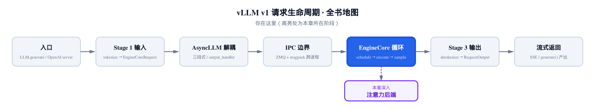
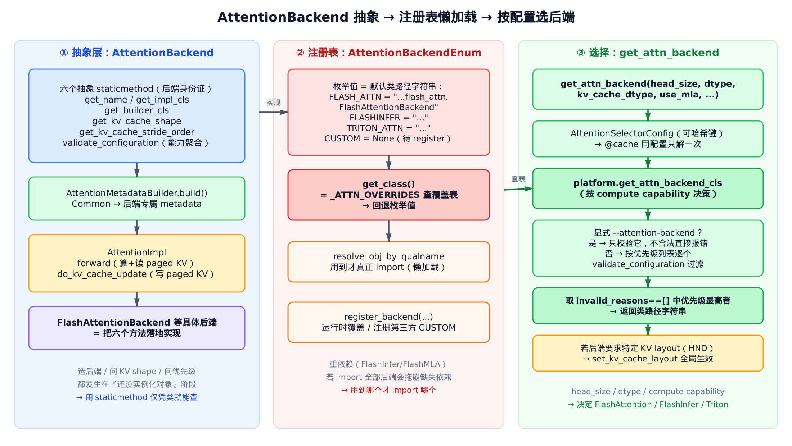
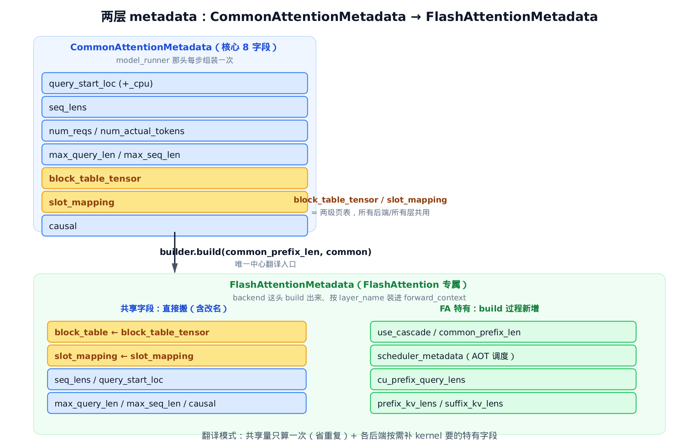
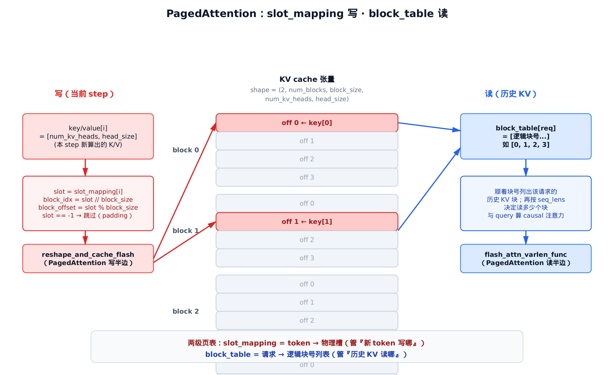
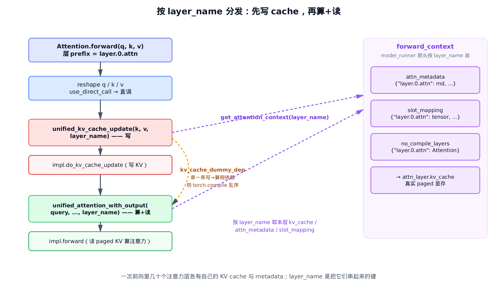

# 第24章　注意力后端抽象与元数据：一份 metadata，喂饱所有 kernel

## 你在这里



> *图注：全书地图高亮当前位置。*
> *[模型定义那章](../ch22-model-definitions/narrative/chapter.md) 里，每个注意力层都建了一个 `Attention` 对象，但它具体走哪个 kernel、KV cache 长什么样，都被一句"运行时再说"带过了。*
> *本章把那句"再说"说清：后端怎么选、metadata 怎么从一份共享结构翻译成各 kernel 的专属结构、新算出的 KV 怎么照 `slot_mapping` 写进显存、历史 KV 怎么照 `block_table` 读回来。*
> *再往后是各家 kernel 的内部实现细节，本章只到"调用边界"为止。*

前面铺了很长的路。[KV cache 那章](../ch15-kv-cache/narrative/chapter.md) 把显存切成定长块、用 `block_table` 和 `slot_mapping` 两张表管页；[模型运行器那章](../ch18-model-runner/narrative/chapter.md) 在每步前把这两张表算好，塞进一份叫 `CommonAttentionMetadata` 的结构。但那两章都停在"算好了、放那儿了"。

真正去用这两张表读写显存的人，是注意力后端。这一章我们就站在后端这一头，把整条链接住：

- **选谁**：`get_attn_backend` 怎么按 `head_size`、`dtype`、平台的 compute capability，在 FlashAttention / FlashInfer / Triton 里挑一个。
- **翻译**：那份跨层共享的 `CommonAttentionMetadata`，怎么被各后端的 builder 翻译成自己 kernel 认得的专属 metadata。
- **读写**：PagedAttention 怎么照 `slot_mapping` 把当前 step 的 KV 散写进 paged 显存（写），又怎么照 `block_table` 把历史 KV 读回来算注意力（读）。
- **分发**：一次前向里有几十个注意力层，运行时怎么按 `layer_name` 精确取到本层的 KV cache 和 metadata。

这条链横跨几个文件：抽象与共享 metadata 在 `vllm/v1/attention/backend.py`，注册表在 `vllm/v1/attention/backends/registry.py`，选后端入口在 `vllm/v1/attention/selector.py`，FlashAttention 四件套在 `vllm/v1/attention/backends/flash_attn.py`，统一注意力层在 `vllm/model_executor/layers/attention/attention.py`。

为了能在本地（无 GPU）把这套抉择与读写亲手跑一遍、打断点看数值，本章配了一份**只做减法**的精简版：和真实 vLLM 同名、同结构、同控制流，只删掉与主线正交的分支（MLA 变体、DCP、cascade、FP8 量化、CUDA graph 调度）。两个真正跑在 CUDA 上的算子（写 KV 的 `reshape_and_cache_flash`、读 KV 的 `flash_attn_varlen_func`）在 host 上以 CPU 等价实现复刻其可观察语义，让数值能对上。它是"跑起来看数值"的交叉验证物，正文主线仍是真实源码。

---

## 24.1 一张总图：抽象、注册、选择

先看全景，后面的细节都挂在它上面。



> *图注：左段是抽象层——`AttentionBackend` 用六个抽象 staticmethod 定义"一个后端该长什么样"。中段是注册表——`AttentionBackendEnum` 把每个后端记成一段类路径字符串，用到才 import。右段是选择——`get_attn_backend` 把零散参数打成可哈希的键，交给平台层按 compute capability 过滤、挑优先级最高者。*

注意三个动词：**抽象**（`vllm/v1/attention/backend.py`）让框架不必认识任何具体后端，只认接口；**注册**（`vllm/v1/attention/backends/registry.py`）让重依赖的后端（FlashInfer、FlashMLA）不会因为没装而拖崩整个 import；**选择**（`vllm/v1/attention/selector.py`）让同一份模型在 Hopper 上默认走 FlashAttention、在 Blackwell 上默认走 FlashInfer，全自动。

我们从最左边的抽象基类开始。

## 24.2 后端的身份证：六个抽象 staticmethod

`AttentionBackend` 是所有注意力后端的抽象基类。它开头就声明了两件全局约束——支持哪些 `dtype`、KV cache 能存成哪些精度（`vllm/v1/attention/backend.py:L55`）：

```python
# vllm/v1/attention/backend.py:L55
class AttentionBackend(ABC):
    """Abstract class for attention backends."""

    supported_dtypes: ClassVar[list[torch.dtype]] = [torch.float16, torch.bfloat16]
    supported_kv_cache_dtypes: ClassVar[list["CacheDType"]] = [
        "auto",
        "float16",
        "bfloat16",
    ]

    # Does attention's forward() include kv cache update?
    forward_includes_kv_cache_update: bool = True

    @staticmethod
    @abstractmethod
    def get_name() -> str:
        raise NotImplementedError

    @staticmethod
    @abstractmethod
    def get_impl_cls() -> type["AttentionImplBase"]:
        raise NotImplementedError

    @staticmethod
    @abstractmethod
    def get_builder_cls():  # -> Type["AttentionMetadataBuilder"]:
        raise NotImplementedError

    @staticmethod
    @abstractmethod
    def get_kv_cache_shape(
        num_blocks: int,
        block_size: int,
        num_kv_heads: int,
        head_size: int,
        cache_dtype_str: str = "auto",
    ) -> tuple[int, ...]:
        raise NotImplementedError
```

这几个抽象方法是一个后端的"身份证"：

- `get_name`：后端名（日志、校验、能力判定都用它）。
- `get_impl_cls`：返回**算注意力**的具体类（`AttentionImpl` 子类）。
- `get_builder_cls`：返回**翻译 metadata** 的具体类。
- `get_kv_cache_shape`：报出这个后端要的 KV cache 张量形状。

留意一个细节：它们全是 `staticmethod`，不是实例方法。这不是随手写的。

**为什么是 staticmethod？** 因为选后端、问 KV cache 形状、问优先级，全发生在"还没实例化任何东西"的阶段。框架在建模型图时，手里只有一个**后端类对象**，还没造出任何后端实例。staticmethod 让 selector 和平台层仅凭类对象就能查询能力，不必先 `__init__` 出一个对象再问它。这是把"能力查询"和"对象生命周期"解耦的关键一笔。

除了这四张身份证，基类还挂了一台**聚合器** `validate_configuration`——它是后面选后端的核心判官，我们到 [§24.5](#245-validate_configuration把不行的理由列成清单) 再细看。先记住它的存在。

`forward_includes_kv_cache_update` 这个布尔标志也先记一笔：它决定"写 KV"这步是混在 `forward` 里、还是拆成独立一步。FlashAttention 把它设成 `False`，于是写和读被拆成两个算子——这是 [§24.10](#2410-按-layer_name-分发先写后算) 的伏笔。

抽象基类下面还挂着两个抽象角色，凑齐一个后端的"四件套"：

```python
# vllm/v1/attention/backend.py:L582
    @abstractmethod
    def build(
        self,
        common_prefix_len: int,
        common_attn_metadata: CommonAttentionMetadata,
        fast_build: bool = False,
    ) -> M:
        """
        Central method that builds attention metadata.
        Some builders (MLA) require reorder_batch to be called prior to build.
        ...
        """
        raise NotImplementedError
```

`AttentionMetadataBuilder.build()` 是把共享 metadata 翻译成后端专属 metadata 的**唯一中心入口**。泛型参数 `M` 就是各后端自己的 metadata 类型。`AttentionImpl` 那边则定义 `forward`（算注意力、读 KV）和 `do_kv_cache_update`（写 KV）的签名。

所以一个后端 = 四件套：**Backend**（身份证）+ **Builder**（翻译 metadata）+ **Impl**（算+读+写）+ **Metadata**（专属数据结构）。本章自始至终拿 FlashAttention 这一套当样板。

## 24.3 KV cache 的形状与布局约定

`get_kv_cache_shape` 是身份证里最具体的一张。FlashAttention 的实现只有几行，却钉死了 KV cache 在显存里的逻辑形状（`vllm/v1/attention/backends/flash_attn.py:L137`）：

```python
# vllm/v1/attention/backends/flash_attn.py:L137
    @staticmethod
    def get_kv_cache_shape(
        num_blocks: int,
        block_size: int,
        num_kv_heads: int,
        head_size: int,
        cache_dtype_str: str = "auto",
    ) -> tuple[int, ...]:
        if block_size % 16 != 0:
            raise ValueError("Block size must be a multiple of 16.")
        return (2, num_blocks, block_size, num_kv_heads, head_size)

    @staticmethod
    def get_kv_cache_stride_order(
        include_num_layers_dimension: bool = False,
    ) -> tuple[int, ...]:
        # `stride_order` indicates the permutation that gets
        # us from `get_kv_cache_shape` to the actual memory layout we want.
        cache_layout = get_kv_cache_layout()
        # … 省略：include_num_layers_dimension 的 6 维分支（把 num_layers 也算进物理布局） …
        elif cache_layout == "NHD":
            stride_order = (0, 1, 2, 3, 4)
        # … 省略 …
        elif cache_layout == "HND":
            stride_order = (0, 1, 3, 2, 4)
        # … 省略 …
        return stride_order
```

逻辑形状恒为 `(2, num_blocks, block_size, num_kv_heads, head_size)`。逐维读一遍：

- 头维 `2`：K 和 V。后面读 KV 时一句 `kv_cache.unbind(0)` 就能把它们拆成 `key_cache` 和 `value_cache`。
- `num_blocks`：一共多少个物理块（由可用显存反推，见 [KV cache 容量规划那章](../ch16-kv-cache/narrative/chapter.md)）。
- `block_size`：每块装多少个 token（默认 16，所以这里 `block_size % 16 != 0` 直接报错）。
- `num_kv_heads × head_size`：每个 token 的 KV 向量本体。GQA 下 `num_kv_heads < num_heads`，大幅压缩 KV。

**逻辑形状统一，物理布局留给后端调。** 这是这里的设计巧思。`get_kv_cache_shape` 给的是逻辑形状，框架照它分配、绑定显存；但不同 kernel 对显存连续性的偏好不同，于是 `get_kv_cache_stride_order` 再给一个**重排序**，把逻辑维排成物理内存序：

- `NHD` 布局：`(0, 1, 2, 3, 4)`，不动，逻辑序即物理序。
- `HND` 布局：`(0, 1, 3, 2, 4)`，把 `block_size`（dim 2）和 `num_kv_heads`（dim 3）互换。

互换的目的，是让**同一个 head 的所有 token 在显存里连续**——某些 kernel 这样读得更快。逻辑形状统一便于框架管理，物理 stride 留给后端调到 kernel 最爱的样子，两不耽误。

精简版把这条约定原样搬了过来。在 host 上跑一下就能看到形状与布局规则精确成立：

```python
# 逻辑形状 = (2, num_blocks, block_size, num_kv_heads, head_size)
assert FlashAttentionBackend.get_kv_cache_shape(
    num_blocks=10, block_size=16, num_kv_heads=4, head_size=64
) == (2, 10, 16, 4, 64)

# block_size 不是 16 的倍数 → 直接拒绝
# FlashAttentionBackend.get_kv_cache_shape(10, 17, 4, 64)  → ValueError

# NHD 不动；HND 把 block 维与 head 维互换
set_kv_cache_layout("NHD")
assert FlashAttentionBackend.get_kv_cache_stride_order() == (0, 1, 2, 3, 4)
set_kv_cache_layout("HND")
assert FlashAttentionBackend.get_kv_cache_stride_order() == (0, 1, 3, 2, 4)
```

数值对上了。逻辑形状一行返回、物理布局按 layout 重排——这就是 KV cache 的 shape/stride 约定全貌。

## 24.4 注册表：枚举值就是一段类路径

后端类怎么被框架找到？答案在注册表枚举 `AttentionBackendEnum`。它的设计很反直觉：**每个枚举成员的值，不是对象，而是一段类路径字符串**（`vllm/v1/attention/backends/registry.py:L44`）：

```python
# vllm/v1/attention/backends/registry.py:L44
class AttentionBackendEnum(Enum, metaclass=_AttentionBackendEnumMeta):
    """Enumeration of all supported attention backends.

    The enum value is the default class path, but this can be overridden
    at runtime using register_backend().

    To get the actual backend class (respecting overrides), use:
        backend.get_class()
    """

    FLASH_ATTN = "vllm.v1.attention.backends.flash_attn.FlashAttentionBackend"
    FLASH_ATTN_DIFFKV = (
        "vllm.v1.attention.backends.flash_attn_diffkv.FlashAttentionDiffKVBackend"
    )
    TRITON_ATTN = "vllm.v1.attention.backends.triton_attn.TritonAttentionBackend"
    # … 省略：FLASHINFER / 各 MLA 后端 / FLEX_ATTENTION / TREE_ATTN 等约二十个同构项 …
    FLASHINFER = "vllm.v1.attention.backends.flashinfer.FlashInferBackend"
    # … 省略 …
    # Placeholder for third-party/custom backends - must be registered before use
    CUSTOM = None
```

为什么不直接把类放进枚举？因为 FlashInfer、FlashMLA、Triton 各自带着重依赖。要是 `import registry` 就连带 import 全部后端，那么任何一个没装的依赖都会把整张表拖崩——你只想用 FlashAttention，却因为没装 FlashInfer 而 import 失败。

把值改成"字符串"就解了这个套：用到哪个后端，才真正 import 哪个。这一步落在 `get_class()`（`vllm/v1/attention/backends/registry.py:L90`）：

```python
# vllm/v1/attention/backends/registry.py:L90
    def get_path(self, include_classname: bool = True) -> str:
        """Get the class path for this backend (respects overrides)."""
        path = _ATTN_OVERRIDES.get(self, self.value)
        if not path:
            raise ValueError(
                f"Backend {self.name} must be registered before use. "
                f"Use register_backend(Backend.{self.name}, 'your.module.YourClass')"
            )
        if not include_classname:
            path = path.rsplit(".", 1)[0]
        return path

    def get_class(self) -> "type[AttentionBackend]":
        """Get the backend class (respects overrides)."""
        return resolve_obj_by_qualname(self.get_path())
```

`get_class()` 干三件事，顺序很关键：

1. **查覆盖表** `_ATTN_OVERRIDES`：有人用 `register_backend` 把这个枚举改指别处了吗？
2. **回退枚举值**：没覆盖，就用默认的那段类路径字符串。
3. **`resolve_obj_by_qualname`**：把字符串真正 import 成类对象。

这就是"懒加载"的落点——用到才 import。`CUSTOM = None` 是给第三方/测试预留的占位：没先 `register_backend` 就 `get_path()`，那个 `if not path` 会触发，明确报错告诉你"先注册"。

覆盖机制也好用。第三方后端、单元测试里的替身，都能用 `register_backend(AttentionBackendEnum.FLASH_ATTN, "my.module.MyBackend")` 临时把某个枚举重指过去。精简版把这套懒加载 + 覆盖完整跑了一遍：

```python
# 懒加载：用到才 import，解析出真实的后端类
cls = AttentionBackendEnum.FLASH_ATTN.get_class()
assert cls is FlashAttentionBackend

# 运行时覆盖：把 FLASH_ATTN 临时指向另一个 importable 类
register_backend(AttentionBackendEnum.FLASH_ATTN, "...MyOverrideBackend")
assert AttentionBackendEnum.FLASH_ATTN.get_class().get_name() == "MY_FA"
AttentionBackendEnum.FLASH_ATTN.clear_override()  # 清掉覆盖 → 回退默认

# CUSTOM 没注册就用 → 明确报错
# AttentionBackendEnum.CUSTOM.get_path()  → ValueError("must be registered before use")
```

注册表解决了"找到类"。下一步是"在一堆能用的类里挑一个最好的"。

## 24.5 validate_configuration：把"不行"的理由列成清单

选后端的核心判定，集中在基类的 `validate_configuration`。它的设计哲学很朴素：**与其返回一个 bool，不如返回一张"为什么不行"的清单**（`vllm/v1/attention/backend.py:L270`）：

```python
# vllm/v1/attention/backend.py:L270
    @classmethod
    def validate_configuration(
        cls,
        head_size: int,
        dtype: torch.dtype,
        kv_cache_dtype: "CacheDType | None",
        block_size: int | None,
        use_mla: bool,
        has_sink: bool,
        # … 省略其余能力维度参数 …
        device_capability: "DeviceCapability",
        attn_type: str,
        use_non_causal: bool = False,
        use_batch_invariant: bool = False,
    ) -> list[str]:
        invalid_reasons = []
        if not cls.supports_head_size(head_size):
            invalid_reasons.append("head_size not supported")
        if not cls.supports_dtype(dtype):
            invalid_reasons.append("dtype not supported")
        if not cls.supports_kv_cache_dtype(kv_cache_dtype):
            invalid_reasons.append("kv_cache_dtype not supported")
        if not cls.supports_block_size(block_size):
            invalid_reasons.append("block_size not supported")
        # … 省略：has_sink / use_sparse / use_mm_prefix 等几路同构 if（探针失败 → 追加一条原因） …
        if use_mla != cls.is_mla():
            if use_mla:
                invalid_reasons.append("MLA not supported")
            else:
                invalid_reasons.append("non-MLA not supported")
        # … 省略 …
        if not cls.supports_compute_capability(device_capability):
            invalid_reasons.append("compute capability not supported")
        if not cls.supports_attn_type(attn_type):
            invalid_reasons.append(f"attention type {attn_type} not supported")
        # … 省略 …
        return invalid_reasons
```

结构高度规整：每个能力探针（`supports_head_size`、`supports_dtype`、`supports_compute_capability`……）失败一次，就往 `invalid_reasons` 追加一条字符串。**返回空列表 = 这个后端在此配置下合法。**

为什么不返回 bool？因为"不行"也要可读。当所有后端都被排除时，框架能把每个后端的拒绝理由拼成一句人能看懂的报错（`No valid backend ... Reasons: {...}`），而不是干巴巴一句"找不到后端"。对平台层来说，判定也简单：遍历候选，留下 `invalid_reasons` 为空的那些。

精简版把 FlashAttention 的几条探针搬了过来，能逐条看到清单怎么生成：

```python
# 合法配置 → 空清单
reasons = FlashAttentionBackend.validate_configuration(
    head_size=64, dtype=torch.bfloat16, kv_cache_dtype="auto",
    device_capability=DeviceCapability(9, 0), ...
)
assert reasons == []

# head_size=65（非 8 的倍数）→ 追加一条
assert "head_size not supported" in FlashAttentionBackend.validate_configuration(
    head_size=65, ..., device_capability=DeviceCapability(9, 0)
)

# 要 MLA 但 FA 是非 MLA → "MLA not supported"
# compute capability 7.5 < 8.0 → "compute capability not supported"
assert "MLA not supported" in FlashAttentionBackend.validate_configuration(
    use_mla=True, ..., device_capability=DeviceCapability(9, 0)
)
assert "compute capability not supported" in FlashAttentionBackend.validate_configuration(
    ..., device_capability=DeviceCapability(7, 5)
)
```

清单机制有了。现在把它装进选后端的总流程。

## 24.6 get_attn_backend：打包成键，缓存一次

选后端的公开入口是 `get_attn_backend`。模型里每个注意力层在建图时都会调它一次。它做的第一件事，是把一堆零散参数收进一个**可哈希的键**（`vllm/v1/attention/selector.py:L53`）：

```python
# vllm/v1/attention/selector.py:L53
def get_attn_backend(
    head_size: int,
    dtype: torch.dtype,
    kv_cache_dtype: str | None,
    use_mla: bool = False,
    has_sink: bool = False,
    # … 省略其余能力参数 …
    num_heads: int | None = None,
) -> type[AttentionBackend]:
    """Selects which attention backend to use and lazily imports it."""
    # … 省略：kv_cache_dtype 合法性 assert + 从全局 VllmConfig 读 block_size …
    attn_selector_config = AttentionSelectorConfig(
        head_size=head_size,
        dtype=dtype,
        kv_cache_dtype=cast(CacheDType | None, kv_cache_dtype),
        block_size=block_size,
        use_mla=use_mla,
        has_sink=has_sink,
        # … 省略其余字段 …
        attn_type=attn_type or AttentionType.DECODER,
        use_non_causal=vllm_config.attention_config.use_non_causal,
        use_batch_invariant=envs.VLLM_BATCH_INVARIANT,
    )

    return _cached_get_attn_backend(
        backend=vllm_config.attention_config.backend,
        attn_selector_config=attn_selector_config,
        num_heads=num_heads,
    )
```

`AttentionSelectorConfig` 是个 `NamedTuple`，把选后端要看的所有维度打成一包。它为什么必须可哈希？因为下一层函数被 `@cache` 包着，要拿它当缓存键（`vllm/v1/attention/selector.py:L106`）：

```python
# vllm/v1/attention/selector.py:L106
@cache
def _cached_get_attn_backend(
    backend,
    attn_selector_config: AttentionSelectorConfig,
    num_heads: int | None = None,
) -> type[AttentionBackend]:
    from vllm.platforms import current_platform

    attention_cls = current_platform.get_attn_backend_cls(
        backend,
        attn_selector_config=attn_selector_config,
        num_heads=num_heads,
    )
    if not attention_cls:
        raise ValueError(
            f"Invalid attention backend for {current_platform.device_name}"
        )
    backend = resolve_obj_by_qualname(attention_cls)

    # Adjust kv cache layout if the selected backend requires a specific one
    required_layout = backend.get_required_kv_cache_layout()
    if required_layout is not None:
        from vllm.v1.attention.backends.utils import set_kv_cache_layout

        set_kv_cache_layout(required_layout)
        # … 省略 logger …

    return backend
```

`@cache` 的意义：同一个模型每层配置都一样，所以选后端这件事**只需算一次**，后面所有层直接命中缓存。`NamedTuple` 之所以做成可哈希，正是为了当这个缓存键。

这里还藏着一笔尾巴动作：选定后端后，问它一句 `get_required_kv_cache_layout()`。如果这个后端要求特定的 KV layout（比如某些 kernel 偏好 `HND`），就全局 `set_kv_cache_layout`——这正好把 [§24.3](#243-kv-cache-的形状与布局约定) 那个 stride_order 决策点串了起来：后端选定的瞬间，物理布局也跟着定了。

真正过滤候选、挑胜者的活，交给了平台层 `get_attn_backend_cls`。

## 24.7 平台层：显式优先，否则按 capability 自动挑

平台层（这里看 CUDA）有两条路：用户**显式**指定了后端，就只校验它；没指定，就按**优先级列表**自动挑（`vllm/platforms/cuda.py:L282`）：

```python
# vllm/platforms/cuda.py:L282
    @classmethod
    def get_attn_backend_cls(
        cls,
        selected_backend: AttentionBackendEnum | None,
        attn_selector_config: AttentionSelectorConfig,
        num_heads: int | None = None,
    ) -> str:
        device_capability = cls.get_device_capability()
        assert device_capability is not None

        # First try checking just the selected backend, if there is one.
        if selected_backend is not None:
            try:
                backend_class = selected_backend.get_class()
                invalid_reasons = backend_class.validate_configuration(
                    device_capability=device_capability,
                    **attn_selector_config._asdict(),
                )
            except ImportError:
                invalid_reasons = ["ImportError"]
            if invalid_reasons:
                raise ValueError(
                    f"Selected backend {selected_backend} is not valid for "
                    f"this configuration. Reason: {invalid_reasons}"
                )
            else:
                logger.info("Using %s backend.", selected_backend)
                return selected_backend.get_path()

        # No selected backend or the selected backend is invalid,
        # so we try finding a valid backend.
        valid_backends_priorities, all_invalid_reasons = cls.get_valid_backends(
            device_capability=device_capability,
            attn_selector_config=attn_selector_config,
            num_heads=num_heads,
        )
        # … 省略：无合法后端时把 all_invalid_reasons 拼成报错 …
        # We have found some valid backends. Select the one with the
        # highest priority.
        sorted_indices = sorted(
            range(len(valid_backends_priorities)),
            key=lambda i: valid_backends_priorities[i][1],
        )
        selected_index = sorted_indices[0]
        selected_backend = valid_backends_priorities[selected_index][0]
        # … 省略 …
        return selected_backend.get_path()
```

两条路读得很清楚：

- **显式路**（用户给了 `--attention-backend`）：只对它跑一次 `validate_configuration`。`invalid_reasons` 非空就**直接报错**，不回退、不自动换别的。用户既然点名了，不合法就该让他知道，而不是悄悄换一个。
- **自动路**：调 `get_valid_backends`，对优先级列表里每个候选都跑 `validate_configuration` 过滤，再按优先级排序、取最高者。

优先级列表本身按 compute capability 分档（`vllm/platforms/cuda.py:L127`）：

```python
# vllm/platforms/cuda.py:L127
    else:
        if device_capability.major == 10:
            return [
                AttentionBackendEnum.FLASHINFER,
                AttentionBackendEnum.FLASH_ATTN,
                AttentionBackendEnum.TRITON_ATTN,
                AttentionBackendEnum.FLEX_ATTENTION,
                AttentionBackendEnum.TURBOQUANT,
            ]
        else:
            return [
                AttentionBackendEnum.FLASH_ATTN,
                AttentionBackendEnum.FLASHINFER,
                AttentionBackendEnum.TRITON_ATTN,
                AttentionBackendEnum.FLEX_ATTENTION,
                AttentionBackendEnum.TURBOQUANT,
            ]
```

这就是"平台最优"的体现：Blackwell（`major == 10`，sm100）把 FlashInfer 提到第一；Hopper 及以下（普通非 MLA decoder）默认 FlashAttention 优先、其次 FlashInfer、再 Triton。

**选后端贵不贵？** 一点都不贵。`validate_configuration` 对优先级列表里 $O(B)$ 个候选（$B$ = 后端数），各做常数次探针检查，全是 Python 端常数级别；而且整条链被 `@cache` 摊销到每模型只算一次。它根本不在前向热路径上。精简版正好复现了 Hopper 默认选 FlashAttention、以及显式指定不合法后端直接报错这两条路：

```python
CudaPlatform._device_capability = DeviceCapability(9, 0)  # Hopper
# 自动路：没指定后端 → 优先级列表挑出 FLASH_ATTN
backend = get_attn_backend(head_size=64, dtype=torch.bfloat16, kv_cache_dtype="auto")
assert backend is FlashAttentionBackend

# 显式路：点名 FLASH_ATTN 但 head_size=65 非法 → 直接报错（不回退自动选择）
# get_attn_backend(head_size=65, ..., backend=AttentionBackendEnum.FLASH_ATTN)  → ValueError
```

到这里，"选谁"这条线走完了。后端选定、impl 实例化好。下面进运行时——这份后端怎么消费 metadata。

## 24.8 两层 metadata：一份共享，各自翻译

每步前向之前，模型运行器把这一批请求的注意力 metadata 算好。但它**不是**为每个后端各算一份——而是先算一份**跨层、跨后端共享**的 `CommonAttentionMetadata`，再由各后端的 builder 翻译成自己 kernel 认得的专属版本。

先看共享的这份（`vllm/v1/attention/backend.py:L352`）：

```python
# vllm/v1/attention/backend.py:L352
@dataclass
class CommonAttentionMetadata:
    """
    Per-batch attention metadata, shared across layers and backends.
    AttentionMetadataBuilder instances use it to construct per-layer metadata.

    For many of the tensors we keep both GPU and CPU versions.
    """

    query_start_loc: torch.Tensor
    query_start_loc_cpu: torch.Tensor
    """(batch_size + 1,), the start location of each request in query Tensor"""

    seq_lens: torch.Tensor
    """(batch_size,), the number of computed tokens for each request"""

    num_reqs: int
    """Number of requests"""
    num_actual_tokens: int
    """Total number of tokens in batch"""
    max_query_len: int
    """Longest query in batch"""
    max_seq_len: int
    """Longest context length (may be an upper bound)"""

    block_table_tensor: torch.Tensor
    slot_mapping: torch.Tensor

    causal: bool = True
```

核心 8 个必填字段，认住就够了：`query_start_loc`（每请求在拼接 query 里的起点）、`seq_lens`（各请求已算了多少 token）、`num_reqs` / `num_actual_tokens`、`max_query_len` / `max_seq_len`，以及本章的两位主角——`block_table_tensor` 和 `slot_mapping`。

这两个字段，正是 [模型运行器那章](../ch18-model-runner/narrative/chapter.md) 在每步算好、塞进 `CommonAttentionMetadata` 的那两张表。当时只说了"算好、放进接口字段，attention 后端那头会接住"。**现在我们接住了。** 它们就在这里，作为跨层共享的接口契约，等着被 builder 翻译、被 kernel 拿去读写显存。

**为什么要分两层？** 因为 `block_table` / `slot_mapping` / `seq_lens` 这些量，对所有后端、所有层都一样。要是每个后端各算一遍，就是重复劳动。两层结构让这些共享量在运行器那头只算一次（每步与"请求数 + token 数"成线性），各后端的 builder 再按需补自己 kernel 要的特有字段。看翻译动作本身：



> *图注：上框是共享的 CommonAttentionMetadata（黄色高亮 block_table_tensor 与 slot_mapping）。中间一条 builder.build() 箭头。下框是 FlashAttention 专属 metadata——左列是"共享字段直接搬"（注意 block_table_tensor 改名成 block_table），右列是 build 过程中算出的 FA 特有字段（scheduler_metadata、cascade 等）。*

`FlashAttentionBackend` 的 builder，`build()` 开头就把共享字段一个个解构出来（`vllm/v1/attention/backends/flash_attn.py:L388`）：

```python
# vllm/v1/attention/backends/flash_attn.py:L388
    def build(
        self,
        common_prefix_len: int,
        common_attn_metadata: CommonAttentionMetadata,
        fast_build: bool = False,
    ) -> FlashAttentionMetadata:
        num_reqs = common_attn_metadata.num_reqs
        num_actual_tokens = common_attn_metadata.num_actual_tokens
        max_query_len = common_attn_metadata.max_query_len
        max_seq_len = common_attn_metadata.max_seq_len
        query_start_loc = common_attn_metadata.query_start_loc
        seq_lens = common_attn_metadata.seq_lens
        block_table_tensor = common_attn_metadata.block_table_tensor
        slot_mapping = common_attn_metadata.slot_mapping
        causal = common_attn_metadata.causal
```

中段省略的是 FA 特有的活：AOT scheduler 算 `scheduler_metadata`、cascade（共享前缀加速）、DCP（解码上下文并行）三条分支。标准 decoder 不走这些，它们都被精简掉了，主路径数值不变。重点在结尾的装配落点（`vllm/v1/attention/backends/flash_attn.py:L557`）：

```python
# vllm/v1/attention/backends/flash_attn.py:L557
        attn_metadata = FlashAttentionMetadata(
            num_actual_tokens=num_actual_tokens,
            max_query_len=max_query_len,
            query_start_loc=query_start_loc,
            max_seq_len=max_seq_len,
            seq_lens=seq_lens,
            block_table=block_table_tensor,
            slot_mapping=slot_mapping,
            # … 省略：DCP 相关 max_dcp_context_kv_len/dcp_context_kv_lens …
            use_cascade=use_cascade,
            common_prefix_len=common_prefix_len,
            scheduler_metadata=scheduler_metadata,
            cu_prefix_query_lens=cu_prefix_query_lens,
            prefix_kv_lens=prefix_kv_lens,
            suffix_kv_lens=suffix_kv_lens,
            # … 省略 …
            causal=causal,
        )
        return attn_metadata
```

翻译模式一目了然：

- **共享字段直接搬**：`block_table=block_table_tensor`（注意改了名）、`slot_mapping=slot_mapping`、`seq_lens`、`query_start_loc`、`max_*`、`causal`——原样从 Common 搬进来。
- **特有字段新增**：`use_cascade`、`scheduler_metadata`、`cu_prefix_query_lens` 等，是 FA 在 build 过程里算出来的，Common 里没有。

`FlashAttentionMetadata` 这个专属 dataclass 长这样（`vllm/v1/attention/backends/flash_attn.py:L222`）：

```python
# vllm/v1/attention/backends/flash_attn.py:L222
@dataclass
class FlashAttentionMetadata:
    # NOTE(sang): Definition of context_len, query_len, and seq_len.
    # |---------- N-1 iteration --------|
    # |---------------- N iteration ---------------------|
    # |- tokenA -|......................|-- newTokens ---|
    # |---------- context_len ----------|
    # |-------------------- seq_len ---------------------|
    #                                   |-- query_len ---|

    num_actual_tokens: int  # Number of tokens excluding padding.
    max_query_len: int
    query_start_loc: torch.Tensor
    max_seq_len: int
    seq_lens: torch.Tensor
    block_table: torch.Tensor
    slot_mapping: torch.Tensor

    # For cascade attention.
    use_cascade: bool
    common_prefix_len: int
    cu_prefix_query_lens: torch.Tensor | None
    prefix_kv_lens: torch.Tensor | None
    suffix_kv_lens: torch.Tensor | None
    # … 省略：DCP / aot scheduling 字段 …
    scheduler_metadata: torch.Tensor | None = None
    # … 省略 …
    causal: bool = True
```

对照 `CommonAttentionMetadata` 看就懂了："共享字段搬过来 + 特有字段补上"。精简版的 build 把这条翻译路跑通，能看到字段精确流转：

```python
common = _make_common(num_reqs=1, q_lens=[3], kv_lens=[3],
                      block_table=torch.tensor([[0, 1]]),
                      slot_mapping=torch.tensor([0, 1, 2]))
md = FlashAttentionMetadataBuilder().build(common_prefix_len=0, common_attn_metadata=common)
# 共享字段直接搬（block_table_tensor → block_table）
assert torch.equal(md.block_table, common.block_table_tensor)
assert torch.equal(md.slot_mapping, common.slot_mapping)
# FA 特有字段被新增（默认走标准非 cascade 路径）
assert md.use_cascade is False
assert md.scheduler_metadata is None
```

metadata 翻译好了，`block_table` 和 `slot_mapping` 都到了后端手里。下面就是本章的技术核心——拿这两张表去读写显存。

## 24.9 PagedAttention：照表读写 KV 显存

[KV cache 那章](../ch15-kv-cache/narrative/chapter.md) 立下了两张表的语义，但只到"表算好了"为止。现在两张表落进了后端的手里，我们终于能看清它们怎么真正读写显存。先把寻址恒等式钉死。

**PagedAttention 寻址恒等式。** 对第 $i$ 个 token：

$$
\mathrm{slot} = \mathrm{slot\_mapping}[i], \quad
\mathrm{block\_idx} = \left\lfloor \frac{\mathrm{slot}}{\mathrm{block\_size}} \right\rfloor, \quad
\mathrm{block\_offset} = \mathrm{slot} \;\mathrm{mod}\; \mathrm{block\_size}
$$

人话翻译：`slot_mapping[i]` 给出第 $i$ 个 token 的**扁平槽号**；整除块大小得到它落在第几个物理块，取余得到块内偏移。举个数：`block_size = 16` 时，`slot = 17` → `block_idx = 1`、`block_offset = 1`，也就是第 1 块的第 1 个位置。

两张表分工明确：

- `slot_mapping` 是 **token → 物理槽** 的扁平映射，管"**新 token 写哪**"。
- `block_table` 是 **请求 → 逻辑块号列表** 的两级页表，管"**历史 KV 读哪**"。



> *图注：中心是 KV cache 张量，画成若干物理块。左侧"写"——当前 step 的 key/value[i] 经 slot_mapping[i] 算出 block_idx/offset，由 reshape_and_cache_flash 散写进对应格子。右侧"读"——某请求的 block_table=[逻辑块号...] 由 flash_attn_varlen_func 顺着块号把历史 KV 读出来与 query 算注意力。*

### 写：reshape_and_cache_flash 照 slot_mapping 散写

回到那个 `forward_includes_kv_cache_update` 标志。FlashAttention 把它设成 `False`，意味着"写 KV"不在 `forward` 里，而是独立一步 `do_kv_cache_update`（`vllm/v1/attention/backends/flash_attn.py:L851`）：

```python
# vllm/v1/attention/backends/flash_attn.py:L851
    def do_kv_cache_update(
        self,
        layer: torch.nn.Module,
        key: torch.Tensor,
        value: torch.Tensor,
        kv_cache: torch.Tensor,
        slot_mapping: torch.Tensor,
    ) -> None:
        if self.attn_type in (AttentionType.ENCODER_ONLY, AttentionType.ENCODER):
            # For encoder attention, we use direct Q, K, V without caching
            return

        key_cache, value_cache = kv_cache.unbind(0)

        # Reshape the input keys and values and store them in the cache.
        # NOTE(woosuk): Here, key and value are padded while slot_mapping is
        # not padded ... the reshape_and_cache_flash op uses the slot_mapping's
        # shape to determine the number of actual tokens.
        reshape_and_cache_flash(
            key,
            value,
            key_cache,
            value_cache,
            slot_mapping,
            self.kv_cache_dtype,
            layer._k_scale,
            layer._v_scale,
        )
```

`kv_cache.unbind(0)` 把那个头维 `2` 拆成 `key_cache` 和 `value_cache`——这正是 [§24.3](#243-kv-cache-的形状与布局约定) 那个逻辑形状的现金回报。然后 `reshape_and_cache_flash` 上场。它本身只是个薄包装，真正的逻辑在 CUDA 内核里（`vllm/_custom_ops.py:L2713`）：

```python
# vllm/_custom_ops.py:L2713
def reshape_and_cache_flash(
    key: torch.Tensor,
    value: torch.Tensor,
    key_cache: torch.Tensor,
    value_cache: torch.Tensor,
    slot_mapping: torch.Tensor,
    kv_cache_dtype: str,
    k_scale: torch.Tensor,
    v_scale: torch.Tensor,
) -> None:
    torch.ops._C_cache_ops.reshape_and_cache_flash(
        key,
        value,
        key_cache,
        value_cache,
        slot_mapping,
        kv_cache_dtype,
        k_scale,
        v_scale,
    )
```

内核语义就是上面那条寻址恒等式：对每个 token $i$，取 `slot = slot_mapping[i]`，算出 `block_idx` 和 `block_offset`，把 `key[i]` / `value[i]`（形状 `[num_kv_heads, head_size]`）写进 `key_cache[block_idx, block_offset]` / `value_cache[block_idx, block_offset]`。`slot_mapping[i] == -1` 表示这个 token 跳过（是 padding）。这就是 PagedAttention 的"写"半边。

host 无 CUDA，精简版用 CPU 等价实现复刻了这个寻址语义，于是能在本地把"散写"看个真切：

```python
kv_cache = torch.zeros(2, 4, 16, 2, 8)  # (2, num_blocks=4, block_size=16, ...)
key_cache, value_cache = kv_cache.unbind(0)
key = torch.randn(3, 2, 8)  # 3 个 token
# slot 0→block0 off0；slot 17→block1 off1；slot -1→跳过(padding)
slot_mapping = torch.tensor([0, 17, -1])
reshape_and_cache_flash(key, value, key_cache, value_cache, slot_mapping, "auto", None, None)

assert torch.equal(key_cache[0, 0], key[0])   # slot 0  → 块0 偏移0
assert torch.equal(key_cache[1, 1], key[1])   # slot 17 → 块1 偏移1
assert torch.count_nonzero(key_cache[0, 1]) == 0  # slot -1 的 token 没写，仍为零
```

`slot = 17` 精确落到 `key_cache[1, 1]`，`slot = -1` 那个 token 没碰显存。寻址恒等式成立。

### 读：flash_attn_varlen_func 照 block_table 取历史 KV

写好的 KV 攒在 paged cache 里。算注意力时，要把某请求所有历史 KV 读回来——这是 `forward` 的活（`vllm/v1/attention/backends/flash_attn.py:L682`）：

```python
# vllm/v1/attention/backends/flash_attn.py:L682
    def forward(
        self,
        layer: torch.nn.Module,
        query: torch.Tensor,
        key: torch.Tensor,
        value: torch.Tensor,
        kv_cache: torch.Tensor,
        attn_metadata: FlashAttentionMetadata,
        output: torch.Tensor,
        # … 省略 …
    ) -> torch.Tensor:
        """Forward pass with FlashAttention.
        ...
            kv_cache: shape =
                [2, num_blocks, block_size, num_kv_heads, head_size]
        """
        # … 省略：encoder-only 分支、FP8 量化 view、descale 构造 …
        num_actual_tokens = attn_metadata.num_actual_tokens
        # … 省略 …
        # For decoder and cross-attention, use KV cache as before
        key_cache, value_cache = kv_cache.unbind(0)
        # … 省略：DCP 分支（self.dcp_world_size>1） …
        if not attn_metadata.use_cascade:
            cu_seqlens_q = attn_metadata.query_start_loc
            seqused_k = attn_metadata.seq_lens
            max_seqlen_q = attn_metadata.max_query_len
            max_seqlen_k = attn_metadata.max_seq_len
            block_table = attn_metadata.block_table
            scheduler_metadata = attn_metadata.scheduler_metadata
            # … 省略：alibi / sliding_window / sinks 参数 …
            flash_attn_varlen_func(
                q=query[:num_actual_tokens],
                k=key_cache,
                v=value_cache,
                out=output[:num_actual_tokens],
                cu_seqlens_q=cu_seqlens_q,
                max_seqlen_q=max_seqlen_q,
                seqused_k=seqused_k,
                max_seqlen_k=max_seqlen_k,
                softmax_scale=self.scale,
                causal=attn_metadata.causal,
                # … 省略 …
                block_table=block_table,
                # … 省略 …
            )
            return output
```

又是 `kv_cache.unbind(0)` 拆出 `key_cache` / `value_cache`，然后 `flash_attn_varlen_func` 上场。关键参数是 `block_table=block_table`——它就是从 metadata 里取出的、每请求的逻辑块号表。kernel 顺着这张表，把该请求散落在各物理块里的历史 KV 读出来，再按 `seq_lens` 决定每请求读多少个 token，与 `query` 算 causal 注意力，结果写进 `output`。这是 PagedAttention 的"读"半边。

host 没有 FlashAttention kernel，精简版用 CPU 等价实现（照 `block_table` 读 paged KV + causal softmax）复刻了语义。最有说服力的验证是：**把它的输出和一个朴素稠密 causal 自注意力对照**——如果 paged 寻址没错，二者应当数值一致。

```python
seq_len, block_size = 20, 16   # 20 个 token 跨两个块
# 造连续 K/V，按块写进 paged cache（slot i → block i//16, off i%16）
slot_mapping = torch.arange(seq_len)
reshape_and_cache_flash(key, value, key_cache, value_cache, slot_mapping, "auto", None, None)

flash_attn_varlen_func(
    q=query, k=key_cache, v=value_cache, out=out,
    cu_seqlens_q=torch.tensor([0, seq_len]), max_seqlen_q=seq_len,
    seqused_k=torch.tensor([seq_len]), max_seqlen_k=seq_len,
    softmax_scale=scale, causal=True,
    block_table=torch.tensor([[0, 1, 2, 3]]),  # 该请求的逻辑块号表
)

# 稠密参考：标准 causal 自注意力，逐 head 手算
ref = ...  # softmax((q @ kᵀ) * scale + causal_mask) @ v
assert torch.allclose(out, ref, atol=1e-5)
```

`atol=1e-5` 收敛。"顺着 block_table 跨两个块读 KV、算注意力"，和"把连续 KV 拿来直接算"，给出同一个结果——这从数值上证明了 paged 寻址的正确性。两张表的语义，到此完整闭环。

## 24.10 按 layer_name 分发：先写后算

最后一块拼图：一次前向里有几十个注意力层，每层有各自的 KV cache 张量、各自的 metadata。运行时怎么让"写算子"和"算算子"精确取到**本层**的料，而不是把这些当参数层层透传？

答案是 `layer_name` 当键。这条线分两头——一头是 [模型定义那章](../ch22-model-definitions/narrative/chapter.md) 埋下的"后端选择"，另一头是这里要接住的"按 layer_name 取数"。先看选择那头，在 `Attention.__init__` 里（`vllm/model_executor/layers/attention/attention.py:L298`）：

```python
# vllm/model_executor/layers/attention/attention.py:L298
        if attn_backend is None:
            self.attn_backend = get_attn_backend(
                head_size,
                dtype,
                kv_cache_dtype,
                use_mla=False,
                has_sink=self.has_sink,
                use_mm_prefix=self.use_mm_prefix,
                use_per_head_quant_scales=use_per_head_quant_scales,
                attn_type=attn_type,
            )
        else:
            self.attn_backend = attn_backend
```

模型里每个注意力层在 `__init__` 时调 `get_attn_backend` 选出后端类，随后 `impl_cls = self.attn_backend.get_impl_cls()` 实例化具体 impl（`vllm/model_executor/layers/attention/attention.py:L345`）。`get_impl_cls` 在这里是"抽象→具体"的桥——[§24.2](#242-后端的身份证六个抽象-staticmethod) 那张身份证，到这一刻兑现成一个能算注意力的对象。

紧接着，这个层把自己以 `prefix`（即 `layer_name`）为键注册进全局上下文（`vllm/model_executor/layers/attention/attention.py:L368`）：

```python
# vllm/model_executor/layers/attention/attention.py:L368
        if prefix in compilation_config.static_forward_context:
            raise ValueError(f"Duplicate layer name: {prefix}")
        compilation_config.static_forward_context[prefix] = self
```

这一步是"按 layer_name 分发"的根基：每层用唯一的 `layer_name` 登记自己，运行时才能反查到本层的 KV cache。看 `forward` 怎么分发（`vllm/model_executor/layers/attention/attention.py:L455`）：

```python
# vllm/model_executor/layers/attention/attention.py:L455
        query = query.view(-1, self.num_heads, self.head_size)
        output = output.view(-1, self.num_heads, self.head_size_v)
        # … 省略：key/value 的 view …
        kv_cache_dummy_dep = None
        if self.use_direct_call:
            # Skip this if sharing KV cache with an earlier attention layer.
            if (
                not self.attn_backend.forward_includes_kv_cache_update
                and self.kv_sharing_target_layer_name is None
                and key is not None
                and value is not None
            ):
                kv_cache_dummy_dep = unified_kv_cache_update(
                    key, value, self.layer_name
                )
            unified_attention_with_output(
                query,
                key,
                value,
                output,
                self.layer_name,
                kv_cache_dummy_dep=kv_cache_dummy_dep,
            )
        # … 省略：use_direct_call=False 的 torch.ops.vllm.* 分支 …
        return output.view(-1, hidden_size)
```

这里 `forward_includes_kv_cache_update` 那个标志兑现了它的承诺：因为 FlashAttention 把它设成 `False`，"写 KV"被拆成独立的 `unified_kv_cache_update`，先于 `unified_attention_with_output` 跑。两个算子都只收一个 `layer_name`——本层的料不靠参数透传，靠这个键去全局上下文里取。



> *图注：左侧主链——Attention.forward 先调 unified_kv_cache_update（写）再调 unified_attention_with_output（算+读），两者都只带 layer_name。右侧 forward_context 是 model_runner 那头按 layer_name 装好的仓库。两个算子各自经 get_attention_context(layer_name) 虚线连过去取本层的 kv_cache/metadata/slot_mapping。橙色虚线是 kv_cache_dummy_dep，串一条写→算的假依赖。*

取数的落点是 `get_attention_context`，这正是 [模型定义那章](../ch22-model-definitions/narrative/chapter.md) 承诺会接住的另一头（`vllm/model_executor/layers/attention/attention.py:L642`）：

```python
# vllm/model_executor/layers/attention/attention.py:L642
    forward_context: ForwardContext = get_forward_context()
    attn_metadata_raw = forward_context.attn_metadata
    attn_metadata: AttentionMetadata
    if isinstance(attn_metadata_raw, dict):
        attn_metadata = attn_metadata_raw[layer_name]
    elif isinstance(attn_metadata_raw, list):
        # list[dict[str, AttentionMetadata]]: used in speculative decoding
        attn_metadata = attn_metadata_raw[0][layer_name]
    else:
        attn_metadata = attn_metadata_raw
    attn_layer: Attention | MLAAttention = forward_context.no_compile_layers[layer_name]
    kv_cache = attn_layer.kv_cache
    slot_mapping = forward_context.slot_mapping
    assert isinstance(slot_mapping, dict), (
        f"Expected slot_mapping to be a dict, got {type(slot_mapping)}. "
    )
    layer_slot_mapping = slot_mapping.get(layer_name)
    return attn_metadata, attn_layer, kv_cache, layer_slot_mapping
```

这就是"取数"那头：`get_attention_context(layer_name)` 用 `layer_name` 当键，从全局 `forward_context` 里取出三样东西——本层的 `attn_metadata`（builder 在 [§24.8](#248-两层-metadata一份共享各自翻译) 翻译出来的那份）、`kv_cache`（绑定到本层的真实显存）、`slot_mapping`。模型运行器那头按 `layer_name` 把这些装进 `forward_context`，后端这头按 `layer_name` 消费。一存一取，键对上了。

两个算子各自经 `get_attention_context` 拿到本层料后，分头干活（`vllm/model_executor/layers/attention/attention.py:L663`）：

```python
# vllm/model_executor/layers/attention/attention.py:L663
def unified_kv_cache_update(
    key: torch.Tensor,
    value: torch.Tensor,
    layer_name: LayerNameType,
) -> torch.Tensor:
    layer_name = _resolve_layer_name(layer_name)
    _, attn_layer, kv_cache, layer_slot_mapping = get_attention_context(layer_name)
    if layer_slot_mapping is not None:
        # … 省略 …
        attn_layer.impl.do_kv_cache_update(
            attn_layer, key, value, kv_cache, layer_slot_mapping,
        )
    return torch.empty(0, device=kv_cache.device, dtype=kv_cache.dtype)

# … 省略：direct_register_custom_op 注册壳与 fake 实现 …

@maybe_transfer_kv_layer
def unified_attention_with_output(
    query: torch.Tensor,
    key: torch.Tensor,
    value: torch.Tensor,
    output: torch.Tensor,
    layer_name: LayerNameType,
    # … 省略 …
    kv_cache_dummy_dep: torch.Tensor | None = None,
) -> None:
    del kv_cache_dummy_dep
    layer_name = _resolve_layer_name(layer_name)
    attn_metadata, self, kv_cache, _ = get_attention_context(layer_name)
    self.impl.forward(
        self, query, key, value, kv_cache, attn_metadata,
        output=output, # … 省略 …
    )
```

分工清晰：`unified_kv_cache_update` 取本层 `kv_cache` / `slot_mapping`，调 `impl.do_kv_cache_update` 把新 KV **写**进 paged cache（[§24.9](#249-pagedattention照表读写-kv-显存) 那半边）；`unified_attention_with_output` 取本层 `kv_cache` / `attn_metadata`，调 `impl.forward` **算+读**。

最后说那个 `kv_cache_dummy_dep`。它没有任何计算用途——`unified_attention_with_output` 一进来就 `del` 掉它。它存在的唯一目的，是制造一条**假数据依赖**：写算子的返回值喂给算算子当参数，于是 `torch.compile` 和 CUDA graph 看到"算算子用了写算子的输出"，就不敢把两者乱序。没有它，编译器可能把"读 cache"排到"写 cache"前面，读到上一步的陈旧 KV。一条假依赖，保住了"先写后读"的铁律。

精简版把这条 f18 端到端链跑通了——从 `__init__` 选后端，到 `forward` 按 `layer_name` 分发写+读：

```python
layer = Attention(num_heads=2, head_size=8, scale=..., num_kv_heads=2,
                  kv_cache_dtype="auto", prefix="layer.0.attn")
assert layer.attn_backend is FlashAttentionBackend       # 选到了 FA
assert isinstance(layer.impl, FlashAttentionImpl)         # impl 实例化

# model_runner 那头：按 layer_name 把 metadata/slot_mapping 装进 forward_context
ctx = get_forward_context()
ctx.attn_metadata = {"layer.0.attn": md}
ctx.slot_mapping = {"layer.0.attn": common.slot_mapping}

out = layer.forward(query, key, value)
# 写半边生效：KV 已照 slot_mapping 进 paged cache
assert torch.equal(kv_cache[0, 0, 0], key[0])
# 读半边产出形状正确、非全零
assert out.shape == (seq_len, num_heads * head_size)
```

层级分发跑通，写半边和读半边都在本层的 `kv_cache` 上精确生效。`layer_name` 这把键，把几十层各自的 KV cache 与 metadata 串成了井井有条的一次前向。

## 24.11 小结：一份 metadata，喂饱所有 kernel

这一章把注意力后端这条链从头接到尾，回头看四个动作：

- **抽象**：`AttentionBackend` 用六个抽象 staticmethod 定义后端身份。staticmethod 是为了在"还没实例化"阶段就能查能力。一个后端 = Backend + Builder + Impl + Metadata 四件套。
- **注册 + 选择**：枚举值是类路径字符串，`get_class()` 用到才 import（懒加载），躲开重依赖；`validate_configuration` 把"不行的理由"列成清单，平台层据此过滤、按 compute capability 挑优先级最高者；`@cache` 摊销到每模型只算一次。
- **两层 metadata**：`CommonAttentionMetadata` 跨层共享、运行器那头只算一次；`builder.build()` 把它翻译成后端专属 metadata——共享字段直接搬、特有字段新增。`block_table_tensor` 和 `slot_mapping` 在这里作为接口字段被接住。
- **读写 + 分发**：`slot_mapping`（token→物理槽）照恒等式 `block_idx = slot // block_size` 把新 KV **写**进 paged cache（`vllm/_custom_ops.py` 的 `reshape_and_cache_flash`）；`block_table`（请求→逻辑块号列表）照表把历史 KV **读**回来算注意力（`vllm/v1/attention/backends/flash_attn.py` 的 `flash_attn_varlen_func`）。运行时按 `layer_name` 当键，从 `forward_context` 取本层的 KV cache 与 metadata（`vllm/model_executor/layers/attention/attention.py`），写算子和算算子用 `dummy_dep` 串住"先写后读"。

一份共享的 metadata，配上一套"选谁 / 怎么翻译 / 怎么读写 / 怎么分发"的抽象，就喂饱了 FlashAttention、FlashInfer、Triton 各家 kernel。各 kernel 内部怎么把注意力算快——那是它们自己的事，从本章这条调用边界往里，是另一片天地了。
