# 第 24 章　【原理篇·论文精读】FlashAttention:从 online-softmax 到 IO-aware 注意力

## 你在这里

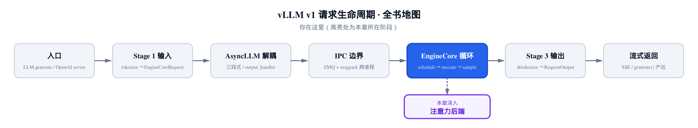

*图 34-0　全书请求生命周期地图。上一章停在 attention 算子被切出来、保持 eager;本章纵向切进这一格，掀开它内部一直当黑盒的 FlashAttention kernel。*

上一章拆到 `self.attn(q, k, v)` 那行调用的底下——attention 算子被 `torch.compile` 当切点切出来、夹在两侧规整段之间保持 eager。但那个算子**内部**真正干活的 FlashAttention kernel,始终是当黑盒 `import` 进来的：调用一行 `flash_attn_varlen_func`,注意力就算完了，可里面到底发生了什么，全书至今没打开过。

这一章打开它。这是一节**原理课**：主角是两篇论文——FlashAttention(arXiv:2205.14135)和它前置的 online-softmax(arXiv:1805.02867),外加一节带过的 FlashAttention-2(arXiv:2307.08691)。全章只有一条主线，开篇先点破：**softmax 的归一化统计量在一个合并算子 ⊕ 下满足结合律与交换律——于是注意力可以任意切块、任意顺序归并，结果不变**。这条代数律是一切拆分的**许可证**:FlashAttention 的分块递推、`merge_attn_states` 的 LSE 合并、cascade attention、split-KV,全是同一个 ⊕ 换了状态对反复出场；唯一的反面注脚是 chunked prefill——它拆的是 query 轴，因果掩码下逐行本就独立，根本轮不到 ⊕ 出场。而**动机**来自另一笔账：注意力的时间花在 HBM 搬运上，不在计算上——⊕ 给了拆分的合法性，HBM 账给了拆分的理由。这些数学在 vLLM 里的工程落地(后端选择、调用面、分页 KV),集中在[第 25 章：注意力后端](../../ch25-attention/narrative/chapter.md);本章只在公式能直接对上代码的两三处引几行源码。

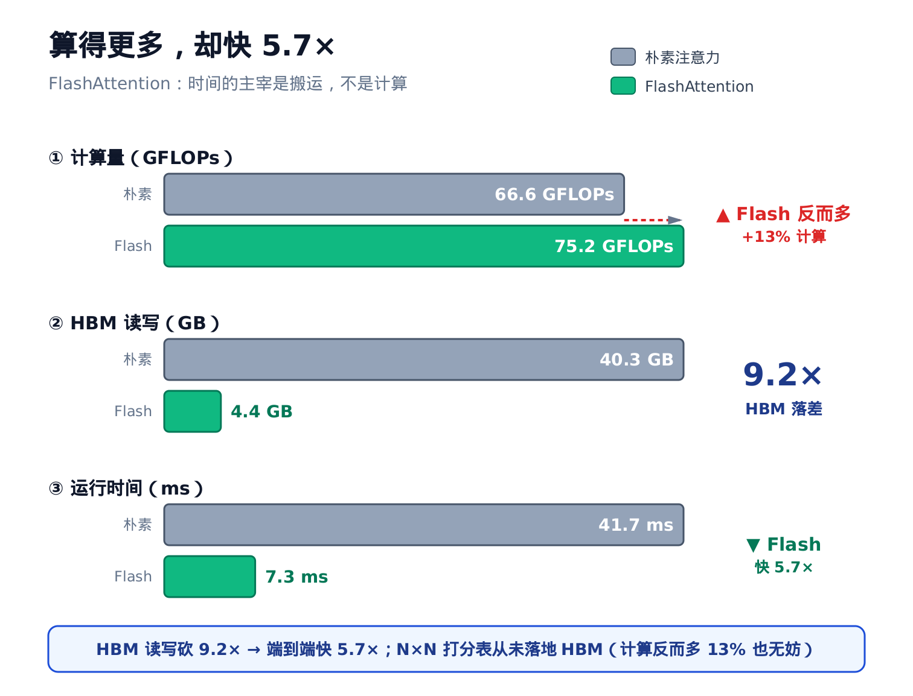

*先看这张账单(GPT-2 medium 实测，arXiv:2205.14135 Fig.2)：FlashAttention 的计算量(GFLOPs，十亿次浮点运算)反而比朴素实现多 13%(66.6→75.2)，却快 5.7×(41.7ms→7.3ms)——因为 HBM 读写砍了 9.2×(40.3GB→4.4GB)。时间的主宰是搬运，不是计算；本章全部推导，都是为了让那张 N×N 打分表不落地。*

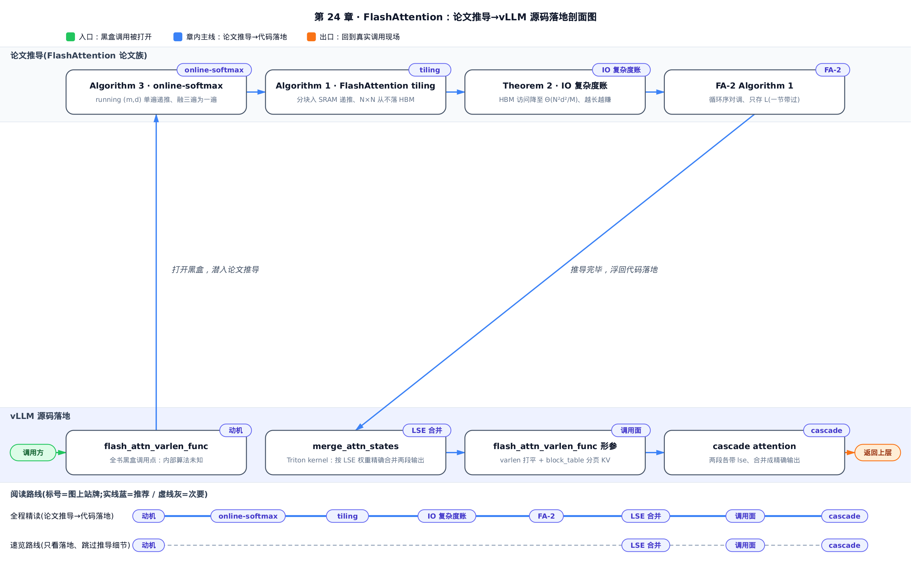

只想看 ⊕ 在真实系统里的兑现——LSE 合并怎么拼、cascade 怎么省算、chunked prefill 为什么连合并都省了——直接读「六、LSE 合并」到「八、chunked prefill」这三节；想跟完整推导，从「二、online-softmax」按序读到「五、FlashAttention-2」，再顺势读进兑现。

### 符号速查表

后面几节会陆续借用几个记号，先列一张表备查；每个符号首次出现处正文也会紧跟一句解释，不必现在就死记。

| 符号 | 含义 | 首次出现 |
|---|---|---|
| $`M`$ （⊕ 算子的稳定化基准） | 合并两组统计量时取的较大者（如 $`\max(m_i,m_j)`$ 或 $`\max(l_a,l_b)`$ ），把两个指数的底数都压到 ≤1 防上溢——本章为叙述简洁补的记号，原论文里是内联写的 $`\max(\cdot,\cdot)`$ ，未单独命名 | 二、online-softmax |
| $`B_r`$ | FlashAttention 分块时 Q 的行块大小（row block size） | 三、FlashAttention 分块 |
| $`B_c`$ | FlashAttention 分块时 K、V 的列块大小（column block size），与 $`B_r`$ 搭配限定局部打分块 $`S_{ij}`$ 的形状为 $`B_r\times B_c`$ | 三、FlashAttention 分块 |
| $`M`$ （SRAM 容量） | GPU 片上 SRAM 的大小（以元素个数计），IO 复杂度账 $`\Theta(N^2d^2/M)`$ 分母里的那个 $`M`$ ——和上一行 ⊕ 算子的稳定化基准是两个不同的量，别混淆 | 四、IO 复杂度账 |

---

## 一、动机：被物化的 N×N 与内存带宽墙

### 慢在搬运，不在计算

先给个反直觉的结论：标准注意力慢，**不是因为算得多，而是因为搬得多**。

想象一台 GPU 里有两层存储。一层是**SRAM**(片上静态存储，又叫 shared memory)——离计算单元最近、极快，但极小：A100 上每个 SM(streaming multiprocessor,流多处理器)只有 192KB,带宽约 19 TB/s。另一层是**HBM**(high bandwidth memory,片外高带宽显存)——就是我们平时说的"显存",40-80GB 很大，但带宽只有 1.5-2.0 TB/s,慢了一个数量级(arXiv:2205.14135 §2.1)。

论文把算子分两类：**compute-bound**(算力受限，时间花在算术上)和 **memory-bound**(访存受限，时间花在搬数据上)。判据是**算术强度**(arithmetic intensity,每读一字节做多少次算术)。softmax、mask、dropout 这些逐元素/归约算子，算得少、搬得多，统统是 memory-bound。

标准注意力是怎么算的？给定 $`Q`$ 、 $`K`$ 、 $`V`$(形状都是 $`N\times d`$,$`N`$ 是序列长、 $`d`$ 是每个头的维度),它老老实实按定义走三步(arXiv:2205.14135 §2.2 Algorithm 0):

```math
S=QK^{\top}\in\mathbb{R}^{N\times N},\qquad P=\mathrm{softmax}(S)\in\mathbb{R}^{N\times N},\qquad O=PV\in\mathbb{R}^{N\times d}
```

问题就出在那两张 $`N\times N`$ 的中间矩阵 $`S`$ 和 $`P`$ 。Algorithm 0 的三步，每一步都要跟 HBM 打一趟往返：第 1 步把 $`S`$ 写回 HBM,第 2 步读 $`S`$ 、写 $`P`$,第 3 步读 $`P`$ 和 $`V`$ 、写 $`O`$ 。 $`N=1024`$ 时， $`N\times N`$ 就是一百多万个元素，来回搬三趟——**访存量是 $`\Theta(N^2)`$ 级别的，而这正是 wall-clock 时间的主导项**。真正的矩阵乘反而很快就做完了。

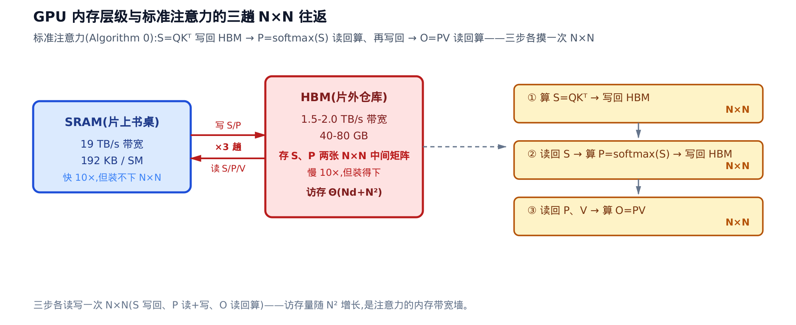

*图 34-1　片上 SRAM 快 10× 但只有 192KB,片外 HBM 大却慢 10×。标准注意力把 N×N 的 S、P 物化到 HBM 往返三趟，访存随 N² 暴涨——这就是要拆的墙。*

### 全书那一行黑盒

FlashAttention 的野心一句话：**别把 $`S`$ 、 $`P`$ 落到 HBM,整个注意力融成一个 kernel 在 SRAM 里算完**。vLLM 用的就是它，而且是当黑盒 import 进来的——一整批 prefill(预填充，处理 prompt)和 decode(解码，逐 token 生成)的注意力，就靠一次调用吃下：

```python
# vllm/v1/attention/backends/flash_attn.py:L809-L832
flash_attn_varlen_func(
    q=query[:num_actual_tokens],
    k=key_cache,
    v=value_cache,
    softmax_scale=self.scale,
    causal=attn_metadata.causal,
    # … 省略:变长打平边界 / 分页 KV 块表 / 滑窗与 softcap / FA 版本号等调用面形参 …
)
```

`softmax_scale=self.scale` 就是打分公式里的 $`1/\sqrt{d}`$ 缩放，`causal` 控制因果掩码——这两个形参直接对上数学，其余整套调用面(变长打平、分页 KV 寻址)是[第 25 章：注意力后端](../../ch25-attention/narrative/chapter.md)的本职，这里不展开。本章要回答的是：这一行背后，为什么敢不物化 $`N\times N`$ 还能算对？答案藏在一个叫 online-softmax 的老技巧里。

---

## 二、online-softmax：单遍递推与 ⊕ 算子

### 直觉：老师批卷子

softmax 要对一行 $`N`$ 个打分做归一化。数值稳定的标准做法(**safe-softmax**)要扫**三遍**:第一遍找最大值 $`m_V`$(减掉它防止 $`e^x`$ 上溢),第二遍求归一化分母 $`d_V`$,第三遍算每个输出(arXiv:1805.02867 §2 Algorithm 2):

```math
m_V=\max_k x_k,\qquad d_V=\sum_k e^{x_k-m_V},\qquad y_i=\frac{e^{x_i-m_V}}{d_V}
```

三遍扫描意味着三趟访存——放到 FlashAttention 的分块场景里，等于要求"先看完整行才能开始":既然要先扫遍整行拿到全局最大值 $`m_V`$ 才敢算任何一项，就没法只拿着一小块 KV 先动手，算法被钉死成串行的。而下面 online-softmax 用一个 running 最大值打破了这条依赖，让每一行都能拿到一块就先算一块、增量推进——这正是分块(tiling)能成立的前提。

online-softmax(arXiv:1805.02867 §3 Algorithm 3)的洞见像老师批一摞卷子：**不必先翻遍全摞找最高分再回头算**。边看边记两个数就够了——当前见过的最高分 $`m`$,和一个"按当前最高分归一"的累计分母 $`d`$ 。每来一张新卷子 $`x_j`$,先把旧累计按新旧最高分之差缩一下，再加上新卷子这一项：

```math
m_j=\max(m_{j-1},\,x_j),\qquad d_j=d_{j-1}\,e^{m_{j-1}-m_j}+e^{x_j-m_j}
```

那个 $`e^{m_{j-1}-m_j}`$ 就是**rescale 因子**。最高分没变时它等于 1(旧累计不动);最高分跳升时它小于 1(把旧累计缩到新基准上)。safe-softmax 的头两遍(找 $`m_V`$ 、求分母 $`d_V`$)就这么融成了一遍——一趟扫描同时得到 $`(m,d)`$;剩下只需再扫一遍按 $`y_i=e^{x_i-m}/d`$ 输出每一项。总扫描数从 $`3N`$ 降到 $`2N`$,代价只是多存 $`m`$ 、 $`d`$ 两个标量。

十来行就能忠实复现这套递推，把它跑起来对数值最直观：

```python
def online_softmax_stats(x):
    m, d = -inf, 0.0
    for xj in x:
        m_new = max(m, xj)
        d = d * exp(m - m_new) + exp(xj - m_new)   # 先 rescale 旧累计,再加新项
        m = m_new
    return m, d
```

### 机制：逐轮手算

拿一条最小向量 $`x=[1,3,2,5]`$ 走一遍。第 4 步是关键：此前最高分是 3,来了个 5,最高分跳升，旧累计 $`d=1.5032`$ 先被 $`e^{3-5}=0.1353`$ 缩小，再加上新项：

<!-- trace: online-softmax-recurrence -->

| 轮 j | x_j | m: 旧→新 | rescale = exp(m_old−m_new) | d_before | d_new |
|---|---|---|---|---|---|
| 1 | 1 | -inf → 1 | n/a (首元素) | 0 | 1.0 |
| 2 | 3 | 1 → 3 | 0.1353 | 1.0 | 1.1353 |
| 3 | 2 | 3 → 3 (max 不变) | 1.0 | 1.1353 | 1.5032 |
| 4 | 5 | 3 → 5 (max 跳升) | 0.1353 | 1.5032 | 1.2034 |

单遍扫完，末值 $`m=5`$ 、 $`d=1.2034`$ 。而三遍 safe-softmax 独立算出来的归一化分母 $`d_V`$ 也是 $`1.2034`$ ——**逐位相等，两版 softmax 的逐元素输出差为 0.0**。第 2 步和第 4 步都发生了真实的 rescale(因子 0.1353),第 3 步最高分没变、因子退化成 1.0,旧累计原样带过。

![online-softmax 单遍递推：x=[1,3,2,5]](../diagrams/fig34-2-online-softmax-recurrence.png)

*图 34-2　每列是处理一个新元素后的 (m,d)。第 4 步 max 从 3 跳到 5,旧累计 1.5032 被 0.1353 缩小后得 1.2034,与三遍 safe-softmax 分毫不差。*

递推的不变式一句话：**任意时刻， $`d`$ 都恰是"已见元素相对当前基准 $`m`$ 的 softmax 分母"**。rescale 项的作用就是每当基准更新，把旧累计平移到新基准上，让不变式续命。

> **严谨（归纳证明）**：对元素个数归纳。基例 $`j=1`$ : $`m_1=x_1`$ 、 $`d_1=e^{x_1-m_1}=1`$ ,就是长度 1 的 softmax 分母。归纳步：设处理完前 $`j-1`$ 个后 $`d_{j-1}=\sum_{k<j}e^{x_k-m_{j-1}}`$ 。来 $`x_j`$ ，新基准取 $`m_j`$ ，则 $`d_j=d_{j-1}\,e^{m_{j-1}-m_j}+e^{x_j-m_j}=\sum_{k<j}e^{x_k-m_j}+e^{x_j-m_j}=\sum_{k\le j}e^{x_k-m_j}`$ ——rescale 因子恰把旧累计的基准从 $`m_{j-1}`$ 平移到 $`m_j`$ 。不变式每轮保持，末轮即得与三遍等价；且 $`m_j`$ 单调不减，有限元素必然收敛。

### 从一遍到分块：⊕ 合并算子

单遍递推还只是"顺序看完一摞"。真正让分块成立的，是把 $`(m,d)`$ 这对状态抽象成一个**二元合并算子 ⊕**(arXiv:1805.02867 §3.1 Eq.4):

```math
[m_i;d_i]\oplus[m_j;d_j]=\Big[\ \max(m_i,m_j)\ ;\ d_i\,e^{m_i-M}+d_j\,e^{m_j-M}\ \Big],\qquad M=\max(m_i,m_j)
```

它把两组"各自相对自己最高分的累计"先换算到公共基准 $`M`$,再相加。**这就是开篇点破的那条主线定理**——⊕ 满足**结合律与交换律**，于是 softmax 的归一化统计量可以任意分块、任意顺序、并行归并，结果唯一。这是 FlashAttention 敢切块、cascade attention 敢拆两段的**许可证**。

> **严谨（结合律为何成立）**：论文只断言这两条律、并明说为简洁起见略去证明(arXiv:1805.02867 §3.1)；这段论证是本章补的。max 分量可结合可交换是显然的； $`d`$ 分量之所以也满足，是因为 $`d_i\,e^{m_i-M}+d_j\,e^{m_j-M}`$ 里两项都已换算到同一个公共基准 $`M`$ ——基准相同后剩下的是普通加法，交换次序、改变分块配对都不改变和；而基准换算本身只依赖全局 max、与配对方式无关。两条合起来即得结合律与交换律。

验证一下：把 $`x=[1,3,2,5]`$ 切成 $`A=[1,3]`$ 、 $`B=[2,5]`$ 两块，各算局部 $`(m,d)`$,再用 ⊕ 合并——不管先合谁，结果都不依赖合并顺序，数值上也该与单遍、三遍高度吻合：

<!-- trace: online-softmax-merge-operator -->

| 子块 / 操作 | m | d |
|---|---|---|
| 块 A=[1,3] 局部 | 3 | 1.1353 |
| 块 B=[2,5] 局部 | 5 | 1.0498 |
| A ⊕ B | 5 | 1.2034 |
| B ⊕ A (交换) | 5 | 1.2034 |
| 单遍遍历整段 | 5 | 1.2034 |
| 三遍 safe 参照 | 5 | 1.2034 |

`A ⊕ B`、`B ⊕ A`、单遍、三遍——四者的 $`d`$ 全是 $`1.2034`$ 。合并时公共基准取 5,块 A 的局部累计 $`1.1353`$ 被 $`e^{3-5}=0.1353`$ 缩小后并入，得 $`1.2034`$ 。**合并顺序不改变结果**——参考实现里 `A ⊕ B` 与 `B ⊕ A` 逐位相等，这正是结合律 + 交换律的直接后果。 $`P`$ 个分块并行时，各块独立算局部 $`(m,d)`$ 耗时 $`O(N/P)`$,再 $`O(\log P)`$ 步 tree-reduce 用 ⊕ 归并即可。

浮点口径在此一并立好，后文不再逐处复述：**本章所有"分块/合并 vs 一次性"的相等都是代数恒等**；浮点参考实现里两条路的差只在 float64 机器精度( $`\sim 10^{-16}`$ )量级——那是舍入，不是算法偏差。唯一的例外在 §八：chunked prefill 两条路的差是**精确的 0**,连舍入都没有，为什么更强，到时单说。

同一个 ⊕,本章还会以三副面孔回来：作用在 $`(m,\ell,O)`$ 上是 FlashAttention 的分块递推(§三)；搬到对数域作用在 $`(\mathrm{lse},O)`$ 上是 vLLM 的 `merge_attn_states`(§六)；按 KV 长度硬切给多个线程块再归并是 split-KV(§六 末尾)。状态对在换，代数没换——认出这一点，后面三节就都是"换了衣服的同一个算子"。

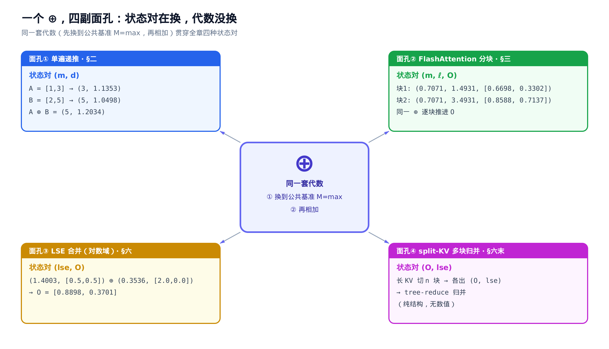

*四副面孔共用中央同一套代数——先把两组统计量换算到公共基准 $`M=\max`$ ，再相加。状态对从 $`(m,d)`$ 换到 $`(m,\ell,O)`$ 、再到对数域的 $`(\mathrm{lse},O)`$ ，代数分毫未动；三副带数面孔的数值就是各节数值表的原值，split-KV 只画结构。读完全章回看这张图，四节就收拢成一个算子。*

---

## 三、FlashAttention 分块：⊕ 作用在 (m, ℓ, O) 上

### 直觉：只把一小块搬上书桌

有了 ⊕ 算子，FlashAttention(arXiv:2205.14135 §3.1 Algorithm 1)就水到渠成：把 $`Q`$ 、 $`K`$ 、 $`V`$ 切成能塞进 SRAM 的小块，**一次只把当前这一小块搬上"书桌"算**。手里始终攥着三个 running 量：见过的最高分 $`m_i`$ 、归一累计 $`\ell_i`$ 、**已归一化的**当前输出 $`O_i`$(注意力章里的记号沿用， $`\ell`$ 就是这里的 $`d`$)。每处理完一个 KV 块，就用 online-softmax 那套 rescale 手法把三个量更新到新基准——**那张 $`N\times N`$ 的完整打分表，从头到尾没在 HBM 里落过地**。

外层循环遍历 $`K,V`$ 的列块 $`j`$,内层遍历 $`Q`$ 的行块 $`i`$;每个 $`(i,j)`$ 块局部算 $`S_{ij}=Q_iK_j^{\top}`$(至多 $`B_r\times B_c`$ —— $`B_r`$ 是 Q 的行块大小、 $`B_c`$ 是 K,V 的列块大小，绝不是 $`N\times N`$),局部 softmax 出 $`\tilde m_{ij}`$ 、 $`\tilde\ell_{ij}`$ 、 $`\tilde P_{ij}`$,再把 running 量推到新的全局 max(arXiv:2205.14135 §3.1 Algorithm 1 L11-L13):

```math
m_i^{\mathrm{new}}=\max(m_i,\tilde m_{ij}),\qquad
\ell_i^{\mathrm{new}}=e^{m_i-m_i^{\mathrm{new}}}\ell_i+e^{\tilde m_{ij}-m_i^{\mathrm{new}}}\tilde\ell_{ij}
```

```math
O_i\ \leftarrow\ \frac{1}{\ell_i^{\mathrm{new}}}\Big(\ \ell_i\,e^{m_i-m_i^{\mathrm{new}}}\,O_i\ +\ e^{\tilde m_{ij}-m_i^{\mathrm{new}}}\,\tilde P_{ij}V_j\ \Big)
```

看那个 $`e^{m_i-m_i^{\mathrm{new}}}`$ ——和 online-softmax 里的 rescale 因子一模一样。但先盯住另一个容易被略过的乘子： $`\ell_i`$ 。初版算法里 $`O_i`$ **每处理完一个 KV 块都保持归一化**——上一步收尾已经除过一次 $`\ell_i`$(下面机制表里第 1 块处理完的 $`O_i`$ 就已经是"只看前两个 key 的精确注意力输出")。所以更新时得先乘回 $`\ell_i`$ ，把它**反归一化**成未归一的加权和 $`\ell_i O_i`$ ——这就是公式里 $`\ell_i`$ 乘子的来历；再像 online-softmax 里累计分母 $`d`$ 那样，按 $`e^{m_i-m_i^{\mathrm{new}}}`$ 把这笔旧账缩到新的全局最高分基准上——只有旧贡献和新块的贡献同处一个基准，把它们相加、共用一个分母 $`\ell_i^{\mathrm{new}}`$ 才有意义。于是每步四拍：乘 $`\ell_i`$ 反归一化、rescale 到新基准、加上新块的 $`\tilde P_{ij}V_j`$ 贡献、除以 $`\ell_i^{\mathrm{new}}`$ 重新归一——这"每步都除一次 $`\ell`$"，正是 §五 里 FA-2 要动刀省掉的那笔开销。整个过程融成一个 CUDA kernel。Theorem 1 保证：输出**精确等于** $`\mathrm{softmax}(QK^{\top})V`$,只花 $`O(N^2d)`$ FLOP、额外内存仅 $`O(N)`$ 。

### 机制：2×2 分块手算

抽象讲完，还是要看数值。取一个手算级的例子： $`N=4`$ 、 $`d=2`$,切成 $`2\times2`$ 的块。只追踪 query 行 0,看它的 $`(m_i,\ell_i,O_i)`$ 怎么随两个 KV 列块演进：

<!-- trace: flashattention-tiling -->

| KV 块 j | 局部 m~ / l~ | m_i 新 | l_i 新 | O_i 新 | 对照标准 softmax |
|---|---|---|---|---|---|
| 1 | m~=0.7071, l~=1.4931 | 0.7071 | 1.4931 | [0.6698, 0.3302] | (未完) |
| 2 | m~=0.7071, l~=2.0 | 0.7071 | 3.4931 | [0.8588, 0.7137] | [0.8588, 0.7137] |

处理完第 1 个 KV 块， $`O`$ 行是个中间值 $`[0.6698, 0.3302]`$ ——它恰好等于"只对前 2 个 key 做完整 softmax 加权"的精确输出，印证 $`O_i`$ 每步都是归一化的；吃下第 2 个 KV 块、归一累计从 $`1.4931`$ 涨到 $`3.4931`$ 后， $`O`$ 行变成 $`[0.8588, 0.7137]`$ ——**与一次性 $`\mathrm{softmax}(QK^{\top})V`$ 算出来的 $`[0.8588, 0.7137]`$ 恒等**(§二 口径)。而全过程手里最大只有一个 $`2\times2`$ 的局部块， $`4\times4`$ 的完整打分表从未成形。推广到 $`N=1024`$ 、块 $`128\times128`$:完整表一百多万元素，单块才 16384 个，只占 1/64,轻松放进 SRAM。

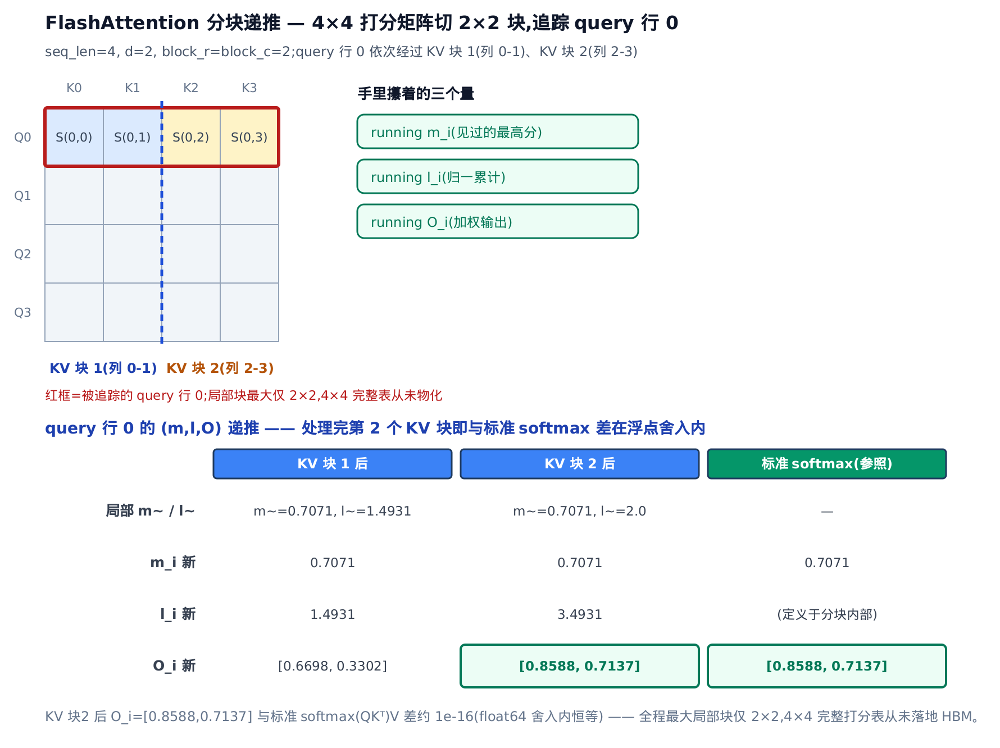

*图 34-3　外层遍历 KV 列块，query 行 0 的 running (m,l,O) 逐块 rescale-accumulate。处理完第 2 块得 [0.8588,0.7137],与一次性 softmax 恒等；最大局部块仅 2×2。*

正确性一句话点透：**每个 KV 块对 $`(m_i,\ell_i,O_i)`$ 的更新与 ⊕ 算子同构**——分块递推不是新算法，是 ⊕ 换上新状态对的第二副面孔、那张许可证的第一次兑现。

> **严谨（同构论证）**：把 ⊕ 的两个分量对上：新的行最高分取 $`m_i`$ 与 $`\tilde m_{ij}`$ 的较大者，正是 max 分量；反归一化后的加权和 $`\ell_i O_i`$ 按新旧 max 之差 rescale 再相加，正是 $`d`$ 分量的加权——只是"累计标量 $`d`$ "换成了"累计向量 $`\ell_i O_i`$ "(外加每步的归一化收尾)。由 §二 的结合律，逐块归并的结果与合并顺序无关；Theorem 1(arXiv:2205.14135 §3.1)保证输出与"一次性对整行 softmax"精确相等。 $`m_i`$ 单调不减保证 $`T_c`$ 个块有限步走完。

至于 `flash_attn_varlen_func` 的形参与返回值——那是[第 25 章](../../ch25-attention/narrative/chapter.md)的事。这里只需记住：它算的就是上面这套递推。

---

## 四、IO 复杂度账：快在哪、快多少

### 直觉：数箱子，别数乘加

衡量注意力的成本，别数它做了多少次乘加，要数它往慢速仓库(HBM)搬了多少箱货。标准做法要把 $`N\times N`$ 大表搬进搬出好几趟，箱数随 $`N^2`$ 疯长；FlashAttention 把 $`K,V`$ 切成能塞进书桌的块，每块只把整个 $`Q`$ 过一遍。论文给出的账(arXiv:2205.14135 §3.2 Theorem 2)是：

```math
\Theta(Nd+N^2)\quad\longrightarrow\quad \Theta\!\left(\frac{N^{2}d^{2}}{M}\right)
```

左边是标准注意力(含 $`N^2`$ 物化项),右边是 FlashAttention($`M`$ 是 SRAM 大小——这个 $`M`$ 与 §二 ⊕ 算子里的稳定化基准 $`M`$ 是两个不同的量，请勿混淆，详见开篇符号速查表)。关键在 $`d`$ 一般只有 64-128,而 $`M\approx100\mathrm{KB}`$(fp32 下约 25600 个元素),于是 $`d^2\ll M`$,右边比左边少好几倍。Proposition 3 还证了这是**下界**:在这段 $`M`$ 范围内，没有精确注意力算法能渐进更省。

> **严谨（Theorem 2 证明骨架）**：三步。其一， $`K,V`$ 总共 $`\Theta(Nd)`$ 个元素，SRAM 每次只装得下 $`\Theta(M)`$ 一块，故要分 $`\Theta(Nd/M)`$ 个块轮流驻留。其二，每个 $`K,V`$ 块驻留期间，每个 query 行都要和它里面的每个 key 做点积，必须把整个 $`Q`$( $`\Theta(Nd)`$ 个元素)从 HBM 过一遍。其三，块数乘以每块的开销： $`\Theta(Nd/M)\times\Theta(Nd)=\Theta(N^2d^2/M)`$ ，即总 HBM 访问量。

### 机制：代入真数字

把 $`d=64`$ 、SRAM 约 $`100\mathrm{KB}`$(fp32 约 25600 个元素)代进去，按参考实现逐元素精确计数，对比三种序列长：

<!-- trace: io-complexity-accounting -->

| N (序列长) | 标准 HBM 访问(元素) | FlashAttn HBM 访问(元素) | 比值 标准/Flash |
|---|---|---|---|
| 1024 | 4456448 | 2338816 | 1.91 |
| 2048 | 17301504 | 8691712 | 1.99 |
| 4096 | 68157440 | 33439744 | 2.04 |

$`N=1024`$ 时标准搬 4456448 个元素、Flash 只搬 2338816,省了约一半(1.91×);$`N`$ 一路涨到 4096,比值升到 2.04×。**趋势是单调上升的**:标准的 $`N^2`$ 物化项增速快于 Flash,序列越长、消去 $`N^2`$ 的收益越大。

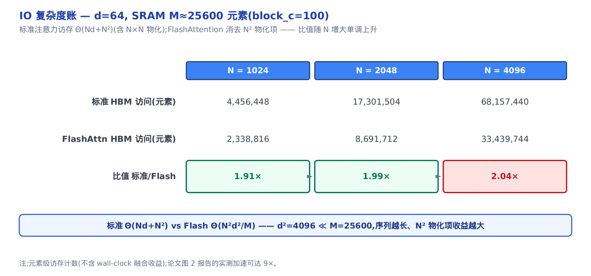

*图 34-4　标准注意力访存随 N² 暴涨，FlashAttention 消去 N² 项。比值 1.91×→1.99×→2.04× 随 N 上升，序列越长越赚。*

这里报的是**元素级搬运数**,在 $`d=64`$ 、SRAM≈100KB 时只看到 1.91×→2.04×;论文用 GPT-2 medium 的参数($`N=1024`$ 、 $`d=64`$ 、16 heads、batch 64)算出的 HBM 访问量减少可达 9×(arXiv:2205.14135 引言，Fig.2)——**和本章表格算的是同一个指标(HBM 访问量之比),只是取的参数点不同**。

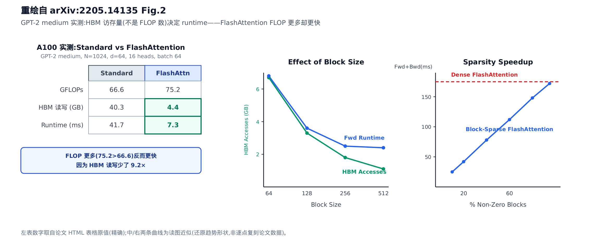

*论文 Figure 2 的实测：GPT-2 medium(N=1024、d=64、16 heads、batch 64)上，FlashAttention 的 GFLOPs(75.2)反比标准实现(66.6)更高，但 HBM 读写从 40.3GB 降到 4.4GB(降了约 9.2×，与上面提到的 9× 是同一个数量级)、runtime 从 41.7ms 降到 7.3ms——FLOP 更多却更快，直接坐实"HBM 访存量而非 FLOP 数决定 runtime"这条反直觉论断；中图显示分块 Bc 越大、HBM 访问和前向耗时都越低，右图是 block-sparse 变体的加速比随稀疏度上升。*

而真正的 wall-clock(墙钟)加速是另一个数字：论文 Figure 1 给出的是 7.6×(arXiv:2205.14135 Fig.1)。

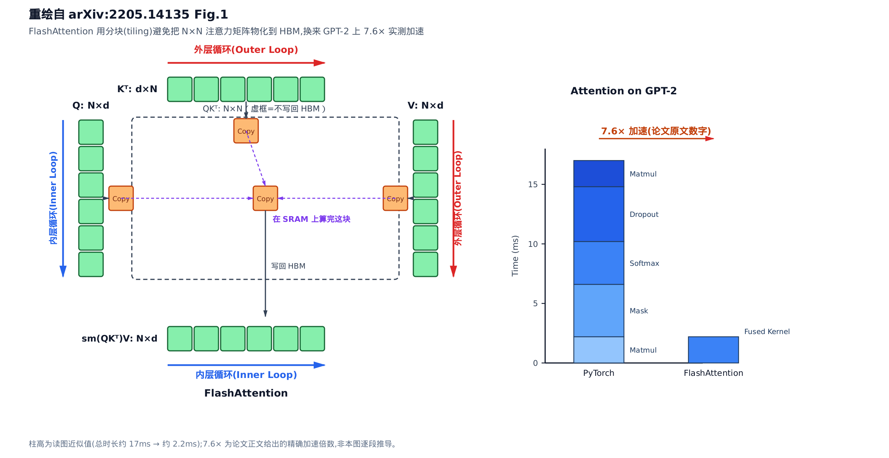

*左边是论文 Figure 1 的 tiling 示意：外层循环(红)沿 $`K,V`$ 的列块搬运，内层循环(蓝)沿 $`Q`$ 的行块搬运，每一小块都先进 SRAM"上书桌"算完再写回，虚框标出那些从未落回 HBM 的中间量；右边是 GPT-2 上的实测柱状图，标准 PyTorch 实现把 matmul/dropout/softmax/mask 逐段耗时叠加到约 17ms，FlashAttention 融成一个 kernel 后压到约 2.2ms——这正是 7.6× wall-clock 加速的来源。*

wall-clock 之所以比纯访存元素计数还快，差距才来自本模型没计入的那部分收益——softmax/mask/dropout 这些 memory-bound 算子被融进单 kernel、kernel 启动与中间张量分配被彻底省掉。方向一致：**注意力慢在 HBM 往返，而 FlashAttention 把往返砍掉了**。

vLLM 侧对这套访存优化的落地面，体现在它怎么给 kernel 喂数据：整批不等长序列**首尾相接打平**而不是 padding 到等长(推理批内 prefill 上千 token、decode 只 1 个，padding 会白白浪费算力和 HBM)——少搬冗余数据，本身就是 IO-aware 精神的延续。打平、切边界、分页寻址这些调用面约定，落地见[第 25 章](../../ch25-attention/narrative/chapter.md)。本章只需记住 kernel 能额外吐出的一个返回值：`softmax_lse`——每行打分的 logsumexp( $`\log\sum e^{\cdot}`$ ，softmax 归一化因子的对数)——它正是 §六 合并两段注意力时的钥匙。

---

## 五、FlashAttention-2:同一份数学，榨得更快(一节带过)

现代 kernel(包括 vLLM 依赖的这个)其实是 **FlashAttention-2**(arXiv:2307.08691)。它没换数学，只在工程上做了三处调优，综合比初版快约 2×。vLLM 实际会按硬件代际在这一族里挑版本——Hopper(NVIDIA 上一代数据中心 GPU 架构)优先 **FA3**(FlashAttention-3,为 Hopper 定制)、Blackwell(更新一代)优先 **FA4**,其余回退 FA-2,dispatch 逻辑落地见[第 25 章](../../ch25-attention/narrative/chapter.md)——三代数学内核一脉相承，讲透 FA-2 就理解了这一族 kernel 的公共骨架。一节带过，记住三点就够：

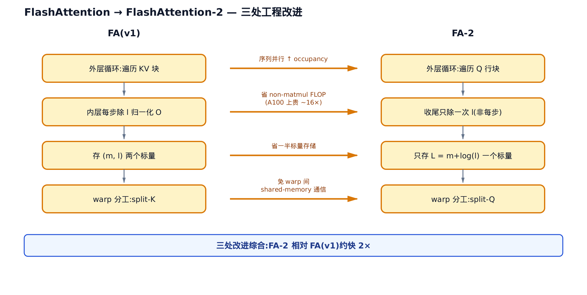

*图 34-5　外层循环 KV→Q 行块(序列并行);中间 O 不每步归一、收尾除一次(省 non-matmul FLOP);只存 L=m+log(l);warp 分工 split-K→split-Q。*

1. **循环序对调**(arXiv:2307.08691 §3.1 Algorithm 1；并行动机见 §3.2 Parallelism):初版外层遍历 $`K,V`$ 块，FA-2 改成**外层遍历 $`Q`$ 行块**。这样不同 $`Q`$ 行块能分给不同的 thread block(线程块，GPU 上被整体调度到一个 SM 的一批线程),沿序列长度并行，长序列时 GPU 的 occupancy(占用率，SM 上活跃 warp 的比例)更高。

2. **推迟归一化**(arXiv:2307.08691 §3.1.1):初版每处理一个 KV 块都要除一次 $`\ell`$;FA-2 让中间 $`O`$ 保持未归一化，**只在收尾除一次**。这削减了昂贵的 non-matmul FLOP(非矩阵乘浮点运算，指 softmax、除法、exp/log 这类逐元素与归约运算——它们跑在通用计算单元上，而矩阵乘跑在专用的 Tensor Core 上)——在 A100 上，Tensor Core 的 matmul 吞吐比 non-matmul 高约 16×(arXiv:2307.08691 §3.1),于是每一条非矩阵乘指令都相对昂贵，能省则省。

3. **只存一个标量**(arXiv:2307.08691 §3.1.1):初版存 $`(m,\ell)`$ 两个量，FA-2 只存 logsumexp $`L=m+\log(\ell)`$ 一个。backward 和合并都只需要它。warp(GPU 里 32 个线程一组的调度单位)分工也从 split-K 改为 **split-Q**(arXiv:2307.08691 §3.3 Work Partitioning):split-K 让每个 warp 各算 $`K`$ 维的一段、再跨 warp 把各自的部分结果加起来，逼着 warp 之间反复读写 shared memory 做同步；split-Q 改成每个 warp 认领一段 $`Q`$ 行、各自独立算完自己那几行的完整输出，warp 间不必再通信——省掉的正是这笔 shared-memory 往返。

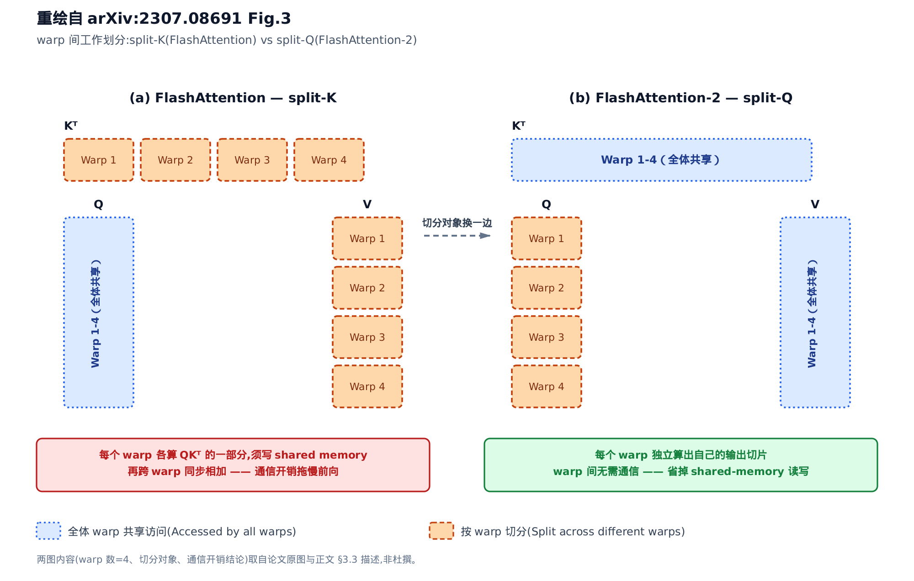

*左边 (a) 是 FlashAttention 的 split-K： $`K`$ 维被切给 4 个 warp 各算一段 $`QK^\top`$ ，再跨 warp 把部分结果写进 shared memory、同步相加；右边 (b) 是 FlashAttention-2 的 split-Q：切分对象换成 $`Q`$ ，每个 warp 独立认领一段 $`Q`$ 行、算完自己那几行的完整输出，warp 之间不再需要通信——省掉的正是 (a) 里那笔 shared-memory 读写。*

第 3 点尤其重要：vLLM 那个 `return_softmax_lse=True` 返回的，正是这个 $`L`$ 。有了它，才能把分开算的两段注意力精确拼回去——这就是下一节的主题。

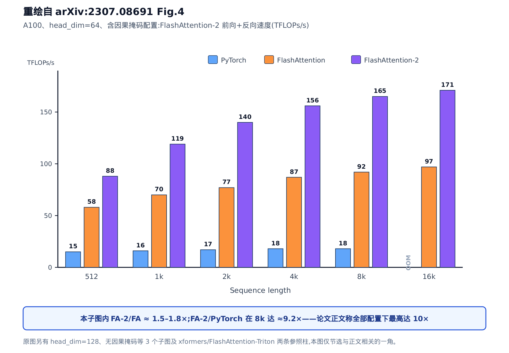

*A100、head_dim=64、含因果掩码配置下的前向+反向吞吐(TFLOPs/s)：序列长度从 512 到 16k，FlashAttention-2 相对 FlashAttention 约 1.5-1.8×，相对标准 PyTorch 实现在 8k 长度上已达约 9.2×——论文正文称全部配置下最高达 10×,坐实了本节开头"综合比初版快约 2×"背后的实测证据(这里对比的是 FA-2/FA；标准实现的差距更大)。*

---

## 六、LSE 合并：⊕ 的第三副面孔

### 直觉：两张归一化收据

假设一段注意力被拆成两半分开算(下一节马上看到 vLLM 为什么要这么拆)。每一半各交出一份"部分输出 $`O`$ 和一张归一化收据 $`\mathrm{lse}`$"——就是 §四 埋下的那个 `softmax_lse`,恰是 FA-2 存下来的 $`L`$ :调用 `flash_attn_varlen_func` 时开 `return_softmax_lse=True`,kernel 就把它随输出一并吐出来。

怎么合？看谁的收据金额大(取 $`M=\max`$ 稳定化),以它为基准把两张收据换算成占比权重，再按权重把两段输出加权平均。这其实还是 §二 那个 ⊕ 算子，只不过现在作用在 $`(\mathrm{lse}, O)`$ 上而非 $`(m, d)`$ 上：

```math
M=\max(l_a,l_b),\qquad w_a=\frac{e^{\,l_a-M}}{e^{\,l_a-M}+e^{\,l_b-M}},\qquad O=w_aO_a+w_bO_b
```

```math
l_{\mathrm{merge}}=\log\!\big(e^{\,l_a-M}+e^{\,l_b-M}\big)+M
```

合并后的 $`l_{\mathrm{merge}}`$ 也是一张新收据，于是可以一段段接力拼下去(arXiv:1805.02867 §3.1 Eq.4;两段版另见 arXiv:2307.08691 §2.3)。精确性一句话点透：**收据 $`e^{l}`$ 乘回部分输出 $`O`$ ，恢复的正是"未归一化加权和"——两段相加、再除以总归一因子，就是整体输出**：

```math
O=\frac{Z_aO_a+Z_bO_b}{Z_a+Z_b}=w_aO_a+w_bO_b,\qquad Z_a=e^{l_a},\ Z_b=e^{l_b}
```

> **严谨（推导）**：段 a 的未归一化加权和记为 $`\sum_a p\cdot v`$ ，按 softmax 定义 $`O_a=\sum_a p\cdot v\,/\,Z_a`$ ，故 $`Z_aO_a`$ 恰是段 a 的未归一化加权和(段 b 同理)。把两段 KV 拼起来一次性做 softmax,其分子是两段未归一化加权和之和、分母是 $`Z_a+Z_b`$ ——与上式逐项相同，代数恒等(浮点口径见 §二)。上式第二个等号只是把 $`Z/(Z_a+Z_b)`$ 改写成权重 $`w`$ ,与前面 $`M`$ 稳定化的写法等价：分子分母同乘 $`e^{-M}`$ 不改变比值，只防上溢。

### 机制：两段合并手算

用 cascade 的语义构造：一段"共享前缀"(causal=False,所有 query 都能看)、一段"私有后缀"(causal=True,各自的 KV),各算出 $`(O,\mathrm{lse})`$,再合并，对照拼接 KV 的一次性注意力：

<!-- trace: lse-merge -->

| token | 前缀 (O, lse) | 后缀 (O, lse) | 合并 O | 对照一次性 O |
|---|---|---|---|---|
| 0 | ([0.5, 0.5], 1.4003) | ([2.0, 0.0], 0.3536) | [0.8898, 0.3701] | [0.8898, 0.3701] |
| 1 | ([0.8044, 0.1956], 0.9247) | ([0.825, 1.175], 1.239) | [0.8163, 0.7616] | [0.8163, 0.7616] |

看 token 0(套用上面那两条合并公式，即 arXiv:1805.02867 §3.1 Eq.4 的 $`\oplus`$ 在对数域的写法)：前缀 $`\mathrm{lse}=1.4003`$ 、后缀 $`\mathrm{lse}=0.3536`$ ，基准 $`M=1.4003`$ 。前缀权重记 $`w_a`$ 、后缀权重记 $`w_b`$ ：

```math
w_a=\frac{e^{0}}{e^{0}+e^{0.3536-1.4003}}\approx0.7401,\qquad w_b\approx0.2599
```

```math
O=0.7401\times[0.5,0.5]+0.2599\times[2.0,0.0]=[0.8898,0.3701]
```

两 token 都与一次性参照对上——代数恒等，§二 口径。

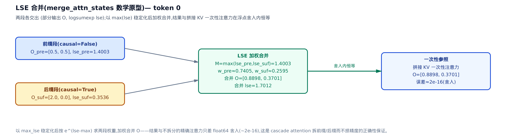

*图 34-6　两段各交出 (O, lse)。以 max(lse) 稳定化后按 e^(lse−max) 求权重，加权合并 O,合并 lse=log(Σe^(lse−max))+max。token 0 结果 [0.8898,0.3701] 与一次性参照恒等。*

### 代码兑现：merge_attn_states 的核心几行

这套数学在 vLLM 里落成 `merge_attn_states`——一个 Triton(GPU kernel 编程语言)kernel,逐 token 逐 head 地跑。它的核心几行与公式一一对应，值得就地绑回符号看一眼：

```python
# vllm/v1/attention/ops/triton_merge_attn_states.py:L118-L161
max_lse = tl.maximum(p_lse, s_lse)        # 取基准 M
p_lse = p_lse - max_lse
s_lse = s_lse - max_lse
p_se = tl.exp(p_lse)                       # e^(p_lse − max_lse) ≤ 1,不溢出
s_se = tl.exp(s_lse)
out_se = p_se + s_se
# … 省略:±inf 空序列归一 / out_lse=log(out_se)+max_lse / 地址算术 …
p_scale = p_se / out_se                    # 前缀权重 w_a
s_scale = s_se / out_se                    # 后缀权重 w_b
out = p_out * p_scale + s_out * s_scale    # O = w_a·O_a + w_b·O_b
```

`max_lse` 就是稳定化基准 $`M`$;两个 `tl.exp` 保证底数 $`\le 1`$ 、绝不上溢(和 safe-softmax 减 max 同一个道理);`p_scale`、`s_scale` 就是权重 $`w_a`$ 、 $`w_b`$;最后一行就是合并公式 $`O=w_aO_a+w_bO_b`$ 本身。kernel 的其余部分(空序列归一、地址算术)是工程琐节，见[第 25 章](../../ch25-attention/narrative/chapter.md)。

**这就是 ⊕ 的第三副面孔**:第一副是 online-softmax 的单遍递推，第二副是 FlashAttention 分块更新 $`(m,\ell,O)`$,这一副是合并两段注意力——状态记成 $`\mathrm{lse}=\log d`$,max 和加权都搬到了对数域，代数没变。它也是**第四副面孔 split-KV** 的地基：decode 阶段 batch×heads 太小、SM(streaming multiprocessor,流多处理器)吃不满时，把长 KV 单纯按长度切给多个 thread block 并行算(不按语义分段)，各 block 各出一份 $`(O,\mathrm{lse})`$ ，同样用 `merge_attn_states` 归并——结合律保证怎么切、怎么并都是同一个答案，本章不展开其调度细节。

---

## 七、cascade attention：共享前缀只算一遍

### 一个真实的省算场景

想象一批请求共享同一段长系统提示(system prompt),比如都以同一份几千 token 的指令开头。朴素做法：每条请求都把这段前缀的注意力从头算一遍——纯浪费。

cascade attention 的做法：**前缀只算一遍，复用给全批**。前提是本批所有 query 共享同一段完全相同的前缀——前缀不同就无从复用，cascade 也就用不上。把注意力拆成两段——前缀段(所有 query 都能看整段共享前缀，`causal=False`)和后缀段(各请求算自己私有的 KV,`causal=True`)。两段各自带回 `softmax_lse`,最后用 §六 的 `merge_attn_states` 合并成精确结果。真实调用骨架就三步，逐行都能绑回 ⊕ 的记号：

```python
# vllm/v1/attention/backends/flash_attn.py:L1185-L1236
# 前缀段:全批共享前缀只算一遍
prefix_output, prefix_lse = flash_attn_varlen_func(
    causal=False, return_softmax_lse=True,
    block_table=block_table[:1],
    # … 省略:q/k/v 与序列边界形参 …
)
# 后缀段:各 query 私有 KV
suffix_output, suffix_lse = flash_attn_varlen_func(
    causal=True, return_softmax_lse=True,
    block_table=block_table[:, num_common_kv_blocks:],
    # … 省略:同上 …
)
# 用 LSE 把两段部分输出合成精确结果
merge_attn_states(output, prefix_output, prefix_lse, suffix_output, suffix_lse)
```

两段 $`(O,\mathrm{lse})`$ 就是 ⊕ 的两个操作数；前缀段 `block_table[:1]` 指向那份共享的物理块，后缀段 `block_table[:, num_common_kv_blocks:]` 跳过共享部分、只看私有块(块表寻址机制见[第 25 章](../../ch25-attention/narrative/chapter.md))。最后 `merge_attn_states` 收口——就是上一节绑回公式的那几行。

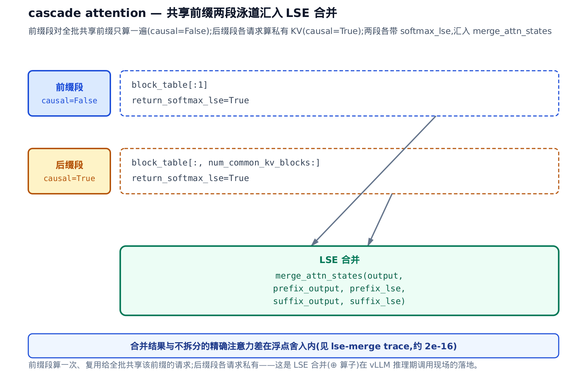

*图 34-8　前缀段(causal=False)对全批共享前缀只算一遍；后缀段(causal=True)各请求算私有 KV。两段各带 softmax_lse,汇入 merge_attn_states 合并。*

### 精度不打折

会不会因为拆开算就掉精度？不会。§六 已经证明并实测：合并结果与"对拼接 KV 一次性做注意力"代数恒等(浮点口径见 §二)。cascade 省的是重复计算，精度分毫不损——这正是 ⊕ 结合律在推理期的直接价值。共享前缀越长、共享的请求越多，省得越多。

---

## 八、chunked prefill：拆 query 轴，连 ⊕ 都不需要

到这里我们见过两种拆分，拆的都是 **KV 轴**:cascade 把历史切成"共享前缀 / 私有后缀",§六 末尾带过的 split-KV 把长 KV 切给多个 thread block——每一截只见部分 KV,各交一份 $`(O,\mathrm{lse})`$,最后非用 ⊕ 算子(`merge_attn_states`)按权重合回不可。本节的 **chunked prefill**(分块预填充：把一条长 prompt 的 prefill 拆成几拍分批算，调度动机见[第 13 章：调度器](../../ch13-scheduler/narrative/chapter.md))是第三种拆分——它拆的是 **query 轴**,而且**连合并都不需要**。为什么这么便宜？三步就能说透。

<!-- PAPER: arXiv:2308.16369 (Sarathi) / arXiv:2403.02310 (Sarathi-Serve) / arXiv:2401.08671 (DeepSpeed-FastGen, Dynamic SplitFuse) — 论文包 paper-chunked.md -->

### 第一步：因果注意力逐行独立

直觉先行：因果掩码下，第 $`i`$ 个 query 只能回看位置 $`\le i`$ 的 KV;未来的位置被掩成 $`-\infty`$,softmax 权重为 0。所以第 $`i`$ 行的输出，是**且只是**这些历史的函数——

```math
O_i=\mathrm{softmax}\!\left(\frac{Q_iK_{\le i}^{\top}}{\sqrt{d}}\right)V_{\le i}
```

这里 $`K_{\le i}`$ 、 $`V_{\le i}`$ 记位置 0 到 $`i`$ 的全部 key/value(第 $`i`$ 行能看到的全部历史), $`d`$ 是头维度(缩放 $`1/\sqrt{d}`$ 沿用 §一的约定)。关键在这行输出里**没有任何一项依赖 $`j\ne i`$ 的其它 query 行**,也不在乎这些 KV 是一次性写进缓存、还是分几批写进去。它是绝对位置的纯函数。

数值见证最直接。取一条 50-token 的随机序列(每 token 一个 $`d=8`$ 的向量),走两条路：路 (a) 一次性对整段做因果注意力；路 (b) 把 query 轴按 **16/16/18** 切成三块，每块只喂本块的 query、KV 喂"累积到本块末尾的全量历史"、causal 掩码照**绝对位置**——逐块输出拼起来。两路逐元素比：

<!-- trace: chunked-prefill-row-independence -->

| 块 | query 绝对位置区间 | 累积 KV 可见列数 | causal | 该块 max\|O_块 − O_一次性\| |
|---|---|---|---|---|
| 1 | [0, 15] | 16 | True | 0.0 |
| 2 | [16, 31] | 32 | True | 0.0 |
| 3 | [32, 49] | 50 | True | 0.0 |
| 整段拼接 vs 一次性 | [0, 49] | 50 | — | 0.0 (allclose atol=1e-12 ✓) |

这就是 §二 预告的那个例外：偏差不是"浮点舍入内近似",而是**精确 0**——逐字节相同。比 ⊕ 合并更强的相等，因为这里根本没有发生合并：每一行走的是**同一串浮点运算**,连舍入的机会都相同。

> **严谨（为什么逐字节相同）**：道理就写在上面那条公式里。一次性路对第 $`i`$ 行做 softmax 的非零列集合是 $`\{j:j\le i\}`$ ;分块路里第 $`i`$ 行落在某一块，该块的累积 KV 长度 $`\ge i+1`$ 、掩码把 $`j>i`$ 的列同样置 $`-\infty`$ ,于是参与 softmax 的列集合**恰好还是** $`\{j:j\le i\}`$ 。同一批标量 $`Q_i\!\cdot\!K_j`$ 、同一个顺序做 max/exp/求和/加权，结果自然逐字节一致。这条论证对真实 FlashAttention kernel 同样成立：它的 KV 分块尺寸是编译期常量、不随序列长度变化，因果掩码下第 $`i`$ 行选中的 KV 块集合与块内累加顺序，在"分块喂入 vs 一次性喂入"两条路上完全相同——prefill 路径走的是单调递增的因果扫描，不会触发 split-KV 那种按权重重排再归并的归约。切点落在 query 轴的哪、切成几块，都不改变任何一行参与运算的列集合。

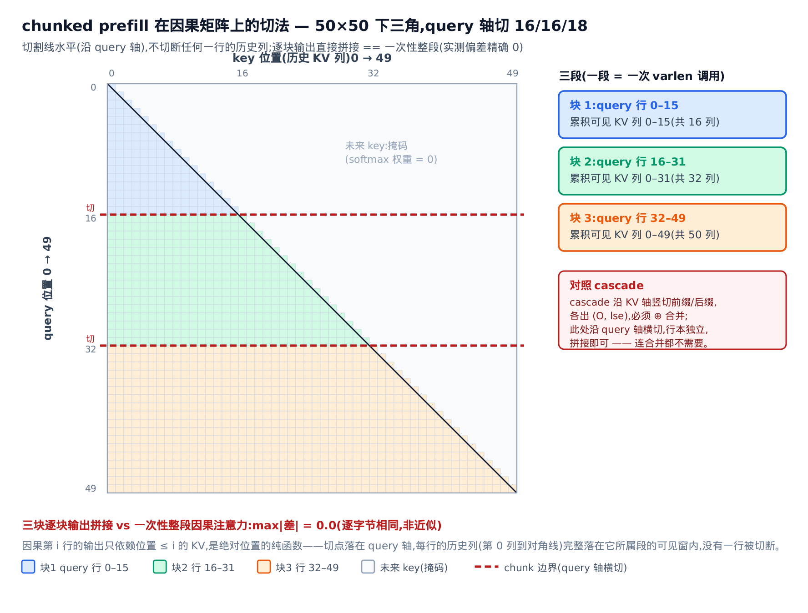

*图 34-9　50×50 因果注意力矩阵，下三角(含对角线)可见、上三角掩码。query 轴按 16/16/18 染成三段，两条红色水平虚线是 chunk 边界——切割线是**水平**的，沿 query 轴走，每一行的历史列(第 0 列到对角线)完整落在它所属段的可见窗内，没有一行被切断。对照 cascade 沿 KV 轴竖切、拆完要用 ⊕ 合并；query 轴横切后行本独立，逐块输出直接拼接，实测偏差精确为 0。*

### 第二步：KV 写入逐 token 幂等

一行的输出只依赖它能看到的历史 KV——那这些 KV 分几批写进缓存，会不会串位、写乱？不会，因为落盘那一步是**逐 token 幂等**的：每个 token 该写进哪个物理 KV 槽，由 `slot_mapping`(token→物理槽的映射，[第 18 章：模型运行器](../../ch18-model-runner/narrative/chapter.md)的持久批次算好)决定，一 token 一槽，**槽号是 token 绝对位置的纯函数**。所以无论这 50 个 token 的 KV 是一拍写完、还是分 16/16/18 三拍写，第 $`t`$ 个 token 永远落在同一个槽——第 $`c`$ 块算完时缓存里"累积到该块末尾的 KV",与一次性写完后取同样长度的前缀**逐字节相同**。散写与回读的算子机制(`reshape_and_cache_flash`、`block_table` 寻址)见[第 25 章：注意力后端](../../ch25-attention/narrative/chapter.md)。

### 第三步：拆 query 轴零代价，连 LSE 合并都不需要

把前两步合起来：每一行的输出只认自己能看到的历史(第一步),而这些历史无论分几批写、都逐字节稳定(第二步)。于是拆 query 轴就成了纯粹的"分头算、直接拼":第 $`c`$ 块就是一次 `flash_attn_varlen_func(causal=True)` 调用，吃"累积到本块末尾的全量 KV",一次算出本块 query 行的**最终**输出——**不带 lse、不做加权**。逐块输出落在各自不相交的 query 行，拼接就是拼接。对比 cascade / split-KV 非得 `merge_attn_states` 把碎片按 $`(O,\mathrm{lse})`$ 合回来，chunked prefill 的合并成本是 0。

工程上，这条定理长什么样？**长成"没有代码"。** 翻遍 `flash_attn.py` 的前向路径，你找不到任何一处针对 chunked prefill 的特判分支——一段被切成三拍的 prefill,和一次算完的整段 prefill,走的是**同一条 varlen 代码路径**(就是 §一 那次 `flash_attn_varlen_func`)。区别只在传进来的 query 有多长、`cu_seqlens_q` 怎么切，kernel 全然不知道、也不需要知道自己吃的是"一整段"还是"一段里的第二块"。零特判，正是"因果逐行独立"这条定理最干净的工程形态：定理成立，代码里就腾出一整类本该有的分支。

### 为什么要主动去拆：调度动机

既然拆了零代价，那**为什么**要拆？动机不在注意力这一层，在调度那一层。一段几千 token 的长 prompt,它的 prefill 是算力密集的大块；一旦独占一拍，正在 decode(逐 token 生成)的请求就被顶得卡顿。**Sarathi**(arXiv:2308.16369)提出把长 prefill 切成固定大小的 chunk 分几拍算，每拍的算力余量再**捎带**(piggyback,搭便车)若干 decode token——算力密集的 prefill 与访存密集的 decode 混在一拍里互补。它的后续 **Sarathi-Serve**(arXiv:2403.02310)把这套做成 **stall-free**(无停顿)调度：先给每一拍定一个 **token 预算**(token budget,一拍最多算多少 token,由延迟 SLO 反推),预算先塞满在途 decode、再塞一块 prefill;新请求的长 prefill 于是被自动切成"刚好填进预算余量"的 chunk,永不打断在途 decode。这正是[第 13 章：调度器](../../ch13-scheduler/narrative/chapter.md)那条"token 为中心、不分相"数轴的论文根之一。

几乎同一时间，**DeepSpeed-FastGen** 用 **Dynamic SplitFuse**(动态拆分-融合，arXiv:2401.08671)独立发明了同一个主意：把长 prompt 拆成小块、与 decode 融进同一批算，论文报告相对当时的 vLLM 最高 2.3× 吞吐。两条线殊途同归，底层踩的是同一块地基——因果注意力逐行独立，拆 query 轴不损一分精度。这也是本章那个 ⊕ 算子的**反面注脚**:凡是拆 KV 轴的(cascade、split-KV)都得请 ⊕ 出场合并，唯独拆 query 轴的 chunked prefill 用不上它——因为要合并的东西根本没被拆开。

---

## 小结

这一章把全书一直当黑盒的 `flash_attn_varlen_func` 从里到外拆了一遍。全部内容压在开篇那一条主线上——**⊕ 满足结合律与交换律，softmax 统计量可以任意分块、任意顺序归并**——各节只是它的动机、证明与四次兑现：

- **动机**:注意力慢在 HBM 往返，不在算力——两张 $`N\times N`$ 中间矩阵的物化是内存带宽墙(arXiv:2205.14135 §2)。⊕ 给拆分发许可证，HBM 账给拆分发动机。
- **第一副面孔——online-softmax 递推**:维护 running $`(m,d)`$ 单遍扫过，与三遍 safe-softmax 恒等；抽象成 ⊕ 后结合律成立(arXiv:1805.02867 §3)。
- **第二副面孔——FlashAttention 分块**:⊕ 作用在 $`(m,\ell,O)`$ 上，切块进 SRAM 逐块 rescale-accumulate, $`N\times N`$ 从不落 HBM;IO 从 $`\Theta(N^2)`$ 降到 $`\Theta(N^2d^2/M)`$(arXiv:2205.14135 §3)。FA-2 不换数学，只榨工程：循环序对调 + 推迟归一化 + 只存 $`L=m+\log\ell`$(arXiv:2307.08691 §3)。
- **第三副面孔——LSE 合并**:⊕ 搬到对数域作用在 $`(\mathrm{lse},O)`$ 上，`merge_attn_states` 十行 Triton 把两段部分注意力精确拼回；cascade attention 靠它把"共享前缀只算一遍"变成免费午餐。
- **第四副面孔——split-KV**:decode 期把长 KV 按长度硬切喂饱 SM,各块的 $`(O,\mathrm{lse})`$ 仍用同一次 LSE 归并收口，精度分毫不损。
- **反面注脚——chunked prefill**:拆 query 轴而非 KV 轴。因果注意力逐行独立 + KV 写入逐 token 幂等 ⇒ 拆块零代价、连 ⊕ 都不需要，`flash_attn.py` 对它零特判(arXiv:2308.16369 / 2403.02310 / 2401.08671)。

记住这条界线：**凡拆 KV 轴者，必请 ⊕ 出场合并；拆 query 轴者，行本独立、拼接即可**——分得清这两种拆分，本章就没白读。这些数学的工程落地——后端怎么选、metadata 怎么翻译、分页 KV 怎么喂——下一章[注意力后端抽象(第 25 章)](../../ch25-attention/narrative/chapter.md)展开：你已经知道 kernel 内部在干什么，接下来就看它怎么被选择和调用。
