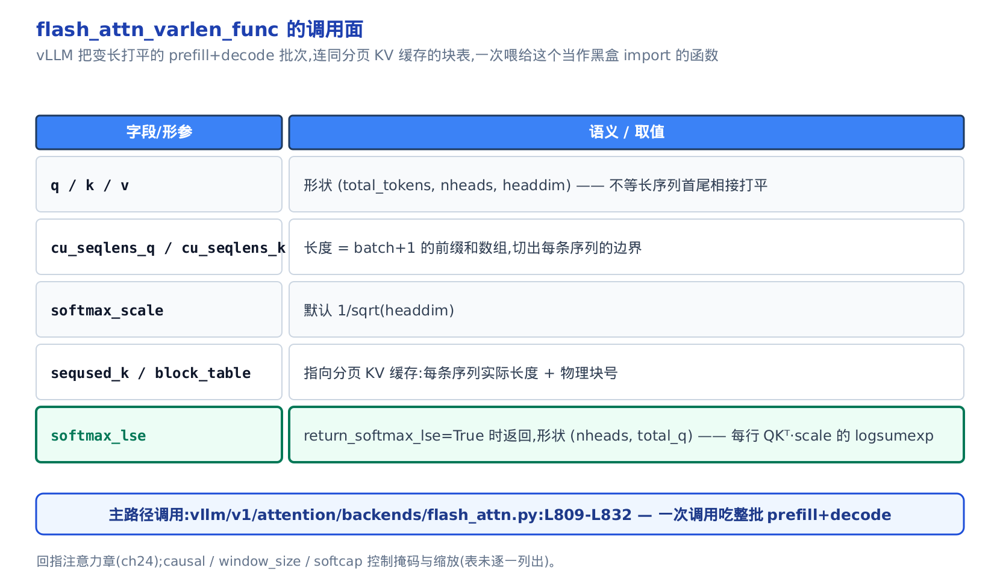

# 第 24 章　【原理篇·论文精读】FlashAttention:从 online-softmax 到 IO-aware 注意力

## 你在这里


*图 34-0　全书请求生命周期地图。上一章停在 attention 算子被切出来、保持 eager;本章纵向切进这一格，掀开它内部一直当黑盒的 FlashAttention kernel。*

上一章拆到 `self.attn(q, k, v)` 那行调用的底下——attention 算子被 `torch.compile` 当切点切出来、夹在两侧规整段之间保持 eager。但那个算子**内部**真正干活的 FlashAttention kernel,始终是当黑盒 `import` 进来的：调用一行 `flash_attn_varlen_func`,注意力就算完了，可里面到底发生了什么，全书至今没打开过。

这一章就打开它。它是一节**原理课**:主角是两篇论文——FlashAttention(arXiv:2205.14135)和它前置的 online-softmax(arXiv:1805.02867),外加一节带过的 FlashAttention-2(arXiv:2307.08691)。我们会从"注意力到底慢在哪"讲起，一路推到 vLLM 真实源码里的那几行调用，让你以后再看到 `flash_attn_varlen_func`、`merge_attn_states` 这些名字时，脑子里有的是算法而不是黑盒。

四段式路线：

1. **动机**——为什么朴素注意力慢在读写、不在算力(内存带宽墙);
2. **推导**——online-softmax 让 softmax 能边扫边算，FlashAttention 用分块 tiling 免物化，再算一笔 IO 复杂度账；
3. **数值推演**——用几组手算级的小参数，亲眼看递推的每一步与朴素 softmax 在浮点舍入内恒等；
4. **落地**——回到 `flash_attn_varlen_func` 的调用面、`merge_attn_states` 的合并 kernel,和 cascade attention 的真实调用现场。

读完这一章，后面凡是提到 FlashAttention、LSE 合并、cascade、split-KV 的地方，你都能接得住。


只想看这套算法怎么落进代码——`merge_attn_states` 怎么合、cascade attention 怎么省算——可以跳过中间推导，直接读「六、⊕ 算子再现」到「八、落地：cascade attention」这几节；想跟一遍完整推导，就从「二、推导之一」按序读到「五、FlashAttention-2」，再顺势读进代码落地。

### 符号速查表

后面几节会陆续借用几个记号，先列一张表备查；每个符号首次出现处正文也会紧跟一句解释，不必现在就死记。

| 符号 | 含义 | 首次出现 |
|---|---|---|
| $M$（⊕ 算子的稳定化基准） | 合并两组统计量时取的较大者（如 $\max(m_i,m_j)$ 或 $\max(l_a,l_b)$），把两个指数的底数都压到 ≤1 防上溢——本章为叙述简洁补的记号，原论文里是内联写的 $\max(\cdot,\cdot)$，未单独命名 | 二、推导之一 |
| $B_r$ | FlashAttention 分块时 Q 的行块大小（row block size） | 三、推导之二 |
| $B_c$ | FlashAttention 分块时 K、V 的列块大小（column block size），与 $B_r$ 搭配限定局部打分块 $S_{ij}$ 的形状为 $B_r\times B_c$ | 三、推导之二 |
| $M$（SRAM 容量） | GPU 片上 SRAM 的大小（以元素个数计），IO 复杂度账 $\Theta(N^2d^2/M)$ 分母里的那个 $M$——和上一行 ⊕ 算子的稳定化基准是两个不同的量，别混淆 | 四、推导之三 |

---

## 一、动机：被物化的 N×N 与内存带宽墙

### 慢在搬运，不在计算

先给个反直觉的结论：标准注意力慢，**不是因为算得多，而是因为搬得多**。

想象一台 GPU 里有两层存储。一层是**SRAM**(片上静态存储，又叫 shared memory)——离计算单元最近、极快，但极小：A100 上每个 SM(streaming multiprocessor,流多处理器)只有 192KB,带宽约 19 TB/s。另一层是**HBM**(high bandwidth memory,片外高带宽显存)——就是我们平时说的"显存",40-80GB 很大，但带宽只有 1.5-2.0 TB/s,慢了一个数量级(arXiv:2205.14135 §2.1)。

论文把算子分两类：**compute-bound**(算力受限，时间花在算术上)和 **memory-bound**(访存受限，时间花在搬数据上)。判据是**算术强度**(arithmetic intensity,每读一字节做多少次算术)。softmax、mask、dropout 这些逐元素/归约算子，算得少、搬得多，统统是 memory-bound。

标准注意力是怎么算的？给定 $Q$ 、 $K$ 、 $V$(形状都是 $N\times d$,$N$ 是序列长、 $d$ 是每个头的维度),它老老实实按定义走三步(arXiv:2205.14135 §2.2 Algorithm 0):

$$
S=QK^{\top}\in\mathbb{R}^{N\times N},\qquad P=\mathrm{softmax}(S)\in\mathbb{R}^{N\times N},\qquad O=PV\in\mathbb{R}^{N\times d}
$$

问题就出在那两张 $N\times N$ 的中间矩阵 $S$ 和 $P$ 。Algorithm 0 的三步，每一步都要跟 HBM 打一趟往返：第 1 步把 $S$ 写回 HBM,第 2 步读 $S$ 、写 $P$,第 3 步读 $P$ 和 $V$ 、写 $O$ 。 $N=1024$ 时， $N\times N$ 就是一百多万个元素，来回搬三趟——**访存量是 $\Theta(N^2)$ 级别的，而这正是 wall-clock 时间的主导项**。真正的矩阵乘反而很快就做完了。


*图 34-1　片上 SRAM 快 10× 但只有 192KB,片外 HBM 大却慢 10×。标准注意力把 N×N 的 S、P 物化到 HBM 往返三趟，访存随 N² 暴涨——这就是要拆的墙。*

### 全书那一行黑盒

FlashAttention 的野心一句话：**别把 $S$ 、 $P$ 落到 HBM,整个注意力融成一个 kernel 在 SRAM 里算完**。vLLM 用的就是它，而且是当黑盒 import 进来的。我们在注意力后端里见过的，就是下面这一次调用：

```python
# vllm/v1/attention/backends/flash_attn.py:L809-L832
flash_attn_varlen_func(
    q=query[:num_actual_tokens],
    k=key_cache,
    v=value_cache,
    out=output[:num_actual_tokens],
    cu_seqlens_q=cu_seqlens_q,
    max_seqlen_q=max_seqlen_q,
    seqused_k=seqused_k,
    max_seqlen_k=max_seqlen_k,
    softmax_scale=self.scale,
    causal=attn_metadata.causal,
    window_size=sliding_window_size,
    block_table=block_table,
    softcap=self.logits_soft_cap,
    fa_version=self.vllm_flash_attn_version,
    # … 省略:alibi_slopes / scheduler_metadata / q,k,v_descale(FP8)/ num_splits / s_aux …
)
return output
```

一整批 prefill(预填充，处理 prompt)和 decode(解码，逐 token 生成)的注意力，就靠这一次 `flash_attn_varlen_func` 吃下。`softmax_scale=self.scale` 就是那个 $1/\sqrt{d}$ 缩放，`causal` 控制因果掩码。这一行背后的算法，就是本章要推的东西。为什么它敢不物化 $N\times N$ 还能算对？答案藏在一个叫 online-softmax 的老技巧里。

---

## 二、推导之一：online-softmax——让 softmax 边扫边算

### 直觉：老师批卷子

softmax 要对一行 $N$ 个打分做归一化。数值稳定的标准做法(**safe-softmax**)要扫**三遍**:第一遍找最大值 $m_V$(减掉它防止 $e^x$ 上溢),第二遍求归一化分母 $d_V$,第三遍算每个输出(arXiv:1805.02867 §2 Algorithm 2):

$$
m_V=\max_k x_k,\qquad d_V=\sum_k e^{x_k-m_V},\qquad y_i=\frac{e^{x_i-m_V}}{d_V}
$$

三遍扫描意味着三趟访存——放到 FlashAttention 的分块场景里，等于要求"先看完整行才能开始":既然要先扫遍整行拿到全局最大值 $m_V$ 才敢算任何一项，就没法只拿着一小块 KV 先动手，算法被钉死成串行的。而下面 online-softmax 用一个 running 最大值打破了这条依赖，让每一行都能拿到一块就先算一块、增量推进——这正是分块(tiling)能成立的前提。

online-softmax(arXiv:1805.02867 §3 Algorithm 3)的洞见像老师批一摞卷子：**不必先翻遍全摞找最高分再回头算**。边看边记两个数就够了——当前见过的最高分 $m$,和一个"按当前最高分归一"的累计分母 $d$ 。每来一张新卷子 $x_j$,先把旧累计按新旧最高分之差缩一下，再加上新卷子这一项：

$$
m_j=\max(m_{j-1},\,x_j),\qquad d_j=d_{j-1}\,e^{m_{j-1}-m_j}+e^{x_j-m_j}
$$

那个 $e^{m_{j-1}-m_j}$ 就是**rescale 因子**。最高分没变时它等于 1(旧累计不动);最高分跳升时它小于 1(把旧累计缩到新基准上)。safe-softmax 的头两遍(找 $m_V$ 、求分母 $d_V$)就这么融成了一遍——一趟扫描同时得到 $(m,d)$;剩下只需再扫一遍按 $y_i=e^{x_i-m}/d$ 输出每一项。总扫描数从 $3N$ 降到 $2N$,代价只是多存 $m$ 、 $d$ 两个标量。

十来行就能忠实复现这套递推，把它跑起来对数值最直观：

```python
def online_softmax_stats(x):
    m, d = -inf, 0.0
    for xj in x:
        m_new = max(m, xj)
        d = d * exp(m - m_new) + exp(xj - m_new)   # 先 rescale 旧累计,再加新项
        m = m_new
    return m, d
```

### 机制：逐轮手算

拿一条最小向量 $x=[1,3,2,5]$ 走一遍。第 4 步是关键：此前最高分是 3,来了个 5,最高分跳升，旧累计 $d=1.5032$ 先被 $e^{3-5}=0.1353$ 缩小，再加上新项：

<!-- trace: online-softmax-recurrence -->

| 轮 j | x_j | m: 旧→新 | rescale = exp(m_old−m_new) | d_before | d_new |
|---|---|---|---|---|---|
| 1 | 1 | -inf → 1 | n/a (首元素) | 0 | 1.0 |
| 2 | 3 | 1 → 3 | 0.1353 | 1.0 | 1.1353 |
| 3 | 2 | 3 → 3 (max 不变) | 1.0 | 1.1353 | 1.5032 |
| 4 | 5 | 3 → 5 (max 跳升) | 0.1353 | 1.5032 | 1.2034 |

单遍扫完，末值 $m=5$ 、 $d=1.2034$ 。而三遍 safe-softmax 独立算出来的归一化分母 $d_V$ 也是 $1.2034$ ——**逐位相等，两版 softmax 的逐元素输出差为 0.0**。第 2 步和第 4 步都发生了真实的 rescale(因子 0.1353),第 3 步最高分没变、因子退化成 1.0,旧累计原样带过。

![online-softmax 单遍递推：x=[1,3,2,5]](../diagrams/fig34-2-online-softmax-recurrence.png)

*图 34-2　每列是处理一个新元素后的 (m,d)。第 4 步 max 从 3 跳到 5,旧累计 1.5032 被 0.1353 缩小后得 1.2034,与三遍 safe-softmax 分毫不差。*

**这条递推为什么恒对？** 对元素个数做归纳。基例 $j=1$:$m_1=x_1$ 、 $d_1=e^{x_1-m_1}=1$,就是长度 1 的 softmax 分母。归纳步：假设处理完前 $j-1$ 个后，旧累计 $d_{j-1}$ 就是前 $j-1$ 项相对基准 $m_{j-1}$ 的 softmax 分母。来 $x_j$ ，新基准取 $m_j$ ，则

$$
d_j=d_{j-1}\,e^{m_{j-1}-m_j}+e^{x_j-m_j}=\sum_{k<j}e^{x_k-m_j}+e^{x_j-m_j}=\sum_{k\le j}e^{x_k-m_j}
$$

rescale 项恰好把旧累计的基准从 $m_{j-1}$ 平移到 $m_j$ 。不变式每轮保持，末轮即得与三遍等价；且 $m_j$ 单调不减，有限元素必然收敛。

### 从一遍到分块：⊕ 合并算子

单遍递推还只是"顺序看完一摞"。真正让分块成立的，是把 $(m,d)$ 这对状态抽象成一个**二元合并算子 ⊕**(arXiv:1805.02867 §3.1 Eq.4):

$$
[m_i;d_i]\oplus[m_j;d_j]=\Big[\ \max(m_i,m_j)\ ;\ d_i\,e^{m_i-M}+d_j\,e^{m_j-M}\ \Big],\qquad M=\max(m_i,m_j)
$$

它把两组"各自相对自己最高分的累计"先换算到公共基准 $M$,再相加。论文只**断言** ⊕ 满足**结合律与交换律**、并明说为简洁起见略去了这两条的证明(arXiv:1805.02867 §3.1);下面这段直觉论证是本章补的、不出自原文：max 本身可结合可交换是显然的； $d$ 分量之所以也满足，是因为两个被缩放的和 $d_i\,e^{m_i-M}+d_j\,e^{m_j-M}$ 里， $i$ 、 $j$ 两项都被换算到了同一个公共基准 $M$ ——既然基准相同，交换两项次序、或改变分块的配对方式，都不改变这个和(普通加法的结合律与交换律),基准换算本身也与配对无关。于是——**softmax 的归一化统计量可以任意分块、任意顺序、并行归并，结果唯一**。这就是 FlashAttention 敢切块、cascade attention 敢拆两段的**许可证**。

验证一下：把 $x=[1,3,2,5]$ 切成 $A=[1,3]$ 、 $B=[2,5]$ 两块，各算局部 $(m,d)$,再用 ⊕ 合并——不管先合谁，结果都不依赖合并顺序，数值上也该与单遍、三遍高度吻合：

<!-- trace: online-softmax-merge-operator -->

| 子块 / 操作 | m | d |
|---|---|---|
| 块 A=[1,3] 局部 | 3 | 1.1353 |
| 块 B=[2,5] 局部 | 5 | 1.0498 |
| A ⊕ B | 5 | 1.2034 |
| B ⊕ A (交换) | 5 | 1.2034 |
| 单遍遍历整段 | 5 | 1.2034 |
| 三遍 safe 参照 | 5 | 1.2034 |

`A ⊕ B`、`B ⊕ A`、单遍、三遍——四者的 $d$ 全是 $1.2034$ 。合并时公共基准取 5,块 A 的局部累计 $1.1353$ 被 $e^{3-5}=0.1353$ 缩小后并入，得 $1.2034$ 。**合并顺序不改变结果**——参考实现里 `A ⊕ B` 与 `B ⊕ A` 逐位相等，这正是结合律 + 交换律的直接后果；分块合并比单遍递推多走了一次 rescale，与单遍/三遍相比是同一个代数恒等式在浮点舍入内成立(float64 差 ~2e-16，四位小数显示位都是 1.2034)。 $P$ 个分块并行时，各块独立算局部 $(m,d)$ 耗时 $O(N/P)$,再 $O(\log P)$ 步 tree-reduce 用 ⊕ 归并即可。

这个 ⊕ 算子后面还会以两副面孔回来：一副是 FlashAttention 分块递推里更新 $(m,\ell,O)$,另一副是 vLLM 的 `merge_attn_states` 合并两段注意力——它们本质是同一个算子，只是作用在不同的状态对上。

---

## 三、推导之二：FlashAttention 分块 tiling 与免物化

### 直觉：只把一小块搬上书桌

有了 ⊕ 算子，FlashAttention(arXiv:2205.14135 §3.1 Algorithm 1)就水到渠成：把 $Q$ 、 $K$ 、 $V$ 切成能塞进 SRAM 的小块，**一次只把当前这一小块搬上"书桌"算**。手里始终攥着三个 running 量：见过的最高分 $m_i$ 、归一累计 $\ell_i$ 、当前的加权输出 $O_i$(注意力章里的记号沿用， $\ell$ 就是这里的 $d$)。每处理完一个 KV 块，就用 online-softmax 那套 rescale 手法把三个量更新到新基准——**那张 $N\times N$ 的完整打分表，从头到尾没在 HBM 里落过地**。

外层循环遍历 $K,V$ 的列块 $j$,内层遍历 $Q$ 的行块 $i$;每个 $(i,j)$ 块局部算 $S_{ij}=Q_iK_j^{\top}$(至多 $B_r\times B_c$——$B_r$ 是 Q 的行块大小、$B_c$ 是 K,V 的列块大小，绝不是 $N\times N$),局部 softmax 出 $\tilde m_{ij}$ 、 $\tilde\ell_{ij}$ 、 $\tilde P_{ij}$,再把 running 量推到新的全局 max(arXiv:2205.14135 §3.1 Algorithm 1 L11-L13):

$$
m_i^{\mathrm{new}}=\max(m_i,\tilde m_{ij}),\qquad
\ell_i^{\mathrm{new}}=e^{m_i-m_i^{\mathrm{new}}}\ell_i+e^{\tilde m_{ij}-m_i^{\mathrm{new}}}\tilde\ell_{ij}
$$

$$
O_i\ \leftarrow\ \frac{1}{\ell_i^{\mathrm{new}}}\Big(\ \ell_i\,e^{m_i-m_i^{\mathrm{new}}}\,O_i\ +\ e^{\tilde m_{ij}-m_i^{\mathrm{new}}}\,\tilde P_{ij}V_j\ \Big)
$$

看那个 $e^{m_i-m_i^{\mathrm{new}}}$ ——和 online-softmax 里的 rescale 因子一模一样。为什么按 max 之差缩放就不丢正确性？就像 online-softmax 里累计分母 $d$ 要按新旧最高分基准缩一样，这里还没归一的加权和 $O_i$ 也必须按同一个因子缩到新的全局最高分基准上——只有旧贡献和新块的贡献同处一个基准，后面把它们相加、共用一个分母 $\ell_i^{\mathrm{new}}$ 才有意义。 $O_i$ 每步先按新旧 max 之差缩放旧值，再加上新块的 $\tilde P_{ij}V_j$ 贡献，当场除以 $\ell_i^{\mathrm{new}}$ 归一。整个过程融成一个 CUDA kernel。Theorem 1 保证：输出**精确等于** $\mathrm{softmax}(QK^{\top})V$,只花 $O(N^2d)$ FLOP、额外内存仅 $O(N)$ 。

### 机制：2×2 分块手算

抽象讲完，还是要看数值。取一个手算级的例子： $N=4$ 、 $d=2$,切成 $2\times2$ 的块。只追踪 query 行 0,看它的 $(m_i,\ell_i,O_i)$ 怎么随两个 KV 列块演进：

<!-- trace: flashattention-tiling -->

| KV 块 j | 局部 m~ / l~ | m_i 新 | l_i 新 | O_i 新 | 对照标准 softmax |
|---|---|---|---|---|---|
| 1 | m~=0.7071, l~=1.4931 | 0.7071 | 1.4931 | [0.6698, 0.3302] | (未完) |
| 2 | m~=0.7071, l~=2.0 | 0.7071 | 3.4931 | [0.8588, 0.7137] | [0.8588, 0.7137] |

处理完第 1 个 KV 块， $O$ 行是个中间值 $[0.6698, 0.3302]$;吃下第 2 个 KV 块、归一累计从 $1.4931$ 涨到 $3.4931$ 后， $O$ 行变成 $[0.8588, 0.7137]$ ——**与一次性 $\mathrm{softmax}(QK^{\top})V$ 算出来的 $[0.8588, 0.7137]$ 在浮点舍入内恒等**(参考实现里两者最大逐位差约 $1.1\times10^{-16}$ ，正是 float64 机器精度量级，四位小数显示位一致)。而全过程手里最大只有一个 $2\times2$ 的局部块， $4\times4$ 的完整打分表从未成形。推广到 $N=1024$ 、块 $128\times128$:完整表一百多万元素，单块才 16384 个，只占 1/64,轻松放进 SRAM。


*图 34-3　外层遍历 KV 列块，query 行 0 的 running (m,l,O) 逐块 rescale-accumulate。处理完第 2 块得 [0.8588,0.7137],与一次性 softmax 差在浮点舍入内(~1e-16)；最大局部块仅 2×2。*

**为什么逐块累加等于一次性 softmax?** 因为每个 KV 块对 $(m_i,\ell_i,O_i)$ 的更新，与 ⊕ 算子**同构**：新的行最高分取 $m_i$ 与 $\tilde m_{ij}$ 的较大者（max 分量）；未归一化输出按新旧 max 之差 rescale 再相加（ $d$ 分量的加权）。由上一节的结合律，逐块归并的结果与合并顺序无关，Theorem 1 保证这在数学上与"一次性对整行 softmax"精确相等——浮点参考实现里两者差在 machine epsilon 量级(上面的 1.1e-16)，是舍入而非算法偏差。 $m_i$ 单调不减保证 $T_c$ 个块有限步走完。

至于内部那个 `flash_attn_varlen_func` 到底长什么形参、返回什么——那是落地部分的事，我们在 §七 掀开它的 Python 入口。这里只需记住：它算的就是上面这套递推。

---

## 四、推导之三：IO 复杂度账——快在哪、快多少

### 直觉：数箱子，别数乘加

衡量注意力的成本，别数它做了多少次乘加，要数它往慢速仓库(HBM)搬了多少箱货。标准做法要把 $N\times N$ 大表搬进搬出好几趟，箱数随 $N^2$ 疯长；FlashAttention 把 $K,V$ 切成能塞进书桌的块，每块只把整个 $Q$ 过一遍。论文给出的账(arXiv:2205.14135 §3.2 Theorem 2)是：

$$
\Theta(Nd+N^2)\quad\longrightarrow\quad \Theta\!\left(\frac{N^{2}d^{2}}{M}\right)
$$

左边是标准注意力(含 $N^2$ 物化项),右边是 FlashAttention($M$ 是 SRAM 大小——这个 $M$ 与 §二 ⊕ 算子里的稳定化基准 $M$ 是两个不同的量，请勿混淆，详见开篇符号速查表)。证明骨架分三步：其一， $K,V$ 总共 $\Theta(Nd)$ 个元素，SRAM 每次只装得下 $\Theta(M)$ 一块，故要分 $\Theta(Nd/M)$ 个块轮流驻留；其二，每个 $K,V$ 块驻留期间，由于每个 query 行都要和它里面的每个 key 做点积，必须把整个 $Q$($\Theta(Nd)$ 个元素)从 HBM 过一遍与之相乘；其三，块数乘以每块过一遍 $Q$ 的开销，即得总 HBM 访问量：

$$
\Theta\!\left(\frac{Nd}{M}\right)\times\Theta(Nd)=\Theta\!\left(\frac{N^{2}d^{2}}{M}\right)
$$

关键在 $d$ 一般只有 64-128,而 $M\approx100\mathrm{KB}$(fp32 下约 25600 个元素),于是 $d^2\ll M$,右边比左边少好几倍。Proposition 3 还证了这是**下界**:在这段 $M$ 范围内，没有精确注意力算法能渐进更省。

### 机制：代入真数字

把 $d=64$ 、SRAM 约 $100\mathrm{KB}$(fp32 约 25600 个元素)代进去，按参考实现逐元素精确计数，对比三种序列长：

<!-- trace: io-complexity-accounting -->

| N (序列长) | 标准 HBM 访问(元素) | FlashAttn HBM 访问(元素) | 比值 标准/Flash |
|---|---|---|---|
| 1024 | 4456448 | 2338816 | 1.91 |
| 2048 | 17301504 | 8691712 | 1.99 |
| 4096 | 68157440 | 33439744 | 2.04 |

$N=1024$ 时标准搬 4456448 个元素、Flash 只搬 2338816,省了约一半(1.91×);$N$ 一路涨到 4096,比值升到 2.04×。**趋势是单调上升的**:标准的 $N^2$ 物化项增速快于 Flash,序列越长、消去 $N^2$ 的收益越大。


*图 34-4　标准注意力访存随 N² 暴涨，FlashAttention 消去 N² 项。比值 1.91×→1.99×→2.04× 随 N 上升，序列越长越赚。*

这里报的是**元素级搬运数**,在 $d=64$ 、SRAM≈100KB 时只看到 1.91×→2.04×;论文用 GPT-2 medium 的参数($N=1024$ 、 $d=64$ 、16 heads、batch 64)算出的 HBM 访问量减少可达 9×(arXiv:2205.14135 引言，Fig.2)——**和本章表格算的是同一个指标(HBM 访问量之比),只是取的参数点不同**。


*论文 Figure 2 的实测：GPT-2 medium(N=1024、d=64、16 heads、batch 64)上，FlashAttention 的 GFLOPs(75.2)反比标准实现(66.6)更高，但 HBM 读写从 40.3GB 降到 4.4GB(降了约 9.2×，与上面提到的 9× 是同一个数量级)、runtime 从 41.7ms 降到 7.3ms——FLOP 更多却更快，直接坐实"HBM 访存量而非 FLOP 数决定 runtime"这条反直觉论断；中图显示分块 Bc 越大、HBM 访问和前向耗时都越低，右图是 block-sparse 变体的加速比随稀疏度上升。*

而真正的 wall-clock(墙钟)加速是另一个数字：论文 Figure 1 给出的是 7.6×(arXiv:2205.14135 Fig.1)。


*左边是论文 Figure 1 的 tiling 示意：外层循环(红)沿 $K,V$ 的列块搬运，内层循环(蓝)沿 $Q$ 的行块搬运，每一小块都先进 SRAM"上书桌"算完再写回，虚框标出那些从未落回 HBM 的中间量；右边是 GPT-2 上的实测柱状图，标准 PyTorch 实现把 matmul/dropout/softmax/mask 逐段耗时叠加到约 17ms，FlashAttention 融成一个 kernel 后压到约 2.2ms——这正是 7.6× wall-clock 加速的来源。*

wall-clock 之所以比纯访存元素计数还快，差距才来自本模型没计入的那部分收益——softmax/mask/dropout 这些 memory-bound 算子被融进单 kernel、kernel 启动与中间张量分配被彻底省掉。方向一致：**注意力慢在 HBM 往返，而 FlashAttention 把往返砍掉了**。

vLLM 侧对这套访存优化的落地面，就体现在它怎么给 kernel 喂数据。看 `flash_attn_varlen_func` 的接口约定：

```python
# vllm/vllm_flash_attn/flash_attn_interface.py:L232-L261
"""
    q: (total_q, nheads, headdim)      # 批内所有 query token 首尾相接打平
    cu_seqlens_q: (batch_size + 1,)    # 每条序列的累积长度,用来索引 q
    softmax_scale: float               # QK^T 的缩放,默认 1/sqrt(headdim)
    causal: bool                       # 是否加因果掩码
    # … 省略:window_size / softcap / alibi_slopes / deterministic …
Return:
    out: (total, nheads, headdim)
    softmax_lse [若 return_softmax_lse=True]: (nheads, total_q_seqlen)
        # = 每行 QK^T*scale 的 logsumexp(softmax 归一化因子的对数)
"""
```

`q` 用 `(total_q, nheads, headdim)` 把整批不等长序列**首尾相接打平**,而不是 padding 到等长——推理批内 prefill 上千 token、decode 只 1 个，padding 会白白浪费大量算力和 HBM。`cu_seqlens_q`(cumulative sequence lengths,累积序列长度，长度 batch+1 的前缀和)负责精确切出每条序列的边界。少搬冗余数据，本身就是 IO-aware 精神的延续。而那个 `softmax_lse` 返回值——正是 §六 合并两段注意力时的钥匙。

---

## 五、FlashAttention-2:同一份数学，榨得更快(一节带过)

现代 kernel(包括 vLLM 依赖的这个)其实是 **FlashAttention-2**(arXiv:2307.08691)。它没换数学，只在工程上做了三处调优，综合比初版快约 2×。一节带过，记住三点就够。

先坐实一件事：说"现代 kernel 是 FA-2"不是纸上谈兵——vLLM 真的按硬件代际挑更新的 FA 版本，选择逻辑就写在 `get_flash_attn_version` 里：

```python
# vllm/v1/attention/backends/fa_utils.py:L56-L86
def get_flash_attn_version(...) -> int | None:
    device_capability = current_platform.get_device_capability()
    # 1. default version depending on platform
    if device_capability.major == 9 and is_fa_version_supported(3):
        fa_version = 3       # Hopper(SM90):优先 FA3
    elif device_capability.major == 10 and is_fa_version_supported(4):
        fa_version = 4       # Blackwell(SM100+):优先 FA4
    else:
        fa_version = 2       # 兜底 FA2
    # … 省略:环境/config 覆盖 + ALiBi 等不兼容组合回退 …
    return fa_version
```

Hopper(SM90,streaming multiprocessor 9.0,NVIDIA 上一代数据中心架构)优先 FA3、Blackwell(SM100,更新一代)优先 FA4,其余一律回退 FA2。这里的 **FA3**(FlashAttention-3,为 Hopper 定制)、**FA4**(面向 Blackwell)都是 FlashAttention 的后续版本，数学内核与本节讲的 FA-2 一脉相承，只是继续压榨新硬件——本节讲透 FA-2，就理解了这一族 kernel 的公共骨架。有了这段真实 dispatch 垫底，下面三点工程改进就都落在实处：


*图 34-5　外层循环 KV→Q 行块(序列并行);中间 O 不每步归一、收尾除一次(省 non-matmul FLOP);只存 L=m+log(l);warp 分工 split-K→split-Q。*

1. **循环序对调**(arXiv:2307.08691 §3.1 Algorithm 1；并行动机见 §3.2 Parallelism):初版外层遍历 $K,V$ 块，FA-2 改成**外层遍历 $Q$ 行块**。这样不同 $Q$ 行块能分给不同的 thread block(线程块，GPU 上被整体调度到一个 SM 的一批线程),沿序列长度并行，长序列时 GPU 的 occupancy(占用率，SM 上活跃 warp 的比例)更高。

2. **推迟归一化**(arXiv:2307.08691 §3.1.1):初版每处理一个 KV 块都要除一次 $\ell$;FA-2 让中间 $O$ 保持未归一化，**只在收尾除一次**。这削减了昂贵的 non-matmul FLOP(非矩阵乘浮点运算，指 softmax、除法、exp/log 这类逐元素与归约运算——它们跑在通用计算单元上，而矩阵乘跑在专用的 Tensor Core 上)——在 A100 上，Tensor Core 的 matmul 吞吐比 non-matmul 高约 16×(arXiv:2307.08691 §3.1),于是每一条非矩阵乘指令都相对昂贵，能省则省。

3. **只存一个标量**(arXiv:2307.08691 §3.1.1):初版存 $(m,\ell)$ 两个量，FA-2 只存 logsumexp $L=m+\log(\ell)$ 一个。backward 和合并都只需要它。warp(GPU 里 32 个线程一组的调度单位)分工也从 split-K 改为 **split-Q**(arXiv:2307.08691 §3.3 Work Partitioning):split-K 让每个 warp 各算 $K$ 维的一段、再跨 warp 把各自的部分结果加起来，逼着 warp 之间反复读写 shared memory 做同步；split-Q 改成每个 warp 认领一段 $Q$ 行、各自独立算完自己那几行的完整输出，warp 间不必再通信——省掉的正是这笔 shared-memory 往返。


*左边 (a) 是 FlashAttention 的 split-K：$K$ 维被切给 4 个 warp 各算一段 $QK^\top$，再跨 warp 把部分结果写进 shared memory、同步相加；右边 (b) 是 FlashAttention-2 的 split-Q：切分对象换成 $Q$，每个 warp 独立认领一段 $Q$ 行、算完自己那几行的完整输出，warp 之间不再需要通信——省掉的正是 (a) 里那笔 shared-memory 读写。*

第 3 点尤其重要：vLLM 那个 `return_softmax_lse=True` 返回的，正是这个 $L$ 。有了它，才能把分开算的两段注意力精确拼回去——这就是下一节的主题。


*A100、head_dim=64、含因果掩码配置下的前向+反向吞吐(TFLOPs/s)：序列长度从 512 到 16k，FlashAttention-2 相对 FlashAttention 约 1.5-1.8×，相对标准 PyTorch 实现在 8k 长度上已达约 9.2×——论文正文称全部配置下最高达 10×,坐实了本节开头"综合比初版快约 2×"背后的实测证据(这里对比的是 FA-2/FA；标准实现的差距更大)。*

---

## 六、⊕ 算子再现：LSE 合并把两段注意力拼成一个

### 直觉：两张归一化收据

假设一段注意力被拆成两半分开算(马上会看到 vLLM 为什么要这么拆)。每一半各交出一份"部分输出 $O$ 和一张归一化收据 $\mathrm{lse}$"—— $\mathrm{lse}$(logsumexp,即 $\log\sum e^{\cdot}$)就是那段 softmax 归一化因子的对数，恰是 FA-2 存下来的那个 $L$ 。

怎么合？看谁的收据金额大(取 $M=\max$ 稳定化),以它为基准把两张收据换算成占比权重，再按权重把两段输出加权平均。这其实还是 §二 那个 ⊕ 算子，只不过现在作用在 $(\mathrm{lse}, O)$ 上而非 $(m, d)$ 上：

$$
M=\max(l_a,l_b),\qquad w_a=\frac{e^{\,l_a-M}}{e^{\,l_a-M}+e^{\,l_b-M}},\qquad O=w_aO_a+w_bO_b
$$

$$
l_{\mathrm{merge}}=\log\!\big(e^{\,l_a-M}+e^{\,l_b-M}\big)+M
$$

合并后的 $l_{\mathrm{merge}}$ 也是一张新收据，于是可以一段段接力拼下去(arXiv:1805.02867 §3.1 Eq.4;两段版另见 arXiv:2307.08691 §2.3)。为什么这样合是精确的？设两段各自的归一因子 $Z_a=e^{l_a}$ 、 $Z_b=e^{l_b}$ ，且段 a 的未归一化加权和记为 $\sum_a p\cdot v$，按定义 $O_a=\sum_a p\cdot v\,/\,Z_a$，故 $Z_aO_a$ 正是段 a 的未归一化加权和(段 b 同理);两段的未归一化加权和相加、除以总归一化因子 $Z_a+Z_b$，即为整体输出：

$$
O=\frac{Z_aO_a+Z_bO_b}{Z_a+Z_b}=w_aO_a+w_bO_b
$$

与把两段 KV 拼起来一次性做 softmax 代数恒等；浮点实现里两者差在 float64 舍入量级，下面的手算例子会亲眼验证这一点。

### 机制：两段合并手算

用 cascade 的语义构造：一段"共享前缀"(causal=False,所有 query 都能看)、一段"私有后缀"(causal=True,各自的 KV),各算出 $(O,\mathrm{lse})$,再合并，对照拼接 KV 的一次性注意力：

<!-- trace: lse-merge -->

| token | 前缀 (O, lse) | 后缀 (O, lse) | 合并 O | 对照一次性 O |
|---|---|---|---|---|
| 0 | ([0.5, 0.5], 1.4003) | ([2.0, 0.0], 0.3536) | [0.8898, 0.3701] | [0.8898, 0.3701] |
| 1 | ([0.8044, 0.1956], 0.9247) | ([0.825, 1.175], 1.239) | [0.8163, 0.7616] | [0.8163, 0.7616] |

看 token 0(套用上面那两条合并公式，即 arXiv:1805.02867 §3.1 Eq.4 的 $\oplus$ 在对数域的写法)：前缀 $\mathrm{lse}=1.4003$ 、后缀 $\mathrm{lse}=0.3536$ ，基准 $M=1.4003$ 。前缀权重记 $w_a$ 、后缀权重记 $w_b$ ：

$$
w_a=\frac{e^{0}}{e^{0}+e^{0.3536-1.4003}}\approx0.7401,\qquad w_b\approx0.2599
$$

$$
O=0.7401\times[0.5,0.5]+0.2599\times[2.0,0.0]=[0.8898,0.3701]
$$

**与一次性参照代数恒等，浮点舍入内成立**(参考实现里两 token 的最大逐位差约 $2.2\times10^{-16}$,正是 float64 机器精度量级，四位小数显示位归零)。两 token 都对上。


*图 34-6　两段各交出 (O, lse)。以 max(lse) 稳定化后按 e^(lse−max) 求权重，加权合并 O,合并 lse=log(Σe^(lse−max))+max。token 0 结果 [0.8898,0.3701] 与一次性差在浮点舍入内(~2e-16)。*

### 源码：merge_attn_states 的合并 kernel

这套数学在 vLLM 里落成一个 Triton(GPU kernel 编程语言)kernel,逐 token 逐 head 地跑。读它，你会发现和上面的公式一一对应：

```python
# vllm/v1/attention/ops/triton_merge_attn_states.py:L118-L161
p_lse = tl.load(prefix_lse + head_idx * num_tokens + token_idx)
s_lse = tl.load(suffix_lse + head_idx * num_tokens + token_idx)
# … 省略:FA2 空序列返回 inf、FA3 返回 -inf 的归一,统一成 -inf …
max_lse = tl.maximum(p_lse, s_lse)        # 取基准 M
p_lse = p_lse - max_lse
s_lse = s_lse - max_lse
p_se = tl.exp(p_lse)                       # e^(p_lse − max_lse) ≤ 1,不溢出
s_se = tl.exp(s_lse)
out_se = p_se + s_se
if OUTPUT_LSE:
    out_lse = tl.log(out_se) + max_lse     # 合并后的收据 = log(Σ) + M
# … 省略:按 head_stride 取 p_out / s_out 的地址算术 …
p_scale = p_se / out_se                    # 前缀权重 w_a
s_scale = s_se / out_se                    # 后缀权重 w_b
out = p_out * p_scale + s_out * s_scale    # 加权合并
```

逐行对照：`max_lse` 就是稳定化基准 $M$;两个 `tl.exp(lse - max_lse)` 保证底数 $\le 1$ 、绝不上溢(和 safe-softmax 减 max 同一个道理);`out_lse = tl.log(out_se) + max_lse` 就是那张合并后的新收据；`p_scale`、`s_scale` 就是权重 $w_a$ 、 $w_b$;最后一行加权合并 $O$ 。源码里那句注释"先算 scale 再乘 output,别直接乘 `tl.exp(p_lse)`"说的正是数值稳定——直接乘会溢出。

**这就是 §二 的 ⊕ 算子第三次现身**:第一次是 online-softmax 的单遍递推，第二次是 FlashAttention 分块更新 $(m,\ell,O)$,这一次是 `merge_attn_states` 合并两段注意力。三副面孔，同一套代数——只不过这里状态记成 $\mathrm{lse}=\log d$,max 和加权都搬到了对数域。它是 cascade attention 与 split-KV 的共同地基——split-KV 是 decode 阶段的另一种切法：不按语义分段（cascade 那样分前缀/后缀），而是单纯按 KV 长度把长序列切给多个 thread block 并行算（应付 decode 阶段 batch×heads 太小、SM 吃不满的场景），各 block 各出一份 $(O,\mathrm{lse})$ ，同样用这里的 `merge_attn_states` 合并——⊕ 算子的第四张面孔，本章不展开其调度细节。

---

## 七、落地：flash_attn_varlen_func 的调用面

推导讲完，回到那行黑盒。vLLM 不自研 FlashAttention 前向 kernel,而是按平台 import 编译好的实现——收益全在访存与 warp 调度这些底层，Python 侧根本表达不了：

```python
# vllm/v1/attention/backends/fa_utils.py:L18-L53
if current_platform.is_cuda():
    from vllm.vllm_flash_attn import flash_attn_varlen_func   # CUDA:vLLM 自带的 FA2/FA3
elif current_platform.is_xpu():
    flash_attn_varlen_func = xpu_ops.flash_attn_varlen_func   # XPU:走 xpu_ops
elif current_platform.is_rocm():
    from flash_attn import flash_attn_varlen_func             # ROCm:上游 flash-attn
    # … 省略:import 失败时的占位实现 + FA3 scheduler_metadata 桩 …
```

不管哪条分支，拿到的都是同一个签名的 `flash_attn_varlen_func`。它的入口形参，就是把上一章那份 metadata 翻译成 kernel 语言：

```python
# vllm/vllm_flash_attn/flash_attn_interface.py:L176-L209
def flash_attn_varlen_func(
    q, k, v,
    max_seqlen_q, cu_seqlens_q, max_seqlen_k,
    cu_seqlens_k=None,        # 仅非分页 prefill 用
    seqused_k=None,
    # … 省略:q_v / dropout_p …
    softmax_scale=None,       # 默认 1/sqrt(headdim)
    causal=False,
    window_size=None,         # (left, right) 滑动窗口
    softcap=0.0,
    # … 省略:alibi_slopes / deterministic / return_attn_probs …
    block_table=None,         # 分页 KV 缓存的块表
    return_softmax_lse=False,
    out=None,
    # … 省略:scheduler_metadata / q,k,v_descale(FP8)/ num_splits / fa_version / cp_* …
):
```

把关键形参对着看一遍：

- **`q / k / v`**——形状 `(total_tokens, nheads, headdim)`,varlen(variable length,变长)把不等长序列首尾相接打平成一个长张量；
- **`cu_seqlens_q`**——batch+1 长的前缀和，切出每条序列的边界(§四见过);
- **`seqused_k` / `block_table`**——指向**分页 KV 缓存**(paged KV cache,把 KV 切成固定大小的物理块散布在显存里——好处是批内序列长短不一时不必 padding 到等长，短序列不用为占位白白吃显存；与之相对的**非分页**则把整条序列连续存放):`block_table`(块表)是一个形状 `(num_sequences, max_blocks_per_seq)` 的索引数组，第 $s$ 行依次列出第 $s$ 条序列的 KV 落在哪些物理块的编号，`seqused_k` 给出各自实际用了多长。非分页 prefill 直接用 `cu_seqlens_k` 切边界；分页时则改用 `block_table` 的块编号寻址(这套分页机制来自[注意力后端(第 25 章)](../../ch25-attention/narrative/chapter.md));
- **`softmax_scale`**——那个 $1/\sqrt{d}$,默认值就是它；
- **`causal` / `window_size` / `softcap`**——掩码与缩放的开关；
- **`return_softmax_lse`**——打开它，kernel 就把 FA-2 存的 $L$ 一并吐出来，形状 `(nheads, total_q)`,给 §六 的合并用。



*图 34-7　q/k/v 变长打平 + cu_seqlens 前缀和切序列 + block_table 指分页 KV;return_softmax_lse 吐出 L 供 cascade/split-KV 合并。掀开的正是[注意力后端(第 25 章)](../../ch25-attention/narrative/chapter.md)那行黑盒。*

对照回 §一 那次主路径调用(`flash_attn.py:L809`):`cu_seqlens_q` 来自 `query_start_loc`、`seqused_k` 来自 `seq_lens`、KV 从 paged `key_cache`/`value_cache` 经 `block_table` 取——**一次调用吃下整批 prefill+decode**。这就是[注意力后端(第 25 章)](../../ch25-attention/narrative/chapter.md)喂给 kernel 的那份 metadata 的最终归宿。那一章的分组查询注意力(grouped-query attention,GQA)、滑动窗口等约定，到这里都变成了具体的形参。

那么 `return_softmax_lse` 什么时候真正用得上？就在下一节。

---

## 八、落地：cascade attention——共享前缀只算一遍

### 一个真实的省算场景

想象一批请求共享同一段长系统提示(system prompt),比如都以同一份几千 token 的指令开头。朴素做法：每条请求都把这段前缀的注意力从头算一遍——纯浪费。

cascade attention 的做法：**前缀只算一遍，复用给全批**。前提是本批所有 query 共享同一段完全相同的前缀——前缀不同就无从复用，cascade 也就用不上。把注意力拆成两段——前缀段(所有 query 都能看整段共享前缀，`causal=False`)和后缀段(各请求算自己私有的 KV,`causal=True`)。两段各自带回 `softmax_lse`,最后用 §六 的 `merge_attn_states` 合并成精确结果：

```python
# vllm/v1/attention/backends/flash_attn.py:L1185-L1236
# 前缀段:全批共享前缀只算一遍
prefix_output, prefix_lse = flash_attn_varlen_func(
    q=query, k=key_cache, v=value_cache,
    cu_seqlens_q=cu_prefix_query_lens, seqused_k=prefix_kv_lens,
    max_seqlen_k=common_prefix_len,
    causal=False, return_softmax_lse=True,
    block_table=block_table[:1],
    # … 省略:softmax_scale / window_size / softcap / descale / s_aux …
)
# 后缀段:各 query 私有 KV
suffix_output, suffix_lse = flash_attn_varlen_func(
    q=query, k=key_cache, v=value_cache,
    cu_seqlens_q=cu_query_lens, seqused_k=suffix_kv_lens,
    max_seqlen_k=max_kv_len - common_prefix_len,
    causal=True, return_softmax_lse=True,
    block_table=block_table[:, num_common_kv_blocks:],
    # … 省略:同上旁路参数 …
)
# 用 LSE 把两段部分输出合成精确结果
merge_attn_states(output, prefix_output, prefix_lse, suffix_output, suffix_lse)
```

两次调用都开了 `return_softmax_lse=True`;前缀段 `block_table[:1]` 指向那份共享的物理块，后缀段 `block_table[:, num_common_kv_blocks:]` 跳过共享部分、只看私有块。最后 `merge_attn_states` 上场——就是我们逐行读过的那个 Triton kernel。


*图 34-8　前缀段(causal=False)对全批共享前缀只算一遍；后缀段(causal=True)各请求算私有 KV。两段各带 softmax_lse,汇入 merge_attn_states 合并。*

### 精度不打折

会不会因为拆开算就掉精度？不会。§六 的 worked example 已经证明并实测：合并结果与"对拼接 KV 一次性做注意力"代数恒等，浮点参考实现里最大逐位差约 $2\times10^{-16}$ ——正是 float64 舍入量级，显示位归零。cascade 省的是重复计算，换来的输出和不拆分的精确注意力**只差在浮点舍入以内**——这正是 LSE 合并(⊕ 算子)在推理期的直接价值。共享前缀越长、共享的请求越多，省得越多。

---

## 小结

这一章把全书一直当黑盒的 `flash_attn_varlen_func` 从里到外拆了一遍。串起来是一条线：

- **动机**:注意力慢在 HBM 往返，不在算力——两张 $N\times N$ 中间矩阵的物化是内存带宽墙(arXiv:2205.14135 §2)。
- **online-softmax**:维护 running $(m,d)$ 单遍递推，与三遍 safe-softmax 恒等；抽象成 ⊕ 算子后满足结合律，softmax 可任意分块合并(arXiv:1805.02867 §3)。
- **FlashAttention**:用 tiling 把 $Q,K,V$ 切块在 SRAM 里算，running $(m,\ell,O)$ 逐块 rescale-accumulate,$N\times N$ 从不落 HBM;IO 从 $\Theta(N^2)$ 降到 $\Theta(N^2d^2/M)$(arXiv:2205.14135 §3)。
- **FA-2**:循环序对调 + 推迟归一化 + 只存 $L=m+\log\ell$,同一份数学快约 2×(arXiv:2307.08691 §3)。
- **落地**:vLLM 按平台 import kernel,用 varlen 打平 + 分页 KV 喂它；`return_softmax_lse` 吐出的 $L$,让 `merge_attn_states` 能把 cascade 拆开的两段注意力精确拼回——⊕ 算子的第三副面孔。

那个 ⊕ 算子——online-softmax 递推、FlashAttention 分块、LSE 合并——是贯穿始终的主角。以后再遇到 split-KV、chunked prefill、共享前缀去重这些名字，你都能一眼看穿：底下还是它。下一章走进[注意力后端抽象(第 25 章)](../../ch25-attention/narrative/chapter.md),看 vLLM 怎么按 `head_size`、平台在 FlashAttention/FlashInfer/Triton 里挑一个后端、又怎么把一份 metadata 翻译好喂给这行 kernel——你已经知道 kernel 内部在干什么，接下来就看它怎么被选择和调用。
