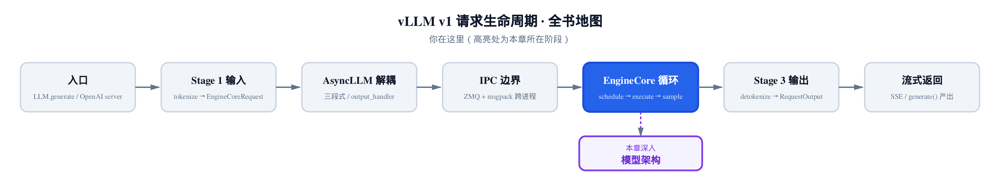
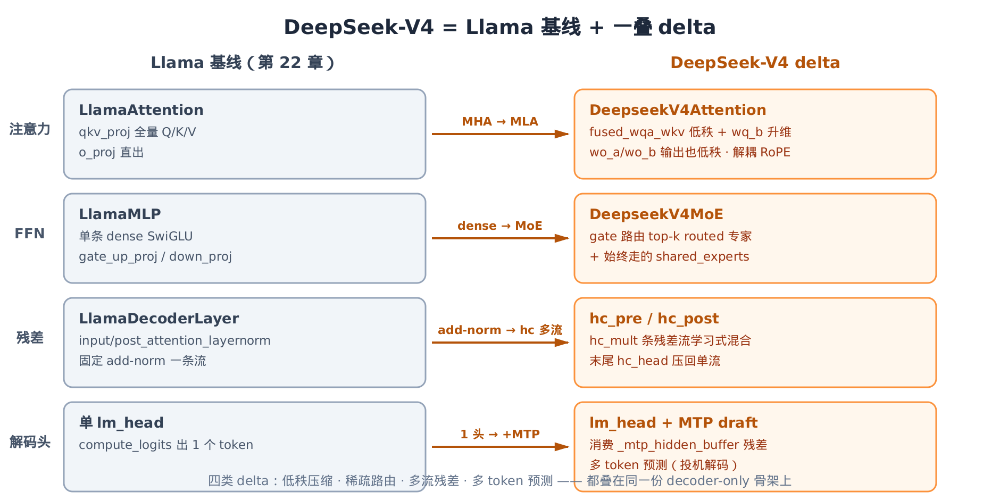
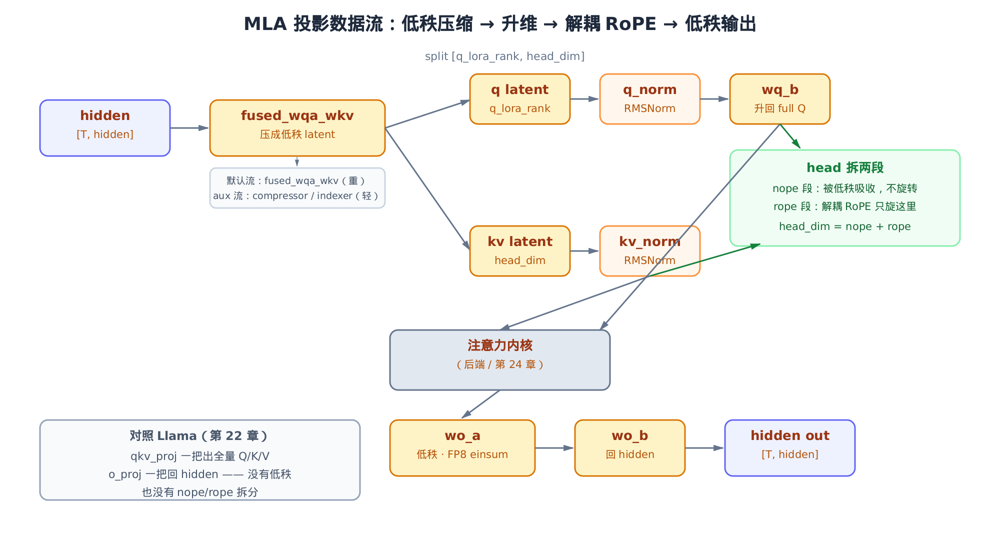
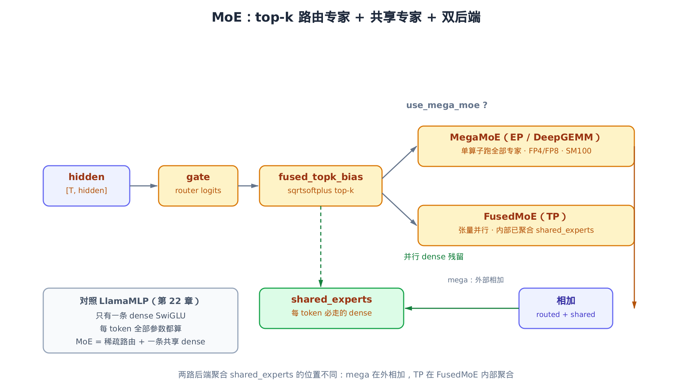
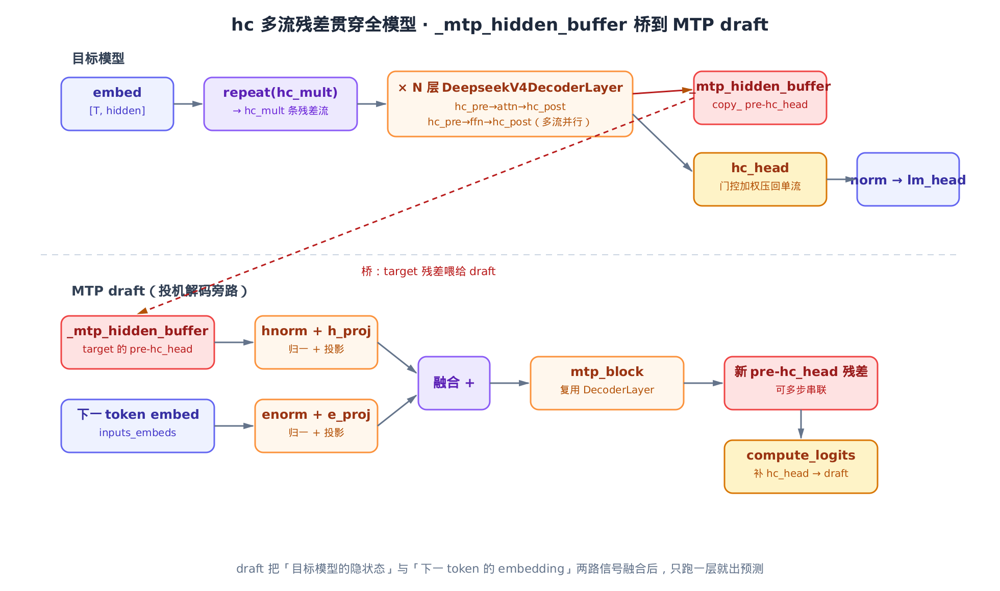

# 第25章　读一个完整大模型：DeepSeek-V4 是 Llama 身上叠的一摞 delta

## 你在这里



> *图注：地图还停在 EngineCore 循环这一格——模型只是循环里 `execute` 的那一步。*
> *[上一章](../ch24-attention/narrative/chapter.md)把注意力后端怎么收口、metadata 怎么喂 kernel 讲透了。*
> *本章往上退一步，读一整个真实大模型 DeepSeek-V4，看它在 Llama 骨架上叠了哪些花样。*

前面三章，我们把模型层一层层铺开了。[第 22 章](../ch22-model-definitions/narrative/chapter.md)立了一份契约：所有 vLLM v1 模型都长成 embedding → N 层 decoder block → 末尾 norm，并以 Llama 作**最简基线**。第 23、24 章接着把自定义算子、`torch.compile`、注意力后端拆开看。

那一章结尾，我留了一句话没收：Llama **刻意缺**了四样东西——没有专家混合（MoE）、没有潜变量压缩注意力（MLA）、没有量化压缩、没有混合残差。这些「缺」是留白，是为了今天填上。

今天我们读 **DeepSeek-V4**。它是 vLLM 里最复杂的模型之一：MLA 注意力、MoE 前馈、多 token 预测（MTP）、强制 FP8 量化、还有一套叫 Hybrid-Computation 的多流残差。听起来像一座新大陆。但只要你记得第 22 章那份契约，就会发现 V4 不是从头长出来的——

**它就是 Llama，身上叠了四摞 delta。**



> *图注：左边是第 22 章的 Llama 基线，右边每一行是 V4 对它做的一处替换。*
> *注意力 MHA 换成 MLA、FFN dense 换成 MoE、add-norm 残差换成 hc 多流、单 lm_head 旁挂一个 MTP draft。*
> *骨架（embed → N 层 → norm）一字没动。读懂这四个箭头，就读懂了这一章。*

这一章的读法，就是顺着这四个箭头，每讲一个 delta 都把它放回 Llama 的对照里。代码主要落在 `vllm/model_executor/models/deepseek_v4.py` 这一个文件里，MLA 的执行层在 `vllm/model_executor/layers/deepseek_v4_attention.py`，MTP draft 在 `vllm/model_executor/models/deepseek_v4_mtp.py`。我们不会把 V4 简化成「教科书里的 DeepSeek-V2」——真实的 V4 比那复杂得多，多流残差、双后端 MoE、FP8 字节装载都会如实呈现。但注意力 kernel、DeepGEMM 内核这些更深的东西，已经在别的章里讲过或会讲，本章只读**模型侧**：投影怎么搭、数据怎么流、算子边界画在哪。

先看骨架，再依次拆四个 delta。

---

## 25.1　骨架：把 Llama 的 forward 和 V4 的并排放

读任何模型，第一件事是找它的 decoder layer 的 `forward`，看一层里数据怎么走。先看第 22 章那份基线，`vllm/model_executor/models/llama.py`：

```python
# vllm/model_executor/models/llama.py:L316
def forward(
    self,
    positions: torch.Tensor,
    hidden_states: torch.Tensor,
    residual: torch.Tensor | None,
) -> tuple[torch.Tensor, torch.Tensor]:
    # Self Attention
    if residual is None:
        residual = hidden_states
        hidden_states = self.input_layernorm(hidden_states)
    else:
        hidden_states, residual = self.input_layernorm(hidden_states, residual)
    hidden_states = self.self_attn(positions=positions, hidden_states=hidden_states)

    # Fully Connected
    hidden_states, residual = self.post_attention_layernorm(hidden_states, residual)
    hidden_states = self.mlp(hidden_states)
    return hidden_states, residual
```

这是最经典的 pre-norm transformer 块，两段一模一样的节奏：

1. **attn 段**：`input_layernorm` 归一 → `self_attn` → 隐式加回 `residual`（融合在下一个 layernorm 里）。
2. **mlp 段**：`post_attention_layernorm` 归一 → `mlp` → 加回 `residual`。

注意 `residual` 是怎么传的——它和 `hidden_states` 一起进、一起出，是**一条**贯穿全模型的残差流。layernorm 是个融合算子，顺手把上一段的输出加回残差再归一。整个模型从头到尾，残差就这一条线。记住「一条流」这个词，待会儿 V4 会把它变成好几条。

现在看 V4 的 `vllm/model_executor/models/deepseek_v4.py`：

```python
# vllm/model_executor/models/deepseek_v4.py:L1195
def forward(
    self,
    x: torch.Tensor,
    positions: torch.Tensor,
    input_ids: torch.Tensor | None,
) -> torch.Tensor:
    residual = x
    x, post, comb = self.hc_pre(
        x, self.hc_attn_fn, self.hc_attn_scale, self.hc_attn_base
    )
    x = self.attn_norm(x)
    x = self.attn(positions, x, None)
    x = self.hc_post(x, residual, post, comb)

    residual = x
    x, post, comb = self.hc_pre(
        x, self.hc_ffn_fn, self.hc_ffn_scale, self.hc_ffn_base
    )
    x = self.ffn_norm(x)
    x = self.ffn(x, input_ids)
    x = self.hc_post(x, residual, post, comb)
    return x
```

把两段并排，骨架一眼可辨——**还是那两段相同节奏**：

| | Llama | DeepSeek-V4 |
|---|---|---|
| attn 段归一 | `input_layernorm` | `attn_norm` |
| attn 主体 | `self_attn`（MHA） | `attn`（MLA） |
| mlp 段归一 | `post_attention_layernorm` | `ffn_norm` |
| mlp 主体 | `mlp`（dense） | `ffn`（MoE） |
| 残差处理 | layernorm 融合 add-norm | `hc_pre` / `hc_post` |

对照之下，三个 delta 已经露头了：`attn` 从 MHA 变 MLA、`ffn` 从 dense 变 MoE、残差从「融合 add-norm」变成「`hc_pre` 包前、`hc_post` 包后」。注意 V4 这里 `attn_norm` 和 `attn` 是分开两行调的，不再融合——因为残差的活儿被 `hc_pre`/`hc_post` 接管了。

还有一个细节值得停一下：V4 的 `forward` 多收一个 `input_ids` 参数，一路传给 `ffn`。Llama 的 MLP 不需要知道是哪个 token——它对每个位置一视同仁。V4 的 MoE 却可能要拿 `input_ids` 去查路由表（后面 §25.3 会讲那个 hash-MoE 分支）。这是「dense 对每 token 同构、MoE 对每 token 异构」的第一个伏笔。

骨架读完，开始拆四个 delta。从注意力开始。

---

## 25.2　Delta 一：MHA → MLA，把 KV cache 压成低秩潜变量

### 25.2.1　为什么要压：先算一笔显存账

标准多头注意力（MHA）的痛点在解码阶段：每生成一个 token，都要把它的 K、V 存进 KV cache，供后面所有 token 注意。每个 token 缓存的大小，正比于

$$
2 \times n_{\mathrm{kv\_heads}} \times d_{\mathrm{head}}
$$

那个 2 是 K 和 V 各一份。头数多、维度大，KV cache 就吃显存——长上下文场景下，它常常比模型权重还大。

MLA（Multi-head Latent Attention，多头潜变量注意力）的思路是：别缓存满血的 K/V，缓存一个**低秩潜变量**。把 K/V 压到一个远小于 `n_heads × d_head` 的 `kv_lora_rank` 维，缓存这个压缩版；真正算注意力时再升回去。压缩比（缓存满血 K/V 的字节 ÷ 缓存潜变量的字节）大致是

$$
\frac{2 \times n_{\mathrm{heads}} \times d_{\mathrm{head}}}{kv\_lora\_rank + qk\_rope\_head\_dim}
$$

举个 DeepSeek 量级的数：`n_heads × d_head` 在几千维，而 `kv_lora_rank` 只有 512 左右。分子上万、分母几百——**KV cache 缩到原来的十分之一甚至更小**。这就是 MLA 值这么多工程复杂度的原因：显存省下来，batch 能开更大，吞吐就上去了。

### 25.2.2　最干净的 MLA：标准版的 forward

V4 的 MLA 实现裹了一层又一层工程优化，直接读容易迷路。先看 vLLM 里**标准 MLA**（DeepSeek-V2/V3 用的那版）的 forward，它最清楚地展示 MLA 的本质，`vllm/model_executor/layers/mla.py`：

```python
# vllm/model_executor/layers/mla.py:L139
qkv_lora = self.fused_qkv_a_proj(hidden_states)[0]
q_c, kv_lora = qkv_lora.split(
    [self.q_lora_rank, self.kv_lora_rank + self.qk_rope_head_dim],
    dim=-1,
)
q_c = self.q_a_layernorm(q_c)
q = self.q_b_proj(q_c)[0]
# … 省略：q_lora_rank 为 None 时的非低秩分支 …
kv_c, k_pe = kv_lora.split([self.kv_lora_rank, self.qk_rope_head_dim], dim=-1)
kv_c_normed = self.kv_a_layernorm(kv_c)

q = q.view(-1, self.num_heads, self.qk_head_dim)
# Add head dim of 1 to k_pe
k_pe = k_pe.unsqueeze(1)

if self.rotary_emb is not None:
    q[..., self.qk_nope_head_dim :], k_pe = self.rotary_emb(
        positions, q[..., self.qk_nope_head_dim :], k_pe
    )
```

四步，记住它的形状：

1. **`fused_qkv_a_proj` 压低秩**：一把把 `hidden` 投到 `[q_lora_rank, kv_lora_rank + qk_rope_head_dim]`。注意这远小于全量 QKV——这就是「压缩」。
2. **归一**：q 段过 `q_a_layernorm`，kv 段过 `kv_a_layernorm`。低秩潜变量也要归一稳住数值。
3. **`q_b_proj` 升维**：把压扁的 q 潜变量升回满血的多头 Q。K/V 不在这里升——它们以 `kv_c_normed` 的低秩形态进 KV cache，升维推迟到 kernel 内部（这是 MLA 把缓存压小的关键，详见第 24 章）。
4. **解耦 RoPE**：看那行 `q[..., self.qk_nope_head_dim:]`——RoPE **只**作用在每个 head 的后半段。

第 4 步是 MLA 最反直觉的设计，单独说。

### 25.2.3　解耦 RoPE：为什么 head 要劈成 nope + rope 两半

RoPE（旋转位置编码）和低秩压缩有个根本矛盾。低秩压缩想把 K「吸收」进潜变量、推迟升维；但 RoPE 是个跟绝对位置有关的旋转，一旦施加，K 就和位置纠缠在一起，没法干净地被低秩矩阵吸收了。

DeepSeek 的解法是**解耦**：把每个 head 的维度劈成两段。

$$
d_{\mathrm{head}} = qk\_nope\_head\_dim + qk\_rope\_head\_dim
$$

- **nope 段**（no position embedding）：不旋转，可以被低秩 `kv_b` 矩阵吸收进潜变量，享受压缩。
- **rope 段**：单独保留、施加旋转，显式存进缓存（就是那个 `k_pe`，pe = position embedding）。

所以缓存里存的是「低秩潜变量 + 一小段带位置的 rope」，而不是满血 K。代码里 `q[..., self.qk_nope_head_dim:]` 这个切片，就是「只把 head 的 rope 段送进 `rotary_emb`」。一行切片，背后是一整套「让压缩和位置编码共存」的设计。

### 25.2.4　V4 的加码：连输出投影都低秩

标准 MLA 已经够巧了，V4 在它之上又叠了几层。看 V4 的注意力权重定义，`vllm/model_executor/models/deepseek_v4.py`：

```python
# vllm/model_executor/models/deepseek_v4.py:L967
self.fused_wqa_wkv = MergedColumnParallelLinear(
    self.hidden_size,
    [self.q_lora_rank, self.head_dim],
    bias=False,
    quant_config=quant_config,
    prefix=f"{prefix}.fused_wqa_wkv",
    disable_tp=True,  # fused ReplicatedLinear
)
self.q_norm = RMSNorm(self.q_lora_rank, self.eps)
self.wq_b = ColumnParallelLinear(
    self.q_lora_rank,
    self.n_heads * self.head_dim,
    bias=False,
    quant_config=quant_config,
    return_bias=False,
    prefix=f"{prefix}.wq_b",
)

self.kv_norm = RMSNorm(self.head_dim, self.eps)
self.wo_a = ColumnParallelLinear(
    self.n_heads * self.head_dim // self.n_groups,
    self.n_groups * self.o_lora_rank,
    bias=False,
    quant_config=quant_config,
    return_bias=False,
    prefix=f"{prefix}.wo_a",
)
self.wo_a.is_bmm = True
self.wo_a.bmm_batch_size = self.n_local_groups
self.wo_b = RowParallelLinear(
    self.n_groups * self.o_lora_rank,
    self.hidden_size,
    bias=False,
    quant_config=quant_config,
    return_bias=False,
    prefix=f"{prefix}.wo_b",
)
```

把它和标准 MLA、再和 Llama 的 `qkv_proj`/`o_proj` 三方对照：

- **输入端**：`fused_wqa_wkv` ↔ 标准 MLA 的 `fused_qkv_a_proj`，都是「压成 `[q_lora_rank, head_dim]` 低秩潜变量」；`q_norm`/`kv_norm` ↔ `q_a_layernorm`/`kv_a_layernorm`；`wq_b` ↔ `q_b_proj`，把 q 潜变量升回 `n_heads * head_dim`。这部分 V4 和标准 MLA 同构，只是名字短了。
- **输出端**：这才是 V4 的加码。标准 MLA 算完注意力直接一个 `o_proj` 回 `hidden`。V4 偏不——它让**输出投影也低秩**：`wo_a` 先把输出压到 `o_lora_rank`（还按 `n_groups` 分组、`is_bmm=True` 走批量矩阵乘），`wo_b` 再升回 `hidden_size`。

对照 Llama，delta 就很清楚了：

| | Llama | DeepSeek-V4 MLA |
|---|---|---|
| 输入投影 | `qkv_proj` 全量 Q/K/V 一把出 | `fused_wqa_wkv` 压低秩 + `wq_b` 升 q |
| 输出投影 | `o_proj` 一把回 hidden | `wo_a` 压低秩 + `wo_b` 升回 hidden |
| 位置编码 | RoPE 作用整个 head | 解耦 RoPE，只旋 rope 段 |
| KV cache | 满血 K/V | 低秩潜变量 + rope 段 |

「连输出投影都低秩」是 V4 区别于标准 MLA 的指纹。下面这张图把整条投影数据流串起来：



> *图注：hidden 经 `fused_wqa_wkv` 压成低秩，split 后 q 走 norm→`wq_b` 升维、kv 走 norm。*
> *head 拆 nope/rope，RoPE 只旋 rope 段；注意力 kernel（第 24 章）算完，输出再经 `wo_a`/`wo_b` 两段低秩回 hidden。*
> *左下角对照 Llama：输入输出都是一把过的全量投影，没有低秩、没有 nope/rope 拆分。*

### 25.2.5　多流 GEMM：V4 模型侧值得看的工程亮点

MLA 比 MHA 多了好几个独立的输入投影：主投影 `fused_wqa_wkv`（最重），加上可选的 compressor、indexer（稀疏注意力用的，本章不深挖，见第 24 章）的几个轻量 GEMM。这些 GEMM 互相独立、谁也不等谁——典型的可并行场景。

V4 就把它们摊到不同的 CUDA stream 上重叠跑，`vllm/model_executor/layers/deepseek_v4_attention.py`：

```python
# vllm/model_executor/layers/deepseek_v4_attention.py:L337
def attn_gemm_parallel_execute(self, hidden_states) -> tuple[Any, ...]:
    assert self.aux_stream_list is not None
    assert len(self.aux_stream_list) >= 3

    # fused_wqa_wkv (heaviest) on default; the three lighter input GEMMs
    # on aux streams 0..2 when their owning module exists. ln_events[0]
    # is the fan-out start event; ln_events[1..3] are per-aux done events.
    aux_fns: list[Callable[[], Any] | None] = [None, None, None]

    if self.compressor is not None:
        compressor = self.compressor
        def compressor_kv_score() -> torch.Tensor:
            return torch.mm(
                hidden_states, compressor.fused_wkv_wgate.weight.T,
                out_dtype=torch.float32,
            )
        aux_fns[0] = compressor_kv_score
    # … 省略：indexer 存在时把 indexer 的两个轻 GEMM 挂到 aux_fns[1]/[2] …

    def fused_wqa_wkv() -> torch.Tensor:
        qr_kv, _ = self.fused_wqa_wkv(hidden_states)
        return qr_kv

    qr_kv, (kv_score, indexer_weights, indexer_kv_score) = execute_in_parallel(
        fused_wqa_wkv,
        aux_fns,
        self.ln_events[0],
        self.ln_events[1:4],
        self.aux_stream_list[:3],
    )

    return qr_kv, kv_score, indexer_kv_score, indexer_weights
```

读法是「主 + 辅」：最重的 `fused_wqa_wkv` 走默认流，几个轻量 GEMM 分到 aux stream 0~2，靠 `execute_in_parallel` 加 CUDA event 重叠。一个 `ln_events[0]` 是 fan-out 起跑信号，`ln_events[1:4]` 是各 aux 流的完成信号——典型的「一发多收」事件同步。

对照第 22 章的 Llama：它的 `qkv_proj` 就一个 GEMM，一把算完，没有可重叠的东西，也就没这套 stream 编排。**MLA 把投影拆多了，反而开出了并行的空间**——这是「拆分换并行」的一个漂亮例子。这些 stream/event 是 GPU-only 的真实编排，本章只读它在模型侧的位置；kernel 内部交给第 24 章。

输入 GEMM 算完，前处理收尾很简单——split 开，分别归一：

```python
# vllm/model_executor/layers/deepseek_v4_attention.py:L401
qr_kv, kv_score, indexer_kv_score, indexer_weights = (
    self.attn_gemm_parallel_execute(hidden_states)
)

qr, kv = qr_kv.split([self.q_lora_rank, self.head_dim], dim=-1)
qr, kv = fused_q_kv_rmsnorm(
    qr, kv,
    self.q_norm.weight.data,
    self.kv_norm.weight.data,
    self.eps,
)
```

`split([q_lora_rank, head_dim])` 把低秩潜变量劈成 q 段和 kv 段，`fused_q_kv_rmsnorm` 一个算子把两段的 RMSNorm 都做了——对应标准 MLA 里那两个分开的 `q_a_layernorm`/`kv_a_layernorm`，V4 融成一个 kernel。到这里，MLA 的「低秩压缩 + 归一」骨架就齐了，剩下升维、RoPE、kernel 是第 24 章的活儿。

注意力 delta 讲完。下一摞：前馈。

---

## 25.3　Delta 二：dense MLP → MoE，稀疏路由 + 一条共享 dense

### 25.3.1　MoE 省的是算力，不是显存

第 22 章的 `LlamaMLP` 是一条 dense 的 SwiGLU：`gate_up_proj` 升维、激活、`down_proj` 降维，**每个 token 都把全部 MLP 参数算一遍**。

MoE（Mixture of Experts，专家混合）换个玩法：准备 `n_routed_experts` 个专家（每个就是一条小 MLP），每个 token 只激活其中 top-k 个。每 token 的 MLP 算力，正比于「激活专家占全部专家的比例」乘「全部专家参数」：

$$
\frac{num\_experts\_per\_tok + n_{\mathrm{shared}}}{n_{\mathrm{routed\_experts}}} \times W_{\mathrm{experts}}
$$

举个 DeepSeek 量级：256 个专家、每 token 选 8 个。那么每 token 只碰到 8/256 ≈ 3% 的路由专家参数。**参数量可以堆到几百 B，但每 token 的算力近似不变**——这就是 MoE 的核心权衡：用稀疏激活把模型容量做大，而不把单 token 的 FLOPs 做大。

注意这和 MLA 省的不是一回事：MLA 省 **KV cache 显存**，MoE 省**每 token 算力**。两个 delta 各打各的痛点。

### 25.3.2　gate + shared_experts：路由之外那条「dense 残留」

看 V4 MoE 的构造，`vllm/model_executor/models/deepseek_v4.py`：

```python
# vllm/model_executor/models/deepseek_v4.py:L746
self.gate = GateLinear(
    config.hidden_size,
    config.n_routed_experts,
    out_dtype=torch.float32,
    bias=False,
    prefix=f"{prefix}.gate",
)
self.gate.e_score_correction_bias = None
self.gate.tid2eid = None
is_hash_moe = extract_layer_index(prefix) < config.num_hash_layers
self.hash_indices_dtype = torch.int64 if self.use_mega_moe else torch.int32

if is_hash_moe:
    # hash MoE doesn't use e_score_correction_bias …
    self.gate.tid2eid = nn.Parameter(
        torch.randint(0, config.n_routed_experts,
            (config.vocab_size, config.num_experts_per_tok),
            dtype=self.hash_indices_dtype),
        requires_grad=False,
    )
elif getattr(config, "topk_method", None) == "noaux_tc":
    self.gate.e_score_correction_bias = nn.Parameter(
        torch.empty(config.n_routed_experts, dtype=torch.float32),
        requires_grad=False,
    )

if config.n_shared_experts is None:
    self.shared_experts = None
else:
    intermediate_size = config.moe_intermediate_size * config.n_shared_experts
    self.shared_experts = DeepseekV4MLP(
        hidden_size=config.hidden_size,
        intermediate_size=intermediate_size,
        hidden_act=config.hidden_act,
        swiglu_limit=self.swiglu_limit,
        quant_config=quant_config,
        reduce_results=self.use_mega_moe,
        prefix=f"{prefix}.shared_experts",
    )
```

三个零件：

- **`gate`**：一个小线性层，把 `hidden` 投到 `n_routed_experts` 维，输出每个专家的打分（router logits）。它决定每个 token 该去哪几个专家。
- **`shared_experts`**：注意它的类型是 `DeepseekV4MLP`——就是一条普通的 SwiGLU MLP，**结构和 `LlamaMLP` 同构**。它不参与路由，每个 token 都走。
- **路由的两种打分模式**：`tid2eid`（hash-MoE，用 `input_ids` 直接查表定专家，所以 §25.1 那个 `input_ids` 参数派上了用场）或 `e_score_correction_bias`（noaux_tc 打分的修正偏置）。hash-MoE 是 V4 特有的一类层，这里点名不深挖。

`shared_experts` 是理解「MoE 对 dense 的 delta」的钥匙。MoE 不是把 dense MLP 一刀切掉换成稀疏路由——它**保留了一条每 token 必走的 dense 路径**。路由专家负责「专才」，共享专家负责「通才」，托住所有 token 的基础能力。所以 V4 的 FFN 准确说是：**稀疏路由专家 + 一条共享 dense**，而不是纯稀疏。这正好回收了第 22 章那条 `LlamaMLP`——它没消失，它变成了 MoE 里的共享专家。

### 25.3.3　forward：gate → top-k → 专家 → 加上共享

看数据流，`vllm/model_executor/models/deepseek_v4.py`：

```python
# vllm/model_executor/models/deepseek_v4.py:L860
if not self.use_mega_moe:
    return self._forward_fused_moe(hidden_states, input_ids)

org_shape = hidden_states.shape
router_logits, _ = self.gate(hidden_states)
topk_weights, topk_ids = fused_topk_bias(
    hidden_states=hidden_states,
    gating_output=router_logits,
    scoring_func=self.scoring_func,
    e_score_correction_bias=self.gate.e_score_correction_bias.data
    if self.gate.e_score_correction_bias is not None
    else None,
    topk=self.n_activated_experts,
    renormalize=self.renormalize,
    indices_type=self.hash_indices_dtype,
    input_tokens=input_ids,
    hash_indices_table=self.gate.tid2eid,
    routed_scaling_factor=self.routed_scaling_factor,
)
# … 省略：activation_clamp 由 swiglu_limit 决定 …
final_hidden_states = self.experts(
    hidden_states, topk_weights, topk_ids,
    activation_clamp=activation_clamp,
)

if self.shared_experts is not None:
    shared_output = self.shared_experts(hidden_states)
    final_hidden_states += shared_output

return final_hidden_states.view(org_shape)
```

数据流四步，正好对上图：

1. **`gate`** 出 router logits。
2. **`fused_topk_bias`** 打分选专家：内部走 sqrtsoftplus（`softplus` 再开方）打分，加上 `e_score_correction_bias` 修正，取 top-k，renormalize（让选中权重和归一），再乘 `routed_scaling_factor`。出 `topk_weights`（每个选中专家的权重）和 `topk_ids`（选了哪几个）。
3. **`self.experts`** 按选择算路由专家的输出。
4. **`final_hidden_states += shared_output`**：路由结果加上共享专家——这一行就是「稀疏 + dense」的合流。

第一行那个 `if not self.use_mega_moe` 引出了双后端，单独说。

### 25.3.4　双后端：单 kernel 全专家 vs 张量并行

V4 的专家计算有两条后端，由 `use_mega_moe` 分叉：



> *图注：gate → `fused_topk_bias` 选完 top-k，按 `use_mega_moe` 分叉两条后端。*
> *MegaMoE 把全部专家塞进一个 DeepGEMM 算子（EP / FP4 / SM100）；FusedMoE 走张量并行。*
> *`shared_experts` 那条 dense 始终并行走；两路聚合它的位置不同——mega 在外相加，TP 在 FusedMoE 内部。*

**MegaMoE 路径**（开了 expert parallel + DeepGEMM 后端）把所有路由专家的计算塞进**一个**自定义算子，`vllm/model_executor/models/deepseek_v4.py`：

```python
# vllm/model_executor/models/deepseek_v4.py:L599
def forward(
    self,
    hidden_states: torch.Tensor,
    topk_weights: torch.Tensor,
    topk_ids: torch.Tensor,
    *,
    activation_clamp: float | None,
    fast_math: bool = True,
) -> torch.Tensor:
    if hidden_states.shape[0] > self.max_num_tokens:
        raise ValueError(
            f"DeepSeek V4 MegaMoE got {hidden_states.shape[0]} tokens, "
            f"but the symmetric buffer was sized for {self.max_num_tokens}."
        )
    y = torch.empty_like(hidden_states, dtype=torch.bfloat16)
    torch.ops.vllm.deepseek_v4_mega_moe_experts(
        hidden_states, topk_weights, topk_ids, y,
        self.prefix, activation_clamp, fast_math,
    )
    return y
```

这就是算子边界。注意这里**没有 for 循环逐个跑专家**——一个 `torch.ops.vllm.deepseek_v4_mega_moe_experts` 调用，DeepGEMM 在 kernel 内部把全部专家一次算完（需要对称缓冲、FP4/FP8 权重、SM100 硬件）。它的内部 scale 布局、staging kernel 是 DeepGEMM/FusedMoE 专章的事，本章只读到这条算子边界，知道「单 kernel 全专家」这个事实即可。

**FusedMoE 路径**（`_forward_fused_moe`，没开 EP 时）走张量并行的 `FusedMoE`，它内部就把 `shared_experts` 一起聚合了。所以两条后端有个微妙差异：mega 路径在 forward 里**外部**手动 `+= shared_output`（上面那行），TP 路径则在 `FusedMoE` **内部**聚合。聚合的位置不同，但语义一致——路由 + 共享。FusedMoE 后端的细节，留给后面讲 FusedMoE/专家并行的章。

FFN delta 讲完。第三摞 delta 在残差里，是 V4 最不像 Llama 的地方。

---

## 25.4　Delta 三：add-norm → hc 多流残差

### 25.4.1　从一条残差流变成 hc_mult 条

回到 §25.1：Llama 全模型就**一条**残差流，layernorm 顺手加回。V4 把它彻底换掉了，换成 Hybrid-Computation（简称 hc）——一套**多流**残差。

源头在主模型 forward，`vllm/model_executor/models/deepseek_v4.py`：

```python
# vllm/model_executor/models/deepseek_v4.py:L1314
hidden_states = self.embed_input_ids(input_ids)
hidden_states = hidden_states.unsqueeze(-2).repeat(1, self.hc_mult, 1)
if self.use_mega_moe:
    input_ids = input_ids.to(torch.int64)
for layer in islice(self.layers, self.start_layer, self.end_layer):
    hidden_states = layer(
        hidden_states,
        positions,
        input_ids,
    )

# Stash pre-hc_head residual for the MTP draft (captured copy_).
num_tokens = hidden_states.shape[0]
self._mtp_hidden_buffer[:num_tokens].copy_(hidden_states.flatten(1))

hidden_states = hc_head(
    hidden_states,
    self.hc_head_fn,
    self.hc_head_scale,
    self.hc_head_base,
    self.rms_norm_eps,
    self.hc_eps,
)
hidden_states = self.norm(hidden_states)
return hidden_states
```

关键就第二行：`hidden_states.unsqueeze(-2).repeat(1, self.hc_mult, 1)`。embedding 出来本是 `[T, hidden]`，这里 unsqueeze 加一维、repeat 成 `[T, hc_mult, hidden]`——**一条流复制成 `hc_mult` 条平行残差流**，一起穿过所有层。

回头看 §25.1 那个 `DeepseekV4DecoderLayer.forward`：每层用 `hc_pre`（前处理）和 `hc_post`（后处理）包住 attn 和 ffn。Llama 的 layernorm 是固定的「加回上一段输出」，而 hc 在 `hc_mult` 条流之间做**学习式的门控混合**——`hc_attn_fn`/`hc_attn_scale`/`hc_attn_base` 这些都是可学习参数。`hc_pre` 决定这一段从多条流里怎么取输入，`hc_post` 决定算出来的结果怎么写回多条流。这套混合的内核（`torch.ops.vllm.mhc_pre`/`mhc_post`，含 Sinkhorn 归一）是 GPU-only 的，本章只读它在残差骨架里的位置——它**取代了 Llama 的 `input_layernorm`/`post_attention_layernorm`**。

直觉上，Llama 的 add-norm 是「一条信息高速路，每层上下匝道」；hc 是「`hc_mult` 条平行车道，每层之间可以学习着变道、并道」。表达力更强，代价是 hidden 翻了 `hc_mult` 倍的显存和算力——典型的「容量换资源」。

### 25.4.2　hc_head：把多流压回单流

`hc_mult` 条流穿过所有层后，总得压回一条，才能喂给最终的 `norm` 和 `lm_head`。干这活的是 `hc_head`，`vllm/model_executor/models/deepseek_v4.py`：

```python
# vllm/model_executor/models/deepseek_v4.py:L1450
@torch.compile(backend=current_platform.simple_compile_backend)
def hc_head(
    hidden_states: torch.Tensor,
    hc_fn: torch.Tensor,
    hc_scale: torch.Tensor,
    hc_base: torch.Tensor,
    rms_norm_eps: float,
    hc_eps: float,
) -> torch.Tensor:
    x = hidden_states
    shape, dtype = x.size(), x.dtype
    x = x.flatten(1).float()
    rsqrt = torch.rsqrt(x.square().mean(-1, keepdim=True) + rms_norm_eps)
    mixes = F.linear(x, hc_fn) * rsqrt
    pre = torch.sigmoid(mixes * hc_scale + hc_base) + hc_eps
    y = torch.sum(pre.unsqueeze(-1) * x.view(shape), dim=1)
    return y.to(dtype)
```

这个函数是纯 PyTorch，可以逐行读懂——它是整套 hc 机制里唯一不靠 GPU 自定义算子的部分，正好让我们看清「门控混合」长什么样：

1. `x.flatten(1).float()`：把 `[T, hc_mult, hidden]` 摊平成 `[T, hc_mult*hidden]`，升 fp32 算精度。
2. `rsqrt = rsqrt(mean(x²) + eps)`：算 RMSNorm 的缩放因子（均方根的倒数）。
3. `mixes = F.linear(x, hc_fn) * rsqrt`：过一个学习的线性层 `hc_fn`，再乘归一因子——得到每条流的混合打分。
4. `pre = sigmoid(mixes * hc_scale + hc_base) + eps`：sigmoid 门控，`hc_scale`/`hc_base` 是学习的缩放和偏置。`pre` 就是每条流的权重。
5. `y = sum(pre * x, dim=1)`：按权重对 `hc_mult` 条流加权求和，压回 `[T, hidden]`。

一句话归纳它的正确性骨架：第 2 步的 `rsqrt` 永远作用在「`mean(x²)+eps`」上，`eps > 0` 保证开方非零、不会除零；第 4 步 sigmoid 的输出落在 `(0,1)`，加 `hc_eps` 后严格为正——所以每条流的权重 `pre` 恒正，第 5 步是一个**带正权重的凸性加权和**，数值稳定、不会把某条流的信息算成负贡献抹掉。这就是「门控混合」既灵活又不失稳的根。

读到这里，「混合残差」这个第 22 章埋下的 delta 算是收齐了——但它不是教科书里那种简单的两路残差相加。V4 把它升级成了 `hc_mult` 条流的学习式门控混合，`hc_pre`/`hc_post` 管层内、`hc_head` 管收尾。

那 §25.4.1 里 `hc_head` 之前那行 `_mtp_hidden_buffer.copy_(...)` 是干嘛的？那是通往第四摞 delta 的桥。

---

## 25.5　Delta 四：单 lm_head → 旁挂一个 MTP draft

### 25.5.1　_mtp_hidden_buffer：目标模型留给 draft 的隐状态

Llama 末尾就一个 `lm_head`，`compute_logits` 出一个 token 的分布。V4 在这之外旁挂了一个 **MTP（Multi-Token Prediction，多 token 预测）** draft：训练时它多头预测后面 N 个 token，推理时它当**投机解码的 draft 模型**，一口气猜好几个 token，再由主模型批量验证（投机解码的协议是后面讲投机解码那章的主题，本章只交付 MTP 这个 draft 的接口）。

draft 要工作，得拿到主模型的隐状态。但拿哪个版本？回看 §25.4.1：主模型在 **`hc_head` 之前**（即多流还没压回单流时）就 `copy_` 了一份到 `_mtp_hidden_buffer`：

```python
# Stash pre-hc_head residual for the MTP draft (captured copy_).
num_tokens = hidden_states.shape[0]
self._mtp_hidden_buffer[:num_tokens].copy_(hidden_states.flatten(1))
```

留的是 **pre-hc_head 残差**——`hc_mult` 条流压回单流之前的完整多流状态，摊平成 `[T, hc_mult*hidden]`。为什么留压回之前的？因为 draft 自己也是个完整的 V4 解码层，它需要多流形态的输入，不是压扁后的单流。`_mtp_hidden_buffer` 就是目标模型和 draft 之间传递这份隐状态的桥。`DeepseekV4ForCausalLM` 通过 `get_mtp_target_hidden_states` 把这个 buffer 暴露出去，供 draft 取用。

### 25.5.2　draft 怎么融合两路信号

MTP draft 单层的 forward，`vllm/model_executor/models/deepseek_v4_mtp.py`：

```python
# vllm/model_executor/models/deepseek_v4_mtp.py:L122
def forward(
    self,
    input_ids: torch.Tensor,
    positions: torch.Tensor,
    previous_hidden_states: torch.Tensor,
    inputs_embeds: torch.Tensor | None = None,
    spec_step_index: int = 0,
) -> torch.Tensor:
    assert inputs_embeds is not None
    # masking inputs at position 0, as not needed by MTP
    inputs_embeds = torch.where(positions.unsqueeze(-1) == 0, 0, inputs_embeds)
    inputs_embeds = self.enorm(inputs_embeds)

    # Target stashes pre-hc_head residual as flat (T, hc_mult * D);
    # reshape to (T, hc_mult, D) — the training-time layout.
    previous_hidden_states = previous_hidden_states.view(
        -1, self.hc_mult, self.config.hidden_size
    )
    previous_hidden_states = self.hnorm(previous_hidden_states)
    hidden_states = self.h_proj(previous_hidden_states) + self.e_proj(
        inputs_embeds
    ).unsqueeze(-2)
    hidden_states = self.mtp_block(
        positions=positions, x=hidden_states, input_ids=None
    )
    # Return the flat pre-hc_head residual so it can be re-fed as the
    # next spec step's `previous_hidden_states` …
    return hidden_states.flatten(1)
```

draft 融合**两路信号**：

- **路 a，下一个 token 的 embedding**：`inputs_embeds` 经 `enorm` 归一、`e_proj` 投影。这是 draft 要预测的位置的输入。
- **路 b，目标模型的隐状态**：`previous_hidden_states`（就是 `_mtp_hidden_buffer` 取回的那份 pre-hc_head 残差）reshape 回 `[T, hc_mult, hidden]` 多流形态，经 `hnorm` 归一、`h_proj` 投影。

两路投影相加（`h_proj(...) + e_proj(...).unsqueeze(-2)`），喂进 `mtp_block`——注意这个 `mtp_block` 就是一个**复用的 `DeepseekV4DecoderLayer`**，和主模型的层一模一样的 hc_pre/attn/hc_post/ffn 结构。跑完输出又是一份 pre-hc_head 残差（`flatten(1)` 摊平返回），可以再喂回去当下一步的 `previous_hidden_states`——这样 `num_speculative_tokens > 1` 时能多步串联，一次猜好几个 token。

注意它**没**在这里调 `hc_head`——压回单流被推迟了。draft 的 `compute_logits` 才补上 `hc_head`，再过 shared_head 出 draft logits。这和主模型的收尾对称：都是「pre-hc_head 残差 → hc_head 压回 → 出 logits」，draft 只是把 `hc_head` 挪到了出 logits 那一刻。`hc_head` 被主模型和 draft 共用，又一次印证它是 hc 机制的收尾真身。

下面这张图把 hc 多流和 MTP 桥的全貌串起来：



> *图注：上半是目标模型——embed `repeat(hc_mult)` 成多流，逐层穿过，末尾分两路：`copy_` 进 `_mtp_hidden_buffer`、`hc_head` 压回单流出 logits。*
> *下半是 MTP draft——取 buffer 的目标残差 + 下一 token embedding，两路归一投影后融合，复用一个 DecoderLayer，出新残差，`compute_logits` 补 `hc_head`。*
> *红色那条虚线就是 `_mtp_hidden_buffer` 这座桥。*

四摞 delta 到这里全部讲完。剩下一件第 22 章欠的账：量化。

---

## 25.6　收尾 delta：FP8 量化与 e8m0fnu 字节装载

第 22 章把 Llama 当基线时，特意点了它「没有量化压缩」。V4 不一样——它的 checkpoint **永远是 FP8 块量化**的，连专家权重还可能是 MXFP4（4-bit）。这件事在权重装载时会咬人。

看 `DeepseekV4Model.load_weights` 里专家权重那段，`vllm/model_executor/models/deepseek_v4.py`：

```python
# vllm/model_executor/models/deepseek_v4.py:L1379
if ".experts." in name:
    # E8M0 scales are stored as float8_e8m0fnu in
    # checkpoints but the MoE param is uint8. copy_()
    # would do a numeric conversion (e.g. 2^-7 → 0),
    # destroying the raw exponent bytes.
    if (
        "weight_scale" in name
        and loaded_weight.dtype == torch.float8_e8m0fnu
    ):
        loaded_weight = loaded_weight.view(torch.uint8)
    for mapping in expert_mapping:
        param_name, weight_name, expert_id, shard_id = mapping
        if weight_name not in name:
            continue
        name_mapped = name.replace(weight_name, param_name)
        param = params_dict[name_mapped]
        weight_loader = typing.cast(Callable[..., bool], param.weight_loader)
        success = weight_loader(
            param, loaded_weight, name_mapped,
            shard_id=shard_id, expert_id=expert_id,
            return_success=True,
        )
        if success:
            name = name_mapped
            break
    loaded_params.add(name_mapped)
    continue
elif "attn_sink" in name:
    narrow_weight = loaded_weight[head_rank_start:head_rank_end]
    n = narrow_weight.shape[0]
    params_dict[name][:n].copy_(narrow_weight)
    loaded_params.add(name)
    continue
```

三个装载特例，每个都对应一个 delta：

1. **e8m0fnu 必须 `view(uint8)` 装入**（最微妙）：MXFP4 的量化 scale 存成 `float8_e8m0fnu`，但模型里那个参数是 `uint8`。如果直接 `copy_`，PyTorch 会做**数值转换**——把 `e8m0fnu` 当浮点数解释、再转成 uint8，比如 `2^-7` 会被算成 0，指数字节全毁。正确做法是 `view(torch.uint8)`：不动底层字节，只换个类型解释。注释里 `2^-7 → 0` 就是真实会发生的灾难。这是「量化作为 delta」最具体的一处工程坑——量化权重的字节得当原始字节搬，不能当数字搬。

2. **专家走 `expert_mapping` 多副本装载**：一个 checkpoint 里的专家权重名要映射到模型里切好的多个专家参数上，靠 `weight_loader` 带着 `expert_id`/`shard_id` 装。

3. **`attn_sink` 按 TP head 区间切**：V4 注意力的 sink 参数（padded 到 head 数、初始化 -inf）要按当前 rank 负责的 head 区间 `[head_rank_start:head_rank_end]` narrow 后装入。

这三个特例就是 Llama 装载逻辑里没有的东西。`DeepseekV4FP8Config` 还会按 `expert_dtype` 惰性解析专家用 MXFP4 还是块 FP8，决定 scale 是 e8m0 还是 float32——配置层的分发样板这里不展开，记住「V4 强制量化、专家可 4-bit、scale 字节得原样搬」即可。

到此，第 22 章埋下的四样「刻意缺失」——MoE、MLA、量化压缩、混合残差——全部作为对 Llama 的 delta 回收完毕。

---

## 25.7　把四摞 delta 合起来看

读完一整个 DeepSeek-V4，回头看那张 delta-stack 图，应该有底气说出每个箭头背后是什么了：

| delta | Llama 基线 | V4 的替换 | 它省/换的是 |
|---|---|---|---|
| 注意力 | `qkv_proj` + `o_proj` 全量 MHA | MLA：`fused_wqa_wkv`/`wq_b` 低秩、`wo_a`/`wo_b` 输出也低秩、解耦 RoPE | KV cache 显存 |
| FFN | `LlamaMLP` 单 dense | MoE：`gate` 路由 top-k routed + `shared_experts` 共享 dense + 双后端 | 每 token 算力（容量换 FLOPs 不变） |
| 残差 | layernorm 融合 add-norm，一条流 | hc：`repeat(hc_mult)` 多流、`hc_pre`/`hc_post` 层内混合、`hc_head` 压回 | 表达力（换显存/算力） |
| 解码头 | 单 `lm_head` | + MTP draft：经 `_mtp_hidden_buffer` 融合目标残差与下一 token embedding | 解码吞吐（投机解码） |
| 数值 | bf16 | 强制 FP8 块量化、专家 MXFP4、e8m0fnu 字节装载 | 权重/激活显存 |

但更要紧的是那个没变的东西：**骨架**。embedding → N 层 decoder block（每层 attn 段 + ffn 段）→ 末尾 norm → lm_head。这条主线，从第 22 章的 Llama 到本章的 DeepSeek-V4，一字没动。V4 再复杂，也是在这条主线的每个槽位上换零件：attn 槽换成 MLA、ffn 槽换成 MoE、残差换成 hc、出口旁挂 MTP。

这就是读复杂模型的方法论——**先认骨架，再认 delta**。任何一个新模型摆到你面前，先去找它的 decoder layer 的 `forward`（V4 的在 `vllm/model_executor/models/deepseek_v4.py:L1195`，Llama 的在 `vllm/model_executor/models/llama.py:L316`），并排对照第 22 章那份契约，看它在哪几个槽位上动了手脚。理解了 Llama 那份最简契约，再难的模型也只是它身上叠的一摞 delta。

下一章我们换个视角：从「读模型代码」到「画模型架构图」，把这套阅读方法变成一套可复用的工序。而 MTP 这个 draft 到底怎么被投机解码驱动、怎么和主模型批量验证，会在后面讲投机解码的那一章里接上——本章交付的 `get_mtp_target_hidden_states` 和那座 `_mtp_hidden_buffer` 桥，就是那一章的入口。
