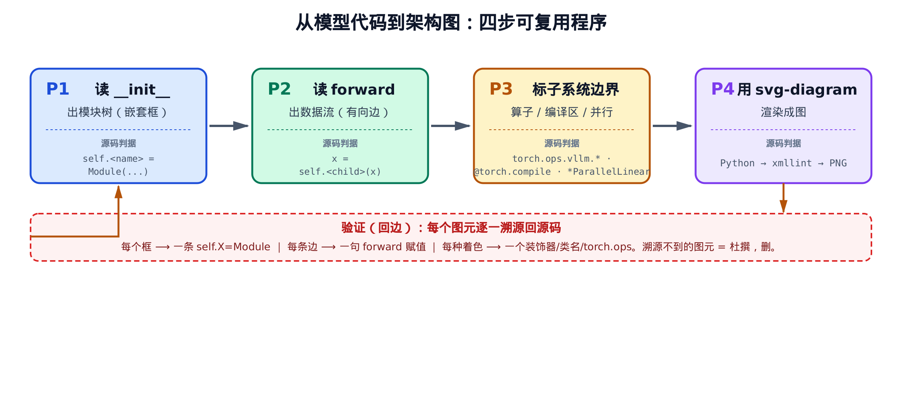
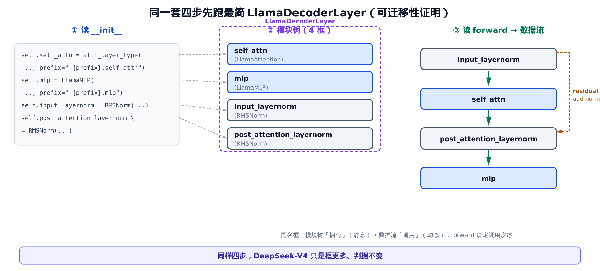
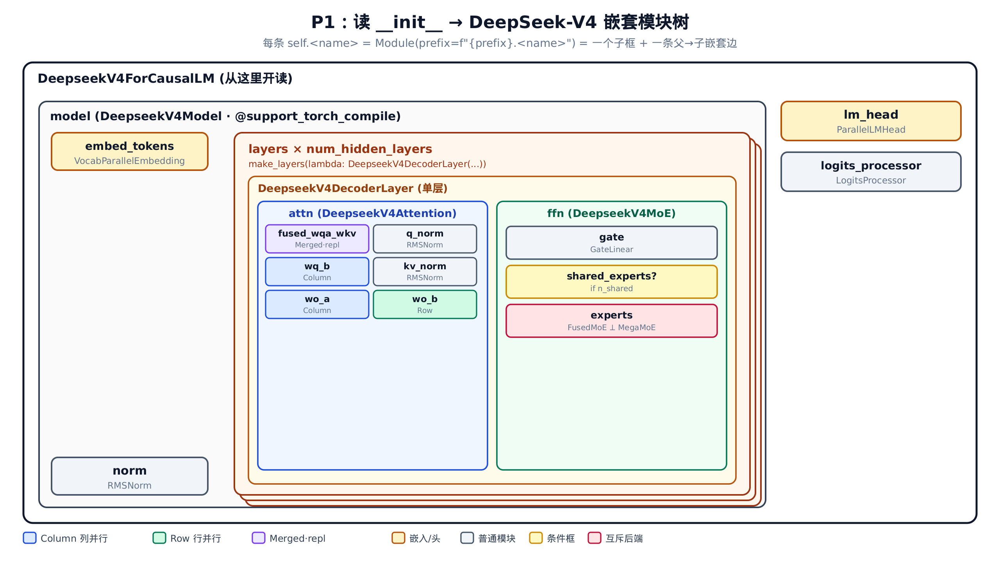
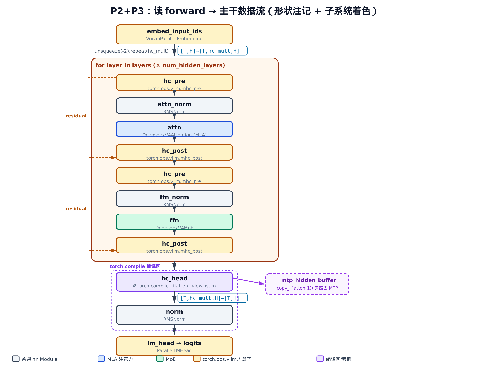

# 第26章　从模型代码到架构图：一个可复用的 code→diagram 程序

## 这章要做什么

上一章我们逐行读完了 DeepSeek-V4 的真实源码——MLA 投影、MoE 双后端、MTP 旁路、还有那条 hc 多流残差。读完之后，脑子里其实已经攒下了一张图：哪个模块拥有哪个模块，张量从哪儿流到哪儿。

这一章不再讲「V4 是什么」。我们要把上一章那个「读着读着图就浮现出来」的过程**拆成一套明确的步骤**，让它不再靠灵感、靠经验，而是像查字典一样——翻到 `__init__` 查框，翻到 `forward` 查边。然后把这套步骤原样跑在 DeepSeek-V4 上，产出它的架构图，并逐一交代：**每个框、每条边、每种着色，是从源码哪一行读出来的。**

核心命题只有一句：**架构图不是凭直觉画的，是从 vLLM 模型类的两类源码结构机械地「读」出来的。** `__init__` 读出模块树（嵌套框），`forward` 读出数据流（有向箭头）。学会这套读法，你拿到任何一个 vLLM 模型文件，都能画出它的架构图——这是一项可迁移的技能，不绑定 DeepSeek-V4。本章的 worked example 是 `vllm/model_executor/models/deepseek_v4.py`，对照基线是 `vllm/model_executor/models/llama.py`。


> *上一章逐行读完了 DeepSeek-V4 的真实源码。*
> *本章把「读代码画架构图」抽成可照搬的程序。*
> *下一章进入采样，看 logits 怎么变成 token。*

## 26.1 为什么需要一套「读法」，而不是凭感觉画

先说个常见的坑。很多人画模型架构图，是边回忆边画——「这里大概有个 attention，那里好像还有个 MLP」。画出来的图常常对不上代码：要么多了个源码里根本没有的框，要么把两个独立模块画成了一个，要么箭头方向反了。等到拿图去 debug 权重装载、对照 checkpoint 张量名时，全是错的。

问题出在哪？出在**没有把「框」和「边」钉到确定的源码位置**。只要钉住了，画图就从一门玄学变成一道可机械复现、可审计的工序。

vLLM 的每个模型都是一个标准的 PyTorch `nn.Module`。`nn.Module` 有两个我们要盯死的契约：

- `__init__` 里建子模块——`self.<name> = SomeModule(...)` 这种赋值，表达的是**静态的拥有关系**（谁包含谁）。
- `forward` 里定调用序——`x = self.<child>(x)` 这种语句，表达的是**动态的调用顺序**（数据先经过谁、再经过谁）。

这两套结构，恰好对应架构图里的两类元素：

- 拥有关系 → 图里的**嵌套框**（父框套子框）。
- 调用顺序 → 图里的**有向边**（箭头从上一步指向下一步）。

把这层对应关系做实，就有了一套四步程序。先看全貌，再逐步落到 DeepSeek-V4 源码上。



> *图注：四步程序——P1 读 `__init__` 出模块树，P2 读 `forward` 出数据流，P3 标子系统边界，P4 用 svg-diagram 渲染。每步下方挂着它的「源码判据」：你不是在主观分类，而是在源码里查一个确定的信号。底部那条红色回边是验证步——每个图元都要能溯源回源码，溯源不到的就是杜撰，删掉。*

四步分别是：

- **P1 读 `__init__` 出模块树**：每条 `self.<name> = Module(...)` 画一个子框、连一条父→子嵌套边。
- **P2 读 `forward` 出数据流**：每个 `x = self.<child>(x)` 画一条有向边；改形状的算子在边上标形状。
- **P3 标子系统边界**：用源码判据（`torch.ops.vllm.*` / `@torch.compile` / 并行类名）给框着色，让图同时是子系统地图。
- **P4 用 svg-diagram 渲染**：把模块树写成嵌套矩形、数据流写成有向箭头，脚本生成 SVG → 校验 → 转 PNG。

这套程序定义在 `vllm/model_executor/models/` 下每个模型文件遵循的 `nn.Module` 契约之上——`vllm/model_executor/models/deepseek_v4.py` 和 `vllm/model_executor/models/llama.py` 都不例外。下面先在最简单的 Llama 上跑一遍，建立信心；再上 DeepSeek-V4，证明同一程序只是框更多、判据不变。

## 26.2 先在最简模型上跑一遍：LlamaDecoderLayer

要证明一套程序「与模型无关」，最好的办法是先在最简单的模型上跑通。`vllm/model_executor/models/llama.py` 里的 `LlamaDecoderLayer` 就是理想的起点：一个标准 Transformer 解码层，没有任何花哨结构。

先看 `__init__`（P1 的读取对象）和紧接着的 `forward`（P2 的读取对象），它们在 `vllm/model_executor/models/llama.py:L288-L333`：

```python
# vllm/model_executor/models/llama.py:L288
        self.self_attn = attn_layer_type(
            config=config,
            hidden_size=self.hidden_size,
            num_heads=config.num_attention_heads,
            # … 省略：num_kv_heads / bias / cache_config 等构造参数 …
            prefix=f"{prefix}.self_attn",
            attn_type=attn_type,
        )
        self.mlp = LlamaMLP(
            hidden_size=self.hidden_size,
            intermediate_size=config.intermediate_size,
            hidden_act=config.hidden_act,
            quant_config=quant_config,
            bias=getattr(config, "mlp_bias", False),
            prefix=f"{prefix}.mlp",
        )
        self.input_layernorm = RMSNorm(config.hidden_size, eps=config.rms_norm_eps)
        self.post_attention_layernorm = RMSNorm(
            config.hidden_size, eps=config.rms_norm_eps
        )

    def forward(
        self,
        positions: torch.Tensor,
        hidden_states: torch.Tensor,
        residual: torch.Tensor | None,
    ) -> tuple[torch.Tensor, torch.Tensor]:
        # Self Attention
        if residual is None:
            residual = hidden_states
            hidden_states = self.input_layernorm(hidden_states)
        else:
            hidden_states, residual = self.input_layernorm(hidden_states, residual)
        hidden_states = self.self_attn(positions=positions, hidden_states=hidden_states)

        # Fully Connected
        hidden_states, residual = self.post_attention_layernorm(hidden_states, residual)
        hidden_states = self.mlp(hidden_states)
        return hidden_states, residual
```

**P1：读 `__init__` 出模块树。** 用手指顺着 `__init__` 往下点，找每一条 `self.<name> = ...(...)`。这里正好四条：

| 源码这一行 | 图上这个框 |
| --- | --- |
| `self.self_attn = attn_layer_type(...)` | `self_attn`（注意力） |
| `self.mlp = LlamaMLP(...)` | `mlp`（前馈） |
| `self.input_layernorm = RMSNorm(...)` | `input_layernorm` |
| `self.post_attention_layernorm = RMSNorm(...)` | `post_attention_layernorm` |

四条赋值 → 四个框，一一对应，没有第五个，也不少一个。这就是 P1 的全部：**`__init__` 里数 `self.X =` 的条数，就是这一层的子框数。**

注意每个框上还挂着 `prefix=f"{prefix}.self_attn"` 这种参数。这条 `prefix` 链不是装饰——它就是这个框在权重 checkpoint 里的命名前缀。模块树的层级路径（`model.layers.0.self_attn...`）和加载权重时看到的张量名一字不差。这一点我们到 DeepSeek-V4 会反复用上：**图的层级标签 == 权重名前缀**，所以架构图可以直接当 debug 索引。

那省略的那些构造参数（`num_kv_heads`、`bias`、`cache_config`）为什么不画？因为它们既不是 `self.X` 子模块赋值（不进模块树），也不出现在 `forward` 的数据流里。**画图只看两样东西：`self.X =`（进树）和 `forward` 里的赋值（进边）。其余配置读取一律忽略。**

**P2：读 `forward` 出数据流。** 同样用手指顺着 `forward` 往下点，找每一条 `hidden_states = self.<child>(...)`，按出现顺序连成箭头：

`input_layernorm` → `self_attn` → `post_attention_layernorm` → `mlp`

这就是这一层的主干数据流。那个 `residual = hidden_states`（以及 `post_attention_layernorm` 同时返回 `residual`）告诉我们有一条残差回边：输入先存进 `residual`，绕过 `self_attn`，在后面 add 回来。这条回边在图上画成一根从入口绕到 attention 之后的旁路。

把 P1 的框、P2 的边拼起来，就是 LlamaDecoderLayer 的完整架构图：



> *图注：左边是 `__init__` 的四条 `self.X` 赋值，虚线连到中间的四个模块树框（模块树表达「拥有」，是静态的）。右边是 `forward` 读出的数据流链，外加那条 add-norm 残差回边（数据流表达「调用」，是动态的）。同一个框，在模块树里讲「谁拥有它」，在数据流里讲「什么时候调它」——`forward` 决定调用次序。底下那句话是本章的赌注：同样四步，DeepSeek-V4 只是框更多、判据不变。*

到这里，四步程序里的 P1、P2 已经在一个真实模型上跑通了。它没用到任何 DeepSeek-V4 特有的东西——`self.X =` 数框、`forward` 连边，对所有 `nn.Module` 都成立。接下来上 DeepSeek-V4，你会看到完全相同的两步，只是要数的框更多、要连的边更绕。

## 26.3 P1 实战：从 `__init__` 读出 DeepSeek-V4 的模块树

画一个完整模型的图，从哪个类开始读？答案永远一样：**从 `*ForCausalLM` 的 `__init__` 开读。** 它是整个模型对外的入口类，图最外层那几个框就在它的 `__init__` 里。

看 `vllm/model_executor/models/deepseek_v4.py:L1514-L1553` 的 `DeepseekV4ForCausalLM`：

```python
# vllm/model_executor/models/deepseek_v4.py:L1514
    def __init__(self, *, vllm_config: VllmConfig, prefix: str = ""):
        super().__init__()
        config = vllm_config.model_config.hf_config
        # … 省略：expert_dtype 分支只改 weights_mapper，不建子模块 …
        self.model = self.model_cls(
            vllm_config=vllm_config, prefix=maybe_prefix(prefix, "model")
        )
        self.lm_head = ParallelLMHead(
            config.vocab_size,
            config.hidden_size,
            prefix=maybe_prefix(prefix, "lm_head"),
        )
        self.logits_processor = LogitsProcessor(config.vocab_size)

    def forward(
        self,
        input_ids: torch.Tensor,
        positions: torch.Tensor,
        intermediate_tensors: IntermediateTensors | None = None,
        inputs_embeds: torch.Tensor | None = None,
    ) -> torch.Tensor | IntermediateTensors:
        hidden_states = self.model(
            input_ids, positions, intermediate_tensors, inputs_embeds
        )
        return hidden_states
```

P1 照搬：数 `self.X =`。这里三条——`self.model`、`self.lm_head`、`self.logits_processor`。所以图最外层就是三个框，主干是中间那个 `model`（`ParallelLMHead` 是输出头、`LogitsProcessor` 算 logits）。`forward` 里 `hidden_states = self.model(...)` 一句就把顶层数据流交代清楚了：数据进 `model`，出来就是 `hidden_states`。其余方法（`compute_logits`、`load_weights` 等）不在这条前向主干上，画数据流图时不画。

接着**下钻一层**：`model` 是 `DeepseekV4Model`，读它的 `__init__`（`vllm/model_executor/models/deepseek_v4.py:L1254-L1272`）：

```python
# vllm/model_executor/models/deepseek_v4.py:L1254
        self.embed_tokens = VocabParallelEmbedding(
            config.vocab_size,
            config.hidden_size,
            quant_config=quant_config,
            prefix=f"{prefix}.embed_tokens",
        )

        self.start_layer, self.end_layer, self.layers = make_layers(
            config.num_hidden_layers,
            lambda prefix: DeepseekV4DecoderLayer(
                vllm_config,
                prefix=prefix,
                topk_indices_buffer=self.topk_indices_buffer,
                aux_stream_list=aux_stream_list,
            ),
            prefix=f"{prefix}.layers",
        )

        self.norm = RMSNorm(config.hidden_size, self.rms_norm_eps)
```

这里出现了 P1 的一个**关键技巧**。`embed_tokens` 和 `norm` 是普通框，照常画。但中间这条不是 `self.layers = SomeModule(...)`，而是 `make_layers(num_hidden_layers, lambda: DeepseekV4DecoderLayer(...))`。

`make_layers`（定义在 `vllm/model_executor/models/utils.py`）是 vLLM 里「堆叠 N 个同构层」的标准信号。看到 `make_layers` 或 `nn.ModuleList`，就知道这里不是一个框，而是 **N 个同构框的堆叠**。

那图上画 N 个框吗？不画。源码里它就是一个 lambda 工厂加一个计数 `num_hidden_layers`，每层结构完全一样。展开成 N 个框既冗余、又掩盖了「每层同构」这个事实。**正确画法：画一个框，标上 `× num_hidden_layers`。** 这是 P1 的一条硬规则。

还有一个容易踩的坑。`DeepseekV4Model.__init__` 里其实还定义了 `topk_indices_buffer`、`_mtp_hidden_buffer`、`hc_head_*` 这些。它们是 `nn.Parameter` 或 buffer，**不是 `nn.Module` 子模块**。所以它们**不进模块树框**——把它们画成框会让图失真。它们要等到 P2 画数据流时，作为参数或数据端点出现在边上的标注里。**画图时必须分清：子模块（进树）vs 参数/buffer（进数据流标注）。**

继续下钻到单层 `DeepseekV4DecoderLayer.__init__`（`vllm/model_executor/models/deepseek_v4.py:L1107-L1116`）：

```python
# vllm/model_executor/models/deepseek_v4.py:L1107
        # Lazy import to avoid top-level tilelang dependency.
        # Registers both torch.ops.vllm.mhc_pre and mhc_post
        import vllm.model_executor.layers.mhc  # noqa: F401
        # … 省略：config / hidden_size / rms_norm_eps 读取 …
        self.attn = DeepseekV4Attention(
            vllm_config,
            prefix=f"{prefix}.attn",
            topk_indices_buffer=topk_indices_buffer,
            aux_stream_list=aux_stream_list,
        )
        self.ffn = DeepseekV4MoE(vllm_config, prefix=f"{prefix}.ffn")

        self.attn_norm = RMSNorm(self.hidden_size, self.rms_norm_eps)
        self.ffn_norm = RMSNorm(self.hidden_size, self.rms_norm_eps)
```

老规矩，数 `self.X =`：`attn`（`DeepseekV4Attention`）、`ffn`（`DeepseekV4MoE`）、`attn_norm`、`ffn_norm`。四个子框。结构和 Llama 那层是同构的——attention、前馈、两个 norm，只是名字和内部实现换了。**这正是「程序与模型无关」的现场证据：换了模型，P1 的动作一字不改。**

但顶上那行 `import vllm.model_executor.layers.mhc` 不是普通 import——注释写得很清楚，它的**副作用**是注册 `torch.ops.vllm.mhc_pre` 和 `mhc_post` 两个自定义算子。这是 P3 识别「自定义算子子系统」的源码线索：算子不是 `self.X` 子模块，它靠 import 注册、靠 `torch.ops` 调用。这条线索我们 §26.5 再展开。

最后下钻到叶子层 `DeepseekV4Attention.__init__`（`vllm/model_executor/models/deepseek_v4.py:L967-L1003`），看 MLA 的投影子树怎么读出来：

```python
# vllm/model_executor/models/deepseek_v4.py:L967
        self.fused_wqa_wkv = MergedColumnParallelLinear(
            self.hidden_size,
            [self.q_lora_rank, self.head_dim],
            bias=False,
            quant_config=quant_config,
            prefix=f"{prefix}.fused_wqa_wkv",
            disable_tp=True,  # fused ReplicatedLinear
        )
        self.q_norm = RMSNorm(self.q_lora_rank, self.eps)
        self.wq_b = ColumnParallelLinear(
            self.q_lora_rank,
            self.n_heads * self.head_dim,
            # … 省略：bias / quant_config / return_bias …
            prefix=f"{prefix}.wq_b",
        )
        self.kv_norm = RMSNorm(self.head_dim, self.eps)
        self.wo_a = ColumnParallelLinear(
            self.n_heads * self.head_dim // self.n_groups,
            self.n_groups * self.o_lora_rank,
            # … 省略 …
            prefix=f"{prefix}.wo_a",
        )
        self.wo_a.is_bmm = True
        self.wo_a.bmm_batch_size = self.n_local_groups
        self.wo_b = RowParallelLinear(
            self.n_groups * self.o_lora_rank,
            self.hidden_size,
            # … 省略 …
            prefix=f"{prefix}.wo_b",
        )
```

到了叶子层，P1 变成一种很机械的体验：**一行一框**。`fused_wqa_wkv`、`q_norm`、`wq_b`、`kv_norm`、`wo_a`、`wo_b`——一条 `self.X =` 一个框，连 `prefix=f"{prefix}.<name>"` 都对齐了图里的层级标签。这就是 MLA 的投影子树，不多不少。

这里 P1 还顺手把 P3 的一半活干了：**框的着色判据，就写在类名里。** `MergedColumnParallelLinear`、`ColumnParallelLinear`、`RowParallelLinear`——这些类名本身就标了张量并行的方式。列并行（Column）按输出维切、行并行（Row）按输入维切，是两种不同的跨设备通信模式。所以画图时按类名着色：列并行一种颜色、行并行另一种、合并复制的（`fused_wqa_wkv` 带 `disable_tp=True` 的 ReplicatedLinear）再一种。**你不用主观判断「这块是不是并行」——读类名就行。**

把四层下钻的结果叠起来，就是 DeepSeek-V4 的完整模块树：



> *图注：从 `DeepseekV4ForCausalLM` 一路下钻——`model` ⊃ {`embed_tokens`，`layers × num_hidden_layers` ⊃ `DeepseekV4DecoderLayer` ⊃ {`attn` ⊃ MLA 投影叶子，`ffn` ⊃ MoE 子树}，`norm`}，`lm_head`。每个框都能指回一条 `self.X = Module` 赋值。叶子框按 `Column`/`Row`/`Merged ParallelLinear` 着色，所以这张模块树同时已经是半张并行子系统地图。`layers` 那个带叠影的框就是 `make_layers` 的 `× N` 复数框——一个框，不是 N 个。*

## 26.4 P2 实战：从 `forward` 读出数据流与形状变化

模块树画完了，但它只讲了「谁拥有谁」，没讲「数据怎么流」。P2 接手——读 `forward`，把静态的框连成动态的有向边。

先读主干 `DeepseekV4Model.forward`（`vllm/model_executor/models/deepseek_v4.py:L1314-L1338）`：

```python
# vllm/model_executor/models/deepseek_v4.py:L1314
        hidden_states = self.embed_input_ids(input_ids)
        hidden_states = hidden_states.unsqueeze(-2).repeat(1, self.hc_mult, 1)
        # … 省略：use_mega_moe 时 input_ids 转 int64，与画图无关 …
        for layer in islice(self.layers, self.start_layer, self.end_layer):
            hidden_states = layer(
                hidden_states,
                positions,
                input_ids,
            )

        # Stash pre-hc_head residual for the MTP draft (captured copy_).
        num_tokens = hidden_states.shape[0]
        self._mtp_hidden_buffer[:num_tokens].copy_(hidden_states.flatten(1))

        hidden_states = hc_head(
            hidden_states,
            self.hc_head_fn,
            self.hc_head_scale,
            self.hc_head_base,
            self.rms_norm_eps,
            self.hc_eps,
        )
        hidden_states = self.norm(hidden_states)
        return hidden_states
```

P2 照 tensor 赋值顺序自上而下读，每一句 `hidden_states = ...(...)` 画一条有向边。这段里有四个值得专门标注的动作：

**一、形状变化要标在边上。** 第二行 `hidden_states.unsqueeze(-2).repeat(1, self.hc_mult, 1)`——这不是一个子模块（所以不进模块树），但它把张量从 `[T, H]` 变成了 `[T, hc_mult, H]`（以 DeepSeek-V4 为例：H=7168，hc\_mult=4，即从 `[T, 7168]` 展开到 `[T, 4, 7168]`）。`unsqueeze`、`repeat`、`view`、`flatten` 这类纯形状算子，**画图时不画框，但必须在那条边上标形状**：`[T,H]→[T,hc_mult,H]`。不标的话，读者后面会一脸懵——中途怎么凭空多出来一个 `hc_mult` 维？这个维就是 hc 多流，标在边上它才有来处。

**二、`for` 循环就是穿过堆叠层的那一条边。** `for layer in islice(self.layers, ...)` 对应 P1 里那个 `× N` 复数框——数据流箭头穿过这个复数框一次，代表它依次流过所有层。

**三、`copy_` 是一条分叉旁路。** `self._mtp_hidden_buffer[:num_tokens].copy_(hidden_states.flatten(1))` 把主干上的隐状态拷一份进 `_mtp_hidden_buffer`（这就是[上一章](../ch25-model-architecture/narrative/chapter.md)介绍的 MTP 草稿共享缓冲区）。这就是 §26.3 说的那个 buffer——它不在模块树里，现在以**数据流端点**的身份出现：主干上分一条旁路出去，喂给 MTP 草稿。旁路边画成一条岔出去的箭头，指向那个 buffer 框。

**四、`hc_head` 把形状压回来。** `hc_head(...)` 接收 `[T, hc_mult, H]`，内部做完混合后输出 `[T, H]`——又一条要标形状的边，`[T,hc_mult,H]→[T,H]`，和开头那次展开正好对称。最后 `self.norm(...)` 收尾。

那段 `intermediate_tensors`/`inputs_embeds` 的 PP 分支为什么省略？因为在单卡（PP=1）这条配置下它不触发——只画真正会走的路径。P2 有条原则：`if` 恒不触发的分支不进图，只画真正会走的路径。

> **v0.21.0 更新**：上面这条 PP 分支在新版里不再是一条「永不触发」的死分支——DeepSeek-V4 现在实现了 `SupportsPP`，支持流水线并行（[上一章](../ch25-model-architecture/narrative/chapter.md)§25.7 讲了它在层构造侧怎么把首尾零件换成 `PPMissingLayer()`）。在数据流层面，这给图加了一个**条件切分点**：当 PP > 1 时，非首 rank 的 `forward` 不再从 `embed_input_ids` 起步，而是直接取上一 rank 传来的 `intermediate_tensors["hidden_states"]`；非末 rank 则在末尾提前 `return IntermediateTensors(...)`，把 `hc_head`、`_mtp_hidden_buffer` 暂存与 `lm_head` 全部下放到末 rank。画图时这处可作脚注：在主干首/末画一条 `IntermediateTensors` 跨 rank 传递的虚线边，标上多流形状 `(num_tokens, hc_mult, H)`——它和单卡主干是同一条逻辑数据流，只是被 PP 边界切成了几段。是否画这条边，取决于你要画的是单卡视图还是 PP 视图：判据仍然客观（`get_pp_group().is_first_rank / is_last_rank` 那两个分支），只是这次「会不会走」由部署拓扑而非模型配置决定。

下钻到单层 `DeepseekV4DecoderLayer.forward`（`vllm/model_executor/models/deepseek_v4.py:L1195-L1216`），看层内数据流：

```python
# vllm/model_executor/models/deepseek_v4.py:L1195
    def forward(
        self,
        x: torch.Tensor,
        positions: torch.Tensor,
        input_ids: torch.Tensor | None,
    ) -> torch.Tensor:
        residual = x
        x, post, comb = self.hc_pre(
            x, self.hc_attn_fn, self.hc_attn_scale, self.hc_attn_base
        )
        x = self.attn_norm(x)
        x = self.attn(positions, x, None)
        x = self.hc_post(x, residual, post, comb)

        residual = x
        x, post, comb = self.hc_pre(
            x, self.hc_ffn_fn, self.hc_ffn_scale, self.hc_ffn_base
        )
        x = self.ffn_norm(x)
        x = self.ffn(x, input_ids)
        x = self.hc_post(x, residual, post, comb)
        return x
```

这段是对称的两半，结构完全一致：

第一半（attention）：`residual = x` 存残差 → `hc_pre` → `attn_norm` → `attn` → `hc_post`。第二半（前馈）：又一次 `residual = x` → `hc_pre` → `ffn_norm` → `ffn` → `hc_post`。

那两条 `residual = x`，加上 `hc_post(x, residual, ...)` 把 `residual` 当形参收进去——就是**两条残差回边**：分别绕过 attention 和 ffn，在 `hc_post` 处汇回。这和 Llama 那条 add-norm 残差是同一类回边，只是这里的「加回来」被包进了 `hc_post`（也就是后面要讲的 `torch.ops.vllm.mhc_post` 算子）里。

把主干和层内拼起来，DeepSeek-V4 的数据流图就成形了——但还差最后一步：给那些算子框、编译区上色。

## 26.5 P3 实战：用源码判据标出子系统边界

到这里图已经能用了，但它还只是一张「数据怎么流」的图。P3 要让它**同时是一张子系统地图**：哪块是自定义算子、哪块是 torch.compile 编译区、哪块跨设备通信。

关键在于：这些边界**不靠作者主观分类**，全部从源码读出三类客观判据。

**判据一：调 `torch.ops.vllm.*` 的，是自定义算子框。** 怎么判断一个框是「普通子模块前向」还是「自定义算子」？看它调的是 `self.<submodule>(...)` 还是 `torch.ops.vllm.*`。看 `hc_pre`/`hc_post` 的方法体（`vllm/model_executor/models/deepseek_v4.py:L1166-L1193`）：

```python
# vllm/model_executor/models/deepseek_v4.py:L1166
    def hc_pre(
        self,
        x: torch.Tensor,
        hc_fn: torch.Tensor,
        hc_scale: torch.Tensor,
        hc_base: torch.Tensor,
    ):
        post_mix, res_mix, layer_input = torch.ops.vllm.mhc_pre(
            residual=x,
            fn=hc_fn,
            hc_scale=hc_scale,
            hc_base=hc_base,
            # … 省略：rms_eps / hc_pre_eps / sinkhorn 等算子参数 …
        )
        return layer_input, post_mix, res_mix

    def hc_post(
        self,
        x: torch.Tensor,
        residual: torch.Tensor,
        post: torch.Tensor,
        comb: torch.Tensor,
    ):
        return torch.ops.vllm.mhc_post(x, residual, post, comb)
```

证据确凿：`hc_pre` 直接 dispatch 到 `torch.ops.vllm.mhc_pre`，`hc_post` 到 `torch.ops.vllm.mhc_post`。它们不是普通子模块前向，是自定义算子。所以图里这两个框用特殊填充、旁注算子名，和普通 `nn.Module` 框区分开。判据就一条：**`torch.ops.vllm.` 前缀。** 这种自定义算子的注册机制本身——为什么要绕开 `nn.Module`、怎么注册进 `torch.ops`——是另一套独立的话题，不在画图这条线上展开。

**判据二：顶着 `@torch.compile` 装饰器的，是编译区框。** 看 `hc_head`（`vllm/model_executor/models/deepseek_v4.py:L1450-L1466`）：

```python
# vllm/model_executor/models/deepseek_v4.py:L1450
@torch.compile(backend=current_platform.simple_compile_backend)
def hc_head(
    hidden_states: torch.Tensor,
    hc_fn: torch.Tensor,
    hc_scale: torch.Tensor,
    hc_base: torch.Tensor,
    rms_norm_eps: float,
    hc_eps: float,
) -> torch.Tensor:
    x = hidden_states
    shape, dtype = x.size(), x.dtype
    x = x.flatten(1).float()
    # … 省略：rsqrt / sigmoid 门控的数学细节 …
    y = torch.sum(pre.unsqueeze(-1) * x.view(shape), dim=1)
    return y.to(dtype)
```

这页一次给了三个画图判据。其一，顶上的 `@torch.compile(backend=...)` 装饰器就是编译边界——画图时用虚线容器把它圈出来，标「编译区」。装饰器位置即编译边界，这是客观的。和它对照的是类级装饰器 `@support_torch_compile`，它顶在 `DeepseekV4Model` 上（`vllm/model_executor/models/deepseek_v4.py:L1219`），把整个主干圈成一个大编译区。一个是函数级编译、一个是类级编译，判据是同一条：**看装饰器圈编译区。**

其二，`hc_head` 是个**函数，不是 `nn.Module`**——可它照样是图里一个框。这破除一个误解：图里的框不一定都是子模块，前向路径上一个被调用的编译函数也算一个框。

其三，内部 `x.flatten(1)` → `x.view(shape)` → `torch.sum(..., dim=1)` 这串，就是把 `[T, hc_mult, H]` 坍缩回 `[T, H]` 的形状变化——标在「压回单流」那条边上，和 §26.4 开头那次 `repeat` 展开首尾呼应。

**判据三：并行类名 + `FusedMoE` + aux CUDA stream，是并行/通信子系统。** §26.3 已经用类名给 MLA 投影上了色（`Column`/`Row`/`Merged ParallelLinear`）。同一条判据在 MoE 里还要再用一次，下一节展开。`DeepseekV4Model.__init__` 里那行 `aux_stream_list = [torch.cuda.Stream() for _ in range(3)]` 则标出了辅助 CUDA 流这个并行子系统——aux stream 本身代表独立的 GPU 执行队列，看到它被创建并传给子模块，就说明这里有算子要在主流之外异步并发执行（三条 aux 流让注意力里的几个输入 GEMM 并行跑）。

三条判据合起来，每一种着色都能指回源码的一个装饰器、一个类名、或一个 `torch.ops` 前缀。把它们叠到 §26.4 的数据流图上：



> *图注：主干自上而下——`embed` → `repeat` 展开成 `[T,hc_mult,H]` → 逐层（`hc_pre`→`attn_norm`→`attn`→`hc_post`，再 `hc_pre`→`ffn_norm`→`ffn`→`hc_post`，两条 residual 回边在左侧）→ `hc_head` 压回 `[T,H]` → `norm` → `lm_head`。橙色框是 `torch.ops.vllm.mhc_pre/mhc_post` 自定义算子（判据：`torch.ops.vllm.` 前缀）；紫色虚线容器是 `@torch.compile` 编译区（判据：装饰器）；右侧紫色旁路是 `copy_` 去 `_mtp_hidden_buffer`（判据：它是 buffer 不是子模块，进数据流不进树）。这张图就是 P2+P3 的最终产物——每个图元都钉在一行源码上。*

## 26.6 配置开关怎么读：可选框与双后端分叉

DeepSeek-V4 的 MoE 比 Llama 的 MLP 多了一层复杂度：它的结构不是固定的，而是**被配置开关决定**的。P1 和 P2 都要处理这种「条件存在」的框。先看 `DeepseekV4MoE.__init__`（`vllm/model_executor/models/deepseek_v4.py:L746-L795`）：

```python
# vllm/model_executor/models/deepseek_v4.py:L746
        self.gate = GateLinear(
            config.hidden_size,
            config.n_routed_experts,
            out_dtype=torch.float32,
            bias=False,
            prefix=f"{prefix}.gate",
        )
        # … 省略：gate 的 e_score_correction_bias / tid2eid 路由细节 …
        if config.n_shared_experts is None:
            self.shared_experts = None
        else:
            intermediate_size = config.moe_intermediate_size * config.n_shared_experts
            self.shared_experts = DeepseekV4MLP(
                hidden_size=config.hidden_size,
                intermediate_size=intermediate_size,
                # … 省略：hidden_act / swiglu_limit / quant_config …
                reduce_results=self.use_mega_moe,
                prefix=f"{prefix}.shared_experts",
            )

        if self.use_mega_moe:
            self._init_mega_moe_experts(vllm_config, config, prefix)
        else:
            self._init_fused_moe_experts(config, quant_config, prefix)
```

`self.gate` 是无条件框，照常画。但接下来两个 `if` 是 P1 要专门处理的**配置开关**：

- `if config.n_shared_experts is None:` —— `shared_experts` 是**可选框**。配置里没共享专家就是 `None`（不画），否则是一个 `DeepseekV4MLP`（画）。这种框在图上要标成「条件存在」，用区别于常驻框的样式。
- `if self.use_mega_moe:` —— 走 `_init_mega_moe_experts` 还是 `_init_fused_moe_experts`，二选一。它们各自 new 出 `DeepseekV4MegaMoEExperts` 或 `FusedMoE`，是**互斥的双后端**。图上画成一个菱形分叉：两条路只走一条。

**规则：`__init__` 里的 `if` 决定图里的可选框 / 互斥框。** 不是所有框都常驻——有的框存不存在、走哪个，取决于配置。

这种分叉在 `forward` 里也有对应。看 `DeepseekV4MoE.forward`（`vllm/model_executor/models/deepseek_v4.py:L854-L893`）：

```python
# vllm/model_executor/models/deepseek_v4.py:L854
        if not self.use_mega_moe:
            return self._forward_fused_moe(hidden_states, input_ids)

        org_shape = hidden_states.shape
        router_logits, _ = self.gate(hidden_states)
        topk_weights, topk_ids = fused_topk_bias(
            hidden_states=hidden_states,
            gating_output=router_logits,
            # … 省略：scoring_func / e_score_correction_bias / hash 路由参数 …
            topk=self.n_activated_experts,
        )
        # … 省略：activation_clamp 取值 …
        final_hidden_states = self.experts(
            hidden_states,
            topk_weights,
            topk_ids,
            activation_clamp=activation_clamp,
        )

        if self.shared_experts is not None:
            shared_output = self.shared_experts(hidden_states)
            final_hidden_states += shared_output

        return final_hidden_states.view(org_shape)
```

P2 在这里读出两件事：

**一、`if not self.use_mega_moe: return ...` 是一个早退分叉。** 数据流到这里劈成两路：非 mega 走 `_forward_fused_moe` 直接返回，mega 走下面的主体。这就是 §26.6 那个互斥菱形在数据流图上的体现——`if`/`return` 早退 → 图里的分支。

**二、`+= shared_output` 是一条旁路汇入边。** mega 路径里，主路是 `gate` → `fused_topk_bias` → `experts`，算出 `final_hidden_states`。然后 `if self.shared_experts is not None:`（呼应 `__init__` 里那个可选框）算一份 `shared_output`，用 `final_hidden_states += shared_output` 加回主路。这个 `+=` 就是一条从共享专家旁路汇入主干的边。

读这两个 `forward` 分支时有个细节值得记下来：mega 路径里 `shared_experts` 的输出是在这里显式 `+=` 汇入的，但 TP 路径 `_forward_fused_moe` 里，`FusedMoE` 内部已经把 `shared_experts` 聚合掉了——两条路的「共享专家汇入点」位置不同。画图时这点要标注，不能想当然画成一处。**这正是「读 `forward` 出边」必须老老实实顺着每个分支读、不能凭印象的原因。**

## 26.7 P4 与验证：把图钉死在源码上

前三步已经把图的内容定下来了：P1 出框、P2 出边、P3 出着色。P4 只是渲染——但渲染工具的选择本身也是有讲究的。

模块树加数据流，是一张 dense 的多元素图：嵌套容器要精确对齐、多对多的连边要不打架、形状标注要贴在正确的边上。这种图，Mermaid 的自动布局会把节点缠成一团，Excalidraw 的手工坐标又总会错位。所以本章这几张图都用 svg-diagram 工具渲染：Python 脚本用循环算出每个坐标（零手填坐标）→ 生成 SVG → `xmllint` 校验是合法 XML → `rsvg-convert` 转成 PNG（它会自动为中文字形做字体回退，排版才不乱）。

但 P4 不是终点。真正让这套程序「可审计」的，是最后那条**验证回边**——画完之后，拿图逐元素对回源码核一遍。判据三条，对应本章一路下来的三步：

- 每个**框**，能指到一条 `self.X = Module` 赋值（P1），或一个 `@decorator` / `torch.ops` 调用（P3 里那些非子模块的框）。
- 每条**边**，能指到一句 `forward` 里的赋值（P2）。
- 每种**着色**，能指到一个装饰器、一个类名、或一个 `torch.ops` 前缀（P3）。

一张图**忠实**，当且仅当：(a) 每个框都能这样溯源；(b) 每条边都能这样溯源；(c) 没有源码里不存在的框或边。这三条把「这张图画对了吗」从一句主观感叹，变成了一道可机械核对的命题——逐个图元过一遍，**指不回源码的图元就是杜撰，删掉。**

这里还藏着一个让架构图额外好用的事实。那条 `prefix=f"{prefix}.<name>"` 链，让模块树的层级路径恰好等于 checkpoint 里的权重名前缀：`model.layers.0.attn.fused_wqa_wkv...`。所以这张图不光是讲解用的——加载权重报错、对照张量名调试时，看到的名字和图上的层级标签一字不差，**架构图可以直接当 debug 索引用。**

## 26.8 这套程序为什么对任何 vLLM 模型都成立

回头看走过的路：在 Llama 上跑了 P1+P2，在 DeepSeek-V4 上跑了完整的 P1→P2→P3→P4。两次用的是**完全相同的动作**：

| 步骤 | 动作 | 源码判据 | Llama | DeepSeek-V4 |
| --- | --- | --- | --- | --- |
| P1 | 数 `self.X =` 出框 | `self.<name> = Module(...)` | 4 个框 | 几十个框，多层嵌套 |
| P1 | 堆叠层画 `× N` | `make_layers` / `ModuleList` | 上层有 | `make_layers(DecoderLayer)` |
| P2 | 顺序连有向边 | `x = self.<child>(x)` | 直链 | 含分叉/旁路/残差 |
| P2 | 形状标在边上 | `unsqueeze/repeat/view/flatten` | 无 | `[T,H]↔[T,hc_mult,H]` |
| P3 | 着色子系统 | `torch.ops.vllm.*` / `@torch.compile` / 并行类名 | 并行类名 | 三类判据全用上 |

差别全在「框多少、边多绕」，**动作和判据一个没变。**

为什么必然如此？因为 vLLM 的每个模型都是 `nn.Module`，而 `nn.Module` 的契约是死的：`__init__` 建子模块、`forward` 定调用序。只要这个契约成立——它对 `vllm/model_executor/models/llama.py`、`vllm/model_executor/models/deepseek_v4.py` 乃至该目录下所有模型都成立——「`__init__` → 模块树、`forward` → 数据流」这个映射就成立。不同模型只是子模块多寡、调用图繁简的差异，程序的步骤一步不改。

这就是把一个 worked example 升格成「方法」的依据。你下次拿到 `vllm/model_executor/models/` 里任意一个陌生模型文件，不必从头读懂它的算法——先翻 `*ForCausalLM` 的 `__init__` 数框、翻 `forward` 连边、按三条判据着色，一张可溯源、可当 debug 索引的架构图就出来了。读代码画图，是一项可迁移的手艺，不绑定 DeepSeek-V4。

下一章我们离开模型本体，去看 `hidden_states` 出了 `lm_head` 之后的事——logits 怎么变成一个真正被采样出来的 token。
