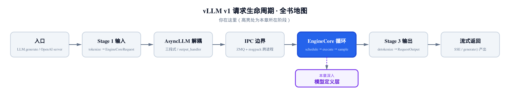
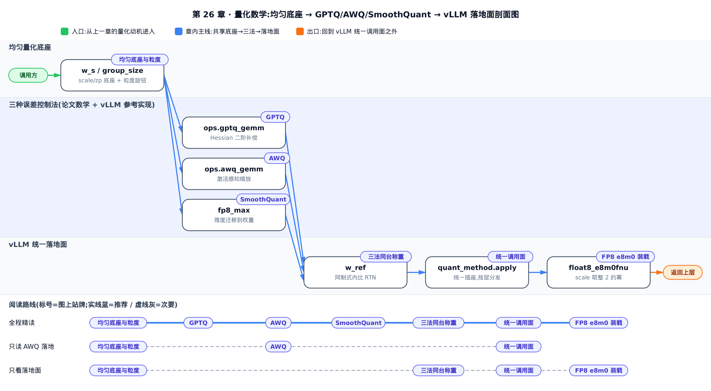
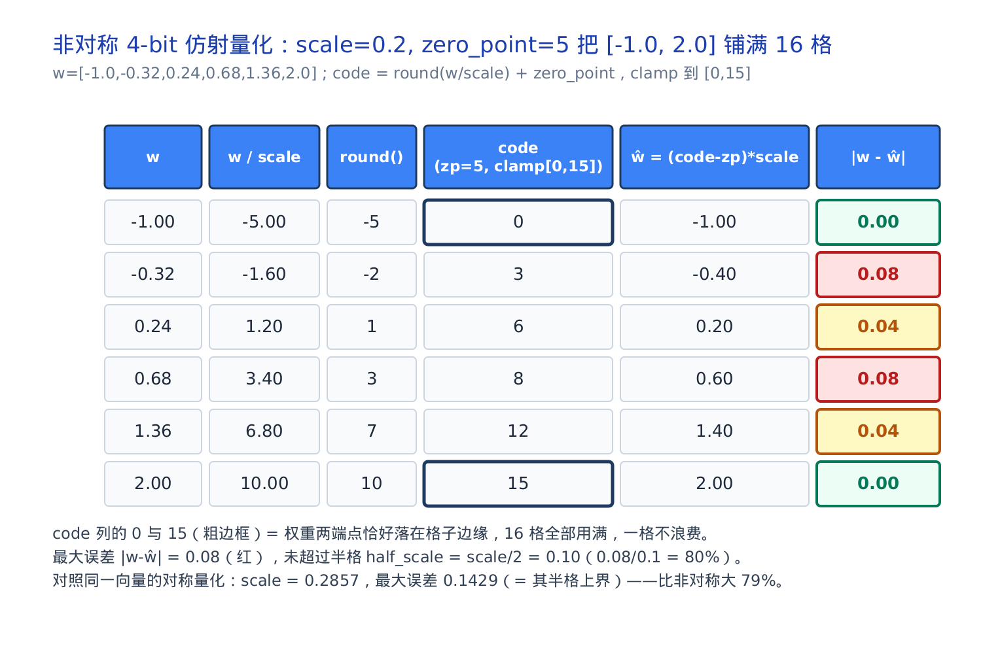
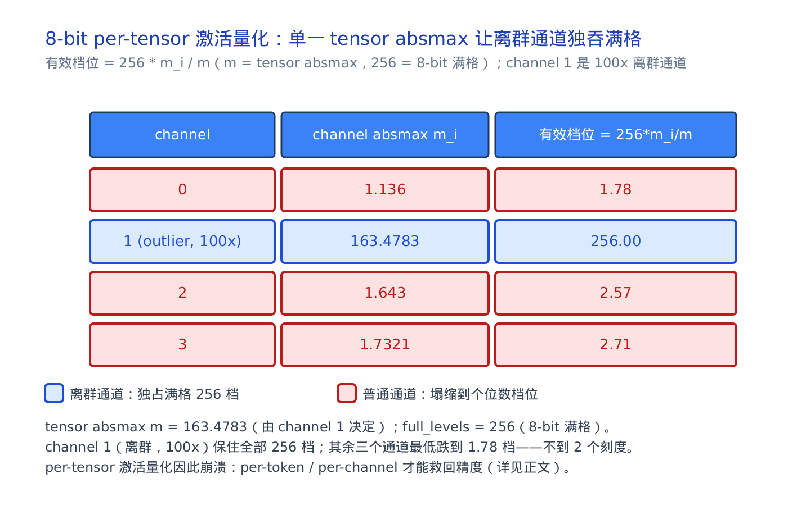
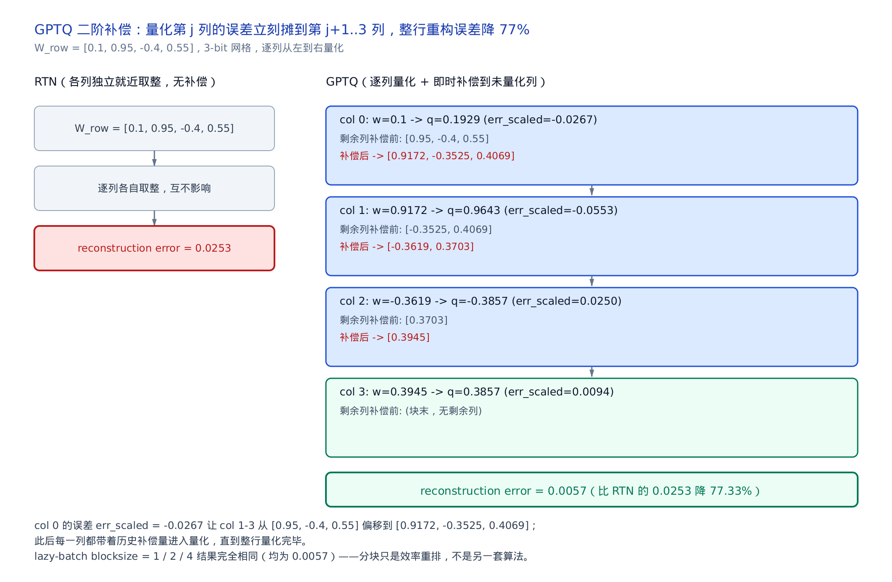
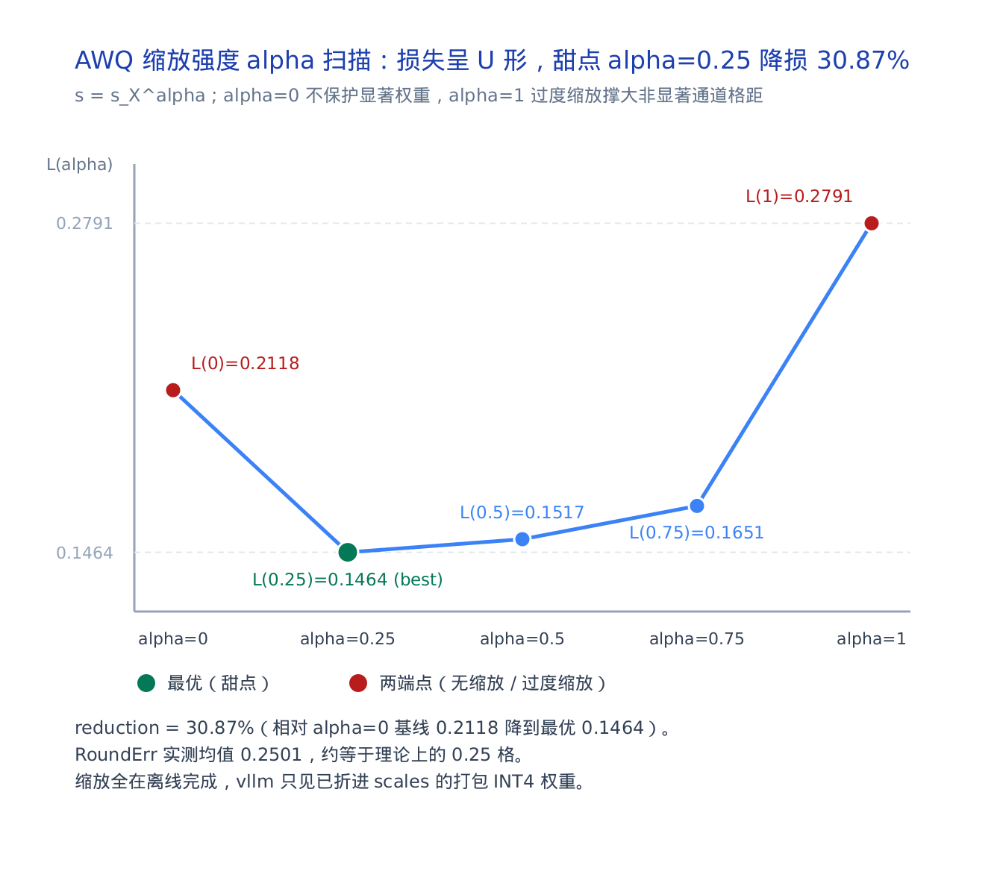
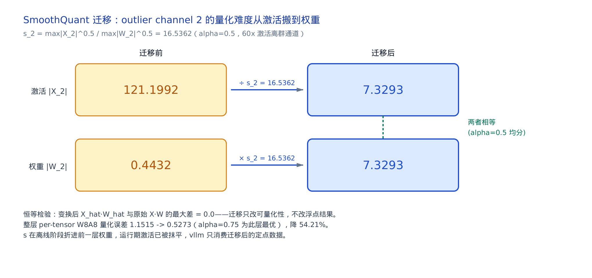
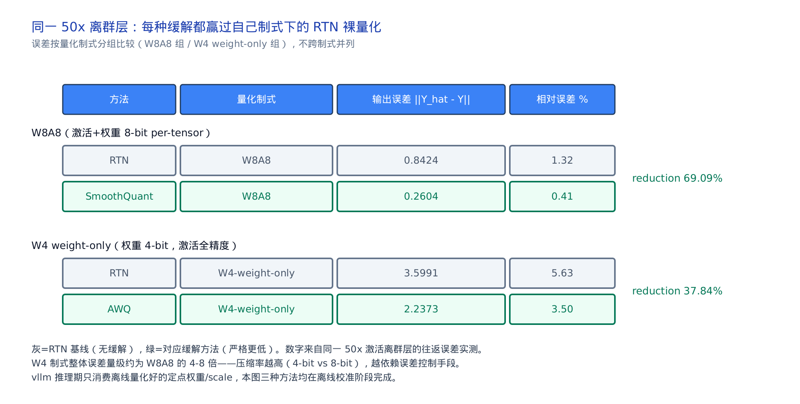
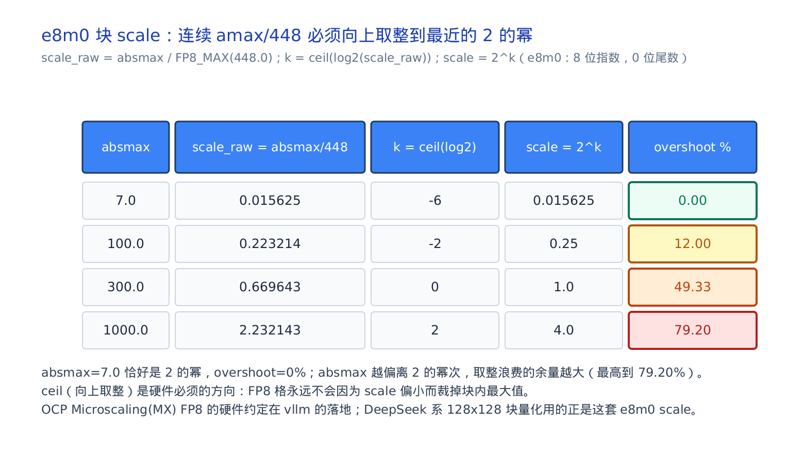

# 量化数学：从 scale/zero-point 到 GPTQ / AWQ / SmoothQuant

## 你在这里



*图 0：从请求进入引擎，到 EngineCore 循环里真正执行的模型定义层。本章往下钻一层，看权重被压成 INT4/FP8 之后，那把「尺子」是怎么造出来的。*

上一章我们站在注意力后端这头，看 kernel 怎么照 `block_table` 读写 KV；这一章把镜头移到模型定义层脚下。前面几章，模型的每个 Linear（线性层）都假设权重是老老实实的 BF16（16 位脑浮点）。真实部署里几乎从不这样：显存装不下、带宽喂不饱，于是权重被压成 4 位或 8 位整数、激活被压成 8 位浮点。这就是**量化**（quantization，把连续实数映射到有限个整数/低精度格点）。

这一章不引入新的 vllm 子系统，而是把模型定义层脚下那块**量化底座**讲透：先推清均匀量化的 scale（缩放因子）与 zero-point（零点），再读三篇奠基论文——GPTQ、AWQ、SmoothQuant——各自用什么数学把「压缩带来的误差」摁住，最后回到 vllm 真实的量化调用面，看这些离线算好的东西是怎么被推理期消费的。下一站，我们会带着这套底座去读 DeepSeek 系模型的 FP8 块量化装配。

读完你应能：手推一次量化-反量化往返、说清三种误差控制法的分工、并在 vllm 源码里指出「离线算 scale、运行期只消费」这条分界线。



只想看 AWQ 怎么把显著权重护住、怎么落进 vllm 的调用面，可以跳过「四、GPTQ」「六、SmoothQuant」两节，直接从「二、均匀（仿射）量化」读到「五、AWQ」，再接「八、落地」；想跟全程，就按序读到底。

---

## 一、动机：省在哪，险在哪

先算一笔账。一个 70B（700 亿参数）模型，BF16 权重要 140 GB；压成 INT8（8 位整数）砍一半到 70 GB，压成 INT4（4 位整数）再砍一半到 35 GB。推理是**带宽瓶颈**的：每生成一个 token，都要把全部权重从显存搬进计算单元一遍——矩阵乘本身的算力其实常常吃不饱，真正卡脖子的是这趟显存搬运。权重小一半，搬运就快一倍。这就是量化的甜头。

甜头之外还有第二种量化：不只压权重，连**激活**（activation，层与层之间流动的中间张量）也压成 8 位——**W8A8**（权重 8 位、激活 8 位）。这样连矩阵乘本身都能跑在整数或 FP8（8 位浮点）的张量核上，算得更快、更省。FP8 又分两种排布：**e4m3**（4 位指数、3 位尾数，动态范围小但精度高，用来存数值本身）和 **e8m0**（8 位指数、0 位尾数，纯指数，用来存缩放因子）——后面 §六会看到 e8m0 的妙用。

险在哪？**离群值**（outlier，个别数值比同伴大出一两个数量级）。量化的本质是「用一把刻度有限的尺子去量一堆数」。尺子的量程必须罩住最大的那个数；一旦有个离群值把量程撑爆，其余正常数值就被挤到尺子最底下几格，精度全丢。激活里的离群值尤其凶——某些通道天生比别人大 50~100 倍。

所以这一章其实在回答一个问题：**当尺子刻度不够用时，怎么把误差摁到最小？** 三篇论文给了三种答案，但它们共用同一个底座。后文会反复拿 **RTN**（round-to-nearest，就近取整、不做任何误差补偿的「裸量化」）当基线，去对标这三种缓解方法。先把底座推清楚。

---

## 二、均匀（仿射）量化：scale 与 zero-point

### 直觉：一把只有 16 个刻度的尺子

把一段连续的实数刻度塞进有限的整数格子里，就像用一把只有 16 个刻度的尺子量身高：先决定「一格代表多少」（这就是 scale），再决定「零点画在第几格」（这就是 zero-point）。对称量化把零点钉死在正中；非对称量化允许零点平移，好让尺子的全部刻度都压在数据真正出现的区间上、一格都不浪费。

### 机制：两条公式与一个误差上界

均匀量化的底座就两步。量化把实数 $w$ 映到整数码 $q$，反量化再映回近似值 $\hat{w}$：

$$
q = \mathrm{clamp}\!\left(\mathrm{round}(w/s) + z,\; q_{\min},\; q_{\max}\right),\qquad \hat{w} = (q - z)\cdot s
$$

这里 $s$ 是 scale、$z$ 是 zero-point，而 $q_{\min}$、$q_{\max}$ 是码点上下界，由位宽 $N$ 定死：$N$ 位无符号量化时取 0 与 $2^N-1$（如 4-bit 即 0 到 15），有符号量化时取 $-2^{N-1}$ 与 $2^{N-1}-1$。AWQ 论文（arXiv:2306.00978）§3.2 Eq.1 给的是最精简的对称版本，用组内绝对最大值 $\max(|w|)$ 定 scale：

$$
Q(w) = \Delta \cdot \mathrm{round}(w/\Delta),\qquad \Delta = \frac{\max(|w|)}{2^{N-1}}
$$

$N$ 是位宽。对称与非对称的区别，全在 $s$ 和 $z$ 怎么定：

$$
\underbrace{s = \frac{\max(|w|)}{q_{\max}},\ z=0}_{\mathrm{sym}}
\qquad\qquad
\underbrace{s = \frac{\max(w)-\min(w)}{q_{\max}},\ z=\mathrm{round}\!\left(\frac{|\min(w)|}{s}\right)}_{\mathrm{asym}}
$$

对称省一个 zero-point 张量和一次加法，适合分布本就对称的权重；非对称让零点平移，把尺子全部刻度压到 $[\min, \max]$ 这段数据真正出现的区间，适合有偏置的分布（如激活）。

无论哪种，都有一个漂亮的**误差上界**（这正是 AWQ §3.2 里 RoundErr 分析的出发点）：

$$
|w - \hat{w}| \le \tfrac{1}{2}\,s
$$

论证很短：`round` 到最近整数，商与它的取整值之差天然不超过 $0.5$；两边乘 $s$ 即得。zero-point 是精确整数偏移，量化时加、反量化时减，完全抵消、不引入额外误差。所以「量得准不准」只取决于 scale 有多小——而 scale 又被量程逼着不能太小。这就是全部张力。

### 数值推演：非对称 4-bit 把 16 格铺满

拿一个 6 元素的权重向量 $w$，取值为 −1.0、−0.32、0.24、0.68、1.36、2.0，做 4-bit 非对称量化到整数格 [0, 15]。scale $=(2.0-(-1.0))/15=0.2$，zero-point $=\mathrm{round}(1.0/0.2)=5$。逐元素往返：

<!-- trace: m1-uniform-affine-quant -->

| 权重 w | w / scale | round() | code = round+zp, clamp[0,15] | 反量化 ŵ = (code−zp)·scale | \|w − ŵ\| |
|---|---|---|---|---|---|
| -1.0 | -5.0 | -5 | 0 | -1.0 | 0.0 |
| -0.32 | -1.6 | -2 | 3 | -0.4 | 0.08 |
| 0.24 | 1.2 | 1 | 6 | 0.2 | 0.04 |
| 0.68 | 3.4 | 3 | 8 | 0.6 | 0.08 |
| 1.36 | 6.8 | 7 | 12 | 1.4 | 0.04 |
| 2.0 | 10.0 | 10 | 15 | 2.0 | 0.0 |

两个端点 $-1.0$ 与 $2.0$ 恰好落到格子 0 与 15，全部 16 格都用上；最大误差 $0.08$，正好卡在半格 $s/2=0.1$ 以内，验证了上界。作为对照，同一向量的**对称**量化 scale$=0.2857$、最大误差 $0.1429$——比非对称大了约 79%。差距全来自对称把一半刻度浪费在数据根本没出现的负半轴上。



*图 1：非对称量化用 scale+zero-point 把 [−1.0, 2.0] 铺满 16 格。绿=零误差端点，红/黄=中间的舍入误差，全在半格 0.1 内。对称量化对同一向量误差 0.1429，因半数刻度落空而更差。*

### 源码：vllm 的参考量化算子

这套数学在 vllm 里有一段直接对应的实现，量化实验里用它算参考值。它先按 zero_points 分支决定对称还是非对称：

```python
# vllm/model_executor/layers/quantization/utils/quant_utils.py:L586-L613
    # Compute scale for each group
    max_val = torch.max(w, 0, keepdim=True).values
    min_val = torch.min(w, 0, keepdim=True).values

    max_q_val = quant_type.max()
    min_q_val = quant_type.min()

    w_s = torch.Tensor([1.0]).to(w.device)  # unscaled case
    maybe_w_zp = None
    if group_size is not None:
        if zero_points:
            assert not quant_type.is_signed() and quant_type.max() > 0
            w_s = (max_val - min_val).clamp(min=1e-5) / quant_type.max()
            maybe_w_zp = (
                torch.round(torch.abs(min_val / w_s)).clamp(min_q_val, max_q_val).int()
            )
        else:
            # If the bias is such that there are no possible negative/positive
            #  values, set the max value to inf to avoid divide by 0
            w_s = torch.max(
                abs(max_val / (max_q_val if max_q_val != 0 else torch.inf)),
                abs(min_val / (min_q_val if min_q_val != 0 else torch.inf)),
            )

    # Quantize
    w_q = torch.round(w / w_s).int() + (maybe_w_zp if zero_points else 0)
    w_q = torch.clamp(w_q, min_q_val, max_q_val)
```

非对称分支 `w_s = (max_val - min_val) / quant_type.max()`、`maybe_w_zp = round(|min|/w_s)` 一字不差就是上面的非对称公式。值得留意一个细节：vllm 的**对称**分支用的是 `max(|max|/qmax, |min|/qmin)`，分母上没有减 1，和 AWQ Eq.1 的 $2^{N-1}$、SmoothQuant 的 $2^{N-1}-1$ 各不相同——三篇论文和框架实现各有一套「留几个码点」的约定，读源码时别想当然地把它们当成同一个公式。最后 `torch.round → 加 zp → torch.clamp` 三步，正是量化的机械动作。

反量化在紧接着的几行，把码值减回 zero-point、乘回 scale：

```python
# vllm/model_executor/layers/quantization/utils/quant_utils.py:L614-L621
    # Compute ref (dequantized)
    # … 省略：某些 kernel 把 zero-point 后置于 scale 的注释分支说明 …
    if ref_zero_points_after_scales and maybe_w_zp is not None:
        w_ref = w_q.to(orig_type) * w_s - maybe_w_zp.to(orig_type) * w_s
    else:
        w_ref = (w_q - (maybe_w_zp if zero_points else 0)).to(orig_type) * w_s
```

`w_ref` 就是 $\hat{w}=(q-z)\cdot s$。把它和原始 $w$ 相减，就得到每个元素的量化误差——这正是 §五里给三种方法同台称重时用的那把秤。

---

## 三、量化粒度：一把尺子量所有，还是各量各的

### 直觉：谁跟谁共享一把尺子

上面每组权重共享一个 scale。「一组」有多大，就是**粒度**（granularity）：

- **per-tensor**：整张张量一个 scale，最省，但最怕离群值。
- **per-token**：激活按行（每个 token）一个 scale。
- **per-channel**：权重按列（每个输出通道）一个 scale。
- **per-group**：更细，组内独立 scale（如每 128 个元素一组）。

粒度越细，离群值的「污染半径」越小，但存的 scale 越多、GEMM（general matrix multiply，通用矩阵乘）越难融合。

### 机制：per-tensor 为什么会崩

量化的有效档位 $= 256 \cdot m_i / m$（8-bit 满格 256），其中 $m_i$ 是某通道的绝对最大值、$m$ 是整张张量的绝对最大值。只要有一个通道 $m_i$ 逼近 $m$（它就是离群通道），其余通道的有效档位就被压到个位数。拿一个 4 通道、其中一个通道被放大 100 倍的例子：张量绝对最大值 $m=163.4783$ 完全由那个离群通道决定，于是它独占全部 256 档，而三个普通通道最低跌到 **1.78 档**——不到两个刻度，几乎全丢。



*图 2：8-bit per-tensor 量化，离群通道保住 256 档，普通通道塌缩到 1.78 档。per-token/per-channel 给每条尺子独立 scale 才能救回精度。*

SmoothQuant 论文（arXiv:2211.10438）§2/Fig.3/Table 1 把这件事讲得很清楚：激活的离群值让 per-tensor 崩溃；per-channel 激活量化精度好，**却无法融进 INT8 GEMM**——因为缩放发生在矩阵乘的内维（收缩维），张量核没法在累加时逐通道缩放。这就是两难：想要精度得 per-channel，想要速度得 per-tensor。§四的 AWQ 和 §五的 SmoothQuant，本质都是在化解这个两难。

### 源码：group_size 就是粒度旋钮

vllm 的量化算子用 `group_size` 一个参数统一表达所有粒度。看它在量化前怎么把权重重排成组：

```python
# vllm/model_executor/layers/quantization/utils/quant_utils.py:L577-L584
    if group_size == -1:
        group_size = size_k

    # Reshape to [groupsize, -1]
    if group_size is not None and group_size < size_k:
        w = w.reshape((-1, group_size, size_n))
        w = w.permute(1, 0, 2)
        w = w.reshape((group_size, -1))
```

`group_size == -1` 表示 per-channel（每列一个 scale，`group_size = size_k` 把整列当一组）；给定具体值（如 128）则是 per-group，reshape 后每组独立算 scale。上一节 §二 里 `torch.max(w, 0)` 沿的正是这个重排后的组维。粒度就是这么一个旋钮的事。

---

## 四、GPTQ：会「找补」的二阶补偿

### 直觉：推歪一件，立刻微调其余

普通量化像挨个把家具推到最近的格线上，推歪了就算了。GPTQ（arXiv:2210.17323）像一个会**找补**的搬运工：每把一件家具推到格线（不可避免地推歪一点），立刻用二阶信息算出这点歪会怎样连累输出，然后微调所有**还没摆放**的家具去抵消它。等轮到那些家具时，它们已经预先偏移好了。

### 机制：Hessian、逐权重补偿、lazy batch

「二阶信息」是层输出误差对权重的 Hessian（海森矩阵，二阶偏导构成的矩阵）。它衡量的是「动一动某个权重，会怎样搅动这一层的输出」；关键在于它只依赖层输入 $X$、与权重取值无关，因此可以在校准阶段离线一次算好、全程复用：

$$
H_F = 2\,X_F X_F^{\top}
$$

GPTQ 继承自 OBQ（Optimal Brain Quantization，最优脑量化）。GPTQ §3 Eq.2 给出「量化哪个权重、以及量化后怎么补偿其余」的规则：

$$
w_q = \arg\min_{w_q}\frac{\big(\mathrm{quant}(w_q)-w_q\big)^2}{[H_F^{-1}]_{qq}},
\qquad
\delta_F = -\,\frac{w_q-\mathrm{quant}(w_q)}{[H_F^{-1}]_{qq}}\,\big(H_F^{-1}\big)_{:,q}
$$

$\delta_F$ 是对**所有未量化权重**的一次更新，把刚产生的量化误差投影到未量化子空间去抵消输出扰动。OBQ 逐权重贪心太慢，175B 模型跑不动。GPTQ 的三步优化——固定全行同序 + lazy batch（惰性批更新，$B=128$）+ Cholesky 稳定化（对 $H_F^{-1}$ 做 Cholesky 分解再取上三角部分参与递推，避免直接求逆在迭代多轮后累积数值误差、乃至矩阵不再正定）——把复杂度大幅压下来（GPTQ §4）：

$$
O\big(d_{\mathrm{row}}\cdot d_{\mathrm{col}}^3\big)\ \longrightarrow\ O\big(\max\{d_{\mathrm{row}}\cdot d_{\mathrm{col}}^2,\ d_{\mathrm{col}}^3\}\big)
$$

约提速 min(d_row, d_col) 倍，175B 模型只需约 4 GPU·小时。§4 Algorithm 1 的主循环长这样：

```text
for i = 0, B, 2B, ...:                       # 按块推进
  for j = i .. i+B-1:                         # 块内逐列
    Q[:,j]   = quant(W[:,j])
    E[:,j-i] = (W[:,j] − Q[:,j]) / [H⁻¹]_jj
    W[:, j:i+B] −= E[:,j-i] · H⁻¹[j, j:i+B]   # 块内即时补偿
  W[:, i+B:] −= E · H⁻¹[i:i+B, i+B:]           # 块末一次性补偿块外剩余列
```

块内逐列量化并即时补偿，块末再把累计误差一次性传播给块外——这就是 lazy batch，纯粹为提升 GPU 利用率，不改变数学结果。

### 数值推演：一行权重的找补过程

拿一行 4 元素权重 $[0.1, 0.95, -0.4, 0.55]$、3-bit 网格，逐列从左到右量化并补偿。对照上面 Algorithm 1：这里整行就是一个块，每量化一列（对应内层循环的即时补偿）就把误差摊给块内**右侧尚未量化**的列；末列量化完块内已无剩余列，所以看不到跨块的块末补偿。

<!-- trace: m3-gptq-second-order -->

| 列 j | w_j (进入时值) | 量化 q_j | 误差 e_j=(w−q)/[Ĥ⁻¹]_jj | 块内剩余列：补偿前 → 补偿后 |
|---|---|---|---|---|
| 0 | 0.1 | 0.1929 | -0.0267 | [0.95, -0.4, 0.55] → [0.9172, -0.3525, 0.4069] |
| 1 | 0.9172 | 0.9643 | -0.0553 | [-0.3525, 0.4069] → [-0.3619, 0.3703] |
| 2 | -0.3619 | -0.3857 | 0.025 | [0.3703] → [0.3945] |
| 3 | 0.3945 | 0.3857 | 0.0094 | (块末，无剩余列) |

看第 0 列：量化产生误差 $-0.0267$ 后，后续三列被就地更新——由 [0.95, −0.4, 0.55] 变成 [0.9172, −0.3525, 0.4069]——去抵消它；轮到第 1 列时，它已经带着补偿量 $0.9172$ 进入量化。整行做完，GPTQ 的重构误差 $0.0057$，而朴素 **RTN**（round-to-nearest，就近取整、不补偿）是 $0.0253$——降低 77.33%。更妙的是 blocksize 取 1/2/4 得到完全相同的 $0.0057$，印证了 Eq.4-5 只是效率重排、不是另一套算法（这也是它「每列恰好量化一次、$d_{\mathrm{col}}$ 步内终止」的不变量的推论）。



*图 3：左 RTN 各列独立取整（0.0253），右 GPTQ 逐列量化即时补偿（0.0057，−77%）。blocksize 1/2/4 结果完全相同——lazy batch 是效率重排。*

### 源码：vllm 只消费离线产物

上面那套 Hessian 补偿是**离线校准**（由 autogptq 之类的工具在部署前跑一次），vllm 推理期见到的只是它的输出：打包好的 INT 权重网格。看 GPTQ 线性层的前向：

```python
# vllm/model_executor/layers/quantization/gptq.py:L376-L399
    def apply(
        self,
        layer: torch.nn.Module,
        x: torch.Tensor,
        bias: torch.Tensor | None = None,
    ) -> torch.Tensor:
        out_shape = x.shape[:-1] + (layer.qweight.shape[-1],)
        reshaped_x = x.reshape(-1, x.shape[-1])

        # GPTQ v1 and v2 format checkpoints deals with zero points differently,
        # and require different gemm kernels.
        output = ops.gptq_gemm(
            reshaped_x,
            layer.qweight,
            layer.qzeros,
            layer.scales,
            layer.g_idx,
            layer.exllama_state == ExllamaState.READY,
            self.use_v2_format,
            self.quant_config.weight_bits,
        )
        if bias is not None:
            output.add_(bias)
        return output.reshape(out_shape)
```

权重以 `qweight`（打包 INT）+ per-group `scales` + `qzeros`（零点）+ `g_idx`（act_order 分组索引，记录列的重排顺序）装载，推理期由 `ops.gptq_gemm` 融合反量化并矩乘；`exllama_state == ExllamaState.READY` 这一位是否就绪的门控——就绪就走 ExLlama 提供的融合反量化+矩乘 kernel，否则退回通用路径。二阶补偿早已折进这些张量的数值里——vllm 一行 Hessian 都不用算。同一份均匀网格在 `quant_utils.py:L655-L686` 的 `gptq_quantize_weights` 里被复用，只是多了 act_order 的行置换。

---

## 五、AWQ：给显著权重戴放大镜

### 直觉：不是所有权重同等重要

乘上大激活的那些权重（**显著**权重）一旦量化歪了，对输出的伤害会被激活放大。AWQ（Activation-aware Weight Quantization，激活感知权重量化，arXiv:2306.00978）的做法像给重要选手戴放大镜——量化前把显著权重乘一个 $s>1$（对应激活除以 $s$，数学上完全抵消），于是它在量化格子里占的相对位置更精细、舍入误差被摊薄。但 $s$ 太大又会撑大整组的格距连累其他人，所以有个甜点。

### 机制：误差比与 α 搜索

对显著权重通道乘 $s$、激活反向除以 $s$，在输出里精确相消（AWQ §3.2 Eq.2）：

$$
Q(w\cdot s)\cdot\frac{x}{s} = \Delta'\cdot\mathrm{round}\!\left(\frac{ws}{\Delta'}\right)\cdot x\cdot\frac{1}{s}
$$

关键洞察：`round` 的平均误差恒为约 $0.25$ 格（RoundErr$\approx 0.25$，与缩放无关）。单个元素乘 $s$ 几乎不改变整组的 $\max$，故新格距 $\Delta'\approx\Delta$，于是显著权重的**相对**量化误差按 $(\Delta'/\Delta)\cdot(1/s)<1$ 缩小。但 $s$ 若太大，会把非显著通道的 $\Delta'$ 撑大，反而更差——所以最优 $s$ 有限（论文 OPT-6.7B 约在 2）。怎么选 $s$？AWQ §3.2 Eq.5 用激活幅度定缩放，只留一个超参 $\alpha$ 做网格搜：

$$
s = s_X^{\alpha},\qquad
\alpha^\star = \arg\min_{\alpha}\ \big\| Q\big(W\,\mathrm{diag}(s)\big)\big(\mathrm{diag}(s)^{-1}X\big) - WX \big\|
$$

$s_X$ 是一个向量，第 $j$ 分量为第 $j$ 个输入通道在校准集全部样本上取平均得到的激活幅度（不是单样本、也不是取 max）；$\alpha=0$ 不缩放，$\alpha=1$ 最激进。「激活感知」四个字就体现在用 $s_X$ 定缩放。

### 数值推演：损失随 α 的 U 形曲线

4 输入通道、显著通道激活放大 12 倍，让 $\alpha$ 取 0、0.25、0.5、0.75、1 五档，逐一扫层输出重构损失：

<!-- trace: m4-awq-activation-aware-scaling -->

| α（迁移强度，s=s_X^α） | 层输出重构损失 L(s_X^α) = ‖Q(W·diag(s))·(diag(s)⁻¹X) − WX‖ |
|---|---|
| 0.0 | 0.2118 |
| 0.25 | 0.1464 |
| 0.5 | 0.1517 |
| 0.75 | 0.1651 |
| 1.0 | 0.2791 |

两端都差、中间好：$\alpha=0$（不缩放、显著权重无保护）损失 $0.2118$；$\alpha=1$（全量缩放、撑大非显著通道格距）反而最差 $0.2791$；甜点在 $\alpha=0.25$，损失 $0.1464$，比不缩放降 30.87%。这不是断言，是网格上「两端点严格大于内部」的实测不等式——由 $L$ 对 $\alpha$ 连续，极小点必落在开区间 $(0,1)$ 内。附带一提，参考实现里 RoundErr 实测均值 $0.2501$，几乎正好等于理论上的 $0.25$ 格，印证了误差比推导的前提。



*图 4：损失-α 曲线呈 U 形。α=0 不保护、α=1 过度缩放，甜点 α=0.25 降损 31%。缩放全在离线完成，vllm 只见已折进 scales 的打包 INT4 权重。*

### 源码：缩放已离线折进 scales

和 GPTQ 一样，AWQ 的 $\alpha$ 搜索是离线的。vllm 侧只见打包权重和已经吸收了缩放的 scales：

```python
# vllm/model_executor/layers/quantization/awq.py:L262-L286
    def apply(
        self,
        layer: torch.nn.Module,
        x: torch.Tensor,
        bias: torch.Tensor | None = None,
    ) -> torch.Tensor:
        qweight = layer.qweight
        scales = layer.scales
        qzeros = layer.qzeros
        pack_factor = self.quant_config.pack_factor
        out_shape = x.shape[:-1] + (qweight.shape[-1] * pack_factor,)
        reshaped_x = x.reshape(-1, x.shape[-1])

        # num_tokens >= threshold
        FP16_MATMUL_HEURISTIC_CONDITION = x.shape[:-1].numel() >= 256
        # Batch invariant mode requires torch.matmul path
        # for Triton override
        if FP16_MATMUL_HEURISTIC_CONDITION or envs.VLLM_BATCH_INVARIANT:
            out = ops.awq_dequantize(qweight, scales, qzeros, 0, 0, 0)
            out = torch.matmul(reshaped_x, out)
        else:
            out = ops.awq_gemm(reshaped_x, qweight, scales, qzeros, pack_factor)
        if bias is not None:
            out.add_(bias)
        return out.reshape(out_shape)
```

激活感知缩放 $s$ 早已在离线量化时折进 `scales` 和权重，`apply` 里看不到一丝 $\alpha$ 搜索的痕迹。大 batch（token 数 $\ge 256$）走 `awq_dequantize` 再 `matmul`，小 batch 走融合的 `awq_gemm`。AWQ 与 GPTQ 同属 weight-only INT4，区别只在 scale 的来历：一个来自激活感知缩放，一个来自二阶补偿。要留意：这两者都只把**权重**离线压成 INT4，运行期激活仍是全精度浮点（AWQ 里那个 $\mathrm{diag}(s)^{-1}X$ 也从不真被量化）；把激活也压到 8 位、让矩阵乘直接跑在低精度张量核上的 W8A8，是下一节 SmoothQuant 才处理的制式。

---

## 六、SmoothQuant：把难度从激活搬到权重

### 直觉：难度守恒，但可以搬家

激活里常有几个「大嗓门」通道（离群值），一把 per-tensor 尺子被它们撑爆、其他通道没了精度。SmoothQuant（arXiv:2211.10438）不删嗓门，而是把难度**搬家**：给这些通道的激活除以 $s$、对应权重乘以 $s$（矩阵乘里两者相消，输出分毫不变），于是激活被抹平、权重稍微变陡——权重本来分布规整、扛得住。难度守恒，但被均分到激活和权重两边。

### 机制：迁移是精确恒等

SmoothQuant §4 Eq.3 的核心是一个恒等变换：

$$
Y = \big(X\,\mathrm{diag}(s)^{-1}\big)\,\big(\mathrm{diag}(s)\,W\big) = \hat{X}\hat{W}
$$

因为对任意正 $s$，逆对角阵乘回自己就是单位阵，所以 $\hat{X}\hat{W}=XW$——**只改可量化性，绝不改浮点结果**。搬多少由 §4 Eq.4 的平滑因子 $s_j$ 控制，$\alpha$ 是迁移强度：

$$
s_j = \frac{\max(|X_j|)^{\alpha}}{\max(|W_j|)^{1-\alpha}},\qquad j = 1,\dots,C_i
$$

$\alpha=0.5$ 时，迁移后激活与权重的通道 $\max$ 恰好相等（难度均分）；离群更重的层要把更多难度搬到权重侧，$\alpha$ 取大些。

### 数值推演：一个 60x 离群通道的搬家

6 token、4 输入通道、通道 2 是 60 倍激活离群通道，$\alpha=0.5$：

<!-- trace: m5-smoothquant-migration -->

| 输入通道 j | s_j = max\|X_j\|^α/max\|W_j\|^{1−α} | max\|X_j\| 迁移前 | 迁移后 | max\|W_j\| 迁移前 | 迁移后 |
|---|---|---|---|---|---|
| 0 | 1.4524 | 2.0409 | 1.4052 | 0.9675 | 1.4052 |
| 1 | 2.575 | 3.323 | 1.2905 | 0.5012 | 1.2905 |
| 2 | 16.5362 | 121.1992 | 7.3293 | 0.4432 | 7.3293 |
| 3 | 1.3018 | 0.5678 | 0.4362 | 0.3351 | 0.4362 |

看通道 2：迁移把激活绝对最大值从 $121.1992$ 压到 $7.3293$（除以 $s_2=16.5362$），权重从 $0.4432$ 抬到 $7.3293$（乘 $s_2$）——迁移后两者恰好相等，这就是 $\alpha=0.5$「均分」的含义。恒等性也验证了：参考实现里 $\hat{X}\hat{W}$ 与 $XW$ 的最大差为 $0.0$，逐元素不变。整层 per-tensor W8A8 量化误差从 $1.1515$ 降到最优 $0.5273$（此重离群层最优 $\alpha=0.75$，与论文 GLM-130B 取 $0.75$ 一致），减 54.21%。



*图 5：60x 离群通道经迁移（s=16.54），激活 absmax 121.2→7.33、权重 absmax 0.44→7.33，两侧对齐。变换是精确恒等（最大差 0.0），却把 per-tensor W8A8 误差降 54%。*

### 源码：运行期激活已被抹平

SmoothQuant 的 $s$ 在离线阶段折进前一层（LayerNorm 或 Linear），运行期激活抵达量化器时已经被抹平。vllm 的浮点分组量化器只做一件老实事——沿组维取 amax（绝对最大值）定 scale：

```python
# vllm/model_executor/layers/quantization/utils/quant_utils.py:L322-L338
    # Compute scales
    min_val, max_val = x_blkd_permd.aminmax(dim=-1)
    amax = torch.maximum(min_val.abs(), max_val.abs()).clamp(min=1e-12)
    _, fp8_max = get_fp8_min_max()
    scale = fp8_max / amax

    # Apply scale and convert from:
    # (BLK_M, BLK_N, BLOCK_SIZE_M * BLOCK_SIZE_N) to (M, N)
    x_scl_sat = (
        (x_blkd_permd * scale.unsqueeze(-1))
        .clamp(min=finfo.min, max=finfo.max)
        .reshape(blk_m, blk_n, group_shape[0], group_shape[1])
        .permute(0, 2, 1, 3)
        .reshape(x.shape)
    )

    return x_scl_sat.to(quant_dtype).contiguous(), scale.float().reciprocal()
```

`scale = fp8_max / amax` 与 §二的对称思想一脉相承，只是值域是 FP8 而非整型格点：把每组的 amax 映到 FP8 的最大可表示值，再 clamp、转 `quant_dtype`，返回倒数 scale 供反量化。SmoothQuant 帮它做的，就是让这里的 `amax` 别再被离群值撑爆。

---

## 七、三法同台：把误差放到一台秤上

### 直觉：三种哲学，一台秤

同一个「难量化」的离群层，三种误差控制哲学各显神通：RTN 直接就近取整（认命）、AWQ 保护显著权重（挑重点选手戴放大镜）、SmoothQuant 把激活难度迁到权重（难度搬家）。把它们放到同一台秤上称「量化-反量化往返后，层输出偏了多少」。

### 机制：同制式内才能公平称重

称重前先固定一件事：**跟谁比**。量化制式本身就决定了误差的量级——W8A8（激活、权重都压 8-bit）和 W4 weight-only（权重 4-bit、激活保持全精度）压缩率相差悬殊，误差量级天然差 4~8 倍，把二者的绝对误差并排放会得出荒唐结论。所以公平的做法是让每种缓解只跟**自己制式下**的 RTN 裸跑对比：SmoothQuant 摆进 W8A8、AWQ 摆进 W4，各自成对。这样每一对里唯一的变量就是「有没有缓解」，而缓解之所以生效，是因为它在量化前重塑了 absmax 分布（SmoothQuant 抹平激活离群、AWQ 保护显著权重），让共享 scale 少浪费档位在离群值上——这就是下面那组成对不等式必然成立的机理。

### 数值推演：每种缓解都赢过自己制式的 RTN

同一个 50 倍激活离群层，两条制式各自成对比较：

<!-- trace: m6-dequant-error-worked-example -->

| 方法 | 量化制式 | 输出误差 ‖Ŷ−Y‖ | 相对误差 % | 机制 |
|---|---|---|---|---|
| RTN | W8A8 | 0.8424 | 1.32 | 无缓解 |
| SmoothQuant | W8A8 | 0.2604 | 0.41 | 离线迁移难度到权重 |
| RTN | W4-weight-only | 3.5991 | 5.63 | 无缓解 |
| AWQ | W4-weight-only | 2.2373 | 3.5 | 激活感知缩放 |

W8A8 制式（激活+权重 8-bit per-tensor）：SmoothQuant $0.2604$ 完胜 RTN $0.8424$，降 69.09%。W4 weight-only 制式（权重 4-bit、激活全精度）：AWQ $2.2373$ 完胜 RTN $3.5991$，降 37.84%。两条制式误差量级差 4~8 倍（W4 压缩率更高、误差也更大），所以**分制式内比较，不跨制式并列**——正是上一小节说的机理落到了实测数字上：两组都是成对不等式，每种缓解都严格赢过它同制式的裸量化。



*图 6：灰=RTN 基线，绿=对应缓解。W8A8 下 SmoothQuant 0.2604 vs 0.8424（−69%），W4 下 AWQ 2.2373 vs 3.5991（−38%）。误差按制式分组，每种缓解都赢过自己制式的裸量化。*

这台秤本身，就是 §二那两行 `w_ref` 反量化外加一次输出重构——参考实现让你能在主机上亲手复算论文的每个数字。三种算法的昂贵校准（Hessian、$\alpha$ 网格搜、迁移因子）全在离线完成，vllm 推理期只消费定点权重和 scale。这条「离线算、运行期消费」的分界线，正是下一节落地面的主题。

---

## 八、落地：vllm 量化子系统的调用面

### 统一插座：quant_config → quant_method.apply

模型定义层不关心权重是 GPTQ 的打包 INT、AWQ 的缩放 INT4、还是 FP8——它只对着一个统一插座 `quant_method.apply(layer, x, bias)` 说话。这个抽象在 vllm 里是一个基类方法：

```python
# vllm/model_executor/layers/quantization/base_config.py:L36-L41
    @abstractmethod
    def apply(self, layer: torch.nn.Module, *args, **kwargs) -> torch.Tensor:
        """Apply the weights in layer to the input tensor.

        Expects create_weights to have been called before on the layer."""
        raise NotImplementedError
```

`QuantizeMethodBase.apply`（所有量化方法的抽象前向）就是前面 GPTQ、AWQ、FP8 各自 `apply` 的共同契约。至于「插进来的是哪种方法」，由检查点里的 `quantization_config`（量化配置元数据）决定，经 `get_quant_method` 按层分发：

```python
# vllm/model_executor/layers/quantization/base_config.py:L150-L163
    @abstractmethod
    def get_quant_method(
        self, layer: torch.nn.Module, prefix: str
    ) -> QuantizeMethodBase | None:
        """Get the quantize method to use for the quantized layer.

        Args:
            layer: The layer for the quant method.
            prefix: The full name of the layer in the state dict
        Returns:
            The quantize method. None if the given layer doesn't support quant
            method.
        """
        raise NotImplementedError
```

`prefix`（层在 state dict——PyTorch 模型的「层名 → 张量」状态字典——里的全限定名）让配置能对不同层用不同方法（比如某些层跳过量化）。正是这套按名分发的机制，让同一个模型里可以混搭多种量化格式。整条装配链是：解析检查点的 `quantization_config` → `get_quant_method(layer, prefix)` 分发出 `QuantizeMethodBase` → `create_weights` 注册权重占位 → 前向调 `apply`。加一种新量化格式，不用改一行模型代码——这正是[模型定义层的 Linear 装配](../../ch22-model-definitions/narrative/chapter.md)能对量化透明的原因。

### FP8 与 e8m0：scale 只能是 2 的幂

最后一站是 FP8 的块量化装载面。这里有个 §一埋下的伏笔要收回来：e8m0（8 位纯指数、0 位尾数）能装什么？答案是——它只能表示**2 的幂**，正好用来当块 scale。看权重 scale 的创建：

```python
# vllm/model_executor/layers/quantization/fp8.py:L358-L370
        else:
            assert not self.act_q_static
            assert self.weight_block_size is not None
            scale = create_fp8_scale_parameter(
                BlockQuantScaleParameter,
                output_partition_sizes,
                input_size_per_partition,
                self.weight_block_size,
                weight_loader,
                scale_dtype=(torch.float8_e8m0fnu if self.is_scale_e8m0 else None),
            )
            # The weight_scale_inv name is intentional for deepseekv3
            layer.register_parameter("weight_scale_inv", scale)
```

`output_partition_sizes`（该层按张量并行切分后各输出分片的大小）与块大小一起决定 scale 张量的形状。`is_scale_e8m0` 打开时，块量化（如 DeepSeek 系 128×128 块）的权重 scale 用 `float8_e8m0fnu` 承载——8 位存指数，省带宽，代价是 scale 必须落在 2 的幂上。`weight_scale_inv` 这个名字沿用 DeepSeek 检查点约定。那连续的 amax scale 怎么塞进纯指数格？激活侧的在线量化给了最干净的一行答案：

```python
# vllm/model_executor/layers/quantization/input_quant_fp8.py:L240-L248
        x_grouped = x.view(-1, num_groups, self.group_size)
        absmax = x_grouped.abs().max(dim=-1, keepdim=True)[0].float()
        scales_raw = absmax / _FP8_MAX
        if self.use_ue8m0:
            scales_raw = torch.exp2(torch.ceil(torch.log2(scales_raw)))
        scales = (scales_raw).clamp(min=_FP8_MIN_SCALING_FACTOR)

        x_scaled = x_grouped / scales
        x_quant = x_scaled.clamp(_FP8_MIN, _FP8_MAX).to(_FP8_DTYPE)
```

`use_ue8m0`（微缩放的无符号 e8m0 变体）打开时，`scales_raw = exp2(ceil(log2(absmax/FP8_MAX)))`——把连续 scale 向上取整到最近的 2 的幂。数学写出来是：

$$
s_{\mathrm{raw}} = \frac{\mathrm{absmax}}{\mathrm{FP8_{max}}},\qquad
s = 2^{\lceil \log_2 s_{\mathrm{raw}} \rceil}
$$

`FP8_MAX` 对 e4m3 是 $448.0$。取整量随 absmax 落点变化：absmax $=7.0$ 恰好落在 $2^{-6}$，overshoot 0%；absmax $=1000.0$ 则被抬到 $2^2=4.0$，overshoot 高达 79.2%。为什么一定向上取整（`ceil`）而不是就近？因为 scale 一旦偏小，FP8 格就会裁掉块内最大值——`ceil` 保证格永远罩得住 amax。这套约定即 OCP（Open Compute Project，硬件厂商联合制定开放计算规范的组织）Microscaling（MX，块级共享缩放因子的低精度格式标准）FP8 规范 §5 的块 scale 编码——上面这段 `exp2∘ceil∘log2` 代码是 vllm 对该规范的具体实现，DeepSeek 系 128×128 块量化用的正是它。



*图 7：连续 scale=absmax/448 被 exp2∘ceil∘log2 取整到 2 的幂。overshoot 从 0% 到 79% 不等，ceil 保证 FP8 格永不裁掉块内最大值。*

这块 FP8 装载面正是[DeepSeek 架构章的 W8A8/FP8 块量化装配](../../ch27-model-architecture/narrative/chapter.md)所依赖的底座——那一章会看到整个模型怎么按块把权重和 scale 铺进显存。

---

## 小结

绕了一大圈，其实全章只有 §二那两行底座公式（量化 + 反量化），和一个铁律 $|w-\hat{w}|\le s/2$。scale 越小越准，可量程逼着它不能太小——离群值一来，共享 scale 的普通元素就遭殃。三篇论文就是三种「让 scale 少浪费在离群值上」的办法：GPTQ 用二阶补偿把误差往未量化权重上摊，AWQ 给显著权重戴放大镜，SmoothQuant 把激活的难度搬去权重。三者都在离线算好，vllm 推理期只对着 `quant_method.apply` 这个统一插座消费定点权重和 scale。

带上这套底座，下一章我们去看 DeepSeek 系模型怎么把 FP8 块量化真正铺进一个几百亿参数的架构里。
