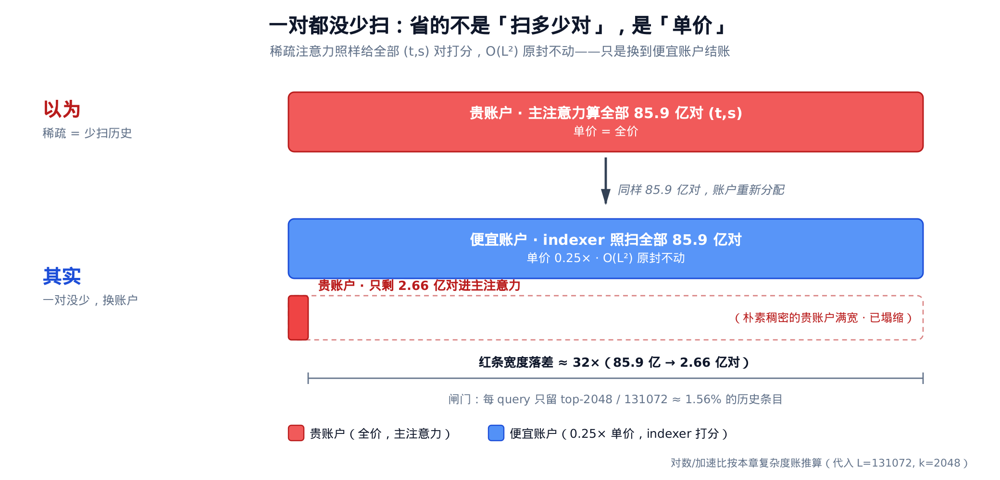
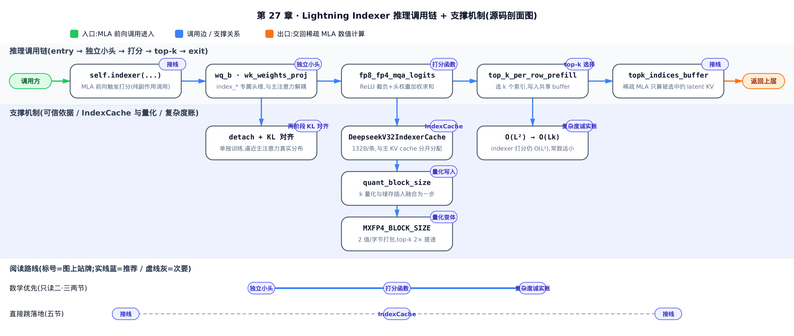
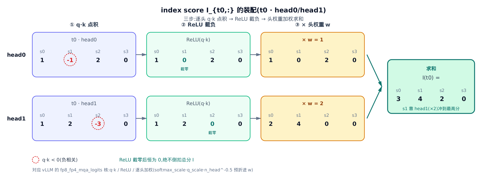
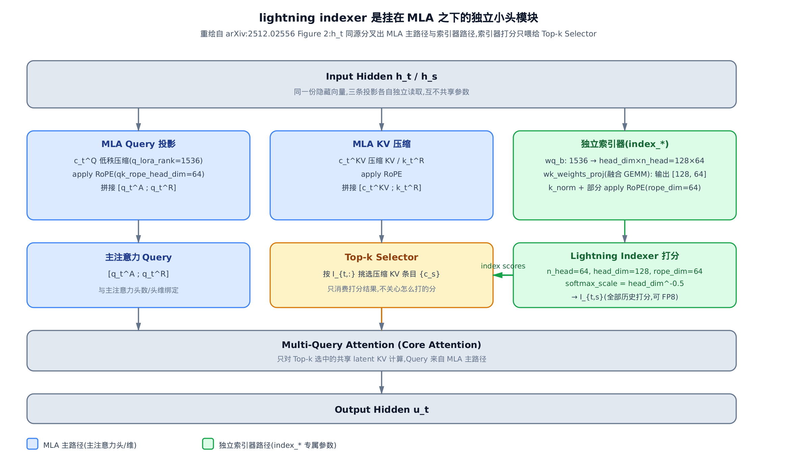
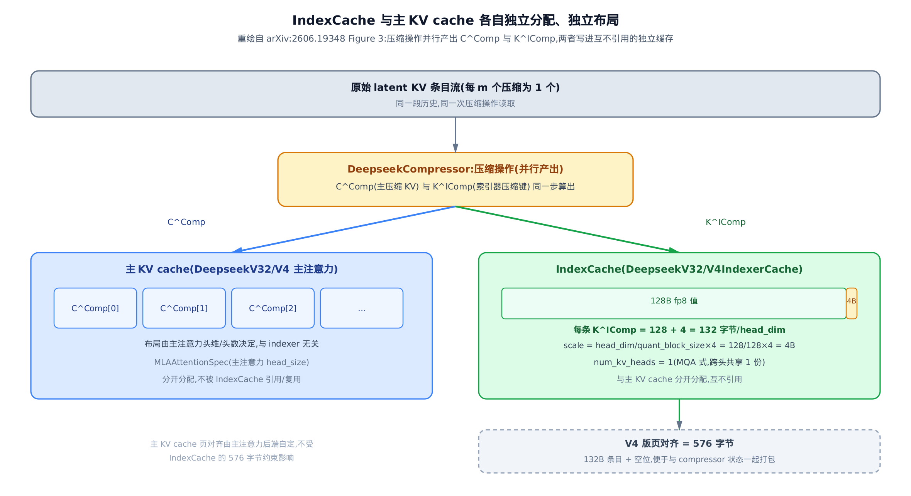

# 第 27 章　【原理篇·论文精读】Lightning Indexer 与 IndexCache：一个便宜到敢扫全历史的打分器

## 你在这里


> *图注：这张架构模型图整本书共用，从开篇起逐章生长——它就是[第 1 章](../../ch01-config-and-wiring/narrative/chapter.md)那张「一个请求的端到端旅程」长大后的样子。主线一眼就能认出来：自上而下依次是入口、输入处理、跨进程的 IPC（进程间通信）边界、装着逐拍循环 `schedule → execute_model → update` 的 `EngineCore` 大框、输出处理，行间箭头还是请求的流向；当年 `EngineCore` 框里只画了调度器与分页 KV 缓存，如今已按「调度与显存／执行与并行／模型与算子／解码策略」四组装满一路读过来的组件。蓝框是前面章节已经读过的（框里带章号），虚线框留给后续章节，橙色是本章新长出的一块。*
> *本章新长的这块在「模型与算子」组的「注意力后端」子系统里就地展开——摊开的不是一列类名，而是源码里真实的组织关系。三只容器里，`Indexer` 包着 `SparseAttnIndexer`（封装打分与 top-k 选择内核）；`DeepseekV4Indexer`（V4 的索引器容器）包着 `DeepseekCompressor`（V4 每 m 个 token 压一块的压缩算子）与又一个 `SparseAttnIndexer`；`AttentionLayerBase`（注意力层契约基类）容器里则是 `DeepseekV4IndexerCache` 与 `DeepseekV32IndexerCache` 两个缓存实现——同一份契约的两个实现。容器外另有两个独立组件：`DeepseekV32IndexerMetadataBuilder`（在调度阶段装配索引器元数据）和 `DeepseekV32IndexerBackend` 等（声明索引器缓存 shape，继承自 `AttentionBackend`）。本章走线共 8 站，7 站落在这些橙色组件上，另有 1 站落在本子系统内、未展开成组件的文件上。站号是请求流经代码的顺序；正文按讲解需要编排，不必照站号顺序读——跨模块的几个大接缝处，正文会随手报一句「现在走到哪一段」。*
> *这块新结构接在读者已经走过的两段路上。「注意力后端」这个子系统本身由[第 24 章](../../ch24-primer-flash-attention/narrative/chapter.md)打开大门、[第 25 章](../../ch25-attention/narrative/chapter.md)把元数据抽象讲透——本章的 `DeepseekV32IndexerMetadataBuilder` 产出的就是同一套元数据管道的下游消费者，`DeepseekV32IndexerBackend` 继承的 `AttentionBackend` 也是[第 25 章](../../ch25-attention/narrative/chapter.md)建立的那份契约。旁边的「量化」子系统（[第 26 章](../../ch26-primer-quantization/narrative/chapter.md)）把 FP8/MXFP4 精度账推完了，本章直接拿它去核算打分器为什么便宜到敢扫全历史。*
> *本章把打分器的数学原理全部推完，然后交棒给[模型架构章](../../ch28-model-architecture/narrative/chapter.md)——那章是原理落地的第一站，indexer 的缓存布局与调用链在真实 vLLM 源码里接回整棵模型树。*

上一章把[量化数学](../../ch26-primer-quantization/narrative/chapter.md)从 scale/zero-point 一路推到了 e8m0 块 scale——FP8/FP4 怎么用更少的比特装下同一个张量，是这一章要直接借用的底座。再往前，[注意力后端](../../ch25-attention/narrative/chapter.md)那一章把元数据抽象讲透了：一份 metadata 喂饱所有 kernel，稠密因果注意力照着 slot mapping 在 KV cache 上取数、算数。这两条线在本章交汇：DeepSeek-V3.2/V4 的稀疏注意力（DeepSeek Sparse Attention，简称 DSA）在主注意力之前塞进一个**独立的小打分器**——lightning indexer（闪电索引器）——它替每个 query 把「该看历史里的谁」先挑出来，主注意力只在被挑中的少数条目上算。

本章只有一条主线，开篇先点破：**DSA 没有消灭 $`O(L^2)`$ ，它只是把这笔平方账从贵的账户搬进了便宜的账户**——主注意力的复杂度从 $`O(L^2)`$ 降到 $`O(Lk)`$ ，代价是打分器自己仍要对每一对 $`(t,s)`$ 扫全历史。全章四个设计都是这条主线的必然推论：打分器必须**便宜**到敢扫全场（§一）；这笔账必须**诚实核算**，看清便宜账户究竟买到了什么（§二）；便宜的打分必须**可信**（§三）；一个每步都扫全历史的模块必须**有自己的缓存**、且在百万 token 下继续便宜（§四）。这套索引器怎么接回 DeepSeek 的完整前向、落成真实的类与缓存，是[模型架构章](../../ch28-model-architecture/narrative/chapter.md)的事——本章只管把原理讲透。



把这张图看进去，全章就只剩推论：85.9 亿对一对没少，省下的从来不是「扫多少对」，而是每一对的**单价**——便宜账户（indexer，0.25× 单价）照单全收 $`O(L^2)`$ ，换来贵账户（主注意力）只按 top-2048/131072 ≈ 1.56% 的闸门放行。



> **选读指引**：只想拿走「打分公式怎么算、复杂度账怎么记」，读 §一、§二 两节的数学与数值推演即可；关心「一个这么粗的打分器凭什么可信」，直接跳 §三；只想知道它的缓存为什么必须独立、量化到底买到了什么，直接跳 §四。想从头顺着读，按序即可。

### 先修：不懂这三样也能跟上

> **MLA（Multi-head Latent Attention，多头潜在注意力）**：DeepSeek 把每个历史 token 的 KV 压成一个低秩「latent 向量」存起来，主注意力在这些 latent 上算。你只需要接受一件事：主注意力真正消费的 KV 条目是这些压缩过的 latent，而不是原始的 K/V。本章的索引器就是在这些 latent 上打分选块。MLA 首次提出于 DeepSeek-V2（[arXiv:2405.04434](https://arxiv.org/abs/2405.04434)，2024），比本章 DSA 的出处早两代——它把 KV cache 压到前代的 6.7%，为 indexer 运行在压缩 latent 之上提供了物理前提。

> **稀疏注意力谱系（NSA，Native Sparse Attention，[arXiv:2502.11089](https://arxiv.org/abs/2502.11089)）**：削减 $`O(L^2)`$ 注意力税的思路最早由 NSA 系统化（DeepSeek 团队，2025 年初发表）——用「压缩 + 选择 + 滑窗」三条支路并行打分，训练推理共用一套稀疏模式。你不需要看它的三支路设计，只要接受「先给历史 token 打分、再按分选一小撮」这个套路是成立且可训练的。DSA 是这条谱系在生产模型上的一支落地，只保留「打分 + top-k」这一路。

> **FP8 / MXFP4（低精度定点）**：把一个浮点值用 8 bit（甚至 4 bit）近似存储，配一个共享的缩放因子 scale 还原量级。你只需要接受「精度换吞吐」这个交易存在、且量化会带来有界误差——具体的位模式与 scale 数学见[量化数学那一章](../../ch26-primer-quantization/narrative/chapter.md)，本章直接用结论。

### 符号速查表

全章记号一张表管够（V4 的压缩记号 $`K^{IComp}`$ 等在 §四 首现处就地解释，不占速查表），正文首现处仍会给一句人话解释：

| 符号 | 含义 | 首现 |
|---|---|---|
| $`I_{t,s}`$ | 打分器给出的「query $`t`$ 该不该看历史 token $`s`$ 」的分数，越大越该看 | §一 Eq.(1) |
| $`H^{I}`$ | indexer 头数，独立于主注意力头数的一小撮专用头 | §一 Eq.(1) |
| $`w_{t,j}^{I}`$ | 第 $`j`$ 个 indexer 头的标量权重，决定这个头的意见占多少话语权 | §一 Eq.(1) |
| $`q_{t,j}^{I}`$ | query $`t`$ 的第 $`j`$ 个 indexer query 向量（低秩投影出来，可 FP8） | §一 Eq.(1) |
| $`k_s^{I}`$ | 历史 token $`s`$ 的 indexer key，跨所有头共享同一份 | §一 Eq.(1) |
| $`d^{I}`$ | indexer 头维，通常远小于主注意力头维——「小头」的「小」 | §一 Eq.(1) |
| $`u_t`$ | query $`t`$ 的主注意力输出，只在被选中的 KV 条目上算出来 | §一 Eq.(2) |
| $`c_s`$ | 第 $`s`$ 个 latent KV 条目（MLA 压缩后的 KV，主注意力真正消费的东西） | §一 Eq.(2) |
| $`p_{t,:}`$ | 主注意力各头求和再沿序列 L1 归一得到的目标分布——indexer 要模仿的「标准答案」 | §三 Eq.(3) |
| $`\mathcal{L}^{I}`$ | 只监督 indexer 的 KL 对齐损失（主模型的语言建模损失不流进 indexer） | §三 Eq.(3) |
| $`\mathcal{S}_t`$ | query $`t`$ 被选中的历史 token 集合，即 $`\operatorname{Top-k}(I_{t,:})`$ | §三 Eq.(4) |

---

## 一、打分函数：一个被削到只剩「该看谁」的注意力

先亮洞见：**lightning indexer 就是一个被削到只剩打分的注意力**。拿标准注意力算子来削三刀——softmax 换成 ReLU（免掉指数与归一化）、value 与输出投影整个砍掉（它不产出内容，只产出「该看谁」）、多头的意见折叠成一个可学习的标量话语权——削完剩下的最小算子，就是 DSA 的打分函数。三刀刀刀砍在成本上，砍出来的正是主线需要的那个「便宜账户」：便宜到敢给每个 query 对**全部**历史 token 都打一遍分，而真正贵的主注意力只在被点名的少数条目上算。一句比喻就够：这是一个只打分、不答题的小评委会。这个打分器来自 DeepSeek-AI 的开源大模型 DeepSeek-V3.2 的技术报告（[arXiv:2512.02556](https://arxiv.org/abs/2512.02556)，2025 年 12 月发布）——论文同时覆盖了 RL（强化学习）训练框架与 agentic（智能体式）数据合成等其余创新，本章只取其中 DSA 打分器的部分。

### 打分函数 Eq.(1)：三步装配一个分数

索引分数 $`I_{t,s}`$ 衡量 query token $`\mathbf{h}_t`$ 与它之前某个 token $`\mathbf{h}_s`$ 的相关性（ $`\mathbf{h}`$ 是当前层的隐藏向量，打分用的 query、key、话语权全部从它投影而来），定义如下（arXiv:2512.02556 §2.1「Prototype of DSA」Eq.(1)）：

```math
I_{t,s} = \sum_{j=1}^{H^I} w_{t,j}^I \cdot \mathrm{ReLU}\left(\mathbf{q}_{t,j}^I \cdot \mathbf{k}_s^I\right)
```

逐项读它： $`H^I`$ 是 indexer 头数； $`\mathbf{q}_{t,j}^I \in \mathbb{R}^{d^I}`$ 是 query $`t`$ 在第 $`j`$ 个头上的打分向量（ $`d^I`$ 是 indexer 专属的头维）、 $`w_{t,j}^I \in \mathbb{R}`$ 是这个头的标量话语权，两者都从 $`\mathbf{h}_t`$ 投影而来； $`\mathbf{k}_s^I \in \mathbb{R}^{d^I}`$ 是历史 token $`s`$ 的 indexer key，从 $`\mathbf{h}_s`$ 导出，且**跨所有头共享同一份**（MQA（Multi-Query Attention，多查询注意力）式——全部头共用一份 key，key 侧的存储与计算都与头数无关）。ReLU 把负相关点积截为 0：负相关不算证据，但也不倒扣。论文明确写了：选 ReLU 而非 softmax 是「for throughput consideration」。

这三步——逐头点积、ReLU 截负、按话语权加权求和——就是打分器的全部数学。下图把 $`t_0`$ 这一行的装配过程拆成三列：



### 数值：两头两维，逐格心算一遍

抽象公式不如一组能心算的数字扎实。取一个刻意做小的例子： $`T=2`$ 个 query token、 $`H^I=2`$ 个 indexer 头、头维 $`d^I=2`$ 、 $`S=4`$ 个历史 token。key 特意设成 `k = [[1,1], [-1,2], [2,-3], [0,0]]`，让某些头对 $`s_1`$ 、 $`s_2`$ 的点积为负，好真实触发 ReLU 的截零分支。把 Eq.(1) 逐格算出来：

<!-- trace: index-score-formula -->

| query · head | q·k 点积 (s0,s1,s2,s3) | ReLU 后 | 头权重 w | 对 I 的贡献 (w × ReLU) |
|---|---|---|---|---|
| t0 · head0 | 1, -1, 2, 0 | 1, 0, 2, 0 | 1 | 1, 0, 2, 0 |
| t0 · head1 | 1, 2, -3, 0 | 1, 2, 0, 0 | 2 | 2, 4, 0, 0 |
| t0 · I = 两头加权求和 | — | — | — | 3, 4, 2, 0 |
| t1 · head0 | 2, -2, 4, 0 | 2, 0, 4, 0 | 1 | 2, 0, 4, 0 |
| t1 · head1 | 1, 2, -3, 0 | 1, 2, 0, 0 | 1 | 1, 2, 0, 0 |
| t1 · I = 两头加权求和 | — | — | — | 3, 2, 4, 0 |

顺着 $`t_0`$ 那三行看：head0 的点积 `1, -1, 2, 0` 里那个 $`-1`$ （ $`s_1`$ 负相关）被 ReLU 截成 `1, 0, 2, 0`；head1 的 `1, 2, -3, 0` 里的 $`-3`$ 被截成 `1, 2, 0, 0`。两头分别乘权重 $`1`$ 、 $`2`$ 再相加，得 $`I(t_0) =`$ `3, 4, 2, 0`。 $`s_1`$ 本来在 head0 上是负相关（被截零），却靠 head1 的强正相关（ $`2 \times 2 = 4`$ ）冲到全场最高分 $`4`$ ——这就是「不同头话语权可学习地加权」的意义。

### 不变量：ReLU 给了总分一个下界

这个例子顺带暴露了打分的一条结构性质：本例所有话语权 $`w > 0`$ ，每个头的贡献项非负，总分 $`I_{t,s}`$ 有下界 $`0`$ ——某个历史 token 哪怕在每个头上都负相关，也只会被截到 $`0`$ ，**绝不会被拉成负数去倒扣**。

> **严谨（单调性与它的前提）**： $`\mathrm{ReLU}(x)=\max(x,0)\ge 0`$ ，故 $`w_{t,j}^I>0`$ 时每头贡献项 $`w_{t,j}^I \cdot \mathrm{ReLU}(\cdot)`$ 非负，加权和非负、下界为 $`0`$ ；且对固定的 $`s`$ ，任一头的正相关点积增大时，它对总分的贡献系数就是 $`w_{t,j}^I > 0`$ ，总分只增不减——打分对「正相关证据」单调。注意两条都以 $`w>0`$ 为前提：一般情形 $`w`$ 由 $`\mathbf{h}_t`$ 投影而来、可以为负，届时下界与单调性都不再保证，本例只是 $`w>0`$ 的特例。

放大到真实 config，这个小评委会有 $`H^I = 64`$ 个头、每头 $`128`$ 维，每个 $`(t,s)`$ 对是 $`64`$ 次长度-$`128`$ 的点积再加权。但全程 FP8、无 softmax、无反向（反向传播：训练时让梯度流回参数的阶段，推理前向用不到它）——单个分数即便要扫全部历史，也远比一次主 MLA 全头计算便宜。「便宜账户」三个字的着落就在这里。

### top-k 闸门 Eq.(2)：主注意力只见名单，不见分数

先点破 top-k 的地位：**它是打分器与主注意力之间唯一的信息闸门**——分数不出闸，出闸的只有一个索引集合。主注意力只照名单取人、不关心分是怎么打的；名单没坐满的位置填 $`-1`$ ，表示「这里没人，别取」。接口窄到只剩一张名单，正是 §四 里两边能各自独立演化（独立缓存、独立量化）的根。形式上，打完分只保留分数最高的 $`k`$ 个条目对应的 latent KV，主注意力（ $`\mathrm{Attn}`$ ，即标准缩放点积注意力）用 query 隐藏向量 $`\mathbf{h}_t`$ 在这批稀疏子集上算输出 $`\mathbf{u}_t`$ （arXiv:2512.02556 §2.1 Eq.(2)）：

```math
\mathbf{u}_t = \mathrm{Attn}\left(\mathbf{h}_t, \left\{\mathbf{c}_s \mid I_{t,s} \in \operatorname{Top-k}(I_{t,:})\right\}\right)
```

这里 $`\mathbf{c}_s`$ 是第 $`s`$ 个 latent KV 条目（MLA 压缩后、主注意力真正消费的东西）， $`\operatorname{Top-k}(I_{t,:})`$ 取分数最大的 $`k`$ 个索引。

### 数值：从上一张表的两行分数挑 top-2

直接复用刚才算出的两行 $`I`$ ，每行选 top-2，写进一张宽度为 $`3`$ 的共享名单（第 3 位用 $`-1`$ 填充，演示空槽标记）：

<!-- trace: topk-selection -->

| query token | I_{t,:} | 按分降序的索引（stable） | top-2 索引 | 名单行（宽 3，-1 填充） |
|---|---|---|---|---|
| t0 | 3, 4, 2, 0 | 1, 0, 2, 3 | 1, 0 | 1, 0, -1 |
| t1 | 3, 2, 4, 0 | 2, 0, 1, 3 | 2, 0 | 2, 0, -1 |

$`t_0`$ 的分数 `3, 4, 2, 0` 降序索引是 `1, 0, 2, 3`（ $`s_1`$ 分最高、 $`s_3`$ 分最低），取前 2 得 `1, 0`，写进名单是 `1, 0, -1`。

> **严谨（选择正确性、确定性与空槽）**：argsort 给出分数的一个全序，取前 $`k`$ 个即「被选集合里最小的分数 ≥ 落选集合里最大的分数」——选择的正确性；并列分数时按稳定排序**索引小者优先**，同一组分数恒得同一集合——确定性（本例两行恰好无并列，该性质与例无关）；名单未写满的位**恒为 $`-1`$**，下游据此丢弃，绝不会把空槽当成真索引。

本例每行从 $`S=4`$ 个里选 $`2`$ 个，保留 50%。放大到真实场景， $`k = 2048`$ （DeepSeek-V3.2 的 top-k 预算）、 $`L = 131072`$ （128k），只有 $`2048/131072 \approx 1.56\%`$ 的历史条目进主注意力——其余约 $`98\%`$ 被 top-k 当场筛掉。这 1.56% 就是主注意力从 $`O(L^2)`$ 掉到 $`O(Lk)`$ 的开关。在架构模型图上，这一节的打分与选块正落在 `Indexer` 容器里的 `SparseAttnIndexer` 上（第 5 站）——便宜账户的本体就是它。

---

## 二、复杂度诚实账： $`O(L^2)`$ 没被消灭，只是换了账户

### 主线命题记成账：门票没取消，只是先刷便宜的脸

上一节的打分器再便宜，也要给每一对 $`(t,s)`$ 都打一遍分——现在把开篇的主线命题正式记成账。一个诚实的说法很重要：DSA 并没有**消灭**那笔 $`O(L^2)`$ 的税。打分器仍然要给每个 query 扫全部历史（ $`O(L^2)`$ 一分没跑掉），只是把这笔开销从贵的账户换到便宜的账户。就像门票没取消，只是把「全场每人都查一遍身份证」换成「先用便宜的人脸快筛，再让通过的少数人走贵的安检」。

论文把这句话写得很直白（arXiv:2512.02556 §2.3「Inference Costs」）：

> DSA reduces the core attention complexity of the main model from $`O(L^2)`$ to $`O(Lk)`$, where $`k`$ ($`\ll L`$) is the number of selected tokens. Although the lightning indexer still has a complexity of $`O(L^2)`$, it requires much less computation compared with MLA ... DSA achieves a significant end-to-end speedup in long-context scenarios.

主注意力从 $`O(L^2)`$ 降到 $`O(Lk)`$ ，而 indexer 打分自己仍是 $`O(L^2)`$ ——但常数远小（少头、可 FP8/FP4、无反向）。

### 数值：L=8 逐 token 心算，再代入 128k

先用一个 $`L=8`$ 、 $`k=2`$ 的小例子把「核算对数」逐 token 数清楚。稠密因果注意力对第 $`t`$ 个 query 要核算 $`t+1`$ 个历史 token；稀疏时每个 query 封顶 $`\min(t+1, k)`$ 个。indexer 打分仍扫全场，但取一个 $`0.25\times`$ 的单价代表「少头 / 低精度」：

<!-- trace: complexity-honest-account -->

| 项目 | 复杂度 | 本例算式（L=8, k=2） | 核算对数（真实次数） |
|---|---|---|---|
| 主注意力 · 稠密因果 | O(L²) | 每 query 扫全部历史，L=8 | 36 |
| 主注意力 · 稀疏 top-k | O(Lk) | 每 query 封顶 k=2 | 15 |
| indexer 打分（单价 0.25×） | 仍 O(L²) | 36 对 × 0.25 单价 | 36（折算成本 9.0） |
| 主注意力加速比 | dense ÷ sparse | 36 ÷ 15 | 2.4 |

稠密项 $`36 = 1+2+\dots+8`$ ；稀疏项 $`15 = 1+2+2+2+2+2+2+2`$ （前两个 query 历史不够 $`k`$ 个、退化为稠密，其余封顶 2）；主注意力加速比 $`36 / 15 = 2.4`$ 。indexer 这一行「核算对数」列真实处理的仍是全部 $`36`$ 对——与稠密行同阶，一对没少扫；括注的 $`9.0`$ 只是把单价折成本后的**成本单位**，不是「只处理了 $`9`$ 对」。它比稀疏主注意力那行的 $`15`$ 更小，纯粹是因为单价更便宜，不是因为扫得更少——这正是「indexer 打分仍扫全场」与本节标题「 $`O(L^2)`$ 没被消灭，只是换了账户」的字面意思：账户变了，扫的范围没变。

### 不变量：收益只在长上下文才积累

对每个 query $`t`$ ，稀疏核算数 $`\min(t+1, k) \le`$ 稠密核算数 $`t+1`$ 逐 $`t`$ 成立，求和后 sparse ≤ dense、加速比 ≥ 1 **恒成立**。当 $`t+1 \le k`$ （因果早期、历史还不够 $`k`$ 个）时两者相等，收益为零。所以 $`L \gg k`$ 时稠密总量 $`\approx L^2/2`$ 、稀疏总量 $`\approx Lk`$ ，比值 $`\approx L/(2k)`$ 随 $`L`$ 线性放大——这解释了为何 DSA 是**长上下文**优化，短序列几乎不省。

代入真实长上下文 $`L = 131072`$ （128k）、 $`k = 2048`$ ：主注意力核算对数从稠密 $`8590000128`$ 降到稀疏 $`266339328`$ ，加速约 $`32\times`$ （精确 $`32.252090566211834`$ ）；而 indexer 自身照样真实扫描全部 $`8590000128`$ 对——与稠密主注意力同数、 $`O(L^2)`$ 原封不动，按 $`0.25\times`$ 单价折算成本为 $`2147500032`$ （仍与 $`L^2`$ 同阶）。 $`O(L^2)`$ 项没被消灭，只是换成了便宜账户——这笔换不掉的平方项还会以**内存**形态再现（prefill 时——预填充，一次性并行处理整段输入提示的阶段——打分矩阵本身就是 $`O(L^2)`$ 大小，工程上只能分块直面），落地见[模型架构章](../../ch28-model-architecture/narrative/chapter.md)。

---

## 三、可信：一条 KL 把主注意力的行为蒸馏进打分器

### 洞见：监督信号不是语言，是主注意力自己的注意力分布

一个这么便宜、这么粗（ReLU + FP8）的打分器，凭什么相信它挑的 $`k`$ 个条目就是主注意力真正想看的？先亮底牌：**indexer 的监督信号不是语言建模损失，而是主注意力自己的注意力分布**——训练时冻住主模型，把主注意力真实分出去的注意力质量归一化成一个分布，用一条 KL 散度逼 indexer 的打分去贴近它。这是一次行为蒸馏：indexer 不需要懂语言，只需要模仿主注意力「用脚投票」的去向。所以推理时它是个便宜但**语义对齐**的路由器，而不是随手写的启发式。

### 机制：Eq.(3)(4) 两阶段 KL 对齐

先是 Dense Warm-up 阶段（arXiv:2512.02556 §2.1.1）：保持稠密注意力、冻结除 indexer 外的所有参数。要模仿，先得有一份「主注意力到底把注意力放在了哪里」的标准答案。对第 $`t`$ 个 query，把主注意力**每个头**分给历史位置 $`s`$ 的注意力权重（softmax 之后、非负的分配比例）跨全部 $`H`$ 个头求和得到 $`a_{t,s}`$ ，再沿序列维做 L1 归一化，得到落在 $`t`$ 个历史位置上的目标分布 $`p_{t,:} \in \mathbb{R}^t`$ ：

```math
p_{t,s} = \frac{a_{t,s}}{\sum_{s'=1}^{t} a_{t,s'}}, \qquad a_{t,s} = \sum_{h=1}^{H} A_{t,s}^{(h)}
```

式中 $`A`$ 记主注意力权重， $`A_{t,s}^{(h)}`$ 是它第 $`h`$ 个头从 query $`t`$ 分给历史 token $`s`$ 的那一项， $`H`$ 是主注意力头数；跨头求和记为 $`a`$ ，逐项即 $`a_{t,s}`$ 。indexer 的训练目标就是让它打分的 softmax 去逼近这个 $`p`$ （arXiv:2512.02556 §2.1.1 Eq.(3)）：

```math
\mathcal{L}^I = \sum_t \mathbb{D}_{KL}\left(p_{t,:} \parallel \mathrm{Softmax}(I_{t,:})\right)
```

$`\mathbb{D}_{KL}`$ 是 KL 散度，衡量「indexer 打的分 softmax 后」离「目标分布」有多远。等 indexer 热身完，进入 Sparse Training 阶段——引入 top-k 选择、放开所有参数。这一阶段主注意力真正消费的只有被选中的那 $`k`$ 个条目，indexer 只需要把这批会真正进场的 token 排对，于是对齐目标收窄到被选中的集合 $`\mathcal{S}_t = \operatorname{Top-k}(I_{t,:})`$ 上（arXiv:2512.02556 §2.1.1 Eq.(4)）——训练目标与推理时的稀疏消费方式对齐：

```math
\mathcal{L}^I = \sum_t \mathbb{D}_{KL}\left(p_{t,\mathcal{S}_t} \parallel \mathrm{Softmax}(I_{t,\mathcal{S}_t})\right)
```

论文特别点出：`we detach the indexer input from the computational graph for separate optimization`——detach（把张量从计算图上断开，梯度不再回流）之后，indexer 的训练信号只来自 $`\mathcal{L}^I`$ ，主模型只按语言建模损失优化，两条梯度互不串味。

> **严谨（KL 为什么用得起来、两阶段为什么不能反）**：KL 散度要求两侧都是概率分布。左侧合法：softmax 之后的各头注意力权重非负，跨头求和仍非负，于是 $`a_{t,:}`$ 的 L1 范数就等于行和，除以行和后 $`p_{t,:}`$ 各项非负、和为 $`1`$ ；右侧 $`\mathrm{Softmax}(I_{t,:})`$ 天然是分布。两阶段的顺序也是被逼出来的：标准答案 $`p`$ 只能由**稠密**注意力给出——稀疏模式下主注意力根本没算过落选 token 的权重，无从对齐；所以必须先稠密热身、让 indexer 学会全场排序，再切进稀疏阶段把对齐收窄到 $`\mathcal{S}_t`$ 上，不为注定被丢弃的 token 浪费对齐信号。

### 架构独立：训练独立的镜像

训练侧的 detach 有一个架构侧的镜像，两者互为表里：indexer 不是从主注意力那里「借」几个头来用，而是自带一整套完全独立的小班子——自己的 query 上投影、自己的 key 与话语权投影、自己的归一化、自己的 RoPE（Rotary Position Embedding，旋转位置编码），甚至自己的缓存（§四 详讲）。它的头数 $`H^I`$ 、头维 $`d^I`$ 来自模型 config 里 `index_` 前缀的独立字段，跟主注意力有多少头、每头多宽毫无关系。把这套独立结构画在 MLA 的头结构里，就是这张图：



同一份隐藏向量 $`\mathbf{h}_t`$ 分叉出三条互不共享参数的投影：MLA 主 query 路径、MLA KV 压缩路径、以及最右那条**独立索引器路径**。索引器打完分只把 index scores 喂给 Top-k Selector，主注意力只在被选中的共享 latent 上算数值——「决定看哪里」与「看完怎么算」在参数层面就已彻底解耦，这是它敢做得又小又低精度的前提。这套独立参数怎么加载（indexer 常以独立的 FP8 checkpoint 存放、有专门的加载分支）、投影与打分前向怎么落成真实的类，落地见[模型架构章](../../ch28-model-architecture/narrative/chapter.md)。

---

## 四、独立缓存与量化：让便宜账户在百万 token 继续成立

主线在 §二 记完账之后，还剩两个存在性问题：打分器每步都要扫全历史，它扫的 key 从哪来？ $`L`$ 涨到百万时，那笔换不掉的 $`O(L^2)`$ 即便单价便宜也会重新变贵，怎么办？这一节用三个概念点答完这两问——前两个各由一张图承载，最后一个是一句接口洞见。

### 独立缓存：谁扫全历史，谁就得有自己的柜子

不变量先行：**谁每步都要扫全历史，谁就必须有自己的缓存**。decode（逐 token 生成阶段）每生成一个 token，indexer 都要对全部历史 key 打一遍分——不缓存，就得每步对整个历史重新投影一遍 key，打分器再便宜也会被这笔重算拖垮。而这份缓存天然是独立的：它存的是 indexer 专属头维 $`d^I`$ 下的 key，每条 132 字节（128 个 FP8 值 + 4 字节 FP32 缩放因子）、跨所有头只存一份，宽度与精度都与主 KV cache 无关。一句直觉：indexer 与主注意力是两排分开的储物柜，各存各的、互不引用。在架构模型图上，此刻我们站在 EngineCore「模型与算子」组「注意力后端」子系统里——正对着 `AttentionLayerBase`（契约）容器内的 `DeepseekV32IndexerCache` 这个橙色组件（图上第 6 站，就是这 132 字节布局的分配处），它旁边是「分页 KV 缓存」那块蓝色组件——[第 15 章](../../ch15-kv-cache/narrative/chapter.md)已读的、管着主 KV cache 的分页显存管理器。

V4 是 V3.2 的后继模型（面向百万 token 上下文的新一代），其技术报告（[arXiv:2606.19348](https://arxiv.org/abs/2606.19348)）把 DSA 升级为 CSA（Compressed Sparse Attention，压缩稀疏注意力），并引入 FP4 量化感知训练（QAT——训练时就模拟量化误差，下文 MXFP4 一段详述）；其中 §2.3.1（Eq.(13)-(17)）把这份独立讲得最清楚。indexer query 与主 query 共享同一个低秩压缩 latent $`c_t^Q`$ （query 侧先压到低秩、再各走各的上投影），打分则在**压缩后的** key 上做（Eq.(16)）：

```math
I_{t,s} = \sum_{h=1}^{n_h^I} w_{t,h}^I \cdot \mathrm{ReLU}\left(\mathbf{q}_{t,h}^I \cdot K^{IComp}_s\right)
```

和 §一 V3.2 的 Eq.(1) 比，这里只换了一个操作数：打分对象从「单个历史 token 的 key $`\mathbf{k}_s^I`$ 」换成了「一个压缩块的 key $`K^{IComp}_s`$ 」（ $`n_h^I`$ 是 V4 记号下的 indexer 头数，与 $`H^I`$ 等价）。原因在于 V4 里主注意力本身就消费压缩块——每 $`m`$ 个 token 先压成一个 $`C^{Comp}`$ 条目（ $`m`$ 是压缩比），被选中的最小单位于是也是压缩块、而非单个 token。索引器要挑的既然是压缩块，它的 key 就必须活在同样的「每块一行」粒度上，所以 $`K^{IComp}`$ 用与 $`C^{Comp}`$ **完全相同的压缩操作**产出。除此之外打分结构与 Eq.(1) 一字不差：仍是逐头 $`q \cdot k`$ 点积、ReLU 截负、按话语权加权求和，query 也仍从共享 latent $`c_t^Q`$ 上投影而来——§一那套打分数学原样迁移到压缩空间，不产生新的东西。

这里 $`K^{IComp} \in \mathbb{R}^{n/m \times c^I}`$ 是索引器专属的压缩 key：每 $`m`$ 个 token 压成 1 个，和主注意力的压缩 KV $`C^{Comp}`$ 由**同一套压缩操作并行产出、各自缓存**。这套压缩操作本身本章不展开推导（见 arXiv:2606.19348 §2.3.1「Compressed Key-Value Entries」Eq.(9)-(12)），一句话勾勒即可：每 $`m`$ 个条目按一组带可学习位置偏置的联合 softmax 权重、对相邻两个窗口共 $`2m`$ 个候选条目加权求和压出一个块（首块因缺前一个窗口，按论文约定把它那侧的权重填 $`-\infty`$ 、值填 $`0`$ ）。要点只有一条—— $`K^{IComp}`$ 与 $`C^{Comp}`$ 是同一套操作的两个并排输出，各写各的缓存。 $`c^I`$ 是 indexer 压缩 key 的头维，与主注意力头维无关，这就是 IndexCache 能独立布局的根。被选中的那批压缩条目才进主注意力（Eq.(17)）：

```math
C_t^{SprsComp} = \left\{ C^{Comp}_s \mid I_{t,s} \in \operatorname{Top-k}(I_{t,:}) \right\}
```

式中 $`C_t^{SprsComp}`$ 就是 query $`t`$ 名单上的那批压缩条目。公式看不出「两份东西是并排的两块缓存」，这张图把它钉死：



这份独立是物理的、不是逻辑的：两块缓存分开分配、互不引用，indexer 缓存的条目宽度完全由它自己的 $`d^I`$ 与量化格式决定（每条 132 字节、跨头一份），主 KV cache 的精度与维度对它没有任何约束力——这正是「indexer 打分仍要扫全历史（ $`O(L^2)`$ ）却不拖累主 KV cache」的保证。独立缓存在 vLLM 里怎么声明与分配、indexer key 的量化怎么与缓存插入融成一步，落地见[模型架构章](../../ch28-model-architecture/narrative/chapter.md)。

### MXFP4：量化是主线的续命条件，不是锦上添花

$`L`$ 涨到百万，便宜账户重新吃紧——平方项还躺在账上， $`L`$ 每翻一倍打分开销翻四倍，唯一的出路是把单价再砍。MXFP4 变体把 indexer 的 QK 路径（query 与 key 打点积的那一路计算）压到更狠的精度：每个值只用 4 bit（2 个值挤进 1 字节），每 32 个值共享一个 1 字节的 ue8m0 缩放因子（无符号 e8m0——上一章讲透的「块 scale 只能取 2 的幂」格式）；index 分数也从 FP32 截成 BF16（16 位脑浮点）。论文的原话（arXiv:2606.19348 §5.2.1）是把 CSA indexer 的 QK 路径「cached, loaded, and multiplied entirely in FP4」，配合 QAT（Quantization-Aware Training，量化感知训练——训练时就模拟量化误差，让模型学会带着误差工作），`achieves a 2× speedup for the top-k selector, while preserving a 99.7% recall rate of KV entries`——top-k 选择器 $`2\times`$ 加速、KV 条目 99.7% 召回，几乎不丢准。下图把局部量化优化换算成整机收益：


左边 FP8 路径每条 = $`d^I`$ 字节的值 + 4 字节 FP32 缩放因子（正是上文那 132 字节）；右边 MXFP4 每条 = $`d^I/2`$ 字节（2 值打包一字节）+ $`d^I/32`$ 字节 ue8m0 缩放因子。整机上，据该技术报告，V4-Pro 在百万 token 只需 V3.2 的 27% FLOPs、10% KV cache——回到主线：量化技巧在这里不是锦上添花，而是让「indexer 廉价」这个假设在百万 token 继续成立的**必要条件**。FP8/FP4 的位模式与缩放因子数学，[量化数学那一章](../../ch26-primer-quantization/narrative/chapter.md)已经讲透；MXFP4 缓存布局与开关的实现，同样见[模型架构章](../../ch28-model-architecture/narrative/chapter.md)。

### 接线：全部接口只是一张名单

§一 点破的那道闸门，落到工程里就是一张全模型共享的 top-k 名单：indexer 打完分把选中的索引写进去（空槽以 $`-1`$ 标记），稀疏 MLA 后端从同一张名单读出索引、只对被点名的 latent KV 做数值计算——打分调用本身连返回值都没有，纯靠写名单这一个副作用与下游通信。接口窄到只剩一个索引集合，两边才能各自独立演化：indexer 的缓存换 FP8 还是 MXFP4、布局怎么改，主注意力一概不知情；相邻层若复用同一张名单，还能省掉重复打分。在架构模型图上，正是这道闸门把橙色组件（`Indexer` 容器里的 `SparseAttnIndexer`）与旁边的蓝色注意力后端隔成两层——从此打分选块在上、稀疏数值计算在下，互不牵制。这套「打分选块」与「稀疏数值计算」的解耦，也是它能被[注意力后端](../../ch25-attention/narrative/chapter.md)以统一元数据消费的原因；共享名单的分配、调用点与稀疏后端的消费，落地见[模型架构章](../../ch28-model-architecture/narrative/chapter.md)。

---

## 小结：一条主线收拢四个设计

回到主线：**$`O(L^2)`$ 没被消灭，只是换到便宜账户**。四个设计各就各位。**便宜**（§一）：把注意力削到只剩打分——ReLU 换掉 softmax、value 与输出投影整个砍掉、多头折叠成标量话语权， $`H^I=64`$ 个 $`128`$ 维小头全程可低精度，便宜到敢给每个 query 扫全历史。**代价**（§二）：诚实账——主注意力从 $`O(L^2)`$ 降到 $`O(Lk)`$ ，128k 下省约 $`32\times`$ 且随 $`L`$ 线性放大；indexer 自己仍扫全场，一对没少，只是单价低。**可信**（§三）：一条 KL 把主注意力自己的注意力分布蒸馏进打分器，detach 让两条梯度互不串味——它是被教出来的语义对齐路由器，不是启发式。**可持续**（§四）：每步扫全历史，所以必须有自己的独立缓存（每条 132 字节、跨头一份、与主 KV cache 互不引用）；百万 token 下再用 MXFP4 把单价再砍（top-k $`2\times`$ 、召回 99.7%、整机 27% FLOPs / 10% KV cache）。

一句话收束：lightning indexer 把「决定看哪里」和「看完怎么算」彻底拆开，两者之间的全部接口只是一张 top-k 名单——用一个又小又低精度、却被专门教过的打分器做前者，让昂贵的主注意力只在被点名的 $`k`$ 个条目上做后者。这套机制怎么接回 DeepSeek 的完整前向、落成真实的类与调用链——在架构模型图上，就是下一章要展开的那块虚线组件，从 `DeepseekV4ForCausalLM` 顶层入口到 `DeepseekV4DecoderLayer` 逐层调用——是[模型架构那一章](../../ch28-model-architecture/narrative/chapter.md)的事。
