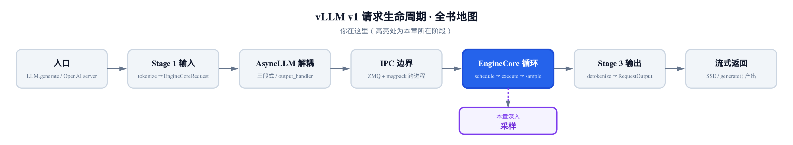
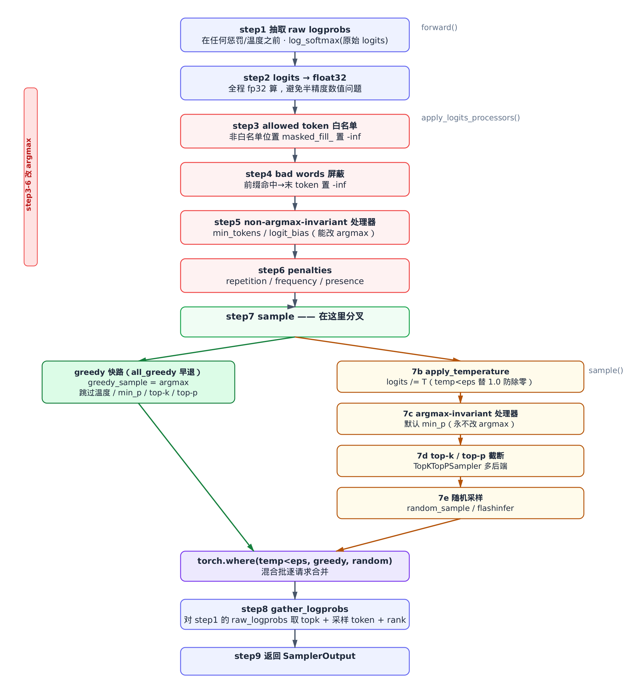
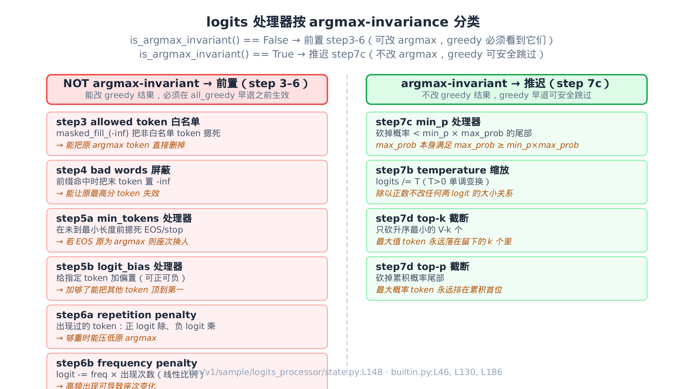
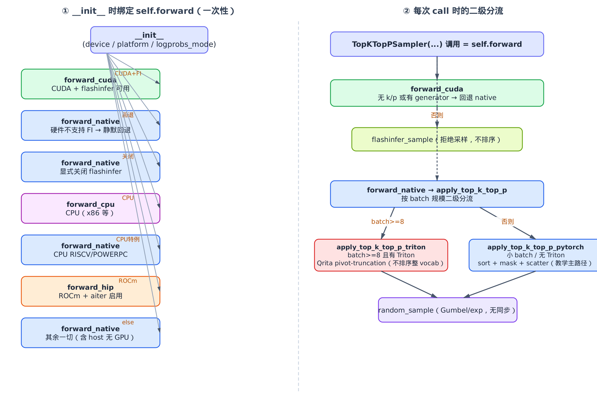
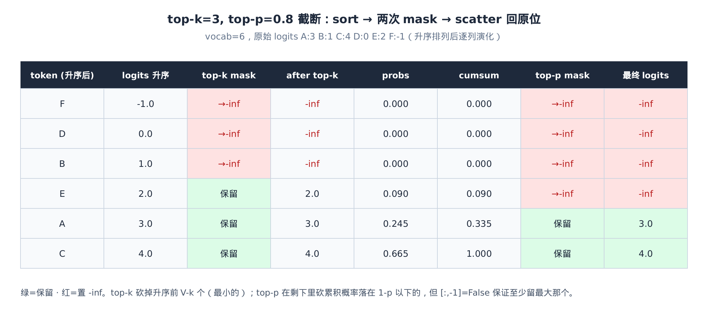
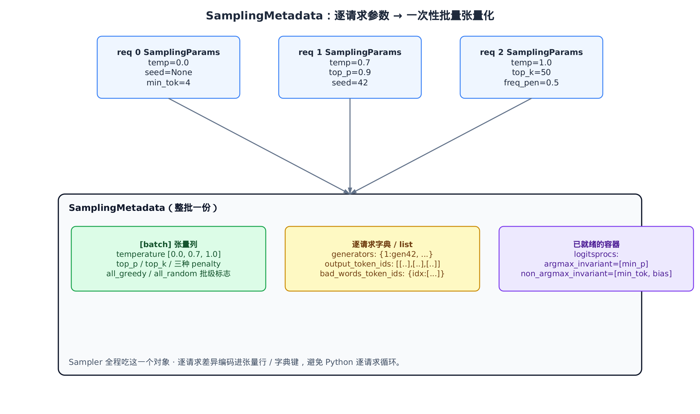

# 第27章　Sampler 的 9 步采样流水线：从 logits 到下一个 token

## 你在这里



> *图注：全书地图高亮当前位置。*
> *前面几章里，模型前向算到最后一层，吐出一张 `[batch, vocab]` 的 logits，然后就交给了"采样层"。*
> *本章把这个采样层拆开：一张 logits 怎么经过 9 个步骤，变成每个请求的下一个 token。*
> *下一步这些 token 会回到引擎核心，拼进各自请求的输出序列。*

模型前向的终点，是一张 `[batch, vocab]` 的 logits 张量——每一行是一个请求、每一列是词表里一个 token 的"原始分数"。可用户要的不是分数，是一个具体的 token id。从分数到 token 这一跳，就是采样层干的活，全收拢在 `vllm/v1/sample/sampler.py` 这一个文件里。

这活看着简单——"按概率抽一个"——真做起来一堆讲究：

- 用户开了 `temperature=0`，那就别抽了，直接取最高分（greedy）。
- 用户开了 `top_p=0.9`，得先把尾巴上的小概率 token 砍掉再抽。
- 用户给了 `frequency_penalty`，已经吐过的 token 要扣分，免得复读。
- 用户要 `logprobs`，还得把每个候选 token 的对数概率一并返回——而且得是**没被这些惩罚污染过的**原始概率。
- 这些参数每个请求都不一样，但一个 batch 要一次算完，不能逐请求 for 循环。

vLLM 把这一切收拢成一条 9 步流水线，全写在 `Sampler` 这一个 `nn.Module` 里。本章就沿着这 9 步走一遍，看真实源码怎么把"按概率抽一个"做成一个能跑满 GPU、参数全张量化、greedy 还能抄近道的工业级流水线。

为了能在本地（无 GPU）把这条流水线亲手跑一遍、打断点看数值，本章配了一份**只做减法**的精简版：和真实 vLLM 同名、同结构、同控制流，只删掉与主线正交的分支（投机解码、thinking 预算、generative-scoring 旁路、920 行 Triton 内核、ROCm/CPU 后端、持久批状态机）。它在纯 CPU 上跑 PyTorch，是"跑起来看数值"的交叉验证物；正文主线仍是真实源码。

---

## 27.1 9 步的全景图

`Sampler` 类的 docstring 本身就是这条流水线的目录与契约。先把它当地图读一遍（`vllm/v1/sample/sampler.py:L21`）：

```python
# vllm/v1/sample/sampler.py:L21
class Sampler(nn.Module):
    """
    A layer that samples the next tokens from the model's outputs
    with the following steps in order:

    1. If logprobs are requested:
        a) If `logprobs_mode` is `raw_logprobs`, compute logprobs
           as the final logprobs to return.
        b) If `logprobs_mode` is `raw_logits`, clone the logits
           as the final logprobs to return.
    2. Convert logits to float32.
    3. Apply allowed token ids whitelist.
    4. Apply bad words exclusion.
    5. Apply logit processors which are not argmax-invariant,
       i.e. that can impact greedy sampling.
        a) Min tokens processor
        b) Logit bias processor
    6. Apply penalties
        a) Repetition penalty
        b) Frequency penalty
        c) Presence penalty
    7. Sample the next tokens. `sample` method performs the following steps:
        a) If not `all_random`, perform greedy sampling. If `all_greedy`,
           return the greedily sampled tokens and final logprobs if requested.
        b) Apply temperature.
        c) Apply logit processors which are argmax-invariant, by default
           the min_p processor.
        d) Apply top_k and/or top_p.
        e) Sample the next tokens with the probability distribution.
        f) If `all_random` or temperature >= epsilon (1e-5), return the
           randomly sampled tokens and final logprobs if requested. ...
    8. Gather the logprobs of the top `max_num_logprobs` and sampled token
       (if requested).
    9. Return the final `SamplerOutput`.
    """
```

这张目录有几条暗线，值得先点破，后面每一节都在还它：

- **第 1 步先于一切**。logprobs 在任何惩罚、温度之前就抽走——返回给用户的概率，必须是模型的原始判断，而不是被采样参数改造过的。
- **第 3–6 步全在 greedy 之前**。它们有个共同点：都可能改变那个"最高分 token"是谁。
- **第 7 步内部又分两路**。一条是 greedy 快路（直接 argmax 就走人），一条是随机路（温度→截断→抽样）。
- **argmax-invariant 这个词，是整条流水线的分水岭**。第 5 步和第 7c 步看着都是"logits processor"，凭什么一个在 greedy 前、一个在 greedy 后？答案就藏在这个词里，27.4 节专门讲。

把这 9 步画成一张图，分叉与汇合一目了然：



> *图注：竖向是 step1–6 的线性流水线，全在 `forward` 与 `apply_logits_processors` 里。*
> *左侧红条圈出的 step3–6 有个共性——都可能改 argmax，所以必须排在 greedy 之前。*
> *step7 处分叉：greedy 快路直接早退，随机路走温度→min_p→截断→抽样，末端用 `torch.where` 按逐请求温度合并。*

下面就从入口 `forward` 开始，一步步走。

## 27.2 入口 forward：先把原始概率抢救出来

`forward` 是整个采样层的大门。它做 9 步里的第 1、2 步，然后把第 3–6 步交给 `apply_logits_processors`、第 7 步交给 `sample`，最后做第 8、9 步收尾（`vllm/v1/sample/sampler.py:L68`）：

```python
# vllm/v1/sample/sampler.py:L68
def forward(
    self,
    logits: torch.Tensor,
    sampling_metadata: SamplingMetadata,
    predict_bonus_token: bool = False,
    logprobs_mode_override: LogprobsMode | None = None,
) -> SamplerOutput:
    logprobs_mode = logprobs_mode_override or self.logprobs_mode
    # NOTE(woosuk): Use the original logits (before any penalties or
    # temperature scaling) for the top-k logprobs.
    # This is different from the V0 sampler, which uses the logits that
    # is used for sampling (after penalties and temperature scaling).
    num_logprobs = sampling_metadata.max_num_logprobs
    if num_logprobs is not None:
        if logprobs_mode == "raw_logprobs":
            raw_logprobs = self.compute_logprobs(logits)
        elif logprobs_mode == "raw_logits":
            if logits.dtype == torch.float32:
                raw_logprobs = logits.clone()
            else:
                raw_logprobs = logits.to(torch.float32)

    # Use float32 for the logits.
    logits = logits.to(torch.float32)

    logits = self.apply_logits_processors(
        logits, sampling_metadata, predict_bonus_token
    )
    # Sample the next token.
    sampled, processed_logprobs = self.sample(logits, sampling_metadata)
    # … 省略：spec-decode / generative-scoring 旁路 …
    sampled = sampled.long()
```

代码里那段 `NOTE(woosuk)` 是本节的灵魂。它明说：**用原始 logits（任何惩罚和温度缩放之前）来算返回给用户的 logprobs**，这跟旧版（V0）不一样——V0 用的是采样所用的、被惩罚和温度改造过的 logits。

为什么要这么折腾？想一个场景：用户开了 `frequency_penalty` 防复读，同时又要 `logprobs` 看模型对每个候选 token 多有把握。如果 logprobs 是惩罚之后的，那用户看到的"把握"是被你的反复读策略压过的，根本不反映模型原本的判断。两件事语义不同，就得解耦。于是 `forward` 一进门、`logits` 还干净的时候，先把 `raw_logprobs` 抽出来存好（`logprobs_mode == "raw_logprobs"` 时就是一个 `log_softmax`），后面任凭流水线怎么蹂躏 `logits`，这份原始概率岿然不动。第 8 步 gather 时用的就是它。

紧接着第 2 步 `logits = logits.to(torch.float32)`——全程用 fp32 算。模型前向可能是 fp16/bf16，但采样涉及 softmax、累积和、阈值比较，半精度容易丢精度甚至出 `inf`/`nan`，这里统一拔到 fp32 兜底。

最后注意结尾的 `sampled = sampled.long()`。采样结果要转成 int64，因为下游会拿它当索引用——而 flashinfer 采样返回的是 int32，PyTorch 的 `argmax`/`topk` 返回 int64，这里统一成 int64 抹平后端差异。

精简版里这段 `forward` 与真实源码逐字一致，只删掉了 spec-decode 与 generative-scoring 两条旁路（它们在专门的章节里讲）。你可以在 CPU 上直接构造一张 logits 喂进去，断点停在 `raw_logprobs` 那行，会看到它确实在 `apply_logits_processors` 之前就被算好了。

## 27.3 第 3–6 步：四道能改 argmax 的工序

`apply_logits_processors` 把第 3 到第 6 步串成一条短链。它短到可以整段贴出来（`vllm/v1/sample/sampler.py:L357`）：

```python
# vllm/v1/sample/sampler.py:L357
def apply_logits_processors(
    self,
    logits: torch.Tensor,
    sampling_metadata: SamplingMetadata,
    predict_bonus_token: bool,
) -> torch.Tensor:
    bad_words_token_ids = sampling_metadata.bad_words_token_ids
    # … 省略：spec-decode / thinking-budget 组合分支 …
    output_token_ids = sampling_metadata.output_token_ids

    # Apply allowed token ids.
    if sampling_metadata.allowed_token_ids_mask is not None:
        logits.masked_fill_(sampling_metadata.allowed_token_ids_mask, float("-inf"))

    # Apply bad words exclusion.
    if bad_words_token_ids:
        apply_bad_words(logits, bad_words_token_ids, output_token_ids)

    # Apply logits processors which can impact greedy sampling.
    for processor in sampling_metadata.logitsprocs.non_argmax_invariant:
        logits = processor.apply(logits)

    # Apply penalties (e.g., freq_penalties).
    logits = self.apply_penalties(logits, sampling_metadata, output_token_ids)
    return logits
```

四道工序，顺序固定：

1. **第 3 步：allowed token 白名单**。如果某请求限制了"只能从这些 token 里选"（比如结构化输出），`allowed_token_ids_mask` 就是一张 `[batch, vocab]` 的布尔表，把所有不在白名单里的位置 `masked_fill_` 成 `-inf`。一句话搞定，因为它本就是张量。
2. **第 4 步：bad words 屏蔽**（下一节细讲）。
3. **第 5 步：non-argmax-invariant 处理器**——`min_tokens` 和 `logit_bias`。它们能改 argmax，所以排在这里。
4. **第 6 步：三种惩罚**——repetition / frequency / presence。

为什么这四道偏偏都在 greedy 之前？因为它们有个共同的危险能力：**改变"谁是最高分"**。白名单可能把原本的最高分 token 直接划掉；bad words 把某个 token 摁成 `-inf`；惩罚扣分扣多了也能让座次换人。greedy 采样只认最高分，所以任何能动最高分的工序，都必须赶在 greedy 之前生效——否则 greedy 取到的就是个没被处理过的错答案。这条"能改 argmax 就得前置"的原则，27.6 节会被 `is_argmax_invariant` 这个方法显式编码进代码。

把全部处理器按这个分水岭归一张表，分两列看最清楚：



> *图注：左列（红）= `is_argmax_invariant() == False`，这些处理器能改变最高分 token，必须前置于 greedy 采样（step 3–6）；右列（绿）= `is_argmax_invariant() == True`，这些处理器不改 argmax，greedy 路可安全跳过，推迟到随机路的 step 7c。每个条目下的斜体说明了对应的不变性论据。*

## 27.4 bad words：只在"快补全成禁词"时才动手

bad words 这个特性，名字像是"屏蔽某些词"，但实现得很克制。它不是无脑地把禁词的所有 token 都打死——那会误伤（禁了 "apple pie" 不该顺手把所有 "apple" 都禁了）。它只在**下一个 token 正好会补全成一个完整禁词时，才屏蔽那最后一个 token**。

看核心逻辑（`vllm/v1/sample/ops/bad_words.py:L9`）：

```python
# vllm/v1/sample/ops/bad_words.py:L9
_SMALLEST_LOGIT = float("-inf")


def _apply_bad_words_single_batch(
    logits: torch.Tensor,
    bad_words_token_ids: list[list[int]],
    past_tokens_ids: list[int],
) -> None:
    for bad_word_ids in bad_words_token_ids:
        if len(bad_word_ids) > len(past_tokens_ids) + 1:
            continue

        prefix_length = len(bad_word_ids) - 1
        last_token_id = bad_word_ids[-1]
        actual_prefix = past_tokens_ids[-prefix_length:] if prefix_length > 0 else []
        expected_prefix = bad_word_ids[:prefix_length]

        assert len(actual_prefix) == len(expected_prefix)

        if actual_prefix == expected_prefix:
            logits[last_token_id] = _SMALLEST_LOGIT


def apply_bad_words(
    logits: torch.Tensor,
    bad_words_token_ids: dict[int, list[list[int]]],
    past_tokens_ids: list[list[int]],
) -> None:
    for i, bad_words_ids in bad_words_token_ids.items():
        _apply_bad_words_single_batch(logits[i], bad_words_ids, past_tokens_ids[i])
```

逻辑拆开看：一个禁词是一串 token id，比如 `[12, 99, 7]`。要补全成这个禁词，前提是这个请求**最近吐出的 token** 正好是 `[12, 99]`（即禁词的前缀），那么下一个 token 只要是 `7` 就凑成了禁词。所以代码：

- 取禁词的前 `len-1` 个作为 `expected_prefix = [12, 99]`；
- 取该请求历史输出的最后 `len-1` 个作为 `actual_prefix`；
- 两者相等，才把禁词最后一个 token（`7`）的 logit 摁成 `-inf`。

那句 `if len(bad_word_ids) > len(past_tokens_ids) + 1: continue` 是边界保护：禁词比"历史 + 这一个待生成的"还长，根本不可能在这一步凑成，直接跳过。单 token 的禁词（`prefix_length == 0`）则 `actual_prefix` 与 `expected_prefix` 都是空列表，恒相等，于是每一步都屏蔽——符合"这个词永远不许出现"的语义。

外层 `apply_bad_words` 按 `req_index` 逐行调用单批版本：`bad_words_token_ids` 是个 `{req_index: 禁词列表}` 的字典，只有真正设了 bad words 的请求才在字典里，没设的请求一行开销都不花。这是 vLLM 处理"逐请求异构参数"的一个典型手法——能张量化的（如白名单 mask）就张量化，张量化不划算的（如这种带历史前缀匹配的）就用稀疏字典只碰相关请求。

## 27.5 第 6 步：三种惩罚，照 OpenAI 的定义算

第 6 步是三种惩罚。它们的语义都来自 OpenAI API 的定义，算式简单但容易混。真正的算式落在 `vllm/model_executor/layers/utils.py:L51`：

```python
# vllm/model_executor/layers/utils.py:L51
def apply_penalties(
    logits: torch.Tensor,
    prompt_tokens_tensor: torch.Tensor,
    output_tokens_tensor: torch.Tensor,
    presence_penalties: torch.Tensor,
    frequency_penalties: torch.Tensor,
    repetition_penalties: torch.Tensor,
) -> torch.Tensor:
    num_seqs, vocab_size = logits.shape
    _, prompt_mask = get_token_bin_counts_and_mask(
        prompt_tokens_tensor, vocab_size, num_seqs
    )
    output_bin_counts, output_mask = get_token_bin_counts_and_mask(
        output_tokens_tensor, vocab_size, num_seqs
    )

    # Apply repetition penalties as a custom op
    from vllm._custom_ops import apply_repetition_penalties

    apply_repetition_penalties(logits, prompt_mask, output_mask, repetition_penalties)

    # We follow the definition in OpenAI API.
    logits -= frequency_penalties.unsqueeze(dim=1) * output_bin_counts
    logits -= presence_penalties.unsqueeze(dim=1) * output_mask
    return logits
```

先看那个工具 `get_token_bin_counts_and_mask`：它把一串 token id 用 `scatter_add_` 数成两样东西——`bin_counts`（每个 token id **出现了几次**，形状 `[batch, vocab]`）和 `mask`（每个 token **有没有出现过**，布尔）。有了这两样，三种惩罚就是三行：

- **frequency penalty**：`logits -= freq * 出现次数`。出现得越多，扣得越狠——线性正比于次数。
- **presence penalty**：`logits -= presence * 是否出现`。只要出现过就扣一个固定值，不管出现几次。
- **repetition penalty**：稍特殊，是个自定义 op，不是简单减法。它对在 prompt 或输出里出现过的 token 做乘除——正 logit 除以 penalty、负 logit 乘以 penalty。这样 `penalty > 1` 时，无论原来 logit 正负，都朝"更不可能"的方向压。

repetition 这个"正除负乘"的不对称，精简版里把那个自定义 op 的 torch 实现也复刻了（`vllm/_custom_ops.py` 里的派发器），核心就一句 `torch.where(logits > 0, 1.0 / penalties, penalties)`。这个方向最容易记反，代入 `penalty = 1.5` 走两个数就清楚了：

| 原 logit | 符号判定 | 缩放算式 | 新 logit | 效果 |
| --- | --- | --- | --- | --- |
| `+2.0` | `> 0`，除 | `2.0 × (1/1.5)` | `1.333` | 正分被除小，更不可能 |
| `-2.0` | `≤ 0`，乘 | `-2.0 × 1.5` | `-3.0` | 负分被乘得更负，更不可能 |

两行一对照就抓住要害：`penalty > 1` 时，正分往 0 压、负分往负无穷拉，无论原 logit 正负都朝"更不可能"的方向走——这正是"压住已出现 token"的统一效果。你在 CPU 上喂这一行 logits，断点看 `scaling` 那步，会精确还原上表的 `1.333` 与 `-3.0`。

外层还有个张量化的 wrapper `apply_all_penalties`，它把逐请求的 `output_token_ids`（一个 list of list）补齐成定长张量，顺手处理一个异步调度的边角（`vllm/v1/sample/ops/penalties.py:L11`）：

```python
# vllm/v1/sample/ops/penalties.py:L11
def apply_all_penalties(
    logits: torch.Tensor,
    prompt_token_ids: torch.Tensor,
    presence_penalties: torch.Tensor,
    frequency_penalties: torch.Tensor,
    repetition_penalties: torch.Tensor,
    output_token_ids: list[list[int]],
) -> torch.Tensor:
    _, vocab_size = logits.shape
    output_tokens_t = _convert_to_tensors(output_token_ids, vocab_size, logits.device)

    # In the async scheduling case, rows that won't have penalties applied may contain
    # -1 placeholder token ids. We must replace these with valid token ids so that the
    # scatter done in apply_penalties is valid.
    output_tokens_t.masked_fill_(output_tokens_t == -1, vocab_size)

    return apply_penalties(...)
```

那个 `masked_fill_(output_tokens_t == -1, vocab_size)` 是个细节：异步调度下，某些不需要惩罚的行可能带着 `-1` 占位 token id，而 `-1` 拿去做 `scatter_add_` 的索引会越界。这里把 `-1` 换成 `vocab_size`（一个安全的越界一格的 padding 槽，`get_token_bin_counts_and_mask` 里 `bin_counts` 故意多开一列就是为它，统计完再切掉），让 scatter 合法。一个小补丁，挡住了异步边界上的一类 bug。

## 27.6 第 7 步：greedy 快路与随机路的分叉

第 3–6 步处理完，`logits` 进入 `sample`，这是整条流水线最精巧的一段。它要同时伺候三种请求——纯贪心、纯随机、以及一个 batch 里两者混着来——还要让贪心请求别白跑随机路那一堆计算。

先看温度缩放和贪心采样这两块零件（`vllm/v1/sample/sampler.py:L216`）：

```python
# vllm/v1/sample/sampler.py:L216
@staticmethod
def apply_temperature(logits, temp, all_random):
    # Use in-place division to avoid creating a new tensor.
    # Avoid division by zero if there are greedy requests.
    if not all_random:
        temp = torch.where(temp < _SAMPLING_EPS, 1.0, temp)
    return logits.div_(temp.unsqueeze(dim=1))

@staticmethod
def greedy_sample(logits):
    return logits.argmax(dim=-1).view(-1)
```

温度的数学很直白：把 logits 除以 T 再 softmax。T 越大分布越平（更随机），T 越小越尖（更确定）；T→0 时 softmax 退化成 one-hot，等价于直接取 argmax。代码里 `_SAMPLING_EPS = 1e-5`（`vllm/v1/sample/sampler.py:L18`）是区分"是否贪心"的浮点阈值——用户传入的 `temperature=0` 在 Python 层就是精确 0，但张量参数经历了 dtype 转换后可能变成非零的极小值，1e-5 是工程上统一的截断点。凡是 `temp < 1e-5` 的请求都当贪心处理，但贪心请求温度是 0，直接除会出 `inf`，所以 `torch.where` 先把这些位置的温度替成 1.0（反正它们的结果待会儿不用随机路的）。`greedy_sample` 就是一行 `argmax`。

现在看主干 `sample` 怎么把这些零件拼起来（`vllm/v1/sample/sampler.py:L232`）：

```python
# vllm/v1/sample/sampler.py:L232
def sample(self, logits, sampling_metadata, logprobs_mode_override=None):
    logprobs_mode = logprobs_mode_override or self.logprobs_mode
    assert not (sampling_metadata.all_greedy and sampling_metadata.all_random)
    if sampling_metadata.all_random:
        greedy_sampled = None
    else:
        greedy_sampled = self.greedy_sample(logits)
        if sampling_metadata.all_greedy:
            processed_logprobs = None
            if sampling_metadata.max_num_logprobs is not None:
                if logprobs_mode == "processed_logits":
                    processed_logprobs = logits
                elif logprobs_mode == "processed_logprobs":
                    processed_logprobs = self.compute_logprobs(logits)
            return greedy_sampled, processed_logprobs

    assert sampling_metadata.temperature is not None
    # Apply temperature.
    logits = self.apply_temperature(
        logits, sampling_metadata.temperature, sampling_metadata.all_random
    )
    # Apply logits processors that only apply to random sampling
    # (argmax invariant)
    for processor in sampling_metadata.logitsprocs.argmax_invariant:
        logits = processor.apply(logits)
    # Apply top_k and/or top_p.
    random_sampled, processed_logprobs = self.topk_topp_sampler(
        logits,
        sampling_metadata.generators,
        sampling_metadata.top_k,
        sampling_metadata.top_p,
    )
    if greedy_sampled is None:
        return random_sampled, processed_logprobs

    sampled = torch.where(
        sampling_metadata.temperature < _SAMPLING_EPS,
        greedy_sampled,
        random_sampled,
        out=greedy_sampled,  # Reuse tensor
    )
    return sampled, processed_logprobs
```

这段有三个设计决策叠在一起，逐个拆。

**决策一：all_greedy 早退，整条随机路一行不跑。** 如果整批都是贪心（`all_greedy`），算完 `greedy_sample` 直接 `return`，温度、min_p、top-k/top-p、随机采样全部跳过。凭什么能跳？因为贪心只取 argmax，而温度缩放（单调变换不改最大值位置）、top-k/top-p（只砍非最大的 token）、min_p（只砍尾部）——**没有一个能改变 argmax**。既然结果一定还是那个最高分 token，这些计算就是纯浪费，早退省掉。这就是"greedy 快路"。

**决策二：argmax-invariant 处理器排在温度之后、且只在随机路跑。** 注意第 7c 步那个 `for processor in ... .argmax_invariant`，和第 5 步那个 `non_argmax_invariant` 是对偶的。同样是 logits processor，凭什么分两处？答案就在 `is_argmax_invariant()` 这个方法上。

容器在构造时就按这个方法把处理器分成两拨（`vllm/v1/sample/logits_processor/state.py:L148`）：

```python
# vllm/v1/sample/logits_processor/state.py:L148
class LogitsProcessors:
    """Encapsulates initialized logitsproc objects."""

    def __init__(self, logitsprocs: Iterable["LogitsProcessor"] | None = None) -> None:
        self.argmax_invariant: list[LogitsProcessor] = []
        self.non_argmax_invariant: list[LogitsProcessor] = []
        if logitsprocs:
            for logitproc in logitsprocs:
                (
                    self.argmax_invariant
                    if logitproc.is_argmax_invariant()
                    else self.non_argmax_invariant
                ).append(logitproc)
```

`min_p` 声明自己是 argmax-invariant 的——它只砍掉概率低于 `min_p × 最高概率` 的尾部 token，那个最高概率 token 自己永远在阈值之上、永远留着，所以 argmax 雷打不动（`vllm/v1/sample/logits_processor/builtin.py:L46`）：

```python
# vllm/v1/sample/logits_processor/builtin.py:L46
def is_argmax_invariant(self) -> bool:
    """Min-p never impacts greedy sampling"""
    return True

# … 省略：update_state 等持久批维护 …

def apply(self, logits: torch.Tensor) -> torch.Tensor:
    if not self.min_p_count:
        return logits
    # Convert logits to probability distribution
    probability_values = torch.nn.functional.softmax(logits, dim=-1)
    # Calculate maximum probabilities per sequence
    max_probabilities = torch.amax(probability_values, dim=-1, keepdim=True)
    # Adjust min_p
    adjusted_min_p = max_probabilities.mul_(self.min_p)
    # Identify valid tokens using threshold comparison
    invalid_token_mask = probability_values < adjusted_min_p
    # Apply mask using boolean indexing
    logits.masked_fill_(invalid_token_mask, -float("inf"))
    return logits
```

反过来，`min_tokens` 和 `logit_bias` 都声明 `is_argmax_invariant() = False`，因为它们真能改 argmax（`vllm/v1/sample/logits_processor/builtin.py:L130`）：

```python
# vllm/v1/sample/logits_processor/builtin.py:L130 (LogitBias)
def is_argmax_invariant(self) -> bool:
    """Logit bias can rebalance token probabilities and change the
    outcome of argmax in greedy sampling."""
    return False

def apply(self, logits: torch.Tensor) -> torch.Tensor:
    if self.biases:
        logits[self.logits_slice] += self.bias_tensor
    return logits

# vllm/v1/sample/logits_processor/builtin.py:L186 (MinTokens)
def is_argmax_invariant(self) -> bool:
    """By censoring stop tokens, min-tokens can change the outcome
    of the argmax operation in greedy sampling."""
    return False

def apply(self, logits: torch.Tensor) -> torch.Tensor:
    if self.min_toks:
        # Inhibit EOS token for requests which have not reached min length
        logits.index_put_(self.logits_slice, self.neg_inf_tensor)
    return logits
```

`logit_bias` 直接给某些 token 加偏置——加多了当然能把座次顶起来。`min_tokens` 在没到最小长度前把 EOS/stop token 摁成 `-inf`——万一 EOS 本来是最高分，摁掉它 argmax 就换人了。所以这俩必须前置（第 5 步），在 greedy 之前就生效；而 `min_p` 不影响 argmax，就能推迟到温度之后、且只在随机路跑。

这套分类带来一个干净的不变量：**贪心快路上，凡是能改 argmax 的处理（第 3–6 步）都已生效，凡是不改 argmax 的（min_p、温度、截断）都被合法跳过**。所以快路早退取的那个 argmax，跟"老老实实走完随机路再取 argmax"是同一个 token——只是省掉了中间所有计算。这不是近似，是严格相等。

为什么敢说"严格相等"而不是"约等于"？把它收成一条逐算子可检验的论证链就清楚了。

- **命题**：设 `t* = argmax(logits)` 是快路早退取的 token；走完随机路（温度→min_p→top-k/top-p）后再取 argmax，得到的仍是同一个 `t*`。
- **逐算子保 argmax 位置**：随机路上每个算子都不改"谁是最大项"这件事——
  - *温度*：`logits / T`（`T > 0`）是一个单调正变换，除以正数不改任何两元素的大小次序，最大值的位置自然不动。
  - *min_p*：它砍掉概率 `< min_p × max_prob` 的尾部。关键一步是最高概率项 `max_prob` 本身永远在阈值之上——因为 `min_p ≤ 1`，所以 `max_prob ≥ min_p × max_prob`，等号仅在 `min_p = 1` 时取到，`max_prob` 恒不小于阈值，永不被砍。
  - *top-k / top-p*：两者都只从"非最大"的那一侧往下砍（top-k 砍升序最前的小值、top-p 砍累积尾部），最大项永远落在保留集里。
- **归纳收束**：从 `logits` 出发，每过一个算子，"当前最大项仍是 `t*`"这条性质都被保持（基例=进入随机路前最大项是 `t*`，归纳步=上面三类算子各自保位）；走到末尾再取 argmax，必然还是 `t*`。

链里唯一容易留隐患的环就是 min_p 那条不等式——补上 `min_p ≤ 1 ⇒ max_prob ≥ min_p × max_prob` 这半句，整条等价就闭合、可被读者逐项验证了。正因每个算子都保位，快路早退才敢省掉它们而不影响结果。

**决策三：混合批用 torch.where 逐请求合并。** 真实负载里一个 batch 常常贪心、随机请求混着。代码的处理很聪明：不分流，而是**两条路都全算一遍**——`greedy_sampled` 算了，随机路 `random_sampled` 也算了——最后用 `torch.where(temperature < eps, greedy_sampled, random_sampled)` 按逐请求温度在两个结果里逐行挑。温度近 0 的行取 greedy 的结果，其余取 random 的。那个 `out=greedy_sampled` 是复用张量、省一次分配的小动作。

为什么"两条都算"反而对？因为 GPU 最怕的是分支发散——按请求 if/else 拆批会打碎张量并行。全算 + 一次 `where` 选择，是纯张量操作，没有 Python 循环、没有同步，跑满并行。代价是给贪心行也跑了一遍随机路计算，但这点冗余远比破坏批并行划算。（注意这跟决策一不矛盾：`all_greedy` 是**整批全贪心**时的特例早退，连随机路都不必构造；这里是**混合批**，随机路无论如何要为随机请求跑，那就顺手也覆盖贪心行。）

精简版里 `sample` 与真实源码逐字一致。它的测试覆盖了三种情形：`all_greedy` 早退（断言根本没碰温度）、混合批的 `torch.where` 按行合并、以及纯随机。你可以构造一个 `temperature=[0.0, 0.7]` 的两请求 batch，断点看 `torch.where` 那行——第 0 行取了 argmax、第 1 行取了随机采样，正好印证逐请求合并。

## 27.7 第 7d 步：top-k/top-p 截断的多后端分发

第 7d 步——top-k/top-p 截断——是采样里最吃算力的环节（要对整个词表动手），于是 vLLM 给它配了一整套后端分发。核心类是 `TopKTopPSampler`，它的精明之处在于：**后端绑定发生在 `__init__`，不是每次调用**。

> **FlashInfer** 是 OccamLabs 开源的 GPU 采样/注意力算子库，专为 LLM 推理设计，提供 fused top-k/top-p 采样等高吞吐 CUDA 内核；vLLM 把它作为可选后端，在满足条件时替换掉 PyTorch 原生实现。

```python
# vllm/v1/sample/ops/topk_topp_sampler.py:L30
def __init__(self, logprobs_mode: LogprobsMode = "raw_logprobs") -> None:
    super().__init__()
    self.logprobs_mode = logprobs_mode
    # flashinfer optimization does not apply if intermediate
    # logprobs/logits after top_k/top_p need to be returned
    if (
        logprobs_mode not in ("processed_logits", "processed_logprobs")
        and current_platform.is_cuda()
    ):
        if envs.VLLM_USE_FLASHINFER_SAMPLER:
            # … 省略：检测硬件 compute capability …
            if FlashInferBackend.supports_compute_capability(capability):
                self.forward = self.forward_cuda
            elif envs.is_set("VLLM_USE_FLASHINFER_SAMPLER"):
                raise RuntimeError(...)   # 用户显式要 FI 但硬件不支持 → 报错
            else:
                # Default-on path; hardware can't run FlashInfer ->
                # quietly fall back to the PyTorch-native sampler
                self.forward = self.forward_native
        else:
            self.forward = self.forward_native
    elif current_platform.is_cpu():
        # … 省略：RISCV/POWERPC 回退 native，其余走 forward_cpu …
        self.forward = self.forward_cpu
    elif (... and rocm_aiter_ops.is_enabled()):
        self.forward = self.forward_hip
    else:
        self.forward = self.forward_native
```

`device`、`platform`、`logprobs_mode` 在 `TopKTopPSampler` 的整个生命周期里都不变，所以何必每个 token 都重新判一遍走哪个后端？`__init__` 时一次性把 `self.forward` 绑成具体方法（`forward_cuda` / `forward_native` / `forward_cpu` / `forward_hip` 之一），之后每次调用直接命中，零分发开销。

这段分发还藏着两条值得注意的设计：

- **多级回退保证启动不崩**。flashinfer 默认开但硬件跑不动时，**静默回退** native（而不是崩溃）；只有用户**显式**设了 `VLLM_USE_FLASHINFER_SAMPLER` 还跑不动，才抛错——因为这是用户明确的意图，不该悄悄改。CPU 上 RISCV/POWERPC 这种小众架构也单独回退 native。
- **logprobs_mode 是一道硬约束**。开头那个判断把 `processed_logits`/`processed_logprobs` 模式直接挡在 flashinfer 之外——flashinfer 用拒绝采样，根本不产出截断后的中间 logits，没法满足"返回处理后的 logprobs"这个要求，只能走 native。

> **v0.21.0 更新**：派发链在 CUDA/CPU/ROCm 之外新增了一条 Intel GPU 分支——`elif current_platform.is_xpu():`（`vllm/v1/sample/ops/topk_topp_sampler.py`）。它受环境开关 `VLLM_XPU_USE_SAMPLER_KERNEL` 控制：开启时把 `self.forward` 绑成新的 `forward_xpu`，否则照旧回退 `forward_native`。`forward_xpu` 经 `torch.ops.vllm.xpu_topk_topp_sampler` 调用 XPU 原生 top-k/top-p kernel，并从 `torch.xpu.default_generators` 取 `(seed, offset)` 传入以复现随机性；与 `forward_cuda` 同理，它也不支持逐请求 generator（有则告警回退 native），且因 batch 侧 `top_k` 存为 int32 而 kernel 要 int64，调用前会先 `k.to(torch.int64)`。这条分支沿用了 native 这把"启动不崩"的兜底——XPU kernel 默认不开，且任何不满足的前置条件都退回 native。

整套分发画成一张图，连同调用时的二级分流：



> *图注：左半是 `__init__` 时按 device/platform/flashinfer 可用性把 `self.forward` 绑成具体方法（host 无 GPU 落到最后的 else，绑 `forward_native`）。*
> *右半是每次 call 时的二级分流：`forward_cuda` 内部还会因无 k/p 或有 generator 回退 native；`forward_native` 走 `apply_top_k_top_p`，再按 batch 规模在 Triton 与 pytorch sort 间分流。*

两个代表性后端，`forward_native` 和 `forward_cuda`，对照着看最清楚（`vllm/v1/sample/ops/topk_topp_sampler.py:L111`）：

```python
# vllm/v1/sample/ops/topk_topp_sampler.py:L111
def forward_native(self, logits, generators, k, p):
    logits = apply_top_k_top_p(logits, k, p)
    logits_to_return = None
    if self.logprobs_mode == "processed_logits":
        logits_to_return = logits
    elif self.logprobs_mode == "processed_logprobs":
        logits_to_return = logits.log_softmax(dim=-1, dtype=torch.float32)
    probs = logits.softmax(dim=-1, dtype=torch.float32)
    return random_sample(probs, generators), logits_to_return

def forward_cuda(self, logits, generators, k, p):
    # Fall back to the PyTorch-native path when FlashInfer has nothing
    # to do (no top-k / top-p filter) or when per-request generators
    # are present (unsupported by FlashInfer 0.2.3+).
    if (k is None and p is None) or generators:
        return self.forward_native(logits, generators, k, p)
    assert self.logprobs_mode not in ("processed_logits", "processed_logprobs"), (
        "FlashInfer does not support returning logits/logprobs"
    )
    return flashinfer_sample(logits.contiguous(), k, p, generators), None
```

`forward_native` 三步走：截断 → softmax 成概率 → `random_sample`。`forward_cuda` 多一层回退判断——没有 k/p 可截（flashinfer 没活干）或者存在逐请求 generator（flashinfer 0.2.3+ 不支持带种子的逐请求采样）时，回退 native；否则交给 `flashinfer_sample`。

host 无 CUDA，精简版 `__init__` 落到最后的 `else`，把 `forward` 绑成 `forward_native`。测试 `test_topk_topp_sampler_native_backend_bound_on_host` 验证了这个绑定，另一个测试还验证了 `forward_cuda` 在有 generator 时确实回退 native——两条回退路径都被钉住。

## 27.8 第 7d 步内核：sort 截断与"为什么不排序整个 vocab"

`forward_native` 调的 `apply_top_k_top_p` 是真正干截断的地方。它先做一次二级分流（`vllm/v1/sample/ops/topk_topp_sampler.py:L305`）：

```python
# vllm/v1/sample/ops/topk_topp_sampler.py:L305
def apply_top_k_top_p(logits, k, p):
    if p is None and k is None:
        return logits
    if HAS_TRITON and logits.shape[0] >= 8:
        return apply_top_k_top_p_triton(logits, k, p)
    # Use pytorch sort implementation for small batch sizes.
    return apply_top_k_top_p_pytorch(logits, k, p)
```

`batch >= 8` 且有 Triton，走 Triton 内核；否则走教学上最直观的 pytorch sort 实现。后者是我们要细读的主角（`vllm/v1/sample/ops/topk_topp_sampler.py:L318`）：

```python
# vllm/v1/sample/ops/topk_topp_sampler.py:L318
def apply_top_k_top_p_pytorch(logits, k, p, allow_cpu_sync=False):
    if p is None:
        if k is None:
            return logits
        # … 省略：免排序的 top-k-only 快路 …
    logits_sort, logits_idx = logits.sort(dim=-1, descending=False)
    if k is not None:
        # Apply top-k.
        top_k_mask = logits_sort.size(1) - k.to(torch.long)  # shape: B
        top_k_mask = logits_sort.gather(1, top_k_mask.unsqueeze(dim=1))
        top_k_mask = logits_sort < top_k_mask
        logits_sort.masked_fill_(top_k_mask, -float("inf"))
    if p is not None:
        # Apply top-p.
        probs_sort = logits_sort.softmax(dim=-1)
        probs_sum = torch.cumsum(probs_sort, dim=-1, out=probs_sort)
        top_p_mask = probs_sum <= 1 - p.unsqueeze(dim=1)
        top_p_mask[:, -1] = False  # at least one
        logits_sort.masked_fill_(top_p_mask, -float("inf"))
    # Re-sort the probabilities.
    return logits.scatter_(dim=-1, index=logits_idx, src=logits_sort)
```

整个套路是 **sort → 两次 mask → scatter 回原位**。升序排序后：

- **top-k**：要留最大的 k 个，等价于在升序序列里砍掉前 `V-k` 个。代码取第 `V-k` 位的值当阈值，凡是 `< 阈值` 的全摁 `-inf`。注意 `k` 是个 `[batch]` 张量——逐请求 k 不同，`gather` 一次取出每行各自的阈值。
- **top-p**（nucleus）：在升序序列上 softmax 出概率、做累积和，然后 `probs_sum <= 1 - p` 的位置摁 `-inf`。升序累积里，前面是小概率 token，累积值小的就是"尾巴"，砍掉它们正好留下高概率的核。`top_p_mask[:, -1] = False` 是保命的一笔——确保至少留下排在最后的那个（最大概率 token），免得 p 设太小把所有 token 都砍光。
- **scatter 回原位**：截断都在排序后的副本上做的，最后 `scatter_` 按 `logits_idx` 把结果写回原始 token 顺序。

拿一个 6-token 的小例子走一遍，两次 mask 怎么叠加看得最清楚：



> *图注：原始 logits 是 A:3 B:1 C:4 D:0 E:2 F:-1，升序排好后逐列推进。*
> *top-k=3 砍掉升序最前面的 F/D/B（最小的 3 个）；top-p=0.8 在剩下的 E/A/C 里，把累积概率落在 1-p=0.2 以下的 E 也砍了，只留 A、C。*
> *绿=保留、红=置 -inf；最后 scatter 回原位。*

跟着数值核一遍：升序后 logits 是 `[-1, 0, 1, 2, 3, 4]`（对应 F D B E A C）。top-k=3 的阈值是第 `6-3=3` 位的值 `2.0`，于是 `< 2.0` 的 F、D、B 被砍。剩下 E、A、C 的概率是 `[0.090, 0.245, 0.665]`，累积和 `[0.090, 0.335, 1.0]`，阈值 `1-p = 0.2`：E 的累积 `0.090 <= 0.2` 被砍，A、C 留下。最终只有 A、C 进入抽样——两次 mask 严丝合缝地叠在了一起。

**那为什么 batch 一大就不走这条 sort 路？** 因为 `logits.sort` 是 `O(V log V)`——`V` 是词表大小，动辄十几万。batch 小的时候这点开销无所谓，batch 一大，整批排序成了瓶颈。于是 `batch >= 8` 时切到 Triton 内核 `apply_top_k_top_p_triton`：

```python
# vllm/v1/sample/ops/topk_topp_triton.py:L965
def apply_top_k_top_p_triton(logits, k, p, mask_value=float("-inf")):
    """Apply combined top-k and top-p masking using Triton.

    Top-k is applied first (by logit value), then top-p is applied
    to the remaining k values (by probability).
    """
    # … 省略：fp32/2D 断言、按 SM 数定 NUM_PROGRAMS、缓存查找表、启动内核 …
```

这个内核基于 Park 等人的 "Qrita" pivot-truncation 算法。思路是：**不排序整个词表**，而是用高斯分布近似 logits、做三分搜索逼近那个截断 pivot，多趟扫描把复杂度从 `O(V log V)` 压到约 `O(V)`。它先按 logit 值做 top-k、再对剩下的按概率做 top-p，in-place 写回——外部契约跟 pytorch sort 版完全等价，只是快得多。它内部那 900 多行的三分搜索/离群点处理是 GPU 工程的深水区，本章不逐行讲；记住一句就够：**`batch >= 8` 之所以另起内核，是为了避开整词表排序的 `O(V log V)`。**

## 27.9 第 7e 步：random_sample 与 flashinfer，两种避开同步的抽样

截断完，`forward_native` 把 logits softmax 成概率，交给 `random_sample` 真正抽一个出来（`vllm/v1/sample/ops/topk_topp_sampler.py:L385`）：

```python
# vllm/v1/sample/ops/topk_topp_sampler.py:L385
def random_sample(probs, generators):
    q = torch.empty_like(probs)
    # NOTE(woosuk): To batch-process the requests without their own seeds,
    # which is the common case, we first assume that every request does
    # not have its own seed. Then, we overwrite the values for the requests
    # that have their own seeds.
    if len(generators) != probs.shape[0]:
        q.exponential_()
    if generators:
        for i, generator in generators.items():
            q[i].exponential_(generator=generator)
    return probs.div_(q).argmax(dim=-1).view(-1)
```

这里没用 `torch.multinomial`，而是用了 Gumbel-max（指数变体）技巧。原理：给每个 token 配一个独立的 `q ~ Exp(1)`，算 `probs / q` 取 argmax，结果在分布上等价于"按 probs 采样"——这是 Gumbel-max 的一个等价形式。为什么不直接 `multinomial`？因为 `multinomial` 会触发 CPU-GPU 同步，打断流水线；而 `q.exponential_()` + `div_` + `argmax` 全在 GPU 上跑，零同步开销。

那个 `if len(generators) != probs.shape[0]` 的小手法也精巧：常见情况是大多数请求没设种子，于是先 `q.exponential_()` 把整批一次性填满随机数（最快的批量路径），再用 `for` 循环只覆写那几个设了种子的请求的行。无种子走批量、有种子单独覆写，两不耽误。

CUDA 上的 `forward_cuda` 走的是另一条——`flashinfer_sample`（`vllm/v1/sample/ops/topk_topp_sampler.py:L409`）：

```python
# vllm/v1/sample/ops/topk_topp_sampler.py:L409
def flashinfer_sample(logits, k, p, generators):
    """Sample from the logits using FlashInfer.

    Statistically, this function is equivalent to the `random_sample` function.
    However, this function is faster because it avoids sorting the logits tensor
    via rejection sampling. ...
    """
    import flashinfer
    # … 省略：flashinfer 版本校验 …
    assert not (k is None and p is None)
    if k is None:
        probs = logits.softmax(dim=-1, dtype=torch.float32)
        next_token_ids = flashinfer.sampling.top_p_sampling_from_probs(
            probs, p, deterministic=True)
    elif p is None:
        probs = logits.softmax(dim=-1, dtype=torch.float32)
        next_token_ids = flashinfer.sampling.top_k_sampling_from_probs(
            probs, k, deterministic=True)
    else:
        next_token_ids = flashinfer.sampling.top_k_top_p_sampling_from_logits(
            logits, k, p, deterministic=True)
    return next_token_ids.view(-1)
```

它按 k/p 是否为 None 分三条 flashinfer API 走。关键在那句 docstring：**statistically equivalent**，而非逐位相同。flashinfer 用拒绝采样直接在截断后的分布上抽，根本不排序、也不显式归一化整个词表——所以更快，但它抽出的具体 token 不保证跟 `random_sample` 逐个对上，只保证两者来自同一个分布。这是个值得记住的取舍：**追吞吐时，"分布等价"往往就够了，不必"逐位复现"**。也正因它走拒绝采样、不产出中间 logits，前面才有那条"`processed_logprobs` 模式下禁用 flashinfer"的硬约束。

## 27.10 第 8 步：把原始概率的 top-k 收集回来

采样出 token 后，第 8 步把 logprobs 收集好返回。回想 27.2 节——要返回的 `raw_logprobs` 早在流水线开头、`logits` 还干净时就抽走了。这一步就是从那份干净的概率里，把用户要的信息 gather 出来（`vllm/v1/sample/sampler.py:L290`）：

```python
# vllm/v1/sample/sampler.py:L290
@staticmethod
def compute_logprobs(logits: torch.Tensor) -> torch.Tensor:
    return logits.log_softmax(dim=-1, dtype=torch.float32)

@staticmethod
def gather_logprobs(logprobs, num_logprobs, token_ids):
    assert token_ids.dtype == torch.int64
    # Find the topK values.
    topk_logprobs, topk_indices = torch.topk(logprobs, num_logprobs, dim=-1)
    # Get with the logprob of the prompt or sampled token.
    token_ids = token_ids.unsqueeze(-1)
    token_logprobs = logprobs.gather(-1, token_ids)
    # Compute the ranks of the actual token.
    torch._dynamo.decorators.mark_unbacked(logprobs, 0)
    torch._dynamo.decorators.mark_unbacked(token_logprobs, 0)
    token_ranks = batched_count_greater_than(logprobs, token_logprobs)
    # Concatenate together with the topk.
    indices = torch.cat((token_ids, topk_indices), dim=1)
    logprobs = torch.cat((token_logprobs, topk_logprobs), dim=1)
    indices = indices.to(torch.int32)
    return LogprobsTensors(indices, logprobs, token_ranks)
```

`gather_logprobs` 一次返回三样东西，拼成 `LogprobsTensors`：

- **top-k**：`torch.topk` 取出概率最高的 `num_logprobs` 个 token 及其 logprob——这是用户要看的"候选词"。
- **采样 token 自己的 logprob**：用 `gather` 把这一步实际抽中的那个 token 的 logprob 单独捞出来。它可能不在 top-k 里（随机采样有可能抽到非最高的），所以单独 gather，并 `cat` 在 top-k 前面凑成 `num_logprobs + 1` 列。
- **rank**：采样 token 在整个词表里排第几。`batched_count_greater_than` 数出有多少个 token 的 logprob 比它高，加一即排名。这个函数带 `@torch.compile`，批量算，不用逐行 Python 循环。

那两句 `mark_unbacked` 是个性能补丁：它告诉 dynamo 把 batch 维当成完全符号化的，避免 batch 从 1 跳到 2（解码常见情形）时触发重编译。一个细节，但在高频采样路径上省掉重编译开销很值。

精简版的 `gather_logprobs` 与真实源码一致（只去掉了 `@torch.compile` 装饰器，数值不变）。测试构造一张 logprobs，验证返回的列数是 `num_logprobs + 1`、采样 token 的 rank 正确——确认这一步如实把原始概率的信息收集回来了。

## 27.11 贯穿全章的载体：SamplingMetadata

走完 9 步，回头看一个一直在场却没正面讲的角色：`SamplingMetadata`。前面每一步取参数——`temperature`、`top_p`、`top_k`、三种 penalty、`generators`、`output_token_ids`、`bad_words`、`logitsprocs`——全是从它身上取的。它就是把"整批逐请求的采样参数"打包成一份的载体（`vllm/v1/sample/metadata.py:L14`）：

```python
# vllm/v1/sample/metadata.py:L14
@dataclass
class SamplingMetadata:
    temperature: torch.Tensor | None
    all_greedy: bool
    all_random: bool

    top_p: torch.Tensor | None
    top_k: torch.Tensor | None

    generators: dict[int, torch.Generator]

    # None means no logprobs, 0 means sampled token logprobs only
    max_num_logprobs: int | None

    no_penalties: bool
    prompt_token_ids: torch.Tensor | None
    frequency_penalties: torch.Tensor
    presence_penalties: torch.Tensor
    repetition_penalties: torch.Tensor

    output_token_ids: list[list[int]]

    # 2D bool tensor (max batch size, vocab size)
    allowed_token_ids_mask: torch.Tensor | None

    # req_index -> bad_words_token_ids
    bad_words_token_ids: dict[int, list[list[int]]]

    # Loaded logits processors
    logitsprocs: LogitsProcessors
```

注意这些字段的形态，正是整章性能哲学的缩影——**逐请求差异，编码进批量结构，而不是 Python 循环**：

- `temperature` / `top_p` / `top_k` / 三种 penalty，全是 `[batch]` 张量，一个 kernel 横扫整批；
- `all_greedy` / `all_random` 是**批级**布尔快路标志——它俩让 27.6 节的 `sample` 能整批早退；
- `generators`、`bad_words_token_ids` 用 `{req_index: ...}` 字典，只为真正设了的请求花开销（稀疏）；
- `output_token_ids` 是逐请求历史 list；
- `logitsprocs` 是**已经按 argmax-invariance 分好类**的容器——分类发生在更早，Sampler 拿到时直接用。

把这个"多对一"的收拢画出来：



> *图注：上方 N 个请求各自的 SamplingParams（温度、top_p、种子、min_tokens 各不相同）。*
> *下方收拢成一份 SamplingMetadata：能整批算的进 [batch] 张量列，稀疏的进字典/list，处理器进已分类的容器。*
> *Sampler 全程只吃这一个对象，逐请求差异全编码在数据结构里，没有 Python 逐请求循环。*

这就是 v1 连续批处理的底气：一次采样把整批一起算完，靠的不是聪明的循环，而是把所有逐请求的差异，提前编码进张量的行、字典的键、容器的分组里。Sampler 拿到的，永远是一份已经张量化好的 `SamplingMetadata`。

## 27.12 小结：一条流水线，三个贯穿始终的设计

从一张 `[batch, vocab]` 的 logits 到每个请求的下一个 token，`vllm/v1/sample/sampler.py` 里的 9 步走完了。回头看，三个设计决策贯穿始终，值得收进口袋：

1. **干净概率与采样概率解耦**。第 1 步先把 `raw_logprobs` 抢救出来，后面任凭惩罚、温度怎么改 `logits`，返回给用户的概率始终反映模型原始判断（27.2、27.10）。
2. **argmax-invariant 是分水岭**。能改 argmax 的处理（白名单、bad words、min_tokens、logit_bias、惩罚）必须前置；不改 argmax 的（min_p、温度、top-k/top-p）能推迟到随机路——于是贪心请求得以早退，跳过整条随机路，且结果严格相等（27.3、27.6）。
3. **逐请求差异全张量化**。参数进 `[batch]` 张量、稀疏项进字典、处理器进分类容器，整批一次算完，没有 Python 逐请求循环；连后端选择都在 `__init__` 时一次绑定，连截断都按 batch 规模在 sort 与 Triton 间分流，连随机采样都用 Gumbel 技巧避开同步（27.7、27.8、27.9、27.11）。

这条流水线之所以能撑住工业级吞吐，不是因为某个单点优化神，而是因为这三条原则被贯彻到了每一步。下一步，这些抽好的 token 会回到引擎核心，拼进各自请求的输出序列，开始下一轮前向。
