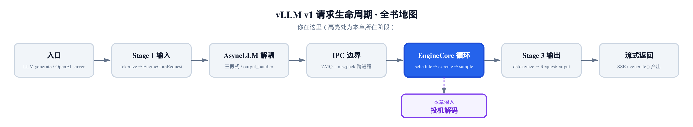
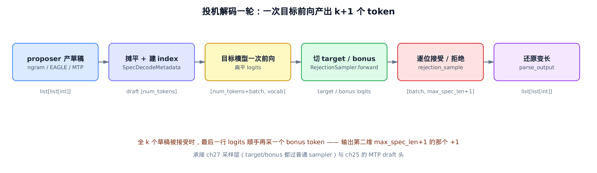
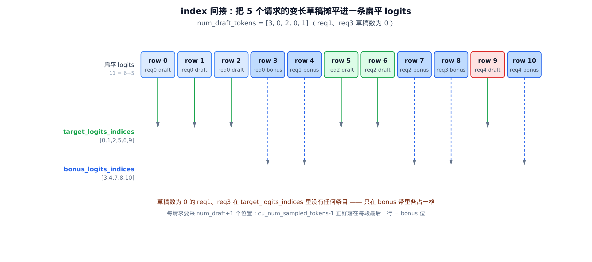
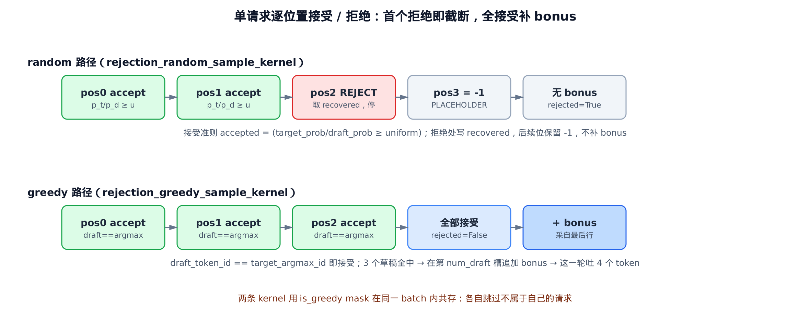
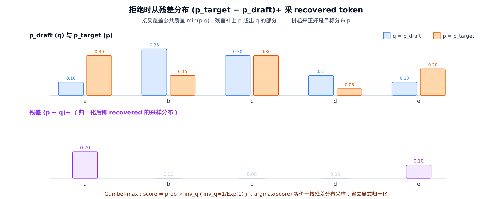

# 第28章　投机解码：草稿、index 间接摊平、rejection sampling 与 bonus token

## 你在这里



> *图注：全书地图高亮当前位置。*
> *上一章把采样层拆成 9 步，把一张 logits 变成下一个 token。*
> *本章在这之上做一件更激进的事：让一次目标前向，吐出好几个 token。*
> *下一章回到引擎，把这些一次多产的 token 接回各自请求的输出流。*

自回归解码有个改不掉的毛病：一次前向只产一个 token。要写 100 个 token，就得把整个大模型跑 100 遍。而每跑一遍，GPU 的算力其实大半闲着——decode 阶段是**访存瓶颈**，矩阵又瘦又长，算术单元喂不饱。

投机解码（speculative decoding）就是来榨这块闲算力的。思路一句话能讲清：

- 先用一个**便宜**的办法，猜出接下来 k 个 token（叫**草稿**，draft）。
- 把这 k 个草稿**一次性**塞进**昂贵**的目标模型，跑一遍前向，拿到每个草稿位置的"标准答案"概率。
- 逐位置核对：草稿猜对的就**白嫖**，猜错的就从这个位置截断、用目标模型的答案纠正。

关键在于第二步那个"一次性"。k 个草稿拼成一条序列喂进去，目标模型一次前向就能同时给出 k 个位置的 logits——这一遍前向的访存成本，和只产一个 token 时几乎一样。于是只要草稿命中率不太差，一次目标前向就能净产出好几个 token。

但这里立刻冒出一个让人不安的问题：**纠错之后，输出还是原来那个分布吗？** 如果投机解码会悄悄改变生成结果，那它就是个错误的优化，再快也没用。本章的核心，就是看 vLLM 怎么用 **rejection sampling** 让"投机加速后的输出分布"与"老老实实一个一个采"**严格相等**——一个 token 都不偏。

整章沿着真实源码走一条完整的数据流：proposer（`vllm/v1/spec_decode/`）产草稿，模型运行器（`vllm/v1/worker/gpu_model_runner.py`）摊平建 index，最后由采样器（`vllm/v1/sample/rejection_sampler.py`）逐位接受/拒绝。如下图：



> *图注：一轮投机解码，从 proposer 产草稿到 parse_output 还原变长输出。*
> *中间"目标模型一次前向"是唯一的大开销，它一次吐出全批所有草稿位 + bonus 位的 logits。*

为了能在本地把这条流水线亲手跑一遍、打断点看数值，本章配了一份**只做减法**的精简版：和真实 vLLM 同名、同结构、同控制流，只删掉与主线正交的分支（tree attention、M-RoPE 位置编码、多模态、cudagraph padding、合成基准模式、logprobs 装配）。纯 CPU 跑 numpy 的索引算术与 ngram，GPU 跑三个 Triton 内核。它是"跑起来看数值"的交叉验证物；正文主线仍是真实源码。

---

## 28.1 草稿从哪来：proposer 的统一契约

投机解码的第一步是产草稿。vLLM 里有好几种 proposer——n-gram、EAGLE、EAGLE3、DFlash、还有 [第 25 章](../ch25-model-architecture/narrative/chapter.md) 那个 DeepSeek-V4 的 MTP draft 头——但它们对外都遵守同一份契约：**吃当前上下文，吐每请求 k 个草稿 token**。本章不深挖各个 proposer 内部的模型结构（那是 ch25 的事），只看它们怎么把草稿交出来。

我们从最简单的一种讲起，因为它根本不带神经网络。

### n-gram：从历史里抄答案

`NgramProposer`（`vllm/v1/spec_decode/ngram_proposer.py`）干的事像极了输入法的联想：看看当前序列的结尾这一小段，在前文里有没有出现过；如果出现过，就把它**上次出现时后面跟的那几个 token**直接抄过来当草稿。

比如序列是 `... 我 爱 北 京 ... 我 爱`，结尾 `我 爱` 在前面出现过，后面跟着 `北`，那就猜下一个是 `北`。代码加速的部分（numba 多线程、JIT 预热）都是性能旁路，核心算法是一个 KMP 风格的最长匹配后缀搜索：

```python
# vllm/v1/spec_decode/ngram_proposer.py:L199
def _find_longest_matched_ngram_and_propose_tokens(
    origin_tokens, min_ngram, max_ngram, max_model_len, k,
):
    total_token = origin_tokens.shape[0]
    if total_token < min_ngram:
        return np.empty((0,), dtype=origin_tokens.dtype)
    k = min(k, max_model_len - total_token)
    if k <= 0:
        return np.empty((0,), dtype=origin_tokens.dtype)

    # 把 token 翻转：找"匹配后缀的最长 n-gram"就变成"找翻转串里最长的、
    # 与某前缀相等的前缀"——正是 KMP 的 LPS（最长公共前后缀）数组要算的。
    tokens = origin_tokens[::-1]
    lps = np.zeros(max_ngram, dtype=np.int32)
    longest_ngram = 0
    position = 0
    prev_lps = 0
    i = 1
    while i < total_token:
        if tokens[prev_lps] == tokens[i]:
            prev_lps += 1
            if prev_lps >= longest_ngram:   # 取最早出现的位置（翻转串里最靠后）
                longest_ngram = prev_lps
                position = i
            if i < max_ngram:
                lps[i] = prev_lps
            if prev_lps == max_ngram:       # 封顶，不匹配超过 max_ngram 的串
                prev_lps = lps[max_ngram - 1]
            i += 1
        elif prev_lps != 0:
            prev_lps = lps[prev_lps - 1]    # 失配回退
        else:
            i += 1

    if longest_ngram < min_ngram:
        return np.empty((0,), dtype=origin_tokens.dtype)
    start_position = total_token - 1 - position + longest_ngram
    k = min(k, total_token - start_position)
    return origin_tokens[start_position : start_position + k]
```

这里的巧思是**翻转**。"当前序列的结尾这一小段"就是原序列的**后缀**；翻转之后，后缀变成了前缀。于是"找一个前文里出现过、且与当前结尾相同的片段"，就等价于在翻转串上跑标准 KMP，求每个位置的 LPS。`longest_ngram` 记下最长匹配长度（限制在 `[min_ngram, max_ngram]`），`position` 记下它在翻转串里最靠后的位置（对应原串最靠前的一次出现，证据更"老"也更可信）。最后 `start_position` 把位置翻回原串，从匹配 n-gram 后面取 k 个 token 当草稿。

精简版逐字保留了这段算法，可以在 CPU 上直接验证它的行为：

```text
序列 [1, 2, 3, 4, 5, 9, 1, 2, 3]，结尾后缀 (1,2,3) 在前面出现过、后跟 4,5
  _find_longest_matched_ngram_and_propose_tokens(..., k=2)  →  [4, 5]

序列 [1, 2, 3, 4, 5]，没有任何重复后缀
  →  np.empty((0,))    # 空草稿：这一步该请求不投机
```

注意最后那行：**草稿可以是空的**。n-gram 找不到匹配时就交白卷，这个请求这一轮干脆不投机。这件"某些请求草稿数为 0"的事，会一路影响到后面的 index 设计——记住它。

n-gram 还有一个全张量的 GPU 版本（`vllm/v1/spec_decode/ngram_proposer_gpu.py`），用 `unfold + argmax` 把同样的匹配逻辑搬上 GPU，避免一次 device-to-host 拷贝。算法等价，这里不展开。

### 模型类 proposer：EAGLE 的统一入口

n-gram 是确定性复制，没有"概率"可言。真正的草稿模型——EAGLE/EAGLE3/DFlash/MTP——是一个小神经网络，吃目标模型的 hidden states，自己跑前向采草稿。它们全部走 `SpecDecodeBaseProposer.propose`（`vllm/v1/spec_decode/llm_base_proposer.py`）这条统一入口：

```python
# vllm/v1/spec_decode/llm_base_proposer.py:L413
def propose(
    self,
    target_token_ids, target_positions, target_hidden_states,
    next_token_ids, token_indices_to_sample, common_attn_metadata,
    sampling_metadata, ...
) -> torch.Tensor:
    batch_size = common_attn_metadata.batch_size()
    if self.method in ("eagle3", "dflash"):
        target_hidden_states = self.model.combine_hidden_states(target_hidden_states)
    # 把目标模型的 token / position / hidden_state 摆进草稿模型的输入 buffer
    num_tokens, token_indices_to_sample, common_attn_metadata = (
        self.set_inputs_first_pass(...)
    )
    # … 省略：构建 attn metadata / cudagraph padding …
    with set_forward_context(...):
        ret_hidden_states = self.model(**model_kwargs)   # 跑一遍草稿模型
        if not self.model_returns_tuple():
            last_hidden_states = hidden_states = ret_hidden_states
        else:
            last_hidden_states, hidden_states = ret_hidden_states
    sample_hidden_states = last_hidden_states[token_indices_to_sample]

    # 早退：只需 1 个草稿，或并行 drafting（DFlash 一次出全部 k 个）
    if self.num_speculative_tokens == 1 or self.parallel_drafting:
        draft_token_ids = self._greedy_sample(sample_hidden_states)
        return draft_token_ids.view(-1, self.num_speculative_tokens)
    # … 省略：num_speculative_tokens > 1 的自回归多步链式草稿 …
```

骨架就三件事：**摆输入 → 跑前向 → 采草稿**。`set_inputs_first_pass` 把目标模型这一步的输出（token id、位置、hidden state）摆进草稿模型的输入 buffer——EAGLE 系的精髓正是"草稿模型吃目标模型的 hidden state"，所以它能用一个很小的头预测出和大模型高度相关的草稿。

有两条早退路径只跑一遍前向就够：`num_speculative_tokens == 1`（只要 1 个草稿）和 `parallel_drafting`（DFlash 这类"一次并行吐出全部 k 个草稿"的方法）。否则就要自回归地一步步往下猜：

```python
# vllm/v1/spec_decode/llm_base_proposer.py:L554
draft_token_ids_list = [draft_token_ids]
# … 省略：把 query_start_loc / seq_lens 设成单 token decode 步 …
for token_index in range(self.num_speculative_tokens - 1):
    input_ids = draft_token_ids_list[-1].int()        # 上一步的草稿当这一步的输入
    # 一个 fused kernel：position +1、重算 slot_mapping、seq_lens +1
    eagle_step_update_slot_mapping_and_metadata(...)
    common_attn_metadata.slot_mapping = self._slot_mapping_buffer[:batch_size]
    _, per_layer_attn_metadata = self.build_per_group_and_layer_attn_metadata(
        common_attn_metadata, draft_index=token_index + 1
    )
    self.input_ids[:batch_size] = input_ids
    self.hidden_states[:batch_size] = hidden_states
    with set_forward_context(...):
        ret_hidden_states = self.model(**model_kwargs)
        # … 省略：解包 last_hidden_states / hidden_states …
    draft_token_ids = self._greedy_sample(last_hidden_states[:batch_size])
    draft_token_ids_list.append(draft_token_ids)
draft_token_ids = torch.stack(draft_token_ids_list, dim=1)
return draft_token_ids
```

这是一条链式生成的循环：跑 k−1 次，每次把上一步采的草稿喂回去、增量推进一格、再 greedy 采下一个草稿，最后 `stack` 成 `[batch_size, num_speculative_tokens]`。EAGLE 的"草稿链"就是这么一步步接出来的。

至于内部的 EAGLE 头怎么算、DFlash 的 mask token 怎么布、MTP 的多 token 预测头长什么样——那是模型结构的事，[第 25 章](../ch25-model-architecture/narrative/chapter.md) 讲过了。本章只认它们对外的契约：

> **proposer 契约**：吃当前上下文（n-gram 吃 token 历史，模型类吃目标 hidden states），吐每请求 0 到 k 个草稿 token。模型类 proposer 还可以附带 `draft_probs`（草稿的概率分布）；n-gram 没有概率，`draft_probs` 是 `None`。

这个"有没有 `draft_probs`"的区别，到了 rejection sampling 那里会分出两条路。先记住：**n-gram 无概率**。

---

## 28.2 把变长草稿摊平进一批：index 间接

现在每个请求手里有 0 到 k 个草稿。下一个难题很现实：**一个 batch 里不同请求草稿数不一样**（有的 3 个、有的 0 个、有的 2 个），怎么把它们一次性喂进目标模型、又一次性取回每个草稿位置的 logits？

最朴素的办法是 padding：补成规整的 `[batch, max_spec_len]` 张量。但这有两个硬伤——草稿数为 0 的请求会被白白补满、浪费 GPU 算力；而且 `max_spec_len` 一抖动，Triton 内核的形状就变了、要重编译。vLLM 选了另一条路：**摊平**。把全批所有草稿首尾相接，拼成一条一维张量，再用几组 index 把每个请求的区间标出来。这就是 `SpecDecodeMetadata`（`vllm/v1/spec_decode/metadata.py`）这个数据结构要装的东西：

```python
# vllm/v1/spec_decode/metadata.py:L9
@dataclass
class SpecDecodeMetadata:
    # [num_tokens]                全批草稿摊平成一维
    draft_token_ids: torch.Tensor
    # [batch_size]                每请求草稿数（CPU 端 list）
    num_draft_tokens: list[int]
    # [batch_size]                num_draft_tokens 的累积和
    cu_num_draft_tokens: torch.Tensor
    # [batch_size]                每请求"草稿+bonus"位数的累积和
    cu_num_sampled_tokens: torch.Tensor
    # [num_tokens]                把扁平 logits 定位到草稿位
    target_logits_indices: torch.Tensor
    # [batch_size]                把扁平 logits 定位到每请求的 bonus 位
    bonus_logits_indices: torch.Tensor
    # [num_tokens + batch_size]   草稿位 + bonus 位的总 index
    logits_indices: torch.Tensor

    def __post_init__(self):
        self.max_spec_len = max(self.num_draft_tokens)
```

字段不少，但只有一个核心思想：**用累积和（cumulative sum）反推每请求的区间**。`cu_num_draft_tokens` 是 `num_draft_tokens` 的累积和——只要知道它，任意一个 Triton program 就能用 `cu[i-1]` 和 `cu[i]` 算出第 `i` 个请求的草稿落在摊平张量的哪段 `[start, end)`。这一招后面三个内核全要用。

### 三组 index 是怎么算出来的

真正把这套 index 造出来的，是模型运行器里的 `_calc_spec_decode_metadata`（`vllm/v1/worker/gpu_model_runner.py`）。它的源码注释里带了一组**具体数字**，是理解整套间接寻址最好的脚手架。直接读它：

```python
# vllm/v1/worker/gpu_model_runner.py:L2596
def _calc_spec_decode_metadata(self, num_draft_tokens, cu_num_scheduled_tokens):
    # Inputs:
    # cu_num_scheduled_tokens:  [  4, 104, 107, 207, 209]
    # num_draft_tokens:         [  3,   0,   2,   0,   1]
    # Outputs:
    # cu_num_draft_tokens:      [  3,   3,   5,   5,   6]
    # logits_indices:           [  0,   1,   2,   3, 103, 104, 105, 106,
    #                            206, 207, 208]
    # target_logits_indices:    [  0,   1,   2,   5,   6,   9]
    # bonus_logits_indices:     [  3,   4,   7,   8,  10]

    # [4, 1, 3, 1, 2]  每请求要采的位置数 = 草稿数 + 1（那个 +1 就是 bonus）
    num_sampled_tokens = num_draft_tokens + 1
    # cu_num_sampled_tokens: [4, 5, 8, 9, 11]
    cu_num_sampled_tokens = self._get_cumsum_and_arange(
        num_sampled_tokens, self._arange_scratch, cumsum_dtype=np.int32
    )
    # [0, 0, 0, 0, 103, 104, 104, 104, 206, 207, 207]  每请求起点重复 num_sampled 次
    logits_indices = np.repeat(
        cu_num_scheduled_tokens - num_sampled_tokens, num_sampled_tokens
    )
    # [0, 1, 2, 3, 103, 104, 105, 106, 206, 207, 208]  叠上请求内偏移
    logits_indices += self._arange_scratch[: cu_num_sampled_tokens[-1]]
    # bonus 位 = 每请求采样段的最后一行
    bonus_logits_indices = cu_num_sampled_tokens - 1
    # cu_num_draft_tokens: [3, 3, 5, 5, 6]
    cu_num_draft_tokens = self._get_cumsum_and_arange(
        num_draft_tokens, self._arange_scratch, cumsum_dtype=np.int32
    )
    # [0, 0, 0, 5, 5, 9]
    target_logits_indices = np.repeat(
        cu_num_sampled_tokens - num_sampled_tokens, num_draft_tokens
    )
    # [0, 1, 2, 5, 6, 9]  叠上请求内偏移
    target_logits_indices += self._arange_scratch[: cu_num_draft_tokens[-1]]
    # … 省略：CPU → GPU 的 non_blocking 拷贝 …
    # 草稿 token 的二次 gather
    draft_token_ids = self.input_ids.gpu[logits_indices]
    draft_token_ids = draft_token_ids[target_logits_indices + 1]
    return SpecDecodeMetadata(...)
```

我们顺着这组数字走一遍。5 个请求，草稿数 `[3, 0, 2, 0, 1]`——req1 和 req3 草稿数为 0（n-gram 交了白卷）。

**第一个关键不变量**：每个请求要采 `num_draft + 1` 个位置。那个多出来的 1，就是 bonus 位。于是 `num_sampled_tokens = [4, 1, 3, 1, 2]`，累积和 `cu_num_sampled_tokens = [4, 5, 8, 9, 11]`——总共 11 行 logits 要采。这 11 = `num_tokens`(6 个草稿) + `batch_size`(5 个 bonus)，正好对上 `logits_indices` 的长度 `[num_tokens + batch_size]`。

**`logits_indices`** 指向目标模型扁平输出里每个请求"采样段"的行。它的算法是 numpy 里把 per-request 标量扩成 per-token 的惯用法：`np.repeat` 把每请求的起点重复若干次，再 `+= arange` 叠上请求内的递增偏移。

**`target_logits_indices`** 和 **`bonus_logits_indices`** 是间接寻址的核心。它们把这 11 行进一步分成两类——草稿位和 bonus 位。下面这张图把这组数字画出来，是本章最该盯住的一张：



> *图注：5 个请求摊平后共 11 行 logits。*
> *绿色实线是 target_logits_indices（指向 6 个草稿位），蓝色虚线是 bonus_logits_indices（指向 5 个 bonus 位）。*
> *草稿数为 0 的 req1、req3 在草稿 index 里没有任何条目，只在 bonus 带各占一格。*

看 `target_logits_indices = [0, 1, 2, 5, 6, 9]`：req0 的 3 个草稿在行 0/1/2，req2 的 2 个草稿在行 5/6，req4 的 1 个草稿在行 9。**req1 和 req3 草稿数为 0，在这个数组里完全没有条目**——它们没有草稿要核对。而 `bonus_logits_indices = [3, 4, 7, 8, 10]`：每个请求都有一个 bonus 位，正好是 `cu_num_sampled_tokens - 1`，即每个采样段的最后一行。req1、req3 虽然没草稿，bonus 位照样占着。

**第二个关键不变量**，一句话归纳：草稿位有 `Σ num_draft_i = num_tokens` 个，bonus 位有 `batch_size` 个，两者拼起来 = `num_tokens + batch_size`，无缝铺满那 11 行，不重不漏。这就是为什么 `bonus_logits_indices` 是 `cu_num_sampled_tokens - 1`——它精确地落在每段的最后一格，而草稿位填满前面。

### 草稿 token 的二次 gather

最后那两行有点绕，但很巧妙：

```python
draft_token_ids = self.input_ids.gpu[logits_indices]
draft_token_ids = draft_token_ids[target_logits_indices + 1]
```

草稿 token 其实早就**被填进了目标模型的输入流**——投机的本质就是"把草稿当输入喂给目标模型验证"。所以草稿 token 不用单独存，从 `input_ids` 里按 index 取出来就行。但要错位一格：位置 `p` 的草稿，是去预测位置 `p+1` 的，所以 `target_logits_indices + 1` 才是草稿 token 本身落在 `logits_indices` 序列里的下标。

拿 req0 的第一个草稿走一遍这两跳就具象了：它在 `target_logits_indices` 里是第 0 项，值为 0，`+1` 得下标 1；去 `logits_indices`（`= [0, 1, 2, 3, 103, ...]`）里取第 1 个，得到 logits 行号 1；最后 `input_ids.gpu[1]` 取出的，正是被填在输入流位置 1 的那个草稿 token（下面追踪里的 1）。其余草稿照此类推。两跳 gather 下来，`draft_token_ids = [1, 2, 3, 105, 106, 208]`——这就是摊平后的 6 个草稿。

这套索引算术全在 CPU 上用 numpy 完成，复杂度 `O(num_tokens)`，没有任何 padding 浪费。精简版把它逐行搬下来，可以直接断言它复现源码注释里的每一个数字：

```text
calc_spec_decode_metadata(num_draft=[3,0,2,0,1], cu_sched=[4,104,107,207,209]):
  cu_num_draft_tokens    = [3, 3, 5, 5, 6]
  cu_num_sampled_tokens  = [4, 5, 8, 9, 11]
  logits_indices         = [0, 1, 2, 3, 103, 104, 105, 106, 206, 207, 208]
  target_logits_indices  = [0, 1, 2, 5, 6, 9]
  bonus_logits_indices   = [3, 4, 7, 8, 10]
  draft_token_ids        = [1, 2, 3, 105, 106, 208]
  max_spec_len           = 3
```

每一位都和 `gpu_model_runner.py` 的注释逐字相符。摊平这一步看着只是索引体操，但它是整个投机解码"零浪费地把变长草稿喂进同一批"的承重墙。

---

## 28.3 一次前向之后：切 logits、采 bonus

目标模型拿到这套 index，对"草稿被填进的输入流"跑一遍前向，吐出形状 `[num_tokens + batch_size, vocab]` 的扁平 logits——每个草稿位一行、每个 bonus 位一行，共 11 行。现在轮到 `RejectionSampler.forward`（`vllm/v1/sample/rejection_sampler.py`）把这堆 logits 分门别类。

在读代码前，先把术语钉死。这个类的 docstring 本身就是四类 token 的权威定义：

```python
# vllm/v1/sample/rejection_sampler.py:L37
class RejectionSampler(nn.Module):
    """
    The implementation strictly follows the algorithm described in
        https://arxiv.org/abs/2211.17192.
    # … 省略：术语前言 …
    accepted tokens: tokens that are accepted based on the relationship
            between the "raw" draft and target probabilities.
    recovered tokens: tokens that are sampled based on the adjusted probability
        distribution, which is derived from both the draft and target
        probabilities.
    bonus tokens:
        If all proposed tokens are accepted, the bonus token is added to the
        end of the sequence. The bonus token is only sampled from the target
        probabilities. We pass in the bonus tokens instead of sampling them
        in the rejection sampler to allow for more flexibility in the
        sampling process. For example, we can use top_p, top_k sampling for
        bonus tokens, while spec decode does not support these sampling
        strategies.
    output tokens:
        # … 省略：一行说明 …
        output tokens = accepted tokens + recovered tokens + bonus tokens
    """
```

四类 token，记住这个加法式：**输出 = 接受的草稿 + 拒绝处的 recovered + 全接受时的 bonus**。

这里藏着一个值得停一下的设计决策：**bonus token 不在 rejection sampler 内部采，而是外面传进来**。为什么要绕这一手？因为投机解码的接受准则只支持基本采样，配不上 `top_p`、`top_k` 这些高级策略。把 bonus token 单独交给上一章那个完整的 9 步 sampler 去采，它就能享受全套采样参数。这就是 `forward` 开头先采 bonus 的原因：

```python
# vllm/v1/sample/rejection_sampler.py:L120
bonus_logits_indices = metadata.bonus_logits_indices
target_logits_indices = metadata.target_logits_indices

# 用 tensor 索引会产生新存储，所以对 bonus_logits / target_logits 的原地操作
# 不会污染原 logits 张量。
bonus_logits = logits[bonus_logits_indices]
bonus_sampler_output = self.sampler(            # 普通 sampler：可带 top_p / top_k
    logits=bonus_logits,
    sampling_metadata=replace(sampling_metadata, max_num_logprobs=-1),
    predict_bonus_token=True,
    logprobs_mode_override="processed_logits"
    if self.is_processed_logprobs_mode else "raw_logits",
)
bonus_token_ids = bonus_sampler_output.sampled_token_ids

raw_target_logits = logits[target_logits_indices].to(torch.float32)
target_logits = raw_target_logits
if not self.is_processed_logprobs_mode:
    target_logits = target_logits.clone()
target_logits = self.apply_logits_processors(target_logits, sampling_metadata, metadata)
target_logits = apply_sampling_constraints(
    target_logits, metadata.cu_num_draft_tokens, sampling_metadata,
)
output_token_ids = rejection_sample(
    metadata.draft_token_ids, metadata.num_draft_tokens, metadata.max_spec_len,
    metadata.cu_num_draft_tokens, draft_probs, target_logits, bonus_token_ids,
    sampling_metadata, ...
)
```

`bonus_logits = logits[bonus_logits_indices]` 切出那 5 个 bonus 位（行 3/4/7/8/10），扔给普通 sampler 采出 `bonus_token_ids`。`target_logits = logits[target_logits_indices]` 切出 6 个草稿位（行 0/1/2/5/6/9），先升到 float32（接受准则要算概率比，精度敏感），再过 logits processor 和温度/top-k/top-p 约束。两组切片各自有独立存储，原地改不会互相污染。

收拾停当，把草稿、目标 logits、bonus token 一起交给 `rejection_sample`——算法的心脏。

---

## 28.4 接受还是拒绝：rejection sampling 的两条 kernel

`rejection_sample`（`vllm/v1/sample/rejection_sampler.py`）是调度核心。它先开一块输出 buffer，然后根据请求是 greedy 还是 random，分派到两个 Triton 内核：

```python
# vllm/v1/sample/rejection_sampler.py:L424
output_token_ids = torch.full(
    (batch_size, max_spec_len + 1), PLACEHOLDER_TOKEN_ID,   # 预填 -1
    dtype=torch.int32, device=device,
)
if sampling_metadata.all_greedy:
    is_greedy = None
else:
    is_greedy = sampling_metadata.temperature == GREEDY_TEMPERATURE
uniform_probs = None
if synthetic_mode or not sampling_metadata.all_greedy:
    uniform_probs = generate_uniform_probs(
        num_tokens, num_draft_tokens, sampling_metadata.generators, device,
    )
if not sampling_metadata.all_random:                       # 有 greedy 请求
    target_argmax = target_logits.argmax(dim=-1)
    rejection_greedy_sample_kernel[(batch_size,)](
        output_token_ids, cu_num_draft_tokens, draft_token_ids,
        target_argmax, bonus_token_ids, is_greedy, max_spec_len, ...
    )
    if sampling_metadata.all_greedy:
        return output_token_ids
target_probs = target_logits.softmax(dim=-1, dtype=torch.float32)
recovered_token_ids = sample_recovered_tokens(                # 残差分布采 recovered
    max_spec_len, num_draft_tokens, cu_num_draft_tokens,
    draft_token_ids, draft_probs, target_probs, sampling_metadata, device,
)
rejection_random_sample_kernel[(batch_size,)](
    output_token_ids, cu_num_draft_tokens, draft_token_ids, draft_probs,
    target_probs, bonus_token_ids, recovered_token_ids, uniform_probs,
    is_greedy, max_spec_len, vocab_size, ...,
    NO_DRAFT_PROBS=draft_probs is None, ...
)
return output_token_ids
```

先看这块输出 buffer：形状 `[batch_size, max_spec_len + 1]`，预填 `PLACEHOLDER_TOKEN_ID`（即 −1）。第二维那个 **+1 就是 bonus 槽**——`max_spec_len` 来自 `SpecDecodeMetadata.__post_init__` 里的 `max(num_draft_tokens)`。每个请求最多产出"k 个接受/纠正的草稿 + 1 个 bonus"，正好 `max_spec_len + 1` 个位置。预填 −1 是个哨兵：被拒后截断的位置、压根没填的位置，都留着 −1，最后统一过滤。

再看调度：**greedy 和 random 请求在同一个 batch 内共存**。真实服务里温度=0 和温度>0 的请求混批是常态，vLLM 不把它们分两批跑，而是用一个 `is_greedy` mask 标记每个请求，然后两个内核各跑一遍——greedy 内核跳过非 greedy 请求，random 内核跳过 greedy 请求。每个内核内部用 `if not is_greedy: return` 早退，互不干扰。

下面这张图把两条路径的逐位置行为画在一起：



> *图注：单请求从左到右逐位判定。*
> *绿=接受（输出草稿），红=首个拒绝（输出 recovered 并截断），灰=截断后保留 −1。*
> *全接受时在末尾追加 bonus（蓝）。greedy 与 random 准则不同，但截断与 bonus 的结构一致。*

### greedy 路径：最干净的接受准则

greedy 内核没有概率比，是理解"逐位置 + 截断 + bonus"骨架最干净的版本：

```python
# vllm/v1/sample/rejection_sampler.py:L707
@triton.jit(do_not_specialize=["max_spec_len"])
def rejection_greedy_sample_kernel(
    output_token_ids_ptr, cu_num_draft_tokens_ptr, draft_token_ids_ptr,
    target_argmax_ptr, bonus_token_ids_ptr, is_greedy_ptr, max_spec_len, ...
):
    req_idx = tl.program_id(0)
    is_greedy = True if is_greedy_ptr is None else tl.load(is_greedy_ptr + req_idx)
    if not is_greedy:
        return                                  # 非 greedy 请求：让 random 内核处理
    # 用 cu_num_draft_tokens 反推本请求草稿区间 [start, end)
    start_idx = 0 if req_idx == 0 else tl.load(cu_num_draft_tokens_ptr + req_idx - 1)
    end_idx = tl.load(cu_num_draft_tokens_ptr + req_idx)
    num_draft_tokens = end_idx - start_idx
    rejected = False
    for pos in range(num_draft_tokens):
        if not rejected:
            draft_token_id = tl.load(draft_token_ids_ptr + start_idx + pos)
            target_argmax_id = tl.load(target_argmax_ptr + start_idx + pos).to(tl.int32)
            token_id = target_argmax_id          # 输出永远是目标的 argmax
            rejected = draft_token_id != target_argmax_id   # 草稿 != argmax 即拒绝
            tl.store(output_token_ids_ptr + req_idx * (max_spec_len + 1) + pos, token_id)
    if not rejected:                             # 全接受 → 追加 bonus
        bonus_token_id = tl.load(bonus_token_ids_ptr + req_idx)
        tl.store(
            output_token_ids_ptr + req_idx * (max_spec_len + 1) + num_draft_tokens,
            bonus_token_id,
        )
```

每个 Triton program 处理一个请求。第一件事就是用 `cu_num_draft_tokens` 反推本请求的草稿区间 `[start, end)`——这正是 28.2 那个累积和的用途。

准则很简单：greedy 采样就是取概率最高的 token，所以目标模型在这个位置的"标准答案"是 `target_argmax`。草稿等于 argmax 就接受、否则拒绝。注意一个细节：**拒绝位仍然写入 `target_argmax_id`**——因为 greedy 语义下，纠正后的 token 就是目标的 argmax。而且一旦 `rejected = True`，`if not rejected` 这一守卫让后续位置不再写，自然保留预填的 −1。

最后 `if not rejected`——k 个草稿全中——就在第 `num_draft_tokens` 槽追加 bonus。这就是"白嫖"：草稿全对说明草稿模型和目标模型在这几步完全一致，那目标模型在最后位置算出的 logits（已经在这次前向里产出了）顺手再采一个 token，不花额外前向。**一次目标前向，最多产出 k+1 个 token**。

精简版的 Triton 内核能在 GPU 上真跑，直接验证这两条语义：

```text
单请求 2 个草稿 [5, 3]，目标 argmax = [5, 3]（全中），bonus = 7
  → 输出 [5, 3, 7]            # 两个 accept + bonus，这一轮吐 3 个 token

单请求 2 个草稿 [5, 3]，目标 argmax = [5, 6]（pos1 不中）
  → 输出 [5, 6, -1]          # pos0 接受=5；pos1 拒绝→写目标 argmax=6 并截断；无 bonus
```

### random 路径：算法的心脏

温度>0 的随机采样，接受准则就不能是简单的"等不等于 argmax"了，得用概率比。这是本章的算法心脏：

```python
# vllm/v1/sample/rejection_sampler.py:L760
@triton.jit(do_not_specialize=["max_spec_len"])
def rejection_random_sample_kernel(
    output_token_ids_ptr, cu_num_draft_tokens_ptr, draft_token_ids_ptr,
    draft_probs_ptr, target_probs_ptr, bonus_token_ids_ptr, recovered_token_ids_ptr,
    uniform_probs_ptr, is_greedy_ptr, max_spec_len, vocab_size, ...,
    NO_DRAFT_PROBS: tl.constexpr, ...
):
    req_idx = tl.program_id(0)
    is_greedy = tl.load(is_greedy_ptr + req_idx)
    if is_greedy:
        return                                   # greedy 请求：让 greedy 内核处理
    start_idx = 0 if req_idx == 0 else tl.load(cu_num_draft_tokens_ptr + req_idx - 1)
    end_idx = tl.load(cu_num_draft_tokens_ptr + req_idx)
    num_draft_tokens = end_idx - start_idx
    rejected = False
    for pos in range(num_draft_tokens):
        if not rejected:
            draft_token_id = tl.load(draft_token_ids_ptr + start_idx + pos)
            uniform_prob = tl.load(uniform_probs_ptr + start_idx + pos)
            if NO_DRAFT_PROBS:                   # n-gram：草稿无概率，视作 1
                draft_prob = 1
            else:
                draft_prob = tl.load(
                    draft_probs_ptr + (start_idx + pos) * vocab_size + draft_token_id)
            target_prob = tl.load(
                target_probs_ptr + (start_idx + pos) * vocab_size + draft_token_id)
            # 接受准则：以 min(1, p_target/p_draft) 的概率接受
            accepted = draft_prob > 0 and target_prob / draft_prob >= uniform_prob
            if accepted:
                token_id = draft_token_id
            else:
                rejected = True
                token_id = tl.load(recovered_token_ids_ptr + start_idx + pos)
            tl.store(output_token_ids_ptr + req_idx * (max_spec_len + 1) + pos, token_id)
    if not rejected:
        bonus_token_id = tl.load(bonus_token_ids_ptr + req_idx)
        tl.store(
            output_token_ids_ptr + req_idx * (max_spec_len + 1) + num_draft_tokens,
            bonus_token_id,
        )
```

核心是这一行：

$$
\mathrm{accepted} = (\,p_{\mathrm{draft}}(x) > 0\,)\ \wedge\ \bigl(\,p_{\mathrm{target}}(x)\,/\,p_{\mathrm{draft}}(x)\ \ge\ u\,\bigr)
$$

其中 $u$ 是一个 `[0, 1)` 的均匀随机数。把 $p$ 记作目标概率、$q$ 记作草稿概率，准则就是看比值是否过得了随机门槛：

$$
P(\mathrm{accept}\ x) = \min\Bigl(1,\ \frac{p(x)}{q(x)}\Bigr)
$$

因为 $u$ 服从均匀分布，"$p(x)/q(x) \ge u$ 成立"的概率正好等于上式。把它落到具体数字上就一目了然：比值 $p/q = 0.3$ 时，$u$ 只有落在 $[0, 0.3)$ 才接受，而 $u$ 在 $[0,1)$ 上均匀，落进去的概率正好 0.3；比值 $\ge 1$ 时门槛恒过、必接受。**这就是以 $\min(1, p/q)$ 的概率接受草稿 token x**——比值 ≥1 时（目标比草稿更看好 x）必接受，小于 1 时按比值的概率接受。

那 `NO_DRAFT_PROBS` 分支是什么？n-gram 这类 proposer 没有概率分布（它是确定性复制），所以 `draft_prob` 直接当作 1，准则退化成"以 $p_{\mathrm{target}}(x)$ 的概率接受"。一个 `constexpr` 开关，让同一个内核兼容"有概率"和"无概率"两类 proposer。

拒绝时不是简单丢弃，而是写入一个 **recovered token**——从一个特制的"残差分布"里采来的。这个 recovered 是保证分布严格等价的关键，下一节单独讲。和 greedy 一样，拒绝即截断、全接受补 bonus。

精简版在 GPU 上真跑了 2 万次单草稿试验来验证这条准则。构造目标分布使 token 0 的概率约为 0.5、草稿固定为 token 0、走 `NO_DRAFT_PROBS` 分支：

```text
20000 次试验，草稿 token = 0，p_target(0) = 0.5（NO_DRAFT_PROBS 分支）
  实测接受率 ≈ 0.50（|误差| < 0.03）
```

接受率实测约 0.5，正好等于 $p_{\mathrm{target}}(0)$——准则被验证了。这不是定性的"差不多"，是 2 万样本统计出的硬数字。

### 这条接受率换来多少加速

接受准则验证了"正确"，那"快"能快多少？也可以量化。设每个位置的接受率为 $\alpha$（位置间近似独立），一次投机里草稿从前往后逐位接受，直到首个拒绝。那么一次目标前向接受的草稿数是个几何截断，期望接受长度为：

$$
\mathbb{E}[L] \approx \frac{1 - \alpha^{k+1}}{1 - \alpha}
$$

再加上全接受时白嫖的那个 bonus，单次前向期望净产出 token 数就是 $\mathbb{E}[L]$ 量级。两个极端能帮你建立直觉：$\alpha \to 1$（草稿几乎全中）时 $\mathbb{E}[L] \to k+1$，k 个草稿全白嫖再加 bonus，加速比逼近 k+1 倍；$\alpha \to 0$（草稿几乎全错）时 $\mathbb{E}[L] \to 1$，退化成无投机、一次前向只产一个 token。加速比正比于 $\mathbb{E}[L]$，因为投机的开销（一次目标前向）和不投机时一模一样，多产出的 token 全是净赚。

代入刚才那个实测的 $\alpha \approx 0.5$、取 $k = 3$：

$$
\mathbb{E}[L] \approx \frac{1 - 0.5^{4}}{1 - 0.5} \approx 1.875
$$

即便接受率只有一半，一次目标前向也平均吐出近 2 个 token——这就是投机解码存在的理由。"正确性"那边用 2 万次实测锚定了 $\alpha$，"速度"这边就用同一个 $\alpha$ 算出了收益，两头对称。

---

## 28.5 拒绝时采什么：残差分布与分布等价性

现在来回答开篇那个让人不安的问题：**纠错之后，输出还是原来那个分布吗？** 答案是严格相等，而关键就在拒绝时采的那个 recovered token。

### 为什么接受准则 + 残差分布 = 目标分布

设目标分布 $p(x)$、草稿分布 $q(x)$。我们对草稿 token 以 $\min(1, p(x)/q(x))$ 的概率接受。先建立一个画面感：草稿猜得多的 token 更容易被提议、也更容易被接受，于是结果会被草稿的偏好带偏。落成一句话就是：被接受的 token，其分布并不是 $p$——它偏向了草稿青睐的那些 token。光靠接受，输出会跑偏。

补救办法是：拒绝时，从**残差分布**采一个 token：

$$
p'(x) = \frac{\bigl(p(x) - q(x)\bigr)_+}{\sum_y \bigl(p(y) - q(y)\bigr)_+}
$$

这里 $(\cdot)_+ = \max(\cdot,\ 0)$ 是取正部。直觉是这样的：

- 接受这一步，覆盖了 $p$ 和 $q$ 的**公共质量** $\min(p,q)$——草稿青睐、目标也认可的部分被原样放行。
- 残差分布 $(p-q)_+$ 补上 **$p$ 超出 $q$ 的部分**——目标比草稿更想要、但草稿没充分提议的那些 token。
- 公共质量 + 残差，两块拼起来正好是 $p$。

下面这张图把这件事画实：



> *图注：上排是草稿分布 q 与目标分布 p 的逐 token 对比。*
> *下排是残差 (p−q)+，recovered token 就从它（归一化后）采样。*
> *接受覆盖 min(p,q)，残差补上 p 超出 q 的部分，合起来还原成目标分布 p。*

可以一句话归纳这个不变量为什么成立：对任意 token x，它最终被输出的概率 = "x 被当作草稿提议且被接受" + "某次拒绝后从残差分布采到 x"，两项之和恰好等于 $p(x)$。完整证明见 Leviathan 等人的论文（arXiv:2211.17192），代码注释里也指明了"严格遵循"它。

但上面证的是**单个位置**的边缘分布等于 $p$。我们真正想要的，是整条 k 位草稿序列、连同首个拒绝处的截断，联合起来仍等价于目标模型逐 token 自回归采出来的序列——这才是读者最容易犯嘀咕的地方：**截断后续草稿，会不会偷偷改了分布？** 把它按位置归纳一遍就清楚了。把投机解码看成一条逐位置的条件采样链：位置 $i$ 是在"前 $i-1$ 个草稿都已被接受"这个条件下处理的，它的输出（接受草稿，或拒绝后取 recovered）的边缘分布，正是上面那条单位置结论给出的"目标模型在该前缀下的条件分布"。于是：基例是位置 0，结论直接成立；归纳步是，若前 $i$ 个位置的联合分布已等于目标自回归分布，那么位置 $i$ 在该前缀条件下输出仍是这条目标条件分布，接上去后前 $i+1$ 个位置的联合分布仍等于目标自回归分布。而"首个拒绝即截断"恰好对应：在拒绝处用该位置的 recovered（已经是从目标条件分布重采的）续上一个 token，后续位置则交还给下一轮目标前向继续这条链。单位置正确 × 拒绝即截断 = 在该位置回到目标条件分布，链式连乘下来，整条输出序列的联合分布严格等于目标模型自回归采样的分布。截断没有破坏分布，它只是把链交接给了下一轮。

n-gram 那种情况（`NO_DRAFT_PROBS`，$q$ 是确定性的 one-hot），残差就退化成"把草稿那个 token 屏蔽掉之后的目标分布"——接受准则以 $p(x)$ 接受草稿，拒了就从剩下的目标分布里采。同样严格等价。

### Gumbel-max：免归一化地从残差分布采样

残差分布的采样落在 `sample_recovered_tokens`（`vllm/v1/sample/rejection_sampler.py`）这个内核里。它有个工程上的巧思——**不显式归一化**：

```python
# vllm/v1/sample/rejection_sampler.py:L853
@triton.jit
def sample_recovered_tokens_kernel(
    output_token_ids_ptr, cu_num_draft_tokens_ptr, draft_token_ids_ptr,
    draft_probs_ptr, target_probs_ptr, inv_q_ptr, vocab_size,
    BLOCK_SIZE: tl.constexpr, NO_DRAFT_PROBS: tl.constexpr,
):
    req_idx = tl.program_id(0)
    start_idx = 0 if req_idx == 0 else tl.load(cu_num_draft_tokens_ptr + req_idx - 1)
    end_idx = tl.load(cu_num_draft_tokens_ptr + req_idx)
    num_draft_tokens = end_idx - start_idx
    pos = tl.program_id(1)
    if pos >= num_draft_tokens:
        return
    token_idx = start_idx + pos
    if NO_DRAFT_PROBS:
        draft_token_id = tl.load(draft_token_ids_ptr + token_idx)
    max_val = float("-inf")
    recovered_id = 0
    for v in range(0, vocab_size, BLOCK_SIZE):           # vocab 分块 reduction
        vocab_offset = v + tl.arange(0, BLOCK_SIZE)
        vocab_mask = vocab_offset < vocab_size
        if NO_DRAFT_PROBS:                               # n-gram：屏蔽草稿 token 后的 target
            prob = tl.load(target_probs_ptr + token_idx * vocab_size + vocab_offset,
                mask=(vocab_mask & (vocab_offset != draft_token_id)), other=0.0)
        else:                                            # 残差 (p_target - p_draft)+
            draft_prob = tl.load(draft_probs_ptr + token_idx * vocab_size + vocab_offset,
                mask=vocab_mask, other=0.0)
            target_prob = tl.load(target_probs_ptr + token_idx * vocab_size + vocab_offset,
                mask=vocab_mask, other=0.0)
            prob = tl.maximum(target_prob - draft_prob, 0.0)
        inv_q = tl.load(inv_q_ptr + req_idx * vocab_size + vocab_offset,
            mask=vocab_mask, other=0.0)
        score = prob * inv_q                             # Gumbel-max 技巧
        local_max, local_id = tl.max(score, axis=0, return_indices=True)
        if local_max > max_val:
            max_val = local_max
            recovered_id = v + local_id
    tl.store(output_token_ids_ptr + token_idx, recovered_id)
```

`prob = tl.maximum(target_prob - draft_prob, 0.0)` 正是残差的分子 $(p-q)_+$。但注意：代码**没有**除以 $\sum_y (p-q)_+$ 来归一化，而是直接 `score = prob * inv_q`，再取 `argmax`。

这用的是 **Gumbel-max 技巧**的一个等价形式。`inv_q` 是 $1/q'$，其中 $q'$ 取自指数分布 $\mathrm{Exp}(1)$。可以证明，对未归一化的权重 `prob`：

$$
\arg\max_x\ \bigl(\mathrm{prob}(x) \cdot \mathrm{inv\_q}(x)\bigr)\ \sim\ \frac{\mathrm{prob}(x)}{\sum_y \mathrm{prob}(y)}
$$

也就是说，按 `prob × inv_q` 取 argmax，分布上等价于"按 `prob` 归一化后的分布"采样。于是省掉了对整个 vocab 维度求和归一化这一步——单个内核里分块扫一遍 vocab、滚动维护最大值，直接出 recovered token。

这种"不归一化、靠随机权重 argmax 代替按概率采样"的手法，[第 27 章的 Sampler](../ch27-sampling/narrative/chapter.md) 里也见过同源的思想。这里再补一个工程细节：上面那个均匀随机数 $u$，`generate_uniform_probs`（`vllm/v1/sample/rejection_sampler.py`）特意用了 **float64** 而不是 float32：

```python
# vllm/v1/sample/rejection_sampler.py:L639
# NOTE(woosuk): 故意用 float64 而非 float32——float32 下 uniform 有非可忽略的
# 概率精确采到 0.0（pytorch#16706），会让接受准则的边界出错。float64 缓解此问题。
uniform_probs = torch.rand((num_tokens,), dtype=torch.float64, device=device)
```

float32 下均匀采样有非可忽略的概率精确得到 0.0，会让接受准则的边界判断出错——一个很容易被忽略、但会悄悄破坏正确性的坑。

---

## 28.6 收尾：把紧凑输出还原成变长

三个内核跑完，输出是一块紧凑的 `[batch_size, max_spec_len + 1]` 张量，里面混着接受的草稿、recovered token、bonus token，以及一堆 −1。最后一步把它还原成每请求变长的 `list[list[int]]`，交回引擎。这是 `parse_output`（`vllm/v1/sample/rejection_sampler.py`），也是 28.2 那个"摊平"的对偶操作：

```python
# vllm/v1/sample/rejection_sampler.py:L247
@staticmethod
def parse_output(output_token_ids, vocab_size, discard_req_indices=(), logprobs_tensors=None):
    output_token_ids_np = output_token_ids.cpu().numpy()
    valid_mask = (output_token_ids_np != PLACEHOLDER_TOKEN_ID) & (
        output_token_ids_np < vocab_size
    )
    # … 省略：logprobs 过滤分支 …
    if len(discard_req_indices) > 0:
        valid_mask[discard_req_indices] = False
    outputs = [
        row[valid_mask[i]].tolist() for i, row in enumerate(output_token_ids_np)
    ]
    return outputs, output_logprobs
```

一个 `valid_mask` 同时干两件事：过滤掉 `PLACEHOLDER_TOKEN_ID`（−1，被拒截断和未填的位置）和越界 token（`>= vocab_size`）。然后逐行取出有效 token，紧凑张量就还原成了变长 list。

这里也体现了一个设计取舍：内核拒绝后**不再写后续位置、保留 −1**，而不是在 GPU 内做变长写。投机的语义本就是"首个拒绝即截断后续草稿"，留着 −1 哨兵让 CPU 端用单一 mask 一次性过滤，避开了 GPU 里麻烦的变长输出。精简版可以验证这个闭环：

```text
output = [[5, 6, -1], [5, 3, 7]]    # req0 在 pos1 被拒截断；req1 全接受 + bonus
parse_output(output, vocab_size=8)
  → [[5, 6], [5, 3, 7]]             # req0 产 2 个 token，req1 产 3 个
```

req0 这一轮净产 2 个 token，req1 净产 3 个。回到本章开头那个动机：一次目标前向，给不同请求产出了不等数量、但都符合目标分布的 token——闲算力榨出来了，分布一个没偏。

---

## 28.7 这章解决了什么

把整条链收束一下。投机解码用"便宜地猜、昂贵地验"来榨 decode 阶段的闲算力，而 vLLM 的实现里有三处值得记住的设计：

- **proposer 的统一契约**（`vllm/v1/spec_decode/ngram_proposer.py`、`llm_base_proposer.py`）：n-gram（KMP 从历史抄）、EAGLE/MTP（小模型吃目标 hidden state 链式生成），对外都是"吃上下文、吐 0 到 k 个草稿"。有没有 `draft_probs` 把它们分成两类，rejection 内核用一个 `constexpr` 兼容。

- **index 间接摊平**（`vllm/v1/worker/gpu_model_runner.py`、`spec_decode/metadata.py`）：用 `cu_num_draft_tokens` 等累积和 + 三组 logits index，把全批变长草稿摊进一条扁平张量，零 padding 浪费，复杂度 `O(num_tokens)`。每个 Triton program 靠累积和反推自己的区间 `[start, end)`。那个反复出现的 `num_draft + 1`，多出来的 1 就是 bonus 位。

- **rejection sampling 的分布等价性**（`vllm/v1/sample/rejection_sampler.py`）：以 $\min(1, p/q)$ 接受、拒绝时从残差分布 $(p-q)_+$ 采 recovered——接受覆盖公共质量、残差补上目标超出草稿的部分，合成分布严格等于目标分布 $p$。全接受时白嫖一个 bonus token，让一次目标前向最多产出 k+1 个 token。

这套机制把"加速"和"正确"两件看似矛盾的事缝在了一起：不管草稿命中率高低，输出分布都和老老实实一个一个采**严格相等**——投机只改速度，不改结果。

下一章回到引擎核心，看这些一次多产、数量不等的 token 怎么接回各自请求的输出流，让调度器和 KV cache 正确地记账。
