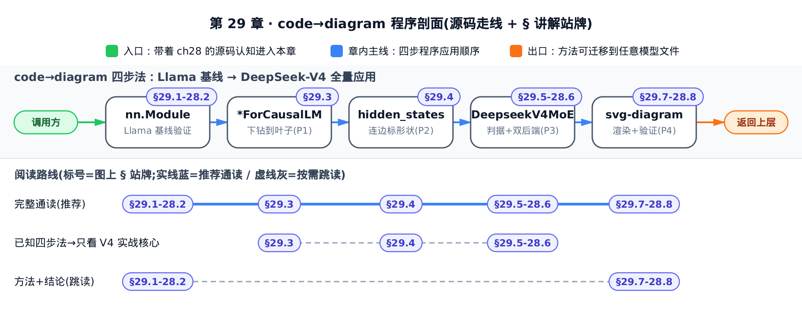
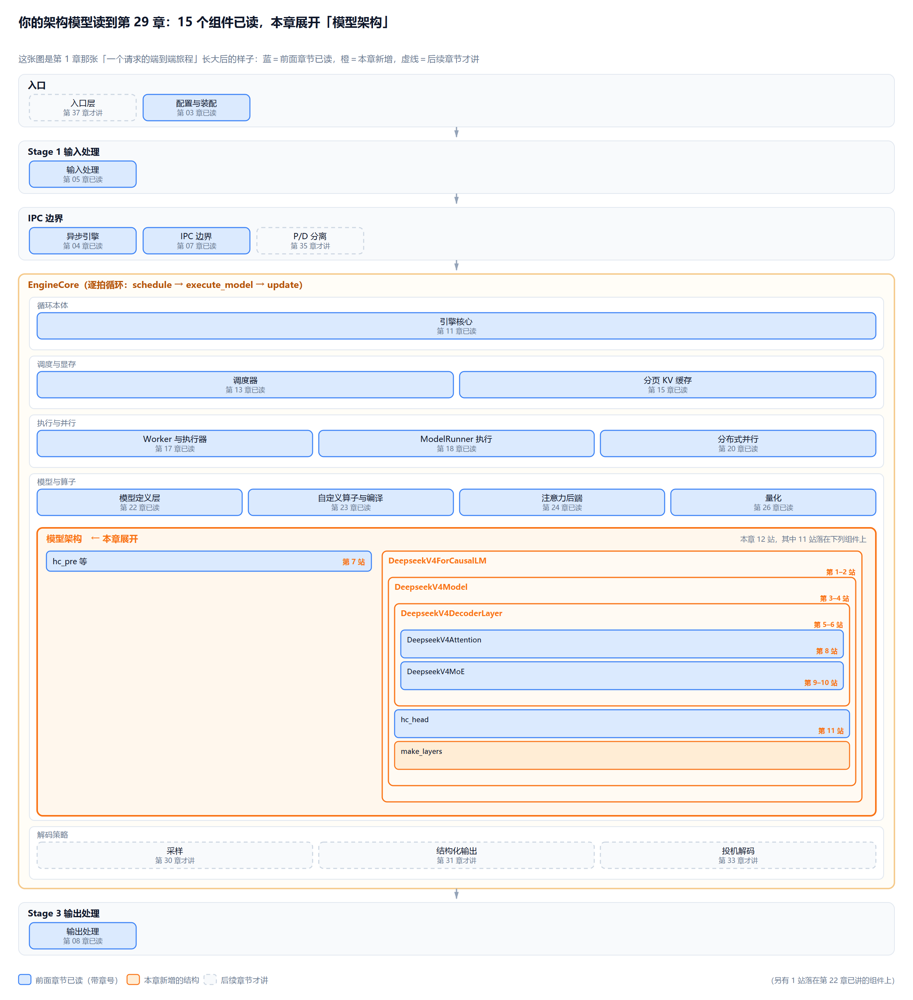
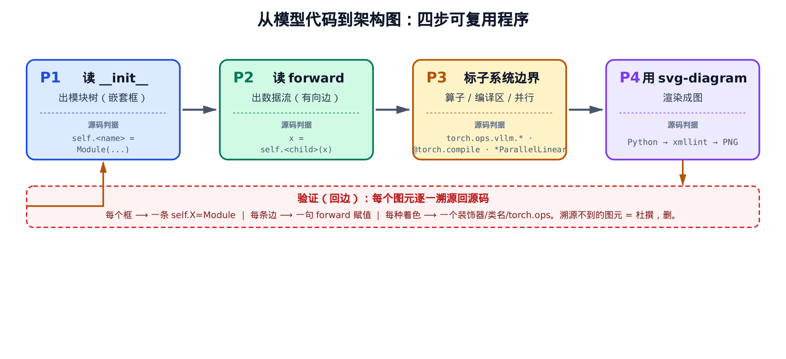
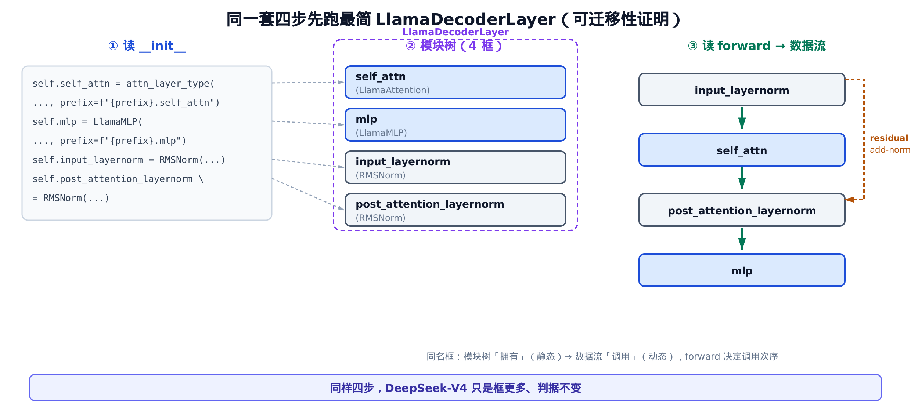
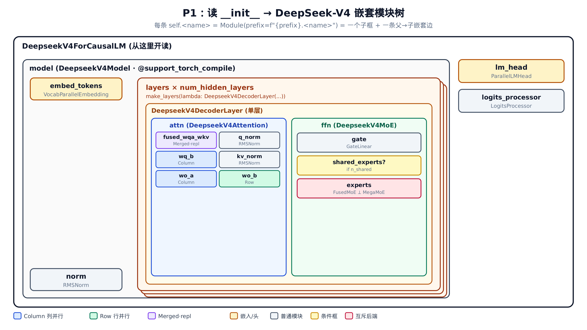
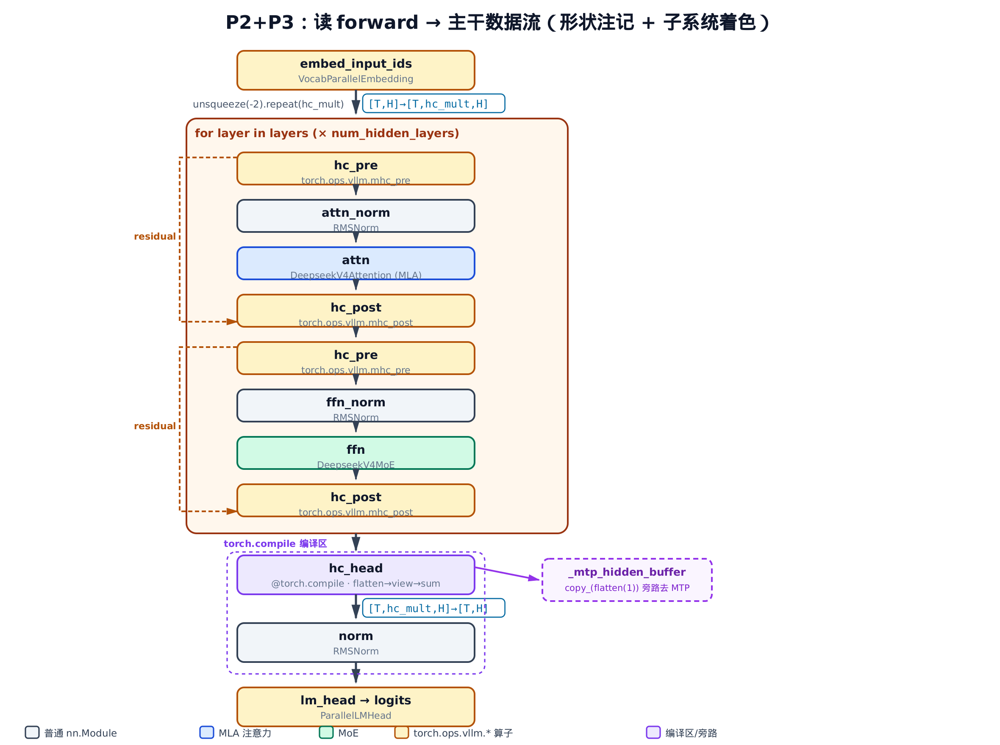

# 第 29 章　从模型代码到架构图：一个可复用的 code→diagram 程序



只想看 P3 判据和双后端配置，直接跳 §29.5-29.6；已经熟悉四步法、只想看它在 V4 上怎么落地，按 §29.3→§29.4→§29.5-29.6 读。只要方法和结论，读完 §29.1-29.2 直接跳 §29.7-29.8；想完整跟一遍全过程，按序读到底。

## 你在这里



> *图注：这张架构模型图整本书共用，从开篇起逐章生长——它就是[第 1 章](../../ch01-config-and-wiring/narrative/chapter.md)那张「一个请求的端到端旅程」长大后的样子。主线一眼就能认出来：自上而下依次是入口、输入处理、跨进程的 IPC（进程间通信）边界、装着逐拍循环 `schedule → execute_model → update` 的 EngineCore 大框、输出处理。蓝框是前面章节已经读过的（框里带章号），橙色是本章新长出的一块，虚线框是后续章节才讲的——入口层（第 37 章）、P/D 分离（第 35 章）、解码策略那三个（采样／结构化输出／投机解码，第 30/31/33 章）都还虚着。至今 15 个组件已读，读过的按「调度与显存／执行与并行／模型与算子」三组填进 EngineCore。*
> *本章在「模型与算子」组里就地展开——右列三层盒套盒：DeepseekV4ForCausalLM（第 1–2 站）⊃ DeepseekV4Model（第 3–4 站）⊃ DeepseekV4DecoderLayer（第 5–6 站）⊃ {DeepseekV4Attention（第 8 站）、DeepseekV4MoE（第 9–10 站）}，Model 盒内另挂 hc_head（第 11 站）与 make_layers 两片叶子；左列蓝框是 hc_pre 等（第 7 站）。本章走线共 12 站，其中 11 站落在这些组件上；底注那句「另有 1 站落在第 22 章已讲的组件上」指 LlamaDecoderLayer 基线（§29.2 就在那儿跑的）。站号是请求流经代码的顺序；正文按讲解需要编排，不必照站号顺序读——跨模块的几个大接缝处，正文会随手报一句「现在走到哪一段」。*
> *这块新结构不是孤立长出来的，接它的每一头读者都读过：四枚蓝叶（hc_pre 等、DeepseekV4Attention、DeepseekV4MoE、hc_head）正是[第 28 章](../../ch28-model-architecture/narrative/chapter.md)逐行读过的 V4 组件，本章给它们套上三层盒套盒的骨架（连 `make_layers` 这只橙叶，也是 `DeepseekV4Model.__init__` 里 `make_layers(...)` 那行读出来的）；第 12 站回指[第 22 章](../../ch22-model-definitions/narrative/chapter.md)立下的 Llama 模型基线；引擎侧的直接上游是「执行与并行」组里的 ModelRunner（第 18 章已读）——逐拍循环每次 `execute_model` 落进模型，走的就是这块区域；P3 的着色判据也各回指一章：torch.ops 自定义算子（[第 23 章](../../ch23-custom-ops-and-compilation/narrative/chapter.md)）、@torch.compile 编译区、并行类名（[第 20 章](../../ch20-distributed-parallelism/narrative/chapter.md)）。*
> *上一章逐行读完了 V4 的源码本体；本章不追加新算法知识，而是把那次逐行阅读的路径抽成一套可迁移的四步程序。下一章进入 EngineCore 第四条腿「解码策略」的第一站——[第 30 章：采样](../../ch30-sampling/narrative/chapter.md)。*

## 这章要做什么

上一章我们逐行读完了 DeepSeek-V4 的真实源码——MLA 投影、MoE 双后端、MTP 旁路（Multi-Token Prediction，多 token 预测：主干之外挂一条小分支，一次前向多猜几个 token 当草稿）、还有那条 hc 多流残差。读完之后，脑子里其实已经攒下了一张图：哪个模块拥有哪个模块，张量从哪儿流到哪儿。

这一章不再讲「V4 是什么」。我们要把上一章那个「读着读着图就浮现出来」的过程**拆成一套明确的步骤**，让它不再靠灵感、靠经验，而是像查字典一样——翻到 `__init__` 查框，翻到 `forward` 查边。然后把这套步骤原样跑在 DeepSeek-V4 上，产出它的架构图，并逐一交代：**每个框、每条边、每种着色，是从源码哪一行读出来的。**

核心命题只有一句：**架构图不是凭直觉画的，是从 vLLM 模型类的两类源码结构机械地「读」出来的。** `__init__` 读出模块树（嵌套框），`forward` 读出数据流（有向箭头）。学会这套读法，你拿到任何一个 vLLM 模型文件，都能画出它的架构图——这是一项可迁移的技能，不绑定 DeepSeek-V4。本章的 worked example 是 `vllm/model_executor/models/deepseek_v4.py`，对照基线是 `vllm/model_executor/models/llama.py`。

## 29.1 为什么需要一套「读法」，而不是凭感觉画

先说个常见的坑。很多人画模型架构图，是边回忆边画——「这里大概有个 attention，那里好像还有个 MLP」。画出来的图常常对不上代码：要么多了个源码里根本没有的框，要么把两个独立模块画成了一个，要么箭头方向反了。等到拿图去 debug 权重装载、对照 checkpoint 张量名时，全是错的。

问题出在哪？出在**没有把「框」和「边」钉到确定的源码位置**。只要钉住了，画图就从一门玄学变成一道可机械复现、可审计的工序。

vLLM 的每个模型都是一个标准的 PyTorch `nn.Module`。`nn.Module` 有两个我们要盯死的契约：

- `__init__` 里建子模块——`self.<name> = SomeModule(...)` 这种赋值，表达的是**静态的拥有关系**（谁包含谁）。
- `forward` 里定调用序——`x = self.<child>(x)` 这种语句，表达的是**动态的调用顺序**（数据先经过谁、再经过谁）。

这两套结构，恰好对应架构图里的两类元素：

- 拥有关系 → 图里的**嵌套框**（父框套子框）。
- 调用顺序 → 图里的**有向边**（箭头从上一步指向下一步）。

把这层对应关系做实，就有了一套四步程序。先看全貌，再逐步落到 DeepSeek-V4 源码上。



> *图注：四步程序——P1 读 `__init__` 出模块树，P2 读 `forward` 出数据流，P3 标子系统边界，P4 用 svg-diagram 渲染。每步下方挂着它的「源码判据」：你不是在主观分类，而是在源码里查一个确定的信号。底部那条红色回边是验证步——每个图元都要能溯源回源码，溯源不到的就是杜撰，删掉。*

四步分别是：

- **P1 读 `__init__` 出模块树**：每条 `self.<name> = Module(...)` 画一个子框、连一条父→子嵌套边。
- **P2 读 `forward` 出数据流**：每个 `x = self.<child>(x)` 画一条有向边；改形状的算子在边上标形状。
- **P3 标子系统边界**：用源码判据（`torch.ops.vllm.*` / `@torch.compile` / 并行类名）给框着色，让图同时是子系统地图。
- **P4 用 svg-diagram 渲染**：把模块树写成嵌套矩形、数据流写成有向箭头，脚本生成 SVG → 校验 → 转 PNG。

这套程序定义在 `vllm/model_executor/models/` 下每个模型文件遵循的 `nn.Module` 契约之上——`vllm/model_executor/models/deepseek_v4.py` 和 `vllm/model_executor/models/llama.py` 都不例外。下面先在最简单的 Llama 上跑一遍，建立信心；再上 DeepSeek-V4，证明同一程序只是框更多、判据不变。

## 29.2 先在最简模型上跑一遍：LlamaDecoderLayer

要证明一套程序「与模型无关」，最好的办法是先在最简单的模型上跑通。`vllm/model_executor/models/llama.py` 里的 `LlamaDecoderLayer` 就是理想的起点：一个标准 Transformer 解码层，没有任何花哨结构。

先看 `__init__`（P1 的读取对象）和紧接着的 `forward`（P2 的读取对象），它们在 `vllm/model_executor/models/llama.py:L288-L333`：

```python
# vllm/model_executor/models/llama.py:L288
        self.self_attn = attn_layer_type(
            config=config,
            hidden_size=self.hidden_size,
            num_heads=config.num_attention_heads,
            # … 省略：num_kv_heads / bias / cache_config 等构造参数 …
            prefix=f"{prefix}.self_attn",
            attn_type=attn_type,
        )
        self.mlp = LlamaMLP(
            hidden_size=self.hidden_size,
            intermediate_size=config.intermediate_size,
            hidden_act=config.hidden_act,
            quant_config=quant_config,
            bias=getattr(config, "mlp_bias", False),
            prefix=f"{prefix}.mlp",
        )
        self.input_layernorm = RMSNorm(config.hidden_size, eps=config.rms_norm_eps)
        self.post_attention_layernorm = RMSNorm(
            config.hidden_size, eps=config.rms_norm_eps
        )

    def forward(
        self,
        positions: torch.Tensor,
        hidden_states: torch.Tensor,
        residual: torch.Tensor | None,
    ) -> tuple[torch.Tensor, torch.Tensor]:
        # Self Attention
        if residual is None:
            residual = hidden_states
            hidden_states = self.input_layernorm(hidden_states)
        else:
            hidden_states, residual = self.input_layernorm(hidden_states, residual)
        hidden_states = self.self_attn(positions=positions, hidden_states=hidden_states)

        # Fully Connected
        hidden_states, residual = self.post_attention_layernorm(hidden_states, residual)
        hidden_states = self.mlp(hidden_states)
        return hidden_states, residual
```

**P1：读 `__init__` 出模块树。** 用手指顺着 `__init__` 往下点，找每一条 `self.<name> = ...(...)`。这里正好四条：

| 源码这一行 | 图上这个框 |
| --- | --- |
| `self.self_attn = attn_layer_type(...)` | `self_attn`（注意力） |
| `self.mlp = LlamaMLP(...)` | `mlp`（前馈） |
| `self.input_layernorm = RMSNorm(...)` | `input_layernorm` |
| `self.post_attention_layernorm = RMSNorm(...)` | `post_attention_layernorm` |

四条赋值 → 四个框，一一对应，没有第五个，也不少一个。这就是 P1 的全部：**`__init__` 里数 `self.X =` 的条数，就是这一层的子框数。**

注意每个框上还挂着 `prefix=f"{prefix}.self_attn"` 这种参数。这条 `prefix` 链不是装饰——它就是这个框在权重 checkpoint 里的命名前缀。模块树的层级路径（`model.layers.0.self_attn...`）和加载权重时看到的张量名一字不差。这一点我们到 DeepSeek-V4 会反复用上：**图的层级标签 == 权重名前缀**，所以架构图可以直接当 debug 索引。

那省略的那些构造参数（`num_kv_heads`、`bias`、`cache_config`）为什么不画？因为它们既不是 `self.X` 子模块赋值（不进模块树），也不出现在 `forward` 的数据流里。**画图只看两样东西：`self.X =`（进树）和 `forward` 里的赋值（进边）。其余配置读取一律忽略。**

**P2：读 `forward` 出数据流。** 同样用手指顺着 `forward` 往下点，找每一条 `hidden_states = self.<child>(...)`，按出现顺序连成箭头：

`input_layernorm` → `self_attn` → `post_attention_layernorm` → `mlp`

这就是这一层的主干数据流。那个 `residual = hidden_states`（以及 `post_attention_layernorm` 同时返回 `residual`）告诉我们有一条残差回边：输入先存进 `residual`，绕过 `self_attn`，在后面 add 回来。这条回边在图上画成一根从入口绕到 attention 之后的旁路。

把 P1 的框、P2 的边拼起来，就是 LlamaDecoderLayer 的完整架构图：



> *图注：左边是 `__init__` 的四条 `self.X` 赋值，虚线连到中间的四个模块树框（模块树表达「拥有」，是静态的）。右边是 `forward` 读出的数据流链，外加那条 add-norm 残差回边（数据流表达「调用」，是动态的）。同一个框，在模块树里讲「谁拥有它」，在数据流里讲「什么时候调它」——`forward` 决定调用次序。底下那句话是本章的赌注：同样四步，DeepSeek-V4 只是框更多、判据不变。*

到这里，四步程序里的 P1、P2 已经在一个真实模型上跑通了。它没用到任何 DeepSeek-V4 特有的东西——`self.X =` 数框、`forward` 连边，对所有 `nn.Module` 都成立。接下来上 DeepSeek-V4，你会看到完全相同的两步，只是要数的框更多、要连的边更绕。在架构模型图上，这趟 Llama 基线之旅就是底注那句「另有 1 站落在第 22 章已讲的组件上」——第 12 站落在[第 22 章](../../ch22-model-definitions/narrative/chapter.md)「模型定义层」蓝框（`LlamaDecoderLayer` 归属的子系统）上：12 站它只占一站，使命是验证四步程序不挑模型。现在往前，同一套程序跑在图上那片橙色新增结构上。

## 29.3 P1 实战：从 `__init__` 读出 DeepSeek-V4 的模块树

画一个完整模型的图，从哪个类开始读？答案永远一样：**从 `*ForCausalLM` 的 `__init__` 开读。** 它是整个模型对外的入口类（架构模型图上第 1–2 站那只最外层的橙盒），图最外层那几个框就在它的 `__init__` 里。

看 `vllm/model_executor/models/deepseek_v4.py:L1627-L1659` 的 `DeepseekV4ForCausalLM`：

```python
# vllm/model_executor/models/deepseek_v4.py:L1627
    def __init__(self, *, vllm_config: VllmConfig, prefix: str = ""):
        super().__init__()
        config = vllm_config.model_config.hf_config
        # … 省略：expert_dtype 分支只改 weights_mapper，不建子模块 …
        self.model = self.model_cls(
            vllm_config=vllm_config, prefix=maybe_prefix(prefix, "model")
        )
        self.lm_head = ParallelLMHead(
            config.vocab_size,
            config.hidden_size,
            prefix=maybe_prefix(prefix, "lm_head"),
        )
        self.logits_processor = LogitsProcessor(config.vocab_size)

    def forward(
        self,
        input_ids: torch.Tensor,
        positions: torch.Tensor,
        intermediate_tensors: IntermediateTensors | None = None,
        inputs_embeds: torch.Tensor | None = None,
    ) -> torch.Tensor | IntermediateTensors:
        hidden_states = self.model(
            input_ids, positions, intermediate_tensors, inputs_embeds
        )
        return hidden_states
```

P1 照搬：数 `self.X =`。这里三条——`self.model`、`self.lm_head`、`self.logits_processor`。所以图最外层就是三个框，主干是中间那个 `model`（`ParallelLMHead` 是输出头、`LogitsProcessor` 算 logits）。`forward` 里 `hidden_states = self.model(...)` 一句就把顶层数据流交代清楚了：数据进 `model`，出来就是 `hidden_states`。其余方法（`compute_logits`、`load_weights` 等）不在这条前向主干上，画数据流图时不画。

接着**下钻一层**（第 3–4 站）：`model` 是 `DeepseekV4Model`，读它的 `__init__`（`vllm/model_executor/models/deepseek_v4.py:L1299-L1320`）：

```python
# vllm/model_executor/models/deepseek_v4.py:L1299
        self.embed_tokens = VocabParallelEmbedding(
            config.vocab_size,
            config.hidden_size,
            quant_config=quant_config,
            prefix=f"{prefix}.embed_tokens",
        )

        self.start_layer, self.end_layer, self.layers = make_layers(
            config.num_hidden_layers,
            lambda prefix: DeepseekV4DecoderLayer(
                vllm_config,
                prefix=prefix,
                topk_indices_buffer=self.topk_indices_buffer,
                aux_stream_list=aux_stream_list,
            ),
            prefix=f"{prefix}.layers",
        )

        self.norm = RMSNorm(config.hidden_size, self.rms_norm_eps)
```

这里出现了 P1 的一个**关键技巧**。`embed_tokens` 和 `norm` 是普通框，照常画（`VocabParallelEmbedding` 和后面要看到的 `ColumnParallelLinear` 同属并行类名判据——它按 vocab 维切分嵌入表到各 TP rank，通信模式见[第 20 章](../../ch20-distributed-parallelism/narrative/chapter.md)）。但中间这条不是 `self.layers = SomeModule(...)`，而是 `make_layers(num_hidden_layers, lambda: DeepseekV4DecoderLayer(...))`。

`make_layers`（定义在 `vllm/model_executor/models/utils.py`）是 vLLM 里「堆叠 N 个同构层」的标准信号。看到 `make_layers` 或 `nn.ModuleList`，就知道这里不是一个框，而是 **N 个同构框的堆叠**。

那图上画 N 个框吗？不画。源码里它就是一个 lambda 工厂加一个计数 `num_hidden_layers`，每层结构完全一样。展开成 N 个框既冗余、又掩盖了「每层同构」这个事实。**正确画法：画一个框，标上 `× num_hidden_layers`。** 这是 P1 的一条硬规则。

还有一个容易踩的坑。`DeepseekV4Model.__init__` 里其实还定义了 `topk_indices_buffer`、`_mtp_hidden_buffer`、`hc_head_*` 这些。它们是 `nn.Parameter` 或 buffer，**不是 `nn.Module` 子模块**。所以它们**不进模块树框**——把它们画成框会让图失真。它们要等到 P2 画数据流时，作为参数或数据端点出现在边上的标注里。**画图时必须分清：子模块（进树）vs 参数/buffer（进数据流标注）。**

继续下钻到单层 `DeepseekV4DecoderLayer.__init__`（第 5–6 站，`vllm/model_executor/models/deepseek_v4.py:L1105-L1122`）：

```python
# vllm/model_executor/models/deepseek_v4.py:L1105
        # Lazy import to avoid top-level tilelang dependency.
        # Registers both torch.ops.vllm.mhc_pre and mhc_post
        import vllm.model_executor.layers.mhc  # noqa: F401
        # … 省略：config / hidden_size / rms_norm_eps 读取 …
        self.attn = DeepseekV4Attention(
            vllm_config,
            prefix=f"{prefix}.attn",
            topk_indices_buffer=topk_indices_buffer,
            aux_stream_list=aux_stream_list,
        )
        self.ffn = DeepseekV4MoE(vllm_config, prefix=f"{prefix}.ffn")

        self.attn_norm = RMSNorm(self.hidden_size, self.rms_norm_eps)
        self.ffn_norm = RMSNorm(self.hidden_size, self.rms_norm_eps)
```

老规矩，数 `self.X =`：`attn`（`DeepseekV4Attention`）、`ffn`（`DeepseekV4MoE`）、`attn_norm`、`ffn_norm`。四个子框。结构和 Llama 那层是同构的——attention、前馈、两个 norm，只是名字和内部实现换了。**这正是「程序与模型无关」的现场证据：换了模型，P1 的动作一字不改。**

但顶上那行 `import vllm.model_executor.layers.mhc` 不是普通 import——注释写得很清楚，它的**副作用**是注册 `torch.ops.vllm.mhc_pre` 和 `mhc_post` 两个自定义算子。这是 P3 识别「自定义算子子系统」的源码线索：算子不是 `self.X` 子模块，它靠 import 注册、靠 `torch.ops` 调用。这条线索我们 §29.5 再展开。

最后下钻到叶子层 `DeepseekV4Attention.__init__`（第 8 站，`vllm/model_executor/models/deepseek_v4.py:L973-L1009`），看 MLA 的投影子树怎么读出来：

```python
# vllm/model_executor/models/deepseek_v4.py:L973
        self.fused_wqa_wkv = MergedColumnParallelLinear(
            self.hidden_size,
            [self.q_lora_rank, self.head_dim],
            bias=False,
            quant_config=quant_config,
            prefix=f"{prefix}.fused_wqa_wkv",
            disable_tp=True,  # fused ReplicatedLinear
        )
        self.q_norm = RMSNorm(self.q_lora_rank, self.eps)
        self.wq_b = ColumnParallelLinear(
            self.q_lora_rank,
            self.n_heads * self.head_dim,
            # … 省略：bias / quant_config / return_bias …
            prefix=f"{prefix}.wq_b",
        )
        self.kv_norm = RMSNorm(self.head_dim, self.eps)
        self.wo_a = ColumnParallelLinear(
            self.n_heads * self.head_dim // self.n_groups,
            self.n_groups * self.o_lora_rank,
            # … 省略 …
            prefix=f"{prefix}.wo_a",
        )
        self.wo_a.is_bmm = True
        self.wo_a.bmm_batch_size = self.n_local_groups
        self.wo_b = RowParallelLinear(
            self.n_groups * self.o_lora_rank,
            self.hidden_size,
            # … 省略 …
            prefix=f"{prefix}.wo_b",
        )
```

到了叶子层，P1 变成一种很机械的体验：**一行一框**。`fused_wqa_wkv`、`q_norm`、`wq_b`、`kv_norm`、`wo_a`、`wo_b`——一条 `self.X =` 一个框，连 `prefix=f"{prefix}.<name>"` 都对齐了图里的层级标签。这就是 MLA 的投影子树，不多不少。

这里 P1 还顺手把 P3 的一半活干了：**框的着色判据，就写在类名里。** `MergedColumnParallelLinear`、`ColumnParallelLinear`、`RowParallelLinear`——这些类名本身就标了张量并行的方式。

这对「列 / 行」的名字不是 vLLM 自造的记法。它出自 NVIDIA 2019 年的 Megatron-LM（[arXiv:1909.08053](https://arxiv.org/abs/1909.08053)）——那篇论文第一次系统化地提出**层内**张量并行：不是按层把模型切给不同卡（那是流水线并行），而是把单个矩阵乘法本身横着或竖着切开。此后 DeepSpeed、PyTorch 官方的张量并行 API（`ColwiseParallel` / `RowwiseParallel`）直到 vLLM，都沿用了这套命名，它已经是大模型并行框架的事实标准记法，见到就该条件反射。

具体到一次线性变换 `y = xW`，两种切法是这样的：**列并行**把权重 `W` 按列切成 N 份发给 N 张卡，每张卡吃的是**完整**的 `x`，各自算出输出特征里互不重叠的一段——入口不需要通信，出口天然是「按特征分片」的。**行并行**反过来把 `W` 按行切，每张卡只吃输入的对应分片，各算出一份**部分和**；这些部分和必须做一次 all-reduce（跨卡求和归约，算完每张卡都持有同一份完整结果）才是真正的输出。

两者的分片方向正好咬合：列并行吐出来的分片，恰是行并行想吃的分片。所以框架里它们总是**成对**出现——最典型的例子是 MLP：把隐藏维升到中间维的那两个投影（Llama 里叫 `gate_proj` / `up_proj`）用列并行切中间维，再降回隐藏维的那个投影（`down_proj`）用行并行切同一个中间维；中间那一段各卡各算各的、一句通信都不需要，整个 MLP 块只在末尾 all-reduce 一次，而不是每个矩阵乘法后都要通信一次。回头看 MLA 的这串投影：`wq_b`、`wo_a` 是 `ColumnParallelLinear`，收尾的 `wo_b` 是 `RowParallelLinear`——**先列后行，是刻意的配对，不是随手挑的类名**；这条投影链上的跨卡求和，就只发生在 `wo_b` 那一格。（all-reduce 底下的通信组怎么建、集合通信算子怎么落到 NCCL，见[第 20 章](../../ch20-distributed-parallelism/narrative/chapter.md)。）

所以画图时按类名着色：列并行一种颜色、行并行另一种、合并复制的（`fused_wqa_wkv` 带 `disable_tp=True`，即关掉张量并行、每张卡各存一份完整权重的 ReplicatedLinear）再一种。**你不用主观判断「这块是不是并行」——读类名就行。**

把四层下钻的结果叠起来，就是 DeepSeek-V4 的完整模块树：



> *图注：从 `DeepseekV4ForCausalLM` 一路下钻——`model` ⊃ {`embed_tokens`，`layers × num_hidden_layers` ⊃ `DeepseekV4DecoderLayer` ⊃ {`attn` ⊃ MLA 投影叶子，`ffn` ⊃ MoE 子树}，`norm`}，`lm_head`。每个框都能指回一条 `self.X = Module` 赋值。叶子框按 `Column`/`Row`/`Merged ParallelLinear` 着色，所以这张模块树同时已经是半张并行子系统地图。`layers` 那个带叠影的框就是 `make_layers` 的 `× N` 复数框——一个框，不是 N 个。*

## 29.4 P2 实战：从 `forward` 读出数据流与形状变化

模块树画完了——在架构模型图上，橙色区域里三层盒套盒的框已经全部就位。但它只讲了「谁拥有谁」，没讲「数据怎么流」。P2 接手：读 `forward`，把静态的框连成动态的有向边。

先读主干 `DeepseekV4Model.forward`（`vllm/model_executor/models/deepseek_v4.py:L1383-L1432`）：

```python
# vllm/model_executor/models/deepseek_v4.py:L1383
        hidden_states = self.embed_input_ids(input_ids)
        hidden_states = hidden_states.unsqueeze(-2).repeat(1, self.hc_mult, 1)
        # … 省略：use_mega_moe 时 input_ids 转 int64，与画图无关 …
        residual, post_mix, res_mix = None, None, None
        for layer in islice(self.layers, self.start_layer, self.end_layer):
            hidden_states, residual, post_mix, res_mix = layer(
                hidden_states,
                positions,
                input_ids,
                post_mix,
                res_mix,
                residual,
            )
        else:
            hidden_states = layer.hc_post(hidden_states, residual, post_mix, res_mix)

        # Stash pre-hc_head residual for the MTP draft (captured copy_).
        num_tokens = hidden_states.shape[0]
        self._mtp_hidden_buffer[:num_tokens].copy_(hidden_states.flatten(1))

        hidden_states = hc_head(
            hidden_states,
            self.hc_head_fn,
            self.hc_head_scale,
            self.hc_head_base,
            self.rms_norm_eps,
            self.hc_eps,
        )
        hidden_states = self.norm(hidden_states)
        return hidden_states
```

P2 照 tensor 赋值顺序自上而下读，每一句 `hidden_states = ...(...)` 画一条有向边。这段里有四个值得专门标注的动作：

**一、形状变化要标在边上。** 第二行 `hidden_states.unsqueeze(-2).repeat(1, self.hc_mult, 1)`——这不是一个子模块（所以不进模块树），但它把张量从 `[T, H]` 变成了 `[T, hc_mult, H]`（以 DeepSeek-V4 为例：H=7168，hc\_mult=4，即从 `[T, 7168]` 展开到 `[T, 4, 7168]`）。`unsqueeze`、`repeat`、`view`、`flatten` 这类纯形状算子，**画图时不画框，但必须在那条边上标形状**：`[T,H]→[T,hc_mult,H]`。不标的话，读者后面会一脸懵——中途怎么凭空多出来一个 `hc_mult` 维？这个维就是 hc 多流，标在边上它才有来处。

**二、`for` 循环就是穿过堆叠层的那一条边——但这条边上现在跑着四个状态量，不止 `hidden_states` 一个。** `for layer in islice(self.layers, ...)` 对应 P1 里那个 `× N` 复数框——数据流箭头穿过这个复数框一次，代表依次流过所有层；但每次 `layer(...)` 调用是四进四出：`hidden_states, residual, post_mix, res_mix = layer(hidden_states, positions, input_ids, post_mix, res_mix, residual)`。后三个是 hc 残差状态量，随每次迭代原样传给下一层，不在 `× N` 框内部消失。循环结束后紧跟的 `else: hidden_states = layer.hc_post(...)`——这是 Python 的 `for...else` 语法——是收尾最后一段残差状态的独立一条边，画在 `× N` 复数框**外面**。

`for...else` 值得单独停一下：它是 Python 特有、也最容易被误读的一组关键字。很多带着 C / Java / JavaScript 经验来的读者，第一眼会把 `else` 当成「循环一次都没跑」的兜底分支，而它的真实语义几乎相反——`else` 问的是「这个循环有没有**清清白白跑到底、中途没被 `break` 打断**」。两行代码就能看清：

```python
# 说明性示例（非本仓源码），只为演示 for...else 的触发条件
for i in range(3):
    print(i)
else:
    print("穷尽了")      # 输出 0 1 2 穷尽了 —— 没有 break，else 执行

for i in range(3):
    if i == 1:
        break
    print(i)
else:
    print("不会打印")    # 只输出 0 —— i==1 时 break，else 整个被跳过
```

这个语法当初是为「遍历查找：找到就 `break`，找不到就在 `else` 里报『没找到』」这种模式设计的，省掉一个手写的 `found = False` 标志位（[Python 官方语言参考](https://docs.python.org/3/reference/compound_stmts.html#the-for-statement)里有正式定义）。把它放回主干这段：`for layer in islice(self.layers, ...)` 的循环体里**没有任何 `break`**，所以 `else` 分支每次都会执行——它不是「万一循环没跑」的异常兜底，而是「所有层都走完之后必然执行一次」的收尾动作，专门用来收掉最后一层残留的残差状态。画图时它就该老老实实画成复数框外的一条边，而不是被当成条件分支。

下钻到 `DecoderLayer.forward` 时会看到这三个状态量在层内具体怎么流转、`hc_post` 为什么要挪到这里单独收尾。

**三、`copy_` 是一条分叉旁路。** `self._mtp_hidden_buffer[:num_tokens].copy_(hidden_states.flatten(1))` 把主干上的隐状态拷一份进 `_mtp_hidden_buffer`（[上一章](../../ch28-model-architecture/narrative/chapter.md)读过这块缓冲区：MTP 草稿分支就是从它这里取走主干的隐状态）。这就是 §29.3 说的那个 buffer——它不在模块树里，现在以**数据流端点**的身份出现：主干上分一条旁路出去，喂给 MTP 草稿。旁路边画成一条岔出去的箭头，指向那个 buffer 框。

**四、`hc_head` 把形状压回来。** `hc_head(...)` 接收 `[T, hc_mult, H]`，内部做完混合后输出 `[T, H]`——又一条要标形状的边，`[T,hc_mult,H]→[T,H]`，和开头那次展开正好对称。最后 `self.norm(...)` 收尾。

那段 `intermediate_tensors`/`inputs_embeds` 的 PP 分支为什么省略？因为在单卡（PP=1）这条配置下它不触发——只画真正会走的路径。P2 有条原则：`if` 恒不触发的分支不进图，只画真正会走的路径。

> **v0.21.0 更新**：上面这条 PP 分支在新版里不再是一条「永不触发」的死分支——DeepSeek-V4 现在实现了 `SupportsPP`，支持流水线并行（[上一章](../../ch28-model-architecture/narrative/chapter.md) §28.7 讲了它在层构造侧怎么把首尾零件换成 `PPMissingLayer()`）。在数据流层面，这给图加了一个**条件切分点**：当 PP > 1 时，非首 rank 的 `forward` 不再从 `embed_input_ids` 起步，而是直接取上一 rank 传来的 `intermediate_tensors["hidden_states"]`；非末 rank 则在末尾提前 `return IntermediateTensors(...)`，把 `hc_head`、`_mtp_hidden_buffer` 暂存与 `lm_head` 全部下放到末 rank。画图时这处可作脚注：在主干首/末画一条 `IntermediateTensors` 跨 rank 传递的虚线边，标上多流形状 `(num_tokens, hc_mult, H)`——它和单卡主干是同一条逻辑数据流，只是被 PP 边界切成了几段。是否画这条边，取决于你要画的是单卡视图还是 PP 视图：判据仍然客观（`get_pp_group().is_first_rank / is_last_rank` 那两个分支），只是这次「会不会走」由部署拓扑而非模型配置决定。

下钻到单层 `DeepseekV4DecoderLayer.forward`（`vllm/model_executor/models/deepseek_v4.py:L1201-L1252`），看层内数据流：

```python
# vllm/model_executor/models/deepseek_v4.py:L1201
    def forward(
        self,
        x: torch.Tensor,
        positions: torch.Tensor,
        input_ids: torch.Tensor | None,
        post_mix: torch.Tensor | None = None,
        res_mix: torch.Tensor | None = None,
        residual: torch.Tensor | None = None,
    ) -> tuple[torch.Tensor, torch.Tensor, torch.Tensor, torch.Tensor]:
        if residual is None:
            # Run standalone hc_pre on first layer
            residual = x
            x, post_mix, res_mix = self.hc_pre(
                x, self.hc_attn_fn, self.hc_attn_scale, self.hc_attn_base
            )
        else:
            residual, post_mix, res_mix, x = torch.ops.vllm.mhc_fused_post_pre(
                x, residual, post_mix, res_mix,
                self.hc_attn_fn, self.hc_attn_scale, self.hc_attn_base,
                # … 省略：rms_eps / hc_pre_eps / sinkhorn 等算子参数，与 hc_pre 同源 …
            )

        x = self.attn_norm(x)
        x = self.attn(positions, x, None)

        residual, post_mix, res_mix, x = torch.ops.vllm.mhc_fused_post_pre(
            x, residual, post_mix, res_mix,
            self.hc_ffn_fn, self.hc_ffn_scale, self.hc_ffn_base,
            # … 省略：同上，算子参数 …
        )

        x = self.ffn_norm(x)
        x = self.ffn(x, input_ids)
        return x, residual, post_mix, res_mix
```

这段仍是两段对称的骨架——attention 一段、ffn 一段，每段都是「进 hc_pre、norm、算子、出 hc_post」——但 v0.21.0 把相邻的「上一段的 `hc_post`」和「下一段的 `hc_pre`」**融合成了一个算子** `torch.ops.vllm.mhc_fused_post_pre`：一次 dispatch 同时干两件事，用传入的 `residual`/`post_mix`/`res_mix` 收掉上一段留下的残差状态（相当于旧版单独的 `hc_post`），再为接下来这一段生成新的残差状态（相当于旧版单独的 `hc_pre`）。所以 `forward` 的签名多了三个可选入参、返回值也从单个 `x` 变成四元组——这三个状态量不再局限于层内，而是**跨层线程传递**：本层 ffn 段留下的状态，会作为参数原样传给下一层 attn 段的 `forward` 调用（就是上面 §29.4 读到的那句 `hidden_states, residual, post_mix, res_mix = layer(...)`）。

只有两处例外不走融合路径：**整个模型的第一次 attn 段**（`residual is None`，即第 0 层），没有「上一段」可收，只能单独调 `self.hc_pre`；**整个模型的最后一次 ffn 段**留下的状态，没有「下一段」可开，因此不在某一层的 `forward` 里被收掉——这次单独的收尾 `hc_post` 调用，就是 §29.4 已经读过的、`DeepseekV4Model.forward` 循环结束处 `for...else` 分支里的 `layer.hc_post(hidden_states, residual, post_mix, res_mix)`。逻辑上，这仍然是**两条残差回边**——一条绕过 attention、一条绕过 ffn——只是除了模型的第一段和最后一段，中间的每一次回边收尾+下一次回边起始，都被两两打包进了同一次 `mhc_fused_post_pre` 调用里，不再是每层各自独立、肉眼可数的一次 `hc_pre` 加一次 `hc_post`。

把主干和层内拼起来，DeepSeek-V4 的数据流图就成形了——但还差最后一步：给那些算子框、编译区上色。

## 29.5 P3 实战：用源码判据标出子系统边界

P1 和 P2 已经把架构模型图上橙色区域里的框和边全部钉回了源码——这一节 P3 是按子系统给它们上色。三条判据各连着前面一章读者已经走过的路。

到这里图已经能用了，但它还只是一张「数据怎么流」的图。P3 要让它**同时是一张子系统地图**：哪块是自定义算子、哪块是 torch.compile 编译区、哪块跨设备通信。

关键在于：这些边界**不靠作者主观分类**，全部从源码读出三类客观判据。

**判据一：调 `torch.ops.vllm.*` 的，是自定义算子框。** 怎么判断一个框是「普通子模块前向」还是「自定义算子」？看它调的是 `self.<submodule>(...)` 还是 `torch.ops.vllm.*`。看 `hc_pre`/`hc_post` 的方法体（`vllm/model_executor/models/deepseek_v4.py:L1172-L1199`）：

```python
# vllm/model_executor/models/deepseek_v4.py:L1172
    def hc_pre(
        self,
        x: torch.Tensor,
        hc_fn: torch.Tensor,
        hc_scale: torch.Tensor,
        hc_base: torch.Tensor,
    ):
        post_mix, res_mix, layer_input = torch.ops.vllm.mhc_pre(
            residual=x,
            fn=hc_fn,
            hc_scale=hc_scale,
            hc_base=hc_base,
            # … 省略：rms_eps / hc_pre_eps / sinkhorn 等算子参数 …
        )
        return layer_input, post_mix, res_mix

    def hc_post(
        self,
        x: torch.Tensor,
        residual: torch.Tensor,
        post: torch.Tensor,
        comb: torch.Tensor,
    ):
        return torch.ops.vllm.mhc_post(x, residual, post, comb)
```

证据确凿：`hc_pre` 直接 dispatch 到 `torch.ops.vllm.mhc_pre`，`hc_post` 到 `torch.ops.vllm.mhc_post`。它们不是普通子模块前向，是自定义算子。所以图里这两个框用特殊填充、旁注算子名，和普通 `nn.Module` 框区分开。判据就一条：**`torch.ops.vllm.` 前缀。**

那 `torch.ops.vllm.mhc_pre` 到底是个什么东西？它写起来像一次普通的属性访问加函数调用，其实不是：`torch.ops` 是 PyTorch **算子分发表**（dispatcher，一张「算子名 → 各设备实现」的全局注册表）的门牌，后面两段分别是**命名空间**（`vllm`，vLLM 自己的私有算子库）和**算子名**（`mhc_pre`）。一个名字要能出现在这张表里，必须先被显式**注册**过——而注册它的，正是 §29.3 里那行带副作用的 `import vllm.model_executor.layers.mhc`：那个模块里排着一串这样的注册调用，本章遇到的 `mhc_pre`、`mhc_post`、`mhc_fused_post_pre` 都在其中，一次一个地挂进 `vllm` 命名空间：

```python
# vllm/model_executor/layers/mhc.py:L817-L822
direct_register_custom_op(
    op_name="mhc_pre",
    op_func=mhc_pre,
    mutates_args=[],
    fake_impl=_mhc_pre_fake,
)
```

`direct_register_custom_op` 是 vLLM 在 `vllm/utils/torch_utils.py` 里包的一层薄封装，底下做的就是 PyTorch `torch.library` 那套标准动作：推断出算子 schema（输入输出类型，以及 `mutates_args`——声明它会不会原地改写哪些入参）后 `define` 进 vLLM 私有算子库，把 Python 实现 `impl` 到当前平台的 dispatch key（设备分发键，CUDA 上就是 CUDA 那一档）上，再登记一份 `fake_impl`。

这份 `fake_impl`（也叫 fake/meta 实现）恰恰是「为什么非要注册、不能就写个普通方法」的答案：它不算真数值，只按输入形状返回一个形状正确的空张量。有了它，`torch.compile`（PyTorch 2.0 起自带的即时编译器，下一条判据马上展开）在编译期**不执行 kernel 也能推出输出形状**，于是可以把这个算子当成计算图里一个规规矩矩的节点，而不是一个看不懂、只能就地断图的黑盒。这也顺带说明本条判据为什么天然成立：普通子模块调用是一次 Python 方法调用，注册算子调用要经过分发表，两者在源码形态上根本长得不一样，扫一眼就能分开。

至于每个算子背后的 kernel 怎么写、vLLM 怎么在多份实现之间挑一份，[第 23 章](../../ch23-custom-ops-and-compilation/narrative/chapter.md)讲 CustomOp 两级 dispatch 时已经拆过；本章只借它的**外形**当画图判据。想看 PyTorch 侧完整的注册 API，官方 [`torch.library` 文档](https://docs.pytorch.org/docs/stable/library.html)是入口。

**判据二：顶着 `@torch.compile` 装饰器的，是编译区框。** 看 `hc_head`（`vllm/model_executor/models/deepseek_v4.py:L1552-L1580`）：

```python
# vllm/model_executor/models/deepseek_v4.py:L1552
@torch.compile(backend=current_platform.simple_compile_backend)
def hc_head(
    hidden_states: torch.Tensor,
    hc_fn: torch.Tensor,
    hc_scale: torch.Tensor,
    hc_base: torch.Tensor,
    rms_norm_eps: float,
    hc_eps: float,
) -> torch.Tensor:
    x = hidden_states
    shape, dtype = x.size(), x.dtype
    x = x.flatten(1).float()
    # … 省略：rsqrt / sigmoid 门控的数学细节 …
    y = torch.sum(pre.unsqueeze(-1) * x.view(shape), dim=1)
    return y.to(dtype)
```

读判据之前，先把 `torch.compile` 本身讲清楚——这条判据的全部依据都在它身上。`torch.compile` 是 PyTorch 2.0（2023）随新一代编译栈一起带进来的入口。在它之前，想让一段 PyTorch 代码跑得更快又不亲手写 CUDA，基本只能去写 TorchScript / `torch.jit.script`，得迁就编译器认得的那个语言子集，侵入性强、覆盖面窄。`torch.compile` 把这件事拆成两级：前端 TorchDynamo 在这段代码**第一次真正执行**时截获字节码，把里面的张量运算「录」成一张静态计算图；后端再把这张图编成融合、去冗余之后的机器码——PyTorch 默认后端是 TorchInductor，本章这里写的 `backend=current_platform.simple_compile_backend` 是把「选哪个后端」交给平台层去定，在 NVIDIA GPU 这条线上取到的仍是默认的 `inductor`。录好的图带着一组 guard（守卫条件，比如输入形状），下次条件相符就直接复用；形状变了 guard 失效，重录一次。碰到编译器看不懂的控制流，它会就地断图（graph break），把那一段退回普通 Python 执行——除非你显式要求 `fullgraph=True` 不许断。

对画图的人来说，重要的不是这套机制的内部，而是**它的触发方式是一个装饰器**：装饰器顶在哪儿，编译区的边界就在哪儿，肉眼可见、无需推断。（想深入的读者，官方入门文档在 [PyTorch: torch.compiler 入门](https://docs.pytorch.org/docs/stable/torch.compiler_get_started.html)。）

这页一次给了三个画图判据。其一，顶上的 `@torch.compile(backend=...)` 装饰器就是编译边界——画图时用虚线容器把它圈出来，标「编译区」。装饰器位置即编译边界，这是客观的。和它对照的是类级装饰器 `@support_torch_compile`，它顶在 `DeepseekV4Model` 上（`vllm/model_executor/models/deepseek_v4.py:L1255`），把整个主干圈成一个大编译区。一个是函数级编译、一个是类级编译，判据是同一条：**看装饰器圈编译区。**

其二，`hc_head` 是个**函数，不是 `nn.Module`**——可它照样是图里一个框。这破除一个误解：图里的框不一定都是子模块，前向路径上一个被调用的编译函数也算一个框。

其三，内部 `x.flatten(1)` → `x.view(shape)` → `torch.sum(..., dim=1)` 这串，就是把 `[T, hc_mult, H]` 坍缩回 `[T, H]` 的形状变化——标在「压回单流」那条边上，和 §29.4 开头那次 `repeat` 展开首尾呼应。

**判据三：并行类名 + `FusedMoE` + aux CUDA stream，是并行/通信子系统。** §29.3 已经用类名给 MLA 投影上了色（`Column`/`Row`/`Merged ParallelLinear`）。同一条判据在 MoE 里还要再用一次，下一节展开。`DeepseekV4Model.__init__` 里那行 `aux_stream_list = [torch.cuda.Stream() for _ in range(3)]` 则标出了辅助 CUDA 流这个并行子系统——aux stream 本身代表独立的 GPU 执行队列，看到它被创建并传给子模块，就说明这里有算子要在主流之外异步并发执行（三条 aux 流让注意力里的几个输入 GEMM 并行跑）。

三条判据合起来，每一种着色都能指回源码的一个装饰器、一个类名、或一个 `torch.ops` 前缀。把它们叠到 §29.4 的数据流图上：



> *图注：主干自上而下——`embed` → `repeat` 展开成 `[T,hc_mult,H]` → 逐层（`hc_pre`→`attn_norm`→`attn`→`hc_post`，再 `hc_pre`→`ffn_norm`→`ffn`→`hc_post`，两条 residual 回边在左侧）→ `hc_head` 压回 `[T,H]` → `norm` → `lm_head`。橙色框是 `torch.ops.vllm.mhc_pre/mhc_post` 自定义算子（判据：`torch.ops.vllm.` 前缀）；紫色虚线容器是 `@torch.compile` 编译区（判据：装饰器）；右侧紫色旁路是 `copy_` 去 `_mtp_hidden_buffer`（判据：它是 buffer 不是子模块，进数据流不进树）。这张图画的是 hc_pre/hc_post 的**逻辑**粒度——每个图元仍能钉回一行源码，但要经过下一条注解换算。*

> **v0.21.0 更新**：图上画成两个分开橙色框的 `hc_post`→`hc_pre`，在当前源码里除了模型的第一段（第 0 层的 attn 段，无上一段可收）和最后一段（挪到 §29.4 循环结束处、`DeepseekV4Model.forward` 里单独收尾的那次 `hc_post`）之外，全部被融合进同一个算子 `torch.ops.vllm.mhc_fused_post_pre` 一次调用完成（§29.4 下钻 `DecoderLayer.forward` 时已经读过这处融合）。钉源码时，把图上相邻的 `hc_post`/`hc_pre` 一对框，对应到源码里的同一次 `mhc_fused_post_pre` dispatch，而不是两次分开的 `torch.ops.vllm.mhc_pre`/`mhc_post` 调用——逻辑结构（两条残差回边）不变，只是这一步「图元→源码」的映射从「一对一」变成了「一对二」。

## 29.6 配置开关怎么读：可选框与双后端分叉

DeepSeek-V4 的 MoE 比 Llama 的 MLP 多了一层复杂度：它的结构不是固定的，而是**被配置开关决定**的。P1 和 P2 都要处理这种「条件存在」的框。先看 `DeepseekV4MoE.__init__`（第 9–10 站，`vllm/model_executor/models/deepseek_v4.py:L752-L801`）：

```python
# vllm/model_executor/models/deepseek_v4.py:L752
        self.gate = GateLinear(
            config.hidden_size,
            config.n_routed_experts,
            out_dtype=torch.float32,
            bias=False,
            prefix=f"{prefix}.gate",
        )
        # … 省略：gate 的 e_score_correction_bias / tid2eid 路由细节 …
        if config.n_shared_experts is None:
            self.shared_experts = None
        else:
            intermediate_size = config.moe_intermediate_size * config.n_shared_experts
            self.shared_experts = DeepseekV4MLP(
                hidden_size=config.hidden_size,
                intermediate_size=intermediate_size,
                # … 省略：hidden_act / swiglu_limit / quant_config …
                reduce_results=self.use_mega_moe,
                prefix=f"{prefix}.shared_experts",
            )

        if self.use_mega_moe:
            self._init_mega_moe_experts(vllm_config, config, prefix)
        else:
            self._init_fused_moe_experts(config, quant_config, prefix)
```

`self.gate` 是无条件框，照常画。但接下来两个 `if` 是 P1 要专门处理的**配置开关**：

- `if config.n_shared_experts is None:` —— `shared_experts` 是**可选框**。配置里没共享专家就是 `None`（不画），否则是一个 `DeepseekV4MLP`（画）。这种框在图上要标成「条件存在」，用区别于常驻框的样式。
- `if self.use_mega_moe:` —— 走 `_init_mega_moe_experts` 还是 `_init_fused_moe_experts`，二选一。它们各自 new 出 `DeepseekV4MegaMoEExperts` 或 `FusedMoE`，是**互斥的双后端**。图上画成一个菱形分叉：两条路只走一条。

**规则：`__init__` 里的 `if` 决定图里的可选框 / 互斥框。** 不是所有框都常驻——有的框存不存在、走哪个，取决于配置。

这种分叉在 `forward` 里也有对应。看 `DeepseekV4MoE.forward`（`vllm/model_executor/models/deepseek_v4.py:L860-L899`）：

```python
# vllm/model_executor/models/deepseek_v4.py:L860
        if not self.use_mega_moe:
            return self._forward_fused_moe(hidden_states, input_ids)

        org_shape = hidden_states.shape
        router_logits, _ = self.gate(hidden_states)
        topk_weights, topk_ids = fused_topk_bias(
            hidden_states=hidden_states,
            gating_output=router_logits,
            # … 省略：scoring_func / e_score_correction_bias / hash 路由参数 …
            topk=self.n_activated_experts,
        )
        # … 省略：activation_clamp 取值 …
        final_hidden_states = self.experts(
            hidden_states,
            topk_weights,
            topk_ids,
            activation_clamp=activation_clamp,
        )

        if self.shared_experts is not None:
            shared_output = self.shared_experts(hidden_states)
            final_hidden_states += shared_output

        return final_hidden_states.view(org_shape)
```

P2 在这里读出两件事：

**一、`if not self.use_mega_moe: return ...` 是一个早退分叉。** 数据流到这里劈成两路：非 mega 走 `_forward_fused_moe` 直接返回，mega 走下面的主体。这就是 §29.6 那个互斥菱形在数据流图上的体现——`if`/`return` 早退 → 图里的分支。

**二、`+= shared_output` 是一条旁路汇入边。** mega 路径里，主路是 `gate` → `fused_topk_bias` → `experts`，算出 `final_hidden_states`。然后 `if self.shared_experts is not None:`（呼应 `__init__` 里那个可选框）算一份 `shared_output`，用 `final_hidden_states += shared_output` 加回主路。这个 `+=` 就是一条从共享专家旁路汇入主干的边。

读这两个 `forward` 分支时有个细节值得记下来：mega 路径里 `shared_experts` 的输出是在这里显式 `+=` 汇入的，但 TP 路径 `_forward_fused_moe` 里，`FusedMoE` 内部已经把 `shared_experts` 聚合掉了——两条路的「共享专家汇入点」位置不同。画图时这点要标注，不能想当然画成一处。**这正是「读 `forward` 出边」必须老老实实顺着每个分支读、不能凭印象的原因。**

## 29.7 P4 与验证：把图钉死在源码上

在架构模型图上，P1、P2、P3 三步走完，橙色区域的内容已经全部就位。前三步已经把图的内容定下来了：P1 出框、P2 出边、P3 出着色。P4 只是渲染——但渲染工具的选择本身也是有讲究的。

模块树加数据流，是一张 dense 的多元素图：嵌套容器要精确对齐、多对多的连边要不打架、形状标注要贴在正确的边上。用代码把这种图做出来，业界常见的是三条路，各有各的适用面：

| 路子 | 它怎么工作 | 什么时候选它 |
| --- | --- | --- |
| [Mermaid](https://mermaid.js.org/intro/) | 写一段类 Markdown 的文本描述节点与连线，库自动排布局、直接吐 SVG | 拓扑稀疏、层级浅的流程图 / 树；图想和文档写在一起、随文档一起改 |
| [Excalidraw](https://github.com/excalidraw/excalidraw) | 手绘风格的白板应用，节点和连线靠人在画布上拖拽摆放 | 一次性的草图、结构不规律的示意图；画完不打算再机械重生成 |
| 脚本化 SVG | 自己写脚本按规则算出每个矩形 / 箭头的坐标，生成 SVG 源码 | 元素多、嵌套深、结构规律，且图会随源码（层数、子模块数）变化而重新生成 |

Mermaid 的定位是「文档里嵌一段文本就能出图」，对抗的是配图与代码脱节（它自己称之为 doc-rot，文档腐化）；Excalidraw 的定位是「像在白板上画草图一样自由」。两者都不是为「元素多、嵌套深、连线多对多、还要随源码变化重新生成」这类图设计的，而本章要画的恰恰是这一类。按工程经验，这种密度下 Mermaid 的通用布局算法容易把节点挤成一团，而你几乎无法指定某个节点具体该摆在哪；Excalidraw 精确但全靠手工，模型的层数或子模块一变就得重排一遍坐标——需要说明的是，这两条属于实践中的观察，两家官方文档并没有正面承认这类局限。

所以本章这几张图走第三条路——也就是 P4 那步说的 svg-diagram 渲染，把「画图」变成「编程」：Python 脚本用循环算出每个坐标（零手填坐标）→ 生成 SVG → 用 `xmllint --noout` 校验（`xmllint` 是老牌 XML 解析库 libxml2 自带的命令行工具，`--noout` 表示不打印解析出的内容、只用退出码回答「这份 SVG 是不是合法 XML」：标签闭没闭、属性引号对不对）→ 用 `rsvg-convert` 转成 PNG（GNOME 的 SVG 渲染库 librsvg 的命令行入口，把矢量图栅格化成位图；它会自动为中文字形做字体回退，排版才不乱）。布局规则写在脚本里，改一条规则整张图重新生成，产物还能被校验工具机械检查——这正是这类图最需要的性质。

但 P4 不是终点。真正让这套程序「可审计」的，是最后那条**验证回边**——画完之后，拿图逐元素对回源码核一遍。判据三条，对应本章一路下来的三步：

- 每个**框**，能指到一条 `self.X = Module` 赋值（P1），或一个 `@decorator` / `torch.ops` 调用（P3 里那些非子模块的框）。
- 每条**边**，能指到一句 `forward` 里的赋值（P2）。
- 每种**着色**，能指到一个装饰器、一个类名、或一个 `torch.ops` 前缀（P3）。

一张图**忠实**，当且仅当：(a) 每个框都能这样溯源；(b) 每条边都能这样溯源；(c) 没有源码里不存在的框或边。这三条把「这张图画对了吗」从一句主观感叹，变成了一道可机械核对的命题——逐个图元过一遍，**指不回源码的图元就是杜撰，删掉。**

这里还藏着一个让架构图额外好用的事实。那条 `prefix=f"{prefix}.<name>"` 链，让模块树的层级路径恰好等于 checkpoint 里的权重名前缀：`model.layers.0.attn.fused_wqa_wkv...`。所以这张图不光是讲解用的——加载权重报错、对照张量名调试时，看到的名字和图上的层级标签一字不差，**架构图可以直接当 debug 索引用。**

## 29.8 这套程序为什么对任何 vLLM 模型都成立

回头看走过的路：在 Llama 上跑了 P1+P2，在 DeepSeek-V4 上跑了完整的 P1→P2→P3→P4。两次用的是**完全相同的动作**：

| 步骤 | 动作 | 源码判据 | Llama | DeepSeek-V4 |
| --- | --- | --- | --- | --- |
| P1 | 数 `self.X =` 出框 | `self.<name> = Module(...)` | 4 个框 | 几十个框，多层嵌套 |
| P1 | 堆叠层画 `× N` | `make_layers` / `ModuleList` | 上层有 | `make_layers(DecoderLayer)` |
| P2 | 顺序连有向边 | `x = self.<child>(x)` | 直链 | 含分叉/旁路/残差 |
| P2 | 形状标在边上 | `unsqueeze/repeat/view/flatten` | 无 | `[T,H]↔[T,hc_mult,H]` |
| P3 | 着色子系统 | `torch.ops.vllm.*` / `@torch.compile` / 并行类名 | 并行类名 | 三类判据全用上 |

差别全在「框多少、边多绕」，**动作和判据一个没变。**

为什么必然如此？因为 vLLM 的每个模型都是 `nn.Module`，而 `nn.Module` 的契约是死的：`__init__` 建子模块、`forward` 定调用序。只要这个契约成立——它对 `vllm/model_executor/models/llama.py`、`vllm/model_executor/models/deepseek_v4.py` 乃至该目录下所有模型都成立——「`__init__` → 模块树、`forward` → 数据流」这个映射就成立。不同模型只是子模块多寡、调用图繁简的差异，程序的步骤一步不改。

这就是把一个 worked example 升格成「方法」的依据。你下次拿到 `vllm/model_executor/models/` 里任意一个陌生模型文件，不必从头读懂它的算法——先翻 `*ForCausalLM` 的 `__init__` 数框、翻 `forward` 连边、按三条判据着色，一张可溯源、可当 debug 索引的架构图就出来了。读代码画图，是一项可迁移的手艺，不绑定 DeepSeek-V4。

在架构模型图上，本章走完了 EngineCore「模型与算子」组里这片橙色区域——从最外层 `__init__` 一路下钻到 MLA 投影叶子，从 `forward` 逐句赋值到三条判据给框着色。下一站顺着架构模型图往下，进 EngineCore 第四条腿「解码策略」：[第 30 章：采样](../../ch30-sampling/narrative/chapter.md)看 `hidden_states` 在 `lm_head` 之后怎么变成一个真正被采样出来的 token。
