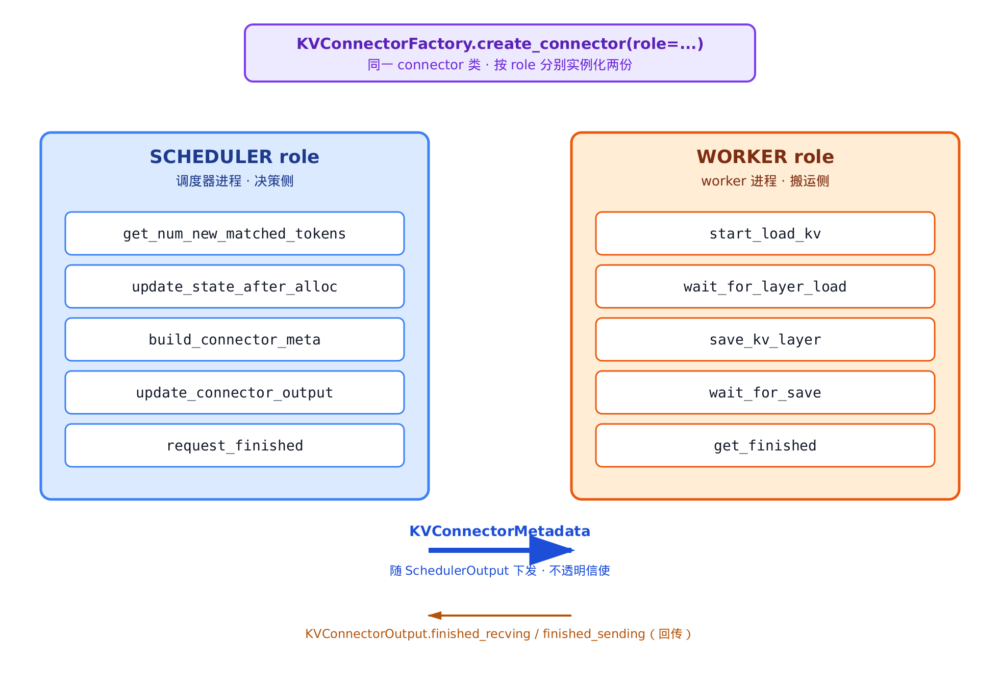
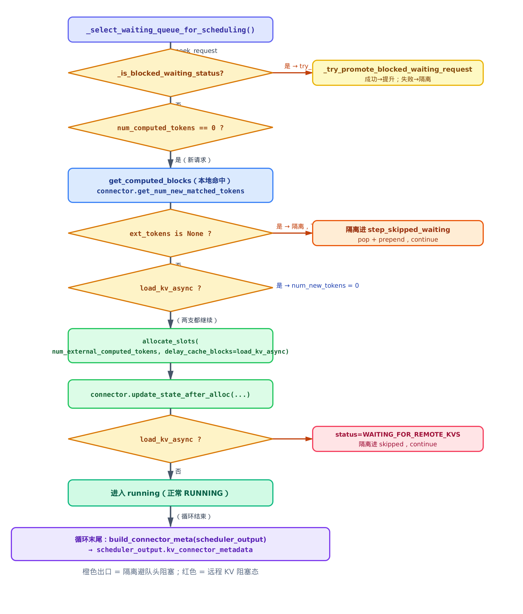
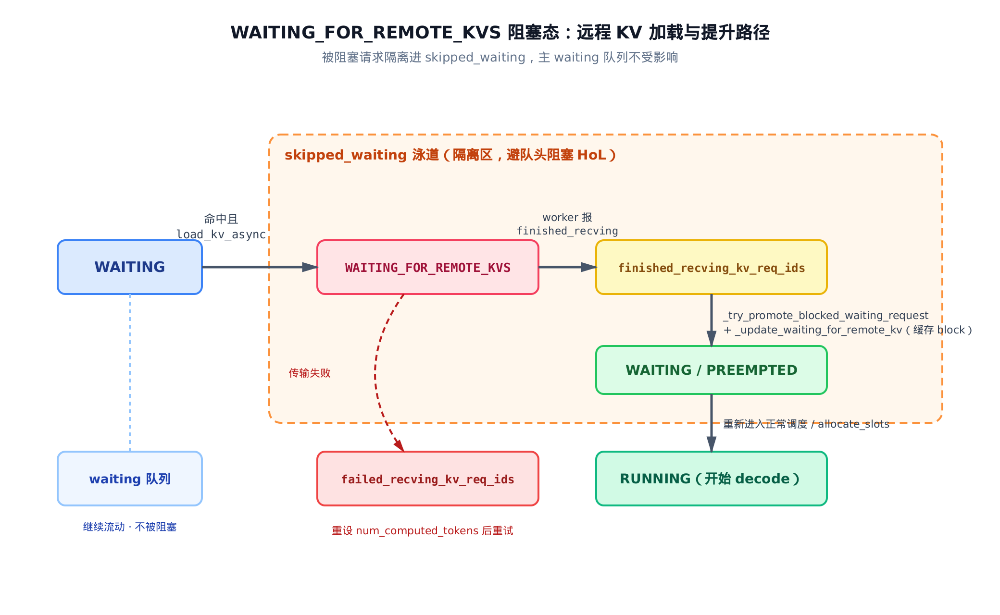

# 第 29 章　PD 分离 I：KV Connector 契约与调度器集成


> *上一章讲投机解码：一个 engine 内部怎么用小模型猜、大模型验。*
> *本章把视野放大到 engine 之间——为什么要把 prefill 和 decode 拆到不同 engine，KV 缓存怎么跨进程搬过去。*
> *下一章接着讲 worker 侧真正的搬运执行与可插拔后端（P2P / NIXL / Offloading）。*

本章的两条源码主线：契约定义在 `vllm/distributed/kv_transfer/kv_connector/v1/base.py`，调度集成在 `vllm/v1/core/sched/scheduler.py`。工厂在 `vllm/distributed/kv_transfer/kv_connector/factory.py`，参考实现在 `vllm/distributed/kv_transfer/kv_connector/v1/example_connector.py`。

## 29.1 为什么要把 prefill 和 decode 拆开

先看一个让人头疼的现象。

一台机器同时跑很多请求。有的请求刚进来，prompt 几千 token，要一次性吃完算出全部 KV——这是 **prefill**。有的请求已经在逐 token 往外吐字——这是 **decode**。两类活儿挤在同一个 engine 里，互相拖后腿。

它们的瓶颈根本不一样：

- **Prefill** 是**算力密集**。一段长 prompt 的注意力大致是 $O(L^2 d)$ 的计算量（$L$ 是 prompt 长度，$d$ 是隐藏维度）。一次吃整段，GPU 算到冒烟，吞吐受**算力**封顶。
- **Decode** 是**访存密集**。每步只算一个新 token，复杂度约 $O(L d)$，但要把整个 KV cache 从显存搬一遍。它逐 token 串行，受**显存带宽**和批大小封顶，对**延迟**极其敏感。

人话翻译：prefill 像一次性搬一卡车货（要大马力），decode 像每隔几秒递一个快递（要稳、要快、不能卡顿）。把卡车和快递员塞进同一条单行道，结果就是——卡车一过，所有快递的递送时延（inter-token latency，ITL）全被顶上去。一个长 prompt 的 prefill 突发，能让正在 decode 的几十个请求集体卡一下。

**PD 分离**（Prefill-Decode disaggregation）的思路很直接：把这两类活儿拆到**不同的 engine**上去。

- **Prefill engine** 专心算 prompt，按算力配比、独立扩缩容；
- **Decode engine** 专心吐 token，按显存带宽配比、独立扩缩容；
- prefill 算完，把这段 prompt 的 **KV cache 搬给 decode engine**，decode 接着往下生成。

拆开之后，两边各按各的瓶颈调配资源，互不抖动。代价是多了一条**跨进程、甚至跨节点的 KV 搬运通道**。这条通道的统一接口，就是本章的主角：**KV Connector**。

vLLM 没有把"KV 怎么搬"写死。它在 `vllm/distributed/kv_transfer/kv_connector/v1/base.py` 定义了一个抽象基类 `KVConnectorBase_V1`，让 NIXL、LMCache、Mooncake、磁盘 offloading 等十几种后端都来实现同一套契约。本章讲清楚这套契约**长什么样**、调度器（`vllm/v1/core/sched/scheduler.py`）怎么**集成**它；下一章讲 worker 侧**怎么真正搬**、各后端有何不同。

这一章还要还一笔账。第 14 章讲调度循环时，我们见过 `waiting` 之外还有个 `skipped_waiting` 队列，专门隔离一种叫 `WAITING_FOR_REMOTE_KVS` 的阻塞态请求——当时只说"它在等远程 KV 传输"，把完整路径推给了后面。[第 14 章 §14.4](../ch14-scheduler/narrative/chapter.md) 埋下的这条线，本章收尾：一个请求怎么进这个阻塞态、KV 到位后怎么被提升回来重新调度。

## 29.2 role-split：一个 connector，两副面孔

设计这套抽象时，vLLM 面对一个本质矛盾：

- **"要不要 load、load 多少、登记哪些 block"**——这些是**决策**，发生在**调度器进程**里。调度器看得到请求队列、block 分配表，但它**手里没有 KV tensor**，也不该阻塞在 IO 上。
- **"真把 KV tensor 拷进/拷出 paged buffer"**——这是**搬运**，发生在 **worker 进程**里。worker 持有 GPU 显存、跑前向，但它看不到全局调度状态。

两件事在**两个不同的进程**里，内存和上下文完全隔离。vLLM 的解法是 **role-split**：同一个 connector 类，按角色实例化**两份**，每份只干一摊活、只能调属于自己那一摊的方法。

角色由一个枚举切分，它就放在基类文件的开头：

```python
# vllm/distributed/kv_transfer/kv_connector/v1/base.py:L123-L128
class KVConnectorRole(enum.Enum):
    # Connector running in the scheduler process
    SCHEDULER = 0

    # Connector running in the worker process
    WORKER = 1
```

就两个值，却是整套契约的根。`KVConnectorBase_V1` 的方法被显式切成两组：



> *图注：左栏决策侧跑在调度器进程，只产出"搬运计划"；右栏搬运侧跑在 worker 进程，真正拷 KV。*
> *粗箭头是决策侧打包的 `KVConnectorMetadata`，随 `SchedulerOutput` 下发给 worker。*
> *细箭头是 worker 回传的 `KVConnectorOutput`，告诉调度器哪些收/发已经完成。*

基类文件的模块 docstring 把这套分工写得清清楚楚，它是契约的口头说明书：

```python
# vllm/distributed/kv_transfer/kv_connector/v1/base.py:L7-L40（节选）
"""
The class provides the following primitives:
    Scheduler-side: runs in the scheduler, binds metadata, which
    is used by the worker-side to load/save KV cache.
        get_num_new_matched_tokens() - get number of new tokens
            that exist in the remote KV cache. ...
        update_state_after_alloc() - update KVConnector state after
            temporary buffer alloc by the CacheManager.
        ...
    Worker-side: runs in each worker, loads/saves KV cache to/from
    the Connector based on the metadata.
        start_load_kv() - starts loading all KVs (maybe async)
        ...
        get_finished() - called with ids of finished requests, returns
            ids of requests that have completed async sending/recving.
"""
```

为什么要这么死板地分？因为**进程隔离是物理的，不是约定俗成的**。如果让开发者在一个类里随便调，迟早有人在调度器进程里去碰一个 GPU tensor——那是另一个进程的内存，结果就是崩溃或者更糟的静默错乱。显式 role + 分组方法 + 工厂分别构造，等于在编译期就把"你不可能在错的进程调错的方法"钉死。

### 决策侧的三个核心方法

决策侧的契约就三个 `@abstractmethod`，子类必须实现。先看查远程命中的入口：

```python
# vllm/distributed/kv_transfer/kv_connector/v1/base.py:L449-L470（Args 文档已略）
    @abstractmethod
    def get_num_new_matched_tokens(
        self,
        request: "Request",
        num_computed_tokens: int,
    ) -> tuple[int | None, bool]:
        """
        Get number of new tokens that can be loaded from the
        external KV cache beyond the num_computed_tokens.

        Returns:
            A tuple with the following elements:
                - An optional number of tokens that can be loaded from the
                  external KV cache beyond what is already computed.
                  If None, it means that the connector needs more time to
                  determine the number of matched tokens, and the scheduler
                  should query for this request again later.
                - `True` if external KV cache tokens will be loaded
                  asynchronously (between scheduler steps). Must be
                  'False' if the first element is 0.
        """
        pass
```

这个签名里藏着两个值得停下来的设计决策。

**第一，返回值第一项可以是 `None`。** 这不是"没命中"（没命中是 `0`），而是"**我还说不准，给我点时间**"。远程命中查询本身可能要去远端节点探测，一次问不出确定答案。返回 `None` 让调度器先跳过这个请求、下一步再问，而不是在调度热路径上同步阻塞等远端应答。调度循环是延迟敏感的，绝不能为一个请求的远程探测把整批都拖住。

**第二，第二项 `bool` 是 `load_kv_async` 标志。** `True` 表示"这些远程 KV 会**异步**加载，跨调度步完成"。注意文档那句约束：第一项是 `0` 时，这个标志**必须**是 `False`——没有 token 要加载，自然谈不上异步加载。这个标志后面会驱动一整条分支，先记住它。

第二个方法在 block 分配之后被调用，让 connector 登记"这个请求下一步需要 load KV"：

```python
# vllm/distributed/kv_transfer/kv_connector/v1/base.py:L484-L518（Args 文档已略）
    @abstractmethod
    def update_state_after_alloc(
        self, request: "Request", blocks: "KVCacheBlocks", num_external_tokens: int
    ):
        """
        Update KVConnector state after block allocation.

        If get_num_new_matched_tokens previously returned True for a
        request, this function may be called twice for that same request -
        first when blocks are allocated for the connector tokens to be
        asynchronously loaded into, and second when any additional blocks
        are allocated, after the load/transfer is complete.
        """
        pass

    @abstractmethod
    def build_connector_meta(
        self, scheduler_output: SchedulerOutput
    ) -> KVConnectorMetadata:
        """
        Build the connector metadata for this step.

        This function should NOT modify fields in the scheduler_output.
        Also, calling this function will reset the state of the connector.
        """
        pass
```

第三个方法 `build_connector_meta` 是 role-split 的**信使生成点**。它在每个调度步末尾被调一次，把本步攒下的所有 load/save 计划打包成一个**不透明对象** `KVConnectorMetadata`，挂到 `SchedulerOutput` 上随之下发给 worker。注意 docstring 那句"calling this function will reset the state of the connector"——打包顺手清空内部状态，保证每步从干净状态开始。

为什么决策侧只产出不透明 meta、不直接搬数据？因为**调度器进程根本不持有 KV tensor**。它只负责"规划"，把"谁要 load/save、对应哪些 block"写成一张清单交给 worker，worker 自己去解读执行。决策侧绝不碰 IO、绝不阻塞，调度循环才能保持高频。

### 搬运侧的对称方法

搬运侧也是一组 `@abstractmethod`，结构上和决策侧对称——load 一套、save 一套：

```python
# vllm/distributed/kv_transfer/kv_connector/v1/base.py:L298-L361（Args 文档已略，docstring 要点保留）
    @abstractmethod
    def start_load_kv(self, forward_context: "ForwardContext", **kwargs: Any) -> None:
        """
        Start loading the KV cache from the connector to vLLM's paged
        KV buffer. This is called from the forward context before the
        forward pass to enable async loading during model execution.
        """
        pass

    @abstractmethod
    def wait_for_layer_load(self, layer_name: str) -> None:
        """
        Block until the KV for a specific layer is loaded into vLLM's
        paged buffer. This is called from within attention layer to ensure
        async copying from start_load_kv is complete.
        """
        pass

    @abstractmethod
    def save_kv_layer(
        self,
        layer_name: str,
        kv_layer: torch.Tensor,
        attn_metadata: "AttentionMetadata",
        **kwargs: Any,
    ) -> None:
        """
        Start saving a layer of KV cache from vLLM's paged buffer
        to the connector. This is called from within attention layer to
        enable async copying during execution.
        """
        pass

    @abstractmethod
    def wait_for_save(self):
        """
        Block until all the save operations is done. This is called
        as the forward context exits to ensure that the async saving
        from save_kv_layer is complete before finishing the forward.
        """
        pass
```

读这四个方法，注意它们被调用的**位置**——全都在前向过程内部：

- `start_load_kv` 在前向**之前**启动异步加载，趁模型还没跑就把远程 KV 往 paged buffer 里搬；
- `wait_for_layer_load` 在**某一层的注意力算子里**调，确保这一层要用的 KV 真到位了才往下算；
- `save_kv_layer` 在**某一层算完后**启动该层 KV 的异步保存；
- `wait_for_save` 在前向**退出时**调，挡住直到所有保存完成——否则 paged buffer 可能被下一步覆盖，正在异步外发的数据就脏了。

这种"start... / wait_for..."的成对结构，是为了让搬运和计算**重叠**起来：加载/保存异步发起，模型前向同时进行，到真正需要数据时才阻塞等齐。worker 侧的具体落地（各后端怎么实现这套异步搬运）是下一章的内容，这里只需看清契约的**形状**。

最后一个搬运侧方法不是抽象的，但它是连回决策侧的关键一环——上报异步收/发的完成情况：

```python
# vllm/distributed/kv_transfer/kv_connector/v1/base.py:L363-L378
    def get_finished(
        self, finished_req_ids: set[str]
    ) -> tuple[set[str] | None, set[str] | None]:
        """
        Notifies worker-side connector ids of requests that have
        finished generating tokens on the worker.
        ...
        Returns:
            ids of requests that have finished asynchronous transfer
            (requests that previously returned True from request_finished()),
            tuple of (sending/saving ids, recving/loading ids).
            ...
        """
        return None, None
```

`get_finished` 返回一对集合：（发完/存完的 req_id，收完/载完的 req_id）。这两个集合经 `KVConnectorOutput` 回传给调度器，就是图里那条细回传箭头。**收完**触发"提升请求重新调度"，**发完**触发"释放可以释放的 block"——后面 §29.5 我们会看到调度器怎么消化它们。

## 29.3 KVConnectorFactory：按 role 各造一份

契约定义好了，谁来实例化？`KVConnectorFactory`。它干两件事：维护一张**懒加载注册表**，以及按 role **分别构造**两份实例。

先看注册：

```python
# vllm/distributed/kv_transfer/kv_connector/factory.py:L149-L157（节选）
KVConnectorFactory.register_connector(
    "ExampleConnector",
    "vllm.distributed.kv_transfer.kv_connector.v1.example_connector",
    "ExampleConnector",
)
# … 省略：NIXL / LMCache / Mooncake / P2pNccl / Offloading 等十余种注册 …
```

注册表只存 `(name → 模块路径 + 类名)`，**不 import**。为什么不直接 import？因为 vLLM 支持十几种 connector，每个都拖一堆重依赖（NIXL 要 RDMA 库、LMCache 要它自己的 runtime……）。如果启动就把它们全 import 一遍，无关重依赖会拖慢甚至拖崩进程。懒加载注册表把实际 `import_module` 推迟到 `create_connector` 真要用那一个时，只加载当前选中的后端：

```python
# vllm/distributed/kv_transfer/kv_connector/factory.py:L42-L82（HMA 校验/日志已略）
    @classmethod
    def create_connector(
        cls,
        config: "VllmConfig",
        role: KVConnectorRole,
        kv_cache_config: "KVCacheConfig | None" = None,
    ) -> KVConnectorBase:
        kv_transfer_config = config.kv_transfer_config
        if kv_transfer_config is None:
            raise ValueError("kv_transfer_config must be set to create a connector")
        connector_cls, compat_sig = cls._get_connector_class_with_compat(
            kv_transfer_config
        )
        # … 省略：HMA（混合内存分配器）支持校验，不支持则报错 …
        # NOTE(Kuntai): v1 connector is explicitly separated into two roles.
        # Scheduler connector:
        # - Co-locate with scheduler process
        # - Should only be used inside the Scheduler class
        # Worker connector:
        # - Co-locate with worker process
        # - Should only be used inside the forward context & attention layer
        # We build separately to enforce strict separation
        if compat_sig:
            # Old signature: __init__(self, vllm_config, role)
            return connector_cls(config, role)
        else:
            # New signature: __init__(self, vllm_config, role, kv_cache_config)
            return connector_cls(config, role, kv_cache_config)
```

`role` 参数在这里分流。`NOTE(Kuntai)` 那段注释把意图说白了：调度器侧 connector 和 worker 侧 connector "build separately to enforce strict separation"——分别构造，强制严格隔离。调度器进程调一次 `create_connector(role=SCHEDULER)`，每个 worker 进程各调一次 `create_connector(role=WORKER)`。同一个类，两份实例，各活在各的进程里。

调度器这一头的构造发生在 `Scheduler.__init__`：

```python
# vllm/v1/core/sched/scheduler.py:L118-L132（统计字段初始化已略）
        # Create KVConnector for the Scheduler. Note that each Worker
        # will have a corresponding KVConnector with Role=WORKER.
        # KV Connector pushes/pull of remote KVs for P/D and offloading.
        self.connector = None
        # … 省略：connector_prefix_cache_stats 等统计初始化 …
        if self.vllm_config.kv_transfer_config is not None:
            assert not self.is_encoder_decoder, (
                "Encoder-decoder models are not currently supported with KV connectors"
            )
            self.connector = KVConnectorFactory.create_connector(
                config=self.vllm_config,
                role=KVConnectorRole.SCHEDULER,
                kv_cache_config=self.kv_cache_config,
            )
```

只有当用户配了 `kv_transfer_config`（即开了 PD 分离 / KV offloading）时，`self.connector` 才非空。否则它是 `None`，后面所有 connector 相关分支自动跳过——这意味着**不开 PD 分离的部署，这套机制零开销**。注释也点明了对称关系："each Worker will have a corresponding KVConnector with Role=WORKER"。

### 契约怎么被填实：ExampleConnector

抽象方法都是 `pass`，光看签名容易悬浮。vLLM 自带一个调试参考实现 `ExampleConnector`，把 KV cache 存/取到磁盘 safetensors 文件，给每个方法最朴素的真实落地。看它怎么实现决策侧的查命中：

```python
# vllm/distributed/kv_transfer/kv_connector/v1/example_connector.py:L262-L290
    def get_num_new_matched_tokens(
        self,
        request: "Request",
        num_computed_tokens: int,
    ) -> tuple[int | None, bool]:
        # NOTE: in this debug implementation, we assume that the prompt is
        # cached_prompt + newly_generated_single_token
        if not self._found_match_for_request(request):
            return 0, False

        logger.info("External Cache Hit!")

        token_ids = request.prompt_token_ids or []
        num_tokens_to_check = align_to_block_size(len(token_ids) - 1, self._block_size)

        return num_tokens_to_check - num_computed_tokens, False
```

它靠"对应文件夹是否存在"判命中。没命中返回 `(0, False)`；命中了，返回**远程能多提供多少 token**——也就是远程命中总数减去本地已经算出的 `num_computed_tokens`。

这里有个容易被忽略的细节：`align_to_block_size`。它把 token 数对齐到 block 边界，定义是 `(n - 1) // block_size * block_size`。为什么必须对齐？因为 v1 调度器期望返回的命中 token 数和 block 数**同为 block 粒度**——KV cache 以 block 为单位分配，命中数若不对齐，后面算 `slot_mapping`（token 到物理槽位的映射）就会错位。举个数：`block_size=4`、prompt 共 9 个 token，注意调用处先把长度减一传进去（L334 的 `len(token_ids) - 1`），所以实际算的是 `align_to_block_size(9-1, 4) = align_to_block_size(8, 4) = (8 - 1) // 4 * 4 = 4`——对齐到 4（一个整 block），剩下的零头 token 留给前向去算。

再看登记 load 计划的 `update_state_after_alloc`，朴素到只有一行实质逻辑：

```python
# vllm/distributed/kv_transfer/kv_connector/v1/example_connector.py:L299-L309
    def update_state_after_alloc(
        self, request: "Request", blocks: "KVCacheBlocks", num_external_tokens: int
    ):
        """
        Update KVConnector state after block allocation.
        If blocks were allocated, add to _requests_need_load,
        such that we load the KVs in the next forward pass.
        """
        if num_external_tokens > 0:
            self._requests_need_load[request.request_id] = request
```

命中了远程 token（`num_external_tokens > 0`），就把这个请求记进 `_requests_need_load`。下一步 `build_connector_meta` 会遍历这张表，把它打成 load 计划下发给 worker。决策侧的活儿，到此就是"查命中 → 登记 → 打包"三步，全程不碰一个 KV tensor。

## 29.4 调度器集成：查命中、隔离、不堵队头

契约清楚了，现在看**调度器怎么把它编织进 WAITING 调度循环**。这是本章最硬的一段，也是第 14 章那笔账的正主。

第 14 章讲过，`waiting` 不是一个队列而是两个：

```python
# vllm/v1/core/sched/scheduler.py:L167-L169
        self.waiting = create_request_queue(self.policy)
        # requests skipped in waiting flow due async deps or constraints.
        self.skipped_waiting = create_request_queue(self.policy)
```

`skipped_waiting` 专门隔离"因异步依赖或约束被跳过"的请求。等远程 KV 的请求就是典型——它的 KV 还在跨节点传输，可能要等好几个调度步。

### 队头阻塞，量化一下

为什么非要隔离？设想不隔离：一个等远程 KV 的请求 R0 占着 `waiting` 队头。远程传输要 $k$ 个调度步才完成。那么 R0 后面排着的 $m$ 个本来立刻就能调度的请求，每一个都被 R0 堵着，各推迟约 $k$ 步才有机会——这就是**队头阻塞**（Head-of-Line blocking，HoL）。$m$ 个请求白白多等 $k$ 步，吞吐塌缩。

隔离的代价对比呢？把 R0 挪到独立的 `skipped_waiting` 后，主 `waiting` 队列继续畅通，那 $m$ 个请求该调度就调度。R0 自己每步只付出**一次 $O(1)$ 的检查**——"我在不在 `finished_recving_kv_req_ids` 里"。代价从 $m \times k$ 步的集体空等，压成每步一次 $O(1)$ 跳过。这就是双队列的全部收益。

### 一次调度迭代的完整控制流

下面这张图是本节的骨架，把 WAITING 循环一次迭代里所有跟 connector 相关的分支画全了：



> *图注：橙色出口都是"隔离进 skipped_waiting，本步不调度它"；红色是远程 KV 阻塞态。*
> *主线一路向下：选队列 → 取请求 → 查本地+远程命中 → 分配 block → 登记 load → 进 running。*
> *循环末尾统一 `build_connector_meta` 打包下发。*

我们沿着图走一遍源码。循环入口先选队列、取队头：

```python
# vllm/v1/core/sched/scheduler.py:L571-L592（lora 约束分支已略）
            while (self.waiting or self.skipped_waiting) and token_budget > 0:
                if len(self.running) == self.max_num_running_reqs:
                    break

                request_queue = self._select_waiting_queue_for_scheduling()
                assert request_queue is not None

                request = request_queue.peek_request()
                request_id = request.request_id

                # try to promote blocked statuses while traversing skipped queue.
                if self._is_blocked_waiting_status(
                    request.status
                ) and not self._try_promote_blocked_waiting_request(request):
                    if request.status == RequestStatus.WAITING_FOR_REMOTE_KVS:
                        logger.debug(
                            "%s is still in WAITING_FOR_REMOTE_KVS state.",
                            request_id,
                        )
                    request_queue.pop_request()
                    step_skipped_waiting.prepend_request(request)
                    continue
```

`_select_waiting_queue_for_scheduling` 在两个队列里选一个。这就是第 14 章 §14.4 的双队列选取：

```python
# vllm/v1/core/sched/scheduler.py:L1567-L1577
    def _select_waiting_queue_for_scheduling(self) -> RequestQueue | None:
        if self.policy == SchedulingPolicy.FCFS:
            return self.skipped_waiting or self.waiting or None

        # PRIORITY mode: compare queue heads when both queues are non-empty.
        if self.waiting and self.skipped_waiting:
            waiting_req = self.waiting.peek_request()
            skipped_req = self.skipped_waiting.peek_request()
            return self.waiting if waiting_req < skipped_req else self.skipped_waiting

        return self.waiting or self.skipped_waiting or None
```

FCFS 下先看 `skipped_waiting`（让被隔离的请求有机会被复查）；PRIORITY 下比两队头的优先级。

取到请求后，第一道分叉：它是不是**阻塞态**？阻塞态的判定集合包括我们关心的 `WAITING_FOR_REMOTE_KVS`：

```python
# vllm/v1/core/sched/scheduler.py:L1553-L1559
    @staticmethod
    def _is_blocked_waiting_status(status: RequestStatus) -> bool:
        return status in (
            RequestStatus.WAITING_FOR_STRUCTURED_OUTPUT_GRAMMAR,
            RequestStatus.WAITING_FOR_REMOTE_KVS,
            RequestStatus.WAITING_FOR_STREAMING_REQ,
        )
```

如果是阻塞态，就调 `_try_promote_blocked_waiting_request` 试着把它"提升"回可调度状态。提升成功就往下走正常调度；**提升失败**（KV 还没到），就 `pop` 出来 `prepend` 进 `step_skipped_waiting`——隔离，`continue` 下一个。`step_skipped_waiting` 是这一步攒下的隔离请求的临时筐，循环末尾再一并回灌。提升的细节是 §29.5 的事，先按下。

如果**不是**阻塞态（全新请求），走查命中主线。先看本地命中，再问 connector 要远程命中：

```python
# vllm/v1/core/sched/scheduler.py:L613-L646（prefill_stats / else 分支已略）
                # Get already-cached tokens.
                if request.num_computed_tokens == 0:
                    # Get locally-cached tokens.
                    new_computed_blocks, num_new_local_computed_tokens = (
                        self.kv_cache_manager.get_computed_blocks(request)
                    )

                    # Get externally-cached tokens if using a KVConnector.
                    if self.connector is not None:
                        ext_tokens, load_kv_async = (
                            self.connector.get_num_new_matched_tokens(
                                request, num_new_local_computed_tokens
                            )
                        )

                        if ext_tokens is None:
                            # The request cannot be scheduled because
                            # the KVConnector couldn't determine
                            # the number of matched tokens.
                            request_queue.pop_request()
                            step_skipped_waiting.prepend_request(request)
                            continue

                        num_external_computed_tokens = ext_tokens
                        # … 省略：connector_prefix_cache_queries / hits 统计 …

                    # Total computed tokens (local + external).
                    num_computed_tokens = (
                        num_new_local_computed_tokens + num_external_computed_tokens
                    )
```

这段把 §29.2 的契约用上了。`get_num_new_matched_tokens` 返回 `(ext_tokens, load_kv_async)`。还记得返回值第一项可以是 `None` 吗——这里就是消费点：`ext_tokens is None` 表示"connector 还说不准"，调度器照样 `pop` + 隔离进 `step_skipped_waiting`，下步再问。否则把远程命中数和本地命中数加起来，得到总的 `num_computed_tokens`。

接下来 `load_kv_async` 标志开始驱动分支。异步加载时，本步**一个新 token 都不能算**：

```python
# vllm/v1/core/sched/scheduler.py:L668-L671（else 正常分支转述见下）
                if load_kv_async:
                    # KVTransfer: loading remote KV, do not allocate for new work.
                    assert num_external_computed_tokens > 0
                    num_new_tokens = 0
```

为什么 `num_new_tokens = 0`？因为这些远程 KV **还没到**——它们正在异步传输路上。本步对这个请求能做的，只是"预留落地缓冲"，不能误把它当成可计算的工作调度出去。否则前向会去读还没填进来的 KV，读到垃圾。（只有同步加载的请求才正常计算 `num_new_tokens`，本章不涉及。）

然后分配 block。注意两个为远程 KV 专设的参数：

```python
# vllm/v1/core/sched/scheduler.py:L744-L774（encoder/stats 分支已略）
                new_blocks = self.kv_cache_manager.allocate_slots(
                    request,
                    num_new_tokens,
                    num_new_computed_tokens=num_new_local_computed_tokens,
                    new_computed_blocks=new_computed_blocks,
                    num_lookahead_tokens=effective_lookahead_tokens,
                    num_external_computed_tokens=num_external_computed_tokens,
                    delay_cache_blocks=load_kv_async,
                    num_encoder_tokens=num_encoder_tokens,
                    full_sequence_must_fit=self.scheduler_reserve_full_isl,
                )

                if new_blocks is None:
                    # The request cannot be scheduled.
                    # … 省略：回退处理 …
                    break

                # KVTransfer: the connector uses this info to determine
                # if a load is needed.
                if self.connector is not None:
                    self.connector.update_state_after_alloc(
                        request,
                        self.kv_cache_manager.get_blocks(request_id),
                        num_external_computed_tokens,
                    )
```

`num_external_computed_tokens` 告诉分配器"还要为这么多远程命中 token 预留 block"。`delay_cache_blocks=load_kv_async` 是关键的安全阀：它**推迟**把这些 block 注册进 prefix cache。为什么要推迟？因为 block 此刻还是空的——远程 KV 没到。如果现在就把它们登记进 prefix cache，别的请求一查就"命中"了这些空 block，读到脏数据。所以推迟到 KV 真正到位（§29.5 的 `_update_waiting_for_remote_kv` 里）才 `cache_blocks`。

分配成功后，立刻调 `update_state_after_alloc`——就是 §29.3 看过的那个一行实质逻辑的方法，让 connector 登记"这个请求下一步要 load"。决策侧的三步（查命中 / 算总数 / 登记）到这里齐了。

最后是 `load_kv_async` 的收尾分支，请求进入阻塞态被隔离：

```python
# vllm/v1/core/sched/scheduler.py:L785-L805（transfer error 长注释保留要点）
                request = request_queue.pop_request()
                if load_kv_async:
                    # If loading async, allocate memory and put request
                    # into the WAITING_FOR_REMOTE_KV state.
                    request.status = RequestStatus.WAITING_FOR_REMOTE_KVS
                    step_skipped_waiting.prepend_request(request)
                    # Set num_computed_tokens even though KVs are not yet loaded.
                    # request.num_computed_tokens will not be used anywhere until
                    # the request finished the KV transfer.
                    # … 省略：transfer error 时由 _update_requests_with_invalid_blocks 重设 …
                    request.num_computed_tokens = num_computed_tokens
                    continue
```

请求状态置为 `WAITING_FOR_REMOTE_KVS`，`prepend` 进 `step_skipped_waiting` 隔离，记下 `num_computed_tokens`（虽然 KV 还没到，先记着，KV 到位前不会被用），`continue`——**它不进 `running`，这一步它只是占了 block、挂了状态、登记了 load 计划，然后退到隔离区等**。

循环跑完所有请求后，把这一步攒下的隔离请求回灌：

```python
# vllm/v1/core/sched/scheduler.py:L844-L846
            # re-queue requests skipped in this pass ahead of older skipped items.
            if step_skipped_waiting:
                self.skipped_waiting.prepend_requests(step_skipped_waiting)
```

`prepend` 让本步新隔离的排在更早隔离项**之前**——本步刚检查过的，下步不必急着重查。

`schedule` 的最末尾，决策侧的信使生成：

```python
# vllm/v1/core/sched/scheduler.py:L928-L934
        # NOTE(Kuntai): this function is designed for multiple purposes:
        # 1. Plan the KV cache store
        # 2. Wrap up all the KV cache load / save ops into an opaque object
        # 3. Clear the internal states of the connector
        if self.connector is not None:
            meta = self._build_kv_connector_meta(self.connector, scheduler_output)
            scheduler_output.kv_connector_metadata = meta
```

`build_connector_meta` 把本步所有 load/save 计划打包成不透明 meta，挂到 `scheduler_output.kv_connector_metadata`，随 `SchedulerOutput` 下发给 worker。worker 侧 `bind_connector_metadata` 取用、`start_load_kv` 启动搬运——那是下一章的故事。决策侧的一步，到此闭环。

## 29.5 KV 到位：提升回 WAITING，重新调度

现在补上 §29.4 按下的那块：请求进了 `WAITING_FOR_REMOTE_KVS`，KV 在 worker 侧异步传输。**传完之后**，它怎么被唤醒、重新进入调度？这是第 14 章那笔账的最后一笔。

下面这张状态机图，是整条提升路径的全貌：



> *图注：请求从 WAITING 进 WAITING_FOR_REMOTE_KVS，隔离在 skipped_waiting 泳道里等。*
> *worker 报 finished_recving 后入 finished_recving_kv_req_ids，下步遍历到它就提升回 WAITING/PREEMPTED → RUNNING。*
> *主 waiting 队列全程畅通；传输失败则走 failed_recving 回退重试。*

唤醒的源头，是 worker 回传的 `KVConnectorOutput`。每个调度步 `update_from_output` 消化 worker 输出时，调到这个方法：

```python
# vllm/v1/core/sched/scheduler.py:L2094-L2121
    def _update_from_kv_xfer_finished(self, kv_connector_output: KVConnectorOutput):
        """
        KV Connector: update the scheduler state based on the output.
        The Worker side connectors add finished_recving and
        finished_sending reqs to the output.
        * if finished_sending: free the blocks
        # if finished_recving: add to state so we can
            schedule the request during the next step.
        """
        if self.connector is not None:
            self.connector.update_connector_output(kv_connector_output)

        for req_id in kv_connector_output.finished_recving or ():
            logger.debug("Finished recving KV transfer for request %s", req_id)
            assert req_id in self.requests
            req = self.requests[req_id]
            if req.status == RequestStatus.WAITING_FOR_REMOTE_KVS:
                self.finished_recving_kv_req_ids.add(req_id)
            else:
                assert RequestStatus.is_finished(req.status)
                self._free_blocks(self.requests[req_id])
        for req_id in kv_connector_output.finished_sending or ():
            logger.debug("Finished sending KV transfer for request %s", req_id)
            assert req_id in self.requests
            self._free_blocks(self.requests[req_id])
```

还记得 §29.2 的 `get_finished` 返回（发完，收完）两个集合吗？这里就是它们的落点：

- **`finished_recving`（收完）**：如果请求还在 `WAITING_FOR_REMOTE_KVS`，把它的 req_id 加进 `finished_recving_kv_req_ids`——这是个"可以提升了"的标记集。（若请求已经 finished，说明它收完时已结束，直接释放 block。）
- **`finished_sending`（发完）**：KV 已经发出去了，对应的 block 可以安全释放，直接 `_free_blocks`。

注意：这个方法**只打标记**，并不在这里提升。提升发生在**下一个调度步**遍历 `skipped_waiting` 时。这是个干净的解耦——`update_from_output` 只负责把 worker 的信号翻译成状态集，调度循环负责消费状态集。

下一步 `schedule` 的 WAITING 循环遍历 `skipped_waiting`，又遇到这个 `WAITING_FOR_REMOTE_KVS` 请求。回到 §29.4 那个分叉：它是阻塞态，调 `_try_promote_blocked_waiting_request`。这次标记已经在了：

```python
# vllm/v1/core/sched/scheduler.py:L2061-L2076（grammar/streaming 分支与本章无关，已略）
    def _try_promote_blocked_waiting_request(self, request: Request) -> bool:
        """
        Try to promote a blocked waiting request back to schedulable states.
        """
        if request.status == RequestStatus.WAITING_FOR_REMOTE_KVS:
            # finished_recving_kv_req_ids is populated during
            # update_from_output(), based on worker-side connector signals
            # in KVConnectorOutput.finished_recving
            if request.request_id not in self.finished_recving_kv_req_ids:
                return False
            self._update_waiting_for_remote_kv(request)
            if request.num_preemptions:
                request.status = RequestStatus.PREEMPTED
            else:
                request.status = RequestStatus.WAITING
            return True
```

逻辑很清爽：请求**不在** `finished_recving_kv_req_ids` 里 → KV 还没到 → 返回 `False`（调度器把它继续隔离回 `skipped_waiting`，下步再试）。**在**里面 → KV 到了 → 调 `_update_waiting_for_remote_kv` 做实际副作用，然后按 `num_preemptions` 决定提升回 `WAITING` 还是 `PREEMPTED`。

为什么要区分这两个目标态？因为 `WAITING_FOR_REMOTE_KVS` 的请求有两种出身：全新请求第一次等远程 KV（提升回 `WAITING`），或者**曾被抢占**、重新等远程 KV 的请求（提升回 `PREEMPTED`，走 resumed 恢复路径）。`num_preemptions` 非零就是被抢占过。两条路径在后续 `allocate_slots` 和调度分类上走法不同，所以必须分开。

实际副作用在 `_update_waiting_for_remote_kv` 里。这里有个微妙但关键的处理：

```python
# vllm/v1/core/sched/scheduler.py:L2027-L2059（failed 分支内部已略，正文转述）
    def _update_waiting_for_remote_kv(self, request: Request) -> None:
        """
        KV Connector: update request state after async recv is finished.
        When the kv transfer is ready, we cache the blocks
        and the request state will be moved back to WAITING from
        WAITING_FOR_REMOTE_KV.
        """
        assert self.connector is not None

        if request.request_id in self.failed_recving_kv_req_ids:
            # Request had KV load failures; num_computed_tokens was already
            # updated in _update_requests_with_invalid_blocks
            # … 省略：缓存有效 token 或释放块后清理 …
            self.failed_recving_kv_req_ids.remove(request.request_id)
        else:
            # Now that the blocks are ready, actually cache them.
            self.kv_cache_manager.cache_blocks(request, request.num_computed_tokens)

            # on a full prompt hit, we need to re-compute the last token
            # in order to be able to sample the next token
            if request.num_computed_tokens == request.num_tokens:
                request.num_computed_tokens = request.num_tokens - 1

        self.finished_recving_kv_req_ids.remove(request.request_id)
```

正常路径（非失败）做两件事：

**第一，`cache_blocks`**——现在 KV 真到位了，把之前 `delay_cache_blocks` 推迟登记的 block 正式注册进 prefix cache。这正是 §29.4 那个安全阀的另一半：分配时推迟、到位后补登记，全程没有任何空 block 被别的请求误命中。一前一后，闭合。

**第二，整 prompt 全命中时回退一个 token。** 如果远程 KV 覆盖了**全部** prompt token（`num_computed_tokens == num_tokens`），那就一个 token 都不用再过前向了——可问题是，**不过前向就采不出下一个 token**。模型要先吃至少一个位置、算出 logits，才能采样出第一个生成 token。所以这里硬把 `num_computed_tokens` 回退一个：`num_tokens - 1`，留最后一个 token 走前向产生 logits。这是个容易被漏掉的边界，少了它，全命中的请求会卡死在"没东西可算、也没 token 可吐"。

最后从 `finished_recving_kv_req_ids` 移除该请求——标记已消费。

至此，提升完成。请求回到 `WAITING`（或 `PREEMPTED`），下一步正常调度、`allocate_slots`、进 `running`，正式开始 decode。第 14 章 §14.4 埋下的那条线——"等远程 KV 的请求隔离到 skipped_waiting，完整路径后面给"——到这里全部走通：

> **WAITING** ──（查到远程命中 & `load_kv_async`）──> **WAITING_FOR_REMOTE_KVS**（隔离进 `skipped_waiting`）──（worker 报 `finished_recving`）──> 进 `finished_recving_kv_req_ids` ──（下步遍历到、提升）──> **WAITING / PREEMPTED** ──> **RUNNING**。

失败路径（`failed_recving_kv_req_ids`）走另一支：KV 加载出错的请求，`num_computed_tokens` 已在别处被重设，这里缓存有效部分或释放块后重试。它和主线正交，state 机图里那条红色回退箭头就是它。

### 收尾：请求结束时谁来释放 block

还有最后一环。decode 结束、请求 finished 时，block 能立刻释放吗？不一定——prefill 端（或 offload 端）可能还要把这段 KV 异步发出去/落盘，此刻释放就把正在外发的数据覆盖了。所以释放权交给 connector 裁决：

```python
# vllm/v1/core/sched/scheduler.py:L1996-L2018（HMA 多 group 分支已略）
    def _connector_finished(
        self, request: Request
    ) -> tuple[bool, dict[str, Any] | None]:
        """
        Invoke the KV connector request_finished() method if applicable.
        Returns optional kv transfer parameters to be included with the
        request outputs.
        """
        if self.connector is None:
            return False, None

        # Free any out-of-window prefix blocks before we hand the block table to
        # the connector.
        self.kv_cache_manager.remove_skipped_blocks(
            request_id=request.request_id,
            total_computed_tokens=request.num_computed_tokens,
        )
        block_ids = self.kv_cache_manager.get_block_ids(request.request_id)
        # … 省略：HMA 多 kv_cache_group 走 request_finished_all_groups …
        return self.connector.request_finished(request, block_ids[0])
```

`request_finished` 返回一个 bool：`False` 表示"我不管了，调度器你直接释放"；`True` 表示"**我接管这些 block 的异步释放**，你先别动"。返回 `True` 时，block 一直保留，直到 connector 经 `get_finished` 上报 `finished_sending`——也就是 §29.5 开头 `_update_from_kv_xfer_finished` 里 `finished_sending` 那个分支真正 `_free_blocks`。

这就把整章首尾扣上了：`get_finished`（搬运侧上报）→ `finished_sending`（决策侧消化）→ `_free_blocks`（延迟释放落地）。PD 分离的 KV 既能安全地搬进来，也能安全地送出去。

## 29.6 亲手验证：状态机真的这么转吗

正文一路是真实源码，但"控制流确实如此"光读容易将信将疑。配套的精简版把这套 KV connector 集成从 `vllm/v1/core/sched/scheduler.py` 里剥出来——同名、同结构、同控制流，只删掉与本章主线正交的分支（lora 约束、encoder 调度、chunked prefill、统计日志、HMA 多 group）。它不 import vllm、不需要 GPU，`pytest` 直接能跑，专门用来打断点亲眼看状态怎么转。

最值得盯的是提升判定 `_try_promote_blocked_waiting_request` 的**两轮**行为——第一轮 KV 没到、第二轮到了：

| 轮次 | 动作 | `finished_recving_kv_req_ids` | `request.status`（入） | `num_preemptions` | 返回 | `request.status`（出） |
|---|---|---|---|---|---|---|
| 1 | KV 未到，遍历到该请求 | `{}`（不含 req） | `WAITING_FOR_REMOTE_KVS` | 0 | `False` | `WAITING_FOR_REMOTE_KVS`（继续隔离） |
| —  | worker 报 `finished_recving` | `{req}`（加入） | — | — | — | — |
| 2 | KV 已到，再遍历到该请求 | `{req}`（含 req） | `WAITING_FOR_REMOTE_KVS` | 0 | `True` | `WAITING`（提升，移出集合） |

第一轮返回 `False`、请求被继续隔离；中间 worker 信号把 req 加进标记集；第二轮命中标记、提升回 `WAITING`、并从集合移除。如果把 `num_preemptions` 设成非零，第二轮出状态就变成 `PREEMPTED`——和 §29.5 的分支一致。

**为什么这个循环一定会收敛、不会无限隔离？** 关键在于**每个请求至多触发一次提升**：worker 的异步传输只会"完成"一次，完成后 `finished_recving` 把 req_id 一次性加进 `finished_recving_kv_req_ids`；下一个调度步遍历到它，标记命中即提升，`_update_waiting_for_remote_kv` 顺手把它从集合移出、状态不再阻塞。设传输需 $k$ 步，则前 $k$ 步该请求每步付出一次 $O(1)$ 检查后被隔离回去，第 $k+1$ 步标记到位、提升、移出集合。之后它不再是阻塞态，至多被检查 $k+1$ 步、永不重入这条路径。有限步内必然提升或失败，不存在活锁。

失败路径同理收敛。worker 对一次传输只上报一次终结信号（`finished_recving` 或失败标记），`_update_waiting_for_remote_kv` 处理后都会把 req 移出对应集合、状态不再阻塞。失败后即便重试，那也是一次全新的远程查询、重新从头计数 $k$，而不是在同一阻塞态里空转。这样"每个请求至多被提升一次"的不变量就覆盖到了状态机里的全部箭头——成功支与红色失败回退支都闭合。

再配一个 `align_to_block_size` 的边界数值，确认 block 粒度对齐没记错。函数本身按 `(n-1)//b*b` 算，对直接传入的实参：`align(9, 4) = 8`、`align(8, 4) = 4`、`align(1, 4) = 0`——命中数永远落在 block 边界上。但别忘了 `ExampleConnector` 调用时先减一（`len(token_ids) - 1`），所以一个 9-token prompt 真实命中是 `align(9-1, 4) = align(8, 4) = 4`，与 §29.4 那个数对上。

把这个数继续往下串，就能把全章最微妙的两个数值点接成一条端到端追踪：`block_size=4`、prompt 共 9 token、远程**全命中**。`num_computed_tokens` 随调度阶段的演化如下。

| 阶段 | 触发点 | `num_computed_tokens` | 含义 |
|---|---|---|---|
| 查命中 | `get_num_new_matched_tokens` | `0 + align(8,4) = 4` | 本地 0、远程命中对齐到 4（§29.4） |
| 隔离 | 置 `WAITING_FOR_REMOTE_KVS` | `4` | 记下但暂不使用（L553） |
| KV 到位 | `_update_waiting_for_remote_kv` 入口 | `4`（=`num_tokens-…`，仍 < 9） | `cache_blocks` 登记到位的 block |
| 回退判定 | 若 `==num_tokens` | （此例 4≠9，不触发） | 全命中边界仅在覆盖满 9 token 时触发 |

第三、四行就是边界的关键：只有当远程**真覆盖到全部** prompt token（`num_computed_tokens == num_tokens`，即对齐数恰好等于 `num_tokens`）时，回退分支才把它压回 `num_tokens - 1`，留最后一个 token 走前向产生 logits。本例对齐到 4、不等于 9，所以不触发回退；剩下的零头 token 正常走前向。把这条数值线在脑子里走一遍，§29.3 的"对齐"与 §29.5 的"回退"就拧成了同一根线。

精简版与真实 `f3fef123` 源码逐行对照，测试全绿。但请记住：精简版只是"剥掉无关分支后能在本地跑的这几十行"，本章的主线，始终是真实源码本身。

## 29.7 小结

这一章拆了 PD 分离的"上半场"——抽象与调度集成。三件事串起来：

- **为什么拆**：prefill 算力密集、decode 访存密集，共置互相抖动；拆到不同 engine 各按瓶颈扩缩，KV 经 connector 搬运。
- **怎么抽象**：`KVConnectorRole` 把同一个 connector 切成决策侧（调度器进程，只规划、出不透明 meta）和搬运侧（worker 进程，真搬 KV）两副面孔；`KVConnectorFactory` 懒加载、按 role 各造一份、强制进程隔离。
- **怎么集成**：调度器（`vllm/v1/core/sched/scheduler.py`）查远程命中 → 把等 KV 的请求隔离进 `skipped_waiting` 避队头阻塞 → worker 报 `finished_recving` 后下步提升回 `WAITING/PREEMPTED` → 进 `running` decode。`delay_cache_blocks` + 到位后 `cache_blocks` 守住空 block 不被误命中，整 prompt 全命中回退一 token 守住采样。

第 14 章埋下的 `WAITING_FOR_REMOTE_KVS` 阻塞态，到这里有了完整的进入与提升路径。

但我们一直没碰**搬运侧真正怎么搬**——`start_load_kv` 里那段把 KV inject 进 paged buffer 的代码、各后端（P2P / NIXL / Offloading）的差异、跨节点 RDMA 的握手。那是下一章 [PD 分离 II](../ch30-pd-disaggregation/narrative/chapter.md) 的主场。
