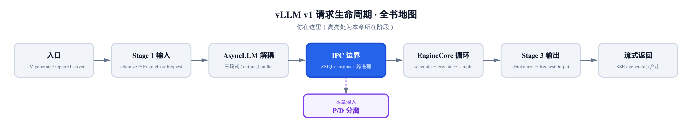
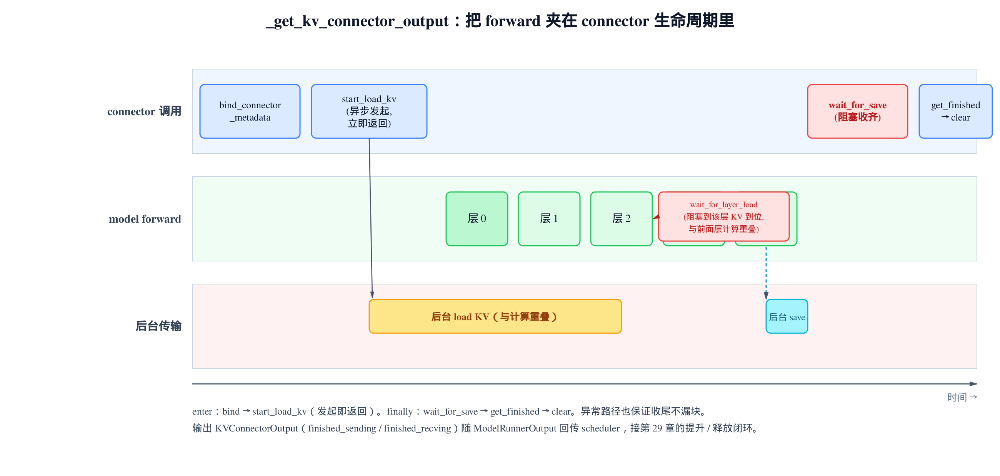
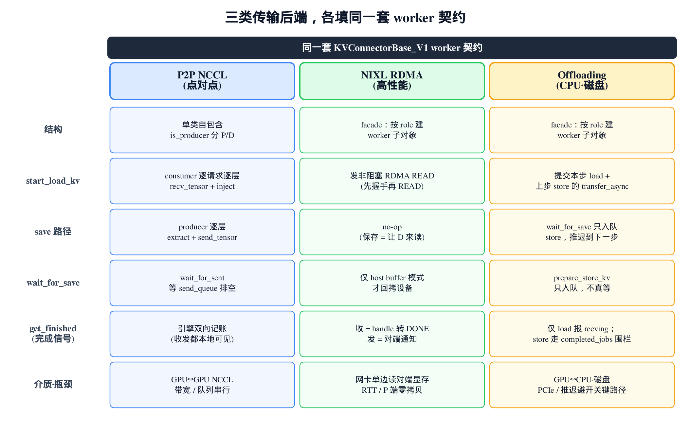
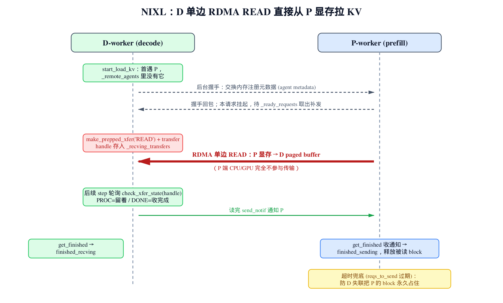

# 第30章　PD 分离 II：worker 侧执行与可插拔传输后端

## 你在这里



> *图注：全书地图高亮当前位置。*
> *上一章在 scheduler 进程里立好了契约：查命中、隔离阻塞态、KV 到位后提升。*
> *本章下沉到 worker 进程：KV 到底怎么在 GPU 之间搬，又怎么不拖慢计算。*
> *下一章离开 PD 分离，回到引擎的其它横切面。*

[上一章](../ch29-pd-disaggregation/narrative/chapter.md)我们站在 scheduler 进程里，看一个 connector 如何长出"两副面孔"：决策侧查命中、做隔离，把一个请求挂进 `WAITING_FOR_REMOTE_KVS`，等 KV 到位再提升回 `WAITING` 重新调度。但那一章始终没回答一个最实在的问题——**KV 到底是怎么搬过来的？**

那条 `start_load_kv → 等待 → finished_recving` 的搬运线，全部发生在 worker 进程里，被上一章刻意推给了本章。现在补上。

这一章只盯 worker 侧，主战场是 `vllm/v1/worker/kv_connector_model_runner_mixin.py` 和三个具体后端，要把三件事讲透：

- **生命周期**：worker 怎么把"发起搬运"和"收齐搬运"这对动作，精确地卡在 model forward 的两侧，让 KV 搬运和 GPU 计算**重叠**起来，互不干等。
- **同一套契约**：vLLM 把 worker 侧的传输能力抽象成 `KVConnectorBase_V1` 的几个方法。无论底层是 NCCL、RDMA 还是磁盘，都来填同一张表。
- **三类填法的对照**：P2P NCCL（点对点直连）、NIXL（RDMA 单边读）、Offloading（CPU/磁盘卸载）——它们填同一套契约，但因为传输介质天差地别，填出来的形状各不相同。看懂这三种差异，才算真懂这套抽象为什么这么设计。

为了能在本地把这条生命周期亲手跑一遍、打断点看数值，本章配了一份**只做减法**的精简版：和真实 vLLM 同名、同结构、同控制流，只把与主线正交的分支剥掉（跨层统一 layout、异构 TP、MLA/SSM 分支、host buffer、底层 NCCL/RDMA/磁盘的网络细节换成形状一致的 loopback）。它纯 CPU 可跑，让三类后端都能跑出"发→收→完成"的闭环。正文主线仍是真实源码；精简版只是"跑起来看数值"的交叉验证物。

---

## 30.1 forward 被夹在哪里

先从最外层看。一次 decode step，worker 侧的入口是 `gpu_model_runner.py` 的 `execute_model`。我们只看与 KV connector 相关的那段结构：

```python
# vllm/v1/worker/gpu_model_runner.py:L4070-L4093
# When spec decode is enabled, defer connector finalization
# (wait_for_save + clear metadata) until after draft model runs.
defer_kv_connector_finalize = self.speculative_config is not None
with (
    set_forward_context(
        attn_metadata,
        self.vllm_config,
        num_tokens=num_tokens_padded,
        # … 省略：cudagraph / ubatch / slot_mapping 等前向参数 …
    ),
    record_function_or_nullcontext("gpu_model_runner: forward"),
    self.maybe_get_kv_connector_output(
        scheduler_output,
        defer_finalize=defer_kv_connector_finalize,
    ) as kv_connector_output,
):
    model_output = self._model_forward(
        input_ids=input_ids,
        positions=positions,
        intermediate_tensors=intermediate_tensors,
        inputs_embeds=inputs_embeds,
        **model_kwargs,
    )
```

这段代码的关键不在 `_model_forward` 本身，而在它**被谁夹住了**。`with` 块里并排站着两个 context manager：`set_forward_context` 设置本次前向的上下文，而 `maybe_get_kv_connector_output(...)` 就是本章主角——它把整个 model forward 夹在自己的 enter 和 exit 之间。

这是一个深思熟虑的结构。KV 的 load 必须在 forward **开始前**发起，才能和计算重叠；save 必须在 forward **结束后**、buffer 被覆盖前收齐。一个 context manager 的 `enter`/`finally` 恰好天然表达"前发起、后收尾"这对边界。先记住这个画面，下面拆开看。

`maybe_get_kv_connector_output` 是一道分流闸：

```python
# vllm/v1/worker/kv_connector_model_runner_mixin.py:L57-L68
@staticmethod
def maybe_get_kv_connector_output(
    scheduler_output: "SchedulerOutput",
    defer_finalize: bool = False,
) -> AbstractContextManager[KVConnectorOutput | None]:
    return (
        KVConnectorModelRunnerMixin._get_kv_connector_output(
            scheduler_output, defer_finalize=defer_finalize
        )
        if has_kv_transfer_group()
        else nullcontext()
    )
```

逻辑一句话：**只有配置了 KV 传输组，才进真正的生命周期 context；否则返回 `nullcontext()`，零开销。** 没开 PD 分离的普通部署，这里就是个空壳，`with` 块退化成只跑 forward。这是把一个可选子系统接进热路径的标准做法——不付费就不掏钱。

这些方法都挂在 `KVConnectorModelRunnerMixin` 上。它是一个纯静态的 mixin，混进 GPU/TPU 的 ModelRunner，给它们加上"会搬 KV"的能力，本身不持有状态。真正的 connector 对象藏在一个进程级全局里，靠 `get_kv_transfer_group()` 取——这正是上一章那个 `WORKER` 角色的 connector 实体。

---

## 30.2 生命周期：一个 context manager 夹住整条搬运线

现在看核心。`_get_kv_connector_output` 是整章的轴心——worker 侧 connector 的**整条生命周期**都被收进这一个 context manager：

```python
# vllm/v1/worker/kv_connector_model_runner_mixin.py:L81-L119
# This context manager must be used within an active forward context.
# It encapsulates the entire KV connector lifecycle within execute_model
@staticmethod
@contextmanager
def _get_kv_connector_output(
    scheduler_output: "SchedulerOutput",
    wait_for_save: bool = True,
    defer_finalize: bool = False,
) -> Generator[KVConnectorOutput, None, None]:
    output = KVConnectorOutput()

    # Update KVConnector with the KVConnector metadata forward().
    kv_connector = get_kv_transfer_group()
    assert isinstance(kv_connector, KVConnectorBase)
    assert scheduler_output.kv_connector_metadata is not None
    kv_connector.bind_connector_metadata(scheduler_output.kv_connector_metadata)

    # Background KV cache transfers happen here.
    # These transfers are designed to be async and the requests
    # involved may be disjoint from the running requests.
    # Do this here to save a collective_rpc.
    kv_connector.start_load_kv(get_forward_context())
    try:
        yield output
    finally:
        if wait_for_save and not defer_finalize:
            kv_connector.wait_for_save()

        output.finished_sending, output.finished_recving = (
            kv_connector.get_finished(scheduler_output.finished_req_ids)
        )
        output.invalid_block_ids = kv_connector.get_block_ids_with_load_errors()

        # … 省略：可观测性 stats / events 的回填两行 …
        output.kv_connector_worker_meta = kv_connector.build_connector_worker_meta()

        if not defer_finalize:
            kv_connector.clear_connector_metadata()
```

把它按 `yield` 切成三段读：

**enter 段（`yield` 之前）——发起。** 两步。第一步 `bind_connector_metadata`：worker 吃下 scheduler 进程打包下发的那份不透明 metadata。这正是上一章决策侧 `build_connector_meta` 的产物——里面写着"这一步该收哪些请求的 KV、该发哪些"。worker 不解读它的内容，只把它绑给 connector，由具体后端自己拆。第二步 `start_load_kv`：**异步发起**本步所有的 KV load，立即返回，不阻塞。这一行是 load/compute 重叠的起点。

注意源码里那段注释：这些传输是设计成异步的，而且"涉及的请求可能和正在运行的请求不相交"（disjoint from the running requests）。这句话后面会用到——它解释了一个看似奇怪的特例。

**yield 段——计算。** 控制权交回 `with` 块体，model forward 跑起来，逐层前向。这期间，`start_load_kv` 发起的搬运在后台进行，和计算重叠。

**finally 段（`yield` 之后）——收尾。** 用 `finally` 是刻意的：哪怕 forward 抛异常，这段也保证执行，不漏块、不留脏状态。这里依次做四件事：

1. `wait_for_save()`——**阻塞**到所有 save 真正完成（除非 `defer_finalize`，见 §30.5）。这是数据正确性的硬围栏，§30.4 会单独论证。
2. `get_finished(finished_req_ids)`——问 connector："哪些请求的异步传输完成了？"返回 `(finished_sending, finished_recving)` 两个集合，填进 `output`。
3. `build_connector_worker_meta()`——收集 worker 侧要回传的元信息（Offloading 的 store 完成就走这条道，§30.7 会讲）。
4. `clear_connector_metadata()`——清掉本步绑定的 metadata，和开头的 `bind` 配对，保证步与步之间状态干净。

这个 `output`（一个 `KVConnectorOutput`）随 `ModelRunnerOutput` 回传给 scheduler 进程。它身上的 `finished_recving` 会驱动上一章的提升逻辑——把 `WAITING_FOR_REMOTE_KVS` 的请求拉回 `WAITING`；`finished_sending` 则驱动块的释放。**这就是上一章那条线的另一端，在这里接上了。**

整条生命周期画成一张图就是这样：



> *图注：start_load_kv 在 forward 前异步发起，后台 load 与逐层计算重叠。*
> *真要用到某层 KV 时才 wait_for_layer_load 等那一层；wait_for_save 在 forward 退出前收齐 save。*
> *输出随 ModelRunnerOutput 回传 scheduler，接第 29 章的提升 / 释放闭环。*

---

## 30.3 重叠是怎么发生的：start_load_kv 与逐层 hook 的配合

上面说 load 和 compute 重叠，但只看 `_get_kv_connector_output` 还看不全——它只发起、只在最后收尾，中间那段"按层取 KV"发生在 forward 内部。这就要看 attention 层是怎么被包装的。

vLLM 给每个 attention 层的 forward 套了一个装饰器 `maybe_transfer_kv_layer`：

```python
# vllm/model_executor/layers/attention/kv_transfer_utils.py:L15-L61
def maybe_transfer_kv_layer(func: Callable) -> Callable:
    """Decorator that handles KV layer transfer prior and after execution of
    an attention layer, if enabled. Otherwise, the wrapper is a no-op.

    On entry: waits for the KV layer from the connector.
    On exit: saves the KV layer to the connector.
    """
    # … 省略：用 inspect.signature 定位 layer_name 参数位置的工程样板 …
    @wraps(func)
    def wrapper(*args, **kwargs):
        if not has_kv_transfer_group() or not is_v1_kv_transfer_group():
            return func(*args, **kwargs)

        layer_name = _resolve_layer_name(args[layer_name_index])
        attn_metadata, _, kv_cache, _ = get_attention_context(layer_name)
        connector = get_kv_transfer_group()
        if attn_metadata is None or not connector.has_connector_metadata():
            return func(*args, **kwargs)

        # Wait for KV layer on entry
        connector.wait_for_layer_load(layer_name)

        # Execute the function
        result = func(*args, **kwargs)

        # Save KV cache layer on exit
        connector.save_kv_layer(layer_name, kv_cache, attn_metadata)

        return result

    return wrapper
```

三个分支挡在前面：没传输组、没 attn_metadata、没绑 metadata，都直接 no-op 调原函数。真要传输时，逻辑就两句话夹住计算：

- **进层前**：`wait_for_layer_load(layer_name)`——阻塞到**这一层**的 KV load 完成。
- **出层后**：`save_kv_layer(layer_name, ...)`——**异步发起**这一层的 KV save。

把这个和 §30.2 的 `start_load_kv` 拼起来，重叠的完整机制就清楚了：

`start_load_kv` 在第 0 层之前就把**所有层**的 load 一把发起。模型照常往前跑，层 0、层 1……每跑一层，`wait_for_layer_load` 只等**当前这一层**的 KV 到位。理想情况下，第 0 层算的时候，后面层的 KV 正在后台搬；等模型算到第 k 层，第 k 层的 KV 早就搬完了，`wait_for_layer_load` 立刻返回，不阻塞。**传输延迟被藏进了前面层的计算里。**

### 量化一下这个收益

先定两个记号：模型层数 $N$、每层计算耗时 $t_c$。再用下面这个量表示整请求 KV 从对端搬到本地 paged buffer 的总耗时：

$$
T_{xfer}
$$

**同步方案**（先把 KV 全搬完再 forward）的总时间是把两段串起来：

$$
T_{sync} = T_{xfer} + N \cdot t_c
$$

**重叠方案**下，`start_load_kv` 在第 0 层前就发起，传输和计算并行推进。总时间不再是相加，而是取两者的较大值：

$$
T_{overlap} \approx \max(T_{xfer},\; N \cdot t_c)
$$

举个数：一个 32 层的模型，每层算 1 ms（合计 32 ms），整请求 KV 传输要 20 ms。同步方案要 20 + 32 = 52 ms；重叠方案只要 max(20, 32) = 32 ms。**只要传输能藏进计算，也就是 $T_{xfer} \lesssim N t_c$，那 20 ms 的传输延迟就近乎被完全隐藏**，总时间退化成纯计算时间。这就是把 `start_load_kv` 拆成"早发起 + 逐层等"而非"一把等齐"的全部理由。

而出层后的 `save_kv_layer` 是对称的另一半：边算后面的层，边把前面层的 KV 异步搬出去，把 save 也摊进计算。

---

## 30.4 wait_for_save：一道不能省的围栏

`save_kv_layer` 是**异步发起**的——发起即返回，真正的搬运在后台。这就埋了一个隐患。

paged KV buffer 是被反复复用的物理块。假设这一步 forward 结束了，`save` 还在后台读着某几个物理块的 KV；scheduler 的下一步把这几个**同一物理块**分配给了新请求，开始往里写。于是：异步 save 正在读旧 KV，新请求正在写新 KV，读到的是新旧混合的脏数据。

`wait_for_save` 就是堵这个洞的。看它的契约定义：

```python
# vllm/distributed/kv_transfer/kv_connector/v1/base.py:L333-L361
@abstractmethod
def wait_for_save(self):
    """
    Block until all the save operations is done. This is called
    as the forward context exits to ensure that the async saving
    from save_kv_layer is complete before finishing the forward.
    This prevents overwrites of paged KV buffer before saving done.
    """
    pass
```

docstring 把意图写得很白：在 forward context 退出前阻塞，确保 `save_kv_layer` 的异步保存全部完成，**防止 paged KV buffer 在保存完成前被覆盖**。

用一句不变量来归纳它的正确性：**"所有 save 完成"是 forward 退出的前置条件**。这等价于在"buffer 复用"和"异步读"之间插了一道 happens-before——任何对某物理块的复用写入，都发生在该块上一次 save 读取完成之后。少了这道围栏，PD 分离下的数据一致性就破了。所以 `wait_for_save` 不是性能旋钮，是**正确性硬约束**，不能为了快而省掉。

它落在 `_get_kv_connector_output` 的 `finally` 段里（§30.2），保证哪怕 forward 抛异常也会执行。后面会看到，三类后端各自给 `wait_for_save` 填了不同的实现，但都满足同一个语义。

---

## 30.5 两个特例：无 token 的步、与投机解码的推迟

主路径讲完了。还有两个分支，揭示了这套生命周期的边界考量。

### 本步没有 token，也要走一遍收发

PD 分离下，一个 engine 某一步可能**没有任何要计算的请求**——但它仍可能有正在进行的异步 send/recv 需要推进或收尾。还记得 §30.2 那句注释吗：传输涉及的请求"可能和正在运行的请求不相交"。如果"没 token 就直接返回空"，这些 disjoint 的传输就会卡死，永远不被推进。

于是有了 `kv_connector_no_forward`：

```python
# vllm/v1/worker/kv_connector_model_runner_mixin.py:L37-L55
@staticmethod
def kv_connector_no_forward(
    scheduler_output: "SchedulerOutput", vllm_config: VllmConfig
) -> ModelRunnerOutput:
    # KV send/recv even if no work to do.
    with (
        set_forward_context(None, vllm_config),
        KVConnectorModelRunnerMixin._get_kv_connector_output(
            scheduler_output, wait_for_save=False
        ) as kv_connector_output,
    ):
        pass

    if kv_connector_output.is_empty():
        return EMPTY_MODEL_RUNNER_OUTPUT

    output = copy.copy(EMPTY_MODEL_RUNNER_OUTPUT)
    output.kv_connector_output = kv_connector_output
    return output
```

`with` 块体是个 `pass`——没有 forward。但它照样进 `_get_kv_connector_output`：`start_load_kv` 推进 load，`get_finished` 收割完成。区别只有一个参数 `wait_for_save=False`——既然没 forward、没新 save，自然不必等保存。跑完拿到一个非空的 `kv_connector_output`（带着这一步收割到的 `finished_*`），照样回传 scheduler 推动状态。**没活干，也得替在途的传输跑个腿。**

### 投机解码：把 wait_for_save 推迟到草稿之后

回头看 §30.1 那行 `defer_kv_connector_finalize = self.speculative_config is not None`。投机解码（[第 28 章](../ch28-spec-decode/narrative/chapter.md)）里，主模型 forward 之后还要跑 draft model。如果在主 forward 一退出就 `wait_for_save`，会在主、草稿两次前向之间硬插一段阻塞，而且草稿模型还可能再动 KV。

所以 `defer_finalize=True` 让主 forward 退出时**跳过** `wait_for_save`（回看 §30.2 的 `if wait_for_save and not defer_finalize`），把收尾推迟。等草稿前向跑完，再由 `finalize_kv_connector` 统一补做：

```python
# vllm/v1/worker/kv_connector_model_runner_mixin.py:L70-L79
@staticmethod
def finalize_kv_connector() -> None:
    if has_kv_transfer_group():
        kv_connector = get_kv_transfer_group()
        kv_connector.wait_for_save()
        kv_connector.clear_connector_metadata()
```

`wait_for_save` 这道围栏一道都不能少，只是时机往后挪——挪到草稿也不再碰 KV 之后再收齐。围栏的语义没变，位置变了。

---

## 30.6 同一套 worker 契约

到这里，生命周期已经清楚了：worker 在 forward 两侧依次调 `bind` → `start_load_kv` → 逐层 `wait_for_layer_load` / `save_kv_layer` → `wait_for_save` → `get_finished`。但这些调用最终落到谁身上？落到具体的 connector 后端。它们都实现同一份抽象契约 `KVConnectorBase_V1`：

```python
# vllm/distributed/kv_transfer/kv_connector/v1/base.py:L298-L355
@abstractmethod
def start_load_kv(self, forward_context: "ForwardContext", **kwargs: Any) -> None:
    """Start loading the KV cache from the connector to vLLM's paged
    KV buffer. This is called from the forward context before the
    forward pass to enable async loading during model execution."""
    pass

@abstractmethod
def wait_for_layer_load(self, layer_name: str) -> None:
    """Block until the KV for a specific layer is loaded into vLLM's
    paged buffer. ... to ensure async copying from start_load_kv is complete."""
    pass

@abstractmethod
def save_kv_layer(
    self, layer_name: str, kv_layer: torch.Tensor,
    attn_metadata: "AttentionMetadata", **kwargs: Any,
) -> None:
    """Start saving a layer of KV cache from vLLM's paged buffer
    to the connector. ... to enable async copying during execution."""
    pass

@abstractmethod
def wait_for_save(self):
    """Block until all the save operations is done. ...
    This prevents overwrites of paged KV buffer before saving done."""
    pass
```

四个抽象方法，正好对上生命周期里的四个动作。还有一个非抽象、带默认实现的 `get_finished`：

```python
# vllm/distributed/kv_transfer/kv_connector/v1/base.py:L363-L379
def get_finished(
    self, finished_req_ids: set[str]
) -> tuple[set[str] | None, set[str] | None]:
    """
    Notifies worker-side connector ids of requests that have
    finished generating tokens on the worker.
    The scheduler process (via the Executors) will use this output
    to track which workers are done.

    Returns:
        ids of requests that have finished asynchronous transfer ...
        tuple of (sending/saving ids, recving/loading ids).
    """
    return None, None
```

默认返回 `(None, None)`——子类按需覆盖，上报"哪些发完了、哪些收完了"。

这五个方法就是 worker 契约的全部骨架。接下来三节，看三类后端怎么各自把这张表填实。重点不是每个后端的网络细节，而是**为什么它们填出来的形状不一样**——差异恰恰暴露了传输介质的本质。先放一张对照表压舱：



> *图注：横跨三列的是同一套 KVConnectorBase_V1 worker 契约。*
> *P2P 单类自包含、NIXL/Offloading 用 facade 拆 worker 子对象。*
> *save 路径、wait_for_save、完成信号三行，差异最大——传输介质不同，填法就不同。*

---

## 30.7 P2P NCCL：点对点直发

最直白的后端是 P2P NCCL：prefill worker 和 decode worker 之间，直接用 NCCL 点对点 send/recv 把 KV 搬过去。它是**单类自包含**的——不像后面两个后端要拆成 scheduler/worker 两个子对象，`P2pNcclConnector` 一个类里用 `is_producer` 区分 P 和 D 两种角色。

**消费端（decode）在 `start_load_kv` 里收。** producer 直接返回，只有 consumer 干活：

```python
# vllm/distributed/kv_transfer/kv_connector/v1/p2p/p2p_nccl_connector.py:L111-L122
def start_load_kv(self, forward_context: "ForwardContext", **kwargs: Any) -> None:
    """Start loading the KV cache from the connector buffer to vLLM's
    paged KV buffer."""
    # Only consumer/decode loads KV Cache
    if self.is_producer:
        return

    assert self.p2p_nccl_engine is not None
    attn_metadata = forward_context.attn_metadata
    if attn_metadata is None:
        return
```

往下，consumer 逐请求、逐层把 KV 收回来，写进 paged buffer：

```python
# vllm/distributed/kv_transfer/kv_connector/v1/p2p/p2p_nccl_connector.py:L195-L229
# Get the metadata
metadata: KVConnectorMetadata = self._get_connector_metadata()
assert isinstance(metadata, P2pNcclConnectorMetadata)

# Load the KV for each request each layer
for request in metadata.requests:
    request_id = request.request_id
    ip, port = self.parse_request_id(request_id, False)
    remote_address = ip + ":" + str(port + self._rank)
    for layer_name in forward_context.no_compile_layers:
        layer = forward_context.no_compile_layers[layer_name]

        # Only process layers that have kv_cache attribute (attention
        # layers) Skip non-attention layers like FusedMoE
        kv_cache = getattr(layer, "kv_cache", None)
        if kv_cache is None:
            continue
        layer = kv_cache

        kv_cache = self.p2p_nccl_engine.recv_tensor(
            request.request_id + "#" + layer_name, remote_address
        )
        if kv_cache is None:
            logger.warning("🚧kv_cache is None, %s", request.request_id)
            continue

        inject_kv_into_layer(
            layer, kv_cache, request.block_ids, request.request_id
        )
```

两个细节值得点出。一是 `remote_address` 从 `parse_request_id(request_id, ...)` 解析出来——**对端的地址直接编码在 request_id 里**。consumer 不需要额外的服务发现，看请求 id 就知道去哪个 producer 拿 KV。二是非注意力层（如 FusedMoE）没有 `kv_cache` 属性，直接跳过——只搬注意力层的 KV。收到 KV 后 `inject_kv_into_layer` 按 `block_ids` 把它写回 paged buffer 对应的物理块。

**生产端（prefill）在 `save_kv_layer` 里发。** 这次反过来，只有 producer 干活：

```python
# vllm/distributed/kv_transfer/kv_connector/v1/p2p/p2p_nccl_connector.py:L242-L312
def save_kv_layer(
    self, layer_name: str, kv_layer: torch.Tensor,
    attn_metadata: AttentionMetadata, **kwargs: Any,
) -> None:
    # Only producer/prefill saves KV Cache
    if not self.is_producer:
        return
    assert self.p2p_nccl_engine is not None

    def extract_kv_from_layer(
        layer: torch.Tensor, block_ids: torch.Tensor,
    ) -> torch.Tensor:
        # 按 attention 后端 layout 沿不同维度切出本请求的 block
        if layer.shape[0] == 2:  # FlashAttention
            return layer[:, block_ids, ...]
        # … 省略：MLA / FlashInfer 等其它 layout 分支 …

    connector_metadata = self._get_connector_metadata()
    assert isinstance(connector_metadata, P2pNcclConnectorMetadata)
    for request in connector_metadata.requests:
        request_id = request.request_id
        ip, port = self.parse_request_id(request_id, True)
        remote_address = ip + ":" + str(port + self._rank)

        kv_cache = extract_kv_from_layer(kv_layer, request.block_ids)
        self.p2p_nccl_engine.send_tensor(
            request_id + "#" + layer_name, kv_cache, remote_address
        )

def wait_for_save(self):
    if self.is_producer:
        assert self.p2p_nccl_engine is not None
        self.p2p_nccl_engine.wait_for_sent()
```

`extract_kv_from_layer` 按 attention 后端的 layout（FlashAttention 沿一个维度、MLA 沿另一个）从 paged buffer 里切出本请求 `block_ids` 对应的 KV，然后 `send_tensor` 发出去。tensor 的 key 是 `request_id#layer_name`——和 consumer 那边 `recv_tensor` 用的 key 严丝合缝对上。

### wait_for_save 落在哪：异步发为什么需要 fence

P2P 的 `wait_for_save` 委托给引擎的 `wait_for_sent`。这里能看到 §30.4 那道围栏的**实证**。先看 `send_tensor` 的发送模式：

```python
# vllm/distributed/kv_transfer/kv_connector/v1/p2p/p2p_nccl_engine.py:L247-L258
item = SendQueueItem(
    tensor_id=tensor_id, remote_address=remote_address, tensor=tensor
)

if self.send_type == "PUT":
    return self.send_sync(item)

if self.send_type == "PUT_ASYNC":
    with self.send_queue_cv:
        self.send_queue.append(item)
        self.send_queue_cv.notify()
    return True
# … 省略：GET 模式——把 tensor 暂存等对端来拉 …
```

`PUT` 是同步发，发完才返回。`PUT_ASYNC` 是异步发——只把 item 塞进 `send_queue`、唤醒后台发送线程，**立即返回**，tensor 此刻还没真正发出去。

这就是问题所在。`save_kv_layer` 用 `PUT_ASYNC` 入队后立即返回，forward 接着往下跑。如果不等队列排空就结束 forward，那些还在 `send_queue` 里、还在被后台线程读着的 paged 块，下一步就可能被复用覆盖——正是 §30.4 的脏数据场景。`wait_for_sent` 堵住它：

```python
# vllm/distributed/kv_transfer/kv_connector/v1/p2p/p2p_nccl_engine.py:L486-L498
def wait_for_sent(self):
    if self.send_type == "PUT_ASYNC":
        start_time = time.time()
        with self.send_queue_cv:
            while self.send_queue:
                self.send_queue_cv.wait()
        # … 省略：耗时日志 …
```

一个 `while self.send_queue: wait()` 的循环——阻塞到队列**彻底排空**才返回。每次后台线程发走一个 item，队列长度严格减 1，是个单调递减的非负整数，有限步必然清零、必然 break。`wait_for_save → wait_for_sent` 这条链，就是"异步发起、退出前 fence"在 P2P 后端的落地。

P2P 的 `get_finished` 委托给引擎，引擎在本进程内同时记着发和收两侧的账，所以两个完成集合都本地可见——这一点下一节会成为重要的对照。

---

## 30.8 NIXL：RDMA 单边读，与不对称的完成信号

NIXL 是高性能 RDMA 后端。它和 P2P 有两个结构性的不同，都很能说明问题。

**第一个不同：facade 模式。** NIXL 的 scheduler 侧和 worker 侧逻辑都很重（一边管握手拓扑、内存注册，一边管命中查询），于是顶层 `NixlConnector` 按 role 只建半边子对象：

```python
# vllm/distributed/kv_transfer/kv_connector/v1/nixl/connector.py:L87-L108
def __init__(
    self, vllm_config: VllmConfig, role: KVConnectorRole,
    kv_cache_config: "KVCacheConfig",
):
    super().__init__(vllm_config, role, kv_cache_config)
    # … 省略：engine_id / kv_transfer_config 赋值 …
    if role == KVConnectorRole.SCHEDULER:
        self.connector_scheduler: NixlConnectorScheduler | None = (
            NixlConnectorScheduler(vllm_config, self.engine_id, kv_cache_config)
        )
        self.connector_worker: NixlConnectorWorker | None = None
    elif role == KVConnectorRole.WORKER:
        self.connector_scheduler = None
        self.connector_worker = NixlConnectorWorker(
            vllm_config, self.engine_id, kv_cache_config
        )
```

worker 进程里只建 `connector_worker`，`connector_scheduler` 是 `None`。所有 worker 契约方法都先 `assert connector_worker is not None` 再转发给它——物理上保证决策侧代码进不了 worker 进程。这和 P2P "单类自包含 + `is_producer` 分支"是两种风格，但填的是同一套契约。转发层很薄：

```python
# vllm/distributed/kv_transfer/kv_connector/v1/nixl/connector.py:L241-L264
def start_load_kv(self, forward_context: "ForwardContext", **kwargs) -> None:
    assert self.connector_worker is not None
    assert isinstance(self._connector_metadata, NixlConnectorMetadata)
    self.connector_worker.start_load_kv(self._connector_metadata)

def wait_for_layer_load(self, layer_name: str) -> None:
    """NixlConnector does not do layerwise saving."""
    pass

def save_kv_layer(self, layer_name, kv_layer, attn_metadata, **kwargs) -> None:
    """NixlConnector does not save explicitly."""
    pass

def wait_for_save(self):
    assert self.connector_worker is not None
    if self.connector_worker.use_host_buffer and self.connector_worker.copy_blocks:
        self.connector_worker.save_kv_to_host(self._connector_metadata)
```

注意 `wait_for_layer_load` 和 `save_kv_layer` 都是 **no-op**。这不是偷懒，是 NIXL 的传输模型决定的——这是第二个、也是更深的不同。

**第二个不同：RDMA 单边 READ。** P2P 是 producer 主动"推"（send）KV。NIXL 反过来——**decode worker 主动从 prefill worker 的显存里"读"（READ）KV**，而 prefill 端的 CPU/GPU 完全不参与这次传输。这是 RDMA 单边操作的本质：发起方给网卡一组地址，网卡直接搬对端内存，对端 CPU 无感。

正因为是 D 主动读、整请求一把读，所以：不需要逐层 pipeline（`wait_for_layer_load` 空）；P 端不存在"主动 save"这个动作（`save_kv_layer` 空，"保存"就等于"把 KV 留在那让 D 来读")。两个 no-op 是 RDMA READ 模型的直接推论。

看 `start_load_kv` 怎么发起 READ：

```python
# vllm/distributed/kv_transfer/kv_connector/v1/nixl/worker.py:L1840-L1875
def start_load_kv(self, metadata: NixlConnectorMetadata):
    """Start loading by triggering non-blocking nixl_xfer.
    We check for these trnxs to complete in each step()."""
    for req_id, meta in metadata.reqs_to_recv.items():
        meta.local_physical_block_ids = self._logical_to_kernel_block_ids(
            meta.local_block_ids
        )
        assert meta.remote is not None
        remote_engine_id = meta.remote.engine_id
        # … 省略：失败恢复用的 metadata 存档 …
        self._recving_metadata[req_id] = meta
        if remote_engine_id not in self._remote_agents:
            # Initiate handshake with remote engine to exchange metadata.
            with self._handshake_lock:
                if remote_engine_id not in self._remote_agents:
                    self._background_nixl_handshake(req_id, remote_engine_id, meta)
                    continue
        # Handshake already completed, start async read xfer.
        self._read_blocks_for_req(req_id, meta)

    # Start transfers for requests whose handshakes have now finished.
    while not self._ready_requests.empty():
        self._read_blocks_for_req(*self._ready_requests.get_nowait())
```

这里有个 RDMA 特有的前置步骤：**握手**。单边读要先知道对端的内存注册描述符（agent metadata），网卡才能直接读那块显存。第一次给某个 remote engine 发请求时，`_remote_agents` 里还没有它，于是 `_background_nixl_handshake` 后台去交换元数据，本请求先挂起、`continue`；等握手回来，请求落进 `_ready_requests`，循环末尾再取出来补发 READ。**握手开销摊到后台，不阻塞调度热路径。** 真正发起 READ 的是 `_read_blocks`：

```python
# vllm/distributed/kv_transfer/kv_connector/v1/nixl/worker.py:L2093-L2109
# Prepare transfer with Nixl.
handle = None
try:
    handle = self.nixl_wrapper.make_prepped_xfer(
        "READ",
        local_xfer_side_handle, local_block_descs_ids,
        remote_xfer_side_handle, remote_block_descs_ids,
        notif_msg=notif_id,
    )
    # Begin async xfer.
    self.nixl_wrapper.transfer(handle)
    # Use handle to check completion in future step().
    self._recving_transfers[request_id].append(handle)
```

`make_prepped_xfer("READ", ...)` 拼出一次单边读：本地的目标块描述符 + 远端的源块描述符。`transfer(handle)` 发起，**非阻塞**，立即返回。`handle` 存进 `_recving_transfers`，留待后续 step 轮询它完成没。整个流程画成时序图：



> *图注：首遇远端先后台握手交换内存注册元数据，握手回来才发 READ。*
> *D 主动从 P 显存单边读，P 端 CPU/GPU 不参与；读完 D 发 notif 通知 P。*
> *D 靠本地 handle 转 DONE 判收完成，P 靠收到通知判发完成——两个信号来源天然不对称。*

### 完成信号为什么不对称

NIXL 的 `get_finished` 揭示了 RDMA 单边读最微妙的一点：

```python
# vllm/distributed/kv_transfer/kv_connector/v1/nixl/worker.py:L1651-L1672
def get_finished(self) -> tuple[set[str], set[str]]:
    """Get requests that are done sending or recving on this specific worker.
    The scheduler process (via the MultiprocExecutor) will use this output
    to track which workers are done."""
    assert self.transfer_topo is not None
    done_sending = self._get_new_notifs()
    done_recving = self._pop_done_transfers(self._recving_transfers)

    # add requests that skipped transfer to done_recving
    done_recving.update(self._failed_recv_reqs)
    self._failed_recv_reqs.clear()
    # … 省略：host buffer 回拷 / reqs_to_send 过期回收 …
    return done_sending, done_recving
```

两个完成信号来自**完全不同的源头**，这正是 §30.7 末尾埋的对照点：

- **收完成（`done_recving`）= 本地 handle 转 DONE。** D 是发起方，能直接问网卡"这次 READ 读完没"。
- **发完成（`done_sending`）= 收到对端通知。** P 端没参与传输，自己根本不知道 D 读完没、那些被读的块何时能释放。只能靠 D 读完后 `send_notif` 主动通知，P 这边 `_get_new_notifs` 收到才算数。

这种不对称是 RDMA 单边读的固有性质：**谁发起谁知道，没发起的那方只能等通知。** P2P 不存在这问题——send/recv 两侧都在本进程引擎里记账，都本地可见。理解了这层，才知道为什么三个后端的 `get_finished` 返回值结构不同，却都满足同一个契约。

`done_recving` 怎么从 handle 轮询出来：

```python
# vllm/distributed/kv_transfer/kv_connector/v1/nixl/worker.py:L1786-L1822
for req_id, handles in list(transfers.items()):
    in_progress = []
    for handle in handles:
        try:
            xfer_state = self.nixl_wrapper.check_xfer_state(handle)
            if xfer_state == "DONE":
                self.nixl_wrapper.release_xfer_handle(handle)
            elif xfer_state == "PROC":
                in_progress.append(handle)
                continue
            else:
                self._handle_failed_transfer(req_id, handle)
        except Exception as e:
            self._handle_failed_transfer(req_id, handle)

    if not in_progress:
        # Only report request as completed when all transfers are done.
        done_req_ids.add(req_id)
        del transfers[req_id]
    else:
        transfers[req_id] = in_progress
```

`PROC` 的留着下次再查，`DONE` 的释放掉。关键在最后那个判断：**只有一个请求的所有 handle 都 DONE，才把它报为完成。** 任一个还 `PROC`，这个请求就不算完——`in_progress` 非空就把它留到下一步继续轮询。这是非阻塞 READ 的轮询式收尾。源码里还有一段 `reqs_to_send` 的超时兜底（这里略去），防 D 端崩溃后把 P 端被读的块永久占住——单边模型下，P 等不到通知就得有个超时退路。

---

## 30.9 Offloading：不是跨节点，是分级缓存

第三类后端 Offloading，结构上和 NIXL 一样是 facade，但它做的事根本不是 PD 分离——它把 GPU 上的 KV **卸载到 CPU/磁盘**当二级缓存。同一套 worker 契约，到这里语义又拧了一道，恰好把契约的弹性逼到极限。

先看 facade 和五个转发方法：

```python
# vllm/distributed/kv_transfer/kv_connector/v1/offloading_connector.py:L51-L119
def __init__(
    self, vllm_config: VllmConfig, role: KVConnectorRole,
    kv_cache_config: KVCacheConfig | None = None,
):
    super().__init__(vllm_config, role, kv_cache_config)
    assert kv_cache_config is not None
    spec = OffloadingSpecFactory.create_spec(vllm_config, kv_cache_config)

    self.connector_scheduler: OffloadingConnectorScheduler | None = None
    self.connector_worker: OffloadingConnectorWorker | None = None
    if role == KVConnectorRole.SCHEDULER:
        self.connector_scheduler = OffloadingConnectorScheduler(spec)
    elif role == KVConnectorRole.WORKER:
        self.connector_worker = OffloadingConnectorWorker(spec)
    # … 省略：register_kv_caches / handle_preemptions 等扩展点转发 …

    def start_load_kv(self, forward_context, **kwargs) -> None:
        assert self.connector_worker is not None
        self.connector_worker.start_kv_transfers(self._connector_metadata)

    def wait_for_layer_load(self, layer_name: str) -> None:
        pass

    def save_kv_layer(self, layer_name, kv_layer, attn_metadata, **kwargs) -> None:
        pass

    def wait_for_save(self):
        assert self.connector_worker is not None
        self.connector_worker.prepare_store_kv(self._connector_metadata)

    def get_finished(self, finished_req_ids: set[str]) -> tuple[set[str], set[str]]:
        assert self.connector_worker is not None
        return self.connector_worker.get_finished(finished_req_ids)
```

和 NIXL 一样 `wait_for_layer_load`/`save_kv_layer` 是 no-op。但注意 `wait_for_save` 转发到一个叫 `prepare_store_kv` 的方法——名字就剧透了：它不是"等保存完成"，而是"**准备**保存"。这是和前两个后端最大的语义差异。看 worker：

```python
# vllm/distributed/kv_transfer/kv_connector/v1/offloading/worker.py:L295-L344
def start_kv_transfers(self, metadata: OffloadingConnectorMetadata):
    for job_id, transfer_spec in self._unsubmitted_store_jobs:
        success = self.worker.transfer_async(job_id, transfer_spec)
        assert success
    self._unsubmitted_store_jobs.clear()

    for job_id, entry in metadata.load_jobs.items():
        self._load_jobs[job_id] = entry.req_id
        success = self.worker.transfer_async(job_id, entry.transfer_spec)
        assert success

def prepare_store_kv(self, metadata: OffloadingConnectorMetadata):
    for job_id, entry in metadata.store_jobs.items():
        # NOTE(orozery): defer the store to the beginning of the next
        # engine step, so that offloading starts AFTER transfers related
        # to token sampling, thereby avoiding delays to token generation.
        self._unsubmitted_store_jobs.append((job_id, entry.transfer_spec))

def get_finished(self, finished_req_ids: set[str]) -> tuple[set[str], set[str]]:
    finished_recving: set[str] = set()
    for transfer_result in self.worker.get_finished():
        # we currently do not support job failures
        job_id = transfer_result.job_id
        assert transfer_result.success
        # … 省略：stats 记账 …
        self._connector_worker_meta.mark_completed(job_id)
        req_id = self._load_jobs.pop(job_id, None)
        if req_id is not None:
            finished_recving.add(req_id)

    return set(), finished_recving
```

三个设计点，每个都因为"这是二级缓存、不在解码关键路径上"而和前两个后端不同：

**一、store 推迟到下一步发。** `prepare_store_kv`（即 `wait_for_save` 的落点）**只把 store job 入队** `_unsubmitted_store_jobs`，**不真发**。真正的 `transfer_async` 推迟到下一步 `start_kv_transfers` 的开头才做。源码注释写明了为什么：让卸载发生在"和 token 采样相关的传输之后"，避免拖慢 token 生成。卸载不急，何必在 `wait_for_save` 里同步等磁盘写完、白白拖慢本步的采样？**用调度时机换 ITL**（inter-token latency）。所以 `start_kv_transfers` 一进来先发"上一步排队的 store"，再发"本步的 load"。

**二、`finished_sending` 恒空。** P/D 场景里 `finished_sending` 是用来通知 scheduler"块发完了可以释放给别人"。但卸载里块不是要释放给别人——是 GPU 块在被复用前必须确保已落盘。这用一套不同机制：worker 经 `build_connector_worker_meta` 上报 `completed_jobs`，调度侧据此在复用前用 `jobs_to_flush` 等对应 store 完成（一道围栏）。所以你看 `get_finished` 永远 `return set(), finished_recving`——**第一个集合恒空**，store 完成根本不走 `finished_sending` 这条道。

**三、`finished_recving` 只为 load 报。** load（从 CPU/磁盘把 KV 拉回 GPU）才需要走 `finished_recving`，驱动上一章那个"KV 到位、提升请求"的逻辑。这一半和 P/D 是一致的。

所以 Offloading 把同一套契约"掰弯"得最厉害：`wait_for_save` 不阻塞、不等待，只入队；完成信号一半空着、另一半走旁路。但它依然合法地实现了契约——因为契约约束的是**接口形状**，不是**实现语义**。这正是把传输后端做成可插拔抽象的全部价值：生命周期那套 `bind → start_load_kv → wait_for_save → get_finished` 的骨架一个字不用改，NCCL 直发、RDMA 单边读、磁盘卸载三种南辕北辙的传输，就都接进来了。

---

## 30.10 亲手验证：生命周期真的这么转吗

道理讲完，下面把它跑起来看一眼。本章配的精简版把三类后端的网络/RDMA/磁盘细节都换成了形状一致的 loopback，但生命周期时序、契约方法、完成信号的语义都 1:1 保留，可以在纯 CPU 上验证几个关键不变量。

最该验的是 §30.2 的核心结构——**`start_load_kv` 真的在 forward 前、`wait_for_save` 真的在 forward 后**。精简版用一个记录调用顺序的 connector 跑一遍生命周期 context，断言调用序列是：

```
bind_connector_metadata → start_load_kv → [forward 内：层级 hook] → wait_for_save → get_finished → clear
```

`start_load_kv` 的下标严格小于 forward 标记，`wait_for_save` 的下标严格大于——forward 被夹在中间这件事，从调用序列上就坐实了。

第二个该验的是三类后端的完成信号差异（§30.7–30.9）：

| 后端 | start_load_kv 干什么 | wait_for_save 干什么 | finished_sending | finished_recving |
|---|---|---|---|---|
| P2P NCCL | consumer recv_tensor + inject | wait_for_sent 等队空 | 引擎记账（本地可见） | 引擎记账 |
| NIXL RDMA | 发非阻塞 READ（先握手） | no-op（除非 host buffer） | 收对端 notif | handle 转 DONE |
| Offloading | 提交 load + 上步 store | 只入队 store，不真发 | **恒空** | 仅 load 报 |

精简版对每一行都有对应断言：P2P 跑一遍 producer save → consumer load 的数值往返，确认搬过去的 KV 和搬出来的逐元素相等，且 `PUT_ASYNC` 下 `wait_for_sent` 真的等到 `send_queue` 排空；NIXL 验"首遇远端先握手、再 READ"，以及 handle DONE 才报收完成、对端通知才报发完成的不对称；Offloading 验 store 真被推迟到下一步、`finished_sending` 恒空。三类后端各跑各的，但都从同一个 `_get_kv_connector_output` 进出——**同一套契约，三种填法**，在测试里也是同一组生命周期断言、三份后端断言。

跑一遍，全绿。这条从 scheduler 决策、到 worker 搬运、再回传 scheduler 提升的闭环，到这里两章合起来就完整了。

---

## 30.11 小结

这一章把 PD 分离的 worker 侧讲透了。回头看三条主线：

**一个 context manager 夹住整条搬运线。** `vllm/v1/worker/kv_connector_model_runner_mixin.py` 里的 `_get_kv_connector_output` 用 `enter`/`finally` 把 model forward 夹在中间：enter 段 `bind` + `start_load_kv` 异步发起，finally 段 `wait_for_save` 收齐 + `get_finished` 收割。`start_load_kv` 早发起、`wait_for_layer_load` 逐层等，把 KV 传输延迟藏进逐层计算里——理想下总时间从 $T_{xfer} + N t_c$ 压到 $\max(T_{xfer}, N t_c)$。`wait_for_save` 则是一道不能省的正确性围栏：保证异步 save 读完，paged 块才允许被下一步复用。

**同一套 worker 契约，三种填法。** `KVConnectorBase_V1` 定下 `start_load_kv` / `wait_for_layer_load` / `save_kv_layer` / `wait_for_save` / `get_finished` 五个方法。P2P NCCL 用点对点 send/recv 直发，单类自包含、靠 `is_producer` 分角色、`wait_for_save → wait_for_sent` 等队空；NIXL 用 RDMA 单边 READ，facade 拆 worker 子对象、两个层 hook 是 no-op、完成信号因"谁发起谁知道"而不对称；Offloading 做 CPU/磁盘卸载，`wait_for_save` 只入队不等待、store 推迟到下一步避开采样关键路径、`finished_sending` 恒空改走围栏。

**抽象的价值在差异里。** 三种传输南辕北辙，但生命周期骨架一个字不改就都接进来了——因为契约约束的是接口形状，不是实现语义。

最后那个回传 scheduler 的 `KVConnectorOutput`，`finished_recving` 驱动[上一章](../ch29-pd-disaggregation/narrative/chapter.md)的请求提升、`finished_sending` 驱动块释放。两章合起来，PD 分离从决策到搬运的整个闭环就闭上了。下一章离开 PD 分离，回到引擎的其它横切面。
