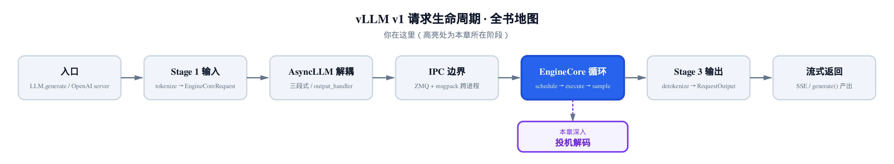
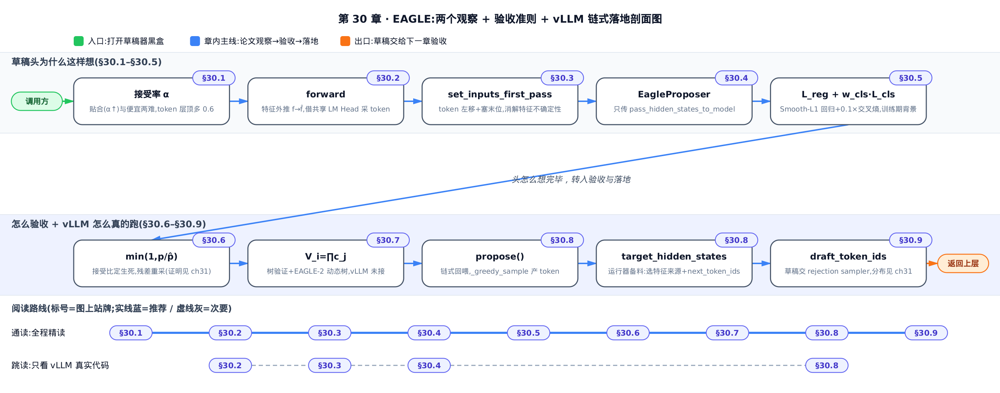
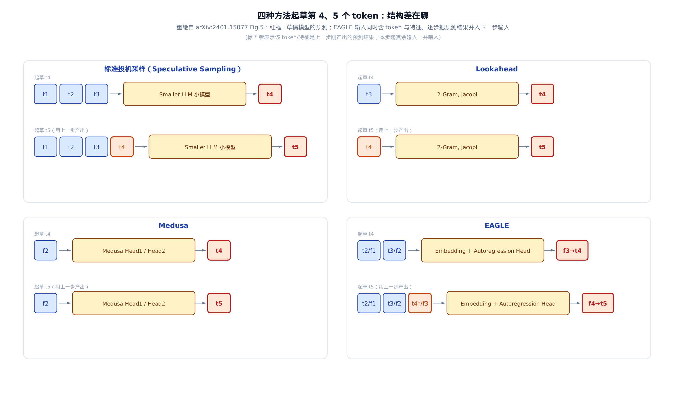
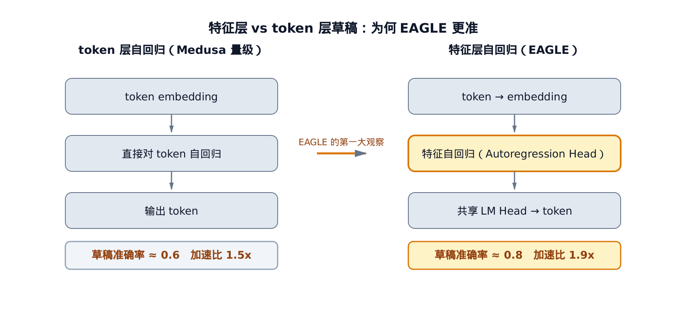
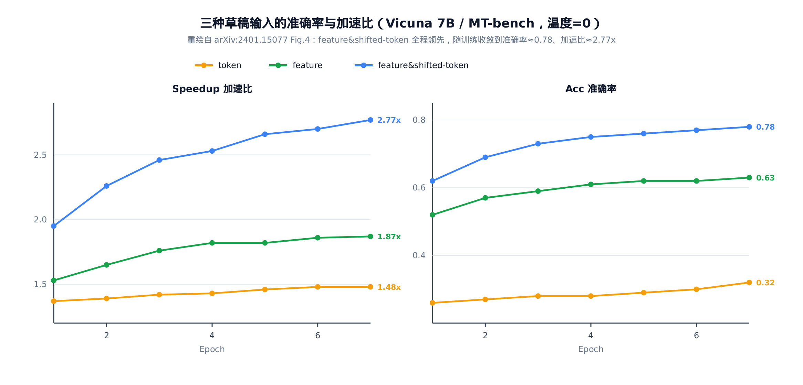
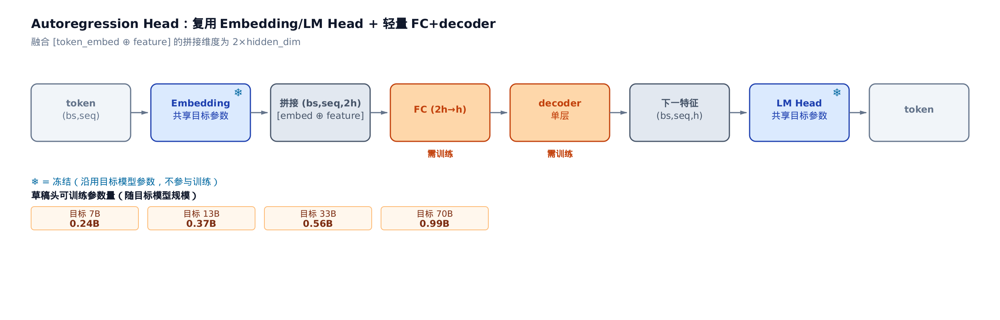
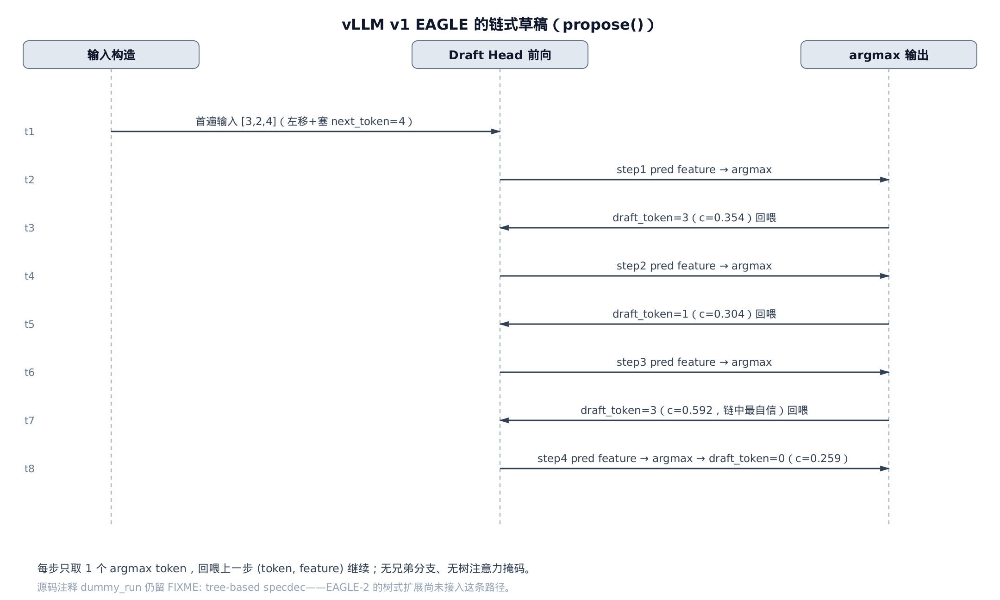

# 第 30 章　EAGLE：特征级自回归与树验证

## 你在这里



*上一章把采样从 logits 讲到下一个 token，一次前向只出一个。本章往下钻一层，读投机解码里那个草稿器 EAGLE——它怎么又快又准地一口气猜出未来好几个 token。*

投机解码（speculative decoding，用一个便宜的草稿器猜出未来若干 token、再由大模型一次前向批量验证的加速技术）的骨架是这样：草稿器（proposer，负责一次性猜出未来若干个 token 的模块）先提出 γ 个草稿 token，目标模型（target LLM，我们真正想加速的那个大模型）用一次前向验证它们，再由 rejection sampling（拒绝采样）挑出能接受的前缀，最后补一个 bonus token（验证通过时白送的一个额外 token）。[下一章](../../ch31-spec-decode/narrative/chapter.md)会把这套执行面在 vLLM 源码里走全；本章先钻进那个草稿器本身。整套机器有一个命门：**目标模型一次前向能吐几个 token，取决于草稿猜得准不准**。

猜得准不准，可以精确量化。这里的关键量是接受率 α（acceptance rate，草稿 token 被目标模型接受的比例）。α 越高，一次前向接住的前缀越长，加速比越大。所以投机解码的全部功夫，都花在一件事上——**让草稿分布 q 尽量贴近目标分布 p，同时草稿本身要够便宜**。

下一章会把 EAGLE 当成一个黑盒 proposer 接进统一契约。这一章先把黑盒打开，回答三个为什么：

- 为什么 EAGLE 不在 token 上接龙，而在**特征**（feature，目标模型 LM Head 之前那一层的隐状态，论文称第二顶层特征）上接龙？
- 为什么光有特征还不够，非得把「超前一步的 token」也喂进草稿模型？
- vLLM 落地的 EAGLE 到底长什么样，和论文里那棵漂亮的动态草稿树差在哪？

前两问是 EAGLE 论文（arXiv:2401.15077）的两大观察，第三问牵出 EAGLE-2（arXiv:2406.16858）的动态树，以及 vLLM v1 里那条朴素的链式实现。四段走：先讲动机，再推公式，然后用一棵极小的玩具模型把数字手算一遍，最后落回 `vllm/v1/spec_decode` 的真实代码。

保分布定理（rejection sampling 保证输出分布严格等于目标模型）的完整证明在[下一章](../../ch31-spec-decode/narrative/chapter.md) §31.5,本章只用它的结论，不重复推导。



只想看 vLLM 真实代码怎么跑，直接跳读 §30.2、§30.3、§30.4、§30.8；想把两大观察怎样一步步推到验收准则、再落地成链式实现跟全，就从头按序通读。

在正式进入推导前，先把全章后面才会用到的两个专门下标记号放在这里备查——遇到时回来看一眼即可，不必现在死记：

| 记号 | 含义 | 首次出现 |
|---|---|---|
| $T_{2:i+1}$ | 喂给草稿头的「超前一位」token 序列，从第 2 位到第 i+1 位——是 §30.2 记号 $T_{1:j}$ 整体下标后移一位，对应「左移一位」后塞进草稿头的那份超前 token 序列 | §30.5 |
| $F_{1:i}$ | 从第 1 步到第 i 步的历史特征序列，草稿头据此外推第 i+1 个特征 $f_{i+1}$ ——是单个特征记号 $f_j$ 的序列形式 | §30.5 |

---

## 30.1 动机：草稿的两个成本，和 token 层的天花板

投机解码要快，草稿模型就得同时满足两个互相拉扯的要求：

1. **贴合**——草稿分布 q 要像目标分布 p，接受率 α 才高；
2. **便宜**——草稿模型每步前向要远比目标模型快，不然省下的验证时间又被草稿吃回去。

历史上有两条路。第一条：拿同系列的小模型当草稿，比如用 LLaMA2-7B 给 70B 当草稿（arXiv:2401.15077 §1）。贴合度不错，但 7B 本身不便宜，端到端加速有限。第二条：Medusa 那样，直接在目标模型的特征上挂几个 MLP（多层感知机）并行预测多个 token（arXiv:2401.15077 §1）。便宜得很，但准确率只有约 0.6——草稿分布和目标差得远，接受率低。

这几种方法结构上到底差在哪，摆在一起看最直接：



*四种方法起草第 4、5 个 token，结构差在哪：标准投机采样与 Lookahead 只吃 token 接龙；Medusa 独立用某一层特征并行猜；EAGLE 把 token 与特征一起逐步回喂，链式外推。*

EAGLE 走的是第三条：**既借目标模型的特征（便宜），又保持自回归（贴合）**，把草稿准确率拉到约 0.8。它的出发点是一个反直觉的观察——

**在特征层接龙，比在 token 层接龙更容易。**

道理是这样：token 序列是自然语言的一层简单变换，离散、跳变、噪声大；而特征是连续向量，序列更规整、更好预测。所以「自回归地预测下一个特征、再用目标模型的 LM Head（语言模型头，把特征映射成词表分布的那层线性变换）把特征翻成 token」，比「直接自回归地预测下一个 token」要准（arXiv:2401.15077 §1，Fig.4）。



*左：token 直接接龙，准确率约 0.6。右：特征层自回归再过共享 LM Head。特征更规整，是 EAGLE 第一大观察。*

这就是 EAGLE 名字里 Extrapolation（外推）的由来：它在特征空间里外推下一个特征。下一节把这个观察落成记号和真实代码。

---

## 30.2 特征级自回归：在半成品语义上接着画

### 直觉

打个比方。token 是「成品文字」，一笔一画写死了；特征是「半成品语义草图」，连续、有弹性。让你接着一幅铅笔草图往下画，比让你接着一段已经誊清的钢笔字往下写，要顺手得多——草图之间的过渡是平滑的，定稿之间的跳变是突兀的。EAGLE 让草稿头在特征这幅草图上往下画，画完再借目标模型的 LM Head 誊成 token。

### 机制

先立记号（arXiv:2401.15077 §2）。目标模型的一次标准自回归是：

$$
T_{1:j} \rightarrow E_{1:j} \rightarrow f_j \rightarrow p_{j+1} \rightarrow t_{j+1}
$$

token 序列 $T_{1:j}$ 过 Embedding（词嵌入层，把离散 token 查成向量）得到 $E_{1:j}$ ，再过整个网络得到特征 $f_j$ ，LM Head 把 $f_j$ 映射成分布 $p_{j+1}$ ，采样得到下一个 token $t_{j+1}$ 。这里 $f_j$ 就是「第二顶层特征」——LM Head 前的那个隐状态。

EAGLE 的草稿头不重跑整个网络，而是直接在 $f$ 这一层外推：给定已知的特征序列，预测下一个特征 $\hat f$ ，再用**共享的** LM Head 采出草稿 token。共享是关键——LM Head 直接用目标模型的参数，不训练，所以草稿 token 和目标 token 说的是同一套「词表语言」。

真实运行长什么样？用一个 6 词表、4 维特征的玩具目标模型跑一条 γ=4 的草稿链，逐步观察草稿头产出的特征范数 ‖f‖ 和采出的 token：

<!-- trace: feature-level-autoregression -->

| step 草稿步 | input token 输入 token | pred feature ‖f‖ | draft token 采出 token | confidence c_j |
|---|---|---|---|---|
| 1 | 4 | 1.195 | 3 | 0.354 |
| 2 | 3 | 1.256 | 1 | 0.304 |
| 3 | 1 | 2.346 | 3 | 0.592 |
| 4 | 3 | 1.21 | 0 | 0.259 |

读表：每一步草稿头吃「上一步 token 的 embedding ⊕ 上一步的特征」，产出下一个特征（‖f‖ 一列 1.195→1.256→2.346→1.21，一直在演化，没有塌缩到某个定点），再过共享 LM Head argmax（取概率最大的那个 token）出一个 token（3→1→3→0，各不相同，不是退化地重复同一个）。最后一列 confidence（置信度 c_j，草稿头对该 token 的自信程度）先记下——30.7 节 EAGLE-2 算 value 时要复用它。

这条链有个干净的不变量：**它恰好产出 γ 个草稿 token 就停**。第一遍前向采出第 1 个，随后循环体跑 γ−1 次、每次产 1 个，计数器严格递减到零，有限步必停，总数 1+(γ−1)=γ。而且每步只依赖上一步的 (token, feature)，不回看更早状态——所以它是严格的**链式**（chain），不是树。这一点在 30.7 节会变成 vLLM 落地与论文原理的分水岭。

量化一下收益：本例 γ=4，只花 4 次轻量草稿头前向 + 1 次目标模型验证前向，就提出了 4 个草稿 token；而 vanilla 解码要 4 次目标前向才出 4 个 token。论文 Fig.4（Vicuna 7B，MT-bench，温度 0）量化了特征层相对 token 层的收益：草稿准确率从 token 层约 0.6 提到特征层约 0.8，加速比从 1.5x 提到 1.9x（arXiv:2401.15077 §1）。

### 源码

特征级自回归的算法本体，就是草稿模型 `forward` 的这几行（`vllm/model_executor/models/llama_eagle.py:L100`）：

```python
# vllm/model_executor/models/llama_eagle.py:L100
def forward(
    self,
    input_ids: torch.Tensor,
    positions: torch.Tensor,
    hidden_states: torch.Tensor,
) -> tuple[torch.Tensor, torch.Tensor]:
    input_embeds = self.embed_tokens(input_ids)
    hidden_states = self.fc(torch.cat((input_embeds, hidden_states), dim=-1))
    residual = None
    for layer in self.layers:
        hidden_states, residual = layer(
            positions,
            hidden_states,
            residual,
        )
    hidden_states = hidden_states + residual
    return hidden_states, hidden_states
```

四步一目了然：`embed_tokens` 把输入 token 查成 embedding；`torch.cat` 把 embedding 和传进来的目标特征 `hidden_states` 沿最后一维拼成 2h 宽；`self.fc` 降回 h 宽；过 `self.layers`（EAGLE-1 通常只 1 层 `LlamaDecoderLayer`，标准的 Transformer 解码层）预测下一个特征。返回一个二元组 `(hidden_states, hidden_states)`——两份同样的特征，一份喂共享 LM Head 采 token，一份作为下一步自回归的输入特征。

注意函数签名多了个 `hidden_states` 参数——普通语言模型的 `forward` 只吃 `input_ids`。这个多出来的入参就是「目标模型的特征」，也是 EAGLE 区别于一切 token 层方法的物理入口。它是怎么被接进来的？下节先解决一个更棘手的问题：光有特征，其实还不够。

---

## 30.3 特征不确定性：为什么非要「剧透」超前一步的 token

### 直觉

只看「我」这个字的特征 $f_I$ ，你猜不出下一个词——可能是「我**总是**（always）」，也可能是「我**马上**（am）」。走哪条，取决于目标模型这一步实际抽到了谁。这是**采样的随机性**注入的不确定性：同一个 $f_I$ ，后面能长出两个完全不同的特征分支。

草稿头要是只吃 $f_I$ ，它面对两条分支却只有一份输入，无从区分，只能预测一个「平均」的模糊特征，两边都不像。EAGLE 的破解办法简单得近乎作弊：**把目标模型实际抽到的那个 token 提前剧透给草稿头**。知道抽到的是「总是」还是「马上」，下一个特征就唯一确定了。

### 机制

形式化地说（arXiv:2401.15077 §1，Fig.3）：给定 $f_I$ ，下一特征 $f_{\mathrm{next}}$ 是随机的，因为它依赖尚未抽出的 token。但一旦把「超前一步的 token」 $t_x$ 也作为输入：

$$
f_{\mathrm{always}} \leftarrow (f_I,\ t_{\mathrm{always}}), \qquad f_{\mathrm{am}} \leftarrow (f_I,\ t_{\mathrm{am}})
$$

这里的 $\leftarrow$ 读作「由……决定/预测得出」——和上面 30.2 节 T→E→f→p→t 那条从左往右「变换成」的箭头方向相反，别混着读：那里是「输入变换成输出」，这里是「输出由哪些输入决定」。

每条分支就各自成了**确定的函数值**。不确定性没有消失，而是被 $t_x$ 这个「随机分支的选择结果」显式吸收掉了。

用玩具模型复现这个分岔：固定同一个 $f_I$ （其 ‖f_I‖=0.659），只改喂进去的超前 token（0 与 2），看草稿头产出的下一特征：

<!-- trace: feature-uncertainty-shifted-token -->

| branch 分支 | t_I | shifted 末位 token | pred feature ‖f‖ | pred f[0] | top token | top conf |
|---|---|---|---|---|---|---|
| branch_A | 1 | 0 | 1.137 | 0.587 | 1 | 0.222 |
| branch_B | 1 | 2 | 0.85 | -0.38 | 4 | 0.213 |

两条分支共用同一个 $f_I$ ，只有超前 token 不同（0 vs 2）。草稿头产出的下一特征立刻分岔：范数 1.137 vs 0.85，第一维 f[0] 0.587 vs −0.38，符号都反了；LM Head 采出的 token 也随之不同（1 vs 4）。如果草稿头只吃 $f_I$ （feature-only 方案），两条分支的输入一模一样，输出必然相同——那就永远只能猜中一条。超前 token 正是把这份随机性钉死成确定映射的钉子。

不变量：草稿头 `forward` 是纯函数（fc + decoder，没有随机性），固定 $(t_x$ 的 embedding $,\ f_I)$ 则输出唯一。分岔完全来自 $t_x$ 的取值；提供 $t_x$ ，不确定性即消除。

论文 Fig.4 量化了这一步的威力：在 feature-only 的 1.9x 基础上，加入超前一步 token 把加速比推到 2.8x（arXiv:2401.15077 §1）。§4.3.2 的输入消融进一步排出座次：feature&shifted-token（EAGLE）> feature&unshifted-token > feature/token,差距主要落在「输入含一个错误特征时的接受率 1-α」上。


*同一个 f_I 无法定下一特征。标注在边上的超前 token 唯一决定走哪条分支。这是 EAGLE 第二大观察，1.9x→2.8x。*

论文原始实测长什么样？把两大观察的三级跳一次性画全：



*三种草稿输入（token 层、特征层、特征层+超前 token）在 Vicuna 7B / MT-bench（温度=0）上的准确率与加速比对比。本节讲的两级跳——1.5x→1.9x→2.8x——到此收束成一张图。*

### 源码

「超前一步 token」在 vLLM 里怎么造出来？答案在 `set_inputs_first_pass`——EAGLE 默认路径下就一手「左移 + 塞末位」（`vllm/v1/spec_decode/llm_base_proposer.py:L656`）：

```python
# vllm/v1/spec_decode/llm_base_proposer.py:L656
if not self.needs_extra_input_slots:
    # Default EAGLE pathway: no reshaping of input tensors needed.
    # Simply rotate the input ids and leave the positions unchanged,
    # Inserting the next token ids at the last slot in each request.
    if token_indices_to_sample is None:
        token_indices_to_sample = cad.query_start_loc[1:] - 1

    num_tokens = target_token_ids.shape[0]
    # Shift the input ids by one token.
    # E.g., [a1, b1, b2, c1, c2, c3] -> [b1, b2, c1, c2, c3, c3]
    self.input_ids[: num_tokens - 1] = target_token_ids[1:]
    # Replace the last token with the next token.
    # E.g., [b1, b2, c1, c2, c3, c3] -> [a2, b2, b3, c2, c3, c4]
    self.input_ids[token_indices_to_sample] = next_token_ids

    # copy inputs to buffer for cudagraph
    if self.uses_xdrope_dim > 0 and self.draft_uses_xdrope_dim == 0:
        target_positions = target_positions[0]
    self._set_positions(num_tokens, target_positions)

    self.hidden_states[:num_tokens] = target_hidden_states

    return num_tokens, token_indices_to_sample, cad
    # … 省略：else 分支（draft_model / 并行草稿走 triton kernel 重排输入）…
```

三步对上论文的「超前」：先把目标 token 序列整体左移一位（`input_ids[:-1] = target_token_ids[1:]`）；再把每条请求的末位塞成刚采出的 `next_token_ids`（上一轮验证接受的最后一个 token，也就是这一轮的真起点）；最后把目标特征 `target_hidden_states` 原样写进 `self.hidden_states` 缓冲，position（位置编码索引）保持不动。于是喂给草稿头的 token 序列，相对它要配对的特征，整体**超前了一个时间步**——token 超前，但 token 和 feature 的位置仍一一对齐。

代码注释里那句 `Default EAGLE pathway` 值得记住：这一手轻量的左移，正是 EAGLE 之所以「不改张量形状、直接复用现有 batch」的工程红利，也是它和需要重排输入的 draft_model 路径的分野。`next_token_ids` 从哪来、`target_hidden_states` 又怎么选出来，留到 30.8 节讲运行器调用面。

---

## 30.4 Autoregression Head：一层 FC 加一层 decoder，其余全借

前两节的草稿头，结构上到底是个什么东西？EAGLE 给的答案朴素得惊人：**几乎全是借来的，只有两层需要训练**。

### 机制

草稿模型三个模块（arXiv:2401.15077 §3.1，Fig.6）：Embedding、LM Head、Autoregression Head（自回归头）。前两个直接用目标模型的参数、**不训练**——Embedding 保证草稿和目标查的是同一套词向量，LM Head 保证它们说同一套词表语言。唯一要训练的是 Autoregression Head，而它只有两层：一个 FC 层（fully-connected，全连接线性层）把拼接后的 2h 宽向量降回 h 宽，一个 decoder 层预测下一特征。

输入输出的形状流转是这样：token 序列 (bs, seq) 过共享 Embedding 成 (bs, seq, h)，与目标特征 (bs, seq, h) 拼成 (bs, seq, 2h)；FC 降回 (bs, seq, h)；decoder 层产出下一特征。「2」这个拼接倍数是整个结构的枢纽。



*雪花标记的 Embedding/LM Head 用目标参数、不训练。只有 FC 和单层 decoder 需训练。*

草稿头轻到什么程度？可训练参数随目标模型规模走：7B 目标对应 0.24B、13B 对应 0.37B、33B 对应 0.56B、70B 也只有 0.99B（arXiv:2401.15077 §4，Training）。给 70B 的大象配一只不到 1B 的草稿头，这是 EAGLE 训练成本极低的根本原因。

### 源码

这份「全借 + 两层」在 vLLM 里分两处落地。第一处是 FC 层的定义，宽度正好 `hidden_size * 2`（`vllm/model_executor/models/llama_eagle.py:L87`）：

```python
# vllm/model_executor/models/llama_eagle.py:L87
self.fc = ReplicatedLinear(
    input_size=self.config.hidden_size * 2,
    output_size=self.config.hidden_size,
    bias=False,
    params_dtype=vllm_config.model_config.dtype,
    quant_config=self.quant_config,
    prefix=maybe_prefix(prefix, "fc"),
    return_bias=False,
)
```

`ReplicatedLinear`（在每个张量并行 rank 上各存一份完整权重的线性层）的 `input_size=hidden_size * 2`,就是论文「拼接维度 2h」的字面落地；`output_size=hidden_size` 就是「降回 h」。

第二处更妙——EAGLE 的全部特有逻辑，浓缩成 `EagleProposer` 里的一个布尔标志（`vllm/v1/spec_decode/eagle.py:L10`）：

```python
# vllm/v1/spec_decode/eagle.py:L10
class EagleProposer(SpecDecodeBaseProposer):
    def __init__(
        self,
        vllm_config: VllmConfig,
        device: torch.device,
        runner=None,
    ):
        super().__init__(
            vllm_config,
            device,
            pass_hidden_states_to_model=True,
            runner=runner,
        )
```

整个类只干一件事：给基类 `SpecDecodeBaseProposer`（eagle / eagle3 / mtp / draft_model 共用的 proposer 基类）传 `pass_hidden_states_to_model=True`。这个 True 就是 30.2 节那个多出来的 `hidden_states` 入参的开关——它告诉基类：这个草稿模型除了 token,还要吃目标模型的特征。其余的链式循环、缓冲管理、CUDA graph（把前向固化成可重放计算图的加速手段）全在基类里，和别的 proposer 共享。EAGLE 的独特性，就这一行。

---

## 30.5 草稿头怎么训出来：两把尺子，与 0.1 的权重

这一节是纯原理背景。训练不在 vLLM 的推理路径里——推理仓只加载已经训好的草稿头。但不讲训练目标，就说不清草稿头为什么「校准得好」（30.7 节动态树的地基）。所以把两把尺子的数字算实。

### 机制

草稿头有两个目标，用两个损失盯着（arXiv:2401.15077 §3.2）。第一把尺子量「特征画得像不像」，用 Smooth-L1（平滑 L1 损失，小误差处平方、大误差处线性的回归损失）做特征回归：

$$
L_{\mathrm{reg}} = \mathrm{SmoothL1}\big(f_{i+1},\ \mathrm{DraftModel}(T_{2:i+1},\ F_{1:i})\big)
$$

这里 $T_{2:i+1}$ 就是 30.3 节那份左移一位的超前 token 序列， $F_{1:i}$ 是过去 i 步的历史特征序列——记号和 30.2 节的 $T_{1:j}$ 、 $f_j$ 是同一套，只是下标整体往后挪了一位（见前面的速查表）。

第二把尺子量「最终吐字对不对」。预测特征只是中间目标，终点是吐对 token,所以再加一个分类损失——把目标特征和预测特征各自过 LM Head、softmax 成分布，取交叉熵（arXiv:2401.15077 §3.2）：

$$
L_{\mathrm{cls}} = \mathrm{CrossEntropy}(p_{i+2},\ \hat p_{i+2})
$$

两把尺子读数不在一个量级——分类损失天生比回归损失大一个数量级。所以合起来时给分类项乘 0.1 拉回同一量级（arXiv:2401.15077 §3.2）：

$$
L = L_{\mathrm{reg}} + w_{\mathrm{cls}}\, L_{\mathrm{cls}}, \qquad w_{\mathrm{cls}} = 0.1
$$

手算两种情形——特征预测准、特征预测偏——看两把尺子各读多少：

<!-- trace: draft-training-objective -->

| scenario 情形 | L_reg (Smooth-L1) | L_cls (CE) | w_cls | w_cls·L_cls | L = L_reg + w_cls·L_cls |
|---|---|---|---|---|---|
| accurate 特征准 | 0.001 | 1.496 | 0.1 | 0.15 | 0.151 |
| inaccurate 特征偏 | 0.417 | 1.518 | 0.1 | 0.152 | 0.569 |

读表：特征预测越准，回归项 L_reg 越小（0.001 vs 0.417）。分类项 L_cls 始终在 1.5 附近——因为交叉熵的下界是目标分布的熵 $H(p)>0$ （信息熵，衡量目标分布 p 自身不确定性的量，只要 p 不是退化的 one-hot 分布就恒为正），不是 0，跟特征准不准关系不大。两情形对比正好印证 §3.2 那句「分类损失比回归损失大一个数量级」：准情形 1.496/0.001 差了约 1500 倍，偏情形 1.518/0.417 也差约 3.6 倍。分类项乘上 0.1 后约 0.15，和偏情形的 L_reg=0.417 同量级——这就是权重取 0.1 的定量动机。

不变量：组合损失恒非负，且分类项有正的熵下界。这一步「交叉熵 = 熵 + KL 散度」不是凭空甩出来的等式，而是信息论里的标准分解，任何信息论教材都能查到——这里把它展开一遍，看清「凭什么」成立：

$$
\mathrm{CrossEntropy}(p, \hat p) = -\sum_x p(x)\log \hat p(x) = -\sum_x p(x)\log p(x) + \sum_x p(x)\log\frac{p(x)}{\hat p(x)} = H(p) + \mathrm{KL}(p\,\|\,\hat p)
$$

第一步只是交叉熵的定义；第二步是在被求和的每一项上同时加、减同一项再重新分组（恒等变形，不改变式子的值），逐元素地看就是

$$
-\log \hat p(x) = -\log p(x) + \log\frac{p(x)}{\hat p(x)}
$$

拆出来的两块，第一块正是信息熵 H(p) 的定义，第二块正是 KL 散度的定义。于是

$$
L_{\mathrm{cls}} = \mathrm{CrossEntropy}(p, \hat p) = H(p) + \mathrm{KL}(p\,\|\,\hat p) \ge H(p) > 0
$$

其中 KL（Kullback-Leibler 散度，衡量两分布差距的非负量）当且仅当 $\hat p = p$ 时取零（arXiv:2401.15077 §3.2）。下降只能靠 L_reg→0（特征拟合）和 KL→0（分布对齐），所以最小化确实同时逼近「特征像」与「吐字对」。论文另外加了一手数据增强：训练时给目标特征加 $\mathcal U(-0.1, 0.1)$ 的均匀噪声，抑制自回归推理时的误差累积。

这些机制不进推理路径，但它训出的草稿头有一个宝贵性质——**置信度校准得好**,30.7 节会靠它做零成本的动态树排序。

---

## 30.6 验收准则：接受、拒绝与残差分布

草稿提出来了，怎么验收？这一节把接受准则的数字算实。保分布定理的完整证明留给下一章 §31.5，这里只借结论。

### 直觉

验收员按「目标想要的概率 / 草稿给出的概率」掷骰子决定收不收：比值 ≥1 必收，<1 就以该比值为概率收。一旦退货，后面的草稿 token 全作废，并从「目标想要、但草稿没给够」的余量分布里补抽一个。

### 机制

投机采样对草稿 token $\hat t$ 的接受概率（arXiv:2401.15077 §2）：

$$
\min\!\left(1,\ \frac{p_{j+i}(\hat t_{j+i})}{\hat p_{j+i}(\hat t_{j+i})}\right)
$$

一旦拒绝，后续 token 全部丢弃，该位从残差分布重采（arXiv:2401.15077 §2）：

$$
\mathrm{norm}\big(\max(0,\ p_{j+i} - \hat p_{j+i})\big)
$$

手算一条 γ=3 的链，逐位判接受：

<!-- trace: speculative-sampling-acceptance -->

| position 位 | draft token t̂ | p̂(t̂) 草稿概率 | p(t̂) 目标概率 | ratio min(1,p/p̂) | u | verdict |
|---|---|---|---|---|---|---|
| 1 | 1 | 0.7 | 0.6 | 0.857 | 0.3 | accept 收 |
| 2 | 0 | 0.55 | 0.5 | 0.909 | 0.5 | accept 收 |
| 3 | 3 | 0.75 | 0.5 | 0.667 | 0.9 | reject 退，从残差重采 token 0 |

读表：位 1、2 的随机数 u（0.3、0.5）小于接受比（0.857、0.909），收；位 3 的 u=0.9 超过接受比 0.667,退货，后续全弃。残差分布归一后是 [0.4, 0.4, 0.2, 0.0]:被拒的 token 3 残差质量被清零（max(0, 0.5−0.75)=0），从余量里补抽 token 0。

这个 [0.4, 0.4, 0.2, 0.0] 怎么来的？位 3 处目标分布 $p$ 和草稿分布 $\hat p$ 在整个 4 词词表上的取值都摆出来，逐元素算一遍就能亲手验证：

| token | p（目标分布） | p̂（草稿分布） | max(0, p−p̂) | 归一化残差 |
|---|---|---|---|---|
| 0 | 0.20 | 0.10 | 0.10 | 0.4 |
| 1 | 0.20 | 0.10 | 0.10 | 0.4 |
| 2 | 0.10 | 0.05 | 0.05 | 0.2 |
| 3（被拒 t̂） | 0.50 | 0.75 | 0.00 | 0.0 |

`max(0, p−p̂)` 那一列加总是 0.10+0.10+0.05+0.00=0.25；每个元素除以 0.25 归一化，正好得到 [0.4, 0.4, 0.2, 0.0]。

不变量：接受比落在 $[0,1]$;残差逐元素非负、归一后是合法分布；被拒 token 处 $p-\hat p<0$ 被截为 0,所以永远不会重抽到刚被拒的那个 token。链式验证遇首个拒绝即停。**输出分布严格等于目标模型采样**——这条保分布定理的完整证明（残差分布 + Gumbel-max 免归一化采样）在 [第 31 章：投机解码](../../ch31-spec-decode/narrative/chapter.md) §31.5,本章不重复。

为什么期望能这样按前缀积求和？链在位置 i 被接受，当且仅当前 i 位全部通过，其概率正是前 i 个接受比的连乘（前缀积）；对每个位置「是否被接受」这个 0/1 变量取期望、再对所有位置求和（期望的线性性——多个随机变量之和的期望，等于各自期望之和，不要求它们相互独立），就得到 E=Σ前缀积。

量化加速来源：本例逐位接受比 α=[0.857, 0.909, 0.667],前缀积 [0.857, 0.779, 0.519],期望被接受草稿数 E=Σ前缀积=2.156,加 1 个 bonus token,平均每次目标前向产出 3.156 个 token。这落在论文实测平均接受长度 τ（average acceptance length,每次目标前向平均接受的 token 数）约 3.2–4.5 的量级内（arXiv:2401.15077 Table 1/2）——一次前向多吐三四个 token,加速就是这么来的。

链式验证还有优化空间：同一位置只有一个候选，第一个被拒就散场。下节的树验证给同一位置多备几个兄弟候选，拒了还能再试。

---

## 30.7 从链到树：树验证与 EAGLE-2 的动态草稿树

链式草稿一次目标前向只核一条路径。EAGLE 论文（§3.1、§3.3）和 EAGLE-2（arXiv:2406.16858）把它升级成**树**:一次前向核多条分支，期望接受长度更长。这里牵出两个机制——树验证的多轮投机采样，和 EAGLE-2 决定「长哪棵树」的 value 排序。

### 树验证：多轮投机采样

论文里的「树」到底长什么样？先看一眼真实规模，再讲验证规则：


*左：论文 Fig.9 里 EAGLE 真实使用的草稿树（树注意力）。右：去掉树注意力后对应的链式结构。同一份算力预算，树式一次前向验证 27 个候选，链式只验证 6 个。*

#### 直觉

链式：同一位置一个候选，拒了就停。树式：同一位置有 k 个兄弟候选，第一个被拒，把它的「概率余量」传给第二个候选再试一次——多一次机会，多接受一截。这就是多轮投机采样（multi-round speculative sampling,SpecInfer 同款),保证树草稿下输出分布仍等于目标模型。

> 直觉：SpecInfer（Miao et al., 2023）用一组小模型并行生成树状草稿，并较早把「拒绝后转而尝试兄弟候选」的树验证形式化证明为保分布——这里点名只为溯源，具体引用号本章尚未核实，故不点名。本章已经借 EAGLE 论文自己的 Appendix A.2 Algorithm 1 把多轮采样算法和终止性论证讲全，不依赖那篇论文，下面的推导可以照样往下走。

#### 机制

树的每个节点上，k 个兄弟候选依次判接受(arXiv:2401.15077 Appendix A.2, Algorithm 1)。和链式的区别就一处：某候选被拒时，**不**立刻从残差分布采，而是把目标分布调成残差分布，再拿下一个兄弟候选来试。全被拒才从最终残差分布采一个 fresh token。

手算一个节点、3 个兄弟候选(此处只展示前两轮就分出胜负):

<!-- trace: tree-draft-verification -->

| round 轮 | candidate token | p(t) 目标(当前) | p̂(t) 草稿 | ratio min(1,p/p̂) | u | verdict |
|---|---|---|---|---|---|---|
| 1 | 2 | 0.15 | 0.7 | 0.214 | 0.9 | reject 退，p ← norm(max(0,p-p̂)) |
| 2 | 0 | 0.545 | 0.55 | 0.992 | 0.2 | accept 收 |

读表：轮 1 候选 token 2,目标只给 0.15、草稿却给 0.7,接受比仅 0.214,u=0.9,拒；关键是不重采，而是把目标分布调成残差再试。轮 2 候选 token 0,在被抬高的残差分布下目标概率升到 0.545,接受比 0.992,u=0.2,收。**链式在轮 1 就会停在 0 个接受，树式却接住了 token 0**——这一截就是树验证的净赚。

不变量：多轮采样在 ≤k 个兄弟内终止(循环变量每轮 +1、上界 k);每轮拒绝后把目标分布调成残差分布，仍合法，下一轮判据良定义；树的各节点独立套用同一判据，整棵树验证仍保目标分布(arXiv:2401.15077 §3.3)。


*候选 token 2 接受比 0.214、u=0.9 被拒，余量传下一候选。候选 token 0 接受比 0.992,接受。链式此处停在 0 接受。*

论文 Table 5 量化整体收益：树草稿/树验证相比链式，平均接受长度 τ 提升约 +0.6–0.8、加速比提升约 +0.3–0.5,且不增加前向次数、只增加每次前向处理的 token 数(arXiv:2401.15077 §4.3.1)。

#### 源码：树验证在 vLLM v1 里还没落地

多轮投机采样是论文原理，但 vLLM v1 的草稿路径还没接进来。证据留在 `dummy_run`(预热时空跑一遍前向、给 CUDA graph 定形状的函数)的一行 FIXME 里(`vllm/v1/spec_decode/llm_base_proposer.py:L1402`):

```python
# vllm/v1/spec_decode/llm_base_proposer.py:L1402
# FIXME: when using tree-based specdec, adjust number of forward-passes
# according to the depth of the tree.
only_one_forward_pass = is_graph_capturing or self.parallel_drafting
for fwd_idx in range(
    1 if only_one_forward_pass else self.num_speculative_tokens
):
    # … 省略：逐次前向的 batch/padding 逻辑 …
```

前向次数直接按 `num_speculative_tokens` 线性来——一条链一步一次，没有「按树深调整前向次数」的分支。那句 FIXME 就是路标：树式投机解码是规划，当前落地是它的链式退化。这也是为什么本节的树验证与下面的动态树都归在「原理」，vLLM 真实代码要等到 30.8 节才登场。

### EAGLE-2:用置信度之积决定长哪棵树

树能一次核多分支，但分支不能瞎长——算力有限，得把力气花在「最可能被整条接受」的路径上。怎么在**不惊动目标模型**的前提下判断哪条路径最可能被接受？这是 EAGLE-2 的核心贡献。

#### 直觉

先看第一手动机：为什么静态树不够用？


*同一个位置（比如 P1）在不同 query 上，实测接受率可以从接近 0 跳到接近 1——静态固定树形状，对简单 query 浪费候选，对难 query 又给得不够。*

静态树对好预测的位置和难预测的位置分配同样多候选，浪费算力——EAGLE-2 论文实测（上图 Fig.5）显示，同一位置在不同 query 上的接受率方差很大，不只跟位置有关，还跟上下文有关。这才是需要按上下文动态调整树形的动机。一个具体例子最能说明问题：


*同一个「够不够确定」，树该不该跟着变形：query="10+2"难猜时两种树都对，长 2 个候选；query="10+2="好猜时下一个 token 几乎唯一确定，EAGLE 的静态树仍固定长 2 个（浪费一个名额），EAGLE-2 的动态树只长 1 个（刚好够）。*

有了这条动机，再看 EAGLE-2 的解法。一条草稿路径能整条被接受，当且仅当路上每一步都被接受。所以它的「全局接受率」= 路径上各步接受率的连乘。麻烦是，真实接受率要目标模型前向才知道。EAGLE-2 的观察是：草稿头**校准得好**——它自己的置信度 c_j 约等于真实接受率 p_j（这里的 $p_j$ 是「该节点被接受」这一个标量概率，和 30.6 节 $p_{j+i}(\hat t)$ 那种「目标分布在某个具体 token 上的取值」含义不同——两者只是字母撞了，不是同一个记号）。于是直接拿置信度连乘当路径价值 $V_i$,零成本给节点排序(arXiv:2406.16858 §4.1):

$$
V_i = \prod_{t_j \in \mathrm{Path}(\mathrm{root},\, t_i)} p_j \;\approx\; \prod_{t_j \in \mathrm{Path}(\mathrm{root},\, t_i)} c_j
$$

#### 机制

动态树分两阶段(arXiv:2406.16858 §4.1、§4.2):**扩展阶段**每层只展开 value 最高的 top-k 节点向下长；**重排阶段**对全树的 value 取 top-m,摊平成一维草稿，并按树结构改注意力掩码(每个 token 只能看到它的祖先，即树注意力)。

手算一棵深度 2、每节点 2 叉的小树，看 value 怎么排序：

<!-- trace: eagle2-dynamic-draft-tree -->

| node 节点 | depth 深 | token | confidence c_j | value V=∏c | top-m 选中 |
|---|---|---|---|---|---|
| d0_t4 | 0 | 4 | 1.0 | 1.0 | yes |
| d1_t3 | 1 | 3 | 0.354 | 0.354 | yes |
| d1_t5 | 1 | 5 | 0.212 | 0.212 | yes |
| d2_t1a | 2 | 1 | 0.304 | 0.108 | yes |
| d2_t0a | 2 | 0 | 0.291 | 0.103 | no |
| d2_t1b | 2 | 1 | 0.354 | 0.075 | no |
| d2_t0b | 2 | 0 | 0.342 | 0.073 | no |

读表：根节点(已接受的起点)置信度固定 1.0、V=1.0。每个节点 $V=$ 从根到它路径上的置信度之积：d1 层 V=c(0.354、0.212),d2 层 V=父 V×c(如 d2_t1a=0.354×0.304=0.108)。重排取全树 top-m=4,选中 V 最高的 {根， d1_t3, d1_t5, d2_t1a}。

有个精妙的对照：**d2_t1b 的局部置信度 c=0.354 比 d2_t1a 的 0.304 更高，却落选**——因为它挂在价值更低的父节点 d1_t5 下，路径价值 V=0.075 反而更低。排序看的是全局 V,不是局部 c。

这背后有个不变量保证「选出来的一定是一棵连通子树」：value 随深度单调不增(arXiv:2406.16858 §4.2)——

$$
V_{\mathrm{child}} = V_{\mathrm{parent}} \cdot c_{\mathrm{child}} \le V_{\mathrm{parent}}
$$

因为置信度 c∈[0,1]，所以父节点价值恒不小于子节点价值——这是单调性本身。当两个节点 value 相等时，排序规则「同值优先浅层」优先保留更浅的那个；这条打破平局的规则保证了：对任意被选中的节点，其父节点的排序键 $(-V, \mathrm{depth})$ 一定不劣于它自己（父节点 V 更大，或者深度更浅，两者任一都让排序键更优）。父节点排序键不劣，就必然也落在 top-m 之内——也就是说，只要某个节点被选中，它的父节点也一定被选中，选中集合对「取父节点」这个操作封闭。子树里任何被选中的节点都能沿父指针一路走回根、且全程留在选中集合内，这正是「连通」的含义(arXiv:2406.16858 §4.2)。这正是「用 ∏ 置信度近似 ∏ 接受率」能成立的结构前提。


*value V=路径置信度之积，随深度递减。top-m 取全树最高 4 个。d2_t1b 局部 c 更高却因 V 更低落选。*

那「校准得好」这个前提，凭什么信？


*4000 个样本按置信度分 5 桶。每桶均值几乎相等：0.101↔0.113、0.499↔0.518、0.897↔0.888。草稿头良好校准。*

把 4000 个 (置信度， 是否接受) 样本按置信度分 5 桶，每桶里「平均置信度」和「实测接受率」几乎相等(0.101↔0.113、0.305↔0.312、0.499↔0.518、0.702↔0.713、0.897↔0.888)——草稿头的自信度确实约等于真实接受率(arXiv:2406.16858 §3.2,Fig.6)。这就是 $V_i=\prod c_j$ 能代替真实接受率之积来排序、无需目标前向的合法性依据。而草稿头之所以校准得好，回头看正是 30.5 节那个交叉熵分类损失盯着「吐字对不对」训出来的。

---

## 30.8 落地：vLLM v1 的 EAGLE 是一条链

讲完论文那棵漂亮的动态树，该收回到 vLLM 的真实代码了。这里有个必须说清的落差：**vLLM v1 默认的 EAGLE 路径，是链式，不是树**。上面 30.7 节的树验证、动态树、树注意力，都是论文原理；vLLM 当前落地是它们的 k=1 退化特例。

### 链式草稿循环

`propose()` 的骨架分两段。第一段：草稿模型对整段 prefix 前向一次，取每条请求最后一个位置的特征采出第 1 个草稿 token(`vllm/v1/spec_decode/llm_base_proposer.py:L461`):

```python
# vllm/v1/spec_decode/llm_base_proposer.py:L461
    ret_hidden_states = self.model(**model_kwargs)
    if not self.model_returns_tuple():
        last_hidden_states = ret_hidden_states
        hidden_states = last_hidden_states
    else:
        last_hidden_states, hidden_states = ret_hidden_states

sample_hidden_states = last_hidden_states[token_indices_to_sample]

# Early exit if there is only one draft token to be generated.
if self.num_speculative_tokens == 1 or self.parallel_drafting:
    draft_token_ids = self._greedy_sample(sample_hidden_states)
    return draft_token_ids.view(-1, self.num_speculative_tokens)
```

`token_indices_to_sample` 挑出每条请求最后一个位置的特征，`_greedy_sample` 采出草稿 token。只要 1 个草稿 token 就在这里早退。要更多，就进第二段链式循环(`vllm/v1/spec_decode/llm_base_proposer.py:L525`):

```python
# vllm/v1/spec_decode/llm_base_proposer.py:L525
for token_index in range(self.num_speculative_tokens - 1):
    # Update the inputs.
    # cast to int32 is crucial when eagle model is compiled.
    # tensor.argmax() returns int64 by default.
    input_ids = draft_token_ids_list[-1].int()
    # … 省略：position / slot_mapping / attn_metadata 的逐步更新 …

    # copy inputs to buffer for cudagraph
    self.input_ids[:batch_size] = input_ids
    self.hidden_states[:batch_size] = hidden_states
    # … 省略：inputs_embeds 分支 …
    model_kwargs = {
        "input_ids": input_ids,
        "positions": self._get_positions(input_batch_size),
        "inputs_embeds": inputs_embeds,
    }
    if self.pass_hidden_states_to_model:
        model_kwargs["hidden_states"] = self.hidden_states[:input_batch_size]

    with set_forward_context(...):
        ret_hidden_states = self.model(**model_kwargs)
        if not self.model_returns_tuple():
            last_hidden_states = ret_hidden_states
            hidden_states = ret_hidden_states
        else:
            last_hidden_states, hidden_states = ret_hidden_states

    hidden_states = hidden_states[:batch_size]
    draft_token_ids = self._greedy_sample(last_hidden_states[:batch_size])
    draft_token_ids_list.append(draft_token_ids)

# [batch_size, num_speculative_tokens]
draft_token_ids = torch.stack(draft_token_ids_list, dim=1)
return draft_token_ids
```

看清链式的本质：循环 γ−1 次，每次把上一步采出的草稿 token(`draft_token_ids_list[-1]`)和上一步产出的特征(`hidden_states`)一起回喂(那句 `model_kwargs["hidden_states"] = ...` 就是 30.4 节 `pass_hidden_states_to_model=True` 打开的通道)。每步只保留 1 个 argmax token——**没有分支、没有兄弟候选、没有树注意力**。采 token 用的 `_greedy_sample` 干脆利落(`vllm/v1/spec_decode/llm_base_proposer.py:L386`):

```python
# vllm/v1/spec_decode/llm_base_proposer.py:L386
def _greedy_sample(self, hidden_states: torch.Tensor) -> torch.Tensor:
    """Greedy-sample draft tokens from hidden states."""
    if self.use_local_argmax_reduction:
        return self.model.get_top_tokens(hidden_states)
    return self.model.compute_logits(hidden_states).argmax(dim=-1)
```

草稿 token 一律 greedy argmax。为什么草稿阶段可以不管温度、top-p 这些采样参数？因为**草稿分布只影响接受率、不影响最终输出分布**——rejection sampling 的保分布定理(下一章 §31.5)保证了这一点。草稿猜得糙，顶多接受率低一点、慢一点，最终吐出来的文字分布分毫不差。

树式投机解码在这条路径上还没落地。`dummy_run` 里至今留着一行 `# FIXME: when using tree-based specdec, adjust number of forward-passes`(`vllm/v1/spec_decode/llm_base_proposer.py:L1402`)——树是规划，链是现实。



*首遍输入 [3,2,4](左移+塞 next_token=4)。随后四步回喂，产出 3→1→3→0。每步仅 1 个 argmax,无树。*

这张泳道图正好复现了 30.2 节那条 γ=4 的链：首遍对左移后的序列前向、采出草稿 token 3(c=0.354),随后逐步回喂产 1(0.304)→3(0.592)→0(0.259)——和那张逐步表一模一样，只是换成了「谁调用谁」的视角。

### 运行器调用面

最后一块拼图：草稿器的入参从哪来？运行器(model runner,驱动每步前向的宿主)在 `propose()` 之前先备好料(`vllm/v1/worker/gpu_model_runner.py:L4825`):

```python
# vllm/v1/worker/gpu_model_runner.py:L4825
draft_token_ids = self.drafter.propose(
    target_token_ids=target_token_ids,
    target_positions=target_positions,
    target_hidden_states=target_hidden_states,
    next_token_ids=next_token_ids,
    token_indices_to_sample=token_indices_to_sample,
    sampling_metadata=sampling_metadata,
    common_attn_metadata=common_attn_metadata,
    mm_embed_inputs=mm_embed_inputs,
    num_rejected_tokens_gpu=num_rejected_tokens_gpu,
    slot_mappings=slot_mappings,
)
```

两个入参值得点名。`target_hidden_states`——30.2 节那份「目标特征」——来源二选一(`vllm/v1/worker/gpu_model_runner.py:L4809`):

```python
# vllm/v1/worker/gpu_model_runner.py:L4809
if self.use_aux_hidden_state_outputs:
    assert aux_hidden_states is not None
    target_hidden_states = torch.cat(
        [h[:total_num_tokens] for h in aux_hidden_states], dim=-1
    )
else:
    target_hidden_states = hidden_states[:total_num_tokens]
```

`use_aux_hidden_state_outputs` 为真时，把目标模型多个层的辅助特征沿最后一维拼起来——这是 EAGLE-3 路径(用多层特征而非单层);否则直接取目标模型最后一层的 hidden,这是我们全章讲的 EAGLE-1 路径。

> 直觉：EAGLE-3 是 EAGLE 之后的后续工作——让草稿头不止吃目标模型最后一层的特征，还把中间若干层的特征拼接起来一并喂进去，抓取更丰富的语义层次。具体的训练方式与结构留给它自己的论文，本章不展开；这里引用号尚未核实，暂不点名具体 arXiv 编号。

`next_token_ids` 则由 `prepare_next_token_ids_padded` 从上一轮已接受的 `sampled_token_ids` 里取每条请求最后一个 token,正是 30.3 节塞进末位的那个真起点。

草稿器产出 `[batch, num_speculative_tokens]` 的草稿后，就交给下一章那个 rejection sampler 做接受/拒绝 + 残差采样。一个完整的投机步，到此闭环。

---

## 30.9 这章解决了什么

EAGLE 用两个观察改写了投机解码的草稿阶段：

- **特征级自回归**——在连续、规整的第二顶层特征上外推，再借共享 LM Head 翻成 token,比在离散跳变的 token 上直接接龙更准(约 0.8 vs 0.6,1.5x→1.9x)。落到 `llama_eagle.py` 的 `forward`,就是「拼接特征 + FC 降维 + 单层 decoder」。
- **超前一步 token**——采样随机性给特征注入的不确定性，靠把目标实际抽到的 token 剧透给草稿头来消解(1.9x→2.8x)。落到 `set_inputs_first_pass` 的「左移 + 塞末位」。

草稿头轻到 70B 目标只配 0.99B、且 Embedding/LM Head 全借目标参数，训练成本极低；它的置信度校准得好，让 EAGLE-2 能用 $V_i=\prod c_j$ 零成本地长动态草稿树、一次目标前向核多条分支。

但读代码要认清落差：**vLLM v1 默认的 EAGLE 是一条链，不是树**。论文那棵动态树、树注意力、多轮投机采样，都是原理；vLLM 当前落地是它们的 k=1 退化，`dummy_run` 里那行 FIXME 就是路标。整套草稿器又薄又通用——`EagleProposer` 全部的特有逻辑，不过是给基类传一个 `pass_hidden_states_to_model=True`。

而无论草稿多准多糙，最终输出分布分毫不差——这份底气来自[下一章](../../ch31-spec-decode/narrative/chapter.md) §31.5 的保分布定理。EAGLE 只负责让草稿更贴合、让加速更多，从不动那条分布保证的红线。下一章就接着看 vLLM 的投机执行面：怎么把这些变长草稿摊平进一批、喂目标模型一次前向、再逐位接受或拒绝。
